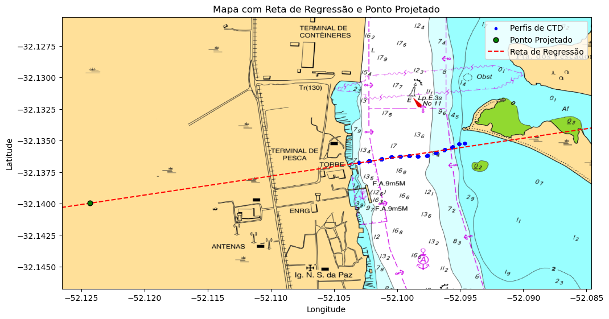

# Rotina de Processamento dos Dados de CTD

### Importando Bibliotecas Utilizadas


```python
# Importa bibliotecas para manipulação de dados tabulares
import pandas as pd  # Para manipulação de dados tabulares
import numpy as np  # Para operações numéricas eficientes
import seawater as sw  # Para cálculos relacionados à água do mar

# Importa bibliotecas para manipulação de expressões regulares
import re

# Importa bibliotecas para manipulação de datas e horas
import datetime  # Para manipulação de datas e horas
import pytz  # Para manipulação de fusos horários
from tzlocal import get_localzone  # Para obter o fuso horário local

# Importa bibliotecas para visualização de dados
import matplotlib.pyplot as plt  # Para visualização de dados em gráficos
import plotly.express as px  # Para visualização interativa de dados
import plotly.graph_objects as go  # Para criação de gráficos interativos
from plotly.subplots import make_subplots  # Para criar subplots em gráficos do Plotly
import dash  # Para construção de dashboards interativos
from dash import dcc, html  # Componentes para construção de interfaces gráficas com Dash
from dash.dependencies import Input, Output  # Para definir inputs e outputs em Dash
import plotly.io as pio  # Importa o módulo plotly.io com o nome abreviado pio

# Importa bibliotecas para manipulação de dados geoespaciais
import geopandas as gpd  # Para manipulação de dados geoespaciais
from shapely.geometry import Point, LineString  # Para representação de geometrias geoespaciais
from rasterio.plot import show  # Para exibição de imagens raster
import rasterio  # Para manipulação de dados raster

# Importa bibliotecas para interpolação de dados
from scipy.interpolate import griddata  # Para interpolação de dados em grade
import scipy.interpolate as si

# Importa bibliotecas para widgets interativos
import ipywidgets as widgets  # Para criação de widgets interativos
from IPython.display import display, HTML, clear_output  # Para exibir widgets e HTML no notebook
```

### Defindo o Caminho dos Arquivos 


```python
basemap_path = '/home/ppms/Documents/TCC_Organizado/repositório_github/dados/basemap_cNautica.tif'  # Caminho para o arquivo de mapa base

GPXfile = '/home/ppms/Documents/TCC_Organizado/repositório_github/dados/GPS_20210227.gpx'  # Caminho para o arquivo GPX contendo dados de GPS

CTDfile = '/home/ppms/Documents/TCC_Organizado/repositório_github/dados/202102270755_ASTD152-ALC-R02_0237_075509.Csv'  # Caminho para o arquivo CSV contendo dados de CTD
```

### Lendo e Organizando os Dados de GPS do arquivo GPX


```python
def processar_arquivo_gpx(GPXfile, tz='America/Sao_Paulo', remover_linhas=0):
    """
    Função para processar um arquivo GPX, incluindo a leitura, extração de dados, filtragem e ajuste do DataFrame.

    Parâmetros:
    GPXfile (str): O caminho do arquivo GPX a ser processado.
    tz (str): O fuso horário desejado para conversão (padrão é 'America/Sao_Paulo').
    remover_linhas (int): O número de linhas a serem removidas do início do DataFrame (padrão é 0).

    Retorna:
    DataFrame: Um DataFrame contendo os dados GPS processados.
    """
    # Abrir e ler o conteúdo do arquivo GPX
    with open(GPXfile, 'r') as f:
        data = f.read()
    
    # Extrair latitudes, longitudes e tempo do arquivo GPX
    lat = np.array(re.findall(r'lat="([^"]+)', data), dtype=float)  # Extrair latitudes
    lon = np.array(re.findall(r'lon="([^"]+)', data), dtype=float)  # Extrair longitudes
    time = re.findall(r'<time>([^\<]+)', data)                      # Extrair tempo
    tempo = [datetime.datetime.strptime(t, "%Y-%m-%dT%H:%M:%SZ").replace(tzinfo=datetime.timezone.utc) for t in time]
    
    # Filtrar latitudes e longitudes pela área de interesse
    LAT = lat[lat < -32]  # Filtrar latitudes
    LON = lon[lon < -52]  # Filtrar longitudes
    
    # Juntar as coordenadas com o tempo em um DataFrame
    df = pd.DataFrame({'lat': LAT, 'lon': LON, 'tempo': tempo})
    
    # Remover dados do dia 25/02/2021
    df = df[df['tempo'].dt.date != datetime.date(2021, 2, 25)]
    
    # Converter o fuso horário de UTC para Local
    tz_local = pytz.timezone(tz)
    df['tempo'] = df['tempo'].dt.tz_convert(tz_local)
    
    # Remover as primeiras linhas indesejadas
    df.drop(range(remover_linhas), inplace=True)
    
    # Resetar o índice
    df.reset_index(drop=True, inplace=True)
    
    return df


# Chamar a função processar_arquivo_gpx para processar o arquivo GPX
GPS_df = processar_arquivo_gpx(GPXfile, remover_linhas=1)

# Visualização dos primeiros registros do DataFrame
print("\nDados GPS:")
display(GPS_df.head())

```

    
    Dados GPS:


<div>
<style scoped>
    .dataframe tbody tr th:only-of-type {
        vertical-align: middle;
    }

    .dataframe tbody tr th {
        vertical-align: top;
    }

    .dataframe thead th {
        text-align: right;
    }
</style>
<table border="1" class="dataframe">
  <thead>
    <tr style="text-align: right;">
      <th></th>
      <th>lat</th>
      <th>lon</th>
      <th>tempo</th>
    </tr>
  </thead>
  <tbody>
    <tr>
      <th>0</th>
      <td>-32.136324</td>
      <td>-52.102307</td>
      <td>2021-02-26 07:54:17-03:00</td>
    </tr>
    <tr>
      <th>1</th>
      <td>-32.136302</td>
      <td>-52.102142</td>
      <td>2021-02-26 07:54:22-03:00</td>
    </tr>
    <tr>
      <th>2</th>
      <td>-32.136332</td>
      <td>-52.102094</td>
      <td>2021-02-26 07:54:28-03:00</td>
    </tr>
    <tr>
      <th>3</th>
      <td>-32.136321</td>
      <td>-52.101962</td>
      <td>2021-02-26 07:54:33-03:00</td>
    </tr>
    <tr>
      <th>4</th>
      <td>-32.136319</td>
      <td>-52.101864</td>
      <td>2021-02-26 07:54:38-03:00</td>
    </tr>
  </tbody>
</table>
</div>


### Visualizando os dados de GPS


```python
# Função para atualizar o gráfico com base no intervalo selecionado
def update_map(start_datetime, end_datetime):
    filtered_df = GPS_df[(GPS_df['tempo'] >= start_datetime) & (GPS_df['tempo'] <= end_datetime)]
    fig = px.scatter_mapbox(filtered_df, lat='lat', lon='lon', color=filtered_df.tempo.dt.date, zoom=15, title='Dados de GPS: Selecione o intervalo de tempo')
    fig.update_layout(mapbox_style="open-street-map", margin={"r":20,"t":30,"l":20,"b":20})
    fig.show()

# Controle de intervalo para selecionar datas
start_date = widgets.DatePicker(description='Start Date', value=GPS_df['tempo'].min())
end_date = widgets.DatePicker(description='End Date', value=GPS_df['tempo'].max())

# Controle para selecionar a hora
start_time = widgets.IntSlider(description='Start Hour', min=0, max=23, value=0)
end_time = widgets.IntSlider(description='End Hour', min=0, max=23, value=0)

# Chamando a função update_map quando os valores dos controles mudarem
interactive_plot = widgets.interactive(update_map, 
                               start_datetime=widgets.DatetimePicker(description='Início:', value=GPS_df['tempo'].min()),
                               end_datetime=widgets.DatetimePicker(description='Fim:', value=GPS_df['tempo'].max()))
interactive_plot
```


    interactive(children=(DatetimePicker(value=Timestamp('2021-02-26 07:54:17-0300', tz='America/Sao_Paulo'), desc…


```python
# min_date = GPS_df['tempo'].min()
# max_date = GPS_df['tempo'].max()


# # Criando uma coluna de dias
# GPS_df['dia'] = GPS_df['tempo'].dt.date
# # Criando uma coluna para horas
# GPS_df['horas'] = GPS_df['tempo'].dt.time

# # Obtendo o timezone dos dados de GPS_df['tempo']
# timezone_gps = GPS_df['tempo'].dt.tz

# external_stylesheets = ['https://codepen.io/chriddyp/pen/bWLwgP.css']

# app = dash.Dash(__name__, external_stylesheets=external_stylesheets)
# app.layout = html.Div([
#     dcc.RangeSlider(
#         id='my-range-slider',
#         step=None,  # Deixar o step como None para que o slider possa selecionar datas específicas
#         marks={date.timestamp(): str(date) for date in pd.date_range(min_date, max_date, freq='T')},  # Marcas de data e hora, freq. minutos
#         value=[min_date.timestamp(), max_date.timestamp()]  # Valor padrão: intervalo de datas completo
#     ),
#     html.Div(id='output-container-range-slider', style={'color': 'white'}),  # Estilo adicionado para alterar a cor do texto para branco
#     dcc.Graph(id='gps-map')  # Adicionando um elemento dcc.Graph para mostrar o mapa
# ])

# @app.callback(
#     [Output('output-container-range-slider', 'children'),
#      Output('gps-map', 'figure')],
#     [Input('my-range-slider', 'value')]
# )
# def update_output(selected_timestamps):
#     # Convertendo os timestamps usando o mesmo timezone
#     selected_dates = [
#         pd.to_datetime(selected_timestamps[0], unit='s').tz_localize('UTC').tz_convert(timezone_gps), 
#         pd.to_datetime(selected_timestamps[1], unit='s').tz_localize('UTC').tz_convert(timezone_gps)
#     ]
#     filtered_df = GPS_df[(GPS_df['tempo'] >= selected_dates[0]) & (GPS_df['tempo'] <= selected_dates[1])]
    
#     fig = px.scatter_mapbox(filtered_df, lon='lon', lat='lat', color='dia', 
#                             hover_name='horas', zoom=14, )  
#     fig.update_layout(
#         title='Coordenadas do GPS',
#         #xaxis_title='Longitude',
#         #yaxis_title='Latitude',
#         mapbox_style="open-street-map",
#         autosize=True,
#         height=600
#     )
    
#     # fig.update_xaxes(showspikes=True, spikecolor="black", spikethickness=2)
#     # fig.update_yaxes(showspikes=True, spikecolor="black", spikethickness=2)
    
#     return f'Você selecionou o intervalo de datas: {selected_dates[0]} a {selected_dates[1]}', fig

# if __name__ == '__main__':
#     app.run(debug=True)
```


```python
del GPXfile, processar_arquivo_gpx
```

### Leitura do arquivo CSV e processamento inicial dos dados de CTD


```python
def processar_dados_csv(CTDfile):
    # Definir a string que indica o início dos dados
    string_inicio_dados = '[Item]\n'

    # Ler o arquivo CSV como uma lista de strings
    with open(CTDfile, 'r') as f:
        linhas = f.readlines()

    # Encontrar o índice da linha que contém a string de início dos dados
    indice_inicio_dados = linhas.index(string_inicio_dados)

    # Nomes originais das colunas
    col_nomes_orig = linhas[indice_inicio_dados+1]

    # Novos nomes das colunas
    col = ['tempo','pressao', 'temperatura', 'salinidade', 'condutividade', 'ec', 'densidade', 
         'sigmat', 'chlflu', 'chla', 'turbidez', 'do%', 'domgl', 'dommoll', 'bateria']

    # Ler o arquivo CSV e definir os novos nomes das colunas
    ctd_df = pd.read_csv(CTDfile, header=indice_inicio_dados+1, sep=',', index_col=False, names=col)

    # Ajuste do tipo de dados da coluna 'Datetime'
    ctd_df['tempo'] = pd.to_datetime(ctd_df['tempo'])
    
    # Definir o fuso horário desejado
    tz_default = pytz.timezone('America/Sao_Paulo')
    timezones = pytz.all_timezones
    
    tz_desejado_dropdown = widgets.Dropdown(options=timezones, value=tz_default.zone, description='Fuso Horário:')
    
    def atualizar_fuso_horario(tz_desejado):
        tz_desejado = pytz.timezone(tz_desejado)
        
        # Verificar se os valores já estão cientes do fuso horário
        if ctd_df['tempo'].dt.tz is None:
            ctd_df['tempo'] = ctd_df['tempo'].dt.tz_localize(tz=tz_desejado)
        else:
            ctd_df['tempo'] = ctd_df['tempo'].dt.tz_convert(tz=tz_desejado)
        
        print("Fuso horário atualizado para:", tz_desejado)

    
    # Exibir o dropdown para seleção do fuso horário
    interact_output = widgets.interactive_output(atualizar_fuso_horario, {'tz_desejado': tz_desejado_dropdown})
    display(tz_desejado_dropdown, interact_output)


    padrao = ['tempo','pressao', 'temperatura', 'salinidade', 'turbidez']
    
    # Criar os checkboxes
    checkboxes = [widgets.Checkbox(description=opcao, value=opcao in padrao) for opcao in col]

    # Número de colunas desejado
    num_colunas = round(len(col)/4)
    
    # Calcular o número de linhas necessário
    num_linhas = -(-len(col) // num_colunas)  # Ceil division
    
    # Criar uma grade para organizar os checkboxes em duas colunas
    w = widgets.GridBox(checkboxes, layout=widgets.Layout(grid_template_columns=f"repeat({num_colunas}, 200px)"))
    
    
    print("Selecione os parâmetros que serão utilizados:")
    # Mostrar os checkboxes em duas colunas
    display(w)

    check = widgets.ToggleButton(
            value=False,
            description='Selecionar',
            disabled=False,
            button_style='info', # 'success', 'info', 'warning', 'danger' or ''
            tooltip='Clique para salvar a seleção das colunas',
            icon='check' # (FontAwesome names without the `fa-` prefix)
    )    
    display(check)
    
    def fechar_grid(change):
        if change['new']:
            w.close()
            check.close()
            tz_desejado_dropdown.close()
    
    # Adicione um observador para o valor do botão de alternância
    check.observe(fechar_grid, names='value')

    colunas_selecionadas = []
    for idx, chkbx in enumerate(checkboxes):
        if chkbx.value == True:
            colunas_selecionadas.append(col[idx])
    
    
    # Mantendo apenas as colunas selecionadas
    ctd_df = ctd_df.loc[:, colunas_selecionadas]


    return ctd_df


CTD_df = processar_dados_csv(CTDfile)
```


    Dropdown(description='Fuso Horário:', index=199, options=('Africa/Abidjan', 'Africa/Accra', 'Africa/Addis_Abab…


    Output()


    Selecione os parâmetros que serão utilizados:


    GridBox(children=(Checkbox(value=True, description='tempo'), Checkbox(value=True, description='pressao'), Chec…


    ToggleButton(value=False, button_style='info', description='Selecionar', icon='check', tooltip='Clique para sa…


```python

```


```python
del CTDfile, get_localzone, processar_dados_csv, pytz
```


```python
display(CTD_df.head())
```


<div>
<style scoped>
    .dataframe tbody tr th:only-of-type {
        vertical-align: middle;
    }

    .dataframe tbody tr th {
        vertical-align: top;
    }

    .dataframe thead th {
        text-align: right;
    }
</style>
<table border="1" class="dataframe">
  <thead>
    <tr style="text-align: right;">
      <th></th>
      <th>tempo</th>
      <th>pressao</th>
      <th>temperatura</th>
      <th>salinidade</th>
      <th>turbidez</th>
    </tr>
  </thead>
  <tbody>
    <tr>
      <th>0</th>
      <td>2021-02-27 07:55:15-03:00</td>
      <td>-1.245</td>
      <td>24.985</td>
      <td>0.015</td>
      <td>1.57</td>
    </tr>
    <tr>
      <th>1</th>
      <td>2021-02-27 07:55:15-03:00</td>
      <td>-1.245</td>
      <td>24.990</td>
      <td>0.015</td>
      <td>1.46</td>
    </tr>
    <tr>
      <th>2</th>
      <td>2021-02-27 07:55:15-03:00</td>
      <td>-1.245</td>
      <td>24.990</td>
      <td>0.015</td>
      <td>2.37</td>
    </tr>
    <tr>
      <th>3</th>
      <td>2021-02-27 07:55:15-03:00</td>
      <td>-1.245</td>
      <td>24.989</td>
      <td>0.015</td>
      <td>3.13</td>
    </tr>
    <tr>
      <th>4</th>
      <td>2021-02-27 07:55:15-03:00</td>
      <td>-1.245</td>
      <td>24.984</td>
      <td>0.015</td>
      <td>3.08</td>
    </tr>
  </tbody>
</table>
</div>


### Visualizando os perfis verticais


```python
# Criar subplots
fig = make_subplots(rows=1, cols=3, shared_yaxes=True, subplot_titles=('Salinidade x Pressão', 'Temperatura x Pressão', 'Turbidez x Pressão'))

# Adicionar perfil de salinidade x pressão
fig.add_trace(go.Scatter(x=CTD_df['salinidade'], y=CTD_df['pressao'], mode='markers', name='Salinidade',
                         line=dict(color='blue')), row=1, col=1)
fig.update_xaxes(title_text="Salinidade", row=1, col=1)
fig.update_yaxes(title_text="Pressão (dB)", autorange="reversed", row=1, col=1)

# Adicionar perfil de temperatura x pressão
fig.add_trace(go.Scatter(x=CTD_df['temperatura'], y=CTD_df['pressao'], mode='markers', name='Temperatura',
                         line=dict(color='orange')), row=1, col=2)
fig.update_xaxes(title_text="Temperatura (°C)", row=1, col=2)
fig.update_yaxes(autorange="reversed", showticklabels=True, row=1, col=2)

# Adicionar perfil de turbidez x pressão
fig.add_trace(go.Scatter(x=CTD_df['turbidez'], y=CTD_df['pressao'], mode='markers', name='Turbidez',
                         line=dict(color='green')), row=1, col=3)
fig.update_xaxes(title_text="Turbidez (FTU)", row=1, col=3)
fig.update_yaxes(autorange="reversed", showticklabels=True, row=1, col=3)

# Atualizar layout do gráfico
fig.update_layout(height=600,autosize=True, title_text="Perfis Verticais")


# Mostrar o gráfico
fig.show()
```


<div>                            <div id="095053da-15db-4bab-90c9-fa6589eeeb69" class="plotly-graph-div" style="height:600px; width:100%;"></div>            <script type="text/javascript">                require(["plotly"], function(Plotly) {                    window.PLOTLYENV=window.PLOTLYENV || {};                                    if (document.getElementById("095053da-15db-4bab-90c9-fa6589eeeb69")) {                    Plotly.newPlot(                        "095053da-15db-4bab-90c9-fa6589eeeb69",                        [{"line":{"color":"blue"},"mode":"markers","name":"Salinidade","x":[0.015,0.015,0.015,0.015,0.015,0.015,0.015,0.015,0.015,0.015,0.015,0.015,0.015,0.015,0.015,0.015,0.015,0.015,0.015,0.015,0.015,0.015,0.015,0.015,0.015,0.015,0.015,0.015,0.015,0.015,0.015,0.015,0.015,0.015,0.015,0.015,0.015,0.015,0.015,0.015,0.015,0.015,0.015,0.015,0.015,0.015,0.015,0.015,0.015,0.015,0.015,0.015,0.015,0.015,0.015,0.015,0.015,0.015,0.015,0.015,0.015,0.015,0.015,0.015,0.015,0.015,0.015,0.015,0.015,0.015,0.015,0.015,0.015,0.015,0.015,0.015,0.015,0.015,0.015,0.015,0.015,0.015,0.015,6.267,14.948,15.505,16.806,17.418,17.428,17.428,17.426,17.425,17.44,17.446,17.445,17.442,17.445,17.463,17.499,17.586,17.61,17.61,17.673,17.658,17.646,17.675,17.695,17.733,17.794,17.807,17.811,17.813,17.824,18.026,17.874,17.883,17.833,17.769,17.761,17.756,17.765,17.766,17.76,17.758,17.758,17.779,17.795,17.802,17.805,17.812,17.815,17.814,17.814,17.812,17.804,17.794,17.768,17.769,17.776,17.759,17.729,17.71,17.685,17.672,17.611,17.621,17.607,17.55,17.517,17.496,17.477,17.477,17.471,17.462,17.459,17.458,17.458,17.456,12.085,2.836,16.222,1.494,0.507,0.522,0.461,0.479,0.436,0.412,0.376,0.372,0.347,0.309,0.293,0.285,0.269,0.265,0.245,0.235,0.224,0.217,0.211,0.207,0.201,0.195,0.189,0.184,0.179,0.175,0.17,0.166,0.163,0.16,0.158,0.155,0.153,0.151,0.149,0.147,0.145,0.143,0.14,0.138,0.137,0.135,0.134,0.133,0.131,0.129,0.127,0.126,0.124,0.123,0.121,0.12,0.118,0.116,0.115,0.114,0.113,0.111,0.11,0.11,0.109,0.108,0.106,0.105,0.104,0.104,0.103,0.102,0.102,0.101,0.1,0.099,0.098,0.098,0.097,0.096,0.096,0.095,0.094,0.093,0.092,0.091,0.091,0.09,0.09,0.089,0.089,0.089,0.088,0.088,0.087,0.086,0.086,0.086,0.085,0.085,0.084,0.084,0.083,0.083,0.082,0.082,0.081,0.081,0.08,0.08,0.08,0.079,0.079,0.079,0.078,0.078,0.077,0.077,0.077,0.076,0.076,0.076,0.076,0.075,0.075,0.074,0.074,0.074,0.073,0.073,0.073,0.072,0.072,0.072,0.071,0.071,0.071,0.071,0.071,0.07,0.07,0.07,0.07,0.07,0.07,0.07,0.07,0.07,0.071,0.072,0.071,0.071,0.071,0.07,0.07,0.07,0.07,0.069,0.069,0.069,0.069,0.069,0.068,0.068,0.068,0.067,0.067,0.067,0.067,0.066,0.066,0.066,0.066,0.066,0.066,0.066,0.066,0.066,0.065,0.065,0.064,0.064,0.063,0.063,0.063,0.064,0.064,0.066,0.066,0.066,0.066,0.067,0.067,0.067,0.067,0.067,0.066,6.977,9.835,12.251,14.521,14.705,14.806,14.85,14.852,14.833,14.824,14.824,14.883,14.9,14.875,14.856,14.844,14.837,14.843,14.906,14.967,14.988,15.01,15.002,15.003,15.104,15.703,15.992,16.268,16.351,16.395,16.384,16.379,16.376,16.397,16.387,16.378,16.36,16.35,16.363,16.331,16.33,16.3,16.309,16.643,16.631,16.531,16.464,16.494,16.471,16.428,16.534,16.683,17.007,16.815,16.687,16.714,16.471,16.26,16.408,16.494,16.451,16.437,16.589,17.448,17.554,18.711,18.92,19.186,20.069,20.552,20.302,20.898,21.11,21.608,21.962,21.26,20.958,19.86,20.055,20.146,20.303,20.198,20.235,20.33,20.323,20.334,20.352,20.376,20.395,20.424,20.432,20.439,20.441,20.426,20.808,20.965,20.83,20.808,20.965,20.868,20.424,20.08,19.764,19.915,19.367,19.007,18.941,18.888,18.851,18.806,18.722,18.806,18.781,18.727,18.645,18.697,18.673,18.523,18.705,18.802,18.869,18.795,18.274,17.815,17.386,17.452,17.362,17.016,16.838,16.738,16.68,16.672,16.657,16.575,16.509,16.353,16.203,16.24,16.256,16.208,16.122,16.078,16.029,16.042,15.999,15.827,15.595,15.522,15.431,15.384,15.347,15.327,15.289,15.235,15.193,15.161,15.13,15.062,15.04,15.014,14.988,14.969,14.962,14.952,14.931,14.892,14.877,14.863,14.837,14.831,14.815,14.79,14.786,14.78,14.77,14.765,14.762,14.757,14.755,14.752,14.751,14.752,14.756,14.752,14.746,14.743,14.744,14.757,14.767,14.789,14.513,14.036,3.082,0.564,0.435,0.373,0.34,0.304,0.285,0.263,0.245,0.222,0.206,0.197,0.192,0.195,0.227,0.189,0.177,0.167,0.17,0.17,0.164,0.162,0.16,0.158,0.158,0.161,0.182,0.188,0.179,0.173,0.168,0.16,0.154,0.191,0.198,0.168,0.158,0.153,0.148,0.145,0.142,0.138,0.136,0.134,0.132,0.129,0.129,0.127,0.125,0.127,0.129,0.132,0.132,0.131,0.132,0.137,0.138,0.138,0.135,0.133,0.13,0.128,0.126,0.124,0.123,0.123,0.123,0.126,0.13,0.134,0.137,0.136,0.133,0.131,0.132,0.135,0.133,0.13,0.128,0.123,0.119,0.116,0.114,0.11,0.108,0.107,0.106,0.106,0.106,0.105,0.103,0.104,0.105,0.106,0.106,0.107,0.109,0.112,0.112,0.108,0.104,0.101,0.1,0.099,0.098,0.099,0.1,0.101,0.102,0.102,0.103,0.102,0.103,0.102,0.102,0.102,0.101,0.099,0.098,0.096,0.095,0.095,0.096,0.095,0.095,0.094,0.094,0.094,0.093,0.092,0.092,0.091,0.09,0.089,0.088,0.087,0.087,0.086,0.085,0.085,0.084,0.084,0.084,0.083,0.083,0.082,0.082,0.082,0.081,0.081,0.081,0.08,0.08,0.08,0.08,0.079,0.079,0.078,0.078,0.078,0.078,0.078,0.077,0.077,0.077,0.077,0.077,0.077,0.077,5.678,12.188,14.166,14.724,14.728,14.722,14.709,14.714,14.718,14.725,14.73,14.741,14.747,14.751,14.761,14.769,14.762,14.78,14.813,14.866,14.923,15.001,15.137,15.306,15.383,15.452,15.458,15.486,15.565,15.611,15.634,15.667,15.721,16.03,16.069,16.128,16.129,16.189,16.213,16.267,16.323,16.314,16.378,16.514,16.558,16.58,16.832,17.069,17.084,17.176,17.408,17.531,17.733,17.781,17.868,17.972,17.994,18.019,18.329,18.542,18.92,19.069,19.16,19.87,21.621,23.886,24.278,24.333,24.382,24.53,24.175,23.51,23.023,22.824,22.932,23.09,22.883,22.919,22.82,22.587,22.241,22.606,22.227,22.071,22.112,22.757,23.756,24.107,24.15,23.95,22.995,23.729,23.894,23.817,23.504,22.951,21.264,20.093,19.769,19.749,19.709,19.447,18.965,18.542,18.413,18.442,18.348,18.279,18.005,17.899,17.861,17.715,17.561,17.332,17.095,17.042,16.897,16.681,16.549,16.564,16.586,16.555,16.463,16.35,16.254,16.182,16.127,16.132,15.991,15.972,15.957,15.884,15.786,15.596,15.587,15.485,15.442,15.354,15.303,15.235,15.17,15.057,15.002,15.032,14.989,14.874,14.838,14.795,14.767,14.755,14.763,14.75,14.739,14.731,14.736,14.735,14.735,14.735,14.735,14.734,14.733,14.732,14.738,14.738,14.735,14.734,14.732,14.728,14.727,14.724,14.721,14.721,14.719,14.718,14.719,14.705,14.209,14.429,14.494,14.639,14.554,14.672,6.062,0.673,0.503,0.425,0.368,0.325,0.292,0.268,0.247,0.277,0.486,0.314,0.279,0.263,0.249,0.235,0.224,0.212,0.2,0.19,0.182,0.175,0.191,0.169,0.162,0.159,0.155,0.151,0.149,0.146,0.143,0.142,0.139,0.137,0.135,0.133,0.131,0.129,0.128,0.126,0.124,0.123,0.121,0.12,0.118,0.117,0.116,0.115,0.115,0.114,0.114,0.111,0.11,0.108,0.107,0.106,0.105,0.104,0.103,0.102,0.101,0.1,0.099,0.099,0.098,0.097,0.096,0.096,0.095,0.094,0.093,0.093,0.092,0.091,0.091,0.091,0.09,0.089,0.089,0.088,0.088,0.087,0.087,0.086,0.086,0.085,0.085,0.084,0.084,0.083,0.083,0.082,0.082,0.082,0.082,0.082,0.082,0.082,0.083,0.083,0.083,0.083,0.083,0.083,0.083,0.083,0.083,0.082,0.083,0.083,0.083,0.082,0.082,0.082,0.082,0.082,0.081,0.081,0.08,0.08,0.079,0.079,0.078,0.078,0.077,0.077,0.076,0.076,0.076,0.075,0.075,0.075,0.075,0.074,0.074,0.073,0.073,0.073,0.072,0.072,0.072,0.071,0.071,0.071,0.071,0.07,0.07,0.07,0.07,0.069,0.069,0.069,0.069,0.068,0.068,0.068,0.068,0.068,0.067,0.067,0.067,0.067,0.066,0.066,0.066,0.066,0.065,0.066,0.065,0.065,0.065,0.065,0.065,0.066,0.065,0.428,14.776,5.762,8.986,9.237,9.716,8.932,8.806,8.927,12.992,14.673,14.664,14.671,14.638,14.698,14.7,14.703,14.704,14.703,14.704,14.702,14.705,14.704,14.707,14.706,14.705,14.708,14.71,14.71,14.716,14.717,14.718,14.72,14.778,14.811,14.804,14.798,14.795,14.863,14.91,14.956,15.141,15.194,15.209,15.266,15.274,15.275,15.26,15.305,15.43,15.534,15.641,15.693,15.794,15.898,15.959,16.092,16.214,16.31,16.466,16.577,16.631,16.826,16.996,17.099,17.179,17.266,17.474,17.891,18.075,18.268,18.462,18.621,18.863,18.953,19.288,21.159,23.674,24.032,24.193,24.352,24.483,24.68,24.789,24.883,24.975,24.995,25.035,25.334,25.789,25.997,26.107,26.147,26.207,26.204,26.262,26.276,26.273,26.166,26.148,26.125,26.105,26.035,26.007,26.085,26.112,26.109,26.073,26.0,25.98,26.012,26.084,26.079,26.073,26.065,26.073,26.064,25.962,25.901,25.853,25.928,25.95,26.053,26.075,26.023,25.985,25.971,25.656,25.64,25.333,25.177,25.123,25.152,25.107,24.985,24.88,24.778,24.619,24.498,24.654,24.466,24.331,23.677,22.282,20.564,21.49,20.646,19.518,19.027,18.775,18.489,18.659,18.627,18.23,17.949,17.642,17.475,17.469,17.321,17.137,16.988,16.868,16.68,16.648,16.664,16.489,16.322,15.996,15.864,15.874,15.898,15.681,15.549,15.446,15.382,15.306,15.288,15.248,15.226,15.163,15.14,15.094,15.04,15.045,15.001,14.963,14.905,14.85,14.802,14.765,14.755,14.74,14.729,14.719,14.716,14.706,14.706,14.702,14.701,14.69,14.693,14.691,14.692,14.694,14.693,14.693,14.694,14.694,14.694,14.694,14.694,14.694,14.694,14.694,14.695,14.687,14.667,14.321,14.688,14.686,14.694,14.695,14.691,14.696,14.696,14.695,14.69,14.686,14.692,14.678,14.679,14.688,14.677,14.689,14.48,5.879,1.287,0.438,0.604,0.46,0.365,0.317,0.285,0.272,0.467,0.357,0.393,0.344,0.284,0.243,0.226,0.215,0.205,0.192,0.184,0.179,0.328,0.272,0.225,0.2,0.189,0.183,0.172,0.162,0.164,0.154,0.173,0.156,0.147,0.143,0.139,0.136,0.135,0.132,0.13,0.129,0.126,0.125,0.123,0.122,0.12,0.118,0.118,0.116,0.115,0.114,0.113,0.112,0.111,0.11,0.108,0.107,0.106,0.105,0.104,0.103,0.103,0.103,0.102,0.101,0.101,0.1,0.1,0.119,0.126,0.11,0.104,0.101,0.099,0.097,0.096,0.095,0.094,0.094,0.093,0.093,0.092,0.092,0.091,0.091,0.09,0.09,0.089,0.089,0.088,0.088,0.087,0.087,0.086,0.086,0.085,0.085,0.084,0.084,0.083,0.083,0.082,0.082,0.081,0.081,0.081,0.081,0.08,0.08,0.08,0.079,0.079,0.078,0.078,0.078,0.078,0.077,0.078,0.078,0.077,0.077,0.077,0.076,0.076,0.076,0.076,0.075,0.09,0.083,0.081,0.079,0.078,0.078,0.077,0.076,0.075,0.075,0.074,0.074,0.074,0.073,0.073,0.073,0.073,0.073,0.073,0.073,0.072,0.072,0.072,0.072,0.071,0.072,0.071,0.071,0.071,0.071,0.071,0.071,0.07,0.07,0.07,0.07,0.069,0.069,0.069,0.069,0.069,0.069,0.069,0.068,0.068,0.068,0.068,0.067,0.067,0.067,0.067,0.071,0.084,0.076,0.074,0.072,0.071,0.069,0.068,0.981,11.757,14.561,14.615,14.448,14.724,14.711,14.705,14.699,14.702,14.703,14.704,14.705,14.705,14.704,14.706,14.706,14.705,14.709,14.717,14.749,14.786,14.817,14.816,14.843,14.94,15.021,15.084,15.105,15.147,15.206,15.244,15.264,15.285,15.303,15.349,15.456,15.53,15.579,15.624,15.674,15.757,16.281,16.371,16.422,16.411,16.442,16.63,17.009,17.676,18.017,18.134,18.223,18.292,18.315,18.321,18.312,18.364,18.598,19.071,19.755,20.062,22.852,23.725,24.095,24.211,24.461,24.763,25.139,25.451,25.724,25.785,25.885,25.958,26.078,26.122,26.17,26.23,26.244,26.261,26.291,26.312,26.387,26.478,26.645,26.944,27.272,27.473,27.656,27.889,28.263,28.323,23.581,23.996,24.063,23.663,21.259,22.482,23.285,25.163,25.96,26.251,26.422,26.295,26.41,26.487,26.761,26.918,27.322,27.499,27.486,27.359,27.266,27.372,27.428,27.502,27.536,27.5,27.473,27.391,27.341,27.101,26.723,26.663,26.685,26.643,26.497,26.384,26.328,26.299,26.297,26.292,26.259,26.179,26.125,26.051,26.052,26.004,25.922,25.832,25.605,25.457,25.452,25.14,24.83,24.578,24.242,23.976,23.961,23.697,22.15,20.727,19.355,19.085,19.169,18.854,18.644,18.258,18.306,18.205,18.236,18.192,17.808,17.228,16.88,16.842,16.776,16.77,16.654,16.538,16.411,16.132,15.977,15.959,15.858,15.735,15.666,15.537,15.48,15.449,15.394,15.375,15.337,15.313,15.272,15.243,15.231,15.206,15.162,15.095,14.989,14.917,14.911,14.897,14.854,14.825,14.796,14.786,14.783,14.784,14.779,14.766,14.751,14.742,14.738,14.739,14.733,14.729,14.717,14.713,14.71,14.71,14.711,14.711,14.711,14.712,14.712,14.711,14.711,14.71,14.71,14.709,14.707,14.698,14.687,14.711,14.711,14.694,14.677,14.682,14.689,14.676,14.709,14.708,14.705,14.713,14.704,14.711,14.709,14.711,14.712,14.712,14.713,14.713,14.714,14.708,14.713,14.466,14.55,6.888,0.666,0.496,0.397,0.346,0.309,0.284,0.268,0.278,0.248,0.228,0.219,0.206,0.196,0.187,0.18,0.175,0.172,0.17,0.169,0.167,0.165,0.161,0.159,0.154,0.151,0.157,0.15,0.145,0.145,0.143,0.14,0.138,0.136,0.148,0.156,0.139,0.133,0.129,0.126,0.123,0.121,0.12,0.118,0.116,0.116,0.115,0.114,0.114,0.113,0.112,0.11,0.11,0.109,0.108,0.107,0.105,0.104,0.103,0.102,0.101,0.1,0.1,0.099,0.098,0.098,0.098,0.097,0.096,0.095,0.095,0.095,0.094,0.093,0.093,0.092,0.092,0.091,0.09,0.09,0.089,0.089,0.088,0.088,0.087,0.087,0.087,0.086,0.086,0.085,0.084,0.084,0.084,0.084,0.083,0.083,0.082,0.082,0.081,0.081,0.081,0.08,0.08,0.08,0.079,0.079,0.079,0.079,0.078,0.079,0.078,0.077,0.077,0.077,0.077,0.077,0.076,0.076,0.076,0.076,0.076,0.075,0.075,0.074,0.074,0.074,0.074,0.074,0.074,0.073,0.073,0.073,0.073,0.073,0.073,0.073,0.073,0.073,0.073,0.072,0.072,0.072,0.072,0.071,0.071,0.071,0.07,0.07,0.069,0.07,0.069,0.07,0.069,0.068,0.069,0.069,0.069,0.069,0.068,0.068,0.068,0.068,0.068,0.067,0.067,0.066,0.066,0.066,0.066,0.065,0.066,0.065,0.066,0.076,0.071,0.069,0.068,0.067,0.066,0.066,0.065,0.065,0.065,0.065,0.064,0.064,0.063,0.063,0.063,0.062,0.061,0.061,0.061,0.063,0.063,0.063,0.062,0.062,0.061,0.061,0.061,0.061,0.06,0.06,0.06,0.06,0.06,0.06,0.06,0.059,0.059,0.059,0.059,0.058,0.058,0.058,0.058,0.058,0.058,1.692,15.138,15.007,14.844,14.774,14.745,14.732,14.724,14.724,14.723,14.721,14.719,14.718,14.723,14.724,14.724,14.725,14.735,14.731,14.733,14.734,14.731,14.738,14.751,14.753,14.749,14.741,14.751,14.749,14.82,14.923,15.071,15.264,15.341,15.351,15.363,15.379,15.397,15.42,15.441,15.468,15.491,15.517,15.535,15.577,15.63,15.656,15.681,15.814,15.919,16.019,16.121,16.253,16.366,16.974,17.817,18.168,18.701,19.123,20.267,22.455,23.561,23.877,24.105,24.476,24.769,25.076,25.365,25.612,26.072,26.187,26.31,26.367,26.394,26.406,26.465,26.528,26.546,26.563,26.588,26.633,26.698,26.791,26.904,27.014,27.239,27.576,27.718,27.901,28.156,28.344,28.43,28.501,28.575,28.731,28.986,29.1,29.217,23.566,20.2,20.35,20.675,21.042,23.311,23.48,28.346,28.553,28.549,28.554,28.716,28.81,28.954,28.961,29.0,29.013,28.972,28.931,28.92,28.901,28.879,28.859,28.833,28.769,28.736,28.661,28.631,28.579,28.578,28.479,28.456,28.42,28.387,28.333,28.12,27.884,27.801,27.843,27.685,27.402,27.286,27.157,27.055,27.03,26.997,26.822,26.744,26.703,26.657,26.658,26.656,26.626,26.585,26.564,26.543,26.519,26.473,26.443,26.421,26.424,26.371,26.196,26.033,25.893,25.873,25.805,25.605,25.178,25.081,24.995,24.815,24.517,24.217,23.936,23.837,23.719,22.638,20.691,19.644,19.578,19.801,19.586,17.872,17.443,17.248,17.086,17.032,16.893,16.34,16.292,16.26,16.255,16.186,16.009,15.866,15.844,15.823,15.793,15.714,15.689,15.68,15.661,15.645,15.62,15.6,15.575,15.55,15.536,15.525,15.515,15.484,15.463,15.451,15.444,15.436,15.434,15.414,15.384,15.353,15.324,15.288,15.195,15.09,14.967,14.893,14.862,14.847,14.851,14.844,14.833,14.823,14.82,14.818,14.804,14.791,14.761,14.753,14.757,14.762,14.756,14.749,14.74,14.736,14.738,14.743,14.743,14.744,14.743,14.742,14.741,14.739,14.738,14.733,14.726,14.726,14.725,14.725,14.722,14.721,14.721,14.722,14.723,14.724,14.726,14.725,14.724,14.725,14.725,14.725,14.729,14.731,14.732,14.732,14.733,14.731,14.729,14.727,14.729,14.729,14.726,14.725,14.723,14.723,14.723,14.724,14.731,14.735,14.733,14.728,14.728,14.725,14.723,14.72,14.717,14.711,14.719,14.718,14.719,14.706,14.712,14.72,14.718,14.717,14.714,14.717,14.717,14.716,14.716,14.715,14.685,14.7,14.695,14.688,14.709,14.706,14.702,14.706,14.671,14.673,14.609,14.672,14.668,14.674,14.697,14.703,14.686,14.673,14.712,14.684,14.69,14.688,14.618,14.683,14.502,14.57,14.652,14.615,14.62,14.7,14.455,13.109,14.244,13.987,4.159,2.193,0.563,0.487,0.42,0.367,0.338,0.323,0.306,0.277,0.306,0.307,0.286,0.267,0.28,0.269,0.256,0.247,0.236,0.226,0.229,0.213,0.203,0.197,0.191,0.185,0.18,0.176,0.17,0.166,0.161,0.157,0.153,0.151,0.149,0.147,0.144,0.141,0.139,0.136,0.134,0.133,0.131,0.129,0.128,0.126,0.126,0.125,0.123,0.125,0.123,0.123,0.122,0.122,0.12,0.118,0.116,0.114,0.113,0.111,0.11,0.108,0.107,0.106,0.106,0.105,0.104,0.102,0.101,0.1,0.099,0.098,0.098,0.097,0.096,0.095,0.094,0.094,0.129,0.123,0.109,0.105,0.103,0.098,0.095,0.094,0.092,0.091,0.09,0.09,0.089,0.087,0.086,0.092,0.109,0.102,0.094,0.09,0.089,0.1,0.096,0.089,0.087,0.086,0.083,0.082,0.084,0.088,0.085,0.082,0.081,0.087,0.094,0.086,0.083,0.081,0.079,0.078,0.077,0.076,0.076,0.075,0.074,0.074,0.074,0.073,0.073,0.072,0.072,0.072,0.072,0.072,0.071,0.071,0.07,0.07,0.069,0.069,0.068,0.068,0.067,0.067,0.067,0.066,0.066,0.066,0.066,0.065,0.065,0.064,0.064,0.078,0.087,0.078,0.074,0.072,0.07,0.069,0.067,0.066,0.065,0.065,0.064,0.064,0.063,0.063,0.063,0.062,0.062,0.061,0.061,0.06,0.06,0.06,0.059,0.059,0.059,0.059,0.059,0.059,0.059,0.058,0.058,0.058,0.059,0.059,0.059,0.058,0.058,0.058,0.058,0.058,0.058,0.058,0.058,0.058,0.058,0.058,0.058,0.058,0.058,0.058,0.058,0.058,0.058,0.057,0.057,0.057,0.057,0.063,0.062,0.061,0.061,0.06,0.06,0.06,0.06,0.061,0.062,0.063,0.064,0.063,0.064,0.063,0.063,0.063,0.062,0.061,0.062,0.061,0.062,0.061,0.062,0.061,0.061,0.06,0.06,0.06,0.06,0.06,0.06,0.06,0.06,0.062,0.062,18.283,14.995,14.896,14.801,14.753,14.72,14.709,14.715,14.722,11.201,0.761,0.529,0.429,0.375,6.028,14.802,14.613,13.69,14.178,14.395,14.709,14.711,14.711,14.712,14.712,14.713,14.713,14.714,14.712,14.711,14.711,14.71,14.709,14.713,14.712,14.713,14.767,14.787,14.784,14.808,14.864,14.97,15.17,15.344,15.446,15.488,15.505,15.527,15.562,15.599,15.655,15.705,15.756,15.79,15.857,15.965,16.082,16.141,16.197,16.239,16.299,16.295,16.234,16.225,16.241,16.265,16.309,16.329,16.399,16.464,16.823,17.178,17.339,17.627,17.887,18.201,18.72,19.868,20.921,22.563,23.23,23.631,24.039,24.136,24.29,24.504,24.841,25.07,25.353,25.644,25.821,25.932,26.329,26.49,26.551,26.624,26.672,26.712,26.738,26.77,26.825,26.872,26.884,26.924,26.993,27.021,27.049,27.162,27.552,27.759,28.034,28.166,28.212,28.258,28.365,28.747,29.132,29.446,29.629,29.717,29.768,29.806,29.836,29.849,29.91,30.204,30.488,30.814,31.554,25.943,24.336,24.139,24.053,23.974,23.97,23.813,23.686,23.668,23.747,23.793,23.874,23.874,23.782,23.416,23.285,23.739,24.806,27.757,29.859,29.978,29.95,29.992,30.068,29.954,30.222,30.301,30.321,30.316,30.283,30.244,30.181,30.061,29.953,29.902,29.894,29.981,29.928,29.902,29.907,29.876,29.854,29.835,29.787,29.761,29.621,29.353,29.075,29.008,29.018,29.004,28.762,28.478,28.407,28.412,28.421,28.428,28.399,28.115,28.109,28.013,28.059,27.861,27.731,27.675,27.59,27.491,27.369,27.242,27.158,27.171,27.185,27.169,27.124,27.029,26.997,27.058,27.043,26.962,26.964,26.907,26.896,26.881,26.863,26.856,26.817,26.815,26.798,26.704,26.693,26.642,26.593,26.586,26.575,26.373,26.21,26.022,25.831,25.809,25.512,25.53,25.269,25.018,24.838,24.595,24.557,24.403,24.45,23.865,23.458,23.257,22.563,21.758,21.405,20.199,19.552,19.106,18.528,18.23,17.987,18.089,17.725,17.448,17.145,16.969,16.806,16.789,16.63,16.651,16.49,16.391,16.261,16.174,16.151,16.107,16.035,15.972,15.961,15.95,15.93,15.876,15.855,15.86,15.82,15.781,15.752,15.717,15.688,15.675,15.659,15.629,15.59,15.566,15.544,15.526,15.51,15.489,15.474,15.461,15.398,15.338,15.187,15.112,15.077,15.025,15.01,14.989,14.934,14.887,14.876,14.837,14.831,14.841,14.841,14.831,14.812,14.793,14.779,14.774,14.773,14.769,14.773,14.774,14.773,14.764,14.761,14.763,14.763,14.762,14.761,14.764,14.763,14.755,14.747,14.74,14.744,14.743,14.742,14.741,14.74,14.736,14.735,14.735,14.735,14.734,14.734,14.734,14.733,14.733,14.733,14.732,14.731,14.729,14.728,14.728,14.728,14.732,14.73,14.73,14.73,14.724,14.713,14.73,14.729,14.725,14.731,14.732,14.745,14.754,14.755,14.751,14.75,14.738,14.728,14.716,14.66,14.679,14.73,14.729,14.727,14.728,14.726,14.727,14.727,14.727,14.727,14.727,14.656,14.711,14.68,14.657,14.691,14.702,14.712,14.72,14.716,14.71,14.721,14.721,14.721,14.721,14.719,14.705,14.496,14.675,14.568,14.686,14.685,14.719,14.721,14.711,14.71,14.707,14.696,14.706,14.711,14.707,14.712,14.651,14.65,14.713,14.704,14.707,14.718,14.39,13.655,14.148,4.822,0.896,0.492,0.387,0.354,0.323,0.299,0.283,0.277,0.262,0.252,0.237,0.233,0.22,0.212,0.197,0.245,0.207,0.187,0.175,0.17,0.165,0.162,0.159,0.156,0.153,0.151,0.148,0.147,0.145,0.143,0.142,0.142,0.142,0.137,0.133,0.13,0.128,0.126,0.125,0.124,0.123,0.121,0.119,0.119,0.117,0.117,0.115,0.114,0.113,0.112,0.111,0.11,0.109,0.108,0.403,0.359,0.293,0.258,0.234,0.217,0.203,0.194,0.185,0.175,0.166,0.165,0.156,0.151,0.162,0.148,0.141,0.138,0.137,0.134,0.131,0.129,0.127,0.126,0.123,0.121,0.12,0.118,0.116,0.114,0.112,0.109,0.107,0.105,0.103,0.102,0.1,0.1,8.374,14.546,14.839,14.764,14.732,14.721,14.711,14.707,14.704,14.704,14.705,14.707,14.706,14.707,14.706,14.708,14.707,14.708,14.714,14.757,14.775,14.765,14.82,14.852,14.867,15.085,15.314,15.406,15.48,15.513,15.553,15.574,15.594,15.623,15.684,15.743,15.868,16.017,16.16,16.379,16.665,16.817,16.852,16.943,17.165,17.382,17.474,17.633,17.847,18.143,18.288,18.295,18.39,18.995,20.012,21.917,22.584,22.943,23.215,23.295,23.334,23.665,23.999,24.134,24.415,24.739,24.988,25.136,25.213,25.321,25.541,25.872,26.139,26.123,26.186,26.257,26.314,26.46,26.802,26.903,26.993,27.027,27.033,27.035,27.052,27.092,27.196,27.651,27.86,27.957,28.049,28.091,28.105,28.236,28.902,29.264,29.558,29.774,29.965,30.071,30.235,30.277,30.301,30.374,30.633,31.035,31.478,32.197,32.468,32.527,32.554,32.565,32.572,32.573,32.575,32.302,18.985,18.796,18.604,18.537,18.433,18.427,18.415,18.396,18.392,18.375,18.382,18.429,20.795,30.231,32.041,32.14,30.293,31.687,32.0,32.29,32.411,32.416,32.412,32.472,32.515,32.518,32.526,32.471,32.129,31.791,31.391,31.28,31.089,30.96,30.724,30.554,30.495,30.369,30.33,30.078,29.866,29.835,29.85,29.487,28.984,28.475,28.424,28.423,28.117,28.096,27.956,27.958,27.7,27.368,27.363,27.338,27.274,27.146,27.087,27.069,27.056,26.962,26.912,26.837,26.82,26.63,26.471,26.291,26.212,26.161,25.93,25.774,25.646,25.618,25.564,25.456,25.266,25.005,24.961,24.808,24.327,23.981,23.953,23.835,23.808,23.747,23.421,23.112,22.645,20.338,19.556,18.955,19.02,18.094,17.559,17.49,17.321,17.345,17.204,16.863,16.737,16.566,16.554,16.295,16.082,15.964,15.887,15.792,15.729,15.697,15.604,15.523,15.421,15.283,15.217,15.132,15.093,15.044,15.008,14.874,14.825,14.798,14.785,14.781,14.777,14.756,14.741,14.738,14.734,14.716,14.705,14.7,14.698,14.698,14.695,14.696,14.695,14.694,14.694,14.695,14.695,14.696,14.698,14.699,14.699,14.698,14.697,14.694,14.652,14.659,14.686,14.68,14.692,14.685,14.537,13.996,14.404,14.632,14.68,14.689,14.689,14.688,14.689,14.684,14.649,14.692,14.554,2.83,0.555,0.454,0.446,0.422,0.394,0.416,0.333,0.302,0.274,0.255,0.242,0.231,0.223,0.223,0.242,0.212,0.277,0.364,0.251,0.21,0.192,0.182,0.175,0.17,0.167,0.166,0.162,0.158,0.155,0.153,0.15,0.148,0.145,0.143,0.14,0.138,0.136,0.135,0.134,0.131,0.129,0.127,0.126,0.125,0.123,0.122,0.121,0.119,0.118,0.117,0.115,0.114,0.114,0.112,0.112,0.111,0.111,0.111,0.11,0.11,0.109,0.111,0.111,0.111,0.11,0.11,0.109,0.109,0.108,0.107,0.105,0.104,0.104,0.103,0.102,0.101,0.101,0.1,0.1,0.101,0.1,0.099,0.098,0.097,0.097,0.096,0.095,0.095,0.095,0.095,0.096,0.095,0.094,0.094,0.093,0.093,0.093,0.092,0.092,0.091,0.09,0.09,0.089,0.088,0.088,0.088,0.087,0.087,0.086,0.086,0.086,0.085,0.085,0.085,0.084,0.084,0.084,0.083,0.083,0.083,0.082,0.082,0.082,0.081,0.081,0.081,0.08,0.08,0.08,0.08,0.08,0.079,0.079,0.079,0.079,0.078,0.078,0.078,0.077,0.077,0.077,0.077,0.076,0.076,0.076,0.225,0.282,0.285,0.266,0.254,0.247,0.232,0.217,0.205,0.194,0.184,0.177,0.172,0.168,0.163,0.159,0.155,0.151,0.148,0.144,0.141,0.139,0.137,0.135,0.133,0.133,0.133,0.132,0.132,0.13,0.129,0.129,0.126,0.124,0.121,0.12,0.116,0.115,0.114,0.112,0.11,0.108,0.107,0.106,0.105,0.104,0.104,10.603,13.89,14.336,14.708,14.665,14.648,14.645,14.643,14.645,14.64,14.641,14.644,14.648,14.649,14.649,14.653,14.662,14.671,14.678,14.687,14.687,14.689,14.724,14.789,14.91,15.139,15.28,15.465,15.542,15.62,15.621,15.637,15.65,15.714,16.073,16.627,16.91,17.033,17.114,17.206,17.227,17.238,17.229,17.266,17.343,18.57,19.867,21.285,22.303,22.478,22.609,22.878,22.965,23.125,23.565,24.065,24.366,24.657,24.826,25.04,25.186,25.296,25.416,25.511,25.606,25.786,25.984,26.105,26.179,26.291,26.428,26.496,26.586,26.658,26.795,27.236,27.282,27.296,27.308,27.351,27.423,27.703,27.791,27.831,27.861,27.883,27.958,28.413,28.794,29.379,29.693,29.848,29.936,30.119,30.307,30.369,30.401,30.512,30.555,30.593,30.62,30.69,30.894,31.191,31.952,32.161,32.274,32.391,32.469,32.516,32.555,32.584,32.609,32.614,32.604,32.625,32.631,32.63,32.635,32.645,32.645,32.643,32.644,32.645,32.644,32.641,32.642,20.639,17.438,17.494,17.451,17.436,17.413,17.391,17.366,17.345,17.33,17.309,17.321,17.437,19.421,28.514,32.414,32.484,32.403,32.298,32.454,32.517,32.542,32.547,32.556,32.558,32.601,32.612,32.618,32.627,32.629,32.627,32.631,32.626,32.605,32.596,32.594,32.583,32.557,32.482,32.44,32.433,32.344,32.198,31.679,31.312,31.259,31.114,31.076,30.856,30.722,30.521,30.427,30.402,30.275,30.039,29.53,29.147,28.973,28.619,28.372,28.087,27.99,27.909,27.79,27.737,27.651,27.489,27.382,27.338,27.263,27.189,26.871,26.859,26.626,26.43,26.331,26.334,26.276,26.104,25.82,25.682,25.575,25.593,25.448,25.258,25.049,24.897,24.548,24.552,24.603,24.278,23.752,23.265,23.149,23.154,23.125,22.822,22.393,21.958,20.639,19.613,19.211,17.934,17.84,17.439,17.247,17.286,17.238,17.269,17.182,16.925,16.656,16.458,16.364,16.389,16.238,16.139,15.898,15.797,15.753,15.728,15.668,15.61,15.497,15.344,15.237,15.239,15.233,15.171,15.119,14.952,14.784,14.74,14.732,14.726,14.695,14.678,14.669,14.656,14.646,14.643,14.643,14.642,14.638,14.635,14.635,14.635,14.633,14.636,14.632,14.632,14.629,14.629,14.619,14.617,14.62,14.619,14.617,14.617,14.618,14.62,14.617,14.617,14.616,14.618,14.617,14.617,14.612,14.609,14.614,14.615,14.616,14.612,14.601,14.605,14.605,14.576,14.559,14.549,13.96,14.165,14.426,14.502,14.582,14.574,14.562,14.533,14.543,14.599,14.608,14.612,14.612,14.612,14.61,14.613,14.603,14.56,14.544,14.574,14.567,14.517,14.578,14.609,14.606,14.487,14.601,14.561,14.61,14.604,14.57,14.601,14.608,14.615,14.611,14.616,14.352,14.574,14.361,14.51,14.396,14.121,1.682,0.753,0.677,0.676,0.586,0.477,0.41,0.42,0.357,0.348,0.313,0.29,0.273,0.261,0.252,0.232,0.291,0.374,0.384,0.316,0.285,0.262,0.245,0.23,0.217,0.21,0.203,0.194,0.184,0.18,0.176,0.171,0.17,0.163,0.157,0.155,0.151,0.148,0.145,0.144,0.139,0.137,0.134,0.131,0.128,0.154,0.347,0.316,0.286,0.264,0.246,0.231,0.22,0.209,0.201,0.194,0.186,0.177,0.169,0.161,0.156,0.153,0.156,0.146,0.141,0.139,0.137,0.135,0.141,0.135,0.131,0.13,0.128,0.125,0.123,0.122,0.12,0.117,0.115,0.113,0.112,0.124,0.116,0.11,0.107,0.106,0.105,0.103,0.102,0.101,0.101,0.1,0.099,0.098,0.098,0.098,0.097,0.097,0.096,0.095,0.094,0.094,0.094,0.093,0.092,0.091,0.09,0.089,0.088,0.087,0.087,0.086,0.086,0.087,0.086,0.086,0.086,0.085,0.085,0.085,6.376,13.325,14.709,14.937,15.293,15.263,15.276,15.238,15.178,15.059,15.077,14.969,14.978,15.092,15.123,15.155,15.245,15.332,15.334,15.329,15.322,15.409,15.427,15.454,15.548,15.533,15.56,15.425,15.48,15.459,15.505,15.416,15.596,15.63,15.849,15.987,15.983,16.068,16.106,16.108,16.077,15.983,15.981,16.066,16.042,16.09,16.195,16.199,16.24,16.22,16.357,17.7,18.421,18.65,18.82,18.863,19.1,19.491,21.152,21.463,21.488,21.42,21.462,21.574,21.647,22.057,22.494,22.765,23.691,23.987,24.155,24.266,24.354,24.822,25.217,25.362,25.454,25.558,25.692,26.056,26.19,26.27,26.303,26.425,26.577,26.612,26.752,26.989,27.121,27.213,27.416,27.569,27.694,27.751,27.792,27.873,27.936,28.027,28.405,28.802,29.358,29.673,29.941,30.154,30.316,30.39,30.483,30.602,30.785,31.02,31.532,31.824,32.004,32.079,32.306,32.438,32.526,32.563,32.599,32.612,32.628,32.647,32.65,32.654,32.653,32.657,32.659,32.657,32.656,32.656,32.656,32.656,32.656,32.655,27.554,21.982,21.655,21.532,21.502,21.479,21.45,21.438,21.433,21.427,21.426,21.426,21.386,21.356,21.332,21.342,21.387,21.458,21.625,22.547,27.4,32.273,32.253,31.925,32.182,32.29,32.368,32.417,32.56,32.553,32.57,32.622,32.632,32.627,32.618,32.633,32.65,32.644,32.626,32.611,32.614,32.614,32.602,32.559,32.41,32.297,32.28,32.142,32.045,31.705,31.293,31.043,30.895,30.887,30.749,30.696,30.54,30.342,30.052,29.893,29.646,29.363,29.136,28.729,28.521,28.398,28.315,28.196,28.011,27.947,27.831,27.695,27.485,27.338,27.298,27.258,27.185,27.097,26.985,26.885,26.776,26.775,26.69,26.647,26.484,26.401,26.028,25.739,25.492,25.464,25.411,25.107,24.476,23.725,23.409,23.181,22.786,22.615,22.481,21.95,21.722,21.265,20.122,19.95,19.928,19.928,19.81,19.523,18.855,18.597,18.198,17.861,17.748,17.46,17.454,17.589,17.547,17.523,17.57,17.601,17.599,17.527,17.004,17.029,17.012,17.05,17.051,17.011,16.879,16.695,16.682,16.524,16.495,16.301,16.24,16.012,15.934,15.837,15.797,15.772,15.746,15.726,15.717,15.706,15.675,15.637,15.592,15.545,15.511,15.461,15.297,15.25,15.177,15.086,15.089,15.109,15.083,15.044,15.032,14.956,14.865,14.767,14.734,14.748,14.734,14.718,14.69,14.699,14.687,14.677,14.671,14.667,14.649,14.644,14.623,14.599,14.588,14.586,14.584,14.584,14.582,14.582,14.582,14.499,14.57,14.577,14.576,14.575,14.573,14.578,14.574,14.577,14.573,14.569,14.56,14.561,14.572,14.578,14.566,14.518,14.52,14.534,14.568,14.562,14.532,14.378,14.541,14.509,14.376,14.175,14.537,14.572,14.568,14.436,14.53,14.505,14.456,14.492,14.478,14.245,13.953,14.28,14.557,14.571,14.57,14.554,14.584,14.556,14.531,14.563,14.497,14.544,14.528,14.3,14.552,14.574,14.558,14.499,14.535,14.537,14.528,14.546,14.529,14.42,11.417,1.723,0.655,0.531,0.463,0.427,0.372,0.335,0.307,0.283,0.272,0.254,0.235,0.241,0.21,0.201,0.194,0.186,0.21,0.201,0.209,0.194,0.182,0.174,0.173,0.176,0.176,0.17,0.166,0.169,0.162,0.157,0.153,0.151,0.147,0.144,0.141,0.138,0.135,0.132,0.129,0.127,0.125,0.124,0.122,0.121,0.12,0.119,0.118,0.116,0.114,0.114,0.113,0.117,0.112,0.108,0.106,0.104,0.103,0.101,0.1,0.099,0.099,0.098,0.097,0.096,0.095,0.095,0.094,0.093,0.092,0.092,0.092,0.091,0.091,0.091,0.09,0.09,0.089,0.087,0.086,0.086,0.085,0.085,0.084,0.084,0.083,0.083,0.082,0.082,0.081,0.081,0.081,0.08,0.08,0.079,0.079,0.078,0.078,0.078,0.078,0.077,0.077,0.077,0.076,0.076,0.076,0.075,0.075,0.075,0.074,0.074,0.074,0.074,0.073,0.073,0.072,0.072,0.072,0.071,0.071,0.07,0.07,0.07,0.069,0.068,0.068,0.067,0.068,0.067,0.067,0.067,0.067,0.066,0.066,0.066,0.066,0.065,0.065,0.065,0.065,0.065,0.065,0.065,0.065,0.065,1.56,13.313,12.962,14.116,14.602,14.584,14.575,14.571,14.568,14.567,14.568,14.568,14.567,14.567,14.568,14.485,14.569,14.573,14.578,14.579,14.626,14.646,14.623,14.635,14.696,14.906,15.022,15.142,15.358,15.553,15.606,15.635,15.711,15.762,15.796,15.771,15.822,15.846,15.879,15.895,15.889,15.902,15.928,15.931,15.95,15.979,16.007,16.038,16.282,17.351,17.909,18.203,18.943,19.704,20.432,20.822,21.254,21.811,22.491,22.917,23.453,23.935,24.578,25.041,25.25,25.342,25.413,25.534,25.685,25.815,26.013,26.175,26.251,26.309,26.384,26.435,26.521,26.698,26.81,26.892,26.919,26.974,27.006,27.141,27.243,27.297,27.449,27.591,27.667,27.706,27.738,27.81,27.931,28.025,28.095,28.223,28.273,28.347,28.407,28.689,29.12,29.362,30.24,30.719,30.832,30.884,30.948,31.035,31.155,31.626,31.881,32.157,32.334,32.403,32.46,32.498,32.539,32.56,32.587,32.606,32.607,32.614,32.623,32.624,32.625,32.629,32.629,32.631,32.632,32.635,32.635,32.637,32.637,26.263,22.56,22.343,22.296,22.261,22.266,22.264,22.267,22.266,22.26,22.251,22.248,22.259,22.484,22.643,22.554,22.495,22.488,22.519,22.565,22.595,22.541,22.548,22.565,22.928,23.543,23.705,28.9,32.255,32.49,32.541,32.533,32.543,32.567,32.585,32.603,32.603,32.602,32.594,32.577,32.56,32.522,32.465,32.412,32.403,32.369,32.34,32.192,32.02,31.586,31.421,31.395,31.455,31.374,31.152,31.045,30.995,30.963,30.881,30.818,30.693,30.358,30.247,29.812,29.609,29.34,28.908,28.807,28.765,28.643,28.492,28.382,28.204,28.132,28.154,27.951,27.876,27.837,27.742,27.692,27.643,27.576,27.424,27.335,27.306,27.19,27.109,27.048,27.042,27.022,26.972,26.926,26.886,26.798,26.69,26.647,26.674,26.538,26.406,26.333,26.216,26.111,25.999,26.031,25.806,25.74,25.498,25.383,25.21,24.875,24.827,24.309,24.28,23.558,23.302,23.036,22.665,22.224,22.17,21.829,21.067,20.602,20.061,19.343,18.48,18.283,18.36,17.984,16.735,16.348,16.287,16.32,16.282,16.293,16.287,16.264,16.261,16.275,16.294,16.293,16.258,16.192,16.124,16.107,16.063,15.969,15.932,15.897,15.833,15.769,15.749,15.743,15.693,15.664,15.678,15.679,15.623,15.575,15.555,15.4,15.28,15.23,15.157,15.039,14.972,14.954,14.933,14.923,14.903,14.899,14.884,14.877,14.822,14.788,14.756,14.749,14.748,14.744,14.726,14.739,14.73,14.695,14.645,14.641,14.642,14.626,14.608,14.607,14.617,14.634,14.629,14.64,14.621,14.617,14.466,14.556,14.569,14.586,14.606,14.6,14.585,14.586,14.59,14.564,14.578,14.574,14.568,14.562,14.559,14.556,14.546,14.536,14.533,14.53,14.545,14.513,14.545,14.531,14.531,14.514,14.52,14.486,14.545,14.513,14.534,14.545,14.547,14.529,14.545,14.547,14.534,14.538,14.53,14.539,14.511,14.415,14.508,14.499,14.493,14.433,14.538,14.548,14.457,14.321,14.526,14.504,14.517,14.524,14.533,14.545,14.546,14.546,14.543,14.546,14.543,14.503,14.513,14.456,14.507,14.528,14.542,14.512,14.548,14.508,14.542,14.546,14.545,14.546,14.545,14.542,14.501,14.47,14.542,14.489,14.485,14.418,14.38,14.339,14.436,14.433,14.519,9.268,1.082,0.684,0.722,0.576,0.494,0.498,0.308,0.329,0.298,0.273,0.259,0.243,0.307,0.265,0.223,0.206,0.198,0.191,0.189,0.186,0.182,0.177,0.173,0.169,0.166,0.163,0.159,0.155,0.152,0.148,0.147,0.144,0.141,0.14,0.138,0.135,0.133,0.137,0.138,0.128,0.125,0.121,0.149,0.126,0.121,0.12,0.118,0.117,0.115,0.114,0.113,0.113,0.112,0.111,0.111,0.11,0.109,0.108,0.108,0.111,0.111,0.131,0.118,0.112,0.108,0.106,0.104,0.102,0.101,0.1,0.099,0.098,0.097,0.096,0.096,0.096,0.095,0.094,0.094,0.093,0.093,0.092,0.091,0.091,0.09,0.089,0.089,0.088,0.087,0.086,0.086,0.085,0.085,0.084,0.084,0.083,0.083,0.083,0.082,0.081,0.081,0.081,0.081,0.083,0.085,0.086,0.086,0.087,0.087,0.086,0.086,0.086,0.085,0.084,0.083,0.083,0.082,0.082,0.081,0.081,0.08,0.08,0.08,0.08,0.08,0.079,0.079,0.079,0.079,0.078,0.078,0.078,0.078,0.077,0.077,0.077,0.076,0.076,0.075,0.075,0.075,0.074,0.074,0.073,0.073,0.072,0.072,0.071,0.071,0.071,0.07,0.07,1.588,6.04,0.65,12.241,14.649,14.608,14.576,14.545,14.525,14.534,14.546,14.547,14.542,14.543,14.545,14.549,14.548,14.55,14.342,14.554,14.565,14.565,14.557,14.546,14.556,14.555,14.559,14.558,14.557,14.565,14.712,14.721,14.721,14.728,14.734,14.73,14.74,14.805,14.742,14.742,14.775,14.814,14.836,14.958,14.953,15.071,15.073,15.06,15.086,15.088,15.157,15.2,15.217,15.293,15.677,16.058,16.279,16.523,16.61,16.804,16.857,16.883,17.073,17.353,18.182,18.938,19.672,20.041,20.557,20.737,21.034,21.322,21.914,22.688,23.116,23.658,24.167,24.93,25.227,25.337,25.489,25.604,25.832,25.944,26.346,26.46,26.521,26.587,26.687,26.734,26.799,26.908,27.022,27.101,27.138,27.245,27.392,27.485,27.514,27.548,27.643,27.792,28.021,28.193,28.438,28.544,28.572,28.623,28.669,28.674,28.713,28.862,29.195,29.539,29.723,29.841,29.924,30.181,30.842,31.155,31.413,31.571,31.72,31.909,32.129,32.305,32.349,32.344,32.4,32.413,32.423,32.441,32.451,32.463,32.476,32.478,32.487,32.493,32.495,32.41,32.228,32.345,32.357,32.351,32.35,32.361,32.337,32.348,32.36,32.392,32.401,32.401,32.411,32.436,32.45,32.454,32.466,32.464,32.457,32.446,32.437,32.434,32.436,32.435,32.428,32.412,32.384,32.288,32.089,32.014,32.046,31.911,31.765,31.599,31.381,31.083,30.882,30.979,30.646,30.409,30.135,29.734,29.439,29.299,29.363,29.328,29.295,29.139,28.945,28.8,28.707,28.667,28.714,28.667,28.637,28.547,28.402,28.264,28.262,28.246,28.025,27.758,27.642,27.584,27.587,27.634,27.511,27.378,27.249,27.194,27.126,27.147,27.021,26.968,26.848,26.778,26.689,26.645,26.64,26.512,26.397,26.261,26.187,26.075,26.056,25.994,25.862,25.483,25.299,25.096,24.891,24.511,24.603,24.356,24.036,23.007,22.65,22.127,21.583,21.27,21.29,20.815,20.621,20.08,19.55,18.966,18.492,18.321,18.578,17.977,17.759,17.171,17.139,17.08,16.895,16.873,16.885,16.861,16.692,16.48,16.351,15.969,15.832,15.792,15.548,15.494,15.329,15.294,15.224,15.184,15.143,15.146,15.137,15.12,15.075,15.064,15.041,14.995,14.996,14.998,15.002,15.017,15.026,15.016,14.991,14.956,14.925,14.928,14.922,14.92,14.921,14.919,14.908,14.902,14.907,14.903,14.896,14.887,14.875,14.856,14.83,14.808,14.767,14.789,14.768,14.753,14.765,14.743,14.71,14.688,14.702,14.727,14.74,14.737,14.742,14.745,14.727,14.742,14.715,14.675,14.617,14.617,14.611,14.624,14.641,14.624,14.613,14.602,14.592,14.594,14.594,14.588,14.584,14.594,14.603,14.595,14.593,14.593,14.594,14.591,14.584,14.582,14.58,14.572,14.577,14.578,14.577,14.577,14.575,14.576,14.561,14.57,14.561,14.578,14.579,14.563,14.545,14.56,14.308,14.559,14.581,14.582,14.47,14.56,14.513,14.591,14.571,14.552,14.591,14.597,14.557,14.564,14.574,14.598,14.619,14.62,14.618,14.611,14.608,14.609,14.611,14.609,14.611,14.608,14.607,14.606,14.6,14.6,14.597,14.596,14.58,14.605,14.601,14.605,14.604,14.6,14.61,14.611,14.636,14.633,14.487,14.418,14.564,14.576,14.612,14.308,14.435,14.331,14.414,14.562,14.463,14.567,14.604,14.076,13.185,12.552,1.664,0.481,0.429,0.469,0.594,0.488,0.409,0.355,0.346,0.31,0.272,0.269,0.256,0.241,0.226,0.216,0.208,0.193,0.438,0.47,0.474,0.373,0.34,0.334,0.295,0.271,0.248,0.234,0.221,0.211,0.204,0.197,0.192,0.197,0.18,0.173,0.168,0.166,0.162,0.158,0.154,0.151,0.148,0.145,0.141,0.139,0.136,0.134,0.132,0.13,0.128,0.126,0.125,0.123,0.122,0.12,0.119,0.117,0.116,0.115,0.113,0.112,0.111,0.11,0.109,0.108,0.107,0.106,0.105,0.104,0.103,0.103,0.103,0.103,0.103,0.102,0.102,0.101,0.101,0.117,0.12,0.111,0.105,0.102,0.101,0.099,0.097,0.096,0.095,0.094,0.094,0.093,0.092,0.091,0.09,0.09,0.089,0.088,0.088,0.087,0.087,0.086,0.086,0.085,0.085,0.084,0.084,0.083,0.083,0.082,0.082,0.082,0.082,0.081,0.081,0.081,0.08,0.08,0.079,0.079,0.078,0.078,0.078,0.078,0.078,0.078,0.078,0.078,0.078,0.078,0.078,0.077,0.077,0.076,0.076,0.076,0.075,0.075,0.074,0.074,0.073,0.073,0.073,0.072,0.072,0.072,0.071,0.071,0.071,0.071,0.071,0.071,0.073,0.073,0.073,0.072,0.072,0.071,0.07,0.07,0.069,0.069,0.069,0.068,0.068,0.068,0.068,0.068,0.068,0.611,6.636,9.749,9.644,7.564,12.828,12.146,13.163,20.969,17.125,7.579,14.554,14.69,14.704,14.71,14.704,14.725,14.747,14.725,14.734,14.762,14.766,14.72,14.764,14.785,14.785,14.779,14.786,14.783,14.793,14.8,14.825,14.868,14.887,14.908,14.918,14.912,14.913,14.927,14.936,14.955,15.01,15.01,15.021,15.017,15.029,15.032,15.04,15.091,15.118,15.253,15.303,15.327,15.348,15.528,16.398,17.126,17.3,17.444,17.589,18.01,18.656,19.101,19.332,19.763,20.487,20.972,21.742,22.594,23.08,23.678,24.568,24.923,25.119,25.516,25.857,26.037,26.097,26.151,26.309,26.402,26.471,26.503,26.56,26.577,26.675,26.766,26.852,26.936,26.973,27.058,27.219,27.378,27.516,27.611,27.836,28.037,28.214,28.168,27.966,27.946,27.909,27.882,27.842,27.817,27.85,27.916,27.862,27.716,27.786,27.757,27.728,27.739,27.743,27.688,27.629,27.614,27.615,27.616,27.615,27.615,27.622,27.629,27.64,27.721,27.822,27.859,27.854,27.841,27.956,27.912,27.963,27.997,27.985,27.953,27.942,27.802,27.702,27.608,27.549,27.59,27.6,27.554,27.45,27.349,27.322,27.291,27.239,27.216,27.136,27.051,26.982,26.844,26.805,26.803,26.796,26.757,26.64,26.597,26.604,26.553,26.509,26.452,26.415,26.369,26.354,26.306,26.238,26.176,26.069,25.973,25.876,25.803,25.884,25.68,25.575,25.059,24.712,24.115,23.907,24.164,24.101,23.464,23.104,22.641,22.483,22.069,21.093,20.474,20.256,20.219,20.166,19.923,19.988,19.539,19.484,19.209,18.891,18.724,18.279,18.167,17.873,17.786,17.856,17.641,17.349,16.818,16.369,15.947,15.965,15.934,15.831,15.472,15.42,15.32,15.299,15.294,15.191,15.113,15.124,15.077,15.064,15.059,15.018,15.007,14.996,14.993,14.982,14.966,14.964,14.97,14.954,14.952,14.928,14.919,14.927,14.927,14.927,14.927,14.92,14.915,14.918,14.934,14.931,14.924,14.92,14.911,14.893,14.877,14.887,14.884,14.869,14.864,14.861,14.855,14.831,14.826,14.831,14.82,14.817,14.82,14.817,14.815,14.817,14.815,14.816,14.818,14.815,14.808,14.803,14.8,14.802,14.797,14.795,14.785,14.761,14.755,14.768,14.761,14.756,14.747,14.742,14.731,14.726,14.72,14.718,14.72,14.72,14.715,14.709,14.71,14.71,14.711,14.713,14.716,14.71,14.716,14.719,14.723,14.723,14.724,14.727,14.729,14.728,14.727,14.724,14.719,14.717,13.507,1.821,2.058,0.98,1.614,6.441,14.361,14.708,14.548,9.641,14.484,13.592,14.311,2.158,0.682,0.535,0.431,0.406,0.454,0.456,0.408,0.457,0.439,0.362,0.334,0.273,0.227,0.212,0.203,0.199,0.193,0.182,0.183,0.175,0.171,0.171,0.177,0.192,0.197,0.198,0.191,0.197,0.186,0.167,0.161,0.234,0.192,0.175,0.162,0.154,0.148,0.144,0.142,0.14,0.135,0.133,0.131,0.129,0.128,0.127,0.127,0.127,0.127,0.127,0.129,0.131,0.129,0.133,0.127,0.124,0.123,0.121,0.12,0.119,0.117,0.116,0.116,0.114,0.112,0.112,0.112,0.111,0.113,0.115,0.11,0.108,0.106,0.105,0.104,0.103,0.102,0.101,0.1,0.1,0.098,0.097,0.097,0.097,0.096,0.095,0.094,0.1,0.11,0.103,0.1,0.098,0.097,0.095,0.094,0.093,0.094,0.099,0.099,0.096,0.094,0.093,0.093,0.092,0.091,0.091,0.09,0.09,0.089,0.089,0.089,0.088,0.088,0.088,0.087,0.087,0.086,0.086,0.086,0.085,0.085,0.085,0.084,0.084,0.084,0.084,0.083,0.083,0.083,0.083,0.082,0.083,0.083,0.082,0.082,0.081,0.081,0.08,0.08,0.08,0.079,0.079,0.079,0.079,0.079,0.079,0.078,0.078,0.078,0.078,0.078,0.077,0.077,0.077,0.077,0.076,0.076,0.076,0.076,0.076,0.075,0.075,0.075,0.075,0.074,0.074,0.074,0.074,0.074,0.073,0.073,0.073,0.073,0.073,0.073,0.072,0.072,0.072,0.072,0.072,0.072,0.072,0.072,0.071,0.071,0.071,0.071,0.071,0.071,0.071,0.07,0.07,0.07,0.07,0.07,0.07,0.07,0.069,0.069,0.069,0.069,0.069,0.069,0.069,0.069,0.069,0.068,0.068,0.068,0.068,0.068,0.068,0.068,0.068,0.068,0.067,0.067,0.067,0.067,0.067,0.067,0.066,0.067,0.066,0.066],"y":[-1.245,-1.245,-1.245,-1.245,-1.245,-1.221,-1.221,-1.245,-1.245,-1.245,-1.245,-1.245,-1.221,-1.221,-1.221,-1.245,-1.245,-1.245,-1.245,-1.221,-1.221,-1.245,-1.221,-1.221,-1.221,-1.245,-1.245,-1.245,-1.245,-1.245,-1.221,-1.245,-1.221,-1.245,-1.245,-1.221,-1.221,-1.221,-1.245,-1.245,-1.245,-1.245,-1.245,-1.245,-1.245,-1.269,-1.245,-1.245,-1.245,-1.245,-1.221,-1.245,-1.245,-1.245,-1.221,-1.245,-1.245,-1.245,-1.245,-1.245,-1.221,-1.221,-1.221,-1.245,-1.245,-1.221,-1.245,-1.221,-1.221,-1.245,-1.245,-1.245,-1.245,-1.245,-1.245,-1.245,-1.245,-1.245,-1.245,-1.245,-1.245,-1.245,-1.245,-1.389,-1.077,-1.101,-1.053,-1.053,-1.006,-0.958,-0.886,-0.814,-0.694,-0.622,-0.551,-0.431,-0.311,-0.215,-0.096,0.024,0.168,0.311,0.479,0.646,0.79,0.958,1.101,1.269,1.413,1.556,1.7,1.844,2.035,1.987,2.083,2.083,2.083,2.083,2.083,2.083,2.083,2.083,2.059,2.059,2.035,1.987,1.891,1.796,1.676,1.556,1.437,1.317,1.197,1.101,1.006,0.91,0.79,0.67,0.527,0.407,0.359,0.263,0.168,0.048,-0.072,-0.192,-0.311,-0.431,-0.551,-0.599,-0.718,-0.814,-0.886,-1.006,-1.125,-1.173,-1.173,-1.173,-1.197,-1.221,-1.197,-1.245,-1.245,-1.245,-1.245,-1.245,-1.245,-1.245,-1.245,-1.245,-1.245,-1.245,-1.245,-1.245,-1.245,-1.245,-1.221,-1.245,-1.245,-1.221,-1.245,-1.245,-1.221,-1.245,-1.245,-1.245,-1.245,-1.221,-1.245,-1.245,-1.221,-1.245,-1.245,-1.245,-1.245,-1.245,-1.245,-1.245,-1.221,-1.245,-1.245,-1.221,-1.245,-1.221,-1.221,-1.245,-1.221,-1.245,-1.245,-1.221,-1.245,-1.245,-1.245,-1.245,-1.221,-1.245,-1.245,-1.245,-1.245,-1.245,-1.245,-1.245,-1.245,-1.245,-1.245,-1.245,-1.245,-1.245,-1.221,-1.221,-1.245,-1.245,-1.245,-1.245,-1.245,-1.245,-1.221,-1.245,-1.245,-1.245,-1.245,-1.221,-1.245,-1.245,-1.245,-1.269,-1.245,-1.245,-1.245,-1.245,-1.245,-1.245,-1.245,-1.245,-1.245,-1.245,-1.245,-1.245,-1.245,-1.245,-1.245,-1.221,-1.245,-1.245,-1.245,-1.245,-1.245,-1.245,-1.245,-1.245,-1.245,-1.245,-1.245,-1.245,-1.245,-1.245,-1.245,-1.245,-1.245,-1.245,-1.245,-1.245,-1.245,-1.245,-1.221,-1.221,-1.245,-1.245,-1.245,-1.221,-1.221,-1.245,-1.245,-1.245,-1.245,-1.221,-1.245,-1.221,-1.245,-1.245,-1.245,-1.245,-1.245,-1.221,-1.245,-1.245,-1.245,-1.245,-1.245,-1.245,-1.245,-1.245,-1.245,-1.245,-1.221,-1.245,-1.245,-1.245,-1.245,-1.245,-1.245,-1.245,-1.245,-1.245,-1.221,-1.221,-1.221,-1.245,-1.221,-1.245,-1.245,-1.245,-1.245,-1.245,-1.245,-1.245,-1.245,-1.245,-1.245,-1.245,-1.245,-1.245,-1.245,-1.245,-1.245,-1.245,-1.245,-1.245,-1.245,-1.245,-1.245,-1.245,-1.221,-1.245,-1.245,-1.245,-1.125,-1.125,-1.077,-1.006,-0.958,-0.91,-0.838,-0.79,-0.79,-0.742,-0.718,-0.718,-0.694,-0.646,-0.599,-0.527,-0.455,-0.335,-0.263,-0.168,-0.072,0.048,0.144,0.239,0.383,0.479,0.575,0.718,0.838,0.934,1.053,1.173,1.269,1.413,1.532,1.628,1.748,1.867,2.011,2.131,2.274,2.418,2.538,2.682,2.777,2.897,3.041,3.136,3.256,3.376,3.496,3.639,3.759,3.855,3.998,4.118,4.238,4.357,4.477,4.597,4.717,4.836,4.956,5.076,5.195,5.315,5.435,5.555,5.674,5.77,5.914,6.033,6.153,6.201,6.225,6.249,6.273,6.273,6.273,6.273,6.297,6.297,6.297,6.321,6.345,6.345,6.345,6.345,6.345,6.345,6.345,6.297,6.249,6.201,6.105,5.962,5.818,5.674,5.579,5.459,5.387,5.267,5.171,5.052,4.932,4.836,4.741,4.693,4.621,4.573,4.501,4.429,4.405,4.357,4.334,4.31,4.286,4.238,4.142,4.022,3.927,3.831,3.783,3.639,3.543,3.424,3.28,3.184,3.089,2.945,2.801,2.658,2.514,2.394,2.298,2.179,2.083,1.987,1.844,1.748,1.676,1.532,1.437,1.269,1.125,1.006,0.934,0.838,0.742,0.646,0.527,0.407,0.311,0.215,0.12,0.0,-0.144,-0.215,-0.287,-0.311,-0.407,-0.479,-0.503,-0.599,-0.694,-0.718,-0.814,-0.886,-0.91,-0.958,-0.982,-1.03,-1.03,-1.03,-1.006,-1.006,-0.958,-0.982,-0.982,-1.006,-1.006,-1.03,-1.053,-1.053,-1.053,-1.006,-1.03,-1.077,-1.125,-1.173,-1.197,-1.221,-1.245,-1.221,-1.221,-1.221,-1.221,-1.221,-1.221,-1.221,-1.221,-1.221,-1.245,-1.221,-1.221,-1.221,-1.245,-1.221,-1.221,-1.221,-1.221,-1.245,-1.221,-1.221,-1.221,-1.221,-1.221,-1.221,-1.221,-1.221,-1.221,-1.221,-1.245,-1.221,-1.221,-1.245,-1.221,-1.221,-1.245,-1.245,-1.221,-1.245,-1.245,-1.245,-1.245,-1.221,-1.245,-1.245,-1.245,-1.245,-1.245,-1.245,-1.245,-1.245,-1.245,-1.245,-1.221,-1.221,-1.245,-1.245,-1.245,-1.245,-1.221,-1.245,-1.245,-1.245,-1.245,-1.245,-1.245,-1.245,-1.245,-1.245,-1.245,-1.245,-1.245,-1.245,-1.245,-1.221,-1.221,-1.245,-1.245,-1.245,-1.245,-1.245,-1.245,-1.245,-1.221,-1.245,-1.221,-1.221,-1.245,-1.245,-1.245,-1.245,-1.245,-1.245,-1.245,-1.245,-1.245,-1.245,-1.245,-1.245,-1.245,-1.245,-1.245,-1.245,-1.245,-1.245,-1.245,-1.245,-1.245,-1.245,-1.245,-1.245,-1.245,-1.221,-1.245,-1.245,-1.245,-1.245,-1.245,-1.245,-1.245,-1.221,-1.245,-1.245,-1.245,-1.245,-1.221,-1.245,-1.245,-1.245,-1.245,-1.245,-1.245,-1.245,-1.221,-1.245,-1.245,-1.245,-1.245,-1.245,-1.245,-1.245,-1.245,-1.245,-1.245,-1.245,-1.245,-1.245,-1.245,-1.245,-1.221,-1.245,-1.245,-1.269,-1.245,-1.221,-1.221,-1.221,-1.245,-1.245,-1.221,-1.245,-1.245,-1.245,-1.245,-1.221,-1.221,-1.245,-1.221,-1.149,-1.101,-1.03,-0.982,-0.91,-0.838,-0.79,-0.718,-0.646,-0.551,-0.455,-0.335,-0.239,-0.12,-0.024,0.12,0.215,0.311,0.455,0.551,0.694,0.814,0.934,1.053,1.173,1.293,1.437,1.556,1.676,1.82,1.939,2.059,2.203,2.346,2.466,2.586,2.729,2.849,2.969,3.089,3.232,3.352,3.448,3.591,3.711,3.831,3.974,4.094,4.214,4.357,4.501,4.621,4.741,4.884,5.004,5.124,5.267,5.387,5.531,5.65,5.77,5.914,6.033,6.153,6.297,6.44,6.56,6.68,6.728,6.776,6.776,6.8,6.8,6.823,6.847,6.847,6.871,6.895,6.895,6.895,6.895,6.895,6.871,6.847,6.8,6.704,6.584,6.464,6.369,6.297,6.177,6.081,5.962,5.842,5.698,5.626,5.579,5.459,5.363,5.243,5.1,4.98,4.884,4.764,4.621,4.501,4.334,4.19,4.07,3.974,3.927,3.807,3.687,3.496,3.376,3.232,3.16,3.065,2.969,2.849,2.705,2.538,2.418,2.346,2.298,2.203,2.059,1.963,1.82,1.676,1.58,1.508,1.437,1.341,1.245,1.101,0.958,0.862,0.766,0.742,0.67,0.575,0.479,0.335,0.215,0.096,0.048,0.0,-0.096,-0.144,-0.239,-0.335,-0.431,-0.503,-0.503,-0.551,-0.599,-0.67,-0.718,-0.814,-0.886,-0.934,-0.934,-0.958,-0.958,-0.958,-0.982,-1.006,-1.03,-1.077,-1.101,-1.101,-1.101,-1.077,-0.982,-0.934,-0.982,-1.053,-1.149,-1.149,-1.173,-1.197,-1.197,-1.197,-1.221,-1.221,-1.221,-1.221,-1.221,-1.221,-1.197,-1.197,-1.221,-1.221,-1.221,-1.221,-1.221,-1.221,-1.221,-1.221,-1.221,-1.221,-1.221,-1.221,-1.221,-1.221,-1.221,-1.221,-1.221,-1.221,-1.221,-1.221,-1.221,-1.221,-1.245,-1.221,-1.221,-1.221,-1.221,-1.221,-1.245,-1.221,-1.221,-1.245,-1.221,-1.245,-1.221,-1.221,-1.221,-1.221,-1.221,-1.221,-1.221,-1.197,-1.221,-1.245,-1.221,-1.221,-1.221,-1.245,-1.221,-1.221,-1.221,-1.245,-1.221,-1.221,-1.221,-1.221,-1.221,-1.221,-1.221,-1.245,-1.221,-1.221,-1.245,-1.245,-1.221,-1.221,-1.221,-1.221,-1.221,-1.221,-1.221,-1.221,-1.221,-1.245,-1.245,-1.221,-1.221,-1.221,-1.221,-1.221,-1.221,-1.221,-1.221,-1.245,-1.221,-1.221,-1.221,-1.221,-1.221,-1.221,-1.221,-1.221,-1.221,-1.221,-1.221,-1.221,-1.221,-1.221,-1.221,-1.221,-1.221,-1.221,-1.221,-1.245,-1.221,-1.245,-1.221,-1.221,-1.221,-1.245,-1.221,-1.221,-1.221,-1.221,-1.221,-1.221,-1.221,-1.221,-1.221,-1.245,-1.245,-1.221,-1.245,-1.245,-1.245,-1.245,-1.221,-1.245,-1.221,-1.221,-1.245,-1.245,-1.221,-1.245,-1.245,-1.245,-1.245,-1.221,-1.245,-1.245,-1.245,-1.221,-1.245,-1.245,-1.221,-1.221,-1.245,-1.245,-1.245,-1.221,-1.245,-1.245,-1.245,-1.221,-1.245,-1.245,-1.245,-1.221,-1.245,-1.245,-1.221,-1.245,-1.221,-1.221,-1.245,-1.173,-1.197,-1.197,-1.197,-1.173,-1.173,-1.197,-1.197,-1.149,-1.101,-1.053,-1.006,-0.934,-0.838,-0.742,-0.646,-0.575,-0.455,-0.383,-0.263,-0.192,-0.12,-0.048,0.024,0.096,0.168,0.239,0.263,0.359,0.407,0.479,0.551,0.622,0.718,0.814,0.91,1.006,1.101,1.221,1.317,1.437,1.532,1.652,1.772,1.867,2.011,2.107,2.227,2.346,2.442,2.562,2.682,2.801,2.921,3.041,3.16,3.304,3.448,3.567,3.687,3.807,3.974,4.094,4.238,4.357,4.501,4.669,4.812,4.956,5.076,5.243,5.363,5.507,5.626,5.77,5.938,6.105,6.225,6.369,6.536,6.656,6.8,6.943,7.063,7.207,7.326,7.47,7.614,7.757,7.925,8.068,8.188,8.332,8.452,8.595,8.691,8.715,8.739,8.763,8.787,8.811,8.811,8.835,8.835,8.835,8.835,8.811,8.811,8.787,8.739,8.691,8.619,8.523,8.404,8.308,8.26,8.188,8.092,7.997,7.901,7.757,7.661,7.59,7.47,7.374,7.278,7.159,7.087,6.991,6.943,6.871,6.776,6.68,6.512,6.416,6.345,6.225,6.129,6.057,5.914,5.77,5.674,5.602,5.459,5.363,5.195,5.028,4.908,4.812,4.693,4.573,4.453,4.334,4.238,4.166,4.046,3.927,3.783,3.591,3.448,3.352,3.232,3.089,2.969,2.825,2.658,2.61,2.538,2.442,2.322,2.203,2.035,1.915,1.844,1.748,1.628,1.532,1.389,1.269,1.197,1.125,1.077,0.958,0.814,0.718,0.551,0.455,0.407,0.287,0.168,0.072,-0.024,-0.096,-0.12,-0.168,-0.263,-0.335,-0.455,-0.551,-0.646,-0.67,-0.67,-0.718,-0.79,-0.862,-0.934,-0.958,-1.006,-1.03,-1.03,-1.03,-1.006,-1.006,-1.006,-0.982,-0.934,-0.958,-0.958,-0.934,-0.934,-0.934,-0.91,-0.886,-0.862,-0.79,-0.766,-0.814,-0.91,-0.982,-1.006,-1.077,-1.149,-1.173,-1.173,-1.173,-1.173,-1.197,-1.221,-1.221,-1.221,-1.197,-1.221,-1.197,-1.221,-1.221,-1.197,-1.221,-1.221,-1.221,-1.221,-1.221,-1.221,-1.221,-1.221,-1.221,-1.221,-1.221,-1.197,-1.221,-1.221,-1.221,-1.221,-1.245,-1.221,-1.221,-1.221,-1.245,-1.221,-1.245,-1.221,-1.221,-1.221,-1.221,-1.221,-1.221,-1.221,-1.221,-1.221,-1.221,-1.221,-1.221,-1.245,-1.221,-1.245,-1.221,-1.245,-1.221,-1.221,-1.221,-1.221,-1.221,-1.221,-1.221,-1.221,-1.221,-1.245,-1.221,-1.221,-1.221,-1.221,-1.221,-1.245,-1.221,-1.221,-1.245,-1.221,-1.221,-1.221,-1.221,-1.221,-1.221,-1.245,-1.245,-1.221,-1.221,-1.245,-1.221,-1.221,-1.221,-1.221,-1.221,-1.221,-1.221,-1.221,-1.221,-1.221,-1.245,-1.221,-1.221,-1.221,-1.245,-1.221,-1.221,-1.221,-1.221,-1.221,-1.245,-1.221,-1.245,-1.221,-1.221,-1.221,-1.245,-1.221,-1.221,-1.221,-1.221,-1.221,-1.221,-1.221,-1.221,-1.245,-1.221,-1.245,-1.221,-1.221,-1.245,-1.221,-1.221,-1.245,-1.245,-1.245,-1.221,-1.245,-1.245,-1.221,-1.221,-1.245,-1.221,-1.221,-1.221,-1.221,-1.221,-1.245,-1.245,-1.221,-1.221,-1.221,-1.221,-1.221,-1.221,-1.221,-1.245,-1.221,-1.221,-1.221,-1.221,-1.221,-1.221,-1.221,-1.245,-1.221,-1.221,-1.221,-1.221,-1.245,-1.221,-1.221,-1.245,-1.221,-1.221,-1.221,-1.221,-1.221,-1.221,-1.221,-1.221,-1.221,-1.221,-1.221,-1.221,-1.221,-1.221,-1.221,-1.221,-1.221,-1.221,-1.221,-1.221,-1.221,-1.221,-1.173,-1.173,-1.101,-1.077,-1.03,-0.982,-0.934,-0.862,-0.79,-0.67,-0.575,-0.455,-0.335,-0.215,-0.096,0.024,0.144,0.287,0.407,0.527,0.646,0.742,0.886,0.982,1.125,1.245,1.389,1.508,1.652,1.772,1.891,2.035,2.155,2.298,2.442,2.586,2.729,2.873,2.993,3.16,3.256,3.424,3.567,3.711,3.831,3.974,4.118,4.262,4.405,4.549,4.693,4.812,4.956,5.1,5.219,5.363,5.483,5.626,5.77,5.914,6.057,6.201,6.369,6.488,6.656,6.8,6.919,7.063,7.183,7.35,7.47,7.59,7.733,7.877,8.021,8.164,8.332,8.475,8.619,8.739,8.883,9.026,9.17,9.313,9.457,9.601,9.744,9.888,10.032,10.151,10.247,10.247,10.319,10.319,10.319,10.319,10.319,10.343,10.343,10.343,10.343,10.343,10.343,10.343,10.343,10.319,10.271,10.223,10.175,10.08,9.984,9.864,9.768,9.673,9.577,9.529,9.409,9.313,9.194,9.098,9.002,8.906,8.787,8.691,8.571,8.452,8.356,8.284,8.188,8.092,7.973,7.805,7.661,7.566,7.422,7.302,7.159,7.015,6.919,6.823,6.728,6.632,6.488,6.321,6.201,6.081,5.938,5.794,5.65,5.531,5.411,5.315,5.219,5.124,5.004,4.812,4.669,4.597,4.453,4.334,4.214,4.046,3.95,3.855,3.759,3.663,3.543,3.4,3.232,3.112,3.041,2.921,2.801,2.634,2.49,2.394,2.322,2.227,2.131,1.963,1.844,1.7,1.628,1.58,1.484,1.365,1.245,1.101,1.053,1.006,0.91,0.814,0.67,0.575,0.479,0.407,0.359,0.239,0.12,0.024,-0.072,-0.12,-0.144,-0.215,-0.287,-0.383,-0.455,-0.551,-0.622,-0.622,-0.694,-0.79,-0.862,-0.862,-0.91,-0.91,-0.934,-0.982,-1.053,-1.077,-1.077,-1.077,-1.077,-1.053,-1.053,-1.053,-1.03,-1.053,-1.006,-0.982,-1.006,-0.982,-0.958,-0.91,-0.862,-0.814,-0.838,-0.814,-0.79,-0.838,-0.862,-0.934,-0.982,-1.03,-1.125,-1.125,-1.173,-1.149,-1.197,-1.197,-1.197,-1.197,-1.197,-1.221,-1.197,-1.221,-1.197,-1.197,-1.197,-1.197,-1.221,-1.221,-1.221,-1.221,-1.221,-1.221,-1.221,-1.221,-1.197,-1.197,-1.197,-1.221,-1.197,-1.197,-1.197,-1.221,-1.221,-1.221,-1.221,-1.221,-1.221,-1.221,-1.221,-1.221,-1.221,-1.197,-1.221,-1.221,-1.221,-1.221,-1.221,-1.221,-1.221,-1.221,-1.221,-1.221,-1.221,-1.221,-1.221,-1.221,-1.197,-1.221,-1.221,-1.221,-1.221,-1.197,-1.221,-1.221,-1.197,-1.221,-1.221,-1.221,-1.221,-1.221,-1.221,-1.221,-1.221,-1.221,-1.221,-1.221,-1.221,-1.221,-1.245,-1.221,-1.221,-1.221,-1.221,-1.221,-1.221,-1.221,-1.221,-1.221,-1.221,-1.221,-1.221,-1.221,-1.221,-1.221,-1.221,-1.221,-1.221,-1.221,-1.221,-1.245,-1.221,-1.221,-1.221,-1.221,-1.221,-1.221,-1.221,-1.221,-1.221,-1.221,-1.221,-1.221,-1.245,-1.245,-1.197,-1.221,-1.221,-1.221,-1.221,-1.245,-1.221,-1.221,-1.221,-1.221,-1.221,-1.221,-1.221,-1.221,-1.221,-1.221,-1.221,-1.221,-1.221,-1.221,-1.245,-1.221,-1.221,-1.221,-1.221,-1.221,-1.221,-1.221,-1.221,-1.221,-1.221,-1.221,-1.221,-1.221,-1.221,-1.221,-1.221,-1.221,-1.221,-1.197,-1.221,-1.221,-1.221,-1.221,-1.221,-1.221,-1.221,-1.221,-1.221,-1.221,-1.221,-1.221,-1.221,-1.221,-1.221,-1.221,-1.221,-1.221,-1.221,-1.221,-1.221,-1.221,-1.245,-1.221,-1.221,-1.221,-1.245,-1.221,-1.221,-1.221,-1.221,-1.221,-1.221,-1.221,-1.221,-1.221,-1.221,-1.221,-1.221,-1.221,-1.221,-1.221,-1.221,-1.221,-1.221,-1.221,-1.221,-1.245,-1.221,-1.221,-1.221,-1.221,-1.221,-1.221,-1.221,-1.221,-1.221,-1.221,-1.221,-1.245,-1.221,-1.221,-1.221,-1.221,-1.221,-1.221,-1.221,-1.221,-1.221,-1.221,-1.149,-1.125,-1.077,-1.077,-1.03,-1.006,-0.982,-0.934,-0.934,-0.886,-0.886,-0.838,-0.79,-0.694,-0.599,-0.479,-0.359,-0.263,-0.144,-0.048,0.072,0.192,0.335,0.503,0.646,0.814,0.958,1.101,1.293,1.437,1.604,1.748,1.891,2.059,2.203,2.346,2.466,2.61,2.753,2.921,3.112,3.256,3.424,3.567,3.735,3.855,4.046,4.19,4.381,4.501,4.645,4.812,5.004,5.124,5.243,5.339,5.507,5.626,5.794,5.938,6.129,6.273,6.416,6.584,6.728,6.871,7.015,7.183,7.326,7.494,7.661,7.781,7.901,8.068,8.236,8.38,8.547,8.691,8.859,9.002,9.146,9.313,9.457,9.625,9.768,9.936,10.104,10.247,10.391,10.558,10.702,10.846,10.989,11.157,11.301,11.444,11.54,11.54,11.564,11.588,11.564,11.564,11.54,11.516,11.492,11.42,11.372,11.301,11.229,11.181,11.133,11.085,11.061,11.013,10.989,10.942,10.918,10.87,10.846,10.798,10.774,10.726,10.654,10.606,10.511,10.415,10.367,10.271,10.175,10.056,9.936,9.84,9.768,9.649,9.553,9.457,9.337,9.242,9.17,9.05,8.954,8.835,8.715,8.643,8.571,8.452,8.356,8.26,8.188,8.092,7.973,7.877,7.757,7.661,7.59,7.47,7.374,7.278,7.159,7.087,6.967,6.847,6.752,6.68,6.56,6.488,6.369,6.297,6.177,6.057,5.938,5.818,5.698,5.602,5.459,5.363,5.243,5.148,5.052,4.932,4.812,4.717,4.621,4.501,4.405,4.286,4.19,4.094,3.974,3.879,3.759,3.687,3.591,3.472,3.376,3.256,3.16,3.065,2.969,2.873,2.777,2.682,2.586,2.514,2.418,2.298,2.203,2.083,2.011,1.963,1.915,1.82,1.772,1.676,1.58,1.484,1.46,1.365,1.293,1.221,1.149,1.077,1.03,0.982,0.934,0.862,0.814,0.742,0.718,0.646,0.599,0.551,0.503,0.455,0.431,0.383,0.359,0.335,0.311,0.263,0.192,0.168,0.144,0.144,0.12,0.096,0.072,0.072,0.048,0.0,-0.024,-0.048,-0.072,-0.096,-0.144,-0.144,-0.144,-0.168,-0.168,-0.168,-0.168,-0.144,-0.12,-0.144,-0.12,-0.12,-0.144,-0.192,-0.263,-0.311,-0.311,-0.335,-0.335,-0.359,-0.407,-0.431,-0.455,-0.431,-0.455,-0.431,-0.431,-0.503,-0.527,-0.551,-0.599,-0.575,-0.551,-0.575,-0.599,-0.622,-0.67,-0.694,-0.718,-0.718,-0.718,-0.742,-0.766,-0.79,-0.838,-0.814,-0.838,-0.862,-0.838,-0.838,-0.886,-0.886,-0.934,-0.91,-0.886,-0.934,-0.91,-0.814,-0.766,-0.814,-0.886,-0.886,-0.91,-0.982,-0.958,-0.886,-0.958,-0.958,-0.934,-0.934,-0.958,-0.934,-0.934,-0.958,-0.958,-0.958,-0.934,-0.958,-0.982,-1.03,-0.982,-1.077,-1.077,-1.006,-1.101,-1.125,-1.197,-1.221,-1.197,-1.197,-1.197,-1.197,-1.221,-1.197,-1.197,-1.221,-1.197,-1.221,-1.221,-1.197,-1.221,-1.221,-1.221,-1.221,-1.221,-1.221,-1.221,-1.221,-1.221,-1.221,-1.221,-1.221,-1.197,-1.221,-1.197,-1.221,-1.221,-1.221,-1.245,-1.221,-1.221,-1.221,-1.221,-1.197,-1.221,-1.221,-1.221,-1.221,-1.221,-1.197,-1.221,-1.197,-1.221,-1.221,-1.221,-1.221,-1.221,-1.221,-1.221,-1.221,-1.221,-1.221,-1.221,-1.221,-1.221,-1.197,-1.221,-1.221,-1.221,-1.197,-1.221,-1.197,-1.221,-1.197,-1.221,-1.197,-1.221,-1.221,-1.221,-1.221,-1.221,-1.221,-1.221,-1.221,-1.221,-1.221,-1.221,-1.221,-1.221,-1.221,-1.221,-1.221,-1.221,-1.221,-1.221,-1.221,-1.221,-1.221,-1.221,-1.221,-1.221,-1.221,-1.197,-1.197,-1.221,-1.221,-1.221,-1.221,-1.197,-1.221,-1.221,-1.197,-1.197,-1.221,-1.221,-1.221,-1.197,-1.221,-1.221,-1.221,-1.197,-1.221,-1.221,-1.221,-1.197,-1.221,-1.221,-1.221,-1.221,-1.221,-1.221,-1.221,-1.197,-1.221,-1.221,-1.221,-1.221,-1.197,-1.197,-1.197,-1.221,-1.221,-1.221,-1.221,-1.197,-1.221,-1.221,-1.221,-1.245,-1.221,-1.221,-1.197,-1.221,-1.221,-1.221,-1.221,-1.221,-1.221,-1.221,-1.197,-1.221,-1.197,-1.221,-1.221,-1.221,-1.221,-1.221,-1.221,-1.221,-1.197,-1.221,-1.221,-1.221,-1.221,-1.221,-1.221,-1.221,-1.221,-1.221,-1.221,-1.221,-1.221,-1.221,-1.221,-1.245,-1.221,-1.221,-1.197,-1.221,-1.221,-1.221,-1.221,-1.197,-1.221,-1.221,-1.221,-1.221,-1.197,-1.221,-1.221,-1.221,-1.221,-1.221,-1.221,-1.221,-1.221,-1.221,-1.221,-1.221,-1.221,-1.197,-1.221,-1.221,-1.221,-1.221,-1.221,-1.221,-1.221,-1.221,-1.221,-1.221,-1.221,-1.221,-1.221,-1.221,-1.221,-1.221,-1.221,-1.221,-1.221,-1.221,-1.221,-1.221,-1.221,-1.221,-1.221,-1.221,-1.221,-1.221,-1.221,-1.197,-1.221,-1.221,-1.221,-1.221,-1.221,-1.221,-1.197,-1.221,-1.221,-1.221,-1.221,-1.053,-1.149,-1.149,-1.149,-1.149,-1.125,-1.149,-1.149,-1.149,-1.173,-1.197,-1.221,-1.197,-1.197,-1.197,-0.982,-1.006,-0.934,-0.91,-0.862,-0.838,-0.79,-0.718,-0.599,-0.479,-0.359,-0.263,-0.12,0.048,0.215,0.359,0.479,0.622,0.742,0.886,1.03,1.173,1.341,1.484,1.604,1.724,1.844,1.987,2.107,2.251,2.442,2.562,2.729,2.873,2.993,3.136,3.256,3.4,3.543,3.687,3.807,3.95,4.094,4.19,4.286,4.357,4.357,4.357,4.357,4.357,4.357,4.405,4.501,4.573,4.693,4.812,4.932,5.076,5.195,5.363,5.483,5.65,5.794,5.938,6.105,6.225,6.393,6.536,6.704,6.847,6.991,7.135,7.278,7.422,7.566,7.709,7.853,7.997,8.14,8.284,8.428,8.595,8.691,8.859,9.002,9.146,9.29,9.457,9.601,9.744,9.888,10.032,10.175,10.319,10.463,10.606,10.75,10.87,11.037,11.181,11.301,11.42,11.588,11.708,11.851,11.947,12.091,12.187,12.33,12.426,12.57,12.689,12.833,12.929,12.929,13.001,12.977,13.001,13.001,13.001,13.001,13.001,13.024,13.024,13.048,13.048,13.048,13.048,13.024,13.024,13.001,13.001,12.977,12.953,12.929,12.857,12.761,12.689,12.594,12.522,12.45,12.378,12.306,12.234,12.163,12.115,12.091,12.067,12.067,12.019,11.995,11.923,11.827,11.78,11.684,11.612,11.492,11.396,11.301,11.229,11.133,11.037,10.965,10.87,10.798,10.726,10.654,10.582,10.511,10.463,10.367,10.319,10.223,10.151,10.08,9.984,9.936,9.84,9.768,9.697,9.649,9.601,9.553,9.481,9.433,9.385,9.337,9.337,9.313,9.266,9.218,9.146,9.05,8.954,8.859,8.763,8.643,8.571,8.499,8.404,8.26,8.164,8.045,7.949,7.853,7.733,7.638,7.518,7.422,7.326,7.254,7.159,7.063,6.943,6.847,6.68,6.584,6.464,6.345,6.225,6.105,5.962,5.818,5.722,5.626,5.555,5.435,5.339,5.243,5.148,5.004,4.908,4.836,4.741,4.645,4.549,4.429,4.31,4.19,4.118,4.046,3.95,3.855,3.735,3.615,3.519,3.424,3.328,3.256,3.208,3.16,3.112,3.065,3.017,2.945,2.849,2.753,2.682,2.586,2.538,2.49,2.418,2.346,2.251,2.155,2.083,1.987,1.891,1.844,1.796,1.748,1.652,1.58,1.484,1.437,1.365,1.293,1.293,1.221,1.173,1.101,1.03,0.958,0.91,0.886,0.862,0.814,0.766,0.718,0.67,0.622,0.575,0.575,0.527,0.503,0.455,0.407,0.359,0.287,0.263,0.215,0.192,0.168,0.192,0.144,0.096,0.048,0.024,-0.024,-0.024,-0.024,-0.024,-0.048,-0.096,-0.12,-0.12,-0.168,-0.168,-0.144,-0.215,-0.239,-0.263,-0.239,-0.311,-0.311,-0.287,-0.287,-0.311,-0.359,-0.407,-0.407,-0.431,-0.431,-0.431,-0.431,-0.431,-0.479,-0.503,-0.503,-0.551,-0.551,-0.551,-0.551,-0.575,-0.622,-0.622,-0.599,-0.599,-0.599,-0.575,-0.527,-0.551,-0.575,-0.599,-0.646,-0.694,-0.718,-0.694,-0.742,-0.742,-0.718,-0.67,-0.67,-0.694,-0.694,-0.694,-0.742,-0.79,-0.814,-0.862,-0.862,-0.886,-0.838,-0.886,-0.886,-0.838,-0.814,-0.862,-0.862,-0.814,-0.862,-0.91,-0.91,-0.91,-0.886,-0.814,-0.79,-0.814,-0.862,-0.862,-0.862,-0.886,-0.91,-0.958,-1.006,-1.03,-1.03,-1.053,-1.101,-1.149,-1.197,-1.149,-1.197,-1.173,-1.197,-1.197,-1.197,-1.197,-1.197,-1.197,-1.197,-1.221,-1.197,-1.197,-1.197,-1.197,-1.221,-1.197,-1.221,-1.221,-1.221,-1.197,-1.221,-1.197,-1.197,-1.197,-1.197,-1.197,-1.197,-1.197,-1.197,-1.221,-1.221,-1.221,-1.197,-1.221,-1.197,-1.197,-1.221,-1.221,-1.221,-1.221,-1.221,-1.197,-1.221,-1.221,-1.197,-1.197,-1.197,-1.197,-1.221,-1.197,-1.197,-1.197,-1.221,-1.221,-1.197,-1.221,-1.221,-1.221,-1.197,-1.221,-1.197,-1.197,-1.221,-1.221,-1.221,-1.221,-1.197,-1.197,-1.197,-1.197,-1.221,-1.197,-1.197,-1.221,-1.197,-1.197,-1.197,-1.197,-1.197,-1.221,-1.197,-1.221,-1.197,-1.197,-1.197,-1.197,-1.197,-1.197,-1.221,-1.197,-1.197,-1.197,-1.197,-1.125,-1.03,-0.982,-0.886,-0.694,-0.575,-0.455,-0.335,-0.168,-0.048,0.072,0.239,0.383,0.527,0.67,0.814,0.958,1.101,1.245,1.365,1.508,1.652,1.772,1.891,2.011,2.155,2.298,2.442,2.586,2.705,2.849,2.993,3.136,3.28,3.4,3.543,3.687,3.831,3.974,4.094,4.262,4.381,4.525,4.669,4.812,4.956,5.076,5.195,5.315,5.339,5.411,5.483,5.579,5.65,5.794,5.914,6.033,6.177,6.321,6.44,6.608,6.728,6.895,7.039,7.159,7.302,7.446,7.566,7.733,7.877,8.021,8.164,8.332,8.475,8.595,8.763,8.883,9.05,9.17,9.337,9.481,9.625,9.792,9.936,10.056,10.223,10.367,10.535,10.654,10.798,10.942,11.085,11.253,11.396,11.54,11.684,11.827,11.971,12.115,12.282,12.426,12.57,12.713,12.881,13.024,13.144,13.312,13.432,13.575,13.671,13.815,13.958,14.078,14.222,14.365,14.341,14.413,14.389,14.413,14.413,14.437,14.413,14.413,14.413,14.413,14.389,14.365,14.365,14.365,14.341,14.246,14.126,14.006,13.934,13.839,13.695,13.599,13.479,13.384,13.312,13.168,13.048,12.905,12.809,12.713,12.546,12.45,12.33,12.234,12.139,11.995,11.899,11.756,11.636,11.564,11.42,11.301,11.157,11.037,10.918,10.75,10.63,10.487,10.391,10.247,10.128,10.032,9.912,9.816,9.649,9.505,9.409,9.313,9.17,9.026,8.883,8.811,8.643,8.499,8.356,8.26,8.14,7.997,7.877,7.733,7.638,7.542,7.422,7.326,7.183,7.087,7.015,6.847,6.728,6.608,6.488,6.369,6.249,6.129,6.033,5.938,5.77,5.626,5.483,5.315,5.219,5.076,4.908,4.741,4.597,4.501,4.334,4.166,4.022,3.879,3.783,3.639,3.472,3.28,3.136,3.041,2.849,2.682,2.514,2.394,2.298,2.155,2.035,1.915,1.772,1.7,1.556,1.437,1.293,1.173,1.101,1.053,0.886,0.766,0.694,0.622,0.527,0.407,0.287,0.192,0.144,0.096,0.024,-0.096,-0.192,-0.239,-0.287,-0.359,-0.431,-0.551,-0.646,-0.67,-0.67,-0.694,-0.814,-0.838,-0.886,-0.886,-0.862,-0.982,-1.053,-1.03,-1.03,-1.006,-1.006,-0.958,-0.958,-0.934,-0.91,-0.91,-0.91,-0.934,-0.982,-1.006,-1.077,-1.173,-1.149,-1.173,-1.197,-1.197,-1.197,-1.197,-1.197,-1.197,-1.197,-1.221,-1.197,-1.197,-1.197,-1.197,-1.197,-1.197,-1.197,-1.197,-1.197,-1.197,-1.221,-1.197,-1.197,-1.197,-1.221,-1.221,-1.197,-1.197,-1.221,-1.197,-1.197,-1.221,-1.221,-1.197,-1.197,-1.197,-1.197,-1.197,-1.197,-1.221,-1.221,-1.221,-1.221,-1.197,-1.221,-1.197,-1.197,-1.197,-1.197,-1.221,-1.221,-1.221,-1.197,-1.221,-1.197,-1.197,-1.221,-1.221,-1.197,-1.221,-1.221,-1.197,-1.221,-1.197,-1.197,-1.197,-1.197,-1.221,-1.197,-1.221,-1.221,-1.221,-1.197,-1.197,-1.221,-1.221,-1.221,-1.197,-1.221,-1.221,-1.197,-1.197,-1.197,-1.197,-1.197,-1.221,-1.197,-1.221,-1.221,-1.221,-1.197,-1.197,-1.221,-1.197,-1.197,-1.221,-1.197,-1.221,-1.221,-1.221,-1.197,-1.197,-1.197,-1.197,-1.197,-1.221,-1.197,-1.221,-1.197,-1.221,-1.221,-1.221,-1.221,-1.221,-1.221,-1.197,-1.221,-1.197,-1.221,-1.221,-1.197,-1.197,-1.221,-1.197,-1.197,-1.197,-1.197,-1.197,-1.197,-1.197,-1.197,-1.197,-1.221,-1.197,-1.221,-1.221,-1.221,-1.197,-1.221,-1.197,-1.197,-1.197,-1.197,-1.197,-1.197,-1.221,-1.197,-1.197,-1.221,-1.197,-1.197,-1.197,-1.221,-1.197,-1.197,-1.221,-1.197,-1.221,-1.197,-1.221,-1.221,-1.221,-1.221,-1.197,-1.197,-1.197,-1.197,-1.197,-1.197,-1.221,-1.197,-1.197,-1.197,-1.221,-1.197,-1.197,-1.221,-1.197,-1.221,-1.197,-1.221,-1.221,-1.221,-1.221,-1.197,-1.197,-1.197,-1.221,-1.197,-1.197,-1.197,-1.221,-1.197,-1.197,-1.149,-1.149,-1.125,-1.077,-1.053,-1.006,-0.958,-0.958,-0.886,-0.862,-0.79,-0.694,-0.599,-0.479,-0.383,-0.263,-0.168,-0.024,0.096,0.239,0.359,0.503,0.622,0.742,0.862,1.006,1.125,1.269,1.413,1.556,1.676,1.82,1.987,2.131,2.274,2.418,2.562,2.705,2.873,3.017,3.16,3.328,3.472,3.615,3.783,3.927,4.094,4.238,4.381,4.501,4.645,4.764,4.908,5.052,5.219,5.387,5.507,5.65,5.794,5.938,6.105,6.249,6.369,6.536,6.68,6.823,6.967,7.087,7.231,7.374,7.518,7.638,7.781,7.925,8.068,8.236,8.38,8.547,8.667,8.811,8.954,9.098,9.266,9.409,9.553,9.697,9.84,10.008,10.151,10.271,10.439,10.606,10.75,10.87,11.037,11.157,11.301,11.444,11.612,11.756,11.899,12.043,12.21,12.33,12.498,12.617,12.761,12.905,13.048,13.192,13.336,13.479,13.599,13.743,13.886,14.03,14.174,14.317,14.437,14.557,14.724,14.844,14.988,15.131,15.251,15.419,15.514,15.586,15.61,15.658,15.658,15.658,15.634,15.634,15.634,15.658,15.634,15.61,15.586,15.562,15.538,15.514,15.443,15.323,15.179,15.084,14.988,14.916,14.796,14.7,14.581,14.461,14.341,14.246,14.126,14.006,13.862,13.743,13.647,13.575,13.455,13.336,13.24,13.096,13.001,12.905,12.785,12.689,12.546,12.45,12.354,12.234,12.091,11.971,11.803,11.66,11.54,11.42,11.277,11.157,11.013,10.918,10.822,10.702,10.558,10.439,10.271,10.08,10.008,9.888,9.72,9.601,9.409,9.29,9.194,9.098,8.954,8.835,8.691,8.499,8.428,8.308,8.164,8.045,7.901,7.781,7.685,7.59,7.47,7.326,7.207,7.039,6.919,6.847,6.728,6.584,6.44,6.321,6.201,6.129,6.033,5.914,5.77,5.579,5.411,5.291,5.195,5.052,4.908,4.741,4.597,4.477,4.381,4.286,4.166,4.022,3.831,3.687,3.543,3.448,3.304,3.16,2.993,2.873,2.753,2.705,2.562,2.418,2.274,2.155,2.011,1.939,1.867,1.772,1.628,1.532,1.389,1.293,1.245,1.173,1.077,0.958,0.862,0.766,0.694,0.694,0.622,0.551,0.431,0.359,0.287,0.239,0.215,0.144,0.048,-0.072,-0.144,-0.192,-0.263,-0.311,-0.287,-0.383,-0.479,-0.527,-0.599,-0.622,-0.646,-0.646,-0.742,-0.838,-0.886,-0.934,-1.006,-1.006,-0.958,-1.006,-1.053,-1.03,-1.053,-1.077,-1.053,-0.982,-1.006,-1.006,-1.006,-0.958,-0.91,-0.886,-0.934,-0.91,-0.886,-0.862,-0.862,-0.862,-0.814,-0.814,-0.79,-0.79,-0.766,-0.718,-0.694,-0.67,-0.646,-0.622,-0.622,-0.646,-0.67,-0.694,-0.742,-0.742,-0.694,-0.694,-0.694,-0.742,-0.838,-0.91,-0.934,-0.982,-1.053,-1.077,-1.077,-1.03,-0.982,-0.982,-1.03,-1.101,-1.173,-1.125,-1.173,-1.173,-1.173,-1.173,-1.173,-1.173,-1.197,-1.173,-1.197,-1.197,-1.197,-1.197,-1.197,-1.197,-1.197,-1.173,-1.197,-1.197,-1.197,-1.197,-1.197,-1.197,-1.197,-1.197,-1.197,-1.197,-1.197,-1.197,-1.197,-1.197,-1.197,-1.197,-1.197,-1.197,-1.197,-1.197,-1.197,-1.173,-1.197,-1.197,-1.197,-1.197,-1.197,-1.197,-1.197,-1.197,-1.197,-1.173,-1.173,-1.197,-1.197,-1.173,-1.197,-1.197,-1.197,-1.197,-1.197,-1.197,-1.197,-1.197,-1.197,-1.173,-1.173,-1.197,-1.197,-1.197,-1.197,-1.197,-1.197,-1.197,-1.197,-1.197,-1.197,-1.197,-1.197,-1.197,-1.197,-1.197,-1.173,-1.197,-1.197,-1.221,-1.197,-1.197,-1.197,-1.197,-1.197,-1.197,-1.197,-1.197,-1.197,-1.197,-1.173,-1.197,-1.197,-1.197,-1.197,-1.197,-1.197,-1.197,-1.197,-1.197,-1.197,-1.197,-1.197,-1.197,-1.197,-1.197,-1.197,-1.197,-1.197,-1.197,-1.197,-1.197,-1.197,-1.173,-1.197,-1.197,-1.197,-1.197,-1.221,-1.149,-1.077,-1.006,-0.91,-0.838,-0.79,-0.718,-0.646,-0.575,-0.479,-0.431,-0.335,-0.215,-0.12,0.024,0.12,0.263,0.407,0.503,0.646,0.766,0.886,1.006,1.149,1.269,1.389,1.532,1.652,1.772,1.891,2.035,2.179,2.298,2.442,2.562,2.705,2.849,2.969,3.112,3.232,3.376,3.519,3.663,3.807,3.927,4.07,4.214,4.334,4.477,4.597,4.741,4.908,5.052,5.171,5.291,5.459,5.602,5.722,5.866,6.033,6.177,6.297,6.44,6.584,6.728,6.847,6.991,7.135,7.254,7.398,7.518,7.661,7.781,7.901,8.021,8.116,8.26,8.38,8.523,8.667,8.787,8.93,9.05,9.194,9.337,9.505,9.649,9.768,9.912,10.056,10.199,10.319,10.439,10.582,10.702,10.87,10.989,11.133,11.301,11.42,11.54,11.684,11.827,11.947,12.115,12.234,12.378,12.498,12.641,12.809,12.929,13.072,13.192,13.336,13.455,13.623,13.743,13.886,14.03,14.198,14.293,14.437,14.581,14.724,14.868,15.036,15.155,15.299,15.419,15.586,15.754,15.874,15.993,16.041,16.113,16.161,16.161,16.185,16.161,16.161,16.161,16.161,16.137,16.137,16.137,16.113,16.113,16.089,16.065,16.041,16.041,16.017,15.969,15.898,15.802,15.682,15.586,15.491,15.371,15.275,15.107,14.94,14.796,14.676,14.557,14.413,14.293,14.174,14.03,13.91,13.815,13.719,13.575,13.527,13.36,13.192,13.096,12.977,12.857,12.713,12.57,12.402,12.282,12.187,12.091,11.971,11.851,11.732,11.588,11.444,11.349,11.253,11.133,11.013,10.846,10.726,10.606,10.511,10.415,10.295,10.175,10.032,9.912,9.792,9.673,9.577,9.457,9.337,9.194,9.05,8.93,8.859,8.763,8.667,8.547,8.428,8.308,8.116,7.973,7.877,7.781,7.661,7.542,7.398,7.254,7.135,7.015,6.943,6.823,6.704,6.584,6.44,6.297,6.177,6.057,5.938,5.818,5.698,5.531,5.411,5.315,5.243,5.148,5.052,4.884,4.741,4.597,4.477,4.381,4.31,4.19,4.07,3.927,3.807,3.687,3.615,3.543,3.448,3.328,3.208,3.089,2.945,2.849,2.753,2.634,2.538,2.394,2.274,2.179,2.083,1.987,1.939,1.891,1.844,1.772,1.676,1.556,1.437,1.341,1.269,1.221,1.173,1.101,0.982,0.91,0.838,0.742,0.694,0.67,0.622,0.527,0.407,0.335,0.311,0.215,0.168,0.144,0.12,0.0,-0.072,-0.144,-0.192,-0.239,-0.215,-0.215,-0.287,-0.407,-0.431,-0.527,-0.527,-0.503,-0.503,-0.551,-0.646,-0.67,-0.718,-0.718,-0.694,-0.67,-0.694,-0.79,-0.886,-0.934,-0.982,-1.006,-0.958,-0.934,-0.982,-1.03,-1.03,-1.03,-1.03,-1.006,-0.982,-0.934,-1.006,-1.053,-1.053,-1.053,-1.077,-1.053,-1.006,-0.982,-0.934,-0.934,-0.958,-0.91,-0.886,-0.91,-0.934,-0.886,-0.838,-0.814,-0.79,-0.814,-0.862,-0.886,-0.934,-0.958,-0.91,-0.886,-0.862,-0.862,-0.838,-0.814,-0.838,-0.838,-0.838,-0.814,-0.814,-0.862,-0.934,-0.934,-0.958,-1.03,-1.101,-1.149,-1.149,-1.173,-1.173,-1.173,-1.173,-1.197,-1.173,-1.173,-1.173,-1.197,-1.173,-1.197,-1.173,-1.173,-1.197,-1.173,-1.173,-1.197,-1.173,-1.173,-1.197,-1.197,-1.197,-1.197,-1.197,-1.197,-1.197,-1.197,-1.197,-1.221,-1.197,-1.197,-1.197,-1.197,-1.197,-1.197,-1.197,-1.197,-1.197,-1.173,-1.197,-1.197,-1.173,-1.173,-1.197,-1.197,-1.197,-1.197,-1.197,-1.173,-1.197,-1.197,-1.197,-1.197,-1.173,-1.197,-1.197,-1.173,-1.197,-1.197,-1.197,-1.197,-1.197,-1.197,-1.197,-1.173,-1.197,-1.197,-1.197,-1.221,-1.197,-1.197,-1.197,-1.197,-1.197,-1.197,-1.197,-1.197,-1.197,-1.197,-1.197,-1.221,-1.197,-1.173,-1.197,-1.197,-1.197,-1.197,-1.197,-1.173,-1.197,-1.197,-1.197,-1.197,-1.197,-1.197,-1.197,-1.197,-1.197,-1.197,-1.197,-1.197,-1.197,-1.197,-1.197,-1.197,-1.197,-1.197,-1.197,-1.197,-1.197,-1.197,-1.197,-1.197,-1.197,-1.197,-1.197,-1.197,-1.197,-1.221,-1.197,-1.197,-1.197,-1.197,-1.197,-1.197,-1.197,-1.197,-1.197,-1.197,-1.197,-1.197,-1.197,-1.197,-1.197,-1.173,-1.197,-1.197,-1.197,-1.197,-1.197,-1.197,-1.197,-1.197,-1.197,-1.197,-1.197,-1.149,-1.125,-1.077,-1.03,-0.982,-0.958,-0.934,-0.862,-0.814,-0.694,-0.646,-0.551,-0.431,-0.311,-0.168,-0.024,0.096,0.239,0.383,0.527,0.67,0.742,0.886,1.03,1.149,1.269,1.389,1.532,1.676,1.796,1.963,2.083,2.227,2.37,2.514,2.634,2.777,2.897,2.993,3.112,3.208,3.304,3.448,3.591,3.711,3.855,3.998,4.142,4.286,4.429,4.597,4.717,4.884,5.052,5.195,5.339,5.483,5.65,5.794,5.938,6.081,6.225,6.369,6.512,6.68,6.823,6.967,7.087,7.231,7.35,7.518,7.661,7.805,7.949,8.116,8.236,8.404,8.547,8.739,8.859,9.002,9.146,9.29,9.433,9.601,9.744,9.888,10.032,10.175,10.319,10.487,10.63,10.75,10.87,10.989,11.133,11.277,11.42,11.564,11.708,11.851,11.971,12.139,12.258,12.402,12.546,12.665,12.833,12.929,13.096,13.216,13.36,13.503,13.623,13.767,13.886,14.03,14.15,14.317,14.437,14.605,14.748,14.868,15.012,15.131,15.299,15.395,15.562,15.682,15.826,15.969,16.089,16.185,16.233,16.305,16.329,16.305,16.281,16.257,16.257,16.281,16.281,16.257,16.257,16.209,16.161,16.137,16.065,15.993,15.874,15.754,15.658,15.538,15.514,15.419,15.299,15.179,15.036,14.916,14.844,14.748,14.629,14.533,14.413,14.269,14.15,14.054,13.982,13.862,13.767,13.671,13.551,13.432,13.312,13.264,13.168,13.048,12.953,12.833,12.713,12.617,12.522,12.426,12.33,12.258,12.187,12.115,12.067,12.019,12.019,11.971,11.947,11.899,11.851,11.78,11.66,11.564,11.516,11.396,11.301,11.157,11.013,10.894,10.798,10.702,10.582,10.463,10.319,10.151,10.008,9.888,9.792,9.673,9.529,9.385,9.242,9.098,8.954,8.883,8.787,8.667,8.547,8.38,8.212,8.045,7.949,7.853,7.757,7.614,7.446,7.278,7.159,7.063,6.991,6.895,6.8,6.632,6.464,6.297,6.153,6.057,5.962,5.842,5.698,5.555,5.363,5.243,5.148,5.1,4.98,4.86,4.717,4.597,4.453,4.334,4.286,4.19,4.094,3.974,3.855,3.759,3.639,3.519,3.472,3.4,3.328,3.232,3.112,2.993,2.849,2.753,2.658,2.61,2.562,2.466,2.346,2.251,2.131,2.059,1.987,1.915,1.891,1.82,1.724,1.652,1.532,1.46,1.365,1.293,1.365,1.269,1.221,1.101,1.053,0.982,0.886,0.862,0.838,0.814,0.742,0.646,0.575,0.503,0.455,0.383,0.383,0.383,0.335,0.239,0.144,0.12,0.096,0.0,0.0,0.024,-0.024,-0.12,-0.168,-0.215,-0.263,-0.335,-0.359,-0.311,-0.359,-0.455,-0.551,-0.575,-0.575,-0.622,-0.599,-0.575,-0.575,-0.622,-0.718,-0.742,-0.79,-0.814,-0.718,-0.694,-0.718,-0.766,-0.79,-0.79,-0.766,-0.79,-0.766,-0.742,-0.766,-0.814,-0.814,-0.838,-0.814,-0.862,-0.79,-0.766,-0.766,-0.814,-0.838,-0.91,-0.934,-0.958,-0.934,-0.91,-0.886,-0.91,-0.934,-0.934,-0.958,-0.934,-0.91,-0.886,-0.838,-0.79,-0.742,-0.742,-0.766,-0.79,-0.814,-0.814,-0.838,-0.862,-0.886,-0.91,-0.91,-0.958,-0.934,-0.886,-0.814,-0.742,-0.718,-0.694,-0.694,-0.718,-0.742,-0.79,-0.814,-0.886,-0.934,-0.958,-0.958,-0.934,-0.982,-1.006,-1.006,-1.006,-1.006,-0.982,-0.982,-1.006,-1.006,-1.077,-1.125,-1.149,-1.149,-1.173,-1.173,-1.197,-1.173,-1.173,-1.173,-1.197,-1.197,-1.173,-1.197,-1.173,-1.197,-1.197,-1.197,-1.197,-1.197,-1.197,-1.173,-1.197,-1.197,-1.197,-1.197,-1.173,-1.197,-1.197,-1.197,-1.173,-1.197,-1.197,-1.197,-1.197,-1.197,-1.197,-1.197,-1.197,-1.197,-1.197,-1.197,-1.197,-1.197,-1.197,-1.197,-1.197,-1.197,-1.173,-1.197,-1.197,-1.197,-1.197,-1.197,-1.197,-1.197,-1.173,-1.173,-1.197,-1.197,-1.173,-1.197,-1.197,-1.173,-1.221,-1.197,-1.197,-1.197,-1.173,-1.197,-1.197,-1.173,-1.197,-1.197,-1.197,-1.197,-1.173,-1.197,-1.173,-1.197,-1.197,-1.197,-1.197,-1.197,-1.197,-1.197,-1.197,-1.197,-1.197,-1.197,-1.197,-1.197,-1.197,-1.197,-1.197,-1.197,-1.197,-1.197,-1.197,-1.197,-1.197,-1.197,-1.221,-1.221,-1.197,-1.197,-1.197,-1.197,-1.197,-1.197,-1.197,-1.197,-1.197,-1.197,-1.197,-1.197,-1.197,-1.221,-1.197,-1.197,-1.197,-1.197,-1.197,-1.197,-1.197,-1.197,-1.221,-1.197,-1.197,-1.197,-1.197,-1.197,-1.197,-1.197,-1.197,-1.197,-1.197,-1.197,-1.197,-1.197,-1.197,-1.197,-1.221,-1.197,-1.197,-1.173,-1.221,-1.197,-1.197,-1.197,-1.197,-1.197,-1.197,-1.197,-1.197,-1.197,-1.293,-1.173,-1.197,-1.149,-1.125,-1.077,-1.006,-0.982,-0.91,-0.886,-0.838,-0.814,-0.766,-0.766,-0.718,-0.694,-0.67,-0.622,-0.551,-0.431,-0.311,-0.239,-0.144,0.0,0.096,0.215,0.287,0.455,0.551,0.646,0.838,0.934,1.053,1.149,1.269,1.413,1.508,1.628,1.772,1.915,2.059,2.203,2.346,2.49,2.634,2.777,2.945,3.089,3.232,3.376,3.496,3.663,3.783,3.927,4.046,4.214,4.357,4.477,4.645,4.764,4.932,5.076,5.195,5.339,5.483,5.626,5.77,5.914,6.057,6.201,6.345,6.464,6.608,6.776,6.895,7.063,7.183,7.326,7.47,7.614,7.733,7.901,8.021,8.188,8.308,8.475,8.619,8.763,8.883,9.026,9.17,9.313,9.457,9.601,9.744,9.912,10.032,10.199,10.319,10.463,10.606,10.75,10.894,11.037,11.157,11.301,11.444,11.564,11.708,11.875,12.019,12.139,12.282,12.426,12.594,12.713,12.857,13.024,13.144,13.264,13.432,13.551,13.695,13.815,13.982,14.102,14.246,14.365,14.509,14.653,14.796,14.916,15.036,15.179,15.347,15.443,15.61,15.658,15.706,15.73,15.754,15.754,15.73,15.73,15.73,15.73,15.73,15.73,15.682,15.634,15.562,15.443,15.395,15.323,15.203,15.107,14.964,14.82,14.724,14.653,14.557,14.461,14.365,14.222,14.054,13.886,13.767,13.671,13.575,13.432,13.336,13.168,13.096,13.001,12.929,12.833,12.737,12.617,12.45,12.258,12.163,12.043,11.923,11.827,11.732,11.66,11.564,11.468,11.42,11.372,11.325,11.253,11.181,11.061,10.942,10.87,10.75,10.582,10.487,10.367,10.247,10.128,10.08,9.96,9.864,9.768,9.601,9.505,9.409,9.313,9.17,9.098,8.954,8.835,8.739,8.667,8.571,8.452,8.356,8.212,8.092,7.997,7.901,7.781,7.685,7.59,7.422,7.302,7.183,7.087,7.015,6.943,6.847,6.752,6.584,6.44,6.273,6.153,6.081,5.962,5.842,5.722,5.602,5.483,5.363,5.291,5.219,5.124,5.052,4.932,4.788,4.669,4.549,4.501,4.429,4.334,4.262,4.142,4.022,3.879,3.783,3.735,3.663,3.567,3.472,3.328,3.256,3.112,3.041,3.017,2.921,2.849,2.753,2.634,2.538,2.466,2.394,2.346,2.298,2.203,2.155,2.083,2.011,1.891,1.82,1.772,1.772,1.676,1.604,1.508,1.437,1.389,1.317,1.269,1.269,1.245,1.173,1.125,1.006,0.934,0.91,0.91,0.886,0.862,0.814,0.742,0.67,0.646,0.575,0.527,0.527,0.527,0.431,0.407,0.335,0.263,0.192,0.12,0.12,0.144,0.12,0.048,0.0,-0.072,-0.096,-0.168,-0.215,-0.239,-0.239,-0.335,-0.383,-0.431,-0.455,-0.503,-0.575,-0.599,-0.575,-0.599,-0.67,-0.67,-0.694,-0.742,-0.742,-0.694,-0.694,-0.766,-0.838,-0.838,-0.862,-0.934,-0.886,-0.814,-0.838,-0.886,-0.958,-0.958,-0.982,-0.934,-0.838,-0.79,-0.838,-0.838,-0.886,-0.91,-0.958,-0.958,-0.91,-0.862,-0.862,-0.862,-0.886,-0.862,-0.91,-0.91,-0.934,-0.91,-0.91,-0.934,-0.91,-0.91,-0.91,-0.886,-0.862,-0.766,-0.718,-0.694,-0.646,-0.646,-0.622,-0.622,-0.622,-0.67,-0.718,-0.742,-0.79,-0.838,-0.934,-0.982,-1.03,-1.03,-1.03,-1.077,-1.077,-1.006,-1.006,-1.03,-1.03,-1.03,-1.006,-0.982,-1.006,-1.053,-1.077,-1.125,-1.149,-1.149,-1.173,-1.173,-1.173,-1.197,-1.173,-1.173,-1.197,-1.173,-1.173,-1.197,-1.197,-1.197,-1.173,-1.173,-1.173,-1.197,-1.197,-1.197,-1.197,-1.173,-1.197,-1.197,-1.173,-1.197,-1.197,-1.173,-1.197,-1.197,-1.197,-1.197,-1.197,-1.173,-1.197,-1.197,-1.197,-1.197,-1.197,-1.197,-1.173,-1.173,-1.197,-1.197,-1.173,-1.197,-1.173,-1.173,-1.197,-1.197,-1.197,-1.197,-1.221,-1.197,-1.197,-1.197,-1.197,-1.197,-1.197,-1.173,-1.173,-1.173,-1.197,-1.197,-1.197,-1.197,-1.197,-1.197,-1.197,-1.197,-1.173,-1.197,-1.197,-1.197,-1.197,-1.197,-1.197,-1.197,-1.197,-1.197,-1.197,-1.197,-1.197,-1.197,-1.197,-1.197,-1.197,-1.197,-1.197,-1.197,-1.197,-1.197,-1.197,-1.197,-1.221,-1.197,-1.197,-1.221,-1.173,-1.197,-1.197,-1.197,-1.197,-1.197,-1.197,-1.197,-1.197,-1.197,-1.197,-1.197,-1.197,-1.197,-1.197,-1.197,-1.173,-1.173,-1.197,-1.197,-1.197,-1.197,-1.197,-1.197,-1.197,-1.197,-1.197,-1.197,-1.197,-1.197,-1.197,-1.197,-1.197,-1.197,-1.173,-1.197,-1.197,-1.197,-1.197,-1.197,-1.197,-1.197,-1.197,-1.173,-1.197,-1.197,-1.197,-1.197,-1.197,-1.173,-1.197,-1.197,-1.197,-1.173,-1.197,-1.173,-1.197,-1.197,-1.197,-1.197,-1.197,-1.197,-1.197,-1.197,-1.197,-1.197,-1.173,-1.197,-1.197,-1.197,-1.197,-1.197,-1.197,-1.197,-1.149,-1.149,-1.149,-1.149,-1.149,-1.149,-1.125,-0.982,-1.03,-1.149,-1.125,-1.125,-1.125,-0.982,-0.862,-0.79,-0.622,-0.527,-0.383,-0.263,-0.144,-0.024,0.096,0.239,0.335,0.479,0.575,0.718,0.862,0.958,1.101,1.245,1.365,1.484,1.628,1.772,1.867,2.035,2.179,2.298,2.442,2.586,2.729,2.873,2.993,3.136,3.256,3.424,3.543,3.711,3.855,3.95,4.07,4.19,4.31,4.477,4.573,4.717,4.884,5.052,5.171,5.339,5.459,5.626,5.77,5.914,6.033,6.201,6.345,6.488,6.656,6.776,6.919,7.063,7.207,7.35,7.494,7.661,7.757,7.925,8.092,8.236,8.38,8.499,8.667,8.811,8.954,9.098,9.218,9.361,9.505,9.649,9.792,9.96,10.08,10.223,10.367,10.343,10.391,10.367,10.415,10.415,10.391,10.439,10.439,10.463,10.463,10.487,10.535,10.535,10.535,10.511,10.511,10.511,10.511,10.487,10.511,10.511,10.511,10.511,10.511,10.511,10.487,10.463,10.415,10.415,10.367,10.319,10.223,10.128,10.08,9.984,9.912,9.816,9.72,9.649,9.577,9.505,9.433,9.361,9.313,9.242,9.194,9.122,9.05,8.978,8.906,8.811,8.691,8.619,8.547,8.452,8.38,8.308,8.236,8.164,8.092,7.997,7.901,7.805,7.685,7.59,7.542,7.446,7.35,7.254,7.159,7.111,7.039,6.991,6.919,6.847,6.776,6.656,6.536,6.44,6.345,6.225,6.153,6.081,5.986,5.914,5.818,5.722,5.65,5.555,5.483,5.411,5.387,5.315,5.267,5.195,5.148,5.076,5.004,4.908,4.812,4.693,4.573,4.453,4.405,4.31,4.238,4.118,4.022,3.927,3.855,3.783,3.687,3.615,3.496,3.4,3.328,3.28,3.208,3.136,3.065,2.993,2.921,2.873,2.801,2.729,2.658,2.586,2.49,2.418,2.37,2.322,2.298,2.227,2.155,2.083,2.035,1.987,1.939,1.891,1.844,1.796,1.724,1.676,1.652,1.604,1.556,1.484,1.413,1.365,1.317,1.317,1.221,1.197,1.149,1.053,1.006,0.958,0.886,0.862,0.79,0.742,0.67,0.646,0.622,0.575,0.551,0.503,0.455,0.407,0.359,0.359,0.335,0.287,0.239,0.192,0.12,0.072,0.048,0.024,-0.048,-0.072,-0.12,-0.168,-0.239,-0.335,-0.359,-0.431,-0.455,-0.503,-0.527,-0.599,-0.67,-0.718,-0.742,-0.742,-0.766,-0.766,-0.79,-0.814,-0.862,-0.862,-0.886,-0.91,-0.958,-0.958,-1.006,-1.053,-1.053,-1.101,-1.125,-1.125,-1.173,-1.125,-1.125,-1.173,-1.149,-1.125,-1.125,-1.101,-1.149,-1.125,-1.125,-1.125,-1.197,-1.173,-1.173,-1.197,-1.173,-1.197,-1.173,-1.173,-1.173,-1.197,-1.197,-1.173,-1.173,-1.197,-1.173,-1.197,-1.173,-1.173,-1.173,-1.149,-1.173,-1.173,-1.173,-1.173,-1.173,-1.173,-1.173,-1.173,-1.173,-1.173,-1.173,-1.149,-1.197,-1.173,-1.197,-1.197,-1.197,-1.173,-1.173,-1.173,-1.197,-1.197,-1.173,-1.197,-1.197,-1.197,-1.197,-1.197,-1.173,-1.173,-1.197,-1.173,-1.173,-1.197,-1.197,-1.173,-1.173,-1.197,-1.173,-1.173,-1.173,-1.173,-1.173,-1.173,-1.173,-1.173,-1.173,-1.173,-1.197,-1.173,-1.197,-1.173,-1.173,-1.173,-1.173,-1.197,-1.197,-1.197,-1.173,-1.197,-1.197,-1.173,-1.197,-1.197,-1.173,-1.197,-1.173,-1.197,-1.173,-1.173,-1.173,-1.173,-1.173,-1.173,-1.173,-1.173,-1.173,-1.197,-1.197,-1.173,-1.173,-1.173,-1.173,-1.173,-1.173,-1.173,-1.197,-1.197,-1.173,-1.173,-1.197,-1.173,-1.173,-1.173,-1.173,-1.173,-1.173,-1.173,-1.173,-1.197,-1.197,-1.173,-1.173,-1.197,-1.173,-1.173,-1.173,-1.173,-1.173,-1.173,-1.173,-1.173,-1.197,-1.173,-1.173,-1.173,-1.173,-1.173,-1.173,-1.173,-1.173,-1.173,-1.173,-1.173,-1.197,-1.173,-1.173,-1.173,-1.173,-1.173,-1.173,-1.197,-1.173,-1.173,-1.173,-1.173,-1.173,-1.173,-1.173,-1.197,-1.197,-1.197,-1.173,-1.173,-1.197,-1.173,-1.173,-1.173,-1.173,-1.173,-1.173,-1.173,-1.173,-1.173,-1.197,-1.173,-1.173,-1.173,-1.173,-1.173,-1.173,-1.173,-1.173,-1.173,-1.173,-1.173,-1.173,-1.173,-1.173,-1.173,-1.173,-1.173,-1.197,-1.173,-1.173,-1.197,-1.173,-1.173,-1.197,-1.173,-1.173,-1.197,-1.197,-1.173,-1.173,-1.197,-1.173,-1.149,-1.173,-1.173,-1.173,-1.173,-1.173,-1.173,-1.173,-1.173,-1.173,-1.173,-1.173,-1.173,-1.173,-1.173,-1.173,-1.173,-1.173,-1.173],"type":"scatter","xaxis":"x","yaxis":"y"},{"line":{"color":"orange"},"mode":"markers","name":"Temperatura","x":[24.985,24.99,24.99,24.989,24.984,24.979,24.971,24.963,24.959,24.949,24.935,24.92,24.899,24.883,24.869,24.863,24.855,24.845,24.84,24.836,24.836,24.838,24.843,24.853,24.862,24.868,24.88,24.89,24.894,24.897,24.899,24.9,24.908,24.916,24.911,24.906,24.898,24.893,24.887,24.88,24.881,24.886,24.881,24.863,24.847,24.842,24.855,24.872,24.875,24.869,24.861,24.858,24.851,24.836,24.818,24.805,24.797,24.79,24.784,24.784,24.788,24.793,24.793,24.804,24.813,24.826,24.836,24.836,24.834,24.827,24.827,24.839,24.857,24.872,24.883,24.897,24.898,24.896,24.898,24.901,24.904,24.91,24.921,24.954,25.15,25.307,25.392,25.436,25.449,25.438,25.421,25.408,25.403,25.39,25.382,25.379,25.378,25.377,25.376,25.373,25.367,25.364,25.36,25.358,25.358,25.357,25.356,25.353,25.339,25.323,25.309,25.3,25.292,25.279,25.277,25.281,25.284,25.292,25.301,25.307,25.31,25.313,25.312,25.313,25.314,25.315,25.315,25.311,25.303,25.294,25.288,25.285,25.286,25.287,25.292,25.301,25.309,25.314,25.316,25.318,25.326,25.335,25.342,25.348,25.349,25.349,25.353,25.357,25.361,25.365,25.368,25.37,25.37,25.371,25.37,25.371,25.372,25.372,25.371,25.371,25.37,25.37,25.361,25.336,25.297,25.259,25.206,25.101,24.984,24.834,24.681,24.551,24.418,24.288,24.247,24.24,24.158,24.047,23.989,23.947,23.915,23.859,23.74,23.628,23.528,23.47,23.473,23.493,23.499,23.496,23.499,23.487,23.429,23.413,23.431,23.451,23.469,23.478,23.488,23.461,23.434,23.422,23.417,23.422,23.435,23.417,23.419,23.444,23.474,23.502,23.525,23.543,23.561,23.585,23.602,23.601,23.595,23.578,23.563,23.558,23.553,23.545,23.527,23.529,23.544,23.537,23.539,23.544,23.556,23.57,23.578,23.576,23.567,23.533,23.511,23.48,23.436,23.398,23.366,23.35,23.328,23.311,23.296,23.262,23.226,23.201,23.18,23.157,23.143,23.142,23.133,23.115,23.101,23.095,23.094,23.102,23.12,23.125,23.132,23.127,23.12,23.103,23.09,23.087,23.089,23.085,23.091,23.108,23.125,23.139,23.153,23.169,23.194,23.219,23.234,23.238,23.215,23.196,23.179,23.178,23.176,23.168,23.157,23.141,23.118,23.096,23.065,23.039,23.025,23.005,22.991,22.981,22.967,22.964,22.966,22.961,22.956,22.956,22.955,22.948,22.937,22.929,22.939,22.958,22.973,22.974,22.939,22.906,22.893,22.915,22.948,22.978,22.999,23.019,23.042,23.065,23.088,23.114,23.129,23.136,23.143,23.147,23.144,23.127,23.099,23.081,23.061,23.041,23.028,23.021,23.02,23.017,23.009,22.979,22.933,22.9,22.873,22.86,22.851,22.849,22.851,22.837,22.852,22.855,22.87,22.889,22.897,22.9,22.908,22.922,22.957,22.994,23.039,23.057,23.078,23.336,24.553,25.208,25.481,25.596,25.645,25.658,25.655,25.662,25.677,25.681,25.656,25.636,25.647,25.657,25.663,25.67,25.669,25.661,25.618,25.587,25.567,25.556,25.556,25.551,25.516,25.47,25.436,25.41,25.398,25.396,25.394,25.394,25.394,25.394,25.396,25.397,25.398,25.399,25.4,25.399,25.398,25.398,25.398,25.399,25.403,25.409,25.412,25.414,25.414,25.415,25.415,25.406,25.398,25.398,25.398,25.399,25.405,25.409,25.407,25.407,25.408,25.409,25.398,25.387,25.402,25.475,25.513,25.559,25.634,25.672,25.696,25.737,25.787,25.824,25.896,25.947,25.872,25.779,25.748,25.732,25.717,25.716,25.724,25.725,25.724,25.723,25.724,25.728,25.727,25.728,25.731,25.732,25.732,25.734,25.738,25.757,25.774,25.788,25.791,25.778,25.742,25.699,25.659,25.647,25.647,25.627,25.59,25.563,25.544,25.527,25.519,25.522,25.52,25.515,25.509,25.503,25.493,25.486,25.491,25.498,25.507,25.504,25.478,25.457,25.443,25.441,25.441,25.431,25.42,25.414,25.411,25.409,25.409,25.407,25.403,25.39,25.38,25.378,25.379,25.377,25.367,25.359,25.356,25.355,25.356,25.367,25.381,25.398,25.42,25.431,25.435,25.439,25.448,25.465,25.489,25.502,25.516,25.53,25.542,25.555,25.572,25.587,25.599,25.608,25.634,25.665,25.68,25.691,25.699,25.709,25.723,25.733,25.742,25.749,25.753,25.757,25.758,25.759,25.759,25.76,25.758,25.758,25.757,25.758,25.759,25.757,25.756,25.755,25.756,25.759,25.762,25.764,25.728,25.656,25.563,25.497,25.481,25.484,25.481,25.47,25.431,25.416,25.375,25.31,25.244,25.176,25.038,24.836,24.661,24.532,24.428,24.327,24.234,24.144,24.051,23.958,23.862,23.757,23.639,23.489,23.308,23.152,23.032,22.927,22.839,22.764,22.716,22.687,22.668,22.651,22.632,22.622,22.611,22.598,22.58,22.558,22.543,22.526,22.51,22.498,22.48,22.448,22.41,22.372,22.34,22.316,22.297,22.293,22.288,22.267,22.248,22.22,22.179,22.143,22.106,22.062,22.022,21.996,21.968,21.947,21.937,21.931,21.932,21.93,21.921,21.904,21.889,21.887,21.896,21.906,21.909,21.892,21.878,21.875,21.874,21.875,21.881,21.878,21.866,21.857,21.842,21.825,21.805,21.8,21.811,21.822,21.827,21.829,21.821,21.805,21.801,21.817,21.825,21.829,21.843,21.841,21.836,21.828,21.816,21.799,21.791,21.8,21.82,21.841,21.852,21.869,21.883,21.88,21.862,21.978,22.317,22.354,22.302,22.256,22.227,22.21,22.184,22.157,22.139,22.133,22.138,22.145,22.15,22.16,22.175,22.201,22.228,22.253,22.271,22.288,22.314,22.339,22.363,22.391,22.418,22.433,22.442,22.449,22.457,22.464,22.483,22.512,22.537,22.56,22.594,22.616,22.631,22.649,22.667,22.688,22.712,22.733,22.76,22.783,22.817,22.827,22.843,22.881,22.924,22.97,23.24,24.517,25.234,25.537,25.672,25.734,25.763,25.774,25.778,25.783,25.788,25.792,25.792,25.793,25.791,25.787,25.781,25.778,25.771,25.764,25.742,25.72,25.675,25.597,25.516,25.464,25.43,25.417,25.403,25.391,25.382,25.375,25.37,25.362,25.352,25.349,25.347,25.346,25.345,25.344,25.347,25.347,25.347,25.348,25.351,25.353,25.357,25.371,25.382,25.386,25.395,25.401,25.41,25.419,25.421,25.418,25.417,25.416,25.422,25.431,25.444,25.467,25.486,25.497,25.579,25.84,26.083,26.217,26.282,26.312,26.325,26.324,26.286,26.25,26.209,26.117,26.044,26.007,25.997,26.0,26.021,26.012,25.987,25.985,26.004,26.015,26.066,26.12,26.166,26.201,26.186,26.176,26.219,26.246,26.251,26.228,26.119,25.913,25.769,25.686,25.669,25.648,25.591,25.533,25.494,25.472,25.465,25.461,25.444,25.429,25.421,25.414,25.409,25.404,25.402,25.395,25.387,25.378,25.368,25.36,25.359,25.358,25.355,25.349,25.344,25.34,25.336,25.332,25.332,25.334,25.335,25.337,25.341,25.348,25.355,25.359,25.361,25.387,25.443,25.499,25.536,25.584,25.635,25.651,25.652,25.687,25.724,25.748,25.767,25.78,25.785,25.785,25.788,25.791,25.792,25.792,25.793,25.793,25.793,25.792,25.792,25.791,25.79,25.788,25.788,25.788,25.789,25.79,25.791,25.794,25.798,25.802,25.803,25.806,25.806,25.807,25.807,25.811,25.816,25.82,25.819,25.819,25.817,25.804,25.731,25.654,25.585,25.493,25.39,25.312,25.236,25.138,24.909,24.824,24.813,24.797,24.773,24.752,24.648,24.455,24.218,24.046,23.945,23.871,23.766,23.638,23.535,23.443,23.401,23.374,23.363,23.352,23.318,23.296,23.258,23.202,23.131,23.058,23.006,22.972,22.931,22.9,22.867,22.849,22.836,22.814,22.799,22.802,22.813,22.822,22.832,22.856,22.901,22.953,23.01,23.068,23.123,23.176,23.204,23.211,23.205,23.172,23.137,23.115,23.099,23.073,23.04,23.039,23.035,23.023,23.012,22.994,22.97,22.957,22.957,22.979,22.992,22.99,23.005,23.023,23.042,23.053,23.048,23.018,23.014,23.012,23.011,23.037,23.041,23.034,23.036,23.028,22.986,22.942,22.898,22.818,22.751,22.714,22.688,22.666,22.665,22.648,22.621,22.593,22.576,22.566,22.566,22.57,22.576,22.583,22.599,22.622,22.629,22.628,22.621,22.622,22.624,22.628,22.626,22.621,22.621,22.627,22.635,22.645,22.661,22.672,22.689,22.701,22.706,22.704,22.697,22.693,22.705,22.732,22.751,22.767,22.779,22.787,22.798,22.811,22.801,22.784,22.768,22.754,22.752,22.756,22.763,22.768,22.774,22.786,22.808,22.831,22.852,22.873,22.894,22.923,22.947,22.965,22.986,23.007,23.035,23.073,23.112,23.146,23.178,23.216,23.256,23.286,23.292,23.267,23.233,23.208,23.204,23.215,23.237,23.276,23.299,23.324,24.156,25.102,25.522,25.697,25.775,25.808,25.824,25.832,25.836,25.841,25.85,25.859,25.862,25.863,25.865,25.865,25.868,25.876,25.886,25.896,25.902,25.908,25.91,25.908,25.898,25.89,25.885,25.883,25.884,25.886,25.884,25.883,25.874,25.853,25.847,25.848,25.846,25.82,25.792,25.777,25.73,25.672,25.641,25.605,25.566,25.556,25.559,25.562,25.49,25.418,25.367,25.335,25.312,25.29,25.279,25.271,25.268,25.268,25.269,25.269,25.27,25.271,25.283,25.29,25.296,25.299,25.314,25.325,25.346,25.372,25.394,25.364,25.305,25.259,25.218,25.365,25.796,26.141,26.308,26.386,26.414,26.418,26.411,26.403,26.396,26.389,26.385,26.377,26.361,26.346,26.339,26.333,26.327,26.322,26.319,26.314,26.312,26.311,26.31,26.311,26.31,26.312,26.311,26.31,26.311,26.311,26.313,26.316,26.319,26.32,26.317,26.315,26.313,26.313,26.315,26.314,26.316,26.319,26.322,26.323,26.322,26.322,26.322,26.326,26.329,26.329,26.329,26.331,26.341,26.355,26.365,26.372,26.371,26.37,26.374,26.386,26.396,26.413,26.419,26.416,26.416,26.42,26.373,26.2,25.96,25.924,25.828,25.634,25.509,25.457,25.44,25.435,25.423,25.405,25.377,25.354,25.34,25.334,25.328,25.313,25.301,25.289,25.282,25.279,25.28,25.278,25.277,25.278,25.289,25.305,25.311,25.319,25.362,25.431,25.499,25.55,25.574,25.58,25.61,25.642,25.668,25.693,25.71,25.715,25.723,25.755,25.786,25.82,25.858,25.879,25.882,25.888,25.903,25.913,25.92,25.924,25.924,25.925,25.926,25.929,25.93,25.928,25.927,25.925,25.924,25.923,25.921,25.921,25.92,25.918,25.917,25.916,25.915,25.915,25.916,25.916,25.914,25.914,25.913,25.913,25.912,25.912,25.912,25.912,25.912,25.912,25.912,25.909,25.904,25.904,25.906,25.906,25.908,25.91,25.911,25.913,25.911,25.893,25.818,25.734,25.66,25.593,25.5,25.395,25.315,25.17,25.03,24.921,24.856,24.838,24.822,24.789,24.747,24.73,24.727,24.731,24.723,24.7,24.684,24.644,24.566,24.481,24.415,24.403,24.398,24.395,24.39,24.388,24.372,24.347,24.332,24.32,24.308,24.294,24.279,24.284,24.276,24.25,24.223,24.206,24.18,24.156,24.131,24.12,24.107,24.084,24.069,24.068,24.085,24.093,24.093,24.099,24.1,24.104,24.096,24.06,24.027,24.006,23.985,23.947,23.908,23.893,23.887,23.87,23.85,23.829,23.813,23.807,23.804,23.79,23.771,23.755,23.704,23.584,23.455,23.367,23.332,23.319,23.303,23.317,23.356,23.397,23.426,23.461,23.49,23.509,23.521,23.54,23.56,23.582,23.599,23.614,23.625,23.631,23.624,23.603,23.613,23.613,23.6,23.613,23.625,23.626,23.613,23.607,23.606,23.615,23.616,23.613,23.622,23.589,23.504,23.373,23.258,23.184,23.158,23.162,23.158,23.145,23.132,23.117,23.099,23.085,23.089,23.102,23.124,23.142,23.161,23.184,23.196,23.192,23.177,23.157,23.138,23.134,23.134,23.129,23.127,23.129,23.129,23.125,23.098,23.05,22.991,22.934,22.85,22.763,22.7,22.656,22.638,22.63,22.623,22.582,22.544,22.492,22.442,22.404,22.371,22.368,22.382,22.373,22.366,22.355,22.352,22.357,22.378,22.402,22.432,22.465,22.472,22.488,22.521,22.531,22.595,22.638,22.651,22.642,22.676,22.78,22.883,22.961,23.054,24.053,25.126,25.579,25.776,25.859,25.9,25.924,25.934,25.937,25.938,25.94,25.944,25.948,25.95,25.95,25.954,25.956,25.956,25.961,25.965,25.973,25.982,25.99,25.992,25.995,25.993,25.97,25.923,25.872,25.803,25.726,25.677,25.638,25.604,25.566,25.491,25.405,25.337,25.288,25.249,25.225,25.206,25.192,25.182,25.176,25.176,25.182,25.173,25.122,25.056,25.009,24.979,24.946,24.929,24.919,24.91,24.885,24.916,25.115,25.494,25.857,26.093,26.27,26.365,26.415,26.435,26.431,26.415,26.397,26.377,26.363,26.355,26.349,26.344,26.339,26.335,26.331,26.329,26.328,26.325,26.322,26.32,26.315,26.309,26.3,26.279,26.254,26.233,26.214,26.184,26.153,26.1,26.052,26.036,26.071,26.128,26.163,26.182,26.202,26.217,26.224,26.222,26.214,26.212,26.212,26.213,26.206,26.19,26.173,26.173,26.18,26.187,26.191,26.194,26.197,26.202,26.207,26.213,26.214,26.214,26.22,26.247,26.272,26.28,26.285,26.286,26.293,26.306,26.314,26.317,26.318,26.318,26.321,26.327,26.332,26.334,26.333,26.334,26.34,26.348,26.356,26.362,26.364,26.368,26.388,26.416,26.43,26.434,26.432,26.395,26.342,26.079,25.799,25.567,25.53,25.545,25.339,25.167,25.067,25.019,25.011,25.014,25.029,25.061,25.09,25.106,25.114,25.119,25.119,25.117,25.131,25.148,25.157,25.16,25.166,25.21,25.294,25.367,25.425,25.454,25.488,25.537,25.585,25.651,25.717,25.752,25.763,25.814,25.889,25.939,25.968,25.982,25.986,25.99,25.992,25.993,25.99,25.99,25.989,25.988,25.986,25.984,25.978,25.976,25.974,25.971,25.968,25.965,25.961,25.959,25.955,25.953,25.952,25.951,25.951,25.951,25.951,25.951,25.95,25.949,25.947,25.946,25.945,25.944,25.943,25.943,25.943,25.945,25.945,25.944,25.945,25.944,25.943,25.943,25.945,25.945,25.947,25.947,25.946,25.946,25.946,25.945,25.945,25.946,25.948,25.95,25.951,25.954,25.958,25.958,25.917,25.86,25.802,25.749,25.631,25.364,25.144,25.032,24.942,24.815,24.665,24.534,24.44,24.393,24.361,24.343,24.316,24.283,24.269,24.27,24.272,24.262,24.194,24.11,24.029,23.958,23.899,23.842,23.787,23.738,23.707,23.689,23.678,23.682,23.692,23.696,23.705,23.703,23.708,23.701,23.693,23.682,23.679,23.671,23.672,23.676,23.675,23.66,23.644,23.633,23.596,23.565,23.528,23.505,23.477,23.459,23.462,23.461,23.463,23.463,23.476,23.484,23.49,23.487,23.46,23.423,23.388,23.354,23.339,23.327,23.316,23.305,23.312,23.33,23.339,23.357,23.376,23.376,23.373,23.376,23.368,23.368,23.371,23.381,23.378,23.391,23.398,23.39,23.366,23.336,23.322,23.325,23.332,23.338,23.35,23.354,23.35,23.314,23.273,23.237,23.218,23.222,23.222,23.221,23.225,23.223,23.214,23.189,23.179,23.155,23.119,23.072,23.042,23.033,23.019,23.011,23.013,23.026,23.035,23.032,23.032,23.032,23.027,23.023,23.031,23.043,23.033,23.021,23.025,23.045,23.052,23.042,23.026,23.017,23.025,23.038,23.049,23.042,23.023,23.027,23.046,23.054,23.055,23.045,23.035,23.014,22.969,22.936,22.912,22.909,22.917,22.92,22.922,22.92,22.916,22.922,22.937,22.941,22.948,22.946,22.942,22.94,22.937,22.92,22.909,22.917,22.904,22.855,22.835,22.804,22.746,22.691,22.659,22.626,22.607,22.575,22.544,22.507,22.48,22.48,22.496,22.522,22.551,22.586,22.621,22.652,22.679,22.697,22.713,22.726,22.746,22.753,22.742,22.745,22.758,22.769,22.782,22.795,22.81,22.836,22.865,22.886,22.872,22.824,22.796,22.808,22.821,22.818,22.805,22.798,22.795,22.794,22.801,22.805,22.799,22.799,22.805,22.844,23.95,25.066,25.564,25.788,25.885,25.928,25.948,25.956,25.959,25.962,25.96,25.96,25.96,25.961,25.963,25.963,25.964,25.967,25.968,25.97,25.973,25.972,25.972,25.973,25.979,25.983,25.984,25.984,25.985,25.998,26.02,26.05,26.061,26.042,26.001,25.946,25.881,25.821,25.77,25.714,25.646,25.575,25.52,25.449,25.39,25.34,25.285,25.21,25.126,25.088,25.057,25.027,25.005,24.979,24.939,24.945,25.083,25.324,25.659,25.999,26.214,26.335,26.397,26.428,26.437,26.428,26.412,26.394,26.376,26.357,26.345,26.335,26.329,26.325,26.323,26.318,26.315,26.313,26.31,26.307,26.305,26.302,26.296,26.288,26.278,26.259,26.238,26.22,26.202,26.178,26.155,26.139,26.129,26.12,26.105,26.083,26.065,26.034,25.949,25.901,25.882,25.872,25.9,25.984,26.036,26.067,26.083,26.089,26.091,26.085,26.074,26.068,26.064,26.062,26.062,26.067,26.072,26.076,26.08,26.086,26.089,26.094,26.1,26.103,26.103,26.102,26.104,26.11,26.119,26.124,26.125,26.128,26.139,26.154,26.174,26.186,26.188,26.191,26.208,26.229,26.248,26.255,26.257,26.261,26.274,26.285,26.293,26.295,26.294,26.296,26.299,26.304,26.306,26.308,26.31,26.315,26.318,26.318,26.317,26.319,26.325,26.338,26.345,26.346,26.347,26.359,26.378,26.391,26.399,26.403,26.419,26.43,26.435,26.435,26.427,26.395,26.217,25.933,25.747,25.727,25.704,25.517,25.319,25.201,25.15,25.136,25.111,25.087,25.077,25.071,25.071,25.081,25.117,25.156,25.189,25.208,25.228,25.275,25.315,25.344,25.365,25.383,25.407,25.46,25.521,25.562,25.582,25.61,25.691,25.751,25.79,25.812,25.832,25.849,25.869,25.916,25.962,25.999,26.019,26.026,26.03,26.033,26.025,26.017,26.009,26.006,26.004,26.005,26.004,26.004,26.002,26.002,25.999,25.991,25.986,25.983,25.982,25.981,25.978,25.976,25.974,25.97,25.97,25.972,25.973,25.974,25.973,25.973,25.972,25.971,25.97,25.967,25.965,25.964,25.962,25.96,25.956,25.952,25.951,25.951,25.952,25.954,25.956,25.956,25.956,25.957,25.958,25.96,25.959,25.959,25.963,25.966,25.967,25.967,25.967,25.966,25.966,25.964,25.963,25.961,25.96,25.957,25.955,25.956,25.961,25.965,25.967,25.967,25.967,25.965,25.963,25.961,25.958,25.958,25.957,25.956,25.955,25.954,25.953,25.951,25.95,25.949,25.949,25.952,25.952,25.953,25.952,25.951,25.95,25.95,25.949,25.95,25.95,25.95,25.95,25.951,25.95,25.95,25.951,25.952,25.955,25.958,25.96,25.961,25.962,25.963,25.963,25.963,25.961,25.962,25.961,25.962,25.962,25.962,25.961,25.958,25.958,25.96,25.959,25.958,25.959,25.959,25.932,25.906,25.878,25.807,25.71,25.575,25.387,25.235,25.179,25.185,25.113,24.988,24.865,24.763,24.686,24.641,24.616,24.593,24.569,24.54,24.5,24.453,24.408,24.361,24.314,24.274,24.247,24.207,24.174,24.146,24.123,24.107,24.066,24.003,23.957,23.943,23.939,23.94,23.948,23.948,23.946,23.94,23.904,23.843,23.787,23.715,23.644,23.587,23.543,23.496,23.453,23.425,23.424,23.446,23.485,23.51,23.52,23.547,23.583,23.614,23.625,23.627,23.64,23.654,23.682,23.717,23.733,23.741,23.727,23.683,23.628,23.589,23.56,23.49,23.466,23.454,23.432,23.419,23.414,23.417,23.423,23.43,23.424,23.416,23.4,23.378,23.36,23.311,23.253,23.178,23.132,23.133,23.164,23.199,23.229,23.265,23.294,23.314,23.32,23.315,23.307,23.297,23.288,23.277,23.268,23.262,23.264,23.269,23.275,23.28,23.284,23.297,23.308,23.329,23.358,23.369,23.377,23.39,23.378,23.345,23.297,23.245,23.191,23.137,23.088,23.058,23.038,23.011,22.988,22.971,22.967,22.985,23.015,23.045,23.074,23.084,23.092,23.104,23.115,23.118,23.117,23.126,23.158,23.197,23.236,23.268,23.279,23.289,23.314,23.318,23.328,23.342,23.348,23.369,23.376,23.386,23.392,23.378,23.355,23.324,23.29,23.257,23.228,23.201,23.201,23.206,23.198,23.198,23.209,23.221,23.245,23.277,23.308,23.346,23.37,23.381,23.391,23.399,23.404,23.404,23.41,23.412,23.409,23.399,23.392,23.374,23.354,23.345,23.341,23.305,23.291,23.279,23.281,23.271,23.219,23.192,23.189,23.168,23.094,22.973,22.789,22.544,22.363,22.273,22.198,22.098,22.038,22.055,22.082,22.079,22.046,22.011,22.026,22.04,22.038,22.037,22.061,22.094,22.111,22.126,22.166,22.229,22.302,22.369,22.431,22.499,22.541,22.567,22.593,22.599,22.605,22.603,22.619,22.595,22.588,22.586,22.57,22.571,22.601,22.634,22.689,22.741,22.761,22.813,23.402,24.619,25.324,25.655,25.809,25.883,25.915,25.927,25.921,25.909,25.902,25.877,25.801,25.607,25.462,25.655,25.82,25.896,25.926,25.936,25.942,25.948,25.952,25.952,25.954,25.954,25.955,25.954,25.954,25.951,25.948,25.947,25.947,25.947,25.95,25.952,25.954,25.959,25.962,25.963,25.97,25.981,25.988,25.973,25.949,25.908,25.869,25.821,25.763,25.69,25.575,25.463,25.383,25.324,25.249,25.153,25.061,25.006,24.986,24.973,24.96,24.95,24.946,24.945,24.95,24.953,24.949,24.944,24.94,24.936,24.925,24.907,24.899,24.907,24.951,25.078,25.273,25.654,26.039,26.244,26.355,26.405,26.436,26.452,26.458,26.458,26.453,26.436,26.418,26.398,26.381,26.369,26.353,26.336,26.323,26.316,26.31,26.305,26.302,26.298,26.295,26.294,26.291,26.289,26.286,26.282,26.278,26.274,26.26,26.237,26.21,26.182,26.162,26.15,26.138,26.119,26.09,26.062,26.036,26.015,25.996,25.984,25.976,25.97,25.966,25.945,25.903,25.852,25.765,25.651,25.603,25.584,25.575,25.57,25.567,25.567,25.567,25.566,25.567,25.57,25.58,25.607,25.639,25.676,25.696,25.694,25.716,25.751,25.784,25.818,25.849,25.87,25.88,25.862,25.838,25.824,25.815,25.825,25.837,25.85,25.867,25.883,25.905,25.928,25.942,25.95,25.95,25.944,25.94,25.941,25.946,25.953,25.956,25.96,25.965,25.981,26.006,26.029,26.041,26.045,26.046,26.062,26.086,26.101,26.107,26.105,26.109,26.132,26.149,26.15,26.148,26.152,26.163,26.179,26.196,26.208,26.221,26.233,26.244,26.252,26.255,26.257,26.258,26.263,26.268,26.272,26.272,26.269,26.27,26.274,26.277,26.28,26.283,26.283,26.284,26.285,26.286,26.287,26.291,26.296,26.301,26.306,26.306,26.308,26.313,26.322,26.334,26.348,26.353,26.352,26.361,26.386,26.407,26.425,26.434,26.437,26.436,26.439,26.445,26.448,26.447,26.439,26.433,26.429,26.415,26.326,26.125,25.85,25.558,25.388,25.336,25.326,25.271,25.161,25.089,25.042,25.014,24.997,24.989,24.985,24.974,24.964,24.976,25.005,25.033,25.058,25.096,25.12,25.139,25.159,25.174,25.19,25.223,25.298,25.371,25.441,25.496,25.535,25.555,25.593,25.693,25.769,25.82,25.861,25.894,25.926,25.95,25.965,25.972,25.995,26.015,26.025,26.027,26.025,26.021,26.018,26.018,26.013,26.007,26.002,25.997,25.996,25.994,25.994,25.992,25.989,25.986,25.983,25.981,25.98,25.978,25.979,25.977,25.976,25.974,25.974,25.973,25.972,25.972,25.971,25.972,25.97,25.967,25.964,25.962,25.96,25.96,25.959,25.957,25.956,25.956,25.955,25.956,25.956,25.957,25.957,25.957,25.956,25.956,25.956,25.956,25.954,25.952,25.951,25.951,25.95,25.951,25.953,25.954,25.953,25.953,25.954,25.953,25.953,25.952,25.953,25.959,25.964,25.968,25.97,25.971,25.969,25.966,25.965,25.965,25.964,25.963,25.962,25.962,25.957,25.952,25.952,25.953,25.954,25.955,25.956,25.956,25.955,25.955,25.953,25.952,25.951,25.95,25.949,25.949,25.951,25.953,25.955,25.956,25.956,25.955,25.955,25.954,25.955,25.956,25.956,25.957,25.956,25.956,25.956,25.955,25.955,25.955,25.954,25.954,25.954,25.954,25.953,25.953,25.952,25.952,25.952,25.953,25.955,25.956,25.962,25.965,25.939,25.918,25.887,25.775,25.649,25.494,25.251,24.998,24.752,24.531,24.334,24.181,24.085,24.036,23.99,23.934,23.907,23.905,23.929,23.969,23.998,24.012,24.02,24.015,23.983,23.94,23.903,23.848,23.782,23.739,23.71,23.681,23.651,23.641,23.649,23.667,23.669,23.634,23.589,23.545,23.517,23.491,23.458,23.425,23.404,23.385,23.369,23.332,23.266,23.209,23.168,23.142,23.129,23.123,23.134,23.153,23.166,23.174,23.178,23.184,23.206,23.228,23.233,23.224,23.218,23.22,23.234,23.241,23.247,23.275,23.319,23.355,23.391,23.421,23.433,23.407,23.365,23.319,23.266,23.213,23.166,23.14,23.156,23.195,23.23,23.261,23.308,23.354,23.399,23.436,23.464,23.474,23.814,24.928,25.496,25.736,25.843,25.893,25.922,25.933,25.941,25.941,25.941,25.942,25.943,25.943,25.943,25.944,25.945,25.945,25.946,25.948,25.954,25.958,25.963,25.97,25.973,25.98,26.007,26.019,25.991,25.948,25.89,25.83,25.787,25.749,25.666,25.58,25.436,25.28,25.124,24.971,24.862,24.84,24.846,24.846,24.845,24.881,24.973,25.038,25.149,25.313,25.545,25.797,25.978,26.12,26.195,26.32,26.39,26.421,26.439,26.449,26.456,26.466,26.473,26.47,26.467,26.458,26.442,26.43,26.418,26.406,26.393,26.378,26.359,26.348,26.344,26.341,26.338,26.333,26.321,26.308,26.298,26.289,26.285,26.283,26.279,26.275,26.271,26.254,26.222,26.198,26.181,26.168,26.16,26.154,26.116,26.055,26.011,25.984,25.968,25.958,25.939,25.921,25.91,25.902,25.884,25.815,25.727,25.614,25.498,25.433,25.402,25.388,25.381,25.378,25.377,25.375,25.377,25.377,25.376,25.379,25.38,25.381,25.383,25.384,25.384,25.386,25.387,25.387,25.387,25.388,25.39,25.399,25.411,25.417,25.415,25.404,25.395,25.389,25.387,25.387,25.385,25.382,25.381,25.38,25.383,25.424,25.518,25.59,25.609,25.629,25.69,25.759,25.803,25.828,25.838,25.864,25.899,25.921,25.927,25.929,25.946,26.004,26.059,26.073,26.087,26.116,26.141,26.155,26.161,26.177,26.208,26.224,26.232,26.238,26.251,26.26,26.263,26.264,26.27,26.28,26.285,26.288,26.296,26.312,26.322,26.324,26.333,26.343,26.353,26.36,26.364,26.369,26.378,26.392,26.409,26.418,26.424,26.439,26.452,26.458,26.46,26.459,26.457,26.456,26.454,26.442,26.366,26.195,26.044,25.976,25.797,25.523,25.282,25.139,25.089,25.05,24.966,24.908,24.893,24.899,25.003,25.185,25.327,25.417,25.485,25.56,25.672,25.773,25.86,25.896,25.929,25.956,25.971,25.979,25.981,25.983,25.981,25.979,25.976,25.974,25.973,25.971,25.968,25.965,25.964,25.962,25.957,25.954,25.952,25.95,25.949,25.948,25.948,25.949,25.949,25.949,25.949,25.95,25.951,25.952,25.954,25.954,25.954,25.954,25.954,25.953,25.953,25.952,25.952,25.953,25.954,25.954,25.954,25.953,25.952,25.951,25.95,25.95,25.949,25.948,25.947,25.949,25.953,25.942,25.916,25.899,25.838,25.683,25.481,25.292,25.158,24.992,24.797,24.589,24.405,24.185,23.959,23.748,23.63,23.538,23.439,23.296,23.147,23.03,22.951,22.882,22.835,22.794,22.778,22.779,22.782,22.787,22.791,22.785,22.802,22.82,22.826,22.794,22.747,22.689,22.657,22.619,22.581,22.555,22.553,22.568,22.604,22.672,22.75,22.82,22.876,22.91,22.925,22.934,22.935,22.934,22.951,22.963,22.969,22.981,23.002,23.026,23.035,23.002,22.965,22.977,22.978,22.97,22.96,22.966,22.982,23.0,23.037,23.084,23.136,23.189,23.24,23.378,23.603,23.751,23.81,23.792,23.735,23.631,23.498,23.337,23.233,23.197,23.175,23.167,23.144,23.123,23.1,23.082,23.084,23.066,23.011,22.971,22.955,22.952,22.925,22.908,22.892,22.887,22.901,22.906,22.867,22.815,22.768,22.669,22.598,22.607,22.624,22.666,22.674,22.609,22.519,22.466,22.509,22.551,22.578,22.578,22.58,22.576,22.559,22.557,22.549,22.544,22.546,22.58,22.64,22.649,22.638,22.629,22.59,22.551,22.523,22.522,22.545,22.574,22.618,22.673,22.698,22.731,22.777,22.822,22.845,22.84,22.838,22.823,22.803,22.767,22.707,22.663,22.668,22.7,22.723,22.752,22.804,22.874,22.93,22.95,22.922,22.886,22.862,22.872,22.859,22.816,22.746,22.707,22.679,22.637,22.606,22.553,22.497,22.446,22.393,22.349,22.305,22.26,22.218,22.189,22.165,22.154,22.152,22.172,22.23,22.288,22.332,22.366,22.42,22.481,22.521,22.552,22.582,22.608,23.417,24.777,25.424,25.708,25.833,25.888,25.908,25.917,25.926,25.931,25.935,25.936,25.939,25.941,25.942,25.943,25.948,25.953,25.957,25.96,25.963,25.965,25.966,25.972,25.975,25.975,25.984,25.994,25.969,25.903,25.841,25.769,25.714,25.668,25.523,25.171,25.045,25.054,25.105,25.175,25.247,25.302,25.344,25.372,25.418,25.525,25.907,26.196,26.333,26.396,26.423,26.436,26.442,26.447,26.46,26.47,26.471,26.467,26.457,26.444,26.428,26.416,26.405,26.393,26.382,26.372,26.362,26.356,26.353,26.348,26.339,26.331,26.323,26.314,26.307,26.289,26.267,26.257,26.25,26.247,26.24,26.227,26.206,26.192,26.181,26.174,26.167,26.146,26.096,26.034,25.979,25.947,25.928,25.916,25.905,25.896,25.893,25.882,25.866,25.852,25.838,25.827,25.794,25.744,25.655,25.554,25.488,25.442,25.413,25.397,25.39,25.385,25.381,25.376,25.376,25.375,25.372,25.371,25.371,25.371,25.37,25.371,25.37,25.37,25.37,25.37,25.37,25.368,25.346,25.327,25.317,25.312,25.309,25.306,25.305,25.305,25.303,25.303,25.302,25.303,25.309,25.316,25.325,25.328,25.33,25.337,25.351,25.363,25.369,25.371,25.371,25.372,25.372,25.371,25.372,25.371,25.371,25.371,25.372,25.372,25.372,25.375,25.375,25.377,25.377,25.379,25.384,25.391,25.393,25.402,25.431,25.519,25.595,25.626,25.638,25.667,25.728,25.783,25.822,25.837,25.835,25.843,25.878,25.923,25.957,25.981,25.998,26.047,26.096,26.127,26.152,26.166,26.177,26.191,26.211,26.224,26.234,26.241,26.243,26.259,26.277,26.295,26.314,26.32,26.32,26.325,26.337,26.353,26.366,26.371,26.373,26.381,26.401,26.416,26.432,26.443,26.445,26.445,26.454,26.456,26.455,26.453,26.451,26.45,26.45,26.45,26.449,26.39,26.284,26.26,26.08,25.838,25.633,25.527,25.46,25.432,25.422,25.389,25.245,25.1,25.044,25.074,25.1,25.146,25.315,25.457,25.546,25.614,25.656,25.719,25.819,25.888,25.93,25.954,25.966,25.971,25.971,25.967,25.963,25.96,25.96,25.958,25.957,25.955,25.954,25.953,25.951,25.949,25.949,25.948,25.948,25.948,25.948,25.949,25.948,25.949,25.949,25.949,25.948,25.948,25.946,25.944,25.943,25.943,25.944,25.947,25.95,25.952,25.953,25.953,25.953,25.953,25.951,25.95,25.949,25.948,25.947,25.947,25.947,25.945,25.945,25.945,25.946,25.946,25.946,25.946,25.946,25.946,25.945,25.944,25.943,25.942,25.94,25.939,25.941,25.941,25.94,25.939,25.939,25.939,25.939,25.94,25.94,25.941,25.94,25.94,25.94,25.94,25.94,25.941,25.94,25.94,25.941,25.94,25.939,25.938,25.937,25.935,25.936,25.934,25.935,25.936,25.94,25.946,25.945,25.947,25.947,25.945,25.947,25.941,25.936,25.891,25.772,25.607,25.59,25.592,25.541,25.47,25.371,25.239,25.098,24.97,24.86,24.764,24.67,24.555,24.451,24.375,24.319,24.258,24.215,24.181,24.146,24.096,24.045,24.015,23.984,23.944,23.924,23.919,23.925,23.943,23.995,24.019,24.011,23.984,23.946,23.903,23.87,23.827,23.808,23.764,23.726,23.706,23.7,23.71,23.715,23.709,23.715,23.725,23.747,23.772,23.797,23.822,23.847,23.865,23.871,23.865,23.83,23.806,23.8,23.819,23.85,23.882,23.908,23.911,23.886,23.854,23.827,23.805,23.775,23.73,23.673,23.595,23.543,23.516,23.52,23.531,23.528,23.539,23.552,23.551,23.543,23.52,23.493,23.489,23.493,23.473,23.458,23.438,23.395,23.355,23.332,23.318,23.33,23.367,23.41,23.445,23.472,23.473,23.465,23.463,23.47,23.492,23.526,23.549,23.56,23.573,23.589,23.601,23.614,23.599,23.58,23.57,23.555,23.567,23.589,23.621,23.766,24.774,25.413,25.69,25.818,25.878,25.904,25.915,25.922,25.933,25.938,25.941,25.942,25.941,25.94,25.941,25.94,25.937,25.931,25.931,25.929,25.929,25.922,25.918,25.91,25.905,25.902,25.903,25.896,25.881,25.876,25.864,25.856,25.827,25.779,25.738,25.702,25.698,25.723,25.732,25.769,25.808,25.837,25.836,25.781,25.739,25.711,25.696,25.697,25.7,25.696,25.727,25.872,25.978,26.034,26.063,26.076,26.085,26.148,26.24,26.297,26.323,26.325,26.329,26.334,26.34,26.366,26.39,26.42,26.449,26.463,26.468,26.469,26.463,26.445,26.425,26.413,26.402,26.393,26.381,26.36,26.347,26.339,26.334,26.322,26.314,26.307,26.295,26.281,26.27,26.257,26.238,26.218,26.202,26.19,26.179,26.166,26.153,26.136,26.095,26.024,25.958,25.928,25.901,25.869,25.844,25.819,25.784,25.75,25.716,25.672,25.611,25.563,25.527,25.494,25.453,25.424,25.404,25.392,25.383,25.379,25.376,25.372,25.371,25.37,25.37,25.37,25.369,25.369,25.37,25.369,25.369,25.37,25.37,25.37,25.379,25.383,25.384,25.385,25.385,25.385,25.386,25.386,25.386,25.386,25.386,25.386,25.387,25.387,25.387,25.388,25.391,25.393,25.391,25.387,25.387,25.385,25.382,25.378,25.375,25.373,25.373,25.373,25.373,25.372,25.371,25.37,25.37,25.371,25.371,25.371,25.371,25.371,25.374,25.375,25.375,25.376,25.379,25.39,25.416,25.434,25.442,25.446,25.474,25.535,25.598,25.64,25.663,25.676,25.697,25.735,25.773,25.81,25.842,25.856,25.859,25.887,25.952,26.012,26.048,26.068,26.082,26.091,26.113,26.139,26.161,26.184,26.207,26.219,26.22,26.234,26.248,26.257,26.266,26.276,26.283,26.285,26.288,26.295,26.304,26.32,26.339,26.359,26.376,26.385,26.397,26.415,26.439,26.456,26.462,26.458,26.451,26.434,26.417,26.403,26.389,26.346,26.281,26.249,26.231,26.216,26.2,26.168,26.116,26.056,26.022,25.974,25.905,25.86,25.844,25.847,25.849,25.852,25.856,25.871,25.884,25.794,25.644,25.561,25.523,25.508,25.49,25.464,25.409,25.347,25.32,25.32,25.335,25.377,25.458,25.511,25.575,25.641,25.716,25.79,25.835,25.848,25.882,25.925,25.958,25.998,26.024,26.032,26.04,26.04,26.025,26.011,25.99,25.976,25.967,25.962,25.957,25.953,25.949,25.947,25.945,25.943,25.943,25.943,25.942,25.942,25.942,25.942,25.942,25.942,25.943,25.943,25.942,25.942,25.942,25.941,25.94,25.94,25.94,25.94,25.94,25.94,25.939,25.939,25.939,25.938,25.937,25.937,25.937,25.935,25.936,25.935,25.936,25.935,25.935,25.934,25.936,25.935,25.935,25.934,25.933,25.931,25.93,25.93,25.93,25.93,25.931,25.93,25.93,25.929,25.93,25.93,25.93,25.929,25.928,25.93,25.929,25.929,25.928,25.929,25.928,25.929,25.929,25.928,25.929,25.93,25.932,25.934,25.935,25.933,25.932,25.932,25.932,25.934,25.934,25.933,25.933,25.933,25.931,25.93,25.929,25.929,25.929,25.928,25.896,25.867,25.857,25.829,25.678,25.501,25.336,25.211,25.141,25.063,25.029,25.183,25.395,25.462,25.376,25.322,25.259,25.197,25.012,24.868,24.77,24.698,24.612,24.483,24.354,24.25,24.212,24.189,24.137,24.103,24.051,23.956,23.893,23.877,23.875,23.865,23.845,23.805,23.797,23.802,23.812,23.838,23.869,23.877,23.839,23.774,23.665,23.576,23.54,23.508,23.471,23.41,23.382,23.392,23.424,23.438,23.435,23.432,23.435,23.425,23.425,23.419,23.304,23.21,23.186,23.19,23.186,23.234,23.295,23.356,23.377,23.31,23.246,23.193,23.167,23.152,23.146,23.157,23.175,23.194,23.227,23.28,23.311,23.329,23.292,23.236,23.21,23.213,23.222,23.212,23.2,23.159,23.146,23.17,23.193,23.213,23.233,23.211,23.185,23.14,23.104,23.088,23.036,23.023,23.048,23.087,23.113,23.076,23.069,23.092,23.086,23.055,23.058,23.068,23.093,23.126,23.157,23.155,23.169,23.195,23.221,23.251,23.28,23.317,23.331,23.33,23.329,23.318,23.258,23.162,23.11,23.068,23.066,23.101,23.153,23.2,23.247,23.283,23.292,23.29,23.286,23.291,23.312,23.367,23.442,23.562,24.546,25.347,25.675,25.814,25.878,25.908,25.922,25.928,25.931,25.932,25.931,25.929,25.927,25.927,25.928,25.927,25.924,25.924,25.926,25.929,25.929,25.931,25.932,25.931,25.927,25.923,25.922,25.929,25.949,25.963,25.963,25.956,25.964,25.941,25.807,25.669,25.598,25.55,25.527,25.497,25.466,25.451,25.425,25.39,25.347,25.318,25.29,25.217,25.213,25.445,25.64,25.889,26.17,26.327,26.397,26.436,26.452,26.449,26.455,26.472,26.481,26.476,26.456,26.438,26.425,26.417,26.409,26.399,26.388,26.376,26.363,26.352,26.343,26.335,26.329,26.323,26.313,26.301,26.29,26.282,26.277,26.273,26.267,26.26,26.249,26.238,26.223,26.208,26.197,26.189,26.185,26.175,26.167,26.162,26.156,26.146,26.14,26.133,26.117,26.075,26.029,25.981,25.88,25.805,25.763,25.736,25.719,25.707,25.667,25.601,25.546,25.494,25.457,25.433,25.419,25.41,25.404,25.4,25.397,25.394,25.393,25.391,25.391,25.39,25.389,25.389,25.388,25.388,25.387,25.387,25.387,25.386,25.387,25.37,25.327,25.296,25.28,25.271,25.266,25.262,25.261,25.259,25.258,25.257,25.257,25.266,25.316,25.352,25.366,25.379,25.386,25.389,25.39,25.39,25.389,25.389,25.39,25.39,25.389,25.389,25.389,25.388,25.389,25.39,25.39,25.391,25.391,25.391,25.391,25.392,25.393,25.394,25.397,25.4,25.404,25.413,25.421,25.424,25.429,25.447,25.464,25.503,25.557,25.591,25.61,25.619,25.632,25.657,25.683,25.696,25.714,25.734,25.756,25.783,25.812,25.831,25.85,25.886,25.954,26.015,26.041,26.043,26.05,26.074,26.1,26.12,26.131,26.133,26.138,26.152,26.166,26.175,26.183,26.19,26.192,26.199,26.211,26.225,26.238,26.247,26.255,26.258,26.255,26.259,26.266,26.272,26.281,26.288,26.29,26.293,26.302,26.311,26.32,26.329,26.342,26.352,26.353,26.353,26.363,26.38,26.395,26.411,26.425,26.432,26.437,26.451,26.464,26.467,26.465,26.464,26.463,26.464,26.463,26.462,26.461,26.452,26.359,26.179,26.081,26.061,25.855,25.587,25.45,25.403,25.403,25.413,25.419,25.422,25.428,25.451,25.485,25.534,25.583,25.618,25.629,25.635,25.644,25.706,25.779,25.828,25.862,25.89,25.904,25.909,25.911,25.917,25.926,25.934,25.928,25.914,25.903,25.892,25.885,25.887,25.892,25.898,25.903,25.906,25.907,25.909,25.909,25.909,25.91,25.911,25.913,25.915,25.918,25.92,25.919,25.92,25.92,25.922,25.922,25.922,25.924,25.925,25.926,25.927,25.927,25.928,25.929,25.928,25.927,25.927,25.928,25.926,25.927,25.926,25.925,25.926,25.926,25.926,25.925,25.926,25.927,25.927,25.927,25.926,25.925,25.923,25.921,25.919,25.917,25.917,25.915,25.916,25.916,25.914,25.911,25.91,25.91,25.91,25.912,25.913,25.913,25.912,25.913,25.915,25.913,25.91,25.907,25.906,25.906,25.905,25.906,25.907,25.907,25.908,25.91,25.911,25.912,25.913,25.913,25.913,25.913,25.914,25.914,25.914,25.914,25.915,25.913,25.913,25.913,25.912,25.911,25.911,25.912,25.913,25.913,25.913,25.91,25.909,25.908,25.908,25.909,25.909,25.908,25.906,25.906,25.906,25.904,25.904,25.905,25.904,25.906,25.906,25.907,25.907,25.907,25.907,25.907,25.909,25.91,25.911,25.904,25.886,25.873,25.859,25.841,25.788,25.742,25.715,25.651,25.489,25.334,25.218,25.115,25.013,24.89,24.724,24.59,24.473,24.361,24.23,24.175,24.112,24.09,24.091,24.103,24.127,24.151,24.17,24.19,24.22,24.256,24.277,24.278,24.238,24.23,24.246,24.224,24.199,24.189,24.158,24.156,24.171,24.167,24.172,24.172,24.164,24.146,24.109,24.059,24.014,23.961,23.924,23.911,23.922,23.83,23.655,23.499,23.415,23.324,23.255,23.254,23.266,23.267,23.257,23.269,23.313,23.379,23.448,23.499,23.536,23.537,23.468,23.406,23.377,23.357,23.354,23.348,23.341,23.349,23.31,23.22,23.196,23.209,23.239,23.266,23.28,23.283,23.279,23.248,23.205,23.166,23.146,23.13,23.123,23.104,23.067,23.053,23.044,23.04,23.019,22.953,22.87,22.767,22.681,22.618,22.568,22.497,22.421,22.368,22.342,22.352,22.388,22.45,22.513,22.574,22.635,22.706,22.772,22.833,22.889,22.948,23.012,23.07,23.092,23.109,23.102,23.092,23.085,23.04,22.983,22.95,22.947,22.946,22.96,22.971,22.966,22.961,22.966,22.984,23.004,23.015,22.999,23.008,23.03,23.042,23.044,23.081,23.131,23.185,23.235,23.271,23.286,23.293,23.568,23.974,24.7,25.374,25.674,25.8,25.857,25.88,25.891,25.895,25.9,25.904,25.908,25.911,25.912,25.909,25.906,25.908,25.912,25.914,25.916,25.916,25.918,25.919,25.918,25.918,25.919,25.918,25.918,25.917,25.916,25.916,25.917,25.916,25.915,25.914,25.914,25.912,25.913,25.913,25.912,25.91,25.906,25.901,25.895,25.89,25.887,25.885,25.884,25.881,25.873,25.867,25.863,25.847,25.808,25.759,25.685,25.594,25.478,25.41,25.373,25.357,25.373,25.502,25.829,26.151,26.33,26.426,26.478,26.507,26.517,26.514,26.514,26.509,26.495,26.467,26.446,26.429,26.415,26.403,26.392,26.382,26.368,26.351,26.328,26.313,26.305,26.296,26.287,26.282,26.275,26.272,26.267,26.262,26.257,26.249,26.24,26.231,26.227,26.222,26.215,26.201,26.185,26.167,26.14,26.122,26.112,26.101,26.093,26.087,26.078,26.052,26.015,25.978,25.95,25.931,25.918,25.859,25.781,25.715,25.663,25.629,25.594,25.559,25.52,25.488,25.47,25.46,25.452,25.448,25.444,25.44,25.438,25.433,25.432,25.43,25.427,25.427,25.427,25.428,25.434,25.443,25.45,25.455,25.454,25.454,25.455,25.455,25.454,25.454,25.452,25.45,25.447,25.442,25.437,25.435,25.436,25.436,25.437,25.438,25.44,25.44,25.44,25.441,25.442,25.446,25.452,25.469,25.498,25.509,25.51,25.52,25.55,25.59,25.635,25.683,25.705,25.716,25.745,25.798,25.846,25.898,25.94,25.955,25.974,25.984,25.991,26.006,26.027,26.052,26.073,26.082,26.083,26.083,26.088,26.106,26.123,26.135,26.137,26.139,26.162,26.184,26.198,26.208,26.21,26.209,26.213,26.225,26.237,26.246,26.248,26.248,26.251,26.258,26.267,26.275,26.281,26.284,26.283,26.287,26.298,26.312,26.323,26.334,26.338,26.337,26.345,26.363,26.385,26.398,26.404,26.413,26.418,26.417,26.433,26.462,26.482,26.494,26.506,26.511,26.511,26.509,26.499,26.482,26.444,26.338,26.176,26.08,26.048,25.994,25.86,25.732,25.614,25.54,25.536,25.538,25.54,25.544,25.577,25.624,25.672,25.718,25.745,25.762,25.771,25.792,25.817,25.834,25.846,25.855,25.86,25.861,25.863,25.867,25.872,25.875,25.879,25.884,25.885,25.885,25.885,25.884,25.885,25.886,25.89,25.894,25.895,25.896,25.897,25.896,25.897,25.897,25.899,25.899,25.899,25.899,25.899,25.901,25.903,25.904,25.906,25.908,25.909,25.909,25.909,25.91,25.91,25.912,25.913,25.914,25.914,25.913,25.912,25.912,25.912,25.912,25.912,25.913,25.913,25.913,25.914,25.914,25.915,25.915,25.915,25.917,25.916,25.916,25.916,25.916,25.915,25.914,25.915,25.914,25.914,25.914,25.914,25.914,25.914,25.913,25.91,25.91,25.91,25.91,25.91,25.91,25.909,25.908,25.909,25.909,25.909,25.91,25.91,25.91,25.91,25.91,25.91,25.91,25.909,25.911,25.91,25.91,25.911,25.911,25.911,25.912,25.913,25.915,25.915,25.914,25.914,25.913,25.912,25.911,25.91,25.911,25.911,25.909,25.91,25.91,25.911,25.912,25.912,25.912,25.913,25.912,25.912,25.911,25.91,25.91,25.91,25.908,25.908,25.908,25.908,25.909,25.91,25.909,25.91,25.909,25.908,25.906,25.907,25.908,25.91,25.909,25.911,25.914,25.915,25.916,25.914,25.911,25.91,25.91,25.912,25.912,25.91,25.887,25.855,25.758,25.631,25.487,25.351,25.281,25.23,25.128,24.998,24.902,24.828,24.749,24.658,24.874,25.096,25.193,25.132,24.934,24.702,24.445,24.205,23.988,23.837,23.788,23.808,23.848,23.884,23.909,23.919,23.942,23.977,24.012,24.033,24.046,24.058,24.075,24.092,24.12,24.148,24.15,24.135,24.149,24.162,24.174,24.17,24.145,24.207,24.297,24.297,24.213,24.136,24.108,24.064,24.035,24.048,24.067,24.102,24.143,24.168,24.164,24.158,24.143,24.136,24.13,24.126,24.123,24.121,24.111,24.106,24.031,23.844,23.618,23.422,23.262,23.116,22.987,22.885,22.803,22.741,22.692,22.653,22.584,22.502,22.446,22.394,22.332,22.286,22.256,22.25,22.283,22.319,22.323,22.324,22.334,22.348,22.373,22.4,22.408,22.414,22.439,22.478,22.508,22.51,22.501,22.5,22.506,22.512,22.516,22.531,22.547,22.562,22.586,22.613,22.662,22.731,22.803,22.86,22.885,22.91,22.923,22.925,22.892,22.841,22.823,22.83,22.848,22.882,22.89,22.872,22.851,22.834,22.837,22.829,22.828,22.825,22.818,22.795,22.768,22.777,22.774,22.742,22.722,22.707,22.716,22.693,22.661,22.62,22.605,22.62,22.606,22.586,22.612,22.647,22.714,22.787,22.853,22.905,22.942,22.98,23.022,23.068,23.116,23.154,23.163,23.172,23.184,23.203,24.145,25.109,25.543,25.732,25.815,25.849,25.863,25.865,25.873,25.879,25.885,25.891,25.896,25.899,25.898,25.899,25.897,25.896,25.897,25.897,25.897,25.897,25.896,25.896,25.895,25.895,25.895,25.893,25.894,25.893,25.893,25.89,25.885,25.886,25.881,25.88,25.878,25.878,25.876,25.874,25.868,25.862,25.859,25.857,25.857,25.856,25.854,25.849,25.845,25.842,25.839,25.833,25.828,25.821,25.808,25.773,25.73,25.685,25.648,25.642,25.78,26.011,26.084,26.09,26.153,26.266,26.36,26.416,26.419,26.408,26.399,26.392,26.387,26.381,26.371,26.358,26.347,26.337,26.329,26.318,26.31,26.304,26.301,26.296,26.294,26.289,26.285,26.279,26.276,26.269,26.262,26.253,26.241,26.231,26.219,26.203,26.182,26.164,26.158,26.164,26.176,26.182,26.186,26.198,26.209,26.211,26.206,26.202,26.199,26.197,26.195,26.195,26.198,26.2,26.201,26.204,26.206,26.206,26.206,26.205,26.204,26.202,26.202,26.203,26.2,26.196,26.193,26.188,26.189,26.189,26.185,26.181,26.177,26.175,26.177,26.184,26.193,26.202,26.211,26.215,26.217,26.218,26.218,26.221,26.23,26.236,26.241,26.242,26.244,26.247,26.254,26.263,26.27,26.272,26.272,26.274,26.276,26.281,26.285,26.287,26.289,26.293,26.299,26.302,26.306,26.307,26.306,26.309,26.32,26.332,26.341,26.347,26.35,26.35,26.35,26.354,26.364,26.374,26.383,26.385,26.386,26.386,26.393,26.402,26.406,26.409,26.405,26.353,26.271,26.225,26.204,26.195,26.194,26.195,26.195,26.194,26.183,26.167,26.136,26.039,25.914,25.817,25.759,25.753,25.76,25.757,25.759,25.774,25.785,25.784,25.783,25.786,25.797,25.813,25.823,25.827,25.829,25.83,25.835,25.841,25.845,25.849,25.85,25.852,25.854,25.856,25.857,25.859,25.861,25.863,25.864,25.864,25.866,25.868,25.869,25.869,25.868,25.869,25.87,25.87,25.871,25.871,25.869,25.869,25.87,25.87,25.871,25.874,25.876,25.877,25.877,25.877,25.877,25.88,25.882,25.884,25.885,25.885,25.886,25.887,25.887,25.888,25.888,25.888,25.888,25.888,25.888,25.889,25.889,25.89,25.89,25.89,25.89,25.891,25.893,25.893,25.892,25.892,25.892,25.893,25.893,25.894,25.893,25.893,25.892,25.891,25.89,25.889,25.889,25.889,25.887,25.888,25.889,25.887,25.885,25.885,25.884,25.884,25.886,25.887,25.886,25.887,25.887,25.887,25.891,25.895,25.897,25.899,25.899,25.881,25.886,25.886,25.875,25.882,25.897,25.902,25.903,25.903,25.903,25.903,25.899,25.882,25.796,25.643,25.443,25.232,24.975,24.725,24.539,24.367,24.19,24.045,23.919,23.799,23.669,23.608,23.6,23.589,23.587,23.587,23.601,23.663,23.694,23.69,23.673,23.643,23.612,23.568,23.51,23.46,23.404,23.357,23.295,23.23,23.17,23.091,23.043,23.006,22.99,22.996,23.015,23.002,22.969,22.942,22.937,22.946,22.943,22.915,22.877,22.849,22.824,22.796,22.778,22.775,22.783,22.802,22.824,22.846,22.867,22.88,22.882,22.898,22.929,22.955,22.983,23.019,23.05,23.075,23.102,23.128,23.145,23.171,23.192,23.213,23.232,23.252,23.266,23.278,23.283,23.3,23.311,23.314,23.314,23.324,23.339,23.348,23.362,23.393,23.434,23.469,23.496,23.519,23.544,23.561,23.555,23.536,23.529,23.546,23.576,23.605,23.632,23.665,23.676,23.686,23.694,23.71,23.734,23.761,23.786,23.789,23.784,23.794,23.809,23.815,23.82,23.82,23.82,23.828,23.83,23.818,23.807,23.795,23.793,23.798,23.799,23.799,23.789,23.78,23.745,23.719,23.706,23.715,23.717,23.724,23.736,23.764,23.789,23.811,23.83,23.852,23.858,23.865,23.881,23.882,23.867,23.858,23.865,23.863,23.862,23.859,23.836,23.785,23.735,23.713,23.68,23.622,23.568,23.535,23.52,23.511,23.5,23.511,23.526,23.515,23.515,23.533,23.53,23.5,23.471,23.471,23.499,23.512,23.523,23.526,23.541,23.546,23.51,23.48,23.477,23.477,23.458,23.426,23.409,23.406,23.403,23.395,23.406,23.401,23.372,23.357,23.369,23.376,23.365,23.36,23.355,23.368,23.386,23.382,23.352,23.33,23.318,23.306,23.314,23.286,23.243,23.193,23.154,23.138,23.12,23.113,23.113,23.098,23.079,23.065,23.051,23.049,23.055,23.061,23.069,23.076,23.085,23.109,23.134,23.153,23.157,23.161],"y":[-1.245,-1.245,-1.245,-1.245,-1.245,-1.221,-1.221,-1.245,-1.245,-1.245,-1.245,-1.245,-1.221,-1.221,-1.221,-1.245,-1.245,-1.245,-1.245,-1.221,-1.221,-1.245,-1.221,-1.221,-1.221,-1.245,-1.245,-1.245,-1.245,-1.245,-1.221,-1.245,-1.221,-1.245,-1.245,-1.221,-1.221,-1.221,-1.245,-1.245,-1.245,-1.245,-1.245,-1.245,-1.245,-1.269,-1.245,-1.245,-1.245,-1.245,-1.221,-1.245,-1.245,-1.245,-1.221,-1.245,-1.245,-1.245,-1.245,-1.245,-1.221,-1.221,-1.221,-1.245,-1.245,-1.221,-1.245,-1.221,-1.221,-1.245,-1.245,-1.245,-1.245,-1.245,-1.245,-1.245,-1.245,-1.245,-1.245,-1.245,-1.245,-1.245,-1.245,-1.389,-1.077,-1.101,-1.053,-1.053,-1.006,-0.958,-0.886,-0.814,-0.694,-0.622,-0.551,-0.431,-0.311,-0.215,-0.096,0.024,0.168,0.311,0.479,0.646,0.79,0.958,1.101,1.269,1.413,1.556,1.7,1.844,2.035,1.987,2.083,2.083,2.083,2.083,2.083,2.083,2.083,2.083,2.059,2.059,2.035,1.987,1.891,1.796,1.676,1.556,1.437,1.317,1.197,1.101,1.006,0.91,0.79,0.67,0.527,0.407,0.359,0.263,0.168,0.048,-0.072,-0.192,-0.311,-0.431,-0.551,-0.599,-0.718,-0.814,-0.886,-1.006,-1.125,-1.173,-1.173,-1.173,-1.197,-1.221,-1.197,-1.245,-1.245,-1.245,-1.245,-1.245,-1.245,-1.245,-1.245,-1.245,-1.245,-1.245,-1.245,-1.245,-1.245,-1.245,-1.221,-1.245,-1.245,-1.221,-1.245,-1.245,-1.221,-1.245,-1.245,-1.245,-1.245,-1.221,-1.245,-1.245,-1.221,-1.245,-1.245,-1.245,-1.245,-1.245,-1.245,-1.245,-1.221,-1.245,-1.245,-1.221,-1.245,-1.221,-1.221,-1.245,-1.221,-1.245,-1.245,-1.221,-1.245,-1.245,-1.245,-1.245,-1.221,-1.245,-1.245,-1.245,-1.245,-1.245,-1.245,-1.245,-1.245,-1.245,-1.245,-1.245,-1.245,-1.245,-1.221,-1.221,-1.245,-1.245,-1.245,-1.245,-1.245,-1.245,-1.221,-1.245,-1.245,-1.245,-1.245,-1.221,-1.245,-1.245,-1.245,-1.269,-1.245,-1.245,-1.245,-1.245,-1.245,-1.245,-1.245,-1.245,-1.245,-1.245,-1.245,-1.245,-1.245,-1.245,-1.245,-1.221,-1.245,-1.245,-1.245,-1.245,-1.245,-1.245,-1.245,-1.245,-1.245,-1.245,-1.245,-1.245,-1.245,-1.245,-1.245,-1.245,-1.245,-1.245,-1.245,-1.245,-1.245,-1.245,-1.221,-1.221,-1.245,-1.245,-1.245,-1.221,-1.221,-1.245,-1.245,-1.245,-1.245,-1.221,-1.245,-1.221,-1.245,-1.245,-1.245,-1.245,-1.245,-1.221,-1.245,-1.245,-1.245,-1.245,-1.245,-1.245,-1.245,-1.245,-1.245,-1.245,-1.221,-1.245,-1.245,-1.245,-1.245,-1.245,-1.245,-1.245,-1.245,-1.245,-1.221,-1.221,-1.221,-1.245,-1.221,-1.245,-1.245,-1.245,-1.245,-1.245,-1.245,-1.245,-1.245,-1.245,-1.245,-1.245,-1.245,-1.245,-1.245,-1.245,-1.245,-1.245,-1.245,-1.245,-1.245,-1.245,-1.245,-1.245,-1.221,-1.245,-1.245,-1.245,-1.125,-1.125,-1.077,-1.006,-0.958,-0.91,-0.838,-0.79,-0.79,-0.742,-0.718,-0.718,-0.694,-0.646,-0.599,-0.527,-0.455,-0.335,-0.263,-0.168,-0.072,0.048,0.144,0.239,0.383,0.479,0.575,0.718,0.838,0.934,1.053,1.173,1.269,1.413,1.532,1.628,1.748,1.867,2.011,2.131,2.274,2.418,2.538,2.682,2.777,2.897,3.041,3.136,3.256,3.376,3.496,3.639,3.759,3.855,3.998,4.118,4.238,4.357,4.477,4.597,4.717,4.836,4.956,5.076,5.195,5.315,5.435,5.555,5.674,5.77,5.914,6.033,6.153,6.201,6.225,6.249,6.273,6.273,6.273,6.273,6.297,6.297,6.297,6.321,6.345,6.345,6.345,6.345,6.345,6.345,6.345,6.297,6.249,6.201,6.105,5.962,5.818,5.674,5.579,5.459,5.387,5.267,5.171,5.052,4.932,4.836,4.741,4.693,4.621,4.573,4.501,4.429,4.405,4.357,4.334,4.31,4.286,4.238,4.142,4.022,3.927,3.831,3.783,3.639,3.543,3.424,3.28,3.184,3.089,2.945,2.801,2.658,2.514,2.394,2.298,2.179,2.083,1.987,1.844,1.748,1.676,1.532,1.437,1.269,1.125,1.006,0.934,0.838,0.742,0.646,0.527,0.407,0.311,0.215,0.12,0.0,-0.144,-0.215,-0.287,-0.311,-0.407,-0.479,-0.503,-0.599,-0.694,-0.718,-0.814,-0.886,-0.91,-0.958,-0.982,-1.03,-1.03,-1.03,-1.006,-1.006,-0.958,-0.982,-0.982,-1.006,-1.006,-1.03,-1.053,-1.053,-1.053,-1.006,-1.03,-1.077,-1.125,-1.173,-1.197,-1.221,-1.245,-1.221,-1.221,-1.221,-1.221,-1.221,-1.221,-1.221,-1.221,-1.221,-1.245,-1.221,-1.221,-1.221,-1.245,-1.221,-1.221,-1.221,-1.221,-1.245,-1.221,-1.221,-1.221,-1.221,-1.221,-1.221,-1.221,-1.221,-1.221,-1.221,-1.245,-1.221,-1.221,-1.245,-1.221,-1.221,-1.245,-1.245,-1.221,-1.245,-1.245,-1.245,-1.245,-1.221,-1.245,-1.245,-1.245,-1.245,-1.245,-1.245,-1.245,-1.245,-1.245,-1.245,-1.221,-1.221,-1.245,-1.245,-1.245,-1.245,-1.221,-1.245,-1.245,-1.245,-1.245,-1.245,-1.245,-1.245,-1.245,-1.245,-1.245,-1.245,-1.245,-1.245,-1.245,-1.221,-1.221,-1.245,-1.245,-1.245,-1.245,-1.245,-1.245,-1.245,-1.221,-1.245,-1.221,-1.221,-1.245,-1.245,-1.245,-1.245,-1.245,-1.245,-1.245,-1.245,-1.245,-1.245,-1.245,-1.245,-1.245,-1.245,-1.245,-1.245,-1.245,-1.245,-1.245,-1.245,-1.245,-1.245,-1.245,-1.245,-1.245,-1.221,-1.245,-1.245,-1.245,-1.245,-1.245,-1.245,-1.245,-1.221,-1.245,-1.245,-1.245,-1.245,-1.221,-1.245,-1.245,-1.245,-1.245,-1.245,-1.245,-1.245,-1.221,-1.245,-1.245,-1.245,-1.245,-1.245,-1.245,-1.245,-1.245,-1.245,-1.245,-1.245,-1.245,-1.245,-1.245,-1.245,-1.221,-1.245,-1.245,-1.269,-1.245,-1.221,-1.221,-1.221,-1.245,-1.245,-1.221,-1.245,-1.245,-1.245,-1.245,-1.221,-1.221,-1.245,-1.221,-1.149,-1.101,-1.03,-0.982,-0.91,-0.838,-0.79,-0.718,-0.646,-0.551,-0.455,-0.335,-0.239,-0.12,-0.024,0.12,0.215,0.311,0.455,0.551,0.694,0.814,0.934,1.053,1.173,1.293,1.437,1.556,1.676,1.82,1.939,2.059,2.203,2.346,2.466,2.586,2.729,2.849,2.969,3.089,3.232,3.352,3.448,3.591,3.711,3.831,3.974,4.094,4.214,4.357,4.501,4.621,4.741,4.884,5.004,5.124,5.267,5.387,5.531,5.65,5.77,5.914,6.033,6.153,6.297,6.44,6.56,6.68,6.728,6.776,6.776,6.8,6.8,6.823,6.847,6.847,6.871,6.895,6.895,6.895,6.895,6.895,6.871,6.847,6.8,6.704,6.584,6.464,6.369,6.297,6.177,6.081,5.962,5.842,5.698,5.626,5.579,5.459,5.363,5.243,5.1,4.98,4.884,4.764,4.621,4.501,4.334,4.19,4.07,3.974,3.927,3.807,3.687,3.496,3.376,3.232,3.16,3.065,2.969,2.849,2.705,2.538,2.418,2.346,2.298,2.203,2.059,1.963,1.82,1.676,1.58,1.508,1.437,1.341,1.245,1.101,0.958,0.862,0.766,0.742,0.67,0.575,0.479,0.335,0.215,0.096,0.048,0.0,-0.096,-0.144,-0.239,-0.335,-0.431,-0.503,-0.503,-0.551,-0.599,-0.67,-0.718,-0.814,-0.886,-0.934,-0.934,-0.958,-0.958,-0.958,-0.982,-1.006,-1.03,-1.077,-1.101,-1.101,-1.101,-1.077,-0.982,-0.934,-0.982,-1.053,-1.149,-1.149,-1.173,-1.197,-1.197,-1.197,-1.221,-1.221,-1.221,-1.221,-1.221,-1.221,-1.197,-1.197,-1.221,-1.221,-1.221,-1.221,-1.221,-1.221,-1.221,-1.221,-1.221,-1.221,-1.221,-1.221,-1.221,-1.221,-1.221,-1.221,-1.221,-1.221,-1.221,-1.221,-1.221,-1.221,-1.245,-1.221,-1.221,-1.221,-1.221,-1.221,-1.245,-1.221,-1.221,-1.245,-1.221,-1.245,-1.221,-1.221,-1.221,-1.221,-1.221,-1.221,-1.221,-1.197,-1.221,-1.245,-1.221,-1.221,-1.221,-1.245,-1.221,-1.221,-1.221,-1.245,-1.221,-1.221,-1.221,-1.221,-1.221,-1.221,-1.221,-1.245,-1.221,-1.221,-1.245,-1.245,-1.221,-1.221,-1.221,-1.221,-1.221,-1.221,-1.221,-1.221,-1.221,-1.245,-1.245,-1.221,-1.221,-1.221,-1.221,-1.221,-1.221,-1.221,-1.221,-1.245,-1.221,-1.221,-1.221,-1.221,-1.221,-1.221,-1.221,-1.221,-1.221,-1.221,-1.221,-1.221,-1.221,-1.221,-1.221,-1.221,-1.221,-1.221,-1.221,-1.245,-1.221,-1.245,-1.221,-1.221,-1.221,-1.245,-1.221,-1.221,-1.221,-1.221,-1.221,-1.221,-1.221,-1.221,-1.221,-1.245,-1.245,-1.221,-1.245,-1.245,-1.245,-1.245,-1.221,-1.245,-1.221,-1.221,-1.245,-1.245,-1.221,-1.245,-1.245,-1.245,-1.245,-1.221,-1.245,-1.245,-1.245,-1.221,-1.245,-1.245,-1.221,-1.221,-1.245,-1.245,-1.245,-1.221,-1.245,-1.245,-1.245,-1.221,-1.245,-1.245,-1.245,-1.221,-1.245,-1.245,-1.221,-1.245,-1.221,-1.221,-1.245,-1.173,-1.197,-1.197,-1.197,-1.173,-1.173,-1.197,-1.197,-1.149,-1.101,-1.053,-1.006,-0.934,-0.838,-0.742,-0.646,-0.575,-0.455,-0.383,-0.263,-0.192,-0.12,-0.048,0.024,0.096,0.168,0.239,0.263,0.359,0.407,0.479,0.551,0.622,0.718,0.814,0.91,1.006,1.101,1.221,1.317,1.437,1.532,1.652,1.772,1.867,2.011,2.107,2.227,2.346,2.442,2.562,2.682,2.801,2.921,3.041,3.16,3.304,3.448,3.567,3.687,3.807,3.974,4.094,4.238,4.357,4.501,4.669,4.812,4.956,5.076,5.243,5.363,5.507,5.626,5.77,5.938,6.105,6.225,6.369,6.536,6.656,6.8,6.943,7.063,7.207,7.326,7.47,7.614,7.757,7.925,8.068,8.188,8.332,8.452,8.595,8.691,8.715,8.739,8.763,8.787,8.811,8.811,8.835,8.835,8.835,8.835,8.811,8.811,8.787,8.739,8.691,8.619,8.523,8.404,8.308,8.26,8.188,8.092,7.997,7.901,7.757,7.661,7.59,7.47,7.374,7.278,7.159,7.087,6.991,6.943,6.871,6.776,6.68,6.512,6.416,6.345,6.225,6.129,6.057,5.914,5.77,5.674,5.602,5.459,5.363,5.195,5.028,4.908,4.812,4.693,4.573,4.453,4.334,4.238,4.166,4.046,3.927,3.783,3.591,3.448,3.352,3.232,3.089,2.969,2.825,2.658,2.61,2.538,2.442,2.322,2.203,2.035,1.915,1.844,1.748,1.628,1.532,1.389,1.269,1.197,1.125,1.077,0.958,0.814,0.718,0.551,0.455,0.407,0.287,0.168,0.072,-0.024,-0.096,-0.12,-0.168,-0.263,-0.335,-0.455,-0.551,-0.646,-0.67,-0.67,-0.718,-0.79,-0.862,-0.934,-0.958,-1.006,-1.03,-1.03,-1.03,-1.006,-1.006,-1.006,-0.982,-0.934,-0.958,-0.958,-0.934,-0.934,-0.934,-0.91,-0.886,-0.862,-0.79,-0.766,-0.814,-0.91,-0.982,-1.006,-1.077,-1.149,-1.173,-1.173,-1.173,-1.173,-1.197,-1.221,-1.221,-1.221,-1.197,-1.221,-1.197,-1.221,-1.221,-1.197,-1.221,-1.221,-1.221,-1.221,-1.221,-1.221,-1.221,-1.221,-1.221,-1.221,-1.221,-1.197,-1.221,-1.221,-1.221,-1.221,-1.245,-1.221,-1.221,-1.221,-1.245,-1.221,-1.245,-1.221,-1.221,-1.221,-1.221,-1.221,-1.221,-1.221,-1.221,-1.221,-1.221,-1.221,-1.221,-1.245,-1.221,-1.245,-1.221,-1.245,-1.221,-1.221,-1.221,-1.221,-1.221,-1.221,-1.221,-1.221,-1.221,-1.245,-1.221,-1.221,-1.221,-1.221,-1.221,-1.245,-1.221,-1.221,-1.245,-1.221,-1.221,-1.221,-1.221,-1.221,-1.221,-1.245,-1.245,-1.221,-1.221,-1.245,-1.221,-1.221,-1.221,-1.221,-1.221,-1.221,-1.221,-1.221,-1.221,-1.221,-1.245,-1.221,-1.221,-1.221,-1.245,-1.221,-1.221,-1.221,-1.221,-1.221,-1.245,-1.221,-1.245,-1.221,-1.221,-1.221,-1.245,-1.221,-1.221,-1.221,-1.221,-1.221,-1.221,-1.221,-1.221,-1.245,-1.221,-1.245,-1.221,-1.221,-1.245,-1.221,-1.221,-1.245,-1.245,-1.245,-1.221,-1.245,-1.245,-1.221,-1.221,-1.245,-1.221,-1.221,-1.221,-1.221,-1.221,-1.245,-1.245,-1.221,-1.221,-1.221,-1.221,-1.221,-1.221,-1.221,-1.245,-1.221,-1.221,-1.221,-1.221,-1.221,-1.221,-1.221,-1.245,-1.221,-1.221,-1.221,-1.221,-1.245,-1.221,-1.221,-1.245,-1.221,-1.221,-1.221,-1.221,-1.221,-1.221,-1.221,-1.221,-1.221,-1.221,-1.221,-1.221,-1.221,-1.221,-1.221,-1.221,-1.221,-1.221,-1.221,-1.221,-1.221,-1.221,-1.173,-1.173,-1.101,-1.077,-1.03,-0.982,-0.934,-0.862,-0.79,-0.67,-0.575,-0.455,-0.335,-0.215,-0.096,0.024,0.144,0.287,0.407,0.527,0.646,0.742,0.886,0.982,1.125,1.245,1.389,1.508,1.652,1.772,1.891,2.035,2.155,2.298,2.442,2.586,2.729,2.873,2.993,3.16,3.256,3.424,3.567,3.711,3.831,3.974,4.118,4.262,4.405,4.549,4.693,4.812,4.956,5.1,5.219,5.363,5.483,5.626,5.77,5.914,6.057,6.201,6.369,6.488,6.656,6.8,6.919,7.063,7.183,7.35,7.47,7.59,7.733,7.877,8.021,8.164,8.332,8.475,8.619,8.739,8.883,9.026,9.17,9.313,9.457,9.601,9.744,9.888,10.032,10.151,10.247,10.247,10.319,10.319,10.319,10.319,10.319,10.343,10.343,10.343,10.343,10.343,10.343,10.343,10.343,10.319,10.271,10.223,10.175,10.08,9.984,9.864,9.768,9.673,9.577,9.529,9.409,9.313,9.194,9.098,9.002,8.906,8.787,8.691,8.571,8.452,8.356,8.284,8.188,8.092,7.973,7.805,7.661,7.566,7.422,7.302,7.159,7.015,6.919,6.823,6.728,6.632,6.488,6.321,6.201,6.081,5.938,5.794,5.65,5.531,5.411,5.315,5.219,5.124,5.004,4.812,4.669,4.597,4.453,4.334,4.214,4.046,3.95,3.855,3.759,3.663,3.543,3.4,3.232,3.112,3.041,2.921,2.801,2.634,2.49,2.394,2.322,2.227,2.131,1.963,1.844,1.7,1.628,1.58,1.484,1.365,1.245,1.101,1.053,1.006,0.91,0.814,0.67,0.575,0.479,0.407,0.359,0.239,0.12,0.024,-0.072,-0.12,-0.144,-0.215,-0.287,-0.383,-0.455,-0.551,-0.622,-0.622,-0.694,-0.79,-0.862,-0.862,-0.91,-0.91,-0.934,-0.982,-1.053,-1.077,-1.077,-1.077,-1.077,-1.053,-1.053,-1.053,-1.03,-1.053,-1.006,-0.982,-1.006,-0.982,-0.958,-0.91,-0.862,-0.814,-0.838,-0.814,-0.79,-0.838,-0.862,-0.934,-0.982,-1.03,-1.125,-1.125,-1.173,-1.149,-1.197,-1.197,-1.197,-1.197,-1.197,-1.221,-1.197,-1.221,-1.197,-1.197,-1.197,-1.197,-1.221,-1.221,-1.221,-1.221,-1.221,-1.221,-1.221,-1.221,-1.197,-1.197,-1.197,-1.221,-1.197,-1.197,-1.197,-1.221,-1.221,-1.221,-1.221,-1.221,-1.221,-1.221,-1.221,-1.221,-1.221,-1.197,-1.221,-1.221,-1.221,-1.221,-1.221,-1.221,-1.221,-1.221,-1.221,-1.221,-1.221,-1.221,-1.221,-1.221,-1.197,-1.221,-1.221,-1.221,-1.221,-1.197,-1.221,-1.221,-1.197,-1.221,-1.221,-1.221,-1.221,-1.221,-1.221,-1.221,-1.221,-1.221,-1.221,-1.221,-1.221,-1.221,-1.245,-1.221,-1.221,-1.221,-1.221,-1.221,-1.221,-1.221,-1.221,-1.221,-1.221,-1.221,-1.221,-1.221,-1.221,-1.221,-1.221,-1.221,-1.221,-1.221,-1.221,-1.245,-1.221,-1.221,-1.221,-1.221,-1.221,-1.221,-1.221,-1.221,-1.221,-1.221,-1.221,-1.221,-1.245,-1.245,-1.197,-1.221,-1.221,-1.221,-1.221,-1.245,-1.221,-1.221,-1.221,-1.221,-1.221,-1.221,-1.221,-1.221,-1.221,-1.221,-1.221,-1.221,-1.221,-1.221,-1.245,-1.221,-1.221,-1.221,-1.221,-1.221,-1.221,-1.221,-1.221,-1.221,-1.221,-1.221,-1.221,-1.221,-1.221,-1.221,-1.221,-1.221,-1.221,-1.197,-1.221,-1.221,-1.221,-1.221,-1.221,-1.221,-1.221,-1.221,-1.221,-1.221,-1.221,-1.221,-1.221,-1.221,-1.221,-1.221,-1.221,-1.221,-1.221,-1.221,-1.221,-1.221,-1.245,-1.221,-1.221,-1.221,-1.245,-1.221,-1.221,-1.221,-1.221,-1.221,-1.221,-1.221,-1.221,-1.221,-1.221,-1.221,-1.221,-1.221,-1.221,-1.221,-1.221,-1.221,-1.221,-1.221,-1.221,-1.245,-1.221,-1.221,-1.221,-1.221,-1.221,-1.221,-1.221,-1.221,-1.221,-1.221,-1.221,-1.245,-1.221,-1.221,-1.221,-1.221,-1.221,-1.221,-1.221,-1.221,-1.221,-1.221,-1.149,-1.125,-1.077,-1.077,-1.03,-1.006,-0.982,-0.934,-0.934,-0.886,-0.886,-0.838,-0.79,-0.694,-0.599,-0.479,-0.359,-0.263,-0.144,-0.048,0.072,0.192,0.335,0.503,0.646,0.814,0.958,1.101,1.293,1.437,1.604,1.748,1.891,2.059,2.203,2.346,2.466,2.61,2.753,2.921,3.112,3.256,3.424,3.567,3.735,3.855,4.046,4.19,4.381,4.501,4.645,4.812,5.004,5.124,5.243,5.339,5.507,5.626,5.794,5.938,6.129,6.273,6.416,6.584,6.728,6.871,7.015,7.183,7.326,7.494,7.661,7.781,7.901,8.068,8.236,8.38,8.547,8.691,8.859,9.002,9.146,9.313,9.457,9.625,9.768,9.936,10.104,10.247,10.391,10.558,10.702,10.846,10.989,11.157,11.301,11.444,11.54,11.54,11.564,11.588,11.564,11.564,11.54,11.516,11.492,11.42,11.372,11.301,11.229,11.181,11.133,11.085,11.061,11.013,10.989,10.942,10.918,10.87,10.846,10.798,10.774,10.726,10.654,10.606,10.511,10.415,10.367,10.271,10.175,10.056,9.936,9.84,9.768,9.649,9.553,9.457,9.337,9.242,9.17,9.05,8.954,8.835,8.715,8.643,8.571,8.452,8.356,8.26,8.188,8.092,7.973,7.877,7.757,7.661,7.59,7.47,7.374,7.278,7.159,7.087,6.967,6.847,6.752,6.68,6.56,6.488,6.369,6.297,6.177,6.057,5.938,5.818,5.698,5.602,5.459,5.363,5.243,5.148,5.052,4.932,4.812,4.717,4.621,4.501,4.405,4.286,4.19,4.094,3.974,3.879,3.759,3.687,3.591,3.472,3.376,3.256,3.16,3.065,2.969,2.873,2.777,2.682,2.586,2.514,2.418,2.298,2.203,2.083,2.011,1.963,1.915,1.82,1.772,1.676,1.58,1.484,1.46,1.365,1.293,1.221,1.149,1.077,1.03,0.982,0.934,0.862,0.814,0.742,0.718,0.646,0.599,0.551,0.503,0.455,0.431,0.383,0.359,0.335,0.311,0.263,0.192,0.168,0.144,0.144,0.12,0.096,0.072,0.072,0.048,0.0,-0.024,-0.048,-0.072,-0.096,-0.144,-0.144,-0.144,-0.168,-0.168,-0.168,-0.168,-0.144,-0.12,-0.144,-0.12,-0.12,-0.144,-0.192,-0.263,-0.311,-0.311,-0.335,-0.335,-0.359,-0.407,-0.431,-0.455,-0.431,-0.455,-0.431,-0.431,-0.503,-0.527,-0.551,-0.599,-0.575,-0.551,-0.575,-0.599,-0.622,-0.67,-0.694,-0.718,-0.718,-0.718,-0.742,-0.766,-0.79,-0.838,-0.814,-0.838,-0.862,-0.838,-0.838,-0.886,-0.886,-0.934,-0.91,-0.886,-0.934,-0.91,-0.814,-0.766,-0.814,-0.886,-0.886,-0.91,-0.982,-0.958,-0.886,-0.958,-0.958,-0.934,-0.934,-0.958,-0.934,-0.934,-0.958,-0.958,-0.958,-0.934,-0.958,-0.982,-1.03,-0.982,-1.077,-1.077,-1.006,-1.101,-1.125,-1.197,-1.221,-1.197,-1.197,-1.197,-1.197,-1.221,-1.197,-1.197,-1.221,-1.197,-1.221,-1.221,-1.197,-1.221,-1.221,-1.221,-1.221,-1.221,-1.221,-1.221,-1.221,-1.221,-1.221,-1.221,-1.221,-1.197,-1.221,-1.197,-1.221,-1.221,-1.221,-1.245,-1.221,-1.221,-1.221,-1.221,-1.197,-1.221,-1.221,-1.221,-1.221,-1.221,-1.197,-1.221,-1.197,-1.221,-1.221,-1.221,-1.221,-1.221,-1.221,-1.221,-1.221,-1.221,-1.221,-1.221,-1.221,-1.221,-1.197,-1.221,-1.221,-1.221,-1.197,-1.221,-1.197,-1.221,-1.197,-1.221,-1.197,-1.221,-1.221,-1.221,-1.221,-1.221,-1.221,-1.221,-1.221,-1.221,-1.221,-1.221,-1.221,-1.221,-1.221,-1.221,-1.221,-1.221,-1.221,-1.221,-1.221,-1.221,-1.221,-1.221,-1.221,-1.221,-1.221,-1.197,-1.197,-1.221,-1.221,-1.221,-1.221,-1.197,-1.221,-1.221,-1.197,-1.197,-1.221,-1.221,-1.221,-1.197,-1.221,-1.221,-1.221,-1.197,-1.221,-1.221,-1.221,-1.197,-1.221,-1.221,-1.221,-1.221,-1.221,-1.221,-1.221,-1.197,-1.221,-1.221,-1.221,-1.221,-1.197,-1.197,-1.197,-1.221,-1.221,-1.221,-1.221,-1.197,-1.221,-1.221,-1.221,-1.245,-1.221,-1.221,-1.197,-1.221,-1.221,-1.221,-1.221,-1.221,-1.221,-1.221,-1.197,-1.221,-1.197,-1.221,-1.221,-1.221,-1.221,-1.221,-1.221,-1.221,-1.197,-1.221,-1.221,-1.221,-1.221,-1.221,-1.221,-1.221,-1.221,-1.221,-1.221,-1.221,-1.221,-1.221,-1.221,-1.245,-1.221,-1.221,-1.197,-1.221,-1.221,-1.221,-1.221,-1.197,-1.221,-1.221,-1.221,-1.221,-1.197,-1.221,-1.221,-1.221,-1.221,-1.221,-1.221,-1.221,-1.221,-1.221,-1.221,-1.221,-1.221,-1.197,-1.221,-1.221,-1.221,-1.221,-1.221,-1.221,-1.221,-1.221,-1.221,-1.221,-1.221,-1.221,-1.221,-1.221,-1.221,-1.221,-1.221,-1.221,-1.221,-1.221,-1.221,-1.221,-1.221,-1.221,-1.221,-1.221,-1.221,-1.221,-1.221,-1.197,-1.221,-1.221,-1.221,-1.221,-1.221,-1.221,-1.197,-1.221,-1.221,-1.221,-1.221,-1.053,-1.149,-1.149,-1.149,-1.149,-1.125,-1.149,-1.149,-1.149,-1.173,-1.197,-1.221,-1.197,-1.197,-1.197,-0.982,-1.006,-0.934,-0.91,-0.862,-0.838,-0.79,-0.718,-0.599,-0.479,-0.359,-0.263,-0.12,0.048,0.215,0.359,0.479,0.622,0.742,0.886,1.03,1.173,1.341,1.484,1.604,1.724,1.844,1.987,2.107,2.251,2.442,2.562,2.729,2.873,2.993,3.136,3.256,3.4,3.543,3.687,3.807,3.95,4.094,4.19,4.286,4.357,4.357,4.357,4.357,4.357,4.357,4.405,4.501,4.573,4.693,4.812,4.932,5.076,5.195,5.363,5.483,5.65,5.794,5.938,6.105,6.225,6.393,6.536,6.704,6.847,6.991,7.135,7.278,7.422,7.566,7.709,7.853,7.997,8.14,8.284,8.428,8.595,8.691,8.859,9.002,9.146,9.29,9.457,9.601,9.744,9.888,10.032,10.175,10.319,10.463,10.606,10.75,10.87,11.037,11.181,11.301,11.42,11.588,11.708,11.851,11.947,12.091,12.187,12.33,12.426,12.57,12.689,12.833,12.929,12.929,13.001,12.977,13.001,13.001,13.001,13.001,13.001,13.024,13.024,13.048,13.048,13.048,13.048,13.024,13.024,13.001,13.001,12.977,12.953,12.929,12.857,12.761,12.689,12.594,12.522,12.45,12.378,12.306,12.234,12.163,12.115,12.091,12.067,12.067,12.019,11.995,11.923,11.827,11.78,11.684,11.612,11.492,11.396,11.301,11.229,11.133,11.037,10.965,10.87,10.798,10.726,10.654,10.582,10.511,10.463,10.367,10.319,10.223,10.151,10.08,9.984,9.936,9.84,9.768,9.697,9.649,9.601,9.553,9.481,9.433,9.385,9.337,9.337,9.313,9.266,9.218,9.146,9.05,8.954,8.859,8.763,8.643,8.571,8.499,8.404,8.26,8.164,8.045,7.949,7.853,7.733,7.638,7.518,7.422,7.326,7.254,7.159,7.063,6.943,6.847,6.68,6.584,6.464,6.345,6.225,6.105,5.962,5.818,5.722,5.626,5.555,5.435,5.339,5.243,5.148,5.004,4.908,4.836,4.741,4.645,4.549,4.429,4.31,4.19,4.118,4.046,3.95,3.855,3.735,3.615,3.519,3.424,3.328,3.256,3.208,3.16,3.112,3.065,3.017,2.945,2.849,2.753,2.682,2.586,2.538,2.49,2.418,2.346,2.251,2.155,2.083,1.987,1.891,1.844,1.796,1.748,1.652,1.58,1.484,1.437,1.365,1.293,1.293,1.221,1.173,1.101,1.03,0.958,0.91,0.886,0.862,0.814,0.766,0.718,0.67,0.622,0.575,0.575,0.527,0.503,0.455,0.407,0.359,0.287,0.263,0.215,0.192,0.168,0.192,0.144,0.096,0.048,0.024,-0.024,-0.024,-0.024,-0.024,-0.048,-0.096,-0.12,-0.12,-0.168,-0.168,-0.144,-0.215,-0.239,-0.263,-0.239,-0.311,-0.311,-0.287,-0.287,-0.311,-0.359,-0.407,-0.407,-0.431,-0.431,-0.431,-0.431,-0.431,-0.479,-0.503,-0.503,-0.551,-0.551,-0.551,-0.551,-0.575,-0.622,-0.622,-0.599,-0.599,-0.599,-0.575,-0.527,-0.551,-0.575,-0.599,-0.646,-0.694,-0.718,-0.694,-0.742,-0.742,-0.718,-0.67,-0.67,-0.694,-0.694,-0.694,-0.742,-0.79,-0.814,-0.862,-0.862,-0.886,-0.838,-0.886,-0.886,-0.838,-0.814,-0.862,-0.862,-0.814,-0.862,-0.91,-0.91,-0.91,-0.886,-0.814,-0.79,-0.814,-0.862,-0.862,-0.862,-0.886,-0.91,-0.958,-1.006,-1.03,-1.03,-1.053,-1.101,-1.149,-1.197,-1.149,-1.197,-1.173,-1.197,-1.197,-1.197,-1.197,-1.197,-1.197,-1.197,-1.221,-1.197,-1.197,-1.197,-1.197,-1.221,-1.197,-1.221,-1.221,-1.221,-1.197,-1.221,-1.197,-1.197,-1.197,-1.197,-1.197,-1.197,-1.197,-1.197,-1.221,-1.221,-1.221,-1.197,-1.221,-1.197,-1.197,-1.221,-1.221,-1.221,-1.221,-1.221,-1.197,-1.221,-1.221,-1.197,-1.197,-1.197,-1.197,-1.221,-1.197,-1.197,-1.197,-1.221,-1.221,-1.197,-1.221,-1.221,-1.221,-1.197,-1.221,-1.197,-1.197,-1.221,-1.221,-1.221,-1.221,-1.197,-1.197,-1.197,-1.197,-1.221,-1.197,-1.197,-1.221,-1.197,-1.197,-1.197,-1.197,-1.197,-1.221,-1.197,-1.221,-1.197,-1.197,-1.197,-1.197,-1.197,-1.197,-1.221,-1.197,-1.197,-1.197,-1.197,-1.125,-1.03,-0.982,-0.886,-0.694,-0.575,-0.455,-0.335,-0.168,-0.048,0.072,0.239,0.383,0.527,0.67,0.814,0.958,1.101,1.245,1.365,1.508,1.652,1.772,1.891,2.011,2.155,2.298,2.442,2.586,2.705,2.849,2.993,3.136,3.28,3.4,3.543,3.687,3.831,3.974,4.094,4.262,4.381,4.525,4.669,4.812,4.956,5.076,5.195,5.315,5.339,5.411,5.483,5.579,5.65,5.794,5.914,6.033,6.177,6.321,6.44,6.608,6.728,6.895,7.039,7.159,7.302,7.446,7.566,7.733,7.877,8.021,8.164,8.332,8.475,8.595,8.763,8.883,9.05,9.17,9.337,9.481,9.625,9.792,9.936,10.056,10.223,10.367,10.535,10.654,10.798,10.942,11.085,11.253,11.396,11.54,11.684,11.827,11.971,12.115,12.282,12.426,12.57,12.713,12.881,13.024,13.144,13.312,13.432,13.575,13.671,13.815,13.958,14.078,14.222,14.365,14.341,14.413,14.389,14.413,14.413,14.437,14.413,14.413,14.413,14.413,14.389,14.365,14.365,14.365,14.341,14.246,14.126,14.006,13.934,13.839,13.695,13.599,13.479,13.384,13.312,13.168,13.048,12.905,12.809,12.713,12.546,12.45,12.33,12.234,12.139,11.995,11.899,11.756,11.636,11.564,11.42,11.301,11.157,11.037,10.918,10.75,10.63,10.487,10.391,10.247,10.128,10.032,9.912,9.816,9.649,9.505,9.409,9.313,9.17,9.026,8.883,8.811,8.643,8.499,8.356,8.26,8.14,7.997,7.877,7.733,7.638,7.542,7.422,7.326,7.183,7.087,7.015,6.847,6.728,6.608,6.488,6.369,6.249,6.129,6.033,5.938,5.77,5.626,5.483,5.315,5.219,5.076,4.908,4.741,4.597,4.501,4.334,4.166,4.022,3.879,3.783,3.639,3.472,3.28,3.136,3.041,2.849,2.682,2.514,2.394,2.298,2.155,2.035,1.915,1.772,1.7,1.556,1.437,1.293,1.173,1.101,1.053,0.886,0.766,0.694,0.622,0.527,0.407,0.287,0.192,0.144,0.096,0.024,-0.096,-0.192,-0.239,-0.287,-0.359,-0.431,-0.551,-0.646,-0.67,-0.67,-0.694,-0.814,-0.838,-0.886,-0.886,-0.862,-0.982,-1.053,-1.03,-1.03,-1.006,-1.006,-0.958,-0.958,-0.934,-0.91,-0.91,-0.91,-0.934,-0.982,-1.006,-1.077,-1.173,-1.149,-1.173,-1.197,-1.197,-1.197,-1.197,-1.197,-1.197,-1.197,-1.221,-1.197,-1.197,-1.197,-1.197,-1.197,-1.197,-1.197,-1.197,-1.197,-1.197,-1.221,-1.197,-1.197,-1.197,-1.221,-1.221,-1.197,-1.197,-1.221,-1.197,-1.197,-1.221,-1.221,-1.197,-1.197,-1.197,-1.197,-1.197,-1.197,-1.221,-1.221,-1.221,-1.221,-1.197,-1.221,-1.197,-1.197,-1.197,-1.197,-1.221,-1.221,-1.221,-1.197,-1.221,-1.197,-1.197,-1.221,-1.221,-1.197,-1.221,-1.221,-1.197,-1.221,-1.197,-1.197,-1.197,-1.197,-1.221,-1.197,-1.221,-1.221,-1.221,-1.197,-1.197,-1.221,-1.221,-1.221,-1.197,-1.221,-1.221,-1.197,-1.197,-1.197,-1.197,-1.197,-1.221,-1.197,-1.221,-1.221,-1.221,-1.197,-1.197,-1.221,-1.197,-1.197,-1.221,-1.197,-1.221,-1.221,-1.221,-1.197,-1.197,-1.197,-1.197,-1.197,-1.221,-1.197,-1.221,-1.197,-1.221,-1.221,-1.221,-1.221,-1.221,-1.221,-1.197,-1.221,-1.197,-1.221,-1.221,-1.197,-1.197,-1.221,-1.197,-1.197,-1.197,-1.197,-1.197,-1.197,-1.197,-1.197,-1.197,-1.221,-1.197,-1.221,-1.221,-1.221,-1.197,-1.221,-1.197,-1.197,-1.197,-1.197,-1.197,-1.197,-1.221,-1.197,-1.197,-1.221,-1.197,-1.197,-1.197,-1.221,-1.197,-1.197,-1.221,-1.197,-1.221,-1.197,-1.221,-1.221,-1.221,-1.221,-1.197,-1.197,-1.197,-1.197,-1.197,-1.197,-1.221,-1.197,-1.197,-1.197,-1.221,-1.197,-1.197,-1.221,-1.197,-1.221,-1.197,-1.221,-1.221,-1.221,-1.221,-1.197,-1.197,-1.197,-1.221,-1.197,-1.197,-1.197,-1.221,-1.197,-1.197,-1.149,-1.149,-1.125,-1.077,-1.053,-1.006,-0.958,-0.958,-0.886,-0.862,-0.79,-0.694,-0.599,-0.479,-0.383,-0.263,-0.168,-0.024,0.096,0.239,0.359,0.503,0.622,0.742,0.862,1.006,1.125,1.269,1.413,1.556,1.676,1.82,1.987,2.131,2.274,2.418,2.562,2.705,2.873,3.017,3.16,3.328,3.472,3.615,3.783,3.927,4.094,4.238,4.381,4.501,4.645,4.764,4.908,5.052,5.219,5.387,5.507,5.65,5.794,5.938,6.105,6.249,6.369,6.536,6.68,6.823,6.967,7.087,7.231,7.374,7.518,7.638,7.781,7.925,8.068,8.236,8.38,8.547,8.667,8.811,8.954,9.098,9.266,9.409,9.553,9.697,9.84,10.008,10.151,10.271,10.439,10.606,10.75,10.87,11.037,11.157,11.301,11.444,11.612,11.756,11.899,12.043,12.21,12.33,12.498,12.617,12.761,12.905,13.048,13.192,13.336,13.479,13.599,13.743,13.886,14.03,14.174,14.317,14.437,14.557,14.724,14.844,14.988,15.131,15.251,15.419,15.514,15.586,15.61,15.658,15.658,15.658,15.634,15.634,15.634,15.658,15.634,15.61,15.586,15.562,15.538,15.514,15.443,15.323,15.179,15.084,14.988,14.916,14.796,14.7,14.581,14.461,14.341,14.246,14.126,14.006,13.862,13.743,13.647,13.575,13.455,13.336,13.24,13.096,13.001,12.905,12.785,12.689,12.546,12.45,12.354,12.234,12.091,11.971,11.803,11.66,11.54,11.42,11.277,11.157,11.013,10.918,10.822,10.702,10.558,10.439,10.271,10.08,10.008,9.888,9.72,9.601,9.409,9.29,9.194,9.098,8.954,8.835,8.691,8.499,8.428,8.308,8.164,8.045,7.901,7.781,7.685,7.59,7.47,7.326,7.207,7.039,6.919,6.847,6.728,6.584,6.44,6.321,6.201,6.129,6.033,5.914,5.77,5.579,5.411,5.291,5.195,5.052,4.908,4.741,4.597,4.477,4.381,4.286,4.166,4.022,3.831,3.687,3.543,3.448,3.304,3.16,2.993,2.873,2.753,2.705,2.562,2.418,2.274,2.155,2.011,1.939,1.867,1.772,1.628,1.532,1.389,1.293,1.245,1.173,1.077,0.958,0.862,0.766,0.694,0.694,0.622,0.551,0.431,0.359,0.287,0.239,0.215,0.144,0.048,-0.072,-0.144,-0.192,-0.263,-0.311,-0.287,-0.383,-0.479,-0.527,-0.599,-0.622,-0.646,-0.646,-0.742,-0.838,-0.886,-0.934,-1.006,-1.006,-0.958,-1.006,-1.053,-1.03,-1.053,-1.077,-1.053,-0.982,-1.006,-1.006,-1.006,-0.958,-0.91,-0.886,-0.934,-0.91,-0.886,-0.862,-0.862,-0.862,-0.814,-0.814,-0.79,-0.79,-0.766,-0.718,-0.694,-0.67,-0.646,-0.622,-0.622,-0.646,-0.67,-0.694,-0.742,-0.742,-0.694,-0.694,-0.694,-0.742,-0.838,-0.91,-0.934,-0.982,-1.053,-1.077,-1.077,-1.03,-0.982,-0.982,-1.03,-1.101,-1.173,-1.125,-1.173,-1.173,-1.173,-1.173,-1.173,-1.173,-1.197,-1.173,-1.197,-1.197,-1.197,-1.197,-1.197,-1.197,-1.197,-1.173,-1.197,-1.197,-1.197,-1.197,-1.197,-1.197,-1.197,-1.197,-1.197,-1.197,-1.197,-1.197,-1.197,-1.197,-1.197,-1.197,-1.197,-1.197,-1.197,-1.197,-1.197,-1.173,-1.197,-1.197,-1.197,-1.197,-1.197,-1.197,-1.197,-1.197,-1.197,-1.173,-1.173,-1.197,-1.197,-1.173,-1.197,-1.197,-1.197,-1.197,-1.197,-1.197,-1.197,-1.197,-1.197,-1.173,-1.173,-1.197,-1.197,-1.197,-1.197,-1.197,-1.197,-1.197,-1.197,-1.197,-1.197,-1.197,-1.197,-1.197,-1.197,-1.197,-1.173,-1.197,-1.197,-1.221,-1.197,-1.197,-1.197,-1.197,-1.197,-1.197,-1.197,-1.197,-1.197,-1.197,-1.173,-1.197,-1.197,-1.197,-1.197,-1.197,-1.197,-1.197,-1.197,-1.197,-1.197,-1.197,-1.197,-1.197,-1.197,-1.197,-1.197,-1.197,-1.197,-1.197,-1.197,-1.197,-1.197,-1.173,-1.197,-1.197,-1.197,-1.197,-1.221,-1.149,-1.077,-1.006,-0.91,-0.838,-0.79,-0.718,-0.646,-0.575,-0.479,-0.431,-0.335,-0.215,-0.12,0.024,0.12,0.263,0.407,0.503,0.646,0.766,0.886,1.006,1.149,1.269,1.389,1.532,1.652,1.772,1.891,2.035,2.179,2.298,2.442,2.562,2.705,2.849,2.969,3.112,3.232,3.376,3.519,3.663,3.807,3.927,4.07,4.214,4.334,4.477,4.597,4.741,4.908,5.052,5.171,5.291,5.459,5.602,5.722,5.866,6.033,6.177,6.297,6.44,6.584,6.728,6.847,6.991,7.135,7.254,7.398,7.518,7.661,7.781,7.901,8.021,8.116,8.26,8.38,8.523,8.667,8.787,8.93,9.05,9.194,9.337,9.505,9.649,9.768,9.912,10.056,10.199,10.319,10.439,10.582,10.702,10.87,10.989,11.133,11.301,11.42,11.54,11.684,11.827,11.947,12.115,12.234,12.378,12.498,12.641,12.809,12.929,13.072,13.192,13.336,13.455,13.623,13.743,13.886,14.03,14.198,14.293,14.437,14.581,14.724,14.868,15.036,15.155,15.299,15.419,15.586,15.754,15.874,15.993,16.041,16.113,16.161,16.161,16.185,16.161,16.161,16.161,16.161,16.137,16.137,16.137,16.113,16.113,16.089,16.065,16.041,16.041,16.017,15.969,15.898,15.802,15.682,15.586,15.491,15.371,15.275,15.107,14.94,14.796,14.676,14.557,14.413,14.293,14.174,14.03,13.91,13.815,13.719,13.575,13.527,13.36,13.192,13.096,12.977,12.857,12.713,12.57,12.402,12.282,12.187,12.091,11.971,11.851,11.732,11.588,11.444,11.349,11.253,11.133,11.013,10.846,10.726,10.606,10.511,10.415,10.295,10.175,10.032,9.912,9.792,9.673,9.577,9.457,9.337,9.194,9.05,8.93,8.859,8.763,8.667,8.547,8.428,8.308,8.116,7.973,7.877,7.781,7.661,7.542,7.398,7.254,7.135,7.015,6.943,6.823,6.704,6.584,6.44,6.297,6.177,6.057,5.938,5.818,5.698,5.531,5.411,5.315,5.243,5.148,5.052,4.884,4.741,4.597,4.477,4.381,4.31,4.19,4.07,3.927,3.807,3.687,3.615,3.543,3.448,3.328,3.208,3.089,2.945,2.849,2.753,2.634,2.538,2.394,2.274,2.179,2.083,1.987,1.939,1.891,1.844,1.772,1.676,1.556,1.437,1.341,1.269,1.221,1.173,1.101,0.982,0.91,0.838,0.742,0.694,0.67,0.622,0.527,0.407,0.335,0.311,0.215,0.168,0.144,0.12,0.0,-0.072,-0.144,-0.192,-0.239,-0.215,-0.215,-0.287,-0.407,-0.431,-0.527,-0.527,-0.503,-0.503,-0.551,-0.646,-0.67,-0.718,-0.718,-0.694,-0.67,-0.694,-0.79,-0.886,-0.934,-0.982,-1.006,-0.958,-0.934,-0.982,-1.03,-1.03,-1.03,-1.03,-1.006,-0.982,-0.934,-1.006,-1.053,-1.053,-1.053,-1.077,-1.053,-1.006,-0.982,-0.934,-0.934,-0.958,-0.91,-0.886,-0.91,-0.934,-0.886,-0.838,-0.814,-0.79,-0.814,-0.862,-0.886,-0.934,-0.958,-0.91,-0.886,-0.862,-0.862,-0.838,-0.814,-0.838,-0.838,-0.838,-0.814,-0.814,-0.862,-0.934,-0.934,-0.958,-1.03,-1.101,-1.149,-1.149,-1.173,-1.173,-1.173,-1.173,-1.197,-1.173,-1.173,-1.173,-1.197,-1.173,-1.197,-1.173,-1.173,-1.197,-1.173,-1.173,-1.197,-1.173,-1.173,-1.197,-1.197,-1.197,-1.197,-1.197,-1.197,-1.197,-1.197,-1.197,-1.221,-1.197,-1.197,-1.197,-1.197,-1.197,-1.197,-1.197,-1.197,-1.197,-1.173,-1.197,-1.197,-1.173,-1.173,-1.197,-1.197,-1.197,-1.197,-1.197,-1.173,-1.197,-1.197,-1.197,-1.197,-1.173,-1.197,-1.197,-1.173,-1.197,-1.197,-1.197,-1.197,-1.197,-1.197,-1.197,-1.173,-1.197,-1.197,-1.197,-1.221,-1.197,-1.197,-1.197,-1.197,-1.197,-1.197,-1.197,-1.197,-1.197,-1.197,-1.197,-1.221,-1.197,-1.173,-1.197,-1.197,-1.197,-1.197,-1.197,-1.173,-1.197,-1.197,-1.197,-1.197,-1.197,-1.197,-1.197,-1.197,-1.197,-1.197,-1.197,-1.197,-1.197,-1.197,-1.197,-1.197,-1.197,-1.197,-1.197,-1.197,-1.197,-1.197,-1.197,-1.197,-1.197,-1.197,-1.197,-1.197,-1.197,-1.221,-1.197,-1.197,-1.197,-1.197,-1.197,-1.197,-1.197,-1.197,-1.197,-1.197,-1.197,-1.197,-1.197,-1.197,-1.197,-1.173,-1.197,-1.197,-1.197,-1.197,-1.197,-1.197,-1.197,-1.197,-1.197,-1.197,-1.197,-1.149,-1.125,-1.077,-1.03,-0.982,-0.958,-0.934,-0.862,-0.814,-0.694,-0.646,-0.551,-0.431,-0.311,-0.168,-0.024,0.096,0.239,0.383,0.527,0.67,0.742,0.886,1.03,1.149,1.269,1.389,1.532,1.676,1.796,1.963,2.083,2.227,2.37,2.514,2.634,2.777,2.897,2.993,3.112,3.208,3.304,3.448,3.591,3.711,3.855,3.998,4.142,4.286,4.429,4.597,4.717,4.884,5.052,5.195,5.339,5.483,5.65,5.794,5.938,6.081,6.225,6.369,6.512,6.68,6.823,6.967,7.087,7.231,7.35,7.518,7.661,7.805,7.949,8.116,8.236,8.404,8.547,8.739,8.859,9.002,9.146,9.29,9.433,9.601,9.744,9.888,10.032,10.175,10.319,10.487,10.63,10.75,10.87,10.989,11.133,11.277,11.42,11.564,11.708,11.851,11.971,12.139,12.258,12.402,12.546,12.665,12.833,12.929,13.096,13.216,13.36,13.503,13.623,13.767,13.886,14.03,14.15,14.317,14.437,14.605,14.748,14.868,15.012,15.131,15.299,15.395,15.562,15.682,15.826,15.969,16.089,16.185,16.233,16.305,16.329,16.305,16.281,16.257,16.257,16.281,16.281,16.257,16.257,16.209,16.161,16.137,16.065,15.993,15.874,15.754,15.658,15.538,15.514,15.419,15.299,15.179,15.036,14.916,14.844,14.748,14.629,14.533,14.413,14.269,14.15,14.054,13.982,13.862,13.767,13.671,13.551,13.432,13.312,13.264,13.168,13.048,12.953,12.833,12.713,12.617,12.522,12.426,12.33,12.258,12.187,12.115,12.067,12.019,12.019,11.971,11.947,11.899,11.851,11.78,11.66,11.564,11.516,11.396,11.301,11.157,11.013,10.894,10.798,10.702,10.582,10.463,10.319,10.151,10.008,9.888,9.792,9.673,9.529,9.385,9.242,9.098,8.954,8.883,8.787,8.667,8.547,8.38,8.212,8.045,7.949,7.853,7.757,7.614,7.446,7.278,7.159,7.063,6.991,6.895,6.8,6.632,6.464,6.297,6.153,6.057,5.962,5.842,5.698,5.555,5.363,5.243,5.148,5.1,4.98,4.86,4.717,4.597,4.453,4.334,4.286,4.19,4.094,3.974,3.855,3.759,3.639,3.519,3.472,3.4,3.328,3.232,3.112,2.993,2.849,2.753,2.658,2.61,2.562,2.466,2.346,2.251,2.131,2.059,1.987,1.915,1.891,1.82,1.724,1.652,1.532,1.46,1.365,1.293,1.365,1.269,1.221,1.101,1.053,0.982,0.886,0.862,0.838,0.814,0.742,0.646,0.575,0.503,0.455,0.383,0.383,0.383,0.335,0.239,0.144,0.12,0.096,0.0,0.0,0.024,-0.024,-0.12,-0.168,-0.215,-0.263,-0.335,-0.359,-0.311,-0.359,-0.455,-0.551,-0.575,-0.575,-0.622,-0.599,-0.575,-0.575,-0.622,-0.718,-0.742,-0.79,-0.814,-0.718,-0.694,-0.718,-0.766,-0.79,-0.79,-0.766,-0.79,-0.766,-0.742,-0.766,-0.814,-0.814,-0.838,-0.814,-0.862,-0.79,-0.766,-0.766,-0.814,-0.838,-0.91,-0.934,-0.958,-0.934,-0.91,-0.886,-0.91,-0.934,-0.934,-0.958,-0.934,-0.91,-0.886,-0.838,-0.79,-0.742,-0.742,-0.766,-0.79,-0.814,-0.814,-0.838,-0.862,-0.886,-0.91,-0.91,-0.958,-0.934,-0.886,-0.814,-0.742,-0.718,-0.694,-0.694,-0.718,-0.742,-0.79,-0.814,-0.886,-0.934,-0.958,-0.958,-0.934,-0.982,-1.006,-1.006,-1.006,-1.006,-0.982,-0.982,-1.006,-1.006,-1.077,-1.125,-1.149,-1.149,-1.173,-1.173,-1.197,-1.173,-1.173,-1.173,-1.197,-1.197,-1.173,-1.197,-1.173,-1.197,-1.197,-1.197,-1.197,-1.197,-1.197,-1.173,-1.197,-1.197,-1.197,-1.197,-1.173,-1.197,-1.197,-1.197,-1.173,-1.197,-1.197,-1.197,-1.197,-1.197,-1.197,-1.197,-1.197,-1.197,-1.197,-1.197,-1.197,-1.197,-1.197,-1.197,-1.197,-1.197,-1.173,-1.197,-1.197,-1.197,-1.197,-1.197,-1.197,-1.197,-1.173,-1.173,-1.197,-1.197,-1.173,-1.197,-1.197,-1.173,-1.221,-1.197,-1.197,-1.197,-1.173,-1.197,-1.197,-1.173,-1.197,-1.197,-1.197,-1.197,-1.173,-1.197,-1.173,-1.197,-1.197,-1.197,-1.197,-1.197,-1.197,-1.197,-1.197,-1.197,-1.197,-1.197,-1.197,-1.197,-1.197,-1.197,-1.197,-1.197,-1.197,-1.197,-1.197,-1.197,-1.197,-1.197,-1.221,-1.221,-1.197,-1.197,-1.197,-1.197,-1.197,-1.197,-1.197,-1.197,-1.197,-1.197,-1.197,-1.197,-1.197,-1.221,-1.197,-1.197,-1.197,-1.197,-1.197,-1.197,-1.197,-1.197,-1.221,-1.197,-1.197,-1.197,-1.197,-1.197,-1.197,-1.197,-1.197,-1.197,-1.197,-1.197,-1.197,-1.197,-1.197,-1.197,-1.221,-1.197,-1.197,-1.173,-1.221,-1.197,-1.197,-1.197,-1.197,-1.197,-1.197,-1.197,-1.197,-1.197,-1.293,-1.173,-1.197,-1.149,-1.125,-1.077,-1.006,-0.982,-0.91,-0.886,-0.838,-0.814,-0.766,-0.766,-0.718,-0.694,-0.67,-0.622,-0.551,-0.431,-0.311,-0.239,-0.144,0.0,0.096,0.215,0.287,0.455,0.551,0.646,0.838,0.934,1.053,1.149,1.269,1.413,1.508,1.628,1.772,1.915,2.059,2.203,2.346,2.49,2.634,2.777,2.945,3.089,3.232,3.376,3.496,3.663,3.783,3.927,4.046,4.214,4.357,4.477,4.645,4.764,4.932,5.076,5.195,5.339,5.483,5.626,5.77,5.914,6.057,6.201,6.345,6.464,6.608,6.776,6.895,7.063,7.183,7.326,7.47,7.614,7.733,7.901,8.021,8.188,8.308,8.475,8.619,8.763,8.883,9.026,9.17,9.313,9.457,9.601,9.744,9.912,10.032,10.199,10.319,10.463,10.606,10.75,10.894,11.037,11.157,11.301,11.444,11.564,11.708,11.875,12.019,12.139,12.282,12.426,12.594,12.713,12.857,13.024,13.144,13.264,13.432,13.551,13.695,13.815,13.982,14.102,14.246,14.365,14.509,14.653,14.796,14.916,15.036,15.179,15.347,15.443,15.61,15.658,15.706,15.73,15.754,15.754,15.73,15.73,15.73,15.73,15.73,15.73,15.682,15.634,15.562,15.443,15.395,15.323,15.203,15.107,14.964,14.82,14.724,14.653,14.557,14.461,14.365,14.222,14.054,13.886,13.767,13.671,13.575,13.432,13.336,13.168,13.096,13.001,12.929,12.833,12.737,12.617,12.45,12.258,12.163,12.043,11.923,11.827,11.732,11.66,11.564,11.468,11.42,11.372,11.325,11.253,11.181,11.061,10.942,10.87,10.75,10.582,10.487,10.367,10.247,10.128,10.08,9.96,9.864,9.768,9.601,9.505,9.409,9.313,9.17,9.098,8.954,8.835,8.739,8.667,8.571,8.452,8.356,8.212,8.092,7.997,7.901,7.781,7.685,7.59,7.422,7.302,7.183,7.087,7.015,6.943,6.847,6.752,6.584,6.44,6.273,6.153,6.081,5.962,5.842,5.722,5.602,5.483,5.363,5.291,5.219,5.124,5.052,4.932,4.788,4.669,4.549,4.501,4.429,4.334,4.262,4.142,4.022,3.879,3.783,3.735,3.663,3.567,3.472,3.328,3.256,3.112,3.041,3.017,2.921,2.849,2.753,2.634,2.538,2.466,2.394,2.346,2.298,2.203,2.155,2.083,2.011,1.891,1.82,1.772,1.772,1.676,1.604,1.508,1.437,1.389,1.317,1.269,1.269,1.245,1.173,1.125,1.006,0.934,0.91,0.91,0.886,0.862,0.814,0.742,0.67,0.646,0.575,0.527,0.527,0.527,0.431,0.407,0.335,0.263,0.192,0.12,0.12,0.144,0.12,0.048,0.0,-0.072,-0.096,-0.168,-0.215,-0.239,-0.239,-0.335,-0.383,-0.431,-0.455,-0.503,-0.575,-0.599,-0.575,-0.599,-0.67,-0.67,-0.694,-0.742,-0.742,-0.694,-0.694,-0.766,-0.838,-0.838,-0.862,-0.934,-0.886,-0.814,-0.838,-0.886,-0.958,-0.958,-0.982,-0.934,-0.838,-0.79,-0.838,-0.838,-0.886,-0.91,-0.958,-0.958,-0.91,-0.862,-0.862,-0.862,-0.886,-0.862,-0.91,-0.91,-0.934,-0.91,-0.91,-0.934,-0.91,-0.91,-0.91,-0.886,-0.862,-0.766,-0.718,-0.694,-0.646,-0.646,-0.622,-0.622,-0.622,-0.67,-0.718,-0.742,-0.79,-0.838,-0.934,-0.982,-1.03,-1.03,-1.03,-1.077,-1.077,-1.006,-1.006,-1.03,-1.03,-1.03,-1.006,-0.982,-1.006,-1.053,-1.077,-1.125,-1.149,-1.149,-1.173,-1.173,-1.173,-1.197,-1.173,-1.173,-1.197,-1.173,-1.173,-1.197,-1.197,-1.197,-1.173,-1.173,-1.173,-1.197,-1.197,-1.197,-1.197,-1.173,-1.197,-1.197,-1.173,-1.197,-1.197,-1.173,-1.197,-1.197,-1.197,-1.197,-1.197,-1.173,-1.197,-1.197,-1.197,-1.197,-1.197,-1.197,-1.173,-1.173,-1.197,-1.197,-1.173,-1.197,-1.173,-1.173,-1.197,-1.197,-1.197,-1.197,-1.221,-1.197,-1.197,-1.197,-1.197,-1.197,-1.197,-1.173,-1.173,-1.173,-1.197,-1.197,-1.197,-1.197,-1.197,-1.197,-1.197,-1.197,-1.173,-1.197,-1.197,-1.197,-1.197,-1.197,-1.197,-1.197,-1.197,-1.197,-1.197,-1.197,-1.197,-1.197,-1.197,-1.197,-1.197,-1.197,-1.197,-1.197,-1.197,-1.197,-1.197,-1.197,-1.221,-1.197,-1.197,-1.221,-1.173,-1.197,-1.197,-1.197,-1.197,-1.197,-1.197,-1.197,-1.197,-1.197,-1.197,-1.197,-1.197,-1.197,-1.197,-1.197,-1.173,-1.173,-1.197,-1.197,-1.197,-1.197,-1.197,-1.197,-1.197,-1.197,-1.197,-1.197,-1.197,-1.197,-1.197,-1.197,-1.197,-1.197,-1.173,-1.197,-1.197,-1.197,-1.197,-1.197,-1.197,-1.197,-1.197,-1.173,-1.197,-1.197,-1.197,-1.197,-1.197,-1.173,-1.197,-1.197,-1.197,-1.173,-1.197,-1.173,-1.197,-1.197,-1.197,-1.197,-1.197,-1.197,-1.197,-1.197,-1.197,-1.197,-1.173,-1.197,-1.197,-1.197,-1.197,-1.197,-1.197,-1.197,-1.149,-1.149,-1.149,-1.149,-1.149,-1.149,-1.125,-0.982,-1.03,-1.149,-1.125,-1.125,-1.125,-0.982,-0.862,-0.79,-0.622,-0.527,-0.383,-0.263,-0.144,-0.024,0.096,0.239,0.335,0.479,0.575,0.718,0.862,0.958,1.101,1.245,1.365,1.484,1.628,1.772,1.867,2.035,2.179,2.298,2.442,2.586,2.729,2.873,2.993,3.136,3.256,3.424,3.543,3.711,3.855,3.95,4.07,4.19,4.31,4.477,4.573,4.717,4.884,5.052,5.171,5.339,5.459,5.626,5.77,5.914,6.033,6.201,6.345,6.488,6.656,6.776,6.919,7.063,7.207,7.35,7.494,7.661,7.757,7.925,8.092,8.236,8.38,8.499,8.667,8.811,8.954,9.098,9.218,9.361,9.505,9.649,9.792,9.96,10.08,10.223,10.367,10.343,10.391,10.367,10.415,10.415,10.391,10.439,10.439,10.463,10.463,10.487,10.535,10.535,10.535,10.511,10.511,10.511,10.511,10.487,10.511,10.511,10.511,10.511,10.511,10.511,10.487,10.463,10.415,10.415,10.367,10.319,10.223,10.128,10.08,9.984,9.912,9.816,9.72,9.649,9.577,9.505,9.433,9.361,9.313,9.242,9.194,9.122,9.05,8.978,8.906,8.811,8.691,8.619,8.547,8.452,8.38,8.308,8.236,8.164,8.092,7.997,7.901,7.805,7.685,7.59,7.542,7.446,7.35,7.254,7.159,7.111,7.039,6.991,6.919,6.847,6.776,6.656,6.536,6.44,6.345,6.225,6.153,6.081,5.986,5.914,5.818,5.722,5.65,5.555,5.483,5.411,5.387,5.315,5.267,5.195,5.148,5.076,5.004,4.908,4.812,4.693,4.573,4.453,4.405,4.31,4.238,4.118,4.022,3.927,3.855,3.783,3.687,3.615,3.496,3.4,3.328,3.28,3.208,3.136,3.065,2.993,2.921,2.873,2.801,2.729,2.658,2.586,2.49,2.418,2.37,2.322,2.298,2.227,2.155,2.083,2.035,1.987,1.939,1.891,1.844,1.796,1.724,1.676,1.652,1.604,1.556,1.484,1.413,1.365,1.317,1.317,1.221,1.197,1.149,1.053,1.006,0.958,0.886,0.862,0.79,0.742,0.67,0.646,0.622,0.575,0.551,0.503,0.455,0.407,0.359,0.359,0.335,0.287,0.239,0.192,0.12,0.072,0.048,0.024,-0.048,-0.072,-0.12,-0.168,-0.239,-0.335,-0.359,-0.431,-0.455,-0.503,-0.527,-0.599,-0.67,-0.718,-0.742,-0.742,-0.766,-0.766,-0.79,-0.814,-0.862,-0.862,-0.886,-0.91,-0.958,-0.958,-1.006,-1.053,-1.053,-1.101,-1.125,-1.125,-1.173,-1.125,-1.125,-1.173,-1.149,-1.125,-1.125,-1.101,-1.149,-1.125,-1.125,-1.125,-1.197,-1.173,-1.173,-1.197,-1.173,-1.197,-1.173,-1.173,-1.173,-1.197,-1.197,-1.173,-1.173,-1.197,-1.173,-1.197,-1.173,-1.173,-1.173,-1.149,-1.173,-1.173,-1.173,-1.173,-1.173,-1.173,-1.173,-1.173,-1.173,-1.173,-1.173,-1.149,-1.197,-1.173,-1.197,-1.197,-1.197,-1.173,-1.173,-1.173,-1.197,-1.197,-1.173,-1.197,-1.197,-1.197,-1.197,-1.197,-1.173,-1.173,-1.197,-1.173,-1.173,-1.197,-1.197,-1.173,-1.173,-1.197,-1.173,-1.173,-1.173,-1.173,-1.173,-1.173,-1.173,-1.173,-1.173,-1.173,-1.197,-1.173,-1.197,-1.173,-1.173,-1.173,-1.173,-1.197,-1.197,-1.197,-1.173,-1.197,-1.197,-1.173,-1.197,-1.197,-1.173,-1.197,-1.173,-1.197,-1.173,-1.173,-1.173,-1.173,-1.173,-1.173,-1.173,-1.173,-1.173,-1.197,-1.197,-1.173,-1.173,-1.173,-1.173,-1.173,-1.173,-1.173,-1.197,-1.197,-1.173,-1.173,-1.197,-1.173,-1.173,-1.173,-1.173,-1.173,-1.173,-1.173,-1.173,-1.197,-1.197,-1.173,-1.173,-1.197,-1.173,-1.173,-1.173,-1.173,-1.173,-1.173,-1.173,-1.173,-1.197,-1.173,-1.173,-1.173,-1.173,-1.173,-1.173,-1.173,-1.173,-1.173,-1.173,-1.173,-1.197,-1.173,-1.173,-1.173,-1.173,-1.173,-1.173,-1.197,-1.173,-1.173,-1.173,-1.173,-1.173,-1.173,-1.173,-1.197,-1.197,-1.197,-1.173,-1.173,-1.197,-1.173,-1.173,-1.173,-1.173,-1.173,-1.173,-1.173,-1.173,-1.173,-1.197,-1.173,-1.173,-1.173,-1.173,-1.173,-1.173,-1.173,-1.173,-1.173,-1.173,-1.173,-1.173,-1.173,-1.173,-1.173,-1.173,-1.173,-1.197,-1.173,-1.173,-1.197,-1.173,-1.173,-1.197,-1.173,-1.173,-1.197,-1.197,-1.173,-1.173,-1.197,-1.173,-1.149,-1.173,-1.173,-1.173,-1.173,-1.173,-1.173,-1.173,-1.173,-1.173,-1.173,-1.173,-1.173,-1.173,-1.173,-1.173,-1.173,-1.173,-1.173],"type":"scatter","xaxis":"x2","yaxis":"y2"},{"line":{"color":"green"},"mode":"markers","name":"Turbidez","x":[1.57,1.46,2.37,3.13,3.08,3.17,4.09,6.54,7.61,5.2,3.03,2.56,2.33,1.7,1.78,1.68,1.92,2.45,3.35,5.31,7.96,8.22,7.16,6.34,5.67,5.47,7.09,7.63,7.03,5.74,4.33,3.17,2.92,2.09,1.16,0.15,-0.11,0.98,2.28,2.86,2.69,3.32,7.9,13.89,16.72,15.99,12.62,9.04,6.99,6.26,8.9,10.93,12.31,13.1,13.12,13.73,14.99,16.19,16.57,14.51,11.18,7.56,4.73,3.53,5.23,9.87,12.12,11.71,8.1,4.95,3.38,2.7,2.75,2.02,1.67,1.75,1.47,1.09,0.84,0.71,1.19,1.74,2.54,31.42,48.23,25.34,13.96,8.63,5.95,4.81,4.18,3.67,3.41,3.24,3.15,3.04,3.14,3.07,2.99,2.97,3.07,2.89,2.82,2.79,2.7,2.65,2.68,2.62,2.55,3.03,2.87,2.56,3.98,9.11,45.69,66.12,78.79,171.87,242.42,402.32,481.8,426.13,354.11,312.18,305.45,267.33,199.41,127.35,71.14,39.27,23.64,16.16,11.17,8.03,5.9,4.66,4.43,4.14,3.5,3.14,3.08,2.89,2.73,2.68,2.55,2.45,2.27,2.09,2.09,2.27,2.47,2.38,2.16,1.78,1.53,1.49,1.25,-8.51,230.54,203.24,128.47,178.86,357.09,317.01,773.35,732.12,502.78,653.41,410.74,199.83,175.38,149.67,142.07,123.13,60.43,30.27,17.15,31.94,69.12,39.82,19.54,16.16,28.57,12.31,173.03,107.84,50.87,35.24,28.77,51.88,36.73,27.52,20.37,17.54,18.43,20.3,23.84,26.61,27.15,21.26,19.15,22.01,23.57,20.75,19.97,20.26,17.01,14.66,18.98,22.01,24.73,22.45,21.35,20.21,16.82,10.63,6.51,4.7,6.47,7.7,10.5,10.12,11.97,8.48,12.8,12.14,8.79,15.72,12.32,29.62,25.81,11.91,11.74,15.62,14.04,12.93,14.03,21.08,29.72,29.25,27.64,28.92,13.79,13.46,66.01,61.73,34.14,30.73,2.17,19.3,31.72,55.88,57.4,54.97,43.87,59.95,54.99,91.85,130.52,117.98,89.01,57.68,69.75,62.82,48.1,44.36,74.77,69.08,76.27,106.02,100.13,33.97,-9.05,-1.96,69.4,61.64,14.32,-9.05,-9.05,-9.05,-9.05,-9.05,-9.05,16.69,8.55,-9.05,-9.05,-9.05,-5.62,45.71,51.39,36.0,28.08,20.87,16.68,15.58,12.76,26.98,27.73,14.83,8.06,5.67,4.09,50.47,73.34,49.32,24.62,13.19,6.97,3.8,37.33,66.73,31.79,39.75,138.43,149.56,128.04,63.19,41.44,24.05,33.08,42.97,20.34,20.43,14.62,8.03,40.98,50.23,244.43,384.14,516.45,362.69,192.49,124.32,88.44,323.7,842.61,533.03,346.64,183.66,162.21,132.91,128.78,109.64,128.86,94.48,58.41,66.56,54.72,29.22,19.03,57.28,44.56,53.3,155.93,189.36,92.09,48.71,25.85,14.93,9.9,6.52,4.87,3.66,2.89,2.51,2.42,2.52,2.49,2.42,2.4,2.4,2.44,2.48,2.65,2.66,2.7,2.72,2.87,2.85,2.85,2.99,3.0,2.97,2.87,2.8,2.83,2.92,2.86,2.76,2.66,2.62,2.73,2.87,2.76,2.69,2.65,2.69,2.62,2.58,2.56,2.69,3.22,2.82,2.7,2.68,2.59,2.56,2.76,2.85,2.97,3.0,2.87,2.86,2.77,2.69,2.66,2.65,2.59,2.96,4.32,4.42,4.22,5.47,4.82,4.6,12.02,11.21,8.53,87.57,201.66,157.23,319.89,447.64,632.95,829.56,996.61,1037.95,1137.71,1176.39,1176.39,1176.39,1176.39,1176.39,1176.39,1176.39,1176.39,1176.39,1176.39,911.18,692.63,590.62,423.41,631.42,1020.96,1111.6,1032.84,761.64,740.72,783.69,782.55,588.61,358.13,223.9,125.39,115.96,136.75,117.67,92.85,75.68,49.38,27.5,15.69,11.95,13.63,12.81,10.95,9.25,7.1,6.05,5.65,5.4,4.95,4.78,4.74,4.19,4.07,3.88,3.59,3.57,3.63,3.87,4.18,4.64,4.18,3.78,3.69,3.46,3.56,3.41,3.35,3.43,3.29,3.59,3.64,3.73,3.59,3.36,2.9,2.75,2.55,2.28,2.23,2.24,2.26,2.38,2.37,2.17,1.96,1.84,1.75,1.65,1.72,1.74,1.41,1.4,1.15,1.12,1.95,2.87,3.36,3.42,3.86,7.51,6.85,4.44,3.49,6.14,5.36,3.52,4.28,9.29,9.18,5.76,3.46,2.7,0.41,7.45,13.82,11.49,8.67,4.58,6.37,4.23,2.02,0.73,-0.06,-3.16,-0.81,2.26,2.28,1.74,1.09,1.3,5.51,6.21,4.28,2.02,42.3,30.39,24.1,17.08,21.32,12.07,7.31,8.81,16.1,43.26,98.13,121.62,185.1,267.9,158.16,162.57,206.33,253.06,214.67,175.46,238.79,240.52,184.16,152.37,146.15,170.78,151.39,208.63,176.15,141.86,128.86,115.94,176.42,312.53,398.97,382.62,253.7,101.15,36.71,33.25,77.67,109.89,125.95,161.33,263.16,366.04,484.59,447.17,299.87,197.65,170.07,124.11,114.07,179.87,256.08,441.5,534.09,490.62,462.72,705.51,425.36,524.07,529.74,408.11,498.63,584.48,678.82,575.11,316.73,324.72,500.98,333.79,216.49,158.75,342.01,314.06,389.06,210.29,215.99,393.31,495.77,504.74,620.41,551.63,373.42,272.71,243.57,167.18,221.35,330.45,251.57,353.32,214.65,119.24,180.13,116.61,202.97,147.7,76.7,44.03,25.09,13.29,7.25,3.77,2.06,1.37,0.98,-0.31,-0.13,0.08,-0.06,-0.98,-1.11,-2.0,-2.92,-2.38,-1.55,-1.09,0.08,0.2,0.64,0.57,0.87,0.6,0.76,1.26,5.98,6.24,3.77,2.55,2.02,1.89,2.8,3.83,2.47,1.86,1.75,1.92,5.46,8.35,6.13,7.51,19.63,33.15,46.62,212.67,659.04,378.12,237.05,113.86,71.52,41.78,21.97,11.84,6.76,4.42,3.48,3.1,2.83,2.65,2.56,2.51,2.48,2.47,2.48,2.48,2.47,2.66,2.59,2.56,2.61,2.75,2.93,2.93,2.94,3.07,3.25,3.13,3.1,2.94,2.85,2.92,2.96,2.87,2.83,2.82,2.85,2.77,2.72,2.69,2.66,2.65,2.65,2.65,2.7,2.72,2.69,2.68,2.66,2.86,2.94,2.83,2.77,2.94,2.76,2.61,2.59,2.66,2.83,2.96,3.01,3.52,3.53,3.46,3.25,3.03,3.06,9.31,42.33,46.4,35.87,39.84,152.27,128.37,119.63,106.27,163.82,215.87,445.52,749.99,618.86,367.23,340.04,267.81,164.78,202.77,513.84,782.63,631.84,459.85,398.09,372.36,327.88,254.57,173.7,127.44,78.79,62.46,52.61,36.98,27.6,19.65,13.21,9.8,8.81,6.65,5.43,4.4,3.73,3.29,3.15,3.04,2.86,2.73,2.63,2.59,2.52,2.48,2.45,2.47,2.51,2.51,2.48,2.55,2.93,3.07,2.79,2.68,2.65,2.61,2.61,2.68,2.62,2.56,2.44,2.33,2.26,2.23,2.2,2.26,2.16,1.98,1.95,1.82,1.68,1.6,1.64,1.77,1.77,1.72,1.63,1.47,1.51,1.64,1.91,2.21,2.02,1.84,1.51,1.25,1.84,1.93,1.57,1.82,1.99,2.34,2.48,2.09,1.79,1.81,2.14,2.8,3.55,3.5,3.97,3.0,1.98,1.72,0.94,-3.2,49.24,600.96,348.3,1035.3,1176.39,1130.44,994.81,551.54,374.58,222.48,105.28,48.25,42.5,78.95,69.85,37.21,27.49,10.0,9.74,34.5,21.38,19.55,10.71,6.65,7.73,6.19,4.56,5.26,10.04,15.51,23.6,45.65,42.16,156.08,292.9,398.97,253.56,401.06,259.32,178.4,165.22,119.35,107.88,99.78,98.42,86.37,68.2,147.69,358.49,130.49,74.96,96.66,203.64,153.67,323.01,352.66,236.2,188.87,88.82,81.84,103.09,162.56,268.13,241.61,381.25,311.48,156.31,188.55,272.85,226.33,92.38,53.35,51.81,43.86,-9.05,16.43,133.38,73.38,81.94,213.89,234.15,188.04,99.75,-2.85,-9.05,-9.05,-9.05,0.27,79.0,55.75,26.25,32.62,31.99,27.47,23.27,14.34,6.99,6.83,6.94,6.33,4.46,2.65,3.43,3.27,1.85,1.01,1.65,6.23,7.65,4.01,2.3,1.88,1.4,1.09,1.16,0.92,1.16,0.97,1.12,0.87,0.73,0.85,0.83,0.94,0.84,1.02,1.18,1.09,0.99,0.91,0.87,0.88,1.22,1.13,0.98,0.73,1.13,1.49,2.48,1.84,1.3,1.11,0.92,0.87,0.71,0.95,0.91,1.01,1.16,1.13,0.92,0.97,0.9,0.98,0.83,0.81,0.87,0.91,0.81,1.11,0.94,1.34,1.11,0.81,0.88,0.69,0.55,0.25,0.41,0.78,0.95,1.36,1.75,2.4,3.55,15.1,22.3,25.88,34.26,27.0,18.25,12.43,8.74,6.06,5.22,5.98,9.11,6.03,4.14,3.22,2.76,2.55,2.44,2.34,2.24,2.07,2.1,2.13,2.1,2.07,2.09,2.09,2.02,1.98,1.99,1.96,1.93,1.98,2.14,2.21,2.27,2.2,2.26,2.23,2.23,2.26,2.44,2.55,2.58,2.59,2.68,2.68,2.73,2.79,2.82,2.8,2.87,2.97,3.03,3.03,3.0,3.18,3.21,3.13,3.08,3.07,2.99,2.89,2.75,2.68,2.61,2.7,2.73,2.68,2.62,2.62,2.75,3.11,3.64,3.62,3.7,3.74,3.5,3.03,2.73,2.7,2.65,2.65,2.61,2.55,2.51,2.51,2.45,2.41,2.38,2.3,2.21,2.09,2.19,2.27,2.23,2.59,6.75,14.11,14.82,13.14,16.6,22.73,27.16,44.36,84.41,109.37,84.08,56.75,52.36,39.12,23.8,31.97,27.02,54.38,78.33,59.11,41.84,29.23,23.84,22.93,19.92,15.41,11.35,8.03,6.28,6.02,5.53,4.6,3.97,3.35,2.97,3.06,3.04,2.99,2.92,3.29,3.01,2.86,2.82,2.85,2.79,3.01,3.27,3.43,3.5,3.62,3.52,3.45,3.2,2.97,2.86,2.77,2.66,2.56,2.51,2.45,2.41,2.38,2.35,2.41,2.52,2.59,2.56,2.58,2.65,2.73,2.76,2.79,2.77,2.75,2.7,2.66,2.52,2.44,2.4,2.4,2.35,2.23,2.13,2.05,2.65,2.38,2.13,1.96,1.92,1.81,1.74,1.77,1.75,1.53,1.47,1.5,1.56,1.57,1.77,1.6,1.37,1.5,1.3,1.19,1.09,1.29,1.43,1.27,1.11,1.23,1.06,0.39,0.71,0.74,1.53,2.47,2.75,2.1,-0.21,3.97,4.37,5.99,4.63,5.46,5.44,4.74,4.07,3.9,2.92,2.83,3.73,3.64,3.36,6.24,4.64,1.65,4.87,11.25,6.85,21.04,89.49,135.28,162.48,165.95,77.47,47.94,63.65,120.83,72.8,67.62,45.09,34.83,164.6,204.68,163.7,139.42,98.45,57.41,28.35,13.48,18.57,26.83,13.69,6.06,5.6,10.43,18.47,133.62,235.38,453.23,323.26,396.8,253.57,153.64,160.4,175.64,113.85,163.18,129.71,93.29,239.78,397.85,299.67,461.93,385.52,278.44,425.86,311.24,130.59,29.19,-2.56,-9.05,-9.05,-9.05,-9.05,-9.05,-9.05,-9.05,-9.05,-9.05,-9.05,-9.05,-9.05,-9.05,-8.16,23.77,114.28,132.72,76.61,62.97,52.02,90.68,108.15,62.98,36.58,23.47,17.77,17.41,37.05,31.48,23.95,22.24,21.21,32.28,64.29,71.62,107.02,80.82,68.69,51.43,57.45,140.63,172.75,170.05,145.5,101.99,68.63,42.34,33.86,26.55,20.19,19.86,17.03,-6.57,-9.05,5.76,55.0,61.28,133.11,82.11,39.45,20.6,386.66,280.18,258.63,125.56,187.01,376.68,243.44,349.05,426.55,347.19,451.79,253.13,210.07,205.52,231.59,231.89,274.31,269.95,203.5,318.4,748.51,470.87,286.27,200.2,177.11,635.97,1091.92,1176.39,1176.39,1014.79,951.81,561.98,374.75,545.07,774.83,696.4,485.65,497.51,505.12,590.79,410.47,255.02,365.82,214.4,278.39,397.47,549.9,319.6,152.07,77.76,125.11,105.38,78.9,72.35,60.44,28.87,14.39,12.46,7.18,7.61,9.69,7.3,4.5,3.38,2.72,2.24,2.19,12.62,49.84,120.69,64.31,40.91,81.4,47.01,25.3,48.39,26.76,15.76,9.41,5.62,4.16,3.52,6.42,4.49,3.36,2.79,2.47,2.37,2.28,2.26,2.27,2.31,2.34,2.28,2.21,2.23,2.21,2.2,2.17,2.26,2.37,2.42,2.48,2.55,2.65,2.92,2.89,2.86,2.9,3.14,3.15,3.08,3.1,3.14,3.32,3.41,3.34,3.36,3.27,3.45,4.08,4.11,4.09,3.97,3.88,4.14,4.01,3.97,4.25,4.11,3.91,3.66,3.25,3.74,6.45,4.46,3.31,2.76,2.65,2.65,2.7,2.58,2.4,2.51,2.37,2.44,2.7,2.47,2.37,2.35,2.26,2.26,2.14,2.07,2.07,2.12,2.24,2.24,2.37,2.45,2.59,3.04,3.49,61.73,131.76,97.27,348.55,407.66,368.79,373.69,546.21,584.61,611.21,768.71,935.15,1014.55,1128.48,1176.15,1176.39,1176.39,1176.39,1176.39,1176.39,1092.14,1106.65,1098.69,963.03,760.67,604.19,432.98,397.93,405.68,318.55,244.24,169.12,133.29,124.37,107.38,80.78,56.08,39.54,28.04,24.18,22.68,17.88,13.18,9.73,7.72,8.08,8.41,7.09,5.55,5.39,4.71,4.5,4.68,4.54,4.16,3.91,4.05,4.74,4.96,4.57,4.4,4.21,4.28,4.35,4.21,4.22,4.37,4.51,4.51,4.78,5.53,5.44,5.92,5.2,4.54,4.26,4.29,4.28,4.21,4.11,3.9,3.81,3.7,3.69,3.49,3.32,3.14,3.01,2.99,2.87,2.73,2.66,2.62,2.63,2.54,2.58,2.54,2.35,2.21,2.26,2.3,2.12,1.98,1.95,1.88,1.91,1.92,1.86,1.72,1.65,1.58,1.61,1.74,1.82,1.56,1.67,1.6,1.4,1.12,1.33,1.49,0.83,0.95,1.29,1.18,1.15,1.29,1.61,2.38,2.33,0.52,-0.01,0.92,2.1,2.66,5.2,8.01,8.17,10.14,6.42,4.14,4.3,7.84,9.15,10.66,8.94,6.93,4.99,4.82,4.89,4.44,5.93,3.64,4.5,5.19,12.25,7.39,8.69,13.53,636.14,930.55,427.05,206.11,103.86,49.71,25.16,11.48,21.76,45.98,49.95,109.82,72.67,44.69,-3.69,-9.05,30.81,154.41,229.58,268.58,58.79,74.96,43.59,29.21,35.64,34.29,88.74,108.69,100.94,63.89,38.97,35.03,35.94,43.92,61.22,216.79,161.65,168.1,104.39,67.99,49.95,43.43,44.3,45.08,69.85,84.5,146.27,17.46,-9.05,40.68,76.29,61.74,46.75,-9.05,-9.05,-3.75,49.18,49.38,19.18,16.17,23.77,27.17,28.81,47.51,44.88,36.8,39.11,34.71,80.49,79.25,82.05,197.68,304.58,303.53,191.47,101.94,63.08,42.89,33.08,28.61,25.68,24.14,24.04,24.54,25.66,25.53,28.54,26.46,39.58,35.13,65.23,86.91,66.01,55.38,50.03,75.95,85.7,76.19,55.31,37.72,32.42,33.79,35.78,54.83,59.42,62.12,49.83,40.94,36.91,67.43,82.27,84.76,112.25,97.54,64.85,57.91,187.07,166.21,281.55,397.56,352.67,310.18,280.79,220.91,240.49,280.74,217.04,138.52,271.57,420.18,881.46,583.23,311.29,313.83,221.33,179.07,487.15,296.38,165.59,123.35,78.11,77.99,112.43,120.88,123.11,79.8,15.27,-1.33,16.03,86.7,125.23,149.21,127.48,521.17,384.92,267.87,294.14,238.99,353.12,197.68,89.2,98.78,8.49,-8.13,-9.05,-3.08,10.45,21.89,17.29,11.95,7.42,6.57,5.31,6.78,6.9,77.12,46.61,23.5,12.86,6.82,4.56,2.87,2.33,3.04,3.15,2.34,1.4,1.29,1.33,60.17,88.96,47.01,24.12,19.68,27.59,40.11,36.17,130.83,476.89,672.89,460.48,222.93,267.04,287.58,295.55,227.51,440.96,247.5,152.02,78.18,48.22,50.86,115.94,547.7,437.68,200.74,93.81,59.42,86.93,55.1,27.76,16.27,10.02,6.48,4.46,3.39,3.04,2.93,2.7,2.51,2.47,2.45,2.68,2.63,2.52,2.44,2.4,2.31,2.31,2.28,2.31,2.27,2.26,2.44,2.45,2.34,2.3,2.33,2.34,2.42,2.41,2.38,2.38,2.38,2.58,2.83,2.73,2.73,2.82,2.82,2.8,3.0,3.27,3.17,3.21,3.22,3.31,3.5,3.8,4.04,3.73,3.71,3.9,3.88,3.71,3.59,3.64,3.22,8.13,5.53,3.94,3.04,2.73,2.72,2.69,2.61,2.92,2.62,2.49,2.44,2.37,2.24,2.14,2.27,2.23,2.16,2.09,2.13,2.13,2.17,2.13,2.09,2.07,2.14,2.2,2.14,2.21,2.37,2.51,2.45,2.48,2.47,2.68,5.33,4.68,8.18,293.85,163.24,76.11,36.38,18.76,11.02,148.84,427.55,684.3,864.39,820.54,600.34,397.61,257.64,167.32,114.22,79.36,56.2,41.5,31.08,24.85,21.11,17.12,14.31,11.45,9.95,12.19,15.07,14.61,12.35,9.35,7.61,6.93,6.94,6.41,4.99,4.14,3.57,3.53,3.25,2.96,2.77,2.54,2.44,2.58,2.56,2.59,2.3,2.17,2.05,2.03,2.09,2.06,2.17,2.03,2.02,3.06,3.1,2.47,2.4,2.13,2.02,1.99,3.15,3.17,2.76,2.83,3.03,4.4,7.04,6.97,5.6,4.22,3.48,3.0,2.79,2.61,2.72,3.14,3.25,3.27,3.25,3.29,3.52,3.67,3.76,3.78,3.93,4.08,3.73,3.59,3.7,3.71,3.56,3.41,3.28,3.17,3.11,3.04,2.99,2.89,2.83,2.75,2.73,2.69,2.63,2.93,3.25,2.85,2.97,2.59,2.42,2.38,2.34,2.26,2.33,2.24,2.1,2.12,2.06,1.93,1.92,1.85,1.79,1.74,1.74,1.71,1.68,1.72,1.71,1.65,1.93,4.77,3.28,2.45,2.05,1.85,1.75,1.71,1.75,1.71,1.65,1.63,1.58,1.6,1.61,1.71,1.74,1.7,1.67,1.64,1.68,1.64,1.65,1.67,1.67,1.6,1.57,1.57,1.63,1.79,1.78,1.79,1.89,1.89,1.92,1.86,1.84,1.88,1.74,1.46,1.18,1.25,1.57,1.85,1.81,1.74,1.7,1.91,1.79,1.7,1.68,1.89,1.96,1.54,1.43,1.57,1.61,1.64,7.82,6.17,4.19,3.45,2.79,2.51,2.02,1.65,1.54,1.78,1.79,1.75,2.06,1.82,1.34,1.19,1.29,1.64,1.65,2.0,2.41,2.31,3.45,4.05,5.05,6.48,6.23,5.12,4.29,4.61,3.45,3.66,4.68,4.08,3.66,4.68,6.68,5.31,4.36,3.67,2.75,3.15,3.2,8.59,11.9,10.26,5.98,4.81,5.67,4.91,4.32,6.73,4.96,67.47,501.57,619.1,628.75,825.65,512.14,673.72,1104.23,1129.14,822.7,764.27,380.88,205.71,113.18,103.2,112.99,48.29,43.24,44.09,41.83,156.76,327.1,351.99,211.86,257.71,591.38,453.62,314.73,227.21,106.34,14.93,39.32,89.49,194.11,103.01,62.28,95.02,160.81,88.57,137.43,203.47,346.09,455.66,404.75,213.47,131.72,77.28,49.06,35.0,27.39,22.92,21.29,20.14,20.38,19.95,20.99,21.06,21.29,22.22,22.83,23.05,23.94,23.13,22.93,22.41,33.57,44.05,112.34,67.95,32.63,16.36,9.59,6.33,3.97,3.01,2.54,11.63,108.63,102.68,97.24,52.44,50.92,58.69,121.47,71.45,50.96,28.87,16.68,7.73,7.28,4.47,3.17,2.45,2.35,2.16,29.59,107.9,69.65,33.87,16.71,9.5,14.93,43.73,23.36,12.12,7.55,8.45,7.63,4.51,3.27,2.79,2.49,1.93,8.41,18.04,20.31,15.27,8.2,4.91,3.6,3.77,4.07,3.45,2.68,2.54,2.73,2.72,2.85,9.41,18.02,14.92,156.47,357.41,277.89,130.2,64.14,52.95,59.95,40.68,21.42,29.93,19.25,29.75,14.35,18.02,99.19,60.96,63.16,36.85,16.37,15.83,10.66,5.92,36.81,60.53,59.79,168.31,161.37,174.71,225.09,122.1,90.15,77.26,172.05,117.49,83.0,57.51,40.04,24.9,46.17,26.31,12.31,18.23,11.7,5.06,1.91,0.0,-8.37,-4.7,-5.57,29.41,30.29,15.83,12.31,23.98,16.33,72.04,46.07,22.61,11.17,5.39,2.49,5.6,66.78,37.85,18.59,9.29,5.68,5.89,7.84,11.15,8.06,7.72,22.93,49.62,111.77,61.77,30.03,18.79,69.41,174.22,176.64,187.87,182.58,88.32,43.1,21.18,10.87,5.86,3.55,26.72,127.4,86.68,51.88,26.34,24.59,128.71,122.83,59.59,28.84,67.46,199.64,142.15,123.26,116.46,179.18,286.38,159.17,222.9,239.28,169.78,82.44,43.82,23.71,13.03,8.36,42.17,54.33,26.86,14.03,7.9,5.05,3.49,2.72,2.41,2.17,1.85,4.08,32.61,95.29,239.48,231.98,118.14,58.39,29.38,32.02,21.29,11.56,6.83,4.56,3.56,3.2,2.89,2.69,2.62,2.56,2.45,2.45,2.37,2.34,2.33,2.23,2.23,2.23,2.23,2.2,2.23,2.24,2.21,2.23,2.27,2.35,2.42,2.49,2.56,2.65,2.72,2.9,3.08,3.15,3.18,3.22,3.49,3.55,4.04,5.1,5.64,5.15,4.36,3.71,3.43,3.27,3.13,3.14,4.57,4.11,3.77,3.74,3.78,3.84,3.73,3.59,3.49,3.48,3.15,3.03,3.08,3.0,3.11,2.54,2.48,2.54,2.42,2.35,2.3,2.62,2.61,2.37,2.19,2.07,2.13,2.17,2.63,2.28,2.1,2.05,1.96,1.95,2.02,2.33,3.08,2.75,2.3,2.12,2.09,2.19,28.81,20.98,11.04,6.44,4.25,3.28,3.18,4.46,6.27,7.66,7.28,6.42,5.78,5.41,5.41,5.64,6.86,9.45,10.46,16.4,247.75,125.47,61.77,32.21,16.26,8.13,4.25,2.35,1.4,6.41,84.91,289.37,588.05,744.32,661.52,431.05,463.65,717.17,889.76,1005.62,1084.2,1065.44,1104.57,1168.72,1176.39,1158.88,972.76,756.07,598.5,482.55,414.54,371.15,301.51,199.69,118.87,71.65,59.34,81.14,84.16,83.16,72.62,60.6,51.87,43.31,35.96,30.39,24.79,19.89,19.24,19.46,16.12,14.53,12.76,11.86,11.91,11.56,10.8,8.65,7.04,6.35,5.95,5.83,5.81,5.44,5.19,5.29,4.58,4.08,3.7,3.94,4.04,3.8,3.93,4.04,4.66,4.99,4.19,3.66,3.28,3.25,3.81,3.41,2.82,2.8,2.93,2.66,2.54,2.42,2.41,2.63,3.34,3.32,3.11,2.66,2.56,2.85,3.5,4.02,4.64,4.11,3.55,3.2,3.55,4.19,4.11,3.86,3.5,3.36,3.22,3.29,3.43,4.01,4.28,5.26,4.98,4.56,4.92,4.51,4.18,4.05,4.36,4.25,4.26,4.22,4.25,4.32,4.08,4.19,3.98,3.94,3.9,3.87,3.81,3.7,3.52,3.38,3.52,3.32,3.17,3.15,3.32,3.17,3.01,3.0,2.94,2.82,2.7,2.58,2.51,2.48,2.54,2.54,2.4,2.3,2.24,2.27,2.24,2.2,2.12,2.17,2.03,1.96,1.95,1.95,1.96,1.91,1.88,1.93,1.93,1.86,1.93,1.92,1.98,1.91,1.84,1.85,1.84,1.82,1.82,1.88,1.81,1.75,1.7,1.67,1.64,1.68,1.68,1.65,1.78,1.81,1.79,1.64,1.56,1.51,1.46,1.5,1.61,1.81,1.79,1.65,1.65,1.71,1.58,1.36,1.44,1.6,1.56,1.79,1.91,1.71,1.5,1.57,1.71,1.32,0.67,1.04,1.53,2.3,2.06,3.56,2.86,2.3,2.23,2.16,2.16,1.82,1.74,1.63,1.27,1.08,1.44,1.99,3.93,4.36,3.38,4.22,4.68,4.91,3.95,2.83,1.64,1.23,1.25,1.36,2.21,2.4,1.89,4.23,5.58,6.96,5.85,5.24,4.98,3.55,2.7,1.88,2.52,2.19,2.42,2.8,2.0,4.14,5.78,4.6,5.39,6.09,7.24,7.0,5.3,4.49,4.21,5.1,5.41,5.93,5.15,4.78,7.27,11.0,8.22,6.02,5.37,2.58,4.66,6.61,6.33,3.63,4.75,128.61,615.93,1095.2,1172.92,1176.39,1176.39,904.14,586.13,307.27,144.63,71.8,36.7,21.28,15.44,80.47,324.54,369.93,222.35,376.33,269.65,157.55,101.46,76.54,147.51,146.5,61.13,212.36,375.81,395.15,432.15,198.9,-8.12,43.92,45.19,160.33,202.45,118.42,68.2,-9.05,387.74,340.6,196.58,475.54,1046.85,548.1,369.1,285.03,546.99,449.02,330.86,253.6,189.99,103.86,-9.05,-9.05,-9.05,29.15,97.64,214.18,382.85,196.85,62.81,82.97,122.9,165.71,51.2,56.62,59.42,48.63,126.02,298.1,192.04,137.38,113.03,97.98,96.29,129.71,152.55,211.8,119.64,99.6,63.48,52.97,37.47,96.86,118.77,126.16,125.31,85.93,45.66,54.64,226.91,138.36,137.73,68.63,34.07,19.08,11.39,7.23,5.02,3.78,3.21,3.01,2.7,2.55,2.47,2.41,2.45,2.51,2.44,2.38,2.27,2.23,2.14,2.07,2.05,2.1,2.09,2.05,2.13,2.14,2.26,2.31,2.47,2.48,2.47,2.54,2.68,2.7,2.89,3.07,3.31,3.52,4.02,4.32,4.05,3.74,3.57,3.48,3.5,3.52,3.38,3.07,2.76,2.52,2.42,2.52,2.63,2.79,2.97,3.0,2.79,2.96,2.72,4.0,3.7,2.94,2.58,2.61,2.38,2.35,2.42,2.4,2.28,2.21,2.09,2.03,2.13,2.19,2.21,2.26,2.12,1.99,1.98,1.89,1.86,1.92,1.95,2.1,2.3,2.28,2.23,2.16,2.2,2.33,2.35,2.33,2.92,4.12,5.06,6.31,8.0,9.45,7.89,7.01,6.99,6.65,8.0,10.15,11.39,11.46,10.83,10.73,10.62,11.02,11.12,13.69,12.55,87.66,234.39,111.63,127.9,397.46,531.22,662.26,719.61,771.59,803.14,882.32,674.85,524.54,690.64,718.34,611.06,447.09,360.7,356.39,667.17,711.19,591.18,535.72,509.9,428.34,336.32,217.18,178.86,164.09,119.57,80.12,54.72,44.73,41.21,34.84,29.29,21.01,18.19,17.25,14.48,12.41,10.98,11.1,10.84,10.01,8.38,6.76,6.8,6.17,5.33,5.12,4.43,4.21,3.77,3.24,2.99,3.2,2.83,2.52,2.34,2.42,2.37,2.4,2.41,4.74,3.74,3.06,2.79,2.55,2.62,2.61,2.38,2.34,2.38,2.48,2.37,2.38,2.4,2.37,2.47,2.49,2.48,2.41,2.45,2.55,2.56,2.76,2.97,3.0,3.14,3.01,2.86,2.93,3.03,3.21,3.25,3.52,3.74,3.67,3.73,3.71,3.67,3.56,3.49,3.42,3.17,3.03,2.93,2.82,2.65,2.47,2.35,2.27,2.14,2.17,2.02,1.92,1.89,1.84,1.81,1.79,1.75,1.81,1.82,1.88,1.81,1.72,1.68,1.57,1.54,1.47,1.51,1.57,1.78,1.47,1.3,1.13,1.02,1.04,0.88,1.11,1.49,1.51,1.54,1.68,1.33,0.92,1.19,1.61,3.64,5.12,3.8,4.16,4.91,8.51,44.3,60.58,45.38,25.13,15.1,9.15,6.69,6.09,5.1,6.06,4.8,5.02,23.9,246.61,480.63,699.31,738.91,483.74,496.18,341.6,178.24,101.12,71.82,134.46,72.64,46.97,57.73,85.13,56.4,117.12,79.55,147.18,201.18,152.98,197.28,281.69,883.5,1176.39,771.42,417.01,722.13,399.38,225.3,137.37,120.43,284.61,200.5,124.41,79.48,278.38,285.74,226.66,304.28,267.92,205.43,190.89,194.81,176.27,183.55,204.85,177.92,146.33,109.42,112.44,71.27,110.17,224.5,153.25,109.8,100.26,99.32,103.09,105.47,104.91,97.47,88.54,92.48,81.92,57.02,43.07,86.37,58.74,74.35,83.11,63.98,47.86,83.43,128.13,192.98,166.3,90.8,58.79,36.45,84.69,111.26,102.64,45.15,26.66,14.2,26.34,55.87,141.11,92.87,102.52,313.67,411.53,279.45,346.22,1168.67,1115.74,657.29,338.25,290.57,292.86,215.07,179.15,163.71,151.81,153.88,152.77,138.21,98.26,109.27,39.94,93.69,95.3,209.89,202.26,161.12,139.27,140.37,116.28,91.74,91.0,166.9,286.69,206.12,165.66,162.16,181.22,144.4,127.63,115.5,90.44,68.63,63.55,48.06,39.24,45.61,49.6,42.0,39.9,40.37,38.41,38.22,42.24,48.25,44.86,13.52,-8.26,30.81,58.15,53.94,87.53,81.14,56.92,2.9,73.64,47.74,3.14,13.93,34.37,50.87,173.44,107.78,74.95,310.16,325.54,664.63,743.12,359.16,272.21,225.64,173.38,160.33,195.3,158.63,144.3,262.15,818.63,1001.92,960.58,507.44,528.35,462.58,262.79,611.13,580.06,341.58,191.43,123.02,100.41,365.28,329.33,307.34,373.82,192.57,95.39,51.08,27.47,15.86,9.7,6.38,4.78,4.53,4.15,3.46,2.96,2.8,2.93,2.82,2.62,2.56,2.58,2.54,2.51,2.56,2.45,2.38,2.35,2.37,2.4,2.35,2.45,2.59,2.75,2.99,2.94,2.9,2.94,3.38,3.62,3.7,3.69,3.55,3.48,3.42,3.32,3.31,3.35,3.36,3.78,8.53,5.85,5.19,3.74,3.07,2.72,2.41,2.12,2.05,2.03,2.09,2.19,2.23,2.3,2.28,2.21,2.09,2.2,2.26,2.23,2.16,2.16,2.4,2.47,2.24,2.13,2.05,1.96,1.89,1.95,1.95,1.93,1.89,1.88,2.09,2.27,2.12,2.14,2.23,2.14,2.16,2.73,3.01,3.88,5.24,6.34,7.04,7.79,8.74,9.56,9.97,8.79,8.79,8.87,9.03,9.8,13.49,12.01,12.05,12.41,12.55,11.86,11.12,10.67,10.35,10.07,10.22,10.18,10.14,10.24,10.83,11.5,11.1,10.77,10.95,12.18,17.16,21.46,26.44,29.62,54.08,272.66,129.98,61.12,29.25,14.52,7.14,3.62,1.86,1.01,0.57,0.36,0.24,0.17,0.2,0.22,8.1,50.57,95.19,115.99,133.44,187.55,261.28,301.43,321.02,320.98,267.79,211.77,179.85,179.85,216.32,202.43,143.32,91.0,61.09,53.42,50.59,39.64,28.88,23.12,19.9,20.17,20.21,18.14,16.93,17.46,15.38,14.7,13.87,13.29,12.1,10.91,10.7,11.02,10.26,9.21,7.11,5.6,4.7,4.66,4.63,4.18,3.76,3.48,3.13,3.39,3.41,2.96,2.63,2.38,2.26,2.41,2.42,2.33,2.16,2.06,2.07,2.24,2.07,2.05,2.14,2.12,2.07,2.16,2.07,2.13,2.21,2.26,2.19,2.16,2.27,2.27,2.05,1.93,1.91,2.07,2.12,2.14,2.41,2.52,2.69,2.82,2.89,2.85,2.87,2.92,2.99,3.1,3.07,3.1,3.36,3.34,3.49,3.5,3.31,3.21,3.03,2.86,2.7,2.65,2.52,2.44,2.37,2.26,2.13,2.16,2.07,2.05,1.93,1.85,1.81,1.75,1.72,1.75,1.67,1.58,1.47,1.39,1.37,1.44,1.7,1.74,1.56,1.57,1.37,1.3,1.29,1.41,1.46,1.08,0.91,1.11,1.16,1.26,1.61,1.85,1.71,1.27,0.8,0.73,1.06,1.36,1.56,1.57,1.65,1.71,1.4,2.05,2.66,3.14,3.01,2.85,3.08,2.28,2.19,2.9,5.33,9.03,7.75,5.01,10.25,10.29,8.11,5.43,6.69,9.29,9.22,9.55,15.95,11.57,7.37,5.13,3.91,4.26,2.16,10.83,19.28,14.82,9.31,5.96,4.43,4.7,3.57,4.61,4.39,5.17,5.24,3.49,1.95,2.28,3.32,4.3,7.31,8.51,9.52,16.31,29.96,35.91,33.08,20.12,18.52,56.93,408.69,691.49,1012.86,1176.39,1161.2,647.67,358.83,339.99,365.87,176.88,60.5,-9.05,-3.96,236.37,269.58,263.32,309.1,185.19,149.77,101.07,112.95,739.85,375.02,406.72,351.63,267.22,288.51,294.47,179.59,109.74,85.88,79.07,95.57,103.64,123.23,77.12,58.25,22.31,45.65,-9.05,-9.05,-9.05,-9.05,-8.62,3.7,161.91,119.24,152.34,103.48,203.28,170.2,146.47,120.79,111.18,101.44,17.46,-9.05,-9.05,-5.62,20.79,24.36,123.62,99.85,7.98,-7.8,-1.85,30.61,97.57,45.46,18.9,7.91,10.14,67.83,112.43,69.07,87.28,266.74,73.32,44.05,81.75,62.55,30.86,9.25,5.05,5.43,15.14,18.23,20.57,8.7,6.44,62.64,119.96,71.93,37.72,56.99,26.71,12.05,62.54,70.02,108.18,190.92,114.9,54.08,27.3,12.46,8.04,8.8,10.71,52.6,70.52,155.38,256.61,239.26,132.51,142.22,236.18,154.61,136.96,126.66,73.36,58.82,23.22,16.55,12.05,7.1,5.31,4.77,3.94,3.13,3.27,2.82,2.66,2.68,2.66,2.48,2.35,2.4,2.42,2.47,2.47,2.49,2.69,2.75,2.63,2.61,2.55,2.49,2.44,2.47,2.61,2.51,2.44,3.31,3.38,2.99,2.89,2.85,2.75,2.7,2.62,2.61,2.58,2.63,2.63,2.63,2.63,2.68,2.7,2.65,2.72,2.76,2.68,2.61,2.65,2.7,2.62,2.55,2.63,2.89,2.58,2.47,3.66,3.07,2.63,2.42,2.23,2.13,1.99,2.0,2.1,2.05,1.99,2.0,2.12,2.19,2.09,2.14,2.12,2.17,2.23,2.14,2.17,2.09,2.06,2.02,1.99,1.92,1.85,1.86,1.91,1.86,1.91,2.05,2.07,2.05,2.14,2.24,2.58,2.38,2.48,2.93,3.25,3.52,3.64,3.98,4.36,4.5,4.57,4.74,5.17,7.2,11.33,10.1,9.9,10.24,9.97,9.76,9.81,9.77,9.43,9.62,10.48,10.69,10.81,10.88,11.14,13.87,16.43,23.76,28.34,35.37,40.6,42.58,57.05,292.73,169.24,79.25,37.8,18.33,9.03,4.54,2.35,1.3,0.78,0.45,0.31,0.22,0.2,0.15,0.14,0.13,0.11,0.14,0.15,0.14,0.17,0.18,0.24,0.42,0.99,1.82,3.5,7.11,9.07,16.07,50.18,55.61,103.54,205.39,224.95,166.07,112.22,71.87,52.07,54.46,48.4,39.64,33.12,25.34,19.01,18.91,18.21,14.79,13.29,10.19,8.58,7.45,7.77,7.9,7.39,7.07,6.34,5.22,4.73,5.03,5.26,5.02,4.05,3.36,2.87,2.61,2.86,2.79,2.75,2.63,2.51,2.31,2.24,2.47,2.52,2.49,2.26,2.23,2.49,2.17,2.41,2.38,2.14,2.03,1.98,2.09,2.14,2.13,2.44,2.72,2.52,2.16,1.96,2.1,2.56,2.63,2.56,2.33,2.24,2.34,2.37,2.41,2.48,2.54,2.62,2.69,2.77,2.85,2.75,2.65,2.65,2.72,2.77,2.72,2.63,2.58,2.61,2.56,2.62,2.7,2.72,2.75,2.87,3.06,3.08,3.03,3.1,3.18,3.08,2.99,2.96,2.94,2.82,2.69,2.63,2.56,2.45,2.38,2.34,2.27,2.21,2.14,2.19,2.14,2.07,1.99,1.88,1.99,2.02,1.89,1.72,1.68,1.64,1.57,1.91,2.16,1.99,1.72,1.57,1.57,1.5,1.41,1.39,1.56,1.58,1.5,1.3,1.06,0.99,1.16,1.57,1.81,1.54,1.44,1.43,1.49,1.51,1.5,1.63,1.68,1.63,1.32,2.7,3.08,3.08,3.08,2.58,2.24,2.14,2.1,1.89,2.42,2.82,5.6,6.52,4.7,5.39,6.85,9.22,11.88,10.05,7.68,6.38,6.03,7.0,8.48,9.62,12.98,11.66,10.52,8.52,6.87,5.54,7.58,21.87,16.58,20.91,29.21,24.56,15.44,9.11,11.42,9.91,12.42,10.7,9.17,7.39,7.17,54.13,63.72,32.96,16.62,8.76,6.58,5.05,4.08,9.94,5.6,3.78,6.58,5.74,6.44,15.92,21.6,291.86,980.91,1176.39,1176.39,918.26,1029.65,495.01,593.92,373.37,224.03,358.84,457.4,246.47,136.47,110.01,694.33,530.39,256.08,160.81,118.48,153.23,324.41,466.29,506.51,295.52,273.11,295.6,353.66,230.36,207.44,138.36,140.54,203.77,118.94,83.04,270.43,442.92,290.21,184.23,96.3,80.43,288.87,312.79,366.07,431.18,340.06,169.15,175.17,96.73,51.65,32.93,24.18,26.78,53.82,47.72,254.57,232.91,202.23,235.41,429.86,270.56,216.8,102.15,26.89,-7.51,-9.05,-9.05,-8.83,26.02,113.26,146.66,204.81,122.17,4.5,45.13,140.33,90.02,26.83,40.18,44.69,52.76,36.8,36.27,36.41,37.33,39.95,38.65,34.87,45.45,67.31,56.0,229.28,365.0,395.86,286.3,266.69,306.65,333.3,355.27,224.98,251.95,160.66,92.48,63.24,49.85,45.95,45.72,45.08,43.29,47.08,70.58,63.75,65.7,55.78,86.37,123.75,233.68,283.51,272.61,252.84,178.06,196.64,283.25,252.91,149.68,99.5,128.8,113.92,103.12,51.23,32.66,19.51,13.29,27.71,86.24,219.91,232.33,116.79,66.6,215.85,567.98,301.74,193.76,266.11,198.84,186.1,118.14,58.02,35.43,19.55,11.24,7.17,5.12,4.01,3.41,3.24,3.35,3.11,2.9,2.69,3.06,2.79,2.69,2.54,2.59,2.48,2.41,2.37,2.34,2.27,2.3,2.31,2.42,2.52,2.49,2.45,2.48,2.61,2.47,2.52,2.76,3.31,3.17,3.17,3.1,3.06,2.96,2.93,3.06,3.13,3.18,3.28,3.38,3.5,3.42,3.21,3.11,2.92,2.65,2.42,2.26,2.1,2.69,3.56,2.58,2.26,2.16,2.24,2.49,2.31,2.27,2.24,2.23,2.2,2.16,2.13,2.09,2.19,2.26,2.21,2.2,2.1,2.06,2.17,2.06,1.93,3.0,2.38,2.1,1.95,1.91,2.07,2.17,2.24,2.26,2.3,3.64,3.1,2.66,2.51,2.41,2.33,2.38,60.08,35.46,18.12,10.42,7.54,6.09,5.48,5.09,4.99,5.85,6.71,6.27,6.14,6.41,7.18,7.69,7.97,8.36,8.66,8.98,10.19,10.53,10.74,11.49,12.01,11.39,11.17,11.45,11.48,12.46,12.96,14.24,15.04,15.44,17.47,222.99,122.34,57.58,27.54,13.36,6.59,3.41,1.78,0.98,0.6,0.39,0.25,0.18,1.34,9.11,21.28,55.54,114.8,146.84,167.86,168.42,143.05,124.99,142.69,531.53,865.63,911.98,808.25,543.58,373.86,292.99,357.86,328.16,255.65,184.38,116.66,81.1,62.12,68.17,58.69,46.77,38.61,28.58,21.56,20.14,20.43,16.79,14.93,13.24,10.38,8.56,7.96,7.83,7.17,7.13,7.09,6.24,5.67,5.37,5.05,4.8,4.58,4.35,4.28,4.0,3.66,3.52,3.64,3.48,3.71,4.0,3.71,3.32,3.36,3.52,3.35,2.87,2.72,2.58,2.82,4.58,6.79,5.64,3.87,3.0,2.45,2.23,2.42,2.41,2.35,2.16,2.06,1.96,1.99,1.95,1.93,2.02,2.05,2.05,2.23,2.16,2.24,2.17,2.33,2.4,2.47,2.73,2.76,2.66,2.65,3.03,2.73,2.54,2.45,2.16,1.95,1.93,2.05,1.95,1.99,2.05,2.07,2.26,2.31,2.58,2.65,2.66,2.75,2.87,2.97,3.2,3.14,3.31,3.1,3.11,3.04,2.99,2.89,2.79,2.69,2.59,2.61,2.63,2.48,2.42,2.3,2.24,2.34,2.85,2.94,2.76,2.76,2.92,2.69,2.4,2.09,2.03,2.17,2.3,2.27,2.2,1.98,1.77,1.57,1.53,1.53,1.7,1.91,1.75,1.51,1.34,1.2,1.25,1.37,1.6,1.82,1.58,1.2,1.16,1.04,1.16,1.5,1.89,2.12,1.77,1.4,1.25,1.19,1.34,1.5,1.67,1.77,1.47,1.4,3.07,7.14,5.27,4.33,3.39,3.2,3.1,2.58,2.26,2.85,2.42,2.37,4.95,3.88,3.6,4.05,6.09,5.43,4.12,4.47,3.73,2.72,2.82,1.81,2.42,4.87,4.95,4.33,3.8,3.8,3.87,3.59,2.93,2.56,2.34,2.85,2.93,2.93,2.79,2.33,2.7,4.98,5.05,5.47,4.44,4.29,11.26,14.76,9.79,7.69,5.13,3.78,3.2,2.44,2.06,2.7,3.21,2.37,3.08,3.18,6.37,10.36,20.91,22.35,13.52,7.86,6.19,5.02,3.55,2.56,2.54,3.39,2.12,2.42,7.03,8.29,14.97,11.67,7.77,5.57,5.24,30.67,43.03,26.95,16.09,24.8,28.33,152.9,732.42,650.27,383.01,372.45,353.81,181.75,109.82,160.9,69.89,84.98,58.17,39.65,43.13,72.83,189.76,298.91,218.49,173.53,200.87,135.96,92.0,100.51,83.83,266.58,759.3,822.86,457.05,312.0,256.27,226.47,216.87,175.38,149.83,124.45,115.45,85.28,208.22,399.86,215.4,121.67,56.03,24.18,13.84,-7.6,-8.89,35.87,38.4,19.68,85.5,235.65,159.32,245.58,243.6,122.89,101.62,50.36,10.38,17.81,18.84,38.9,90.64,57.06,88.74,92.72,316.03,351.36,219.32,155.67,201.67,192.41,155.4,121.52,129.68,93.85,109.61,99.98,99.89,62.75,65.53,75.01,114.21,89.71,81.36,96.91,112.72,124.11,133.41,133.06,134.97,109.97,82.75,67.8,79.25,143.45,174.63,108.81,78.46,64.91,126.02,88.5,46.08,224.04,323.27,407.51,326.51,938.57,540.35,294.84,400.59,1099.03,932.69,466.57,236.45,117.29,122.61,89.42,55.51,30.67,37.82,24.89,17.3,10.91,22.34,14.28,7.04,3.86,2.44,2.79,3.2,2.28,1.79,7.49,7.18,18.55,17.16,18.67,10.42,13.73,10.17,6.2,27.02,20.87,11.52,8.11,5.16,3.81,2.4,1.96,5.02,27.12,19.56,10.25,16.86,27.42,97.3,107.01,54.41,30.43,19.18,11.32,7.45,5.72,4.23,3.8,3.32,2.93,2.51,2.16,2.33,2.54,2.59,2.48,2.4,2.28,2.27,2.19,2.14,2.19,2.23,2.23,2.27,2.3,2.28,2.3,2.44,2.54,2.59,2.42,2.3,2.28,2.3,2.28,2.28,2.31,2.26,2.33,2.33,2.33,2.48,2.54,2.63,2.56,2.93,3.14,3.62,5.96,4.49,4.32,3.87,3.49,3.28,3.22,3.17,3.22,3.25,3.22,3.03,2.82,2.51,2.35,2.26,2.07,2.02,2.0,2.13,2.0,2.05,2.03,2.06,2.12,2.21,2.16,2.17,2.16,2.17,2.19,2.06,1.99,1.99,1.92,1.89,1.89,2.13,2.05,2.07,2.05,11.53,19.34,10.26,6.14,4.09,3.03,2.56,2.42,2.31,2.21,2.76,2.76,2.69,2.66,2.7,2.79,2.66,2.66,3.07,3.71,4.22,4.63,4.89,5.53,7.21,9.31,13.28,9.66,7.93,7.25,7.3,7.56,7.94,8.53,8.45,8.6,9.53,10.11,10.17,10.14,9.88,10.28,10.18,27.87,250.46,120.48,100.78,525.4,1079.68,1176.39,1176.39,1176.39,1176.39,1176.39,1176.39,1132.37,746.79,541.91,358.41,209.89,124.81,93.36,81.24,60.48,42.17,31.78,25.95,22.2,18.53,17.3,14.7,13.14,11.62,10.29,9.32,8.73,8.35,7.91,7.72,7.25,7.38,7.49,6.83,6.47,5.96,5.78,5.46,5.29,5.06,4.68,3.97,3.5,3.14,3.25,3.27,2.97,2.89,2.75,2.62,2.62,2.56,2.48,2.27,2.17,2.3,2.21,2.16,1.99,1.91,1.85,1.91,2.0,1.95,2.02,2.02,1.84,1.78,1.74,1.67,1.67,1.68,1.67,1.65,1.65,1.61,1.63,1.68,1.71,1.75,1.75,1.84,1.85,1.85,1.85,1.89,1.86,1.85,1.93,1.99,2.13,2.19,2.27,2.49,2.47,2.44,2.52,2.4,2.3,2.2,2.17,2.41,2.58,2.62,2.62,2.73,2.86,2.93,2.97,2.89,2.9,2.92,2.9,2.94,2.87,2.97,2.97,2.82,2.86,2.89,2.82,2.86,2.73,2.72,2.58,2.62,2.58,2.73,2.69,2.55,2.56,2.87,2.68,2.45,2.34,2.35,2.3,2.31,2.28,2.26,2.16,2.17,2.26,2.14,2.16,2.03,1.95,1.89,1.93,1.96,1.91,1.96,2.09,2.12,1.95,1.86,1.79,1.84,1.84,1.89,1.99,2.02,1.81,1.67,1.57,1.51,1.6,1.67,1.88,2.06,1.85,1.57,1.41,1.5,1.5,1.43,1.58,1.91,1.86,1.53,1.3,1.12,1.12,0.99,0.85,1.33,1.56,1.37,1.61,1.84,1.88,1.6,1.65,1.79,1.89,1.71,1.93,1.89,2.07,2.14,3.32,3.21,2.83,2.93,2.77,2.65,2.03,2.13,4.01,6.28,9.22,8.21,6.03,3.78,2.94,2.83,6.16,5.6,6.55,11.97,8.43,6.62,5.95,5.41,5.41,4.02,4.37,3.83,2.3,1.92,2.89,2.52,2.27,4.05,3.43,2.89,2.65,2.21,1.7,1.81,2.87,4.54,3.76,3.01,2.87,2.93,2.8,1.91,1.44,1.7,2.07,1.86,1.49,1.5,1.89,1.81,1.85,10.42,30.71,18.52,33.01,46.32,43.29,25.85,18.46,11.88,9.24,8.38,6.44,4.84,2.59,2.8,2.2,106.19,138.76,275.32,230.55,114.04,68.05,60.79,257.61,165.3,240.96,253.49,282.51,177.92,27.22,-9.05,-9.05,21.02,80.37,122.44,193.22,136.32,81.35,52.84,41.73,45.52,40.9,35.16,30.13,35.0,30.74,27.83,33.59,69.24,87.92,112.13,108.87,71.53,85.1,113.43,128.9,143.21,211.77,137.86,245.55,261.98,150.45,36.33,-9.05,-9.05,125.11,100.94,79.65,51.84,93.0,55.81,-7.88,-9.05,-9.05,-9.05,-4.69,0.45,-9.05,-9.05,-1.58,-9.05,-9.05,-5.8,10.84,6.9,3.31,2.16,6.13,6.2,6.26,7.3,33.08,61.76,34.81,44.42,51.82,42.33,45.95,55.81,48.1,53.19,62.85,49.64,38.94,36.27,36.85,35.2,34.47,34.43,34.32,36.16,46.61,59.96,54.56,62.78,69.49,83.89,127.59,114.0,93.03,67.34,54.15,48.2,49.37,42.01,43.56,54.41,47.18,64.21,110.78,96.39,82.37,169.36,554.93,810.6,654.91,459.78,323.93,205.05,114.09,67.96,48.98,39.65,33.6,32.04,25.22,19.42,20.64,20.7,20.88,20.95,22.9,24.12,26.34,31.62,35.91,38.85,40.22,39.84,38.24,35.71,28.55,20.72,12.93,8.51,5.39,3.42,2.21,1.61,1.47,1.85,3.34,159.2,252.64,138.93,126.8,179.29,130.47,85.63,53.0,24.73,12.36,7.76,4.81,6.02,13.27,-0.6,2.97,3.14,2.99,2.59,2.4,2.21,2.2,2.82,3.11,2.75,2.65,2.55,2.61,2.82,2.85,2.79,2.63,2.42,2.33,2.44,2.45,2.59,2.72,2.79,2.82,2.76,2.65,2.66,2.69,2.73,2.82,2.7,2.87,2.87,2.79,2.76,2.68,2.61,2.72,2.85,2.85,2.79,2.92,3.06,3.2,3.59,3.29,3.14,3.15,3.35,3.55,3.42,4.0,4.14,3.62,3.41,3.67,3.43,3.28,2.94,2.8,3.08,3.06,21.38,15.65,8.62,5.26,3.71,3.03,2.55,2.26,2.17,2.12,2.0,2.0,2.07,1.99,2.21,2.03,1.92,1.81,1.85,1.78,1.81,1.77,1.72,1.78,1.81,1.96,2.02,2.19,2.23,2.26,2.49,2.8,3.41,5.54,6.69,6.76,6.37,6.89,10.6,9.28,12.93,40.18,83.55,92.98,80.19,61.89,44.99,33.38,30.27,36.03,30.78,22.24,16.6,11.71,8.98,6.61,4.77,3.84,3.43,3.27,3.62,3.53,3.53,4.4,6.85,56.95,89.54,78.43,60.25,51.75,43.72,32.88,24.04,16.38,12.01,12.21,11.7,9.14,8.9,7.56,13.42,9.66,6.78,5.22,4.08,3.45,2.85,2.42,2.35,2.24,2.16,2.12,1.93,1.91,1.89,1.85,1.77,1.68,1.71,1.65,1.65,1.63,1.72,1.81,1.98,1.85,1.91,1.93,1.88,1.84,1.92,1.98,2.02,1.99,2.03,2.0,1.93,1.95,1.88,1.95,1.92,1.91,2.03,2.17,2.21,2.2,2.2,2.2,2.17,2.21,2.28,2.19,2.27,2.3,2.48,2.59,2.76,2.75,2.76,2.76,2.73,2.87,3.14,3.18,3.13,3.11,3.18,3.15,3.15,3.18,3.08,3.08,3.03,3.0,3.49,3.21,2.93,2.93,2.94,2.86,2.76,2.63,2.54,2.63,2.47,2.44,2.41,2.55,2.49,2.44,2.44,2.33,2.28,2.24,2.37,2.34,2.37,2.35,2.3,2.24,2.2,2.19,2.23,2.27,2.34,2.2,2.12,2.09,2.06,2.03,2.16,2.2,2.12,2.06,2.02,2.09,2.17,2.17,2.0,2.0,2.02,2.06,2.1,2.19,2.24,2.17,2.07,2.0,1.98,1.91,1.84,1.89,2.06,1.91,1.82,1.81,1.64,1.61,1.61,1.75,1.88,2.1,2.14,1.98,1.77,1.72,1.72,1.91,2.2,2.44,2.26,2.06,1.86,1.95,2.03,1.92,1.72,1.56,1.39,1.2,0.78,0.66,0.66,-5.47,128.96,292.17,381.2,891.24,535.09,302.34,212.19,146.59,98.32,64.88,34.56,18.86,70.34,59.07,29.25,13.77,7.11,4.36,2.63,1.77,2.19,1.57,1.7,1.84,1.72,9.7,6.03,6.05,6.57,6.4,6.65,4.94,4.09,4.33,3.49,2.07,2.13,1.46,0.77,1.75,5.3,10.81,15.42,130.64,118.14,65.95,79.09,103.99,58.2,36.4,45.48,66.56,37.64,24.69,17.43,12.98,11.87,11.05,10.01,9.18,8.31,8.72,9.77,10.1,10.14,9.41,7.54,7.01,6.35,6.16,5.64,5.67,6.02,6.2,76.29,69.5,43.49,22.45,12.42,7.04,4.66,4.73,10.52,6.57,4.43,3.21,3.0,2.69,2.66,2.77,2.1,2.16,2.55,3.18,2.58,2.24,2.68,2.27,2.13,2.09,2.2,3.13,3.53,4.49,4.3,4.85,4.7,4.3,6.64,12.76,19.05,20.14,20.85,21.11,21.5,21.81,21.87,21.91,22.24,22.54,22.21,22.48,22.76,23.19,23.43,23.61,23.93,24.27,24.45,24.82,24.89,25.06,24.44,24.32,24.18,24.07,24.48,24.54,24.32,24.46,24.44,23.98,24.08,24.46,24.55,24.65,24.68,24.75,24.01,23.74,23.05,22.55,22.04,21.87,21.86,22.15,22.75,23.1,23.76,23.91,23.87,23.73,24.05,24.22,24.05,24.29,24.22,24.1,24.27,24.28,24.19,24.07,23.34,23.97,24.54,24.95,24.61,24.63,24.36,24.35,24.89,24.75,24.35,24.69,24.62,24.46,24.75,24.68,24.58,24.76,24.54,24.24,24.35,24.45,24.38,24.21,24.02,24.22,24.34,25.03,25.17,24.95,24.93,24.41,24.02,24.21,24.62,24.71,24.38,23.66,23.05,22.86,22.82,23.57,24.48,23.68,23.5,22.95,22.15,22.73,22.95,23.43,23.64,23.61,23.63,24.39,24.24,24.14,24.12,24.44,24.39,23.67,23.42,23.42,23.59,23.88,24.08,24.21],"y":[-1.245,-1.245,-1.245,-1.245,-1.245,-1.221,-1.221,-1.245,-1.245,-1.245,-1.245,-1.245,-1.221,-1.221,-1.221,-1.245,-1.245,-1.245,-1.245,-1.221,-1.221,-1.245,-1.221,-1.221,-1.221,-1.245,-1.245,-1.245,-1.245,-1.245,-1.221,-1.245,-1.221,-1.245,-1.245,-1.221,-1.221,-1.221,-1.245,-1.245,-1.245,-1.245,-1.245,-1.245,-1.245,-1.269,-1.245,-1.245,-1.245,-1.245,-1.221,-1.245,-1.245,-1.245,-1.221,-1.245,-1.245,-1.245,-1.245,-1.245,-1.221,-1.221,-1.221,-1.245,-1.245,-1.221,-1.245,-1.221,-1.221,-1.245,-1.245,-1.245,-1.245,-1.245,-1.245,-1.245,-1.245,-1.245,-1.245,-1.245,-1.245,-1.245,-1.245,-1.389,-1.077,-1.101,-1.053,-1.053,-1.006,-0.958,-0.886,-0.814,-0.694,-0.622,-0.551,-0.431,-0.311,-0.215,-0.096,0.024,0.168,0.311,0.479,0.646,0.79,0.958,1.101,1.269,1.413,1.556,1.7,1.844,2.035,1.987,2.083,2.083,2.083,2.083,2.083,2.083,2.083,2.083,2.059,2.059,2.035,1.987,1.891,1.796,1.676,1.556,1.437,1.317,1.197,1.101,1.006,0.91,0.79,0.67,0.527,0.407,0.359,0.263,0.168,0.048,-0.072,-0.192,-0.311,-0.431,-0.551,-0.599,-0.718,-0.814,-0.886,-1.006,-1.125,-1.173,-1.173,-1.173,-1.197,-1.221,-1.197,-1.245,-1.245,-1.245,-1.245,-1.245,-1.245,-1.245,-1.245,-1.245,-1.245,-1.245,-1.245,-1.245,-1.245,-1.245,-1.221,-1.245,-1.245,-1.221,-1.245,-1.245,-1.221,-1.245,-1.245,-1.245,-1.245,-1.221,-1.245,-1.245,-1.221,-1.245,-1.245,-1.245,-1.245,-1.245,-1.245,-1.245,-1.221,-1.245,-1.245,-1.221,-1.245,-1.221,-1.221,-1.245,-1.221,-1.245,-1.245,-1.221,-1.245,-1.245,-1.245,-1.245,-1.221,-1.245,-1.245,-1.245,-1.245,-1.245,-1.245,-1.245,-1.245,-1.245,-1.245,-1.245,-1.245,-1.245,-1.221,-1.221,-1.245,-1.245,-1.245,-1.245,-1.245,-1.245,-1.221,-1.245,-1.245,-1.245,-1.245,-1.221,-1.245,-1.245,-1.245,-1.269,-1.245,-1.245,-1.245,-1.245,-1.245,-1.245,-1.245,-1.245,-1.245,-1.245,-1.245,-1.245,-1.245,-1.245,-1.245,-1.221,-1.245,-1.245,-1.245,-1.245,-1.245,-1.245,-1.245,-1.245,-1.245,-1.245,-1.245,-1.245,-1.245,-1.245,-1.245,-1.245,-1.245,-1.245,-1.245,-1.245,-1.245,-1.245,-1.221,-1.221,-1.245,-1.245,-1.245,-1.221,-1.221,-1.245,-1.245,-1.245,-1.245,-1.221,-1.245,-1.221,-1.245,-1.245,-1.245,-1.245,-1.245,-1.221,-1.245,-1.245,-1.245,-1.245,-1.245,-1.245,-1.245,-1.245,-1.245,-1.245,-1.221,-1.245,-1.245,-1.245,-1.245,-1.245,-1.245,-1.245,-1.245,-1.245,-1.221,-1.221,-1.221,-1.245,-1.221,-1.245,-1.245,-1.245,-1.245,-1.245,-1.245,-1.245,-1.245,-1.245,-1.245,-1.245,-1.245,-1.245,-1.245,-1.245,-1.245,-1.245,-1.245,-1.245,-1.245,-1.245,-1.245,-1.245,-1.221,-1.245,-1.245,-1.245,-1.125,-1.125,-1.077,-1.006,-0.958,-0.91,-0.838,-0.79,-0.79,-0.742,-0.718,-0.718,-0.694,-0.646,-0.599,-0.527,-0.455,-0.335,-0.263,-0.168,-0.072,0.048,0.144,0.239,0.383,0.479,0.575,0.718,0.838,0.934,1.053,1.173,1.269,1.413,1.532,1.628,1.748,1.867,2.011,2.131,2.274,2.418,2.538,2.682,2.777,2.897,3.041,3.136,3.256,3.376,3.496,3.639,3.759,3.855,3.998,4.118,4.238,4.357,4.477,4.597,4.717,4.836,4.956,5.076,5.195,5.315,5.435,5.555,5.674,5.77,5.914,6.033,6.153,6.201,6.225,6.249,6.273,6.273,6.273,6.273,6.297,6.297,6.297,6.321,6.345,6.345,6.345,6.345,6.345,6.345,6.345,6.297,6.249,6.201,6.105,5.962,5.818,5.674,5.579,5.459,5.387,5.267,5.171,5.052,4.932,4.836,4.741,4.693,4.621,4.573,4.501,4.429,4.405,4.357,4.334,4.31,4.286,4.238,4.142,4.022,3.927,3.831,3.783,3.639,3.543,3.424,3.28,3.184,3.089,2.945,2.801,2.658,2.514,2.394,2.298,2.179,2.083,1.987,1.844,1.748,1.676,1.532,1.437,1.269,1.125,1.006,0.934,0.838,0.742,0.646,0.527,0.407,0.311,0.215,0.12,0.0,-0.144,-0.215,-0.287,-0.311,-0.407,-0.479,-0.503,-0.599,-0.694,-0.718,-0.814,-0.886,-0.91,-0.958,-0.982,-1.03,-1.03,-1.03,-1.006,-1.006,-0.958,-0.982,-0.982,-1.006,-1.006,-1.03,-1.053,-1.053,-1.053,-1.006,-1.03,-1.077,-1.125,-1.173,-1.197,-1.221,-1.245,-1.221,-1.221,-1.221,-1.221,-1.221,-1.221,-1.221,-1.221,-1.221,-1.245,-1.221,-1.221,-1.221,-1.245,-1.221,-1.221,-1.221,-1.221,-1.245,-1.221,-1.221,-1.221,-1.221,-1.221,-1.221,-1.221,-1.221,-1.221,-1.221,-1.245,-1.221,-1.221,-1.245,-1.221,-1.221,-1.245,-1.245,-1.221,-1.245,-1.245,-1.245,-1.245,-1.221,-1.245,-1.245,-1.245,-1.245,-1.245,-1.245,-1.245,-1.245,-1.245,-1.245,-1.221,-1.221,-1.245,-1.245,-1.245,-1.245,-1.221,-1.245,-1.245,-1.245,-1.245,-1.245,-1.245,-1.245,-1.245,-1.245,-1.245,-1.245,-1.245,-1.245,-1.245,-1.221,-1.221,-1.245,-1.245,-1.245,-1.245,-1.245,-1.245,-1.245,-1.221,-1.245,-1.221,-1.221,-1.245,-1.245,-1.245,-1.245,-1.245,-1.245,-1.245,-1.245,-1.245,-1.245,-1.245,-1.245,-1.245,-1.245,-1.245,-1.245,-1.245,-1.245,-1.245,-1.245,-1.245,-1.245,-1.245,-1.245,-1.245,-1.221,-1.245,-1.245,-1.245,-1.245,-1.245,-1.245,-1.245,-1.221,-1.245,-1.245,-1.245,-1.245,-1.221,-1.245,-1.245,-1.245,-1.245,-1.245,-1.245,-1.245,-1.221,-1.245,-1.245,-1.245,-1.245,-1.245,-1.245,-1.245,-1.245,-1.245,-1.245,-1.245,-1.245,-1.245,-1.245,-1.245,-1.221,-1.245,-1.245,-1.269,-1.245,-1.221,-1.221,-1.221,-1.245,-1.245,-1.221,-1.245,-1.245,-1.245,-1.245,-1.221,-1.221,-1.245,-1.221,-1.149,-1.101,-1.03,-0.982,-0.91,-0.838,-0.79,-0.718,-0.646,-0.551,-0.455,-0.335,-0.239,-0.12,-0.024,0.12,0.215,0.311,0.455,0.551,0.694,0.814,0.934,1.053,1.173,1.293,1.437,1.556,1.676,1.82,1.939,2.059,2.203,2.346,2.466,2.586,2.729,2.849,2.969,3.089,3.232,3.352,3.448,3.591,3.711,3.831,3.974,4.094,4.214,4.357,4.501,4.621,4.741,4.884,5.004,5.124,5.267,5.387,5.531,5.65,5.77,5.914,6.033,6.153,6.297,6.44,6.56,6.68,6.728,6.776,6.776,6.8,6.8,6.823,6.847,6.847,6.871,6.895,6.895,6.895,6.895,6.895,6.871,6.847,6.8,6.704,6.584,6.464,6.369,6.297,6.177,6.081,5.962,5.842,5.698,5.626,5.579,5.459,5.363,5.243,5.1,4.98,4.884,4.764,4.621,4.501,4.334,4.19,4.07,3.974,3.927,3.807,3.687,3.496,3.376,3.232,3.16,3.065,2.969,2.849,2.705,2.538,2.418,2.346,2.298,2.203,2.059,1.963,1.82,1.676,1.58,1.508,1.437,1.341,1.245,1.101,0.958,0.862,0.766,0.742,0.67,0.575,0.479,0.335,0.215,0.096,0.048,0.0,-0.096,-0.144,-0.239,-0.335,-0.431,-0.503,-0.503,-0.551,-0.599,-0.67,-0.718,-0.814,-0.886,-0.934,-0.934,-0.958,-0.958,-0.958,-0.982,-1.006,-1.03,-1.077,-1.101,-1.101,-1.101,-1.077,-0.982,-0.934,-0.982,-1.053,-1.149,-1.149,-1.173,-1.197,-1.197,-1.197,-1.221,-1.221,-1.221,-1.221,-1.221,-1.221,-1.197,-1.197,-1.221,-1.221,-1.221,-1.221,-1.221,-1.221,-1.221,-1.221,-1.221,-1.221,-1.221,-1.221,-1.221,-1.221,-1.221,-1.221,-1.221,-1.221,-1.221,-1.221,-1.221,-1.221,-1.245,-1.221,-1.221,-1.221,-1.221,-1.221,-1.245,-1.221,-1.221,-1.245,-1.221,-1.245,-1.221,-1.221,-1.221,-1.221,-1.221,-1.221,-1.221,-1.197,-1.221,-1.245,-1.221,-1.221,-1.221,-1.245,-1.221,-1.221,-1.221,-1.245,-1.221,-1.221,-1.221,-1.221,-1.221,-1.221,-1.221,-1.245,-1.221,-1.221,-1.245,-1.245,-1.221,-1.221,-1.221,-1.221,-1.221,-1.221,-1.221,-1.221,-1.221,-1.245,-1.245,-1.221,-1.221,-1.221,-1.221,-1.221,-1.221,-1.221,-1.221,-1.245,-1.221,-1.221,-1.221,-1.221,-1.221,-1.221,-1.221,-1.221,-1.221,-1.221,-1.221,-1.221,-1.221,-1.221,-1.221,-1.221,-1.221,-1.221,-1.221,-1.245,-1.221,-1.245,-1.221,-1.221,-1.221,-1.245,-1.221,-1.221,-1.221,-1.221,-1.221,-1.221,-1.221,-1.221,-1.221,-1.245,-1.245,-1.221,-1.245,-1.245,-1.245,-1.245,-1.221,-1.245,-1.221,-1.221,-1.245,-1.245,-1.221,-1.245,-1.245,-1.245,-1.245,-1.221,-1.245,-1.245,-1.245,-1.221,-1.245,-1.245,-1.221,-1.221,-1.245,-1.245,-1.245,-1.221,-1.245,-1.245,-1.245,-1.221,-1.245,-1.245,-1.245,-1.221,-1.245,-1.245,-1.221,-1.245,-1.221,-1.221,-1.245,-1.173,-1.197,-1.197,-1.197,-1.173,-1.173,-1.197,-1.197,-1.149,-1.101,-1.053,-1.006,-0.934,-0.838,-0.742,-0.646,-0.575,-0.455,-0.383,-0.263,-0.192,-0.12,-0.048,0.024,0.096,0.168,0.239,0.263,0.359,0.407,0.479,0.551,0.622,0.718,0.814,0.91,1.006,1.101,1.221,1.317,1.437,1.532,1.652,1.772,1.867,2.011,2.107,2.227,2.346,2.442,2.562,2.682,2.801,2.921,3.041,3.16,3.304,3.448,3.567,3.687,3.807,3.974,4.094,4.238,4.357,4.501,4.669,4.812,4.956,5.076,5.243,5.363,5.507,5.626,5.77,5.938,6.105,6.225,6.369,6.536,6.656,6.8,6.943,7.063,7.207,7.326,7.47,7.614,7.757,7.925,8.068,8.188,8.332,8.452,8.595,8.691,8.715,8.739,8.763,8.787,8.811,8.811,8.835,8.835,8.835,8.835,8.811,8.811,8.787,8.739,8.691,8.619,8.523,8.404,8.308,8.26,8.188,8.092,7.997,7.901,7.757,7.661,7.59,7.47,7.374,7.278,7.159,7.087,6.991,6.943,6.871,6.776,6.68,6.512,6.416,6.345,6.225,6.129,6.057,5.914,5.77,5.674,5.602,5.459,5.363,5.195,5.028,4.908,4.812,4.693,4.573,4.453,4.334,4.238,4.166,4.046,3.927,3.783,3.591,3.448,3.352,3.232,3.089,2.969,2.825,2.658,2.61,2.538,2.442,2.322,2.203,2.035,1.915,1.844,1.748,1.628,1.532,1.389,1.269,1.197,1.125,1.077,0.958,0.814,0.718,0.551,0.455,0.407,0.287,0.168,0.072,-0.024,-0.096,-0.12,-0.168,-0.263,-0.335,-0.455,-0.551,-0.646,-0.67,-0.67,-0.718,-0.79,-0.862,-0.934,-0.958,-1.006,-1.03,-1.03,-1.03,-1.006,-1.006,-1.006,-0.982,-0.934,-0.958,-0.958,-0.934,-0.934,-0.934,-0.91,-0.886,-0.862,-0.79,-0.766,-0.814,-0.91,-0.982,-1.006,-1.077,-1.149,-1.173,-1.173,-1.173,-1.173,-1.197,-1.221,-1.221,-1.221,-1.197,-1.221,-1.197,-1.221,-1.221,-1.197,-1.221,-1.221,-1.221,-1.221,-1.221,-1.221,-1.221,-1.221,-1.221,-1.221,-1.221,-1.197,-1.221,-1.221,-1.221,-1.221,-1.245,-1.221,-1.221,-1.221,-1.245,-1.221,-1.245,-1.221,-1.221,-1.221,-1.221,-1.221,-1.221,-1.221,-1.221,-1.221,-1.221,-1.221,-1.221,-1.245,-1.221,-1.245,-1.221,-1.245,-1.221,-1.221,-1.221,-1.221,-1.221,-1.221,-1.221,-1.221,-1.221,-1.245,-1.221,-1.221,-1.221,-1.221,-1.221,-1.245,-1.221,-1.221,-1.245,-1.221,-1.221,-1.221,-1.221,-1.221,-1.221,-1.245,-1.245,-1.221,-1.221,-1.245,-1.221,-1.221,-1.221,-1.221,-1.221,-1.221,-1.221,-1.221,-1.221,-1.221,-1.245,-1.221,-1.221,-1.221,-1.245,-1.221,-1.221,-1.221,-1.221,-1.221,-1.245,-1.221,-1.245,-1.221,-1.221,-1.221,-1.245,-1.221,-1.221,-1.221,-1.221,-1.221,-1.221,-1.221,-1.221,-1.245,-1.221,-1.245,-1.221,-1.221,-1.245,-1.221,-1.221,-1.245,-1.245,-1.245,-1.221,-1.245,-1.245,-1.221,-1.221,-1.245,-1.221,-1.221,-1.221,-1.221,-1.221,-1.245,-1.245,-1.221,-1.221,-1.221,-1.221,-1.221,-1.221,-1.221,-1.245,-1.221,-1.221,-1.221,-1.221,-1.221,-1.221,-1.221,-1.245,-1.221,-1.221,-1.221,-1.221,-1.245,-1.221,-1.221,-1.245,-1.221,-1.221,-1.221,-1.221,-1.221,-1.221,-1.221,-1.221,-1.221,-1.221,-1.221,-1.221,-1.221,-1.221,-1.221,-1.221,-1.221,-1.221,-1.221,-1.221,-1.221,-1.221,-1.173,-1.173,-1.101,-1.077,-1.03,-0.982,-0.934,-0.862,-0.79,-0.67,-0.575,-0.455,-0.335,-0.215,-0.096,0.024,0.144,0.287,0.407,0.527,0.646,0.742,0.886,0.982,1.125,1.245,1.389,1.508,1.652,1.772,1.891,2.035,2.155,2.298,2.442,2.586,2.729,2.873,2.993,3.16,3.256,3.424,3.567,3.711,3.831,3.974,4.118,4.262,4.405,4.549,4.693,4.812,4.956,5.1,5.219,5.363,5.483,5.626,5.77,5.914,6.057,6.201,6.369,6.488,6.656,6.8,6.919,7.063,7.183,7.35,7.47,7.59,7.733,7.877,8.021,8.164,8.332,8.475,8.619,8.739,8.883,9.026,9.17,9.313,9.457,9.601,9.744,9.888,10.032,10.151,10.247,10.247,10.319,10.319,10.319,10.319,10.319,10.343,10.343,10.343,10.343,10.343,10.343,10.343,10.343,10.319,10.271,10.223,10.175,10.08,9.984,9.864,9.768,9.673,9.577,9.529,9.409,9.313,9.194,9.098,9.002,8.906,8.787,8.691,8.571,8.452,8.356,8.284,8.188,8.092,7.973,7.805,7.661,7.566,7.422,7.302,7.159,7.015,6.919,6.823,6.728,6.632,6.488,6.321,6.201,6.081,5.938,5.794,5.65,5.531,5.411,5.315,5.219,5.124,5.004,4.812,4.669,4.597,4.453,4.334,4.214,4.046,3.95,3.855,3.759,3.663,3.543,3.4,3.232,3.112,3.041,2.921,2.801,2.634,2.49,2.394,2.322,2.227,2.131,1.963,1.844,1.7,1.628,1.58,1.484,1.365,1.245,1.101,1.053,1.006,0.91,0.814,0.67,0.575,0.479,0.407,0.359,0.239,0.12,0.024,-0.072,-0.12,-0.144,-0.215,-0.287,-0.383,-0.455,-0.551,-0.622,-0.622,-0.694,-0.79,-0.862,-0.862,-0.91,-0.91,-0.934,-0.982,-1.053,-1.077,-1.077,-1.077,-1.077,-1.053,-1.053,-1.053,-1.03,-1.053,-1.006,-0.982,-1.006,-0.982,-0.958,-0.91,-0.862,-0.814,-0.838,-0.814,-0.79,-0.838,-0.862,-0.934,-0.982,-1.03,-1.125,-1.125,-1.173,-1.149,-1.197,-1.197,-1.197,-1.197,-1.197,-1.221,-1.197,-1.221,-1.197,-1.197,-1.197,-1.197,-1.221,-1.221,-1.221,-1.221,-1.221,-1.221,-1.221,-1.221,-1.197,-1.197,-1.197,-1.221,-1.197,-1.197,-1.197,-1.221,-1.221,-1.221,-1.221,-1.221,-1.221,-1.221,-1.221,-1.221,-1.221,-1.197,-1.221,-1.221,-1.221,-1.221,-1.221,-1.221,-1.221,-1.221,-1.221,-1.221,-1.221,-1.221,-1.221,-1.221,-1.197,-1.221,-1.221,-1.221,-1.221,-1.197,-1.221,-1.221,-1.197,-1.221,-1.221,-1.221,-1.221,-1.221,-1.221,-1.221,-1.221,-1.221,-1.221,-1.221,-1.221,-1.221,-1.245,-1.221,-1.221,-1.221,-1.221,-1.221,-1.221,-1.221,-1.221,-1.221,-1.221,-1.221,-1.221,-1.221,-1.221,-1.221,-1.221,-1.221,-1.221,-1.221,-1.221,-1.245,-1.221,-1.221,-1.221,-1.221,-1.221,-1.221,-1.221,-1.221,-1.221,-1.221,-1.221,-1.221,-1.245,-1.245,-1.197,-1.221,-1.221,-1.221,-1.221,-1.245,-1.221,-1.221,-1.221,-1.221,-1.221,-1.221,-1.221,-1.221,-1.221,-1.221,-1.221,-1.221,-1.221,-1.221,-1.245,-1.221,-1.221,-1.221,-1.221,-1.221,-1.221,-1.221,-1.221,-1.221,-1.221,-1.221,-1.221,-1.221,-1.221,-1.221,-1.221,-1.221,-1.221,-1.197,-1.221,-1.221,-1.221,-1.221,-1.221,-1.221,-1.221,-1.221,-1.221,-1.221,-1.221,-1.221,-1.221,-1.221,-1.221,-1.221,-1.221,-1.221,-1.221,-1.221,-1.221,-1.221,-1.245,-1.221,-1.221,-1.221,-1.245,-1.221,-1.221,-1.221,-1.221,-1.221,-1.221,-1.221,-1.221,-1.221,-1.221,-1.221,-1.221,-1.221,-1.221,-1.221,-1.221,-1.221,-1.221,-1.221,-1.221,-1.245,-1.221,-1.221,-1.221,-1.221,-1.221,-1.221,-1.221,-1.221,-1.221,-1.221,-1.221,-1.245,-1.221,-1.221,-1.221,-1.221,-1.221,-1.221,-1.221,-1.221,-1.221,-1.221,-1.149,-1.125,-1.077,-1.077,-1.03,-1.006,-0.982,-0.934,-0.934,-0.886,-0.886,-0.838,-0.79,-0.694,-0.599,-0.479,-0.359,-0.263,-0.144,-0.048,0.072,0.192,0.335,0.503,0.646,0.814,0.958,1.101,1.293,1.437,1.604,1.748,1.891,2.059,2.203,2.346,2.466,2.61,2.753,2.921,3.112,3.256,3.424,3.567,3.735,3.855,4.046,4.19,4.381,4.501,4.645,4.812,5.004,5.124,5.243,5.339,5.507,5.626,5.794,5.938,6.129,6.273,6.416,6.584,6.728,6.871,7.015,7.183,7.326,7.494,7.661,7.781,7.901,8.068,8.236,8.38,8.547,8.691,8.859,9.002,9.146,9.313,9.457,9.625,9.768,9.936,10.104,10.247,10.391,10.558,10.702,10.846,10.989,11.157,11.301,11.444,11.54,11.54,11.564,11.588,11.564,11.564,11.54,11.516,11.492,11.42,11.372,11.301,11.229,11.181,11.133,11.085,11.061,11.013,10.989,10.942,10.918,10.87,10.846,10.798,10.774,10.726,10.654,10.606,10.511,10.415,10.367,10.271,10.175,10.056,9.936,9.84,9.768,9.649,9.553,9.457,9.337,9.242,9.17,9.05,8.954,8.835,8.715,8.643,8.571,8.452,8.356,8.26,8.188,8.092,7.973,7.877,7.757,7.661,7.59,7.47,7.374,7.278,7.159,7.087,6.967,6.847,6.752,6.68,6.56,6.488,6.369,6.297,6.177,6.057,5.938,5.818,5.698,5.602,5.459,5.363,5.243,5.148,5.052,4.932,4.812,4.717,4.621,4.501,4.405,4.286,4.19,4.094,3.974,3.879,3.759,3.687,3.591,3.472,3.376,3.256,3.16,3.065,2.969,2.873,2.777,2.682,2.586,2.514,2.418,2.298,2.203,2.083,2.011,1.963,1.915,1.82,1.772,1.676,1.58,1.484,1.46,1.365,1.293,1.221,1.149,1.077,1.03,0.982,0.934,0.862,0.814,0.742,0.718,0.646,0.599,0.551,0.503,0.455,0.431,0.383,0.359,0.335,0.311,0.263,0.192,0.168,0.144,0.144,0.12,0.096,0.072,0.072,0.048,0.0,-0.024,-0.048,-0.072,-0.096,-0.144,-0.144,-0.144,-0.168,-0.168,-0.168,-0.168,-0.144,-0.12,-0.144,-0.12,-0.12,-0.144,-0.192,-0.263,-0.311,-0.311,-0.335,-0.335,-0.359,-0.407,-0.431,-0.455,-0.431,-0.455,-0.431,-0.431,-0.503,-0.527,-0.551,-0.599,-0.575,-0.551,-0.575,-0.599,-0.622,-0.67,-0.694,-0.718,-0.718,-0.718,-0.742,-0.766,-0.79,-0.838,-0.814,-0.838,-0.862,-0.838,-0.838,-0.886,-0.886,-0.934,-0.91,-0.886,-0.934,-0.91,-0.814,-0.766,-0.814,-0.886,-0.886,-0.91,-0.982,-0.958,-0.886,-0.958,-0.958,-0.934,-0.934,-0.958,-0.934,-0.934,-0.958,-0.958,-0.958,-0.934,-0.958,-0.982,-1.03,-0.982,-1.077,-1.077,-1.006,-1.101,-1.125,-1.197,-1.221,-1.197,-1.197,-1.197,-1.197,-1.221,-1.197,-1.197,-1.221,-1.197,-1.221,-1.221,-1.197,-1.221,-1.221,-1.221,-1.221,-1.221,-1.221,-1.221,-1.221,-1.221,-1.221,-1.221,-1.221,-1.197,-1.221,-1.197,-1.221,-1.221,-1.221,-1.245,-1.221,-1.221,-1.221,-1.221,-1.197,-1.221,-1.221,-1.221,-1.221,-1.221,-1.197,-1.221,-1.197,-1.221,-1.221,-1.221,-1.221,-1.221,-1.221,-1.221,-1.221,-1.221,-1.221,-1.221,-1.221,-1.221,-1.197,-1.221,-1.221,-1.221,-1.197,-1.221,-1.197,-1.221,-1.197,-1.221,-1.197,-1.221,-1.221,-1.221,-1.221,-1.221,-1.221,-1.221,-1.221,-1.221,-1.221,-1.221,-1.221,-1.221,-1.221,-1.221,-1.221,-1.221,-1.221,-1.221,-1.221,-1.221,-1.221,-1.221,-1.221,-1.221,-1.221,-1.197,-1.197,-1.221,-1.221,-1.221,-1.221,-1.197,-1.221,-1.221,-1.197,-1.197,-1.221,-1.221,-1.221,-1.197,-1.221,-1.221,-1.221,-1.197,-1.221,-1.221,-1.221,-1.197,-1.221,-1.221,-1.221,-1.221,-1.221,-1.221,-1.221,-1.197,-1.221,-1.221,-1.221,-1.221,-1.197,-1.197,-1.197,-1.221,-1.221,-1.221,-1.221,-1.197,-1.221,-1.221,-1.221,-1.245,-1.221,-1.221,-1.197,-1.221,-1.221,-1.221,-1.221,-1.221,-1.221,-1.221,-1.197,-1.221,-1.197,-1.221,-1.221,-1.221,-1.221,-1.221,-1.221,-1.221,-1.197,-1.221,-1.221,-1.221,-1.221,-1.221,-1.221,-1.221,-1.221,-1.221,-1.221,-1.221,-1.221,-1.221,-1.221,-1.245,-1.221,-1.221,-1.197,-1.221,-1.221,-1.221,-1.221,-1.197,-1.221,-1.221,-1.221,-1.221,-1.197,-1.221,-1.221,-1.221,-1.221,-1.221,-1.221,-1.221,-1.221,-1.221,-1.221,-1.221,-1.221,-1.197,-1.221,-1.221,-1.221,-1.221,-1.221,-1.221,-1.221,-1.221,-1.221,-1.221,-1.221,-1.221,-1.221,-1.221,-1.221,-1.221,-1.221,-1.221,-1.221,-1.221,-1.221,-1.221,-1.221,-1.221,-1.221,-1.221,-1.221,-1.221,-1.221,-1.197,-1.221,-1.221,-1.221,-1.221,-1.221,-1.221,-1.197,-1.221,-1.221,-1.221,-1.221,-1.053,-1.149,-1.149,-1.149,-1.149,-1.125,-1.149,-1.149,-1.149,-1.173,-1.197,-1.221,-1.197,-1.197,-1.197,-0.982,-1.006,-0.934,-0.91,-0.862,-0.838,-0.79,-0.718,-0.599,-0.479,-0.359,-0.263,-0.12,0.048,0.215,0.359,0.479,0.622,0.742,0.886,1.03,1.173,1.341,1.484,1.604,1.724,1.844,1.987,2.107,2.251,2.442,2.562,2.729,2.873,2.993,3.136,3.256,3.4,3.543,3.687,3.807,3.95,4.094,4.19,4.286,4.357,4.357,4.357,4.357,4.357,4.357,4.405,4.501,4.573,4.693,4.812,4.932,5.076,5.195,5.363,5.483,5.65,5.794,5.938,6.105,6.225,6.393,6.536,6.704,6.847,6.991,7.135,7.278,7.422,7.566,7.709,7.853,7.997,8.14,8.284,8.428,8.595,8.691,8.859,9.002,9.146,9.29,9.457,9.601,9.744,9.888,10.032,10.175,10.319,10.463,10.606,10.75,10.87,11.037,11.181,11.301,11.42,11.588,11.708,11.851,11.947,12.091,12.187,12.33,12.426,12.57,12.689,12.833,12.929,12.929,13.001,12.977,13.001,13.001,13.001,13.001,13.001,13.024,13.024,13.048,13.048,13.048,13.048,13.024,13.024,13.001,13.001,12.977,12.953,12.929,12.857,12.761,12.689,12.594,12.522,12.45,12.378,12.306,12.234,12.163,12.115,12.091,12.067,12.067,12.019,11.995,11.923,11.827,11.78,11.684,11.612,11.492,11.396,11.301,11.229,11.133,11.037,10.965,10.87,10.798,10.726,10.654,10.582,10.511,10.463,10.367,10.319,10.223,10.151,10.08,9.984,9.936,9.84,9.768,9.697,9.649,9.601,9.553,9.481,9.433,9.385,9.337,9.337,9.313,9.266,9.218,9.146,9.05,8.954,8.859,8.763,8.643,8.571,8.499,8.404,8.26,8.164,8.045,7.949,7.853,7.733,7.638,7.518,7.422,7.326,7.254,7.159,7.063,6.943,6.847,6.68,6.584,6.464,6.345,6.225,6.105,5.962,5.818,5.722,5.626,5.555,5.435,5.339,5.243,5.148,5.004,4.908,4.836,4.741,4.645,4.549,4.429,4.31,4.19,4.118,4.046,3.95,3.855,3.735,3.615,3.519,3.424,3.328,3.256,3.208,3.16,3.112,3.065,3.017,2.945,2.849,2.753,2.682,2.586,2.538,2.49,2.418,2.346,2.251,2.155,2.083,1.987,1.891,1.844,1.796,1.748,1.652,1.58,1.484,1.437,1.365,1.293,1.293,1.221,1.173,1.101,1.03,0.958,0.91,0.886,0.862,0.814,0.766,0.718,0.67,0.622,0.575,0.575,0.527,0.503,0.455,0.407,0.359,0.287,0.263,0.215,0.192,0.168,0.192,0.144,0.096,0.048,0.024,-0.024,-0.024,-0.024,-0.024,-0.048,-0.096,-0.12,-0.12,-0.168,-0.168,-0.144,-0.215,-0.239,-0.263,-0.239,-0.311,-0.311,-0.287,-0.287,-0.311,-0.359,-0.407,-0.407,-0.431,-0.431,-0.431,-0.431,-0.431,-0.479,-0.503,-0.503,-0.551,-0.551,-0.551,-0.551,-0.575,-0.622,-0.622,-0.599,-0.599,-0.599,-0.575,-0.527,-0.551,-0.575,-0.599,-0.646,-0.694,-0.718,-0.694,-0.742,-0.742,-0.718,-0.67,-0.67,-0.694,-0.694,-0.694,-0.742,-0.79,-0.814,-0.862,-0.862,-0.886,-0.838,-0.886,-0.886,-0.838,-0.814,-0.862,-0.862,-0.814,-0.862,-0.91,-0.91,-0.91,-0.886,-0.814,-0.79,-0.814,-0.862,-0.862,-0.862,-0.886,-0.91,-0.958,-1.006,-1.03,-1.03,-1.053,-1.101,-1.149,-1.197,-1.149,-1.197,-1.173,-1.197,-1.197,-1.197,-1.197,-1.197,-1.197,-1.197,-1.221,-1.197,-1.197,-1.197,-1.197,-1.221,-1.197,-1.221,-1.221,-1.221,-1.197,-1.221,-1.197,-1.197,-1.197,-1.197,-1.197,-1.197,-1.197,-1.197,-1.221,-1.221,-1.221,-1.197,-1.221,-1.197,-1.197,-1.221,-1.221,-1.221,-1.221,-1.221,-1.197,-1.221,-1.221,-1.197,-1.197,-1.197,-1.197,-1.221,-1.197,-1.197,-1.197,-1.221,-1.221,-1.197,-1.221,-1.221,-1.221,-1.197,-1.221,-1.197,-1.197,-1.221,-1.221,-1.221,-1.221,-1.197,-1.197,-1.197,-1.197,-1.221,-1.197,-1.197,-1.221,-1.197,-1.197,-1.197,-1.197,-1.197,-1.221,-1.197,-1.221,-1.197,-1.197,-1.197,-1.197,-1.197,-1.197,-1.221,-1.197,-1.197,-1.197,-1.197,-1.125,-1.03,-0.982,-0.886,-0.694,-0.575,-0.455,-0.335,-0.168,-0.048,0.072,0.239,0.383,0.527,0.67,0.814,0.958,1.101,1.245,1.365,1.508,1.652,1.772,1.891,2.011,2.155,2.298,2.442,2.586,2.705,2.849,2.993,3.136,3.28,3.4,3.543,3.687,3.831,3.974,4.094,4.262,4.381,4.525,4.669,4.812,4.956,5.076,5.195,5.315,5.339,5.411,5.483,5.579,5.65,5.794,5.914,6.033,6.177,6.321,6.44,6.608,6.728,6.895,7.039,7.159,7.302,7.446,7.566,7.733,7.877,8.021,8.164,8.332,8.475,8.595,8.763,8.883,9.05,9.17,9.337,9.481,9.625,9.792,9.936,10.056,10.223,10.367,10.535,10.654,10.798,10.942,11.085,11.253,11.396,11.54,11.684,11.827,11.971,12.115,12.282,12.426,12.57,12.713,12.881,13.024,13.144,13.312,13.432,13.575,13.671,13.815,13.958,14.078,14.222,14.365,14.341,14.413,14.389,14.413,14.413,14.437,14.413,14.413,14.413,14.413,14.389,14.365,14.365,14.365,14.341,14.246,14.126,14.006,13.934,13.839,13.695,13.599,13.479,13.384,13.312,13.168,13.048,12.905,12.809,12.713,12.546,12.45,12.33,12.234,12.139,11.995,11.899,11.756,11.636,11.564,11.42,11.301,11.157,11.037,10.918,10.75,10.63,10.487,10.391,10.247,10.128,10.032,9.912,9.816,9.649,9.505,9.409,9.313,9.17,9.026,8.883,8.811,8.643,8.499,8.356,8.26,8.14,7.997,7.877,7.733,7.638,7.542,7.422,7.326,7.183,7.087,7.015,6.847,6.728,6.608,6.488,6.369,6.249,6.129,6.033,5.938,5.77,5.626,5.483,5.315,5.219,5.076,4.908,4.741,4.597,4.501,4.334,4.166,4.022,3.879,3.783,3.639,3.472,3.28,3.136,3.041,2.849,2.682,2.514,2.394,2.298,2.155,2.035,1.915,1.772,1.7,1.556,1.437,1.293,1.173,1.101,1.053,0.886,0.766,0.694,0.622,0.527,0.407,0.287,0.192,0.144,0.096,0.024,-0.096,-0.192,-0.239,-0.287,-0.359,-0.431,-0.551,-0.646,-0.67,-0.67,-0.694,-0.814,-0.838,-0.886,-0.886,-0.862,-0.982,-1.053,-1.03,-1.03,-1.006,-1.006,-0.958,-0.958,-0.934,-0.91,-0.91,-0.91,-0.934,-0.982,-1.006,-1.077,-1.173,-1.149,-1.173,-1.197,-1.197,-1.197,-1.197,-1.197,-1.197,-1.197,-1.221,-1.197,-1.197,-1.197,-1.197,-1.197,-1.197,-1.197,-1.197,-1.197,-1.197,-1.221,-1.197,-1.197,-1.197,-1.221,-1.221,-1.197,-1.197,-1.221,-1.197,-1.197,-1.221,-1.221,-1.197,-1.197,-1.197,-1.197,-1.197,-1.197,-1.221,-1.221,-1.221,-1.221,-1.197,-1.221,-1.197,-1.197,-1.197,-1.197,-1.221,-1.221,-1.221,-1.197,-1.221,-1.197,-1.197,-1.221,-1.221,-1.197,-1.221,-1.221,-1.197,-1.221,-1.197,-1.197,-1.197,-1.197,-1.221,-1.197,-1.221,-1.221,-1.221,-1.197,-1.197,-1.221,-1.221,-1.221,-1.197,-1.221,-1.221,-1.197,-1.197,-1.197,-1.197,-1.197,-1.221,-1.197,-1.221,-1.221,-1.221,-1.197,-1.197,-1.221,-1.197,-1.197,-1.221,-1.197,-1.221,-1.221,-1.221,-1.197,-1.197,-1.197,-1.197,-1.197,-1.221,-1.197,-1.221,-1.197,-1.221,-1.221,-1.221,-1.221,-1.221,-1.221,-1.197,-1.221,-1.197,-1.221,-1.221,-1.197,-1.197,-1.221,-1.197,-1.197,-1.197,-1.197,-1.197,-1.197,-1.197,-1.197,-1.197,-1.221,-1.197,-1.221,-1.221,-1.221,-1.197,-1.221,-1.197,-1.197,-1.197,-1.197,-1.197,-1.197,-1.221,-1.197,-1.197,-1.221,-1.197,-1.197,-1.197,-1.221,-1.197,-1.197,-1.221,-1.197,-1.221,-1.197,-1.221,-1.221,-1.221,-1.221,-1.197,-1.197,-1.197,-1.197,-1.197,-1.197,-1.221,-1.197,-1.197,-1.197,-1.221,-1.197,-1.197,-1.221,-1.197,-1.221,-1.197,-1.221,-1.221,-1.221,-1.221,-1.197,-1.197,-1.197,-1.221,-1.197,-1.197,-1.197,-1.221,-1.197,-1.197,-1.149,-1.149,-1.125,-1.077,-1.053,-1.006,-0.958,-0.958,-0.886,-0.862,-0.79,-0.694,-0.599,-0.479,-0.383,-0.263,-0.168,-0.024,0.096,0.239,0.359,0.503,0.622,0.742,0.862,1.006,1.125,1.269,1.413,1.556,1.676,1.82,1.987,2.131,2.274,2.418,2.562,2.705,2.873,3.017,3.16,3.328,3.472,3.615,3.783,3.927,4.094,4.238,4.381,4.501,4.645,4.764,4.908,5.052,5.219,5.387,5.507,5.65,5.794,5.938,6.105,6.249,6.369,6.536,6.68,6.823,6.967,7.087,7.231,7.374,7.518,7.638,7.781,7.925,8.068,8.236,8.38,8.547,8.667,8.811,8.954,9.098,9.266,9.409,9.553,9.697,9.84,10.008,10.151,10.271,10.439,10.606,10.75,10.87,11.037,11.157,11.301,11.444,11.612,11.756,11.899,12.043,12.21,12.33,12.498,12.617,12.761,12.905,13.048,13.192,13.336,13.479,13.599,13.743,13.886,14.03,14.174,14.317,14.437,14.557,14.724,14.844,14.988,15.131,15.251,15.419,15.514,15.586,15.61,15.658,15.658,15.658,15.634,15.634,15.634,15.658,15.634,15.61,15.586,15.562,15.538,15.514,15.443,15.323,15.179,15.084,14.988,14.916,14.796,14.7,14.581,14.461,14.341,14.246,14.126,14.006,13.862,13.743,13.647,13.575,13.455,13.336,13.24,13.096,13.001,12.905,12.785,12.689,12.546,12.45,12.354,12.234,12.091,11.971,11.803,11.66,11.54,11.42,11.277,11.157,11.013,10.918,10.822,10.702,10.558,10.439,10.271,10.08,10.008,9.888,9.72,9.601,9.409,9.29,9.194,9.098,8.954,8.835,8.691,8.499,8.428,8.308,8.164,8.045,7.901,7.781,7.685,7.59,7.47,7.326,7.207,7.039,6.919,6.847,6.728,6.584,6.44,6.321,6.201,6.129,6.033,5.914,5.77,5.579,5.411,5.291,5.195,5.052,4.908,4.741,4.597,4.477,4.381,4.286,4.166,4.022,3.831,3.687,3.543,3.448,3.304,3.16,2.993,2.873,2.753,2.705,2.562,2.418,2.274,2.155,2.011,1.939,1.867,1.772,1.628,1.532,1.389,1.293,1.245,1.173,1.077,0.958,0.862,0.766,0.694,0.694,0.622,0.551,0.431,0.359,0.287,0.239,0.215,0.144,0.048,-0.072,-0.144,-0.192,-0.263,-0.311,-0.287,-0.383,-0.479,-0.527,-0.599,-0.622,-0.646,-0.646,-0.742,-0.838,-0.886,-0.934,-1.006,-1.006,-0.958,-1.006,-1.053,-1.03,-1.053,-1.077,-1.053,-0.982,-1.006,-1.006,-1.006,-0.958,-0.91,-0.886,-0.934,-0.91,-0.886,-0.862,-0.862,-0.862,-0.814,-0.814,-0.79,-0.79,-0.766,-0.718,-0.694,-0.67,-0.646,-0.622,-0.622,-0.646,-0.67,-0.694,-0.742,-0.742,-0.694,-0.694,-0.694,-0.742,-0.838,-0.91,-0.934,-0.982,-1.053,-1.077,-1.077,-1.03,-0.982,-0.982,-1.03,-1.101,-1.173,-1.125,-1.173,-1.173,-1.173,-1.173,-1.173,-1.173,-1.197,-1.173,-1.197,-1.197,-1.197,-1.197,-1.197,-1.197,-1.197,-1.173,-1.197,-1.197,-1.197,-1.197,-1.197,-1.197,-1.197,-1.197,-1.197,-1.197,-1.197,-1.197,-1.197,-1.197,-1.197,-1.197,-1.197,-1.197,-1.197,-1.197,-1.197,-1.173,-1.197,-1.197,-1.197,-1.197,-1.197,-1.197,-1.197,-1.197,-1.197,-1.173,-1.173,-1.197,-1.197,-1.173,-1.197,-1.197,-1.197,-1.197,-1.197,-1.197,-1.197,-1.197,-1.197,-1.173,-1.173,-1.197,-1.197,-1.197,-1.197,-1.197,-1.197,-1.197,-1.197,-1.197,-1.197,-1.197,-1.197,-1.197,-1.197,-1.197,-1.173,-1.197,-1.197,-1.221,-1.197,-1.197,-1.197,-1.197,-1.197,-1.197,-1.197,-1.197,-1.197,-1.197,-1.173,-1.197,-1.197,-1.197,-1.197,-1.197,-1.197,-1.197,-1.197,-1.197,-1.197,-1.197,-1.197,-1.197,-1.197,-1.197,-1.197,-1.197,-1.197,-1.197,-1.197,-1.197,-1.197,-1.173,-1.197,-1.197,-1.197,-1.197,-1.221,-1.149,-1.077,-1.006,-0.91,-0.838,-0.79,-0.718,-0.646,-0.575,-0.479,-0.431,-0.335,-0.215,-0.12,0.024,0.12,0.263,0.407,0.503,0.646,0.766,0.886,1.006,1.149,1.269,1.389,1.532,1.652,1.772,1.891,2.035,2.179,2.298,2.442,2.562,2.705,2.849,2.969,3.112,3.232,3.376,3.519,3.663,3.807,3.927,4.07,4.214,4.334,4.477,4.597,4.741,4.908,5.052,5.171,5.291,5.459,5.602,5.722,5.866,6.033,6.177,6.297,6.44,6.584,6.728,6.847,6.991,7.135,7.254,7.398,7.518,7.661,7.781,7.901,8.021,8.116,8.26,8.38,8.523,8.667,8.787,8.93,9.05,9.194,9.337,9.505,9.649,9.768,9.912,10.056,10.199,10.319,10.439,10.582,10.702,10.87,10.989,11.133,11.301,11.42,11.54,11.684,11.827,11.947,12.115,12.234,12.378,12.498,12.641,12.809,12.929,13.072,13.192,13.336,13.455,13.623,13.743,13.886,14.03,14.198,14.293,14.437,14.581,14.724,14.868,15.036,15.155,15.299,15.419,15.586,15.754,15.874,15.993,16.041,16.113,16.161,16.161,16.185,16.161,16.161,16.161,16.161,16.137,16.137,16.137,16.113,16.113,16.089,16.065,16.041,16.041,16.017,15.969,15.898,15.802,15.682,15.586,15.491,15.371,15.275,15.107,14.94,14.796,14.676,14.557,14.413,14.293,14.174,14.03,13.91,13.815,13.719,13.575,13.527,13.36,13.192,13.096,12.977,12.857,12.713,12.57,12.402,12.282,12.187,12.091,11.971,11.851,11.732,11.588,11.444,11.349,11.253,11.133,11.013,10.846,10.726,10.606,10.511,10.415,10.295,10.175,10.032,9.912,9.792,9.673,9.577,9.457,9.337,9.194,9.05,8.93,8.859,8.763,8.667,8.547,8.428,8.308,8.116,7.973,7.877,7.781,7.661,7.542,7.398,7.254,7.135,7.015,6.943,6.823,6.704,6.584,6.44,6.297,6.177,6.057,5.938,5.818,5.698,5.531,5.411,5.315,5.243,5.148,5.052,4.884,4.741,4.597,4.477,4.381,4.31,4.19,4.07,3.927,3.807,3.687,3.615,3.543,3.448,3.328,3.208,3.089,2.945,2.849,2.753,2.634,2.538,2.394,2.274,2.179,2.083,1.987,1.939,1.891,1.844,1.772,1.676,1.556,1.437,1.341,1.269,1.221,1.173,1.101,0.982,0.91,0.838,0.742,0.694,0.67,0.622,0.527,0.407,0.335,0.311,0.215,0.168,0.144,0.12,0.0,-0.072,-0.144,-0.192,-0.239,-0.215,-0.215,-0.287,-0.407,-0.431,-0.527,-0.527,-0.503,-0.503,-0.551,-0.646,-0.67,-0.718,-0.718,-0.694,-0.67,-0.694,-0.79,-0.886,-0.934,-0.982,-1.006,-0.958,-0.934,-0.982,-1.03,-1.03,-1.03,-1.03,-1.006,-0.982,-0.934,-1.006,-1.053,-1.053,-1.053,-1.077,-1.053,-1.006,-0.982,-0.934,-0.934,-0.958,-0.91,-0.886,-0.91,-0.934,-0.886,-0.838,-0.814,-0.79,-0.814,-0.862,-0.886,-0.934,-0.958,-0.91,-0.886,-0.862,-0.862,-0.838,-0.814,-0.838,-0.838,-0.838,-0.814,-0.814,-0.862,-0.934,-0.934,-0.958,-1.03,-1.101,-1.149,-1.149,-1.173,-1.173,-1.173,-1.173,-1.197,-1.173,-1.173,-1.173,-1.197,-1.173,-1.197,-1.173,-1.173,-1.197,-1.173,-1.173,-1.197,-1.173,-1.173,-1.197,-1.197,-1.197,-1.197,-1.197,-1.197,-1.197,-1.197,-1.197,-1.221,-1.197,-1.197,-1.197,-1.197,-1.197,-1.197,-1.197,-1.197,-1.197,-1.173,-1.197,-1.197,-1.173,-1.173,-1.197,-1.197,-1.197,-1.197,-1.197,-1.173,-1.197,-1.197,-1.197,-1.197,-1.173,-1.197,-1.197,-1.173,-1.197,-1.197,-1.197,-1.197,-1.197,-1.197,-1.197,-1.173,-1.197,-1.197,-1.197,-1.221,-1.197,-1.197,-1.197,-1.197,-1.197,-1.197,-1.197,-1.197,-1.197,-1.197,-1.197,-1.221,-1.197,-1.173,-1.197,-1.197,-1.197,-1.197,-1.197,-1.173,-1.197,-1.197,-1.197,-1.197,-1.197,-1.197,-1.197,-1.197,-1.197,-1.197,-1.197,-1.197,-1.197,-1.197,-1.197,-1.197,-1.197,-1.197,-1.197,-1.197,-1.197,-1.197,-1.197,-1.197,-1.197,-1.197,-1.197,-1.197,-1.197,-1.221,-1.197,-1.197,-1.197,-1.197,-1.197,-1.197,-1.197,-1.197,-1.197,-1.197,-1.197,-1.197,-1.197,-1.197,-1.197,-1.173,-1.197,-1.197,-1.197,-1.197,-1.197,-1.197,-1.197,-1.197,-1.197,-1.197,-1.197,-1.149,-1.125,-1.077,-1.03,-0.982,-0.958,-0.934,-0.862,-0.814,-0.694,-0.646,-0.551,-0.431,-0.311,-0.168,-0.024,0.096,0.239,0.383,0.527,0.67,0.742,0.886,1.03,1.149,1.269,1.389,1.532,1.676,1.796,1.963,2.083,2.227,2.37,2.514,2.634,2.777,2.897,2.993,3.112,3.208,3.304,3.448,3.591,3.711,3.855,3.998,4.142,4.286,4.429,4.597,4.717,4.884,5.052,5.195,5.339,5.483,5.65,5.794,5.938,6.081,6.225,6.369,6.512,6.68,6.823,6.967,7.087,7.231,7.35,7.518,7.661,7.805,7.949,8.116,8.236,8.404,8.547,8.739,8.859,9.002,9.146,9.29,9.433,9.601,9.744,9.888,10.032,10.175,10.319,10.487,10.63,10.75,10.87,10.989,11.133,11.277,11.42,11.564,11.708,11.851,11.971,12.139,12.258,12.402,12.546,12.665,12.833,12.929,13.096,13.216,13.36,13.503,13.623,13.767,13.886,14.03,14.15,14.317,14.437,14.605,14.748,14.868,15.012,15.131,15.299,15.395,15.562,15.682,15.826,15.969,16.089,16.185,16.233,16.305,16.329,16.305,16.281,16.257,16.257,16.281,16.281,16.257,16.257,16.209,16.161,16.137,16.065,15.993,15.874,15.754,15.658,15.538,15.514,15.419,15.299,15.179,15.036,14.916,14.844,14.748,14.629,14.533,14.413,14.269,14.15,14.054,13.982,13.862,13.767,13.671,13.551,13.432,13.312,13.264,13.168,13.048,12.953,12.833,12.713,12.617,12.522,12.426,12.33,12.258,12.187,12.115,12.067,12.019,12.019,11.971,11.947,11.899,11.851,11.78,11.66,11.564,11.516,11.396,11.301,11.157,11.013,10.894,10.798,10.702,10.582,10.463,10.319,10.151,10.008,9.888,9.792,9.673,9.529,9.385,9.242,9.098,8.954,8.883,8.787,8.667,8.547,8.38,8.212,8.045,7.949,7.853,7.757,7.614,7.446,7.278,7.159,7.063,6.991,6.895,6.8,6.632,6.464,6.297,6.153,6.057,5.962,5.842,5.698,5.555,5.363,5.243,5.148,5.1,4.98,4.86,4.717,4.597,4.453,4.334,4.286,4.19,4.094,3.974,3.855,3.759,3.639,3.519,3.472,3.4,3.328,3.232,3.112,2.993,2.849,2.753,2.658,2.61,2.562,2.466,2.346,2.251,2.131,2.059,1.987,1.915,1.891,1.82,1.724,1.652,1.532,1.46,1.365,1.293,1.365,1.269,1.221,1.101,1.053,0.982,0.886,0.862,0.838,0.814,0.742,0.646,0.575,0.503,0.455,0.383,0.383,0.383,0.335,0.239,0.144,0.12,0.096,0.0,0.0,0.024,-0.024,-0.12,-0.168,-0.215,-0.263,-0.335,-0.359,-0.311,-0.359,-0.455,-0.551,-0.575,-0.575,-0.622,-0.599,-0.575,-0.575,-0.622,-0.718,-0.742,-0.79,-0.814,-0.718,-0.694,-0.718,-0.766,-0.79,-0.79,-0.766,-0.79,-0.766,-0.742,-0.766,-0.814,-0.814,-0.838,-0.814,-0.862,-0.79,-0.766,-0.766,-0.814,-0.838,-0.91,-0.934,-0.958,-0.934,-0.91,-0.886,-0.91,-0.934,-0.934,-0.958,-0.934,-0.91,-0.886,-0.838,-0.79,-0.742,-0.742,-0.766,-0.79,-0.814,-0.814,-0.838,-0.862,-0.886,-0.91,-0.91,-0.958,-0.934,-0.886,-0.814,-0.742,-0.718,-0.694,-0.694,-0.718,-0.742,-0.79,-0.814,-0.886,-0.934,-0.958,-0.958,-0.934,-0.982,-1.006,-1.006,-1.006,-1.006,-0.982,-0.982,-1.006,-1.006,-1.077,-1.125,-1.149,-1.149,-1.173,-1.173,-1.197,-1.173,-1.173,-1.173,-1.197,-1.197,-1.173,-1.197,-1.173,-1.197,-1.197,-1.197,-1.197,-1.197,-1.197,-1.173,-1.197,-1.197,-1.197,-1.197,-1.173,-1.197,-1.197,-1.197,-1.173,-1.197,-1.197,-1.197,-1.197,-1.197,-1.197,-1.197,-1.197,-1.197,-1.197,-1.197,-1.197,-1.197,-1.197,-1.197,-1.197,-1.197,-1.173,-1.197,-1.197,-1.197,-1.197,-1.197,-1.197,-1.197,-1.173,-1.173,-1.197,-1.197,-1.173,-1.197,-1.197,-1.173,-1.221,-1.197,-1.197,-1.197,-1.173,-1.197,-1.197,-1.173,-1.197,-1.197,-1.197,-1.197,-1.173,-1.197,-1.173,-1.197,-1.197,-1.197,-1.197,-1.197,-1.197,-1.197,-1.197,-1.197,-1.197,-1.197,-1.197,-1.197,-1.197,-1.197,-1.197,-1.197,-1.197,-1.197,-1.197,-1.197,-1.197,-1.197,-1.221,-1.221,-1.197,-1.197,-1.197,-1.197,-1.197,-1.197,-1.197,-1.197,-1.197,-1.197,-1.197,-1.197,-1.197,-1.221,-1.197,-1.197,-1.197,-1.197,-1.197,-1.197,-1.197,-1.197,-1.221,-1.197,-1.197,-1.197,-1.197,-1.197,-1.197,-1.197,-1.197,-1.197,-1.197,-1.197,-1.197,-1.197,-1.197,-1.197,-1.221,-1.197,-1.197,-1.173,-1.221,-1.197,-1.197,-1.197,-1.197,-1.197,-1.197,-1.197,-1.197,-1.197,-1.293,-1.173,-1.197,-1.149,-1.125,-1.077,-1.006,-0.982,-0.91,-0.886,-0.838,-0.814,-0.766,-0.766,-0.718,-0.694,-0.67,-0.622,-0.551,-0.431,-0.311,-0.239,-0.144,0.0,0.096,0.215,0.287,0.455,0.551,0.646,0.838,0.934,1.053,1.149,1.269,1.413,1.508,1.628,1.772,1.915,2.059,2.203,2.346,2.49,2.634,2.777,2.945,3.089,3.232,3.376,3.496,3.663,3.783,3.927,4.046,4.214,4.357,4.477,4.645,4.764,4.932,5.076,5.195,5.339,5.483,5.626,5.77,5.914,6.057,6.201,6.345,6.464,6.608,6.776,6.895,7.063,7.183,7.326,7.47,7.614,7.733,7.901,8.021,8.188,8.308,8.475,8.619,8.763,8.883,9.026,9.17,9.313,9.457,9.601,9.744,9.912,10.032,10.199,10.319,10.463,10.606,10.75,10.894,11.037,11.157,11.301,11.444,11.564,11.708,11.875,12.019,12.139,12.282,12.426,12.594,12.713,12.857,13.024,13.144,13.264,13.432,13.551,13.695,13.815,13.982,14.102,14.246,14.365,14.509,14.653,14.796,14.916,15.036,15.179,15.347,15.443,15.61,15.658,15.706,15.73,15.754,15.754,15.73,15.73,15.73,15.73,15.73,15.73,15.682,15.634,15.562,15.443,15.395,15.323,15.203,15.107,14.964,14.82,14.724,14.653,14.557,14.461,14.365,14.222,14.054,13.886,13.767,13.671,13.575,13.432,13.336,13.168,13.096,13.001,12.929,12.833,12.737,12.617,12.45,12.258,12.163,12.043,11.923,11.827,11.732,11.66,11.564,11.468,11.42,11.372,11.325,11.253,11.181,11.061,10.942,10.87,10.75,10.582,10.487,10.367,10.247,10.128,10.08,9.96,9.864,9.768,9.601,9.505,9.409,9.313,9.17,9.098,8.954,8.835,8.739,8.667,8.571,8.452,8.356,8.212,8.092,7.997,7.901,7.781,7.685,7.59,7.422,7.302,7.183,7.087,7.015,6.943,6.847,6.752,6.584,6.44,6.273,6.153,6.081,5.962,5.842,5.722,5.602,5.483,5.363,5.291,5.219,5.124,5.052,4.932,4.788,4.669,4.549,4.501,4.429,4.334,4.262,4.142,4.022,3.879,3.783,3.735,3.663,3.567,3.472,3.328,3.256,3.112,3.041,3.017,2.921,2.849,2.753,2.634,2.538,2.466,2.394,2.346,2.298,2.203,2.155,2.083,2.011,1.891,1.82,1.772,1.772,1.676,1.604,1.508,1.437,1.389,1.317,1.269,1.269,1.245,1.173,1.125,1.006,0.934,0.91,0.91,0.886,0.862,0.814,0.742,0.67,0.646,0.575,0.527,0.527,0.527,0.431,0.407,0.335,0.263,0.192,0.12,0.12,0.144,0.12,0.048,0.0,-0.072,-0.096,-0.168,-0.215,-0.239,-0.239,-0.335,-0.383,-0.431,-0.455,-0.503,-0.575,-0.599,-0.575,-0.599,-0.67,-0.67,-0.694,-0.742,-0.742,-0.694,-0.694,-0.766,-0.838,-0.838,-0.862,-0.934,-0.886,-0.814,-0.838,-0.886,-0.958,-0.958,-0.982,-0.934,-0.838,-0.79,-0.838,-0.838,-0.886,-0.91,-0.958,-0.958,-0.91,-0.862,-0.862,-0.862,-0.886,-0.862,-0.91,-0.91,-0.934,-0.91,-0.91,-0.934,-0.91,-0.91,-0.91,-0.886,-0.862,-0.766,-0.718,-0.694,-0.646,-0.646,-0.622,-0.622,-0.622,-0.67,-0.718,-0.742,-0.79,-0.838,-0.934,-0.982,-1.03,-1.03,-1.03,-1.077,-1.077,-1.006,-1.006,-1.03,-1.03,-1.03,-1.006,-0.982,-1.006,-1.053,-1.077,-1.125,-1.149,-1.149,-1.173,-1.173,-1.173,-1.197,-1.173,-1.173,-1.197,-1.173,-1.173,-1.197,-1.197,-1.197,-1.173,-1.173,-1.173,-1.197,-1.197,-1.197,-1.197,-1.173,-1.197,-1.197,-1.173,-1.197,-1.197,-1.173,-1.197,-1.197,-1.197,-1.197,-1.197,-1.173,-1.197,-1.197,-1.197,-1.197,-1.197,-1.197,-1.173,-1.173,-1.197,-1.197,-1.173,-1.197,-1.173,-1.173,-1.197,-1.197,-1.197,-1.197,-1.221,-1.197,-1.197,-1.197,-1.197,-1.197,-1.197,-1.173,-1.173,-1.173,-1.197,-1.197,-1.197,-1.197,-1.197,-1.197,-1.197,-1.197,-1.173,-1.197,-1.197,-1.197,-1.197,-1.197,-1.197,-1.197,-1.197,-1.197,-1.197,-1.197,-1.197,-1.197,-1.197,-1.197,-1.197,-1.197,-1.197,-1.197,-1.197,-1.197,-1.197,-1.197,-1.221,-1.197,-1.197,-1.221,-1.173,-1.197,-1.197,-1.197,-1.197,-1.197,-1.197,-1.197,-1.197,-1.197,-1.197,-1.197,-1.197,-1.197,-1.197,-1.197,-1.173,-1.173,-1.197,-1.197,-1.197,-1.197,-1.197,-1.197,-1.197,-1.197,-1.197,-1.197,-1.197,-1.197,-1.197,-1.197,-1.197,-1.197,-1.173,-1.197,-1.197,-1.197,-1.197,-1.197,-1.197,-1.197,-1.197,-1.173,-1.197,-1.197,-1.197,-1.197,-1.197,-1.173,-1.197,-1.197,-1.197,-1.173,-1.197,-1.173,-1.197,-1.197,-1.197,-1.197,-1.197,-1.197,-1.197,-1.197,-1.197,-1.197,-1.173,-1.197,-1.197,-1.197,-1.197,-1.197,-1.197,-1.197,-1.149,-1.149,-1.149,-1.149,-1.149,-1.149,-1.125,-0.982,-1.03,-1.149,-1.125,-1.125,-1.125,-0.982,-0.862,-0.79,-0.622,-0.527,-0.383,-0.263,-0.144,-0.024,0.096,0.239,0.335,0.479,0.575,0.718,0.862,0.958,1.101,1.245,1.365,1.484,1.628,1.772,1.867,2.035,2.179,2.298,2.442,2.586,2.729,2.873,2.993,3.136,3.256,3.424,3.543,3.711,3.855,3.95,4.07,4.19,4.31,4.477,4.573,4.717,4.884,5.052,5.171,5.339,5.459,5.626,5.77,5.914,6.033,6.201,6.345,6.488,6.656,6.776,6.919,7.063,7.207,7.35,7.494,7.661,7.757,7.925,8.092,8.236,8.38,8.499,8.667,8.811,8.954,9.098,9.218,9.361,9.505,9.649,9.792,9.96,10.08,10.223,10.367,10.343,10.391,10.367,10.415,10.415,10.391,10.439,10.439,10.463,10.463,10.487,10.535,10.535,10.535,10.511,10.511,10.511,10.511,10.487,10.511,10.511,10.511,10.511,10.511,10.511,10.487,10.463,10.415,10.415,10.367,10.319,10.223,10.128,10.08,9.984,9.912,9.816,9.72,9.649,9.577,9.505,9.433,9.361,9.313,9.242,9.194,9.122,9.05,8.978,8.906,8.811,8.691,8.619,8.547,8.452,8.38,8.308,8.236,8.164,8.092,7.997,7.901,7.805,7.685,7.59,7.542,7.446,7.35,7.254,7.159,7.111,7.039,6.991,6.919,6.847,6.776,6.656,6.536,6.44,6.345,6.225,6.153,6.081,5.986,5.914,5.818,5.722,5.65,5.555,5.483,5.411,5.387,5.315,5.267,5.195,5.148,5.076,5.004,4.908,4.812,4.693,4.573,4.453,4.405,4.31,4.238,4.118,4.022,3.927,3.855,3.783,3.687,3.615,3.496,3.4,3.328,3.28,3.208,3.136,3.065,2.993,2.921,2.873,2.801,2.729,2.658,2.586,2.49,2.418,2.37,2.322,2.298,2.227,2.155,2.083,2.035,1.987,1.939,1.891,1.844,1.796,1.724,1.676,1.652,1.604,1.556,1.484,1.413,1.365,1.317,1.317,1.221,1.197,1.149,1.053,1.006,0.958,0.886,0.862,0.79,0.742,0.67,0.646,0.622,0.575,0.551,0.503,0.455,0.407,0.359,0.359,0.335,0.287,0.239,0.192,0.12,0.072,0.048,0.024,-0.048,-0.072,-0.12,-0.168,-0.239,-0.335,-0.359,-0.431,-0.455,-0.503,-0.527,-0.599,-0.67,-0.718,-0.742,-0.742,-0.766,-0.766,-0.79,-0.814,-0.862,-0.862,-0.886,-0.91,-0.958,-0.958,-1.006,-1.053,-1.053,-1.101,-1.125,-1.125,-1.173,-1.125,-1.125,-1.173,-1.149,-1.125,-1.125,-1.101,-1.149,-1.125,-1.125,-1.125,-1.197,-1.173,-1.173,-1.197,-1.173,-1.197,-1.173,-1.173,-1.173,-1.197,-1.197,-1.173,-1.173,-1.197,-1.173,-1.197,-1.173,-1.173,-1.173,-1.149,-1.173,-1.173,-1.173,-1.173,-1.173,-1.173,-1.173,-1.173,-1.173,-1.173,-1.173,-1.149,-1.197,-1.173,-1.197,-1.197,-1.197,-1.173,-1.173,-1.173,-1.197,-1.197,-1.173,-1.197,-1.197,-1.197,-1.197,-1.197,-1.173,-1.173,-1.197,-1.173,-1.173,-1.197,-1.197,-1.173,-1.173,-1.197,-1.173,-1.173,-1.173,-1.173,-1.173,-1.173,-1.173,-1.173,-1.173,-1.173,-1.197,-1.173,-1.197,-1.173,-1.173,-1.173,-1.173,-1.197,-1.197,-1.197,-1.173,-1.197,-1.197,-1.173,-1.197,-1.197,-1.173,-1.197,-1.173,-1.197,-1.173,-1.173,-1.173,-1.173,-1.173,-1.173,-1.173,-1.173,-1.173,-1.197,-1.197,-1.173,-1.173,-1.173,-1.173,-1.173,-1.173,-1.173,-1.197,-1.197,-1.173,-1.173,-1.197,-1.173,-1.173,-1.173,-1.173,-1.173,-1.173,-1.173,-1.173,-1.197,-1.197,-1.173,-1.173,-1.197,-1.173,-1.173,-1.173,-1.173,-1.173,-1.173,-1.173,-1.173,-1.197,-1.173,-1.173,-1.173,-1.173,-1.173,-1.173,-1.173,-1.173,-1.173,-1.173,-1.173,-1.197,-1.173,-1.173,-1.173,-1.173,-1.173,-1.173,-1.197,-1.173,-1.173,-1.173,-1.173,-1.173,-1.173,-1.173,-1.197,-1.197,-1.197,-1.173,-1.173,-1.197,-1.173,-1.173,-1.173,-1.173,-1.173,-1.173,-1.173,-1.173,-1.173,-1.197,-1.173,-1.173,-1.173,-1.173,-1.173,-1.173,-1.173,-1.173,-1.173,-1.173,-1.173,-1.173,-1.173,-1.173,-1.173,-1.173,-1.173,-1.197,-1.173,-1.173,-1.197,-1.173,-1.173,-1.197,-1.173,-1.173,-1.197,-1.197,-1.173,-1.173,-1.197,-1.173,-1.149,-1.173,-1.173,-1.173,-1.173,-1.173,-1.173,-1.173,-1.173,-1.173,-1.173,-1.173,-1.173,-1.173,-1.173,-1.173,-1.173,-1.173,-1.173],"type":"scatter","xaxis":"x3","yaxis":"y3"}],                        {"template":{"data":{"histogram2dcontour":[{"type":"histogram2dcontour","colorbar":{"outlinewidth":0,"ticks":""},"colorscale":[[0.0,"#0d0887"],[0.1111111111111111,"#46039f"],[0.2222222222222222,"#7201a8"],[0.3333333333333333,"#9c179e"],[0.4444444444444444,"#bd3786"],[0.5555555555555556,"#d8576b"],[0.6666666666666666,"#ed7953"],[0.7777777777777778,"#fb9f3a"],[0.8888888888888888,"#fdca26"],[1.0,"#f0f921"]]}],"choropleth":[{"type":"choropleth","colorbar":{"outlinewidth":0,"ticks":""}}],"histogram2d":[{"type":"histogram2d","colorbar":{"outlinewidth":0,"ticks":""},"colorscale":[[0.0,"#0d0887"],[0.1111111111111111,"#46039f"],[0.2222222222222222,"#7201a8"],[0.3333333333333333,"#9c179e"],[0.4444444444444444,"#bd3786"],[0.5555555555555556,"#d8576b"],[0.6666666666666666,"#ed7953"],[0.7777777777777778,"#fb9f3a"],[0.8888888888888888,"#fdca26"],[1.0,"#f0f921"]]}],"heatmap":[{"type":"heatmap","colorbar":{"outlinewidth":0,"ticks":""},"colorscale":[[0.0,"#0d0887"],[0.1111111111111111,"#46039f"],[0.2222222222222222,"#7201a8"],[0.3333333333333333,"#9c179e"],[0.4444444444444444,"#bd3786"],[0.5555555555555556,"#d8576b"],[0.6666666666666666,"#ed7953"],[0.7777777777777778,"#fb9f3a"],[0.8888888888888888,"#fdca26"],[1.0,"#f0f921"]]}],"heatmapgl":[{"type":"heatmapgl","colorbar":{"outlinewidth":0,"ticks":""},"colorscale":[[0.0,"#0d0887"],[0.1111111111111111,"#46039f"],[0.2222222222222222,"#7201a8"],[0.3333333333333333,"#9c179e"],[0.4444444444444444,"#bd3786"],[0.5555555555555556,"#d8576b"],[0.6666666666666666,"#ed7953"],[0.7777777777777778,"#fb9f3a"],[0.8888888888888888,"#fdca26"],[1.0,"#f0f921"]]}],"contourcarpet":[{"type":"contourcarpet","colorbar":{"outlinewidth":0,"ticks":""}}],"contour":[{"type":"contour","colorbar":{"outlinewidth":0,"ticks":""},"colorscale":[[0.0,"#0d0887"],[0.1111111111111111,"#46039f"],[0.2222222222222222,"#7201a8"],[0.3333333333333333,"#9c179e"],[0.4444444444444444,"#bd3786"],[0.5555555555555556,"#d8576b"],[0.6666666666666666,"#ed7953"],[0.7777777777777778,"#fb9f3a"],[0.8888888888888888,"#fdca26"],[1.0,"#f0f921"]]}],"surface":[{"type":"surface","colorbar":{"outlinewidth":0,"ticks":""},"colorscale":[[0.0,"#0d0887"],[0.1111111111111111,"#46039f"],[0.2222222222222222,"#7201a8"],[0.3333333333333333,"#9c179e"],[0.4444444444444444,"#bd3786"],[0.5555555555555556,"#d8576b"],[0.6666666666666666,"#ed7953"],[0.7777777777777778,"#fb9f3a"],[0.8888888888888888,"#fdca26"],[1.0,"#f0f921"]]}],"mesh3d":[{"type":"mesh3d","colorbar":{"outlinewidth":0,"ticks":""}}],"scatter":[{"fillpattern":{"fillmode":"overlay","size":10,"solidity":0.2},"type":"scatter"}],"parcoords":[{"type":"parcoords","line":{"colorbar":{"outlinewidth":0,"ticks":""}}}],"scatterpolargl":[{"type":"scatterpolargl","marker":{"colorbar":{"outlinewidth":0,"ticks":""}}}],"bar":[{"error_x":{"color":"#2a3f5f"},"error_y":{"color":"#2a3f5f"},"marker":{"line":{"color":"#E5ECF6","width":0.5},"pattern":{"fillmode":"overlay","size":10,"solidity":0.2}},"type":"bar"}],"scattergeo":[{"type":"scattergeo","marker":{"colorbar":{"outlinewidth":0,"ticks":""}}}],"scatterpolar":[{"type":"scatterpolar","marker":{"colorbar":{"outlinewidth":0,"ticks":""}}}],"histogram":[{"marker":{"pattern":{"fillmode":"overlay","size":10,"solidity":0.2}},"type":"histogram"}],"scattergl":[{"type":"scattergl","marker":{"colorbar":{"outlinewidth":0,"ticks":""}}}],"scatter3d":[{"type":"scatter3d","line":{"colorbar":{"outlinewidth":0,"ticks":""}},"marker":{"colorbar":{"outlinewidth":0,"ticks":""}}}],"scattermapbox":[{"type":"scattermapbox","marker":{"colorbar":{"outlinewidth":0,"ticks":""}}}],"scatterternary":[{"type":"scatterternary","marker":{"colorbar":{"outlinewidth":0,"ticks":""}}}],"scattercarpet":[{"type":"scattercarpet","marker":{"colorbar":{"outlinewidth":0,"ticks":""}}}],"carpet":[{"aaxis":{"endlinecolor":"#2a3f5f","gridcolor":"white","linecolor":"white","minorgridcolor":"white","startlinecolor":"#2a3f5f"},"baxis":{"endlinecolor":"#2a3f5f","gridcolor":"white","linecolor":"white","minorgridcolor":"white","startlinecolor":"#2a3f5f"},"type":"carpet"}],"table":[{"cells":{"fill":{"color":"#EBF0F8"},"line":{"color":"white"}},"header":{"fill":{"color":"#C8D4E3"},"line":{"color":"white"}},"type":"table"}],"barpolar":[{"marker":{"line":{"color":"#E5ECF6","width":0.5},"pattern":{"fillmode":"overlay","size":10,"solidity":0.2}},"type":"barpolar"}],"pie":[{"automargin":true,"type":"pie"}]},"layout":{"autotypenumbers":"strict","colorway":["#636efa","#EF553B","#00cc96","#ab63fa","#FFA15A","#19d3f3","#FF6692","#B6E880","#FF97FF","#FECB52"],"font":{"color":"#2a3f5f"},"hovermode":"closest","hoverlabel":{"align":"left"},"paper_bgcolor":"white","plot_bgcolor":"#E5ECF6","polar":{"bgcolor":"#E5ECF6","angularaxis":{"gridcolor":"white","linecolor":"white","ticks":""},"radialaxis":{"gridcolor":"white","linecolor":"white","ticks":""}},"ternary":{"bgcolor":"#E5ECF6","aaxis":{"gridcolor":"white","linecolor":"white","ticks":""},"baxis":{"gridcolor":"white","linecolor":"white","ticks":""},"caxis":{"gridcolor":"white","linecolor":"white","ticks":""}},"coloraxis":{"colorbar":{"outlinewidth":0,"ticks":""}},"colorscale":{"sequential":[[0.0,"#0d0887"],[0.1111111111111111,"#46039f"],[0.2222222222222222,"#7201a8"],[0.3333333333333333,"#9c179e"],[0.4444444444444444,"#bd3786"],[0.5555555555555556,"#d8576b"],[0.6666666666666666,"#ed7953"],[0.7777777777777778,"#fb9f3a"],[0.8888888888888888,"#fdca26"],[1.0,"#f0f921"]],"sequentialminus":[[0.0,"#0d0887"],[0.1111111111111111,"#46039f"],[0.2222222222222222,"#7201a8"],[0.3333333333333333,"#9c179e"],[0.4444444444444444,"#bd3786"],[0.5555555555555556,"#d8576b"],[0.6666666666666666,"#ed7953"],[0.7777777777777778,"#fb9f3a"],[0.8888888888888888,"#fdca26"],[1.0,"#f0f921"]],"diverging":[[0,"#8e0152"],[0.1,"#c51b7d"],[0.2,"#de77ae"],[0.3,"#f1b6da"],[0.4,"#fde0ef"],[0.5,"#f7f7f7"],[0.6,"#e6f5d0"],[0.7,"#b8e186"],[0.8,"#7fbc41"],[0.9,"#4d9221"],[1,"#276419"]]},"xaxis":{"gridcolor":"white","linecolor":"white","ticks":"","title":{"standoff":15},"zerolinecolor":"white","automargin":true,"zerolinewidth":2},"yaxis":{"gridcolor":"white","linecolor":"white","ticks":"","title":{"standoff":15},"zerolinecolor":"white","automargin":true,"zerolinewidth":2},"scene":{"xaxis":{"backgroundcolor":"#E5ECF6","gridcolor":"white","linecolor":"white","showbackground":true,"ticks":"","zerolinecolor":"white","gridwidth":2},"yaxis":{"backgroundcolor":"#E5ECF6","gridcolor":"white","linecolor":"white","showbackground":true,"ticks":"","zerolinecolor":"white","gridwidth":2},"zaxis":{"backgroundcolor":"#E5ECF6","gridcolor":"white","linecolor":"white","showbackground":true,"ticks":"","zerolinecolor":"white","gridwidth":2}},"shapedefaults":{"line":{"color":"#2a3f5f"}},"annotationdefaults":{"arrowcolor":"#2a3f5f","arrowhead":0,"arrowwidth":1},"geo":{"bgcolor":"white","landcolor":"#E5ECF6","subunitcolor":"white","showland":true,"showlakes":true,"lakecolor":"white"},"title":{"x":0.05},"mapbox":{"style":"light"}}},"xaxis":{"anchor":"y","domain":[0.0,0.2888888888888889],"title":{"text":"Salinidade"}},"yaxis":{"anchor":"x","domain":[0.0,1.0],"title":{"text":"Press\u00e3o (dB)"},"autorange":"reversed"},"xaxis2":{"anchor":"y2","domain":[0.35555555555555557,0.6444444444444445],"title":{"text":"Temperatura (\u00b0C)"}},"yaxis2":{"anchor":"x2","domain":[0.0,1.0],"matches":"y","showticklabels":true,"autorange":"reversed"},"xaxis3":{"anchor":"y3","domain":[0.7111111111111111,1.0],"title":{"text":"Turbidez (FTU)"}},"yaxis3":{"anchor":"x3","domain":[0.0,1.0],"matches":"y","showticklabels":true,"autorange":"reversed"},"annotations":[{"font":{"size":16},"showarrow":false,"text":"Salinidade x Press\u00e3o","x":0.14444444444444446,"xanchor":"center","xref":"paper","y":1.0,"yanchor":"bottom","yref":"paper"},{"font":{"size":16},"showarrow":false,"text":"Temperatura x Press\u00e3o","x":0.5,"xanchor":"center","xref":"paper","y":1.0,"yanchor":"bottom","yref":"paper"},{"font":{"size":16},"showarrow":false,"text":"Turbidez x Press\u00e3o","x":0.8555555555555556,"xanchor":"center","xref":"paper","y":1.0,"yanchor":"bottom","yref":"paper"}],"title":{"text":"Perfis Verticais"},"height":600,"autosize":true},                        {"responsive": true}                    ).then(function(){

var gd = document.getElementById('095053da-15db-4bab-90c9-fa6589eeeb69');
var x = new MutationObserver(function (mutations, observer) {{
        var display = window.getComputedStyle(gd).display;
        if (!display || display === 'none') {{
            console.log([gd, 'removed!']);
            Plotly.purge(gd);
            observer.disconnect();
        }}
}});

// Listen for the removal of the full notebook cells
var notebookContainer = gd.closest('#notebook-container');
if (notebookContainer) {{
    x.observe(notebookContainer, {childList: true});
}}

// Listen for the clearing of the current output cell
var outputEl = gd.closest('.output');
if (outputEl) {{
    x.observe(outputEl, {childList: true});
}}

                        })                };                });            </script>        </div>


### Ajustando Temporalmente os dados de GPS e CTD

#### Nesta seção os dados serão processados para que haja equivalência tanto no intervalo de 
#### abrangência (datahora de ínicio e fim), quanto na resolução temporal


```python
# Criar as traces para os dados de GPS e CTD
trace_ctd = go.Scatter(x=CTD_df['tempo'], y=CTD_df['tempo'], mode='markers', name='CTD')
trace_gps = go.Scatter(x=GPS_df['tempo'], y=GPS_df['tempo'], mode='markers', name='GPS')

# Criar o layout do gráfico
layout = go.Layout(title='Dados de GPS e CTD Não Ajustados Temporalmente', xaxis=dict(title='DataHora'), yaxis=dict(title='DataHora'),
                   annotations=[
                       dict(
                           x=0.5,
                           y=1.1,
                           xref='paper',
                           yref='paper',
                           text='Os dados de GPS cobrem duas manhãs de levantamento, enquanto os dados de CTD estão limitados a um único transecto.',
                           showarrow=False,
                           font=dict(
                               size=12,
                               color='black'
                           )
                       )
                   ])


# Criar a figura que será exibida
fig = go.Figure(data=[trace_gps, trace_ctd], layout=layout)

# Exibir o gráfico
fig.show()
```


<div>                            <div id="fb33d5ac-eeb9-4471-8d2f-82f7981da3c6" class="plotly-graph-div" style="height:525px; width:100%;"></div>            <script type="text/javascript">                require(["plotly"], function(Plotly) {                    window.PLOTLYENV=window.PLOTLYENV || {};                                    if (document.getElementById("fb33d5ac-eeb9-4471-8d2f-82f7981da3c6")) {                    Plotly.newPlot(                        "fb33d5ac-eeb9-4471-8d2f-82f7981da3c6",                        [{"mode":"markers","name":"GPS","x":["2021-02-26T07:54:17-03:00","2021-02-26T07:54:22-03:00","2021-02-26T07:54:28-03:00","2021-02-26T07:54:33-03:00","2021-02-26T07:54:38-03:00","2021-02-26T07:54:43-03:00","2021-02-26T07:54:48-03:00","2021-02-26T07:54:53-03:00","2021-02-26T07:54:58-03:00","2021-02-26T07:55:03-03:00","2021-02-26T07:55:08-03:00","2021-02-26T07:55:13-03:00","2021-02-26T07:55:18-03:00","2021-02-26T07:55:23-03:00","2021-02-26T07:55:28-03:00","2021-02-26T07:55:33-03:00","2021-02-26T07:55:38-03:00","2021-02-26T07:55:43-03:00","2021-02-26T07:55:48-03:00","2021-02-26T07:55:53-03:00","2021-02-26T07:55:58-03:00","2021-02-26T07:56:03-03:00","2021-02-26T07:56:08-03:00","2021-02-26T07:56:13-03:00","2021-02-26T07:56:18-03:00","2021-02-26T07:56:23-03:00","2021-02-26T07:56:28-03:00","2021-02-26T07:56:33-03:00","2021-02-26T07:56:38-03:00","2021-02-26T07:56:43-03:00","2021-02-26T07:56:48-03:00","2021-02-26T07:56:53-03:00","2021-02-26T07:56:58-03:00","2021-02-26T07:57:03-03:00","2021-02-26T07:57:08-03:00","2021-02-26T07:57:13-03:00","2021-02-26T07:57:18-03:00","2021-02-26T07:57:23-03:00","2021-02-26T07:57:28-03:00","2021-02-26T07:57:33-03:00","2021-02-26T07:57:38-03:00","2021-02-26T07:57:43-03:00","2021-02-26T07:57:48-03:00","2021-02-26T07:57:53-03:00","2021-02-26T07:57:58-03:00","2021-02-26T07:58:03-03:00","2021-02-26T07:58:08-03:00","2021-02-26T07:58:13-03:00","2021-02-26T07:58:18-03:00","2021-02-26T07:58:23-03:00","2021-02-26T07:58:28-03:00","2021-02-26T07:58:33-03:00","2021-02-26T07:58:38-03:00","2021-02-26T07:58:43-03:00","2021-02-26T07:58:48-03:00","2021-02-26T07:58:53-03:00","2021-02-26T07:58:58-03:00","2021-02-26T07:59:03-03:00","2021-02-26T07:59:08-03:00","2021-02-26T07:59:13-03:00","2021-02-26T07:59:18-03:00","2021-02-26T07:59:23-03:00","2021-02-26T07:59:28-03:00","2021-02-26T07:59:33-03:00","2021-02-26T07:59:38-03:00","2021-02-26T07:59:43-03:00","2021-02-26T07:59:48-03:00","2021-02-26T07:59:53-03:00","2021-02-26T07:59:58-03:00","2021-02-26T08:00:03-03:00","2021-02-26T08:00:08-03:00","2021-02-26T08:00:13-03:00","2021-02-26T08:00:18-03:00","2021-02-26T08:00:23-03:00","2021-02-26T08:00:28-03:00","2021-02-26T08:00:33-03:00","2021-02-26T08:00:38-03:00","2021-02-26T08:00:43-03:00","2021-02-26T08:00:48-03:00","2021-02-26T08:00:53-03:00","2021-02-26T08:00:58-03:00","2021-02-26T08:01:03-03:00","2021-02-26T08:01:08-03:00","2021-02-26T08:01:13-03:00","2021-02-26T08:01:18-03:00","2021-02-26T08:01:23-03:00","2021-02-26T08:01:28-03:00","2021-02-26T08:01:33-03:00","2021-02-26T08:01:38-03:00","2021-02-26T08:01:43-03:00","2021-02-26T08:01:48-03:00","2021-02-26T08:01:53-03:00","2021-02-26T08:01:58-03:00","2021-02-26T08:02:03-03:00","2021-02-26T08:02:08-03:00","2021-02-26T08:02:13-03:00","2021-02-26T08:02:18-03:00","2021-02-26T08:02:23-03:00","2021-02-26T08:02:28-03:00","2021-02-26T08:02:33-03:00","2021-02-26T08:02:38-03:00","2021-02-26T08:02:43-03:00","2021-02-26T08:02:48-03:00","2021-02-26T08:02:53-03:00","2021-02-26T08:02:58-03:00","2021-02-26T08:03:03-03:00","2021-02-26T08:03:08-03:00","2021-02-26T08:03:13-03:00","2021-02-26T08:03:18-03:00","2021-02-26T08:03:23-03:00","2021-02-26T08:03:28-03:00","2021-02-26T08:03:33-03:00","2021-02-26T08:03:38-03:00","2021-02-26T08:03:43-03:00","2021-02-26T08:03:48-03:00","2021-02-26T08:03:53-03:00","2021-02-26T08:03:58-03:00","2021-02-26T08:04:03-03:00","2021-02-26T08:04:08-03:00","2021-02-26T08:04:13-03:00","2021-02-26T08:04:18-03:00","2021-02-26T08:04:23-03:00","2021-02-26T08:04:28-03:00","2021-02-26T08:04:33-03:00","2021-02-26T08:04:38-03:00","2021-02-26T08:04:43-03:00","2021-02-26T08:04:48-03:00","2021-02-26T08:04:53-03:00","2021-02-26T08:04:58-03:00","2021-02-26T08:05:03-03:00","2021-02-26T08:05:08-03:00","2021-02-26T08:05:13-03:00","2021-02-26T08:05:18-03:00","2021-02-26T08:05:23-03:00","2021-02-26T08:05:28-03:00","2021-02-26T08:05:33-03:00","2021-02-26T08:05:38-03:00","2021-02-26T08:05:43-03:00","2021-02-26T08:05:48-03:00","2021-02-26T08:05:53-03:00","2021-02-26T08:05:58-03:00","2021-02-26T08:06:03-03:00","2021-02-26T08:06:08-03:00","2021-02-26T08:06:13-03:00","2021-02-26T08:06:18-03:00","2021-02-26T08:06:23-03:00","2021-02-26T08:06:28-03:00","2021-02-26T08:06:33-03:00","2021-02-26T08:06:38-03:00","2021-02-26T08:06:43-03:00","2021-02-26T08:06:48-03:00","2021-02-26T08:06:53-03:00","2021-02-26T08:06:58-03:00","2021-02-26T08:07:03-03:00","2021-02-26T08:07:08-03:00","2021-02-26T08:07:13-03:00","2021-02-26T08:07:18-03:00","2021-02-26T08:07:23-03:00","2021-02-26T08:07:28-03:00","2021-02-26T08:07:33-03:00","2021-02-26T08:07:38-03:00","2021-02-26T08:07:43-03:00","2021-02-26T08:07:48-03:00","2021-02-26T08:07:53-03:00","2021-02-26T08:07:58-03:00","2021-02-26T08:08:03-03:00","2021-02-26T08:08:08-03:00","2021-02-26T08:08:13-03:00","2021-02-26T08:08:18-03:00","2021-02-26T08:08:23-03:00","2021-02-26T08:08:28-03:00","2021-02-26T08:08:33-03:00","2021-02-26T08:08:38-03:00","2021-02-26T08:08:43-03:00","2021-02-26T08:08:48-03:00","2021-02-26T08:08:53-03:00","2021-02-26T08:08:58-03:00","2021-02-26T08:09:03-03:00","2021-02-26T08:09:08-03:00","2021-02-26T08:09:13-03:00","2021-02-26T08:09:18-03:00","2021-02-26T08:09:23-03:00","2021-02-26T08:09:28-03:00","2021-02-26T08:09:33-03:00","2021-02-26T08:09:38-03:00","2021-02-26T08:09:43-03:00","2021-02-26T08:09:48-03:00","2021-02-26T08:09:53-03:00","2021-02-26T08:09:58-03:00","2021-02-26T08:10:03-03:00","2021-02-26T08:10:08-03:00","2021-02-26T08:10:13-03:00","2021-02-26T08:10:18-03:00","2021-02-26T08:10:23-03:00","2021-02-26T08:10:28-03:00","2021-02-26T08:10:33-03:00","2021-02-26T08:10:38-03:00","2021-02-26T08:10:43-03:00","2021-02-26T08:10:48-03:00","2021-02-26T08:10:53-03:00","2021-02-26T08:10:58-03:00","2021-02-26T08:11:03-03:00","2021-02-26T08:11:08-03:00","2021-02-26T08:11:13-03:00","2021-02-26T08:11:18-03:00","2021-02-26T08:11:23-03:00","2021-02-26T08:11:28-03:00","2021-02-26T08:11:33-03:00","2021-02-26T08:11:38-03:00","2021-02-26T08:11:43-03:00","2021-02-26T08:11:48-03:00","2021-02-26T08:11:53-03:00","2021-02-26T08:11:58-03:00","2021-02-26T08:12:03-03:00","2021-02-26T08:12:08-03:00","2021-02-26T08:12:13-03:00","2021-02-26T08:12:18-03:00","2021-02-26T08:12:23-03:00","2021-02-26T08:12:28-03:00","2021-02-26T08:12:33-03:00","2021-02-26T08:12:38-03:00","2021-02-26T08:12:43-03:00","2021-02-26T08:12:48-03:00","2021-02-26T08:12:53-03:00","2021-02-26T08:12:58-03:00","2021-02-26T08:13:03-03:00","2021-02-26T08:13:08-03:00","2021-02-26T08:13:13-03:00","2021-02-26T08:13:18-03:00","2021-02-26T08:13:23-03:00","2021-02-26T08:13:28-03:00","2021-02-26T08:13:33-03:00","2021-02-26T08:13:38-03:00","2021-02-26T08:13:43-03:00","2021-02-26T08:13:48-03:00","2021-02-26T08:13:53-03:00","2021-02-26T08:13:58-03:00","2021-02-26T08:14:03-03:00","2021-02-26T08:14:08-03:00","2021-02-26T08:14:13-03:00","2021-02-26T08:14:18-03:00","2021-02-26T08:14:23-03:00","2021-02-26T08:14:28-03:00","2021-02-26T08:14:33-03:00","2021-02-26T08:14:38-03:00","2021-02-26T08:14:43-03:00","2021-02-26T08:14:48-03:00","2021-02-26T08:14:53-03:00","2021-02-26T08:14:58-03:00","2021-02-26T08:15:03-03:00","2021-02-26T08:15:08-03:00","2021-02-26T08:15:13-03:00","2021-02-26T08:15:18-03:00","2021-02-26T08:15:23-03:00","2021-02-26T08:15:28-03:00","2021-02-26T08:15:33-03:00","2021-02-26T08:15:38-03:00","2021-02-26T08:15:43-03:00","2021-02-26T08:15:48-03:00","2021-02-26T08:15:53-03:00","2021-02-26T08:15:58-03:00","2021-02-26T08:16:03-03:00","2021-02-26T08:16:08-03:00","2021-02-26T08:16:13-03:00","2021-02-26T08:16:18-03:00","2021-02-26T08:16:23-03:00","2021-02-26T08:16:28-03:00","2021-02-26T08:16:33-03:00","2021-02-26T08:16:38-03:00","2021-02-26T08:16:43-03:00","2021-02-26T08:16:48-03:00","2021-02-26T08:16:53-03:00","2021-02-26T08:16:58-03:00","2021-02-26T08:17:03-03:00","2021-02-26T08:17:08-03:00","2021-02-26T08:17:13-03:00","2021-02-26T08:17:18-03:00","2021-02-26T08:17:23-03:00","2021-02-26T08:17:28-03:00","2021-02-26T08:17:33-03:00","2021-02-26T08:17:38-03:00","2021-02-26T08:17:43-03:00","2021-02-26T08:17:48-03:00","2021-02-26T08:17:53-03:00","2021-02-26T08:17:58-03:00","2021-02-26T08:18:03-03:00","2021-02-26T08:18:08-03:00","2021-02-26T08:18:13-03:00","2021-02-26T08:18:18-03:00","2021-02-26T08:18:23-03:00","2021-02-26T08:18:28-03:00","2021-02-26T08:18:33-03:00","2021-02-26T08:18:38-03:00","2021-02-26T08:18:43-03:00","2021-02-26T08:18:48-03:00","2021-02-26T08:18:53-03:00","2021-02-26T08:18:58-03:00","2021-02-26T08:19:03-03:00","2021-02-26T08:19:08-03:00","2021-02-26T08:19:13-03:00","2021-02-26T08:19:18-03:00","2021-02-26T08:19:23-03:00","2021-02-26T08:19:28-03:00","2021-02-26T08:19:33-03:00","2021-02-26T08:19:38-03:00","2021-02-26T08:19:43-03:00","2021-02-26T08:19:48-03:00","2021-02-26T08:19:53-03:00","2021-02-26T08:19:58-03:00","2021-02-26T08:20:03-03:00","2021-02-26T08:20:08-03:00","2021-02-26T08:20:13-03:00","2021-02-26T08:20:18-03:00","2021-02-26T08:20:23-03:00","2021-02-26T08:20:28-03:00","2021-02-26T08:20:33-03:00","2021-02-26T08:20:38-03:00","2021-02-26T08:20:43-03:00","2021-02-26T08:20:48-03:00","2021-02-26T08:20:53-03:00","2021-02-26T08:20:58-03:00","2021-02-26T08:21:03-03:00","2021-02-26T08:21:08-03:00","2021-02-26T08:21:13-03:00","2021-02-26T08:21:18-03:00","2021-02-26T08:21:23-03:00","2021-02-26T08:21:28-03:00","2021-02-26T08:21:33-03:00","2021-02-26T08:21:38-03:00","2021-02-26T08:21:43-03:00","2021-02-26T08:21:48-03:00","2021-02-26T08:21:53-03:00","2021-02-26T08:21:58-03:00","2021-02-26T08:22:03-03:00","2021-02-26T08:22:08-03:00","2021-02-26T08:22:13-03:00","2021-02-26T08:22:18-03:00","2021-02-26T08:22:23-03:00","2021-02-26T08:22:28-03:00","2021-02-26T08:22:33-03:00","2021-02-26T08:22:38-03:00","2021-02-26T08:22:43-03:00","2021-02-26T08:22:48-03:00","2021-02-26T08:22:53-03:00","2021-02-26T08:22:58-03:00","2021-02-26T08:23:03-03:00","2021-02-26T08:23:08-03:00","2021-02-26T08:23:13-03:00","2021-02-26T08:23:18-03:00","2021-02-26T08:23:23-03:00","2021-02-26T08:23:28-03:00","2021-02-26T08:23:33-03:00","2021-02-26T08:23:38-03:00","2021-02-26T08:23:43-03:00","2021-02-26T08:23:48-03:00","2021-02-26T08:23:53-03:00","2021-02-26T08:23:58-03:00","2021-02-26T08:24:03-03:00","2021-02-26T08:24:08-03:00","2021-02-26T08:24:13-03:00","2021-02-26T08:24:18-03:00","2021-02-26T08:24:23-03:00","2021-02-26T08:24:28-03:00","2021-02-26T08:24:33-03:00","2021-02-26T08:24:38-03:00","2021-02-26T08:24:43-03:00","2021-02-26T08:24:48-03:00","2021-02-26T08:24:53-03:00","2021-02-26T08:24:58-03:00","2021-02-26T08:25:03-03:00","2021-02-26T08:25:08-03:00","2021-02-26T08:25:13-03:00","2021-02-26T08:25:18-03:00","2021-02-26T08:25:23-03:00","2021-02-26T08:25:28-03:00","2021-02-26T08:25:33-03:00","2021-02-26T08:25:38-03:00","2021-02-26T08:25:43-03:00","2021-02-26T08:25:48-03:00","2021-02-26T08:25:53-03:00","2021-02-26T08:25:58-03:00","2021-02-26T08:26:03-03:00","2021-02-26T08:26:08-03:00","2021-02-26T08:26:13-03:00","2021-02-26T08:26:18-03:00","2021-02-26T08:26:23-03:00","2021-02-26T08:26:28-03:00","2021-02-26T08:26:33-03:00","2021-02-26T08:26:38-03:00","2021-02-26T08:26:43-03:00","2021-02-26T08:26:48-03:00","2021-02-26T08:26:53-03:00","2021-02-26T08:26:58-03:00","2021-02-26T08:27:03-03:00","2021-02-26T08:27:08-03:00","2021-02-26T08:27:13-03:00","2021-02-26T08:27:18-03:00","2021-02-26T08:27:23-03:00","2021-02-26T08:27:28-03:00","2021-02-26T08:27:33-03:00","2021-02-26T08:27:38-03:00","2021-02-26T08:27:43-03:00","2021-02-26T08:27:48-03:00","2021-02-26T08:27:53-03:00","2021-02-26T08:27:58-03:00","2021-02-26T08:28:03-03:00","2021-02-26T08:28:08-03:00","2021-02-26T08:28:13-03:00","2021-02-26T08:28:18-03:00","2021-02-26T08:28:23-03:00","2021-02-26T08:28:28-03:00","2021-02-26T08:28:33-03:00","2021-02-26T08:28:38-03:00","2021-02-26T08:28:43-03:00","2021-02-26T08:28:48-03:00","2021-02-26T08:28:53-03:00","2021-02-26T08:28:58-03:00","2021-02-26T08:29:03-03:00","2021-02-26T08:29:08-03:00","2021-02-26T08:29:13-03:00","2021-02-26T08:29:18-03:00","2021-02-26T08:29:23-03:00","2021-02-26T08:29:28-03:00","2021-02-26T08:29:33-03:00","2021-02-26T08:29:38-03:00","2021-02-26T08:29:43-03:00","2021-02-26T08:29:48-03:00","2021-02-26T08:29:53-03:00","2021-02-26T08:29:58-03:00","2021-02-26T08:30:03-03:00","2021-02-26T08:30:08-03:00","2021-02-26T08:30:13-03:00","2021-02-26T08:30:18-03:00","2021-02-26T08:30:23-03:00","2021-02-26T08:30:28-03:00","2021-02-26T08:30:33-03:00","2021-02-26T08:30:38-03:00","2021-02-26T08:30:43-03:00","2021-02-26T08:30:48-03:00","2021-02-26T08:30:53-03:00","2021-02-26T08:30:58-03:00","2021-02-26T08:31:03-03:00","2021-02-26T08:31:08-03:00","2021-02-26T08:31:13-03:00","2021-02-26T08:31:18-03:00","2021-02-26T08:31:23-03:00","2021-02-26T08:31:28-03:00","2021-02-26T08:31:33-03:00","2021-02-26T08:31:38-03:00","2021-02-26T08:31:43-03:00","2021-02-26T08:31:48-03:00","2021-02-26T08:31:53-03:00","2021-02-26T08:31:58-03:00","2021-02-26T08:32:03-03:00","2021-02-26T08:32:08-03:00","2021-02-26T08:32:13-03:00","2021-02-26T08:32:18-03:00","2021-02-26T08:32:23-03:00","2021-02-26T08:32:28-03:00","2021-02-26T08:32:33-03:00","2021-02-26T08:32:38-03:00","2021-02-26T08:32:43-03:00","2021-02-26T08:32:48-03:00","2021-02-26T08:32:53-03:00","2021-02-26T08:32:58-03:00","2021-02-26T08:33:03-03:00","2021-02-26T08:33:08-03:00","2021-02-26T08:33:13-03:00","2021-02-26T08:33:18-03:00","2021-02-26T08:33:23-03:00","2021-02-26T08:33:28-03:00","2021-02-26T08:33:33-03:00","2021-02-26T08:33:38-03:00","2021-02-26T08:33:43-03:00","2021-02-26T08:33:48-03:00","2021-02-26T08:33:53-03:00","2021-02-26T08:33:58-03:00","2021-02-26T08:34:03-03:00","2021-02-26T08:34:08-03:00","2021-02-26T08:34:13-03:00","2021-02-26T08:34:18-03:00","2021-02-26T08:34:23-03:00","2021-02-26T08:34:28-03:00","2021-02-26T08:34:33-03:00","2021-02-26T08:34:38-03:00","2021-02-26T08:34:43-03:00","2021-02-26T08:34:48-03:00","2021-02-26T08:34:53-03:00","2021-02-26T08:34:58-03:00","2021-02-26T08:35:03-03:00","2021-02-26T08:35:08-03:00","2021-02-26T08:35:13-03:00","2021-02-26T08:35:18-03:00","2021-02-26T08:35:23-03:00","2021-02-26T08:35:28-03:00","2021-02-26T08:35:33-03:00","2021-02-26T08:35:38-03:00","2021-02-26T08:35:43-03:00","2021-02-26T08:35:48-03:00","2021-02-26T08:35:53-03:00","2021-02-26T08:35:58-03:00","2021-02-26T08:36:03-03:00","2021-02-26T08:36:08-03:00","2021-02-26T08:36:13-03:00","2021-02-26T08:36:18-03:00","2021-02-26T08:36:23-03:00","2021-02-26T08:36:28-03:00","2021-02-26T08:36:33-03:00","2021-02-26T08:36:38-03:00","2021-02-26T08:36:43-03:00","2021-02-26T08:36:48-03:00","2021-02-26T08:36:53-03:00","2021-02-26T08:36:58-03:00","2021-02-26T08:37:03-03:00","2021-02-26T08:37:08-03:00","2021-02-26T08:37:13-03:00","2021-02-26T08:37:18-03:00","2021-02-26T08:37:23-03:00","2021-02-26T08:37:28-03:00","2021-02-26T08:37:33-03:00","2021-02-26T08:37:38-03:00","2021-02-26T08:37:43-03:00","2021-02-26T08:37:48-03:00","2021-02-26T08:37:53-03:00","2021-02-26T08:37:58-03:00","2021-02-26T08:38:03-03:00","2021-02-26T08:38:08-03:00","2021-02-26T08:38:13-03:00","2021-02-26T08:38:18-03:00","2021-02-26T08:38:23-03:00","2021-02-26T08:38:28-03:00","2021-02-26T08:38:33-03:00","2021-02-26T08:38:38-03:00","2021-02-26T08:38:43-03:00","2021-02-26T08:38:48-03:00","2021-02-26T08:38:53-03:00","2021-02-26T08:38:58-03:00","2021-02-26T08:39:03-03:00","2021-02-26T08:39:08-03:00","2021-02-26T08:39:13-03:00","2021-02-26T08:39:18-03:00","2021-02-26T08:39:23-03:00","2021-02-26T08:39:28-03:00","2021-02-26T08:39:33-03:00","2021-02-26T08:39:38-03:00","2021-02-26T08:39:43-03:00","2021-02-26T08:39:48-03:00","2021-02-26T08:39:53-03:00","2021-02-26T08:39:58-03:00","2021-02-26T08:40:03-03:00","2021-02-26T08:40:08-03:00","2021-02-26T08:40:13-03:00","2021-02-26T08:40:18-03:00","2021-02-26T08:40:23-03:00","2021-02-26T08:40:28-03:00","2021-02-26T08:40:33-03:00","2021-02-26T08:40:38-03:00","2021-02-26T08:40:43-03:00","2021-02-26T08:40:48-03:00","2021-02-26T08:40:53-03:00","2021-02-26T08:40:58-03:00","2021-02-26T08:41:03-03:00","2021-02-26T08:41:08-03:00","2021-02-26T08:41:13-03:00","2021-02-26T08:41:18-03:00","2021-02-26T08:41:23-03:00","2021-02-26T08:41:28-03:00","2021-02-26T08:41:33-03:00","2021-02-26T08:41:38-03:00","2021-02-26T08:41:43-03:00","2021-02-26T08:41:48-03:00","2021-02-26T08:41:53-03:00","2021-02-26T08:41:58-03:00","2021-02-26T08:42:03-03:00","2021-02-26T08:42:08-03:00","2021-02-26T08:42:13-03:00","2021-02-26T08:42:18-03:00","2021-02-26T08:42:23-03:00","2021-02-26T08:42:28-03:00","2021-02-26T08:42:33-03:00","2021-02-26T08:42:38-03:00","2021-02-26T08:42:43-03:00","2021-02-26T08:42:48-03:00","2021-02-26T08:42:53-03:00","2021-02-26T08:42:58-03:00","2021-02-26T08:43:03-03:00","2021-02-26T08:43:08-03:00","2021-02-26T08:43:13-03:00","2021-02-26T08:43:18-03:00","2021-02-26T08:43:23-03:00","2021-02-26T08:43:28-03:00","2021-02-26T08:43:33-03:00","2021-02-26T08:43:38-03:00","2021-02-26T08:43:43-03:00","2021-02-26T08:43:48-03:00","2021-02-26T08:43:53-03:00","2021-02-26T08:43:58-03:00","2021-02-26T08:44:03-03:00","2021-02-26T08:44:08-03:00","2021-02-26T08:44:13-03:00","2021-02-26T08:44:18-03:00","2021-02-26T08:44:23-03:00","2021-02-26T08:44:28-03:00","2021-02-26T08:44:33-03:00","2021-02-26T08:44:38-03:00","2021-02-26T08:44:43-03:00","2021-02-26T08:44:48-03:00","2021-02-26T08:44:53-03:00","2021-02-26T08:44:58-03:00","2021-02-26T08:45:03-03:00","2021-02-26T08:45:08-03:00","2021-02-26T08:45:13-03:00","2021-02-26T08:45:18-03:00","2021-02-26T08:45:23-03:00","2021-02-26T08:45:28-03:00","2021-02-26T08:45:33-03:00","2021-02-26T08:45:38-03:00","2021-02-26T08:45:43-03:00","2021-02-26T08:45:48-03:00","2021-02-26T08:45:53-03:00","2021-02-26T08:45:58-03:00","2021-02-26T08:46:03-03:00","2021-02-26T08:46:08-03:00","2021-02-26T08:46:13-03:00","2021-02-26T08:46:18-03:00","2021-02-26T08:46:23-03:00","2021-02-26T08:46:28-03:00","2021-02-26T08:46:33-03:00","2021-02-26T08:46:38-03:00","2021-02-26T08:46:43-03:00","2021-02-26T08:46:48-03:00","2021-02-26T08:46:53-03:00","2021-02-26T08:46:58-03:00","2021-02-26T08:47:03-03:00","2021-02-26T08:47:08-03:00","2021-02-26T08:47:13-03:00","2021-02-26T08:47:18-03:00","2021-02-26T08:47:23-03:00","2021-02-26T08:47:28-03:00","2021-02-26T08:47:33-03:00","2021-02-26T08:47:38-03:00","2021-02-26T08:47:43-03:00","2021-02-26T08:47:48-03:00","2021-02-26T08:47:53-03:00","2021-02-26T08:47:58-03:00","2021-02-26T08:48:03-03:00","2021-02-26T08:48:08-03:00","2021-02-26T08:48:13-03:00","2021-02-26T08:48:18-03:00","2021-02-26T08:48:23-03:00","2021-02-26T08:48:28-03:00","2021-02-26T08:48:33-03:00","2021-02-26T08:48:38-03:00","2021-02-26T08:48:43-03:00","2021-02-26T08:48:48-03:00","2021-02-26T08:48:53-03:00","2021-02-26T08:48:58-03:00","2021-02-26T08:49:03-03:00","2021-02-26T08:49:08-03:00","2021-02-26T08:49:13-03:00","2021-02-26T08:49:18-03:00","2021-02-26T08:49:23-03:00","2021-02-26T08:49:28-03:00","2021-02-26T08:49:33-03:00","2021-02-26T08:49:38-03:00","2021-02-26T08:49:43-03:00","2021-02-26T08:49:48-03:00","2021-02-26T08:49:53-03:00","2021-02-26T08:49:58-03:00","2021-02-26T08:50:03-03:00","2021-02-26T08:50:08-03:00","2021-02-26T08:50:13-03:00","2021-02-26T08:50:18-03:00","2021-02-26T08:50:23-03:00","2021-02-26T08:50:28-03:00","2021-02-26T08:50:33-03:00","2021-02-26T08:50:38-03:00","2021-02-26T08:50:43-03:00","2021-02-26T08:50:48-03:00","2021-02-26T08:50:53-03:00","2021-02-26T08:50:58-03:00","2021-02-26T08:51:03-03:00","2021-02-26T08:51:08-03:00","2021-02-26T08:51:13-03:00","2021-02-26T08:51:18-03:00","2021-02-26T08:51:23-03:00","2021-02-26T08:51:28-03:00","2021-02-26T08:51:33-03:00","2021-02-26T08:51:38-03:00","2021-02-26T08:51:43-03:00","2021-02-26T08:51:48-03:00","2021-02-26T08:51:53-03:00","2021-02-26T08:51:58-03:00","2021-02-26T08:52:03-03:00","2021-02-26T08:52:08-03:00","2021-02-26T08:52:13-03:00","2021-02-26T08:52:18-03:00","2021-02-26T08:52:23-03:00","2021-02-26T08:52:28-03:00","2021-02-26T08:52:33-03:00","2021-02-26T08:52:38-03:00","2021-02-26T08:52:43-03:00","2021-02-26T08:52:48-03:00","2021-02-26T08:52:53-03:00","2021-02-26T08:52:58-03:00","2021-02-26T08:53:03-03:00","2021-02-26T08:53:08-03:00","2021-02-26T08:53:13-03:00","2021-02-26T08:53:18-03:00","2021-02-26T08:53:23-03:00","2021-02-26T08:53:28-03:00","2021-02-26T08:53:33-03:00","2021-02-26T08:53:38-03:00","2021-02-26T08:53:43-03:00","2021-02-26T08:53:48-03:00","2021-02-26T08:53:53-03:00","2021-02-26T08:53:58-03:00","2021-02-26T08:54:03-03:00","2021-02-26T08:54:08-03:00","2021-02-26T08:54:13-03:00","2021-02-26T08:54:18-03:00","2021-02-26T08:54:23-03:00","2021-02-26T08:54:28-03:00","2021-02-26T08:54:33-03:00","2021-02-26T08:54:38-03:00","2021-02-26T08:54:43-03:00","2021-02-26T08:54:48-03:00","2021-02-26T08:54:53-03:00","2021-02-26T08:54:58-03:00","2021-02-26T08:55:03-03:00","2021-02-26T08:55:08-03:00","2021-02-26T08:55:13-03:00","2021-02-26T08:55:18-03:00","2021-02-26T08:55:23-03:00","2021-02-26T08:55:28-03:00","2021-02-26T08:55:33-03:00","2021-02-26T08:55:38-03:00","2021-02-26T08:55:43-03:00","2021-02-26T08:55:48-03:00","2021-02-26T08:55:53-03:00","2021-02-26T08:55:58-03:00","2021-02-26T08:56:03-03:00","2021-02-26T08:56:08-03:00","2021-02-26T08:56:13-03:00","2021-02-26T08:56:18-03:00","2021-02-26T08:56:23-03:00","2021-02-26T08:56:28-03:00","2021-02-26T08:56:33-03:00","2021-02-26T08:56:38-03:00","2021-02-26T08:56:43-03:00","2021-02-26T08:56:48-03:00","2021-02-26T08:56:53-03:00","2021-02-26T08:56:58-03:00","2021-02-26T08:57:03-03:00","2021-02-26T08:57:08-03:00","2021-02-26T08:57:13-03:00","2021-02-26T08:57:18-03:00","2021-02-26T08:57:23-03:00","2021-02-26T08:57:28-03:00","2021-02-26T08:57:33-03:00","2021-02-26T08:57:38-03:00","2021-02-26T08:57:43-03:00","2021-02-26T08:57:48-03:00","2021-02-26T08:57:53-03:00","2021-02-26T08:57:58-03:00","2021-02-26T08:58:03-03:00","2021-02-26T08:58:08-03:00","2021-02-26T08:58:13-03:00","2021-02-26T08:58:18-03:00","2021-02-26T08:58:23-03:00","2021-02-26T08:58:28-03:00","2021-02-26T08:58:33-03:00","2021-02-26T08:58:38-03:00","2021-02-26T08:58:43-03:00","2021-02-26T08:58:48-03:00","2021-02-26T08:58:53-03:00","2021-02-26T08:58:58-03:00","2021-02-26T08:59:03-03:00","2021-02-26T08:59:08-03:00","2021-02-26T08:59:13-03:00","2021-02-26T08:59:18-03:00","2021-02-26T08:59:23-03:00","2021-02-26T08:59:28-03:00","2021-02-26T08:59:33-03:00","2021-02-26T08:59:38-03:00","2021-02-26T08:59:43-03:00","2021-02-26T08:59:48-03:00","2021-02-26T08:59:53-03:00","2021-02-26T08:59:58-03:00","2021-02-26T09:00:03-03:00","2021-02-26T09:00:08-03:00","2021-02-26T09:00:13-03:00","2021-02-26T09:00:18-03:00","2021-02-26T09:00:23-03:00","2021-02-26T09:00:28-03:00","2021-02-26T09:00:33-03:00","2021-02-26T09:00:38-03:00","2021-02-26T09:00:43-03:00","2021-02-26T09:00:48-03:00","2021-02-26T09:00:53-03:00","2021-02-26T09:00:58-03:00","2021-02-26T09:01:03-03:00","2021-02-26T09:01:05-03:00","2021-02-27T07:46:32-03:00","2021-02-27T07:46:38-03:00","2021-02-27T07:46:43-03:00","2021-02-27T07:46:48-03:00","2021-02-27T07:46:53-03:00","2021-02-27T07:46:58-03:00","2021-02-27T07:47:03-03:00","2021-02-27T07:47:08-03:00","2021-02-27T07:47:13-03:00","2021-02-27T07:47:18-03:00","2021-02-27T07:47:23-03:00","2021-02-27T07:47:28-03:00","2021-02-27T07:47:33-03:00","2021-02-27T07:47:38-03:00","2021-02-27T07:47:43-03:00","2021-02-27T07:47:48-03:00","2021-02-27T07:47:53-03:00","2021-02-27T07:47:58-03:00","2021-02-27T07:48:03-03:00","2021-02-27T07:48:08-03:00","2021-02-27T07:48:13-03:00","2021-02-27T07:48:18-03:00","2021-02-27T07:48:23-03:00","2021-02-27T07:48:28-03:00","2021-02-27T07:48:33-03:00","2021-02-27T07:48:38-03:00","2021-02-27T07:48:43-03:00","2021-02-27T07:48:48-03:00","2021-02-27T07:48:53-03:00","2021-02-27T07:48:58-03:00","2021-02-27T07:49:03-03:00","2021-02-27T07:49:08-03:00","2021-02-27T07:49:13-03:00","2021-02-27T07:49:18-03:00","2021-02-27T07:49:23-03:00","2021-02-27T07:49:28-03:00","2021-02-27T07:49:33-03:00","2021-02-27T07:49:38-03:00","2021-02-27T07:49:43-03:00","2021-02-27T07:49:48-03:00","2021-02-27T07:49:53-03:00","2021-02-27T07:49:58-03:00","2021-02-27T07:50:03-03:00","2021-02-27T07:50:08-03:00","2021-02-27T07:50:13-03:00","2021-02-27T07:50:18-03:00","2021-02-27T07:50:23-03:00","2021-02-27T07:50:28-03:00","2021-02-27T07:50:33-03:00","2021-02-27T07:50:38-03:00","2021-02-27T07:50:43-03:00","2021-02-27T07:50:48-03:00","2021-02-27T07:50:53-03:00","2021-02-27T07:50:58-03:00","2021-02-27T07:51:03-03:00","2021-02-27T07:51:08-03:00","2021-02-27T07:51:13-03:00","2021-02-27T07:51:18-03:00","2021-02-27T07:51:23-03:00","2021-02-27T07:51:28-03:00","2021-02-27T07:51:33-03:00","2021-02-27T07:51:38-03:00","2021-02-27T07:51:43-03:00","2021-02-27T07:51:48-03:00","2021-02-27T07:51:53-03:00","2021-02-27T07:51:58-03:00","2021-02-27T07:52:03-03:00","2021-02-27T07:52:08-03:00","2021-02-27T07:52:13-03:00","2021-02-27T07:52:18-03:00","2021-02-27T07:52:23-03:00","2021-02-27T07:52:28-03:00","2021-02-27T07:52:33-03:00","2021-02-27T07:52:38-03:00","2021-02-27T07:52:43-03:00","2021-02-27T07:52:48-03:00","2021-02-27T07:52:53-03:00","2021-02-27T07:52:58-03:00","2021-02-27T07:53:03-03:00","2021-02-27T07:53:08-03:00","2021-02-27T07:53:13-03:00","2021-02-27T07:53:18-03:00","2021-02-27T07:53:23-03:00","2021-02-27T07:53:28-03:00","2021-02-27T07:53:33-03:00","2021-02-27T07:53:38-03:00","2021-02-27T07:53:43-03:00","2021-02-27T07:53:48-03:00","2021-02-27T07:53:53-03:00","2021-02-27T07:53:58-03:00","2021-02-27T07:54:03-03:00","2021-02-27T07:54:08-03:00","2021-02-27T07:54:13-03:00","2021-02-27T07:54:18-03:00","2021-02-27T07:54:23-03:00","2021-02-27T07:54:28-03:00","2021-02-27T07:54:33-03:00","2021-02-27T07:54:38-03:00","2021-02-27T07:54:43-03:00","2021-02-27T07:54:48-03:00","2021-02-27T07:54:53-03:00","2021-02-27T07:54:58-03:00","2021-02-27T07:55:03-03:00","2021-02-27T07:55:08-03:00","2021-02-27T07:55:13-03:00","2021-02-27T07:55:18-03:00","2021-02-27T07:55:23-03:00","2021-02-27T07:55:28-03:00","2021-02-27T07:55:33-03:00","2021-02-27T07:55:38-03:00","2021-02-27T07:55:43-03:00","2021-02-27T07:55:48-03:00","2021-02-27T07:55:53-03:00","2021-02-27T07:55:58-03:00","2021-02-27T07:56:03-03:00","2021-02-27T07:56:08-03:00","2021-02-27T07:56:13-03:00","2021-02-27T07:56:18-03:00","2021-02-27T07:56:23-03:00","2021-02-27T07:56:28-03:00","2021-02-27T07:56:33-03:00","2021-02-27T07:56:38-03:00","2021-02-27T07:56:43-03:00","2021-02-27T07:56:48-03:00","2021-02-27T07:56:53-03:00","2021-02-27T07:56:58-03:00","2021-02-27T07:57:03-03:00","2021-02-27T07:57:08-03:00","2021-02-27T07:57:13-03:00","2021-02-27T07:57:18-03:00","2021-02-27T07:57:23-03:00","2021-02-27T07:57:28-03:00","2021-02-27T07:57:33-03:00","2021-02-27T07:57:38-03:00","2021-02-27T07:57:43-03:00","2021-02-27T07:57:48-03:00","2021-02-27T07:57:53-03:00","2021-02-27T07:57:58-03:00","2021-02-27T07:58:03-03:00","2021-02-27T07:58:08-03:00","2021-02-27T07:58:13-03:00","2021-02-27T07:58:18-03:00","2021-02-27T07:58:23-03:00","2021-02-27T07:58:28-03:00","2021-02-27T07:58:33-03:00","2021-02-27T07:58:38-03:00","2021-02-27T07:58:43-03:00","2021-02-27T07:58:48-03:00","2021-02-27T07:58:53-03:00","2021-02-27T07:58:58-03:00","2021-02-27T07:59:03-03:00","2021-02-27T07:59:08-03:00","2021-02-27T07:59:13-03:00","2021-02-27T07:59:18-03:00","2021-02-27T07:59:23-03:00","2021-02-27T07:59:28-03:00","2021-02-27T07:59:33-03:00","2021-02-27T07:59:38-03:00","2021-02-27T07:59:43-03:00","2021-02-27T07:59:48-03:00","2021-02-27T07:59:53-03:00","2021-02-27T07:59:58-03:00","2021-02-27T08:00:03-03:00","2021-02-27T08:00:08-03:00","2021-02-27T08:00:13-03:00","2021-02-27T08:00:18-03:00","2021-02-27T08:00:23-03:00","2021-02-27T08:00:28-03:00","2021-02-27T08:00:33-03:00","2021-02-27T08:00:38-03:00","2021-02-27T08:00:43-03:00","2021-02-27T08:00:48-03:00","2021-02-27T08:00:53-03:00","2021-02-27T08:00:58-03:00","2021-02-27T08:01:03-03:00","2021-02-27T08:01:08-03:00","2021-02-27T08:01:13-03:00","2021-02-27T08:01:18-03:00","2021-02-27T08:01:23-03:00","2021-02-27T08:01:28-03:00","2021-02-27T08:01:33-03:00","2021-02-27T08:01:38-03:00","2021-02-27T08:01:43-03:00","2021-02-27T08:01:48-03:00","2021-02-27T08:01:53-03:00","2021-02-27T08:01:58-03:00","2021-02-27T08:02:03-03:00","2021-02-27T08:02:08-03:00","2021-02-27T08:02:13-03:00","2021-02-27T08:02:18-03:00","2021-02-27T08:02:23-03:00","2021-02-27T08:02:28-03:00","2021-02-27T08:02:33-03:00","2021-02-27T08:02:38-03:00","2021-02-27T08:02:43-03:00","2021-02-27T08:02:48-03:00","2021-02-27T08:02:53-03:00","2021-02-27T08:02:58-03:00","2021-02-27T08:03:03-03:00","2021-02-27T08:03:08-03:00","2021-02-27T08:03:13-03:00","2021-02-27T08:03:18-03:00","2021-02-27T08:03:23-03:00","2021-02-27T08:03:28-03:00","2021-02-27T08:03:33-03:00","2021-02-27T08:03:38-03:00","2021-02-27T08:03:43-03:00","2021-02-27T08:03:48-03:00","2021-02-27T08:03:53-03:00","2021-02-27T08:03:58-03:00","2021-02-27T08:04:03-03:00","2021-02-27T08:04:08-03:00","2021-02-27T08:04:13-03:00","2021-02-27T08:04:18-03:00","2021-02-27T08:04:23-03:00","2021-02-27T08:04:28-03:00","2021-02-27T08:04:33-03:00","2021-02-27T08:04:38-03:00","2021-02-27T08:04:43-03:00","2021-02-27T08:04:48-03:00","2021-02-27T08:04:53-03:00","2021-02-27T08:04:58-03:00","2021-02-27T08:05:03-03:00","2021-02-27T08:05:08-03:00","2021-02-27T08:05:13-03:00","2021-02-27T08:05:18-03:00","2021-02-27T08:05:23-03:00","2021-02-27T08:05:28-03:00","2021-02-27T08:05:33-03:00","2021-02-27T08:05:38-03:00","2021-02-27T08:05:43-03:00","2021-02-27T08:05:48-03:00","2021-02-27T08:05:53-03:00","2021-02-27T08:05:58-03:00","2021-02-27T08:06:03-03:00","2021-02-27T08:06:08-03:00","2021-02-27T08:06:13-03:00","2021-02-27T08:06:18-03:00","2021-02-27T08:06:23-03:00","2021-02-27T08:06:28-03:00","2021-02-27T08:06:33-03:00","2021-02-27T08:06:38-03:00","2021-02-27T08:06:43-03:00","2021-02-27T08:06:48-03:00","2021-02-27T08:06:53-03:00","2021-02-27T08:06:58-03:00","2021-02-27T08:07:03-03:00","2021-02-27T08:07:08-03:00","2021-02-27T08:07:13-03:00","2021-02-27T08:07:18-03:00","2021-02-27T08:07:23-03:00","2021-02-27T08:07:28-03:00","2021-02-27T08:07:33-03:00","2021-02-27T08:07:38-03:00","2021-02-27T08:07:43-03:00","2021-02-27T08:07:48-03:00","2021-02-27T08:07:53-03:00","2021-02-27T08:07:58-03:00","2021-02-27T08:08:03-03:00","2021-02-27T08:08:08-03:00","2021-02-27T08:08:13-03:00","2021-02-27T08:08:18-03:00","2021-02-27T08:08:23-03:00","2021-02-27T08:08:28-03:00","2021-02-27T08:08:33-03:00","2021-02-27T08:08:38-03:00","2021-02-27T08:08:43-03:00","2021-02-27T08:08:48-03:00","2021-02-27T08:08:53-03:00","2021-02-27T08:08:58-03:00","2021-02-27T08:09:03-03:00","2021-02-27T08:09:08-03:00","2021-02-27T08:09:13-03:00","2021-02-27T08:09:18-03:00","2021-02-27T08:09:23-03:00","2021-02-27T08:09:28-03:00","2021-02-27T08:09:33-03:00","2021-02-27T08:09:38-03:00","2021-02-27T08:09:43-03:00","2021-02-27T08:09:48-03:00","2021-02-27T08:09:53-03:00","2021-02-27T08:09:58-03:00","2021-02-27T08:10:03-03:00","2021-02-27T08:10:08-03:00","2021-02-27T08:10:13-03:00","2021-02-27T08:10:18-03:00","2021-02-27T08:10:23-03:00","2021-02-27T08:10:28-03:00","2021-02-27T08:10:33-03:00","2021-02-27T08:10:38-03:00","2021-02-27T08:10:43-03:00","2021-02-27T08:10:48-03:00","2021-02-27T08:10:53-03:00","2021-02-27T08:10:58-03:00","2021-02-27T08:11:03-03:00","2021-02-27T08:11:08-03:00","2021-02-27T08:11:13-03:00","2021-02-27T08:11:18-03:00","2021-02-27T08:11:23-03:00","2021-02-27T08:11:28-03:00","2021-02-27T08:11:33-03:00","2021-02-27T08:11:38-03:00","2021-02-27T08:11:43-03:00","2021-02-27T08:11:48-03:00","2021-02-27T08:11:53-03:00","2021-02-27T08:11:58-03:00","2021-02-27T08:12:03-03:00","2021-02-27T08:12:08-03:00","2021-02-27T08:12:13-03:00","2021-02-27T08:12:18-03:00","2021-02-27T08:12:23-03:00","2021-02-27T08:12:28-03:00","2021-02-27T08:12:33-03:00","2021-02-27T08:12:38-03:00","2021-02-27T08:12:43-03:00","2021-02-27T08:12:48-03:00","2021-02-27T08:12:53-03:00","2021-02-27T08:12:58-03:00","2021-02-27T08:13:03-03:00","2021-02-27T08:13:08-03:00","2021-02-27T08:13:13-03:00","2021-02-27T08:13:18-03:00","2021-02-27T08:13:23-03:00","2021-02-27T08:13:28-03:00","2021-02-27T08:13:33-03:00","2021-02-27T08:13:38-03:00","2021-02-27T08:13:43-03:00","2021-02-27T08:13:48-03:00","2021-02-27T08:13:53-03:00","2021-02-27T08:13:58-03:00","2021-02-27T08:14:03-03:00","2021-02-27T08:14:08-03:00","2021-02-27T08:14:13-03:00","2021-02-27T08:14:18-03:00","2021-02-27T08:14:23-03:00","2021-02-27T08:14:28-03:00","2021-02-27T08:14:33-03:00","2021-02-27T08:14:38-03:00","2021-02-27T08:14:43-03:00","2021-02-27T08:14:48-03:00","2021-02-27T08:14:53-03:00","2021-02-27T08:14:58-03:00","2021-02-27T08:15:03-03:00","2021-02-27T08:15:08-03:00","2021-02-27T08:15:13-03:00","2021-02-27T08:15:18-03:00","2021-02-27T08:15:23-03:00","2021-02-27T08:15:28-03:00","2021-02-27T08:15:33-03:00","2021-02-27T08:15:38-03:00","2021-02-27T08:15:43-03:00","2021-02-27T08:15:48-03:00","2021-02-27T08:15:53-03:00","2021-02-27T08:15:58-03:00","2021-02-27T08:16:03-03:00","2021-02-27T08:16:08-03:00","2021-02-27T08:16:13-03:00","2021-02-27T08:16:18-03:00","2021-02-27T08:16:23-03:00","2021-02-27T08:16:28-03:00","2021-02-27T08:16:33-03:00","2021-02-27T08:16:38-03:00","2021-02-27T08:16:43-03:00","2021-02-27T08:16:48-03:00","2021-02-27T08:16:53-03:00","2021-02-27T08:16:58-03:00","2021-02-27T08:17:03-03:00","2021-02-27T08:17:08-03:00","2021-02-27T08:17:13-03:00","2021-02-27T08:17:18-03:00","2021-02-27T08:17:23-03:00","2021-02-27T08:17:28-03:00","2021-02-27T08:17:33-03:00","2021-02-27T08:17:38-03:00","2021-02-27T08:17:43-03:00","2021-02-27T08:17:48-03:00","2021-02-27T08:17:53-03:00","2021-02-27T08:17:58-03:00","2021-02-27T08:18:03-03:00","2021-02-27T08:18:08-03:00","2021-02-27T08:18:13-03:00","2021-02-27T08:18:18-03:00","2021-02-27T08:18:23-03:00","2021-02-27T08:18:28-03:00","2021-02-27T08:18:33-03:00","2021-02-27T08:18:38-03:00","2021-02-27T08:18:43-03:00","2021-02-27T08:18:48-03:00","2021-02-27T08:18:53-03:00","2021-02-27T08:18:58-03:00","2021-02-27T08:19:03-03:00","2021-02-27T08:19:08-03:00","2021-02-27T08:19:13-03:00","2021-02-27T08:19:18-03:00","2021-02-27T08:19:23-03:00","2021-02-27T08:19:28-03:00","2021-02-27T08:19:33-03:00","2021-02-27T08:19:38-03:00","2021-02-27T08:19:43-03:00","2021-02-27T08:19:48-03:00","2021-02-27T08:19:53-03:00","2021-02-27T08:19:58-03:00","2021-02-27T08:20:03-03:00","2021-02-27T08:20:08-03:00","2021-02-27T08:20:13-03:00","2021-02-27T08:20:18-03:00","2021-02-27T08:20:23-03:00","2021-02-27T08:20:28-03:00","2021-02-27T08:20:33-03:00","2021-02-27T08:20:38-03:00","2021-02-27T08:20:43-03:00","2021-02-27T08:20:48-03:00","2021-02-27T08:20:53-03:00","2021-02-27T08:20:58-03:00","2021-02-27T08:21:03-03:00","2021-02-27T08:21:08-03:00","2021-02-27T08:21:13-03:00","2021-02-27T08:21:18-03:00","2021-02-27T08:21:23-03:00","2021-02-27T08:21:28-03:00","2021-02-27T08:21:33-03:00","2021-02-27T08:21:38-03:00","2021-02-27T08:21:43-03:00","2021-02-27T08:21:48-03:00","2021-02-27T08:21:53-03:00","2021-02-27T08:21:58-03:00","2021-02-27T08:22:03-03:00","2021-02-27T08:22:08-03:00","2021-02-27T08:22:13-03:00","2021-02-27T08:22:18-03:00","2021-02-27T08:22:23-03:00","2021-02-27T08:22:28-03:00","2021-02-27T08:22:33-03:00","2021-02-27T08:22:38-03:00","2021-02-27T08:22:43-03:00","2021-02-27T08:22:48-03:00","2021-02-27T08:22:53-03:00","2021-02-27T08:22:58-03:00","2021-02-27T08:23:03-03:00","2021-02-27T08:23:08-03:00","2021-02-27T08:23:13-03:00","2021-02-27T08:23:18-03:00","2021-02-27T08:23:23-03:00","2021-02-27T08:23:28-03:00","2021-02-27T08:23:33-03:00","2021-02-27T08:23:38-03:00","2021-02-27T08:23:43-03:00","2021-02-27T08:23:48-03:00","2021-02-27T08:23:53-03:00","2021-02-27T08:23:58-03:00","2021-02-27T08:24:03-03:00","2021-02-27T08:24:08-03:00","2021-02-27T08:24:13-03:00","2021-02-27T08:24:18-03:00","2021-02-27T08:24:23-03:00","2021-02-27T08:24:28-03:00","2021-02-27T08:24:33-03:00","2021-02-27T08:24:38-03:00","2021-02-27T08:24:43-03:00","2021-02-27T08:24:48-03:00","2021-02-27T08:24:53-03:00","2021-02-27T08:24:58-03:00","2021-02-27T08:25:03-03:00","2021-02-27T08:25:08-03:00","2021-02-27T08:25:13-03:00","2021-02-27T08:25:18-03:00","2021-02-27T08:25:23-03:00","2021-02-27T08:25:28-03:00","2021-02-27T08:25:33-03:00","2021-02-27T08:25:38-03:00","2021-02-27T08:25:43-03:00","2021-02-27T08:25:48-03:00","2021-02-27T08:25:53-03:00","2021-02-27T08:25:58-03:00","2021-02-27T08:26:03-03:00","2021-02-27T08:26:08-03:00","2021-02-27T08:26:13-03:00","2021-02-27T08:26:18-03:00","2021-02-27T08:26:23-03:00","2021-02-27T08:26:28-03:00","2021-02-27T08:26:33-03:00","2021-02-27T08:26:38-03:00","2021-02-27T08:26:43-03:00","2021-02-27T08:26:48-03:00","2021-02-27T08:26:53-03:00","2021-02-27T08:26:58-03:00","2021-02-27T08:27:03-03:00","2021-02-27T08:27:08-03:00","2021-02-27T08:27:13-03:00","2021-02-27T08:27:18-03:00","2021-02-27T08:27:23-03:00","2021-02-27T08:27:28-03:00","2021-02-27T08:27:33-03:00","2021-02-27T08:27:38-03:00","2021-02-27T08:27:43-03:00","2021-02-27T08:27:48-03:00","2021-02-27T08:27:53-03:00","2021-02-27T08:27:58-03:00","2021-02-27T08:28:03-03:00","2021-02-27T08:28:08-03:00","2021-02-27T08:28:13-03:00","2021-02-27T08:28:18-03:00","2021-02-27T08:28:23-03:00","2021-02-27T08:28:28-03:00","2021-02-27T08:28:33-03:00","2021-02-27T08:28:38-03:00","2021-02-27T08:28:43-03:00","2021-02-27T08:28:48-03:00","2021-02-27T08:28:53-03:00","2021-02-27T08:28:58-03:00","2021-02-27T08:29:03-03:00","2021-02-27T08:29:08-03:00","2021-02-27T08:29:13-03:00","2021-02-27T08:29:18-03:00","2021-02-27T08:29:23-03:00","2021-02-27T08:29:28-03:00","2021-02-27T08:29:33-03:00","2021-02-27T08:29:38-03:00","2021-02-27T08:29:43-03:00","2021-02-27T08:29:48-03:00","2021-02-27T08:29:53-03:00","2021-02-27T08:29:58-03:00","2021-02-27T08:30:03-03:00","2021-02-27T08:30:08-03:00","2021-02-27T08:30:13-03:00","2021-02-27T08:30:18-03:00","2021-02-27T08:30:23-03:00","2021-02-27T08:30:28-03:00","2021-02-27T08:30:33-03:00","2021-02-27T08:30:38-03:00","2021-02-27T08:30:43-03:00","2021-02-27T08:30:48-03:00","2021-02-27T08:30:53-03:00","2021-02-27T08:30:58-03:00","2021-02-27T08:31:03-03:00","2021-02-27T08:31:08-03:00","2021-02-27T08:31:13-03:00","2021-02-27T08:31:18-03:00","2021-02-27T08:31:23-03:00","2021-02-27T08:31:28-03:00","2021-02-27T08:31:33-03:00","2021-02-27T08:31:38-03:00","2021-02-27T08:31:43-03:00","2021-02-27T08:31:48-03:00","2021-02-27T08:31:53-03:00","2021-02-27T08:31:58-03:00","2021-02-27T08:32:03-03:00","2021-02-27T08:32:08-03:00","2021-02-27T08:32:13-03:00","2021-02-27T08:32:18-03:00","2021-02-27T08:32:23-03:00","2021-02-27T08:32:28-03:00","2021-02-27T08:32:33-03:00","2021-02-27T08:32:38-03:00","2021-02-27T08:32:43-03:00","2021-02-27T08:32:48-03:00","2021-02-27T08:32:53-03:00","2021-02-27T08:32:58-03:00","2021-02-27T08:33:03-03:00","2021-02-27T08:33:08-03:00","2021-02-27T08:33:13-03:00","2021-02-27T08:33:18-03:00","2021-02-27T08:33:23-03:00","2021-02-27T08:33:28-03:00","2021-02-27T08:33:33-03:00","2021-02-27T08:33:38-03:00","2021-02-27T08:33:43-03:00","2021-02-27T08:33:48-03:00","2021-02-27T08:33:53-03:00","2021-02-27T08:33:58-03:00","2021-02-27T08:34:03-03:00","2021-02-27T08:34:08-03:00","2021-02-27T08:34:13-03:00","2021-02-27T08:34:18-03:00","2021-02-27T08:34:23-03:00","2021-02-27T08:34:28-03:00","2021-02-27T08:34:33-03:00","2021-02-27T08:34:38-03:00","2021-02-27T08:34:43-03:00","2021-02-27T08:34:48-03:00","2021-02-27T08:34:53-03:00","2021-02-27T08:34:58-03:00","2021-02-27T08:35:03-03:00","2021-02-27T08:35:08-03:00","2021-02-27T08:35:13-03:00","2021-02-27T08:35:18-03:00","2021-02-27T08:35:23-03:00","2021-02-27T08:35:28-03:00","2021-02-27T08:35:33-03:00","2021-02-27T08:35:38-03:00","2021-02-27T08:35:43-03:00","2021-02-27T08:35:48-03:00","2021-02-27T08:35:53-03:00","2021-02-27T08:35:58-03:00","2021-02-27T08:36:03-03:00","2021-02-27T08:36:08-03:00","2021-02-27T08:36:13-03:00","2021-02-27T08:36:18-03:00","2021-02-27T08:36:23-03:00","2021-02-27T08:36:28-03:00","2021-02-27T08:36:33-03:00","2021-02-27T08:36:38-03:00","2021-02-27T08:36:43-03:00","2021-02-27T08:36:48-03:00","2021-02-27T08:36:53-03:00","2021-02-27T08:36:58-03:00","2021-02-27T08:37:03-03:00","2021-02-27T08:37:08-03:00","2021-02-27T08:37:13-03:00","2021-02-27T08:37:18-03:00","2021-02-27T08:37:23-03:00","2021-02-27T08:37:28-03:00","2021-02-27T08:37:33-03:00","2021-02-27T08:37:38-03:00","2021-02-27T08:37:43-03:00","2021-02-27T08:37:48-03:00","2021-02-27T08:37:53-03:00","2021-02-27T08:37:58-03:00","2021-02-27T08:38:03-03:00","2021-02-27T08:38:08-03:00","2021-02-27T08:38:13-03:00","2021-02-27T08:38:18-03:00","2021-02-27T08:38:23-03:00","2021-02-27T08:38:28-03:00","2021-02-27T08:38:33-03:00","2021-02-27T08:38:38-03:00","2021-02-27T08:38:43-03:00","2021-02-27T08:38:48-03:00","2021-02-27T08:38:53-03:00","2021-02-27T08:38:58-03:00","2021-02-27T08:39:03-03:00","2021-02-27T08:39:08-03:00","2021-02-27T08:39:13-03:00","2021-02-27T08:39:18-03:00","2021-02-27T08:39:23-03:00","2021-02-27T08:39:28-03:00","2021-02-27T08:39:33-03:00","2021-02-27T08:39:38-03:00","2021-02-27T08:39:43-03:00","2021-02-27T08:39:48-03:00","2021-02-27T08:39:53-03:00","2021-02-27T08:39:58-03:00","2021-02-27T08:40:03-03:00","2021-02-27T08:40:08-03:00","2021-02-27T08:40:13-03:00","2021-02-27T08:40:18-03:00","2021-02-27T08:40:23-03:00","2021-02-27T08:40:28-03:00","2021-02-27T08:40:33-03:00","2021-02-27T08:40:38-03:00","2021-02-27T08:40:43-03:00","2021-02-27T08:40:48-03:00","2021-02-27T08:40:53-03:00","2021-02-27T08:40:58-03:00","2021-02-27T08:41:03-03:00","2021-02-27T08:41:08-03:00","2021-02-27T08:41:13-03:00","2021-02-27T08:41:18-03:00","2021-02-27T08:41:23-03:00","2021-02-27T08:41:28-03:00","2021-02-27T08:41:33-03:00","2021-02-27T08:41:38-03:00","2021-02-27T08:41:43-03:00","2021-02-27T08:41:48-03:00","2021-02-27T08:41:53-03:00","2021-02-27T08:41:58-03:00","2021-02-27T08:42:03-03:00","2021-02-27T08:42:08-03:00","2021-02-27T08:42:13-03:00","2021-02-27T08:42:18-03:00","2021-02-27T08:42:23-03:00","2021-02-27T08:42:28-03:00","2021-02-27T08:42:33-03:00","2021-02-27T08:42:38-03:00","2021-02-27T08:42:43-03:00","2021-02-27T08:42:48-03:00","2021-02-27T08:42:53-03:00","2021-02-27T08:42:58-03:00","2021-02-27T08:43:03-03:00","2021-02-27T08:43:08-03:00","2021-02-27T08:43:13-03:00","2021-02-27T08:43:18-03:00","2021-02-27T08:43:23-03:00","2021-02-27T08:43:28-03:00","2021-02-27T08:43:33-03:00","2021-02-27T08:43:38-03:00","2021-02-27T08:43:43-03:00","2021-02-27T08:43:48-03:00","2021-02-27T08:43:53-03:00","2021-02-27T08:43:58-03:00","2021-02-27T08:44:03-03:00","2021-02-27T08:44:08-03:00","2021-02-27T08:44:13-03:00","2021-02-27T08:44:18-03:00","2021-02-27T08:44:23-03:00","2021-02-27T08:44:28-03:00","2021-02-27T08:44:33-03:00","2021-02-27T08:44:38-03:00","2021-02-27T08:44:43-03:00","2021-02-27T08:44:48-03:00","2021-02-27T08:44:53-03:00","2021-02-27T08:44:58-03:00","2021-02-27T08:45:03-03:00","2021-02-27T08:45:08-03:00","2021-02-27T08:45:13-03:00","2021-02-27T08:45:18-03:00","2021-02-27T08:45:23-03:00","2021-02-27T08:45:28-03:00","2021-02-27T08:45:33-03:00","2021-02-27T08:45:38-03:00","2021-02-27T08:45:43-03:00","2021-02-27T08:45:48-03:00","2021-02-27T08:45:53-03:00","2021-02-27T08:45:58-03:00","2021-02-27T08:46:03-03:00","2021-02-27T08:46:08-03:00","2021-02-27T08:46:13-03:00","2021-02-27T08:46:18-03:00","2021-02-27T08:46:23-03:00","2021-02-27T08:46:28-03:00","2021-02-27T08:46:33-03:00","2021-02-27T08:46:38-03:00","2021-02-27T08:46:43-03:00","2021-02-27T08:46:48-03:00","2021-02-27T08:46:53-03:00","2021-02-27T08:46:58-03:00","2021-02-27T08:47:03-03:00","2021-02-27T08:47:08-03:00","2021-02-27T08:47:13-03:00","2021-02-27T08:47:18-03:00","2021-02-27T08:47:23-03:00","2021-02-27T08:47:28-03:00","2021-02-27T08:47:33-03:00","2021-02-27T08:47:38-03:00","2021-02-27T08:47:43-03:00","2021-02-27T08:47:48-03:00","2021-02-27T08:47:53-03:00","2021-02-27T08:47:58-03:00","2021-02-27T08:48:03-03:00","2021-02-27T08:48:08-03:00","2021-02-27T08:48:13-03:00","2021-02-27T08:48:18-03:00","2021-02-27T08:48:23-03:00","2021-02-27T08:48:28-03:00","2021-02-27T08:48:33-03:00","2021-02-27T08:48:38-03:00","2021-02-27T08:48:43-03:00","2021-02-27T08:48:48-03:00","2021-02-27T08:48:53-03:00","2021-02-27T08:48:58-03:00","2021-02-27T08:49:03-03:00","2021-02-27T08:49:08-03:00","2021-02-27T08:49:13-03:00","2021-02-27T08:49:18-03:00","2021-02-27T08:49:23-03:00","2021-02-27T08:49:28-03:00","2021-02-27T08:49:33-03:00","2021-02-27T08:49:38-03:00","2021-02-27T08:49:43-03:00","2021-02-27T08:49:48-03:00","2021-02-27T08:49:53-03:00","2021-02-27T08:49:58-03:00","2021-02-27T08:50:03-03:00","2021-02-27T08:50:08-03:00","2021-02-27T08:50:13-03:00","2021-02-27T08:50:18-03:00","2021-02-27T08:50:23-03:00","2021-02-27T08:50:28-03:00","2021-02-27T08:50:33-03:00","2021-02-27T08:50:38-03:00","2021-02-27T08:50:43-03:00","2021-02-27T08:50:48-03:00","2021-02-27T08:50:53-03:00","2021-02-27T08:50:58-03:00","2021-02-27T08:51:03-03:00","2021-02-27T08:51:08-03:00","2021-02-27T08:51:13-03:00","2021-02-27T08:51:18-03:00","2021-02-27T08:51:23-03:00","2021-02-27T08:51:28-03:00","2021-02-27T08:51:33-03:00","2021-02-27T08:51:38-03:00","2021-02-27T08:51:43-03:00","2021-02-27T08:51:48-03:00","2021-02-27T08:51:53-03:00","2021-02-27T08:51:58-03:00","2021-02-27T08:52:03-03:00","2021-02-27T08:52:08-03:00","2021-02-27T08:52:13-03:00","2021-02-27T08:52:18-03:00","2021-02-27T08:52:23-03:00","2021-02-27T08:52:28-03:00","2021-02-27T08:52:33-03:00","2021-02-27T08:52:38-03:00","2021-02-27T08:52:43-03:00","2021-02-27T08:52:48-03:00","2021-02-27T08:52:53-03:00","2021-02-27T08:52:58-03:00","2021-02-27T08:53:03-03:00","2021-02-27T08:53:08-03:00","2021-02-27T08:53:13-03:00","2021-02-27T08:53:18-03:00","2021-02-27T08:53:23-03:00","2021-02-27T08:53:28-03:00","2021-02-27T08:53:33-03:00","2021-02-27T08:53:38-03:00","2021-02-27T08:53:43-03:00","2021-02-27T08:53:48-03:00","2021-02-27T08:53:53-03:00","2021-02-27T08:53:58-03:00","2021-02-27T08:54:03-03:00","2021-02-27T08:54:08-03:00","2021-02-27T08:54:13-03:00","2021-02-27T08:54:18-03:00","2021-02-27T08:54:23-03:00","2021-02-27T08:54:28-03:00","2021-02-27T08:54:33-03:00","2021-02-27T08:54:38-03:00","2021-02-27T08:54:43-03:00","2021-02-27T08:54:48-03:00","2021-02-27T08:54:53-03:00","2021-02-27T08:54:58-03:00","2021-02-27T08:55:03-03:00","2021-02-27T08:55:08-03:00","2021-02-27T08:55:13-03:00","2021-02-27T08:55:18-03:00","2021-02-27T08:55:23-03:00","2021-02-27T08:55:28-03:00","2021-02-27T08:55:33-03:00","2021-02-27T08:55:38-03:00","2021-02-27T08:55:43-03:00","2021-02-27T08:55:48-03:00","2021-02-27T08:55:53-03:00","2021-02-27T08:55:58-03:00","2021-02-27T08:56:03-03:00","2021-02-27T08:56:08-03:00","2021-02-27T08:56:13-03:00","2021-02-27T08:56:18-03:00","2021-02-27T08:56:23-03:00","2021-02-27T08:56:28-03:00","2021-02-27T08:56:33-03:00","2021-02-27T08:56:38-03:00","2021-02-27T08:56:43-03:00","2021-02-27T08:56:48-03:00","2021-02-27T08:56:53-03:00","2021-02-27T08:56:58-03:00","2021-02-27T08:57:03-03:00","2021-02-27T08:57:08-03:00","2021-02-27T08:57:13-03:00","2021-02-27T08:57:18-03:00","2021-02-27T08:57:23-03:00","2021-02-27T08:57:28-03:00","2021-02-27T08:57:33-03:00","2021-02-27T08:57:38-03:00","2021-02-27T08:57:43-03:00","2021-02-27T08:57:48-03:00","2021-02-27T08:57:53-03:00","2021-02-27T08:57:58-03:00","2021-02-27T08:58:03-03:00","2021-02-27T08:58:08-03:00","2021-02-27T08:58:13-03:00","2021-02-27T08:58:18-03:00","2021-02-27T08:58:23-03:00","2021-02-27T08:58:28-03:00","2021-02-27T08:58:33-03:00","2021-02-27T08:58:38-03:00","2021-02-27T08:58:43-03:00","2021-02-27T08:58:48-03:00","2021-02-27T08:58:53-03:00","2021-02-27T08:58:58-03:00","2021-02-27T08:59:03-03:00","2021-02-27T08:59:08-03:00","2021-02-27T08:59:13-03:00","2021-02-27T08:59:18-03:00","2021-02-27T08:59:23-03:00","2021-02-27T08:59:28-03:00","2021-02-27T08:59:33-03:00","2021-02-27T08:59:38-03:00","2021-02-27T08:59:43-03:00","2021-02-27T08:59:48-03:00","2021-02-27T08:59:53-03:00","2021-02-27T08:59:58-03:00","2021-02-27T09:00:03-03:00","2021-02-27T09:00:08-03:00","2021-02-27T09:00:13-03:00","2021-02-27T09:00:18-03:00","2021-02-27T09:00:23-03:00","2021-02-27T09:00:28-03:00","2021-02-27T09:00:33-03:00","2021-02-27T09:00:38-03:00","2021-02-27T09:00:43-03:00","2021-02-27T09:00:48-03:00","2021-02-27T09:00:53-03:00","2021-02-27T09:00:58-03:00","2021-02-27T09:01:03-03:00","2021-02-27T09:01:08-03:00","2021-02-27T09:01:13-03:00","2021-02-27T09:01:18-03:00","2021-02-27T09:01:23-03:00","2021-02-27T09:01:28-03:00","2021-02-27T09:01:33-03:00","2021-02-27T09:01:38-03:00","2021-02-27T09:01:43-03:00","2021-02-27T09:01:48-03:00","2021-02-27T09:01:53-03:00","2021-02-27T09:01:58-03:00","2021-02-27T09:02:03-03:00","2021-02-27T09:02:08-03:00","2021-02-27T09:02:13-03:00","2021-02-27T09:02:18-03:00","2021-02-27T09:02:23-03:00","2021-02-27T09:02:28-03:00","2021-02-27T09:02:33-03:00","2021-02-27T09:02:38-03:00","2021-02-27T09:02:43-03:00","2021-02-27T09:02:48-03:00","2021-02-27T09:02:53-03:00","2021-02-27T09:02:58-03:00","2021-02-27T09:03:03-03:00","2021-02-27T09:03:08-03:00","2021-02-27T09:03:13-03:00","2021-02-27T09:03:18-03:00","2021-02-27T09:03:23-03:00","2021-02-27T09:03:28-03:00","2021-02-27T09:03:33-03:00","2021-02-27T09:03:38-03:00","2021-02-27T09:03:43-03:00","2021-02-27T09:03:48-03:00","2021-02-27T09:03:53-03:00","2021-02-27T09:03:58-03:00","2021-02-27T09:04:03-03:00","2021-02-27T09:04:08-03:00","2021-02-27T09:04:13-03:00","2021-02-27T09:04:18-03:00","2021-02-27T09:04:23-03:00","2021-02-27T09:04:28-03:00","2021-02-27T09:04:33-03:00","2021-02-27T09:04:38-03:00","2021-02-27T09:04:43-03:00","2021-02-27T09:04:48-03:00","2021-02-27T09:04:53-03:00","2021-02-27T09:04:58-03:00","2021-02-27T09:05:03-03:00","2021-02-27T09:05:08-03:00","2021-02-27T09:05:13-03:00","2021-02-27T09:05:18-03:00","2021-02-27T09:05:23-03:00","2021-02-27T09:05:28-03:00","2021-02-27T09:05:33-03:00","2021-02-27T09:05:38-03:00","2021-02-27T09:05:43-03:00","2021-02-27T09:05:48-03:00","2021-02-27T09:05:53-03:00","2021-02-27T09:05:58-03:00","2021-02-27T09:06:03-03:00","2021-02-27T09:06:08-03:00","2021-02-27T09:06:13-03:00","2021-02-27T09:06:18-03:00","2021-02-27T09:06:23-03:00","2021-02-27T09:06:28-03:00","2021-02-27T09:06:33-03:00","2021-02-27T09:06:38-03:00","2021-02-27T09:06:43-03:00","2021-02-27T09:06:48-03:00","2021-02-27T09:06:53-03:00","2021-02-27T09:06:58-03:00","2021-02-27T09:07:03-03:00","2021-02-27T09:07:08-03:00","2021-02-27T09:07:13-03:00","2021-02-27T09:07:18-03:00","2021-02-27T09:07:23-03:00","2021-02-27T09:07:28-03:00","2021-02-27T09:07:33-03:00","2021-02-27T09:07:38-03:00","2021-02-27T09:07:43-03:00","2021-02-27T09:07:48-03:00","2021-02-27T09:07:53-03:00","2021-02-27T09:07:58-03:00","2021-02-27T09:08:03-03:00","2021-02-27T09:08:08-03:00","2021-02-27T09:08:13-03:00","2021-02-27T09:08:18-03:00","2021-02-27T09:08:23-03:00","2021-02-27T09:08:28-03:00","2021-02-27T09:08:33-03:00","2021-02-27T09:08:38-03:00","2021-02-27T09:08:43-03:00","2021-02-27T09:08:48-03:00","2021-02-27T09:08:53-03:00","2021-02-27T09:08:58-03:00","2021-02-27T09:09:03-03:00","2021-02-27T09:09:08-03:00","2021-02-27T09:09:13-03:00","2021-02-27T09:09:18-03:00","2021-02-27T09:09:23-03:00","2021-02-27T09:09:28-03:00","2021-02-27T09:09:33-03:00","2021-02-27T09:09:38-03:00","2021-02-27T09:09:43-03:00","2021-02-27T09:09:48-03:00","2021-02-27T09:09:53-03:00","2021-02-27T09:09:58-03:00","2021-02-27T09:10:03-03:00","2021-02-27T09:10:08-03:00","2021-02-27T09:10:13-03:00","2021-02-27T09:10:18-03:00","2021-02-27T09:10:23-03:00","2021-02-27T09:10:28-03:00","2021-02-27T09:10:33-03:00","2021-02-27T09:10:38-03:00","2021-02-27T09:10:43-03:00","2021-02-27T09:10:48-03:00","2021-02-27T09:10:53-03:00","2021-02-27T09:10:58-03:00","2021-02-27T09:11:03-03:00","2021-02-27T09:11:08-03:00","2021-02-27T09:11:13-03:00","2021-02-27T09:11:18-03:00","2021-02-27T09:11:23-03:00","2021-02-27T09:11:28-03:00","2021-02-27T09:11:33-03:00","2021-02-27T09:11:38-03:00","2021-02-27T09:11:43-03:00","2021-02-27T09:11:48-03:00","2021-02-27T09:11:53-03:00","2021-02-27T09:11:58-03:00","2021-02-27T09:12:03-03:00","2021-02-27T09:12:08-03:00","2021-02-27T09:12:13-03:00","2021-02-27T09:12:18-03:00","2021-02-27T09:12:23-03:00","2021-02-27T09:12:28-03:00","2021-02-27T09:12:33-03:00","2021-02-27T09:12:38-03:00","2021-02-27T09:12:43-03:00","2021-02-27T09:12:48-03:00","2021-02-27T09:12:53-03:00","2021-02-27T09:12:58-03:00","2021-02-27T09:13:03-03:00","2021-02-27T09:13:08-03:00","2021-02-27T09:13:13-03:00","2021-02-27T09:13:18-03:00","2021-02-27T09:13:23-03:00","2021-02-27T09:13:28-03:00","2021-02-27T09:13:33-03:00","2021-02-27T09:13:38-03:00","2021-02-27T09:13:43-03:00","2021-02-27T09:13:48-03:00","2021-02-27T09:13:53-03:00","2021-02-27T09:13:58-03:00","2021-02-27T09:14:03-03:00","2021-02-27T09:14:08-03:00","2021-02-27T09:14:13-03:00","2021-02-27T09:14:18-03:00","2021-02-27T09:14:23-03:00","2021-02-27T09:14:28-03:00","2021-02-27T09:14:33-03:00","2021-02-27T09:14:38-03:00","2021-02-27T09:14:43-03:00","2021-02-27T09:14:48-03:00","2021-02-27T09:14:53-03:00","2021-02-27T09:14:58-03:00","2021-02-27T09:15:00-03:00"],"y":["2021-02-26T07:54:17-03:00","2021-02-26T07:54:22-03:00","2021-02-26T07:54:28-03:00","2021-02-26T07:54:33-03:00","2021-02-26T07:54:38-03:00","2021-02-26T07:54:43-03:00","2021-02-26T07:54:48-03:00","2021-02-26T07:54:53-03:00","2021-02-26T07:54:58-03:00","2021-02-26T07:55:03-03:00","2021-02-26T07:55:08-03:00","2021-02-26T07:55:13-03:00","2021-02-26T07:55:18-03:00","2021-02-26T07:55:23-03:00","2021-02-26T07:55:28-03:00","2021-02-26T07:55:33-03:00","2021-02-26T07:55:38-03:00","2021-02-26T07:55:43-03:00","2021-02-26T07:55:48-03:00","2021-02-26T07:55:53-03:00","2021-02-26T07:55:58-03:00","2021-02-26T07:56:03-03:00","2021-02-26T07:56:08-03:00","2021-02-26T07:56:13-03:00","2021-02-26T07:56:18-03:00","2021-02-26T07:56:23-03:00","2021-02-26T07:56:28-03:00","2021-02-26T07:56:33-03:00","2021-02-26T07:56:38-03:00","2021-02-26T07:56:43-03:00","2021-02-26T07:56:48-03:00","2021-02-26T07:56:53-03:00","2021-02-26T07:56:58-03:00","2021-02-26T07:57:03-03:00","2021-02-26T07:57:08-03:00","2021-02-26T07:57:13-03:00","2021-02-26T07:57:18-03:00","2021-02-26T07:57:23-03:00","2021-02-26T07:57:28-03:00","2021-02-26T07:57:33-03:00","2021-02-26T07:57:38-03:00","2021-02-26T07:57:43-03:00","2021-02-26T07:57:48-03:00","2021-02-26T07:57:53-03:00","2021-02-26T07:57:58-03:00","2021-02-26T07:58:03-03:00","2021-02-26T07:58:08-03:00","2021-02-26T07:58:13-03:00","2021-02-26T07:58:18-03:00","2021-02-26T07:58:23-03:00","2021-02-26T07:58:28-03:00","2021-02-26T07:58:33-03:00","2021-02-26T07:58:38-03:00","2021-02-26T07:58:43-03:00","2021-02-26T07:58:48-03:00","2021-02-26T07:58:53-03:00","2021-02-26T07:58:58-03:00","2021-02-26T07:59:03-03:00","2021-02-26T07:59:08-03:00","2021-02-26T07:59:13-03:00","2021-02-26T07:59:18-03:00","2021-02-26T07:59:23-03:00","2021-02-26T07:59:28-03:00","2021-02-26T07:59:33-03:00","2021-02-26T07:59:38-03:00","2021-02-26T07:59:43-03:00","2021-02-26T07:59:48-03:00","2021-02-26T07:59:53-03:00","2021-02-26T07:59:58-03:00","2021-02-26T08:00:03-03:00","2021-02-26T08:00:08-03:00","2021-02-26T08:00:13-03:00","2021-02-26T08:00:18-03:00","2021-02-26T08:00:23-03:00","2021-02-26T08:00:28-03:00","2021-02-26T08:00:33-03:00","2021-02-26T08:00:38-03:00","2021-02-26T08:00:43-03:00","2021-02-26T08:00:48-03:00","2021-02-26T08:00:53-03:00","2021-02-26T08:00:58-03:00","2021-02-26T08:01:03-03:00","2021-02-26T08:01:08-03:00","2021-02-26T08:01:13-03:00","2021-02-26T08:01:18-03:00","2021-02-26T08:01:23-03:00","2021-02-26T08:01:28-03:00","2021-02-26T08:01:33-03:00","2021-02-26T08:01:38-03:00","2021-02-26T08:01:43-03:00","2021-02-26T08:01:48-03:00","2021-02-26T08:01:53-03:00","2021-02-26T08:01:58-03:00","2021-02-26T08:02:03-03:00","2021-02-26T08:02:08-03:00","2021-02-26T08:02:13-03:00","2021-02-26T08:02:18-03:00","2021-02-26T08:02:23-03:00","2021-02-26T08:02:28-03:00","2021-02-26T08:02:33-03:00","2021-02-26T08:02:38-03:00","2021-02-26T08:02:43-03:00","2021-02-26T08:02:48-03:00","2021-02-26T08:02:53-03:00","2021-02-26T08:02:58-03:00","2021-02-26T08:03:03-03:00","2021-02-26T08:03:08-03:00","2021-02-26T08:03:13-03:00","2021-02-26T08:03:18-03:00","2021-02-26T08:03:23-03:00","2021-02-26T08:03:28-03:00","2021-02-26T08:03:33-03:00","2021-02-26T08:03:38-03:00","2021-02-26T08:03:43-03:00","2021-02-26T08:03:48-03:00","2021-02-26T08:03:53-03:00","2021-02-26T08:03:58-03:00","2021-02-26T08:04:03-03:00","2021-02-26T08:04:08-03:00","2021-02-26T08:04:13-03:00","2021-02-26T08:04:18-03:00","2021-02-26T08:04:23-03:00","2021-02-26T08:04:28-03:00","2021-02-26T08:04:33-03:00","2021-02-26T08:04:38-03:00","2021-02-26T08:04:43-03:00","2021-02-26T08:04:48-03:00","2021-02-26T08:04:53-03:00","2021-02-26T08:04:58-03:00","2021-02-26T08:05:03-03:00","2021-02-26T08:05:08-03:00","2021-02-26T08:05:13-03:00","2021-02-26T08:05:18-03:00","2021-02-26T08:05:23-03:00","2021-02-26T08:05:28-03:00","2021-02-26T08:05:33-03:00","2021-02-26T08:05:38-03:00","2021-02-26T08:05:43-03:00","2021-02-26T08:05:48-03:00","2021-02-26T08:05:53-03:00","2021-02-26T08:05:58-03:00","2021-02-26T08:06:03-03:00","2021-02-26T08:06:08-03:00","2021-02-26T08:06:13-03:00","2021-02-26T08:06:18-03:00","2021-02-26T08:06:23-03:00","2021-02-26T08:06:28-03:00","2021-02-26T08:06:33-03:00","2021-02-26T08:06:38-03:00","2021-02-26T08:06:43-03:00","2021-02-26T08:06:48-03:00","2021-02-26T08:06:53-03:00","2021-02-26T08:06:58-03:00","2021-02-26T08:07:03-03:00","2021-02-26T08:07:08-03:00","2021-02-26T08:07:13-03:00","2021-02-26T08:07:18-03:00","2021-02-26T08:07:23-03:00","2021-02-26T08:07:28-03:00","2021-02-26T08:07:33-03:00","2021-02-26T08:07:38-03:00","2021-02-26T08:07:43-03:00","2021-02-26T08:07:48-03:00","2021-02-26T08:07:53-03:00","2021-02-26T08:07:58-03:00","2021-02-26T08:08:03-03:00","2021-02-26T08:08:08-03:00","2021-02-26T08:08:13-03:00","2021-02-26T08:08:18-03:00","2021-02-26T08:08:23-03:00","2021-02-26T08:08:28-03:00","2021-02-26T08:08:33-03:00","2021-02-26T08:08:38-03:00","2021-02-26T08:08:43-03:00","2021-02-26T08:08:48-03:00","2021-02-26T08:08:53-03:00","2021-02-26T08:08:58-03:00","2021-02-26T08:09:03-03:00","2021-02-26T08:09:08-03:00","2021-02-26T08:09:13-03:00","2021-02-26T08:09:18-03:00","2021-02-26T08:09:23-03:00","2021-02-26T08:09:28-03:00","2021-02-26T08:09:33-03:00","2021-02-26T08:09:38-03:00","2021-02-26T08:09:43-03:00","2021-02-26T08:09:48-03:00","2021-02-26T08:09:53-03:00","2021-02-26T08:09:58-03:00","2021-02-26T08:10:03-03:00","2021-02-26T08:10:08-03:00","2021-02-26T08:10:13-03:00","2021-02-26T08:10:18-03:00","2021-02-26T08:10:23-03:00","2021-02-26T08:10:28-03:00","2021-02-26T08:10:33-03:00","2021-02-26T08:10:38-03:00","2021-02-26T08:10:43-03:00","2021-02-26T08:10:48-03:00","2021-02-26T08:10:53-03:00","2021-02-26T08:10:58-03:00","2021-02-26T08:11:03-03:00","2021-02-26T08:11:08-03:00","2021-02-26T08:11:13-03:00","2021-02-26T08:11:18-03:00","2021-02-26T08:11:23-03:00","2021-02-26T08:11:28-03:00","2021-02-26T08:11:33-03:00","2021-02-26T08:11:38-03:00","2021-02-26T08:11:43-03:00","2021-02-26T08:11:48-03:00","2021-02-26T08:11:53-03:00","2021-02-26T08:11:58-03:00","2021-02-26T08:12:03-03:00","2021-02-26T08:12:08-03:00","2021-02-26T08:12:13-03:00","2021-02-26T08:12:18-03:00","2021-02-26T08:12:23-03:00","2021-02-26T08:12:28-03:00","2021-02-26T08:12:33-03:00","2021-02-26T08:12:38-03:00","2021-02-26T08:12:43-03:00","2021-02-26T08:12:48-03:00","2021-02-26T08:12:53-03:00","2021-02-26T08:12:58-03:00","2021-02-26T08:13:03-03:00","2021-02-26T08:13:08-03:00","2021-02-26T08:13:13-03:00","2021-02-26T08:13:18-03:00","2021-02-26T08:13:23-03:00","2021-02-26T08:13:28-03:00","2021-02-26T08:13:33-03:00","2021-02-26T08:13:38-03:00","2021-02-26T08:13:43-03:00","2021-02-26T08:13:48-03:00","2021-02-26T08:13:53-03:00","2021-02-26T08:13:58-03:00","2021-02-26T08:14:03-03:00","2021-02-26T08:14:08-03:00","2021-02-26T08:14:13-03:00","2021-02-26T08:14:18-03:00","2021-02-26T08:14:23-03:00","2021-02-26T08:14:28-03:00","2021-02-26T08:14:33-03:00","2021-02-26T08:14:38-03:00","2021-02-26T08:14:43-03:00","2021-02-26T08:14:48-03:00","2021-02-26T08:14:53-03:00","2021-02-26T08:14:58-03:00","2021-02-26T08:15:03-03:00","2021-02-26T08:15:08-03:00","2021-02-26T08:15:13-03:00","2021-02-26T08:15:18-03:00","2021-02-26T08:15:23-03:00","2021-02-26T08:15:28-03:00","2021-02-26T08:15:33-03:00","2021-02-26T08:15:38-03:00","2021-02-26T08:15:43-03:00","2021-02-26T08:15:48-03:00","2021-02-26T08:15:53-03:00","2021-02-26T08:15:58-03:00","2021-02-26T08:16:03-03:00","2021-02-26T08:16:08-03:00","2021-02-26T08:16:13-03:00","2021-02-26T08:16:18-03:00","2021-02-26T08:16:23-03:00","2021-02-26T08:16:28-03:00","2021-02-26T08:16:33-03:00","2021-02-26T08:16:38-03:00","2021-02-26T08:16:43-03:00","2021-02-26T08:16:48-03:00","2021-02-26T08:16:53-03:00","2021-02-26T08:16:58-03:00","2021-02-26T08:17:03-03:00","2021-02-26T08:17:08-03:00","2021-02-26T08:17:13-03:00","2021-02-26T08:17:18-03:00","2021-02-26T08:17:23-03:00","2021-02-26T08:17:28-03:00","2021-02-26T08:17:33-03:00","2021-02-26T08:17:38-03:00","2021-02-26T08:17:43-03:00","2021-02-26T08:17:48-03:00","2021-02-26T08:17:53-03:00","2021-02-26T08:17:58-03:00","2021-02-26T08:18:03-03:00","2021-02-26T08:18:08-03:00","2021-02-26T08:18:13-03:00","2021-02-26T08:18:18-03:00","2021-02-26T08:18:23-03:00","2021-02-26T08:18:28-03:00","2021-02-26T08:18:33-03:00","2021-02-26T08:18:38-03:00","2021-02-26T08:18:43-03:00","2021-02-26T08:18:48-03:00","2021-02-26T08:18:53-03:00","2021-02-26T08:18:58-03:00","2021-02-26T08:19:03-03:00","2021-02-26T08:19:08-03:00","2021-02-26T08:19:13-03:00","2021-02-26T08:19:18-03:00","2021-02-26T08:19:23-03:00","2021-02-26T08:19:28-03:00","2021-02-26T08:19:33-03:00","2021-02-26T08:19:38-03:00","2021-02-26T08:19:43-03:00","2021-02-26T08:19:48-03:00","2021-02-26T08:19:53-03:00","2021-02-26T08:19:58-03:00","2021-02-26T08:20:03-03:00","2021-02-26T08:20:08-03:00","2021-02-26T08:20:13-03:00","2021-02-26T08:20:18-03:00","2021-02-26T08:20:23-03:00","2021-02-26T08:20:28-03:00","2021-02-26T08:20:33-03:00","2021-02-26T08:20:38-03:00","2021-02-26T08:20:43-03:00","2021-02-26T08:20:48-03:00","2021-02-26T08:20:53-03:00","2021-02-26T08:20:58-03:00","2021-02-26T08:21:03-03:00","2021-02-26T08:21:08-03:00","2021-02-26T08:21:13-03:00","2021-02-26T08:21:18-03:00","2021-02-26T08:21:23-03:00","2021-02-26T08:21:28-03:00","2021-02-26T08:21:33-03:00","2021-02-26T08:21:38-03:00","2021-02-26T08:21:43-03:00","2021-02-26T08:21:48-03:00","2021-02-26T08:21:53-03:00","2021-02-26T08:21:58-03:00","2021-02-26T08:22:03-03:00","2021-02-26T08:22:08-03:00","2021-02-26T08:22:13-03:00","2021-02-26T08:22:18-03:00","2021-02-26T08:22:23-03:00","2021-02-26T08:22:28-03:00","2021-02-26T08:22:33-03:00","2021-02-26T08:22:38-03:00","2021-02-26T08:22:43-03:00","2021-02-26T08:22:48-03:00","2021-02-26T08:22:53-03:00","2021-02-26T08:22:58-03:00","2021-02-26T08:23:03-03:00","2021-02-26T08:23:08-03:00","2021-02-26T08:23:13-03:00","2021-02-26T08:23:18-03:00","2021-02-26T08:23:23-03:00","2021-02-26T08:23:28-03:00","2021-02-26T08:23:33-03:00","2021-02-26T08:23:38-03:00","2021-02-26T08:23:43-03:00","2021-02-26T08:23:48-03:00","2021-02-26T08:23:53-03:00","2021-02-26T08:23:58-03:00","2021-02-26T08:24:03-03:00","2021-02-26T08:24:08-03:00","2021-02-26T08:24:13-03:00","2021-02-26T08:24:18-03:00","2021-02-26T08:24:23-03:00","2021-02-26T08:24:28-03:00","2021-02-26T08:24:33-03:00","2021-02-26T08:24:38-03:00","2021-02-26T08:24:43-03:00","2021-02-26T08:24:48-03:00","2021-02-26T08:24:53-03:00","2021-02-26T08:24:58-03:00","2021-02-26T08:25:03-03:00","2021-02-26T08:25:08-03:00","2021-02-26T08:25:13-03:00","2021-02-26T08:25:18-03:00","2021-02-26T08:25:23-03:00","2021-02-26T08:25:28-03:00","2021-02-26T08:25:33-03:00","2021-02-26T08:25:38-03:00","2021-02-26T08:25:43-03:00","2021-02-26T08:25:48-03:00","2021-02-26T08:25:53-03:00","2021-02-26T08:25:58-03:00","2021-02-26T08:26:03-03:00","2021-02-26T08:26:08-03:00","2021-02-26T08:26:13-03:00","2021-02-26T08:26:18-03:00","2021-02-26T08:26:23-03:00","2021-02-26T08:26:28-03:00","2021-02-26T08:26:33-03:00","2021-02-26T08:26:38-03:00","2021-02-26T08:26:43-03:00","2021-02-26T08:26:48-03:00","2021-02-26T08:26:53-03:00","2021-02-26T08:26:58-03:00","2021-02-26T08:27:03-03:00","2021-02-26T08:27:08-03:00","2021-02-26T08:27:13-03:00","2021-02-26T08:27:18-03:00","2021-02-26T08:27:23-03:00","2021-02-26T08:27:28-03:00","2021-02-26T08:27:33-03:00","2021-02-26T08:27:38-03:00","2021-02-26T08:27:43-03:00","2021-02-26T08:27:48-03:00","2021-02-26T08:27:53-03:00","2021-02-26T08:27:58-03:00","2021-02-26T08:28:03-03:00","2021-02-26T08:28:08-03:00","2021-02-26T08:28:13-03:00","2021-02-26T08:28:18-03:00","2021-02-26T08:28:23-03:00","2021-02-26T08:28:28-03:00","2021-02-26T08:28:33-03:00","2021-02-26T08:28:38-03:00","2021-02-26T08:28:43-03:00","2021-02-26T08:28:48-03:00","2021-02-26T08:28:53-03:00","2021-02-26T08:28:58-03:00","2021-02-26T08:29:03-03:00","2021-02-26T08:29:08-03:00","2021-02-26T08:29:13-03:00","2021-02-26T08:29:18-03:00","2021-02-26T08:29:23-03:00","2021-02-26T08:29:28-03:00","2021-02-26T08:29:33-03:00","2021-02-26T08:29:38-03:00","2021-02-26T08:29:43-03:00","2021-02-26T08:29:48-03:00","2021-02-26T08:29:53-03:00","2021-02-26T08:29:58-03:00","2021-02-26T08:30:03-03:00","2021-02-26T08:30:08-03:00","2021-02-26T08:30:13-03:00","2021-02-26T08:30:18-03:00","2021-02-26T08:30:23-03:00","2021-02-26T08:30:28-03:00","2021-02-26T08:30:33-03:00","2021-02-26T08:30:38-03:00","2021-02-26T08:30:43-03:00","2021-02-26T08:30:48-03:00","2021-02-26T08:30:53-03:00","2021-02-26T08:30:58-03:00","2021-02-26T08:31:03-03:00","2021-02-26T08:31:08-03:00","2021-02-26T08:31:13-03:00","2021-02-26T08:31:18-03:00","2021-02-26T08:31:23-03:00","2021-02-26T08:31:28-03:00","2021-02-26T08:31:33-03:00","2021-02-26T08:31:38-03:00","2021-02-26T08:31:43-03:00","2021-02-26T08:31:48-03:00","2021-02-26T08:31:53-03:00","2021-02-26T08:31:58-03:00","2021-02-26T08:32:03-03:00","2021-02-26T08:32:08-03:00","2021-02-26T08:32:13-03:00","2021-02-26T08:32:18-03:00","2021-02-26T08:32:23-03:00","2021-02-26T08:32:28-03:00","2021-02-26T08:32:33-03:00","2021-02-26T08:32:38-03:00","2021-02-26T08:32:43-03:00","2021-02-26T08:32:48-03:00","2021-02-26T08:32:53-03:00","2021-02-26T08:32:58-03:00","2021-02-26T08:33:03-03:00","2021-02-26T08:33:08-03:00","2021-02-26T08:33:13-03:00","2021-02-26T08:33:18-03:00","2021-02-26T08:33:23-03:00","2021-02-26T08:33:28-03:00","2021-02-26T08:33:33-03:00","2021-02-26T08:33:38-03:00","2021-02-26T08:33:43-03:00","2021-02-26T08:33:48-03:00","2021-02-26T08:33:53-03:00","2021-02-26T08:33:58-03:00","2021-02-26T08:34:03-03:00","2021-02-26T08:34:08-03:00","2021-02-26T08:34:13-03:00","2021-02-26T08:34:18-03:00","2021-02-26T08:34:23-03:00","2021-02-26T08:34:28-03:00","2021-02-26T08:34:33-03:00","2021-02-26T08:34:38-03:00","2021-02-26T08:34:43-03:00","2021-02-26T08:34:48-03:00","2021-02-26T08:34:53-03:00","2021-02-26T08:34:58-03:00","2021-02-26T08:35:03-03:00","2021-02-26T08:35:08-03:00","2021-02-26T08:35:13-03:00","2021-02-26T08:35:18-03:00","2021-02-26T08:35:23-03:00","2021-02-26T08:35:28-03:00","2021-02-26T08:35:33-03:00","2021-02-26T08:35:38-03:00","2021-02-26T08:35:43-03:00","2021-02-26T08:35:48-03:00","2021-02-26T08:35:53-03:00","2021-02-26T08:35:58-03:00","2021-02-26T08:36:03-03:00","2021-02-26T08:36:08-03:00","2021-02-26T08:36:13-03:00","2021-02-26T08:36:18-03:00","2021-02-26T08:36:23-03:00","2021-02-26T08:36:28-03:00","2021-02-26T08:36:33-03:00","2021-02-26T08:36:38-03:00","2021-02-26T08:36:43-03:00","2021-02-26T08:36:48-03:00","2021-02-26T08:36:53-03:00","2021-02-26T08:36:58-03:00","2021-02-26T08:37:03-03:00","2021-02-26T08:37:08-03:00","2021-02-26T08:37:13-03:00","2021-02-26T08:37:18-03:00","2021-02-26T08:37:23-03:00","2021-02-26T08:37:28-03:00","2021-02-26T08:37:33-03:00","2021-02-26T08:37:38-03:00","2021-02-26T08:37:43-03:00","2021-02-26T08:37:48-03:00","2021-02-26T08:37:53-03:00","2021-02-26T08:37:58-03:00","2021-02-26T08:38:03-03:00","2021-02-26T08:38:08-03:00","2021-02-26T08:38:13-03:00","2021-02-26T08:38:18-03:00","2021-02-26T08:38:23-03:00","2021-02-26T08:38:28-03:00","2021-02-26T08:38:33-03:00","2021-02-26T08:38:38-03:00","2021-02-26T08:38:43-03:00","2021-02-26T08:38:48-03:00","2021-02-26T08:38:53-03:00","2021-02-26T08:38:58-03:00","2021-02-26T08:39:03-03:00","2021-02-26T08:39:08-03:00","2021-02-26T08:39:13-03:00","2021-02-26T08:39:18-03:00","2021-02-26T08:39:23-03:00","2021-02-26T08:39:28-03:00","2021-02-26T08:39:33-03:00","2021-02-26T08:39:38-03:00","2021-02-26T08:39:43-03:00","2021-02-26T08:39:48-03:00","2021-02-26T08:39:53-03:00","2021-02-26T08:39:58-03:00","2021-02-26T08:40:03-03:00","2021-02-26T08:40:08-03:00","2021-02-26T08:40:13-03:00","2021-02-26T08:40:18-03:00","2021-02-26T08:40:23-03:00","2021-02-26T08:40:28-03:00","2021-02-26T08:40:33-03:00","2021-02-26T08:40:38-03:00","2021-02-26T08:40:43-03:00","2021-02-26T08:40:48-03:00","2021-02-26T08:40:53-03:00","2021-02-26T08:40:58-03:00","2021-02-26T08:41:03-03:00","2021-02-26T08:41:08-03:00","2021-02-26T08:41:13-03:00","2021-02-26T08:41:18-03:00","2021-02-26T08:41:23-03:00","2021-02-26T08:41:28-03:00","2021-02-26T08:41:33-03:00","2021-02-26T08:41:38-03:00","2021-02-26T08:41:43-03:00","2021-02-26T08:41:48-03:00","2021-02-26T08:41:53-03:00","2021-02-26T08:41:58-03:00","2021-02-26T08:42:03-03:00","2021-02-26T08:42:08-03:00","2021-02-26T08:42:13-03:00","2021-02-26T08:42:18-03:00","2021-02-26T08:42:23-03:00","2021-02-26T08:42:28-03:00","2021-02-26T08:42:33-03:00","2021-02-26T08:42:38-03:00","2021-02-26T08:42:43-03:00","2021-02-26T08:42:48-03:00","2021-02-26T08:42:53-03:00","2021-02-26T08:42:58-03:00","2021-02-26T08:43:03-03:00","2021-02-26T08:43:08-03:00","2021-02-26T08:43:13-03:00","2021-02-26T08:43:18-03:00","2021-02-26T08:43:23-03:00","2021-02-26T08:43:28-03:00","2021-02-26T08:43:33-03:00","2021-02-26T08:43:38-03:00","2021-02-26T08:43:43-03:00","2021-02-26T08:43:48-03:00","2021-02-26T08:43:53-03:00","2021-02-26T08:43:58-03:00","2021-02-26T08:44:03-03:00","2021-02-26T08:44:08-03:00","2021-02-26T08:44:13-03:00","2021-02-26T08:44:18-03:00","2021-02-26T08:44:23-03:00","2021-02-26T08:44:28-03:00","2021-02-26T08:44:33-03:00","2021-02-26T08:44:38-03:00","2021-02-26T08:44:43-03:00","2021-02-26T08:44:48-03:00","2021-02-26T08:44:53-03:00","2021-02-26T08:44:58-03:00","2021-02-26T08:45:03-03:00","2021-02-26T08:45:08-03:00","2021-02-26T08:45:13-03:00","2021-02-26T08:45:18-03:00","2021-02-26T08:45:23-03:00","2021-02-26T08:45:28-03:00","2021-02-26T08:45:33-03:00","2021-02-26T08:45:38-03:00","2021-02-26T08:45:43-03:00","2021-02-26T08:45:48-03:00","2021-02-26T08:45:53-03:00","2021-02-26T08:45:58-03:00","2021-02-26T08:46:03-03:00","2021-02-26T08:46:08-03:00","2021-02-26T08:46:13-03:00","2021-02-26T08:46:18-03:00","2021-02-26T08:46:23-03:00","2021-02-26T08:46:28-03:00","2021-02-26T08:46:33-03:00","2021-02-26T08:46:38-03:00","2021-02-26T08:46:43-03:00","2021-02-26T08:46:48-03:00","2021-02-26T08:46:53-03:00","2021-02-26T08:46:58-03:00","2021-02-26T08:47:03-03:00","2021-02-26T08:47:08-03:00","2021-02-26T08:47:13-03:00","2021-02-26T08:47:18-03:00","2021-02-26T08:47:23-03:00","2021-02-26T08:47:28-03:00","2021-02-26T08:47:33-03:00","2021-02-26T08:47:38-03:00","2021-02-26T08:47:43-03:00","2021-02-26T08:47:48-03:00","2021-02-26T08:47:53-03:00","2021-02-26T08:47:58-03:00","2021-02-26T08:48:03-03:00","2021-02-26T08:48:08-03:00","2021-02-26T08:48:13-03:00","2021-02-26T08:48:18-03:00","2021-02-26T08:48:23-03:00","2021-02-26T08:48:28-03:00","2021-02-26T08:48:33-03:00","2021-02-26T08:48:38-03:00","2021-02-26T08:48:43-03:00","2021-02-26T08:48:48-03:00","2021-02-26T08:48:53-03:00","2021-02-26T08:48:58-03:00","2021-02-26T08:49:03-03:00","2021-02-26T08:49:08-03:00","2021-02-26T08:49:13-03:00","2021-02-26T08:49:18-03:00","2021-02-26T08:49:23-03:00","2021-02-26T08:49:28-03:00","2021-02-26T08:49:33-03:00","2021-02-26T08:49:38-03:00","2021-02-26T08:49:43-03:00","2021-02-26T08:49:48-03:00","2021-02-26T08:49:53-03:00","2021-02-26T08:49:58-03:00","2021-02-26T08:50:03-03:00","2021-02-26T08:50:08-03:00","2021-02-26T08:50:13-03:00","2021-02-26T08:50:18-03:00","2021-02-26T08:50:23-03:00","2021-02-26T08:50:28-03:00","2021-02-26T08:50:33-03:00","2021-02-26T08:50:38-03:00","2021-02-26T08:50:43-03:00","2021-02-26T08:50:48-03:00","2021-02-26T08:50:53-03:00","2021-02-26T08:50:58-03:00","2021-02-26T08:51:03-03:00","2021-02-26T08:51:08-03:00","2021-02-26T08:51:13-03:00","2021-02-26T08:51:18-03:00","2021-02-26T08:51:23-03:00","2021-02-26T08:51:28-03:00","2021-02-26T08:51:33-03:00","2021-02-26T08:51:38-03:00","2021-02-26T08:51:43-03:00","2021-02-26T08:51:48-03:00","2021-02-26T08:51:53-03:00","2021-02-26T08:51:58-03:00","2021-02-26T08:52:03-03:00","2021-02-26T08:52:08-03:00","2021-02-26T08:52:13-03:00","2021-02-26T08:52:18-03:00","2021-02-26T08:52:23-03:00","2021-02-26T08:52:28-03:00","2021-02-26T08:52:33-03:00","2021-02-26T08:52:38-03:00","2021-02-26T08:52:43-03:00","2021-02-26T08:52:48-03:00","2021-02-26T08:52:53-03:00","2021-02-26T08:52:58-03:00","2021-02-26T08:53:03-03:00","2021-02-26T08:53:08-03:00","2021-02-26T08:53:13-03:00","2021-02-26T08:53:18-03:00","2021-02-26T08:53:23-03:00","2021-02-26T08:53:28-03:00","2021-02-26T08:53:33-03:00","2021-02-26T08:53:38-03:00","2021-02-26T08:53:43-03:00","2021-02-26T08:53:48-03:00","2021-02-26T08:53:53-03:00","2021-02-26T08:53:58-03:00","2021-02-26T08:54:03-03:00","2021-02-26T08:54:08-03:00","2021-02-26T08:54:13-03:00","2021-02-26T08:54:18-03:00","2021-02-26T08:54:23-03:00","2021-02-26T08:54:28-03:00","2021-02-26T08:54:33-03:00","2021-02-26T08:54:38-03:00","2021-02-26T08:54:43-03:00","2021-02-26T08:54:48-03:00","2021-02-26T08:54:53-03:00","2021-02-26T08:54:58-03:00","2021-02-26T08:55:03-03:00","2021-02-26T08:55:08-03:00","2021-02-26T08:55:13-03:00","2021-02-26T08:55:18-03:00","2021-02-26T08:55:23-03:00","2021-02-26T08:55:28-03:00","2021-02-26T08:55:33-03:00","2021-02-26T08:55:38-03:00","2021-02-26T08:55:43-03:00","2021-02-26T08:55:48-03:00","2021-02-26T08:55:53-03:00","2021-02-26T08:55:58-03:00","2021-02-26T08:56:03-03:00","2021-02-26T08:56:08-03:00","2021-02-26T08:56:13-03:00","2021-02-26T08:56:18-03:00","2021-02-26T08:56:23-03:00","2021-02-26T08:56:28-03:00","2021-02-26T08:56:33-03:00","2021-02-26T08:56:38-03:00","2021-02-26T08:56:43-03:00","2021-02-26T08:56:48-03:00","2021-02-26T08:56:53-03:00","2021-02-26T08:56:58-03:00","2021-02-26T08:57:03-03:00","2021-02-26T08:57:08-03:00","2021-02-26T08:57:13-03:00","2021-02-26T08:57:18-03:00","2021-02-26T08:57:23-03:00","2021-02-26T08:57:28-03:00","2021-02-26T08:57:33-03:00","2021-02-26T08:57:38-03:00","2021-02-26T08:57:43-03:00","2021-02-26T08:57:48-03:00","2021-02-26T08:57:53-03:00","2021-02-26T08:57:58-03:00","2021-02-26T08:58:03-03:00","2021-02-26T08:58:08-03:00","2021-02-26T08:58:13-03:00","2021-02-26T08:58:18-03:00","2021-02-26T08:58:23-03:00","2021-02-26T08:58:28-03:00","2021-02-26T08:58:33-03:00","2021-02-26T08:58:38-03:00","2021-02-26T08:58:43-03:00","2021-02-26T08:58:48-03:00","2021-02-26T08:58:53-03:00","2021-02-26T08:58:58-03:00","2021-02-26T08:59:03-03:00","2021-02-26T08:59:08-03:00","2021-02-26T08:59:13-03:00","2021-02-26T08:59:18-03:00","2021-02-26T08:59:23-03:00","2021-02-26T08:59:28-03:00","2021-02-26T08:59:33-03:00","2021-02-26T08:59:38-03:00","2021-02-26T08:59:43-03:00","2021-02-26T08:59:48-03:00","2021-02-26T08:59:53-03:00","2021-02-26T08:59:58-03:00","2021-02-26T09:00:03-03:00","2021-02-26T09:00:08-03:00","2021-02-26T09:00:13-03:00","2021-02-26T09:00:18-03:00","2021-02-26T09:00:23-03:00","2021-02-26T09:00:28-03:00","2021-02-26T09:00:33-03:00","2021-02-26T09:00:38-03:00","2021-02-26T09:00:43-03:00","2021-02-26T09:00:48-03:00","2021-02-26T09:00:53-03:00","2021-02-26T09:00:58-03:00","2021-02-26T09:01:03-03:00","2021-02-26T09:01:05-03:00","2021-02-27T07:46:32-03:00","2021-02-27T07:46:38-03:00","2021-02-27T07:46:43-03:00","2021-02-27T07:46:48-03:00","2021-02-27T07:46:53-03:00","2021-02-27T07:46:58-03:00","2021-02-27T07:47:03-03:00","2021-02-27T07:47:08-03:00","2021-02-27T07:47:13-03:00","2021-02-27T07:47:18-03:00","2021-02-27T07:47:23-03:00","2021-02-27T07:47:28-03:00","2021-02-27T07:47:33-03:00","2021-02-27T07:47:38-03:00","2021-02-27T07:47:43-03:00","2021-02-27T07:47:48-03:00","2021-02-27T07:47:53-03:00","2021-02-27T07:47:58-03:00","2021-02-27T07:48:03-03:00","2021-02-27T07:48:08-03:00","2021-02-27T07:48:13-03:00","2021-02-27T07:48:18-03:00","2021-02-27T07:48:23-03:00","2021-02-27T07:48:28-03:00","2021-02-27T07:48:33-03:00","2021-02-27T07:48:38-03:00","2021-02-27T07:48:43-03:00","2021-02-27T07:48:48-03:00","2021-02-27T07:48:53-03:00","2021-02-27T07:48:58-03:00","2021-02-27T07:49:03-03:00","2021-02-27T07:49:08-03:00","2021-02-27T07:49:13-03:00","2021-02-27T07:49:18-03:00","2021-02-27T07:49:23-03:00","2021-02-27T07:49:28-03:00","2021-02-27T07:49:33-03:00","2021-02-27T07:49:38-03:00","2021-02-27T07:49:43-03:00","2021-02-27T07:49:48-03:00","2021-02-27T07:49:53-03:00","2021-02-27T07:49:58-03:00","2021-02-27T07:50:03-03:00","2021-02-27T07:50:08-03:00","2021-02-27T07:50:13-03:00","2021-02-27T07:50:18-03:00","2021-02-27T07:50:23-03:00","2021-02-27T07:50:28-03:00","2021-02-27T07:50:33-03:00","2021-02-27T07:50:38-03:00","2021-02-27T07:50:43-03:00","2021-02-27T07:50:48-03:00","2021-02-27T07:50:53-03:00","2021-02-27T07:50:58-03:00","2021-02-27T07:51:03-03:00","2021-02-27T07:51:08-03:00","2021-02-27T07:51:13-03:00","2021-02-27T07:51:18-03:00","2021-02-27T07:51:23-03:00","2021-02-27T07:51:28-03:00","2021-02-27T07:51:33-03:00","2021-02-27T07:51:38-03:00","2021-02-27T07:51:43-03:00","2021-02-27T07:51:48-03:00","2021-02-27T07:51:53-03:00","2021-02-27T07:51:58-03:00","2021-02-27T07:52:03-03:00","2021-02-27T07:52:08-03:00","2021-02-27T07:52:13-03:00","2021-02-27T07:52:18-03:00","2021-02-27T07:52:23-03:00","2021-02-27T07:52:28-03:00","2021-02-27T07:52:33-03:00","2021-02-27T07:52:38-03:00","2021-02-27T07:52:43-03:00","2021-02-27T07:52:48-03:00","2021-02-27T07:52:53-03:00","2021-02-27T07:52:58-03:00","2021-02-27T07:53:03-03:00","2021-02-27T07:53:08-03:00","2021-02-27T07:53:13-03:00","2021-02-27T07:53:18-03:00","2021-02-27T07:53:23-03:00","2021-02-27T07:53:28-03:00","2021-02-27T07:53:33-03:00","2021-02-27T07:53:38-03:00","2021-02-27T07:53:43-03:00","2021-02-27T07:53:48-03:00","2021-02-27T07:53:53-03:00","2021-02-27T07:53:58-03:00","2021-02-27T07:54:03-03:00","2021-02-27T07:54:08-03:00","2021-02-27T07:54:13-03:00","2021-02-27T07:54:18-03:00","2021-02-27T07:54:23-03:00","2021-02-27T07:54:28-03:00","2021-02-27T07:54:33-03:00","2021-02-27T07:54:38-03:00","2021-02-27T07:54:43-03:00","2021-02-27T07:54:48-03:00","2021-02-27T07:54:53-03:00","2021-02-27T07:54:58-03:00","2021-02-27T07:55:03-03:00","2021-02-27T07:55:08-03:00","2021-02-27T07:55:13-03:00","2021-02-27T07:55:18-03:00","2021-02-27T07:55:23-03:00","2021-02-27T07:55:28-03:00","2021-02-27T07:55:33-03:00","2021-02-27T07:55:38-03:00","2021-02-27T07:55:43-03:00","2021-02-27T07:55:48-03:00","2021-02-27T07:55:53-03:00","2021-02-27T07:55:58-03:00","2021-02-27T07:56:03-03:00","2021-02-27T07:56:08-03:00","2021-02-27T07:56:13-03:00","2021-02-27T07:56:18-03:00","2021-02-27T07:56:23-03:00","2021-02-27T07:56:28-03:00","2021-02-27T07:56:33-03:00","2021-02-27T07:56:38-03:00","2021-02-27T07:56:43-03:00","2021-02-27T07:56:48-03:00","2021-02-27T07:56:53-03:00","2021-02-27T07:56:58-03:00","2021-02-27T07:57:03-03:00","2021-02-27T07:57:08-03:00","2021-02-27T07:57:13-03:00","2021-02-27T07:57:18-03:00","2021-02-27T07:57:23-03:00","2021-02-27T07:57:28-03:00","2021-02-27T07:57:33-03:00","2021-02-27T07:57:38-03:00","2021-02-27T07:57:43-03:00","2021-02-27T07:57:48-03:00","2021-02-27T07:57:53-03:00","2021-02-27T07:57:58-03:00","2021-02-27T07:58:03-03:00","2021-02-27T07:58:08-03:00","2021-02-27T07:58:13-03:00","2021-02-27T07:58:18-03:00","2021-02-27T07:58:23-03:00","2021-02-27T07:58:28-03:00","2021-02-27T07:58:33-03:00","2021-02-27T07:58:38-03:00","2021-02-27T07:58:43-03:00","2021-02-27T07:58:48-03:00","2021-02-27T07:58:53-03:00","2021-02-27T07:58:58-03:00","2021-02-27T07:59:03-03:00","2021-02-27T07:59:08-03:00","2021-02-27T07:59:13-03:00","2021-02-27T07:59:18-03:00","2021-02-27T07:59:23-03:00","2021-02-27T07:59:28-03:00","2021-02-27T07:59:33-03:00","2021-02-27T07:59:38-03:00","2021-02-27T07:59:43-03:00","2021-02-27T07:59:48-03:00","2021-02-27T07:59:53-03:00","2021-02-27T07:59:58-03:00","2021-02-27T08:00:03-03:00","2021-02-27T08:00:08-03:00","2021-02-27T08:00:13-03:00","2021-02-27T08:00:18-03:00","2021-02-27T08:00:23-03:00","2021-02-27T08:00:28-03:00","2021-02-27T08:00:33-03:00","2021-02-27T08:00:38-03:00","2021-02-27T08:00:43-03:00","2021-02-27T08:00:48-03:00","2021-02-27T08:00:53-03:00","2021-02-27T08:00:58-03:00","2021-02-27T08:01:03-03:00","2021-02-27T08:01:08-03:00","2021-02-27T08:01:13-03:00","2021-02-27T08:01:18-03:00","2021-02-27T08:01:23-03:00","2021-02-27T08:01:28-03:00","2021-02-27T08:01:33-03:00","2021-02-27T08:01:38-03:00","2021-02-27T08:01:43-03:00","2021-02-27T08:01:48-03:00","2021-02-27T08:01:53-03:00","2021-02-27T08:01:58-03:00","2021-02-27T08:02:03-03:00","2021-02-27T08:02:08-03:00","2021-02-27T08:02:13-03:00","2021-02-27T08:02:18-03:00","2021-02-27T08:02:23-03:00","2021-02-27T08:02:28-03:00","2021-02-27T08:02:33-03:00","2021-02-27T08:02:38-03:00","2021-02-27T08:02:43-03:00","2021-02-27T08:02:48-03:00","2021-02-27T08:02:53-03:00","2021-02-27T08:02:58-03:00","2021-02-27T08:03:03-03:00","2021-02-27T08:03:08-03:00","2021-02-27T08:03:13-03:00","2021-02-27T08:03:18-03:00","2021-02-27T08:03:23-03:00","2021-02-27T08:03:28-03:00","2021-02-27T08:03:33-03:00","2021-02-27T08:03:38-03:00","2021-02-27T08:03:43-03:00","2021-02-27T08:03:48-03:00","2021-02-27T08:03:53-03:00","2021-02-27T08:03:58-03:00","2021-02-27T08:04:03-03:00","2021-02-27T08:04:08-03:00","2021-02-27T08:04:13-03:00","2021-02-27T08:04:18-03:00","2021-02-27T08:04:23-03:00","2021-02-27T08:04:28-03:00","2021-02-27T08:04:33-03:00","2021-02-27T08:04:38-03:00","2021-02-27T08:04:43-03:00","2021-02-27T08:04:48-03:00","2021-02-27T08:04:53-03:00","2021-02-27T08:04:58-03:00","2021-02-27T08:05:03-03:00","2021-02-27T08:05:08-03:00","2021-02-27T08:05:13-03:00","2021-02-27T08:05:18-03:00","2021-02-27T08:05:23-03:00","2021-02-27T08:05:28-03:00","2021-02-27T08:05:33-03:00","2021-02-27T08:05:38-03:00","2021-02-27T08:05:43-03:00","2021-02-27T08:05:48-03:00","2021-02-27T08:05:53-03:00","2021-02-27T08:05:58-03:00","2021-02-27T08:06:03-03:00","2021-02-27T08:06:08-03:00","2021-02-27T08:06:13-03:00","2021-02-27T08:06:18-03:00","2021-02-27T08:06:23-03:00","2021-02-27T08:06:28-03:00","2021-02-27T08:06:33-03:00","2021-02-27T08:06:38-03:00","2021-02-27T08:06:43-03:00","2021-02-27T08:06:48-03:00","2021-02-27T08:06:53-03:00","2021-02-27T08:06:58-03:00","2021-02-27T08:07:03-03:00","2021-02-27T08:07:08-03:00","2021-02-27T08:07:13-03:00","2021-02-27T08:07:18-03:00","2021-02-27T08:07:23-03:00","2021-02-27T08:07:28-03:00","2021-02-27T08:07:33-03:00","2021-02-27T08:07:38-03:00","2021-02-27T08:07:43-03:00","2021-02-27T08:07:48-03:00","2021-02-27T08:07:53-03:00","2021-02-27T08:07:58-03:00","2021-02-27T08:08:03-03:00","2021-02-27T08:08:08-03:00","2021-02-27T08:08:13-03:00","2021-02-27T08:08:18-03:00","2021-02-27T08:08:23-03:00","2021-02-27T08:08:28-03:00","2021-02-27T08:08:33-03:00","2021-02-27T08:08:38-03:00","2021-02-27T08:08:43-03:00","2021-02-27T08:08:48-03:00","2021-02-27T08:08:53-03:00","2021-02-27T08:08:58-03:00","2021-02-27T08:09:03-03:00","2021-02-27T08:09:08-03:00","2021-02-27T08:09:13-03:00","2021-02-27T08:09:18-03:00","2021-02-27T08:09:23-03:00","2021-02-27T08:09:28-03:00","2021-02-27T08:09:33-03:00","2021-02-27T08:09:38-03:00","2021-02-27T08:09:43-03:00","2021-02-27T08:09:48-03:00","2021-02-27T08:09:53-03:00","2021-02-27T08:09:58-03:00","2021-02-27T08:10:03-03:00","2021-02-27T08:10:08-03:00","2021-02-27T08:10:13-03:00","2021-02-27T08:10:18-03:00","2021-02-27T08:10:23-03:00","2021-02-27T08:10:28-03:00","2021-02-27T08:10:33-03:00","2021-02-27T08:10:38-03:00","2021-02-27T08:10:43-03:00","2021-02-27T08:10:48-03:00","2021-02-27T08:10:53-03:00","2021-02-27T08:10:58-03:00","2021-02-27T08:11:03-03:00","2021-02-27T08:11:08-03:00","2021-02-27T08:11:13-03:00","2021-02-27T08:11:18-03:00","2021-02-27T08:11:23-03:00","2021-02-27T08:11:28-03:00","2021-02-27T08:11:33-03:00","2021-02-27T08:11:38-03:00","2021-02-27T08:11:43-03:00","2021-02-27T08:11:48-03:00","2021-02-27T08:11:53-03:00","2021-02-27T08:11:58-03:00","2021-02-27T08:12:03-03:00","2021-02-27T08:12:08-03:00","2021-02-27T08:12:13-03:00","2021-02-27T08:12:18-03:00","2021-02-27T08:12:23-03:00","2021-02-27T08:12:28-03:00","2021-02-27T08:12:33-03:00","2021-02-27T08:12:38-03:00","2021-02-27T08:12:43-03:00","2021-02-27T08:12:48-03:00","2021-02-27T08:12:53-03:00","2021-02-27T08:12:58-03:00","2021-02-27T08:13:03-03:00","2021-02-27T08:13:08-03:00","2021-02-27T08:13:13-03:00","2021-02-27T08:13:18-03:00","2021-02-27T08:13:23-03:00","2021-02-27T08:13:28-03:00","2021-02-27T08:13:33-03:00","2021-02-27T08:13:38-03:00","2021-02-27T08:13:43-03:00","2021-02-27T08:13:48-03:00","2021-02-27T08:13:53-03:00","2021-02-27T08:13:58-03:00","2021-02-27T08:14:03-03:00","2021-02-27T08:14:08-03:00","2021-02-27T08:14:13-03:00","2021-02-27T08:14:18-03:00","2021-02-27T08:14:23-03:00","2021-02-27T08:14:28-03:00","2021-02-27T08:14:33-03:00","2021-02-27T08:14:38-03:00","2021-02-27T08:14:43-03:00","2021-02-27T08:14:48-03:00","2021-02-27T08:14:53-03:00","2021-02-27T08:14:58-03:00","2021-02-27T08:15:03-03:00","2021-02-27T08:15:08-03:00","2021-02-27T08:15:13-03:00","2021-02-27T08:15:18-03:00","2021-02-27T08:15:23-03:00","2021-02-27T08:15:28-03:00","2021-02-27T08:15:33-03:00","2021-02-27T08:15:38-03:00","2021-02-27T08:15:43-03:00","2021-02-27T08:15:48-03:00","2021-02-27T08:15:53-03:00","2021-02-27T08:15:58-03:00","2021-02-27T08:16:03-03:00","2021-02-27T08:16:08-03:00","2021-02-27T08:16:13-03:00","2021-02-27T08:16:18-03:00","2021-02-27T08:16:23-03:00","2021-02-27T08:16:28-03:00","2021-02-27T08:16:33-03:00","2021-02-27T08:16:38-03:00","2021-02-27T08:16:43-03:00","2021-02-27T08:16:48-03:00","2021-02-27T08:16:53-03:00","2021-02-27T08:16:58-03:00","2021-02-27T08:17:03-03:00","2021-02-27T08:17:08-03:00","2021-02-27T08:17:13-03:00","2021-02-27T08:17:18-03:00","2021-02-27T08:17:23-03:00","2021-02-27T08:17:28-03:00","2021-02-27T08:17:33-03:00","2021-02-27T08:17:38-03:00","2021-02-27T08:17:43-03:00","2021-02-27T08:17:48-03:00","2021-02-27T08:17:53-03:00","2021-02-27T08:17:58-03:00","2021-02-27T08:18:03-03:00","2021-02-27T08:18:08-03:00","2021-02-27T08:18:13-03:00","2021-02-27T08:18:18-03:00","2021-02-27T08:18:23-03:00","2021-02-27T08:18:28-03:00","2021-02-27T08:18:33-03:00","2021-02-27T08:18:38-03:00","2021-02-27T08:18:43-03:00","2021-02-27T08:18:48-03:00","2021-02-27T08:18:53-03:00","2021-02-27T08:18:58-03:00","2021-02-27T08:19:03-03:00","2021-02-27T08:19:08-03:00","2021-02-27T08:19:13-03:00","2021-02-27T08:19:18-03:00","2021-02-27T08:19:23-03:00","2021-02-27T08:19:28-03:00","2021-02-27T08:19:33-03:00","2021-02-27T08:19:38-03:00","2021-02-27T08:19:43-03:00","2021-02-27T08:19:48-03:00","2021-02-27T08:19:53-03:00","2021-02-27T08:19:58-03:00","2021-02-27T08:20:03-03:00","2021-02-27T08:20:08-03:00","2021-02-27T08:20:13-03:00","2021-02-27T08:20:18-03:00","2021-02-27T08:20:23-03:00","2021-02-27T08:20:28-03:00","2021-02-27T08:20:33-03:00","2021-02-27T08:20:38-03:00","2021-02-27T08:20:43-03:00","2021-02-27T08:20:48-03:00","2021-02-27T08:20:53-03:00","2021-02-27T08:20:58-03:00","2021-02-27T08:21:03-03:00","2021-02-27T08:21:08-03:00","2021-02-27T08:21:13-03:00","2021-02-27T08:21:18-03:00","2021-02-27T08:21:23-03:00","2021-02-27T08:21:28-03:00","2021-02-27T08:21:33-03:00","2021-02-27T08:21:38-03:00","2021-02-27T08:21:43-03:00","2021-02-27T08:21:48-03:00","2021-02-27T08:21:53-03:00","2021-02-27T08:21:58-03:00","2021-02-27T08:22:03-03:00","2021-02-27T08:22:08-03:00","2021-02-27T08:22:13-03:00","2021-02-27T08:22:18-03:00","2021-02-27T08:22:23-03:00","2021-02-27T08:22:28-03:00","2021-02-27T08:22:33-03:00","2021-02-27T08:22:38-03:00","2021-02-27T08:22:43-03:00","2021-02-27T08:22:48-03:00","2021-02-27T08:22:53-03:00","2021-02-27T08:22:58-03:00","2021-02-27T08:23:03-03:00","2021-02-27T08:23:08-03:00","2021-02-27T08:23:13-03:00","2021-02-27T08:23:18-03:00","2021-02-27T08:23:23-03:00","2021-02-27T08:23:28-03:00","2021-02-27T08:23:33-03:00","2021-02-27T08:23:38-03:00","2021-02-27T08:23:43-03:00","2021-02-27T08:23:48-03:00","2021-02-27T08:23:53-03:00","2021-02-27T08:23:58-03:00","2021-02-27T08:24:03-03:00","2021-02-27T08:24:08-03:00","2021-02-27T08:24:13-03:00","2021-02-27T08:24:18-03:00","2021-02-27T08:24:23-03:00","2021-02-27T08:24:28-03:00","2021-02-27T08:24:33-03:00","2021-02-27T08:24:38-03:00","2021-02-27T08:24:43-03:00","2021-02-27T08:24:48-03:00","2021-02-27T08:24:53-03:00","2021-02-27T08:24:58-03:00","2021-02-27T08:25:03-03:00","2021-02-27T08:25:08-03:00","2021-02-27T08:25:13-03:00","2021-02-27T08:25:18-03:00","2021-02-27T08:25:23-03:00","2021-02-27T08:25:28-03:00","2021-02-27T08:25:33-03:00","2021-02-27T08:25:38-03:00","2021-02-27T08:25:43-03:00","2021-02-27T08:25:48-03:00","2021-02-27T08:25:53-03:00","2021-02-27T08:25:58-03:00","2021-02-27T08:26:03-03:00","2021-02-27T08:26:08-03:00","2021-02-27T08:26:13-03:00","2021-02-27T08:26:18-03:00","2021-02-27T08:26:23-03:00","2021-02-27T08:26:28-03:00","2021-02-27T08:26:33-03:00","2021-02-27T08:26:38-03:00","2021-02-27T08:26:43-03:00","2021-02-27T08:26:48-03:00","2021-02-27T08:26:53-03:00","2021-02-27T08:26:58-03:00","2021-02-27T08:27:03-03:00","2021-02-27T08:27:08-03:00","2021-02-27T08:27:13-03:00","2021-02-27T08:27:18-03:00","2021-02-27T08:27:23-03:00","2021-02-27T08:27:28-03:00","2021-02-27T08:27:33-03:00","2021-02-27T08:27:38-03:00","2021-02-27T08:27:43-03:00","2021-02-27T08:27:48-03:00","2021-02-27T08:27:53-03:00","2021-02-27T08:27:58-03:00","2021-02-27T08:28:03-03:00","2021-02-27T08:28:08-03:00","2021-02-27T08:28:13-03:00","2021-02-27T08:28:18-03:00","2021-02-27T08:28:23-03:00","2021-02-27T08:28:28-03:00","2021-02-27T08:28:33-03:00","2021-02-27T08:28:38-03:00","2021-02-27T08:28:43-03:00","2021-02-27T08:28:48-03:00","2021-02-27T08:28:53-03:00","2021-02-27T08:28:58-03:00","2021-02-27T08:29:03-03:00","2021-02-27T08:29:08-03:00","2021-02-27T08:29:13-03:00","2021-02-27T08:29:18-03:00","2021-02-27T08:29:23-03:00","2021-02-27T08:29:28-03:00","2021-02-27T08:29:33-03:00","2021-02-27T08:29:38-03:00","2021-02-27T08:29:43-03:00","2021-02-27T08:29:48-03:00","2021-02-27T08:29:53-03:00","2021-02-27T08:29:58-03:00","2021-02-27T08:30:03-03:00","2021-02-27T08:30:08-03:00","2021-02-27T08:30:13-03:00","2021-02-27T08:30:18-03:00","2021-02-27T08:30:23-03:00","2021-02-27T08:30:28-03:00","2021-02-27T08:30:33-03:00","2021-02-27T08:30:38-03:00","2021-02-27T08:30:43-03:00","2021-02-27T08:30:48-03:00","2021-02-27T08:30:53-03:00","2021-02-27T08:30:58-03:00","2021-02-27T08:31:03-03:00","2021-02-27T08:31:08-03:00","2021-02-27T08:31:13-03:00","2021-02-27T08:31:18-03:00","2021-02-27T08:31:23-03:00","2021-02-27T08:31:28-03:00","2021-02-27T08:31:33-03:00","2021-02-27T08:31:38-03:00","2021-02-27T08:31:43-03:00","2021-02-27T08:31:48-03:00","2021-02-27T08:31:53-03:00","2021-02-27T08:31:58-03:00","2021-02-27T08:32:03-03:00","2021-02-27T08:32:08-03:00","2021-02-27T08:32:13-03:00","2021-02-27T08:32:18-03:00","2021-02-27T08:32:23-03:00","2021-02-27T08:32:28-03:00","2021-02-27T08:32:33-03:00","2021-02-27T08:32:38-03:00","2021-02-27T08:32:43-03:00","2021-02-27T08:32:48-03:00","2021-02-27T08:32:53-03:00","2021-02-27T08:32:58-03:00","2021-02-27T08:33:03-03:00","2021-02-27T08:33:08-03:00","2021-02-27T08:33:13-03:00","2021-02-27T08:33:18-03:00","2021-02-27T08:33:23-03:00","2021-02-27T08:33:28-03:00","2021-02-27T08:33:33-03:00","2021-02-27T08:33:38-03:00","2021-02-27T08:33:43-03:00","2021-02-27T08:33:48-03:00","2021-02-27T08:33:53-03:00","2021-02-27T08:33:58-03:00","2021-02-27T08:34:03-03:00","2021-02-27T08:34:08-03:00","2021-02-27T08:34:13-03:00","2021-02-27T08:34:18-03:00","2021-02-27T08:34:23-03:00","2021-02-27T08:34:28-03:00","2021-02-27T08:34:33-03:00","2021-02-27T08:34:38-03:00","2021-02-27T08:34:43-03:00","2021-02-27T08:34:48-03:00","2021-02-27T08:34:53-03:00","2021-02-27T08:34:58-03:00","2021-02-27T08:35:03-03:00","2021-02-27T08:35:08-03:00","2021-02-27T08:35:13-03:00","2021-02-27T08:35:18-03:00","2021-02-27T08:35:23-03:00","2021-02-27T08:35:28-03:00","2021-02-27T08:35:33-03:00","2021-02-27T08:35:38-03:00","2021-02-27T08:35:43-03:00","2021-02-27T08:35:48-03:00","2021-02-27T08:35:53-03:00","2021-02-27T08:35:58-03:00","2021-02-27T08:36:03-03:00","2021-02-27T08:36:08-03:00","2021-02-27T08:36:13-03:00","2021-02-27T08:36:18-03:00","2021-02-27T08:36:23-03:00","2021-02-27T08:36:28-03:00","2021-02-27T08:36:33-03:00","2021-02-27T08:36:38-03:00","2021-02-27T08:36:43-03:00","2021-02-27T08:36:48-03:00","2021-02-27T08:36:53-03:00","2021-02-27T08:36:58-03:00","2021-02-27T08:37:03-03:00","2021-02-27T08:37:08-03:00","2021-02-27T08:37:13-03:00","2021-02-27T08:37:18-03:00","2021-02-27T08:37:23-03:00","2021-02-27T08:37:28-03:00","2021-02-27T08:37:33-03:00","2021-02-27T08:37:38-03:00","2021-02-27T08:37:43-03:00","2021-02-27T08:37:48-03:00","2021-02-27T08:37:53-03:00","2021-02-27T08:37:58-03:00","2021-02-27T08:38:03-03:00","2021-02-27T08:38:08-03:00","2021-02-27T08:38:13-03:00","2021-02-27T08:38:18-03:00","2021-02-27T08:38:23-03:00","2021-02-27T08:38:28-03:00","2021-02-27T08:38:33-03:00","2021-02-27T08:38:38-03:00","2021-02-27T08:38:43-03:00","2021-02-27T08:38:48-03:00","2021-02-27T08:38:53-03:00","2021-02-27T08:38:58-03:00","2021-02-27T08:39:03-03:00","2021-02-27T08:39:08-03:00","2021-02-27T08:39:13-03:00","2021-02-27T08:39:18-03:00","2021-02-27T08:39:23-03:00","2021-02-27T08:39:28-03:00","2021-02-27T08:39:33-03:00","2021-02-27T08:39:38-03:00","2021-02-27T08:39:43-03:00","2021-02-27T08:39:48-03:00","2021-02-27T08:39:53-03:00","2021-02-27T08:39:58-03:00","2021-02-27T08:40:03-03:00","2021-02-27T08:40:08-03:00","2021-02-27T08:40:13-03:00","2021-02-27T08:40:18-03:00","2021-02-27T08:40:23-03:00","2021-02-27T08:40:28-03:00","2021-02-27T08:40:33-03:00","2021-02-27T08:40:38-03:00","2021-02-27T08:40:43-03:00","2021-02-27T08:40:48-03:00","2021-02-27T08:40:53-03:00","2021-02-27T08:40:58-03:00","2021-02-27T08:41:03-03:00","2021-02-27T08:41:08-03:00","2021-02-27T08:41:13-03:00","2021-02-27T08:41:18-03:00","2021-02-27T08:41:23-03:00","2021-02-27T08:41:28-03:00","2021-02-27T08:41:33-03:00","2021-02-27T08:41:38-03:00","2021-02-27T08:41:43-03:00","2021-02-27T08:41:48-03:00","2021-02-27T08:41:53-03:00","2021-02-27T08:41:58-03:00","2021-02-27T08:42:03-03:00","2021-02-27T08:42:08-03:00","2021-02-27T08:42:13-03:00","2021-02-27T08:42:18-03:00","2021-02-27T08:42:23-03:00","2021-02-27T08:42:28-03:00","2021-02-27T08:42:33-03:00","2021-02-27T08:42:38-03:00","2021-02-27T08:42:43-03:00","2021-02-27T08:42:48-03:00","2021-02-27T08:42:53-03:00","2021-02-27T08:42:58-03:00","2021-02-27T08:43:03-03:00","2021-02-27T08:43:08-03:00","2021-02-27T08:43:13-03:00","2021-02-27T08:43:18-03:00","2021-02-27T08:43:23-03:00","2021-02-27T08:43:28-03:00","2021-02-27T08:43:33-03:00","2021-02-27T08:43:38-03:00","2021-02-27T08:43:43-03:00","2021-02-27T08:43:48-03:00","2021-02-27T08:43:53-03:00","2021-02-27T08:43:58-03:00","2021-02-27T08:44:03-03:00","2021-02-27T08:44:08-03:00","2021-02-27T08:44:13-03:00","2021-02-27T08:44:18-03:00","2021-02-27T08:44:23-03:00","2021-02-27T08:44:28-03:00","2021-02-27T08:44:33-03:00","2021-02-27T08:44:38-03:00","2021-02-27T08:44:43-03:00","2021-02-27T08:44:48-03:00","2021-02-27T08:44:53-03:00","2021-02-27T08:44:58-03:00","2021-02-27T08:45:03-03:00","2021-02-27T08:45:08-03:00","2021-02-27T08:45:13-03:00","2021-02-27T08:45:18-03:00","2021-02-27T08:45:23-03:00","2021-02-27T08:45:28-03:00","2021-02-27T08:45:33-03:00","2021-02-27T08:45:38-03:00","2021-02-27T08:45:43-03:00","2021-02-27T08:45:48-03:00","2021-02-27T08:45:53-03:00","2021-02-27T08:45:58-03:00","2021-02-27T08:46:03-03:00","2021-02-27T08:46:08-03:00","2021-02-27T08:46:13-03:00","2021-02-27T08:46:18-03:00","2021-02-27T08:46:23-03:00","2021-02-27T08:46:28-03:00","2021-02-27T08:46:33-03:00","2021-02-27T08:46:38-03:00","2021-02-27T08:46:43-03:00","2021-02-27T08:46:48-03:00","2021-02-27T08:46:53-03:00","2021-02-27T08:46:58-03:00","2021-02-27T08:47:03-03:00","2021-02-27T08:47:08-03:00","2021-02-27T08:47:13-03:00","2021-02-27T08:47:18-03:00","2021-02-27T08:47:23-03:00","2021-02-27T08:47:28-03:00","2021-02-27T08:47:33-03:00","2021-02-27T08:47:38-03:00","2021-02-27T08:47:43-03:00","2021-02-27T08:47:48-03:00","2021-02-27T08:47:53-03:00","2021-02-27T08:47:58-03:00","2021-02-27T08:48:03-03:00","2021-02-27T08:48:08-03:00","2021-02-27T08:48:13-03:00","2021-02-27T08:48:18-03:00","2021-02-27T08:48:23-03:00","2021-02-27T08:48:28-03:00","2021-02-27T08:48:33-03:00","2021-02-27T08:48:38-03:00","2021-02-27T08:48:43-03:00","2021-02-27T08:48:48-03:00","2021-02-27T08:48:53-03:00","2021-02-27T08:48:58-03:00","2021-02-27T08:49:03-03:00","2021-02-27T08:49:08-03:00","2021-02-27T08:49:13-03:00","2021-02-27T08:49:18-03:00","2021-02-27T08:49:23-03:00","2021-02-27T08:49:28-03:00","2021-02-27T08:49:33-03:00","2021-02-27T08:49:38-03:00","2021-02-27T08:49:43-03:00","2021-02-27T08:49:48-03:00","2021-02-27T08:49:53-03:00","2021-02-27T08:49:58-03:00","2021-02-27T08:50:03-03:00","2021-02-27T08:50:08-03:00","2021-02-27T08:50:13-03:00","2021-02-27T08:50:18-03:00","2021-02-27T08:50:23-03:00","2021-02-27T08:50:28-03:00","2021-02-27T08:50:33-03:00","2021-02-27T08:50:38-03:00","2021-02-27T08:50:43-03:00","2021-02-27T08:50:48-03:00","2021-02-27T08:50:53-03:00","2021-02-27T08:50:58-03:00","2021-02-27T08:51:03-03:00","2021-02-27T08:51:08-03:00","2021-02-27T08:51:13-03:00","2021-02-27T08:51:18-03:00","2021-02-27T08:51:23-03:00","2021-02-27T08:51:28-03:00","2021-02-27T08:51:33-03:00","2021-02-27T08:51:38-03:00","2021-02-27T08:51:43-03:00","2021-02-27T08:51:48-03:00","2021-02-27T08:51:53-03:00","2021-02-27T08:51:58-03:00","2021-02-27T08:52:03-03:00","2021-02-27T08:52:08-03:00","2021-02-27T08:52:13-03:00","2021-02-27T08:52:18-03:00","2021-02-27T08:52:23-03:00","2021-02-27T08:52:28-03:00","2021-02-27T08:52:33-03:00","2021-02-27T08:52:38-03:00","2021-02-27T08:52:43-03:00","2021-02-27T08:52:48-03:00","2021-02-27T08:52:53-03:00","2021-02-27T08:52:58-03:00","2021-02-27T08:53:03-03:00","2021-02-27T08:53:08-03:00","2021-02-27T08:53:13-03:00","2021-02-27T08:53:18-03:00","2021-02-27T08:53:23-03:00","2021-02-27T08:53:28-03:00","2021-02-27T08:53:33-03:00","2021-02-27T08:53:38-03:00","2021-02-27T08:53:43-03:00","2021-02-27T08:53:48-03:00","2021-02-27T08:53:53-03:00","2021-02-27T08:53:58-03:00","2021-02-27T08:54:03-03:00","2021-02-27T08:54:08-03:00","2021-02-27T08:54:13-03:00","2021-02-27T08:54:18-03:00","2021-02-27T08:54:23-03:00","2021-02-27T08:54:28-03:00","2021-02-27T08:54:33-03:00","2021-02-27T08:54:38-03:00","2021-02-27T08:54:43-03:00","2021-02-27T08:54:48-03:00","2021-02-27T08:54:53-03:00","2021-02-27T08:54:58-03:00","2021-02-27T08:55:03-03:00","2021-02-27T08:55:08-03:00","2021-02-27T08:55:13-03:00","2021-02-27T08:55:18-03:00","2021-02-27T08:55:23-03:00","2021-02-27T08:55:28-03:00","2021-02-27T08:55:33-03:00","2021-02-27T08:55:38-03:00","2021-02-27T08:55:43-03:00","2021-02-27T08:55:48-03:00","2021-02-27T08:55:53-03:00","2021-02-27T08:55:58-03:00","2021-02-27T08:56:03-03:00","2021-02-27T08:56:08-03:00","2021-02-27T08:56:13-03:00","2021-02-27T08:56:18-03:00","2021-02-27T08:56:23-03:00","2021-02-27T08:56:28-03:00","2021-02-27T08:56:33-03:00","2021-02-27T08:56:38-03:00","2021-02-27T08:56:43-03:00","2021-02-27T08:56:48-03:00","2021-02-27T08:56:53-03:00","2021-02-27T08:56:58-03:00","2021-02-27T08:57:03-03:00","2021-02-27T08:57:08-03:00","2021-02-27T08:57:13-03:00","2021-02-27T08:57:18-03:00","2021-02-27T08:57:23-03:00","2021-02-27T08:57:28-03:00","2021-02-27T08:57:33-03:00","2021-02-27T08:57:38-03:00","2021-02-27T08:57:43-03:00","2021-02-27T08:57:48-03:00","2021-02-27T08:57:53-03:00","2021-02-27T08:57:58-03:00","2021-02-27T08:58:03-03:00","2021-02-27T08:58:08-03:00","2021-02-27T08:58:13-03:00","2021-02-27T08:58:18-03:00","2021-02-27T08:58:23-03:00","2021-02-27T08:58:28-03:00","2021-02-27T08:58:33-03:00","2021-02-27T08:58:38-03:00","2021-02-27T08:58:43-03:00","2021-02-27T08:58:48-03:00","2021-02-27T08:58:53-03:00","2021-02-27T08:58:58-03:00","2021-02-27T08:59:03-03:00","2021-02-27T08:59:08-03:00","2021-02-27T08:59:13-03:00","2021-02-27T08:59:18-03:00","2021-02-27T08:59:23-03:00","2021-02-27T08:59:28-03:00","2021-02-27T08:59:33-03:00","2021-02-27T08:59:38-03:00","2021-02-27T08:59:43-03:00","2021-02-27T08:59:48-03:00","2021-02-27T08:59:53-03:00","2021-02-27T08:59:58-03:00","2021-02-27T09:00:03-03:00","2021-02-27T09:00:08-03:00","2021-02-27T09:00:13-03:00","2021-02-27T09:00:18-03:00","2021-02-27T09:00:23-03:00","2021-02-27T09:00:28-03:00","2021-02-27T09:00:33-03:00","2021-02-27T09:00:38-03:00","2021-02-27T09:00:43-03:00","2021-02-27T09:00:48-03:00","2021-02-27T09:00:53-03:00","2021-02-27T09:00:58-03:00","2021-02-27T09:01:03-03:00","2021-02-27T09:01:08-03:00","2021-02-27T09:01:13-03:00","2021-02-27T09:01:18-03:00","2021-02-27T09:01:23-03:00","2021-02-27T09:01:28-03:00","2021-02-27T09:01:33-03:00","2021-02-27T09:01:38-03:00","2021-02-27T09:01:43-03:00","2021-02-27T09:01:48-03:00","2021-02-27T09:01:53-03:00","2021-02-27T09:01:58-03:00","2021-02-27T09:02:03-03:00","2021-02-27T09:02:08-03:00","2021-02-27T09:02:13-03:00","2021-02-27T09:02:18-03:00","2021-02-27T09:02:23-03:00","2021-02-27T09:02:28-03:00","2021-02-27T09:02:33-03:00","2021-02-27T09:02:38-03:00","2021-02-27T09:02:43-03:00","2021-02-27T09:02:48-03:00","2021-02-27T09:02:53-03:00","2021-02-27T09:02:58-03:00","2021-02-27T09:03:03-03:00","2021-02-27T09:03:08-03:00","2021-02-27T09:03:13-03:00","2021-02-27T09:03:18-03:00","2021-02-27T09:03:23-03:00","2021-02-27T09:03:28-03:00","2021-02-27T09:03:33-03:00","2021-02-27T09:03:38-03:00","2021-02-27T09:03:43-03:00","2021-02-27T09:03:48-03:00","2021-02-27T09:03:53-03:00","2021-02-27T09:03:58-03:00","2021-02-27T09:04:03-03:00","2021-02-27T09:04:08-03:00","2021-02-27T09:04:13-03:00","2021-02-27T09:04:18-03:00","2021-02-27T09:04:23-03:00","2021-02-27T09:04:28-03:00","2021-02-27T09:04:33-03:00","2021-02-27T09:04:38-03:00","2021-02-27T09:04:43-03:00","2021-02-27T09:04:48-03:00","2021-02-27T09:04:53-03:00","2021-02-27T09:04:58-03:00","2021-02-27T09:05:03-03:00","2021-02-27T09:05:08-03:00","2021-02-27T09:05:13-03:00","2021-02-27T09:05:18-03:00","2021-02-27T09:05:23-03:00","2021-02-27T09:05:28-03:00","2021-02-27T09:05:33-03:00","2021-02-27T09:05:38-03:00","2021-02-27T09:05:43-03:00","2021-02-27T09:05:48-03:00","2021-02-27T09:05:53-03:00","2021-02-27T09:05:58-03:00","2021-02-27T09:06:03-03:00","2021-02-27T09:06:08-03:00","2021-02-27T09:06:13-03:00","2021-02-27T09:06:18-03:00","2021-02-27T09:06:23-03:00","2021-02-27T09:06:28-03:00","2021-02-27T09:06:33-03:00","2021-02-27T09:06:38-03:00","2021-02-27T09:06:43-03:00","2021-02-27T09:06:48-03:00","2021-02-27T09:06:53-03:00","2021-02-27T09:06:58-03:00","2021-02-27T09:07:03-03:00","2021-02-27T09:07:08-03:00","2021-02-27T09:07:13-03:00","2021-02-27T09:07:18-03:00","2021-02-27T09:07:23-03:00","2021-02-27T09:07:28-03:00","2021-02-27T09:07:33-03:00","2021-02-27T09:07:38-03:00","2021-02-27T09:07:43-03:00","2021-02-27T09:07:48-03:00","2021-02-27T09:07:53-03:00","2021-02-27T09:07:58-03:00","2021-02-27T09:08:03-03:00","2021-02-27T09:08:08-03:00","2021-02-27T09:08:13-03:00","2021-02-27T09:08:18-03:00","2021-02-27T09:08:23-03:00","2021-02-27T09:08:28-03:00","2021-02-27T09:08:33-03:00","2021-02-27T09:08:38-03:00","2021-02-27T09:08:43-03:00","2021-02-27T09:08:48-03:00","2021-02-27T09:08:53-03:00","2021-02-27T09:08:58-03:00","2021-02-27T09:09:03-03:00","2021-02-27T09:09:08-03:00","2021-02-27T09:09:13-03:00","2021-02-27T09:09:18-03:00","2021-02-27T09:09:23-03:00","2021-02-27T09:09:28-03:00","2021-02-27T09:09:33-03:00","2021-02-27T09:09:38-03:00","2021-02-27T09:09:43-03:00","2021-02-27T09:09:48-03:00","2021-02-27T09:09:53-03:00","2021-02-27T09:09:58-03:00","2021-02-27T09:10:03-03:00","2021-02-27T09:10:08-03:00","2021-02-27T09:10:13-03:00","2021-02-27T09:10:18-03:00","2021-02-27T09:10:23-03:00","2021-02-27T09:10:28-03:00","2021-02-27T09:10:33-03:00","2021-02-27T09:10:38-03:00","2021-02-27T09:10:43-03:00","2021-02-27T09:10:48-03:00","2021-02-27T09:10:53-03:00","2021-02-27T09:10:58-03:00","2021-02-27T09:11:03-03:00","2021-02-27T09:11:08-03:00","2021-02-27T09:11:13-03:00","2021-02-27T09:11:18-03:00","2021-02-27T09:11:23-03:00","2021-02-27T09:11:28-03:00","2021-02-27T09:11:33-03:00","2021-02-27T09:11:38-03:00","2021-02-27T09:11:43-03:00","2021-02-27T09:11:48-03:00","2021-02-27T09:11:53-03:00","2021-02-27T09:11:58-03:00","2021-02-27T09:12:03-03:00","2021-02-27T09:12:08-03:00","2021-02-27T09:12:13-03:00","2021-02-27T09:12:18-03:00","2021-02-27T09:12:23-03:00","2021-02-27T09:12:28-03:00","2021-02-27T09:12:33-03:00","2021-02-27T09:12:38-03:00","2021-02-27T09:12:43-03:00","2021-02-27T09:12:48-03:00","2021-02-27T09:12:53-03:00","2021-02-27T09:12:58-03:00","2021-02-27T09:13:03-03:00","2021-02-27T09:13:08-03:00","2021-02-27T09:13:13-03:00","2021-02-27T09:13:18-03:00","2021-02-27T09:13:23-03:00","2021-02-27T09:13:28-03:00","2021-02-27T09:13:33-03:00","2021-02-27T09:13:38-03:00","2021-02-27T09:13:43-03:00","2021-02-27T09:13:48-03:00","2021-02-27T09:13:53-03:00","2021-02-27T09:13:58-03:00","2021-02-27T09:14:03-03:00","2021-02-27T09:14:08-03:00","2021-02-27T09:14:13-03:00","2021-02-27T09:14:18-03:00","2021-02-27T09:14:23-03:00","2021-02-27T09:14:28-03:00","2021-02-27T09:14:33-03:00","2021-02-27T09:14:38-03:00","2021-02-27T09:14:43-03:00","2021-02-27T09:14:48-03:00","2021-02-27T09:14:53-03:00","2021-02-27T09:14:58-03:00","2021-02-27T09:15:00-03:00"],"type":"scatter"},{"mode":"markers","name":"CTD","x":["2021-02-27T07:55:15-03:00","2021-02-27T07:55:15-03:00","2021-02-27T07:55:15-03:00","2021-02-27T07:55:15-03:00","2021-02-27T07:55:15-03:00","2021-02-27T07:55:16-03:00","2021-02-27T07:55:16-03:00","2021-02-27T07:55:16-03:00","2021-02-27T07:55:16-03:00","2021-02-27T07:55:16-03:00","2021-02-27T07:55:16-03:00","2021-02-27T07:55:16-03:00","2021-02-27T07:55:16-03:00","2021-02-27T07:55:16-03:00","2021-02-27T07:55:16-03:00","2021-02-27T07:55:17-03:00","2021-02-27T07:55:17-03:00","2021-02-27T07:55:17-03:00","2021-02-27T07:55:17-03:00","2021-02-27T07:55:17-03:00","2021-02-27T07:55:17-03:00","2021-02-27T07:55:17-03:00","2021-02-27T07:55:17-03:00","2021-02-27T07:55:17-03:00","2021-02-27T07:55:17-03:00","2021-02-27T07:55:18-03:00","2021-02-27T07:55:18-03:00","2021-02-27T07:55:18-03:00","2021-02-27T07:55:18-03:00","2021-02-27T07:55:18-03:00","2021-02-27T07:55:18-03:00","2021-02-27T07:55:18-03:00","2021-02-27T07:55:18-03:00","2021-02-27T07:55:18-03:00","2021-02-27T07:55:18-03:00","2021-02-27T07:55:19-03:00","2021-02-27T07:55:19-03:00","2021-02-27T07:55:19-03:00","2021-02-27T07:55:19-03:00","2021-02-27T07:55:19-03:00","2021-02-27T07:55:19-03:00","2021-02-27T07:55:19-03:00","2021-02-27T07:55:19-03:00","2021-02-27T07:55:19-03:00","2021-02-27T07:55:19-03:00","2021-02-27T07:55:20-03:00","2021-02-27T07:55:20-03:00","2021-02-27T07:55:20-03:00","2021-02-27T07:55:20-03:00","2021-02-27T07:55:20-03:00","2021-02-27T07:55:20-03:00","2021-02-27T07:55:20-03:00","2021-02-27T07:55:20-03:00","2021-02-27T07:55:20-03:00","2021-02-27T07:55:20-03:00","2021-02-27T07:55:21-03:00","2021-02-27T07:55:21-03:00","2021-02-27T07:55:21-03:00","2021-02-27T07:55:21-03:00","2021-02-27T07:55:21-03:00","2021-02-27T07:55:21-03:00","2021-02-27T07:55:21-03:00","2021-02-27T07:55:21-03:00","2021-02-27T07:55:21-03:00","2021-02-27T07:55:21-03:00","2021-02-27T07:55:22-03:00","2021-02-27T07:55:22-03:00","2021-02-27T07:55:22-03:00","2021-02-27T07:55:22-03:00","2021-02-27T07:55:22-03:00","2021-02-27T07:55:22-03:00","2021-02-27T07:55:22-03:00","2021-02-27T07:55:22-03:00","2021-02-27T07:55:22-03:00","2021-02-27T07:55:22-03:00","2021-02-27T07:55:23-03:00","2021-02-27T07:55:23-03:00","2021-02-27T07:55:23-03:00","2021-02-27T07:55:23-03:00","2021-02-27T07:55:23-03:00","2021-02-27T07:55:23-03:00","2021-02-27T07:55:23-03:00","2021-02-27T07:55:23-03:00","2021-02-27T07:55:23-03:00","2021-02-27T07:55:23-03:00","2021-02-27T07:55:24-03:00","2021-02-27T07:55:24-03:00","2021-02-27T07:55:24-03:00","2021-02-27T07:55:24-03:00","2021-02-27T07:55:24-03:00","2021-02-27T07:55:24-03:00","2021-02-27T07:55:24-03:00","2021-02-27T07:55:24-03:00","2021-02-27T07:55:24-03:00","2021-02-27T07:55:24-03:00","2021-02-27T07:55:25-03:00","2021-02-27T07:55:25-03:00","2021-02-27T07:55:25-03:00","2021-02-27T07:55:25-03:00","2021-02-27T07:55:25-03:00","2021-02-27T07:55:25-03:00","2021-02-27T07:55:25-03:00","2021-02-27T07:55:25-03:00","2021-02-27T07:55:25-03:00","2021-02-27T07:55:25-03:00","2021-02-27T07:55:26-03:00","2021-02-27T07:55:26-03:00","2021-02-27T07:55:26-03:00","2021-02-27T07:55:26-03:00","2021-02-27T07:55:26-03:00","2021-02-27T07:55:26-03:00","2021-02-27T07:55:26-03:00","2021-02-27T07:55:26-03:00","2021-02-27T07:55:26-03:00","2021-02-27T07:55:26-03:00","2021-02-27T07:55:27-03:00","2021-02-27T07:55:27-03:00","2021-02-27T07:55:27-03:00","2021-02-27T07:55:27-03:00","2021-02-27T07:55:27-03:00","2021-02-27T07:55:27-03:00","2021-02-27T07:55:27-03:00","2021-02-27T07:55:27-03:00","2021-02-27T07:55:27-03:00","2021-02-27T07:55:27-03:00","2021-02-27T07:55:28-03:00","2021-02-27T07:55:28-03:00","2021-02-27T07:55:28-03:00","2021-02-27T07:55:28-03:00","2021-02-27T07:55:28-03:00","2021-02-27T07:55:28-03:00","2021-02-27T07:55:28-03:00","2021-02-27T07:55:28-03:00","2021-02-27T07:55:28-03:00","2021-02-27T07:55:28-03:00","2021-02-27T07:55:29-03:00","2021-02-27T07:55:29-03:00","2021-02-27T07:55:29-03:00","2021-02-27T07:55:29-03:00","2021-02-27T07:55:29-03:00","2021-02-27T07:55:29-03:00","2021-02-27T07:55:29-03:00","2021-02-27T07:55:29-03:00","2021-02-27T07:55:29-03:00","2021-02-27T07:55:29-03:00","2021-02-27T07:55:30-03:00","2021-02-27T07:55:30-03:00","2021-02-27T07:55:30-03:00","2021-02-27T07:55:30-03:00","2021-02-27T07:55:30-03:00","2021-02-27T07:55:30-03:00","2021-02-27T07:55:30-03:00","2021-02-27T07:55:30-03:00","2021-02-27T07:55:30-03:00","2021-02-27T07:55:30-03:00","2021-02-27T07:55:31-03:00","2021-02-27T07:55:31-03:00","2021-02-27T07:55:31-03:00","2021-02-27T07:55:31-03:00","2021-02-27T07:55:31-03:00","2021-02-27T07:55:31-03:00","2021-02-27T07:55:31-03:00","2021-02-27T07:55:31-03:00","2021-02-27T07:55:31-03:00","2021-02-27T07:55:31-03:00","2021-02-27T07:55:32-03:00","2021-02-27T07:55:32-03:00","2021-02-27T07:55:32-03:00","2021-02-27T07:55:32-03:00","2021-02-27T07:55:32-03:00","2021-02-27T07:55:32-03:00","2021-02-27T07:55:32-03:00","2021-02-27T07:55:32-03:00","2021-02-27T07:55:32-03:00","2021-02-27T07:55:32-03:00","2021-02-27T07:55:33-03:00","2021-02-27T07:55:33-03:00","2021-02-27T07:55:33-03:00","2021-02-27T07:55:33-03:00","2021-02-27T07:55:33-03:00","2021-02-27T07:55:33-03:00","2021-02-27T07:55:33-03:00","2021-02-27T07:55:33-03:00","2021-02-27T07:55:33-03:00","2021-02-27T07:55:33-03:00","2021-02-27T07:55:34-03:00","2021-02-27T07:55:34-03:00","2021-02-27T07:55:34-03:00","2021-02-27T07:55:34-03:00","2021-02-27T07:55:34-03:00","2021-02-27T07:55:34-03:00","2021-02-27T07:55:34-03:00","2021-02-27T07:55:34-03:00","2021-02-27T07:55:34-03:00","2021-02-27T07:55:34-03:00","2021-02-27T07:55:35-03:00","2021-02-27T07:55:35-03:00","2021-02-27T07:55:35-03:00","2021-02-27T07:55:35-03:00","2021-02-27T07:55:35-03:00","2021-02-27T07:55:35-03:00","2021-02-27T07:55:35-03:00","2021-02-27T07:55:35-03:00","2021-02-27T07:55:35-03:00","2021-02-27T07:55:35-03:00","2021-02-27T07:55:36-03:00","2021-02-27T07:55:36-03:00","2021-02-27T07:55:36-03:00","2021-02-27T07:55:36-03:00","2021-02-27T07:55:36-03:00","2021-02-27T07:55:36-03:00","2021-02-27T07:55:36-03:00","2021-02-27T07:55:36-03:00","2021-02-27T07:55:36-03:00","2021-02-27T07:55:36-03:00","2021-02-27T07:55:37-03:00","2021-02-27T07:55:37-03:00","2021-02-27T07:55:37-03:00","2021-02-27T07:55:37-03:00","2021-02-27T07:55:37-03:00","2021-02-27T07:55:37-03:00","2021-02-27T07:55:37-03:00","2021-02-27T07:55:37-03:00","2021-02-27T07:55:37-03:00","2021-02-27T07:55:37-03:00","2021-02-27T07:55:38-03:00","2021-02-27T07:55:38-03:00","2021-02-27T07:55:38-03:00","2021-02-27T07:55:38-03:00","2021-02-27T07:55:38-03:00","2021-02-27T07:55:38-03:00","2021-02-27T07:55:38-03:00","2021-02-27T07:55:38-03:00","2021-02-27T07:55:38-03:00","2021-02-27T07:55:38-03:00","2021-02-27T07:55:39-03:00","2021-02-27T07:55:39-03:00","2021-02-27T07:55:39-03:00","2021-02-27T07:55:39-03:00","2021-02-27T07:55:39-03:00","2021-02-27T07:55:39-03:00","2021-02-27T07:55:39-03:00","2021-02-27T07:55:39-03:00","2021-02-27T07:55:39-03:00","2021-02-27T07:55:39-03:00","2021-02-27T07:55:40-03:00","2021-02-27T07:55:40-03:00","2021-02-27T07:55:40-03:00","2021-02-27T07:55:40-03:00","2021-02-27T07:55:40-03:00","2021-02-27T07:55:40-03:00","2021-02-27T07:55:40-03:00","2021-02-27T07:55:40-03:00","2021-02-27T07:55:40-03:00","2021-02-27T07:55:40-03:00","2021-02-27T07:55:41-03:00","2021-02-27T07:55:41-03:00","2021-02-27T07:55:41-03:00","2021-02-27T07:55:41-03:00","2021-02-27T07:55:41-03:00","2021-02-27T07:55:41-03:00","2021-02-27T07:55:41-03:00","2021-02-27T07:55:41-03:00","2021-02-27T07:55:41-03:00","2021-02-27T07:55:41-03:00","2021-02-27T07:55:42-03:00","2021-02-27T07:55:42-03:00","2021-02-27T07:55:42-03:00","2021-02-27T07:55:42-03:00","2021-02-27T07:55:42-03:00","2021-02-27T07:55:42-03:00","2021-02-27T07:55:42-03:00","2021-02-27T07:55:42-03:00","2021-02-27T07:55:42-03:00","2021-02-27T07:55:42-03:00","2021-02-27T07:55:43-03:00","2021-02-27T07:55:43-03:00","2021-02-27T07:55:43-03:00","2021-02-27T07:55:43-03:00","2021-02-27T07:55:43-03:00","2021-02-27T07:55:43-03:00","2021-02-27T07:55:43-03:00","2021-02-27T07:55:43-03:00","2021-02-27T07:55:43-03:00","2021-02-27T07:55:43-03:00","2021-02-27T07:55:44-03:00","2021-02-27T07:55:44-03:00","2021-02-27T07:55:44-03:00","2021-02-27T07:55:44-03:00","2021-02-27T07:55:44-03:00","2021-02-27T07:55:44-03:00","2021-02-27T07:55:44-03:00","2021-02-27T07:55:44-03:00","2021-02-27T07:55:44-03:00","2021-02-27T07:55:44-03:00","2021-02-27T07:55:45-03:00","2021-02-27T07:55:45-03:00","2021-02-27T07:55:45-03:00","2021-02-27T07:55:45-03:00","2021-02-27T07:55:45-03:00","2021-02-27T07:55:45-03:00","2021-02-27T07:55:45-03:00","2021-02-27T07:55:45-03:00","2021-02-27T07:55:45-03:00","2021-02-27T07:55:45-03:00","2021-02-27T07:55:46-03:00","2021-02-27T07:55:46-03:00","2021-02-27T07:55:46-03:00","2021-02-27T07:55:46-03:00","2021-02-27T07:55:46-03:00","2021-02-27T07:55:46-03:00","2021-02-27T07:55:46-03:00","2021-02-27T07:55:46-03:00","2021-02-27T07:55:46-03:00","2021-02-27T07:55:46-03:00","2021-02-27T07:55:47-03:00","2021-02-27T07:55:47-03:00","2021-02-27T07:55:47-03:00","2021-02-27T07:55:47-03:00","2021-02-27T07:55:47-03:00","2021-02-27T07:55:47-03:00","2021-02-27T07:55:47-03:00","2021-02-27T07:55:47-03:00","2021-02-27T07:55:47-03:00","2021-02-27T07:55:47-03:00","2021-02-27T07:55:48-03:00","2021-02-27T07:55:48-03:00","2021-02-27T07:55:48-03:00","2021-02-27T07:55:48-03:00","2021-02-27T07:55:48-03:00","2021-02-27T07:55:48-03:00","2021-02-27T07:55:48-03:00","2021-02-27T07:55:48-03:00","2021-02-27T07:55:48-03:00","2021-02-27T07:55:48-03:00","2021-02-27T07:55:49-03:00","2021-02-27T07:55:49-03:00","2021-02-27T07:55:49-03:00","2021-02-27T07:55:49-03:00","2021-02-27T07:55:49-03:00","2021-02-27T07:55:49-03:00","2021-02-27T07:55:49-03:00","2021-02-27T07:55:49-03:00","2021-02-27T07:55:49-03:00","2021-02-27T07:55:49-03:00","2021-02-27T07:55:50-03:00","2021-02-27T07:55:50-03:00","2021-02-27T07:55:50-03:00","2021-02-27T07:55:50-03:00","2021-02-27T07:55:50-03:00","2021-02-27T07:55:50-03:00","2021-02-27T07:55:50-03:00","2021-02-27T07:55:50-03:00","2021-02-27T07:55:50-03:00","2021-02-27T07:55:50-03:00","2021-02-27T07:55:51-03:00","2021-02-27T07:55:51-03:00","2021-02-27T07:55:51-03:00","2021-02-27T07:55:51-03:00","2021-02-27T07:55:51-03:00","2021-02-27T07:55:51-03:00","2021-02-27T07:55:51-03:00","2021-02-27T07:55:51-03:00","2021-02-27T07:55:51-03:00","2021-02-27T07:55:51-03:00","2021-02-27T07:55:52-03:00","2021-02-27T07:55:52-03:00","2021-02-27T07:55:52-03:00","2021-02-27T07:55:52-03:00","2021-02-27T07:55:52-03:00","2021-02-27T07:55:52-03:00","2021-02-27T07:55:52-03:00","2021-02-27T07:55:52-03:00","2021-02-27T07:55:52-03:00","2021-02-27T07:55:52-03:00","2021-02-27T07:55:53-03:00","2021-02-27T07:55:53-03:00","2021-02-27T07:55:53-03:00","2021-02-27T07:55:53-03:00","2021-02-27T07:55:53-03:00","2021-02-27T07:55:53-03:00","2021-02-27T07:55:53-03:00","2021-02-27T07:55:53-03:00","2021-02-27T07:55:53-03:00","2021-02-27T07:55:53-03:00","2021-02-27T07:55:54-03:00","2021-02-27T07:55:54-03:00","2021-02-27T07:55:54-03:00","2021-02-27T07:55:54-03:00","2021-02-27T07:55:54-03:00","2021-02-27T07:55:54-03:00","2021-02-27T07:55:54-03:00","2021-02-27T07:55:54-03:00","2021-02-27T07:55:54-03:00","2021-02-27T07:55:54-03:00","2021-02-27T07:55:55-03:00","2021-02-27T07:55:55-03:00","2021-02-27T07:55:55-03:00","2021-02-27T07:55:55-03:00","2021-02-27T07:55:55-03:00","2021-02-27T07:55:55-03:00","2021-02-27T07:55:55-03:00","2021-02-27T07:55:55-03:00","2021-02-27T07:55:55-03:00","2021-02-27T07:55:55-03:00","2021-02-27T07:55:56-03:00","2021-02-27T07:55:56-03:00","2021-02-27T07:55:56-03:00","2021-02-27T07:55:56-03:00","2021-02-27T07:55:56-03:00","2021-02-27T07:55:56-03:00","2021-02-27T07:55:56-03:00","2021-02-27T07:55:56-03:00","2021-02-27T07:55:56-03:00","2021-02-27T07:55:56-03:00","2021-02-27T07:55:57-03:00","2021-02-27T07:55:57-03:00","2021-02-27T07:55:57-03:00","2021-02-27T07:55:57-03:00","2021-02-27T07:55:57-03:00","2021-02-27T07:55:57-03:00","2021-02-27T07:55:57-03:00","2021-02-27T07:55:57-03:00","2021-02-27T07:55:57-03:00","2021-02-27T07:55:57-03:00","2021-02-27T07:55:58-03:00","2021-02-27T07:55:58-03:00","2021-02-27T07:55:58-03:00","2021-02-27T07:55:58-03:00","2021-02-27T07:55:58-03:00","2021-02-27T07:55:58-03:00","2021-02-27T07:55:58-03:00","2021-02-27T07:55:58-03:00","2021-02-27T07:55:58-03:00","2021-02-27T07:55:58-03:00","2021-02-27T07:55:59-03:00","2021-02-27T07:55:59-03:00","2021-02-27T07:55:59-03:00","2021-02-27T07:55:59-03:00","2021-02-27T07:55:59-03:00","2021-02-27T07:55:59-03:00","2021-02-27T07:55:59-03:00","2021-02-27T07:55:59-03:00","2021-02-27T07:55:59-03:00","2021-02-27T07:55:59-03:00","2021-02-27T07:56:00-03:00","2021-02-27T07:56:00-03:00","2021-02-27T07:56:00-03:00","2021-02-27T07:56:00-03:00","2021-02-27T07:56:00-03:00","2021-02-27T07:56:00-03:00","2021-02-27T07:56:00-03:00","2021-02-27T07:56:00-03:00","2021-02-27T07:56:00-03:00","2021-02-27T07:56:00-03:00","2021-02-27T07:56:01-03:00","2021-02-27T07:56:01-03:00","2021-02-27T07:56:01-03:00","2021-02-27T07:56:01-03:00","2021-02-27T07:56:01-03:00","2021-02-27T07:56:01-03:00","2021-02-27T07:56:01-03:00","2021-02-27T07:56:01-03:00","2021-02-27T07:56:01-03:00","2021-02-27T07:56:01-03:00","2021-02-27T07:56:02-03:00","2021-02-27T07:56:02-03:00","2021-02-27T07:56:02-03:00","2021-02-27T07:56:02-03:00","2021-02-27T07:56:02-03:00","2021-02-27T07:56:02-03:00","2021-02-27T07:56:02-03:00","2021-02-27T07:56:02-03:00","2021-02-27T07:56:02-03:00","2021-02-27T07:56:02-03:00","2021-02-27T07:56:03-03:00","2021-02-27T07:56:03-03:00","2021-02-27T07:56:03-03:00","2021-02-27T07:56:03-03:00","2021-02-27T07:56:03-03:00","2021-02-27T07:56:03-03:00","2021-02-27T07:56:03-03:00","2021-02-27T07:56:03-03:00","2021-02-27T07:56:03-03:00","2021-02-27T07:56:03-03:00","2021-02-27T07:56:04-03:00","2021-02-27T07:56:04-03:00","2021-02-27T07:56:04-03:00","2021-02-27T07:56:04-03:00","2021-02-27T07:56:04-03:00","2021-02-27T07:56:04-03:00","2021-02-27T07:56:04-03:00","2021-02-27T07:56:04-03:00","2021-02-27T07:56:04-03:00","2021-02-27T07:56:04-03:00","2021-02-27T07:56:05-03:00","2021-02-27T07:56:05-03:00","2021-02-27T07:56:05-03:00","2021-02-27T07:56:05-03:00","2021-02-27T07:56:05-03:00","2021-02-27T07:56:05-03:00","2021-02-27T07:56:05-03:00","2021-02-27T07:56:05-03:00","2021-02-27T07:56:05-03:00","2021-02-27T07:56:05-03:00","2021-02-27T07:56:06-03:00","2021-02-27T07:56:06-03:00","2021-02-27T07:56:06-03:00","2021-02-27T07:56:06-03:00","2021-02-27T07:56:06-03:00","2021-02-27T07:56:06-03:00","2021-02-27T07:56:06-03:00","2021-02-27T07:56:06-03:00","2021-02-27T07:56:06-03:00","2021-02-27T07:56:06-03:00","2021-02-27T07:56:07-03:00","2021-02-27T07:56:07-03:00","2021-02-27T07:56:07-03:00","2021-02-27T07:56:07-03:00","2021-02-27T07:56:07-03:00","2021-02-27T07:56:07-03:00","2021-02-27T07:56:07-03:00","2021-02-27T07:56:07-03:00","2021-02-27T07:56:07-03:00","2021-02-27T07:56:07-03:00","2021-02-27T07:56:08-03:00","2021-02-27T07:56:08-03:00","2021-02-27T07:56:08-03:00","2021-02-27T07:56:08-03:00","2021-02-27T07:56:08-03:00","2021-02-27T07:56:08-03:00","2021-02-27T07:56:08-03:00","2021-02-27T07:56:08-03:00","2021-02-27T07:56:08-03:00","2021-02-27T07:56:08-03:00","2021-02-27T07:56:09-03:00","2021-02-27T07:56:09-03:00","2021-02-27T07:56:09-03:00","2021-02-27T07:56:09-03:00","2021-02-27T07:56:09-03:00","2021-02-27T07:56:09-03:00","2021-02-27T07:56:09-03:00","2021-02-27T07:56:09-03:00","2021-02-27T07:56:09-03:00","2021-02-27T07:56:09-03:00","2021-02-27T07:56:10-03:00","2021-02-27T07:56:10-03:00","2021-02-27T07:56:10-03:00","2021-02-27T07:56:10-03:00","2021-02-27T07:56:10-03:00","2021-02-27T07:56:10-03:00","2021-02-27T07:56:10-03:00","2021-02-27T07:56:10-03:00","2021-02-27T07:56:10-03:00","2021-02-27T07:56:10-03:00","2021-02-27T07:56:11-03:00","2021-02-27T07:56:11-03:00","2021-02-27T07:56:11-03:00","2021-02-27T07:56:11-03:00","2021-02-27T07:56:11-03:00","2021-02-27T07:56:11-03:00","2021-02-27T07:56:11-03:00","2021-02-27T07:56:11-03:00","2021-02-27T07:56:11-03:00","2021-02-27T07:56:11-03:00","2021-02-27T07:56:12-03:00","2021-02-27T07:56:12-03:00","2021-02-27T07:56:12-03:00","2021-02-27T07:56:12-03:00","2021-02-27T07:56:12-03:00","2021-02-27T07:56:12-03:00","2021-02-27T07:56:12-03:00","2021-02-27T07:56:12-03:00","2021-02-27T07:56:12-03:00","2021-02-27T07:56:12-03:00","2021-02-27T07:56:13-03:00","2021-02-27T07:56:13-03:00","2021-02-27T07:56:13-03:00","2021-02-27T07:56:13-03:00","2021-02-27T07:56:13-03:00","2021-02-27T07:56:13-03:00","2021-02-27T07:56:13-03:00","2021-02-27T07:56:13-03:00","2021-02-27T07:56:13-03:00","2021-02-27T07:56:13-03:00","2021-02-27T07:56:14-03:00","2021-02-27T07:56:14-03:00","2021-02-27T07:56:14-03:00","2021-02-27T07:56:14-03:00","2021-02-27T07:56:14-03:00","2021-02-27T07:56:14-03:00","2021-02-27T07:56:14-03:00","2021-02-27T07:56:14-03:00","2021-02-27T07:56:14-03:00","2021-02-27T07:56:14-03:00","2021-02-27T07:56:15-03:00","2021-02-27T07:56:15-03:00","2021-02-27T07:56:15-03:00","2021-02-27T07:56:15-03:00","2021-02-27T07:56:15-03:00","2021-02-27T07:56:15-03:00","2021-02-27T07:56:15-03:00","2021-02-27T07:56:15-03:00","2021-02-27T07:56:15-03:00","2021-02-27T07:56:15-03:00","2021-02-27T07:56:16-03:00","2021-02-27T07:56:16-03:00","2021-02-27T07:56:16-03:00","2021-02-27T07:56:16-03:00","2021-02-27T07:56:16-03:00","2021-02-27T07:56:16-03:00","2021-02-27T07:56:16-03:00","2021-02-27T07:56:16-03:00","2021-02-27T07:56:16-03:00","2021-02-27T07:56:16-03:00","2021-02-27T07:56:17-03:00","2021-02-27T07:56:17-03:00","2021-02-27T07:56:17-03:00","2021-02-27T07:56:17-03:00","2021-02-27T07:56:17-03:00","2021-02-27T07:56:17-03:00","2021-02-27T07:56:17-03:00","2021-02-27T07:56:17-03:00","2021-02-27T07:56:17-03:00","2021-02-27T07:56:17-03:00","2021-02-27T07:56:18-03:00","2021-02-27T07:56:18-03:00","2021-02-27T07:56:18-03:00","2021-02-27T07:56:18-03:00","2021-02-27T07:56:18-03:00","2021-02-27T07:56:18-03:00","2021-02-27T07:56:18-03:00","2021-02-27T07:56:18-03:00","2021-02-27T07:56:18-03:00","2021-02-27T07:56:18-03:00","2021-02-27T07:56:19-03:00","2021-02-27T07:56:19-03:00","2021-02-27T07:56:19-03:00","2021-02-27T07:56:19-03:00","2021-02-27T07:56:19-03:00","2021-02-27T07:56:19-03:00","2021-02-27T07:56:19-03:00","2021-02-27T07:56:19-03:00","2021-02-27T07:56:19-03:00","2021-02-27T07:56:19-03:00","2021-02-27T07:56:20-03:00","2021-02-27T07:56:20-03:00","2021-02-27T07:56:20-03:00","2021-02-27T07:56:20-03:00","2021-02-27T07:56:20-03:00","2021-02-27T07:56:20-03:00","2021-02-27T07:56:20-03:00","2021-02-27T07:56:20-03:00","2021-02-27T07:56:20-03:00","2021-02-27T07:56:20-03:00","2021-02-27T07:56:21-03:00","2021-02-27T07:56:21-03:00","2021-02-27T07:56:21-03:00","2021-02-27T07:56:21-03:00","2021-02-27T07:56:21-03:00","2021-02-27T07:56:21-03:00","2021-02-27T07:56:21-03:00","2021-02-27T07:56:21-03:00","2021-02-27T07:56:21-03:00","2021-02-27T07:56:21-03:00","2021-02-27T07:56:22-03:00","2021-02-27T07:56:22-03:00","2021-02-27T07:56:22-03:00","2021-02-27T07:56:22-03:00","2021-02-27T07:56:22-03:00","2021-02-27T07:56:22-03:00","2021-02-27T07:56:22-03:00","2021-02-27T07:56:22-03:00","2021-02-27T07:56:22-03:00","2021-02-27T07:56:22-03:00","2021-02-27T07:56:23-03:00","2021-02-27T07:56:23-03:00","2021-02-27T07:56:23-03:00","2021-02-27T07:56:23-03:00","2021-02-27T07:56:23-03:00","2021-02-27T07:56:23-03:00","2021-02-27T07:56:23-03:00","2021-02-27T07:56:23-03:00","2021-02-27T07:56:23-03:00","2021-02-27T07:56:23-03:00","2021-02-27T07:56:24-03:00","2021-02-27T07:56:24-03:00","2021-02-27T07:56:24-03:00","2021-02-27T07:56:24-03:00","2021-02-27T07:56:24-03:00","2021-02-27T07:56:24-03:00","2021-02-27T07:56:24-03:00","2021-02-27T07:56:24-03:00","2021-02-27T07:56:24-03:00","2021-02-27T07:56:24-03:00","2021-02-27T07:56:25-03:00","2021-02-27T07:56:25-03:00","2021-02-27T07:56:25-03:00","2021-02-27T07:56:25-03:00","2021-02-27T07:56:25-03:00","2021-02-27T07:56:25-03:00","2021-02-27T07:56:25-03:00","2021-02-27T07:56:25-03:00","2021-02-27T07:56:25-03:00","2021-02-27T07:56:25-03:00","2021-02-27T07:56:26-03:00","2021-02-27T07:56:26-03:00","2021-02-27T07:56:26-03:00","2021-02-27T07:56:26-03:00","2021-02-27T07:56:26-03:00","2021-02-27T07:56:26-03:00","2021-02-27T07:56:26-03:00","2021-02-27T07:56:26-03:00","2021-02-27T07:56:26-03:00","2021-02-27T07:56:26-03:00","2021-02-27T07:56:27-03:00","2021-02-27T07:56:27-03:00","2021-02-27T07:56:27-03:00","2021-02-27T07:56:27-03:00","2021-02-27T07:56:27-03:00","2021-02-27T07:56:27-03:00","2021-02-27T07:56:27-03:00","2021-02-27T07:56:27-03:00","2021-02-27T07:56:27-03:00","2021-02-27T07:56:27-03:00","2021-02-27T07:56:28-03:00","2021-02-27T07:56:28-03:00","2021-02-27T07:56:28-03:00","2021-02-27T07:56:28-03:00","2021-02-27T07:56:28-03:00","2021-02-27T07:56:28-03:00","2021-02-27T07:56:28-03:00","2021-02-27T07:56:28-03:00","2021-02-27T07:56:28-03:00","2021-02-27T07:56:28-03:00","2021-02-27T07:56:29-03:00","2021-02-27T07:56:29-03:00","2021-02-27T07:56:29-03:00","2021-02-27T07:56:29-03:00","2021-02-27T07:56:29-03:00","2021-02-27T07:56:29-03:00","2021-02-27T07:56:29-03:00","2021-02-27T07:56:29-03:00","2021-02-27T07:56:29-03:00","2021-02-27T07:56:29-03:00","2021-02-27T07:56:30-03:00","2021-02-27T07:56:30-03:00","2021-02-27T07:56:30-03:00","2021-02-27T07:56:30-03:00","2021-02-27T07:56:30-03:00","2021-02-27T07:56:30-03:00","2021-02-27T07:56:30-03:00","2021-02-27T07:56:30-03:00","2021-02-27T07:56:30-03:00","2021-02-27T07:56:30-03:00","2021-02-27T07:56:31-03:00","2021-02-27T07:56:31-03:00","2021-02-27T07:56:31-03:00","2021-02-27T07:56:31-03:00","2021-02-27T07:56:31-03:00","2021-02-27T07:56:31-03:00","2021-02-27T07:56:31-03:00","2021-02-27T07:56:31-03:00","2021-02-27T07:56:31-03:00","2021-02-27T07:56:31-03:00","2021-02-27T07:56:32-03:00","2021-02-27T07:56:32-03:00","2021-02-27T07:56:32-03:00","2021-02-27T07:56:32-03:00","2021-02-27T07:56:32-03:00","2021-02-27T07:56:32-03:00","2021-02-27T07:56:32-03:00","2021-02-27T07:56:32-03:00","2021-02-27T07:56:32-03:00","2021-02-27T07:56:32-03:00","2021-02-27T07:56:33-03:00","2021-02-27T07:56:33-03:00","2021-02-27T07:56:33-03:00","2021-02-27T07:56:33-03:00","2021-02-27T07:56:33-03:00","2021-02-27T07:56:33-03:00","2021-02-27T07:56:33-03:00","2021-02-27T07:56:33-03:00","2021-02-27T07:56:33-03:00","2021-02-27T07:56:33-03:00","2021-02-27T07:56:34-03:00","2021-02-27T07:56:34-03:00","2021-02-27T07:56:34-03:00","2021-02-27T07:56:34-03:00","2021-02-27T07:56:34-03:00","2021-02-27T07:56:34-03:00","2021-02-27T07:56:34-03:00","2021-02-27T07:56:34-03:00","2021-02-27T07:56:34-03:00","2021-02-27T07:56:34-03:00","2021-02-27T07:56:35-03:00","2021-02-27T07:56:35-03:00","2021-02-27T07:56:35-03:00","2021-02-27T07:56:35-03:00","2021-02-27T07:56:35-03:00","2021-02-27T07:56:35-03:00","2021-02-27T07:56:35-03:00","2021-02-27T07:56:35-03:00","2021-02-27T07:56:35-03:00","2021-02-27T07:56:35-03:00","2021-02-27T07:56:36-03:00","2021-02-27T07:56:36-03:00","2021-02-27T07:56:36-03:00","2021-02-27T07:56:36-03:00","2021-02-27T07:56:36-03:00","2021-02-27T07:56:36-03:00","2021-02-27T07:56:36-03:00","2021-02-27T07:56:36-03:00","2021-02-27T07:56:36-03:00","2021-02-27T07:56:36-03:00","2021-02-27T07:56:37-03:00","2021-02-27T07:56:37-03:00","2021-02-27T07:56:37-03:00","2021-02-27T07:56:37-03:00","2021-02-27T07:56:37-03:00","2021-02-27T07:56:37-03:00","2021-02-27T07:56:37-03:00","2021-02-27T07:56:37-03:00","2021-02-27T07:56:37-03:00","2021-02-27T07:56:37-03:00","2021-02-27T07:56:38-03:00","2021-02-27T07:56:38-03:00","2021-02-27T07:56:38-03:00","2021-02-27T07:56:38-03:00","2021-02-27T07:56:38-03:00","2021-02-27T07:56:38-03:00","2021-02-27T07:56:38-03:00","2021-02-27T07:56:38-03:00","2021-02-27T07:56:38-03:00","2021-02-27T07:56:38-03:00","2021-02-27T07:56:39-03:00","2021-02-27T07:56:39-03:00","2021-02-27T07:56:39-03:00","2021-02-27T07:56:39-03:00","2021-02-27T07:56:39-03:00","2021-02-27T07:56:39-03:00","2021-02-27T07:56:39-03:00","2021-02-27T07:56:39-03:00","2021-02-27T07:56:39-03:00","2021-02-27T07:56:39-03:00","2021-02-27T07:56:40-03:00","2021-02-27T07:56:40-03:00","2021-02-27T07:56:40-03:00","2021-02-27T07:56:40-03:00","2021-02-27T07:56:40-03:00","2021-02-27T07:56:40-03:00","2021-02-27T07:56:40-03:00","2021-02-27T07:56:40-03:00","2021-02-27T07:56:40-03:00","2021-02-27T07:56:40-03:00","2021-02-27T07:56:41-03:00","2021-02-27T07:56:41-03:00","2021-02-27T07:56:41-03:00","2021-02-27T07:56:41-03:00","2021-02-27T07:56:41-03:00","2021-02-27T07:56:41-03:00","2021-02-27T07:56:41-03:00","2021-02-27T07:56:41-03:00","2021-02-27T07:56:41-03:00","2021-02-27T07:56:41-03:00","2021-02-27T07:56:42-03:00","2021-02-27T07:56:42-03:00","2021-02-27T07:56:42-03:00","2021-02-27T07:56:42-03:00","2021-02-27T07:56:42-03:00","2021-02-27T07:56:42-03:00","2021-02-27T07:56:42-03:00","2021-02-27T07:56:42-03:00","2021-02-27T07:56:42-03:00","2021-02-27T07:56:42-03:00","2021-02-27T07:56:43-03:00","2021-02-27T07:56:43-03:00","2021-02-27T07:56:43-03:00","2021-02-27T07:56:43-03:00","2021-02-27T07:56:43-03:00","2021-02-27T07:56:43-03:00","2021-02-27T07:56:43-03:00","2021-02-27T07:56:43-03:00","2021-02-27T07:56:43-03:00","2021-02-27T07:56:43-03:00","2021-02-27T07:56:44-03:00","2021-02-27T07:56:44-03:00","2021-02-27T07:56:44-03:00","2021-02-27T07:56:44-03:00","2021-02-27T07:56:44-03:00","2021-02-27T07:56:44-03:00","2021-02-27T07:56:44-03:00","2021-02-27T07:56:44-03:00","2021-02-27T07:56:44-03:00","2021-02-27T07:56:44-03:00","2021-02-27T07:56:45-03:00","2021-02-27T07:56:45-03:00","2021-02-27T07:56:45-03:00","2021-02-27T07:56:45-03:00","2021-02-27T07:56:45-03:00","2021-02-27T07:56:45-03:00","2021-02-27T07:56:45-03:00","2021-02-27T07:56:45-03:00","2021-02-27T07:56:45-03:00","2021-02-27T07:56:45-03:00","2021-02-27T07:56:46-03:00","2021-02-27T07:56:46-03:00","2021-02-27T07:56:46-03:00","2021-02-27T07:56:46-03:00","2021-02-27T07:56:46-03:00","2021-02-27T07:56:46-03:00","2021-02-27T07:56:46-03:00","2021-02-27T07:56:46-03:00","2021-02-27T07:56:46-03:00","2021-02-27T07:56:46-03:00","2021-02-27T07:56:47-03:00","2021-02-27T07:56:47-03:00","2021-02-27T07:56:47-03:00","2021-02-27T07:56:47-03:00","2021-02-27T07:56:47-03:00","2021-02-27T07:56:47-03:00","2021-02-27T07:56:47-03:00","2021-02-27T07:56:47-03:00","2021-02-27T07:56:47-03:00","2021-02-27T07:56:47-03:00","2021-02-27T07:56:48-03:00","2021-02-27T07:56:48-03:00","2021-02-27T07:56:48-03:00","2021-02-27T07:56:48-03:00","2021-02-27T07:56:48-03:00","2021-02-27T07:56:48-03:00","2021-02-27T07:56:48-03:00","2021-02-27T07:56:48-03:00","2021-02-27T07:56:48-03:00","2021-02-27T07:56:48-03:00","2021-02-27T07:56:49-03:00","2021-02-27T07:56:49-03:00","2021-02-27T07:56:49-03:00","2021-02-27T07:56:49-03:00","2021-02-27T07:56:49-03:00","2021-02-27T07:56:49-03:00","2021-02-27T07:56:49-03:00","2021-02-27T07:56:49-03:00","2021-02-27T07:56:49-03:00","2021-02-27T07:56:49-03:00","2021-02-27T07:56:50-03:00","2021-02-27T07:56:50-03:00","2021-02-27T07:56:50-03:00","2021-02-27T07:56:50-03:00","2021-02-27T07:56:50-03:00","2021-02-27T07:56:50-03:00","2021-02-27T07:56:50-03:00","2021-02-27T07:56:50-03:00","2021-02-27T07:56:50-03:00","2021-02-27T07:56:50-03:00","2021-02-27T07:56:51-03:00","2021-02-27T07:56:51-03:00","2021-02-27T07:56:51-03:00","2021-02-27T07:56:51-03:00","2021-02-27T07:56:51-03:00","2021-02-27T07:56:51-03:00","2021-02-27T07:56:51-03:00","2021-02-27T07:56:51-03:00","2021-02-27T07:56:51-03:00","2021-02-27T07:56:51-03:00","2021-02-27T07:56:52-03:00","2021-02-27T07:56:52-03:00","2021-02-27T07:56:52-03:00","2021-02-27T07:56:52-03:00","2021-02-27T07:56:52-03:00","2021-02-27T07:56:52-03:00","2021-02-27T07:56:52-03:00","2021-02-27T07:56:52-03:00","2021-02-27T07:56:52-03:00","2021-02-27T07:56:52-03:00","2021-02-27T07:56:53-03:00","2021-02-27T07:56:53-03:00","2021-02-27T07:56:53-03:00","2021-02-27T07:56:53-03:00","2021-02-27T07:56:53-03:00","2021-02-27T07:56:53-03:00","2021-02-27T07:56:53-03:00","2021-02-27T07:56:53-03:00","2021-02-27T07:56:53-03:00","2021-02-27T07:56:53-03:00","2021-02-27T07:56:54-03:00","2021-02-27T07:56:54-03:00","2021-02-27T07:56:54-03:00","2021-02-27T07:56:54-03:00","2021-02-27T07:56:54-03:00","2021-02-27T07:56:54-03:00","2021-02-27T07:56:54-03:00","2021-02-27T07:56:54-03:00","2021-02-27T07:56:54-03:00","2021-02-27T07:56:54-03:00","2021-02-27T07:56:55-03:00","2021-02-27T07:56:55-03:00","2021-02-27T07:56:55-03:00","2021-02-27T07:56:55-03:00","2021-02-27T07:56:55-03:00","2021-02-27T07:56:55-03:00","2021-02-27T07:56:55-03:00","2021-02-27T07:56:55-03:00","2021-02-27T07:56:55-03:00","2021-02-27T07:56:55-03:00","2021-02-27T07:56:56-03:00","2021-02-27T07:56:56-03:00","2021-02-27T07:56:56-03:00","2021-02-27T07:56:56-03:00","2021-02-27T07:56:56-03:00","2021-02-27T07:56:56-03:00","2021-02-27T07:56:56-03:00","2021-02-27T07:56:56-03:00","2021-02-27T07:56:56-03:00","2021-02-27T07:56:56-03:00","2021-02-27T07:56:57-03:00","2021-02-27T07:56:57-03:00","2021-02-27T07:56:57-03:00","2021-02-27T07:56:57-03:00","2021-02-27T07:56:57-03:00","2021-02-27T07:56:57-03:00","2021-02-27T07:56:57-03:00","2021-02-27T07:56:57-03:00","2021-02-27T07:56:57-03:00","2021-02-27T07:56:57-03:00","2021-02-27T07:56:58-03:00","2021-02-27T07:56:58-03:00","2021-02-27T07:56:58-03:00","2021-02-27T07:56:58-03:00","2021-02-27T07:56:58-03:00","2021-02-27T07:56:58-03:00","2021-02-27T07:56:58-03:00","2021-02-27T07:56:58-03:00","2021-02-27T07:56:58-03:00","2021-02-27T07:56:58-03:00","2021-02-27T07:56:59-03:00","2021-02-27T07:56:59-03:00","2021-02-27T07:56:59-03:00","2021-02-27T07:56:59-03:00","2021-02-27T07:56:59-03:00","2021-02-27T07:56:59-03:00","2021-02-27T07:56:59-03:00","2021-02-27T07:56:59-03:00","2021-02-27T07:56:59-03:00","2021-02-27T07:56:59-03:00","2021-02-27T07:57:00-03:00","2021-02-27T07:57:00-03:00","2021-02-27T07:57:00-03:00","2021-02-27T07:57:00-03:00","2021-02-27T07:57:00-03:00","2021-02-27T07:57:00-03:00","2021-02-27T07:57:00-03:00","2021-02-27T07:57:00-03:00","2021-02-27T07:57:00-03:00","2021-02-27T07:57:00-03:00","2021-02-27T07:57:01-03:00","2021-02-27T07:57:01-03:00","2021-02-27T07:57:01-03:00","2021-02-27T07:57:01-03:00","2021-02-27T07:57:01-03:00","2021-02-27T07:57:01-03:00","2021-02-27T07:57:01-03:00","2021-02-27T07:57:01-03:00","2021-02-27T07:57:01-03:00","2021-02-27T07:57:01-03:00","2021-02-27T07:57:02-03:00","2021-02-27T07:57:02-03:00","2021-02-27T07:57:02-03:00","2021-02-27T07:57:02-03:00","2021-02-27T07:57:02-03:00","2021-02-27T07:57:02-03:00","2021-02-27T07:57:02-03:00","2021-02-27T07:57:02-03:00","2021-02-27T07:57:02-03:00","2021-02-27T07:57:02-03:00","2021-02-27T07:57:03-03:00","2021-02-27T07:57:03-03:00","2021-02-27T07:57:03-03:00","2021-02-27T07:57:03-03:00","2021-02-27T07:57:03-03:00","2021-02-27T07:57:03-03:00","2021-02-27T07:57:03-03:00","2021-02-27T07:57:03-03:00","2021-02-27T07:57:03-03:00","2021-02-27T07:57:03-03:00","2021-02-27T07:57:04-03:00","2021-02-27T07:57:04-03:00","2021-02-27T07:57:04-03:00","2021-02-27T07:57:04-03:00","2021-02-27T07:57:04-03:00","2021-02-27T07:57:04-03:00","2021-02-27T07:57:04-03:00","2021-02-27T07:57:04-03:00","2021-02-27T07:57:04-03:00","2021-02-27T07:57:04-03:00","2021-02-27T07:57:05-03:00","2021-02-27T07:57:05-03:00","2021-02-27T07:57:05-03:00","2021-02-27T07:57:05-03:00","2021-02-27T07:57:05-03:00","2021-02-27T07:57:05-03:00","2021-02-27T07:57:05-03:00","2021-02-27T07:57:05-03:00","2021-02-27T07:57:05-03:00","2021-02-27T07:57:05-03:00","2021-02-27T07:57:06-03:00","2021-02-27T07:57:06-03:00","2021-02-27T07:57:06-03:00","2021-02-27T07:57:06-03:00","2021-02-27T07:57:06-03:00","2021-02-27T07:57:06-03:00","2021-02-27T07:57:06-03:00","2021-02-27T07:57:06-03:00","2021-02-27T07:57:06-03:00","2021-02-27T07:57:06-03:00","2021-02-27T07:57:07-03:00","2021-02-27T07:57:07-03:00","2021-02-27T07:57:07-03:00","2021-02-27T07:57:07-03:00","2021-02-27T07:57:07-03:00","2021-02-27T07:57:07-03:00","2021-02-27T07:57:07-03:00","2021-02-27T07:57:07-03:00","2021-02-27T07:57:07-03:00","2021-02-27T07:57:07-03:00","2021-02-27T07:57:08-03:00","2021-02-27T07:57:08-03:00","2021-02-27T07:57:08-03:00","2021-02-27T07:57:08-03:00","2021-02-27T07:57:08-03:00","2021-02-27T07:57:08-03:00","2021-02-27T07:57:08-03:00","2021-02-27T07:57:08-03:00","2021-02-27T07:57:08-03:00","2021-02-27T07:57:08-03:00","2021-02-27T07:57:09-03:00","2021-02-27T07:57:09-03:00","2021-02-27T07:57:09-03:00","2021-02-27T07:57:09-03:00","2021-02-27T07:57:09-03:00","2021-02-27T07:57:09-03:00","2021-02-27T07:57:09-03:00","2021-02-27T07:57:09-03:00","2021-02-27T07:57:09-03:00","2021-02-27T07:57:09-03:00","2021-02-27T07:57:10-03:00","2021-02-27T07:57:10-03:00","2021-02-27T07:57:10-03:00","2021-02-27T07:57:10-03:00","2021-02-27T07:57:10-03:00","2021-02-27T07:57:10-03:00","2021-02-27T07:57:10-03:00","2021-02-27T07:57:10-03:00","2021-02-27T07:57:10-03:00","2021-02-27T07:57:10-03:00","2021-02-27T07:57:11-03:00","2021-02-27T07:57:11-03:00","2021-02-27T07:57:11-03:00","2021-02-27T07:57:11-03:00","2021-02-27T07:57:11-03:00","2021-02-27T07:57:11-03:00","2021-02-27T07:57:11-03:00","2021-02-27T07:57:11-03:00","2021-02-27T07:57:11-03:00","2021-02-27T07:57:11-03:00","2021-02-27T07:57:12-03:00","2021-02-27T07:57:12-03:00","2021-02-27T07:57:12-03:00","2021-02-27T07:57:12-03:00","2021-02-27T07:57:12-03:00","2021-02-27T07:57:12-03:00","2021-02-27T07:57:12-03:00","2021-02-27T07:57:12-03:00","2021-02-27T07:57:12-03:00","2021-02-27T07:57:12-03:00","2021-02-27T07:57:13-03:00","2021-02-27T07:57:13-03:00","2021-02-27T07:57:13-03:00","2021-02-27T07:57:13-03:00","2021-02-27T07:57:13-03:00","2021-02-27T07:57:13-03:00","2021-02-27T07:57:13-03:00","2021-02-27T07:57:13-03:00","2021-02-27T07:57:13-03:00","2021-02-27T07:57:13-03:00","2021-02-27T07:57:14-03:00","2021-02-27T07:57:14-03:00","2021-02-27T07:57:14-03:00","2021-02-27T07:57:14-03:00","2021-02-27T07:57:14-03:00","2021-02-27T07:57:14-03:00","2021-02-27T07:57:14-03:00","2021-02-27T07:57:14-03:00","2021-02-27T07:57:14-03:00","2021-02-27T07:57:14-03:00","2021-02-27T07:57:15-03:00","2021-02-27T07:57:15-03:00","2021-02-27T07:57:15-03:00","2021-02-27T07:57:15-03:00","2021-02-27T07:57:15-03:00","2021-02-27T07:57:15-03:00","2021-02-27T07:57:15-03:00","2021-02-27T07:57:15-03:00","2021-02-27T07:57:15-03:00","2021-02-27T07:57:15-03:00","2021-02-27T07:57:16-03:00","2021-02-27T07:57:16-03:00","2021-02-27T07:57:16-03:00","2021-02-27T07:57:16-03:00","2021-02-27T07:57:16-03:00","2021-02-27T07:57:16-03:00","2021-02-27T07:57:16-03:00","2021-02-27T07:57:16-03:00","2021-02-27T07:57:16-03:00","2021-02-27T07:57:16-03:00","2021-02-27T07:57:17-03:00","2021-02-27T07:57:17-03:00","2021-02-27T07:57:17-03:00","2021-02-27T07:57:17-03:00","2021-02-27T07:57:17-03:00","2021-02-27T07:57:17-03:00","2021-02-27T07:57:17-03:00","2021-02-27T07:57:17-03:00","2021-02-27T07:57:17-03:00","2021-02-27T07:57:17-03:00","2021-02-27T07:57:18-03:00","2021-02-27T07:57:18-03:00","2021-02-27T07:57:18-03:00","2021-02-27T07:57:18-03:00","2021-02-27T07:57:18-03:00","2021-02-27T07:57:18-03:00","2021-02-27T07:57:18-03:00","2021-02-27T07:57:18-03:00","2021-02-27T07:57:18-03:00","2021-02-27T07:57:18-03:00","2021-02-27T07:57:19-03:00","2021-02-27T07:57:19-03:00","2021-02-27T07:57:19-03:00","2021-02-27T07:57:19-03:00","2021-02-27T07:57:19-03:00","2021-02-27T07:57:19-03:00","2021-02-27T07:57:19-03:00","2021-02-27T07:57:19-03:00","2021-02-27T07:57:19-03:00","2021-02-27T07:57:19-03:00","2021-02-27T07:57:20-03:00","2021-02-27T07:57:20-03:00","2021-02-27T07:57:20-03:00","2021-02-27T07:57:20-03:00","2021-02-27T07:57:20-03:00","2021-02-27T07:57:20-03:00","2021-02-27T07:57:20-03:00","2021-02-27T07:57:20-03:00","2021-02-27T07:57:20-03:00","2021-02-27T07:57:20-03:00","2021-02-27T07:57:21-03:00","2021-02-27T07:57:21-03:00","2021-02-27T07:57:21-03:00","2021-02-27T07:57:21-03:00","2021-02-27T07:57:21-03:00","2021-02-27T07:57:21-03:00","2021-02-27T07:57:21-03:00","2021-02-27T07:57:21-03:00","2021-02-27T07:57:21-03:00","2021-02-27T07:57:21-03:00","2021-02-27T07:57:22-03:00","2021-02-27T07:57:22-03:00","2021-02-27T07:57:22-03:00","2021-02-27T07:57:22-03:00","2021-02-27T07:57:22-03:00","2021-02-27T07:57:22-03:00","2021-02-27T07:57:22-03:00","2021-02-27T07:57:22-03:00","2021-02-27T07:57:22-03:00","2021-02-27T07:57:22-03:00","2021-02-27T07:57:23-03:00","2021-02-27T07:57:23-03:00","2021-02-27T07:57:23-03:00","2021-02-27T07:57:23-03:00","2021-02-27T07:57:23-03:00","2021-02-27T07:57:23-03:00","2021-02-27T07:57:23-03:00","2021-02-27T07:57:23-03:00","2021-02-27T07:57:23-03:00","2021-02-27T07:57:23-03:00","2021-02-27T07:57:24-03:00","2021-02-27T07:57:24-03:00","2021-02-27T07:57:24-03:00","2021-02-27T07:57:24-03:00","2021-02-27T07:57:24-03:00","2021-02-27T07:57:24-03:00","2021-02-27T07:57:24-03:00","2021-02-27T07:57:24-03:00","2021-02-27T07:57:24-03:00","2021-02-27T07:57:24-03:00","2021-02-27T07:57:25-03:00","2021-02-27T07:57:25-03:00","2021-02-27T07:57:25-03:00","2021-02-27T07:57:25-03:00","2021-02-27T07:57:25-03:00","2021-02-27T07:57:25-03:00","2021-02-27T07:57:25-03:00","2021-02-27T07:57:25-03:00","2021-02-27T07:57:25-03:00","2021-02-27T07:57:25-03:00","2021-02-27T07:57:26-03:00","2021-02-27T07:57:26-03:00","2021-02-27T07:57:26-03:00","2021-02-27T07:57:26-03:00","2021-02-27T07:57:26-03:00","2021-02-27T07:57:26-03:00","2021-02-27T07:57:26-03:00","2021-02-27T07:57:26-03:00","2021-02-27T07:57:26-03:00","2021-02-27T07:57:26-03:00","2021-02-27T07:57:27-03:00","2021-02-27T07:57:27-03:00","2021-02-27T07:57:27-03:00","2021-02-27T07:57:27-03:00","2021-02-27T07:57:27-03:00","2021-02-27T07:57:27-03:00","2021-02-27T07:57:27-03:00","2021-02-27T07:57:27-03:00","2021-02-27T07:57:27-03:00","2021-02-27T07:57:27-03:00","2021-02-27T07:57:28-03:00","2021-02-27T07:57:28-03:00","2021-02-27T07:57:28-03:00","2021-02-27T07:57:28-03:00","2021-02-27T07:57:28-03:00","2021-02-27T07:57:28-03:00","2021-02-27T07:57:28-03:00","2021-02-27T07:57:28-03:00","2021-02-27T07:57:28-03:00","2021-02-27T07:57:28-03:00","2021-02-27T07:57:29-03:00","2021-02-27T07:57:29-03:00","2021-02-27T07:57:29-03:00","2021-02-27T07:57:29-03:00","2021-02-27T07:57:29-03:00","2021-02-27T07:57:29-03:00","2021-02-27T07:57:29-03:00","2021-02-27T07:57:29-03:00","2021-02-27T07:57:29-03:00","2021-02-27T07:57:29-03:00","2021-02-27T07:57:30-03:00","2021-02-27T07:57:30-03:00","2021-02-27T07:57:30-03:00","2021-02-27T07:57:30-03:00","2021-02-27T07:57:30-03:00","2021-02-27T07:57:30-03:00","2021-02-27T07:57:30-03:00","2021-02-27T07:57:30-03:00","2021-02-27T07:57:30-03:00","2021-02-27T07:57:30-03:00","2021-02-27T07:57:31-03:00","2021-02-27T07:57:31-03:00","2021-02-27T07:57:31-03:00","2021-02-27T07:57:31-03:00","2021-02-27T07:57:31-03:00","2021-02-27T07:57:31-03:00","2021-02-27T07:57:31-03:00","2021-02-27T07:57:31-03:00","2021-02-27T07:57:31-03:00","2021-02-27T07:57:31-03:00","2021-02-27T07:57:32-03:00","2021-02-27T07:57:32-03:00","2021-02-27T07:57:32-03:00","2021-02-27T07:57:32-03:00","2021-02-27T07:57:32-03:00","2021-02-27T07:57:32-03:00","2021-02-27T07:57:32-03:00","2021-02-27T07:57:32-03:00","2021-02-27T07:57:32-03:00","2021-02-27T07:57:32-03:00","2021-02-27T07:57:33-03:00","2021-02-27T07:57:33-03:00","2021-02-27T07:57:33-03:00","2021-02-27T07:57:33-03:00","2021-02-27T07:57:33-03:00","2021-02-27T07:57:33-03:00","2021-02-27T07:57:33-03:00","2021-02-27T07:57:33-03:00","2021-02-27T07:57:33-03:00","2021-02-27T07:57:33-03:00","2021-02-27T07:57:34-03:00","2021-02-27T07:57:34-03:00","2021-02-27T07:57:34-03:00","2021-02-27T07:57:34-03:00","2021-02-27T07:57:34-03:00","2021-02-27T07:57:34-03:00","2021-02-27T07:57:34-03:00","2021-02-27T07:57:34-03:00","2021-02-27T07:57:34-03:00","2021-02-27T07:57:34-03:00","2021-02-27T07:57:35-03:00","2021-02-27T07:57:35-03:00","2021-02-27T07:57:35-03:00","2021-02-27T07:57:35-03:00","2021-02-27T07:57:35-03:00","2021-02-27T07:57:35-03:00","2021-02-27T07:57:35-03:00","2021-02-27T07:57:35-03:00","2021-02-27T07:57:35-03:00","2021-02-27T07:57:35-03:00","2021-02-27T07:57:36-03:00","2021-02-27T07:57:36-03:00","2021-02-27T07:57:36-03:00","2021-02-27T07:57:36-03:00","2021-02-27T07:57:36-03:00","2021-02-27T07:57:36-03:00","2021-02-27T07:57:36-03:00","2021-02-27T07:57:36-03:00","2021-02-27T07:57:36-03:00","2021-02-27T07:57:36-03:00","2021-02-27T07:57:37-03:00","2021-02-27T07:57:37-03:00","2021-02-27T07:57:37-03:00","2021-02-27T07:57:37-03:00","2021-02-27T07:57:37-03:00","2021-02-27T07:57:37-03:00","2021-02-27T07:57:37-03:00","2021-02-27T07:57:37-03:00","2021-02-27T07:57:37-03:00","2021-02-27T07:57:37-03:00","2021-02-27T07:57:38-03:00","2021-02-27T07:57:38-03:00","2021-02-27T07:57:38-03:00","2021-02-27T07:57:38-03:00","2021-02-27T07:57:38-03:00","2021-02-27T07:57:38-03:00","2021-02-27T07:57:38-03:00","2021-02-27T07:57:38-03:00","2021-02-27T07:57:38-03:00","2021-02-27T07:57:38-03:00","2021-02-27T07:57:39-03:00","2021-02-27T07:57:39-03:00","2021-02-27T07:57:39-03:00","2021-02-27T07:57:39-03:00","2021-02-27T07:57:39-03:00","2021-02-27T07:57:39-03:00","2021-02-27T07:57:39-03:00","2021-02-27T07:57:39-03:00","2021-02-27T07:57:39-03:00","2021-02-27T07:57:39-03:00","2021-02-27T07:57:40-03:00","2021-02-27T07:57:40-03:00","2021-02-27T07:57:40-03:00","2021-02-27T07:57:40-03:00","2021-02-27T07:57:40-03:00","2021-02-27T07:57:40-03:00","2021-02-27T07:57:40-03:00","2021-02-27T07:57:40-03:00","2021-02-27T07:57:40-03:00","2021-02-27T07:57:40-03:00","2021-02-27T07:57:41-03:00","2021-02-27T07:57:41-03:00","2021-02-27T07:57:41-03:00","2021-02-27T07:57:41-03:00","2021-02-27T07:57:41-03:00","2021-02-27T07:57:41-03:00","2021-02-27T07:57:41-03:00","2021-02-27T07:57:41-03:00","2021-02-27T07:57:41-03:00","2021-02-27T07:57:41-03:00","2021-02-27T07:57:42-03:00","2021-02-27T07:57:42-03:00","2021-02-27T07:57:42-03:00","2021-02-27T07:57:42-03:00","2021-02-27T07:57:42-03:00","2021-02-27T07:57:42-03:00","2021-02-27T07:57:42-03:00","2021-02-27T07:57:42-03:00","2021-02-27T07:57:42-03:00","2021-02-27T07:57:42-03:00","2021-02-27T07:57:43-03:00","2021-02-27T07:57:43-03:00","2021-02-27T07:57:43-03:00","2021-02-27T07:57:43-03:00","2021-02-27T07:57:43-03:00","2021-02-27T07:57:43-03:00","2021-02-27T07:57:43-03:00","2021-02-27T07:57:43-03:00","2021-02-27T07:57:43-03:00","2021-02-27T07:57:43-03:00","2021-02-27T07:57:44-03:00","2021-02-27T07:57:44-03:00","2021-02-27T07:57:44-03:00","2021-02-27T07:57:44-03:00","2021-02-27T07:57:44-03:00","2021-02-27T07:57:44-03:00","2021-02-27T07:57:44-03:00","2021-02-27T07:57:44-03:00","2021-02-27T07:57:44-03:00","2021-02-27T07:57:44-03:00","2021-02-27T07:57:45-03:00","2021-02-27T07:57:45-03:00","2021-02-27T07:57:45-03:00","2021-02-27T07:57:45-03:00","2021-02-27T07:57:45-03:00","2021-02-27T07:57:45-03:00","2021-02-27T07:57:45-03:00","2021-02-27T07:57:45-03:00","2021-02-27T07:57:45-03:00","2021-02-27T07:57:45-03:00","2021-02-27T07:57:46-03:00","2021-02-27T07:57:46-03:00","2021-02-27T07:57:46-03:00","2021-02-27T07:57:46-03:00","2021-02-27T07:57:46-03:00","2021-02-27T07:57:46-03:00","2021-02-27T07:57:46-03:00","2021-02-27T07:57:46-03:00","2021-02-27T07:57:46-03:00","2021-02-27T07:57:46-03:00","2021-02-27T07:57:47-03:00","2021-02-27T07:57:47-03:00","2021-02-27T07:57:47-03:00","2021-02-27T07:57:47-03:00","2021-02-27T07:57:47-03:00","2021-02-27T07:57:47-03:00","2021-02-27T07:57:47-03:00","2021-02-27T07:57:47-03:00","2021-02-27T07:57:47-03:00","2021-02-27T07:57:47-03:00","2021-02-27T07:57:48-03:00","2021-02-27T07:57:48-03:00","2021-02-27T07:57:48-03:00","2021-02-27T07:57:48-03:00","2021-02-27T07:57:48-03:00","2021-02-27T07:57:48-03:00","2021-02-27T07:57:48-03:00","2021-02-27T07:57:48-03:00","2021-02-27T07:57:48-03:00","2021-02-27T07:57:48-03:00","2021-02-27T07:57:49-03:00","2021-02-27T07:57:49-03:00","2021-02-27T07:57:49-03:00","2021-02-27T07:57:49-03:00","2021-02-27T07:57:49-03:00","2021-02-27T07:57:49-03:00","2021-02-27T07:57:49-03:00","2021-02-27T07:57:49-03:00","2021-02-27T07:57:49-03:00","2021-02-27T07:57:49-03:00","2021-02-27T07:57:50-03:00","2021-02-27T07:57:50-03:00","2021-02-27T07:57:50-03:00","2021-02-27T07:57:50-03:00","2021-02-27T07:57:50-03:00","2021-02-27T07:57:50-03:00","2021-02-27T07:57:50-03:00","2021-02-27T07:57:50-03:00","2021-02-27T07:57:50-03:00","2021-02-27T07:57:50-03:00","2021-02-27T07:57:51-03:00","2021-02-27T07:57:51-03:00","2021-02-27T07:57:51-03:00","2021-02-27T07:57:51-03:00","2021-02-27T07:57:51-03:00","2021-02-27T07:57:51-03:00","2021-02-27T07:57:51-03:00","2021-02-27T07:57:51-03:00","2021-02-27T07:57:51-03:00","2021-02-27T07:57:51-03:00","2021-02-27T07:57:52-03:00","2021-02-27T07:57:52-03:00","2021-02-27T07:57:52-03:00","2021-02-27T07:57:52-03:00","2021-02-27T07:57:52-03:00","2021-02-27T07:57:52-03:00","2021-02-27T07:57:52-03:00","2021-02-27T07:57:52-03:00","2021-02-27T07:57:52-03:00","2021-02-27T07:57:52-03:00","2021-02-27T07:57:53-03:00","2021-02-27T07:57:53-03:00","2021-02-27T07:57:53-03:00","2021-02-27T07:57:53-03:00","2021-02-27T07:57:53-03:00","2021-02-27T07:57:53-03:00","2021-02-27T07:57:53-03:00","2021-02-27T07:57:53-03:00","2021-02-27T07:57:53-03:00","2021-02-27T07:57:53-03:00","2021-02-27T07:57:54-03:00","2021-02-27T07:57:54-03:00","2021-02-27T07:57:54-03:00","2021-02-27T07:57:54-03:00","2021-02-27T07:57:54-03:00","2021-02-27T07:57:54-03:00","2021-02-27T07:57:54-03:00","2021-02-27T07:57:54-03:00","2021-02-27T07:57:54-03:00","2021-02-27T07:57:54-03:00","2021-02-27T07:57:55-03:00","2021-02-27T07:57:55-03:00","2021-02-27T07:57:55-03:00","2021-02-27T07:57:55-03:00","2021-02-27T07:57:55-03:00","2021-02-27T07:57:55-03:00","2021-02-27T07:57:55-03:00","2021-02-27T07:57:55-03:00","2021-02-27T07:57:55-03:00","2021-02-27T07:57:55-03:00","2021-02-27T07:57:56-03:00","2021-02-27T07:57:56-03:00","2021-02-27T07:57:56-03:00","2021-02-27T07:57:56-03:00","2021-02-27T07:57:56-03:00","2021-02-27T07:57:56-03:00","2021-02-27T07:57:56-03:00","2021-02-27T07:57:56-03:00","2021-02-27T07:57:56-03:00","2021-02-27T07:57:56-03:00","2021-02-27T07:57:57-03:00","2021-02-27T07:57:57-03:00","2021-02-27T07:57:57-03:00","2021-02-27T07:57:57-03:00","2021-02-27T07:57:57-03:00","2021-02-27T07:57:57-03:00","2021-02-27T07:57:57-03:00","2021-02-27T07:57:57-03:00","2021-02-27T07:57:57-03:00","2021-02-27T07:57:57-03:00","2021-02-27T07:57:58-03:00","2021-02-27T07:57:58-03:00","2021-02-27T07:57:58-03:00","2021-02-27T07:57:58-03:00","2021-02-27T07:57:58-03:00","2021-02-27T07:57:58-03:00","2021-02-27T07:57:58-03:00","2021-02-27T07:57:58-03:00","2021-02-27T07:57:58-03:00","2021-02-27T07:57:58-03:00","2021-02-27T07:57:59-03:00","2021-02-27T07:57:59-03:00","2021-02-27T07:57:59-03:00","2021-02-27T07:57:59-03:00","2021-02-27T07:57:59-03:00","2021-02-27T07:57:59-03:00","2021-02-27T07:57:59-03:00","2021-02-27T07:57:59-03:00","2021-02-27T07:57:59-03:00","2021-02-27T07:57:59-03:00","2021-02-27T07:58:00-03:00","2021-02-27T07:58:00-03:00","2021-02-27T07:58:00-03:00","2021-02-27T07:58:00-03:00","2021-02-27T07:58:00-03:00","2021-02-27T07:58:00-03:00","2021-02-27T07:58:00-03:00","2021-02-27T07:58:00-03:00","2021-02-27T07:58:00-03:00","2021-02-27T07:58:00-03:00","2021-02-27T07:58:01-03:00","2021-02-27T07:58:01-03:00","2021-02-27T07:58:01-03:00","2021-02-27T07:58:01-03:00","2021-02-27T07:58:01-03:00","2021-02-27T07:58:01-03:00","2021-02-27T07:58:01-03:00","2021-02-27T07:58:01-03:00","2021-02-27T07:58:01-03:00","2021-02-27T07:58:01-03:00","2021-02-27T07:58:02-03:00","2021-02-27T07:58:02-03:00","2021-02-27T07:58:02-03:00","2021-02-27T07:58:02-03:00","2021-02-27T07:58:02-03:00","2021-02-27T07:58:02-03:00","2021-02-27T07:58:02-03:00","2021-02-27T07:58:02-03:00","2021-02-27T07:58:02-03:00","2021-02-27T07:58:02-03:00","2021-02-27T07:58:03-03:00","2021-02-27T07:58:03-03:00","2021-02-27T07:58:03-03:00","2021-02-27T07:58:03-03:00","2021-02-27T07:58:03-03:00","2021-02-27T07:58:03-03:00","2021-02-27T07:58:03-03:00","2021-02-27T07:58:03-03:00","2021-02-27T07:58:03-03:00","2021-02-27T07:58:03-03:00","2021-02-27T07:58:04-03:00","2021-02-27T07:58:04-03:00","2021-02-27T07:58:04-03:00","2021-02-27T07:58:04-03:00","2021-02-27T07:58:04-03:00","2021-02-27T07:58:04-03:00","2021-02-27T07:58:04-03:00","2021-02-27T07:58:04-03:00","2021-02-27T07:58:04-03:00","2021-02-27T07:58:04-03:00","2021-02-27T07:58:05-03:00","2021-02-27T07:58:05-03:00","2021-02-27T07:58:05-03:00","2021-02-27T07:58:05-03:00","2021-02-27T07:58:05-03:00","2021-02-27T07:58:05-03:00","2021-02-27T07:58:05-03:00","2021-02-27T07:58:05-03:00","2021-02-27T07:58:05-03:00","2021-02-27T07:58:05-03:00","2021-02-27T07:58:06-03:00","2021-02-27T07:58:06-03:00","2021-02-27T07:58:06-03:00","2021-02-27T07:58:06-03:00","2021-02-27T07:58:06-03:00","2021-02-27T07:58:06-03:00","2021-02-27T07:58:06-03:00","2021-02-27T07:58:06-03:00","2021-02-27T07:58:06-03:00","2021-02-27T07:58:06-03:00","2021-02-27T07:58:07-03:00","2021-02-27T07:58:07-03:00","2021-02-27T07:58:07-03:00","2021-02-27T07:58:07-03:00","2021-02-27T07:58:07-03:00","2021-02-27T07:58:07-03:00","2021-02-27T07:58:07-03:00","2021-02-27T07:58:07-03:00","2021-02-27T07:58:07-03:00","2021-02-27T07:58:07-03:00","2021-02-27T07:58:08-03:00","2021-02-27T07:58:08-03:00","2021-02-27T07:58:08-03:00","2021-02-27T07:58:08-03:00","2021-02-27T07:58:08-03:00","2021-02-27T07:58:08-03:00","2021-02-27T07:58:08-03:00","2021-02-27T07:58:08-03:00","2021-02-27T07:58:08-03:00","2021-02-27T07:58:08-03:00","2021-02-27T07:58:09-03:00","2021-02-27T07:58:09-03:00","2021-02-27T07:58:09-03:00","2021-02-27T07:58:09-03:00","2021-02-27T07:58:09-03:00","2021-02-27T07:58:09-03:00","2021-02-27T07:58:09-03:00","2021-02-27T07:58:09-03:00","2021-02-27T07:58:09-03:00","2021-02-27T07:58:09-03:00","2021-02-27T07:58:10-03:00","2021-02-27T07:58:10-03:00","2021-02-27T07:58:10-03:00","2021-02-27T07:58:10-03:00","2021-02-27T07:58:10-03:00","2021-02-27T07:58:10-03:00","2021-02-27T07:58:10-03:00","2021-02-27T07:58:10-03:00","2021-02-27T07:58:10-03:00","2021-02-27T07:58:10-03:00","2021-02-27T07:58:11-03:00","2021-02-27T07:58:11-03:00","2021-02-27T07:58:11-03:00","2021-02-27T07:58:11-03:00","2021-02-27T07:58:11-03:00","2021-02-27T07:58:11-03:00","2021-02-27T07:58:11-03:00","2021-02-27T07:58:11-03:00","2021-02-27T07:58:11-03:00","2021-02-27T07:58:11-03:00","2021-02-27T07:58:12-03:00","2021-02-27T07:58:12-03:00","2021-02-27T07:58:12-03:00","2021-02-27T07:58:12-03:00","2021-02-27T07:58:12-03:00","2021-02-27T07:58:12-03:00","2021-02-27T07:58:12-03:00","2021-02-27T07:58:12-03:00","2021-02-27T07:58:12-03:00","2021-02-27T07:58:12-03:00","2021-02-27T07:58:13-03:00","2021-02-27T07:58:13-03:00","2021-02-27T07:58:13-03:00","2021-02-27T07:58:13-03:00","2021-02-27T07:58:13-03:00","2021-02-27T07:58:13-03:00","2021-02-27T07:58:13-03:00","2021-02-27T07:58:13-03:00","2021-02-27T07:58:13-03:00","2021-02-27T07:58:13-03:00","2021-02-27T07:58:14-03:00","2021-02-27T07:58:14-03:00","2021-02-27T07:58:14-03:00","2021-02-27T07:58:14-03:00","2021-02-27T07:58:14-03:00","2021-02-27T07:58:14-03:00","2021-02-27T07:58:14-03:00","2021-02-27T07:58:14-03:00","2021-02-27T07:58:14-03:00","2021-02-27T07:58:14-03:00","2021-02-27T07:58:15-03:00","2021-02-27T07:58:15-03:00","2021-02-27T07:58:15-03:00","2021-02-27T07:58:15-03:00","2021-02-27T07:58:15-03:00","2021-02-27T07:58:15-03:00","2021-02-27T07:58:15-03:00","2021-02-27T07:58:15-03:00","2021-02-27T07:58:15-03:00","2021-02-27T07:58:15-03:00","2021-02-27T07:58:16-03:00","2021-02-27T07:58:16-03:00","2021-02-27T07:58:16-03:00","2021-02-27T07:58:16-03:00","2021-02-27T07:58:16-03:00","2021-02-27T07:58:16-03:00","2021-02-27T07:58:16-03:00","2021-02-27T07:58:16-03:00","2021-02-27T07:58:16-03:00","2021-02-27T07:58:16-03:00","2021-02-27T07:58:17-03:00","2021-02-27T07:58:17-03:00","2021-02-27T07:58:17-03:00","2021-02-27T07:58:17-03:00","2021-02-27T07:58:17-03:00","2021-02-27T07:58:17-03:00","2021-02-27T07:58:17-03:00","2021-02-27T07:58:17-03:00","2021-02-27T07:58:17-03:00","2021-02-27T07:58:17-03:00","2021-02-27T07:58:18-03:00","2021-02-27T07:58:18-03:00","2021-02-27T07:58:18-03:00","2021-02-27T07:58:18-03:00","2021-02-27T07:58:18-03:00","2021-02-27T07:58:18-03:00","2021-02-27T07:58:18-03:00","2021-02-27T07:58:18-03:00","2021-02-27T07:58:18-03:00","2021-02-27T07:58:18-03:00","2021-02-27T07:58:19-03:00","2021-02-27T07:58:19-03:00","2021-02-27T07:58:19-03:00","2021-02-27T07:58:19-03:00","2021-02-27T07:58:19-03:00","2021-02-27T07:58:19-03:00","2021-02-27T07:58:19-03:00","2021-02-27T07:58:19-03:00","2021-02-27T07:58:19-03:00","2021-02-27T07:58:19-03:00","2021-02-27T07:58:20-03:00","2021-02-27T07:58:20-03:00","2021-02-27T07:58:20-03:00","2021-02-27T07:58:20-03:00","2021-02-27T07:58:20-03:00","2021-02-27T07:58:20-03:00","2021-02-27T07:58:20-03:00","2021-02-27T07:58:20-03:00","2021-02-27T07:58:20-03:00","2021-02-27T07:58:20-03:00","2021-02-27T07:58:21-03:00","2021-02-27T07:58:21-03:00","2021-02-27T07:58:21-03:00","2021-02-27T07:58:21-03:00","2021-02-27T07:58:21-03:00","2021-02-27T07:58:21-03:00","2021-02-27T07:58:21-03:00","2021-02-27T07:58:21-03:00","2021-02-27T07:58:21-03:00","2021-02-27T07:58:21-03:00","2021-02-27T07:58:22-03:00","2021-02-27T07:58:22-03:00","2021-02-27T07:58:22-03:00","2021-02-27T07:58:22-03:00","2021-02-27T07:58:22-03:00","2021-02-27T07:58:22-03:00","2021-02-27T07:58:22-03:00","2021-02-27T07:58:22-03:00","2021-02-27T07:58:22-03:00","2021-02-27T07:58:22-03:00","2021-02-27T07:58:23-03:00","2021-02-27T07:58:23-03:00","2021-02-27T07:58:23-03:00","2021-02-27T07:58:23-03:00","2021-02-27T07:58:23-03:00","2021-02-27T07:58:23-03:00","2021-02-27T07:58:23-03:00","2021-02-27T07:58:23-03:00","2021-02-27T07:58:23-03:00","2021-02-27T07:58:23-03:00","2021-02-27T07:58:24-03:00","2021-02-27T07:58:24-03:00","2021-02-27T07:58:24-03:00","2021-02-27T07:58:24-03:00","2021-02-27T07:58:24-03:00","2021-02-27T07:58:24-03:00","2021-02-27T07:58:24-03:00","2021-02-27T07:58:24-03:00","2021-02-27T07:58:24-03:00","2021-02-27T07:58:24-03:00","2021-02-27T07:58:25-03:00","2021-02-27T07:58:25-03:00","2021-02-27T07:58:25-03:00","2021-02-27T07:58:25-03:00","2021-02-27T07:58:25-03:00","2021-02-27T07:58:25-03:00","2021-02-27T07:58:25-03:00","2021-02-27T07:58:25-03:00","2021-02-27T07:58:25-03:00","2021-02-27T07:58:25-03:00","2021-02-27T07:58:26-03:00","2021-02-27T07:58:26-03:00","2021-02-27T07:58:26-03:00","2021-02-27T07:58:26-03:00","2021-02-27T07:58:26-03:00","2021-02-27T07:58:26-03:00","2021-02-27T07:58:26-03:00","2021-02-27T07:58:26-03:00","2021-02-27T07:58:26-03:00","2021-02-27T07:58:26-03:00","2021-02-27T07:58:27-03:00","2021-02-27T07:58:27-03:00","2021-02-27T07:58:27-03:00","2021-02-27T07:58:27-03:00","2021-02-27T07:58:27-03:00","2021-02-27T07:58:27-03:00","2021-02-27T07:58:27-03:00","2021-02-27T07:58:27-03:00","2021-02-27T07:58:27-03:00","2021-02-27T07:58:27-03:00","2021-02-27T07:58:28-03:00","2021-02-27T07:58:28-03:00","2021-02-27T07:58:28-03:00","2021-02-27T07:58:28-03:00","2021-02-27T07:58:28-03:00","2021-02-27T07:58:28-03:00","2021-02-27T07:58:28-03:00","2021-02-27T07:58:28-03:00","2021-02-27T07:58:28-03:00","2021-02-27T07:58:28-03:00","2021-02-27T07:58:29-03:00","2021-02-27T07:58:29-03:00","2021-02-27T07:58:29-03:00","2021-02-27T07:58:29-03:00","2021-02-27T07:58:29-03:00","2021-02-27T07:58:29-03:00","2021-02-27T07:58:29-03:00","2021-02-27T07:58:29-03:00","2021-02-27T07:58:29-03:00","2021-02-27T07:58:29-03:00","2021-02-27T07:58:30-03:00","2021-02-27T07:58:30-03:00","2021-02-27T07:58:30-03:00","2021-02-27T07:58:30-03:00","2021-02-27T07:58:30-03:00","2021-02-27T07:58:30-03:00","2021-02-27T07:58:30-03:00","2021-02-27T07:58:30-03:00","2021-02-27T07:58:30-03:00","2021-02-27T07:58:30-03:00","2021-02-27T07:58:31-03:00","2021-02-27T07:58:31-03:00","2021-02-27T07:58:31-03:00","2021-02-27T07:58:31-03:00","2021-02-27T07:58:31-03:00","2021-02-27T07:58:31-03:00","2021-02-27T07:58:31-03:00","2021-02-27T07:58:31-03:00","2021-02-27T07:58:31-03:00","2021-02-27T07:58:31-03:00","2021-02-27T07:58:32-03:00","2021-02-27T07:58:32-03:00","2021-02-27T07:58:32-03:00","2021-02-27T07:58:32-03:00","2021-02-27T07:58:32-03:00","2021-02-27T07:58:32-03:00","2021-02-27T07:58:32-03:00","2021-02-27T07:58:32-03:00","2021-02-27T07:58:32-03:00","2021-02-27T07:58:32-03:00","2021-02-27T07:58:33-03:00","2021-02-27T07:58:33-03:00","2021-02-27T07:58:33-03:00","2021-02-27T07:58:33-03:00","2021-02-27T07:58:33-03:00","2021-02-27T07:58:33-03:00","2021-02-27T07:58:33-03:00","2021-02-27T07:58:33-03:00","2021-02-27T07:58:33-03:00","2021-02-27T07:58:33-03:00","2021-02-27T07:58:34-03:00","2021-02-27T07:58:34-03:00","2021-02-27T07:58:34-03:00","2021-02-27T07:58:34-03:00","2021-02-27T07:58:34-03:00","2021-02-27T07:58:34-03:00","2021-02-27T07:58:34-03:00","2021-02-27T07:58:34-03:00","2021-02-27T07:58:34-03:00","2021-02-27T07:58:34-03:00","2021-02-27T07:58:35-03:00","2021-02-27T07:58:35-03:00","2021-02-27T07:58:35-03:00","2021-02-27T07:58:35-03:00","2021-02-27T07:58:35-03:00","2021-02-27T07:58:35-03:00","2021-02-27T07:58:35-03:00","2021-02-27T07:58:35-03:00","2021-02-27T07:58:35-03:00","2021-02-27T07:58:35-03:00","2021-02-27T07:58:36-03:00","2021-02-27T07:58:36-03:00","2021-02-27T07:58:36-03:00","2021-02-27T07:58:36-03:00","2021-02-27T07:58:36-03:00","2021-02-27T07:58:36-03:00","2021-02-27T07:58:36-03:00","2021-02-27T07:58:36-03:00","2021-02-27T07:58:36-03:00","2021-02-27T07:58:36-03:00","2021-02-27T07:58:37-03:00","2021-02-27T07:58:37-03:00","2021-02-27T07:58:37-03:00","2021-02-27T07:58:37-03:00","2021-02-27T07:58:37-03:00","2021-02-27T07:58:37-03:00","2021-02-27T07:58:37-03:00","2021-02-27T07:58:37-03:00","2021-02-27T07:58:37-03:00","2021-02-27T07:58:37-03:00","2021-02-27T07:58:38-03:00","2021-02-27T07:58:38-03:00","2021-02-27T07:58:38-03:00","2021-02-27T07:58:38-03:00","2021-02-27T07:58:38-03:00","2021-02-27T07:58:38-03:00","2021-02-27T07:58:38-03:00","2021-02-27T07:58:38-03:00","2021-02-27T07:58:38-03:00","2021-02-27T07:58:38-03:00","2021-02-27T07:58:39-03:00","2021-02-27T07:58:39-03:00","2021-02-27T07:58:39-03:00","2021-02-27T07:58:39-03:00","2021-02-27T07:58:39-03:00","2021-02-27T07:58:39-03:00","2021-02-27T07:58:39-03:00","2021-02-27T07:58:39-03:00","2021-02-27T07:58:39-03:00","2021-02-27T07:58:39-03:00","2021-02-27T07:58:40-03:00","2021-02-27T07:58:40-03:00","2021-02-27T07:58:40-03:00","2021-02-27T07:58:40-03:00","2021-02-27T07:58:40-03:00","2021-02-27T07:58:40-03:00","2021-02-27T07:58:40-03:00","2021-02-27T07:58:40-03:00","2021-02-27T07:58:40-03:00","2021-02-27T07:58:40-03:00","2021-02-27T07:58:41-03:00","2021-02-27T07:58:41-03:00","2021-02-27T07:58:41-03:00","2021-02-27T07:58:41-03:00","2021-02-27T07:58:41-03:00","2021-02-27T07:58:41-03:00","2021-02-27T07:58:41-03:00","2021-02-27T07:58:41-03:00","2021-02-27T07:58:41-03:00","2021-02-27T07:58:41-03:00","2021-02-27T07:58:42-03:00","2021-02-27T07:58:42-03:00","2021-02-27T07:58:42-03:00","2021-02-27T07:58:42-03:00","2021-02-27T07:58:42-03:00","2021-02-27T07:58:42-03:00","2021-02-27T07:58:42-03:00","2021-02-27T07:58:42-03:00","2021-02-27T07:58:42-03:00","2021-02-27T07:58:42-03:00","2021-02-27T07:58:43-03:00","2021-02-27T07:58:43-03:00","2021-02-27T07:58:43-03:00","2021-02-27T07:58:43-03:00","2021-02-27T07:58:43-03:00","2021-02-27T07:58:43-03:00","2021-02-27T07:58:43-03:00","2021-02-27T07:58:43-03:00","2021-02-27T07:58:43-03:00","2021-02-27T07:58:43-03:00","2021-02-27T07:58:44-03:00","2021-02-27T07:58:44-03:00","2021-02-27T07:58:44-03:00","2021-02-27T07:58:44-03:00","2021-02-27T07:58:44-03:00","2021-02-27T07:58:44-03:00","2021-02-27T07:58:44-03:00","2021-02-27T07:58:44-03:00","2021-02-27T07:58:44-03:00","2021-02-27T07:58:44-03:00","2021-02-27T07:58:45-03:00","2021-02-27T07:58:45-03:00","2021-02-27T07:58:45-03:00","2021-02-27T07:58:45-03:00","2021-02-27T07:58:45-03:00","2021-02-27T07:58:45-03:00","2021-02-27T07:58:45-03:00","2021-02-27T07:58:45-03:00","2021-02-27T07:58:45-03:00","2021-02-27T07:58:45-03:00","2021-02-27T07:58:46-03:00","2021-02-27T07:58:46-03:00","2021-02-27T07:58:46-03:00","2021-02-27T07:58:46-03:00","2021-02-27T07:58:46-03:00","2021-02-27T07:58:46-03:00","2021-02-27T07:58:46-03:00","2021-02-27T07:58:46-03:00","2021-02-27T07:58:46-03:00","2021-02-27T07:58:46-03:00","2021-02-27T07:58:47-03:00","2021-02-27T07:58:47-03:00","2021-02-27T07:58:47-03:00","2021-02-27T07:58:47-03:00","2021-02-27T07:58:47-03:00","2021-02-27T07:58:47-03:00","2021-02-27T07:58:47-03:00","2021-02-27T07:58:47-03:00","2021-02-27T07:58:47-03:00","2021-02-27T07:58:47-03:00","2021-02-27T07:58:48-03:00","2021-02-27T07:58:48-03:00","2021-02-27T07:58:48-03:00","2021-02-27T07:58:48-03:00","2021-02-27T07:58:48-03:00","2021-02-27T07:58:48-03:00","2021-02-27T07:58:48-03:00","2021-02-27T07:58:48-03:00","2021-02-27T07:58:48-03:00","2021-02-27T07:58:48-03:00","2021-02-27T07:58:49-03:00","2021-02-27T07:58:49-03:00","2021-02-27T07:58:49-03:00","2021-02-27T07:58:49-03:00","2021-02-27T07:58:49-03:00","2021-02-27T07:58:49-03:00","2021-02-27T07:58:49-03:00","2021-02-27T07:58:49-03:00","2021-02-27T07:58:49-03:00","2021-02-27T07:58:49-03:00","2021-02-27T07:58:50-03:00","2021-02-27T07:58:50-03:00","2021-02-27T07:58:50-03:00","2021-02-27T07:58:50-03:00","2021-02-27T07:58:50-03:00","2021-02-27T07:58:50-03:00","2021-02-27T07:58:50-03:00","2021-02-27T07:58:50-03:00","2021-02-27T07:58:50-03:00","2021-02-27T07:58:50-03:00","2021-02-27T07:58:51-03:00","2021-02-27T07:58:51-03:00","2021-02-27T07:58:51-03:00","2021-02-27T07:58:51-03:00","2021-02-27T07:58:51-03:00","2021-02-27T07:58:51-03:00","2021-02-27T07:58:51-03:00","2021-02-27T07:58:51-03:00","2021-02-27T07:58:51-03:00","2021-02-27T07:58:51-03:00","2021-02-27T07:58:52-03:00","2021-02-27T07:58:52-03:00","2021-02-27T07:58:52-03:00","2021-02-27T07:58:52-03:00","2021-02-27T07:58:52-03:00","2021-02-27T07:58:52-03:00","2021-02-27T07:58:52-03:00","2021-02-27T07:58:52-03:00","2021-02-27T07:58:52-03:00","2021-02-27T07:58:52-03:00","2021-02-27T07:58:53-03:00","2021-02-27T07:58:53-03:00","2021-02-27T07:58:53-03:00","2021-02-27T07:58:53-03:00","2021-02-27T07:58:53-03:00","2021-02-27T07:58:53-03:00","2021-02-27T07:58:53-03:00","2021-02-27T07:58:53-03:00","2021-02-27T07:58:53-03:00","2021-02-27T07:58:53-03:00","2021-02-27T07:58:54-03:00","2021-02-27T07:58:54-03:00","2021-02-27T07:58:54-03:00","2021-02-27T07:58:54-03:00","2021-02-27T07:58:54-03:00","2021-02-27T07:58:54-03:00","2021-02-27T07:58:54-03:00","2021-02-27T07:58:54-03:00","2021-02-27T07:58:54-03:00","2021-02-27T07:58:54-03:00","2021-02-27T07:58:55-03:00","2021-02-27T07:58:55-03:00","2021-02-27T07:58:55-03:00","2021-02-27T07:58:55-03:00","2021-02-27T07:58:55-03:00","2021-02-27T07:58:55-03:00","2021-02-27T07:58:55-03:00","2021-02-27T07:58:55-03:00","2021-02-27T07:58:55-03:00","2021-02-27T07:58:55-03:00","2021-02-27T07:58:56-03:00","2021-02-27T07:58:56-03:00","2021-02-27T07:58:56-03:00","2021-02-27T07:58:56-03:00","2021-02-27T07:58:56-03:00","2021-02-27T07:58:56-03:00","2021-02-27T07:58:56-03:00","2021-02-27T07:58:56-03:00","2021-02-27T07:58:56-03:00","2021-02-27T07:58:56-03:00","2021-02-27T07:58:57-03:00","2021-02-27T07:58:57-03:00","2021-02-27T07:58:57-03:00","2021-02-27T07:58:57-03:00","2021-02-27T07:58:57-03:00","2021-02-27T07:58:57-03:00","2021-02-27T07:58:57-03:00","2021-02-27T07:58:57-03:00","2021-02-27T07:58:57-03:00","2021-02-27T07:58:57-03:00","2021-02-27T07:58:58-03:00","2021-02-27T07:58:58-03:00","2021-02-27T07:58:58-03:00","2021-02-27T07:58:58-03:00","2021-02-27T07:58:58-03:00","2021-02-27T07:58:58-03:00","2021-02-27T07:58:58-03:00","2021-02-27T07:58:58-03:00","2021-02-27T07:58:58-03:00","2021-02-27T07:58:58-03:00","2021-02-27T07:58:59-03:00","2021-02-27T07:58:59-03:00","2021-02-27T07:58:59-03:00","2021-02-27T07:58:59-03:00","2021-02-27T07:58:59-03:00","2021-02-27T07:58:59-03:00","2021-02-27T07:58:59-03:00","2021-02-27T07:58:59-03:00","2021-02-27T07:58:59-03:00","2021-02-27T07:58:59-03:00","2021-02-27T07:59:00-03:00","2021-02-27T07:59:00-03:00","2021-02-27T07:59:00-03:00","2021-02-27T07:59:00-03:00","2021-02-27T07:59:00-03:00","2021-02-27T07:59:00-03:00","2021-02-27T07:59:00-03:00","2021-02-27T07:59:00-03:00","2021-02-27T07:59:00-03:00","2021-02-27T07:59:00-03:00","2021-02-27T07:59:01-03:00","2021-02-27T07:59:01-03:00","2021-02-27T07:59:01-03:00","2021-02-27T07:59:01-03:00","2021-02-27T07:59:01-03:00","2021-02-27T07:59:01-03:00","2021-02-27T07:59:01-03:00","2021-02-27T07:59:01-03:00","2021-02-27T07:59:01-03:00","2021-02-27T07:59:01-03:00","2021-02-27T07:59:02-03:00","2021-02-27T07:59:02-03:00","2021-02-27T07:59:02-03:00","2021-02-27T07:59:02-03:00","2021-02-27T07:59:02-03:00","2021-02-27T07:59:02-03:00","2021-02-27T07:59:02-03:00","2021-02-27T07:59:02-03:00","2021-02-27T07:59:02-03:00","2021-02-27T07:59:02-03:00","2021-02-27T07:59:03-03:00","2021-02-27T07:59:03-03:00","2021-02-27T07:59:03-03:00","2021-02-27T07:59:03-03:00","2021-02-27T07:59:03-03:00","2021-02-27T07:59:03-03:00","2021-02-27T07:59:03-03:00","2021-02-27T07:59:03-03:00","2021-02-27T07:59:03-03:00","2021-02-27T07:59:03-03:00","2021-02-27T07:59:04-03:00","2021-02-27T07:59:04-03:00","2021-02-27T07:59:04-03:00","2021-02-27T07:59:04-03:00","2021-02-27T07:59:04-03:00","2021-02-27T07:59:04-03:00","2021-02-27T07:59:04-03:00","2021-02-27T07:59:04-03:00","2021-02-27T07:59:04-03:00","2021-02-27T07:59:04-03:00","2021-02-27T07:59:05-03:00","2021-02-27T07:59:05-03:00","2021-02-27T07:59:05-03:00","2021-02-27T07:59:05-03:00","2021-02-27T07:59:05-03:00","2021-02-27T07:59:05-03:00","2021-02-27T07:59:05-03:00","2021-02-27T07:59:05-03:00","2021-02-27T07:59:05-03:00","2021-02-27T07:59:05-03:00","2021-02-27T07:59:06-03:00","2021-02-27T07:59:06-03:00","2021-02-27T07:59:06-03:00","2021-02-27T07:59:06-03:00","2021-02-27T07:59:06-03:00","2021-02-27T07:59:06-03:00","2021-02-27T07:59:06-03:00","2021-02-27T07:59:06-03:00","2021-02-27T07:59:06-03:00","2021-02-27T07:59:06-03:00","2021-02-27T07:59:07-03:00","2021-02-27T07:59:07-03:00","2021-02-27T07:59:07-03:00","2021-02-27T07:59:07-03:00","2021-02-27T07:59:07-03:00","2021-02-27T07:59:07-03:00","2021-02-27T07:59:07-03:00","2021-02-27T07:59:07-03:00","2021-02-27T07:59:07-03:00","2021-02-27T07:59:07-03:00","2021-02-27T07:59:08-03:00","2021-02-27T07:59:08-03:00","2021-02-27T07:59:08-03:00","2021-02-27T07:59:08-03:00","2021-02-27T07:59:08-03:00","2021-02-27T07:59:08-03:00","2021-02-27T07:59:08-03:00","2021-02-27T07:59:08-03:00","2021-02-27T07:59:08-03:00","2021-02-27T07:59:08-03:00","2021-02-27T07:59:09-03:00","2021-02-27T07:59:09-03:00","2021-02-27T07:59:09-03:00","2021-02-27T07:59:09-03:00","2021-02-27T07:59:09-03:00","2021-02-27T07:59:09-03:00","2021-02-27T07:59:09-03:00","2021-02-27T07:59:09-03:00","2021-02-27T07:59:09-03:00","2021-02-27T07:59:09-03:00","2021-02-27T07:59:10-03:00","2021-02-27T07:59:10-03:00","2021-02-27T07:59:10-03:00","2021-02-27T07:59:10-03:00","2021-02-27T07:59:10-03:00","2021-02-27T07:59:10-03:00","2021-02-27T07:59:10-03:00","2021-02-27T07:59:10-03:00","2021-02-27T07:59:10-03:00","2021-02-27T07:59:10-03:00","2021-02-27T07:59:11-03:00","2021-02-27T07:59:11-03:00","2021-02-27T07:59:11-03:00","2021-02-27T07:59:11-03:00","2021-02-27T07:59:11-03:00","2021-02-27T07:59:11-03:00","2021-02-27T07:59:11-03:00","2021-02-27T07:59:11-03:00","2021-02-27T07:59:11-03:00","2021-02-27T07:59:11-03:00","2021-02-27T07:59:12-03:00","2021-02-27T07:59:12-03:00","2021-02-27T07:59:12-03:00","2021-02-27T07:59:12-03:00","2021-02-27T07:59:12-03:00","2021-02-27T07:59:12-03:00","2021-02-27T07:59:12-03:00","2021-02-27T07:59:12-03:00","2021-02-27T07:59:12-03:00","2021-02-27T07:59:12-03:00","2021-02-27T07:59:13-03:00","2021-02-27T07:59:13-03:00","2021-02-27T07:59:13-03:00","2021-02-27T07:59:13-03:00","2021-02-27T07:59:13-03:00","2021-02-27T07:59:13-03:00","2021-02-27T07:59:13-03:00","2021-02-27T07:59:13-03:00","2021-02-27T07:59:13-03:00","2021-02-27T07:59:13-03:00","2021-02-27T07:59:14-03:00","2021-02-27T07:59:14-03:00","2021-02-27T07:59:14-03:00","2021-02-27T07:59:14-03:00","2021-02-27T07:59:14-03:00","2021-02-27T07:59:14-03:00","2021-02-27T07:59:14-03:00","2021-02-27T07:59:14-03:00","2021-02-27T07:59:14-03:00","2021-02-27T07:59:14-03:00","2021-02-27T07:59:15-03:00","2021-02-27T07:59:15-03:00","2021-02-27T07:59:15-03:00","2021-02-27T07:59:15-03:00","2021-02-27T07:59:15-03:00","2021-02-27T07:59:15-03:00","2021-02-27T07:59:15-03:00","2021-02-27T07:59:15-03:00","2021-02-27T07:59:15-03:00","2021-02-27T07:59:15-03:00","2021-02-27T07:59:16-03:00","2021-02-27T07:59:16-03:00","2021-02-27T07:59:16-03:00","2021-02-27T07:59:16-03:00","2021-02-27T07:59:16-03:00","2021-02-27T07:59:16-03:00","2021-02-27T07:59:16-03:00","2021-02-27T07:59:16-03:00","2021-02-27T07:59:16-03:00","2021-02-27T07:59:16-03:00","2021-02-27T07:59:17-03:00","2021-02-27T07:59:17-03:00","2021-02-27T07:59:17-03:00","2021-02-27T07:59:17-03:00","2021-02-27T07:59:17-03:00","2021-02-27T07:59:17-03:00","2021-02-27T07:59:17-03:00","2021-02-27T07:59:17-03:00","2021-02-27T07:59:17-03:00","2021-02-27T07:59:17-03:00","2021-02-27T07:59:18-03:00","2021-02-27T07:59:18-03:00","2021-02-27T07:59:18-03:00","2021-02-27T07:59:18-03:00","2021-02-27T07:59:18-03:00","2021-02-27T07:59:18-03:00","2021-02-27T07:59:18-03:00","2021-02-27T07:59:18-03:00","2021-02-27T07:59:18-03:00","2021-02-27T07:59:18-03:00","2021-02-27T07:59:19-03:00","2021-02-27T07:59:19-03:00","2021-02-27T07:59:19-03:00","2021-02-27T07:59:19-03:00","2021-02-27T07:59:19-03:00","2021-02-27T07:59:19-03:00","2021-02-27T07:59:19-03:00","2021-02-27T07:59:19-03:00","2021-02-27T07:59:19-03:00","2021-02-27T07:59:19-03:00","2021-02-27T07:59:20-03:00","2021-02-27T07:59:20-03:00","2021-02-27T07:59:20-03:00","2021-02-27T07:59:20-03:00","2021-02-27T07:59:20-03:00","2021-02-27T07:59:20-03:00","2021-02-27T07:59:20-03:00","2021-02-27T07:59:20-03:00","2021-02-27T07:59:20-03:00","2021-02-27T07:59:20-03:00","2021-02-27T07:59:21-03:00","2021-02-27T07:59:21-03:00","2021-02-27T07:59:21-03:00","2021-02-27T07:59:21-03:00","2021-02-27T07:59:21-03:00","2021-02-27T07:59:21-03:00","2021-02-27T07:59:21-03:00","2021-02-27T07:59:21-03:00","2021-02-27T07:59:21-03:00","2021-02-27T07:59:21-03:00","2021-02-27T07:59:22-03:00","2021-02-27T07:59:22-03:00","2021-02-27T07:59:22-03:00","2021-02-27T07:59:22-03:00","2021-02-27T07:59:22-03:00","2021-02-27T07:59:22-03:00","2021-02-27T07:59:22-03:00","2021-02-27T07:59:22-03:00","2021-02-27T07:59:22-03:00","2021-02-27T07:59:22-03:00","2021-02-27T07:59:23-03:00","2021-02-27T07:59:23-03:00","2021-02-27T07:59:23-03:00","2021-02-27T07:59:23-03:00","2021-02-27T07:59:23-03:00","2021-02-27T07:59:23-03:00","2021-02-27T07:59:23-03:00","2021-02-27T07:59:23-03:00","2021-02-27T07:59:23-03:00","2021-02-27T07:59:23-03:00","2021-02-27T07:59:24-03:00","2021-02-27T07:59:24-03:00","2021-02-27T07:59:24-03:00","2021-02-27T07:59:24-03:00","2021-02-27T07:59:24-03:00","2021-02-27T07:59:24-03:00","2021-02-27T07:59:24-03:00","2021-02-27T07:59:24-03:00","2021-02-27T07:59:24-03:00","2021-02-27T07:59:24-03:00","2021-02-27T07:59:25-03:00","2021-02-27T07:59:25-03:00","2021-02-27T07:59:25-03:00","2021-02-27T07:59:25-03:00","2021-02-27T07:59:25-03:00","2021-02-27T07:59:25-03:00","2021-02-27T07:59:25-03:00","2021-02-27T07:59:25-03:00","2021-02-27T07:59:25-03:00","2021-02-27T07:59:25-03:00","2021-02-27T07:59:26-03:00","2021-02-27T07:59:26-03:00","2021-02-27T07:59:26-03:00","2021-02-27T07:59:26-03:00","2021-02-27T07:59:26-03:00","2021-02-27T07:59:26-03:00","2021-02-27T07:59:26-03:00","2021-02-27T07:59:26-03:00","2021-02-27T07:59:26-03:00","2021-02-27T07:59:26-03:00","2021-02-27T07:59:27-03:00","2021-02-27T07:59:27-03:00","2021-02-27T07:59:27-03:00","2021-02-27T07:59:27-03:00","2021-02-27T07:59:27-03:00","2021-02-27T07:59:27-03:00","2021-02-27T07:59:27-03:00","2021-02-27T07:59:27-03:00","2021-02-27T07:59:27-03:00","2021-02-27T07:59:27-03:00","2021-02-27T07:59:28-03:00","2021-02-27T07:59:28-03:00","2021-02-27T07:59:28-03:00","2021-02-27T07:59:28-03:00","2021-02-27T07:59:28-03:00","2021-02-27T07:59:28-03:00","2021-02-27T07:59:28-03:00","2021-02-27T07:59:28-03:00","2021-02-27T07:59:28-03:00","2021-02-27T07:59:28-03:00","2021-02-27T07:59:29-03:00","2021-02-27T07:59:29-03:00","2021-02-27T07:59:29-03:00","2021-02-27T07:59:29-03:00","2021-02-27T07:59:29-03:00","2021-02-27T07:59:29-03:00","2021-02-27T07:59:29-03:00","2021-02-27T07:59:29-03:00","2021-02-27T07:59:29-03:00","2021-02-27T07:59:29-03:00","2021-02-27T07:59:30-03:00","2021-02-27T07:59:30-03:00","2021-02-27T07:59:30-03:00","2021-02-27T07:59:30-03:00","2021-02-27T07:59:30-03:00","2021-02-27T07:59:30-03:00","2021-02-27T07:59:30-03:00","2021-02-27T07:59:30-03:00","2021-02-27T07:59:30-03:00","2021-02-27T07:59:30-03:00","2021-02-27T07:59:31-03:00","2021-02-27T07:59:31-03:00","2021-02-27T07:59:31-03:00","2021-02-27T07:59:31-03:00","2021-02-27T07:59:31-03:00","2021-02-27T07:59:31-03:00","2021-02-27T07:59:31-03:00","2021-02-27T07:59:31-03:00","2021-02-27T07:59:31-03:00","2021-02-27T07:59:31-03:00","2021-02-27T07:59:32-03:00","2021-02-27T07:59:32-03:00","2021-02-27T07:59:32-03:00","2021-02-27T07:59:32-03:00","2021-02-27T07:59:32-03:00","2021-02-27T07:59:32-03:00","2021-02-27T07:59:32-03:00","2021-02-27T07:59:32-03:00","2021-02-27T07:59:32-03:00","2021-02-27T07:59:32-03:00","2021-02-27T07:59:33-03:00","2021-02-27T07:59:33-03:00","2021-02-27T07:59:33-03:00","2021-02-27T07:59:33-03:00","2021-02-27T07:59:33-03:00","2021-02-27T07:59:33-03:00","2021-02-27T07:59:33-03:00","2021-02-27T07:59:33-03:00","2021-02-27T07:59:33-03:00","2021-02-27T07:59:33-03:00","2021-02-27T07:59:34-03:00","2021-02-27T07:59:34-03:00","2021-02-27T07:59:34-03:00","2021-02-27T07:59:34-03:00","2021-02-27T07:59:34-03:00","2021-02-27T07:59:34-03:00","2021-02-27T07:59:34-03:00","2021-02-27T07:59:34-03:00","2021-02-27T07:59:34-03:00","2021-02-27T07:59:34-03:00","2021-02-27T07:59:35-03:00","2021-02-27T07:59:35-03:00","2021-02-27T07:59:35-03:00","2021-02-27T07:59:35-03:00","2021-02-27T07:59:35-03:00","2021-02-27T07:59:35-03:00","2021-02-27T07:59:35-03:00","2021-02-27T07:59:35-03:00","2021-02-27T07:59:35-03:00","2021-02-27T07:59:35-03:00","2021-02-27T07:59:36-03:00","2021-02-27T07:59:36-03:00","2021-02-27T07:59:36-03:00","2021-02-27T07:59:36-03:00","2021-02-27T07:59:36-03:00","2021-02-27T07:59:36-03:00","2021-02-27T07:59:36-03:00","2021-02-27T07:59:36-03:00","2021-02-27T07:59:36-03:00","2021-02-27T07:59:36-03:00","2021-02-27T07:59:37-03:00","2021-02-27T07:59:37-03:00","2021-02-27T07:59:37-03:00","2021-02-27T07:59:37-03:00","2021-02-27T07:59:37-03:00","2021-02-27T07:59:37-03:00","2021-02-27T07:59:37-03:00","2021-02-27T07:59:37-03:00","2021-02-27T07:59:37-03:00","2021-02-27T07:59:37-03:00","2021-02-27T07:59:38-03:00","2021-02-27T07:59:38-03:00","2021-02-27T07:59:38-03:00","2021-02-27T07:59:38-03:00","2021-02-27T07:59:38-03:00","2021-02-27T07:59:38-03:00","2021-02-27T07:59:38-03:00","2021-02-27T07:59:38-03:00","2021-02-27T07:59:38-03:00","2021-02-27T07:59:38-03:00","2021-02-27T07:59:39-03:00","2021-02-27T07:59:39-03:00","2021-02-27T07:59:39-03:00","2021-02-27T07:59:39-03:00","2021-02-27T07:59:39-03:00","2021-02-27T07:59:39-03:00","2021-02-27T07:59:39-03:00","2021-02-27T07:59:39-03:00","2021-02-27T07:59:39-03:00","2021-02-27T07:59:39-03:00","2021-02-27T07:59:40-03:00","2021-02-27T07:59:40-03:00","2021-02-27T07:59:40-03:00","2021-02-27T07:59:40-03:00","2021-02-27T07:59:40-03:00","2021-02-27T07:59:40-03:00","2021-02-27T07:59:40-03:00","2021-02-27T07:59:40-03:00","2021-02-27T07:59:40-03:00","2021-02-27T07:59:40-03:00","2021-02-27T07:59:41-03:00","2021-02-27T07:59:41-03:00","2021-02-27T07:59:41-03:00","2021-02-27T07:59:41-03:00","2021-02-27T07:59:41-03:00","2021-02-27T07:59:41-03:00","2021-02-27T07:59:41-03:00","2021-02-27T07:59:41-03:00","2021-02-27T07:59:41-03:00","2021-02-27T07:59:41-03:00","2021-02-27T07:59:42-03:00","2021-02-27T07:59:42-03:00","2021-02-27T07:59:42-03:00","2021-02-27T07:59:42-03:00","2021-02-27T07:59:42-03:00","2021-02-27T07:59:42-03:00","2021-02-27T07:59:42-03:00","2021-02-27T07:59:42-03:00","2021-02-27T07:59:42-03:00","2021-02-27T07:59:42-03:00","2021-02-27T07:59:43-03:00","2021-02-27T07:59:43-03:00","2021-02-27T07:59:43-03:00","2021-02-27T07:59:43-03:00","2021-02-27T07:59:43-03:00","2021-02-27T07:59:43-03:00","2021-02-27T07:59:43-03:00","2021-02-27T07:59:43-03:00","2021-02-27T07:59:43-03:00","2021-02-27T07:59:43-03:00","2021-02-27T07:59:44-03:00","2021-02-27T07:59:44-03:00","2021-02-27T07:59:44-03:00","2021-02-27T07:59:44-03:00","2021-02-27T07:59:44-03:00","2021-02-27T07:59:44-03:00","2021-02-27T07:59:44-03:00","2021-02-27T07:59:44-03:00","2021-02-27T07:59:44-03:00","2021-02-27T07:59:44-03:00","2021-02-27T07:59:45-03:00","2021-02-27T07:59:45-03:00","2021-02-27T07:59:45-03:00","2021-02-27T07:59:45-03:00","2021-02-27T07:59:45-03:00","2021-02-27T07:59:45-03:00","2021-02-27T07:59:45-03:00","2021-02-27T07:59:45-03:00","2021-02-27T07:59:45-03:00","2021-02-27T07:59:45-03:00","2021-02-27T07:59:46-03:00","2021-02-27T07:59:46-03:00","2021-02-27T07:59:46-03:00","2021-02-27T07:59:46-03:00","2021-02-27T07:59:46-03:00","2021-02-27T07:59:46-03:00","2021-02-27T07:59:46-03:00","2021-02-27T07:59:46-03:00","2021-02-27T07:59:46-03:00","2021-02-27T07:59:46-03:00","2021-02-27T07:59:47-03:00","2021-02-27T07:59:47-03:00","2021-02-27T07:59:47-03:00","2021-02-27T07:59:47-03:00","2021-02-27T07:59:47-03:00","2021-02-27T07:59:47-03:00","2021-02-27T07:59:47-03:00","2021-02-27T07:59:47-03:00","2021-02-27T07:59:47-03:00","2021-02-27T07:59:47-03:00","2021-02-27T07:59:48-03:00","2021-02-27T07:59:48-03:00","2021-02-27T07:59:48-03:00","2021-02-27T07:59:48-03:00","2021-02-27T07:59:48-03:00","2021-02-27T07:59:48-03:00","2021-02-27T07:59:48-03:00","2021-02-27T07:59:48-03:00","2021-02-27T07:59:48-03:00","2021-02-27T07:59:48-03:00","2021-02-27T07:59:49-03:00","2021-02-27T07:59:49-03:00","2021-02-27T07:59:49-03:00","2021-02-27T07:59:49-03:00","2021-02-27T07:59:49-03:00","2021-02-27T07:59:49-03:00","2021-02-27T07:59:49-03:00","2021-02-27T07:59:49-03:00","2021-02-27T07:59:49-03:00","2021-02-27T07:59:49-03:00","2021-02-27T07:59:50-03:00","2021-02-27T07:59:50-03:00","2021-02-27T07:59:50-03:00","2021-02-27T07:59:50-03:00","2021-02-27T07:59:50-03:00","2021-02-27T07:59:50-03:00","2021-02-27T07:59:50-03:00","2021-02-27T07:59:50-03:00","2021-02-27T07:59:50-03:00","2021-02-27T07:59:50-03:00","2021-02-27T07:59:51-03:00","2021-02-27T07:59:51-03:00","2021-02-27T07:59:51-03:00","2021-02-27T07:59:51-03:00","2021-02-27T07:59:51-03:00","2021-02-27T07:59:51-03:00","2021-02-27T07:59:51-03:00","2021-02-27T07:59:51-03:00","2021-02-27T07:59:51-03:00","2021-02-27T07:59:51-03:00","2021-02-27T07:59:52-03:00","2021-02-27T07:59:52-03:00","2021-02-27T07:59:52-03:00","2021-02-27T07:59:52-03:00","2021-02-27T07:59:52-03:00","2021-02-27T07:59:52-03:00","2021-02-27T07:59:52-03:00","2021-02-27T07:59:52-03:00","2021-02-27T07:59:52-03:00","2021-02-27T07:59:52-03:00","2021-02-27T07:59:53-03:00","2021-02-27T07:59:53-03:00","2021-02-27T07:59:53-03:00","2021-02-27T07:59:53-03:00","2021-02-27T07:59:53-03:00","2021-02-27T07:59:53-03:00","2021-02-27T07:59:53-03:00","2021-02-27T07:59:53-03:00","2021-02-27T07:59:53-03:00","2021-02-27T07:59:53-03:00","2021-02-27T07:59:54-03:00","2021-02-27T07:59:54-03:00","2021-02-27T07:59:54-03:00","2021-02-27T07:59:54-03:00","2021-02-27T07:59:54-03:00","2021-02-27T07:59:54-03:00","2021-02-27T07:59:54-03:00","2021-02-27T07:59:54-03:00","2021-02-27T07:59:54-03:00","2021-02-27T07:59:54-03:00","2021-02-27T07:59:55-03:00","2021-02-27T07:59:55-03:00","2021-02-27T07:59:55-03:00","2021-02-27T07:59:55-03:00","2021-02-27T07:59:55-03:00","2021-02-27T07:59:55-03:00","2021-02-27T07:59:55-03:00","2021-02-27T07:59:55-03:00","2021-02-27T07:59:55-03:00","2021-02-27T07:59:55-03:00","2021-02-27T07:59:56-03:00","2021-02-27T07:59:56-03:00","2021-02-27T07:59:56-03:00","2021-02-27T07:59:56-03:00","2021-02-27T07:59:56-03:00","2021-02-27T07:59:56-03:00","2021-02-27T07:59:56-03:00","2021-02-27T07:59:56-03:00","2021-02-27T07:59:56-03:00","2021-02-27T07:59:56-03:00","2021-02-27T07:59:57-03:00","2021-02-27T07:59:57-03:00","2021-02-27T07:59:57-03:00","2021-02-27T07:59:57-03:00","2021-02-27T07:59:57-03:00","2021-02-27T07:59:57-03:00","2021-02-27T07:59:57-03:00","2021-02-27T07:59:57-03:00","2021-02-27T07:59:57-03:00","2021-02-27T07:59:57-03:00","2021-02-27T07:59:58-03:00","2021-02-27T07:59:58-03:00","2021-02-27T07:59:58-03:00","2021-02-27T07:59:58-03:00","2021-02-27T07:59:58-03:00","2021-02-27T07:59:58-03:00","2021-02-27T07:59:58-03:00","2021-02-27T07:59:58-03:00","2021-02-27T07:59:58-03:00","2021-02-27T07:59:58-03:00","2021-02-27T07:59:59-03:00","2021-02-27T07:59:59-03:00","2021-02-27T07:59:59-03:00","2021-02-27T07:59:59-03:00","2021-02-27T07:59:59-03:00","2021-02-27T07:59:59-03:00","2021-02-27T07:59:59-03:00","2021-02-27T07:59:59-03:00","2021-02-27T07:59:59-03:00","2021-02-27T07:59:59-03:00","2021-02-27T08:00:00-03:00","2021-02-27T08:00:00-03:00","2021-02-27T08:00:00-03:00","2021-02-27T08:00:00-03:00","2021-02-27T08:00:00-03:00","2021-02-27T08:00:00-03:00","2021-02-27T08:00:00-03:00","2021-02-27T08:00:00-03:00","2021-02-27T08:00:00-03:00","2021-02-27T08:00:00-03:00","2021-02-27T08:00:01-03:00","2021-02-27T08:00:01-03:00","2021-02-27T08:00:01-03:00","2021-02-27T08:00:01-03:00","2021-02-27T08:00:01-03:00","2021-02-27T08:00:01-03:00","2021-02-27T08:00:01-03:00","2021-02-27T08:00:01-03:00","2021-02-27T08:00:01-03:00","2021-02-27T08:00:01-03:00","2021-02-27T08:00:02-03:00","2021-02-27T08:00:02-03:00","2021-02-27T08:00:02-03:00","2021-02-27T08:00:02-03:00","2021-02-27T08:00:02-03:00","2021-02-27T08:00:02-03:00","2021-02-27T08:00:02-03:00","2021-02-27T08:00:02-03:00","2021-02-27T08:00:02-03:00","2021-02-27T08:00:02-03:00","2021-02-27T08:00:03-03:00","2021-02-27T08:00:03-03:00","2021-02-27T08:00:03-03:00","2021-02-27T08:00:03-03:00","2021-02-27T08:00:03-03:00","2021-02-27T08:00:03-03:00","2021-02-27T08:00:03-03:00","2021-02-27T08:00:03-03:00","2021-02-27T08:00:03-03:00","2021-02-27T08:00:03-03:00","2021-02-27T08:00:04-03:00","2021-02-27T08:00:04-03:00","2021-02-27T08:00:04-03:00","2021-02-27T08:00:04-03:00","2021-02-27T08:00:04-03:00","2021-02-27T08:00:04-03:00","2021-02-27T08:00:04-03:00","2021-02-27T08:00:04-03:00","2021-02-27T08:00:04-03:00","2021-02-27T08:00:04-03:00","2021-02-27T08:00:05-03:00","2021-02-27T08:00:05-03:00","2021-02-27T08:00:05-03:00","2021-02-27T08:00:05-03:00","2021-02-27T08:00:05-03:00","2021-02-27T08:00:05-03:00","2021-02-27T08:00:05-03:00","2021-02-27T08:00:05-03:00","2021-02-27T08:00:05-03:00","2021-02-27T08:00:05-03:00","2021-02-27T08:00:06-03:00","2021-02-27T08:00:06-03:00","2021-02-27T08:00:06-03:00","2021-02-27T08:00:06-03:00","2021-02-27T08:00:06-03:00","2021-02-27T08:00:06-03:00","2021-02-27T08:00:06-03:00","2021-02-27T08:00:06-03:00","2021-02-27T08:00:06-03:00","2021-02-27T08:00:06-03:00","2021-02-27T08:00:07-03:00","2021-02-27T08:00:07-03:00","2021-02-27T08:00:07-03:00","2021-02-27T08:00:07-03:00","2021-02-27T08:00:07-03:00","2021-02-27T08:00:07-03:00","2021-02-27T08:00:07-03:00","2021-02-27T08:00:07-03:00","2021-02-27T08:00:07-03:00","2021-02-27T08:00:07-03:00","2021-02-27T08:00:08-03:00","2021-02-27T08:00:08-03:00","2021-02-27T08:00:08-03:00","2021-02-27T08:00:08-03:00","2021-02-27T08:00:08-03:00","2021-02-27T08:00:08-03:00","2021-02-27T08:00:08-03:00","2021-02-27T08:00:08-03:00","2021-02-27T08:00:08-03:00","2021-02-27T08:00:08-03:00","2021-02-27T08:00:09-03:00","2021-02-27T08:00:09-03:00","2021-02-27T08:00:09-03:00","2021-02-27T08:00:09-03:00","2021-02-27T08:00:09-03:00","2021-02-27T08:00:09-03:00","2021-02-27T08:00:09-03:00","2021-02-27T08:00:09-03:00","2021-02-27T08:00:09-03:00","2021-02-27T08:00:09-03:00","2021-02-27T08:00:10-03:00","2021-02-27T08:00:10-03:00","2021-02-27T08:00:10-03:00","2021-02-27T08:00:10-03:00","2021-02-27T08:00:10-03:00","2021-02-27T08:00:10-03:00","2021-02-27T08:00:10-03:00","2021-02-27T08:00:10-03:00","2021-02-27T08:00:10-03:00","2021-02-27T08:00:10-03:00","2021-02-27T08:00:11-03:00","2021-02-27T08:00:11-03:00","2021-02-27T08:00:11-03:00","2021-02-27T08:00:11-03:00","2021-02-27T08:00:11-03:00","2021-02-27T08:00:11-03:00","2021-02-27T08:00:11-03:00","2021-02-27T08:00:11-03:00","2021-02-27T08:00:11-03:00","2021-02-27T08:00:11-03:00","2021-02-27T08:00:12-03:00","2021-02-27T08:00:12-03:00","2021-02-27T08:00:12-03:00","2021-02-27T08:00:12-03:00","2021-02-27T08:00:12-03:00","2021-02-27T08:00:12-03:00","2021-02-27T08:00:12-03:00","2021-02-27T08:00:12-03:00","2021-02-27T08:00:12-03:00","2021-02-27T08:00:12-03:00","2021-02-27T08:00:13-03:00","2021-02-27T08:00:13-03:00","2021-02-27T08:00:13-03:00","2021-02-27T08:00:13-03:00","2021-02-27T08:00:13-03:00","2021-02-27T08:00:13-03:00","2021-02-27T08:00:13-03:00","2021-02-27T08:00:13-03:00","2021-02-27T08:00:13-03:00","2021-02-27T08:00:13-03:00","2021-02-27T08:00:14-03:00","2021-02-27T08:00:14-03:00","2021-02-27T08:00:14-03:00","2021-02-27T08:00:14-03:00","2021-02-27T08:00:14-03:00","2021-02-27T08:00:14-03:00","2021-02-27T08:00:14-03:00","2021-02-27T08:00:14-03:00","2021-02-27T08:00:14-03:00","2021-02-27T08:00:14-03:00","2021-02-27T08:00:15-03:00","2021-02-27T08:00:15-03:00","2021-02-27T08:00:15-03:00","2021-02-27T08:00:15-03:00","2021-02-27T08:00:15-03:00","2021-02-27T08:00:15-03:00","2021-02-27T08:00:15-03:00","2021-02-27T08:00:15-03:00","2021-02-27T08:00:15-03:00","2021-02-27T08:00:15-03:00","2021-02-27T08:00:16-03:00","2021-02-27T08:00:16-03:00","2021-02-27T08:00:16-03:00","2021-02-27T08:00:16-03:00","2021-02-27T08:00:16-03:00","2021-02-27T08:00:16-03:00","2021-02-27T08:00:16-03:00","2021-02-27T08:00:16-03:00","2021-02-27T08:00:16-03:00","2021-02-27T08:00:16-03:00","2021-02-27T08:00:17-03:00","2021-02-27T08:00:17-03:00","2021-02-27T08:00:17-03:00","2021-02-27T08:00:17-03:00","2021-02-27T08:00:17-03:00","2021-02-27T08:00:17-03:00","2021-02-27T08:00:17-03:00","2021-02-27T08:00:17-03:00","2021-02-27T08:00:17-03:00","2021-02-27T08:00:17-03:00","2021-02-27T08:00:18-03:00","2021-02-27T08:00:18-03:00","2021-02-27T08:00:18-03:00","2021-02-27T08:00:18-03:00","2021-02-27T08:00:18-03:00","2021-02-27T08:00:18-03:00","2021-02-27T08:00:18-03:00","2021-02-27T08:00:18-03:00","2021-02-27T08:00:18-03:00","2021-02-27T08:00:18-03:00","2021-02-27T08:00:19-03:00","2021-02-27T08:00:19-03:00","2021-02-27T08:00:19-03:00","2021-02-27T08:00:19-03:00","2021-02-27T08:00:19-03:00","2021-02-27T08:00:19-03:00","2021-02-27T08:00:19-03:00","2021-02-27T08:00:19-03:00","2021-02-27T08:00:19-03:00","2021-02-27T08:00:19-03:00","2021-02-27T08:00:20-03:00","2021-02-27T08:00:20-03:00","2021-02-27T08:00:20-03:00","2021-02-27T08:00:20-03:00","2021-02-27T08:00:20-03:00","2021-02-27T08:00:20-03:00","2021-02-27T08:00:20-03:00","2021-02-27T08:00:20-03:00","2021-02-27T08:00:20-03:00","2021-02-27T08:00:20-03:00","2021-02-27T08:00:21-03:00","2021-02-27T08:00:21-03:00","2021-02-27T08:00:21-03:00","2021-02-27T08:00:21-03:00","2021-02-27T08:00:21-03:00","2021-02-27T08:00:21-03:00","2021-02-27T08:00:21-03:00","2021-02-27T08:00:21-03:00","2021-02-27T08:00:21-03:00","2021-02-27T08:00:21-03:00","2021-02-27T08:00:22-03:00","2021-02-27T08:00:22-03:00","2021-02-27T08:00:22-03:00","2021-02-27T08:00:22-03:00","2021-02-27T08:00:22-03:00","2021-02-27T08:00:22-03:00","2021-02-27T08:00:22-03:00","2021-02-27T08:00:22-03:00","2021-02-27T08:00:22-03:00","2021-02-27T08:00:22-03:00","2021-02-27T08:00:23-03:00","2021-02-27T08:00:23-03:00","2021-02-27T08:00:23-03:00","2021-02-27T08:00:23-03:00","2021-02-27T08:00:23-03:00","2021-02-27T08:00:23-03:00","2021-02-27T08:00:23-03:00","2021-02-27T08:00:23-03:00","2021-02-27T08:00:23-03:00","2021-02-27T08:00:23-03:00","2021-02-27T08:00:24-03:00","2021-02-27T08:00:24-03:00","2021-02-27T08:00:24-03:00","2021-02-27T08:00:24-03:00","2021-02-27T08:00:24-03:00","2021-02-27T08:00:24-03:00","2021-02-27T08:00:24-03:00","2021-02-27T08:00:24-03:00","2021-02-27T08:00:24-03:00","2021-02-27T08:00:24-03:00","2021-02-27T08:00:25-03:00","2021-02-27T08:00:25-03:00","2021-02-27T08:00:25-03:00","2021-02-27T08:00:25-03:00","2021-02-27T08:00:25-03:00","2021-02-27T08:00:25-03:00","2021-02-27T08:00:25-03:00","2021-02-27T08:00:25-03:00","2021-02-27T08:00:25-03:00","2021-02-27T08:00:25-03:00","2021-02-27T08:00:26-03:00","2021-02-27T08:00:26-03:00","2021-02-27T08:00:26-03:00","2021-02-27T08:00:26-03:00","2021-02-27T08:00:26-03:00","2021-02-27T08:00:26-03:00","2021-02-27T08:00:26-03:00","2021-02-27T08:00:26-03:00","2021-02-27T08:00:26-03:00","2021-02-27T08:00:26-03:00","2021-02-27T08:00:27-03:00","2021-02-27T08:00:27-03:00","2021-02-27T08:00:27-03:00","2021-02-27T08:00:27-03:00","2021-02-27T08:00:27-03:00","2021-02-27T08:00:27-03:00","2021-02-27T08:00:27-03:00","2021-02-27T08:00:27-03:00","2021-02-27T08:00:27-03:00","2021-02-27T08:00:27-03:00","2021-02-27T08:00:28-03:00","2021-02-27T08:00:28-03:00","2021-02-27T08:00:28-03:00","2021-02-27T08:00:28-03:00","2021-02-27T08:00:28-03:00","2021-02-27T08:00:28-03:00","2021-02-27T08:00:28-03:00","2021-02-27T08:00:28-03:00","2021-02-27T08:00:28-03:00","2021-02-27T08:00:28-03:00","2021-02-27T08:00:29-03:00","2021-02-27T08:00:29-03:00","2021-02-27T08:00:29-03:00","2021-02-27T08:00:29-03:00","2021-02-27T08:00:29-03:00","2021-02-27T08:00:29-03:00","2021-02-27T08:00:29-03:00","2021-02-27T08:00:29-03:00","2021-02-27T08:00:29-03:00","2021-02-27T08:00:29-03:00","2021-02-27T08:00:30-03:00","2021-02-27T08:00:30-03:00","2021-02-27T08:00:30-03:00","2021-02-27T08:00:30-03:00","2021-02-27T08:00:30-03:00","2021-02-27T08:00:30-03:00","2021-02-27T08:00:30-03:00","2021-02-27T08:00:30-03:00","2021-02-27T08:00:30-03:00","2021-02-27T08:00:30-03:00","2021-02-27T08:00:31-03:00","2021-02-27T08:00:31-03:00","2021-02-27T08:00:31-03:00","2021-02-27T08:00:31-03:00","2021-02-27T08:00:31-03:00","2021-02-27T08:00:31-03:00","2021-02-27T08:00:31-03:00","2021-02-27T08:00:31-03:00","2021-02-27T08:00:31-03:00","2021-02-27T08:00:31-03:00","2021-02-27T08:00:32-03:00","2021-02-27T08:00:32-03:00","2021-02-27T08:00:32-03:00","2021-02-27T08:00:32-03:00","2021-02-27T08:00:32-03:00","2021-02-27T08:00:32-03:00","2021-02-27T08:00:32-03:00","2021-02-27T08:00:32-03:00","2021-02-27T08:00:32-03:00","2021-02-27T08:00:32-03:00","2021-02-27T08:00:33-03:00","2021-02-27T08:00:33-03:00","2021-02-27T08:00:33-03:00","2021-02-27T08:00:33-03:00","2021-02-27T08:00:33-03:00","2021-02-27T08:00:33-03:00","2021-02-27T08:00:33-03:00","2021-02-27T08:00:33-03:00","2021-02-27T08:00:33-03:00","2021-02-27T08:00:33-03:00","2021-02-27T08:00:34-03:00","2021-02-27T08:00:34-03:00","2021-02-27T08:00:34-03:00","2021-02-27T08:00:34-03:00","2021-02-27T08:00:34-03:00","2021-02-27T08:00:34-03:00","2021-02-27T08:00:34-03:00","2021-02-27T08:00:34-03:00","2021-02-27T08:00:34-03:00","2021-02-27T08:00:34-03:00","2021-02-27T08:00:35-03:00","2021-02-27T08:00:35-03:00","2021-02-27T08:00:35-03:00","2021-02-27T08:00:35-03:00","2021-02-27T08:00:35-03:00","2021-02-27T08:00:35-03:00","2021-02-27T08:00:35-03:00","2021-02-27T08:00:35-03:00","2021-02-27T08:00:35-03:00","2021-02-27T08:00:35-03:00","2021-02-27T08:00:36-03:00","2021-02-27T08:00:36-03:00","2021-02-27T08:00:36-03:00","2021-02-27T08:00:36-03:00","2021-02-27T08:00:36-03:00","2021-02-27T08:00:36-03:00","2021-02-27T08:00:36-03:00","2021-02-27T08:00:36-03:00","2021-02-27T08:00:36-03:00","2021-02-27T08:00:36-03:00","2021-02-27T08:00:37-03:00","2021-02-27T08:00:37-03:00","2021-02-27T08:00:37-03:00","2021-02-27T08:00:37-03:00","2021-02-27T08:00:37-03:00","2021-02-27T08:00:37-03:00","2021-02-27T08:00:37-03:00","2021-02-27T08:00:37-03:00","2021-02-27T08:00:37-03:00","2021-02-27T08:00:37-03:00","2021-02-27T08:00:38-03:00","2021-02-27T08:00:38-03:00","2021-02-27T08:00:38-03:00","2021-02-27T08:00:38-03:00","2021-02-27T08:00:38-03:00","2021-02-27T08:00:38-03:00","2021-02-27T08:00:38-03:00","2021-02-27T08:00:38-03:00","2021-02-27T08:00:38-03:00","2021-02-27T08:00:38-03:00","2021-02-27T08:00:39-03:00","2021-02-27T08:00:39-03:00","2021-02-27T08:00:39-03:00","2021-02-27T08:00:39-03:00","2021-02-27T08:00:39-03:00","2021-02-27T08:00:39-03:00","2021-02-27T08:00:39-03:00","2021-02-27T08:00:39-03:00","2021-02-27T08:00:39-03:00","2021-02-27T08:00:39-03:00","2021-02-27T08:00:40-03:00","2021-02-27T08:00:40-03:00","2021-02-27T08:00:40-03:00","2021-02-27T08:00:40-03:00","2021-02-27T08:00:40-03:00","2021-02-27T08:00:40-03:00","2021-02-27T08:00:40-03:00","2021-02-27T08:00:40-03:00","2021-02-27T08:00:40-03:00","2021-02-27T08:00:40-03:00","2021-02-27T08:00:41-03:00","2021-02-27T08:00:41-03:00","2021-02-27T08:00:41-03:00","2021-02-27T08:00:41-03:00","2021-02-27T08:00:41-03:00","2021-02-27T08:00:41-03:00","2021-02-27T08:00:41-03:00","2021-02-27T08:00:41-03:00","2021-02-27T08:00:41-03:00","2021-02-27T08:00:41-03:00","2021-02-27T08:00:42-03:00","2021-02-27T08:00:42-03:00","2021-02-27T08:00:42-03:00","2021-02-27T08:00:42-03:00","2021-02-27T08:00:42-03:00","2021-02-27T08:00:42-03:00","2021-02-27T08:00:42-03:00","2021-02-27T08:00:42-03:00","2021-02-27T08:00:42-03:00","2021-02-27T08:00:42-03:00","2021-02-27T08:00:43-03:00","2021-02-27T08:00:43-03:00","2021-02-27T08:00:43-03:00","2021-02-27T08:00:43-03:00","2021-02-27T08:00:43-03:00","2021-02-27T08:00:43-03:00","2021-02-27T08:00:43-03:00","2021-02-27T08:00:43-03:00","2021-02-27T08:00:43-03:00","2021-02-27T08:00:43-03:00","2021-02-27T08:00:44-03:00","2021-02-27T08:00:44-03:00","2021-02-27T08:00:44-03:00","2021-02-27T08:00:44-03:00","2021-02-27T08:00:44-03:00","2021-02-27T08:00:44-03:00","2021-02-27T08:00:44-03:00","2021-02-27T08:00:44-03:00","2021-02-27T08:00:44-03:00","2021-02-27T08:00:44-03:00","2021-02-27T08:00:45-03:00","2021-02-27T08:00:45-03:00","2021-02-27T08:00:45-03:00","2021-02-27T08:00:45-03:00","2021-02-27T08:00:45-03:00","2021-02-27T08:00:45-03:00","2021-02-27T08:00:45-03:00","2021-02-27T08:00:45-03:00","2021-02-27T08:00:45-03:00","2021-02-27T08:00:45-03:00","2021-02-27T08:00:46-03:00","2021-02-27T08:00:46-03:00","2021-02-27T08:00:46-03:00","2021-02-27T08:00:46-03:00","2021-02-27T08:00:46-03:00","2021-02-27T08:00:46-03:00","2021-02-27T08:00:46-03:00","2021-02-27T08:00:46-03:00","2021-02-27T08:00:46-03:00","2021-02-27T08:00:46-03:00","2021-02-27T08:00:47-03:00","2021-02-27T08:00:47-03:00","2021-02-27T08:00:47-03:00","2021-02-27T08:00:47-03:00","2021-02-27T08:00:47-03:00","2021-02-27T08:00:47-03:00","2021-02-27T08:00:47-03:00","2021-02-27T08:00:47-03:00","2021-02-27T08:00:47-03:00","2021-02-27T08:00:47-03:00","2021-02-27T08:00:48-03:00","2021-02-27T08:00:48-03:00","2021-02-27T08:00:48-03:00","2021-02-27T08:00:48-03:00","2021-02-27T08:00:48-03:00","2021-02-27T08:00:48-03:00","2021-02-27T08:00:48-03:00","2021-02-27T08:00:48-03:00","2021-02-27T08:00:48-03:00","2021-02-27T08:00:48-03:00","2021-02-27T08:00:49-03:00","2021-02-27T08:00:49-03:00","2021-02-27T08:00:49-03:00","2021-02-27T08:00:49-03:00","2021-02-27T08:00:49-03:00","2021-02-27T08:00:49-03:00","2021-02-27T08:00:49-03:00","2021-02-27T08:00:49-03:00","2021-02-27T08:00:49-03:00","2021-02-27T08:00:49-03:00","2021-02-27T08:00:50-03:00","2021-02-27T08:00:50-03:00","2021-02-27T08:00:50-03:00","2021-02-27T08:00:50-03:00","2021-02-27T08:00:50-03:00","2021-02-27T08:00:50-03:00","2021-02-27T08:00:50-03:00","2021-02-27T08:00:50-03:00","2021-02-27T08:00:50-03:00","2021-02-27T08:00:50-03:00","2021-02-27T08:00:51-03:00","2021-02-27T08:00:51-03:00","2021-02-27T08:00:51-03:00","2021-02-27T08:00:51-03:00","2021-02-27T08:00:51-03:00","2021-02-27T08:00:51-03:00","2021-02-27T08:00:51-03:00","2021-02-27T08:00:51-03:00","2021-02-27T08:00:51-03:00","2021-02-27T08:00:51-03:00","2021-02-27T08:00:52-03:00","2021-02-27T08:00:52-03:00","2021-02-27T08:00:52-03:00","2021-02-27T08:00:52-03:00","2021-02-27T08:00:52-03:00","2021-02-27T08:00:52-03:00","2021-02-27T08:00:52-03:00","2021-02-27T08:00:52-03:00","2021-02-27T08:00:52-03:00","2021-02-27T08:00:52-03:00","2021-02-27T08:00:53-03:00","2021-02-27T08:00:53-03:00","2021-02-27T08:00:53-03:00","2021-02-27T08:00:53-03:00","2021-02-27T08:00:53-03:00","2021-02-27T08:00:53-03:00","2021-02-27T08:00:53-03:00","2021-02-27T08:00:53-03:00","2021-02-27T08:00:53-03:00","2021-02-27T08:00:53-03:00","2021-02-27T08:00:54-03:00","2021-02-27T08:00:54-03:00","2021-02-27T08:00:54-03:00","2021-02-27T08:00:54-03:00","2021-02-27T08:00:54-03:00","2021-02-27T08:00:54-03:00","2021-02-27T08:00:54-03:00","2021-02-27T08:00:54-03:00","2021-02-27T08:00:54-03:00","2021-02-27T08:00:54-03:00","2021-02-27T08:00:55-03:00","2021-02-27T08:00:55-03:00","2021-02-27T08:00:55-03:00","2021-02-27T08:00:55-03:00","2021-02-27T08:00:55-03:00","2021-02-27T08:00:55-03:00","2021-02-27T08:00:55-03:00","2021-02-27T08:00:55-03:00","2021-02-27T08:00:55-03:00","2021-02-27T08:00:55-03:00","2021-02-27T08:00:56-03:00","2021-02-27T08:00:56-03:00","2021-02-27T08:00:56-03:00","2021-02-27T08:00:56-03:00","2021-02-27T08:00:56-03:00","2021-02-27T08:00:56-03:00","2021-02-27T08:00:56-03:00","2021-02-27T08:00:56-03:00","2021-02-27T08:00:56-03:00","2021-02-27T08:00:56-03:00","2021-02-27T08:00:57-03:00","2021-02-27T08:00:57-03:00","2021-02-27T08:00:57-03:00","2021-02-27T08:00:57-03:00","2021-02-27T08:00:57-03:00","2021-02-27T08:00:57-03:00","2021-02-27T08:00:57-03:00","2021-02-27T08:00:57-03:00","2021-02-27T08:00:57-03:00","2021-02-27T08:00:57-03:00","2021-02-27T08:00:58-03:00","2021-02-27T08:00:58-03:00","2021-02-27T08:00:58-03:00","2021-02-27T08:00:58-03:00","2021-02-27T08:00:58-03:00","2021-02-27T08:00:58-03:00","2021-02-27T08:00:58-03:00","2021-02-27T08:00:58-03:00","2021-02-27T08:00:58-03:00","2021-02-27T08:00:58-03:00","2021-02-27T08:00:59-03:00","2021-02-27T08:00:59-03:00","2021-02-27T08:00:59-03:00","2021-02-27T08:00:59-03:00","2021-02-27T08:00:59-03:00","2021-02-27T08:00:59-03:00","2021-02-27T08:00:59-03:00","2021-02-27T08:00:59-03:00","2021-02-27T08:00:59-03:00","2021-02-27T08:00:59-03:00","2021-02-27T08:01:00-03:00","2021-02-27T08:01:00-03:00","2021-02-27T08:01:00-03:00","2021-02-27T08:01:00-03:00","2021-02-27T08:01:00-03:00","2021-02-27T08:01:00-03:00","2021-02-27T08:01:00-03:00","2021-02-27T08:01:00-03:00","2021-02-27T08:01:00-03:00","2021-02-27T08:01:00-03:00","2021-02-27T08:01:01-03:00","2021-02-27T08:01:01-03:00","2021-02-27T08:01:01-03:00","2021-02-27T08:01:01-03:00","2021-02-27T08:01:01-03:00","2021-02-27T08:01:01-03:00","2021-02-27T08:01:01-03:00","2021-02-27T08:01:01-03:00","2021-02-27T08:01:01-03:00","2021-02-27T08:01:01-03:00","2021-02-27T08:01:02-03:00","2021-02-27T08:01:02-03:00","2021-02-27T08:01:02-03:00","2021-02-27T08:01:02-03:00","2021-02-27T08:01:02-03:00","2021-02-27T08:01:02-03:00","2021-02-27T08:01:02-03:00","2021-02-27T08:01:02-03:00","2021-02-27T08:01:02-03:00","2021-02-27T08:01:02-03:00","2021-02-27T08:01:03-03:00","2021-02-27T08:01:03-03:00","2021-02-27T08:01:03-03:00","2021-02-27T08:01:03-03:00","2021-02-27T08:01:03-03:00","2021-02-27T08:01:03-03:00","2021-02-27T08:01:03-03:00","2021-02-27T08:01:03-03:00","2021-02-27T08:01:03-03:00","2021-02-27T08:01:03-03:00","2021-02-27T08:01:04-03:00","2021-02-27T08:01:04-03:00","2021-02-27T08:01:04-03:00","2021-02-27T08:01:04-03:00","2021-02-27T08:01:04-03:00","2021-02-27T08:01:04-03:00","2021-02-27T08:01:04-03:00","2021-02-27T08:01:04-03:00","2021-02-27T08:01:04-03:00","2021-02-27T08:01:04-03:00","2021-02-27T08:01:05-03:00","2021-02-27T08:01:05-03:00","2021-02-27T08:01:05-03:00","2021-02-27T08:01:05-03:00","2021-02-27T08:01:05-03:00","2021-02-27T08:01:05-03:00","2021-02-27T08:01:05-03:00","2021-02-27T08:01:05-03:00","2021-02-27T08:01:05-03:00","2021-02-27T08:01:05-03:00","2021-02-27T08:01:06-03:00","2021-02-27T08:01:06-03:00","2021-02-27T08:01:06-03:00","2021-02-27T08:01:06-03:00","2021-02-27T08:01:06-03:00","2021-02-27T08:01:06-03:00","2021-02-27T08:01:06-03:00","2021-02-27T08:01:06-03:00","2021-02-27T08:01:06-03:00","2021-02-27T08:01:06-03:00","2021-02-27T08:01:07-03:00","2021-02-27T08:01:07-03:00","2021-02-27T08:01:07-03:00","2021-02-27T08:01:07-03:00","2021-02-27T08:01:07-03:00","2021-02-27T08:01:07-03:00","2021-02-27T08:01:07-03:00","2021-02-27T08:01:07-03:00","2021-02-27T08:01:07-03:00","2021-02-27T08:01:07-03:00","2021-02-27T08:01:08-03:00","2021-02-27T08:01:08-03:00","2021-02-27T08:01:08-03:00","2021-02-27T08:01:08-03:00","2021-02-27T08:01:08-03:00","2021-02-27T08:01:08-03:00","2021-02-27T08:01:08-03:00","2021-02-27T08:01:08-03:00","2021-02-27T08:01:08-03:00","2021-02-27T08:01:08-03:00","2021-02-27T08:01:09-03:00","2021-02-27T08:01:09-03:00","2021-02-27T08:01:09-03:00","2021-02-27T08:01:09-03:00","2021-02-27T08:01:09-03:00","2021-02-27T08:01:09-03:00","2021-02-27T08:01:09-03:00","2021-02-27T08:01:09-03:00","2021-02-27T08:01:09-03:00","2021-02-27T08:01:09-03:00","2021-02-27T08:01:10-03:00","2021-02-27T08:01:10-03:00","2021-02-27T08:01:10-03:00","2021-02-27T08:01:10-03:00","2021-02-27T08:01:10-03:00","2021-02-27T08:01:10-03:00","2021-02-27T08:01:10-03:00","2021-02-27T08:01:10-03:00","2021-02-27T08:01:10-03:00","2021-02-27T08:01:10-03:00","2021-02-27T08:01:11-03:00","2021-02-27T08:01:11-03:00","2021-02-27T08:01:11-03:00","2021-02-27T08:01:11-03:00","2021-02-27T08:01:11-03:00","2021-02-27T08:01:11-03:00","2021-02-27T08:01:11-03:00","2021-02-27T08:01:11-03:00","2021-02-27T08:01:11-03:00","2021-02-27T08:01:11-03:00","2021-02-27T08:01:12-03:00","2021-02-27T08:01:12-03:00","2021-02-27T08:01:12-03:00","2021-02-27T08:01:12-03:00","2021-02-27T08:01:12-03:00","2021-02-27T08:01:12-03:00","2021-02-27T08:01:12-03:00","2021-02-27T08:01:12-03:00","2021-02-27T08:01:12-03:00","2021-02-27T08:01:12-03:00","2021-02-27T08:01:13-03:00","2021-02-27T08:01:13-03:00","2021-02-27T08:01:13-03:00","2021-02-27T08:01:13-03:00","2021-02-27T08:01:13-03:00","2021-02-27T08:01:13-03:00","2021-02-27T08:01:13-03:00","2021-02-27T08:01:13-03:00","2021-02-27T08:01:13-03:00","2021-02-27T08:01:13-03:00","2021-02-27T08:01:14-03:00","2021-02-27T08:01:14-03:00","2021-02-27T08:01:14-03:00","2021-02-27T08:01:14-03:00","2021-02-27T08:01:14-03:00","2021-02-27T08:01:14-03:00","2021-02-27T08:01:14-03:00","2021-02-27T08:01:14-03:00","2021-02-27T08:01:14-03:00","2021-02-27T08:01:14-03:00","2021-02-27T08:01:15-03:00","2021-02-27T08:01:15-03:00","2021-02-27T08:01:15-03:00","2021-02-27T08:01:15-03:00","2021-02-27T08:01:15-03:00","2021-02-27T08:01:15-03:00","2021-02-27T08:01:15-03:00","2021-02-27T08:01:15-03:00","2021-02-27T08:01:15-03:00","2021-02-27T08:01:15-03:00","2021-02-27T08:01:16-03:00","2021-02-27T08:01:16-03:00","2021-02-27T08:01:16-03:00","2021-02-27T08:01:16-03:00","2021-02-27T08:01:16-03:00","2021-02-27T08:01:16-03:00","2021-02-27T08:01:16-03:00","2021-02-27T08:01:16-03:00","2021-02-27T08:01:16-03:00","2021-02-27T08:01:16-03:00","2021-02-27T08:01:17-03:00","2021-02-27T08:01:17-03:00","2021-02-27T08:01:17-03:00","2021-02-27T08:01:17-03:00","2021-02-27T08:01:17-03:00","2021-02-27T08:01:17-03:00","2021-02-27T08:01:17-03:00","2021-02-27T08:01:17-03:00","2021-02-27T08:01:17-03:00","2021-02-27T08:01:17-03:00","2021-02-27T08:01:18-03:00","2021-02-27T08:01:18-03:00","2021-02-27T08:01:18-03:00","2021-02-27T08:01:18-03:00","2021-02-27T08:01:18-03:00","2021-02-27T08:01:18-03:00","2021-02-27T08:01:18-03:00","2021-02-27T08:01:18-03:00","2021-02-27T08:01:18-03:00","2021-02-27T08:01:18-03:00","2021-02-27T08:01:19-03:00","2021-02-27T08:01:19-03:00","2021-02-27T08:01:19-03:00","2021-02-27T08:01:19-03:00","2021-02-27T08:01:19-03:00","2021-02-27T08:01:19-03:00","2021-02-27T08:01:19-03:00","2021-02-27T08:01:19-03:00","2021-02-27T08:01:19-03:00","2021-02-27T08:01:19-03:00","2021-02-27T08:01:20-03:00","2021-02-27T08:01:20-03:00","2021-02-27T08:01:20-03:00","2021-02-27T08:01:20-03:00","2021-02-27T08:01:20-03:00","2021-02-27T08:01:20-03:00","2021-02-27T08:01:20-03:00","2021-02-27T08:01:20-03:00","2021-02-27T08:01:20-03:00","2021-02-27T08:01:20-03:00","2021-02-27T08:01:21-03:00","2021-02-27T08:01:21-03:00","2021-02-27T08:01:21-03:00","2021-02-27T08:01:21-03:00","2021-02-27T08:01:21-03:00","2021-02-27T08:01:21-03:00","2021-02-27T08:01:21-03:00","2021-02-27T08:01:21-03:00","2021-02-27T08:01:21-03:00","2021-02-27T08:01:21-03:00","2021-02-27T08:01:22-03:00","2021-02-27T08:01:22-03:00","2021-02-27T08:01:22-03:00","2021-02-27T08:01:22-03:00","2021-02-27T08:01:22-03:00","2021-02-27T08:01:22-03:00","2021-02-27T08:01:22-03:00","2021-02-27T08:01:22-03:00","2021-02-27T08:01:22-03:00","2021-02-27T08:01:22-03:00","2021-02-27T08:01:23-03:00","2021-02-27T08:01:23-03:00","2021-02-27T08:01:23-03:00","2021-02-27T08:01:23-03:00","2021-02-27T08:01:23-03:00","2021-02-27T08:01:23-03:00","2021-02-27T08:01:23-03:00","2021-02-27T08:01:23-03:00","2021-02-27T08:01:23-03:00","2021-02-27T08:01:23-03:00","2021-02-27T08:01:24-03:00","2021-02-27T08:01:24-03:00","2021-02-27T08:01:24-03:00","2021-02-27T08:01:24-03:00","2021-02-27T08:01:24-03:00","2021-02-27T08:01:24-03:00","2021-02-27T08:01:24-03:00","2021-02-27T08:01:24-03:00","2021-02-27T08:01:24-03:00","2021-02-27T08:01:24-03:00","2021-02-27T08:01:25-03:00","2021-02-27T08:01:25-03:00","2021-02-27T08:01:25-03:00","2021-02-27T08:01:25-03:00","2021-02-27T08:01:25-03:00","2021-02-27T08:01:25-03:00","2021-02-27T08:01:25-03:00","2021-02-27T08:01:25-03:00","2021-02-27T08:01:25-03:00","2021-02-27T08:01:25-03:00","2021-02-27T08:01:26-03:00","2021-02-27T08:01:26-03:00","2021-02-27T08:01:26-03:00","2021-02-27T08:01:26-03:00","2021-02-27T08:01:26-03:00","2021-02-27T08:01:26-03:00","2021-02-27T08:01:26-03:00","2021-02-27T08:01:26-03:00","2021-02-27T08:01:26-03:00","2021-02-27T08:01:26-03:00","2021-02-27T08:01:27-03:00","2021-02-27T08:01:27-03:00","2021-02-27T08:01:27-03:00","2021-02-27T08:01:27-03:00","2021-02-27T08:01:27-03:00","2021-02-27T08:01:27-03:00","2021-02-27T08:01:27-03:00","2021-02-27T08:01:27-03:00","2021-02-27T08:01:27-03:00","2021-02-27T08:01:27-03:00","2021-02-27T08:01:28-03:00","2021-02-27T08:01:28-03:00","2021-02-27T08:01:28-03:00","2021-02-27T08:01:28-03:00","2021-02-27T08:01:28-03:00","2021-02-27T08:01:28-03:00","2021-02-27T08:01:28-03:00","2021-02-27T08:01:28-03:00","2021-02-27T08:01:28-03:00","2021-02-27T08:01:28-03:00","2021-02-27T08:01:29-03:00","2021-02-27T08:01:29-03:00","2021-02-27T08:01:29-03:00","2021-02-27T08:01:29-03:00","2021-02-27T08:01:29-03:00","2021-02-27T08:01:29-03:00","2021-02-27T08:01:29-03:00","2021-02-27T08:01:29-03:00","2021-02-27T08:01:29-03:00","2021-02-27T08:01:29-03:00","2021-02-27T08:01:30-03:00","2021-02-27T08:01:30-03:00","2021-02-27T08:01:30-03:00","2021-02-27T08:01:30-03:00","2021-02-27T08:01:30-03:00","2021-02-27T08:01:30-03:00","2021-02-27T08:01:30-03:00","2021-02-27T08:01:30-03:00","2021-02-27T08:01:30-03:00","2021-02-27T08:01:30-03:00","2021-02-27T08:01:31-03:00","2021-02-27T08:01:31-03:00","2021-02-27T08:01:31-03:00","2021-02-27T08:01:31-03:00","2021-02-27T08:01:31-03:00","2021-02-27T08:01:31-03:00","2021-02-27T08:01:31-03:00","2021-02-27T08:01:31-03:00","2021-02-27T08:01:31-03:00","2021-02-27T08:01:31-03:00","2021-02-27T08:01:32-03:00","2021-02-27T08:01:32-03:00","2021-02-27T08:01:32-03:00","2021-02-27T08:01:32-03:00","2021-02-27T08:01:32-03:00","2021-02-27T08:01:32-03:00","2021-02-27T08:01:32-03:00","2021-02-27T08:01:32-03:00","2021-02-27T08:01:32-03:00","2021-02-27T08:01:32-03:00","2021-02-27T08:01:33-03:00","2021-02-27T08:01:33-03:00","2021-02-27T08:01:33-03:00","2021-02-27T08:01:33-03:00","2021-02-27T08:01:33-03:00","2021-02-27T08:01:33-03:00","2021-02-27T08:01:33-03:00","2021-02-27T08:01:33-03:00","2021-02-27T08:01:33-03:00","2021-02-27T08:01:33-03:00","2021-02-27T08:01:34-03:00","2021-02-27T08:01:34-03:00","2021-02-27T08:01:34-03:00","2021-02-27T08:01:34-03:00","2021-02-27T08:01:34-03:00","2021-02-27T08:01:34-03:00","2021-02-27T08:01:34-03:00","2021-02-27T08:01:34-03:00","2021-02-27T08:01:34-03:00","2021-02-27T08:01:34-03:00","2021-02-27T08:01:35-03:00","2021-02-27T08:01:35-03:00","2021-02-27T08:01:35-03:00","2021-02-27T08:01:35-03:00","2021-02-27T08:01:35-03:00","2021-02-27T08:01:35-03:00","2021-02-27T08:01:35-03:00","2021-02-27T08:01:35-03:00","2021-02-27T08:01:35-03:00","2021-02-27T08:01:35-03:00","2021-02-27T08:01:36-03:00","2021-02-27T08:01:36-03:00","2021-02-27T08:01:36-03:00","2021-02-27T08:01:36-03:00","2021-02-27T08:01:36-03:00","2021-02-27T08:01:36-03:00","2021-02-27T08:01:36-03:00","2021-02-27T08:01:36-03:00","2021-02-27T08:01:36-03:00","2021-02-27T08:01:36-03:00","2021-02-27T08:01:37-03:00","2021-02-27T08:01:37-03:00","2021-02-27T08:01:37-03:00","2021-02-27T08:01:37-03:00","2021-02-27T08:01:37-03:00","2021-02-27T08:01:37-03:00","2021-02-27T08:01:37-03:00","2021-02-27T08:01:37-03:00","2021-02-27T08:01:37-03:00","2021-02-27T08:01:37-03:00","2021-02-27T08:01:38-03:00","2021-02-27T08:01:38-03:00","2021-02-27T08:01:38-03:00","2021-02-27T08:01:38-03:00","2021-02-27T08:01:38-03:00","2021-02-27T08:01:38-03:00","2021-02-27T08:01:38-03:00","2021-02-27T08:01:38-03:00","2021-02-27T08:01:38-03:00","2021-02-27T08:01:38-03:00","2021-02-27T08:01:39-03:00","2021-02-27T08:01:39-03:00","2021-02-27T08:01:39-03:00","2021-02-27T08:01:39-03:00","2021-02-27T08:01:39-03:00","2021-02-27T08:01:39-03:00","2021-02-27T08:01:39-03:00","2021-02-27T08:01:39-03:00","2021-02-27T08:01:39-03:00","2021-02-27T08:01:39-03:00","2021-02-27T08:01:40-03:00","2021-02-27T08:01:40-03:00","2021-02-27T08:01:40-03:00","2021-02-27T08:01:40-03:00","2021-02-27T08:01:40-03:00","2021-02-27T08:01:40-03:00","2021-02-27T08:01:40-03:00","2021-02-27T08:01:40-03:00","2021-02-27T08:01:40-03:00","2021-02-27T08:01:40-03:00","2021-02-27T08:01:41-03:00","2021-02-27T08:01:41-03:00","2021-02-27T08:01:41-03:00","2021-02-27T08:01:41-03:00","2021-02-27T08:01:41-03:00","2021-02-27T08:01:41-03:00","2021-02-27T08:01:41-03:00","2021-02-27T08:01:41-03:00","2021-02-27T08:01:41-03:00","2021-02-27T08:01:41-03:00","2021-02-27T08:01:42-03:00","2021-02-27T08:01:42-03:00","2021-02-27T08:01:42-03:00","2021-02-27T08:01:42-03:00","2021-02-27T08:01:42-03:00","2021-02-27T08:01:42-03:00","2021-02-27T08:01:42-03:00","2021-02-27T08:01:42-03:00","2021-02-27T08:01:42-03:00","2021-02-27T08:01:42-03:00","2021-02-27T08:01:43-03:00","2021-02-27T08:01:43-03:00","2021-02-27T08:01:43-03:00","2021-02-27T08:01:43-03:00","2021-02-27T08:01:43-03:00","2021-02-27T08:01:43-03:00","2021-02-27T08:01:43-03:00","2021-02-27T08:01:43-03:00","2021-02-27T08:01:43-03:00","2021-02-27T08:01:43-03:00","2021-02-27T08:01:44-03:00","2021-02-27T08:01:44-03:00","2021-02-27T08:01:44-03:00","2021-02-27T08:01:44-03:00","2021-02-27T08:01:44-03:00","2021-02-27T08:01:44-03:00","2021-02-27T08:01:44-03:00","2021-02-27T08:01:44-03:00","2021-02-27T08:01:44-03:00","2021-02-27T08:01:44-03:00","2021-02-27T08:01:45-03:00","2021-02-27T08:01:45-03:00","2021-02-27T08:01:45-03:00","2021-02-27T08:01:45-03:00","2021-02-27T08:01:45-03:00","2021-02-27T08:01:45-03:00","2021-02-27T08:01:45-03:00","2021-02-27T08:01:45-03:00","2021-02-27T08:01:45-03:00","2021-02-27T08:01:45-03:00","2021-02-27T08:01:46-03:00","2021-02-27T08:01:46-03:00","2021-02-27T08:01:46-03:00","2021-02-27T08:01:46-03:00","2021-02-27T08:01:46-03:00","2021-02-27T08:01:46-03:00","2021-02-27T08:01:46-03:00","2021-02-27T08:01:46-03:00","2021-02-27T08:01:46-03:00","2021-02-27T08:01:46-03:00","2021-02-27T08:01:47-03:00","2021-02-27T08:01:47-03:00","2021-02-27T08:01:47-03:00","2021-02-27T08:01:47-03:00","2021-02-27T08:01:47-03:00","2021-02-27T08:01:47-03:00","2021-02-27T08:01:47-03:00","2021-02-27T08:01:47-03:00","2021-02-27T08:01:47-03:00","2021-02-27T08:01:47-03:00","2021-02-27T08:01:48-03:00","2021-02-27T08:01:48-03:00","2021-02-27T08:01:48-03:00","2021-02-27T08:01:48-03:00","2021-02-27T08:01:48-03:00","2021-02-27T08:01:48-03:00","2021-02-27T08:01:48-03:00","2021-02-27T08:01:48-03:00","2021-02-27T08:01:48-03:00","2021-02-27T08:01:48-03:00","2021-02-27T08:01:49-03:00","2021-02-27T08:01:49-03:00","2021-02-27T08:01:49-03:00","2021-02-27T08:01:49-03:00","2021-02-27T08:01:49-03:00","2021-02-27T08:01:49-03:00","2021-02-27T08:01:49-03:00","2021-02-27T08:01:49-03:00","2021-02-27T08:01:49-03:00","2021-02-27T08:01:49-03:00","2021-02-27T08:01:50-03:00","2021-02-27T08:01:50-03:00","2021-02-27T08:01:50-03:00","2021-02-27T08:01:50-03:00","2021-02-27T08:01:50-03:00","2021-02-27T08:01:50-03:00","2021-02-27T08:01:50-03:00","2021-02-27T08:01:50-03:00","2021-02-27T08:01:50-03:00","2021-02-27T08:01:50-03:00","2021-02-27T08:01:51-03:00","2021-02-27T08:01:51-03:00","2021-02-27T08:01:51-03:00","2021-02-27T08:01:51-03:00","2021-02-27T08:01:51-03:00","2021-02-27T08:01:51-03:00","2021-02-27T08:01:51-03:00","2021-02-27T08:01:51-03:00","2021-02-27T08:01:51-03:00","2021-02-27T08:01:51-03:00","2021-02-27T08:01:52-03:00","2021-02-27T08:01:52-03:00","2021-02-27T08:01:52-03:00","2021-02-27T08:01:52-03:00","2021-02-27T08:01:52-03:00","2021-02-27T08:01:52-03:00","2021-02-27T08:01:52-03:00","2021-02-27T08:01:52-03:00","2021-02-27T08:01:52-03:00","2021-02-27T08:01:52-03:00","2021-02-27T08:01:53-03:00","2021-02-27T08:01:53-03:00","2021-02-27T08:01:53-03:00","2021-02-27T08:01:53-03:00","2021-02-27T08:01:53-03:00","2021-02-27T08:01:53-03:00","2021-02-27T08:01:53-03:00","2021-02-27T08:01:53-03:00","2021-02-27T08:01:53-03:00","2021-02-27T08:01:53-03:00","2021-02-27T08:01:54-03:00","2021-02-27T08:01:54-03:00","2021-02-27T08:01:54-03:00","2021-02-27T08:01:54-03:00","2021-02-27T08:01:54-03:00","2021-02-27T08:01:54-03:00","2021-02-27T08:01:54-03:00","2021-02-27T08:01:54-03:00","2021-02-27T08:01:54-03:00","2021-02-27T08:01:54-03:00","2021-02-27T08:01:55-03:00","2021-02-27T08:01:55-03:00","2021-02-27T08:01:55-03:00","2021-02-27T08:01:55-03:00","2021-02-27T08:01:55-03:00","2021-02-27T08:01:55-03:00","2021-02-27T08:01:55-03:00","2021-02-27T08:01:55-03:00","2021-02-27T08:01:55-03:00","2021-02-27T08:01:55-03:00","2021-02-27T08:01:56-03:00","2021-02-27T08:01:56-03:00","2021-02-27T08:01:56-03:00","2021-02-27T08:01:56-03:00","2021-02-27T08:01:56-03:00","2021-02-27T08:01:56-03:00","2021-02-27T08:01:56-03:00","2021-02-27T08:01:56-03:00","2021-02-27T08:01:56-03:00","2021-02-27T08:01:56-03:00","2021-02-27T08:01:57-03:00","2021-02-27T08:01:57-03:00","2021-02-27T08:01:57-03:00","2021-02-27T08:01:57-03:00","2021-02-27T08:01:57-03:00","2021-02-27T08:01:57-03:00","2021-02-27T08:01:57-03:00","2021-02-27T08:01:57-03:00","2021-02-27T08:01:57-03:00","2021-02-27T08:01:57-03:00","2021-02-27T08:01:58-03:00","2021-02-27T08:01:58-03:00","2021-02-27T08:01:58-03:00","2021-02-27T08:01:58-03:00","2021-02-27T08:01:58-03:00","2021-02-27T08:01:58-03:00","2021-02-27T08:01:58-03:00","2021-02-27T08:01:58-03:00","2021-02-27T08:01:58-03:00","2021-02-27T08:01:58-03:00","2021-02-27T08:01:59-03:00","2021-02-27T08:01:59-03:00","2021-02-27T08:01:59-03:00","2021-02-27T08:01:59-03:00","2021-02-27T08:01:59-03:00","2021-02-27T08:01:59-03:00","2021-02-27T08:01:59-03:00","2021-02-27T08:01:59-03:00","2021-02-27T08:01:59-03:00","2021-02-27T08:01:59-03:00","2021-02-27T08:02:00-03:00","2021-02-27T08:02:00-03:00","2021-02-27T08:02:00-03:00","2021-02-27T08:02:00-03:00","2021-02-27T08:02:00-03:00","2021-02-27T08:02:00-03:00","2021-02-27T08:02:00-03:00","2021-02-27T08:02:00-03:00","2021-02-27T08:02:00-03:00","2021-02-27T08:02:00-03:00","2021-02-27T08:02:01-03:00","2021-02-27T08:02:01-03:00","2021-02-27T08:02:01-03:00","2021-02-27T08:02:01-03:00","2021-02-27T08:02:01-03:00","2021-02-27T08:02:01-03:00","2021-02-27T08:02:01-03:00","2021-02-27T08:02:01-03:00","2021-02-27T08:02:01-03:00","2021-02-27T08:02:01-03:00","2021-02-27T08:02:02-03:00","2021-02-27T08:02:02-03:00","2021-02-27T08:02:02-03:00","2021-02-27T08:02:02-03:00","2021-02-27T08:02:02-03:00","2021-02-27T08:02:02-03:00","2021-02-27T08:02:02-03:00","2021-02-27T08:02:02-03:00","2021-02-27T08:02:02-03:00","2021-02-27T08:02:02-03:00","2021-02-27T08:02:03-03:00","2021-02-27T08:02:03-03:00","2021-02-27T08:02:03-03:00","2021-02-27T08:02:03-03:00","2021-02-27T08:02:03-03:00","2021-02-27T08:02:03-03:00","2021-02-27T08:02:03-03:00","2021-02-27T08:02:03-03:00","2021-02-27T08:02:03-03:00","2021-02-27T08:02:03-03:00","2021-02-27T08:02:04-03:00","2021-02-27T08:02:04-03:00","2021-02-27T08:02:04-03:00","2021-02-27T08:02:04-03:00","2021-02-27T08:02:04-03:00","2021-02-27T08:02:04-03:00","2021-02-27T08:02:04-03:00","2021-02-27T08:02:04-03:00","2021-02-27T08:02:04-03:00","2021-02-27T08:02:04-03:00","2021-02-27T08:02:05-03:00","2021-02-27T08:02:05-03:00","2021-02-27T08:02:05-03:00","2021-02-27T08:02:05-03:00","2021-02-27T08:02:05-03:00","2021-02-27T08:02:05-03:00","2021-02-27T08:02:05-03:00","2021-02-27T08:02:05-03:00","2021-02-27T08:02:05-03:00","2021-02-27T08:02:05-03:00","2021-02-27T08:02:06-03:00","2021-02-27T08:02:06-03:00","2021-02-27T08:02:06-03:00","2021-02-27T08:02:06-03:00","2021-02-27T08:02:06-03:00","2021-02-27T08:02:06-03:00","2021-02-27T08:02:06-03:00","2021-02-27T08:02:06-03:00","2021-02-27T08:02:06-03:00","2021-02-27T08:02:06-03:00","2021-02-27T08:02:07-03:00","2021-02-27T08:02:07-03:00","2021-02-27T08:02:07-03:00","2021-02-27T08:02:07-03:00","2021-02-27T08:02:07-03:00","2021-02-27T08:02:07-03:00","2021-02-27T08:02:07-03:00","2021-02-27T08:02:07-03:00","2021-02-27T08:02:07-03:00","2021-02-27T08:02:07-03:00","2021-02-27T08:02:08-03:00","2021-02-27T08:02:08-03:00","2021-02-27T08:02:08-03:00","2021-02-27T08:02:08-03:00","2021-02-27T08:02:08-03:00","2021-02-27T08:02:08-03:00","2021-02-27T08:02:08-03:00","2021-02-27T08:02:08-03:00","2021-02-27T08:02:08-03:00","2021-02-27T08:02:08-03:00","2021-02-27T08:02:09-03:00","2021-02-27T08:02:09-03:00","2021-02-27T08:02:09-03:00","2021-02-27T08:02:09-03:00","2021-02-27T08:02:09-03:00","2021-02-27T08:02:09-03:00","2021-02-27T08:02:09-03:00","2021-02-27T08:02:09-03:00","2021-02-27T08:02:09-03:00","2021-02-27T08:02:09-03:00","2021-02-27T08:02:10-03:00","2021-02-27T08:02:10-03:00","2021-02-27T08:02:10-03:00","2021-02-27T08:02:10-03:00","2021-02-27T08:02:10-03:00","2021-02-27T08:02:10-03:00","2021-02-27T08:02:10-03:00","2021-02-27T08:02:10-03:00","2021-02-27T08:02:10-03:00","2021-02-27T08:02:10-03:00","2021-02-27T08:02:11-03:00","2021-02-27T08:02:11-03:00","2021-02-27T08:02:11-03:00","2021-02-27T08:02:11-03:00","2021-02-27T08:02:11-03:00","2021-02-27T08:02:11-03:00","2021-02-27T08:02:11-03:00","2021-02-27T08:02:11-03:00","2021-02-27T08:02:11-03:00","2021-02-27T08:02:11-03:00","2021-02-27T08:02:12-03:00","2021-02-27T08:02:12-03:00","2021-02-27T08:02:12-03:00","2021-02-27T08:02:12-03:00","2021-02-27T08:02:12-03:00","2021-02-27T08:02:12-03:00","2021-02-27T08:02:12-03:00","2021-02-27T08:02:12-03:00","2021-02-27T08:02:12-03:00","2021-02-27T08:02:12-03:00","2021-02-27T08:02:13-03:00","2021-02-27T08:02:13-03:00","2021-02-27T08:02:13-03:00","2021-02-27T08:02:13-03:00","2021-02-27T08:02:13-03:00","2021-02-27T08:02:13-03:00","2021-02-27T08:02:13-03:00","2021-02-27T08:02:13-03:00","2021-02-27T08:02:13-03:00","2021-02-27T08:02:13-03:00","2021-02-27T08:02:14-03:00","2021-02-27T08:02:14-03:00","2021-02-27T08:02:14-03:00","2021-02-27T08:02:14-03:00","2021-02-27T08:02:14-03:00","2021-02-27T08:02:14-03:00","2021-02-27T08:02:14-03:00","2021-02-27T08:02:14-03:00","2021-02-27T08:02:14-03:00","2021-02-27T08:02:14-03:00","2021-02-27T08:02:15-03:00","2021-02-27T08:02:15-03:00","2021-02-27T08:02:15-03:00","2021-02-27T08:02:15-03:00","2021-02-27T08:02:15-03:00","2021-02-27T08:02:15-03:00","2021-02-27T08:02:15-03:00","2021-02-27T08:02:15-03:00","2021-02-27T08:02:15-03:00","2021-02-27T08:02:15-03:00","2021-02-27T08:02:16-03:00","2021-02-27T08:02:16-03:00","2021-02-27T08:02:16-03:00","2021-02-27T08:02:16-03:00","2021-02-27T08:02:16-03:00","2021-02-27T08:02:16-03:00","2021-02-27T08:02:16-03:00","2021-02-27T08:02:16-03:00","2021-02-27T08:02:16-03:00","2021-02-27T08:02:16-03:00","2021-02-27T08:02:17-03:00","2021-02-27T08:02:17-03:00","2021-02-27T08:02:17-03:00","2021-02-27T08:02:17-03:00","2021-02-27T08:02:17-03:00","2021-02-27T08:02:17-03:00","2021-02-27T08:02:17-03:00","2021-02-27T08:02:17-03:00","2021-02-27T08:02:17-03:00","2021-02-27T08:02:17-03:00","2021-02-27T08:02:18-03:00","2021-02-27T08:02:18-03:00","2021-02-27T08:02:18-03:00","2021-02-27T08:02:18-03:00","2021-02-27T08:02:18-03:00","2021-02-27T08:02:18-03:00","2021-02-27T08:02:18-03:00","2021-02-27T08:02:18-03:00","2021-02-27T08:02:18-03:00","2021-02-27T08:02:18-03:00","2021-02-27T08:02:19-03:00","2021-02-27T08:02:19-03:00","2021-02-27T08:02:19-03:00","2021-02-27T08:02:19-03:00","2021-02-27T08:02:19-03:00","2021-02-27T08:02:19-03:00","2021-02-27T08:02:19-03:00","2021-02-27T08:02:19-03:00","2021-02-27T08:02:19-03:00","2021-02-27T08:02:19-03:00","2021-02-27T08:02:20-03:00","2021-02-27T08:02:20-03:00","2021-02-27T08:02:20-03:00","2021-02-27T08:02:20-03:00","2021-02-27T08:02:20-03:00","2021-02-27T08:02:20-03:00","2021-02-27T08:02:20-03:00","2021-02-27T08:02:20-03:00","2021-02-27T08:02:20-03:00","2021-02-27T08:02:20-03:00","2021-02-27T08:02:21-03:00","2021-02-27T08:02:21-03:00","2021-02-27T08:02:21-03:00","2021-02-27T08:02:21-03:00","2021-02-27T08:02:21-03:00","2021-02-27T08:02:21-03:00","2021-02-27T08:02:21-03:00","2021-02-27T08:02:21-03:00","2021-02-27T08:02:21-03:00","2021-02-27T08:02:21-03:00","2021-02-27T08:02:22-03:00","2021-02-27T08:02:22-03:00","2021-02-27T08:02:22-03:00","2021-02-27T08:02:22-03:00","2021-02-27T08:02:22-03:00","2021-02-27T08:02:22-03:00","2021-02-27T08:02:22-03:00","2021-02-27T08:02:22-03:00","2021-02-27T08:02:22-03:00","2021-02-27T08:02:22-03:00","2021-02-27T08:02:23-03:00","2021-02-27T08:02:23-03:00","2021-02-27T08:02:23-03:00","2021-02-27T08:02:23-03:00","2021-02-27T08:02:23-03:00","2021-02-27T08:02:23-03:00","2021-02-27T08:02:23-03:00","2021-02-27T08:02:23-03:00","2021-02-27T08:02:23-03:00","2021-02-27T08:02:23-03:00","2021-02-27T08:02:24-03:00","2021-02-27T08:02:24-03:00","2021-02-27T08:02:24-03:00","2021-02-27T08:02:24-03:00","2021-02-27T08:02:24-03:00","2021-02-27T08:02:24-03:00","2021-02-27T08:02:24-03:00","2021-02-27T08:02:24-03:00","2021-02-27T08:02:24-03:00","2021-02-27T08:02:24-03:00","2021-02-27T08:02:25-03:00","2021-02-27T08:02:25-03:00","2021-02-27T08:02:25-03:00","2021-02-27T08:02:25-03:00","2021-02-27T08:02:25-03:00","2021-02-27T08:02:25-03:00","2021-02-27T08:02:25-03:00","2021-02-27T08:02:25-03:00","2021-02-27T08:02:25-03:00","2021-02-27T08:02:25-03:00","2021-02-27T08:02:26-03:00","2021-02-27T08:02:26-03:00","2021-02-27T08:02:26-03:00","2021-02-27T08:02:26-03:00","2021-02-27T08:02:26-03:00","2021-02-27T08:02:26-03:00","2021-02-27T08:02:26-03:00","2021-02-27T08:02:26-03:00","2021-02-27T08:02:26-03:00","2021-02-27T08:02:26-03:00","2021-02-27T08:02:27-03:00","2021-02-27T08:02:27-03:00","2021-02-27T08:02:27-03:00","2021-02-27T08:02:27-03:00","2021-02-27T08:02:27-03:00","2021-02-27T08:02:27-03:00","2021-02-27T08:02:27-03:00","2021-02-27T08:02:27-03:00","2021-02-27T08:02:27-03:00","2021-02-27T08:02:27-03:00","2021-02-27T08:02:28-03:00","2021-02-27T08:02:28-03:00","2021-02-27T08:02:28-03:00","2021-02-27T08:02:28-03:00","2021-02-27T08:02:28-03:00","2021-02-27T08:02:28-03:00","2021-02-27T08:02:28-03:00","2021-02-27T08:02:28-03:00","2021-02-27T08:02:28-03:00","2021-02-27T08:02:28-03:00","2021-02-27T08:02:29-03:00","2021-02-27T08:02:29-03:00","2021-02-27T08:02:29-03:00","2021-02-27T08:02:29-03:00","2021-02-27T08:02:29-03:00","2021-02-27T08:02:29-03:00","2021-02-27T08:02:29-03:00","2021-02-27T08:02:29-03:00","2021-02-27T08:02:29-03:00","2021-02-27T08:02:29-03:00","2021-02-27T08:02:30-03:00","2021-02-27T08:02:30-03:00","2021-02-27T08:02:30-03:00","2021-02-27T08:02:30-03:00","2021-02-27T08:02:30-03:00","2021-02-27T08:02:30-03:00","2021-02-27T08:02:30-03:00","2021-02-27T08:02:30-03:00","2021-02-27T08:02:30-03:00","2021-02-27T08:02:30-03:00","2021-02-27T08:02:31-03:00","2021-02-27T08:02:31-03:00","2021-02-27T08:02:31-03:00","2021-02-27T08:02:31-03:00","2021-02-27T08:02:31-03:00","2021-02-27T08:02:31-03:00","2021-02-27T08:02:31-03:00","2021-02-27T08:02:31-03:00","2021-02-27T08:02:31-03:00","2021-02-27T08:02:31-03:00","2021-02-27T08:02:32-03:00","2021-02-27T08:02:32-03:00","2021-02-27T08:02:32-03:00","2021-02-27T08:02:32-03:00","2021-02-27T08:02:32-03:00","2021-02-27T08:02:32-03:00","2021-02-27T08:02:32-03:00","2021-02-27T08:02:32-03:00","2021-02-27T08:02:32-03:00","2021-02-27T08:02:32-03:00","2021-02-27T08:02:33-03:00","2021-02-27T08:02:33-03:00","2021-02-27T08:02:33-03:00","2021-02-27T08:02:33-03:00","2021-02-27T08:02:33-03:00","2021-02-27T08:02:33-03:00","2021-02-27T08:02:33-03:00","2021-02-27T08:02:33-03:00","2021-02-27T08:02:33-03:00","2021-02-27T08:02:33-03:00","2021-02-27T08:02:34-03:00","2021-02-27T08:02:34-03:00","2021-02-27T08:02:34-03:00","2021-02-27T08:02:34-03:00","2021-02-27T08:02:34-03:00","2021-02-27T08:02:34-03:00","2021-02-27T08:02:34-03:00","2021-02-27T08:02:34-03:00","2021-02-27T08:02:34-03:00","2021-02-27T08:02:34-03:00","2021-02-27T08:02:35-03:00","2021-02-27T08:02:35-03:00","2021-02-27T08:02:35-03:00","2021-02-27T08:02:35-03:00","2021-02-27T08:02:35-03:00","2021-02-27T08:02:35-03:00","2021-02-27T08:02:35-03:00","2021-02-27T08:02:35-03:00","2021-02-27T08:02:35-03:00","2021-02-27T08:02:35-03:00","2021-02-27T08:02:36-03:00","2021-02-27T08:02:36-03:00","2021-02-27T08:02:36-03:00","2021-02-27T08:02:36-03:00","2021-02-27T08:02:36-03:00","2021-02-27T08:02:36-03:00","2021-02-27T08:02:36-03:00","2021-02-27T08:02:36-03:00","2021-02-27T08:02:36-03:00","2021-02-27T08:02:36-03:00","2021-02-27T08:02:37-03:00","2021-02-27T08:02:37-03:00","2021-02-27T08:02:37-03:00","2021-02-27T08:02:37-03:00","2021-02-27T08:02:37-03:00","2021-02-27T08:02:37-03:00","2021-02-27T08:02:37-03:00","2021-02-27T08:02:37-03:00","2021-02-27T08:02:37-03:00","2021-02-27T08:02:37-03:00","2021-02-27T08:02:38-03:00","2021-02-27T08:02:38-03:00","2021-02-27T08:02:38-03:00","2021-02-27T08:02:38-03:00","2021-02-27T08:02:38-03:00","2021-02-27T08:02:38-03:00","2021-02-27T08:02:38-03:00","2021-02-27T08:02:38-03:00","2021-02-27T08:02:38-03:00","2021-02-27T08:02:38-03:00","2021-02-27T08:02:39-03:00","2021-02-27T08:02:39-03:00","2021-02-27T08:02:39-03:00","2021-02-27T08:02:39-03:00","2021-02-27T08:02:39-03:00","2021-02-27T08:02:39-03:00","2021-02-27T08:02:39-03:00","2021-02-27T08:02:39-03:00","2021-02-27T08:02:39-03:00","2021-02-27T08:02:39-03:00","2021-02-27T08:02:40-03:00","2021-02-27T08:02:40-03:00","2021-02-27T08:02:40-03:00","2021-02-27T08:02:40-03:00","2021-02-27T08:02:40-03:00","2021-02-27T08:02:40-03:00","2021-02-27T08:02:40-03:00","2021-02-27T08:02:40-03:00","2021-02-27T08:02:40-03:00","2021-02-27T08:02:40-03:00","2021-02-27T08:02:41-03:00","2021-02-27T08:02:41-03:00","2021-02-27T08:02:41-03:00","2021-02-27T08:02:41-03:00","2021-02-27T08:02:41-03:00","2021-02-27T08:02:41-03:00","2021-02-27T08:02:41-03:00","2021-02-27T08:02:41-03:00","2021-02-27T08:02:41-03:00","2021-02-27T08:02:41-03:00","2021-02-27T08:02:42-03:00","2021-02-27T08:02:42-03:00","2021-02-27T08:02:42-03:00","2021-02-27T08:02:42-03:00","2021-02-27T08:02:42-03:00","2021-02-27T08:02:42-03:00","2021-02-27T08:02:42-03:00","2021-02-27T08:02:42-03:00","2021-02-27T08:02:42-03:00","2021-02-27T08:02:42-03:00","2021-02-27T08:02:43-03:00","2021-02-27T08:02:43-03:00","2021-02-27T08:02:43-03:00","2021-02-27T08:02:43-03:00","2021-02-27T08:02:43-03:00","2021-02-27T08:02:43-03:00","2021-02-27T08:02:43-03:00","2021-02-27T08:02:43-03:00","2021-02-27T08:02:43-03:00","2021-02-27T08:02:43-03:00","2021-02-27T08:02:44-03:00","2021-02-27T08:02:44-03:00","2021-02-27T08:02:44-03:00","2021-02-27T08:02:44-03:00","2021-02-27T08:02:44-03:00","2021-02-27T08:02:44-03:00","2021-02-27T08:02:44-03:00","2021-02-27T08:02:44-03:00","2021-02-27T08:02:44-03:00","2021-02-27T08:02:44-03:00","2021-02-27T08:02:45-03:00","2021-02-27T08:02:45-03:00","2021-02-27T08:02:45-03:00","2021-02-27T08:02:45-03:00","2021-02-27T08:02:45-03:00","2021-02-27T08:02:45-03:00","2021-02-27T08:02:45-03:00","2021-02-27T08:02:45-03:00","2021-02-27T08:02:45-03:00","2021-02-27T08:02:45-03:00","2021-02-27T08:02:46-03:00","2021-02-27T08:02:46-03:00","2021-02-27T08:02:46-03:00","2021-02-27T08:02:46-03:00","2021-02-27T08:02:46-03:00","2021-02-27T08:02:46-03:00","2021-02-27T08:02:46-03:00","2021-02-27T08:02:46-03:00","2021-02-27T08:02:46-03:00","2021-02-27T08:02:46-03:00","2021-02-27T08:02:47-03:00","2021-02-27T08:02:47-03:00","2021-02-27T08:02:47-03:00","2021-02-27T08:02:47-03:00","2021-02-27T08:02:47-03:00","2021-02-27T08:02:47-03:00","2021-02-27T08:02:47-03:00","2021-02-27T08:02:47-03:00","2021-02-27T08:02:47-03:00","2021-02-27T08:02:47-03:00","2021-02-27T08:02:48-03:00","2021-02-27T08:02:48-03:00","2021-02-27T08:02:48-03:00","2021-02-27T08:02:48-03:00","2021-02-27T08:02:48-03:00","2021-02-27T08:02:48-03:00","2021-02-27T08:02:48-03:00","2021-02-27T08:02:48-03:00","2021-02-27T08:02:48-03:00","2021-02-27T08:02:48-03:00","2021-02-27T08:02:49-03:00","2021-02-27T08:02:49-03:00","2021-02-27T08:02:49-03:00","2021-02-27T08:02:49-03:00","2021-02-27T08:02:49-03:00","2021-02-27T08:02:49-03:00","2021-02-27T08:02:49-03:00","2021-02-27T08:02:49-03:00","2021-02-27T08:02:49-03:00","2021-02-27T08:02:49-03:00","2021-02-27T08:02:50-03:00","2021-02-27T08:02:50-03:00","2021-02-27T08:02:50-03:00","2021-02-27T08:02:50-03:00","2021-02-27T08:02:50-03:00","2021-02-27T08:02:50-03:00","2021-02-27T08:02:50-03:00","2021-02-27T08:02:50-03:00","2021-02-27T08:02:50-03:00","2021-02-27T08:02:50-03:00","2021-02-27T08:02:51-03:00","2021-02-27T08:02:51-03:00","2021-02-27T08:02:51-03:00","2021-02-27T08:02:51-03:00","2021-02-27T08:02:51-03:00","2021-02-27T08:02:51-03:00","2021-02-27T08:02:51-03:00","2021-02-27T08:02:51-03:00","2021-02-27T08:02:51-03:00","2021-02-27T08:02:51-03:00","2021-02-27T08:02:52-03:00","2021-02-27T08:02:52-03:00","2021-02-27T08:02:52-03:00","2021-02-27T08:02:52-03:00","2021-02-27T08:02:52-03:00","2021-02-27T08:02:52-03:00","2021-02-27T08:02:52-03:00","2021-02-27T08:02:52-03:00","2021-02-27T08:02:52-03:00","2021-02-27T08:02:52-03:00","2021-02-27T08:02:53-03:00","2021-02-27T08:02:53-03:00","2021-02-27T08:02:53-03:00","2021-02-27T08:02:53-03:00","2021-02-27T08:02:53-03:00","2021-02-27T08:02:53-03:00","2021-02-27T08:02:53-03:00","2021-02-27T08:02:53-03:00","2021-02-27T08:02:53-03:00","2021-02-27T08:02:53-03:00","2021-02-27T08:02:54-03:00","2021-02-27T08:02:54-03:00","2021-02-27T08:02:54-03:00","2021-02-27T08:02:54-03:00","2021-02-27T08:02:54-03:00","2021-02-27T08:02:54-03:00","2021-02-27T08:02:54-03:00","2021-02-27T08:02:54-03:00","2021-02-27T08:02:54-03:00","2021-02-27T08:02:54-03:00","2021-02-27T08:02:55-03:00","2021-02-27T08:02:55-03:00","2021-02-27T08:02:55-03:00","2021-02-27T08:02:55-03:00","2021-02-27T08:02:55-03:00","2021-02-27T08:02:55-03:00","2021-02-27T08:02:55-03:00","2021-02-27T08:02:55-03:00","2021-02-27T08:02:55-03:00","2021-02-27T08:02:55-03:00","2021-02-27T08:02:56-03:00","2021-02-27T08:02:56-03:00","2021-02-27T08:02:56-03:00","2021-02-27T08:02:56-03:00","2021-02-27T08:02:56-03:00","2021-02-27T08:02:56-03:00","2021-02-27T08:02:56-03:00","2021-02-27T08:02:56-03:00","2021-02-27T08:02:56-03:00","2021-02-27T08:02:56-03:00","2021-02-27T08:02:57-03:00","2021-02-27T08:02:57-03:00","2021-02-27T08:02:57-03:00","2021-02-27T08:02:57-03:00","2021-02-27T08:02:57-03:00","2021-02-27T08:02:57-03:00","2021-02-27T08:02:57-03:00","2021-02-27T08:02:57-03:00","2021-02-27T08:02:57-03:00","2021-02-27T08:02:57-03:00","2021-02-27T08:02:58-03:00","2021-02-27T08:02:58-03:00","2021-02-27T08:02:58-03:00","2021-02-27T08:02:58-03:00","2021-02-27T08:02:58-03:00","2021-02-27T08:02:58-03:00","2021-02-27T08:02:58-03:00","2021-02-27T08:02:58-03:00","2021-02-27T08:02:58-03:00","2021-02-27T08:02:58-03:00","2021-02-27T08:02:59-03:00","2021-02-27T08:02:59-03:00","2021-02-27T08:02:59-03:00","2021-02-27T08:02:59-03:00","2021-02-27T08:02:59-03:00","2021-02-27T08:02:59-03:00","2021-02-27T08:02:59-03:00","2021-02-27T08:02:59-03:00","2021-02-27T08:02:59-03:00","2021-02-27T08:02:59-03:00","2021-02-27T08:03:00-03:00","2021-02-27T08:03:00-03:00","2021-02-27T08:03:00-03:00","2021-02-27T08:03:00-03:00","2021-02-27T08:03:00-03:00","2021-02-27T08:03:00-03:00","2021-02-27T08:03:00-03:00","2021-02-27T08:03:00-03:00","2021-02-27T08:03:00-03:00","2021-02-27T08:03:00-03:00","2021-02-27T08:03:01-03:00","2021-02-27T08:03:01-03:00","2021-02-27T08:03:01-03:00","2021-02-27T08:03:01-03:00","2021-02-27T08:03:01-03:00","2021-02-27T08:03:01-03:00","2021-02-27T08:03:01-03:00","2021-02-27T08:03:01-03:00","2021-02-27T08:03:01-03:00","2021-02-27T08:03:01-03:00","2021-02-27T08:03:02-03:00","2021-02-27T08:03:02-03:00","2021-02-27T08:03:02-03:00","2021-02-27T08:03:02-03:00","2021-02-27T08:03:02-03:00","2021-02-27T08:03:02-03:00","2021-02-27T08:03:02-03:00","2021-02-27T08:03:02-03:00","2021-02-27T08:03:02-03:00","2021-02-27T08:03:02-03:00","2021-02-27T08:03:03-03:00","2021-02-27T08:03:03-03:00","2021-02-27T08:03:03-03:00","2021-02-27T08:03:03-03:00","2021-02-27T08:03:03-03:00","2021-02-27T08:03:03-03:00","2021-02-27T08:03:03-03:00","2021-02-27T08:03:03-03:00","2021-02-27T08:03:03-03:00","2021-02-27T08:03:03-03:00","2021-02-27T08:03:04-03:00","2021-02-27T08:03:04-03:00","2021-02-27T08:03:04-03:00","2021-02-27T08:03:04-03:00","2021-02-27T08:03:04-03:00","2021-02-27T08:03:04-03:00","2021-02-27T08:03:04-03:00","2021-02-27T08:03:04-03:00","2021-02-27T08:03:04-03:00","2021-02-27T08:03:04-03:00","2021-02-27T08:03:05-03:00","2021-02-27T08:03:05-03:00","2021-02-27T08:03:05-03:00","2021-02-27T08:03:05-03:00","2021-02-27T08:03:05-03:00","2021-02-27T08:03:05-03:00","2021-02-27T08:03:05-03:00","2021-02-27T08:03:05-03:00","2021-02-27T08:03:05-03:00","2021-02-27T08:03:05-03:00","2021-02-27T08:03:06-03:00","2021-02-27T08:03:06-03:00","2021-02-27T08:03:06-03:00","2021-02-27T08:03:06-03:00","2021-02-27T08:03:06-03:00","2021-02-27T08:03:06-03:00","2021-02-27T08:03:06-03:00","2021-02-27T08:03:06-03:00","2021-02-27T08:03:06-03:00","2021-02-27T08:03:06-03:00","2021-02-27T08:03:07-03:00","2021-02-27T08:03:07-03:00","2021-02-27T08:03:07-03:00","2021-02-27T08:03:07-03:00","2021-02-27T08:03:07-03:00","2021-02-27T08:03:07-03:00","2021-02-27T08:03:07-03:00","2021-02-27T08:03:07-03:00","2021-02-27T08:03:07-03:00","2021-02-27T08:03:07-03:00","2021-02-27T08:03:08-03:00","2021-02-27T08:03:08-03:00","2021-02-27T08:03:08-03:00","2021-02-27T08:03:08-03:00","2021-02-27T08:03:08-03:00","2021-02-27T08:03:08-03:00","2021-02-27T08:03:08-03:00","2021-02-27T08:03:08-03:00","2021-02-27T08:03:08-03:00","2021-02-27T08:03:08-03:00","2021-02-27T08:03:09-03:00","2021-02-27T08:03:09-03:00","2021-02-27T08:03:09-03:00","2021-02-27T08:03:09-03:00","2021-02-27T08:03:09-03:00","2021-02-27T08:03:09-03:00","2021-02-27T08:03:09-03:00","2021-02-27T08:03:09-03:00","2021-02-27T08:03:09-03:00","2021-02-27T08:03:09-03:00","2021-02-27T08:03:10-03:00","2021-02-27T08:03:10-03:00","2021-02-27T08:03:10-03:00","2021-02-27T08:03:10-03:00","2021-02-27T08:03:10-03:00","2021-02-27T08:03:10-03:00","2021-02-27T08:03:10-03:00","2021-02-27T08:03:10-03:00","2021-02-27T08:03:10-03:00","2021-02-27T08:03:10-03:00","2021-02-27T08:03:11-03:00","2021-02-27T08:03:11-03:00","2021-02-27T08:03:11-03:00","2021-02-27T08:03:11-03:00","2021-02-27T08:03:11-03:00","2021-02-27T08:03:11-03:00","2021-02-27T08:03:11-03:00","2021-02-27T08:03:11-03:00","2021-02-27T08:03:11-03:00","2021-02-27T08:03:11-03:00","2021-02-27T08:03:12-03:00","2021-02-27T08:03:12-03:00","2021-02-27T08:03:12-03:00","2021-02-27T08:03:12-03:00","2021-02-27T08:03:12-03:00","2021-02-27T08:03:12-03:00","2021-02-27T08:03:12-03:00","2021-02-27T08:03:12-03:00","2021-02-27T08:03:12-03:00","2021-02-27T08:03:12-03:00","2021-02-27T08:03:13-03:00","2021-02-27T08:03:13-03:00","2021-02-27T08:03:13-03:00","2021-02-27T08:03:13-03:00","2021-02-27T08:03:13-03:00","2021-02-27T08:03:13-03:00","2021-02-27T08:03:13-03:00","2021-02-27T08:03:13-03:00","2021-02-27T08:03:13-03:00","2021-02-27T08:03:13-03:00","2021-02-27T08:03:14-03:00","2021-02-27T08:03:14-03:00","2021-02-27T08:03:14-03:00","2021-02-27T08:03:14-03:00","2021-02-27T08:03:14-03:00","2021-02-27T08:03:14-03:00","2021-02-27T08:03:14-03:00","2021-02-27T08:03:14-03:00","2021-02-27T08:03:14-03:00","2021-02-27T08:03:14-03:00","2021-02-27T08:03:15-03:00","2021-02-27T08:03:15-03:00","2021-02-27T08:03:15-03:00","2021-02-27T08:03:15-03:00","2021-02-27T08:03:15-03:00","2021-02-27T08:03:15-03:00","2021-02-27T08:03:15-03:00","2021-02-27T08:03:15-03:00","2021-02-27T08:03:15-03:00","2021-02-27T08:03:15-03:00","2021-02-27T08:03:16-03:00","2021-02-27T08:03:16-03:00","2021-02-27T08:03:16-03:00","2021-02-27T08:03:16-03:00","2021-02-27T08:03:16-03:00","2021-02-27T08:03:16-03:00","2021-02-27T08:03:16-03:00","2021-02-27T08:03:16-03:00","2021-02-27T08:03:16-03:00","2021-02-27T08:03:16-03:00","2021-02-27T08:03:17-03:00","2021-02-27T08:03:17-03:00","2021-02-27T08:03:17-03:00","2021-02-27T08:03:17-03:00","2021-02-27T08:03:17-03:00","2021-02-27T08:03:17-03:00","2021-02-27T08:03:17-03:00","2021-02-27T08:03:17-03:00","2021-02-27T08:03:17-03:00","2021-02-27T08:03:17-03:00","2021-02-27T08:03:18-03:00","2021-02-27T08:03:18-03:00","2021-02-27T08:03:18-03:00","2021-02-27T08:03:18-03:00","2021-02-27T08:03:18-03:00","2021-02-27T08:03:18-03:00","2021-02-27T08:03:18-03:00","2021-02-27T08:03:18-03:00","2021-02-27T08:03:18-03:00","2021-02-27T08:03:18-03:00","2021-02-27T08:03:19-03:00","2021-02-27T08:03:19-03:00","2021-02-27T08:03:19-03:00","2021-02-27T08:03:19-03:00","2021-02-27T08:03:19-03:00","2021-02-27T08:03:19-03:00","2021-02-27T08:03:19-03:00","2021-02-27T08:03:19-03:00","2021-02-27T08:03:19-03:00","2021-02-27T08:03:19-03:00","2021-02-27T08:03:20-03:00","2021-02-27T08:03:20-03:00","2021-02-27T08:03:20-03:00","2021-02-27T08:03:20-03:00","2021-02-27T08:03:20-03:00","2021-02-27T08:03:20-03:00","2021-02-27T08:03:20-03:00","2021-02-27T08:03:20-03:00","2021-02-27T08:03:20-03:00","2021-02-27T08:03:20-03:00","2021-02-27T08:03:21-03:00","2021-02-27T08:03:21-03:00","2021-02-27T08:03:21-03:00","2021-02-27T08:03:21-03:00","2021-02-27T08:03:21-03:00","2021-02-27T08:03:21-03:00","2021-02-27T08:03:21-03:00","2021-02-27T08:03:21-03:00","2021-02-27T08:03:21-03:00","2021-02-27T08:03:21-03:00","2021-02-27T08:03:22-03:00","2021-02-27T08:03:22-03:00","2021-02-27T08:03:22-03:00","2021-02-27T08:03:22-03:00","2021-02-27T08:03:22-03:00","2021-02-27T08:03:22-03:00","2021-02-27T08:03:22-03:00","2021-02-27T08:03:22-03:00","2021-02-27T08:03:22-03:00","2021-02-27T08:03:22-03:00","2021-02-27T08:03:23-03:00","2021-02-27T08:03:23-03:00","2021-02-27T08:03:23-03:00","2021-02-27T08:03:23-03:00","2021-02-27T08:03:23-03:00","2021-02-27T08:03:23-03:00","2021-02-27T08:03:23-03:00","2021-02-27T08:03:23-03:00","2021-02-27T08:03:23-03:00","2021-02-27T08:03:23-03:00","2021-02-27T08:03:24-03:00","2021-02-27T08:03:24-03:00","2021-02-27T08:03:24-03:00","2021-02-27T08:03:24-03:00","2021-02-27T08:03:24-03:00","2021-02-27T08:03:24-03:00","2021-02-27T08:03:24-03:00","2021-02-27T08:03:24-03:00","2021-02-27T08:03:24-03:00","2021-02-27T08:03:24-03:00","2021-02-27T08:03:25-03:00","2021-02-27T08:03:25-03:00","2021-02-27T08:03:25-03:00","2021-02-27T08:03:25-03:00","2021-02-27T08:03:25-03:00","2021-02-27T08:03:25-03:00","2021-02-27T08:03:25-03:00","2021-02-27T08:03:25-03:00","2021-02-27T08:03:25-03:00","2021-02-27T08:03:25-03:00","2021-02-27T08:03:26-03:00","2021-02-27T08:03:26-03:00","2021-02-27T08:03:26-03:00","2021-02-27T08:03:26-03:00","2021-02-27T08:03:26-03:00","2021-02-27T08:03:26-03:00","2021-02-27T08:03:26-03:00","2021-02-27T08:03:26-03:00","2021-02-27T08:03:26-03:00","2021-02-27T08:03:26-03:00","2021-02-27T08:03:27-03:00","2021-02-27T08:03:27-03:00","2021-02-27T08:03:27-03:00","2021-02-27T08:03:27-03:00","2021-02-27T08:03:27-03:00","2021-02-27T08:03:27-03:00","2021-02-27T08:03:27-03:00","2021-02-27T08:03:27-03:00","2021-02-27T08:03:27-03:00","2021-02-27T08:03:27-03:00","2021-02-27T08:03:28-03:00","2021-02-27T08:03:28-03:00","2021-02-27T08:03:28-03:00","2021-02-27T08:03:28-03:00","2021-02-27T08:03:28-03:00","2021-02-27T08:03:28-03:00","2021-02-27T08:03:28-03:00","2021-02-27T08:03:28-03:00","2021-02-27T08:03:28-03:00","2021-02-27T08:03:28-03:00","2021-02-27T08:03:29-03:00","2021-02-27T08:03:29-03:00","2021-02-27T08:03:29-03:00","2021-02-27T08:03:29-03:00","2021-02-27T08:03:29-03:00","2021-02-27T08:03:29-03:00","2021-02-27T08:03:29-03:00","2021-02-27T08:03:29-03:00","2021-02-27T08:03:29-03:00","2021-02-27T08:03:29-03:00","2021-02-27T08:03:30-03:00","2021-02-27T08:03:30-03:00","2021-02-27T08:03:30-03:00","2021-02-27T08:03:30-03:00","2021-02-27T08:03:30-03:00","2021-02-27T08:03:30-03:00","2021-02-27T08:03:30-03:00","2021-02-27T08:03:30-03:00","2021-02-27T08:03:30-03:00","2021-02-27T08:03:30-03:00","2021-02-27T08:03:31-03:00","2021-02-27T08:03:31-03:00","2021-02-27T08:03:31-03:00","2021-02-27T08:03:31-03:00","2021-02-27T08:03:31-03:00","2021-02-27T08:03:31-03:00","2021-02-27T08:03:31-03:00","2021-02-27T08:03:31-03:00","2021-02-27T08:03:31-03:00","2021-02-27T08:03:31-03:00","2021-02-27T08:03:32-03:00","2021-02-27T08:03:32-03:00","2021-02-27T08:03:32-03:00","2021-02-27T08:03:32-03:00","2021-02-27T08:03:32-03:00","2021-02-27T08:03:32-03:00","2021-02-27T08:03:32-03:00","2021-02-27T08:03:32-03:00","2021-02-27T08:03:32-03:00","2021-02-27T08:03:32-03:00","2021-02-27T08:03:33-03:00","2021-02-27T08:03:33-03:00","2021-02-27T08:03:33-03:00","2021-02-27T08:03:33-03:00","2021-02-27T08:03:33-03:00","2021-02-27T08:03:33-03:00","2021-02-27T08:03:33-03:00","2021-02-27T08:03:33-03:00","2021-02-27T08:03:33-03:00","2021-02-27T08:03:33-03:00","2021-02-27T08:03:34-03:00","2021-02-27T08:03:34-03:00","2021-02-27T08:03:34-03:00","2021-02-27T08:03:34-03:00","2021-02-27T08:03:34-03:00","2021-02-27T08:03:34-03:00","2021-02-27T08:03:34-03:00","2021-02-27T08:03:34-03:00","2021-02-27T08:03:34-03:00","2021-02-27T08:03:34-03:00","2021-02-27T08:03:35-03:00","2021-02-27T08:03:35-03:00","2021-02-27T08:03:35-03:00","2021-02-27T08:03:35-03:00","2021-02-27T08:03:35-03:00","2021-02-27T08:03:35-03:00","2021-02-27T08:03:35-03:00","2021-02-27T08:03:35-03:00","2021-02-27T08:03:35-03:00","2021-02-27T08:03:35-03:00","2021-02-27T08:03:36-03:00","2021-02-27T08:03:36-03:00","2021-02-27T08:03:36-03:00","2021-02-27T08:03:36-03:00","2021-02-27T08:03:36-03:00","2021-02-27T08:03:36-03:00","2021-02-27T08:03:36-03:00","2021-02-27T08:03:36-03:00","2021-02-27T08:03:36-03:00","2021-02-27T08:03:36-03:00","2021-02-27T08:03:37-03:00","2021-02-27T08:03:37-03:00","2021-02-27T08:03:37-03:00","2021-02-27T08:03:37-03:00","2021-02-27T08:03:37-03:00","2021-02-27T08:03:37-03:00","2021-02-27T08:03:37-03:00","2021-02-27T08:03:37-03:00","2021-02-27T08:03:37-03:00","2021-02-27T08:03:37-03:00","2021-02-27T08:03:38-03:00","2021-02-27T08:03:38-03:00","2021-02-27T08:03:38-03:00","2021-02-27T08:03:38-03:00","2021-02-27T08:03:38-03:00","2021-02-27T08:03:38-03:00","2021-02-27T08:03:38-03:00","2021-02-27T08:03:38-03:00","2021-02-27T08:03:38-03:00","2021-02-27T08:03:38-03:00","2021-02-27T08:03:39-03:00","2021-02-27T08:03:39-03:00","2021-02-27T08:03:39-03:00","2021-02-27T08:03:39-03:00","2021-02-27T08:03:39-03:00","2021-02-27T08:03:39-03:00","2021-02-27T08:03:39-03:00","2021-02-27T08:03:39-03:00","2021-02-27T08:03:39-03:00","2021-02-27T08:03:39-03:00","2021-02-27T08:03:40-03:00","2021-02-27T08:03:40-03:00","2021-02-27T08:03:40-03:00","2021-02-27T08:03:40-03:00","2021-02-27T08:03:40-03:00","2021-02-27T08:03:40-03:00","2021-02-27T08:03:40-03:00","2021-02-27T08:03:40-03:00","2021-02-27T08:03:40-03:00","2021-02-27T08:03:40-03:00","2021-02-27T08:03:41-03:00","2021-02-27T08:03:41-03:00","2021-02-27T08:03:41-03:00","2021-02-27T08:03:41-03:00","2021-02-27T08:03:41-03:00","2021-02-27T08:03:41-03:00","2021-02-27T08:03:41-03:00","2021-02-27T08:03:41-03:00","2021-02-27T08:03:41-03:00","2021-02-27T08:03:41-03:00","2021-02-27T08:03:42-03:00","2021-02-27T08:03:42-03:00","2021-02-27T08:03:42-03:00","2021-02-27T08:03:42-03:00","2021-02-27T08:03:42-03:00","2021-02-27T08:03:42-03:00","2021-02-27T08:03:42-03:00","2021-02-27T08:03:42-03:00","2021-02-27T08:03:42-03:00","2021-02-27T08:03:42-03:00","2021-02-27T08:03:43-03:00","2021-02-27T08:03:43-03:00","2021-02-27T08:03:43-03:00","2021-02-27T08:03:43-03:00","2021-02-27T08:03:43-03:00","2021-02-27T08:03:43-03:00","2021-02-27T08:03:43-03:00","2021-02-27T08:03:43-03:00","2021-02-27T08:03:43-03:00","2021-02-27T08:03:43-03:00","2021-02-27T08:03:44-03:00","2021-02-27T08:03:44-03:00","2021-02-27T08:03:44-03:00","2021-02-27T08:03:44-03:00","2021-02-27T08:03:44-03:00","2021-02-27T08:03:44-03:00","2021-02-27T08:03:44-03:00","2021-02-27T08:03:44-03:00","2021-02-27T08:03:44-03:00","2021-02-27T08:03:44-03:00","2021-02-27T08:03:45-03:00","2021-02-27T08:03:45-03:00","2021-02-27T08:03:45-03:00","2021-02-27T08:03:45-03:00","2021-02-27T08:03:45-03:00","2021-02-27T08:03:45-03:00","2021-02-27T08:03:45-03:00","2021-02-27T08:03:45-03:00","2021-02-27T08:03:45-03:00","2021-02-27T08:03:45-03:00","2021-02-27T08:03:46-03:00","2021-02-27T08:03:46-03:00","2021-02-27T08:03:46-03:00","2021-02-27T08:03:46-03:00","2021-02-27T08:03:46-03:00","2021-02-27T08:03:46-03:00","2021-02-27T08:03:46-03:00","2021-02-27T08:03:46-03:00","2021-02-27T08:03:46-03:00","2021-02-27T08:03:46-03:00","2021-02-27T08:03:47-03:00","2021-02-27T08:03:47-03:00","2021-02-27T08:03:47-03:00","2021-02-27T08:03:47-03:00","2021-02-27T08:03:47-03:00","2021-02-27T08:03:47-03:00","2021-02-27T08:03:47-03:00","2021-02-27T08:03:47-03:00","2021-02-27T08:03:47-03:00","2021-02-27T08:03:47-03:00","2021-02-27T08:03:48-03:00","2021-02-27T08:03:48-03:00","2021-02-27T08:03:48-03:00","2021-02-27T08:03:48-03:00","2021-02-27T08:03:48-03:00","2021-02-27T08:03:48-03:00","2021-02-27T08:03:48-03:00","2021-02-27T08:03:48-03:00","2021-02-27T08:03:48-03:00","2021-02-27T08:03:48-03:00","2021-02-27T08:03:49-03:00","2021-02-27T08:03:49-03:00","2021-02-27T08:03:49-03:00","2021-02-27T08:03:49-03:00","2021-02-27T08:03:49-03:00","2021-02-27T08:03:49-03:00","2021-02-27T08:03:49-03:00","2021-02-27T08:03:49-03:00","2021-02-27T08:03:49-03:00","2021-02-27T08:03:49-03:00","2021-02-27T08:03:50-03:00","2021-02-27T08:03:50-03:00","2021-02-27T08:03:50-03:00","2021-02-27T08:03:50-03:00","2021-02-27T08:03:50-03:00","2021-02-27T08:03:50-03:00","2021-02-27T08:03:50-03:00","2021-02-27T08:03:50-03:00","2021-02-27T08:03:50-03:00","2021-02-27T08:03:50-03:00","2021-02-27T08:03:51-03:00","2021-02-27T08:03:51-03:00","2021-02-27T08:03:51-03:00","2021-02-27T08:03:51-03:00","2021-02-27T08:03:51-03:00","2021-02-27T08:03:51-03:00","2021-02-27T08:03:51-03:00","2021-02-27T08:03:51-03:00","2021-02-27T08:03:51-03:00","2021-02-27T08:03:51-03:00","2021-02-27T08:03:52-03:00","2021-02-27T08:03:52-03:00","2021-02-27T08:03:52-03:00","2021-02-27T08:03:52-03:00","2021-02-27T08:03:52-03:00","2021-02-27T08:03:52-03:00","2021-02-27T08:03:52-03:00","2021-02-27T08:03:52-03:00","2021-02-27T08:03:52-03:00","2021-02-27T08:03:52-03:00","2021-02-27T08:03:53-03:00","2021-02-27T08:03:53-03:00","2021-02-27T08:03:53-03:00","2021-02-27T08:03:53-03:00","2021-02-27T08:03:53-03:00","2021-02-27T08:03:53-03:00","2021-02-27T08:03:53-03:00","2021-02-27T08:03:53-03:00","2021-02-27T08:03:53-03:00","2021-02-27T08:03:53-03:00","2021-02-27T08:03:54-03:00","2021-02-27T08:03:54-03:00","2021-02-27T08:03:54-03:00","2021-02-27T08:03:54-03:00","2021-02-27T08:03:54-03:00","2021-02-27T08:03:54-03:00","2021-02-27T08:03:54-03:00","2021-02-27T08:03:54-03:00","2021-02-27T08:03:54-03:00","2021-02-27T08:03:54-03:00","2021-02-27T08:03:55-03:00","2021-02-27T08:03:55-03:00","2021-02-27T08:03:55-03:00","2021-02-27T08:03:55-03:00","2021-02-27T08:03:55-03:00","2021-02-27T08:03:55-03:00","2021-02-27T08:03:55-03:00","2021-02-27T08:03:55-03:00","2021-02-27T08:03:55-03:00","2021-02-27T08:03:55-03:00","2021-02-27T08:03:56-03:00","2021-02-27T08:03:56-03:00","2021-02-27T08:03:56-03:00","2021-02-27T08:03:56-03:00","2021-02-27T08:03:56-03:00","2021-02-27T08:03:56-03:00","2021-02-27T08:03:56-03:00","2021-02-27T08:03:56-03:00","2021-02-27T08:03:56-03:00","2021-02-27T08:03:56-03:00","2021-02-27T08:03:57-03:00","2021-02-27T08:03:57-03:00","2021-02-27T08:03:57-03:00","2021-02-27T08:03:57-03:00","2021-02-27T08:03:57-03:00","2021-02-27T08:03:57-03:00","2021-02-27T08:03:57-03:00","2021-02-27T08:03:57-03:00","2021-02-27T08:03:57-03:00","2021-02-27T08:03:57-03:00","2021-02-27T08:03:58-03:00","2021-02-27T08:03:58-03:00","2021-02-27T08:03:58-03:00","2021-02-27T08:03:58-03:00","2021-02-27T08:03:58-03:00","2021-02-27T08:03:58-03:00","2021-02-27T08:03:58-03:00","2021-02-27T08:03:58-03:00","2021-02-27T08:03:58-03:00","2021-02-27T08:03:58-03:00","2021-02-27T08:03:59-03:00","2021-02-27T08:03:59-03:00","2021-02-27T08:03:59-03:00","2021-02-27T08:03:59-03:00","2021-02-27T08:03:59-03:00","2021-02-27T08:03:59-03:00","2021-02-27T08:03:59-03:00","2021-02-27T08:03:59-03:00","2021-02-27T08:03:59-03:00","2021-02-27T08:03:59-03:00","2021-02-27T08:04:00-03:00","2021-02-27T08:04:00-03:00","2021-02-27T08:04:00-03:00","2021-02-27T08:04:00-03:00","2021-02-27T08:04:00-03:00","2021-02-27T08:04:00-03:00","2021-02-27T08:04:00-03:00","2021-02-27T08:04:00-03:00","2021-02-27T08:04:00-03:00","2021-02-27T08:04:00-03:00","2021-02-27T08:04:01-03:00","2021-02-27T08:04:01-03:00","2021-02-27T08:04:01-03:00","2021-02-27T08:04:01-03:00","2021-02-27T08:04:01-03:00","2021-02-27T08:04:01-03:00","2021-02-27T08:04:01-03:00","2021-02-27T08:04:01-03:00","2021-02-27T08:04:01-03:00","2021-02-27T08:04:01-03:00","2021-02-27T08:04:02-03:00","2021-02-27T08:04:02-03:00","2021-02-27T08:04:02-03:00","2021-02-27T08:04:02-03:00","2021-02-27T08:04:02-03:00","2021-02-27T08:04:02-03:00","2021-02-27T08:04:02-03:00","2021-02-27T08:04:02-03:00","2021-02-27T08:04:02-03:00","2021-02-27T08:04:02-03:00","2021-02-27T08:04:03-03:00","2021-02-27T08:04:03-03:00","2021-02-27T08:04:03-03:00","2021-02-27T08:04:03-03:00","2021-02-27T08:04:03-03:00","2021-02-27T08:04:03-03:00","2021-02-27T08:04:03-03:00","2021-02-27T08:04:03-03:00","2021-02-27T08:04:03-03:00","2021-02-27T08:04:03-03:00","2021-02-27T08:04:04-03:00","2021-02-27T08:04:04-03:00","2021-02-27T08:04:04-03:00","2021-02-27T08:04:04-03:00","2021-02-27T08:04:04-03:00","2021-02-27T08:04:04-03:00","2021-02-27T08:04:04-03:00","2021-02-27T08:04:04-03:00","2021-02-27T08:04:04-03:00","2021-02-27T08:04:04-03:00","2021-02-27T08:04:05-03:00","2021-02-27T08:04:05-03:00","2021-02-27T08:04:05-03:00","2021-02-27T08:04:05-03:00","2021-02-27T08:04:05-03:00","2021-02-27T08:04:05-03:00","2021-02-27T08:04:05-03:00","2021-02-27T08:04:05-03:00","2021-02-27T08:04:05-03:00","2021-02-27T08:04:05-03:00","2021-02-27T08:04:06-03:00","2021-02-27T08:04:06-03:00","2021-02-27T08:04:06-03:00","2021-02-27T08:04:06-03:00","2021-02-27T08:04:06-03:00","2021-02-27T08:04:06-03:00","2021-02-27T08:04:06-03:00","2021-02-27T08:04:06-03:00","2021-02-27T08:04:06-03:00","2021-02-27T08:04:06-03:00","2021-02-27T08:04:07-03:00","2021-02-27T08:04:07-03:00","2021-02-27T08:04:07-03:00","2021-02-27T08:04:07-03:00","2021-02-27T08:04:07-03:00","2021-02-27T08:04:07-03:00","2021-02-27T08:04:07-03:00","2021-02-27T08:04:07-03:00","2021-02-27T08:04:07-03:00","2021-02-27T08:04:07-03:00","2021-02-27T08:04:08-03:00","2021-02-27T08:04:08-03:00","2021-02-27T08:04:08-03:00","2021-02-27T08:04:08-03:00","2021-02-27T08:04:08-03:00","2021-02-27T08:04:08-03:00","2021-02-27T08:04:08-03:00","2021-02-27T08:04:08-03:00","2021-02-27T08:04:08-03:00","2021-02-27T08:04:08-03:00","2021-02-27T08:04:09-03:00","2021-02-27T08:04:09-03:00","2021-02-27T08:04:09-03:00","2021-02-27T08:04:09-03:00","2021-02-27T08:04:09-03:00","2021-02-27T08:04:09-03:00","2021-02-27T08:04:09-03:00","2021-02-27T08:04:09-03:00","2021-02-27T08:04:09-03:00","2021-02-27T08:04:09-03:00","2021-02-27T08:04:10-03:00","2021-02-27T08:04:10-03:00","2021-02-27T08:04:10-03:00","2021-02-27T08:04:10-03:00","2021-02-27T08:04:10-03:00","2021-02-27T08:04:10-03:00","2021-02-27T08:04:10-03:00","2021-02-27T08:04:10-03:00","2021-02-27T08:04:10-03:00","2021-02-27T08:04:10-03:00","2021-02-27T08:04:11-03:00","2021-02-27T08:04:11-03:00","2021-02-27T08:04:11-03:00","2021-02-27T08:04:11-03:00","2021-02-27T08:04:11-03:00","2021-02-27T08:04:11-03:00","2021-02-27T08:04:11-03:00","2021-02-27T08:04:11-03:00","2021-02-27T08:04:11-03:00","2021-02-27T08:04:11-03:00","2021-02-27T08:04:12-03:00","2021-02-27T08:04:12-03:00","2021-02-27T08:04:12-03:00","2021-02-27T08:04:12-03:00","2021-02-27T08:04:12-03:00","2021-02-27T08:04:12-03:00","2021-02-27T08:04:12-03:00","2021-02-27T08:04:12-03:00","2021-02-27T08:04:12-03:00","2021-02-27T08:04:12-03:00","2021-02-27T08:04:13-03:00","2021-02-27T08:04:13-03:00","2021-02-27T08:04:13-03:00","2021-02-27T08:04:13-03:00","2021-02-27T08:04:13-03:00","2021-02-27T08:04:13-03:00","2021-02-27T08:04:13-03:00","2021-02-27T08:04:13-03:00","2021-02-27T08:04:13-03:00","2021-02-27T08:04:13-03:00","2021-02-27T08:04:14-03:00","2021-02-27T08:04:14-03:00","2021-02-27T08:04:14-03:00","2021-02-27T08:04:14-03:00","2021-02-27T08:04:14-03:00","2021-02-27T08:04:14-03:00","2021-02-27T08:04:14-03:00","2021-02-27T08:04:14-03:00","2021-02-27T08:04:14-03:00","2021-02-27T08:04:14-03:00","2021-02-27T08:04:15-03:00","2021-02-27T08:04:15-03:00","2021-02-27T08:04:15-03:00","2021-02-27T08:04:15-03:00","2021-02-27T08:04:15-03:00","2021-02-27T08:04:15-03:00","2021-02-27T08:04:15-03:00","2021-02-27T08:04:15-03:00","2021-02-27T08:04:15-03:00","2021-02-27T08:04:15-03:00","2021-02-27T08:04:16-03:00","2021-02-27T08:04:16-03:00","2021-02-27T08:04:16-03:00","2021-02-27T08:04:16-03:00","2021-02-27T08:04:16-03:00","2021-02-27T08:04:16-03:00","2021-02-27T08:04:16-03:00","2021-02-27T08:04:16-03:00","2021-02-27T08:04:16-03:00","2021-02-27T08:04:16-03:00","2021-02-27T08:04:17-03:00","2021-02-27T08:04:17-03:00","2021-02-27T08:04:17-03:00","2021-02-27T08:04:17-03:00","2021-02-27T08:04:17-03:00","2021-02-27T08:04:17-03:00","2021-02-27T08:04:17-03:00","2021-02-27T08:04:17-03:00","2021-02-27T08:04:17-03:00","2021-02-27T08:04:17-03:00","2021-02-27T08:04:18-03:00","2021-02-27T08:04:18-03:00","2021-02-27T08:04:18-03:00","2021-02-27T08:04:18-03:00","2021-02-27T08:04:18-03:00","2021-02-27T08:04:18-03:00","2021-02-27T08:04:18-03:00","2021-02-27T08:04:18-03:00","2021-02-27T08:04:18-03:00","2021-02-27T08:04:18-03:00","2021-02-27T08:04:19-03:00","2021-02-27T08:04:19-03:00","2021-02-27T08:04:19-03:00","2021-02-27T08:04:19-03:00","2021-02-27T08:04:19-03:00","2021-02-27T08:04:19-03:00","2021-02-27T08:04:19-03:00","2021-02-27T08:04:19-03:00","2021-02-27T08:04:19-03:00","2021-02-27T08:04:19-03:00","2021-02-27T08:04:20-03:00","2021-02-27T08:04:20-03:00","2021-02-27T08:04:20-03:00","2021-02-27T08:04:20-03:00","2021-02-27T08:04:20-03:00","2021-02-27T08:04:20-03:00","2021-02-27T08:04:20-03:00","2021-02-27T08:04:20-03:00","2021-02-27T08:04:20-03:00","2021-02-27T08:04:20-03:00","2021-02-27T08:04:21-03:00","2021-02-27T08:04:21-03:00","2021-02-27T08:04:21-03:00","2021-02-27T08:04:21-03:00","2021-02-27T08:04:21-03:00","2021-02-27T08:04:21-03:00","2021-02-27T08:04:21-03:00","2021-02-27T08:04:21-03:00","2021-02-27T08:04:21-03:00","2021-02-27T08:04:21-03:00","2021-02-27T08:04:22-03:00","2021-02-27T08:04:22-03:00","2021-02-27T08:04:22-03:00","2021-02-27T08:04:22-03:00","2021-02-27T08:04:22-03:00","2021-02-27T08:04:22-03:00","2021-02-27T08:04:22-03:00","2021-02-27T08:04:22-03:00","2021-02-27T08:04:22-03:00","2021-02-27T08:04:22-03:00","2021-02-27T08:04:23-03:00","2021-02-27T08:04:23-03:00","2021-02-27T08:04:23-03:00","2021-02-27T08:04:23-03:00","2021-02-27T08:04:23-03:00","2021-02-27T08:04:23-03:00","2021-02-27T08:04:23-03:00","2021-02-27T08:04:23-03:00","2021-02-27T08:04:23-03:00","2021-02-27T08:04:23-03:00","2021-02-27T08:04:24-03:00","2021-02-27T08:04:24-03:00","2021-02-27T08:04:24-03:00","2021-02-27T08:04:24-03:00","2021-02-27T08:04:24-03:00","2021-02-27T08:04:24-03:00","2021-02-27T08:04:24-03:00","2021-02-27T08:04:24-03:00","2021-02-27T08:04:24-03:00","2021-02-27T08:04:24-03:00","2021-02-27T08:04:25-03:00","2021-02-27T08:04:25-03:00","2021-02-27T08:04:25-03:00","2021-02-27T08:04:25-03:00","2021-02-27T08:04:25-03:00","2021-02-27T08:04:25-03:00","2021-02-27T08:04:25-03:00","2021-02-27T08:04:25-03:00","2021-02-27T08:04:25-03:00","2021-02-27T08:04:25-03:00","2021-02-27T08:04:26-03:00","2021-02-27T08:04:26-03:00","2021-02-27T08:04:26-03:00","2021-02-27T08:04:26-03:00","2021-02-27T08:04:26-03:00","2021-02-27T08:04:26-03:00","2021-02-27T08:04:26-03:00","2021-02-27T08:04:26-03:00","2021-02-27T08:04:26-03:00","2021-02-27T08:04:26-03:00","2021-02-27T08:04:27-03:00","2021-02-27T08:04:27-03:00","2021-02-27T08:04:27-03:00","2021-02-27T08:04:27-03:00","2021-02-27T08:04:27-03:00","2021-02-27T08:04:27-03:00","2021-02-27T08:04:27-03:00","2021-02-27T08:04:27-03:00","2021-02-27T08:04:27-03:00","2021-02-27T08:04:27-03:00","2021-02-27T08:04:28-03:00","2021-02-27T08:04:28-03:00","2021-02-27T08:04:28-03:00","2021-02-27T08:04:28-03:00","2021-02-27T08:04:28-03:00","2021-02-27T08:04:28-03:00","2021-02-27T08:04:28-03:00","2021-02-27T08:04:28-03:00","2021-02-27T08:04:28-03:00","2021-02-27T08:04:28-03:00","2021-02-27T08:04:29-03:00","2021-02-27T08:04:29-03:00","2021-02-27T08:04:29-03:00","2021-02-27T08:04:29-03:00","2021-02-27T08:04:29-03:00","2021-02-27T08:04:29-03:00","2021-02-27T08:04:29-03:00","2021-02-27T08:04:29-03:00","2021-02-27T08:04:29-03:00","2021-02-27T08:04:29-03:00","2021-02-27T08:04:30-03:00","2021-02-27T08:04:30-03:00","2021-02-27T08:04:30-03:00","2021-02-27T08:04:30-03:00","2021-02-27T08:04:30-03:00","2021-02-27T08:04:30-03:00","2021-02-27T08:04:30-03:00","2021-02-27T08:04:30-03:00","2021-02-27T08:04:30-03:00","2021-02-27T08:04:30-03:00","2021-02-27T08:04:31-03:00","2021-02-27T08:04:31-03:00","2021-02-27T08:04:31-03:00","2021-02-27T08:04:31-03:00","2021-02-27T08:04:31-03:00","2021-02-27T08:04:31-03:00","2021-02-27T08:04:31-03:00","2021-02-27T08:04:31-03:00","2021-02-27T08:04:31-03:00","2021-02-27T08:04:31-03:00","2021-02-27T08:04:32-03:00","2021-02-27T08:04:32-03:00","2021-02-27T08:04:32-03:00","2021-02-27T08:04:32-03:00","2021-02-27T08:04:32-03:00","2021-02-27T08:04:32-03:00","2021-02-27T08:04:32-03:00","2021-02-27T08:04:32-03:00","2021-02-27T08:04:32-03:00","2021-02-27T08:04:32-03:00","2021-02-27T08:04:33-03:00","2021-02-27T08:04:33-03:00","2021-02-27T08:04:33-03:00","2021-02-27T08:04:33-03:00","2021-02-27T08:04:33-03:00","2021-02-27T08:04:33-03:00","2021-02-27T08:04:33-03:00","2021-02-27T08:04:33-03:00","2021-02-27T08:04:33-03:00","2021-02-27T08:04:33-03:00","2021-02-27T08:04:34-03:00","2021-02-27T08:04:34-03:00","2021-02-27T08:04:34-03:00","2021-02-27T08:04:34-03:00","2021-02-27T08:04:34-03:00","2021-02-27T08:04:34-03:00","2021-02-27T08:04:34-03:00","2021-02-27T08:04:34-03:00","2021-02-27T08:04:34-03:00","2021-02-27T08:04:34-03:00","2021-02-27T08:04:35-03:00","2021-02-27T08:04:35-03:00","2021-02-27T08:04:35-03:00","2021-02-27T08:04:35-03:00","2021-02-27T08:04:35-03:00","2021-02-27T08:04:35-03:00","2021-02-27T08:04:35-03:00","2021-02-27T08:04:35-03:00","2021-02-27T08:04:35-03:00","2021-02-27T08:04:35-03:00","2021-02-27T08:04:36-03:00","2021-02-27T08:04:36-03:00","2021-02-27T08:04:36-03:00","2021-02-27T08:04:36-03:00","2021-02-27T08:04:36-03:00","2021-02-27T08:04:36-03:00","2021-02-27T08:04:36-03:00","2021-02-27T08:04:36-03:00","2021-02-27T08:04:36-03:00","2021-02-27T08:04:36-03:00","2021-02-27T08:04:37-03:00","2021-02-27T08:04:37-03:00","2021-02-27T08:04:37-03:00","2021-02-27T08:04:37-03:00","2021-02-27T08:04:37-03:00","2021-02-27T08:04:37-03:00","2021-02-27T08:04:37-03:00","2021-02-27T08:04:37-03:00","2021-02-27T08:04:37-03:00","2021-02-27T08:04:37-03:00","2021-02-27T08:04:38-03:00","2021-02-27T08:04:38-03:00","2021-02-27T08:04:38-03:00","2021-02-27T08:04:38-03:00","2021-02-27T08:04:38-03:00","2021-02-27T08:04:38-03:00","2021-02-27T08:04:38-03:00","2021-02-27T08:04:38-03:00","2021-02-27T08:04:38-03:00","2021-02-27T08:04:38-03:00","2021-02-27T08:04:39-03:00","2021-02-27T08:04:39-03:00","2021-02-27T08:04:39-03:00","2021-02-27T08:04:39-03:00","2021-02-27T08:04:39-03:00","2021-02-27T08:04:39-03:00","2021-02-27T08:04:39-03:00","2021-02-27T08:04:39-03:00","2021-02-27T08:04:39-03:00","2021-02-27T08:04:39-03:00","2021-02-27T08:04:40-03:00","2021-02-27T08:04:40-03:00","2021-02-27T08:04:40-03:00","2021-02-27T08:04:40-03:00","2021-02-27T08:04:40-03:00","2021-02-27T08:04:40-03:00","2021-02-27T08:04:40-03:00","2021-02-27T08:04:40-03:00","2021-02-27T08:04:40-03:00","2021-02-27T08:04:40-03:00","2021-02-27T08:04:41-03:00","2021-02-27T08:04:41-03:00","2021-02-27T08:04:41-03:00","2021-02-27T08:04:41-03:00","2021-02-27T08:04:41-03:00","2021-02-27T08:04:41-03:00","2021-02-27T08:04:41-03:00","2021-02-27T08:04:41-03:00","2021-02-27T08:04:41-03:00","2021-02-27T08:04:41-03:00","2021-02-27T08:04:42-03:00","2021-02-27T08:04:42-03:00","2021-02-27T08:04:42-03:00","2021-02-27T08:04:42-03:00","2021-02-27T08:04:42-03:00","2021-02-27T08:04:42-03:00","2021-02-27T08:04:42-03:00","2021-02-27T08:04:42-03:00","2021-02-27T08:04:42-03:00","2021-02-27T08:04:42-03:00","2021-02-27T08:04:43-03:00","2021-02-27T08:04:43-03:00","2021-02-27T08:04:43-03:00","2021-02-27T08:04:43-03:00","2021-02-27T08:04:43-03:00","2021-02-27T08:04:43-03:00","2021-02-27T08:04:43-03:00","2021-02-27T08:04:43-03:00","2021-02-27T08:04:43-03:00","2021-02-27T08:04:43-03:00","2021-02-27T08:04:44-03:00","2021-02-27T08:04:44-03:00","2021-02-27T08:04:44-03:00","2021-02-27T08:04:44-03:00","2021-02-27T08:04:44-03:00","2021-02-27T08:04:44-03:00","2021-02-27T08:04:44-03:00","2021-02-27T08:04:44-03:00","2021-02-27T08:04:44-03:00","2021-02-27T08:04:44-03:00","2021-02-27T08:04:45-03:00","2021-02-27T08:04:45-03:00","2021-02-27T08:04:45-03:00","2021-02-27T08:04:45-03:00","2021-02-27T08:04:45-03:00","2021-02-27T08:04:45-03:00","2021-02-27T08:04:45-03:00","2021-02-27T08:04:45-03:00","2021-02-27T08:04:45-03:00","2021-02-27T08:04:45-03:00","2021-02-27T08:04:46-03:00","2021-02-27T08:04:46-03:00","2021-02-27T08:04:46-03:00","2021-02-27T08:04:46-03:00","2021-02-27T08:04:46-03:00","2021-02-27T08:04:46-03:00","2021-02-27T08:04:46-03:00","2021-02-27T08:04:46-03:00","2021-02-27T08:04:46-03:00","2021-02-27T08:04:46-03:00","2021-02-27T08:04:47-03:00","2021-02-27T08:04:47-03:00","2021-02-27T08:04:47-03:00","2021-02-27T08:04:47-03:00","2021-02-27T08:04:47-03:00","2021-02-27T08:04:47-03:00","2021-02-27T08:04:47-03:00","2021-02-27T08:04:47-03:00","2021-02-27T08:04:47-03:00","2021-02-27T08:04:47-03:00","2021-02-27T08:04:48-03:00","2021-02-27T08:04:48-03:00","2021-02-27T08:04:48-03:00","2021-02-27T08:04:48-03:00","2021-02-27T08:04:48-03:00","2021-02-27T08:04:48-03:00","2021-02-27T08:04:48-03:00","2021-02-27T08:04:48-03:00","2021-02-27T08:04:48-03:00","2021-02-27T08:04:48-03:00","2021-02-27T08:04:49-03:00","2021-02-27T08:04:49-03:00","2021-02-27T08:04:49-03:00","2021-02-27T08:04:49-03:00","2021-02-27T08:04:49-03:00","2021-02-27T08:04:49-03:00","2021-02-27T08:04:49-03:00","2021-02-27T08:04:49-03:00","2021-02-27T08:04:49-03:00","2021-02-27T08:04:49-03:00","2021-02-27T08:04:50-03:00","2021-02-27T08:04:50-03:00","2021-02-27T08:04:50-03:00","2021-02-27T08:04:50-03:00","2021-02-27T08:04:50-03:00","2021-02-27T08:04:50-03:00","2021-02-27T08:04:50-03:00","2021-02-27T08:04:50-03:00","2021-02-27T08:04:50-03:00","2021-02-27T08:04:50-03:00","2021-02-27T08:04:51-03:00","2021-02-27T08:04:51-03:00","2021-02-27T08:04:51-03:00","2021-02-27T08:04:51-03:00","2021-02-27T08:04:51-03:00","2021-02-27T08:04:51-03:00","2021-02-27T08:04:51-03:00","2021-02-27T08:04:51-03:00","2021-02-27T08:04:51-03:00","2021-02-27T08:04:51-03:00","2021-02-27T08:04:52-03:00","2021-02-27T08:04:52-03:00","2021-02-27T08:04:52-03:00","2021-02-27T08:04:52-03:00","2021-02-27T08:04:52-03:00","2021-02-27T08:04:52-03:00","2021-02-27T08:04:52-03:00","2021-02-27T08:04:52-03:00","2021-02-27T08:04:52-03:00","2021-02-27T08:04:52-03:00","2021-02-27T08:04:53-03:00","2021-02-27T08:04:53-03:00","2021-02-27T08:04:53-03:00","2021-02-27T08:04:53-03:00","2021-02-27T08:04:53-03:00","2021-02-27T08:04:53-03:00","2021-02-27T08:04:53-03:00","2021-02-27T08:04:53-03:00","2021-02-27T08:04:53-03:00","2021-02-27T08:04:53-03:00","2021-02-27T08:04:54-03:00","2021-02-27T08:04:54-03:00","2021-02-27T08:04:54-03:00","2021-02-27T08:04:54-03:00","2021-02-27T08:04:54-03:00","2021-02-27T08:04:54-03:00","2021-02-27T08:04:54-03:00","2021-02-27T08:04:54-03:00","2021-02-27T08:04:54-03:00","2021-02-27T08:04:54-03:00","2021-02-27T08:04:55-03:00","2021-02-27T08:04:55-03:00","2021-02-27T08:04:55-03:00","2021-02-27T08:04:55-03:00","2021-02-27T08:04:55-03:00","2021-02-27T08:04:55-03:00","2021-02-27T08:04:55-03:00","2021-02-27T08:04:55-03:00","2021-02-27T08:04:55-03:00","2021-02-27T08:04:55-03:00","2021-02-27T08:04:56-03:00","2021-02-27T08:04:56-03:00","2021-02-27T08:04:56-03:00","2021-02-27T08:04:56-03:00","2021-02-27T08:04:56-03:00","2021-02-27T08:04:56-03:00","2021-02-27T08:04:56-03:00","2021-02-27T08:04:56-03:00","2021-02-27T08:04:56-03:00","2021-02-27T08:04:56-03:00","2021-02-27T08:04:57-03:00","2021-02-27T08:04:57-03:00","2021-02-27T08:04:57-03:00","2021-02-27T08:04:57-03:00","2021-02-27T08:04:57-03:00","2021-02-27T08:04:57-03:00","2021-02-27T08:04:57-03:00","2021-02-27T08:04:57-03:00","2021-02-27T08:04:57-03:00","2021-02-27T08:04:57-03:00","2021-02-27T08:04:58-03:00","2021-02-27T08:04:58-03:00","2021-02-27T08:04:58-03:00","2021-02-27T08:04:58-03:00","2021-02-27T08:04:58-03:00","2021-02-27T08:04:58-03:00","2021-02-27T08:04:58-03:00","2021-02-27T08:04:58-03:00","2021-02-27T08:04:58-03:00","2021-02-27T08:04:58-03:00","2021-02-27T08:04:59-03:00","2021-02-27T08:04:59-03:00","2021-02-27T08:04:59-03:00","2021-02-27T08:04:59-03:00","2021-02-27T08:04:59-03:00","2021-02-27T08:04:59-03:00","2021-02-27T08:04:59-03:00","2021-02-27T08:04:59-03:00","2021-02-27T08:04:59-03:00","2021-02-27T08:04:59-03:00","2021-02-27T08:05:00-03:00","2021-02-27T08:05:00-03:00","2021-02-27T08:05:00-03:00","2021-02-27T08:05:00-03:00","2021-02-27T08:05:00-03:00","2021-02-27T08:05:00-03:00","2021-02-27T08:05:00-03:00","2021-02-27T08:05:00-03:00","2021-02-27T08:05:00-03:00","2021-02-27T08:05:00-03:00","2021-02-27T08:05:01-03:00","2021-02-27T08:05:01-03:00","2021-02-27T08:05:01-03:00","2021-02-27T08:05:01-03:00","2021-02-27T08:05:01-03:00","2021-02-27T08:05:01-03:00","2021-02-27T08:05:01-03:00","2021-02-27T08:05:01-03:00","2021-02-27T08:05:01-03:00","2021-02-27T08:05:01-03:00","2021-02-27T08:05:02-03:00","2021-02-27T08:05:02-03:00","2021-02-27T08:05:02-03:00","2021-02-27T08:05:02-03:00","2021-02-27T08:05:02-03:00","2021-02-27T08:05:02-03:00","2021-02-27T08:05:02-03:00","2021-02-27T08:05:02-03:00","2021-02-27T08:05:02-03:00","2021-02-27T08:05:02-03:00","2021-02-27T08:05:03-03:00","2021-02-27T08:05:03-03:00","2021-02-27T08:05:03-03:00","2021-02-27T08:05:03-03:00","2021-02-27T08:05:03-03:00","2021-02-27T08:05:03-03:00","2021-02-27T08:05:03-03:00","2021-02-27T08:05:03-03:00","2021-02-27T08:05:03-03:00","2021-02-27T08:05:03-03:00","2021-02-27T08:05:04-03:00","2021-02-27T08:05:04-03:00","2021-02-27T08:05:04-03:00","2021-02-27T08:05:04-03:00","2021-02-27T08:05:04-03:00","2021-02-27T08:05:04-03:00","2021-02-27T08:05:04-03:00","2021-02-27T08:05:04-03:00","2021-02-27T08:05:04-03:00","2021-02-27T08:05:04-03:00","2021-02-27T08:05:05-03:00","2021-02-27T08:05:05-03:00","2021-02-27T08:05:05-03:00","2021-02-27T08:05:05-03:00","2021-02-27T08:05:05-03:00","2021-02-27T08:05:05-03:00","2021-02-27T08:05:05-03:00","2021-02-27T08:05:05-03:00","2021-02-27T08:05:05-03:00","2021-02-27T08:05:05-03:00","2021-02-27T08:05:06-03:00","2021-02-27T08:05:06-03:00","2021-02-27T08:05:06-03:00","2021-02-27T08:05:06-03:00","2021-02-27T08:05:06-03:00","2021-02-27T08:05:06-03:00","2021-02-27T08:05:06-03:00","2021-02-27T08:05:06-03:00","2021-02-27T08:05:06-03:00","2021-02-27T08:05:06-03:00","2021-02-27T08:05:07-03:00","2021-02-27T08:05:07-03:00","2021-02-27T08:05:07-03:00","2021-02-27T08:05:07-03:00","2021-02-27T08:05:07-03:00","2021-02-27T08:05:07-03:00","2021-02-27T08:05:07-03:00","2021-02-27T08:05:07-03:00","2021-02-27T08:05:07-03:00","2021-02-27T08:05:07-03:00","2021-02-27T08:05:08-03:00","2021-02-27T08:05:08-03:00","2021-02-27T08:05:08-03:00","2021-02-27T08:05:08-03:00","2021-02-27T08:05:08-03:00","2021-02-27T08:05:08-03:00","2021-02-27T08:05:08-03:00","2021-02-27T08:05:08-03:00","2021-02-27T08:05:08-03:00","2021-02-27T08:05:08-03:00","2021-02-27T08:05:09-03:00","2021-02-27T08:05:09-03:00","2021-02-27T08:05:09-03:00","2021-02-27T08:05:09-03:00","2021-02-27T08:05:09-03:00","2021-02-27T08:05:09-03:00","2021-02-27T08:05:09-03:00","2021-02-27T08:05:09-03:00","2021-02-27T08:05:09-03:00","2021-02-27T08:05:09-03:00","2021-02-27T08:05:10-03:00","2021-02-27T08:05:10-03:00","2021-02-27T08:05:10-03:00","2021-02-27T08:05:10-03:00","2021-02-27T08:05:10-03:00","2021-02-27T08:05:10-03:00","2021-02-27T08:05:10-03:00","2021-02-27T08:05:10-03:00","2021-02-27T08:05:10-03:00","2021-02-27T08:05:10-03:00","2021-02-27T08:05:11-03:00","2021-02-27T08:05:11-03:00","2021-02-27T08:05:11-03:00","2021-02-27T08:05:11-03:00","2021-02-27T08:05:11-03:00","2021-02-27T08:05:11-03:00","2021-02-27T08:05:11-03:00","2021-02-27T08:05:11-03:00","2021-02-27T08:05:11-03:00","2021-02-27T08:05:11-03:00","2021-02-27T08:05:12-03:00","2021-02-27T08:05:12-03:00","2021-02-27T08:05:12-03:00","2021-02-27T08:05:12-03:00","2021-02-27T08:05:12-03:00","2021-02-27T08:05:12-03:00","2021-02-27T08:05:12-03:00","2021-02-27T08:05:12-03:00","2021-02-27T08:05:12-03:00","2021-02-27T08:05:12-03:00","2021-02-27T08:05:13-03:00","2021-02-27T08:05:13-03:00","2021-02-27T08:05:13-03:00","2021-02-27T08:05:13-03:00","2021-02-27T08:05:13-03:00","2021-02-27T08:05:13-03:00","2021-02-27T08:05:13-03:00","2021-02-27T08:05:13-03:00","2021-02-27T08:05:13-03:00","2021-02-27T08:05:13-03:00","2021-02-27T08:05:14-03:00","2021-02-27T08:05:14-03:00","2021-02-27T08:05:14-03:00","2021-02-27T08:05:14-03:00","2021-02-27T08:05:14-03:00","2021-02-27T08:05:14-03:00","2021-02-27T08:05:14-03:00","2021-02-27T08:05:14-03:00","2021-02-27T08:05:14-03:00","2021-02-27T08:05:14-03:00","2021-02-27T08:05:15-03:00","2021-02-27T08:05:15-03:00","2021-02-27T08:05:15-03:00","2021-02-27T08:05:15-03:00","2021-02-27T08:05:15-03:00","2021-02-27T08:05:15-03:00","2021-02-27T08:05:15-03:00","2021-02-27T08:05:15-03:00","2021-02-27T08:05:15-03:00","2021-02-27T08:05:15-03:00","2021-02-27T08:05:16-03:00","2021-02-27T08:05:16-03:00","2021-02-27T08:05:16-03:00","2021-02-27T08:05:16-03:00","2021-02-27T08:05:16-03:00","2021-02-27T08:05:16-03:00","2021-02-27T08:05:16-03:00","2021-02-27T08:05:16-03:00","2021-02-27T08:05:16-03:00","2021-02-27T08:05:16-03:00","2021-02-27T08:05:17-03:00","2021-02-27T08:05:17-03:00","2021-02-27T08:05:17-03:00","2021-02-27T08:05:17-03:00","2021-02-27T08:05:17-03:00","2021-02-27T08:05:17-03:00","2021-02-27T08:05:17-03:00","2021-02-27T08:05:17-03:00","2021-02-27T08:05:17-03:00","2021-02-27T08:05:17-03:00","2021-02-27T08:05:18-03:00","2021-02-27T08:05:18-03:00","2021-02-27T08:05:18-03:00","2021-02-27T08:05:18-03:00","2021-02-27T08:05:18-03:00","2021-02-27T08:05:18-03:00","2021-02-27T08:05:18-03:00","2021-02-27T08:05:18-03:00","2021-02-27T08:05:18-03:00","2021-02-27T08:05:18-03:00","2021-02-27T08:05:19-03:00","2021-02-27T08:05:19-03:00","2021-02-27T08:05:19-03:00","2021-02-27T08:05:19-03:00","2021-02-27T08:05:19-03:00","2021-02-27T08:05:19-03:00","2021-02-27T08:05:19-03:00","2021-02-27T08:05:19-03:00","2021-02-27T08:05:19-03:00","2021-02-27T08:05:19-03:00","2021-02-27T08:05:20-03:00","2021-02-27T08:05:20-03:00","2021-02-27T08:05:20-03:00","2021-02-27T08:05:20-03:00","2021-02-27T08:05:20-03:00","2021-02-27T08:05:20-03:00","2021-02-27T08:05:20-03:00","2021-02-27T08:05:20-03:00","2021-02-27T08:05:20-03:00","2021-02-27T08:05:20-03:00","2021-02-27T08:05:21-03:00","2021-02-27T08:05:21-03:00","2021-02-27T08:05:21-03:00","2021-02-27T08:05:21-03:00","2021-02-27T08:05:21-03:00","2021-02-27T08:05:21-03:00","2021-02-27T08:05:21-03:00","2021-02-27T08:05:21-03:00","2021-02-27T08:05:21-03:00","2021-02-27T08:05:21-03:00","2021-02-27T08:05:22-03:00","2021-02-27T08:05:22-03:00","2021-02-27T08:05:22-03:00","2021-02-27T08:05:22-03:00","2021-02-27T08:05:22-03:00","2021-02-27T08:05:22-03:00","2021-02-27T08:05:22-03:00","2021-02-27T08:05:22-03:00","2021-02-27T08:05:22-03:00","2021-02-27T08:05:22-03:00","2021-02-27T08:05:23-03:00","2021-02-27T08:05:23-03:00","2021-02-27T08:05:23-03:00","2021-02-27T08:05:23-03:00","2021-02-27T08:05:23-03:00","2021-02-27T08:05:23-03:00","2021-02-27T08:05:23-03:00","2021-02-27T08:05:23-03:00","2021-02-27T08:05:23-03:00","2021-02-27T08:05:23-03:00","2021-02-27T08:05:24-03:00","2021-02-27T08:05:24-03:00","2021-02-27T08:05:24-03:00","2021-02-27T08:05:24-03:00","2021-02-27T08:05:24-03:00","2021-02-27T08:05:24-03:00","2021-02-27T08:05:24-03:00","2021-02-27T08:05:24-03:00","2021-02-27T08:05:24-03:00","2021-02-27T08:05:24-03:00","2021-02-27T08:05:25-03:00","2021-02-27T08:05:25-03:00","2021-02-27T08:05:25-03:00","2021-02-27T08:05:25-03:00","2021-02-27T08:05:25-03:00","2021-02-27T08:05:25-03:00","2021-02-27T08:05:25-03:00","2021-02-27T08:05:25-03:00","2021-02-27T08:05:25-03:00","2021-02-27T08:05:25-03:00","2021-02-27T08:05:26-03:00","2021-02-27T08:05:26-03:00","2021-02-27T08:05:26-03:00","2021-02-27T08:05:26-03:00","2021-02-27T08:05:26-03:00","2021-02-27T08:05:26-03:00","2021-02-27T08:05:26-03:00","2021-02-27T08:05:26-03:00","2021-02-27T08:05:26-03:00","2021-02-27T08:05:26-03:00","2021-02-27T08:05:27-03:00","2021-02-27T08:05:27-03:00","2021-02-27T08:05:27-03:00","2021-02-27T08:05:27-03:00","2021-02-27T08:05:27-03:00","2021-02-27T08:05:27-03:00","2021-02-27T08:05:27-03:00","2021-02-27T08:05:27-03:00","2021-02-27T08:05:27-03:00","2021-02-27T08:05:27-03:00","2021-02-27T08:05:28-03:00","2021-02-27T08:05:28-03:00","2021-02-27T08:05:28-03:00","2021-02-27T08:05:28-03:00","2021-02-27T08:05:28-03:00","2021-02-27T08:05:28-03:00","2021-02-27T08:05:28-03:00","2021-02-27T08:05:28-03:00","2021-02-27T08:05:28-03:00","2021-02-27T08:05:28-03:00","2021-02-27T08:05:29-03:00","2021-02-27T08:05:29-03:00","2021-02-27T08:05:29-03:00","2021-02-27T08:05:29-03:00","2021-02-27T08:05:29-03:00","2021-02-27T08:05:29-03:00","2021-02-27T08:05:29-03:00","2021-02-27T08:05:29-03:00","2021-02-27T08:05:29-03:00","2021-02-27T08:05:29-03:00","2021-02-27T08:05:30-03:00","2021-02-27T08:05:30-03:00","2021-02-27T08:05:30-03:00","2021-02-27T08:05:30-03:00","2021-02-27T08:05:30-03:00","2021-02-27T08:05:30-03:00","2021-02-27T08:05:30-03:00","2021-02-27T08:05:30-03:00","2021-02-27T08:05:30-03:00","2021-02-27T08:05:30-03:00","2021-02-27T08:05:31-03:00","2021-02-27T08:05:31-03:00","2021-02-27T08:05:31-03:00","2021-02-27T08:05:31-03:00","2021-02-27T08:05:31-03:00","2021-02-27T08:05:31-03:00","2021-02-27T08:05:31-03:00","2021-02-27T08:05:31-03:00","2021-02-27T08:05:31-03:00","2021-02-27T08:05:31-03:00","2021-02-27T08:05:32-03:00","2021-02-27T08:05:32-03:00","2021-02-27T08:05:32-03:00","2021-02-27T08:05:32-03:00","2021-02-27T08:05:32-03:00","2021-02-27T08:05:32-03:00","2021-02-27T08:05:32-03:00","2021-02-27T08:05:32-03:00","2021-02-27T08:05:32-03:00","2021-02-27T08:05:32-03:00","2021-02-27T08:05:33-03:00","2021-02-27T08:05:33-03:00","2021-02-27T08:05:33-03:00","2021-02-27T08:05:33-03:00","2021-02-27T08:05:33-03:00","2021-02-27T08:05:33-03:00","2021-02-27T08:05:33-03:00","2021-02-27T08:05:33-03:00","2021-02-27T08:05:33-03:00","2021-02-27T08:05:33-03:00","2021-02-27T08:05:34-03:00","2021-02-27T08:05:34-03:00","2021-02-27T08:05:34-03:00","2021-02-27T08:05:34-03:00","2021-02-27T08:05:34-03:00","2021-02-27T08:05:34-03:00","2021-02-27T08:05:34-03:00","2021-02-27T08:05:34-03:00","2021-02-27T08:05:34-03:00","2021-02-27T08:05:34-03:00","2021-02-27T08:05:35-03:00","2021-02-27T08:05:35-03:00","2021-02-27T08:05:35-03:00","2021-02-27T08:05:35-03:00","2021-02-27T08:05:35-03:00","2021-02-27T08:05:35-03:00","2021-02-27T08:05:35-03:00","2021-02-27T08:05:35-03:00","2021-02-27T08:05:35-03:00","2021-02-27T08:05:35-03:00","2021-02-27T08:05:36-03:00","2021-02-27T08:05:36-03:00","2021-02-27T08:05:36-03:00","2021-02-27T08:05:36-03:00","2021-02-27T08:05:36-03:00","2021-02-27T08:05:36-03:00","2021-02-27T08:05:36-03:00","2021-02-27T08:05:36-03:00","2021-02-27T08:05:36-03:00","2021-02-27T08:05:36-03:00","2021-02-27T08:05:37-03:00","2021-02-27T08:05:37-03:00","2021-02-27T08:05:37-03:00","2021-02-27T08:05:37-03:00","2021-02-27T08:05:37-03:00","2021-02-27T08:05:37-03:00","2021-02-27T08:05:37-03:00","2021-02-27T08:05:37-03:00","2021-02-27T08:05:37-03:00","2021-02-27T08:05:37-03:00"],"y":["2021-02-27T07:55:15-03:00","2021-02-27T07:55:15-03:00","2021-02-27T07:55:15-03:00","2021-02-27T07:55:15-03:00","2021-02-27T07:55:15-03:00","2021-02-27T07:55:16-03:00","2021-02-27T07:55:16-03:00","2021-02-27T07:55:16-03:00","2021-02-27T07:55:16-03:00","2021-02-27T07:55:16-03:00","2021-02-27T07:55:16-03:00","2021-02-27T07:55:16-03:00","2021-02-27T07:55:16-03:00","2021-02-27T07:55:16-03:00","2021-02-27T07:55:16-03:00","2021-02-27T07:55:17-03:00","2021-02-27T07:55:17-03:00","2021-02-27T07:55:17-03:00","2021-02-27T07:55:17-03:00","2021-02-27T07:55:17-03:00","2021-02-27T07:55:17-03:00","2021-02-27T07:55:17-03:00","2021-02-27T07:55:17-03:00","2021-02-27T07:55:17-03:00","2021-02-27T07:55:17-03:00","2021-02-27T07:55:18-03:00","2021-02-27T07:55:18-03:00","2021-02-27T07:55:18-03:00","2021-02-27T07:55:18-03:00","2021-02-27T07:55:18-03:00","2021-02-27T07:55:18-03:00","2021-02-27T07:55:18-03:00","2021-02-27T07:55:18-03:00","2021-02-27T07:55:18-03:00","2021-02-27T07:55:18-03:00","2021-02-27T07:55:19-03:00","2021-02-27T07:55:19-03:00","2021-02-27T07:55:19-03:00","2021-02-27T07:55:19-03:00","2021-02-27T07:55:19-03:00","2021-02-27T07:55:19-03:00","2021-02-27T07:55:19-03:00","2021-02-27T07:55:19-03:00","2021-02-27T07:55:19-03:00","2021-02-27T07:55:19-03:00","2021-02-27T07:55:20-03:00","2021-02-27T07:55:20-03:00","2021-02-27T07:55:20-03:00","2021-02-27T07:55:20-03:00","2021-02-27T07:55:20-03:00","2021-02-27T07:55:20-03:00","2021-02-27T07:55:20-03:00","2021-02-27T07:55:20-03:00","2021-02-27T07:55:20-03:00","2021-02-27T07:55:20-03:00","2021-02-27T07:55:21-03:00","2021-02-27T07:55:21-03:00","2021-02-27T07:55:21-03:00","2021-02-27T07:55:21-03:00","2021-02-27T07:55:21-03:00","2021-02-27T07:55:21-03:00","2021-02-27T07:55:21-03:00","2021-02-27T07:55:21-03:00","2021-02-27T07:55:21-03:00","2021-02-27T07:55:21-03:00","2021-02-27T07:55:22-03:00","2021-02-27T07:55:22-03:00","2021-02-27T07:55:22-03:00","2021-02-27T07:55:22-03:00","2021-02-27T07:55:22-03:00","2021-02-27T07:55:22-03:00","2021-02-27T07:55:22-03:00","2021-02-27T07:55:22-03:00","2021-02-27T07:55:22-03:00","2021-02-27T07:55:22-03:00","2021-02-27T07:55:23-03:00","2021-02-27T07:55:23-03:00","2021-02-27T07:55:23-03:00","2021-02-27T07:55:23-03:00","2021-02-27T07:55:23-03:00","2021-02-27T07:55:23-03:00","2021-02-27T07:55:23-03:00","2021-02-27T07:55:23-03:00","2021-02-27T07:55:23-03:00","2021-02-27T07:55:23-03:00","2021-02-27T07:55:24-03:00","2021-02-27T07:55:24-03:00","2021-02-27T07:55:24-03:00","2021-02-27T07:55:24-03:00","2021-02-27T07:55:24-03:00","2021-02-27T07:55:24-03:00","2021-02-27T07:55:24-03:00","2021-02-27T07:55:24-03:00","2021-02-27T07:55:24-03:00","2021-02-27T07:55:24-03:00","2021-02-27T07:55:25-03:00","2021-02-27T07:55:25-03:00","2021-02-27T07:55:25-03:00","2021-02-27T07:55:25-03:00","2021-02-27T07:55:25-03:00","2021-02-27T07:55:25-03:00","2021-02-27T07:55:25-03:00","2021-02-27T07:55:25-03:00","2021-02-27T07:55:25-03:00","2021-02-27T07:55:25-03:00","2021-02-27T07:55:26-03:00","2021-02-27T07:55:26-03:00","2021-02-27T07:55:26-03:00","2021-02-27T07:55:26-03:00","2021-02-27T07:55:26-03:00","2021-02-27T07:55:26-03:00","2021-02-27T07:55:26-03:00","2021-02-27T07:55:26-03:00","2021-02-27T07:55:26-03:00","2021-02-27T07:55:26-03:00","2021-02-27T07:55:27-03:00","2021-02-27T07:55:27-03:00","2021-02-27T07:55:27-03:00","2021-02-27T07:55:27-03:00","2021-02-27T07:55:27-03:00","2021-02-27T07:55:27-03:00","2021-02-27T07:55:27-03:00","2021-02-27T07:55:27-03:00","2021-02-27T07:55:27-03:00","2021-02-27T07:55:27-03:00","2021-02-27T07:55:28-03:00","2021-02-27T07:55:28-03:00","2021-02-27T07:55:28-03:00","2021-02-27T07:55:28-03:00","2021-02-27T07:55:28-03:00","2021-02-27T07:55:28-03:00","2021-02-27T07:55:28-03:00","2021-02-27T07:55:28-03:00","2021-02-27T07:55:28-03:00","2021-02-27T07:55:28-03:00","2021-02-27T07:55:29-03:00","2021-02-27T07:55:29-03:00","2021-02-27T07:55:29-03:00","2021-02-27T07:55:29-03:00","2021-02-27T07:55:29-03:00","2021-02-27T07:55:29-03:00","2021-02-27T07:55:29-03:00","2021-02-27T07:55:29-03:00","2021-02-27T07:55:29-03:00","2021-02-27T07:55:29-03:00","2021-02-27T07:55:30-03:00","2021-02-27T07:55:30-03:00","2021-02-27T07:55:30-03:00","2021-02-27T07:55:30-03:00","2021-02-27T07:55:30-03:00","2021-02-27T07:55:30-03:00","2021-02-27T07:55:30-03:00","2021-02-27T07:55:30-03:00","2021-02-27T07:55:30-03:00","2021-02-27T07:55:30-03:00","2021-02-27T07:55:31-03:00","2021-02-27T07:55:31-03:00","2021-02-27T07:55:31-03:00","2021-02-27T07:55:31-03:00","2021-02-27T07:55:31-03:00","2021-02-27T07:55:31-03:00","2021-02-27T07:55:31-03:00","2021-02-27T07:55:31-03:00","2021-02-27T07:55:31-03:00","2021-02-27T07:55:31-03:00","2021-02-27T07:55:32-03:00","2021-02-27T07:55:32-03:00","2021-02-27T07:55:32-03:00","2021-02-27T07:55:32-03:00","2021-02-27T07:55:32-03:00","2021-02-27T07:55:32-03:00","2021-02-27T07:55:32-03:00","2021-02-27T07:55:32-03:00","2021-02-27T07:55:32-03:00","2021-02-27T07:55:32-03:00","2021-02-27T07:55:33-03:00","2021-02-27T07:55:33-03:00","2021-02-27T07:55:33-03:00","2021-02-27T07:55:33-03:00","2021-02-27T07:55:33-03:00","2021-02-27T07:55:33-03:00","2021-02-27T07:55:33-03:00","2021-02-27T07:55:33-03:00","2021-02-27T07:55:33-03:00","2021-02-27T07:55:33-03:00","2021-02-27T07:55:34-03:00","2021-02-27T07:55:34-03:00","2021-02-27T07:55:34-03:00","2021-02-27T07:55:34-03:00","2021-02-27T07:55:34-03:00","2021-02-27T07:55:34-03:00","2021-02-27T07:55:34-03:00","2021-02-27T07:55:34-03:00","2021-02-27T07:55:34-03:00","2021-02-27T07:55:34-03:00","2021-02-27T07:55:35-03:00","2021-02-27T07:55:35-03:00","2021-02-27T07:55:35-03:00","2021-02-27T07:55:35-03:00","2021-02-27T07:55:35-03:00","2021-02-27T07:55:35-03:00","2021-02-27T07:55:35-03:00","2021-02-27T07:55:35-03:00","2021-02-27T07:55:35-03:00","2021-02-27T07:55:35-03:00","2021-02-27T07:55:36-03:00","2021-02-27T07:55:36-03:00","2021-02-27T07:55:36-03:00","2021-02-27T07:55:36-03:00","2021-02-27T07:55:36-03:00","2021-02-27T07:55:36-03:00","2021-02-27T07:55:36-03:00","2021-02-27T07:55:36-03:00","2021-02-27T07:55:36-03:00","2021-02-27T07:55:36-03:00","2021-02-27T07:55:37-03:00","2021-02-27T07:55:37-03:00","2021-02-27T07:55:37-03:00","2021-02-27T07:55:37-03:00","2021-02-27T07:55:37-03:00","2021-02-27T07:55:37-03:00","2021-02-27T07:55:37-03:00","2021-02-27T07:55:37-03:00","2021-02-27T07:55:37-03:00","2021-02-27T07:55:37-03:00","2021-02-27T07:55:38-03:00","2021-02-27T07:55:38-03:00","2021-02-27T07:55:38-03:00","2021-02-27T07:55:38-03:00","2021-02-27T07:55:38-03:00","2021-02-27T07:55:38-03:00","2021-02-27T07:55:38-03:00","2021-02-27T07:55:38-03:00","2021-02-27T07:55:38-03:00","2021-02-27T07:55:38-03:00","2021-02-27T07:55:39-03:00","2021-02-27T07:55:39-03:00","2021-02-27T07:55:39-03:00","2021-02-27T07:55:39-03:00","2021-02-27T07:55:39-03:00","2021-02-27T07:55:39-03:00","2021-02-27T07:55:39-03:00","2021-02-27T07:55:39-03:00","2021-02-27T07:55:39-03:00","2021-02-27T07:55:39-03:00","2021-02-27T07:55:40-03:00","2021-02-27T07:55:40-03:00","2021-02-27T07:55:40-03:00","2021-02-27T07:55:40-03:00","2021-02-27T07:55:40-03:00","2021-02-27T07:55:40-03:00","2021-02-27T07:55:40-03:00","2021-02-27T07:55:40-03:00","2021-02-27T07:55:40-03:00","2021-02-27T07:55:40-03:00","2021-02-27T07:55:41-03:00","2021-02-27T07:55:41-03:00","2021-02-27T07:55:41-03:00","2021-02-27T07:55:41-03:00","2021-02-27T07:55:41-03:00","2021-02-27T07:55:41-03:00","2021-02-27T07:55:41-03:00","2021-02-27T07:55:41-03:00","2021-02-27T07:55:41-03:00","2021-02-27T07:55:41-03:00","2021-02-27T07:55:42-03:00","2021-02-27T07:55:42-03:00","2021-02-27T07:55:42-03:00","2021-02-27T07:55:42-03:00","2021-02-27T07:55:42-03:00","2021-02-27T07:55:42-03:00","2021-02-27T07:55:42-03:00","2021-02-27T07:55:42-03:00","2021-02-27T07:55:42-03:00","2021-02-27T07:55:42-03:00","2021-02-27T07:55:43-03:00","2021-02-27T07:55:43-03:00","2021-02-27T07:55:43-03:00","2021-02-27T07:55:43-03:00","2021-02-27T07:55:43-03:00","2021-02-27T07:55:43-03:00","2021-02-27T07:55:43-03:00","2021-02-27T07:55:43-03:00","2021-02-27T07:55:43-03:00","2021-02-27T07:55:43-03:00","2021-02-27T07:55:44-03:00","2021-02-27T07:55:44-03:00","2021-02-27T07:55:44-03:00","2021-02-27T07:55:44-03:00","2021-02-27T07:55:44-03:00","2021-02-27T07:55:44-03:00","2021-02-27T07:55:44-03:00","2021-02-27T07:55:44-03:00","2021-02-27T07:55:44-03:00","2021-02-27T07:55:44-03:00","2021-02-27T07:55:45-03:00","2021-02-27T07:55:45-03:00","2021-02-27T07:55:45-03:00","2021-02-27T07:55:45-03:00","2021-02-27T07:55:45-03:00","2021-02-27T07:55:45-03:00","2021-02-27T07:55:45-03:00","2021-02-27T07:55:45-03:00","2021-02-27T07:55:45-03:00","2021-02-27T07:55:45-03:00","2021-02-27T07:55:46-03:00","2021-02-27T07:55:46-03:00","2021-02-27T07:55:46-03:00","2021-02-27T07:55:46-03:00","2021-02-27T07:55:46-03:00","2021-02-27T07:55:46-03:00","2021-02-27T07:55:46-03:00","2021-02-27T07:55:46-03:00","2021-02-27T07:55:46-03:00","2021-02-27T07:55:46-03:00","2021-02-27T07:55:47-03:00","2021-02-27T07:55:47-03:00","2021-02-27T07:55:47-03:00","2021-02-27T07:55:47-03:00","2021-02-27T07:55:47-03:00","2021-02-27T07:55:47-03:00","2021-02-27T07:55:47-03:00","2021-02-27T07:55:47-03:00","2021-02-27T07:55:47-03:00","2021-02-27T07:55:47-03:00","2021-02-27T07:55:48-03:00","2021-02-27T07:55:48-03:00","2021-02-27T07:55:48-03:00","2021-02-27T07:55:48-03:00","2021-02-27T07:55:48-03:00","2021-02-27T07:55:48-03:00","2021-02-27T07:55:48-03:00","2021-02-27T07:55:48-03:00","2021-02-27T07:55:48-03:00","2021-02-27T07:55:48-03:00","2021-02-27T07:55:49-03:00","2021-02-27T07:55:49-03:00","2021-02-27T07:55:49-03:00","2021-02-27T07:55:49-03:00","2021-02-27T07:55:49-03:00","2021-02-27T07:55:49-03:00","2021-02-27T07:55:49-03:00","2021-02-27T07:55:49-03:00","2021-02-27T07:55:49-03:00","2021-02-27T07:55:49-03:00","2021-02-27T07:55:50-03:00","2021-02-27T07:55:50-03:00","2021-02-27T07:55:50-03:00","2021-02-27T07:55:50-03:00","2021-02-27T07:55:50-03:00","2021-02-27T07:55:50-03:00","2021-02-27T07:55:50-03:00","2021-02-27T07:55:50-03:00","2021-02-27T07:55:50-03:00","2021-02-27T07:55:50-03:00","2021-02-27T07:55:51-03:00","2021-02-27T07:55:51-03:00","2021-02-27T07:55:51-03:00","2021-02-27T07:55:51-03:00","2021-02-27T07:55:51-03:00","2021-02-27T07:55:51-03:00","2021-02-27T07:55:51-03:00","2021-02-27T07:55:51-03:00","2021-02-27T07:55:51-03:00","2021-02-27T07:55:51-03:00","2021-02-27T07:55:52-03:00","2021-02-27T07:55:52-03:00","2021-02-27T07:55:52-03:00","2021-02-27T07:55:52-03:00","2021-02-27T07:55:52-03:00","2021-02-27T07:55:52-03:00","2021-02-27T07:55:52-03:00","2021-02-27T07:55:52-03:00","2021-02-27T07:55:52-03:00","2021-02-27T07:55:52-03:00","2021-02-27T07:55:53-03:00","2021-02-27T07:55:53-03:00","2021-02-27T07:55:53-03:00","2021-02-27T07:55:53-03:00","2021-02-27T07:55:53-03:00","2021-02-27T07:55:53-03:00","2021-02-27T07:55:53-03:00","2021-02-27T07:55:53-03:00","2021-02-27T07:55:53-03:00","2021-02-27T07:55:53-03:00","2021-02-27T07:55:54-03:00","2021-02-27T07:55:54-03:00","2021-02-27T07:55:54-03:00","2021-02-27T07:55:54-03:00","2021-02-27T07:55:54-03:00","2021-02-27T07:55:54-03:00","2021-02-27T07:55:54-03:00","2021-02-27T07:55:54-03:00","2021-02-27T07:55:54-03:00","2021-02-27T07:55:54-03:00","2021-02-27T07:55:55-03:00","2021-02-27T07:55:55-03:00","2021-02-27T07:55:55-03:00","2021-02-27T07:55:55-03:00","2021-02-27T07:55:55-03:00","2021-02-27T07:55:55-03:00","2021-02-27T07:55:55-03:00","2021-02-27T07:55:55-03:00","2021-02-27T07:55:55-03:00","2021-02-27T07:55:55-03:00","2021-02-27T07:55:56-03:00","2021-02-27T07:55:56-03:00","2021-02-27T07:55:56-03:00","2021-02-27T07:55:56-03:00","2021-02-27T07:55:56-03:00","2021-02-27T07:55:56-03:00","2021-02-27T07:55:56-03:00","2021-02-27T07:55:56-03:00","2021-02-27T07:55:56-03:00","2021-02-27T07:55:56-03:00","2021-02-27T07:55:57-03:00","2021-02-27T07:55:57-03:00","2021-02-27T07:55:57-03:00","2021-02-27T07:55:57-03:00","2021-02-27T07:55:57-03:00","2021-02-27T07:55:57-03:00","2021-02-27T07:55:57-03:00","2021-02-27T07:55:57-03:00","2021-02-27T07:55:57-03:00","2021-02-27T07:55:57-03:00","2021-02-27T07:55:58-03:00","2021-02-27T07:55:58-03:00","2021-02-27T07:55:58-03:00","2021-02-27T07:55:58-03:00","2021-02-27T07:55:58-03:00","2021-02-27T07:55:58-03:00","2021-02-27T07:55:58-03:00","2021-02-27T07:55:58-03:00","2021-02-27T07:55:58-03:00","2021-02-27T07:55:58-03:00","2021-02-27T07:55:59-03:00","2021-02-27T07:55:59-03:00","2021-02-27T07:55:59-03:00","2021-02-27T07:55:59-03:00","2021-02-27T07:55:59-03:00","2021-02-27T07:55:59-03:00","2021-02-27T07:55:59-03:00","2021-02-27T07:55:59-03:00","2021-02-27T07:55:59-03:00","2021-02-27T07:55:59-03:00","2021-02-27T07:56:00-03:00","2021-02-27T07:56:00-03:00","2021-02-27T07:56:00-03:00","2021-02-27T07:56:00-03:00","2021-02-27T07:56:00-03:00","2021-02-27T07:56:00-03:00","2021-02-27T07:56:00-03:00","2021-02-27T07:56:00-03:00","2021-02-27T07:56:00-03:00","2021-02-27T07:56:00-03:00","2021-02-27T07:56:01-03:00","2021-02-27T07:56:01-03:00","2021-02-27T07:56:01-03:00","2021-02-27T07:56:01-03:00","2021-02-27T07:56:01-03:00","2021-02-27T07:56:01-03:00","2021-02-27T07:56:01-03:00","2021-02-27T07:56:01-03:00","2021-02-27T07:56:01-03:00","2021-02-27T07:56:01-03:00","2021-02-27T07:56:02-03:00","2021-02-27T07:56:02-03:00","2021-02-27T07:56:02-03:00","2021-02-27T07:56:02-03:00","2021-02-27T07:56:02-03:00","2021-02-27T07:56:02-03:00","2021-02-27T07:56:02-03:00","2021-02-27T07:56:02-03:00","2021-02-27T07:56:02-03:00","2021-02-27T07:56:02-03:00","2021-02-27T07:56:03-03:00","2021-02-27T07:56:03-03:00","2021-02-27T07:56:03-03:00","2021-02-27T07:56:03-03:00","2021-02-27T07:56:03-03:00","2021-02-27T07:56:03-03:00","2021-02-27T07:56:03-03:00","2021-02-27T07:56:03-03:00","2021-02-27T07:56:03-03:00","2021-02-27T07:56:03-03:00","2021-02-27T07:56:04-03:00","2021-02-27T07:56:04-03:00","2021-02-27T07:56:04-03:00","2021-02-27T07:56:04-03:00","2021-02-27T07:56:04-03:00","2021-02-27T07:56:04-03:00","2021-02-27T07:56:04-03:00","2021-02-27T07:56:04-03:00","2021-02-27T07:56:04-03:00","2021-02-27T07:56:04-03:00","2021-02-27T07:56:05-03:00","2021-02-27T07:56:05-03:00","2021-02-27T07:56:05-03:00","2021-02-27T07:56:05-03:00","2021-02-27T07:56:05-03:00","2021-02-27T07:56:05-03:00","2021-02-27T07:56:05-03:00","2021-02-27T07:56:05-03:00","2021-02-27T07:56:05-03:00","2021-02-27T07:56:05-03:00","2021-02-27T07:56:06-03:00","2021-02-27T07:56:06-03:00","2021-02-27T07:56:06-03:00","2021-02-27T07:56:06-03:00","2021-02-27T07:56:06-03:00","2021-02-27T07:56:06-03:00","2021-02-27T07:56:06-03:00","2021-02-27T07:56:06-03:00","2021-02-27T07:56:06-03:00","2021-02-27T07:56:06-03:00","2021-02-27T07:56:07-03:00","2021-02-27T07:56:07-03:00","2021-02-27T07:56:07-03:00","2021-02-27T07:56:07-03:00","2021-02-27T07:56:07-03:00","2021-02-27T07:56:07-03:00","2021-02-27T07:56:07-03:00","2021-02-27T07:56:07-03:00","2021-02-27T07:56:07-03:00","2021-02-27T07:56:07-03:00","2021-02-27T07:56:08-03:00","2021-02-27T07:56:08-03:00","2021-02-27T07:56:08-03:00","2021-02-27T07:56:08-03:00","2021-02-27T07:56:08-03:00","2021-02-27T07:56:08-03:00","2021-02-27T07:56:08-03:00","2021-02-27T07:56:08-03:00","2021-02-27T07:56:08-03:00","2021-02-27T07:56:08-03:00","2021-02-27T07:56:09-03:00","2021-02-27T07:56:09-03:00","2021-02-27T07:56:09-03:00","2021-02-27T07:56:09-03:00","2021-02-27T07:56:09-03:00","2021-02-27T07:56:09-03:00","2021-02-27T07:56:09-03:00","2021-02-27T07:56:09-03:00","2021-02-27T07:56:09-03:00","2021-02-27T07:56:09-03:00","2021-02-27T07:56:10-03:00","2021-02-27T07:56:10-03:00","2021-02-27T07:56:10-03:00","2021-02-27T07:56:10-03:00","2021-02-27T07:56:10-03:00","2021-02-27T07:56:10-03:00","2021-02-27T07:56:10-03:00","2021-02-27T07:56:10-03:00","2021-02-27T07:56:10-03:00","2021-02-27T07:56:10-03:00","2021-02-27T07:56:11-03:00","2021-02-27T07:56:11-03:00","2021-02-27T07:56:11-03:00","2021-02-27T07:56:11-03:00","2021-02-27T07:56:11-03:00","2021-02-27T07:56:11-03:00","2021-02-27T07:56:11-03:00","2021-02-27T07:56:11-03:00","2021-02-27T07:56:11-03:00","2021-02-27T07:56:11-03:00","2021-02-27T07:56:12-03:00","2021-02-27T07:56:12-03:00","2021-02-27T07:56:12-03:00","2021-02-27T07:56:12-03:00","2021-02-27T07:56:12-03:00","2021-02-27T07:56:12-03:00","2021-02-27T07:56:12-03:00","2021-02-27T07:56:12-03:00","2021-02-27T07:56:12-03:00","2021-02-27T07:56:12-03:00","2021-02-27T07:56:13-03:00","2021-02-27T07:56:13-03:00","2021-02-27T07:56:13-03:00","2021-02-27T07:56:13-03:00","2021-02-27T07:56:13-03:00","2021-02-27T07:56:13-03:00","2021-02-27T07:56:13-03:00","2021-02-27T07:56:13-03:00","2021-02-27T07:56:13-03:00","2021-02-27T07:56:13-03:00","2021-02-27T07:56:14-03:00","2021-02-27T07:56:14-03:00","2021-02-27T07:56:14-03:00","2021-02-27T07:56:14-03:00","2021-02-27T07:56:14-03:00","2021-02-27T07:56:14-03:00","2021-02-27T07:56:14-03:00","2021-02-27T07:56:14-03:00","2021-02-27T07:56:14-03:00","2021-02-27T07:56:14-03:00","2021-02-27T07:56:15-03:00","2021-02-27T07:56:15-03:00","2021-02-27T07:56:15-03:00","2021-02-27T07:56:15-03:00","2021-02-27T07:56:15-03:00","2021-02-27T07:56:15-03:00","2021-02-27T07:56:15-03:00","2021-02-27T07:56:15-03:00","2021-02-27T07:56:15-03:00","2021-02-27T07:56:15-03:00","2021-02-27T07:56:16-03:00","2021-02-27T07:56:16-03:00","2021-02-27T07:56:16-03:00","2021-02-27T07:56:16-03:00","2021-02-27T07:56:16-03:00","2021-02-27T07:56:16-03:00","2021-02-27T07:56:16-03:00","2021-02-27T07:56:16-03:00","2021-02-27T07:56:16-03:00","2021-02-27T07:56:16-03:00","2021-02-27T07:56:17-03:00","2021-02-27T07:56:17-03:00","2021-02-27T07:56:17-03:00","2021-02-27T07:56:17-03:00","2021-02-27T07:56:17-03:00","2021-02-27T07:56:17-03:00","2021-02-27T07:56:17-03:00","2021-02-27T07:56:17-03:00","2021-02-27T07:56:17-03:00","2021-02-27T07:56:17-03:00","2021-02-27T07:56:18-03:00","2021-02-27T07:56:18-03:00","2021-02-27T07:56:18-03:00","2021-02-27T07:56:18-03:00","2021-02-27T07:56:18-03:00","2021-02-27T07:56:18-03:00","2021-02-27T07:56:18-03:00","2021-02-27T07:56:18-03:00","2021-02-27T07:56:18-03:00","2021-02-27T07:56:18-03:00","2021-02-27T07:56:19-03:00","2021-02-27T07:56:19-03:00","2021-02-27T07:56:19-03:00","2021-02-27T07:56:19-03:00","2021-02-27T07:56:19-03:00","2021-02-27T07:56:19-03:00","2021-02-27T07:56:19-03:00","2021-02-27T07:56:19-03:00","2021-02-27T07:56:19-03:00","2021-02-27T07:56:19-03:00","2021-02-27T07:56:20-03:00","2021-02-27T07:56:20-03:00","2021-02-27T07:56:20-03:00","2021-02-27T07:56:20-03:00","2021-02-27T07:56:20-03:00","2021-02-27T07:56:20-03:00","2021-02-27T07:56:20-03:00","2021-02-27T07:56:20-03:00","2021-02-27T07:56:20-03:00","2021-02-27T07:56:20-03:00","2021-02-27T07:56:21-03:00","2021-02-27T07:56:21-03:00","2021-02-27T07:56:21-03:00","2021-02-27T07:56:21-03:00","2021-02-27T07:56:21-03:00","2021-02-27T07:56:21-03:00","2021-02-27T07:56:21-03:00","2021-02-27T07:56:21-03:00","2021-02-27T07:56:21-03:00","2021-02-27T07:56:21-03:00","2021-02-27T07:56:22-03:00","2021-02-27T07:56:22-03:00","2021-02-27T07:56:22-03:00","2021-02-27T07:56:22-03:00","2021-02-27T07:56:22-03:00","2021-02-27T07:56:22-03:00","2021-02-27T07:56:22-03:00","2021-02-27T07:56:22-03:00","2021-02-27T07:56:22-03:00","2021-02-27T07:56:22-03:00","2021-02-27T07:56:23-03:00","2021-02-27T07:56:23-03:00","2021-02-27T07:56:23-03:00","2021-02-27T07:56:23-03:00","2021-02-27T07:56:23-03:00","2021-02-27T07:56:23-03:00","2021-02-27T07:56:23-03:00","2021-02-27T07:56:23-03:00","2021-02-27T07:56:23-03:00","2021-02-27T07:56:23-03:00","2021-02-27T07:56:24-03:00","2021-02-27T07:56:24-03:00","2021-02-27T07:56:24-03:00","2021-02-27T07:56:24-03:00","2021-02-27T07:56:24-03:00","2021-02-27T07:56:24-03:00","2021-02-27T07:56:24-03:00","2021-02-27T07:56:24-03:00","2021-02-27T07:56:24-03:00","2021-02-27T07:56:24-03:00","2021-02-27T07:56:25-03:00","2021-02-27T07:56:25-03:00","2021-02-27T07:56:25-03:00","2021-02-27T07:56:25-03:00","2021-02-27T07:56:25-03:00","2021-02-27T07:56:25-03:00","2021-02-27T07:56:25-03:00","2021-02-27T07:56:25-03:00","2021-02-27T07:56:25-03:00","2021-02-27T07:56:25-03:00","2021-02-27T07:56:26-03:00","2021-02-27T07:56:26-03:00","2021-02-27T07:56:26-03:00","2021-02-27T07:56:26-03:00","2021-02-27T07:56:26-03:00","2021-02-27T07:56:26-03:00","2021-02-27T07:56:26-03:00","2021-02-27T07:56:26-03:00","2021-02-27T07:56:26-03:00","2021-02-27T07:56:26-03:00","2021-02-27T07:56:27-03:00","2021-02-27T07:56:27-03:00","2021-02-27T07:56:27-03:00","2021-02-27T07:56:27-03:00","2021-02-27T07:56:27-03:00","2021-02-27T07:56:27-03:00","2021-02-27T07:56:27-03:00","2021-02-27T07:56:27-03:00","2021-02-27T07:56:27-03:00","2021-02-27T07:56:27-03:00","2021-02-27T07:56:28-03:00","2021-02-27T07:56:28-03:00","2021-02-27T07:56:28-03:00","2021-02-27T07:56:28-03:00","2021-02-27T07:56:28-03:00","2021-02-27T07:56:28-03:00","2021-02-27T07:56:28-03:00","2021-02-27T07:56:28-03:00","2021-02-27T07:56:28-03:00","2021-02-27T07:56:28-03:00","2021-02-27T07:56:29-03:00","2021-02-27T07:56:29-03:00","2021-02-27T07:56:29-03:00","2021-02-27T07:56:29-03:00","2021-02-27T07:56:29-03:00","2021-02-27T07:56:29-03:00","2021-02-27T07:56:29-03:00","2021-02-27T07:56:29-03:00","2021-02-27T07:56:29-03:00","2021-02-27T07:56:29-03:00","2021-02-27T07:56:30-03:00","2021-02-27T07:56:30-03:00","2021-02-27T07:56:30-03:00","2021-02-27T07:56:30-03:00","2021-02-27T07:56:30-03:00","2021-02-27T07:56:30-03:00","2021-02-27T07:56:30-03:00","2021-02-27T07:56:30-03:00","2021-02-27T07:56:30-03:00","2021-02-27T07:56:30-03:00","2021-02-27T07:56:31-03:00","2021-02-27T07:56:31-03:00","2021-02-27T07:56:31-03:00","2021-02-27T07:56:31-03:00","2021-02-27T07:56:31-03:00","2021-02-27T07:56:31-03:00","2021-02-27T07:56:31-03:00","2021-02-27T07:56:31-03:00","2021-02-27T07:56:31-03:00","2021-02-27T07:56:31-03:00","2021-02-27T07:56:32-03:00","2021-02-27T07:56:32-03:00","2021-02-27T07:56:32-03:00","2021-02-27T07:56:32-03:00","2021-02-27T07:56:32-03:00","2021-02-27T07:56:32-03:00","2021-02-27T07:56:32-03:00","2021-02-27T07:56:32-03:00","2021-02-27T07:56:32-03:00","2021-02-27T07:56:32-03:00","2021-02-27T07:56:33-03:00","2021-02-27T07:56:33-03:00","2021-02-27T07:56:33-03:00","2021-02-27T07:56:33-03:00","2021-02-27T07:56:33-03:00","2021-02-27T07:56:33-03:00","2021-02-27T07:56:33-03:00","2021-02-27T07:56:33-03:00","2021-02-27T07:56:33-03:00","2021-02-27T07:56:33-03:00","2021-02-27T07:56:34-03:00","2021-02-27T07:56:34-03:00","2021-02-27T07:56:34-03:00","2021-02-27T07:56:34-03:00","2021-02-27T07:56:34-03:00","2021-02-27T07:56:34-03:00","2021-02-27T07:56:34-03:00","2021-02-27T07:56:34-03:00","2021-02-27T07:56:34-03:00","2021-02-27T07:56:34-03:00","2021-02-27T07:56:35-03:00","2021-02-27T07:56:35-03:00","2021-02-27T07:56:35-03:00","2021-02-27T07:56:35-03:00","2021-02-27T07:56:35-03:00","2021-02-27T07:56:35-03:00","2021-02-27T07:56:35-03:00","2021-02-27T07:56:35-03:00","2021-02-27T07:56:35-03:00","2021-02-27T07:56:35-03:00","2021-02-27T07:56:36-03:00","2021-02-27T07:56:36-03:00","2021-02-27T07:56:36-03:00","2021-02-27T07:56:36-03:00","2021-02-27T07:56:36-03:00","2021-02-27T07:56:36-03:00","2021-02-27T07:56:36-03:00","2021-02-27T07:56:36-03:00","2021-02-27T07:56:36-03:00","2021-02-27T07:56:36-03:00","2021-02-27T07:56:37-03:00","2021-02-27T07:56:37-03:00","2021-02-27T07:56:37-03:00","2021-02-27T07:56:37-03:00","2021-02-27T07:56:37-03:00","2021-02-27T07:56:37-03:00","2021-02-27T07:56:37-03:00","2021-02-27T07:56:37-03:00","2021-02-27T07:56:37-03:00","2021-02-27T07:56:37-03:00","2021-02-27T07:56:38-03:00","2021-02-27T07:56:38-03:00","2021-02-27T07:56:38-03:00","2021-02-27T07:56:38-03:00","2021-02-27T07:56:38-03:00","2021-02-27T07:56:38-03:00","2021-02-27T07:56:38-03:00","2021-02-27T07:56:38-03:00","2021-02-27T07:56:38-03:00","2021-02-27T07:56:38-03:00","2021-02-27T07:56:39-03:00","2021-02-27T07:56:39-03:00","2021-02-27T07:56:39-03:00","2021-02-27T07:56:39-03:00","2021-02-27T07:56:39-03:00","2021-02-27T07:56:39-03:00","2021-02-27T07:56:39-03:00","2021-02-27T07:56:39-03:00","2021-02-27T07:56:39-03:00","2021-02-27T07:56:39-03:00","2021-02-27T07:56:40-03:00","2021-02-27T07:56:40-03:00","2021-02-27T07:56:40-03:00","2021-02-27T07:56:40-03:00","2021-02-27T07:56:40-03:00","2021-02-27T07:56:40-03:00","2021-02-27T07:56:40-03:00","2021-02-27T07:56:40-03:00","2021-02-27T07:56:40-03:00","2021-02-27T07:56:40-03:00","2021-02-27T07:56:41-03:00","2021-02-27T07:56:41-03:00","2021-02-27T07:56:41-03:00","2021-02-27T07:56:41-03:00","2021-02-27T07:56:41-03:00","2021-02-27T07:56:41-03:00","2021-02-27T07:56:41-03:00","2021-02-27T07:56:41-03:00","2021-02-27T07:56:41-03:00","2021-02-27T07:56:41-03:00","2021-02-27T07:56:42-03:00","2021-02-27T07:56:42-03:00","2021-02-27T07:56:42-03:00","2021-02-27T07:56:42-03:00","2021-02-27T07:56:42-03:00","2021-02-27T07:56:42-03:00","2021-02-27T07:56:42-03:00","2021-02-27T07:56:42-03:00","2021-02-27T07:56:42-03:00","2021-02-27T07:56:42-03:00","2021-02-27T07:56:43-03:00","2021-02-27T07:56:43-03:00","2021-02-27T07:56:43-03:00","2021-02-27T07:56:43-03:00","2021-02-27T07:56:43-03:00","2021-02-27T07:56:43-03:00","2021-02-27T07:56:43-03:00","2021-02-27T07:56:43-03:00","2021-02-27T07:56:43-03:00","2021-02-27T07:56:43-03:00","2021-02-27T07:56:44-03:00","2021-02-27T07:56:44-03:00","2021-02-27T07:56:44-03:00","2021-02-27T07:56:44-03:00","2021-02-27T07:56:44-03:00","2021-02-27T07:56:44-03:00","2021-02-27T07:56:44-03:00","2021-02-27T07:56:44-03:00","2021-02-27T07:56:44-03:00","2021-02-27T07:56:44-03:00","2021-02-27T07:56:45-03:00","2021-02-27T07:56:45-03:00","2021-02-27T07:56:45-03:00","2021-02-27T07:56:45-03:00","2021-02-27T07:56:45-03:00","2021-02-27T07:56:45-03:00","2021-02-27T07:56:45-03:00","2021-02-27T07:56:45-03:00","2021-02-27T07:56:45-03:00","2021-02-27T07:56:45-03:00","2021-02-27T07:56:46-03:00","2021-02-27T07:56:46-03:00","2021-02-27T07:56:46-03:00","2021-02-27T07:56:46-03:00","2021-02-27T07:56:46-03:00","2021-02-27T07:56:46-03:00","2021-02-27T07:56:46-03:00","2021-02-27T07:56:46-03:00","2021-02-27T07:56:46-03:00","2021-02-27T07:56:46-03:00","2021-02-27T07:56:47-03:00","2021-02-27T07:56:47-03:00","2021-02-27T07:56:47-03:00","2021-02-27T07:56:47-03:00","2021-02-27T07:56:47-03:00","2021-02-27T07:56:47-03:00","2021-02-27T07:56:47-03:00","2021-02-27T07:56:47-03:00","2021-02-27T07:56:47-03:00","2021-02-27T07:56:47-03:00","2021-02-27T07:56:48-03:00","2021-02-27T07:56:48-03:00","2021-02-27T07:56:48-03:00","2021-02-27T07:56:48-03:00","2021-02-27T07:56:48-03:00","2021-02-27T07:56:48-03:00","2021-02-27T07:56:48-03:00","2021-02-27T07:56:48-03:00","2021-02-27T07:56:48-03:00","2021-02-27T07:56:48-03:00","2021-02-27T07:56:49-03:00","2021-02-27T07:56:49-03:00","2021-02-27T07:56:49-03:00","2021-02-27T07:56:49-03:00","2021-02-27T07:56:49-03:00","2021-02-27T07:56:49-03:00","2021-02-27T07:56:49-03:00","2021-02-27T07:56:49-03:00","2021-02-27T07:56:49-03:00","2021-02-27T07:56:49-03:00","2021-02-27T07:56:50-03:00","2021-02-27T07:56:50-03:00","2021-02-27T07:56:50-03:00","2021-02-27T07:56:50-03:00","2021-02-27T07:56:50-03:00","2021-02-27T07:56:50-03:00","2021-02-27T07:56:50-03:00","2021-02-27T07:56:50-03:00","2021-02-27T07:56:50-03:00","2021-02-27T07:56:50-03:00","2021-02-27T07:56:51-03:00","2021-02-27T07:56:51-03:00","2021-02-27T07:56:51-03:00","2021-02-27T07:56:51-03:00","2021-02-27T07:56:51-03:00","2021-02-27T07:56:51-03:00","2021-02-27T07:56:51-03:00","2021-02-27T07:56:51-03:00","2021-02-27T07:56:51-03:00","2021-02-27T07:56:51-03:00","2021-02-27T07:56:52-03:00","2021-02-27T07:56:52-03:00","2021-02-27T07:56:52-03:00","2021-02-27T07:56:52-03:00","2021-02-27T07:56:52-03:00","2021-02-27T07:56:52-03:00","2021-02-27T07:56:52-03:00","2021-02-27T07:56:52-03:00","2021-02-27T07:56:52-03:00","2021-02-27T07:56:52-03:00","2021-02-27T07:56:53-03:00","2021-02-27T07:56:53-03:00","2021-02-27T07:56:53-03:00","2021-02-27T07:56:53-03:00","2021-02-27T07:56:53-03:00","2021-02-27T07:56:53-03:00","2021-02-27T07:56:53-03:00","2021-02-27T07:56:53-03:00","2021-02-27T07:56:53-03:00","2021-02-27T07:56:53-03:00","2021-02-27T07:56:54-03:00","2021-02-27T07:56:54-03:00","2021-02-27T07:56:54-03:00","2021-02-27T07:56:54-03:00","2021-02-27T07:56:54-03:00","2021-02-27T07:56:54-03:00","2021-02-27T07:56:54-03:00","2021-02-27T07:56:54-03:00","2021-02-27T07:56:54-03:00","2021-02-27T07:56:54-03:00","2021-02-27T07:56:55-03:00","2021-02-27T07:56:55-03:00","2021-02-27T07:56:55-03:00","2021-02-27T07:56:55-03:00","2021-02-27T07:56:55-03:00","2021-02-27T07:56:55-03:00","2021-02-27T07:56:55-03:00","2021-02-27T07:56:55-03:00","2021-02-27T07:56:55-03:00","2021-02-27T07:56:55-03:00","2021-02-27T07:56:56-03:00","2021-02-27T07:56:56-03:00","2021-02-27T07:56:56-03:00","2021-02-27T07:56:56-03:00","2021-02-27T07:56:56-03:00","2021-02-27T07:56:56-03:00","2021-02-27T07:56:56-03:00","2021-02-27T07:56:56-03:00","2021-02-27T07:56:56-03:00","2021-02-27T07:56:56-03:00","2021-02-27T07:56:57-03:00","2021-02-27T07:56:57-03:00","2021-02-27T07:56:57-03:00","2021-02-27T07:56:57-03:00","2021-02-27T07:56:57-03:00","2021-02-27T07:56:57-03:00","2021-02-27T07:56:57-03:00","2021-02-27T07:56:57-03:00","2021-02-27T07:56:57-03:00","2021-02-27T07:56:57-03:00","2021-02-27T07:56:58-03:00","2021-02-27T07:56:58-03:00","2021-02-27T07:56:58-03:00","2021-02-27T07:56:58-03:00","2021-02-27T07:56:58-03:00","2021-02-27T07:56:58-03:00","2021-02-27T07:56:58-03:00","2021-02-27T07:56:58-03:00","2021-02-27T07:56:58-03:00","2021-02-27T07:56:58-03:00","2021-02-27T07:56:59-03:00","2021-02-27T07:56:59-03:00","2021-02-27T07:56:59-03:00","2021-02-27T07:56:59-03:00","2021-02-27T07:56:59-03:00","2021-02-27T07:56:59-03:00","2021-02-27T07:56:59-03:00","2021-02-27T07:56:59-03:00","2021-02-27T07:56:59-03:00","2021-02-27T07:56:59-03:00","2021-02-27T07:57:00-03:00","2021-02-27T07:57:00-03:00","2021-02-27T07:57:00-03:00","2021-02-27T07:57:00-03:00","2021-02-27T07:57:00-03:00","2021-02-27T07:57:00-03:00","2021-02-27T07:57:00-03:00","2021-02-27T07:57:00-03:00","2021-02-27T07:57:00-03:00","2021-02-27T07:57:00-03:00","2021-02-27T07:57:01-03:00","2021-02-27T07:57:01-03:00","2021-02-27T07:57:01-03:00","2021-02-27T07:57:01-03:00","2021-02-27T07:57:01-03:00","2021-02-27T07:57:01-03:00","2021-02-27T07:57:01-03:00","2021-02-27T07:57:01-03:00","2021-02-27T07:57:01-03:00","2021-02-27T07:57:01-03:00","2021-02-27T07:57:02-03:00","2021-02-27T07:57:02-03:00","2021-02-27T07:57:02-03:00","2021-02-27T07:57:02-03:00","2021-02-27T07:57:02-03:00","2021-02-27T07:57:02-03:00","2021-02-27T07:57:02-03:00","2021-02-27T07:57:02-03:00","2021-02-27T07:57:02-03:00","2021-02-27T07:57:02-03:00","2021-02-27T07:57:03-03:00","2021-02-27T07:57:03-03:00","2021-02-27T07:57:03-03:00","2021-02-27T07:57:03-03:00","2021-02-27T07:57:03-03:00","2021-02-27T07:57:03-03:00","2021-02-27T07:57:03-03:00","2021-02-27T07:57:03-03:00","2021-02-27T07:57:03-03:00","2021-02-27T07:57:03-03:00","2021-02-27T07:57:04-03:00","2021-02-27T07:57:04-03:00","2021-02-27T07:57:04-03:00","2021-02-27T07:57:04-03:00","2021-02-27T07:57:04-03:00","2021-02-27T07:57:04-03:00","2021-02-27T07:57:04-03:00","2021-02-27T07:57:04-03:00","2021-02-27T07:57:04-03:00","2021-02-27T07:57:04-03:00","2021-02-27T07:57:05-03:00","2021-02-27T07:57:05-03:00","2021-02-27T07:57:05-03:00","2021-02-27T07:57:05-03:00","2021-02-27T07:57:05-03:00","2021-02-27T07:57:05-03:00","2021-02-27T07:57:05-03:00","2021-02-27T07:57:05-03:00","2021-02-27T07:57:05-03:00","2021-02-27T07:57:05-03:00","2021-02-27T07:57:06-03:00","2021-02-27T07:57:06-03:00","2021-02-27T07:57:06-03:00","2021-02-27T07:57:06-03:00","2021-02-27T07:57:06-03:00","2021-02-27T07:57:06-03:00","2021-02-27T07:57:06-03:00","2021-02-27T07:57:06-03:00","2021-02-27T07:57:06-03:00","2021-02-27T07:57:06-03:00","2021-02-27T07:57:07-03:00","2021-02-27T07:57:07-03:00","2021-02-27T07:57:07-03:00","2021-02-27T07:57:07-03:00","2021-02-27T07:57:07-03:00","2021-02-27T07:57:07-03:00","2021-02-27T07:57:07-03:00","2021-02-27T07:57:07-03:00","2021-02-27T07:57:07-03:00","2021-02-27T07:57:07-03:00","2021-02-27T07:57:08-03:00","2021-02-27T07:57:08-03:00","2021-02-27T07:57:08-03:00","2021-02-27T07:57:08-03:00","2021-02-27T07:57:08-03:00","2021-02-27T07:57:08-03:00","2021-02-27T07:57:08-03:00","2021-02-27T07:57:08-03:00","2021-02-27T07:57:08-03:00","2021-02-27T07:57:08-03:00","2021-02-27T07:57:09-03:00","2021-02-27T07:57:09-03:00","2021-02-27T07:57:09-03:00","2021-02-27T07:57:09-03:00","2021-02-27T07:57:09-03:00","2021-02-27T07:57:09-03:00","2021-02-27T07:57:09-03:00","2021-02-27T07:57:09-03:00","2021-02-27T07:57:09-03:00","2021-02-27T07:57:09-03:00","2021-02-27T07:57:10-03:00","2021-02-27T07:57:10-03:00","2021-02-27T07:57:10-03:00","2021-02-27T07:57:10-03:00","2021-02-27T07:57:10-03:00","2021-02-27T07:57:10-03:00","2021-02-27T07:57:10-03:00","2021-02-27T07:57:10-03:00","2021-02-27T07:57:10-03:00","2021-02-27T07:57:10-03:00","2021-02-27T07:57:11-03:00","2021-02-27T07:57:11-03:00","2021-02-27T07:57:11-03:00","2021-02-27T07:57:11-03:00","2021-02-27T07:57:11-03:00","2021-02-27T07:57:11-03:00","2021-02-27T07:57:11-03:00","2021-02-27T07:57:11-03:00","2021-02-27T07:57:11-03:00","2021-02-27T07:57:11-03:00","2021-02-27T07:57:12-03:00","2021-02-27T07:57:12-03:00","2021-02-27T07:57:12-03:00","2021-02-27T07:57:12-03:00","2021-02-27T07:57:12-03:00","2021-02-27T07:57:12-03:00","2021-02-27T07:57:12-03:00","2021-02-27T07:57:12-03:00","2021-02-27T07:57:12-03:00","2021-02-27T07:57:12-03:00","2021-02-27T07:57:13-03:00","2021-02-27T07:57:13-03:00","2021-02-27T07:57:13-03:00","2021-02-27T07:57:13-03:00","2021-02-27T07:57:13-03:00","2021-02-27T07:57:13-03:00","2021-02-27T07:57:13-03:00","2021-02-27T07:57:13-03:00","2021-02-27T07:57:13-03:00","2021-02-27T07:57:13-03:00","2021-02-27T07:57:14-03:00","2021-02-27T07:57:14-03:00","2021-02-27T07:57:14-03:00","2021-02-27T07:57:14-03:00","2021-02-27T07:57:14-03:00","2021-02-27T07:57:14-03:00","2021-02-27T07:57:14-03:00","2021-02-27T07:57:14-03:00","2021-02-27T07:57:14-03:00","2021-02-27T07:57:14-03:00","2021-02-27T07:57:15-03:00","2021-02-27T07:57:15-03:00","2021-02-27T07:57:15-03:00","2021-02-27T07:57:15-03:00","2021-02-27T07:57:15-03:00","2021-02-27T07:57:15-03:00","2021-02-27T07:57:15-03:00","2021-02-27T07:57:15-03:00","2021-02-27T07:57:15-03:00","2021-02-27T07:57:15-03:00","2021-02-27T07:57:16-03:00","2021-02-27T07:57:16-03:00","2021-02-27T07:57:16-03:00","2021-02-27T07:57:16-03:00","2021-02-27T07:57:16-03:00","2021-02-27T07:57:16-03:00","2021-02-27T07:57:16-03:00","2021-02-27T07:57:16-03:00","2021-02-27T07:57:16-03:00","2021-02-27T07:57:16-03:00","2021-02-27T07:57:17-03:00","2021-02-27T07:57:17-03:00","2021-02-27T07:57:17-03:00","2021-02-27T07:57:17-03:00","2021-02-27T07:57:17-03:00","2021-02-27T07:57:17-03:00","2021-02-27T07:57:17-03:00","2021-02-27T07:57:17-03:00","2021-02-27T07:57:17-03:00","2021-02-27T07:57:17-03:00","2021-02-27T07:57:18-03:00","2021-02-27T07:57:18-03:00","2021-02-27T07:57:18-03:00","2021-02-27T07:57:18-03:00","2021-02-27T07:57:18-03:00","2021-02-27T07:57:18-03:00","2021-02-27T07:57:18-03:00","2021-02-27T07:57:18-03:00","2021-02-27T07:57:18-03:00","2021-02-27T07:57:18-03:00","2021-02-27T07:57:19-03:00","2021-02-27T07:57:19-03:00","2021-02-27T07:57:19-03:00","2021-02-27T07:57:19-03:00","2021-02-27T07:57:19-03:00","2021-02-27T07:57:19-03:00","2021-02-27T07:57:19-03:00","2021-02-27T07:57:19-03:00","2021-02-27T07:57:19-03:00","2021-02-27T07:57:19-03:00","2021-02-27T07:57:20-03:00","2021-02-27T07:57:20-03:00","2021-02-27T07:57:20-03:00","2021-02-27T07:57:20-03:00","2021-02-27T07:57:20-03:00","2021-02-27T07:57:20-03:00","2021-02-27T07:57:20-03:00","2021-02-27T07:57:20-03:00","2021-02-27T07:57:20-03:00","2021-02-27T07:57:20-03:00","2021-02-27T07:57:21-03:00","2021-02-27T07:57:21-03:00","2021-02-27T07:57:21-03:00","2021-02-27T07:57:21-03:00","2021-02-27T07:57:21-03:00","2021-02-27T07:57:21-03:00","2021-02-27T07:57:21-03:00","2021-02-27T07:57:21-03:00","2021-02-27T07:57:21-03:00","2021-02-27T07:57:21-03:00","2021-02-27T07:57:22-03:00","2021-02-27T07:57:22-03:00","2021-02-27T07:57:22-03:00","2021-02-27T07:57:22-03:00","2021-02-27T07:57:22-03:00","2021-02-27T07:57:22-03:00","2021-02-27T07:57:22-03:00","2021-02-27T07:57:22-03:00","2021-02-27T07:57:22-03:00","2021-02-27T07:57:22-03:00","2021-02-27T07:57:23-03:00","2021-02-27T07:57:23-03:00","2021-02-27T07:57:23-03:00","2021-02-27T07:57:23-03:00","2021-02-27T07:57:23-03:00","2021-02-27T07:57:23-03:00","2021-02-27T07:57:23-03:00","2021-02-27T07:57:23-03:00","2021-02-27T07:57:23-03:00","2021-02-27T07:57:23-03:00","2021-02-27T07:57:24-03:00","2021-02-27T07:57:24-03:00","2021-02-27T07:57:24-03:00","2021-02-27T07:57:24-03:00","2021-02-27T07:57:24-03:00","2021-02-27T07:57:24-03:00","2021-02-27T07:57:24-03:00","2021-02-27T07:57:24-03:00","2021-02-27T07:57:24-03:00","2021-02-27T07:57:24-03:00","2021-02-27T07:57:25-03:00","2021-02-27T07:57:25-03:00","2021-02-27T07:57:25-03:00","2021-02-27T07:57:25-03:00","2021-02-27T07:57:25-03:00","2021-02-27T07:57:25-03:00","2021-02-27T07:57:25-03:00","2021-02-27T07:57:25-03:00","2021-02-27T07:57:25-03:00","2021-02-27T07:57:25-03:00","2021-02-27T07:57:26-03:00","2021-02-27T07:57:26-03:00","2021-02-27T07:57:26-03:00","2021-02-27T07:57:26-03:00","2021-02-27T07:57:26-03:00","2021-02-27T07:57:26-03:00","2021-02-27T07:57:26-03:00","2021-02-27T07:57:26-03:00","2021-02-27T07:57:26-03:00","2021-02-27T07:57:26-03:00","2021-02-27T07:57:27-03:00","2021-02-27T07:57:27-03:00","2021-02-27T07:57:27-03:00","2021-02-27T07:57:27-03:00","2021-02-27T07:57:27-03:00","2021-02-27T07:57:27-03:00","2021-02-27T07:57:27-03:00","2021-02-27T07:57:27-03:00","2021-02-27T07:57:27-03:00","2021-02-27T07:57:27-03:00","2021-02-27T07:57:28-03:00","2021-02-27T07:57:28-03:00","2021-02-27T07:57:28-03:00","2021-02-27T07:57:28-03:00","2021-02-27T07:57:28-03:00","2021-02-27T07:57:28-03:00","2021-02-27T07:57:28-03:00","2021-02-27T07:57:28-03:00","2021-02-27T07:57:28-03:00","2021-02-27T07:57:28-03:00","2021-02-27T07:57:29-03:00","2021-02-27T07:57:29-03:00","2021-02-27T07:57:29-03:00","2021-02-27T07:57:29-03:00","2021-02-27T07:57:29-03:00","2021-02-27T07:57:29-03:00","2021-02-27T07:57:29-03:00","2021-02-27T07:57:29-03:00","2021-02-27T07:57:29-03:00","2021-02-27T07:57:29-03:00","2021-02-27T07:57:30-03:00","2021-02-27T07:57:30-03:00","2021-02-27T07:57:30-03:00","2021-02-27T07:57:30-03:00","2021-02-27T07:57:30-03:00","2021-02-27T07:57:30-03:00","2021-02-27T07:57:30-03:00","2021-02-27T07:57:30-03:00","2021-02-27T07:57:30-03:00","2021-02-27T07:57:30-03:00","2021-02-27T07:57:31-03:00","2021-02-27T07:57:31-03:00","2021-02-27T07:57:31-03:00","2021-02-27T07:57:31-03:00","2021-02-27T07:57:31-03:00","2021-02-27T07:57:31-03:00","2021-02-27T07:57:31-03:00","2021-02-27T07:57:31-03:00","2021-02-27T07:57:31-03:00","2021-02-27T07:57:31-03:00","2021-02-27T07:57:32-03:00","2021-02-27T07:57:32-03:00","2021-02-27T07:57:32-03:00","2021-02-27T07:57:32-03:00","2021-02-27T07:57:32-03:00","2021-02-27T07:57:32-03:00","2021-02-27T07:57:32-03:00","2021-02-27T07:57:32-03:00","2021-02-27T07:57:32-03:00","2021-02-27T07:57:32-03:00","2021-02-27T07:57:33-03:00","2021-02-27T07:57:33-03:00","2021-02-27T07:57:33-03:00","2021-02-27T07:57:33-03:00","2021-02-27T07:57:33-03:00","2021-02-27T07:57:33-03:00","2021-02-27T07:57:33-03:00","2021-02-27T07:57:33-03:00","2021-02-27T07:57:33-03:00","2021-02-27T07:57:33-03:00","2021-02-27T07:57:34-03:00","2021-02-27T07:57:34-03:00","2021-02-27T07:57:34-03:00","2021-02-27T07:57:34-03:00","2021-02-27T07:57:34-03:00","2021-02-27T07:57:34-03:00","2021-02-27T07:57:34-03:00","2021-02-27T07:57:34-03:00","2021-02-27T07:57:34-03:00","2021-02-27T07:57:34-03:00","2021-02-27T07:57:35-03:00","2021-02-27T07:57:35-03:00","2021-02-27T07:57:35-03:00","2021-02-27T07:57:35-03:00","2021-02-27T07:57:35-03:00","2021-02-27T07:57:35-03:00","2021-02-27T07:57:35-03:00","2021-02-27T07:57:35-03:00","2021-02-27T07:57:35-03:00","2021-02-27T07:57:35-03:00","2021-02-27T07:57:36-03:00","2021-02-27T07:57:36-03:00","2021-02-27T07:57:36-03:00","2021-02-27T07:57:36-03:00","2021-02-27T07:57:36-03:00","2021-02-27T07:57:36-03:00","2021-02-27T07:57:36-03:00","2021-02-27T07:57:36-03:00","2021-02-27T07:57:36-03:00","2021-02-27T07:57:36-03:00","2021-02-27T07:57:37-03:00","2021-02-27T07:57:37-03:00","2021-02-27T07:57:37-03:00","2021-02-27T07:57:37-03:00","2021-02-27T07:57:37-03:00","2021-02-27T07:57:37-03:00","2021-02-27T07:57:37-03:00","2021-02-27T07:57:37-03:00","2021-02-27T07:57:37-03:00","2021-02-27T07:57:37-03:00","2021-02-27T07:57:38-03:00","2021-02-27T07:57:38-03:00","2021-02-27T07:57:38-03:00","2021-02-27T07:57:38-03:00","2021-02-27T07:57:38-03:00","2021-02-27T07:57:38-03:00","2021-02-27T07:57:38-03:00","2021-02-27T07:57:38-03:00","2021-02-27T07:57:38-03:00","2021-02-27T07:57:38-03:00","2021-02-27T07:57:39-03:00","2021-02-27T07:57:39-03:00","2021-02-27T07:57:39-03:00","2021-02-27T07:57:39-03:00","2021-02-27T07:57:39-03:00","2021-02-27T07:57:39-03:00","2021-02-27T07:57:39-03:00","2021-02-27T07:57:39-03:00","2021-02-27T07:57:39-03:00","2021-02-27T07:57:39-03:00","2021-02-27T07:57:40-03:00","2021-02-27T07:57:40-03:00","2021-02-27T07:57:40-03:00","2021-02-27T07:57:40-03:00","2021-02-27T07:57:40-03:00","2021-02-27T07:57:40-03:00","2021-02-27T07:57:40-03:00","2021-02-27T07:57:40-03:00","2021-02-27T07:57:40-03:00","2021-02-27T07:57:40-03:00","2021-02-27T07:57:41-03:00","2021-02-27T07:57:41-03:00","2021-02-27T07:57:41-03:00","2021-02-27T07:57:41-03:00","2021-02-27T07:57:41-03:00","2021-02-27T07:57:41-03:00","2021-02-27T07:57:41-03:00","2021-02-27T07:57:41-03:00","2021-02-27T07:57:41-03:00","2021-02-27T07:57:41-03:00","2021-02-27T07:57:42-03:00","2021-02-27T07:57:42-03:00","2021-02-27T07:57:42-03:00","2021-02-27T07:57:42-03:00","2021-02-27T07:57:42-03:00","2021-02-27T07:57:42-03:00","2021-02-27T07:57:42-03:00","2021-02-27T07:57:42-03:00","2021-02-27T07:57:42-03:00","2021-02-27T07:57:42-03:00","2021-02-27T07:57:43-03:00","2021-02-27T07:57:43-03:00","2021-02-27T07:57:43-03:00","2021-02-27T07:57:43-03:00","2021-02-27T07:57:43-03:00","2021-02-27T07:57:43-03:00","2021-02-27T07:57:43-03:00","2021-02-27T07:57:43-03:00","2021-02-27T07:57:43-03:00","2021-02-27T07:57:43-03:00","2021-02-27T07:57:44-03:00","2021-02-27T07:57:44-03:00","2021-02-27T07:57:44-03:00","2021-02-27T07:57:44-03:00","2021-02-27T07:57:44-03:00","2021-02-27T07:57:44-03:00","2021-02-27T07:57:44-03:00","2021-02-27T07:57:44-03:00","2021-02-27T07:57:44-03:00","2021-02-27T07:57:44-03:00","2021-02-27T07:57:45-03:00","2021-02-27T07:57:45-03:00","2021-02-27T07:57:45-03:00","2021-02-27T07:57:45-03:00","2021-02-27T07:57:45-03:00","2021-02-27T07:57:45-03:00","2021-02-27T07:57:45-03:00","2021-02-27T07:57:45-03:00","2021-02-27T07:57:45-03:00","2021-02-27T07:57:45-03:00","2021-02-27T07:57:46-03:00","2021-02-27T07:57:46-03:00","2021-02-27T07:57:46-03:00","2021-02-27T07:57:46-03:00","2021-02-27T07:57:46-03:00","2021-02-27T07:57:46-03:00","2021-02-27T07:57:46-03:00","2021-02-27T07:57:46-03:00","2021-02-27T07:57:46-03:00","2021-02-27T07:57:46-03:00","2021-02-27T07:57:47-03:00","2021-02-27T07:57:47-03:00","2021-02-27T07:57:47-03:00","2021-02-27T07:57:47-03:00","2021-02-27T07:57:47-03:00","2021-02-27T07:57:47-03:00","2021-02-27T07:57:47-03:00","2021-02-27T07:57:47-03:00","2021-02-27T07:57:47-03:00","2021-02-27T07:57:47-03:00","2021-02-27T07:57:48-03:00","2021-02-27T07:57:48-03:00","2021-02-27T07:57:48-03:00","2021-02-27T07:57:48-03:00","2021-02-27T07:57:48-03:00","2021-02-27T07:57:48-03:00","2021-02-27T07:57:48-03:00","2021-02-27T07:57:48-03:00","2021-02-27T07:57:48-03:00","2021-02-27T07:57:48-03:00","2021-02-27T07:57:49-03:00","2021-02-27T07:57:49-03:00","2021-02-27T07:57:49-03:00","2021-02-27T07:57:49-03:00","2021-02-27T07:57:49-03:00","2021-02-27T07:57:49-03:00","2021-02-27T07:57:49-03:00","2021-02-27T07:57:49-03:00","2021-02-27T07:57:49-03:00","2021-02-27T07:57:49-03:00","2021-02-27T07:57:50-03:00","2021-02-27T07:57:50-03:00","2021-02-27T07:57:50-03:00","2021-02-27T07:57:50-03:00","2021-02-27T07:57:50-03:00","2021-02-27T07:57:50-03:00","2021-02-27T07:57:50-03:00","2021-02-27T07:57:50-03:00","2021-02-27T07:57:50-03:00","2021-02-27T07:57:50-03:00","2021-02-27T07:57:51-03:00","2021-02-27T07:57:51-03:00","2021-02-27T07:57:51-03:00","2021-02-27T07:57:51-03:00","2021-02-27T07:57:51-03:00","2021-02-27T07:57:51-03:00","2021-02-27T07:57:51-03:00","2021-02-27T07:57:51-03:00","2021-02-27T07:57:51-03:00","2021-02-27T07:57:51-03:00","2021-02-27T07:57:52-03:00","2021-02-27T07:57:52-03:00","2021-02-27T07:57:52-03:00","2021-02-27T07:57:52-03:00","2021-02-27T07:57:52-03:00","2021-02-27T07:57:52-03:00","2021-02-27T07:57:52-03:00","2021-02-27T07:57:52-03:00","2021-02-27T07:57:52-03:00","2021-02-27T07:57:52-03:00","2021-02-27T07:57:53-03:00","2021-02-27T07:57:53-03:00","2021-02-27T07:57:53-03:00","2021-02-27T07:57:53-03:00","2021-02-27T07:57:53-03:00","2021-02-27T07:57:53-03:00","2021-02-27T07:57:53-03:00","2021-02-27T07:57:53-03:00","2021-02-27T07:57:53-03:00","2021-02-27T07:57:53-03:00","2021-02-27T07:57:54-03:00","2021-02-27T07:57:54-03:00","2021-02-27T07:57:54-03:00","2021-02-27T07:57:54-03:00","2021-02-27T07:57:54-03:00","2021-02-27T07:57:54-03:00","2021-02-27T07:57:54-03:00","2021-02-27T07:57:54-03:00","2021-02-27T07:57:54-03:00","2021-02-27T07:57:54-03:00","2021-02-27T07:57:55-03:00","2021-02-27T07:57:55-03:00","2021-02-27T07:57:55-03:00","2021-02-27T07:57:55-03:00","2021-02-27T07:57:55-03:00","2021-02-27T07:57:55-03:00","2021-02-27T07:57:55-03:00","2021-02-27T07:57:55-03:00","2021-02-27T07:57:55-03:00","2021-02-27T07:57:55-03:00","2021-02-27T07:57:56-03:00","2021-02-27T07:57:56-03:00","2021-02-27T07:57:56-03:00","2021-02-27T07:57:56-03:00","2021-02-27T07:57:56-03:00","2021-02-27T07:57:56-03:00","2021-02-27T07:57:56-03:00","2021-02-27T07:57:56-03:00","2021-02-27T07:57:56-03:00","2021-02-27T07:57:56-03:00","2021-02-27T07:57:57-03:00","2021-02-27T07:57:57-03:00","2021-02-27T07:57:57-03:00","2021-02-27T07:57:57-03:00","2021-02-27T07:57:57-03:00","2021-02-27T07:57:57-03:00","2021-02-27T07:57:57-03:00","2021-02-27T07:57:57-03:00","2021-02-27T07:57:57-03:00","2021-02-27T07:57:57-03:00","2021-02-27T07:57:58-03:00","2021-02-27T07:57:58-03:00","2021-02-27T07:57:58-03:00","2021-02-27T07:57:58-03:00","2021-02-27T07:57:58-03:00","2021-02-27T07:57:58-03:00","2021-02-27T07:57:58-03:00","2021-02-27T07:57:58-03:00","2021-02-27T07:57:58-03:00","2021-02-27T07:57:58-03:00","2021-02-27T07:57:59-03:00","2021-02-27T07:57:59-03:00","2021-02-27T07:57:59-03:00","2021-02-27T07:57:59-03:00","2021-02-27T07:57:59-03:00","2021-02-27T07:57:59-03:00","2021-02-27T07:57:59-03:00","2021-02-27T07:57:59-03:00","2021-02-27T07:57:59-03:00","2021-02-27T07:57:59-03:00","2021-02-27T07:58:00-03:00","2021-02-27T07:58:00-03:00","2021-02-27T07:58:00-03:00","2021-02-27T07:58:00-03:00","2021-02-27T07:58:00-03:00","2021-02-27T07:58:00-03:00","2021-02-27T07:58:00-03:00","2021-02-27T07:58:00-03:00","2021-02-27T07:58:00-03:00","2021-02-27T07:58:00-03:00","2021-02-27T07:58:01-03:00","2021-02-27T07:58:01-03:00","2021-02-27T07:58:01-03:00","2021-02-27T07:58:01-03:00","2021-02-27T07:58:01-03:00","2021-02-27T07:58:01-03:00","2021-02-27T07:58:01-03:00","2021-02-27T07:58:01-03:00","2021-02-27T07:58:01-03:00","2021-02-27T07:58:01-03:00","2021-02-27T07:58:02-03:00","2021-02-27T07:58:02-03:00","2021-02-27T07:58:02-03:00","2021-02-27T07:58:02-03:00","2021-02-27T07:58:02-03:00","2021-02-27T07:58:02-03:00","2021-02-27T07:58:02-03:00","2021-02-27T07:58:02-03:00","2021-02-27T07:58:02-03:00","2021-02-27T07:58:02-03:00","2021-02-27T07:58:03-03:00","2021-02-27T07:58:03-03:00","2021-02-27T07:58:03-03:00","2021-02-27T07:58:03-03:00","2021-02-27T07:58:03-03:00","2021-02-27T07:58:03-03:00","2021-02-27T07:58:03-03:00","2021-02-27T07:58:03-03:00","2021-02-27T07:58:03-03:00","2021-02-27T07:58:03-03:00","2021-02-27T07:58:04-03:00","2021-02-27T07:58:04-03:00","2021-02-27T07:58:04-03:00","2021-02-27T07:58:04-03:00","2021-02-27T07:58:04-03:00","2021-02-27T07:58:04-03:00","2021-02-27T07:58:04-03:00","2021-02-27T07:58:04-03:00","2021-02-27T07:58:04-03:00","2021-02-27T07:58:04-03:00","2021-02-27T07:58:05-03:00","2021-02-27T07:58:05-03:00","2021-02-27T07:58:05-03:00","2021-02-27T07:58:05-03:00","2021-02-27T07:58:05-03:00","2021-02-27T07:58:05-03:00","2021-02-27T07:58:05-03:00","2021-02-27T07:58:05-03:00","2021-02-27T07:58:05-03:00","2021-02-27T07:58:05-03:00","2021-02-27T07:58:06-03:00","2021-02-27T07:58:06-03:00","2021-02-27T07:58:06-03:00","2021-02-27T07:58:06-03:00","2021-02-27T07:58:06-03:00","2021-02-27T07:58:06-03:00","2021-02-27T07:58:06-03:00","2021-02-27T07:58:06-03:00","2021-02-27T07:58:06-03:00","2021-02-27T07:58:06-03:00","2021-02-27T07:58:07-03:00","2021-02-27T07:58:07-03:00","2021-02-27T07:58:07-03:00","2021-02-27T07:58:07-03:00","2021-02-27T07:58:07-03:00","2021-02-27T07:58:07-03:00","2021-02-27T07:58:07-03:00","2021-02-27T07:58:07-03:00","2021-02-27T07:58:07-03:00","2021-02-27T07:58:07-03:00","2021-02-27T07:58:08-03:00","2021-02-27T07:58:08-03:00","2021-02-27T07:58:08-03:00","2021-02-27T07:58:08-03:00","2021-02-27T07:58:08-03:00","2021-02-27T07:58:08-03:00","2021-02-27T07:58:08-03:00","2021-02-27T07:58:08-03:00","2021-02-27T07:58:08-03:00","2021-02-27T07:58:08-03:00","2021-02-27T07:58:09-03:00","2021-02-27T07:58:09-03:00","2021-02-27T07:58:09-03:00","2021-02-27T07:58:09-03:00","2021-02-27T07:58:09-03:00","2021-02-27T07:58:09-03:00","2021-02-27T07:58:09-03:00","2021-02-27T07:58:09-03:00","2021-02-27T07:58:09-03:00","2021-02-27T07:58:09-03:00","2021-02-27T07:58:10-03:00","2021-02-27T07:58:10-03:00","2021-02-27T07:58:10-03:00","2021-02-27T07:58:10-03:00","2021-02-27T07:58:10-03:00","2021-02-27T07:58:10-03:00","2021-02-27T07:58:10-03:00","2021-02-27T07:58:10-03:00","2021-02-27T07:58:10-03:00","2021-02-27T07:58:10-03:00","2021-02-27T07:58:11-03:00","2021-02-27T07:58:11-03:00","2021-02-27T07:58:11-03:00","2021-02-27T07:58:11-03:00","2021-02-27T07:58:11-03:00","2021-02-27T07:58:11-03:00","2021-02-27T07:58:11-03:00","2021-02-27T07:58:11-03:00","2021-02-27T07:58:11-03:00","2021-02-27T07:58:11-03:00","2021-02-27T07:58:12-03:00","2021-02-27T07:58:12-03:00","2021-02-27T07:58:12-03:00","2021-02-27T07:58:12-03:00","2021-02-27T07:58:12-03:00","2021-02-27T07:58:12-03:00","2021-02-27T07:58:12-03:00","2021-02-27T07:58:12-03:00","2021-02-27T07:58:12-03:00","2021-02-27T07:58:12-03:00","2021-02-27T07:58:13-03:00","2021-02-27T07:58:13-03:00","2021-02-27T07:58:13-03:00","2021-02-27T07:58:13-03:00","2021-02-27T07:58:13-03:00","2021-02-27T07:58:13-03:00","2021-02-27T07:58:13-03:00","2021-02-27T07:58:13-03:00","2021-02-27T07:58:13-03:00","2021-02-27T07:58:13-03:00","2021-02-27T07:58:14-03:00","2021-02-27T07:58:14-03:00","2021-02-27T07:58:14-03:00","2021-02-27T07:58:14-03:00","2021-02-27T07:58:14-03:00","2021-02-27T07:58:14-03:00","2021-02-27T07:58:14-03:00","2021-02-27T07:58:14-03:00","2021-02-27T07:58:14-03:00","2021-02-27T07:58:14-03:00","2021-02-27T07:58:15-03:00","2021-02-27T07:58:15-03:00","2021-02-27T07:58:15-03:00","2021-02-27T07:58:15-03:00","2021-02-27T07:58:15-03:00","2021-02-27T07:58:15-03:00","2021-02-27T07:58:15-03:00","2021-02-27T07:58:15-03:00","2021-02-27T07:58:15-03:00","2021-02-27T07:58:15-03:00","2021-02-27T07:58:16-03:00","2021-02-27T07:58:16-03:00","2021-02-27T07:58:16-03:00","2021-02-27T07:58:16-03:00","2021-02-27T07:58:16-03:00","2021-02-27T07:58:16-03:00","2021-02-27T07:58:16-03:00","2021-02-27T07:58:16-03:00","2021-02-27T07:58:16-03:00","2021-02-27T07:58:16-03:00","2021-02-27T07:58:17-03:00","2021-02-27T07:58:17-03:00","2021-02-27T07:58:17-03:00","2021-02-27T07:58:17-03:00","2021-02-27T07:58:17-03:00","2021-02-27T07:58:17-03:00","2021-02-27T07:58:17-03:00","2021-02-27T07:58:17-03:00","2021-02-27T07:58:17-03:00","2021-02-27T07:58:17-03:00","2021-02-27T07:58:18-03:00","2021-02-27T07:58:18-03:00","2021-02-27T07:58:18-03:00","2021-02-27T07:58:18-03:00","2021-02-27T07:58:18-03:00","2021-02-27T07:58:18-03:00","2021-02-27T07:58:18-03:00","2021-02-27T07:58:18-03:00","2021-02-27T07:58:18-03:00","2021-02-27T07:58:18-03:00","2021-02-27T07:58:19-03:00","2021-02-27T07:58:19-03:00","2021-02-27T07:58:19-03:00","2021-02-27T07:58:19-03:00","2021-02-27T07:58:19-03:00","2021-02-27T07:58:19-03:00","2021-02-27T07:58:19-03:00","2021-02-27T07:58:19-03:00","2021-02-27T07:58:19-03:00","2021-02-27T07:58:19-03:00","2021-02-27T07:58:20-03:00","2021-02-27T07:58:20-03:00","2021-02-27T07:58:20-03:00","2021-02-27T07:58:20-03:00","2021-02-27T07:58:20-03:00","2021-02-27T07:58:20-03:00","2021-02-27T07:58:20-03:00","2021-02-27T07:58:20-03:00","2021-02-27T07:58:20-03:00","2021-02-27T07:58:20-03:00","2021-02-27T07:58:21-03:00","2021-02-27T07:58:21-03:00","2021-02-27T07:58:21-03:00","2021-02-27T07:58:21-03:00","2021-02-27T07:58:21-03:00","2021-02-27T07:58:21-03:00","2021-02-27T07:58:21-03:00","2021-02-27T07:58:21-03:00","2021-02-27T07:58:21-03:00","2021-02-27T07:58:21-03:00","2021-02-27T07:58:22-03:00","2021-02-27T07:58:22-03:00","2021-02-27T07:58:22-03:00","2021-02-27T07:58:22-03:00","2021-02-27T07:58:22-03:00","2021-02-27T07:58:22-03:00","2021-02-27T07:58:22-03:00","2021-02-27T07:58:22-03:00","2021-02-27T07:58:22-03:00","2021-02-27T07:58:22-03:00","2021-02-27T07:58:23-03:00","2021-02-27T07:58:23-03:00","2021-02-27T07:58:23-03:00","2021-02-27T07:58:23-03:00","2021-02-27T07:58:23-03:00","2021-02-27T07:58:23-03:00","2021-02-27T07:58:23-03:00","2021-02-27T07:58:23-03:00","2021-02-27T07:58:23-03:00","2021-02-27T07:58:23-03:00","2021-02-27T07:58:24-03:00","2021-02-27T07:58:24-03:00","2021-02-27T07:58:24-03:00","2021-02-27T07:58:24-03:00","2021-02-27T07:58:24-03:00","2021-02-27T07:58:24-03:00","2021-02-27T07:58:24-03:00","2021-02-27T07:58:24-03:00","2021-02-27T07:58:24-03:00","2021-02-27T07:58:24-03:00","2021-02-27T07:58:25-03:00","2021-02-27T07:58:25-03:00","2021-02-27T07:58:25-03:00","2021-02-27T07:58:25-03:00","2021-02-27T07:58:25-03:00","2021-02-27T07:58:25-03:00","2021-02-27T07:58:25-03:00","2021-02-27T07:58:25-03:00","2021-02-27T07:58:25-03:00","2021-02-27T07:58:25-03:00","2021-02-27T07:58:26-03:00","2021-02-27T07:58:26-03:00","2021-02-27T07:58:26-03:00","2021-02-27T07:58:26-03:00","2021-02-27T07:58:26-03:00","2021-02-27T07:58:26-03:00","2021-02-27T07:58:26-03:00","2021-02-27T07:58:26-03:00","2021-02-27T07:58:26-03:00","2021-02-27T07:58:26-03:00","2021-02-27T07:58:27-03:00","2021-02-27T07:58:27-03:00","2021-02-27T07:58:27-03:00","2021-02-27T07:58:27-03:00","2021-02-27T07:58:27-03:00","2021-02-27T07:58:27-03:00","2021-02-27T07:58:27-03:00","2021-02-27T07:58:27-03:00","2021-02-27T07:58:27-03:00","2021-02-27T07:58:27-03:00","2021-02-27T07:58:28-03:00","2021-02-27T07:58:28-03:00","2021-02-27T07:58:28-03:00","2021-02-27T07:58:28-03:00","2021-02-27T07:58:28-03:00","2021-02-27T07:58:28-03:00","2021-02-27T07:58:28-03:00","2021-02-27T07:58:28-03:00","2021-02-27T07:58:28-03:00","2021-02-27T07:58:28-03:00","2021-02-27T07:58:29-03:00","2021-02-27T07:58:29-03:00","2021-02-27T07:58:29-03:00","2021-02-27T07:58:29-03:00","2021-02-27T07:58:29-03:00","2021-02-27T07:58:29-03:00","2021-02-27T07:58:29-03:00","2021-02-27T07:58:29-03:00","2021-02-27T07:58:29-03:00","2021-02-27T07:58:29-03:00","2021-02-27T07:58:30-03:00","2021-02-27T07:58:30-03:00","2021-02-27T07:58:30-03:00","2021-02-27T07:58:30-03:00","2021-02-27T07:58:30-03:00","2021-02-27T07:58:30-03:00","2021-02-27T07:58:30-03:00","2021-02-27T07:58:30-03:00","2021-02-27T07:58:30-03:00","2021-02-27T07:58:30-03:00","2021-02-27T07:58:31-03:00","2021-02-27T07:58:31-03:00","2021-02-27T07:58:31-03:00","2021-02-27T07:58:31-03:00","2021-02-27T07:58:31-03:00","2021-02-27T07:58:31-03:00","2021-02-27T07:58:31-03:00","2021-02-27T07:58:31-03:00","2021-02-27T07:58:31-03:00","2021-02-27T07:58:31-03:00","2021-02-27T07:58:32-03:00","2021-02-27T07:58:32-03:00","2021-02-27T07:58:32-03:00","2021-02-27T07:58:32-03:00","2021-02-27T07:58:32-03:00","2021-02-27T07:58:32-03:00","2021-02-27T07:58:32-03:00","2021-02-27T07:58:32-03:00","2021-02-27T07:58:32-03:00","2021-02-27T07:58:32-03:00","2021-02-27T07:58:33-03:00","2021-02-27T07:58:33-03:00","2021-02-27T07:58:33-03:00","2021-02-27T07:58:33-03:00","2021-02-27T07:58:33-03:00","2021-02-27T07:58:33-03:00","2021-02-27T07:58:33-03:00","2021-02-27T07:58:33-03:00","2021-02-27T07:58:33-03:00","2021-02-27T07:58:33-03:00","2021-02-27T07:58:34-03:00","2021-02-27T07:58:34-03:00","2021-02-27T07:58:34-03:00","2021-02-27T07:58:34-03:00","2021-02-27T07:58:34-03:00","2021-02-27T07:58:34-03:00","2021-02-27T07:58:34-03:00","2021-02-27T07:58:34-03:00","2021-02-27T07:58:34-03:00","2021-02-27T07:58:34-03:00","2021-02-27T07:58:35-03:00","2021-02-27T07:58:35-03:00","2021-02-27T07:58:35-03:00","2021-02-27T07:58:35-03:00","2021-02-27T07:58:35-03:00","2021-02-27T07:58:35-03:00","2021-02-27T07:58:35-03:00","2021-02-27T07:58:35-03:00","2021-02-27T07:58:35-03:00","2021-02-27T07:58:35-03:00","2021-02-27T07:58:36-03:00","2021-02-27T07:58:36-03:00","2021-02-27T07:58:36-03:00","2021-02-27T07:58:36-03:00","2021-02-27T07:58:36-03:00","2021-02-27T07:58:36-03:00","2021-02-27T07:58:36-03:00","2021-02-27T07:58:36-03:00","2021-02-27T07:58:36-03:00","2021-02-27T07:58:36-03:00","2021-02-27T07:58:37-03:00","2021-02-27T07:58:37-03:00","2021-02-27T07:58:37-03:00","2021-02-27T07:58:37-03:00","2021-02-27T07:58:37-03:00","2021-02-27T07:58:37-03:00","2021-02-27T07:58:37-03:00","2021-02-27T07:58:37-03:00","2021-02-27T07:58:37-03:00","2021-02-27T07:58:37-03:00","2021-02-27T07:58:38-03:00","2021-02-27T07:58:38-03:00","2021-02-27T07:58:38-03:00","2021-02-27T07:58:38-03:00","2021-02-27T07:58:38-03:00","2021-02-27T07:58:38-03:00","2021-02-27T07:58:38-03:00","2021-02-27T07:58:38-03:00","2021-02-27T07:58:38-03:00","2021-02-27T07:58:38-03:00","2021-02-27T07:58:39-03:00","2021-02-27T07:58:39-03:00","2021-02-27T07:58:39-03:00","2021-02-27T07:58:39-03:00","2021-02-27T07:58:39-03:00","2021-02-27T07:58:39-03:00","2021-02-27T07:58:39-03:00","2021-02-27T07:58:39-03:00","2021-02-27T07:58:39-03:00","2021-02-27T07:58:39-03:00","2021-02-27T07:58:40-03:00","2021-02-27T07:58:40-03:00","2021-02-27T07:58:40-03:00","2021-02-27T07:58:40-03:00","2021-02-27T07:58:40-03:00","2021-02-27T07:58:40-03:00","2021-02-27T07:58:40-03:00","2021-02-27T07:58:40-03:00","2021-02-27T07:58:40-03:00","2021-02-27T07:58:40-03:00","2021-02-27T07:58:41-03:00","2021-02-27T07:58:41-03:00","2021-02-27T07:58:41-03:00","2021-02-27T07:58:41-03:00","2021-02-27T07:58:41-03:00","2021-02-27T07:58:41-03:00","2021-02-27T07:58:41-03:00","2021-02-27T07:58:41-03:00","2021-02-27T07:58:41-03:00","2021-02-27T07:58:41-03:00","2021-02-27T07:58:42-03:00","2021-02-27T07:58:42-03:00","2021-02-27T07:58:42-03:00","2021-02-27T07:58:42-03:00","2021-02-27T07:58:42-03:00","2021-02-27T07:58:42-03:00","2021-02-27T07:58:42-03:00","2021-02-27T07:58:42-03:00","2021-02-27T07:58:42-03:00","2021-02-27T07:58:42-03:00","2021-02-27T07:58:43-03:00","2021-02-27T07:58:43-03:00","2021-02-27T07:58:43-03:00","2021-02-27T07:58:43-03:00","2021-02-27T07:58:43-03:00","2021-02-27T07:58:43-03:00","2021-02-27T07:58:43-03:00","2021-02-27T07:58:43-03:00","2021-02-27T07:58:43-03:00","2021-02-27T07:58:43-03:00","2021-02-27T07:58:44-03:00","2021-02-27T07:58:44-03:00","2021-02-27T07:58:44-03:00","2021-02-27T07:58:44-03:00","2021-02-27T07:58:44-03:00","2021-02-27T07:58:44-03:00","2021-02-27T07:58:44-03:00","2021-02-27T07:58:44-03:00","2021-02-27T07:58:44-03:00","2021-02-27T07:58:44-03:00","2021-02-27T07:58:45-03:00","2021-02-27T07:58:45-03:00","2021-02-27T07:58:45-03:00","2021-02-27T07:58:45-03:00","2021-02-27T07:58:45-03:00","2021-02-27T07:58:45-03:00","2021-02-27T07:58:45-03:00","2021-02-27T07:58:45-03:00","2021-02-27T07:58:45-03:00","2021-02-27T07:58:45-03:00","2021-02-27T07:58:46-03:00","2021-02-27T07:58:46-03:00","2021-02-27T07:58:46-03:00","2021-02-27T07:58:46-03:00","2021-02-27T07:58:46-03:00","2021-02-27T07:58:46-03:00","2021-02-27T07:58:46-03:00","2021-02-27T07:58:46-03:00","2021-02-27T07:58:46-03:00","2021-02-27T07:58:46-03:00","2021-02-27T07:58:47-03:00","2021-02-27T07:58:47-03:00","2021-02-27T07:58:47-03:00","2021-02-27T07:58:47-03:00","2021-02-27T07:58:47-03:00","2021-02-27T07:58:47-03:00","2021-02-27T07:58:47-03:00","2021-02-27T07:58:47-03:00","2021-02-27T07:58:47-03:00","2021-02-27T07:58:47-03:00","2021-02-27T07:58:48-03:00","2021-02-27T07:58:48-03:00","2021-02-27T07:58:48-03:00","2021-02-27T07:58:48-03:00","2021-02-27T07:58:48-03:00","2021-02-27T07:58:48-03:00","2021-02-27T07:58:48-03:00","2021-02-27T07:58:48-03:00","2021-02-27T07:58:48-03:00","2021-02-27T07:58:48-03:00","2021-02-27T07:58:49-03:00","2021-02-27T07:58:49-03:00","2021-02-27T07:58:49-03:00","2021-02-27T07:58:49-03:00","2021-02-27T07:58:49-03:00","2021-02-27T07:58:49-03:00","2021-02-27T07:58:49-03:00","2021-02-27T07:58:49-03:00","2021-02-27T07:58:49-03:00","2021-02-27T07:58:49-03:00","2021-02-27T07:58:50-03:00","2021-02-27T07:58:50-03:00","2021-02-27T07:58:50-03:00","2021-02-27T07:58:50-03:00","2021-02-27T07:58:50-03:00","2021-02-27T07:58:50-03:00","2021-02-27T07:58:50-03:00","2021-02-27T07:58:50-03:00","2021-02-27T07:58:50-03:00","2021-02-27T07:58:50-03:00","2021-02-27T07:58:51-03:00","2021-02-27T07:58:51-03:00","2021-02-27T07:58:51-03:00","2021-02-27T07:58:51-03:00","2021-02-27T07:58:51-03:00","2021-02-27T07:58:51-03:00","2021-02-27T07:58:51-03:00","2021-02-27T07:58:51-03:00","2021-02-27T07:58:51-03:00","2021-02-27T07:58:51-03:00","2021-02-27T07:58:52-03:00","2021-02-27T07:58:52-03:00","2021-02-27T07:58:52-03:00","2021-02-27T07:58:52-03:00","2021-02-27T07:58:52-03:00","2021-02-27T07:58:52-03:00","2021-02-27T07:58:52-03:00","2021-02-27T07:58:52-03:00","2021-02-27T07:58:52-03:00","2021-02-27T07:58:52-03:00","2021-02-27T07:58:53-03:00","2021-02-27T07:58:53-03:00","2021-02-27T07:58:53-03:00","2021-02-27T07:58:53-03:00","2021-02-27T07:58:53-03:00","2021-02-27T07:58:53-03:00","2021-02-27T07:58:53-03:00","2021-02-27T07:58:53-03:00","2021-02-27T07:58:53-03:00","2021-02-27T07:58:53-03:00","2021-02-27T07:58:54-03:00","2021-02-27T07:58:54-03:00","2021-02-27T07:58:54-03:00","2021-02-27T07:58:54-03:00","2021-02-27T07:58:54-03:00","2021-02-27T07:58:54-03:00","2021-02-27T07:58:54-03:00","2021-02-27T07:58:54-03:00","2021-02-27T07:58:54-03:00","2021-02-27T07:58:54-03:00","2021-02-27T07:58:55-03:00","2021-02-27T07:58:55-03:00","2021-02-27T07:58:55-03:00","2021-02-27T07:58:55-03:00","2021-02-27T07:58:55-03:00","2021-02-27T07:58:55-03:00","2021-02-27T07:58:55-03:00","2021-02-27T07:58:55-03:00","2021-02-27T07:58:55-03:00","2021-02-27T07:58:55-03:00","2021-02-27T07:58:56-03:00","2021-02-27T07:58:56-03:00","2021-02-27T07:58:56-03:00","2021-02-27T07:58:56-03:00","2021-02-27T07:58:56-03:00","2021-02-27T07:58:56-03:00","2021-02-27T07:58:56-03:00","2021-02-27T07:58:56-03:00","2021-02-27T07:58:56-03:00","2021-02-27T07:58:56-03:00","2021-02-27T07:58:57-03:00","2021-02-27T07:58:57-03:00","2021-02-27T07:58:57-03:00","2021-02-27T07:58:57-03:00","2021-02-27T07:58:57-03:00","2021-02-27T07:58:57-03:00","2021-02-27T07:58:57-03:00","2021-02-27T07:58:57-03:00","2021-02-27T07:58:57-03:00","2021-02-27T07:58:57-03:00","2021-02-27T07:58:58-03:00","2021-02-27T07:58:58-03:00","2021-02-27T07:58:58-03:00","2021-02-27T07:58:58-03:00","2021-02-27T07:58:58-03:00","2021-02-27T07:58:58-03:00","2021-02-27T07:58:58-03:00","2021-02-27T07:58:58-03:00","2021-02-27T07:58:58-03:00","2021-02-27T07:58:58-03:00","2021-02-27T07:58:59-03:00","2021-02-27T07:58:59-03:00","2021-02-27T07:58:59-03:00","2021-02-27T07:58:59-03:00","2021-02-27T07:58:59-03:00","2021-02-27T07:58:59-03:00","2021-02-27T07:58:59-03:00","2021-02-27T07:58:59-03:00","2021-02-27T07:58:59-03:00","2021-02-27T07:58:59-03:00","2021-02-27T07:59:00-03:00","2021-02-27T07:59:00-03:00","2021-02-27T07:59:00-03:00","2021-02-27T07:59:00-03:00","2021-02-27T07:59:00-03:00","2021-02-27T07:59:00-03:00","2021-02-27T07:59:00-03:00","2021-02-27T07:59:00-03:00","2021-02-27T07:59:00-03:00","2021-02-27T07:59:00-03:00","2021-02-27T07:59:01-03:00","2021-02-27T07:59:01-03:00","2021-02-27T07:59:01-03:00","2021-02-27T07:59:01-03:00","2021-02-27T07:59:01-03:00","2021-02-27T07:59:01-03:00","2021-02-27T07:59:01-03:00","2021-02-27T07:59:01-03:00","2021-02-27T07:59:01-03:00","2021-02-27T07:59:01-03:00","2021-02-27T07:59:02-03:00","2021-02-27T07:59:02-03:00","2021-02-27T07:59:02-03:00","2021-02-27T07:59:02-03:00","2021-02-27T07:59:02-03:00","2021-02-27T07:59:02-03:00","2021-02-27T07:59:02-03:00","2021-02-27T07:59:02-03:00","2021-02-27T07:59:02-03:00","2021-02-27T07:59:02-03:00","2021-02-27T07:59:03-03:00","2021-02-27T07:59:03-03:00","2021-02-27T07:59:03-03:00","2021-02-27T07:59:03-03:00","2021-02-27T07:59:03-03:00","2021-02-27T07:59:03-03:00","2021-02-27T07:59:03-03:00","2021-02-27T07:59:03-03:00","2021-02-27T07:59:03-03:00","2021-02-27T07:59:03-03:00","2021-02-27T07:59:04-03:00","2021-02-27T07:59:04-03:00","2021-02-27T07:59:04-03:00","2021-02-27T07:59:04-03:00","2021-02-27T07:59:04-03:00","2021-02-27T07:59:04-03:00","2021-02-27T07:59:04-03:00","2021-02-27T07:59:04-03:00","2021-02-27T07:59:04-03:00","2021-02-27T07:59:04-03:00","2021-02-27T07:59:05-03:00","2021-02-27T07:59:05-03:00","2021-02-27T07:59:05-03:00","2021-02-27T07:59:05-03:00","2021-02-27T07:59:05-03:00","2021-02-27T07:59:05-03:00","2021-02-27T07:59:05-03:00","2021-02-27T07:59:05-03:00","2021-02-27T07:59:05-03:00","2021-02-27T07:59:05-03:00","2021-02-27T07:59:06-03:00","2021-02-27T07:59:06-03:00","2021-02-27T07:59:06-03:00","2021-02-27T07:59:06-03:00","2021-02-27T07:59:06-03:00","2021-02-27T07:59:06-03:00","2021-02-27T07:59:06-03:00","2021-02-27T07:59:06-03:00","2021-02-27T07:59:06-03:00","2021-02-27T07:59:06-03:00","2021-02-27T07:59:07-03:00","2021-02-27T07:59:07-03:00","2021-02-27T07:59:07-03:00","2021-02-27T07:59:07-03:00","2021-02-27T07:59:07-03:00","2021-02-27T07:59:07-03:00","2021-02-27T07:59:07-03:00","2021-02-27T07:59:07-03:00","2021-02-27T07:59:07-03:00","2021-02-27T07:59:07-03:00","2021-02-27T07:59:08-03:00","2021-02-27T07:59:08-03:00","2021-02-27T07:59:08-03:00","2021-02-27T07:59:08-03:00","2021-02-27T07:59:08-03:00","2021-02-27T07:59:08-03:00","2021-02-27T07:59:08-03:00","2021-02-27T07:59:08-03:00","2021-02-27T07:59:08-03:00","2021-02-27T07:59:08-03:00","2021-02-27T07:59:09-03:00","2021-02-27T07:59:09-03:00","2021-02-27T07:59:09-03:00","2021-02-27T07:59:09-03:00","2021-02-27T07:59:09-03:00","2021-02-27T07:59:09-03:00","2021-02-27T07:59:09-03:00","2021-02-27T07:59:09-03:00","2021-02-27T07:59:09-03:00","2021-02-27T07:59:09-03:00","2021-02-27T07:59:10-03:00","2021-02-27T07:59:10-03:00","2021-02-27T07:59:10-03:00","2021-02-27T07:59:10-03:00","2021-02-27T07:59:10-03:00","2021-02-27T07:59:10-03:00","2021-02-27T07:59:10-03:00","2021-02-27T07:59:10-03:00","2021-02-27T07:59:10-03:00","2021-02-27T07:59:10-03:00","2021-02-27T07:59:11-03:00","2021-02-27T07:59:11-03:00","2021-02-27T07:59:11-03:00","2021-02-27T07:59:11-03:00","2021-02-27T07:59:11-03:00","2021-02-27T07:59:11-03:00","2021-02-27T07:59:11-03:00","2021-02-27T07:59:11-03:00","2021-02-27T07:59:11-03:00","2021-02-27T07:59:11-03:00","2021-02-27T07:59:12-03:00","2021-02-27T07:59:12-03:00","2021-02-27T07:59:12-03:00","2021-02-27T07:59:12-03:00","2021-02-27T07:59:12-03:00","2021-02-27T07:59:12-03:00","2021-02-27T07:59:12-03:00","2021-02-27T07:59:12-03:00","2021-02-27T07:59:12-03:00","2021-02-27T07:59:12-03:00","2021-02-27T07:59:13-03:00","2021-02-27T07:59:13-03:00","2021-02-27T07:59:13-03:00","2021-02-27T07:59:13-03:00","2021-02-27T07:59:13-03:00","2021-02-27T07:59:13-03:00","2021-02-27T07:59:13-03:00","2021-02-27T07:59:13-03:00","2021-02-27T07:59:13-03:00","2021-02-27T07:59:13-03:00","2021-02-27T07:59:14-03:00","2021-02-27T07:59:14-03:00","2021-02-27T07:59:14-03:00","2021-02-27T07:59:14-03:00","2021-02-27T07:59:14-03:00","2021-02-27T07:59:14-03:00","2021-02-27T07:59:14-03:00","2021-02-27T07:59:14-03:00","2021-02-27T07:59:14-03:00","2021-02-27T07:59:14-03:00","2021-02-27T07:59:15-03:00","2021-02-27T07:59:15-03:00","2021-02-27T07:59:15-03:00","2021-02-27T07:59:15-03:00","2021-02-27T07:59:15-03:00","2021-02-27T07:59:15-03:00","2021-02-27T07:59:15-03:00","2021-02-27T07:59:15-03:00","2021-02-27T07:59:15-03:00","2021-02-27T07:59:15-03:00","2021-02-27T07:59:16-03:00","2021-02-27T07:59:16-03:00","2021-02-27T07:59:16-03:00","2021-02-27T07:59:16-03:00","2021-02-27T07:59:16-03:00","2021-02-27T07:59:16-03:00","2021-02-27T07:59:16-03:00","2021-02-27T07:59:16-03:00","2021-02-27T07:59:16-03:00","2021-02-27T07:59:16-03:00","2021-02-27T07:59:17-03:00","2021-02-27T07:59:17-03:00","2021-02-27T07:59:17-03:00","2021-02-27T07:59:17-03:00","2021-02-27T07:59:17-03:00","2021-02-27T07:59:17-03:00","2021-02-27T07:59:17-03:00","2021-02-27T07:59:17-03:00","2021-02-27T07:59:17-03:00","2021-02-27T07:59:17-03:00","2021-02-27T07:59:18-03:00","2021-02-27T07:59:18-03:00","2021-02-27T07:59:18-03:00","2021-02-27T07:59:18-03:00","2021-02-27T07:59:18-03:00","2021-02-27T07:59:18-03:00","2021-02-27T07:59:18-03:00","2021-02-27T07:59:18-03:00","2021-02-27T07:59:18-03:00","2021-02-27T07:59:18-03:00","2021-02-27T07:59:19-03:00","2021-02-27T07:59:19-03:00","2021-02-27T07:59:19-03:00","2021-02-27T07:59:19-03:00","2021-02-27T07:59:19-03:00","2021-02-27T07:59:19-03:00","2021-02-27T07:59:19-03:00","2021-02-27T07:59:19-03:00","2021-02-27T07:59:19-03:00","2021-02-27T07:59:19-03:00","2021-02-27T07:59:20-03:00","2021-02-27T07:59:20-03:00","2021-02-27T07:59:20-03:00","2021-02-27T07:59:20-03:00","2021-02-27T07:59:20-03:00","2021-02-27T07:59:20-03:00","2021-02-27T07:59:20-03:00","2021-02-27T07:59:20-03:00","2021-02-27T07:59:20-03:00","2021-02-27T07:59:20-03:00","2021-02-27T07:59:21-03:00","2021-02-27T07:59:21-03:00","2021-02-27T07:59:21-03:00","2021-02-27T07:59:21-03:00","2021-02-27T07:59:21-03:00","2021-02-27T07:59:21-03:00","2021-02-27T07:59:21-03:00","2021-02-27T07:59:21-03:00","2021-02-27T07:59:21-03:00","2021-02-27T07:59:21-03:00","2021-02-27T07:59:22-03:00","2021-02-27T07:59:22-03:00","2021-02-27T07:59:22-03:00","2021-02-27T07:59:22-03:00","2021-02-27T07:59:22-03:00","2021-02-27T07:59:22-03:00","2021-02-27T07:59:22-03:00","2021-02-27T07:59:22-03:00","2021-02-27T07:59:22-03:00","2021-02-27T07:59:22-03:00","2021-02-27T07:59:23-03:00","2021-02-27T07:59:23-03:00","2021-02-27T07:59:23-03:00","2021-02-27T07:59:23-03:00","2021-02-27T07:59:23-03:00","2021-02-27T07:59:23-03:00","2021-02-27T07:59:23-03:00","2021-02-27T07:59:23-03:00","2021-02-27T07:59:23-03:00","2021-02-27T07:59:23-03:00","2021-02-27T07:59:24-03:00","2021-02-27T07:59:24-03:00","2021-02-27T07:59:24-03:00","2021-02-27T07:59:24-03:00","2021-02-27T07:59:24-03:00","2021-02-27T07:59:24-03:00","2021-02-27T07:59:24-03:00","2021-02-27T07:59:24-03:00","2021-02-27T07:59:24-03:00","2021-02-27T07:59:24-03:00","2021-02-27T07:59:25-03:00","2021-02-27T07:59:25-03:00","2021-02-27T07:59:25-03:00","2021-02-27T07:59:25-03:00","2021-02-27T07:59:25-03:00","2021-02-27T07:59:25-03:00","2021-02-27T07:59:25-03:00","2021-02-27T07:59:25-03:00","2021-02-27T07:59:25-03:00","2021-02-27T07:59:25-03:00","2021-02-27T07:59:26-03:00","2021-02-27T07:59:26-03:00","2021-02-27T07:59:26-03:00","2021-02-27T07:59:26-03:00","2021-02-27T07:59:26-03:00","2021-02-27T07:59:26-03:00","2021-02-27T07:59:26-03:00","2021-02-27T07:59:26-03:00","2021-02-27T07:59:26-03:00","2021-02-27T07:59:26-03:00","2021-02-27T07:59:27-03:00","2021-02-27T07:59:27-03:00","2021-02-27T07:59:27-03:00","2021-02-27T07:59:27-03:00","2021-02-27T07:59:27-03:00","2021-02-27T07:59:27-03:00","2021-02-27T07:59:27-03:00","2021-02-27T07:59:27-03:00","2021-02-27T07:59:27-03:00","2021-02-27T07:59:27-03:00","2021-02-27T07:59:28-03:00","2021-02-27T07:59:28-03:00","2021-02-27T07:59:28-03:00","2021-02-27T07:59:28-03:00","2021-02-27T07:59:28-03:00","2021-02-27T07:59:28-03:00","2021-02-27T07:59:28-03:00","2021-02-27T07:59:28-03:00","2021-02-27T07:59:28-03:00","2021-02-27T07:59:28-03:00","2021-02-27T07:59:29-03:00","2021-02-27T07:59:29-03:00","2021-02-27T07:59:29-03:00","2021-02-27T07:59:29-03:00","2021-02-27T07:59:29-03:00","2021-02-27T07:59:29-03:00","2021-02-27T07:59:29-03:00","2021-02-27T07:59:29-03:00","2021-02-27T07:59:29-03:00","2021-02-27T07:59:29-03:00","2021-02-27T07:59:30-03:00","2021-02-27T07:59:30-03:00","2021-02-27T07:59:30-03:00","2021-02-27T07:59:30-03:00","2021-02-27T07:59:30-03:00","2021-02-27T07:59:30-03:00","2021-02-27T07:59:30-03:00","2021-02-27T07:59:30-03:00","2021-02-27T07:59:30-03:00","2021-02-27T07:59:30-03:00","2021-02-27T07:59:31-03:00","2021-02-27T07:59:31-03:00","2021-02-27T07:59:31-03:00","2021-02-27T07:59:31-03:00","2021-02-27T07:59:31-03:00","2021-02-27T07:59:31-03:00","2021-02-27T07:59:31-03:00","2021-02-27T07:59:31-03:00","2021-02-27T07:59:31-03:00","2021-02-27T07:59:31-03:00","2021-02-27T07:59:32-03:00","2021-02-27T07:59:32-03:00","2021-02-27T07:59:32-03:00","2021-02-27T07:59:32-03:00","2021-02-27T07:59:32-03:00","2021-02-27T07:59:32-03:00","2021-02-27T07:59:32-03:00","2021-02-27T07:59:32-03:00","2021-02-27T07:59:32-03:00","2021-02-27T07:59:32-03:00","2021-02-27T07:59:33-03:00","2021-02-27T07:59:33-03:00","2021-02-27T07:59:33-03:00","2021-02-27T07:59:33-03:00","2021-02-27T07:59:33-03:00","2021-02-27T07:59:33-03:00","2021-02-27T07:59:33-03:00","2021-02-27T07:59:33-03:00","2021-02-27T07:59:33-03:00","2021-02-27T07:59:33-03:00","2021-02-27T07:59:34-03:00","2021-02-27T07:59:34-03:00","2021-02-27T07:59:34-03:00","2021-02-27T07:59:34-03:00","2021-02-27T07:59:34-03:00","2021-02-27T07:59:34-03:00","2021-02-27T07:59:34-03:00","2021-02-27T07:59:34-03:00","2021-02-27T07:59:34-03:00","2021-02-27T07:59:34-03:00","2021-02-27T07:59:35-03:00","2021-02-27T07:59:35-03:00","2021-02-27T07:59:35-03:00","2021-02-27T07:59:35-03:00","2021-02-27T07:59:35-03:00","2021-02-27T07:59:35-03:00","2021-02-27T07:59:35-03:00","2021-02-27T07:59:35-03:00","2021-02-27T07:59:35-03:00","2021-02-27T07:59:35-03:00","2021-02-27T07:59:36-03:00","2021-02-27T07:59:36-03:00","2021-02-27T07:59:36-03:00","2021-02-27T07:59:36-03:00","2021-02-27T07:59:36-03:00","2021-02-27T07:59:36-03:00","2021-02-27T07:59:36-03:00","2021-02-27T07:59:36-03:00","2021-02-27T07:59:36-03:00","2021-02-27T07:59:36-03:00","2021-02-27T07:59:37-03:00","2021-02-27T07:59:37-03:00","2021-02-27T07:59:37-03:00","2021-02-27T07:59:37-03:00","2021-02-27T07:59:37-03:00","2021-02-27T07:59:37-03:00","2021-02-27T07:59:37-03:00","2021-02-27T07:59:37-03:00","2021-02-27T07:59:37-03:00","2021-02-27T07:59:37-03:00","2021-02-27T07:59:38-03:00","2021-02-27T07:59:38-03:00","2021-02-27T07:59:38-03:00","2021-02-27T07:59:38-03:00","2021-02-27T07:59:38-03:00","2021-02-27T07:59:38-03:00","2021-02-27T07:59:38-03:00","2021-02-27T07:59:38-03:00","2021-02-27T07:59:38-03:00","2021-02-27T07:59:38-03:00","2021-02-27T07:59:39-03:00","2021-02-27T07:59:39-03:00","2021-02-27T07:59:39-03:00","2021-02-27T07:59:39-03:00","2021-02-27T07:59:39-03:00","2021-02-27T07:59:39-03:00","2021-02-27T07:59:39-03:00","2021-02-27T07:59:39-03:00","2021-02-27T07:59:39-03:00","2021-02-27T07:59:39-03:00","2021-02-27T07:59:40-03:00","2021-02-27T07:59:40-03:00","2021-02-27T07:59:40-03:00","2021-02-27T07:59:40-03:00","2021-02-27T07:59:40-03:00","2021-02-27T07:59:40-03:00","2021-02-27T07:59:40-03:00","2021-02-27T07:59:40-03:00","2021-02-27T07:59:40-03:00","2021-02-27T07:59:40-03:00","2021-02-27T07:59:41-03:00","2021-02-27T07:59:41-03:00","2021-02-27T07:59:41-03:00","2021-02-27T07:59:41-03:00","2021-02-27T07:59:41-03:00","2021-02-27T07:59:41-03:00","2021-02-27T07:59:41-03:00","2021-02-27T07:59:41-03:00","2021-02-27T07:59:41-03:00","2021-02-27T07:59:41-03:00","2021-02-27T07:59:42-03:00","2021-02-27T07:59:42-03:00","2021-02-27T07:59:42-03:00","2021-02-27T07:59:42-03:00","2021-02-27T07:59:42-03:00","2021-02-27T07:59:42-03:00","2021-02-27T07:59:42-03:00","2021-02-27T07:59:42-03:00","2021-02-27T07:59:42-03:00","2021-02-27T07:59:42-03:00","2021-02-27T07:59:43-03:00","2021-02-27T07:59:43-03:00","2021-02-27T07:59:43-03:00","2021-02-27T07:59:43-03:00","2021-02-27T07:59:43-03:00","2021-02-27T07:59:43-03:00","2021-02-27T07:59:43-03:00","2021-02-27T07:59:43-03:00","2021-02-27T07:59:43-03:00","2021-02-27T07:59:43-03:00","2021-02-27T07:59:44-03:00","2021-02-27T07:59:44-03:00","2021-02-27T07:59:44-03:00","2021-02-27T07:59:44-03:00","2021-02-27T07:59:44-03:00","2021-02-27T07:59:44-03:00","2021-02-27T07:59:44-03:00","2021-02-27T07:59:44-03:00","2021-02-27T07:59:44-03:00","2021-02-27T07:59:44-03:00","2021-02-27T07:59:45-03:00","2021-02-27T07:59:45-03:00","2021-02-27T07:59:45-03:00","2021-02-27T07:59:45-03:00","2021-02-27T07:59:45-03:00","2021-02-27T07:59:45-03:00","2021-02-27T07:59:45-03:00","2021-02-27T07:59:45-03:00","2021-02-27T07:59:45-03:00","2021-02-27T07:59:45-03:00","2021-02-27T07:59:46-03:00","2021-02-27T07:59:46-03:00","2021-02-27T07:59:46-03:00","2021-02-27T07:59:46-03:00","2021-02-27T07:59:46-03:00","2021-02-27T07:59:46-03:00","2021-02-27T07:59:46-03:00","2021-02-27T07:59:46-03:00","2021-02-27T07:59:46-03:00","2021-02-27T07:59:46-03:00","2021-02-27T07:59:47-03:00","2021-02-27T07:59:47-03:00","2021-02-27T07:59:47-03:00","2021-02-27T07:59:47-03:00","2021-02-27T07:59:47-03:00","2021-02-27T07:59:47-03:00","2021-02-27T07:59:47-03:00","2021-02-27T07:59:47-03:00","2021-02-27T07:59:47-03:00","2021-02-27T07:59:47-03:00","2021-02-27T07:59:48-03:00","2021-02-27T07:59:48-03:00","2021-02-27T07:59:48-03:00","2021-02-27T07:59:48-03:00","2021-02-27T07:59:48-03:00","2021-02-27T07:59:48-03:00","2021-02-27T07:59:48-03:00","2021-02-27T07:59:48-03:00","2021-02-27T07:59:48-03:00","2021-02-27T07:59:48-03:00","2021-02-27T07:59:49-03:00","2021-02-27T07:59:49-03:00","2021-02-27T07:59:49-03:00","2021-02-27T07:59:49-03:00","2021-02-27T07:59:49-03:00","2021-02-27T07:59:49-03:00","2021-02-27T07:59:49-03:00","2021-02-27T07:59:49-03:00","2021-02-27T07:59:49-03:00","2021-02-27T07:59:49-03:00","2021-02-27T07:59:50-03:00","2021-02-27T07:59:50-03:00","2021-02-27T07:59:50-03:00","2021-02-27T07:59:50-03:00","2021-02-27T07:59:50-03:00","2021-02-27T07:59:50-03:00","2021-02-27T07:59:50-03:00","2021-02-27T07:59:50-03:00","2021-02-27T07:59:50-03:00","2021-02-27T07:59:50-03:00","2021-02-27T07:59:51-03:00","2021-02-27T07:59:51-03:00","2021-02-27T07:59:51-03:00","2021-02-27T07:59:51-03:00","2021-02-27T07:59:51-03:00","2021-02-27T07:59:51-03:00","2021-02-27T07:59:51-03:00","2021-02-27T07:59:51-03:00","2021-02-27T07:59:51-03:00","2021-02-27T07:59:51-03:00","2021-02-27T07:59:52-03:00","2021-02-27T07:59:52-03:00","2021-02-27T07:59:52-03:00","2021-02-27T07:59:52-03:00","2021-02-27T07:59:52-03:00","2021-02-27T07:59:52-03:00","2021-02-27T07:59:52-03:00","2021-02-27T07:59:52-03:00","2021-02-27T07:59:52-03:00","2021-02-27T07:59:52-03:00","2021-02-27T07:59:53-03:00","2021-02-27T07:59:53-03:00","2021-02-27T07:59:53-03:00","2021-02-27T07:59:53-03:00","2021-02-27T07:59:53-03:00","2021-02-27T07:59:53-03:00","2021-02-27T07:59:53-03:00","2021-02-27T07:59:53-03:00","2021-02-27T07:59:53-03:00","2021-02-27T07:59:53-03:00","2021-02-27T07:59:54-03:00","2021-02-27T07:59:54-03:00","2021-02-27T07:59:54-03:00","2021-02-27T07:59:54-03:00","2021-02-27T07:59:54-03:00","2021-02-27T07:59:54-03:00","2021-02-27T07:59:54-03:00","2021-02-27T07:59:54-03:00","2021-02-27T07:59:54-03:00","2021-02-27T07:59:54-03:00","2021-02-27T07:59:55-03:00","2021-02-27T07:59:55-03:00","2021-02-27T07:59:55-03:00","2021-02-27T07:59:55-03:00","2021-02-27T07:59:55-03:00","2021-02-27T07:59:55-03:00","2021-02-27T07:59:55-03:00","2021-02-27T07:59:55-03:00","2021-02-27T07:59:55-03:00","2021-02-27T07:59:55-03:00","2021-02-27T07:59:56-03:00","2021-02-27T07:59:56-03:00","2021-02-27T07:59:56-03:00","2021-02-27T07:59:56-03:00","2021-02-27T07:59:56-03:00","2021-02-27T07:59:56-03:00","2021-02-27T07:59:56-03:00","2021-02-27T07:59:56-03:00","2021-02-27T07:59:56-03:00","2021-02-27T07:59:56-03:00","2021-02-27T07:59:57-03:00","2021-02-27T07:59:57-03:00","2021-02-27T07:59:57-03:00","2021-02-27T07:59:57-03:00","2021-02-27T07:59:57-03:00","2021-02-27T07:59:57-03:00","2021-02-27T07:59:57-03:00","2021-02-27T07:59:57-03:00","2021-02-27T07:59:57-03:00","2021-02-27T07:59:57-03:00","2021-02-27T07:59:58-03:00","2021-02-27T07:59:58-03:00","2021-02-27T07:59:58-03:00","2021-02-27T07:59:58-03:00","2021-02-27T07:59:58-03:00","2021-02-27T07:59:58-03:00","2021-02-27T07:59:58-03:00","2021-02-27T07:59:58-03:00","2021-02-27T07:59:58-03:00","2021-02-27T07:59:58-03:00","2021-02-27T07:59:59-03:00","2021-02-27T07:59:59-03:00","2021-02-27T07:59:59-03:00","2021-02-27T07:59:59-03:00","2021-02-27T07:59:59-03:00","2021-02-27T07:59:59-03:00","2021-02-27T07:59:59-03:00","2021-02-27T07:59:59-03:00","2021-02-27T07:59:59-03:00","2021-02-27T07:59:59-03:00","2021-02-27T08:00:00-03:00","2021-02-27T08:00:00-03:00","2021-02-27T08:00:00-03:00","2021-02-27T08:00:00-03:00","2021-02-27T08:00:00-03:00","2021-02-27T08:00:00-03:00","2021-02-27T08:00:00-03:00","2021-02-27T08:00:00-03:00","2021-02-27T08:00:00-03:00","2021-02-27T08:00:00-03:00","2021-02-27T08:00:01-03:00","2021-02-27T08:00:01-03:00","2021-02-27T08:00:01-03:00","2021-02-27T08:00:01-03:00","2021-02-27T08:00:01-03:00","2021-02-27T08:00:01-03:00","2021-02-27T08:00:01-03:00","2021-02-27T08:00:01-03:00","2021-02-27T08:00:01-03:00","2021-02-27T08:00:01-03:00","2021-02-27T08:00:02-03:00","2021-02-27T08:00:02-03:00","2021-02-27T08:00:02-03:00","2021-02-27T08:00:02-03:00","2021-02-27T08:00:02-03:00","2021-02-27T08:00:02-03:00","2021-02-27T08:00:02-03:00","2021-02-27T08:00:02-03:00","2021-02-27T08:00:02-03:00","2021-02-27T08:00:02-03:00","2021-02-27T08:00:03-03:00","2021-02-27T08:00:03-03:00","2021-02-27T08:00:03-03:00","2021-02-27T08:00:03-03:00","2021-02-27T08:00:03-03:00","2021-02-27T08:00:03-03:00","2021-02-27T08:00:03-03:00","2021-02-27T08:00:03-03:00","2021-02-27T08:00:03-03:00","2021-02-27T08:00:03-03:00","2021-02-27T08:00:04-03:00","2021-02-27T08:00:04-03:00","2021-02-27T08:00:04-03:00","2021-02-27T08:00:04-03:00","2021-02-27T08:00:04-03:00","2021-02-27T08:00:04-03:00","2021-02-27T08:00:04-03:00","2021-02-27T08:00:04-03:00","2021-02-27T08:00:04-03:00","2021-02-27T08:00:04-03:00","2021-02-27T08:00:05-03:00","2021-02-27T08:00:05-03:00","2021-02-27T08:00:05-03:00","2021-02-27T08:00:05-03:00","2021-02-27T08:00:05-03:00","2021-02-27T08:00:05-03:00","2021-02-27T08:00:05-03:00","2021-02-27T08:00:05-03:00","2021-02-27T08:00:05-03:00","2021-02-27T08:00:05-03:00","2021-02-27T08:00:06-03:00","2021-02-27T08:00:06-03:00","2021-02-27T08:00:06-03:00","2021-02-27T08:00:06-03:00","2021-02-27T08:00:06-03:00","2021-02-27T08:00:06-03:00","2021-02-27T08:00:06-03:00","2021-02-27T08:00:06-03:00","2021-02-27T08:00:06-03:00","2021-02-27T08:00:06-03:00","2021-02-27T08:00:07-03:00","2021-02-27T08:00:07-03:00","2021-02-27T08:00:07-03:00","2021-02-27T08:00:07-03:00","2021-02-27T08:00:07-03:00","2021-02-27T08:00:07-03:00","2021-02-27T08:00:07-03:00","2021-02-27T08:00:07-03:00","2021-02-27T08:00:07-03:00","2021-02-27T08:00:07-03:00","2021-02-27T08:00:08-03:00","2021-02-27T08:00:08-03:00","2021-02-27T08:00:08-03:00","2021-02-27T08:00:08-03:00","2021-02-27T08:00:08-03:00","2021-02-27T08:00:08-03:00","2021-02-27T08:00:08-03:00","2021-02-27T08:00:08-03:00","2021-02-27T08:00:08-03:00","2021-02-27T08:00:08-03:00","2021-02-27T08:00:09-03:00","2021-02-27T08:00:09-03:00","2021-02-27T08:00:09-03:00","2021-02-27T08:00:09-03:00","2021-02-27T08:00:09-03:00","2021-02-27T08:00:09-03:00","2021-02-27T08:00:09-03:00","2021-02-27T08:00:09-03:00","2021-02-27T08:00:09-03:00","2021-02-27T08:00:09-03:00","2021-02-27T08:00:10-03:00","2021-02-27T08:00:10-03:00","2021-02-27T08:00:10-03:00","2021-02-27T08:00:10-03:00","2021-02-27T08:00:10-03:00","2021-02-27T08:00:10-03:00","2021-02-27T08:00:10-03:00","2021-02-27T08:00:10-03:00","2021-02-27T08:00:10-03:00","2021-02-27T08:00:10-03:00","2021-02-27T08:00:11-03:00","2021-02-27T08:00:11-03:00","2021-02-27T08:00:11-03:00","2021-02-27T08:00:11-03:00","2021-02-27T08:00:11-03:00","2021-02-27T08:00:11-03:00","2021-02-27T08:00:11-03:00","2021-02-27T08:00:11-03:00","2021-02-27T08:00:11-03:00","2021-02-27T08:00:11-03:00","2021-02-27T08:00:12-03:00","2021-02-27T08:00:12-03:00","2021-02-27T08:00:12-03:00","2021-02-27T08:00:12-03:00","2021-02-27T08:00:12-03:00","2021-02-27T08:00:12-03:00","2021-02-27T08:00:12-03:00","2021-02-27T08:00:12-03:00","2021-02-27T08:00:12-03:00","2021-02-27T08:00:12-03:00","2021-02-27T08:00:13-03:00","2021-02-27T08:00:13-03:00","2021-02-27T08:00:13-03:00","2021-02-27T08:00:13-03:00","2021-02-27T08:00:13-03:00","2021-02-27T08:00:13-03:00","2021-02-27T08:00:13-03:00","2021-02-27T08:00:13-03:00","2021-02-27T08:00:13-03:00","2021-02-27T08:00:13-03:00","2021-02-27T08:00:14-03:00","2021-02-27T08:00:14-03:00","2021-02-27T08:00:14-03:00","2021-02-27T08:00:14-03:00","2021-02-27T08:00:14-03:00","2021-02-27T08:00:14-03:00","2021-02-27T08:00:14-03:00","2021-02-27T08:00:14-03:00","2021-02-27T08:00:14-03:00","2021-02-27T08:00:14-03:00","2021-02-27T08:00:15-03:00","2021-02-27T08:00:15-03:00","2021-02-27T08:00:15-03:00","2021-02-27T08:00:15-03:00","2021-02-27T08:00:15-03:00","2021-02-27T08:00:15-03:00","2021-02-27T08:00:15-03:00","2021-02-27T08:00:15-03:00","2021-02-27T08:00:15-03:00","2021-02-27T08:00:15-03:00","2021-02-27T08:00:16-03:00","2021-02-27T08:00:16-03:00","2021-02-27T08:00:16-03:00","2021-02-27T08:00:16-03:00","2021-02-27T08:00:16-03:00","2021-02-27T08:00:16-03:00","2021-02-27T08:00:16-03:00","2021-02-27T08:00:16-03:00","2021-02-27T08:00:16-03:00","2021-02-27T08:00:16-03:00","2021-02-27T08:00:17-03:00","2021-02-27T08:00:17-03:00","2021-02-27T08:00:17-03:00","2021-02-27T08:00:17-03:00","2021-02-27T08:00:17-03:00","2021-02-27T08:00:17-03:00","2021-02-27T08:00:17-03:00","2021-02-27T08:00:17-03:00","2021-02-27T08:00:17-03:00","2021-02-27T08:00:17-03:00","2021-02-27T08:00:18-03:00","2021-02-27T08:00:18-03:00","2021-02-27T08:00:18-03:00","2021-02-27T08:00:18-03:00","2021-02-27T08:00:18-03:00","2021-02-27T08:00:18-03:00","2021-02-27T08:00:18-03:00","2021-02-27T08:00:18-03:00","2021-02-27T08:00:18-03:00","2021-02-27T08:00:18-03:00","2021-02-27T08:00:19-03:00","2021-02-27T08:00:19-03:00","2021-02-27T08:00:19-03:00","2021-02-27T08:00:19-03:00","2021-02-27T08:00:19-03:00","2021-02-27T08:00:19-03:00","2021-02-27T08:00:19-03:00","2021-02-27T08:00:19-03:00","2021-02-27T08:00:19-03:00","2021-02-27T08:00:19-03:00","2021-02-27T08:00:20-03:00","2021-02-27T08:00:20-03:00","2021-02-27T08:00:20-03:00","2021-02-27T08:00:20-03:00","2021-02-27T08:00:20-03:00","2021-02-27T08:00:20-03:00","2021-02-27T08:00:20-03:00","2021-02-27T08:00:20-03:00","2021-02-27T08:00:20-03:00","2021-02-27T08:00:20-03:00","2021-02-27T08:00:21-03:00","2021-02-27T08:00:21-03:00","2021-02-27T08:00:21-03:00","2021-02-27T08:00:21-03:00","2021-02-27T08:00:21-03:00","2021-02-27T08:00:21-03:00","2021-02-27T08:00:21-03:00","2021-02-27T08:00:21-03:00","2021-02-27T08:00:21-03:00","2021-02-27T08:00:21-03:00","2021-02-27T08:00:22-03:00","2021-02-27T08:00:22-03:00","2021-02-27T08:00:22-03:00","2021-02-27T08:00:22-03:00","2021-02-27T08:00:22-03:00","2021-02-27T08:00:22-03:00","2021-02-27T08:00:22-03:00","2021-02-27T08:00:22-03:00","2021-02-27T08:00:22-03:00","2021-02-27T08:00:22-03:00","2021-02-27T08:00:23-03:00","2021-02-27T08:00:23-03:00","2021-02-27T08:00:23-03:00","2021-02-27T08:00:23-03:00","2021-02-27T08:00:23-03:00","2021-02-27T08:00:23-03:00","2021-02-27T08:00:23-03:00","2021-02-27T08:00:23-03:00","2021-02-27T08:00:23-03:00","2021-02-27T08:00:23-03:00","2021-02-27T08:00:24-03:00","2021-02-27T08:00:24-03:00","2021-02-27T08:00:24-03:00","2021-02-27T08:00:24-03:00","2021-02-27T08:00:24-03:00","2021-02-27T08:00:24-03:00","2021-02-27T08:00:24-03:00","2021-02-27T08:00:24-03:00","2021-02-27T08:00:24-03:00","2021-02-27T08:00:24-03:00","2021-02-27T08:00:25-03:00","2021-02-27T08:00:25-03:00","2021-02-27T08:00:25-03:00","2021-02-27T08:00:25-03:00","2021-02-27T08:00:25-03:00","2021-02-27T08:00:25-03:00","2021-02-27T08:00:25-03:00","2021-02-27T08:00:25-03:00","2021-02-27T08:00:25-03:00","2021-02-27T08:00:25-03:00","2021-02-27T08:00:26-03:00","2021-02-27T08:00:26-03:00","2021-02-27T08:00:26-03:00","2021-02-27T08:00:26-03:00","2021-02-27T08:00:26-03:00","2021-02-27T08:00:26-03:00","2021-02-27T08:00:26-03:00","2021-02-27T08:00:26-03:00","2021-02-27T08:00:26-03:00","2021-02-27T08:00:26-03:00","2021-02-27T08:00:27-03:00","2021-02-27T08:00:27-03:00","2021-02-27T08:00:27-03:00","2021-02-27T08:00:27-03:00","2021-02-27T08:00:27-03:00","2021-02-27T08:00:27-03:00","2021-02-27T08:00:27-03:00","2021-02-27T08:00:27-03:00","2021-02-27T08:00:27-03:00","2021-02-27T08:00:27-03:00","2021-02-27T08:00:28-03:00","2021-02-27T08:00:28-03:00","2021-02-27T08:00:28-03:00","2021-02-27T08:00:28-03:00","2021-02-27T08:00:28-03:00","2021-02-27T08:00:28-03:00","2021-02-27T08:00:28-03:00","2021-02-27T08:00:28-03:00","2021-02-27T08:00:28-03:00","2021-02-27T08:00:28-03:00","2021-02-27T08:00:29-03:00","2021-02-27T08:00:29-03:00","2021-02-27T08:00:29-03:00","2021-02-27T08:00:29-03:00","2021-02-27T08:00:29-03:00","2021-02-27T08:00:29-03:00","2021-02-27T08:00:29-03:00","2021-02-27T08:00:29-03:00","2021-02-27T08:00:29-03:00","2021-02-27T08:00:29-03:00","2021-02-27T08:00:30-03:00","2021-02-27T08:00:30-03:00","2021-02-27T08:00:30-03:00","2021-02-27T08:00:30-03:00","2021-02-27T08:00:30-03:00","2021-02-27T08:00:30-03:00","2021-02-27T08:00:30-03:00","2021-02-27T08:00:30-03:00","2021-02-27T08:00:30-03:00","2021-02-27T08:00:30-03:00","2021-02-27T08:00:31-03:00","2021-02-27T08:00:31-03:00","2021-02-27T08:00:31-03:00","2021-02-27T08:00:31-03:00","2021-02-27T08:00:31-03:00","2021-02-27T08:00:31-03:00","2021-02-27T08:00:31-03:00","2021-02-27T08:00:31-03:00","2021-02-27T08:00:31-03:00","2021-02-27T08:00:31-03:00","2021-02-27T08:00:32-03:00","2021-02-27T08:00:32-03:00","2021-02-27T08:00:32-03:00","2021-02-27T08:00:32-03:00","2021-02-27T08:00:32-03:00","2021-02-27T08:00:32-03:00","2021-02-27T08:00:32-03:00","2021-02-27T08:00:32-03:00","2021-02-27T08:00:32-03:00","2021-02-27T08:00:32-03:00","2021-02-27T08:00:33-03:00","2021-02-27T08:00:33-03:00","2021-02-27T08:00:33-03:00","2021-02-27T08:00:33-03:00","2021-02-27T08:00:33-03:00","2021-02-27T08:00:33-03:00","2021-02-27T08:00:33-03:00","2021-02-27T08:00:33-03:00","2021-02-27T08:00:33-03:00","2021-02-27T08:00:33-03:00","2021-02-27T08:00:34-03:00","2021-02-27T08:00:34-03:00","2021-02-27T08:00:34-03:00","2021-02-27T08:00:34-03:00","2021-02-27T08:00:34-03:00","2021-02-27T08:00:34-03:00","2021-02-27T08:00:34-03:00","2021-02-27T08:00:34-03:00","2021-02-27T08:00:34-03:00","2021-02-27T08:00:34-03:00","2021-02-27T08:00:35-03:00","2021-02-27T08:00:35-03:00","2021-02-27T08:00:35-03:00","2021-02-27T08:00:35-03:00","2021-02-27T08:00:35-03:00","2021-02-27T08:00:35-03:00","2021-02-27T08:00:35-03:00","2021-02-27T08:00:35-03:00","2021-02-27T08:00:35-03:00","2021-02-27T08:00:35-03:00","2021-02-27T08:00:36-03:00","2021-02-27T08:00:36-03:00","2021-02-27T08:00:36-03:00","2021-02-27T08:00:36-03:00","2021-02-27T08:00:36-03:00","2021-02-27T08:00:36-03:00","2021-02-27T08:00:36-03:00","2021-02-27T08:00:36-03:00","2021-02-27T08:00:36-03:00","2021-02-27T08:00:36-03:00","2021-02-27T08:00:37-03:00","2021-02-27T08:00:37-03:00","2021-02-27T08:00:37-03:00","2021-02-27T08:00:37-03:00","2021-02-27T08:00:37-03:00","2021-02-27T08:00:37-03:00","2021-02-27T08:00:37-03:00","2021-02-27T08:00:37-03:00","2021-02-27T08:00:37-03:00","2021-02-27T08:00:37-03:00","2021-02-27T08:00:38-03:00","2021-02-27T08:00:38-03:00","2021-02-27T08:00:38-03:00","2021-02-27T08:00:38-03:00","2021-02-27T08:00:38-03:00","2021-02-27T08:00:38-03:00","2021-02-27T08:00:38-03:00","2021-02-27T08:00:38-03:00","2021-02-27T08:00:38-03:00","2021-02-27T08:00:38-03:00","2021-02-27T08:00:39-03:00","2021-02-27T08:00:39-03:00","2021-02-27T08:00:39-03:00","2021-02-27T08:00:39-03:00","2021-02-27T08:00:39-03:00","2021-02-27T08:00:39-03:00","2021-02-27T08:00:39-03:00","2021-02-27T08:00:39-03:00","2021-02-27T08:00:39-03:00","2021-02-27T08:00:39-03:00","2021-02-27T08:00:40-03:00","2021-02-27T08:00:40-03:00","2021-02-27T08:00:40-03:00","2021-02-27T08:00:40-03:00","2021-02-27T08:00:40-03:00","2021-02-27T08:00:40-03:00","2021-02-27T08:00:40-03:00","2021-02-27T08:00:40-03:00","2021-02-27T08:00:40-03:00","2021-02-27T08:00:40-03:00","2021-02-27T08:00:41-03:00","2021-02-27T08:00:41-03:00","2021-02-27T08:00:41-03:00","2021-02-27T08:00:41-03:00","2021-02-27T08:00:41-03:00","2021-02-27T08:00:41-03:00","2021-02-27T08:00:41-03:00","2021-02-27T08:00:41-03:00","2021-02-27T08:00:41-03:00","2021-02-27T08:00:41-03:00","2021-02-27T08:00:42-03:00","2021-02-27T08:00:42-03:00","2021-02-27T08:00:42-03:00","2021-02-27T08:00:42-03:00","2021-02-27T08:00:42-03:00","2021-02-27T08:00:42-03:00","2021-02-27T08:00:42-03:00","2021-02-27T08:00:42-03:00","2021-02-27T08:00:42-03:00","2021-02-27T08:00:42-03:00","2021-02-27T08:00:43-03:00","2021-02-27T08:00:43-03:00","2021-02-27T08:00:43-03:00","2021-02-27T08:00:43-03:00","2021-02-27T08:00:43-03:00","2021-02-27T08:00:43-03:00","2021-02-27T08:00:43-03:00","2021-02-27T08:00:43-03:00","2021-02-27T08:00:43-03:00","2021-02-27T08:00:43-03:00","2021-02-27T08:00:44-03:00","2021-02-27T08:00:44-03:00","2021-02-27T08:00:44-03:00","2021-02-27T08:00:44-03:00","2021-02-27T08:00:44-03:00","2021-02-27T08:00:44-03:00","2021-02-27T08:00:44-03:00","2021-02-27T08:00:44-03:00","2021-02-27T08:00:44-03:00","2021-02-27T08:00:44-03:00","2021-02-27T08:00:45-03:00","2021-02-27T08:00:45-03:00","2021-02-27T08:00:45-03:00","2021-02-27T08:00:45-03:00","2021-02-27T08:00:45-03:00","2021-02-27T08:00:45-03:00","2021-02-27T08:00:45-03:00","2021-02-27T08:00:45-03:00","2021-02-27T08:00:45-03:00","2021-02-27T08:00:45-03:00","2021-02-27T08:00:46-03:00","2021-02-27T08:00:46-03:00","2021-02-27T08:00:46-03:00","2021-02-27T08:00:46-03:00","2021-02-27T08:00:46-03:00","2021-02-27T08:00:46-03:00","2021-02-27T08:00:46-03:00","2021-02-27T08:00:46-03:00","2021-02-27T08:00:46-03:00","2021-02-27T08:00:46-03:00","2021-02-27T08:00:47-03:00","2021-02-27T08:00:47-03:00","2021-02-27T08:00:47-03:00","2021-02-27T08:00:47-03:00","2021-02-27T08:00:47-03:00","2021-02-27T08:00:47-03:00","2021-02-27T08:00:47-03:00","2021-02-27T08:00:47-03:00","2021-02-27T08:00:47-03:00","2021-02-27T08:00:47-03:00","2021-02-27T08:00:48-03:00","2021-02-27T08:00:48-03:00","2021-02-27T08:00:48-03:00","2021-02-27T08:00:48-03:00","2021-02-27T08:00:48-03:00","2021-02-27T08:00:48-03:00","2021-02-27T08:00:48-03:00","2021-02-27T08:00:48-03:00","2021-02-27T08:00:48-03:00","2021-02-27T08:00:48-03:00","2021-02-27T08:00:49-03:00","2021-02-27T08:00:49-03:00","2021-02-27T08:00:49-03:00","2021-02-27T08:00:49-03:00","2021-02-27T08:00:49-03:00","2021-02-27T08:00:49-03:00","2021-02-27T08:00:49-03:00","2021-02-27T08:00:49-03:00","2021-02-27T08:00:49-03:00","2021-02-27T08:00:49-03:00","2021-02-27T08:00:50-03:00","2021-02-27T08:00:50-03:00","2021-02-27T08:00:50-03:00","2021-02-27T08:00:50-03:00","2021-02-27T08:00:50-03:00","2021-02-27T08:00:50-03:00","2021-02-27T08:00:50-03:00","2021-02-27T08:00:50-03:00","2021-02-27T08:00:50-03:00","2021-02-27T08:00:50-03:00","2021-02-27T08:00:51-03:00","2021-02-27T08:00:51-03:00","2021-02-27T08:00:51-03:00","2021-02-27T08:00:51-03:00","2021-02-27T08:00:51-03:00","2021-02-27T08:00:51-03:00","2021-02-27T08:00:51-03:00","2021-02-27T08:00:51-03:00","2021-02-27T08:00:51-03:00","2021-02-27T08:00:51-03:00","2021-02-27T08:00:52-03:00","2021-02-27T08:00:52-03:00","2021-02-27T08:00:52-03:00","2021-02-27T08:00:52-03:00","2021-02-27T08:00:52-03:00","2021-02-27T08:00:52-03:00","2021-02-27T08:00:52-03:00","2021-02-27T08:00:52-03:00","2021-02-27T08:00:52-03:00","2021-02-27T08:00:52-03:00","2021-02-27T08:00:53-03:00","2021-02-27T08:00:53-03:00","2021-02-27T08:00:53-03:00","2021-02-27T08:00:53-03:00","2021-02-27T08:00:53-03:00","2021-02-27T08:00:53-03:00","2021-02-27T08:00:53-03:00","2021-02-27T08:00:53-03:00","2021-02-27T08:00:53-03:00","2021-02-27T08:00:53-03:00","2021-02-27T08:00:54-03:00","2021-02-27T08:00:54-03:00","2021-02-27T08:00:54-03:00","2021-02-27T08:00:54-03:00","2021-02-27T08:00:54-03:00","2021-02-27T08:00:54-03:00","2021-02-27T08:00:54-03:00","2021-02-27T08:00:54-03:00","2021-02-27T08:00:54-03:00","2021-02-27T08:00:54-03:00","2021-02-27T08:00:55-03:00","2021-02-27T08:00:55-03:00","2021-02-27T08:00:55-03:00","2021-02-27T08:00:55-03:00","2021-02-27T08:00:55-03:00","2021-02-27T08:00:55-03:00","2021-02-27T08:00:55-03:00","2021-02-27T08:00:55-03:00","2021-02-27T08:00:55-03:00","2021-02-27T08:00:55-03:00","2021-02-27T08:00:56-03:00","2021-02-27T08:00:56-03:00","2021-02-27T08:00:56-03:00","2021-02-27T08:00:56-03:00","2021-02-27T08:00:56-03:00","2021-02-27T08:00:56-03:00","2021-02-27T08:00:56-03:00","2021-02-27T08:00:56-03:00","2021-02-27T08:00:56-03:00","2021-02-27T08:00:56-03:00","2021-02-27T08:00:57-03:00","2021-02-27T08:00:57-03:00","2021-02-27T08:00:57-03:00","2021-02-27T08:00:57-03:00","2021-02-27T08:00:57-03:00","2021-02-27T08:00:57-03:00","2021-02-27T08:00:57-03:00","2021-02-27T08:00:57-03:00","2021-02-27T08:00:57-03:00","2021-02-27T08:00:57-03:00","2021-02-27T08:00:58-03:00","2021-02-27T08:00:58-03:00","2021-02-27T08:00:58-03:00","2021-02-27T08:00:58-03:00","2021-02-27T08:00:58-03:00","2021-02-27T08:00:58-03:00","2021-02-27T08:00:58-03:00","2021-02-27T08:00:58-03:00","2021-02-27T08:00:58-03:00","2021-02-27T08:00:58-03:00","2021-02-27T08:00:59-03:00","2021-02-27T08:00:59-03:00","2021-02-27T08:00:59-03:00","2021-02-27T08:00:59-03:00","2021-02-27T08:00:59-03:00","2021-02-27T08:00:59-03:00","2021-02-27T08:00:59-03:00","2021-02-27T08:00:59-03:00","2021-02-27T08:00:59-03:00","2021-02-27T08:00:59-03:00","2021-02-27T08:01:00-03:00","2021-02-27T08:01:00-03:00","2021-02-27T08:01:00-03:00","2021-02-27T08:01:00-03:00","2021-02-27T08:01:00-03:00","2021-02-27T08:01:00-03:00","2021-02-27T08:01:00-03:00","2021-02-27T08:01:00-03:00","2021-02-27T08:01:00-03:00","2021-02-27T08:01:00-03:00","2021-02-27T08:01:01-03:00","2021-02-27T08:01:01-03:00","2021-02-27T08:01:01-03:00","2021-02-27T08:01:01-03:00","2021-02-27T08:01:01-03:00","2021-02-27T08:01:01-03:00","2021-02-27T08:01:01-03:00","2021-02-27T08:01:01-03:00","2021-02-27T08:01:01-03:00","2021-02-27T08:01:01-03:00","2021-02-27T08:01:02-03:00","2021-02-27T08:01:02-03:00","2021-02-27T08:01:02-03:00","2021-02-27T08:01:02-03:00","2021-02-27T08:01:02-03:00","2021-02-27T08:01:02-03:00","2021-02-27T08:01:02-03:00","2021-02-27T08:01:02-03:00","2021-02-27T08:01:02-03:00","2021-02-27T08:01:02-03:00","2021-02-27T08:01:03-03:00","2021-02-27T08:01:03-03:00","2021-02-27T08:01:03-03:00","2021-02-27T08:01:03-03:00","2021-02-27T08:01:03-03:00","2021-02-27T08:01:03-03:00","2021-02-27T08:01:03-03:00","2021-02-27T08:01:03-03:00","2021-02-27T08:01:03-03:00","2021-02-27T08:01:03-03:00","2021-02-27T08:01:04-03:00","2021-02-27T08:01:04-03:00","2021-02-27T08:01:04-03:00","2021-02-27T08:01:04-03:00","2021-02-27T08:01:04-03:00","2021-02-27T08:01:04-03:00","2021-02-27T08:01:04-03:00","2021-02-27T08:01:04-03:00","2021-02-27T08:01:04-03:00","2021-02-27T08:01:04-03:00","2021-02-27T08:01:05-03:00","2021-02-27T08:01:05-03:00","2021-02-27T08:01:05-03:00","2021-02-27T08:01:05-03:00","2021-02-27T08:01:05-03:00","2021-02-27T08:01:05-03:00","2021-02-27T08:01:05-03:00","2021-02-27T08:01:05-03:00","2021-02-27T08:01:05-03:00","2021-02-27T08:01:05-03:00","2021-02-27T08:01:06-03:00","2021-02-27T08:01:06-03:00","2021-02-27T08:01:06-03:00","2021-02-27T08:01:06-03:00","2021-02-27T08:01:06-03:00","2021-02-27T08:01:06-03:00","2021-02-27T08:01:06-03:00","2021-02-27T08:01:06-03:00","2021-02-27T08:01:06-03:00","2021-02-27T08:01:06-03:00","2021-02-27T08:01:07-03:00","2021-02-27T08:01:07-03:00","2021-02-27T08:01:07-03:00","2021-02-27T08:01:07-03:00","2021-02-27T08:01:07-03:00","2021-02-27T08:01:07-03:00","2021-02-27T08:01:07-03:00","2021-02-27T08:01:07-03:00","2021-02-27T08:01:07-03:00","2021-02-27T08:01:07-03:00","2021-02-27T08:01:08-03:00","2021-02-27T08:01:08-03:00","2021-02-27T08:01:08-03:00","2021-02-27T08:01:08-03:00","2021-02-27T08:01:08-03:00","2021-02-27T08:01:08-03:00","2021-02-27T08:01:08-03:00","2021-02-27T08:01:08-03:00","2021-02-27T08:01:08-03:00","2021-02-27T08:01:08-03:00","2021-02-27T08:01:09-03:00","2021-02-27T08:01:09-03:00","2021-02-27T08:01:09-03:00","2021-02-27T08:01:09-03:00","2021-02-27T08:01:09-03:00","2021-02-27T08:01:09-03:00","2021-02-27T08:01:09-03:00","2021-02-27T08:01:09-03:00","2021-02-27T08:01:09-03:00","2021-02-27T08:01:09-03:00","2021-02-27T08:01:10-03:00","2021-02-27T08:01:10-03:00","2021-02-27T08:01:10-03:00","2021-02-27T08:01:10-03:00","2021-02-27T08:01:10-03:00","2021-02-27T08:01:10-03:00","2021-02-27T08:01:10-03:00","2021-02-27T08:01:10-03:00","2021-02-27T08:01:10-03:00","2021-02-27T08:01:10-03:00","2021-02-27T08:01:11-03:00","2021-02-27T08:01:11-03:00","2021-02-27T08:01:11-03:00","2021-02-27T08:01:11-03:00","2021-02-27T08:01:11-03:00","2021-02-27T08:01:11-03:00","2021-02-27T08:01:11-03:00","2021-02-27T08:01:11-03:00","2021-02-27T08:01:11-03:00","2021-02-27T08:01:11-03:00","2021-02-27T08:01:12-03:00","2021-02-27T08:01:12-03:00","2021-02-27T08:01:12-03:00","2021-02-27T08:01:12-03:00","2021-02-27T08:01:12-03:00","2021-02-27T08:01:12-03:00","2021-02-27T08:01:12-03:00","2021-02-27T08:01:12-03:00","2021-02-27T08:01:12-03:00","2021-02-27T08:01:12-03:00","2021-02-27T08:01:13-03:00","2021-02-27T08:01:13-03:00","2021-02-27T08:01:13-03:00","2021-02-27T08:01:13-03:00","2021-02-27T08:01:13-03:00","2021-02-27T08:01:13-03:00","2021-02-27T08:01:13-03:00","2021-02-27T08:01:13-03:00","2021-02-27T08:01:13-03:00","2021-02-27T08:01:13-03:00","2021-02-27T08:01:14-03:00","2021-02-27T08:01:14-03:00","2021-02-27T08:01:14-03:00","2021-02-27T08:01:14-03:00","2021-02-27T08:01:14-03:00","2021-02-27T08:01:14-03:00","2021-02-27T08:01:14-03:00","2021-02-27T08:01:14-03:00","2021-02-27T08:01:14-03:00","2021-02-27T08:01:14-03:00","2021-02-27T08:01:15-03:00","2021-02-27T08:01:15-03:00","2021-02-27T08:01:15-03:00","2021-02-27T08:01:15-03:00","2021-02-27T08:01:15-03:00","2021-02-27T08:01:15-03:00","2021-02-27T08:01:15-03:00","2021-02-27T08:01:15-03:00","2021-02-27T08:01:15-03:00","2021-02-27T08:01:15-03:00","2021-02-27T08:01:16-03:00","2021-02-27T08:01:16-03:00","2021-02-27T08:01:16-03:00","2021-02-27T08:01:16-03:00","2021-02-27T08:01:16-03:00","2021-02-27T08:01:16-03:00","2021-02-27T08:01:16-03:00","2021-02-27T08:01:16-03:00","2021-02-27T08:01:16-03:00","2021-02-27T08:01:16-03:00","2021-02-27T08:01:17-03:00","2021-02-27T08:01:17-03:00","2021-02-27T08:01:17-03:00","2021-02-27T08:01:17-03:00","2021-02-27T08:01:17-03:00","2021-02-27T08:01:17-03:00","2021-02-27T08:01:17-03:00","2021-02-27T08:01:17-03:00","2021-02-27T08:01:17-03:00","2021-02-27T08:01:17-03:00","2021-02-27T08:01:18-03:00","2021-02-27T08:01:18-03:00","2021-02-27T08:01:18-03:00","2021-02-27T08:01:18-03:00","2021-02-27T08:01:18-03:00","2021-02-27T08:01:18-03:00","2021-02-27T08:01:18-03:00","2021-02-27T08:01:18-03:00","2021-02-27T08:01:18-03:00","2021-02-27T08:01:18-03:00","2021-02-27T08:01:19-03:00","2021-02-27T08:01:19-03:00","2021-02-27T08:01:19-03:00","2021-02-27T08:01:19-03:00","2021-02-27T08:01:19-03:00","2021-02-27T08:01:19-03:00","2021-02-27T08:01:19-03:00","2021-02-27T08:01:19-03:00","2021-02-27T08:01:19-03:00","2021-02-27T08:01:19-03:00","2021-02-27T08:01:20-03:00","2021-02-27T08:01:20-03:00","2021-02-27T08:01:20-03:00","2021-02-27T08:01:20-03:00","2021-02-27T08:01:20-03:00","2021-02-27T08:01:20-03:00","2021-02-27T08:01:20-03:00","2021-02-27T08:01:20-03:00","2021-02-27T08:01:20-03:00","2021-02-27T08:01:20-03:00","2021-02-27T08:01:21-03:00","2021-02-27T08:01:21-03:00","2021-02-27T08:01:21-03:00","2021-02-27T08:01:21-03:00","2021-02-27T08:01:21-03:00","2021-02-27T08:01:21-03:00","2021-02-27T08:01:21-03:00","2021-02-27T08:01:21-03:00","2021-02-27T08:01:21-03:00","2021-02-27T08:01:21-03:00","2021-02-27T08:01:22-03:00","2021-02-27T08:01:22-03:00","2021-02-27T08:01:22-03:00","2021-02-27T08:01:22-03:00","2021-02-27T08:01:22-03:00","2021-02-27T08:01:22-03:00","2021-02-27T08:01:22-03:00","2021-02-27T08:01:22-03:00","2021-02-27T08:01:22-03:00","2021-02-27T08:01:22-03:00","2021-02-27T08:01:23-03:00","2021-02-27T08:01:23-03:00","2021-02-27T08:01:23-03:00","2021-02-27T08:01:23-03:00","2021-02-27T08:01:23-03:00","2021-02-27T08:01:23-03:00","2021-02-27T08:01:23-03:00","2021-02-27T08:01:23-03:00","2021-02-27T08:01:23-03:00","2021-02-27T08:01:23-03:00","2021-02-27T08:01:24-03:00","2021-02-27T08:01:24-03:00","2021-02-27T08:01:24-03:00","2021-02-27T08:01:24-03:00","2021-02-27T08:01:24-03:00","2021-02-27T08:01:24-03:00","2021-02-27T08:01:24-03:00","2021-02-27T08:01:24-03:00","2021-02-27T08:01:24-03:00","2021-02-27T08:01:24-03:00","2021-02-27T08:01:25-03:00","2021-02-27T08:01:25-03:00","2021-02-27T08:01:25-03:00","2021-02-27T08:01:25-03:00","2021-02-27T08:01:25-03:00","2021-02-27T08:01:25-03:00","2021-02-27T08:01:25-03:00","2021-02-27T08:01:25-03:00","2021-02-27T08:01:25-03:00","2021-02-27T08:01:25-03:00","2021-02-27T08:01:26-03:00","2021-02-27T08:01:26-03:00","2021-02-27T08:01:26-03:00","2021-02-27T08:01:26-03:00","2021-02-27T08:01:26-03:00","2021-02-27T08:01:26-03:00","2021-02-27T08:01:26-03:00","2021-02-27T08:01:26-03:00","2021-02-27T08:01:26-03:00","2021-02-27T08:01:26-03:00","2021-02-27T08:01:27-03:00","2021-02-27T08:01:27-03:00","2021-02-27T08:01:27-03:00","2021-02-27T08:01:27-03:00","2021-02-27T08:01:27-03:00","2021-02-27T08:01:27-03:00","2021-02-27T08:01:27-03:00","2021-02-27T08:01:27-03:00","2021-02-27T08:01:27-03:00","2021-02-27T08:01:27-03:00","2021-02-27T08:01:28-03:00","2021-02-27T08:01:28-03:00","2021-02-27T08:01:28-03:00","2021-02-27T08:01:28-03:00","2021-02-27T08:01:28-03:00","2021-02-27T08:01:28-03:00","2021-02-27T08:01:28-03:00","2021-02-27T08:01:28-03:00","2021-02-27T08:01:28-03:00","2021-02-27T08:01:28-03:00","2021-02-27T08:01:29-03:00","2021-02-27T08:01:29-03:00","2021-02-27T08:01:29-03:00","2021-02-27T08:01:29-03:00","2021-02-27T08:01:29-03:00","2021-02-27T08:01:29-03:00","2021-02-27T08:01:29-03:00","2021-02-27T08:01:29-03:00","2021-02-27T08:01:29-03:00","2021-02-27T08:01:29-03:00","2021-02-27T08:01:30-03:00","2021-02-27T08:01:30-03:00","2021-02-27T08:01:30-03:00","2021-02-27T08:01:30-03:00","2021-02-27T08:01:30-03:00","2021-02-27T08:01:30-03:00","2021-02-27T08:01:30-03:00","2021-02-27T08:01:30-03:00","2021-02-27T08:01:30-03:00","2021-02-27T08:01:30-03:00","2021-02-27T08:01:31-03:00","2021-02-27T08:01:31-03:00","2021-02-27T08:01:31-03:00","2021-02-27T08:01:31-03:00","2021-02-27T08:01:31-03:00","2021-02-27T08:01:31-03:00","2021-02-27T08:01:31-03:00","2021-02-27T08:01:31-03:00","2021-02-27T08:01:31-03:00","2021-02-27T08:01:31-03:00","2021-02-27T08:01:32-03:00","2021-02-27T08:01:32-03:00","2021-02-27T08:01:32-03:00","2021-02-27T08:01:32-03:00","2021-02-27T08:01:32-03:00","2021-02-27T08:01:32-03:00","2021-02-27T08:01:32-03:00","2021-02-27T08:01:32-03:00","2021-02-27T08:01:32-03:00","2021-02-27T08:01:32-03:00","2021-02-27T08:01:33-03:00","2021-02-27T08:01:33-03:00","2021-02-27T08:01:33-03:00","2021-02-27T08:01:33-03:00","2021-02-27T08:01:33-03:00","2021-02-27T08:01:33-03:00","2021-02-27T08:01:33-03:00","2021-02-27T08:01:33-03:00","2021-02-27T08:01:33-03:00","2021-02-27T08:01:33-03:00","2021-02-27T08:01:34-03:00","2021-02-27T08:01:34-03:00","2021-02-27T08:01:34-03:00","2021-02-27T08:01:34-03:00","2021-02-27T08:01:34-03:00","2021-02-27T08:01:34-03:00","2021-02-27T08:01:34-03:00","2021-02-27T08:01:34-03:00","2021-02-27T08:01:34-03:00","2021-02-27T08:01:34-03:00","2021-02-27T08:01:35-03:00","2021-02-27T08:01:35-03:00","2021-02-27T08:01:35-03:00","2021-02-27T08:01:35-03:00","2021-02-27T08:01:35-03:00","2021-02-27T08:01:35-03:00","2021-02-27T08:01:35-03:00","2021-02-27T08:01:35-03:00","2021-02-27T08:01:35-03:00","2021-02-27T08:01:35-03:00","2021-02-27T08:01:36-03:00","2021-02-27T08:01:36-03:00","2021-02-27T08:01:36-03:00","2021-02-27T08:01:36-03:00","2021-02-27T08:01:36-03:00","2021-02-27T08:01:36-03:00","2021-02-27T08:01:36-03:00","2021-02-27T08:01:36-03:00","2021-02-27T08:01:36-03:00","2021-02-27T08:01:36-03:00","2021-02-27T08:01:37-03:00","2021-02-27T08:01:37-03:00","2021-02-27T08:01:37-03:00","2021-02-27T08:01:37-03:00","2021-02-27T08:01:37-03:00","2021-02-27T08:01:37-03:00","2021-02-27T08:01:37-03:00","2021-02-27T08:01:37-03:00","2021-02-27T08:01:37-03:00","2021-02-27T08:01:37-03:00","2021-02-27T08:01:38-03:00","2021-02-27T08:01:38-03:00","2021-02-27T08:01:38-03:00","2021-02-27T08:01:38-03:00","2021-02-27T08:01:38-03:00","2021-02-27T08:01:38-03:00","2021-02-27T08:01:38-03:00","2021-02-27T08:01:38-03:00","2021-02-27T08:01:38-03:00","2021-02-27T08:01:38-03:00","2021-02-27T08:01:39-03:00","2021-02-27T08:01:39-03:00","2021-02-27T08:01:39-03:00","2021-02-27T08:01:39-03:00","2021-02-27T08:01:39-03:00","2021-02-27T08:01:39-03:00","2021-02-27T08:01:39-03:00","2021-02-27T08:01:39-03:00","2021-02-27T08:01:39-03:00","2021-02-27T08:01:39-03:00","2021-02-27T08:01:40-03:00","2021-02-27T08:01:40-03:00","2021-02-27T08:01:40-03:00","2021-02-27T08:01:40-03:00","2021-02-27T08:01:40-03:00","2021-02-27T08:01:40-03:00","2021-02-27T08:01:40-03:00","2021-02-27T08:01:40-03:00","2021-02-27T08:01:40-03:00","2021-02-27T08:01:40-03:00","2021-02-27T08:01:41-03:00","2021-02-27T08:01:41-03:00","2021-02-27T08:01:41-03:00","2021-02-27T08:01:41-03:00","2021-02-27T08:01:41-03:00","2021-02-27T08:01:41-03:00","2021-02-27T08:01:41-03:00","2021-02-27T08:01:41-03:00","2021-02-27T08:01:41-03:00","2021-02-27T08:01:41-03:00","2021-02-27T08:01:42-03:00","2021-02-27T08:01:42-03:00","2021-02-27T08:01:42-03:00","2021-02-27T08:01:42-03:00","2021-02-27T08:01:42-03:00","2021-02-27T08:01:42-03:00","2021-02-27T08:01:42-03:00","2021-02-27T08:01:42-03:00","2021-02-27T08:01:42-03:00","2021-02-27T08:01:42-03:00","2021-02-27T08:01:43-03:00","2021-02-27T08:01:43-03:00","2021-02-27T08:01:43-03:00","2021-02-27T08:01:43-03:00","2021-02-27T08:01:43-03:00","2021-02-27T08:01:43-03:00","2021-02-27T08:01:43-03:00","2021-02-27T08:01:43-03:00","2021-02-27T08:01:43-03:00","2021-02-27T08:01:43-03:00","2021-02-27T08:01:44-03:00","2021-02-27T08:01:44-03:00","2021-02-27T08:01:44-03:00","2021-02-27T08:01:44-03:00","2021-02-27T08:01:44-03:00","2021-02-27T08:01:44-03:00","2021-02-27T08:01:44-03:00","2021-02-27T08:01:44-03:00","2021-02-27T08:01:44-03:00","2021-02-27T08:01:44-03:00","2021-02-27T08:01:45-03:00","2021-02-27T08:01:45-03:00","2021-02-27T08:01:45-03:00","2021-02-27T08:01:45-03:00","2021-02-27T08:01:45-03:00","2021-02-27T08:01:45-03:00","2021-02-27T08:01:45-03:00","2021-02-27T08:01:45-03:00","2021-02-27T08:01:45-03:00","2021-02-27T08:01:45-03:00","2021-02-27T08:01:46-03:00","2021-02-27T08:01:46-03:00","2021-02-27T08:01:46-03:00","2021-02-27T08:01:46-03:00","2021-02-27T08:01:46-03:00","2021-02-27T08:01:46-03:00","2021-02-27T08:01:46-03:00","2021-02-27T08:01:46-03:00","2021-02-27T08:01:46-03:00","2021-02-27T08:01:46-03:00","2021-02-27T08:01:47-03:00","2021-02-27T08:01:47-03:00","2021-02-27T08:01:47-03:00","2021-02-27T08:01:47-03:00","2021-02-27T08:01:47-03:00","2021-02-27T08:01:47-03:00","2021-02-27T08:01:47-03:00","2021-02-27T08:01:47-03:00","2021-02-27T08:01:47-03:00","2021-02-27T08:01:47-03:00","2021-02-27T08:01:48-03:00","2021-02-27T08:01:48-03:00","2021-02-27T08:01:48-03:00","2021-02-27T08:01:48-03:00","2021-02-27T08:01:48-03:00","2021-02-27T08:01:48-03:00","2021-02-27T08:01:48-03:00","2021-02-27T08:01:48-03:00","2021-02-27T08:01:48-03:00","2021-02-27T08:01:48-03:00","2021-02-27T08:01:49-03:00","2021-02-27T08:01:49-03:00","2021-02-27T08:01:49-03:00","2021-02-27T08:01:49-03:00","2021-02-27T08:01:49-03:00","2021-02-27T08:01:49-03:00","2021-02-27T08:01:49-03:00","2021-02-27T08:01:49-03:00","2021-02-27T08:01:49-03:00","2021-02-27T08:01:49-03:00","2021-02-27T08:01:50-03:00","2021-02-27T08:01:50-03:00","2021-02-27T08:01:50-03:00","2021-02-27T08:01:50-03:00","2021-02-27T08:01:50-03:00","2021-02-27T08:01:50-03:00","2021-02-27T08:01:50-03:00","2021-02-27T08:01:50-03:00","2021-02-27T08:01:50-03:00","2021-02-27T08:01:50-03:00","2021-02-27T08:01:51-03:00","2021-02-27T08:01:51-03:00","2021-02-27T08:01:51-03:00","2021-02-27T08:01:51-03:00","2021-02-27T08:01:51-03:00","2021-02-27T08:01:51-03:00","2021-02-27T08:01:51-03:00","2021-02-27T08:01:51-03:00","2021-02-27T08:01:51-03:00","2021-02-27T08:01:51-03:00","2021-02-27T08:01:52-03:00","2021-02-27T08:01:52-03:00","2021-02-27T08:01:52-03:00","2021-02-27T08:01:52-03:00","2021-02-27T08:01:52-03:00","2021-02-27T08:01:52-03:00","2021-02-27T08:01:52-03:00","2021-02-27T08:01:52-03:00","2021-02-27T08:01:52-03:00","2021-02-27T08:01:52-03:00","2021-02-27T08:01:53-03:00","2021-02-27T08:01:53-03:00","2021-02-27T08:01:53-03:00","2021-02-27T08:01:53-03:00","2021-02-27T08:01:53-03:00","2021-02-27T08:01:53-03:00","2021-02-27T08:01:53-03:00","2021-02-27T08:01:53-03:00","2021-02-27T08:01:53-03:00","2021-02-27T08:01:53-03:00","2021-02-27T08:01:54-03:00","2021-02-27T08:01:54-03:00","2021-02-27T08:01:54-03:00","2021-02-27T08:01:54-03:00","2021-02-27T08:01:54-03:00","2021-02-27T08:01:54-03:00","2021-02-27T08:01:54-03:00","2021-02-27T08:01:54-03:00","2021-02-27T08:01:54-03:00","2021-02-27T08:01:54-03:00","2021-02-27T08:01:55-03:00","2021-02-27T08:01:55-03:00","2021-02-27T08:01:55-03:00","2021-02-27T08:01:55-03:00","2021-02-27T08:01:55-03:00","2021-02-27T08:01:55-03:00","2021-02-27T08:01:55-03:00","2021-02-27T08:01:55-03:00","2021-02-27T08:01:55-03:00","2021-02-27T08:01:55-03:00","2021-02-27T08:01:56-03:00","2021-02-27T08:01:56-03:00","2021-02-27T08:01:56-03:00","2021-02-27T08:01:56-03:00","2021-02-27T08:01:56-03:00","2021-02-27T08:01:56-03:00","2021-02-27T08:01:56-03:00","2021-02-27T08:01:56-03:00","2021-02-27T08:01:56-03:00","2021-02-27T08:01:56-03:00","2021-02-27T08:01:57-03:00","2021-02-27T08:01:57-03:00","2021-02-27T08:01:57-03:00","2021-02-27T08:01:57-03:00","2021-02-27T08:01:57-03:00","2021-02-27T08:01:57-03:00","2021-02-27T08:01:57-03:00","2021-02-27T08:01:57-03:00","2021-02-27T08:01:57-03:00","2021-02-27T08:01:57-03:00","2021-02-27T08:01:58-03:00","2021-02-27T08:01:58-03:00","2021-02-27T08:01:58-03:00","2021-02-27T08:01:58-03:00","2021-02-27T08:01:58-03:00","2021-02-27T08:01:58-03:00","2021-02-27T08:01:58-03:00","2021-02-27T08:01:58-03:00","2021-02-27T08:01:58-03:00","2021-02-27T08:01:58-03:00","2021-02-27T08:01:59-03:00","2021-02-27T08:01:59-03:00","2021-02-27T08:01:59-03:00","2021-02-27T08:01:59-03:00","2021-02-27T08:01:59-03:00","2021-02-27T08:01:59-03:00","2021-02-27T08:01:59-03:00","2021-02-27T08:01:59-03:00","2021-02-27T08:01:59-03:00","2021-02-27T08:01:59-03:00","2021-02-27T08:02:00-03:00","2021-02-27T08:02:00-03:00","2021-02-27T08:02:00-03:00","2021-02-27T08:02:00-03:00","2021-02-27T08:02:00-03:00","2021-02-27T08:02:00-03:00","2021-02-27T08:02:00-03:00","2021-02-27T08:02:00-03:00","2021-02-27T08:02:00-03:00","2021-02-27T08:02:00-03:00","2021-02-27T08:02:01-03:00","2021-02-27T08:02:01-03:00","2021-02-27T08:02:01-03:00","2021-02-27T08:02:01-03:00","2021-02-27T08:02:01-03:00","2021-02-27T08:02:01-03:00","2021-02-27T08:02:01-03:00","2021-02-27T08:02:01-03:00","2021-02-27T08:02:01-03:00","2021-02-27T08:02:01-03:00","2021-02-27T08:02:02-03:00","2021-02-27T08:02:02-03:00","2021-02-27T08:02:02-03:00","2021-02-27T08:02:02-03:00","2021-02-27T08:02:02-03:00","2021-02-27T08:02:02-03:00","2021-02-27T08:02:02-03:00","2021-02-27T08:02:02-03:00","2021-02-27T08:02:02-03:00","2021-02-27T08:02:02-03:00","2021-02-27T08:02:03-03:00","2021-02-27T08:02:03-03:00","2021-02-27T08:02:03-03:00","2021-02-27T08:02:03-03:00","2021-02-27T08:02:03-03:00","2021-02-27T08:02:03-03:00","2021-02-27T08:02:03-03:00","2021-02-27T08:02:03-03:00","2021-02-27T08:02:03-03:00","2021-02-27T08:02:03-03:00","2021-02-27T08:02:04-03:00","2021-02-27T08:02:04-03:00","2021-02-27T08:02:04-03:00","2021-02-27T08:02:04-03:00","2021-02-27T08:02:04-03:00","2021-02-27T08:02:04-03:00","2021-02-27T08:02:04-03:00","2021-02-27T08:02:04-03:00","2021-02-27T08:02:04-03:00","2021-02-27T08:02:04-03:00","2021-02-27T08:02:05-03:00","2021-02-27T08:02:05-03:00","2021-02-27T08:02:05-03:00","2021-02-27T08:02:05-03:00","2021-02-27T08:02:05-03:00","2021-02-27T08:02:05-03:00","2021-02-27T08:02:05-03:00","2021-02-27T08:02:05-03:00","2021-02-27T08:02:05-03:00","2021-02-27T08:02:05-03:00","2021-02-27T08:02:06-03:00","2021-02-27T08:02:06-03:00","2021-02-27T08:02:06-03:00","2021-02-27T08:02:06-03:00","2021-02-27T08:02:06-03:00","2021-02-27T08:02:06-03:00","2021-02-27T08:02:06-03:00","2021-02-27T08:02:06-03:00","2021-02-27T08:02:06-03:00","2021-02-27T08:02:06-03:00","2021-02-27T08:02:07-03:00","2021-02-27T08:02:07-03:00","2021-02-27T08:02:07-03:00","2021-02-27T08:02:07-03:00","2021-02-27T08:02:07-03:00","2021-02-27T08:02:07-03:00","2021-02-27T08:02:07-03:00","2021-02-27T08:02:07-03:00","2021-02-27T08:02:07-03:00","2021-02-27T08:02:07-03:00","2021-02-27T08:02:08-03:00","2021-02-27T08:02:08-03:00","2021-02-27T08:02:08-03:00","2021-02-27T08:02:08-03:00","2021-02-27T08:02:08-03:00","2021-02-27T08:02:08-03:00","2021-02-27T08:02:08-03:00","2021-02-27T08:02:08-03:00","2021-02-27T08:02:08-03:00","2021-02-27T08:02:08-03:00","2021-02-27T08:02:09-03:00","2021-02-27T08:02:09-03:00","2021-02-27T08:02:09-03:00","2021-02-27T08:02:09-03:00","2021-02-27T08:02:09-03:00","2021-02-27T08:02:09-03:00","2021-02-27T08:02:09-03:00","2021-02-27T08:02:09-03:00","2021-02-27T08:02:09-03:00","2021-02-27T08:02:09-03:00","2021-02-27T08:02:10-03:00","2021-02-27T08:02:10-03:00","2021-02-27T08:02:10-03:00","2021-02-27T08:02:10-03:00","2021-02-27T08:02:10-03:00","2021-02-27T08:02:10-03:00","2021-02-27T08:02:10-03:00","2021-02-27T08:02:10-03:00","2021-02-27T08:02:10-03:00","2021-02-27T08:02:10-03:00","2021-02-27T08:02:11-03:00","2021-02-27T08:02:11-03:00","2021-02-27T08:02:11-03:00","2021-02-27T08:02:11-03:00","2021-02-27T08:02:11-03:00","2021-02-27T08:02:11-03:00","2021-02-27T08:02:11-03:00","2021-02-27T08:02:11-03:00","2021-02-27T08:02:11-03:00","2021-02-27T08:02:11-03:00","2021-02-27T08:02:12-03:00","2021-02-27T08:02:12-03:00","2021-02-27T08:02:12-03:00","2021-02-27T08:02:12-03:00","2021-02-27T08:02:12-03:00","2021-02-27T08:02:12-03:00","2021-02-27T08:02:12-03:00","2021-02-27T08:02:12-03:00","2021-02-27T08:02:12-03:00","2021-02-27T08:02:12-03:00","2021-02-27T08:02:13-03:00","2021-02-27T08:02:13-03:00","2021-02-27T08:02:13-03:00","2021-02-27T08:02:13-03:00","2021-02-27T08:02:13-03:00","2021-02-27T08:02:13-03:00","2021-02-27T08:02:13-03:00","2021-02-27T08:02:13-03:00","2021-02-27T08:02:13-03:00","2021-02-27T08:02:13-03:00","2021-02-27T08:02:14-03:00","2021-02-27T08:02:14-03:00","2021-02-27T08:02:14-03:00","2021-02-27T08:02:14-03:00","2021-02-27T08:02:14-03:00","2021-02-27T08:02:14-03:00","2021-02-27T08:02:14-03:00","2021-02-27T08:02:14-03:00","2021-02-27T08:02:14-03:00","2021-02-27T08:02:14-03:00","2021-02-27T08:02:15-03:00","2021-02-27T08:02:15-03:00","2021-02-27T08:02:15-03:00","2021-02-27T08:02:15-03:00","2021-02-27T08:02:15-03:00","2021-02-27T08:02:15-03:00","2021-02-27T08:02:15-03:00","2021-02-27T08:02:15-03:00","2021-02-27T08:02:15-03:00","2021-02-27T08:02:15-03:00","2021-02-27T08:02:16-03:00","2021-02-27T08:02:16-03:00","2021-02-27T08:02:16-03:00","2021-02-27T08:02:16-03:00","2021-02-27T08:02:16-03:00","2021-02-27T08:02:16-03:00","2021-02-27T08:02:16-03:00","2021-02-27T08:02:16-03:00","2021-02-27T08:02:16-03:00","2021-02-27T08:02:16-03:00","2021-02-27T08:02:17-03:00","2021-02-27T08:02:17-03:00","2021-02-27T08:02:17-03:00","2021-02-27T08:02:17-03:00","2021-02-27T08:02:17-03:00","2021-02-27T08:02:17-03:00","2021-02-27T08:02:17-03:00","2021-02-27T08:02:17-03:00","2021-02-27T08:02:17-03:00","2021-02-27T08:02:17-03:00","2021-02-27T08:02:18-03:00","2021-02-27T08:02:18-03:00","2021-02-27T08:02:18-03:00","2021-02-27T08:02:18-03:00","2021-02-27T08:02:18-03:00","2021-02-27T08:02:18-03:00","2021-02-27T08:02:18-03:00","2021-02-27T08:02:18-03:00","2021-02-27T08:02:18-03:00","2021-02-27T08:02:18-03:00","2021-02-27T08:02:19-03:00","2021-02-27T08:02:19-03:00","2021-02-27T08:02:19-03:00","2021-02-27T08:02:19-03:00","2021-02-27T08:02:19-03:00","2021-02-27T08:02:19-03:00","2021-02-27T08:02:19-03:00","2021-02-27T08:02:19-03:00","2021-02-27T08:02:19-03:00","2021-02-27T08:02:19-03:00","2021-02-27T08:02:20-03:00","2021-02-27T08:02:20-03:00","2021-02-27T08:02:20-03:00","2021-02-27T08:02:20-03:00","2021-02-27T08:02:20-03:00","2021-02-27T08:02:20-03:00","2021-02-27T08:02:20-03:00","2021-02-27T08:02:20-03:00","2021-02-27T08:02:20-03:00","2021-02-27T08:02:20-03:00","2021-02-27T08:02:21-03:00","2021-02-27T08:02:21-03:00","2021-02-27T08:02:21-03:00","2021-02-27T08:02:21-03:00","2021-02-27T08:02:21-03:00","2021-02-27T08:02:21-03:00","2021-02-27T08:02:21-03:00","2021-02-27T08:02:21-03:00","2021-02-27T08:02:21-03:00","2021-02-27T08:02:21-03:00","2021-02-27T08:02:22-03:00","2021-02-27T08:02:22-03:00","2021-02-27T08:02:22-03:00","2021-02-27T08:02:22-03:00","2021-02-27T08:02:22-03:00","2021-02-27T08:02:22-03:00","2021-02-27T08:02:22-03:00","2021-02-27T08:02:22-03:00","2021-02-27T08:02:22-03:00","2021-02-27T08:02:22-03:00","2021-02-27T08:02:23-03:00","2021-02-27T08:02:23-03:00","2021-02-27T08:02:23-03:00","2021-02-27T08:02:23-03:00","2021-02-27T08:02:23-03:00","2021-02-27T08:02:23-03:00","2021-02-27T08:02:23-03:00","2021-02-27T08:02:23-03:00","2021-02-27T08:02:23-03:00","2021-02-27T08:02:23-03:00","2021-02-27T08:02:24-03:00","2021-02-27T08:02:24-03:00","2021-02-27T08:02:24-03:00","2021-02-27T08:02:24-03:00","2021-02-27T08:02:24-03:00","2021-02-27T08:02:24-03:00","2021-02-27T08:02:24-03:00","2021-02-27T08:02:24-03:00","2021-02-27T08:02:24-03:00","2021-02-27T08:02:24-03:00","2021-02-27T08:02:25-03:00","2021-02-27T08:02:25-03:00","2021-02-27T08:02:25-03:00","2021-02-27T08:02:25-03:00","2021-02-27T08:02:25-03:00","2021-02-27T08:02:25-03:00","2021-02-27T08:02:25-03:00","2021-02-27T08:02:25-03:00","2021-02-27T08:02:25-03:00","2021-02-27T08:02:25-03:00","2021-02-27T08:02:26-03:00","2021-02-27T08:02:26-03:00","2021-02-27T08:02:26-03:00","2021-02-27T08:02:26-03:00","2021-02-27T08:02:26-03:00","2021-02-27T08:02:26-03:00","2021-02-27T08:02:26-03:00","2021-02-27T08:02:26-03:00","2021-02-27T08:02:26-03:00","2021-02-27T08:02:26-03:00","2021-02-27T08:02:27-03:00","2021-02-27T08:02:27-03:00","2021-02-27T08:02:27-03:00","2021-02-27T08:02:27-03:00","2021-02-27T08:02:27-03:00","2021-02-27T08:02:27-03:00","2021-02-27T08:02:27-03:00","2021-02-27T08:02:27-03:00","2021-02-27T08:02:27-03:00","2021-02-27T08:02:27-03:00","2021-02-27T08:02:28-03:00","2021-02-27T08:02:28-03:00","2021-02-27T08:02:28-03:00","2021-02-27T08:02:28-03:00","2021-02-27T08:02:28-03:00","2021-02-27T08:02:28-03:00","2021-02-27T08:02:28-03:00","2021-02-27T08:02:28-03:00","2021-02-27T08:02:28-03:00","2021-02-27T08:02:28-03:00","2021-02-27T08:02:29-03:00","2021-02-27T08:02:29-03:00","2021-02-27T08:02:29-03:00","2021-02-27T08:02:29-03:00","2021-02-27T08:02:29-03:00","2021-02-27T08:02:29-03:00","2021-02-27T08:02:29-03:00","2021-02-27T08:02:29-03:00","2021-02-27T08:02:29-03:00","2021-02-27T08:02:29-03:00","2021-02-27T08:02:30-03:00","2021-02-27T08:02:30-03:00","2021-02-27T08:02:30-03:00","2021-02-27T08:02:30-03:00","2021-02-27T08:02:30-03:00","2021-02-27T08:02:30-03:00","2021-02-27T08:02:30-03:00","2021-02-27T08:02:30-03:00","2021-02-27T08:02:30-03:00","2021-02-27T08:02:30-03:00","2021-02-27T08:02:31-03:00","2021-02-27T08:02:31-03:00","2021-02-27T08:02:31-03:00","2021-02-27T08:02:31-03:00","2021-02-27T08:02:31-03:00","2021-02-27T08:02:31-03:00","2021-02-27T08:02:31-03:00","2021-02-27T08:02:31-03:00","2021-02-27T08:02:31-03:00","2021-02-27T08:02:31-03:00","2021-02-27T08:02:32-03:00","2021-02-27T08:02:32-03:00","2021-02-27T08:02:32-03:00","2021-02-27T08:02:32-03:00","2021-02-27T08:02:32-03:00","2021-02-27T08:02:32-03:00","2021-02-27T08:02:32-03:00","2021-02-27T08:02:32-03:00","2021-02-27T08:02:32-03:00","2021-02-27T08:02:32-03:00","2021-02-27T08:02:33-03:00","2021-02-27T08:02:33-03:00","2021-02-27T08:02:33-03:00","2021-02-27T08:02:33-03:00","2021-02-27T08:02:33-03:00","2021-02-27T08:02:33-03:00","2021-02-27T08:02:33-03:00","2021-02-27T08:02:33-03:00","2021-02-27T08:02:33-03:00","2021-02-27T08:02:33-03:00","2021-02-27T08:02:34-03:00","2021-02-27T08:02:34-03:00","2021-02-27T08:02:34-03:00","2021-02-27T08:02:34-03:00","2021-02-27T08:02:34-03:00","2021-02-27T08:02:34-03:00","2021-02-27T08:02:34-03:00","2021-02-27T08:02:34-03:00","2021-02-27T08:02:34-03:00","2021-02-27T08:02:34-03:00","2021-02-27T08:02:35-03:00","2021-02-27T08:02:35-03:00","2021-02-27T08:02:35-03:00","2021-02-27T08:02:35-03:00","2021-02-27T08:02:35-03:00","2021-02-27T08:02:35-03:00","2021-02-27T08:02:35-03:00","2021-02-27T08:02:35-03:00","2021-02-27T08:02:35-03:00","2021-02-27T08:02:35-03:00","2021-02-27T08:02:36-03:00","2021-02-27T08:02:36-03:00","2021-02-27T08:02:36-03:00","2021-02-27T08:02:36-03:00","2021-02-27T08:02:36-03:00","2021-02-27T08:02:36-03:00","2021-02-27T08:02:36-03:00","2021-02-27T08:02:36-03:00","2021-02-27T08:02:36-03:00","2021-02-27T08:02:36-03:00","2021-02-27T08:02:37-03:00","2021-02-27T08:02:37-03:00","2021-02-27T08:02:37-03:00","2021-02-27T08:02:37-03:00","2021-02-27T08:02:37-03:00","2021-02-27T08:02:37-03:00","2021-02-27T08:02:37-03:00","2021-02-27T08:02:37-03:00","2021-02-27T08:02:37-03:00","2021-02-27T08:02:37-03:00","2021-02-27T08:02:38-03:00","2021-02-27T08:02:38-03:00","2021-02-27T08:02:38-03:00","2021-02-27T08:02:38-03:00","2021-02-27T08:02:38-03:00","2021-02-27T08:02:38-03:00","2021-02-27T08:02:38-03:00","2021-02-27T08:02:38-03:00","2021-02-27T08:02:38-03:00","2021-02-27T08:02:38-03:00","2021-02-27T08:02:39-03:00","2021-02-27T08:02:39-03:00","2021-02-27T08:02:39-03:00","2021-02-27T08:02:39-03:00","2021-02-27T08:02:39-03:00","2021-02-27T08:02:39-03:00","2021-02-27T08:02:39-03:00","2021-02-27T08:02:39-03:00","2021-02-27T08:02:39-03:00","2021-02-27T08:02:39-03:00","2021-02-27T08:02:40-03:00","2021-02-27T08:02:40-03:00","2021-02-27T08:02:40-03:00","2021-02-27T08:02:40-03:00","2021-02-27T08:02:40-03:00","2021-02-27T08:02:40-03:00","2021-02-27T08:02:40-03:00","2021-02-27T08:02:40-03:00","2021-02-27T08:02:40-03:00","2021-02-27T08:02:40-03:00","2021-02-27T08:02:41-03:00","2021-02-27T08:02:41-03:00","2021-02-27T08:02:41-03:00","2021-02-27T08:02:41-03:00","2021-02-27T08:02:41-03:00","2021-02-27T08:02:41-03:00","2021-02-27T08:02:41-03:00","2021-02-27T08:02:41-03:00","2021-02-27T08:02:41-03:00","2021-02-27T08:02:41-03:00","2021-02-27T08:02:42-03:00","2021-02-27T08:02:42-03:00","2021-02-27T08:02:42-03:00","2021-02-27T08:02:42-03:00","2021-02-27T08:02:42-03:00","2021-02-27T08:02:42-03:00","2021-02-27T08:02:42-03:00","2021-02-27T08:02:42-03:00","2021-02-27T08:02:42-03:00","2021-02-27T08:02:42-03:00","2021-02-27T08:02:43-03:00","2021-02-27T08:02:43-03:00","2021-02-27T08:02:43-03:00","2021-02-27T08:02:43-03:00","2021-02-27T08:02:43-03:00","2021-02-27T08:02:43-03:00","2021-02-27T08:02:43-03:00","2021-02-27T08:02:43-03:00","2021-02-27T08:02:43-03:00","2021-02-27T08:02:43-03:00","2021-02-27T08:02:44-03:00","2021-02-27T08:02:44-03:00","2021-02-27T08:02:44-03:00","2021-02-27T08:02:44-03:00","2021-02-27T08:02:44-03:00","2021-02-27T08:02:44-03:00","2021-02-27T08:02:44-03:00","2021-02-27T08:02:44-03:00","2021-02-27T08:02:44-03:00","2021-02-27T08:02:44-03:00","2021-02-27T08:02:45-03:00","2021-02-27T08:02:45-03:00","2021-02-27T08:02:45-03:00","2021-02-27T08:02:45-03:00","2021-02-27T08:02:45-03:00","2021-02-27T08:02:45-03:00","2021-02-27T08:02:45-03:00","2021-02-27T08:02:45-03:00","2021-02-27T08:02:45-03:00","2021-02-27T08:02:45-03:00","2021-02-27T08:02:46-03:00","2021-02-27T08:02:46-03:00","2021-02-27T08:02:46-03:00","2021-02-27T08:02:46-03:00","2021-02-27T08:02:46-03:00","2021-02-27T08:02:46-03:00","2021-02-27T08:02:46-03:00","2021-02-27T08:02:46-03:00","2021-02-27T08:02:46-03:00","2021-02-27T08:02:46-03:00","2021-02-27T08:02:47-03:00","2021-02-27T08:02:47-03:00","2021-02-27T08:02:47-03:00","2021-02-27T08:02:47-03:00","2021-02-27T08:02:47-03:00","2021-02-27T08:02:47-03:00","2021-02-27T08:02:47-03:00","2021-02-27T08:02:47-03:00","2021-02-27T08:02:47-03:00","2021-02-27T08:02:47-03:00","2021-02-27T08:02:48-03:00","2021-02-27T08:02:48-03:00","2021-02-27T08:02:48-03:00","2021-02-27T08:02:48-03:00","2021-02-27T08:02:48-03:00","2021-02-27T08:02:48-03:00","2021-02-27T08:02:48-03:00","2021-02-27T08:02:48-03:00","2021-02-27T08:02:48-03:00","2021-02-27T08:02:48-03:00","2021-02-27T08:02:49-03:00","2021-02-27T08:02:49-03:00","2021-02-27T08:02:49-03:00","2021-02-27T08:02:49-03:00","2021-02-27T08:02:49-03:00","2021-02-27T08:02:49-03:00","2021-02-27T08:02:49-03:00","2021-02-27T08:02:49-03:00","2021-02-27T08:02:49-03:00","2021-02-27T08:02:49-03:00","2021-02-27T08:02:50-03:00","2021-02-27T08:02:50-03:00","2021-02-27T08:02:50-03:00","2021-02-27T08:02:50-03:00","2021-02-27T08:02:50-03:00","2021-02-27T08:02:50-03:00","2021-02-27T08:02:50-03:00","2021-02-27T08:02:50-03:00","2021-02-27T08:02:50-03:00","2021-02-27T08:02:50-03:00","2021-02-27T08:02:51-03:00","2021-02-27T08:02:51-03:00","2021-02-27T08:02:51-03:00","2021-02-27T08:02:51-03:00","2021-02-27T08:02:51-03:00","2021-02-27T08:02:51-03:00","2021-02-27T08:02:51-03:00","2021-02-27T08:02:51-03:00","2021-02-27T08:02:51-03:00","2021-02-27T08:02:51-03:00","2021-02-27T08:02:52-03:00","2021-02-27T08:02:52-03:00","2021-02-27T08:02:52-03:00","2021-02-27T08:02:52-03:00","2021-02-27T08:02:52-03:00","2021-02-27T08:02:52-03:00","2021-02-27T08:02:52-03:00","2021-02-27T08:02:52-03:00","2021-02-27T08:02:52-03:00","2021-02-27T08:02:52-03:00","2021-02-27T08:02:53-03:00","2021-02-27T08:02:53-03:00","2021-02-27T08:02:53-03:00","2021-02-27T08:02:53-03:00","2021-02-27T08:02:53-03:00","2021-02-27T08:02:53-03:00","2021-02-27T08:02:53-03:00","2021-02-27T08:02:53-03:00","2021-02-27T08:02:53-03:00","2021-02-27T08:02:53-03:00","2021-02-27T08:02:54-03:00","2021-02-27T08:02:54-03:00","2021-02-27T08:02:54-03:00","2021-02-27T08:02:54-03:00","2021-02-27T08:02:54-03:00","2021-02-27T08:02:54-03:00","2021-02-27T08:02:54-03:00","2021-02-27T08:02:54-03:00","2021-02-27T08:02:54-03:00","2021-02-27T08:02:54-03:00","2021-02-27T08:02:55-03:00","2021-02-27T08:02:55-03:00","2021-02-27T08:02:55-03:00","2021-02-27T08:02:55-03:00","2021-02-27T08:02:55-03:00","2021-02-27T08:02:55-03:00","2021-02-27T08:02:55-03:00","2021-02-27T08:02:55-03:00","2021-02-27T08:02:55-03:00","2021-02-27T08:02:55-03:00","2021-02-27T08:02:56-03:00","2021-02-27T08:02:56-03:00","2021-02-27T08:02:56-03:00","2021-02-27T08:02:56-03:00","2021-02-27T08:02:56-03:00","2021-02-27T08:02:56-03:00","2021-02-27T08:02:56-03:00","2021-02-27T08:02:56-03:00","2021-02-27T08:02:56-03:00","2021-02-27T08:02:56-03:00","2021-02-27T08:02:57-03:00","2021-02-27T08:02:57-03:00","2021-02-27T08:02:57-03:00","2021-02-27T08:02:57-03:00","2021-02-27T08:02:57-03:00","2021-02-27T08:02:57-03:00","2021-02-27T08:02:57-03:00","2021-02-27T08:02:57-03:00","2021-02-27T08:02:57-03:00","2021-02-27T08:02:57-03:00","2021-02-27T08:02:58-03:00","2021-02-27T08:02:58-03:00","2021-02-27T08:02:58-03:00","2021-02-27T08:02:58-03:00","2021-02-27T08:02:58-03:00","2021-02-27T08:02:58-03:00","2021-02-27T08:02:58-03:00","2021-02-27T08:02:58-03:00","2021-02-27T08:02:58-03:00","2021-02-27T08:02:58-03:00","2021-02-27T08:02:59-03:00","2021-02-27T08:02:59-03:00","2021-02-27T08:02:59-03:00","2021-02-27T08:02:59-03:00","2021-02-27T08:02:59-03:00","2021-02-27T08:02:59-03:00","2021-02-27T08:02:59-03:00","2021-02-27T08:02:59-03:00","2021-02-27T08:02:59-03:00","2021-02-27T08:02:59-03:00","2021-02-27T08:03:00-03:00","2021-02-27T08:03:00-03:00","2021-02-27T08:03:00-03:00","2021-02-27T08:03:00-03:00","2021-02-27T08:03:00-03:00","2021-02-27T08:03:00-03:00","2021-02-27T08:03:00-03:00","2021-02-27T08:03:00-03:00","2021-02-27T08:03:00-03:00","2021-02-27T08:03:00-03:00","2021-02-27T08:03:01-03:00","2021-02-27T08:03:01-03:00","2021-02-27T08:03:01-03:00","2021-02-27T08:03:01-03:00","2021-02-27T08:03:01-03:00","2021-02-27T08:03:01-03:00","2021-02-27T08:03:01-03:00","2021-02-27T08:03:01-03:00","2021-02-27T08:03:01-03:00","2021-02-27T08:03:01-03:00","2021-02-27T08:03:02-03:00","2021-02-27T08:03:02-03:00","2021-02-27T08:03:02-03:00","2021-02-27T08:03:02-03:00","2021-02-27T08:03:02-03:00","2021-02-27T08:03:02-03:00","2021-02-27T08:03:02-03:00","2021-02-27T08:03:02-03:00","2021-02-27T08:03:02-03:00","2021-02-27T08:03:02-03:00","2021-02-27T08:03:03-03:00","2021-02-27T08:03:03-03:00","2021-02-27T08:03:03-03:00","2021-02-27T08:03:03-03:00","2021-02-27T08:03:03-03:00","2021-02-27T08:03:03-03:00","2021-02-27T08:03:03-03:00","2021-02-27T08:03:03-03:00","2021-02-27T08:03:03-03:00","2021-02-27T08:03:03-03:00","2021-02-27T08:03:04-03:00","2021-02-27T08:03:04-03:00","2021-02-27T08:03:04-03:00","2021-02-27T08:03:04-03:00","2021-02-27T08:03:04-03:00","2021-02-27T08:03:04-03:00","2021-02-27T08:03:04-03:00","2021-02-27T08:03:04-03:00","2021-02-27T08:03:04-03:00","2021-02-27T08:03:04-03:00","2021-02-27T08:03:05-03:00","2021-02-27T08:03:05-03:00","2021-02-27T08:03:05-03:00","2021-02-27T08:03:05-03:00","2021-02-27T08:03:05-03:00","2021-02-27T08:03:05-03:00","2021-02-27T08:03:05-03:00","2021-02-27T08:03:05-03:00","2021-02-27T08:03:05-03:00","2021-02-27T08:03:05-03:00","2021-02-27T08:03:06-03:00","2021-02-27T08:03:06-03:00","2021-02-27T08:03:06-03:00","2021-02-27T08:03:06-03:00","2021-02-27T08:03:06-03:00","2021-02-27T08:03:06-03:00","2021-02-27T08:03:06-03:00","2021-02-27T08:03:06-03:00","2021-02-27T08:03:06-03:00","2021-02-27T08:03:06-03:00","2021-02-27T08:03:07-03:00","2021-02-27T08:03:07-03:00","2021-02-27T08:03:07-03:00","2021-02-27T08:03:07-03:00","2021-02-27T08:03:07-03:00","2021-02-27T08:03:07-03:00","2021-02-27T08:03:07-03:00","2021-02-27T08:03:07-03:00","2021-02-27T08:03:07-03:00","2021-02-27T08:03:07-03:00","2021-02-27T08:03:08-03:00","2021-02-27T08:03:08-03:00","2021-02-27T08:03:08-03:00","2021-02-27T08:03:08-03:00","2021-02-27T08:03:08-03:00","2021-02-27T08:03:08-03:00","2021-02-27T08:03:08-03:00","2021-02-27T08:03:08-03:00","2021-02-27T08:03:08-03:00","2021-02-27T08:03:08-03:00","2021-02-27T08:03:09-03:00","2021-02-27T08:03:09-03:00","2021-02-27T08:03:09-03:00","2021-02-27T08:03:09-03:00","2021-02-27T08:03:09-03:00","2021-02-27T08:03:09-03:00","2021-02-27T08:03:09-03:00","2021-02-27T08:03:09-03:00","2021-02-27T08:03:09-03:00","2021-02-27T08:03:09-03:00","2021-02-27T08:03:10-03:00","2021-02-27T08:03:10-03:00","2021-02-27T08:03:10-03:00","2021-02-27T08:03:10-03:00","2021-02-27T08:03:10-03:00","2021-02-27T08:03:10-03:00","2021-02-27T08:03:10-03:00","2021-02-27T08:03:10-03:00","2021-02-27T08:03:10-03:00","2021-02-27T08:03:10-03:00","2021-02-27T08:03:11-03:00","2021-02-27T08:03:11-03:00","2021-02-27T08:03:11-03:00","2021-02-27T08:03:11-03:00","2021-02-27T08:03:11-03:00","2021-02-27T08:03:11-03:00","2021-02-27T08:03:11-03:00","2021-02-27T08:03:11-03:00","2021-02-27T08:03:11-03:00","2021-02-27T08:03:11-03:00","2021-02-27T08:03:12-03:00","2021-02-27T08:03:12-03:00","2021-02-27T08:03:12-03:00","2021-02-27T08:03:12-03:00","2021-02-27T08:03:12-03:00","2021-02-27T08:03:12-03:00","2021-02-27T08:03:12-03:00","2021-02-27T08:03:12-03:00","2021-02-27T08:03:12-03:00","2021-02-27T08:03:12-03:00","2021-02-27T08:03:13-03:00","2021-02-27T08:03:13-03:00","2021-02-27T08:03:13-03:00","2021-02-27T08:03:13-03:00","2021-02-27T08:03:13-03:00","2021-02-27T08:03:13-03:00","2021-02-27T08:03:13-03:00","2021-02-27T08:03:13-03:00","2021-02-27T08:03:13-03:00","2021-02-27T08:03:13-03:00","2021-02-27T08:03:14-03:00","2021-02-27T08:03:14-03:00","2021-02-27T08:03:14-03:00","2021-02-27T08:03:14-03:00","2021-02-27T08:03:14-03:00","2021-02-27T08:03:14-03:00","2021-02-27T08:03:14-03:00","2021-02-27T08:03:14-03:00","2021-02-27T08:03:14-03:00","2021-02-27T08:03:14-03:00","2021-02-27T08:03:15-03:00","2021-02-27T08:03:15-03:00","2021-02-27T08:03:15-03:00","2021-02-27T08:03:15-03:00","2021-02-27T08:03:15-03:00","2021-02-27T08:03:15-03:00","2021-02-27T08:03:15-03:00","2021-02-27T08:03:15-03:00","2021-02-27T08:03:15-03:00","2021-02-27T08:03:15-03:00","2021-02-27T08:03:16-03:00","2021-02-27T08:03:16-03:00","2021-02-27T08:03:16-03:00","2021-02-27T08:03:16-03:00","2021-02-27T08:03:16-03:00","2021-02-27T08:03:16-03:00","2021-02-27T08:03:16-03:00","2021-02-27T08:03:16-03:00","2021-02-27T08:03:16-03:00","2021-02-27T08:03:16-03:00","2021-02-27T08:03:17-03:00","2021-02-27T08:03:17-03:00","2021-02-27T08:03:17-03:00","2021-02-27T08:03:17-03:00","2021-02-27T08:03:17-03:00","2021-02-27T08:03:17-03:00","2021-02-27T08:03:17-03:00","2021-02-27T08:03:17-03:00","2021-02-27T08:03:17-03:00","2021-02-27T08:03:17-03:00","2021-02-27T08:03:18-03:00","2021-02-27T08:03:18-03:00","2021-02-27T08:03:18-03:00","2021-02-27T08:03:18-03:00","2021-02-27T08:03:18-03:00","2021-02-27T08:03:18-03:00","2021-02-27T08:03:18-03:00","2021-02-27T08:03:18-03:00","2021-02-27T08:03:18-03:00","2021-02-27T08:03:18-03:00","2021-02-27T08:03:19-03:00","2021-02-27T08:03:19-03:00","2021-02-27T08:03:19-03:00","2021-02-27T08:03:19-03:00","2021-02-27T08:03:19-03:00","2021-02-27T08:03:19-03:00","2021-02-27T08:03:19-03:00","2021-02-27T08:03:19-03:00","2021-02-27T08:03:19-03:00","2021-02-27T08:03:19-03:00","2021-02-27T08:03:20-03:00","2021-02-27T08:03:20-03:00","2021-02-27T08:03:20-03:00","2021-02-27T08:03:20-03:00","2021-02-27T08:03:20-03:00","2021-02-27T08:03:20-03:00","2021-02-27T08:03:20-03:00","2021-02-27T08:03:20-03:00","2021-02-27T08:03:20-03:00","2021-02-27T08:03:20-03:00","2021-02-27T08:03:21-03:00","2021-02-27T08:03:21-03:00","2021-02-27T08:03:21-03:00","2021-02-27T08:03:21-03:00","2021-02-27T08:03:21-03:00","2021-02-27T08:03:21-03:00","2021-02-27T08:03:21-03:00","2021-02-27T08:03:21-03:00","2021-02-27T08:03:21-03:00","2021-02-27T08:03:21-03:00","2021-02-27T08:03:22-03:00","2021-02-27T08:03:22-03:00","2021-02-27T08:03:22-03:00","2021-02-27T08:03:22-03:00","2021-02-27T08:03:22-03:00","2021-02-27T08:03:22-03:00","2021-02-27T08:03:22-03:00","2021-02-27T08:03:22-03:00","2021-02-27T08:03:22-03:00","2021-02-27T08:03:22-03:00","2021-02-27T08:03:23-03:00","2021-02-27T08:03:23-03:00","2021-02-27T08:03:23-03:00","2021-02-27T08:03:23-03:00","2021-02-27T08:03:23-03:00","2021-02-27T08:03:23-03:00","2021-02-27T08:03:23-03:00","2021-02-27T08:03:23-03:00","2021-02-27T08:03:23-03:00","2021-02-27T08:03:23-03:00","2021-02-27T08:03:24-03:00","2021-02-27T08:03:24-03:00","2021-02-27T08:03:24-03:00","2021-02-27T08:03:24-03:00","2021-02-27T08:03:24-03:00","2021-02-27T08:03:24-03:00","2021-02-27T08:03:24-03:00","2021-02-27T08:03:24-03:00","2021-02-27T08:03:24-03:00","2021-02-27T08:03:24-03:00","2021-02-27T08:03:25-03:00","2021-02-27T08:03:25-03:00","2021-02-27T08:03:25-03:00","2021-02-27T08:03:25-03:00","2021-02-27T08:03:25-03:00","2021-02-27T08:03:25-03:00","2021-02-27T08:03:25-03:00","2021-02-27T08:03:25-03:00","2021-02-27T08:03:25-03:00","2021-02-27T08:03:25-03:00","2021-02-27T08:03:26-03:00","2021-02-27T08:03:26-03:00","2021-02-27T08:03:26-03:00","2021-02-27T08:03:26-03:00","2021-02-27T08:03:26-03:00","2021-02-27T08:03:26-03:00","2021-02-27T08:03:26-03:00","2021-02-27T08:03:26-03:00","2021-02-27T08:03:26-03:00","2021-02-27T08:03:26-03:00","2021-02-27T08:03:27-03:00","2021-02-27T08:03:27-03:00","2021-02-27T08:03:27-03:00","2021-02-27T08:03:27-03:00","2021-02-27T08:03:27-03:00","2021-02-27T08:03:27-03:00","2021-02-27T08:03:27-03:00","2021-02-27T08:03:27-03:00","2021-02-27T08:03:27-03:00","2021-02-27T08:03:27-03:00","2021-02-27T08:03:28-03:00","2021-02-27T08:03:28-03:00","2021-02-27T08:03:28-03:00","2021-02-27T08:03:28-03:00","2021-02-27T08:03:28-03:00","2021-02-27T08:03:28-03:00","2021-02-27T08:03:28-03:00","2021-02-27T08:03:28-03:00","2021-02-27T08:03:28-03:00","2021-02-27T08:03:28-03:00","2021-02-27T08:03:29-03:00","2021-02-27T08:03:29-03:00","2021-02-27T08:03:29-03:00","2021-02-27T08:03:29-03:00","2021-02-27T08:03:29-03:00","2021-02-27T08:03:29-03:00","2021-02-27T08:03:29-03:00","2021-02-27T08:03:29-03:00","2021-02-27T08:03:29-03:00","2021-02-27T08:03:29-03:00","2021-02-27T08:03:30-03:00","2021-02-27T08:03:30-03:00","2021-02-27T08:03:30-03:00","2021-02-27T08:03:30-03:00","2021-02-27T08:03:30-03:00","2021-02-27T08:03:30-03:00","2021-02-27T08:03:30-03:00","2021-02-27T08:03:30-03:00","2021-02-27T08:03:30-03:00","2021-02-27T08:03:30-03:00","2021-02-27T08:03:31-03:00","2021-02-27T08:03:31-03:00","2021-02-27T08:03:31-03:00","2021-02-27T08:03:31-03:00","2021-02-27T08:03:31-03:00","2021-02-27T08:03:31-03:00","2021-02-27T08:03:31-03:00","2021-02-27T08:03:31-03:00","2021-02-27T08:03:31-03:00","2021-02-27T08:03:31-03:00","2021-02-27T08:03:32-03:00","2021-02-27T08:03:32-03:00","2021-02-27T08:03:32-03:00","2021-02-27T08:03:32-03:00","2021-02-27T08:03:32-03:00","2021-02-27T08:03:32-03:00","2021-02-27T08:03:32-03:00","2021-02-27T08:03:32-03:00","2021-02-27T08:03:32-03:00","2021-02-27T08:03:32-03:00","2021-02-27T08:03:33-03:00","2021-02-27T08:03:33-03:00","2021-02-27T08:03:33-03:00","2021-02-27T08:03:33-03:00","2021-02-27T08:03:33-03:00","2021-02-27T08:03:33-03:00","2021-02-27T08:03:33-03:00","2021-02-27T08:03:33-03:00","2021-02-27T08:03:33-03:00","2021-02-27T08:03:33-03:00","2021-02-27T08:03:34-03:00","2021-02-27T08:03:34-03:00","2021-02-27T08:03:34-03:00","2021-02-27T08:03:34-03:00","2021-02-27T08:03:34-03:00","2021-02-27T08:03:34-03:00","2021-02-27T08:03:34-03:00","2021-02-27T08:03:34-03:00","2021-02-27T08:03:34-03:00","2021-02-27T08:03:34-03:00","2021-02-27T08:03:35-03:00","2021-02-27T08:03:35-03:00","2021-02-27T08:03:35-03:00","2021-02-27T08:03:35-03:00","2021-02-27T08:03:35-03:00","2021-02-27T08:03:35-03:00","2021-02-27T08:03:35-03:00","2021-02-27T08:03:35-03:00","2021-02-27T08:03:35-03:00","2021-02-27T08:03:35-03:00","2021-02-27T08:03:36-03:00","2021-02-27T08:03:36-03:00","2021-02-27T08:03:36-03:00","2021-02-27T08:03:36-03:00","2021-02-27T08:03:36-03:00","2021-02-27T08:03:36-03:00","2021-02-27T08:03:36-03:00","2021-02-27T08:03:36-03:00","2021-02-27T08:03:36-03:00","2021-02-27T08:03:36-03:00","2021-02-27T08:03:37-03:00","2021-02-27T08:03:37-03:00","2021-02-27T08:03:37-03:00","2021-02-27T08:03:37-03:00","2021-02-27T08:03:37-03:00","2021-02-27T08:03:37-03:00","2021-02-27T08:03:37-03:00","2021-02-27T08:03:37-03:00","2021-02-27T08:03:37-03:00","2021-02-27T08:03:37-03:00","2021-02-27T08:03:38-03:00","2021-02-27T08:03:38-03:00","2021-02-27T08:03:38-03:00","2021-02-27T08:03:38-03:00","2021-02-27T08:03:38-03:00","2021-02-27T08:03:38-03:00","2021-02-27T08:03:38-03:00","2021-02-27T08:03:38-03:00","2021-02-27T08:03:38-03:00","2021-02-27T08:03:38-03:00","2021-02-27T08:03:39-03:00","2021-02-27T08:03:39-03:00","2021-02-27T08:03:39-03:00","2021-02-27T08:03:39-03:00","2021-02-27T08:03:39-03:00","2021-02-27T08:03:39-03:00","2021-02-27T08:03:39-03:00","2021-02-27T08:03:39-03:00","2021-02-27T08:03:39-03:00","2021-02-27T08:03:39-03:00","2021-02-27T08:03:40-03:00","2021-02-27T08:03:40-03:00","2021-02-27T08:03:40-03:00","2021-02-27T08:03:40-03:00","2021-02-27T08:03:40-03:00","2021-02-27T08:03:40-03:00","2021-02-27T08:03:40-03:00","2021-02-27T08:03:40-03:00","2021-02-27T08:03:40-03:00","2021-02-27T08:03:40-03:00","2021-02-27T08:03:41-03:00","2021-02-27T08:03:41-03:00","2021-02-27T08:03:41-03:00","2021-02-27T08:03:41-03:00","2021-02-27T08:03:41-03:00","2021-02-27T08:03:41-03:00","2021-02-27T08:03:41-03:00","2021-02-27T08:03:41-03:00","2021-02-27T08:03:41-03:00","2021-02-27T08:03:41-03:00","2021-02-27T08:03:42-03:00","2021-02-27T08:03:42-03:00","2021-02-27T08:03:42-03:00","2021-02-27T08:03:42-03:00","2021-02-27T08:03:42-03:00","2021-02-27T08:03:42-03:00","2021-02-27T08:03:42-03:00","2021-02-27T08:03:42-03:00","2021-02-27T08:03:42-03:00","2021-02-27T08:03:42-03:00","2021-02-27T08:03:43-03:00","2021-02-27T08:03:43-03:00","2021-02-27T08:03:43-03:00","2021-02-27T08:03:43-03:00","2021-02-27T08:03:43-03:00","2021-02-27T08:03:43-03:00","2021-02-27T08:03:43-03:00","2021-02-27T08:03:43-03:00","2021-02-27T08:03:43-03:00","2021-02-27T08:03:43-03:00","2021-02-27T08:03:44-03:00","2021-02-27T08:03:44-03:00","2021-02-27T08:03:44-03:00","2021-02-27T08:03:44-03:00","2021-02-27T08:03:44-03:00","2021-02-27T08:03:44-03:00","2021-02-27T08:03:44-03:00","2021-02-27T08:03:44-03:00","2021-02-27T08:03:44-03:00","2021-02-27T08:03:44-03:00","2021-02-27T08:03:45-03:00","2021-02-27T08:03:45-03:00","2021-02-27T08:03:45-03:00","2021-02-27T08:03:45-03:00","2021-02-27T08:03:45-03:00","2021-02-27T08:03:45-03:00","2021-02-27T08:03:45-03:00","2021-02-27T08:03:45-03:00","2021-02-27T08:03:45-03:00","2021-02-27T08:03:45-03:00","2021-02-27T08:03:46-03:00","2021-02-27T08:03:46-03:00","2021-02-27T08:03:46-03:00","2021-02-27T08:03:46-03:00","2021-02-27T08:03:46-03:00","2021-02-27T08:03:46-03:00","2021-02-27T08:03:46-03:00","2021-02-27T08:03:46-03:00","2021-02-27T08:03:46-03:00","2021-02-27T08:03:46-03:00","2021-02-27T08:03:47-03:00","2021-02-27T08:03:47-03:00","2021-02-27T08:03:47-03:00","2021-02-27T08:03:47-03:00","2021-02-27T08:03:47-03:00","2021-02-27T08:03:47-03:00","2021-02-27T08:03:47-03:00","2021-02-27T08:03:47-03:00","2021-02-27T08:03:47-03:00","2021-02-27T08:03:47-03:00","2021-02-27T08:03:48-03:00","2021-02-27T08:03:48-03:00","2021-02-27T08:03:48-03:00","2021-02-27T08:03:48-03:00","2021-02-27T08:03:48-03:00","2021-02-27T08:03:48-03:00","2021-02-27T08:03:48-03:00","2021-02-27T08:03:48-03:00","2021-02-27T08:03:48-03:00","2021-02-27T08:03:48-03:00","2021-02-27T08:03:49-03:00","2021-02-27T08:03:49-03:00","2021-02-27T08:03:49-03:00","2021-02-27T08:03:49-03:00","2021-02-27T08:03:49-03:00","2021-02-27T08:03:49-03:00","2021-02-27T08:03:49-03:00","2021-02-27T08:03:49-03:00","2021-02-27T08:03:49-03:00","2021-02-27T08:03:49-03:00","2021-02-27T08:03:50-03:00","2021-02-27T08:03:50-03:00","2021-02-27T08:03:50-03:00","2021-02-27T08:03:50-03:00","2021-02-27T08:03:50-03:00","2021-02-27T08:03:50-03:00","2021-02-27T08:03:50-03:00","2021-02-27T08:03:50-03:00","2021-02-27T08:03:50-03:00","2021-02-27T08:03:50-03:00","2021-02-27T08:03:51-03:00","2021-02-27T08:03:51-03:00","2021-02-27T08:03:51-03:00","2021-02-27T08:03:51-03:00","2021-02-27T08:03:51-03:00","2021-02-27T08:03:51-03:00","2021-02-27T08:03:51-03:00","2021-02-27T08:03:51-03:00","2021-02-27T08:03:51-03:00","2021-02-27T08:03:51-03:00","2021-02-27T08:03:52-03:00","2021-02-27T08:03:52-03:00","2021-02-27T08:03:52-03:00","2021-02-27T08:03:52-03:00","2021-02-27T08:03:52-03:00","2021-02-27T08:03:52-03:00","2021-02-27T08:03:52-03:00","2021-02-27T08:03:52-03:00","2021-02-27T08:03:52-03:00","2021-02-27T08:03:52-03:00","2021-02-27T08:03:53-03:00","2021-02-27T08:03:53-03:00","2021-02-27T08:03:53-03:00","2021-02-27T08:03:53-03:00","2021-02-27T08:03:53-03:00","2021-02-27T08:03:53-03:00","2021-02-27T08:03:53-03:00","2021-02-27T08:03:53-03:00","2021-02-27T08:03:53-03:00","2021-02-27T08:03:53-03:00","2021-02-27T08:03:54-03:00","2021-02-27T08:03:54-03:00","2021-02-27T08:03:54-03:00","2021-02-27T08:03:54-03:00","2021-02-27T08:03:54-03:00","2021-02-27T08:03:54-03:00","2021-02-27T08:03:54-03:00","2021-02-27T08:03:54-03:00","2021-02-27T08:03:54-03:00","2021-02-27T08:03:54-03:00","2021-02-27T08:03:55-03:00","2021-02-27T08:03:55-03:00","2021-02-27T08:03:55-03:00","2021-02-27T08:03:55-03:00","2021-02-27T08:03:55-03:00","2021-02-27T08:03:55-03:00","2021-02-27T08:03:55-03:00","2021-02-27T08:03:55-03:00","2021-02-27T08:03:55-03:00","2021-02-27T08:03:55-03:00","2021-02-27T08:03:56-03:00","2021-02-27T08:03:56-03:00","2021-02-27T08:03:56-03:00","2021-02-27T08:03:56-03:00","2021-02-27T08:03:56-03:00","2021-02-27T08:03:56-03:00","2021-02-27T08:03:56-03:00","2021-02-27T08:03:56-03:00","2021-02-27T08:03:56-03:00","2021-02-27T08:03:56-03:00","2021-02-27T08:03:57-03:00","2021-02-27T08:03:57-03:00","2021-02-27T08:03:57-03:00","2021-02-27T08:03:57-03:00","2021-02-27T08:03:57-03:00","2021-02-27T08:03:57-03:00","2021-02-27T08:03:57-03:00","2021-02-27T08:03:57-03:00","2021-02-27T08:03:57-03:00","2021-02-27T08:03:57-03:00","2021-02-27T08:03:58-03:00","2021-02-27T08:03:58-03:00","2021-02-27T08:03:58-03:00","2021-02-27T08:03:58-03:00","2021-02-27T08:03:58-03:00","2021-02-27T08:03:58-03:00","2021-02-27T08:03:58-03:00","2021-02-27T08:03:58-03:00","2021-02-27T08:03:58-03:00","2021-02-27T08:03:58-03:00","2021-02-27T08:03:59-03:00","2021-02-27T08:03:59-03:00","2021-02-27T08:03:59-03:00","2021-02-27T08:03:59-03:00","2021-02-27T08:03:59-03:00","2021-02-27T08:03:59-03:00","2021-02-27T08:03:59-03:00","2021-02-27T08:03:59-03:00","2021-02-27T08:03:59-03:00","2021-02-27T08:03:59-03:00","2021-02-27T08:04:00-03:00","2021-02-27T08:04:00-03:00","2021-02-27T08:04:00-03:00","2021-02-27T08:04:00-03:00","2021-02-27T08:04:00-03:00","2021-02-27T08:04:00-03:00","2021-02-27T08:04:00-03:00","2021-02-27T08:04:00-03:00","2021-02-27T08:04:00-03:00","2021-02-27T08:04:00-03:00","2021-02-27T08:04:01-03:00","2021-02-27T08:04:01-03:00","2021-02-27T08:04:01-03:00","2021-02-27T08:04:01-03:00","2021-02-27T08:04:01-03:00","2021-02-27T08:04:01-03:00","2021-02-27T08:04:01-03:00","2021-02-27T08:04:01-03:00","2021-02-27T08:04:01-03:00","2021-02-27T08:04:01-03:00","2021-02-27T08:04:02-03:00","2021-02-27T08:04:02-03:00","2021-02-27T08:04:02-03:00","2021-02-27T08:04:02-03:00","2021-02-27T08:04:02-03:00","2021-02-27T08:04:02-03:00","2021-02-27T08:04:02-03:00","2021-02-27T08:04:02-03:00","2021-02-27T08:04:02-03:00","2021-02-27T08:04:02-03:00","2021-02-27T08:04:03-03:00","2021-02-27T08:04:03-03:00","2021-02-27T08:04:03-03:00","2021-02-27T08:04:03-03:00","2021-02-27T08:04:03-03:00","2021-02-27T08:04:03-03:00","2021-02-27T08:04:03-03:00","2021-02-27T08:04:03-03:00","2021-02-27T08:04:03-03:00","2021-02-27T08:04:03-03:00","2021-02-27T08:04:04-03:00","2021-02-27T08:04:04-03:00","2021-02-27T08:04:04-03:00","2021-02-27T08:04:04-03:00","2021-02-27T08:04:04-03:00","2021-02-27T08:04:04-03:00","2021-02-27T08:04:04-03:00","2021-02-27T08:04:04-03:00","2021-02-27T08:04:04-03:00","2021-02-27T08:04:04-03:00","2021-02-27T08:04:05-03:00","2021-02-27T08:04:05-03:00","2021-02-27T08:04:05-03:00","2021-02-27T08:04:05-03:00","2021-02-27T08:04:05-03:00","2021-02-27T08:04:05-03:00","2021-02-27T08:04:05-03:00","2021-02-27T08:04:05-03:00","2021-02-27T08:04:05-03:00","2021-02-27T08:04:05-03:00","2021-02-27T08:04:06-03:00","2021-02-27T08:04:06-03:00","2021-02-27T08:04:06-03:00","2021-02-27T08:04:06-03:00","2021-02-27T08:04:06-03:00","2021-02-27T08:04:06-03:00","2021-02-27T08:04:06-03:00","2021-02-27T08:04:06-03:00","2021-02-27T08:04:06-03:00","2021-02-27T08:04:06-03:00","2021-02-27T08:04:07-03:00","2021-02-27T08:04:07-03:00","2021-02-27T08:04:07-03:00","2021-02-27T08:04:07-03:00","2021-02-27T08:04:07-03:00","2021-02-27T08:04:07-03:00","2021-02-27T08:04:07-03:00","2021-02-27T08:04:07-03:00","2021-02-27T08:04:07-03:00","2021-02-27T08:04:07-03:00","2021-02-27T08:04:08-03:00","2021-02-27T08:04:08-03:00","2021-02-27T08:04:08-03:00","2021-02-27T08:04:08-03:00","2021-02-27T08:04:08-03:00","2021-02-27T08:04:08-03:00","2021-02-27T08:04:08-03:00","2021-02-27T08:04:08-03:00","2021-02-27T08:04:08-03:00","2021-02-27T08:04:08-03:00","2021-02-27T08:04:09-03:00","2021-02-27T08:04:09-03:00","2021-02-27T08:04:09-03:00","2021-02-27T08:04:09-03:00","2021-02-27T08:04:09-03:00","2021-02-27T08:04:09-03:00","2021-02-27T08:04:09-03:00","2021-02-27T08:04:09-03:00","2021-02-27T08:04:09-03:00","2021-02-27T08:04:09-03:00","2021-02-27T08:04:10-03:00","2021-02-27T08:04:10-03:00","2021-02-27T08:04:10-03:00","2021-02-27T08:04:10-03:00","2021-02-27T08:04:10-03:00","2021-02-27T08:04:10-03:00","2021-02-27T08:04:10-03:00","2021-02-27T08:04:10-03:00","2021-02-27T08:04:10-03:00","2021-02-27T08:04:10-03:00","2021-02-27T08:04:11-03:00","2021-02-27T08:04:11-03:00","2021-02-27T08:04:11-03:00","2021-02-27T08:04:11-03:00","2021-02-27T08:04:11-03:00","2021-02-27T08:04:11-03:00","2021-02-27T08:04:11-03:00","2021-02-27T08:04:11-03:00","2021-02-27T08:04:11-03:00","2021-02-27T08:04:11-03:00","2021-02-27T08:04:12-03:00","2021-02-27T08:04:12-03:00","2021-02-27T08:04:12-03:00","2021-02-27T08:04:12-03:00","2021-02-27T08:04:12-03:00","2021-02-27T08:04:12-03:00","2021-02-27T08:04:12-03:00","2021-02-27T08:04:12-03:00","2021-02-27T08:04:12-03:00","2021-02-27T08:04:12-03:00","2021-02-27T08:04:13-03:00","2021-02-27T08:04:13-03:00","2021-02-27T08:04:13-03:00","2021-02-27T08:04:13-03:00","2021-02-27T08:04:13-03:00","2021-02-27T08:04:13-03:00","2021-02-27T08:04:13-03:00","2021-02-27T08:04:13-03:00","2021-02-27T08:04:13-03:00","2021-02-27T08:04:13-03:00","2021-02-27T08:04:14-03:00","2021-02-27T08:04:14-03:00","2021-02-27T08:04:14-03:00","2021-02-27T08:04:14-03:00","2021-02-27T08:04:14-03:00","2021-02-27T08:04:14-03:00","2021-02-27T08:04:14-03:00","2021-02-27T08:04:14-03:00","2021-02-27T08:04:14-03:00","2021-02-27T08:04:14-03:00","2021-02-27T08:04:15-03:00","2021-02-27T08:04:15-03:00","2021-02-27T08:04:15-03:00","2021-02-27T08:04:15-03:00","2021-02-27T08:04:15-03:00","2021-02-27T08:04:15-03:00","2021-02-27T08:04:15-03:00","2021-02-27T08:04:15-03:00","2021-02-27T08:04:15-03:00","2021-02-27T08:04:15-03:00","2021-02-27T08:04:16-03:00","2021-02-27T08:04:16-03:00","2021-02-27T08:04:16-03:00","2021-02-27T08:04:16-03:00","2021-02-27T08:04:16-03:00","2021-02-27T08:04:16-03:00","2021-02-27T08:04:16-03:00","2021-02-27T08:04:16-03:00","2021-02-27T08:04:16-03:00","2021-02-27T08:04:16-03:00","2021-02-27T08:04:17-03:00","2021-02-27T08:04:17-03:00","2021-02-27T08:04:17-03:00","2021-02-27T08:04:17-03:00","2021-02-27T08:04:17-03:00","2021-02-27T08:04:17-03:00","2021-02-27T08:04:17-03:00","2021-02-27T08:04:17-03:00","2021-02-27T08:04:17-03:00","2021-02-27T08:04:17-03:00","2021-02-27T08:04:18-03:00","2021-02-27T08:04:18-03:00","2021-02-27T08:04:18-03:00","2021-02-27T08:04:18-03:00","2021-02-27T08:04:18-03:00","2021-02-27T08:04:18-03:00","2021-02-27T08:04:18-03:00","2021-02-27T08:04:18-03:00","2021-02-27T08:04:18-03:00","2021-02-27T08:04:18-03:00","2021-02-27T08:04:19-03:00","2021-02-27T08:04:19-03:00","2021-02-27T08:04:19-03:00","2021-02-27T08:04:19-03:00","2021-02-27T08:04:19-03:00","2021-02-27T08:04:19-03:00","2021-02-27T08:04:19-03:00","2021-02-27T08:04:19-03:00","2021-02-27T08:04:19-03:00","2021-02-27T08:04:19-03:00","2021-02-27T08:04:20-03:00","2021-02-27T08:04:20-03:00","2021-02-27T08:04:20-03:00","2021-02-27T08:04:20-03:00","2021-02-27T08:04:20-03:00","2021-02-27T08:04:20-03:00","2021-02-27T08:04:20-03:00","2021-02-27T08:04:20-03:00","2021-02-27T08:04:20-03:00","2021-02-27T08:04:20-03:00","2021-02-27T08:04:21-03:00","2021-02-27T08:04:21-03:00","2021-02-27T08:04:21-03:00","2021-02-27T08:04:21-03:00","2021-02-27T08:04:21-03:00","2021-02-27T08:04:21-03:00","2021-02-27T08:04:21-03:00","2021-02-27T08:04:21-03:00","2021-02-27T08:04:21-03:00","2021-02-27T08:04:21-03:00","2021-02-27T08:04:22-03:00","2021-02-27T08:04:22-03:00","2021-02-27T08:04:22-03:00","2021-02-27T08:04:22-03:00","2021-02-27T08:04:22-03:00","2021-02-27T08:04:22-03:00","2021-02-27T08:04:22-03:00","2021-02-27T08:04:22-03:00","2021-02-27T08:04:22-03:00","2021-02-27T08:04:22-03:00","2021-02-27T08:04:23-03:00","2021-02-27T08:04:23-03:00","2021-02-27T08:04:23-03:00","2021-02-27T08:04:23-03:00","2021-02-27T08:04:23-03:00","2021-02-27T08:04:23-03:00","2021-02-27T08:04:23-03:00","2021-02-27T08:04:23-03:00","2021-02-27T08:04:23-03:00","2021-02-27T08:04:23-03:00","2021-02-27T08:04:24-03:00","2021-02-27T08:04:24-03:00","2021-02-27T08:04:24-03:00","2021-02-27T08:04:24-03:00","2021-02-27T08:04:24-03:00","2021-02-27T08:04:24-03:00","2021-02-27T08:04:24-03:00","2021-02-27T08:04:24-03:00","2021-02-27T08:04:24-03:00","2021-02-27T08:04:24-03:00","2021-02-27T08:04:25-03:00","2021-02-27T08:04:25-03:00","2021-02-27T08:04:25-03:00","2021-02-27T08:04:25-03:00","2021-02-27T08:04:25-03:00","2021-02-27T08:04:25-03:00","2021-02-27T08:04:25-03:00","2021-02-27T08:04:25-03:00","2021-02-27T08:04:25-03:00","2021-02-27T08:04:25-03:00","2021-02-27T08:04:26-03:00","2021-02-27T08:04:26-03:00","2021-02-27T08:04:26-03:00","2021-02-27T08:04:26-03:00","2021-02-27T08:04:26-03:00","2021-02-27T08:04:26-03:00","2021-02-27T08:04:26-03:00","2021-02-27T08:04:26-03:00","2021-02-27T08:04:26-03:00","2021-02-27T08:04:26-03:00","2021-02-27T08:04:27-03:00","2021-02-27T08:04:27-03:00","2021-02-27T08:04:27-03:00","2021-02-27T08:04:27-03:00","2021-02-27T08:04:27-03:00","2021-02-27T08:04:27-03:00","2021-02-27T08:04:27-03:00","2021-02-27T08:04:27-03:00","2021-02-27T08:04:27-03:00","2021-02-27T08:04:27-03:00","2021-02-27T08:04:28-03:00","2021-02-27T08:04:28-03:00","2021-02-27T08:04:28-03:00","2021-02-27T08:04:28-03:00","2021-02-27T08:04:28-03:00","2021-02-27T08:04:28-03:00","2021-02-27T08:04:28-03:00","2021-02-27T08:04:28-03:00","2021-02-27T08:04:28-03:00","2021-02-27T08:04:28-03:00","2021-02-27T08:04:29-03:00","2021-02-27T08:04:29-03:00","2021-02-27T08:04:29-03:00","2021-02-27T08:04:29-03:00","2021-02-27T08:04:29-03:00","2021-02-27T08:04:29-03:00","2021-02-27T08:04:29-03:00","2021-02-27T08:04:29-03:00","2021-02-27T08:04:29-03:00","2021-02-27T08:04:29-03:00","2021-02-27T08:04:30-03:00","2021-02-27T08:04:30-03:00","2021-02-27T08:04:30-03:00","2021-02-27T08:04:30-03:00","2021-02-27T08:04:30-03:00","2021-02-27T08:04:30-03:00","2021-02-27T08:04:30-03:00","2021-02-27T08:04:30-03:00","2021-02-27T08:04:30-03:00","2021-02-27T08:04:30-03:00","2021-02-27T08:04:31-03:00","2021-02-27T08:04:31-03:00","2021-02-27T08:04:31-03:00","2021-02-27T08:04:31-03:00","2021-02-27T08:04:31-03:00","2021-02-27T08:04:31-03:00","2021-02-27T08:04:31-03:00","2021-02-27T08:04:31-03:00","2021-02-27T08:04:31-03:00","2021-02-27T08:04:31-03:00","2021-02-27T08:04:32-03:00","2021-02-27T08:04:32-03:00","2021-02-27T08:04:32-03:00","2021-02-27T08:04:32-03:00","2021-02-27T08:04:32-03:00","2021-02-27T08:04:32-03:00","2021-02-27T08:04:32-03:00","2021-02-27T08:04:32-03:00","2021-02-27T08:04:32-03:00","2021-02-27T08:04:32-03:00","2021-02-27T08:04:33-03:00","2021-02-27T08:04:33-03:00","2021-02-27T08:04:33-03:00","2021-02-27T08:04:33-03:00","2021-02-27T08:04:33-03:00","2021-02-27T08:04:33-03:00","2021-02-27T08:04:33-03:00","2021-02-27T08:04:33-03:00","2021-02-27T08:04:33-03:00","2021-02-27T08:04:33-03:00","2021-02-27T08:04:34-03:00","2021-02-27T08:04:34-03:00","2021-02-27T08:04:34-03:00","2021-02-27T08:04:34-03:00","2021-02-27T08:04:34-03:00","2021-02-27T08:04:34-03:00","2021-02-27T08:04:34-03:00","2021-02-27T08:04:34-03:00","2021-02-27T08:04:34-03:00","2021-02-27T08:04:34-03:00","2021-02-27T08:04:35-03:00","2021-02-27T08:04:35-03:00","2021-02-27T08:04:35-03:00","2021-02-27T08:04:35-03:00","2021-02-27T08:04:35-03:00","2021-02-27T08:04:35-03:00","2021-02-27T08:04:35-03:00","2021-02-27T08:04:35-03:00","2021-02-27T08:04:35-03:00","2021-02-27T08:04:35-03:00","2021-02-27T08:04:36-03:00","2021-02-27T08:04:36-03:00","2021-02-27T08:04:36-03:00","2021-02-27T08:04:36-03:00","2021-02-27T08:04:36-03:00","2021-02-27T08:04:36-03:00","2021-02-27T08:04:36-03:00","2021-02-27T08:04:36-03:00","2021-02-27T08:04:36-03:00","2021-02-27T08:04:36-03:00","2021-02-27T08:04:37-03:00","2021-02-27T08:04:37-03:00","2021-02-27T08:04:37-03:00","2021-02-27T08:04:37-03:00","2021-02-27T08:04:37-03:00","2021-02-27T08:04:37-03:00","2021-02-27T08:04:37-03:00","2021-02-27T08:04:37-03:00","2021-02-27T08:04:37-03:00","2021-02-27T08:04:37-03:00","2021-02-27T08:04:38-03:00","2021-02-27T08:04:38-03:00","2021-02-27T08:04:38-03:00","2021-02-27T08:04:38-03:00","2021-02-27T08:04:38-03:00","2021-02-27T08:04:38-03:00","2021-02-27T08:04:38-03:00","2021-02-27T08:04:38-03:00","2021-02-27T08:04:38-03:00","2021-02-27T08:04:38-03:00","2021-02-27T08:04:39-03:00","2021-02-27T08:04:39-03:00","2021-02-27T08:04:39-03:00","2021-02-27T08:04:39-03:00","2021-02-27T08:04:39-03:00","2021-02-27T08:04:39-03:00","2021-02-27T08:04:39-03:00","2021-02-27T08:04:39-03:00","2021-02-27T08:04:39-03:00","2021-02-27T08:04:39-03:00","2021-02-27T08:04:40-03:00","2021-02-27T08:04:40-03:00","2021-02-27T08:04:40-03:00","2021-02-27T08:04:40-03:00","2021-02-27T08:04:40-03:00","2021-02-27T08:04:40-03:00","2021-02-27T08:04:40-03:00","2021-02-27T08:04:40-03:00","2021-02-27T08:04:40-03:00","2021-02-27T08:04:40-03:00","2021-02-27T08:04:41-03:00","2021-02-27T08:04:41-03:00","2021-02-27T08:04:41-03:00","2021-02-27T08:04:41-03:00","2021-02-27T08:04:41-03:00","2021-02-27T08:04:41-03:00","2021-02-27T08:04:41-03:00","2021-02-27T08:04:41-03:00","2021-02-27T08:04:41-03:00","2021-02-27T08:04:41-03:00","2021-02-27T08:04:42-03:00","2021-02-27T08:04:42-03:00","2021-02-27T08:04:42-03:00","2021-02-27T08:04:42-03:00","2021-02-27T08:04:42-03:00","2021-02-27T08:04:42-03:00","2021-02-27T08:04:42-03:00","2021-02-27T08:04:42-03:00","2021-02-27T08:04:42-03:00","2021-02-27T08:04:42-03:00","2021-02-27T08:04:43-03:00","2021-02-27T08:04:43-03:00","2021-02-27T08:04:43-03:00","2021-02-27T08:04:43-03:00","2021-02-27T08:04:43-03:00","2021-02-27T08:04:43-03:00","2021-02-27T08:04:43-03:00","2021-02-27T08:04:43-03:00","2021-02-27T08:04:43-03:00","2021-02-27T08:04:43-03:00","2021-02-27T08:04:44-03:00","2021-02-27T08:04:44-03:00","2021-02-27T08:04:44-03:00","2021-02-27T08:04:44-03:00","2021-02-27T08:04:44-03:00","2021-02-27T08:04:44-03:00","2021-02-27T08:04:44-03:00","2021-02-27T08:04:44-03:00","2021-02-27T08:04:44-03:00","2021-02-27T08:04:44-03:00","2021-02-27T08:04:45-03:00","2021-02-27T08:04:45-03:00","2021-02-27T08:04:45-03:00","2021-02-27T08:04:45-03:00","2021-02-27T08:04:45-03:00","2021-02-27T08:04:45-03:00","2021-02-27T08:04:45-03:00","2021-02-27T08:04:45-03:00","2021-02-27T08:04:45-03:00","2021-02-27T08:04:45-03:00","2021-02-27T08:04:46-03:00","2021-02-27T08:04:46-03:00","2021-02-27T08:04:46-03:00","2021-02-27T08:04:46-03:00","2021-02-27T08:04:46-03:00","2021-02-27T08:04:46-03:00","2021-02-27T08:04:46-03:00","2021-02-27T08:04:46-03:00","2021-02-27T08:04:46-03:00","2021-02-27T08:04:46-03:00","2021-02-27T08:04:47-03:00","2021-02-27T08:04:47-03:00","2021-02-27T08:04:47-03:00","2021-02-27T08:04:47-03:00","2021-02-27T08:04:47-03:00","2021-02-27T08:04:47-03:00","2021-02-27T08:04:47-03:00","2021-02-27T08:04:47-03:00","2021-02-27T08:04:47-03:00","2021-02-27T08:04:47-03:00","2021-02-27T08:04:48-03:00","2021-02-27T08:04:48-03:00","2021-02-27T08:04:48-03:00","2021-02-27T08:04:48-03:00","2021-02-27T08:04:48-03:00","2021-02-27T08:04:48-03:00","2021-02-27T08:04:48-03:00","2021-02-27T08:04:48-03:00","2021-02-27T08:04:48-03:00","2021-02-27T08:04:48-03:00","2021-02-27T08:04:49-03:00","2021-02-27T08:04:49-03:00","2021-02-27T08:04:49-03:00","2021-02-27T08:04:49-03:00","2021-02-27T08:04:49-03:00","2021-02-27T08:04:49-03:00","2021-02-27T08:04:49-03:00","2021-02-27T08:04:49-03:00","2021-02-27T08:04:49-03:00","2021-02-27T08:04:49-03:00","2021-02-27T08:04:50-03:00","2021-02-27T08:04:50-03:00","2021-02-27T08:04:50-03:00","2021-02-27T08:04:50-03:00","2021-02-27T08:04:50-03:00","2021-02-27T08:04:50-03:00","2021-02-27T08:04:50-03:00","2021-02-27T08:04:50-03:00","2021-02-27T08:04:50-03:00","2021-02-27T08:04:50-03:00","2021-02-27T08:04:51-03:00","2021-02-27T08:04:51-03:00","2021-02-27T08:04:51-03:00","2021-02-27T08:04:51-03:00","2021-02-27T08:04:51-03:00","2021-02-27T08:04:51-03:00","2021-02-27T08:04:51-03:00","2021-02-27T08:04:51-03:00","2021-02-27T08:04:51-03:00","2021-02-27T08:04:51-03:00","2021-02-27T08:04:52-03:00","2021-02-27T08:04:52-03:00","2021-02-27T08:04:52-03:00","2021-02-27T08:04:52-03:00","2021-02-27T08:04:52-03:00","2021-02-27T08:04:52-03:00","2021-02-27T08:04:52-03:00","2021-02-27T08:04:52-03:00","2021-02-27T08:04:52-03:00","2021-02-27T08:04:52-03:00","2021-02-27T08:04:53-03:00","2021-02-27T08:04:53-03:00","2021-02-27T08:04:53-03:00","2021-02-27T08:04:53-03:00","2021-02-27T08:04:53-03:00","2021-02-27T08:04:53-03:00","2021-02-27T08:04:53-03:00","2021-02-27T08:04:53-03:00","2021-02-27T08:04:53-03:00","2021-02-27T08:04:53-03:00","2021-02-27T08:04:54-03:00","2021-02-27T08:04:54-03:00","2021-02-27T08:04:54-03:00","2021-02-27T08:04:54-03:00","2021-02-27T08:04:54-03:00","2021-02-27T08:04:54-03:00","2021-02-27T08:04:54-03:00","2021-02-27T08:04:54-03:00","2021-02-27T08:04:54-03:00","2021-02-27T08:04:54-03:00","2021-02-27T08:04:55-03:00","2021-02-27T08:04:55-03:00","2021-02-27T08:04:55-03:00","2021-02-27T08:04:55-03:00","2021-02-27T08:04:55-03:00","2021-02-27T08:04:55-03:00","2021-02-27T08:04:55-03:00","2021-02-27T08:04:55-03:00","2021-02-27T08:04:55-03:00","2021-02-27T08:04:55-03:00","2021-02-27T08:04:56-03:00","2021-02-27T08:04:56-03:00","2021-02-27T08:04:56-03:00","2021-02-27T08:04:56-03:00","2021-02-27T08:04:56-03:00","2021-02-27T08:04:56-03:00","2021-02-27T08:04:56-03:00","2021-02-27T08:04:56-03:00","2021-02-27T08:04:56-03:00","2021-02-27T08:04:56-03:00","2021-02-27T08:04:57-03:00","2021-02-27T08:04:57-03:00","2021-02-27T08:04:57-03:00","2021-02-27T08:04:57-03:00","2021-02-27T08:04:57-03:00","2021-02-27T08:04:57-03:00","2021-02-27T08:04:57-03:00","2021-02-27T08:04:57-03:00","2021-02-27T08:04:57-03:00","2021-02-27T08:04:57-03:00","2021-02-27T08:04:58-03:00","2021-02-27T08:04:58-03:00","2021-02-27T08:04:58-03:00","2021-02-27T08:04:58-03:00","2021-02-27T08:04:58-03:00","2021-02-27T08:04:58-03:00","2021-02-27T08:04:58-03:00","2021-02-27T08:04:58-03:00","2021-02-27T08:04:58-03:00","2021-02-27T08:04:58-03:00","2021-02-27T08:04:59-03:00","2021-02-27T08:04:59-03:00","2021-02-27T08:04:59-03:00","2021-02-27T08:04:59-03:00","2021-02-27T08:04:59-03:00","2021-02-27T08:04:59-03:00","2021-02-27T08:04:59-03:00","2021-02-27T08:04:59-03:00","2021-02-27T08:04:59-03:00","2021-02-27T08:04:59-03:00","2021-02-27T08:05:00-03:00","2021-02-27T08:05:00-03:00","2021-02-27T08:05:00-03:00","2021-02-27T08:05:00-03:00","2021-02-27T08:05:00-03:00","2021-02-27T08:05:00-03:00","2021-02-27T08:05:00-03:00","2021-02-27T08:05:00-03:00","2021-02-27T08:05:00-03:00","2021-02-27T08:05:00-03:00","2021-02-27T08:05:01-03:00","2021-02-27T08:05:01-03:00","2021-02-27T08:05:01-03:00","2021-02-27T08:05:01-03:00","2021-02-27T08:05:01-03:00","2021-02-27T08:05:01-03:00","2021-02-27T08:05:01-03:00","2021-02-27T08:05:01-03:00","2021-02-27T08:05:01-03:00","2021-02-27T08:05:01-03:00","2021-02-27T08:05:02-03:00","2021-02-27T08:05:02-03:00","2021-02-27T08:05:02-03:00","2021-02-27T08:05:02-03:00","2021-02-27T08:05:02-03:00","2021-02-27T08:05:02-03:00","2021-02-27T08:05:02-03:00","2021-02-27T08:05:02-03:00","2021-02-27T08:05:02-03:00","2021-02-27T08:05:02-03:00","2021-02-27T08:05:03-03:00","2021-02-27T08:05:03-03:00","2021-02-27T08:05:03-03:00","2021-02-27T08:05:03-03:00","2021-02-27T08:05:03-03:00","2021-02-27T08:05:03-03:00","2021-02-27T08:05:03-03:00","2021-02-27T08:05:03-03:00","2021-02-27T08:05:03-03:00","2021-02-27T08:05:03-03:00","2021-02-27T08:05:04-03:00","2021-02-27T08:05:04-03:00","2021-02-27T08:05:04-03:00","2021-02-27T08:05:04-03:00","2021-02-27T08:05:04-03:00","2021-02-27T08:05:04-03:00","2021-02-27T08:05:04-03:00","2021-02-27T08:05:04-03:00","2021-02-27T08:05:04-03:00","2021-02-27T08:05:04-03:00","2021-02-27T08:05:05-03:00","2021-02-27T08:05:05-03:00","2021-02-27T08:05:05-03:00","2021-02-27T08:05:05-03:00","2021-02-27T08:05:05-03:00","2021-02-27T08:05:05-03:00","2021-02-27T08:05:05-03:00","2021-02-27T08:05:05-03:00","2021-02-27T08:05:05-03:00","2021-02-27T08:05:05-03:00","2021-02-27T08:05:06-03:00","2021-02-27T08:05:06-03:00","2021-02-27T08:05:06-03:00","2021-02-27T08:05:06-03:00","2021-02-27T08:05:06-03:00","2021-02-27T08:05:06-03:00","2021-02-27T08:05:06-03:00","2021-02-27T08:05:06-03:00","2021-02-27T08:05:06-03:00","2021-02-27T08:05:06-03:00","2021-02-27T08:05:07-03:00","2021-02-27T08:05:07-03:00","2021-02-27T08:05:07-03:00","2021-02-27T08:05:07-03:00","2021-02-27T08:05:07-03:00","2021-02-27T08:05:07-03:00","2021-02-27T08:05:07-03:00","2021-02-27T08:05:07-03:00","2021-02-27T08:05:07-03:00","2021-02-27T08:05:07-03:00","2021-02-27T08:05:08-03:00","2021-02-27T08:05:08-03:00","2021-02-27T08:05:08-03:00","2021-02-27T08:05:08-03:00","2021-02-27T08:05:08-03:00","2021-02-27T08:05:08-03:00","2021-02-27T08:05:08-03:00","2021-02-27T08:05:08-03:00","2021-02-27T08:05:08-03:00","2021-02-27T08:05:08-03:00","2021-02-27T08:05:09-03:00","2021-02-27T08:05:09-03:00","2021-02-27T08:05:09-03:00","2021-02-27T08:05:09-03:00","2021-02-27T08:05:09-03:00","2021-02-27T08:05:09-03:00","2021-02-27T08:05:09-03:00","2021-02-27T08:05:09-03:00","2021-02-27T08:05:09-03:00","2021-02-27T08:05:09-03:00","2021-02-27T08:05:10-03:00","2021-02-27T08:05:10-03:00","2021-02-27T08:05:10-03:00","2021-02-27T08:05:10-03:00","2021-02-27T08:05:10-03:00","2021-02-27T08:05:10-03:00","2021-02-27T08:05:10-03:00","2021-02-27T08:05:10-03:00","2021-02-27T08:05:10-03:00","2021-02-27T08:05:10-03:00","2021-02-27T08:05:11-03:00","2021-02-27T08:05:11-03:00","2021-02-27T08:05:11-03:00","2021-02-27T08:05:11-03:00","2021-02-27T08:05:11-03:00","2021-02-27T08:05:11-03:00","2021-02-27T08:05:11-03:00","2021-02-27T08:05:11-03:00","2021-02-27T08:05:11-03:00","2021-02-27T08:05:11-03:00","2021-02-27T08:05:12-03:00","2021-02-27T08:05:12-03:00","2021-02-27T08:05:12-03:00","2021-02-27T08:05:12-03:00","2021-02-27T08:05:12-03:00","2021-02-27T08:05:12-03:00","2021-02-27T08:05:12-03:00","2021-02-27T08:05:12-03:00","2021-02-27T08:05:12-03:00","2021-02-27T08:05:12-03:00","2021-02-27T08:05:13-03:00","2021-02-27T08:05:13-03:00","2021-02-27T08:05:13-03:00","2021-02-27T08:05:13-03:00","2021-02-27T08:05:13-03:00","2021-02-27T08:05:13-03:00","2021-02-27T08:05:13-03:00","2021-02-27T08:05:13-03:00","2021-02-27T08:05:13-03:00","2021-02-27T08:05:13-03:00","2021-02-27T08:05:14-03:00","2021-02-27T08:05:14-03:00","2021-02-27T08:05:14-03:00","2021-02-27T08:05:14-03:00","2021-02-27T08:05:14-03:00","2021-02-27T08:05:14-03:00","2021-02-27T08:05:14-03:00","2021-02-27T08:05:14-03:00","2021-02-27T08:05:14-03:00","2021-02-27T08:05:14-03:00","2021-02-27T08:05:15-03:00","2021-02-27T08:05:15-03:00","2021-02-27T08:05:15-03:00","2021-02-27T08:05:15-03:00","2021-02-27T08:05:15-03:00","2021-02-27T08:05:15-03:00","2021-02-27T08:05:15-03:00","2021-02-27T08:05:15-03:00","2021-02-27T08:05:15-03:00","2021-02-27T08:05:15-03:00","2021-02-27T08:05:16-03:00","2021-02-27T08:05:16-03:00","2021-02-27T08:05:16-03:00","2021-02-27T08:05:16-03:00","2021-02-27T08:05:16-03:00","2021-02-27T08:05:16-03:00","2021-02-27T08:05:16-03:00","2021-02-27T08:05:16-03:00","2021-02-27T08:05:16-03:00","2021-02-27T08:05:16-03:00","2021-02-27T08:05:17-03:00","2021-02-27T08:05:17-03:00","2021-02-27T08:05:17-03:00","2021-02-27T08:05:17-03:00","2021-02-27T08:05:17-03:00","2021-02-27T08:05:17-03:00","2021-02-27T08:05:17-03:00","2021-02-27T08:05:17-03:00","2021-02-27T08:05:17-03:00","2021-02-27T08:05:17-03:00","2021-02-27T08:05:18-03:00","2021-02-27T08:05:18-03:00","2021-02-27T08:05:18-03:00","2021-02-27T08:05:18-03:00","2021-02-27T08:05:18-03:00","2021-02-27T08:05:18-03:00","2021-02-27T08:05:18-03:00","2021-02-27T08:05:18-03:00","2021-02-27T08:05:18-03:00","2021-02-27T08:05:18-03:00","2021-02-27T08:05:19-03:00","2021-02-27T08:05:19-03:00","2021-02-27T08:05:19-03:00","2021-02-27T08:05:19-03:00","2021-02-27T08:05:19-03:00","2021-02-27T08:05:19-03:00","2021-02-27T08:05:19-03:00","2021-02-27T08:05:19-03:00","2021-02-27T08:05:19-03:00","2021-02-27T08:05:19-03:00","2021-02-27T08:05:20-03:00","2021-02-27T08:05:20-03:00","2021-02-27T08:05:20-03:00","2021-02-27T08:05:20-03:00","2021-02-27T08:05:20-03:00","2021-02-27T08:05:20-03:00","2021-02-27T08:05:20-03:00","2021-02-27T08:05:20-03:00","2021-02-27T08:05:20-03:00","2021-02-27T08:05:20-03:00","2021-02-27T08:05:21-03:00","2021-02-27T08:05:21-03:00","2021-02-27T08:05:21-03:00","2021-02-27T08:05:21-03:00","2021-02-27T08:05:21-03:00","2021-02-27T08:05:21-03:00","2021-02-27T08:05:21-03:00","2021-02-27T08:05:21-03:00","2021-02-27T08:05:21-03:00","2021-02-27T08:05:21-03:00","2021-02-27T08:05:22-03:00","2021-02-27T08:05:22-03:00","2021-02-27T08:05:22-03:00","2021-02-27T08:05:22-03:00","2021-02-27T08:05:22-03:00","2021-02-27T08:05:22-03:00","2021-02-27T08:05:22-03:00","2021-02-27T08:05:22-03:00","2021-02-27T08:05:22-03:00","2021-02-27T08:05:22-03:00","2021-02-27T08:05:23-03:00","2021-02-27T08:05:23-03:00","2021-02-27T08:05:23-03:00","2021-02-27T08:05:23-03:00","2021-02-27T08:05:23-03:00","2021-02-27T08:05:23-03:00","2021-02-27T08:05:23-03:00","2021-02-27T08:05:23-03:00","2021-02-27T08:05:23-03:00","2021-02-27T08:05:23-03:00","2021-02-27T08:05:24-03:00","2021-02-27T08:05:24-03:00","2021-02-27T08:05:24-03:00","2021-02-27T08:05:24-03:00","2021-02-27T08:05:24-03:00","2021-02-27T08:05:24-03:00","2021-02-27T08:05:24-03:00","2021-02-27T08:05:24-03:00","2021-02-27T08:05:24-03:00","2021-02-27T08:05:24-03:00","2021-02-27T08:05:25-03:00","2021-02-27T08:05:25-03:00","2021-02-27T08:05:25-03:00","2021-02-27T08:05:25-03:00","2021-02-27T08:05:25-03:00","2021-02-27T08:05:25-03:00","2021-02-27T08:05:25-03:00","2021-02-27T08:05:25-03:00","2021-02-27T08:05:25-03:00","2021-02-27T08:05:25-03:00","2021-02-27T08:05:26-03:00","2021-02-27T08:05:26-03:00","2021-02-27T08:05:26-03:00","2021-02-27T08:05:26-03:00","2021-02-27T08:05:26-03:00","2021-02-27T08:05:26-03:00","2021-02-27T08:05:26-03:00","2021-02-27T08:05:26-03:00","2021-02-27T08:05:26-03:00","2021-02-27T08:05:26-03:00","2021-02-27T08:05:27-03:00","2021-02-27T08:05:27-03:00","2021-02-27T08:05:27-03:00","2021-02-27T08:05:27-03:00","2021-02-27T08:05:27-03:00","2021-02-27T08:05:27-03:00","2021-02-27T08:05:27-03:00","2021-02-27T08:05:27-03:00","2021-02-27T08:05:27-03:00","2021-02-27T08:05:27-03:00","2021-02-27T08:05:28-03:00","2021-02-27T08:05:28-03:00","2021-02-27T08:05:28-03:00","2021-02-27T08:05:28-03:00","2021-02-27T08:05:28-03:00","2021-02-27T08:05:28-03:00","2021-02-27T08:05:28-03:00","2021-02-27T08:05:28-03:00","2021-02-27T08:05:28-03:00","2021-02-27T08:05:28-03:00","2021-02-27T08:05:29-03:00","2021-02-27T08:05:29-03:00","2021-02-27T08:05:29-03:00","2021-02-27T08:05:29-03:00","2021-02-27T08:05:29-03:00","2021-02-27T08:05:29-03:00","2021-02-27T08:05:29-03:00","2021-02-27T08:05:29-03:00","2021-02-27T08:05:29-03:00","2021-02-27T08:05:29-03:00","2021-02-27T08:05:30-03:00","2021-02-27T08:05:30-03:00","2021-02-27T08:05:30-03:00","2021-02-27T08:05:30-03:00","2021-02-27T08:05:30-03:00","2021-02-27T08:05:30-03:00","2021-02-27T08:05:30-03:00","2021-02-27T08:05:30-03:00","2021-02-27T08:05:30-03:00","2021-02-27T08:05:30-03:00","2021-02-27T08:05:31-03:00","2021-02-27T08:05:31-03:00","2021-02-27T08:05:31-03:00","2021-02-27T08:05:31-03:00","2021-02-27T08:05:31-03:00","2021-02-27T08:05:31-03:00","2021-02-27T08:05:31-03:00","2021-02-27T08:05:31-03:00","2021-02-27T08:05:31-03:00","2021-02-27T08:05:31-03:00","2021-02-27T08:05:32-03:00","2021-02-27T08:05:32-03:00","2021-02-27T08:05:32-03:00","2021-02-27T08:05:32-03:00","2021-02-27T08:05:32-03:00","2021-02-27T08:05:32-03:00","2021-02-27T08:05:32-03:00","2021-02-27T08:05:32-03:00","2021-02-27T08:05:32-03:00","2021-02-27T08:05:32-03:00","2021-02-27T08:05:33-03:00","2021-02-27T08:05:33-03:00","2021-02-27T08:05:33-03:00","2021-02-27T08:05:33-03:00","2021-02-27T08:05:33-03:00","2021-02-27T08:05:33-03:00","2021-02-27T08:05:33-03:00","2021-02-27T08:05:33-03:00","2021-02-27T08:05:33-03:00","2021-02-27T08:05:33-03:00","2021-02-27T08:05:34-03:00","2021-02-27T08:05:34-03:00","2021-02-27T08:05:34-03:00","2021-02-27T08:05:34-03:00","2021-02-27T08:05:34-03:00","2021-02-27T08:05:34-03:00","2021-02-27T08:05:34-03:00","2021-02-27T08:05:34-03:00","2021-02-27T08:05:34-03:00","2021-02-27T08:05:34-03:00","2021-02-27T08:05:35-03:00","2021-02-27T08:05:35-03:00","2021-02-27T08:05:35-03:00","2021-02-27T08:05:35-03:00","2021-02-27T08:05:35-03:00","2021-02-27T08:05:35-03:00","2021-02-27T08:05:35-03:00","2021-02-27T08:05:35-03:00","2021-02-27T08:05:35-03:00","2021-02-27T08:05:35-03:00","2021-02-27T08:05:36-03:00","2021-02-27T08:05:36-03:00","2021-02-27T08:05:36-03:00","2021-02-27T08:05:36-03:00","2021-02-27T08:05:36-03:00","2021-02-27T08:05:36-03:00","2021-02-27T08:05:36-03:00","2021-02-27T08:05:36-03:00","2021-02-27T08:05:36-03:00","2021-02-27T08:05:36-03:00","2021-02-27T08:05:37-03:00","2021-02-27T08:05:37-03:00","2021-02-27T08:05:37-03:00","2021-02-27T08:05:37-03:00","2021-02-27T08:05:37-03:00","2021-02-27T08:05:37-03:00","2021-02-27T08:05:37-03:00","2021-02-27T08:05:37-03:00","2021-02-27T08:05:37-03:00","2021-02-27T08:05:37-03:00"],"type":"scatter"}],                        {"annotations":[{"font":{"color":"black","size":12},"showarrow":false,"text":"Os dados de GPS cobrem duas manh\u00e3s de levantamento, enquanto os dados de CTD est\u00e3o limitados a um \u00fanico transecto.","x":0.5,"xref":"paper","y":1.1,"yref":"paper"}],"title":{"text":"Dados de GPS e CTD N\u00e3o Ajustados Temporalmente"},"xaxis":{"title":{"text":"DataHora"}},"yaxis":{"title":{"text":"DataHora"}},"template":{"data":{"histogram2dcontour":[{"type":"histogram2dcontour","colorbar":{"outlinewidth":0,"ticks":""},"colorscale":[[0.0,"#0d0887"],[0.1111111111111111,"#46039f"],[0.2222222222222222,"#7201a8"],[0.3333333333333333,"#9c179e"],[0.4444444444444444,"#bd3786"],[0.5555555555555556,"#d8576b"],[0.6666666666666666,"#ed7953"],[0.7777777777777778,"#fb9f3a"],[0.8888888888888888,"#fdca26"],[1.0,"#f0f921"]]}],"choropleth":[{"type":"choropleth","colorbar":{"outlinewidth":0,"ticks":""}}],"histogram2d":[{"type":"histogram2d","colorbar":{"outlinewidth":0,"ticks":""},"colorscale":[[0.0,"#0d0887"],[0.1111111111111111,"#46039f"],[0.2222222222222222,"#7201a8"],[0.3333333333333333,"#9c179e"],[0.4444444444444444,"#bd3786"],[0.5555555555555556,"#d8576b"],[0.6666666666666666,"#ed7953"],[0.7777777777777778,"#fb9f3a"],[0.8888888888888888,"#fdca26"],[1.0,"#f0f921"]]}],"heatmap":[{"type":"heatmap","colorbar":{"outlinewidth":0,"ticks":""},"colorscale":[[0.0,"#0d0887"],[0.1111111111111111,"#46039f"],[0.2222222222222222,"#7201a8"],[0.3333333333333333,"#9c179e"],[0.4444444444444444,"#bd3786"],[0.5555555555555556,"#d8576b"],[0.6666666666666666,"#ed7953"],[0.7777777777777778,"#fb9f3a"],[0.8888888888888888,"#fdca26"],[1.0,"#f0f921"]]}],"heatmapgl":[{"type":"heatmapgl","colorbar":{"outlinewidth":0,"ticks":""},"colorscale":[[0.0,"#0d0887"],[0.1111111111111111,"#46039f"],[0.2222222222222222,"#7201a8"],[0.3333333333333333,"#9c179e"],[0.4444444444444444,"#bd3786"],[0.5555555555555556,"#d8576b"],[0.6666666666666666,"#ed7953"],[0.7777777777777778,"#fb9f3a"],[0.8888888888888888,"#fdca26"],[1.0,"#f0f921"]]}],"contourcarpet":[{"type":"contourcarpet","colorbar":{"outlinewidth":0,"ticks":""}}],"contour":[{"type":"contour","colorbar":{"outlinewidth":0,"ticks":""},"colorscale":[[0.0,"#0d0887"],[0.1111111111111111,"#46039f"],[0.2222222222222222,"#7201a8"],[0.3333333333333333,"#9c179e"],[0.4444444444444444,"#bd3786"],[0.5555555555555556,"#d8576b"],[0.6666666666666666,"#ed7953"],[0.7777777777777778,"#fb9f3a"],[0.8888888888888888,"#fdca26"],[1.0,"#f0f921"]]}],"surface":[{"type":"surface","colorbar":{"outlinewidth":0,"ticks":""},"colorscale":[[0.0,"#0d0887"],[0.1111111111111111,"#46039f"],[0.2222222222222222,"#7201a8"],[0.3333333333333333,"#9c179e"],[0.4444444444444444,"#bd3786"],[0.5555555555555556,"#d8576b"],[0.6666666666666666,"#ed7953"],[0.7777777777777778,"#fb9f3a"],[0.8888888888888888,"#fdca26"],[1.0,"#f0f921"]]}],"mesh3d":[{"type":"mesh3d","colorbar":{"outlinewidth":0,"ticks":""}}],"scatter":[{"fillpattern":{"fillmode":"overlay","size":10,"solidity":0.2},"type":"scatter"}],"parcoords":[{"type":"parcoords","line":{"colorbar":{"outlinewidth":0,"ticks":""}}}],"scatterpolargl":[{"type":"scatterpolargl","marker":{"colorbar":{"outlinewidth":0,"ticks":""}}}],"bar":[{"error_x":{"color":"#2a3f5f"},"error_y":{"color":"#2a3f5f"},"marker":{"line":{"color":"#E5ECF6","width":0.5},"pattern":{"fillmode":"overlay","size":10,"solidity":0.2}},"type":"bar"}],"scattergeo":[{"type":"scattergeo","marker":{"colorbar":{"outlinewidth":0,"ticks":""}}}],"scatterpolar":[{"type":"scatterpolar","marker":{"colorbar":{"outlinewidth":0,"ticks":""}}}],"histogram":[{"marker":{"pattern":{"fillmode":"overlay","size":10,"solidity":0.2}},"type":"histogram"}],"scattergl":[{"type":"scattergl","marker":{"colorbar":{"outlinewidth":0,"ticks":""}}}],"scatter3d":[{"type":"scatter3d","line":{"colorbar":{"outlinewidth":0,"ticks":""}},"marker":{"colorbar":{"outlinewidth":0,"ticks":""}}}],"scattermapbox":[{"type":"scattermapbox","marker":{"colorbar":{"outlinewidth":0,"ticks":""}}}],"scatterternary":[{"type":"scatterternary","marker":{"colorbar":{"outlinewidth":0,"ticks":""}}}],"scattercarpet":[{"type":"scattercarpet","marker":{"colorbar":{"outlinewidth":0,"ticks":""}}}],"carpet":[{"aaxis":{"endlinecolor":"#2a3f5f","gridcolor":"white","linecolor":"white","minorgridcolor":"white","startlinecolor":"#2a3f5f"},"baxis":{"endlinecolor":"#2a3f5f","gridcolor":"white","linecolor":"white","minorgridcolor":"white","startlinecolor":"#2a3f5f"},"type":"carpet"}],"table":[{"cells":{"fill":{"color":"#EBF0F8"},"line":{"color":"white"}},"header":{"fill":{"color":"#C8D4E3"},"line":{"color":"white"}},"type":"table"}],"barpolar":[{"marker":{"line":{"color":"#E5ECF6","width":0.5},"pattern":{"fillmode":"overlay","size":10,"solidity":0.2}},"type":"barpolar"}],"pie":[{"automargin":true,"type":"pie"}]},"layout":{"autotypenumbers":"strict","colorway":["#636efa","#EF553B","#00cc96","#ab63fa","#FFA15A","#19d3f3","#FF6692","#B6E880","#FF97FF","#FECB52"],"font":{"color":"#2a3f5f"},"hovermode":"closest","hoverlabel":{"align":"left"},"paper_bgcolor":"white","plot_bgcolor":"#E5ECF6","polar":{"bgcolor":"#E5ECF6","angularaxis":{"gridcolor":"white","linecolor":"white","ticks":""},"radialaxis":{"gridcolor":"white","linecolor":"white","ticks":""}},"ternary":{"bgcolor":"#E5ECF6","aaxis":{"gridcolor":"white","linecolor":"white","ticks":""},"baxis":{"gridcolor":"white","linecolor":"white","ticks":""},"caxis":{"gridcolor":"white","linecolor":"white","ticks":""}},"coloraxis":{"colorbar":{"outlinewidth":0,"ticks":""}},"colorscale":{"sequential":[[0.0,"#0d0887"],[0.1111111111111111,"#46039f"],[0.2222222222222222,"#7201a8"],[0.3333333333333333,"#9c179e"],[0.4444444444444444,"#bd3786"],[0.5555555555555556,"#d8576b"],[0.6666666666666666,"#ed7953"],[0.7777777777777778,"#fb9f3a"],[0.8888888888888888,"#fdca26"],[1.0,"#f0f921"]],"sequentialminus":[[0.0,"#0d0887"],[0.1111111111111111,"#46039f"],[0.2222222222222222,"#7201a8"],[0.3333333333333333,"#9c179e"],[0.4444444444444444,"#bd3786"],[0.5555555555555556,"#d8576b"],[0.6666666666666666,"#ed7953"],[0.7777777777777778,"#fb9f3a"],[0.8888888888888888,"#fdca26"],[1.0,"#f0f921"]],"diverging":[[0,"#8e0152"],[0.1,"#c51b7d"],[0.2,"#de77ae"],[0.3,"#f1b6da"],[0.4,"#fde0ef"],[0.5,"#f7f7f7"],[0.6,"#e6f5d0"],[0.7,"#b8e186"],[0.8,"#7fbc41"],[0.9,"#4d9221"],[1,"#276419"]]},"xaxis":{"gridcolor":"white","linecolor":"white","ticks":"","title":{"standoff":15},"zerolinecolor":"white","automargin":true,"zerolinewidth":2},"yaxis":{"gridcolor":"white","linecolor":"white","ticks":"","title":{"standoff":15},"zerolinecolor":"white","automargin":true,"zerolinewidth":2},"scene":{"xaxis":{"backgroundcolor":"#E5ECF6","gridcolor":"white","linecolor":"white","showbackground":true,"ticks":"","zerolinecolor":"white","gridwidth":2},"yaxis":{"backgroundcolor":"#E5ECF6","gridcolor":"white","linecolor":"white","showbackground":true,"ticks":"","zerolinecolor":"white","gridwidth":2},"zaxis":{"backgroundcolor":"#E5ECF6","gridcolor":"white","linecolor":"white","showbackground":true,"ticks":"","zerolinecolor":"white","gridwidth":2}},"shapedefaults":{"line":{"color":"#2a3f5f"}},"annotationdefaults":{"arrowcolor":"#2a3f5f","arrowhead":0,"arrowwidth":1},"geo":{"bgcolor":"white","landcolor":"#E5ECF6","subunitcolor":"white","showland":true,"showlakes":true,"lakecolor":"white"},"title":{"x":0.05},"mapbox":{"style":"light"}}}},                        {"responsive": true}                    ).then(function(){

var gd = document.getElementById('fb33d5ac-eeb9-4471-8d2f-82f7981da3c6');
var x = new MutationObserver(function (mutations, observer) {{
        var display = window.getComputedStyle(gd).display;
        if (!display || display === 'none') {{
            console.log([gd, 'removed!']);
            Plotly.purge(gd);
            observer.disconnect();
        }}
}});

// Listen for the removal of the full notebook cells
var notebookContainer = gd.closest('#notebook-container');
if (notebookContainer) {{
    x.observe(notebookContainer, {childList: true});
}}

// Listen for the clearing of the current output cell
var outputEl = gd.closest('.output');
if (outputEl) {{
    x.observe(outputEl, {childList: true});
}}

                        })                };                });            </script>        </div>


```python
# Copiar o DataFrame CTD_df para ctd_df
ctd_df = CTD_df.copy()

# Definir a coluna 'tempo' como o índice do DataFrame
ctd_df.set_index('tempo', inplace=True)

# Inicializar variáveis
primeira_ocorrencia = None  # Variável para armazenar a primeira ocorrência de um índice
n_ocorrencias = []       # Lista para armazenar o número de ocorrências para cada índice
c = 0                    # Contador de ocorrências

# Iterar sobre os índices do DataFrame
for idx in ctd_df.index:
    # Verificar se é a primeira ocorrência do índice ou se é diferente da primeira ocorrência anterior
    if primeira_ocorrencia is None or idx != primeira_ocorrencia:
        n_ocorrencias.append(c)  # Adicionar o número de ocorrências do índice anterior à lista
        primeira_ocorrencia = idx   # Atualizar a primeira ocorrência com o índice atual
        c = 1                    # Resetar o contador de ocorrências para 1
    else:
        c += 1  # Incrementar o contador de ocorrências se o índice for igual à primeira ocorrência anterior

# Adicionar o número de ocorrências da última entrada à lista
n_ocorrencias.append(c)

# Remover a primeira ocorrência (que é o número de ocorrências do primeiro índice)
n = n_ocorrencias[1:]

# Adicionar 10 (número de itens por minuto) ao fim da lista senão iria faltar
n.append(10)

```


```python
n_indice = []  # Lista para armazenar os novos índices

# Iterar sobre os índices únicos do DataFrame
for i, u in enumerate(ctd_df.index.unique()):
    # Verificar se o número de ocorrências é 10
    if n[i] == 10:
        t_increment = pd.Timedelta(0)  # Se sim, definir o incremento de tempo como 0
    else:
        # Se não, calcular o incremento de tempo baseado no número de ocorrências
        t_increment = pd.Timedelta(100000000 * (n[i]))
    
    # Iterar sobre o número de ocorrências para o índice atual
    for j in range(n[i]):
        # Adicionar o índice ajustado com o incremento de tempo à lista n_indice
        n_indice.append(u + t_increment)
        
        # Atualizar o incremento de tempo para a próxima ocorrência com um pequeno incremento
        t_increment += pd.Timedelta(milliseconds=100)

```


```python
# Converter a lista de timestamps em um objeto pandas Datetime
datetime_indice = pd.to_datetime(n_indice)

# Atribuir os novos índices ao DataFrame
ctd_df.index = pd.Index(datetime_indice, name='tempo')
# Reseta o índice, voltando para série númerica
ctd_df.reset_index(inplace=True)
```


```python
# Cria uma cópia do DataFrame GPS_df
gps_df = GPS_df.copy()

# Primeiro, garanta que ambos os DataFrames tenham índices do tipo datetime
gps_df.set_index('tempo', inplace=True)
ctd_df.set_index('tempo', inplace=True)

# Reamostra o DataFrame para 10Hz (a cada 0.1 segundos)
gps_df_resampled = gps_df.resample('0.1S').asfreq()

# Garante que as colunas do tipo objeto sejam convertidas para os tipos apropriados
gps_df_resampled = gps_df_resampled.infer_objects(copy=False)

# Interpola o DataFrame reamostrado
gps_df_interp = gps_df_resampled.interpolate(method='linear')

# Obtém as datas e horas de início e fim de ctd_df
start_datetime = ctd_df.index.min()
end_datetime = ctd_df.index.max()

# Corta o DataFrame gps_df para iniciar e terminar nas mesmas datas e horas que ctd_df
gps_df_sliced = gps_df_interp.loc[start_datetime:end_datetime]

# Resetar o índice
gps_df_sliced.reset_index(inplace=True)
ctd_df.reset_index(inplace=True)

```


```python
# Criar as traces para os dados de GPS e CTD
trace_gps = go.Scatter(x=gps_df_sliced['tempo'], y=gps_df_sliced['tempo'], mode='markers', name='GPS')  # Trace para os dados de GPS
trace_ctd = go.Scatter(x=ctd_df['tempo'], y=ctd_df['tempo'], mode='markers', name='CTD', opacity=0.5)  # Trace para os dados de CTD

# Criar o layout do gráfico
layout = go.Layout(title='Dados de GPS e CTD Temporalmente Ajustados',  # Título do gráfico
                   xaxis=dict(title='DataHora'),  # Título do eixo x
                   yaxis=dict(title='DataHora'),  # Título do eixo y
                   annotations=[  # Adiciona anotações ao gráfico
                       dict(
                           x=0.5,
                           y=1.1,
                           xref='paper',
                           yref='paper',
                           text='Os dados do GPS foram processados para coincidirem com o intervalo e a frequência dos dados do CTD.',  # Texto da anotação
                           showarrow=False,
                           font=dict(
                               size=12,
                               color='black'
                           )
                       )
                   ])

# Criar a figura que será exibida
fig = go.Figure(data=[trace_gps, trace_ctd], layout=layout)

# Exibir o gráfico
fig.show()

```


<div>                            <div id="36e45d46-7693-4861-ad41-d44904590aa9" class="plotly-graph-div" style="height:525px; width:100%;"></div>            <script type="text/javascript">                require(["plotly"], function(Plotly) {                    window.PLOTLYENV=window.PLOTLYENV || {};                                    if (document.getElementById("36e45d46-7693-4861-ad41-d44904590aa9")) {                    Plotly.newPlot(                        "36e45d46-7693-4861-ad41-d44904590aa9",                        [{"mode":"markers","name":"GPS","x":["2021-02-27T07:55:15.500000-03:00","2021-02-27T07:55:15.600000-03:00","2021-02-27T07:55:15.700000-03:00","2021-02-27T07:55:15.800000-03:00","2021-02-27T07:55:15.900000-03:00","2021-02-27T07:55:16-03:00","2021-02-27T07:55:16.100000-03:00","2021-02-27T07:55:16.200000-03:00","2021-02-27T07:55:16.300000-03:00","2021-02-27T07:55:16.400000-03:00","2021-02-27T07:55:16.500000-03:00","2021-02-27T07:55:16.600000-03:00","2021-02-27T07:55:16.700000-03:00","2021-02-27T07:55:16.800000-03:00","2021-02-27T07:55:16.900000-03:00","2021-02-27T07:55:17-03:00","2021-02-27T07:55:17.100000-03:00","2021-02-27T07:55:17.200000-03:00","2021-02-27T07:55:17.300000-03:00","2021-02-27T07:55:17.400000-03:00","2021-02-27T07:55:17.500000-03:00","2021-02-27T07:55:17.600000-03:00","2021-02-27T07:55:17.700000-03:00","2021-02-27T07:55:17.800000-03:00","2021-02-27T07:55:17.900000-03:00","2021-02-27T07:55:18-03:00","2021-02-27T07:55:18.100000-03:00","2021-02-27T07:55:18.200000-03:00","2021-02-27T07:55:18.300000-03:00","2021-02-27T07:55:18.400000-03:00","2021-02-27T07:55:18.500000-03:00","2021-02-27T07:55:18.600000-03:00","2021-02-27T07:55:18.700000-03:00","2021-02-27T07:55:18.800000-03:00","2021-02-27T07:55:18.900000-03:00","2021-02-27T07:55:19-03:00","2021-02-27T07:55:19.100000-03:00","2021-02-27T07:55:19.200000-03:00","2021-02-27T07:55:19.300000-03:00","2021-02-27T07:55:19.400000-03:00","2021-02-27T07:55:19.500000-03:00","2021-02-27T07:55:19.600000-03:00","2021-02-27T07:55:19.700000-03:00","2021-02-27T07:55:19.800000-03:00","2021-02-27T07:55:19.900000-03:00","2021-02-27T07:55:20-03:00","2021-02-27T07:55:20.100000-03:00","2021-02-27T07:55:20.200000-03:00","2021-02-27T07:55:20.300000-03:00","2021-02-27T07:55:20.400000-03:00","2021-02-27T07:55:20.500000-03:00","2021-02-27T07:55:20.600000-03:00","2021-02-27T07:55:20.700000-03:00","2021-02-27T07:55:20.800000-03:00","2021-02-27T07:55:20.900000-03:00","2021-02-27T07:55:21-03:00","2021-02-27T07:55:21.100000-03:00","2021-02-27T07:55:21.200000-03:00","2021-02-27T07:55:21.300000-03:00","2021-02-27T07:55:21.400000-03:00","2021-02-27T07:55:21.500000-03:00","2021-02-27T07:55:21.600000-03:00","2021-02-27T07:55:21.700000-03:00","2021-02-27T07:55:21.800000-03:00","2021-02-27T07:55:21.900000-03:00","2021-02-27T07:55:22-03:00","2021-02-27T07:55:22.100000-03:00","2021-02-27T07:55:22.200000-03:00","2021-02-27T07:55:22.300000-03:00","2021-02-27T07:55:22.400000-03:00","2021-02-27T07:55:22.500000-03:00","2021-02-27T07:55:22.600000-03:00","2021-02-27T07:55:22.700000-03:00","2021-02-27T07:55:22.800000-03:00","2021-02-27T07:55:22.900000-03:00","2021-02-27T07:55:23-03:00","2021-02-27T07:55:23.100000-03:00","2021-02-27T07:55:23.200000-03:00","2021-02-27T07:55:23.300000-03:00","2021-02-27T07:55:23.400000-03:00","2021-02-27T07:55:23.500000-03:00","2021-02-27T07:55:23.600000-03:00","2021-02-27T07:55:23.700000-03:00","2021-02-27T07:55:23.800000-03:00","2021-02-27T07:55:23.900000-03:00","2021-02-27T07:55:24-03:00","2021-02-27T07:55:24.100000-03:00","2021-02-27T07:55:24.200000-03:00","2021-02-27T07:55:24.300000-03:00","2021-02-27T07:55:24.400000-03:00","2021-02-27T07:55:24.500000-03:00","2021-02-27T07:55:24.600000-03:00","2021-02-27T07:55:24.700000-03:00","2021-02-27T07:55:24.800000-03:00","2021-02-27T07:55:24.900000-03:00","2021-02-27T07:55:25-03:00","2021-02-27T07:55:25.100000-03:00","2021-02-27T07:55:25.200000-03:00","2021-02-27T07:55:25.300000-03:00","2021-02-27T07:55:25.400000-03:00","2021-02-27T07:55:25.500000-03:00","2021-02-27T07:55:25.600000-03:00","2021-02-27T07:55:25.700000-03:00","2021-02-27T07:55:25.800000-03:00","2021-02-27T07:55:25.900000-03:00","2021-02-27T07:55:26-03:00","2021-02-27T07:55:26.100000-03:00","2021-02-27T07:55:26.200000-03:00","2021-02-27T07:55:26.300000-03:00","2021-02-27T07:55:26.400000-03:00","2021-02-27T07:55:26.500000-03:00","2021-02-27T07:55:26.600000-03:00","2021-02-27T07:55:26.700000-03:00","2021-02-27T07:55:26.800000-03:00","2021-02-27T07:55:26.900000-03:00","2021-02-27T07:55:27-03:00","2021-02-27T07:55:27.100000-03:00","2021-02-27T07:55:27.200000-03:00","2021-02-27T07:55:27.300000-03:00","2021-02-27T07:55:27.400000-03:00","2021-02-27T07:55:27.500000-03:00","2021-02-27T07:55:27.600000-03:00","2021-02-27T07:55:27.700000-03:00","2021-02-27T07:55:27.800000-03:00","2021-02-27T07:55:27.900000-03:00","2021-02-27T07:55:28-03:00","2021-02-27T07:55:28.100000-03:00","2021-02-27T07:55:28.200000-03:00","2021-02-27T07:55:28.300000-03:00","2021-02-27T07:55:28.400000-03:00","2021-02-27T07:55:28.500000-03:00","2021-02-27T07:55:28.600000-03:00","2021-02-27T07:55:28.700000-03:00","2021-02-27T07:55:28.800000-03:00","2021-02-27T07:55:28.900000-03:00","2021-02-27T07:55:29-03:00","2021-02-27T07:55:29.100000-03:00","2021-02-27T07:55:29.200000-03:00","2021-02-27T07:55:29.300000-03:00","2021-02-27T07:55:29.400000-03:00","2021-02-27T07:55:29.500000-03:00","2021-02-27T07:55:29.600000-03:00","2021-02-27T07:55:29.700000-03:00","2021-02-27T07:55:29.800000-03:00","2021-02-27T07:55:29.900000-03:00","2021-02-27T07:55:30-03:00","2021-02-27T07:55:30.100000-03:00","2021-02-27T07:55:30.200000-03:00","2021-02-27T07:55:30.300000-03:00","2021-02-27T07:55:30.400000-03:00","2021-02-27T07:55:30.500000-03:00","2021-02-27T07:55:30.600000-03:00","2021-02-27T07:55:30.700000-03:00","2021-02-27T07:55:30.800000-03:00","2021-02-27T07:55:30.900000-03:00","2021-02-27T07:55:31-03:00","2021-02-27T07:55:31.100000-03:00","2021-02-27T07:55:31.200000-03:00","2021-02-27T07:55:31.300000-03:00","2021-02-27T07:55:31.400000-03:00","2021-02-27T07:55:31.500000-03:00","2021-02-27T07:55:31.600000-03:00","2021-02-27T07:55:31.700000-03:00","2021-02-27T07:55:31.800000-03:00","2021-02-27T07:55:31.900000-03:00","2021-02-27T07:55:32-03:00","2021-02-27T07:55:32.100000-03:00","2021-02-27T07:55:32.200000-03:00","2021-02-27T07:55:32.300000-03:00","2021-02-27T07:55:32.400000-03:00","2021-02-27T07:55:32.500000-03:00","2021-02-27T07:55:32.600000-03:00","2021-02-27T07:55:32.700000-03:00","2021-02-27T07:55:32.800000-03:00","2021-02-27T07:55:32.900000-03:00","2021-02-27T07:55:33-03:00","2021-02-27T07:55:33.100000-03:00","2021-02-27T07:55:33.200000-03:00","2021-02-27T07:55:33.300000-03:00","2021-02-27T07:55:33.400000-03:00","2021-02-27T07:55:33.500000-03:00","2021-02-27T07:55:33.600000-03:00","2021-02-27T07:55:33.700000-03:00","2021-02-27T07:55:33.800000-03:00","2021-02-27T07:55:33.900000-03:00","2021-02-27T07:55:34-03:00","2021-02-27T07:55:34.100000-03:00","2021-02-27T07:55:34.200000-03:00","2021-02-27T07:55:34.300000-03:00","2021-02-27T07:55:34.400000-03:00","2021-02-27T07:55:34.500000-03:00","2021-02-27T07:55:34.600000-03:00","2021-02-27T07:55:34.700000-03:00","2021-02-27T07:55:34.800000-03:00","2021-02-27T07:55:34.900000-03:00","2021-02-27T07:55:35-03:00","2021-02-27T07:55:35.100000-03:00","2021-02-27T07:55:35.200000-03:00","2021-02-27T07:55:35.300000-03:00","2021-02-27T07:55:35.400000-03:00","2021-02-27T07:55:35.500000-03:00","2021-02-27T07:55:35.600000-03:00","2021-02-27T07:55:35.700000-03:00","2021-02-27T07:55:35.800000-03:00","2021-02-27T07:55:35.900000-03:00","2021-02-27T07:55:36-03:00","2021-02-27T07:55:36.100000-03:00","2021-02-27T07:55:36.200000-03:00","2021-02-27T07:55:36.300000-03:00","2021-02-27T07:55:36.400000-03:00","2021-02-27T07:55:36.500000-03:00","2021-02-27T07:55:36.600000-03:00","2021-02-27T07:55:36.700000-03:00","2021-02-27T07:55:36.800000-03:00","2021-02-27T07:55:36.900000-03:00","2021-02-27T07:55:37-03:00","2021-02-27T07:55:37.100000-03:00","2021-02-27T07:55:37.200000-03:00","2021-02-27T07:55:37.300000-03:00","2021-02-27T07:55:37.400000-03:00","2021-02-27T07:55:37.500000-03:00","2021-02-27T07:55:37.600000-03:00","2021-02-27T07:55:37.700000-03:00","2021-02-27T07:55:37.800000-03:00","2021-02-27T07:55:37.900000-03:00","2021-02-27T07:55:38-03:00","2021-02-27T07:55:38.100000-03:00","2021-02-27T07:55:38.200000-03:00","2021-02-27T07:55:38.300000-03:00","2021-02-27T07:55:38.400000-03:00","2021-02-27T07:55:38.500000-03:00","2021-02-27T07:55:38.600000-03:00","2021-02-27T07:55:38.700000-03:00","2021-02-27T07:55:38.800000-03:00","2021-02-27T07:55:38.900000-03:00","2021-02-27T07:55:39-03:00","2021-02-27T07:55:39.100000-03:00","2021-02-27T07:55:39.200000-03:00","2021-02-27T07:55:39.300000-03:00","2021-02-27T07:55:39.400000-03:00","2021-02-27T07:55:39.500000-03:00","2021-02-27T07:55:39.600000-03:00","2021-02-27T07:55:39.700000-03:00","2021-02-27T07:55:39.800000-03:00","2021-02-27T07:55:39.900000-03:00","2021-02-27T07:55:40-03:00","2021-02-27T07:55:40.100000-03:00","2021-02-27T07:55:40.200000-03:00","2021-02-27T07:55:40.300000-03:00","2021-02-27T07:55:40.400000-03:00","2021-02-27T07:55:40.500000-03:00","2021-02-27T07:55:40.600000-03:00","2021-02-27T07:55:40.700000-03:00","2021-02-27T07:55:40.800000-03:00","2021-02-27T07:55:40.900000-03:00","2021-02-27T07:55:41-03:00","2021-02-27T07:55:41.100000-03:00","2021-02-27T07:55:41.200000-03:00","2021-02-27T07:55:41.300000-03:00","2021-02-27T07:55:41.400000-03:00","2021-02-27T07:55:41.500000-03:00","2021-02-27T07:55:41.600000-03:00","2021-02-27T07:55:41.700000-03:00","2021-02-27T07:55:41.800000-03:00","2021-02-27T07:55:41.900000-03:00","2021-02-27T07:55:42-03:00","2021-02-27T07:55:42.100000-03:00","2021-02-27T07:55:42.200000-03:00","2021-02-27T07:55:42.300000-03:00","2021-02-27T07:55:42.400000-03:00","2021-02-27T07:55:42.500000-03:00","2021-02-27T07:55:42.600000-03:00","2021-02-27T07:55:42.700000-03:00","2021-02-27T07:55:42.800000-03:00","2021-02-27T07:55:42.900000-03:00","2021-02-27T07:55:43-03:00","2021-02-27T07:55:43.100000-03:00","2021-02-27T07:55:43.200000-03:00","2021-02-27T07:55:43.300000-03:00","2021-02-27T07:55:43.400000-03:00","2021-02-27T07:55:43.500000-03:00","2021-02-27T07:55:43.600000-03:00","2021-02-27T07:55:43.700000-03:00","2021-02-27T07:55:43.800000-03:00","2021-02-27T07:55:43.900000-03:00","2021-02-27T07:55:44-03:00","2021-02-27T07:55:44.100000-03:00","2021-02-27T07:55:44.200000-03:00","2021-02-27T07:55:44.300000-03:00","2021-02-27T07:55:44.400000-03:00","2021-02-27T07:55:44.500000-03:00","2021-02-27T07:55:44.600000-03:00","2021-02-27T07:55:44.700000-03:00","2021-02-27T07:55:44.800000-03:00","2021-02-27T07:55:44.900000-03:00","2021-02-27T07:55:45-03:00","2021-02-27T07:55:45.100000-03:00","2021-02-27T07:55:45.200000-03:00","2021-02-27T07:55:45.300000-03:00","2021-02-27T07:55:45.400000-03:00","2021-02-27T07:55:45.500000-03:00","2021-02-27T07:55:45.600000-03:00","2021-02-27T07:55:45.700000-03:00","2021-02-27T07:55:45.800000-03:00","2021-02-27T07:55:45.900000-03:00","2021-02-27T07:55:46-03:00","2021-02-27T07:55:46.100000-03:00","2021-02-27T07:55:46.200000-03:00","2021-02-27T07:55:46.300000-03:00","2021-02-27T07:55:46.400000-03:00","2021-02-27T07:55:46.500000-03:00","2021-02-27T07:55:46.600000-03:00","2021-02-27T07:55:46.700000-03:00","2021-02-27T07:55:46.800000-03:00","2021-02-27T07:55:46.900000-03:00","2021-02-27T07:55:47-03:00","2021-02-27T07:55:47.100000-03:00","2021-02-27T07:55:47.200000-03:00","2021-02-27T07:55:47.300000-03:00","2021-02-27T07:55:47.400000-03:00","2021-02-27T07:55:47.500000-03:00","2021-02-27T07:55:47.600000-03:00","2021-02-27T07:55:47.700000-03:00","2021-02-27T07:55:47.800000-03:00","2021-02-27T07:55:47.900000-03:00","2021-02-27T07:55:48-03:00","2021-02-27T07:55:48.100000-03:00","2021-02-27T07:55:48.200000-03:00","2021-02-27T07:55:48.300000-03:00","2021-02-27T07:55:48.400000-03:00","2021-02-27T07:55:48.500000-03:00","2021-02-27T07:55:48.600000-03:00","2021-02-27T07:55:48.700000-03:00","2021-02-27T07:55:48.800000-03:00","2021-02-27T07:55:48.900000-03:00","2021-02-27T07:55:49-03:00","2021-02-27T07:55:49.100000-03:00","2021-02-27T07:55:49.200000-03:00","2021-02-27T07:55:49.300000-03:00","2021-02-27T07:55:49.400000-03:00","2021-02-27T07:55:49.500000-03:00","2021-02-27T07:55:49.600000-03:00","2021-02-27T07:55:49.700000-03:00","2021-02-27T07:55:49.800000-03:00","2021-02-27T07:55:49.900000-03:00","2021-02-27T07:55:50-03:00","2021-02-27T07:55:50.100000-03:00","2021-02-27T07:55:50.200000-03:00","2021-02-27T07:55:50.300000-03:00","2021-02-27T07:55:50.400000-03:00","2021-02-27T07:55:50.500000-03:00","2021-02-27T07:55:50.600000-03:00","2021-02-27T07:55:50.700000-03:00","2021-02-27T07:55:50.800000-03:00","2021-02-27T07:55:50.900000-03:00","2021-02-27T07:55:51-03:00","2021-02-27T07:55:51.100000-03:00","2021-02-27T07:55:51.200000-03:00","2021-02-27T07:55:51.300000-03:00","2021-02-27T07:55:51.400000-03:00","2021-02-27T07:55:51.500000-03:00","2021-02-27T07:55:51.600000-03:00","2021-02-27T07:55:51.700000-03:00","2021-02-27T07:55:51.800000-03:00","2021-02-27T07:55:51.900000-03:00","2021-02-27T07:55:52-03:00","2021-02-27T07:55:52.100000-03:00","2021-02-27T07:55:52.200000-03:00","2021-02-27T07:55:52.300000-03:00","2021-02-27T07:55:52.400000-03:00","2021-02-27T07:55:52.500000-03:00","2021-02-27T07:55:52.600000-03:00","2021-02-27T07:55:52.700000-03:00","2021-02-27T07:55:52.800000-03:00","2021-02-27T07:55:52.900000-03:00","2021-02-27T07:55:53-03:00","2021-02-27T07:55:53.100000-03:00","2021-02-27T07:55:53.200000-03:00","2021-02-27T07:55:53.300000-03:00","2021-02-27T07:55:53.400000-03:00","2021-02-27T07:55:53.500000-03:00","2021-02-27T07:55:53.600000-03:00","2021-02-27T07:55:53.700000-03:00","2021-02-27T07:55:53.800000-03:00","2021-02-27T07:55:53.900000-03:00","2021-02-27T07:55:54-03:00","2021-02-27T07:55:54.100000-03:00","2021-02-27T07:55:54.200000-03:00","2021-02-27T07:55:54.300000-03:00","2021-02-27T07:55:54.400000-03:00","2021-02-27T07:55:54.500000-03:00","2021-02-27T07:55:54.600000-03:00","2021-02-27T07:55:54.700000-03:00","2021-02-27T07:55:54.800000-03:00","2021-02-27T07:55:54.900000-03:00","2021-02-27T07:55:55-03:00","2021-02-27T07:55:55.100000-03:00","2021-02-27T07:55:55.200000-03:00","2021-02-27T07:55:55.300000-03:00","2021-02-27T07:55:55.400000-03:00","2021-02-27T07:55:55.500000-03:00","2021-02-27T07:55:55.600000-03:00","2021-02-27T07:55:55.700000-03:00","2021-02-27T07:55:55.800000-03:00","2021-02-27T07:55:55.900000-03:00","2021-02-27T07:55:56-03:00","2021-02-27T07:55:56.100000-03:00","2021-02-27T07:55:56.200000-03:00","2021-02-27T07:55:56.300000-03:00","2021-02-27T07:55:56.400000-03:00","2021-02-27T07:55:56.500000-03:00","2021-02-27T07:55:56.600000-03:00","2021-02-27T07:55:56.700000-03:00","2021-02-27T07:55:56.800000-03:00","2021-02-27T07:55:56.900000-03:00","2021-02-27T07:55:57-03:00","2021-02-27T07:55:57.100000-03:00","2021-02-27T07:55:57.200000-03:00","2021-02-27T07:55:57.300000-03:00","2021-02-27T07:55:57.400000-03:00","2021-02-27T07:55:57.500000-03:00","2021-02-27T07:55:57.600000-03:00","2021-02-27T07:55:57.700000-03:00","2021-02-27T07:55:57.800000-03:00","2021-02-27T07:55:57.900000-03:00","2021-02-27T07:55:58-03:00","2021-02-27T07:55:58.100000-03:00","2021-02-27T07:55:58.200000-03:00","2021-02-27T07:55:58.300000-03:00","2021-02-27T07:55:58.400000-03:00","2021-02-27T07:55:58.500000-03:00","2021-02-27T07:55:58.600000-03:00","2021-02-27T07:55:58.700000-03:00","2021-02-27T07:55:58.800000-03:00","2021-02-27T07:55:58.900000-03:00","2021-02-27T07:55:59-03:00","2021-02-27T07:55:59.100000-03:00","2021-02-27T07:55:59.200000-03:00","2021-02-27T07:55:59.300000-03:00","2021-02-27T07:55:59.400000-03:00","2021-02-27T07:55:59.500000-03:00","2021-02-27T07:55:59.600000-03:00","2021-02-27T07:55:59.700000-03:00","2021-02-27T07:55:59.800000-03:00","2021-02-27T07:55:59.900000-03:00","2021-02-27T07:56:00-03:00","2021-02-27T07:56:00.100000-03:00","2021-02-27T07:56:00.200000-03:00","2021-02-27T07:56:00.300000-03:00","2021-02-27T07:56:00.400000-03:00","2021-02-27T07:56:00.500000-03:00","2021-02-27T07:56:00.600000-03:00","2021-02-27T07:56:00.700000-03:00","2021-02-27T07:56:00.800000-03:00","2021-02-27T07:56:00.900000-03:00","2021-02-27T07:56:01-03:00","2021-02-27T07:56:01.100000-03:00","2021-02-27T07:56:01.200000-03:00","2021-02-27T07:56:01.300000-03:00","2021-02-27T07:56:01.400000-03:00","2021-02-27T07:56:01.500000-03:00","2021-02-27T07:56:01.600000-03:00","2021-02-27T07:56:01.700000-03:00","2021-02-27T07:56:01.800000-03:00","2021-02-27T07:56:01.900000-03:00","2021-02-27T07:56:02-03:00","2021-02-27T07:56:02.100000-03:00","2021-02-27T07:56:02.200000-03:00","2021-02-27T07:56:02.300000-03:00","2021-02-27T07:56:02.400000-03:00","2021-02-27T07:56:02.500000-03:00","2021-02-27T07:56:02.600000-03:00","2021-02-27T07:56:02.700000-03:00","2021-02-27T07:56:02.800000-03:00","2021-02-27T07:56:02.900000-03:00","2021-02-27T07:56:03-03:00","2021-02-27T07:56:03.100000-03:00","2021-02-27T07:56:03.200000-03:00","2021-02-27T07:56:03.300000-03:00","2021-02-27T07:56:03.400000-03:00","2021-02-27T07:56:03.500000-03:00","2021-02-27T07:56:03.600000-03:00","2021-02-27T07:56:03.700000-03:00","2021-02-27T07:56:03.800000-03:00","2021-02-27T07:56:03.900000-03:00","2021-02-27T07:56:04-03:00","2021-02-27T07:56:04.100000-03:00","2021-02-27T07:56:04.200000-03:00","2021-02-27T07:56:04.300000-03:00","2021-02-27T07:56:04.400000-03:00","2021-02-27T07:56:04.500000-03:00","2021-02-27T07:56:04.600000-03:00","2021-02-27T07:56:04.700000-03:00","2021-02-27T07:56:04.800000-03:00","2021-02-27T07:56:04.900000-03:00","2021-02-27T07:56:05-03:00","2021-02-27T07:56:05.100000-03:00","2021-02-27T07:56:05.200000-03:00","2021-02-27T07:56:05.300000-03:00","2021-02-27T07:56:05.400000-03:00","2021-02-27T07:56:05.500000-03:00","2021-02-27T07:56:05.600000-03:00","2021-02-27T07:56:05.700000-03:00","2021-02-27T07:56:05.800000-03:00","2021-02-27T07:56:05.900000-03:00","2021-02-27T07:56:06-03:00","2021-02-27T07:56:06.100000-03:00","2021-02-27T07:56:06.200000-03:00","2021-02-27T07:56:06.300000-03:00","2021-02-27T07:56:06.400000-03:00","2021-02-27T07:56:06.500000-03:00","2021-02-27T07:56:06.600000-03:00","2021-02-27T07:56:06.700000-03:00","2021-02-27T07:56:06.800000-03:00","2021-02-27T07:56:06.900000-03:00","2021-02-27T07:56:07-03:00","2021-02-27T07:56:07.100000-03:00","2021-02-27T07:56:07.200000-03:00","2021-02-27T07:56:07.300000-03:00","2021-02-27T07:56:07.400000-03:00","2021-02-27T07:56:07.500000-03:00","2021-02-27T07:56:07.600000-03:00","2021-02-27T07:56:07.700000-03:00","2021-02-27T07:56:07.800000-03:00","2021-02-27T07:56:07.900000-03:00","2021-02-27T07:56:08-03:00","2021-02-27T07:56:08.100000-03:00","2021-02-27T07:56:08.200000-03:00","2021-02-27T07:56:08.300000-03:00","2021-02-27T07:56:08.400000-03:00","2021-02-27T07:56:08.500000-03:00","2021-02-27T07:56:08.600000-03:00","2021-02-27T07:56:08.700000-03:00","2021-02-27T07:56:08.800000-03:00","2021-02-27T07:56:08.900000-03:00","2021-02-27T07:56:09-03:00","2021-02-27T07:56:09.100000-03:00","2021-02-27T07:56:09.200000-03:00","2021-02-27T07:56:09.300000-03:00","2021-02-27T07:56:09.400000-03:00","2021-02-27T07:56:09.500000-03:00","2021-02-27T07:56:09.600000-03:00","2021-02-27T07:56:09.700000-03:00","2021-02-27T07:56:09.800000-03:00","2021-02-27T07:56:09.900000-03:00","2021-02-27T07:56:10-03:00","2021-02-27T07:56:10.100000-03:00","2021-02-27T07:56:10.200000-03:00","2021-02-27T07:56:10.300000-03:00","2021-02-27T07:56:10.400000-03:00","2021-02-27T07:56:10.500000-03:00","2021-02-27T07:56:10.600000-03:00","2021-02-27T07:56:10.700000-03:00","2021-02-27T07:56:10.800000-03:00","2021-02-27T07:56:10.900000-03:00","2021-02-27T07:56:11-03:00","2021-02-27T07:56:11.100000-03:00","2021-02-27T07:56:11.200000-03:00","2021-02-27T07:56:11.300000-03:00","2021-02-27T07:56:11.400000-03:00","2021-02-27T07:56:11.500000-03:00","2021-02-27T07:56:11.600000-03:00","2021-02-27T07:56:11.700000-03:00","2021-02-27T07:56:11.800000-03:00","2021-02-27T07:56:11.900000-03:00","2021-02-27T07:56:12-03:00","2021-02-27T07:56:12.100000-03:00","2021-02-27T07:56:12.200000-03:00","2021-02-27T07:56:12.300000-03:00","2021-02-27T07:56:12.400000-03:00","2021-02-27T07:56:12.500000-03:00","2021-02-27T07:56:12.600000-03:00","2021-02-27T07:56:12.700000-03:00","2021-02-27T07:56:12.800000-03:00","2021-02-27T07:56:12.900000-03:00","2021-02-27T07:56:13-03:00","2021-02-27T07:56:13.100000-03:00","2021-02-27T07:56:13.200000-03:00","2021-02-27T07:56:13.300000-03:00","2021-02-27T07:56:13.400000-03:00","2021-02-27T07:56:13.500000-03:00","2021-02-27T07:56:13.600000-03:00","2021-02-27T07:56:13.700000-03:00","2021-02-27T07:56:13.800000-03:00","2021-02-27T07:56:13.900000-03:00","2021-02-27T07:56:14-03:00","2021-02-27T07:56:14.100000-03:00","2021-02-27T07:56:14.200000-03:00","2021-02-27T07:56:14.300000-03:00","2021-02-27T07:56:14.400000-03:00","2021-02-27T07:56:14.500000-03:00","2021-02-27T07:56:14.600000-03:00","2021-02-27T07:56:14.700000-03:00","2021-02-27T07:56:14.800000-03:00","2021-02-27T07:56:14.900000-03:00","2021-02-27T07:56:15-03:00","2021-02-27T07:56:15.100000-03:00","2021-02-27T07:56:15.200000-03:00","2021-02-27T07:56:15.300000-03:00","2021-02-27T07:56:15.400000-03:00","2021-02-27T07:56:15.500000-03:00","2021-02-27T07:56:15.600000-03:00","2021-02-27T07:56:15.700000-03:00","2021-02-27T07:56:15.800000-03:00","2021-02-27T07:56:15.900000-03:00","2021-02-27T07:56:16-03:00","2021-02-27T07:56:16.100000-03:00","2021-02-27T07:56:16.200000-03:00","2021-02-27T07:56:16.300000-03:00","2021-02-27T07:56:16.400000-03:00","2021-02-27T07:56:16.500000-03:00","2021-02-27T07:56:16.600000-03:00","2021-02-27T07:56:16.700000-03:00","2021-02-27T07:56:16.800000-03:00","2021-02-27T07:56:16.900000-03:00","2021-02-27T07:56:17-03:00","2021-02-27T07:56:17.100000-03:00","2021-02-27T07:56:17.200000-03:00","2021-02-27T07:56:17.300000-03:00","2021-02-27T07:56:17.400000-03:00","2021-02-27T07:56:17.500000-03:00","2021-02-27T07:56:17.600000-03:00","2021-02-27T07:56:17.700000-03:00","2021-02-27T07:56:17.800000-03:00","2021-02-27T07:56:17.900000-03:00","2021-02-27T07:56:18-03:00","2021-02-27T07:56:18.100000-03:00","2021-02-27T07:56:18.200000-03:00","2021-02-27T07:56:18.300000-03:00","2021-02-27T07:56:18.400000-03:00","2021-02-27T07:56:18.500000-03:00","2021-02-27T07:56:18.600000-03:00","2021-02-27T07:56:18.700000-03:00","2021-02-27T07:56:18.800000-03:00","2021-02-27T07:56:18.900000-03:00","2021-02-27T07:56:19-03:00","2021-02-27T07:56:19.100000-03:00","2021-02-27T07:56:19.200000-03:00","2021-02-27T07:56:19.300000-03:00","2021-02-27T07:56:19.400000-03:00","2021-02-27T07:56:19.500000-03:00","2021-02-27T07:56:19.600000-03:00","2021-02-27T07:56:19.700000-03:00","2021-02-27T07:56:19.800000-03:00","2021-02-27T07:56:19.900000-03:00","2021-02-27T07:56:20-03:00","2021-02-27T07:56:20.100000-03:00","2021-02-27T07:56:20.200000-03:00","2021-02-27T07:56:20.300000-03:00","2021-02-27T07:56:20.400000-03:00","2021-02-27T07:56:20.500000-03:00","2021-02-27T07:56:20.600000-03:00","2021-02-27T07:56:20.700000-03:00","2021-02-27T07:56:20.800000-03:00","2021-02-27T07:56:20.900000-03:00","2021-02-27T07:56:21-03:00","2021-02-27T07:56:21.100000-03:00","2021-02-27T07:56:21.200000-03:00","2021-02-27T07:56:21.300000-03:00","2021-02-27T07:56:21.400000-03:00","2021-02-27T07:56:21.500000-03:00","2021-02-27T07:56:21.600000-03:00","2021-02-27T07:56:21.700000-03:00","2021-02-27T07:56:21.800000-03:00","2021-02-27T07:56:21.900000-03:00","2021-02-27T07:56:22-03:00","2021-02-27T07:56:22.100000-03:00","2021-02-27T07:56:22.200000-03:00","2021-02-27T07:56:22.300000-03:00","2021-02-27T07:56:22.400000-03:00","2021-02-27T07:56:22.500000-03:00","2021-02-27T07:56:22.600000-03:00","2021-02-27T07:56:22.700000-03:00","2021-02-27T07:56:22.800000-03:00","2021-02-27T07:56:22.900000-03:00","2021-02-27T07:56:23-03:00","2021-02-27T07:56:23.100000-03:00","2021-02-27T07:56:23.200000-03:00","2021-02-27T07:56:23.300000-03:00","2021-02-27T07:56:23.400000-03:00","2021-02-27T07:56:23.500000-03:00","2021-02-27T07:56:23.600000-03:00","2021-02-27T07:56:23.700000-03:00","2021-02-27T07:56:23.800000-03:00","2021-02-27T07:56:23.900000-03:00","2021-02-27T07:56:24-03:00","2021-02-27T07:56:24.100000-03:00","2021-02-27T07:56:24.200000-03:00","2021-02-27T07:56:24.300000-03:00","2021-02-27T07:56:24.400000-03:00","2021-02-27T07:56:24.500000-03:00","2021-02-27T07:56:24.600000-03:00","2021-02-27T07:56:24.700000-03:00","2021-02-27T07:56:24.800000-03:00","2021-02-27T07:56:24.900000-03:00","2021-02-27T07:56:25-03:00","2021-02-27T07:56:25.100000-03:00","2021-02-27T07:56:25.200000-03:00","2021-02-27T07:56:25.300000-03:00","2021-02-27T07:56:25.400000-03:00","2021-02-27T07:56:25.500000-03:00","2021-02-27T07:56:25.600000-03:00","2021-02-27T07:56:25.700000-03:00","2021-02-27T07:56:25.800000-03:00","2021-02-27T07:56:25.900000-03:00","2021-02-27T07:56:26-03:00","2021-02-27T07:56:26.100000-03:00","2021-02-27T07:56:26.200000-03:00","2021-02-27T07:56:26.300000-03:00","2021-02-27T07:56:26.400000-03:00","2021-02-27T07:56:26.500000-03:00","2021-02-27T07:56:26.600000-03:00","2021-02-27T07:56:26.700000-03:00","2021-02-27T07:56:26.800000-03:00","2021-02-27T07:56:26.900000-03:00","2021-02-27T07:56:27-03:00","2021-02-27T07:56:27.100000-03:00","2021-02-27T07:56:27.200000-03:00","2021-02-27T07:56:27.300000-03:00","2021-02-27T07:56:27.400000-03:00","2021-02-27T07:56:27.500000-03:00","2021-02-27T07:56:27.600000-03:00","2021-02-27T07:56:27.700000-03:00","2021-02-27T07:56:27.800000-03:00","2021-02-27T07:56:27.900000-03:00","2021-02-27T07:56:28-03:00","2021-02-27T07:56:28.100000-03:00","2021-02-27T07:56:28.200000-03:00","2021-02-27T07:56:28.300000-03:00","2021-02-27T07:56:28.400000-03:00","2021-02-27T07:56:28.500000-03:00","2021-02-27T07:56:28.600000-03:00","2021-02-27T07:56:28.700000-03:00","2021-02-27T07:56:28.800000-03:00","2021-02-27T07:56:28.900000-03:00","2021-02-27T07:56:29-03:00","2021-02-27T07:56:29.100000-03:00","2021-02-27T07:56:29.200000-03:00","2021-02-27T07:56:29.300000-03:00","2021-02-27T07:56:29.400000-03:00","2021-02-27T07:56:29.500000-03:00","2021-02-27T07:56:29.600000-03:00","2021-02-27T07:56:29.700000-03:00","2021-02-27T07:56:29.800000-03:00","2021-02-27T07:56:29.900000-03:00","2021-02-27T07:56:30-03:00","2021-02-27T07:56:30.100000-03:00","2021-02-27T07:56:30.200000-03:00","2021-02-27T07:56:30.300000-03:00","2021-02-27T07:56:30.400000-03:00","2021-02-27T07:56:30.500000-03:00","2021-02-27T07:56:30.600000-03:00","2021-02-27T07:56:30.700000-03:00","2021-02-27T07:56:30.800000-03:00","2021-02-27T07:56:30.900000-03:00","2021-02-27T07:56:31-03:00","2021-02-27T07:56:31.100000-03:00","2021-02-27T07:56:31.200000-03:00","2021-02-27T07:56:31.300000-03:00","2021-02-27T07:56:31.400000-03:00","2021-02-27T07:56:31.500000-03:00","2021-02-27T07:56:31.600000-03:00","2021-02-27T07:56:31.700000-03:00","2021-02-27T07:56:31.800000-03:00","2021-02-27T07:56:31.900000-03:00","2021-02-27T07:56:32-03:00","2021-02-27T07:56:32.100000-03:00","2021-02-27T07:56:32.200000-03:00","2021-02-27T07:56:32.300000-03:00","2021-02-27T07:56:32.400000-03:00","2021-02-27T07:56:32.500000-03:00","2021-02-27T07:56:32.600000-03:00","2021-02-27T07:56:32.700000-03:00","2021-02-27T07:56:32.800000-03:00","2021-02-27T07:56:32.900000-03:00","2021-02-27T07:56:33-03:00","2021-02-27T07:56:33.100000-03:00","2021-02-27T07:56:33.200000-03:00","2021-02-27T07:56:33.300000-03:00","2021-02-27T07:56:33.400000-03:00","2021-02-27T07:56:33.500000-03:00","2021-02-27T07:56:33.600000-03:00","2021-02-27T07:56:33.700000-03:00","2021-02-27T07:56:33.800000-03:00","2021-02-27T07:56:33.900000-03:00","2021-02-27T07:56:34-03:00","2021-02-27T07:56:34.100000-03:00","2021-02-27T07:56:34.200000-03:00","2021-02-27T07:56:34.300000-03:00","2021-02-27T07:56:34.400000-03:00","2021-02-27T07:56:34.500000-03:00","2021-02-27T07:56:34.600000-03:00","2021-02-27T07:56:34.700000-03:00","2021-02-27T07:56:34.800000-03:00","2021-02-27T07:56:34.900000-03:00","2021-02-27T07:56:35-03:00","2021-02-27T07:56:35.100000-03:00","2021-02-27T07:56:35.200000-03:00","2021-02-27T07:56:35.300000-03:00","2021-02-27T07:56:35.400000-03:00","2021-02-27T07:56:35.500000-03:00","2021-02-27T07:56:35.600000-03:00","2021-02-27T07:56:35.700000-03:00","2021-02-27T07:56:35.800000-03:00","2021-02-27T07:56:35.900000-03:00","2021-02-27T07:56:36-03:00","2021-02-27T07:56:36.100000-03:00","2021-02-27T07:56:36.200000-03:00","2021-02-27T07:56:36.300000-03:00","2021-02-27T07:56:36.400000-03:00","2021-02-27T07:56:36.500000-03:00","2021-02-27T07:56:36.600000-03:00","2021-02-27T07:56:36.700000-03:00","2021-02-27T07:56:36.800000-03:00","2021-02-27T07:56:36.900000-03:00","2021-02-27T07:56:37-03:00","2021-02-27T07:56:37.100000-03:00","2021-02-27T07:56:37.200000-03:00","2021-02-27T07:56:37.300000-03:00","2021-02-27T07:56:37.400000-03:00","2021-02-27T07:56:37.500000-03:00","2021-02-27T07:56:37.600000-03:00","2021-02-27T07:56:37.700000-03:00","2021-02-27T07:56:37.800000-03:00","2021-02-27T07:56:37.900000-03:00","2021-02-27T07:56:38-03:00","2021-02-27T07:56:38.100000-03:00","2021-02-27T07:56:38.200000-03:00","2021-02-27T07:56:38.300000-03:00","2021-02-27T07:56:38.400000-03:00","2021-02-27T07:56:38.500000-03:00","2021-02-27T07:56:38.600000-03:00","2021-02-27T07:56:38.700000-03:00","2021-02-27T07:56:38.800000-03:00","2021-02-27T07:56:38.900000-03:00","2021-02-27T07:56:39-03:00","2021-02-27T07:56:39.100000-03:00","2021-02-27T07:56:39.200000-03:00","2021-02-27T07:56:39.300000-03:00","2021-02-27T07:56:39.400000-03:00","2021-02-27T07:56:39.500000-03:00","2021-02-27T07:56:39.600000-03:00","2021-02-27T07:56:39.700000-03:00","2021-02-27T07:56:39.800000-03:00","2021-02-27T07:56:39.900000-03:00","2021-02-27T07:56:40-03:00","2021-02-27T07:56:40.100000-03:00","2021-02-27T07:56:40.200000-03:00","2021-02-27T07:56:40.300000-03:00","2021-02-27T07:56:40.400000-03:00","2021-02-27T07:56:40.500000-03:00","2021-02-27T07:56:40.600000-03:00","2021-02-27T07:56:40.700000-03:00","2021-02-27T07:56:40.800000-03:00","2021-02-27T07:56:40.900000-03:00","2021-02-27T07:56:41-03:00","2021-02-27T07:56:41.100000-03:00","2021-02-27T07:56:41.200000-03:00","2021-02-27T07:56:41.300000-03:00","2021-02-27T07:56:41.400000-03:00","2021-02-27T07:56:41.500000-03:00","2021-02-27T07:56:41.600000-03:00","2021-02-27T07:56:41.700000-03:00","2021-02-27T07:56:41.800000-03:00","2021-02-27T07:56:41.900000-03:00","2021-02-27T07:56:42-03:00","2021-02-27T07:56:42.100000-03:00","2021-02-27T07:56:42.200000-03:00","2021-02-27T07:56:42.300000-03:00","2021-02-27T07:56:42.400000-03:00","2021-02-27T07:56:42.500000-03:00","2021-02-27T07:56:42.600000-03:00","2021-02-27T07:56:42.700000-03:00","2021-02-27T07:56:42.800000-03:00","2021-02-27T07:56:42.900000-03:00","2021-02-27T07:56:43-03:00","2021-02-27T07:56:43.100000-03:00","2021-02-27T07:56:43.200000-03:00","2021-02-27T07:56:43.300000-03:00","2021-02-27T07:56:43.400000-03:00","2021-02-27T07:56:43.500000-03:00","2021-02-27T07:56:43.600000-03:00","2021-02-27T07:56:43.700000-03:00","2021-02-27T07:56:43.800000-03:00","2021-02-27T07:56:43.900000-03:00","2021-02-27T07:56:44-03:00","2021-02-27T07:56:44.100000-03:00","2021-02-27T07:56:44.200000-03:00","2021-02-27T07:56:44.300000-03:00","2021-02-27T07:56:44.400000-03:00","2021-02-27T07:56:44.500000-03:00","2021-02-27T07:56:44.600000-03:00","2021-02-27T07:56:44.700000-03:00","2021-02-27T07:56:44.800000-03:00","2021-02-27T07:56:44.900000-03:00","2021-02-27T07:56:45-03:00","2021-02-27T07:56:45.100000-03:00","2021-02-27T07:56:45.200000-03:00","2021-02-27T07:56:45.300000-03:00","2021-02-27T07:56:45.400000-03:00","2021-02-27T07:56:45.500000-03:00","2021-02-27T07:56:45.600000-03:00","2021-02-27T07:56:45.700000-03:00","2021-02-27T07:56:45.800000-03:00","2021-02-27T07:56:45.900000-03:00","2021-02-27T07:56:46-03:00","2021-02-27T07:56:46.100000-03:00","2021-02-27T07:56:46.200000-03:00","2021-02-27T07:56:46.300000-03:00","2021-02-27T07:56:46.400000-03:00","2021-02-27T07:56:46.500000-03:00","2021-02-27T07:56:46.600000-03:00","2021-02-27T07:56:46.700000-03:00","2021-02-27T07:56:46.800000-03:00","2021-02-27T07:56:46.900000-03:00","2021-02-27T07:56:47-03:00","2021-02-27T07:56:47.100000-03:00","2021-02-27T07:56:47.200000-03:00","2021-02-27T07:56:47.300000-03:00","2021-02-27T07:56:47.400000-03:00","2021-02-27T07:56:47.500000-03:00","2021-02-27T07:56:47.600000-03:00","2021-02-27T07:56:47.700000-03:00","2021-02-27T07:56:47.800000-03:00","2021-02-27T07:56:47.900000-03:00","2021-02-27T07:56:48-03:00","2021-02-27T07:56:48.100000-03:00","2021-02-27T07:56:48.200000-03:00","2021-02-27T07:56:48.300000-03:00","2021-02-27T07:56:48.400000-03:00","2021-02-27T07:56:48.500000-03:00","2021-02-27T07:56:48.600000-03:00","2021-02-27T07:56:48.700000-03:00","2021-02-27T07:56:48.800000-03:00","2021-02-27T07:56:48.900000-03:00","2021-02-27T07:56:49-03:00","2021-02-27T07:56:49.100000-03:00","2021-02-27T07:56:49.200000-03:00","2021-02-27T07:56:49.300000-03:00","2021-02-27T07:56:49.400000-03:00","2021-02-27T07:56:49.500000-03:00","2021-02-27T07:56:49.600000-03:00","2021-02-27T07:56:49.700000-03:00","2021-02-27T07:56:49.800000-03:00","2021-02-27T07:56:49.900000-03:00","2021-02-27T07:56:50-03:00","2021-02-27T07:56:50.100000-03:00","2021-02-27T07:56:50.200000-03:00","2021-02-27T07:56:50.300000-03:00","2021-02-27T07:56:50.400000-03:00","2021-02-27T07:56:50.500000-03:00","2021-02-27T07:56:50.600000-03:00","2021-02-27T07:56:50.700000-03:00","2021-02-27T07:56:50.800000-03:00","2021-02-27T07:56:50.900000-03:00","2021-02-27T07:56:51-03:00","2021-02-27T07:56:51.100000-03:00","2021-02-27T07:56:51.200000-03:00","2021-02-27T07:56:51.300000-03:00","2021-02-27T07:56:51.400000-03:00","2021-02-27T07:56:51.500000-03:00","2021-02-27T07:56:51.600000-03:00","2021-02-27T07:56:51.700000-03:00","2021-02-27T07:56:51.800000-03:00","2021-02-27T07:56:51.900000-03:00","2021-02-27T07:56:52-03:00","2021-02-27T07:56:52.100000-03:00","2021-02-27T07:56:52.200000-03:00","2021-02-27T07:56:52.300000-03:00","2021-02-27T07:56:52.400000-03:00","2021-02-27T07:56:52.500000-03:00","2021-02-27T07:56:52.600000-03:00","2021-02-27T07:56:52.700000-03:00","2021-02-27T07:56:52.800000-03:00","2021-02-27T07:56:52.900000-03:00","2021-02-27T07:56:53-03:00","2021-02-27T07:56:53.100000-03:00","2021-02-27T07:56:53.200000-03:00","2021-02-27T07:56:53.300000-03:00","2021-02-27T07:56:53.400000-03:00","2021-02-27T07:56:53.500000-03:00","2021-02-27T07:56:53.600000-03:00","2021-02-27T07:56:53.700000-03:00","2021-02-27T07:56:53.800000-03:00","2021-02-27T07:56:53.900000-03:00","2021-02-27T07:56:54-03:00","2021-02-27T07:56:54.100000-03:00","2021-02-27T07:56:54.200000-03:00","2021-02-27T07:56:54.300000-03:00","2021-02-27T07:56:54.400000-03:00","2021-02-27T07:56:54.500000-03:00","2021-02-27T07:56:54.600000-03:00","2021-02-27T07:56:54.700000-03:00","2021-02-27T07:56:54.800000-03:00","2021-02-27T07:56:54.900000-03:00","2021-02-27T07:56:55-03:00","2021-02-27T07:56:55.100000-03:00","2021-02-27T07:56:55.200000-03:00","2021-02-27T07:56:55.300000-03:00","2021-02-27T07:56:55.400000-03:00","2021-02-27T07:56:55.500000-03:00","2021-02-27T07:56:55.600000-03:00","2021-02-27T07:56:55.700000-03:00","2021-02-27T07:56:55.800000-03:00","2021-02-27T07:56:55.900000-03:00","2021-02-27T07:56:56-03:00","2021-02-27T07:56:56.100000-03:00","2021-02-27T07:56:56.200000-03:00","2021-02-27T07:56:56.300000-03:00","2021-02-27T07:56:56.400000-03:00","2021-02-27T07:56:56.500000-03:00","2021-02-27T07:56:56.600000-03:00","2021-02-27T07:56:56.700000-03:00","2021-02-27T07:56:56.800000-03:00","2021-02-27T07:56:56.900000-03:00","2021-02-27T07:56:57-03:00","2021-02-27T07:56:57.100000-03:00","2021-02-27T07:56:57.200000-03:00","2021-02-27T07:56:57.300000-03:00","2021-02-27T07:56:57.400000-03:00","2021-02-27T07:56:57.500000-03:00","2021-02-27T07:56:57.600000-03:00","2021-02-27T07:56:57.700000-03:00","2021-02-27T07:56:57.800000-03:00","2021-02-27T07:56:57.900000-03:00","2021-02-27T07:56:58-03:00","2021-02-27T07:56:58.100000-03:00","2021-02-27T07:56:58.200000-03:00","2021-02-27T07:56:58.300000-03:00","2021-02-27T07:56:58.400000-03:00","2021-02-27T07:56:58.500000-03:00","2021-02-27T07:56:58.600000-03:00","2021-02-27T07:56:58.700000-03:00","2021-02-27T07:56:58.800000-03:00","2021-02-27T07:56:58.900000-03:00","2021-02-27T07:56:59-03:00","2021-02-27T07:56:59.100000-03:00","2021-02-27T07:56:59.200000-03:00","2021-02-27T07:56:59.300000-03:00","2021-02-27T07:56:59.400000-03:00","2021-02-27T07:56:59.500000-03:00","2021-02-27T07:56:59.600000-03:00","2021-02-27T07:56:59.700000-03:00","2021-02-27T07:56:59.800000-03:00","2021-02-27T07:56:59.900000-03:00","2021-02-27T07:57:00-03:00","2021-02-27T07:57:00.100000-03:00","2021-02-27T07:57:00.200000-03:00","2021-02-27T07:57:00.300000-03:00","2021-02-27T07:57:00.400000-03:00","2021-02-27T07:57:00.500000-03:00","2021-02-27T07:57:00.600000-03:00","2021-02-27T07:57:00.700000-03:00","2021-02-27T07:57:00.800000-03:00","2021-02-27T07:57:00.900000-03:00","2021-02-27T07:57:01-03:00","2021-02-27T07:57:01.100000-03:00","2021-02-27T07:57:01.200000-03:00","2021-02-27T07:57:01.300000-03:00","2021-02-27T07:57:01.400000-03:00","2021-02-27T07:57:01.500000-03:00","2021-02-27T07:57:01.600000-03:00","2021-02-27T07:57:01.700000-03:00","2021-02-27T07:57:01.800000-03:00","2021-02-27T07:57:01.900000-03:00","2021-02-27T07:57:02-03:00","2021-02-27T07:57:02.100000-03:00","2021-02-27T07:57:02.200000-03:00","2021-02-27T07:57:02.300000-03:00","2021-02-27T07:57:02.400000-03:00","2021-02-27T07:57:02.500000-03:00","2021-02-27T07:57:02.600000-03:00","2021-02-27T07:57:02.700000-03:00","2021-02-27T07:57:02.800000-03:00","2021-02-27T07:57:02.900000-03:00","2021-02-27T07:57:03-03:00","2021-02-27T07:57:03.100000-03:00","2021-02-27T07:57:03.200000-03:00","2021-02-27T07:57:03.300000-03:00","2021-02-27T07:57:03.400000-03:00","2021-02-27T07:57:03.500000-03:00","2021-02-27T07:57:03.600000-03:00","2021-02-27T07:57:03.700000-03:00","2021-02-27T07:57:03.800000-03:00","2021-02-27T07:57:03.900000-03:00","2021-02-27T07:57:04-03:00","2021-02-27T07:57:04.100000-03:00","2021-02-27T07:57:04.200000-03:00","2021-02-27T07:57:04.300000-03:00","2021-02-27T07:57:04.400000-03:00","2021-02-27T07:57:04.500000-03:00","2021-02-27T07:57:04.600000-03:00","2021-02-27T07:57:04.700000-03:00","2021-02-27T07:57:04.800000-03:00","2021-02-27T07:57:04.900000-03:00","2021-02-27T07:57:05-03:00","2021-02-27T07:57:05.100000-03:00","2021-02-27T07:57:05.200000-03:00","2021-02-27T07:57:05.300000-03:00","2021-02-27T07:57:05.400000-03:00","2021-02-27T07:57:05.500000-03:00","2021-02-27T07:57:05.600000-03:00","2021-02-27T07:57:05.700000-03:00","2021-02-27T07:57:05.800000-03:00","2021-02-27T07:57:05.900000-03:00","2021-02-27T07:57:06-03:00","2021-02-27T07:57:06.100000-03:00","2021-02-27T07:57:06.200000-03:00","2021-02-27T07:57:06.300000-03:00","2021-02-27T07:57:06.400000-03:00","2021-02-27T07:57:06.500000-03:00","2021-02-27T07:57:06.600000-03:00","2021-02-27T07:57:06.700000-03:00","2021-02-27T07:57:06.800000-03:00","2021-02-27T07:57:06.900000-03:00","2021-02-27T07:57:07-03:00","2021-02-27T07:57:07.100000-03:00","2021-02-27T07:57:07.200000-03:00","2021-02-27T07:57:07.300000-03:00","2021-02-27T07:57:07.400000-03:00","2021-02-27T07:57:07.500000-03:00","2021-02-27T07:57:07.600000-03:00","2021-02-27T07:57:07.700000-03:00","2021-02-27T07:57:07.800000-03:00","2021-02-27T07:57:07.900000-03:00","2021-02-27T07:57:08-03:00","2021-02-27T07:57:08.100000-03:00","2021-02-27T07:57:08.200000-03:00","2021-02-27T07:57:08.300000-03:00","2021-02-27T07:57:08.400000-03:00","2021-02-27T07:57:08.500000-03:00","2021-02-27T07:57:08.600000-03:00","2021-02-27T07:57:08.700000-03:00","2021-02-27T07:57:08.800000-03:00","2021-02-27T07:57:08.900000-03:00","2021-02-27T07:57:09-03:00","2021-02-27T07:57:09.100000-03:00","2021-02-27T07:57:09.200000-03:00","2021-02-27T07:57:09.300000-03:00","2021-02-27T07:57:09.400000-03:00","2021-02-27T07:57:09.500000-03:00","2021-02-27T07:57:09.600000-03:00","2021-02-27T07:57:09.700000-03:00","2021-02-27T07:57:09.800000-03:00","2021-02-27T07:57:09.900000-03:00","2021-02-27T07:57:10-03:00","2021-02-27T07:57:10.100000-03:00","2021-02-27T07:57:10.200000-03:00","2021-02-27T07:57:10.300000-03:00","2021-02-27T07:57:10.400000-03:00","2021-02-27T07:57:10.500000-03:00","2021-02-27T07:57:10.600000-03:00","2021-02-27T07:57:10.700000-03:00","2021-02-27T07:57:10.800000-03:00","2021-02-27T07:57:10.900000-03:00","2021-02-27T07:57:11-03:00","2021-02-27T07:57:11.100000-03:00","2021-02-27T07:57:11.200000-03:00","2021-02-27T07:57:11.300000-03:00","2021-02-27T07:57:11.400000-03:00","2021-02-27T07:57:11.500000-03:00","2021-02-27T07:57:11.600000-03:00","2021-02-27T07:57:11.700000-03:00","2021-02-27T07:57:11.800000-03:00","2021-02-27T07:57:11.900000-03:00","2021-02-27T07:57:12-03:00","2021-02-27T07:57:12.100000-03:00","2021-02-27T07:57:12.200000-03:00","2021-02-27T07:57:12.300000-03:00","2021-02-27T07:57:12.400000-03:00","2021-02-27T07:57:12.500000-03:00","2021-02-27T07:57:12.600000-03:00","2021-02-27T07:57:12.700000-03:00","2021-02-27T07:57:12.800000-03:00","2021-02-27T07:57:12.900000-03:00","2021-02-27T07:57:13-03:00","2021-02-27T07:57:13.100000-03:00","2021-02-27T07:57:13.200000-03:00","2021-02-27T07:57:13.300000-03:00","2021-02-27T07:57:13.400000-03:00","2021-02-27T07:57:13.500000-03:00","2021-02-27T07:57:13.600000-03:00","2021-02-27T07:57:13.700000-03:00","2021-02-27T07:57:13.800000-03:00","2021-02-27T07:57:13.900000-03:00","2021-02-27T07:57:14-03:00","2021-02-27T07:57:14.100000-03:00","2021-02-27T07:57:14.200000-03:00","2021-02-27T07:57:14.300000-03:00","2021-02-27T07:57:14.400000-03:00","2021-02-27T07:57:14.500000-03:00","2021-02-27T07:57:14.600000-03:00","2021-02-27T07:57:14.700000-03:00","2021-02-27T07:57:14.800000-03:00","2021-02-27T07:57:14.900000-03:00","2021-02-27T07:57:15-03:00","2021-02-27T07:57:15.100000-03:00","2021-02-27T07:57:15.200000-03:00","2021-02-27T07:57:15.300000-03:00","2021-02-27T07:57:15.400000-03:00","2021-02-27T07:57:15.500000-03:00","2021-02-27T07:57:15.600000-03:00","2021-02-27T07:57:15.700000-03:00","2021-02-27T07:57:15.800000-03:00","2021-02-27T07:57:15.900000-03:00","2021-02-27T07:57:16-03:00","2021-02-27T07:57:16.100000-03:00","2021-02-27T07:57:16.200000-03:00","2021-02-27T07:57:16.300000-03:00","2021-02-27T07:57:16.400000-03:00","2021-02-27T07:57:16.500000-03:00","2021-02-27T07:57:16.600000-03:00","2021-02-27T07:57:16.700000-03:00","2021-02-27T07:57:16.800000-03:00","2021-02-27T07:57:16.900000-03:00","2021-02-27T07:57:17-03:00","2021-02-27T07:57:17.100000-03:00","2021-02-27T07:57:17.200000-03:00","2021-02-27T07:57:17.300000-03:00","2021-02-27T07:57:17.400000-03:00","2021-02-27T07:57:17.500000-03:00","2021-02-27T07:57:17.600000-03:00","2021-02-27T07:57:17.700000-03:00","2021-02-27T07:57:17.800000-03:00","2021-02-27T07:57:17.900000-03:00","2021-02-27T07:57:18-03:00","2021-02-27T07:57:18.100000-03:00","2021-02-27T07:57:18.200000-03:00","2021-02-27T07:57:18.300000-03:00","2021-02-27T07:57:18.400000-03:00","2021-02-27T07:57:18.500000-03:00","2021-02-27T07:57:18.600000-03:00","2021-02-27T07:57:18.700000-03:00","2021-02-27T07:57:18.800000-03:00","2021-02-27T07:57:18.900000-03:00","2021-02-27T07:57:19-03:00","2021-02-27T07:57:19.100000-03:00","2021-02-27T07:57:19.200000-03:00","2021-02-27T07:57:19.300000-03:00","2021-02-27T07:57:19.400000-03:00","2021-02-27T07:57:19.500000-03:00","2021-02-27T07:57:19.600000-03:00","2021-02-27T07:57:19.700000-03:00","2021-02-27T07:57:19.800000-03:00","2021-02-27T07:57:19.900000-03:00","2021-02-27T07:57:20-03:00","2021-02-27T07:57:20.100000-03:00","2021-02-27T07:57:20.200000-03:00","2021-02-27T07:57:20.300000-03:00","2021-02-27T07:57:20.400000-03:00","2021-02-27T07:57:20.500000-03:00","2021-02-27T07:57:20.600000-03:00","2021-02-27T07:57:20.700000-03:00","2021-02-27T07:57:20.800000-03:00","2021-02-27T07:57:20.900000-03:00","2021-02-27T07:57:21-03:00","2021-02-27T07:57:21.100000-03:00","2021-02-27T07:57:21.200000-03:00","2021-02-27T07:57:21.300000-03:00","2021-02-27T07:57:21.400000-03:00","2021-02-27T07:57:21.500000-03:00","2021-02-27T07:57:21.600000-03:00","2021-02-27T07:57:21.700000-03:00","2021-02-27T07:57:21.800000-03:00","2021-02-27T07:57:21.900000-03:00","2021-02-27T07:57:22-03:00","2021-02-27T07:57:22.100000-03:00","2021-02-27T07:57:22.200000-03:00","2021-02-27T07:57:22.300000-03:00","2021-02-27T07:57:22.400000-03:00","2021-02-27T07:57:22.500000-03:00","2021-02-27T07:57:22.600000-03:00","2021-02-27T07:57:22.700000-03:00","2021-02-27T07:57:22.800000-03:00","2021-02-27T07:57:22.900000-03:00","2021-02-27T07:57:23-03:00","2021-02-27T07:57:23.100000-03:00","2021-02-27T07:57:23.200000-03:00","2021-02-27T07:57:23.300000-03:00","2021-02-27T07:57:23.400000-03:00","2021-02-27T07:57:23.500000-03:00","2021-02-27T07:57:23.600000-03:00","2021-02-27T07:57:23.700000-03:00","2021-02-27T07:57:23.800000-03:00","2021-02-27T07:57:23.900000-03:00","2021-02-27T07:57:24-03:00","2021-02-27T07:57:24.100000-03:00","2021-02-27T07:57:24.200000-03:00","2021-02-27T07:57:24.300000-03:00","2021-02-27T07:57:24.400000-03:00","2021-02-27T07:57:24.500000-03:00","2021-02-27T07:57:24.600000-03:00","2021-02-27T07:57:24.700000-03:00","2021-02-27T07:57:24.800000-03:00","2021-02-27T07:57:24.900000-03:00","2021-02-27T07:57:25-03:00","2021-02-27T07:57:25.100000-03:00","2021-02-27T07:57:25.200000-03:00","2021-02-27T07:57:25.300000-03:00","2021-02-27T07:57:25.400000-03:00","2021-02-27T07:57:25.500000-03:00","2021-02-27T07:57:25.600000-03:00","2021-02-27T07:57:25.700000-03:00","2021-02-27T07:57:25.800000-03:00","2021-02-27T07:57:25.900000-03:00","2021-02-27T07:57:26-03:00","2021-02-27T07:57:26.100000-03:00","2021-02-27T07:57:26.200000-03:00","2021-02-27T07:57:26.300000-03:00","2021-02-27T07:57:26.400000-03:00","2021-02-27T07:57:26.500000-03:00","2021-02-27T07:57:26.600000-03:00","2021-02-27T07:57:26.700000-03:00","2021-02-27T07:57:26.800000-03:00","2021-02-27T07:57:26.900000-03:00","2021-02-27T07:57:27-03:00","2021-02-27T07:57:27.100000-03:00","2021-02-27T07:57:27.200000-03:00","2021-02-27T07:57:27.300000-03:00","2021-02-27T07:57:27.400000-03:00","2021-02-27T07:57:27.500000-03:00","2021-02-27T07:57:27.600000-03:00","2021-02-27T07:57:27.700000-03:00","2021-02-27T07:57:27.800000-03:00","2021-02-27T07:57:27.900000-03:00","2021-02-27T07:57:28-03:00","2021-02-27T07:57:28.100000-03:00","2021-02-27T07:57:28.200000-03:00","2021-02-27T07:57:28.300000-03:00","2021-02-27T07:57:28.400000-03:00","2021-02-27T07:57:28.500000-03:00","2021-02-27T07:57:28.600000-03:00","2021-02-27T07:57:28.700000-03:00","2021-02-27T07:57:28.800000-03:00","2021-02-27T07:57:28.900000-03:00","2021-02-27T07:57:29-03:00","2021-02-27T07:57:29.100000-03:00","2021-02-27T07:57:29.200000-03:00","2021-02-27T07:57:29.300000-03:00","2021-02-27T07:57:29.400000-03:00","2021-02-27T07:57:29.500000-03:00","2021-02-27T07:57:29.600000-03:00","2021-02-27T07:57:29.700000-03:00","2021-02-27T07:57:29.800000-03:00","2021-02-27T07:57:29.900000-03:00","2021-02-27T07:57:30-03:00","2021-02-27T07:57:30.100000-03:00","2021-02-27T07:57:30.200000-03:00","2021-02-27T07:57:30.300000-03:00","2021-02-27T07:57:30.400000-03:00","2021-02-27T07:57:30.500000-03:00","2021-02-27T07:57:30.600000-03:00","2021-02-27T07:57:30.700000-03:00","2021-02-27T07:57:30.800000-03:00","2021-02-27T07:57:30.900000-03:00","2021-02-27T07:57:31-03:00","2021-02-27T07:57:31.100000-03:00","2021-02-27T07:57:31.200000-03:00","2021-02-27T07:57:31.300000-03:00","2021-02-27T07:57:31.400000-03:00","2021-02-27T07:57:31.500000-03:00","2021-02-27T07:57:31.600000-03:00","2021-02-27T07:57:31.700000-03:00","2021-02-27T07:57:31.800000-03:00","2021-02-27T07:57:31.900000-03:00","2021-02-27T07:57:32-03:00","2021-02-27T07:57:32.100000-03:00","2021-02-27T07:57:32.200000-03:00","2021-02-27T07:57:32.300000-03:00","2021-02-27T07:57:32.400000-03:00","2021-02-27T07:57:32.500000-03:00","2021-02-27T07:57:32.600000-03:00","2021-02-27T07:57:32.700000-03:00","2021-02-27T07:57:32.800000-03:00","2021-02-27T07:57:32.900000-03:00","2021-02-27T07:57:33-03:00","2021-02-27T07:57:33.100000-03:00","2021-02-27T07:57:33.200000-03:00","2021-02-27T07:57:33.300000-03:00","2021-02-27T07:57:33.400000-03:00","2021-02-27T07:57:33.500000-03:00","2021-02-27T07:57:33.600000-03:00","2021-02-27T07:57:33.700000-03:00","2021-02-27T07:57:33.800000-03:00","2021-02-27T07:57:33.900000-03:00","2021-02-27T07:57:34-03:00","2021-02-27T07:57:34.100000-03:00","2021-02-27T07:57:34.200000-03:00","2021-02-27T07:57:34.300000-03:00","2021-02-27T07:57:34.400000-03:00","2021-02-27T07:57:34.500000-03:00","2021-02-27T07:57:34.600000-03:00","2021-02-27T07:57:34.700000-03:00","2021-02-27T07:57:34.800000-03:00","2021-02-27T07:57:34.900000-03:00","2021-02-27T07:57:35-03:00","2021-02-27T07:57:35.100000-03:00","2021-02-27T07:57:35.200000-03:00","2021-02-27T07:57:35.300000-03:00","2021-02-27T07:57:35.400000-03:00","2021-02-27T07:57:35.500000-03:00","2021-02-27T07:57:35.600000-03:00","2021-02-27T07:57:35.700000-03:00","2021-02-27T07:57:35.800000-03:00","2021-02-27T07:57:35.900000-03:00","2021-02-27T07:57:36-03:00","2021-02-27T07:57:36.100000-03:00","2021-02-27T07:57:36.200000-03:00","2021-02-27T07:57:36.300000-03:00","2021-02-27T07:57:36.400000-03:00","2021-02-27T07:57:36.500000-03:00","2021-02-27T07:57:36.600000-03:00","2021-02-27T07:57:36.700000-03:00","2021-02-27T07:57:36.800000-03:00","2021-02-27T07:57:36.900000-03:00","2021-02-27T07:57:37-03:00","2021-02-27T07:57:37.100000-03:00","2021-02-27T07:57:37.200000-03:00","2021-02-27T07:57:37.300000-03:00","2021-02-27T07:57:37.400000-03:00","2021-02-27T07:57:37.500000-03:00","2021-02-27T07:57:37.600000-03:00","2021-02-27T07:57:37.700000-03:00","2021-02-27T07:57:37.800000-03:00","2021-02-27T07:57:37.900000-03:00","2021-02-27T07:57:38-03:00","2021-02-27T07:57:38.100000-03:00","2021-02-27T07:57:38.200000-03:00","2021-02-27T07:57:38.300000-03:00","2021-02-27T07:57:38.400000-03:00","2021-02-27T07:57:38.500000-03:00","2021-02-27T07:57:38.600000-03:00","2021-02-27T07:57:38.700000-03:00","2021-02-27T07:57:38.800000-03:00","2021-02-27T07:57:38.900000-03:00","2021-02-27T07:57:39-03:00","2021-02-27T07:57:39.100000-03:00","2021-02-27T07:57:39.200000-03:00","2021-02-27T07:57:39.300000-03:00","2021-02-27T07:57:39.400000-03:00","2021-02-27T07:57:39.500000-03:00","2021-02-27T07:57:39.600000-03:00","2021-02-27T07:57:39.700000-03:00","2021-02-27T07:57:39.800000-03:00","2021-02-27T07:57:39.900000-03:00","2021-02-27T07:57:40-03:00","2021-02-27T07:57:40.100000-03:00","2021-02-27T07:57:40.200000-03:00","2021-02-27T07:57:40.300000-03:00","2021-02-27T07:57:40.400000-03:00","2021-02-27T07:57:40.500000-03:00","2021-02-27T07:57:40.600000-03:00","2021-02-27T07:57:40.700000-03:00","2021-02-27T07:57:40.800000-03:00","2021-02-27T07:57:40.900000-03:00","2021-02-27T07:57:41-03:00","2021-02-27T07:57:41.100000-03:00","2021-02-27T07:57:41.200000-03:00","2021-02-27T07:57:41.300000-03:00","2021-02-27T07:57:41.400000-03:00","2021-02-27T07:57:41.500000-03:00","2021-02-27T07:57:41.600000-03:00","2021-02-27T07:57:41.700000-03:00","2021-02-27T07:57:41.800000-03:00","2021-02-27T07:57:41.900000-03:00","2021-02-27T07:57:42-03:00","2021-02-27T07:57:42.100000-03:00","2021-02-27T07:57:42.200000-03:00","2021-02-27T07:57:42.300000-03:00","2021-02-27T07:57:42.400000-03:00","2021-02-27T07:57:42.500000-03:00","2021-02-27T07:57:42.600000-03:00","2021-02-27T07:57:42.700000-03:00","2021-02-27T07:57:42.800000-03:00","2021-02-27T07:57:42.900000-03:00","2021-02-27T07:57:43-03:00","2021-02-27T07:57:43.100000-03:00","2021-02-27T07:57:43.200000-03:00","2021-02-27T07:57:43.300000-03:00","2021-02-27T07:57:43.400000-03:00","2021-02-27T07:57:43.500000-03:00","2021-02-27T07:57:43.600000-03:00","2021-02-27T07:57:43.700000-03:00","2021-02-27T07:57:43.800000-03:00","2021-02-27T07:57:43.900000-03:00","2021-02-27T07:57:44-03:00","2021-02-27T07:57:44.100000-03:00","2021-02-27T07:57:44.200000-03:00","2021-02-27T07:57:44.300000-03:00","2021-02-27T07:57:44.400000-03:00","2021-02-27T07:57:44.500000-03:00","2021-02-27T07:57:44.600000-03:00","2021-02-27T07:57:44.700000-03:00","2021-02-27T07:57:44.800000-03:00","2021-02-27T07:57:44.900000-03:00","2021-02-27T07:57:45-03:00","2021-02-27T07:57:45.100000-03:00","2021-02-27T07:57:45.200000-03:00","2021-02-27T07:57:45.300000-03:00","2021-02-27T07:57:45.400000-03:00","2021-02-27T07:57:45.500000-03:00","2021-02-27T07:57:45.600000-03:00","2021-02-27T07:57:45.700000-03:00","2021-02-27T07:57:45.800000-03:00","2021-02-27T07:57:45.900000-03:00","2021-02-27T07:57:46-03:00","2021-02-27T07:57:46.100000-03:00","2021-02-27T07:57:46.200000-03:00","2021-02-27T07:57:46.300000-03:00","2021-02-27T07:57:46.400000-03:00","2021-02-27T07:57:46.500000-03:00","2021-02-27T07:57:46.600000-03:00","2021-02-27T07:57:46.700000-03:00","2021-02-27T07:57:46.800000-03:00","2021-02-27T07:57:46.900000-03:00","2021-02-27T07:57:47-03:00","2021-02-27T07:57:47.100000-03:00","2021-02-27T07:57:47.200000-03:00","2021-02-27T07:57:47.300000-03:00","2021-02-27T07:57:47.400000-03:00","2021-02-27T07:57:47.500000-03:00","2021-02-27T07:57:47.600000-03:00","2021-02-27T07:57:47.700000-03:00","2021-02-27T07:57:47.800000-03:00","2021-02-27T07:57:47.900000-03:00","2021-02-27T07:57:48-03:00","2021-02-27T07:57:48.100000-03:00","2021-02-27T07:57:48.200000-03:00","2021-02-27T07:57:48.300000-03:00","2021-02-27T07:57:48.400000-03:00","2021-02-27T07:57:48.500000-03:00","2021-02-27T07:57:48.600000-03:00","2021-02-27T07:57:48.700000-03:00","2021-02-27T07:57:48.800000-03:00","2021-02-27T07:57:48.900000-03:00","2021-02-27T07:57:49-03:00","2021-02-27T07:57:49.100000-03:00","2021-02-27T07:57:49.200000-03:00","2021-02-27T07:57:49.300000-03:00","2021-02-27T07:57:49.400000-03:00","2021-02-27T07:57:49.500000-03:00","2021-02-27T07:57:49.600000-03:00","2021-02-27T07:57:49.700000-03:00","2021-02-27T07:57:49.800000-03:00","2021-02-27T07:57:49.900000-03:00","2021-02-27T07:57:50-03:00","2021-02-27T07:57:50.100000-03:00","2021-02-27T07:57:50.200000-03:00","2021-02-27T07:57:50.300000-03:00","2021-02-27T07:57:50.400000-03:00","2021-02-27T07:57:50.500000-03:00","2021-02-27T07:57:50.600000-03:00","2021-02-27T07:57:50.700000-03:00","2021-02-27T07:57:50.800000-03:00","2021-02-27T07:57:50.900000-03:00","2021-02-27T07:57:51-03:00","2021-02-27T07:57:51.100000-03:00","2021-02-27T07:57:51.200000-03:00","2021-02-27T07:57:51.300000-03:00","2021-02-27T07:57:51.400000-03:00","2021-02-27T07:57:51.500000-03:00","2021-02-27T07:57:51.600000-03:00","2021-02-27T07:57:51.700000-03:00","2021-02-27T07:57:51.800000-03:00","2021-02-27T07:57:51.900000-03:00","2021-02-27T07:57:52-03:00","2021-02-27T07:57:52.100000-03:00","2021-02-27T07:57:52.200000-03:00","2021-02-27T07:57:52.300000-03:00","2021-02-27T07:57:52.400000-03:00","2021-02-27T07:57:52.500000-03:00","2021-02-27T07:57:52.600000-03:00","2021-02-27T07:57:52.700000-03:00","2021-02-27T07:57:52.800000-03:00","2021-02-27T07:57:52.900000-03:00","2021-02-27T07:57:53-03:00","2021-02-27T07:57:53.100000-03:00","2021-02-27T07:57:53.200000-03:00","2021-02-27T07:57:53.300000-03:00","2021-02-27T07:57:53.400000-03:00","2021-02-27T07:57:53.500000-03:00","2021-02-27T07:57:53.600000-03:00","2021-02-27T07:57:53.700000-03:00","2021-02-27T07:57:53.800000-03:00","2021-02-27T07:57:53.900000-03:00","2021-02-27T07:57:54-03:00","2021-02-27T07:57:54.100000-03:00","2021-02-27T07:57:54.200000-03:00","2021-02-27T07:57:54.300000-03:00","2021-02-27T07:57:54.400000-03:00","2021-02-27T07:57:54.500000-03:00","2021-02-27T07:57:54.600000-03:00","2021-02-27T07:57:54.700000-03:00","2021-02-27T07:57:54.800000-03:00","2021-02-27T07:57:54.900000-03:00","2021-02-27T07:57:55-03:00","2021-02-27T07:57:55.100000-03:00","2021-02-27T07:57:55.200000-03:00","2021-02-27T07:57:55.300000-03:00","2021-02-27T07:57:55.400000-03:00","2021-02-27T07:57:55.500000-03:00","2021-02-27T07:57:55.600000-03:00","2021-02-27T07:57:55.700000-03:00","2021-02-27T07:57:55.800000-03:00","2021-02-27T07:57:55.900000-03:00","2021-02-27T07:57:56-03:00","2021-02-27T07:57:56.100000-03:00","2021-02-27T07:57:56.200000-03:00","2021-02-27T07:57:56.300000-03:00","2021-02-27T07:57:56.400000-03:00","2021-02-27T07:57:56.500000-03:00","2021-02-27T07:57:56.600000-03:00","2021-02-27T07:57:56.700000-03:00","2021-02-27T07:57:56.800000-03:00","2021-02-27T07:57:56.900000-03:00","2021-02-27T07:57:57-03:00","2021-02-27T07:57:57.100000-03:00","2021-02-27T07:57:57.200000-03:00","2021-02-27T07:57:57.300000-03:00","2021-02-27T07:57:57.400000-03:00","2021-02-27T07:57:57.500000-03:00","2021-02-27T07:57:57.600000-03:00","2021-02-27T07:57:57.700000-03:00","2021-02-27T07:57:57.800000-03:00","2021-02-27T07:57:57.900000-03:00","2021-02-27T07:57:58-03:00","2021-02-27T07:57:58.100000-03:00","2021-02-27T07:57:58.200000-03:00","2021-02-27T07:57:58.300000-03:00","2021-02-27T07:57:58.400000-03:00","2021-02-27T07:57:58.500000-03:00","2021-02-27T07:57:58.600000-03:00","2021-02-27T07:57:58.700000-03:00","2021-02-27T07:57:58.800000-03:00","2021-02-27T07:57:58.900000-03:00","2021-02-27T07:57:59-03:00","2021-02-27T07:57:59.100000-03:00","2021-02-27T07:57:59.200000-03:00","2021-02-27T07:57:59.300000-03:00","2021-02-27T07:57:59.400000-03:00","2021-02-27T07:57:59.500000-03:00","2021-02-27T07:57:59.600000-03:00","2021-02-27T07:57:59.700000-03:00","2021-02-27T07:57:59.800000-03:00","2021-02-27T07:57:59.900000-03:00","2021-02-27T07:58:00-03:00","2021-02-27T07:58:00.100000-03:00","2021-02-27T07:58:00.200000-03:00","2021-02-27T07:58:00.300000-03:00","2021-02-27T07:58:00.400000-03:00","2021-02-27T07:58:00.500000-03:00","2021-02-27T07:58:00.600000-03:00","2021-02-27T07:58:00.700000-03:00","2021-02-27T07:58:00.800000-03:00","2021-02-27T07:58:00.900000-03:00","2021-02-27T07:58:01-03:00","2021-02-27T07:58:01.100000-03:00","2021-02-27T07:58:01.200000-03:00","2021-02-27T07:58:01.300000-03:00","2021-02-27T07:58:01.400000-03:00","2021-02-27T07:58:01.500000-03:00","2021-02-27T07:58:01.600000-03:00","2021-02-27T07:58:01.700000-03:00","2021-02-27T07:58:01.800000-03:00","2021-02-27T07:58:01.900000-03:00","2021-02-27T07:58:02-03:00","2021-02-27T07:58:02.100000-03:00","2021-02-27T07:58:02.200000-03:00","2021-02-27T07:58:02.300000-03:00","2021-02-27T07:58:02.400000-03:00","2021-02-27T07:58:02.500000-03:00","2021-02-27T07:58:02.600000-03:00","2021-02-27T07:58:02.700000-03:00","2021-02-27T07:58:02.800000-03:00","2021-02-27T07:58:02.900000-03:00","2021-02-27T07:58:03-03:00","2021-02-27T07:58:03.100000-03:00","2021-02-27T07:58:03.200000-03:00","2021-02-27T07:58:03.300000-03:00","2021-02-27T07:58:03.400000-03:00","2021-02-27T07:58:03.500000-03:00","2021-02-27T07:58:03.600000-03:00","2021-02-27T07:58:03.700000-03:00","2021-02-27T07:58:03.800000-03:00","2021-02-27T07:58:03.900000-03:00","2021-02-27T07:58:04-03:00","2021-02-27T07:58:04.100000-03:00","2021-02-27T07:58:04.200000-03:00","2021-02-27T07:58:04.300000-03:00","2021-02-27T07:58:04.400000-03:00","2021-02-27T07:58:04.500000-03:00","2021-02-27T07:58:04.600000-03:00","2021-02-27T07:58:04.700000-03:00","2021-02-27T07:58:04.800000-03:00","2021-02-27T07:58:04.900000-03:00","2021-02-27T07:58:05-03:00","2021-02-27T07:58:05.100000-03:00","2021-02-27T07:58:05.200000-03:00","2021-02-27T07:58:05.300000-03:00","2021-02-27T07:58:05.400000-03:00","2021-02-27T07:58:05.500000-03:00","2021-02-27T07:58:05.600000-03:00","2021-02-27T07:58:05.700000-03:00","2021-02-27T07:58:05.800000-03:00","2021-02-27T07:58:05.900000-03:00","2021-02-27T07:58:06-03:00","2021-02-27T07:58:06.100000-03:00","2021-02-27T07:58:06.200000-03:00","2021-02-27T07:58:06.300000-03:00","2021-02-27T07:58:06.400000-03:00","2021-02-27T07:58:06.500000-03:00","2021-02-27T07:58:06.600000-03:00","2021-02-27T07:58:06.700000-03:00","2021-02-27T07:58:06.800000-03:00","2021-02-27T07:58:06.900000-03:00","2021-02-27T07:58:07-03:00","2021-02-27T07:58:07.100000-03:00","2021-02-27T07:58:07.200000-03:00","2021-02-27T07:58:07.300000-03:00","2021-02-27T07:58:07.400000-03:00","2021-02-27T07:58:07.500000-03:00","2021-02-27T07:58:07.600000-03:00","2021-02-27T07:58:07.700000-03:00","2021-02-27T07:58:07.800000-03:00","2021-02-27T07:58:07.900000-03:00","2021-02-27T07:58:08-03:00","2021-02-27T07:58:08.100000-03:00","2021-02-27T07:58:08.200000-03:00","2021-02-27T07:58:08.300000-03:00","2021-02-27T07:58:08.400000-03:00","2021-02-27T07:58:08.500000-03:00","2021-02-27T07:58:08.600000-03:00","2021-02-27T07:58:08.700000-03:00","2021-02-27T07:58:08.800000-03:00","2021-02-27T07:58:08.900000-03:00","2021-02-27T07:58:09-03:00","2021-02-27T07:58:09.100000-03:00","2021-02-27T07:58:09.200000-03:00","2021-02-27T07:58:09.300000-03:00","2021-02-27T07:58:09.400000-03:00","2021-02-27T07:58:09.500000-03:00","2021-02-27T07:58:09.600000-03:00","2021-02-27T07:58:09.700000-03:00","2021-02-27T07:58:09.800000-03:00","2021-02-27T07:58:09.900000-03:00","2021-02-27T07:58:10-03:00","2021-02-27T07:58:10.100000-03:00","2021-02-27T07:58:10.200000-03:00","2021-02-27T07:58:10.300000-03:00","2021-02-27T07:58:10.400000-03:00","2021-02-27T07:58:10.500000-03:00","2021-02-27T07:58:10.600000-03:00","2021-02-27T07:58:10.700000-03:00","2021-02-27T07:58:10.800000-03:00","2021-02-27T07:58:10.900000-03:00","2021-02-27T07:58:11-03:00","2021-02-27T07:58:11.100000-03:00","2021-02-27T07:58:11.200000-03:00","2021-02-27T07:58:11.300000-03:00","2021-02-27T07:58:11.400000-03:00","2021-02-27T07:58:11.500000-03:00","2021-02-27T07:58:11.600000-03:00","2021-02-27T07:58:11.700000-03:00","2021-02-27T07:58:11.800000-03:00","2021-02-27T07:58:11.900000-03:00","2021-02-27T07:58:12-03:00","2021-02-27T07:58:12.100000-03:00","2021-02-27T07:58:12.200000-03:00","2021-02-27T07:58:12.300000-03:00","2021-02-27T07:58:12.400000-03:00","2021-02-27T07:58:12.500000-03:00","2021-02-27T07:58:12.600000-03:00","2021-02-27T07:58:12.700000-03:00","2021-02-27T07:58:12.800000-03:00","2021-02-27T07:58:12.900000-03:00","2021-02-27T07:58:13-03:00","2021-02-27T07:58:13.100000-03:00","2021-02-27T07:58:13.200000-03:00","2021-02-27T07:58:13.300000-03:00","2021-02-27T07:58:13.400000-03:00","2021-02-27T07:58:13.500000-03:00","2021-02-27T07:58:13.600000-03:00","2021-02-27T07:58:13.700000-03:00","2021-02-27T07:58:13.800000-03:00","2021-02-27T07:58:13.900000-03:00","2021-02-27T07:58:14-03:00","2021-02-27T07:58:14.100000-03:00","2021-02-27T07:58:14.200000-03:00","2021-02-27T07:58:14.300000-03:00","2021-02-27T07:58:14.400000-03:00","2021-02-27T07:58:14.500000-03:00","2021-02-27T07:58:14.600000-03:00","2021-02-27T07:58:14.700000-03:00","2021-02-27T07:58:14.800000-03:00","2021-02-27T07:58:14.900000-03:00","2021-02-27T07:58:15-03:00","2021-02-27T07:58:15.100000-03:00","2021-02-27T07:58:15.200000-03:00","2021-02-27T07:58:15.300000-03:00","2021-02-27T07:58:15.400000-03:00","2021-02-27T07:58:15.500000-03:00","2021-02-27T07:58:15.600000-03:00","2021-02-27T07:58:15.700000-03:00","2021-02-27T07:58:15.800000-03:00","2021-02-27T07:58:15.900000-03:00","2021-02-27T07:58:16-03:00","2021-02-27T07:58:16.100000-03:00","2021-02-27T07:58:16.200000-03:00","2021-02-27T07:58:16.300000-03:00","2021-02-27T07:58:16.400000-03:00","2021-02-27T07:58:16.500000-03:00","2021-02-27T07:58:16.600000-03:00","2021-02-27T07:58:16.700000-03:00","2021-02-27T07:58:16.800000-03:00","2021-02-27T07:58:16.900000-03:00","2021-02-27T07:58:17-03:00","2021-02-27T07:58:17.100000-03:00","2021-02-27T07:58:17.200000-03:00","2021-02-27T07:58:17.300000-03:00","2021-02-27T07:58:17.400000-03:00","2021-02-27T07:58:17.500000-03:00","2021-02-27T07:58:17.600000-03:00","2021-02-27T07:58:17.700000-03:00","2021-02-27T07:58:17.800000-03:00","2021-02-27T07:58:17.900000-03:00","2021-02-27T07:58:18-03:00","2021-02-27T07:58:18.100000-03:00","2021-02-27T07:58:18.200000-03:00","2021-02-27T07:58:18.300000-03:00","2021-02-27T07:58:18.400000-03:00","2021-02-27T07:58:18.500000-03:00","2021-02-27T07:58:18.600000-03:00","2021-02-27T07:58:18.700000-03:00","2021-02-27T07:58:18.800000-03:00","2021-02-27T07:58:18.900000-03:00","2021-02-27T07:58:19-03:00","2021-02-27T07:58:19.100000-03:00","2021-02-27T07:58:19.200000-03:00","2021-02-27T07:58:19.300000-03:00","2021-02-27T07:58:19.400000-03:00","2021-02-27T07:58:19.500000-03:00","2021-02-27T07:58:19.600000-03:00","2021-02-27T07:58:19.700000-03:00","2021-02-27T07:58:19.800000-03:00","2021-02-27T07:58:19.900000-03:00","2021-02-27T07:58:20-03:00","2021-02-27T07:58:20.100000-03:00","2021-02-27T07:58:20.200000-03:00","2021-02-27T07:58:20.300000-03:00","2021-02-27T07:58:20.400000-03:00","2021-02-27T07:58:20.500000-03:00","2021-02-27T07:58:20.600000-03:00","2021-02-27T07:58:20.700000-03:00","2021-02-27T07:58:20.800000-03:00","2021-02-27T07:58:20.900000-03:00","2021-02-27T07:58:21-03:00","2021-02-27T07:58:21.100000-03:00","2021-02-27T07:58:21.200000-03:00","2021-02-27T07:58:21.300000-03:00","2021-02-27T07:58:21.400000-03:00","2021-02-27T07:58:21.500000-03:00","2021-02-27T07:58:21.600000-03:00","2021-02-27T07:58:21.700000-03:00","2021-02-27T07:58:21.800000-03:00","2021-02-27T07:58:21.900000-03:00","2021-02-27T07:58:22-03:00","2021-02-27T07:58:22.100000-03:00","2021-02-27T07:58:22.200000-03:00","2021-02-27T07:58:22.300000-03:00","2021-02-27T07:58:22.400000-03:00","2021-02-27T07:58:22.500000-03:00","2021-02-27T07:58:22.600000-03:00","2021-02-27T07:58:22.700000-03:00","2021-02-27T07:58:22.800000-03:00","2021-02-27T07:58:22.900000-03:00","2021-02-27T07:58:23-03:00","2021-02-27T07:58:23.100000-03:00","2021-02-27T07:58:23.200000-03:00","2021-02-27T07:58:23.300000-03:00","2021-02-27T07:58:23.400000-03:00","2021-02-27T07:58:23.500000-03:00","2021-02-27T07:58:23.600000-03:00","2021-02-27T07:58:23.700000-03:00","2021-02-27T07:58:23.800000-03:00","2021-02-27T07:58:23.900000-03:00","2021-02-27T07:58:24-03:00","2021-02-27T07:58:24.100000-03:00","2021-02-27T07:58:24.200000-03:00","2021-02-27T07:58:24.300000-03:00","2021-02-27T07:58:24.400000-03:00","2021-02-27T07:58:24.500000-03:00","2021-02-27T07:58:24.600000-03:00","2021-02-27T07:58:24.700000-03:00","2021-02-27T07:58:24.800000-03:00","2021-02-27T07:58:24.900000-03:00","2021-02-27T07:58:25-03:00","2021-02-27T07:58:25.100000-03:00","2021-02-27T07:58:25.200000-03:00","2021-02-27T07:58:25.300000-03:00","2021-02-27T07:58:25.400000-03:00","2021-02-27T07:58:25.500000-03:00","2021-02-27T07:58:25.600000-03:00","2021-02-27T07:58:25.700000-03:00","2021-02-27T07:58:25.800000-03:00","2021-02-27T07:58:25.900000-03:00","2021-02-27T07:58:26-03:00","2021-02-27T07:58:26.100000-03:00","2021-02-27T07:58:26.200000-03:00","2021-02-27T07:58:26.300000-03:00","2021-02-27T07:58:26.400000-03:00","2021-02-27T07:58:26.500000-03:00","2021-02-27T07:58:26.600000-03:00","2021-02-27T07:58:26.700000-03:00","2021-02-27T07:58:26.800000-03:00","2021-02-27T07:58:26.900000-03:00","2021-02-27T07:58:27-03:00","2021-02-27T07:58:27.100000-03:00","2021-02-27T07:58:27.200000-03:00","2021-02-27T07:58:27.300000-03:00","2021-02-27T07:58:27.400000-03:00","2021-02-27T07:58:27.500000-03:00","2021-02-27T07:58:27.600000-03:00","2021-02-27T07:58:27.700000-03:00","2021-02-27T07:58:27.800000-03:00","2021-02-27T07:58:27.900000-03:00","2021-02-27T07:58:28-03:00","2021-02-27T07:58:28.100000-03:00","2021-02-27T07:58:28.200000-03:00","2021-02-27T07:58:28.300000-03:00","2021-02-27T07:58:28.400000-03:00","2021-02-27T07:58:28.500000-03:00","2021-02-27T07:58:28.600000-03:00","2021-02-27T07:58:28.700000-03:00","2021-02-27T07:58:28.800000-03:00","2021-02-27T07:58:28.900000-03:00","2021-02-27T07:58:29-03:00","2021-02-27T07:58:29.100000-03:00","2021-02-27T07:58:29.200000-03:00","2021-02-27T07:58:29.300000-03:00","2021-02-27T07:58:29.400000-03:00","2021-02-27T07:58:29.500000-03:00","2021-02-27T07:58:29.600000-03:00","2021-02-27T07:58:29.700000-03:00","2021-02-27T07:58:29.800000-03:00","2021-02-27T07:58:29.900000-03:00","2021-02-27T07:58:30-03:00","2021-02-27T07:58:30.100000-03:00","2021-02-27T07:58:30.200000-03:00","2021-02-27T07:58:30.300000-03:00","2021-02-27T07:58:30.400000-03:00","2021-02-27T07:58:30.500000-03:00","2021-02-27T07:58:30.600000-03:00","2021-02-27T07:58:30.700000-03:00","2021-02-27T07:58:30.800000-03:00","2021-02-27T07:58:30.900000-03:00","2021-02-27T07:58:31-03:00","2021-02-27T07:58:31.100000-03:00","2021-02-27T07:58:31.200000-03:00","2021-02-27T07:58:31.300000-03:00","2021-02-27T07:58:31.400000-03:00","2021-02-27T07:58:31.500000-03:00","2021-02-27T07:58:31.600000-03:00","2021-02-27T07:58:31.700000-03:00","2021-02-27T07:58:31.800000-03:00","2021-02-27T07:58:31.900000-03:00","2021-02-27T07:58:32-03:00","2021-02-27T07:58:32.100000-03:00","2021-02-27T07:58:32.200000-03:00","2021-02-27T07:58:32.300000-03:00","2021-02-27T07:58:32.400000-03:00","2021-02-27T07:58:32.500000-03:00","2021-02-27T07:58:32.600000-03:00","2021-02-27T07:58:32.700000-03:00","2021-02-27T07:58:32.800000-03:00","2021-02-27T07:58:32.900000-03:00","2021-02-27T07:58:33-03:00","2021-02-27T07:58:33.100000-03:00","2021-02-27T07:58:33.200000-03:00","2021-02-27T07:58:33.300000-03:00","2021-02-27T07:58:33.400000-03:00","2021-02-27T07:58:33.500000-03:00","2021-02-27T07:58:33.600000-03:00","2021-02-27T07:58:33.700000-03:00","2021-02-27T07:58:33.800000-03:00","2021-02-27T07:58:33.900000-03:00","2021-02-27T07:58:34-03:00","2021-02-27T07:58:34.100000-03:00","2021-02-27T07:58:34.200000-03:00","2021-02-27T07:58:34.300000-03:00","2021-02-27T07:58:34.400000-03:00","2021-02-27T07:58:34.500000-03:00","2021-02-27T07:58:34.600000-03:00","2021-02-27T07:58:34.700000-03:00","2021-02-27T07:58:34.800000-03:00","2021-02-27T07:58:34.900000-03:00","2021-02-27T07:58:35-03:00","2021-02-27T07:58:35.100000-03:00","2021-02-27T07:58:35.200000-03:00","2021-02-27T07:58:35.300000-03:00","2021-02-27T07:58:35.400000-03:00","2021-02-27T07:58:35.500000-03:00","2021-02-27T07:58:35.600000-03:00","2021-02-27T07:58:35.700000-03:00","2021-02-27T07:58:35.800000-03:00","2021-02-27T07:58:35.900000-03:00","2021-02-27T07:58:36-03:00","2021-02-27T07:58:36.100000-03:00","2021-02-27T07:58:36.200000-03:00","2021-02-27T07:58:36.300000-03:00","2021-02-27T07:58:36.400000-03:00","2021-02-27T07:58:36.500000-03:00","2021-02-27T07:58:36.600000-03:00","2021-02-27T07:58:36.700000-03:00","2021-02-27T07:58:36.800000-03:00","2021-02-27T07:58:36.900000-03:00","2021-02-27T07:58:37-03:00","2021-02-27T07:58:37.100000-03:00","2021-02-27T07:58:37.200000-03:00","2021-02-27T07:58:37.300000-03:00","2021-02-27T07:58:37.400000-03:00","2021-02-27T07:58:37.500000-03:00","2021-02-27T07:58:37.600000-03:00","2021-02-27T07:58:37.700000-03:00","2021-02-27T07:58:37.800000-03:00","2021-02-27T07:58:37.900000-03:00","2021-02-27T07:58:38-03:00","2021-02-27T07:58:38.100000-03:00","2021-02-27T07:58:38.200000-03:00","2021-02-27T07:58:38.300000-03:00","2021-02-27T07:58:38.400000-03:00","2021-02-27T07:58:38.500000-03:00","2021-02-27T07:58:38.600000-03:00","2021-02-27T07:58:38.700000-03:00","2021-02-27T07:58:38.800000-03:00","2021-02-27T07:58:38.900000-03:00","2021-02-27T07:58:39-03:00","2021-02-27T07:58:39.100000-03:00","2021-02-27T07:58:39.200000-03:00","2021-02-27T07:58:39.300000-03:00","2021-02-27T07:58:39.400000-03:00","2021-02-27T07:58:39.500000-03:00","2021-02-27T07:58:39.600000-03:00","2021-02-27T07:58:39.700000-03:00","2021-02-27T07:58:39.800000-03:00","2021-02-27T07:58:39.900000-03:00","2021-02-27T07:58:40-03:00","2021-02-27T07:58:40.100000-03:00","2021-02-27T07:58:40.200000-03:00","2021-02-27T07:58:40.300000-03:00","2021-02-27T07:58:40.400000-03:00","2021-02-27T07:58:40.500000-03:00","2021-02-27T07:58:40.600000-03:00","2021-02-27T07:58:40.700000-03:00","2021-02-27T07:58:40.800000-03:00","2021-02-27T07:58:40.900000-03:00","2021-02-27T07:58:41-03:00","2021-02-27T07:58:41.100000-03:00","2021-02-27T07:58:41.200000-03:00","2021-02-27T07:58:41.300000-03:00","2021-02-27T07:58:41.400000-03:00","2021-02-27T07:58:41.500000-03:00","2021-02-27T07:58:41.600000-03:00","2021-02-27T07:58:41.700000-03:00","2021-02-27T07:58:41.800000-03:00","2021-02-27T07:58:41.900000-03:00","2021-02-27T07:58:42-03:00","2021-02-27T07:58:42.100000-03:00","2021-02-27T07:58:42.200000-03:00","2021-02-27T07:58:42.300000-03:00","2021-02-27T07:58:42.400000-03:00","2021-02-27T07:58:42.500000-03:00","2021-02-27T07:58:42.600000-03:00","2021-02-27T07:58:42.700000-03:00","2021-02-27T07:58:42.800000-03:00","2021-02-27T07:58:42.900000-03:00","2021-02-27T07:58:43-03:00","2021-02-27T07:58:43.100000-03:00","2021-02-27T07:58:43.200000-03:00","2021-02-27T07:58:43.300000-03:00","2021-02-27T07:58:43.400000-03:00","2021-02-27T07:58:43.500000-03:00","2021-02-27T07:58:43.600000-03:00","2021-02-27T07:58:43.700000-03:00","2021-02-27T07:58:43.800000-03:00","2021-02-27T07:58:43.900000-03:00","2021-02-27T07:58:44-03:00","2021-02-27T07:58:44.100000-03:00","2021-02-27T07:58:44.200000-03:00","2021-02-27T07:58:44.300000-03:00","2021-02-27T07:58:44.400000-03:00","2021-02-27T07:58:44.500000-03:00","2021-02-27T07:58:44.600000-03:00","2021-02-27T07:58:44.700000-03:00","2021-02-27T07:58:44.800000-03:00","2021-02-27T07:58:44.900000-03:00","2021-02-27T07:58:45-03:00","2021-02-27T07:58:45.100000-03:00","2021-02-27T07:58:45.200000-03:00","2021-02-27T07:58:45.300000-03:00","2021-02-27T07:58:45.400000-03:00","2021-02-27T07:58:45.500000-03:00","2021-02-27T07:58:45.600000-03:00","2021-02-27T07:58:45.700000-03:00","2021-02-27T07:58:45.800000-03:00","2021-02-27T07:58:45.900000-03:00","2021-02-27T07:58:46-03:00","2021-02-27T07:58:46.100000-03:00","2021-02-27T07:58:46.200000-03:00","2021-02-27T07:58:46.300000-03:00","2021-02-27T07:58:46.400000-03:00","2021-02-27T07:58:46.500000-03:00","2021-02-27T07:58:46.600000-03:00","2021-02-27T07:58:46.700000-03:00","2021-02-27T07:58:46.800000-03:00","2021-02-27T07:58:46.900000-03:00","2021-02-27T07:58:47-03:00","2021-02-27T07:58:47.100000-03:00","2021-02-27T07:58:47.200000-03:00","2021-02-27T07:58:47.300000-03:00","2021-02-27T07:58:47.400000-03:00","2021-02-27T07:58:47.500000-03:00","2021-02-27T07:58:47.600000-03:00","2021-02-27T07:58:47.700000-03:00","2021-02-27T07:58:47.800000-03:00","2021-02-27T07:58:47.900000-03:00","2021-02-27T07:58:48-03:00","2021-02-27T07:58:48.100000-03:00","2021-02-27T07:58:48.200000-03:00","2021-02-27T07:58:48.300000-03:00","2021-02-27T07:58:48.400000-03:00","2021-02-27T07:58:48.500000-03:00","2021-02-27T07:58:48.600000-03:00","2021-02-27T07:58:48.700000-03:00","2021-02-27T07:58:48.800000-03:00","2021-02-27T07:58:48.900000-03:00","2021-02-27T07:58:49-03:00","2021-02-27T07:58:49.100000-03:00","2021-02-27T07:58:49.200000-03:00","2021-02-27T07:58:49.300000-03:00","2021-02-27T07:58:49.400000-03:00","2021-02-27T07:58:49.500000-03:00","2021-02-27T07:58:49.600000-03:00","2021-02-27T07:58:49.700000-03:00","2021-02-27T07:58:49.800000-03:00","2021-02-27T07:58:49.900000-03:00","2021-02-27T07:58:50-03:00","2021-02-27T07:58:50.100000-03:00","2021-02-27T07:58:50.200000-03:00","2021-02-27T07:58:50.300000-03:00","2021-02-27T07:58:50.400000-03:00","2021-02-27T07:58:50.500000-03:00","2021-02-27T07:58:50.600000-03:00","2021-02-27T07:58:50.700000-03:00","2021-02-27T07:58:50.800000-03:00","2021-02-27T07:58:50.900000-03:00","2021-02-27T07:58:51-03:00","2021-02-27T07:58:51.100000-03:00","2021-02-27T07:58:51.200000-03:00","2021-02-27T07:58:51.300000-03:00","2021-02-27T07:58:51.400000-03:00","2021-02-27T07:58:51.500000-03:00","2021-02-27T07:58:51.600000-03:00","2021-02-27T07:58:51.700000-03:00","2021-02-27T07:58:51.800000-03:00","2021-02-27T07:58:51.900000-03:00","2021-02-27T07:58:52-03:00","2021-02-27T07:58:52.100000-03:00","2021-02-27T07:58:52.200000-03:00","2021-02-27T07:58:52.300000-03:00","2021-02-27T07:58:52.400000-03:00","2021-02-27T07:58:52.500000-03:00","2021-02-27T07:58:52.600000-03:00","2021-02-27T07:58:52.700000-03:00","2021-02-27T07:58:52.800000-03:00","2021-02-27T07:58:52.900000-03:00","2021-02-27T07:58:53-03:00","2021-02-27T07:58:53.100000-03:00","2021-02-27T07:58:53.200000-03:00","2021-02-27T07:58:53.300000-03:00","2021-02-27T07:58:53.400000-03:00","2021-02-27T07:58:53.500000-03:00","2021-02-27T07:58:53.600000-03:00","2021-02-27T07:58:53.700000-03:00","2021-02-27T07:58:53.800000-03:00","2021-02-27T07:58:53.900000-03:00","2021-02-27T07:58:54-03:00","2021-02-27T07:58:54.100000-03:00","2021-02-27T07:58:54.200000-03:00","2021-02-27T07:58:54.300000-03:00","2021-02-27T07:58:54.400000-03:00","2021-02-27T07:58:54.500000-03:00","2021-02-27T07:58:54.600000-03:00","2021-02-27T07:58:54.700000-03:00","2021-02-27T07:58:54.800000-03:00","2021-02-27T07:58:54.900000-03:00","2021-02-27T07:58:55-03:00","2021-02-27T07:58:55.100000-03:00","2021-02-27T07:58:55.200000-03:00","2021-02-27T07:58:55.300000-03:00","2021-02-27T07:58:55.400000-03:00","2021-02-27T07:58:55.500000-03:00","2021-02-27T07:58:55.600000-03:00","2021-02-27T07:58:55.700000-03:00","2021-02-27T07:58:55.800000-03:00","2021-02-27T07:58:55.900000-03:00","2021-02-27T07:58:56-03:00","2021-02-27T07:58:56.100000-03:00","2021-02-27T07:58:56.200000-03:00","2021-02-27T07:58:56.300000-03:00","2021-02-27T07:58:56.400000-03:00","2021-02-27T07:58:56.500000-03:00","2021-02-27T07:58:56.600000-03:00","2021-02-27T07:58:56.700000-03:00","2021-02-27T07:58:56.800000-03:00","2021-02-27T07:58:56.900000-03:00","2021-02-27T07:58:57-03:00","2021-02-27T07:58:57.100000-03:00","2021-02-27T07:58:57.200000-03:00","2021-02-27T07:58:57.300000-03:00","2021-02-27T07:58:57.400000-03:00","2021-02-27T07:58:57.500000-03:00","2021-02-27T07:58:57.600000-03:00","2021-02-27T07:58:57.700000-03:00","2021-02-27T07:58:57.800000-03:00","2021-02-27T07:58:57.900000-03:00","2021-02-27T07:58:58-03:00","2021-02-27T07:58:58.100000-03:00","2021-02-27T07:58:58.200000-03:00","2021-02-27T07:58:58.300000-03:00","2021-02-27T07:58:58.400000-03:00","2021-02-27T07:58:58.500000-03:00","2021-02-27T07:58:58.600000-03:00","2021-02-27T07:58:58.700000-03:00","2021-02-27T07:58:58.800000-03:00","2021-02-27T07:58:58.900000-03:00","2021-02-27T07:58:59-03:00","2021-02-27T07:58:59.100000-03:00","2021-02-27T07:58:59.200000-03:00","2021-02-27T07:58:59.300000-03:00","2021-02-27T07:58:59.400000-03:00","2021-02-27T07:58:59.500000-03:00","2021-02-27T07:58:59.600000-03:00","2021-02-27T07:58:59.700000-03:00","2021-02-27T07:58:59.800000-03:00","2021-02-27T07:58:59.900000-03:00","2021-02-27T07:59:00-03:00","2021-02-27T07:59:00.100000-03:00","2021-02-27T07:59:00.200000-03:00","2021-02-27T07:59:00.300000-03:00","2021-02-27T07:59:00.400000-03:00","2021-02-27T07:59:00.500000-03:00","2021-02-27T07:59:00.600000-03:00","2021-02-27T07:59:00.700000-03:00","2021-02-27T07:59:00.800000-03:00","2021-02-27T07:59:00.900000-03:00","2021-02-27T07:59:01-03:00","2021-02-27T07:59:01.100000-03:00","2021-02-27T07:59:01.200000-03:00","2021-02-27T07:59:01.300000-03:00","2021-02-27T07:59:01.400000-03:00","2021-02-27T07:59:01.500000-03:00","2021-02-27T07:59:01.600000-03:00","2021-02-27T07:59:01.700000-03:00","2021-02-27T07:59:01.800000-03:00","2021-02-27T07:59:01.900000-03:00","2021-02-27T07:59:02-03:00","2021-02-27T07:59:02.100000-03:00","2021-02-27T07:59:02.200000-03:00","2021-02-27T07:59:02.300000-03:00","2021-02-27T07:59:02.400000-03:00","2021-02-27T07:59:02.500000-03:00","2021-02-27T07:59:02.600000-03:00","2021-02-27T07:59:02.700000-03:00","2021-02-27T07:59:02.800000-03:00","2021-02-27T07:59:02.900000-03:00","2021-02-27T07:59:03-03:00","2021-02-27T07:59:03.100000-03:00","2021-02-27T07:59:03.200000-03:00","2021-02-27T07:59:03.300000-03:00","2021-02-27T07:59:03.400000-03:00","2021-02-27T07:59:03.500000-03:00","2021-02-27T07:59:03.600000-03:00","2021-02-27T07:59:03.700000-03:00","2021-02-27T07:59:03.800000-03:00","2021-02-27T07:59:03.900000-03:00","2021-02-27T07:59:04-03:00","2021-02-27T07:59:04.100000-03:00","2021-02-27T07:59:04.200000-03:00","2021-02-27T07:59:04.300000-03:00","2021-02-27T07:59:04.400000-03:00","2021-02-27T07:59:04.500000-03:00","2021-02-27T07:59:04.600000-03:00","2021-02-27T07:59:04.700000-03:00","2021-02-27T07:59:04.800000-03:00","2021-02-27T07:59:04.900000-03:00","2021-02-27T07:59:05-03:00","2021-02-27T07:59:05.100000-03:00","2021-02-27T07:59:05.200000-03:00","2021-02-27T07:59:05.300000-03:00","2021-02-27T07:59:05.400000-03:00","2021-02-27T07:59:05.500000-03:00","2021-02-27T07:59:05.600000-03:00","2021-02-27T07:59:05.700000-03:00","2021-02-27T07:59:05.800000-03:00","2021-02-27T07:59:05.900000-03:00","2021-02-27T07:59:06-03:00","2021-02-27T07:59:06.100000-03:00","2021-02-27T07:59:06.200000-03:00","2021-02-27T07:59:06.300000-03:00","2021-02-27T07:59:06.400000-03:00","2021-02-27T07:59:06.500000-03:00","2021-02-27T07:59:06.600000-03:00","2021-02-27T07:59:06.700000-03:00","2021-02-27T07:59:06.800000-03:00","2021-02-27T07:59:06.900000-03:00","2021-02-27T07:59:07-03:00","2021-02-27T07:59:07.100000-03:00","2021-02-27T07:59:07.200000-03:00","2021-02-27T07:59:07.300000-03:00","2021-02-27T07:59:07.400000-03:00","2021-02-27T07:59:07.500000-03:00","2021-02-27T07:59:07.600000-03:00","2021-02-27T07:59:07.700000-03:00","2021-02-27T07:59:07.800000-03:00","2021-02-27T07:59:07.900000-03:00","2021-02-27T07:59:08-03:00","2021-02-27T07:59:08.100000-03:00","2021-02-27T07:59:08.200000-03:00","2021-02-27T07:59:08.300000-03:00","2021-02-27T07:59:08.400000-03:00","2021-02-27T07:59:08.500000-03:00","2021-02-27T07:59:08.600000-03:00","2021-02-27T07:59:08.700000-03:00","2021-02-27T07:59:08.800000-03:00","2021-02-27T07:59:08.900000-03:00","2021-02-27T07:59:09-03:00","2021-02-27T07:59:09.100000-03:00","2021-02-27T07:59:09.200000-03:00","2021-02-27T07:59:09.300000-03:00","2021-02-27T07:59:09.400000-03:00","2021-02-27T07:59:09.500000-03:00","2021-02-27T07:59:09.600000-03:00","2021-02-27T07:59:09.700000-03:00","2021-02-27T07:59:09.800000-03:00","2021-02-27T07:59:09.900000-03:00","2021-02-27T07:59:10-03:00","2021-02-27T07:59:10.100000-03:00","2021-02-27T07:59:10.200000-03:00","2021-02-27T07:59:10.300000-03:00","2021-02-27T07:59:10.400000-03:00","2021-02-27T07:59:10.500000-03:00","2021-02-27T07:59:10.600000-03:00","2021-02-27T07:59:10.700000-03:00","2021-02-27T07:59:10.800000-03:00","2021-02-27T07:59:10.900000-03:00","2021-02-27T07:59:11-03:00","2021-02-27T07:59:11.100000-03:00","2021-02-27T07:59:11.200000-03:00","2021-02-27T07:59:11.300000-03:00","2021-02-27T07:59:11.400000-03:00","2021-02-27T07:59:11.500000-03:00","2021-02-27T07:59:11.600000-03:00","2021-02-27T07:59:11.700000-03:00","2021-02-27T07:59:11.800000-03:00","2021-02-27T07:59:11.900000-03:00","2021-02-27T07:59:12-03:00","2021-02-27T07:59:12.100000-03:00","2021-02-27T07:59:12.200000-03:00","2021-02-27T07:59:12.300000-03:00","2021-02-27T07:59:12.400000-03:00","2021-02-27T07:59:12.500000-03:00","2021-02-27T07:59:12.600000-03:00","2021-02-27T07:59:12.700000-03:00","2021-02-27T07:59:12.800000-03:00","2021-02-27T07:59:12.900000-03:00","2021-02-27T07:59:13-03:00","2021-02-27T07:59:13.100000-03:00","2021-02-27T07:59:13.200000-03:00","2021-02-27T07:59:13.300000-03:00","2021-02-27T07:59:13.400000-03:00","2021-02-27T07:59:13.500000-03:00","2021-02-27T07:59:13.600000-03:00","2021-02-27T07:59:13.700000-03:00","2021-02-27T07:59:13.800000-03:00","2021-02-27T07:59:13.900000-03:00","2021-02-27T07:59:14-03:00","2021-02-27T07:59:14.100000-03:00","2021-02-27T07:59:14.200000-03:00","2021-02-27T07:59:14.300000-03:00","2021-02-27T07:59:14.400000-03:00","2021-02-27T07:59:14.500000-03:00","2021-02-27T07:59:14.600000-03:00","2021-02-27T07:59:14.700000-03:00","2021-02-27T07:59:14.800000-03:00","2021-02-27T07:59:14.900000-03:00","2021-02-27T07:59:15-03:00","2021-02-27T07:59:15.100000-03:00","2021-02-27T07:59:15.200000-03:00","2021-02-27T07:59:15.300000-03:00","2021-02-27T07:59:15.400000-03:00","2021-02-27T07:59:15.500000-03:00","2021-02-27T07:59:15.600000-03:00","2021-02-27T07:59:15.700000-03:00","2021-02-27T07:59:15.800000-03:00","2021-02-27T07:59:15.900000-03:00","2021-02-27T07:59:16-03:00","2021-02-27T07:59:16.100000-03:00","2021-02-27T07:59:16.200000-03:00","2021-02-27T07:59:16.300000-03:00","2021-02-27T07:59:16.400000-03:00","2021-02-27T07:59:16.500000-03:00","2021-02-27T07:59:16.600000-03:00","2021-02-27T07:59:16.700000-03:00","2021-02-27T07:59:16.800000-03:00","2021-02-27T07:59:16.900000-03:00","2021-02-27T07:59:17-03:00","2021-02-27T07:59:17.100000-03:00","2021-02-27T07:59:17.200000-03:00","2021-02-27T07:59:17.300000-03:00","2021-02-27T07:59:17.400000-03:00","2021-02-27T07:59:17.500000-03:00","2021-02-27T07:59:17.600000-03:00","2021-02-27T07:59:17.700000-03:00","2021-02-27T07:59:17.800000-03:00","2021-02-27T07:59:17.900000-03:00","2021-02-27T07:59:18-03:00","2021-02-27T07:59:18.100000-03:00","2021-02-27T07:59:18.200000-03:00","2021-02-27T07:59:18.300000-03:00","2021-02-27T07:59:18.400000-03:00","2021-02-27T07:59:18.500000-03:00","2021-02-27T07:59:18.600000-03:00","2021-02-27T07:59:18.700000-03:00","2021-02-27T07:59:18.800000-03:00","2021-02-27T07:59:18.900000-03:00","2021-02-27T07:59:19-03:00","2021-02-27T07:59:19.100000-03:00","2021-02-27T07:59:19.200000-03:00","2021-02-27T07:59:19.300000-03:00","2021-02-27T07:59:19.400000-03:00","2021-02-27T07:59:19.500000-03:00","2021-02-27T07:59:19.600000-03:00","2021-02-27T07:59:19.700000-03:00","2021-02-27T07:59:19.800000-03:00","2021-02-27T07:59:19.900000-03:00","2021-02-27T07:59:20-03:00","2021-02-27T07:59:20.100000-03:00","2021-02-27T07:59:20.200000-03:00","2021-02-27T07:59:20.300000-03:00","2021-02-27T07:59:20.400000-03:00","2021-02-27T07:59:20.500000-03:00","2021-02-27T07:59:20.600000-03:00","2021-02-27T07:59:20.700000-03:00","2021-02-27T07:59:20.800000-03:00","2021-02-27T07:59:20.900000-03:00","2021-02-27T07:59:21-03:00","2021-02-27T07:59:21.100000-03:00","2021-02-27T07:59:21.200000-03:00","2021-02-27T07:59:21.300000-03:00","2021-02-27T07:59:21.400000-03:00","2021-02-27T07:59:21.500000-03:00","2021-02-27T07:59:21.600000-03:00","2021-02-27T07:59:21.700000-03:00","2021-02-27T07:59:21.800000-03:00","2021-02-27T07:59:21.900000-03:00","2021-02-27T07:59:22-03:00","2021-02-27T07:59:22.100000-03:00","2021-02-27T07:59:22.200000-03:00","2021-02-27T07:59:22.300000-03:00","2021-02-27T07:59:22.400000-03:00","2021-02-27T07:59:22.500000-03:00","2021-02-27T07:59:22.600000-03:00","2021-02-27T07:59:22.700000-03:00","2021-02-27T07:59:22.800000-03:00","2021-02-27T07:59:22.900000-03:00","2021-02-27T07:59:23-03:00","2021-02-27T07:59:23.100000-03:00","2021-02-27T07:59:23.200000-03:00","2021-02-27T07:59:23.300000-03:00","2021-02-27T07:59:23.400000-03:00","2021-02-27T07:59:23.500000-03:00","2021-02-27T07:59:23.600000-03:00","2021-02-27T07:59:23.700000-03:00","2021-02-27T07:59:23.800000-03:00","2021-02-27T07:59:23.900000-03:00","2021-02-27T07:59:24-03:00","2021-02-27T07:59:24.100000-03:00","2021-02-27T07:59:24.200000-03:00","2021-02-27T07:59:24.300000-03:00","2021-02-27T07:59:24.400000-03:00","2021-02-27T07:59:24.500000-03:00","2021-02-27T07:59:24.600000-03:00","2021-02-27T07:59:24.700000-03:00","2021-02-27T07:59:24.800000-03:00","2021-02-27T07:59:24.900000-03:00","2021-02-27T07:59:25-03:00","2021-02-27T07:59:25.100000-03:00","2021-02-27T07:59:25.200000-03:00","2021-02-27T07:59:25.300000-03:00","2021-02-27T07:59:25.400000-03:00","2021-02-27T07:59:25.500000-03:00","2021-02-27T07:59:25.600000-03:00","2021-02-27T07:59:25.700000-03:00","2021-02-27T07:59:25.800000-03:00","2021-02-27T07:59:25.900000-03:00","2021-02-27T07:59:26-03:00","2021-02-27T07:59:26.100000-03:00","2021-02-27T07:59:26.200000-03:00","2021-02-27T07:59:26.300000-03:00","2021-02-27T07:59:26.400000-03:00","2021-02-27T07:59:26.500000-03:00","2021-02-27T07:59:26.600000-03:00","2021-02-27T07:59:26.700000-03:00","2021-02-27T07:59:26.800000-03:00","2021-02-27T07:59:26.900000-03:00","2021-02-27T07:59:27-03:00","2021-02-27T07:59:27.100000-03:00","2021-02-27T07:59:27.200000-03:00","2021-02-27T07:59:27.300000-03:00","2021-02-27T07:59:27.400000-03:00","2021-02-27T07:59:27.500000-03:00","2021-02-27T07:59:27.600000-03:00","2021-02-27T07:59:27.700000-03:00","2021-02-27T07:59:27.800000-03:00","2021-02-27T07:59:27.900000-03:00","2021-02-27T07:59:28-03:00","2021-02-27T07:59:28.100000-03:00","2021-02-27T07:59:28.200000-03:00","2021-02-27T07:59:28.300000-03:00","2021-02-27T07:59:28.400000-03:00","2021-02-27T07:59:28.500000-03:00","2021-02-27T07:59:28.600000-03:00","2021-02-27T07:59:28.700000-03:00","2021-02-27T07:59:28.800000-03:00","2021-02-27T07:59:28.900000-03:00","2021-02-27T07:59:29-03:00","2021-02-27T07:59:29.100000-03:00","2021-02-27T07:59:29.200000-03:00","2021-02-27T07:59:29.300000-03:00","2021-02-27T07:59:29.400000-03:00","2021-02-27T07:59:29.500000-03:00","2021-02-27T07:59:29.600000-03:00","2021-02-27T07:59:29.700000-03:00","2021-02-27T07:59:29.800000-03:00","2021-02-27T07:59:29.900000-03:00","2021-02-27T07:59:30-03:00","2021-02-27T07:59:30.100000-03:00","2021-02-27T07:59:30.200000-03:00","2021-02-27T07:59:30.300000-03:00","2021-02-27T07:59:30.400000-03:00","2021-02-27T07:59:30.500000-03:00","2021-02-27T07:59:30.600000-03:00","2021-02-27T07:59:30.700000-03:00","2021-02-27T07:59:30.800000-03:00","2021-02-27T07:59:30.900000-03:00","2021-02-27T07:59:31-03:00","2021-02-27T07:59:31.100000-03:00","2021-02-27T07:59:31.200000-03:00","2021-02-27T07:59:31.300000-03:00","2021-02-27T07:59:31.400000-03:00","2021-02-27T07:59:31.500000-03:00","2021-02-27T07:59:31.600000-03:00","2021-02-27T07:59:31.700000-03:00","2021-02-27T07:59:31.800000-03:00","2021-02-27T07:59:31.900000-03:00","2021-02-27T07:59:32-03:00","2021-02-27T07:59:32.100000-03:00","2021-02-27T07:59:32.200000-03:00","2021-02-27T07:59:32.300000-03:00","2021-02-27T07:59:32.400000-03:00","2021-02-27T07:59:32.500000-03:00","2021-02-27T07:59:32.600000-03:00","2021-02-27T07:59:32.700000-03:00","2021-02-27T07:59:32.800000-03:00","2021-02-27T07:59:32.900000-03:00","2021-02-27T07:59:33-03:00","2021-02-27T07:59:33.100000-03:00","2021-02-27T07:59:33.200000-03:00","2021-02-27T07:59:33.300000-03:00","2021-02-27T07:59:33.400000-03:00","2021-02-27T07:59:33.500000-03:00","2021-02-27T07:59:33.600000-03:00","2021-02-27T07:59:33.700000-03:00","2021-02-27T07:59:33.800000-03:00","2021-02-27T07:59:33.900000-03:00","2021-02-27T07:59:34-03:00","2021-02-27T07:59:34.100000-03:00","2021-02-27T07:59:34.200000-03:00","2021-02-27T07:59:34.300000-03:00","2021-02-27T07:59:34.400000-03:00","2021-02-27T07:59:34.500000-03:00","2021-02-27T07:59:34.600000-03:00","2021-02-27T07:59:34.700000-03:00","2021-02-27T07:59:34.800000-03:00","2021-02-27T07:59:34.900000-03:00","2021-02-27T07:59:35-03:00","2021-02-27T07:59:35.100000-03:00","2021-02-27T07:59:35.200000-03:00","2021-02-27T07:59:35.300000-03:00","2021-02-27T07:59:35.400000-03:00","2021-02-27T07:59:35.500000-03:00","2021-02-27T07:59:35.600000-03:00","2021-02-27T07:59:35.700000-03:00","2021-02-27T07:59:35.800000-03:00","2021-02-27T07:59:35.900000-03:00","2021-02-27T07:59:36-03:00","2021-02-27T07:59:36.100000-03:00","2021-02-27T07:59:36.200000-03:00","2021-02-27T07:59:36.300000-03:00","2021-02-27T07:59:36.400000-03:00","2021-02-27T07:59:36.500000-03:00","2021-02-27T07:59:36.600000-03:00","2021-02-27T07:59:36.700000-03:00","2021-02-27T07:59:36.800000-03:00","2021-02-27T07:59:36.900000-03:00","2021-02-27T07:59:37-03:00","2021-02-27T07:59:37.100000-03:00","2021-02-27T07:59:37.200000-03:00","2021-02-27T07:59:37.300000-03:00","2021-02-27T07:59:37.400000-03:00","2021-02-27T07:59:37.500000-03:00","2021-02-27T07:59:37.600000-03:00","2021-02-27T07:59:37.700000-03:00","2021-02-27T07:59:37.800000-03:00","2021-02-27T07:59:37.900000-03:00","2021-02-27T07:59:38-03:00","2021-02-27T07:59:38.100000-03:00","2021-02-27T07:59:38.200000-03:00","2021-02-27T07:59:38.300000-03:00","2021-02-27T07:59:38.400000-03:00","2021-02-27T07:59:38.500000-03:00","2021-02-27T07:59:38.600000-03:00","2021-02-27T07:59:38.700000-03:00","2021-02-27T07:59:38.800000-03:00","2021-02-27T07:59:38.900000-03:00","2021-02-27T07:59:39-03:00","2021-02-27T07:59:39.100000-03:00","2021-02-27T07:59:39.200000-03:00","2021-02-27T07:59:39.300000-03:00","2021-02-27T07:59:39.400000-03:00","2021-02-27T07:59:39.500000-03:00","2021-02-27T07:59:39.600000-03:00","2021-02-27T07:59:39.700000-03:00","2021-02-27T07:59:39.800000-03:00","2021-02-27T07:59:39.900000-03:00","2021-02-27T07:59:40-03:00","2021-02-27T07:59:40.100000-03:00","2021-02-27T07:59:40.200000-03:00","2021-02-27T07:59:40.300000-03:00","2021-02-27T07:59:40.400000-03:00","2021-02-27T07:59:40.500000-03:00","2021-02-27T07:59:40.600000-03:00","2021-02-27T07:59:40.700000-03:00","2021-02-27T07:59:40.800000-03:00","2021-02-27T07:59:40.900000-03:00","2021-02-27T07:59:41-03:00","2021-02-27T07:59:41.100000-03:00","2021-02-27T07:59:41.200000-03:00","2021-02-27T07:59:41.300000-03:00","2021-02-27T07:59:41.400000-03:00","2021-02-27T07:59:41.500000-03:00","2021-02-27T07:59:41.600000-03:00","2021-02-27T07:59:41.700000-03:00","2021-02-27T07:59:41.800000-03:00","2021-02-27T07:59:41.900000-03:00","2021-02-27T07:59:42-03:00","2021-02-27T07:59:42.100000-03:00","2021-02-27T07:59:42.200000-03:00","2021-02-27T07:59:42.300000-03:00","2021-02-27T07:59:42.400000-03:00","2021-02-27T07:59:42.500000-03:00","2021-02-27T07:59:42.600000-03:00","2021-02-27T07:59:42.700000-03:00","2021-02-27T07:59:42.800000-03:00","2021-02-27T07:59:42.900000-03:00","2021-02-27T07:59:43-03:00","2021-02-27T07:59:43.100000-03:00","2021-02-27T07:59:43.200000-03:00","2021-02-27T07:59:43.300000-03:00","2021-02-27T07:59:43.400000-03:00","2021-02-27T07:59:43.500000-03:00","2021-02-27T07:59:43.600000-03:00","2021-02-27T07:59:43.700000-03:00","2021-02-27T07:59:43.800000-03:00","2021-02-27T07:59:43.900000-03:00","2021-02-27T07:59:44-03:00","2021-02-27T07:59:44.100000-03:00","2021-02-27T07:59:44.200000-03:00","2021-02-27T07:59:44.300000-03:00","2021-02-27T07:59:44.400000-03:00","2021-02-27T07:59:44.500000-03:00","2021-02-27T07:59:44.600000-03:00","2021-02-27T07:59:44.700000-03:00","2021-02-27T07:59:44.800000-03:00","2021-02-27T07:59:44.900000-03:00","2021-02-27T07:59:45-03:00","2021-02-27T07:59:45.100000-03:00","2021-02-27T07:59:45.200000-03:00","2021-02-27T07:59:45.300000-03:00","2021-02-27T07:59:45.400000-03:00","2021-02-27T07:59:45.500000-03:00","2021-02-27T07:59:45.600000-03:00","2021-02-27T07:59:45.700000-03:00","2021-02-27T07:59:45.800000-03:00","2021-02-27T07:59:45.900000-03:00","2021-02-27T07:59:46-03:00","2021-02-27T07:59:46.100000-03:00","2021-02-27T07:59:46.200000-03:00","2021-02-27T07:59:46.300000-03:00","2021-02-27T07:59:46.400000-03:00","2021-02-27T07:59:46.500000-03:00","2021-02-27T07:59:46.600000-03:00","2021-02-27T07:59:46.700000-03:00","2021-02-27T07:59:46.800000-03:00","2021-02-27T07:59:46.900000-03:00","2021-02-27T07:59:47-03:00","2021-02-27T07:59:47.100000-03:00","2021-02-27T07:59:47.200000-03:00","2021-02-27T07:59:47.300000-03:00","2021-02-27T07:59:47.400000-03:00","2021-02-27T07:59:47.500000-03:00","2021-02-27T07:59:47.600000-03:00","2021-02-27T07:59:47.700000-03:00","2021-02-27T07:59:47.800000-03:00","2021-02-27T07:59:47.900000-03:00","2021-02-27T07:59:48-03:00","2021-02-27T07:59:48.100000-03:00","2021-02-27T07:59:48.200000-03:00","2021-02-27T07:59:48.300000-03:00","2021-02-27T07:59:48.400000-03:00","2021-02-27T07:59:48.500000-03:00","2021-02-27T07:59:48.600000-03:00","2021-02-27T07:59:48.700000-03:00","2021-02-27T07:59:48.800000-03:00","2021-02-27T07:59:48.900000-03:00","2021-02-27T07:59:49-03:00","2021-02-27T07:59:49.100000-03:00","2021-02-27T07:59:49.200000-03:00","2021-02-27T07:59:49.300000-03:00","2021-02-27T07:59:49.400000-03:00","2021-02-27T07:59:49.500000-03:00","2021-02-27T07:59:49.600000-03:00","2021-02-27T07:59:49.700000-03:00","2021-02-27T07:59:49.800000-03:00","2021-02-27T07:59:49.900000-03:00","2021-02-27T07:59:50-03:00","2021-02-27T07:59:50.100000-03:00","2021-02-27T07:59:50.200000-03:00","2021-02-27T07:59:50.300000-03:00","2021-02-27T07:59:50.400000-03:00","2021-02-27T07:59:50.500000-03:00","2021-02-27T07:59:50.600000-03:00","2021-02-27T07:59:50.700000-03:00","2021-02-27T07:59:50.800000-03:00","2021-02-27T07:59:50.900000-03:00","2021-02-27T07:59:51-03:00","2021-02-27T07:59:51.100000-03:00","2021-02-27T07:59:51.200000-03:00","2021-02-27T07:59:51.300000-03:00","2021-02-27T07:59:51.400000-03:00","2021-02-27T07:59:51.500000-03:00","2021-02-27T07:59:51.600000-03:00","2021-02-27T07:59:51.700000-03:00","2021-02-27T07:59:51.800000-03:00","2021-02-27T07:59:51.900000-03:00","2021-02-27T07:59:52-03:00","2021-02-27T07:59:52.100000-03:00","2021-02-27T07:59:52.200000-03:00","2021-02-27T07:59:52.300000-03:00","2021-02-27T07:59:52.400000-03:00","2021-02-27T07:59:52.500000-03:00","2021-02-27T07:59:52.600000-03:00","2021-02-27T07:59:52.700000-03:00","2021-02-27T07:59:52.800000-03:00","2021-02-27T07:59:52.900000-03:00","2021-02-27T07:59:53-03:00","2021-02-27T07:59:53.100000-03:00","2021-02-27T07:59:53.200000-03:00","2021-02-27T07:59:53.300000-03:00","2021-02-27T07:59:53.400000-03:00","2021-02-27T07:59:53.500000-03:00","2021-02-27T07:59:53.600000-03:00","2021-02-27T07:59:53.700000-03:00","2021-02-27T07:59:53.800000-03:00","2021-02-27T07:59:53.900000-03:00","2021-02-27T07:59:54-03:00","2021-02-27T07:59:54.100000-03:00","2021-02-27T07:59:54.200000-03:00","2021-02-27T07:59:54.300000-03:00","2021-02-27T07:59:54.400000-03:00","2021-02-27T07:59:54.500000-03:00","2021-02-27T07:59:54.600000-03:00","2021-02-27T07:59:54.700000-03:00","2021-02-27T07:59:54.800000-03:00","2021-02-27T07:59:54.900000-03:00","2021-02-27T07:59:55-03:00","2021-02-27T07:59:55.100000-03:00","2021-02-27T07:59:55.200000-03:00","2021-02-27T07:59:55.300000-03:00","2021-02-27T07:59:55.400000-03:00","2021-02-27T07:59:55.500000-03:00","2021-02-27T07:59:55.600000-03:00","2021-02-27T07:59:55.700000-03:00","2021-02-27T07:59:55.800000-03:00","2021-02-27T07:59:55.900000-03:00","2021-02-27T07:59:56-03:00","2021-02-27T07:59:56.100000-03:00","2021-02-27T07:59:56.200000-03:00","2021-02-27T07:59:56.300000-03:00","2021-02-27T07:59:56.400000-03:00","2021-02-27T07:59:56.500000-03:00","2021-02-27T07:59:56.600000-03:00","2021-02-27T07:59:56.700000-03:00","2021-02-27T07:59:56.800000-03:00","2021-02-27T07:59:56.900000-03:00","2021-02-27T07:59:57-03:00","2021-02-27T07:59:57.100000-03:00","2021-02-27T07:59:57.200000-03:00","2021-02-27T07:59:57.300000-03:00","2021-02-27T07:59:57.400000-03:00","2021-02-27T07:59:57.500000-03:00","2021-02-27T07:59:57.600000-03:00","2021-02-27T07:59:57.700000-03:00","2021-02-27T07:59:57.800000-03:00","2021-02-27T07:59:57.900000-03:00","2021-02-27T07:59:58-03:00","2021-02-27T07:59:58.100000-03:00","2021-02-27T07:59:58.200000-03:00","2021-02-27T07:59:58.300000-03:00","2021-02-27T07:59:58.400000-03:00","2021-02-27T07:59:58.500000-03:00","2021-02-27T07:59:58.600000-03:00","2021-02-27T07:59:58.700000-03:00","2021-02-27T07:59:58.800000-03:00","2021-02-27T07:59:58.900000-03:00","2021-02-27T07:59:59-03:00","2021-02-27T07:59:59.100000-03:00","2021-02-27T07:59:59.200000-03:00","2021-02-27T07:59:59.300000-03:00","2021-02-27T07:59:59.400000-03:00","2021-02-27T07:59:59.500000-03:00","2021-02-27T07:59:59.600000-03:00","2021-02-27T07:59:59.700000-03:00","2021-02-27T07:59:59.800000-03:00","2021-02-27T07:59:59.900000-03:00","2021-02-27T08:00:00-03:00","2021-02-27T08:00:00.100000-03:00","2021-02-27T08:00:00.200000-03:00","2021-02-27T08:00:00.300000-03:00","2021-02-27T08:00:00.400000-03:00","2021-02-27T08:00:00.500000-03:00","2021-02-27T08:00:00.600000-03:00","2021-02-27T08:00:00.700000-03:00","2021-02-27T08:00:00.800000-03:00","2021-02-27T08:00:00.900000-03:00","2021-02-27T08:00:01-03:00","2021-02-27T08:00:01.100000-03:00","2021-02-27T08:00:01.200000-03:00","2021-02-27T08:00:01.300000-03:00","2021-02-27T08:00:01.400000-03:00","2021-02-27T08:00:01.500000-03:00","2021-02-27T08:00:01.600000-03:00","2021-02-27T08:00:01.700000-03:00","2021-02-27T08:00:01.800000-03:00","2021-02-27T08:00:01.900000-03:00","2021-02-27T08:00:02-03:00","2021-02-27T08:00:02.100000-03:00","2021-02-27T08:00:02.200000-03:00","2021-02-27T08:00:02.300000-03:00","2021-02-27T08:00:02.400000-03:00","2021-02-27T08:00:02.500000-03:00","2021-02-27T08:00:02.600000-03:00","2021-02-27T08:00:02.700000-03:00","2021-02-27T08:00:02.800000-03:00","2021-02-27T08:00:02.900000-03:00","2021-02-27T08:00:03-03:00","2021-02-27T08:00:03.100000-03:00","2021-02-27T08:00:03.200000-03:00","2021-02-27T08:00:03.300000-03:00","2021-02-27T08:00:03.400000-03:00","2021-02-27T08:00:03.500000-03:00","2021-02-27T08:00:03.600000-03:00","2021-02-27T08:00:03.700000-03:00","2021-02-27T08:00:03.800000-03:00","2021-02-27T08:00:03.900000-03:00","2021-02-27T08:00:04-03:00","2021-02-27T08:00:04.100000-03:00","2021-02-27T08:00:04.200000-03:00","2021-02-27T08:00:04.300000-03:00","2021-02-27T08:00:04.400000-03:00","2021-02-27T08:00:04.500000-03:00","2021-02-27T08:00:04.600000-03:00","2021-02-27T08:00:04.700000-03:00","2021-02-27T08:00:04.800000-03:00","2021-02-27T08:00:04.900000-03:00","2021-02-27T08:00:05-03:00","2021-02-27T08:00:05.100000-03:00","2021-02-27T08:00:05.200000-03:00","2021-02-27T08:00:05.300000-03:00","2021-02-27T08:00:05.400000-03:00","2021-02-27T08:00:05.500000-03:00","2021-02-27T08:00:05.600000-03:00","2021-02-27T08:00:05.700000-03:00","2021-02-27T08:00:05.800000-03:00","2021-02-27T08:00:05.900000-03:00","2021-02-27T08:00:06-03:00","2021-02-27T08:00:06.100000-03:00","2021-02-27T08:00:06.200000-03:00","2021-02-27T08:00:06.300000-03:00","2021-02-27T08:00:06.400000-03:00","2021-02-27T08:00:06.500000-03:00","2021-02-27T08:00:06.600000-03:00","2021-02-27T08:00:06.700000-03:00","2021-02-27T08:00:06.800000-03:00","2021-02-27T08:00:06.900000-03:00","2021-02-27T08:00:07-03:00","2021-02-27T08:00:07.100000-03:00","2021-02-27T08:00:07.200000-03:00","2021-02-27T08:00:07.300000-03:00","2021-02-27T08:00:07.400000-03:00","2021-02-27T08:00:07.500000-03:00","2021-02-27T08:00:07.600000-03:00","2021-02-27T08:00:07.700000-03:00","2021-02-27T08:00:07.800000-03:00","2021-02-27T08:00:07.900000-03:00","2021-02-27T08:00:08-03:00","2021-02-27T08:00:08.100000-03:00","2021-02-27T08:00:08.200000-03:00","2021-02-27T08:00:08.300000-03:00","2021-02-27T08:00:08.400000-03:00","2021-02-27T08:00:08.500000-03:00","2021-02-27T08:00:08.600000-03:00","2021-02-27T08:00:08.700000-03:00","2021-02-27T08:00:08.800000-03:00","2021-02-27T08:00:08.900000-03:00","2021-02-27T08:00:09-03:00","2021-02-27T08:00:09.100000-03:00","2021-02-27T08:00:09.200000-03:00","2021-02-27T08:00:09.300000-03:00","2021-02-27T08:00:09.400000-03:00","2021-02-27T08:00:09.500000-03:00","2021-02-27T08:00:09.600000-03:00","2021-02-27T08:00:09.700000-03:00","2021-02-27T08:00:09.800000-03:00","2021-02-27T08:00:09.900000-03:00","2021-02-27T08:00:10-03:00","2021-02-27T08:00:10.100000-03:00","2021-02-27T08:00:10.200000-03:00","2021-02-27T08:00:10.300000-03:00","2021-02-27T08:00:10.400000-03:00","2021-02-27T08:00:10.500000-03:00","2021-02-27T08:00:10.600000-03:00","2021-02-27T08:00:10.700000-03:00","2021-02-27T08:00:10.800000-03:00","2021-02-27T08:00:10.900000-03:00","2021-02-27T08:00:11-03:00","2021-02-27T08:00:11.100000-03:00","2021-02-27T08:00:11.200000-03:00","2021-02-27T08:00:11.300000-03:00","2021-02-27T08:00:11.400000-03:00","2021-02-27T08:00:11.500000-03:00","2021-02-27T08:00:11.600000-03:00","2021-02-27T08:00:11.700000-03:00","2021-02-27T08:00:11.800000-03:00","2021-02-27T08:00:11.900000-03:00","2021-02-27T08:00:12-03:00","2021-02-27T08:00:12.100000-03:00","2021-02-27T08:00:12.200000-03:00","2021-02-27T08:00:12.300000-03:00","2021-02-27T08:00:12.400000-03:00","2021-02-27T08:00:12.500000-03:00","2021-02-27T08:00:12.600000-03:00","2021-02-27T08:00:12.700000-03:00","2021-02-27T08:00:12.800000-03:00","2021-02-27T08:00:12.900000-03:00","2021-02-27T08:00:13-03:00","2021-02-27T08:00:13.100000-03:00","2021-02-27T08:00:13.200000-03:00","2021-02-27T08:00:13.300000-03:00","2021-02-27T08:00:13.400000-03:00","2021-02-27T08:00:13.500000-03:00","2021-02-27T08:00:13.600000-03:00","2021-02-27T08:00:13.700000-03:00","2021-02-27T08:00:13.800000-03:00","2021-02-27T08:00:13.900000-03:00","2021-02-27T08:00:14-03:00","2021-02-27T08:00:14.100000-03:00","2021-02-27T08:00:14.200000-03:00","2021-02-27T08:00:14.300000-03:00","2021-02-27T08:00:14.400000-03:00","2021-02-27T08:00:14.500000-03:00","2021-02-27T08:00:14.600000-03:00","2021-02-27T08:00:14.700000-03:00","2021-02-27T08:00:14.800000-03:00","2021-02-27T08:00:14.900000-03:00","2021-02-27T08:00:15-03:00","2021-02-27T08:00:15.100000-03:00","2021-02-27T08:00:15.200000-03:00","2021-02-27T08:00:15.300000-03:00","2021-02-27T08:00:15.400000-03:00","2021-02-27T08:00:15.500000-03:00","2021-02-27T08:00:15.600000-03:00","2021-02-27T08:00:15.700000-03:00","2021-02-27T08:00:15.800000-03:00","2021-02-27T08:00:15.900000-03:00","2021-02-27T08:00:16-03:00","2021-02-27T08:00:16.100000-03:00","2021-02-27T08:00:16.200000-03:00","2021-02-27T08:00:16.300000-03:00","2021-02-27T08:00:16.400000-03:00","2021-02-27T08:00:16.500000-03:00","2021-02-27T08:00:16.600000-03:00","2021-02-27T08:00:16.700000-03:00","2021-02-27T08:00:16.800000-03:00","2021-02-27T08:00:16.900000-03:00","2021-02-27T08:00:17-03:00","2021-02-27T08:00:17.100000-03:00","2021-02-27T08:00:17.200000-03:00","2021-02-27T08:00:17.300000-03:00","2021-02-27T08:00:17.400000-03:00","2021-02-27T08:00:17.500000-03:00","2021-02-27T08:00:17.600000-03:00","2021-02-27T08:00:17.700000-03:00","2021-02-27T08:00:17.800000-03:00","2021-02-27T08:00:17.900000-03:00","2021-02-27T08:00:18-03:00","2021-02-27T08:00:18.100000-03:00","2021-02-27T08:00:18.200000-03:00","2021-02-27T08:00:18.300000-03:00","2021-02-27T08:00:18.400000-03:00","2021-02-27T08:00:18.500000-03:00","2021-02-27T08:00:18.600000-03:00","2021-02-27T08:00:18.700000-03:00","2021-02-27T08:00:18.800000-03:00","2021-02-27T08:00:18.900000-03:00","2021-02-27T08:00:19-03:00","2021-02-27T08:00:19.100000-03:00","2021-02-27T08:00:19.200000-03:00","2021-02-27T08:00:19.300000-03:00","2021-02-27T08:00:19.400000-03:00","2021-02-27T08:00:19.500000-03:00","2021-02-27T08:00:19.600000-03:00","2021-02-27T08:00:19.700000-03:00","2021-02-27T08:00:19.800000-03:00","2021-02-27T08:00:19.900000-03:00","2021-02-27T08:00:20-03:00","2021-02-27T08:00:20.100000-03:00","2021-02-27T08:00:20.200000-03:00","2021-02-27T08:00:20.300000-03:00","2021-02-27T08:00:20.400000-03:00","2021-02-27T08:00:20.500000-03:00","2021-02-27T08:00:20.600000-03:00","2021-02-27T08:00:20.700000-03:00","2021-02-27T08:00:20.800000-03:00","2021-02-27T08:00:20.900000-03:00","2021-02-27T08:00:21-03:00","2021-02-27T08:00:21.100000-03:00","2021-02-27T08:00:21.200000-03:00","2021-02-27T08:00:21.300000-03:00","2021-02-27T08:00:21.400000-03:00","2021-02-27T08:00:21.500000-03:00","2021-02-27T08:00:21.600000-03:00","2021-02-27T08:00:21.700000-03:00","2021-02-27T08:00:21.800000-03:00","2021-02-27T08:00:21.900000-03:00","2021-02-27T08:00:22-03:00","2021-02-27T08:00:22.100000-03:00","2021-02-27T08:00:22.200000-03:00","2021-02-27T08:00:22.300000-03:00","2021-02-27T08:00:22.400000-03:00","2021-02-27T08:00:22.500000-03:00","2021-02-27T08:00:22.600000-03:00","2021-02-27T08:00:22.700000-03:00","2021-02-27T08:00:22.800000-03:00","2021-02-27T08:00:22.900000-03:00","2021-02-27T08:00:23-03:00","2021-02-27T08:00:23.100000-03:00","2021-02-27T08:00:23.200000-03:00","2021-02-27T08:00:23.300000-03:00","2021-02-27T08:00:23.400000-03:00","2021-02-27T08:00:23.500000-03:00","2021-02-27T08:00:23.600000-03:00","2021-02-27T08:00:23.700000-03:00","2021-02-27T08:00:23.800000-03:00","2021-02-27T08:00:23.900000-03:00","2021-02-27T08:00:24-03:00","2021-02-27T08:00:24.100000-03:00","2021-02-27T08:00:24.200000-03:00","2021-02-27T08:00:24.300000-03:00","2021-02-27T08:00:24.400000-03:00","2021-02-27T08:00:24.500000-03:00","2021-02-27T08:00:24.600000-03:00","2021-02-27T08:00:24.700000-03:00","2021-02-27T08:00:24.800000-03:00","2021-02-27T08:00:24.900000-03:00","2021-02-27T08:00:25-03:00","2021-02-27T08:00:25.100000-03:00","2021-02-27T08:00:25.200000-03:00","2021-02-27T08:00:25.300000-03:00","2021-02-27T08:00:25.400000-03:00","2021-02-27T08:00:25.500000-03:00","2021-02-27T08:00:25.600000-03:00","2021-02-27T08:00:25.700000-03:00","2021-02-27T08:00:25.800000-03:00","2021-02-27T08:00:25.900000-03:00","2021-02-27T08:00:26-03:00","2021-02-27T08:00:26.100000-03:00","2021-02-27T08:00:26.200000-03:00","2021-02-27T08:00:26.300000-03:00","2021-02-27T08:00:26.400000-03:00","2021-02-27T08:00:26.500000-03:00","2021-02-27T08:00:26.600000-03:00","2021-02-27T08:00:26.700000-03:00","2021-02-27T08:00:26.800000-03:00","2021-02-27T08:00:26.900000-03:00","2021-02-27T08:00:27-03:00","2021-02-27T08:00:27.100000-03:00","2021-02-27T08:00:27.200000-03:00","2021-02-27T08:00:27.300000-03:00","2021-02-27T08:00:27.400000-03:00","2021-02-27T08:00:27.500000-03:00","2021-02-27T08:00:27.600000-03:00","2021-02-27T08:00:27.700000-03:00","2021-02-27T08:00:27.800000-03:00","2021-02-27T08:00:27.900000-03:00","2021-02-27T08:00:28-03:00","2021-02-27T08:00:28.100000-03:00","2021-02-27T08:00:28.200000-03:00","2021-02-27T08:00:28.300000-03:00","2021-02-27T08:00:28.400000-03:00","2021-02-27T08:00:28.500000-03:00","2021-02-27T08:00:28.600000-03:00","2021-02-27T08:00:28.700000-03:00","2021-02-27T08:00:28.800000-03:00","2021-02-27T08:00:28.900000-03:00","2021-02-27T08:00:29-03:00","2021-02-27T08:00:29.100000-03:00","2021-02-27T08:00:29.200000-03:00","2021-02-27T08:00:29.300000-03:00","2021-02-27T08:00:29.400000-03:00","2021-02-27T08:00:29.500000-03:00","2021-02-27T08:00:29.600000-03:00","2021-02-27T08:00:29.700000-03:00","2021-02-27T08:00:29.800000-03:00","2021-02-27T08:00:29.900000-03:00","2021-02-27T08:00:30-03:00","2021-02-27T08:00:30.100000-03:00","2021-02-27T08:00:30.200000-03:00","2021-02-27T08:00:30.300000-03:00","2021-02-27T08:00:30.400000-03:00","2021-02-27T08:00:30.500000-03:00","2021-02-27T08:00:30.600000-03:00","2021-02-27T08:00:30.700000-03:00","2021-02-27T08:00:30.800000-03:00","2021-02-27T08:00:30.900000-03:00","2021-02-27T08:00:31-03:00","2021-02-27T08:00:31.100000-03:00","2021-02-27T08:00:31.200000-03:00","2021-02-27T08:00:31.300000-03:00","2021-02-27T08:00:31.400000-03:00","2021-02-27T08:00:31.500000-03:00","2021-02-27T08:00:31.600000-03:00","2021-02-27T08:00:31.700000-03:00","2021-02-27T08:00:31.800000-03:00","2021-02-27T08:00:31.900000-03:00","2021-02-27T08:00:32-03:00","2021-02-27T08:00:32.100000-03:00","2021-02-27T08:00:32.200000-03:00","2021-02-27T08:00:32.300000-03:00","2021-02-27T08:00:32.400000-03:00","2021-02-27T08:00:32.500000-03:00","2021-02-27T08:00:32.600000-03:00","2021-02-27T08:00:32.700000-03:00","2021-02-27T08:00:32.800000-03:00","2021-02-27T08:00:32.900000-03:00","2021-02-27T08:00:33-03:00","2021-02-27T08:00:33.100000-03:00","2021-02-27T08:00:33.200000-03:00","2021-02-27T08:00:33.300000-03:00","2021-02-27T08:00:33.400000-03:00","2021-02-27T08:00:33.500000-03:00","2021-02-27T08:00:33.600000-03:00","2021-02-27T08:00:33.700000-03:00","2021-02-27T08:00:33.800000-03:00","2021-02-27T08:00:33.900000-03:00","2021-02-27T08:00:34-03:00","2021-02-27T08:00:34.100000-03:00","2021-02-27T08:00:34.200000-03:00","2021-02-27T08:00:34.300000-03:00","2021-02-27T08:00:34.400000-03:00","2021-02-27T08:00:34.500000-03:00","2021-02-27T08:00:34.600000-03:00","2021-02-27T08:00:34.700000-03:00","2021-02-27T08:00:34.800000-03:00","2021-02-27T08:00:34.900000-03:00","2021-02-27T08:00:35-03:00","2021-02-27T08:00:35.100000-03:00","2021-02-27T08:00:35.200000-03:00","2021-02-27T08:00:35.300000-03:00","2021-02-27T08:00:35.400000-03:00","2021-02-27T08:00:35.500000-03:00","2021-02-27T08:00:35.600000-03:00","2021-02-27T08:00:35.700000-03:00","2021-02-27T08:00:35.800000-03:00","2021-02-27T08:00:35.900000-03:00","2021-02-27T08:00:36-03:00","2021-02-27T08:00:36.100000-03:00","2021-02-27T08:00:36.200000-03:00","2021-02-27T08:00:36.300000-03:00","2021-02-27T08:00:36.400000-03:00","2021-02-27T08:00:36.500000-03:00","2021-02-27T08:00:36.600000-03:00","2021-02-27T08:00:36.700000-03:00","2021-02-27T08:00:36.800000-03:00","2021-02-27T08:00:36.900000-03:00","2021-02-27T08:00:37-03:00","2021-02-27T08:00:37.100000-03:00","2021-02-27T08:00:37.200000-03:00","2021-02-27T08:00:37.300000-03:00","2021-02-27T08:00:37.400000-03:00","2021-02-27T08:00:37.500000-03:00","2021-02-27T08:00:37.600000-03:00","2021-02-27T08:00:37.700000-03:00","2021-02-27T08:00:37.800000-03:00","2021-02-27T08:00:37.900000-03:00","2021-02-27T08:00:38-03:00","2021-02-27T08:00:38.100000-03:00","2021-02-27T08:00:38.200000-03:00","2021-02-27T08:00:38.300000-03:00","2021-02-27T08:00:38.400000-03:00","2021-02-27T08:00:38.500000-03:00","2021-02-27T08:00:38.600000-03:00","2021-02-27T08:00:38.700000-03:00","2021-02-27T08:00:38.800000-03:00","2021-02-27T08:00:38.900000-03:00","2021-02-27T08:00:39-03:00","2021-02-27T08:00:39.100000-03:00","2021-02-27T08:00:39.200000-03:00","2021-02-27T08:00:39.300000-03:00","2021-02-27T08:00:39.400000-03:00","2021-02-27T08:00:39.500000-03:00","2021-02-27T08:00:39.600000-03:00","2021-02-27T08:00:39.700000-03:00","2021-02-27T08:00:39.800000-03:00","2021-02-27T08:00:39.900000-03:00","2021-02-27T08:00:40-03:00","2021-02-27T08:00:40.100000-03:00","2021-02-27T08:00:40.200000-03:00","2021-02-27T08:00:40.300000-03:00","2021-02-27T08:00:40.400000-03:00","2021-02-27T08:00:40.500000-03:00","2021-02-27T08:00:40.600000-03:00","2021-02-27T08:00:40.700000-03:00","2021-02-27T08:00:40.800000-03:00","2021-02-27T08:00:40.900000-03:00","2021-02-27T08:00:41-03:00","2021-02-27T08:00:41.100000-03:00","2021-02-27T08:00:41.200000-03:00","2021-02-27T08:00:41.300000-03:00","2021-02-27T08:00:41.400000-03:00","2021-02-27T08:00:41.500000-03:00","2021-02-27T08:00:41.600000-03:00","2021-02-27T08:00:41.700000-03:00","2021-02-27T08:00:41.800000-03:00","2021-02-27T08:00:41.900000-03:00","2021-02-27T08:00:42-03:00","2021-02-27T08:00:42.100000-03:00","2021-02-27T08:00:42.200000-03:00","2021-02-27T08:00:42.300000-03:00","2021-02-27T08:00:42.400000-03:00","2021-02-27T08:00:42.500000-03:00","2021-02-27T08:00:42.600000-03:00","2021-02-27T08:00:42.700000-03:00","2021-02-27T08:00:42.800000-03:00","2021-02-27T08:00:42.900000-03:00","2021-02-27T08:00:43-03:00","2021-02-27T08:00:43.100000-03:00","2021-02-27T08:00:43.200000-03:00","2021-02-27T08:00:43.300000-03:00","2021-02-27T08:00:43.400000-03:00","2021-02-27T08:00:43.500000-03:00","2021-02-27T08:00:43.600000-03:00","2021-02-27T08:00:43.700000-03:00","2021-02-27T08:00:43.800000-03:00","2021-02-27T08:00:43.900000-03:00","2021-02-27T08:00:44-03:00","2021-02-27T08:00:44.100000-03:00","2021-02-27T08:00:44.200000-03:00","2021-02-27T08:00:44.300000-03:00","2021-02-27T08:00:44.400000-03:00","2021-02-27T08:00:44.500000-03:00","2021-02-27T08:00:44.600000-03:00","2021-02-27T08:00:44.700000-03:00","2021-02-27T08:00:44.800000-03:00","2021-02-27T08:00:44.900000-03:00","2021-02-27T08:00:45-03:00","2021-02-27T08:00:45.100000-03:00","2021-02-27T08:00:45.200000-03:00","2021-02-27T08:00:45.300000-03:00","2021-02-27T08:00:45.400000-03:00","2021-02-27T08:00:45.500000-03:00","2021-02-27T08:00:45.600000-03:00","2021-02-27T08:00:45.700000-03:00","2021-02-27T08:00:45.800000-03:00","2021-02-27T08:00:45.900000-03:00","2021-02-27T08:00:46-03:00","2021-02-27T08:00:46.100000-03:00","2021-02-27T08:00:46.200000-03:00","2021-02-27T08:00:46.300000-03:00","2021-02-27T08:00:46.400000-03:00","2021-02-27T08:00:46.500000-03:00","2021-02-27T08:00:46.600000-03:00","2021-02-27T08:00:46.700000-03:00","2021-02-27T08:00:46.800000-03:00","2021-02-27T08:00:46.900000-03:00","2021-02-27T08:00:47-03:00","2021-02-27T08:00:47.100000-03:00","2021-02-27T08:00:47.200000-03:00","2021-02-27T08:00:47.300000-03:00","2021-02-27T08:00:47.400000-03:00","2021-02-27T08:00:47.500000-03:00","2021-02-27T08:00:47.600000-03:00","2021-02-27T08:00:47.700000-03:00","2021-02-27T08:00:47.800000-03:00","2021-02-27T08:00:47.900000-03:00","2021-02-27T08:00:48-03:00","2021-02-27T08:00:48.100000-03:00","2021-02-27T08:00:48.200000-03:00","2021-02-27T08:00:48.300000-03:00","2021-02-27T08:00:48.400000-03:00","2021-02-27T08:00:48.500000-03:00","2021-02-27T08:00:48.600000-03:00","2021-02-27T08:00:48.700000-03:00","2021-02-27T08:00:48.800000-03:00","2021-02-27T08:00:48.900000-03:00","2021-02-27T08:00:49-03:00","2021-02-27T08:00:49.100000-03:00","2021-02-27T08:00:49.200000-03:00","2021-02-27T08:00:49.300000-03:00","2021-02-27T08:00:49.400000-03:00","2021-02-27T08:00:49.500000-03:00","2021-02-27T08:00:49.600000-03:00","2021-02-27T08:00:49.700000-03:00","2021-02-27T08:00:49.800000-03:00","2021-02-27T08:00:49.900000-03:00","2021-02-27T08:00:50-03:00","2021-02-27T08:00:50.100000-03:00","2021-02-27T08:00:50.200000-03:00","2021-02-27T08:00:50.300000-03:00","2021-02-27T08:00:50.400000-03:00","2021-02-27T08:00:50.500000-03:00","2021-02-27T08:00:50.600000-03:00","2021-02-27T08:00:50.700000-03:00","2021-02-27T08:00:50.800000-03:00","2021-02-27T08:00:50.900000-03:00","2021-02-27T08:00:51-03:00","2021-02-27T08:00:51.100000-03:00","2021-02-27T08:00:51.200000-03:00","2021-02-27T08:00:51.300000-03:00","2021-02-27T08:00:51.400000-03:00","2021-02-27T08:00:51.500000-03:00","2021-02-27T08:00:51.600000-03:00","2021-02-27T08:00:51.700000-03:00","2021-02-27T08:00:51.800000-03:00","2021-02-27T08:00:51.900000-03:00","2021-02-27T08:00:52-03:00","2021-02-27T08:00:52.100000-03:00","2021-02-27T08:00:52.200000-03:00","2021-02-27T08:00:52.300000-03:00","2021-02-27T08:00:52.400000-03:00","2021-02-27T08:00:52.500000-03:00","2021-02-27T08:00:52.600000-03:00","2021-02-27T08:00:52.700000-03:00","2021-02-27T08:00:52.800000-03:00","2021-02-27T08:00:52.900000-03:00","2021-02-27T08:00:53-03:00","2021-02-27T08:00:53.100000-03:00","2021-02-27T08:00:53.200000-03:00","2021-02-27T08:00:53.300000-03:00","2021-02-27T08:00:53.400000-03:00","2021-02-27T08:00:53.500000-03:00","2021-02-27T08:00:53.600000-03:00","2021-02-27T08:00:53.700000-03:00","2021-02-27T08:00:53.800000-03:00","2021-02-27T08:00:53.900000-03:00","2021-02-27T08:00:54-03:00","2021-02-27T08:00:54.100000-03:00","2021-02-27T08:00:54.200000-03:00","2021-02-27T08:00:54.300000-03:00","2021-02-27T08:00:54.400000-03:00","2021-02-27T08:00:54.500000-03:00","2021-02-27T08:00:54.600000-03:00","2021-02-27T08:00:54.700000-03:00","2021-02-27T08:00:54.800000-03:00","2021-02-27T08:00:54.900000-03:00","2021-02-27T08:00:55-03:00","2021-02-27T08:00:55.100000-03:00","2021-02-27T08:00:55.200000-03:00","2021-02-27T08:00:55.300000-03:00","2021-02-27T08:00:55.400000-03:00","2021-02-27T08:00:55.500000-03:00","2021-02-27T08:00:55.600000-03:00","2021-02-27T08:00:55.700000-03:00","2021-02-27T08:00:55.800000-03:00","2021-02-27T08:00:55.900000-03:00","2021-02-27T08:00:56-03:00","2021-02-27T08:00:56.100000-03:00","2021-02-27T08:00:56.200000-03:00","2021-02-27T08:00:56.300000-03:00","2021-02-27T08:00:56.400000-03:00","2021-02-27T08:00:56.500000-03:00","2021-02-27T08:00:56.600000-03:00","2021-02-27T08:00:56.700000-03:00","2021-02-27T08:00:56.800000-03:00","2021-02-27T08:00:56.900000-03:00","2021-02-27T08:00:57-03:00","2021-02-27T08:00:57.100000-03:00","2021-02-27T08:00:57.200000-03:00","2021-02-27T08:00:57.300000-03:00","2021-02-27T08:00:57.400000-03:00","2021-02-27T08:00:57.500000-03:00","2021-02-27T08:00:57.600000-03:00","2021-02-27T08:00:57.700000-03:00","2021-02-27T08:00:57.800000-03:00","2021-02-27T08:00:57.900000-03:00","2021-02-27T08:00:58-03:00","2021-02-27T08:00:58.100000-03:00","2021-02-27T08:00:58.200000-03:00","2021-02-27T08:00:58.300000-03:00","2021-02-27T08:00:58.400000-03:00","2021-02-27T08:00:58.500000-03:00","2021-02-27T08:00:58.600000-03:00","2021-02-27T08:00:58.700000-03:00","2021-02-27T08:00:58.800000-03:00","2021-02-27T08:00:58.900000-03:00","2021-02-27T08:00:59-03:00","2021-02-27T08:00:59.100000-03:00","2021-02-27T08:00:59.200000-03:00","2021-02-27T08:00:59.300000-03:00","2021-02-27T08:00:59.400000-03:00","2021-02-27T08:00:59.500000-03:00","2021-02-27T08:00:59.600000-03:00","2021-02-27T08:00:59.700000-03:00","2021-02-27T08:00:59.800000-03:00","2021-02-27T08:00:59.900000-03:00","2021-02-27T08:01:00-03:00","2021-02-27T08:01:00.100000-03:00","2021-02-27T08:01:00.200000-03:00","2021-02-27T08:01:00.300000-03:00","2021-02-27T08:01:00.400000-03:00","2021-02-27T08:01:00.500000-03:00","2021-02-27T08:01:00.600000-03:00","2021-02-27T08:01:00.700000-03:00","2021-02-27T08:01:00.800000-03:00","2021-02-27T08:01:00.900000-03:00","2021-02-27T08:01:01-03:00","2021-02-27T08:01:01.100000-03:00","2021-02-27T08:01:01.200000-03:00","2021-02-27T08:01:01.300000-03:00","2021-02-27T08:01:01.400000-03:00","2021-02-27T08:01:01.500000-03:00","2021-02-27T08:01:01.600000-03:00","2021-02-27T08:01:01.700000-03:00","2021-02-27T08:01:01.800000-03:00","2021-02-27T08:01:01.900000-03:00","2021-02-27T08:01:02-03:00","2021-02-27T08:01:02.100000-03:00","2021-02-27T08:01:02.200000-03:00","2021-02-27T08:01:02.300000-03:00","2021-02-27T08:01:02.400000-03:00","2021-02-27T08:01:02.500000-03:00","2021-02-27T08:01:02.600000-03:00","2021-02-27T08:01:02.700000-03:00","2021-02-27T08:01:02.800000-03:00","2021-02-27T08:01:02.900000-03:00","2021-02-27T08:01:03-03:00","2021-02-27T08:01:03.100000-03:00","2021-02-27T08:01:03.200000-03:00","2021-02-27T08:01:03.300000-03:00","2021-02-27T08:01:03.400000-03:00","2021-02-27T08:01:03.500000-03:00","2021-02-27T08:01:03.600000-03:00","2021-02-27T08:01:03.700000-03:00","2021-02-27T08:01:03.800000-03:00","2021-02-27T08:01:03.900000-03:00","2021-02-27T08:01:04-03:00","2021-02-27T08:01:04.100000-03:00","2021-02-27T08:01:04.200000-03:00","2021-02-27T08:01:04.300000-03:00","2021-02-27T08:01:04.400000-03:00","2021-02-27T08:01:04.500000-03:00","2021-02-27T08:01:04.600000-03:00","2021-02-27T08:01:04.700000-03:00","2021-02-27T08:01:04.800000-03:00","2021-02-27T08:01:04.900000-03:00","2021-02-27T08:01:05-03:00","2021-02-27T08:01:05.100000-03:00","2021-02-27T08:01:05.200000-03:00","2021-02-27T08:01:05.300000-03:00","2021-02-27T08:01:05.400000-03:00","2021-02-27T08:01:05.500000-03:00","2021-02-27T08:01:05.600000-03:00","2021-02-27T08:01:05.700000-03:00","2021-02-27T08:01:05.800000-03:00","2021-02-27T08:01:05.900000-03:00","2021-02-27T08:01:06-03:00","2021-02-27T08:01:06.100000-03:00","2021-02-27T08:01:06.200000-03:00","2021-02-27T08:01:06.300000-03:00","2021-02-27T08:01:06.400000-03:00","2021-02-27T08:01:06.500000-03:00","2021-02-27T08:01:06.600000-03:00","2021-02-27T08:01:06.700000-03:00","2021-02-27T08:01:06.800000-03:00","2021-02-27T08:01:06.900000-03:00","2021-02-27T08:01:07-03:00","2021-02-27T08:01:07.100000-03:00","2021-02-27T08:01:07.200000-03:00","2021-02-27T08:01:07.300000-03:00","2021-02-27T08:01:07.400000-03:00","2021-02-27T08:01:07.500000-03:00","2021-02-27T08:01:07.600000-03:00","2021-02-27T08:01:07.700000-03:00","2021-02-27T08:01:07.800000-03:00","2021-02-27T08:01:07.900000-03:00","2021-02-27T08:01:08-03:00","2021-02-27T08:01:08.100000-03:00","2021-02-27T08:01:08.200000-03:00","2021-02-27T08:01:08.300000-03:00","2021-02-27T08:01:08.400000-03:00","2021-02-27T08:01:08.500000-03:00","2021-02-27T08:01:08.600000-03:00","2021-02-27T08:01:08.700000-03:00","2021-02-27T08:01:08.800000-03:00","2021-02-27T08:01:08.900000-03:00","2021-02-27T08:01:09-03:00","2021-02-27T08:01:09.100000-03:00","2021-02-27T08:01:09.200000-03:00","2021-02-27T08:01:09.300000-03:00","2021-02-27T08:01:09.400000-03:00","2021-02-27T08:01:09.500000-03:00","2021-02-27T08:01:09.600000-03:00","2021-02-27T08:01:09.700000-03:00","2021-02-27T08:01:09.800000-03:00","2021-02-27T08:01:09.900000-03:00","2021-02-27T08:01:10-03:00","2021-02-27T08:01:10.100000-03:00","2021-02-27T08:01:10.200000-03:00","2021-02-27T08:01:10.300000-03:00","2021-02-27T08:01:10.400000-03:00","2021-02-27T08:01:10.500000-03:00","2021-02-27T08:01:10.600000-03:00","2021-02-27T08:01:10.700000-03:00","2021-02-27T08:01:10.800000-03:00","2021-02-27T08:01:10.900000-03:00","2021-02-27T08:01:11-03:00","2021-02-27T08:01:11.100000-03:00","2021-02-27T08:01:11.200000-03:00","2021-02-27T08:01:11.300000-03:00","2021-02-27T08:01:11.400000-03:00","2021-02-27T08:01:11.500000-03:00","2021-02-27T08:01:11.600000-03:00","2021-02-27T08:01:11.700000-03:00","2021-02-27T08:01:11.800000-03:00","2021-02-27T08:01:11.900000-03:00","2021-02-27T08:01:12-03:00","2021-02-27T08:01:12.100000-03:00","2021-02-27T08:01:12.200000-03:00","2021-02-27T08:01:12.300000-03:00","2021-02-27T08:01:12.400000-03:00","2021-02-27T08:01:12.500000-03:00","2021-02-27T08:01:12.600000-03:00","2021-02-27T08:01:12.700000-03:00","2021-02-27T08:01:12.800000-03:00","2021-02-27T08:01:12.900000-03:00","2021-02-27T08:01:13-03:00","2021-02-27T08:01:13.100000-03:00","2021-02-27T08:01:13.200000-03:00","2021-02-27T08:01:13.300000-03:00","2021-02-27T08:01:13.400000-03:00","2021-02-27T08:01:13.500000-03:00","2021-02-27T08:01:13.600000-03:00","2021-02-27T08:01:13.700000-03:00","2021-02-27T08:01:13.800000-03:00","2021-02-27T08:01:13.900000-03:00","2021-02-27T08:01:14-03:00","2021-02-27T08:01:14.100000-03:00","2021-02-27T08:01:14.200000-03:00","2021-02-27T08:01:14.300000-03:00","2021-02-27T08:01:14.400000-03:00","2021-02-27T08:01:14.500000-03:00","2021-02-27T08:01:14.600000-03:00","2021-02-27T08:01:14.700000-03:00","2021-02-27T08:01:14.800000-03:00","2021-02-27T08:01:14.900000-03:00","2021-02-27T08:01:15-03:00","2021-02-27T08:01:15.100000-03:00","2021-02-27T08:01:15.200000-03:00","2021-02-27T08:01:15.300000-03:00","2021-02-27T08:01:15.400000-03:00","2021-02-27T08:01:15.500000-03:00","2021-02-27T08:01:15.600000-03:00","2021-02-27T08:01:15.700000-03:00","2021-02-27T08:01:15.800000-03:00","2021-02-27T08:01:15.900000-03:00","2021-02-27T08:01:16-03:00","2021-02-27T08:01:16.100000-03:00","2021-02-27T08:01:16.200000-03:00","2021-02-27T08:01:16.300000-03:00","2021-02-27T08:01:16.400000-03:00","2021-02-27T08:01:16.500000-03:00","2021-02-27T08:01:16.600000-03:00","2021-02-27T08:01:16.700000-03:00","2021-02-27T08:01:16.800000-03:00","2021-02-27T08:01:16.900000-03:00","2021-02-27T08:01:17-03:00","2021-02-27T08:01:17.100000-03:00","2021-02-27T08:01:17.200000-03:00","2021-02-27T08:01:17.300000-03:00","2021-02-27T08:01:17.400000-03:00","2021-02-27T08:01:17.500000-03:00","2021-02-27T08:01:17.600000-03:00","2021-02-27T08:01:17.700000-03:00","2021-02-27T08:01:17.800000-03:00","2021-02-27T08:01:17.900000-03:00","2021-02-27T08:01:18-03:00","2021-02-27T08:01:18.100000-03:00","2021-02-27T08:01:18.200000-03:00","2021-02-27T08:01:18.300000-03:00","2021-02-27T08:01:18.400000-03:00","2021-02-27T08:01:18.500000-03:00","2021-02-27T08:01:18.600000-03:00","2021-02-27T08:01:18.700000-03:00","2021-02-27T08:01:18.800000-03:00","2021-02-27T08:01:18.900000-03:00","2021-02-27T08:01:19-03:00","2021-02-27T08:01:19.100000-03:00","2021-02-27T08:01:19.200000-03:00","2021-02-27T08:01:19.300000-03:00","2021-02-27T08:01:19.400000-03:00","2021-02-27T08:01:19.500000-03:00","2021-02-27T08:01:19.600000-03:00","2021-02-27T08:01:19.700000-03:00","2021-02-27T08:01:19.800000-03:00","2021-02-27T08:01:19.900000-03:00","2021-02-27T08:01:20-03:00","2021-02-27T08:01:20.100000-03:00","2021-02-27T08:01:20.200000-03:00","2021-02-27T08:01:20.300000-03:00","2021-02-27T08:01:20.400000-03:00","2021-02-27T08:01:20.500000-03:00","2021-02-27T08:01:20.600000-03:00","2021-02-27T08:01:20.700000-03:00","2021-02-27T08:01:20.800000-03:00","2021-02-27T08:01:20.900000-03:00","2021-02-27T08:01:21-03:00","2021-02-27T08:01:21.100000-03:00","2021-02-27T08:01:21.200000-03:00","2021-02-27T08:01:21.300000-03:00","2021-02-27T08:01:21.400000-03:00","2021-02-27T08:01:21.500000-03:00","2021-02-27T08:01:21.600000-03:00","2021-02-27T08:01:21.700000-03:00","2021-02-27T08:01:21.800000-03:00","2021-02-27T08:01:21.900000-03:00","2021-02-27T08:01:22-03:00","2021-02-27T08:01:22.100000-03:00","2021-02-27T08:01:22.200000-03:00","2021-02-27T08:01:22.300000-03:00","2021-02-27T08:01:22.400000-03:00","2021-02-27T08:01:22.500000-03:00","2021-02-27T08:01:22.600000-03:00","2021-02-27T08:01:22.700000-03:00","2021-02-27T08:01:22.800000-03:00","2021-02-27T08:01:22.900000-03:00","2021-02-27T08:01:23-03:00","2021-02-27T08:01:23.100000-03:00","2021-02-27T08:01:23.200000-03:00","2021-02-27T08:01:23.300000-03:00","2021-02-27T08:01:23.400000-03:00","2021-02-27T08:01:23.500000-03:00","2021-02-27T08:01:23.600000-03:00","2021-02-27T08:01:23.700000-03:00","2021-02-27T08:01:23.800000-03:00","2021-02-27T08:01:23.900000-03:00","2021-02-27T08:01:24-03:00","2021-02-27T08:01:24.100000-03:00","2021-02-27T08:01:24.200000-03:00","2021-02-27T08:01:24.300000-03:00","2021-02-27T08:01:24.400000-03:00","2021-02-27T08:01:24.500000-03:00","2021-02-27T08:01:24.600000-03:00","2021-02-27T08:01:24.700000-03:00","2021-02-27T08:01:24.800000-03:00","2021-02-27T08:01:24.900000-03:00","2021-02-27T08:01:25-03:00","2021-02-27T08:01:25.100000-03:00","2021-02-27T08:01:25.200000-03:00","2021-02-27T08:01:25.300000-03:00","2021-02-27T08:01:25.400000-03:00","2021-02-27T08:01:25.500000-03:00","2021-02-27T08:01:25.600000-03:00","2021-02-27T08:01:25.700000-03:00","2021-02-27T08:01:25.800000-03:00","2021-02-27T08:01:25.900000-03:00","2021-02-27T08:01:26-03:00","2021-02-27T08:01:26.100000-03:00","2021-02-27T08:01:26.200000-03:00","2021-02-27T08:01:26.300000-03:00","2021-02-27T08:01:26.400000-03:00","2021-02-27T08:01:26.500000-03:00","2021-02-27T08:01:26.600000-03:00","2021-02-27T08:01:26.700000-03:00","2021-02-27T08:01:26.800000-03:00","2021-02-27T08:01:26.900000-03:00","2021-02-27T08:01:27-03:00","2021-02-27T08:01:27.100000-03:00","2021-02-27T08:01:27.200000-03:00","2021-02-27T08:01:27.300000-03:00","2021-02-27T08:01:27.400000-03:00","2021-02-27T08:01:27.500000-03:00","2021-02-27T08:01:27.600000-03:00","2021-02-27T08:01:27.700000-03:00","2021-02-27T08:01:27.800000-03:00","2021-02-27T08:01:27.900000-03:00","2021-02-27T08:01:28-03:00","2021-02-27T08:01:28.100000-03:00","2021-02-27T08:01:28.200000-03:00","2021-02-27T08:01:28.300000-03:00","2021-02-27T08:01:28.400000-03:00","2021-02-27T08:01:28.500000-03:00","2021-02-27T08:01:28.600000-03:00","2021-02-27T08:01:28.700000-03:00","2021-02-27T08:01:28.800000-03:00","2021-02-27T08:01:28.900000-03:00","2021-02-27T08:01:29-03:00","2021-02-27T08:01:29.100000-03:00","2021-02-27T08:01:29.200000-03:00","2021-02-27T08:01:29.300000-03:00","2021-02-27T08:01:29.400000-03:00","2021-02-27T08:01:29.500000-03:00","2021-02-27T08:01:29.600000-03:00","2021-02-27T08:01:29.700000-03:00","2021-02-27T08:01:29.800000-03:00","2021-02-27T08:01:29.900000-03:00","2021-02-27T08:01:30-03:00","2021-02-27T08:01:30.100000-03:00","2021-02-27T08:01:30.200000-03:00","2021-02-27T08:01:30.300000-03:00","2021-02-27T08:01:30.400000-03:00","2021-02-27T08:01:30.500000-03:00","2021-02-27T08:01:30.600000-03:00","2021-02-27T08:01:30.700000-03:00","2021-02-27T08:01:30.800000-03:00","2021-02-27T08:01:30.900000-03:00","2021-02-27T08:01:31-03:00","2021-02-27T08:01:31.100000-03:00","2021-02-27T08:01:31.200000-03:00","2021-02-27T08:01:31.300000-03:00","2021-02-27T08:01:31.400000-03:00","2021-02-27T08:01:31.500000-03:00","2021-02-27T08:01:31.600000-03:00","2021-02-27T08:01:31.700000-03:00","2021-02-27T08:01:31.800000-03:00","2021-02-27T08:01:31.900000-03:00","2021-02-27T08:01:32-03:00","2021-02-27T08:01:32.100000-03:00","2021-02-27T08:01:32.200000-03:00","2021-02-27T08:01:32.300000-03:00","2021-02-27T08:01:32.400000-03:00","2021-02-27T08:01:32.500000-03:00","2021-02-27T08:01:32.600000-03:00","2021-02-27T08:01:32.700000-03:00","2021-02-27T08:01:32.800000-03:00","2021-02-27T08:01:32.900000-03:00","2021-02-27T08:01:33-03:00","2021-02-27T08:01:33.100000-03:00","2021-02-27T08:01:33.200000-03:00","2021-02-27T08:01:33.300000-03:00","2021-02-27T08:01:33.400000-03:00","2021-02-27T08:01:33.500000-03:00","2021-02-27T08:01:33.600000-03:00","2021-02-27T08:01:33.700000-03:00","2021-02-27T08:01:33.800000-03:00","2021-02-27T08:01:33.900000-03:00","2021-02-27T08:01:34-03:00","2021-02-27T08:01:34.100000-03:00","2021-02-27T08:01:34.200000-03:00","2021-02-27T08:01:34.300000-03:00","2021-02-27T08:01:34.400000-03:00","2021-02-27T08:01:34.500000-03:00","2021-02-27T08:01:34.600000-03:00","2021-02-27T08:01:34.700000-03:00","2021-02-27T08:01:34.800000-03:00","2021-02-27T08:01:34.900000-03:00","2021-02-27T08:01:35-03:00","2021-02-27T08:01:35.100000-03:00","2021-02-27T08:01:35.200000-03:00","2021-02-27T08:01:35.300000-03:00","2021-02-27T08:01:35.400000-03:00","2021-02-27T08:01:35.500000-03:00","2021-02-27T08:01:35.600000-03:00","2021-02-27T08:01:35.700000-03:00","2021-02-27T08:01:35.800000-03:00","2021-02-27T08:01:35.900000-03:00","2021-02-27T08:01:36-03:00","2021-02-27T08:01:36.100000-03:00","2021-02-27T08:01:36.200000-03:00","2021-02-27T08:01:36.300000-03:00","2021-02-27T08:01:36.400000-03:00","2021-02-27T08:01:36.500000-03:00","2021-02-27T08:01:36.600000-03:00","2021-02-27T08:01:36.700000-03:00","2021-02-27T08:01:36.800000-03:00","2021-02-27T08:01:36.900000-03:00","2021-02-27T08:01:37-03:00","2021-02-27T08:01:37.100000-03:00","2021-02-27T08:01:37.200000-03:00","2021-02-27T08:01:37.300000-03:00","2021-02-27T08:01:37.400000-03:00","2021-02-27T08:01:37.500000-03:00","2021-02-27T08:01:37.600000-03:00","2021-02-27T08:01:37.700000-03:00","2021-02-27T08:01:37.800000-03:00","2021-02-27T08:01:37.900000-03:00","2021-02-27T08:01:38-03:00","2021-02-27T08:01:38.100000-03:00","2021-02-27T08:01:38.200000-03:00","2021-02-27T08:01:38.300000-03:00","2021-02-27T08:01:38.400000-03:00","2021-02-27T08:01:38.500000-03:00","2021-02-27T08:01:38.600000-03:00","2021-02-27T08:01:38.700000-03:00","2021-02-27T08:01:38.800000-03:00","2021-02-27T08:01:38.900000-03:00","2021-02-27T08:01:39-03:00","2021-02-27T08:01:39.100000-03:00","2021-02-27T08:01:39.200000-03:00","2021-02-27T08:01:39.300000-03:00","2021-02-27T08:01:39.400000-03:00","2021-02-27T08:01:39.500000-03:00","2021-02-27T08:01:39.600000-03:00","2021-02-27T08:01:39.700000-03:00","2021-02-27T08:01:39.800000-03:00","2021-02-27T08:01:39.900000-03:00","2021-02-27T08:01:40-03:00","2021-02-27T08:01:40.100000-03:00","2021-02-27T08:01:40.200000-03:00","2021-02-27T08:01:40.300000-03:00","2021-02-27T08:01:40.400000-03:00","2021-02-27T08:01:40.500000-03:00","2021-02-27T08:01:40.600000-03:00","2021-02-27T08:01:40.700000-03:00","2021-02-27T08:01:40.800000-03:00","2021-02-27T08:01:40.900000-03:00","2021-02-27T08:01:41-03:00","2021-02-27T08:01:41.100000-03:00","2021-02-27T08:01:41.200000-03:00","2021-02-27T08:01:41.300000-03:00","2021-02-27T08:01:41.400000-03:00","2021-02-27T08:01:41.500000-03:00","2021-02-27T08:01:41.600000-03:00","2021-02-27T08:01:41.700000-03:00","2021-02-27T08:01:41.800000-03:00","2021-02-27T08:01:41.900000-03:00","2021-02-27T08:01:42-03:00","2021-02-27T08:01:42.100000-03:00","2021-02-27T08:01:42.200000-03:00","2021-02-27T08:01:42.300000-03:00","2021-02-27T08:01:42.400000-03:00","2021-02-27T08:01:42.500000-03:00","2021-02-27T08:01:42.600000-03:00","2021-02-27T08:01:42.700000-03:00","2021-02-27T08:01:42.800000-03:00","2021-02-27T08:01:42.900000-03:00","2021-02-27T08:01:43-03:00","2021-02-27T08:01:43.100000-03:00","2021-02-27T08:01:43.200000-03:00","2021-02-27T08:01:43.300000-03:00","2021-02-27T08:01:43.400000-03:00","2021-02-27T08:01:43.500000-03:00","2021-02-27T08:01:43.600000-03:00","2021-02-27T08:01:43.700000-03:00","2021-02-27T08:01:43.800000-03:00","2021-02-27T08:01:43.900000-03:00","2021-02-27T08:01:44-03:00","2021-02-27T08:01:44.100000-03:00","2021-02-27T08:01:44.200000-03:00","2021-02-27T08:01:44.300000-03:00","2021-02-27T08:01:44.400000-03:00","2021-02-27T08:01:44.500000-03:00","2021-02-27T08:01:44.600000-03:00","2021-02-27T08:01:44.700000-03:00","2021-02-27T08:01:44.800000-03:00","2021-02-27T08:01:44.900000-03:00","2021-02-27T08:01:45-03:00","2021-02-27T08:01:45.100000-03:00","2021-02-27T08:01:45.200000-03:00","2021-02-27T08:01:45.300000-03:00","2021-02-27T08:01:45.400000-03:00","2021-02-27T08:01:45.500000-03:00","2021-02-27T08:01:45.600000-03:00","2021-02-27T08:01:45.700000-03:00","2021-02-27T08:01:45.800000-03:00","2021-02-27T08:01:45.900000-03:00","2021-02-27T08:01:46-03:00","2021-02-27T08:01:46.100000-03:00","2021-02-27T08:01:46.200000-03:00","2021-02-27T08:01:46.300000-03:00","2021-02-27T08:01:46.400000-03:00","2021-02-27T08:01:46.500000-03:00","2021-02-27T08:01:46.600000-03:00","2021-02-27T08:01:46.700000-03:00","2021-02-27T08:01:46.800000-03:00","2021-02-27T08:01:46.900000-03:00","2021-02-27T08:01:47-03:00","2021-02-27T08:01:47.100000-03:00","2021-02-27T08:01:47.200000-03:00","2021-02-27T08:01:47.300000-03:00","2021-02-27T08:01:47.400000-03:00","2021-02-27T08:01:47.500000-03:00","2021-02-27T08:01:47.600000-03:00","2021-02-27T08:01:47.700000-03:00","2021-02-27T08:01:47.800000-03:00","2021-02-27T08:01:47.900000-03:00","2021-02-27T08:01:48-03:00","2021-02-27T08:01:48.100000-03:00","2021-02-27T08:01:48.200000-03:00","2021-02-27T08:01:48.300000-03:00","2021-02-27T08:01:48.400000-03:00","2021-02-27T08:01:48.500000-03:00","2021-02-27T08:01:48.600000-03:00","2021-02-27T08:01:48.700000-03:00","2021-02-27T08:01:48.800000-03:00","2021-02-27T08:01:48.900000-03:00","2021-02-27T08:01:49-03:00","2021-02-27T08:01:49.100000-03:00","2021-02-27T08:01:49.200000-03:00","2021-02-27T08:01:49.300000-03:00","2021-02-27T08:01:49.400000-03:00","2021-02-27T08:01:49.500000-03:00","2021-02-27T08:01:49.600000-03:00","2021-02-27T08:01:49.700000-03:00","2021-02-27T08:01:49.800000-03:00","2021-02-27T08:01:49.900000-03:00","2021-02-27T08:01:50-03:00","2021-02-27T08:01:50.100000-03:00","2021-02-27T08:01:50.200000-03:00","2021-02-27T08:01:50.300000-03:00","2021-02-27T08:01:50.400000-03:00","2021-02-27T08:01:50.500000-03:00","2021-02-27T08:01:50.600000-03:00","2021-02-27T08:01:50.700000-03:00","2021-02-27T08:01:50.800000-03:00","2021-02-27T08:01:50.900000-03:00","2021-02-27T08:01:51-03:00","2021-02-27T08:01:51.100000-03:00","2021-02-27T08:01:51.200000-03:00","2021-02-27T08:01:51.300000-03:00","2021-02-27T08:01:51.400000-03:00","2021-02-27T08:01:51.500000-03:00","2021-02-27T08:01:51.600000-03:00","2021-02-27T08:01:51.700000-03:00","2021-02-27T08:01:51.800000-03:00","2021-02-27T08:01:51.900000-03:00","2021-02-27T08:01:52-03:00","2021-02-27T08:01:52.100000-03:00","2021-02-27T08:01:52.200000-03:00","2021-02-27T08:01:52.300000-03:00","2021-02-27T08:01:52.400000-03:00","2021-02-27T08:01:52.500000-03:00","2021-02-27T08:01:52.600000-03:00","2021-02-27T08:01:52.700000-03:00","2021-02-27T08:01:52.800000-03:00","2021-02-27T08:01:52.900000-03:00","2021-02-27T08:01:53-03:00","2021-02-27T08:01:53.100000-03:00","2021-02-27T08:01:53.200000-03:00","2021-02-27T08:01:53.300000-03:00","2021-02-27T08:01:53.400000-03:00","2021-02-27T08:01:53.500000-03:00","2021-02-27T08:01:53.600000-03:00","2021-02-27T08:01:53.700000-03:00","2021-02-27T08:01:53.800000-03:00","2021-02-27T08:01:53.900000-03:00","2021-02-27T08:01:54-03:00","2021-02-27T08:01:54.100000-03:00","2021-02-27T08:01:54.200000-03:00","2021-02-27T08:01:54.300000-03:00","2021-02-27T08:01:54.400000-03:00","2021-02-27T08:01:54.500000-03:00","2021-02-27T08:01:54.600000-03:00","2021-02-27T08:01:54.700000-03:00","2021-02-27T08:01:54.800000-03:00","2021-02-27T08:01:54.900000-03:00","2021-02-27T08:01:55-03:00","2021-02-27T08:01:55.100000-03:00","2021-02-27T08:01:55.200000-03:00","2021-02-27T08:01:55.300000-03:00","2021-02-27T08:01:55.400000-03:00","2021-02-27T08:01:55.500000-03:00","2021-02-27T08:01:55.600000-03:00","2021-02-27T08:01:55.700000-03:00","2021-02-27T08:01:55.800000-03:00","2021-02-27T08:01:55.900000-03:00","2021-02-27T08:01:56-03:00","2021-02-27T08:01:56.100000-03:00","2021-02-27T08:01:56.200000-03:00","2021-02-27T08:01:56.300000-03:00","2021-02-27T08:01:56.400000-03:00","2021-02-27T08:01:56.500000-03:00","2021-02-27T08:01:56.600000-03:00","2021-02-27T08:01:56.700000-03:00","2021-02-27T08:01:56.800000-03:00","2021-02-27T08:01:56.900000-03:00","2021-02-27T08:01:57-03:00","2021-02-27T08:01:57.100000-03:00","2021-02-27T08:01:57.200000-03:00","2021-02-27T08:01:57.300000-03:00","2021-02-27T08:01:57.400000-03:00","2021-02-27T08:01:57.500000-03:00","2021-02-27T08:01:57.600000-03:00","2021-02-27T08:01:57.700000-03:00","2021-02-27T08:01:57.800000-03:00","2021-02-27T08:01:57.900000-03:00","2021-02-27T08:01:58-03:00","2021-02-27T08:01:58.100000-03:00","2021-02-27T08:01:58.200000-03:00","2021-02-27T08:01:58.300000-03:00","2021-02-27T08:01:58.400000-03:00","2021-02-27T08:01:58.500000-03:00","2021-02-27T08:01:58.600000-03:00","2021-02-27T08:01:58.700000-03:00","2021-02-27T08:01:58.800000-03:00","2021-02-27T08:01:58.900000-03:00","2021-02-27T08:01:59-03:00","2021-02-27T08:01:59.100000-03:00","2021-02-27T08:01:59.200000-03:00","2021-02-27T08:01:59.300000-03:00","2021-02-27T08:01:59.400000-03:00","2021-02-27T08:01:59.500000-03:00","2021-02-27T08:01:59.600000-03:00","2021-02-27T08:01:59.700000-03:00","2021-02-27T08:01:59.800000-03:00","2021-02-27T08:01:59.900000-03:00","2021-02-27T08:02:00-03:00","2021-02-27T08:02:00.100000-03:00","2021-02-27T08:02:00.200000-03:00","2021-02-27T08:02:00.300000-03:00","2021-02-27T08:02:00.400000-03:00","2021-02-27T08:02:00.500000-03:00","2021-02-27T08:02:00.600000-03:00","2021-02-27T08:02:00.700000-03:00","2021-02-27T08:02:00.800000-03:00","2021-02-27T08:02:00.900000-03:00","2021-02-27T08:02:01-03:00","2021-02-27T08:02:01.100000-03:00","2021-02-27T08:02:01.200000-03:00","2021-02-27T08:02:01.300000-03:00","2021-02-27T08:02:01.400000-03:00","2021-02-27T08:02:01.500000-03:00","2021-02-27T08:02:01.600000-03:00","2021-02-27T08:02:01.700000-03:00","2021-02-27T08:02:01.800000-03:00","2021-02-27T08:02:01.900000-03:00","2021-02-27T08:02:02-03:00","2021-02-27T08:02:02.100000-03:00","2021-02-27T08:02:02.200000-03:00","2021-02-27T08:02:02.300000-03:00","2021-02-27T08:02:02.400000-03:00","2021-02-27T08:02:02.500000-03:00","2021-02-27T08:02:02.600000-03:00","2021-02-27T08:02:02.700000-03:00","2021-02-27T08:02:02.800000-03:00","2021-02-27T08:02:02.900000-03:00","2021-02-27T08:02:03-03:00","2021-02-27T08:02:03.100000-03:00","2021-02-27T08:02:03.200000-03:00","2021-02-27T08:02:03.300000-03:00","2021-02-27T08:02:03.400000-03:00","2021-02-27T08:02:03.500000-03:00","2021-02-27T08:02:03.600000-03:00","2021-02-27T08:02:03.700000-03:00","2021-02-27T08:02:03.800000-03:00","2021-02-27T08:02:03.900000-03:00","2021-02-27T08:02:04-03:00","2021-02-27T08:02:04.100000-03:00","2021-02-27T08:02:04.200000-03:00","2021-02-27T08:02:04.300000-03:00","2021-02-27T08:02:04.400000-03:00","2021-02-27T08:02:04.500000-03:00","2021-02-27T08:02:04.600000-03:00","2021-02-27T08:02:04.700000-03:00","2021-02-27T08:02:04.800000-03:00","2021-02-27T08:02:04.900000-03:00","2021-02-27T08:02:05-03:00","2021-02-27T08:02:05.100000-03:00","2021-02-27T08:02:05.200000-03:00","2021-02-27T08:02:05.300000-03:00","2021-02-27T08:02:05.400000-03:00","2021-02-27T08:02:05.500000-03:00","2021-02-27T08:02:05.600000-03:00","2021-02-27T08:02:05.700000-03:00","2021-02-27T08:02:05.800000-03:00","2021-02-27T08:02:05.900000-03:00","2021-02-27T08:02:06-03:00","2021-02-27T08:02:06.100000-03:00","2021-02-27T08:02:06.200000-03:00","2021-02-27T08:02:06.300000-03:00","2021-02-27T08:02:06.400000-03:00","2021-02-27T08:02:06.500000-03:00","2021-02-27T08:02:06.600000-03:00","2021-02-27T08:02:06.700000-03:00","2021-02-27T08:02:06.800000-03:00","2021-02-27T08:02:06.900000-03:00","2021-02-27T08:02:07-03:00","2021-02-27T08:02:07.100000-03:00","2021-02-27T08:02:07.200000-03:00","2021-02-27T08:02:07.300000-03:00","2021-02-27T08:02:07.400000-03:00","2021-02-27T08:02:07.500000-03:00","2021-02-27T08:02:07.600000-03:00","2021-02-27T08:02:07.700000-03:00","2021-02-27T08:02:07.800000-03:00","2021-02-27T08:02:07.900000-03:00","2021-02-27T08:02:08-03:00","2021-02-27T08:02:08.100000-03:00","2021-02-27T08:02:08.200000-03:00","2021-02-27T08:02:08.300000-03:00","2021-02-27T08:02:08.400000-03:00","2021-02-27T08:02:08.500000-03:00","2021-02-27T08:02:08.600000-03:00","2021-02-27T08:02:08.700000-03:00","2021-02-27T08:02:08.800000-03:00","2021-02-27T08:02:08.900000-03:00","2021-02-27T08:02:09-03:00","2021-02-27T08:02:09.100000-03:00","2021-02-27T08:02:09.200000-03:00","2021-02-27T08:02:09.300000-03:00","2021-02-27T08:02:09.400000-03:00","2021-02-27T08:02:09.500000-03:00","2021-02-27T08:02:09.600000-03:00","2021-02-27T08:02:09.700000-03:00","2021-02-27T08:02:09.800000-03:00","2021-02-27T08:02:09.900000-03:00","2021-02-27T08:02:10-03:00","2021-02-27T08:02:10.100000-03:00","2021-02-27T08:02:10.200000-03:00","2021-02-27T08:02:10.300000-03:00","2021-02-27T08:02:10.400000-03:00","2021-02-27T08:02:10.500000-03:00","2021-02-27T08:02:10.600000-03:00","2021-02-27T08:02:10.700000-03:00","2021-02-27T08:02:10.800000-03:00","2021-02-27T08:02:10.900000-03:00","2021-02-27T08:02:11-03:00","2021-02-27T08:02:11.100000-03:00","2021-02-27T08:02:11.200000-03:00","2021-02-27T08:02:11.300000-03:00","2021-02-27T08:02:11.400000-03:00","2021-02-27T08:02:11.500000-03:00","2021-02-27T08:02:11.600000-03:00","2021-02-27T08:02:11.700000-03:00","2021-02-27T08:02:11.800000-03:00","2021-02-27T08:02:11.900000-03:00","2021-02-27T08:02:12-03:00","2021-02-27T08:02:12.100000-03:00","2021-02-27T08:02:12.200000-03:00","2021-02-27T08:02:12.300000-03:00","2021-02-27T08:02:12.400000-03:00","2021-02-27T08:02:12.500000-03:00","2021-02-27T08:02:12.600000-03:00","2021-02-27T08:02:12.700000-03:00","2021-02-27T08:02:12.800000-03:00","2021-02-27T08:02:12.900000-03:00","2021-02-27T08:02:13-03:00","2021-02-27T08:02:13.100000-03:00","2021-02-27T08:02:13.200000-03:00","2021-02-27T08:02:13.300000-03:00","2021-02-27T08:02:13.400000-03:00","2021-02-27T08:02:13.500000-03:00","2021-02-27T08:02:13.600000-03:00","2021-02-27T08:02:13.700000-03:00","2021-02-27T08:02:13.800000-03:00","2021-02-27T08:02:13.900000-03:00","2021-02-27T08:02:14-03:00","2021-02-27T08:02:14.100000-03:00","2021-02-27T08:02:14.200000-03:00","2021-02-27T08:02:14.300000-03:00","2021-02-27T08:02:14.400000-03:00","2021-02-27T08:02:14.500000-03:00","2021-02-27T08:02:14.600000-03:00","2021-02-27T08:02:14.700000-03:00","2021-02-27T08:02:14.800000-03:00","2021-02-27T08:02:14.900000-03:00","2021-02-27T08:02:15-03:00","2021-02-27T08:02:15.100000-03:00","2021-02-27T08:02:15.200000-03:00","2021-02-27T08:02:15.300000-03:00","2021-02-27T08:02:15.400000-03:00","2021-02-27T08:02:15.500000-03:00","2021-02-27T08:02:15.600000-03:00","2021-02-27T08:02:15.700000-03:00","2021-02-27T08:02:15.800000-03:00","2021-02-27T08:02:15.900000-03:00","2021-02-27T08:02:16-03:00","2021-02-27T08:02:16.100000-03:00","2021-02-27T08:02:16.200000-03:00","2021-02-27T08:02:16.300000-03:00","2021-02-27T08:02:16.400000-03:00","2021-02-27T08:02:16.500000-03:00","2021-02-27T08:02:16.600000-03:00","2021-02-27T08:02:16.700000-03:00","2021-02-27T08:02:16.800000-03:00","2021-02-27T08:02:16.900000-03:00","2021-02-27T08:02:17-03:00","2021-02-27T08:02:17.100000-03:00","2021-02-27T08:02:17.200000-03:00","2021-02-27T08:02:17.300000-03:00","2021-02-27T08:02:17.400000-03:00","2021-02-27T08:02:17.500000-03:00","2021-02-27T08:02:17.600000-03:00","2021-02-27T08:02:17.700000-03:00","2021-02-27T08:02:17.800000-03:00","2021-02-27T08:02:17.900000-03:00","2021-02-27T08:02:18-03:00","2021-02-27T08:02:18.100000-03:00","2021-02-27T08:02:18.200000-03:00","2021-02-27T08:02:18.300000-03:00","2021-02-27T08:02:18.400000-03:00","2021-02-27T08:02:18.500000-03:00","2021-02-27T08:02:18.600000-03:00","2021-02-27T08:02:18.700000-03:00","2021-02-27T08:02:18.800000-03:00","2021-02-27T08:02:18.900000-03:00","2021-02-27T08:02:19-03:00","2021-02-27T08:02:19.100000-03:00","2021-02-27T08:02:19.200000-03:00","2021-02-27T08:02:19.300000-03:00","2021-02-27T08:02:19.400000-03:00","2021-02-27T08:02:19.500000-03:00","2021-02-27T08:02:19.600000-03:00","2021-02-27T08:02:19.700000-03:00","2021-02-27T08:02:19.800000-03:00","2021-02-27T08:02:19.900000-03:00","2021-02-27T08:02:20-03:00","2021-02-27T08:02:20.100000-03:00","2021-02-27T08:02:20.200000-03:00","2021-02-27T08:02:20.300000-03:00","2021-02-27T08:02:20.400000-03:00","2021-02-27T08:02:20.500000-03:00","2021-02-27T08:02:20.600000-03:00","2021-02-27T08:02:20.700000-03:00","2021-02-27T08:02:20.800000-03:00","2021-02-27T08:02:20.900000-03:00","2021-02-27T08:02:21-03:00","2021-02-27T08:02:21.100000-03:00","2021-02-27T08:02:21.200000-03:00","2021-02-27T08:02:21.300000-03:00","2021-02-27T08:02:21.400000-03:00","2021-02-27T08:02:21.500000-03:00","2021-02-27T08:02:21.600000-03:00","2021-02-27T08:02:21.700000-03:00","2021-02-27T08:02:21.800000-03:00","2021-02-27T08:02:21.900000-03:00","2021-02-27T08:02:22-03:00","2021-02-27T08:02:22.100000-03:00","2021-02-27T08:02:22.200000-03:00","2021-02-27T08:02:22.300000-03:00","2021-02-27T08:02:22.400000-03:00","2021-02-27T08:02:22.500000-03:00","2021-02-27T08:02:22.600000-03:00","2021-02-27T08:02:22.700000-03:00","2021-02-27T08:02:22.800000-03:00","2021-02-27T08:02:22.900000-03:00","2021-02-27T08:02:23-03:00","2021-02-27T08:02:23.100000-03:00","2021-02-27T08:02:23.200000-03:00","2021-02-27T08:02:23.300000-03:00","2021-02-27T08:02:23.400000-03:00","2021-02-27T08:02:23.500000-03:00","2021-02-27T08:02:23.600000-03:00","2021-02-27T08:02:23.700000-03:00","2021-02-27T08:02:23.800000-03:00","2021-02-27T08:02:23.900000-03:00","2021-02-27T08:02:24-03:00","2021-02-27T08:02:24.100000-03:00","2021-02-27T08:02:24.200000-03:00","2021-02-27T08:02:24.300000-03:00","2021-02-27T08:02:24.400000-03:00","2021-02-27T08:02:24.500000-03:00","2021-02-27T08:02:24.600000-03:00","2021-02-27T08:02:24.700000-03:00","2021-02-27T08:02:24.800000-03:00","2021-02-27T08:02:24.900000-03:00","2021-02-27T08:02:25-03:00","2021-02-27T08:02:25.100000-03:00","2021-02-27T08:02:25.200000-03:00","2021-02-27T08:02:25.300000-03:00","2021-02-27T08:02:25.400000-03:00","2021-02-27T08:02:25.500000-03:00","2021-02-27T08:02:25.600000-03:00","2021-02-27T08:02:25.700000-03:00","2021-02-27T08:02:25.800000-03:00","2021-02-27T08:02:25.900000-03:00","2021-02-27T08:02:26-03:00","2021-02-27T08:02:26.100000-03:00","2021-02-27T08:02:26.200000-03:00","2021-02-27T08:02:26.300000-03:00","2021-02-27T08:02:26.400000-03:00","2021-02-27T08:02:26.500000-03:00","2021-02-27T08:02:26.600000-03:00","2021-02-27T08:02:26.700000-03:00","2021-02-27T08:02:26.800000-03:00","2021-02-27T08:02:26.900000-03:00","2021-02-27T08:02:27-03:00","2021-02-27T08:02:27.100000-03:00","2021-02-27T08:02:27.200000-03:00","2021-02-27T08:02:27.300000-03:00","2021-02-27T08:02:27.400000-03:00","2021-02-27T08:02:27.500000-03:00","2021-02-27T08:02:27.600000-03:00","2021-02-27T08:02:27.700000-03:00","2021-02-27T08:02:27.800000-03:00","2021-02-27T08:02:27.900000-03:00","2021-02-27T08:02:28-03:00","2021-02-27T08:02:28.100000-03:00","2021-02-27T08:02:28.200000-03:00","2021-02-27T08:02:28.300000-03:00","2021-02-27T08:02:28.400000-03:00","2021-02-27T08:02:28.500000-03:00","2021-02-27T08:02:28.600000-03:00","2021-02-27T08:02:28.700000-03:00","2021-02-27T08:02:28.800000-03:00","2021-02-27T08:02:28.900000-03:00","2021-02-27T08:02:29-03:00","2021-02-27T08:02:29.100000-03:00","2021-02-27T08:02:29.200000-03:00","2021-02-27T08:02:29.300000-03:00","2021-02-27T08:02:29.400000-03:00","2021-02-27T08:02:29.500000-03:00","2021-02-27T08:02:29.600000-03:00","2021-02-27T08:02:29.700000-03:00","2021-02-27T08:02:29.800000-03:00","2021-02-27T08:02:29.900000-03:00","2021-02-27T08:02:30-03:00","2021-02-27T08:02:30.100000-03:00","2021-02-27T08:02:30.200000-03:00","2021-02-27T08:02:30.300000-03:00","2021-02-27T08:02:30.400000-03:00","2021-02-27T08:02:30.500000-03:00","2021-02-27T08:02:30.600000-03:00","2021-02-27T08:02:30.700000-03:00","2021-02-27T08:02:30.800000-03:00","2021-02-27T08:02:30.900000-03:00","2021-02-27T08:02:31-03:00","2021-02-27T08:02:31.100000-03:00","2021-02-27T08:02:31.200000-03:00","2021-02-27T08:02:31.300000-03:00","2021-02-27T08:02:31.400000-03:00","2021-02-27T08:02:31.500000-03:00","2021-02-27T08:02:31.600000-03:00","2021-02-27T08:02:31.700000-03:00","2021-02-27T08:02:31.800000-03:00","2021-02-27T08:02:31.900000-03:00","2021-02-27T08:02:32-03:00","2021-02-27T08:02:32.100000-03:00","2021-02-27T08:02:32.200000-03:00","2021-02-27T08:02:32.300000-03:00","2021-02-27T08:02:32.400000-03:00","2021-02-27T08:02:32.500000-03:00","2021-02-27T08:02:32.600000-03:00","2021-02-27T08:02:32.700000-03:00","2021-02-27T08:02:32.800000-03:00","2021-02-27T08:02:32.900000-03:00","2021-02-27T08:02:33-03:00","2021-02-27T08:02:33.100000-03:00","2021-02-27T08:02:33.200000-03:00","2021-02-27T08:02:33.300000-03:00","2021-02-27T08:02:33.400000-03:00","2021-02-27T08:02:33.500000-03:00","2021-02-27T08:02:33.600000-03:00","2021-02-27T08:02:33.700000-03:00","2021-02-27T08:02:33.800000-03:00","2021-02-27T08:02:33.900000-03:00","2021-02-27T08:02:34-03:00","2021-02-27T08:02:34.100000-03:00","2021-02-27T08:02:34.200000-03:00","2021-02-27T08:02:34.300000-03:00","2021-02-27T08:02:34.400000-03:00","2021-02-27T08:02:34.500000-03:00","2021-02-27T08:02:34.600000-03:00","2021-02-27T08:02:34.700000-03:00","2021-02-27T08:02:34.800000-03:00","2021-02-27T08:02:34.900000-03:00","2021-02-27T08:02:35-03:00","2021-02-27T08:02:35.100000-03:00","2021-02-27T08:02:35.200000-03:00","2021-02-27T08:02:35.300000-03:00","2021-02-27T08:02:35.400000-03:00","2021-02-27T08:02:35.500000-03:00","2021-02-27T08:02:35.600000-03:00","2021-02-27T08:02:35.700000-03:00","2021-02-27T08:02:35.800000-03:00","2021-02-27T08:02:35.900000-03:00","2021-02-27T08:02:36-03:00","2021-02-27T08:02:36.100000-03:00","2021-02-27T08:02:36.200000-03:00","2021-02-27T08:02:36.300000-03:00","2021-02-27T08:02:36.400000-03:00","2021-02-27T08:02:36.500000-03:00","2021-02-27T08:02:36.600000-03:00","2021-02-27T08:02:36.700000-03:00","2021-02-27T08:02:36.800000-03:00","2021-02-27T08:02:36.900000-03:00","2021-02-27T08:02:37-03:00","2021-02-27T08:02:37.100000-03:00","2021-02-27T08:02:37.200000-03:00","2021-02-27T08:02:37.300000-03:00","2021-02-27T08:02:37.400000-03:00","2021-02-27T08:02:37.500000-03:00","2021-02-27T08:02:37.600000-03:00","2021-02-27T08:02:37.700000-03:00","2021-02-27T08:02:37.800000-03:00","2021-02-27T08:02:37.900000-03:00","2021-02-27T08:02:38-03:00","2021-02-27T08:02:38.100000-03:00","2021-02-27T08:02:38.200000-03:00","2021-02-27T08:02:38.300000-03:00","2021-02-27T08:02:38.400000-03:00","2021-02-27T08:02:38.500000-03:00","2021-02-27T08:02:38.600000-03:00","2021-02-27T08:02:38.700000-03:00","2021-02-27T08:02:38.800000-03:00","2021-02-27T08:02:38.900000-03:00","2021-02-27T08:02:39-03:00","2021-02-27T08:02:39.100000-03:00","2021-02-27T08:02:39.200000-03:00","2021-02-27T08:02:39.300000-03:00","2021-02-27T08:02:39.400000-03:00","2021-02-27T08:02:39.500000-03:00","2021-02-27T08:02:39.600000-03:00","2021-02-27T08:02:39.700000-03:00","2021-02-27T08:02:39.800000-03:00","2021-02-27T08:02:39.900000-03:00","2021-02-27T08:02:40-03:00","2021-02-27T08:02:40.100000-03:00","2021-02-27T08:02:40.200000-03:00","2021-02-27T08:02:40.300000-03:00","2021-02-27T08:02:40.400000-03:00","2021-02-27T08:02:40.500000-03:00","2021-02-27T08:02:40.600000-03:00","2021-02-27T08:02:40.700000-03:00","2021-02-27T08:02:40.800000-03:00","2021-02-27T08:02:40.900000-03:00","2021-02-27T08:02:41-03:00","2021-02-27T08:02:41.100000-03:00","2021-02-27T08:02:41.200000-03:00","2021-02-27T08:02:41.300000-03:00","2021-02-27T08:02:41.400000-03:00","2021-02-27T08:02:41.500000-03:00","2021-02-27T08:02:41.600000-03:00","2021-02-27T08:02:41.700000-03:00","2021-02-27T08:02:41.800000-03:00","2021-02-27T08:02:41.900000-03:00","2021-02-27T08:02:42-03:00","2021-02-27T08:02:42.100000-03:00","2021-02-27T08:02:42.200000-03:00","2021-02-27T08:02:42.300000-03:00","2021-02-27T08:02:42.400000-03:00","2021-02-27T08:02:42.500000-03:00","2021-02-27T08:02:42.600000-03:00","2021-02-27T08:02:42.700000-03:00","2021-02-27T08:02:42.800000-03:00","2021-02-27T08:02:42.900000-03:00","2021-02-27T08:02:43-03:00","2021-02-27T08:02:43.100000-03:00","2021-02-27T08:02:43.200000-03:00","2021-02-27T08:02:43.300000-03:00","2021-02-27T08:02:43.400000-03:00","2021-02-27T08:02:43.500000-03:00","2021-02-27T08:02:43.600000-03:00","2021-02-27T08:02:43.700000-03:00","2021-02-27T08:02:43.800000-03:00","2021-02-27T08:02:43.900000-03:00","2021-02-27T08:02:44-03:00","2021-02-27T08:02:44.100000-03:00","2021-02-27T08:02:44.200000-03:00","2021-02-27T08:02:44.300000-03:00","2021-02-27T08:02:44.400000-03:00","2021-02-27T08:02:44.500000-03:00","2021-02-27T08:02:44.600000-03:00","2021-02-27T08:02:44.700000-03:00","2021-02-27T08:02:44.800000-03:00","2021-02-27T08:02:44.900000-03:00","2021-02-27T08:02:45-03:00","2021-02-27T08:02:45.100000-03:00","2021-02-27T08:02:45.200000-03:00","2021-02-27T08:02:45.300000-03:00","2021-02-27T08:02:45.400000-03:00","2021-02-27T08:02:45.500000-03:00","2021-02-27T08:02:45.600000-03:00","2021-02-27T08:02:45.700000-03:00","2021-02-27T08:02:45.800000-03:00","2021-02-27T08:02:45.900000-03:00","2021-02-27T08:02:46-03:00","2021-02-27T08:02:46.100000-03:00","2021-02-27T08:02:46.200000-03:00","2021-02-27T08:02:46.300000-03:00","2021-02-27T08:02:46.400000-03:00","2021-02-27T08:02:46.500000-03:00","2021-02-27T08:02:46.600000-03:00","2021-02-27T08:02:46.700000-03:00","2021-02-27T08:02:46.800000-03:00","2021-02-27T08:02:46.900000-03:00","2021-02-27T08:02:47-03:00","2021-02-27T08:02:47.100000-03:00","2021-02-27T08:02:47.200000-03:00","2021-02-27T08:02:47.300000-03:00","2021-02-27T08:02:47.400000-03:00","2021-02-27T08:02:47.500000-03:00","2021-02-27T08:02:47.600000-03:00","2021-02-27T08:02:47.700000-03:00","2021-02-27T08:02:47.800000-03:00","2021-02-27T08:02:47.900000-03:00","2021-02-27T08:02:48-03:00","2021-02-27T08:02:48.100000-03:00","2021-02-27T08:02:48.200000-03:00","2021-02-27T08:02:48.300000-03:00","2021-02-27T08:02:48.400000-03:00","2021-02-27T08:02:48.500000-03:00","2021-02-27T08:02:48.600000-03:00","2021-02-27T08:02:48.700000-03:00","2021-02-27T08:02:48.800000-03:00","2021-02-27T08:02:48.900000-03:00","2021-02-27T08:02:49-03:00","2021-02-27T08:02:49.100000-03:00","2021-02-27T08:02:49.200000-03:00","2021-02-27T08:02:49.300000-03:00","2021-02-27T08:02:49.400000-03:00","2021-02-27T08:02:49.500000-03:00","2021-02-27T08:02:49.600000-03:00","2021-02-27T08:02:49.700000-03:00","2021-02-27T08:02:49.800000-03:00","2021-02-27T08:02:49.900000-03:00","2021-02-27T08:02:50-03:00","2021-02-27T08:02:50.100000-03:00","2021-02-27T08:02:50.200000-03:00","2021-02-27T08:02:50.300000-03:00","2021-02-27T08:02:50.400000-03:00","2021-02-27T08:02:50.500000-03:00","2021-02-27T08:02:50.600000-03:00","2021-02-27T08:02:50.700000-03:00","2021-02-27T08:02:50.800000-03:00","2021-02-27T08:02:50.900000-03:00","2021-02-27T08:02:51-03:00","2021-02-27T08:02:51.100000-03:00","2021-02-27T08:02:51.200000-03:00","2021-02-27T08:02:51.300000-03:00","2021-02-27T08:02:51.400000-03:00","2021-02-27T08:02:51.500000-03:00","2021-02-27T08:02:51.600000-03:00","2021-02-27T08:02:51.700000-03:00","2021-02-27T08:02:51.800000-03:00","2021-02-27T08:02:51.900000-03:00","2021-02-27T08:02:52-03:00","2021-02-27T08:02:52.100000-03:00","2021-02-27T08:02:52.200000-03:00","2021-02-27T08:02:52.300000-03:00","2021-02-27T08:02:52.400000-03:00","2021-02-27T08:02:52.500000-03:00","2021-02-27T08:02:52.600000-03:00","2021-02-27T08:02:52.700000-03:00","2021-02-27T08:02:52.800000-03:00","2021-02-27T08:02:52.900000-03:00","2021-02-27T08:02:53-03:00","2021-02-27T08:02:53.100000-03:00","2021-02-27T08:02:53.200000-03:00","2021-02-27T08:02:53.300000-03:00","2021-02-27T08:02:53.400000-03:00","2021-02-27T08:02:53.500000-03:00","2021-02-27T08:02:53.600000-03:00","2021-02-27T08:02:53.700000-03:00","2021-02-27T08:02:53.800000-03:00","2021-02-27T08:02:53.900000-03:00","2021-02-27T08:02:54-03:00","2021-02-27T08:02:54.100000-03:00","2021-02-27T08:02:54.200000-03:00","2021-02-27T08:02:54.300000-03:00","2021-02-27T08:02:54.400000-03:00","2021-02-27T08:02:54.500000-03:00","2021-02-27T08:02:54.600000-03:00","2021-02-27T08:02:54.700000-03:00","2021-02-27T08:02:54.800000-03:00","2021-02-27T08:02:54.900000-03:00","2021-02-27T08:02:55-03:00","2021-02-27T08:02:55.100000-03:00","2021-02-27T08:02:55.200000-03:00","2021-02-27T08:02:55.300000-03:00","2021-02-27T08:02:55.400000-03:00","2021-02-27T08:02:55.500000-03:00","2021-02-27T08:02:55.600000-03:00","2021-02-27T08:02:55.700000-03:00","2021-02-27T08:02:55.800000-03:00","2021-02-27T08:02:55.900000-03:00","2021-02-27T08:02:56-03:00","2021-02-27T08:02:56.100000-03:00","2021-02-27T08:02:56.200000-03:00","2021-02-27T08:02:56.300000-03:00","2021-02-27T08:02:56.400000-03:00","2021-02-27T08:02:56.500000-03:00","2021-02-27T08:02:56.600000-03:00","2021-02-27T08:02:56.700000-03:00","2021-02-27T08:02:56.800000-03:00","2021-02-27T08:02:56.900000-03:00","2021-02-27T08:02:57-03:00","2021-02-27T08:02:57.100000-03:00","2021-02-27T08:02:57.200000-03:00","2021-02-27T08:02:57.300000-03:00","2021-02-27T08:02:57.400000-03:00","2021-02-27T08:02:57.500000-03:00","2021-02-27T08:02:57.600000-03:00","2021-02-27T08:02:57.700000-03:00","2021-02-27T08:02:57.800000-03:00","2021-02-27T08:02:57.900000-03:00","2021-02-27T08:02:58-03:00","2021-02-27T08:02:58.100000-03:00","2021-02-27T08:02:58.200000-03:00","2021-02-27T08:02:58.300000-03:00","2021-02-27T08:02:58.400000-03:00","2021-02-27T08:02:58.500000-03:00","2021-02-27T08:02:58.600000-03:00","2021-02-27T08:02:58.700000-03:00","2021-02-27T08:02:58.800000-03:00","2021-02-27T08:02:58.900000-03:00","2021-02-27T08:02:59-03:00","2021-02-27T08:02:59.100000-03:00","2021-02-27T08:02:59.200000-03:00","2021-02-27T08:02:59.300000-03:00","2021-02-27T08:02:59.400000-03:00","2021-02-27T08:02:59.500000-03:00","2021-02-27T08:02:59.600000-03:00","2021-02-27T08:02:59.700000-03:00","2021-02-27T08:02:59.800000-03:00","2021-02-27T08:02:59.900000-03:00","2021-02-27T08:03:00-03:00","2021-02-27T08:03:00.100000-03:00","2021-02-27T08:03:00.200000-03:00","2021-02-27T08:03:00.300000-03:00","2021-02-27T08:03:00.400000-03:00","2021-02-27T08:03:00.500000-03:00","2021-02-27T08:03:00.600000-03:00","2021-02-27T08:03:00.700000-03:00","2021-02-27T08:03:00.800000-03:00","2021-02-27T08:03:00.900000-03:00","2021-02-27T08:03:01-03:00","2021-02-27T08:03:01.100000-03:00","2021-02-27T08:03:01.200000-03:00","2021-02-27T08:03:01.300000-03:00","2021-02-27T08:03:01.400000-03:00","2021-02-27T08:03:01.500000-03:00","2021-02-27T08:03:01.600000-03:00","2021-02-27T08:03:01.700000-03:00","2021-02-27T08:03:01.800000-03:00","2021-02-27T08:03:01.900000-03:00","2021-02-27T08:03:02-03:00","2021-02-27T08:03:02.100000-03:00","2021-02-27T08:03:02.200000-03:00","2021-02-27T08:03:02.300000-03:00","2021-02-27T08:03:02.400000-03:00","2021-02-27T08:03:02.500000-03:00","2021-02-27T08:03:02.600000-03:00","2021-02-27T08:03:02.700000-03:00","2021-02-27T08:03:02.800000-03:00","2021-02-27T08:03:02.900000-03:00","2021-02-27T08:03:03-03:00","2021-02-27T08:03:03.100000-03:00","2021-02-27T08:03:03.200000-03:00","2021-02-27T08:03:03.300000-03:00","2021-02-27T08:03:03.400000-03:00","2021-02-27T08:03:03.500000-03:00","2021-02-27T08:03:03.600000-03:00","2021-02-27T08:03:03.700000-03:00","2021-02-27T08:03:03.800000-03:00","2021-02-27T08:03:03.900000-03:00","2021-02-27T08:03:04-03:00","2021-02-27T08:03:04.100000-03:00","2021-02-27T08:03:04.200000-03:00","2021-02-27T08:03:04.300000-03:00","2021-02-27T08:03:04.400000-03:00","2021-02-27T08:03:04.500000-03:00","2021-02-27T08:03:04.600000-03:00","2021-02-27T08:03:04.700000-03:00","2021-02-27T08:03:04.800000-03:00","2021-02-27T08:03:04.900000-03:00","2021-02-27T08:03:05-03:00","2021-02-27T08:03:05.100000-03:00","2021-02-27T08:03:05.200000-03:00","2021-02-27T08:03:05.300000-03:00","2021-02-27T08:03:05.400000-03:00","2021-02-27T08:03:05.500000-03:00","2021-02-27T08:03:05.600000-03:00","2021-02-27T08:03:05.700000-03:00","2021-02-27T08:03:05.800000-03:00","2021-02-27T08:03:05.900000-03:00","2021-02-27T08:03:06-03:00","2021-02-27T08:03:06.100000-03:00","2021-02-27T08:03:06.200000-03:00","2021-02-27T08:03:06.300000-03:00","2021-02-27T08:03:06.400000-03:00","2021-02-27T08:03:06.500000-03:00","2021-02-27T08:03:06.600000-03:00","2021-02-27T08:03:06.700000-03:00","2021-02-27T08:03:06.800000-03:00","2021-02-27T08:03:06.900000-03:00","2021-02-27T08:03:07-03:00","2021-02-27T08:03:07.100000-03:00","2021-02-27T08:03:07.200000-03:00","2021-02-27T08:03:07.300000-03:00","2021-02-27T08:03:07.400000-03:00","2021-02-27T08:03:07.500000-03:00","2021-02-27T08:03:07.600000-03:00","2021-02-27T08:03:07.700000-03:00","2021-02-27T08:03:07.800000-03:00","2021-02-27T08:03:07.900000-03:00","2021-02-27T08:03:08-03:00","2021-02-27T08:03:08.100000-03:00","2021-02-27T08:03:08.200000-03:00","2021-02-27T08:03:08.300000-03:00","2021-02-27T08:03:08.400000-03:00","2021-02-27T08:03:08.500000-03:00","2021-02-27T08:03:08.600000-03:00","2021-02-27T08:03:08.700000-03:00","2021-02-27T08:03:08.800000-03:00","2021-02-27T08:03:08.900000-03:00","2021-02-27T08:03:09-03:00","2021-02-27T08:03:09.100000-03:00","2021-02-27T08:03:09.200000-03:00","2021-02-27T08:03:09.300000-03:00","2021-02-27T08:03:09.400000-03:00","2021-02-27T08:03:09.500000-03:00","2021-02-27T08:03:09.600000-03:00","2021-02-27T08:03:09.700000-03:00","2021-02-27T08:03:09.800000-03:00","2021-02-27T08:03:09.900000-03:00","2021-02-27T08:03:10-03:00","2021-02-27T08:03:10.100000-03:00","2021-02-27T08:03:10.200000-03:00","2021-02-27T08:03:10.300000-03:00","2021-02-27T08:03:10.400000-03:00","2021-02-27T08:03:10.500000-03:00","2021-02-27T08:03:10.600000-03:00","2021-02-27T08:03:10.700000-03:00","2021-02-27T08:03:10.800000-03:00","2021-02-27T08:03:10.900000-03:00","2021-02-27T08:03:11-03:00","2021-02-27T08:03:11.100000-03:00","2021-02-27T08:03:11.200000-03:00","2021-02-27T08:03:11.300000-03:00","2021-02-27T08:03:11.400000-03:00","2021-02-27T08:03:11.500000-03:00","2021-02-27T08:03:11.600000-03:00","2021-02-27T08:03:11.700000-03:00","2021-02-27T08:03:11.800000-03:00","2021-02-27T08:03:11.900000-03:00","2021-02-27T08:03:12-03:00","2021-02-27T08:03:12.100000-03:00","2021-02-27T08:03:12.200000-03:00","2021-02-27T08:03:12.300000-03:00","2021-02-27T08:03:12.400000-03:00","2021-02-27T08:03:12.500000-03:00","2021-02-27T08:03:12.600000-03:00","2021-02-27T08:03:12.700000-03:00","2021-02-27T08:03:12.800000-03:00","2021-02-27T08:03:12.900000-03:00","2021-02-27T08:03:13-03:00","2021-02-27T08:03:13.100000-03:00","2021-02-27T08:03:13.200000-03:00","2021-02-27T08:03:13.300000-03:00","2021-02-27T08:03:13.400000-03:00","2021-02-27T08:03:13.500000-03:00","2021-02-27T08:03:13.600000-03:00","2021-02-27T08:03:13.700000-03:00","2021-02-27T08:03:13.800000-03:00","2021-02-27T08:03:13.900000-03:00","2021-02-27T08:03:14-03:00","2021-02-27T08:03:14.100000-03:00","2021-02-27T08:03:14.200000-03:00","2021-02-27T08:03:14.300000-03:00","2021-02-27T08:03:14.400000-03:00","2021-02-27T08:03:14.500000-03:00","2021-02-27T08:03:14.600000-03:00","2021-02-27T08:03:14.700000-03:00","2021-02-27T08:03:14.800000-03:00","2021-02-27T08:03:14.900000-03:00","2021-02-27T08:03:15-03:00","2021-02-27T08:03:15.100000-03:00","2021-02-27T08:03:15.200000-03:00","2021-02-27T08:03:15.300000-03:00","2021-02-27T08:03:15.400000-03:00","2021-02-27T08:03:15.500000-03:00","2021-02-27T08:03:15.600000-03:00","2021-02-27T08:03:15.700000-03:00","2021-02-27T08:03:15.800000-03:00","2021-02-27T08:03:15.900000-03:00","2021-02-27T08:03:16-03:00","2021-02-27T08:03:16.100000-03:00","2021-02-27T08:03:16.200000-03:00","2021-02-27T08:03:16.300000-03:00","2021-02-27T08:03:16.400000-03:00","2021-02-27T08:03:16.500000-03:00","2021-02-27T08:03:16.600000-03:00","2021-02-27T08:03:16.700000-03:00","2021-02-27T08:03:16.800000-03:00","2021-02-27T08:03:16.900000-03:00","2021-02-27T08:03:17-03:00","2021-02-27T08:03:17.100000-03:00","2021-02-27T08:03:17.200000-03:00","2021-02-27T08:03:17.300000-03:00","2021-02-27T08:03:17.400000-03:00","2021-02-27T08:03:17.500000-03:00","2021-02-27T08:03:17.600000-03:00","2021-02-27T08:03:17.700000-03:00","2021-02-27T08:03:17.800000-03:00","2021-02-27T08:03:17.900000-03:00","2021-02-27T08:03:18-03:00","2021-02-27T08:03:18.100000-03:00","2021-02-27T08:03:18.200000-03:00","2021-02-27T08:03:18.300000-03:00","2021-02-27T08:03:18.400000-03:00","2021-02-27T08:03:18.500000-03:00","2021-02-27T08:03:18.600000-03:00","2021-02-27T08:03:18.700000-03:00","2021-02-27T08:03:18.800000-03:00","2021-02-27T08:03:18.900000-03:00","2021-02-27T08:03:19-03:00","2021-02-27T08:03:19.100000-03:00","2021-02-27T08:03:19.200000-03:00","2021-02-27T08:03:19.300000-03:00","2021-02-27T08:03:19.400000-03:00","2021-02-27T08:03:19.500000-03:00","2021-02-27T08:03:19.600000-03:00","2021-02-27T08:03:19.700000-03:00","2021-02-27T08:03:19.800000-03:00","2021-02-27T08:03:19.900000-03:00","2021-02-27T08:03:20-03:00","2021-02-27T08:03:20.100000-03:00","2021-02-27T08:03:20.200000-03:00","2021-02-27T08:03:20.300000-03:00","2021-02-27T08:03:20.400000-03:00","2021-02-27T08:03:20.500000-03:00","2021-02-27T08:03:20.600000-03:00","2021-02-27T08:03:20.700000-03:00","2021-02-27T08:03:20.800000-03:00","2021-02-27T08:03:20.900000-03:00","2021-02-27T08:03:21-03:00","2021-02-27T08:03:21.100000-03:00","2021-02-27T08:03:21.200000-03:00","2021-02-27T08:03:21.300000-03:00","2021-02-27T08:03:21.400000-03:00","2021-02-27T08:03:21.500000-03:00","2021-02-27T08:03:21.600000-03:00","2021-02-27T08:03:21.700000-03:00","2021-02-27T08:03:21.800000-03:00","2021-02-27T08:03:21.900000-03:00","2021-02-27T08:03:22-03:00","2021-02-27T08:03:22.100000-03:00","2021-02-27T08:03:22.200000-03:00","2021-02-27T08:03:22.300000-03:00","2021-02-27T08:03:22.400000-03:00","2021-02-27T08:03:22.500000-03:00","2021-02-27T08:03:22.600000-03:00","2021-02-27T08:03:22.700000-03:00","2021-02-27T08:03:22.800000-03:00","2021-02-27T08:03:22.900000-03:00","2021-02-27T08:03:23-03:00","2021-02-27T08:03:23.100000-03:00","2021-02-27T08:03:23.200000-03:00","2021-02-27T08:03:23.300000-03:00","2021-02-27T08:03:23.400000-03:00","2021-02-27T08:03:23.500000-03:00","2021-02-27T08:03:23.600000-03:00","2021-02-27T08:03:23.700000-03:00","2021-02-27T08:03:23.800000-03:00","2021-02-27T08:03:23.900000-03:00","2021-02-27T08:03:24-03:00","2021-02-27T08:03:24.100000-03:00","2021-02-27T08:03:24.200000-03:00","2021-02-27T08:03:24.300000-03:00","2021-02-27T08:03:24.400000-03:00","2021-02-27T08:03:24.500000-03:00","2021-02-27T08:03:24.600000-03:00","2021-02-27T08:03:24.700000-03:00","2021-02-27T08:03:24.800000-03:00","2021-02-27T08:03:24.900000-03:00","2021-02-27T08:03:25-03:00","2021-02-27T08:03:25.100000-03:00","2021-02-27T08:03:25.200000-03:00","2021-02-27T08:03:25.300000-03:00","2021-02-27T08:03:25.400000-03:00","2021-02-27T08:03:25.500000-03:00","2021-02-27T08:03:25.600000-03:00","2021-02-27T08:03:25.700000-03:00","2021-02-27T08:03:25.800000-03:00","2021-02-27T08:03:25.900000-03:00","2021-02-27T08:03:26-03:00","2021-02-27T08:03:26.100000-03:00","2021-02-27T08:03:26.200000-03:00","2021-02-27T08:03:26.300000-03:00","2021-02-27T08:03:26.400000-03:00","2021-02-27T08:03:26.500000-03:00","2021-02-27T08:03:26.600000-03:00","2021-02-27T08:03:26.700000-03:00","2021-02-27T08:03:26.800000-03:00","2021-02-27T08:03:26.900000-03:00","2021-02-27T08:03:27-03:00","2021-02-27T08:03:27.100000-03:00","2021-02-27T08:03:27.200000-03:00","2021-02-27T08:03:27.300000-03:00","2021-02-27T08:03:27.400000-03:00","2021-02-27T08:03:27.500000-03:00","2021-02-27T08:03:27.600000-03:00","2021-02-27T08:03:27.700000-03:00","2021-02-27T08:03:27.800000-03:00","2021-02-27T08:03:27.900000-03:00","2021-02-27T08:03:28-03:00","2021-02-27T08:03:28.100000-03:00","2021-02-27T08:03:28.200000-03:00","2021-02-27T08:03:28.300000-03:00","2021-02-27T08:03:28.400000-03:00","2021-02-27T08:03:28.500000-03:00","2021-02-27T08:03:28.600000-03:00","2021-02-27T08:03:28.700000-03:00","2021-02-27T08:03:28.800000-03:00","2021-02-27T08:03:28.900000-03:00","2021-02-27T08:03:29-03:00","2021-02-27T08:03:29.100000-03:00","2021-02-27T08:03:29.200000-03:00","2021-02-27T08:03:29.300000-03:00","2021-02-27T08:03:29.400000-03:00","2021-02-27T08:03:29.500000-03:00","2021-02-27T08:03:29.600000-03:00","2021-02-27T08:03:29.700000-03:00","2021-02-27T08:03:29.800000-03:00","2021-02-27T08:03:29.900000-03:00","2021-02-27T08:03:30-03:00","2021-02-27T08:03:30.100000-03:00","2021-02-27T08:03:30.200000-03:00","2021-02-27T08:03:30.300000-03:00","2021-02-27T08:03:30.400000-03:00","2021-02-27T08:03:30.500000-03:00","2021-02-27T08:03:30.600000-03:00","2021-02-27T08:03:30.700000-03:00","2021-02-27T08:03:30.800000-03:00","2021-02-27T08:03:30.900000-03:00","2021-02-27T08:03:31-03:00","2021-02-27T08:03:31.100000-03:00","2021-02-27T08:03:31.200000-03:00","2021-02-27T08:03:31.300000-03:00","2021-02-27T08:03:31.400000-03:00","2021-02-27T08:03:31.500000-03:00","2021-02-27T08:03:31.600000-03:00","2021-02-27T08:03:31.700000-03:00","2021-02-27T08:03:31.800000-03:00","2021-02-27T08:03:31.900000-03:00","2021-02-27T08:03:32-03:00","2021-02-27T08:03:32.100000-03:00","2021-02-27T08:03:32.200000-03:00","2021-02-27T08:03:32.300000-03:00","2021-02-27T08:03:32.400000-03:00","2021-02-27T08:03:32.500000-03:00","2021-02-27T08:03:32.600000-03:00","2021-02-27T08:03:32.700000-03:00","2021-02-27T08:03:32.800000-03:00","2021-02-27T08:03:32.900000-03:00","2021-02-27T08:03:33-03:00","2021-02-27T08:03:33.100000-03:00","2021-02-27T08:03:33.200000-03:00","2021-02-27T08:03:33.300000-03:00","2021-02-27T08:03:33.400000-03:00","2021-02-27T08:03:33.500000-03:00","2021-02-27T08:03:33.600000-03:00","2021-02-27T08:03:33.700000-03:00","2021-02-27T08:03:33.800000-03:00","2021-02-27T08:03:33.900000-03:00","2021-02-27T08:03:34-03:00","2021-02-27T08:03:34.100000-03:00","2021-02-27T08:03:34.200000-03:00","2021-02-27T08:03:34.300000-03:00","2021-02-27T08:03:34.400000-03:00","2021-02-27T08:03:34.500000-03:00","2021-02-27T08:03:34.600000-03:00","2021-02-27T08:03:34.700000-03:00","2021-02-27T08:03:34.800000-03:00","2021-02-27T08:03:34.900000-03:00","2021-02-27T08:03:35-03:00","2021-02-27T08:03:35.100000-03:00","2021-02-27T08:03:35.200000-03:00","2021-02-27T08:03:35.300000-03:00","2021-02-27T08:03:35.400000-03:00","2021-02-27T08:03:35.500000-03:00","2021-02-27T08:03:35.600000-03:00","2021-02-27T08:03:35.700000-03:00","2021-02-27T08:03:35.800000-03:00","2021-02-27T08:03:35.900000-03:00","2021-02-27T08:03:36-03:00","2021-02-27T08:03:36.100000-03:00","2021-02-27T08:03:36.200000-03:00","2021-02-27T08:03:36.300000-03:00","2021-02-27T08:03:36.400000-03:00","2021-02-27T08:03:36.500000-03:00","2021-02-27T08:03:36.600000-03:00","2021-02-27T08:03:36.700000-03:00","2021-02-27T08:03:36.800000-03:00","2021-02-27T08:03:36.900000-03:00","2021-02-27T08:03:37-03:00","2021-02-27T08:03:37.100000-03:00","2021-02-27T08:03:37.200000-03:00","2021-02-27T08:03:37.300000-03:00","2021-02-27T08:03:37.400000-03:00","2021-02-27T08:03:37.500000-03:00","2021-02-27T08:03:37.600000-03:00","2021-02-27T08:03:37.700000-03:00","2021-02-27T08:03:37.800000-03:00","2021-02-27T08:03:37.900000-03:00","2021-02-27T08:03:38-03:00","2021-02-27T08:03:38.100000-03:00","2021-02-27T08:03:38.200000-03:00","2021-02-27T08:03:38.300000-03:00","2021-02-27T08:03:38.400000-03:00","2021-02-27T08:03:38.500000-03:00","2021-02-27T08:03:38.600000-03:00","2021-02-27T08:03:38.700000-03:00","2021-02-27T08:03:38.800000-03:00","2021-02-27T08:03:38.900000-03:00","2021-02-27T08:03:39-03:00","2021-02-27T08:03:39.100000-03:00","2021-02-27T08:03:39.200000-03:00","2021-02-27T08:03:39.300000-03:00","2021-02-27T08:03:39.400000-03:00","2021-02-27T08:03:39.500000-03:00","2021-02-27T08:03:39.600000-03:00","2021-02-27T08:03:39.700000-03:00","2021-02-27T08:03:39.800000-03:00","2021-02-27T08:03:39.900000-03:00","2021-02-27T08:03:40-03:00","2021-02-27T08:03:40.100000-03:00","2021-02-27T08:03:40.200000-03:00","2021-02-27T08:03:40.300000-03:00","2021-02-27T08:03:40.400000-03:00","2021-02-27T08:03:40.500000-03:00","2021-02-27T08:03:40.600000-03:00","2021-02-27T08:03:40.700000-03:00","2021-02-27T08:03:40.800000-03:00","2021-02-27T08:03:40.900000-03:00","2021-02-27T08:03:41-03:00","2021-02-27T08:03:41.100000-03:00","2021-02-27T08:03:41.200000-03:00","2021-02-27T08:03:41.300000-03:00","2021-02-27T08:03:41.400000-03:00","2021-02-27T08:03:41.500000-03:00","2021-02-27T08:03:41.600000-03:00","2021-02-27T08:03:41.700000-03:00","2021-02-27T08:03:41.800000-03:00","2021-02-27T08:03:41.900000-03:00","2021-02-27T08:03:42-03:00","2021-02-27T08:03:42.100000-03:00","2021-02-27T08:03:42.200000-03:00","2021-02-27T08:03:42.300000-03:00","2021-02-27T08:03:42.400000-03:00","2021-02-27T08:03:42.500000-03:00","2021-02-27T08:03:42.600000-03:00","2021-02-27T08:03:42.700000-03:00","2021-02-27T08:03:42.800000-03:00","2021-02-27T08:03:42.900000-03:00","2021-02-27T08:03:43-03:00","2021-02-27T08:03:43.100000-03:00","2021-02-27T08:03:43.200000-03:00","2021-02-27T08:03:43.300000-03:00","2021-02-27T08:03:43.400000-03:00","2021-02-27T08:03:43.500000-03:00","2021-02-27T08:03:43.600000-03:00","2021-02-27T08:03:43.700000-03:00","2021-02-27T08:03:43.800000-03:00","2021-02-27T08:03:43.900000-03:00","2021-02-27T08:03:44-03:00","2021-02-27T08:03:44.100000-03:00","2021-02-27T08:03:44.200000-03:00","2021-02-27T08:03:44.300000-03:00","2021-02-27T08:03:44.400000-03:00","2021-02-27T08:03:44.500000-03:00","2021-02-27T08:03:44.600000-03:00","2021-02-27T08:03:44.700000-03:00","2021-02-27T08:03:44.800000-03:00","2021-02-27T08:03:44.900000-03:00","2021-02-27T08:03:45-03:00","2021-02-27T08:03:45.100000-03:00","2021-02-27T08:03:45.200000-03:00","2021-02-27T08:03:45.300000-03:00","2021-02-27T08:03:45.400000-03:00","2021-02-27T08:03:45.500000-03:00","2021-02-27T08:03:45.600000-03:00","2021-02-27T08:03:45.700000-03:00","2021-02-27T08:03:45.800000-03:00","2021-02-27T08:03:45.900000-03:00","2021-02-27T08:03:46-03:00","2021-02-27T08:03:46.100000-03:00","2021-02-27T08:03:46.200000-03:00","2021-02-27T08:03:46.300000-03:00","2021-02-27T08:03:46.400000-03:00","2021-02-27T08:03:46.500000-03:00","2021-02-27T08:03:46.600000-03:00","2021-02-27T08:03:46.700000-03:00","2021-02-27T08:03:46.800000-03:00","2021-02-27T08:03:46.900000-03:00","2021-02-27T08:03:47-03:00","2021-02-27T08:03:47.100000-03:00","2021-02-27T08:03:47.200000-03:00","2021-02-27T08:03:47.300000-03:00","2021-02-27T08:03:47.400000-03:00","2021-02-27T08:03:47.500000-03:00","2021-02-27T08:03:47.600000-03:00","2021-02-27T08:03:47.700000-03:00","2021-02-27T08:03:47.800000-03:00","2021-02-27T08:03:47.900000-03:00","2021-02-27T08:03:48-03:00","2021-02-27T08:03:48.100000-03:00","2021-02-27T08:03:48.200000-03:00","2021-02-27T08:03:48.300000-03:00","2021-02-27T08:03:48.400000-03:00","2021-02-27T08:03:48.500000-03:00","2021-02-27T08:03:48.600000-03:00","2021-02-27T08:03:48.700000-03:00","2021-02-27T08:03:48.800000-03:00","2021-02-27T08:03:48.900000-03:00","2021-02-27T08:03:49-03:00","2021-02-27T08:03:49.100000-03:00","2021-02-27T08:03:49.200000-03:00","2021-02-27T08:03:49.300000-03:00","2021-02-27T08:03:49.400000-03:00","2021-02-27T08:03:49.500000-03:00","2021-02-27T08:03:49.600000-03:00","2021-02-27T08:03:49.700000-03:00","2021-02-27T08:03:49.800000-03:00","2021-02-27T08:03:49.900000-03:00","2021-02-27T08:03:50-03:00","2021-02-27T08:03:50.100000-03:00","2021-02-27T08:03:50.200000-03:00","2021-02-27T08:03:50.300000-03:00","2021-02-27T08:03:50.400000-03:00","2021-02-27T08:03:50.500000-03:00","2021-02-27T08:03:50.600000-03:00","2021-02-27T08:03:50.700000-03:00","2021-02-27T08:03:50.800000-03:00","2021-02-27T08:03:50.900000-03:00","2021-02-27T08:03:51-03:00","2021-02-27T08:03:51.100000-03:00","2021-02-27T08:03:51.200000-03:00","2021-02-27T08:03:51.300000-03:00","2021-02-27T08:03:51.400000-03:00","2021-02-27T08:03:51.500000-03:00","2021-02-27T08:03:51.600000-03:00","2021-02-27T08:03:51.700000-03:00","2021-02-27T08:03:51.800000-03:00","2021-02-27T08:03:51.900000-03:00","2021-02-27T08:03:52-03:00","2021-02-27T08:03:52.100000-03:00","2021-02-27T08:03:52.200000-03:00","2021-02-27T08:03:52.300000-03:00","2021-02-27T08:03:52.400000-03:00","2021-02-27T08:03:52.500000-03:00","2021-02-27T08:03:52.600000-03:00","2021-02-27T08:03:52.700000-03:00","2021-02-27T08:03:52.800000-03:00","2021-02-27T08:03:52.900000-03:00","2021-02-27T08:03:53-03:00","2021-02-27T08:03:53.100000-03:00","2021-02-27T08:03:53.200000-03:00","2021-02-27T08:03:53.300000-03:00","2021-02-27T08:03:53.400000-03:00","2021-02-27T08:03:53.500000-03:00","2021-02-27T08:03:53.600000-03:00","2021-02-27T08:03:53.700000-03:00","2021-02-27T08:03:53.800000-03:00","2021-02-27T08:03:53.900000-03:00","2021-02-27T08:03:54-03:00","2021-02-27T08:03:54.100000-03:00","2021-02-27T08:03:54.200000-03:00","2021-02-27T08:03:54.300000-03:00","2021-02-27T08:03:54.400000-03:00","2021-02-27T08:03:54.500000-03:00","2021-02-27T08:03:54.600000-03:00","2021-02-27T08:03:54.700000-03:00","2021-02-27T08:03:54.800000-03:00","2021-02-27T08:03:54.900000-03:00","2021-02-27T08:03:55-03:00","2021-02-27T08:03:55.100000-03:00","2021-02-27T08:03:55.200000-03:00","2021-02-27T08:03:55.300000-03:00","2021-02-27T08:03:55.400000-03:00","2021-02-27T08:03:55.500000-03:00","2021-02-27T08:03:55.600000-03:00","2021-02-27T08:03:55.700000-03:00","2021-02-27T08:03:55.800000-03:00","2021-02-27T08:03:55.900000-03:00","2021-02-27T08:03:56-03:00","2021-02-27T08:03:56.100000-03:00","2021-02-27T08:03:56.200000-03:00","2021-02-27T08:03:56.300000-03:00","2021-02-27T08:03:56.400000-03:00","2021-02-27T08:03:56.500000-03:00","2021-02-27T08:03:56.600000-03:00","2021-02-27T08:03:56.700000-03:00","2021-02-27T08:03:56.800000-03:00","2021-02-27T08:03:56.900000-03:00","2021-02-27T08:03:57-03:00","2021-02-27T08:03:57.100000-03:00","2021-02-27T08:03:57.200000-03:00","2021-02-27T08:03:57.300000-03:00","2021-02-27T08:03:57.400000-03:00","2021-02-27T08:03:57.500000-03:00","2021-02-27T08:03:57.600000-03:00","2021-02-27T08:03:57.700000-03:00","2021-02-27T08:03:57.800000-03:00","2021-02-27T08:03:57.900000-03:00","2021-02-27T08:03:58-03:00","2021-02-27T08:03:58.100000-03:00","2021-02-27T08:03:58.200000-03:00","2021-02-27T08:03:58.300000-03:00","2021-02-27T08:03:58.400000-03:00","2021-02-27T08:03:58.500000-03:00","2021-02-27T08:03:58.600000-03:00","2021-02-27T08:03:58.700000-03:00","2021-02-27T08:03:58.800000-03:00","2021-02-27T08:03:58.900000-03:00","2021-02-27T08:03:59-03:00","2021-02-27T08:03:59.100000-03:00","2021-02-27T08:03:59.200000-03:00","2021-02-27T08:03:59.300000-03:00","2021-02-27T08:03:59.400000-03:00","2021-02-27T08:03:59.500000-03:00","2021-02-27T08:03:59.600000-03:00","2021-02-27T08:03:59.700000-03:00","2021-02-27T08:03:59.800000-03:00","2021-02-27T08:03:59.900000-03:00","2021-02-27T08:04:00-03:00","2021-02-27T08:04:00.100000-03:00","2021-02-27T08:04:00.200000-03:00","2021-02-27T08:04:00.300000-03:00","2021-02-27T08:04:00.400000-03:00","2021-02-27T08:04:00.500000-03:00","2021-02-27T08:04:00.600000-03:00","2021-02-27T08:04:00.700000-03:00","2021-02-27T08:04:00.800000-03:00","2021-02-27T08:04:00.900000-03:00","2021-02-27T08:04:01-03:00","2021-02-27T08:04:01.100000-03:00","2021-02-27T08:04:01.200000-03:00","2021-02-27T08:04:01.300000-03:00","2021-02-27T08:04:01.400000-03:00","2021-02-27T08:04:01.500000-03:00","2021-02-27T08:04:01.600000-03:00","2021-02-27T08:04:01.700000-03:00","2021-02-27T08:04:01.800000-03:00","2021-02-27T08:04:01.900000-03:00","2021-02-27T08:04:02-03:00","2021-02-27T08:04:02.100000-03:00","2021-02-27T08:04:02.200000-03:00","2021-02-27T08:04:02.300000-03:00","2021-02-27T08:04:02.400000-03:00","2021-02-27T08:04:02.500000-03:00","2021-02-27T08:04:02.600000-03:00","2021-02-27T08:04:02.700000-03:00","2021-02-27T08:04:02.800000-03:00","2021-02-27T08:04:02.900000-03:00","2021-02-27T08:04:03-03:00","2021-02-27T08:04:03.100000-03:00","2021-02-27T08:04:03.200000-03:00","2021-02-27T08:04:03.300000-03:00","2021-02-27T08:04:03.400000-03:00","2021-02-27T08:04:03.500000-03:00","2021-02-27T08:04:03.600000-03:00","2021-02-27T08:04:03.700000-03:00","2021-02-27T08:04:03.800000-03:00","2021-02-27T08:04:03.900000-03:00","2021-02-27T08:04:04-03:00","2021-02-27T08:04:04.100000-03:00","2021-02-27T08:04:04.200000-03:00","2021-02-27T08:04:04.300000-03:00","2021-02-27T08:04:04.400000-03:00","2021-02-27T08:04:04.500000-03:00","2021-02-27T08:04:04.600000-03:00","2021-02-27T08:04:04.700000-03:00","2021-02-27T08:04:04.800000-03:00","2021-02-27T08:04:04.900000-03:00","2021-02-27T08:04:05-03:00","2021-02-27T08:04:05.100000-03:00","2021-02-27T08:04:05.200000-03:00","2021-02-27T08:04:05.300000-03:00","2021-02-27T08:04:05.400000-03:00","2021-02-27T08:04:05.500000-03:00","2021-02-27T08:04:05.600000-03:00","2021-02-27T08:04:05.700000-03:00","2021-02-27T08:04:05.800000-03:00","2021-02-27T08:04:05.900000-03:00","2021-02-27T08:04:06-03:00","2021-02-27T08:04:06.100000-03:00","2021-02-27T08:04:06.200000-03:00","2021-02-27T08:04:06.300000-03:00","2021-02-27T08:04:06.400000-03:00","2021-02-27T08:04:06.500000-03:00","2021-02-27T08:04:06.600000-03:00","2021-02-27T08:04:06.700000-03:00","2021-02-27T08:04:06.800000-03:00","2021-02-27T08:04:06.900000-03:00","2021-02-27T08:04:07-03:00","2021-02-27T08:04:07.100000-03:00","2021-02-27T08:04:07.200000-03:00","2021-02-27T08:04:07.300000-03:00","2021-02-27T08:04:07.400000-03:00","2021-02-27T08:04:07.500000-03:00","2021-02-27T08:04:07.600000-03:00","2021-02-27T08:04:07.700000-03:00","2021-02-27T08:04:07.800000-03:00","2021-02-27T08:04:07.900000-03:00","2021-02-27T08:04:08-03:00","2021-02-27T08:04:08.100000-03:00","2021-02-27T08:04:08.200000-03:00","2021-02-27T08:04:08.300000-03:00","2021-02-27T08:04:08.400000-03:00","2021-02-27T08:04:08.500000-03:00","2021-02-27T08:04:08.600000-03:00","2021-02-27T08:04:08.700000-03:00","2021-02-27T08:04:08.800000-03:00","2021-02-27T08:04:08.900000-03:00","2021-02-27T08:04:09-03:00","2021-02-27T08:04:09.100000-03:00","2021-02-27T08:04:09.200000-03:00","2021-02-27T08:04:09.300000-03:00","2021-02-27T08:04:09.400000-03:00","2021-02-27T08:04:09.500000-03:00","2021-02-27T08:04:09.600000-03:00","2021-02-27T08:04:09.700000-03:00","2021-02-27T08:04:09.800000-03:00","2021-02-27T08:04:09.900000-03:00","2021-02-27T08:04:10-03:00","2021-02-27T08:04:10.100000-03:00","2021-02-27T08:04:10.200000-03:00","2021-02-27T08:04:10.300000-03:00","2021-02-27T08:04:10.400000-03:00","2021-02-27T08:04:10.500000-03:00","2021-02-27T08:04:10.600000-03:00","2021-02-27T08:04:10.700000-03:00","2021-02-27T08:04:10.800000-03:00","2021-02-27T08:04:10.900000-03:00","2021-02-27T08:04:11-03:00","2021-02-27T08:04:11.100000-03:00","2021-02-27T08:04:11.200000-03:00","2021-02-27T08:04:11.300000-03:00","2021-02-27T08:04:11.400000-03:00","2021-02-27T08:04:11.500000-03:00","2021-02-27T08:04:11.600000-03:00","2021-02-27T08:04:11.700000-03:00","2021-02-27T08:04:11.800000-03:00","2021-02-27T08:04:11.900000-03:00","2021-02-27T08:04:12-03:00","2021-02-27T08:04:12.100000-03:00","2021-02-27T08:04:12.200000-03:00","2021-02-27T08:04:12.300000-03:00","2021-02-27T08:04:12.400000-03:00","2021-02-27T08:04:12.500000-03:00","2021-02-27T08:04:12.600000-03:00","2021-02-27T08:04:12.700000-03:00","2021-02-27T08:04:12.800000-03:00","2021-02-27T08:04:12.900000-03:00","2021-02-27T08:04:13-03:00","2021-02-27T08:04:13.100000-03:00","2021-02-27T08:04:13.200000-03:00","2021-02-27T08:04:13.300000-03:00","2021-02-27T08:04:13.400000-03:00","2021-02-27T08:04:13.500000-03:00","2021-02-27T08:04:13.600000-03:00","2021-02-27T08:04:13.700000-03:00","2021-02-27T08:04:13.800000-03:00","2021-02-27T08:04:13.900000-03:00","2021-02-27T08:04:14-03:00","2021-02-27T08:04:14.100000-03:00","2021-02-27T08:04:14.200000-03:00","2021-02-27T08:04:14.300000-03:00","2021-02-27T08:04:14.400000-03:00","2021-02-27T08:04:14.500000-03:00","2021-02-27T08:04:14.600000-03:00","2021-02-27T08:04:14.700000-03:00","2021-02-27T08:04:14.800000-03:00","2021-02-27T08:04:14.900000-03:00","2021-02-27T08:04:15-03:00","2021-02-27T08:04:15.100000-03:00","2021-02-27T08:04:15.200000-03:00","2021-02-27T08:04:15.300000-03:00","2021-02-27T08:04:15.400000-03:00","2021-02-27T08:04:15.500000-03:00","2021-02-27T08:04:15.600000-03:00","2021-02-27T08:04:15.700000-03:00","2021-02-27T08:04:15.800000-03:00","2021-02-27T08:04:15.900000-03:00","2021-02-27T08:04:16-03:00","2021-02-27T08:04:16.100000-03:00","2021-02-27T08:04:16.200000-03:00","2021-02-27T08:04:16.300000-03:00","2021-02-27T08:04:16.400000-03:00","2021-02-27T08:04:16.500000-03:00","2021-02-27T08:04:16.600000-03:00","2021-02-27T08:04:16.700000-03:00","2021-02-27T08:04:16.800000-03:00","2021-02-27T08:04:16.900000-03:00","2021-02-27T08:04:17-03:00","2021-02-27T08:04:17.100000-03:00","2021-02-27T08:04:17.200000-03:00","2021-02-27T08:04:17.300000-03:00","2021-02-27T08:04:17.400000-03:00","2021-02-27T08:04:17.500000-03:00","2021-02-27T08:04:17.600000-03:00","2021-02-27T08:04:17.700000-03:00","2021-02-27T08:04:17.800000-03:00","2021-02-27T08:04:17.900000-03:00","2021-02-27T08:04:18-03:00","2021-02-27T08:04:18.100000-03:00","2021-02-27T08:04:18.200000-03:00","2021-02-27T08:04:18.300000-03:00","2021-02-27T08:04:18.400000-03:00","2021-02-27T08:04:18.500000-03:00","2021-02-27T08:04:18.600000-03:00","2021-02-27T08:04:18.700000-03:00","2021-02-27T08:04:18.800000-03:00","2021-02-27T08:04:18.900000-03:00","2021-02-27T08:04:19-03:00","2021-02-27T08:04:19.100000-03:00","2021-02-27T08:04:19.200000-03:00","2021-02-27T08:04:19.300000-03:00","2021-02-27T08:04:19.400000-03:00","2021-02-27T08:04:19.500000-03:00","2021-02-27T08:04:19.600000-03:00","2021-02-27T08:04:19.700000-03:00","2021-02-27T08:04:19.800000-03:00","2021-02-27T08:04:19.900000-03:00","2021-02-27T08:04:20-03:00","2021-02-27T08:04:20.100000-03:00","2021-02-27T08:04:20.200000-03:00","2021-02-27T08:04:20.300000-03:00","2021-02-27T08:04:20.400000-03:00","2021-02-27T08:04:20.500000-03:00","2021-02-27T08:04:20.600000-03:00","2021-02-27T08:04:20.700000-03:00","2021-02-27T08:04:20.800000-03:00","2021-02-27T08:04:20.900000-03:00","2021-02-27T08:04:21-03:00","2021-02-27T08:04:21.100000-03:00","2021-02-27T08:04:21.200000-03:00","2021-02-27T08:04:21.300000-03:00","2021-02-27T08:04:21.400000-03:00","2021-02-27T08:04:21.500000-03:00","2021-02-27T08:04:21.600000-03:00","2021-02-27T08:04:21.700000-03:00","2021-02-27T08:04:21.800000-03:00","2021-02-27T08:04:21.900000-03:00","2021-02-27T08:04:22-03:00","2021-02-27T08:04:22.100000-03:00","2021-02-27T08:04:22.200000-03:00","2021-02-27T08:04:22.300000-03:00","2021-02-27T08:04:22.400000-03:00","2021-02-27T08:04:22.500000-03:00","2021-02-27T08:04:22.600000-03:00","2021-02-27T08:04:22.700000-03:00","2021-02-27T08:04:22.800000-03:00","2021-02-27T08:04:22.900000-03:00","2021-02-27T08:04:23-03:00","2021-02-27T08:04:23.100000-03:00","2021-02-27T08:04:23.200000-03:00","2021-02-27T08:04:23.300000-03:00","2021-02-27T08:04:23.400000-03:00","2021-02-27T08:04:23.500000-03:00","2021-02-27T08:04:23.600000-03:00","2021-02-27T08:04:23.700000-03:00","2021-02-27T08:04:23.800000-03:00","2021-02-27T08:04:23.900000-03:00","2021-02-27T08:04:24-03:00","2021-02-27T08:04:24.100000-03:00","2021-02-27T08:04:24.200000-03:00","2021-02-27T08:04:24.300000-03:00","2021-02-27T08:04:24.400000-03:00","2021-02-27T08:04:24.500000-03:00","2021-02-27T08:04:24.600000-03:00","2021-02-27T08:04:24.700000-03:00","2021-02-27T08:04:24.800000-03:00","2021-02-27T08:04:24.900000-03:00","2021-02-27T08:04:25-03:00","2021-02-27T08:04:25.100000-03:00","2021-02-27T08:04:25.200000-03:00","2021-02-27T08:04:25.300000-03:00","2021-02-27T08:04:25.400000-03:00","2021-02-27T08:04:25.500000-03:00","2021-02-27T08:04:25.600000-03:00","2021-02-27T08:04:25.700000-03:00","2021-02-27T08:04:25.800000-03:00","2021-02-27T08:04:25.900000-03:00","2021-02-27T08:04:26-03:00","2021-02-27T08:04:26.100000-03:00","2021-02-27T08:04:26.200000-03:00","2021-02-27T08:04:26.300000-03:00","2021-02-27T08:04:26.400000-03:00","2021-02-27T08:04:26.500000-03:00","2021-02-27T08:04:26.600000-03:00","2021-02-27T08:04:26.700000-03:00","2021-02-27T08:04:26.800000-03:00","2021-02-27T08:04:26.900000-03:00","2021-02-27T08:04:27-03:00","2021-02-27T08:04:27.100000-03:00","2021-02-27T08:04:27.200000-03:00","2021-02-27T08:04:27.300000-03:00","2021-02-27T08:04:27.400000-03:00","2021-02-27T08:04:27.500000-03:00","2021-02-27T08:04:27.600000-03:00","2021-02-27T08:04:27.700000-03:00","2021-02-27T08:04:27.800000-03:00","2021-02-27T08:04:27.900000-03:00","2021-02-27T08:04:28-03:00","2021-02-27T08:04:28.100000-03:00","2021-02-27T08:04:28.200000-03:00","2021-02-27T08:04:28.300000-03:00","2021-02-27T08:04:28.400000-03:00","2021-02-27T08:04:28.500000-03:00","2021-02-27T08:04:28.600000-03:00","2021-02-27T08:04:28.700000-03:00","2021-02-27T08:04:28.800000-03:00","2021-02-27T08:04:28.900000-03:00","2021-02-27T08:04:29-03:00","2021-02-27T08:04:29.100000-03:00","2021-02-27T08:04:29.200000-03:00","2021-02-27T08:04:29.300000-03:00","2021-02-27T08:04:29.400000-03:00","2021-02-27T08:04:29.500000-03:00","2021-02-27T08:04:29.600000-03:00","2021-02-27T08:04:29.700000-03:00","2021-02-27T08:04:29.800000-03:00","2021-02-27T08:04:29.900000-03:00","2021-02-27T08:04:30-03:00","2021-02-27T08:04:30.100000-03:00","2021-02-27T08:04:30.200000-03:00","2021-02-27T08:04:30.300000-03:00","2021-02-27T08:04:30.400000-03:00","2021-02-27T08:04:30.500000-03:00","2021-02-27T08:04:30.600000-03:00","2021-02-27T08:04:30.700000-03:00","2021-02-27T08:04:30.800000-03:00","2021-02-27T08:04:30.900000-03:00","2021-02-27T08:04:31-03:00","2021-02-27T08:04:31.100000-03:00","2021-02-27T08:04:31.200000-03:00","2021-02-27T08:04:31.300000-03:00","2021-02-27T08:04:31.400000-03:00","2021-02-27T08:04:31.500000-03:00","2021-02-27T08:04:31.600000-03:00","2021-02-27T08:04:31.700000-03:00","2021-02-27T08:04:31.800000-03:00","2021-02-27T08:04:31.900000-03:00","2021-02-27T08:04:32-03:00","2021-02-27T08:04:32.100000-03:00","2021-02-27T08:04:32.200000-03:00","2021-02-27T08:04:32.300000-03:00","2021-02-27T08:04:32.400000-03:00","2021-02-27T08:04:32.500000-03:00","2021-02-27T08:04:32.600000-03:00","2021-02-27T08:04:32.700000-03:00","2021-02-27T08:04:32.800000-03:00","2021-02-27T08:04:32.900000-03:00","2021-02-27T08:04:33-03:00","2021-02-27T08:04:33.100000-03:00","2021-02-27T08:04:33.200000-03:00","2021-02-27T08:04:33.300000-03:00","2021-02-27T08:04:33.400000-03:00","2021-02-27T08:04:33.500000-03:00","2021-02-27T08:04:33.600000-03:00","2021-02-27T08:04:33.700000-03:00","2021-02-27T08:04:33.800000-03:00","2021-02-27T08:04:33.900000-03:00","2021-02-27T08:04:34-03:00","2021-02-27T08:04:34.100000-03:00","2021-02-27T08:04:34.200000-03:00","2021-02-27T08:04:34.300000-03:00","2021-02-27T08:04:34.400000-03:00","2021-02-27T08:04:34.500000-03:00","2021-02-27T08:04:34.600000-03:00","2021-02-27T08:04:34.700000-03:00","2021-02-27T08:04:34.800000-03:00","2021-02-27T08:04:34.900000-03:00","2021-02-27T08:04:35-03:00","2021-02-27T08:04:35.100000-03:00","2021-02-27T08:04:35.200000-03:00","2021-02-27T08:04:35.300000-03:00","2021-02-27T08:04:35.400000-03:00","2021-02-27T08:04:35.500000-03:00","2021-02-27T08:04:35.600000-03:00","2021-02-27T08:04:35.700000-03:00","2021-02-27T08:04:35.800000-03:00","2021-02-27T08:04:35.900000-03:00","2021-02-27T08:04:36-03:00","2021-02-27T08:04:36.100000-03:00","2021-02-27T08:04:36.200000-03:00","2021-02-27T08:04:36.300000-03:00","2021-02-27T08:04:36.400000-03:00","2021-02-27T08:04:36.500000-03:00","2021-02-27T08:04:36.600000-03:00","2021-02-27T08:04:36.700000-03:00","2021-02-27T08:04:36.800000-03:00","2021-02-27T08:04:36.900000-03:00","2021-02-27T08:04:37-03:00","2021-02-27T08:04:37.100000-03:00","2021-02-27T08:04:37.200000-03:00","2021-02-27T08:04:37.300000-03:00","2021-02-27T08:04:37.400000-03:00","2021-02-27T08:04:37.500000-03:00","2021-02-27T08:04:37.600000-03:00","2021-02-27T08:04:37.700000-03:00","2021-02-27T08:04:37.800000-03:00","2021-02-27T08:04:37.900000-03:00","2021-02-27T08:04:38-03:00","2021-02-27T08:04:38.100000-03:00","2021-02-27T08:04:38.200000-03:00","2021-02-27T08:04:38.300000-03:00","2021-02-27T08:04:38.400000-03:00","2021-02-27T08:04:38.500000-03:00","2021-02-27T08:04:38.600000-03:00","2021-02-27T08:04:38.700000-03:00","2021-02-27T08:04:38.800000-03:00","2021-02-27T08:04:38.900000-03:00","2021-02-27T08:04:39-03:00","2021-02-27T08:04:39.100000-03:00","2021-02-27T08:04:39.200000-03:00","2021-02-27T08:04:39.300000-03:00","2021-02-27T08:04:39.400000-03:00","2021-02-27T08:04:39.500000-03:00","2021-02-27T08:04:39.600000-03:00","2021-02-27T08:04:39.700000-03:00","2021-02-27T08:04:39.800000-03:00","2021-02-27T08:04:39.900000-03:00","2021-02-27T08:04:40-03:00","2021-02-27T08:04:40.100000-03:00","2021-02-27T08:04:40.200000-03:00","2021-02-27T08:04:40.300000-03:00","2021-02-27T08:04:40.400000-03:00","2021-02-27T08:04:40.500000-03:00","2021-02-27T08:04:40.600000-03:00","2021-02-27T08:04:40.700000-03:00","2021-02-27T08:04:40.800000-03:00","2021-02-27T08:04:40.900000-03:00","2021-02-27T08:04:41-03:00","2021-02-27T08:04:41.100000-03:00","2021-02-27T08:04:41.200000-03:00","2021-02-27T08:04:41.300000-03:00","2021-02-27T08:04:41.400000-03:00","2021-02-27T08:04:41.500000-03:00","2021-02-27T08:04:41.600000-03:00","2021-02-27T08:04:41.700000-03:00","2021-02-27T08:04:41.800000-03:00","2021-02-27T08:04:41.900000-03:00","2021-02-27T08:04:42-03:00","2021-02-27T08:04:42.100000-03:00","2021-02-27T08:04:42.200000-03:00","2021-02-27T08:04:42.300000-03:00","2021-02-27T08:04:42.400000-03:00","2021-02-27T08:04:42.500000-03:00","2021-02-27T08:04:42.600000-03:00","2021-02-27T08:04:42.700000-03:00","2021-02-27T08:04:42.800000-03:00","2021-02-27T08:04:42.900000-03:00","2021-02-27T08:04:43-03:00","2021-02-27T08:04:43.100000-03:00","2021-02-27T08:04:43.200000-03:00","2021-02-27T08:04:43.300000-03:00","2021-02-27T08:04:43.400000-03:00","2021-02-27T08:04:43.500000-03:00","2021-02-27T08:04:43.600000-03:00","2021-02-27T08:04:43.700000-03:00","2021-02-27T08:04:43.800000-03:00","2021-02-27T08:04:43.900000-03:00","2021-02-27T08:04:44-03:00","2021-02-27T08:04:44.100000-03:00","2021-02-27T08:04:44.200000-03:00","2021-02-27T08:04:44.300000-03:00","2021-02-27T08:04:44.400000-03:00","2021-02-27T08:04:44.500000-03:00","2021-02-27T08:04:44.600000-03:00","2021-02-27T08:04:44.700000-03:00","2021-02-27T08:04:44.800000-03:00","2021-02-27T08:04:44.900000-03:00","2021-02-27T08:04:45-03:00","2021-02-27T08:04:45.100000-03:00","2021-02-27T08:04:45.200000-03:00","2021-02-27T08:04:45.300000-03:00","2021-02-27T08:04:45.400000-03:00","2021-02-27T08:04:45.500000-03:00","2021-02-27T08:04:45.600000-03:00","2021-02-27T08:04:45.700000-03:00","2021-02-27T08:04:45.800000-03:00","2021-02-27T08:04:45.900000-03:00","2021-02-27T08:04:46-03:00","2021-02-27T08:04:46.100000-03:00","2021-02-27T08:04:46.200000-03:00","2021-02-27T08:04:46.300000-03:00","2021-02-27T08:04:46.400000-03:00","2021-02-27T08:04:46.500000-03:00","2021-02-27T08:04:46.600000-03:00","2021-02-27T08:04:46.700000-03:00","2021-02-27T08:04:46.800000-03:00","2021-02-27T08:04:46.900000-03:00","2021-02-27T08:04:47-03:00","2021-02-27T08:04:47.100000-03:00","2021-02-27T08:04:47.200000-03:00","2021-02-27T08:04:47.300000-03:00","2021-02-27T08:04:47.400000-03:00","2021-02-27T08:04:47.500000-03:00","2021-02-27T08:04:47.600000-03:00","2021-02-27T08:04:47.700000-03:00","2021-02-27T08:04:47.800000-03:00","2021-02-27T08:04:47.900000-03:00","2021-02-27T08:04:48-03:00","2021-02-27T08:04:48.100000-03:00","2021-02-27T08:04:48.200000-03:00","2021-02-27T08:04:48.300000-03:00","2021-02-27T08:04:48.400000-03:00","2021-02-27T08:04:48.500000-03:00","2021-02-27T08:04:48.600000-03:00","2021-02-27T08:04:48.700000-03:00","2021-02-27T08:04:48.800000-03:00","2021-02-27T08:04:48.900000-03:00","2021-02-27T08:04:49-03:00","2021-02-27T08:04:49.100000-03:00","2021-02-27T08:04:49.200000-03:00","2021-02-27T08:04:49.300000-03:00","2021-02-27T08:04:49.400000-03:00","2021-02-27T08:04:49.500000-03:00","2021-02-27T08:04:49.600000-03:00","2021-02-27T08:04:49.700000-03:00","2021-02-27T08:04:49.800000-03:00","2021-02-27T08:04:49.900000-03:00","2021-02-27T08:04:50-03:00","2021-02-27T08:04:50.100000-03:00","2021-02-27T08:04:50.200000-03:00","2021-02-27T08:04:50.300000-03:00","2021-02-27T08:04:50.400000-03:00","2021-02-27T08:04:50.500000-03:00","2021-02-27T08:04:50.600000-03:00","2021-02-27T08:04:50.700000-03:00","2021-02-27T08:04:50.800000-03:00","2021-02-27T08:04:50.900000-03:00","2021-02-27T08:04:51-03:00","2021-02-27T08:04:51.100000-03:00","2021-02-27T08:04:51.200000-03:00","2021-02-27T08:04:51.300000-03:00","2021-02-27T08:04:51.400000-03:00","2021-02-27T08:04:51.500000-03:00","2021-02-27T08:04:51.600000-03:00","2021-02-27T08:04:51.700000-03:00","2021-02-27T08:04:51.800000-03:00","2021-02-27T08:04:51.900000-03:00","2021-02-27T08:04:52-03:00","2021-02-27T08:04:52.100000-03:00","2021-02-27T08:04:52.200000-03:00","2021-02-27T08:04:52.300000-03:00","2021-02-27T08:04:52.400000-03:00","2021-02-27T08:04:52.500000-03:00","2021-02-27T08:04:52.600000-03:00","2021-02-27T08:04:52.700000-03:00","2021-02-27T08:04:52.800000-03:00","2021-02-27T08:04:52.900000-03:00","2021-02-27T08:04:53-03:00","2021-02-27T08:04:53.100000-03:00","2021-02-27T08:04:53.200000-03:00","2021-02-27T08:04:53.300000-03:00","2021-02-27T08:04:53.400000-03:00","2021-02-27T08:04:53.500000-03:00","2021-02-27T08:04:53.600000-03:00","2021-02-27T08:04:53.700000-03:00","2021-02-27T08:04:53.800000-03:00","2021-02-27T08:04:53.900000-03:00","2021-02-27T08:04:54-03:00","2021-02-27T08:04:54.100000-03:00","2021-02-27T08:04:54.200000-03:00","2021-02-27T08:04:54.300000-03:00","2021-02-27T08:04:54.400000-03:00","2021-02-27T08:04:54.500000-03:00","2021-02-27T08:04:54.600000-03:00","2021-02-27T08:04:54.700000-03:00","2021-02-27T08:04:54.800000-03:00","2021-02-27T08:04:54.900000-03:00","2021-02-27T08:04:55-03:00","2021-02-27T08:04:55.100000-03:00","2021-02-27T08:04:55.200000-03:00","2021-02-27T08:04:55.300000-03:00","2021-02-27T08:04:55.400000-03:00","2021-02-27T08:04:55.500000-03:00","2021-02-27T08:04:55.600000-03:00","2021-02-27T08:04:55.700000-03:00","2021-02-27T08:04:55.800000-03:00","2021-02-27T08:04:55.900000-03:00","2021-02-27T08:04:56-03:00","2021-02-27T08:04:56.100000-03:00","2021-02-27T08:04:56.200000-03:00","2021-02-27T08:04:56.300000-03:00","2021-02-27T08:04:56.400000-03:00","2021-02-27T08:04:56.500000-03:00","2021-02-27T08:04:56.600000-03:00","2021-02-27T08:04:56.700000-03:00","2021-02-27T08:04:56.800000-03:00","2021-02-27T08:04:56.900000-03:00","2021-02-27T08:04:57-03:00","2021-02-27T08:04:57.100000-03:00","2021-02-27T08:04:57.200000-03:00","2021-02-27T08:04:57.300000-03:00","2021-02-27T08:04:57.400000-03:00","2021-02-27T08:04:57.500000-03:00","2021-02-27T08:04:57.600000-03:00","2021-02-27T08:04:57.700000-03:00","2021-02-27T08:04:57.800000-03:00","2021-02-27T08:04:57.900000-03:00","2021-02-27T08:04:58-03:00","2021-02-27T08:04:58.100000-03:00","2021-02-27T08:04:58.200000-03:00","2021-02-27T08:04:58.300000-03:00","2021-02-27T08:04:58.400000-03:00","2021-02-27T08:04:58.500000-03:00","2021-02-27T08:04:58.600000-03:00","2021-02-27T08:04:58.700000-03:00","2021-02-27T08:04:58.800000-03:00","2021-02-27T08:04:58.900000-03:00","2021-02-27T08:04:59-03:00","2021-02-27T08:04:59.100000-03:00","2021-02-27T08:04:59.200000-03:00","2021-02-27T08:04:59.300000-03:00","2021-02-27T08:04:59.400000-03:00","2021-02-27T08:04:59.500000-03:00","2021-02-27T08:04:59.600000-03:00","2021-02-27T08:04:59.700000-03:00","2021-02-27T08:04:59.800000-03:00","2021-02-27T08:04:59.900000-03:00","2021-02-27T08:05:00-03:00","2021-02-27T08:05:00.100000-03:00","2021-02-27T08:05:00.200000-03:00","2021-02-27T08:05:00.300000-03:00","2021-02-27T08:05:00.400000-03:00","2021-02-27T08:05:00.500000-03:00","2021-02-27T08:05:00.600000-03:00","2021-02-27T08:05:00.700000-03:00","2021-02-27T08:05:00.800000-03:00","2021-02-27T08:05:00.900000-03:00","2021-02-27T08:05:01-03:00","2021-02-27T08:05:01.100000-03:00","2021-02-27T08:05:01.200000-03:00","2021-02-27T08:05:01.300000-03:00","2021-02-27T08:05:01.400000-03:00","2021-02-27T08:05:01.500000-03:00","2021-02-27T08:05:01.600000-03:00","2021-02-27T08:05:01.700000-03:00","2021-02-27T08:05:01.800000-03:00","2021-02-27T08:05:01.900000-03:00","2021-02-27T08:05:02-03:00","2021-02-27T08:05:02.100000-03:00","2021-02-27T08:05:02.200000-03:00","2021-02-27T08:05:02.300000-03:00","2021-02-27T08:05:02.400000-03:00","2021-02-27T08:05:02.500000-03:00","2021-02-27T08:05:02.600000-03:00","2021-02-27T08:05:02.700000-03:00","2021-02-27T08:05:02.800000-03:00","2021-02-27T08:05:02.900000-03:00","2021-02-27T08:05:03-03:00","2021-02-27T08:05:03.100000-03:00","2021-02-27T08:05:03.200000-03:00","2021-02-27T08:05:03.300000-03:00","2021-02-27T08:05:03.400000-03:00","2021-02-27T08:05:03.500000-03:00","2021-02-27T08:05:03.600000-03:00","2021-02-27T08:05:03.700000-03:00","2021-02-27T08:05:03.800000-03:00","2021-02-27T08:05:03.900000-03:00","2021-02-27T08:05:04-03:00","2021-02-27T08:05:04.100000-03:00","2021-02-27T08:05:04.200000-03:00","2021-02-27T08:05:04.300000-03:00","2021-02-27T08:05:04.400000-03:00","2021-02-27T08:05:04.500000-03:00","2021-02-27T08:05:04.600000-03:00","2021-02-27T08:05:04.700000-03:00","2021-02-27T08:05:04.800000-03:00","2021-02-27T08:05:04.900000-03:00","2021-02-27T08:05:05-03:00","2021-02-27T08:05:05.100000-03:00","2021-02-27T08:05:05.200000-03:00","2021-02-27T08:05:05.300000-03:00","2021-02-27T08:05:05.400000-03:00","2021-02-27T08:05:05.500000-03:00","2021-02-27T08:05:05.600000-03:00","2021-02-27T08:05:05.700000-03:00","2021-02-27T08:05:05.800000-03:00","2021-02-27T08:05:05.900000-03:00","2021-02-27T08:05:06-03:00","2021-02-27T08:05:06.100000-03:00","2021-02-27T08:05:06.200000-03:00","2021-02-27T08:05:06.300000-03:00","2021-02-27T08:05:06.400000-03:00","2021-02-27T08:05:06.500000-03:00","2021-02-27T08:05:06.600000-03:00","2021-02-27T08:05:06.700000-03:00","2021-02-27T08:05:06.800000-03:00","2021-02-27T08:05:06.900000-03:00","2021-02-27T08:05:07-03:00","2021-02-27T08:05:07.100000-03:00","2021-02-27T08:05:07.200000-03:00","2021-02-27T08:05:07.300000-03:00","2021-02-27T08:05:07.400000-03:00","2021-02-27T08:05:07.500000-03:00","2021-02-27T08:05:07.600000-03:00","2021-02-27T08:05:07.700000-03:00","2021-02-27T08:05:07.800000-03:00","2021-02-27T08:05:07.900000-03:00","2021-02-27T08:05:08-03:00","2021-02-27T08:05:08.100000-03:00","2021-02-27T08:05:08.200000-03:00","2021-02-27T08:05:08.300000-03:00","2021-02-27T08:05:08.400000-03:00","2021-02-27T08:05:08.500000-03:00","2021-02-27T08:05:08.600000-03:00","2021-02-27T08:05:08.700000-03:00","2021-02-27T08:05:08.800000-03:00","2021-02-27T08:05:08.900000-03:00","2021-02-27T08:05:09-03:00","2021-02-27T08:05:09.100000-03:00","2021-02-27T08:05:09.200000-03:00","2021-02-27T08:05:09.300000-03:00","2021-02-27T08:05:09.400000-03:00","2021-02-27T08:05:09.500000-03:00","2021-02-27T08:05:09.600000-03:00","2021-02-27T08:05:09.700000-03:00","2021-02-27T08:05:09.800000-03:00","2021-02-27T08:05:09.900000-03:00","2021-02-27T08:05:10-03:00","2021-02-27T08:05:10.100000-03:00","2021-02-27T08:05:10.200000-03:00","2021-02-27T08:05:10.300000-03:00","2021-02-27T08:05:10.400000-03:00","2021-02-27T08:05:10.500000-03:00","2021-02-27T08:05:10.600000-03:00","2021-02-27T08:05:10.700000-03:00","2021-02-27T08:05:10.800000-03:00","2021-02-27T08:05:10.900000-03:00","2021-02-27T08:05:11-03:00","2021-02-27T08:05:11.100000-03:00","2021-02-27T08:05:11.200000-03:00","2021-02-27T08:05:11.300000-03:00","2021-02-27T08:05:11.400000-03:00","2021-02-27T08:05:11.500000-03:00","2021-02-27T08:05:11.600000-03:00","2021-02-27T08:05:11.700000-03:00","2021-02-27T08:05:11.800000-03:00","2021-02-27T08:05:11.900000-03:00","2021-02-27T08:05:12-03:00","2021-02-27T08:05:12.100000-03:00","2021-02-27T08:05:12.200000-03:00","2021-02-27T08:05:12.300000-03:00","2021-02-27T08:05:12.400000-03:00","2021-02-27T08:05:12.500000-03:00","2021-02-27T08:05:12.600000-03:00","2021-02-27T08:05:12.700000-03:00","2021-02-27T08:05:12.800000-03:00","2021-02-27T08:05:12.900000-03:00","2021-02-27T08:05:13-03:00","2021-02-27T08:05:13.100000-03:00","2021-02-27T08:05:13.200000-03:00","2021-02-27T08:05:13.300000-03:00","2021-02-27T08:05:13.400000-03:00","2021-02-27T08:05:13.500000-03:00","2021-02-27T08:05:13.600000-03:00","2021-02-27T08:05:13.700000-03:00","2021-02-27T08:05:13.800000-03:00","2021-02-27T08:05:13.900000-03:00","2021-02-27T08:05:14-03:00","2021-02-27T08:05:14.100000-03:00","2021-02-27T08:05:14.200000-03:00","2021-02-27T08:05:14.300000-03:00","2021-02-27T08:05:14.400000-03:00","2021-02-27T08:05:14.500000-03:00","2021-02-27T08:05:14.600000-03:00","2021-02-27T08:05:14.700000-03:00","2021-02-27T08:05:14.800000-03:00","2021-02-27T08:05:14.900000-03:00","2021-02-27T08:05:15-03:00","2021-02-27T08:05:15.100000-03:00","2021-02-27T08:05:15.200000-03:00","2021-02-27T08:05:15.300000-03:00","2021-02-27T08:05:15.400000-03:00","2021-02-27T08:05:15.500000-03:00","2021-02-27T08:05:15.600000-03:00","2021-02-27T08:05:15.700000-03:00","2021-02-27T08:05:15.800000-03:00","2021-02-27T08:05:15.900000-03:00","2021-02-27T08:05:16-03:00","2021-02-27T08:05:16.100000-03:00","2021-02-27T08:05:16.200000-03:00","2021-02-27T08:05:16.300000-03:00","2021-02-27T08:05:16.400000-03:00","2021-02-27T08:05:16.500000-03:00","2021-02-27T08:05:16.600000-03:00","2021-02-27T08:05:16.700000-03:00","2021-02-27T08:05:16.800000-03:00","2021-02-27T08:05:16.900000-03:00","2021-02-27T08:05:17-03:00","2021-02-27T08:05:17.100000-03:00","2021-02-27T08:05:17.200000-03:00","2021-02-27T08:05:17.300000-03:00","2021-02-27T08:05:17.400000-03:00","2021-02-27T08:05:17.500000-03:00","2021-02-27T08:05:17.600000-03:00","2021-02-27T08:05:17.700000-03:00","2021-02-27T08:05:17.800000-03:00","2021-02-27T08:05:17.900000-03:00","2021-02-27T08:05:18-03:00","2021-02-27T08:05:18.100000-03:00","2021-02-27T08:05:18.200000-03:00","2021-02-27T08:05:18.300000-03:00","2021-02-27T08:05:18.400000-03:00","2021-02-27T08:05:18.500000-03:00","2021-02-27T08:05:18.600000-03:00","2021-02-27T08:05:18.700000-03:00","2021-02-27T08:05:18.800000-03:00","2021-02-27T08:05:18.900000-03:00","2021-02-27T08:05:19-03:00","2021-02-27T08:05:19.100000-03:00","2021-02-27T08:05:19.200000-03:00","2021-02-27T08:05:19.300000-03:00","2021-02-27T08:05:19.400000-03:00","2021-02-27T08:05:19.500000-03:00","2021-02-27T08:05:19.600000-03:00","2021-02-27T08:05:19.700000-03:00","2021-02-27T08:05:19.800000-03:00","2021-02-27T08:05:19.900000-03:00","2021-02-27T08:05:20-03:00","2021-02-27T08:05:20.100000-03:00","2021-02-27T08:05:20.200000-03:00","2021-02-27T08:05:20.300000-03:00","2021-02-27T08:05:20.400000-03:00","2021-02-27T08:05:20.500000-03:00","2021-02-27T08:05:20.600000-03:00","2021-02-27T08:05:20.700000-03:00","2021-02-27T08:05:20.800000-03:00","2021-02-27T08:05:20.900000-03:00","2021-02-27T08:05:21-03:00","2021-02-27T08:05:21.100000-03:00","2021-02-27T08:05:21.200000-03:00","2021-02-27T08:05:21.300000-03:00","2021-02-27T08:05:21.400000-03:00","2021-02-27T08:05:21.500000-03:00","2021-02-27T08:05:21.600000-03:00","2021-02-27T08:05:21.700000-03:00","2021-02-27T08:05:21.800000-03:00","2021-02-27T08:05:21.900000-03:00","2021-02-27T08:05:22-03:00","2021-02-27T08:05:22.100000-03:00","2021-02-27T08:05:22.200000-03:00","2021-02-27T08:05:22.300000-03:00","2021-02-27T08:05:22.400000-03:00","2021-02-27T08:05:22.500000-03:00","2021-02-27T08:05:22.600000-03:00","2021-02-27T08:05:22.700000-03:00","2021-02-27T08:05:22.800000-03:00","2021-02-27T08:05:22.900000-03:00","2021-02-27T08:05:23-03:00","2021-02-27T08:05:23.100000-03:00","2021-02-27T08:05:23.200000-03:00","2021-02-27T08:05:23.300000-03:00","2021-02-27T08:05:23.400000-03:00","2021-02-27T08:05:23.500000-03:00","2021-02-27T08:05:23.600000-03:00","2021-02-27T08:05:23.700000-03:00","2021-02-27T08:05:23.800000-03:00","2021-02-27T08:05:23.900000-03:00","2021-02-27T08:05:24-03:00","2021-02-27T08:05:24.100000-03:00","2021-02-27T08:05:24.200000-03:00","2021-02-27T08:05:24.300000-03:00","2021-02-27T08:05:24.400000-03:00","2021-02-27T08:05:24.500000-03:00","2021-02-27T08:05:24.600000-03:00","2021-02-27T08:05:24.700000-03:00","2021-02-27T08:05:24.800000-03:00","2021-02-27T08:05:24.900000-03:00","2021-02-27T08:05:25-03:00","2021-02-27T08:05:25.100000-03:00","2021-02-27T08:05:25.200000-03:00","2021-02-27T08:05:25.300000-03:00","2021-02-27T08:05:25.400000-03:00","2021-02-27T08:05:25.500000-03:00","2021-02-27T08:05:25.600000-03:00","2021-02-27T08:05:25.700000-03:00","2021-02-27T08:05:25.800000-03:00","2021-02-27T08:05:25.900000-03:00","2021-02-27T08:05:26-03:00","2021-02-27T08:05:26.100000-03:00","2021-02-27T08:05:26.200000-03:00","2021-02-27T08:05:26.300000-03:00","2021-02-27T08:05:26.400000-03:00","2021-02-27T08:05:26.500000-03:00","2021-02-27T08:05:26.600000-03:00","2021-02-27T08:05:26.700000-03:00","2021-02-27T08:05:26.800000-03:00","2021-02-27T08:05:26.900000-03:00","2021-02-27T08:05:27-03:00","2021-02-27T08:05:27.100000-03:00","2021-02-27T08:05:27.200000-03:00","2021-02-27T08:05:27.300000-03:00","2021-02-27T08:05:27.400000-03:00","2021-02-27T08:05:27.500000-03:00","2021-02-27T08:05:27.600000-03:00","2021-02-27T08:05:27.700000-03:00","2021-02-27T08:05:27.800000-03:00","2021-02-27T08:05:27.900000-03:00","2021-02-27T08:05:28-03:00","2021-02-27T08:05:28.100000-03:00","2021-02-27T08:05:28.200000-03:00","2021-02-27T08:05:28.300000-03:00","2021-02-27T08:05:28.400000-03:00","2021-02-27T08:05:28.500000-03:00","2021-02-27T08:05:28.600000-03:00","2021-02-27T08:05:28.700000-03:00","2021-02-27T08:05:28.800000-03:00","2021-02-27T08:05:28.900000-03:00","2021-02-27T08:05:29-03:00","2021-02-27T08:05:29.100000-03:00","2021-02-27T08:05:29.200000-03:00","2021-02-27T08:05:29.300000-03:00","2021-02-27T08:05:29.400000-03:00","2021-02-27T08:05:29.500000-03:00","2021-02-27T08:05:29.600000-03:00","2021-02-27T08:05:29.700000-03:00","2021-02-27T08:05:29.800000-03:00","2021-02-27T08:05:29.900000-03:00","2021-02-27T08:05:30-03:00","2021-02-27T08:05:30.100000-03:00","2021-02-27T08:05:30.200000-03:00","2021-02-27T08:05:30.300000-03:00","2021-02-27T08:05:30.400000-03:00","2021-02-27T08:05:30.500000-03:00","2021-02-27T08:05:30.600000-03:00","2021-02-27T08:05:30.700000-03:00","2021-02-27T08:05:30.800000-03:00","2021-02-27T08:05:30.900000-03:00","2021-02-27T08:05:31-03:00","2021-02-27T08:05:31.100000-03:00","2021-02-27T08:05:31.200000-03:00","2021-02-27T08:05:31.300000-03:00","2021-02-27T08:05:31.400000-03:00","2021-02-27T08:05:31.500000-03:00","2021-02-27T08:05:31.600000-03:00","2021-02-27T08:05:31.700000-03:00","2021-02-27T08:05:31.800000-03:00","2021-02-27T08:05:31.900000-03:00","2021-02-27T08:05:32-03:00","2021-02-27T08:05:32.100000-03:00","2021-02-27T08:05:32.200000-03:00","2021-02-27T08:05:32.300000-03:00","2021-02-27T08:05:32.400000-03:00","2021-02-27T08:05:32.500000-03:00","2021-02-27T08:05:32.600000-03:00","2021-02-27T08:05:32.700000-03:00","2021-02-27T08:05:32.800000-03:00","2021-02-27T08:05:32.900000-03:00","2021-02-27T08:05:33-03:00","2021-02-27T08:05:33.100000-03:00","2021-02-27T08:05:33.200000-03:00","2021-02-27T08:05:33.300000-03:00","2021-02-27T08:05:33.400000-03:00","2021-02-27T08:05:33.500000-03:00","2021-02-27T08:05:33.600000-03:00","2021-02-27T08:05:33.700000-03:00","2021-02-27T08:05:33.800000-03:00","2021-02-27T08:05:33.900000-03:00","2021-02-27T08:05:34-03:00","2021-02-27T08:05:34.100000-03:00","2021-02-27T08:05:34.200000-03:00","2021-02-27T08:05:34.300000-03:00","2021-02-27T08:05:34.400000-03:00","2021-02-27T08:05:34.500000-03:00","2021-02-27T08:05:34.600000-03:00","2021-02-27T08:05:34.700000-03:00","2021-02-27T08:05:34.800000-03:00","2021-02-27T08:05:34.900000-03:00","2021-02-27T08:05:35-03:00","2021-02-27T08:05:35.100000-03:00","2021-02-27T08:05:35.200000-03:00","2021-02-27T08:05:35.300000-03:00","2021-02-27T08:05:35.400000-03:00","2021-02-27T08:05:35.500000-03:00","2021-02-27T08:05:35.600000-03:00","2021-02-27T08:05:35.700000-03:00","2021-02-27T08:05:35.800000-03:00","2021-02-27T08:05:35.900000-03:00","2021-02-27T08:05:36-03:00","2021-02-27T08:05:36.100000-03:00","2021-02-27T08:05:36.200000-03:00","2021-02-27T08:05:36.300000-03:00","2021-02-27T08:05:36.400000-03:00","2021-02-27T08:05:36.500000-03:00","2021-02-27T08:05:36.600000-03:00","2021-02-27T08:05:36.700000-03:00","2021-02-27T08:05:36.800000-03:00","2021-02-27T08:05:36.900000-03:00","2021-02-27T08:05:37-03:00","2021-02-27T08:05:37.100000-03:00","2021-02-27T08:05:37.200000-03:00","2021-02-27T08:05:37.300000-03:00","2021-02-27T08:05:37.400000-03:00","2021-02-27T08:05:37.500000-03:00","2021-02-27T08:05:37.600000-03:00","2021-02-27T08:05:37.700000-03:00","2021-02-27T08:05:37.800000-03:00","2021-02-27T08:05:37.900000-03:00"],"y":["2021-02-27T07:55:15.500000-03:00","2021-02-27T07:55:15.600000-03:00","2021-02-27T07:55:15.700000-03:00","2021-02-27T07:55:15.800000-03:00","2021-02-27T07:55:15.900000-03:00","2021-02-27T07:55:16-03:00","2021-02-27T07:55:16.100000-03:00","2021-02-27T07:55:16.200000-03:00","2021-02-27T07:55:16.300000-03:00","2021-02-27T07:55:16.400000-03:00","2021-02-27T07:55:16.500000-03:00","2021-02-27T07:55:16.600000-03:00","2021-02-27T07:55:16.700000-03:00","2021-02-27T07:55:16.800000-03:00","2021-02-27T07:55:16.900000-03:00","2021-02-27T07:55:17-03:00","2021-02-27T07:55:17.100000-03:00","2021-02-27T07:55:17.200000-03:00","2021-02-27T07:55:17.300000-03:00","2021-02-27T07:55:17.400000-03:00","2021-02-27T07:55:17.500000-03:00","2021-02-27T07:55:17.600000-03:00","2021-02-27T07:55:17.700000-03:00","2021-02-27T07:55:17.800000-03:00","2021-02-27T07:55:17.900000-03:00","2021-02-27T07:55:18-03:00","2021-02-27T07:55:18.100000-03:00","2021-02-27T07:55:18.200000-03:00","2021-02-27T07:55:18.300000-03:00","2021-02-27T07:55:18.400000-03:00","2021-02-27T07:55:18.500000-03:00","2021-02-27T07:55:18.600000-03:00","2021-02-27T07:55:18.700000-03:00","2021-02-27T07:55:18.800000-03:00","2021-02-27T07:55:18.900000-03:00","2021-02-27T07:55:19-03:00","2021-02-27T07:55:19.100000-03:00","2021-02-27T07:55:19.200000-03:00","2021-02-27T07:55:19.300000-03:00","2021-02-27T07:55:19.400000-03:00","2021-02-27T07:55:19.500000-03:00","2021-02-27T07:55:19.600000-03:00","2021-02-27T07:55:19.700000-03:00","2021-02-27T07:55:19.800000-03:00","2021-02-27T07:55:19.900000-03:00","2021-02-27T07:55:20-03:00","2021-02-27T07:55:20.100000-03:00","2021-02-27T07:55:20.200000-03:00","2021-02-27T07:55:20.300000-03:00","2021-02-27T07:55:20.400000-03:00","2021-02-27T07:55:20.500000-03:00","2021-02-27T07:55:20.600000-03:00","2021-02-27T07:55:20.700000-03:00","2021-02-27T07:55:20.800000-03:00","2021-02-27T07:55:20.900000-03:00","2021-02-27T07:55:21-03:00","2021-02-27T07:55:21.100000-03:00","2021-02-27T07:55:21.200000-03:00","2021-02-27T07:55:21.300000-03:00","2021-02-27T07:55:21.400000-03:00","2021-02-27T07:55:21.500000-03:00","2021-02-27T07:55:21.600000-03:00","2021-02-27T07:55:21.700000-03:00","2021-02-27T07:55:21.800000-03:00","2021-02-27T07:55:21.900000-03:00","2021-02-27T07:55:22-03:00","2021-02-27T07:55:22.100000-03:00","2021-02-27T07:55:22.200000-03:00","2021-02-27T07:55:22.300000-03:00","2021-02-27T07:55:22.400000-03:00","2021-02-27T07:55:22.500000-03:00","2021-02-27T07:55:22.600000-03:00","2021-02-27T07:55:22.700000-03:00","2021-02-27T07:55:22.800000-03:00","2021-02-27T07:55:22.900000-03:00","2021-02-27T07:55:23-03:00","2021-02-27T07:55:23.100000-03:00","2021-02-27T07:55:23.200000-03:00","2021-02-27T07:55:23.300000-03:00","2021-02-27T07:55:23.400000-03:00","2021-02-27T07:55:23.500000-03:00","2021-02-27T07:55:23.600000-03:00","2021-02-27T07:55:23.700000-03:00","2021-02-27T07:55:23.800000-03:00","2021-02-27T07:55:23.900000-03:00","2021-02-27T07:55:24-03:00","2021-02-27T07:55:24.100000-03:00","2021-02-27T07:55:24.200000-03:00","2021-02-27T07:55:24.300000-03:00","2021-02-27T07:55:24.400000-03:00","2021-02-27T07:55:24.500000-03:00","2021-02-27T07:55:24.600000-03:00","2021-02-27T07:55:24.700000-03:00","2021-02-27T07:55:24.800000-03:00","2021-02-27T07:55:24.900000-03:00","2021-02-27T07:55:25-03:00","2021-02-27T07:55:25.100000-03:00","2021-02-27T07:55:25.200000-03:00","2021-02-27T07:55:25.300000-03:00","2021-02-27T07:55:25.400000-03:00","2021-02-27T07:55:25.500000-03:00","2021-02-27T07:55:25.600000-03:00","2021-02-27T07:55:25.700000-03:00","2021-02-27T07:55:25.800000-03:00","2021-02-27T07:55:25.900000-03:00","2021-02-27T07:55:26-03:00","2021-02-27T07:55:26.100000-03:00","2021-02-27T07:55:26.200000-03:00","2021-02-27T07:55:26.300000-03:00","2021-02-27T07:55:26.400000-03:00","2021-02-27T07:55:26.500000-03:00","2021-02-27T07:55:26.600000-03:00","2021-02-27T07:55:26.700000-03:00","2021-02-27T07:55:26.800000-03:00","2021-02-27T07:55:26.900000-03:00","2021-02-27T07:55:27-03:00","2021-02-27T07:55:27.100000-03:00","2021-02-27T07:55:27.200000-03:00","2021-02-27T07:55:27.300000-03:00","2021-02-27T07:55:27.400000-03:00","2021-02-27T07:55:27.500000-03:00","2021-02-27T07:55:27.600000-03:00","2021-02-27T07:55:27.700000-03:00","2021-02-27T07:55:27.800000-03:00","2021-02-27T07:55:27.900000-03:00","2021-02-27T07:55:28-03:00","2021-02-27T07:55:28.100000-03:00","2021-02-27T07:55:28.200000-03:00","2021-02-27T07:55:28.300000-03:00","2021-02-27T07:55:28.400000-03:00","2021-02-27T07:55:28.500000-03:00","2021-02-27T07:55:28.600000-03:00","2021-02-27T07:55:28.700000-03:00","2021-02-27T07:55:28.800000-03:00","2021-02-27T07:55:28.900000-03:00","2021-02-27T07:55:29-03:00","2021-02-27T07:55:29.100000-03:00","2021-02-27T07:55:29.200000-03:00","2021-02-27T07:55:29.300000-03:00","2021-02-27T07:55:29.400000-03:00","2021-02-27T07:55:29.500000-03:00","2021-02-27T07:55:29.600000-03:00","2021-02-27T07:55:29.700000-03:00","2021-02-27T07:55:29.800000-03:00","2021-02-27T07:55:29.900000-03:00","2021-02-27T07:55:30-03:00","2021-02-27T07:55:30.100000-03:00","2021-02-27T07:55:30.200000-03:00","2021-02-27T07:55:30.300000-03:00","2021-02-27T07:55:30.400000-03:00","2021-02-27T07:55:30.500000-03:00","2021-02-27T07:55:30.600000-03:00","2021-02-27T07:55:30.700000-03:00","2021-02-27T07:55:30.800000-03:00","2021-02-27T07:55:30.900000-03:00","2021-02-27T07:55:31-03:00","2021-02-27T07:55:31.100000-03:00","2021-02-27T07:55:31.200000-03:00","2021-02-27T07:55:31.300000-03:00","2021-02-27T07:55:31.400000-03:00","2021-02-27T07:55:31.500000-03:00","2021-02-27T07:55:31.600000-03:00","2021-02-27T07:55:31.700000-03:00","2021-02-27T07:55:31.800000-03:00","2021-02-27T07:55:31.900000-03:00","2021-02-27T07:55:32-03:00","2021-02-27T07:55:32.100000-03:00","2021-02-27T07:55:32.200000-03:00","2021-02-27T07:55:32.300000-03:00","2021-02-27T07:55:32.400000-03:00","2021-02-27T07:55:32.500000-03:00","2021-02-27T07:55:32.600000-03:00","2021-02-27T07:55:32.700000-03:00","2021-02-27T07:55:32.800000-03:00","2021-02-27T07:55:32.900000-03:00","2021-02-27T07:55:33-03:00","2021-02-27T07:55:33.100000-03:00","2021-02-27T07:55:33.200000-03:00","2021-02-27T07:55:33.300000-03:00","2021-02-27T07:55:33.400000-03:00","2021-02-27T07:55:33.500000-03:00","2021-02-27T07:55:33.600000-03:00","2021-02-27T07:55:33.700000-03:00","2021-02-27T07:55:33.800000-03:00","2021-02-27T07:55:33.900000-03:00","2021-02-27T07:55:34-03:00","2021-02-27T07:55:34.100000-03:00","2021-02-27T07:55:34.200000-03:00","2021-02-27T07:55:34.300000-03:00","2021-02-27T07:55:34.400000-03:00","2021-02-27T07:55:34.500000-03:00","2021-02-27T07:55:34.600000-03:00","2021-02-27T07:55:34.700000-03:00","2021-02-27T07:55:34.800000-03:00","2021-02-27T07:55:34.900000-03:00","2021-02-27T07:55:35-03:00","2021-02-27T07:55:35.100000-03:00","2021-02-27T07:55:35.200000-03:00","2021-02-27T07:55:35.300000-03:00","2021-02-27T07:55:35.400000-03:00","2021-02-27T07:55:35.500000-03:00","2021-02-27T07:55:35.600000-03:00","2021-02-27T07:55:35.700000-03:00","2021-02-27T07:55:35.800000-03:00","2021-02-27T07:55:35.900000-03:00","2021-02-27T07:55:36-03:00","2021-02-27T07:55:36.100000-03:00","2021-02-27T07:55:36.200000-03:00","2021-02-27T07:55:36.300000-03:00","2021-02-27T07:55:36.400000-03:00","2021-02-27T07:55:36.500000-03:00","2021-02-27T07:55:36.600000-03:00","2021-02-27T07:55:36.700000-03:00","2021-02-27T07:55:36.800000-03:00","2021-02-27T07:55:36.900000-03:00","2021-02-27T07:55:37-03:00","2021-02-27T07:55:37.100000-03:00","2021-02-27T07:55:37.200000-03:00","2021-02-27T07:55:37.300000-03:00","2021-02-27T07:55:37.400000-03:00","2021-02-27T07:55:37.500000-03:00","2021-02-27T07:55:37.600000-03:00","2021-02-27T07:55:37.700000-03:00","2021-02-27T07:55:37.800000-03:00","2021-02-27T07:55:37.900000-03:00","2021-02-27T07:55:38-03:00","2021-02-27T07:55:38.100000-03:00","2021-02-27T07:55:38.200000-03:00","2021-02-27T07:55:38.300000-03:00","2021-02-27T07:55:38.400000-03:00","2021-02-27T07:55:38.500000-03:00","2021-02-27T07:55:38.600000-03:00","2021-02-27T07:55:38.700000-03:00","2021-02-27T07:55:38.800000-03:00","2021-02-27T07:55:38.900000-03:00","2021-02-27T07:55:39-03:00","2021-02-27T07:55:39.100000-03:00","2021-02-27T07:55:39.200000-03:00","2021-02-27T07:55:39.300000-03:00","2021-02-27T07:55:39.400000-03:00","2021-02-27T07:55:39.500000-03:00","2021-02-27T07:55:39.600000-03:00","2021-02-27T07:55:39.700000-03:00","2021-02-27T07:55:39.800000-03:00","2021-02-27T07:55:39.900000-03:00","2021-02-27T07:55:40-03:00","2021-02-27T07:55:40.100000-03:00","2021-02-27T07:55:40.200000-03:00","2021-02-27T07:55:40.300000-03:00","2021-02-27T07:55:40.400000-03:00","2021-02-27T07:55:40.500000-03:00","2021-02-27T07:55:40.600000-03:00","2021-02-27T07:55:40.700000-03:00","2021-02-27T07:55:40.800000-03:00","2021-02-27T07:55:40.900000-03:00","2021-02-27T07:55:41-03:00","2021-02-27T07:55:41.100000-03:00","2021-02-27T07:55:41.200000-03:00","2021-02-27T07:55:41.300000-03:00","2021-02-27T07:55:41.400000-03:00","2021-02-27T07:55:41.500000-03:00","2021-02-27T07:55:41.600000-03:00","2021-02-27T07:55:41.700000-03:00","2021-02-27T07:55:41.800000-03:00","2021-02-27T07:55:41.900000-03:00","2021-02-27T07:55:42-03:00","2021-02-27T07:55:42.100000-03:00","2021-02-27T07:55:42.200000-03:00","2021-02-27T07:55:42.300000-03:00","2021-02-27T07:55:42.400000-03:00","2021-02-27T07:55:42.500000-03:00","2021-02-27T07:55:42.600000-03:00","2021-02-27T07:55:42.700000-03:00","2021-02-27T07:55:42.800000-03:00","2021-02-27T07:55:42.900000-03:00","2021-02-27T07:55:43-03:00","2021-02-27T07:55:43.100000-03:00","2021-02-27T07:55:43.200000-03:00","2021-02-27T07:55:43.300000-03:00","2021-02-27T07:55:43.400000-03:00","2021-02-27T07:55:43.500000-03:00","2021-02-27T07:55:43.600000-03:00","2021-02-27T07:55:43.700000-03:00","2021-02-27T07:55:43.800000-03:00","2021-02-27T07:55:43.900000-03:00","2021-02-27T07:55:44-03:00","2021-02-27T07:55:44.100000-03:00","2021-02-27T07:55:44.200000-03:00","2021-02-27T07:55:44.300000-03:00","2021-02-27T07:55:44.400000-03:00","2021-02-27T07:55:44.500000-03:00","2021-02-27T07:55:44.600000-03:00","2021-02-27T07:55:44.700000-03:00","2021-02-27T07:55:44.800000-03:00","2021-02-27T07:55:44.900000-03:00","2021-02-27T07:55:45-03:00","2021-02-27T07:55:45.100000-03:00","2021-02-27T07:55:45.200000-03:00","2021-02-27T07:55:45.300000-03:00","2021-02-27T07:55:45.400000-03:00","2021-02-27T07:55:45.500000-03:00","2021-02-27T07:55:45.600000-03:00","2021-02-27T07:55:45.700000-03:00","2021-02-27T07:55:45.800000-03:00","2021-02-27T07:55:45.900000-03:00","2021-02-27T07:55:46-03:00","2021-02-27T07:55:46.100000-03:00","2021-02-27T07:55:46.200000-03:00","2021-02-27T07:55:46.300000-03:00","2021-02-27T07:55:46.400000-03:00","2021-02-27T07:55:46.500000-03:00","2021-02-27T07:55:46.600000-03:00","2021-02-27T07:55:46.700000-03:00","2021-02-27T07:55:46.800000-03:00","2021-02-27T07:55:46.900000-03:00","2021-02-27T07:55:47-03:00","2021-02-27T07:55:47.100000-03:00","2021-02-27T07:55:47.200000-03:00","2021-02-27T07:55:47.300000-03:00","2021-02-27T07:55:47.400000-03:00","2021-02-27T07:55:47.500000-03:00","2021-02-27T07:55:47.600000-03:00","2021-02-27T07:55:47.700000-03:00","2021-02-27T07:55:47.800000-03:00","2021-02-27T07:55:47.900000-03:00","2021-02-27T07:55:48-03:00","2021-02-27T07:55:48.100000-03:00","2021-02-27T07:55:48.200000-03:00","2021-02-27T07:55:48.300000-03:00","2021-02-27T07:55:48.400000-03:00","2021-02-27T07:55:48.500000-03:00","2021-02-27T07:55:48.600000-03:00","2021-02-27T07:55:48.700000-03:00","2021-02-27T07:55:48.800000-03:00","2021-02-27T07:55:48.900000-03:00","2021-02-27T07:55:49-03:00","2021-02-27T07:55:49.100000-03:00","2021-02-27T07:55:49.200000-03:00","2021-02-27T07:55:49.300000-03:00","2021-02-27T07:55:49.400000-03:00","2021-02-27T07:55:49.500000-03:00","2021-02-27T07:55:49.600000-03:00","2021-02-27T07:55:49.700000-03:00","2021-02-27T07:55:49.800000-03:00","2021-02-27T07:55:49.900000-03:00","2021-02-27T07:55:50-03:00","2021-02-27T07:55:50.100000-03:00","2021-02-27T07:55:50.200000-03:00","2021-02-27T07:55:50.300000-03:00","2021-02-27T07:55:50.400000-03:00","2021-02-27T07:55:50.500000-03:00","2021-02-27T07:55:50.600000-03:00","2021-02-27T07:55:50.700000-03:00","2021-02-27T07:55:50.800000-03:00","2021-02-27T07:55:50.900000-03:00","2021-02-27T07:55:51-03:00","2021-02-27T07:55:51.100000-03:00","2021-02-27T07:55:51.200000-03:00","2021-02-27T07:55:51.300000-03:00","2021-02-27T07:55:51.400000-03:00","2021-02-27T07:55:51.500000-03:00","2021-02-27T07:55:51.600000-03:00","2021-02-27T07:55:51.700000-03:00","2021-02-27T07:55:51.800000-03:00","2021-02-27T07:55:51.900000-03:00","2021-02-27T07:55:52-03:00","2021-02-27T07:55:52.100000-03:00","2021-02-27T07:55:52.200000-03:00","2021-02-27T07:55:52.300000-03:00","2021-02-27T07:55:52.400000-03:00","2021-02-27T07:55:52.500000-03:00","2021-02-27T07:55:52.600000-03:00","2021-02-27T07:55:52.700000-03:00","2021-02-27T07:55:52.800000-03:00","2021-02-27T07:55:52.900000-03:00","2021-02-27T07:55:53-03:00","2021-02-27T07:55:53.100000-03:00","2021-02-27T07:55:53.200000-03:00","2021-02-27T07:55:53.300000-03:00","2021-02-27T07:55:53.400000-03:00","2021-02-27T07:55:53.500000-03:00","2021-02-27T07:55:53.600000-03:00","2021-02-27T07:55:53.700000-03:00","2021-02-27T07:55:53.800000-03:00","2021-02-27T07:55:53.900000-03:00","2021-02-27T07:55:54-03:00","2021-02-27T07:55:54.100000-03:00","2021-02-27T07:55:54.200000-03:00","2021-02-27T07:55:54.300000-03:00","2021-02-27T07:55:54.400000-03:00","2021-02-27T07:55:54.500000-03:00","2021-02-27T07:55:54.600000-03:00","2021-02-27T07:55:54.700000-03:00","2021-02-27T07:55:54.800000-03:00","2021-02-27T07:55:54.900000-03:00","2021-02-27T07:55:55-03:00","2021-02-27T07:55:55.100000-03:00","2021-02-27T07:55:55.200000-03:00","2021-02-27T07:55:55.300000-03:00","2021-02-27T07:55:55.400000-03:00","2021-02-27T07:55:55.500000-03:00","2021-02-27T07:55:55.600000-03:00","2021-02-27T07:55:55.700000-03:00","2021-02-27T07:55:55.800000-03:00","2021-02-27T07:55:55.900000-03:00","2021-02-27T07:55:56-03:00","2021-02-27T07:55:56.100000-03:00","2021-02-27T07:55:56.200000-03:00","2021-02-27T07:55:56.300000-03:00","2021-02-27T07:55:56.400000-03:00","2021-02-27T07:55:56.500000-03:00","2021-02-27T07:55:56.600000-03:00","2021-02-27T07:55:56.700000-03:00","2021-02-27T07:55:56.800000-03:00","2021-02-27T07:55:56.900000-03:00","2021-02-27T07:55:57-03:00","2021-02-27T07:55:57.100000-03:00","2021-02-27T07:55:57.200000-03:00","2021-02-27T07:55:57.300000-03:00","2021-02-27T07:55:57.400000-03:00","2021-02-27T07:55:57.500000-03:00","2021-02-27T07:55:57.600000-03:00","2021-02-27T07:55:57.700000-03:00","2021-02-27T07:55:57.800000-03:00","2021-02-27T07:55:57.900000-03:00","2021-02-27T07:55:58-03:00","2021-02-27T07:55:58.100000-03:00","2021-02-27T07:55:58.200000-03:00","2021-02-27T07:55:58.300000-03:00","2021-02-27T07:55:58.400000-03:00","2021-02-27T07:55:58.500000-03:00","2021-02-27T07:55:58.600000-03:00","2021-02-27T07:55:58.700000-03:00","2021-02-27T07:55:58.800000-03:00","2021-02-27T07:55:58.900000-03:00","2021-02-27T07:55:59-03:00","2021-02-27T07:55:59.100000-03:00","2021-02-27T07:55:59.200000-03:00","2021-02-27T07:55:59.300000-03:00","2021-02-27T07:55:59.400000-03:00","2021-02-27T07:55:59.500000-03:00","2021-02-27T07:55:59.600000-03:00","2021-02-27T07:55:59.700000-03:00","2021-02-27T07:55:59.800000-03:00","2021-02-27T07:55:59.900000-03:00","2021-02-27T07:56:00-03:00","2021-02-27T07:56:00.100000-03:00","2021-02-27T07:56:00.200000-03:00","2021-02-27T07:56:00.300000-03:00","2021-02-27T07:56:00.400000-03:00","2021-02-27T07:56:00.500000-03:00","2021-02-27T07:56:00.600000-03:00","2021-02-27T07:56:00.700000-03:00","2021-02-27T07:56:00.800000-03:00","2021-02-27T07:56:00.900000-03:00","2021-02-27T07:56:01-03:00","2021-02-27T07:56:01.100000-03:00","2021-02-27T07:56:01.200000-03:00","2021-02-27T07:56:01.300000-03:00","2021-02-27T07:56:01.400000-03:00","2021-02-27T07:56:01.500000-03:00","2021-02-27T07:56:01.600000-03:00","2021-02-27T07:56:01.700000-03:00","2021-02-27T07:56:01.800000-03:00","2021-02-27T07:56:01.900000-03:00","2021-02-27T07:56:02-03:00","2021-02-27T07:56:02.100000-03:00","2021-02-27T07:56:02.200000-03:00","2021-02-27T07:56:02.300000-03:00","2021-02-27T07:56:02.400000-03:00","2021-02-27T07:56:02.500000-03:00","2021-02-27T07:56:02.600000-03:00","2021-02-27T07:56:02.700000-03:00","2021-02-27T07:56:02.800000-03:00","2021-02-27T07:56:02.900000-03:00","2021-02-27T07:56:03-03:00","2021-02-27T07:56:03.100000-03:00","2021-02-27T07:56:03.200000-03:00","2021-02-27T07:56:03.300000-03:00","2021-02-27T07:56:03.400000-03:00","2021-02-27T07:56:03.500000-03:00","2021-02-27T07:56:03.600000-03:00","2021-02-27T07:56:03.700000-03:00","2021-02-27T07:56:03.800000-03:00","2021-02-27T07:56:03.900000-03:00","2021-02-27T07:56:04-03:00","2021-02-27T07:56:04.100000-03:00","2021-02-27T07:56:04.200000-03:00","2021-02-27T07:56:04.300000-03:00","2021-02-27T07:56:04.400000-03:00","2021-02-27T07:56:04.500000-03:00","2021-02-27T07:56:04.600000-03:00","2021-02-27T07:56:04.700000-03:00","2021-02-27T07:56:04.800000-03:00","2021-02-27T07:56:04.900000-03:00","2021-02-27T07:56:05-03:00","2021-02-27T07:56:05.100000-03:00","2021-02-27T07:56:05.200000-03:00","2021-02-27T07:56:05.300000-03:00","2021-02-27T07:56:05.400000-03:00","2021-02-27T07:56:05.500000-03:00","2021-02-27T07:56:05.600000-03:00","2021-02-27T07:56:05.700000-03:00","2021-02-27T07:56:05.800000-03:00","2021-02-27T07:56:05.900000-03:00","2021-02-27T07:56:06-03:00","2021-02-27T07:56:06.100000-03:00","2021-02-27T07:56:06.200000-03:00","2021-02-27T07:56:06.300000-03:00","2021-02-27T07:56:06.400000-03:00","2021-02-27T07:56:06.500000-03:00","2021-02-27T07:56:06.600000-03:00","2021-02-27T07:56:06.700000-03:00","2021-02-27T07:56:06.800000-03:00","2021-02-27T07:56:06.900000-03:00","2021-02-27T07:56:07-03:00","2021-02-27T07:56:07.100000-03:00","2021-02-27T07:56:07.200000-03:00","2021-02-27T07:56:07.300000-03:00","2021-02-27T07:56:07.400000-03:00","2021-02-27T07:56:07.500000-03:00","2021-02-27T07:56:07.600000-03:00","2021-02-27T07:56:07.700000-03:00","2021-02-27T07:56:07.800000-03:00","2021-02-27T07:56:07.900000-03:00","2021-02-27T07:56:08-03:00","2021-02-27T07:56:08.100000-03:00","2021-02-27T07:56:08.200000-03:00","2021-02-27T07:56:08.300000-03:00","2021-02-27T07:56:08.400000-03:00","2021-02-27T07:56:08.500000-03:00","2021-02-27T07:56:08.600000-03:00","2021-02-27T07:56:08.700000-03:00","2021-02-27T07:56:08.800000-03:00","2021-02-27T07:56:08.900000-03:00","2021-02-27T07:56:09-03:00","2021-02-27T07:56:09.100000-03:00","2021-02-27T07:56:09.200000-03:00","2021-02-27T07:56:09.300000-03:00","2021-02-27T07:56:09.400000-03:00","2021-02-27T07:56:09.500000-03:00","2021-02-27T07:56:09.600000-03:00","2021-02-27T07:56:09.700000-03:00","2021-02-27T07:56:09.800000-03:00","2021-02-27T07:56:09.900000-03:00","2021-02-27T07:56:10-03:00","2021-02-27T07:56:10.100000-03:00","2021-02-27T07:56:10.200000-03:00","2021-02-27T07:56:10.300000-03:00","2021-02-27T07:56:10.400000-03:00","2021-02-27T07:56:10.500000-03:00","2021-02-27T07:56:10.600000-03:00","2021-02-27T07:56:10.700000-03:00","2021-02-27T07:56:10.800000-03:00","2021-02-27T07:56:10.900000-03:00","2021-02-27T07:56:11-03:00","2021-02-27T07:56:11.100000-03:00","2021-02-27T07:56:11.200000-03:00","2021-02-27T07:56:11.300000-03:00","2021-02-27T07:56:11.400000-03:00","2021-02-27T07:56:11.500000-03:00","2021-02-27T07:56:11.600000-03:00","2021-02-27T07:56:11.700000-03:00","2021-02-27T07:56:11.800000-03:00","2021-02-27T07:56:11.900000-03:00","2021-02-27T07:56:12-03:00","2021-02-27T07:56:12.100000-03:00","2021-02-27T07:56:12.200000-03:00","2021-02-27T07:56:12.300000-03:00","2021-02-27T07:56:12.400000-03:00","2021-02-27T07:56:12.500000-03:00","2021-02-27T07:56:12.600000-03:00","2021-02-27T07:56:12.700000-03:00","2021-02-27T07:56:12.800000-03:00","2021-02-27T07:56:12.900000-03:00","2021-02-27T07:56:13-03:00","2021-02-27T07:56:13.100000-03:00","2021-02-27T07:56:13.200000-03:00","2021-02-27T07:56:13.300000-03:00","2021-02-27T07:56:13.400000-03:00","2021-02-27T07:56:13.500000-03:00","2021-02-27T07:56:13.600000-03:00","2021-02-27T07:56:13.700000-03:00","2021-02-27T07:56:13.800000-03:00","2021-02-27T07:56:13.900000-03:00","2021-02-27T07:56:14-03:00","2021-02-27T07:56:14.100000-03:00","2021-02-27T07:56:14.200000-03:00","2021-02-27T07:56:14.300000-03:00","2021-02-27T07:56:14.400000-03:00","2021-02-27T07:56:14.500000-03:00","2021-02-27T07:56:14.600000-03:00","2021-02-27T07:56:14.700000-03:00","2021-02-27T07:56:14.800000-03:00","2021-02-27T07:56:14.900000-03:00","2021-02-27T07:56:15-03:00","2021-02-27T07:56:15.100000-03:00","2021-02-27T07:56:15.200000-03:00","2021-02-27T07:56:15.300000-03:00","2021-02-27T07:56:15.400000-03:00","2021-02-27T07:56:15.500000-03:00","2021-02-27T07:56:15.600000-03:00","2021-02-27T07:56:15.700000-03:00","2021-02-27T07:56:15.800000-03:00","2021-02-27T07:56:15.900000-03:00","2021-02-27T07:56:16-03:00","2021-02-27T07:56:16.100000-03:00","2021-02-27T07:56:16.200000-03:00","2021-02-27T07:56:16.300000-03:00","2021-02-27T07:56:16.400000-03:00","2021-02-27T07:56:16.500000-03:00","2021-02-27T07:56:16.600000-03:00","2021-02-27T07:56:16.700000-03:00","2021-02-27T07:56:16.800000-03:00","2021-02-27T07:56:16.900000-03:00","2021-02-27T07:56:17-03:00","2021-02-27T07:56:17.100000-03:00","2021-02-27T07:56:17.200000-03:00","2021-02-27T07:56:17.300000-03:00","2021-02-27T07:56:17.400000-03:00","2021-02-27T07:56:17.500000-03:00","2021-02-27T07:56:17.600000-03:00","2021-02-27T07:56:17.700000-03:00","2021-02-27T07:56:17.800000-03:00","2021-02-27T07:56:17.900000-03:00","2021-02-27T07:56:18-03:00","2021-02-27T07:56:18.100000-03:00","2021-02-27T07:56:18.200000-03:00","2021-02-27T07:56:18.300000-03:00","2021-02-27T07:56:18.400000-03:00","2021-02-27T07:56:18.500000-03:00","2021-02-27T07:56:18.600000-03:00","2021-02-27T07:56:18.700000-03:00","2021-02-27T07:56:18.800000-03:00","2021-02-27T07:56:18.900000-03:00","2021-02-27T07:56:19-03:00","2021-02-27T07:56:19.100000-03:00","2021-02-27T07:56:19.200000-03:00","2021-02-27T07:56:19.300000-03:00","2021-02-27T07:56:19.400000-03:00","2021-02-27T07:56:19.500000-03:00","2021-02-27T07:56:19.600000-03:00","2021-02-27T07:56:19.700000-03:00","2021-02-27T07:56:19.800000-03:00","2021-02-27T07:56:19.900000-03:00","2021-02-27T07:56:20-03:00","2021-02-27T07:56:20.100000-03:00","2021-02-27T07:56:20.200000-03:00","2021-02-27T07:56:20.300000-03:00","2021-02-27T07:56:20.400000-03:00","2021-02-27T07:56:20.500000-03:00","2021-02-27T07:56:20.600000-03:00","2021-02-27T07:56:20.700000-03:00","2021-02-27T07:56:20.800000-03:00","2021-02-27T07:56:20.900000-03:00","2021-02-27T07:56:21-03:00","2021-02-27T07:56:21.100000-03:00","2021-02-27T07:56:21.200000-03:00","2021-02-27T07:56:21.300000-03:00","2021-02-27T07:56:21.400000-03:00","2021-02-27T07:56:21.500000-03:00","2021-02-27T07:56:21.600000-03:00","2021-02-27T07:56:21.700000-03:00","2021-02-27T07:56:21.800000-03:00","2021-02-27T07:56:21.900000-03:00","2021-02-27T07:56:22-03:00","2021-02-27T07:56:22.100000-03:00","2021-02-27T07:56:22.200000-03:00","2021-02-27T07:56:22.300000-03:00","2021-02-27T07:56:22.400000-03:00","2021-02-27T07:56:22.500000-03:00","2021-02-27T07:56:22.600000-03:00","2021-02-27T07:56:22.700000-03:00","2021-02-27T07:56:22.800000-03:00","2021-02-27T07:56:22.900000-03:00","2021-02-27T07:56:23-03:00","2021-02-27T07:56:23.100000-03:00","2021-02-27T07:56:23.200000-03:00","2021-02-27T07:56:23.300000-03:00","2021-02-27T07:56:23.400000-03:00","2021-02-27T07:56:23.500000-03:00","2021-02-27T07:56:23.600000-03:00","2021-02-27T07:56:23.700000-03:00","2021-02-27T07:56:23.800000-03:00","2021-02-27T07:56:23.900000-03:00","2021-02-27T07:56:24-03:00","2021-02-27T07:56:24.100000-03:00","2021-02-27T07:56:24.200000-03:00","2021-02-27T07:56:24.300000-03:00","2021-02-27T07:56:24.400000-03:00","2021-02-27T07:56:24.500000-03:00","2021-02-27T07:56:24.600000-03:00","2021-02-27T07:56:24.700000-03:00","2021-02-27T07:56:24.800000-03:00","2021-02-27T07:56:24.900000-03:00","2021-02-27T07:56:25-03:00","2021-02-27T07:56:25.100000-03:00","2021-02-27T07:56:25.200000-03:00","2021-02-27T07:56:25.300000-03:00","2021-02-27T07:56:25.400000-03:00","2021-02-27T07:56:25.500000-03:00","2021-02-27T07:56:25.600000-03:00","2021-02-27T07:56:25.700000-03:00","2021-02-27T07:56:25.800000-03:00","2021-02-27T07:56:25.900000-03:00","2021-02-27T07:56:26-03:00","2021-02-27T07:56:26.100000-03:00","2021-02-27T07:56:26.200000-03:00","2021-02-27T07:56:26.300000-03:00","2021-02-27T07:56:26.400000-03:00","2021-02-27T07:56:26.500000-03:00","2021-02-27T07:56:26.600000-03:00","2021-02-27T07:56:26.700000-03:00","2021-02-27T07:56:26.800000-03:00","2021-02-27T07:56:26.900000-03:00","2021-02-27T07:56:27-03:00","2021-02-27T07:56:27.100000-03:00","2021-02-27T07:56:27.200000-03:00","2021-02-27T07:56:27.300000-03:00","2021-02-27T07:56:27.400000-03:00","2021-02-27T07:56:27.500000-03:00","2021-02-27T07:56:27.600000-03:00","2021-02-27T07:56:27.700000-03:00","2021-02-27T07:56:27.800000-03:00","2021-02-27T07:56:27.900000-03:00","2021-02-27T07:56:28-03:00","2021-02-27T07:56:28.100000-03:00","2021-02-27T07:56:28.200000-03:00","2021-02-27T07:56:28.300000-03:00","2021-02-27T07:56:28.400000-03:00","2021-02-27T07:56:28.500000-03:00","2021-02-27T07:56:28.600000-03:00","2021-02-27T07:56:28.700000-03:00","2021-02-27T07:56:28.800000-03:00","2021-02-27T07:56:28.900000-03:00","2021-02-27T07:56:29-03:00","2021-02-27T07:56:29.100000-03:00","2021-02-27T07:56:29.200000-03:00","2021-02-27T07:56:29.300000-03:00","2021-02-27T07:56:29.400000-03:00","2021-02-27T07:56:29.500000-03:00","2021-02-27T07:56:29.600000-03:00","2021-02-27T07:56:29.700000-03:00","2021-02-27T07:56:29.800000-03:00","2021-02-27T07:56:29.900000-03:00","2021-02-27T07:56:30-03:00","2021-02-27T07:56:30.100000-03:00","2021-02-27T07:56:30.200000-03:00","2021-02-27T07:56:30.300000-03:00","2021-02-27T07:56:30.400000-03:00","2021-02-27T07:56:30.500000-03:00","2021-02-27T07:56:30.600000-03:00","2021-02-27T07:56:30.700000-03:00","2021-02-27T07:56:30.800000-03:00","2021-02-27T07:56:30.900000-03:00","2021-02-27T07:56:31-03:00","2021-02-27T07:56:31.100000-03:00","2021-02-27T07:56:31.200000-03:00","2021-02-27T07:56:31.300000-03:00","2021-02-27T07:56:31.400000-03:00","2021-02-27T07:56:31.500000-03:00","2021-02-27T07:56:31.600000-03:00","2021-02-27T07:56:31.700000-03:00","2021-02-27T07:56:31.800000-03:00","2021-02-27T07:56:31.900000-03:00","2021-02-27T07:56:32-03:00","2021-02-27T07:56:32.100000-03:00","2021-02-27T07:56:32.200000-03:00","2021-02-27T07:56:32.300000-03:00","2021-02-27T07:56:32.400000-03:00","2021-02-27T07:56:32.500000-03:00","2021-02-27T07:56:32.600000-03:00","2021-02-27T07:56:32.700000-03:00","2021-02-27T07:56:32.800000-03:00","2021-02-27T07:56:32.900000-03:00","2021-02-27T07:56:33-03:00","2021-02-27T07:56:33.100000-03:00","2021-02-27T07:56:33.200000-03:00","2021-02-27T07:56:33.300000-03:00","2021-02-27T07:56:33.400000-03:00","2021-02-27T07:56:33.500000-03:00","2021-02-27T07:56:33.600000-03:00","2021-02-27T07:56:33.700000-03:00","2021-02-27T07:56:33.800000-03:00","2021-02-27T07:56:33.900000-03:00","2021-02-27T07:56:34-03:00","2021-02-27T07:56:34.100000-03:00","2021-02-27T07:56:34.200000-03:00","2021-02-27T07:56:34.300000-03:00","2021-02-27T07:56:34.400000-03:00","2021-02-27T07:56:34.500000-03:00","2021-02-27T07:56:34.600000-03:00","2021-02-27T07:56:34.700000-03:00","2021-02-27T07:56:34.800000-03:00","2021-02-27T07:56:34.900000-03:00","2021-02-27T07:56:35-03:00","2021-02-27T07:56:35.100000-03:00","2021-02-27T07:56:35.200000-03:00","2021-02-27T07:56:35.300000-03:00","2021-02-27T07:56:35.400000-03:00","2021-02-27T07:56:35.500000-03:00","2021-02-27T07:56:35.600000-03:00","2021-02-27T07:56:35.700000-03:00","2021-02-27T07:56:35.800000-03:00","2021-02-27T07:56:35.900000-03:00","2021-02-27T07:56:36-03:00","2021-02-27T07:56:36.100000-03:00","2021-02-27T07:56:36.200000-03:00","2021-02-27T07:56:36.300000-03:00","2021-02-27T07:56:36.400000-03:00","2021-02-27T07:56:36.500000-03:00","2021-02-27T07:56:36.600000-03:00","2021-02-27T07:56:36.700000-03:00","2021-02-27T07:56:36.800000-03:00","2021-02-27T07:56:36.900000-03:00","2021-02-27T07:56:37-03:00","2021-02-27T07:56:37.100000-03:00","2021-02-27T07:56:37.200000-03:00","2021-02-27T07:56:37.300000-03:00","2021-02-27T07:56:37.400000-03:00","2021-02-27T07:56:37.500000-03:00","2021-02-27T07:56:37.600000-03:00","2021-02-27T07:56:37.700000-03:00","2021-02-27T07:56:37.800000-03:00","2021-02-27T07:56:37.900000-03:00","2021-02-27T07:56:38-03:00","2021-02-27T07:56:38.100000-03:00","2021-02-27T07:56:38.200000-03:00","2021-02-27T07:56:38.300000-03:00","2021-02-27T07:56:38.400000-03:00","2021-02-27T07:56:38.500000-03:00","2021-02-27T07:56:38.600000-03:00","2021-02-27T07:56:38.700000-03:00","2021-02-27T07:56:38.800000-03:00","2021-02-27T07:56:38.900000-03:00","2021-02-27T07:56:39-03:00","2021-02-27T07:56:39.100000-03:00","2021-02-27T07:56:39.200000-03:00","2021-02-27T07:56:39.300000-03:00","2021-02-27T07:56:39.400000-03:00","2021-02-27T07:56:39.500000-03:00","2021-02-27T07:56:39.600000-03:00","2021-02-27T07:56:39.700000-03:00","2021-02-27T07:56:39.800000-03:00","2021-02-27T07:56:39.900000-03:00","2021-02-27T07:56:40-03:00","2021-02-27T07:56:40.100000-03:00","2021-02-27T07:56:40.200000-03:00","2021-02-27T07:56:40.300000-03:00","2021-02-27T07:56:40.400000-03:00","2021-02-27T07:56:40.500000-03:00","2021-02-27T07:56:40.600000-03:00","2021-02-27T07:56:40.700000-03:00","2021-02-27T07:56:40.800000-03:00","2021-02-27T07:56:40.900000-03:00","2021-02-27T07:56:41-03:00","2021-02-27T07:56:41.100000-03:00","2021-02-27T07:56:41.200000-03:00","2021-02-27T07:56:41.300000-03:00","2021-02-27T07:56:41.400000-03:00","2021-02-27T07:56:41.500000-03:00","2021-02-27T07:56:41.600000-03:00","2021-02-27T07:56:41.700000-03:00","2021-02-27T07:56:41.800000-03:00","2021-02-27T07:56:41.900000-03:00","2021-02-27T07:56:42-03:00","2021-02-27T07:56:42.100000-03:00","2021-02-27T07:56:42.200000-03:00","2021-02-27T07:56:42.300000-03:00","2021-02-27T07:56:42.400000-03:00","2021-02-27T07:56:42.500000-03:00","2021-02-27T07:56:42.600000-03:00","2021-02-27T07:56:42.700000-03:00","2021-02-27T07:56:42.800000-03:00","2021-02-27T07:56:42.900000-03:00","2021-02-27T07:56:43-03:00","2021-02-27T07:56:43.100000-03:00","2021-02-27T07:56:43.200000-03:00","2021-02-27T07:56:43.300000-03:00","2021-02-27T07:56:43.400000-03:00","2021-02-27T07:56:43.500000-03:00","2021-02-27T07:56:43.600000-03:00","2021-02-27T07:56:43.700000-03:00","2021-02-27T07:56:43.800000-03:00","2021-02-27T07:56:43.900000-03:00","2021-02-27T07:56:44-03:00","2021-02-27T07:56:44.100000-03:00","2021-02-27T07:56:44.200000-03:00","2021-02-27T07:56:44.300000-03:00","2021-02-27T07:56:44.400000-03:00","2021-02-27T07:56:44.500000-03:00","2021-02-27T07:56:44.600000-03:00","2021-02-27T07:56:44.700000-03:00","2021-02-27T07:56:44.800000-03:00","2021-02-27T07:56:44.900000-03:00","2021-02-27T07:56:45-03:00","2021-02-27T07:56:45.100000-03:00","2021-02-27T07:56:45.200000-03:00","2021-02-27T07:56:45.300000-03:00","2021-02-27T07:56:45.400000-03:00","2021-02-27T07:56:45.500000-03:00","2021-02-27T07:56:45.600000-03:00","2021-02-27T07:56:45.700000-03:00","2021-02-27T07:56:45.800000-03:00","2021-02-27T07:56:45.900000-03:00","2021-02-27T07:56:46-03:00","2021-02-27T07:56:46.100000-03:00","2021-02-27T07:56:46.200000-03:00","2021-02-27T07:56:46.300000-03:00","2021-02-27T07:56:46.400000-03:00","2021-02-27T07:56:46.500000-03:00","2021-02-27T07:56:46.600000-03:00","2021-02-27T07:56:46.700000-03:00","2021-02-27T07:56:46.800000-03:00","2021-02-27T07:56:46.900000-03:00","2021-02-27T07:56:47-03:00","2021-02-27T07:56:47.100000-03:00","2021-02-27T07:56:47.200000-03:00","2021-02-27T07:56:47.300000-03:00","2021-02-27T07:56:47.400000-03:00","2021-02-27T07:56:47.500000-03:00","2021-02-27T07:56:47.600000-03:00","2021-02-27T07:56:47.700000-03:00","2021-02-27T07:56:47.800000-03:00","2021-02-27T07:56:47.900000-03:00","2021-02-27T07:56:48-03:00","2021-02-27T07:56:48.100000-03:00","2021-02-27T07:56:48.200000-03:00","2021-02-27T07:56:48.300000-03:00","2021-02-27T07:56:48.400000-03:00","2021-02-27T07:56:48.500000-03:00","2021-02-27T07:56:48.600000-03:00","2021-02-27T07:56:48.700000-03:00","2021-02-27T07:56:48.800000-03:00","2021-02-27T07:56:48.900000-03:00","2021-02-27T07:56:49-03:00","2021-02-27T07:56:49.100000-03:00","2021-02-27T07:56:49.200000-03:00","2021-02-27T07:56:49.300000-03:00","2021-02-27T07:56:49.400000-03:00","2021-02-27T07:56:49.500000-03:00","2021-02-27T07:56:49.600000-03:00","2021-02-27T07:56:49.700000-03:00","2021-02-27T07:56:49.800000-03:00","2021-02-27T07:56:49.900000-03:00","2021-02-27T07:56:50-03:00","2021-02-27T07:56:50.100000-03:00","2021-02-27T07:56:50.200000-03:00","2021-02-27T07:56:50.300000-03:00","2021-02-27T07:56:50.400000-03:00","2021-02-27T07:56:50.500000-03:00","2021-02-27T07:56:50.600000-03:00","2021-02-27T07:56:50.700000-03:00","2021-02-27T07:56:50.800000-03:00","2021-02-27T07:56:50.900000-03:00","2021-02-27T07:56:51-03:00","2021-02-27T07:56:51.100000-03:00","2021-02-27T07:56:51.200000-03:00","2021-02-27T07:56:51.300000-03:00","2021-02-27T07:56:51.400000-03:00","2021-02-27T07:56:51.500000-03:00","2021-02-27T07:56:51.600000-03:00","2021-02-27T07:56:51.700000-03:00","2021-02-27T07:56:51.800000-03:00","2021-02-27T07:56:51.900000-03:00","2021-02-27T07:56:52-03:00","2021-02-27T07:56:52.100000-03:00","2021-02-27T07:56:52.200000-03:00","2021-02-27T07:56:52.300000-03:00","2021-02-27T07:56:52.400000-03:00","2021-02-27T07:56:52.500000-03:00","2021-02-27T07:56:52.600000-03:00","2021-02-27T07:56:52.700000-03:00","2021-02-27T07:56:52.800000-03:00","2021-02-27T07:56:52.900000-03:00","2021-02-27T07:56:53-03:00","2021-02-27T07:56:53.100000-03:00","2021-02-27T07:56:53.200000-03:00","2021-02-27T07:56:53.300000-03:00","2021-02-27T07:56:53.400000-03:00","2021-02-27T07:56:53.500000-03:00","2021-02-27T07:56:53.600000-03:00","2021-02-27T07:56:53.700000-03:00","2021-02-27T07:56:53.800000-03:00","2021-02-27T07:56:53.900000-03:00","2021-02-27T07:56:54-03:00","2021-02-27T07:56:54.100000-03:00","2021-02-27T07:56:54.200000-03:00","2021-02-27T07:56:54.300000-03:00","2021-02-27T07:56:54.400000-03:00","2021-02-27T07:56:54.500000-03:00","2021-02-27T07:56:54.600000-03:00","2021-02-27T07:56:54.700000-03:00","2021-02-27T07:56:54.800000-03:00","2021-02-27T07:56:54.900000-03:00","2021-02-27T07:56:55-03:00","2021-02-27T07:56:55.100000-03:00","2021-02-27T07:56:55.200000-03:00","2021-02-27T07:56:55.300000-03:00","2021-02-27T07:56:55.400000-03:00","2021-02-27T07:56:55.500000-03:00","2021-02-27T07:56:55.600000-03:00","2021-02-27T07:56:55.700000-03:00","2021-02-27T07:56:55.800000-03:00","2021-02-27T07:56:55.900000-03:00","2021-02-27T07:56:56-03:00","2021-02-27T07:56:56.100000-03:00","2021-02-27T07:56:56.200000-03:00","2021-02-27T07:56:56.300000-03:00","2021-02-27T07:56:56.400000-03:00","2021-02-27T07:56:56.500000-03:00","2021-02-27T07:56:56.600000-03:00","2021-02-27T07:56:56.700000-03:00","2021-02-27T07:56:56.800000-03:00","2021-02-27T07:56:56.900000-03:00","2021-02-27T07:56:57-03:00","2021-02-27T07:56:57.100000-03:00","2021-02-27T07:56:57.200000-03:00","2021-02-27T07:56:57.300000-03:00","2021-02-27T07:56:57.400000-03:00","2021-02-27T07:56:57.500000-03:00","2021-02-27T07:56:57.600000-03:00","2021-02-27T07:56:57.700000-03:00","2021-02-27T07:56:57.800000-03:00","2021-02-27T07:56:57.900000-03:00","2021-02-27T07:56:58-03:00","2021-02-27T07:56:58.100000-03:00","2021-02-27T07:56:58.200000-03:00","2021-02-27T07:56:58.300000-03:00","2021-02-27T07:56:58.400000-03:00","2021-02-27T07:56:58.500000-03:00","2021-02-27T07:56:58.600000-03:00","2021-02-27T07:56:58.700000-03:00","2021-02-27T07:56:58.800000-03:00","2021-02-27T07:56:58.900000-03:00","2021-02-27T07:56:59-03:00","2021-02-27T07:56:59.100000-03:00","2021-02-27T07:56:59.200000-03:00","2021-02-27T07:56:59.300000-03:00","2021-02-27T07:56:59.400000-03:00","2021-02-27T07:56:59.500000-03:00","2021-02-27T07:56:59.600000-03:00","2021-02-27T07:56:59.700000-03:00","2021-02-27T07:56:59.800000-03:00","2021-02-27T07:56:59.900000-03:00","2021-02-27T07:57:00-03:00","2021-02-27T07:57:00.100000-03:00","2021-02-27T07:57:00.200000-03:00","2021-02-27T07:57:00.300000-03:00","2021-02-27T07:57:00.400000-03:00","2021-02-27T07:57:00.500000-03:00","2021-02-27T07:57:00.600000-03:00","2021-02-27T07:57:00.700000-03:00","2021-02-27T07:57:00.800000-03:00","2021-02-27T07:57:00.900000-03:00","2021-02-27T07:57:01-03:00","2021-02-27T07:57:01.100000-03:00","2021-02-27T07:57:01.200000-03:00","2021-02-27T07:57:01.300000-03:00","2021-02-27T07:57:01.400000-03:00","2021-02-27T07:57:01.500000-03:00","2021-02-27T07:57:01.600000-03:00","2021-02-27T07:57:01.700000-03:00","2021-02-27T07:57:01.800000-03:00","2021-02-27T07:57:01.900000-03:00","2021-02-27T07:57:02-03:00","2021-02-27T07:57:02.100000-03:00","2021-02-27T07:57:02.200000-03:00","2021-02-27T07:57:02.300000-03:00","2021-02-27T07:57:02.400000-03:00","2021-02-27T07:57:02.500000-03:00","2021-02-27T07:57:02.600000-03:00","2021-02-27T07:57:02.700000-03:00","2021-02-27T07:57:02.800000-03:00","2021-02-27T07:57:02.900000-03:00","2021-02-27T07:57:03-03:00","2021-02-27T07:57:03.100000-03:00","2021-02-27T07:57:03.200000-03:00","2021-02-27T07:57:03.300000-03:00","2021-02-27T07:57:03.400000-03:00","2021-02-27T07:57:03.500000-03:00","2021-02-27T07:57:03.600000-03:00","2021-02-27T07:57:03.700000-03:00","2021-02-27T07:57:03.800000-03:00","2021-02-27T07:57:03.900000-03:00","2021-02-27T07:57:04-03:00","2021-02-27T07:57:04.100000-03:00","2021-02-27T07:57:04.200000-03:00","2021-02-27T07:57:04.300000-03:00","2021-02-27T07:57:04.400000-03:00","2021-02-27T07:57:04.500000-03:00","2021-02-27T07:57:04.600000-03:00","2021-02-27T07:57:04.700000-03:00","2021-02-27T07:57:04.800000-03:00","2021-02-27T07:57:04.900000-03:00","2021-02-27T07:57:05-03:00","2021-02-27T07:57:05.100000-03:00","2021-02-27T07:57:05.200000-03:00","2021-02-27T07:57:05.300000-03:00","2021-02-27T07:57:05.400000-03:00","2021-02-27T07:57:05.500000-03:00","2021-02-27T07:57:05.600000-03:00","2021-02-27T07:57:05.700000-03:00","2021-02-27T07:57:05.800000-03:00","2021-02-27T07:57:05.900000-03:00","2021-02-27T07:57:06-03:00","2021-02-27T07:57:06.100000-03:00","2021-02-27T07:57:06.200000-03:00","2021-02-27T07:57:06.300000-03:00","2021-02-27T07:57:06.400000-03:00","2021-02-27T07:57:06.500000-03:00","2021-02-27T07:57:06.600000-03:00","2021-02-27T07:57:06.700000-03:00","2021-02-27T07:57:06.800000-03:00","2021-02-27T07:57:06.900000-03:00","2021-02-27T07:57:07-03:00","2021-02-27T07:57:07.100000-03:00","2021-02-27T07:57:07.200000-03:00","2021-02-27T07:57:07.300000-03:00","2021-02-27T07:57:07.400000-03:00","2021-02-27T07:57:07.500000-03:00","2021-02-27T07:57:07.600000-03:00","2021-02-27T07:57:07.700000-03:00","2021-02-27T07:57:07.800000-03:00","2021-02-27T07:57:07.900000-03:00","2021-02-27T07:57:08-03:00","2021-02-27T07:57:08.100000-03:00","2021-02-27T07:57:08.200000-03:00","2021-02-27T07:57:08.300000-03:00","2021-02-27T07:57:08.400000-03:00","2021-02-27T07:57:08.500000-03:00","2021-02-27T07:57:08.600000-03:00","2021-02-27T07:57:08.700000-03:00","2021-02-27T07:57:08.800000-03:00","2021-02-27T07:57:08.900000-03:00","2021-02-27T07:57:09-03:00","2021-02-27T07:57:09.100000-03:00","2021-02-27T07:57:09.200000-03:00","2021-02-27T07:57:09.300000-03:00","2021-02-27T07:57:09.400000-03:00","2021-02-27T07:57:09.500000-03:00","2021-02-27T07:57:09.600000-03:00","2021-02-27T07:57:09.700000-03:00","2021-02-27T07:57:09.800000-03:00","2021-02-27T07:57:09.900000-03:00","2021-02-27T07:57:10-03:00","2021-02-27T07:57:10.100000-03:00","2021-02-27T07:57:10.200000-03:00","2021-02-27T07:57:10.300000-03:00","2021-02-27T07:57:10.400000-03:00","2021-02-27T07:57:10.500000-03:00","2021-02-27T07:57:10.600000-03:00","2021-02-27T07:57:10.700000-03:00","2021-02-27T07:57:10.800000-03:00","2021-02-27T07:57:10.900000-03:00","2021-02-27T07:57:11-03:00","2021-02-27T07:57:11.100000-03:00","2021-02-27T07:57:11.200000-03:00","2021-02-27T07:57:11.300000-03:00","2021-02-27T07:57:11.400000-03:00","2021-02-27T07:57:11.500000-03:00","2021-02-27T07:57:11.600000-03:00","2021-02-27T07:57:11.700000-03:00","2021-02-27T07:57:11.800000-03:00","2021-02-27T07:57:11.900000-03:00","2021-02-27T07:57:12-03:00","2021-02-27T07:57:12.100000-03:00","2021-02-27T07:57:12.200000-03:00","2021-02-27T07:57:12.300000-03:00","2021-02-27T07:57:12.400000-03:00","2021-02-27T07:57:12.500000-03:00","2021-02-27T07:57:12.600000-03:00","2021-02-27T07:57:12.700000-03:00","2021-02-27T07:57:12.800000-03:00","2021-02-27T07:57:12.900000-03:00","2021-02-27T07:57:13-03:00","2021-02-27T07:57:13.100000-03:00","2021-02-27T07:57:13.200000-03:00","2021-02-27T07:57:13.300000-03:00","2021-02-27T07:57:13.400000-03:00","2021-02-27T07:57:13.500000-03:00","2021-02-27T07:57:13.600000-03:00","2021-02-27T07:57:13.700000-03:00","2021-02-27T07:57:13.800000-03:00","2021-02-27T07:57:13.900000-03:00","2021-02-27T07:57:14-03:00","2021-02-27T07:57:14.100000-03:00","2021-02-27T07:57:14.200000-03:00","2021-02-27T07:57:14.300000-03:00","2021-02-27T07:57:14.400000-03:00","2021-02-27T07:57:14.500000-03:00","2021-02-27T07:57:14.600000-03:00","2021-02-27T07:57:14.700000-03:00","2021-02-27T07:57:14.800000-03:00","2021-02-27T07:57:14.900000-03:00","2021-02-27T07:57:15-03:00","2021-02-27T07:57:15.100000-03:00","2021-02-27T07:57:15.200000-03:00","2021-02-27T07:57:15.300000-03:00","2021-02-27T07:57:15.400000-03:00","2021-02-27T07:57:15.500000-03:00","2021-02-27T07:57:15.600000-03:00","2021-02-27T07:57:15.700000-03:00","2021-02-27T07:57:15.800000-03:00","2021-02-27T07:57:15.900000-03:00","2021-02-27T07:57:16-03:00","2021-02-27T07:57:16.100000-03:00","2021-02-27T07:57:16.200000-03:00","2021-02-27T07:57:16.300000-03:00","2021-02-27T07:57:16.400000-03:00","2021-02-27T07:57:16.500000-03:00","2021-02-27T07:57:16.600000-03:00","2021-02-27T07:57:16.700000-03:00","2021-02-27T07:57:16.800000-03:00","2021-02-27T07:57:16.900000-03:00","2021-02-27T07:57:17-03:00","2021-02-27T07:57:17.100000-03:00","2021-02-27T07:57:17.200000-03:00","2021-02-27T07:57:17.300000-03:00","2021-02-27T07:57:17.400000-03:00","2021-02-27T07:57:17.500000-03:00","2021-02-27T07:57:17.600000-03:00","2021-02-27T07:57:17.700000-03:00","2021-02-27T07:57:17.800000-03:00","2021-02-27T07:57:17.900000-03:00","2021-02-27T07:57:18-03:00","2021-02-27T07:57:18.100000-03:00","2021-02-27T07:57:18.200000-03:00","2021-02-27T07:57:18.300000-03:00","2021-02-27T07:57:18.400000-03:00","2021-02-27T07:57:18.500000-03:00","2021-02-27T07:57:18.600000-03:00","2021-02-27T07:57:18.700000-03:00","2021-02-27T07:57:18.800000-03:00","2021-02-27T07:57:18.900000-03:00","2021-02-27T07:57:19-03:00","2021-02-27T07:57:19.100000-03:00","2021-02-27T07:57:19.200000-03:00","2021-02-27T07:57:19.300000-03:00","2021-02-27T07:57:19.400000-03:00","2021-02-27T07:57:19.500000-03:00","2021-02-27T07:57:19.600000-03:00","2021-02-27T07:57:19.700000-03:00","2021-02-27T07:57:19.800000-03:00","2021-02-27T07:57:19.900000-03:00","2021-02-27T07:57:20-03:00","2021-02-27T07:57:20.100000-03:00","2021-02-27T07:57:20.200000-03:00","2021-02-27T07:57:20.300000-03:00","2021-02-27T07:57:20.400000-03:00","2021-02-27T07:57:20.500000-03:00","2021-02-27T07:57:20.600000-03:00","2021-02-27T07:57:20.700000-03:00","2021-02-27T07:57:20.800000-03:00","2021-02-27T07:57:20.900000-03:00","2021-02-27T07:57:21-03:00","2021-02-27T07:57:21.100000-03:00","2021-02-27T07:57:21.200000-03:00","2021-02-27T07:57:21.300000-03:00","2021-02-27T07:57:21.400000-03:00","2021-02-27T07:57:21.500000-03:00","2021-02-27T07:57:21.600000-03:00","2021-02-27T07:57:21.700000-03:00","2021-02-27T07:57:21.800000-03:00","2021-02-27T07:57:21.900000-03:00","2021-02-27T07:57:22-03:00","2021-02-27T07:57:22.100000-03:00","2021-02-27T07:57:22.200000-03:00","2021-02-27T07:57:22.300000-03:00","2021-02-27T07:57:22.400000-03:00","2021-02-27T07:57:22.500000-03:00","2021-02-27T07:57:22.600000-03:00","2021-02-27T07:57:22.700000-03:00","2021-02-27T07:57:22.800000-03:00","2021-02-27T07:57:22.900000-03:00","2021-02-27T07:57:23-03:00","2021-02-27T07:57:23.100000-03:00","2021-02-27T07:57:23.200000-03:00","2021-02-27T07:57:23.300000-03:00","2021-02-27T07:57:23.400000-03:00","2021-02-27T07:57:23.500000-03:00","2021-02-27T07:57:23.600000-03:00","2021-02-27T07:57:23.700000-03:00","2021-02-27T07:57:23.800000-03:00","2021-02-27T07:57:23.900000-03:00","2021-02-27T07:57:24-03:00","2021-02-27T07:57:24.100000-03:00","2021-02-27T07:57:24.200000-03:00","2021-02-27T07:57:24.300000-03:00","2021-02-27T07:57:24.400000-03:00","2021-02-27T07:57:24.500000-03:00","2021-02-27T07:57:24.600000-03:00","2021-02-27T07:57:24.700000-03:00","2021-02-27T07:57:24.800000-03:00","2021-02-27T07:57:24.900000-03:00","2021-02-27T07:57:25-03:00","2021-02-27T07:57:25.100000-03:00","2021-02-27T07:57:25.200000-03:00","2021-02-27T07:57:25.300000-03:00","2021-02-27T07:57:25.400000-03:00","2021-02-27T07:57:25.500000-03:00","2021-02-27T07:57:25.600000-03:00","2021-02-27T07:57:25.700000-03:00","2021-02-27T07:57:25.800000-03:00","2021-02-27T07:57:25.900000-03:00","2021-02-27T07:57:26-03:00","2021-02-27T07:57:26.100000-03:00","2021-02-27T07:57:26.200000-03:00","2021-02-27T07:57:26.300000-03:00","2021-02-27T07:57:26.400000-03:00","2021-02-27T07:57:26.500000-03:00","2021-02-27T07:57:26.600000-03:00","2021-02-27T07:57:26.700000-03:00","2021-02-27T07:57:26.800000-03:00","2021-02-27T07:57:26.900000-03:00","2021-02-27T07:57:27-03:00","2021-02-27T07:57:27.100000-03:00","2021-02-27T07:57:27.200000-03:00","2021-02-27T07:57:27.300000-03:00","2021-02-27T07:57:27.400000-03:00","2021-02-27T07:57:27.500000-03:00","2021-02-27T07:57:27.600000-03:00","2021-02-27T07:57:27.700000-03:00","2021-02-27T07:57:27.800000-03:00","2021-02-27T07:57:27.900000-03:00","2021-02-27T07:57:28-03:00","2021-02-27T07:57:28.100000-03:00","2021-02-27T07:57:28.200000-03:00","2021-02-27T07:57:28.300000-03:00","2021-02-27T07:57:28.400000-03:00","2021-02-27T07:57:28.500000-03:00","2021-02-27T07:57:28.600000-03:00","2021-02-27T07:57:28.700000-03:00","2021-02-27T07:57:28.800000-03:00","2021-02-27T07:57:28.900000-03:00","2021-02-27T07:57:29-03:00","2021-02-27T07:57:29.100000-03:00","2021-02-27T07:57:29.200000-03:00","2021-02-27T07:57:29.300000-03:00","2021-02-27T07:57:29.400000-03:00","2021-02-27T07:57:29.500000-03:00","2021-02-27T07:57:29.600000-03:00","2021-02-27T07:57:29.700000-03:00","2021-02-27T07:57:29.800000-03:00","2021-02-27T07:57:29.900000-03:00","2021-02-27T07:57:30-03:00","2021-02-27T07:57:30.100000-03:00","2021-02-27T07:57:30.200000-03:00","2021-02-27T07:57:30.300000-03:00","2021-02-27T07:57:30.400000-03:00","2021-02-27T07:57:30.500000-03:00","2021-02-27T07:57:30.600000-03:00","2021-02-27T07:57:30.700000-03:00","2021-02-27T07:57:30.800000-03:00","2021-02-27T07:57:30.900000-03:00","2021-02-27T07:57:31-03:00","2021-02-27T07:57:31.100000-03:00","2021-02-27T07:57:31.200000-03:00","2021-02-27T07:57:31.300000-03:00","2021-02-27T07:57:31.400000-03:00","2021-02-27T07:57:31.500000-03:00","2021-02-27T07:57:31.600000-03:00","2021-02-27T07:57:31.700000-03:00","2021-02-27T07:57:31.800000-03:00","2021-02-27T07:57:31.900000-03:00","2021-02-27T07:57:32-03:00","2021-02-27T07:57:32.100000-03:00","2021-02-27T07:57:32.200000-03:00","2021-02-27T07:57:32.300000-03:00","2021-02-27T07:57:32.400000-03:00","2021-02-27T07:57:32.500000-03:00","2021-02-27T07:57:32.600000-03:00","2021-02-27T07:57:32.700000-03:00","2021-02-27T07:57:32.800000-03:00","2021-02-27T07:57:32.900000-03:00","2021-02-27T07:57:33-03:00","2021-02-27T07:57:33.100000-03:00","2021-02-27T07:57:33.200000-03:00","2021-02-27T07:57:33.300000-03:00","2021-02-27T07:57:33.400000-03:00","2021-02-27T07:57:33.500000-03:00","2021-02-27T07:57:33.600000-03:00","2021-02-27T07:57:33.700000-03:00","2021-02-27T07:57:33.800000-03:00","2021-02-27T07:57:33.900000-03:00","2021-02-27T07:57:34-03:00","2021-02-27T07:57:34.100000-03:00","2021-02-27T07:57:34.200000-03:00","2021-02-27T07:57:34.300000-03:00","2021-02-27T07:57:34.400000-03:00","2021-02-27T07:57:34.500000-03:00","2021-02-27T07:57:34.600000-03:00","2021-02-27T07:57:34.700000-03:00","2021-02-27T07:57:34.800000-03:00","2021-02-27T07:57:34.900000-03:00","2021-02-27T07:57:35-03:00","2021-02-27T07:57:35.100000-03:00","2021-02-27T07:57:35.200000-03:00","2021-02-27T07:57:35.300000-03:00","2021-02-27T07:57:35.400000-03:00","2021-02-27T07:57:35.500000-03:00","2021-02-27T07:57:35.600000-03:00","2021-02-27T07:57:35.700000-03:00","2021-02-27T07:57:35.800000-03:00","2021-02-27T07:57:35.900000-03:00","2021-02-27T07:57:36-03:00","2021-02-27T07:57:36.100000-03:00","2021-02-27T07:57:36.200000-03:00","2021-02-27T07:57:36.300000-03:00","2021-02-27T07:57:36.400000-03:00","2021-02-27T07:57:36.500000-03:00","2021-02-27T07:57:36.600000-03:00","2021-02-27T07:57:36.700000-03:00","2021-02-27T07:57:36.800000-03:00","2021-02-27T07:57:36.900000-03:00","2021-02-27T07:57:37-03:00","2021-02-27T07:57:37.100000-03:00","2021-02-27T07:57:37.200000-03:00","2021-02-27T07:57:37.300000-03:00","2021-02-27T07:57:37.400000-03:00","2021-02-27T07:57:37.500000-03:00","2021-02-27T07:57:37.600000-03:00","2021-02-27T07:57:37.700000-03:00","2021-02-27T07:57:37.800000-03:00","2021-02-27T07:57:37.900000-03:00","2021-02-27T07:57:38-03:00","2021-02-27T07:57:38.100000-03:00","2021-02-27T07:57:38.200000-03:00","2021-02-27T07:57:38.300000-03:00","2021-02-27T07:57:38.400000-03:00","2021-02-27T07:57:38.500000-03:00","2021-02-27T07:57:38.600000-03:00","2021-02-27T07:57:38.700000-03:00","2021-02-27T07:57:38.800000-03:00","2021-02-27T07:57:38.900000-03:00","2021-02-27T07:57:39-03:00","2021-02-27T07:57:39.100000-03:00","2021-02-27T07:57:39.200000-03:00","2021-02-27T07:57:39.300000-03:00","2021-02-27T07:57:39.400000-03:00","2021-02-27T07:57:39.500000-03:00","2021-02-27T07:57:39.600000-03:00","2021-02-27T07:57:39.700000-03:00","2021-02-27T07:57:39.800000-03:00","2021-02-27T07:57:39.900000-03:00","2021-02-27T07:57:40-03:00","2021-02-27T07:57:40.100000-03:00","2021-02-27T07:57:40.200000-03:00","2021-02-27T07:57:40.300000-03:00","2021-02-27T07:57:40.400000-03:00","2021-02-27T07:57:40.500000-03:00","2021-02-27T07:57:40.600000-03:00","2021-02-27T07:57:40.700000-03:00","2021-02-27T07:57:40.800000-03:00","2021-02-27T07:57:40.900000-03:00","2021-02-27T07:57:41-03:00","2021-02-27T07:57:41.100000-03:00","2021-02-27T07:57:41.200000-03:00","2021-02-27T07:57:41.300000-03:00","2021-02-27T07:57:41.400000-03:00","2021-02-27T07:57:41.500000-03:00","2021-02-27T07:57:41.600000-03:00","2021-02-27T07:57:41.700000-03:00","2021-02-27T07:57:41.800000-03:00","2021-02-27T07:57:41.900000-03:00","2021-02-27T07:57:42-03:00","2021-02-27T07:57:42.100000-03:00","2021-02-27T07:57:42.200000-03:00","2021-02-27T07:57:42.300000-03:00","2021-02-27T07:57:42.400000-03:00","2021-02-27T07:57:42.500000-03:00","2021-02-27T07:57:42.600000-03:00","2021-02-27T07:57:42.700000-03:00","2021-02-27T07:57:42.800000-03:00","2021-02-27T07:57:42.900000-03:00","2021-02-27T07:57:43-03:00","2021-02-27T07:57:43.100000-03:00","2021-02-27T07:57:43.200000-03:00","2021-02-27T07:57:43.300000-03:00","2021-02-27T07:57:43.400000-03:00","2021-02-27T07:57:43.500000-03:00","2021-02-27T07:57:43.600000-03:00","2021-02-27T07:57:43.700000-03:00","2021-02-27T07:57:43.800000-03:00","2021-02-27T07:57:43.900000-03:00","2021-02-27T07:57:44-03:00","2021-02-27T07:57:44.100000-03:00","2021-02-27T07:57:44.200000-03:00","2021-02-27T07:57:44.300000-03:00","2021-02-27T07:57:44.400000-03:00","2021-02-27T07:57:44.500000-03:00","2021-02-27T07:57:44.600000-03:00","2021-02-27T07:57:44.700000-03:00","2021-02-27T07:57:44.800000-03:00","2021-02-27T07:57:44.900000-03:00","2021-02-27T07:57:45-03:00","2021-02-27T07:57:45.100000-03:00","2021-02-27T07:57:45.200000-03:00","2021-02-27T07:57:45.300000-03:00","2021-02-27T07:57:45.400000-03:00","2021-02-27T07:57:45.500000-03:00","2021-02-27T07:57:45.600000-03:00","2021-02-27T07:57:45.700000-03:00","2021-02-27T07:57:45.800000-03:00","2021-02-27T07:57:45.900000-03:00","2021-02-27T07:57:46-03:00","2021-02-27T07:57:46.100000-03:00","2021-02-27T07:57:46.200000-03:00","2021-02-27T07:57:46.300000-03:00","2021-02-27T07:57:46.400000-03:00","2021-02-27T07:57:46.500000-03:00","2021-02-27T07:57:46.600000-03:00","2021-02-27T07:57:46.700000-03:00","2021-02-27T07:57:46.800000-03:00","2021-02-27T07:57:46.900000-03:00","2021-02-27T07:57:47-03:00","2021-02-27T07:57:47.100000-03:00","2021-02-27T07:57:47.200000-03:00","2021-02-27T07:57:47.300000-03:00","2021-02-27T07:57:47.400000-03:00","2021-02-27T07:57:47.500000-03:00","2021-02-27T07:57:47.600000-03:00","2021-02-27T07:57:47.700000-03:00","2021-02-27T07:57:47.800000-03:00","2021-02-27T07:57:47.900000-03:00","2021-02-27T07:57:48-03:00","2021-02-27T07:57:48.100000-03:00","2021-02-27T07:57:48.200000-03:00","2021-02-27T07:57:48.300000-03:00","2021-02-27T07:57:48.400000-03:00","2021-02-27T07:57:48.500000-03:00","2021-02-27T07:57:48.600000-03:00","2021-02-27T07:57:48.700000-03:00","2021-02-27T07:57:48.800000-03:00","2021-02-27T07:57:48.900000-03:00","2021-02-27T07:57:49-03:00","2021-02-27T07:57:49.100000-03:00","2021-02-27T07:57:49.200000-03:00","2021-02-27T07:57:49.300000-03:00","2021-02-27T07:57:49.400000-03:00","2021-02-27T07:57:49.500000-03:00","2021-02-27T07:57:49.600000-03:00","2021-02-27T07:57:49.700000-03:00","2021-02-27T07:57:49.800000-03:00","2021-02-27T07:57:49.900000-03:00","2021-02-27T07:57:50-03:00","2021-02-27T07:57:50.100000-03:00","2021-02-27T07:57:50.200000-03:00","2021-02-27T07:57:50.300000-03:00","2021-02-27T07:57:50.400000-03:00","2021-02-27T07:57:50.500000-03:00","2021-02-27T07:57:50.600000-03:00","2021-02-27T07:57:50.700000-03:00","2021-02-27T07:57:50.800000-03:00","2021-02-27T07:57:50.900000-03:00","2021-02-27T07:57:51-03:00","2021-02-27T07:57:51.100000-03:00","2021-02-27T07:57:51.200000-03:00","2021-02-27T07:57:51.300000-03:00","2021-02-27T07:57:51.400000-03:00","2021-02-27T07:57:51.500000-03:00","2021-02-27T07:57:51.600000-03:00","2021-02-27T07:57:51.700000-03:00","2021-02-27T07:57:51.800000-03:00","2021-02-27T07:57:51.900000-03:00","2021-02-27T07:57:52-03:00","2021-02-27T07:57:52.100000-03:00","2021-02-27T07:57:52.200000-03:00","2021-02-27T07:57:52.300000-03:00","2021-02-27T07:57:52.400000-03:00","2021-02-27T07:57:52.500000-03:00","2021-02-27T07:57:52.600000-03:00","2021-02-27T07:57:52.700000-03:00","2021-02-27T07:57:52.800000-03:00","2021-02-27T07:57:52.900000-03:00","2021-02-27T07:57:53-03:00","2021-02-27T07:57:53.100000-03:00","2021-02-27T07:57:53.200000-03:00","2021-02-27T07:57:53.300000-03:00","2021-02-27T07:57:53.400000-03:00","2021-02-27T07:57:53.500000-03:00","2021-02-27T07:57:53.600000-03:00","2021-02-27T07:57:53.700000-03:00","2021-02-27T07:57:53.800000-03:00","2021-02-27T07:57:53.900000-03:00","2021-02-27T07:57:54-03:00","2021-02-27T07:57:54.100000-03:00","2021-02-27T07:57:54.200000-03:00","2021-02-27T07:57:54.300000-03:00","2021-02-27T07:57:54.400000-03:00","2021-02-27T07:57:54.500000-03:00","2021-02-27T07:57:54.600000-03:00","2021-02-27T07:57:54.700000-03:00","2021-02-27T07:57:54.800000-03:00","2021-02-27T07:57:54.900000-03:00","2021-02-27T07:57:55-03:00","2021-02-27T07:57:55.100000-03:00","2021-02-27T07:57:55.200000-03:00","2021-02-27T07:57:55.300000-03:00","2021-02-27T07:57:55.400000-03:00","2021-02-27T07:57:55.500000-03:00","2021-02-27T07:57:55.600000-03:00","2021-02-27T07:57:55.700000-03:00","2021-02-27T07:57:55.800000-03:00","2021-02-27T07:57:55.900000-03:00","2021-02-27T07:57:56-03:00","2021-02-27T07:57:56.100000-03:00","2021-02-27T07:57:56.200000-03:00","2021-02-27T07:57:56.300000-03:00","2021-02-27T07:57:56.400000-03:00","2021-02-27T07:57:56.500000-03:00","2021-02-27T07:57:56.600000-03:00","2021-02-27T07:57:56.700000-03:00","2021-02-27T07:57:56.800000-03:00","2021-02-27T07:57:56.900000-03:00","2021-02-27T07:57:57-03:00","2021-02-27T07:57:57.100000-03:00","2021-02-27T07:57:57.200000-03:00","2021-02-27T07:57:57.300000-03:00","2021-02-27T07:57:57.400000-03:00","2021-02-27T07:57:57.500000-03:00","2021-02-27T07:57:57.600000-03:00","2021-02-27T07:57:57.700000-03:00","2021-02-27T07:57:57.800000-03:00","2021-02-27T07:57:57.900000-03:00","2021-02-27T07:57:58-03:00","2021-02-27T07:57:58.100000-03:00","2021-02-27T07:57:58.200000-03:00","2021-02-27T07:57:58.300000-03:00","2021-02-27T07:57:58.400000-03:00","2021-02-27T07:57:58.500000-03:00","2021-02-27T07:57:58.600000-03:00","2021-02-27T07:57:58.700000-03:00","2021-02-27T07:57:58.800000-03:00","2021-02-27T07:57:58.900000-03:00","2021-02-27T07:57:59-03:00","2021-02-27T07:57:59.100000-03:00","2021-02-27T07:57:59.200000-03:00","2021-02-27T07:57:59.300000-03:00","2021-02-27T07:57:59.400000-03:00","2021-02-27T07:57:59.500000-03:00","2021-02-27T07:57:59.600000-03:00","2021-02-27T07:57:59.700000-03:00","2021-02-27T07:57:59.800000-03:00","2021-02-27T07:57:59.900000-03:00","2021-02-27T07:58:00-03:00","2021-02-27T07:58:00.100000-03:00","2021-02-27T07:58:00.200000-03:00","2021-02-27T07:58:00.300000-03:00","2021-02-27T07:58:00.400000-03:00","2021-02-27T07:58:00.500000-03:00","2021-02-27T07:58:00.600000-03:00","2021-02-27T07:58:00.700000-03:00","2021-02-27T07:58:00.800000-03:00","2021-02-27T07:58:00.900000-03:00","2021-02-27T07:58:01-03:00","2021-02-27T07:58:01.100000-03:00","2021-02-27T07:58:01.200000-03:00","2021-02-27T07:58:01.300000-03:00","2021-02-27T07:58:01.400000-03:00","2021-02-27T07:58:01.500000-03:00","2021-02-27T07:58:01.600000-03:00","2021-02-27T07:58:01.700000-03:00","2021-02-27T07:58:01.800000-03:00","2021-02-27T07:58:01.900000-03:00","2021-02-27T07:58:02-03:00","2021-02-27T07:58:02.100000-03:00","2021-02-27T07:58:02.200000-03:00","2021-02-27T07:58:02.300000-03:00","2021-02-27T07:58:02.400000-03:00","2021-02-27T07:58:02.500000-03:00","2021-02-27T07:58:02.600000-03:00","2021-02-27T07:58:02.700000-03:00","2021-02-27T07:58:02.800000-03:00","2021-02-27T07:58:02.900000-03:00","2021-02-27T07:58:03-03:00","2021-02-27T07:58:03.100000-03:00","2021-02-27T07:58:03.200000-03:00","2021-02-27T07:58:03.300000-03:00","2021-02-27T07:58:03.400000-03:00","2021-02-27T07:58:03.500000-03:00","2021-02-27T07:58:03.600000-03:00","2021-02-27T07:58:03.700000-03:00","2021-02-27T07:58:03.800000-03:00","2021-02-27T07:58:03.900000-03:00","2021-02-27T07:58:04-03:00","2021-02-27T07:58:04.100000-03:00","2021-02-27T07:58:04.200000-03:00","2021-02-27T07:58:04.300000-03:00","2021-02-27T07:58:04.400000-03:00","2021-02-27T07:58:04.500000-03:00","2021-02-27T07:58:04.600000-03:00","2021-02-27T07:58:04.700000-03:00","2021-02-27T07:58:04.800000-03:00","2021-02-27T07:58:04.900000-03:00","2021-02-27T07:58:05-03:00","2021-02-27T07:58:05.100000-03:00","2021-02-27T07:58:05.200000-03:00","2021-02-27T07:58:05.300000-03:00","2021-02-27T07:58:05.400000-03:00","2021-02-27T07:58:05.500000-03:00","2021-02-27T07:58:05.600000-03:00","2021-02-27T07:58:05.700000-03:00","2021-02-27T07:58:05.800000-03:00","2021-02-27T07:58:05.900000-03:00","2021-02-27T07:58:06-03:00","2021-02-27T07:58:06.100000-03:00","2021-02-27T07:58:06.200000-03:00","2021-02-27T07:58:06.300000-03:00","2021-02-27T07:58:06.400000-03:00","2021-02-27T07:58:06.500000-03:00","2021-02-27T07:58:06.600000-03:00","2021-02-27T07:58:06.700000-03:00","2021-02-27T07:58:06.800000-03:00","2021-02-27T07:58:06.900000-03:00","2021-02-27T07:58:07-03:00","2021-02-27T07:58:07.100000-03:00","2021-02-27T07:58:07.200000-03:00","2021-02-27T07:58:07.300000-03:00","2021-02-27T07:58:07.400000-03:00","2021-02-27T07:58:07.500000-03:00","2021-02-27T07:58:07.600000-03:00","2021-02-27T07:58:07.700000-03:00","2021-02-27T07:58:07.800000-03:00","2021-02-27T07:58:07.900000-03:00","2021-02-27T07:58:08-03:00","2021-02-27T07:58:08.100000-03:00","2021-02-27T07:58:08.200000-03:00","2021-02-27T07:58:08.300000-03:00","2021-02-27T07:58:08.400000-03:00","2021-02-27T07:58:08.500000-03:00","2021-02-27T07:58:08.600000-03:00","2021-02-27T07:58:08.700000-03:00","2021-02-27T07:58:08.800000-03:00","2021-02-27T07:58:08.900000-03:00","2021-02-27T07:58:09-03:00","2021-02-27T07:58:09.100000-03:00","2021-02-27T07:58:09.200000-03:00","2021-02-27T07:58:09.300000-03:00","2021-02-27T07:58:09.400000-03:00","2021-02-27T07:58:09.500000-03:00","2021-02-27T07:58:09.600000-03:00","2021-02-27T07:58:09.700000-03:00","2021-02-27T07:58:09.800000-03:00","2021-02-27T07:58:09.900000-03:00","2021-02-27T07:58:10-03:00","2021-02-27T07:58:10.100000-03:00","2021-02-27T07:58:10.200000-03:00","2021-02-27T07:58:10.300000-03:00","2021-02-27T07:58:10.400000-03:00","2021-02-27T07:58:10.500000-03:00","2021-02-27T07:58:10.600000-03:00","2021-02-27T07:58:10.700000-03:00","2021-02-27T07:58:10.800000-03:00","2021-02-27T07:58:10.900000-03:00","2021-02-27T07:58:11-03:00","2021-02-27T07:58:11.100000-03:00","2021-02-27T07:58:11.200000-03:00","2021-02-27T07:58:11.300000-03:00","2021-02-27T07:58:11.400000-03:00","2021-02-27T07:58:11.500000-03:00","2021-02-27T07:58:11.600000-03:00","2021-02-27T07:58:11.700000-03:00","2021-02-27T07:58:11.800000-03:00","2021-02-27T07:58:11.900000-03:00","2021-02-27T07:58:12-03:00","2021-02-27T07:58:12.100000-03:00","2021-02-27T07:58:12.200000-03:00","2021-02-27T07:58:12.300000-03:00","2021-02-27T07:58:12.400000-03:00","2021-02-27T07:58:12.500000-03:00","2021-02-27T07:58:12.600000-03:00","2021-02-27T07:58:12.700000-03:00","2021-02-27T07:58:12.800000-03:00","2021-02-27T07:58:12.900000-03:00","2021-02-27T07:58:13-03:00","2021-02-27T07:58:13.100000-03:00","2021-02-27T07:58:13.200000-03:00","2021-02-27T07:58:13.300000-03:00","2021-02-27T07:58:13.400000-03:00","2021-02-27T07:58:13.500000-03:00","2021-02-27T07:58:13.600000-03:00","2021-02-27T07:58:13.700000-03:00","2021-02-27T07:58:13.800000-03:00","2021-02-27T07:58:13.900000-03:00","2021-02-27T07:58:14-03:00","2021-02-27T07:58:14.100000-03:00","2021-02-27T07:58:14.200000-03:00","2021-02-27T07:58:14.300000-03:00","2021-02-27T07:58:14.400000-03:00","2021-02-27T07:58:14.500000-03:00","2021-02-27T07:58:14.600000-03:00","2021-02-27T07:58:14.700000-03:00","2021-02-27T07:58:14.800000-03:00","2021-02-27T07:58:14.900000-03:00","2021-02-27T07:58:15-03:00","2021-02-27T07:58:15.100000-03:00","2021-02-27T07:58:15.200000-03:00","2021-02-27T07:58:15.300000-03:00","2021-02-27T07:58:15.400000-03:00","2021-02-27T07:58:15.500000-03:00","2021-02-27T07:58:15.600000-03:00","2021-02-27T07:58:15.700000-03:00","2021-02-27T07:58:15.800000-03:00","2021-02-27T07:58:15.900000-03:00","2021-02-27T07:58:16-03:00","2021-02-27T07:58:16.100000-03:00","2021-02-27T07:58:16.200000-03:00","2021-02-27T07:58:16.300000-03:00","2021-02-27T07:58:16.400000-03:00","2021-02-27T07:58:16.500000-03:00","2021-02-27T07:58:16.600000-03:00","2021-02-27T07:58:16.700000-03:00","2021-02-27T07:58:16.800000-03:00","2021-02-27T07:58:16.900000-03:00","2021-02-27T07:58:17-03:00","2021-02-27T07:58:17.100000-03:00","2021-02-27T07:58:17.200000-03:00","2021-02-27T07:58:17.300000-03:00","2021-02-27T07:58:17.400000-03:00","2021-02-27T07:58:17.500000-03:00","2021-02-27T07:58:17.600000-03:00","2021-02-27T07:58:17.700000-03:00","2021-02-27T07:58:17.800000-03:00","2021-02-27T07:58:17.900000-03:00","2021-02-27T07:58:18-03:00","2021-02-27T07:58:18.100000-03:00","2021-02-27T07:58:18.200000-03:00","2021-02-27T07:58:18.300000-03:00","2021-02-27T07:58:18.400000-03:00","2021-02-27T07:58:18.500000-03:00","2021-02-27T07:58:18.600000-03:00","2021-02-27T07:58:18.700000-03:00","2021-02-27T07:58:18.800000-03:00","2021-02-27T07:58:18.900000-03:00","2021-02-27T07:58:19-03:00","2021-02-27T07:58:19.100000-03:00","2021-02-27T07:58:19.200000-03:00","2021-02-27T07:58:19.300000-03:00","2021-02-27T07:58:19.400000-03:00","2021-02-27T07:58:19.500000-03:00","2021-02-27T07:58:19.600000-03:00","2021-02-27T07:58:19.700000-03:00","2021-02-27T07:58:19.800000-03:00","2021-02-27T07:58:19.900000-03:00","2021-02-27T07:58:20-03:00","2021-02-27T07:58:20.100000-03:00","2021-02-27T07:58:20.200000-03:00","2021-02-27T07:58:20.300000-03:00","2021-02-27T07:58:20.400000-03:00","2021-02-27T07:58:20.500000-03:00","2021-02-27T07:58:20.600000-03:00","2021-02-27T07:58:20.700000-03:00","2021-02-27T07:58:20.800000-03:00","2021-02-27T07:58:20.900000-03:00","2021-02-27T07:58:21-03:00","2021-02-27T07:58:21.100000-03:00","2021-02-27T07:58:21.200000-03:00","2021-02-27T07:58:21.300000-03:00","2021-02-27T07:58:21.400000-03:00","2021-02-27T07:58:21.500000-03:00","2021-02-27T07:58:21.600000-03:00","2021-02-27T07:58:21.700000-03:00","2021-02-27T07:58:21.800000-03:00","2021-02-27T07:58:21.900000-03:00","2021-02-27T07:58:22-03:00","2021-02-27T07:58:22.100000-03:00","2021-02-27T07:58:22.200000-03:00","2021-02-27T07:58:22.300000-03:00","2021-02-27T07:58:22.400000-03:00","2021-02-27T07:58:22.500000-03:00","2021-02-27T07:58:22.600000-03:00","2021-02-27T07:58:22.700000-03:00","2021-02-27T07:58:22.800000-03:00","2021-02-27T07:58:22.900000-03:00","2021-02-27T07:58:23-03:00","2021-02-27T07:58:23.100000-03:00","2021-02-27T07:58:23.200000-03:00","2021-02-27T07:58:23.300000-03:00","2021-02-27T07:58:23.400000-03:00","2021-02-27T07:58:23.500000-03:00","2021-02-27T07:58:23.600000-03:00","2021-02-27T07:58:23.700000-03:00","2021-02-27T07:58:23.800000-03:00","2021-02-27T07:58:23.900000-03:00","2021-02-27T07:58:24-03:00","2021-02-27T07:58:24.100000-03:00","2021-02-27T07:58:24.200000-03:00","2021-02-27T07:58:24.300000-03:00","2021-02-27T07:58:24.400000-03:00","2021-02-27T07:58:24.500000-03:00","2021-02-27T07:58:24.600000-03:00","2021-02-27T07:58:24.700000-03:00","2021-02-27T07:58:24.800000-03:00","2021-02-27T07:58:24.900000-03:00","2021-02-27T07:58:25-03:00","2021-02-27T07:58:25.100000-03:00","2021-02-27T07:58:25.200000-03:00","2021-02-27T07:58:25.300000-03:00","2021-02-27T07:58:25.400000-03:00","2021-02-27T07:58:25.500000-03:00","2021-02-27T07:58:25.600000-03:00","2021-02-27T07:58:25.700000-03:00","2021-02-27T07:58:25.800000-03:00","2021-02-27T07:58:25.900000-03:00","2021-02-27T07:58:26-03:00","2021-02-27T07:58:26.100000-03:00","2021-02-27T07:58:26.200000-03:00","2021-02-27T07:58:26.300000-03:00","2021-02-27T07:58:26.400000-03:00","2021-02-27T07:58:26.500000-03:00","2021-02-27T07:58:26.600000-03:00","2021-02-27T07:58:26.700000-03:00","2021-02-27T07:58:26.800000-03:00","2021-02-27T07:58:26.900000-03:00","2021-02-27T07:58:27-03:00","2021-02-27T07:58:27.100000-03:00","2021-02-27T07:58:27.200000-03:00","2021-02-27T07:58:27.300000-03:00","2021-02-27T07:58:27.400000-03:00","2021-02-27T07:58:27.500000-03:00","2021-02-27T07:58:27.600000-03:00","2021-02-27T07:58:27.700000-03:00","2021-02-27T07:58:27.800000-03:00","2021-02-27T07:58:27.900000-03:00","2021-02-27T07:58:28-03:00","2021-02-27T07:58:28.100000-03:00","2021-02-27T07:58:28.200000-03:00","2021-02-27T07:58:28.300000-03:00","2021-02-27T07:58:28.400000-03:00","2021-02-27T07:58:28.500000-03:00","2021-02-27T07:58:28.600000-03:00","2021-02-27T07:58:28.700000-03:00","2021-02-27T07:58:28.800000-03:00","2021-02-27T07:58:28.900000-03:00","2021-02-27T07:58:29-03:00","2021-02-27T07:58:29.100000-03:00","2021-02-27T07:58:29.200000-03:00","2021-02-27T07:58:29.300000-03:00","2021-02-27T07:58:29.400000-03:00","2021-02-27T07:58:29.500000-03:00","2021-02-27T07:58:29.600000-03:00","2021-02-27T07:58:29.700000-03:00","2021-02-27T07:58:29.800000-03:00","2021-02-27T07:58:29.900000-03:00","2021-02-27T07:58:30-03:00","2021-02-27T07:58:30.100000-03:00","2021-02-27T07:58:30.200000-03:00","2021-02-27T07:58:30.300000-03:00","2021-02-27T07:58:30.400000-03:00","2021-02-27T07:58:30.500000-03:00","2021-02-27T07:58:30.600000-03:00","2021-02-27T07:58:30.700000-03:00","2021-02-27T07:58:30.800000-03:00","2021-02-27T07:58:30.900000-03:00","2021-02-27T07:58:31-03:00","2021-02-27T07:58:31.100000-03:00","2021-02-27T07:58:31.200000-03:00","2021-02-27T07:58:31.300000-03:00","2021-02-27T07:58:31.400000-03:00","2021-02-27T07:58:31.500000-03:00","2021-02-27T07:58:31.600000-03:00","2021-02-27T07:58:31.700000-03:00","2021-02-27T07:58:31.800000-03:00","2021-02-27T07:58:31.900000-03:00","2021-02-27T07:58:32-03:00","2021-02-27T07:58:32.100000-03:00","2021-02-27T07:58:32.200000-03:00","2021-02-27T07:58:32.300000-03:00","2021-02-27T07:58:32.400000-03:00","2021-02-27T07:58:32.500000-03:00","2021-02-27T07:58:32.600000-03:00","2021-02-27T07:58:32.700000-03:00","2021-02-27T07:58:32.800000-03:00","2021-02-27T07:58:32.900000-03:00","2021-02-27T07:58:33-03:00","2021-02-27T07:58:33.100000-03:00","2021-02-27T07:58:33.200000-03:00","2021-02-27T07:58:33.300000-03:00","2021-02-27T07:58:33.400000-03:00","2021-02-27T07:58:33.500000-03:00","2021-02-27T07:58:33.600000-03:00","2021-02-27T07:58:33.700000-03:00","2021-02-27T07:58:33.800000-03:00","2021-02-27T07:58:33.900000-03:00","2021-02-27T07:58:34-03:00","2021-02-27T07:58:34.100000-03:00","2021-02-27T07:58:34.200000-03:00","2021-02-27T07:58:34.300000-03:00","2021-02-27T07:58:34.400000-03:00","2021-02-27T07:58:34.500000-03:00","2021-02-27T07:58:34.600000-03:00","2021-02-27T07:58:34.700000-03:00","2021-02-27T07:58:34.800000-03:00","2021-02-27T07:58:34.900000-03:00","2021-02-27T07:58:35-03:00","2021-02-27T07:58:35.100000-03:00","2021-02-27T07:58:35.200000-03:00","2021-02-27T07:58:35.300000-03:00","2021-02-27T07:58:35.400000-03:00","2021-02-27T07:58:35.500000-03:00","2021-02-27T07:58:35.600000-03:00","2021-02-27T07:58:35.700000-03:00","2021-02-27T07:58:35.800000-03:00","2021-02-27T07:58:35.900000-03:00","2021-02-27T07:58:36-03:00","2021-02-27T07:58:36.100000-03:00","2021-02-27T07:58:36.200000-03:00","2021-02-27T07:58:36.300000-03:00","2021-02-27T07:58:36.400000-03:00","2021-02-27T07:58:36.500000-03:00","2021-02-27T07:58:36.600000-03:00","2021-02-27T07:58:36.700000-03:00","2021-02-27T07:58:36.800000-03:00","2021-02-27T07:58:36.900000-03:00","2021-02-27T07:58:37-03:00","2021-02-27T07:58:37.100000-03:00","2021-02-27T07:58:37.200000-03:00","2021-02-27T07:58:37.300000-03:00","2021-02-27T07:58:37.400000-03:00","2021-02-27T07:58:37.500000-03:00","2021-02-27T07:58:37.600000-03:00","2021-02-27T07:58:37.700000-03:00","2021-02-27T07:58:37.800000-03:00","2021-02-27T07:58:37.900000-03:00","2021-02-27T07:58:38-03:00","2021-02-27T07:58:38.100000-03:00","2021-02-27T07:58:38.200000-03:00","2021-02-27T07:58:38.300000-03:00","2021-02-27T07:58:38.400000-03:00","2021-02-27T07:58:38.500000-03:00","2021-02-27T07:58:38.600000-03:00","2021-02-27T07:58:38.700000-03:00","2021-02-27T07:58:38.800000-03:00","2021-02-27T07:58:38.900000-03:00","2021-02-27T07:58:39-03:00","2021-02-27T07:58:39.100000-03:00","2021-02-27T07:58:39.200000-03:00","2021-02-27T07:58:39.300000-03:00","2021-02-27T07:58:39.400000-03:00","2021-02-27T07:58:39.500000-03:00","2021-02-27T07:58:39.600000-03:00","2021-02-27T07:58:39.700000-03:00","2021-02-27T07:58:39.800000-03:00","2021-02-27T07:58:39.900000-03:00","2021-02-27T07:58:40-03:00","2021-02-27T07:58:40.100000-03:00","2021-02-27T07:58:40.200000-03:00","2021-02-27T07:58:40.300000-03:00","2021-02-27T07:58:40.400000-03:00","2021-02-27T07:58:40.500000-03:00","2021-02-27T07:58:40.600000-03:00","2021-02-27T07:58:40.700000-03:00","2021-02-27T07:58:40.800000-03:00","2021-02-27T07:58:40.900000-03:00","2021-02-27T07:58:41-03:00","2021-02-27T07:58:41.100000-03:00","2021-02-27T07:58:41.200000-03:00","2021-02-27T07:58:41.300000-03:00","2021-02-27T07:58:41.400000-03:00","2021-02-27T07:58:41.500000-03:00","2021-02-27T07:58:41.600000-03:00","2021-02-27T07:58:41.700000-03:00","2021-02-27T07:58:41.800000-03:00","2021-02-27T07:58:41.900000-03:00","2021-02-27T07:58:42-03:00","2021-02-27T07:58:42.100000-03:00","2021-02-27T07:58:42.200000-03:00","2021-02-27T07:58:42.300000-03:00","2021-02-27T07:58:42.400000-03:00","2021-02-27T07:58:42.500000-03:00","2021-02-27T07:58:42.600000-03:00","2021-02-27T07:58:42.700000-03:00","2021-02-27T07:58:42.800000-03:00","2021-02-27T07:58:42.900000-03:00","2021-02-27T07:58:43-03:00","2021-02-27T07:58:43.100000-03:00","2021-02-27T07:58:43.200000-03:00","2021-02-27T07:58:43.300000-03:00","2021-02-27T07:58:43.400000-03:00","2021-02-27T07:58:43.500000-03:00","2021-02-27T07:58:43.600000-03:00","2021-02-27T07:58:43.700000-03:00","2021-02-27T07:58:43.800000-03:00","2021-02-27T07:58:43.900000-03:00","2021-02-27T07:58:44-03:00","2021-02-27T07:58:44.100000-03:00","2021-02-27T07:58:44.200000-03:00","2021-02-27T07:58:44.300000-03:00","2021-02-27T07:58:44.400000-03:00","2021-02-27T07:58:44.500000-03:00","2021-02-27T07:58:44.600000-03:00","2021-02-27T07:58:44.700000-03:00","2021-02-27T07:58:44.800000-03:00","2021-02-27T07:58:44.900000-03:00","2021-02-27T07:58:45-03:00","2021-02-27T07:58:45.100000-03:00","2021-02-27T07:58:45.200000-03:00","2021-02-27T07:58:45.300000-03:00","2021-02-27T07:58:45.400000-03:00","2021-02-27T07:58:45.500000-03:00","2021-02-27T07:58:45.600000-03:00","2021-02-27T07:58:45.700000-03:00","2021-02-27T07:58:45.800000-03:00","2021-02-27T07:58:45.900000-03:00","2021-02-27T07:58:46-03:00","2021-02-27T07:58:46.100000-03:00","2021-02-27T07:58:46.200000-03:00","2021-02-27T07:58:46.300000-03:00","2021-02-27T07:58:46.400000-03:00","2021-02-27T07:58:46.500000-03:00","2021-02-27T07:58:46.600000-03:00","2021-02-27T07:58:46.700000-03:00","2021-02-27T07:58:46.800000-03:00","2021-02-27T07:58:46.900000-03:00","2021-02-27T07:58:47-03:00","2021-02-27T07:58:47.100000-03:00","2021-02-27T07:58:47.200000-03:00","2021-02-27T07:58:47.300000-03:00","2021-02-27T07:58:47.400000-03:00","2021-02-27T07:58:47.500000-03:00","2021-02-27T07:58:47.600000-03:00","2021-02-27T07:58:47.700000-03:00","2021-02-27T07:58:47.800000-03:00","2021-02-27T07:58:47.900000-03:00","2021-02-27T07:58:48-03:00","2021-02-27T07:58:48.100000-03:00","2021-02-27T07:58:48.200000-03:00","2021-02-27T07:58:48.300000-03:00","2021-02-27T07:58:48.400000-03:00","2021-02-27T07:58:48.500000-03:00","2021-02-27T07:58:48.600000-03:00","2021-02-27T07:58:48.700000-03:00","2021-02-27T07:58:48.800000-03:00","2021-02-27T07:58:48.900000-03:00","2021-02-27T07:58:49-03:00","2021-02-27T07:58:49.100000-03:00","2021-02-27T07:58:49.200000-03:00","2021-02-27T07:58:49.300000-03:00","2021-02-27T07:58:49.400000-03:00","2021-02-27T07:58:49.500000-03:00","2021-02-27T07:58:49.600000-03:00","2021-02-27T07:58:49.700000-03:00","2021-02-27T07:58:49.800000-03:00","2021-02-27T07:58:49.900000-03:00","2021-02-27T07:58:50-03:00","2021-02-27T07:58:50.100000-03:00","2021-02-27T07:58:50.200000-03:00","2021-02-27T07:58:50.300000-03:00","2021-02-27T07:58:50.400000-03:00","2021-02-27T07:58:50.500000-03:00","2021-02-27T07:58:50.600000-03:00","2021-02-27T07:58:50.700000-03:00","2021-02-27T07:58:50.800000-03:00","2021-02-27T07:58:50.900000-03:00","2021-02-27T07:58:51-03:00","2021-02-27T07:58:51.100000-03:00","2021-02-27T07:58:51.200000-03:00","2021-02-27T07:58:51.300000-03:00","2021-02-27T07:58:51.400000-03:00","2021-02-27T07:58:51.500000-03:00","2021-02-27T07:58:51.600000-03:00","2021-02-27T07:58:51.700000-03:00","2021-02-27T07:58:51.800000-03:00","2021-02-27T07:58:51.900000-03:00","2021-02-27T07:58:52-03:00","2021-02-27T07:58:52.100000-03:00","2021-02-27T07:58:52.200000-03:00","2021-02-27T07:58:52.300000-03:00","2021-02-27T07:58:52.400000-03:00","2021-02-27T07:58:52.500000-03:00","2021-02-27T07:58:52.600000-03:00","2021-02-27T07:58:52.700000-03:00","2021-02-27T07:58:52.800000-03:00","2021-02-27T07:58:52.900000-03:00","2021-02-27T07:58:53-03:00","2021-02-27T07:58:53.100000-03:00","2021-02-27T07:58:53.200000-03:00","2021-02-27T07:58:53.300000-03:00","2021-02-27T07:58:53.400000-03:00","2021-02-27T07:58:53.500000-03:00","2021-02-27T07:58:53.600000-03:00","2021-02-27T07:58:53.700000-03:00","2021-02-27T07:58:53.800000-03:00","2021-02-27T07:58:53.900000-03:00","2021-02-27T07:58:54-03:00","2021-02-27T07:58:54.100000-03:00","2021-02-27T07:58:54.200000-03:00","2021-02-27T07:58:54.300000-03:00","2021-02-27T07:58:54.400000-03:00","2021-02-27T07:58:54.500000-03:00","2021-02-27T07:58:54.600000-03:00","2021-02-27T07:58:54.700000-03:00","2021-02-27T07:58:54.800000-03:00","2021-02-27T07:58:54.900000-03:00","2021-02-27T07:58:55-03:00","2021-02-27T07:58:55.100000-03:00","2021-02-27T07:58:55.200000-03:00","2021-02-27T07:58:55.300000-03:00","2021-02-27T07:58:55.400000-03:00","2021-02-27T07:58:55.500000-03:00","2021-02-27T07:58:55.600000-03:00","2021-02-27T07:58:55.700000-03:00","2021-02-27T07:58:55.800000-03:00","2021-02-27T07:58:55.900000-03:00","2021-02-27T07:58:56-03:00","2021-02-27T07:58:56.100000-03:00","2021-02-27T07:58:56.200000-03:00","2021-02-27T07:58:56.300000-03:00","2021-02-27T07:58:56.400000-03:00","2021-02-27T07:58:56.500000-03:00","2021-02-27T07:58:56.600000-03:00","2021-02-27T07:58:56.700000-03:00","2021-02-27T07:58:56.800000-03:00","2021-02-27T07:58:56.900000-03:00","2021-02-27T07:58:57-03:00","2021-02-27T07:58:57.100000-03:00","2021-02-27T07:58:57.200000-03:00","2021-02-27T07:58:57.300000-03:00","2021-02-27T07:58:57.400000-03:00","2021-02-27T07:58:57.500000-03:00","2021-02-27T07:58:57.600000-03:00","2021-02-27T07:58:57.700000-03:00","2021-02-27T07:58:57.800000-03:00","2021-02-27T07:58:57.900000-03:00","2021-02-27T07:58:58-03:00","2021-02-27T07:58:58.100000-03:00","2021-02-27T07:58:58.200000-03:00","2021-02-27T07:58:58.300000-03:00","2021-02-27T07:58:58.400000-03:00","2021-02-27T07:58:58.500000-03:00","2021-02-27T07:58:58.600000-03:00","2021-02-27T07:58:58.700000-03:00","2021-02-27T07:58:58.800000-03:00","2021-02-27T07:58:58.900000-03:00","2021-02-27T07:58:59-03:00","2021-02-27T07:58:59.100000-03:00","2021-02-27T07:58:59.200000-03:00","2021-02-27T07:58:59.300000-03:00","2021-02-27T07:58:59.400000-03:00","2021-02-27T07:58:59.500000-03:00","2021-02-27T07:58:59.600000-03:00","2021-02-27T07:58:59.700000-03:00","2021-02-27T07:58:59.800000-03:00","2021-02-27T07:58:59.900000-03:00","2021-02-27T07:59:00-03:00","2021-02-27T07:59:00.100000-03:00","2021-02-27T07:59:00.200000-03:00","2021-02-27T07:59:00.300000-03:00","2021-02-27T07:59:00.400000-03:00","2021-02-27T07:59:00.500000-03:00","2021-02-27T07:59:00.600000-03:00","2021-02-27T07:59:00.700000-03:00","2021-02-27T07:59:00.800000-03:00","2021-02-27T07:59:00.900000-03:00","2021-02-27T07:59:01-03:00","2021-02-27T07:59:01.100000-03:00","2021-02-27T07:59:01.200000-03:00","2021-02-27T07:59:01.300000-03:00","2021-02-27T07:59:01.400000-03:00","2021-02-27T07:59:01.500000-03:00","2021-02-27T07:59:01.600000-03:00","2021-02-27T07:59:01.700000-03:00","2021-02-27T07:59:01.800000-03:00","2021-02-27T07:59:01.900000-03:00","2021-02-27T07:59:02-03:00","2021-02-27T07:59:02.100000-03:00","2021-02-27T07:59:02.200000-03:00","2021-02-27T07:59:02.300000-03:00","2021-02-27T07:59:02.400000-03:00","2021-02-27T07:59:02.500000-03:00","2021-02-27T07:59:02.600000-03:00","2021-02-27T07:59:02.700000-03:00","2021-02-27T07:59:02.800000-03:00","2021-02-27T07:59:02.900000-03:00","2021-02-27T07:59:03-03:00","2021-02-27T07:59:03.100000-03:00","2021-02-27T07:59:03.200000-03:00","2021-02-27T07:59:03.300000-03:00","2021-02-27T07:59:03.400000-03:00","2021-02-27T07:59:03.500000-03:00","2021-02-27T07:59:03.600000-03:00","2021-02-27T07:59:03.700000-03:00","2021-02-27T07:59:03.800000-03:00","2021-02-27T07:59:03.900000-03:00","2021-02-27T07:59:04-03:00","2021-02-27T07:59:04.100000-03:00","2021-02-27T07:59:04.200000-03:00","2021-02-27T07:59:04.300000-03:00","2021-02-27T07:59:04.400000-03:00","2021-02-27T07:59:04.500000-03:00","2021-02-27T07:59:04.600000-03:00","2021-02-27T07:59:04.700000-03:00","2021-02-27T07:59:04.800000-03:00","2021-02-27T07:59:04.900000-03:00","2021-02-27T07:59:05-03:00","2021-02-27T07:59:05.100000-03:00","2021-02-27T07:59:05.200000-03:00","2021-02-27T07:59:05.300000-03:00","2021-02-27T07:59:05.400000-03:00","2021-02-27T07:59:05.500000-03:00","2021-02-27T07:59:05.600000-03:00","2021-02-27T07:59:05.700000-03:00","2021-02-27T07:59:05.800000-03:00","2021-02-27T07:59:05.900000-03:00","2021-02-27T07:59:06-03:00","2021-02-27T07:59:06.100000-03:00","2021-02-27T07:59:06.200000-03:00","2021-02-27T07:59:06.300000-03:00","2021-02-27T07:59:06.400000-03:00","2021-02-27T07:59:06.500000-03:00","2021-02-27T07:59:06.600000-03:00","2021-02-27T07:59:06.700000-03:00","2021-02-27T07:59:06.800000-03:00","2021-02-27T07:59:06.900000-03:00","2021-02-27T07:59:07-03:00","2021-02-27T07:59:07.100000-03:00","2021-02-27T07:59:07.200000-03:00","2021-02-27T07:59:07.300000-03:00","2021-02-27T07:59:07.400000-03:00","2021-02-27T07:59:07.500000-03:00","2021-02-27T07:59:07.600000-03:00","2021-02-27T07:59:07.700000-03:00","2021-02-27T07:59:07.800000-03:00","2021-02-27T07:59:07.900000-03:00","2021-02-27T07:59:08-03:00","2021-02-27T07:59:08.100000-03:00","2021-02-27T07:59:08.200000-03:00","2021-02-27T07:59:08.300000-03:00","2021-02-27T07:59:08.400000-03:00","2021-02-27T07:59:08.500000-03:00","2021-02-27T07:59:08.600000-03:00","2021-02-27T07:59:08.700000-03:00","2021-02-27T07:59:08.800000-03:00","2021-02-27T07:59:08.900000-03:00","2021-02-27T07:59:09-03:00","2021-02-27T07:59:09.100000-03:00","2021-02-27T07:59:09.200000-03:00","2021-02-27T07:59:09.300000-03:00","2021-02-27T07:59:09.400000-03:00","2021-02-27T07:59:09.500000-03:00","2021-02-27T07:59:09.600000-03:00","2021-02-27T07:59:09.700000-03:00","2021-02-27T07:59:09.800000-03:00","2021-02-27T07:59:09.900000-03:00","2021-02-27T07:59:10-03:00","2021-02-27T07:59:10.100000-03:00","2021-02-27T07:59:10.200000-03:00","2021-02-27T07:59:10.300000-03:00","2021-02-27T07:59:10.400000-03:00","2021-02-27T07:59:10.500000-03:00","2021-02-27T07:59:10.600000-03:00","2021-02-27T07:59:10.700000-03:00","2021-02-27T07:59:10.800000-03:00","2021-02-27T07:59:10.900000-03:00","2021-02-27T07:59:11-03:00","2021-02-27T07:59:11.100000-03:00","2021-02-27T07:59:11.200000-03:00","2021-02-27T07:59:11.300000-03:00","2021-02-27T07:59:11.400000-03:00","2021-02-27T07:59:11.500000-03:00","2021-02-27T07:59:11.600000-03:00","2021-02-27T07:59:11.700000-03:00","2021-02-27T07:59:11.800000-03:00","2021-02-27T07:59:11.900000-03:00","2021-02-27T07:59:12-03:00","2021-02-27T07:59:12.100000-03:00","2021-02-27T07:59:12.200000-03:00","2021-02-27T07:59:12.300000-03:00","2021-02-27T07:59:12.400000-03:00","2021-02-27T07:59:12.500000-03:00","2021-02-27T07:59:12.600000-03:00","2021-02-27T07:59:12.700000-03:00","2021-02-27T07:59:12.800000-03:00","2021-02-27T07:59:12.900000-03:00","2021-02-27T07:59:13-03:00","2021-02-27T07:59:13.100000-03:00","2021-02-27T07:59:13.200000-03:00","2021-02-27T07:59:13.300000-03:00","2021-02-27T07:59:13.400000-03:00","2021-02-27T07:59:13.500000-03:00","2021-02-27T07:59:13.600000-03:00","2021-02-27T07:59:13.700000-03:00","2021-02-27T07:59:13.800000-03:00","2021-02-27T07:59:13.900000-03:00","2021-02-27T07:59:14-03:00","2021-02-27T07:59:14.100000-03:00","2021-02-27T07:59:14.200000-03:00","2021-02-27T07:59:14.300000-03:00","2021-02-27T07:59:14.400000-03:00","2021-02-27T07:59:14.500000-03:00","2021-02-27T07:59:14.600000-03:00","2021-02-27T07:59:14.700000-03:00","2021-02-27T07:59:14.800000-03:00","2021-02-27T07:59:14.900000-03:00","2021-02-27T07:59:15-03:00","2021-02-27T07:59:15.100000-03:00","2021-02-27T07:59:15.200000-03:00","2021-02-27T07:59:15.300000-03:00","2021-02-27T07:59:15.400000-03:00","2021-02-27T07:59:15.500000-03:00","2021-02-27T07:59:15.600000-03:00","2021-02-27T07:59:15.700000-03:00","2021-02-27T07:59:15.800000-03:00","2021-02-27T07:59:15.900000-03:00","2021-02-27T07:59:16-03:00","2021-02-27T07:59:16.100000-03:00","2021-02-27T07:59:16.200000-03:00","2021-02-27T07:59:16.300000-03:00","2021-02-27T07:59:16.400000-03:00","2021-02-27T07:59:16.500000-03:00","2021-02-27T07:59:16.600000-03:00","2021-02-27T07:59:16.700000-03:00","2021-02-27T07:59:16.800000-03:00","2021-02-27T07:59:16.900000-03:00","2021-02-27T07:59:17-03:00","2021-02-27T07:59:17.100000-03:00","2021-02-27T07:59:17.200000-03:00","2021-02-27T07:59:17.300000-03:00","2021-02-27T07:59:17.400000-03:00","2021-02-27T07:59:17.500000-03:00","2021-02-27T07:59:17.600000-03:00","2021-02-27T07:59:17.700000-03:00","2021-02-27T07:59:17.800000-03:00","2021-02-27T07:59:17.900000-03:00","2021-02-27T07:59:18-03:00","2021-02-27T07:59:18.100000-03:00","2021-02-27T07:59:18.200000-03:00","2021-02-27T07:59:18.300000-03:00","2021-02-27T07:59:18.400000-03:00","2021-02-27T07:59:18.500000-03:00","2021-02-27T07:59:18.600000-03:00","2021-02-27T07:59:18.700000-03:00","2021-02-27T07:59:18.800000-03:00","2021-02-27T07:59:18.900000-03:00","2021-02-27T07:59:19-03:00","2021-02-27T07:59:19.100000-03:00","2021-02-27T07:59:19.200000-03:00","2021-02-27T07:59:19.300000-03:00","2021-02-27T07:59:19.400000-03:00","2021-02-27T07:59:19.500000-03:00","2021-02-27T07:59:19.600000-03:00","2021-02-27T07:59:19.700000-03:00","2021-02-27T07:59:19.800000-03:00","2021-02-27T07:59:19.900000-03:00","2021-02-27T07:59:20-03:00","2021-02-27T07:59:20.100000-03:00","2021-02-27T07:59:20.200000-03:00","2021-02-27T07:59:20.300000-03:00","2021-02-27T07:59:20.400000-03:00","2021-02-27T07:59:20.500000-03:00","2021-02-27T07:59:20.600000-03:00","2021-02-27T07:59:20.700000-03:00","2021-02-27T07:59:20.800000-03:00","2021-02-27T07:59:20.900000-03:00","2021-02-27T07:59:21-03:00","2021-02-27T07:59:21.100000-03:00","2021-02-27T07:59:21.200000-03:00","2021-02-27T07:59:21.300000-03:00","2021-02-27T07:59:21.400000-03:00","2021-02-27T07:59:21.500000-03:00","2021-02-27T07:59:21.600000-03:00","2021-02-27T07:59:21.700000-03:00","2021-02-27T07:59:21.800000-03:00","2021-02-27T07:59:21.900000-03:00","2021-02-27T07:59:22-03:00","2021-02-27T07:59:22.100000-03:00","2021-02-27T07:59:22.200000-03:00","2021-02-27T07:59:22.300000-03:00","2021-02-27T07:59:22.400000-03:00","2021-02-27T07:59:22.500000-03:00","2021-02-27T07:59:22.600000-03:00","2021-02-27T07:59:22.700000-03:00","2021-02-27T07:59:22.800000-03:00","2021-02-27T07:59:22.900000-03:00","2021-02-27T07:59:23-03:00","2021-02-27T07:59:23.100000-03:00","2021-02-27T07:59:23.200000-03:00","2021-02-27T07:59:23.300000-03:00","2021-02-27T07:59:23.400000-03:00","2021-02-27T07:59:23.500000-03:00","2021-02-27T07:59:23.600000-03:00","2021-02-27T07:59:23.700000-03:00","2021-02-27T07:59:23.800000-03:00","2021-02-27T07:59:23.900000-03:00","2021-02-27T07:59:24-03:00","2021-02-27T07:59:24.100000-03:00","2021-02-27T07:59:24.200000-03:00","2021-02-27T07:59:24.300000-03:00","2021-02-27T07:59:24.400000-03:00","2021-02-27T07:59:24.500000-03:00","2021-02-27T07:59:24.600000-03:00","2021-02-27T07:59:24.700000-03:00","2021-02-27T07:59:24.800000-03:00","2021-02-27T07:59:24.900000-03:00","2021-02-27T07:59:25-03:00","2021-02-27T07:59:25.100000-03:00","2021-02-27T07:59:25.200000-03:00","2021-02-27T07:59:25.300000-03:00","2021-02-27T07:59:25.400000-03:00","2021-02-27T07:59:25.500000-03:00","2021-02-27T07:59:25.600000-03:00","2021-02-27T07:59:25.700000-03:00","2021-02-27T07:59:25.800000-03:00","2021-02-27T07:59:25.900000-03:00","2021-02-27T07:59:26-03:00","2021-02-27T07:59:26.100000-03:00","2021-02-27T07:59:26.200000-03:00","2021-02-27T07:59:26.300000-03:00","2021-02-27T07:59:26.400000-03:00","2021-02-27T07:59:26.500000-03:00","2021-02-27T07:59:26.600000-03:00","2021-02-27T07:59:26.700000-03:00","2021-02-27T07:59:26.800000-03:00","2021-02-27T07:59:26.900000-03:00","2021-02-27T07:59:27-03:00","2021-02-27T07:59:27.100000-03:00","2021-02-27T07:59:27.200000-03:00","2021-02-27T07:59:27.300000-03:00","2021-02-27T07:59:27.400000-03:00","2021-02-27T07:59:27.500000-03:00","2021-02-27T07:59:27.600000-03:00","2021-02-27T07:59:27.700000-03:00","2021-02-27T07:59:27.800000-03:00","2021-02-27T07:59:27.900000-03:00","2021-02-27T07:59:28-03:00","2021-02-27T07:59:28.100000-03:00","2021-02-27T07:59:28.200000-03:00","2021-02-27T07:59:28.300000-03:00","2021-02-27T07:59:28.400000-03:00","2021-02-27T07:59:28.500000-03:00","2021-02-27T07:59:28.600000-03:00","2021-02-27T07:59:28.700000-03:00","2021-02-27T07:59:28.800000-03:00","2021-02-27T07:59:28.900000-03:00","2021-02-27T07:59:29-03:00","2021-02-27T07:59:29.100000-03:00","2021-02-27T07:59:29.200000-03:00","2021-02-27T07:59:29.300000-03:00","2021-02-27T07:59:29.400000-03:00","2021-02-27T07:59:29.500000-03:00","2021-02-27T07:59:29.600000-03:00","2021-02-27T07:59:29.700000-03:00","2021-02-27T07:59:29.800000-03:00","2021-02-27T07:59:29.900000-03:00","2021-02-27T07:59:30-03:00","2021-02-27T07:59:30.100000-03:00","2021-02-27T07:59:30.200000-03:00","2021-02-27T07:59:30.300000-03:00","2021-02-27T07:59:30.400000-03:00","2021-02-27T07:59:30.500000-03:00","2021-02-27T07:59:30.600000-03:00","2021-02-27T07:59:30.700000-03:00","2021-02-27T07:59:30.800000-03:00","2021-02-27T07:59:30.900000-03:00","2021-02-27T07:59:31-03:00","2021-02-27T07:59:31.100000-03:00","2021-02-27T07:59:31.200000-03:00","2021-02-27T07:59:31.300000-03:00","2021-02-27T07:59:31.400000-03:00","2021-02-27T07:59:31.500000-03:00","2021-02-27T07:59:31.600000-03:00","2021-02-27T07:59:31.700000-03:00","2021-02-27T07:59:31.800000-03:00","2021-02-27T07:59:31.900000-03:00","2021-02-27T07:59:32-03:00","2021-02-27T07:59:32.100000-03:00","2021-02-27T07:59:32.200000-03:00","2021-02-27T07:59:32.300000-03:00","2021-02-27T07:59:32.400000-03:00","2021-02-27T07:59:32.500000-03:00","2021-02-27T07:59:32.600000-03:00","2021-02-27T07:59:32.700000-03:00","2021-02-27T07:59:32.800000-03:00","2021-02-27T07:59:32.900000-03:00","2021-02-27T07:59:33-03:00","2021-02-27T07:59:33.100000-03:00","2021-02-27T07:59:33.200000-03:00","2021-02-27T07:59:33.300000-03:00","2021-02-27T07:59:33.400000-03:00","2021-02-27T07:59:33.500000-03:00","2021-02-27T07:59:33.600000-03:00","2021-02-27T07:59:33.700000-03:00","2021-02-27T07:59:33.800000-03:00","2021-02-27T07:59:33.900000-03:00","2021-02-27T07:59:34-03:00","2021-02-27T07:59:34.100000-03:00","2021-02-27T07:59:34.200000-03:00","2021-02-27T07:59:34.300000-03:00","2021-02-27T07:59:34.400000-03:00","2021-02-27T07:59:34.500000-03:00","2021-02-27T07:59:34.600000-03:00","2021-02-27T07:59:34.700000-03:00","2021-02-27T07:59:34.800000-03:00","2021-02-27T07:59:34.900000-03:00","2021-02-27T07:59:35-03:00","2021-02-27T07:59:35.100000-03:00","2021-02-27T07:59:35.200000-03:00","2021-02-27T07:59:35.300000-03:00","2021-02-27T07:59:35.400000-03:00","2021-02-27T07:59:35.500000-03:00","2021-02-27T07:59:35.600000-03:00","2021-02-27T07:59:35.700000-03:00","2021-02-27T07:59:35.800000-03:00","2021-02-27T07:59:35.900000-03:00","2021-02-27T07:59:36-03:00","2021-02-27T07:59:36.100000-03:00","2021-02-27T07:59:36.200000-03:00","2021-02-27T07:59:36.300000-03:00","2021-02-27T07:59:36.400000-03:00","2021-02-27T07:59:36.500000-03:00","2021-02-27T07:59:36.600000-03:00","2021-02-27T07:59:36.700000-03:00","2021-02-27T07:59:36.800000-03:00","2021-02-27T07:59:36.900000-03:00","2021-02-27T07:59:37-03:00","2021-02-27T07:59:37.100000-03:00","2021-02-27T07:59:37.200000-03:00","2021-02-27T07:59:37.300000-03:00","2021-02-27T07:59:37.400000-03:00","2021-02-27T07:59:37.500000-03:00","2021-02-27T07:59:37.600000-03:00","2021-02-27T07:59:37.700000-03:00","2021-02-27T07:59:37.800000-03:00","2021-02-27T07:59:37.900000-03:00","2021-02-27T07:59:38-03:00","2021-02-27T07:59:38.100000-03:00","2021-02-27T07:59:38.200000-03:00","2021-02-27T07:59:38.300000-03:00","2021-02-27T07:59:38.400000-03:00","2021-02-27T07:59:38.500000-03:00","2021-02-27T07:59:38.600000-03:00","2021-02-27T07:59:38.700000-03:00","2021-02-27T07:59:38.800000-03:00","2021-02-27T07:59:38.900000-03:00","2021-02-27T07:59:39-03:00","2021-02-27T07:59:39.100000-03:00","2021-02-27T07:59:39.200000-03:00","2021-02-27T07:59:39.300000-03:00","2021-02-27T07:59:39.400000-03:00","2021-02-27T07:59:39.500000-03:00","2021-02-27T07:59:39.600000-03:00","2021-02-27T07:59:39.700000-03:00","2021-02-27T07:59:39.800000-03:00","2021-02-27T07:59:39.900000-03:00","2021-02-27T07:59:40-03:00","2021-02-27T07:59:40.100000-03:00","2021-02-27T07:59:40.200000-03:00","2021-02-27T07:59:40.300000-03:00","2021-02-27T07:59:40.400000-03:00","2021-02-27T07:59:40.500000-03:00","2021-02-27T07:59:40.600000-03:00","2021-02-27T07:59:40.700000-03:00","2021-02-27T07:59:40.800000-03:00","2021-02-27T07:59:40.900000-03:00","2021-02-27T07:59:41-03:00","2021-02-27T07:59:41.100000-03:00","2021-02-27T07:59:41.200000-03:00","2021-02-27T07:59:41.300000-03:00","2021-02-27T07:59:41.400000-03:00","2021-02-27T07:59:41.500000-03:00","2021-02-27T07:59:41.600000-03:00","2021-02-27T07:59:41.700000-03:00","2021-02-27T07:59:41.800000-03:00","2021-02-27T07:59:41.900000-03:00","2021-02-27T07:59:42-03:00","2021-02-27T07:59:42.100000-03:00","2021-02-27T07:59:42.200000-03:00","2021-02-27T07:59:42.300000-03:00","2021-02-27T07:59:42.400000-03:00","2021-02-27T07:59:42.500000-03:00","2021-02-27T07:59:42.600000-03:00","2021-02-27T07:59:42.700000-03:00","2021-02-27T07:59:42.800000-03:00","2021-02-27T07:59:42.900000-03:00","2021-02-27T07:59:43-03:00","2021-02-27T07:59:43.100000-03:00","2021-02-27T07:59:43.200000-03:00","2021-02-27T07:59:43.300000-03:00","2021-02-27T07:59:43.400000-03:00","2021-02-27T07:59:43.500000-03:00","2021-02-27T07:59:43.600000-03:00","2021-02-27T07:59:43.700000-03:00","2021-02-27T07:59:43.800000-03:00","2021-02-27T07:59:43.900000-03:00","2021-02-27T07:59:44-03:00","2021-02-27T07:59:44.100000-03:00","2021-02-27T07:59:44.200000-03:00","2021-02-27T07:59:44.300000-03:00","2021-02-27T07:59:44.400000-03:00","2021-02-27T07:59:44.500000-03:00","2021-02-27T07:59:44.600000-03:00","2021-02-27T07:59:44.700000-03:00","2021-02-27T07:59:44.800000-03:00","2021-02-27T07:59:44.900000-03:00","2021-02-27T07:59:45-03:00","2021-02-27T07:59:45.100000-03:00","2021-02-27T07:59:45.200000-03:00","2021-02-27T07:59:45.300000-03:00","2021-02-27T07:59:45.400000-03:00","2021-02-27T07:59:45.500000-03:00","2021-02-27T07:59:45.600000-03:00","2021-02-27T07:59:45.700000-03:00","2021-02-27T07:59:45.800000-03:00","2021-02-27T07:59:45.900000-03:00","2021-02-27T07:59:46-03:00","2021-02-27T07:59:46.100000-03:00","2021-02-27T07:59:46.200000-03:00","2021-02-27T07:59:46.300000-03:00","2021-02-27T07:59:46.400000-03:00","2021-02-27T07:59:46.500000-03:00","2021-02-27T07:59:46.600000-03:00","2021-02-27T07:59:46.700000-03:00","2021-02-27T07:59:46.800000-03:00","2021-02-27T07:59:46.900000-03:00","2021-02-27T07:59:47-03:00","2021-02-27T07:59:47.100000-03:00","2021-02-27T07:59:47.200000-03:00","2021-02-27T07:59:47.300000-03:00","2021-02-27T07:59:47.400000-03:00","2021-02-27T07:59:47.500000-03:00","2021-02-27T07:59:47.600000-03:00","2021-02-27T07:59:47.700000-03:00","2021-02-27T07:59:47.800000-03:00","2021-02-27T07:59:47.900000-03:00","2021-02-27T07:59:48-03:00","2021-02-27T07:59:48.100000-03:00","2021-02-27T07:59:48.200000-03:00","2021-02-27T07:59:48.300000-03:00","2021-02-27T07:59:48.400000-03:00","2021-02-27T07:59:48.500000-03:00","2021-02-27T07:59:48.600000-03:00","2021-02-27T07:59:48.700000-03:00","2021-02-27T07:59:48.800000-03:00","2021-02-27T07:59:48.900000-03:00","2021-02-27T07:59:49-03:00","2021-02-27T07:59:49.100000-03:00","2021-02-27T07:59:49.200000-03:00","2021-02-27T07:59:49.300000-03:00","2021-02-27T07:59:49.400000-03:00","2021-02-27T07:59:49.500000-03:00","2021-02-27T07:59:49.600000-03:00","2021-02-27T07:59:49.700000-03:00","2021-02-27T07:59:49.800000-03:00","2021-02-27T07:59:49.900000-03:00","2021-02-27T07:59:50-03:00","2021-02-27T07:59:50.100000-03:00","2021-02-27T07:59:50.200000-03:00","2021-02-27T07:59:50.300000-03:00","2021-02-27T07:59:50.400000-03:00","2021-02-27T07:59:50.500000-03:00","2021-02-27T07:59:50.600000-03:00","2021-02-27T07:59:50.700000-03:00","2021-02-27T07:59:50.800000-03:00","2021-02-27T07:59:50.900000-03:00","2021-02-27T07:59:51-03:00","2021-02-27T07:59:51.100000-03:00","2021-02-27T07:59:51.200000-03:00","2021-02-27T07:59:51.300000-03:00","2021-02-27T07:59:51.400000-03:00","2021-02-27T07:59:51.500000-03:00","2021-02-27T07:59:51.600000-03:00","2021-02-27T07:59:51.700000-03:00","2021-02-27T07:59:51.800000-03:00","2021-02-27T07:59:51.900000-03:00","2021-02-27T07:59:52-03:00","2021-02-27T07:59:52.100000-03:00","2021-02-27T07:59:52.200000-03:00","2021-02-27T07:59:52.300000-03:00","2021-02-27T07:59:52.400000-03:00","2021-02-27T07:59:52.500000-03:00","2021-02-27T07:59:52.600000-03:00","2021-02-27T07:59:52.700000-03:00","2021-02-27T07:59:52.800000-03:00","2021-02-27T07:59:52.900000-03:00","2021-02-27T07:59:53-03:00","2021-02-27T07:59:53.100000-03:00","2021-02-27T07:59:53.200000-03:00","2021-02-27T07:59:53.300000-03:00","2021-02-27T07:59:53.400000-03:00","2021-02-27T07:59:53.500000-03:00","2021-02-27T07:59:53.600000-03:00","2021-02-27T07:59:53.700000-03:00","2021-02-27T07:59:53.800000-03:00","2021-02-27T07:59:53.900000-03:00","2021-02-27T07:59:54-03:00","2021-02-27T07:59:54.100000-03:00","2021-02-27T07:59:54.200000-03:00","2021-02-27T07:59:54.300000-03:00","2021-02-27T07:59:54.400000-03:00","2021-02-27T07:59:54.500000-03:00","2021-02-27T07:59:54.600000-03:00","2021-02-27T07:59:54.700000-03:00","2021-02-27T07:59:54.800000-03:00","2021-02-27T07:59:54.900000-03:00","2021-02-27T07:59:55-03:00","2021-02-27T07:59:55.100000-03:00","2021-02-27T07:59:55.200000-03:00","2021-02-27T07:59:55.300000-03:00","2021-02-27T07:59:55.400000-03:00","2021-02-27T07:59:55.500000-03:00","2021-02-27T07:59:55.600000-03:00","2021-02-27T07:59:55.700000-03:00","2021-02-27T07:59:55.800000-03:00","2021-02-27T07:59:55.900000-03:00","2021-02-27T07:59:56-03:00","2021-02-27T07:59:56.100000-03:00","2021-02-27T07:59:56.200000-03:00","2021-02-27T07:59:56.300000-03:00","2021-02-27T07:59:56.400000-03:00","2021-02-27T07:59:56.500000-03:00","2021-02-27T07:59:56.600000-03:00","2021-02-27T07:59:56.700000-03:00","2021-02-27T07:59:56.800000-03:00","2021-02-27T07:59:56.900000-03:00","2021-02-27T07:59:57-03:00","2021-02-27T07:59:57.100000-03:00","2021-02-27T07:59:57.200000-03:00","2021-02-27T07:59:57.300000-03:00","2021-02-27T07:59:57.400000-03:00","2021-02-27T07:59:57.500000-03:00","2021-02-27T07:59:57.600000-03:00","2021-02-27T07:59:57.700000-03:00","2021-02-27T07:59:57.800000-03:00","2021-02-27T07:59:57.900000-03:00","2021-02-27T07:59:58-03:00","2021-02-27T07:59:58.100000-03:00","2021-02-27T07:59:58.200000-03:00","2021-02-27T07:59:58.300000-03:00","2021-02-27T07:59:58.400000-03:00","2021-02-27T07:59:58.500000-03:00","2021-02-27T07:59:58.600000-03:00","2021-02-27T07:59:58.700000-03:00","2021-02-27T07:59:58.800000-03:00","2021-02-27T07:59:58.900000-03:00","2021-02-27T07:59:59-03:00","2021-02-27T07:59:59.100000-03:00","2021-02-27T07:59:59.200000-03:00","2021-02-27T07:59:59.300000-03:00","2021-02-27T07:59:59.400000-03:00","2021-02-27T07:59:59.500000-03:00","2021-02-27T07:59:59.600000-03:00","2021-02-27T07:59:59.700000-03:00","2021-02-27T07:59:59.800000-03:00","2021-02-27T07:59:59.900000-03:00","2021-02-27T08:00:00-03:00","2021-02-27T08:00:00.100000-03:00","2021-02-27T08:00:00.200000-03:00","2021-02-27T08:00:00.300000-03:00","2021-02-27T08:00:00.400000-03:00","2021-02-27T08:00:00.500000-03:00","2021-02-27T08:00:00.600000-03:00","2021-02-27T08:00:00.700000-03:00","2021-02-27T08:00:00.800000-03:00","2021-02-27T08:00:00.900000-03:00","2021-02-27T08:00:01-03:00","2021-02-27T08:00:01.100000-03:00","2021-02-27T08:00:01.200000-03:00","2021-02-27T08:00:01.300000-03:00","2021-02-27T08:00:01.400000-03:00","2021-02-27T08:00:01.500000-03:00","2021-02-27T08:00:01.600000-03:00","2021-02-27T08:00:01.700000-03:00","2021-02-27T08:00:01.800000-03:00","2021-02-27T08:00:01.900000-03:00","2021-02-27T08:00:02-03:00","2021-02-27T08:00:02.100000-03:00","2021-02-27T08:00:02.200000-03:00","2021-02-27T08:00:02.300000-03:00","2021-02-27T08:00:02.400000-03:00","2021-02-27T08:00:02.500000-03:00","2021-02-27T08:00:02.600000-03:00","2021-02-27T08:00:02.700000-03:00","2021-02-27T08:00:02.800000-03:00","2021-02-27T08:00:02.900000-03:00","2021-02-27T08:00:03-03:00","2021-02-27T08:00:03.100000-03:00","2021-02-27T08:00:03.200000-03:00","2021-02-27T08:00:03.300000-03:00","2021-02-27T08:00:03.400000-03:00","2021-02-27T08:00:03.500000-03:00","2021-02-27T08:00:03.600000-03:00","2021-02-27T08:00:03.700000-03:00","2021-02-27T08:00:03.800000-03:00","2021-02-27T08:00:03.900000-03:00","2021-02-27T08:00:04-03:00","2021-02-27T08:00:04.100000-03:00","2021-02-27T08:00:04.200000-03:00","2021-02-27T08:00:04.300000-03:00","2021-02-27T08:00:04.400000-03:00","2021-02-27T08:00:04.500000-03:00","2021-02-27T08:00:04.600000-03:00","2021-02-27T08:00:04.700000-03:00","2021-02-27T08:00:04.800000-03:00","2021-02-27T08:00:04.900000-03:00","2021-02-27T08:00:05-03:00","2021-02-27T08:00:05.100000-03:00","2021-02-27T08:00:05.200000-03:00","2021-02-27T08:00:05.300000-03:00","2021-02-27T08:00:05.400000-03:00","2021-02-27T08:00:05.500000-03:00","2021-02-27T08:00:05.600000-03:00","2021-02-27T08:00:05.700000-03:00","2021-02-27T08:00:05.800000-03:00","2021-02-27T08:00:05.900000-03:00","2021-02-27T08:00:06-03:00","2021-02-27T08:00:06.100000-03:00","2021-02-27T08:00:06.200000-03:00","2021-02-27T08:00:06.300000-03:00","2021-02-27T08:00:06.400000-03:00","2021-02-27T08:00:06.500000-03:00","2021-02-27T08:00:06.600000-03:00","2021-02-27T08:00:06.700000-03:00","2021-02-27T08:00:06.800000-03:00","2021-02-27T08:00:06.900000-03:00","2021-02-27T08:00:07-03:00","2021-02-27T08:00:07.100000-03:00","2021-02-27T08:00:07.200000-03:00","2021-02-27T08:00:07.300000-03:00","2021-02-27T08:00:07.400000-03:00","2021-02-27T08:00:07.500000-03:00","2021-02-27T08:00:07.600000-03:00","2021-02-27T08:00:07.700000-03:00","2021-02-27T08:00:07.800000-03:00","2021-02-27T08:00:07.900000-03:00","2021-02-27T08:00:08-03:00","2021-02-27T08:00:08.100000-03:00","2021-02-27T08:00:08.200000-03:00","2021-02-27T08:00:08.300000-03:00","2021-02-27T08:00:08.400000-03:00","2021-02-27T08:00:08.500000-03:00","2021-02-27T08:00:08.600000-03:00","2021-02-27T08:00:08.700000-03:00","2021-02-27T08:00:08.800000-03:00","2021-02-27T08:00:08.900000-03:00","2021-02-27T08:00:09-03:00","2021-02-27T08:00:09.100000-03:00","2021-02-27T08:00:09.200000-03:00","2021-02-27T08:00:09.300000-03:00","2021-02-27T08:00:09.400000-03:00","2021-02-27T08:00:09.500000-03:00","2021-02-27T08:00:09.600000-03:00","2021-02-27T08:00:09.700000-03:00","2021-02-27T08:00:09.800000-03:00","2021-02-27T08:00:09.900000-03:00","2021-02-27T08:00:10-03:00","2021-02-27T08:00:10.100000-03:00","2021-02-27T08:00:10.200000-03:00","2021-02-27T08:00:10.300000-03:00","2021-02-27T08:00:10.400000-03:00","2021-02-27T08:00:10.500000-03:00","2021-02-27T08:00:10.600000-03:00","2021-02-27T08:00:10.700000-03:00","2021-02-27T08:00:10.800000-03:00","2021-02-27T08:00:10.900000-03:00","2021-02-27T08:00:11-03:00","2021-02-27T08:00:11.100000-03:00","2021-02-27T08:00:11.200000-03:00","2021-02-27T08:00:11.300000-03:00","2021-02-27T08:00:11.400000-03:00","2021-02-27T08:00:11.500000-03:00","2021-02-27T08:00:11.600000-03:00","2021-02-27T08:00:11.700000-03:00","2021-02-27T08:00:11.800000-03:00","2021-02-27T08:00:11.900000-03:00","2021-02-27T08:00:12-03:00","2021-02-27T08:00:12.100000-03:00","2021-02-27T08:00:12.200000-03:00","2021-02-27T08:00:12.300000-03:00","2021-02-27T08:00:12.400000-03:00","2021-02-27T08:00:12.500000-03:00","2021-02-27T08:00:12.600000-03:00","2021-02-27T08:00:12.700000-03:00","2021-02-27T08:00:12.800000-03:00","2021-02-27T08:00:12.900000-03:00","2021-02-27T08:00:13-03:00","2021-02-27T08:00:13.100000-03:00","2021-02-27T08:00:13.200000-03:00","2021-02-27T08:00:13.300000-03:00","2021-02-27T08:00:13.400000-03:00","2021-02-27T08:00:13.500000-03:00","2021-02-27T08:00:13.600000-03:00","2021-02-27T08:00:13.700000-03:00","2021-02-27T08:00:13.800000-03:00","2021-02-27T08:00:13.900000-03:00","2021-02-27T08:00:14-03:00","2021-02-27T08:00:14.100000-03:00","2021-02-27T08:00:14.200000-03:00","2021-02-27T08:00:14.300000-03:00","2021-02-27T08:00:14.400000-03:00","2021-02-27T08:00:14.500000-03:00","2021-02-27T08:00:14.600000-03:00","2021-02-27T08:00:14.700000-03:00","2021-02-27T08:00:14.800000-03:00","2021-02-27T08:00:14.900000-03:00","2021-02-27T08:00:15-03:00","2021-02-27T08:00:15.100000-03:00","2021-02-27T08:00:15.200000-03:00","2021-02-27T08:00:15.300000-03:00","2021-02-27T08:00:15.400000-03:00","2021-02-27T08:00:15.500000-03:00","2021-02-27T08:00:15.600000-03:00","2021-02-27T08:00:15.700000-03:00","2021-02-27T08:00:15.800000-03:00","2021-02-27T08:00:15.900000-03:00","2021-02-27T08:00:16-03:00","2021-02-27T08:00:16.100000-03:00","2021-02-27T08:00:16.200000-03:00","2021-02-27T08:00:16.300000-03:00","2021-02-27T08:00:16.400000-03:00","2021-02-27T08:00:16.500000-03:00","2021-02-27T08:00:16.600000-03:00","2021-02-27T08:00:16.700000-03:00","2021-02-27T08:00:16.800000-03:00","2021-02-27T08:00:16.900000-03:00","2021-02-27T08:00:17-03:00","2021-02-27T08:00:17.100000-03:00","2021-02-27T08:00:17.200000-03:00","2021-02-27T08:00:17.300000-03:00","2021-02-27T08:00:17.400000-03:00","2021-02-27T08:00:17.500000-03:00","2021-02-27T08:00:17.600000-03:00","2021-02-27T08:00:17.700000-03:00","2021-02-27T08:00:17.800000-03:00","2021-02-27T08:00:17.900000-03:00","2021-02-27T08:00:18-03:00","2021-02-27T08:00:18.100000-03:00","2021-02-27T08:00:18.200000-03:00","2021-02-27T08:00:18.300000-03:00","2021-02-27T08:00:18.400000-03:00","2021-02-27T08:00:18.500000-03:00","2021-02-27T08:00:18.600000-03:00","2021-02-27T08:00:18.700000-03:00","2021-02-27T08:00:18.800000-03:00","2021-02-27T08:00:18.900000-03:00","2021-02-27T08:00:19-03:00","2021-02-27T08:00:19.100000-03:00","2021-02-27T08:00:19.200000-03:00","2021-02-27T08:00:19.300000-03:00","2021-02-27T08:00:19.400000-03:00","2021-02-27T08:00:19.500000-03:00","2021-02-27T08:00:19.600000-03:00","2021-02-27T08:00:19.700000-03:00","2021-02-27T08:00:19.800000-03:00","2021-02-27T08:00:19.900000-03:00","2021-02-27T08:00:20-03:00","2021-02-27T08:00:20.100000-03:00","2021-02-27T08:00:20.200000-03:00","2021-02-27T08:00:20.300000-03:00","2021-02-27T08:00:20.400000-03:00","2021-02-27T08:00:20.500000-03:00","2021-02-27T08:00:20.600000-03:00","2021-02-27T08:00:20.700000-03:00","2021-02-27T08:00:20.800000-03:00","2021-02-27T08:00:20.900000-03:00","2021-02-27T08:00:21-03:00","2021-02-27T08:00:21.100000-03:00","2021-02-27T08:00:21.200000-03:00","2021-02-27T08:00:21.300000-03:00","2021-02-27T08:00:21.400000-03:00","2021-02-27T08:00:21.500000-03:00","2021-02-27T08:00:21.600000-03:00","2021-02-27T08:00:21.700000-03:00","2021-02-27T08:00:21.800000-03:00","2021-02-27T08:00:21.900000-03:00","2021-02-27T08:00:22-03:00","2021-02-27T08:00:22.100000-03:00","2021-02-27T08:00:22.200000-03:00","2021-02-27T08:00:22.300000-03:00","2021-02-27T08:00:22.400000-03:00","2021-02-27T08:00:22.500000-03:00","2021-02-27T08:00:22.600000-03:00","2021-02-27T08:00:22.700000-03:00","2021-02-27T08:00:22.800000-03:00","2021-02-27T08:00:22.900000-03:00","2021-02-27T08:00:23-03:00","2021-02-27T08:00:23.100000-03:00","2021-02-27T08:00:23.200000-03:00","2021-02-27T08:00:23.300000-03:00","2021-02-27T08:00:23.400000-03:00","2021-02-27T08:00:23.500000-03:00","2021-02-27T08:00:23.600000-03:00","2021-02-27T08:00:23.700000-03:00","2021-02-27T08:00:23.800000-03:00","2021-02-27T08:00:23.900000-03:00","2021-02-27T08:00:24-03:00","2021-02-27T08:00:24.100000-03:00","2021-02-27T08:00:24.200000-03:00","2021-02-27T08:00:24.300000-03:00","2021-02-27T08:00:24.400000-03:00","2021-02-27T08:00:24.500000-03:00","2021-02-27T08:00:24.600000-03:00","2021-02-27T08:00:24.700000-03:00","2021-02-27T08:00:24.800000-03:00","2021-02-27T08:00:24.900000-03:00","2021-02-27T08:00:25-03:00","2021-02-27T08:00:25.100000-03:00","2021-02-27T08:00:25.200000-03:00","2021-02-27T08:00:25.300000-03:00","2021-02-27T08:00:25.400000-03:00","2021-02-27T08:00:25.500000-03:00","2021-02-27T08:00:25.600000-03:00","2021-02-27T08:00:25.700000-03:00","2021-02-27T08:00:25.800000-03:00","2021-02-27T08:00:25.900000-03:00","2021-02-27T08:00:26-03:00","2021-02-27T08:00:26.100000-03:00","2021-02-27T08:00:26.200000-03:00","2021-02-27T08:00:26.300000-03:00","2021-02-27T08:00:26.400000-03:00","2021-02-27T08:00:26.500000-03:00","2021-02-27T08:00:26.600000-03:00","2021-02-27T08:00:26.700000-03:00","2021-02-27T08:00:26.800000-03:00","2021-02-27T08:00:26.900000-03:00","2021-02-27T08:00:27-03:00","2021-02-27T08:00:27.100000-03:00","2021-02-27T08:00:27.200000-03:00","2021-02-27T08:00:27.300000-03:00","2021-02-27T08:00:27.400000-03:00","2021-02-27T08:00:27.500000-03:00","2021-02-27T08:00:27.600000-03:00","2021-02-27T08:00:27.700000-03:00","2021-02-27T08:00:27.800000-03:00","2021-02-27T08:00:27.900000-03:00","2021-02-27T08:00:28-03:00","2021-02-27T08:00:28.100000-03:00","2021-02-27T08:00:28.200000-03:00","2021-02-27T08:00:28.300000-03:00","2021-02-27T08:00:28.400000-03:00","2021-02-27T08:00:28.500000-03:00","2021-02-27T08:00:28.600000-03:00","2021-02-27T08:00:28.700000-03:00","2021-02-27T08:00:28.800000-03:00","2021-02-27T08:00:28.900000-03:00","2021-02-27T08:00:29-03:00","2021-02-27T08:00:29.100000-03:00","2021-02-27T08:00:29.200000-03:00","2021-02-27T08:00:29.300000-03:00","2021-02-27T08:00:29.400000-03:00","2021-02-27T08:00:29.500000-03:00","2021-02-27T08:00:29.600000-03:00","2021-02-27T08:00:29.700000-03:00","2021-02-27T08:00:29.800000-03:00","2021-02-27T08:00:29.900000-03:00","2021-02-27T08:00:30-03:00","2021-02-27T08:00:30.100000-03:00","2021-02-27T08:00:30.200000-03:00","2021-02-27T08:00:30.300000-03:00","2021-02-27T08:00:30.400000-03:00","2021-02-27T08:00:30.500000-03:00","2021-02-27T08:00:30.600000-03:00","2021-02-27T08:00:30.700000-03:00","2021-02-27T08:00:30.800000-03:00","2021-02-27T08:00:30.900000-03:00","2021-02-27T08:00:31-03:00","2021-02-27T08:00:31.100000-03:00","2021-02-27T08:00:31.200000-03:00","2021-02-27T08:00:31.300000-03:00","2021-02-27T08:00:31.400000-03:00","2021-02-27T08:00:31.500000-03:00","2021-02-27T08:00:31.600000-03:00","2021-02-27T08:00:31.700000-03:00","2021-02-27T08:00:31.800000-03:00","2021-02-27T08:00:31.900000-03:00","2021-02-27T08:00:32-03:00","2021-02-27T08:00:32.100000-03:00","2021-02-27T08:00:32.200000-03:00","2021-02-27T08:00:32.300000-03:00","2021-02-27T08:00:32.400000-03:00","2021-02-27T08:00:32.500000-03:00","2021-02-27T08:00:32.600000-03:00","2021-02-27T08:00:32.700000-03:00","2021-02-27T08:00:32.800000-03:00","2021-02-27T08:00:32.900000-03:00","2021-02-27T08:00:33-03:00","2021-02-27T08:00:33.100000-03:00","2021-02-27T08:00:33.200000-03:00","2021-02-27T08:00:33.300000-03:00","2021-02-27T08:00:33.400000-03:00","2021-02-27T08:00:33.500000-03:00","2021-02-27T08:00:33.600000-03:00","2021-02-27T08:00:33.700000-03:00","2021-02-27T08:00:33.800000-03:00","2021-02-27T08:00:33.900000-03:00","2021-02-27T08:00:34-03:00","2021-02-27T08:00:34.100000-03:00","2021-02-27T08:00:34.200000-03:00","2021-02-27T08:00:34.300000-03:00","2021-02-27T08:00:34.400000-03:00","2021-02-27T08:00:34.500000-03:00","2021-02-27T08:00:34.600000-03:00","2021-02-27T08:00:34.700000-03:00","2021-02-27T08:00:34.800000-03:00","2021-02-27T08:00:34.900000-03:00","2021-02-27T08:00:35-03:00","2021-02-27T08:00:35.100000-03:00","2021-02-27T08:00:35.200000-03:00","2021-02-27T08:00:35.300000-03:00","2021-02-27T08:00:35.400000-03:00","2021-02-27T08:00:35.500000-03:00","2021-02-27T08:00:35.600000-03:00","2021-02-27T08:00:35.700000-03:00","2021-02-27T08:00:35.800000-03:00","2021-02-27T08:00:35.900000-03:00","2021-02-27T08:00:36-03:00","2021-02-27T08:00:36.100000-03:00","2021-02-27T08:00:36.200000-03:00","2021-02-27T08:00:36.300000-03:00","2021-02-27T08:00:36.400000-03:00","2021-02-27T08:00:36.500000-03:00","2021-02-27T08:00:36.600000-03:00","2021-02-27T08:00:36.700000-03:00","2021-02-27T08:00:36.800000-03:00","2021-02-27T08:00:36.900000-03:00","2021-02-27T08:00:37-03:00","2021-02-27T08:00:37.100000-03:00","2021-02-27T08:00:37.200000-03:00","2021-02-27T08:00:37.300000-03:00","2021-02-27T08:00:37.400000-03:00","2021-02-27T08:00:37.500000-03:00","2021-02-27T08:00:37.600000-03:00","2021-02-27T08:00:37.700000-03:00","2021-02-27T08:00:37.800000-03:00","2021-02-27T08:00:37.900000-03:00","2021-02-27T08:00:38-03:00","2021-02-27T08:00:38.100000-03:00","2021-02-27T08:00:38.200000-03:00","2021-02-27T08:00:38.300000-03:00","2021-02-27T08:00:38.400000-03:00","2021-02-27T08:00:38.500000-03:00","2021-02-27T08:00:38.600000-03:00","2021-02-27T08:00:38.700000-03:00","2021-02-27T08:00:38.800000-03:00","2021-02-27T08:00:38.900000-03:00","2021-02-27T08:00:39-03:00","2021-02-27T08:00:39.100000-03:00","2021-02-27T08:00:39.200000-03:00","2021-02-27T08:00:39.300000-03:00","2021-02-27T08:00:39.400000-03:00","2021-02-27T08:00:39.500000-03:00","2021-02-27T08:00:39.600000-03:00","2021-02-27T08:00:39.700000-03:00","2021-02-27T08:00:39.800000-03:00","2021-02-27T08:00:39.900000-03:00","2021-02-27T08:00:40-03:00","2021-02-27T08:00:40.100000-03:00","2021-02-27T08:00:40.200000-03:00","2021-02-27T08:00:40.300000-03:00","2021-02-27T08:00:40.400000-03:00","2021-02-27T08:00:40.500000-03:00","2021-02-27T08:00:40.600000-03:00","2021-02-27T08:00:40.700000-03:00","2021-02-27T08:00:40.800000-03:00","2021-02-27T08:00:40.900000-03:00","2021-02-27T08:00:41-03:00","2021-02-27T08:00:41.100000-03:00","2021-02-27T08:00:41.200000-03:00","2021-02-27T08:00:41.300000-03:00","2021-02-27T08:00:41.400000-03:00","2021-02-27T08:00:41.500000-03:00","2021-02-27T08:00:41.600000-03:00","2021-02-27T08:00:41.700000-03:00","2021-02-27T08:00:41.800000-03:00","2021-02-27T08:00:41.900000-03:00","2021-02-27T08:00:42-03:00","2021-02-27T08:00:42.100000-03:00","2021-02-27T08:00:42.200000-03:00","2021-02-27T08:00:42.300000-03:00","2021-02-27T08:00:42.400000-03:00","2021-02-27T08:00:42.500000-03:00","2021-02-27T08:00:42.600000-03:00","2021-02-27T08:00:42.700000-03:00","2021-02-27T08:00:42.800000-03:00","2021-02-27T08:00:42.900000-03:00","2021-02-27T08:00:43-03:00","2021-02-27T08:00:43.100000-03:00","2021-02-27T08:00:43.200000-03:00","2021-02-27T08:00:43.300000-03:00","2021-02-27T08:00:43.400000-03:00","2021-02-27T08:00:43.500000-03:00","2021-02-27T08:00:43.600000-03:00","2021-02-27T08:00:43.700000-03:00","2021-02-27T08:00:43.800000-03:00","2021-02-27T08:00:43.900000-03:00","2021-02-27T08:00:44-03:00","2021-02-27T08:00:44.100000-03:00","2021-02-27T08:00:44.200000-03:00","2021-02-27T08:00:44.300000-03:00","2021-02-27T08:00:44.400000-03:00","2021-02-27T08:00:44.500000-03:00","2021-02-27T08:00:44.600000-03:00","2021-02-27T08:00:44.700000-03:00","2021-02-27T08:00:44.800000-03:00","2021-02-27T08:00:44.900000-03:00","2021-02-27T08:00:45-03:00","2021-02-27T08:00:45.100000-03:00","2021-02-27T08:00:45.200000-03:00","2021-02-27T08:00:45.300000-03:00","2021-02-27T08:00:45.400000-03:00","2021-02-27T08:00:45.500000-03:00","2021-02-27T08:00:45.600000-03:00","2021-02-27T08:00:45.700000-03:00","2021-02-27T08:00:45.800000-03:00","2021-02-27T08:00:45.900000-03:00","2021-02-27T08:00:46-03:00","2021-02-27T08:00:46.100000-03:00","2021-02-27T08:00:46.200000-03:00","2021-02-27T08:00:46.300000-03:00","2021-02-27T08:00:46.400000-03:00","2021-02-27T08:00:46.500000-03:00","2021-02-27T08:00:46.600000-03:00","2021-02-27T08:00:46.700000-03:00","2021-02-27T08:00:46.800000-03:00","2021-02-27T08:00:46.900000-03:00","2021-02-27T08:00:47-03:00","2021-02-27T08:00:47.100000-03:00","2021-02-27T08:00:47.200000-03:00","2021-02-27T08:00:47.300000-03:00","2021-02-27T08:00:47.400000-03:00","2021-02-27T08:00:47.500000-03:00","2021-02-27T08:00:47.600000-03:00","2021-02-27T08:00:47.700000-03:00","2021-02-27T08:00:47.800000-03:00","2021-02-27T08:00:47.900000-03:00","2021-02-27T08:00:48-03:00","2021-02-27T08:00:48.100000-03:00","2021-02-27T08:00:48.200000-03:00","2021-02-27T08:00:48.300000-03:00","2021-02-27T08:00:48.400000-03:00","2021-02-27T08:00:48.500000-03:00","2021-02-27T08:00:48.600000-03:00","2021-02-27T08:00:48.700000-03:00","2021-02-27T08:00:48.800000-03:00","2021-02-27T08:00:48.900000-03:00","2021-02-27T08:00:49-03:00","2021-02-27T08:00:49.100000-03:00","2021-02-27T08:00:49.200000-03:00","2021-02-27T08:00:49.300000-03:00","2021-02-27T08:00:49.400000-03:00","2021-02-27T08:00:49.500000-03:00","2021-02-27T08:00:49.600000-03:00","2021-02-27T08:00:49.700000-03:00","2021-02-27T08:00:49.800000-03:00","2021-02-27T08:00:49.900000-03:00","2021-02-27T08:00:50-03:00","2021-02-27T08:00:50.100000-03:00","2021-02-27T08:00:50.200000-03:00","2021-02-27T08:00:50.300000-03:00","2021-02-27T08:00:50.400000-03:00","2021-02-27T08:00:50.500000-03:00","2021-02-27T08:00:50.600000-03:00","2021-02-27T08:00:50.700000-03:00","2021-02-27T08:00:50.800000-03:00","2021-02-27T08:00:50.900000-03:00","2021-02-27T08:00:51-03:00","2021-02-27T08:00:51.100000-03:00","2021-02-27T08:00:51.200000-03:00","2021-02-27T08:00:51.300000-03:00","2021-02-27T08:00:51.400000-03:00","2021-02-27T08:00:51.500000-03:00","2021-02-27T08:00:51.600000-03:00","2021-02-27T08:00:51.700000-03:00","2021-02-27T08:00:51.800000-03:00","2021-02-27T08:00:51.900000-03:00","2021-02-27T08:00:52-03:00","2021-02-27T08:00:52.100000-03:00","2021-02-27T08:00:52.200000-03:00","2021-02-27T08:00:52.300000-03:00","2021-02-27T08:00:52.400000-03:00","2021-02-27T08:00:52.500000-03:00","2021-02-27T08:00:52.600000-03:00","2021-02-27T08:00:52.700000-03:00","2021-02-27T08:00:52.800000-03:00","2021-02-27T08:00:52.900000-03:00","2021-02-27T08:00:53-03:00","2021-02-27T08:00:53.100000-03:00","2021-02-27T08:00:53.200000-03:00","2021-02-27T08:00:53.300000-03:00","2021-02-27T08:00:53.400000-03:00","2021-02-27T08:00:53.500000-03:00","2021-02-27T08:00:53.600000-03:00","2021-02-27T08:00:53.700000-03:00","2021-02-27T08:00:53.800000-03:00","2021-02-27T08:00:53.900000-03:00","2021-02-27T08:00:54-03:00","2021-02-27T08:00:54.100000-03:00","2021-02-27T08:00:54.200000-03:00","2021-02-27T08:00:54.300000-03:00","2021-02-27T08:00:54.400000-03:00","2021-02-27T08:00:54.500000-03:00","2021-02-27T08:00:54.600000-03:00","2021-02-27T08:00:54.700000-03:00","2021-02-27T08:00:54.800000-03:00","2021-02-27T08:00:54.900000-03:00","2021-02-27T08:00:55-03:00","2021-02-27T08:00:55.100000-03:00","2021-02-27T08:00:55.200000-03:00","2021-02-27T08:00:55.300000-03:00","2021-02-27T08:00:55.400000-03:00","2021-02-27T08:00:55.500000-03:00","2021-02-27T08:00:55.600000-03:00","2021-02-27T08:00:55.700000-03:00","2021-02-27T08:00:55.800000-03:00","2021-02-27T08:00:55.900000-03:00","2021-02-27T08:00:56-03:00","2021-02-27T08:00:56.100000-03:00","2021-02-27T08:00:56.200000-03:00","2021-02-27T08:00:56.300000-03:00","2021-02-27T08:00:56.400000-03:00","2021-02-27T08:00:56.500000-03:00","2021-02-27T08:00:56.600000-03:00","2021-02-27T08:00:56.700000-03:00","2021-02-27T08:00:56.800000-03:00","2021-02-27T08:00:56.900000-03:00","2021-02-27T08:00:57-03:00","2021-02-27T08:00:57.100000-03:00","2021-02-27T08:00:57.200000-03:00","2021-02-27T08:00:57.300000-03:00","2021-02-27T08:00:57.400000-03:00","2021-02-27T08:00:57.500000-03:00","2021-02-27T08:00:57.600000-03:00","2021-02-27T08:00:57.700000-03:00","2021-02-27T08:00:57.800000-03:00","2021-02-27T08:00:57.900000-03:00","2021-02-27T08:00:58-03:00","2021-02-27T08:00:58.100000-03:00","2021-02-27T08:00:58.200000-03:00","2021-02-27T08:00:58.300000-03:00","2021-02-27T08:00:58.400000-03:00","2021-02-27T08:00:58.500000-03:00","2021-02-27T08:00:58.600000-03:00","2021-02-27T08:00:58.700000-03:00","2021-02-27T08:00:58.800000-03:00","2021-02-27T08:00:58.900000-03:00","2021-02-27T08:00:59-03:00","2021-02-27T08:00:59.100000-03:00","2021-02-27T08:00:59.200000-03:00","2021-02-27T08:00:59.300000-03:00","2021-02-27T08:00:59.400000-03:00","2021-02-27T08:00:59.500000-03:00","2021-02-27T08:00:59.600000-03:00","2021-02-27T08:00:59.700000-03:00","2021-02-27T08:00:59.800000-03:00","2021-02-27T08:00:59.900000-03:00","2021-02-27T08:01:00-03:00","2021-02-27T08:01:00.100000-03:00","2021-02-27T08:01:00.200000-03:00","2021-02-27T08:01:00.300000-03:00","2021-02-27T08:01:00.400000-03:00","2021-02-27T08:01:00.500000-03:00","2021-02-27T08:01:00.600000-03:00","2021-02-27T08:01:00.700000-03:00","2021-02-27T08:01:00.800000-03:00","2021-02-27T08:01:00.900000-03:00","2021-02-27T08:01:01-03:00","2021-02-27T08:01:01.100000-03:00","2021-02-27T08:01:01.200000-03:00","2021-02-27T08:01:01.300000-03:00","2021-02-27T08:01:01.400000-03:00","2021-02-27T08:01:01.500000-03:00","2021-02-27T08:01:01.600000-03:00","2021-02-27T08:01:01.700000-03:00","2021-02-27T08:01:01.800000-03:00","2021-02-27T08:01:01.900000-03:00","2021-02-27T08:01:02-03:00","2021-02-27T08:01:02.100000-03:00","2021-02-27T08:01:02.200000-03:00","2021-02-27T08:01:02.300000-03:00","2021-02-27T08:01:02.400000-03:00","2021-02-27T08:01:02.500000-03:00","2021-02-27T08:01:02.600000-03:00","2021-02-27T08:01:02.700000-03:00","2021-02-27T08:01:02.800000-03:00","2021-02-27T08:01:02.900000-03:00","2021-02-27T08:01:03-03:00","2021-02-27T08:01:03.100000-03:00","2021-02-27T08:01:03.200000-03:00","2021-02-27T08:01:03.300000-03:00","2021-02-27T08:01:03.400000-03:00","2021-02-27T08:01:03.500000-03:00","2021-02-27T08:01:03.600000-03:00","2021-02-27T08:01:03.700000-03:00","2021-02-27T08:01:03.800000-03:00","2021-02-27T08:01:03.900000-03:00","2021-02-27T08:01:04-03:00","2021-02-27T08:01:04.100000-03:00","2021-02-27T08:01:04.200000-03:00","2021-02-27T08:01:04.300000-03:00","2021-02-27T08:01:04.400000-03:00","2021-02-27T08:01:04.500000-03:00","2021-02-27T08:01:04.600000-03:00","2021-02-27T08:01:04.700000-03:00","2021-02-27T08:01:04.800000-03:00","2021-02-27T08:01:04.900000-03:00","2021-02-27T08:01:05-03:00","2021-02-27T08:01:05.100000-03:00","2021-02-27T08:01:05.200000-03:00","2021-02-27T08:01:05.300000-03:00","2021-02-27T08:01:05.400000-03:00","2021-02-27T08:01:05.500000-03:00","2021-02-27T08:01:05.600000-03:00","2021-02-27T08:01:05.700000-03:00","2021-02-27T08:01:05.800000-03:00","2021-02-27T08:01:05.900000-03:00","2021-02-27T08:01:06-03:00","2021-02-27T08:01:06.100000-03:00","2021-02-27T08:01:06.200000-03:00","2021-02-27T08:01:06.300000-03:00","2021-02-27T08:01:06.400000-03:00","2021-02-27T08:01:06.500000-03:00","2021-02-27T08:01:06.600000-03:00","2021-02-27T08:01:06.700000-03:00","2021-02-27T08:01:06.800000-03:00","2021-02-27T08:01:06.900000-03:00","2021-02-27T08:01:07-03:00","2021-02-27T08:01:07.100000-03:00","2021-02-27T08:01:07.200000-03:00","2021-02-27T08:01:07.300000-03:00","2021-02-27T08:01:07.400000-03:00","2021-02-27T08:01:07.500000-03:00","2021-02-27T08:01:07.600000-03:00","2021-02-27T08:01:07.700000-03:00","2021-02-27T08:01:07.800000-03:00","2021-02-27T08:01:07.900000-03:00","2021-02-27T08:01:08-03:00","2021-02-27T08:01:08.100000-03:00","2021-02-27T08:01:08.200000-03:00","2021-02-27T08:01:08.300000-03:00","2021-02-27T08:01:08.400000-03:00","2021-02-27T08:01:08.500000-03:00","2021-02-27T08:01:08.600000-03:00","2021-02-27T08:01:08.700000-03:00","2021-02-27T08:01:08.800000-03:00","2021-02-27T08:01:08.900000-03:00","2021-02-27T08:01:09-03:00","2021-02-27T08:01:09.100000-03:00","2021-02-27T08:01:09.200000-03:00","2021-02-27T08:01:09.300000-03:00","2021-02-27T08:01:09.400000-03:00","2021-02-27T08:01:09.500000-03:00","2021-02-27T08:01:09.600000-03:00","2021-02-27T08:01:09.700000-03:00","2021-02-27T08:01:09.800000-03:00","2021-02-27T08:01:09.900000-03:00","2021-02-27T08:01:10-03:00","2021-02-27T08:01:10.100000-03:00","2021-02-27T08:01:10.200000-03:00","2021-02-27T08:01:10.300000-03:00","2021-02-27T08:01:10.400000-03:00","2021-02-27T08:01:10.500000-03:00","2021-02-27T08:01:10.600000-03:00","2021-02-27T08:01:10.700000-03:00","2021-02-27T08:01:10.800000-03:00","2021-02-27T08:01:10.900000-03:00","2021-02-27T08:01:11-03:00","2021-02-27T08:01:11.100000-03:00","2021-02-27T08:01:11.200000-03:00","2021-02-27T08:01:11.300000-03:00","2021-02-27T08:01:11.400000-03:00","2021-02-27T08:01:11.500000-03:00","2021-02-27T08:01:11.600000-03:00","2021-02-27T08:01:11.700000-03:00","2021-02-27T08:01:11.800000-03:00","2021-02-27T08:01:11.900000-03:00","2021-02-27T08:01:12-03:00","2021-02-27T08:01:12.100000-03:00","2021-02-27T08:01:12.200000-03:00","2021-02-27T08:01:12.300000-03:00","2021-02-27T08:01:12.400000-03:00","2021-02-27T08:01:12.500000-03:00","2021-02-27T08:01:12.600000-03:00","2021-02-27T08:01:12.700000-03:00","2021-02-27T08:01:12.800000-03:00","2021-02-27T08:01:12.900000-03:00","2021-02-27T08:01:13-03:00","2021-02-27T08:01:13.100000-03:00","2021-02-27T08:01:13.200000-03:00","2021-02-27T08:01:13.300000-03:00","2021-02-27T08:01:13.400000-03:00","2021-02-27T08:01:13.500000-03:00","2021-02-27T08:01:13.600000-03:00","2021-02-27T08:01:13.700000-03:00","2021-02-27T08:01:13.800000-03:00","2021-02-27T08:01:13.900000-03:00","2021-02-27T08:01:14-03:00","2021-02-27T08:01:14.100000-03:00","2021-02-27T08:01:14.200000-03:00","2021-02-27T08:01:14.300000-03:00","2021-02-27T08:01:14.400000-03:00","2021-02-27T08:01:14.500000-03:00","2021-02-27T08:01:14.600000-03:00","2021-02-27T08:01:14.700000-03:00","2021-02-27T08:01:14.800000-03:00","2021-02-27T08:01:14.900000-03:00","2021-02-27T08:01:15-03:00","2021-02-27T08:01:15.100000-03:00","2021-02-27T08:01:15.200000-03:00","2021-02-27T08:01:15.300000-03:00","2021-02-27T08:01:15.400000-03:00","2021-02-27T08:01:15.500000-03:00","2021-02-27T08:01:15.600000-03:00","2021-02-27T08:01:15.700000-03:00","2021-02-27T08:01:15.800000-03:00","2021-02-27T08:01:15.900000-03:00","2021-02-27T08:01:16-03:00","2021-02-27T08:01:16.100000-03:00","2021-02-27T08:01:16.200000-03:00","2021-02-27T08:01:16.300000-03:00","2021-02-27T08:01:16.400000-03:00","2021-02-27T08:01:16.500000-03:00","2021-02-27T08:01:16.600000-03:00","2021-02-27T08:01:16.700000-03:00","2021-02-27T08:01:16.800000-03:00","2021-02-27T08:01:16.900000-03:00","2021-02-27T08:01:17-03:00","2021-02-27T08:01:17.100000-03:00","2021-02-27T08:01:17.200000-03:00","2021-02-27T08:01:17.300000-03:00","2021-02-27T08:01:17.400000-03:00","2021-02-27T08:01:17.500000-03:00","2021-02-27T08:01:17.600000-03:00","2021-02-27T08:01:17.700000-03:00","2021-02-27T08:01:17.800000-03:00","2021-02-27T08:01:17.900000-03:00","2021-02-27T08:01:18-03:00","2021-02-27T08:01:18.100000-03:00","2021-02-27T08:01:18.200000-03:00","2021-02-27T08:01:18.300000-03:00","2021-02-27T08:01:18.400000-03:00","2021-02-27T08:01:18.500000-03:00","2021-02-27T08:01:18.600000-03:00","2021-02-27T08:01:18.700000-03:00","2021-02-27T08:01:18.800000-03:00","2021-02-27T08:01:18.900000-03:00","2021-02-27T08:01:19-03:00","2021-02-27T08:01:19.100000-03:00","2021-02-27T08:01:19.200000-03:00","2021-02-27T08:01:19.300000-03:00","2021-02-27T08:01:19.400000-03:00","2021-02-27T08:01:19.500000-03:00","2021-02-27T08:01:19.600000-03:00","2021-02-27T08:01:19.700000-03:00","2021-02-27T08:01:19.800000-03:00","2021-02-27T08:01:19.900000-03:00","2021-02-27T08:01:20-03:00","2021-02-27T08:01:20.100000-03:00","2021-02-27T08:01:20.200000-03:00","2021-02-27T08:01:20.300000-03:00","2021-02-27T08:01:20.400000-03:00","2021-02-27T08:01:20.500000-03:00","2021-02-27T08:01:20.600000-03:00","2021-02-27T08:01:20.700000-03:00","2021-02-27T08:01:20.800000-03:00","2021-02-27T08:01:20.900000-03:00","2021-02-27T08:01:21-03:00","2021-02-27T08:01:21.100000-03:00","2021-02-27T08:01:21.200000-03:00","2021-02-27T08:01:21.300000-03:00","2021-02-27T08:01:21.400000-03:00","2021-02-27T08:01:21.500000-03:00","2021-02-27T08:01:21.600000-03:00","2021-02-27T08:01:21.700000-03:00","2021-02-27T08:01:21.800000-03:00","2021-02-27T08:01:21.900000-03:00","2021-02-27T08:01:22-03:00","2021-02-27T08:01:22.100000-03:00","2021-02-27T08:01:22.200000-03:00","2021-02-27T08:01:22.300000-03:00","2021-02-27T08:01:22.400000-03:00","2021-02-27T08:01:22.500000-03:00","2021-02-27T08:01:22.600000-03:00","2021-02-27T08:01:22.700000-03:00","2021-02-27T08:01:22.800000-03:00","2021-02-27T08:01:22.900000-03:00","2021-02-27T08:01:23-03:00","2021-02-27T08:01:23.100000-03:00","2021-02-27T08:01:23.200000-03:00","2021-02-27T08:01:23.300000-03:00","2021-02-27T08:01:23.400000-03:00","2021-02-27T08:01:23.500000-03:00","2021-02-27T08:01:23.600000-03:00","2021-02-27T08:01:23.700000-03:00","2021-02-27T08:01:23.800000-03:00","2021-02-27T08:01:23.900000-03:00","2021-02-27T08:01:24-03:00","2021-02-27T08:01:24.100000-03:00","2021-02-27T08:01:24.200000-03:00","2021-02-27T08:01:24.300000-03:00","2021-02-27T08:01:24.400000-03:00","2021-02-27T08:01:24.500000-03:00","2021-02-27T08:01:24.600000-03:00","2021-02-27T08:01:24.700000-03:00","2021-02-27T08:01:24.800000-03:00","2021-02-27T08:01:24.900000-03:00","2021-02-27T08:01:25-03:00","2021-02-27T08:01:25.100000-03:00","2021-02-27T08:01:25.200000-03:00","2021-02-27T08:01:25.300000-03:00","2021-02-27T08:01:25.400000-03:00","2021-02-27T08:01:25.500000-03:00","2021-02-27T08:01:25.600000-03:00","2021-02-27T08:01:25.700000-03:00","2021-02-27T08:01:25.800000-03:00","2021-02-27T08:01:25.900000-03:00","2021-02-27T08:01:26-03:00","2021-02-27T08:01:26.100000-03:00","2021-02-27T08:01:26.200000-03:00","2021-02-27T08:01:26.300000-03:00","2021-02-27T08:01:26.400000-03:00","2021-02-27T08:01:26.500000-03:00","2021-02-27T08:01:26.600000-03:00","2021-02-27T08:01:26.700000-03:00","2021-02-27T08:01:26.800000-03:00","2021-02-27T08:01:26.900000-03:00","2021-02-27T08:01:27-03:00","2021-02-27T08:01:27.100000-03:00","2021-02-27T08:01:27.200000-03:00","2021-02-27T08:01:27.300000-03:00","2021-02-27T08:01:27.400000-03:00","2021-02-27T08:01:27.500000-03:00","2021-02-27T08:01:27.600000-03:00","2021-02-27T08:01:27.700000-03:00","2021-02-27T08:01:27.800000-03:00","2021-02-27T08:01:27.900000-03:00","2021-02-27T08:01:28-03:00","2021-02-27T08:01:28.100000-03:00","2021-02-27T08:01:28.200000-03:00","2021-02-27T08:01:28.300000-03:00","2021-02-27T08:01:28.400000-03:00","2021-02-27T08:01:28.500000-03:00","2021-02-27T08:01:28.600000-03:00","2021-02-27T08:01:28.700000-03:00","2021-02-27T08:01:28.800000-03:00","2021-02-27T08:01:28.900000-03:00","2021-02-27T08:01:29-03:00","2021-02-27T08:01:29.100000-03:00","2021-02-27T08:01:29.200000-03:00","2021-02-27T08:01:29.300000-03:00","2021-02-27T08:01:29.400000-03:00","2021-02-27T08:01:29.500000-03:00","2021-02-27T08:01:29.600000-03:00","2021-02-27T08:01:29.700000-03:00","2021-02-27T08:01:29.800000-03:00","2021-02-27T08:01:29.900000-03:00","2021-02-27T08:01:30-03:00","2021-02-27T08:01:30.100000-03:00","2021-02-27T08:01:30.200000-03:00","2021-02-27T08:01:30.300000-03:00","2021-02-27T08:01:30.400000-03:00","2021-02-27T08:01:30.500000-03:00","2021-02-27T08:01:30.600000-03:00","2021-02-27T08:01:30.700000-03:00","2021-02-27T08:01:30.800000-03:00","2021-02-27T08:01:30.900000-03:00","2021-02-27T08:01:31-03:00","2021-02-27T08:01:31.100000-03:00","2021-02-27T08:01:31.200000-03:00","2021-02-27T08:01:31.300000-03:00","2021-02-27T08:01:31.400000-03:00","2021-02-27T08:01:31.500000-03:00","2021-02-27T08:01:31.600000-03:00","2021-02-27T08:01:31.700000-03:00","2021-02-27T08:01:31.800000-03:00","2021-02-27T08:01:31.900000-03:00","2021-02-27T08:01:32-03:00","2021-02-27T08:01:32.100000-03:00","2021-02-27T08:01:32.200000-03:00","2021-02-27T08:01:32.300000-03:00","2021-02-27T08:01:32.400000-03:00","2021-02-27T08:01:32.500000-03:00","2021-02-27T08:01:32.600000-03:00","2021-02-27T08:01:32.700000-03:00","2021-02-27T08:01:32.800000-03:00","2021-02-27T08:01:32.900000-03:00","2021-02-27T08:01:33-03:00","2021-02-27T08:01:33.100000-03:00","2021-02-27T08:01:33.200000-03:00","2021-02-27T08:01:33.300000-03:00","2021-02-27T08:01:33.400000-03:00","2021-02-27T08:01:33.500000-03:00","2021-02-27T08:01:33.600000-03:00","2021-02-27T08:01:33.700000-03:00","2021-02-27T08:01:33.800000-03:00","2021-02-27T08:01:33.900000-03:00","2021-02-27T08:01:34-03:00","2021-02-27T08:01:34.100000-03:00","2021-02-27T08:01:34.200000-03:00","2021-02-27T08:01:34.300000-03:00","2021-02-27T08:01:34.400000-03:00","2021-02-27T08:01:34.500000-03:00","2021-02-27T08:01:34.600000-03:00","2021-02-27T08:01:34.700000-03:00","2021-02-27T08:01:34.800000-03:00","2021-02-27T08:01:34.900000-03:00","2021-02-27T08:01:35-03:00","2021-02-27T08:01:35.100000-03:00","2021-02-27T08:01:35.200000-03:00","2021-02-27T08:01:35.300000-03:00","2021-02-27T08:01:35.400000-03:00","2021-02-27T08:01:35.500000-03:00","2021-02-27T08:01:35.600000-03:00","2021-02-27T08:01:35.700000-03:00","2021-02-27T08:01:35.800000-03:00","2021-02-27T08:01:35.900000-03:00","2021-02-27T08:01:36-03:00","2021-02-27T08:01:36.100000-03:00","2021-02-27T08:01:36.200000-03:00","2021-02-27T08:01:36.300000-03:00","2021-02-27T08:01:36.400000-03:00","2021-02-27T08:01:36.500000-03:00","2021-02-27T08:01:36.600000-03:00","2021-02-27T08:01:36.700000-03:00","2021-02-27T08:01:36.800000-03:00","2021-02-27T08:01:36.900000-03:00","2021-02-27T08:01:37-03:00","2021-02-27T08:01:37.100000-03:00","2021-02-27T08:01:37.200000-03:00","2021-02-27T08:01:37.300000-03:00","2021-02-27T08:01:37.400000-03:00","2021-02-27T08:01:37.500000-03:00","2021-02-27T08:01:37.600000-03:00","2021-02-27T08:01:37.700000-03:00","2021-02-27T08:01:37.800000-03:00","2021-02-27T08:01:37.900000-03:00","2021-02-27T08:01:38-03:00","2021-02-27T08:01:38.100000-03:00","2021-02-27T08:01:38.200000-03:00","2021-02-27T08:01:38.300000-03:00","2021-02-27T08:01:38.400000-03:00","2021-02-27T08:01:38.500000-03:00","2021-02-27T08:01:38.600000-03:00","2021-02-27T08:01:38.700000-03:00","2021-02-27T08:01:38.800000-03:00","2021-02-27T08:01:38.900000-03:00","2021-02-27T08:01:39-03:00","2021-02-27T08:01:39.100000-03:00","2021-02-27T08:01:39.200000-03:00","2021-02-27T08:01:39.300000-03:00","2021-02-27T08:01:39.400000-03:00","2021-02-27T08:01:39.500000-03:00","2021-02-27T08:01:39.600000-03:00","2021-02-27T08:01:39.700000-03:00","2021-02-27T08:01:39.800000-03:00","2021-02-27T08:01:39.900000-03:00","2021-02-27T08:01:40-03:00","2021-02-27T08:01:40.100000-03:00","2021-02-27T08:01:40.200000-03:00","2021-02-27T08:01:40.300000-03:00","2021-02-27T08:01:40.400000-03:00","2021-02-27T08:01:40.500000-03:00","2021-02-27T08:01:40.600000-03:00","2021-02-27T08:01:40.700000-03:00","2021-02-27T08:01:40.800000-03:00","2021-02-27T08:01:40.900000-03:00","2021-02-27T08:01:41-03:00","2021-02-27T08:01:41.100000-03:00","2021-02-27T08:01:41.200000-03:00","2021-02-27T08:01:41.300000-03:00","2021-02-27T08:01:41.400000-03:00","2021-02-27T08:01:41.500000-03:00","2021-02-27T08:01:41.600000-03:00","2021-02-27T08:01:41.700000-03:00","2021-02-27T08:01:41.800000-03:00","2021-02-27T08:01:41.900000-03:00","2021-02-27T08:01:42-03:00","2021-02-27T08:01:42.100000-03:00","2021-02-27T08:01:42.200000-03:00","2021-02-27T08:01:42.300000-03:00","2021-02-27T08:01:42.400000-03:00","2021-02-27T08:01:42.500000-03:00","2021-02-27T08:01:42.600000-03:00","2021-02-27T08:01:42.700000-03:00","2021-02-27T08:01:42.800000-03:00","2021-02-27T08:01:42.900000-03:00","2021-02-27T08:01:43-03:00","2021-02-27T08:01:43.100000-03:00","2021-02-27T08:01:43.200000-03:00","2021-02-27T08:01:43.300000-03:00","2021-02-27T08:01:43.400000-03:00","2021-02-27T08:01:43.500000-03:00","2021-02-27T08:01:43.600000-03:00","2021-02-27T08:01:43.700000-03:00","2021-02-27T08:01:43.800000-03:00","2021-02-27T08:01:43.900000-03:00","2021-02-27T08:01:44-03:00","2021-02-27T08:01:44.100000-03:00","2021-02-27T08:01:44.200000-03:00","2021-02-27T08:01:44.300000-03:00","2021-02-27T08:01:44.400000-03:00","2021-02-27T08:01:44.500000-03:00","2021-02-27T08:01:44.600000-03:00","2021-02-27T08:01:44.700000-03:00","2021-02-27T08:01:44.800000-03:00","2021-02-27T08:01:44.900000-03:00","2021-02-27T08:01:45-03:00","2021-02-27T08:01:45.100000-03:00","2021-02-27T08:01:45.200000-03:00","2021-02-27T08:01:45.300000-03:00","2021-02-27T08:01:45.400000-03:00","2021-02-27T08:01:45.500000-03:00","2021-02-27T08:01:45.600000-03:00","2021-02-27T08:01:45.700000-03:00","2021-02-27T08:01:45.800000-03:00","2021-02-27T08:01:45.900000-03:00","2021-02-27T08:01:46-03:00","2021-02-27T08:01:46.100000-03:00","2021-02-27T08:01:46.200000-03:00","2021-02-27T08:01:46.300000-03:00","2021-02-27T08:01:46.400000-03:00","2021-02-27T08:01:46.500000-03:00","2021-02-27T08:01:46.600000-03:00","2021-02-27T08:01:46.700000-03:00","2021-02-27T08:01:46.800000-03:00","2021-02-27T08:01:46.900000-03:00","2021-02-27T08:01:47-03:00","2021-02-27T08:01:47.100000-03:00","2021-02-27T08:01:47.200000-03:00","2021-02-27T08:01:47.300000-03:00","2021-02-27T08:01:47.400000-03:00","2021-02-27T08:01:47.500000-03:00","2021-02-27T08:01:47.600000-03:00","2021-02-27T08:01:47.700000-03:00","2021-02-27T08:01:47.800000-03:00","2021-02-27T08:01:47.900000-03:00","2021-02-27T08:01:48-03:00","2021-02-27T08:01:48.100000-03:00","2021-02-27T08:01:48.200000-03:00","2021-02-27T08:01:48.300000-03:00","2021-02-27T08:01:48.400000-03:00","2021-02-27T08:01:48.500000-03:00","2021-02-27T08:01:48.600000-03:00","2021-02-27T08:01:48.700000-03:00","2021-02-27T08:01:48.800000-03:00","2021-02-27T08:01:48.900000-03:00","2021-02-27T08:01:49-03:00","2021-02-27T08:01:49.100000-03:00","2021-02-27T08:01:49.200000-03:00","2021-02-27T08:01:49.300000-03:00","2021-02-27T08:01:49.400000-03:00","2021-02-27T08:01:49.500000-03:00","2021-02-27T08:01:49.600000-03:00","2021-02-27T08:01:49.700000-03:00","2021-02-27T08:01:49.800000-03:00","2021-02-27T08:01:49.900000-03:00","2021-02-27T08:01:50-03:00","2021-02-27T08:01:50.100000-03:00","2021-02-27T08:01:50.200000-03:00","2021-02-27T08:01:50.300000-03:00","2021-02-27T08:01:50.400000-03:00","2021-02-27T08:01:50.500000-03:00","2021-02-27T08:01:50.600000-03:00","2021-02-27T08:01:50.700000-03:00","2021-02-27T08:01:50.800000-03:00","2021-02-27T08:01:50.900000-03:00","2021-02-27T08:01:51-03:00","2021-02-27T08:01:51.100000-03:00","2021-02-27T08:01:51.200000-03:00","2021-02-27T08:01:51.300000-03:00","2021-02-27T08:01:51.400000-03:00","2021-02-27T08:01:51.500000-03:00","2021-02-27T08:01:51.600000-03:00","2021-02-27T08:01:51.700000-03:00","2021-02-27T08:01:51.800000-03:00","2021-02-27T08:01:51.900000-03:00","2021-02-27T08:01:52-03:00","2021-02-27T08:01:52.100000-03:00","2021-02-27T08:01:52.200000-03:00","2021-02-27T08:01:52.300000-03:00","2021-02-27T08:01:52.400000-03:00","2021-02-27T08:01:52.500000-03:00","2021-02-27T08:01:52.600000-03:00","2021-02-27T08:01:52.700000-03:00","2021-02-27T08:01:52.800000-03:00","2021-02-27T08:01:52.900000-03:00","2021-02-27T08:01:53-03:00","2021-02-27T08:01:53.100000-03:00","2021-02-27T08:01:53.200000-03:00","2021-02-27T08:01:53.300000-03:00","2021-02-27T08:01:53.400000-03:00","2021-02-27T08:01:53.500000-03:00","2021-02-27T08:01:53.600000-03:00","2021-02-27T08:01:53.700000-03:00","2021-02-27T08:01:53.800000-03:00","2021-02-27T08:01:53.900000-03:00","2021-02-27T08:01:54-03:00","2021-02-27T08:01:54.100000-03:00","2021-02-27T08:01:54.200000-03:00","2021-02-27T08:01:54.300000-03:00","2021-02-27T08:01:54.400000-03:00","2021-02-27T08:01:54.500000-03:00","2021-02-27T08:01:54.600000-03:00","2021-02-27T08:01:54.700000-03:00","2021-02-27T08:01:54.800000-03:00","2021-02-27T08:01:54.900000-03:00","2021-02-27T08:01:55-03:00","2021-02-27T08:01:55.100000-03:00","2021-02-27T08:01:55.200000-03:00","2021-02-27T08:01:55.300000-03:00","2021-02-27T08:01:55.400000-03:00","2021-02-27T08:01:55.500000-03:00","2021-02-27T08:01:55.600000-03:00","2021-02-27T08:01:55.700000-03:00","2021-02-27T08:01:55.800000-03:00","2021-02-27T08:01:55.900000-03:00","2021-02-27T08:01:56-03:00","2021-02-27T08:01:56.100000-03:00","2021-02-27T08:01:56.200000-03:00","2021-02-27T08:01:56.300000-03:00","2021-02-27T08:01:56.400000-03:00","2021-02-27T08:01:56.500000-03:00","2021-02-27T08:01:56.600000-03:00","2021-02-27T08:01:56.700000-03:00","2021-02-27T08:01:56.800000-03:00","2021-02-27T08:01:56.900000-03:00","2021-02-27T08:01:57-03:00","2021-02-27T08:01:57.100000-03:00","2021-02-27T08:01:57.200000-03:00","2021-02-27T08:01:57.300000-03:00","2021-02-27T08:01:57.400000-03:00","2021-02-27T08:01:57.500000-03:00","2021-02-27T08:01:57.600000-03:00","2021-02-27T08:01:57.700000-03:00","2021-02-27T08:01:57.800000-03:00","2021-02-27T08:01:57.900000-03:00","2021-02-27T08:01:58-03:00","2021-02-27T08:01:58.100000-03:00","2021-02-27T08:01:58.200000-03:00","2021-02-27T08:01:58.300000-03:00","2021-02-27T08:01:58.400000-03:00","2021-02-27T08:01:58.500000-03:00","2021-02-27T08:01:58.600000-03:00","2021-02-27T08:01:58.700000-03:00","2021-02-27T08:01:58.800000-03:00","2021-02-27T08:01:58.900000-03:00","2021-02-27T08:01:59-03:00","2021-02-27T08:01:59.100000-03:00","2021-02-27T08:01:59.200000-03:00","2021-02-27T08:01:59.300000-03:00","2021-02-27T08:01:59.400000-03:00","2021-02-27T08:01:59.500000-03:00","2021-02-27T08:01:59.600000-03:00","2021-02-27T08:01:59.700000-03:00","2021-02-27T08:01:59.800000-03:00","2021-02-27T08:01:59.900000-03:00","2021-02-27T08:02:00-03:00","2021-02-27T08:02:00.100000-03:00","2021-02-27T08:02:00.200000-03:00","2021-02-27T08:02:00.300000-03:00","2021-02-27T08:02:00.400000-03:00","2021-02-27T08:02:00.500000-03:00","2021-02-27T08:02:00.600000-03:00","2021-02-27T08:02:00.700000-03:00","2021-02-27T08:02:00.800000-03:00","2021-02-27T08:02:00.900000-03:00","2021-02-27T08:02:01-03:00","2021-02-27T08:02:01.100000-03:00","2021-02-27T08:02:01.200000-03:00","2021-02-27T08:02:01.300000-03:00","2021-02-27T08:02:01.400000-03:00","2021-02-27T08:02:01.500000-03:00","2021-02-27T08:02:01.600000-03:00","2021-02-27T08:02:01.700000-03:00","2021-02-27T08:02:01.800000-03:00","2021-02-27T08:02:01.900000-03:00","2021-02-27T08:02:02-03:00","2021-02-27T08:02:02.100000-03:00","2021-02-27T08:02:02.200000-03:00","2021-02-27T08:02:02.300000-03:00","2021-02-27T08:02:02.400000-03:00","2021-02-27T08:02:02.500000-03:00","2021-02-27T08:02:02.600000-03:00","2021-02-27T08:02:02.700000-03:00","2021-02-27T08:02:02.800000-03:00","2021-02-27T08:02:02.900000-03:00","2021-02-27T08:02:03-03:00","2021-02-27T08:02:03.100000-03:00","2021-02-27T08:02:03.200000-03:00","2021-02-27T08:02:03.300000-03:00","2021-02-27T08:02:03.400000-03:00","2021-02-27T08:02:03.500000-03:00","2021-02-27T08:02:03.600000-03:00","2021-02-27T08:02:03.700000-03:00","2021-02-27T08:02:03.800000-03:00","2021-02-27T08:02:03.900000-03:00","2021-02-27T08:02:04-03:00","2021-02-27T08:02:04.100000-03:00","2021-02-27T08:02:04.200000-03:00","2021-02-27T08:02:04.300000-03:00","2021-02-27T08:02:04.400000-03:00","2021-02-27T08:02:04.500000-03:00","2021-02-27T08:02:04.600000-03:00","2021-02-27T08:02:04.700000-03:00","2021-02-27T08:02:04.800000-03:00","2021-02-27T08:02:04.900000-03:00","2021-02-27T08:02:05-03:00","2021-02-27T08:02:05.100000-03:00","2021-02-27T08:02:05.200000-03:00","2021-02-27T08:02:05.300000-03:00","2021-02-27T08:02:05.400000-03:00","2021-02-27T08:02:05.500000-03:00","2021-02-27T08:02:05.600000-03:00","2021-02-27T08:02:05.700000-03:00","2021-02-27T08:02:05.800000-03:00","2021-02-27T08:02:05.900000-03:00","2021-02-27T08:02:06-03:00","2021-02-27T08:02:06.100000-03:00","2021-02-27T08:02:06.200000-03:00","2021-02-27T08:02:06.300000-03:00","2021-02-27T08:02:06.400000-03:00","2021-02-27T08:02:06.500000-03:00","2021-02-27T08:02:06.600000-03:00","2021-02-27T08:02:06.700000-03:00","2021-02-27T08:02:06.800000-03:00","2021-02-27T08:02:06.900000-03:00","2021-02-27T08:02:07-03:00","2021-02-27T08:02:07.100000-03:00","2021-02-27T08:02:07.200000-03:00","2021-02-27T08:02:07.300000-03:00","2021-02-27T08:02:07.400000-03:00","2021-02-27T08:02:07.500000-03:00","2021-02-27T08:02:07.600000-03:00","2021-02-27T08:02:07.700000-03:00","2021-02-27T08:02:07.800000-03:00","2021-02-27T08:02:07.900000-03:00","2021-02-27T08:02:08-03:00","2021-02-27T08:02:08.100000-03:00","2021-02-27T08:02:08.200000-03:00","2021-02-27T08:02:08.300000-03:00","2021-02-27T08:02:08.400000-03:00","2021-02-27T08:02:08.500000-03:00","2021-02-27T08:02:08.600000-03:00","2021-02-27T08:02:08.700000-03:00","2021-02-27T08:02:08.800000-03:00","2021-02-27T08:02:08.900000-03:00","2021-02-27T08:02:09-03:00","2021-02-27T08:02:09.100000-03:00","2021-02-27T08:02:09.200000-03:00","2021-02-27T08:02:09.300000-03:00","2021-02-27T08:02:09.400000-03:00","2021-02-27T08:02:09.500000-03:00","2021-02-27T08:02:09.600000-03:00","2021-02-27T08:02:09.700000-03:00","2021-02-27T08:02:09.800000-03:00","2021-02-27T08:02:09.900000-03:00","2021-02-27T08:02:10-03:00","2021-02-27T08:02:10.100000-03:00","2021-02-27T08:02:10.200000-03:00","2021-02-27T08:02:10.300000-03:00","2021-02-27T08:02:10.400000-03:00","2021-02-27T08:02:10.500000-03:00","2021-02-27T08:02:10.600000-03:00","2021-02-27T08:02:10.700000-03:00","2021-02-27T08:02:10.800000-03:00","2021-02-27T08:02:10.900000-03:00","2021-02-27T08:02:11-03:00","2021-02-27T08:02:11.100000-03:00","2021-02-27T08:02:11.200000-03:00","2021-02-27T08:02:11.300000-03:00","2021-02-27T08:02:11.400000-03:00","2021-02-27T08:02:11.500000-03:00","2021-02-27T08:02:11.600000-03:00","2021-02-27T08:02:11.700000-03:00","2021-02-27T08:02:11.800000-03:00","2021-02-27T08:02:11.900000-03:00","2021-02-27T08:02:12-03:00","2021-02-27T08:02:12.100000-03:00","2021-02-27T08:02:12.200000-03:00","2021-02-27T08:02:12.300000-03:00","2021-02-27T08:02:12.400000-03:00","2021-02-27T08:02:12.500000-03:00","2021-02-27T08:02:12.600000-03:00","2021-02-27T08:02:12.700000-03:00","2021-02-27T08:02:12.800000-03:00","2021-02-27T08:02:12.900000-03:00","2021-02-27T08:02:13-03:00","2021-02-27T08:02:13.100000-03:00","2021-02-27T08:02:13.200000-03:00","2021-02-27T08:02:13.300000-03:00","2021-02-27T08:02:13.400000-03:00","2021-02-27T08:02:13.500000-03:00","2021-02-27T08:02:13.600000-03:00","2021-02-27T08:02:13.700000-03:00","2021-02-27T08:02:13.800000-03:00","2021-02-27T08:02:13.900000-03:00","2021-02-27T08:02:14-03:00","2021-02-27T08:02:14.100000-03:00","2021-02-27T08:02:14.200000-03:00","2021-02-27T08:02:14.300000-03:00","2021-02-27T08:02:14.400000-03:00","2021-02-27T08:02:14.500000-03:00","2021-02-27T08:02:14.600000-03:00","2021-02-27T08:02:14.700000-03:00","2021-02-27T08:02:14.800000-03:00","2021-02-27T08:02:14.900000-03:00","2021-02-27T08:02:15-03:00","2021-02-27T08:02:15.100000-03:00","2021-02-27T08:02:15.200000-03:00","2021-02-27T08:02:15.300000-03:00","2021-02-27T08:02:15.400000-03:00","2021-02-27T08:02:15.500000-03:00","2021-02-27T08:02:15.600000-03:00","2021-02-27T08:02:15.700000-03:00","2021-02-27T08:02:15.800000-03:00","2021-02-27T08:02:15.900000-03:00","2021-02-27T08:02:16-03:00","2021-02-27T08:02:16.100000-03:00","2021-02-27T08:02:16.200000-03:00","2021-02-27T08:02:16.300000-03:00","2021-02-27T08:02:16.400000-03:00","2021-02-27T08:02:16.500000-03:00","2021-02-27T08:02:16.600000-03:00","2021-02-27T08:02:16.700000-03:00","2021-02-27T08:02:16.800000-03:00","2021-02-27T08:02:16.900000-03:00","2021-02-27T08:02:17-03:00","2021-02-27T08:02:17.100000-03:00","2021-02-27T08:02:17.200000-03:00","2021-02-27T08:02:17.300000-03:00","2021-02-27T08:02:17.400000-03:00","2021-02-27T08:02:17.500000-03:00","2021-02-27T08:02:17.600000-03:00","2021-02-27T08:02:17.700000-03:00","2021-02-27T08:02:17.800000-03:00","2021-02-27T08:02:17.900000-03:00","2021-02-27T08:02:18-03:00","2021-02-27T08:02:18.100000-03:00","2021-02-27T08:02:18.200000-03:00","2021-02-27T08:02:18.300000-03:00","2021-02-27T08:02:18.400000-03:00","2021-02-27T08:02:18.500000-03:00","2021-02-27T08:02:18.600000-03:00","2021-02-27T08:02:18.700000-03:00","2021-02-27T08:02:18.800000-03:00","2021-02-27T08:02:18.900000-03:00","2021-02-27T08:02:19-03:00","2021-02-27T08:02:19.100000-03:00","2021-02-27T08:02:19.200000-03:00","2021-02-27T08:02:19.300000-03:00","2021-02-27T08:02:19.400000-03:00","2021-02-27T08:02:19.500000-03:00","2021-02-27T08:02:19.600000-03:00","2021-02-27T08:02:19.700000-03:00","2021-02-27T08:02:19.800000-03:00","2021-02-27T08:02:19.900000-03:00","2021-02-27T08:02:20-03:00","2021-02-27T08:02:20.100000-03:00","2021-02-27T08:02:20.200000-03:00","2021-02-27T08:02:20.300000-03:00","2021-02-27T08:02:20.400000-03:00","2021-02-27T08:02:20.500000-03:00","2021-02-27T08:02:20.600000-03:00","2021-02-27T08:02:20.700000-03:00","2021-02-27T08:02:20.800000-03:00","2021-02-27T08:02:20.900000-03:00","2021-02-27T08:02:21-03:00","2021-02-27T08:02:21.100000-03:00","2021-02-27T08:02:21.200000-03:00","2021-02-27T08:02:21.300000-03:00","2021-02-27T08:02:21.400000-03:00","2021-02-27T08:02:21.500000-03:00","2021-02-27T08:02:21.600000-03:00","2021-02-27T08:02:21.700000-03:00","2021-02-27T08:02:21.800000-03:00","2021-02-27T08:02:21.900000-03:00","2021-02-27T08:02:22-03:00","2021-02-27T08:02:22.100000-03:00","2021-02-27T08:02:22.200000-03:00","2021-02-27T08:02:22.300000-03:00","2021-02-27T08:02:22.400000-03:00","2021-02-27T08:02:22.500000-03:00","2021-02-27T08:02:22.600000-03:00","2021-02-27T08:02:22.700000-03:00","2021-02-27T08:02:22.800000-03:00","2021-02-27T08:02:22.900000-03:00","2021-02-27T08:02:23-03:00","2021-02-27T08:02:23.100000-03:00","2021-02-27T08:02:23.200000-03:00","2021-02-27T08:02:23.300000-03:00","2021-02-27T08:02:23.400000-03:00","2021-02-27T08:02:23.500000-03:00","2021-02-27T08:02:23.600000-03:00","2021-02-27T08:02:23.700000-03:00","2021-02-27T08:02:23.800000-03:00","2021-02-27T08:02:23.900000-03:00","2021-02-27T08:02:24-03:00","2021-02-27T08:02:24.100000-03:00","2021-02-27T08:02:24.200000-03:00","2021-02-27T08:02:24.300000-03:00","2021-02-27T08:02:24.400000-03:00","2021-02-27T08:02:24.500000-03:00","2021-02-27T08:02:24.600000-03:00","2021-02-27T08:02:24.700000-03:00","2021-02-27T08:02:24.800000-03:00","2021-02-27T08:02:24.900000-03:00","2021-02-27T08:02:25-03:00","2021-02-27T08:02:25.100000-03:00","2021-02-27T08:02:25.200000-03:00","2021-02-27T08:02:25.300000-03:00","2021-02-27T08:02:25.400000-03:00","2021-02-27T08:02:25.500000-03:00","2021-02-27T08:02:25.600000-03:00","2021-02-27T08:02:25.700000-03:00","2021-02-27T08:02:25.800000-03:00","2021-02-27T08:02:25.900000-03:00","2021-02-27T08:02:26-03:00","2021-02-27T08:02:26.100000-03:00","2021-02-27T08:02:26.200000-03:00","2021-02-27T08:02:26.300000-03:00","2021-02-27T08:02:26.400000-03:00","2021-02-27T08:02:26.500000-03:00","2021-02-27T08:02:26.600000-03:00","2021-02-27T08:02:26.700000-03:00","2021-02-27T08:02:26.800000-03:00","2021-02-27T08:02:26.900000-03:00","2021-02-27T08:02:27-03:00","2021-02-27T08:02:27.100000-03:00","2021-02-27T08:02:27.200000-03:00","2021-02-27T08:02:27.300000-03:00","2021-02-27T08:02:27.400000-03:00","2021-02-27T08:02:27.500000-03:00","2021-02-27T08:02:27.600000-03:00","2021-02-27T08:02:27.700000-03:00","2021-02-27T08:02:27.800000-03:00","2021-02-27T08:02:27.900000-03:00","2021-02-27T08:02:28-03:00","2021-02-27T08:02:28.100000-03:00","2021-02-27T08:02:28.200000-03:00","2021-02-27T08:02:28.300000-03:00","2021-02-27T08:02:28.400000-03:00","2021-02-27T08:02:28.500000-03:00","2021-02-27T08:02:28.600000-03:00","2021-02-27T08:02:28.700000-03:00","2021-02-27T08:02:28.800000-03:00","2021-02-27T08:02:28.900000-03:00","2021-02-27T08:02:29-03:00","2021-02-27T08:02:29.100000-03:00","2021-02-27T08:02:29.200000-03:00","2021-02-27T08:02:29.300000-03:00","2021-02-27T08:02:29.400000-03:00","2021-02-27T08:02:29.500000-03:00","2021-02-27T08:02:29.600000-03:00","2021-02-27T08:02:29.700000-03:00","2021-02-27T08:02:29.800000-03:00","2021-02-27T08:02:29.900000-03:00","2021-02-27T08:02:30-03:00","2021-02-27T08:02:30.100000-03:00","2021-02-27T08:02:30.200000-03:00","2021-02-27T08:02:30.300000-03:00","2021-02-27T08:02:30.400000-03:00","2021-02-27T08:02:30.500000-03:00","2021-02-27T08:02:30.600000-03:00","2021-02-27T08:02:30.700000-03:00","2021-02-27T08:02:30.800000-03:00","2021-02-27T08:02:30.900000-03:00","2021-02-27T08:02:31-03:00","2021-02-27T08:02:31.100000-03:00","2021-02-27T08:02:31.200000-03:00","2021-02-27T08:02:31.300000-03:00","2021-02-27T08:02:31.400000-03:00","2021-02-27T08:02:31.500000-03:00","2021-02-27T08:02:31.600000-03:00","2021-02-27T08:02:31.700000-03:00","2021-02-27T08:02:31.800000-03:00","2021-02-27T08:02:31.900000-03:00","2021-02-27T08:02:32-03:00","2021-02-27T08:02:32.100000-03:00","2021-02-27T08:02:32.200000-03:00","2021-02-27T08:02:32.300000-03:00","2021-02-27T08:02:32.400000-03:00","2021-02-27T08:02:32.500000-03:00","2021-02-27T08:02:32.600000-03:00","2021-02-27T08:02:32.700000-03:00","2021-02-27T08:02:32.800000-03:00","2021-02-27T08:02:32.900000-03:00","2021-02-27T08:02:33-03:00","2021-02-27T08:02:33.100000-03:00","2021-02-27T08:02:33.200000-03:00","2021-02-27T08:02:33.300000-03:00","2021-02-27T08:02:33.400000-03:00","2021-02-27T08:02:33.500000-03:00","2021-02-27T08:02:33.600000-03:00","2021-02-27T08:02:33.700000-03:00","2021-02-27T08:02:33.800000-03:00","2021-02-27T08:02:33.900000-03:00","2021-02-27T08:02:34-03:00","2021-02-27T08:02:34.100000-03:00","2021-02-27T08:02:34.200000-03:00","2021-02-27T08:02:34.300000-03:00","2021-02-27T08:02:34.400000-03:00","2021-02-27T08:02:34.500000-03:00","2021-02-27T08:02:34.600000-03:00","2021-02-27T08:02:34.700000-03:00","2021-02-27T08:02:34.800000-03:00","2021-02-27T08:02:34.900000-03:00","2021-02-27T08:02:35-03:00","2021-02-27T08:02:35.100000-03:00","2021-02-27T08:02:35.200000-03:00","2021-02-27T08:02:35.300000-03:00","2021-02-27T08:02:35.400000-03:00","2021-02-27T08:02:35.500000-03:00","2021-02-27T08:02:35.600000-03:00","2021-02-27T08:02:35.700000-03:00","2021-02-27T08:02:35.800000-03:00","2021-02-27T08:02:35.900000-03:00","2021-02-27T08:02:36-03:00","2021-02-27T08:02:36.100000-03:00","2021-02-27T08:02:36.200000-03:00","2021-02-27T08:02:36.300000-03:00","2021-02-27T08:02:36.400000-03:00","2021-02-27T08:02:36.500000-03:00","2021-02-27T08:02:36.600000-03:00","2021-02-27T08:02:36.700000-03:00","2021-02-27T08:02:36.800000-03:00","2021-02-27T08:02:36.900000-03:00","2021-02-27T08:02:37-03:00","2021-02-27T08:02:37.100000-03:00","2021-02-27T08:02:37.200000-03:00","2021-02-27T08:02:37.300000-03:00","2021-02-27T08:02:37.400000-03:00","2021-02-27T08:02:37.500000-03:00","2021-02-27T08:02:37.600000-03:00","2021-02-27T08:02:37.700000-03:00","2021-02-27T08:02:37.800000-03:00","2021-02-27T08:02:37.900000-03:00","2021-02-27T08:02:38-03:00","2021-02-27T08:02:38.100000-03:00","2021-02-27T08:02:38.200000-03:00","2021-02-27T08:02:38.300000-03:00","2021-02-27T08:02:38.400000-03:00","2021-02-27T08:02:38.500000-03:00","2021-02-27T08:02:38.600000-03:00","2021-02-27T08:02:38.700000-03:00","2021-02-27T08:02:38.800000-03:00","2021-02-27T08:02:38.900000-03:00","2021-02-27T08:02:39-03:00","2021-02-27T08:02:39.100000-03:00","2021-02-27T08:02:39.200000-03:00","2021-02-27T08:02:39.300000-03:00","2021-02-27T08:02:39.400000-03:00","2021-02-27T08:02:39.500000-03:00","2021-02-27T08:02:39.600000-03:00","2021-02-27T08:02:39.700000-03:00","2021-02-27T08:02:39.800000-03:00","2021-02-27T08:02:39.900000-03:00","2021-02-27T08:02:40-03:00","2021-02-27T08:02:40.100000-03:00","2021-02-27T08:02:40.200000-03:00","2021-02-27T08:02:40.300000-03:00","2021-02-27T08:02:40.400000-03:00","2021-02-27T08:02:40.500000-03:00","2021-02-27T08:02:40.600000-03:00","2021-02-27T08:02:40.700000-03:00","2021-02-27T08:02:40.800000-03:00","2021-02-27T08:02:40.900000-03:00","2021-02-27T08:02:41-03:00","2021-02-27T08:02:41.100000-03:00","2021-02-27T08:02:41.200000-03:00","2021-02-27T08:02:41.300000-03:00","2021-02-27T08:02:41.400000-03:00","2021-02-27T08:02:41.500000-03:00","2021-02-27T08:02:41.600000-03:00","2021-02-27T08:02:41.700000-03:00","2021-02-27T08:02:41.800000-03:00","2021-02-27T08:02:41.900000-03:00","2021-02-27T08:02:42-03:00","2021-02-27T08:02:42.100000-03:00","2021-02-27T08:02:42.200000-03:00","2021-02-27T08:02:42.300000-03:00","2021-02-27T08:02:42.400000-03:00","2021-02-27T08:02:42.500000-03:00","2021-02-27T08:02:42.600000-03:00","2021-02-27T08:02:42.700000-03:00","2021-02-27T08:02:42.800000-03:00","2021-02-27T08:02:42.900000-03:00","2021-02-27T08:02:43-03:00","2021-02-27T08:02:43.100000-03:00","2021-02-27T08:02:43.200000-03:00","2021-02-27T08:02:43.300000-03:00","2021-02-27T08:02:43.400000-03:00","2021-02-27T08:02:43.500000-03:00","2021-02-27T08:02:43.600000-03:00","2021-02-27T08:02:43.700000-03:00","2021-02-27T08:02:43.800000-03:00","2021-02-27T08:02:43.900000-03:00","2021-02-27T08:02:44-03:00","2021-02-27T08:02:44.100000-03:00","2021-02-27T08:02:44.200000-03:00","2021-02-27T08:02:44.300000-03:00","2021-02-27T08:02:44.400000-03:00","2021-02-27T08:02:44.500000-03:00","2021-02-27T08:02:44.600000-03:00","2021-02-27T08:02:44.700000-03:00","2021-02-27T08:02:44.800000-03:00","2021-02-27T08:02:44.900000-03:00","2021-02-27T08:02:45-03:00","2021-02-27T08:02:45.100000-03:00","2021-02-27T08:02:45.200000-03:00","2021-02-27T08:02:45.300000-03:00","2021-02-27T08:02:45.400000-03:00","2021-02-27T08:02:45.500000-03:00","2021-02-27T08:02:45.600000-03:00","2021-02-27T08:02:45.700000-03:00","2021-02-27T08:02:45.800000-03:00","2021-02-27T08:02:45.900000-03:00","2021-02-27T08:02:46-03:00","2021-02-27T08:02:46.100000-03:00","2021-02-27T08:02:46.200000-03:00","2021-02-27T08:02:46.300000-03:00","2021-02-27T08:02:46.400000-03:00","2021-02-27T08:02:46.500000-03:00","2021-02-27T08:02:46.600000-03:00","2021-02-27T08:02:46.700000-03:00","2021-02-27T08:02:46.800000-03:00","2021-02-27T08:02:46.900000-03:00","2021-02-27T08:02:47-03:00","2021-02-27T08:02:47.100000-03:00","2021-02-27T08:02:47.200000-03:00","2021-02-27T08:02:47.300000-03:00","2021-02-27T08:02:47.400000-03:00","2021-02-27T08:02:47.500000-03:00","2021-02-27T08:02:47.600000-03:00","2021-02-27T08:02:47.700000-03:00","2021-02-27T08:02:47.800000-03:00","2021-02-27T08:02:47.900000-03:00","2021-02-27T08:02:48-03:00","2021-02-27T08:02:48.100000-03:00","2021-02-27T08:02:48.200000-03:00","2021-02-27T08:02:48.300000-03:00","2021-02-27T08:02:48.400000-03:00","2021-02-27T08:02:48.500000-03:00","2021-02-27T08:02:48.600000-03:00","2021-02-27T08:02:48.700000-03:00","2021-02-27T08:02:48.800000-03:00","2021-02-27T08:02:48.900000-03:00","2021-02-27T08:02:49-03:00","2021-02-27T08:02:49.100000-03:00","2021-02-27T08:02:49.200000-03:00","2021-02-27T08:02:49.300000-03:00","2021-02-27T08:02:49.400000-03:00","2021-02-27T08:02:49.500000-03:00","2021-02-27T08:02:49.600000-03:00","2021-02-27T08:02:49.700000-03:00","2021-02-27T08:02:49.800000-03:00","2021-02-27T08:02:49.900000-03:00","2021-02-27T08:02:50-03:00","2021-02-27T08:02:50.100000-03:00","2021-02-27T08:02:50.200000-03:00","2021-02-27T08:02:50.300000-03:00","2021-02-27T08:02:50.400000-03:00","2021-02-27T08:02:50.500000-03:00","2021-02-27T08:02:50.600000-03:00","2021-02-27T08:02:50.700000-03:00","2021-02-27T08:02:50.800000-03:00","2021-02-27T08:02:50.900000-03:00","2021-02-27T08:02:51-03:00","2021-02-27T08:02:51.100000-03:00","2021-02-27T08:02:51.200000-03:00","2021-02-27T08:02:51.300000-03:00","2021-02-27T08:02:51.400000-03:00","2021-02-27T08:02:51.500000-03:00","2021-02-27T08:02:51.600000-03:00","2021-02-27T08:02:51.700000-03:00","2021-02-27T08:02:51.800000-03:00","2021-02-27T08:02:51.900000-03:00","2021-02-27T08:02:52-03:00","2021-02-27T08:02:52.100000-03:00","2021-02-27T08:02:52.200000-03:00","2021-02-27T08:02:52.300000-03:00","2021-02-27T08:02:52.400000-03:00","2021-02-27T08:02:52.500000-03:00","2021-02-27T08:02:52.600000-03:00","2021-02-27T08:02:52.700000-03:00","2021-02-27T08:02:52.800000-03:00","2021-02-27T08:02:52.900000-03:00","2021-02-27T08:02:53-03:00","2021-02-27T08:02:53.100000-03:00","2021-02-27T08:02:53.200000-03:00","2021-02-27T08:02:53.300000-03:00","2021-02-27T08:02:53.400000-03:00","2021-02-27T08:02:53.500000-03:00","2021-02-27T08:02:53.600000-03:00","2021-02-27T08:02:53.700000-03:00","2021-02-27T08:02:53.800000-03:00","2021-02-27T08:02:53.900000-03:00","2021-02-27T08:02:54-03:00","2021-02-27T08:02:54.100000-03:00","2021-02-27T08:02:54.200000-03:00","2021-02-27T08:02:54.300000-03:00","2021-02-27T08:02:54.400000-03:00","2021-02-27T08:02:54.500000-03:00","2021-02-27T08:02:54.600000-03:00","2021-02-27T08:02:54.700000-03:00","2021-02-27T08:02:54.800000-03:00","2021-02-27T08:02:54.900000-03:00","2021-02-27T08:02:55-03:00","2021-02-27T08:02:55.100000-03:00","2021-02-27T08:02:55.200000-03:00","2021-02-27T08:02:55.300000-03:00","2021-02-27T08:02:55.400000-03:00","2021-02-27T08:02:55.500000-03:00","2021-02-27T08:02:55.600000-03:00","2021-02-27T08:02:55.700000-03:00","2021-02-27T08:02:55.800000-03:00","2021-02-27T08:02:55.900000-03:00","2021-02-27T08:02:56-03:00","2021-02-27T08:02:56.100000-03:00","2021-02-27T08:02:56.200000-03:00","2021-02-27T08:02:56.300000-03:00","2021-02-27T08:02:56.400000-03:00","2021-02-27T08:02:56.500000-03:00","2021-02-27T08:02:56.600000-03:00","2021-02-27T08:02:56.700000-03:00","2021-02-27T08:02:56.800000-03:00","2021-02-27T08:02:56.900000-03:00","2021-02-27T08:02:57-03:00","2021-02-27T08:02:57.100000-03:00","2021-02-27T08:02:57.200000-03:00","2021-02-27T08:02:57.300000-03:00","2021-02-27T08:02:57.400000-03:00","2021-02-27T08:02:57.500000-03:00","2021-02-27T08:02:57.600000-03:00","2021-02-27T08:02:57.700000-03:00","2021-02-27T08:02:57.800000-03:00","2021-02-27T08:02:57.900000-03:00","2021-02-27T08:02:58-03:00","2021-02-27T08:02:58.100000-03:00","2021-02-27T08:02:58.200000-03:00","2021-02-27T08:02:58.300000-03:00","2021-02-27T08:02:58.400000-03:00","2021-02-27T08:02:58.500000-03:00","2021-02-27T08:02:58.600000-03:00","2021-02-27T08:02:58.700000-03:00","2021-02-27T08:02:58.800000-03:00","2021-02-27T08:02:58.900000-03:00","2021-02-27T08:02:59-03:00","2021-02-27T08:02:59.100000-03:00","2021-02-27T08:02:59.200000-03:00","2021-02-27T08:02:59.300000-03:00","2021-02-27T08:02:59.400000-03:00","2021-02-27T08:02:59.500000-03:00","2021-02-27T08:02:59.600000-03:00","2021-02-27T08:02:59.700000-03:00","2021-02-27T08:02:59.800000-03:00","2021-02-27T08:02:59.900000-03:00","2021-02-27T08:03:00-03:00","2021-02-27T08:03:00.100000-03:00","2021-02-27T08:03:00.200000-03:00","2021-02-27T08:03:00.300000-03:00","2021-02-27T08:03:00.400000-03:00","2021-02-27T08:03:00.500000-03:00","2021-02-27T08:03:00.600000-03:00","2021-02-27T08:03:00.700000-03:00","2021-02-27T08:03:00.800000-03:00","2021-02-27T08:03:00.900000-03:00","2021-02-27T08:03:01-03:00","2021-02-27T08:03:01.100000-03:00","2021-02-27T08:03:01.200000-03:00","2021-02-27T08:03:01.300000-03:00","2021-02-27T08:03:01.400000-03:00","2021-02-27T08:03:01.500000-03:00","2021-02-27T08:03:01.600000-03:00","2021-02-27T08:03:01.700000-03:00","2021-02-27T08:03:01.800000-03:00","2021-02-27T08:03:01.900000-03:00","2021-02-27T08:03:02-03:00","2021-02-27T08:03:02.100000-03:00","2021-02-27T08:03:02.200000-03:00","2021-02-27T08:03:02.300000-03:00","2021-02-27T08:03:02.400000-03:00","2021-02-27T08:03:02.500000-03:00","2021-02-27T08:03:02.600000-03:00","2021-02-27T08:03:02.700000-03:00","2021-02-27T08:03:02.800000-03:00","2021-02-27T08:03:02.900000-03:00","2021-02-27T08:03:03-03:00","2021-02-27T08:03:03.100000-03:00","2021-02-27T08:03:03.200000-03:00","2021-02-27T08:03:03.300000-03:00","2021-02-27T08:03:03.400000-03:00","2021-02-27T08:03:03.500000-03:00","2021-02-27T08:03:03.600000-03:00","2021-02-27T08:03:03.700000-03:00","2021-02-27T08:03:03.800000-03:00","2021-02-27T08:03:03.900000-03:00","2021-02-27T08:03:04-03:00","2021-02-27T08:03:04.100000-03:00","2021-02-27T08:03:04.200000-03:00","2021-02-27T08:03:04.300000-03:00","2021-02-27T08:03:04.400000-03:00","2021-02-27T08:03:04.500000-03:00","2021-02-27T08:03:04.600000-03:00","2021-02-27T08:03:04.700000-03:00","2021-02-27T08:03:04.800000-03:00","2021-02-27T08:03:04.900000-03:00","2021-02-27T08:03:05-03:00","2021-02-27T08:03:05.100000-03:00","2021-02-27T08:03:05.200000-03:00","2021-02-27T08:03:05.300000-03:00","2021-02-27T08:03:05.400000-03:00","2021-02-27T08:03:05.500000-03:00","2021-02-27T08:03:05.600000-03:00","2021-02-27T08:03:05.700000-03:00","2021-02-27T08:03:05.800000-03:00","2021-02-27T08:03:05.900000-03:00","2021-02-27T08:03:06-03:00","2021-02-27T08:03:06.100000-03:00","2021-02-27T08:03:06.200000-03:00","2021-02-27T08:03:06.300000-03:00","2021-02-27T08:03:06.400000-03:00","2021-02-27T08:03:06.500000-03:00","2021-02-27T08:03:06.600000-03:00","2021-02-27T08:03:06.700000-03:00","2021-02-27T08:03:06.800000-03:00","2021-02-27T08:03:06.900000-03:00","2021-02-27T08:03:07-03:00","2021-02-27T08:03:07.100000-03:00","2021-02-27T08:03:07.200000-03:00","2021-02-27T08:03:07.300000-03:00","2021-02-27T08:03:07.400000-03:00","2021-02-27T08:03:07.500000-03:00","2021-02-27T08:03:07.600000-03:00","2021-02-27T08:03:07.700000-03:00","2021-02-27T08:03:07.800000-03:00","2021-02-27T08:03:07.900000-03:00","2021-02-27T08:03:08-03:00","2021-02-27T08:03:08.100000-03:00","2021-02-27T08:03:08.200000-03:00","2021-02-27T08:03:08.300000-03:00","2021-02-27T08:03:08.400000-03:00","2021-02-27T08:03:08.500000-03:00","2021-02-27T08:03:08.600000-03:00","2021-02-27T08:03:08.700000-03:00","2021-02-27T08:03:08.800000-03:00","2021-02-27T08:03:08.900000-03:00","2021-02-27T08:03:09-03:00","2021-02-27T08:03:09.100000-03:00","2021-02-27T08:03:09.200000-03:00","2021-02-27T08:03:09.300000-03:00","2021-02-27T08:03:09.400000-03:00","2021-02-27T08:03:09.500000-03:00","2021-02-27T08:03:09.600000-03:00","2021-02-27T08:03:09.700000-03:00","2021-02-27T08:03:09.800000-03:00","2021-02-27T08:03:09.900000-03:00","2021-02-27T08:03:10-03:00","2021-02-27T08:03:10.100000-03:00","2021-02-27T08:03:10.200000-03:00","2021-02-27T08:03:10.300000-03:00","2021-02-27T08:03:10.400000-03:00","2021-02-27T08:03:10.500000-03:00","2021-02-27T08:03:10.600000-03:00","2021-02-27T08:03:10.700000-03:00","2021-02-27T08:03:10.800000-03:00","2021-02-27T08:03:10.900000-03:00","2021-02-27T08:03:11-03:00","2021-02-27T08:03:11.100000-03:00","2021-02-27T08:03:11.200000-03:00","2021-02-27T08:03:11.300000-03:00","2021-02-27T08:03:11.400000-03:00","2021-02-27T08:03:11.500000-03:00","2021-02-27T08:03:11.600000-03:00","2021-02-27T08:03:11.700000-03:00","2021-02-27T08:03:11.800000-03:00","2021-02-27T08:03:11.900000-03:00","2021-02-27T08:03:12-03:00","2021-02-27T08:03:12.100000-03:00","2021-02-27T08:03:12.200000-03:00","2021-02-27T08:03:12.300000-03:00","2021-02-27T08:03:12.400000-03:00","2021-02-27T08:03:12.500000-03:00","2021-02-27T08:03:12.600000-03:00","2021-02-27T08:03:12.700000-03:00","2021-02-27T08:03:12.800000-03:00","2021-02-27T08:03:12.900000-03:00","2021-02-27T08:03:13-03:00","2021-02-27T08:03:13.100000-03:00","2021-02-27T08:03:13.200000-03:00","2021-02-27T08:03:13.300000-03:00","2021-02-27T08:03:13.400000-03:00","2021-02-27T08:03:13.500000-03:00","2021-02-27T08:03:13.600000-03:00","2021-02-27T08:03:13.700000-03:00","2021-02-27T08:03:13.800000-03:00","2021-02-27T08:03:13.900000-03:00","2021-02-27T08:03:14-03:00","2021-02-27T08:03:14.100000-03:00","2021-02-27T08:03:14.200000-03:00","2021-02-27T08:03:14.300000-03:00","2021-02-27T08:03:14.400000-03:00","2021-02-27T08:03:14.500000-03:00","2021-02-27T08:03:14.600000-03:00","2021-02-27T08:03:14.700000-03:00","2021-02-27T08:03:14.800000-03:00","2021-02-27T08:03:14.900000-03:00","2021-02-27T08:03:15-03:00","2021-02-27T08:03:15.100000-03:00","2021-02-27T08:03:15.200000-03:00","2021-02-27T08:03:15.300000-03:00","2021-02-27T08:03:15.400000-03:00","2021-02-27T08:03:15.500000-03:00","2021-02-27T08:03:15.600000-03:00","2021-02-27T08:03:15.700000-03:00","2021-02-27T08:03:15.800000-03:00","2021-02-27T08:03:15.900000-03:00","2021-02-27T08:03:16-03:00","2021-02-27T08:03:16.100000-03:00","2021-02-27T08:03:16.200000-03:00","2021-02-27T08:03:16.300000-03:00","2021-02-27T08:03:16.400000-03:00","2021-02-27T08:03:16.500000-03:00","2021-02-27T08:03:16.600000-03:00","2021-02-27T08:03:16.700000-03:00","2021-02-27T08:03:16.800000-03:00","2021-02-27T08:03:16.900000-03:00","2021-02-27T08:03:17-03:00","2021-02-27T08:03:17.100000-03:00","2021-02-27T08:03:17.200000-03:00","2021-02-27T08:03:17.300000-03:00","2021-02-27T08:03:17.400000-03:00","2021-02-27T08:03:17.500000-03:00","2021-02-27T08:03:17.600000-03:00","2021-02-27T08:03:17.700000-03:00","2021-02-27T08:03:17.800000-03:00","2021-02-27T08:03:17.900000-03:00","2021-02-27T08:03:18-03:00","2021-02-27T08:03:18.100000-03:00","2021-02-27T08:03:18.200000-03:00","2021-02-27T08:03:18.300000-03:00","2021-02-27T08:03:18.400000-03:00","2021-02-27T08:03:18.500000-03:00","2021-02-27T08:03:18.600000-03:00","2021-02-27T08:03:18.700000-03:00","2021-02-27T08:03:18.800000-03:00","2021-02-27T08:03:18.900000-03:00","2021-02-27T08:03:19-03:00","2021-02-27T08:03:19.100000-03:00","2021-02-27T08:03:19.200000-03:00","2021-02-27T08:03:19.300000-03:00","2021-02-27T08:03:19.400000-03:00","2021-02-27T08:03:19.500000-03:00","2021-02-27T08:03:19.600000-03:00","2021-02-27T08:03:19.700000-03:00","2021-02-27T08:03:19.800000-03:00","2021-02-27T08:03:19.900000-03:00","2021-02-27T08:03:20-03:00","2021-02-27T08:03:20.100000-03:00","2021-02-27T08:03:20.200000-03:00","2021-02-27T08:03:20.300000-03:00","2021-02-27T08:03:20.400000-03:00","2021-02-27T08:03:20.500000-03:00","2021-02-27T08:03:20.600000-03:00","2021-02-27T08:03:20.700000-03:00","2021-02-27T08:03:20.800000-03:00","2021-02-27T08:03:20.900000-03:00","2021-02-27T08:03:21-03:00","2021-02-27T08:03:21.100000-03:00","2021-02-27T08:03:21.200000-03:00","2021-02-27T08:03:21.300000-03:00","2021-02-27T08:03:21.400000-03:00","2021-02-27T08:03:21.500000-03:00","2021-02-27T08:03:21.600000-03:00","2021-02-27T08:03:21.700000-03:00","2021-02-27T08:03:21.800000-03:00","2021-02-27T08:03:21.900000-03:00","2021-02-27T08:03:22-03:00","2021-02-27T08:03:22.100000-03:00","2021-02-27T08:03:22.200000-03:00","2021-02-27T08:03:22.300000-03:00","2021-02-27T08:03:22.400000-03:00","2021-02-27T08:03:22.500000-03:00","2021-02-27T08:03:22.600000-03:00","2021-02-27T08:03:22.700000-03:00","2021-02-27T08:03:22.800000-03:00","2021-02-27T08:03:22.900000-03:00","2021-02-27T08:03:23-03:00","2021-02-27T08:03:23.100000-03:00","2021-02-27T08:03:23.200000-03:00","2021-02-27T08:03:23.300000-03:00","2021-02-27T08:03:23.400000-03:00","2021-02-27T08:03:23.500000-03:00","2021-02-27T08:03:23.600000-03:00","2021-02-27T08:03:23.700000-03:00","2021-02-27T08:03:23.800000-03:00","2021-02-27T08:03:23.900000-03:00","2021-02-27T08:03:24-03:00","2021-02-27T08:03:24.100000-03:00","2021-02-27T08:03:24.200000-03:00","2021-02-27T08:03:24.300000-03:00","2021-02-27T08:03:24.400000-03:00","2021-02-27T08:03:24.500000-03:00","2021-02-27T08:03:24.600000-03:00","2021-02-27T08:03:24.700000-03:00","2021-02-27T08:03:24.800000-03:00","2021-02-27T08:03:24.900000-03:00","2021-02-27T08:03:25-03:00","2021-02-27T08:03:25.100000-03:00","2021-02-27T08:03:25.200000-03:00","2021-02-27T08:03:25.300000-03:00","2021-02-27T08:03:25.400000-03:00","2021-02-27T08:03:25.500000-03:00","2021-02-27T08:03:25.600000-03:00","2021-02-27T08:03:25.700000-03:00","2021-02-27T08:03:25.800000-03:00","2021-02-27T08:03:25.900000-03:00","2021-02-27T08:03:26-03:00","2021-02-27T08:03:26.100000-03:00","2021-02-27T08:03:26.200000-03:00","2021-02-27T08:03:26.300000-03:00","2021-02-27T08:03:26.400000-03:00","2021-02-27T08:03:26.500000-03:00","2021-02-27T08:03:26.600000-03:00","2021-02-27T08:03:26.700000-03:00","2021-02-27T08:03:26.800000-03:00","2021-02-27T08:03:26.900000-03:00","2021-02-27T08:03:27-03:00","2021-02-27T08:03:27.100000-03:00","2021-02-27T08:03:27.200000-03:00","2021-02-27T08:03:27.300000-03:00","2021-02-27T08:03:27.400000-03:00","2021-02-27T08:03:27.500000-03:00","2021-02-27T08:03:27.600000-03:00","2021-02-27T08:03:27.700000-03:00","2021-02-27T08:03:27.800000-03:00","2021-02-27T08:03:27.900000-03:00","2021-02-27T08:03:28-03:00","2021-02-27T08:03:28.100000-03:00","2021-02-27T08:03:28.200000-03:00","2021-02-27T08:03:28.300000-03:00","2021-02-27T08:03:28.400000-03:00","2021-02-27T08:03:28.500000-03:00","2021-02-27T08:03:28.600000-03:00","2021-02-27T08:03:28.700000-03:00","2021-02-27T08:03:28.800000-03:00","2021-02-27T08:03:28.900000-03:00","2021-02-27T08:03:29-03:00","2021-02-27T08:03:29.100000-03:00","2021-02-27T08:03:29.200000-03:00","2021-02-27T08:03:29.300000-03:00","2021-02-27T08:03:29.400000-03:00","2021-02-27T08:03:29.500000-03:00","2021-02-27T08:03:29.600000-03:00","2021-02-27T08:03:29.700000-03:00","2021-02-27T08:03:29.800000-03:00","2021-02-27T08:03:29.900000-03:00","2021-02-27T08:03:30-03:00","2021-02-27T08:03:30.100000-03:00","2021-02-27T08:03:30.200000-03:00","2021-02-27T08:03:30.300000-03:00","2021-02-27T08:03:30.400000-03:00","2021-02-27T08:03:30.500000-03:00","2021-02-27T08:03:30.600000-03:00","2021-02-27T08:03:30.700000-03:00","2021-02-27T08:03:30.800000-03:00","2021-02-27T08:03:30.900000-03:00","2021-02-27T08:03:31-03:00","2021-02-27T08:03:31.100000-03:00","2021-02-27T08:03:31.200000-03:00","2021-02-27T08:03:31.300000-03:00","2021-02-27T08:03:31.400000-03:00","2021-02-27T08:03:31.500000-03:00","2021-02-27T08:03:31.600000-03:00","2021-02-27T08:03:31.700000-03:00","2021-02-27T08:03:31.800000-03:00","2021-02-27T08:03:31.900000-03:00","2021-02-27T08:03:32-03:00","2021-02-27T08:03:32.100000-03:00","2021-02-27T08:03:32.200000-03:00","2021-02-27T08:03:32.300000-03:00","2021-02-27T08:03:32.400000-03:00","2021-02-27T08:03:32.500000-03:00","2021-02-27T08:03:32.600000-03:00","2021-02-27T08:03:32.700000-03:00","2021-02-27T08:03:32.800000-03:00","2021-02-27T08:03:32.900000-03:00","2021-02-27T08:03:33-03:00","2021-02-27T08:03:33.100000-03:00","2021-02-27T08:03:33.200000-03:00","2021-02-27T08:03:33.300000-03:00","2021-02-27T08:03:33.400000-03:00","2021-02-27T08:03:33.500000-03:00","2021-02-27T08:03:33.600000-03:00","2021-02-27T08:03:33.700000-03:00","2021-02-27T08:03:33.800000-03:00","2021-02-27T08:03:33.900000-03:00","2021-02-27T08:03:34-03:00","2021-02-27T08:03:34.100000-03:00","2021-02-27T08:03:34.200000-03:00","2021-02-27T08:03:34.300000-03:00","2021-02-27T08:03:34.400000-03:00","2021-02-27T08:03:34.500000-03:00","2021-02-27T08:03:34.600000-03:00","2021-02-27T08:03:34.700000-03:00","2021-02-27T08:03:34.800000-03:00","2021-02-27T08:03:34.900000-03:00","2021-02-27T08:03:35-03:00","2021-02-27T08:03:35.100000-03:00","2021-02-27T08:03:35.200000-03:00","2021-02-27T08:03:35.300000-03:00","2021-02-27T08:03:35.400000-03:00","2021-02-27T08:03:35.500000-03:00","2021-02-27T08:03:35.600000-03:00","2021-02-27T08:03:35.700000-03:00","2021-02-27T08:03:35.800000-03:00","2021-02-27T08:03:35.900000-03:00","2021-02-27T08:03:36-03:00","2021-02-27T08:03:36.100000-03:00","2021-02-27T08:03:36.200000-03:00","2021-02-27T08:03:36.300000-03:00","2021-02-27T08:03:36.400000-03:00","2021-02-27T08:03:36.500000-03:00","2021-02-27T08:03:36.600000-03:00","2021-02-27T08:03:36.700000-03:00","2021-02-27T08:03:36.800000-03:00","2021-02-27T08:03:36.900000-03:00","2021-02-27T08:03:37-03:00","2021-02-27T08:03:37.100000-03:00","2021-02-27T08:03:37.200000-03:00","2021-02-27T08:03:37.300000-03:00","2021-02-27T08:03:37.400000-03:00","2021-02-27T08:03:37.500000-03:00","2021-02-27T08:03:37.600000-03:00","2021-02-27T08:03:37.700000-03:00","2021-02-27T08:03:37.800000-03:00","2021-02-27T08:03:37.900000-03:00","2021-02-27T08:03:38-03:00","2021-02-27T08:03:38.100000-03:00","2021-02-27T08:03:38.200000-03:00","2021-02-27T08:03:38.300000-03:00","2021-02-27T08:03:38.400000-03:00","2021-02-27T08:03:38.500000-03:00","2021-02-27T08:03:38.600000-03:00","2021-02-27T08:03:38.700000-03:00","2021-02-27T08:03:38.800000-03:00","2021-02-27T08:03:38.900000-03:00","2021-02-27T08:03:39-03:00","2021-02-27T08:03:39.100000-03:00","2021-02-27T08:03:39.200000-03:00","2021-02-27T08:03:39.300000-03:00","2021-02-27T08:03:39.400000-03:00","2021-02-27T08:03:39.500000-03:00","2021-02-27T08:03:39.600000-03:00","2021-02-27T08:03:39.700000-03:00","2021-02-27T08:03:39.800000-03:00","2021-02-27T08:03:39.900000-03:00","2021-02-27T08:03:40-03:00","2021-02-27T08:03:40.100000-03:00","2021-02-27T08:03:40.200000-03:00","2021-02-27T08:03:40.300000-03:00","2021-02-27T08:03:40.400000-03:00","2021-02-27T08:03:40.500000-03:00","2021-02-27T08:03:40.600000-03:00","2021-02-27T08:03:40.700000-03:00","2021-02-27T08:03:40.800000-03:00","2021-02-27T08:03:40.900000-03:00","2021-02-27T08:03:41-03:00","2021-02-27T08:03:41.100000-03:00","2021-02-27T08:03:41.200000-03:00","2021-02-27T08:03:41.300000-03:00","2021-02-27T08:03:41.400000-03:00","2021-02-27T08:03:41.500000-03:00","2021-02-27T08:03:41.600000-03:00","2021-02-27T08:03:41.700000-03:00","2021-02-27T08:03:41.800000-03:00","2021-02-27T08:03:41.900000-03:00","2021-02-27T08:03:42-03:00","2021-02-27T08:03:42.100000-03:00","2021-02-27T08:03:42.200000-03:00","2021-02-27T08:03:42.300000-03:00","2021-02-27T08:03:42.400000-03:00","2021-02-27T08:03:42.500000-03:00","2021-02-27T08:03:42.600000-03:00","2021-02-27T08:03:42.700000-03:00","2021-02-27T08:03:42.800000-03:00","2021-02-27T08:03:42.900000-03:00","2021-02-27T08:03:43-03:00","2021-02-27T08:03:43.100000-03:00","2021-02-27T08:03:43.200000-03:00","2021-02-27T08:03:43.300000-03:00","2021-02-27T08:03:43.400000-03:00","2021-02-27T08:03:43.500000-03:00","2021-02-27T08:03:43.600000-03:00","2021-02-27T08:03:43.700000-03:00","2021-02-27T08:03:43.800000-03:00","2021-02-27T08:03:43.900000-03:00","2021-02-27T08:03:44-03:00","2021-02-27T08:03:44.100000-03:00","2021-02-27T08:03:44.200000-03:00","2021-02-27T08:03:44.300000-03:00","2021-02-27T08:03:44.400000-03:00","2021-02-27T08:03:44.500000-03:00","2021-02-27T08:03:44.600000-03:00","2021-02-27T08:03:44.700000-03:00","2021-02-27T08:03:44.800000-03:00","2021-02-27T08:03:44.900000-03:00","2021-02-27T08:03:45-03:00","2021-02-27T08:03:45.100000-03:00","2021-02-27T08:03:45.200000-03:00","2021-02-27T08:03:45.300000-03:00","2021-02-27T08:03:45.400000-03:00","2021-02-27T08:03:45.500000-03:00","2021-02-27T08:03:45.600000-03:00","2021-02-27T08:03:45.700000-03:00","2021-02-27T08:03:45.800000-03:00","2021-02-27T08:03:45.900000-03:00","2021-02-27T08:03:46-03:00","2021-02-27T08:03:46.100000-03:00","2021-02-27T08:03:46.200000-03:00","2021-02-27T08:03:46.300000-03:00","2021-02-27T08:03:46.400000-03:00","2021-02-27T08:03:46.500000-03:00","2021-02-27T08:03:46.600000-03:00","2021-02-27T08:03:46.700000-03:00","2021-02-27T08:03:46.800000-03:00","2021-02-27T08:03:46.900000-03:00","2021-02-27T08:03:47-03:00","2021-02-27T08:03:47.100000-03:00","2021-02-27T08:03:47.200000-03:00","2021-02-27T08:03:47.300000-03:00","2021-02-27T08:03:47.400000-03:00","2021-02-27T08:03:47.500000-03:00","2021-02-27T08:03:47.600000-03:00","2021-02-27T08:03:47.700000-03:00","2021-02-27T08:03:47.800000-03:00","2021-02-27T08:03:47.900000-03:00","2021-02-27T08:03:48-03:00","2021-02-27T08:03:48.100000-03:00","2021-02-27T08:03:48.200000-03:00","2021-02-27T08:03:48.300000-03:00","2021-02-27T08:03:48.400000-03:00","2021-02-27T08:03:48.500000-03:00","2021-02-27T08:03:48.600000-03:00","2021-02-27T08:03:48.700000-03:00","2021-02-27T08:03:48.800000-03:00","2021-02-27T08:03:48.900000-03:00","2021-02-27T08:03:49-03:00","2021-02-27T08:03:49.100000-03:00","2021-02-27T08:03:49.200000-03:00","2021-02-27T08:03:49.300000-03:00","2021-02-27T08:03:49.400000-03:00","2021-02-27T08:03:49.500000-03:00","2021-02-27T08:03:49.600000-03:00","2021-02-27T08:03:49.700000-03:00","2021-02-27T08:03:49.800000-03:00","2021-02-27T08:03:49.900000-03:00","2021-02-27T08:03:50-03:00","2021-02-27T08:03:50.100000-03:00","2021-02-27T08:03:50.200000-03:00","2021-02-27T08:03:50.300000-03:00","2021-02-27T08:03:50.400000-03:00","2021-02-27T08:03:50.500000-03:00","2021-02-27T08:03:50.600000-03:00","2021-02-27T08:03:50.700000-03:00","2021-02-27T08:03:50.800000-03:00","2021-02-27T08:03:50.900000-03:00","2021-02-27T08:03:51-03:00","2021-02-27T08:03:51.100000-03:00","2021-02-27T08:03:51.200000-03:00","2021-02-27T08:03:51.300000-03:00","2021-02-27T08:03:51.400000-03:00","2021-02-27T08:03:51.500000-03:00","2021-02-27T08:03:51.600000-03:00","2021-02-27T08:03:51.700000-03:00","2021-02-27T08:03:51.800000-03:00","2021-02-27T08:03:51.900000-03:00","2021-02-27T08:03:52-03:00","2021-02-27T08:03:52.100000-03:00","2021-02-27T08:03:52.200000-03:00","2021-02-27T08:03:52.300000-03:00","2021-02-27T08:03:52.400000-03:00","2021-02-27T08:03:52.500000-03:00","2021-02-27T08:03:52.600000-03:00","2021-02-27T08:03:52.700000-03:00","2021-02-27T08:03:52.800000-03:00","2021-02-27T08:03:52.900000-03:00","2021-02-27T08:03:53-03:00","2021-02-27T08:03:53.100000-03:00","2021-02-27T08:03:53.200000-03:00","2021-02-27T08:03:53.300000-03:00","2021-02-27T08:03:53.400000-03:00","2021-02-27T08:03:53.500000-03:00","2021-02-27T08:03:53.600000-03:00","2021-02-27T08:03:53.700000-03:00","2021-02-27T08:03:53.800000-03:00","2021-02-27T08:03:53.900000-03:00","2021-02-27T08:03:54-03:00","2021-02-27T08:03:54.100000-03:00","2021-02-27T08:03:54.200000-03:00","2021-02-27T08:03:54.300000-03:00","2021-02-27T08:03:54.400000-03:00","2021-02-27T08:03:54.500000-03:00","2021-02-27T08:03:54.600000-03:00","2021-02-27T08:03:54.700000-03:00","2021-02-27T08:03:54.800000-03:00","2021-02-27T08:03:54.900000-03:00","2021-02-27T08:03:55-03:00","2021-02-27T08:03:55.100000-03:00","2021-02-27T08:03:55.200000-03:00","2021-02-27T08:03:55.300000-03:00","2021-02-27T08:03:55.400000-03:00","2021-02-27T08:03:55.500000-03:00","2021-02-27T08:03:55.600000-03:00","2021-02-27T08:03:55.700000-03:00","2021-02-27T08:03:55.800000-03:00","2021-02-27T08:03:55.900000-03:00","2021-02-27T08:03:56-03:00","2021-02-27T08:03:56.100000-03:00","2021-02-27T08:03:56.200000-03:00","2021-02-27T08:03:56.300000-03:00","2021-02-27T08:03:56.400000-03:00","2021-02-27T08:03:56.500000-03:00","2021-02-27T08:03:56.600000-03:00","2021-02-27T08:03:56.700000-03:00","2021-02-27T08:03:56.800000-03:00","2021-02-27T08:03:56.900000-03:00","2021-02-27T08:03:57-03:00","2021-02-27T08:03:57.100000-03:00","2021-02-27T08:03:57.200000-03:00","2021-02-27T08:03:57.300000-03:00","2021-02-27T08:03:57.400000-03:00","2021-02-27T08:03:57.500000-03:00","2021-02-27T08:03:57.600000-03:00","2021-02-27T08:03:57.700000-03:00","2021-02-27T08:03:57.800000-03:00","2021-02-27T08:03:57.900000-03:00","2021-02-27T08:03:58-03:00","2021-02-27T08:03:58.100000-03:00","2021-02-27T08:03:58.200000-03:00","2021-02-27T08:03:58.300000-03:00","2021-02-27T08:03:58.400000-03:00","2021-02-27T08:03:58.500000-03:00","2021-02-27T08:03:58.600000-03:00","2021-02-27T08:03:58.700000-03:00","2021-02-27T08:03:58.800000-03:00","2021-02-27T08:03:58.900000-03:00","2021-02-27T08:03:59-03:00","2021-02-27T08:03:59.100000-03:00","2021-02-27T08:03:59.200000-03:00","2021-02-27T08:03:59.300000-03:00","2021-02-27T08:03:59.400000-03:00","2021-02-27T08:03:59.500000-03:00","2021-02-27T08:03:59.600000-03:00","2021-02-27T08:03:59.700000-03:00","2021-02-27T08:03:59.800000-03:00","2021-02-27T08:03:59.900000-03:00","2021-02-27T08:04:00-03:00","2021-02-27T08:04:00.100000-03:00","2021-02-27T08:04:00.200000-03:00","2021-02-27T08:04:00.300000-03:00","2021-02-27T08:04:00.400000-03:00","2021-02-27T08:04:00.500000-03:00","2021-02-27T08:04:00.600000-03:00","2021-02-27T08:04:00.700000-03:00","2021-02-27T08:04:00.800000-03:00","2021-02-27T08:04:00.900000-03:00","2021-02-27T08:04:01-03:00","2021-02-27T08:04:01.100000-03:00","2021-02-27T08:04:01.200000-03:00","2021-02-27T08:04:01.300000-03:00","2021-02-27T08:04:01.400000-03:00","2021-02-27T08:04:01.500000-03:00","2021-02-27T08:04:01.600000-03:00","2021-02-27T08:04:01.700000-03:00","2021-02-27T08:04:01.800000-03:00","2021-02-27T08:04:01.900000-03:00","2021-02-27T08:04:02-03:00","2021-02-27T08:04:02.100000-03:00","2021-02-27T08:04:02.200000-03:00","2021-02-27T08:04:02.300000-03:00","2021-02-27T08:04:02.400000-03:00","2021-02-27T08:04:02.500000-03:00","2021-02-27T08:04:02.600000-03:00","2021-02-27T08:04:02.700000-03:00","2021-02-27T08:04:02.800000-03:00","2021-02-27T08:04:02.900000-03:00","2021-02-27T08:04:03-03:00","2021-02-27T08:04:03.100000-03:00","2021-02-27T08:04:03.200000-03:00","2021-02-27T08:04:03.300000-03:00","2021-02-27T08:04:03.400000-03:00","2021-02-27T08:04:03.500000-03:00","2021-02-27T08:04:03.600000-03:00","2021-02-27T08:04:03.700000-03:00","2021-02-27T08:04:03.800000-03:00","2021-02-27T08:04:03.900000-03:00","2021-02-27T08:04:04-03:00","2021-02-27T08:04:04.100000-03:00","2021-02-27T08:04:04.200000-03:00","2021-02-27T08:04:04.300000-03:00","2021-02-27T08:04:04.400000-03:00","2021-02-27T08:04:04.500000-03:00","2021-02-27T08:04:04.600000-03:00","2021-02-27T08:04:04.700000-03:00","2021-02-27T08:04:04.800000-03:00","2021-02-27T08:04:04.900000-03:00","2021-02-27T08:04:05-03:00","2021-02-27T08:04:05.100000-03:00","2021-02-27T08:04:05.200000-03:00","2021-02-27T08:04:05.300000-03:00","2021-02-27T08:04:05.400000-03:00","2021-02-27T08:04:05.500000-03:00","2021-02-27T08:04:05.600000-03:00","2021-02-27T08:04:05.700000-03:00","2021-02-27T08:04:05.800000-03:00","2021-02-27T08:04:05.900000-03:00","2021-02-27T08:04:06-03:00","2021-02-27T08:04:06.100000-03:00","2021-02-27T08:04:06.200000-03:00","2021-02-27T08:04:06.300000-03:00","2021-02-27T08:04:06.400000-03:00","2021-02-27T08:04:06.500000-03:00","2021-02-27T08:04:06.600000-03:00","2021-02-27T08:04:06.700000-03:00","2021-02-27T08:04:06.800000-03:00","2021-02-27T08:04:06.900000-03:00","2021-02-27T08:04:07-03:00","2021-02-27T08:04:07.100000-03:00","2021-02-27T08:04:07.200000-03:00","2021-02-27T08:04:07.300000-03:00","2021-02-27T08:04:07.400000-03:00","2021-02-27T08:04:07.500000-03:00","2021-02-27T08:04:07.600000-03:00","2021-02-27T08:04:07.700000-03:00","2021-02-27T08:04:07.800000-03:00","2021-02-27T08:04:07.900000-03:00","2021-02-27T08:04:08-03:00","2021-02-27T08:04:08.100000-03:00","2021-02-27T08:04:08.200000-03:00","2021-02-27T08:04:08.300000-03:00","2021-02-27T08:04:08.400000-03:00","2021-02-27T08:04:08.500000-03:00","2021-02-27T08:04:08.600000-03:00","2021-02-27T08:04:08.700000-03:00","2021-02-27T08:04:08.800000-03:00","2021-02-27T08:04:08.900000-03:00","2021-02-27T08:04:09-03:00","2021-02-27T08:04:09.100000-03:00","2021-02-27T08:04:09.200000-03:00","2021-02-27T08:04:09.300000-03:00","2021-02-27T08:04:09.400000-03:00","2021-02-27T08:04:09.500000-03:00","2021-02-27T08:04:09.600000-03:00","2021-02-27T08:04:09.700000-03:00","2021-02-27T08:04:09.800000-03:00","2021-02-27T08:04:09.900000-03:00","2021-02-27T08:04:10-03:00","2021-02-27T08:04:10.100000-03:00","2021-02-27T08:04:10.200000-03:00","2021-02-27T08:04:10.300000-03:00","2021-02-27T08:04:10.400000-03:00","2021-02-27T08:04:10.500000-03:00","2021-02-27T08:04:10.600000-03:00","2021-02-27T08:04:10.700000-03:00","2021-02-27T08:04:10.800000-03:00","2021-02-27T08:04:10.900000-03:00","2021-02-27T08:04:11-03:00","2021-02-27T08:04:11.100000-03:00","2021-02-27T08:04:11.200000-03:00","2021-02-27T08:04:11.300000-03:00","2021-02-27T08:04:11.400000-03:00","2021-02-27T08:04:11.500000-03:00","2021-02-27T08:04:11.600000-03:00","2021-02-27T08:04:11.700000-03:00","2021-02-27T08:04:11.800000-03:00","2021-02-27T08:04:11.900000-03:00","2021-02-27T08:04:12-03:00","2021-02-27T08:04:12.100000-03:00","2021-02-27T08:04:12.200000-03:00","2021-02-27T08:04:12.300000-03:00","2021-02-27T08:04:12.400000-03:00","2021-02-27T08:04:12.500000-03:00","2021-02-27T08:04:12.600000-03:00","2021-02-27T08:04:12.700000-03:00","2021-02-27T08:04:12.800000-03:00","2021-02-27T08:04:12.900000-03:00","2021-02-27T08:04:13-03:00","2021-02-27T08:04:13.100000-03:00","2021-02-27T08:04:13.200000-03:00","2021-02-27T08:04:13.300000-03:00","2021-02-27T08:04:13.400000-03:00","2021-02-27T08:04:13.500000-03:00","2021-02-27T08:04:13.600000-03:00","2021-02-27T08:04:13.700000-03:00","2021-02-27T08:04:13.800000-03:00","2021-02-27T08:04:13.900000-03:00","2021-02-27T08:04:14-03:00","2021-02-27T08:04:14.100000-03:00","2021-02-27T08:04:14.200000-03:00","2021-02-27T08:04:14.300000-03:00","2021-02-27T08:04:14.400000-03:00","2021-02-27T08:04:14.500000-03:00","2021-02-27T08:04:14.600000-03:00","2021-02-27T08:04:14.700000-03:00","2021-02-27T08:04:14.800000-03:00","2021-02-27T08:04:14.900000-03:00","2021-02-27T08:04:15-03:00","2021-02-27T08:04:15.100000-03:00","2021-02-27T08:04:15.200000-03:00","2021-02-27T08:04:15.300000-03:00","2021-02-27T08:04:15.400000-03:00","2021-02-27T08:04:15.500000-03:00","2021-02-27T08:04:15.600000-03:00","2021-02-27T08:04:15.700000-03:00","2021-02-27T08:04:15.800000-03:00","2021-02-27T08:04:15.900000-03:00","2021-02-27T08:04:16-03:00","2021-02-27T08:04:16.100000-03:00","2021-02-27T08:04:16.200000-03:00","2021-02-27T08:04:16.300000-03:00","2021-02-27T08:04:16.400000-03:00","2021-02-27T08:04:16.500000-03:00","2021-02-27T08:04:16.600000-03:00","2021-02-27T08:04:16.700000-03:00","2021-02-27T08:04:16.800000-03:00","2021-02-27T08:04:16.900000-03:00","2021-02-27T08:04:17-03:00","2021-02-27T08:04:17.100000-03:00","2021-02-27T08:04:17.200000-03:00","2021-02-27T08:04:17.300000-03:00","2021-02-27T08:04:17.400000-03:00","2021-02-27T08:04:17.500000-03:00","2021-02-27T08:04:17.600000-03:00","2021-02-27T08:04:17.700000-03:00","2021-02-27T08:04:17.800000-03:00","2021-02-27T08:04:17.900000-03:00","2021-02-27T08:04:18-03:00","2021-02-27T08:04:18.100000-03:00","2021-02-27T08:04:18.200000-03:00","2021-02-27T08:04:18.300000-03:00","2021-02-27T08:04:18.400000-03:00","2021-02-27T08:04:18.500000-03:00","2021-02-27T08:04:18.600000-03:00","2021-02-27T08:04:18.700000-03:00","2021-02-27T08:04:18.800000-03:00","2021-02-27T08:04:18.900000-03:00","2021-02-27T08:04:19-03:00","2021-02-27T08:04:19.100000-03:00","2021-02-27T08:04:19.200000-03:00","2021-02-27T08:04:19.300000-03:00","2021-02-27T08:04:19.400000-03:00","2021-02-27T08:04:19.500000-03:00","2021-02-27T08:04:19.600000-03:00","2021-02-27T08:04:19.700000-03:00","2021-02-27T08:04:19.800000-03:00","2021-02-27T08:04:19.900000-03:00","2021-02-27T08:04:20-03:00","2021-02-27T08:04:20.100000-03:00","2021-02-27T08:04:20.200000-03:00","2021-02-27T08:04:20.300000-03:00","2021-02-27T08:04:20.400000-03:00","2021-02-27T08:04:20.500000-03:00","2021-02-27T08:04:20.600000-03:00","2021-02-27T08:04:20.700000-03:00","2021-02-27T08:04:20.800000-03:00","2021-02-27T08:04:20.900000-03:00","2021-02-27T08:04:21-03:00","2021-02-27T08:04:21.100000-03:00","2021-02-27T08:04:21.200000-03:00","2021-02-27T08:04:21.300000-03:00","2021-02-27T08:04:21.400000-03:00","2021-02-27T08:04:21.500000-03:00","2021-02-27T08:04:21.600000-03:00","2021-02-27T08:04:21.700000-03:00","2021-02-27T08:04:21.800000-03:00","2021-02-27T08:04:21.900000-03:00","2021-02-27T08:04:22-03:00","2021-02-27T08:04:22.100000-03:00","2021-02-27T08:04:22.200000-03:00","2021-02-27T08:04:22.300000-03:00","2021-02-27T08:04:22.400000-03:00","2021-02-27T08:04:22.500000-03:00","2021-02-27T08:04:22.600000-03:00","2021-02-27T08:04:22.700000-03:00","2021-02-27T08:04:22.800000-03:00","2021-02-27T08:04:22.900000-03:00","2021-02-27T08:04:23-03:00","2021-02-27T08:04:23.100000-03:00","2021-02-27T08:04:23.200000-03:00","2021-02-27T08:04:23.300000-03:00","2021-02-27T08:04:23.400000-03:00","2021-02-27T08:04:23.500000-03:00","2021-02-27T08:04:23.600000-03:00","2021-02-27T08:04:23.700000-03:00","2021-02-27T08:04:23.800000-03:00","2021-02-27T08:04:23.900000-03:00","2021-02-27T08:04:24-03:00","2021-02-27T08:04:24.100000-03:00","2021-02-27T08:04:24.200000-03:00","2021-02-27T08:04:24.300000-03:00","2021-02-27T08:04:24.400000-03:00","2021-02-27T08:04:24.500000-03:00","2021-02-27T08:04:24.600000-03:00","2021-02-27T08:04:24.700000-03:00","2021-02-27T08:04:24.800000-03:00","2021-02-27T08:04:24.900000-03:00","2021-02-27T08:04:25-03:00","2021-02-27T08:04:25.100000-03:00","2021-02-27T08:04:25.200000-03:00","2021-02-27T08:04:25.300000-03:00","2021-02-27T08:04:25.400000-03:00","2021-02-27T08:04:25.500000-03:00","2021-02-27T08:04:25.600000-03:00","2021-02-27T08:04:25.700000-03:00","2021-02-27T08:04:25.800000-03:00","2021-02-27T08:04:25.900000-03:00","2021-02-27T08:04:26-03:00","2021-02-27T08:04:26.100000-03:00","2021-02-27T08:04:26.200000-03:00","2021-02-27T08:04:26.300000-03:00","2021-02-27T08:04:26.400000-03:00","2021-02-27T08:04:26.500000-03:00","2021-02-27T08:04:26.600000-03:00","2021-02-27T08:04:26.700000-03:00","2021-02-27T08:04:26.800000-03:00","2021-02-27T08:04:26.900000-03:00","2021-02-27T08:04:27-03:00","2021-02-27T08:04:27.100000-03:00","2021-02-27T08:04:27.200000-03:00","2021-02-27T08:04:27.300000-03:00","2021-02-27T08:04:27.400000-03:00","2021-02-27T08:04:27.500000-03:00","2021-02-27T08:04:27.600000-03:00","2021-02-27T08:04:27.700000-03:00","2021-02-27T08:04:27.800000-03:00","2021-02-27T08:04:27.900000-03:00","2021-02-27T08:04:28-03:00","2021-02-27T08:04:28.100000-03:00","2021-02-27T08:04:28.200000-03:00","2021-02-27T08:04:28.300000-03:00","2021-02-27T08:04:28.400000-03:00","2021-02-27T08:04:28.500000-03:00","2021-02-27T08:04:28.600000-03:00","2021-02-27T08:04:28.700000-03:00","2021-02-27T08:04:28.800000-03:00","2021-02-27T08:04:28.900000-03:00","2021-02-27T08:04:29-03:00","2021-02-27T08:04:29.100000-03:00","2021-02-27T08:04:29.200000-03:00","2021-02-27T08:04:29.300000-03:00","2021-02-27T08:04:29.400000-03:00","2021-02-27T08:04:29.500000-03:00","2021-02-27T08:04:29.600000-03:00","2021-02-27T08:04:29.700000-03:00","2021-02-27T08:04:29.800000-03:00","2021-02-27T08:04:29.900000-03:00","2021-02-27T08:04:30-03:00","2021-02-27T08:04:30.100000-03:00","2021-02-27T08:04:30.200000-03:00","2021-02-27T08:04:30.300000-03:00","2021-02-27T08:04:30.400000-03:00","2021-02-27T08:04:30.500000-03:00","2021-02-27T08:04:30.600000-03:00","2021-02-27T08:04:30.700000-03:00","2021-02-27T08:04:30.800000-03:00","2021-02-27T08:04:30.900000-03:00","2021-02-27T08:04:31-03:00","2021-02-27T08:04:31.100000-03:00","2021-02-27T08:04:31.200000-03:00","2021-02-27T08:04:31.300000-03:00","2021-02-27T08:04:31.400000-03:00","2021-02-27T08:04:31.500000-03:00","2021-02-27T08:04:31.600000-03:00","2021-02-27T08:04:31.700000-03:00","2021-02-27T08:04:31.800000-03:00","2021-02-27T08:04:31.900000-03:00","2021-02-27T08:04:32-03:00","2021-02-27T08:04:32.100000-03:00","2021-02-27T08:04:32.200000-03:00","2021-02-27T08:04:32.300000-03:00","2021-02-27T08:04:32.400000-03:00","2021-02-27T08:04:32.500000-03:00","2021-02-27T08:04:32.600000-03:00","2021-02-27T08:04:32.700000-03:00","2021-02-27T08:04:32.800000-03:00","2021-02-27T08:04:32.900000-03:00","2021-02-27T08:04:33-03:00","2021-02-27T08:04:33.100000-03:00","2021-02-27T08:04:33.200000-03:00","2021-02-27T08:04:33.300000-03:00","2021-02-27T08:04:33.400000-03:00","2021-02-27T08:04:33.500000-03:00","2021-02-27T08:04:33.600000-03:00","2021-02-27T08:04:33.700000-03:00","2021-02-27T08:04:33.800000-03:00","2021-02-27T08:04:33.900000-03:00","2021-02-27T08:04:34-03:00","2021-02-27T08:04:34.100000-03:00","2021-02-27T08:04:34.200000-03:00","2021-02-27T08:04:34.300000-03:00","2021-02-27T08:04:34.400000-03:00","2021-02-27T08:04:34.500000-03:00","2021-02-27T08:04:34.600000-03:00","2021-02-27T08:04:34.700000-03:00","2021-02-27T08:04:34.800000-03:00","2021-02-27T08:04:34.900000-03:00","2021-02-27T08:04:35-03:00","2021-02-27T08:04:35.100000-03:00","2021-02-27T08:04:35.200000-03:00","2021-02-27T08:04:35.300000-03:00","2021-02-27T08:04:35.400000-03:00","2021-02-27T08:04:35.500000-03:00","2021-02-27T08:04:35.600000-03:00","2021-02-27T08:04:35.700000-03:00","2021-02-27T08:04:35.800000-03:00","2021-02-27T08:04:35.900000-03:00","2021-02-27T08:04:36-03:00","2021-02-27T08:04:36.100000-03:00","2021-02-27T08:04:36.200000-03:00","2021-02-27T08:04:36.300000-03:00","2021-02-27T08:04:36.400000-03:00","2021-02-27T08:04:36.500000-03:00","2021-02-27T08:04:36.600000-03:00","2021-02-27T08:04:36.700000-03:00","2021-02-27T08:04:36.800000-03:00","2021-02-27T08:04:36.900000-03:00","2021-02-27T08:04:37-03:00","2021-02-27T08:04:37.100000-03:00","2021-02-27T08:04:37.200000-03:00","2021-02-27T08:04:37.300000-03:00","2021-02-27T08:04:37.400000-03:00","2021-02-27T08:04:37.500000-03:00","2021-02-27T08:04:37.600000-03:00","2021-02-27T08:04:37.700000-03:00","2021-02-27T08:04:37.800000-03:00","2021-02-27T08:04:37.900000-03:00","2021-02-27T08:04:38-03:00","2021-02-27T08:04:38.100000-03:00","2021-02-27T08:04:38.200000-03:00","2021-02-27T08:04:38.300000-03:00","2021-02-27T08:04:38.400000-03:00","2021-02-27T08:04:38.500000-03:00","2021-02-27T08:04:38.600000-03:00","2021-02-27T08:04:38.700000-03:00","2021-02-27T08:04:38.800000-03:00","2021-02-27T08:04:38.900000-03:00","2021-02-27T08:04:39-03:00","2021-02-27T08:04:39.100000-03:00","2021-02-27T08:04:39.200000-03:00","2021-02-27T08:04:39.300000-03:00","2021-02-27T08:04:39.400000-03:00","2021-02-27T08:04:39.500000-03:00","2021-02-27T08:04:39.600000-03:00","2021-02-27T08:04:39.700000-03:00","2021-02-27T08:04:39.800000-03:00","2021-02-27T08:04:39.900000-03:00","2021-02-27T08:04:40-03:00","2021-02-27T08:04:40.100000-03:00","2021-02-27T08:04:40.200000-03:00","2021-02-27T08:04:40.300000-03:00","2021-02-27T08:04:40.400000-03:00","2021-02-27T08:04:40.500000-03:00","2021-02-27T08:04:40.600000-03:00","2021-02-27T08:04:40.700000-03:00","2021-02-27T08:04:40.800000-03:00","2021-02-27T08:04:40.900000-03:00","2021-02-27T08:04:41-03:00","2021-02-27T08:04:41.100000-03:00","2021-02-27T08:04:41.200000-03:00","2021-02-27T08:04:41.300000-03:00","2021-02-27T08:04:41.400000-03:00","2021-02-27T08:04:41.500000-03:00","2021-02-27T08:04:41.600000-03:00","2021-02-27T08:04:41.700000-03:00","2021-02-27T08:04:41.800000-03:00","2021-02-27T08:04:41.900000-03:00","2021-02-27T08:04:42-03:00","2021-02-27T08:04:42.100000-03:00","2021-02-27T08:04:42.200000-03:00","2021-02-27T08:04:42.300000-03:00","2021-02-27T08:04:42.400000-03:00","2021-02-27T08:04:42.500000-03:00","2021-02-27T08:04:42.600000-03:00","2021-02-27T08:04:42.700000-03:00","2021-02-27T08:04:42.800000-03:00","2021-02-27T08:04:42.900000-03:00","2021-02-27T08:04:43-03:00","2021-02-27T08:04:43.100000-03:00","2021-02-27T08:04:43.200000-03:00","2021-02-27T08:04:43.300000-03:00","2021-02-27T08:04:43.400000-03:00","2021-02-27T08:04:43.500000-03:00","2021-02-27T08:04:43.600000-03:00","2021-02-27T08:04:43.700000-03:00","2021-02-27T08:04:43.800000-03:00","2021-02-27T08:04:43.900000-03:00","2021-02-27T08:04:44-03:00","2021-02-27T08:04:44.100000-03:00","2021-02-27T08:04:44.200000-03:00","2021-02-27T08:04:44.300000-03:00","2021-02-27T08:04:44.400000-03:00","2021-02-27T08:04:44.500000-03:00","2021-02-27T08:04:44.600000-03:00","2021-02-27T08:04:44.700000-03:00","2021-02-27T08:04:44.800000-03:00","2021-02-27T08:04:44.900000-03:00","2021-02-27T08:04:45-03:00","2021-02-27T08:04:45.100000-03:00","2021-02-27T08:04:45.200000-03:00","2021-02-27T08:04:45.300000-03:00","2021-02-27T08:04:45.400000-03:00","2021-02-27T08:04:45.500000-03:00","2021-02-27T08:04:45.600000-03:00","2021-02-27T08:04:45.700000-03:00","2021-02-27T08:04:45.800000-03:00","2021-02-27T08:04:45.900000-03:00","2021-02-27T08:04:46-03:00","2021-02-27T08:04:46.100000-03:00","2021-02-27T08:04:46.200000-03:00","2021-02-27T08:04:46.300000-03:00","2021-02-27T08:04:46.400000-03:00","2021-02-27T08:04:46.500000-03:00","2021-02-27T08:04:46.600000-03:00","2021-02-27T08:04:46.700000-03:00","2021-02-27T08:04:46.800000-03:00","2021-02-27T08:04:46.900000-03:00","2021-02-27T08:04:47-03:00","2021-02-27T08:04:47.100000-03:00","2021-02-27T08:04:47.200000-03:00","2021-02-27T08:04:47.300000-03:00","2021-02-27T08:04:47.400000-03:00","2021-02-27T08:04:47.500000-03:00","2021-02-27T08:04:47.600000-03:00","2021-02-27T08:04:47.700000-03:00","2021-02-27T08:04:47.800000-03:00","2021-02-27T08:04:47.900000-03:00","2021-02-27T08:04:48-03:00","2021-02-27T08:04:48.100000-03:00","2021-02-27T08:04:48.200000-03:00","2021-02-27T08:04:48.300000-03:00","2021-02-27T08:04:48.400000-03:00","2021-02-27T08:04:48.500000-03:00","2021-02-27T08:04:48.600000-03:00","2021-02-27T08:04:48.700000-03:00","2021-02-27T08:04:48.800000-03:00","2021-02-27T08:04:48.900000-03:00","2021-02-27T08:04:49-03:00","2021-02-27T08:04:49.100000-03:00","2021-02-27T08:04:49.200000-03:00","2021-02-27T08:04:49.300000-03:00","2021-02-27T08:04:49.400000-03:00","2021-02-27T08:04:49.500000-03:00","2021-02-27T08:04:49.600000-03:00","2021-02-27T08:04:49.700000-03:00","2021-02-27T08:04:49.800000-03:00","2021-02-27T08:04:49.900000-03:00","2021-02-27T08:04:50-03:00","2021-02-27T08:04:50.100000-03:00","2021-02-27T08:04:50.200000-03:00","2021-02-27T08:04:50.300000-03:00","2021-02-27T08:04:50.400000-03:00","2021-02-27T08:04:50.500000-03:00","2021-02-27T08:04:50.600000-03:00","2021-02-27T08:04:50.700000-03:00","2021-02-27T08:04:50.800000-03:00","2021-02-27T08:04:50.900000-03:00","2021-02-27T08:04:51-03:00","2021-02-27T08:04:51.100000-03:00","2021-02-27T08:04:51.200000-03:00","2021-02-27T08:04:51.300000-03:00","2021-02-27T08:04:51.400000-03:00","2021-02-27T08:04:51.500000-03:00","2021-02-27T08:04:51.600000-03:00","2021-02-27T08:04:51.700000-03:00","2021-02-27T08:04:51.800000-03:00","2021-02-27T08:04:51.900000-03:00","2021-02-27T08:04:52-03:00","2021-02-27T08:04:52.100000-03:00","2021-02-27T08:04:52.200000-03:00","2021-02-27T08:04:52.300000-03:00","2021-02-27T08:04:52.400000-03:00","2021-02-27T08:04:52.500000-03:00","2021-02-27T08:04:52.600000-03:00","2021-02-27T08:04:52.700000-03:00","2021-02-27T08:04:52.800000-03:00","2021-02-27T08:04:52.900000-03:00","2021-02-27T08:04:53-03:00","2021-02-27T08:04:53.100000-03:00","2021-02-27T08:04:53.200000-03:00","2021-02-27T08:04:53.300000-03:00","2021-02-27T08:04:53.400000-03:00","2021-02-27T08:04:53.500000-03:00","2021-02-27T08:04:53.600000-03:00","2021-02-27T08:04:53.700000-03:00","2021-02-27T08:04:53.800000-03:00","2021-02-27T08:04:53.900000-03:00","2021-02-27T08:04:54-03:00","2021-02-27T08:04:54.100000-03:00","2021-02-27T08:04:54.200000-03:00","2021-02-27T08:04:54.300000-03:00","2021-02-27T08:04:54.400000-03:00","2021-02-27T08:04:54.500000-03:00","2021-02-27T08:04:54.600000-03:00","2021-02-27T08:04:54.700000-03:00","2021-02-27T08:04:54.800000-03:00","2021-02-27T08:04:54.900000-03:00","2021-02-27T08:04:55-03:00","2021-02-27T08:04:55.100000-03:00","2021-02-27T08:04:55.200000-03:00","2021-02-27T08:04:55.300000-03:00","2021-02-27T08:04:55.400000-03:00","2021-02-27T08:04:55.500000-03:00","2021-02-27T08:04:55.600000-03:00","2021-02-27T08:04:55.700000-03:00","2021-02-27T08:04:55.800000-03:00","2021-02-27T08:04:55.900000-03:00","2021-02-27T08:04:56-03:00","2021-02-27T08:04:56.100000-03:00","2021-02-27T08:04:56.200000-03:00","2021-02-27T08:04:56.300000-03:00","2021-02-27T08:04:56.400000-03:00","2021-02-27T08:04:56.500000-03:00","2021-02-27T08:04:56.600000-03:00","2021-02-27T08:04:56.700000-03:00","2021-02-27T08:04:56.800000-03:00","2021-02-27T08:04:56.900000-03:00","2021-02-27T08:04:57-03:00","2021-02-27T08:04:57.100000-03:00","2021-02-27T08:04:57.200000-03:00","2021-02-27T08:04:57.300000-03:00","2021-02-27T08:04:57.400000-03:00","2021-02-27T08:04:57.500000-03:00","2021-02-27T08:04:57.600000-03:00","2021-02-27T08:04:57.700000-03:00","2021-02-27T08:04:57.800000-03:00","2021-02-27T08:04:57.900000-03:00","2021-02-27T08:04:58-03:00","2021-02-27T08:04:58.100000-03:00","2021-02-27T08:04:58.200000-03:00","2021-02-27T08:04:58.300000-03:00","2021-02-27T08:04:58.400000-03:00","2021-02-27T08:04:58.500000-03:00","2021-02-27T08:04:58.600000-03:00","2021-02-27T08:04:58.700000-03:00","2021-02-27T08:04:58.800000-03:00","2021-02-27T08:04:58.900000-03:00","2021-02-27T08:04:59-03:00","2021-02-27T08:04:59.100000-03:00","2021-02-27T08:04:59.200000-03:00","2021-02-27T08:04:59.300000-03:00","2021-02-27T08:04:59.400000-03:00","2021-02-27T08:04:59.500000-03:00","2021-02-27T08:04:59.600000-03:00","2021-02-27T08:04:59.700000-03:00","2021-02-27T08:04:59.800000-03:00","2021-02-27T08:04:59.900000-03:00","2021-02-27T08:05:00-03:00","2021-02-27T08:05:00.100000-03:00","2021-02-27T08:05:00.200000-03:00","2021-02-27T08:05:00.300000-03:00","2021-02-27T08:05:00.400000-03:00","2021-02-27T08:05:00.500000-03:00","2021-02-27T08:05:00.600000-03:00","2021-02-27T08:05:00.700000-03:00","2021-02-27T08:05:00.800000-03:00","2021-02-27T08:05:00.900000-03:00","2021-02-27T08:05:01-03:00","2021-02-27T08:05:01.100000-03:00","2021-02-27T08:05:01.200000-03:00","2021-02-27T08:05:01.300000-03:00","2021-02-27T08:05:01.400000-03:00","2021-02-27T08:05:01.500000-03:00","2021-02-27T08:05:01.600000-03:00","2021-02-27T08:05:01.700000-03:00","2021-02-27T08:05:01.800000-03:00","2021-02-27T08:05:01.900000-03:00","2021-02-27T08:05:02-03:00","2021-02-27T08:05:02.100000-03:00","2021-02-27T08:05:02.200000-03:00","2021-02-27T08:05:02.300000-03:00","2021-02-27T08:05:02.400000-03:00","2021-02-27T08:05:02.500000-03:00","2021-02-27T08:05:02.600000-03:00","2021-02-27T08:05:02.700000-03:00","2021-02-27T08:05:02.800000-03:00","2021-02-27T08:05:02.900000-03:00","2021-02-27T08:05:03-03:00","2021-02-27T08:05:03.100000-03:00","2021-02-27T08:05:03.200000-03:00","2021-02-27T08:05:03.300000-03:00","2021-02-27T08:05:03.400000-03:00","2021-02-27T08:05:03.500000-03:00","2021-02-27T08:05:03.600000-03:00","2021-02-27T08:05:03.700000-03:00","2021-02-27T08:05:03.800000-03:00","2021-02-27T08:05:03.900000-03:00","2021-02-27T08:05:04-03:00","2021-02-27T08:05:04.100000-03:00","2021-02-27T08:05:04.200000-03:00","2021-02-27T08:05:04.300000-03:00","2021-02-27T08:05:04.400000-03:00","2021-02-27T08:05:04.500000-03:00","2021-02-27T08:05:04.600000-03:00","2021-02-27T08:05:04.700000-03:00","2021-02-27T08:05:04.800000-03:00","2021-02-27T08:05:04.900000-03:00","2021-02-27T08:05:05-03:00","2021-02-27T08:05:05.100000-03:00","2021-02-27T08:05:05.200000-03:00","2021-02-27T08:05:05.300000-03:00","2021-02-27T08:05:05.400000-03:00","2021-02-27T08:05:05.500000-03:00","2021-02-27T08:05:05.600000-03:00","2021-02-27T08:05:05.700000-03:00","2021-02-27T08:05:05.800000-03:00","2021-02-27T08:05:05.900000-03:00","2021-02-27T08:05:06-03:00","2021-02-27T08:05:06.100000-03:00","2021-02-27T08:05:06.200000-03:00","2021-02-27T08:05:06.300000-03:00","2021-02-27T08:05:06.400000-03:00","2021-02-27T08:05:06.500000-03:00","2021-02-27T08:05:06.600000-03:00","2021-02-27T08:05:06.700000-03:00","2021-02-27T08:05:06.800000-03:00","2021-02-27T08:05:06.900000-03:00","2021-02-27T08:05:07-03:00","2021-02-27T08:05:07.100000-03:00","2021-02-27T08:05:07.200000-03:00","2021-02-27T08:05:07.300000-03:00","2021-02-27T08:05:07.400000-03:00","2021-02-27T08:05:07.500000-03:00","2021-02-27T08:05:07.600000-03:00","2021-02-27T08:05:07.700000-03:00","2021-02-27T08:05:07.800000-03:00","2021-02-27T08:05:07.900000-03:00","2021-02-27T08:05:08-03:00","2021-02-27T08:05:08.100000-03:00","2021-02-27T08:05:08.200000-03:00","2021-02-27T08:05:08.300000-03:00","2021-02-27T08:05:08.400000-03:00","2021-02-27T08:05:08.500000-03:00","2021-02-27T08:05:08.600000-03:00","2021-02-27T08:05:08.700000-03:00","2021-02-27T08:05:08.800000-03:00","2021-02-27T08:05:08.900000-03:00","2021-02-27T08:05:09-03:00","2021-02-27T08:05:09.100000-03:00","2021-02-27T08:05:09.200000-03:00","2021-02-27T08:05:09.300000-03:00","2021-02-27T08:05:09.400000-03:00","2021-02-27T08:05:09.500000-03:00","2021-02-27T08:05:09.600000-03:00","2021-02-27T08:05:09.700000-03:00","2021-02-27T08:05:09.800000-03:00","2021-02-27T08:05:09.900000-03:00","2021-02-27T08:05:10-03:00","2021-02-27T08:05:10.100000-03:00","2021-02-27T08:05:10.200000-03:00","2021-02-27T08:05:10.300000-03:00","2021-02-27T08:05:10.400000-03:00","2021-02-27T08:05:10.500000-03:00","2021-02-27T08:05:10.600000-03:00","2021-02-27T08:05:10.700000-03:00","2021-02-27T08:05:10.800000-03:00","2021-02-27T08:05:10.900000-03:00","2021-02-27T08:05:11-03:00","2021-02-27T08:05:11.100000-03:00","2021-02-27T08:05:11.200000-03:00","2021-02-27T08:05:11.300000-03:00","2021-02-27T08:05:11.400000-03:00","2021-02-27T08:05:11.500000-03:00","2021-02-27T08:05:11.600000-03:00","2021-02-27T08:05:11.700000-03:00","2021-02-27T08:05:11.800000-03:00","2021-02-27T08:05:11.900000-03:00","2021-02-27T08:05:12-03:00","2021-02-27T08:05:12.100000-03:00","2021-02-27T08:05:12.200000-03:00","2021-02-27T08:05:12.300000-03:00","2021-02-27T08:05:12.400000-03:00","2021-02-27T08:05:12.500000-03:00","2021-02-27T08:05:12.600000-03:00","2021-02-27T08:05:12.700000-03:00","2021-02-27T08:05:12.800000-03:00","2021-02-27T08:05:12.900000-03:00","2021-02-27T08:05:13-03:00","2021-02-27T08:05:13.100000-03:00","2021-02-27T08:05:13.200000-03:00","2021-02-27T08:05:13.300000-03:00","2021-02-27T08:05:13.400000-03:00","2021-02-27T08:05:13.500000-03:00","2021-02-27T08:05:13.600000-03:00","2021-02-27T08:05:13.700000-03:00","2021-02-27T08:05:13.800000-03:00","2021-02-27T08:05:13.900000-03:00","2021-02-27T08:05:14-03:00","2021-02-27T08:05:14.100000-03:00","2021-02-27T08:05:14.200000-03:00","2021-02-27T08:05:14.300000-03:00","2021-02-27T08:05:14.400000-03:00","2021-02-27T08:05:14.500000-03:00","2021-02-27T08:05:14.600000-03:00","2021-02-27T08:05:14.700000-03:00","2021-02-27T08:05:14.800000-03:00","2021-02-27T08:05:14.900000-03:00","2021-02-27T08:05:15-03:00","2021-02-27T08:05:15.100000-03:00","2021-02-27T08:05:15.200000-03:00","2021-02-27T08:05:15.300000-03:00","2021-02-27T08:05:15.400000-03:00","2021-02-27T08:05:15.500000-03:00","2021-02-27T08:05:15.600000-03:00","2021-02-27T08:05:15.700000-03:00","2021-02-27T08:05:15.800000-03:00","2021-02-27T08:05:15.900000-03:00","2021-02-27T08:05:16-03:00","2021-02-27T08:05:16.100000-03:00","2021-02-27T08:05:16.200000-03:00","2021-02-27T08:05:16.300000-03:00","2021-02-27T08:05:16.400000-03:00","2021-02-27T08:05:16.500000-03:00","2021-02-27T08:05:16.600000-03:00","2021-02-27T08:05:16.700000-03:00","2021-02-27T08:05:16.800000-03:00","2021-02-27T08:05:16.900000-03:00","2021-02-27T08:05:17-03:00","2021-02-27T08:05:17.100000-03:00","2021-02-27T08:05:17.200000-03:00","2021-02-27T08:05:17.300000-03:00","2021-02-27T08:05:17.400000-03:00","2021-02-27T08:05:17.500000-03:00","2021-02-27T08:05:17.600000-03:00","2021-02-27T08:05:17.700000-03:00","2021-02-27T08:05:17.800000-03:00","2021-02-27T08:05:17.900000-03:00","2021-02-27T08:05:18-03:00","2021-02-27T08:05:18.100000-03:00","2021-02-27T08:05:18.200000-03:00","2021-02-27T08:05:18.300000-03:00","2021-02-27T08:05:18.400000-03:00","2021-02-27T08:05:18.500000-03:00","2021-02-27T08:05:18.600000-03:00","2021-02-27T08:05:18.700000-03:00","2021-02-27T08:05:18.800000-03:00","2021-02-27T08:05:18.900000-03:00","2021-02-27T08:05:19-03:00","2021-02-27T08:05:19.100000-03:00","2021-02-27T08:05:19.200000-03:00","2021-02-27T08:05:19.300000-03:00","2021-02-27T08:05:19.400000-03:00","2021-02-27T08:05:19.500000-03:00","2021-02-27T08:05:19.600000-03:00","2021-02-27T08:05:19.700000-03:00","2021-02-27T08:05:19.800000-03:00","2021-02-27T08:05:19.900000-03:00","2021-02-27T08:05:20-03:00","2021-02-27T08:05:20.100000-03:00","2021-02-27T08:05:20.200000-03:00","2021-02-27T08:05:20.300000-03:00","2021-02-27T08:05:20.400000-03:00","2021-02-27T08:05:20.500000-03:00","2021-02-27T08:05:20.600000-03:00","2021-02-27T08:05:20.700000-03:00","2021-02-27T08:05:20.800000-03:00","2021-02-27T08:05:20.900000-03:00","2021-02-27T08:05:21-03:00","2021-02-27T08:05:21.100000-03:00","2021-02-27T08:05:21.200000-03:00","2021-02-27T08:05:21.300000-03:00","2021-02-27T08:05:21.400000-03:00","2021-02-27T08:05:21.500000-03:00","2021-02-27T08:05:21.600000-03:00","2021-02-27T08:05:21.700000-03:00","2021-02-27T08:05:21.800000-03:00","2021-02-27T08:05:21.900000-03:00","2021-02-27T08:05:22-03:00","2021-02-27T08:05:22.100000-03:00","2021-02-27T08:05:22.200000-03:00","2021-02-27T08:05:22.300000-03:00","2021-02-27T08:05:22.400000-03:00","2021-02-27T08:05:22.500000-03:00","2021-02-27T08:05:22.600000-03:00","2021-02-27T08:05:22.700000-03:00","2021-02-27T08:05:22.800000-03:00","2021-02-27T08:05:22.900000-03:00","2021-02-27T08:05:23-03:00","2021-02-27T08:05:23.100000-03:00","2021-02-27T08:05:23.200000-03:00","2021-02-27T08:05:23.300000-03:00","2021-02-27T08:05:23.400000-03:00","2021-02-27T08:05:23.500000-03:00","2021-02-27T08:05:23.600000-03:00","2021-02-27T08:05:23.700000-03:00","2021-02-27T08:05:23.800000-03:00","2021-02-27T08:05:23.900000-03:00","2021-02-27T08:05:24-03:00","2021-02-27T08:05:24.100000-03:00","2021-02-27T08:05:24.200000-03:00","2021-02-27T08:05:24.300000-03:00","2021-02-27T08:05:24.400000-03:00","2021-02-27T08:05:24.500000-03:00","2021-02-27T08:05:24.600000-03:00","2021-02-27T08:05:24.700000-03:00","2021-02-27T08:05:24.800000-03:00","2021-02-27T08:05:24.900000-03:00","2021-02-27T08:05:25-03:00","2021-02-27T08:05:25.100000-03:00","2021-02-27T08:05:25.200000-03:00","2021-02-27T08:05:25.300000-03:00","2021-02-27T08:05:25.400000-03:00","2021-02-27T08:05:25.500000-03:00","2021-02-27T08:05:25.600000-03:00","2021-02-27T08:05:25.700000-03:00","2021-02-27T08:05:25.800000-03:00","2021-02-27T08:05:25.900000-03:00","2021-02-27T08:05:26-03:00","2021-02-27T08:05:26.100000-03:00","2021-02-27T08:05:26.200000-03:00","2021-02-27T08:05:26.300000-03:00","2021-02-27T08:05:26.400000-03:00","2021-02-27T08:05:26.500000-03:00","2021-02-27T08:05:26.600000-03:00","2021-02-27T08:05:26.700000-03:00","2021-02-27T08:05:26.800000-03:00","2021-02-27T08:05:26.900000-03:00","2021-02-27T08:05:27-03:00","2021-02-27T08:05:27.100000-03:00","2021-02-27T08:05:27.200000-03:00","2021-02-27T08:05:27.300000-03:00","2021-02-27T08:05:27.400000-03:00","2021-02-27T08:05:27.500000-03:00","2021-02-27T08:05:27.600000-03:00","2021-02-27T08:05:27.700000-03:00","2021-02-27T08:05:27.800000-03:00","2021-02-27T08:05:27.900000-03:00","2021-02-27T08:05:28-03:00","2021-02-27T08:05:28.100000-03:00","2021-02-27T08:05:28.200000-03:00","2021-02-27T08:05:28.300000-03:00","2021-02-27T08:05:28.400000-03:00","2021-02-27T08:05:28.500000-03:00","2021-02-27T08:05:28.600000-03:00","2021-02-27T08:05:28.700000-03:00","2021-02-27T08:05:28.800000-03:00","2021-02-27T08:05:28.900000-03:00","2021-02-27T08:05:29-03:00","2021-02-27T08:05:29.100000-03:00","2021-02-27T08:05:29.200000-03:00","2021-02-27T08:05:29.300000-03:00","2021-02-27T08:05:29.400000-03:00","2021-02-27T08:05:29.500000-03:00","2021-02-27T08:05:29.600000-03:00","2021-02-27T08:05:29.700000-03:00","2021-02-27T08:05:29.800000-03:00","2021-02-27T08:05:29.900000-03:00","2021-02-27T08:05:30-03:00","2021-02-27T08:05:30.100000-03:00","2021-02-27T08:05:30.200000-03:00","2021-02-27T08:05:30.300000-03:00","2021-02-27T08:05:30.400000-03:00","2021-02-27T08:05:30.500000-03:00","2021-02-27T08:05:30.600000-03:00","2021-02-27T08:05:30.700000-03:00","2021-02-27T08:05:30.800000-03:00","2021-02-27T08:05:30.900000-03:00","2021-02-27T08:05:31-03:00","2021-02-27T08:05:31.100000-03:00","2021-02-27T08:05:31.200000-03:00","2021-02-27T08:05:31.300000-03:00","2021-02-27T08:05:31.400000-03:00","2021-02-27T08:05:31.500000-03:00","2021-02-27T08:05:31.600000-03:00","2021-02-27T08:05:31.700000-03:00","2021-02-27T08:05:31.800000-03:00","2021-02-27T08:05:31.900000-03:00","2021-02-27T08:05:32-03:00","2021-02-27T08:05:32.100000-03:00","2021-02-27T08:05:32.200000-03:00","2021-02-27T08:05:32.300000-03:00","2021-02-27T08:05:32.400000-03:00","2021-02-27T08:05:32.500000-03:00","2021-02-27T08:05:32.600000-03:00","2021-02-27T08:05:32.700000-03:00","2021-02-27T08:05:32.800000-03:00","2021-02-27T08:05:32.900000-03:00","2021-02-27T08:05:33-03:00","2021-02-27T08:05:33.100000-03:00","2021-02-27T08:05:33.200000-03:00","2021-02-27T08:05:33.300000-03:00","2021-02-27T08:05:33.400000-03:00","2021-02-27T08:05:33.500000-03:00","2021-02-27T08:05:33.600000-03:00","2021-02-27T08:05:33.700000-03:00","2021-02-27T08:05:33.800000-03:00","2021-02-27T08:05:33.900000-03:00","2021-02-27T08:05:34-03:00","2021-02-27T08:05:34.100000-03:00","2021-02-27T08:05:34.200000-03:00","2021-02-27T08:05:34.300000-03:00","2021-02-27T08:05:34.400000-03:00","2021-02-27T08:05:34.500000-03:00","2021-02-27T08:05:34.600000-03:00","2021-02-27T08:05:34.700000-03:00","2021-02-27T08:05:34.800000-03:00","2021-02-27T08:05:34.900000-03:00","2021-02-27T08:05:35-03:00","2021-02-27T08:05:35.100000-03:00","2021-02-27T08:05:35.200000-03:00","2021-02-27T08:05:35.300000-03:00","2021-02-27T08:05:35.400000-03:00","2021-02-27T08:05:35.500000-03:00","2021-02-27T08:05:35.600000-03:00","2021-02-27T08:05:35.700000-03:00","2021-02-27T08:05:35.800000-03:00","2021-02-27T08:05:35.900000-03:00","2021-02-27T08:05:36-03:00","2021-02-27T08:05:36.100000-03:00","2021-02-27T08:05:36.200000-03:00","2021-02-27T08:05:36.300000-03:00","2021-02-27T08:05:36.400000-03:00","2021-02-27T08:05:36.500000-03:00","2021-02-27T08:05:36.600000-03:00","2021-02-27T08:05:36.700000-03:00","2021-02-27T08:05:36.800000-03:00","2021-02-27T08:05:36.900000-03:00","2021-02-27T08:05:37-03:00","2021-02-27T08:05:37.100000-03:00","2021-02-27T08:05:37.200000-03:00","2021-02-27T08:05:37.300000-03:00","2021-02-27T08:05:37.400000-03:00","2021-02-27T08:05:37.500000-03:00","2021-02-27T08:05:37.600000-03:00","2021-02-27T08:05:37.700000-03:00","2021-02-27T08:05:37.800000-03:00","2021-02-27T08:05:37.900000-03:00"],"type":"scatter"},{"mode":"markers","name":"CTD","opacity":0.5,"x":["2021-02-27T07:55:15.500000-03:00","2021-02-27T07:55:15.600000-03:00","2021-02-27T07:55:15.700000-03:00","2021-02-27T07:55:15.800000-03:00","2021-02-27T07:55:15.900000-03:00","2021-02-27T07:55:16-03:00","2021-02-27T07:55:16.100000-03:00","2021-02-27T07:55:16.200000-03:00","2021-02-27T07:55:16.300000-03:00","2021-02-27T07:55:16.400000-03:00","2021-02-27T07:55:16.500000-03:00","2021-02-27T07:55:16.600000-03:00","2021-02-27T07:55:16.700000-03:00","2021-02-27T07:55:16.800000-03:00","2021-02-27T07:55:16.900000-03:00","2021-02-27T07:55:17-03:00","2021-02-27T07:55:17.100000-03:00","2021-02-27T07:55:17.200000-03:00","2021-02-27T07:55:17.300000-03:00","2021-02-27T07:55:17.400000-03:00","2021-02-27T07:55:17.500000-03:00","2021-02-27T07:55:17.600000-03:00","2021-02-27T07:55:17.700000-03:00","2021-02-27T07:55:17.800000-03:00","2021-02-27T07:55:17.900000-03:00","2021-02-27T07:55:18-03:00","2021-02-27T07:55:18.100000-03:00","2021-02-27T07:55:18.200000-03:00","2021-02-27T07:55:18.300000-03:00","2021-02-27T07:55:18.400000-03:00","2021-02-27T07:55:18.500000-03:00","2021-02-27T07:55:18.600000-03:00","2021-02-27T07:55:18.700000-03:00","2021-02-27T07:55:18.800000-03:00","2021-02-27T07:55:18.900000-03:00","2021-02-27T07:55:19-03:00","2021-02-27T07:55:19.100000-03:00","2021-02-27T07:55:19.200000-03:00","2021-02-27T07:55:19.300000-03:00","2021-02-27T07:55:19.400000-03:00","2021-02-27T07:55:19.500000-03:00","2021-02-27T07:55:19.600000-03:00","2021-02-27T07:55:19.700000-03:00","2021-02-27T07:55:19.800000-03:00","2021-02-27T07:55:19.900000-03:00","2021-02-27T07:55:20-03:00","2021-02-27T07:55:20.100000-03:00","2021-02-27T07:55:20.200000-03:00","2021-02-27T07:55:20.300000-03:00","2021-02-27T07:55:20.400000-03:00","2021-02-27T07:55:20.500000-03:00","2021-02-27T07:55:20.600000-03:00","2021-02-27T07:55:20.700000-03:00","2021-02-27T07:55:20.800000-03:00","2021-02-27T07:55:20.900000-03:00","2021-02-27T07:55:21-03:00","2021-02-27T07:55:21.100000-03:00","2021-02-27T07:55:21.200000-03:00","2021-02-27T07:55:21.300000-03:00","2021-02-27T07:55:21.400000-03:00","2021-02-27T07:55:21.500000-03:00","2021-02-27T07:55:21.600000-03:00","2021-02-27T07:55:21.700000-03:00","2021-02-27T07:55:21.800000-03:00","2021-02-27T07:55:21.900000-03:00","2021-02-27T07:55:22-03:00","2021-02-27T07:55:22.100000-03:00","2021-02-27T07:55:22.200000-03:00","2021-02-27T07:55:22.300000-03:00","2021-02-27T07:55:22.400000-03:00","2021-02-27T07:55:22.500000-03:00","2021-02-27T07:55:22.600000-03:00","2021-02-27T07:55:22.700000-03:00","2021-02-27T07:55:22.800000-03:00","2021-02-27T07:55:22.900000-03:00","2021-02-27T07:55:23-03:00","2021-02-27T07:55:23.100000-03:00","2021-02-27T07:55:23.200000-03:00","2021-02-27T07:55:23.300000-03:00","2021-02-27T07:55:23.400000-03:00","2021-02-27T07:55:23.500000-03:00","2021-02-27T07:55:23.600000-03:00","2021-02-27T07:55:23.700000-03:00","2021-02-27T07:55:23.800000-03:00","2021-02-27T07:55:23.900000-03:00","2021-02-27T07:55:24-03:00","2021-02-27T07:55:24.100000-03:00","2021-02-27T07:55:24.200000-03:00","2021-02-27T07:55:24.300000-03:00","2021-02-27T07:55:24.400000-03:00","2021-02-27T07:55:24.500000-03:00","2021-02-27T07:55:24.600000-03:00","2021-02-27T07:55:24.700000-03:00","2021-02-27T07:55:24.800000-03:00","2021-02-27T07:55:24.900000-03:00","2021-02-27T07:55:25-03:00","2021-02-27T07:55:25.100000-03:00","2021-02-27T07:55:25.200000-03:00","2021-02-27T07:55:25.300000-03:00","2021-02-27T07:55:25.400000-03:00","2021-02-27T07:55:25.500000-03:00","2021-02-27T07:55:25.600000-03:00","2021-02-27T07:55:25.700000-03:00","2021-02-27T07:55:25.800000-03:00","2021-02-27T07:55:25.900000-03:00","2021-02-27T07:55:26-03:00","2021-02-27T07:55:26.100000-03:00","2021-02-27T07:55:26.200000-03:00","2021-02-27T07:55:26.300000-03:00","2021-02-27T07:55:26.400000-03:00","2021-02-27T07:55:26.500000-03:00","2021-02-27T07:55:26.600000-03:00","2021-02-27T07:55:26.700000-03:00","2021-02-27T07:55:26.800000-03:00","2021-02-27T07:55:26.900000-03:00","2021-02-27T07:55:27-03:00","2021-02-27T07:55:27.100000-03:00","2021-02-27T07:55:27.200000-03:00","2021-02-27T07:55:27.300000-03:00","2021-02-27T07:55:27.400000-03:00","2021-02-27T07:55:27.500000-03:00","2021-02-27T07:55:27.600000-03:00","2021-02-27T07:55:27.700000-03:00","2021-02-27T07:55:27.800000-03:00","2021-02-27T07:55:27.900000-03:00","2021-02-27T07:55:28-03:00","2021-02-27T07:55:28.100000-03:00","2021-02-27T07:55:28.200000-03:00","2021-02-27T07:55:28.300000-03:00","2021-02-27T07:55:28.400000-03:00","2021-02-27T07:55:28.500000-03:00","2021-02-27T07:55:28.600000-03:00","2021-02-27T07:55:28.700000-03:00","2021-02-27T07:55:28.800000-03:00","2021-02-27T07:55:28.900000-03:00","2021-02-27T07:55:29-03:00","2021-02-27T07:55:29.100000-03:00","2021-02-27T07:55:29.200000-03:00","2021-02-27T07:55:29.300000-03:00","2021-02-27T07:55:29.400000-03:00","2021-02-27T07:55:29.500000-03:00","2021-02-27T07:55:29.600000-03:00","2021-02-27T07:55:29.700000-03:00","2021-02-27T07:55:29.800000-03:00","2021-02-27T07:55:29.900000-03:00","2021-02-27T07:55:30-03:00","2021-02-27T07:55:30.100000-03:00","2021-02-27T07:55:30.200000-03:00","2021-02-27T07:55:30.300000-03:00","2021-02-27T07:55:30.400000-03:00","2021-02-27T07:55:30.500000-03:00","2021-02-27T07:55:30.600000-03:00","2021-02-27T07:55:30.700000-03:00","2021-02-27T07:55:30.800000-03:00","2021-02-27T07:55:30.900000-03:00","2021-02-27T07:55:31-03:00","2021-02-27T07:55:31.100000-03:00","2021-02-27T07:55:31.200000-03:00","2021-02-27T07:55:31.300000-03:00","2021-02-27T07:55:31.400000-03:00","2021-02-27T07:55:31.500000-03:00","2021-02-27T07:55:31.600000-03:00","2021-02-27T07:55:31.700000-03:00","2021-02-27T07:55:31.800000-03:00","2021-02-27T07:55:31.900000-03:00","2021-02-27T07:55:32-03:00","2021-02-27T07:55:32.100000-03:00","2021-02-27T07:55:32.200000-03:00","2021-02-27T07:55:32.300000-03:00","2021-02-27T07:55:32.400000-03:00","2021-02-27T07:55:32.500000-03:00","2021-02-27T07:55:32.600000-03:00","2021-02-27T07:55:32.700000-03:00","2021-02-27T07:55:32.800000-03:00","2021-02-27T07:55:32.900000-03:00","2021-02-27T07:55:33-03:00","2021-02-27T07:55:33.100000-03:00","2021-02-27T07:55:33.200000-03:00","2021-02-27T07:55:33.300000-03:00","2021-02-27T07:55:33.400000-03:00","2021-02-27T07:55:33.500000-03:00","2021-02-27T07:55:33.600000-03:00","2021-02-27T07:55:33.700000-03:00","2021-02-27T07:55:33.800000-03:00","2021-02-27T07:55:33.900000-03:00","2021-02-27T07:55:34-03:00","2021-02-27T07:55:34.100000-03:00","2021-02-27T07:55:34.200000-03:00","2021-02-27T07:55:34.300000-03:00","2021-02-27T07:55:34.400000-03:00","2021-02-27T07:55:34.500000-03:00","2021-02-27T07:55:34.600000-03:00","2021-02-27T07:55:34.700000-03:00","2021-02-27T07:55:34.800000-03:00","2021-02-27T07:55:34.900000-03:00","2021-02-27T07:55:35-03:00","2021-02-27T07:55:35.100000-03:00","2021-02-27T07:55:35.200000-03:00","2021-02-27T07:55:35.300000-03:00","2021-02-27T07:55:35.400000-03:00","2021-02-27T07:55:35.500000-03:00","2021-02-27T07:55:35.600000-03:00","2021-02-27T07:55:35.700000-03:00","2021-02-27T07:55:35.800000-03:00","2021-02-27T07:55:35.900000-03:00","2021-02-27T07:55:36-03:00","2021-02-27T07:55:36.100000-03:00","2021-02-27T07:55:36.200000-03:00","2021-02-27T07:55:36.300000-03:00","2021-02-27T07:55:36.400000-03:00","2021-02-27T07:55:36.500000-03:00","2021-02-27T07:55:36.600000-03:00","2021-02-27T07:55:36.700000-03:00","2021-02-27T07:55:36.800000-03:00","2021-02-27T07:55:36.900000-03:00","2021-02-27T07:55:37-03:00","2021-02-27T07:55:37.100000-03:00","2021-02-27T07:55:37.200000-03:00","2021-02-27T07:55:37.300000-03:00","2021-02-27T07:55:37.400000-03:00","2021-02-27T07:55:37.500000-03:00","2021-02-27T07:55:37.600000-03:00","2021-02-27T07:55:37.700000-03:00","2021-02-27T07:55:37.800000-03:00","2021-02-27T07:55:37.900000-03:00","2021-02-27T07:55:38-03:00","2021-02-27T07:55:38.100000-03:00","2021-02-27T07:55:38.200000-03:00","2021-02-27T07:55:38.300000-03:00","2021-02-27T07:55:38.400000-03:00","2021-02-27T07:55:38.500000-03:00","2021-02-27T07:55:38.600000-03:00","2021-02-27T07:55:38.700000-03:00","2021-02-27T07:55:38.800000-03:00","2021-02-27T07:55:38.900000-03:00","2021-02-27T07:55:39-03:00","2021-02-27T07:55:39.100000-03:00","2021-02-27T07:55:39.200000-03:00","2021-02-27T07:55:39.300000-03:00","2021-02-27T07:55:39.400000-03:00","2021-02-27T07:55:39.500000-03:00","2021-02-27T07:55:39.600000-03:00","2021-02-27T07:55:39.700000-03:00","2021-02-27T07:55:39.800000-03:00","2021-02-27T07:55:39.900000-03:00","2021-02-27T07:55:40-03:00","2021-02-27T07:55:40.100000-03:00","2021-02-27T07:55:40.200000-03:00","2021-02-27T07:55:40.300000-03:00","2021-02-27T07:55:40.400000-03:00","2021-02-27T07:55:40.500000-03:00","2021-02-27T07:55:40.600000-03:00","2021-02-27T07:55:40.700000-03:00","2021-02-27T07:55:40.800000-03:00","2021-02-27T07:55:40.900000-03:00","2021-02-27T07:55:41-03:00","2021-02-27T07:55:41.100000-03:00","2021-02-27T07:55:41.200000-03:00","2021-02-27T07:55:41.300000-03:00","2021-02-27T07:55:41.400000-03:00","2021-02-27T07:55:41.500000-03:00","2021-02-27T07:55:41.600000-03:00","2021-02-27T07:55:41.700000-03:00","2021-02-27T07:55:41.800000-03:00","2021-02-27T07:55:41.900000-03:00","2021-02-27T07:55:42-03:00","2021-02-27T07:55:42.100000-03:00","2021-02-27T07:55:42.200000-03:00","2021-02-27T07:55:42.300000-03:00","2021-02-27T07:55:42.400000-03:00","2021-02-27T07:55:42.500000-03:00","2021-02-27T07:55:42.600000-03:00","2021-02-27T07:55:42.700000-03:00","2021-02-27T07:55:42.800000-03:00","2021-02-27T07:55:42.900000-03:00","2021-02-27T07:55:43-03:00","2021-02-27T07:55:43.100000-03:00","2021-02-27T07:55:43.200000-03:00","2021-02-27T07:55:43.300000-03:00","2021-02-27T07:55:43.400000-03:00","2021-02-27T07:55:43.500000-03:00","2021-02-27T07:55:43.600000-03:00","2021-02-27T07:55:43.700000-03:00","2021-02-27T07:55:43.800000-03:00","2021-02-27T07:55:43.900000-03:00","2021-02-27T07:55:44-03:00","2021-02-27T07:55:44.100000-03:00","2021-02-27T07:55:44.200000-03:00","2021-02-27T07:55:44.300000-03:00","2021-02-27T07:55:44.400000-03:00","2021-02-27T07:55:44.500000-03:00","2021-02-27T07:55:44.600000-03:00","2021-02-27T07:55:44.700000-03:00","2021-02-27T07:55:44.800000-03:00","2021-02-27T07:55:44.900000-03:00","2021-02-27T07:55:45-03:00","2021-02-27T07:55:45.100000-03:00","2021-02-27T07:55:45.200000-03:00","2021-02-27T07:55:45.300000-03:00","2021-02-27T07:55:45.400000-03:00","2021-02-27T07:55:45.500000-03:00","2021-02-27T07:55:45.600000-03:00","2021-02-27T07:55:45.700000-03:00","2021-02-27T07:55:45.800000-03:00","2021-02-27T07:55:45.900000-03:00","2021-02-27T07:55:46-03:00","2021-02-27T07:55:46.100000-03:00","2021-02-27T07:55:46.200000-03:00","2021-02-27T07:55:46.300000-03:00","2021-02-27T07:55:46.400000-03:00","2021-02-27T07:55:46.500000-03:00","2021-02-27T07:55:46.600000-03:00","2021-02-27T07:55:46.700000-03:00","2021-02-27T07:55:46.800000-03:00","2021-02-27T07:55:46.900000-03:00","2021-02-27T07:55:47-03:00","2021-02-27T07:55:47.100000-03:00","2021-02-27T07:55:47.200000-03:00","2021-02-27T07:55:47.300000-03:00","2021-02-27T07:55:47.400000-03:00","2021-02-27T07:55:47.500000-03:00","2021-02-27T07:55:47.600000-03:00","2021-02-27T07:55:47.700000-03:00","2021-02-27T07:55:47.800000-03:00","2021-02-27T07:55:47.900000-03:00","2021-02-27T07:55:48-03:00","2021-02-27T07:55:48.100000-03:00","2021-02-27T07:55:48.200000-03:00","2021-02-27T07:55:48.300000-03:00","2021-02-27T07:55:48.400000-03:00","2021-02-27T07:55:48.500000-03:00","2021-02-27T07:55:48.600000-03:00","2021-02-27T07:55:48.700000-03:00","2021-02-27T07:55:48.800000-03:00","2021-02-27T07:55:48.900000-03:00","2021-02-27T07:55:49-03:00","2021-02-27T07:55:49.100000-03:00","2021-02-27T07:55:49.200000-03:00","2021-02-27T07:55:49.300000-03:00","2021-02-27T07:55:49.400000-03:00","2021-02-27T07:55:49.500000-03:00","2021-02-27T07:55:49.600000-03:00","2021-02-27T07:55:49.700000-03:00","2021-02-27T07:55:49.800000-03:00","2021-02-27T07:55:49.900000-03:00","2021-02-27T07:55:50-03:00","2021-02-27T07:55:50.100000-03:00","2021-02-27T07:55:50.200000-03:00","2021-02-27T07:55:50.300000-03:00","2021-02-27T07:55:50.400000-03:00","2021-02-27T07:55:50.500000-03:00","2021-02-27T07:55:50.600000-03:00","2021-02-27T07:55:50.700000-03:00","2021-02-27T07:55:50.800000-03:00","2021-02-27T07:55:50.900000-03:00","2021-02-27T07:55:51-03:00","2021-02-27T07:55:51.100000-03:00","2021-02-27T07:55:51.200000-03:00","2021-02-27T07:55:51.300000-03:00","2021-02-27T07:55:51.400000-03:00","2021-02-27T07:55:51.500000-03:00","2021-02-27T07:55:51.600000-03:00","2021-02-27T07:55:51.700000-03:00","2021-02-27T07:55:51.800000-03:00","2021-02-27T07:55:51.900000-03:00","2021-02-27T07:55:52-03:00","2021-02-27T07:55:52.100000-03:00","2021-02-27T07:55:52.200000-03:00","2021-02-27T07:55:52.300000-03:00","2021-02-27T07:55:52.400000-03:00","2021-02-27T07:55:52.500000-03:00","2021-02-27T07:55:52.600000-03:00","2021-02-27T07:55:52.700000-03:00","2021-02-27T07:55:52.800000-03:00","2021-02-27T07:55:52.900000-03:00","2021-02-27T07:55:53-03:00","2021-02-27T07:55:53.100000-03:00","2021-02-27T07:55:53.200000-03:00","2021-02-27T07:55:53.300000-03:00","2021-02-27T07:55:53.400000-03:00","2021-02-27T07:55:53.500000-03:00","2021-02-27T07:55:53.600000-03:00","2021-02-27T07:55:53.700000-03:00","2021-02-27T07:55:53.800000-03:00","2021-02-27T07:55:53.900000-03:00","2021-02-27T07:55:54-03:00","2021-02-27T07:55:54.100000-03:00","2021-02-27T07:55:54.200000-03:00","2021-02-27T07:55:54.300000-03:00","2021-02-27T07:55:54.400000-03:00","2021-02-27T07:55:54.500000-03:00","2021-02-27T07:55:54.600000-03:00","2021-02-27T07:55:54.700000-03:00","2021-02-27T07:55:54.800000-03:00","2021-02-27T07:55:54.900000-03:00","2021-02-27T07:55:55-03:00","2021-02-27T07:55:55.100000-03:00","2021-02-27T07:55:55.200000-03:00","2021-02-27T07:55:55.300000-03:00","2021-02-27T07:55:55.400000-03:00","2021-02-27T07:55:55.500000-03:00","2021-02-27T07:55:55.600000-03:00","2021-02-27T07:55:55.700000-03:00","2021-02-27T07:55:55.800000-03:00","2021-02-27T07:55:55.900000-03:00","2021-02-27T07:55:56-03:00","2021-02-27T07:55:56.100000-03:00","2021-02-27T07:55:56.200000-03:00","2021-02-27T07:55:56.300000-03:00","2021-02-27T07:55:56.400000-03:00","2021-02-27T07:55:56.500000-03:00","2021-02-27T07:55:56.600000-03:00","2021-02-27T07:55:56.700000-03:00","2021-02-27T07:55:56.800000-03:00","2021-02-27T07:55:56.900000-03:00","2021-02-27T07:55:57-03:00","2021-02-27T07:55:57.100000-03:00","2021-02-27T07:55:57.200000-03:00","2021-02-27T07:55:57.300000-03:00","2021-02-27T07:55:57.400000-03:00","2021-02-27T07:55:57.500000-03:00","2021-02-27T07:55:57.600000-03:00","2021-02-27T07:55:57.700000-03:00","2021-02-27T07:55:57.800000-03:00","2021-02-27T07:55:57.900000-03:00","2021-02-27T07:55:58-03:00","2021-02-27T07:55:58.100000-03:00","2021-02-27T07:55:58.200000-03:00","2021-02-27T07:55:58.300000-03:00","2021-02-27T07:55:58.400000-03:00","2021-02-27T07:55:58.500000-03:00","2021-02-27T07:55:58.600000-03:00","2021-02-27T07:55:58.700000-03:00","2021-02-27T07:55:58.800000-03:00","2021-02-27T07:55:58.900000-03:00","2021-02-27T07:55:59-03:00","2021-02-27T07:55:59.100000-03:00","2021-02-27T07:55:59.200000-03:00","2021-02-27T07:55:59.300000-03:00","2021-02-27T07:55:59.400000-03:00","2021-02-27T07:55:59.500000-03:00","2021-02-27T07:55:59.600000-03:00","2021-02-27T07:55:59.700000-03:00","2021-02-27T07:55:59.800000-03:00","2021-02-27T07:55:59.900000-03:00","2021-02-27T07:56:00-03:00","2021-02-27T07:56:00.100000-03:00","2021-02-27T07:56:00.200000-03:00","2021-02-27T07:56:00.300000-03:00","2021-02-27T07:56:00.400000-03:00","2021-02-27T07:56:00.500000-03:00","2021-02-27T07:56:00.600000-03:00","2021-02-27T07:56:00.700000-03:00","2021-02-27T07:56:00.800000-03:00","2021-02-27T07:56:00.900000-03:00","2021-02-27T07:56:01-03:00","2021-02-27T07:56:01.100000-03:00","2021-02-27T07:56:01.200000-03:00","2021-02-27T07:56:01.300000-03:00","2021-02-27T07:56:01.400000-03:00","2021-02-27T07:56:01.500000-03:00","2021-02-27T07:56:01.600000-03:00","2021-02-27T07:56:01.700000-03:00","2021-02-27T07:56:01.800000-03:00","2021-02-27T07:56:01.900000-03:00","2021-02-27T07:56:02-03:00","2021-02-27T07:56:02.100000-03:00","2021-02-27T07:56:02.200000-03:00","2021-02-27T07:56:02.300000-03:00","2021-02-27T07:56:02.400000-03:00","2021-02-27T07:56:02.500000-03:00","2021-02-27T07:56:02.600000-03:00","2021-02-27T07:56:02.700000-03:00","2021-02-27T07:56:02.800000-03:00","2021-02-27T07:56:02.900000-03:00","2021-02-27T07:56:03-03:00","2021-02-27T07:56:03.100000-03:00","2021-02-27T07:56:03.200000-03:00","2021-02-27T07:56:03.300000-03:00","2021-02-27T07:56:03.400000-03:00","2021-02-27T07:56:03.500000-03:00","2021-02-27T07:56:03.600000-03:00","2021-02-27T07:56:03.700000-03:00","2021-02-27T07:56:03.800000-03:00","2021-02-27T07:56:03.900000-03:00","2021-02-27T07:56:04-03:00","2021-02-27T07:56:04.100000-03:00","2021-02-27T07:56:04.200000-03:00","2021-02-27T07:56:04.300000-03:00","2021-02-27T07:56:04.400000-03:00","2021-02-27T07:56:04.500000-03:00","2021-02-27T07:56:04.600000-03:00","2021-02-27T07:56:04.700000-03:00","2021-02-27T07:56:04.800000-03:00","2021-02-27T07:56:04.900000-03:00","2021-02-27T07:56:05-03:00","2021-02-27T07:56:05.100000-03:00","2021-02-27T07:56:05.200000-03:00","2021-02-27T07:56:05.300000-03:00","2021-02-27T07:56:05.400000-03:00","2021-02-27T07:56:05.500000-03:00","2021-02-27T07:56:05.600000-03:00","2021-02-27T07:56:05.700000-03:00","2021-02-27T07:56:05.800000-03:00","2021-02-27T07:56:05.900000-03:00","2021-02-27T07:56:06-03:00","2021-02-27T07:56:06.100000-03:00","2021-02-27T07:56:06.200000-03:00","2021-02-27T07:56:06.300000-03:00","2021-02-27T07:56:06.400000-03:00","2021-02-27T07:56:06.500000-03:00","2021-02-27T07:56:06.600000-03:00","2021-02-27T07:56:06.700000-03:00","2021-02-27T07:56:06.800000-03:00","2021-02-27T07:56:06.900000-03:00","2021-02-27T07:56:07-03:00","2021-02-27T07:56:07.100000-03:00","2021-02-27T07:56:07.200000-03:00","2021-02-27T07:56:07.300000-03:00","2021-02-27T07:56:07.400000-03:00","2021-02-27T07:56:07.500000-03:00","2021-02-27T07:56:07.600000-03:00","2021-02-27T07:56:07.700000-03:00","2021-02-27T07:56:07.800000-03:00","2021-02-27T07:56:07.900000-03:00","2021-02-27T07:56:08-03:00","2021-02-27T07:56:08.100000-03:00","2021-02-27T07:56:08.200000-03:00","2021-02-27T07:56:08.300000-03:00","2021-02-27T07:56:08.400000-03:00","2021-02-27T07:56:08.500000-03:00","2021-02-27T07:56:08.600000-03:00","2021-02-27T07:56:08.700000-03:00","2021-02-27T07:56:08.800000-03:00","2021-02-27T07:56:08.900000-03:00","2021-02-27T07:56:09-03:00","2021-02-27T07:56:09.100000-03:00","2021-02-27T07:56:09.200000-03:00","2021-02-27T07:56:09.300000-03:00","2021-02-27T07:56:09.400000-03:00","2021-02-27T07:56:09.500000-03:00","2021-02-27T07:56:09.600000-03:00","2021-02-27T07:56:09.700000-03:00","2021-02-27T07:56:09.800000-03:00","2021-02-27T07:56:09.900000-03:00","2021-02-27T07:56:10-03:00","2021-02-27T07:56:10.100000-03:00","2021-02-27T07:56:10.200000-03:00","2021-02-27T07:56:10.300000-03:00","2021-02-27T07:56:10.400000-03:00","2021-02-27T07:56:10.500000-03:00","2021-02-27T07:56:10.600000-03:00","2021-02-27T07:56:10.700000-03:00","2021-02-27T07:56:10.800000-03:00","2021-02-27T07:56:10.900000-03:00","2021-02-27T07:56:11-03:00","2021-02-27T07:56:11.100000-03:00","2021-02-27T07:56:11.200000-03:00","2021-02-27T07:56:11.300000-03:00","2021-02-27T07:56:11.400000-03:00","2021-02-27T07:56:11.500000-03:00","2021-02-27T07:56:11.600000-03:00","2021-02-27T07:56:11.700000-03:00","2021-02-27T07:56:11.800000-03:00","2021-02-27T07:56:11.900000-03:00","2021-02-27T07:56:12-03:00","2021-02-27T07:56:12.100000-03:00","2021-02-27T07:56:12.200000-03:00","2021-02-27T07:56:12.300000-03:00","2021-02-27T07:56:12.400000-03:00","2021-02-27T07:56:12.500000-03:00","2021-02-27T07:56:12.600000-03:00","2021-02-27T07:56:12.700000-03:00","2021-02-27T07:56:12.800000-03:00","2021-02-27T07:56:12.900000-03:00","2021-02-27T07:56:13-03:00","2021-02-27T07:56:13.100000-03:00","2021-02-27T07:56:13.200000-03:00","2021-02-27T07:56:13.300000-03:00","2021-02-27T07:56:13.400000-03:00","2021-02-27T07:56:13.500000-03:00","2021-02-27T07:56:13.600000-03:00","2021-02-27T07:56:13.700000-03:00","2021-02-27T07:56:13.800000-03:00","2021-02-27T07:56:13.900000-03:00","2021-02-27T07:56:14-03:00","2021-02-27T07:56:14.100000-03:00","2021-02-27T07:56:14.200000-03:00","2021-02-27T07:56:14.300000-03:00","2021-02-27T07:56:14.400000-03:00","2021-02-27T07:56:14.500000-03:00","2021-02-27T07:56:14.600000-03:00","2021-02-27T07:56:14.700000-03:00","2021-02-27T07:56:14.800000-03:00","2021-02-27T07:56:14.900000-03:00","2021-02-27T07:56:15-03:00","2021-02-27T07:56:15.100000-03:00","2021-02-27T07:56:15.200000-03:00","2021-02-27T07:56:15.300000-03:00","2021-02-27T07:56:15.400000-03:00","2021-02-27T07:56:15.500000-03:00","2021-02-27T07:56:15.600000-03:00","2021-02-27T07:56:15.700000-03:00","2021-02-27T07:56:15.800000-03:00","2021-02-27T07:56:15.900000-03:00","2021-02-27T07:56:16-03:00","2021-02-27T07:56:16.100000-03:00","2021-02-27T07:56:16.200000-03:00","2021-02-27T07:56:16.300000-03:00","2021-02-27T07:56:16.400000-03:00","2021-02-27T07:56:16.500000-03:00","2021-02-27T07:56:16.600000-03:00","2021-02-27T07:56:16.700000-03:00","2021-02-27T07:56:16.800000-03:00","2021-02-27T07:56:16.900000-03:00","2021-02-27T07:56:17-03:00","2021-02-27T07:56:17.100000-03:00","2021-02-27T07:56:17.200000-03:00","2021-02-27T07:56:17.300000-03:00","2021-02-27T07:56:17.400000-03:00","2021-02-27T07:56:17.500000-03:00","2021-02-27T07:56:17.600000-03:00","2021-02-27T07:56:17.700000-03:00","2021-02-27T07:56:17.800000-03:00","2021-02-27T07:56:17.900000-03:00","2021-02-27T07:56:18-03:00","2021-02-27T07:56:18.100000-03:00","2021-02-27T07:56:18.200000-03:00","2021-02-27T07:56:18.300000-03:00","2021-02-27T07:56:18.400000-03:00","2021-02-27T07:56:18.500000-03:00","2021-02-27T07:56:18.600000-03:00","2021-02-27T07:56:18.700000-03:00","2021-02-27T07:56:18.800000-03:00","2021-02-27T07:56:18.900000-03:00","2021-02-27T07:56:19-03:00","2021-02-27T07:56:19.100000-03:00","2021-02-27T07:56:19.200000-03:00","2021-02-27T07:56:19.300000-03:00","2021-02-27T07:56:19.400000-03:00","2021-02-27T07:56:19.500000-03:00","2021-02-27T07:56:19.600000-03:00","2021-02-27T07:56:19.700000-03:00","2021-02-27T07:56:19.800000-03:00","2021-02-27T07:56:19.900000-03:00","2021-02-27T07:56:20-03:00","2021-02-27T07:56:20.100000-03:00","2021-02-27T07:56:20.200000-03:00","2021-02-27T07:56:20.300000-03:00","2021-02-27T07:56:20.400000-03:00","2021-02-27T07:56:20.500000-03:00","2021-02-27T07:56:20.600000-03:00","2021-02-27T07:56:20.700000-03:00","2021-02-27T07:56:20.800000-03:00","2021-02-27T07:56:20.900000-03:00","2021-02-27T07:56:21-03:00","2021-02-27T07:56:21.100000-03:00","2021-02-27T07:56:21.200000-03:00","2021-02-27T07:56:21.300000-03:00","2021-02-27T07:56:21.400000-03:00","2021-02-27T07:56:21.500000-03:00","2021-02-27T07:56:21.600000-03:00","2021-02-27T07:56:21.700000-03:00","2021-02-27T07:56:21.800000-03:00","2021-02-27T07:56:21.900000-03:00","2021-02-27T07:56:22-03:00","2021-02-27T07:56:22.100000-03:00","2021-02-27T07:56:22.200000-03:00","2021-02-27T07:56:22.300000-03:00","2021-02-27T07:56:22.400000-03:00","2021-02-27T07:56:22.500000-03:00","2021-02-27T07:56:22.600000-03:00","2021-02-27T07:56:22.700000-03:00","2021-02-27T07:56:22.800000-03:00","2021-02-27T07:56:22.900000-03:00","2021-02-27T07:56:23-03:00","2021-02-27T07:56:23.100000-03:00","2021-02-27T07:56:23.200000-03:00","2021-02-27T07:56:23.300000-03:00","2021-02-27T07:56:23.400000-03:00","2021-02-27T07:56:23.500000-03:00","2021-02-27T07:56:23.600000-03:00","2021-02-27T07:56:23.700000-03:00","2021-02-27T07:56:23.800000-03:00","2021-02-27T07:56:23.900000-03:00","2021-02-27T07:56:24-03:00","2021-02-27T07:56:24.100000-03:00","2021-02-27T07:56:24.200000-03:00","2021-02-27T07:56:24.300000-03:00","2021-02-27T07:56:24.400000-03:00","2021-02-27T07:56:24.500000-03:00","2021-02-27T07:56:24.600000-03:00","2021-02-27T07:56:24.700000-03:00","2021-02-27T07:56:24.800000-03:00","2021-02-27T07:56:24.900000-03:00","2021-02-27T07:56:25-03:00","2021-02-27T07:56:25.100000-03:00","2021-02-27T07:56:25.200000-03:00","2021-02-27T07:56:25.300000-03:00","2021-02-27T07:56:25.400000-03:00","2021-02-27T07:56:25.500000-03:00","2021-02-27T07:56:25.600000-03:00","2021-02-27T07:56:25.700000-03:00","2021-02-27T07:56:25.800000-03:00","2021-02-27T07:56:25.900000-03:00","2021-02-27T07:56:26-03:00","2021-02-27T07:56:26.100000-03:00","2021-02-27T07:56:26.200000-03:00","2021-02-27T07:56:26.300000-03:00","2021-02-27T07:56:26.400000-03:00","2021-02-27T07:56:26.500000-03:00","2021-02-27T07:56:26.600000-03:00","2021-02-27T07:56:26.700000-03:00","2021-02-27T07:56:26.800000-03:00","2021-02-27T07:56:26.900000-03:00","2021-02-27T07:56:27-03:00","2021-02-27T07:56:27.100000-03:00","2021-02-27T07:56:27.200000-03:00","2021-02-27T07:56:27.300000-03:00","2021-02-27T07:56:27.400000-03:00","2021-02-27T07:56:27.500000-03:00","2021-02-27T07:56:27.600000-03:00","2021-02-27T07:56:27.700000-03:00","2021-02-27T07:56:27.800000-03:00","2021-02-27T07:56:27.900000-03:00","2021-02-27T07:56:28-03:00","2021-02-27T07:56:28.100000-03:00","2021-02-27T07:56:28.200000-03:00","2021-02-27T07:56:28.300000-03:00","2021-02-27T07:56:28.400000-03:00","2021-02-27T07:56:28.500000-03:00","2021-02-27T07:56:28.600000-03:00","2021-02-27T07:56:28.700000-03:00","2021-02-27T07:56:28.800000-03:00","2021-02-27T07:56:28.900000-03:00","2021-02-27T07:56:29-03:00","2021-02-27T07:56:29.100000-03:00","2021-02-27T07:56:29.200000-03:00","2021-02-27T07:56:29.300000-03:00","2021-02-27T07:56:29.400000-03:00","2021-02-27T07:56:29.500000-03:00","2021-02-27T07:56:29.600000-03:00","2021-02-27T07:56:29.700000-03:00","2021-02-27T07:56:29.800000-03:00","2021-02-27T07:56:29.900000-03:00","2021-02-27T07:56:30-03:00","2021-02-27T07:56:30.100000-03:00","2021-02-27T07:56:30.200000-03:00","2021-02-27T07:56:30.300000-03:00","2021-02-27T07:56:30.400000-03:00","2021-02-27T07:56:30.500000-03:00","2021-02-27T07:56:30.600000-03:00","2021-02-27T07:56:30.700000-03:00","2021-02-27T07:56:30.800000-03:00","2021-02-27T07:56:30.900000-03:00","2021-02-27T07:56:31-03:00","2021-02-27T07:56:31.100000-03:00","2021-02-27T07:56:31.200000-03:00","2021-02-27T07:56:31.300000-03:00","2021-02-27T07:56:31.400000-03:00","2021-02-27T07:56:31.500000-03:00","2021-02-27T07:56:31.600000-03:00","2021-02-27T07:56:31.700000-03:00","2021-02-27T07:56:31.800000-03:00","2021-02-27T07:56:31.900000-03:00","2021-02-27T07:56:32-03:00","2021-02-27T07:56:32.100000-03:00","2021-02-27T07:56:32.200000-03:00","2021-02-27T07:56:32.300000-03:00","2021-02-27T07:56:32.400000-03:00","2021-02-27T07:56:32.500000-03:00","2021-02-27T07:56:32.600000-03:00","2021-02-27T07:56:32.700000-03:00","2021-02-27T07:56:32.800000-03:00","2021-02-27T07:56:32.900000-03:00","2021-02-27T07:56:33-03:00","2021-02-27T07:56:33.100000-03:00","2021-02-27T07:56:33.200000-03:00","2021-02-27T07:56:33.300000-03:00","2021-02-27T07:56:33.400000-03:00","2021-02-27T07:56:33.500000-03:00","2021-02-27T07:56:33.600000-03:00","2021-02-27T07:56:33.700000-03:00","2021-02-27T07:56:33.800000-03:00","2021-02-27T07:56:33.900000-03:00","2021-02-27T07:56:34-03:00","2021-02-27T07:56:34.100000-03:00","2021-02-27T07:56:34.200000-03:00","2021-02-27T07:56:34.300000-03:00","2021-02-27T07:56:34.400000-03:00","2021-02-27T07:56:34.500000-03:00","2021-02-27T07:56:34.600000-03:00","2021-02-27T07:56:34.700000-03:00","2021-02-27T07:56:34.800000-03:00","2021-02-27T07:56:34.900000-03:00","2021-02-27T07:56:35-03:00","2021-02-27T07:56:35.100000-03:00","2021-02-27T07:56:35.200000-03:00","2021-02-27T07:56:35.300000-03:00","2021-02-27T07:56:35.400000-03:00","2021-02-27T07:56:35.500000-03:00","2021-02-27T07:56:35.600000-03:00","2021-02-27T07:56:35.700000-03:00","2021-02-27T07:56:35.800000-03:00","2021-02-27T07:56:35.900000-03:00","2021-02-27T07:56:36-03:00","2021-02-27T07:56:36.100000-03:00","2021-02-27T07:56:36.200000-03:00","2021-02-27T07:56:36.300000-03:00","2021-02-27T07:56:36.400000-03:00","2021-02-27T07:56:36.500000-03:00","2021-02-27T07:56:36.600000-03:00","2021-02-27T07:56:36.700000-03:00","2021-02-27T07:56:36.800000-03:00","2021-02-27T07:56:36.900000-03:00","2021-02-27T07:56:37-03:00","2021-02-27T07:56:37.100000-03:00","2021-02-27T07:56:37.200000-03:00","2021-02-27T07:56:37.300000-03:00","2021-02-27T07:56:37.400000-03:00","2021-02-27T07:56:37.500000-03:00","2021-02-27T07:56:37.600000-03:00","2021-02-27T07:56:37.700000-03:00","2021-02-27T07:56:37.800000-03:00","2021-02-27T07:56:37.900000-03:00","2021-02-27T07:56:38-03:00","2021-02-27T07:56:38.100000-03:00","2021-02-27T07:56:38.200000-03:00","2021-02-27T07:56:38.300000-03:00","2021-02-27T07:56:38.400000-03:00","2021-02-27T07:56:38.500000-03:00","2021-02-27T07:56:38.600000-03:00","2021-02-27T07:56:38.700000-03:00","2021-02-27T07:56:38.800000-03:00","2021-02-27T07:56:38.900000-03:00","2021-02-27T07:56:39-03:00","2021-02-27T07:56:39.100000-03:00","2021-02-27T07:56:39.200000-03:00","2021-02-27T07:56:39.300000-03:00","2021-02-27T07:56:39.400000-03:00","2021-02-27T07:56:39.500000-03:00","2021-02-27T07:56:39.600000-03:00","2021-02-27T07:56:39.700000-03:00","2021-02-27T07:56:39.800000-03:00","2021-02-27T07:56:39.900000-03:00","2021-02-27T07:56:40-03:00","2021-02-27T07:56:40.100000-03:00","2021-02-27T07:56:40.200000-03:00","2021-02-27T07:56:40.300000-03:00","2021-02-27T07:56:40.400000-03:00","2021-02-27T07:56:40.500000-03:00","2021-02-27T07:56:40.600000-03:00","2021-02-27T07:56:40.700000-03:00","2021-02-27T07:56:40.800000-03:00","2021-02-27T07:56:40.900000-03:00","2021-02-27T07:56:41-03:00","2021-02-27T07:56:41.100000-03:00","2021-02-27T07:56:41.200000-03:00","2021-02-27T07:56:41.300000-03:00","2021-02-27T07:56:41.400000-03:00","2021-02-27T07:56:41.500000-03:00","2021-02-27T07:56:41.600000-03:00","2021-02-27T07:56:41.700000-03:00","2021-02-27T07:56:41.800000-03:00","2021-02-27T07:56:41.900000-03:00","2021-02-27T07:56:42-03:00","2021-02-27T07:56:42.100000-03:00","2021-02-27T07:56:42.200000-03:00","2021-02-27T07:56:42.300000-03:00","2021-02-27T07:56:42.400000-03:00","2021-02-27T07:56:42.500000-03:00","2021-02-27T07:56:42.600000-03:00","2021-02-27T07:56:42.700000-03:00","2021-02-27T07:56:42.800000-03:00","2021-02-27T07:56:42.900000-03:00","2021-02-27T07:56:43-03:00","2021-02-27T07:56:43.100000-03:00","2021-02-27T07:56:43.200000-03:00","2021-02-27T07:56:43.300000-03:00","2021-02-27T07:56:43.400000-03:00","2021-02-27T07:56:43.500000-03:00","2021-02-27T07:56:43.600000-03:00","2021-02-27T07:56:43.700000-03:00","2021-02-27T07:56:43.800000-03:00","2021-02-27T07:56:43.900000-03:00","2021-02-27T07:56:44-03:00","2021-02-27T07:56:44.100000-03:00","2021-02-27T07:56:44.200000-03:00","2021-02-27T07:56:44.300000-03:00","2021-02-27T07:56:44.400000-03:00","2021-02-27T07:56:44.500000-03:00","2021-02-27T07:56:44.600000-03:00","2021-02-27T07:56:44.700000-03:00","2021-02-27T07:56:44.800000-03:00","2021-02-27T07:56:44.900000-03:00","2021-02-27T07:56:45-03:00","2021-02-27T07:56:45.100000-03:00","2021-02-27T07:56:45.200000-03:00","2021-02-27T07:56:45.300000-03:00","2021-02-27T07:56:45.400000-03:00","2021-02-27T07:56:45.500000-03:00","2021-02-27T07:56:45.600000-03:00","2021-02-27T07:56:45.700000-03:00","2021-02-27T07:56:45.800000-03:00","2021-02-27T07:56:45.900000-03:00","2021-02-27T07:56:46-03:00","2021-02-27T07:56:46.100000-03:00","2021-02-27T07:56:46.200000-03:00","2021-02-27T07:56:46.300000-03:00","2021-02-27T07:56:46.400000-03:00","2021-02-27T07:56:46.500000-03:00","2021-02-27T07:56:46.600000-03:00","2021-02-27T07:56:46.700000-03:00","2021-02-27T07:56:46.800000-03:00","2021-02-27T07:56:46.900000-03:00","2021-02-27T07:56:47-03:00","2021-02-27T07:56:47.100000-03:00","2021-02-27T07:56:47.200000-03:00","2021-02-27T07:56:47.300000-03:00","2021-02-27T07:56:47.400000-03:00","2021-02-27T07:56:47.500000-03:00","2021-02-27T07:56:47.600000-03:00","2021-02-27T07:56:47.700000-03:00","2021-02-27T07:56:47.800000-03:00","2021-02-27T07:56:47.900000-03:00","2021-02-27T07:56:48-03:00","2021-02-27T07:56:48.100000-03:00","2021-02-27T07:56:48.200000-03:00","2021-02-27T07:56:48.300000-03:00","2021-02-27T07:56:48.400000-03:00","2021-02-27T07:56:48.500000-03:00","2021-02-27T07:56:48.600000-03:00","2021-02-27T07:56:48.700000-03:00","2021-02-27T07:56:48.800000-03:00","2021-02-27T07:56:48.900000-03:00","2021-02-27T07:56:49-03:00","2021-02-27T07:56:49.100000-03:00","2021-02-27T07:56:49.200000-03:00","2021-02-27T07:56:49.300000-03:00","2021-02-27T07:56:49.400000-03:00","2021-02-27T07:56:49.500000-03:00","2021-02-27T07:56:49.600000-03:00","2021-02-27T07:56:49.700000-03:00","2021-02-27T07:56:49.800000-03:00","2021-02-27T07:56:49.900000-03:00","2021-02-27T07:56:50-03:00","2021-02-27T07:56:50.100000-03:00","2021-02-27T07:56:50.200000-03:00","2021-02-27T07:56:50.300000-03:00","2021-02-27T07:56:50.400000-03:00","2021-02-27T07:56:50.500000-03:00","2021-02-27T07:56:50.600000-03:00","2021-02-27T07:56:50.700000-03:00","2021-02-27T07:56:50.800000-03:00","2021-02-27T07:56:50.900000-03:00","2021-02-27T07:56:51-03:00","2021-02-27T07:56:51.100000-03:00","2021-02-27T07:56:51.200000-03:00","2021-02-27T07:56:51.300000-03:00","2021-02-27T07:56:51.400000-03:00","2021-02-27T07:56:51.500000-03:00","2021-02-27T07:56:51.600000-03:00","2021-02-27T07:56:51.700000-03:00","2021-02-27T07:56:51.800000-03:00","2021-02-27T07:56:51.900000-03:00","2021-02-27T07:56:52-03:00","2021-02-27T07:56:52.100000-03:00","2021-02-27T07:56:52.200000-03:00","2021-02-27T07:56:52.300000-03:00","2021-02-27T07:56:52.400000-03:00","2021-02-27T07:56:52.500000-03:00","2021-02-27T07:56:52.600000-03:00","2021-02-27T07:56:52.700000-03:00","2021-02-27T07:56:52.800000-03:00","2021-02-27T07:56:52.900000-03:00","2021-02-27T07:56:53-03:00","2021-02-27T07:56:53.100000-03:00","2021-02-27T07:56:53.200000-03:00","2021-02-27T07:56:53.300000-03:00","2021-02-27T07:56:53.400000-03:00","2021-02-27T07:56:53.500000-03:00","2021-02-27T07:56:53.600000-03:00","2021-02-27T07:56:53.700000-03:00","2021-02-27T07:56:53.800000-03:00","2021-02-27T07:56:53.900000-03:00","2021-02-27T07:56:54-03:00","2021-02-27T07:56:54.100000-03:00","2021-02-27T07:56:54.200000-03:00","2021-02-27T07:56:54.300000-03:00","2021-02-27T07:56:54.400000-03:00","2021-02-27T07:56:54.500000-03:00","2021-02-27T07:56:54.600000-03:00","2021-02-27T07:56:54.700000-03:00","2021-02-27T07:56:54.800000-03:00","2021-02-27T07:56:54.900000-03:00","2021-02-27T07:56:55-03:00","2021-02-27T07:56:55.100000-03:00","2021-02-27T07:56:55.200000-03:00","2021-02-27T07:56:55.300000-03:00","2021-02-27T07:56:55.400000-03:00","2021-02-27T07:56:55.500000-03:00","2021-02-27T07:56:55.600000-03:00","2021-02-27T07:56:55.700000-03:00","2021-02-27T07:56:55.800000-03:00","2021-02-27T07:56:55.900000-03:00","2021-02-27T07:56:56-03:00","2021-02-27T07:56:56.100000-03:00","2021-02-27T07:56:56.200000-03:00","2021-02-27T07:56:56.300000-03:00","2021-02-27T07:56:56.400000-03:00","2021-02-27T07:56:56.500000-03:00","2021-02-27T07:56:56.600000-03:00","2021-02-27T07:56:56.700000-03:00","2021-02-27T07:56:56.800000-03:00","2021-02-27T07:56:56.900000-03:00","2021-02-27T07:56:57-03:00","2021-02-27T07:56:57.100000-03:00","2021-02-27T07:56:57.200000-03:00","2021-02-27T07:56:57.300000-03:00","2021-02-27T07:56:57.400000-03:00","2021-02-27T07:56:57.500000-03:00","2021-02-27T07:56:57.600000-03:00","2021-02-27T07:56:57.700000-03:00","2021-02-27T07:56:57.800000-03:00","2021-02-27T07:56:57.900000-03:00","2021-02-27T07:56:58-03:00","2021-02-27T07:56:58.100000-03:00","2021-02-27T07:56:58.200000-03:00","2021-02-27T07:56:58.300000-03:00","2021-02-27T07:56:58.400000-03:00","2021-02-27T07:56:58.500000-03:00","2021-02-27T07:56:58.600000-03:00","2021-02-27T07:56:58.700000-03:00","2021-02-27T07:56:58.800000-03:00","2021-02-27T07:56:58.900000-03:00","2021-02-27T07:56:59-03:00","2021-02-27T07:56:59.100000-03:00","2021-02-27T07:56:59.200000-03:00","2021-02-27T07:56:59.300000-03:00","2021-02-27T07:56:59.400000-03:00","2021-02-27T07:56:59.500000-03:00","2021-02-27T07:56:59.600000-03:00","2021-02-27T07:56:59.700000-03:00","2021-02-27T07:56:59.800000-03:00","2021-02-27T07:56:59.900000-03:00","2021-02-27T07:57:00-03:00","2021-02-27T07:57:00.100000-03:00","2021-02-27T07:57:00.200000-03:00","2021-02-27T07:57:00.300000-03:00","2021-02-27T07:57:00.400000-03:00","2021-02-27T07:57:00.500000-03:00","2021-02-27T07:57:00.600000-03:00","2021-02-27T07:57:00.700000-03:00","2021-02-27T07:57:00.800000-03:00","2021-02-27T07:57:00.900000-03:00","2021-02-27T07:57:01-03:00","2021-02-27T07:57:01.100000-03:00","2021-02-27T07:57:01.200000-03:00","2021-02-27T07:57:01.300000-03:00","2021-02-27T07:57:01.400000-03:00","2021-02-27T07:57:01.500000-03:00","2021-02-27T07:57:01.600000-03:00","2021-02-27T07:57:01.700000-03:00","2021-02-27T07:57:01.800000-03:00","2021-02-27T07:57:01.900000-03:00","2021-02-27T07:57:02-03:00","2021-02-27T07:57:02.100000-03:00","2021-02-27T07:57:02.200000-03:00","2021-02-27T07:57:02.300000-03:00","2021-02-27T07:57:02.400000-03:00","2021-02-27T07:57:02.500000-03:00","2021-02-27T07:57:02.600000-03:00","2021-02-27T07:57:02.700000-03:00","2021-02-27T07:57:02.800000-03:00","2021-02-27T07:57:02.900000-03:00","2021-02-27T07:57:03-03:00","2021-02-27T07:57:03.100000-03:00","2021-02-27T07:57:03.200000-03:00","2021-02-27T07:57:03.300000-03:00","2021-02-27T07:57:03.400000-03:00","2021-02-27T07:57:03.500000-03:00","2021-02-27T07:57:03.600000-03:00","2021-02-27T07:57:03.700000-03:00","2021-02-27T07:57:03.800000-03:00","2021-02-27T07:57:03.900000-03:00","2021-02-27T07:57:04-03:00","2021-02-27T07:57:04.100000-03:00","2021-02-27T07:57:04.200000-03:00","2021-02-27T07:57:04.300000-03:00","2021-02-27T07:57:04.400000-03:00","2021-02-27T07:57:04.500000-03:00","2021-02-27T07:57:04.600000-03:00","2021-02-27T07:57:04.700000-03:00","2021-02-27T07:57:04.800000-03:00","2021-02-27T07:57:04.900000-03:00","2021-02-27T07:57:05-03:00","2021-02-27T07:57:05.100000-03:00","2021-02-27T07:57:05.200000-03:00","2021-02-27T07:57:05.300000-03:00","2021-02-27T07:57:05.400000-03:00","2021-02-27T07:57:05.500000-03:00","2021-02-27T07:57:05.600000-03:00","2021-02-27T07:57:05.700000-03:00","2021-02-27T07:57:05.800000-03:00","2021-02-27T07:57:05.900000-03:00","2021-02-27T07:57:06-03:00","2021-02-27T07:57:06.100000-03:00","2021-02-27T07:57:06.200000-03:00","2021-02-27T07:57:06.300000-03:00","2021-02-27T07:57:06.400000-03:00","2021-02-27T07:57:06.500000-03:00","2021-02-27T07:57:06.600000-03:00","2021-02-27T07:57:06.700000-03:00","2021-02-27T07:57:06.800000-03:00","2021-02-27T07:57:06.900000-03:00","2021-02-27T07:57:07-03:00","2021-02-27T07:57:07.100000-03:00","2021-02-27T07:57:07.200000-03:00","2021-02-27T07:57:07.300000-03:00","2021-02-27T07:57:07.400000-03:00","2021-02-27T07:57:07.500000-03:00","2021-02-27T07:57:07.600000-03:00","2021-02-27T07:57:07.700000-03:00","2021-02-27T07:57:07.800000-03:00","2021-02-27T07:57:07.900000-03:00","2021-02-27T07:57:08-03:00","2021-02-27T07:57:08.100000-03:00","2021-02-27T07:57:08.200000-03:00","2021-02-27T07:57:08.300000-03:00","2021-02-27T07:57:08.400000-03:00","2021-02-27T07:57:08.500000-03:00","2021-02-27T07:57:08.600000-03:00","2021-02-27T07:57:08.700000-03:00","2021-02-27T07:57:08.800000-03:00","2021-02-27T07:57:08.900000-03:00","2021-02-27T07:57:09-03:00","2021-02-27T07:57:09.100000-03:00","2021-02-27T07:57:09.200000-03:00","2021-02-27T07:57:09.300000-03:00","2021-02-27T07:57:09.400000-03:00","2021-02-27T07:57:09.500000-03:00","2021-02-27T07:57:09.600000-03:00","2021-02-27T07:57:09.700000-03:00","2021-02-27T07:57:09.800000-03:00","2021-02-27T07:57:09.900000-03:00","2021-02-27T07:57:10-03:00","2021-02-27T07:57:10.100000-03:00","2021-02-27T07:57:10.200000-03:00","2021-02-27T07:57:10.300000-03:00","2021-02-27T07:57:10.400000-03:00","2021-02-27T07:57:10.500000-03:00","2021-02-27T07:57:10.600000-03:00","2021-02-27T07:57:10.700000-03:00","2021-02-27T07:57:10.800000-03:00","2021-02-27T07:57:10.900000-03:00","2021-02-27T07:57:11-03:00","2021-02-27T07:57:11.100000-03:00","2021-02-27T07:57:11.200000-03:00","2021-02-27T07:57:11.300000-03:00","2021-02-27T07:57:11.400000-03:00","2021-02-27T07:57:11.500000-03:00","2021-02-27T07:57:11.600000-03:00","2021-02-27T07:57:11.700000-03:00","2021-02-27T07:57:11.800000-03:00","2021-02-27T07:57:11.900000-03:00","2021-02-27T07:57:12-03:00","2021-02-27T07:57:12.100000-03:00","2021-02-27T07:57:12.200000-03:00","2021-02-27T07:57:12.300000-03:00","2021-02-27T07:57:12.400000-03:00","2021-02-27T07:57:12.500000-03:00","2021-02-27T07:57:12.600000-03:00","2021-02-27T07:57:12.700000-03:00","2021-02-27T07:57:12.800000-03:00","2021-02-27T07:57:12.900000-03:00","2021-02-27T07:57:13-03:00","2021-02-27T07:57:13.100000-03:00","2021-02-27T07:57:13.200000-03:00","2021-02-27T07:57:13.300000-03:00","2021-02-27T07:57:13.400000-03:00","2021-02-27T07:57:13.500000-03:00","2021-02-27T07:57:13.600000-03:00","2021-02-27T07:57:13.700000-03:00","2021-02-27T07:57:13.800000-03:00","2021-02-27T07:57:13.900000-03:00","2021-02-27T07:57:14-03:00","2021-02-27T07:57:14.100000-03:00","2021-02-27T07:57:14.200000-03:00","2021-02-27T07:57:14.300000-03:00","2021-02-27T07:57:14.400000-03:00","2021-02-27T07:57:14.500000-03:00","2021-02-27T07:57:14.600000-03:00","2021-02-27T07:57:14.700000-03:00","2021-02-27T07:57:14.800000-03:00","2021-02-27T07:57:14.900000-03:00","2021-02-27T07:57:15-03:00","2021-02-27T07:57:15.100000-03:00","2021-02-27T07:57:15.200000-03:00","2021-02-27T07:57:15.300000-03:00","2021-02-27T07:57:15.400000-03:00","2021-02-27T07:57:15.500000-03:00","2021-02-27T07:57:15.600000-03:00","2021-02-27T07:57:15.700000-03:00","2021-02-27T07:57:15.800000-03:00","2021-02-27T07:57:15.900000-03:00","2021-02-27T07:57:16-03:00","2021-02-27T07:57:16.100000-03:00","2021-02-27T07:57:16.200000-03:00","2021-02-27T07:57:16.300000-03:00","2021-02-27T07:57:16.400000-03:00","2021-02-27T07:57:16.500000-03:00","2021-02-27T07:57:16.600000-03:00","2021-02-27T07:57:16.700000-03:00","2021-02-27T07:57:16.800000-03:00","2021-02-27T07:57:16.900000-03:00","2021-02-27T07:57:17-03:00","2021-02-27T07:57:17.100000-03:00","2021-02-27T07:57:17.200000-03:00","2021-02-27T07:57:17.300000-03:00","2021-02-27T07:57:17.400000-03:00","2021-02-27T07:57:17.500000-03:00","2021-02-27T07:57:17.600000-03:00","2021-02-27T07:57:17.700000-03:00","2021-02-27T07:57:17.800000-03:00","2021-02-27T07:57:17.900000-03:00","2021-02-27T07:57:18-03:00","2021-02-27T07:57:18.100000-03:00","2021-02-27T07:57:18.200000-03:00","2021-02-27T07:57:18.300000-03:00","2021-02-27T07:57:18.400000-03:00","2021-02-27T07:57:18.500000-03:00","2021-02-27T07:57:18.600000-03:00","2021-02-27T07:57:18.700000-03:00","2021-02-27T07:57:18.800000-03:00","2021-02-27T07:57:18.900000-03:00","2021-02-27T07:57:19-03:00","2021-02-27T07:57:19.100000-03:00","2021-02-27T07:57:19.200000-03:00","2021-02-27T07:57:19.300000-03:00","2021-02-27T07:57:19.400000-03:00","2021-02-27T07:57:19.500000-03:00","2021-02-27T07:57:19.600000-03:00","2021-02-27T07:57:19.700000-03:00","2021-02-27T07:57:19.800000-03:00","2021-02-27T07:57:19.900000-03:00","2021-02-27T07:57:20-03:00","2021-02-27T07:57:20.100000-03:00","2021-02-27T07:57:20.200000-03:00","2021-02-27T07:57:20.300000-03:00","2021-02-27T07:57:20.400000-03:00","2021-02-27T07:57:20.500000-03:00","2021-02-27T07:57:20.600000-03:00","2021-02-27T07:57:20.700000-03:00","2021-02-27T07:57:20.800000-03:00","2021-02-27T07:57:20.900000-03:00","2021-02-27T07:57:21-03:00","2021-02-27T07:57:21.100000-03:00","2021-02-27T07:57:21.200000-03:00","2021-02-27T07:57:21.300000-03:00","2021-02-27T07:57:21.400000-03:00","2021-02-27T07:57:21.500000-03:00","2021-02-27T07:57:21.600000-03:00","2021-02-27T07:57:21.700000-03:00","2021-02-27T07:57:21.800000-03:00","2021-02-27T07:57:21.900000-03:00","2021-02-27T07:57:22-03:00","2021-02-27T07:57:22.100000-03:00","2021-02-27T07:57:22.200000-03:00","2021-02-27T07:57:22.300000-03:00","2021-02-27T07:57:22.400000-03:00","2021-02-27T07:57:22.500000-03:00","2021-02-27T07:57:22.600000-03:00","2021-02-27T07:57:22.700000-03:00","2021-02-27T07:57:22.800000-03:00","2021-02-27T07:57:22.900000-03:00","2021-02-27T07:57:23-03:00","2021-02-27T07:57:23.100000-03:00","2021-02-27T07:57:23.200000-03:00","2021-02-27T07:57:23.300000-03:00","2021-02-27T07:57:23.400000-03:00","2021-02-27T07:57:23.500000-03:00","2021-02-27T07:57:23.600000-03:00","2021-02-27T07:57:23.700000-03:00","2021-02-27T07:57:23.800000-03:00","2021-02-27T07:57:23.900000-03:00","2021-02-27T07:57:24-03:00","2021-02-27T07:57:24.100000-03:00","2021-02-27T07:57:24.200000-03:00","2021-02-27T07:57:24.300000-03:00","2021-02-27T07:57:24.400000-03:00","2021-02-27T07:57:24.500000-03:00","2021-02-27T07:57:24.600000-03:00","2021-02-27T07:57:24.700000-03:00","2021-02-27T07:57:24.800000-03:00","2021-02-27T07:57:24.900000-03:00","2021-02-27T07:57:25-03:00","2021-02-27T07:57:25.100000-03:00","2021-02-27T07:57:25.200000-03:00","2021-02-27T07:57:25.300000-03:00","2021-02-27T07:57:25.400000-03:00","2021-02-27T07:57:25.500000-03:00","2021-02-27T07:57:25.600000-03:00","2021-02-27T07:57:25.700000-03:00","2021-02-27T07:57:25.800000-03:00","2021-02-27T07:57:25.900000-03:00","2021-02-27T07:57:26-03:00","2021-02-27T07:57:26.100000-03:00","2021-02-27T07:57:26.200000-03:00","2021-02-27T07:57:26.300000-03:00","2021-02-27T07:57:26.400000-03:00","2021-02-27T07:57:26.500000-03:00","2021-02-27T07:57:26.600000-03:00","2021-02-27T07:57:26.700000-03:00","2021-02-27T07:57:26.800000-03:00","2021-02-27T07:57:26.900000-03:00","2021-02-27T07:57:27-03:00","2021-02-27T07:57:27.100000-03:00","2021-02-27T07:57:27.200000-03:00","2021-02-27T07:57:27.300000-03:00","2021-02-27T07:57:27.400000-03:00","2021-02-27T07:57:27.500000-03:00","2021-02-27T07:57:27.600000-03:00","2021-02-27T07:57:27.700000-03:00","2021-02-27T07:57:27.800000-03:00","2021-02-27T07:57:27.900000-03:00","2021-02-27T07:57:28-03:00","2021-02-27T07:57:28.100000-03:00","2021-02-27T07:57:28.200000-03:00","2021-02-27T07:57:28.300000-03:00","2021-02-27T07:57:28.400000-03:00","2021-02-27T07:57:28.500000-03:00","2021-02-27T07:57:28.600000-03:00","2021-02-27T07:57:28.700000-03:00","2021-02-27T07:57:28.800000-03:00","2021-02-27T07:57:28.900000-03:00","2021-02-27T07:57:29-03:00","2021-02-27T07:57:29.100000-03:00","2021-02-27T07:57:29.200000-03:00","2021-02-27T07:57:29.300000-03:00","2021-02-27T07:57:29.400000-03:00","2021-02-27T07:57:29.500000-03:00","2021-02-27T07:57:29.600000-03:00","2021-02-27T07:57:29.700000-03:00","2021-02-27T07:57:29.800000-03:00","2021-02-27T07:57:29.900000-03:00","2021-02-27T07:57:30-03:00","2021-02-27T07:57:30.100000-03:00","2021-02-27T07:57:30.200000-03:00","2021-02-27T07:57:30.300000-03:00","2021-02-27T07:57:30.400000-03:00","2021-02-27T07:57:30.500000-03:00","2021-02-27T07:57:30.600000-03:00","2021-02-27T07:57:30.700000-03:00","2021-02-27T07:57:30.800000-03:00","2021-02-27T07:57:30.900000-03:00","2021-02-27T07:57:31-03:00","2021-02-27T07:57:31.100000-03:00","2021-02-27T07:57:31.200000-03:00","2021-02-27T07:57:31.300000-03:00","2021-02-27T07:57:31.400000-03:00","2021-02-27T07:57:31.500000-03:00","2021-02-27T07:57:31.600000-03:00","2021-02-27T07:57:31.700000-03:00","2021-02-27T07:57:31.800000-03:00","2021-02-27T07:57:31.900000-03:00","2021-02-27T07:57:32-03:00","2021-02-27T07:57:32.100000-03:00","2021-02-27T07:57:32.200000-03:00","2021-02-27T07:57:32.300000-03:00","2021-02-27T07:57:32.400000-03:00","2021-02-27T07:57:32.500000-03:00","2021-02-27T07:57:32.600000-03:00","2021-02-27T07:57:32.700000-03:00","2021-02-27T07:57:32.800000-03:00","2021-02-27T07:57:32.900000-03:00","2021-02-27T07:57:33-03:00","2021-02-27T07:57:33.100000-03:00","2021-02-27T07:57:33.200000-03:00","2021-02-27T07:57:33.300000-03:00","2021-02-27T07:57:33.400000-03:00","2021-02-27T07:57:33.500000-03:00","2021-02-27T07:57:33.600000-03:00","2021-02-27T07:57:33.700000-03:00","2021-02-27T07:57:33.800000-03:00","2021-02-27T07:57:33.900000-03:00","2021-02-27T07:57:34-03:00","2021-02-27T07:57:34.100000-03:00","2021-02-27T07:57:34.200000-03:00","2021-02-27T07:57:34.300000-03:00","2021-02-27T07:57:34.400000-03:00","2021-02-27T07:57:34.500000-03:00","2021-02-27T07:57:34.600000-03:00","2021-02-27T07:57:34.700000-03:00","2021-02-27T07:57:34.800000-03:00","2021-02-27T07:57:34.900000-03:00","2021-02-27T07:57:35-03:00","2021-02-27T07:57:35.100000-03:00","2021-02-27T07:57:35.200000-03:00","2021-02-27T07:57:35.300000-03:00","2021-02-27T07:57:35.400000-03:00","2021-02-27T07:57:35.500000-03:00","2021-02-27T07:57:35.600000-03:00","2021-02-27T07:57:35.700000-03:00","2021-02-27T07:57:35.800000-03:00","2021-02-27T07:57:35.900000-03:00","2021-02-27T07:57:36-03:00","2021-02-27T07:57:36.100000-03:00","2021-02-27T07:57:36.200000-03:00","2021-02-27T07:57:36.300000-03:00","2021-02-27T07:57:36.400000-03:00","2021-02-27T07:57:36.500000-03:00","2021-02-27T07:57:36.600000-03:00","2021-02-27T07:57:36.700000-03:00","2021-02-27T07:57:36.800000-03:00","2021-02-27T07:57:36.900000-03:00","2021-02-27T07:57:37-03:00","2021-02-27T07:57:37.100000-03:00","2021-02-27T07:57:37.200000-03:00","2021-02-27T07:57:37.300000-03:00","2021-02-27T07:57:37.400000-03:00","2021-02-27T07:57:37.500000-03:00","2021-02-27T07:57:37.600000-03:00","2021-02-27T07:57:37.700000-03:00","2021-02-27T07:57:37.800000-03:00","2021-02-27T07:57:37.900000-03:00","2021-02-27T07:57:38-03:00","2021-02-27T07:57:38.100000-03:00","2021-02-27T07:57:38.200000-03:00","2021-02-27T07:57:38.300000-03:00","2021-02-27T07:57:38.400000-03:00","2021-02-27T07:57:38.500000-03:00","2021-02-27T07:57:38.600000-03:00","2021-02-27T07:57:38.700000-03:00","2021-02-27T07:57:38.800000-03:00","2021-02-27T07:57:38.900000-03:00","2021-02-27T07:57:39-03:00","2021-02-27T07:57:39.100000-03:00","2021-02-27T07:57:39.200000-03:00","2021-02-27T07:57:39.300000-03:00","2021-02-27T07:57:39.400000-03:00","2021-02-27T07:57:39.500000-03:00","2021-02-27T07:57:39.600000-03:00","2021-02-27T07:57:39.700000-03:00","2021-02-27T07:57:39.800000-03:00","2021-02-27T07:57:39.900000-03:00","2021-02-27T07:57:40-03:00","2021-02-27T07:57:40.100000-03:00","2021-02-27T07:57:40.200000-03:00","2021-02-27T07:57:40.300000-03:00","2021-02-27T07:57:40.400000-03:00","2021-02-27T07:57:40.500000-03:00","2021-02-27T07:57:40.600000-03:00","2021-02-27T07:57:40.700000-03:00","2021-02-27T07:57:40.800000-03:00","2021-02-27T07:57:40.900000-03:00","2021-02-27T07:57:41-03:00","2021-02-27T07:57:41.100000-03:00","2021-02-27T07:57:41.200000-03:00","2021-02-27T07:57:41.300000-03:00","2021-02-27T07:57:41.400000-03:00","2021-02-27T07:57:41.500000-03:00","2021-02-27T07:57:41.600000-03:00","2021-02-27T07:57:41.700000-03:00","2021-02-27T07:57:41.800000-03:00","2021-02-27T07:57:41.900000-03:00","2021-02-27T07:57:42-03:00","2021-02-27T07:57:42.100000-03:00","2021-02-27T07:57:42.200000-03:00","2021-02-27T07:57:42.300000-03:00","2021-02-27T07:57:42.400000-03:00","2021-02-27T07:57:42.500000-03:00","2021-02-27T07:57:42.600000-03:00","2021-02-27T07:57:42.700000-03:00","2021-02-27T07:57:42.800000-03:00","2021-02-27T07:57:42.900000-03:00","2021-02-27T07:57:43-03:00","2021-02-27T07:57:43.100000-03:00","2021-02-27T07:57:43.200000-03:00","2021-02-27T07:57:43.300000-03:00","2021-02-27T07:57:43.400000-03:00","2021-02-27T07:57:43.500000-03:00","2021-02-27T07:57:43.600000-03:00","2021-02-27T07:57:43.700000-03:00","2021-02-27T07:57:43.800000-03:00","2021-02-27T07:57:43.900000-03:00","2021-02-27T07:57:44-03:00","2021-02-27T07:57:44.100000-03:00","2021-02-27T07:57:44.200000-03:00","2021-02-27T07:57:44.300000-03:00","2021-02-27T07:57:44.400000-03:00","2021-02-27T07:57:44.500000-03:00","2021-02-27T07:57:44.600000-03:00","2021-02-27T07:57:44.700000-03:00","2021-02-27T07:57:44.800000-03:00","2021-02-27T07:57:44.900000-03:00","2021-02-27T07:57:45-03:00","2021-02-27T07:57:45.100000-03:00","2021-02-27T07:57:45.200000-03:00","2021-02-27T07:57:45.300000-03:00","2021-02-27T07:57:45.400000-03:00","2021-02-27T07:57:45.500000-03:00","2021-02-27T07:57:45.600000-03:00","2021-02-27T07:57:45.700000-03:00","2021-02-27T07:57:45.800000-03:00","2021-02-27T07:57:45.900000-03:00","2021-02-27T07:57:46-03:00","2021-02-27T07:57:46.100000-03:00","2021-02-27T07:57:46.200000-03:00","2021-02-27T07:57:46.300000-03:00","2021-02-27T07:57:46.400000-03:00","2021-02-27T07:57:46.500000-03:00","2021-02-27T07:57:46.600000-03:00","2021-02-27T07:57:46.700000-03:00","2021-02-27T07:57:46.800000-03:00","2021-02-27T07:57:46.900000-03:00","2021-02-27T07:57:47-03:00","2021-02-27T07:57:47.100000-03:00","2021-02-27T07:57:47.200000-03:00","2021-02-27T07:57:47.300000-03:00","2021-02-27T07:57:47.400000-03:00","2021-02-27T07:57:47.500000-03:00","2021-02-27T07:57:47.600000-03:00","2021-02-27T07:57:47.700000-03:00","2021-02-27T07:57:47.800000-03:00","2021-02-27T07:57:47.900000-03:00","2021-02-27T07:57:48-03:00","2021-02-27T07:57:48.100000-03:00","2021-02-27T07:57:48.200000-03:00","2021-02-27T07:57:48.300000-03:00","2021-02-27T07:57:48.400000-03:00","2021-02-27T07:57:48.500000-03:00","2021-02-27T07:57:48.600000-03:00","2021-02-27T07:57:48.700000-03:00","2021-02-27T07:57:48.800000-03:00","2021-02-27T07:57:48.900000-03:00","2021-02-27T07:57:49-03:00","2021-02-27T07:57:49.100000-03:00","2021-02-27T07:57:49.200000-03:00","2021-02-27T07:57:49.300000-03:00","2021-02-27T07:57:49.400000-03:00","2021-02-27T07:57:49.500000-03:00","2021-02-27T07:57:49.600000-03:00","2021-02-27T07:57:49.700000-03:00","2021-02-27T07:57:49.800000-03:00","2021-02-27T07:57:49.900000-03:00","2021-02-27T07:57:50-03:00","2021-02-27T07:57:50.100000-03:00","2021-02-27T07:57:50.200000-03:00","2021-02-27T07:57:50.300000-03:00","2021-02-27T07:57:50.400000-03:00","2021-02-27T07:57:50.500000-03:00","2021-02-27T07:57:50.600000-03:00","2021-02-27T07:57:50.700000-03:00","2021-02-27T07:57:50.800000-03:00","2021-02-27T07:57:50.900000-03:00","2021-02-27T07:57:51-03:00","2021-02-27T07:57:51.100000-03:00","2021-02-27T07:57:51.200000-03:00","2021-02-27T07:57:51.300000-03:00","2021-02-27T07:57:51.400000-03:00","2021-02-27T07:57:51.500000-03:00","2021-02-27T07:57:51.600000-03:00","2021-02-27T07:57:51.700000-03:00","2021-02-27T07:57:51.800000-03:00","2021-02-27T07:57:51.900000-03:00","2021-02-27T07:57:52-03:00","2021-02-27T07:57:52.100000-03:00","2021-02-27T07:57:52.200000-03:00","2021-02-27T07:57:52.300000-03:00","2021-02-27T07:57:52.400000-03:00","2021-02-27T07:57:52.500000-03:00","2021-02-27T07:57:52.600000-03:00","2021-02-27T07:57:52.700000-03:00","2021-02-27T07:57:52.800000-03:00","2021-02-27T07:57:52.900000-03:00","2021-02-27T07:57:53-03:00","2021-02-27T07:57:53.100000-03:00","2021-02-27T07:57:53.200000-03:00","2021-02-27T07:57:53.300000-03:00","2021-02-27T07:57:53.400000-03:00","2021-02-27T07:57:53.500000-03:00","2021-02-27T07:57:53.600000-03:00","2021-02-27T07:57:53.700000-03:00","2021-02-27T07:57:53.800000-03:00","2021-02-27T07:57:53.900000-03:00","2021-02-27T07:57:54-03:00","2021-02-27T07:57:54.100000-03:00","2021-02-27T07:57:54.200000-03:00","2021-02-27T07:57:54.300000-03:00","2021-02-27T07:57:54.400000-03:00","2021-02-27T07:57:54.500000-03:00","2021-02-27T07:57:54.600000-03:00","2021-02-27T07:57:54.700000-03:00","2021-02-27T07:57:54.800000-03:00","2021-02-27T07:57:54.900000-03:00","2021-02-27T07:57:55-03:00","2021-02-27T07:57:55.100000-03:00","2021-02-27T07:57:55.200000-03:00","2021-02-27T07:57:55.300000-03:00","2021-02-27T07:57:55.400000-03:00","2021-02-27T07:57:55.500000-03:00","2021-02-27T07:57:55.600000-03:00","2021-02-27T07:57:55.700000-03:00","2021-02-27T07:57:55.800000-03:00","2021-02-27T07:57:55.900000-03:00","2021-02-27T07:57:56-03:00","2021-02-27T07:57:56.100000-03:00","2021-02-27T07:57:56.200000-03:00","2021-02-27T07:57:56.300000-03:00","2021-02-27T07:57:56.400000-03:00","2021-02-27T07:57:56.500000-03:00","2021-02-27T07:57:56.600000-03:00","2021-02-27T07:57:56.700000-03:00","2021-02-27T07:57:56.800000-03:00","2021-02-27T07:57:56.900000-03:00","2021-02-27T07:57:57-03:00","2021-02-27T07:57:57.100000-03:00","2021-02-27T07:57:57.200000-03:00","2021-02-27T07:57:57.300000-03:00","2021-02-27T07:57:57.400000-03:00","2021-02-27T07:57:57.500000-03:00","2021-02-27T07:57:57.600000-03:00","2021-02-27T07:57:57.700000-03:00","2021-02-27T07:57:57.800000-03:00","2021-02-27T07:57:57.900000-03:00","2021-02-27T07:57:58-03:00","2021-02-27T07:57:58.100000-03:00","2021-02-27T07:57:58.200000-03:00","2021-02-27T07:57:58.300000-03:00","2021-02-27T07:57:58.400000-03:00","2021-02-27T07:57:58.500000-03:00","2021-02-27T07:57:58.600000-03:00","2021-02-27T07:57:58.700000-03:00","2021-02-27T07:57:58.800000-03:00","2021-02-27T07:57:58.900000-03:00","2021-02-27T07:57:59-03:00","2021-02-27T07:57:59.100000-03:00","2021-02-27T07:57:59.200000-03:00","2021-02-27T07:57:59.300000-03:00","2021-02-27T07:57:59.400000-03:00","2021-02-27T07:57:59.500000-03:00","2021-02-27T07:57:59.600000-03:00","2021-02-27T07:57:59.700000-03:00","2021-02-27T07:57:59.800000-03:00","2021-02-27T07:57:59.900000-03:00","2021-02-27T07:58:00-03:00","2021-02-27T07:58:00.100000-03:00","2021-02-27T07:58:00.200000-03:00","2021-02-27T07:58:00.300000-03:00","2021-02-27T07:58:00.400000-03:00","2021-02-27T07:58:00.500000-03:00","2021-02-27T07:58:00.600000-03:00","2021-02-27T07:58:00.700000-03:00","2021-02-27T07:58:00.800000-03:00","2021-02-27T07:58:00.900000-03:00","2021-02-27T07:58:01-03:00","2021-02-27T07:58:01.100000-03:00","2021-02-27T07:58:01.200000-03:00","2021-02-27T07:58:01.300000-03:00","2021-02-27T07:58:01.400000-03:00","2021-02-27T07:58:01.500000-03:00","2021-02-27T07:58:01.600000-03:00","2021-02-27T07:58:01.700000-03:00","2021-02-27T07:58:01.800000-03:00","2021-02-27T07:58:01.900000-03:00","2021-02-27T07:58:02-03:00","2021-02-27T07:58:02.100000-03:00","2021-02-27T07:58:02.200000-03:00","2021-02-27T07:58:02.300000-03:00","2021-02-27T07:58:02.400000-03:00","2021-02-27T07:58:02.500000-03:00","2021-02-27T07:58:02.600000-03:00","2021-02-27T07:58:02.700000-03:00","2021-02-27T07:58:02.800000-03:00","2021-02-27T07:58:02.900000-03:00","2021-02-27T07:58:03-03:00","2021-02-27T07:58:03.100000-03:00","2021-02-27T07:58:03.200000-03:00","2021-02-27T07:58:03.300000-03:00","2021-02-27T07:58:03.400000-03:00","2021-02-27T07:58:03.500000-03:00","2021-02-27T07:58:03.600000-03:00","2021-02-27T07:58:03.700000-03:00","2021-02-27T07:58:03.800000-03:00","2021-02-27T07:58:03.900000-03:00","2021-02-27T07:58:04-03:00","2021-02-27T07:58:04.100000-03:00","2021-02-27T07:58:04.200000-03:00","2021-02-27T07:58:04.300000-03:00","2021-02-27T07:58:04.400000-03:00","2021-02-27T07:58:04.500000-03:00","2021-02-27T07:58:04.600000-03:00","2021-02-27T07:58:04.700000-03:00","2021-02-27T07:58:04.800000-03:00","2021-02-27T07:58:04.900000-03:00","2021-02-27T07:58:05-03:00","2021-02-27T07:58:05.100000-03:00","2021-02-27T07:58:05.200000-03:00","2021-02-27T07:58:05.300000-03:00","2021-02-27T07:58:05.400000-03:00","2021-02-27T07:58:05.500000-03:00","2021-02-27T07:58:05.600000-03:00","2021-02-27T07:58:05.700000-03:00","2021-02-27T07:58:05.800000-03:00","2021-02-27T07:58:05.900000-03:00","2021-02-27T07:58:06-03:00","2021-02-27T07:58:06.100000-03:00","2021-02-27T07:58:06.200000-03:00","2021-02-27T07:58:06.300000-03:00","2021-02-27T07:58:06.400000-03:00","2021-02-27T07:58:06.500000-03:00","2021-02-27T07:58:06.600000-03:00","2021-02-27T07:58:06.700000-03:00","2021-02-27T07:58:06.800000-03:00","2021-02-27T07:58:06.900000-03:00","2021-02-27T07:58:07-03:00","2021-02-27T07:58:07.100000-03:00","2021-02-27T07:58:07.200000-03:00","2021-02-27T07:58:07.300000-03:00","2021-02-27T07:58:07.400000-03:00","2021-02-27T07:58:07.500000-03:00","2021-02-27T07:58:07.600000-03:00","2021-02-27T07:58:07.700000-03:00","2021-02-27T07:58:07.800000-03:00","2021-02-27T07:58:07.900000-03:00","2021-02-27T07:58:08-03:00","2021-02-27T07:58:08.100000-03:00","2021-02-27T07:58:08.200000-03:00","2021-02-27T07:58:08.300000-03:00","2021-02-27T07:58:08.400000-03:00","2021-02-27T07:58:08.500000-03:00","2021-02-27T07:58:08.600000-03:00","2021-02-27T07:58:08.700000-03:00","2021-02-27T07:58:08.800000-03:00","2021-02-27T07:58:08.900000-03:00","2021-02-27T07:58:09-03:00","2021-02-27T07:58:09.100000-03:00","2021-02-27T07:58:09.200000-03:00","2021-02-27T07:58:09.300000-03:00","2021-02-27T07:58:09.400000-03:00","2021-02-27T07:58:09.500000-03:00","2021-02-27T07:58:09.600000-03:00","2021-02-27T07:58:09.700000-03:00","2021-02-27T07:58:09.800000-03:00","2021-02-27T07:58:09.900000-03:00","2021-02-27T07:58:10-03:00","2021-02-27T07:58:10.100000-03:00","2021-02-27T07:58:10.200000-03:00","2021-02-27T07:58:10.300000-03:00","2021-02-27T07:58:10.400000-03:00","2021-02-27T07:58:10.500000-03:00","2021-02-27T07:58:10.600000-03:00","2021-02-27T07:58:10.700000-03:00","2021-02-27T07:58:10.800000-03:00","2021-02-27T07:58:10.900000-03:00","2021-02-27T07:58:11-03:00","2021-02-27T07:58:11.100000-03:00","2021-02-27T07:58:11.200000-03:00","2021-02-27T07:58:11.300000-03:00","2021-02-27T07:58:11.400000-03:00","2021-02-27T07:58:11.500000-03:00","2021-02-27T07:58:11.600000-03:00","2021-02-27T07:58:11.700000-03:00","2021-02-27T07:58:11.800000-03:00","2021-02-27T07:58:11.900000-03:00","2021-02-27T07:58:12-03:00","2021-02-27T07:58:12.100000-03:00","2021-02-27T07:58:12.200000-03:00","2021-02-27T07:58:12.300000-03:00","2021-02-27T07:58:12.400000-03:00","2021-02-27T07:58:12.500000-03:00","2021-02-27T07:58:12.600000-03:00","2021-02-27T07:58:12.700000-03:00","2021-02-27T07:58:12.800000-03:00","2021-02-27T07:58:12.900000-03:00","2021-02-27T07:58:13-03:00","2021-02-27T07:58:13.100000-03:00","2021-02-27T07:58:13.200000-03:00","2021-02-27T07:58:13.300000-03:00","2021-02-27T07:58:13.400000-03:00","2021-02-27T07:58:13.500000-03:00","2021-02-27T07:58:13.600000-03:00","2021-02-27T07:58:13.700000-03:00","2021-02-27T07:58:13.800000-03:00","2021-02-27T07:58:13.900000-03:00","2021-02-27T07:58:14-03:00","2021-02-27T07:58:14.100000-03:00","2021-02-27T07:58:14.200000-03:00","2021-02-27T07:58:14.300000-03:00","2021-02-27T07:58:14.400000-03:00","2021-02-27T07:58:14.500000-03:00","2021-02-27T07:58:14.600000-03:00","2021-02-27T07:58:14.700000-03:00","2021-02-27T07:58:14.800000-03:00","2021-02-27T07:58:14.900000-03:00","2021-02-27T07:58:15-03:00","2021-02-27T07:58:15.100000-03:00","2021-02-27T07:58:15.200000-03:00","2021-02-27T07:58:15.300000-03:00","2021-02-27T07:58:15.400000-03:00","2021-02-27T07:58:15.500000-03:00","2021-02-27T07:58:15.600000-03:00","2021-02-27T07:58:15.700000-03:00","2021-02-27T07:58:15.800000-03:00","2021-02-27T07:58:15.900000-03:00","2021-02-27T07:58:16-03:00","2021-02-27T07:58:16.100000-03:00","2021-02-27T07:58:16.200000-03:00","2021-02-27T07:58:16.300000-03:00","2021-02-27T07:58:16.400000-03:00","2021-02-27T07:58:16.500000-03:00","2021-02-27T07:58:16.600000-03:00","2021-02-27T07:58:16.700000-03:00","2021-02-27T07:58:16.800000-03:00","2021-02-27T07:58:16.900000-03:00","2021-02-27T07:58:17-03:00","2021-02-27T07:58:17.100000-03:00","2021-02-27T07:58:17.200000-03:00","2021-02-27T07:58:17.300000-03:00","2021-02-27T07:58:17.400000-03:00","2021-02-27T07:58:17.500000-03:00","2021-02-27T07:58:17.600000-03:00","2021-02-27T07:58:17.700000-03:00","2021-02-27T07:58:17.800000-03:00","2021-02-27T07:58:17.900000-03:00","2021-02-27T07:58:18-03:00","2021-02-27T07:58:18.100000-03:00","2021-02-27T07:58:18.200000-03:00","2021-02-27T07:58:18.300000-03:00","2021-02-27T07:58:18.400000-03:00","2021-02-27T07:58:18.500000-03:00","2021-02-27T07:58:18.600000-03:00","2021-02-27T07:58:18.700000-03:00","2021-02-27T07:58:18.800000-03:00","2021-02-27T07:58:18.900000-03:00","2021-02-27T07:58:19-03:00","2021-02-27T07:58:19.100000-03:00","2021-02-27T07:58:19.200000-03:00","2021-02-27T07:58:19.300000-03:00","2021-02-27T07:58:19.400000-03:00","2021-02-27T07:58:19.500000-03:00","2021-02-27T07:58:19.600000-03:00","2021-02-27T07:58:19.700000-03:00","2021-02-27T07:58:19.800000-03:00","2021-02-27T07:58:19.900000-03:00","2021-02-27T07:58:20-03:00","2021-02-27T07:58:20.100000-03:00","2021-02-27T07:58:20.200000-03:00","2021-02-27T07:58:20.300000-03:00","2021-02-27T07:58:20.400000-03:00","2021-02-27T07:58:20.500000-03:00","2021-02-27T07:58:20.600000-03:00","2021-02-27T07:58:20.700000-03:00","2021-02-27T07:58:20.800000-03:00","2021-02-27T07:58:20.900000-03:00","2021-02-27T07:58:21-03:00","2021-02-27T07:58:21.100000-03:00","2021-02-27T07:58:21.200000-03:00","2021-02-27T07:58:21.300000-03:00","2021-02-27T07:58:21.400000-03:00","2021-02-27T07:58:21.500000-03:00","2021-02-27T07:58:21.600000-03:00","2021-02-27T07:58:21.700000-03:00","2021-02-27T07:58:21.800000-03:00","2021-02-27T07:58:21.900000-03:00","2021-02-27T07:58:22-03:00","2021-02-27T07:58:22.100000-03:00","2021-02-27T07:58:22.200000-03:00","2021-02-27T07:58:22.300000-03:00","2021-02-27T07:58:22.400000-03:00","2021-02-27T07:58:22.500000-03:00","2021-02-27T07:58:22.600000-03:00","2021-02-27T07:58:22.700000-03:00","2021-02-27T07:58:22.800000-03:00","2021-02-27T07:58:22.900000-03:00","2021-02-27T07:58:23-03:00","2021-02-27T07:58:23.100000-03:00","2021-02-27T07:58:23.200000-03:00","2021-02-27T07:58:23.300000-03:00","2021-02-27T07:58:23.400000-03:00","2021-02-27T07:58:23.500000-03:00","2021-02-27T07:58:23.600000-03:00","2021-02-27T07:58:23.700000-03:00","2021-02-27T07:58:23.800000-03:00","2021-02-27T07:58:23.900000-03:00","2021-02-27T07:58:24-03:00","2021-02-27T07:58:24.100000-03:00","2021-02-27T07:58:24.200000-03:00","2021-02-27T07:58:24.300000-03:00","2021-02-27T07:58:24.400000-03:00","2021-02-27T07:58:24.500000-03:00","2021-02-27T07:58:24.600000-03:00","2021-02-27T07:58:24.700000-03:00","2021-02-27T07:58:24.800000-03:00","2021-02-27T07:58:24.900000-03:00","2021-02-27T07:58:25-03:00","2021-02-27T07:58:25.100000-03:00","2021-02-27T07:58:25.200000-03:00","2021-02-27T07:58:25.300000-03:00","2021-02-27T07:58:25.400000-03:00","2021-02-27T07:58:25.500000-03:00","2021-02-27T07:58:25.600000-03:00","2021-02-27T07:58:25.700000-03:00","2021-02-27T07:58:25.800000-03:00","2021-02-27T07:58:25.900000-03:00","2021-02-27T07:58:26-03:00","2021-02-27T07:58:26.100000-03:00","2021-02-27T07:58:26.200000-03:00","2021-02-27T07:58:26.300000-03:00","2021-02-27T07:58:26.400000-03:00","2021-02-27T07:58:26.500000-03:00","2021-02-27T07:58:26.600000-03:00","2021-02-27T07:58:26.700000-03:00","2021-02-27T07:58:26.800000-03:00","2021-02-27T07:58:26.900000-03:00","2021-02-27T07:58:27-03:00","2021-02-27T07:58:27.100000-03:00","2021-02-27T07:58:27.200000-03:00","2021-02-27T07:58:27.300000-03:00","2021-02-27T07:58:27.400000-03:00","2021-02-27T07:58:27.500000-03:00","2021-02-27T07:58:27.600000-03:00","2021-02-27T07:58:27.700000-03:00","2021-02-27T07:58:27.800000-03:00","2021-02-27T07:58:27.900000-03:00","2021-02-27T07:58:28-03:00","2021-02-27T07:58:28.100000-03:00","2021-02-27T07:58:28.200000-03:00","2021-02-27T07:58:28.300000-03:00","2021-02-27T07:58:28.400000-03:00","2021-02-27T07:58:28.500000-03:00","2021-02-27T07:58:28.600000-03:00","2021-02-27T07:58:28.700000-03:00","2021-02-27T07:58:28.800000-03:00","2021-02-27T07:58:28.900000-03:00","2021-02-27T07:58:29-03:00","2021-02-27T07:58:29.100000-03:00","2021-02-27T07:58:29.200000-03:00","2021-02-27T07:58:29.300000-03:00","2021-02-27T07:58:29.400000-03:00","2021-02-27T07:58:29.500000-03:00","2021-02-27T07:58:29.600000-03:00","2021-02-27T07:58:29.700000-03:00","2021-02-27T07:58:29.800000-03:00","2021-02-27T07:58:29.900000-03:00","2021-02-27T07:58:30-03:00","2021-02-27T07:58:30.100000-03:00","2021-02-27T07:58:30.200000-03:00","2021-02-27T07:58:30.300000-03:00","2021-02-27T07:58:30.400000-03:00","2021-02-27T07:58:30.500000-03:00","2021-02-27T07:58:30.600000-03:00","2021-02-27T07:58:30.700000-03:00","2021-02-27T07:58:30.800000-03:00","2021-02-27T07:58:30.900000-03:00","2021-02-27T07:58:31-03:00","2021-02-27T07:58:31.100000-03:00","2021-02-27T07:58:31.200000-03:00","2021-02-27T07:58:31.300000-03:00","2021-02-27T07:58:31.400000-03:00","2021-02-27T07:58:31.500000-03:00","2021-02-27T07:58:31.600000-03:00","2021-02-27T07:58:31.700000-03:00","2021-02-27T07:58:31.800000-03:00","2021-02-27T07:58:31.900000-03:00","2021-02-27T07:58:32-03:00","2021-02-27T07:58:32.100000-03:00","2021-02-27T07:58:32.200000-03:00","2021-02-27T07:58:32.300000-03:00","2021-02-27T07:58:32.400000-03:00","2021-02-27T07:58:32.500000-03:00","2021-02-27T07:58:32.600000-03:00","2021-02-27T07:58:32.700000-03:00","2021-02-27T07:58:32.800000-03:00","2021-02-27T07:58:32.900000-03:00","2021-02-27T07:58:33-03:00","2021-02-27T07:58:33.100000-03:00","2021-02-27T07:58:33.200000-03:00","2021-02-27T07:58:33.300000-03:00","2021-02-27T07:58:33.400000-03:00","2021-02-27T07:58:33.500000-03:00","2021-02-27T07:58:33.600000-03:00","2021-02-27T07:58:33.700000-03:00","2021-02-27T07:58:33.800000-03:00","2021-02-27T07:58:33.900000-03:00","2021-02-27T07:58:34-03:00","2021-02-27T07:58:34.100000-03:00","2021-02-27T07:58:34.200000-03:00","2021-02-27T07:58:34.300000-03:00","2021-02-27T07:58:34.400000-03:00","2021-02-27T07:58:34.500000-03:00","2021-02-27T07:58:34.600000-03:00","2021-02-27T07:58:34.700000-03:00","2021-02-27T07:58:34.800000-03:00","2021-02-27T07:58:34.900000-03:00","2021-02-27T07:58:35-03:00","2021-02-27T07:58:35.100000-03:00","2021-02-27T07:58:35.200000-03:00","2021-02-27T07:58:35.300000-03:00","2021-02-27T07:58:35.400000-03:00","2021-02-27T07:58:35.500000-03:00","2021-02-27T07:58:35.600000-03:00","2021-02-27T07:58:35.700000-03:00","2021-02-27T07:58:35.800000-03:00","2021-02-27T07:58:35.900000-03:00","2021-02-27T07:58:36-03:00","2021-02-27T07:58:36.100000-03:00","2021-02-27T07:58:36.200000-03:00","2021-02-27T07:58:36.300000-03:00","2021-02-27T07:58:36.400000-03:00","2021-02-27T07:58:36.500000-03:00","2021-02-27T07:58:36.600000-03:00","2021-02-27T07:58:36.700000-03:00","2021-02-27T07:58:36.800000-03:00","2021-02-27T07:58:36.900000-03:00","2021-02-27T07:58:37-03:00","2021-02-27T07:58:37.100000-03:00","2021-02-27T07:58:37.200000-03:00","2021-02-27T07:58:37.300000-03:00","2021-02-27T07:58:37.400000-03:00","2021-02-27T07:58:37.500000-03:00","2021-02-27T07:58:37.600000-03:00","2021-02-27T07:58:37.700000-03:00","2021-02-27T07:58:37.800000-03:00","2021-02-27T07:58:37.900000-03:00","2021-02-27T07:58:38-03:00","2021-02-27T07:58:38.100000-03:00","2021-02-27T07:58:38.200000-03:00","2021-02-27T07:58:38.300000-03:00","2021-02-27T07:58:38.400000-03:00","2021-02-27T07:58:38.500000-03:00","2021-02-27T07:58:38.600000-03:00","2021-02-27T07:58:38.700000-03:00","2021-02-27T07:58:38.800000-03:00","2021-02-27T07:58:38.900000-03:00","2021-02-27T07:58:39-03:00","2021-02-27T07:58:39.100000-03:00","2021-02-27T07:58:39.200000-03:00","2021-02-27T07:58:39.300000-03:00","2021-02-27T07:58:39.400000-03:00","2021-02-27T07:58:39.500000-03:00","2021-02-27T07:58:39.600000-03:00","2021-02-27T07:58:39.700000-03:00","2021-02-27T07:58:39.800000-03:00","2021-02-27T07:58:39.900000-03:00","2021-02-27T07:58:40-03:00","2021-02-27T07:58:40.100000-03:00","2021-02-27T07:58:40.200000-03:00","2021-02-27T07:58:40.300000-03:00","2021-02-27T07:58:40.400000-03:00","2021-02-27T07:58:40.500000-03:00","2021-02-27T07:58:40.600000-03:00","2021-02-27T07:58:40.700000-03:00","2021-02-27T07:58:40.800000-03:00","2021-02-27T07:58:40.900000-03:00","2021-02-27T07:58:41-03:00","2021-02-27T07:58:41.100000-03:00","2021-02-27T07:58:41.200000-03:00","2021-02-27T07:58:41.300000-03:00","2021-02-27T07:58:41.400000-03:00","2021-02-27T07:58:41.500000-03:00","2021-02-27T07:58:41.600000-03:00","2021-02-27T07:58:41.700000-03:00","2021-02-27T07:58:41.800000-03:00","2021-02-27T07:58:41.900000-03:00","2021-02-27T07:58:42-03:00","2021-02-27T07:58:42.100000-03:00","2021-02-27T07:58:42.200000-03:00","2021-02-27T07:58:42.300000-03:00","2021-02-27T07:58:42.400000-03:00","2021-02-27T07:58:42.500000-03:00","2021-02-27T07:58:42.600000-03:00","2021-02-27T07:58:42.700000-03:00","2021-02-27T07:58:42.800000-03:00","2021-02-27T07:58:42.900000-03:00","2021-02-27T07:58:43-03:00","2021-02-27T07:58:43.100000-03:00","2021-02-27T07:58:43.200000-03:00","2021-02-27T07:58:43.300000-03:00","2021-02-27T07:58:43.400000-03:00","2021-02-27T07:58:43.500000-03:00","2021-02-27T07:58:43.600000-03:00","2021-02-27T07:58:43.700000-03:00","2021-02-27T07:58:43.800000-03:00","2021-02-27T07:58:43.900000-03:00","2021-02-27T07:58:44-03:00","2021-02-27T07:58:44.100000-03:00","2021-02-27T07:58:44.200000-03:00","2021-02-27T07:58:44.300000-03:00","2021-02-27T07:58:44.400000-03:00","2021-02-27T07:58:44.500000-03:00","2021-02-27T07:58:44.600000-03:00","2021-02-27T07:58:44.700000-03:00","2021-02-27T07:58:44.800000-03:00","2021-02-27T07:58:44.900000-03:00","2021-02-27T07:58:45-03:00","2021-02-27T07:58:45.100000-03:00","2021-02-27T07:58:45.200000-03:00","2021-02-27T07:58:45.300000-03:00","2021-02-27T07:58:45.400000-03:00","2021-02-27T07:58:45.500000-03:00","2021-02-27T07:58:45.600000-03:00","2021-02-27T07:58:45.700000-03:00","2021-02-27T07:58:45.800000-03:00","2021-02-27T07:58:45.900000-03:00","2021-02-27T07:58:46-03:00","2021-02-27T07:58:46.100000-03:00","2021-02-27T07:58:46.200000-03:00","2021-02-27T07:58:46.300000-03:00","2021-02-27T07:58:46.400000-03:00","2021-02-27T07:58:46.500000-03:00","2021-02-27T07:58:46.600000-03:00","2021-02-27T07:58:46.700000-03:00","2021-02-27T07:58:46.800000-03:00","2021-02-27T07:58:46.900000-03:00","2021-02-27T07:58:47-03:00","2021-02-27T07:58:47.100000-03:00","2021-02-27T07:58:47.200000-03:00","2021-02-27T07:58:47.300000-03:00","2021-02-27T07:58:47.400000-03:00","2021-02-27T07:58:47.500000-03:00","2021-02-27T07:58:47.600000-03:00","2021-02-27T07:58:47.700000-03:00","2021-02-27T07:58:47.800000-03:00","2021-02-27T07:58:47.900000-03:00","2021-02-27T07:58:48-03:00","2021-02-27T07:58:48.100000-03:00","2021-02-27T07:58:48.200000-03:00","2021-02-27T07:58:48.300000-03:00","2021-02-27T07:58:48.400000-03:00","2021-02-27T07:58:48.500000-03:00","2021-02-27T07:58:48.600000-03:00","2021-02-27T07:58:48.700000-03:00","2021-02-27T07:58:48.800000-03:00","2021-02-27T07:58:48.900000-03:00","2021-02-27T07:58:49-03:00","2021-02-27T07:58:49.100000-03:00","2021-02-27T07:58:49.200000-03:00","2021-02-27T07:58:49.300000-03:00","2021-02-27T07:58:49.400000-03:00","2021-02-27T07:58:49.500000-03:00","2021-02-27T07:58:49.600000-03:00","2021-02-27T07:58:49.700000-03:00","2021-02-27T07:58:49.800000-03:00","2021-02-27T07:58:49.900000-03:00","2021-02-27T07:58:50-03:00","2021-02-27T07:58:50.100000-03:00","2021-02-27T07:58:50.200000-03:00","2021-02-27T07:58:50.300000-03:00","2021-02-27T07:58:50.400000-03:00","2021-02-27T07:58:50.500000-03:00","2021-02-27T07:58:50.600000-03:00","2021-02-27T07:58:50.700000-03:00","2021-02-27T07:58:50.800000-03:00","2021-02-27T07:58:50.900000-03:00","2021-02-27T07:58:51-03:00","2021-02-27T07:58:51.100000-03:00","2021-02-27T07:58:51.200000-03:00","2021-02-27T07:58:51.300000-03:00","2021-02-27T07:58:51.400000-03:00","2021-02-27T07:58:51.500000-03:00","2021-02-27T07:58:51.600000-03:00","2021-02-27T07:58:51.700000-03:00","2021-02-27T07:58:51.800000-03:00","2021-02-27T07:58:51.900000-03:00","2021-02-27T07:58:52-03:00","2021-02-27T07:58:52.100000-03:00","2021-02-27T07:58:52.200000-03:00","2021-02-27T07:58:52.300000-03:00","2021-02-27T07:58:52.400000-03:00","2021-02-27T07:58:52.500000-03:00","2021-02-27T07:58:52.600000-03:00","2021-02-27T07:58:52.700000-03:00","2021-02-27T07:58:52.800000-03:00","2021-02-27T07:58:52.900000-03:00","2021-02-27T07:58:53-03:00","2021-02-27T07:58:53.100000-03:00","2021-02-27T07:58:53.200000-03:00","2021-02-27T07:58:53.300000-03:00","2021-02-27T07:58:53.400000-03:00","2021-02-27T07:58:53.500000-03:00","2021-02-27T07:58:53.600000-03:00","2021-02-27T07:58:53.700000-03:00","2021-02-27T07:58:53.800000-03:00","2021-02-27T07:58:53.900000-03:00","2021-02-27T07:58:54-03:00","2021-02-27T07:58:54.100000-03:00","2021-02-27T07:58:54.200000-03:00","2021-02-27T07:58:54.300000-03:00","2021-02-27T07:58:54.400000-03:00","2021-02-27T07:58:54.500000-03:00","2021-02-27T07:58:54.600000-03:00","2021-02-27T07:58:54.700000-03:00","2021-02-27T07:58:54.800000-03:00","2021-02-27T07:58:54.900000-03:00","2021-02-27T07:58:55-03:00","2021-02-27T07:58:55.100000-03:00","2021-02-27T07:58:55.200000-03:00","2021-02-27T07:58:55.300000-03:00","2021-02-27T07:58:55.400000-03:00","2021-02-27T07:58:55.500000-03:00","2021-02-27T07:58:55.600000-03:00","2021-02-27T07:58:55.700000-03:00","2021-02-27T07:58:55.800000-03:00","2021-02-27T07:58:55.900000-03:00","2021-02-27T07:58:56-03:00","2021-02-27T07:58:56.100000-03:00","2021-02-27T07:58:56.200000-03:00","2021-02-27T07:58:56.300000-03:00","2021-02-27T07:58:56.400000-03:00","2021-02-27T07:58:56.500000-03:00","2021-02-27T07:58:56.600000-03:00","2021-02-27T07:58:56.700000-03:00","2021-02-27T07:58:56.800000-03:00","2021-02-27T07:58:56.900000-03:00","2021-02-27T07:58:57-03:00","2021-02-27T07:58:57.100000-03:00","2021-02-27T07:58:57.200000-03:00","2021-02-27T07:58:57.300000-03:00","2021-02-27T07:58:57.400000-03:00","2021-02-27T07:58:57.500000-03:00","2021-02-27T07:58:57.600000-03:00","2021-02-27T07:58:57.700000-03:00","2021-02-27T07:58:57.800000-03:00","2021-02-27T07:58:57.900000-03:00","2021-02-27T07:58:58-03:00","2021-02-27T07:58:58.100000-03:00","2021-02-27T07:58:58.200000-03:00","2021-02-27T07:58:58.300000-03:00","2021-02-27T07:58:58.400000-03:00","2021-02-27T07:58:58.500000-03:00","2021-02-27T07:58:58.600000-03:00","2021-02-27T07:58:58.700000-03:00","2021-02-27T07:58:58.800000-03:00","2021-02-27T07:58:58.900000-03:00","2021-02-27T07:58:59-03:00","2021-02-27T07:58:59.100000-03:00","2021-02-27T07:58:59.200000-03:00","2021-02-27T07:58:59.300000-03:00","2021-02-27T07:58:59.400000-03:00","2021-02-27T07:58:59.500000-03:00","2021-02-27T07:58:59.600000-03:00","2021-02-27T07:58:59.700000-03:00","2021-02-27T07:58:59.800000-03:00","2021-02-27T07:58:59.900000-03:00","2021-02-27T07:59:00-03:00","2021-02-27T07:59:00.100000-03:00","2021-02-27T07:59:00.200000-03:00","2021-02-27T07:59:00.300000-03:00","2021-02-27T07:59:00.400000-03:00","2021-02-27T07:59:00.500000-03:00","2021-02-27T07:59:00.600000-03:00","2021-02-27T07:59:00.700000-03:00","2021-02-27T07:59:00.800000-03:00","2021-02-27T07:59:00.900000-03:00","2021-02-27T07:59:01-03:00","2021-02-27T07:59:01.100000-03:00","2021-02-27T07:59:01.200000-03:00","2021-02-27T07:59:01.300000-03:00","2021-02-27T07:59:01.400000-03:00","2021-02-27T07:59:01.500000-03:00","2021-02-27T07:59:01.600000-03:00","2021-02-27T07:59:01.700000-03:00","2021-02-27T07:59:01.800000-03:00","2021-02-27T07:59:01.900000-03:00","2021-02-27T07:59:02-03:00","2021-02-27T07:59:02.100000-03:00","2021-02-27T07:59:02.200000-03:00","2021-02-27T07:59:02.300000-03:00","2021-02-27T07:59:02.400000-03:00","2021-02-27T07:59:02.500000-03:00","2021-02-27T07:59:02.600000-03:00","2021-02-27T07:59:02.700000-03:00","2021-02-27T07:59:02.800000-03:00","2021-02-27T07:59:02.900000-03:00","2021-02-27T07:59:03-03:00","2021-02-27T07:59:03.100000-03:00","2021-02-27T07:59:03.200000-03:00","2021-02-27T07:59:03.300000-03:00","2021-02-27T07:59:03.400000-03:00","2021-02-27T07:59:03.500000-03:00","2021-02-27T07:59:03.600000-03:00","2021-02-27T07:59:03.700000-03:00","2021-02-27T07:59:03.800000-03:00","2021-02-27T07:59:03.900000-03:00","2021-02-27T07:59:04-03:00","2021-02-27T07:59:04.100000-03:00","2021-02-27T07:59:04.200000-03:00","2021-02-27T07:59:04.300000-03:00","2021-02-27T07:59:04.400000-03:00","2021-02-27T07:59:04.500000-03:00","2021-02-27T07:59:04.600000-03:00","2021-02-27T07:59:04.700000-03:00","2021-02-27T07:59:04.800000-03:00","2021-02-27T07:59:04.900000-03:00","2021-02-27T07:59:05-03:00","2021-02-27T07:59:05.100000-03:00","2021-02-27T07:59:05.200000-03:00","2021-02-27T07:59:05.300000-03:00","2021-02-27T07:59:05.400000-03:00","2021-02-27T07:59:05.500000-03:00","2021-02-27T07:59:05.600000-03:00","2021-02-27T07:59:05.700000-03:00","2021-02-27T07:59:05.800000-03:00","2021-02-27T07:59:05.900000-03:00","2021-02-27T07:59:06-03:00","2021-02-27T07:59:06.100000-03:00","2021-02-27T07:59:06.200000-03:00","2021-02-27T07:59:06.300000-03:00","2021-02-27T07:59:06.400000-03:00","2021-02-27T07:59:06.500000-03:00","2021-02-27T07:59:06.600000-03:00","2021-02-27T07:59:06.700000-03:00","2021-02-27T07:59:06.800000-03:00","2021-02-27T07:59:06.900000-03:00","2021-02-27T07:59:07-03:00","2021-02-27T07:59:07.100000-03:00","2021-02-27T07:59:07.200000-03:00","2021-02-27T07:59:07.300000-03:00","2021-02-27T07:59:07.400000-03:00","2021-02-27T07:59:07.500000-03:00","2021-02-27T07:59:07.600000-03:00","2021-02-27T07:59:07.700000-03:00","2021-02-27T07:59:07.800000-03:00","2021-02-27T07:59:07.900000-03:00","2021-02-27T07:59:08-03:00","2021-02-27T07:59:08.100000-03:00","2021-02-27T07:59:08.200000-03:00","2021-02-27T07:59:08.300000-03:00","2021-02-27T07:59:08.400000-03:00","2021-02-27T07:59:08.500000-03:00","2021-02-27T07:59:08.600000-03:00","2021-02-27T07:59:08.700000-03:00","2021-02-27T07:59:08.800000-03:00","2021-02-27T07:59:08.900000-03:00","2021-02-27T07:59:09-03:00","2021-02-27T07:59:09.100000-03:00","2021-02-27T07:59:09.200000-03:00","2021-02-27T07:59:09.300000-03:00","2021-02-27T07:59:09.400000-03:00","2021-02-27T07:59:09.500000-03:00","2021-02-27T07:59:09.600000-03:00","2021-02-27T07:59:09.700000-03:00","2021-02-27T07:59:09.800000-03:00","2021-02-27T07:59:09.900000-03:00","2021-02-27T07:59:10-03:00","2021-02-27T07:59:10.100000-03:00","2021-02-27T07:59:10.200000-03:00","2021-02-27T07:59:10.300000-03:00","2021-02-27T07:59:10.400000-03:00","2021-02-27T07:59:10.500000-03:00","2021-02-27T07:59:10.600000-03:00","2021-02-27T07:59:10.700000-03:00","2021-02-27T07:59:10.800000-03:00","2021-02-27T07:59:10.900000-03:00","2021-02-27T07:59:11-03:00","2021-02-27T07:59:11.100000-03:00","2021-02-27T07:59:11.200000-03:00","2021-02-27T07:59:11.300000-03:00","2021-02-27T07:59:11.400000-03:00","2021-02-27T07:59:11.500000-03:00","2021-02-27T07:59:11.600000-03:00","2021-02-27T07:59:11.700000-03:00","2021-02-27T07:59:11.800000-03:00","2021-02-27T07:59:11.900000-03:00","2021-02-27T07:59:12-03:00","2021-02-27T07:59:12.100000-03:00","2021-02-27T07:59:12.200000-03:00","2021-02-27T07:59:12.300000-03:00","2021-02-27T07:59:12.400000-03:00","2021-02-27T07:59:12.500000-03:00","2021-02-27T07:59:12.600000-03:00","2021-02-27T07:59:12.700000-03:00","2021-02-27T07:59:12.800000-03:00","2021-02-27T07:59:12.900000-03:00","2021-02-27T07:59:13-03:00","2021-02-27T07:59:13.100000-03:00","2021-02-27T07:59:13.200000-03:00","2021-02-27T07:59:13.300000-03:00","2021-02-27T07:59:13.400000-03:00","2021-02-27T07:59:13.500000-03:00","2021-02-27T07:59:13.600000-03:00","2021-02-27T07:59:13.700000-03:00","2021-02-27T07:59:13.800000-03:00","2021-02-27T07:59:13.900000-03:00","2021-02-27T07:59:14-03:00","2021-02-27T07:59:14.100000-03:00","2021-02-27T07:59:14.200000-03:00","2021-02-27T07:59:14.300000-03:00","2021-02-27T07:59:14.400000-03:00","2021-02-27T07:59:14.500000-03:00","2021-02-27T07:59:14.600000-03:00","2021-02-27T07:59:14.700000-03:00","2021-02-27T07:59:14.800000-03:00","2021-02-27T07:59:14.900000-03:00","2021-02-27T07:59:15-03:00","2021-02-27T07:59:15.100000-03:00","2021-02-27T07:59:15.200000-03:00","2021-02-27T07:59:15.300000-03:00","2021-02-27T07:59:15.400000-03:00","2021-02-27T07:59:15.500000-03:00","2021-02-27T07:59:15.600000-03:00","2021-02-27T07:59:15.700000-03:00","2021-02-27T07:59:15.800000-03:00","2021-02-27T07:59:15.900000-03:00","2021-02-27T07:59:16-03:00","2021-02-27T07:59:16.100000-03:00","2021-02-27T07:59:16.200000-03:00","2021-02-27T07:59:16.300000-03:00","2021-02-27T07:59:16.400000-03:00","2021-02-27T07:59:16.500000-03:00","2021-02-27T07:59:16.600000-03:00","2021-02-27T07:59:16.700000-03:00","2021-02-27T07:59:16.800000-03:00","2021-02-27T07:59:16.900000-03:00","2021-02-27T07:59:17-03:00","2021-02-27T07:59:17.100000-03:00","2021-02-27T07:59:17.200000-03:00","2021-02-27T07:59:17.300000-03:00","2021-02-27T07:59:17.400000-03:00","2021-02-27T07:59:17.500000-03:00","2021-02-27T07:59:17.600000-03:00","2021-02-27T07:59:17.700000-03:00","2021-02-27T07:59:17.800000-03:00","2021-02-27T07:59:17.900000-03:00","2021-02-27T07:59:18-03:00","2021-02-27T07:59:18.100000-03:00","2021-02-27T07:59:18.200000-03:00","2021-02-27T07:59:18.300000-03:00","2021-02-27T07:59:18.400000-03:00","2021-02-27T07:59:18.500000-03:00","2021-02-27T07:59:18.600000-03:00","2021-02-27T07:59:18.700000-03:00","2021-02-27T07:59:18.800000-03:00","2021-02-27T07:59:18.900000-03:00","2021-02-27T07:59:19-03:00","2021-02-27T07:59:19.100000-03:00","2021-02-27T07:59:19.200000-03:00","2021-02-27T07:59:19.300000-03:00","2021-02-27T07:59:19.400000-03:00","2021-02-27T07:59:19.500000-03:00","2021-02-27T07:59:19.600000-03:00","2021-02-27T07:59:19.700000-03:00","2021-02-27T07:59:19.800000-03:00","2021-02-27T07:59:19.900000-03:00","2021-02-27T07:59:20-03:00","2021-02-27T07:59:20.100000-03:00","2021-02-27T07:59:20.200000-03:00","2021-02-27T07:59:20.300000-03:00","2021-02-27T07:59:20.400000-03:00","2021-02-27T07:59:20.500000-03:00","2021-02-27T07:59:20.600000-03:00","2021-02-27T07:59:20.700000-03:00","2021-02-27T07:59:20.800000-03:00","2021-02-27T07:59:20.900000-03:00","2021-02-27T07:59:21-03:00","2021-02-27T07:59:21.100000-03:00","2021-02-27T07:59:21.200000-03:00","2021-02-27T07:59:21.300000-03:00","2021-02-27T07:59:21.400000-03:00","2021-02-27T07:59:21.500000-03:00","2021-02-27T07:59:21.600000-03:00","2021-02-27T07:59:21.700000-03:00","2021-02-27T07:59:21.800000-03:00","2021-02-27T07:59:21.900000-03:00","2021-02-27T07:59:22-03:00","2021-02-27T07:59:22.100000-03:00","2021-02-27T07:59:22.200000-03:00","2021-02-27T07:59:22.300000-03:00","2021-02-27T07:59:22.400000-03:00","2021-02-27T07:59:22.500000-03:00","2021-02-27T07:59:22.600000-03:00","2021-02-27T07:59:22.700000-03:00","2021-02-27T07:59:22.800000-03:00","2021-02-27T07:59:22.900000-03:00","2021-02-27T07:59:23-03:00","2021-02-27T07:59:23.100000-03:00","2021-02-27T07:59:23.200000-03:00","2021-02-27T07:59:23.300000-03:00","2021-02-27T07:59:23.400000-03:00","2021-02-27T07:59:23.500000-03:00","2021-02-27T07:59:23.600000-03:00","2021-02-27T07:59:23.700000-03:00","2021-02-27T07:59:23.800000-03:00","2021-02-27T07:59:23.900000-03:00","2021-02-27T07:59:24-03:00","2021-02-27T07:59:24.100000-03:00","2021-02-27T07:59:24.200000-03:00","2021-02-27T07:59:24.300000-03:00","2021-02-27T07:59:24.400000-03:00","2021-02-27T07:59:24.500000-03:00","2021-02-27T07:59:24.600000-03:00","2021-02-27T07:59:24.700000-03:00","2021-02-27T07:59:24.800000-03:00","2021-02-27T07:59:24.900000-03:00","2021-02-27T07:59:25-03:00","2021-02-27T07:59:25.100000-03:00","2021-02-27T07:59:25.200000-03:00","2021-02-27T07:59:25.300000-03:00","2021-02-27T07:59:25.400000-03:00","2021-02-27T07:59:25.500000-03:00","2021-02-27T07:59:25.600000-03:00","2021-02-27T07:59:25.700000-03:00","2021-02-27T07:59:25.800000-03:00","2021-02-27T07:59:25.900000-03:00","2021-02-27T07:59:26-03:00","2021-02-27T07:59:26.100000-03:00","2021-02-27T07:59:26.200000-03:00","2021-02-27T07:59:26.300000-03:00","2021-02-27T07:59:26.400000-03:00","2021-02-27T07:59:26.500000-03:00","2021-02-27T07:59:26.600000-03:00","2021-02-27T07:59:26.700000-03:00","2021-02-27T07:59:26.800000-03:00","2021-02-27T07:59:26.900000-03:00","2021-02-27T07:59:27-03:00","2021-02-27T07:59:27.100000-03:00","2021-02-27T07:59:27.200000-03:00","2021-02-27T07:59:27.300000-03:00","2021-02-27T07:59:27.400000-03:00","2021-02-27T07:59:27.500000-03:00","2021-02-27T07:59:27.600000-03:00","2021-02-27T07:59:27.700000-03:00","2021-02-27T07:59:27.800000-03:00","2021-02-27T07:59:27.900000-03:00","2021-02-27T07:59:28-03:00","2021-02-27T07:59:28.100000-03:00","2021-02-27T07:59:28.200000-03:00","2021-02-27T07:59:28.300000-03:00","2021-02-27T07:59:28.400000-03:00","2021-02-27T07:59:28.500000-03:00","2021-02-27T07:59:28.600000-03:00","2021-02-27T07:59:28.700000-03:00","2021-02-27T07:59:28.800000-03:00","2021-02-27T07:59:28.900000-03:00","2021-02-27T07:59:29-03:00","2021-02-27T07:59:29.100000-03:00","2021-02-27T07:59:29.200000-03:00","2021-02-27T07:59:29.300000-03:00","2021-02-27T07:59:29.400000-03:00","2021-02-27T07:59:29.500000-03:00","2021-02-27T07:59:29.600000-03:00","2021-02-27T07:59:29.700000-03:00","2021-02-27T07:59:29.800000-03:00","2021-02-27T07:59:29.900000-03:00","2021-02-27T07:59:30-03:00","2021-02-27T07:59:30.100000-03:00","2021-02-27T07:59:30.200000-03:00","2021-02-27T07:59:30.300000-03:00","2021-02-27T07:59:30.400000-03:00","2021-02-27T07:59:30.500000-03:00","2021-02-27T07:59:30.600000-03:00","2021-02-27T07:59:30.700000-03:00","2021-02-27T07:59:30.800000-03:00","2021-02-27T07:59:30.900000-03:00","2021-02-27T07:59:31-03:00","2021-02-27T07:59:31.100000-03:00","2021-02-27T07:59:31.200000-03:00","2021-02-27T07:59:31.300000-03:00","2021-02-27T07:59:31.400000-03:00","2021-02-27T07:59:31.500000-03:00","2021-02-27T07:59:31.600000-03:00","2021-02-27T07:59:31.700000-03:00","2021-02-27T07:59:31.800000-03:00","2021-02-27T07:59:31.900000-03:00","2021-02-27T07:59:32-03:00","2021-02-27T07:59:32.100000-03:00","2021-02-27T07:59:32.200000-03:00","2021-02-27T07:59:32.300000-03:00","2021-02-27T07:59:32.400000-03:00","2021-02-27T07:59:32.500000-03:00","2021-02-27T07:59:32.600000-03:00","2021-02-27T07:59:32.700000-03:00","2021-02-27T07:59:32.800000-03:00","2021-02-27T07:59:32.900000-03:00","2021-02-27T07:59:33-03:00","2021-02-27T07:59:33.100000-03:00","2021-02-27T07:59:33.200000-03:00","2021-02-27T07:59:33.300000-03:00","2021-02-27T07:59:33.400000-03:00","2021-02-27T07:59:33.500000-03:00","2021-02-27T07:59:33.600000-03:00","2021-02-27T07:59:33.700000-03:00","2021-02-27T07:59:33.800000-03:00","2021-02-27T07:59:33.900000-03:00","2021-02-27T07:59:34-03:00","2021-02-27T07:59:34.100000-03:00","2021-02-27T07:59:34.200000-03:00","2021-02-27T07:59:34.300000-03:00","2021-02-27T07:59:34.400000-03:00","2021-02-27T07:59:34.500000-03:00","2021-02-27T07:59:34.600000-03:00","2021-02-27T07:59:34.700000-03:00","2021-02-27T07:59:34.800000-03:00","2021-02-27T07:59:34.900000-03:00","2021-02-27T07:59:35-03:00","2021-02-27T07:59:35.100000-03:00","2021-02-27T07:59:35.200000-03:00","2021-02-27T07:59:35.300000-03:00","2021-02-27T07:59:35.400000-03:00","2021-02-27T07:59:35.500000-03:00","2021-02-27T07:59:35.600000-03:00","2021-02-27T07:59:35.700000-03:00","2021-02-27T07:59:35.800000-03:00","2021-02-27T07:59:35.900000-03:00","2021-02-27T07:59:36-03:00","2021-02-27T07:59:36.100000-03:00","2021-02-27T07:59:36.200000-03:00","2021-02-27T07:59:36.300000-03:00","2021-02-27T07:59:36.400000-03:00","2021-02-27T07:59:36.500000-03:00","2021-02-27T07:59:36.600000-03:00","2021-02-27T07:59:36.700000-03:00","2021-02-27T07:59:36.800000-03:00","2021-02-27T07:59:36.900000-03:00","2021-02-27T07:59:37-03:00","2021-02-27T07:59:37.100000-03:00","2021-02-27T07:59:37.200000-03:00","2021-02-27T07:59:37.300000-03:00","2021-02-27T07:59:37.400000-03:00","2021-02-27T07:59:37.500000-03:00","2021-02-27T07:59:37.600000-03:00","2021-02-27T07:59:37.700000-03:00","2021-02-27T07:59:37.800000-03:00","2021-02-27T07:59:37.900000-03:00","2021-02-27T07:59:38-03:00","2021-02-27T07:59:38.100000-03:00","2021-02-27T07:59:38.200000-03:00","2021-02-27T07:59:38.300000-03:00","2021-02-27T07:59:38.400000-03:00","2021-02-27T07:59:38.500000-03:00","2021-02-27T07:59:38.600000-03:00","2021-02-27T07:59:38.700000-03:00","2021-02-27T07:59:38.800000-03:00","2021-02-27T07:59:38.900000-03:00","2021-02-27T07:59:39-03:00","2021-02-27T07:59:39.100000-03:00","2021-02-27T07:59:39.200000-03:00","2021-02-27T07:59:39.300000-03:00","2021-02-27T07:59:39.400000-03:00","2021-02-27T07:59:39.500000-03:00","2021-02-27T07:59:39.600000-03:00","2021-02-27T07:59:39.700000-03:00","2021-02-27T07:59:39.800000-03:00","2021-02-27T07:59:39.900000-03:00","2021-02-27T07:59:40-03:00","2021-02-27T07:59:40.100000-03:00","2021-02-27T07:59:40.200000-03:00","2021-02-27T07:59:40.300000-03:00","2021-02-27T07:59:40.400000-03:00","2021-02-27T07:59:40.500000-03:00","2021-02-27T07:59:40.600000-03:00","2021-02-27T07:59:40.700000-03:00","2021-02-27T07:59:40.800000-03:00","2021-02-27T07:59:40.900000-03:00","2021-02-27T07:59:41-03:00","2021-02-27T07:59:41.100000-03:00","2021-02-27T07:59:41.200000-03:00","2021-02-27T07:59:41.300000-03:00","2021-02-27T07:59:41.400000-03:00","2021-02-27T07:59:41.500000-03:00","2021-02-27T07:59:41.600000-03:00","2021-02-27T07:59:41.700000-03:00","2021-02-27T07:59:41.800000-03:00","2021-02-27T07:59:41.900000-03:00","2021-02-27T07:59:42-03:00","2021-02-27T07:59:42.100000-03:00","2021-02-27T07:59:42.200000-03:00","2021-02-27T07:59:42.300000-03:00","2021-02-27T07:59:42.400000-03:00","2021-02-27T07:59:42.500000-03:00","2021-02-27T07:59:42.600000-03:00","2021-02-27T07:59:42.700000-03:00","2021-02-27T07:59:42.800000-03:00","2021-02-27T07:59:42.900000-03:00","2021-02-27T07:59:43-03:00","2021-02-27T07:59:43.100000-03:00","2021-02-27T07:59:43.200000-03:00","2021-02-27T07:59:43.300000-03:00","2021-02-27T07:59:43.400000-03:00","2021-02-27T07:59:43.500000-03:00","2021-02-27T07:59:43.600000-03:00","2021-02-27T07:59:43.700000-03:00","2021-02-27T07:59:43.800000-03:00","2021-02-27T07:59:43.900000-03:00","2021-02-27T07:59:44-03:00","2021-02-27T07:59:44.100000-03:00","2021-02-27T07:59:44.200000-03:00","2021-02-27T07:59:44.300000-03:00","2021-02-27T07:59:44.400000-03:00","2021-02-27T07:59:44.500000-03:00","2021-02-27T07:59:44.600000-03:00","2021-02-27T07:59:44.700000-03:00","2021-02-27T07:59:44.800000-03:00","2021-02-27T07:59:44.900000-03:00","2021-02-27T07:59:45-03:00","2021-02-27T07:59:45.100000-03:00","2021-02-27T07:59:45.200000-03:00","2021-02-27T07:59:45.300000-03:00","2021-02-27T07:59:45.400000-03:00","2021-02-27T07:59:45.500000-03:00","2021-02-27T07:59:45.600000-03:00","2021-02-27T07:59:45.700000-03:00","2021-02-27T07:59:45.800000-03:00","2021-02-27T07:59:45.900000-03:00","2021-02-27T07:59:46-03:00","2021-02-27T07:59:46.100000-03:00","2021-02-27T07:59:46.200000-03:00","2021-02-27T07:59:46.300000-03:00","2021-02-27T07:59:46.400000-03:00","2021-02-27T07:59:46.500000-03:00","2021-02-27T07:59:46.600000-03:00","2021-02-27T07:59:46.700000-03:00","2021-02-27T07:59:46.800000-03:00","2021-02-27T07:59:46.900000-03:00","2021-02-27T07:59:47-03:00","2021-02-27T07:59:47.100000-03:00","2021-02-27T07:59:47.200000-03:00","2021-02-27T07:59:47.300000-03:00","2021-02-27T07:59:47.400000-03:00","2021-02-27T07:59:47.500000-03:00","2021-02-27T07:59:47.600000-03:00","2021-02-27T07:59:47.700000-03:00","2021-02-27T07:59:47.800000-03:00","2021-02-27T07:59:47.900000-03:00","2021-02-27T07:59:48-03:00","2021-02-27T07:59:48.100000-03:00","2021-02-27T07:59:48.200000-03:00","2021-02-27T07:59:48.300000-03:00","2021-02-27T07:59:48.400000-03:00","2021-02-27T07:59:48.500000-03:00","2021-02-27T07:59:48.600000-03:00","2021-02-27T07:59:48.700000-03:00","2021-02-27T07:59:48.800000-03:00","2021-02-27T07:59:48.900000-03:00","2021-02-27T07:59:49-03:00","2021-02-27T07:59:49.100000-03:00","2021-02-27T07:59:49.200000-03:00","2021-02-27T07:59:49.300000-03:00","2021-02-27T07:59:49.400000-03:00","2021-02-27T07:59:49.500000-03:00","2021-02-27T07:59:49.600000-03:00","2021-02-27T07:59:49.700000-03:00","2021-02-27T07:59:49.800000-03:00","2021-02-27T07:59:49.900000-03:00","2021-02-27T07:59:50-03:00","2021-02-27T07:59:50.100000-03:00","2021-02-27T07:59:50.200000-03:00","2021-02-27T07:59:50.300000-03:00","2021-02-27T07:59:50.400000-03:00","2021-02-27T07:59:50.500000-03:00","2021-02-27T07:59:50.600000-03:00","2021-02-27T07:59:50.700000-03:00","2021-02-27T07:59:50.800000-03:00","2021-02-27T07:59:50.900000-03:00","2021-02-27T07:59:51-03:00","2021-02-27T07:59:51.100000-03:00","2021-02-27T07:59:51.200000-03:00","2021-02-27T07:59:51.300000-03:00","2021-02-27T07:59:51.400000-03:00","2021-02-27T07:59:51.500000-03:00","2021-02-27T07:59:51.600000-03:00","2021-02-27T07:59:51.700000-03:00","2021-02-27T07:59:51.800000-03:00","2021-02-27T07:59:51.900000-03:00","2021-02-27T07:59:52-03:00","2021-02-27T07:59:52.100000-03:00","2021-02-27T07:59:52.200000-03:00","2021-02-27T07:59:52.300000-03:00","2021-02-27T07:59:52.400000-03:00","2021-02-27T07:59:52.500000-03:00","2021-02-27T07:59:52.600000-03:00","2021-02-27T07:59:52.700000-03:00","2021-02-27T07:59:52.800000-03:00","2021-02-27T07:59:52.900000-03:00","2021-02-27T07:59:53-03:00","2021-02-27T07:59:53.100000-03:00","2021-02-27T07:59:53.200000-03:00","2021-02-27T07:59:53.300000-03:00","2021-02-27T07:59:53.400000-03:00","2021-02-27T07:59:53.500000-03:00","2021-02-27T07:59:53.600000-03:00","2021-02-27T07:59:53.700000-03:00","2021-02-27T07:59:53.800000-03:00","2021-02-27T07:59:53.900000-03:00","2021-02-27T07:59:54-03:00","2021-02-27T07:59:54.100000-03:00","2021-02-27T07:59:54.200000-03:00","2021-02-27T07:59:54.300000-03:00","2021-02-27T07:59:54.400000-03:00","2021-02-27T07:59:54.500000-03:00","2021-02-27T07:59:54.600000-03:00","2021-02-27T07:59:54.700000-03:00","2021-02-27T07:59:54.800000-03:00","2021-02-27T07:59:54.900000-03:00","2021-02-27T07:59:55-03:00","2021-02-27T07:59:55.100000-03:00","2021-02-27T07:59:55.200000-03:00","2021-02-27T07:59:55.300000-03:00","2021-02-27T07:59:55.400000-03:00","2021-02-27T07:59:55.500000-03:00","2021-02-27T07:59:55.600000-03:00","2021-02-27T07:59:55.700000-03:00","2021-02-27T07:59:55.800000-03:00","2021-02-27T07:59:55.900000-03:00","2021-02-27T07:59:56-03:00","2021-02-27T07:59:56.100000-03:00","2021-02-27T07:59:56.200000-03:00","2021-02-27T07:59:56.300000-03:00","2021-02-27T07:59:56.400000-03:00","2021-02-27T07:59:56.500000-03:00","2021-02-27T07:59:56.600000-03:00","2021-02-27T07:59:56.700000-03:00","2021-02-27T07:59:56.800000-03:00","2021-02-27T07:59:56.900000-03:00","2021-02-27T07:59:57-03:00","2021-02-27T07:59:57.100000-03:00","2021-02-27T07:59:57.200000-03:00","2021-02-27T07:59:57.300000-03:00","2021-02-27T07:59:57.400000-03:00","2021-02-27T07:59:57.500000-03:00","2021-02-27T07:59:57.600000-03:00","2021-02-27T07:59:57.700000-03:00","2021-02-27T07:59:57.800000-03:00","2021-02-27T07:59:57.900000-03:00","2021-02-27T07:59:58-03:00","2021-02-27T07:59:58.100000-03:00","2021-02-27T07:59:58.200000-03:00","2021-02-27T07:59:58.300000-03:00","2021-02-27T07:59:58.400000-03:00","2021-02-27T07:59:58.500000-03:00","2021-02-27T07:59:58.600000-03:00","2021-02-27T07:59:58.700000-03:00","2021-02-27T07:59:58.800000-03:00","2021-02-27T07:59:58.900000-03:00","2021-02-27T07:59:59-03:00","2021-02-27T07:59:59.100000-03:00","2021-02-27T07:59:59.200000-03:00","2021-02-27T07:59:59.300000-03:00","2021-02-27T07:59:59.400000-03:00","2021-02-27T07:59:59.500000-03:00","2021-02-27T07:59:59.600000-03:00","2021-02-27T07:59:59.700000-03:00","2021-02-27T07:59:59.800000-03:00","2021-02-27T07:59:59.900000-03:00","2021-02-27T08:00:00-03:00","2021-02-27T08:00:00.100000-03:00","2021-02-27T08:00:00.200000-03:00","2021-02-27T08:00:00.300000-03:00","2021-02-27T08:00:00.400000-03:00","2021-02-27T08:00:00.500000-03:00","2021-02-27T08:00:00.600000-03:00","2021-02-27T08:00:00.700000-03:00","2021-02-27T08:00:00.800000-03:00","2021-02-27T08:00:00.900000-03:00","2021-02-27T08:00:01-03:00","2021-02-27T08:00:01.100000-03:00","2021-02-27T08:00:01.200000-03:00","2021-02-27T08:00:01.300000-03:00","2021-02-27T08:00:01.400000-03:00","2021-02-27T08:00:01.500000-03:00","2021-02-27T08:00:01.600000-03:00","2021-02-27T08:00:01.700000-03:00","2021-02-27T08:00:01.800000-03:00","2021-02-27T08:00:01.900000-03:00","2021-02-27T08:00:02-03:00","2021-02-27T08:00:02.100000-03:00","2021-02-27T08:00:02.200000-03:00","2021-02-27T08:00:02.300000-03:00","2021-02-27T08:00:02.400000-03:00","2021-02-27T08:00:02.500000-03:00","2021-02-27T08:00:02.600000-03:00","2021-02-27T08:00:02.700000-03:00","2021-02-27T08:00:02.800000-03:00","2021-02-27T08:00:02.900000-03:00","2021-02-27T08:00:03-03:00","2021-02-27T08:00:03.100000-03:00","2021-02-27T08:00:03.200000-03:00","2021-02-27T08:00:03.300000-03:00","2021-02-27T08:00:03.400000-03:00","2021-02-27T08:00:03.500000-03:00","2021-02-27T08:00:03.600000-03:00","2021-02-27T08:00:03.700000-03:00","2021-02-27T08:00:03.800000-03:00","2021-02-27T08:00:03.900000-03:00","2021-02-27T08:00:04-03:00","2021-02-27T08:00:04.100000-03:00","2021-02-27T08:00:04.200000-03:00","2021-02-27T08:00:04.300000-03:00","2021-02-27T08:00:04.400000-03:00","2021-02-27T08:00:04.500000-03:00","2021-02-27T08:00:04.600000-03:00","2021-02-27T08:00:04.700000-03:00","2021-02-27T08:00:04.800000-03:00","2021-02-27T08:00:04.900000-03:00","2021-02-27T08:00:05-03:00","2021-02-27T08:00:05.100000-03:00","2021-02-27T08:00:05.200000-03:00","2021-02-27T08:00:05.300000-03:00","2021-02-27T08:00:05.400000-03:00","2021-02-27T08:00:05.500000-03:00","2021-02-27T08:00:05.600000-03:00","2021-02-27T08:00:05.700000-03:00","2021-02-27T08:00:05.800000-03:00","2021-02-27T08:00:05.900000-03:00","2021-02-27T08:00:06-03:00","2021-02-27T08:00:06.100000-03:00","2021-02-27T08:00:06.200000-03:00","2021-02-27T08:00:06.300000-03:00","2021-02-27T08:00:06.400000-03:00","2021-02-27T08:00:06.500000-03:00","2021-02-27T08:00:06.600000-03:00","2021-02-27T08:00:06.700000-03:00","2021-02-27T08:00:06.800000-03:00","2021-02-27T08:00:06.900000-03:00","2021-02-27T08:00:07-03:00","2021-02-27T08:00:07.100000-03:00","2021-02-27T08:00:07.200000-03:00","2021-02-27T08:00:07.300000-03:00","2021-02-27T08:00:07.400000-03:00","2021-02-27T08:00:07.500000-03:00","2021-02-27T08:00:07.600000-03:00","2021-02-27T08:00:07.700000-03:00","2021-02-27T08:00:07.800000-03:00","2021-02-27T08:00:07.900000-03:00","2021-02-27T08:00:08-03:00","2021-02-27T08:00:08.100000-03:00","2021-02-27T08:00:08.200000-03:00","2021-02-27T08:00:08.300000-03:00","2021-02-27T08:00:08.400000-03:00","2021-02-27T08:00:08.500000-03:00","2021-02-27T08:00:08.600000-03:00","2021-02-27T08:00:08.700000-03:00","2021-02-27T08:00:08.800000-03:00","2021-02-27T08:00:08.900000-03:00","2021-02-27T08:00:09-03:00","2021-02-27T08:00:09.100000-03:00","2021-02-27T08:00:09.200000-03:00","2021-02-27T08:00:09.300000-03:00","2021-02-27T08:00:09.400000-03:00","2021-02-27T08:00:09.500000-03:00","2021-02-27T08:00:09.600000-03:00","2021-02-27T08:00:09.700000-03:00","2021-02-27T08:00:09.800000-03:00","2021-02-27T08:00:09.900000-03:00","2021-02-27T08:00:10-03:00","2021-02-27T08:00:10.100000-03:00","2021-02-27T08:00:10.200000-03:00","2021-02-27T08:00:10.300000-03:00","2021-02-27T08:00:10.400000-03:00","2021-02-27T08:00:10.500000-03:00","2021-02-27T08:00:10.600000-03:00","2021-02-27T08:00:10.700000-03:00","2021-02-27T08:00:10.800000-03:00","2021-02-27T08:00:10.900000-03:00","2021-02-27T08:00:11-03:00","2021-02-27T08:00:11.100000-03:00","2021-02-27T08:00:11.200000-03:00","2021-02-27T08:00:11.300000-03:00","2021-02-27T08:00:11.400000-03:00","2021-02-27T08:00:11.500000-03:00","2021-02-27T08:00:11.600000-03:00","2021-02-27T08:00:11.700000-03:00","2021-02-27T08:00:11.800000-03:00","2021-02-27T08:00:11.900000-03:00","2021-02-27T08:00:12-03:00","2021-02-27T08:00:12.100000-03:00","2021-02-27T08:00:12.200000-03:00","2021-02-27T08:00:12.300000-03:00","2021-02-27T08:00:12.400000-03:00","2021-02-27T08:00:12.500000-03:00","2021-02-27T08:00:12.600000-03:00","2021-02-27T08:00:12.700000-03:00","2021-02-27T08:00:12.800000-03:00","2021-02-27T08:00:12.900000-03:00","2021-02-27T08:00:13-03:00","2021-02-27T08:00:13.100000-03:00","2021-02-27T08:00:13.200000-03:00","2021-02-27T08:00:13.300000-03:00","2021-02-27T08:00:13.400000-03:00","2021-02-27T08:00:13.500000-03:00","2021-02-27T08:00:13.600000-03:00","2021-02-27T08:00:13.700000-03:00","2021-02-27T08:00:13.800000-03:00","2021-02-27T08:00:13.900000-03:00","2021-02-27T08:00:14-03:00","2021-02-27T08:00:14.100000-03:00","2021-02-27T08:00:14.200000-03:00","2021-02-27T08:00:14.300000-03:00","2021-02-27T08:00:14.400000-03:00","2021-02-27T08:00:14.500000-03:00","2021-02-27T08:00:14.600000-03:00","2021-02-27T08:00:14.700000-03:00","2021-02-27T08:00:14.800000-03:00","2021-02-27T08:00:14.900000-03:00","2021-02-27T08:00:15-03:00","2021-02-27T08:00:15.100000-03:00","2021-02-27T08:00:15.200000-03:00","2021-02-27T08:00:15.300000-03:00","2021-02-27T08:00:15.400000-03:00","2021-02-27T08:00:15.500000-03:00","2021-02-27T08:00:15.600000-03:00","2021-02-27T08:00:15.700000-03:00","2021-02-27T08:00:15.800000-03:00","2021-02-27T08:00:15.900000-03:00","2021-02-27T08:00:16-03:00","2021-02-27T08:00:16.100000-03:00","2021-02-27T08:00:16.200000-03:00","2021-02-27T08:00:16.300000-03:00","2021-02-27T08:00:16.400000-03:00","2021-02-27T08:00:16.500000-03:00","2021-02-27T08:00:16.600000-03:00","2021-02-27T08:00:16.700000-03:00","2021-02-27T08:00:16.800000-03:00","2021-02-27T08:00:16.900000-03:00","2021-02-27T08:00:17-03:00","2021-02-27T08:00:17.100000-03:00","2021-02-27T08:00:17.200000-03:00","2021-02-27T08:00:17.300000-03:00","2021-02-27T08:00:17.400000-03:00","2021-02-27T08:00:17.500000-03:00","2021-02-27T08:00:17.600000-03:00","2021-02-27T08:00:17.700000-03:00","2021-02-27T08:00:17.800000-03:00","2021-02-27T08:00:17.900000-03:00","2021-02-27T08:00:18-03:00","2021-02-27T08:00:18.100000-03:00","2021-02-27T08:00:18.200000-03:00","2021-02-27T08:00:18.300000-03:00","2021-02-27T08:00:18.400000-03:00","2021-02-27T08:00:18.500000-03:00","2021-02-27T08:00:18.600000-03:00","2021-02-27T08:00:18.700000-03:00","2021-02-27T08:00:18.800000-03:00","2021-02-27T08:00:18.900000-03:00","2021-02-27T08:00:19-03:00","2021-02-27T08:00:19.100000-03:00","2021-02-27T08:00:19.200000-03:00","2021-02-27T08:00:19.300000-03:00","2021-02-27T08:00:19.400000-03:00","2021-02-27T08:00:19.500000-03:00","2021-02-27T08:00:19.600000-03:00","2021-02-27T08:00:19.700000-03:00","2021-02-27T08:00:19.800000-03:00","2021-02-27T08:00:19.900000-03:00","2021-02-27T08:00:20-03:00","2021-02-27T08:00:20.100000-03:00","2021-02-27T08:00:20.200000-03:00","2021-02-27T08:00:20.300000-03:00","2021-02-27T08:00:20.400000-03:00","2021-02-27T08:00:20.500000-03:00","2021-02-27T08:00:20.600000-03:00","2021-02-27T08:00:20.700000-03:00","2021-02-27T08:00:20.800000-03:00","2021-02-27T08:00:20.900000-03:00","2021-02-27T08:00:21-03:00","2021-02-27T08:00:21.100000-03:00","2021-02-27T08:00:21.200000-03:00","2021-02-27T08:00:21.300000-03:00","2021-02-27T08:00:21.400000-03:00","2021-02-27T08:00:21.500000-03:00","2021-02-27T08:00:21.600000-03:00","2021-02-27T08:00:21.700000-03:00","2021-02-27T08:00:21.800000-03:00","2021-02-27T08:00:21.900000-03:00","2021-02-27T08:00:22-03:00","2021-02-27T08:00:22.100000-03:00","2021-02-27T08:00:22.200000-03:00","2021-02-27T08:00:22.300000-03:00","2021-02-27T08:00:22.400000-03:00","2021-02-27T08:00:22.500000-03:00","2021-02-27T08:00:22.600000-03:00","2021-02-27T08:00:22.700000-03:00","2021-02-27T08:00:22.800000-03:00","2021-02-27T08:00:22.900000-03:00","2021-02-27T08:00:23-03:00","2021-02-27T08:00:23.100000-03:00","2021-02-27T08:00:23.200000-03:00","2021-02-27T08:00:23.300000-03:00","2021-02-27T08:00:23.400000-03:00","2021-02-27T08:00:23.500000-03:00","2021-02-27T08:00:23.600000-03:00","2021-02-27T08:00:23.700000-03:00","2021-02-27T08:00:23.800000-03:00","2021-02-27T08:00:23.900000-03:00","2021-02-27T08:00:24-03:00","2021-02-27T08:00:24.100000-03:00","2021-02-27T08:00:24.200000-03:00","2021-02-27T08:00:24.300000-03:00","2021-02-27T08:00:24.400000-03:00","2021-02-27T08:00:24.500000-03:00","2021-02-27T08:00:24.600000-03:00","2021-02-27T08:00:24.700000-03:00","2021-02-27T08:00:24.800000-03:00","2021-02-27T08:00:24.900000-03:00","2021-02-27T08:00:25-03:00","2021-02-27T08:00:25.100000-03:00","2021-02-27T08:00:25.200000-03:00","2021-02-27T08:00:25.300000-03:00","2021-02-27T08:00:25.400000-03:00","2021-02-27T08:00:25.500000-03:00","2021-02-27T08:00:25.600000-03:00","2021-02-27T08:00:25.700000-03:00","2021-02-27T08:00:25.800000-03:00","2021-02-27T08:00:25.900000-03:00","2021-02-27T08:00:26-03:00","2021-02-27T08:00:26.100000-03:00","2021-02-27T08:00:26.200000-03:00","2021-02-27T08:00:26.300000-03:00","2021-02-27T08:00:26.400000-03:00","2021-02-27T08:00:26.500000-03:00","2021-02-27T08:00:26.600000-03:00","2021-02-27T08:00:26.700000-03:00","2021-02-27T08:00:26.800000-03:00","2021-02-27T08:00:26.900000-03:00","2021-02-27T08:00:27-03:00","2021-02-27T08:00:27.100000-03:00","2021-02-27T08:00:27.200000-03:00","2021-02-27T08:00:27.300000-03:00","2021-02-27T08:00:27.400000-03:00","2021-02-27T08:00:27.500000-03:00","2021-02-27T08:00:27.600000-03:00","2021-02-27T08:00:27.700000-03:00","2021-02-27T08:00:27.800000-03:00","2021-02-27T08:00:27.900000-03:00","2021-02-27T08:00:28-03:00","2021-02-27T08:00:28.100000-03:00","2021-02-27T08:00:28.200000-03:00","2021-02-27T08:00:28.300000-03:00","2021-02-27T08:00:28.400000-03:00","2021-02-27T08:00:28.500000-03:00","2021-02-27T08:00:28.600000-03:00","2021-02-27T08:00:28.700000-03:00","2021-02-27T08:00:28.800000-03:00","2021-02-27T08:00:28.900000-03:00","2021-02-27T08:00:29-03:00","2021-02-27T08:00:29.100000-03:00","2021-02-27T08:00:29.200000-03:00","2021-02-27T08:00:29.300000-03:00","2021-02-27T08:00:29.400000-03:00","2021-02-27T08:00:29.500000-03:00","2021-02-27T08:00:29.600000-03:00","2021-02-27T08:00:29.700000-03:00","2021-02-27T08:00:29.800000-03:00","2021-02-27T08:00:29.900000-03:00","2021-02-27T08:00:30-03:00","2021-02-27T08:00:30.100000-03:00","2021-02-27T08:00:30.200000-03:00","2021-02-27T08:00:30.300000-03:00","2021-02-27T08:00:30.400000-03:00","2021-02-27T08:00:30.500000-03:00","2021-02-27T08:00:30.600000-03:00","2021-02-27T08:00:30.700000-03:00","2021-02-27T08:00:30.800000-03:00","2021-02-27T08:00:30.900000-03:00","2021-02-27T08:00:31-03:00","2021-02-27T08:00:31.100000-03:00","2021-02-27T08:00:31.200000-03:00","2021-02-27T08:00:31.300000-03:00","2021-02-27T08:00:31.400000-03:00","2021-02-27T08:00:31.500000-03:00","2021-02-27T08:00:31.600000-03:00","2021-02-27T08:00:31.700000-03:00","2021-02-27T08:00:31.800000-03:00","2021-02-27T08:00:31.900000-03:00","2021-02-27T08:00:32-03:00","2021-02-27T08:00:32.100000-03:00","2021-02-27T08:00:32.200000-03:00","2021-02-27T08:00:32.300000-03:00","2021-02-27T08:00:32.400000-03:00","2021-02-27T08:00:32.500000-03:00","2021-02-27T08:00:32.600000-03:00","2021-02-27T08:00:32.700000-03:00","2021-02-27T08:00:32.800000-03:00","2021-02-27T08:00:32.900000-03:00","2021-02-27T08:00:33-03:00","2021-02-27T08:00:33.100000-03:00","2021-02-27T08:00:33.200000-03:00","2021-02-27T08:00:33.300000-03:00","2021-02-27T08:00:33.400000-03:00","2021-02-27T08:00:33.500000-03:00","2021-02-27T08:00:33.600000-03:00","2021-02-27T08:00:33.700000-03:00","2021-02-27T08:00:33.800000-03:00","2021-02-27T08:00:33.900000-03:00","2021-02-27T08:00:34-03:00","2021-02-27T08:00:34.100000-03:00","2021-02-27T08:00:34.200000-03:00","2021-02-27T08:00:34.300000-03:00","2021-02-27T08:00:34.400000-03:00","2021-02-27T08:00:34.500000-03:00","2021-02-27T08:00:34.600000-03:00","2021-02-27T08:00:34.700000-03:00","2021-02-27T08:00:34.800000-03:00","2021-02-27T08:00:34.900000-03:00","2021-02-27T08:00:35-03:00","2021-02-27T08:00:35.100000-03:00","2021-02-27T08:00:35.200000-03:00","2021-02-27T08:00:35.300000-03:00","2021-02-27T08:00:35.400000-03:00","2021-02-27T08:00:35.500000-03:00","2021-02-27T08:00:35.600000-03:00","2021-02-27T08:00:35.700000-03:00","2021-02-27T08:00:35.800000-03:00","2021-02-27T08:00:35.900000-03:00","2021-02-27T08:00:36-03:00","2021-02-27T08:00:36.100000-03:00","2021-02-27T08:00:36.200000-03:00","2021-02-27T08:00:36.300000-03:00","2021-02-27T08:00:36.400000-03:00","2021-02-27T08:00:36.500000-03:00","2021-02-27T08:00:36.600000-03:00","2021-02-27T08:00:36.700000-03:00","2021-02-27T08:00:36.800000-03:00","2021-02-27T08:00:36.900000-03:00","2021-02-27T08:00:37-03:00","2021-02-27T08:00:37.100000-03:00","2021-02-27T08:00:37.200000-03:00","2021-02-27T08:00:37.300000-03:00","2021-02-27T08:00:37.400000-03:00","2021-02-27T08:00:37.500000-03:00","2021-02-27T08:00:37.600000-03:00","2021-02-27T08:00:37.700000-03:00","2021-02-27T08:00:37.800000-03:00","2021-02-27T08:00:37.900000-03:00","2021-02-27T08:00:38-03:00","2021-02-27T08:00:38.100000-03:00","2021-02-27T08:00:38.200000-03:00","2021-02-27T08:00:38.300000-03:00","2021-02-27T08:00:38.400000-03:00","2021-02-27T08:00:38.500000-03:00","2021-02-27T08:00:38.600000-03:00","2021-02-27T08:00:38.700000-03:00","2021-02-27T08:00:38.800000-03:00","2021-02-27T08:00:38.900000-03:00","2021-02-27T08:00:39-03:00","2021-02-27T08:00:39.100000-03:00","2021-02-27T08:00:39.200000-03:00","2021-02-27T08:00:39.300000-03:00","2021-02-27T08:00:39.400000-03:00","2021-02-27T08:00:39.500000-03:00","2021-02-27T08:00:39.600000-03:00","2021-02-27T08:00:39.700000-03:00","2021-02-27T08:00:39.800000-03:00","2021-02-27T08:00:39.900000-03:00","2021-02-27T08:00:40-03:00","2021-02-27T08:00:40.100000-03:00","2021-02-27T08:00:40.200000-03:00","2021-02-27T08:00:40.300000-03:00","2021-02-27T08:00:40.400000-03:00","2021-02-27T08:00:40.500000-03:00","2021-02-27T08:00:40.600000-03:00","2021-02-27T08:00:40.700000-03:00","2021-02-27T08:00:40.800000-03:00","2021-02-27T08:00:40.900000-03:00","2021-02-27T08:00:41-03:00","2021-02-27T08:00:41.100000-03:00","2021-02-27T08:00:41.200000-03:00","2021-02-27T08:00:41.300000-03:00","2021-02-27T08:00:41.400000-03:00","2021-02-27T08:00:41.500000-03:00","2021-02-27T08:00:41.600000-03:00","2021-02-27T08:00:41.700000-03:00","2021-02-27T08:00:41.800000-03:00","2021-02-27T08:00:41.900000-03:00","2021-02-27T08:00:42-03:00","2021-02-27T08:00:42.100000-03:00","2021-02-27T08:00:42.200000-03:00","2021-02-27T08:00:42.300000-03:00","2021-02-27T08:00:42.400000-03:00","2021-02-27T08:00:42.500000-03:00","2021-02-27T08:00:42.600000-03:00","2021-02-27T08:00:42.700000-03:00","2021-02-27T08:00:42.800000-03:00","2021-02-27T08:00:42.900000-03:00","2021-02-27T08:00:43-03:00","2021-02-27T08:00:43.100000-03:00","2021-02-27T08:00:43.200000-03:00","2021-02-27T08:00:43.300000-03:00","2021-02-27T08:00:43.400000-03:00","2021-02-27T08:00:43.500000-03:00","2021-02-27T08:00:43.600000-03:00","2021-02-27T08:00:43.700000-03:00","2021-02-27T08:00:43.800000-03:00","2021-02-27T08:00:43.900000-03:00","2021-02-27T08:00:44-03:00","2021-02-27T08:00:44.100000-03:00","2021-02-27T08:00:44.200000-03:00","2021-02-27T08:00:44.300000-03:00","2021-02-27T08:00:44.400000-03:00","2021-02-27T08:00:44.500000-03:00","2021-02-27T08:00:44.600000-03:00","2021-02-27T08:00:44.700000-03:00","2021-02-27T08:00:44.800000-03:00","2021-02-27T08:00:44.900000-03:00","2021-02-27T08:00:45-03:00","2021-02-27T08:00:45.100000-03:00","2021-02-27T08:00:45.200000-03:00","2021-02-27T08:00:45.300000-03:00","2021-02-27T08:00:45.400000-03:00","2021-02-27T08:00:45.500000-03:00","2021-02-27T08:00:45.600000-03:00","2021-02-27T08:00:45.700000-03:00","2021-02-27T08:00:45.800000-03:00","2021-02-27T08:00:45.900000-03:00","2021-02-27T08:00:46-03:00","2021-02-27T08:00:46.100000-03:00","2021-02-27T08:00:46.200000-03:00","2021-02-27T08:00:46.300000-03:00","2021-02-27T08:00:46.400000-03:00","2021-02-27T08:00:46.500000-03:00","2021-02-27T08:00:46.600000-03:00","2021-02-27T08:00:46.700000-03:00","2021-02-27T08:00:46.800000-03:00","2021-02-27T08:00:46.900000-03:00","2021-02-27T08:00:47-03:00","2021-02-27T08:00:47.100000-03:00","2021-02-27T08:00:47.200000-03:00","2021-02-27T08:00:47.300000-03:00","2021-02-27T08:00:47.400000-03:00","2021-02-27T08:00:47.500000-03:00","2021-02-27T08:00:47.600000-03:00","2021-02-27T08:00:47.700000-03:00","2021-02-27T08:00:47.800000-03:00","2021-02-27T08:00:47.900000-03:00","2021-02-27T08:00:48-03:00","2021-02-27T08:00:48.100000-03:00","2021-02-27T08:00:48.200000-03:00","2021-02-27T08:00:48.300000-03:00","2021-02-27T08:00:48.400000-03:00","2021-02-27T08:00:48.500000-03:00","2021-02-27T08:00:48.600000-03:00","2021-02-27T08:00:48.700000-03:00","2021-02-27T08:00:48.800000-03:00","2021-02-27T08:00:48.900000-03:00","2021-02-27T08:00:49-03:00","2021-02-27T08:00:49.100000-03:00","2021-02-27T08:00:49.200000-03:00","2021-02-27T08:00:49.300000-03:00","2021-02-27T08:00:49.400000-03:00","2021-02-27T08:00:49.500000-03:00","2021-02-27T08:00:49.600000-03:00","2021-02-27T08:00:49.700000-03:00","2021-02-27T08:00:49.800000-03:00","2021-02-27T08:00:49.900000-03:00","2021-02-27T08:00:50-03:00","2021-02-27T08:00:50.100000-03:00","2021-02-27T08:00:50.200000-03:00","2021-02-27T08:00:50.300000-03:00","2021-02-27T08:00:50.400000-03:00","2021-02-27T08:00:50.500000-03:00","2021-02-27T08:00:50.600000-03:00","2021-02-27T08:00:50.700000-03:00","2021-02-27T08:00:50.800000-03:00","2021-02-27T08:00:50.900000-03:00","2021-02-27T08:00:51-03:00","2021-02-27T08:00:51.100000-03:00","2021-02-27T08:00:51.200000-03:00","2021-02-27T08:00:51.300000-03:00","2021-02-27T08:00:51.400000-03:00","2021-02-27T08:00:51.500000-03:00","2021-02-27T08:00:51.600000-03:00","2021-02-27T08:00:51.700000-03:00","2021-02-27T08:00:51.800000-03:00","2021-02-27T08:00:51.900000-03:00","2021-02-27T08:00:52-03:00","2021-02-27T08:00:52.100000-03:00","2021-02-27T08:00:52.200000-03:00","2021-02-27T08:00:52.300000-03:00","2021-02-27T08:00:52.400000-03:00","2021-02-27T08:00:52.500000-03:00","2021-02-27T08:00:52.600000-03:00","2021-02-27T08:00:52.700000-03:00","2021-02-27T08:00:52.800000-03:00","2021-02-27T08:00:52.900000-03:00","2021-02-27T08:00:53-03:00","2021-02-27T08:00:53.100000-03:00","2021-02-27T08:00:53.200000-03:00","2021-02-27T08:00:53.300000-03:00","2021-02-27T08:00:53.400000-03:00","2021-02-27T08:00:53.500000-03:00","2021-02-27T08:00:53.600000-03:00","2021-02-27T08:00:53.700000-03:00","2021-02-27T08:00:53.800000-03:00","2021-02-27T08:00:53.900000-03:00","2021-02-27T08:00:54-03:00","2021-02-27T08:00:54.100000-03:00","2021-02-27T08:00:54.200000-03:00","2021-02-27T08:00:54.300000-03:00","2021-02-27T08:00:54.400000-03:00","2021-02-27T08:00:54.500000-03:00","2021-02-27T08:00:54.600000-03:00","2021-02-27T08:00:54.700000-03:00","2021-02-27T08:00:54.800000-03:00","2021-02-27T08:00:54.900000-03:00","2021-02-27T08:00:55-03:00","2021-02-27T08:00:55.100000-03:00","2021-02-27T08:00:55.200000-03:00","2021-02-27T08:00:55.300000-03:00","2021-02-27T08:00:55.400000-03:00","2021-02-27T08:00:55.500000-03:00","2021-02-27T08:00:55.600000-03:00","2021-02-27T08:00:55.700000-03:00","2021-02-27T08:00:55.800000-03:00","2021-02-27T08:00:55.900000-03:00","2021-02-27T08:00:56-03:00","2021-02-27T08:00:56.100000-03:00","2021-02-27T08:00:56.200000-03:00","2021-02-27T08:00:56.300000-03:00","2021-02-27T08:00:56.400000-03:00","2021-02-27T08:00:56.500000-03:00","2021-02-27T08:00:56.600000-03:00","2021-02-27T08:00:56.700000-03:00","2021-02-27T08:00:56.800000-03:00","2021-02-27T08:00:56.900000-03:00","2021-02-27T08:00:57-03:00","2021-02-27T08:00:57.100000-03:00","2021-02-27T08:00:57.200000-03:00","2021-02-27T08:00:57.300000-03:00","2021-02-27T08:00:57.400000-03:00","2021-02-27T08:00:57.500000-03:00","2021-02-27T08:00:57.600000-03:00","2021-02-27T08:00:57.700000-03:00","2021-02-27T08:00:57.800000-03:00","2021-02-27T08:00:57.900000-03:00","2021-02-27T08:00:58-03:00","2021-02-27T08:00:58.100000-03:00","2021-02-27T08:00:58.200000-03:00","2021-02-27T08:00:58.300000-03:00","2021-02-27T08:00:58.400000-03:00","2021-02-27T08:00:58.500000-03:00","2021-02-27T08:00:58.600000-03:00","2021-02-27T08:00:58.700000-03:00","2021-02-27T08:00:58.800000-03:00","2021-02-27T08:00:58.900000-03:00","2021-02-27T08:00:59-03:00","2021-02-27T08:00:59.100000-03:00","2021-02-27T08:00:59.200000-03:00","2021-02-27T08:00:59.300000-03:00","2021-02-27T08:00:59.400000-03:00","2021-02-27T08:00:59.500000-03:00","2021-02-27T08:00:59.600000-03:00","2021-02-27T08:00:59.700000-03:00","2021-02-27T08:00:59.800000-03:00","2021-02-27T08:00:59.900000-03:00","2021-02-27T08:01:00-03:00","2021-02-27T08:01:00.100000-03:00","2021-02-27T08:01:00.200000-03:00","2021-02-27T08:01:00.300000-03:00","2021-02-27T08:01:00.400000-03:00","2021-02-27T08:01:00.500000-03:00","2021-02-27T08:01:00.600000-03:00","2021-02-27T08:01:00.700000-03:00","2021-02-27T08:01:00.800000-03:00","2021-02-27T08:01:00.900000-03:00","2021-02-27T08:01:01-03:00","2021-02-27T08:01:01.100000-03:00","2021-02-27T08:01:01.200000-03:00","2021-02-27T08:01:01.300000-03:00","2021-02-27T08:01:01.400000-03:00","2021-02-27T08:01:01.500000-03:00","2021-02-27T08:01:01.600000-03:00","2021-02-27T08:01:01.700000-03:00","2021-02-27T08:01:01.800000-03:00","2021-02-27T08:01:01.900000-03:00","2021-02-27T08:01:02-03:00","2021-02-27T08:01:02.100000-03:00","2021-02-27T08:01:02.200000-03:00","2021-02-27T08:01:02.300000-03:00","2021-02-27T08:01:02.400000-03:00","2021-02-27T08:01:02.500000-03:00","2021-02-27T08:01:02.600000-03:00","2021-02-27T08:01:02.700000-03:00","2021-02-27T08:01:02.800000-03:00","2021-02-27T08:01:02.900000-03:00","2021-02-27T08:01:03-03:00","2021-02-27T08:01:03.100000-03:00","2021-02-27T08:01:03.200000-03:00","2021-02-27T08:01:03.300000-03:00","2021-02-27T08:01:03.400000-03:00","2021-02-27T08:01:03.500000-03:00","2021-02-27T08:01:03.600000-03:00","2021-02-27T08:01:03.700000-03:00","2021-02-27T08:01:03.800000-03:00","2021-02-27T08:01:03.900000-03:00","2021-02-27T08:01:04-03:00","2021-02-27T08:01:04.100000-03:00","2021-02-27T08:01:04.200000-03:00","2021-02-27T08:01:04.300000-03:00","2021-02-27T08:01:04.400000-03:00","2021-02-27T08:01:04.500000-03:00","2021-02-27T08:01:04.600000-03:00","2021-02-27T08:01:04.700000-03:00","2021-02-27T08:01:04.800000-03:00","2021-02-27T08:01:04.900000-03:00","2021-02-27T08:01:05-03:00","2021-02-27T08:01:05.100000-03:00","2021-02-27T08:01:05.200000-03:00","2021-02-27T08:01:05.300000-03:00","2021-02-27T08:01:05.400000-03:00","2021-02-27T08:01:05.500000-03:00","2021-02-27T08:01:05.600000-03:00","2021-02-27T08:01:05.700000-03:00","2021-02-27T08:01:05.800000-03:00","2021-02-27T08:01:05.900000-03:00","2021-02-27T08:01:06-03:00","2021-02-27T08:01:06.100000-03:00","2021-02-27T08:01:06.200000-03:00","2021-02-27T08:01:06.300000-03:00","2021-02-27T08:01:06.400000-03:00","2021-02-27T08:01:06.500000-03:00","2021-02-27T08:01:06.600000-03:00","2021-02-27T08:01:06.700000-03:00","2021-02-27T08:01:06.800000-03:00","2021-02-27T08:01:06.900000-03:00","2021-02-27T08:01:07-03:00","2021-02-27T08:01:07.100000-03:00","2021-02-27T08:01:07.200000-03:00","2021-02-27T08:01:07.300000-03:00","2021-02-27T08:01:07.400000-03:00","2021-02-27T08:01:07.500000-03:00","2021-02-27T08:01:07.600000-03:00","2021-02-27T08:01:07.700000-03:00","2021-02-27T08:01:07.800000-03:00","2021-02-27T08:01:07.900000-03:00","2021-02-27T08:01:08-03:00","2021-02-27T08:01:08.100000-03:00","2021-02-27T08:01:08.200000-03:00","2021-02-27T08:01:08.300000-03:00","2021-02-27T08:01:08.400000-03:00","2021-02-27T08:01:08.500000-03:00","2021-02-27T08:01:08.600000-03:00","2021-02-27T08:01:08.700000-03:00","2021-02-27T08:01:08.800000-03:00","2021-02-27T08:01:08.900000-03:00","2021-02-27T08:01:09-03:00","2021-02-27T08:01:09.100000-03:00","2021-02-27T08:01:09.200000-03:00","2021-02-27T08:01:09.300000-03:00","2021-02-27T08:01:09.400000-03:00","2021-02-27T08:01:09.500000-03:00","2021-02-27T08:01:09.600000-03:00","2021-02-27T08:01:09.700000-03:00","2021-02-27T08:01:09.800000-03:00","2021-02-27T08:01:09.900000-03:00","2021-02-27T08:01:10-03:00","2021-02-27T08:01:10.100000-03:00","2021-02-27T08:01:10.200000-03:00","2021-02-27T08:01:10.300000-03:00","2021-02-27T08:01:10.400000-03:00","2021-02-27T08:01:10.500000-03:00","2021-02-27T08:01:10.600000-03:00","2021-02-27T08:01:10.700000-03:00","2021-02-27T08:01:10.800000-03:00","2021-02-27T08:01:10.900000-03:00","2021-02-27T08:01:11-03:00","2021-02-27T08:01:11.100000-03:00","2021-02-27T08:01:11.200000-03:00","2021-02-27T08:01:11.300000-03:00","2021-02-27T08:01:11.400000-03:00","2021-02-27T08:01:11.500000-03:00","2021-02-27T08:01:11.600000-03:00","2021-02-27T08:01:11.700000-03:00","2021-02-27T08:01:11.800000-03:00","2021-02-27T08:01:11.900000-03:00","2021-02-27T08:01:12-03:00","2021-02-27T08:01:12.100000-03:00","2021-02-27T08:01:12.200000-03:00","2021-02-27T08:01:12.300000-03:00","2021-02-27T08:01:12.400000-03:00","2021-02-27T08:01:12.500000-03:00","2021-02-27T08:01:12.600000-03:00","2021-02-27T08:01:12.700000-03:00","2021-02-27T08:01:12.800000-03:00","2021-02-27T08:01:12.900000-03:00","2021-02-27T08:01:13-03:00","2021-02-27T08:01:13.100000-03:00","2021-02-27T08:01:13.200000-03:00","2021-02-27T08:01:13.300000-03:00","2021-02-27T08:01:13.400000-03:00","2021-02-27T08:01:13.500000-03:00","2021-02-27T08:01:13.600000-03:00","2021-02-27T08:01:13.700000-03:00","2021-02-27T08:01:13.800000-03:00","2021-02-27T08:01:13.900000-03:00","2021-02-27T08:01:14-03:00","2021-02-27T08:01:14.100000-03:00","2021-02-27T08:01:14.200000-03:00","2021-02-27T08:01:14.300000-03:00","2021-02-27T08:01:14.400000-03:00","2021-02-27T08:01:14.500000-03:00","2021-02-27T08:01:14.600000-03:00","2021-02-27T08:01:14.700000-03:00","2021-02-27T08:01:14.800000-03:00","2021-02-27T08:01:14.900000-03:00","2021-02-27T08:01:15-03:00","2021-02-27T08:01:15.100000-03:00","2021-02-27T08:01:15.200000-03:00","2021-02-27T08:01:15.300000-03:00","2021-02-27T08:01:15.400000-03:00","2021-02-27T08:01:15.500000-03:00","2021-02-27T08:01:15.600000-03:00","2021-02-27T08:01:15.700000-03:00","2021-02-27T08:01:15.800000-03:00","2021-02-27T08:01:15.900000-03:00","2021-02-27T08:01:16-03:00","2021-02-27T08:01:16.100000-03:00","2021-02-27T08:01:16.200000-03:00","2021-02-27T08:01:16.300000-03:00","2021-02-27T08:01:16.400000-03:00","2021-02-27T08:01:16.500000-03:00","2021-02-27T08:01:16.600000-03:00","2021-02-27T08:01:16.700000-03:00","2021-02-27T08:01:16.800000-03:00","2021-02-27T08:01:16.900000-03:00","2021-02-27T08:01:17-03:00","2021-02-27T08:01:17.100000-03:00","2021-02-27T08:01:17.200000-03:00","2021-02-27T08:01:17.300000-03:00","2021-02-27T08:01:17.400000-03:00","2021-02-27T08:01:17.500000-03:00","2021-02-27T08:01:17.600000-03:00","2021-02-27T08:01:17.700000-03:00","2021-02-27T08:01:17.800000-03:00","2021-02-27T08:01:17.900000-03:00","2021-02-27T08:01:18-03:00","2021-02-27T08:01:18.100000-03:00","2021-02-27T08:01:18.200000-03:00","2021-02-27T08:01:18.300000-03:00","2021-02-27T08:01:18.400000-03:00","2021-02-27T08:01:18.500000-03:00","2021-02-27T08:01:18.600000-03:00","2021-02-27T08:01:18.700000-03:00","2021-02-27T08:01:18.800000-03:00","2021-02-27T08:01:18.900000-03:00","2021-02-27T08:01:19-03:00","2021-02-27T08:01:19.100000-03:00","2021-02-27T08:01:19.200000-03:00","2021-02-27T08:01:19.300000-03:00","2021-02-27T08:01:19.400000-03:00","2021-02-27T08:01:19.500000-03:00","2021-02-27T08:01:19.600000-03:00","2021-02-27T08:01:19.700000-03:00","2021-02-27T08:01:19.800000-03:00","2021-02-27T08:01:19.900000-03:00","2021-02-27T08:01:20-03:00","2021-02-27T08:01:20.100000-03:00","2021-02-27T08:01:20.200000-03:00","2021-02-27T08:01:20.300000-03:00","2021-02-27T08:01:20.400000-03:00","2021-02-27T08:01:20.500000-03:00","2021-02-27T08:01:20.600000-03:00","2021-02-27T08:01:20.700000-03:00","2021-02-27T08:01:20.800000-03:00","2021-02-27T08:01:20.900000-03:00","2021-02-27T08:01:21-03:00","2021-02-27T08:01:21.100000-03:00","2021-02-27T08:01:21.200000-03:00","2021-02-27T08:01:21.300000-03:00","2021-02-27T08:01:21.400000-03:00","2021-02-27T08:01:21.500000-03:00","2021-02-27T08:01:21.600000-03:00","2021-02-27T08:01:21.700000-03:00","2021-02-27T08:01:21.800000-03:00","2021-02-27T08:01:21.900000-03:00","2021-02-27T08:01:22-03:00","2021-02-27T08:01:22.100000-03:00","2021-02-27T08:01:22.200000-03:00","2021-02-27T08:01:22.300000-03:00","2021-02-27T08:01:22.400000-03:00","2021-02-27T08:01:22.500000-03:00","2021-02-27T08:01:22.600000-03:00","2021-02-27T08:01:22.700000-03:00","2021-02-27T08:01:22.800000-03:00","2021-02-27T08:01:22.900000-03:00","2021-02-27T08:01:23-03:00","2021-02-27T08:01:23.100000-03:00","2021-02-27T08:01:23.200000-03:00","2021-02-27T08:01:23.300000-03:00","2021-02-27T08:01:23.400000-03:00","2021-02-27T08:01:23.500000-03:00","2021-02-27T08:01:23.600000-03:00","2021-02-27T08:01:23.700000-03:00","2021-02-27T08:01:23.800000-03:00","2021-02-27T08:01:23.900000-03:00","2021-02-27T08:01:24-03:00","2021-02-27T08:01:24.100000-03:00","2021-02-27T08:01:24.200000-03:00","2021-02-27T08:01:24.300000-03:00","2021-02-27T08:01:24.400000-03:00","2021-02-27T08:01:24.500000-03:00","2021-02-27T08:01:24.600000-03:00","2021-02-27T08:01:24.700000-03:00","2021-02-27T08:01:24.800000-03:00","2021-02-27T08:01:24.900000-03:00","2021-02-27T08:01:25-03:00","2021-02-27T08:01:25.100000-03:00","2021-02-27T08:01:25.200000-03:00","2021-02-27T08:01:25.300000-03:00","2021-02-27T08:01:25.400000-03:00","2021-02-27T08:01:25.500000-03:00","2021-02-27T08:01:25.600000-03:00","2021-02-27T08:01:25.700000-03:00","2021-02-27T08:01:25.800000-03:00","2021-02-27T08:01:25.900000-03:00","2021-02-27T08:01:26-03:00","2021-02-27T08:01:26.100000-03:00","2021-02-27T08:01:26.200000-03:00","2021-02-27T08:01:26.300000-03:00","2021-02-27T08:01:26.400000-03:00","2021-02-27T08:01:26.500000-03:00","2021-02-27T08:01:26.600000-03:00","2021-02-27T08:01:26.700000-03:00","2021-02-27T08:01:26.800000-03:00","2021-02-27T08:01:26.900000-03:00","2021-02-27T08:01:27-03:00","2021-02-27T08:01:27.100000-03:00","2021-02-27T08:01:27.200000-03:00","2021-02-27T08:01:27.300000-03:00","2021-02-27T08:01:27.400000-03:00","2021-02-27T08:01:27.500000-03:00","2021-02-27T08:01:27.600000-03:00","2021-02-27T08:01:27.700000-03:00","2021-02-27T08:01:27.800000-03:00","2021-02-27T08:01:27.900000-03:00","2021-02-27T08:01:28-03:00","2021-02-27T08:01:28.100000-03:00","2021-02-27T08:01:28.200000-03:00","2021-02-27T08:01:28.300000-03:00","2021-02-27T08:01:28.400000-03:00","2021-02-27T08:01:28.500000-03:00","2021-02-27T08:01:28.600000-03:00","2021-02-27T08:01:28.700000-03:00","2021-02-27T08:01:28.800000-03:00","2021-02-27T08:01:28.900000-03:00","2021-02-27T08:01:29-03:00","2021-02-27T08:01:29.100000-03:00","2021-02-27T08:01:29.200000-03:00","2021-02-27T08:01:29.300000-03:00","2021-02-27T08:01:29.400000-03:00","2021-02-27T08:01:29.500000-03:00","2021-02-27T08:01:29.600000-03:00","2021-02-27T08:01:29.700000-03:00","2021-02-27T08:01:29.800000-03:00","2021-02-27T08:01:29.900000-03:00","2021-02-27T08:01:30-03:00","2021-02-27T08:01:30.100000-03:00","2021-02-27T08:01:30.200000-03:00","2021-02-27T08:01:30.300000-03:00","2021-02-27T08:01:30.400000-03:00","2021-02-27T08:01:30.500000-03:00","2021-02-27T08:01:30.600000-03:00","2021-02-27T08:01:30.700000-03:00","2021-02-27T08:01:30.800000-03:00","2021-02-27T08:01:30.900000-03:00","2021-02-27T08:01:31-03:00","2021-02-27T08:01:31.100000-03:00","2021-02-27T08:01:31.200000-03:00","2021-02-27T08:01:31.300000-03:00","2021-02-27T08:01:31.400000-03:00","2021-02-27T08:01:31.500000-03:00","2021-02-27T08:01:31.600000-03:00","2021-02-27T08:01:31.700000-03:00","2021-02-27T08:01:31.800000-03:00","2021-02-27T08:01:31.900000-03:00","2021-02-27T08:01:32-03:00","2021-02-27T08:01:32.100000-03:00","2021-02-27T08:01:32.200000-03:00","2021-02-27T08:01:32.300000-03:00","2021-02-27T08:01:32.400000-03:00","2021-02-27T08:01:32.500000-03:00","2021-02-27T08:01:32.600000-03:00","2021-02-27T08:01:32.700000-03:00","2021-02-27T08:01:32.800000-03:00","2021-02-27T08:01:32.900000-03:00","2021-02-27T08:01:33-03:00","2021-02-27T08:01:33.100000-03:00","2021-02-27T08:01:33.200000-03:00","2021-02-27T08:01:33.300000-03:00","2021-02-27T08:01:33.400000-03:00","2021-02-27T08:01:33.500000-03:00","2021-02-27T08:01:33.600000-03:00","2021-02-27T08:01:33.700000-03:00","2021-02-27T08:01:33.800000-03:00","2021-02-27T08:01:33.900000-03:00","2021-02-27T08:01:34-03:00","2021-02-27T08:01:34.100000-03:00","2021-02-27T08:01:34.200000-03:00","2021-02-27T08:01:34.300000-03:00","2021-02-27T08:01:34.400000-03:00","2021-02-27T08:01:34.500000-03:00","2021-02-27T08:01:34.600000-03:00","2021-02-27T08:01:34.700000-03:00","2021-02-27T08:01:34.800000-03:00","2021-02-27T08:01:34.900000-03:00","2021-02-27T08:01:35-03:00","2021-02-27T08:01:35.100000-03:00","2021-02-27T08:01:35.200000-03:00","2021-02-27T08:01:35.300000-03:00","2021-02-27T08:01:35.400000-03:00","2021-02-27T08:01:35.500000-03:00","2021-02-27T08:01:35.600000-03:00","2021-02-27T08:01:35.700000-03:00","2021-02-27T08:01:35.800000-03:00","2021-02-27T08:01:35.900000-03:00","2021-02-27T08:01:36-03:00","2021-02-27T08:01:36.100000-03:00","2021-02-27T08:01:36.200000-03:00","2021-02-27T08:01:36.300000-03:00","2021-02-27T08:01:36.400000-03:00","2021-02-27T08:01:36.500000-03:00","2021-02-27T08:01:36.600000-03:00","2021-02-27T08:01:36.700000-03:00","2021-02-27T08:01:36.800000-03:00","2021-02-27T08:01:36.900000-03:00","2021-02-27T08:01:37-03:00","2021-02-27T08:01:37.100000-03:00","2021-02-27T08:01:37.200000-03:00","2021-02-27T08:01:37.300000-03:00","2021-02-27T08:01:37.400000-03:00","2021-02-27T08:01:37.500000-03:00","2021-02-27T08:01:37.600000-03:00","2021-02-27T08:01:37.700000-03:00","2021-02-27T08:01:37.800000-03:00","2021-02-27T08:01:37.900000-03:00","2021-02-27T08:01:38-03:00","2021-02-27T08:01:38.100000-03:00","2021-02-27T08:01:38.200000-03:00","2021-02-27T08:01:38.300000-03:00","2021-02-27T08:01:38.400000-03:00","2021-02-27T08:01:38.500000-03:00","2021-02-27T08:01:38.600000-03:00","2021-02-27T08:01:38.700000-03:00","2021-02-27T08:01:38.800000-03:00","2021-02-27T08:01:38.900000-03:00","2021-02-27T08:01:39-03:00","2021-02-27T08:01:39.100000-03:00","2021-02-27T08:01:39.200000-03:00","2021-02-27T08:01:39.300000-03:00","2021-02-27T08:01:39.400000-03:00","2021-02-27T08:01:39.500000-03:00","2021-02-27T08:01:39.600000-03:00","2021-02-27T08:01:39.700000-03:00","2021-02-27T08:01:39.800000-03:00","2021-02-27T08:01:39.900000-03:00","2021-02-27T08:01:40-03:00","2021-02-27T08:01:40.100000-03:00","2021-02-27T08:01:40.200000-03:00","2021-02-27T08:01:40.300000-03:00","2021-02-27T08:01:40.400000-03:00","2021-02-27T08:01:40.500000-03:00","2021-02-27T08:01:40.600000-03:00","2021-02-27T08:01:40.700000-03:00","2021-02-27T08:01:40.800000-03:00","2021-02-27T08:01:40.900000-03:00","2021-02-27T08:01:41-03:00","2021-02-27T08:01:41.100000-03:00","2021-02-27T08:01:41.200000-03:00","2021-02-27T08:01:41.300000-03:00","2021-02-27T08:01:41.400000-03:00","2021-02-27T08:01:41.500000-03:00","2021-02-27T08:01:41.600000-03:00","2021-02-27T08:01:41.700000-03:00","2021-02-27T08:01:41.800000-03:00","2021-02-27T08:01:41.900000-03:00","2021-02-27T08:01:42-03:00","2021-02-27T08:01:42.100000-03:00","2021-02-27T08:01:42.200000-03:00","2021-02-27T08:01:42.300000-03:00","2021-02-27T08:01:42.400000-03:00","2021-02-27T08:01:42.500000-03:00","2021-02-27T08:01:42.600000-03:00","2021-02-27T08:01:42.700000-03:00","2021-02-27T08:01:42.800000-03:00","2021-02-27T08:01:42.900000-03:00","2021-02-27T08:01:43-03:00","2021-02-27T08:01:43.100000-03:00","2021-02-27T08:01:43.200000-03:00","2021-02-27T08:01:43.300000-03:00","2021-02-27T08:01:43.400000-03:00","2021-02-27T08:01:43.500000-03:00","2021-02-27T08:01:43.600000-03:00","2021-02-27T08:01:43.700000-03:00","2021-02-27T08:01:43.800000-03:00","2021-02-27T08:01:43.900000-03:00","2021-02-27T08:01:44-03:00","2021-02-27T08:01:44.100000-03:00","2021-02-27T08:01:44.200000-03:00","2021-02-27T08:01:44.300000-03:00","2021-02-27T08:01:44.400000-03:00","2021-02-27T08:01:44.500000-03:00","2021-02-27T08:01:44.600000-03:00","2021-02-27T08:01:44.700000-03:00","2021-02-27T08:01:44.800000-03:00","2021-02-27T08:01:44.900000-03:00","2021-02-27T08:01:45-03:00","2021-02-27T08:01:45.100000-03:00","2021-02-27T08:01:45.200000-03:00","2021-02-27T08:01:45.300000-03:00","2021-02-27T08:01:45.400000-03:00","2021-02-27T08:01:45.500000-03:00","2021-02-27T08:01:45.600000-03:00","2021-02-27T08:01:45.700000-03:00","2021-02-27T08:01:45.800000-03:00","2021-02-27T08:01:45.900000-03:00","2021-02-27T08:01:46-03:00","2021-02-27T08:01:46.100000-03:00","2021-02-27T08:01:46.200000-03:00","2021-02-27T08:01:46.300000-03:00","2021-02-27T08:01:46.400000-03:00","2021-02-27T08:01:46.500000-03:00","2021-02-27T08:01:46.600000-03:00","2021-02-27T08:01:46.700000-03:00","2021-02-27T08:01:46.800000-03:00","2021-02-27T08:01:46.900000-03:00","2021-02-27T08:01:47-03:00","2021-02-27T08:01:47.100000-03:00","2021-02-27T08:01:47.200000-03:00","2021-02-27T08:01:47.300000-03:00","2021-02-27T08:01:47.400000-03:00","2021-02-27T08:01:47.500000-03:00","2021-02-27T08:01:47.600000-03:00","2021-02-27T08:01:47.700000-03:00","2021-02-27T08:01:47.800000-03:00","2021-02-27T08:01:47.900000-03:00","2021-02-27T08:01:48-03:00","2021-02-27T08:01:48.100000-03:00","2021-02-27T08:01:48.200000-03:00","2021-02-27T08:01:48.300000-03:00","2021-02-27T08:01:48.400000-03:00","2021-02-27T08:01:48.500000-03:00","2021-02-27T08:01:48.600000-03:00","2021-02-27T08:01:48.700000-03:00","2021-02-27T08:01:48.800000-03:00","2021-02-27T08:01:48.900000-03:00","2021-02-27T08:01:49-03:00","2021-02-27T08:01:49.100000-03:00","2021-02-27T08:01:49.200000-03:00","2021-02-27T08:01:49.300000-03:00","2021-02-27T08:01:49.400000-03:00","2021-02-27T08:01:49.500000-03:00","2021-02-27T08:01:49.600000-03:00","2021-02-27T08:01:49.700000-03:00","2021-02-27T08:01:49.800000-03:00","2021-02-27T08:01:49.900000-03:00","2021-02-27T08:01:50-03:00","2021-02-27T08:01:50.100000-03:00","2021-02-27T08:01:50.200000-03:00","2021-02-27T08:01:50.300000-03:00","2021-02-27T08:01:50.400000-03:00","2021-02-27T08:01:50.500000-03:00","2021-02-27T08:01:50.600000-03:00","2021-02-27T08:01:50.700000-03:00","2021-02-27T08:01:50.800000-03:00","2021-02-27T08:01:50.900000-03:00","2021-02-27T08:01:51-03:00","2021-02-27T08:01:51.100000-03:00","2021-02-27T08:01:51.200000-03:00","2021-02-27T08:01:51.300000-03:00","2021-02-27T08:01:51.400000-03:00","2021-02-27T08:01:51.500000-03:00","2021-02-27T08:01:51.600000-03:00","2021-02-27T08:01:51.700000-03:00","2021-02-27T08:01:51.800000-03:00","2021-02-27T08:01:51.900000-03:00","2021-02-27T08:01:52-03:00","2021-02-27T08:01:52.100000-03:00","2021-02-27T08:01:52.200000-03:00","2021-02-27T08:01:52.300000-03:00","2021-02-27T08:01:52.400000-03:00","2021-02-27T08:01:52.500000-03:00","2021-02-27T08:01:52.600000-03:00","2021-02-27T08:01:52.700000-03:00","2021-02-27T08:01:52.800000-03:00","2021-02-27T08:01:52.900000-03:00","2021-02-27T08:01:53-03:00","2021-02-27T08:01:53.100000-03:00","2021-02-27T08:01:53.200000-03:00","2021-02-27T08:01:53.300000-03:00","2021-02-27T08:01:53.400000-03:00","2021-02-27T08:01:53.500000-03:00","2021-02-27T08:01:53.600000-03:00","2021-02-27T08:01:53.700000-03:00","2021-02-27T08:01:53.800000-03:00","2021-02-27T08:01:53.900000-03:00","2021-02-27T08:01:54-03:00","2021-02-27T08:01:54.100000-03:00","2021-02-27T08:01:54.200000-03:00","2021-02-27T08:01:54.300000-03:00","2021-02-27T08:01:54.400000-03:00","2021-02-27T08:01:54.500000-03:00","2021-02-27T08:01:54.600000-03:00","2021-02-27T08:01:54.700000-03:00","2021-02-27T08:01:54.800000-03:00","2021-02-27T08:01:54.900000-03:00","2021-02-27T08:01:55-03:00","2021-02-27T08:01:55.100000-03:00","2021-02-27T08:01:55.200000-03:00","2021-02-27T08:01:55.300000-03:00","2021-02-27T08:01:55.400000-03:00","2021-02-27T08:01:55.500000-03:00","2021-02-27T08:01:55.600000-03:00","2021-02-27T08:01:55.700000-03:00","2021-02-27T08:01:55.800000-03:00","2021-02-27T08:01:55.900000-03:00","2021-02-27T08:01:56-03:00","2021-02-27T08:01:56.100000-03:00","2021-02-27T08:01:56.200000-03:00","2021-02-27T08:01:56.300000-03:00","2021-02-27T08:01:56.400000-03:00","2021-02-27T08:01:56.500000-03:00","2021-02-27T08:01:56.600000-03:00","2021-02-27T08:01:56.700000-03:00","2021-02-27T08:01:56.800000-03:00","2021-02-27T08:01:56.900000-03:00","2021-02-27T08:01:57-03:00","2021-02-27T08:01:57.100000-03:00","2021-02-27T08:01:57.200000-03:00","2021-02-27T08:01:57.300000-03:00","2021-02-27T08:01:57.400000-03:00","2021-02-27T08:01:57.500000-03:00","2021-02-27T08:01:57.600000-03:00","2021-02-27T08:01:57.700000-03:00","2021-02-27T08:01:57.800000-03:00","2021-02-27T08:01:57.900000-03:00","2021-02-27T08:01:58-03:00","2021-02-27T08:01:58.100000-03:00","2021-02-27T08:01:58.200000-03:00","2021-02-27T08:01:58.300000-03:00","2021-02-27T08:01:58.400000-03:00","2021-02-27T08:01:58.500000-03:00","2021-02-27T08:01:58.600000-03:00","2021-02-27T08:01:58.700000-03:00","2021-02-27T08:01:58.800000-03:00","2021-02-27T08:01:58.900000-03:00","2021-02-27T08:01:59-03:00","2021-02-27T08:01:59.100000-03:00","2021-02-27T08:01:59.200000-03:00","2021-02-27T08:01:59.300000-03:00","2021-02-27T08:01:59.400000-03:00","2021-02-27T08:01:59.500000-03:00","2021-02-27T08:01:59.600000-03:00","2021-02-27T08:01:59.700000-03:00","2021-02-27T08:01:59.800000-03:00","2021-02-27T08:01:59.900000-03:00","2021-02-27T08:02:00-03:00","2021-02-27T08:02:00.100000-03:00","2021-02-27T08:02:00.200000-03:00","2021-02-27T08:02:00.300000-03:00","2021-02-27T08:02:00.400000-03:00","2021-02-27T08:02:00.500000-03:00","2021-02-27T08:02:00.600000-03:00","2021-02-27T08:02:00.700000-03:00","2021-02-27T08:02:00.800000-03:00","2021-02-27T08:02:00.900000-03:00","2021-02-27T08:02:01-03:00","2021-02-27T08:02:01.100000-03:00","2021-02-27T08:02:01.200000-03:00","2021-02-27T08:02:01.300000-03:00","2021-02-27T08:02:01.400000-03:00","2021-02-27T08:02:01.500000-03:00","2021-02-27T08:02:01.600000-03:00","2021-02-27T08:02:01.700000-03:00","2021-02-27T08:02:01.800000-03:00","2021-02-27T08:02:01.900000-03:00","2021-02-27T08:02:02-03:00","2021-02-27T08:02:02.100000-03:00","2021-02-27T08:02:02.200000-03:00","2021-02-27T08:02:02.300000-03:00","2021-02-27T08:02:02.400000-03:00","2021-02-27T08:02:02.500000-03:00","2021-02-27T08:02:02.600000-03:00","2021-02-27T08:02:02.700000-03:00","2021-02-27T08:02:02.800000-03:00","2021-02-27T08:02:02.900000-03:00","2021-02-27T08:02:03-03:00","2021-02-27T08:02:03.100000-03:00","2021-02-27T08:02:03.200000-03:00","2021-02-27T08:02:03.300000-03:00","2021-02-27T08:02:03.400000-03:00","2021-02-27T08:02:03.500000-03:00","2021-02-27T08:02:03.600000-03:00","2021-02-27T08:02:03.700000-03:00","2021-02-27T08:02:03.800000-03:00","2021-02-27T08:02:03.900000-03:00","2021-02-27T08:02:04-03:00","2021-02-27T08:02:04.100000-03:00","2021-02-27T08:02:04.200000-03:00","2021-02-27T08:02:04.300000-03:00","2021-02-27T08:02:04.400000-03:00","2021-02-27T08:02:04.500000-03:00","2021-02-27T08:02:04.600000-03:00","2021-02-27T08:02:04.700000-03:00","2021-02-27T08:02:04.800000-03:00","2021-02-27T08:02:04.900000-03:00","2021-02-27T08:02:05-03:00","2021-02-27T08:02:05.100000-03:00","2021-02-27T08:02:05.200000-03:00","2021-02-27T08:02:05.300000-03:00","2021-02-27T08:02:05.400000-03:00","2021-02-27T08:02:05.500000-03:00","2021-02-27T08:02:05.600000-03:00","2021-02-27T08:02:05.700000-03:00","2021-02-27T08:02:05.800000-03:00","2021-02-27T08:02:05.900000-03:00","2021-02-27T08:02:06-03:00","2021-02-27T08:02:06.100000-03:00","2021-02-27T08:02:06.200000-03:00","2021-02-27T08:02:06.300000-03:00","2021-02-27T08:02:06.400000-03:00","2021-02-27T08:02:06.500000-03:00","2021-02-27T08:02:06.600000-03:00","2021-02-27T08:02:06.700000-03:00","2021-02-27T08:02:06.800000-03:00","2021-02-27T08:02:06.900000-03:00","2021-02-27T08:02:07-03:00","2021-02-27T08:02:07.100000-03:00","2021-02-27T08:02:07.200000-03:00","2021-02-27T08:02:07.300000-03:00","2021-02-27T08:02:07.400000-03:00","2021-02-27T08:02:07.500000-03:00","2021-02-27T08:02:07.600000-03:00","2021-02-27T08:02:07.700000-03:00","2021-02-27T08:02:07.800000-03:00","2021-02-27T08:02:07.900000-03:00","2021-02-27T08:02:08-03:00","2021-02-27T08:02:08.100000-03:00","2021-02-27T08:02:08.200000-03:00","2021-02-27T08:02:08.300000-03:00","2021-02-27T08:02:08.400000-03:00","2021-02-27T08:02:08.500000-03:00","2021-02-27T08:02:08.600000-03:00","2021-02-27T08:02:08.700000-03:00","2021-02-27T08:02:08.800000-03:00","2021-02-27T08:02:08.900000-03:00","2021-02-27T08:02:09-03:00","2021-02-27T08:02:09.100000-03:00","2021-02-27T08:02:09.200000-03:00","2021-02-27T08:02:09.300000-03:00","2021-02-27T08:02:09.400000-03:00","2021-02-27T08:02:09.500000-03:00","2021-02-27T08:02:09.600000-03:00","2021-02-27T08:02:09.700000-03:00","2021-02-27T08:02:09.800000-03:00","2021-02-27T08:02:09.900000-03:00","2021-02-27T08:02:10-03:00","2021-02-27T08:02:10.100000-03:00","2021-02-27T08:02:10.200000-03:00","2021-02-27T08:02:10.300000-03:00","2021-02-27T08:02:10.400000-03:00","2021-02-27T08:02:10.500000-03:00","2021-02-27T08:02:10.600000-03:00","2021-02-27T08:02:10.700000-03:00","2021-02-27T08:02:10.800000-03:00","2021-02-27T08:02:10.900000-03:00","2021-02-27T08:02:11-03:00","2021-02-27T08:02:11.100000-03:00","2021-02-27T08:02:11.200000-03:00","2021-02-27T08:02:11.300000-03:00","2021-02-27T08:02:11.400000-03:00","2021-02-27T08:02:11.500000-03:00","2021-02-27T08:02:11.600000-03:00","2021-02-27T08:02:11.700000-03:00","2021-02-27T08:02:11.800000-03:00","2021-02-27T08:02:11.900000-03:00","2021-02-27T08:02:12-03:00","2021-02-27T08:02:12.100000-03:00","2021-02-27T08:02:12.200000-03:00","2021-02-27T08:02:12.300000-03:00","2021-02-27T08:02:12.400000-03:00","2021-02-27T08:02:12.500000-03:00","2021-02-27T08:02:12.600000-03:00","2021-02-27T08:02:12.700000-03:00","2021-02-27T08:02:12.800000-03:00","2021-02-27T08:02:12.900000-03:00","2021-02-27T08:02:13-03:00","2021-02-27T08:02:13.100000-03:00","2021-02-27T08:02:13.200000-03:00","2021-02-27T08:02:13.300000-03:00","2021-02-27T08:02:13.400000-03:00","2021-02-27T08:02:13.500000-03:00","2021-02-27T08:02:13.600000-03:00","2021-02-27T08:02:13.700000-03:00","2021-02-27T08:02:13.800000-03:00","2021-02-27T08:02:13.900000-03:00","2021-02-27T08:02:14-03:00","2021-02-27T08:02:14.100000-03:00","2021-02-27T08:02:14.200000-03:00","2021-02-27T08:02:14.300000-03:00","2021-02-27T08:02:14.400000-03:00","2021-02-27T08:02:14.500000-03:00","2021-02-27T08:02:14.600000-03:00","2021-02-27T08:02:14.700000-03:00","2021-02-27T08:02:14.800000-03:00","2021-02-27T08:02:14.900000-03:00","2021-02-27T08:02:15-03:00","2021-02-27T08:02:15.100000-03:00","2021-02-27T08:02:15.200000-03:00","2021-02-27T08:02:15.300000-03:00","2021-02-27T08:02:15.400000-03:00","2021-02-27T08:02:15.500000-03:00","2021-02-27T08:02:15.600000-03:00","2021-02-27T08:02:15.700000-03:00","2021-02-27T08:02:15.800000-03:00","2021-02-27T08:02:15.900000-03:00","2021-02-27T08:02:16-03:00","2021-02-27T08:02:16.100000-03:00","2021-02-27T08:02:16.200000-03:00","2021-02-27T08:02:16.300000-03:00","2021-02-27T08:02:16.400000-03:00","2021-02-27T08:02:16.500000-03:00","2021-02-27T08:02:16.600000-03:00","2021-02-27T08:02:16.700000-03:00","2021-02-27T08:02:16.800000-03:00","2021-02-27T08:02:16.900000-03:00","2021-02-27T08:02:17-03:00","2021-02-27T08:02:17.100000-03:00","2021-02-27T08:02:17.200000-03:00","2021-02-27T08:02:17.300000-03:00","2021-02-27T08:02:17.400000-03:00","2021-02-27T08:02:17.500000-03:00","2021-02-27T08:02:17.600000-03:00","2021-02-27T08:02:17.700000-03:00","2021-02-27T08:02:17.800000-03:00","2021-02-27T08:02:17.900000-03:00","2021-02-27T08:02:18-03:00","2021-02-27T08:02:18.100000-03:00","2021-02-27T08:02:18.200000-03:00","2021-02-27T08:02:18.300000-03:00","2021-02-27T08:02:18.400000-03:00","2021-02-27T08:02:18.500000-03:00","2021-02-27T08:02:18.600000-03:00","2021-02-27T08:02:18.700000-03:00","2021-02-27T08:02:18.800000-03:00","2021-02-27T08:02:18.900000-03:00","2021-02-27T08:02:19-03:00","2021-02-27T08:02:19.100000-03:00","2021-02-27T08:02:19.200000-03:00","2021-02-27T08:02:19.300000-03:00","2021-02-27T08:02:19.400000-03:00","2021-02-27T08:02:19.500000-03:00","2021-02-27T08:02:19.600000-03:00","2021-02-27T08:02:19.700000-03:00","2021-02-27T08:02:19.800000-03:00","2021-02-27T08:02:19.900000-03:00","2021-02-27T08:02:20-03:00","2021-02-27T08:02:20.100000-03:00","2021-02-27T08:02:20.200000-03:00","2021-02-27T08:02:20.300000-03:00","2021-02-27T08:02:20.400000-03:00","2021-02-27T08:02:20.500000-03:00","2021-02-27T08:02:20.600000-03:00","2021-02-27T08:02:20.700000-03:00","2021-02-27T08:02:20.800000-03:00","2021-02-27T08:02:20.900000-03:00","2021-02-27T08:02:21-03:00","2021-02-27T08:02:21.100000-03:00","2021-02-27T08:02:21.200000-03:00","2021-02-27T08:02:21.300000-03:00","2021-02-27T08:02:21.400000-03:00","2021-02-27T08:02:21.500000-03:00","2021-02-27T08:02:21.600000-03:00","2021-02-27T08:02:21.700000-03:00","2021-02-27T08:02:21.800000-03:00","2021-02-27T08:02:21.900000-03:00","2021-02-27T08:02:22-03:00","2021-02-27T08:02:22.100000-03:00","2021-02-27T08:02:22.200000-03:00","2021-02-27T08:02:22.300000-03:00","2021-02-27T08:02:22.400000-03:00","2021-02-27T08:02:22.500000-03:00","2021-02-27T08:02:22.600000-03:00","2021-02-27T08:02:22.700000-03:00","2021-02-27T08:02:22.800000-03:00","2021-02-27T08:02:22.900000-03:00","2021-02-27T08:02:23-03:00","2021-02-27T08:02:23.100000-03:00","2021-02-27T08:02:23.200000-03:00","2021-02-27T08:02:23.300000-03:00","2021-02-27T08:02:23.400000-03:00","2021-02-27T08:02:23.500000-03:00","2021-02-27T08:02:23.600000-03:00","2021-02-27T08:02:23.700000-03:00","2021-02-27T08:02:23.800000-03:00","2021-02-27T08:02:23.900000-03:00","2021-02-27T08:02:24-03:00","2021-02-27T08:02:24.100000-03:00","2021-02-27T08:02:24.200000-03:00","2021-02-27T08:02:24.300000-03:00","2021-02-27T08:02:24.400000-03:00","2021-02-27T08:02:24.500000-03:00","2021-02-27T08:02:24.600000-03:00","2021-02-27T08:02:24.700000-03:00","2021-02-27T08:02:24.800000-03:00","2021-02-27T08:02:24.900000-03:00","2021-02-27T08:02:25-03:00","2021-02-27T08:02:25.100000-03:00","2021-02-27T08:02:25.200000-03:00","2021-02-27T08:02:25.300000-03:00","2021-02-27T08:02:25.400000-03:00","2021-02-27T08:02:25.500000-03:00","2021-02-27T08:02:25.600000-03:00","2021-02-27T08:02:25.700000-03:00","2021-02-27T08:02:25.800000-03:00","2021-02-27T08:02:25.900000-03:00","2021-02-27T08:02:26-03:00","2021-02-27T08:02:26.100000-03:00","2021-02-27T08:02:26.200000-03:00","2021-02-27T08:02:26.300000-03:00","2021-02-27T08:02:26.400000-03:00","2021-02-27T08:02:26.500000-03:00","2021-02-27T08:02:26.600000-03:00","2021-02-27T08:02:26.700000-03:00","2021-02-27T08:02:26.800000-03:00","2021-02-27T08:02:26.900000-03:00","2021-02-27T08:02:27-03:00","2021-02-27T08:02:27.100000-03:00","2021-02-27T08:02:27.200000-03:00","2021-02-27T08:02:27.300000-03:00","2021-02-27T08:02:27.400000-03:00","2021-02-27T08:02:27.500000-03:00","2021-02-27T08:02:27.600000-03:00","2021-02-27T08:02:27.700000-03:00","2021-02-27T08:02:27.800000-03:00","2021-02-27T08:02:27.900000-03:00","2021-02-27T08:02:28-03:00","2021-02-27T08:02:28.100000-03:00","2021-02-27T08:02:28.200000-03:00","2021-02-27T08:02:28.300000-03:00","2021-02-27T08:02:28.400000-03:00","2021-02-27T08:02:28.500000-03:00","2021-02-27T08:02:28.600000-03:00","2021-02-27T08:02:28.700000-03:00","2021-02-27T08:02:28.800000-03:00","2021-02-27T08:02:28.900000-03:00","2021-02-27T08:02:29-03:00","2021-02-27T08:02:29.100000-03:00","2021-02-27T08:02:29.200000-03:00","2021-02-27T08:02:29.300000-03:00","2021-02-27T08:02:29.400000-03:00","2021-02-27T08:02:29.500000-03:00","2021-02-27T08:02:29.600000-03:00","2021-02-27T08:02:29.700000-03:00","2021-02-27T08:02:29.800000-03:00","2021-02-27T08:02:29.900000-03:00","2021-02-27T08:02:30-03:00","2021-02-27T08:02:30.100000-03:00","2021-02-27T08:02:30.200000-03:00","2021-02-27T08:02:30.300000-03:00","2021-02-27T08:02:30.400000-03:00","2021-02-27T08:02:30.500000-03:00","2021-02-27T08:02:30.600000-03:00","2021-02-27T08:02:30.700000-03:00","2021-02-27T08:02:30.800000-03:00","2021-02-27T08:02:30.900000-03:00","2021-02-27T08:02:31-03:00","2021-02-27T08:02:31.100000-03:00","2021-02-27T08:02:31.200000-03:00","2021-02-27T08:02:31.300000-03:00","2021-02-27T08:02:31.400000-03:00","2021-02-27T08:02:31.500000-03:00","2021-02-27T08:02:31.600000-03:00","2021-02-27T08:02:31.700000-03:00","2021-02-27T08:02:31.800000-03:00","2021-02-27T08:02:31.900000-03:00","2021-02-27T08:02:32-03:00","2021-02-27T08:02:32.100000-03:00","2021-02-27T08:02:32.200000-03:00","2021-02-27T08:02:32.300000-03:00","2021-02-27T08:02:32.400000-03:00","2021-02-27T08:02:32.500000-03:00","2021-02-27T08:02:32.600000-03:00","2021-02-27T08:02:32.700000-03:00","2021-02-27T08:02:32.800000-03:00","2021-02-27T08:02:32.900000-03:00","2021-02-27T08:02:33-03:00","2021-02-27T08:02:33.100000-03:00","2021-02-27T08:02:33.200000-03:00","2021-02-27T08:02:33.300000-03:00","2021-02-27T08:02:33.400000-03:00","2021-02-27T08:02:33.500000-03:00","2021-02-27T08:02:33.600000-03:00","2021-02-27T08:02:33.700000-03:00","2021-02-27T08:02:33.800000-03:00","2021-02-27T08:02:33.900000-03:00","2021-02-27T08:02:34-03:00","2021-02-27T08:02:34.100000-03:00","2021-02-27T08:02:34.200000-03:00","2021-02-27T08:02:34.300000-03:00","2021-02-27T08:02:34.400000-03:00","2021-02-27T08:02:34.500000-03:00","2021-02-27T08:02:34.600000-03:00","2021-02-27T08:02:34.700000-03:00","2021-02-27T08:02:34.800000-03:00","2021-02-27T08:02:34.900000-03:00","2021-02-27T08:02:35-03:00","2021-02-27T08:02:35.100000-03:00","2021-02-27T08:02:35.200000-03:00","2021-02-27T08:02:35.300000-03:00","2021-02-27T08:02:35.400000-03:00","2021-02-27T08:02:35.500000-03:00","2021-02-27T08:02:35.600000-03:00","2021-02-27T08:02:35.700000-03:00","2021-02-27T08:02:35.800000-03:00","2021-02-27T08:02:35.900000-03:00","2021-02-27T08:02:36-03:00","2021-02-27T08:02:36.100000-03:00","2021-02-27T08:02:36.200000-03:00","2021-02-27T08:02:36.300000-03:00","2021-02-27T08:02:36.400000-03:00","2021-02-27T08:02:36.500000-03:00","2021-02-27T08:02:36.600000-03:00","2021-02-27T08:02:36.700000-03:00","2021-02-27T08:02:36.800000-03:00","2021-02-27T08:02:36.900000-03:00","2021-02-27T08:02:37-03:00","2021-02-27T08:02:37.100000-03:00","2021-02-27T08:02:37.200000-03:00","2021-02-27T08:02:37.300000-03:00","2021-02-27T08:02:37.400000-03:00","2021-02-27T08:02:37.500000-03:00","2021-02-27T08:02:37.600000-03:00","2021-02-27T08:02:37.700000-03:00","2021-02-27T08:02:37.800000-03:00","2021-02-27T08:02:37.900000-03:00","2021-02-27T08:02:38-03:00","2021-02-27T08:02:38.100000-03:00","2021-02-27T08:02:38.200000-03:00","2021-02-27T08:02:38.300000-03:00","2021-02-27T08:02:38.400000-03:00","2021-02-27T08:02:38.500000-03:00","2021-02-27T08:02:38.600000-03:00","2021-02-27T08:02:38.700000-03:00","2021-02-27T08:02:38.800000-03:00","2021-02-27T08:02:38.900000-03:00","2021-02-27T08:02:39-03:00","2021-02-27T08:02:39.100000-03:00","2021-02-27T08:02:39.200000-03:00","2021-02-27T08:02:39.300000-03:00","2021-02-27T08:02:39.400000-03:00","2021-02-27T08:02:39.500000-03:00","2021-02-27T08:02:39.600000-03:00","2021-02-27T08:02:39.700000-03:00","2021-02-27T08:02:39.800000-03:00","2021-02-27T08:02:39.900000-03:00","2021-02-27T08:02:40-03:00","2021-02-27T08:02:40.100000-03:00","2021-02-27T08:02:40.200000-03:00","2021-02-27T08:02:40.300000-03:00","2021-02-27T08:02:40.400000-03:00","2021-02-27T08:02:40.500000-03:00","2021-02-27T08:02:40.600000-03:00","2021-02-27T08:02:40.700000-03:00","2021-02-27T08:02:40.800000-03:00","2021-02-27T08:02:40.900000-03:00","2021-02-27T08:02:41-03:00","2021-02-27T08:02:41.100000-03:00","2021-02-27T08:02:41.200000-03:00","2021-02-27T08:02:41.300000-03:00","2021-02-27T08:02:41.400000-03:00","2021-02-27T08:02:41.500000-03:00","2021-02-27T08:02:41.600000-03:00","2021-02-27T08:02:41.700000-03:00","2021-02-27T08:02:41.800000-03:00","2021-02-27T08:02:41.900000-03:00","2021-02-27T08:02:42-03:00","2021-02-27T08:02:42.100000-03:00","2021-02-27T08:02:42.200000-03:00","2021-02-27T08:02:42.300000-03:00","2021-02-27T08:02:42.400000-03:00","2021-02-27T08:02:42.500000-03:00","2021-02-27T08:02:42.600000-03:00","2021-02-27T08:02:42.700000-03:00","2021-02-27T08:02:42.800000-03:00","2021-02-27T08:02:42.900000-03:00","2021-02-27T08:02:43-03:00","2021-02-27T08:02:43.100000-03:00","2021-02-27T08:02:43.200000-03:00","2021-02-27T08:02:43.300000-03:00","2021-02-27T08:02:43.400000-03:00","2021-02-27T08:02:43.500000-03:00","2021-02-27T08:02:43.600000-03:00","2021-02-27T08:02:43.700000-03:00","2021-02-27T08:02:43.800000-03:00","2021-02-27T08:02:43.900000-03:00","2021-02-27T08:02:44-03:00","2021-02-27T08:02:44.100000-03:00","2021-02-27T08:02:44.200000-03:00","2021-02-27T08:02:44.300000-03:00","2021-02-27T08:02:44.400000-03:00","2021-02-27T08:02:44.500000-03:00","2021-02-27T08:02:44.600000-03:00","2021-02-27T08:02:44.700000-03:00","2021-02-27T08:02:44.800000-03:00","2021-02-27T08:02:44.900000-03:00","2021-02-27T08:02:45-03:00","2021-02-27T08:02:45.100000-03:00","2021-02-27T08:02:45.200000-03:00","2021-02-27T08:02:45.300000-03:00","2021-02-27T08:02:45.400000-03:00","2021-02-27T08:02:45.500000-03:00","2021-02-27T08:02:45.600000-03:00","2021-02-27T08:02:45.700000-03:00","2021-02-27T08:02:45.800000-03:00","2021-02-27T08:02:45.900000-03:00","2021-02-27T08:02:46-03:00","2021-02-27T08:02:46.100000-03:00","2021-02-27T08:02:46.200000-03:00","2021-02-27T08:02:46.300000-03:00","2021-02-27T08:02:46.400000-03:00","2021-02-27T08:02:46.500000-03:00","2021-02-27T08:02:46.600000-03:00","2021-02-27T08:02:46.700000-03:00","2021-02-27T08:02:46.800000-03:00","2021-02-27T08:02:46.900000-03:00","2021-02-27T08:02:47-03:00","2021-02-27T08:02:47.100000-03:00","2021-02-27T08:02:47.200000-03:00","2021-02-27T08:02:47.300000-03:00","2021-02-27T08:02:47.400000-03:00","2021-02-27T08:02:47.500000-03:00","2021-02-27T08:02:47.600000-03:00","2021-02-27T08:02:47.700000-03:00","2021-02-27T08:02:47.800000-03:00","2021-02-27T08:02:47.900000-03:00","2021-02-27T08:02:48-03:00","2021-02-27T08:02:48.100000-03:00","2021-02-27T08:02:48.200000-03:00","2021-02-27T08:02:48.300000-03:00","2021-02-27T08:02:48.400000-03:00","2021-02-27T08:02:48.500000-03:00","2021-02-27T08:02:48.600000-03:00","2021-02-27T08:02:48.700000-03:00","2021-02-27T08:02:48.800000-03:00","2021-02-27T08:02:48.900000-03:00","2021-02-27T08:02:49-03:00","2021-02-27T08:02:49.100000-03:00","2021-02-27T08:02:49.200000-03:00","2021-02-27T08:02:49.300000-03:00","2021-02-27T08:02:49.400000-03:00","2021-02-27T08:02:49.500000-03:00","2021-02-27T08:02:49.600000-03:00","2021-02-27T08:02:49.700000-03:00","2021-02-27T08:02:49.800000-03:00","2021-02-27T08:02:49.900000-03:00","2021-02-27T08:02:50-03:00","2021-02-27T08:02:50.100000-03:00","2021-02-27T08:02:50.200000-03:00","2021-02-27T08:02:50.300000-03:00","2021-02-27T08:02:50.400000-03:00","2021-02-27T08:02:50.500000-03:00","2021-02-27T08:02:50.600000-03:00","2021-02-27T08:02:50.700000-03:00","2021-02-27T08:02:50.800000-03:00","2021-02-27T08:02:50.900000-03:00","2021-02-27T08:02:51-03:00","2021-02-27T08:02:51.100000-03:00","2021-02-27T08:02:51.200000-03:00","2021-02-27T08:02:51.300000-03:00","2021-02-27T08:02:51.400000-03:00","2021-02-27T08:02:51.500000-03:00","2021-02-27T08:02:51.600000-03:00","2021-02-27T08:02:51.700000-03:00","2021-02-27T08:02:51.800000-03:00","2021-02-27T08:02:51.900000-03:00","2021-02-27T08:02:52-03:00","2021-02-27T08:02:52.100000-03:00","2021-02-27T08:02:52.200000-03:00","2021-02-27T08:02:52.300000-03:00","2021-02-27T08:02:52.400000-03:00","2021-02-27T08:02:52.500000-03:00","2021-02-27T08:02:52.600000-03:00","2021-02-27T08:02:52.700000-03:00","2021-02-27T08:02:52.800000-03:00","2021-02-27T08:02:52.900000-03:00","2021-02-27T08:02:53-03:00","2021-02-27T08:02:53.100000-03:00","2021-02-27T08:02:53.200000-03:00","2021-02-27T08:02:53.300000-03:00","2021-02-27T08:02:53.400000-03:00","2021-02-27T08:02:53.500000-03:00","2021-02-27T08:02:53.600000-03:00","2021-02-27T08:02:53.700000-03:00","2021-02-27T08:02:53.800000-03:00","2021-02-27T08:02:53.900000-03:00","2021-02-27T08:02:54-03:00","2021-02-27T08:02:54.100000-03:00","2021-02-27T08:02:54.200000-03:00","2021-02-27T08:02:54.300000-03:00","2021-02-27T08:02:54.400000-03:00","2021-02-27T08:02:54.500000-03:00","2021-02-27T08:02:54.600000-03:00","2021-02-27T08:02:54.700000-03:00","2021-02-27T08:02:54.800000-03:00","2021-02-27T08:02:54.900000-03:00","2021-02-27T08:02:55-03:00","2021-02-27T08:02:55.100000-03:00","2021-02-27T08:02:55.200000-03:00","2021-02-27T08:02:55.300000-03:00","2021-02-27T08:02:55.400000-03:00","2021-02-27T08:02:55.500000-03:00","2021-02-27T08:02:55.600000-03:00","2021-02-27T08:02:55.700000-03:00","2021-02-27T08:02:55.800000-03:00","2021-02-27T08:02:55.900000-03:00","2021-02-27T08:02:56-03:00","2021-02-27T08:02:56.100000-03:00","2021-02-27T08:02:56.200000-03:00","2021-02-27T08:02:56.300000-03:00","2021-02-27T08:02:56.400000-03:00","2021-02-27T08:02:56.500000-03:00","2021-02-27T08:02:56.600000-03:00","2021-02-27T08:02:56.700000-03:00","2021-02-27T08:02:56.800000-03:00","2021-02-27T08:02:56.900000-03:00","2021-02-27T08:02:57-03:00","2021-02-27T08:02:57.100000-03:00","2021-02-27T08:02:57.200000-03:00","2021-02-27T08:02:57.300000-03:00","2021-02-27T08:02:57.400000-03:00","2021-02-27T08:02:57.500000-03:00","2021-02-27T08:02:57.600000-03:00","2021-02-27T08:02:57.700000-03:00","2021-02-27T08:02:57.800000-03:00","2021-02-27T08:02:57.900000-03:00","2021-02-27T08:02:58-03:00","2021-02-27T08:02:58.100000-03:00","2021-02-27T08:02:58.200000-03:00","2021-02-27T08:02:58.300000-03:00","2021-02-27T08:02:58.400000-03:00","2021-02-27T08:02:58.500000-03:00","2021-02-27T08:02:58.600000-03:00","2021-02-27T08:02:58.700000-03:00","2021-02-27T08:02:58.800000-03:00","2021-02-27T08:02:58.900000-03:00","2021-02-27T08:02:59-03:00","2021-02-27T08:02:59.100000-03:00","2021-02-27T08:02:59.200000-03:00","2021-02-27T08:02:59.300000-03:00","2021-02-27T08:02:59.400000-03:00","2021-02-27T08:02:59.500000-03:00","2021-02-27T08:02:59.600000-03:00","2021-02-27T08:02:59.700000-03:00","2021-02-27T08:02:59.800000-03:00","2021-02-27T08:02:59.900000-03:00","2021-02-27T08:03:00-03:00","2021-02-27T08:03:00.100000-03:00","2021-02-27T08:03:00.200000-03:00","2021-02-27T08:03:00.300000-03:00","2021-02-27T08:03:00.400000-03:00","2021-02-27T08:03:00.500000-03:00","2021-02-27T08:03:00.600000-03:00","2021-02-27T08:03:00.700000-03:00","2021-02-27T08:03:00.800000-03:00","2021-02-27T08:03:00.900000-03:00","2021-02-27T08:03:01-03:00","2021-02-27T08:03:01.100000-03:00","2021-02-27T08:03:01.200000-03:00","2021-02-27T08:03:01.300000-03:00","2021-02-27T08:03:01.400000-03:00","2021-02-27T08:03:01.500000-03:00","2021-02-27T08:03:01.600000-03:00","2021-02-27T08:03:01.700000-03:00","2021-02-27T08:03:01.800000-03:00","2021-02-27T08:03:01.900000-03:00","2021-02-27T08:03:02-03:00","2021-02-27T08:03:02.100000-03:00","2021-02-27T08:03:02.200000-03:00","2021-02-27T08:03:02.300000-03:00","2021-02-27T08:03:02.400000-03:00","2021-02-27T08:03:02.500000-03:00","2021-02-27T08:03:02.600000-03:00","2021-02-27T08:03:02.700000-03:00","2021-02-27T08:03:02.800000-03:00","2021-02-27T08:03:02.900000-03:00","2021-02-27T08:03:03-03:00","2021-02-27T08:03:03.100000-03:00","2021-02-27T08:03:03.200000-03:00","2021-02-27T08:03:03.300000-03:00","2021-02-27T08:03:03.400000-03:00","2021-02-27T08:03:03.500000-03:00","2021-02-27T08:03:03.600000-03:00","2021-02-27T08:03:03.700000-03:00","2021-02-27T08:03:03.800000-03:00","2021-02-27T08:03:03.900000-03:00","2021-02-27T08:03:04-03:00","2021-02-27T08:03:04.100000-03:00","2021-02-27T08:03:04.200000-03:00","2021-02-27T08:03:04.300000-03:00","2021-02-27T08:03:04.400000-03:00","2021-02-27T08:03:04.500000-03:00","2021-02-27T08:03:04.600000-03:00","2021-02-27T08:03:04.700000-03:00","2021-02-27T08:03:04.800000-03:00","2021-02-27T08:03:04.900000-03:00","2021-02-27T08:03:05-03:00","2021-02-27T08:03:05.100000-03:00","2021-02-27T08:03:05.200000-03:00","2021-02-27T08:03:05.300000-03:00","2021-02-27T08:03:05.400000-03:00","2021-02-27T08:03:05.500000-03:00","2021-02-27T08:03:05.600000-03:00","2021-02-27T08:03:05.700000-03:00","2021-02-27T08:03:05.800000-03:00","2021-02-27T08:03:05.900000-03:00","2021-02-27T08:03:06-03:00","2021-02-27T08:03:06.100000-03:00","2021-02-27T08:03:06.200000-03:00","2021-02-27T08:03:06.300000-03:00","2021-02-27T08:03:06.400000-03:00","2021-02-27T08:03:06.500000-03:00","2021-02-27T08:03:06.600000-03:00","2021-02-27T08:03:06.700000-03:00","2021-02-27T08:03:06.800000-03:00","2021-02-27T08:03:06.900000-03:00","2021-02-27T08:03:07-03:00","2021-02-27T08:03:07.100000-03:00","2021-02-27T08:03:07.200000-03:00","2021-02-27T08:03:07.300000-03:00","2021-02-27T08:03:07.400000-03:00","2021-02-27T08:03:07.500000-03:00","2021-02-27T08:03:07.600000-03:00","2021-02-27T08:03:07.700000-03:00","2021-02-27T08:03:07.800000-03:00","2021-02-27T08:03:07.900000-03:00","2021-02-27T08:03:08-03:00","2021-02-27T08:03:08.100000-03:00","2021-02-27T08:03:08.200000-03:00","2021-02-27T08:03:08.300000-03:00","2021-02-27T08:03:08.400000-03:00","2021-02-27T08:03:08.500000-03:00","2021-02-27T08:03:08.600000-03:00","2021-02-27T08:03:08.700000-03:00","2021-02-27T08:03:08.800000-03:00","2021-02-27T08:03:08.900000-03:00","2021-02-27T08:03:09-03:00","2021-02-27T08:03:09.100000-03:00","2021-02-27T08:03:09.200000-03:00","2021-02-27T08:03:09.300000-03:00","2021-02-27T08:03:09.400000-03:00","2021-02-27T08:03:09.500000-03:00","2021-02-27T08:03:09.600000-03:00","2021-02-27T08:03:09.700000-03:00","2021-02-27T08:03:09.800000-03:00","2021-02-27T08:03:09.900000-03:00","2021-02-27T08:03:10-03:00","2021-02-27T08:03:10.100000-03:00","2021-02-27T08:03:10.200000-03:00","2021-02-27T08:03:10.300000-03:00","2021-02-27T08:03:10.400000-03:00","2021-02-27T08:03:10.500000-03:00","2021-02-27T08:03:10.600000-03:00","2021-02-27T08:03:10.700000-03:00","2021-02-27T08:03:10.800000-03:00","2021-02-27T08:03:10.900000-03:00","2021-02-27T08:03:11-03:00","2021-02-27T08:03:11.100000-03:00","2021-02-27T08:03:11.200000-03:00","2021-02-27T08:03:11.300000-03:00","2021-02-27T08:03:11.400000-03:00","2021-02-27T08:03:11.500000-03:00","2021-02-27T08:03:11.600000-03:00","2021-02-27T08:03:11.700000-03:00","2021-02-27T08:03:11.800000-03:00","2021-02-27T08:03:11.900000-03:00","2021-02-27T08:03:12-03:00","2021-02-27T08:03:12.100000-03:00","2021-02-27T08:03:12.200000-03:00","2021-02-27T08:03:12.300000-03:00","2021-02-27T08:03:12.400000-03:00","2021-02-27T08:03:12.500000-03:00","2021-02-27T08:03:12.600000-03:00","2021-02-27T08:03:12.700000-03:00","2021-02-27T08:03:12.800000-03:00","2021-02-27T08:03:12.900000-03:00","2021-02-27T08:03:13-03:00","2021-02-27T08:03:13.100000-03:00","2021-02-27T08:03:13.200000-03:00","2021-02-27T08:03:13.300000-03:00","2021-02-27T08:03:13.400000-03:00","2021-02-27T08:03:13.500000-03:00","2021-02-27T08:03:13.600000-03:00","2021-02-27T08:03:13.700000-03:00","2021-02-27T08:03:13.800000-03:00","2021-02-27T08:03:13.900000-03:00","2021-02-27T08:03:14-03:00","2021-02-27T08:03:14.100000-03:00","2021-02-27T08:03:14.200000-03:00","2021-02-27T08:03:14.300000-03:00","2021-02-27T08:03:14.400000-03:00","2021-02-27T08:03:14.500000-03:00","2021-02-27T08:03:14.600000-03:00","2021-02-27T08:03:14.700000-03:00","2021-02-27T08:03:14.800000-03:00","2021-02-27T08:03:14.900000-03:00","2021-02-27T08:03:15-03:00","2021-02-27T08:03:15.100000-03:00","2021-02-27T08:03:15.200000-03:00","2021-02-27T08:03:15.300000-03:00","2021-02-27T08:03:15.400000-03:00","2021-02-27T08:03:15.500000-03:00","2021-02-27T08:03:15.600000-03:00","2021-02-27T08:03:15.700000-03:00","2021-02-27T08:03:15.800000-03:00","2021-02-27T08:03:15.900000-03:00","2021-02-27T08:03:16-03:00","2021-02-27T08:03:16.100000-03:00","2021-02-27T08:03:16.200000-03:00","2021-02-27T08:03:16.300000-03:00","2021-02-27T08:03:16.400000-03:00","2021-02-27T08:03:16.500000-03:00","2021-02-27T08:03:16.600000-03:00","2021-02-27T08:03:16.700000-03:00","2021-02-27T08:03:16.800000-03:00","2021-02-27T08:03:16.900000-03:00","2021-02-27T08:03:17-03:00","2021-02-27T08:03:17.100000-03:00","2021-02-27T08:03:17.200000-03:00","2021-02-27T08:03:17.300000-03:00","2021-02-27T08:03:17.400000-03:00","2021-02-27T08:03:17.500000-03:00","2021-02-27T08:03:17.600000-03:00","2021-02-27T08:03:17.700000-03:00","2021-02-27T08:03:17.800000-03:00","2021-02-27T08:03:17.900000-03:00","2021-02-27T08:03:18-03:00","2021-02-27T08:03:18.100000-03:00","2021-02-27T08:03:18.200000-03:00","2021-02-27T08:03:18.300000-03:00","2021-02-27T08:03:18.400000-03:00","2021-02-27T08:03:18.500000-03:00","2021-02-27T08:03:18.600000-03:00","2021-02-27T08:03:18.700000-03:00","2021-02-27T08:03:18.800000-03:00","2021-02-27T08:03:18.900000-03:00","2021-02-27T08:03:19-03:00","2021-02-27T08:03:19.100000-03:00","2021-02-27T08:03:19.200000-03:00","2021-02-27T08:03:19.300000-03:00","2021-02-27T08:03:19.400000-03:00","2021-02-27T08:03:19.500000-03:00","2021-02-27T08:03:19.600000-03:00","2021-02-27T08:03:19.700000-03:00","2021-02-27T08:03:19.800000-03:00","2021-02-27T08:03:19.900000-03:00","2021-02-27T08:03:20-03:00","2021-02-27T08:03:20.100000-03:00","2021-02-27T08:03:20.200000-03:00","2021-02-27T08:03:20.300000-03:00","2021-02-27T08:03:20.400000-03:00","2021-02-27T08:03:20.500000-03:00","2021-02-27T08:03:20.600000-03:00","2021-02-27T08:03:20.700000-03:00","2021-02-27T08:03:20.800000-03:00","2021-02-27T08:03:20.900000-03:00","2021-02-27T08:03:21-03:00","2021-02-27T08:03:21.100000-03:00","2021-02-27T08:03:21.200000-03:00","2021-02-27T08:03:21.300000-03:00","2021-02-27T08:03:21.400000-03:00","2021-02-27T08:03:21.500000-03:00","2021-02-27T08:03:21.600000-03:00","2021-02-27T08:03:21.700000-03:00","2021-02-27T08:03:21.800000-03:00","2021-02-27T08:03:21.900000-03:00","2021-02-27T08:03:22-03:00","2021-02-27T08:03:22.100000-03:00","2021-02-27T08:03:22.200000-03:00","2021-02-27T08:03:22.300000-03:00","2021-02-27T08:03:22.400000-03:00","2021-02-27T08:03:22.500000-03:00","2021-02-27T08:03:22.600000-03:00","2021-02-27T08:03:22.700000-03:00","2021-02-27T08:03:22.800000-03:00","2021-02-27T08:03:22.900000-03:00","2021-02-27T08:03:23-03:00","2021-02-27T08:03:23.100000-03:00","2021-02-27T08:03:23.200000-03:00","2021-02-27T08:03:23.300000-03:00","2021-02-27T08:03:23.400000-03:00","2021-02-27T08:03:23.500000-03:00","2021-02-27T08:03:23.600000-03:00","2021-02-27T08:03:23.700000-03:00","2021-02-27T08:03:23.800000-03:00","2021-02-27T08:03:23.900000-03:00","2021-02-27T08:03:24-03:00","2021-02-27T08:03:24.100000-03:00","2021-02-27T08:03:24.200000-03:00","2021-02-27T08:03:24.300000-03:00","2021-02-27T08:03:24.400000-03:00","2021-02-27T08:03:24.500000-03:00","2021-02-27T08:03:24.600000-03:00","2021-02-27T08:03:24.700000-03:00","2021-02-27T08:03:24.800000-03:00","2021-02-27T08:03:24.900000-03:00","2021-02-27T08:03:25-03:00","2021-02-27T08:03:25.100000-03:00","2021-02-27T08:03:25.200000-03:00","2021-02-27T08:03:25.300000-03:00","2021-02-27T08:03:25.400000-03:00","2021-02-27T08:03:25.500000-03:00","2021-02-27T08:03:25.600000-03:00","2021-02-27T08:03:25.700000-03:00","2021-02-27T08:03:25.800000-03:00","2021-02-27T08:03:25.900000-03:00","2021-02-27T08:03:26-03:00","2021-02-27T08:03:26.100000-03:00","2021-02-27T08:03:26.200000-03:00","2021-02-27T08:03:26.300000-03:00","2021-02-27T08:03:26.400000-03:00","2021-02-27T08:03:26.500000-03:00","2021-02-27T08:03:26.600000-03:00","2021-02-27T08:03:26.700000-03:00","2021-02-27T08:03:26.800000-03:00","2021-02-27T08:03:26.900000-03:00","2021-02-27T08:03:27-03:00","2021-02-27T08:03:27.100000-03:00","2021-02-27T08:03:27.200000-03:00","2021-02-27T08:03:27.300000-03:00","2021-02-27T08:03:27.400000-03:00","2021-02-27T08:03:27.500000-03:00","2021-02-27T08:03:27.600000-03:00","2021-02-27T08:03:27.700000-03:00","2021-02-27T08:03:27.800000-03:00","2021-02-27T08:03:27.900000-03:00","2021-02-27T08:03:28-03:00","2021-02-27T08:03:28.100000-03:00","2021-02-27T08:03:28.200000-03:00","2021-02-27T08:03:28.300000-03:00","2021-02-27T08:03:28.400000-03:00","2021-02-27T08:03:28.500000-03:00","2021-02-27T08:03:28.600000-03:00","2021-02-27T08:03:28.700000-03:00","2021-02-27T08:03:28.800000-03:00","2021-02-27T08:03:28.900000-03:00","2021-02-27T08:03:29-03:00","2021-02-27T08:03:29.100000-03:00","2021-02-27T08:03:29.200000-03:00","2021-02-27T08:03:29.300000-03:00","2021-02-27T08:03:29.400000-03:00","2021-02-27T08:03:29.500000-03:00","2021-02-27T08:03:29.600000-03:00","2021-02-27T08:03:29.700000-03:00","2021-02-27T08:03:29.800000-03:00","2021-02-27T08:03:29.900000-03:00","2021-02-27T08:03:30-03:00","2021-02-27T08:03:30.100000-03:00","2021-02-27T08:03:30.200000-03:00","2021-02-27T08:03:30.300000-03:00","2021-02-27T08:03:30.400000-03:00","2021-02-27T08:03:30.500000-03:00","2021-02-27T08:03:30.600000-03:00","2021-02-27T08:03:30.700000-03:00","2021-02-27T08:03:30.800000-03:00","2021-02-27T08:03:30.900000-03:00","2021-02-27T08:03:31-03:00","2021-02-27T08:03:31.100000-03:00","2021-02-27T08:03:31.200000-03:00","2021-02-27T08:03:31.300000-03:00","2021-02-27T08:03:31.400000-03:00","2021-02-27T08:03:31.500000-03:00","2021-02-27T08:03:31.600000-03:00","2021-02-27T08:03:31.700000-03:00","2021-02-27T08:03:31.800000-03:00","2021-02-27T08:03:31.900000-03:00","2021-02-27T08:03:32-03:00","2021-02-27T08:03:32.100000-03:00","2021-02-27T08:03:32.200000-03:00","2021-02-27T08:03:32.300000-03:00","2021-02-27T08:03:32.400000-03:00","2021-02-27T08:03:32.500000-03:00","2021-02-27T08:03:32.600000-03:00","2021-02-27T08:03:32.700000-03:00","2021-02-27T08:03:32.800000-03:00","2021-02-27T08:03:32.900000-03:00","2021-02-27T08:03:33-03:00","2021-02-27T08:03:33.100000-03:00","2021-02-27T08:03:33.200000-03:00","2021-02-27T08:03:33.300000-03:00","2021-02-27T08:03:33.400000-03:00","2021-02-27T08:03:33.500000-03:00","2021-02-27T08:03:33.600000-03:00","2021-02-27T08:03:33.700000-03:00","2021-02-27T08:03:33.800000-03:00","2021-02-27T08:03:33.900000-03:00","2021-02-27T08:03:34-03:00","2021-02-27T08:03:34.100000-03:00","2021-02-27T08:03:34.200000-03:00","2021-02-27T08:03:34.300000-03:00","2021-02-27T08:03:34.400000-03:00","2021-02-27T08:03:34.500000-03:00","2021-02-27T08:03:34.600000-03:00","2021-02-27T08:03:34.700000-03:00","2021-02-27T08:03:34.800000-03:00","2021-02-27T08:03:34.900000-03:00","2021-02-27T08:03:35-03:00","2021-02-27T08:03:35.100000-03:00","2021-02-27T08:03:35.200000-03:00","2021-02-27T08:03:35.300000-03:00","2021-02-27T08:03:35.400000-03:00","2021-02-27T08:03:35.500000-03:00","2021-02-27T08:03:35.600000-03:00","2021-02-27T08:03:35.700000-03:00","2021-02-27T08:03:35.800000-03:00","2021-02-27T08:03:35.900000-03:00","2021-02-27T08:03:36-03:00","2021-02-27T08:03:36.100000-03:00","2021-02-27T08:03:36.200000-03:00","2021-02-27T08:03:36.300000-03:00","2021-02-27T08:03:36.400000-03:00","2021-02-27T08:03:36.500000-03:00","2021-02-27T08:03:36.600000-03:00","2021-02-27T08:03:36.700000-03:00","2021-02-27T08:03:36.800000-03:00","2021-02-27T08:03:36.900000-03:00","2021-02-27T08:03:37-03:00","2021-02-27T08:03:37.100000-03:00","2021-02-27T08:03:37.200000-03:00","2021-02-27T08:03:37.300000-03:00","2021-02-27T08:03:37.400000-03:00","2021-02-27T08:03:37.500000-03:00","2021-02-27T08:03:37.600000-03:00","2021-02-27T08:03:37.700000-03:00","2021-02-27T08:03:37.800000-03:00","2021-02-27T08:03:37.900000-03:00","2021-02-27T08:03:38-03:00","2021-02-27T08:03:38.100000-03:00","2021-02-27T08:03:38.200000-03:00","2021-02-27T08:03:38.300000-03:00","2021-02-27T08:03:38.400000-03:00","2021-02-27T08:03:38.500000-03:00","2021-02-27T08:03:38.600000-03:00","2021-02-27T08:03:38.700000-03:00","2021-02-27T08:03:38.800000-03:00","2021-02-27T08:03:38.900000-03:00","2021-02-27T08:03:39-03:00","2021-02-27T08:03:39.100000-03:00","2021-02-27T08:03:39.200000-03:00","2021-02-27T08:03:39.300000-03:00","2021-02-27T08:03:39.400000-03:00","2021-02-27T08:03:39.500000-03:00","2021-02-27T08:03:39.600000-03:00","2021-02-27T08:03:39.700000-03:00","2021-02-27T08:03:39.800000-03:00","2021-02-27T08:03:39.900000-03:00","2021-02-27T08:03:40-03:00","2021-02-27T08:03:40.100000-03:00","2021-02-27T08:03:40.200000-03:00","2021-02-27T08:03:40.300000-03:00","2021-02-27T08:03:40.400000-03:00","2021-02-27T08:03:40.500000-03:00","2021-02-27T08:03:40.600000-03:00","2021-02-27T08:03:40.700000-03:00","2021-02-27T08:03:40.800000-03:00","2021-02-27T08:03:40.900000-03:00","2021-02-27T08:03:41-03:00","2021-02-27T08:03:41.100000-03:00","2021-02-27T08:03:41.200000-03:00","2021-02-27T08:03:41.300000-03:00","2021-02-27T08:03:41.400000-03:00","2021-02-27T08:03:41.500000-03:00","2021-02-27T08:03:41.600000-03:00","2021-02-27T08:03:41.700000-03:00","2021-02-27T08:03:41.800000-03:00","2021-02-27T08:03:41.900000-03:00","2021-02-27T08:03:42-03:00","2021-02-27T08:03:42.100000-03:00","2021-02-27T08:03:42.200000-03:00","2021-02-27T08:03:42.300000-03:00","2021-02-27T08:03:42.400000-03:00","2021-02-27T08:03:42.500000-03:00","2021-02-27T08:03:42.600000-03:00","2021-02-27T08:03:42.700000-03:00","2021-02-27T08:03:42.800000-03:00","2021-02-27T08:03:42.900000-03:00","2021-02-27T08:03:43-03:00","2021-02-27T08:03:43.100000-03:00","2021-02-27T08:03:43.200000-03:00","2021-02-27T08:03:43.300000-03:00","2021-02-27T08:03:43.400000-03:00","2021-02-27T08:03:43.500000-03:00","2021-02-27T08:03:43.600000-03:00","2021-02-27T08:03:43.700000-03:00","2021-02-27T08:03:43.800000-03:00","2021-02-27T08:03:43.900000-03:00","2021-02-27T08:03:44-03:00","2021-02-27T08:03:44.100000-03:00","2021-02-27T08:03:44.200000-03:00","2021-02-27T08:03:44.300000-03:00","2021-02-27T08:03:44.400000-03:00","2021-02-27T08:03:44.500000-03:00","2021-02-27T08:03:44.600000-03:00","2021-02-27T08:03:44.700000-03:00","2021-02-27T08:03:44.800000-03:00","2021-02-27T08:03:44.900000-03:00","2021-02-27T08:03:45-03:00","2021-02-27T08:03:45.100000-03:00","2021-02-27T08:03:45.200000-03:00","2021-02-27T08:03:45.300000-03:00","2021-02-27T08:03:45.400000-03:00","2021-02-27T08:03:45.500000-03:00","2021-02-27T08:03:45.600000-03:00","2021-02-27T08:03:45.700000-03:00","2021-02-27T08:03:45.800000-03:00","2021-02-27T08:03:45.900000-03:00","2021-02-27T08:03:46-03:00","2021-02-27T08:03:46.100000-03:00","2021-02-27T08:03:46.200000-03:00","2021-02-27T08:03:46.300000-03:00","2021-02-27T08:03:46.400000-03:00","2021-02-27T08:03:46.500000-03:00","2021-02-27T08:03:46.600000-03:00","2021-02-27T08:03:46.700000-03:00","2021-02-27T08:03:46.800000-03:00","2021-02-27T08:03:46.900000-03:00","2021-02-27T08:03:47-03:00","2021-02-27T08:03:47.100000-03:00","2021-02-27T08:03:47.200000-03:00","2021-02-27T08:03:47.300000-03:00","2021-02-27T08:03:47.400000-03:00","2021-02-27T08:03:47.500000-03:00","2021-02-27T08:03:47.600000-03:00","2021-02-27T08:03:47.700000-03:00","2021-02-27T08:03:47.800000-03:00","2021-02-27T08:03:47.900000-03:00","2021-02-27T08:03:48-03:00","2021-02-27T08:03:48.100000-03:00","2021-02-27T08:03:48.200000-03:00","2021-02-27T08:03:48.300000-03:00","2021-02-27T08:03:48.400000-03:00","2021-02-27T08:03:48.500000-03:00","2021-02-27T08:03:48.600000-03:00","2021-02-27T08:03:48.700000-03:00","2021-02-27T08:03:48.800000-03:00","2021-02-27T08:03:48.900000-03:00","2021-02-27T08:03:49-03:00","2021-02-27T08:03:49.100000-03:00","2021-02-27T08:03:49.200000-03:00","2021-02-27T08:03:49.300000-03:00","2021-02-27T08:03:49.400000-03:00","2021-02-27T08:03:49.500000-03:00","2021-02-27T08:03:49.600000-03:00","2021-02-27T08:03:49.700000-03:00","2021-02-27T08:03:49.800000-03:00","2021-02-27T08:03:49.900000-03:00","2021-02-27T08:03:50-03:00","2021-02-27T08:03:50.100000-03:00","2021-02-27T08:03:50.200000-03:00","2021-02-27T08:03:50.300000-03:00","2021-02-27T08:03:50.400000-03:00","2021-02-27T08:03:50.500000-03:00","2021-02-27T08:03:50.600000-03:00","2021-02-27T08:03:50.700000-03:00","2021-02-27T08:03:50.800000-03:00","2021-02-27T08:03:50.900000-03:00","2021-02-27T08:03:51-03:00","2021-02-27T08:03:51.100000-03:00","2021-02-27T08:03:51.200000-03:00","2021-02-27T08:03:51.300000-03:00","2021-02-27T08:03:51.400000-03:00","2021-02-27T08:03:51.500000-03:00","2021-02-27T08:03:51.600000-03:00","2021-02-27T08:03:51.700000-03:00","2021-02-27T08:03:51.800000-03:00","2021-02-27T08:03:51.900000-03:00","2021-02-27T08:03:52-03:00","2021-02-27T08:03:52.100000-03:00","2021-02-27T08:03:52.200000-03:00","2021-02-27T08:03:52.300000-03:00","2021-02-27T08:03:52.400000-03:00","2021-02-27T08:03:52.500000-03:00","2021-02-27T08:03:52.600000-03:00","2021-02-27T08:03:52.700000-03:00","2021-02-27T08:03:52.800000-03:00","2021-02-27T08:03:52.900000-03:00","2021-02-27T08:03:53-03:00","2021-02-27T08:03:53.100000-03:00","2021-02-27T08:03:53.200000-03:00","2021-02-27T08:03:53.300000-03:00","2021-02-27T08:03:53.400000-03:00","2021-02-27T08:03:53.500000-03:00","2021-02-27T08:03:53.600000-03:00","2021-02-27T08:03:53.700000-03:00","2021-02-27T08:03:53.800000-03:00","2021-02-27T08:03:53.900000-03:00","2021-02-27T08:03:54-03:00","2021-02-27T08:03:54.100000-03:00","2021-02-27T08:03:54.200000-03:00","2021-02-27T08:03:54.300000-03:00","2021-02-27T08:03:54.400000-03:00","2021-02-27T08:03:54.500000-03:00","2021-02-27T08:03:54.600000-03:00","2021-02-27T08:03:54.700000-03:00","2021-02-27T08:03:54.800000-03:00","2021-02-27T08:03:54.900000-03:00","2021-02-27T08:03:55-03:00","2021-02-27T08:03:55.100000-03:00","2021-02-27T08:03:55.200000-03:00","2021-02-27T08:03:55.300000-03:00","2021-02-27T08:03:55.400000-03:00","2021-02-27T08:03:55.500000-03:00","2021-02-27T08:03:55.600000-03:00","2021-02-27T08:03:55.700000-03:00","2021-02-27T08:03:55.800000-03:00","2021-02-27T08:03:55.900000-03:00","2021-02-27T08:03:56-03:00","2021-02-27T08:03:56.100000-03:00","2021-02-27T08:03:56.200000-03:00","2021-02-27T08:03:56.300000-03:00","2021-02-27T08:03:56.400000-03:00","2021-02-27T08:03:56.500000-03:00","2021-02-27T08:03:56.600000-03:00","2021-02-27T08:03:56.700000-03:00","2021-02-27T08:03:56.800000-03:00","2021-02-27T08:03:56.900000-03:00","2021-02-27T08:03:57-03:00","2021-02-27T08:03:57.100000-03:00","2021-02-27T08:03:57.200000-03:00","2021-02-27T08:03:57.300000-03:00","2021-02-27T08:03:57.400000-03:00","2021-02-27T08:03:57.500000-03:00","2021-02-27T08:03:57.600000-03:00","2021-02-27T08:03:57.700000-03:00","2021-02-27T08:03:57.800000-03:00","2021-02-27T08:03:57.900000-03:00","2021-02-27T08:03:58-03:00","2021-02-27T08:03:58.100000-03:00","2021-02-27T08:03:58.200000-03:00","2021-02-27T08:03:58.300000-03:00","2021-02-27T08:03:58.400000-03:00","2021-02-27T08:03:58.500000-03:00","2021-02-27T08:03:58.600000-03:00","2021-02-27T08:03:58.700000-03:00","2021-02-27T08:03:58.800000-03:00","2021-02-27T08:03:58.900000-03:00","2021-02-27T08:03:59-03:00","2021-02-27T08:03:59.100000-03:00","2021-02-27T08:03:59.200000-03:00","2021-02-27T08:03:59.300000-03:00","2021-02-27T08:03:59.400000-03:00","2021-02-27T08:03:59.500000-03:00","2021-02-27T08:03:59.600000-03:00","2021-02-27T08:03:59.700000-03:00","2021-02-27T08:03:59.800000-03:00","2021-02-27T08:03:59.900000-03:00","2021-02-27T08:04:00-03:00","2021-02-27T08:04:00.100000-03:00","2021-02-27T08:04:00.200000-03:00","2021-02-27T08:04:00.300000-03:00","2021-02-27T08:04:00.400000-03:00","2021-02-27T08:04:00.500000-03:00","2021-02-27T08:04:00.600000-03:00","2021-02-27T08:04:00.700000-03:00","2021-02-27T08:04:00.800000-03:00","2021-02-27T08:04:00.900000-03:00","2021-02-27T08:04:01-03:00","2021-02-27T08:04:01.100000-03:00","2021-02-27T08:04:01.200000-03:00","2021-02-27T08:04:01.300000-03:00","2021-02-27T08:04:01.400000-03:00","2021-02-27T08:04:01.500000-03:00","2021-02-27T08:04:01.600000-03:00","2021-02-27T08:04:01.700000-03:00","2021-02-27T08:04:01.800000-03:00","2021-02-27T08:04:01.900000-03:00","2021-02-27T08:04:02-03:00","2021-02-27T08:04:02.100000-03:00","2021-02-27T08:04:02.200000-03:00","2021-02-27T08:04:02.300000-03:00","2021-02-27T08:04:02.400000-03:00","2021-02-27T08:04:02.500000-03:00","2021-02-27T08:04:02.600000-03:00","2021-02-27T08:04:02.700000-03:00","2021-02-27T08:04:02.800000-03:00","2021-02-27T08:04:02.900000-03:00","2021-02-27T08:04:03-03:00","2021-02-27T08:04:03.100000-03:00","2021-02-27T08:04:03.200000-03:00","2021-02-27T08:04:03.300000-03:00","2021-02-27T08:04:03.400000-03:00","2021-02-27T08:04:03.500000-03:00","2021-02-27T08:04:03.600000-03:00","2021-02-27T08:04:03.700000-03:00","2021-02-27T08:04:03.800000-03:00","2021-02-27T08:04:03.900000-03:00","2021-02-27T08:04:04-03:00","2021-02-27T08:04:04.100000-03:00","2021-02-27T08:04:04.200000-03:00","2021-02-27T08:04:04.300000-03:00","2021-02-27T08:04:04.400000-03:00","2021-02-27T08:04:04.500000-03:00","2021-02-27T08:04:04.600000-03:00","2021-02-27T08:04:04.700000-03:00","2021-02-27T08:04:04.800000-03:00","2021-02-27T08:04:04.900000-03:00","2021-02-27T08:04:05-03:00","2021-02-27T08:04:05.100000-03:00","2021-02-27T08:04:05.200000-03:00","2021-02-27T08:04:05.300000-03:00","2021-02-27T08:04:05.400000-03:00","2021-02-27T08:04:05.500000-03:00","2021-02-27T08:04:05.600000-03:00","2021-02-27T08:04:05.700000-03:00","2021-02-27T08:04:05.800000-03:00","2021-02-27T08:04:05.900000-03:00","2021-02-27T08:04:06-03:00","2021-02-27T08:04:06.100000-03:00","2021-02-27T08:04:06.200000-03:00","2021-02-27T08:04:06.300000-03:00","2021-02-27T08:04:06.400000-03:00","2021-02-27T08:04:06.500000-03:00","2021-02-27T08:04:06.600000-03:00","2021-02-27T08:04:06.700000-03:00","2021-02-27T08:04:06.800000-03:00","2021-02-27T08:04:06.900000-03:00","2021-02-27T08:04:07-03:00","2021-02-27T08:04:07.100000-03:00","2021-02-27T08:04:07.200000-03:00","2021-02-27T08:04:07.300000-03:00","2021-02-27T08:04:07.400000-03:00","2021-02-27T08:04:07.500000-03:00","2021-02-27T08:04:07.600000-03:00","2021-02-27T08:04:07.700000-03:00","2021-02-27T08:04:07.800000-03:00","2021-02-27T08:04:07.900000-03:00","2021-02-27T08:04:08-03:00","2021-02-27T08:04:08.100000-03:00","2021-02-27T08:04:08.200000-03:00","2021-02-27T08:04:08.300000-03:00","2021-02-27T08:04:08.400000-03:00","2021-02-27T08:04:08.500000-03:00","2021-02-27T08:04:08.600000-03:00","2021-02-27T08:04:08.700000-03:00","2021-02-27T08:04:08.800000-03:00","2021-02-27T08:04:08.900000-03:00","2021-02-27T08:04:09-03:00","2021-02-27T08:04:09.100000-03:00","2021-02-27T08:04:09.200000-03:00","2021-02-27T08:04:09.300000-03:00","2021-02-27T08:04:09.400000-03:00","2021-02-27T08:04:09.500000-03:00","2021-02-27T08:04:09.600000-03:00","2021-02-27T08:04:09.700000-03:00","2021-02-27T08:04:09.800000-03:00","2021-02-27T08:04:09.900000-03:00","2021-02-27T08:04:10-03:00","2021-02-27T08:04:10.100000-03:00","2021-02-27T08:04:10.200000-03:00","2021-02-27T08:04:10.300000-03:00","2021-02-27T08:04:10.400000-03:00","2021-02-27T08:04:10.500000-03:00","2021-02-27T08:04:10.600000-03:00","2021-02-27T08:04:10.700000-03:00","2021-02-27T08:04:10.800000-03:00","2021-02-27T08:04:10.900000-03:00","2021-02-27T08:04:11-03:00","2021-02-27T08:04:11.100000-03:00","2021-02-27T08:04:11.200000-03:00","2021-02-27T08:04:11.300000-03:00","2021-02-27T08:04:11.400000-03:00","2021-02-27T08:04:11.500000-03:00","2021-02-27T08:04:11.600000-03:00","2021-02-27T08:04:11.700000-03:00","2021-02-27T08:04:11.800000-03:00","2021-02-27T08:04:11.900000-03:00","2021-02-27T08:04:12-03:00","2021-02-27T08:04:12.100000-03:00","2021-02-27T08:04:12.200000-03:00","2021-02-27T08:04:12.300000-03:00","2021-02-27T08:04:12.400000-03:00","2021-02-27T08:04:12.500000-03:00","2021-02-27T08:04:12.600000-03:00","2021-02-27T08:04:12.700000-03:00","2021-02-27T08:04:12.800000-03:00","2021-02-27T08:04:12.900000-03:00","2021-02-27T08:04:13-03:00","2021-02-27T08:04:13.100000-03:00","2021-02-27T08:04:13.200000-03:00","2021-02-27T08:04:13.300000-03:00","2021-02-27T08:04:13.400000-03:00","2021-02-27T08:04:13.500000-03:00","2021-02-27T08:04:13.600000-03:00","2021-02-27T08:04:13.700000-03:00","2021-02-27T08:04:13.800000-03:00","2021-02-27T08:04:13.900000-03:00","2021-02-27T08:04:14-03:00","2021-02-27T08:04:14.100000-03:00","2021-02-27T08:04:14.200000-03:00","2021-02-27T08:04:14.300000-03:00","2021-02-27T08:04:14.400000-03:00","2021-02-27T08:04:14.500000-03:00","2021-02-27T08:04:14.600000-03:00","2021-02-27T08:04:14.700000-03:00","2021-02-27T08:04:14.800000-03:00","2021-02-27T08:04:14.900000-03:00","2021-02-27T08:04:15-03:00","2021-02-27T08:04:15.100000-03:00","2021-02-27T08:04:15.200000-03:00","2021-02-27T08:04:15.300000-03:00","2021-02-27T08:04:15.400000-03:00","2021-02-27T08:04:15.500000-03:00","2021-02-27T08:04:15.600000-03:00","2021-02-27T08:04:15.700000-03:00","2021-02-27T08:04:15.800000-03:00","2021-02-27T08:04:15.900000-03:00","2021-02-27T08:04:16-03:00","2021-02-27T08:04:16.100000-03:00","2021-02-27T08:04:16.200000-03:00","2021-02-27T08:04:16.300000-03:00","2021-02-27T08:04:16.400000-03:00","2021-02-27T08:04:16.500000-03:00","2021-02-27T08:04:16.600000-03:00","2021-02-27T08:04:16.700000-03:00","2021-02-27T08:04:16.800000-03:00","2021-02-27T08:04:16.900000-03:00","2021-02-27T08:04:17-03:00","2021-02-27T08:04:17.100000-03:00","2021-02-27T08:04:17.200000-03:00","2021-02-27T08:04:17.300000-03:00","2021-02-27T08:04:17.400000-03:00","2021-02-27T08:04:17.500000-03:00","2021-02-27T08:04:17.600000-03:00","2021-02-27T08:04:17.700000-03:00","2021-02-27T08:04:17.800000-03:00","2021-02-27T08:04:17.900000-03:00","2021-02-27T08:04:18-03:00","2021-02-27T08:04:18.100000-03:00","2021-02-27T08:04:18.200000-03:00","2021-02-27T08:04:18.300000-03:00","2021-02-27T08:04:18.400000-03:00","2021-02-27T08:04:18.500000-03:00","2021-02-27T08:04:18.600000-03:00","2021-02-27T08:04:18.700000-03:00","2021-02-27T08:04:18.800000-03:00","2021-02-27T08:04:18.900000-03:00","2021-02-27T08:04:19-03:00","2021-02-27T08:04:19.100000-03:00","2021-02-27T08:04:19.200000-03:00","2021-02-27T08:04:19.300000-03:00","2021-02-27T08:04:19.400000-03:00","2021-02-27T08:04:19.500000-03:00","2021-02-27T08:04:19.600000-03:00","2021-02-27T08:04:19.700000-03:00","2021-02-27T08:04:19.800000-03:00","2021-02-27T08:04:19.900000-03:00","2021-02-27T08:04:20-03:00","2021-02-27T08:04:20.100000-03:00","2021-02-27T08:04:20.200000-03:00","2021-02-27T08:04:20.300000-03:00","2021-02-27T08:04:20.400000-03:00","2021-02-27T08:04:20.500000-03:00","2021-02-27T08:04:20.600000-03:00","2021-02-27T08:04:20.700000-03:00","2021-02-27T08:04:20.800000-03:00","2021-02-27T08:04:20.900000-03:00","2021-02-27T08:04:21-03:00","2021-02-27T08:04:21.100000-03:00","2021-02-27T08:04:21.200000-03:00","2021-02-27T08:04:21.300000-03:00","2021-02-27T08:04:21.400000-03:00","2021-02-27T08:04:21.500000-03:00","2021-02-27T08:04:21.600000-03:00","2021-02-27T08:04:21.700000-03:00","2021-02-27T08:04:21.800000-03:00","2021-02-27T08:04:21.900000-03:00","2021-02-27T08:04:22-03:00","2021-02-27T08:04:22.100000-03:00","2021-02-27T08:04:22.200000-03:00","2021-02-27T08:04:22.300000-03:00","2021-02-27T08:04:22.400000-03:00","2021-02-27T08:04:22.500000-03:00","2021-02-27T08:04:22.600000-03:00","2021-02-27T08:04:22.700000-03:00","2021-02-27T08:04:22.800000-03:00","2021-02-27T08:04:22.900000-03:00","2021-02-27T08:04:23-03:00","2021-02-27T08:04:23.100000-03:00","2021-02-27T08:04:23.200000-03:00","2021-02-27T08:04:23.300000-03:00","2021-02-27T08:04:23.400000-03:00","2021-02-27T08:04:23.500000-03:00","2021-02-27T08:04:23.600000-03:00","2021-02-27T08:04:23.700000-03:00","2021-02-27T08:04:23.800000-03:00","2021-02-27T08:04:23.900000-03:00","2021-02-27T08:04:24-03:00","2021-02-27T08:04:24.100000-03:00","2021-02-27T08:04:24.200000-03:00","2021-02-27T08:04:24.300000-03:00","2021-02-27T08:04:24.400000-03:00","2021-02-27T08:04:24.500000-03:00","2021-02-27T08:04:24.600000-03:00","2021-02-27T08:04:24.700000-03:00","2021-02-27T08:04:24.800000-03:00","2021-02-27T08:04:24.900000-03:00","2021-02-27T08:04:25-03:00","2021-02-27T08:04:25.100000-03:00","2021-02-27T08:04:25.200000-03:00","2021-02-27T08:04:25.300000-03:00","2021-02-27T08:04:25.400000-03:00","2021-02-27T08:04:25.500000-03:00","2021-02-27T08:04:25.600000-03:00","2021-02-27T08:04:25.700000-03:00","2021-02-27T08:04:25.800000-03:00","2021-02-27T08:04:25.900000-03:00","2021-02-27T08:04:26-03:00","2021-02-27T08:04:26.100000-03:00","2021-02-27T08:04:26.200000-03:00","2021-02-27T08:04:26.300000-03:00","2021-02-27T08:04:26.400000-03:00","2021-02-27T08:04:26.500000-03:00","2021-02-27T08:04:26.600000-03:00","2021-02-27T08:04:26.700000-03:00","2021-02-27T08:04:26.800000-03:00","2021-02-27T08:04:26.900000-03:00","2021-02-27T08:04:27-03:00","2021-02-27T08:04:27.100000-03:00","2021-02-27T08:04:27.200000-03:00","2021-02-27T08:04:27.300000-03:00","2021-02-27T08:04:27.400000-03:00","2021-02-27T08:04:27.500000-03:00","2021-02-27T08:04:27.600000-03:00","2021-02-27T08:04:27.700000-03:00","2021-02-27T08:04:27.800000-03:00","2021-02-27T08:04:27.900000-03:00","2021-02-27T08:04:28-03:00","2021-02-27T08:04:28.100000-03:00","2021-02-27T08:04:28.200000-03:00","2021-02-27T08:04:28.300000-03:00","2021-02-27T08:04:28.400000-03:00","2021-02-27T08:04:28.500000-03:00","2021-02-27T08:04:28.600000-03:00","2021-02-27T08:04:28.700000-03:00","2021-02-27T08:04:28.800000-03:00","2021-02-27T08:04:28.900000-03:00","2021-02-27T08:04:29-03:00","2021-02-27T08:04:29.100000-03:00","2021-02-27T08:04:29.200000-03:00","2021-02-27T08:04:29.300000-03:00","2021-02-27T08:04:29.400000-03:00","2021-02-27T08:04:29.500000-03:00","2021-02-27T08:04:29.600000-03:00","2021-02-27T08:04:29.700000-03:00","2021-02-27T08:04:29.800000-03:00","2021-02-27T08:04:29.900000-03:00","2021-02-27T08:04:30-03:00","2021-02-27T08:04:30.100000-03:00","2021-02-27T08:04:30.200000-03:00","2021-02-27T08:04:30.300000-03:00","2021-02-27T08:04:30.400000-03:00","2021-02-27T08:04:30.500000-03:00","2021-02-27T08:04:30.600000-03:00","2021-02-27T08:04:30.700000-03:00","2021-02-27T08:04:30.800000-03:00","2021-02-27T08:04:30.900000-03:00","2021-02-27T08:04:31-03:00","2021-02-27T08:04:31.100000-03:00","2021-02-27T08:04:31.200000-03:00","2021-02-27T08:04:31.300000-03:00","2021-02-27T08:04:31.400000-03:00","2021-02-27T08:04:31.500000-03:00","2021-02-27T08:04:31.600000-03:00","2021-02-27T08:04:31.700000-03:00","2021-02-27T08:04:31.800000-03:00","2021-02-27T08:04:31.900000-03:00","2021-02-27T08:04:32-03:00","2021-02-27T08:04:32.100000-03:00","2021-02-27T08:04:32.200000-03:00","2021-02-27T08:04:32.300000-03:00","2021-02-27T08:04:32.400000-03:00","2021-02-27T08:04:32.500000-03:00","2021-02-27T08:04:32.600000-03:00","2021-02-27T08:04:32.700000-03:00","2021-02-27T08:04:32.800000-03:00","2021-02-27T08:04:32.900000-03:00","2021-02-27T08:04:33-03:00","2021-02-27T08:04:33.100000-03:00","2021-02-27T08:04:33.200000-03:00","2021-02-27T08:04:33.300000-03:00","2021-02-27T08:04:33.400000-03:00","2021-02-27T08:04:33.500000-03:00","2021-02-27T08:04:33.600000-03:00","2021-02-27T08:04:33.700000-03:00","2021-02-27T08:04:33.800000-03:00","2021-02-27T08:04:33.900000-03:00","2021-02-27T08:04:34-03:00","2021-02-27T08:04:34.100000-03:00","2021-02-27T08:04:34.200000-03:00","2021-02-27T08:04:34.300000-03:00","2021-02-27T08:04:34.400000-03:00","2021-02-27T08:04:34.500000-03:00","2021-02-27T08:04:34.600000-03:00","2021-02-27T08:04:34.700000-03:00","2021-02-27T08:04:34.800000-03:00","2021-02-27T08:04:34.900000-03:00","2021-02-27T08:04:35-03:00","2021-02-27T08:04:35.100000-03:00","2021-02-27T08:04:35.200000-03:00","2021-02-27T08:04:35.300000-03:00","2021-02-27T08:04:35.400000-03:00","2021-02-27T08:04:35.500000-03:00","2021-02-27T08:04:35.600000-03:00","2021-02-27T08:04:35.700000-03:00","2021-02-27T08:04:35.800000-03:00","2021-02-27T08:04:35.900000-03:00","2021-02-27T08:04:36-03:00","2021-02-27T08:04:36.100000-03:00","2021-02-27T08:04:36.200000-03:00","2021-02-27T08:04:36.300000-03:00","2021-02-27T08:04:36.400000-03:00","2021-02-27T08:04:36.500000-03:00","2021-02-27T08:04:36.600000-03:00","2021-02-27T08:04:36.700000-03:00","2021-02-27T08:04:36.800000-03:00","2021-02-27T08:04:36.900000-03:00","2021-02-27T08:04:37-03:00","2021-02-27T08:04:37.100000-03:00","2021-02-27T08:04:37.200000-03:00","2021-02-27T08:04:37.300000-03:00","2021-02-27T08:04:37.400000-03:00","2021-02-27T08:04:37.500000-03:00","2021-02-27T08:04:37.600000-03:00","2021-02-27T08:04:37.700000-03:00","2021-02-27T08:04:37.800000-03:00","2021-02-27T08:04:37.900000-03:00","2021-02-27T08:04:38-03:00","2021-02-27T08:04:38.100000-03:00","2021-02-27T08:04:38.200000-03:00","2021-02-27T08:04:38.300000-03:00","2021-02-27T08:04:38.400000-03:00","2021-02-27T08:04:38.500000-03:00","2021-02-27T08:04:38.600000-03:00","2021-02-27T08:04:38.700000-03:00","2021-02-27T08:04:38.800000-03:00","2021-02-27T08:04:38.900000-03:00","2021-02-27T08:04:39-03:00","2021-02-27T08:04:39.100000-03:00","2021-02-27T08:04:39.200000-03:00","2021-02-27T08:04:39.300000-03:00","2021-02-27T08:04:39.400000-03:00","2021-02-27T08:04:39.500000-03:00","2021-02-27T08:04:39.600000-03:00","2021-02-27T08:04:39.700000-03:00","2021-02-27T08:04:39.800000-03:00","2021-02-27T08:04:39.900000-03:00","2021-02-27T08:04:40-03:00","2021-02-27T08:04:40.100000-03:00","2021-02-27T08:04:40.200000-03:00","2021-02-27T08:04:40.300000-03:00","2021-02-27T08:04:40.400000-03:00","2021-02-27T08:04:40.500000-03:00","2021-02-27T08:04:40.600000-03:00","2021-02-27T08:04:40.700000-03:00","2021-02-27T08:04:40.800000-03:00","2021-02-27T08:04:40.900000-03:00","2021-02-27T08:04:41-03:00","2021-02-27T08:04:41.100000-03:00","2021-02-27T08:04:41.200000-03:00","2021-02-27T08:04:41.300000-03:00","2021-02-27T08:04:41.400000-03:00","2021-02-27T08:04:41.500000-03:00","2021-02-27T08:04:41.600000-03:00","2021-02-27T08:04:41.700000-03:00","2021-02-27T08:04:41.800000-03:00","2021-02-27T08:04:41.900000-03:00","2021-02-27T08:04:42-03:00","2021-02-27T08:04:42.100000-03:00","2021-02-27T08:04:42.200000-03:00","2021-02-27T08:04:42.300000-03:00","2021-02-27T08:04:42.400000-03:00","2021-02-27T08:04:42.500000-03:00","2021-02-27T08:04:42.600000-03:00","2021-02-27T08:04:42.700000-03:00","2021-02-27T08:04:42.800000-03:00","2021-02-27T08:04:42.900000-03:00","2021-02-27T08:04:43-03:00","2021-02-27T08:04:43.100000-03:00","2021-02-27T08:04:43.200000-03:00","2021-02-27T08:04:43.300000-03:00","2021-02-27T08:04:43.400000-03:00","2021-02-27T08:04:43.500000-03:00","2021-02-27T08:04:43.600000-03:00","2021-02-27T08:04:43.700000-03:00","2021-02-27T08:04:43.800000-03:00","2021-02-27T08:04:43.900000-03:00","2021-02-27T08:04:44-03:00","2021-02-27T08:04:44.100000-03:00","2021-02-27T08:04:44.200000-03:00","2021-02-27T08:04:44.300000-03:00","2021-02-27T08:04:44.400000-03:00","2021-02-27T08:04:44.500000-03:00","2021-02-27T08:04:44.600000-03:00","2021-02-27T08:04:44.700000-03:00","2021-02-27T08:04:44.800000-03:00","2021-02-27T08:04:44.900000-03:00","2021-02-27T08:04:45-03:00","2021-02-27T08:04:45.100000-03:00","2021-02-27T08:04:45.200000-03:00","2021-02-27T08:04:45.300000-03:00","2021-02-27T08:04:45.400000-03:00","2021-02-27T08:04:45.500000-03:00","2021-02-27T08:04:45.600000-03:00","2021-02-27T08:04:45.700000-03:00","2021-02-27T08:04:45.800000-03:00","2021-02-27T08:04:45.900000-03:00","2021-02-27T08:04:46-03:00","2021-02-27T08:04:46.100000-03:00","2021-02-27T08:04:46.200000-03:00","2021-02-27T08:04:46.300000-03:00","2021-02-27T08:04:46.400000-03:00","2021-02-27T08:04:46.500000-03:00","2021-02-27T08:04:46.600000-03:00","2021-02-27T08:04:46.700000-03:00","2021-02-27T08:04:46.800000-03:00","2021-02-27T08:04:46.900000-03:00","2021-02-27T08:04:47-03:00","2021-02-27T08:04:47.100000-03:00","2021-02-27T08:04:47.200000-03:00","2021-02-27T08:04:47.300000-03:00","2021-02-27T08:04:47.400000-03:00","2021-02-27T08:04:47.500000-03:00","2021-02-27T08:04:47.600000-03:00","2021-02-27T08:04:47.700000-03:00","2021-02-27T08:04:47.800000-03:00","2021-02-27T08:04:47.900000-03:00","2021-02-27T08:04:48-03:00","2021-02-27T08:04:48.100000-03:00","2021-02-27T08:04:48.200000-03:00","2021-02-27T08:04:48.300000-03:00","2021-02-27T08:04:48.400000-03:00","2021-02-27T08:04:48.500000-03:00","2021-02-27T08:04:48.600000-03:00","2021-02-27T08:04:48.700000-03:00","2021-02-27T08:04:48.800000-03:00","2021-02-27T08:04:48.900000-03:00","2021-02-27T08:04:49-03:00","2021-02-27T08:04:49.100000-03:00","2021-02-27T08:04:49.200000-03:00","2021-02-27T08:04:49.300000-03:00","2021-02-27T08:04:49.400000-03:00","2021-02-27T08:04:49.500000-03:00","2021-02-27T08:04:49.600000-03:00","2021-02-27T08:04:49.700000-03:00","2021-02-27T08:04:49.800000-03:00","2021-02-27T08:04:49.900000-03:00","2021-02-27T08:04:50-03:00","2021-02-27T08:04:50.100000-03:00","2021-02-27T08:04:50.200000-03:00","2021-02-27T08:04:50.300000-03:00","2021-02-27T08:04:50.400000-03:00","2021-02-27T08:04:50.500000-03:00","2021-02-27T08:04:50.600000-03:00","2021-02-27T08:04:50.700000-03:00","2021-02-27T08:04:50.800000-03:00","2021-02-27T08:04:50.900000-03:00","2021-02-27T08:04:51-03:00","2021-02-27T08:04:51.100000-03:00","2021-02-27T08:04:51.200000-03:00","2021-02-27T08:04:51.300000-03:00","2021-02-27T08:04:51.400000-03:00","2021-02-27T08:04:51.500000-03:00","2021-02-27T08:04:51.600000-03:00","2021-02-27T08:04:51.700000-03:00","2021-02-27T08:04:51.800000-03:00","2021-02-27T08:04:51.900000-03:00","2021-02-27T08:04:52-03:00","2021-02-27T08:04:52.100000-03:00","2021-02-27T08:04:52.200000-03:00","2021-02-27T08:04:52.300000-03:00","2021-02-27T08:04:52.400000-03:00","2021-02-27T08:04:52.500000-03:00","2021-02-27T08:04:52.600000-03:00","2021-02-27T08:04:52.700000-03:00","2021-02-27T08:04:52.800000-03:00","2021-02-27T08:04:52.900000-03:00","2021-02-27T08:04:53-03:00","2021-02-27T08:04:53.100000-03:00","2021-02-27T08:04:53.200000-03:00","2021-02-27T08:04:53.300000-03:00","2021-02-27T08:04:53.400000-03:00","2021-02-27T08:04:53.500000-03:00","2021-02-27T08:04:53.600000-03:00","2021-02-27T08:04:53.700000-03:00","2021-02-27T08:04:53.800000-03:00","2021-02-27T08:04:53.900000-03:00","2021-02-27T08:04:54-03:00","2021-02-27T08:04:54.100000-03:00","2021-02-27T08:04:54.200000-03:00","2021-02-27T08:04:54.300000-03:00","2021-02-27T08:04:54.400000-03:00","2021-02-27T08:04:54.500000-03:00","2021-02-27T08:04:54.600000-03:00","2021-02-27T08:04:54.700000-03:00","2021-02-27T08:04:54.800000-03:00","2021-02-27T08:04:54.900000-03:00","2021-02-27T08:04:55-03:00","2021-02-27T08:04:55.100000-03:00","2021-02-27T08:04:55.200000-03:00","2021-02-27T08:04:55.300000-03:00","2021-02-27T08:04:55.400000-03:00","2021-02-27T08:04:55.500000-03:00","2021-02-27T08:04:55.600000-03:00","2021-02-27T08:04:55.700000-03:00","2021-02-27T08:04:55.800000-03:00","2021-02-27T08:04:55.900000-03:00","2021-02-27T08:04:56-03:00","2021-02-27T08:04:56.100000-03:00","2021-02-27T08:04:56.200000-03:00","2021-02-27T08:04:56.300000-03:00","2021-02-27T08:04:56.400000-03:00","2021-02-27T08:04:56.500000-03:00","2021-02-27T08:04:56.600000-03:00","2021-02-27T08:04:56.700000-03:00","2021-02-27T08:04:56.800000-03:00","2021-02-27T08:04:56.900000-03:00","2021-02-27T08:04:57-03:00","2021-02-27T08:04:57.100000-03:00","2021-02-27T08:04:57.200000-03:00","2021-02-27T08:04:57.300000-03:00","2021-02-27T08:04:57.400000-03:00","2021-02-27T08:04:57.500000-03:00","2021-02-27T08:04:57.600000-03:00","2021-02-27T08:04:57.700000-03:00","2021-02-27T08:04:57.800000-03:00","2021-02-27T08:04:57.900000-03:00","2021-02-27T08:04:58-03:00","2021-02-27T08:04:58.100000-03:00","2021-02-27T08:04:58.200000-03:00","2021-02-27T08:04:58.300000-03:00","2021-02-27T08:04:58.400000-03:00","2021-02-27T08:04:58.500000-03:00","2021-02-27T08:04:58.600000-03:00","2021-02-27T08:04:58.700000-03:00","2021-02-27T08:04:58.800000-03:00","2021-02-27T08:04:58.900000-03:00","2021-02-27T08:04:59-03:00","2021-02-27T08:04:59.100000-03:00","2021-02-27T08:04:59.200000-03:00","2021-02-27T08:04:59.300000-03:00","2021-02-27T08:04:59.400000-03:00","2021-02-27T08:04:59.500000-03:00","2021-02-27T08:04:59.600000-03:00","2021-02-27T08:04:59.700000-03:00","2021-02-27T08:04:59.800000-03:00","2021-02-27T08:04:59.900000-03:00","2021-02-27T08:05:00-03:00","2021-02-27T08:05:00.100000-03:00","2021-02-27T08:05:00.200000-03:00","2021-02-27T08:05:00.300000-03:00","2021-02-27T08:05:00.400000-03:00","2021-02-27T08:05:00.500000-03:00","2021-02-27T08:05:00.600000-03:00","2021-02-27T08:05:00.700000-03:00","2021-02-27T08:05:00.800000-03:00","2021-02-27T08:05:00.900000-03:00","2021-02-27T08:05:01-03:00","2021-02-27T08:05:01.100000-03:00","2021-02-27T08:05:01.200000-03:00","2021-02-27T08:05:01.300000-03:00","2021-02-27T08:05:01.400000-03:00","2021-02-27T08:05:01.500000-03:00","2021-02-27T08:05:01.600000-03:00","2021-02-27T08:05:01.700000-03:00","2021-02-27T08:05:01.800000-03:00","2021-02-27T08:05:01.900000-03:00","2021-02-27T08:05:02-03:00","2021-02-27T08:05:02.100000-03:00","2021-02-27T08:05:02.200000-03:00","2021-02-27T08:05:02.300000-03:00","2021-02-27T08:05:02.400000-03:00","2021-02-27T08:05:02.500000-03:00","2021-02-27T08:05:02.600000-03:00","2021-02-27T08:05:02.700000-03:00","2021-02-27T08:05:02.800000-03:00","2021-02-27T08:05:02.900000-03:00","2021-02-27T08:05:03-03:00","2021-02-27T08:05:03.100000-03:00","2021-02-27T08:05:03.200000-03:00","2021-02-27T08:05:03.300000-03:00","2021-02-27T08:05:03.400000-03:00","2021-02-27T08:05:03.500000-03:00","2021-02-27T08:05:03.600000-03:00","2021-02-27T08:05:03.700000-03:00","2021-02-27T08:05:03.800000-03:00","2021-02-27T08:05:03.900000-03:00","2021-02-27T08:05:04-03:00","2021-02-27T08:05:04.100000-03:00","2021-02-27T08:05:04.200000-03:00","2021-02-27T08:05:04.300000-03:00","2021-02-27T08:05:04.400000-03:00","2021-02-27T08:05:04.500000-03:00","2021-02-27T08:05:04.600000-03:00","2021-02-27T08:05:04.700000-03:00","2021-02-27T08:05:04.800000-03:00","2021-02-27T08:05:04.900000-03:00","2021-02-27T08:05:05-03:00","2021-02-27T08:05:05.100000-03:00","2021-02-27T08:05:05.200000-03:00","2021-02-27T08:05:05.300000-03:00","2021-02-27T08:05:05.400000-03:00","2021-02-27T08:05:05.500000-03:00","2021-02-27T08:05:05.600000-03:00","2021-02-27T08:05:05.700000-03:00","2021-02-27T08:05:05.800000-03:00","2021-02-27T08:05:05.900000-03:00","2021-02-27T08:05:06-03:00","2021-02-27T08:05:06.100000-03:00","2021-02-27T08:05:06.200000-03:00","2021-02-27T08:05:06.300000-03:00","2021-02-27T08:05:06.400000-03:00","2021-02-27T08:05:06.500000-03:00","2021-02-27T08:05:06.600000-03:00","2021-02-27T08:05:06.700000-03:00","2021-02-27T08:05:06.800000-03:00","2021-02-27T08:05:06.900000-03:00","2021-02-27T08:05:07-03:00","2021-02-27T08:05:07.100000-03:00","2021-02-27T08:05:07.200000-03:00","2021-02-27T08:05:07.300000-03:00","2021-02-27T08:05:07.400000-03:00","2021-02-27T08:05:07.500000-03:00","2021-02-27T08:05:07.600000-03:00","2021-02-27T08:05:07.700000-03:00","2021-02-27T08:05:07.800000-03:00","2021-02-27T08:05:07.900000-03:00","2021-02-27T08:05:08-03:00","2021-02-27T08:05:08.100000-03:00","2021-02-27T08:05:08.200000-03:00","2021-02-27T08:05:08.300000-03:00","2021-02-27T08:05:08.400000-03:00","2021-02-27T08:05:08.500000-03:00","2021-02-27T08:05:08.600000-03:00","2021-02-27T08:05:08.700000-03:00","2021-02-27T08:05:08.800000-03:00","2021-02-27T08:05:08.900000-03:00","2021-02-27T08:05:09-03:00","2021-02-27T08:05:09.100000-03:00","2021-02-27T08:05:09.200000-03:00","2021-02-27T08:05:09.300000-03:00","2021-02-27T08:05:09.400000-03:00","2021-02-27T08:05:09.500000-03:00","2021-02-27T08:05:09.600000-03:00","2021-02-27T08:05:09.700000-03:00","2021-02-27T08:05:09.800000-03:00","2021-02-27T08:05:09.900000-03:00","2021-02-27T08:05:10-03:00","2021-02-27T08:05:10.100000-03:00","2021-02-27T08:05:10.200000-03:00","2021-02-27T08:05:10.300000-03:00","2021-02-27T08:05:10.400000-03:00","2021-02-27T08:05:10.500000-03:00","2021-02-27T08:05:10.600000-03:00","2021-02-27T08:05:10.700000-03:00","2021-02-27T08:05:10.800000-03:00","2021-02-27T08:05:10.900000-03:00","2021-02-27T08:05:11-03:00","2021-02-27T08:05:11.100000-03:00","2021-02-27T08:05:11.200000-03:00","2021-02-27T08:05:11.300000-03:00","2021-02-27T08:05:11.400000-03:00","2021-02-27T08:05:11.500000-03:00","2021-02-27T08:05:11.600000-03:00","2021-02-27T08:05:11.700000-03:00","2021-02-27T08:05:11.800000-03:00","2021-02-27T08:05:11.900000-03:00","2021-02-27T08:05:12-03:00","2021-02-27T08:05:12.100000-03:00","2021-02-27T08:05:12.200000-03:00","2021-02-27T08:05:12.300000-03:00","2021-02-27T08:05:12.400000-03:00","2021-02-27T08:05:12.500000-03:00","2021-02-27T08:05:12.600000-03:00","2021-02-27T08:05:12.700000-03:00","2021-02-27T08:05:12.800000-03:00","2021-02-27T08:05:12.900000-03:00","2021-02-27T08:05:13-03:00","2021-02-27T08:05:13.100000-03:00","2021-02-27T08:05:13.200000-03:00","2021-02-27T08:05:13.300000-03:00","2021-02-27T08:05:13.400000-03:00","2021-02-27T08:05:13.500000-03:00","2021-02-27T08:05:13.600000-03:00","2021-02-27T08:05:13.700000-03:00","2021-02-27T08:05:13.800000-03:00","2021-02-27T08:05:13.900000-03:00","2021-02-27T08:05:14-03:00","2021-02-27T08:05:14.100000-03:00","2021-02-27T08:05:14.200000-03:00","2021-02-27T08:05:14.300000-03:00","2021-02-27T08:05:14.400000-03:00","2021-02-27T08:05:14.500000-03:00","2021-02-27T08:05:14.600000-03:00","2021-02-27T08:05:14.700000-03:00","2021-02-27T08:05:14.800000-03:00","2021-02-27T08:05:14.900000-03:00","2021-02-27T08:05:15-03:00","2021-02-27T08:05:15.100000-03:00","2021-02-27T08:05:15.200000-03:00","2021-02-27T08:05:15.300000-03:00","2021-02-27T08:05:15.400000-03:00","2021-02-27T08:05:15.500000-03:00","2021-02-27T08:05:15.600000-03:00","2021-02-27T08:05:15.700000-03:00","2021-02-27T08:05:15.800000-03:00","2021-02-27T08:05:15.900000-03:00","2021-02-27T08:05:16-03:00","2021-02-27T08:05:16.100000-03:00","2021-02-27T08:05:16.200000-03:00","2021-02-27T08:05:16.300000-03:00","2021-02-27T08:05:16.400000-03:00","2021-02-27T08:05:16.500000-03:00","2021-02-27T08:05:16.600000-03:00","2021-02-27T08:05:16.700000-03:00","2021-02-27T08:05:16.800000-03:00","2021-02-27T08:05:16.900000-03:00","2021-02-27T08:05:17-03:00","2021-02-27T08:05:17.100000-03:00","2021-02-27T08:05:17.200000-03:00","2021-02-27T08:05:17.300000-03:00","2021-02-27T08:05:17.400000-03:00","2021-02-27T08:05:17.500000-03:00","2021-02-27T08:05:17.600000-03:00","2021-02-27T08:05:17.700000-03:00","2021-02-27T08:05:17.800000-03:00","2021-02-27T08:05:17.900000-03:00","2021-02-27T08:05:18-03:00","2021-02-27T08:05:18.100000-03:00","2021-02-27T08:05:18.200000-03:00","2021-02-27T08:05:18.300000-03:00","2021-02-27T08:05:18.400000-03:00","2021-02-27T08:05:18.500000-03:00","2021-02-27T08:05:18.600000-03:00","2021-02-27T08:05:18.700000-03:00","2021-02-27T08:05:18.800000-03:00","2021-02-27T08:05:18.900000-03:00","2021-02-27T08:05:19-03:00","2021-02-27T08:05:19.100000-03:00","2021-02-27T08:05:19.200000-03:00","2021-02-27T08:05:19.300000-03:00","2021-02-27T08:05:19.400000-03:00","2021-02-27T08:05:19.500000-03:00","2021-02-27T08:05:19.600000-03:00","2021-02-27T08:05:19.700000-03:00","2021-02-27T08:05:19.800000-03:00","2021-02-27T08:05:19.900000-03:00","2021-02-27T08:05:20-03:00","2021-02-27T08:05:20.100000-03:00","2021-02-27T08:05:20.200000-03:00","2021-02-27T08:05:20.300000-03:00","2021-02-27T08:05:20.400000-03:00","2021-02-27T08:05:20.500000-03:00","2021-02-27T08:05:20.600000-03:00","2021-02-27T08:05:20.700000-03:00","2021-02-27T08:05:20.800000-03:00","2021-02-27T08:05:20.900000-03:00","2021-02-27T08:05:21-03:00","2021-02-27T08:05:21.100000-03:00","2021-02-27T08:05:21.200000-03:00","2021-02-27T08:05:21.300000-03:00","2021-02-27T08:05:21.400000-03:00","2021-02-27T08:05:21.500000-03:00","2021-02-27T08:05:21.600000-03:00","2021-02-27T08:05:21.700000-03:00","2021-02-27T08:05:21.800000-03:00","2021-02-27T08:05:21.900000-03:00","2021-02-27T08:05:22-03:00","2021-02-27T08:05:22.100000-03:00","2021-02-27T08:05:22.200000-03:00","2021-02-27T08:05:22.300000-03:00","2021-02-27T08:05:22.400000-03:00","2021-02-27T08:05:22.500000-03:00","2021-02-27T08:05:22.600000-03:00","2021-02-27T08:05:22.700000-03:00","2021-02-27T08:05:22.800000-03:00","2021-02-27T08:05:22.900000-03:00","2021-02-27T08:05:23-03:00","2021-02-27T08:05:23.100000-03:00","2021-02-27T08:05:23.200000-03:00","2021-02-27T08:05:23.300000-03:00","2021-02-27T08:05:23.400000-03:00","2021-02-27T08:05:23.500000-03:00","2021-02-27T08:05:23.600000-03:00","2021-02-27T08:05:23.700000-03:00","2021-02-27T08:05:23.800000-03:00","2021-02-27T08:05:23.900000-03:00","2021-02-27T08:05:24-03:00","2021-02-27T08:05:24.100000-03:00","2021-02-27T08:05:24.200000-03:00","2021-02-27T08:05:24.300000-03:00","2021-02-27T08:05:24.400000-03:00","2021-02-27T08:05:24.500000-03:00","2021-02-27T08:05:24.600000-03:00","2021-02-27T08:05:24.700000-03:00","2021-02-27T08:05:24.800000-03:00","2021-02-27T08:05:24.900000-03:00","2021-02-27T08:05:25-03:00","2021-02-27T08:05:25.100000-03:00","2021-02-27T08:05:25.200000-03:00","2021-02-27T08:05:25.300000-03:00","2021-02-27T08:05:25.400000-03:00","2021-02-27T08:05:25.500000-03:00","2021-02-27T08:05:25.600000-03:00","2021-02-27T08:05:25.700000-03:00","2021-02-27T08:05:25.800000-03:00","2021-02-27T08:05:25.900000-03:00","2021-02-27T08:05:26-03:00","2021-02-27T08:05:26.100000-03:00","2021-02-27T08:05:26.200000-03:00","2021-02-27T08:05:26.300000-03:00","2021-02-27T08:05:26.400000-03:00","2021-02-27T08:05:26.500000-03:00","2021-02-27T08:05:26.600000-03:00","2021-02-27T08:05:26.700000-03:00","2021-02-27T08:05:26.800000-03:00","2021-02-27T08:05:26.900000-03:00","2021-02-27T08:05:27-03:00","2021-02-27T08:05:27.100000-03:00","2021-02-27T08:05:27.200000-03:00","2021-02-27T08:05:27.300000-03:00","2021-02-27T08:05:27.400000-03:00","2021-02-27T08:05:27.500000-03:00","2021-02-27T08:05:27.600000-03:00","2021-02-27T08:05:27.700000-03:00","2021-02-27T08:05:27.800000-03:00","2021-02-27T08:05:27.900000-03:00","2021-02-27T08:05:28-03:00","2021-02-27T08:05:28.100000-03:00","2021-02-27T08:05:28.200000-03:00","2021-02-27T08:05:28.300000-03:00","2021-02-27T08:05:28.400000-03:00","2021-02-27T08:05:28.500000-03:00","2021-02-27T08:05:28.600000-03:00","2021-02-27T08:05:28.700000-03:00","2021-02-27T08:05:28.800000-03:00","2021-02-27T08:05:28.900000-03:00","2021-02-27T08:05:29-03:00","2021-02-27T08:05:29.100000-03:00","2021-02-27T08:05:29.200000-03:00","2021-02-27T08:05:29.300000-03:00","2021-02-27T08:05:29.400000-03:00","2021-02-27T08:05:29.500000-03:00","2021-02-27T08:05:29.600000-03:00","2021-02-27T08:05:29.700000-03:00","2021-02-27T08:05:29.800000-03:00","2021-02-27T08:05:29.900000-03:00","2021-02-27T08:05:30-03:00","2021-02-27T08:05:30.100000-03:00","2021-02-27T08:05:30.200000-03:00","2021-02-27T08:05:30.300000-03:00","2021-02-27T08:05:30.400000-03:00","2021-02-27T08:05:30.500000-03:00","2021-02-27T08:05:30.600000-03:00","2021-02-27T08:05:30.700000-03:00","2021-02-27T08:05:30.800000-03:00","2021-02-27T08:05:30.900000-03:00","2021-02-27T08:05:31-03:00","2021-02-27T08:05:31.100000-03:00","2021-02-27T08:05:31.200000-03:00","2021-02-27T08:05:31.300000-03:00","2021-02-27T08:05:31.400000-03:00","2021-02-27T08:05:31.500000-03:00","2021-02-27T08:05:31.600000-03:00","2021-02-27T08:05:31.700000-03:00","2021-02-27T08:05:31.800000-03:00","2021-02-27T08:05:31.900000-03:00","2021-02-27T08:05:32-03:00","2021-02-27T08:05:32.100000-03:00","2021-02-27T08:05:32.200000-03:00","2021-02-27T08:05:32.300000-03:00","2021-02-27T08:05:32.400000-03:00","2021-02-27T08:05:32.500000-03:00","2021-02-27T08:05:32.600000-03:00","2021-02-27T08:05:32.700000-03:00","2021-02-27T08:05:32.800000-03:00","2021-02-27T08:05:32.900000-03:00","2021-02-27T08:05:33-03:00","2021-02-27T08:05:33.100000-03:00","2021-02-27T08:05:33.200000-03:00","2021-02-27T08:05:33.300000-03:00","2021-02-27T08:05:33.400000-03:00","2021-02-27T08:05:33.500000-03:00","2021-02-27T08:05:33.600000-03:00","2021-02-27T08:05:33.700000-03:00","2021-02-27T08:05:33.800000-03:00","2021-02-27T08:05:33.900000-03:00","2021-02-27T08:05:34-03:00","2021-02-27T08:05:34.100000-03:00","2021-02-27T08:05:34.200000-03:00","2021-02-27T08:05:34.300000-03:00","2021-02-27T08:05:34.400000-03:00","2021-02-27T08:05:34.500000-03:00","2021-02-27T08:05:34.600000-03:00","2021-02-27T08:05:34.700000-03:00","2021-02-27T08:05:34.800000-03:00","2021-02-27T08:05:34.900000-03:00","2021-02-27T08:05:35-03:00","2021-02-27T08:05:35.100000-03:00","2021-02-27T08:05:35.200000-03:00","2021-02-27T08:05:35.300000-03:00","2021-02-27T08:05:35.400000-03:00","2021-02-27T08:05:35.500000-03:00","2021-02-27T08:05:35.600000-03:00","2021-02-27T08:05:35.700000-03:00","2021-02-27T08:05:35.800000-03:00","2021-02-27T08:05:35.900000-03:00","2021-02-27T08:05:36-03:00","2021-02-27T08:05:36.100000-03:00","2021-02-27T08:05:36.200000-03:00","2021-02-27T08:05:36.300000-03:00","2021-02-27T08:05:36.400000-03:00","2021-02-27T08:05:36.500000-03:00","2021-02-27T08:05:36.600000-03:00","2021-02-27T08:05:36.700000-03:00","2021-02-27T08:05:36.800000-03:00","2021-02-27T08:05:36.900000-03:00","2021-02-27T08:05:37-03:00","2021-02-27T08:05:37.100000-03:00","2021-02-27T08:05:37.200000-03:00","2021-02-27T08:05:37.300000-03:00","2021-02-27T08:05:37.400000-03:00","2021-02-27T08:05:37.500000-03:00","2021-02-27T08:05:37.600000-03:00","2021-02-27T08:05:37.700000-03:00","2021-02-27T08:05:37.800000-03:00","2021-02-27T08:05:37.900000-03:00"],"y":["2021-02-27T07:55:15.500000-03:00","2021-02-27T07:55:15.600000-03:00","2021-02-27T07:55:15.700000-03:00","2021-02-27T07:55:15.800000-03:00","2021-02-27T07:55:15.900000-03:00","2021-02-27T07:55:16-03:00","2021-02-27T07:55:16.100000-03:00","2021-02-27T07:55:16.200000-03:00","2021-02-27T07:55:16.300000-03:00","2021-02-27T07:55:16.400000-03:00","2021-02-27T07:55:16.500000-03:00","2021-02-27T07:55:16.600000-03:00","2021-02-27T07:55:16.700000-03:00","2021-02-27T07:55:16.800000-03:00","2021-02-27T07:55:16.900000-03:00","2021-02-27T07:55:17-03:00","2021-02-27T07:55:17.100000-03:00","2021-02-27T07:55:17.200000-03:00","2021-02-27T07:55:17.300000-03:00","2021-02-27T07:55:17.400000-03:00","2021-02-27T07:55:17.500000-03:00","2021-02-27T07:55:17.600000-03:00","2021-02-27T07:55:17.700000-03:00","2021-02-27T07:55:17.800000-03:00","2021-02-27T07:55:17.900000-03:00","2021-02-27T07:55:18-03:00","2021-02-27T07:55:18.100000-03:00","2021-02-27T07:55:18.200000-03:00","2021-02-27T07:55:18.300000-03:00","2021-02-27T07:55:18.400000-03:00","2021-02-27T07:55:18.500000-03:00","2021-02-27T07:55:18.600000-03:00","2021-02-27T07:55:18.700000-03:00","2021-02-27T07:55:18.800000-03:00","2021-02-27T07:55:18.900000-03:00","2021-02-27T07:55:19-03:00","2021-02-27T07:55:19.100000-03:00","2021-02-27T07:55:19.200000-03:00","2021-02-27T07:55:19.300000-03:00","2021-02-27T07:55:19.400000-03:00","2021-02-27T07:55:19.500000-03:00","2021-02-27T07:55:19.600000-03:00","2021-02-27T07:55:19.700000-03:00","2021-02-27T07:55:19.800000-03:00","2021-02-27T07:55:19.900000-03:00","2021-02-27T07:55:20-03:00","2021-02-27T07:55:20.100000-03:00","2021-02-27T07:55:20.200000-03:00","2021-02-27T07:55:20.300000-03:00","2021-02-27T07:55:20.400000-03:00","2021-02-27T07:55:20.500000-03:00","2021-02-27T07:55:20.600000-03:00","2021-02-27T07:55:20.700000-03:00","2021-02-27T07:55:20.800000-03:00","2021-02-27T07:55:20.900000-03:00","2021-02-27T07:55:21-03:00","2021-02-27T07:55:21.100000-03:00","2021-02-27T07:55:21.200000-03:00","2021-02-27T07:55:21.300000-03:00","2021-02-27T07:55:21.400000-03:00","2021-02-27T07:55:21.500000-03:00","2021-02-27T07:55:21.600000-03:00","2021-02-27T07:55:21.700000-03:00","2021-02-27T07:55:21.800000-03:00","2021-02-27T07:55:21.900000-03:00","2021-02-27T07:55:22-03:00","2021-02-27T07:55:22.100000-03:00","2021-02-27T07:55:22.200000-03:00","2021-02-27T07:55:22.300000-03:00","2021-02-27T07:55:22.400000-03:00","2021-02-27T07:55:22.500000-03:00","2021-02-27T07:55:22.600000-03:00","2021-02-27T07:55:22.700000-03:00","2021-02-27T07:55:22.800000-03:00","2021-02-27T07:55:22.900000-03:00","2021-02-27T07:55:23-03:00","2021-02-27T07:55:23.100000-03:00","2021-02-27T07:55:23.200000-03:00","2021-02-27T07:55:23.300000-03:00","2021-02-27T07:55:23.400000-03:00","2021-02-27T07:55:23.500000-03:00","2021-02-27T07:55:23.600000-03:00","2021-02-27T07:55:23.700000-03:00","2021-02-27T07:55:23.800000-03:00","2021-02-27T07:55:23.900000-03:00","2021-02-27T07:55:24-03:00","2021-02-27T07:55:24.100000-03:00","2021-02-27T07:55:24.200000-03:00","2021-02-27T07:55:24.300000-03:00","2021-02-27T07:55:24.400000-03:00","2021-02-27T07:55:24.500000-03:00","2021-02-27T07:55:24.600000-03:00","2021-02-27T07:55:24.700000-03:00","2021-02-27T07:55:24.800000-03:00","2021-02-27T07:55:24.900000-03:00","2021-02-27T07:55:25-03:00","2021-02-27T07:55:25.100000-03:00","2021-02-27T07:55:25.200000-03:00","2021-02-27T07:55:25.300000-03:00","2021-02-27T07:55:25.400000-03:00","2021-02-27T07:55:25.500000-03:00","2021-02-27T07:55:25.600000-03:00","2021-02-27T07:55:25.700000-03:00","2021-02-27T07:55:25.800000-03:00","2021-02-27T07:55:25.900000-03:00","2021-02-27T07:55:26-03:00","2021-02-27T07:55:26.100000-03:00","2021-02-27T07:55:26.200000-03:00","2021-02-27T07:55:26.300000-03:00","2021-02-27T07:55:26.400000-03:00","2021-02-27T07:55:26.500000-03:00","2021-02-27T07:55:26.600000-03:00","2021-02-27T07:55:26.700000-03:00","2021-02-27T07:55:26.800000-03:00","2021-02-27T07:55:26.900000-03:00","2021-02-27T07:55:27-03:00","2021-02-27T07:55:27.100000-03:00","2021-02-27T07:55:27.200000-03:00","2021-02-27T07:55:27.300000-03:00","2021-02-27T07:55:27.400000-03:00","2021-02-27T07:55:27.500000-03:00","2021-02-27T07:55:27.600000-03:00","2021-02-27T07:55:27.700000-03:00","2021-02-27T07:55:27.800000-03:00","2021-02-27T07:55:27.900000-03:00","2021-02-27T07:55:28-03:00","2021-02-27T07:55:28.100000-03:00","2021-02-27T07:55:28.200000-03:00","2021-02-27T07:55:28.300000-03:00","2021-02-27T07:55:28.400000-03:00","2021-02-27T07:55:28.500000-03:00","2021-02-27T07:55:28.600000-03:00","2021-02-27T07:55:28.700000-03:00","2021-02-27T07:55:28.800000-03:00","2021-02-27T07:55:28.900000-03:00","2021-02-27T07:55:29-03:00","2021-02-27T07:55:29.100000-03:00","2021-02-27T07:55:29.200000-03:00","2021-02-27T07:55:29.300000-03:00","2021-02-27T07:55:29.400000-03:00","2021-02-27T07:55:29.500000-03:00","2021-02-27T07:55:29.600000-03:00","2021-02-27T07:55:29.700000-03:00","2021-02-27T07:55:29.800000-03:00","2021-02-27T07:55:29.900000-03:00","2021-02-27T07:55:30-03:00","2021-02-27T07:55:30.100000-03:00","2021-02-27T07:55:30.200000-03:00","2021-02-27T07:55:30.300000-03:00","2021-02-27T07:55:30.400000-03:00","2021-02-27T07:55:30.500000-03:00","2021-02-27T07:55:30.600000-03:00","2021-02-27T07:55:30.700000-03:00","2021-02-27T07:55:30.800000-03:00","2021-02-27T07:55:30.900000-03:00","2021-02-27T07:55:31-03:00","2021-02-27T07:55:31.100000-03:00","2021-02-27T07:55:31.200000-03:00","2021-02-27T07:55:31.300000-03:00","2021-02-27T07:55:31.400000-03:00","2021-02-27T07:55:31.500000-03:00","2021-02-27T07:55:31.600000-03:00","2021-02-27T07:55:31.700000-03:00","2021-02-27T07:55:31.800000-03:00","2021-02-27T07:55:31.900000-03:00","2021-02-27T07:55:32-03:00","2021-02-27T07:55:32.100000-03:00","2021-02-27T07:55:32.200000-03:00","2021-02-27T07:55:32.300000-03:00","2021-02-27T07:55:32.400000-03:00","2021-02-27T07:55:32.500000-03:00","2021-02-27T07:55:32.600000-03:00","2021-02-27T07:55:32.700000-03:00","2021-02-27T07:55:32.800000-03:00","2021-02-27T07:55:32.900000-03:00","2021-02-27T07:55:33-03:00","2021-02-27T07:55:33.100000-03:00","2021-02-27T07:55:33.200000-03:00","2021-02-27T07:55:33.300000-03:00","2021-02-27T07:55:33.400000-03:00","2021-02-27T07:55:33.500000-03:00","2021-02-27T07:55:33.600000-03:00","2021-02-27T07:55:33.700000-03:00","2021-02-27T07:55:33.800000-03:00","2021-02-27T07:55:33.900000-03:00","2021-02-27T07:55:34-03:00","2021-02-27T07:55:34.100000-03:00","2021-02-27T07:55:34.200000-03:00","2021-02-27T07:55:34.300000-03:00","2021-02-27T07:55:34.400000-03:00","2021-02-27T07:55:34.500000-03:00","2021-02-27T07:55:34.600000-03:00","2021-02-27T07:55:34.700000-03:00","2021-02-27T07:55:34.800000-03:00","2021-02-27T07:55:34.900000-03:00","2021-02-27T07:55:35-03:00","2021-02-27T07:55:35.100000-03:00","2021-02-27T07:55:35.200000-03:00","2021-02-27T07:55:35.300000-03:00","2021-02-27T07:55:35.400000-03:00","2021-02-27T07:55:35.500000-03:00","2021-02-27T07:55:35.600000-03:00","2021-02-27T07:55:35.700000-03:00","2021-02-27T07:55:35.800000-03:00","2021-02-27T07:55:35.900000-03:00","2021-02-27T07:55:36-03:00","2021-02-27T07:55:36.100000-03:00","2021-02-27T07:55:36.200000-03:00","2021-02-27T07:55:36.300000-03:00","2021-02-27T07:55:36.400000-03:00","2021-02-27T07:55:36.500000-03:00","2021-02-27T07:55:36.600000-03:00","2021-02-27T07:55:36.700000-03:00","2021-02-27T07:55:36.800000-03:00","2021-02-27T07:55:36.900000-03:00","2021-02-27T07:55:37-03:00","2021-02-27T07:55:37.100000-03:00","2021-02-27T07:55:37.200000-03:00","2021-02-27T07:55:37.300000-03:00","2021-02-27T07:55:37.400000-03:00","2021-02-27T07:55:37.500000-03:00","2021-02-27T07:55:37.600000-03:00","2021-02-27T07:55:37.700000-03:00","2021-02-27T07:55:37.800000-03:00","2021-02-27T07:55:37.900000-03:00","2021-02-27T07:55:38-03:00","2021-02-27T07:55:38.100000-03:00","2021-02-27T07:55:38.200000-03:00","2021-02-27T07:55:38.300000-03:00","2021-02-27T07:55:38.400000-03:00","2021-02-27T07:55:38.500000-03:00","2021-02-27T07:55:38.600000-03:00","2021-02-27T07:55:38.700000-03:00","2021-02-27T07:55:38.800000-03:00","2021-02-27T07:55:38.900000-03:00","2021-02-27T07:55:39-03:00","2021-02-27T07:55:39.100000-03:00","2021-02-27T07:55:39.200000-03:00","2021-02-27T07:55:39.300000-03:00","2021-02-27T07:55:39.400000-03:00","2021-02-27T07:55:39.500000-03:00","2021-02-27T07:55:39.600000-03:00","2021-02-27T07:55:39.700000-03:00","2021-02-27T07:55:39.800000-03:00","2021-02-27T07:55:39.900000-03:00","2021-02-27T07:55:40-03:00","2021-02-27T07:55:40.100000-03:00","2021-02-27T07:55:40.200000-03:00","2021-02-27T07:55:40.300000-03:00","2021-02-27T07:55:40.400000-03:00","2021-02-27T07:55:40.500000-03:00","2021-02-27T07:55:40.600000-03:00","2021-02-27T07:55:40.700000-03:00","2021-02-27T07:55:40.800000-03:00","2021-02-27T07:55:40.900000-03:00","2021-02-27T07:55:41-03:00","2021-02-27T07:55:41.100000-03:00","2021-02-27T07:55:41.200000-03:00","2021-02-27T07:55:41.300000-03:00","2021-02-27T07:55:41.400000-03:00","2021-02-27T07:55:41.500000-03:00","2021-02-27T07:55:41.600000-03:00","2021-02-27T07:55:41.700000-03:00","2021-02-27T07:55:41.800000-03:00","2021-02-27T07:55:41.900000-03:00","2021-02-27T07:55:42-03:00","2021-02-27T07:55:42.100000-03:00","2021-02-27T07:55:42.200000-03:00","2021-02-27T07:55:42.300000-03:00","2021-02-27T07:55:42.400000-03:00","2021-02-27T07:55:42.500000-03:00","2021-02-27T07:55:42.600000-03:00","2021-02-27T07:55:42.700000-03:00","2021-02-27T07:55:42.800000-03:00","2021-02-27T07:55:42.900000-03:00","2021-02-27T07:55:43-03:00","2021-02-27T07:55:43.100000-03:00","2021-02-27T07:55:43.200000-03:00","2021-02-27T07:55:43.300000-03:00","2021-02-27T07:55:43.400000-03:00","2021-02-27T07:55:43.500000-03:00","2021-02-27T07:55:43.600000-03:00","2021-02-27T07:55:43.700000-03:00","2021-02-27T07:55:43.800000-03:00","2021-02-27T07:55:43.900000-03:00","2021-02-27T07:55:44-03:00","2021-02-27T07:55:44.100000-03:00","2021-02-27T07:55:44.200000-03:00","2021-02-27T07:55:44.300000-03:00","2021-02-27T07:55:44.400000-03:00","2021-02-27T07:55:44.500000-03:00","2021-02-27T07:55:44.600000-03:00","2021-02-27T07:55:44.700000-03:00","2021-02-27T07:55:44.800000-03:00","2021-02-27T07:55:44.900000-03:00","2021-02-27T07:55:45-03:00","2021-02-27T07:55:45.100000-03:00","2021-02-27T07:55:45.200000-03:00","2021-02-27T07:55:45.300000-03:00","2021-02-27T07:55:45.400000-03:00","2021-02-27T07:55:45.500000-03:00","2021-02-27T07:55:45.600000-03:00","2021-02-27T07:55:45.700000-03:00","2021-02-27T07:55:45.800000-03:00","2021-02-27T07:55:45.900000-03:00","2021-02-27T07:55:46-03:00","2021-02-27T07:55:46.100000-03:00","2021-02-27T07:55:46.200000-03:00","2021-02-27T07:55:46.300000-03:00","2021-02-27T07:55:46.400000-03:00","2021-02-27T07:55:46.500000-03:00","2021-02-27T07:55:46.600000-03:00","2021-02-27T07:55:46.700000-03:00","2021-02-27T07:55:46.800000-03:00","2021-02-27T07:55:46.900000-03:00","2021-02-27T07:55:47-03:00","2021-02-27T07:55:47.100000-03:00","2021-02-27T07:55:47.200000-03:00","2021-02-27T07:55:47.300000-03:00","2021-02-27T07:55:47.400000-03:00","2021-02-27T07:55:47.500000-03:00","2021-02-27T07:55:47.600000-03:00","2021-02-27T07:55:47.700000-03:00","2021-02-27T07:55:47.800000-03:00","2021-02-27T07:55:47.900000-03:00","2021-02-27T07:55:48-03:00","2021-02-27T07:55:48.100000-03:00","2021-02-27T07:55:48.200000-03:00","2021-02-27T07:55:48.300000-03:00","2021-02-27T07:55:48.400000-03:00","2021-02-27T07:55:48.500000-03:00","2021-02-27T07:55:48.600000-03:00","2021-02-27T07:55:48.700000-03:00","2021-02-27T07:55:48.800000-03:00","2021-02-27T07:55:48.900000-03:00","2021-02-27T07:55:49-03:00","2021-02-27T07:55:49.100000-03:00","2021-02-27T07:55:49.200000-03:00","2021-02-27T07:55:49.300000-03:00","2021-02-27T07:55:49.400000-03:00","2021-02-27T07:55:49.500000-03:00","2021-02-27T07:55:49.600000-03:00","2021-02-27T07:55:49.700000-03:00","2021-02-27T07:55:49.800000-03:00","2021-02-27T07:55:49.900000-03:00","2021-02-27T07:55:50-03:00","2021-02-27T07:55:50.100000-03:00","2021-02-27T07:55:50.200000-03:00","2021-02-27T07:55:50.300000-03:00","2021-02-27T07:55:50.400000-03:00","2021-02-27T07:55:50.500000-03:00","2021-02-27T07:55:50.600000-03:00","2021-02-27T07:55:50.700000-03:00","2021-02-27T07:55:50.800000-03:00","2021-02-27T07:55:50.900000-03:00","2021-02-27T07:55:51-03:00","2021-02-27T07:55:51.100000-03:00","2021-02-27T07:55:51.200000-03:00","2021-02-27T07:55:51.300000-03:00","2021-02-27T07:55:51.400000-03:00","2021-02-27T07:55:51.500000-03:00","2021-02-27T07:55:51.600000-03:00","2021-02-27T07:55:51.700000-03:00","2021-02-27T07:55:51.800000-03:00","2021-02-27T07:55:51.900000-03:00","2021-02-27T07:55:52-03:00","2021-02-27T07:55:52.100000-03:00","2021-02-27T07:55:52.200000-03:00","2021-02-27T07:55:52.300000-03:00","2021-02-27T07:55:52.400000-03:00","2021-02-27T07:55:52.500000-03:00","2021-02-27T07:55:52.600000-03:00","2021-02-27T07:55:52.700000-03:00","2021-02-27T07:55:52.800000-03:00","2021-02-27T07:55:52.900000-03:00","2021-02-27T07:55:53-03:00","2021-02-27T07:55:53.100000-03:00","2021-02-27T07:55:53.200000-03:00","2021-02-27T07:55:53.300000-03:00","2021-02-27T07:55:53.400000-03:00","2021-02-27T07:55:53.500000-03:00","2021-02-27T07:55:53.600000-03:00","2021-02-27T07:55:53.700000-03:00","2021-02-27T07:55:53.800000-03:00","2021-02-27T07:55:53.900000-03:00","2021-02-27T07:55:54-03:00","2021-02-27T07:55:54.100000-03:00","2021-02-27T07:55:54.200000-03:00","2021-02-27T07:55:54.300000-03:00","2021-02-27T07:55:54.400000-03:00","2021-02-27T07:55:54.500000-03:00","2021-02-27T07:55:54.600000-03:00","2021-02-27T07:55:54.700000-03:00","2021-02-27T07:55:54.800000-03:00","2021-02-27T07:55:54.900000-03:00","2021-02-27T07:55:55-03:00","2021-02-27T07:55:55.100000-03:00","2021-02-27T07:55:55.200000-03:00","2021-02-27T07:55:55.300000-03:00","2021-02-27T07:55:55.400000-03:00","2021-02-27T07:55:55.500000-03:00","2021-02-27T07:55:55.600000-03:00","2021-02-27T07:55:55.700000-03:00","2021-02-27T07:55:55.800000-03:00","2021-02-27T07:55:55.900000-03:00","2021-02-27T07:55:56-03:00","2021-02-27T07:55:56.100000-03:00","2021-02-27T07:55:56.200000-03:00","2021-02-27T07:55:56.300000-03:00","2021-02-27T07:55:56.400000-03:00","2021-02-27T07:55:56.500000-03:00","2021-02-27T07:55:56.600000-03:00","2021-02-27T07:55:56.700000-03:00","2021-02-27T07:55:56.800000-03:00","2021-02-27T07:55:56.900000-03:00","2021-02-27T07:55:57-03:00","2021-02-27T07:55:57.100000-03:00","2021-02-27T07:55:57.200000-03:00","2021-02-27T07:55:57.300000-03:00","2021-02-27T07:55:57.400000-03:00","2021-02-27T07:55:57.500000-03:00","2021-02-27T07:55:57.600000-03:00","2021-02-27T07:55:57.700000-03:00","2021-02-27T07:55:57.800000-03:00","2021-02-27T07:55:57.900000-03:00","2021-02-27T07:55:58-03:00","2021-02-27T07:55:58.100000-03:00","2021-02-27T07:55:58.200000-03:00","2021-02-27T07:55:58.300000-03:00","2021-02-27T07:55:58.400000-03:00","2021-02-27T07:55:58.500000-03:00","2021-02-27T07:55:58.600000-03:00","2021-02-27T07:55:58.700000-03:00","2021-02-27T07:55:58.800000-03:00","2021-02-27T07:55:58.900000-03:00","2021-02-27T07:55:59-03:00","2021-02-27T07:55:59.100000-03:00","2021-02-27T07:55:59.200000-03:00","2021-02-27T07:55:59.300000-03:00","2021-02-27T07:55:59.400000-03:00","2021-02-27T07:55:59.500000-03:00","2021-02-27T07:55:59.600000-03:00","2021-02-27T07:55:59.700000-03:00","2021-02-27T07:55:59.800000-03:00","2021-02-27T07:55:59.900000-03:00","2021-02-27T07:56:00-03:00","2021-02-27T07:56:00.100000-03:00","2021-02-27T07:56:00.200000-03:00","2021-02-27T07:56:00.300000-03:00","2021-02-27T07:56:00.400000-03:00","2021-02-27T07:56:00.500000-03:00","2021-02-27T07:56:00.600000-03:00","2021-02-27T07:56:00.700000-03:00","2021-02-27T07:56:00.800000-03:00","2021-02-27T07:56:00.900000-03:00","2021-02-27T07:56:01-03:00","2021-02-27T07:56:01.100000-03:00","2021-02-27T07:56:01.200000-03:00","2021-02-27T07:56:01.300000-03:00","2021-02-27T07:56:01.400000-03:00","2021-02-27T07:56:01.500000-03:00","2021-02-27T07:56:01.600000-03:00","2021-02-27T07:56:01.700000-03:00","2021-02-27T07:56:01.800000-03:00","2021-02-27T07:56:01.900000-03:00","2021-02-27T07:56:02-03:00","2021-02-27T07:56:02.100000-03:00","2021-02-27T07:56:02.200000-03:00","2021-02-27T07:56:02.300000-03:00","2021-02-27T07:56:02.400000-03:00","2021-02-27T07:56:02.500000-03:00","2021-02-27T07:56:02.600000-03:00","2021-02-27T07:56:02.700000-03:00","2021-02-27T07:56:02.800000-03:00","2021-02-27T07:56:02.900000-03:00","2021-02-27T07:56:03-03:00","2021-02-27T07:56:03.100000-03:00","2021-02-27T07:56:03.200000-03:00","2021-02-27T07:56:03.300000-03:00","2021-02-27T07:56:03.400000-03:00","2021-02-27T07:56:03.500000-03:00","2021-02-27T07:56:03.600000-03:00","2021-02-27T07:56:03.700000-03:00","2021-02-27T07:56:03.800000-03:00","2021-02-27T07:56:03.900000-03:00","2021-02-27T07:56:04-03:00","2021-02-27T07:56:04.100000-03:00","2021-02-27T07:56:04.200000-03:00","2021-02-27T07:56:04.300000-03:00","2021-02-27T07:56:04.400000-03:00","2021-02-27T07:56:04.500000-03:00","2021-02-27T07:56:04.600000-03:00","2021-02-27T07:56:04.700000-03:00","2021-02-27T07:56:04.800000-03:00","2021-02-27T07:56:04.900000-03:00","2021-02-27T07:56:05-03:00","2021-02-27T07:56:05.100000-03:00","2021-02-27T07:56:05.200000-03:00","2021-02-27T07:56:05.300000-03:00","2021-02-27T07:56:05.400000-03:00","2021-02-27T07:56:05.500000-03:00","2021-02-27T07:56:05.600000-03:00","2021-02-27T07:56:05.700000-03:00","2021-02-27T07:56:05.800000-03:00","2021-02-27T07:56:05.900000-03:00","2021-02-27T07:56:06-03:00","2021-02-27T07:56:06.100000-03:00","2021-02-27T07:56:06.200000-03:00","2021-02-27T07:56:06.300000-03:00","2021-02-27T07:56:06.400000-03:00","2021-02-27T07:56:06.500000-03:00","2021-02-27T07:56:06.600000-03:00","2021-02-27T07:56:06.700000-03:00","2021-02-27T07:56:06.800000-03:00","2021-02-27T07:56:06.900000-03:00","2021-02-27T07:56:07-03:00","2021-02-27T07:56:07.100000-03:00","2021-02-27T07:56:07.200000-03:00","2021-02-27T07:56:07.300000-03:00","2021-02-27T07:56:07.400000-03:00","2021-02-27T07:56:07.500000-03:00","2021-02-27T07:56:07.600000-03:00","2021-02-27T07:56:07.700000-03:00","2021-02-27T07:56:07.800000-03:00","2021-02-27T07:56:07.900000-03:00","2021-02-27T07:56:08-03:00","2021-02-27T07:56:08.100000-03:00","2021-02-27T07:56:08.200000-03:00","2021-02-27T07:56:08.300000-03:00","2021-02-27T07:56:08.400000-03:00","2021-02-27T07:56:08.500000-03:00","2021-02-27T07:56:08.600000-03:00","2021-02-27T07:56:08.700000-03:00","2021-02-27T07:56:08.800000-03:00","2021-02-27T07:56:08.900000-03:00","2021-02-27T07:56:09-03:00","2021-02-27T07:56:09.100000-03:00","2021-02-27T07:56:09.200000-03:00","2021-02-27T07:56:09.300000-03:00","2021-02-27T07:56:09.400000-03:00","2021-02-27T07:56:09.500000-03:00","2021-02-27T07:56:09.600000-03:00","2021-02-27T07:56:09.700000-03:00","2021-02-27T07:56:09.800000-03:00","2021-02-27T07:56:09.900000-03:00","2021-02-27T07:56:10-03:00","2021-02-27T07:56:10.100000-03:00","2021-02-27T07:56:10.200000-03:00","2021-02-27T07:56:10.300000-03:00","2021-02-27T07:56:10.400000-03:00","2021-02-27T07:56:10.500000-03:00","2021-02-27T07:56:10.600000-03:00","2021-02-27T07:56:10.700000-03:00","2021-02-27T07:56:10.800000-03:00","2021-02-27T07:56:10.900000-03:00","2021-02-27T07:56:11-03:00","2021-02-27T07:56:11.100000-03:00","2021-02-27T07:56:11.200000-03:00","2021-02-27T07:56:11.300000-03:00","2021-02-27T07:56:11.400000-03:00","2021-02-27T07:56:11.500000-03:00","2021-02-27T07:56:11.600000-03:00","2021-02-27T07:56:11.700000-03:00","2021-02-27T07:56:11.800000-03:00","2021-02-27T07:56:11.900000-03:00","2021-02-27T07:56:12-03:00","2021-02-27T07:56:12.100000-03:00","2021-02-27T07:56:12.200000-03:00","2021-02-27T07:56:12.300000-03:00","2021-02-27T07:56:12.400000-03:00","2021-02-27T07:56:12.500000-03:00","2021-02-27T07:56:12.600000-03:00","2021-02-27T07:56:12.700000-03:00","2021-02-27T07:56:12.800000-03:00","2021-02-27T07:56:12.900000-03:00","2021-02-27T07:56:13-03:00","2021-02-27T07:56:13.100000-03:00","2021-02-27T07:56:13.200000-03:00","2021-02-27T07:56:13.300000-03:00","2021-02-27T07:56:13.400000-03:00","2021-02-27T07:56:13.500000-03:00","2021-02-27T07:56:13.600000-03:00","2021-02-27T07:56:13.700000-03:00","2021-02-27T07:56:13.800000-03:00","2021-02-27T07:56:13.900000-03:00","2021-02-27T07:56:14-03:00","2021-02-27T07:56:14.100000-03:00","2021-02-27T07:56:14.200000-03:00","2021-02-27T07:56:14.300000-03:00","2021-02-27T07:56:14.400000-03:00","2021-02-27T07:56:14.500000-03:00","2021-02-27T07:56:14.600000-03:00","2021-02-27T07:56:14.700000-03:00","2021-02-27T07:56:14.800000-03:00","2021-02-27T07:56:14.900000-03:00","2021-02-27T07:56:15-03:00","2021-02-27T07:56:15.100000-03:00","2021-02-27T07:56:15.200000-03:00","2021-02-27T07:56:15.300000-03:00","2021-02-27T07:56:15.400000-03:00","2021-02-27T07:56:15.500000-03:00","2021-02-27T07:56:15.600000-03:00","2021-02-27T07:56:15.700000-03:00","2021-02-27T07:56:15.800000-03:00","2021-02-27T07:56:15.900000-03:00","2021-02-27T07:56:16-03:00","2021-02-27T07:56:16.100000-03:00","2021-02-27T07:56:16.200000-03:00","2021-02-27T07:56:16.300000-03:00","2021-02-27T07:56:16.400000-03:00","2021-02-27T07:56:16.500000-03:00","2021-02-27T07:56:16.600000-03:00","2021-02-27T07:56:16.700000-03:00","2021-02-27T07:56:16.800000-03:00","2021-02-27T07:56:16.900000-03:00","2021-02-27T07:56:17-03:00","2021-02-27T07:56:17.100000-03:00","2021-02-27T07:56:17.200000-03:00","2021-02-27T07:56:17.300000-03:00","2021-02-27T07:56:17.400000-03:00","2021-02-27T07:56:17.500000-03:00","2021-02-27T07:56:17.600000-03:00","2021-02-27T07:56:17.700000-03:00","2021-02-27T07:56:17.800000-03:00","2021-02-27T07:56:17.900000-03:00","2021-02-27T07:56:18-03:00","2021-02-27T07:56:18.100000-03:00","2021-02-27T07:56:18.200000-03:00","2021-02-27T07:56:18.300000-03:00","2021-02-27T07:56:18.400000-03:00","2021-02-27T07:56:18.500000-03:00","2021-02-27T07:56:18.600000-03:00","2021-02-27T07:56:18.700000-03:00","2021-02-27T07:56:18.800000-03:00","2021-02-27T07:56:18.900000-03:00","2021-02-27T07:56:19-03:00","2021-02-27T07:56:19.100000-03:00","2021-02-27T07:56:19.200000-03:00","2021-02-27T07:56:19.300000-03:00","2021-02-27T07:56:19.400000-03:00","2021-02-27T07:56:19.500000-03:00","2021-02-27T07:56:19.600000-03:00","2021-02-27T07:56:19.700000-03:00","2021-02-27T07:56:19.800000-03:00","2021-02-27T07:56:19.900000-03:00","2021-02-27T07:56:20-03:00","2021-02-27T07:56:20.100000-03:00","2021-02-27T07:56:20.200000-03:00","2021-02-27T07:56:20.300000-03:00","2021-02-27T07:56:20.400000-03:00","2021-02-27T07:56:20.500000-03:00","2021-02-27T07:56:20.600000-03:00","2021-02-27T07:56:20.700000-03:00","2021-02-27T07:56:20.800000-03:00","2021-02-27T07:56:20.900000-03:00","2021-02-27T07:56:21-03:00","2021-02-27T07:56:21.100000-03:00","2021-02-27T07:56:21.200000-03:00","2021-02-27T07:56:21.300000-03:00","2021-02-27T07:56:21.400000-03:00","2021-02-27T07:56:21.500000-03:00","2021-02-27T07:56:21.600000-03:00","2021-02-27T07:56:21.700000-03:00","2021-02-27T07:56:21.800000-03:00","2021-02-27T07:56:21.900000-03:00","2021-02-27T07:56:22-03:00","2021-02-27T07:56:22.100000-03:00","2021-02-27T07:56:22.200000-03:00","2021-02-27T07:56:22.300000-03:00","2021-02-27T07:56:22.400000-03:00","2021-02-27T07:56:22.500000-03:00","2021-02-27T07:56:22.600000-03:00","2021-02-27T07:56:22.700000-03:00","2021-02-27T07:56:22.800000-03:00","2021-02-27T07:56:22.900000-03:00","2021-02-27T07:56:23-03:00","2021-02-27T07:56:23.100000-03:00","2021-02-27T07:56:23.200000-03:00","2021-02-27T07:56:23.300000-03:00","2021-02-27T07:56:23.400000-03:00","2021-02-27T07:56:23.500000-03:00","2021-02-27T07:56:23.600000-03:00","2021-02-27T07:56:23.700000-03:00","2021-02-27T07:56:23.800000-03:00","2021-02-27T07:56:23.900000-03:00","2021-02-27T07:56:24-03:00","2021-02-27T07:56:24.100000-03:00","2021-02-27T07:56:24.200000-03:00","2021-02-27T07:56:24.300000-03:00","2021-02-27T07:56:24.400000-03:00","2021-02-27T07:56:24.500000-03:00","2021-02-27T07:56:24.600000-03:00","2021-02-27T07:56:24.700000-03:00","2021-02-27T07:56:24.800000-03:00","2021-02-27T07:56:24.900000-03:00","2021-02-27T07:56:25-03:00","2021-02-27T07:56:25.100000-03:00","2021-02-27T07:56:25.200000-03:00","2021-02-27T07:56:25.300000-03:00","2021-02-27T07:56:25.400000-03:00","2021-02-27T07:56:25.500000-03:00","2021-02-27T07:56:25.600000-03:00","2021-02-27T07:56:25.700000-03:00","2021-02-27T07:56:25.800000-03:00","2021-02-27T07:56:25.900000-03:00","2021-02-27T07:56:26-03:00","2021-02-27T07:56:26.100000-03:00","2021-02-27T07:56:26.200000-03:00","2021-02-27T07:56:26.300000-03:00","2021-02-27T07:56:26.400000-03:00","2021-02-27T07:56:26.500000-03:00","2021-02-27T07:56:26.600000-03:00","2021-02-27T07:56:26.700000-03:00","2021-02-27T07:56:26.800000-03:00","2021-02-27T07:56:26.900000-03:00","2021-02-27T07:56:27-03:00","2021-02-27T07:56:27.100000-03:00","2021-02-27T07:56:27.200000-03:00","2021-02-27T07:56:27.300000-03:00","2021-02-27T07:56:27.400000-03:00","2021-02-27T07:56:27.500000-03:00","2021-02-27T07:56:27.600000-03:00","2021-02-27T07:56:27.700000-03:00","2021-02-27T07:56:27.800000-03:00","2021-02-27T07:56:27.900000-03:00","2021-02-27T07:56:28-03:00","2021-02-27T07:56:28.100000-03:00","2021-02-27T07:56:28.200000-03:00","2021-02-27T07:56:28.300000-03:00","2021-02-27T07:56:28.400000-03:00","2021-02-27T07:56:28.500000-03:00","2021-02-27T07:56:28.600000-03:00","2021-02-27T07:56:28.700000-03:00","2021-02-27T07:56:28.800000-03:00","2021-02-27T07:56:28.900000-03:00","2021-02-27T07:56:29-03:00","2021-02-27T07:56:29.100000-03:00","2021-02-27T07:56:29.200000-03:00","2021-02-27T07:56:29.300000-03:00","2021-02-27T07:56:29.400000-03:00","2021-02-27T07:56:29.500000-03:00","2021-02-27T07:56:29.600000-03:00","2021-02-27T07:56:29.700000-03:00","2021-02-27T07:56:29.800000-03:00","2021-02-27T07:56:29.900000-03:00","2021-02-27T07:56:30-03:00","2021-02-27T07:56:30.100000-03:00","2021-02-27T07:56:30.200000-03:00","2021-02-27T07:56:30.300000-03:00","2021-02-27T07:56:30.400000-03:00","2021-02-27T07:56:30.500000-03:00","2021-02-27T07:56:30.600000-03:00","2021-02-27T07:56:30.700000-03:00","2021-02-27T07:56:30.800000-03:00","2021-02-27T07:56:30.900000-03:00","2021-02-27T07:56:31-03:00","2021-02-27T07:56:31.100000-03:00","2021-02-27T07:56:31.200000-03:00","2021-02-27T07:56:31.300000-03:00","2021-02-27T07:56:31.400000-03:00","2021-02-27T07:56:31.500000-03:00","2021-02-27T07:56:31.600000-03:00","2021-02-27T07:56:31.700000-03:00","2021-02-27T07:56:31.800000-03:00","2021-02-27T07:56:31.900000-03:00","2021-02-27T07:56:32-03:00","2021-02-27T07:56:32.100000-03:00","2021-02-27T07:56:32.200000-03:00","2021-02-27T07:56:32.300000-03:00","2021-02-27T07:56:32.400000-03:00","2021-02-27T07:56:32.500000-03:00","2021-02-27T07:56:32.600000-03:00","2021-02-27T07:56:32.700000-03:00","2021-02-27T07:56:32.800000-03:00","2021-02-27T07:56:32.900000-03:00","2021-02-27T07:56:33-03:00","2021-02-27T07:56:33.100000-03:00","2021-02-27T07:56:33.200000-03:00","2021-02-27T07:56:33.300000-03:00","2021-02-27T07:56:33.400000-03:00","2021-02-27T07:56:33.500000-03:00","2021-02-27T07:56:33.600000-03:00","2021-02-27T07:56:33.700000-03:00","2021-02-27T07:56:33.800000-03:00","2021-02-27T07:56:33.900000-03:00","2021-02-27T07:56:34-03:00","2021-02-27T07:56:34.100000-03:00","2021-02-27T07:56:34.200000-03:00","2021-02-27T07:56:34.300000-03:00","2021-02-27T07:56:34.400000-03:00","2021-02-27T07:56:34.500000-03:00","2021-02-27T07:56:34.600000-03:00","2021-02-27T07:56:34.700000-03:00","2021-02-27T07:56:34.800000-03:00","2021-02-27T07:56:34.900000-03:00","2021-02-27T07:56:35-03:00","2021-02-27T07:56:35.100000-03:00","2021-02-27T07:56:35.200000-03:00","2021-02-27T07:56:35.300000-03:00","2021-02-27T07:56:35.400000-03:00","2021-02-27T07:56:35.500000-03:00","2021-02-27T07:56:35.600000-03:00","2021-02-27T07:56:35.700000-03:00","2021-02-27T07:56:35.800000-03:00","2021-02-27T07:56:35.900000-03:00","2021-02-27T07:56:36-03:00","2021-02-27T07:56:36.100000-03:00","2021-02-27T07:56:36.200000-03:00","2021-02-27T07:56:36.300000-03:00","2021-02-27T07:56:36.400000-03:00","2021-02-27T07:56:36.500000-03:00","2021-02-27T07:56:36.600000-03:00","2021-02-27T07:56:36.700000-03:00","2021-02-27T07:56:36.800000-03:00","2021-02-27T07:56:36.900000-03:00","2021-02-27T07:56:37-03:00","2021-02-27T07:56:37.100000-03:00","2021-02-27T07:56:37.200000-03:00","2021-02-27T07:56:37.300000-03:00","2021-02-27T07:56:37.400000-03:00","2021-02-27T07:56:37.500000-03:00","2021-02-27T07:56:37.600000-03:00","2021-02-27T07:56:37.700000-03:00","2021-02-27T07:56:37.800000-03:00","2021-02-27T07:56:37.900000-03:00","2021-02-27T07:56:38-03:00","2021-02-27T07:56:38.100000-03:00","2021-02-27T07:56:38.200000-03:00","2021-02-27T07:56:38.300000-03:00","2021-02-27T07:56:38.400000-03:00","2021-02-27T07:56:38.500000-03:00","2021-02-27T07:56:38.600000-03:00","2021-02-27T07:56:38.700000-03:00","2021-02-27T07:56:38.800000-03:00","2021-02-27T07:56:38.900000-03:00","2021-02-27T07:56:39-03:00","2021-02-27T07:56:39.100000-03:00","2021-02-27T07:56:39.200000-03:00","2021-02-27T07:56:39.300000-03:00","2021-02-27T07:56:39.400000-03:00","2021-02-27T07:56:39.500000-03:00","2021-02-27T07:56:39.600000-03:00","2021-02-27T07:56:39.700000-03:00","2021-02-27T07:56:39.800000-03:00","2021-02-27T07:56:39.900000-03:00","2021-02-27T07:56:40-03:00","2021-02-27T07:56:40.100000-03:00","2021-02-27T07:56:40.200000-03:00","2021-02-27T07:56:40.300000-03:00","2021-02-27T07:56:40.400000-03:00","2021-02-27T07:56:40.500000-03:00","2021-02-27T07:56:40.600000-03:00","2021-02-27T07:56:40.700000-03:00","2021-02-27T07:56:40.800000-03:00","2021-02-27T07:56:40.900000-03:00","2021-02-27T07:56:41-03:00","2021-02-27T07:56:41.100000-03:00","2021-02-27T07:56:41.200000-03:00","2021-02-27T07:56:41.300000-03:00","2021-02-27T07:56:41.400000-03:00","2021-02-27T07:56:41.500000-03:00","2021-02-27T07:56:41.600000-03:00","2021-02-27T07:56:41.700000-03:00","2021-02-27T07:56:41.800000-03:00","2021-02-27T07:56:41.900000-03:00","2021-02-27T07:56:42-03:00","2021-02-27T07:56:42.100000-03:00","2021-02-27T07:56:42.200000-03:00","2021-02-27T07:56:42.300000-03:00","2021-02-27T07:56:42.400000-03:00","2021-02-27T07:56:42.500000-03:00","2021-02-27T07:56:42.600000-03:00","2021-02-27T07:56:42.700000-03:00","2021-02-27T07:56:42.800000-03:00","2021-02-27T07:56:42.900000-03:00","2021-02-27T07:56:43-03:00","2021-02-27T07:56:43.100000-03:00","2021-02-27T07:56:43.200000-03:00","2021-02-27T07:56:43.300000-03:00","2021-02-27T07:56:43.400000-03:00","2021-02-27T07:56:43.500000-03:00","2021-02-27T07:56:43.600000-03:00","2021-02-27T07:56:43.700000-03:00","2021-02-27T07:56:43.800000-03:00","2021-02-27T07:56:43.900000-03:00","2021-02-27T07:56:44-03:00","2021-02-27T07:56:44.100000-03:00","2021-02-27T07:56:44.200000-03:00","2021-02-27T07:56:44.300000-03:00","2021-02-27T07:56:44.400000-03:00","2021-02-27T07:56:44.500000-03:00","2021-02-27T07:56:44.600000-03:00","2021-02-27T07:56:44.700000-03:00","2021-02-27T07:56:44.800000-03:00","2021-02-27T07:56:44.900000-03:00","2021-02-27T07:56:45-03:00","2021-02-27T07:56:45.100000-03:00","2021-02-27T07:56:45.200000-03:00","2021-02-27T07:56:45.300000-03:00","2021-02-27T07:56:45.400000-03:00","2021-02-27T07:56:45.500000-03:00","2021-02-27T07:56:45.600000-03:00","2021-02-27T07:56:45.700000-03:00","2021-02-27T07:56:45.800000-03:00","2021-02-27T07:56:45.900000-03:00","2021-02-27T07:56:46-03:00","2021-02-27T07:56:46.100000-03:00","2021-02-27T07:56:46.200000-03:00","2021-02-27T07:56:46.300000-03:00","2021-02-27T07:56:46.400000-03:00","2021-02-27T07:56:46.500000-03:00","2021-02-27T07:56:46.600000-03:00","2021-02-27T07:56:46.700000-03:00","2021-02-27T07:56:46.800000-03:00","2021-02-27T07:56:46.900000-03:00","2021-02-27T07:56:47-03:00","2021-02-27T07:56:47.100000-03:00","2021-02-27T07:56:47.200000-03:00","2021-02-27T07:56:47.300000-03:00","2021-02-27T07:56:47.400000-03:00","2021-02-27T07:56:47.500000-03:00","2021-02-27T07:56:47.600000-03:00","2021-02-27T07:56:47.700000-03:00","2021-02-27T07:56:47.800000-03:00","2021-02-27T07:56:47.900000-03:00","2021-02-27T07:56:48-03:00","2021-02-27T07:56:48.100000-03:00","2021-02-27T07:56:48.200000-03:00","2021-02-27T07:56:48.300000-03:00","2021-02-27T07:56:48.400000-03:00","2021-02-27T07:56:48.500000-03:00","2021-02-27T07:56:48.600000-03:00","2021-02-27T07:56:48.700000-03:00","2021-02-27T07:56:48.800000-03:00","2021-02-27T07:56:48.900000-03:00","2021-02-27T07:56:49-03:00","2021-02-27T07:56:49.100000-03:00","2021-02-27T07:56:49.200000-03:00","2021-02-27T07:56:49.300000-03:00","2021-02-27T07:56:49.400000-03:00","2021-02-27T07:56:49.500000-03:00","2021-02-27T07:56:49.600000-03:00","2021-02-27T07:56:49.700000-03:00","2021-02-27T07:56:49.800000-03:00","2021-02-27T07:56:49.900000-03:00","2021-02-27T07:56:50-03:00","2021-02-27T07:56:50.100000-03:00","2021-02-27T07:56:50.200000-03:00","2021-02-27T07:56:50.300000-03:00","2021-02-27T07:56:50.400000-03:00","2021-02-27T07:56:50.500000-03:00","2021-02-27T07:56:50.600000-03:00","2021-02-27T07:56:50.700000-03:00","2021-02-27T07:56:50.800000-03:00","2021-02-27T07:56:50.900000-03:00","2021-02-27T07:56:51-03:00","2021-02-27T07:56:51.100000-03:00","2021-02-27T07:56:51.200000-03:00","2021-02-27T07:56:51.300000-03:00","2021-02-27T07:56:51.400000-03:00","2021-02-27T07:56:51.500000-03:00","2021-02-27T07:56:51.600000-03:00","2021-02-27T07:56:51.700000-03:00","2021-02-27T07:56:51.800000-03:00","2021-02-27T07:56:51.900000-03:00","2021-02-27T07:56:52-03:00","2021-02-27T07:56:52.100000-03:00","2021-02-27T07:56:52.200000-03:00","2021-02-27T07:56:52.300000-03:00","2021-02-27T07:56:52.400000-03:00","2021-02-27T07:56:52.500000-03:00","2021-02-27T07:56:52.600000-03:00","2021-02-27T07:56:52.700000-03:00","2021-02-27T07:56:52.800000-03:00","2021-02-27T07:56:52.900000-03:00","2021-02-27T07:56:53-03:00","2021-02-27T07:56:53.100000-03:00","2021-02-27T07:56:53.200000-03:00","2021-02-27T07:56:53.300000-03:00","2021-02-27T07:56:53.400000-03:00","2021-02-27T07:56:53.500000-03:00","2021-02-27T07:56:53.600000-03:00","2021-02-27T07:56:53.700000-03:00","2021-02-27T07:56:53.800000-03:00","2021-02-27T07:56:53.900000-03:00","2021-02-27T07:56:54-03:00","2021-02-27T07:56:54.100000-03:00","2021-02-27T07:56:54.200000-03:00","2021-02-27T07:56:54.300000-03:00","2021-02-27T07:56:54.400000-03:00","2021-02-27T07:56:54.500000-03:00","2021-02-27T07:56:54.600000-03:00","2021-02-27T07:56:54.700000-03:00","2021-02-27T07:56:54.800000-03:00","2021-02-27T07:56:54.900000-03:00","2021-02-27T07:56:55-03:00","2021-02-27T07:56:55.100000-03:00","2021-02-27T07:56:55.200000-03:00","2021-02-27T07:56:55.300000-03:00","2021-02-27T07:56:55.400000-03:00","2021-02-27T07:56:55.500000-03:00","2021-02-27T07:56:55.600000-03:00","2021-02-27T07:56:55.700000-03:00","2021-02-27T07:56:55.800000-03:00","2021-02-27T07:56:55.900000-03:00","2021-02-27T07:56:56-03:00","2021-02-27T07:56:56.100000-03:00","2021-02-27T07:56:56.200000-03:00","2021-02-27T07:56:56.300000-03:00","2021-02-27T07:56:56.400000-03:00","2021-02-27T07:56:56.500000-03:00","2021-02-27T07:56:56.600000-03:00","2021-02-27T07:56:56.700000-03:00","2021-02-27T07:56:56.800000-03:00","2021-02-27T07:56:56.900000-03:00","2021-02-27T07:56:57-03:00","2021-02-27T07:56:57.100000-03:00","2021-02-27T07:56:57.200000-03:00","2021-02-27T07:56:57.300000-03:00","2021-02-27T07:56:57.400000-03:00","2021-02-27T07:56:57.500000-03:00","2021-02-27T07:56:57.600000-03:00","2021-02-27T07:56:57.700000-03:00","2021-02-27T07:56:57.800000-03:00","2021-02-27T07:56:57.900000-03:00","2021-02-27T07:56:58-03:00","2021-02-27T07:56:58.100000-03:00","2021-02-27T07:56:58.200000-03:00","2021-02-27T07:56:58.300000-03:00","2021-02-27T07:56:58.400000-03:00","2021-02-27T07:56:58.500000-03:00","2021-02-27T07:56:58.600000-03:00","2021-02-27T07:56:58.700000-03:00","2021-02-27T07:56:58.800000-03:00","2021-02-27T07:56:58.900000-03:00","2021-02-27T07:56:59-03:00","2021-02-27T07:56:59.100000-03:00","2021-02-27T07:56:59.200000-03:00","2021-02-27T07:56:59.300000-03:00","2021-02-27T07:56:59.400000-03:00","2021-02-27T07:56:59.500000-03:00","2021-02-27T07:56:59.600000-03:00","2021-02-27T07:56:59.700000-03:00","2021-02-27T07:56:59.800000-03:00","2021-02-27T07:56:59.900000-03:00","2021-02-27T07:57:00-03:00","2021-02-27T07:57:00.100000-03:00","2021-02-27T07:57:00.200000-03:00","2021-02-27T07:57:00.300000-03:00","2021-02-27T07:57:00.400000-03:00","2021-02-27T07:57:00.500000-03:00","2021-02-27T07:57:00.600000-03:00","2021-02-27T07:57:00.700000-03:00","2021-02-27T07:57:00.800000-03:00","2021-02-27T07:57:00.900000-03:00","2021-02-27T07:57:01-03:00","2021-02-27T07:57:01.100000-03:00","2021-02-27T07:57:01.200000-03:00","2021-02-27T07:57:01.300000-03:00","2021-02-27T07:57:01.400000-03:00","2021-02-27T07:57:01.500000-03:00","2021-02-27T07:57:01.600000-03:00","2021-02-27T07:57:01.700000-03:00","2021-02-27T07:57:01.800000-03:00","2021-02-27T07:57:01.900000-03:00","2021-02-27T07:57:02-03:00","2021-02-27T07:57:02.100000-03:00","2021-02-27T07:57:02.200000-03:00","2021-02-27T07:57:02.300000-03:00","2021-02-27T07:57:02.400000-03:00","2021-02-27T07:57:02.500000-03:00","2021-02-27T07:57:02.600000-03:00","2021-02-27T07:57:02.700000-03:00","2021-02-27T07:57:02.800000-03:00","2021-02-27T07:57:02.900000-03:00","2021-02-27T07:57:03-03:00","2021-02-27T07:57:03.100000-03:00","2021-02-27T07:57:03.200000-03:00","2021-02-27T07:57:03.300000-03:00","2021-02-27T07:57:03.400000-03:00","2021-02-27T07:57:03.500000-03:00","2021-02-27T07:57:03.600000-03:00","2021-02-27T07:57:03.700000-03:00","2021-02-27T07:57:03.800000-03:00","2021-02-27T07:57:03.900000-03:00","2021-02-27T07:57:04-03:00","2021-02-27T07:57:04.100000-03:00","2021-02-27T07:57:04.200000-03:00","2021-02-27T07:57:04.300000-03:00","2021-02-27T07:57:04.400000-03:00","2021-02-27T07:57:04.500000-03:00","2021-02-27T07:57:04.600000-03:00","2021-02-27T07:57:04.700000-03:00","2021-02-27T07:57:04.800000-03:00","2021-02-27T07:57:04.900000-03:00","2021-02-27T07:57:05-03:00","2021-02-27T07:57:05.100000-03:00","2021-02-27T07:57:05.200000-03:00","2021-02-27T07:57:05.300000-03:00","2021-02-27T07:57:05.400000-03:00","2021-02-27T07:57:05.500000-03:00","2021-02-27T07:57:05.600000-03:00","2021-02-27T07:57:05.700000-03:00","2021-02-27T07:57:05.800000-03:00","2021-02-27T07:57:05.900000-03:00","2021-02-27T07:57:06-03:00","2021-02-27T07:57:06.100000-03:00","2021-02-27T07:57:06.200000-03:00","2021-02-27T07:57:06.300000-03:00","2021-02-27T07:57:06.400000-03:00","2021-02-27T07:57:06.500000-03:00","2021-02-27T07:57:06.600000-03:00","2021-02-27T07:57:06.700000-03:00","2021-02-27T07:57:06.800000-03:00","2021-02-27T07:57:06.900000-03:00","2021-02-27T07:57:07-03:00","2021-02-27T07:57:07.100000-03:00","2021-02-27T07:57:07.200000-03:00","2021-02-27T07:57:07.300000-03:00","2021-02-27T07:57:07.400000-03:00","2021-02-27T07:57:07.500000-03:00","2021-02-27T07:57:07.600000-03:00","2021-02-27T07:57:07.700000-03:00","2021-02-27T07:57:07.800000-03:00","2021-02-27T07:57:07.900000-03:00","2021-02-27T07:57:08-03:00","2021-02-27T07:57:08.100000-03:00","2021-02-27T07:57:08.200000-03:00","2021-02-27T07:57:08.300000-03:00","2021-02-27T07:57:08.400000-03:00","2021-02-27T07:57:08.500000-03:00","2021-02-27T07:57:08.600000-03:00","2021-02-27T07:57:08.700000-03:00","2021-02-27T07:57:08.800000-03:00","2021-02-27T07:57:08.900000-03:00","2021-02-27T07:57:09-03:00","2021-02-27T07:57:09.100000-03:00","2021-02-27T07:57:09.200000-03:00","2021-02-27T07:57:09.300000-03:00","2021-02-27T07:57:09.400000-03:00","2021-02-27T07:57:09.500000-03:00","2021-02-27T07:57:09.600000-03:00","2021-02-27T07:57:09.700000-03:00","2021-02-27T07:57:09.800000-03:00","2021-02-27T07:57:09.900000-03:00","2021-02-27T07:57:10-03:00","2021-02-27T07:57:10.100000-03:00","2021-02-27T07:57:10.200000-03:00","2021-02-27T07:57:10.300000-03:00","2021-02-27T07:57:10.400000-03:00","2021-02-27T07:57:10.500000-03:00","2021-02-27T07:57:10.600000-03:00","2021-02-27T07:57:10.700000-03:00","2021-02-27T07:57:10.800000-03:00","2021-02-27T07:57:10.900000-03:00","2021-02-27T07:57:11-03:00","2021-02-27T07:57:11.100000-03:00","2021-02-27T07:57:11.200000-03:00","2021-02-27T07:57:11.300000-03:00","2021-02-27T07:57:11.400000-03:00","2021-02-27T07:57:11.500000-03:00","2021-02-27T07:57:11.600000-03:00","2021-02-27T07:57:11.700000-03:00","2021-02-27T07:57:11.800000-03:00","2021-02-27T07:57:11.900000-03:00","2021-02-27T07:57:12-03:00","2021-02-27T07:57:12.100000-03:00","2021-02-27T07:57:12.200000-03:00","2021-02-27T07:57:12.300000-03:00","2021-02-27T07:57:12.400000-03:00","2021-02-27T07:57:12.500000-03:00","2021-02-27T07:57:12.600000-03:00","2021-02-27T07:57:12.700000-03:00","2021-02-27T07:57:12.800000-03:00","2021-02-27T07:57:12.900000-03:00","2021-02-27T07:57:13-03:00","2021-02-27T07:57:13.100000-03:00","2021-02-27T07:57:13.200000-03:00","2021-02-27T07:57:13.300000-03:00","2021-02-27T07:57:13.400000-03:00","2021-02-27T07:57:13.500000-03:00","2021-02-27T07:57:13.600000-03:00","2021-02-27T07:57:13.700000-03:00","2021-02-27T07:57:13.800000-03:00","2021-02-27T07:57:13.900000-03:00","2021-02-27T07:57:14-03:00","2021-02-27T07:57:14.100000-03:00","2021-02-27T07:57:14.200000-03:00","2021-02-27T07:57:14.300000-03:00","2021-02-27T07:57:14.400000-03:00","2021-02-27T07:57:14.500000-03:00","2021-02-27T07:57:14.600000-03:00","2021-02-27T07:57:14.700000-03:00","2021-02-27T07:57:14.800000-03:00","2021-02-27T07:57:14.900000-03:00","2021-02-27T07:57:15-03:00","2021-02-27T07:57:15.100000-03:00","2021-02-27T07:57:15.200000-03:00","2021-02-27T07:57:15.300000-03:00","2021-02-27T07:57:15.400000-03:00","2021-02-27T07:57:15.500000-03:00","2021-02-27T07:57:15.600000-03:00","2021-02-27T07:57:15.700000-03:00","2021-02-27T07:57:15.800000-03:00","2021-02-27T07:57:15.900000-03:00","2021-02-27T07:57:16-03:00","2021-02-27T07:57:16.100000-03:00","2021-02-27T07:57:16.200000-03:00","2021-02-27T07:57:16.300000-03:00","2021-02-27T07:57:16.400000-03:00","2021-02-27T07:57:16.500000-03:00","2021-02-27T07:57:16.600000-03:00","2021-02-27T07:57:16.700000-03:00","2021-02-27T07:57:16.800000-03:00","2021-02-27T07:57:16.900000-03:00","2021-02-27T07:57:17-03:00","2021-02-27T07:57:17.100000-03:00","2021-02-27T07:57:17.200000-03:00","2021-02-27T07:57:17.300000-03:00","2021-02-27T07:57:17.400000-03:00","2021-02-27T07:57:17.500000-03:00","2021-02-27T07:57:17.600000-03:00","2021-02-27T07:57:17.700000-03:00","2021-02-27T07:57:17.800000-03:00","2021-02-27T07:57:17.900000-03:00","2021-02-27T07:57:18-03:00","2021-02-27T07:57:18.100000-03:00","2021-02-27T07:57:18.200000-03:00","2021-02-27T07:57:18.300000-03:00","2021-02-27T07:57:18.400000-03:00","2021-02-27T07:57:18.500000-03:00","2021-02-27T07:57:18.600000-03:00","2021-02-27T07:57:18.700000-03:00","2021-02-27T07:57:18.800000-03:00","2021-02-27T07:57:18.900000-03:00","2021-02-27T07:57:19-03:00","2021-02-27T07:57:19.100000-03:00","2021-02-27T07:57:19.200000-03:00","2021-02-27T07:57:19.300000-03:00","2021-02-27T07:57:19.400000-03:00","2021-02-27T07:57:19.500000-03:00","2021-02-27T07:57:19.600000-03:00","2021-02-27T07:57:19.700000-03:00","2021-02-27T07:57:19.800000-03:00","2021-02-27T07:57:19.900000-03:00","2021-02-27T07:57:20-03:00","2021-02-27T07:57:20.100000-03:00","2021-02-27T07:57:20.200000-03:00","2021-02-27T07:57:20.300000-03:00","2021-02-27T07:57:20.400000-03:00","2021-02-27T07:57:20.500000-03:00","2021-02-27T07:57:20.600000-03:00","2021-02-27T07:57:20.700000-03:00","2021-02-27T07:57:20.800000-03:00","2021-02-27T07:57:20.900000-03:00","2021-02-27T07:57:21-03:00","2021-02-27T07:57:21.100000-03:00","2021-02-27T07:57:21.200000-03:00","2021-02-27T07:57:21.300000-03:00","2021-02-27T07:57:21.400000-03:00","2021-02-27T07:57:21.500000-03:00","2021-02-27T07:57:21.600000-03:00","2021-02-27T07:57:21.700000-03:00","2021-02-27T07:57:21.800000-03:00","2021-02-27T07:57:21.900000-03:00","2021-02-27T07:57:22-03:00","2021-02-27T07:57:22.100000-03:00","2021-02-27T07:57:22.200000-03:00","2021-02-27T07:57:22.300000-03:00","2021-02-27T07:57:22.400000-03:00","2021-02-27T07:57:22.500000-03:00","2021-02-27T07:57:22.600000-03:00","2021-02-27T07:57:22.700000-03:00","2021-02-27T07:57:22.800000-03:00","2021-02-27T07:57:22.900000-03:00","2021-02-27T07:57:23-03:00","2021-02-27T07:57:23.100000-03:00","2021-02-27T07:57:23.200000-03:00","2021-02-27T07:57:23.300000-03:00","2021-02-27T07:57:23.400000-03:00","2021-02-27T07:57:23.500000-03:00","2021-02-27T07:57:23.600000-03:00","2021-02-27T07:57:23.700000-03:00","2021-02-27T07:57:23.800000-03:00","2021-02-27T07:57:23.900000-03:00","2021-02-27T07:57:24-03:00","2021-02-27T07:57:24.100000-03:00","2021-02-27T07:57:24.200000-03:00","2021-02-27T07:57:24.300000-03:00","2021-02-27T07:57:24.400000-03:00","2021-02-27T07:57:24.500000-03:00","2021-02-27T07:57:24.600000-03:00","2021-02-27T07:57:24.700000-03:00","2021-02-27T07:57:24.800000-03:00","2021-02-27T07:57:24.900000-03:00","2021-02-27T07:57:25-03:00","2021-02-27T07:57:25.100000-03:00","2021-02-27T07:57:25.200000-03:00","2021-02-27T07:57:25.300000-03:00","2021-02-27T07:57:25.400000-03:00","2021-02-27T07:57:25.500000-03:00","2021-02-27T07:57:25.600000-03:00","2021-02-27T07:57:25.700000-03:00","2021-02-27T07:57:25.800000-03:00","2021-02-27T07:57:25.900000-03:00","2021-02-27T07:57:26-03:00","2021-02-27T07:57:26.100000-03:00","2021-02-27T07:57:26.200000-03:00","2021-02-27T07:57:26.300000-03:00","2021-02-27T07:57:26.400000-03:00","2021-02-27T07:57:26.500000-03:00","2021-02-27T07:57:26.600000-03:00","2021-02-27T07:57:26.700000-03:00","2021-02-27T07:57:26.800000-03:00","2021-02-27T07:57:26.900000-03:00","2021-02-27T07:57:27-03:00","2021-02-27T07:57:27.100000-03:00","2021-02-27T07:57:27.200000-03:00","2021-02-27T07:57:27.300000-03:00","2021-02-27T07:57:27.400000-03:00","2021-02-27T07:57:27.500000-03:00","2021-02-27T07:57:27.600000-03:00","2021-02-27T07:57:27.700000-03:00","2021-02-27T07:57:27.800000-03:00","2021-02-27T07:57:27.900000-03:00","2021-02-27T07:57:28-03:00","2021-02-27T07:57:28.100000-03:00","2021-02-27T07:57:28.200000-03:00","2021-02-27T07:57:28.300000-03:00","2021-02-27T07:57:28.400000-03:00","2021-02-27T07:57:28.500000-03:00","2021-02-27T07:57:28.600000-03:00","2021-02-27T07:57:28.700000-03:00","2021-02-27T07:57:28.800000-03:00","2021-02-27T07:57:28.900000-03:00","2021-02-27T07:57:29-03:00","2021-02-27T07:57:29.100000-03:00","2021-02-27T07:57:29.200000-03:00","2021-02-27T07:57:29.300000-03:00","2021-02-27T07:57:29.400000-03:00","2021-02-27T07:57:29.500000-03:00","2021-02-27T07:57:29.600000-03:00","2021-02-27T07:57:29.700000-03:00","2021-02-27T07:57:29.800000-03:00","2021-02-27T07:57:29.900000-03:00","2021-02-27T07:57:30-03:00","2021-02-27T07:57:30.100000-03:00","2021-02-27T07:57:30.200000-03:00","2021-02-27T07:57:30.300000-03:00","2021-02-27T07:57:30.400000-03:00","2021-02-27T07:57:30.500000-03:00","2021-02-27T07:57:30.600000-03:00","2021-02-27T07:57:30.700000-03:00","2021-02-27T07:57:30.800000-03:00","2021-02-27T07:57:30.900000-03:00","2021-02-27T07:57:31-03:00","2021-02-27T07:57:31.100000-03:00","2021-02-27T07:57:31.200000-03:00","2021-02-27T07:57:31.300000-03:00","2021-02-27T07:57:31.400000-03:00","2021-02-27T07:57:31.500000-03:00","2021-02-27T07:57:31.600000-03:00","2021-02-27T07:57:31.700000-03:00","2021-02-27T07:57:31.800000-03:00","2021-02-27T07:57:31.900000-03:00","2021-02-27T07:57:32-03:00","2021-02-27T07:57:32.100000-03:00","2021-02-27T07:57:32.200000-03:00","2021-02-27T07:57:32.300000-03:00","2021-02-27T07:57:32.400000-03:00","2021-02-27T07:57:32.500000-03:00","2021-02-27T07:57:32.600000-03:00","2021-02-27T07:57:32.700000-03:00","2021-02-27T07:57:32.800000-03:00","2021-02-27T07:57:32.900000-03:00","2021-02-27T07:57:33-03:00","2021-02-27T07:57:33.100000-03:00","2021-02-27T07:57:33.200000-03:00","2021-02-27T07:57:33.300000-03:00","2021-02-27T07:57:33.400000-03:00","2021-02-27T07:57:33.500000-03:00","2021-02-27T07:57:33.600000-03:00","2021-02-27T07:57:33.700000-03:00","2021-02-27T07:57:33.800000-03:00","2021-02-27T07:57:33.900000-03:00","2021-02-27T07:57:34-03:00","2021-02-27T07:57:34.100000-03:00","2021-02-27T07:57:34.200000-03:00","2021-02-27T07:57:34.300000-03:00","2021-02-27T07:57:34.400000-03:00","2021-02-27T07:57:34.500000-03:00","2021-02-27T07:57:34.600000-03:00","2021-02-27T07:57:34.700000-03:00","2021-02-27T07:57:34.800000-03:00","2021-02-27T07:57:34.900000-03:00","2021-02-27T07:57:35-03:00","2021-02-27T07:57:35.100000-03:00","2021-02-27T07:57:35.200000-03:00","2021-02-27T07:57:35.300000-03:00","2021-02-27T07:57:35.400000-03:00","2021-02-27T07:57:35.500000-03:00","2021-02-27T07:57:35.600000-03:00","2021-02-27T07:57:35.700000-03:00","2021-02-27T07:57:35.800000-03:00","2021-02-27T07:57:35.900000-03:00","2021-02-27T07:57:36-03:00","2021-02-27T07:57:36.100000-03:00","2021-02-27T07:57:36.200000-03:00","2021-02-27T07:57:36.300000-03:00","2021-02-27T07:57:36.400000-03:00","2021-02-27T07:57:36.500000-03:00","2021-02-27T07:57:36.600000-03:00","2021-02-27T07:57:36.700000-03:00","2021-02-27T07:57:36.800000-03:00","2021-02-27T07:57:36.900000-03:00","2021-02-27T07:57:37-03:00","2021-02-27T07:57:37.100000-03:00","2021-02-27T07:57:37.200000-03:00","2021-02-27T07:57:37.300000-03:00","2021-02-27T07:57:37.400000-03:00","2021-02-27T07:57:37.500000-03:00","2021-02-27T07:57:37.600000-03:00","2021-02-27T07:57:37.700000-03:00","2021-02-27T07:57:37.800000-03:00","2021-02-27T07:57:37.900000-03:00","2021-02-27T07:57:38-03:00","2021-02-27T07:57:38.100000-03:00","2021-02-27T07:57:38.200000-03:00","2021-02-27T07:57:38.300000-03:00","2021-02-27T07:57:38.400000-03:00","2021-02-27T07:57:38.500000-03:00","2021-02-27T07:57:38.600000-03:00","2021-02-27T07:57:38.700000-03:00","2021-02-27T07:57:38.800000-03:00","2021-02-27T07:57:38.900000-03:00","2021-02-27T07:57:39-03:00","2021-02-27T07:57:39.100000-03:00","2021-02-27T07:57:39.200000-03:00","2021-02-27T07:57:39.300000-03:00","2021-02-27T07:57:39.400000-03:00","2021-02-27T07:57:39.500000-03:00","2021-02-27T07:57:39.600000-03:00","2021-02-27T07:57:39.700000-03:00","2021-02-27T07:57:39.800000-03:00","2021-02-27T07:57:39.900000-03:00","2021-02-27T07:57:40-03:00","2021-02-27T07:57:40.100000-03:00","2021-02-27T07:57:40.200000-03:00","2021-02-27T07:57:40.300000-03:00","2021-02-27T07:57:40.400000-03:00","2021-02-27T07:57:40.500000-03:00","2021-02-27T07:57:40.600000-03:00","2021-02-27T07:57:40.700000-03:00","2021-02-27T07:57:40.800000-03:00","2021-02-27T07:57:40.900000-03:00","2021-02-27T07:57:41-03:00","2021-02-27T07:57:41.100000-03:00","2021-02-27T07:57:41.200000-03:00","2021-02-27T07:57:41.300000-03:00","2021-02-27T07:57:41.400000-03:00","2021-02-27T07:57:41.500000-03:00","2021-02-27T07:57:41.600000-03:00","2021-02-27T07:57:41.700000-03:00","2021-02-27T07:57:41.800000-03:00","2021-02-27T07:57:41.900000-03:00","2021-02-27T07:57:42-03:00","2021-02-27T07:57:42.100000-03:00","2021-02-27T07:57:42.200000-03:00","2021-02-27T07:57:42.300000-03:00","2021-02-27T07:57:42.400000-03:00","2021-02-27T07:57:42.500000-03:00","2021-02-27T07:57:42.600000-03:00","2021-02-27T07:57:42.700000-03:00","2021-02-27T07:57:42.800000-03:00","2021-02-27T07:57:42.900000-03:00","2021-02-27T07:57:43-03:00","2021-02-27T07:57:43.100000-03:00","2021-02-27T07:57:43.200000-03:00","2021-02-27T07:57:43.300000-03:00","2021-02-27T07:57:43.400000-03:00","2021-02-27T07:57:43.500000-03:00","2021-02-27T07:57:43.600000-03:00","2021-02-27T07:57:43.700000-03:00","2021-02-27T07:57:43.800000-03:00","2021-02-27T07:57:43.900000-03:00","2021-02-27T07:57:44-03:00","2021-02-27T07:57:44.100000-03:00","2021-02-27T07:57:44.200000-03:00","2021-02-27T07:57:44.300000-03:00","2021-02-27T07:57:44.400000-03:00","2021-02-27T07:57:44.500000-03:00","2021-02-27T07:57:44.600000-03:00","2021-02-27T07:57:44.700000-03:00","2021-02-27T07:57:44.800000-03:00","2021-02-27T07:57:44.900000-03:00","2021-02-27T07:57:45-03:00","2021-02-27T07:57:45.100000-03:00","2021-02-27T07:57:45.200000-03:00","2021-02-27T07:57:45.300000-03:00","2021-02-27T07:57:45.400000-03:00","2021-02-27T07:57:45.500000-03:00","2021-02-27T07:57:45.600000-03:00","2021-02-27T07:57:45.700000-03:00","2021-02-27T07:57:45.800000-03:00","2021-02-27T07:57:45.900000-03:00","2021-02-27T07:57:46-03:00","2021-02-27T07:57:46.100000-03:00","2021-02-27T07:57:46.200000-03:00","2021-02-27T07:57:46.300000-03:00","2021-02-27T07:57:46.400000-03:00","2021-02-27T07:57:46.500000-03:00","2021-02-27T07:57:46.600000-03:00","2021-02-27T07:57:46.700000-03:00","2021-02-27T07:57:46.800000-03:00","2021-02-27T07:57:46.900000-03:00","2021-02-27T07:57:47-03:00","2021-02-27T07:57:47.100000-03:00","2021-02-27T07:57:47.200000-03:00","2021-02-27T07:57:47.300000-03:00","2021-02-27T07:57:47.400000-03:00","2021-02-27T07:57:47.500000-03:00","2021-02-27T07:57:47.600000-03:00","2021-02-27T07:57:47.700000-03:00","2021-02-27T07:57:47.800000-03:00","2021-02-27T07:57:47.900000-03:00","2021-02-27T07:57:48-03:00","2021-02-27T07:57:48.100000-03:00","2021-02-27T07:57:48.200000-03:00","2021-02-27T07:57:48.300000-03:00","2021-02-27T07:57:48.400000-03:00","2021-02-27T07:57:48.500000-03:00","2021-02-27T07:57:48.600000-03:00","2021-02-27T07:57:48.700000-03:00","2021-02-27T07:57:48.800000-03:00","2021-02-27T07:57:48.900000-03:00","2021-02-27T07:57:49-03:00","2021-02-27T07:57:49.100000-03:00","2021-02-27T07:57:49.200000-03:00","2021-02-27T07:57:49.300000-03:00","2021-02-27T07:57:49.400000-03:00","2021-02-27T07:57:49.500000-03:00","2021-02-27T07:57:49.600000-03:00","2021-02-27T07:57:49.700000-03:00","2021-02-27T07:57:49.800000-03:00","2021-02-27T07:57:49.900000-03:00","2021-02-27T07:57:50-03:00","2021-02-27T07:57:50.100000-03:00","2021-02-27T07:57:50.200000-03:00","2021-02-27T07:57:50.300000-03:00","2021-02-27T07:57:50.400000-03:00","2021-02-27T07:57:50.500000-03:00","2021-02-27T07:57:50.600000-03:00","2021-02-27T07:57:50.700000-03:00","2021-02-27T07:57:50.800000-03:00","2021-02-27T07:57:50.900000-03:00","2021-02-27T07:57:51-03:00","2021-02-27T07:57:51.100000-03:00","2021-02-27T07:57:51.200000-03:00","2021-02-27T07:57:51.300000-03:00","2021-02-27T07:57:51.400000-03:00","2021-02-27T07:57:51.500000-03:00","2021-02-27T07:57:51.600000-03:00","2021-02-27T07:57:51.700000-03:00","2021-02-27T07:57:51.800000-03:00","2021-02-27T07:57:51.900000-03:00","2021-02-27T07:57:52-03:00","2021-02-27T07:57:52.100000-03:00","2021-02-27T07:57:52.200000-03:00","2021-02-27T07:57:52.300000-03:00","2021-02-27T07:57:52.400000-03:00","2021-02-27T07:57:52.500000-03:00","2021-02-27T07:57:52.600000-03:00","2021-02-27T07:57:52.700000-03:00","2021-02-27T07:57:52.800000-03:00","2021-02-27T07:57:52.900000-03:00","2021-02-27T07:57:53-03:00","2021-02-27T07:57:53.100000-03:00","2021-02-27T07:57:53.200000-03:00","2021-02-27T07:57:53.300000-03:00","2021-02-27T07:57:53.400000-03:00","2021-02-27T07:57:53.500000-03:00","2021-02-27T07:57:53.600000-03:00","2021-02-27T07:57:53.700000-03:00","2021-02-27T07:57:53.800000-03:00","2021-02-27T07:57:53.900000-03:00","2021-02-27T07:57:54-03:00","2021-02-27T07:57:54.100000-03:00","2021-02-27T07:57:54.200000-03:00","2021-02-27T07:57:54.300000-03:00","2021-02-27T07:57:54.400000-03:00","2021-02-27T07:57:54.500000-03:00","2021-02-27T07:57:54.600000-03:00","2021-02-27T07:57:54.700000-03:00","2021-02-27T07:57:54.800000-03:00","2021-02-27T07:57:54.900000-03:00","2021-02-27T07:57:55-03:00","2021-02-27T07:57:55.100000-03:00","2021-02-27T07:57:55.200000-03:00","2021-02-27T07:57:55.300000-03:00","2021-02-27T07:57:55.400000-03:00","2021-02-27T07:57:55.500000-03:00","2021-02-27T07:57:55.600000-03:00","2021-02-27T07:57:55.700000-03:00","2021-02-27T07:57:55.800000-03:00","2021-02-27T07:57:55.900000-03:00","2021-02-27T07:57:56-03:00","2021-02-27T07:57:56.100000-03:00","2021-02-27T07:57:56.200000-03:00","2021-02-27T07:57:56.300000-03:00","2021-02-27T07:57:56.400000-03:00","2021-02-27T07:57:56.500000-03:00","2021-02-27T07:57:56.600000-03:00","2021-02-27T07:57:56.700000-03:00","2021-02-27T07:57:56.800000-03:00","2021-02-27T07:57:56.900000-03:00","2021-02-27T07:57:57-03:00","2021-02-27T07:57:57.100000-03:00","2021-02-27T07:57:57.200000-03:00","2021-02-27T07:57:57.300000-03:00","2021-02-27T07:57:57.400000-03:00","2021-02-27T07:57:57.500000-03:00","2021-02-27T07:57:57.600000-03:00","2021-02-27T07:57:57.700000-03:00","2021-02-27T07:57:57.800000-03:00","2021-02-27T07:57:57.900000-03:00","2021-02-27T07:57:58-03:00","2021-02-27T07:57:58.100000-03:00","2021-02-27T07:57:58.200000-03:00","2021-02-27T07:57:58.300000-03:00","2021-02-27T07:57:58.400000-03:00","2021-02-27T07:57:58.500000-03:00","2021-02-27T07:57:58.600000-03:00","2021-02-27T07:57:58.700000-03:00","2021-02-27T07:57:58.800000-03:00","2021-02-27T07:57:58.900000-03:00","2021-02-27T07:57:59-03:00","2021-02-27T07:57:59.100000-03:00","2021-02-27T07:57:59.200000-03:00","2021-02-27T07:57:59.300000-03:00","2021-02-27T07:57:59.400000-03:00","2021-02-27T07:57:59.500000-03:00","2021-02-27T07:57:59.600000-03:00","2021-02-27T07:57:59.700000-03:00","2021-02-27T07:57:59.800000-03:00","2021-02-27T07:57:59.900000-03:00","2021-02-27T07:58:00-03:00","2021-02-27T07:58:00.100000-03:00","2021-02-27T07:58:00.200000-03:00","2021-02-27T07:58:00.300000-03:00","2021-02-27T07:58:00.400000-03:00","2021-02-27T07:58:00.500000-03:00","2021-02-27T07:58:00.600000-03:00","2021-02-27T07:58:00.700000-03:00","2021-02-27T07:58:00.800000-03:00","2021-02-27T07:58:00.900000-03:00","2021-02-27T07:58:01-03:00","2021-02-27T07:58:01.100000-03:00","2021-02-27T07:58:01.200000-03:00","2021-02-27T07:58:01.300000-03:00","2021-02-27T07:58:01.400000-03:00","2021-02-27T07:58:01.500000-03:00","2021-02-27T07:58:01.600000-03:00","2021-02-27T07:58:01.700000-03:00","2021-02-27T07:58:01.800000-03:00","2021-02-27T07:58:01.900000-03:00","2021-02-27T07:58:02-03:00","2021-02-27T07:58:02.100000-03:00","2021-02-27T07:58:02.200000-03:00","2021-02-27T07:58:02.300000-03:00","2021-02-27T07:58:02.400000-03:00","2021-02-27T07:58:02.500000-03:00","2021-02-27T07:58:02.600000-03:00","2021-02-27T07:58:02.700000-03:00","2021-02-27T07:58:02.800000-03:00","2021-02-27T07:58:02.900000-03:00","2021-02-27T07:58:03-03:00","2021-02-27T07:58:03.100000-03:00","2021-02-27T07:58:03.200000-03:00","2021-02-27T07:58:03.300000-03:00","2021-02-27T07:58:03.400000-03:00","2021-02-27T07:58:03.500000-03:00","2021-02-27T07:58:03.600000-03:00","2021-02-27T07:58:03.700000-03:00","2021-02-27T07:58:03.800000-03:00","2021-02-27T07:58:03.900000-03:00","2021-02-27T07:58:04-03:00","2021-02-27T07:58:04.100000-03:00","2021-02-27T07:58:04.200000-03:00","2021-02-27T07:58:04.300000-03:00","2021-02-27T07:58:04.400000-03:00","2021-02-27T07:58:04.500000-03:00","2021-02-27T07:58:04.600000-03:00","2021-02-27T07:58:04.700000-03:00","2021-02-27T07:58:04.800000-03:00","2021-02-27T07:58:04.900000-03:00","2021-02-27T07:58:05-03:00","2021-02-27T07:58:05.100000-03:00","2021-02-27T07:58:05.200000-03:00","2021-02-27T07:58:05.300000-03:00","2021-02-27T07:58:05.400000-03:00","2021-02-27T07:58:05.500000-03:00","2021-02-27T07:58:05.600000-03:00","2021-02-27T07:58:05.700000-03:00","2021-02-27T07:58:05.800000-03:00","2021-02-27T07:58:05.900000-03:00","2021-02-27T07:58:06-03:00","2021-02-27T07:58:06.100000-03:00","2021-02-27T07:58:06.200000-03:00","2021-02-27T07:58:06.300000-03:00","2021-02-27T07:58:06.400000-03:00","2021-02-27T07:58:06.500000-03:00","2021-02-27T07:58:06.600000-03:00","2021-02-27T07:58:06.700000-03:00","2021-02-27T07:58:06.800000-03:00","2021-02-27T07:58:06.900000-03:00","2021-02-27T07:58:07-03:00","2021-02-27T07:58:07.100000-03:00","2021-02-27T07:58:07.200000-03:00","2021-02-27T07:58:07.300000-03:00","2021-02-27T07:58:07.400000-03:00","2021-02-27T07:58:07.500000-03:00","2021-02-27T07:58:07.600000-03:00","2021-02-27T07:58:07.700000-03:00","2021-02-27T07:58:07.800000-03:00","2021-02-27T07:58:07.900000-03:00","2021-02-27T07:58:08-03:00","2021-02-27T07:58:08.100000-03:00","2021-02-27T07:58:08.200000-03:00","2021-02-27T07:58:08.300000-03:00","2021-02-27T07:58:08.400000-03:00","2021-02-27T07:58:08.500000-03:00","2021-02-27T07:58:08.600000-03:00","2021-02-27T07:58:08.700000-03:00","2021-02-27T07:58:08.800000-03:00","2021-02-27T07:58:08.900000-03:00","2021-02-27T07:58:09-03:00","2021-02-27T07:58:09.100000-03:00","2021-02-27T07:58:09.200000-03:00","2021-02-27T07:58:09.300000-03:00","2021-02-27T07:58:09.400000-03:00","2021-02-27T07:58:09.500000-03:00","2021-02-27T07:58:09.600000-03:00","2021-02-27T07:58:09.700000-03:00","2021-02-27T07:58:09.800000-03:00","2021-02-27T07:58:09.900000-03:00","2021-02-27T07:58:10-03:00","2021-02-27T07:58:10.100000-03:00","2021-02-27T07:58:10.200000-03:00","2021-02-27T07:58:10.300000-03:00","2021-02-27T07:58:10.400000-03:00","2021-02-27T07:58:10.500000-03:00","2021-02-27T07:58:10.600000-03:00","2021-02-27T07:58:10.700000-03:00","2021-02-27T07:58:10.800000-03:00","2021-02-27T07:58:10.900000-03:00","2021-02-27T07:58:11-03:00","2021-02-27T07:58:11.100000-03:00","2021-02-27T07:58:11.200000-03:00","2021-02-27T07:58:11.300000-03:00","2021-02-27T07:58:11.400000-03:00","2021-02-27T07:58:11.500000-03:00","2021-02-27T07:58:11.600000-03:00","2021-02-27T07:58:11.700000-03:00","2021-02-27T07:58:11.800000-03:00","2021-02-27T07:58:11.900000-03:00","2021-02-27T07:58:12-03:00","2021-02-27T07:58:12.100000-03:00","2021-02-27T07:58:12.200000-03:00","2021-02-27T07:58:12.300000-03:00","2021-02-27T07:58:12.400000-03:00","2021-02-27T07:58:12.500000-03:00","2021-02-27T07:58:12.600000-03:00","2021-02-27T07:58:12.700000-03:00","2021-02-27T07:58:12.800000-03:00","2021-02-27T07:58:12.900000-03:00","2021-02-27T07:58:13-03:00","2021-02-27T07:58:13.100000-03:00","2021-02-27T07:58:13.200000-03:00","2021-02-27T07:58:13.300000-03:00","2021-02-27T07:58:13.400000-03:00","2021-02-27T07:58:13.500000-03:00","2021-02-27T07:58:13.600000-03:00","2021-02-27T07:58:13.700000-03:00","2021-02-27T07:58:13.800000-03:00","2021-02-27T07:58:13.900000-03:00","2021-02-27T07:58:14-03:00","2021-02-27T07:58:14.100000-03:00","2021-02-27T07:58:14.200000-03:00","2021-02-27T07:58:14.300000-03:00","2021-02-27T07:58:14.400000-03:00","2021-02-27T07:58:14.500000-03:00","2021-02-27T07:58:14.600000-03:00","2021-02-27T07:58:14.700000-03:00","2021-02-27T07:58:14.800000-03:00","2021-02-27T07:58:14.900000-03:00","2021-02-27T07:58:15-03:00","2021-02-27T07:58:15.100000-03:00","2021-02-27T07:58:15.200000-03:00","2021-02-27T07:58:15.300000-03:00","2021-02-27T07:58:15.400000-03:00","2021-02-27T07:58:15.500000-03:00","2021-02-27T07:58:15.600000-03:00","2021-02-27T07:58:15.700000-03:00","2021-02-27T07:58:15.800000-03:00","2021-02-27T07:58:15.900000-03:00","2021-02-27T07:58:16-03:00","2021-02-27T07:58:16.100000-03:00","2021-02-27T07:58:16.200000-03:00","2021-02-27T07:58:16.300000-03:00","2021-02-27T07:58:16.400000-03:00","2021-02-27T07:58:16.500000-03:00","2021-02-27T07:58:16.600000-03:00","2021-02-27T07:58:16.700000-03:00","2021-02-27T07:58:16.800000-03:00","2021-02-27T07:58:16.900000-03:00","2021-02-27T07:58:17-03:00","2021-02-27T07:58:17.100000-03:00","2021-02-27T07:58:17.200000-03:00","2021-02-27T07:58:17.300000-03:00","2021-02-27T07:58:17.400000-03:00","2021-02-27T07:58:17.500000-03:00","2021-02-27T07:58:17.600000-03:00","2021-02-27T07:58:17.700000-03:00","2021-02-27T07:58:17.800000-03:00","2021-02-27T07:58:17.900000-03:00","2021-02-27T07:58:18-03:00","2021-02-27T07:58:18.100000-03:00","2021-02-27T07:58:18.200000-03:00","2021-02-27T07:58:18.300000-03:00","2021-02-27T07:58:18.400000-03:00","2021-02-27T07:58:18.500000-03:00","2021-02-27T07:58:18.600000-03:00","2021-02-27T07:58:18.700000-03:00","2021-02-27T07:58:18.800000-03:00","2021-02-27T07:58:18.900000-03:00","2021-02-27T07:58:19-03:00","2021-02-27T07:58:19.100000-03:00","2021-02-27T07:58:19.200000-03:00","2021-02-27T07:58:19.300000-03:00","2021-02-27T07:58:19.400000-03:00","2021-02-27T07:58:19.500000-03:00","2021-02-27T07:58:19.600000-03:00","2021-02-27T07:58:19.700000-03:00","2021-02-27T07:58:19.800000-03:00","2021-02-27T07:58:19.900000-03:00","2021-02-27T07:58:20-03:00","2021-02-27T07:58:20.100000-03:00","2021-02-27T07:58:20.200000-03:00","2021-02-27T07:58:20.300000-03:00","2021-02-27T07:58:20.400000-03:00","2021-02-27T07:58:20.500000-03:00","2021-02-27T07:58:20.600000-03:00","2021-02-27T07:58:20.700000-03:00","2021-02-27T07:58:20.800000-03:00","2021-02-27T07:58:20.900000-03:00","2021-02-27T07:58:21-03:00","2021-02-27T07:58:21.100000-03:00","2021-02-27T07:58:21.200000-03:00","2021-02-27T07:58:21.300000-03:00","2021-02-27T07:58:21.400000-03:00","2021-02-27T07:58:21.500000-03:00","2021-02-27T07:58:21.600000-03:00","2021-02-27T07:58:21.700000-03:00","2021-02-27T07:58:21.800000-03:00","2021-02-27T07:58:21.900000-03:00","2021-02-27T07:58:22-03:00","2021-02-27T07:58:22.100000-03:00","2021-02-27T07:58:22.200000-03:00","2021-02-27T07:58:22.300000-03:00","2021-02-27T07:58:22.400000-03:00","2021-02-27T07:58:22.500000-03:00","2021-02-27T07:58:22.600000-03:00","2021-02-27T07:58:22.700000-03:00","2021-02-27T07:58:22.800000-03:00","2021-02-27T07:58:22.900000-03:00","2021-02-27T07:58:23-03:00","2021-02-27T07:58:23.100000-03:00","2021-02-27T07:58:23.200000-03:00","2021-02-27T07:58:23.300000-03:00","2021-02-27T07:58:23.400000-03:00","2021-02-27T07:58:23.500000-03:00","2021-02-27T07:58:23.600000-03:00","2021-02-27T07:58:23.700000-03:00","2021-02-27T07:58:23.800000-03:00","2021-02-27T07:58:23.900000-03:00","2021-02-27T07:58:24-03:00","2021-02-27T07:58:24.100000-03:00","2021-02-27T07:58:24.200000-03:00","2021-02-27T07:58:24.300000-03:00","2021-02-27T07:58:24.400000-03:00","2021-02-27T07:58:24.500000-03:00","2021-02-27T07:58:24.600000-03:00","2021-02-27T07:58:24.700000-03:00","2021-02-27T07:58:24.800000-03:00","2021-02-27T07:58:24.900000-03:00","2021-02-27T07:58:25-03:00","2021-02-27T07:58:25.100000-03:00","2021-02-27T07:58:25.200000-03:00","2021-02-27T07:58:25.300000-03:00","2021-02-27T07:58:25.400000-03:00","2021-02-27T07:58:25.500000-03:00","2021-02-27T07:58:25.600000-03:00","2021-02-27T07:58:25.700000-03:00","2021-02-27T07:58:25.800000-03:00","2021-02-27T07:58:25.900000-03:00","2021-02-27T07:58:26-03:00","2021-02-27T07:58:26.100000-03:00","2021-02-27T07:58:26.200000-03:00","2021-02-27T07:58:26.300000-03:00","2021-02-27T07:58:26.400000-03:00","2021-02-27T07:58:26.500000-03:00","2021-02-27T07:58:26.600000-03:00","2021-02-27T07:58:26.700000-03:00","2021-02-27T07:58:26.800000-03:00","2021-02-27T07:58:26.900000-03:00","2021-02-27T07:58:27-03:00","2021-02-27T07:58:27.100000-03:00","2021-02-27T07:58:27.200000-03:00","2021-02-27T07:58:27.300000-03:00","2021-02-27T07:58:27.400000-03:00","2021-02-27T07:58:27.500000-03:00","2021-02-27T07:58:27.600000-03:00","2021-02-27T07:58:27.700000-03:00","2021-02-27T07:58:27.800000-03:00","2021-02-27T07:58:27.900000-03:00","2021-02-27T07:58:28-03:00","2021-02-27T07:58:28.100000-03:00","2021-02-27T07:58:28.200000-03:00","2021-02-27T07:58:28.300000-03:00","2021-02-27T07:58:28.400000-03:00","2021-02-27T07:58:28.500000-03:00","2021-02-27T07:58:28.600000-03:00","2021-02-27T07:58:28.700000-03:00","2021-02-27T07:58:28.800000-03:00","2021-02-27T07:58:28.900000-03:00","2021-02-27T07:58:29-03:00","2021-02-27T07:58:29.100000-03:00","2021-02-27T07:58:29.200000-03:00","2021-02-27T07:58:29.300000-03:00","2021-02-27T07:58:29.400000-03:00","2021-02-27T07:58:29.500000-03:00","2021-02-27T07:58:29.600000-03:00","2021-02-27T07:58:29.700000-03:00","2021-02-27T07:58:29.800000-03:00","2021-02-27T07:58:29.900000-03:00","2021-02-27T07:58:30-03:00","2021-02-27T07:58:30.100000-03:00","2021-02-27T07:58:30.200000-03:00","2021-02-27T07:58:30.300000-03:00","2021-02-27T07:58:30.400000-03:00","2021-02-27T07:58:30.500000-03:00","2021-02-27T07:58:30.600000-03:00","2021-02-27T07:58:30.700000-03:00","2021-02-27T07:58:30.800000-03:00","2021-02-27T07:58:30.900000-03:00","2021-02-27T07:58:31-03:00","2021-02-27T07:58:31.100000-03:00","2021-02-27T07:58:31.200000-03:00","2021-02-27T07:58:31.300000-03:00","2021-02-27T07:58:31.400000-03:00","2021-02-27T07:58:31.500000-03:00","2021-02-27T07:58:31.600000-03:00","2021-02-27T07:58:31.700000-03:00","2021-02-27T07:58:31.800000-03:00","2021-02-27T07:58:31.900000-03:00","2021-02-27T07:58:32-03:00","2021-02-27T07:58:32.100000-03:00","2021-02-27T07:58:32.200000-03:00","2021-02-27T07:58:32.300000-03:00","2021-02-27T07:58:32.400000-03:00","2021-02-27T07:58:32.500000-03:00","2021-02-27T07:58:32.600000-03:00","2021-02-27T07:58:32.700000-03:00","2021-02-27T07:58:32.800000-03:00","2021-02-27T07:58:32.900000-03:00","2021-02-27T07:58:33-03:00","2021-02-27T07:58:33.100000-03:00","2021-02-27T07:58:33.200000-03:00","2021-02-27T07:58:33.300000-03:00","2021-02-27T07:58:33.400000-03:00","2021-02-27T07:58:33.500000-03:00","2021-02-27T07:58:33.600000-03:00","2021-02-27T07:58:33.700000-03:00","2021-02-27T07:58:33.800000-03:00","2021-02-27T07:58:33.900000-03:00","2021-02-27T07:58:34-03:00","2021-02-27T07:58:34.100000-03:00","2021-02-27T07:58:34.200000-03:00","2021-02-27T07:58:34.300000-03:00","2021-02-27T07:58:34.400000-03:00","2021-02-27T07:58:34.500000-03:00","2021-02-27T07:58:34.600000-03:00","2021-02-27T07:58:34.700000-03:00","2021-02-27T07:58:34.800000-03:00","2021-02-27T07:58:34.900000-03:00","2021-02-27T07:58:35-03:00","2021-02-27T07:58:35.100000-03:00","2021-02-27T07:58:35.200000-03:00","2021-02-27T07:58:35.300000-03:00","2021-02-27T07:58:35.400000-03:00","2021-02-27T07:58:35.500000-03:00","2021-02-27T07:58:35.600000-03:00","2021-02-27T07:58:35.700000-03:00","2021-02-27T07:58:35.800000-03:00","2021-02-27T07:58:35.900000-03:00","2021-02-27T07:58:36-03:00","2021-02-27T07:58:36.100000-03:00","2021-02-27T07:58:36.200000-03:00","2021-02-27T07:58:36.300000-03:00","2021-02-27T07:58:36.400000-03:00","2021-02-27T07:58:36.500000-03:00","2021-02-27T07:58:36.600000-03:00","2021-02-27T07:58:36.700000-03:00","2021-02-27T07:58:36.800000-03:00","2021-02-27T07:58:36.900000-03:00","2021-02-27T07:58:37-03:00","2021-02-27T07:58:37.100000-03:00","2021-02-27T07:58:37.200000-03:00","2021-02-27T07:58:37.300000-03:00","2021-02-27T07:58:37.400000-03:00","2021-02-27T07:58:37.500000-03:00","2021-02-27T07:58:37.600000-03:00","2021-02-27T07:58:37.700000-03:00","2021-02-27T07:58:37.800000-03:00","2021-02-27T07:58:37.900000-03:00","2021-02-27T07:58:38-03:00","2021-02-27T07:58:38.100000-03:00","2021-02-27T07:58:38.200000-03:00","2021-02-27T07:58:38.300000-03:00","2021-02-27T07:58:38.400000-03:00","2021-02-27T07:58:38.500000-03:00","2021-02-27T07:58:38.600000-03:00","2021-02-27T07:58:38.700000-03:00","2021-02-27T07:58:38.800000-03:00","2021-02-27T07:58:38.900000-03:00","2021-02-27T07:58:39-03:00","2021-02-27T07:58:39.100000-03:00","2021-02-27T07:58:39.200000-03:00","2021-02-27T07:58:39.300000-03:00","2021-02-27T07:58:39.400000-03:00","2021-02-27T07:58:39.500000-03:00","2021-02-27T07:58:39.600000-03:00","2021-02-27T07:58:39.700000-03:00","2021-02-27T07:58:39.800000-03:00","2021-02-27T07:58:39.900000-03:00","2021-02-27T07:58:40-03:00","2021-02-27T07:58:40.100000-03:00","2021-02-27T07:58:40.200000-03:00","2021-02-27T07:58:40.300000-03:00","2021-02-27T07:58:40.400000-03:00","2021-02-27T07:58:40.500000-03:00","2021-02-27T07:58:40.600000-03:00","2021-02-27T07:58:40.700000-03:00","2021-02-27T07:58:40.800000-03:00","2021-02-27T07:58:40.900000-03:00","2021-02-27T07:58:41-03:00","2021-02-27T07:58:41.100000-03:00","2021-02-27T07:58:41.200000-03:00","2021-02-27T07:58:41.300000-03:00","2021-02-27T07:58:41.400000-03:00","2021-02-27T07:58:41.500000-03:00","2021-02-27T07:58:41.600000-03:00","2021-02-27T07:58:41.700000-03:00","2021-02-27T07:58:41.800000-03:00","2021-02-27T07:58:41.900000-03:00","2021-02-27T07:58:42-03:00","2021-02-27T07:58:42.100000-03:00","2021-02-27T07:58:42.200000-03:00","2021-02-27T07:58:42.300000-03:00","2021-02-27T07:58:42.400000-03:00","2021-02-27T07:58:42.500000-03:00","2021-02-27T07:58:42.600000-03:00","2021-02-27T07:58:42.700000-03:00","2021-02-27T07:58:42.800000-03:00","2021-02-27T07:58:42.900000-03:00","2021-02-27T07:58:43-03:00","2021-02-27T07:58:43.100000-03:00","2021-02-27T07:58:43.200000-03:00","2021-02-27T07:58:43.300000-03:00","2021-02-27T07:58:43.400000-03:00","2021-02-27T07:58:43.500000-03:00","2021-02-27T07:58:43.600000-03:00","2021-02-27T07:58:43.700000-03:00","2021-02-27T07:58:43.800000-03:00","2021-02-27T07:58:43.900000-03:00","2021-02-27T07:58:44-03:00","2021-02-27T07:58:44.100000-03:00","2021-02-27T07:58:44.200000-03:00","2021-02-27T07:58:44.300000-03:00","2021-02-27T07:58:44.400000-03:00","2021-02-27T07:58:44.500000-03:00","2021-02-27T07:58:44.600000-03:00","2021-02-27T07:58:44.700000-03:00","2021-02-27T07:58:44.800000-03:00","2021-02-27T07:58:44.900000-03:00","2021-02-27T07:58:45-03:00","2021-02-27T07:58:45.100000-03:00","2021-02-27T07:58:45.200000-03:00","2021-02-27T07:58:45.300000-03:00","2021-02-27T07:58:45.400000-03:00","2021-02-27T07:58:45.500000-03:00","2021-02-27T07:58:45.600000-03:00","2021-02-27T07:58:45.700000-03:00","2021-02-27T07:58:45.800000-03:00","2021-02-27T07:58:45.900000-03:00","2021-02-27T07:58:46-03:00","2021-02-27T07:58:46.100000-03:00","2021-02-27T07:58:46.200000-03:00","2021-02-27T07:58:46.300000-03:00","2021-02-27T07:58:46.400000-03:00","2021-02-27T07:58:46.500000-03:00","2021-02-27T07:58:46.600000-03:00","2021-02-27T07:58:46.700000-03:00","2021-02-27T07:58:46.800000-03:00","2021-02-27T07:58:46.900000-03:00","2021-02-27T07:58:47-03:00","2021-02-27T07:58:47.100000-03:00","2021-02-27T07:58:47.200000-03:00","2021-02-27T07:58:47.300000-03:00","2021-02-27T07:58:47.400000-03:00","2021-02-27T07:58:47.500000-03:00","2021-02-27T07:58:47.600000-03:00","2021-02-27T07:58:47.700000-03:00","2021-02-27T07:58:47.800000-03:00","2021-02-27T07:58:47.900000-03:00","2021-02-27T07:58:48-03:00","2021-02-27T07:58:48.100000-03:00","2021-02-27T07:58:48.200000-03:00","2021-02-27T07:58:48.300000-03:00","2021-02-27T07:58:48.400000-03:00","2021-02-27T07:58:48.500000-03:00","2021-02-27T07:58:48.600000-03:00","2021-02-27T07:58:48.700000-03:00","2021-02-27T07:58:48.800000-03:00","2021-02-27T07:58:48.900000-03:00","2021-02-27T07:58:49-03:00","2021-02-27T07:58:49.100000-03:00","2021-02-27T07:58:49.200000-03:00","2021-02-27T07:58:49.300000-03:00","2021-02-27T07:58:49.400000-03:00","2021-02-27T07:58:49.500000-03:00","2021-02-27T07:58:49.600000-03:00","2021-02-27T07:58:49.700000-03:00","2021-02-27T07:58:49.800000-03:00","2021-02-27T07:58:49.900000-03:00","2021-02-27T07:58:50-03:00","2021-02-27T07:58:50.100000-03:00","2021-02-27T07:58:50.200000-03:00","2021-02-27T07:58:50.300000-03:00","2021-02-27T07:58:50.400000-03:00","2021-02-27T07:58:50.500000-03:00","2021-02-27T07:58:50.600000-03:00","2021-02-27T07:58:50.700000-03:00","2021-02-27T07:58:50.800000-03:00","2021-02-27T07:58:50.900000-03:00","2021-02-27T07:58:51-03:00","2021-02-27T07:58:51.100000-03:00","2021-02-27T07:58:51.200000-03:00","2021-02-27T07:58:51.300000-03:00","2021-02-27T07:58:51.400000-03:00","2021-02-27T07:58:51.500000-03:00","2021-02-27T07:58:51.600000-03:00","2021-02-27T07:58:51.700000-03:00","2021-02-27T07:58:51.800000-03:00","2021-02-27T07:58:51.900000-03:00","2021-02-27T07:58:52-03:00","2021-02-27T07:58:52.100000-03:00","2021-02-27T07:58:52.200000-03:00","2021-02-27T07:58:52.300000-03:00","2021-02-27T07:58:52.400000-03:00","2021-02-27T07:58:52.500000-03:00","2021-02-27T07:58:52.600000-03:00","2021-02-27T07:58:52.700000-03:00","2021-02-27T07:58:52.800000-03:00","2021-02-27T07:58:52.900000-03:00","2021-02-27T07:58:53-03:00","2021-02-27T07:58:53.100000-03:00","2021-02-27T07:58:53.200000-03:00","2021-02-27T07:58:53.300000-03:00","2021-02-27T07:58:53.400000-03:00","2021-02-27T07:58:53.500000-03:00","2021-02-27T07:58:53.600000-03:00","2021-02-27T07:58:53.700000-03:00","2021-02-27T07:58:53.800000-03:00","2021-02-27T07:58:53.900000-03:00","2021-02-27T07:58:54-03:00","2021-02-27T07:58:54.100000-03:00","2021-02-27T07:58:54.200000-03:00","2021-02-27T07:58:54.300000-03:00","2021-02-27T07:58:54.400000-03:00","2021-02-27T07:58:54.500000-03:00","2021-02-27T07:58:54.600000-03:00","2021-02-27T07:58:54.700000-03:00","2021-02-27T07:58:54.800000-03:00","2021-02-27T07:58:54.900000-03:00","2021-02-27T07:58:55-03:00","2021-02-27T07:58:55.100000-03:00","2021-02-27T07:58:55.200000-03:00","2021-02-27T07:58:55.300000-03:00","2021-02-27T07:58:55.400000-03:00","2021-02-27T07:58:55.500000-03:00","2021-02-27T07:58:55.600000-03:00","2021-02-27T07:58:55.700000-03:00","2021-02-27T07:58:55.800000-03:00","2021-02-27T07:58:55.900000-03:00","2021-02-27T07:58:56-03:00","2021-02-27T07:58:56.100000-03:00","2021-02-27T07:58:56.200000-03:00","2021-02-27T07:58:56.300000-03:00","2021-02-27T07:58:56.400000-03:00","2021-02-27T07:58:56.500000-03:00","2021-02-27T07:58:56.600000-03:00","2021-02-27T07:58:56.700000-03:00","2021-02-27T07:58:56.800000-03:00","2021-02-27T07:58:56.900000-03:00","2021-02-27T07:58:57-03:00","2021-02-27T07:58:57.100000-03:00","2021-02-27T07:58:57.200000-03:00","2021-02-27T07:58:57.300000-03:00","2021-02-27T07:58:57.400000-03:00","2021-02-27T07:58:57.500000-03:00","2021-02-27T07:58:57.600000-03:00","2021-02-27T07:58:57.700000-03:00","2021-02-27T07:58:57.800000-03:00","2021-02-27T07:58:57.900000-03:00","2021-02-27T07:58:58-03:00","2021-02-27T07:58:58.100000-03:00","2021-02-27T07:58:58.200000-03:00","2021-02-27T07:58:58.300000-03:00","2021-02-27T07:58:58.400000-03:00","2021-02-27T07:58:58.500000-03:00","2021-02-27T07:58:58.600000-03:00","2021-02-27T07:58:58.700000-03:00","2021-02-27T07:58:58.800000-03:00","2021-02-27T07:58:58.900000-03:00","2021-02-27T07:58:59-03:00","2021-02-27T07:58:59.100000-03:00","2021-02-27T07:58:59.200000-03:00","2021-02-27T07:58:59.300000-03:00","2021-02-27T07:58:59.400000-03:00","2021-02-27T07:58:59.500000-03:00","2021-02-27T07:58:59.600000-03:00","2021-02-27T07:58:59.700000-03:00","2021-02-27T07:58:59.800000-03:00","2021-02-27T07:58:59.900000-03:00","2021-02-27T07:59:00-03:00","2021-02-27T07:59:00.100000-03:00","2021-02-27T07:59:00.200000-03:00","2021-02-27T07:59:00.300000-03:00","2021-02-27T07:59:00.400000-03:00","2021-02-27T07:59:00.500000-03:00","2021-02-27T07:59:00.600000-03:00","2021-02-27T07:59:00.700000-03:00","2021-02-27T07:59:00.800000-03:00","2021-02-27T07:59:00.900000-03:00","2021-02-27T07:59:01-03:00","2021-02-27T07:59:01.100000-03:00","2021-02-27T07:59:01.200000-03:00","2021-02-27T07:59:01.300000-03:00","2021-02-27T07:59:01.400000-03:00","2021-02-27T07:59:01.500000-03:00","2021-02-27T07:59:01.600000-03:00","2021-02-27T07:59:01.700000-03:00","2021-02-27T07:59:01.800000-03:00","2021-02-27T07:59:01.900000-03:00","2021-02-27T07:59:02-03:00","2021-02-27T07:59:02.100000-03:00","2021-02-27T07:59:02.200000-03:00","2021-02-27T07:59:02.300000-03:00","2021-02-27T07:59:02.400000-03:00","2021-02-27T07:59:02.500000-03:00","2021-02-27T07:59:02.600000-03:00","2021-02-27T07:59:02.700000-03:00","2021-02-27T07:59:02.800000-03:00","2021-02-27T07:59:02.900000-03:00","2021-02-27T07:59:03-03:00","2021-02-27T07:59:03.100000-03:00","2021-02-27T07:59:03.200000-03:00","2021-02-27T07:59:03.300000-03:00","2021-02-27T07:59:03.400000-03:00","2021-02-27T07:59:03.500000-03:00","2021-02-27T07:59:03.600000-03:00","2021-02-27T07:59:03.700000-03:00","2021-02-27T07:59:03.800000-03:00","2021-02-27T07:59:03.900000-03:00","2021-02-27T07:59:04-03:00","2021-02-27T07:59:04.100000-03:00","2021-02-27T07:59:04.200000-03:00","2021-02-27T07:59:04.300000-03:00","2021-02-27T07:59:04.400000-03:00","2021-02-27T07:59:04.500000-03:00","2021-02-27T07:59:04.600000-03:00","2021-02-27T07:59:04.700000-03:00","2021-02-27T07:59:04.800000-03:00","2021-02-27T07:59:04.900000-03:00","2021-02-27T07:59:05-03:00","2021-02-27T07:59:05.100000-03:00","2021-02-27T07:59:05.200000-03:00","2021-02-27T07:59:05.300000-03:00","2021-02-27T07:59:05.400000-03:00","2021-02-27T07:59:05.500000-03:00","2021-02-27T07:59:05.600000-03:00","2021-02-27T07:59:05.700000-03:00","2021-02-27T07:59:05.800000-03:00","2021-02-27T07:59:05.900000-03:00","2021-02-27T07:59:06-03:00","2021-02-27T07:59:06.100000-03:00","2021-02-27T07:59:06.200000-03:00","2021-02-27T07:59:06.300000-03:00","2021-02-27T07:59:06.400000-03:00","2021-02-27T07:59:06.500000-03:00","2021-02-27T07:59:06.600000-03:00","2021-02-27T07:59:06.700000-03:00","2021-02-27T07:59:06.800000-03:00","2021-02-27T07:59:06.900000-03:00","2021-02-27T07:59:07-03:00","2021-02-27T07:59:07.100000-03:00","2021-02-27T07:59:07.200000-03:00","2021-02-27T07:59:07.300000-03:00","2021-02-27T07:59:07.400000-03:00","2021-02-27T07:59:07.500000-03:00","2021-02-27T07:59:07.600000-03:00","2021-02-27T07:59:07.700000-03:00","2021-02-27T07:59:07.800000-03:00","2021-02-27T07:59:07.900000-03:00","2021-02-27T07:59:08-03:00","2021-02-27T07:59:08.100000-03:00","2021-02-27T07:59:08.200000-03:00","2021-02-27T07:59:08.300000-03:00","2021-02-27T07:59:08.400000-03:00","2021-02-27T07:59:08.500000-03:00","2021-02-27T07:59:08.600000-03:00","2021-02-27T07:59:08.700000-03:00","2021-02-27T07:59:08.800000-03:00","2021-02-27T07:59:08.900000-03:00","2021-02-27T07:59:09-03:00","2021-02-27T07:59:09.100000-03:00","2021-02-27T07:59:09.200000-03:00","2021-02-27T07:59:09.300000-03:00","2021-02-27T07:59:09.400000-03:00","2021-02-27T07:59:09.500000-03:00","2021-02-27T07:59:09.600000-03:00","2021-02-27T07:59:09.700000-03:00","2021-02-27T07:59:09.800000-03:00","2021-02-27T07:59:09.900000-03:00","2021-02-27T07:59:10-03:00","2021-02-27T07:59:10.100000-03:00","2021-02-27T07:59:10.200000-03:00","2021-02-27T07:59:10.300000-03:00","2021-02-27T07:59:10.400000-03:00","2021-02-27T07:59:10.500000-03:00","2021-02-27T07:59:10.600000-03:00","2021-02-27T07:59:10.700000-03:00","2021-02-27T07:59:10.800000-03:00","2021-02-27T07:59:10.900000-03:00","2021-02-27T07:59:11-03:00","2021-02-27T07:59:11.100000-03:00","2021-02-27T07:59:11.200000-03:00","2021-02-27T07:59:11.300000-03:00","2021-02-27T07:59:11.400000-03:00","2021-02-27T07:59:11.500000-03:00","2021-02-27T07:59:11.600000-03:00","2021-02-27T07:59:11.700000-03:00","2021-02-27T07:59:11.800000-03:00","2021-02-27T07:59:11.900000-03:00","2021-02-27T07:59:12-03:00","2021-02-27T07:59:12.100000-03:00","2021-02-27T07:59:12.200000-03:00","2021-02-27T07:59:12.300000-03:00","2021-02-27T07:59:12.400000-03:00","2021-02-27T07:59:12.500000-03:00","2021-02-27T07:59:12.600000-03:00","2021-02-27T07:59:12.700000-03:00","2021-02-27T07:59:12.800000-03:00","2021-02-27T07:59:12.900000-03:00","2021-02-27T07:59:13-03:00","2021-02-27T07:59:13.100000-03:00","2021-02-27T07:59:13.200000-03:00","2021-02-27T07:59:13.300000-03:00","2021-02-27T07:59:13.400000-03:00","2021-02-27T07:59:13.500000-03:00","2021-02-27T07:59:13.600000-03:00","2021-02-27T07:59:13.700000-03:00","2021-02-27T07:59:13.800000-03:00","2021-02-27T07:59:13.900000-03:00","2021-02-27T07:59:14-03:00","2021-02-27T07:59:14.100000-03:00","2021-02-27T07:59:14.200000-03:00","2021-02-27T07:59:14.300000-03:00","2021-02-27T07:59:14.400000-03:00","2021-02-27T07:59:14.500000-03:00","2021-02-27T07:59:14.600000-03:00","2021-02-27T07:59:14.700000-03:00","2021-02-27T07:59:14.800000-03:00","2021-02-27T07:59:14.900000-03:00","2021-02-27T07:59:15-03:00","2021-02-27T07:59:15.100000-03:00","2021-02-27T07:59:15.200000-03:00","2021-02-27T07:59:15.300000-03:00","2021-02-27T07:59:15.400000-03:00","2021-02-27T07:59:15.500000-03:00","2021-02-27T07:59:15.600000-03:00","2021-02-27T07:59:15.700000-03:00","2021-02-27T07:59:15.800000-03:00","2021-02-27T07:59:15.900000-03:00","2021-02-27T07:59:16-03:00","2021-02-27T07:59:16.100000-03:00","2021-02-27T07:59:16.200000-03:00","2021-02-27T07:59:16.300000-03:00","2021-02-27T07:59:16.400000-03:00","2021-02-27T07:59:16.500000-03:00","2021-02-27T07:59:16.600000-03:00","2021-02-27T07:59:16.700000-03:00","2021-02-27T07:59:16.800000-03:00","2021-02-27T07:59:16.900000-03:00","2021-02-27T07:59:17-03:00","2021-02-27T07:59:17.100000-03:00","2021-02-27T07:59:17.200000-03:00","2021-02-27T07:59:17.300000-03:00","2021-02-27T07:59:17.400000-03:00","2021-02-27T07:59:17.500000-03:00","2021-02-27T07:59:17.600000-03:00","2021-02-27T07:59:17.700000-03:00","2021-02-27T07:59:17.800000-03:00","2021-02-27T07:59:17.900000-03:00","2021-02-27T07:59:18-03:00","2021-02-27T07:59:18.100000-03:00","2021-02-27T07:59:18.200000-03:00","2021-02-27T07:59:18.300000-03:00","2021-02-27T07:59:18.400000-03:00","2021-02-27T07:59:18.500000-03:00","2021-02-27T07:59:18.600000-03:00","2021-02-27T07:59:18.700000-03:00","2021-02-27T07:59:18.800000-03:00","2021-02-27T07:59:18.900000-03:00","2021-02-27T07:59:19-03:00","2021-02-27T07:59:19.100000-03:00","2021-02-27T07:59:19.200000-03:00","2021-02-27T07:59:19.300000-03:00","2021-02-27T07:59:19.400000-03:00","2021-02-27T07:59:19.500000-03:00","2021-02-27T07:59:19.600000-03:00","2021-02-27T07:59:19.700000-03:00","2021-02-27T07:59:19.800000-03:00","2021-02-27T07:59:19.900000-03:00","2021-02-27T07:59:20-03:00","2021-02-27T07:59:20.100000-03:00","2021-02-27T07:59:20.200000-03:00","2021-02-27T07:59:20.300000-03:00","2021-02-27T07:59:20.400000-03:00","2021-02-27T07:59:20.500000-03:00","2021-02-27T07:59:20.600000-03:00","2021-02-27T07:59:20.700000-03:00","2021-02-27T07:59:20.800000-03:00","2021-02-27T07:59:20.900000-03:00","2021-02-27T07:59:21-03:00","2021-02-27T07:59:21.100000-03:00","2021-02-27T07:59:21.200000-03:00","2021-02-27T07:59:21.300000-03:00","2021-02-27T07:59:21.400000-03:00","2021-02-27T07:59:21.500000-03:00","2021-02-27T07:59:21.600000-03:00","2021-02-27T07:59:21.700000-03:00","2021-02-27T07:59:21.800000-03:00","2021-02-27T07:59:21.900000-03:00","2021-02-27T07:59:22-03:00","2021-02-27T07:59:22.100000-03:00","2021-02-27T07:59:22.200000-03:00","2021-02-27T07:59:22.300000-03:00","2021-02-27T07:59:22.400000-03:00","2021-02-27T07:59:22.500000-03:00","2021-02-27T07:59:22.600000-03:00","2021-02-27T07:59:22.700000-03:00","2021-02-27T07:59:22.800000-03:00","2021-02-27T07:59:22.900000-03:00","2021-02-27T07:59:23-03:00","2021-02-27T07:59:23.100000-03:00","2021-02-27T07:59:23.200000-03:00","2021-02-27T07:59:23.300000-03:00","2021-02-27T07:59:23.400000-03:00","2021-02-27T07:59:23.500000-03:00","2021-02-27T07:59:23.600000-03:00","2021-02-27T07:59:23.700000-03:00","2021-02-27T07:59:23.800000-03:00","2021-02-27T07:59:23.900000-03:00","2021-02-27T07:59:24-03:00","2021-02-27T07:59:24.100000-03:00","2021-02-27T07:59:24.200000-03:00","2021-02-27T07:59:24.300000-03:00","2021-02-27T07:59:24.400000-03:00","2021-02-27T07:59:24.500000-03:00","2021-02-27T07:59:24.600000-03:00","2021-02-27T07:59:24.700000-03:00","2021-02-27T07:59:24.800000-03:00","2021-02-27T07:59:24.900000-03:00","2021-02-27T07:59:25-03:00","2021-02-27T07:59:25.100000-03:00","2021-02-27T07:59:25.200000-03:00","2021-02-27T07:59:25.300000-03:00","2021-02-27T07:59:25.400000-03:00","2021-02-27T07:59:25.500000-03:00","2021-02-27T07:59:25.600000-03:00","2021-02-27T07:59:25.700000-03:00","2021-02-27T07:59:25.800000-03:00","2021-02-27T07:59:25.900000-03:00","2021-02-27T07:59:26-03:00","2021-02-27T07:59:26.100000-03:00","2021-02-27T07:59:26.200000-03:00","2021-02-27T07:59:26.300000-03:00","2021-02-27T07:59:26.400000-03:00","2021-02-27T07:59:26.500000-03:00","2021-02-27T07:59:26.600000-03:00","2021-02-27T07:59:26.700000-03:00","2021-02-27T07:59:26.800000-03:00","2021-02-27T07:59:26.900000-03:00","2021-02-27T07:59:27-03:00","2021-02-27T07:59:27.100000-03:00","2021-02-27T07:59:27.200000-03:00","2021-02-27T07:59:27.300000-03:00","2021-02-27T07:59:27.400000-03:00","2021-02-27T07:59:27.500000-03:00","2021-02-27T07:59:27.600000-03:00","2021-02-27T07:59:27.700000-03:00","2021-02-27T07:59:27.800000-03:00","2021-02-27T07:59:27.900000-03:00","2021-02-27T07:59:28-03:00","2021-02-27T07:59:28.100000-03:00","2021-02-27T07:59:28.200000-03:00","2021-02-27T07:59:28.300000-03:00","2021-02-27T07:59:28.400000-03:00","2021-02-27T07:59:28.500000-03:00","2021-02-27T07:59:28.600000-03:00","2021-02-27T07:59:28.700000-03:00","2021-02-27T07:59:28.800000-03:00","2021-02-27T07:59:28.900000-03:00","2021-02-27T07:59:29-03:00","2021-02-27T07:59:29.100000-03:00","2021-02-27T07:59:29.200000-03:00","2021-02-27T07:59:29.300000-03:00","2021-02-27T07:59:29.400000-03:00","2021-02-27T07:59:29.500000-03:00","2021-02-27T07:59:29.600000-03:00","2021-02-27T07:59:29.700000-03:00","2021-02-27T07:59:29.800000-03:00","2021-02-27T07:59:29.900000-03:00","2021-02-27T07:59:30-03:00","2021-02-27T07:59:30.100000-03:00","2021-02-27T07:59:30.200000-03:00","2021-02-27T07:59:30.300000-03:00","2021-02-27T07:59:30.400000-03:00","2021-02-27T07:59:30.500000-03:00","2021-02-27T07:59:30.600000-03:00","2021-02-27T07:59:30.700000-03:00","2021-02-27T07:59:30.800000-03:00","2021-02-27T07:59:30.900000-03:00","2021-02-27T07:59:31-03:00","2021-02-27T07:59:31.100000-03:00","2021-02-27T07:59:31.200000-03:00","2021-02-27T07:59:31.300000-03:00","2021-02-27T07:59:31.400000-03:00","2021-02-27T07:59:31.500000-03:00","2021-02-27T07:59:31.600000-03:00","2021-02-27T07:59:31.700000-03:00","2021-02-27T07:59:31.800000-03:00","2021-02-27T07:59:31.900000-03:00","2021-02-27T07:59:32-03:00","2021-02-27T07:59:32.100000-03:00","2021-02-27T07:59:32.200000-03:00","2021-02-27T07:59:32.300000-03:00","2021-02-27T07:59:32.400000-03:00","2021-02-27T07:59:32.500000-03:00","2021-02-27T07:59:32.600000-03:00","2021-02-27T07:59:32.700000-03:00","2021-02-27T07:59:32.800000-03:00","2021-02-27T07:59:32.900000-03:00","2021-02-27T07:59:33-03:00","2021-02-27T07:59:33.100000-03:00","2021-02-27T07:59:33.200000-03:00","2021-02-27T07:59:33.300000-03:00","2021-02-27T07:59:33.400000-03:00","2021-02-27T07:59:33.500000-03:00","2021-02-27T07:59:33.600000-03:00","2021-02-27T07:59:33.700000-03:00","2021-02-27T07:59:33.800000-03:00","2021-02-27T07:59:33.900000-03:00","2021-02-27T07:59:34-03:00","2021-02-27T07:59:34.100000-03:00","2021-02-27T07:59:34.200000-03:00","2021-02-27T07:59:34.300000-03:00","2021-02-27T07:59:34.400000-03:00","2021-02-27T07:59:34.500000-03:00","2021-02-27T07:59:34.600000-03:00","2021-02-27T07:59:34.700000-03:00","2021-02-27T07:59:34.800000-03:00","2021-02-27T07:59:34.900000-03:00","2021-02-27T07:59:35-03:00","2021-02-27T07:59:35.100000-03:00","2021-02-27T07:59:35.200000-03:00","2021-02-27T07:59:35.300000-03:00","2021-02-27T07:59:35.400000-03:00","2021-02-27T07:59:35.500000-03:00","2021-02-27T07:59:35.600000-03:00","2021-02-27T07:59:35.700000-03:00","2021-02-27T07:59:35.800000-03:00","2021-02-27T07:59:35.900000-03:00","2021-02-27T07:59:36-03:00","2021-02-27T07:59:36.100000-03:00","2021-02-27T07:59:36.200000-03:00","2021-02-27T07:59:36.300000-03:00","2021-02-27T07:59:36.400000-03:00","2021-02-27T07:59:36.500000-03:00","2021-02-27T07:59:36.600000-03:00","2021-02-27T07:59:36.700000-03:00","2021-02-27T07:59:36.800000-03:00","2021-02-27T07:59:36.900000-03:00","2021-02-27T07:59:37-03:00","2021-02-27T07:59:37.100000-03:00","2021-02-27T07:59:37.200000-03:00","2021-02-27T07:59:37.300000-03:00","2021-02-27T07:59:37.400000-03:00","2021-02-27T07:59:37.500000-03:00","2021-02-27T07:59:37.600000-03:00","2021-02-27T07:59:37.700000-03:00","2021-02-27T07:59:37.800000-03:00","2021-02-27T07:59:37.900000-03:00","2021-02-27T07:59:38-03:00","2021-02-27T07:59:38.100000-03:00","2021-02-27T07:59:38.200000-03:00","2021-02-27T07:59:38.300000-03:00","2021-02-27T07:59:38.400000-03:00","2021-02-27T07:59:38.500000-03:00","2021-02-27T07:59:38.600000-03:00","2021-02-27T07:59:38.700000-03:00","2021-02-27T07:59:38.800000-03:00","2021-02-27T07:59:38.900000-03:00","2021-02-27T07:59:39-03:00","2021-02-27T07:59:39.100000-03:00","2021-02-27T07:59:39.200000-03:00","2021-02-27T07:59:39.300000-03:00","2021-02-27T07:59:39.400000-03:00","2021-02-27T07:59:39.500000-03:00","2021-02-27T07:59:39.600000-03:00","2021-02-27T07:59:39.700000-03:00","2021-02-27T07:59:39.800000-03:00","2021-02-27T07:59:39.900000-03:00","2021-02-27T07:59:40-03:00","2021-02-27T07:59:40.100000-03:00","2021-02-27T07:59:40.200000-03:00","2021-02-27T07:59:40.300000-03:00","2021-02-27T07:59:40.400000-03:00","2021-02-27T07:59:40.500000-03:00","2021-02-27T07:59:40.600000-03:00","2021-02-27T07:59:40.700000-03:00","2021-02-27T07:59:40.800000-03:00","2021-02-27T07:59:40.900000-03:00","2021-02-27T07:59:41-03:00","2021-02-27T07:59:41.100000-03:00","2021-02-27T07:59:41.200000-03:00","2021-02-27T07:59:41.300000-03:00","2021-02-27T07:59:41.400000-03:00","2021-02-27T07:59:41.500000-03:00","2021-02-27T07:59:41.600000-03:00","2021-02-27T07:59:41.700000-03:00","2021-02-27T07:59:41.800000-03:00","2021-02-27T07:59:41.900000-03:00","2021-02-27T07:59:42-03:00","2021-02-27T07:59:42.100000-03:00","2021-02-27T07:59:42.200000-03:00","2021-02-27T07:59:42.300000-03:00","2021-02-27T07:59:42.400000-03:00","2021-02-27T07:59:42.500000-03:00","2021-02-27T07:59:42.600000-03:00","2021-02-27T07:59:42.700000-03:00","2021-02-27T07:59:42.800000-03:00","2021-02-27T07:59:42.900000-03:00","2021-02-27T07:59:43-03:00","2021-02-27T07:59:43.100000-03:00","2021-02-27T07:59:43.200000-03:00","2021-02-27T07:59:43.300000-03:00","2021-02-27T07:59:43.400000-03:00","2021-02-27T07:59:43.500000-03:00","2021-02-27T07:59:43.600000-03:00","2021-02-27T07:59:43.700000-03:00","2021-02-27T07:59:43.800000-03:00","2021-02-27T07:59:43.900000-03:00","2021-02-27T07:59:44-03:00","2021-02-27T07:59:44.100000-03:00","2021-02-27T07:59:44.200000-03:00","2021-02-27T07:59:44.300000-03:00","2021-02-27T07:59:44.400000-03:00","2021-02-27T07:59:44.500000-03:00","2021-02-27T07:59:44.600000-03:00","2021-02-27T07:59:44.700000-03:00","2021-02-27T07:59:44.800000-03:00","2021-02-27T07:59:44.900000-03:00","2021-02-27T07:59:45-03:00","2021-02-27T07:59:45.100000-03:00","2021-02-27T07:59:45.200000-03:00","2021-02-27T07:59:45.300000-03:00","2021-02-27T07:59:45.400000-03:00","2021-02-27T07:59:45.500000-03:00","2021-02-27T07:59:45.600000-03:00","2021-02-27T07:59:45.700000-03:00","2021-02-27T07:59:45.800000-03:00","2021-02-27T07:59:45.900000-03:00","2021-02-27T07:59:46-03:00","2021-02-27T07:59:46.100000-03:00","2021-02-27T07:59:46.200000-03:00","2021-02-27T07:59:46.300000-03:00","2021-02-27T07:59:46.400000-03:00","2021-02-27T07:59:46.500000-03:00","2021-02-27T07:59:46.600000-03:00","2021-02-27T07:59:46.700000-03:00","2021-02-27T07:59:46.800000-03:00","2021-02-27T07:59:46.900000-03:00","2021-02-27T07:59:47-03:00","2021-02-27T07:59:47.100000-03:00","2021-02-27T07:59:47.200000-03:00","2021-02-27T07:59:47.300000-03:00","2021-02-27T07:59:47.400000-03:00","2021-02-27T07:59:47.500000-03:00","2021-02-27T07:59:47.600000-03:00","2021-02-27T07:59:47.700000-03:00","2021-02-27T07:59:47.800000-03:00","2021-02-27T07:59:47.900000-03:00","2021-02-27T07:59:48-03:00","2021-02-27T07:59:48.100000-03:00","2021-02-27T07:59:48.200000-03:00","2021-02-27T07:59:48.300000-03:00","2021-02-27T07:59:48.400000-03:00","2021-02-27T07:59:48.500000-03:00","2021-02-27T07:59:48.600000-03:00","2021-02-27T07:59:48.700000-03:00","2021-02-27T07:59:48.800000-03:00","2021-02-27T07:59:48.900000-03:00","2021-02-27T07:59:49-03:00","2021-02-27T07:59:49.100000-03:00","2021-02-27T07:59:49.200000-03:00","2021-02-27T07:59:49.300000-03:00","2021-02-27T07:59:49.400000-03:00","2021-02-27T07:59:49.500000-03:00","2021-02-27T07:59:49.600000-03:00","2021-02-27T07:59:49.700000-03:00","2021-02-27T07:59:49.800000-03:00","2021-02-27T07:59:49.900000-03:00","2021-02-27T07:59:50-03:00","2021-02-27T07:59:50.100000-03:00","2021-02-27T07:59:50.200000-03:00","2021-02-27T07:59:50.300000-03:00","2021-02-27T07:59:50.400000-03:00","2021-02-27T07:59:50.500000-03:00","2021-02-27T07:59:50.600000-03:00","2021-02-27T07:59:50.700000-03:00","2021-02-27T07:59:50.800000-03:00","2021-02-27T07:59:50.900000-03:00","2021-02-27T07:59:51-03:00","2021-02-27T07:59:51.100000-03:00","2021-02-27T07:59:51.200000-03:00","2021-02-27T07:59:51.300000-03:00","2021-02-27T07:59:51.400000-03:00","2021-02-27T07:59:51.500000-03:00","2021-02-27T07:59:51.600000-03:00","2021-02-27T07:59:51.700000-03:00","2021-02-27T07:59:51.800000-03:00","2021-02-27T07:59:51.900000-03:00","2021-02-27T07:59:52-03:00","2021-02-27T07:59:52.100000-03:00","2021-02-27T07:59:52.200000-03:00","2021-02-27T07:59:52.300000-03:00","2021-02-27T07:59:52.400000-03:00","2021-02-27T07:59:52.500000-03:00","2021-02-27T07:59:52.600000-03:00","2021-02-27T07:59:52.700000-03:00","2021-02-27T07:59:52.800000-03:00","2021-02-27T07:59:52.900000-03:00","2021-02-27T07:59:53-03:00","2021-02-27T07:59:53.100000-03:00","2021-02-27T07:59:53.200000-03:00","2021-02-27T07:59:53.300000-03:00","2021-02-27T07:59:53.400000-03:00","2021-02-27T07:59:53.500000-03:00","2021-02-27T07:59:53.600000-03:00","2021-02-27T07:59:53.700000-03:00","2021-02-27T07:59:53.800000-03:00","2021-02-27T07:59:53.900000-03:00","2021-02-27T07:59:54-03:00","2021-02-27T07:59:54.100000-03:00","2021-02-27T07:59:54.200000-03:00","2021-02-27T07:59:54.300000-03:00","2021-02-27T07:59:54.400000-03:00","2021-02-27T07:59:54.500000-03:00","2021-02-27T07:59:54.600000-03:00","2021-02-27T07:59:54.700000-03:00","2021-02-27T07:59:54.800000-03:00","2021-02-27T07:59:54.900000-03:00","2021-02-27T07:59:55-03:00","2021-02-27T07:59:55.100000-03:00","2021-02-27T07:59:55.200000-03:00","2021-02-27T07:59:55.300000-03:00","2021-02-27T07:59:55.400000-03:00","2021-02-27T07:59:55.500000-03:00","2021-02-27T07:59:55.600000-03:00","2021-02-27T07:59:55.700000-03:00","2021-02-27T07:59:55.800000-03:00","2021-02-27T07:59:55.900000-03:00","2021-02-27T07:59:56-03:00","2021-02-27T07:59:56.100000-03:00","2021-02-27T07:59:56.200000-03:00","2021-02-27T07:59:56.300000-03:00","2021-02-27T07:59:56.400000-03:00","2021-02-27T07:59:56.500000-03:00","2021-02-27T07:59:56.600000-03:00","2021-02-27T07:59:56.700000-03:00","2021-02-27T07:59:56.800000-03:00","2021-02-27T07:59:56.900000-03:00","2021-02-27T07:59:57-03:00","2021-02-27T07:59:57.100000-03:00","2021-02-27T07:59:57.200000-03:00","2021-02-27T07:59:57.300000-03:00","2021-02-27T07:59:57.400000-03:00","2021-02-27T07:59:57.500000-03:00","2021-02-27T07:59:57.600000-03:00","2021-02-27T07:59:57.700000-03:00","2021-02-27T07:59:57.800000-03:00","2021-02-27T07:59:57.900000-03:00","2021-02-27T07:59:58-03:00","2021-02-27T07:59:58.100000-03:00","2021-02-27T07:59:58.200000-03:00","2021-02-27T07:59:58.300000-03:00","2021-02-27T07:59:58.400000-03:00","2021-02-27T07:59:58.500000-03:00","2021-02-27T07:59:58.600000-03:00","2021-02-27T07:59:58.700000-03:00","2021-02-27T07:59:58.800000-03:00","2021-02-27T07:59:58.900000-03:00","2021-02-27T07:59:59-03:00","2021-02-27T07:59:59.100000-03:00","2021-02-27T07:59:59.200000-03:00","2021-02-27T07:59:59.300000-03:00","2021-02-27T07:59:59.400000-03:00","2021-02-27T07:59:59.500000-03:00","2021-02-27T07:59:59.600000-03:00","2021-02-27T07:59:59.700000-03:00","2021-02-27T07:59:59.800000-03:00","2021-02-27T07:59:59.900000-03:00","2021-02-27T08:00:00-03:00","2021-02-27T08:00:00.100000-03:00","2021-02-27T08:00:00.200000-03:00","2021-02-27T08:00:00.300000-03:00","2021-02-27T08:00:00.400000-03:00","2021-02-27T08:00:00.500000-03:00","2021-02-27T08:00:00.600000-03:00","2021-02-27T08:00:00.700000-03:00","2021-02-27T08:00:00.800000-03:00","2021-02-27T08:00:00.900000-03:00","2021-02-27T08:00:01-03:00","2021-02-27T08:00:01.100000-03:00","2021-02-27T08:00:01.200000-03:00","2021-02-27T08:00:01.300000-03:00","2021-02-27T08:00:01.400000-03:00","2021-02-27T08:00:01.500000-03:00","2021-02-27T08:00:01.600000-03:00","2021-02-27T08:00:01.700000-03:00","2021-02-27T08:00:01.800000-03:00","2021-02-27T08:00:01.900000-03:00","2021-02-27T08:00:02-03:00","2021-02-27T08:00:02.100000-03:00","2021-02-27T08:00:02.200000-03:00","2021-02-27T08:00:02.300000-03:00","2021-02-27T08:00:02.400000-03:00","2021-02-27T08:00:02.500000-03:00","2021-02-27T08:00:02.600000-03:00","2021-02-27T08:00:02.700000-03:00","2021-02-27T08:00:02.800000-03:00","2021-02-27T08:00:02.900000-03:00","2021-02-27T08:00:03-03:00","2021-02-27T08:00:03.100000-03:00","2021-02-27T08:00:03.200000-03:00","2021-02-27T08:00:03.300000-03:00","2021-02-27T08:00:03.400000-03:00","2021-02-27T08:00:03.500000-03:00","2021-02-27T08:00:03.600000-03:00","2021-02-27T08:00:03.700000-03:00","2021-02-27T08:00:03.800000-03:00","2021-02-27T08:00:03.900000-03:00","2021-02-27T08:00:04-03:00","2021-02-27T08:00:04.100000-03:00","2021-02-27T08:00:04.200000-03:00","2021-02-27T08:00:04.300000-03:00","2021-02-27T08:00:04.400000-03:00","2021-02-27T08:00:04.500000-03:00","2021-02-27T08:00:04.600000-03:00","2021-02-27T08:00:04.700000-03:00","2021-02-27T08:00:04.800000-03:00","2021-02-27T08:00:04.900000-03:00","2021-02-27T08:00:05-03:00","2021-02-27T08:00:05.100000-03:00","2021-02-27T08:00:05.200000-03:00","2021-02-27T08:00:05.300000-03:00","2021-02-27T08:00:05.400000-03:00","2021-02-27T08:00:05.500000-03:00","2021-02-27T08:00:05.600000-03:00","2021-02-27T08:00:05.700000-03:00","2021-02-27T08:00:05.800000-03:00","2021-02-27T08:00:05.900000-03:00","2021-02-27T08:00:06-03:00","2021-02-27T08:00:06.100000-03:00","2021-02-27T08:00:06.200000-03:00","2021-02-27T08:00:06.300000-03:00","2021-02-27T08:00:06.400000-03:00","2021-02-27T08:00:06.500000-03:00","2021-02-27T08:00:06.600000-03:00","2021-02-27T08:00:06.700000-03:00","2021-02-27T08:00:06.800000-03:00","2021-02-27T08:00:06.900000-03:00","2021-02-27T08:00:07-03:00","2021-02-27T08:00:07.100000-03:00","2021-02-27T08:00:07.200000-03:00","2021-02-27T08:00:07.300000-03:00","2021-02-27T08:00:07.400000-03:00","2021-02-27T08:00:07.500000-03:00","2021-02-27T08:00:07.600000-03:00","2021-02-27T08:00:07.700000-03:00","2021-02-27T08:00:07.800000-03:00","2021-02-27T08:00:07.900000-03:00","2021-02-27T08:00:08-03:00","2021-02-27T08:00:08.100000-03:00","2021-02-27T08:00:08.200000-03:00","2021-02-27T08:00:08.300000-03:00","2021-02-27T08:00:08.400000-03:00","2021-02-27T08:00:08.500000-03:00","2021-02-27T08:00:08.600000-03:00","2021-02-27T08:00:08.700000-03:00","2021-02-27T08:00:08.800000-03:00","2021-02-27T08:00:08.900000-03:00","2021-02-27T08:00:09-03:00","2021-02-27T08:00:09.100000-03:00","2021-02-27T08:00:09.200000-03:00","2021-02-27T08:00:09.300000-03:00","2021-02-27T08:00:09.400000-03:00","2021-02-27T08:00:09.500000-03:00","2021-02-27T08:00:09.600000-03:00","2021-02-27T08:00:09.700000-03:00","2021-02-27T08:00:09.800000-03:00","2021-02-27T08:00:09.900000-03:00","2021-02-27T08:00:10-03:00","2021-02-27T08:00:10.100000-03:00","2021-02-27T08:00:10.200000-03:00","2021-02-27T08:00:10.300000-03:00","2021-02-27T08:00:10.400000-03:00","2021-02-27T08:00:10.500000-03:00","2021-02-27T08:00:10.600000-03:00","2021-02-27T08:00:10.700000-03:00","2021-02-27T08:00:10.800000-03:00","2021-02-27T08:00:10.900000-03:00","2021-02-27T08:00:11-03:00","2021-02-27T08:00:11.100000-03:00","2021-02-27T08:00:11.200000-03:00","2021-02-27T08:00:11.300000-03:00","2021-02-27T08:00:11.400000-03:00","2021-02-27T08:00:11.500000-03:00","2021-02-27T08:00:11.600000-03:00","2021-02-27T08:00:11.700000-03:00","2021-02-27T08:00:11.800000-03:00","2021-02-27T08:00:11.900000-03:00","2021-02-27T08:00:12-03:00","2021-02-27T08:00:12.100000-03:00","2021-02-27T08:00:12.200000-03:00","2021-02-27T08:00:12.300000-03:00","2021-02-27T08:00:12.400000-03:00","2021-02-27T08:00:12.500000-03:00","2021-02-27T08:00:12.600000-03:00","2021-02-27T08:00:12.700000-03:00","2021-02-27T08:00:12.800000-03:00","2021-02-27T08:00:12.900000-03:00","2021-02-27T08:00:13-03:00","2021-02-27T08:00:13.100000-03:00","2021-02-27T08:00:13.200000-03:00","2021-02-27T08:00:13.300000-03:00","2021-02-27T08:00:13.400000-03:00","2021-02-27T08:00:13.500000-03:00","2021-02-27T08:00:13.600000-03:00","2021-02-27T08:00:13.700000-03:00","2021-02-27T08:00:13.800000-03:00","2021-02-27T08:00:13.900000-03:00","2021-02-27T08:00:14-03:00","2021-02-27T08:00:14.100000-03:00","2021-02-27T08:00:14.200000-03:00","2021-02-27T08:00:14.300000-03:00","2021-02-27T08:00:14.400000-03:00","2021-02-27T08:00:14.500000-03:00","2021-02-27T08:00:14.600000-03:00","2021-02-27T08:00:14.700000-03:00","2021-02-27T08:00:14.800000-03:00","2021-02-27T08:00:14.900000-03:00","2021-02-27T08:00:15-03:00","2021-02-27T08:00:15.100000-03:00","2021-02-27T08:00:15.200000-03:00","2021-02-27T08:00:15.300000-03:00","2021-02-27T08:00:15.400000-03:00","2021-02-27T08:00:15.500000-03:00","2021-02-27T08:00:15.600000-03:00","2021-02-27T08:00:15.700000-03:00","2021-02-27T08:00:15.800000-03:00","2021-02-27T08:00:15.900000-03:00","2021-02-27T08:00:16-03:00","2021-02-27T08:00:16.100000-03:00","2021-02-27T08:00:16.200000-03:00","2021-02-27T08:00:16.300000-03:00","2021-02-27T08:00:16.400000-03:00","2021-02-27T08:00:16.500000-03:00","2021-02-27T08:00:16.600000-03:00","2021-02-27T08:00:16.700000-03:00","2021-02-27T08:00:16.800000-03:00","2021-02-27T08:00:16.900000-03:00","2021-02-27T08:00:17-03:00","2021-02-27T08:00:17.100000-03:00","2021-02-27T08:00:17.200000-03:00","2021-02-27T08:00:17.300000-03:00","2021-02-27T08:00:17.400000-03:00","2021-02-27T08:00:17.500000-03:00","2021-02-27T08:00:17.600000-03:00","2021-02-27T08:00:17.700000-03:00","2021-02-27T08:00:17.800000-03:00","2021-02-27T08:00:17.900000-03:00","2021-02-27T08:00:18-03:00","2021-02-27T08:00:18.100000-03:00","2021-02-27T08:00:18.200000-03:00","2021-02-27T08:00:18.300000-03:00","2021-02-27T08:00:18.400000-03:00","2021-02-27T08:00:18.500000-03:00","2021-02-27T08:00:18.600000-03:00","2021-02-27T08:00:18.700000-03:00","2021-02-27T08:00:18.800000-03:00","2021-02-27T08:00:18.900000-03:00","2021-02-27T08:00:19-03:00","2021-02-27T08:00:19.100000-03:00","2021-02-27T08:00:19.200000-03:00","2021-02-27T08:00:19.300000-03:00","2021-02-27T08:00:19.400000-03:00","2021-02-27T08:00:19.500000-03:00","2021-02-27T08:00:19.600000-03:00","2021-02-27T08:00:19.700000-03:00","2021-02-27T08:00:19.800000-03:00","2021-02-27T08:00:19.900000-03:00","2021-02-27T08:00:20-03:00","2021-02-27T08:00:20.100000-03:00","2021-02-27T08:00:20.200000-03:00","2021-02-27T08:00:20.300000-03:00","2021-02-27T08:00:20.400000-03:00","2021-02-27T08:00:20.500000-03:00","2021-02-27T08:00:20.600000-03:00","2021-02-27T08:00:20.700000-03:00","2021-02-27T08:00:20.800000-03:00","2021-02-27T08:00:20.900000-03:00","2021-02-27T08:00:21-03:00","2021-02-27T08:00:21.100000-03:00","2021-02-27T08:00:21.200000-03:00","2021-02-27T08:00:21.300000-03:00","2021-02-27T08:00:21.400000-03:00","2021-02-27T08:00:21.500000-03:00","2021-02-27T08:00:21.600000-03:00","2021-02-27T08:00:21.700000-03:00","2021-02-27T08:00:21.800000-03:00","2021-02-27T08:00:21.900000-03:00","2021-02-27T08:00:22-03:00","2021-02-27T08:00:22.100000-03:00","2021-02-27T08:00:22.200000-03:00","2021-02-27T08:00:22.300000-03:00","2021-02-27T08:00:22.400000-03:00","2021-02-27T08:00:22.500000-03:00","2021-02-27T08:00:22.600000-03:00","2021-02-27T08:00:22.700000-03:00","2021-02-27T08:00:22.800000-03:00","2021-02-27T08:00:22.900000-03:00","2021-02-27T08:00:23-03:00","2021-02-27T08:00:23.100000-03:00","2021-02-27T08:00:23.200000-03:00","2021-02-27T08:00:23.300000-03:00","2021-02-27T08:00:23.400000-03:00","2021-02-27T08:00:23.500000-03:00","2021-02-27T08:00:23.600000-03:00","2021-02-27T08:00:23.700000-03:00","2021-02-27T08:00:23.800000-03:00","2021-02-27T08:00:23.900000-03:00","2021-02-27T08:00:24-03:00","2021-02-27T08:00:24.100000-03:00","2021-02-27T08:00:24.200000-03:00","2021-02-27T08:00:24.300000-03:00","2021-02-27T08:00:24.400000-03:00","2021-02-27T08:00:24.500000-03:00","2021-02-27T08:00:24.600000-03:00","2021-02-27T08:00:24.700000-03:00","2021-02-27T08:00:24.800000-03:00","2021-02-27T08:00:24.900000-03:00","2021-02-27T08:00:25-03:00","2021-02-27T08:00:25.100000-03:00","2021-02-27T08:00:25.200000-03:00","2021-02-27T08:00:25.300000-03:00","2021-02-27T08:00:25.400000-03:00","2021-02-27T08:00:25.500000-03:00","2021-02-27T08:00:25.600000-03:00","2021-02-27T08:00:25.700000-03:00","2021-02-27T08:00:25.800000-03:00","2021-02-27T08:00:25.900000-03:00","2021-02-27T08:00:26-03:00","2021-02-27T08:00:26.100000-03:00","2021-02-27T08:00:26.200000-03:00","2021-02-27T08:00:26.300000-03:00","2021-02-27T08:00:26.400000-03:00","2021-02-27T08:00:26.500000-03:00","2021-02-27T08:00:26.600000-03:00","2021-02-27T08:00:26.700000-03:00","2021-02-27T08:00:26.800000-03:00","2021-02-27T08:00:26.900000-03:00","2021-02-27T08:00:27-03:00","2021-02-27T08:00:27.100000-03:00","2021-02-27T08:00:27.200000-03:00","2021-02-27T08:00:27.300000-03:00","2021-02-27T08:00:27.400000-03:00","2021-02-27T08:00:27.500000-03:00","2021-02-27T08:00:27.600000-03:00","2021-02-27T08:00:27.700000-03:00","2021-02-27T08:00:27.800000-03:00","2021-02-27T08:00:27.900000-03:00","2021-02-27T08:00:28-03:00","2021-02-27T08:00:28.100000-03:00","2021-02-27T08:00:28.200000-03:00","2021-02-27T08:00:28.300000-03:00","2021-02-27T08:00:28.400000-03:00","2021-02-27T08:00:28.500000-03:00","2021-02-27T08:00:28.600000-03:00","2021-02-27T08:00:28.700000-03:00","2021-02-27T08:00:28.800000-03:00","2021-02-27T08:00:28.900000-03:00","2021-02-27T08:00:29-03:00","2021-02-27T08:00:29.100000-03:00","2021-02-27T08:00:29.200000-03:00","2021-02-27T08:00:29.300000-03:00","2021-02-27T08:00:29.400000-03:00","2021-02-27T08:00:29.500000-03:00","2021-02-27T08:00:29.600000-03:00","2021-02-27T08:00:29.700000-03:00","2021-02-27T08:00:29.800000-03:00","2021-02-27T08:00:29.900000-03:00","2021-02-27T08:00:30-03:00","2021-02-27T08:00:30.100000-03:00","2021-02-27T08:00:30.200000-03:00","2021-02-27T08:00:30.300000-03:00","2021-02-27T08:00:30.400000-03:00","2021-02-27T08:00:30.500000-03:00","2021-02-27T08:00:30.600000-03:00","2021-02-27T08:00:30.700000-03:00","2021-02-27T08:00:30.800000-03:00","2021-02-27T08:00:30.900000-03:00","2021-02-27T08:00:31-03:00","2021-02-27T08:00:31.100000-03:00","2021-02-27T08:00:31.200000-03:00","2021-02-27T08:00:31.300000-03:00","2021-02-27T08:00:31.400000-03:00","2021-02-27T08:00:31.500000-03:00","2021-02-27T08:00:31.600000-03:00","2021-02-27T08:00:31.700000-03:00","2021-02-27T08:00:31.800000-03:00","2021-02-27T08:00:31.900000-03:00","2021-02-27T08:00:32-03:00","2021-02-27T08:00:32.100000-03:00","2021-02-27T08:00:32.200000-03:00","2021-02-27T08:00:32.300000-03:00","2021-02-27T08:00:32.400000-03:00","2021-02-27T08:00:32.500000-03:00","2021-02-27T08:00:32.600000-03:00","2021-02-27T08:00:32.700000-03:00","2021-02-27T08:00:32.800000-03:00","2021-02-27T08:00:32.900000-03:00","2021-02-27T08:00:33-03:00","2021-02-27T08:00:33.100000-03:00","2021-02-27T08:00:33.200000-03:00","2021-02-27T08:00:33.300000-03:00","2021-02-27T08:00:33.400000-03:00","2021-02-27T08:00:33.500000-03:00","2021-02-27T08:00:33.600000-03:00","2021-02-27T08:00:33.700000-03:00","2021-02-27T08:00:33.800000-03:00","2021-02-27T08:00:33.900000-03:00","2021-02-27T08:00:34-03:00","2021-02-27T08:00:34.100000-03:00","2021-02-27T08:00:34.200000-03:00","2021-02-27T08:00:34.300000-03:00","2021-02-27T08:00:34.400000-03:00","2021-02-27T08:00:34.500000-03:00","2021-02-27T08:00:34.600000-03:00","2021-02-27T08:00:34.700000-03:00","2021-02-27T08:00:34.800000-03:00","2021-02-27T08:00:34.900000-03:00","2021-02-27T08:00:35-03:00","2021-02-27T08:00:35.100000-03:00","2021-02-27T08:00:35.200000-03:00","2021-02-27T08:00:35.300000-03:00","2021-02-27T08:00:35.400000-03:00","2021-02-27T08:00:35.500000-03:00","2021-02-27T08:00:35.600000-03:00","2021-02-27T08:00:35.700000-03:00","2021-02-27T08:00:35.800000-03:00","2021-02-27T08:00:35.900000-03:00","2021-02-27T08:00:36-03:00","2021-02-27T08:00:36.100000-03:00","2021-02-27T08:00:36.200000-03:00","2021-02-27T08:00:36.300000-03:00","2021-02-27T08:00:36.400000-03:00","2021-02-27T08:00:36.500000-03:00","2021-02-27T08:00:36.600000-03:00","2021-02-27T08:00:36.700000-03:00","2021-02-27T08:00:36.800000-03:00","2021-02-27T08:00:36.900000-03:00","2021-02-27T08:00:37-03:00","2021-02-27T08:00:37.100000-03:00","2021-02-27T08:00:37.200000-03:00","2021-02-27T08:00:37.300000-03:00","2021-02-27T08:00:37.400000-03:00","2021-02-27T08:00:37.500000-03:00","2021-02-27T08:00:37.600000-03:00","2021-02-27T08:00:37.700000-03:00","2021-02-27T08:00:37.800000-03:00","2021-02-27T08:00:37.900000-03:00","2021-02-27T08:00:38-03:00","2021-02-27T08:00:38.100000-03:00","2021-02-27T08:00:38.200000-03:00","2021-02-27T08:00:38.300000-03:00","2021-02-27T08:00:38.400000-03:00","2021-02-27T08:00:38.500000-03:00","2021-02-27T08:00:38.600000-03:00","2021-02-27T08:00:38.700000-03:00","2021-02-27T08:00:38.800000-03:00","2021-02-27T08:00:38.900000-03:00","2021-02-27T08:00:39-03:00","2021-02-27T08:00:39.100000-03:00","2021-02-27T08:00:39.200000-03:00","2021-02-27T08:00:39.300000-03:00","2021-02-27T08:00:39.400000-03:00","2021-02-27T08:00:39.500000-03:00","2021-02-27T08:00:39.600000-03:00","2021-02-27T08:00:39.700000-03:00","2021-02-27T08:00:39.800000-03:00","2021-02-27T08:00:39.900000-03:00","2021-02-27T08:00:40-03:00","2021-02-27T08:00:40.100000-03:00","2021-02-27T08:00:40.200000-03:00","2021-02-27T08:00:40.300000-03:00","2021-02-27T08:00:40.400000-03:00","2021-02-27T08:00:40.500000-03:00","2021-02-27T08:00:40.600000-03:00","2021-02-27T08:00:40.700000-03:00","2021-02-27T08:00:40.800000-03:00","2021-02-27T08:00:40.900000-03:00","2021-02-27T08:00:41-03:00","2021-02-27T08:00:41.100000-03:00","2021-02-27T08:00:41.200000-03:00","2021-02-27T08:00:41.300000-03:00","2021-02-27T08:00:41.400000-03:00","2021-02-27T08:00:41.500000-03:00","2021-02-27T08:00:41.600000-03:00","2021-02-27T08:00:41.700000-03:00","2021-02-27T08:00:41.800000-03:00","2021-02-27T08:00:41.900000-03:00","2021-02-27T08:00:42-03:00","2021-02-27T08:00:42.100000-03:00","2021-02-27T08:00:42.200000-03:00","2021-02-27T08:00:42.300000-03:00","2021-02-27T08:00:42.400000-03:00","2021-02-27T08:00:42.500000-03:00","2021-02-27T08:00:42.600000-03:00","2021-02-27T08:00:42.700000-03:00","2021-02-27T08:00:42.800000-03:00","2021-02-27T08:00:42.900000-03:00","2021-02-27T08:00:43-03:00","2021-02-27T08:00:43.100000-03:00","2021-02-27T08:00:43.200000-03:00","2021-02-27T08:00:43.300000-03:00","2021-02-27T08:00:43.400000-03:00","2021-02-27T08:00:43.500000-03:00","2021-02-27T08:00:43.600000-03:00","2021-02-27T08:00:43.700000-03:00","2021-02-27T08:00:43.800000-03:00","2021-02-27T08:00:43.900000-03:00","2021-02-27T08:00:44-03:00","2021-02-27T08:00:44.100000-03:00","2021-02-27T08:00:44.200000-03:00","2021-02-27T08:00:44.300000-03:00","2021-02-27T08:00:44.400000-03:00","2021-02-27T08:00:44.500000-03:00","2021-02-27T08:00:44.600000-03:00","2021-02-27T08:00:44.700000-03:00","2021-02-27T08:00:44.800000-03:00","2021-02-27T08:00:44.900000-03:00","2021-02-27T08:00:45-03:00","2021-02-27T08:00:45.100000-03:00","2021-02-27T08:00:45.200000-03:00","2021-02-27T08:00:45.300000-03:00","2021-02-27T08:00:45.400000-03:00","2021-02-27T08:00:45.500000-03:00","2021-02-27T08:00:45.600000-03:00","2021-02-27T08:00:45.700000-03:00","2021-02-27T08:00:45.800000-03:00","2021-02-27T08:00:45.900000-03:00","2021-02-27T08:00:46-03:00","2021-02-27T08:00:46.100000-03:00","2021-02-27T08:00:46.200000-03:00","2021-02-27T08:00:46.300000-03:00","2021-02-27T08:00:46.400000-03:00","2021-02-27T08:00:46.500000-03:00","2021-02-27T08:00:46.600000-03:00","2021-02-27T08:00:46.700000-03:00","2021-02-27T08:00:46.800000-03:00","2021-02-27T08:00:46.900000-03:00","2021-02-27T08:00:47-03:00","2021-02-27T08:00:47.100000-03:00","2021-02-27T08:00:47.200000-03:00","2021-02-27T08:00:47.300000-03:00","2021-02-27T08:00:47.400000-03:00","2021-02-27T08:00:47.500000-03:00","2021-02-27T08:00:47.600000-03:00","2021-02-27T08:00:47.700000-03:00","2021-02-27T08:00:47.800000-03:00","2021-02-27T08:00:47.900000-03:00","2021-02-27T08:00:48-03:00","2021-02-27T08:00:48.100000-03:00","2021-02-27T08:00:48.200000-03:00","2021-02-27T08:00:48.300000-03:00","2021-02-27T08:00:48.400000-03:00","2021-02-27T08:00:48.500000-03:00","2021-02-27T08:00:48.600000-03:00","2021-02-27T08:00:48.700000-03:00","2021-02-27T08:00:48.800000-03:00","2021-02-27T08:00:48.900000-03:00","2021-02-27T08:00:49-03:00","2021-02-27T08:00:49.100000-03:00","2021-02-27T08:00:49.200000-03:00","2021-02-27T08:00:49.300000-03:00","2021-02-27T08:00:49.400000-03:00","2021-02-27T08:00:49.500000-03:00","2021-02-27T08:00:49.600000-03:00","2021-02-27T08:00:49.700000-03:00","2021-02-27T08:00:49.800000-03:00","2021-02-27T08:00:49.900000-03:00","2021-02-27T08:00:50-03:00","2021-02-27T08:00:50.100000-03:00","2021-02-27T08:00:50.200000-03:00","2021-02-27T08:00:50.300000-03:00","2021-02-27T08:00:50.400000-03:00","2021-02-27T08:00:50.500000-03:00","2021-02-27T08:00:50.600000-03:00","2021-02-27T08:00:50.700000-03:00","2021-02-27T08:00:50.800000-03:00","2021-02-27T08:00:50.900000-03:00","2021-02-27T08:00:51-03:00","2021-02-27T08:00:51.100000-03:00","2021-02-27T08:00:51.200000-03:00","2021-02-27T08:00:51.300000-03:00","2021-02-27T08:00:51.400000-03:00","2021-02-27T08:00:51.500000-03:00","2021-02-27T08:00:51.600000-03:00","2021-02-27T08:00:51.700000-03:00","2021-02-27T08:00:51.800000-03:00","2021-02-27T08:00:51.900000-03:00","2021-02-27T08:00:52-03:00","2021-02-27T08:00:52.100000-03:00","2021-02-27T08:00:52.200000-03:00","2021-02-27T08:00:52.300000-03:00","2021-02-27T08:00:52.400000-03:00","2021-02-27T08:00:52.500000-03:00","2021-02-27T08:00:52.600000-03:00","2021-02-27T08:00:52.700000-03:00","2021-02-27T08:00:52.800000-03:00","2021-02-27T08:00:52.900000-03:00","2021-02-27T08:00:53-03:00","2021-02-27T08:00:53.100000-03:00","2021-02-27T08:00:53.200000-03:00","2021-02-27T08:00:53.300000-03:00","2021-02-27T08:00:53.400000-03:00","2021-02-27T08:00:53.500000-03:00","2021-02-27T08:00:53.600000-03:00","2021-02-27T08:00:53.700000-03:00","2021-02-27T08:00:53.800000-03:00","2021-02-27T08:00:53.900000-03:00","2021-02-27T08:00:54-03:00","2021-02-27T08:00:54.100000-03:00","2021-02-27T08:00:54.200000-03:00","2021-02-27T08:00:54.300000-03:00","2021-02-27T08:00:54.400000-03:00","2021-02-27T08:00:54.500000-03:00","2021-02-27T08:00:54.600000-03:00","2021-02-27T08:00:54.700000-03:00","2021-02-27T08:00:54.800000-03:00","2021-02-27T08:00:54.900000-03:00","2021-02-27T08:00:55-03:00","2021-02-27T08:00:55.100000-03:00","2021-02-27T08:00:55.200000-03:00","2021-02-27T08:00:55.300000-03:00","2021-02-27T08:00:55.400000-03:00","2021-02-27T08:00:55.500000-03:00","2021-02-27T08:00:55.600000-03:00","2021-02-27T08:00:55.700000-03:00","2021-02-27T08:00:55.800000-03:00","2021-02-27T08:00:55.900000-03:00","2021-02-27T08:00:56-03:00","2021-02-27T08:00:56.100000-03:00","2021-02-27T08:00:56.200000-03:00","2021-02-27T08:00:56.300000-03:00","2021-02-27T08:00:56.400000-03:00","2021-02-27T08:00:56.500000-03:00","2021-02-27T08:00:56.600000-03:00","2021-02-27T08:00:56.700000-03:00","2021-02-27T08:00:56.800000-03:00","2021-02-27T08:00:56.900000-03:00","2021-02-27T08:00:57-03:00","2021-02-27T08:00:57.100000-03:00","2021-02-27T08:00:57.200000-03:00","2021-02-27T08:00:57.300000-03:00","2021-02-27T08:00:57.400000-03:00","2021-02-27T08:00:57.500000-03:00","2021-02-27T08:00:57.600000-03:00","2021-02-27T08:00:57.700000-03:00","2021-02-27T08:00:57.800000-03:00","2021-02-27T08:00:57.900000-03:00","2021-02-27T08:00:58-03:00","2021-02-27T08:00:58.100000-03:00","2021-02-27T08:00:58.200000-03:00","2021-02-27T08:00:58.300000-03:00","2021-02-27T08:00:58.400000-03:00","2021-02-27T08:00:58.500000-03:00","2021-02-27T08:00:58.600000-03:00","2021-02-27T08:00:58.700000-03:00","2021-02-27T08:00:58.800000-03:00","2021-02-27T08:00:58.900000-03:00","2021-02-27T08:00:59-03:00","2021-02-27T08:00:59.100000-03:00","2021-02-27T08:00:59.200000-03:00","2021-02-27T08:00:59.300000-03:00","2021-02-27T08:00:59.400000-03:00","2021-02-27T08:00:59.500000-03:00","2021-02-27T08:00:59.600000-03:00","2021-02-27T08:00:59.700000-03:00","2021-02-27T08:00:59.800000-03:00","2021-02-27T08:00:59.900000-03:00","2021-02-27T08:01:00-03:00","2021-02-27T08:01:00.100000-03:00","2021-02-27T08:01:00.200000-03:00","2021-02-27T08:01:00.300000-03:00","2021-02-27T08:01:00.400000-03:00","2021-02-27T08:01:00.500000-03:00","2021-02-27T08:01:00.600000-03:00","2021-02-27T08:01:00.700000-03:00","2021-02-27T08:01:00.800000-03:00","2021-02-27T08:01:00.900000-03:00","2021-02-27T08:01:01-03:00","2021-02-27T08:01:01.100000-03:00","2021-02-27T08:01:01.200000-03:00","2021-02-27T08:01:01.300000-03:00","2021-02-27T08:01:01.400000-03:00","2021-02-27T08:01:01.500000-03:00","2021-02-27T08:01:01.600000-03:00","2021-02-27T08:01:01.700000-03:00","2021-02-27T08:01:01.800000-03:00","2021-02-27T08:01:01.900000-03:00","2021-02-27T08:01:02-03:00","2021-02-27T08:01:02.100000-03:00","2021-02-27T08:01:02.200000-03:00","2021-02-27T08:01:02.300000-03:00","2021-02-27T08:01:02.400000-03:00","2021-02-27T08:01:02.500000-03:00","2021-02-27T08:01:02.600000-03:00","2021-02-27T08:01:02.700000-03:00","2021-02-27T08:01:02.800000-03:00","2021-02-27T08:01:02.900000-03:00","2021-02-27T08:01:03-03:00","2021-02-27T08:01:03.100000-03:00","2021-02-27T08:01:03.200000-03:00","2021-02-27T08:01:03.300000-03:00","2021-02-27T08:01:03.400000-03:00","2021-02-27T08:01:03.500000-03:00","2021-02-27T08:01:03.600000-03:00","2021-02-27T08:01:03.700000-03:00","2021-02-27T08:01:03.800000-03:00","2021-02-27T08:01:03.900000-03:00","2021-02-27T08:01:04-03:00","2021-02-27T08:01:04.100000-03:00","2021-02-27T08:01:04.200000-03:00","2021-02-27T08:01:04.300000-03:00","2021-02-27T08:01:04.400000-03:00","2021-02-27T08:01:04.500000-03:00","2021-02-27T08:01:04.600000-03:00","2021-02-27T08:01:04.700000-03:00","2021-02-27T08:01:04.800000-03:00","2021-02-27T08:01:04.900000-03:00","2021-02-27T08:01:05-03:00","2021-02-27T08:01:05.100000-03:00","2021-02-27T08:01:05.200000-03:00","2021-02-27T08:01:05.300000-03:00","2021-02-27T08:01:05.400000-03:00","2021-02-27T08:01:05.500000-03:00","2021-02-27T08:01:05.600000-03:00","2021-02-27T08:01:05.700000-03:00","2021-02-27T08:01:05.800000-03:00","2021-02-27T08:01:05.900000-03:00","2021-02-27T08:01:06-03:00","2021-02-27T08:01:06.100000-03:00","2021-02-27T08:01:06.200000-03:00","2021-02-27T08:01:06.300000-03:00","2021-02-27T08:01:06.400000-03:00","2021-02-27T08:01:06.500000-03:00","2021-02-27T08:01:06.600000-03:00","2021-02-27T08:01:06.700000-03:00","2021-02-27T08:01:06.800000-03:00","2021-02-27T08:01:06.900000-03:00","2021-02-27T08:01:07-03:00","2021-02-27T08:01:07.100000-03:00","2021-02-27T08:01:07.200000-03:00","2021-02-27T08:01:07.300000-03:00","2021-02-27T08:01:07.400000-03:00","2021-02-27T08:01:07.500000-03:00","2021-02-27T08:01:07.600000-03:00","2021-02-27T08:01:07.700000-03:00","2021-02-27T08:01:07.800000-03:00","2021-02-27T08:01:07.900000-03:00","2021-02-27T08:01:08-03:00","2021-02-27T08:01:08.100000-03:00","2021-02-27T08:01:08.200000-03:00","2021-02-27T08:01:08.300000-03:00","2021-02-27T08:01:08.400000-03:00","2021-02-27T08:01:08.500000-03:00","2021-02-27T08:01:08.600000-03:00","2021-02-27T08:01:08.700000-03:00","2021-02-27T08:01:08.800000-03:00","2021-02-27T08:01:08.900000-03:00","2021-02-27T08:01:09-03:00","2021-02-27T08:01:09.100000-03:00","2021-02-27T08:01:09.200000-03:00","2021-02-27T08:01:09.300000-03:00","2021-02-27T08:01:09.400000-03:00","2021-02-27T08:01:09.500000-03:00","2021-02-27T08:01:09.600000-03:00","2021-02-27T08:01:09.700000-03:00","2021-02-27T08:01:09.800000-03:00","2021-02-27T08:01:09.900000-03:00","2021-02-27T08:01:10-03:00","2021-02-27T08:01:10.100000-03:00","2021-02-27T08:01:10.200000-03:00","2021-02-27T08:01:10.300000-03:00","2021-02-27T08:01:10.400000-03:00","2021-02-27T08:01:10.500000-03:00","2021-02-27T08:01:10.600000-03:00","2021-02-27T08:01:10.700000-03:00","2021-02-27T08:01:10.800000-03:00","2021-02-27T08:01:10.900000-03:00","2021-02-27T08:01:11-03:00","2021-02-27T08:01:11.100000-03:00","2021-02-27T08:01:11.200000-03:00","2021-02-27T08:01:11.300000-03:00","2021-02-27T08:01:11.400000-03:00","2021-02-27T08:01:11.500000-03:00","2021-02-27T08:01:11.600000-03:00","2021-02-27T08:01:11.700000-03:00","2021-02-27T08:01:11.800000-03:00","2021-02-27T08:01:11.900000-03:00","2021-02-27T08:01:12-03:00","2021-02-27T08:01:12.100000-03:00","2021-02-27T08:01:12.200000-03:00","2021-02-27T08:01:12.300000-03:00","2021-02-27T08:01:12.400000-03:00","2021-02-27T08:01:12.500000-03:00","2021-02-27T08:01:12.600000-03:00","2021-02-27T08:01:12.700000-03:00","2021-02-27T08:01:12.800000-03:00","2021-02-27T08:01:12.900000-03:00","2021-02-27T08:01:13-03:00","2021-02-27T08:01:13.100000-03:00","2021-02-27T08:01:13.200000-03:00","2021-02-27T08:01:13.300000-03:00","2021-02-27T08:01:13.400000-03:00","2021-02-27T08:01:13.500000-03:00","2021-02-27T08:01:13.600000-03:00","2021-02-27T08:01:13.700000-03:00","2021-02-27T08:01:13.800000-03:00","2021-02-27T08:01:13.900000-03:00","2021-02-27T08:01:14-03:00","2021-02-27T08:01:14.100000-03:00","2021-02-27T08:01:14.200000-03:00","2021-02-27T08:01:14.300000-03:00","2021-02-27T08:01:14.400000-03:00","2021-02-27T08:01:14.500000-03:00","2021-02-27T08:01:14.600000-03:00","2021-02-27T08:01:14.700000-03:00","2021-02-27T08:01:14.800000-03:00","2021-02-27T08:01:14.900000-03:00","2021-02-27T08:01:15-03:00","2021-02-27T08:01:15.100000-03:00","2021-02-27T08:01:15.200000-03:00","2021-02-27T08:01:15.300000-03:00","2021-02-27T08:01:15.400000-03:00","2021-02-27T08:01:15.500000-03:00","2021-02-27T08:01:15.600000-03:00","2021-02-27T08:01:15.700000-03:00","2021-02-27T08:01:15.800000-03:00","2021-02-27T08:01:15.900000-03:00","2021-02-27T08:01:16-03:00","2021-02-27T08:01:16.100000-03:00","2021-02-27T08:01:16.200000-03:00","2021-02-27T08:01:16.300000-03:00","2021-02-27T08:01:16.400000-03:00","2021-02-27T08:01:16.500000-03:00","2021-02-27T08:01:16.600000-03:00","2021-02-27T08:01:16.700000-03:00","2021-02-27T08:01:16.800000-03:00","2021-02-27T08:01:16.900000-03:00","2021-02-27T08:01:17-03:00","2021-02-27T08:01:17.100000-03:00","2021-02-27T08:01:17.200000-03:00","2021-02-27T08:01:17.300000-03:00","2021-02-27T08:01:17.400000-03:00","2021-02-27T08:01:17.500000-03:00","2021-02-27T08:01:17.600000-03:00","2021-02-27T08:01:17.700000-03:00","2021-02-27T08:01:17.800000-03:00","2021-02-27T08:01:17.900000-03:00","2021-02-27T08:01:18-03:00","2021-02-27T08:01:18.100000-03:00","2021-02-27T08:01:18.200000-03:00","2021-02-27T08:01:18.300000-03:00","2021-02-27T08:01:18.400000-03:00","2021-02-27T08:01:18.500000-03:00","2021-02-27T08:01:18.600000-03:00","2021-02-27T08:01:18.700000-03:00","2021-02-27T08:01:18.800000-03:00","2021-02-27T08:01:18.900000-03:00","2021-02-27T08:01:19-03:00","2021-02-27T08:01:19.100000-03:00","2021-02-27T08:01:19.200000-03:00","2021-02-27T08:01:19.300000-03:00","2021-02-27T08:01:19.400000-03:00","2021-02-27T08:01:19.500000-03:00","2021-02-27T08:01:19.600000-03:00","2021-02-27T08:01:19.700000-03:00","2021-02-27T08:01:19.800000-03:00","2021-02-27T08:01:19.900000-03:00","2021-02-27T08:01:20-03:00","2021-02-27T08:01:20.100000-03:00","2021-02-27T08:01:20.200000-03:00","2021-02-27T08:01:20.300000-03:00","2021-02-27T08:01:20.400000-03:00","2021-02-27T08:01:20.500000-03:00","2021-02-27T08:01:20.600000-03:00","2021-02-27T08:01:20.700000-03:00","2021-02-27T08:01:20.800000-03:00","2021-02-27T08:01:20.900000-03:00","2021-02-27T08:01:21-03:00","2021-02-27T08:01:21.100000-03:00","2021-02-27T08:01:21.200000-03:00","2021-02-27T08:01:21.300000-03:00","2021-02-27T08:01:21.400000-03:00","2021-02-27T08:01:21.500000-03:00","2021-02-27T08:01:21.600000-03:00","2021-02-27T08:01:21.700000-03:00","2021-02-27T08:01:21.800000-03:00","2021-02-27T08:01:21.900000-03:00","2021-02-27T08:01:22-03:00","2021-02-27T08:01:22.100000-03:00","2021-02-27T08:01:22.200000-03:00","2021-02-27T08:01:22.300000-03:00","2021-02-27T08:01:22.400000-03:00","2021-02-27T08:01:22.500000-03:00","2021-02-27T08:01:22.600000-03:00","2021-02-27T08:01:22.700000-03:00","2021-02-27T08:01:22.800000-03:00","2021-02-27T08:01:22.900000-03:00","2021-02-27T08:01:23-03:00","2021-02-27T08:01:23.100000-03:00","2021-02-27T08:01:23.200000-03:00","2021-02-27T08:01:23.300000-03:00","2021-02-27T08:01:23.400000-03:00","2021-02-27T08:01:23.500000-03:00","2021-02-27T08:01:23.600000-03:00","2021-02-27T08:01:23.700000-03:00","2021-02-27T08:01:23.800000-03:00","2021-02-27T08:01:23.900000-03:00","2021-02-27T08:01:24-03:00","2021-02-27T08:01:24.100000-03:00","2021-02-27T08:01:24.200000-03:00","2021-02-27T08:01:24.300000-03:00","2021-02-27T08:01:24.400000-03:00","2021-02-27T08:01:24.500000-03:00","2021-02-27T08:01:24.600000-03:00","2021-02-27T08:01:24.700000-03:00","2021-02-27T08:01:24.800000-03:00","2021-02-27T08:01:24.900000-03:00","2021-02-27T08:01:25-03:00","2021-02-27T08:01:25.100000-03:00","2021-02-27T08:01:25.200000-03:00","2021-02-27T08:01:25.300000-03:00","2021-02-27T08:01:25.400000-03:00","2021-02-27T08:01:25.500000-03:00","2021-02-27T08:01:25.600000-03:00","2021-02-27T08:01:25.700000-03:00","2021-02-27T08:01:25.800000-03:00","2021-02-27T08:01:25.900000-03:00","2021-02-27T08:01:26-03:00","2021-02-27T08:01:26.100000-03:00","2021-02-27T08:01:26.200000-03:00","2021-02-27T08:01:26.300000-03:00","2021-02-27T08:01:26.400000-03:00","2021-02-27T08:01:26.500000-03:00","2021-02-27T08:01:26.600000-03:00","2021-02-27T08:01:26.700000-03:00","2021-02-27T08:01:26.800000-03:00","2021-02-27T08:01:26.900000-03:00","2021-02-27T08:01:27-03:00","2021-02-27T08:01:27.100000-03:00","2021-02-27T08:01:27.200000-03:00","2021-02-27T08:01:27.300000-03:00","2021-02-27T08:01:27.400000-03:00","2021-02-27T08:01:27.500000-03:00","2021-02-27T08:01:27.600000-03:00","2021-02-27T08:01:27.700000-03:00","2021-02-27T08:01:27.800000-03:00","2021-02-27T08:01:27.900000-03:00","2021-02-27T08:01:28-03:00","2021-02-27T08:01:28.100000-03:00","2021-02-27T08:01:28.200000-03:00","2021-02-27T08:01:28.300000-03:00","2021-02-27T08:01:28.400000-03:00","2021-02-27T08:01:28.500000-03:00","2021-02-27T08:01:28.600000-03:00","2021-02-27T08:01:28.700000-03:00","2021-02-27T08:01:28.800000-03:00","2021-02-27T08:01:28.900000-03:00","2021-02-27T08:01:29-03:00","2021-02-27T08:01:29.100000-03:00","2021-02-27T08:01:29.200000-03:00","2021-02-27T08:01:29.300000-03:00","2021-02-27T08:01:29.400000-03:00","2021-02-27T08:01:29.500000-03:00","2021-02-27T08:01:29.600000-03:00","2021-02-27T08:01:29.700000-03:00","2021-02-27T08:01:29.800000-03:00","2021-02-27T08:01:29.900000-03:00","2021-02-27T08:01:30-03:00","2021-02-27T08:01:30.100000-03:00","2021-02-27T08:01:30.200000-03:00","2021-02-27T08:01:30.300000-03:00","2021-02-27T08:01:30.400000-03:00","2021-02-27T08:01:30.500000-03:00","2021-02-27T08:01:30.600000-03:00","2021-02-27T08:01:30.700000-03:00","2021-02-27T08:01:30.800000-03:00","2021-02-27T08:01:30.900000-03:00","2021-02-27T08:01:31-03:00","2021-02-27T08:01:31.100000-03:00","2021-02-27T08:01:31.200000-03:00","2021-02-27T08:01:31.300000-03:00","2021-02-27T08:01:31.400000-03:00","2021-02-27T08:01:31.500000-03:00","2021-02-27T08:01:31.600000-03:00","2021-02-27T08:01:31.700000-03:00","2021-02-27T08:01:31.800000-03:00","2021-02-27T08:01:31.900000-03:00","2021-02-27T08:01:32-03:00","2021-02-27T08:01:32.100000-03:00","2021-02-27T08:01:32.200000-03:00","2021-02-27T08:01:32.300000-03:00","2021-02-27T08:01:32.400000-03:00","2021-02-27T08:01:32.500000-03:00","2021-02-27T08:01:32.600000-03:00","2021-02-27T08:01:32.700000-03:00","2021-02-27T08:01:32.800000-03:00","2021-02-27T08:01:32.900000-03:00","2021-02-27T08:01:33-03:00","2021-02-27T08:01:33.100000-03:00","2021-02-27T08:01:33.200000-03:00","2021-02-27T08:01:33.300000-03:00","2021-02-27T08:01:33.400000-03:00","2021-02-27T08:01:33.500000-03:00","2021-02-27T08:01:33.600000-03:00","2021-02-27T08:01:33.700000-03:00","2021-02-27T08:01:33.800000-03:00","2021-02-27T08:01:33.900000-03:00","2021-02-27T08:01:34-03:00","2021-02-27T08:01:34.100000-03:00","2021-02-27T08:01:34.200000-03:00","2021-02-27T08:01:34.300000-03:00","2021-02-27T08:01:34.400000-03:00","2021-02-27T08:01:34.500000-03:00","2021-02-27T08:01:34.600000-03:00","2021-02-27T08:01:34.700000-03:00","2021-02-27T08:01:34.800000-03:00","2021-02-27T08:01:34.900000-03:00","2021-02-27T08:01:35-03:00","2021-02-27T08:01:35.100000-03:00","2021-02-27T08:01:35.200000-03:00","2021-02-27T08:01:35.300000-03:00","2021-02-27T08:01:35.400000-03:00","2021-02-27T08:01:35.500000-03:00","2021-02-27T08:01:35.600000-03:00","2021-02-27T08:01:35.700000-03:00","2021-02-27T08:01:35.800000-03:00","2021-02-27T08:01:35.900000-03:00","2021-02-27T08:01:36-03:00","2021-02-27T08:01:36.100000-03:00","2021-02-27T08:01:36.200000-03:00","2021-02-27T08:01:36.300000-03:00","2021-02-27T08:01:36.400000-03:00","2021-02-27T08:01:36.500000-03:00","2021-02-27T08:01:36.600000-03:00","2021-02-27T08:01:36.700000-03:00","2021-02-27T08:01:36.800000-03:00","2021-02-27T08:01:36.900000-03:00","2021-02-27T08:01:37-03:00","2021-02-27T08:01:37.100000-03:00","2021-02-27T08:01:37.200000-03:00","2021-02-27T08:01:37.300000-03:00","2021-02-27T08:01:37.400000-03:00","2021-02-27T08:01:37.500000-03:00","2021-02-27T08:01:37.600000-03:00","2021-02-27T08:01:37.700000-03:00","2021-02-27T08:01:37.800000-03:00","2021-02-27T08:01:37.900000-03:00","2021-02-27T08:01:38-03:00","2021-02-27T08:01:38.100000-03:00","2021-02-27T08:01:38.200000-03:00","2021-02-27T08:01:38.300000-03:00","2021-02-27T08:01:38.400000-03:00","2021-02-27T08:01:38.500000-03:00","2021-02-27T08:01:38.600000-03:00","2021-02-27T08:01:38.700000-03:00","2021-02-27T08:01:38.800000-03:00","2021-02-27T08:01:38.900000-03:00","2021-02-27T08:01:39-03:00","2021-02-27T08:01:39.100000-03:00","2021-02-27T08:01:39.200000-03:00","2021-02-27T08:01:39.300000-03:00","2021-02-27T08:01:39.400000-03:00","2021-02-27T08:01:39.500000-03:00","2021-02-27T08:01:39.600000-03:00","2021-02-27T08:01:39.700000-03:00","2021-02-27T08:01:39.800000-03:00","2021-02-27T08:01:39.900000-03:00","2021-02-27T08:01:40-03:00","2021-02-27T08:01:40.100000-03:00","2021-02-27T08:01:40.200000-03:00","2021-02-27T08:01:40.300000-03:00","2021-02-27T08:01:40.400000-03:00","2021-02-27T08:01:40.500000-03:00","2021-02-27T08:01:40.600000-03:00","2021-02-27T08:01:40.700000-03:00","2021-02-27T08:01:40.800000-03:00","2021-02-27T08:01:40.900000-03:00","2021-02-27T08:01:41-03:00","2021-02-27T08:01:41.100000-03:00","2021-02-27T08:01:41.200000-03:00","2021-02-27T08:01:41.300000-03:00","2021-02-27T08:01:41.400000-03:00","2021-02-27T08:01:41.500000-03:00","2021-02-27T08:01:41.600000-03:00","2021-02-27T08:01:41.700000-03:00","2021-02-27T08:01:41.800000-03:00","2021-02-27T08:01:41.900000-03:00","2021-02-27T08:01:42-03:00","2021-02-27T08:01:42.100000-03:00","2021-02-27T08:01:42.200000-03:00","2021-02-27T08:01:42.300000-03:00","2021-02-27T08:01:42.400000-03:00","2021-02-27T08:01:42.500000-03:00","2021-02-27T08:01:42.600000-03:00","2021-02-27T08:01:42.700000-03:00","2021-02-27T08:01:42.800000-03:00","2021-02-27T08:01:42.900000-03:00","2021-02-27T08:01:43-03:00","2021-02-27T08:01:43.100000-03:00","2021-02-27T08:01:43.200000-03:00","2021-02-27T08:01:43.300000-03:00","2021-02-27T08:01:43.400000-03:00","2021-02-27T08:01:43.500000-03:00","2021-02-27T08:01:43.600000-03:00","2021-02-27T08:01:43.700000-03:00","2021-02-27T08:01:43.800000-03:00","2021-02-27T08:01:43.900000-03:00","2021-02-27T08:01:44-03:00","2021-02-27T08:01:44.100000-03:00","2021-02-27T08:01:44.200000-03:00","2021-02-27T08:01:44.300000-03:00","2021-02-27T08:01:44.400000-03:00","2021-02-27T08:01:44.500000-03:00","2021-02-27T08:01:44.600000-03:00","2021-02-27T08:01:44.700000-03:00","2021-02-27T08:01:44.800000-03:00","2021-02-27T08:01:44.900000-03:00","2021-02-27T08:01:45-03:00","2021-02-27T08:01:45.100000-03:00","2021-02-27T08:01:45.200000-03:00","2021-02-27T08:01:45.300000-03:00","2021-02-27T08:01:45.400000-03:00","2021-02-27T08:01:45.500000-03:00","2021-02-27T08:01:45.600000-03:00","2021-02-27T08:01:45.700000-03:00","2021-02-27T08:01:45.800000-03:00","2021-02-27T08:01:45.900000-03:00","2021-02-27T08:01:46-03:00","2021-02-27T08:01:46.100000-03:00","2021-02-27T08:01:46.200000-03:00","2021-02-27T08:01:46.300000-03:00","2021-02-27T08:01:46.400000-03:00","2021-02-27T08:01:46.500000-03:00","2021-02-27T08:01:46.600000-03:00","2021-02-27T08:01:46.700000-03:00","2021-02-27T08:01:46.800000-03:00","2021-02-27T08:01:46.900000-03:00","2021-02-27T08:01:47-03:00","2021-02-27T08:01:47.100000-03:00","2021-02-27T08:01:47.200000-03:00","2021-02-27T08:01:47.300000-03:00","2021-02-27T08:01:47.400000-03:00","2021-02-27T08:01:47.500000-03:00","2021-02-27T08:01:47.600000-03:00","2021-02-27T08:01:47.700000-03:00","2021-02-27T08:01:47.800000-03:00","2021-02-27T08:01:47.900000-03:00","2021-02-27T08:01:48-03:00","2021-02-27T08:01:48.100000-03:00","2021-02-27T08:01:48.200000-03:00","2021-02-27T08:01:48.300000-03:00","2021-02-27T08:01:48.400000-03:00","2021-02-27T08:01:48.500000-03:00","2021-02-27T08:01:48.600000-03:00","2021-02-27T08:01:48.700000-03:00","2021-02-27T08:01:48.800000-03:00","2021-02-27T08:01:48.900000-03:00","2021-02-27T08:01:49-03:00","2021-02-27T08:01:49.100000-03:00","2021-02-27T08:01:49.200000-03:00","2021-02-27T08:01:49.300000-03:00","2021-02-27T08:01:49.400000-03:00","2021-02-27T08:01:49.500000-03:00","2021-02-27T08:01:49.600000-03:00","2021-02-27T08:01:49.700000-03:00","2021-02-27T08:01:49.800000-03:00","2021-02-27T08:01:49.900000-03:00","2021-02-27T08:01:50-03:00","2021-02-27T08:01:50.100000-03:00","2021-02-27T08:01:50.200000-03:00","2021-02-27T08:01:50.300000-03:00","2021-02-27T08:01:50.400000-03:00","2021-02-27T08:01:50.500000-03:00","2021-02-27T08:01:50.600000-03:00","2021-02-27T08:01:50.700000-03:00","2021-02-27T08:01:50.800000-03:00","2021-02-27T08:01:50.900000-03:00","2021-02-27T08:01:51-03:00","2021-02-27T08:01:51.100000-03:00","2021-02-27T08:01:51.200000-03:00","2021-02-27T08:01:51.300000-03:00","2021-02-27T08:01:51.400000-03:00","2021-02-27T08:01:51.500000-03:00","2021-02-27T08:01:51.600000-03:00","2021-02-27T08:01:51.700000-03:00","2021-02-27T08:01:51.800000-03:00","2021-02-27T08:01:51.900000-03:00","2021-02-27T08:01:52-03:00","2021-02-27T08:01:52.100000-03:00","2021-02-27T08:01:52.200000-03:00","2021-02-27T08:01:52.300000-03:00","2021-02-27T08:01:52.400000-03:00","2021-02-27T08:01:52.500000-03:00","2021-02-27T08:01:52.600000-03:00","2021-02-27T08:01:52.700000-03:00","2021-02-27T08:01:52.800000-03:00","2021-02-27T08:01:52.900000-03:00","2021-02-27T08:01:53-03:00","2021-02-27T08:01:53.100000-03:00","2021-02-27T08:01:53.200000-03:00","2021-02-27T08:01:53.300000-03:00","2021-02-27T08:01:53.400000-03:00","2021-02-27T08:01:53.500000-03:00","2021-02-27T08:01:53.600000-03:00","2021-02-27T08:01:53.700000-03:00","2021-02-27T08:01:53.800000-03:00","2021-02-27T08:01:53.900000-03:00","2021-02-27T08:01:54-03:00","2021-02-27T08:01:54.100000-03:00","2021-02-27T08:01:54.200000-03:00","2021-02-27T08:01:54.300000-03:00","2021-02-27T08:01:54.400000-03:00","2021-02-27T08:01:54.500000-03:00","2021-02-27T08:01:54.600000-03:00","2021-02-27T08:01:54.700000-03:00","2021-02-27T08:01:54.800000-03:00","2021-02-27T08:01:54.900000-03:00","2021-02-27T08:01:55-03:00","2021-02-27T08:01:55.100000-03:00","2021-02-27T08:01:55.200000-03:00","2021-02-27T08:01:55.300000-03:00","2021-02-27T08:01:55.400000-03:00","2021-02-27T08:01:55.500000-03:00","2021-02-27T08:01:55.600000-03:00","2021-02-27T08:01:55.700000-03:00","2021-02-27T08:01:55.800000-03:00","2021-02-27T08:01:55.900000-03:00","2021-02-27T08:01:56-03:00","2021-02-27T08:01:56.100000-03:00","2021-02-27T08:01:56.200000-03:00","2021-02-27T08:01:56.300000-03:00","2021-02-27T08:01:56.400000-03:00","2021-02-27T08:01:56.500000-03:00","2021-02-27T08:01:56.600000-03:00","2021-02-27T08:01:56.700000-03:00","2021-02-27T08:01:56.800000-03:00","2021-02-27T08:01:56.900000-03:00","2021-02-27T08:01:57-03:00","2021-02-27T08:01:57.100000-03:00","2021-02-27T08:01:57.200000-03:00","2021-02-27T08:01:57.300000-03:00","2021-02-27T08:01:57.400000-03:00","2021-02-27T08:01:57.500000-03:00","2021-02-27T08:01:57.600000-03:00","2021-02-27T08:01:57.700000-03:00","2021-02-27T08:01:57.800000-03:00","2021-02-27T08:01:57.900000-03:00","2021-02-27T08:01:58-03:00","2021-02-27T08:01:58.100000-03:00","2021-02-27T08:01:58.200000-03:00","2021-02-27T08:01:58.300000-03:00","2021-02-27T08:01:58.400000-03:00","2021-02-27T08:01:58.500000-03:00","2021-02-27T08:01:58.600000-03:00","2021-02-27T08:01:58.700000-03:00","2021-02-27T08:01:58.800000-03:00","2021-02-27T08:01:58.900000-03:00","2021-02-27T08:01:59-03:00","2021-02-27T08:01:59.100000-03:00","2021-02-27T08:01:59.200000-03:00","2021-02-27T08:01:59.300000-03:00","2021-02-27T08:01:59.400000-03:00","2021-02-27T08:01:59.500000-03:00","2021-02-27T08:01:59.600000-03:00","2021-02-27T08:01:59.700000-03:00","2021-02-27T08:01:59.800000-03:00","2021-02-27T08:01:59.900000-03:00","2021-02-27T08:02:00-03:00","2021-02-27T08:02:00.100000-03:00","2021-02-27T08:02:00.200000-03:00","2021-02-27T08:02:00.300000-03:00","2021-02-27T08:02:00.400000-03:00","2021-02-27T08:02:00.500000-03:00","2021-02-27T08:02:00.600000-03:00","2021-02-27T08:02:00.700000-03:00","2021-02-27T08:02:00.800000-03:00","2021-02-27T08:02:00.900000-03:00","2021-02-27T08:02:01-03:00","2021-02-27T08:02:01.100000-03:00","2021-02-27T08:02:01.200000-03:00","2021-02-27T08:02:01.300000-03:00","2021-02-27T08:02:01.400000-03:00","2021-02-27T08:02:01.500000-03:00","2021-02-27T08:02:01.600000-03:00","2021-02-27T08:02:01.700000-03:00","2021-02-27T08:02:01.800000-03:00","2021-02-27T08:02:01.900000-03:00","2021-02-27T08:02:02-03:00","2021-02-27T08:02:02.100000-03:00","2021-02-27T08:02:02.200000-03:00","2021-02-27T08:02:02.300000-03:00","2021-02-27T08:02:02.400000-03:00","2021-02-27T08:02:02.500000-03:00","2021-02-27T08:02:02.600000-03:00","2021-02-27T08:02:02.700000-03:00","2021-02-27T08:02:02.800000-03:00","2021-02-27T08:02:02.900000-03:00","2021-02-27T08:02:03-03:00","2021-02-27T08:02:03.100000-03:00","2021-02-27T08:02:03.200000-03:00","2021-02-27T08:02:03.300000-03:00","2021-02-27T08:02:03.400000-03:00","2021-02-27T08:02:03.500000-03:00","2021-02-27T08:02:03.600000-03:00","2021-02-27T08:02:03.700000-03:00","2021-02-27T08:02:03.800000-03:00","2021-02-27T08:02:03.900000-03:00","2021-02-27T08:02:04-03:00","2021-02-27T08:02:04.100000-03:00","2021-02-27T08:02:04.200000-03:00","2021-02-27T08:02:04.300000-03:00","2021-02-27T08:02:04.400000-03:00","2021-02-27T08:02:04.500000-03:00","2021-02-27T08:02:04.600000-03:00","2021-02-27T08:02:04.700000-03:00","2021-02-27T08:02:04.800000-03:00","2021-02-27T08:02:04.900000-03:00","2021-02-27T08:02:05-03:00","2021-02-27T08:02:05.100000-03:00","2021-02-27T08:02:05.200000-03:00","2021-02-27T08:02:05.300000-03:00","2021-02-27T08:02:05.400000-03:00","2021-02-27T08:02:05.500000-03:00","2021-02-27T08:02:05.600000-03:00","2021-02-27T08:02:05.700000-03:00","2021-02-27T08:02:05.800000-03:00","2021-02-27T08:02:05.900000-03:00","2021-02-27T08:02:06-03:00","2021-02-27T08:02:06.100000-03:00","2021-02-27T08:02:06.200000-03:00","2021-02-27T08:02:06.300000-03:00","2021-02-27T08:02:06.400000-03:00","2021-02-27T08:02:06.500000-03:00","2021-02-27T08:02:06.600000-03:00","2021-02-27T08:02:06.700000-03:00","2021-02-27T08:02:06.800000-03:00","2021-02-27T08:02:06.900000-03:00","2021-02-27T08:02:07-03:00","2021-02-27T08:02:07.100000-03:00","2021-02-27T08:02:07.200000-03:00","2021-02-27T08:02:07.300000-03:00","2021-02-27T08:02:07.400000-03:00","2021-02-27T08:02:07.500000-03:00","2021-02-27T08:02:07.600000-03:00","2021-02-27T08:02:07.700000-03:00","2021-02-27T08:02:07.800000-03:00","2021-02-27T08:02:07.900000-03:00","2021-02-27T08:02:08-03:00","2021-02-27T08:02:08.100000-03:00","2021-02-27T08:02:08.200000-03:00","2021-02-27T08:02:08.300000-03:00","2021-02-27T08:02:08.400000-03:00","2021-02-27T08:02:08.500000-03:00","2021-02-27T08:02:08.600000-03:00","2021-02-27T08:02:08.700000-03:00","2021-02-27T08:02:08.800000-03:00","2021-02-27T08:02:08.900000-03:00","2021-02-27T08:02:09-03:00","2021-02-27T08:02:09.100000-03:00","2021-02-27T08:02:09.200000-03:00","2021-02-27T08:02:09.300000-03:00","2021-02-27T08:02:09.400000-03:00","2021-02-27T08:02:09.500000-03:00","2021-02-27T08:02:09.600000-03:00","2021-02-27T08:02:09.700000-03:00","2021-02-27T08:02:09.800000-03:00","2021-02-27T08:02:09.900000-03:00","2021-02-27T08:02:10-03:00","2021-02-27T08:02:10.100000-03:00","2021-02-27T08:02:10.200000-03:00","2021-02-27T08:02:10.300000-03:00","2021-02-27T08:02:10.400000-03:00","2021-02-27T08:02:10.500000-03:00","2021-02-27T08:02:10.600000-03:00","2021-02-27T08:02:10.700000-03:00","2021-02-27T08:02:10.800000-03:00","2021-02-27T08:02:10.900000-03:00","2021-02-27T08:02:11-03:00","2021-02-27T08:02:11.100000-03:00","2021-02-27T08:02:11.200000-03:00","2021-02-27T08:02:11.300000-03:00","2021-02-27T08:02:11.400000-03:00","2021-02-27T08:02:11.500000-03:00","2021-02-27T08:02:11.600000-03:00","2021-02-27T08:02:11.700000-03:00","2021-02-27T08:02:11.800000-03:00","2021-02-27T08:02:11.900000-03:00","2021-02-27T08:02:12-03:00","2021-02-27T08:02:12.100000-03:00","2021-02-27T08:02:12.200000-03:00","2021-02-27T08:02:12.300000-03:00","2021-02-27T08:02:12.400000-03:00","2021-02-27T08:02:12.500000-03:00","2021-02-27T08:02:12.600000-03:00","2021-02-27T08:02:12.700000-03:00","2021-02-27T08:02:12.800000-03:00","2021-02-27T08:02:12.900000-03:00","2021-02-27T08:02:13-03:00","2021-02-27T08:02:13.100000-03:00","2021-02-27T08:02:13.200000-03:00","2021-02-27T08:02:13.300000-03:00","2021-02-27T08:02:13.400000-03:00","2021-02-27T08:02:13.500000-03:00","2021-02-27T08:02:13.600000-03:00","2021-02-27T08:02:13.700000-03:00","2021-02-27T08:02:13.800000-03:00","2021-02-27T08:02:13.900000-03:00","2021-02-27T08:02:14-03:00","2021-02-27T08:02:14.100000-03:00","2021-02-27T08:02:14.200000-03:00","2021-02-27T08:02:14.300000-03:00","2021-02-27T08:02:14.400000-03:00","2021-02-27T08:02:14.500000-03:00","2021-02-27T08:02:14.600000-03:00","2021-02-27T08:02:14.700000-03:00","2021-02-27T08:02:14.800000-03:00","2021-02-27T08:02:14.900000-03:00","2021-02-27T08:02:15-03:00","2021-02-27T08:02:15.100000-03:00","2021-02-27T08:02:15.200000-03:00","2021-02-27T08:02:15.300000-03:00","2021-02-27T08:02:15.400000-03:00","2021-02-27T08:02:15.500000-03:00","2021-02-27T08:02:15.600000-03:00","2021-02-27T08:02:15.700000-03:00","2021-02-27T08:02:15.800000-03:00","2021-02-27T08:02:15.900000-03:00","2021-02-27T08:02:16-03:00","2021-02-27T08:02:16.100000-03:00","2021-02-27T08:02:16.200000-03:00","2021-02-27T08:02:16.300000-03:00","2021-02-27T08:02:16.400000-03:00","2021-02-27T08:02:16.500000-03:00","2021-02-27T08:02:16.600000-03:00","2021-02-27T08:02:16.700000-03:00","2021-02-27T08:02:16.800000-03:00","2021-02-27T08:02:16.900000-03:00","2021-02-27T08:02:17-03:00","2021-02-27T08:02:17.100000-03:00","2021-02-27T08:02:17.200000-03:00","2021-02-27T08:02:17.300000-03:00","2021-02-27T08:02:17.400000-03:00","2021-02-27T08:02:17.500000-03:00","2021-02-27T08:02:17.600000-03:00","2021-02-27T08:02:17.700000-03:00","2021-02-27T08:02:17.800000-03:00","2021-02-27T08:02:17.900000-03:00","2021-02-27T08:02:18-03:00","2021-02-27T08:02:18.100000-03:00","2021-02-27T08:02:18.200000-03:00","2021-02-27T08:02:18.300000-03:00","2021-02-27T08:02:18.400000-03:00","2021-02-27T08:02:18.500000-03:00","2021-02-27T08:02:18.600000-03:00","2021-02-27T08:02:18.700000-03:00","2021-02-27T08:02:18.800000-03:00","2021-02-27T08:02:18.900000-03:00","2021-02-27T08:02:19-03:00","2021-02-27T08:02:19.100000-03:00","2021-02-27T08:02:19.200000-03:00","2021-02-27T08:02:19.300000-03:00","2021-02-27T08:02:19.400000-03:00","2021-02-27T08:02:19.500000-03:00","2021-02-27T08:02:19.600000-03:00","2021-02-27T08:02:19.700000-03:00","2021-02-27T08:02:19.800000-03:00","2021-02-27T08:02:19.900000-03:00","2021-02-27T08:02:20-03:00","2021-02-27T08:02:20.100000-03:00","2021-02-27T08:02:20.200000-03:00","2021-02-27T08:02:20.300000-03:00","2021-02-27T08:02:20.400000-03:00","2021-02-27T08:02:20.500000-03:00","2021-02-27T08:02:20.600000-03:00","2021-02-27T08:02:20.700000-03:00","2021-02-27T08:02:20.800000-03:00","2021-02-27T08:02:20.900000-03:00","2021-02-27T08:02:21-03:00","2021-02-27T08:02:21.100000-03:00","2021-02-27T08:02:21.200000-03:00","2021-02-27T08:02:21.300000-03:00","2021-02-27T08:02:21.400000-03:00","2021-02-27T08:02:21.500000-03:00","2021-02-27T08:02:21.600000-03:00","2021-02-27T08:02:21.700000-03:00","2021-02-27T08:02:21.800000-03:00","2021-02-27T08:02:21.900000-03:00","2021-02-27T08:02:22-03:00","2021-02-27T08:02:22.100000-03:00","2021-02-27T08:02:22.200000-03:00","2021-02-27T08:02:22.300000-03:00","2021-02-27T08:02:22.400000-03:00","2021-02-27T08:02:22.500000-03:00","2021-02-27T08:02:22.600000-03:00","2021-02-27T08:02:22.700000-03:00","2021-02-27T08:02:22.800000-03:00","2021-02-27T08:02:22.900000-03:00","2021-02-27T08:02:23-03:00","2021-02-27T08:02:23.100000-03:00","2021-02-27T08:02:23.200000-03:00","2021-02-27T08:02:23.300000-03:00","2021-02-27T08:02:23.400000-03:00","2021-02-27T08:02:23.500000-03:00","2021-02-27T08:02:23.600000-03:00","2021-02-27T08:02:23.700000-03:00","2021-02-27T08:02:23.800000-03:00","2021-02-27T08:02:23.900000-03:00","2021-02-27T08:02:24-03:00","2021-02-27T08:02:24.100000-03:00","2021-02-27T08:02:24.200000-03:00","2021-02-27T08:02:24.300000-03:00","2021-02-27T08:02:24.400000-03:00","2021-02-27T08:02:24.500000-03:00","2021-02-27T08:02:24.600000-03:00","2021-02-27T08:02:24.700000-03:00","2021-02-27T08:02:24.800000-03:00","2021-02-27T08:02:24.900000-03:00","2021-02-27T08:02:25-03:00","2021-02-27T08:02:25.100000-03:00","2021-02-27T08:02:25.200000-03:00","2021-02-27T08:02:25.300000-03:00","2021-02-27T08:02:25.400000-03:00","2021-02-27T08:02:25.500000-03:00","2021-02-27T08:02:25.600000-03:00","2021-02-27T08:02:25.700000-03:00","2021-02-27T08:02:25.800000-03:00","2021-02-27T08:02:25.900000-03:00","2021-02-27T08:02:26-03:00","2021-02-27T08:02:26.100000-03:00","2021-02-27T08:02:26.200000-03:00","2021-02-27T08:02:26.300000-03:00","2021-02-27T08:02:26.400000-03:00","2021-02-27T08:02:26.500000-03:00","2021-02-27T08:02:26.600000-03:00","2021-02-27T08:02:26.700000-03:00","2021-02-27T08:02:26.800000-03:00","2021-02-27T08:02:26.900000-03:00","2021-02-27T08:02:27-03:00","2021-02-27T08:02:27.100000-03:00","2021-02-27T08:02:27.200000-03:00","2021-02-27T08:02:27.300000-03:00","2021-02-27T08:02:27.400000-03:00","2021-02-27T08:02:27.500000-03:00","2021-02-27T08:02:27.600000-03:00","2021-02-27T08:02:27.700000-03:00","2021-02-27T08:02:27.800000-03:00","2021-02-27T08:02:27.900000-03:00","2021-02-27T08:02:28-03:00","2021-02-27T08:02:28.100000-03:00","2021-02-27T08:02:28.200000-03:00","2021-02-27T08:02:28.300000-03:00","2021-02-27T08:02:28.400000-03:00","2021-02-27T08:02:28.500000-03:00","2021-02-27T08:02:28.600000-03:00","2021-02-27T08:02:28.700000-03:00","2021-02-27T08:02:28.800000-03:00","2021-02-27T08:02:28.900000-03:00","2021-02-27T08:02:29-03:00","2021-02-27T08:02:29.100000-03:00","2021-02-27T08:02:29.200000-03:00","2021-02-27T08:02:29.300000-03:00","2021-02-27T08:02:29.400000-03:00","2021-02-27T08:02:29.500000-03:00","2021-02-27T08:02:29.600000-03:00","2021-02-27T08:02:29.700000-03:00","2021-02-27T08:02:29.800000-03:00","2021-02-27T08:02:29.900000-03:00","2021-02-27T08:02:30-03:00","2021-02-27T08:02:30.100000-03:00","2021-02-27T08:02:30.200000-03:00","2021-02-27T08:02:30.300000-03:00","2021-02-27T08:02:30.400000-03:00","2021-02-27T08:02:30.500000-03:00","2021-02-27T08:02:30.600000-03:00","2021-02-27T08:02:30.700000-03:00","2021-02-27T08:02:30.800000-03:00","2021-02-27T08:02:30.900000-03:00","2021-02-27T08:02:31-03:00","2021-02-27T08:02:31.100000-03:00","2021-02-27T08:02:31.200000-03:00","2021-02-27T08:02:31.300000-03:00","2021-02-27T08:02:31.400000-03:00","2021-02-27T08:02:31.500000-03:00","2021-02-27T08:02:31.600000-03:00","2021-02-27T08:02:31.700000-03:00","2021-02-27T08:02:31.800000-03:00","2021-02-27T08:02:31.900000-03:00","2021-02-27T08:02:32-03:00","2021-02-27T08:02:32.100000-03:00","2021-02-27T08:02:32.200000-03:00","2021-02-27T08:02:32.300000-03:00","2021-02-27T08:02:32.400000-03:00","2021-02-27T08:02:32.500000-03:00","2021-02-27T08:02:32.600000-03:00","2021-02-27T08:02:32.700000-03:00","2021-02-27T08:02:32.800000-03:00","2021-02-27T08:02:32.900000-03:00","2021-02-27T08:02:33-03:00","2021-02-27T08:02:33.100000-03:00","2021-02-27T08:02:33.200000-03:00","2021-02-27T08:02:33.300000-03:00","2021-02-27T08:02:33.400000-03:00","2021-02-27T08:02:33.500000-03:00","2021-02-27T08:02:33.600000-03:00","2021-02-27T08:02:33.700000-03:00","2021-02-27T08:02:33.800000-03:00","2021-02-27T08:02:33.900000-03:00","2021-02-27T08:02:34-03:00","2021-02-27T08:02:34.100000-03:00","2021-02-27T08:02:34.200000-03:00","2021-02-27T08:02:34.300000-03:00","2021-02-27T08:02:34.400000-03:00","2021-02-27T08:02:34.500000-03:00","2021-02-27T08:02:34.600000-03:00","2021-02-27T08:02:34.700000-03:00","2021-02-27T08:02:34.800000-03:00","2021-02-27T08:02:34.900000-03:00","2021-02-27T08:02:35-03:00","2021-02-27T08:02:35.100000-03:00","2021-02-27T08:02:35.200000-03:00","2021-02-27T08:02:35.300000-03:00","2021-02-27T08:02:35.400000-03:00","2021-02-27T08:02:35.500000-03:00","2021-02-27T08:02:35.600000-03:00","2021-02-27T08:02:35.700000-03:00","2021-02-27T08:02:35.800000-03:00","2021-02-27T08:02:35.900000-03:00","2021-02-27T08:02:36-03:00","2021-02-27T08:02:36.100000-03:00","2021-02-27T08:02:36.200000-03:00","2021-02-27T08:02:36.300000-03:00","2021-02-27T08:02:36.400000-03:00","2021-02-27T08:02:36.500000-03:00","2021-02-27T08:02:36.600000-03:00","2021-02-27T08:02:36.700000-03:00","2021-02-27T08:02:36.800000-03:00","2021-02-27T08:02:36.900000-03:00","2021-02-27T08:02:37-03:00","2021-02-27T08:02:37.100000-03:00","2021-02-27T08:02:37.200000-03:00","2021-02-27T08:02:37.300000-03:00","2021-02-27T08:02:37.400000-03:00","2021-02-27T08:02:37.500000-03:00","2021-02-27T08:02:37.600000-03:00","2021-02-27T08:02:37.700000-03:00","2021-02-27T08:02:37.800000-03:00","2021-02-27T08:02:37.900000-03:00","2021-02-27T08:02:38-03:00","2021-02-27T08:02:38.100000-03:00","2021-02-27T08:02:38.200000-03:00","2021-02-27T08:02:38.300000-03:00","2021-02-27T08:02:38.400000-03:00","2021-02-27T08:02:38.500000-03:00","2021-02-27T08:02:38.600000-03:00","2021-02-27T08:02:38.700000-03:00","2021-02-27T08:02:38.800000-03:00","2021-02-27T08:02:38.900000-03:00","2021-02-27T08:02:39-03:00","2021-02-27T08:02:39.100000-03:00","2021-02-27T08:02:39.200000-03:00","2021-02-27T08:02:39.300000-03:00","2021-02-27T08:02:39.400000-03:00","2021-02-27T08:02:39.500000-03:00","2021-02-27T08:02:39.600000-03:00","2021-02-27T08:02:39.700000-03:00","2021-02-27T08:02:39.800000-03:00","2021-02-27T08:02:39.900000-03:00","2021-02-27T08:02:40-03:00","2021-02-27T08:02:40.100000-03:00","2021-02-27T08:02:40.200000-03:00","2021-02-27T08:02:40.300000-03:00","2021-02-27T08:02:40.400000-03:00","2021-02-27T08:02:40.500000-03:00","2021-02-27T08:02:40.600000-03:00","2021-02-27T08:02:40.700000-03:00","2021-02-27T08:02:40.800000-03:00","2021-02-27T08:02:40.900000-03:00","2021-02-27T08:02:41-03:00","2021-02-27T08:02:41.100000-03:00","2021-02-27T08:02:41.200000-03:00","2021-02-27T08:02:41.300000-03:00","2021-02-27T08:02:41.400000-03:00","2021-02-27T08:02:41.500000-03:00","2021-02-27T08:02:41.600000-03:00","2021-02-27T08:02:41.700000-03:00","2021-02-27T08:02:41.800000-03:00","2021-02-27T08:02:41.900000-03:00","2021-02-27T08:02:42-03:00","2021-02-27T08:02:42.100000-03:00","2021-02-27T08:02:42.200000-03:00","2021-02-27T08:02:42.300000-03:00","2021-02-27T08:02:42.400000-03:00","2021-02-27T08:02:42.500000-03:00","2021-02-27T08:02:42.600000-03:00","2021-02-27T08:02:42.700000-03:00","2021-02-27T08:02:42.800000-03:00","2021-02-27T08:02:42.900000-03:00","2021-02-27T08:02:43-03:00","2021-02-27T08:02:43.100000-03:00","2021-02-27T08:02:43.200000-03:00","2021-02-27T08:02:43.300000-03:00","2021-02-27T08:02:43.400000-03:00","2021-02-27T08:02:43.500000-03:00","2021-02-27T08:02:43.600000-03:00","2021-02-27T08:02:43.700000-03:00","2021-02-27T08:02:43.800000-03:00","2021-02-27T08:02:43.900000-03:00","2021-02-27T08:02:44-03:00","2021-02-27T08:02:44.100000-03:00","2021-02-27T08:02:44.200000-03:00","2021-02-27T08:02:44.300000-03:00","2021-02-27T08:02:44.400000-03:00","2021-02-27T08:02:44.500000-03:00","2021-02-27T08:02:44.600000-03:00","2021-02-27T08:02:44.700000-03:00","2021-02-27T08:02:44.800000-03:00","2021-02-27T08:02:44.900000-03:00","2021-02-27T08:02:45-03:00","2021-02-27T08:02:45.100000-03:00","2021-02-27T08:02:45.200000-03:00","2021-02-27T08:02:45.300000-03:00","2021-02-27T08:02:45.400000-03:00","2021-02-27T08:02:45.500000-03:00","2021-02-27T08:02:45.600000-03:00","2021-02-27T08:02:45.700000-03:00","2021-02-27T08:02:45.800000-03:00","2021-02-27T08:02:45.900000-03:00","2021-02-27T08:02:46-03:00","2021-02-27T08:02:46.100000-03:00","2021-02-27T08:02:46.200000-03:00","2021-02-27T08:02:46.300000-03:00","2021-02-27T08:02:46.400000-03:00","2021-02-27T08:02:46.500000-03:00","2021-02-27T08:02:46.600000-03:00","2021-02-27T08:02:46.700000-03:00","2021-02-27T08:02:46.800000-03:00","2021-02-27T08:02:46.900000-03:00","2021-02-27T08:02:47-03:00","2021-02-27T08:02:47.100000-03:00","2021-02-27T08:02:47.200000-03:00","2021-02-27T08:02:47.300000-03:00","2021-02-27T08:02:47.400000-03:00","2021-02-27T08:02:47.500000-03:00","2021-02-27T08:02:47.600000-03:00","2021-02-27T08:02:47.700000-03:00","2021-02-27T08:02:47.800000-03:00","2021-02-27T08:02:47.900000-03:00","2021-02-27T08:02:48-03:00","2021-02-27T08:02:48.100000-03:00","2021-02-27T08:02:48.200000-03:00","2021-02-27T08:02:48.300000-03:00","2021-02-27T08:02:48.400000-03:00","2021-02-27T08:02:48.500000-03:00","2021-02-27T08:02:48.600000-03:00","2021-02-27T08:02:48.700000-03:00","2021-02-27T08:02:48.800000-03:00","2021-02-27T08:02:48.900000-03:00","2021-02-27T08:02:49-03:00","2021-02-27T08:02:49.100000-03:00","2021-02-27T08:02:49.200000-03:00","2021-02-27T08:02:49.300000-03:00","2021-02-27T08:02:49.400000-03:00","2021-02-27T08:02:49.500000-03:00","2021-02-27T08:02:49.600000-03:00","2021-02-27T08:02:49.700000-03:00","2021-02-27T08:02:49.800000-03:00","2021-02-27T08:02:49.900000-03:00","2021-02-27T08:02:50-03:00","2021-02-27T08:02:50.100000-03:00","2021-02-27T08:02:50.200000-03:00","2021-02-27T08:02:50.300000-03:00","2021-02-27T08:02:50.400000-03:00","2021-02-27T08:02:50.500000-03:00","2021-02-27T08:02:50.600000-03:00","2021-02-27T08:02:50.700000-03:00","2021-02-27T08:02:50.800000-03:00","2021-02-27T08:02:50.900000-03:00","2021-02-27T08:02:51-03:00","2021-02-27T08:02:51.100000-03:00","2021-02-27T08:02:51.200000-03:00","2021-02-27T08:02:51.300000-03:00","2021-02-27T08:02:51.400000-03:00","2021-02-27T08:02:51.500000-03:00","2021-02-27T08:02:51.600000-03:00","2021-02-27T08:02:51.700000-03:00","2021-02-27T08:02:51.800000-03:00","2021-02-27T08:02:51.900000-03:00","2021-02-27T08:02:52-03:00","2021-02-27T08:02:52.100000-03:00","2021-02-27T08:02:52.200000-03:00","2021-02-27T08:02:52.300000-03:00","2021-02-27T08:02:52.400000-03:00","2021-02-27T08:02:52.500000-03:00","2021-02-27T08:02:52.600000-03:00","2021-02-27T08:02:52.700000-03:00","2021-02-27T08:02:52.800000-03:00","2021-02-27T08:02:52.900000-03:00","2021-02-27T08:02:53-03:00","2021-02-27T08:02:53.100000-03:00","2021-02-27T08:02:53.200000-03:00","2021-02-27T08:02:53.300000-03:00","2021-02-27T08:02:53.400000-03:00","2021-02-27T08:02:53.500000-03:00","2021-02-27T08:02:53.600000-03:00","2021-02-27T08:02:53.700000-03:00","2021-02-27T08:02:53.800000-03:00","2021-02-27T08:02:53.900000-03:00","2021-02-27T08:02:54-03:00","2021-02-27T08:02:54.100000-03:00","2021-02-27T08:02:54.200000-03:00","2021-02-27T08:02:54.300000-03:00","2021-02-27T08:02:54.400000-03:00","2021-02-27T08:02:54.500000-03:00","2021-02-27T08:02:54.600000-03:00","2021-02-27T08:02:54.700000-03:00","2021-02-27T08:02:54.800000-03:00","2021-02-27T08:02:54.900000-03:00","2021-02-27T08:02:55-03:00","2021-02-27T08:02:55.100000-03:00","2021-02-27T08:02:55.200000-03:00","2021-02-27T08:02:55.300000-03:00","2021-02-27T08:02:55.400000-03:00","2021-02-27T08:02:55.500000-03:00","2021-02-27T08:02:55.600000-03:00","2021-02-27T08:02:55.700000-03:00","2021-02-27T08:02:55.800000-03:00","2021-02-27T08:02:55.900000-03:00","2021-02-27T08:02:56-03:00","2021-02-27T08:02:56.100000-03:00","2021-02-27T08:02:56.200000-03:00","2021-02-27T08:02:56.300000-03:00","2021-02-27T08:02:56.400000-03:00","2021-02-27T08:02:56.500000-03:00","2021-02-27T08:02:56.600000-03:00","2021-02-27T08:02:56.700000-03:00","2021-02-27T08:02:56.800000-03:00","2021-02-27T08:02:56.900000-03:00","2021-02-27T08:02:57-03:00","2021-02-27T08:02:57.100000-03:00","2021-02-27T08:02:57.200000-03:00","2021-02-27T08:02:57.300000-03:00","2021-02-27T08:02:57.400000-03:00","2021-02-27T08:02:57.500000-03:00","2021-02-27T08:02:57.600000-03:00","2021-02-27T08:02:57.700000-03:00","2021-02-27T08:02:57.800000-03:00","2021-02-27T08:02:57.900000-03:00","2021-02-27T08:02:58-03:00","2021-02-27T08:02:58.100000-03:00","2021-02-27T08:02:58.200000-03:00","2021-02-27T08:02:58.300000-03:00","2021-02-27T08:02:58.400000-03:00","2021-02-27T08:02:58.500000-03:00","2021-02-27T08:02:58.600000-03:00","2021-02-27T08:02:58.700000-03:00","2021-02-27T08:02:58.800000-03:00","2021-02-27T08:02:58.900000-03:00","2021-02-27T08:02:59-03:00","2021-02-27T08:02:59.100000-03:00","2021-02-27T08:02:59.200000-03:00","2021-02-27T08:02:59.300000-03:00","2021-02-27T08:02:59.400000-03:00","2021-02-27T08:02:59.500000-03:00","2021-02-27T08:02:59.600000-03:00","2021-02-27T08:02:59.700000-03:00","2021-02-27T08:02:59.800000-03:00","2021-02-27T08:02:59.900000-03:00","2021-02-27T08:03:00-03:00","2021-02-27T08:03:00.100000-03:00","2021-02-27T08:03:00.200000-03:00","2021-02-27T08:03:00.300000-03:00","2021-02-27T08:03:00.400000-03:00","2021-02-27T08:03:00.500000-03:00","2021-02-27T08:03:00.600000-03:00","2021-02-27T08:03:00.700000-03:00","2021-02-27T08:03:00.800000-03:00","2021-02-27T08:03:00.900000-03:00","2021-02-27T08:03:01-03:00","2021-02-27T08:03:01.100000-03:00","2021-02-27T08:03:01.200000-03:00","2021-02-27T08:03:01.300000-03:00","2021-02-27T08:03:01.400000-03:00","2021-02-27T08:03:01.500000-03:00","2021-02-27T08:03:01.600000-03:00","2021-02-27T08:03:01.700000-03:00","2021-02-27T08:03:01.800000-03:00","2021-02-27T08:03:01.900000-03:00","2021-02-27T08:03:02-03:00","2021-02-27T08:03:02.100000-03:00","2021-02-27T08:03:02.200000-03:00","2021-02-27T08:03:02.300000-03:00","2021-02-27T08:03:02.400000-03:00","2021-02-27T08:03:02.500000-03:00","2021-02-27T08:03:02.600000-03:00","2021-02-27T08:03:02.700000-03:00","2021-02-27T08:03:02.800000-03:00","2021-02-27T08:03:02.900000-03:00","2021-02-27T08:03:03-03:00","2021-02-27T08:03:03.100000-03:00","2021-02-27T08:03:03.200000-03:00","2021-02-27T08:03:03.300000-03:00","2021-02-27T08:03:03.400000-03:00","2021-02-27T08:03:03.500000-03:00","2021-02-27T08:03:03.600000-03:00","2021-02-27T08:03:03.700000-03:00","2021-02-27T08:03:03.800000-03:00","2021-02-27T08:03:03.900000-03:00","2021-02-27T08:03:04-03:00","2021-02-27T08:03:04.100000-03:00","2021-02-27T08:03:04.200000-03:00","2021-02-27T08:03:04.300000-03:00","2021-02-27T08:03:04.400000-03:00","2021-02-27T08:03:04.500000-03:00","2021-02-27T08:03:04.600000-03:00","2021-02-27T08:03:04.700000-03:00","2021-02-27T08:03:04.800000-03:00","2021-02-27T08:03:04.900000-03:00","2021-02-27T08:03:05-03:00","2021-02-27T08:03:05.100000-03:00","2021-02-27T08:03:05.200000-03:00","2021-02-27T08:03:05.300000-03:00","2021-02-27T08:03:05.400000-03:00","2021-02-27T08:03:05.500000-03:00","2021-02-27T08:03:05.600000-03:00","2021-02-27T08:03:05.700000-03:00","2021-02-27T08:03:05.800000-03:00","2021-02-27T08:03:05.900000-03:00","2021-02-27T08:03:06-03:00","2021-02-27T08:03:06.100000-03:00","2021-02-27T08:03:06.200000-03:00","2021-02-27T08:03:06.300000-03:00","2021-02-27T08:03:06.400000-03:00","2021-02-27T08:03:06.500000-03:00","2021-02-27T08:03:06.600000-03:00","2021-02-27T08:03:06.700000-03:00","2021-02-27T08:03:06.800000-03:00","2021-02-27T08:03:06.900000-03:00","2021-02-27T08:03:07-03:00","2021-02-27T08:03:07.100000-03:00","2021-02-27T08:03:07.200000-03:00","2021-02-27T08:03:07.300000-03:00","2021-02-27T08:03:07.400000-03:00","2021-02-27T08:03:07.500000-03:00","2021-02-27T08:03:07.600000-03:00","2021-02-27T08:03:07.700000-03:00","2021-02-27T08:03:07.800000-03:00","2021-02-27T08:03:07.900000-03:00","2021-02-27T08:03:08-03:00","2021-02-27T08:03:08.100000-03:00","2021-02-27T08:03:08.200000-03:00","2021-02-27T08:03:08.300000-03:00","2021-02-27T08:03:08.400000-03:00","2021-02-27T08:03:08.500000-03:00","2021-02-27T08:03:08.600000-03:00","2021-02-27T08:03:08.700000-03:00","2021-02-27T08:03:08.800000-03:00","2021-02-27T08:03:08.900000-03:00","2021-02-27T08:03:09-03:00","2021-02-27T08:03:09.100000-03:00","2021-02-27T08:03:09.200000-03:00","2021-02-27T08:03:09.300000-03:00","2021-02-27T08:03:09.400000-03:00","2021-02-27T08:03:09.500000-03:00","2021-02-27T08:03:09.600000-03:00","2021-02-27T08:03:09.700000-03:00","2021-02-27T08:03:09.800000-03:00","2021-02-27T08:03:09.900000-03:00","2021-02-27T08:03:10-03:00","2021-02-27T08:03:10.100000-03:00","2021-02-27T08:03:10.200000-03:00","2021-02-27T08:03:10.300000-03:00","2021-02-27T08:03:10.400000-03:00","2021-02-27T08:03:10.500000-03:00","2021-02-27T08:03:10.600000-03:00","2021-02-27T08:03:10.700000-03:00","2021-02-27T08:03:10.800000-03:00","2021-02-27T08:03:10.900000-03:00","2021-02-27T08:03:11-03:00","2021-02-27T08:03:11.100000-03:00","2021-02-27T08:03:11.200000-03:00","2021-02-27T08:03:11.300000-03:00","2021-02-27T08:03:11.400000-03:00","2021-02-27T08:03:11.500000-03:00","2021-02-27T08:03:11.600000-03:00","2021-02-27T08:03:11.700000-03:00","2021-02-27T08:03:11.800000-03:00","2021-02-27T08:03:11.900000-03:00","2021-02-27T08:03:12-03:00","2021-02-27T08:03:12.100000-03:00","2021-02-27T08:03:12.200000-03:00","2021-02-27T08:03:12.300000-03:00","2021-02-27T08:03:12.400000-03:00","2021-02-27T08:03:12.500000-03:00","2021-02-27T08:03:12.600000-03:00","2021-02-27T08:03:12.700000-03:00","2021-02-27T08:03:12.800000-03:00","2021-02-27T08:03:12.900000-03:00","2021-02-27T08:03:13-03:00","2021-02-27T08:03:13.100000-03:00","2021-02-27T08:03:13.200000-03:00","2021-02-27T08:03:13.300000-03:00","2021-02-27T08:03:13.400000-03:00","2021-02-27T08:03:13.500000-03:00","2021-02-27T08:03:13.600000-03:00","2021-02-27T08:03:13.700000-03:00","2021-02-27T08:03:13.800000-03:00","2021-02-27T08:03:13.900000-03:00","2021-02-27T08:03:14-03:00","2021-02-27T08:03:14.100000-03:00","2021-02-27T08:03:14.200000-03:00","2021-02-27T08:03:14.300000-03:00","2021-02-27T08:03:14.400000-03:00","2021-02-27T08:03:14.500000-03:00","2021-02-27T08:03:14.600000-03:00","2021-02-27T08:03:14.700000-03:00","2021-02-27T08:03:14.800000-03:00","2021-02-27T08:03:14.900000-03:00","2021-02-27T08:03:15-03:00","2021-02-27T08:03:15.100000-03:00","2021-02-27T08:03:15.200000-03:00","2021-02-27T08:03:15.300000-03:00","2021-02-27T08:03:15.400000-03:00","2021-02-27T08:03:15.500000-03:00","2021-02-27T08:03:15.600000-03:00","2021-02-27T08:03:15.700000-03:00","2021-02-27T08:03:15.800000-03:00","2021-02-27T08:03:15.900000-03:00","2021-02-27T08:03:16-03:00","2021-02-27T08:03:16.100000-03:00","2021-02-27T08:03:16.200000-03:00","2021-02-27T08:03:16.300000-03:00","2021-02-27T08:03:16.400000-03:00","2021-02-27T08:03:16.500000-03:00","2021-02-27T08:03:16.600000-03:00","2021-02-27T08:03:16.700000-03:00","2021-02-27T08:03:16.800000-03:00","2021-02-27T08:03:16.900000-03:00","2021-02-27T08:03:17-03:00","2021-02-27T08:03:17.100000-03:00","2021-02-27T08:03:17.200000-03:00","2021-02-27T08:03:17.300000-03:00","2021-02-27T08:03:17.400000-03:00","2021-02-27T08:03:17.500000-03:00","2021-02-27T08:03:17.600000-03:00","2021-02-27T08:03:17.700000-03:00","2021-02-27T08:03:17.800000-03:00","2021-02-27T08:03:17.900000-03:00","2021-02-27T08:03:18-03:00","2021-02-27T08:03:18.100000-03:00","2021-02-27T08:03:18.200000-03:00","2021-02-27T08:03:18.300000-03:00","2021-02-27T08:03:18.400000-03:00","2021-02-27T08:03:18.500000-03:00","2021-02-27T08:03:18.600000-03:00","2021-02-27T08:03:18.700000-03:00","2021-02-27T08:03:18.800000-03:00","2021-02-27T08:03:18.900000-03:00","2021-02-27T08:03:19-03:00","2021-02-27T08:03:19.100000-03:00","2021-02-27T08:03:19.200000-03:00","2021-02-27T08:03:19.300000-03:00","2021-02-27T08:03:19.400000-03:00","2021-02-27T08:03:19.500000-03:00","2021-02-27T08:03:19.600000-03:00","2021-02-27T08:03:19.700000-03:00","2021-02-27T08:03:19.800000-03:00","2021-02-27T08:03:19.900000-03:00","2021-02-27T08:03:20-03:00","2021-02-27T08:03:20.100000-03:00","2021-02-27T08:03:20.200000-03:00","2021-02-27T08:03:20.300000-03:00","2021-02-27T08:03:20.400000-03:00","2021-02-27T08:03:20.500000-03:00","2021-02-27T08:03:20.600000-03:00","2021-02-27T08:03:20.700000-03:00","2021-02-27T08:03:20.800000-03:00","2021-02-27T08:03:20.900000-03:00","2021-02-27T08:03:21-03:00","2021-02-27T08:03:21.100000-03:00","2021-02-27T08:03:21.200000-03:00","2021-02-27T08:03:21.300000-03:00","2021-02-27T08:03:21.400000-03:00","2021-02-27T08:03:21.500000-03:00","2021-02-27T08:03:21.600000-03:00","2021-02-27T08:03:21.700000-03:00","2021-02-27T08:03:21.800000-03:00","2021-02-27T08:03:21.900000-03:00","2021-02-27T08:03:22-03:00","2021-02-27T08:03:22.100000-03:00","2021-02-27T08:03:22.200000-03:00","2021-02-27T08:03:22.300000-03:00","2021-02-27T08:03:22.400000-03:00","2021-02-27T08:03:22.500000-03:00","2021-02-27T08:03:22.600000-03:00","2021-02-27T08:03:22.700000-03:00","2021-02-27T08:03:22.800000-03:00","2021-02-27T08:03:22.900000-03:00","2021-02-27T08:03:23-03:00","2021-02-27T08:03:23.100000-03:00","2021-02-27T08:03:23.200000-03:00","2021-02-27T08:03:23.300000-03:00","2021-02-27T08:03:23.400000-03:00","2021-02-27T08:03:23.500000-03:00","2021-02-27T08:03:23.600000-03:00","2021-02-27T08:03:23.700000-03:00","2021-02-27T08:03:23.800000-03:00","2021-02-27T08:03:23.900000-03:00","2021-02-27T08:03:24-03:00","2021-02-27T08:03:24.100000-03:00","2021-02-27T08:03:24.200000-03:00","2021-02-27T08:03:24.300000-03:00","2021-02-27T08:03:24.400000-03:00","2021-02-27T08:03:24.500000-03:00","2021-02-27T08:03:24.600000-03:00","2021-02-27T08:03:24.700000-03:00","2021-02-27T08:03:24.800000-03:00","2021-02-27T08:03:24.900000-03:00","2021-02-27T08:03:25-03:00","2021-02-27T08:03:25.100000-03:00","2021-02-27T08:03:25.200000-03:00","2021-02-27T08:03:25.300000-03:00","2021-02-27T08:03:25.400000-03:00","2021-02-27T08:03:25.500000-03:00","2021-02-27T08:03:25.600000-03:00","2021-02-27T08:03:25.700000-03:00","2021-02-27T08:03:25.800000-03:00","2021-02-27T08:03:25.900000-03:00","2021-02-27T08:03:26-03:00","2021-02-27T08:03:26.100000-03:00","2021-02-27T08:03:26.200000-03:00","2021-02-27T08:03:26.300000-03:00","2021-02-27T08:03:26.400000-03:00","2021-02-27T08:03:26.500000-03:00","2021-02-27T08:03:26.600000-03:00","2021-02-27T08:03:26.700000-03:00","2021-02-27T08:03:26.800000-03:00","2021-02-27T08:03:26.900000-03:00","2021-02-27T08:03:27-03:00","2021-02-27T08:03:27.100000-03:00","2021-02-27T08:03:27.200000-03:00","2021-02-27T08:03:27.300000-03:00","2021-02-27T08:03:27.400000-03:00","2021-02-27T08:03:27.500000-03:00","2021-02-27T08:03:27.600000-03:00","2021-02-27T08:03:27.700000-03:00","2021-02-27T08:03:27.800000-03:00","2021-02-27T08:03:27.900000-03:00","2021-02-27T08:03:28-03:00","2021-02-27T08:03:28.100000-03:00","2021-02-27T08:03:28.200000-03:00","2021-02-27T08:03:28.300000-03:00","2021-02-27T08:03:28.400000-03:00","2021-02-27T08:03:28.500000-03:00","2021-02-27T08:03:28.600000-03:00","2021-02-27T08:03:28.700000-03:00","2021-02-27T08:03:28.800000-03:00","2021-02-27T08:03:28.900000-03:00","2021-02-27T08:03:29-03:00","2021-02-27T08:03:29.100000-03:00","2021-02-27T08:03:29.200000-03:00","2021-02-27T08:03:29.300000-03:00","2021-02-27T08:03:29.400000-03:00","2021-02-27T08:03:29.500000-03:00","2021-02-27T08:03:29.600000-03:00","2021-02-27T08:03:29.700000-03:00","2021-02-27T08:03:29.800000-03:00","2021-02-27T08:03:29.900000-03:00","2021-02-27T08:03:30-03:00","2021-02-27T08:03:30.100000-03:00","2021-02-27T08:03:30.200000-03:00","2021-02-27T08:03:30.300000-03:00","2021-02-27T08:03:30.400000-03:00","2021-02-27T08:03:30.500000-03:00","2021-02-27T08:03:30.600000-03:00","2021-02-27T08:03:30.700000-03:00","2021-02-27T08:03:30.800000-03:00","2021-02-27T08:03:30.900000-03:00","2021-02-27T08:03:31-03:00","2021-02-27T08:03:31.100000-03:00","2021-02-27T08:03:31.200000-03:00","2021-02-27T08:03:31.300000-03:00","2021-02-27T08:03:31.400000-03:00","2021-02-27T08:03:31.500000-03:00","2021-02-27T08:03:31.600000-03:00","2021-02-27T08:03:31.700000-03:00","2021-02-27T08:03:31.800000-03:00","2021-02-27T08:03:31.900000-03:00","2021-02-27T08:03:32-03:00","2021-02-27T08:03:32.100000-03:00","2021-02-27T08:03:32.200000-03:00","2021-02-27T08:03:32.300000-03:00","2021-02-27T08:03:32.400000-03:00","2021-02-27T08:03:32.500000-03:00","2021-02-27T08:03:32.600000-03:00","2021-02-27T08:03:32.700000-03:00","2021-02-27T08:03:32.800000-03:00","2021-02-27T08:03:32.900000-03:00","2021-02-27T08:03:33-03:00","2021-02-27T08:03:33.100000-03:00","2021-02-27T08:03:33.200000-03:00","2021-02-27T08:03:33.300000-03:00","2021-02-27T08:03:33.400000-03:00","2021-02-27T08:03:33.500000-03:00","2021-02-27T08:03:33.600000-03:00","2021-02-27T08:03:33.700000-03:00","2021-02-27T08:03:33.800000-03:00","2021-02-27T08:03:33.900000-03:00","2021-02-27T08:03:34-03:00","2021-02-27T08:03:34.100000-03:00","2021-02-27T08:03:34.200000-03:00","2021-02-27T08:03:34.300000-03:00","2021-02-27T08:03:34.400000-03:00","2021-02-27T08:03:34.500000-03:00","2021-02-27T08:03:34.600000-03:00","2021-02-27T08:03:34.700000-03:00","2021-02-27T08:03:34.800000-03:00","2021-02-27T08:03:34.900000-03:00","2021-02-27T08:03:35-03:00","2021-02-27T08:03:35.100000-03:00","2021-02-27T08:03:35.200000-03:00","2021-02-27T08:03:35.300000-03:00","2021-02-27T08:03:35.400000-03:00","2021-02-27T08:03:35.500000-03:00","2021-02-27T08:03:35.600000-03:00","2021-02-27T08:03:35.700000-03:00","2021-02-27T08:03:35.800000-03:00","2021-02-27T08:03:35.900000-03:00","2021-02-27T08:03:36-03:00","2021-02-27T08:03:36.100000-03:00","2021-02-27T08:03:36.200000-03:00","2021-02-27T08:03:36.300000-03:00","2021-02-27T08:03:36.400000-03:00","2021-02-27T08:03:36.500000-03:00","2021-02-27T08:03:36.600000-03:00","2021-02-27T08:03:36.700000-03:00","2021-02-27T08:03:36.800000-03:00","2021-02-27T08:03:36.900000-03:00","2021-02-27T08:03:37-03:00","2021-02-27T08:03:37.100000-03:00","2021-02-27T08:03:37.200000-03:00","2021-02-27T08:03:37.300000-03:00","2021-02-27T08:03:37.400000-03:00","2021-02-27T08:03:37.500000-03:00","2021-02-27T08:03:37.600000-03:00","2021-02-27T08:03:37.700000-03:00","2021-02-27T08:03:37.800000-03:00","2021-02-27T08:03:37.900000-03:00","2021-02-27T08:03:38-03:00","2021-02-27T08:03:38.100000-03:00","2021-02-27T08:03:38.200000-03:00","2021-02-27T08:03:38.300000-03:00","2021-02-27T08:03:38.400000-03:00","2021-02-27T08:03:38.500000-03:00","2021-02-27T08:03:38.600000-03:00","2021-02-27T08:03:38.700000-03:00","2021-02-27T08:03:38.800000-03:00","2021-02-27T08:03:38.900000-03:00","2021-02-27T08:03:39-03:00","2021-02-27T08:03:39.100000-03:00","2021-02-27T08:03:39.200000-03:00","2021-02-27T08:03:39.300000-03:00","2021-02-27T08:03:39.400000-03:00","2021-02-27T08:03:39.500000-03:00","2021-02-27T08:03:39.600000-03:00","2021-02-27T08:03:39.700000-03:00","2021-02-27T08:03:39.800000-03:00","2021-02-27T08:03:39.900000-03:00","2021-02-27T08:03:40-03:00","2021-02-27T08:03:40.100000-03:00","2021-02-27T08:03:40.200000-03:00","2021-02-27T08:03:40.300000-03:00","2021-02-27T08:03:40.400000-03:00","2021-02-27T08:03:40.500000-03:00","2021-02-27T08:03:40.600000-03:00","2021-02-27T08:03:40.700000-03:00","2021-02-27T08:03:40.800000-03:00","2021-02-27T08:03:40.900000-03:00","2021-02-27T08:03:41-03:00","2021-02-27T08:03:41.100000-03:00","2021-02-27T08:03:41.200000-03:00","2021-02-27T08:03:41.300000-03:00","2021-02-27T08:03:41.400000-03:00","2021-02-27T08:03:41.500000-03:00","2021-02-27T08:03:41.600000-03:00","2021-02-27T08:03:41.700000-03:00","2021-02-27T08:03:41.800000-03:00","2021-02-27T08:03:41.900000-03:00","2021-02-27T08:03:42-03:00","2021-02-27T08:03:42.100000-03:00","2021-02-27T08:03:42.200000-03:00","2021-02-27T08:03:42.300000-03:00","2021-02-27T08:03:42.400000-03:00","2021-02-27T08:03:42.500000-03:00","2021-02-27T08:03:42.600000-03:00","2021-02-27T08:03:42.700000-03:00","2021-02-27T08:03:42.800000-03:00","2021-02-27T08:03:42.900000-03:00","2021-02-27T08:03:43-03:00","2021-02-27T08:03:43.100000-03:00","2021-02-27T08:03:43.200000-03:00","2021-02-27T08:03:43.300000-03:00","2021-02-27T08:03:43.400000-03:00","2021-02-27T08:03:43.500000-03:00","2021-02-27T08:03:43.600000-03:00","2021-02-27T08:03:43.700000-03:00","2021-02-27T08:03:43.800000-03:00","2021-02-27T08:03:43.900000-03:00","2021-02-27T08:03:44-03:00","2021-02-27T08:03:44.100000-03:00","2021-02-27T08:03:44.200000-03:00","2021-02-27T08:03:44.300000-03:00","2021-02-27T08:03:44.400000-03:00","2021-02-27T08:03:44.500000-03:00","2021-02-27T08:03:44.600000-03:00","2021-02-27T08:03:44.700000-03:00","2021-02-27T08:03:44.800000-03:00","2021-02-27T08:03:44.900000-03:00","2021-02-27T08:03:45-03:00","2021-02-27T08:03:45.100000-03:00","2021-02-27T08:03:45.200000-03:00","2021-02-27T08:03:45.300000-03:00","2021-02-27T08:03:45.400000-03:00","2021-02-27T08:03:45.500000-03:00","2021-02-27T08:03:45.600000-03:00","2021-02-27T08:03:45.700000-03:00","2021-02-27T08:03:45.800000-03:00","2021-02-27T08:03:45.900000-03:00","2021-02-27T08:03:46-03:00","2021-02-27T08:03:46.100000-03:00","2021-02-27T08:03:46.200000-03:00","2021-02-27T08:03:46.300000-03:00","2021-02-27T08:03:46.400000-03:00","2021-02-27T08:03:46.500000-03:00","2021-02-27T08:03:46.600000-03:00","2021-02-27T08:03:46.700000-03:00","2021-02-27T08:03:46.800000-03:00","2021-02-27T08:03:46.900000-03:00","2021-02-27T08:03:47-03:00","2021-02-27T08:03:47.100000-03:00","2021-02-27T08:03:47.200000-03:00","2021-02-27T08:03:47.300000-03:00","2021-02-27T08:03:47.400000-03:00","2021-02-27T08:03:47.500000-03:00","2021-02-27T08:03:47.600000-03:00","2021-02-27T08:03:47.700000-03:00","2021-02-27T08:03:47.800000-03:00","2021-02-27T08:03:47.900000-03:00","2021-02-27T08:03:48-03:00","2021-02-27T08:03:48.100000-03:00","2021-02-27T08:03:48.200000-03:00","2021-02-27T08:03:48.300000-03:00","2021-02-27T08:03:48.400000-03:00","2021-02-27T08:03:48.500000-03:00","2021-02-27T08:03:48.600000-03:00","2021-02-27T08:03:48.700000-03:00","2021-02-27T08:03:48.800000-03:00","2021-02-27T08:03:48.900000-03:00","2021-02-27T08:03:49-03:00","2021-02-27T08:03:49.100000-03:00","2021-02-27T08:03:49.200000-03:00","2021-02-27T08:03:49.300000-03:00","2021-02-27T08:03:49.400000-03:00","2021-02-27T08:03:49.500000-03:00","2021-02-27T08:03:49.600000-03:00","2021-02-27T08:03:49.700000-03:00","2021-02-27T08:03:49.800000-03:00","2021-02-27T08:03:49.900000-03:00","2021-02-27T08:03:50-03:00","2021-02-27T08:03:50.100000-03:00","2021-02-27T08:03:50.200000-03:00","2021-02-27T08:03:50.300000-03:00","2021-02-27T08:03:50.400000-03:00","2021-02-27T08:03:50.500000-03:00","2021-02-27T08:03:50.600000-03:00","2021-02-27T08:03:50.700000-03:00","2021-02-27T08:03:50.800000-03:00","2021-02-27T08:03:50.900000-03:00","2021-02-27T08:03:51-03:00","2021-02-27T08:03:51.100000-03:00","2021-02-27T08:03:51.200000-03:00","2021-02-27T08:03:51.300000-03:00","2021-02-27T08:03:51.400000-03:00","2021-02-27T08:03:51.500000-03:00","2021-02-27T08:03:51.600000-03:00","2021-02-27T08:03:51.700000-03:00","2021-02-27T08:03:51.800000-03:00","2021-02-27T08:03:51.900000-03:00","2021-02-27T08:03:52-03:00","2021-02-27T08:03:52.100000-03:00","2021-02-27T08:03:52.200000-03:00","2021-02-27T08:03:52.300000-03:00","2021-02-27T08:03:52.400000-03:00","2021-02-27T08:03:52.500000-03:00","2021-02-27T08:03:52.600000-03:00","2021-02-27T08:03:52.700000-03:00","2021-02-27T08:03:52.800000-03:00","2021-02-27T08:03:52.900000-03:00","2021-02-27T08:03:53-03:00","2021-02-27T08:03:53.100000-03:00","2021-02-27T08:03:53.200000-03:00","2021-02-27T08:03:53.300000-03:00","2021-02-27T08:03:53.400000-03:00","2021-02-27T08:03:53.500000-03:00","2021-02-27T08:03:53.600000-03:00","2021-02-27T08:03:53.700000-03:00","2021-02-27T08:03:53.800000-03:00","2021-02-27T08:03:53.900000-03:00","2021-02-27T08:03:54-03:00","2021-02-27T08:03:54.100000-03:00","2021-02-27T08:03:54.200000-03:00","2021-02-27T08:03:54.300000-03:00","2021-02-27T08:03:54.400000-03:00","2021-02-27T08:03:54.500000-03:00","2021-02-27T08:03:54.600000-03:00","2021-02-27T08:03:54.700000-03:00","2021-02-27T08:03:54.800000-03:00","2021-02-27T08:03:54.900000-03:00","2021-02-27T08:03:55-03:00","2021-02-27T08:03:55.100000-03:00","2021-02-27T08:03:55.200000-03:00","2021-02-27T08:03:55.300000-03:00","2021-02-27T08:03:55.400000-03:00","2021-02-27T08:03:55.500000-03:00","2021-02-27T08:03:55.600000-03:00","2021-02-27T08:03:55.700000-03:00","2021-02-27T08:03:55.800000-03:00","2021-02-27T08:03:55.900000-03:00","2021-02-27T08:03:56-03:00","2021-02-27T08:03:56.100000-03:00","2021-02-27T08:03:56.200000-03:00","2021-02-27T08:03:56.300000-03:00","2021-02-27T08:03:56.400000-03:00","2021-02-27T08:03:56.500000-03:00","2021-02-27T08:03:56.600000-03:00","2021-02-27T08:03:56.700000-03:00","2021-02-27T08:03:56.800000-03:00","2021-02-27T08:03:56.900000-03:00","2021-02-27T08:03:57-03:00","2021-02-27T08:03:57.100000-03:00","2021-02-27T08:03:57.200000-03:00","2021-02-27T08:03:57.300000-03:00","2021-02-27T08:03:57.400000-03:00","2021-02-27T08:03:57.500000-03:00","2021-02-27T08:03:57.600000-03:00","2021-02-27T08:03:57.700000-03:00","2021-02-27T08:03:57.800000-03:00","2021-02-27T08:03:57.900000-03:00","2021-02-27T08:03:58-03:00","2021-02-27T08:03:58.100000-03:00","2021-02-27T08:03:58.200000-03:00","2021-02-27T08:03:58.300000-03:00","2021-02-27T08:03:58.400000-03:00","2021-02-27T08:03:58.500000-03:00","2021-02-27T08:03:58.600000-03:00","2021-02-27T08:03:58.700000-03:00","2021-02-27T08:03:58.800000-03:00","2021-02-27T08:03:58.900000-03:00","2021-02-27T08:03:59-03:00","2021-02-27T08:03:59.100000-03:00","2021-02-27T08:03:59.200000-03:00","2021-02-27T08:03:59.300000-03:00","2021-02-27T08:03:59.400000-03:00","2021-02-27T08:03:59.500000-03:00","2021-02-27T08:03:59.600000-03:00","2021-02-27T08:03:59.700000-03:00","2021-02-27T08:03:59.800000-03:00","2021-02-27T08:03:59.900000-03:00","2021-02-27T08:04:00-03:00","2021-02-27T08:04:00.100000-03:00","2021-02-27T08:04:00.200000-03:00","2021-02-27T08:04:00.300000-03:00","2021-02-27T08:04:00.400000-03:00","2021-02-27T08:04:00.500000-03:00","2021-02-27T08:04:00.600000-03:00","2021-02-27T08:04:00.700000-03:00","2021-02-27T08:04:00.800000-03:00","2021-02-27T08:04:00.900000-03:00","2021-02-27T08:04:01-03:00","2021-02-27T08:04:01.100000-03:00","2021-02-27T08:04:01.200000-03:00","2021-02-27T08:04:01.300000-03:00","2021-02-27T08:04:01.400000-03:00","2021-02-27T08:04:01.500000-03:00","2021-02-27T08:04:01.600000-03:00","2021-02-27T08:04:01.700000-03:00","2021-02-27T08:04:01.800000-03:00","2021-02-27T08:04:01.900000-03:00","2021-02-27T08:04:02-03:00","2021-02-27T08:04:02.100000-03:00","2021-02-27T08:04:02.200000-03:00","2021-02-27T08:04:02.300000-03:00","2021-02-27T08:04:02.400000-03:00","2021-02-27T08:04:02.500000-03:00","2021-02-27T08:04:02.600000-03:00","2021-02-27T08:04:02.700000-03:00","2021-02-27T08:04:02.800000-03:00","2021-02-27T08:04:02.900000-03:00","2021-02-27T08:04:03-03:00","2021-02-27T08:04:03.100000-03:00","2021-02-27T08:04:03.200000-03:00","2021-02-27T08:04:03.300000-03:00","2021-02-27T08:04:03.400000-03:00","2021-02-27T08:04:03.500000-03:00","2021-02-27T08:04:03.600000-03:00","2021-02-27T08:04:03.700000-03:00","2021-02-27T08:04:03.800000-03:00","2021-02-27T08:04:03.900000-03:00","2021-02-27T08:04:04-03:00","2021-02-27T08:04:04.100000-03:00","2021-02-27T08:04:04.200000-03:00","2021-02-27T08:04:04.300000-03:00","2021-02-27T08:04:04.400000-03:00","2021-02-27T08:04:04.500000-03:00","2021-02-27T08:04:04.600000-03:00","2021-02-27T08:04:04.700000-03:00","2021-02-27T08:04:04.800000-03:00","2021-02-27T08:04:04.900000-03:00","2021-02-27T08:04:05-03:00","2021-02-27T08:04:05.100000-03:00","2021-02-27T08:04:05.200000-03:00","2021-02-27T08:04:05.300000-03:00","2021-02-27T08:04:05.400000-03:00","2021-02-27T08:04:05.500000-03:00","2021-02-27T08:04:05.600000-03:00","2021-02-27T08:04:05.700000-03:00","2021-02-27T08:04:05.800000-03:00","2021-02-27T08:04:05.900000-03:00","2021-02-27T08:04:06-03:00","2021-02-27T08:04:06.100000-03:00","2021-02-27T08:04:06.200000-03:00","2021-02-27T08:04:06.300000-03:00","2021-02-27T08:04:06.400000-03:00","2021-02-27T08:04:06.500000-03:00","2021-02-27T08:04:06.600000-03:00","2021-02-27T08:04:06.700000-03:00","2021-02-27T08:04:06.800000-03:00","2021-02-27T08:04:06.900000-03:00","2021-02-27T08:04:07-03:00","2021-02-27T08:04:07.100000-03:00","2021-02-27T08:04:07.200000-03:00","2021-02-27T08:04:07.300000-03:00","2021-02-27T08:04:07.400000-03:00","2021-02-27T08:04:07.500000-03:00","2021-02-27T08:04:07.600000-03:00","2021-02-27T08:04:07.700000-03:00","2021-02-27T08:04:07.800000-03:00","2021-02-27T08:04:07.900000-03:00","2021-02-27T08:04:08-03:00","2021-02-27T08:04:08.100000-03:00","2021-02-27T08:04:08.200000-03:00","2021-02-27T08:04:08.300000-03:00","2021-02-27T08:04:08.400000-03:00","2021-02-27T08:04:08.500000-03:00","2021-02-27T08:04:08.600000-03:00","2021-02-27T08:04:08.700000-03:00","2021-02-27T08:04:08.800000-03:00","2021-02-27T08:04:08.900000-03:00","2021-02-27T08:04:09-03:00","2021-02-27T08:04:09.100000-03:00","2021-02-27T08:04:09.200000-03:00","2021-02-27T08:04:09.300000-03:00","2021-02-27T08:04:09.400000-03:00","2021-02-27T08:04:09.500000-03:00","2021-02-27T08:04:09.600000-03:00","2021-02-27T08:04:09.700000-03:00","2021-02-27T08:04:09.800000-03:00","2021-02-27T08:04:09.900000-03:00","2021-02-27T08:04:10-03:00","2021-02-27T08:04:10.100000-03:00","2021-02-27T08:04:10.200000-03:00","2021-02-27T08:04:10.300000-03:00","2021-02-27T08:04:10.400000-03:00","2021-02-27T08:04:10.500000-03:00","2021-02-27T08:04:10.600000-03:00","2021-02-27T08:04:10.700000-03:00","2021-02-27T08:04:10.800000-03:00","2021-02-27T08:04:10.900000-03:00","2021-02-27T08:04:11-03:00","2021-02-27T08:04:11.100000-03:00","2021-02-27T08:04:11.200000-03:00","2021-02-27T08:04:11.300000-03:00","2021-02-27T08:04:11.400000-03:00","2021-02-27T08:04:11.500000-03:00","2021-02-27T08:04:11.600000-03:00","2021-02-27T08:04:11.700000-03:00","2021-02-27T08:04:11.800000-03:00","2021-02-27T08:04:11.900000-03:00","2021-02-27T08:04:12-03:00","2021-02-27T08:04:12.100000-03:00","2021-02-27T08:04:12.200000-03:00","2021-02-27T08:04:12.300000-03:00","2021-02-27T08:04:12.400000-03:00","2021-02-27T08:04:12.500000-03:00","2021-02-27T08:04:12.600000-03:00","2021-02-27T08:04:12.700000-03:00","2021-02-27T08:04:12.800000-03:00","2021-02-27T08:04:12.900000-03:00","2021-02-27T08:04:13-03:00","2021-02-27T08:04:13.100000-03:00","2021-02-27T08:04:13.200000-03:00","2021-02-27T08:04:13.300000-03:00","2021-02-27T08:04:13.400000-03:00","2021-02-27T08:04:13.500000-03:00","2021-02-27T08:04:13.600000-03:00","2021-02-27T08:04:13.700000-03:00","2021-02-27T08:04:13.800000-03:00","2021-02-27T08:04:13.900000-03:00","2021-02-27T08:04:14-03:00","2021-02-27T08:04:14.100000-03:00","2021-02-27T08:04:14.200000-03:00","2021-02-27T08:04:14.300000-03:00","2021-02-27T08:04:14.400000-03:00","2021-02-27T08:04:14.500000-03:00","2021-02-27T08:04:14.600000-03:00","2021-02-27T08:04:14.700000-03:00","2021-02-27T08:04:14.800000-03:00","2021-02-27T08:04:14.900000-03:00","2021-02-27T08:04:15-03:00","2021-02-27T08:04:15.100000-03:00","2021-02-27T08:04:15.200000-03:00","2021-02-27T08:04:15.300000-03:00","2021-02-27T08:04:15.400000-03:00","2021-02-27T08:04:15.500000-03:00","2021-02-27T08:04:15.600000-03:00","2021-02-27T08:04:15.700000-03:00","2021-02-27T08:04:15.800000-03:00","2021-02-27T08:04:15.900000-03:00","2021-02-27T08:04:16-03:00","2021-02-27T08:04:16.100000-03:00","2021-02-27T08:04:16.200000-03:00","2021-02-27T08:04:16.300000-03:00","2021-02-27T08:04:16.400000-03:00","2021-02-27T08:04:16.500000-03:00","2021-02-27T08:04:16.600000-03:00","2021-02-27T08:04:16.700000-03:00","2021-02-27T08:04:16.800000-03:00","2021-02-27T08:04:16.900000-03:00","2021-02-27T08:04:17-03:00","2021-02-27T08:04:17.100000-03:00","2021-02-27T08:04:17.200000-03:00","2021-02-27T08:04:17.300000-03:00","2021-02-27T08:04:17.400000-03:00","2021-02-27T08:04:17.500000-03:00","2021-02-27T08:04:17.600000-03:00","2021-02-27T08:04:17.700000-03:00","2021-02-27T08:04:17.800000-03:00","2021-02-27T08:04:17.900000-03:00","2021-02-27T08:04:18-03:00","2021-02-27T08:04:18.100000-03:00","2021-02-27T08:04:18.200000-03:00","2021-02-27T08:04:18.300000-03:00","2021-02-27T08:04:18.400000-03:00","2021-02-27T08:04:18.500000-03:00","2021-02-27T08:04:18.600000-03:00","2021-02-27T08:04:18.700000-03:00","2021-02-27T08:04:18.800000-03:00","2021-02-27T08:04:18.900000-03:00","2021-02-27T08:04:19-03:00","2021-02-27T08:04:19.100000-03:00","2021-02-27T08:04:19.200000-03:00","2021-02-27T08:04:19.300000-03:00","2021-02-27T08:04:19.400000-03:00","2021-02-27T08:04:19.500000-03:00","2021-02-27T08:04:19.600000-03:00","2021-02-27T08:04:19.700000-03:00","2021-02-27T08:04:19.800000-03:00","2021-02-27T08:04:19.900000-03:00","2021-02-27T08:04:20-03:00","2021-02-27T08:04:20.100000-03:00","2021-02-27T08:04:20.200000-03:00","2021-02-27T08:04:20.300000-03:00","2021-02-27T08:04:20.400000-03:00","2021-02-27T08:04:20.500000-03:00","2021-02-27T08:04:20.600000-03:00","2021-02-27T08:04:20.700000-03:00","2021-02-27T08:04:20.800000-03:00","2021-02-27T08:04:20.900000-03:00","2021-02-27T08:04:21-03:00","2021-02-27T08:04:21.100000-03:00","2021-02-27T08:04:21.200000-03:00","2021-02-27T08:04:21.300000-03:00","2021-02-27T08:04:21.400000-03:00","2021-02-27T08:04:21.500000-03:00","2021-02-27T08:04:21.600000-03:00","2021-02-27T08:04:21.700000-03:00","2021-02-27T08:04:21.800000-03:00","2021-02-27T08:04:21.900000-03:00","2021-02-27T08:04:22-03:00","2021-02-27T08:04:22.100000-03:00","2021-02-27T08:04:22.200000-03:00","2021-02-27T08:04:22.300000-03:00","2021-02-27T08:04:22.400000-03:00","2021-02-27T08:04:22.500000-03:00","2021-02-27T08:04:22.600000-03:00","2021-02-27T08:04:22.700000-03:00","2021-02-27T08:04:22.800000-03:00","2021-02-27T08:04:22.900000-03:00","2021-02-27T08:04:23-03:00","2021-02-27T08:04:23.100000-03:00","2021-02-27T08:04:23.200000-03:00","2021-02-27T08:04:23.300000-03:00","2021-02-27T08:04:23.400000-03:00","2021-02-27T08:04:23.500000-03:00","2021-02-27T08:04:23.600000-03:00","2021-02-27T08:04:23.700000-03:00","2021-02-27T08:04:23.800000-03:00","2021-02-27T08:04:23.900000-03:00","2021-02-27T08:04:24-03:00","2021-02-27T08:04:24.100000-03:00","2021-02-27T08:04:24.200000-03:00","2021-02-27T08:04:24.300000-03:00","2021-02-27T08:04:24.400000-03:00","2021-02-27T08:04:24.500000-03:00","2021-02-27T08:04:24.600000-03:00","2021-02-27T08:04:24.700000-03:00","2021-02-27T08:04:24.800000-03:00","2021-02-27T08:04:24.900000-03:00","2021-02-27T08:04:25-03:00","2021-02-27T08:04:25.100000-03:00","2021-02-27T08:04:25.200000-03:00","2021-02-27T08:04:25.300000-03:00","2021-02-27T08:04:25.400000-03:00","2021-02-27T08:04:25.500000-03:00","2021-02-27T08:04:25.600000-03:00","2021-02-27T08:04:25.700000-03:00","2021-02-27T08:04:25.800000-03:00","2021-02-27T08:04:25.900000-03:00","2021-02-27T08:04:26-03:00","2021-02-27T08:04:26.100000-03:00","2021-02-27T08:04:26.200000-03:00","2021-02-27T08:04:26.300000-03:00","2021-02-27T08:04:26.400000-03:00","2021-02-27T08:04:26.500000-03:00","2021-02-27T08:04:26.600000-03:00","2021-02-27T08:04:26.700000-03:00","2021-02-27T08:04:26.800000-03:00","2021-02-27T08:04:26.900000-03:00","2021-02-27T08:04:27-03:00","2021-02-27T08:04:27.100000-03:00","2021-02-27T08:04:27.200000-03:00","2021-02-27T08:04:27.300000-03:00","2021-02-27T08:04:27.400000-03:00","2021-02-27T08:04:27.500000-03:00","2021-02-27T08:04:27.600000-03:00","2021-02-27T08:04:27.700000-03:00","2021-02-27T08:04:27.800000-03:00","2021-02-27T08:04:27.900000-03:00","2021-02-27T08:04:28-03:00","2021-02-27T08:04:28.100000-03:00","2021-02-27T08:04:28.200000-03:00","2021-02-27T08:04:28.300000-03:00","2021-02-27T08:04:28.400000-03:00","2021-02-27T08:04:28.500000-03:00","2021-02-27T08:04:28.600000-03:00","2021-02-27T08:04:28.700000-03:00","2021-02-27T08:04:28.800000-03:00","2021-02-27T08:04:28.900000-03:00","2021-02-27T08:04:29-03:00","2021-02-27T08:04:29.100000-03:00","2021-02-27T08:04:29.200000-03:00","2021-02-27T08:04:29.300000-03:00","2021-02-27T08:04:29.400000-03:00","2021-02-27T08:04:29.500000-03:00","2021-02-27T08:04:29.600000-03:00","2021-02-27T08:04:29.700000-03:00","2021-02-27T08:04:29.800000-03:00","2021-02-27T08:04:29.900000-03:00","2021-02-27T08:04:30-03:00","2021-02-27T08:04:30.100000-03:00","2021-02-27T08:04:30.200000-03:00","2021-02-27T08:04:30.300000-03:00","2021-02-27T08:04:30.400000-03:00","2021-02-27T08:04:30.500000-03:00","2021-02-27T08:04:30.600000-03:00","2021-02-27T08:04:30.700000-03:00","2021-02-27T08:04:30.800000-03:00","2021-02-27T08:04:30.900000-03:00","2021-02-27T08:04:31-03:00","2021-02-27T08:04:31.100000-03:00","2021-02-27T08:04:31.200000-03:00","2021-02-27T08:04:31.300000-03:00","2021-02-27T08:04:31.400000-03:00","2021-02-27T08:04:31.500000-03:00","2021-02-27T08:04:31.600000-03:00","2021-02-27T08:04:31.700000-03:00","2021-02-27T08:04:31.800000-03:00","2021-02-27T08:04:31.900000-03:00","2021-02-27T08:04:32-03:00","2021-02-27T08:04:32.100000-03:00","2021-02-27T08:04:32.200000-03:00","2021-02-27T08:04:32.300000-03:00","2021-02-27T08:04:32.400000-03:00","2021-02-27T08:04:32.500000-03:00","2021-02-27T08:04:32.600000-03:00","2021-02-27T08:04:32.700000-03:00","2021-02-27T08:04:32.800000-03:00","2021-02-27T08:04:32.900000-03:00","2021-02-27T08:04:33-03:00","2021-02-27T08:04:33.100000-03:00","2021-02-27T08:04:33.200000-03:00","2021-02-27T08:04:33.300000-03:00","2021-02-27T08:04:33.400000-03:00","2021-02-27T08:04:33.500000-03:00","2021-02-27T08:04:33.600000-03:00","2021-02-27T08:04:33.700000-03:00","2021-02-27T08:04:33.800000-03:00","2021-02-27T08:04:33.900000-03:00","2021-02-27T08:04:34-03:00","2021-02-27T08:04:34.100000-03:00","2021-02-27T08:04:34.200000-03:00","2021-02-27T08:04:34.300000-03:00","2021-02-27T08:04:34.400000-03:00","2021-02-27T08:04:34.500000-03:00","2021-02-27T08:04:34.600000-03:00","2021-02-27T08:04:34.700000-03:00","2021-02-27T08:04:34.800000-03:00","2021-02-27T08:04:34.900000-03:00","2021-02-27T08:04:35-03:00","2021-02-27T08:04:35.100000-03:00","2021-02-27T08:04:35.200000-03:00","2021-02-27T08:04:35.300000-03:00","2021-02-27T08:04:35.400000-03:00","2021-02-27T08:04:35.500000-03:00","2021-02-27T08:04:35.600000-03:00","2021-02-27T08:04:35.700000-03:00","2021-02-27T08:04:35.800000-03:00","2021-02-27T08:04:35.900000-03:00","2021-02-27T08:04:36-03:00","2021-02-27T08:04:36.100000-03:00","2021-02-27T08:04:36.200000-03:00","2021-02-27T08:04:36.300000-03:00","2021-02-27T08:04:36.400000-03:00","2021-02-27T08:04:36.500000-03:00","2021-02-27T08:04:36.600000-03:00","2021-02-27T08:04:36.700000-03:00","2021-02-27T08:04:36.800000-03:00","2021-02-27T08:04:36.900000-03:00","2021-02-27T08:04:37-03:00","2021-02-27T08:04:37.100000-03:00","2021-02-27T08:04:37.200000-03:00","2021-02-27T08:04:37.300000-03:00","2021-02-27T08:04:37.400000-03:00","2021-02-27T08:04:37.500000-03:00","2021-02-27T08:04:37.600000-03:00","2021-02-27T08:04:37.700000-03:00","2021-02-27T08:04:37.800000-03:00","2021-02-27T08:04:37.900000-03:00","2021-02-27T08:04:38-03:00","2021-02-27T08:04:38.100000-03:00","2021-02-27T08:04:38.200000-03:00","2021-02-27T08:04:38.300000-03:00","2021-02-27T08:04:38.400000-03:00","2021-02-27T08:04:38.500000-03:00","2021-02-27T08:04:38.600000-03:00","2021-02-27T08:04:38.700000-03:00","2021-02-27T08:04:38.800000-03:00","2021-02-27T08:04:38.900000-03:00","2021-02-27T08:04:39-03:00","2021-02-27T08:04:39.100000-03:00","2021-02-27T08:04:39.200000-03:00","2021-02-27T08:04:39.300000-03:00","2021-02-27T08:04:39.400000-03:00","2021-02-27T08:04:39.500000-03:00","2021-02-27T08:04:39.600000-03:00","2021-02-27T08:04:39.700000-03:00","2021-02-27T08:04:39.800000-03:00","2021-02-27T08:04:39.900000-03:00","2021-02-27T08:04:40-03:00","2021-02-27T08:04:40.100000-03:00","2021-02-27T08:04:40.200000-03:00","2021-02-27T08:04:40.300000-03:00","2021-02-27T08:04:40.400000-03:00","2021-02-27T08:04:40.500000-03:00","2021-02-27T08:04:40.600000-03:00","2021-02-27T08:04:40.700000-03:00","2021-02-27T08:04:40.800000-03:00","2021-02-27T08:04:40.900000-03:00","2021-02-27T08:04:41-03:00","2021-02-27T08:04:41.100000-03:00","2021-02-27T08:04:41.200000-03:00","2021-02-27T08:04:41.300000-03:00","2021-02-27T08:04:41.400000-03:00","2021-02-27T08:04:41.500000-03:00","2021-02-27T08:04:41.600000-03:00","2021-02-27T08:04:41.700000-03:00","2021-02-27T08:04:41.800000-03:00","2021-02-27T08:04:41.900000-03:00","2021-02-27T08:04:42-03:00","2021-02-27T08:04:42.100000-03:00","2021-02-27T08:04:42.200000-03:00","2021-02-27T08:04:42.300000-03:00","2021-02-27T08:04:42.400000-03:00","2021-02-27T08:04:42.500000-03:00","2021-02-27T08:04:42.600000-03:00","2021-02-27T08:04:42.700000-03:00","2021-02-27T08:04:42.800000-03:00","2021-02-27T08:04:42.900000-03:00","2021-02-27T08:04:43-03:00","2021-02-27T08:04:43.100000-03:00","2021-02-27T08:04:43.200000-03:00","2021-02-27T08:04:43.300000-03:00","2021-02-27T08:04:43.400000-03:00","2021-02-27T08:04:43.500000-03:00","2021-02-27T08:04:43.600000-03:00","2021-02-27T08:04:43.700000-03:00","2021-02-27T08:04:43.800000-03:00","2021-02-27T08:04:43.900000-03:00","2021-02-27T08:04:44-03:00","2021-02-27T08:04:44.100000-03:00","2021-02-27T08:04:44.200000-03:00","2021-02-27T08:04:44.300000-03:00","2021-02-27T08:04:44.400000-03:00","2021-02-27T08:04:44.500000-03:00","2021-02-27T08:04:44.600000-03:00","2021-02-27T08:04:44.700000-03:00","2021-02-27T08:04:44.800000-03:00","2021-02-27T08:04:44.900000-03:00","2021-02-27T08:04:45-03:00","2021-02-27T08:04:45.100000-03:00","2021-02-27T08:04:45.200000-03:00","2021-02-27T08:04:45.300000-03:00","2021-02-27T08:04:45.400000-03:00","2021-02-27T08:04:45.500000-03:00","2021-02-27T08:04:45.600000-03:00","2021-02-27T08:04:45.700000-03:00","2021-02-27T08:04:45.800000-03:00","2021-02-27T08:04:45.900000-03:00","2021-02-27T08:04:46-03:00","2021-02-27T08:04:46.100000-03:00","2021-02-27T08:04:46.200000-03:00","2021-02-27T08:04:46.300000-03:00","2021-02-27T08:04:46.400000-03:00","2021-02-27T08:04:46.500000-03:00","2021-02-27T08:04:46.600000-03:00","2021-02-27T08:04:46.700000-03:00","2021-02-27T08:04:46.800000-03:00","2021-02-27T08:04:46.900000-03:00","2021-02-27T08:04:47-03:00","2021-02-27T08:04:47.100000-03:00","2021-02-27T08:04:47.200000-03:00","2021-02-27T08:04:47.300000-03:00","2021-02-27T08:04:47.400000-03:00","2021-02-27T08:04:47.500000-03:00","2021-02-27T08:04:47.600000-03:00","2021-02-27T08:04:47.700000-03:00","2021-02-27T08:04:47.800000-03:00","2021-02-27T08:04:47.900000-03:00","2021-02-27T08:04:48-03:00","2021-02-27T08:04:48.100000-03:00","2021-02-27T08:04:48.200000-03:00","2021-02-27T08:04:48.300000-03:00","2021-02-27T08:04:48.400000-03:00","2021-02-27T08:04:48.500000-03:00","2021-02-27T08:04:48.600000-03:00","2021-02-27T08:04:48.700000-03:00","2021-02-27T08:04:48.800000-03:00","2021-02-27T08:04:48.900000-03:00","2021-02-27T08:04:49-03:00","2021-02-27T08:04:49.100000-03:00","2021-02-27T08:04:49.200000-03:00","2021-02-27T08:04:49.300000-03:00","2021-02-27T08:04:49.400000-03:00","2021-02-27T08:04:49.500000-03:00","2021-02-27T08:04:49.600000-03:00","2021-02-27T08:04:49.700000-03:00","2021-02-27T08:04:49.800000-03:00","2021-02-27T08:04:49.900000-03:00","2021-02-27T08:04:50-03:00","2021-02-27T08:04:50.100000-03:00","2021-02-27T08:04:50.200000-03:00","2021-02-27T08:04:50.300000-03:00","2021-02-27T08:04:50.400000-03:00","2021-02-27T08:04:50.500000-03:00","2021-02-27T08:04:50.600000-03:00","2021-02-27T08:04:50.700000-03:00","2021-02-27T08:04:50.800000-03:00","2021-02-27T08:04:50.900000-03:00","2021-02-27T08:04:51-03:00","2021-02-27T08:04:51.100000-03:00","2021-02-27T08:04:51.200000-03:00","2021-02-27T08:04:51.300000-03:00","2021-02-27T08:04:51.400000-03:00","2021-02-27T08:04:51.500000-03:00","2021-02-27T08:04:51.600000-03:00","2021-02-27T08:04:51.700000-03:00","2021-02-27T08:04:51.800000-03:00","2021-02-27T08:04:51.900000-03:00","2021-02-27T08:04:52-03:00","2021-02-27T08:04:52.100000-03:00","2021-02-27T08:04:52.200000-03:00","2021-02-27T08:04:52.300000-03:00","2021-02-27T08:04:52.400000-03:00","2021-02-27T08:04:52.500000-03:00","2021-02-27T08:04:52.600000-03:00","2021-02-27T08:04:52.700000-03:00","2021-02-27T08:04:52.800000-03:00","2021-02-27T08:04:52.900000-03:00","2021-02-27T08:04:53-03:00","2021-02-27T08:04:53.100000-03:00","2021-02-27T08:04:53.200000-03:00","2021-02-27T08:04:53.300000-03:00","2021-02-27T08:04:53.400000-03:00","2021-02-27T08:04:53.500000-03:00","2021-02-27T08:04:53.600000-03:00","2021-02-27T08:04:53.700000-03:00","2021-02-27T08:04:53.800000-03:00","2021-02-27T08:04:53.900000-03:00","2021-02-27T08:04:54-03:00","2021-02-27T08:04:54.100000-03:00","2021-02-27T08:04:54.200000-03:00","2021-02-27T08:04:54.300000-03:00","2021-02-27T08:04:54.400000-03:00","2021-02-27T08:04:54.500000-03:00","2021-02-27T08:04:54.600000-03:00","2021-02-27T08:04:54.700000-03:00","2021-02-27T08:04:54.800000-03:00","2021-02-27T08:04:54.900000-03:00","2021-02-27T08:04:55-03:00","2021-02-27T08:04:55.100000-03:00","2021-02-27T08:04:55.200000-03:00","2021-02-27T08:04:55.300000-03:00","2021-02-27T08:04:55.400000-03:00","2021-02-27T08:04:55.500000-03:00","2021-02-27T08:04:55.600000-03:00","2021-02-27T08:04:55.700000-03:00","2021-02-27T08:04:55.800000-03:00","2021-02-27T08:04:55.900000-03:00","2021-02-27T08:04:56-03:00","2021-02-27T08:04:56.100000-03:00","2021-02-27T08:04:56.200000-03:00","2021-02-27T08:04:56.300000-03:00","2021-02-27T08:04:56.400000-03:00","2021-02-27T08:04:56.500000-03:00","2021-02-27T08:04:56.600000-03:00","2021-02-27T08:04:56.700000-03:00","2021-02-27T08:04:56.800000-03:00","2021-02-27T08:04:56.900000-03:00","2021-02-27T08:04:57-03:00","2021-02-27T08:04:57.100000-03:00","2021-02-27T08:04:57.200000-03:00","2021-02-27T08:04:57.300000-03:00","2021-02-27T08:04:57.400000-03:00","2021-02-27T08:04:57.500000-03:00","2021-02-27T08:04:57.600000-03:00","2021-02-27T08:04:57.700000-03:00","2021-02-27T08:04:57.800000-03:00","2021-02-27T08:04:57.900000-03:00","2021-02-27T08:04:58-03:00","2021-02-27T08:04:58.100000-03:00","2021-02-27T08:04:58.200000-03:00","2021-02-27T08:04:58.300000-03:00","2021-02-27T08:04:58.400000-03:00","2021-02-27T08:04:58.500000-03:00","2021-02-27T08:04:58.600000-03:00","2021-02-27T08:04:58.700000-03:00","2021-02-27T08:04:58.800000-03:00","2021-02-27T08:04:58.900000-03:00","2021-02-27T08:04:59-03:00","2021-02-27T08:04:59.100000-03:00","2021-02-27T08:04:59.200000-03:00","2021-02-27T08:04:59.300000-03:00","2021-02-27T08:04:59.400000-03:00","2021-02-27T08:04:59.500000-03:00","2021-02-27T08:04:59.600000-03:00","2021-02-27T08:04:59.700000-03:00","2021-02-27T08:04:59.800000-03:00","2021-02-27T08:04:59.900000-03:00","2021-02-27T08:05:00-03:00","2021-02-27T08:05:00.100000-03:00","2021-02-27T08:05:00.200000-03:00","2021-02-27T08:05:00.300000-03:00","2021-02-27T08:05:00.400000-03:00","2021-02-27T08:05:00.500000-03:00","2021-02-27T08:05:00.600000-03:00","2021-02-27T08:05:00.700000-03:00","2021-02-27T08:05:00.800000-03:00","2021-02-27T08:05:00.900000-03:00","2021-02-27T08:05:01-03:00","2021-02-27T08:05:01.100000-03:00","2021-02-27T08:05:01.200000-03:00","2021-02-27T08:05:01.300000-03:00","2021-02-27T08:05:01.400000-03:00","2021-02-27T08:05:01.500000-03:00","2021-02-27T08:05:01.600000-03:00","2021-02-27T08:05:01.700000-03:00","2021-02-27T08:05:01.800000-03:00","2021-02-27T08:05:01.900000-03:00","2021-02-27T08:05:02-03:00","2021-02-27T08:05:02.100000-03:00","2021-02-27T08:05:02.200000-03:00","2021-02-27T08:05:02.300000-03:00","2021-02-27T08:05:02.400000-03:00","2021-02-27T08:05:02.500000-03:00","2021-02-27T08:05:02.600000-03:00","2021-02-27T08:05:02.700000-03:00","2021-02-27T08:05:02.800000-03:00","2021-02-27T08:05:02.900000-03:00","2021-02-27T08:05:03-03:00","2021-02-27T08:05:03.100000-03:00","2021-02-27T08:05:03.200000-03:00","2021-02-27T08:05:03.300000-03:00","2021-02-27T08:05:03.400000-03:00","2021-02-27T08:05:03.500000-03:00","2021-02-27T08:05:03.600000-03:00","2021-02-27T08:05:03.700000-03:00","2021-02-27T08:05:03.800000-03:00","2021-02-27T08:05:03.900000-03:00","2021-02-27T08:05:04-03:00","2021-02-27T08:05:04.100000-03:00","2021-02-27T08:05:04.200000-03:00","2021-02-27T08:05:04.300000-03:00","2021-02-27T08:05:04.400000-03:00","2021-02-27T08:05:04.500000-03:00","2021-02-27T08:05:04.600000-03:00","2021-02-27T08:05:04.700000-03:00","2021-02-27T08:05:04.800000-03:00","2021-02-27T08:05:04.900000-03:00","2021-02-27T08:05:05-03:00","2021-02-27T08:05:05.100000-03:00","2021-02-27T08:05:05.200000-03:00","2021-02-27T08:05:05.300000-03:00","2021-02-27T08:05:05.400000-03:00","2021-02-27T08:05:05.500000-03:00","2021-02-27T08:05:05.600000-03:00","2021-02-27T08:05:05.700000-03:00","2021-02-27T08:05:05.800000-03:00","2021-02-27T08:05:05.900000-03:00","2021-02-27T08:05:06-03:00","2021-02-27T08:05:06.100000-03:00","2021-02-27T08:05:06.200000-03:00","2021-02-27T08:05:06.300000-03:00","2021-02-27T08:05:06.400000-03:00","2021-02-27T08:05:06.500000-03:00","2021-02-27T08:05:06.600000-03:00","2021-02-27T08:05:06.700000-03:00","2021-02-27T08:05:06.800000-03:00","2021-02-27T08:05:06.900000-03:00","2021-02-27T08:05:07-03:00","2021-02-27T08:05:07.100000-03:00","2021-02-27T08:05:07.200000-03:00","2021-02-27T08:05:07.300000-03:00","2021-02-27T08:05:07.400000-03:00","2021-02-27T08:05:07.500000-03:00","2021-02-27T08:05:07.600000-03:00","2021-02-27T08:05:07.700000-03:00","2021-02-27T08:05:07.800000-03:00","2021-02-27T08:05:07.900000-03:00","2021-02-27T08:05:08-03:00","2021-02-27T08:05:08.100000-03:00","2021-02-27T08:05:08.200000-03:00","2021-02-27T08:05:08.300000-03:00","2021-02-27T08:05:08.400000-03:00","2021-02-27T08:05:08.500000-03:00","2021-02-27T08:05:08.600000-03:00","2021-02-27T08:05:08.700000-03:00","2021-02-27T08:05:08.800000-03:00","2021-02-27T08:05:08.900000-03:00","2021-02-27T08:05:09-03:00","2021-02-27T08:05:09.100000-03:00","2021-02-27T08:05:09.200000-03:00","2021-02-27T08:05:09.300000-03:00","2021-02-27T08:05:09.400000-03:00","2021-02-27T08:05:09.500000-03:00","2021-02-27T08:05:09.600000-03:00","2021-02-27T08:05:09.700000-03:00","2021-02-27T08:05:09.800000-03:00","2021-02-27T08:05:09.900000-03:00","2021-02-27T08:05:10-03:00","2021-02-27T08:05:10.100000-03:00","2021-02-27T08:05:10.200000-03:00","2021-02-27T08:05:10.300000-03:00","2021-02-27T08:05:10.400000-03:00","2021-02-27T08:05:10.500000-03:00","2021-02-27T08:05:10.600000-03:00","2021-02-27T08:05:10.700000-03:00","2021-02-27T08:05:10.800000-03:00","2021-02-27T08:05:10.900000-03:00","2021-02-27T08:05:11-03:00","2021-02-27T08:05:11.100000-03:00","2021-02-27T08:05:11.200000-03:00","2021-02-27T08:05:11.300000-03:00","2021-02-27T08:05:11.400000-03:00","2021-02-27T08:05:11.500000-03:00","2021-02-27T08:05:11.600000-03:00","2021-02-27T08:05:11.700000-03:00","2021-02-27T08:05:11.800000-03:00","2021-02-27T08:05:11.900000-03:00","2021-02-27T08:05:12-03:00","2021-02-27T08:05:12.100000-03:00","2021-02-27T08:05:12.200000-03:00","2021-02-27T08:05:12.300000-03:00","2021-02-27T08:05:12.400000-03:00","2021-02-27T08:05:12.500000-03:00","2021-02-27T08:05:12.600000-03:00","2021-02-27T08:05:12.700000-03:00","2021-02-27T08:05:12.800000-03:00","2021-02-27T08:05:12.900000-03:00","2021-02-27T08:05:13-03:00","2021-02-27T08:05:13.100000-03:00","2021-02-27T08:05:13.200000-03:00","2021-02-27T08:05:13.300000-03:00","2021-02-27T08:05:13.400000-03:00","2021-02-27T08:05:13.500000-03:00","2021-02-27T08:05:13.600000-03:00","2021-02-27T08:05:13.700000-03:00","2021-02-27T08:05:13.800000-03:00","2021-02-27T08:05:13.900000-03:00","2021-02-27T08:05:14-03:00","2021-02-27T08:05:14.100000-03:00","2021-02-27T08:05:14.200000-03:00","2021-02-27T08:05:14.300000-03:00","2021-02-27T08:05:14.400000-03:00","2021-02-27T08:05:14.500000-03:00","2021-02-27T08:05:14.600000-03:00","2021-02-27T08:05:14.700000-03:00","2021-02-27T08:05:14.800000-03:00","2021-02-27T08:05:14.900000-03:00","2021-02-27T08:05:15-03:00","2021-02-27T08:05:15.100000-03:00","2021-02-27T08:05:15.200000-03:00","2021-02-27T08:05:15.300000-03:00","2021-02-27T08:05:15.400000-03:00","2021-02-27T08:05:15.500000-03:00","2021-02-27T08:05:15.600000-03:00","2021-02-27T08:05:15.700000-03:00","2021-02-27T08:05:15.800000-03:00","2021-02-27T08:05:15.900000-03:00","2021-02-27T08:05:16-03:00","2021-02-27T08:05:16.100000-03:00","2021-02-27T08:05:16.200000-03:00","2021-02-27T08:05:16.300000-03:00","2021-02-27T08:05:16.400000-03:00","2021-02-27T08:05:16.500000-03:00","2021-02-27T08:05:16.600000-03:00","2021-02-27T08:05:16.700000-03:00","2021-02-27T08:05:16.800000-03:00","2021-02-27T08:05:16.900000-03:00","2021-02-27T08:05:17-03:00","2021-02-27T08:05:17.100000-03:00","2021-02-27T08:05:17.200000-03:00","2021-02-27T08:05:17.300000-03:00","2021-02-27T08:05:17.400000-03:00","2021-02-27T08:05:17.500000-03:00","2021-02-27T08:05:17.600000-03:00","2021-02-27T08:05:17.700000-03:00","2021-02-27T08:05:17.800000-03:00","2021-02-27T08:05:17.900000-03:00","2021-02-27T08:05:18-03:00","2021-02-27T08:05:18.100000-03:00","2021-02-27T08:05:18.200000-03:00","2021-02-27T08:05:18.300000-03:00","2021-02-27T08:05:18.400000-03:00","2021-02-27T08:05:18.500000-03:00","2021-02-27T08:05:18.600000-03:00","2021-02-27T08:05:18.700000-03:00","2021-02-27T08:05:18.800000-03:00","2021-02-27T08:05:18.900000-03:00","2021-02-27T08:05:19-03:00","2021-02-27T08:05:19.100000-03:00","2021-02-27T08:05:19.200000-03:00","2021-02-27T08:05:19.300000-03:00","2021-02-27T08:05:19.400000-03:00","2021-02-27T08:05:19.500000-03:00","2021-02-27T08:05:19.600000-03:00","2021-02-27T08:05:19.700000-03:00","2021-02-27T08:05:19.800000-03:00","2021-02-27T08:05:19.900000-03:00","2021-02-27T08:05:20-03:00","2021-02-27T08:05:20.100000-03:00","2021-02-27T08:05:20.200000-03:00","2021-02-27T08:05:20.300000-03:00","2021-02-27T08:05:20.400000-03:00","2021-02-27T08:05:20.500000-03:00","2021-02-27T08:05:20.600000-03:00","2021-02-27T08:05:20.700000-03:00","2021-02-27T08:05:20.800000-03:00","2021-02-27T08:05:20.900000-03:00","2021-02-27T08:05:21-03:00","2021-02-27T08:05:21.100000-03:00","2021-02-27T08:05:21.200000-03:00","2021-02-27T08:05:21.300000-03:00","2021-02-27T08:05:21.400000-03:00","2021-02-27T08:05:21.500000-03:00","2021-02-27T08:05:21.600000-03:00","2021-02-27T08:05:21.700000-03:00","2021-02-27T08:05:21.800000-03:00","2021-02-27T08:05:21.900000-03:00","2021-02-27T08:05:22-03:00","2021-02-27T08:05:22.100000-03:00","2021-02-27T08:05:22.200000-03:00","2021-02-27T08:05:22.300000-03:00","2021-02-27T08:05:22.400000-03:00","2021-02-27T08:05:22.500000-03:00","2021-02-27T08:05:22.600000-03:00","2021-02-27T08:05:22.700000-03:00","2021-02-27T08:05:22.800000-03:00","2021-02-27T08:05:22.900000-03:00","2021-02-27T08:05:23-03:00","2021-02-27T08:05:23.100000-03:00","2021-02-27T08:05:23.200000-03:00","2021-02-27T08:05:23.300000-03:00","2021-02-27T08:05:23.400000-03:00","2021-02-27T08:05:23.500000-03:00","2021-02-27T08:05:23.600000-03:00","2021-02-27T08:05:23.700000-03:00","2021-02-27T08:05:23.800000-03:00","2021-02-27T08:05:23.900000-03:00","2021-02-27T08:05:24-03:00","2021-02-27T08:05:24.100000-03:00","2021-02-27T08:05:24.200000-03:00","2021-02-27T08:05:24.300000-03:00","2021-02-27T08:05:24.400000-03:00","2021-02-27T08:05:24.500000-03:00","2021-02-27T08:05:24.600000-03:00","2021-02-27T08:05:24.700000-03:00","2021-02-27T08:05:24.800000-03:00","2021-02-27T08:05:24.900000-03:00","2021-02-27T08:05:25-03:00","2021-02-27T08:05:25.100000-03:00","2021-02-27T08:05:25.200000-03:00","2021-02-27T08:05:25.300000-03:00","2021-02-27T08:05:25.400000-03:00","2021-02-27T08:05:25.500000-03:00","2021-02-27T08:05:25.600000-03:00","2021-02-27T08:05:25.700000-03:00","2021-02-27T08:05:25.800000-03:00","2021-02-27T08:05:25.900000-03:00","2021-02-27T08:05:26-03:00","2021-02-27T08:05:26.100000-03:00","2021-02-27T08:05:26.200000-03:00","2021-02-27T08:05:26.300000-03:00","2021-02-27T08:05:26.400000-03:00","2021-02-27T08:05:26.500000-03:00","2021-02-27T08:05:26.600000-03:00","2021-02-27T08:05:26.700000-03:00","2021-02-27T08:05:26.800000-03:00","2021-02-27T08:05:26.900000-03:00","2021-02-27T08:05:27-03:00","2021-02-27T08:05:27.100000-03:00","2021-02-27T08:05:27.200000-03:00","2021-02-27T08:05:27.300000-03:00","2021-02-27T08:05:27.400000-03:00","2021-02-27T08:05:27.500000-03:00","2021-02-27T08:05:27.600000-03:00","2021-02-27T08:05:27.700000-03:00","2021-02-27T08:05:27.800000-03:00","2021-02-27T08:05:27.900000-03:00","2021-02-27T08:05:28-03:00","2021-02-27T08:05:28.100000-03:00","2021-02-27T08:05:28.200000-03:00","2021-02-27T08:05:28.300000-03:00","2021-02-27T08:05:28.400000-03:00","2021-02-27T08:05:28.500000-03:00","2021-02-27T08:05:28.600000-03:00","2021-02-27T08:05:28.700000-03:00","2021-02-27T08:05:28.800000-03:00","2021-02-27T08:05:28.900000-03:00","2021-02-27T08:05:29-03:00","2021-02-27T08:05:29.100000-03:00","2021-02-27T08:05:29.200000-03:00","2021-02-27T08:05:29.300000-03:00","2021-02-27T08:05:29.400000-03:00","2021-02-27T08:05:29.500000-03:00","2021-02-27T08:05:29.600000-03:00","2021-02-27T08:05:29.700000-03:00","2021-02-27T08:05:29.800000-03:00","2021-02-27T08:05:29.900000-03:00","2021-02-27T08:05:30-03:00","2021-02-27T08:05:30.100000-03:00","2021-02-27T08:05:30.200000-03:00","2021-02-27T08:05:30.300000-03:00","2021-02-27T08:05:30.400000-03:00","2021-02-27T08:05:30.500000-03:00","2021-02-27T08:05:30.600000-03:00","2021-02-27T08:05:30.700000-03:00","2021-02-27T08:05:30.800000-03:00","2021-02-27T08:05:30.900000-03:00","2021-02-27T08:05:31-03:00","2021-02-27T08:05:31.100000-03:00","2021-02-27T08:05:31.200000-03:00","2021-02-27T08:05:31.300000-03:00","2021-02-27T08:05:31.400000-03:00","2021-02-27T08:05:31.500000-03:00","2021-02-27T08:05:31.600000-03:00","2021-02-27T08:05:31.700000-03:00","2021-02-27T08:05:31.800000-03:00","2021-02-27T08:05:31.900000-03:00","2021-02-27T08:05:32-03:00","2021-02-27T08:05:32.100000-03:00","2021-02-27T08:05:32.200000-03:00","2021-02-27T08:05:32.300000-03:00","2021-02-27T08:05:32.400000-03:00","2021-02-27T08:05:32.500000-03:00","2021-02-27T08:05:32.600000-03:00","2021-02-27T08:05:32.700000-03:00","2021-02-27T08:05:32.800000-03:00","2021-02-27T08:05:32.900000-03:00","2021-02-27T08:05:33-03:00","2021-02-27T08:05:33.100000-03:00","2021-02-27T08:05:33.200000-03:00","2021-02-27T08:05:33.300000-03:00","2021-02-27T08:05:33.400000-03:00","2021-02-27T08:05:33.500000-03:00","2021-02-27T08:05:33.600000-03:00","2021-02-27T08:05:33.700000-03:00","2021-02-27T08:05:33.800000-03:00","2021-02-27T08:05:33.900000-03:00","2021-02-27T08:05:34-03:00","2021-02-27T08:05:34.100000-03:00","2021-02-27T08:05:34.200000-03:00","2021-02-27T08:05:34.300000-03:00","2021-02-27T08:05:34.400000-03:00","2021-02-27T08:05:34.500000-03:00","2021-02-27T08:05:34.600000-03:00","2021-02-27T08:05:34.700000-03:00","2021-02-27T08:05:34.800000-03:00","2021-02-27T08:05:34.900000-03:00","2021-02-27T08:05:35-03:00","2021-02-27T08:05:35.100000-03:00","2021-02-27T08:05:35.200000-03:00","2021-02-27T08:05:35.300000-03:00","2021-02-27T08:05:35.400000-03:00","2021-02-27T08:05:35.500000-03:00","2021-02-27T08:05:35.600000-03:00","2021-02-27T08:05:35.700000-03:00","2021-02-27T08:05:35.800000-03:00","2021-02-27T08:05:35.900000-03:00","2021-02-27T08:05:36-03:00","2021-02-27T08:05:36.100000-03:00","2021-02-27T08:05:36.200000-03:00","2021-02-27T08:05:36.300000-03:00","2021-02-27T08:05:36.400000-03:00","2021-02-27T08:05:36.500000-03:00","2021-02-27T08:05:36.600000-03:00","2021-02-27T08:05:36.700000-03:00","2021-02-27T08:05:36.800000-03:00","2021-02-27T08:05:36.900000-03:00","2021-02-27T08:05:37-03:00","2021-02-27T08:05:37.100000-03:00","2021-02-27T08:05:37.200000-03:00","2021-02-27T08:05:37.300000-03:00","2021-02-27T08:05:37.400000-03:00","2021-02-27T08:05:37.500000-03:00","2021-02-27T08:05:37.600000-03:00","2021-02-27T08:05:37.700000-03:00","2021-02-27T08:05:37.800000-03:00","2021-02-27T08:05:37.900000-03:00"],"type":"scatter"}],                        {"annotations":[{"font":{"color":"black","size":12},"showarrow":false,"text":"Os dados do GPS foram processados para coincidirem com o intervalo e a frequ\u00eancia dos dados do CTD.","x":0.5,"xref":"paper","y":1.1,"yref":"paper"}],"title":{"text":"Dados de GPS e CTD Temporalmente Ajustados"},"xaxis":{"title":{"text":"DataHora"}},"yaxis":{"title":{"text":"DataHora"}},"template":{"data":{"histogram2dcontour":[{"type":"histogram2dcontour","colorbar":{"outlinewidth":0,"ticks":""},"colorscale":[[0.0,"#0d0887"],[0.1111111111111111,"#46039f"],[0.2222222222222222,"#7201a8"],[0.3333333333333333,"#9c179e"],[0.4444444444444444,"#bd3786"],[0.5555555555555556,"#d8576b"],[0.6666666666666666,"#ed7953"],[0.7777777777777778,"#fb9f3a"],[0.8888888888888888,"#fdca26"],[1.0,"#f0f921"]]}],"choropleth":[{"type":"choropleth","colorbar":{"outlinewidth":0,"ticks":""}}],"histogram2d":[{"type":"histogram2d","colorbar":{"outlinewidth":0,"ticks":""},"colorscale":[[0.0,"#0d0887"],[0.1111111111111111,"#46039f"],[0.2222222222222222,"#7201a8"],[0.3333333333333333,"#9c179e"],[0.4444444444444444,"#bd3786"],[0.5555555555555556,"#d8576b"],[0.6666666666666666,"#ed7953"],[0.7777777777777778,"#fb9f3a"],[0.8888888888888888,"#fdca26"],[1.0,"#f0f921"]]}],"heatmap":[{"type":"heatmap","colorbar":{"outlinewidth":0,"ticks":""},"colorscale":[[0.0,"#0d0887"],[0.1111111111111111,"#46039f"],[0.2222222222222222,"#7201a8"],[0.3333333333333333,"#9c179e"],[0.4444444444444444,"#bd3786"],[0.5555555555555556,"#d8576b"],[0.6666666666666666,"#ed7953"],[0.7777777777777778,"#fb9f3a"],[0.8888888888888888,"#fdca26"],[1.0,"#f0f921"]]}],"heatmapgl":[{"type":"heatmapgl","colorbar":{"outlinewidth":0,"ticks":""},"colorscale":[[0.0,"#0d0887"],[0.1111111111111111,"#46039f"],[0.2222222222222222,"#7201a8"],[0.3333333333333333,"#9c179e"],[0.4444444444444444,"#bd3786"],[0.5555555555555556,"#d8576b"],[0.6666666666666666,"#ed7953"],[0.7777777777777778,"#fb9f3a"],[0.8888888888888888,"#fdca26"],[1.0,"#f0f921"]]}],"contourcarpet":[{"type":"contourcarpet","colorbar":{"outlinewidth":0,"ticks":""}}],"contour":[{"type":"contour","colorbar":{"outlinewidth":0,"ticks":""},"colorscale":[[0.0,"#0d0887"],[0.1111111111111111,"#46039f"],[0.2222222222222222,"#7201a8"],[0.3333333333333333,"#9c179e"],[0.4444444444444444,"#bd3786"],[0.5555555555555556,"#d8576b"],[0.6666666666666666,"#ed7953"],[0.7777777777777778,"#fb9f3a"],[0.8888888888888888,"#fdca26"],[1.0,"#f0f921"]]}],"surface":[{"type":"surface","colorbar":{"outlinewidth":0,"ticks":""},"colorscale":[[0.0,"#0d0887"],[0.1111111111111111,"#46039f"],[0.2222222222222222,"#7201a8"],[0.3333333333333333,"#9c179e"],[0.4444444444444444,"#bd3786"],[0.5555555555555556,"#d8576b"],[0.6666666666666666,"#ed7953"],[0.7777777777777778,"#fb9f3a"],[0.8888888888888888,"#fdca26"],[1.0,"#f0f921"]]}],"mesh3d":[{"type":"mesh3d","colorbar":{"outlinewidth":0,"ticks":""}}],"scatter":[{"fillpattern":{"fillmode":"overlay","size":10,"solidity":0.2},"type":"scatter"}],"parcoords":[{"type":"parcoords","line":{"colorbar":{"outlinewidth":0,"ticks":""}}}],"scatterpolargl":[{"type":"scatterpolargl","marker":{"colorbar":{"outlinewidth":0,"ticks":""}}}],"bar":[{"error_x":{"color":"#2a3f5f"},"error_y":{"color":"#2a3f5f"},"marker":{"line":{"color":"#E5ECF6","width":0.5},"pattern":{"fillmode":"overlay","size":10,"solidity":0.2}},"type":"bar"}],"scattergeo":[{"type":"scattergeo","marker":{"colorbar":{"outlinewidth":0,"ticks":""}}}],"scatterpolar":[{"type":"scatterpolar","marker":{"colorbar":{"outlinewidth":0,"ticks":""}}}],"histogram":[{"marker":{"pattern":{"fillmode":"overlay","size":10,"solidity":0.2}},"type":"histogram"}],"scattergl":[{"type":"scattergl","marker":{"colorbar":{"outlinewidth":0,"ticks":""}}}],"scatter3d":[{"type":"scatter3d","line":{"colorbar":{"outlinewidth":0,"ticks":""}},"marker":{"colorbar":{"outlinewidth":0,"ticks":""}}}],"scattermapbox":[{"type":"scattermapbox","marker":{"colorbar":{"outlinewidth":0,"ticks":""}}}],"scatterternary":[{"type":"scatterternary","marker":{"colorbar":{"outlinewidth":0,"ticks":""}}}],"scattercarpet":[{"type":"scattercarpet","marker":{"colorbar":{"outlinewidth":0,"ticks":""}}}],"carpet":[{"aaxis":{"endlinecolor":"#2a3f5f","gridcolor":"white","linecolor":"white","minorgridcolor":"white","startlinecolor":"#2a3f5f"},"baxis":{"endlinecolor":"#2a3f5f","gridcolor":"white","linecolor":"white","minorgridcolor":"white","startlinecolor":"#2a3f5f"},"type":"carpet"}],"table":[{"cells":{"fill":{"color":"#EBF0F8"},"line":{"color":"white"}},"header":{"fill":{"color":"#C8D4E3"},"line":{"color":"white"}},"type":"table"}],"barpolar":[{"marker":{"line":{"color":"#E5ECF6","width":0.5},"pattern":{"fillmode":"overlay","size":10,"solidity":0.2}},"type":"barpolar"}],"pie":[{"automargin":true,"type":"pie"}]},"layout":{"autotypenumbers":"strict","colorway":["#636efa","#EF553B","#00cc96","#ab63fa","#FFA15A","#19d3f3","#FF6692","#B6E880","#FF97FF","#FECB52"],"font":{"color":"#2a3f5f"},"hovermode":"closest","hoverlabel":{"align":"left"},"paper_bgcolor":"white","plot_bgcolor":"#E5ECF6","polar":{"bgcolor":"#E5ECF6","angularaxis":{"gridcolor":"white","linecolor":"white","ticks":""},"radialaxis":{"gridcolor":"white","linecolor":"white","ticks":""}},"ternary":{"bgcolor":"#E5ECF6","aaxis":{"gridcolor":"white","linecolor":"white","ticks":""},"baxis":{"gridcolor":"white","linecolor":"white","ticks":""},"caxis":{"gridcolor":"white","linecolor":"white","ticks":""}},"coloraxis":{"colorbar":{"outlinewidth":0,"ticks":""}},"colorscale":{"sequential":[[0.0,"#0d0887"],[0.1111111111111111,"#46039f"],[0.2222222222222222,"#7201a8"],[0.3333333333333333,"#9c179e"],[0.4444444444444444,"#bd3786"],[0.5555555555555556,"#d8576b"],[0.6666666666666666,"#ed7953"],[0.7777777777777778,"#fb9f3a"],[0.8888888888888888,"#fdca26"],[1.0,"#f0f921"]],"sequentialminus":[[0.0,"#0d0887"],[0.1111111111111111,"#46039f"],[0.2222222222222222,"#7201a8"],[0.3333333333333333,"#9c179e"],[0.4444444444444444,"#bd3786"],[0.5555555555555556,"#d8576b"],[0.6666666666666666,"#ed7953"],[0.7777777777777778,"#fb9f3a"],[0.8888888888888888,"#fdca26"],[1.0,"#f0f921"]],"diverging":[[0,"#8e0152"],[0.1,"#c51b7d"],[0.2,"#de77ae"],[0.3,"#f1b6da"],[0.4,"#fde0ef"],[0.5,"#f7f7f7"],[0.6,"#e6f5d0"],[0.7,"#b8e186"],[0.8,"#7fbc41"],[0.9,"#4d9221"],[1,"#276419"]]},"xaxis":{"gridcolor":"white","linecolor":"white","ticks":"","title":{"standoff":15},"zerolinecolor":"white","automargin":true,"zerolinewidth":2},"yaxis":{"gridcolor":"white","linecolor":"white","ticks":"","title":{"standoff":15},"zerolinecolor":"white","automargin":true,"zerolinewidth":2},"scene":{"xaxis":{"backgroundcolor":"#E5ECF6","gridcolor":"white","linecolor":"white","showbackground":true,"ticks":"","zerolinecolor":"white","gridwidth":2},"yaxis":{"backgroundcolor":"#E5ECF6","gridcolor":"white","linecolor":"white","showbackground":true,"ticks":"","zerolinecolor":"white","gridwidth":2},"zaxis":{"backgroundcolor":"#E5ECF6","gridcolor":"white","linecolor":"white","showbackground":true,"ticks":"","zerolinecolor":"white","gridwidth":2}},"shapedefaults":{"line":{"color":"#2a3f5f"}},"annotationdefaults":{"arrowcolor":"#2a3f5f","arrowhead":0,"arrowwidth":1},"geo":{"bgcolor":"white","landcolor":"#E5ECF6","subunitcolor":"white","showland":true,"showlakes":true,"lakecolor":"white"},"title":{"x":0.05},"mapbox":{"style":"light"}}}},                        {"responsive": true}                    ).then(function(){

var gd = document.getElementById('36e45d46-7693-4861-ad41-d44904590aa9');
var x = new MutationObserver(function (mutations, observer) {{
        var display = window.getComputedStyle(gd).display;
        if (!display || display === 'none') {{
            console.log([gd, 'removed!']);
            Plotly.purge(gd);
            observer.disconnect();
        }}
}});

// Listen for the removal of the full notebook cells
var notebookContainer = gd.closest('#notebook-container');
if (notebookContainer) {{
    x.observe(notebookContainer, {childList: true});
}}

// Listen for the clearing of the current output cell
var outputEl = gd.closest('.output');
if (outputEl) {{
    x.observe(outputEl, {childList: true});
}}

                        })                };                });            </script>        </div>


```python
# Mesclar os DataFrames com base na coluna de tempo
dados_df = pd.merge(ctd_df, gps_df_sliced, on='tempo')

# Etibir o DataFrame mesclado
print('Dados de CTD e GPS unificados:')
display(dados_df.head())
```

    Dados de CTD e GPS unificados:


<div>
<style scoped>
    .dataframe tbody tr th:only-of-type {
        vertical-align: middle;
    }

    .dataframe tbody tr th {
        vertical-align: top;
    }

    .dataframe thead th {
        text-align: right;
    }
</style>
<table border="1" class="dataframe">
  <thead>
    <tr style="text-align: right;">
      <th></th>
      <th>tempo</th>
      <th>pressao</th>
      <th>temperatura</th>
      <th>salinidade</th>
      <th>turbidez</th>
      <th>lat</th>
      <th>lon</th>
    </tr>
  </thead>
  <tbody>
    <tr>
      <th>0</th>
      <td>2021-02-27 07:55:15.500000-03:00</td>
      <td>-1.245</td>
      <td>24.985</td>
      <td>0.015</td>
      <td>1.57</td>
      <td>-32.135247</td>
      <td>-52.094524</td>
    </tr>
    <tr>
      <th>1</th>
      <td>2021-02-27 07:55:15.600000-03:00</td>
      <td>-1.245</td>
      <td>24.990</td>
      <td>0.015</td>
      <td>1.46</td>
      <td>-32.135246</td>
      <td>-52.094525</td>
    </tr>
    <tr>
      <th>2</th>
      <td>2021-02-27 07:55:15.700000-03:00</td>
      <td>-1.245</td>
      <td>24.990</td>
      <td>0.015</td>
      <td>2.37</td>
      <td>-32.135246</td>
      <td>-52.094525</td>
    </tr>
    <tr>
      <th>3</th>
      <td>2021-02-27 07:55:15.800000-03:00</td>
      <td>-1.245</td>
      <td>24.989</td>
      <td>0.015</td>
      <td>3.13</td>
      <td>-32.135246</td>
      <td>-52.094526</td>
    </tr>
    <tr>
      <th>4</th>
      <td>2021-02-27 07:55:15.900000-03:00</td>
      <td>-1.245</td>
      <td>24.984</td>
      <td>0.015</td>
      <td>3.08</td>
      <td>-32.135246</td>
      <td>-52.094526</td>
    </tr>
  </tbody>
</table>
</div>


```python
del CTD_df, GPS_df, gps_df, ctd_df, c, datetime_indice, end_datetime, primeira_ocorrencia, gps_df_interp, gps_df_resampled, gps_df_sliced, i, j
del n, n_indice, n_ocorrencias, start_datetime, t_increment, trace_ctd, trace_gps, u
```


```python
# Criar um gráfico de dispersão sobre um mapa usando o Plotly Express
fig = px.scatter_mapbox(dados_df,  # DataFrame contendo os dados
                        lat="lat",  # Coluna com os valores de latitude
                        lon="lon",  # Coluna com os valores de longitude
                        hover_name='tempo',  # Informação a ser exibida ao passar o mouse sobre os pontos
                        zoom=14,  # Nível de zoom inicial do mapa
                        height=300)  # Altura do gráfico

# Atualizar o layout do gráfico
fig.update_layout(mapbox_style="open-street-map",  # Estilo do mapa (OpenStreetMap neste caso)
                  margin={"r":20,"t":30,"l":20,"b":20},  # Margens ao redor do gráfico
                  title="Dados de GPS e CTD Concatenados")  # Título do gráfico

# Exibir o gráfico
fig.show()

```


<div>                            <div id="966b8f88-5061-4649-a296-805f88568e0e" class="plotly-graph-div" style="height:300px; width:100%;"></div>            <script type="text/javascript">                require(["plotly"], function(Plotly) {                    window.PLOTLYENV=window.PLOTLYENV || {};                                    if (document.getElementById("966b8f88-5061-4649-a296-805f88568e0e")) {                    Plotly.newPlot(                        "966b8f88-5061-4649-a296-805f88568e0e",                        [{"hovertemplate":"\u003cb\u003e%{hovertext}\u003c\u002fb\u003e\u003cbr\u003e\u003cbr\u003elat=%{lat}\u003cbr\u003elon=%{lon}\u003cextra\u003e\u003c\u002fextra\u003e","hovertext":["2021-02-27T07:55:15.500000-03:00","2021-02-27T07:55:15.600000-03:00","2021-02-27T07:55:15.700000-03:00","2021-02-27T07:55:15.800000-03:00","2021-02-27T07:55:15.900000-03:00","2021-02-27T07:55:16-03:00","2021-02-27T07:55:16.100000-03:00","2021-02-27T07:55:16.200000-03:00","2021-02-27T07:55:16.300000-03:00","2021-02-27T07:55:16.400000-03:00","2021-02-27T07:55:16.500000-03:00","2021-02-27T07:55:16.600000-03:00","2021-02-27T07:55:16.700000-03:00","2021-02-27T07:55:16.800000-03:00","2021-02-27T07:55:16.900000-03:00","2021-02-27T07:55:17-03:00","2021-02-27T07:55:17.100000-03:00","2021-02-27T07:55:17.200000-03:00","2021-02-27T07:55:17.300000-03:00","2021-02-27T07:55:17.400000-03:00","2021-02-27T07:55:17.500000-03:00","2021-02-27T07:55:17.600000-03:00","2021-02-27T07:55:17.700000-03:00","2021-02-27T07:55:17.800000-03:00","2021-02-27T07:55:17.900000-03:00","2021-02-27T07:55:18-03:00","2021-02-27T07:55:18.100000-03:00","2021-02-27T07:55:18.200000-03:00","2021-02-27T07:55:18.300000-03:00","2021-02-27T07:55:18.400000-03:00","2021-02-27T07:55:18.500000-03:00","2021-02-27T07:55:18.600000-03:00","2021-02-27T07:55:18.700000-03:00","2021-02-27T07:55:18.800000-03:00","2021-02-27T07:55:18.900000-03:00","2021-02-27T07:55:19-03:00","2021-02-27T07:55:19.100000-03:00","2021-02-27T07:55:19.200000-03:00","2021-02-27T07:55:19.300000-03:00","2021-02-27T07:55:19.400000-03:00","2021-02-27T07:55:19.500000-03:00","2021-02-27T07:55:19.600000-03:00","2021-02-27T07:55:19.700000-03:00","2021-02-27T07:55:19.800000-03:00","2021-02-27T07:55:19.900000-03:00","2021-02-27T07:55:20-03:00","2021-02-27T07:55:20.100000-03:00","2021-02-27T07:55:20.200000-03:00","2021-02-27T07:55:20.300000-03:00","2021-02-27T07:55:20.400000-03:00","2021-02-27T07:55:20.500000-03:00","2021-02-27T07:55:20.600000-03:00","2021-02-27T07:55:20.700000-03:00","2021-02-27T07:55:20.800000-03:00","2021-02-27T07:55:20.900000-03:00","2021-02-27T07:55:21-03:00","2021-02-27T07:55:21.100000-03:00","2021-02-27T07:55:21.200000-03:00","2021-02-27T07:55:21.300000-03:00","2021-02-27T07:55:21.400000-03:00","2021-02-27T07:55:21.500000-03:00","2021-02-27T07:55:21.600000-03:00","2021-02-27T07:55:21.700000-03:00","2021-02-27T07:55:21.800000-03:00","2021-02-27T07:55:21.900000-03:00","2021-02-27T07:55:22-03:00","2021-02-27T07:55:22.100000-03:00","2021-02-27T07:55:22.200000-03:00","2021-02-27T07:55:22.300000-03:00","2021-02-27T07:55:22.400000-03:00","2021-02-27T07:55:22.500000-03:00","2021-02-27T07:55:22.600000-03:00","2021-02-27T07:55:22.700000-03:00","2021-02-27T07:55:22.800000-03:00","2021-02-27T07:55:22.900000-03:00","2021-02-27T07:55:23-03:00","2021-02-27T07:55:23.100000-03:00","2021-02-27T07:55:23.200000-03:00","2021-02-27T07:55:23.300000-03:00","2021-02-27T07:55:23.400000-03:00","2021-02-27T07:55:23.500000-03:00","2021-02-27T07:55:23.600000-03:00","2021-02-27T07:55:23.700000-03:00","2021-02-27T07:55:23.800000-03:00","2021-02-27T07:55:23.900000-03:00","2021-02-27T07:55:24-03:00","2021-02-27T07:55:24.100000-03:00","2021-02-27T07:55:24.200000-03:00","2021-02-27T07:55:24.300000-03:00","2021-02-27T07:55:24.400000-03:00","2021-02-27T07:55:24.500000-03:00","2021-02-27T07:55:24.600000-03:00","2021-02-27T07:55:24.700000-03:00","2021-02-27T07:55:24.800000-03:00","2021-02-27T07:55:24.900000-03:00","2021-02-27T07:55:25-03:00","2021-02-27T07:55:25.100000-03:00","2021-02-27T07:55:25.200000-03:00","2021-02-27T07:55:25.300000-03:00","2021-02-27T07:55:25.400000-03:00","2021-02-27T07:55:25.500000-03:00","2021-02-27T07:55:25.600000-03:00","2021-02-27T07:55:25.700000-03:00","2021-02-27T07:55:25.800000-03:00","2021-02-27T07:55:25.900000-03:00","2021-02-27T07:55:26-03:00","2021-02-27T07:55:26.100000-03:00","2021-02-27T07:55:26.200000-03:00","2021-02-27T07:55:26.300000-03:00","2021-02-27T07:55:26.400000-03:00","2021-02-27T07:55:26.500000-03:00","2021-02-27T07:55:26.600000-03:00","2021-02-27T07:55:26.700000-03:00","2021-02-27T07:55:26.800000-03:00","2021-02-27T07:55:26.900000-03:00","2021-02-27T07:55:27-03:00","2021-02-27T07:55:27.100000-03:00","2021-02-27T07:55:27.200000-03:00","2021-02-27T07:55:27.300000-03:00","2021-02-27T07:55:27.400000-03:00","2021-02-27T07:55:27.500000-03:00","2021-02-27T07:55:27.600000-03:00","2021-02-27T07:55:27.700000-03:00","2021-02-27T07:55:27.800000-03:00","2021-02-27T07:55:27.900000-03:00","2021-02-27T07:55:28-03:00","2021-02-27T07:55:28.100000-03:00","2021-02-27T07:55:28.200000-03:00","2021-02-27T07:55:28.300000-03:00","2021-02-27T07:55:28.400000-03:00","2021-02-27T07:55:28.500000-03:00","2021-02-27T07:55:28.600000-03:00","2021-02-27T07:55:28.700000-03:00","2021-02-27T07:55:28.800000-03:00","2021-02-27T07:55:28.900000-03:00","2021-02-27T07:55:29-03:00","2021-02-27T07:55:29.100000-03:00","2021-02-27T07:55:29.200000-03:00","2021-02-27T07:55:29.300000-03:00","2021-02-27T07:55:29.400000-03:00","2021-02-27T07:55:29.500000-03:00","2021-02-27T07:55:29.600000-03:00","2021-02-27T07:55:29.700000-03:00","2021-02-27T07:55:29.800000-03:00","2021-02-27T07:55:29.900000-03:00","2021-02-27T07:55:30-03:00","2021-02-27T07:55:30.100000-03:00","2021-02-27T07:55:30.200000-03:00","2021-02-27T07:55:30.300000-03:00","2021-02-27T07:55:30.400000-03:00","2021-02-27T07:55:30.500000-03:00","2021-02-27T07:55:30.600000-03:00","2021-02-27T07:55:30.700000-03:00","2021-02-27T07:55:30.800000-03:00","2021-02-27T07:55:30.900000-03:00","2021-02-27T07:55:31-03:00","2021-02-27T07:55:31.100000-03:00","2021-02-27T07:55:31.200000-03:00","2021-02-27T07:55:31.300000-03:00","2021-02-27T07:55:31.400000-03:00","2021-02-27T07:55:31.500000-03:00","2021-02-27T07:55:31.600000-03:00","2021-02-27T07:55:31.700000-03:00","2021-02-27T07:55:31.800000-03:00","2021-02-27T07:55:31.900000-03:00","2021-02-27T07:55:32-03:00","2021-02-27T07:55:32.100000-03:00","2021-02-27T07:55:32.200000-03:00","2021-02-27T07:55:32.300000-03:00","2021-02-27T07:55:32.400000-03:00","2021-02-27T07:55:32.500000-03:00","2021-02-27T07:55:32.600000-03:00","2021-02-27T07:55:32.700000-03:00","2021-02-27T07:55:32.800000-03:00","2021-02-27T07:55:32.900000-03:00","2021-02-27T07:55:33-03:00","2021-02-27T07:55:33.100000-03:00","2021-02-27T07:55:33.200000-03:00","2021-02-27T07:55:33.300000-03:00","2021-02-27T07:55:33.400000-03:00","2021-02-27T07:55:33.500000-03:00","2021-02-27T07:55:33.600000-03:00","2021-02-27T07:55:33.700000-03:00","2021-02-27T07:55:33.800000-03:00","2021-02-27T07:55:33.900000-03:00","2021-02-27T07:55:34-03:00","2021-02-27T07:55:34.100000-03:00","2021-02-27T07:55:34.200000-03:00","2021-02-27T07:55:34.300000-03:00","2021-02-27T07:55:34.400000-03:00","2021-02-27T07:55:34.500000-03:00","2021-02-27T07:55:34.600000-03:00","2021-02-27T07:55:34.700000-03:00","2021-02-27T07:55:34.800000-03:00","2021-02-27T07:55:34.900000-03:00","2021-02-27T07:55:35-03:00","2021-02-27T07:55:35.100000-03:00","2021-02-27T07:55:35.200000-03:00","2021-02-27T07:55:35.300000-03:00","2021-02-27T07:55:35.400000-03:00","2021-02-27T07:55:35.500000-03:00","2021-02-27T07:55:35.600000-03:00","2021-02-27T07:55:35.700000-03:00","2021-02-27T07:55:35.800000-03:00","2021-02-27T07:55:35.900000-03:00","2021-02-27T07:55:36-03:00","2021-02-27T07:55:36.100000-03:00","2021-02-27T07:55:36.200000-03:00","2021-02-27T07:55:36.300000-03:00","2021-02-27T07:55:36.400000-03:00","2021-02-27T07:55:36.500000-03:00","2021-02-27T07:55:36.600000-03:00","2021-02-27T07:55:36.700000-03:00","2021-02-27T07:55:36.800000-03:00","2021-02-27T07:55:36.900000-03:00","2021-02-27T07:55:37-03:00","2021-02-27T07:55:37.100000-03:00","2021-02-27T07:55:37.200000-03:00","2021-02-27T07:55:37.300000-03:00","2021-02-27T07:55:37.400000-03:00","2021-02-27T07:55:37.500000-03:00","2021-02-27T07:55:37.600000-03:00","2021-02-27T07:55:37.700000-03:00","2021-02-27T07:55:37.800000-03:00","2021-02-27T07:55:37.900000-03:00","2021-02-27T07:55:38-03:00","2021-02-27T07:55:38.100000-03:00","2021-02-27T07:55:38.200000-03:00","2021-02-27T07:55:38.300000-03:00","2021-02-27T07:55:38.400000-03:00","2021-02-27T07:55:38.500000-03:00","2021-02-27T07:55:38.600000-03:00","2021-02-27T07:55:38.700000-03:00","2021-02-27T07:55:38.800000-03:00","2021-02-27T07:55:38.900000-03:00","2021-02-27T07:55:39-03:00","2021-02-27T07:55:39.100000-03:00","2021-02-27T07:55:39.200000-03:00","2021-02-27T07:55:39.300000-03:00","2021-02-27T07:55:39.400000-03:00","2021-02-27T07:55:39.500000-03:00","2021-02-27T07:55:39.600000-03:00","2021-02-27T07:55:39.700000-03:00","2021-02-27T07:55:39.800000-03:00","2021-02-27T07:55:39.900000-03:00","2021-02-27T07:55:40-03:00","2021-02-27T07:55:40.100000-03:00","2021-02-27T07:55:40.200000-03:00","2021-02-27T07:55:40.300000-03:00","2021-02-27T07:55:40.400000-03:00","2021-02-27T07:55:40.500000-03:00","2021-02-27T07:55:40.600000-03:00","2021-02-27T07:55:40.700000-03:00","2021-02-27T07:55:40.800000-03:00","2021-02-27T07:55:40.900000-03:00","2021-02-27T07:55:41-03:00","2021-02-27T07:55:41.100000-03:00","2021-02-27T07:55:41.200000-03:00","2021-02-27T07:55:41.300000-03:00","2021-02-27T07:55:41.400000-03:00","2021-02-27T07:55:41.500000-03:00","2021-02-27T07:55:41.600000-03:00","2021-02-27T07:55:41.700000-03:00","2021-02-27T07:55:41.800000-03:00","2021-02-27T07:55:41.900000-03:00","2021-02-27T07:55:42-03:00","2021-02-27T07:55:42.100000-03:00","2021-02-27T07:55:42.200000-03:00","2021-02-27T07:55:42.300000-03:00","2021-02-27T07:55:42.400000-03:00","2021-02-27T07:55:42.500000-03:00","2021-02-27T07:55:42.600000-03:00","2021-02-27T07:55:42.700000-03:00","2021-02-27T07:55:42.800000-03:00","2021-02-27T07:55:42.900000-03:00","2021-02-27T07:55:43-03:00","2021-02-27T07:55:43.100000-03:00","2021-02-27T07:55:43.200000-03:00","2021-02-27T07:55:43.300000-03:00","2021-02-27T07:55:43.400000-03:00","2021-02-27T07:55:43.500000-03:00","2021-02-27T07:55:43.600000-03:00","2021-02-27T07:55:43.700000-03:00","2021-02-27T07:55:43.800000-03:00","2021-02-27T07:55:43.900000-03:00","2021-02-27T07:55:44-03:00","2021-02-27T07:55:44.100000-03:00","2021-02-27T07:55:44.200000-03:00","2021-02-27T07:55:44.300000-03:00","2021-02-27T07:55:44.400000-03:00","2021-02-27T07:55:44.500000-03:00","2021-02-27T07:55:44.600000-03:00","2021-02-27T07:55:44.700000-03:00","2021-02-27T07:55:44.800000-03:00","2021-02-27T07:55:44.900000-03:00","2021-02-27T07:55:45-03:00","2021-02-27T07:55:45.100000-03:00","2021-02-27T07:55:45.200000-03:00","2021-02-27T07:55:45.300000-03:00","2021-02-27T07:55:45.400000-03:00","2021-02-27T07:55:45.500000-03:00","2021-02-27T07:55:45.600000-03:00","2021-02-27T07:55:45.700000-03:00","2021-02-27T07:55:45.800000-03:00","2021-02-27T07:55:45.900000-03:00","2021-02-27T07:55:46-03:00","2021-02-27T07:55:46.100000-03:00","2021-02-27T07:55:46.200000-03:00","2021-02-27T07:55:46.300000-03:00","2021-02-27T07:55:46.400000-03:00","2021-02-27T07:55:46.500000-03:00","2021-02-27T07:55:46.600000-03:00","2021-02-27T07:55:46.700000-03:00","2021-02-27T07:55:46.800000-03:00","2021-02-27T07:55:46.900000-03:00","2021-02-27T07:55:47-03:00","2021-02-27T07:55:47.100000-03:00","2021-02-27T07:55:47.200000-03:00","2021-02-27T07:55:47.300000-03:00","2021-02-27T07:55:47.400000-03:00","2021-02-27T07:55:47.500000-03:00","2021-02-27T07:55:47.600000-03:00","2021-02-27T07:55:47.700000-03:00","2021-02-27T07:55:47.800000-03:00","2021-02-27T07:55:47.900000-03:00","2021-02-27T07:55:48-03:00","2021-02-27T07:55:48.100000-03:00","2021-02-27T07:55:48.200000-03:00","2021-02-27T07:55:48.300000-03:00","2021-02-27T07:55:48.400000-03:00","2021-02-27T07:55:48.500000-03:00","2021-02-27T07:55:48.600000-03:00","2021-02-27T07:55:48.700000-03:00","2021-02-27T07:55:48.800000-03:00","2021-02-27T07:55:48.900000-03:00","2021-02-27T07:55:49-03:00","2021-02-27T07:55:49.100000-03:00","2021-02-27T07:55:49.200000-03:00","2021-02-27T07:55:49.300000-03:00","2021-02-27T07:55:49.400000-03:00","2021-02-27T07:55:49.500000-03:00","2021-02-27T07:55:49.600000-03:00","2021-02-27T07:55:49.700000-03:00","2021-02-27T07:55:49.800000-03:00","2021-02-27T07:55:49.900000-03:00","2021-02-27T07:55:50-03:00","2021-02-27T07:55:50.100000-03:00","2021-02-27T07:55:50.200000-03:00","2021-02-27T07:55:50.300000-03:00","2021-02-27T07:55:50.400000-03:00","2021-02-27T07:55:50.500000-03:00","2021-02-27T07:55:50.600000-03:00","2021-02-27T07:55:50.700000-03:00","2021-02-27T07:55:50.800000-03:00","2021-02-27T07:55:50.900000-03:00","2021-02-27T07:55:51-03:00","2021-02-27T07:55:51.100000-03:00","2021-02-27T07:55:51.200000-03:00","2021-02-27T07:55:51.300000-03:00","2021-02-27T07:55:51.400000-03:00","2021-02-27T07:55:51.500000-03:00","2021-02-27T07:55:51.600000-03:00","2021-02-27T07:55:51.700000-03:00","2021-02-27T07:55:51.800000-03:00","2021-02-27T07:55:51.900000-03:00","2021-02-27T07:55:52-03:00","2021-02-27T07:55:52.100000-03:00","2021-02-27T07:55:52.200000-03:00","2021-02-27T07:55:52.300000-03:00","2021-02-27T07:55:52.400000-03:00","2021-02-27T07:55:52.500000-03:00","2021-02-27T07:55:52.600000-03:00","2021-02-27T07:55:52.700000-03:00","2021-02-27T07:55:52.800000-03:00","2021-02-27T07:55:52.900000-03:00","2021-02-27T07:55:53-03:00","2021-02-27T07:55:53.100000-03:00","2021-02-27T07:55:53.200000-03:00","2021-02-27T07:55:53.300000-03:00","2021-02-27T07:55:53.400000-03:00","2021-02-27T07:55:53.500000-03:00","2021-02-27T07:55:53.600000-03:00","2021-02-27T07:55:53.700000-03:00","2021-02-27T07:55:53.800000-03:00","2021-02-27T07:55:53.900000-03:00","2021-02-27T07:55:54-03:00","2021-02-27T07:55:54.100000-03:00","2021-02-27T07:55:54.200000-03:00","2021-02-27T07:55:54.300000-03:00","2021-02-27T07:55:54.400000-03:00","2021-02-27T07:55:54.500000-03:00","2021-02-27T07:55:54.600000-03:00","2021-02-27T07:55:54.700000-03:00","2021-02-27T07:55:54.800000-03:00","2021-02-27T07:55:54.900000-03:00","2021-02-27T07:55:55-03:00","2021-02-27T07:55:55.100000-03:00","2021-02-27T07:55:55.200000-03:00","2021-02-27T07:55:55.300000-03:00","2021-02-27T07:55:55.400000-03:00","2021-02-27T07:55:55.500000-03:00","2021-02-27T07:55:55.600000-03:00","2021-02-27T07:55:55.700000-03:00","2021-02-27T07:55:55.800000-03:00","2021-02-27T07:55:55.900000-03:00","2021-02-27T07:55:56-03:00","2021-02-27T07:55:56.100000-03:00","2021-02-27T07:55:56.200000-03:00","2021-02-27T07:55:56.300000-03:00","2021-02-27T07:55:56.400000-03:00","2021-02-27T07:55:56.500000-03:00","2021-02-27T07:55:56.600000-03:00","2021-02-27T07:55:56.700000-03:00","2021-02-27T07:55:56.800000-03:00","2021-02-27T07:55:56.900000-03:00","2021-02-27T07:55:57-03:00","2021-02-27T07:55:57.100000-03:00","2021-02-27T07:55:57.200000-03:00","2021-02-27T07:55:57.300000-03:00","2021-02-27T07:55:57.400000-03:00","2021-02-27T07:55:57.500000-03:00","2021-02-27T07:55:57.600000-03:00","2021-02-27T07:55:57.700000-03:00","2021-02-27T07:55:57.800000-03:00","2021-02-27T07:55:57.900000-03:00","2021-02-27T07:55:58-03:00","2021-02-27T07:55:58.100000-03:00","2021-02-27T07:55:58.200000-03:00","2021-02-27T07:55:58.300000-03:00","2021-02-27T07:55:58.400000-03:00","2021-02-27T07:55:58.500000-03:00","2021-02-27T07:55:58.600000-03:00","2021-02-27T07:55:58.700000-03:00","2021-02-27T07:55:58.800000-03:00","2021-02-27T07:55:58.900000-03:00","2021-02-27T07:55:59-03:00","2021-02-27T07:55:59.100000-03:00","2021-02-27T07:55:59.200000-03:00","2021-02-27T07:55:59.300000-03:00","2021-02-27T07:55:59.400000-03:00","2021-02-27T07:55:59.500000-03:00","2021-02-27T07:55:59.600000-03:00","2021-02-27T07:55:59.700000-03:00","2021-02-27T07:55:59.800000-03:00","2021-02-27T07:55:59.900000-03:00","2021-02-27T07:56:00-03:00","2021-02-27T07:56:00.100000-03:00","2021-02-27T07:56:00.200000-03:00","2021-02-27T07:56:00.300000-03:00","2021-02-27T07:56:00.400000-03:00","2021-02-27T07:56:00.500000-03:00","2021-02-27T07:56:00.600000-03:00","2021-02-27T07:56:00.700000-03:00","2021-02-27T07:56:00.800000-03:00","2021-02-27T07:56:00.900000-03:00","2021-02-27T07:56:01-03:00","2021-02-27T07:56:01.100000-03:00","2021-02-27T07:56:01.200000-03:00","2021-02-27T07:56:01.300000-03:00","2021-02-27T07:56:01.400000-03:00","2021-02-27T07:56:01.500000-03:00","2021-02-27T07:56:01.600000-03:00","2021-02-27T07:56:01.700000-03:00","2021-02-27T07:56:01.800000-03:00","2021-02-27T07:56:01.900000-03:00","2021-02-27T07:56:02-03:00","2021-02-27T07:56:02.100000-03:00","2021-02-27T07:56:02.200000-03:00","2021-02-27T07:56:02.300000-03:00","2021-02-27T07:56:02.400000-03:00","2021-02-27T07:56:02.500000-03:00","2021-02-27T07:56:02.600000-03:00","2021-02-27T07:56:02.700000-03:00","2021-02-27T07:56:02.800000-03:00","2021-02-27T07:56:02.900000-03:00","2021-02-27T07:56:03-03:00","2021-02-27T07:56:03.100000-03:00","2021-02-27T07:56:03.200000-03:00","2021-02-27T07:56:03.300000-03:00","2021-02-27T07:56:03.400000-03:00","2021-02-27T07:56:03.500000-03:00","2021-02-27T07:56:03.600000-03:00","2021-02-27T07:56:03.700000-03:00","2021-02-27T07:56:03.800000-03:00","2021-02-27T07:56:03.900000-03:00","2021-02-27T07:56:04-03:00","2021-02-27T07:56:04.100000-03:00","2021-02-27T07:56:04.200000-03:00","2021-02-27T07:56:04.300000-03:00","2021-02-27T07:56:04.400000-03:00","2021-02-27T07:56:04.500000-03:00","2021-02-27T07:56:04.600000-03:00","2021-02-27T07:56:04.700000-03:00","2021-02-27T07:56:04.800000-03:00","2021-02-27T07:56:04.900000-03:00","2021-02-27T07:56:05-03:00","2021-02-27T07:56:05.100000-03:00","2021-02-27T07:56:05.200000-03:00","2021-02-27T07:56:05.300000-03:00","2021-02-27T07:56:05.400000-03:00","2021-02-27T07:56:05.500000-03:00","2021-02-27T07:56:05.600000-03:00","2021-02-27T07:56:05.700000-03:00","2021-02-27T07:56:05.800000-03:00","2021-02-27T07:56:05.900000-03:00","2021-02-27T07:56:06-03:00","2021-02-27T07:56:06.100000-03:00","2021-02-27T07:56:06.200000-03:00","2021-02-27T07:56:06.300000-03:00","2021-02-27T07:56:06.400000-03:00","2021-02-27T07:56:06.500000-03:00","2021-02-27T07:56:06.600000-03:00","2021-02-27T07:56:06.700000-03:00","2021-02-27T07:56:06.800000-03:00","2021-02-27T07:56:06.900000-03:00","2021-02-27T07:56:07-03:00","2021-02-27T07:56:07.100000-03:00","2021-02-27T07:56:07.200000-03:00","2021-02-27T07:56:07.300000-03:00","2021-02-27T07:56:07.400000-03:00","2021-02-27T07:56:07.500000-03:00","2021-02-27T07:56:07.600000-03:00","2021-02-27T07:56:07.700000-03:00","2021-02-27T07:56:07.800000-03:00","2021-02-27T07:56:07.900000-03:00","2021-02-27T07:56:08-03:00","2021-02-27T07:56:08.100000-03:00","2021-02-27T07:56:08.200000-03:00","2021-02-27T07:56:08.300000-03:00","2021-02-27T07:56:08.400000-03:00","2021-02-27T07:56:08.500000-03:00","2021-02-27T07:56:08.600000-03:00","2021-02-27T07:56:08.700000-03:00","2021-02-27T07:56:08.800000-03:00","2021-02-27T07:56:08.900000-03:00","2021-02-27T07:56:09-03:00","2021-02-27T07:56:09.100000-03:00","2021-02-27T07:56:09.200000-03:00","2021-02-27T07:56:09.300000-03:00","2021-02-27T07:56:09.400000-03:00","2021-02-27T07:56:09.500000-03:00","2021-02-27T07:56:09.600000-03:00","2021-02-27T07:56:09.700000-03:00","2021-02-27T07:56:09.800000-03:00","2021-02-27T07:56:09.900000-03:00","2021-02-27T07:56:10-03:00","2021-02-27T07:56:10.100000-03:00","2021-02-27T07:56:10.200000-03:00","2021-02-27T07:56:10.300000-03:00","2021-02-27T07:56:10.400000-03:00","2021-02-27T07:56:10.500000-03:00","2021-02-27T07:56:10.600000-03:00","2021-02-27T07:56:10.700000-03:00","2021-02-27T07:56:10.800000-03:00","2021-02-27T07:56:10.900000-03:00","2021-02-27T07:56:11-03:00","2021-02-27T07:56:11.100000-03:00","2021-02-27T07:56:11.200000-03:00","2021-02-27T07:56:11.300000-03:00","2021-02-27T07:56:11.400000-03:00","2021-02-27T07:56:11.500000-03:00","2021-02-27T07:56:11.600000-03:00","2021-02-27T07:56:11.700000-03:00","2021-02-27T07:56:11.800000-03:00","2021-02-27T07:56:11.900000-03:00","2021-02-27T07:56:12-03:00","2021-02-27T07:56:12.100000-03:00","2021-02-27T07:56:12.200000-03:00","2021-02-27T07:56:12.300000-03:00","2021-02-27T07:56:12.400000-03:00","2021-02-27T07:56:12.500000-03:00","2021-02-27T07:56:12.600000-03:00","2021-02-27T07:56:12.700000-03:00","2021-02-27T07:56:12.800000-03:00","2021-02-27T07:56:12.900000-03:00","2021-02-27T07:56:13-03:00","2021-02-27T07:56:13.100000-03:00","2021-02-27T07:56:13.200000-03:00","2021-02-27T07:56:13.300000-03:00","2021-02-27T07:56:13.400000-03:00","2021-02-27T07:56:13.500000-03:00","2021-02-27T07:56:13.600000-03:00","2021-02-27T07:56:13.700000-03:00","2021-02-27T07:56:13.800000-03:00","2021-02-27T07:56:13.900000-03:00","2021-02-27T07:56:14-03:00","2021-02-27T07:56:14.100000-03:00","2021-02-27T07:56:14.200000-03:00","2021-02-27T07:56:14.300000-03:00","2021-02-27T07:56:14.400000-03:00","2021-02-27T07:56:14.500000-03:00","2021-02-27T07:56:14.600000-03:00","2021-02-27T07:56:14.700000-03:00","2021-02-27T07:56:14.800000-03:00","2021-02-27T07:56:14.900000-03:00","2021-02-27T07:56:15-03:00","2021-02-27T07:56:15.100000-03:00","2021-02-27T07:56:15.200000-03:00","2021-02-27T07:56:15.300000-03:00","2021-02-27T07:56:15.400000-03:00","2021-02-27T07:56:15.500000-03:00","2021-02-27T07:56:15.600000-03:00","2021-02-27T07:56:15.700000-03:00","2021-02-27T07:56:15.800000-03:00","2021-02-27T07:56:15.900000-03:00","2021-02-27T07:56:16-03:00","2021-02-27T07:56:16.100000-03:00","2021-02-27T07:56:16.200000-03:00","2021-02-27T07:56:16.300000-03:00","2021-02-27T07:56:16.400000-03:00","2021-02-27T07:56:16.500000-03:00","2021-02-27T07:56:16.600000-03:00","2021-02-27T07:56:16.700000-03:00","2021-02-27T07:56:16.800000-03:00","2021-02-27T07:56:16.900000-03:00","2021-02-27T07:56:17-03:00","2021-02-27T07:56:17.100000-03:00","2021-02-27T07:56:17.200000-03:00","2021-02-27T07:56:17.300000-03:00","2021-02-27T07:56:17.400000-03:00","2021-02-27T07:56:17.500000-03:00","2021-02-27T07:56:17.600000-03:00","2021-02-27T07:56:17.700000-03:00","2021-02-27T07:56:17.800000-03:00","2021-02-27T07:56:17.900000-03:00","2021-02-27T07:56:18-03:00","2021-02-27T07:56:18.100000-03:00","2021-02-27T07:56:18.200000-03:00","2021-02-27T07:56:18.300000-03:00","2021-02-27T07:56:18.400000-03:00","2021-02-27T07:56:18.500000-03:00","2021-02-27T07:56:18.600000-03:00","2021-02-27T07:56:18.700000-03:00","2021-02-27T07:56:18.800000-03:00","2021-02-27T07:56:18.900000-03:00","2021-02-27T07:56:19-03:00","2021-02-27T07:56:19.100000-03:00","2021-02-27T07:56:19.200000-03:00","2021-02-27T07:56:19.300000-03:00","2021-02-27T07:56:19.400000-03:00","2021-02-27T07:56:19.500000-03:00","2021-02-27T07:56:19.600000-03:00","2021-02-27T07:56:19.700000-03:00","2021-02-27T07:56:19.800000-03:00","2021-02-27T07:56:19.900000-03:00","2021-02-27T07:56:20-03:00","2021-02-27T07:56:20.100000-03:00","2021-02-27T07:56:20.200000-03:00","2021-02-27T07:56:20.300000-03:00","2021-02-27T07:56:20.400000-03:00","2021-02-27T07:56:20.500000-03:00","2021-02-27T07:56:20.600000-03:00","2021-02-27T07:56:20.700000-03:00","2021-02-27T07:56:20.800000-03:00","2021-02-27T07:56:20.900000-03:00","2021-02-27T07:56:21-03:00","2021-02-27T07:56:21.100000-03:00","2021-02-27T07:56:21.200000-03:00","2021-02-27T07:56:21.300000-03:00","2021-02-27T07:56:21.400000-03:00","2021-02-27T07:56:21.500000-03:00","2021-02-27T07:56:21.600000-03:00","2021-02-27T07:56:21.700000-03:00","2021-02-27T07:56:21.800000-03:00","2021-02-27T07:56:21.900000-03:00","2021-02-27T07:56:22-03:00","2021-02-27T07:56:22.100000-03:00","2021-02-27T07:56:22.200000-03:00","2021-02-27T07:56:22.300000-03:00","2021-02-27T07:56:22.400000-03:00","2021-02-27T07:56:22.500000-03:00","2021-02-27T07:56:22.600000-03:00","2021-02-27T07:56:22.700000-03:00","2021-02-27T07:56:22.800000-03:00","2021-02-27T07:56:22.900000-03:00","2021-02-27T07:56:23-03:00","2021-02-27T07:56:23.100000-03:00","2021-02-27T07:56:23.200000-03:00","2021-02-27T07:56:23.300000-03:00","2021-02-27T07:56:23.400000-03:00","2021-02-27T07:56:23.500000-03:00","2021-02-27T07:56:23.600000-03:00","2021-02-27T07:56:23.700000-03:00","2021-02-27T07:56:23.800000-03:00","2021-02-27T07:56:23.900000-03:00","2021-02-27T07:56:24-03:00","2021-02-27T07:56:24.100000-03:00","2021-02-27T07:56:24.200000-03:00","2021-02-27T07:56:24.300000-03:00","2021-02-27T07:56:24.400000-03:00","2021-02-27T07:56:24.500000-03:00","2021-02-27T07:56:24.600000-03:00","2021-02-27T07:56:24.700000-03:00","2021-02-27T07:56:24.800000-03:00","2021-02-27T07:56:24.900000-03:00","2021-02-27T07:56:25-03:00","2021-02-27T07:56:25.100000-03:00","2021-02-27T07:56:25.200000-03:00","2021-02-27T07:56:25.300000-03:00","2021-02-27T07:56:25.400000-03:00","2021-02-27T07:56:25.500000-03:00","2021-02-27T07:56:25.600000-03:00","2021-02-27T07:56:25.700000-03:00","2021-02-27T07:56:25.800000-03:00","2021-02-27T07:56:25.900000-03:00","2021-02-27T07:56:26-03:00","2021-02-27T07:56:26.100000-03:00","2021-02-27T07:56:26.200000-03:00","2021-02-27T07:56:26.300000-03:00","2021-02-27T07:56:26.400000-03:00","2021-02-27T07:56:26.500000-03:00","2021-02-27T07:56:26.600000-03:00","2021-02-27T07:56:26.700000-03:00","2021-02-27T07:56:26.800000-03:00","2021-02-27T07:56:26.900000-03:00","2021-02-27T07:56:27-03:00","2021-02-27T07:56:27.100000-03:00","2021-02-27T07:56:27.200000-03:00","2021-02-27T07:56:27.300000-03:00","2021-02-27T07:56:27.400000-03:00","2021-02-27T07:56:27.500000-03:00","2021-02-27T07:56:27.600000-03:00","2021-02-27T07:56:27.700000-03:00","2021-02-27T07:56:27.800000-03:00","2021-02-27T07:56:27.900000-03:00","2021-02-27T07:56:28-03:00","2021-02-27T07:56:28.100000-03:00","2021-02-27T07:56:28.200000-03:00","2021-02-27T07:56:28.300000-03:00","2021-02-27T07:56:28.400000-03:00","2021-02-27T07:56:28.500000-03:00","2021-02-27T07:56:28.600000-03:00","2021-02-27T07:56:28.700000-03:00","2021-02-27T07:56:28.800000-03:00","2021-02-27T07:56:28.900000-03:00","2021-02-27T07:56:29-03:00","2021-02-27T07:56:29.100000-03:00","2021-02-27T07:56:29.200000-03:00","2021-02-27T07:56:29.300000-03:00","2021-02-27T07:56:29.400000-03:00","2021-02-27T07:56:29.500000-03:00","2021-02-27T07:56:29.600000-03:00","2021-02-27T07:56:29.700000-03:00","2021-02-27T07:56:29.800000-03:00","2021-02-27T07:56:29.900000-03:00","2021-02-27T07:56:30-03:00","2021-02-27T07:56:30.100000-03:00","2021-02-27T07:56:30.200000-03:00","2021-02-27T07:56:30.300000-03:00","2021-02-27T07:56:30.400000-03:00","2021-02-27T07:56:30.500000-03:00","2021-02-27T07:56:30.600000-03:00","2021-02-27T07:56:30.700000-03:00","2021-02-27T07:56:30.800000-03:00","2021-02-27T07:56:30.900000-03:00","2021-02-27T07:56:31-03:00","2021-02-27T07:56:31.100000-03:00","2021-02-27T07:56:31.200000-03:00","2021-02-27T07:56:31.300000-03:00","2021-02-27T07:56:31.400000-03:00","2021-02-27T07:56:31.500000-03:00","2021-02-27T07:56:31.600000-03:00","2021-02-27T07:56:31.700000-03:00","2021-02-27T07:56:31.800000-03:00","2021-02-27T07:56:31.900000-03:00","2021-02-27T07:56:32-03:00","2021-02-27T07:56:32.100000-03:00","2021-02-27T07:56:32.200000-03:00","2021-02-27T07:56:32.300000-03:00","2021-02-27T07:56:32.400000-03:00","2021-02-27T07:56:32.500000-03:00","2021-02-27T07:56:32.600000-03:00","2021-02-27T07:56:32.700000-03:00","2021-02-27T07:56:32.800000-03:00","2021-02-27T07:56:32.900000-03:00","2021-02-27T07:56:33-03:00","2021-02-27T07:56:33.100000-03:00","2021-02-27T07:56:33.200000-03:00","2021-02-27T07:56:33.300000-03:00","2021-02-27T07:56:33.400000-03:00","2021-02-27T07:56:33.500000-03:00","2021-02-27T07:56:33.600000-03:00","2021-02-27T07:56:33.700000-03:00","2021-02-27T07:56:33.800000-03:00","2021-02-27T07:56:33.900000-03:00","2021-02-27T07:56:34-03:00","2021-02-27T07:56:34.100000-03:00","2021-02-27T07:56:34.200000-03:00","2021-02-27T07:56:34.300000-03:00","2021-02-27T07:56:34.400000-03:00","2021-02-27T07:56:34.500000-03:00","2021-02-27T07:56:34.600000-03:00","2021-02-27T07:56:34.700000-03:00","2021-02-27T07:56:34.800000-03:00","2021-02-27T07:56:34.900000-03:00","2021-02-27T07:56:35-03:00","2021-02-27T07:56:35.100000-03:00","2021-02-27T07:56:35.200000-03:00","2021-02-27T07:56:35.300000-03:00","2021-02-27T07:56:35.400000-03:00","2021-02-27T07:56:35.500000-03:00","2021-02-27T07:56:35.600000-03:00","2021-02-27T07:56:35.700000-03:00","2021-02-27T07:56:35.800000-03:00","2021-02-27T07:56:35.900000-03:00","2021-02-27T07:56:36-03:00","2021-02-27T07:56:36.100000-03:00","2021-02-27T07:56:36.200000-03:00","2021-02-27T07:56:36.300000-03:00","2021-02-27T07:56:36.400000-03:00","2021-02-27T07:56:36.500000-03:00","2021-02-27T07:56:36.600000-03:00","2021-02-27T07:56:36.700000-03:00","2021-02-27T07:56:36.800000-03:00","2021-02-27T07:56:36.900000-03:00","2021-02-27T07:56:37-03:00","2021-02-27T07:56:37.100000-03:00","2021-02-27T07:56:37.200000-03:00","2021-02-27T07:56:37.300000-03:00","2021-02-27T07:56:37.400000-03:00","2021-02-27T07:56:37.500000-03:00","2021-02-27T07:56:37.600000-03:00","2021-02-27T07:56:37.700000-03:00","2021-02-27T07:56:37.800000-03:00","2021-02-27T07:56:37.900000-03:00","2021-02-27T07:56:38-03:00","2021-02-27T07:56:38.100000-03:00","2021-02-27T07:56:38.200000-03:00","2021-02-27T07:56:38.300000-03:00","2021-02-27T07:56:38.400000-03:00","2021-02-27T07:56:38.500000-03:00","2021-02-27T07:56:38.600000-03:00","2021-02-27T07:56:38.700000-03:00","2021-02-27T07:56:38.800000-03:00","2021-02-27T07:56:38.900000-03:00","2021-02-27T07:56:39-03:00","2021-02-27T07:56:39.100000-03:00","2021-02-27T07:56:39.200000-03:00","2021-02-27T07:56:39.300000-03:00","2021-02-27T07:56:39.400000-03:00","2021-02-27T07:56:39.500000-03:00","2021-02-27T07:56:39.600000-03:00","2021-02-27T07:56:39.700000-03:00","2021-02-27T07:56:39.800000-03:00","2021-02-27T07:56:39.900000-03:00","2021-02-27T07:56:40-03:00","2021-02-27T07:56:40.100000-03:00","2021-02-27T07:56:40.200000-03:00","2021-02-27T07:56:40.300000-03:00","2021-02-27T07:56:40.400000-03:00","2021-02-27T07:56:40.500000-03:00","2021-02-27T07:56:40.600000-03:00","2021-02-27T07:56:40.700000-03:00","2021-02-27T07:56:40.800000-03:00","2021-02-27T07:56:40.900000-03:00","2021-02-27T07:56:41-03:00","2021-02-27T07:56:41.100000-03:00","2021-02-27T07:56:41.200000-03:00","2021-02-27T07:56:41.300000-03:00","2021-02-27T07:56:41.400000-03:00","2021-02-27T07:56:41.500000-03:00","2021-02-27T07:56:41.600000-03:00","2021-02-27T07:56:41.700000-03:00","2021-02-27T07:56:41.800000-03:00","2021-02-27T07:56:41.900000-03:00","2021-02-27T07:56:42-03:00","2021-02-27T07:56:42.100000-03:00","2021-02-27T07:56:42.200000-03:00","2021-02-27T07:56:42.300000-03:00","2021-02-27T07:56:42.400000-03:00","2021-02-27T07:56:42.500000-03:00","2021-02-27T07:56:42.600000-03:00","2021-02-27T07:56:42.700000-03:00","2021-02-27T07:56:42.800000-03:00","2021-02-27T07:56:42.900000-03:00","2021-02-27T07:56:43-03:00","2021-02-27T07:56:43.100000-03:00","2021-02-27T07:56:43.200000-03:00","2021-02-27T07:56:43.300000-03:00","2021-02-27T07:56:43.400000-03:00","2021-02-27T07:56:43.500000-03:00","2021-02-27T07:56:43.600000-03:00","2021-02-27T07:56:43.700000-03:00","2021-02-27T07:56:43.800000-03:00","2021-02-27T07:56:43.900000-03:00","2021-02-27T07:56:44-03:00","2021-02-27T07:56:44.100000-03:00","2021-02-27T07:56:44.200000-03:00","2021-02-27T07:56:44.300000-03:00","2021-02-27T07:56:44.400000-03:00","2021-02-27T07:56:44.500000-03:00","2021-02-27T07:56:44.600000-03:00","2021-02-27T07:56:44.700000-03:00","2021-02-27T07:56:44.800000-03:00","2021-02-27T07:56:44.900000-03:00","2021-02-27T07:56:45-03:00","2021-02-27T07:56:45.100000-03:00","2021-02-27T07:56:45.200000-03:00","2021-02-27T07:56:45.300000-03:00","2021-02-27T07:56:45.400000-03:00","2021-02-27T07:56:45.500000-03:00","2021-02-27T07:56:45.600000-03:00","2021-02-27T07:56:45.700000-03:00","2021-02-27T07:56:45.800000-03:00","2021-02-27T07:56:45.900000-03:00","2021-02-27T07:56:46-03:00","2021-02-27T07:56:46.100000-03:00","2021-02-27T07:56:46.200000-03:00","2021-02-27T07:56:46.300000-03:00","2021-02-27T07:56:46.400000-03:00","2021-02-27T07:56:46.500000-03:00","2021-02-27T07:56:46.600000-03:00","2021-02-27T07:56:46.700000-03:00","2021-02-27T07:56:46.800000-03:00","2021-02-27T07:56:46.900000-03:00","2021-02-27T07:56:47-03:00","2021-02-27T07:56:47.100000-03:00","2021-02-27T07:56:47.200000-03:00","2021-02-27T07:56:47.300000-03:00","2021-02-27T07:56:47.400000-03:00","2021-02-27T07:56:47.500000-03:00","2021-02-27T07:56:47.600000-03:00","2021-02-27T07:56:47.700000-03:00","2021-02-27T07:56:47.800000-03:00","2021-02-27T07:56:47.900000-03:00","2021-02-27T07:56:48-03:00","2021-02-27T07:56:48.100000-03:00","2021-02-27T07:56:48.200000-03:00","2021-02-27T07:56:48.300000-03:00","2021-02-27T07:56:48.400000-03:00","2021-02-27T07:56:48.500000-03:00","2021-02-27T07:56:48.600000-03:00","2021-02-27T07:56:48.700000-03:00","2021-02-27T07:56:48.800000-03:00","2021-02-27T07:56:48.900000-03:00","2021-02-27T07:56:49-03:00","2021-02-27T07:56:49.100000-03:00","2021-02-27T07:56:49.200000-03:00","2021-02-27T07:56:49.300000-03:00","2021-02-27T07:56:49.400000-03:00","2021-02-27T07:56:49.500000-03:00","2021-02-27T07:56:49.600000-03:00","2021-02-27T07:56:49.700000-03:00","2021-02-27T07:56:49.800000-03:00","2021-02-27T07:56:49.900000-03:00","2021-02-27T07:56:50-03:00","2021-02-27T07:56:50.100000-03:00","2021-02-27T07:56:50.200000-03:00","2021-02-27T07:56:50.300000-03:00","2021-02-27T07:56:50.400000-03:00","2021-02-27T07:56:50.500000-03:00","2021-02-27T07:56:50.600000-03:00","2021-02-27T07:56:50.700000-03:00","2021-02-27T07:56:50.800000-03:00","2021-02-27T07:56:50.900000-03:00","2021-02-27T07:56:51-03:00","2021-02-27T07:56:51.100000-03:00","2021-02-27T07:56:51.200000-03:00","2021-02-27T07:56:51.300000-03:00","2021-02-27T07:56:51.400000-03:00","2021-02-27T07:56:51.500000-03:00","2021-02-27T07:56:51.600000-03:00","2021-02-27T07:56:51.700000-03:00","2021-02-27T07:56:51.800000-03:00","2021-02-27T07:56:51.900000-03:00","2021-02-27T07:56:52-03:00","2021-02-27T07:56:52.100000-03:00","2021-02-27T07:56:52.200000-03:00","2021-02-27T07:56:52.300000-03:00","2021-02-27T07:56:52.400000-03:00","2021-02-27T07:56:52.500000-03:00","2021-02-27T07:56:52.600000-03:00","2021-02-27T07:56:52.700000-03:00","2021-02-27T07:56:52.800000-03:00","2021-02-27T07:56:52.900000-03:00","2021-02-27T07:56:53-03:00","2021-02-27T07:56:53.100000-03:00","2021-02-27T07:56:53.200000-03:00","2021-02-27T07:56:53.300000-03:00","2021-02-27T07:56:53.400000-03:00","2021-02-27T07:56:53.500000-03:00","2021-02-27T07:56:53.600000-03:00","2021-02-27T07:56:53.700000-03:00","2021-02-27T07:56:53.800000-03:00","2021-02-27T07:56:53.900000-03:00","2021-02-27T07:56:54-03:00","2021-02-27T07:56:54.100000-03:00","2021-02-27T07:56:54.200000-03:00","2021-02-27T07:56:54.300000-03:00","2021-02-27T07:56:54.400000-03:00","2021-02-27T07:56:54.500000-03:00","2021-02-27T07:56:54.600000-03:00","2021-02-27T07:56:54.700000-03:00","2021-02-27T07:56:54.800000-03:00","2021-02-27T07:56:54.900000-03:00","2021-02-27T07:56:55-03:00","2021-02-27T07:56:55.100000-03:00","2021-02-27T07:56:55.200000-03:00","2021-02-27T07:56:55.300000-03:00","2021-02-27T07:56:55.400000-03:00","2021-02-27T07:56:55.500000-03:00","2021-02-27T07:56:55.600000-03:00","2021-02-27T07:56:55.700000-03:00","2021-02-27T07:56:55.800000-03:00","2021-02-27T07:56:55.900000-03:00","2021-02-27T07:56:56-03:00","2021-02-27T07:56:56.100000-03:00","2021-02-27T07:56:56.200000-03:00","2021-02-27T07:56:56.300000-03:00","2021-02-27T07:56:56.400000-03:00","2021-02-27T07:56:56.500000-03:00","2021-02-27T07:56:56.600000-03:00","2021-02-27T07:56:56.700000-03:00","2021-02-27T07:56:56.800000-03:00","2021-02-27T07:56:56.900000-03:00","2021-02-27T07:56:57-03:00","2021-02-27T07:56:57.100000-03:00","2021-02-27T07:56:57.200000-03:00","2021-02-27T07:56:57.300000-03:00","2021-02-27T07:56:57.400000-03:00","2021-02-27T07:56:57.500000-03:00","2021-02-27T07:56:57.600000-03:00","2021-02-27T07:56:57.700000-03:00","2021-02-27T07:56:57.800000-03:00","2021-02-27T07:56:57.900000-03:00","2021-02-27T07:56:58-03:00","2021-02-27T07:56:58.100000-03:00","2021-02-27T07:56:58.200000-03:00","2021-02-27T07:56:58.300000-03:00","2021-02-27T07:56:58.400000-03:00","2021-02-27T07:56:58.500000-03:00","2021-02-27T07:56:58.600000-03:00","2021-02-27T07:56:58.700000-03:00","2021-02-27T07:56:58.800000-03:00","2021-02-27T07:56:58.900000-03:00","2021-02-27T07:56:59-03:00","2021-02-27T07:56:59.100000-03:00","2021-02-27T07:56:59.200000-03:00","2021-02-27T07:56:59.300000-03:00","2021-02-27T07:56:59.400000-03:00","2021-02-27T07:56:59.500000-03:00","2021-02-27T07:56:59.600000-03:00","2021-02-27T07:56:59.700000-03:00","2021-02-27T07:56:59.800000-03:00","2021-02-27T07:56:59.900000-03:00","2021-02-27T07:57:00-03:00","2021-02-27T07:57:00.100000-03:00","2021-02-27T07:57:00.200000-03:00","2021-02-27T07:57:00.300000-03:00","2021-02-27T07:57:00.400000-03:00","2021-02-27T07:57:00.500000-03:00","2021-02-27T07:57:00.600000-03:00","2021-02-27T07:57:00.700000-03:00","2021-02-27T07:57:00.800000-03:00","2021-02-27T07:57:00.900000-03:00","2021-02-27T07:57:01-03:00","2021-02-27T07:57:01.100000-03:00","2021-02-27T07:57:01.200000-03:00","2021-02-27T07:57:01.300000-03:00","2021-02-27T07:57:01.400000-03:00","2021-02-27T07:57:01.500000-03:00","2021-02-27T07:57:01.600000-03:00","2021-02-27T07:57:01.700000-03:00","2021-02-27T07:57:01.800000-03:00","2021-02-27T07:57:01.900000-03:00","2021-02-27T07:57:02-03:00","2021-02-27T07:57:02.100000-03:00","2021-02-27T07:57:02.200000-03:00","2021-02-27T07:57:02.300000-03:00","2021-02-27T07:57:02.400000-03:00","2021-02-27T07:57:02.500000-03:00","2021-02-27T07:57:02.600000-03:00","2021-02-27T07:57:02.700000-03:00","2021-02-27T07:57:02.800000-03:00","2021-02-27T07:57:02.900000-03:00","2021-02-27T07:57:03-03:00","2021-02-27T07:57:03.100000-03:00","2021-02-27T07:57:03.200000-03:00","2021-02-27T07:57:03.300000-03:00","2021-02-27T07:57:03.400000-03:00","2021-02-27T07:57:03.500000-03:00","2021-02-27T07:57:03.600000-03:00","2021-02-27T07:57:03.700000-03:00","2021-02-27T07:57:03.800000-03:00","2021-02-27T07:57:03.900000-03:00","2021-02-27T07:57:04-03:00","2021-02-27T07:57:04.100000-03:00","2021-02-27T07:57:04.200000-03:00","2021-02-27T07:57:04.300000-03:00","2021-02-27T07:57:04.400000-03:00","2021-02-27T07:57:04.500000-03:00","2021-02-27T07:57:04.600000-03:00","2021-02-27T07:57:04.700000-03:00","2021-02-27T07:57:04.800000-03:00","2021-02-27T07:57:04.900000-03:00","2021-02-27T07:57:05-03:00","2021-02-27T07:57:05.100000-03:00","2021-02-27T07:57:05.200000-03:00","2021-02-27T07:57:05.300000-03:00","2021-02-27T07:57:05.400000-03:00","2021-02-27T07:57:05.500000-03:00","2021-02-27T07:57:05.600000-03:00","2021-02-27T07:57:05.700000-03:00","2021-02-27T07:57:05.800000-03:00","2021-02-27T07:57:05.900000-03:00","2021-02-27T07:57:06-03:00","2021-02-27T07:57:06.100000-03:00","2021-02-27T07:57:06.200000-03:00","2021-02-27T07:57:06.300000-03:00","2021-02-27T07:57:06.400000-03:00","2021-02-27T07:57:06.500000-03:00","2021-02-27T07:57:06.600000-03:00","2021-02-27T07:57:06.700000-03:00","2021-02-27T07:57:06.800000-03:00","2021-02-27T07:57:06.900000-03:00","2021-02-27T07:57:07-03:00","2021-02-27T07:57:07.100000-03:00","2021-02-27T07:57:07.200000-03:00","2021-02-27T07:57:07.300000-03:00","2021-02-27T07:57:07.400000-03:00","2021-02-27T07:57:07.500000-03:00","2021-02-27T07:57:07.600000-03:00","2021-02-27T07:57:07.700000-03:00","2021-02-27T07:57:07.800000-03:00","2021-02-27T07:57:07.900000-03:00","2021-02-27T07:57:08-03:00","2021-02-27T07:57:08.100000-03:00","2021-02-27T07:57:08.200000-03:00","2021-02-27T07:57:08.300000-03:00","2021-02-27T07:57:08.400000-03:00","2021-02-27T07:57:08.500000-03:00","2021-02-27T07:57:08.600000-03:00","2021-02-27T07:57:08.700000-03:00","2021-02-27T07:57:08.800000-03:00","2021-02-27T07:57:08.900000-03:00","2021-02-27T07:57:09-03:00","2021-02-27T07:57:09.100000-03:00","2021-02-27T07:57:09.200000-03:00","2021-02-27T07:57:09.300000-03:00","2021-02-27T07:57:09.400000-03:00","2021-02-27T07:57:09.500000-03:00","2021-02-27T07:57:09.600000-03:00","2021-02-27T07:57:09.700000-03:00","2021-02-27T07:57:09.800000-03:00","2021-02-27T07:57:09.900000-03:00","2021-02-27T07:57:10-03:00","2021-02-27T07:57:10.100000-03:00","2021-02-27T07:57:10.200000-03:00","2021-02-27T07:57:10.300000-03:00","2021-02-27T07:57:10.400000-03:00","2021-02-27T07:57:10.500000-03:00","2021-02-27T07:57:10.600000-03:00","2021-02-27T07:57:10.700000-03:00","2021-02-27T07:57:10.800000-03:00","2021-02-27T07:57:10.900000-03:00","2021-02-27T07:57:11-03:00","2021-02-27T07:57:11.100000-03:00","2021-02-27T07:57:11.200000-03:00","2021-02-27T07:57:11.300000-03:00","2021-02-27T07:57:11.400000-03:00","2021-02-27T07:57:11.500000-03:00","2021-02-27T07:57:11.600000-03:00","2021-02-27T07:57:11.700000-03:00","2021-02-27T07:57:11.800000-03:00","2021-02-27T07:57:11.900000-03:00","2021-02-27T07:57:12-03:00","2021-02-27T07:57:12.100000-03:00","2021-02-27T07:57:12.200000-03:00","2021-02-27T07:57:12.300000-03:00","2021-02-27T07:57:12.400000-03:00","2021-02-27T07:57:12.500000-03:00","2021-02-27T07:57:12.600000-03:00","2021-02-27T07:57:12.700000-03:00","2021-02-27T07:57:12.800000-03:00","2021-02-27T07:57:12.900000-03:00","2021-02-27T07:57:13-03:00","2021-02-27T07:57:13.100000-03:00","2021-02-27T07:57:13.200000-03:00","2021-02-27T07:57:13.300000-03:00","2021-02-27T07:57:13.400000-03:00","2021-02-27T07:57:13.500000-03:00","2021-02-27T07:57:13.600000-03:00","2021-02-27T07:57:13.700000-03:00","2021-02-27T07:57:13.800000-03:00","2021-02-27T07:57:13.900000-03:00","2021-02-27T07:57:14-03:00","2021-02-27T07:57:14.100000-03:00","2021-02-27T07:57:14.200000-03:00","2021-02-27T07:57:14.300000-03:00","2021-02-27T07:57:14.400000-03:00","2021-02-27T07:57:14.500000-03:00","2021-02-27T07:57:14.600000-03:00","2021-02-27T07:57:14.700000-03:00","2021-02-27T07:57:14.800000-03:00","2021-02-27T07:57:14.900000-03:00","2021-02-27T07:57:15-03:00","2021-02-27T07:57:15.100000-03:00","2021-02-27T07:57:15.200000-03:00","2021-02-27T07:57:15.300000-03:00","2021-02-27T07:57:15.400000-03:00","2021-02-27T07:57:15.500000-03:00","2021-02-27T07:57:15.600000-03:00","2021-02-27T07:57:15.700000-03:00","2021-02-27T07:57:15.800000-03:00","2021-02-27T07:57:15.900000-03:00","2021-02-27T07:57:16-03:00","2021-02-27T07:57:16.100000-03:00","2021-02-27T07:57:16.200000-03:00","2021-02-27T07:57:16.300000-03:00","2021-02-27T07:57:16.400000-03:00","2021-02-27T07:57:16.500000-03:00","2021-02-27T07:57:16.600000-03:00","2021-02-27T07:57:16.700000-03:00","2021-02-27T07:57:16.800000-03:00","2021-02-27T07:57:16.900000-03:00","2021-02-27T07:57:17-03:00","2021-02-27T07:57:17.100000-03:00","2021-02-27T07:57:17.200000-03:00","2021-02-27T07:57:17.300000-03:00","2021-02-27T07:57:17.400000-03:00","2021-02-27T07:57:17.500000-03:00","2021-02-27T07:57:17.600000-03:00","2021-02-27T07:57:17.700000-03:00","2021-02-27T07:57:17.800000-03:00","2021-02-27T07:57:17.900000-03:00","2021-02-27T07:57:18-03:00","2021-02-27T07:57:18.100000-03:00","2021-02-27T07:57:18.200000-03:00","2021-02-27T07:57:18.300000-03:00","2021-02-27T07:57:18.400000-03:00","2021-02-27T07:57:18.500000-03:00","2021-02-27T07:57:18.600000-03:00","2021-02-27T07:57:18.700000-03:00","2021-02-27T07:57:18.800000-03:00","2021-02-27T07:57:18.900000-03:00","2021-02-27T07:57:19-03:00","2021-02-27T07:57:19.100000-03:00","2021-02-27T07:57:19.200000-03:00","2021-02-27T07:57:19.300000-03:00","2021-02-27T07:57:19.400000-03:00","2021-02-27T07:57:19.500000-03:00","2021-02-27T07:57:19.600000-03:00","2021-02-27T07:57:19.700000-03:00","2021-02-27T07:57:19.800000-03:00","2021-02-27T07:57:19.900000-03:00","2021-02-27T07:57:20-03:00","2021-02-27T07:57:20.100000-03:00","2021-02-27T07:57:20.200000-03:00","2021-02-27T07:57:20.300000-03:00","2021-02-27T07:57:20.400000-03:00","2021-02-27T07:57:20.500000-03:00","2021-02-27T07:57:20.600000-03:00","2021-02-27T07:57:20.700000-03:00","2021-02-27T07:57:20.800000-03:00","2021-02-27T07:57:20.900000-03:00","2021-02-27T07:57:21-03:00","2021-02-27T07:57:21.100000-03:00","2021-02-27T07:57:21.200000-03:00","2021-02-27T07:57:21.300000-03:00","2021-02-27T07:57:21.400000-03:00","2021-02-27T07:57:21.500000-03:00","2021-02-27T07:57:21.600000-03:00","2021-02-27T07:57:21.700000-03:00","2021-02-27T07:57:21.800000-03:00","2021-02-27T07:57:21.900000-03:00","2021-02-27T07:57:22-03:00","2021-02-27T07:57:22.100000-03:00","2021-02-27T07:57:22.200000-03:00","2021-02-27T07:57:22.300000-03:00","2021-02-27T07:57:22.400000-03:00","2021-02-27T07:57:22.500000-03:00","2021-02-27T07:57:22.600000-03:00","2021-02-27T07:57:22.700000-03:00","2021-02-27T07:57:22.800000-03:00","2021-02-27T07:57:22.900000-03:00","2021-02-27T07:57:23-03:00","2021-02-27T07:57:23.100000-03:00","2021-02-27T07:57:23.200000-03:00","2021-02-27T07:57:23.300000-03:00","2021-02-27T07:57:23.400000-03:00","2021-02-27T07:57:23.500000-03:00","2021-02-27T07:57:23.600000-03:00","2021-02-27T07:57:23.700000-03:00","2021-02-27T07:57:23.800000-03:00","2021-02-27T07:57:23.900000-03:00","2021-02-27T07:57:24-03:00","2021-02-27T07:57:24.100000-03:00","2021-02-27T07:57:24.200000-03:00","2021-02-27T07:57:24.300000-03:00","2021-02-27T07:57:24.400000-03:00","2021-02-27T07:57:24.500000-03:00","2021-02-27T07:57:24.600000-03:00","2021-02-27T07:57:24.700000-03:00","2021-02-27T07:57:24.800000-03:00","2021-02-27T07:57:24.900000-03:00","2021-02-27T07:57:25-03:00","2021-02-27T07:57:25.100000-03:00","2021-02-27T07:57:25.200000-03:00","2021-02-27T07:57:25.300000-03:00","2021-02-27T07:57:25.400000-03:00","2021-02-27T07:57:25.500000-03:00","2021-02-27T07:57:25.600000-03:00","2021-02-27T07:57:25.700000-03:00","2021-02-27T07:57:25.800000-03:00","2021-02-27T07:57:25.900000-03:00","2021-02-27T07:57:26-03:00","2021-02-27T07:57:26.100000-03:00","2021-02-27T07:57:26.200000-03:00","2021-02-27T07:57:26.300000-03:00","2021-02-27T07:57:26.400000-03:00","2021-02-27T07:57:26.500000-03:00","2021-02-27T07:57:26.600000-03:00","2021-02-27T07:57:26.700000-03:00","2021-02-27T07:57:26.800000-03:00","2021-02-27T07:57:26.900000-03:00","2021-02-27T07:57:27-03:00","2021-02-27T07:57:27.100000-03:00","2021-02-27T07:57:27.200000-03:00","2021-02-27T07:57:27.300000-03:00","2021-02-27T07:57:27.400000-03:00","2021-02-27T07:57:27.500000-03:00","2021-02-27T07:57:27.600000-03:00","2021-02-27T07:57:27.700000-03:00","2021-02-27T07:57:27.800000-03:00","2021-02-27T07:57:27.900000-03:00","2021-02-27T07:57:28-03:00","2021-02-27T07:57:28.100000-03:00","2021-02-27T07:57:28.200000-03:00","2021-02-27T07:57:28.300000-03:00","2021-02-27T07:57:28.400000-03:00","2021-02-27T07:57:28.500000-03:00","2021-02-27T07:57:28.600000-03:00","2021-02-27T07:57:28.700000-03:00","2021-02-27T07:57:28.800000-03:00","2021-02-27T07:57:28.900000-03:00","2021-02-27T07:57:29-03:00","2021-02-27T07:57:29.100000-03:00","2021-02-27T07:57:29.200000-03:00","2021-02-27T07:57:29.300000-03:00","2021-02-27T07:57:29.400000-03:00","2021-02-27T07:57:29.500000-03:00","2021-02-27T07:57:29.600000-03:00","2021-02-27T07:57:29.700000-03:00","2021-02-27T07:57:29.800000-03:00","2021-02-27T07:57:29.900000-03:00","2021-02-27T07:57:30-03:00","2021-02-27T07:57:30.100000-03:00","2021-02-27T07:57:30.200000-03:00","2021-02-27T07:57:30.300000-03:00","2021-02-27T07:57:30.400000-03:00","2021-02-27T07:57:30.500000-03:00","2021-02-27T07:57:30.600000-03:00","2021-02-27T07:57:30.700000-03:00","2021-02-27T07:57:30.800000-03:00","2021-02-27T07:57:30.900000-03:00","2021-02-27T07:57:31-03:00","2021-02-27T07:57:31.100000-03:00","2021-02-27T07:57:31.200000-03:00","2021-02-27T07:57:31.300000-03:00","2021-02-27T07:57:31.400000-03:00","2021-02-27T07:57:31.500000-03:00","2021-02-27T07:57:31.600000-03:00","2021-02-27T07:57:31.700000-03:00","2021-02-27T07:57:31.800000-03:00","2021-02-27T07:57:31.900000-03:00","2021-02-27T07:57:32-03:00","2021-02-27T07:57:32.100000-03:00","2021-02-27T07:57:32.200000-03:00","2021-02-27T07:57:32.300000-03:00","2021-02-27T07:57:32.400000-03:00","2021-02-27T07:57:32.500000-03:00","2021-02-27T07:57:32.600000-03:00","2021-02-27T07:57:32.700000-03:00","2021-02-27T07:57:32.800000-03:00","2021-02-27T07:57:32.900000-03:00","2021-02-27T07:57:33-03:00","2021-02-27T07:57:33.100000-03:00","2021-02-27T07:57:33.200000-03:00","2021-02-27T07:57:33.300000-03:00","2021-02-27T07:57:33.400000-03:00","2021-02-27T07:57:33.500000-03:00","2021-02-27T07:57:33.600000-03:00","2021-02-27T07:57:33.700000-03:00","2021-02-27T07:57:33.800000-03:00","2021-02-27T07:57:33.900000-03:00","2021-02-27T07:57:34-03:00","2021-02-27T07:57:34.100000-03:00","2021-02-27T07:57:34.200000-03:00","2021-02-27T07:57:34.300000-03:00","2021-02-27T07:57:34.400000-03:00","2021-02-27T07:57:34.500000-03:00","2021-02-27T07:57:34.600000-03:00","2021-02-27T07:57:34.700000-03:00","2021-02-27T07:57:34.800000-03:00","2021-02-27T07:57:34.900000-03:00","2021-02-27T07:57:35-03:00","2021-02-27T07:57:35.100000-03:00","2021-02-27T07:57:35.200000-03:00","2021-02-27T07:57:35.300000-03:00","2021-02-27T07:57:35.400000-03:00","2021-02-27T07:57:35.500000-03:00","2021-02-27T07:57:35.600000-03:00","2021-02-27T07:57:35.700000-03:00","2021-02-27T07:57:35.800000-03:00","2021-02-27T07:57:35.900000-03:00","2021-02-27T07:57:36-03:00","2021-02-27T07:57:36.100000-03:00","2021-02-27T07:57:36.200000-03:00","2021-02-27T07:57:36.300000-03:00","2021-02-27T07:57:36.400000-03:00","2021-02-27T07:57:36.500000-03:00","2021-02-27T07:57:36.600000-03:00","2021-02-27T07:57:36.700000-03:00","2021-02-27T07:57:36.800000-03:00","2021-02-27T07:57:36.900000-03:00","2021-02-27T07:57:37-03:00","2021-02-27T07:57:37.100000-03:00","2021-02-27T07:57:37.200000-03:00","2021-02-27T07:57:37.300000-03:00","2021-02-27T07:57:37.400000-03:00","2021-02-27T07:57:37.500000-03:00","2021-02-27T07:57:37.600000-03:00","2021-02-27T07:57:37.700000-03:00","2021-02-27T07:57:37.800000-03:00","2021-02-27T07:57:37.900000-03:00","2021-02-27T07:57:38-03:00","2021-02-27T07:57:38.100000-03:00","2021-02-27T07:57:38.200000-03:00","2021-02-27T07:57:38.300000-03:00","2021-02-27T07:57:38.400000-03:00","2021-02-27T07:57:38.500000-03:00","2021-02-27T07:57:38.600000-03:00","2021-02-27T07:57:38.700000-03:00","2021-02-27T07:57:38.800000-03:00","2021-02-27T07:57:38.900000-03:00","2021-02-27T07:57:39-03:00","2021-02-27T07:57:39.100000-03:00","2021-02-27T07:57:39.200000-03:00","2021-02-27T07:57:39.300000-03:00","2021-02-27T07:57:39.400000-03:00","2021-02-27T07:57:39.500000-03:00","2021-02-27T07:57:39.600000-03:00","2021-02-27T07:57:39.700000-03:00","2021-02-27T07:57:39.800000-03:00","2021-02-27T07:57:39.900000-03:00","2021-02-27T07:57:40-03:00","2021-02-27T07:57:40.100000-03:00","2021-02-27T07:57:40.200000-03:00","2021-02-27T07:57:40.300000-03:00","2021-02-27T07:57:40.400000-03:00","2021-02-27T07:57:40.500000-03:00","2021-02-27T07:57:40.600000-03:00","2021-02-27T07:57:40.700000-03:00","2021-02-27T07:57:40.800000-03:00","2021-02-27T07:57:40.900000-03:00","2021-02-27T07:57:41-03:00","2021-02-27T07:57:41.100000-03:00","2021-02-27T07:57:41.200000-03:00","2021-02-27T07:57:41.300000-03:00","2021-02-27T07:57:41.400000-03:00","2021-02-27T07:57:41.500000-03:00","2021-02-27T07:57:41.600000-03:00","2021-02-27T07:57:41.700000-03:00","2021-02-27T07:57:41.800000-03:00","2021-02-27T07:57:41.900000-03:00","2021-02-27T07:57:42-03:00","2021-02-27T07:57:42.100000-03:00","2021-02-27T07:57:42.200000-03:00","2021-02-27T07:57:42.300000-03:00","2021-02-27T07:57:42.400000-03:00","2021-02-27T07:57:42.500000-03:00","2021-02-27T07:57:42.600000-03:00","2021-02-27T07:57:42.700000-03:00","2021-02-27T07:57:42.800000-03:00","2021-02-27T07:57:42.900000-03:00","2021-02-27T07:57:43-03:00","2021-02-27T07:57:43.100000-03:00","2021-02-27T07:57:43.200000-03:00","2021-02-27T07:57:43.300000-03:00","2021-02-27T07:57:43.400000-03:00","2021-02-27T07:57:43.500000-03:00","2021-02-27T07:57:43.600000-03:00","2021-02-27T07:57:43.700000-03:00","2021-02-27T07:57:43.800000-03:00","2021-02-27T07:57:43.900000-03:00","2021-02-27T07:57:44-03:00","2021-02-27T07:57:44.100000-03:00","2021-02-27T07:57:44.200000-03:00","2021-02-27T07:57:44.300000-03:00","2021-02-27T07:57:44.400000-03:00","2021-02-27T07:57:44.500000-03:00","2021-02-27T07:57:44.600000-03:00","2021-02-27T07:57:44.700000-03:00","2021-02-27T07:57:44.800000-03:00","2021-02-27T07:57:44.900000-03:00","2021-02-27T07:57:45-03:00","2021-02-27T07:57:45.100000-03:00","2021-02-27T07:57:45.200000-03:00","2021-02-27T07:57:45.300000-03:00","2021-02-27T07:57:45.400000-03:00","2021-02-27T07:57:45.500000-03:00","2021-02-27T07:57:45.600000-03:00","2021-02-27T07:57:45.700000-03:00","2021-02-27T07:57:45.800000-03:00","2021-02-27T07:57:45.900000-03:00","2021-02-27T07:57:46-03:00","2021-02-27T07:57:46.100000-03:00","2021-02-27T07:57:46.200000-03:00","2021-02-27T07:57:46.300000-03:00","2021-02-27T07:57:46.400000-03:00","2021-02-27T07:57:46.500000-03:00","2021-02-27T07:57:46.600000-03:00","2021-02-27T07:57:46.700000-03:00","2021-02-27T07:57:46.800000-03:00","2021-02-27T07:57:46.900000-03:00","2021-02-27T07:57:47-03:00","2021-02-27T07:57:47.100000-03:00","2021-02-27T07:57:47.200000-03:00","2021-02-27T07:57:47.300000-03:00","2021-02-27T07:57:47.400000-03:00","2021-02-27T07:57:47.500000-03:00","2021-02-27T07:57:47.600000-03:00","2021-02-27T07:57:47.700000-03:00","2021-02-27T07:57:47.800000-03:00","2021-02-27T07:57:47.900000-03:00","2021-02-27T07:57:48-03:00","2021-02-27T07:57:48.100000-03:00","2021-02-27T07:57:48.200000-03:00","2021-02-27T07:57:48.300000-03:00","2021-02-27T07:57:48.400000-03:00","2021-02-27T07:57:48.500000-03:00","2021-02-27T07:57:48.600000-03:00","2021-02-27T07:57:48.700000-03:00","2021-02-27T07:57:48.800000-03:00","2021-02-27T07:57:48.900000-03:00","2021-02-27T07:57:49-03:00","2021-02-27T07:57:49.100000-03:00","2021-02-27T07:57:49.200000-03:00","2021-02-27T07:57:49.300000-03:00","2021-02-27T07:57:49.400000-03:00","2021-02-27T07:57:49.500000-03:00","2021-02-27T07:57:49.600000-03:00","2021-02-27T07:57:49.700000-03:00","2021-02-27T07:57:49.800000-03:00","2021-02-27T07:57:49.900000-03:00","2021-02-27T07:57:50-03:00","2021-02-27T07:57:50.100000-03:00","2021-02-27T07:57:50.200000-03:00","2021-02-27T07:57:50.300000-03:00","2021-02-27T07:57:50.400000-03:00","2021-02-27T07:57:50.500000-03:00","2021-02-27T07:57:50.600000-03:00","2021-02-27T07:57:50.700000-03:00","2021-02-27T07:57:50.800000-03:00","2021-02-27T07:57:50.900000-03:00","2021-02-27T07:57:51-03:00","2021-02-27T07:57:51.100000-03:00","2021-02-27T07:57:51.200000-03:00","2021-02-27T07:57:51.300000-03:00","2021-02-27T07:57:51.400000-03:00","2021-02-27T07:57:51.500000-03:00","2021-02-27T07:57:51.600000-03:00","2021-02-27T07:57:51.700000-03:00","2021-02-27T07:57:51.800000-03:00","2021-02-27T07:57:51.900000-03:00","2021-02-27T07:57:52-03:00","2021-02-27T07:57:52.100000-03:00","2021-02-27T07:57:52.200000-03:00","2021-02-27T07:57:52.300000-03:00","2021-02-27T07:57:52.400000-03:00","2021-02-27T07:57:52.500000-03:00","2021-02-27T07:57:52.600000-03:00","2021-02-27T07:57:52.700000-03:00","2021-02-27T07:57:52.800000-03:00","2021-02-27T07:57:52.900000-03:00","2021-02-27T07:57:53-03:00","2021-02-27T07:57:53.100000-03:00","2021-02-27T07:57:53.200000-03:00","2021-02-27T07:57:53.300000-03:00","2021-02-27T07:57:53.400000-03:00","2021-02-27T07:57:53.500000-03:00","2021-02-27T07:57:53.600000-03:00","2021-02-27T07:57:53.700000-03:00","2021-02-27T07:57:53.800000-03:00","2021-02-27T07:57:53.900000-03:00","2021-02-27T07:57:54-03:00","2021-02-27T07:57:54.100000-03:00","2021-02-27T07:57:54.200000-03:00","2021-02-27T07:57:54.300000-03:00","2021-02-27T07:57:54.400000-03:00","2021-02-27T07:57:54.500000-03:00","2021-02-27T07:57:54.600000-03:00","2021-02-27T07:57:54.700000-03:00","2021-02-27T07:57:54.800000-03:00","2021-02-27T07:57:54.900000-03:00","2021-02-27T07:57:55-03:00","2021-02-27T07:57:55.100000-03:00","2021-02-27T07:57:55.200000-03:00","2021-02-27T07:57:55.300000-03:00","2021-02-27T07:57:55.400000-03:00","2021-02-27T07:57:55.500000-03:00","2021-02-27T07:57:55.600000-03:00","2021-02-27T07:57:55.700000-03:00","2021-02-27T07:57:55.800000-03:00","2021-02-27T07:57:55.900000-03:00","2021-02-27T07:57:56-03:00","2021-02-27T07:57:56.100000-03:00","2021-02-27T07:57:56.200000-03:00","2021-02-27T07:57:56.300000-03:00","2021-02-27T07:57:56.400000-03:00","2021-02-27T07:57:56.500000-03:00","2021-02-27T07:57:56.600000-03:00","2021-02-27T07:57:56.700000-03:00","2021-02-27T07:57:56.800000-03:00","2021-02-27T07:57:56.900000-03:00","2021-02-27T07:57:57-03:00","2021-02-27T07:57:57.100000-03:00","2021-02-27T07:57:57.200000-03:00","2021-02-27T07:57:57.300000-03:00","2021-02-27T07:57:57.400000-03:00","2021-02-27T07:57:57.500000-03:00","2021-02-27T07:57:57.600000-03:00","2021-02-27T07:57:57.700000-03:00","2021-02-27T07:57:57.800000-03:00","2021-02-27T07:57:57.900000-03:00","2021-02-27T07:57:58-03:00","2021-02-27T07:57:58.100000-03:00","2021-02-27T07:57:58.200000-03:00","2021-02-27T07:57:58.300000-03:00","2021-02-27T07:57:58.400000-03:00","2021-02-27T07:57:58.500000-03:00","2021-02-27T07:57:58.600000-03:00","2021-02-27T07:57:58.700000-03:00","2021-02-27T07:57:58.800000-03:00","2021-02-27T07:57:58.900000-03:00","2021-02-27T07:57:59-03:00","2021-02-27T07:57:59.100000-03:00","2021-02-27T07:57:59.200000-03:00","2021-02-27T07:57:59.300000-03:00","2021-02-27T07:57:59.400000-03:00","2021-02-27T07:57:59.500000-03:00","2021-02-27T07:57:59.600000-03:00","2021-02-27T07:57:59.700000-03:00","2021-02-27T07:57:59.800000-03:00","2021-02-27T07:57:59.900000-03:00","2021-02-27T07:58:00-03:00","2021-02-27T07:58:00.100000-03:00","2021-02-27T07:58:00.200000-03:00","2021-02-27T07:58:00.300000-03:00","2021-02-27T07:58:00.400000-03:00","2021-02-27T07:58:00.500000-03:00","2021-02-27T07:58:00.600000-03:00","2021-02-27T07:58:00.700000-03:00","2021-02-27T07:58:00.800000-03:00","2021-02-27T07:58:00.900000-03:00","2021-02-27T07:58:01-03:00","2021-02-27T07:58:01.100000-03:00","2021-02-27T07:58:01.200000-03:00","2021-02-27T07:58:01.300000-03:00","2021-02-27T07:58:01.400000-03:00","2021-02-27T07:58:01.500000-03:00","2021-02-27T07:58:01.600000-03:00","2021-02-27T07:58:01.700000-03:00","2021-02-27T07:58:01.800000-03:00","2021-02-27T07:58:01.900000-03:00","2021-02-27T07:58:02-03:00","2021-02-27T07:58:02.100000-03:00","2021-02-27T07:58:02.200000-03:00","2021-02-27T07:58:02.300000-03:00","2021-02-27T07:58:02.400000-03:00","2021-02-27T07:58:02.500000-03:00","2021-02-27T07:58:02.600000-03:00","2021-02-27T07:58:02.700000-03:00","2021-02-27T07:58:02.800000-03:00","2021-02-27T07:58:02.900000-03:00","2021-02-27T07:58:03-03:00","2021-02-27T07:58:03.100000-03:00","2021-02-27T07:58:03.200000-03:00","2021-02-27T07:58:03.300000-03:00","2021-02-27T07:58:03.400000-03:00","2021-02-27T07:58:03.500000-03:00","2021-02-27T07:58:03.600000-03:00","2021-02-27T07:58:03.700000-03:00","2021-02-27T07:58:03.800000-03:00","2021-02-27T07:58:03.900000-03:00","2021-02-27T07:58:04-03:00","2021-02-27T07:58:04.100000-03:00","2021-02-27T07:58:04.200000-03:00","2021-02-27T07:58:04.300000-03:00","2021-02-27T07:58:04.400000-03:00","2021-02-27T07:58:04.500000-03:00","2021-02-27T07:58:04.600000-03:00","2021-02-27T07:58:04.700000-03:00","2021-02-27T07:58:04.800000-03:00","2021-02-27T07:58:04.900000-03:00","2021-02-27T07:58:05-03:00","2021-02-27T07:58:05.100000-03:00","2021-02-27T07:58:05.200000-03:00","2021-02-27T07:58:05.300000-03:00","2021-02-27T07:58:05.400000-03:00","2021-02-27T07:58:05.500000-03:00","2021-02-27T07:58:05.600000-03:00","2021-02-27T07:58:05.700000-03:00","2021-02-27T07:58:05.800000-03:00","2021-02-27T07:58:05.900000-03:00","2021-02-27T07:58:06-03:00","2021-02-27T07:58:06.100000-03:00","2021-02-27T07:58:06.200000-03:00","2021-02-27T07:58:06.300000-03:00","2021-02-27T07:58:06.400000-03:00","2021-02-27T07:58:06.500000-03:00","2021-02-27T07:58:06.600000-03:00","2021-02-27T07:58:06.700000-03:00","2021-02-27T07:58:06.800000-03:00","2021-02-27T07:58:06.900000-03:00","2021-02-27T07:58:07-03:00","2021-02-27T07:58:07.100000-03:00","2021-02-27T07:58:07.200000-03:00","2021-02-27T07:58:07.300000-03:00","2021-02-27T07:58:07.400000-03:00","2021-02-27T07:58:07.500000-03:00","2021-02-27T07:58:07.600000-03:00","2021-02-27T07:58:07.700000-03:00","2021-02-27T07:58:07.800000-03:00","2021-02-27T07:58:07.900000-03:00","2021-02-27T07:58:08-03:00","2021-02-27T07:58:08.100000-03:00","2021-02-27T07:58:08.200000-03:00","2021-02-27T07:58:08.300000-03:00","2021-02-27T07:58:08.400000-03:00","2021-02-27T07:58:08.500000-03:00","2021-02-27T07:58:08.600000-03:00","2021-02-27T07:58:08.700000-03:00","2021-02-27T07:58:08.800000-03:00","2021-02-27T07:58:08.900000-03:00","2021-02-27T07:58:09-03:00","2021-02-27T07:58:09.100000-03:00","2021-02-27T07:58:09.200000-03:00","2021-02-27T07:58:09.300000-03:00","2021-02-27T07:58:09.400000-03:00","2021-02-27T07:58:09.500000-03:00","2021-02-27T07:58:09.600000-03:00","2021-02-27T07:58:09.700000-03:00","2021-02-27T07:58:09.800000-03:00","2021-02-27T07:58:09.900000-03:00","2021-02-27T07:58:10-03:00","2021-02-27T07:58:10.100000-03:00","2021-02-27T07:58:10.200000-03:00","2021-02-27T07:58:10.300000-03:00","2021-02-27T07:58:10.400000-03:00","2021-02-27T07:58:10.500000-03:00","2021-02-27T07:58:10.600000-03:00","2021-02-27T07:58:10.700000-03:00","2021-02-27T07:58:10.800000-03:00","2021-02-27T07:58:10.900000-03:00","2021-02-27T07:58:11-03:00","2021-02-27T07:58:11.100000-03:00","2021-02-27T07:58:11.200000-03:00","2021-02-27T07:58:11.300000-03:00","2021-02-27T07:58:11.400000-03:00","2021-02-27T07:58:11.500000-03:00","2021-02-27T07:58:11.600000-03:00","2021-02-27T07:58:11.700000-03:00","2021-02-27T07:58:11.800000-03:00","2021-02-27T07:58:11.900000-03:00","2021-02-27T07:58:12-03:00","2021-02-27T07:58:12.100000-03:00","2021-02-27T07:58:12.200000-03:00","2021-02-27T07:58:12.300000-03:00","2021-02-27T07:58:12.400000-03:00","2021-02-27T07:58:12.500000-03:00","2021-02-27T07:58:12.600000-03:00","2021-02-27T07:58:12.700000-03:00","2021-02-27T07:58:12.800000-03:00","2021-02-27T07:58:12.900000-03:00","2021-02-27T07:58:13-03:00","2021-02-27T07:58:13.100000-03:00","2021-02-27T07:58:13.200000-03:00","2021-02-27T07:58:13.300000-03:00","2021-02-27T07:58:13.400000-03:00","2021-02-27T07:58:13.500000-03:00","2021-02-27T07:58:13.600000-03:00","2021-02-27T07:58:13.700000-03:00","2021-02-27T07:58:13.800000-03:00","2021-02-27T07:58:13.900000-03:00","2021-02-27T07:58:14-03:00","2021-02-27T07:58:14.100000-03:00","2021-02-27T07:58:14.200000-03:00","2021-02-27T07:58:14.300000-03:00","2021-02-27T07:58:14.400000-03:00","2021-02-27T07:58:14.500000-03:00","2021-02-27T07:58:14.600000-03:00","2021-02-27T07:58:14.700000-03:00","2021-02-27T07:58:14.800000-03:00","2021-02-27T07:58:14.900000-03:00","2021-02-27T07:58:15-03:00","2021-02-27T07:58:15.100000-03:00","2021-02-27T07:58:15.200000-03:00","2021-02-27T07:58:15.300000-03:00","2021-02-27T07:58:15.400000-03:00","2021-02-27T07:58:15.500000-03:00","2021-02-27T07:58:15.600000-03:00","2021-02-27T07:58:15.700000-03:00","2021-02-27T07:58:15.800000-03:00","2021-02-27T07:58:15.900000-03:00","2021-02-27T07:58:16-03:00","2021-02-27T07:58:16.100000-03:00","2021-02-27T07:58:16.200000-03:00","2021-02-27T07:58:16.300000-03:00","2021-02-27T07:58:16.400000-03:00","2021-02-27T07:58:16.500000-03:00","2021-02-27T07:58:16.600000-03:00","2021-02-27T07:58:16.700000-03:00","2021-02-27T07:58:16.800000-03:00","2021-02-27T07:58:16.900000-03:00","2021-02-27T07:58:17-03:00","2021-02-27T07:58:17.100000-03:00","2021-02-27T07:58:17.200000-03:00","2021-02-27T07:58:17.300000-03:00","2021-02-27T07:58:17.400000-03:00","2021-02-27T07:58:17.500000-03:00","2021-02-27T07:58:17.600000-03:00","2021-02-27T07:58:17.700000-03:00","2021-02-27T07:58:17.800000-03:00","2021-02-27T07:58:17.900000-03:00","2021-02-27T07:58:18-03:00","2021-02-27T07:58:18.100000-03:00","2021-02-27T07:58:18.200000-03:00","2021-02-27T07:58:18.300000-03:00","2021-02-27T07:58:18.400000-03:00","2021-02-27T07:58:18.500000-03:00","2021-02-27T07:58:18.600000-03:00","2021-02-27T07:58:18.700000-03:00","2021-02-27T07:58:18.800000-03:00","2021-02-27T07:58:18.900000-03:00","2021-02-27T07:58:19-03:00","2021-02-27T07:58:19.100000-03:00","2021-02-27T07:58:19.200000-03:00","2021-02-27T07:58:19.300000-03:00","2021-02-27T07:58:19.400000-03:00","2021-02-27T07:58:19.500000-03:00","2021-02-27T07:58:19.600000-03:00","2021-02-27T07:58:19.700000-03:00","2021-02-27T07:58:19.800000-03:00","2021-02-27T07:58:19.900000-03:00","2021-02-27T07:58:20-03:00","2021-02-27T07:58:20.100000-03:00","2021-02-27T07:58:20.200000-03:00","2021-02-27T07:58:20.300000-03:00","2021-02-27T07:58:20.400000-03:00","2021-02-27T07:58:20.500000-03:00","2021-02-27T07:58:20.600000-03:00","2021-02-27T07:58:20.700000-03:00","2021-02-27T07:58:20.800000-03:00","2021-02-27T07:58:20.900000-03:00","2021-02-27T07:58:21-03:00","2021-02-27T07:58:21.100000-03:00","2021-02-27T07:58:21.200000-03:00","2021-02-27T07:58:21.300000-03:00","2021-02-27T07:58:21.400000-03:00","2021-02-27T07:58:21.500000-03:00","2021-02-27T07:58:21.600000-03:00","2021-02-27T07:58:21.700000-03:00","2021-02-27T07:58:21.800000-03:00","2021-02-27T07:58:21.900000-03:00","2021-02-27T07:58:22-03:00","2021-02-27T07:58:22.100000-03:00","2021-02-27T07:58:22.200000-03:00","2021-02-27T07:58:22.300000-03:00","2021-02-27T07:58:22.400000-03:00","2021-02-27T07:58:22.500000-03:00","2021-02-27T07:58:22.600000-03:00","2021-02-27T07:58:22.700000-03:00","2021-02-27T07:58:22.800000-03:00","2021-02-27T07:58:22.900000-03:00","2021-02-27T07:58:23-03:00","2021-02-27T07:58:23.100000-03:00","2021-02-27T07:58:23.200000-03:00","2021-02-27T07:58:23.300000-03:00","2021-02-27T07:58:23.400000-03:00","2021-02-27T07:58:23.500000-03:00","2021-02-27T07:58:23.600000-03:00","2021-02-27T07:58:23.700000-03:00","2021-02-27T07:58:23.800000-03:00","2021-02-27T07:58:23.900000-03:00","2021-02-27T07:58:24-03:00","2021-02-27T07:58:24.100000-03:00","2021-02-27T07:58:24.200000-03:00","2021-02-27T07:58:24.300000-03:00","2021-02-27T07:58:24.400000-03:00","2021-02-27T07:58:24.500000-03:00","2021-02-27T07:58:24.600000-03:00","2021-02-27T07:58:24.700000-03:00","2021-02-27T07:58:24.800000-03:00","2021-02-27T07:58:24.900000-03:00","2021-02-27T07:58:25-03:00","2021-02-27T07:58:25.100000-03:00","2021-02-27T07:58:25.200000-03:00","2021-02-27T07:58:25.300000-03:00","2021-02-27T07:58:25.400000-03:00","2021-02-27T07:58:25.500000-03:00","2021-02-27T07:58:25.600000-03:00","2021-02-27T07:58:25.700000-03:00","2021-02-27T07:58:25.800000-03:00","2021-02-27T07:58:25.900000-03:00","2021-02-27T07:58:26-03:00","2021-02-27T07:58:26.100000-03:00","2021-02-27T07:58:26.200000-03:00","2021-02-27T07:58:26.300000-03:00","2021-02-27T07:58:26.400000-03:00","2021-02-27T07:58:26.500000-03:00","2021-02-27T07:58:26.600000-03:00","2021-02-27T07:58:26.700000-03:00","2021-02-27T07:58:26.800000-03:00","2021-02-27T07:58:26.900000-03:00","2021-02-27T07:58:27-03:00","2021-02-27T07:58:27.100000-03:00","2021-02-27T07:58:27.200000-03:00","2021-02-27T07:58:27.300000-03:00","2021-02-27T07:58:27.400000-03:00","2021-02-27T07:58:27.500000-03:00","2021-02-27T07:58:27.600000-03:00","2021-02-27T07:58:27.700000-03:00","2021-02-27T07:58:27.800000-03:00","2021-02-27T07:58:27.900000-03:00","2021-02-27T07:58:28-03:00","2021-02-27T07:58:28.100000-03:00","2021-02-27T07:58:28.200000-03:00","2021-02-27T07:58:28.300000-03:00","2021-02-27T07:58:28.400000-03:00","2021-02-27T07:58:28.500000-03:00","2021-02-27T07:58:28.600000-03:00","2021-02-27T07:58:28.700000-03:00","2021-02-27T07:58:28.800000-03:00","2021-02-27T07:58:28.900000-03:00","2021-02-27T07:58:29-03:00","2021-02-27T07:58:29.100000-03:00","2021-02-27T07:58:29.200000-03:00","2021-02-27T07:58:29.300000-03:00","2021-02-27T07:58:29.400000-03:00","2021-02-27T07:58:29.500000-03:00","2021-02-27T07:58:29.600000-03:00","2021-02-27T07:58:29.700000-03:00","2021-02-27T07:58:29.800000-03:00","2021-02-27T07:58:29.900000-03:00","2021-02-27T07:58:30-03:00","2021-02-27T07:58:30.100000-03:00","2021-02-27T07:58:30.200000-03:00","2021-02-27T07:58:30.300000-03:00","2021-02-27T07:58:30.400000-03:00","2021-02-27T07:58:30.500000-03:00","2021-02-27T07:58:30.600000-03:00","2021-02-27T07:58:30.700000-03:00","2021-02-27T07:58:30.800000-03:00","2021-02-27T07:58:30.900000-03:00","2021-02-27T07:58:31-03:00","2021-02-27T07:58:31.100000-03:00","2021-02-27T07:58:31.200000-03:00","2021-02-27T07:58:31.300000-03:00","2021-02-27T07:58:31.400000-03:00","2021-02-27T07:58:31.500000-03:00","2021-02-27T07:58:31.600000-03:00","2021-02-27T07:58:31.700000-03:00","2021-02-27T07:58:31.800000-03:00","2021-02-27T07:58:31.900000-03:00","2021-02-27T07:58:32-03:00","2021-02-27T07:58:32.100000-03:00","2021-02-27T07:58:32.200000-03:00","2021-02-27T07:58:32.300000-03:00","2021-02-27T07:58:32.400000-03:00","2021-02-27T07:58:32.500000-03:00","2021-02-27T07:58:32.600000-03:00","2021-02-27T07:58:32.700000-03:00","2021-02-27T07:58:32.800000-03:00","2021-02-27T07:58:32.900000-03:00","2021-02-27T07:58:33-03:00","2021-02-27T07:58:33.100000-03:00","2021-02-27T07:58:33.200000-03:00","2021-02-27T07:58:33.300000-03:00","2021-02-27T07:58:33.400000-03:00","2021-02-27T07:58:33.500000-03:00","2021-02-27T07:58:33.600000-03:00","2021-02-27T07:58:33.700000-03:00","2021-02-27T07:58:33.800000-03:00","2021-02-27T07:58:33.900000-03:00","2021-02-27T07:58:34-03:00","2021-02-27T07:58:34.100000-03:00","2021-02-27T07:58:34.200000-03:00","2021-02-27T07:58:34.300000-03:00","2021-02-27T07:58:34.400000-03:00","2021-02-27T07:58:34.500000-03:00","2021-02-27T07:58:34.600000-03:00","2021-02-27T07:58:34.700000-03:00","2021-02-27T07:58:34.800000-03:00","2021-02-27T07:58:34.900000-03:00","2021-02-27T07:58:35-03:00","2021-02-27T07:58:35.100000-03:00","2021-02-27T07:58:35.200000-03:00","2021-02-27T07:58:35.300000-03:00","2021-02-27T07:58:35.400000-03:00","2021-02-27T07:58:35.500000-03:00","2021-02-27T07:58:35.600000-03:00","2021-02-27T07:58:35.700000-03:00","2021-02-27T07:58:35.800000-03:00","2021-02-27T07:58:35.900000-03:00","2021-02-27T07:58:36-03:00","2021-02-27T07:58:36.100000-03:00","2021-02-27T07:58:36.200000-03:00","2021-02-27T07:58:36.300000-03:00","2021-02-27T07:58:36.400000-03:00","2021-02-27T07:58:36.500000-03:00","2021-02-27T07:58:36.600000-03:00","2021-02-27T07:58:36.700000-03:00","2021-02-27T07:58:36.800000-03:00","2021-02-27T07:58:36.900000-03:00","2021-02-27T07:58:37-03:00","2021-02-27T07:58:37.100000-03:00","2021-02-27T07:58:37.200000-03:00","2021-02-27T07:58:37.300000-03:00","2021-02-27T07:58:37.400000-03:00","2021-02-27T07:58:37.500000-03:00","2021-02-27T07:58:37.600000-03:00","2021-02-27T07:58:37.700000-03:00","2021-02-27T07:58:37.800000-03:00","2021-02-27T07:58:37.900000-03:00","2021-02-27T07:58:38-03:00","2021-02-27T07:58:38.100000-03:00","2021-02-27T07:58:38.200000-03:00","2021-02-27T07:58:38.300000-03:00","2021-02-27T07:58:38.400000-03:00","2021-02-27T07:58:38.500000-03:00","2021-02-27T07:58:38.600000-03:00","2021-02-27T07:58:38.700000-03:00","2021-02-27T07:58:38.800000-03:00","2021-02-27T07:58:38.900000-03:00","2021-02-27T07:58:39-03:00","2021-02-27T07:58:39.100000-03:00","2021-02-27T07:58:39.200000-03:00","2021-02-27T07:58:39.300000-03:00","2021-02-27T07:58:39.400000-03:00","2021-02-27T07:58:39.500000-03:00","2021-02-27T07:58:39.600000-03:00","2021-02-27T07:58:39.700000-03:00","2021-02-27T07:58:39.800000-03:00","2021-02-27T07:58:39.900000-03:00","2021-02-27T07:58:40-03:00","2021-02-27T07:58:40.100000-03:00","2021-02-27T07:58:40.200000-03:00","2021-02-27T07:58:40.300000-03:00","2021-02-27T07:58:40.400000-03:00","2021-02-27T07:58:40.500000-03:00","2021-02-27T07:58:40.600000-03:00","2021-02-27T07:58:40.700000-03:00","2021-02-27T07:58:40.800000-03:00","2021-02-27T07:58:40.900000-03:00","2021-02-27T07:58:41-03:00","2021-02-27T07:58:41.100000-03:00","2021-02-27T07:58:41.200000-03:00","2021-02-27T07:58:41.300000-03:00","2021-02-27T07:58:41.400000-03:00","2021-02-27T07:58:41.500000-03:00","2021-02-27T07:58:41.600000-03:00","2021-02-27T07:58:41.700000-03:00","2021-02-27T07:58:41.800000-03:00","2021-02-27T07:58:41.900000-03:00","2021-02-27T07:58:42-03:00","2021-02-27T07:58:42.100000-03:00","2021-02-27T07:58:42.200000-03:00","2021-02-27T07:58:42.300000-03:00","2021-02-27T07:58:42.400000-03:00","2021-02-27T07:58:42.500000-03:00","2021-02-27T07:58:42.600000-03:00","2021-02-27T07:58:42.700000-03:00","2021-02-27T07:58:42.800000-03:00","2021-02-27T07:58:42.900000-03:00","2021-02-27T07:58:43-03:00","2021-02-27T07:58:43.100000-03:00","2021-02-27T07:58:43.200000-03:00","2021-02-27T07:58:43.300000-03:00","2021-02-27T07:58:43.400000-03:00","2021-02-27T07:58:43.500000-03:00","2021-02-27T07:58:43.600000-03:00","2021-02-27T07:58:43.700000-03:00","2021-02-27T07:58:43.800000-03:00","2021-02-27T07:58:43.900000-03:00","2021-02-27T07:58:44-03:00","2021-02-27T07:58:44.100000-03:00","2021-02-27T07:58:44.200000-03:00","2021-02-27T07:58:44.300000-03:00","2021-02-27T07:58:44.400000-03:00","2021-02-27T07:58:44.500000-03:00","2021-02-27T07:58:44.600000-03:00","2021-02-27T07:58:44.700000-03:00","2021-02-27T07:58:44.800000-03:00","2021-02-27T07:58:44.900000-03:00","2021-02-27T07:58:45-03:00","2021-02-27T07:58:45.100000-03:00","2021-02-27T07:58:45.200000-03:00","2021-02-27T07:58:45.300000-03:00","2021-02-27T07:58:45.400000-03:00","2021-02-27T07:58:45.500000-03:00","2021-02-27T07:58:45.600000-03:00","2021-02-27T07:58:45.700000-03:00","2021-02-27T07:58:45.800000-03:00","2021-02-27T07:58:45.900000-03:00","2021-02-27T07:58:46-03:00","2021-02-27T07:58:46.100000-03:00","2021-02-27T07:58:46.200000-03:00","2021-02-27T07:58:46.300000-03:00","2021-02-27T07:58:46.400000-03:00","2021-02-27T07:58:46.500000-03:00","2021-02-27T07:58:46.600000-03:00","2021-02-27T07:58:46.700000-03:00","2021-02-27T07:58:46.800000-03:00","2021-02-27T07:58:46.900000-03:00","2021-02-27T07:58:47-03:00","2021-02-27T07:58:47.100000-03:00","2021-02-27T07:58:47.200000-03:00","2021-02-27T07:58:47.300000-03:00","2021-02-27T07:58:47.400000-03:00","2021-02-27T07:58:47.500000-03:00","2021-02-27T07:58:47.600000-03:00","2021-02-27T07:58:47.700000-03:00","2021-02-27T07:58:47.800000-03:00","2021-02-27T07:58:47.900000-03:00","2021-02-27T07:58:48-03:00","2021-02-27T07:58:48.100000-03:00","2021-02-27T07:58:48.200000-03:00","2021-02-27T07:58:48.300000-03:00","2021-02-27T07:58:48.400000-03:00","2021-02-27T07:58:48.500000-03:00","2021-02-27T07:58:48.600000-03:00","2021-02-27T07:58:48.700000-03:00","2021-02-27T07:58:48.800000-03:00","2021-02-27T07:58:48.900000-03:00","2021-02-27T07:58:49-03:00","2021-02-27T07:58:49.100000-03:00","2021-02-27T07:58:49.200000-03:00","2021-02-27T07:58:49.300000-03:00","2021-02-27T07:58:49.400000-03:00","2021-02-27T07:58:49.500000-03:00","2021-02-27T07:58:49.600000-03:00","2021-02-27T07:58:49.700000-03:00","2021-02-27T07:58:49.800000-03:00","2021-02-27T07:58:49.900000-03:00","2021-02-27T07:58:50-03:00","2021-02-27T07:58:50.100000-03:00","2021-02-27T07:58:50.200000-03:00","2021-02-27T07:58:50.300000-03:00","2021-02-27T07:58:50.400000-03:00","2021-02-27T07:58:50.500000-03:00","2021-02-27T07:58:50.600000-03:00","2021-02-27T07:58:50.700000-03:00","2021-02-27T07:58:50.800000-03:00","2021-02-27T07:58:50.900000-03:00","2021-02-27T07:58:51-03:00","2021-02-27T07:58:51.100000-03:00","2021-02-27T07:58:51.200000-03:00","2021-02-27T07:58:51.300000-03:00","2021-02-27T07:58:51.400000-03:00","2021-02-27T07:58:51.500000-03:00","2021-02-27T07:58:51.600000-03:00","2021-02-27T07:58:51.700000-03:00","2021-02-27T07:58:51.800000-03:00","2021-02-27T07:58:51.900000-03:00","2021-02-27T07:58:52-03:00","2021-02-27T07:58:52.100000-03:00","2021-02-27T07:58:52.200000-03:00","2021-02-27T07:58:52.300000-03:00","2021-02-27T07:58:52.400000-03:00","2021-02-27T07:58:52.500000-03:00","2021-02-27T07:58:52.600000-03:00","2021-02-27T07:58:52.700000-03:00","2021-02-27T07:58:52.800000-03:00","2021-02-27T07:58:52.900000-03:00","2021-02-27T07:58:53-03:00","2021-02-27T07:58:53.100000-03:00","2021-02-27T07:58:53.200000-03:00","2021-02-27T07:58:53.300000-03:00","2021-02-27T07:58:53.400000-03:00","2021-02-27T07:58:53.500000-03:00","2021-02-27T07:58:53.600000-03:00","2021-02-27T07:58:53.700000-03:00","2021-02-27T07:58:53.800000-03:00","2021-02-27T07:58:53.900000-03:00","2021-02-27T07:58:54-03:00","2021-02-27T07:58:54.100000-03:00","2021-02-27T07:58:54.200000-03:00","2021-02-27T07:58:54.300000-03:00","2021-02-27T07:58:54.400000-03:00","2021-02-27T07:58:54.500000-03:00","2021-02-27T07:58:54.600000-03:00","2021-02-27T07:58:54.700000-03:00","2021-02-27T07:58:54.800000-03:00","2021-02-27T07:58:54.900000-03:00","2021-02-27T07:58:55-03:00","2021-02-27T07:58:55.100000-03:00","2021-02-27T07:58:55.200000-03:00","2021-02-27T07:58:55.300000-03:00","2021-02-27T07:58:55.400000-03:00","2021-02-27T07:58:55.500000-03:00","2021-02-27T07:58:55.600000-03:00","2021-02-27T07:58:55.700000-03:00","2021-02-27T07:58:55.800000-03:00","2021-02-27T07:58:55.900000-03:00","2021-02-27T07:58:56-03:00","2021-02-27T07:58:56.100000-03:00","2021-02-27T07:58:56.200000-03:00","2021-02-27T07:58:56.300000-03:00","2021-02-27T07:58:56.400000-03:00","2021-02-27T07:58:56.500000-03:00","2021-02-27T07:58:56.600000-03:00","2021-02-27T07:58:56.700000-03:00","2021-02-27T07:58:56.800000-03:00","2021-02-27T07:58:56.900000-03:00","2021-02-27T07:58:57-03:00","2021-02-27T07:58:57.100000-03:00","2021-02-27T07:58:57.200000-03:00","2021-02-27T07:58:57.300000-03:00","2021-02-27T07:58:57.400000-03:00","2021-02-27T07:58:57.500000-03:00","2021-02-27T07:58:57.600000-03:00","2021-02-27T07:58:57.700000-03:00","2021-02-27T07:58:57.800000-03:00","2021-02-27T07:58:57.900000-03:00","2021-02-27T07:58:58-03:00","2021-02-27T07:58:58.100000-03:00","2021-02-27T07:58:58.200000-03:00","2021-02-27T07:58:58.300000-03:00","2021-02-27T07:58:58.400000-03:00","2021-02-27T07:58:58.500000-03:00","2021-02-27T07:58:58.600000-03:00","2021-02-27T07:58:58.700000-03:00","2021-02-27T07:58:58.800000-03:00","2021-02-27T07:58:58.900000-03:00","2021-02-27T07:58:59-03:00","2021-02-27T07:58:59.100000-03:00","2021-02-27T07:58:59.200000-03:00","2021-02-27T07:58:59.300000-03:00","2021-02-27T07:58:59.400000-03:00","2021-02-27T07:58:59.500000-03:00","2021-02-27T07:58:59.600000-03:00","2021-02-27T07:58:59.700000-03:00","2021-02-27T07:58:59.800000-03:00","2021-02-27T07:58:59.900000-03:00","2021-02-27T07:59:00-03:00","2021-02-27T07:59:00.100000-03:00","2021-02-27T07:59:00.200000-03:00","2021-02-27T07:59:00.300000-03:00","2021-02-27T07:59:00.400000-03:00","2021-02-27T07:59:00.500000-03:00","2021-02-27T07:59:00.600000-03:00","2021-02-27T07:59:00.700000-03:00","2021-02-27T07:59:00.800000-03:00","2021-02-27T07:59:00.900000-03:00","2021-02-27T07:59:01-03:00","2021-02-27T07:59:01.100000-03:00","2021-02-27T07:59:01.200000-03:00","2021-02-27T07:59:01.300000-03:00","2021-02-27T07:59:01.400000-03:00","2021-02-27T07:59:01.500000-03:00","2021-02-27T07:59:01.600000-03:00","2021-02-27T07:59:01.700000-03:00","2021-02-27T07:59:01.800000-03:00","2021-02-27T07:59:01.900000-03:00","2021-02-27T07:59:02-03:00","2021-02-27T07:59:02.100000-03:00","2021-02-27T07:59:02.200000-03:00","2021-02-27T07:59:02.300000-03:00","2021-02-27T07:59:02.400000-03:00","2021-02-27T07:59:02.500000-03:00","2021-02-27T07:59:02.600000-03:00","2021-02-27T07:59:02.700000-03:00","2021-02-27T07:59:02.800000-03:00","2021-02-27T07:59:02.900000-03:00","2021-02-27T07:59:03-03:00","2021-02-27T07:59:03.100000-03:00","2021-02-27T07:59:03.200000-03:00","2021-02-27T07:59:03.300000-03:00","2021-02-27T07:59:03.400000-03:00","2021-02-27T07:59:03.500000-03:00","2021-02-27T07:59:03.600000-03:00","2021-02-27T07:59:03.700000-03:00","2021-02-27T07:59:03.800000-03:00","2021-02-27T07:59:03.900000-03:00","2021-02-27T07:59:04-03:00","2021-02-27T07:59:04.100000-03:00","2021-02-27T07:59:04.200000-03:00","2021-02-27T07:59:04.300000-03:00","2021-02-27T07:59:04.400000-03:00","2021-02-27T07:59:04.500000-03:00","2021-02-27T07:59:04.600000-03:00","2021-02-27T07:59:04.700000-03:00","2021-02-27T07:59:04.800000-03:00","2021-02-27T07:59:04.900000-03:00","2021-02-27T07:59:05-03:00","2021-02-27T07:59:05.100000-03:00","2021-02-27T07:59:05.200000-03:00","2021-02-27T07:59:05.300000-03:00","2021-02-27T07:59:05.400000-03:00","2021-02-27T07:59:05.500000-03:00","2021-02-27T07:59:05.600000-03:00","2021-02-27T07:59:05.700000-03:00","2021-02-27T07:59:05.800000-03:00","2021-02-27T07:59:05.900000-03:00","2021-02-27T07:59:06-03:00","2021-02-27T07:59:06.100000-03:00","2021-02-27T07:59:06.200000-03:00","2021-02-27T07:59:06.300000-03:00","2021-02-27T07:59:06.400000-03:00","2021-02-27T07:59:06.500000-03:00","2021-02-27T07:59:06.600000-03:00","2021-02-27T07:59:06.700000-03:00","2021-02-27T07:59:06.800000-03:00","2021-02-27T07:59:06.900000-03:00","2021-02-27T07:59:07-03:00","2021-02-27T07:59:07.100000-03:00","2021-02-27T07:59:07.200000-03:00","2021-02-27T07:59:07.300000-03:00","2021-02-27T07:59:07.400000-03:00","2021-02-27T07:59:07.500000-03:00","2021-02-27T07:59:07.600000-03:00","2021-02-27T07:59:07.700000-03:00","2021-02-27T07:59:07.800000-03:00","2021-02-27T07:59:07.900000-03:00","2021-02-27T07:59:08-03:00","2021-02-27T07:59:08.100000-03:00","2021-02-27T07:59:08.200000-03:00","2021-02-27T07:59:08.300000-03:00","2021-02-27T07:59:08.400000-03:00","2021-02-27T07:59:08.500000-03:00","2021-02-27T07:59:08.600000-03:00","2021-02-27T07:59:08.700000-03:00","2021-02-27T07:59:08.800000-03:00","2021-02-27T07:59:08.900000-03:00","2021-02-27T07:59:09-03:00","2021-02-27T07:59:09.100000-03:00","2021-02-27T07:59:09.200000-03:00","2021-02-27T07:59:09.300000-03:00","2021-02-27T07:59:09.400000-03:00","2021-02-27T07:59:09.500000-03:00","2021-02-27T07:59:09.600000-03:00","2021-02-27T07:59:09.700000-03:00","2021-02-27T07:59:09.800000-03:00","2021-02-27T07:59:09.900000-03:00","2021-02-27T07:59:10-03:00","2021-02-27T07:59:10.100000-03:00","2021-02-27T07:59:10.200000-03:00","2021-02-27T07:59:10.300000-03:00","2021-02-27T07:59:10.400000-03:00","2021-02-27T07:59:10.500000-03:00","2021-02-27T07:59:10.600000-03:00","2021-02-27T07:59:10.700000-03:00","2021-02-27T07:59:10.800000-03:00","2021-02-27T07:59:10.900000-03:00","2021-02-27T07:59:11-03:00","2021-02-27T07:59:11.100000-03:00","2021-02-27T07:59:11.200000-03:00","2021-02-27T07:59:11.300000-03:00","2021-02-27T07:59:11.400000-03:00","2021-02-27T07:59:11.500000-03:00","2021-02-27T07:59:11.600000-03:00","2021-02-27T07:59:11.700000-03:00","2021-02-27T07:59:11.800000-03:00","2021-02-27T07:59:11.900000-03:00","2021-02-27T07:59:12-03:00","2021-02-27T07:59:12.100000-03:00","2021-02-27T07:59:12.200000-03:00","2021-02-27T07:59:12.300000-03:00","2021-02-27T07:59:12.400000-03:00","2021-02-27T07:59:12.500000-03:00","2021-02-27T07:59:12.600000-03:00","2021-02-27T07:59:12.700000-03:00","2021-02-27T07:59:12.800000-03:00","2021-02-27T07:59:12.900000-03:00","2021-02-27T07:59:13-03:00","2021-02-27T07:59:13.100000-03:00","2021-02-27T07:59:13.200000-03:00","2021-02-27T07:59:13.300000-03:00","2021-02-27T07:59:13.400000-03:00","2021-02-27T07:59:13.500000-03:00","2021-02-27T07:59:13.600000-03:00","2021-02-27T07:59:13.700000-03:00","2021-02-27T07:59:13.800000-03:00","2021-02-27T07:59:13.900000-03:00","2021-02-27T07:59:14-03:00","2021-02-27T07:59:14.100000-03:00","2021-02-27T07:59:14.200000-03:00","2021-02-27T07:59:14.300000-03:00","2021-02-27T07:59:14.400000-03:00","2021-02-27T07:59:14.500000-03:00","2021-02-27T07:59:14.600000-03:00","2021-02-27T07:59:14.700000-03:00","2021-02-27T07:59:14.800000-03:00","2021-02-27T07:59:14.900000-03:00","2021-02-27T07:59:15-03:00","2021-02-27T07:59:15.100000-03:00","2021-02-27T07:59:15.200000-03:00","2021-02-27T07:59:15.300000-03:00","2021-02-27T07:59:15.400000-03:00","2021-02-27T07:59:15.500000-03:00","2021-02-27T07:59:15.600000-03:00","2021-02-27T07:59:15.700000-03:00","2021-02-27T07:59:15.800000-03:00","2021-02-27T07:59:15.900000-03:00","2021-02-27T07:59:16-03:00","2021-02-27T07:59:16.100000-03:00","2021-02-27T07:59:16.200000-03:00","2021-02-27T07:59:16.300000-03:00","2021-02-27T07:59:16.400000-03:00","2021-02-27T07:59:16.500000-03:00","2021-02-27T07:59:16.600000-03:00","2021-02-27T07:59:16.700000-03:00","2021-02-27T07:59:16.800000-03:00","2021-02-27T07:59:16.900000-03:00","2021-02-27T07:59:17-03:00","2021-02-27T07:59:17.100000-03:00","2021-02-27T07:59:17.200000-03:00","2021-02-27T07:59:17.300000-03:00","2021-02-27T07:59:17.400000-03:00","2021-02-27T07:59:17.500000-03:00","2021-02-27T07:59:17.600000-03:00","2021-02-27T07:59:17.700000-03:00","2021-02-27T07:59:17.800000-03:00","2021-02-27T07:59:17.900000-03:00","2021-02-27T07:59:18-03:00","2021-02-27T07:59:18.100000-03:00","2021-02-27T07:59:18.200000-03:00","2021-02-27T07:59:18.300000-03:00","2021-02-27T07:59:18.400000-03:00","2021-02-27T07:59:18.500000-03:00","2021-02-27T07:59:18.600000-03:00","2021-02-27T07:59:18.700000-03:00","2021-02-27T07:59:18.800000-03:00","2021-02-27T07:59:18.900000-03:00","2021-02-27T07:59:19-03:00","2021-02-27T07:59:19.100000-03:00","2021-02-27T07:59:19.200000-03:00","2021-02-27T07:59:19.300000-03:00","2021-02-27T07:59:19.400000-03:00","2021-02-27T07:59:19.500000-03:00","2021-02-27T07:59:19.600000-03:00","2021-02-27T07:59:19.700000-03:00","2021-02-27T07:59:19.800000-03:00","2021-02-27T07:59:19.900000-03:00","2021-02-27T07:59:20-03:00","2021-02-27T07:59:20.100000-03:00","2021-02-27T07:59:20.200000-03:00","2021-02-27T07:59:20.300000-03:00","2021-02-27T07:59:20.400000-03:00","2021-02-27T07:59:20.500000-03:00","2021-02-27T07:59:20.600000-03:00","2021-02-27T07:59:20.700000-03:00","2021-02-27T07:59:20.800000-03:00","2021-02-27T07:59:20.900000-03:00","2021-02-27T07:59:21-03:00","2021-02-27T07:59:21.100000-03:00","2021-02-27T07:59:21.200000-03:00","2021-02-27T07:59:21.300000-03:00","2021-02-27T07:59:21.400000-03:00","2021-02-27T07:59:21.500000-03:00","2021-02-27T07:59:21.600000-03:00","2021-02-27T07:59:21.700000-03:00","2021-02-27T07:59:21.800000-03:00","2021-02-27T07:59:21.900000-03:00","2021-02-27T07:59:22-03:00","2021-02-27T07:59:22.100000-03:00","2021-02-27T07:59:22.200000-03:00","2021-02-27T07:59:22.300000-03:00","2021-02-27T07:59:22.400000-03:00","2021-02-27T07:59:22.500000-03:00","2021-02-27T07:59:22.600000-03:00","2021-02-27T07:59:22.700000-03:00","2021-02-27T07:59:22.800000-03:00","2021-02-27T07:59:22.900000-03:00","2021-02-27T07:59:23-03:00","2021-02-27T07:59:23.100000-03:00","2021-02-27T07:59:23.200000-03:00","2021-02-27T07:59:23.300000-03:00","2021-02-27T07:59:23.400000-03:00","2021-02-27T07:59:23.500000-03:00","2021-02-27T07:59:23.600000-03:00","2021-02-27T07:59:23.700000-03:00","2021-02-27T07:59:23.800000-03:00","2021-02-27T07:59:23.900000-03:00","2021-02-27T07:59:24-03:00","2021-02-27T07:59:24.100000-03:00","2021-02-27T07:59:24.200000-03:00","2021-02-27T07:59:24.300000-03:00","2021-02-27T07:59:24.400000-03:00","2021-02-27T07:59:24.500000-03:00","2021-02-27T07:59:24.600000-03:00","2021-02-27T07:59:24.700000-03:00","2021-02-27T07:59:24.800000-03:00","2021-02-27T07:59:24.900000-03:00","2021-02-27T07:59:25-03:00","2021-02-27T07:59:25.100000-03:00","2021-02-27T07:59:25.200000-03:00","2021-02-27T07:59:25.300000-03:00","2021-02-27T07:59:25.400000-03:00","2021-02-27T07:59:25.500000-03:00","2021-02-27T07:59:25.600000-03:00","2021-02-27T07:59:25.700000-03:00","2021-02-27T07:59:25.800000-03:00","2021-02-27T07:59:25.900000-03:00","2021-02-27T07:59:26-03:00","2021-02-27T07:59:26.100000-03:00","2021-02-27T07:59:26.200000-03:00","2021-02-27T07:59:26.300000-03:00","2021-02-27T07:59:26.400000-03:00","2021-02-27T07:59:26.500000-03:00","2021-02-27T07:59:26.600000-03:00","2021-02-27T07:59:26.700000-03:00","2021-02-27T07:59:26.800000-03:00","2021-02-27T07:59:26.900000-03:00","2021-02-27T07:59:27-03:00","2021-02-27T07:59:27.100000-03:00","2021-02-27T07:59:27.200000-03:00","2021-02-27T07:59:27.300000-03:00","2021-02-27T07:59:27.400000-03:00","2021-02-27T07:59:27.500000-03:00","2021-02-27T07:59:27.600000-03:00","2021-02-27T07:59:27.700000-03:00","2021-02-27T07:59:27.800000-03:00","2021-02-27T07:59:27.900000-03:00","2021-02-27T07:59:28-03:00","2021-02-27T07:59:28.100000-03:00","2021-02-27T07:59:28.200000-03:00","2021-02-27T07:59:28.300000-03:00","2021-02-27T07:59:28.400000-03:00","2021-02-27T07:59:28.500000-03:00","2021-02-27T07:59:28.600000-03:00","2021-02-27T07:59:28.700000-03:00","2021-02-27T07:59:28.800000-03:00","2021-02-27T07:59:28.900000-03:00","2021-02-27T07:59:29-03:00","2021-02-27T07:59:29.100000-03:00","2021-02-27T07:59:29.200000-03:00","2021-02-27T07:59:29.300000-03:00","2021-02-27T07:59:29.400000-03:00","2021-02-27T07:59:29.500000-03:00","2021-02-27T07:59:29.600000-03:00","2021-02-27T07:59:29.700000-03:00","2021-02-27T07:59:29.800000-03:00","2021-02-27T07:59:29.900000-03:00","2021-02-27T07:59:30-03:00","2021-02-27T07:59:30.100000-03:00","2021-02-27T07:59:30.200000-03:00","2021-02-27T07:59:30.300000-03:00","2021-02-27T07:59:30.400000-03:00","2021-02-27T07:59:30.500000-03:00","2021-02-27T07:59:30.600000-03:00","2021-02-27T07:59:30.700000-03:00","2021-02-27T07:59:30.800000-03:00","2021-02-27T07:59:30.900000-03:00","2021-02-27T07:59:31-03:00","2021-02-27T07:59:31.100000-03:00","2021-02-27T07:59:31.200000-03:00","2021-02-27T07:59:31.300000-03:00","2021-02-27T07:59:31.400000-03:00","2021-02-27T07:59:31.500000-03:00","2021-02-27T07:59:31.600000-03:00","2021-02-27T07:59:31.700000-03:00","2021-02-27T07:59:31.800000-03:00","2021-02-27T07:59:31.900000-03:00","2021-02-27T07:59:32-03:00","2021-02-27T07:59:32.100000-03:00","2021-02-27T07:59:32.200000-03:00","2021-02-27T07:59:32.300000-03:00","2021-02-27T07:59:32.400000-03:00","2021-02-27T07:59:32.500000-03:00","2021-02-27T07:59:32.600000-03:00","2021-02-27T07:59:32.700000-03:00","2021-02-27T07:59:32.800000-03:00","2021-02-27T07:59:32.900000-03:00","2021-02-27T07:59:33-03:00","2021-02-27T07:59:33.100000-03:00","2021-02-27T07:59:33.200000-03:00","2021-02-27T07:59:33.300000-03:00","2021-02-27T07:59:33.400000-03:00","2021-02-27T07:59:33.500000-03:00","2021-02-27T07:59:33.600000-03:00","2021-02-27T07:59:33.700000-03:00","2021-02-27T07:59:33.800000-03:00","2021-02-27T07:59:33.900000-03:00","2021-02-27T07:59:34-03:00","2021-02-27T07:59:34.100000-03:00","2021-02-27T07:59:34.200000-03:00","2021-02-27T07:59:34.300000-03:00","2021-02-27T07:59:34.400000-03:00","2021-02-27T07:59:34.500000-03:00","2021-02-27T07:59:34.600000-03:00","2021-02-27T07:59:34.700000-03:00","2021-02-27T07:59:34.800000-03:00","2021-02-27T07:59:34.900000-03:00","2021-02-27T07:59:35-03:00","2021-02-27T07:59:35.100000-03:00","2021-02-27T07:59:35.200000-03:00","2021-02-27T07:59:35.300000-03:00","2021-02-27T07:59:35.400000-03:00","2021-02-27T07:59:35.500000-03:00","2021-02-27T07:59:35.600000-03:00","2021-02-27T07:59:35.700000-03:00","2021-02-27T07:59:35.800000-03:00","2021-02-27T07:59:35.900000-03:00","2021-02-27T07:59:36-03:00","2021-02-27T07:59:36.100000-03:00","2021-02-27T07:59:36.200000-03:00","2021-02-27T07:59:36.300000-03:00","2021-02-27T07:59:36.400000-03:00","2021-02-27T07:59:36.500000-03:00","2021-02-27T07:59:36.600000-03:00","2021-02-27T07:59:36.700000-03:00","2021-02-27T07:59:36.800000-03:00","2021-02-27T07:59:36.900000-03:00","2021-02-27T07:59:37-03:00","2021-02-27T07:59:37.100000-03:00","2021-02-27T07:59:37.200000-03:00","2021-02-27T07:59:37.300000-03:00","2021-02-27T07:59:37.400000-03:00","2021-02-27T07:59:37.500000-03:00","2021-02-27T07:59:37.600000-03:00","2021-02-27T07:59:37.700000-03:00","2021-02-27T07:59:37.800000-03:00","2021-02-27T07:59:37.900000-03:00","2021-02-27T07:59:38-03:00","2021-02-27T07:59:38.100000-03:00","2021-02-27T07:59:38.200000-03:00","2021-02-27T07:59:38.300000-03:00","2021-02-27T07:59:38.400000-03:00","2021-02-27T07:59:38.500000-03:00","2021-02-27T07:59:38.600000-03:00","2021-02-27T07:59:38.700000-03:00","2021-02-27T07:59:38.800000-03:00","2021-02-27T07:59:38.900000-03:00","2021-02-27T07:59:39-03:00","2021-02-27T07:59:39.100000-03:00","2021-02-27T07:59:39.200000-03:00","2021-02-27T07:59:39.300000-03:00","2021-02-27T07:59:39.400000-03:00","2021-02-27T07:59:39.500000-03:00","2021-02-27T07:59:39.600000-03:00","2021-02-27T07:59:39.700000-03:00","2021-02-27T07:59:39.800000-03:00","2021-02-27T07:59:39.900000-03:00","2021-02-27T07:59:40-03:00","2021-02-27T07:59:40.100000-03:00","2021-02-27T07:59:40.200000-03:00","2021-02-27T07:59:40.300000-03:00","2021-02-27T07:59:40.400000-03:00","2021-02-27T07:59:40.500000-03:00","2021-02-27T07:59:40.600000-03:00","2021-02-27T07:59:40.700000-03:00","2021-02-27T07:59:40.800000-03:00","2021-02-27T07:59:40.900000-03:00","2021-02-27T07:59:41-03:00","2021-02-27T07:59:41.100000-03:00","2021-02-27T07:59:41.200000-03:00","2021-02-27T07:59:41.300000-03:00","2021-02-27T07:59:41.400000-03:00","2021-02-27T07:59:41.500000-03:00","2021-02-27T07:59:41.600000-03:00","2021-02-27T07:59:41.700000-03:00","2021-02-27T07:59:41.800000-03:00","2021-02-27T07:59:41.900000-03:00","2021-02-27T07:59:42-03:00","2021-02-27T07:59:42.100000-03:00","2021-02-27T07:59:42.200000-03:00","2021-02-27T07:59:42.300000-03:00","2021-02-27T07:59:42.400000-03:00","2021-02-27T07:59:42.500000-03:00","2021-02-27T07:59:42.600000-03:00","2021-02-27T07:59:42.700000-03:00","2021-02-27T07:59:42.800000-03:00","2021-02-27T07:59:42.900000-03:00","2021-02-27T07:59:43-03:00","2021-02-27T07:59:43.100000-03:00","2021-02-27T07:59:43.200000-03:00","2021-02-27T07:59:43.300000-03:00","2021-02-27T07:59:43.400000-03:00","2021-02-27T07:59:43.500000-03:00","2021-02-27T07:59:43.600000-03:00","2021-02-27T07:59:43.700000-03:00","2021-02-27T07:59:43.800000-03:00","2021-02-27T07:59:43.900000-03:00","2021-02-27T07:59:44-03:00","2021-02-27T07:59:44.100000-03:00","2021-02-27T07:59:44.200000-03:00","2021-02-27T07:59:44.300000-03:00","2021-02-27T07:59:44.400000-03:00","2021-02-27T07:59:44.500000-03:00","2021-02-27T07:59:44.600000-03:00","2021-02-27T07:59:44.700000-03:00","2021-02-27T07:59:44.800000-03:00","2021-02-27T07:59:44.900000-03:00","2021-02-27T07:59:45-03:00","2021-02-27T07:59:45.100000-03:00","2021-02-27T07:59:45.200000-03:00","2021-02-27T07:59:45.300000-03:00","2021-02-27T07:59:45.400000-03:00","2021-02-27T07:59:45.500000-03:00","2021-02-27T07:59:45.600000-03:00","2021-02-27T07:59:45.700000-03:00","2021-02-27T07:59:45.800000-03:00","2021-02-27T07:59:45.900000-03:00","2021-02-27T07:59:46-03:00","2021-02-27T07:59:46.100000-03:00","2021-02-27T07:59:46.200000-03:00","2021-02-27T07:59:46.300000-03:00","2021-02-27T07:59:46.400000-03:00","2021-02-27T07:59:46.500000-03:00","2021-02-27T07:59:46.600000-03:00","2021-02-27T07:59:46.700000-03:00","2021-02-27T07:59:46.800000-03:00","2021-02-27T07:59:46.900000-03:00","2021-02-27T07:59:47-03:00","2021-02-27T07:59:47.100000-03:00","2021-02-27T07:59:47.200000-03:00","2021-02-27T07:59:47.300000-03:00","2021-02-27T07:59:47.400000-03:00","2021-02-27T07:59:47.500000-03:00","2021-02-27T07:59:47.600000-03:00","2021-02-27T07:59:47.700000-03:00","2021-02-27T07:59:47.800000-03:00","2021-02-27T07:59:47.900000-03:00","2021-02-27T07:59:48-03:00","2021-02-27T07:59:48.100000-03:00","2021-02-27T07:59:48.200000-03:00","2021-02-27T07:59:48.300000-03:00","2021-02-27T07:59:48.400000-03:00","2021-02-27T07:59:48.500000-03:00","2021-02-27T07:59:48.600000-03:00","2021-02-27T07:59:48.700000-03:00","2021-02-27T07:59:48.800000-03:00","2021-02-27T07:59:48.900000-03:00","2021-02-27T07:59:49-03:00","2021-02-27T07:59:49.100000-03:00","2021-02-27T07:59:49.200000-03:00","2021-02-27T07:59:49.300000-03:00","2021-02-27T07:59:49.400000-03:00","2021-02-27T07:59:49.500000-03:00","2021-02-27T07:59:49.600000-03:00","2021-02-27T07:59:49.700000-03:00","2021-02-27T07:59:49.800000-03:00","2021-02-27T07:59:49.900000-03:00","2021-02-27T07:59:50-03:00","2021-02-27T07:59:50.100000-03:00","2021-02-27T07:59:50.200000-03:00","2021-02-27T07:59:50.300000-03:00","2021-02-27T07:59:50.400000-03:00","2021-02-27T07:59:50.500000-03:00","2021-02-27T07:59:50.600000-03:00","2021-02-27T07:59:50.700000-03:00","2021-02-27T07:59:50.800000-03:00","2021-02-27T07:59:50.900000-03:00","2021-02-27T07:59:51-03:00","2021-02-27T07:59:51.100000-03:00","2021-02-27T07:59:51.200000-03:00","2021-02-27T07:59:51.300000-03:00","2021-02-27T07:59:51.400000-03:00","2021-02-27T07:59:51.500000-03:00","2021-02-27T07:59:51.600000-03:00","2021-02-27T07:59:51.700000-03:00","2021-02-27T07:59:51.800000-03:00","2021-02-27T07:59:51.900000-03:00","2021-02-27T07:59:52-03:00","2021-02-27T07:59:52.100000-03:00","2021-02-27T07:59:52.200000-03:00","2021-02-27T07:59:52.300000-03:00","2021-02-27T07:59:52.400000-03:00","2021-02-27T07:59:52.500000-03:00","2021-02-27T07:59:52.600000-03:00","2021-02-27T07:59:52.700000-03:00","2021-02-27T07:59:52.800000-03:00","2021-02-27T07:59:52.900000-03:00","2021-02-27T07:59:53-03:00","2021-02-27T07:59:53.100000-03:00","2021-02-27T07:59:53.200000-03:00","2021-02-27T07:59:53.300000-03:00","2021-02-27T07:59:53.400000-03:00","2021-02-27T07:59:53.500000-03:00","2021-02-27T07:59:53.600000-03:00","2021-02-27T07:59:53.700000-03:00","2021-02-27T07:59:53.800000-03:00","2021-02-27T07:59:53.900000-03:00","2021-02-27T07:59:54-03:00","2021-02-27T07:59:54.100000-03:00","2021-02-27T07:59:54.200000-03:00","2021-02-27T07:59:54.300000-03:00","2021-02-27T07:59:54.400000-03:00","2021-02-27T07:59:54.500000-03:00","2021-02-27T07:59:54.600000-03:00","2021-02-27T07:59:54.700000-03:00","2021-02-27T07:59:54.800000-03:00","2021-02-27T07:59:54.900000-03:00","2021-02-27T07:59:55-03:00","2021-02-27T07:59:55.100000-03:00","2021-02-27T07:59:55.200000-03:00","2021-02-27T07:59:55.300000-03:00","2021-02-27T07:59:55.400000-03:00","2021-02-27T07:59:55.500000-03:00","2021-02-27T07:59:55.600000-03:00","2021-02-27T07:59:55.700000-03:00","2021-02-27T07:59:55.800000-03:00","2021-02-27T07:59:55.900000-03:00","2021-02-27T07:59:56-03:00","2021-02-27T07:59:56.100000-03:00","2021-02-27T07:59:56.200000-03:00","2021-02-27T07:59:56.300000-03:00","2021-02-27T07:59:56.400000-03:00","2021-02-27T07:59:56.500000-03:00","2021-02-27T07:59:56.600000-03:00","2021-02-27T07:59:56.700000-03:00","2021-02-27T07:59:56.800000-03:00","2021-02-27T07:59:56.900000-03:00","2021-02-27T07:59:57-03:00","2021-02-27T07:59:57.100000-03:00","2021-02-27T07:59:57.200000-03:00","2021-02-27T07:59:57.300000-03:00","2021-02-27T07:59:57.400000-03:00","2021-02-27T07:59:57.500000-03:00","2021-02-27T07:59:57.600000-03:00","2021-02-27T07:59:57.700000-03:00","2021-02-27T07:59:57.800000-03:00","2021-02-27T07:59:57.900000-03:00","2021-02-27T07:59:58-03:00","2021-02-27T07:59:58.100000-03:00","2021-02-27T07:59:58.200000-03:00","2021-02-27T07:59:58.300000-03:00","2021-02-27T07:59:58.400000-03:00","2021-02-27T07:59:58.500000-03:00","2021-02-27T07:59:58.600000-03:00","2021-02-27T07:59:58.700000-03:00","2021-02-27T07:59:58.800000-03:00","2021-02-27T07:59:58.900000-03:00","2021-02-27T07:59:59-03:00","2021-02-27T07:59:59.100000-03:00","2021-02-27T07:59:59.200000-03:00","2021-02-27T07:59:59.300000-03:00","2021-02-27T07:59:59.400000-03:00","2021-02-27T07:59:59.500000-03:00","2021-02-27T07:59:59.600000-03:00","2021-02-27T07:59:59.700000-03:00","2021-02-27T07:59:59.800000-03:00","2021-02-27T07:59:59.900000-03:00","2021-02-27T08:00:00-03:00","2021-02-27T08:00:00.100000-03:00","2021-02-27T08:00:00.200000-03:00","2021-02-27T08:00:00.300000-03:00","2021-02-27T08:00:00.400000-03:00","2021-02-27T08:00:00.500000-03:00","2021-02-27T08:00:00.600000-03:00","2021-02-27T08:00:00.700000-03:00","2021-02-27T08:00:00.800000-03:00","2021-02-27T08:00:00.900000-03:00","2021-02-27T08:00:01-03:00","2021-02-27T08:00:01.100000-03:00","2021-02-27T08:00:01.200000-03:00","2021-02-27T08:00:01.300000-03:00","2021-02-27T08:00:01.400000-03:00","2021-02-27T08:00:01.500000-03:00","2021-02-27T08:00:01.600000-03:00","2021-02-27T08:00:01.700000-03:00","2021-02-27T08:00:01.800000-03:00","2021-02-27T08:00:01.900000-03:00","2021-02-27T08:00:02-03:00","2021-02-27T08:00:02.100000-03:00","2021-02-27T08:00:02.200000-03:00","2021-02-27T08:00:02.300000-03:00","2021-02-27T08:00:02.400000-03:00","2021-02-27T08:00:02.500000-03:00","2021-02-27T08:00:02.600000-03:00","2021-02-27T08:00:02.700000-03:00","2021-02-27T08:00:02.800000-03:00","2021-02-27T08:00:02.900000-03:00","2021-02-27T08:00:03-03:00","2021-02-27T08:00:03.100000-03:00","2021-02-27T08:00:03.200000-03:00","2021-02-27T08:00:03.300000-03:00","2021-02-27T08:00:03.400000-03:00","2021-02-27T08:00:03.500000-03:00","2021-02-27T08:00:03.600000-03:00","2021-02-27T08:00:03.700000-03:00","2021-02-27T08:00:03.800000-03:00","2021-02-27T08:00:03.900000-03:00","2021-02-27T08:00:04-03:00","2021-02-27T08:00:04.100000-03:00","2021-02-27T08:00:04.200000-03:00","2021-02-27T08:00:04.300000-03:00","2021-02-27T08:00:04.400000-03:00","2021-02-27T08:00:04.500000-03:00","2021-02-27T08:00:04.600000-03:00","2021-02-27T08:00:04.700000-03:00","2021-02-27T08:00:04.800000-03:00","2021-02-27T08:00:04.900000-03:00","2021-02-27T08:00:05-03:00","2021-02-27T08:00:05.100000-03:00","2021-02-27T08:00:05.200000-03:00","2021-02-27T08:00:05.300000-03:00","2021-02-27T08:00:05.400000-03:00","2021-02-27T08:00:05.500000-03:00","2021-02-27T08:00:05.600000-03:00","2021-02-27T08:00:05.700000-03:00","2021-02-27T08:00:05.800000-03:00","2021-02-27T08:00:05.900000-03:00","2021-02-27T08:00:06-03:00","2021-02-27T08:00:06.100000-03:00","2021-02-27T08:00:06.200000-03:00","2021-02-27T08:00:06.300000-03:00","2021-02-27T08:00:06.400000-03:00","2021-02-27T08:00:06.500000-03:00","2021-02-27T08:00:06.600000-03:00","2021-02-27T08:00:06.700000-03:00","2021-02-27T08:00:06.800000-03:00","2021-02-27T08:00:06.900000-03:00","2021-02-27T08:00:07-03:00","2021-02-27T08:00:07.100000-03:00","2021-02-27T08:00:07.200000-03:00","2021-02-27T08:00:07.300000-03:00","2021-02-27T08:00:07.400000-03:00","2021-02-27T08:00:07.500000-03:00","2021-02-27T08:00:07.600000-03:00","2021-02-27T08:00:07.700000-03:00","2021-02-27T08:00:07.800000-03:00","2021-02-27T08:00:07.900000-03:00","2021-02-27T08:00:08-03:00","2021-02-27T08:00:08.100000-03:00","2021-02-27T08:00:08.200000-03:00","2021-02-27T08:00:08.300000-03:00","2021-02-27T08:00:08.400000-03:00","2021-02-27T08:00:08.500000-03:00","2021-02-27T08:00:08.600000-03:00","2021-02-27T08:00:08.700000-03:00","2021-02-27T08:00:08.800000-03:00","2021-02-27T08:00:08.900000-03:00","2021-02-27T08:00:09-03:00","2021-02-27T08:00:09.100000-03:00","2021-02-27T08:00:09.200000-03:00","2021-02-27T08:00:09.300000-03:00","2021-02-27T08:00:09.400000-03:00","2021-02-27T08:00:09.500000-03:00","2021-02-27T08:00:09.600000-03:00","2021-02-27T08:00:09.700000-03:00","2021-02-27T08:00:09.800000-03:00","2021-02-27T08:00:09.900000-03:00","2021-02-27T08:00:10-03:00","2021-02-27T08:00:10.100000-03:00","2021-02-27T08:00:10.200000-03:00","2021-02-27T08:00:10.300000-03:00","2021-02-27T08:00:10.400000-03:00","2021-02-27T08:00:10.500000-03:00","2021-02-27T08:00:10.600000-03:00","2021-02-27T08:00:10.700000-03:00","2021-02-27T08:00:10.800000-03:00","2021-02-27T08:00:10.900000-03:00","2021-02-27T08:00:11-03:00","2021-02-27T08:00:11.100000-03:00","2021-02-27T08:00:11.200000-03:00","2021-02-27T08:00:11.300000-03:00","2021-02-27T08:00:11.400000-03:00","2021-02-27T08:00:11.500000-03:00","2021-02-27T08:00:11.600000-03:00","2021-02-27T08:00:11.700000-03:00","2021-02-27T08:00:11.800000-03:00","2021-02-27T08:00:11.900000-03:00","2021-02-27T08:00:12-03:00","2021-02-27T08:00:12.100000-03:00","2021-02-27T08:00:12.200000-03:00","2021-02-27T08:00:12.300000-03:00","2021-02-27T08:00:12.400000-03:00","2021-02-27T08:00:12.500000-03:00","2021-02-27T08:00:12.600000-03:00","2021-02-27T08:00:12.700000-03:00","2021-02-27T08:00:12.800000-03:00","2021-02-27T08:00:12.900000-03:00","2021-02-27T08:00:13-03:00","2021-02-27T08:00:13.100000-03:00","2021-02-27T08:00:13.200000-03:00","2021-02-27T08:00:13.300000-03:00","2021-02-27T08:00:13.400000-03:00","2021-02-27T08:00:13.500000-03:00","2021-02-27T08:00:13.600000-03:00","2021-02-27T08:00:13.700000-03:00","2021-02-27T08:00:13.800000-03:00","2021-02-27T08:00:13.900000-03:00","2021-02-27T08:00:14-03:00","2021-02-27T08:00:14.100000-03:00","2021-02-27T08:00:14.200000-03:00","2021-02-27T08:00:14.300000-03:00","2021-02-27T08:00:14.400000-03:00","2021-02-27T08:00:14.500000-03:00","2021-02-27T08:00:14.600000-03:00","2021-02-27T08:00:14.700000-03:00","2021-02-27T08:00:14.800000-03:00","2021-02-27T08:00:14.900000-03:00","2021-02-27T08:00:15-03:00","2021-02-27T08:00:15.100000-03:00","2021-02-27T08:00:15.200000-03:00","2021-02-27T08:00:15.300000-03:00","2021-02-27T08:00:15.400000-03:00","2021-02-27T08:00:15.500000-03:00","2021-02-27T08:00:15.600000-03:00","2021-02-27T08:00:15.700000-03:00","2021-02-27T08:00:15.800000-03:00","2021-02-27T08:00:15.900000-03:00","2021-02-27T08:00:16-03:00","2021-02-27T08:00:16.100000-03:00","2021-02-27T08:00:16.200000-03:00","2021-02-27T08:00:16.300000-03:00","2021-02-27T08:00:16.400000-03:00","2021-02-27T08:00:16.500000-03:00","2021-02-27T08:00:16.600000-03:00","2021-02-27T08:00:16.700000-03:00","2021-02-27T08:00:16.800000-03:00","2021-02-27T08:00:16.900000-03:00","2021-02-27T08:00:17-03:00","2021-02-27T08:00:17.100000-03:00","2021-02-27T08:00:17.200000-03:00","2021-02-27T08:00:17.300000-03:00","2021-02-27T08:00:17.400000-03:00","2021-02-27T08:00:17.500000-03:00","2021-02-27T08:00:17.600000-03:00","2021-02-27T08:00:17.700000-03:00","2021-02-27T08:00:17.800000-03:00","2021-02-27T08:00:17.900000-03:00","2021-02-27T08:00:18-03:00","2021-02-27T08:00:18.100000-03:00","2021-02-27T08:00:18.200000-03:00","2021-02-27T08:00:18.300000-03:00","2021-02-27T08:00:18.400000-03:00","2021-02-27T08:00:18.500000-03:00","2021-02-27T08:00:18.600000-03:00","2021-02-27T08:00:18.700000-03:00","2021-02-27T08:00:18.800000-03:00","2021-02-27T08:00:18.900000-03:00","2021-02-27T08:00:19-03:00","2021-02-27T08:00:19.100000-03:00","2021-02-27T08:00:19.200000-03:00","2021-02-27T08:00:19.300000-03:00","2021-02-27T08:00:19.400000-03:00","2021-02-27T08:00:19.500000-03:00","2021-02-27T08:00:19.600000-03:00","2021-02-27T08:00:19.700000-03:00","2021-02-27T08:00:19.800000-03:00","2021-02-27T08:00:19.900000-03:00","2021-02-27T08:00:20-03:00","2021-02-27T08:00:20.100000-03:00","2021-02-27T08:00:20.200000-03:00","2021-02-27T08:00:20.300000-03:00","2021-02-27T08:00:20.400000-03:00","2021-02-27T08:00:20.500000-03:00","2021-02-27T08:00:20.600000-03:00","2021-02-27T08:00:20.700000-03:00","2021-02-27T08:00:20.800000-03:00","2021-02-27T08:00:20.900000-03:00","2021-02-27T08:00:21-03:00","2021-02-27T08:00:21.100000-03:00","2021-02-27T08:00:21.200000-03:00","2021-02-27T08:00:21.300000-03:00","2021-02-27T08:00:21.400000-03:00","2021-02-27T08:00:21.500000-03:00","2021-02-27T08:00:21.600000-03:00","2021-02-27T08:00:21.700000-03:00","2021-02-27T08:00:21.800000-03:00","2021-02-27T08:00:21.900000-03:00","2021-02-27T08:00:22-03:00","2021-02-27T08:00:22.100000-03:00","2021-02-27T08:00:22.200000-03:00","2021-02-27T08:00:22.300000-03:00","2021-02-27T08:00:22.400000-03:00","2021-02-27T08:00:22.500000-03:00","2021-02-27T08:00:22.600000-03:00","2021-02-27T08:00:22.700000-03:00","2021-02-27T08:00:22.800000-03:00","2021-02-27T08:00:22.900000-03:00","2021-02-27T08:00:23-03:00","2021-02-27T08:00:23.100000-03:00","2021-02-27T08:00:23.200000-03:00","2021-02-27T08:00:23.300000-03:00","2021-02-27T08:00:23.400000-03:00","2021-02-27T08:00:23.500000-03:00","2021-02-27T08:00:23.600000-03:00","2021-02-27T08:00:23.700000-03:00","2021-02-27T08:00:23.800000-03:00","2021-02-27T08:00:23.900000-03:00","2021-02-27T08:00:24-03:00","2021-02-27T08:00:24.100000-03:00","2021-02-27T08:00:24.200000-03:00","2021-02-27T08:00:24.300000-03:00","2021-02-27T08:00:24.400000-03:00","2021-02-27T08:00:24.500000-03:00","2021-02-27T08:00:24.600000-03:00","2021-02-27T08:00:24.700000-03:00","2021-02-27T08:00:24.800000-03:00","2021-02-27T08:00:24.900000-03:00","2021-02-27T08:00:25-03:00","2021-02-27T08:00:25.100000-03:00","2021-02-27T08:00:25.200000-03:00","2021-02-27T08:00:25.300000-03:00","2021-02-27T08:00:25.400000-03:00","2021-02-27T08:00:25.500000-03:00","2021-02-27T08:00:25.600000-03:00","2021-02-27T08:00:25.700000-03:00","2021-02-27T08:00:25.800000-03:00","2021-02-27T08:00:25.900000-03:00","2021-02-27T08:00:26-03:00","2021-02-27T08:00:26.100000-03:00","2021-02-27T08:00:26.200000-03:00","2021-02-27T08:00:26.300000-03:00","2021-02-27T08:00:26.400000-03:00","2021-02-27T08:00:26.500000-03:00","2021-02-27T08:00:26.600000-03:00","2021-02-27T08:00:26.700000-03:00","2021-02-27T08:00:26.800000-03:00","2021-02-27T08:00:26.900000-03:00","2021-02-27T08:00:27-03:00","2021-02-27T08:00:27.100000-03:00","2021-02-27T08:00:27.200000-03:00","2021-02-27T08:00:27.300000-03:00","2021-02-27T08:00:27.400000-03:00","2021-02-27T08:00:27.500000-03:00","2021-02-27T08:00:27.600000-03:00","2021-02-27T08:00:27.700000-03:00","2021-02-27T08:00:27.800000-03:00","2021-02-27T08:00:27.900000-03:00","2021-02-27T08:00:28-03:00","2021-02-27T08:00:28.100000-03:00","2021-02-27T08:00:28.200000-03:00","2021-02-27T08:00:28.300000-03:00","2021-02-27T08:00:28.400000-03:00","2021-02-27T08:00:28.500000-03:00","2021-02-27T08:00:28.600000-03:00","2021-02-27T08:00:28.700000-03:00","2021-02-27T08:00:28.800000-03:00","2021-02-27T08:00:28.900000-03:00","2021-02-27T08:00:29-03:00","2021-02-27T08:00:29.100000-03:00","2021-02-27T08:00:29.200000-03:00","2021-02-27T08:00:29.300000-03:00","2021-02-27T08:00:29.400000-03:00","2021-02-27T08:00:29.500000-03:00","2021-02-27T08:00:29.600000-03:00","2021-02-27T08:00:29.700000-03:00","2021-02-27T08:00:29.800000-03:00","2021-02-27T08:00:29.900000-03:00","2021-02-27T08:00:30-03:00","2021-02-27T08:00:30.100000-03:00","2021-02-27T08:00:30.200000-03:00","2021-02-27T08:00:30.300000-03:00","2021-02-27T08:00:30.400000-03:00","2021-02-27T08:00:30.500000-03:00","2021-02-27T08:00:30.600000-03:00","2021-02-27T08:00:30.700000-03:00","2021-02-27T08:00:30.800000-03:00","2021-02-27T08:00:30.900000-03:00","2021-02-27T08:00:31-03:00","2021-02-27T08:00:31.100000-03:00","2021-02-27T08:00:31.200000-03:00","2021-02-27T08:00:31.300000-03:00","2021-02-27T08:00:31.400000-03:00","2021-02-27T08:00:31.500000-03:00","2021-02-27T08:00:31.600000-03:00","2021-02-27T08:00:31.700000-03:00","2021-02-27T08:00:31.800000-03:00","2021-02-27T08:00:31.900000-03:00","2021-02-27T08:00:32-03:00","2021-02-27T08:00:32.100000-03:00","2021-02-27T08:00:32.200000-03:00","2021-02-27T08:00:32.300000-03:00","2021-02-27T08:00:32.400000-03:00","2021-02-27T08:00:32.500000-03:00","2021-02-27T08:00:32.600000-03:00","2021-02-27T08:00:32.700000-03:00","2021-02-27T08:00:32.800000-03:00","2021-02-27T08:00:32.900000-03:00","2021-02-27T08:00:33-03:00","2021-02-27T08:00:33.100000-03:00","2021-02-27T08:00:33.200000-03:00","2021-02-27T08:00:33.300000-03:00","2021-02-27T08:00:33.400000-03:00","2021-02-27T08:00:33.500000-03:00","2021-02-27T08:00:33.600000-03:00","2021-02-27T08:00:33.700000-03:00","2021-02-27T08:00:33.800000-03:00","2021-02-27T08:00:33.900000-03:00","2021-02-27T08:00:34-03:00","2021-02-27T08:00:34.100000-03:00","2021-02-27T08:00:34.200000-03:00","2021-02-27T08:00:34.300000-03:00","2021-02-27T08:00:34.400000-03:00","2021-02-27T08:00:34.500000-03:00","2021-02-27T08:00:34.600000-03:00","2021-02-27T08:00:34.700000-03:00","2021-02-27T08:00:34.800000-03:00","2021-02-27T08:00:34.900000-03:00","2021-02-27T08:00:35-03:00","2021-02-27T08:00:35.100000-03:00","2021-02-27T08:00:35.200000-03:00","2021-02-27T08:00:35.300000-03:00","2021-02-27T08:00:35.400000-03:00","2021-02-27T08:00:35.500000-03:00","2021-02-27T08:00:35.600000-03:00","2021-02-27T08:00:35.700000-03:00","2021-02-27T08:00:35.800000-03:00","2021-02-27T08:00:35.900000-03:00","2021-02-27T08:00:36-03:00","2021-02-27T08:00:36.100000-03:00","2021-02-27T08:00:36.200000-03:00","2021-02-27T08:00:36.300000-03:00","2021-02-27T08:00:36.400000-03:00","2021-02-27T08:00:36.500000-03:00","2021-02-27T08:00:36.600000-03:00","2021-02-27T08:00:36.700000-03:00","2021-02-27T08:00:36.800000-03:00","2021-02-27T08:00:36.900000-03:00","2021-02-27T08:00:37-03:00","2021-02-27T08:00:37.100000-03:00","2021-02-27T08:00:37.200000-03:00","2021-02-27T08:00:37.300000-03:00","2021-02-27T08:00:37.400000-03:00","2021-02-27T08:00:37.500000-03:00","2021-02-27T08:00:37.600000-03:00","2021-02-27T08:00:37.700000-03:00","2021-02-27T08:00:37.800000-03:00","2021-02-27T08:00:37.900000-03:00","2021-02-27T08:00:38-03:00","2021-02-27T08:00:38.100000-03:00","2021-02-27T08:00:38.200000-03:00","2021-02-27T08:00:38.300000-03:00","2021-02-27T08:00:38.400000-03:00","2021-02-27T08:00:38.500000-03:00","2021-02-27T08:00:38.600000-03:00","2021-02-27T08:00:38.700000-03:00","2021-02-27T08:00:38.800000-03:00","2021-02-27T08:00:38.900000-03:00","2021-02-27T08:00:39-03:00","2021-02-27T08:00:39.100000-03:00","2021-02-27T08:00:39.200000-03:00","2021-02-27T08:00:39.300000-03:00","2021-02-27T08:00:39.400000-03:00","2021-02-27T08:00:39.500000-03:00","2021-02-27T08:00:39.600000-03:00","2021-02-27T08:00:39.700000-03:00","2021-02-27T08:00:39.800000-03:00","2021-02-27T08:00:39.900000-03:00","2021-02-27T08:00:40-03:00","2021-02-27T08:00:40.100000-03:00","2021-02-27T08:00:40.200000-03:00","2021-02-27T08:00:40.300000-03:00","2021-02-27T08:00:40.400000-03:00","2021-02-27T08:00:40.500000-03:00","2021-02-27T08:00:40.600000-03:00","2021-02-27T08:00:40.700000-03:00","2021-02-27T08:00:40.800000-03:00","2021-02-27T08:00:40.900000-03:00","2021-02-27T08:00:41-03:00","2021-02-27T08:00:41.100000-03:00","2021-02-27T08:00:41.200000-03:00","2021-02-27T08:00:41.300000-03:00","2021-02-27T08:00:41.400000-03:00","2021-02-27T08:00:41.500000-03:00","2021-02-27T08:00:41.600000-03:00","2021-02-27T08:00:41.700000-03:00","2021-02-27T08:00:41.800000-03:00","2021-02-27T08:00:41.900000-03:00","2021-02-27T08:00:42-03:00","2021-02-27T08:00:42.100000-03:00","2021-02-27T08:00:42.200000-03:00","2021-02-27T08:00:42.300000-03:00","2021-02-27T08:00:42.400000-03:00","2021-02-27T08:00:42.500000-03:00","2021-02-27T08:00:42.600000-03:00","2021-02-27T08:00:42.700000-03:00","2021-02-27T08:00:42.800000-03:00","2021-02-27T08:00:42.900000-03:00","2021-02-27T08:00:43-03:00","2021-02-27T08:00:43.100000-03:00","2021-02-27T08:00:43.200000-03:00","2021-02-27T08:00:43.300000-03:00","2021-02-27T08:00:43.400000-03:00","2021-02-27T08:00:43.500000-03:00","2021-02-27T08:00:43.600000-03:00","2021-02-27T08:00:43.700000-03:00","2021-02-27T08:00:43.800000-03:00","2021-02-27T08:00:43.900000-03:00","2021-02-27T08:00:44-03:00","2021-02-27T08:00:44.100000-03:00","2021-02-27T08:00:44.200000-03:00","2021-02-27T08:00:44.300000-03:00","2021-02-27T08:00:44.400000-03:00","2021-02-27T08:00:44.500000-03:00","2021-02-27T08:00:44.600000-03:00","2021-02-27T08:00:44.700000-03:00","2021-02-27T08:00:44.800000-03:00","2021-02-27T08:00:44.900000-03:00","2021-02-27T08:00:45-03:00","2021-02-27T08:00:45.100000-03:00","2021-02-27T08:00:45.200000-03:00","2021-02-27T08:00:45.300000-03:00","2021-02-27T08:00:45.400000-03:00","2021-02-27T08:00:45.500000-03:00","2021-02-27T08:00:45.600000-03:00","2021-02-27T08:00:45.700000-03:00","2021-02-27T08:00:45.800000-03:00","2021-02-27T08:00:45.900000-03:00","2021-02-27T08:00:46-03:00","2021-02-27T08:00:46.100000-03:00","2021-02-27T08:00:46.200000-03:00","2021-02-27T08:00:46.300000-03:00","2021-02-27T08:00:46.400000-03:00","2021-02-27T08:00:46.500000-03:00","2021-02-27T08:00:46.600000-03:00","2021-02-27T08:00:46.700000-03:00","2021-02-27T08:00:46.800000-03:00","2021-02-27T08:00:46.900000-03:00","2021-02-27T08:00:47-03:00","2021-02-27T08:00:47.100000-03:00","2021-02-27T08:00:47.200000-03:00","2021-02-27T08:00:47.300000-03:00","2021-02-27T08:00:47.400000-03:00","2021-02-27T08:00:47.500000-03:00","2021-02-27T08:00:47.600000-03:00","2021-02-27T08:00:47.700000-03:00","2021-02-27T08:00:47.800000-03:00","2021-02-27T08:00:47.900000-03:00","2021-02-27T08:00:48-03:00","2021-02-27T08:00:48.100000-03:00","2021-02-27T08:00:48.200000-03:00","2021-02-27T08:00:48.300000-03:00","2021-02-27T08:00:48.400000-03:00","2021-02-27T08:00:48.500000-03:00","2021-02-27T08:00:48.600000-03:00","2021-02-27T08:00:48.700000-03:00","2021-02-27T08:00:48.800000-03:00","2021-02-27T08:00:48.900000-03:00","2021-02-27T08:00:49-03:00","2021-02-27T08:00:49.100000-03:00","2021-02-27T08:00:49.200000-03:00","2021-02-27T08:00:49.300000-03:00","2021-02-27T08:00:49.400000-03:00","2021-02-27T08:00:49.500000-03:00","2021-02-27T08:00:49.600000-03:00","2021-02-27T08:00:49.700000-03:00","2021-02-27T08:00:49.800000-03:00","2021-02-27T08:00:49.900000-03:00","2021-02-27T08:00:50-03:00","2021-02-27T08:00:50.100000-03:00","2021-02-27T08:00:50.200000-03:00","2021-02-27T08:00:50.300000-03:00","2021-02-27T08:00:50.400000-03:00","2021-02-27T08:00:50.500000-03:00","2021-02-27T08:00:50.600000-03:00","2021-02-27T08:00:50.700000-03:00","2021-02-27T08:00:50.800000-03:00","2021-02-27T08:00:50.900000-03:00","2021-02-27T08:00:51-03:00","2021-02-27T08:00:51.100000-03:00","2021-02-27T08:00:51.200000-03:00","2021-02-27T08:00:51.300000-03:00","2021-02-27T08:00:51.400000-03:00","2021-02-27T08:00:51.500000-03:00","2021-02-27T08:00:51.600000-03:00","2021-02-27T08:00:51.700000-03:00","2021-02-27T08:00:51.800000-03:00","2021-02-27T08:00:51.900000-03:00","2021-02-27T08:00:52-03:00","2021-02-27T08:00:52.100000-03:00","2021-02-27T08:00:52.200000-03:00","2021-02-27T08:00:52.300000-03:00","2021-02-27T08:00:52.400000-03:00","2021-02-27T08:00:52.500000-03:00","2021-02-27T08:00:52.600000-03:00","2021-02-27T08:00:52.700000-03:00","2021-02-27T08:00:52.800000-03:00","2021-02-27T08:00:52.900000-03:00","2021-02-27T08:00:53-03:00","2021-02-27T08:00:53.100000-03:00","2021-02-27T08:00:53.200000-03:00","2021-02-27T08:00:53.300000-03:00","2021-02-27T08:00:53.400000-03:00","2021-02-27T08:00:53.500000-03:00","2021-02-27T08:00:53.600000-03:00","2021-02-27T08:00:53.700000-03:00","2021-02-27T08:00:53.800000-03:00","2021-02-27T08:00:53.900000-03:00","2021-02-27T08:00:54-03:00","2021-02-27T08:00:54.100000-03:00","2021-02-27T08:00:54.200000-03:00","2021-02-27T08:00:54.300000-03:00","2021-02-27T08:00:54.400000-03:00","2021-02-27T08:00:54.500000-03:00","2021-02-27T08:00:54.600000-03:00","2021-02-27T08:00:54.700000-03:00","2021-02-27T08:00:54.800000-03:00","2021-02-27T08:00:54.900000-03:00","2021-02-27T08:00:55-03:00","2021-02-27T08:00:55.100000-03:00","2021-02-27T08:00:55.200000-03:00","2021-02-27T08:00:55.300000-03:00","2021-02-27T08:00:55.400000-03:00","2021-02-27T08:00:55.500000-03:00","2021-02-27T08:00:55.600000-03:00","2021-02-27T08:00:55.700000-03:00","2021-02-27T08:00:55.800000-03:00","2021-02-27T08:00:55.900000-03:00","2021-02-27T08:00:56-03:00","2021-02-27T08:00:56.100000-03:00","2021-02-27T08:00:56.200000-03:00","2021-02-27T08:00:56.300000-03:00","2021-02-27T08:00:56.400000-03:00","2021-02-27T08:00:56.500000-03:00","2021-02-27T08:00:56.600000-03:00","2021-02-27T08:00:56.700000-03:00","2021-02-27T08:00:56.800000-03:00","2021-02-27T08:00:56.900000-03:00","2021-02-27T08:00:57-03:00","2021-02-27T08:00:57.100000-03:00","2021-02-27T08:00:57.200000-03:00","2021-02-27T08:00:57.300000-03:00","2021-02-27T08:00:57.400000-03:00","2021-02-27T08:00:57.500000-03:00","2021-02-27T08:00:57.600000-03:00","2021-02-27T08:00:57.700000-03:00","2021-02-27T08:00:57.800000-03:00","2021-02-27T08:00:57.900000-03:00","2021-02-27T08:00:58-03:00","2021-02-27T08:00:58.100000-03:00","2021-02-27T08:00:58.200000-03:00","2021-02-27T08:00:58.300000-03:00","2021-02-27T08:00:58.400000-03:00","2021-02-27T08:00:58.500000-03:00","2021-02-27T08:00:58.600000-03:00","2021-02-27T08:00:58.700000-03:00","2021-02-27T08:00:58.800000-03:00","2021-02-27T08:00:58.900000-03:00","2021-02-27T08:00:59-03:00","2021-02-27T08:00:59.100000-03:00","2021-02-27T08:00:59.200000-03:00","2021-02-27T08:00:59.300000-03:00","2021-02-27T08:00:59.400000-03:00","2021-02-27T08:00:59.500000-03:00","2021-02-27T08:00:59.600000-03:00","2021-02-27T08:00:59.700000-03:00","2021-02-27T08:00:59.800000-03:00","2021-02-27T08:00:59.900000-03:00","2021-02-27T08:01:00-03:00","2021-02-27T08:01:00.100000-03:00","2021-02-27T08:01:00.200000-03:00","2021-02-27T08:01:00.300000-03:00","2021-02-27T08:01:00.400000-03:00","2021-02-27T08:01:00.500000-03:00","2021-02-27T08:01:00.600000-03:00","2021-02-27T08:01:00.700000-03:00","2021-02-27T08:01:00.800000-03:00","2021-02-27T08:01:00.900000-03:00","2021-02-27T08:01:01-03:00","2021-02-27T08:01:01.100000-03:00","2021-02-27T08:01:01.200000-03:00","2021-02-27T08:01:01.300000-03:00","2021-02-27T08:01:01.400000-03:00","2021-02-27T08:01:01.500000-03:00","2021-02-27T08:01:01.600000-03:00","2021-02-27T08:01:01.700000-03:00","2021-02-27T08:01:01.800000-03:00","2021-02-27T08:01:01.900000-03:00","2021-02-27T08:01:02-03:00","2021-02-27T08:01:02.100000-03:00","2021-02-27T08:01:02.200000-03:00","2021-02-27T08:01:02.300000-03:00","2021-02-27T08:01:02.400000-03:00","2021-02-27T08:01:02.500000-03:00","2021-02-27T08:01:02.600000-03:00","2021-02-27T08:01:02.700000-03:00","2021-02-27T08:01:02.800000-03:00","2021-02-27T08:01:02.900000-03:00","2021-02-27T08:01:03-03:00","2021-02-27T08:01:03.100000-03:00","2021-02-27T08:01:03.200000-03:00","2021-02-27T08:01:03.300000-03:00","2021-02-27T08:01:03.400000-03:00","2021-02-27T08:01:03.500000-03:00","2021-02-27T08:01:03.600000-03:00","2021-02-27T08:01:03.700000-03:00","2021-02-27T08:01:03.800000-03:00","2021-02-27T08:01:03.900000-03:00","2021-02-27T08:01:04-03:00","2021-02-27T08:01:04.100000-03:00","2021-02-27T08:01:04.200000-03:00","2021-02-27T08:01:04.300000-03:00","2021-02-27T08:01:04.400000-03:00","2021-02-27T08:01:04.500000-03:00","2021-02-27T08:01:04.600000-03:00","2021-02-27T08:01:04.700000-03:00","2021-02-27T08:01:04.800000-03:00","2021-02-27T08:01:04.900000-03:00","2021-02-27T08:01:05-03:00","2021-02-27T08:01:05.100000-03:00","2021-02-27T08:01:05.200000-03:00","2021-02-27T08:01:05.300000-03:00","2021-02-27T08:01:05.400000-03:00","2021-02-27T08:01:05.500000-03:00","2021-02-27T08:01:05.600000-03:00","2021-02-27T08:01:05.700000-03:00","2021-02-27T08:01:05.800000-03:00","2021-02-27T08:01:05.900000-03:00","2021-02-27T08:01:06-03:00","2021-02-27T08:01:06.100000-03:00","2021-02-27T08:01:06.200000-03:00","2021-02-27T08:01:06.300000-03:00","2021-02-27T08:01:06.400000-03:00","2021-02-27T08:01:06.500000-03:00","2021-02-27T08:01:06.600000-03:00","2021-02-27T08:01:06.700000-03:00","2021-02-27T08:01:06.800000-03:00","2021-02-27T08:01:06.900000-03:00","2021-02-27T08:01:07-03:00","2021-02-27T08:01:07.100000-03:00","2021-02-27T08:01:07.200000-03:00","2021-02-27T08:01:07.300000-03:00","2021-02-27T08:01:07.400000-03:00","2021-02-27T08:01:07.500000-03:00","2021-02-27T08:01:07.600000-03:00","2021-02-27T08:01:07.700000-03:00","2021-02-27T08:01:07.800000-03:00","2021-02-27T08:01:07.900000-03:00","2021-02-27T08:01:08-03:00","2021-02-27T08:01:08.100000-03:00","2021-02-27T08:01:08.200000-03:00","2021-02-27T08:01:08.300000-03:00","2021-02-27T08:01:08.400000-03:00","2021-02-27T08:01:08.500000-03:00","2021-02-27T08:01:08.600000-03:00","2021-02-27T08:01:08.700000-03:00","2021-02-27T08:01:08.800000-03:00","2021-02-27T08:01:08.900000-03:00","2021-02-27T08:01:09-03:00","2021-02-27T08:01:09.100000-03:00","2021-02-27T08:01:09.200000-03:00","2021-02-27T08:01:09.300000-03:00","2021-02-27T08:01:09.400000-03:00","2021-02-27T08:01:09.500000-03:00","2021-02-27T08:01:09.600000-03:00","2021-02-27T08:01:09.700000-03:00","2021-02-27T08:01:09.800000-03:00","2021-02-27T08:01:09.900000-03:00","2021-02-27T08:01:10-03:00","2021-02-27T08:01:10.100000-03:00","2021-02-27T08:01:10.200000-03:00","2021-02-27T08:01:10.300000-03:00","2021-02-27T08:01:10.400000-03:00","2021-02-27T08:01:10.500000-03:00","2021-02-27T08:01:10.600000-03:00","2021-02-27T08:01:10.700000-03:00","2021-02-27T08:01:10.800000-03:00","2021-02-27T08:01:10.900000-03:00","2021-02-27T08:01:11-03:00","2021-02-27T08:01:11.100000-03:00","2021-02-27T08:01:11.200000-03:00","2021-02-27T08:01:11.300000-03:00","2021-02-27T08:01:11.400000-03:00","2021-02-27T08:01:11.500000-03:00","2021-02-27T08:01:11.600000-03:00","2021-02-27T08:01:11.700000-03:00","2021-02-27T08:01:11.800000-03:00","2021-02-27T08:01:11.900000-03:00","2021-02-27T08:01:12-03:00","2021-02-27T08:01:12.100000-03:00","2021-02-27T08:01:12.200000-03:00","2021-02-27T08:01:12.300000-03:00","2021-02-27T08:01:12.400000-03:00","2021-02-27T08:01:12.500000-03:00","2021-02-27T08:01:12.600000-03:00","2021-02-27T08:01:12.700000-03:00","2021-02-27T08:01:12.800000-03:00","2021-02-27T08:01:12.900000-03:00","2021-02-27T08:01:13-03:00","2021-02-27T08:01:13.100000-03:00","2021-02-27T08:01:13.200000-03:00","2021-02-27T08:01:13.300000-03:00","2021-02-27T08:01:13.400000-03:00","2021-02-27T08:01:13.500000-03:00","2021-02-27T08:01:13.600000-03:00","2021-02-27T08:01:13.700000-03:00","2021-02-27T08:01:13.800000-03:00","2021-02-27T08:01:13.900000-03:00","2021-02-27T08:01:14-03:00","2021-02-27T08:01:14.100000-03:00","2021-02-27T08:01:14.200000-03:00","2021-02-27T08:01:14.300000-03:00","2021-02-27T08:01:14.400000-03:00","2021-02-27T08:01:14.500000-03:00","2021-02-27T08:01:14.600000-03:00","2021-02-27T08:01:14.700000-03:00","2021-02-27T08:01:14.800000-03:00","2021-02-27T08:01:14.900000-03:00","2021-02-27T08:01:15-03:00","2021-02-27T08:01:15.100000-03:00","2021-02-27T08:01:15.200000-03:00","2021-02-27T08:01:15.300000-03:00","2021-02-27T08:01:15.400000-03:00","2021-02-27T08:01:15.500000-03:00","2021-02-27T08:01:15.600000-03:00","2021-02-27T08:01:15.700000-03:00","2021-02-27T08:01:15.800000-03:00","2021-02-27T08:01:15.900000-03:00","2021-02-27T08:01:16-03:00","2021-02-27T08:01:16.100000-03:00","2021-02-27T08:01:16.200000-03:00","2021-02-27T08:01:16.300000-03:00","2021-02-27T08:01:16.400000-03:00","2021-02-27T08:01:16.500000-03:00","2021-02-27T08:01:16.600000-03:00","2021-02-27T08:01:16.700000-03:00","2021-02-27T08:01:16.800000-03:00","2021-02-27T08:01:16.900000-03:00","2021-02-27T08:01:17-03:00","2021-02-27T08:01:17.100000-03:00","2021-02-27T08:01:17.200000-03:00","2021-02-27T08:01:17.300000-03:00","2021-02-27T08:01:17.400000-03:00","2021-02-27T08:01:17.500000-03:00","2021-02-27T08:01:17.600000-03:00","2021-02-27T08:01:17.700000-03:00","2021-02-27T08:01:17.800000-03:00","2021-02-27T08:01:17.900000-03:00","2021-02-27T08:01:18-03:00","2021-02-27T08:01:18.100000-03:00","2021-02-27T08:01:18.200000-03:00","2021-02-27T08:01:18.300000-03:00","2021-02-27T08:01:18.400000-03:00","2021-02-27T08:01:18.500000-03:00","2021-02-27T08:01:18.600000-03:00","2021-02-27T08:01:18.700000-03:00","2021-02-27T08:01:18.800000-03:00","2021-02-27T08:01:18.900000-03:00","2021-02-27T08:01:19-03:00","2021-02-27T08:01:19.100000-03:00","2021-02-27T08:01:19.200000-03:00","2021-02-27T08:01:19.300000-03:00","2021-02-27T08:01:19.400000-03:00","2021-02-27T08:01:19.500000-03:00","2021-02-27T08:01:19.600000-03:00","2021-02-27T08:01:19.700000-03:00","2021-02-27T08:01:19.800000-03:00","2021-02-27T08:01:19.900000-03:00","2021-02-27T08:01:20-03:00","2021-02-27T08:01:20.100000-03:00","2021-02-27T08:01:20.200000-03:00","2021-02-27T08:01:20.300000-03:00","2021-02-27T08:01:20.400000-03:00","2021-02-27T08:01:20.500000-03:00","2021-02-27T08:01:20.600000-03:00","2021-02-27T08:01:20.700000-03:00","2021-02-27T08:01:20.800000-03:00","2021-02-27T08:01:20.900000-03:00","2021-02-27T08:01:21-03:00","2021-02-27T08:01:21.100000-03:00","2021-02-27T08:01:21.200000-03:00","2021-02-27T08:01:21.300000-03:00","2021-02-27T08:01:21.400000-03:00","2021-02-27T08:01:21.500000-03:00","2021-02-27T08:01:21.600000-03:00","2021-02-27T08:01:21.700000-03:00","2021-02-27T08:01:21.800000-03:00","2021-02-27T08:01:21.900000-03:00","2021-02-27T08:01:22-03:00","2021-02-27T08:01:22.100000-03:00","2021-02-27T08:01:22.200000-03:00","2021-02-27T08:01:22.300000-03:00","2021-02-27T08:01:22.400000-03:00","2021-02-27T08:01:22.500000-03:00","2021-02-27T08:01:22.600000-03:00","2021-02-27T08:01:22.700000-03:00","2021-02-27T08:01:22.800000-03:00","2021-02-27T08:01:22.900000-03:00","2021-02-27T08:01:23-03:00","2021-02-27T08:01:23.100000-03:00","2021-02-27T08:01:23.200000-03:00","2021-02-27T08:01:23.300000-03:00","2021-02-27T08:01:23.400000-03:00","2021-02-27T08:01:23.500000-03:00","2021-02-27T08:01:23.600000-03:00","2021-02-27T08:01:23.700000-03:00","2021-02-27T08:01:23.800000-03:00","2021-02-27T08:01:23.900000-03:00","2021-02-27T08:01:24-03:00","2021-02-27T08:01:24.100000-03:00","2021-02-27T08:01:24.200000-03:00","2021-02-27T08:01:24.300000-03:00","2021-02-27T08:01:24.400000-03:00","2021-02-27T08:01:24.500000-03:00","2021-02-27T08:01:24.600000-03:00","2021-02-27T08:01:24.700000-03:00","2021-02-27T08:01:24.800000-03:00","2021-02-27T08:01:24.900000-03:00","2021-02-27T08:01:25-03:00","2021-02-27T08:01:25.100000-03:00","2021-02-27T08:01:25.200000-03:00","2021-02-27T08:01:25.300000-03:00","2021-02-27T08:01:25.400000-03:00","2021-02-27T08:01:25.500000-03:00","2021-02-27T08:01:25.600000-03:00","2021-02-27T08:01:25.700000-03:00","2021-02-27T08:01:25.800000-03:00","2021-02-27T08:01:25.900000-03:00","2021-02-27T08:01:26-03:00","2021-02-27T08:01:26.100000-03:00","2021-02-27T08:01:26.200000-03:00","2021-02-27T08:01:26.300000-03:00","2021-02-27T08:01:26.400000-03:00","2021-02-27T08:01:26.500000-03:00","2021-02-27T08:01:26.600000-03:00","2021-02-27T08:01:26.700000-03:00","2021-02-27T08:01:26.800000-03:00","2021-02-27T08:01:26.900000-03:00","2021-02-27T08:01:27-03:00","2021-02-27T08:01:27.100000-03:00","2021-02-27T08:01:27.200000-03:00","2021-02-27T08:01:27.300000-03:00","2021-02-27T08:01:27.400000-03:00","2021-02-27T08:01:27.500000-03:00","2021-02-27T08:01:27.600000-03:00","2021-02-27T08:01:27.700000-03:00","2021-02-27T08:01:27.800000-03:00","2021-02-27T08:01:27.900000-03:00","2021-02-27T08:01:28-03:00","2021-02-27T08:01:28.100000-03:00","2021-02-27T08:01:28.200000-03:00","2021-02-27T08:01:28.300000-03:00","2021-02-27T08:01:28.400000-03:00","2021-02-27T08:01:28.500000-03:00","2021-02-27T08:01:28.600000-03:00","2021-02-27T08:01:28.700000-03:00","2021-02-27T08:01:28.800000-03:00","2021-02-27T08:01:28.900000-03:00","2021-02-27T08:01:29-03:00","2021-02-27T08:01:29.100000-03:00","2021-02-27T08:01:29.200000-03:00","2021-02-27T08:01:29.300000-03:00","2021-02-27T08:01:29.400000-03:00","2021-02-27T08:01:29.500000-03:00","2021-02-27T08:01:29.600000-03:00","2021-02-27T08:01:29.700000-03:00","2021-02-27T08:01:29.800000-03:00","2021-02-27T08:01:29.900000-03:00","2021-02-27T08:01:30-03:00","2021-02-27T08:01:30.100000-03:00","2021-02-27T08:01:30.200000-03:00","2021-02-27T08:01:30.300000-03:00","2021-02-27T08:01:30.400000-03:00","2021-02-27T08:01:30.500000-03:00","2021-02-27T08:01:30.600000-03:00","2021-02-27T08:01:30.700000-03:00","2021-02-27T08:01:30.800000-03:00","2021-02-27T08:01:30.900000-03:00","2021-02-27T08:01:31-03:00","2021-02-27T08:01:31.100000-03:00","2021-02-27T08:01:31.200000-03:00","2021-02-27T08:01:31.300000-03:00","2021-02-27T08:01:31.400000-03:00","2021-02-27T08:01:31.500000-03:00","2021-02-27T08:01:31.600000-03:00","2021-02-27T08:01:31.700000-03:00","2021-02-27T08:01:31.800000-03:00","2021-02-27T08:01:31.900000-03:00","2021-02-27T08:01:32-03:00","2021-02-27T08:01:32.100000-03:00","2021-02-27T08:01:32.200000-03:00","2021-02-27T08:01:32.300000-03:00","2021-02-27T08:01:32.400000-03:00","2021-02-27T08:01:32.500000-03:00","2021-02-27T08:01:32.600000-03:00","2021-02-27T08:01:32.700000-03:00","2021-02-27T08:01:32.800000-03:00","2021-02-27T08:01:32.900000-03:00","2021-02-27T08:01:33-03:00","2021-02-27T08:01:33.100000-03:00","2021-02-27T08:01:33.200000-03:00","2021-02-27T08:01:33.300000-03:00","2021-02-27T08:01:33.400000-03:00","2021-02-27T08:01:33.500000-03:00","2021-02-27T08:01:33.600000-03:00","2021-02-27T08:01:33.700000-03:00","2021-02-27T08:01:33.800000-03:00","2021-02-27T08:01:33.900000-03:00","2021-02-27T08:01:34-03:00","2021-02-27T08:01:34.100000-03:00","2021-02-27T08:01:34.200000-03:00","2021-02-27T08:01:34.300000-03:00","2021-02-27T08:01:34.400000-03:00","2021-02-27T08:01:34.500000-03:00","2021-02-27T08:01:34.600000-03:00","2021-02-27T08:01:34.700000-03:00","2021-02-27T08:01:34.800000-03:00","2021-02-27T08:01:34.900000-03:00","2021-02-27T08:01:35-03:00","2021-02-27T08:01:35.100000-03:00","2021-02-27T08:01:35.200000-03:00","2021-02-27T08:01:35.300000-03:00","2021-02-27T08:01:35.400000-03:00","2021-02-27T08:01:35.500000-03:00","2021-02-27T08:01:35.600000-03:00","2021-02-27T08:01:35.700000-03:00","2021-02-27T08:01:35.800000-03:00","2021-02-27T08:01:35.900000-03:00","2021-02-27T08:01:36-03:00","2021-02-27T08:01:36.100000-03:00","2021-02-27T08:01:36.200000-03:00","2021-02-27T08:01:36.300000-03:00","2021-02-27T08:01:36.400000-03:00","2021-02-27T08:01:36.500000-03:00","2021-02-27T08:01:36.600000-03:00","2021-02-27T08:01:36.700000-03:00","2021-02-27T08:01:36.800000-03:00","2021-02-27T08:01:36.900000-03:00","2021-02-27T08:01:37-03:00","2021-02-27T08:01:37.100000-03:00","2021-02-27T08:01:37.200000-03:00","2021-02-27T08:01:37.300000-03:00","2021-02-27T08:01:37.400000-03:00","2021-02-27T08:01:37.500000-03:00","2021-02-27T08:01:37.600000-03:00","2021-02-27T08:01:37.700000-03:00","2021-02-27T08:01:37.800000-03:00","2021-02-27T08:01:37.900000-03:00","2021-02-27T08:01:38-03:00","2021-02-27T08:01:38.100000-03:00","2021-02-27T08:01:38.200000-03:00","2021-02-27T08:01:38.300000-03:00","2021-02-27T08:01:38.400000-03:00","2021-02-27T08:01:38.500000-03:00","2021-02-27T08:01:38.600000-03:00","2021-02-27T08:01:38.700000-03:00","2021-02-27T08:01:38.800000-03:00","2021-02-27T08:01:38.900000-03:00","2021-02-27T08:01:39-03:00","2021-02-27T08:01:39.100000-03:00","2021-02-27T08:01:39.200000-03:00","2021-02-27T08:01:39.300000-03:00","2021-02-27T08:01:39.400000-03:00","2021-02-27T08:01:39.500000-03:00","2021-02-27T08:01:39.600000-03:00","2021-02-27T08:01:39.700000-03:00","2021-02-27T08:01:39.800000-03:00","2021-02-27T08:01:39.900000-03:00","2021-02-27T08:01:40-03:00","2021-02-27T08:01:40.100000-03:00","2021-02-27T08:01:40.200000-03:00","2021-02-27T08:01:40.300000-03:00","2021-02-27T08:01:40.400000-03:00","2021-02-27T08:01:40.500000-03:00","2021-02-27T08:01:40.600000-03:00","2021-02-27T08:01:40.700000-03:00","2021-02-27T08:01:40.800000-03:00","2021-02-27T08:01:40.900000-03:00","2021-02-27T08:01:41-03:00","2021-02-27T08:01:41.100000-03:00","2021-02-27T08:01:41.200000-03:00","2021-02-27T08:01:41.300000-03:00","2021-02-27T08:01:41.400000-03:00","2021-02-27T08:01:41.500000-03:00","2021-02-27T08:01:41.600000-03:00","2021-02-27T08:01:41.700000-03:00","2021-02-27T08:01:41.800000-03:00","2021-02-27T08:01:41.900000-03:00","2021-02-27T08:01:42-03:00","2021-02-27T08:01:42.100000-03:00","2021-02-27T08:01:42.200000-03:00","2021-02-27T08:01:42.300000-03:00","2021-02-27T08:01:42.400000-03:00","2021-02-27T08:01:42.500000-03:00","2021-02-27T08:01:42.600000-03:00","2021-02-27T08:01:42.700000-03:00","2021-02-27T08:01:42.800000-03:00","2021-02-27T08:01:42.900000-03:00","2021-02-27T08:01:43-03:00","2021-02-27T08:01:43.100000-03:00","2021-02-27T08:01:43.200000-03:00","2021-02-27T08:01:43.300000-03:00","2021-02-27T08:01:43.400000-03:00","2021-02-27T08:01:43.500000-03:00","2021-02-27T08:01:43.600000-03:00","2021-02-27T08:01:43.700000-03:00","2021-02-27T08:01:43.800000-03:00","2021-02-27T08:01:43.900000-03:00","2021-02-27T08:01:44-03:00","2021-02-27T08:01:44.100000-03:00","2021-02-27T08:01:44.200000-03:00","2021-02-27T08:01:44.300000-03:00","2021-02-27T08:01:44.400000-03:00","2021-02-27T08:01:44.500000-03:00","2021-02-27T08:01:44.600000-03:00","2021-02-27T08:01:44.700000-03:00","2021-02-27T08:01:44.800000-03:00","2021-02-27T08:01:44.900000-03:00","2021-02-27T08:01:45-03:00","2021-02-27T08:01:45.100000-03:00","2021-02-27T08:01:45.200000-03:00","2021-02-27T08:01:45.300000-03:00","2021-02-27T08:01:45.400000-03:00","2021-02-27T08:01:45.500000-03:00","2021-02-27T08:01:45.600000-03:00","2021-02-27T08:01:45.700000-03:00","2021-02-27T08:01:45.800000-03:00","2021-02-27T08:01:45.900000-03:00","2021-02-27T08:01:46-03:00","2021-02-27T08:01:46.100000-03:00","2021-02-27T08:01:46.200000-03:00","2021-02-27T08:01:46.300000-03:00","2021-02-27T08:01:46.400000-03:00","2021-02-27T08:01:46.500000-03:00","2021-02-27T08:01:46.600000-03:00","2021-02-27T08:01:46.700000-03:00","2021-02-27T08:01:46.800000-03:00","2021-02-27T08:01:46.900000-03:00","2021-02-27T08:01:47-03:00","2021-02-27T08:01:47.100000-03:00","2021-02-27T08:01:47.200000-03:00","2021-02-27T08:01:47.300000-03:00","2021-02-27T08:01:47.400000-03:00","2021-02-27T08:01:47.500000-03:00","2021-02-27T08:01:47.600000-03:00","2021-02-27T08:01:47.700000-03:00","2021-02-27T08:01:47.800000-03:00","2021-02-27T08:01:47.900000-03:00","2021-02-27T08:01:48-03:00","2021-02-27T08:01:48.100000-03:00","2021-02-27T08:01:48.200000-03:00","2021-02-27T08:01:48.300000-03:00","2021-02-27T08:01:48.400000-03:00","2021-02-27T08:01:48.500000-03:00","2021-02-27T08:01:48.600000-03:00","2021-02-27T08:01:48.700000-03:00","2021-02-27T08:01:48.800000-03:00","2021-02-27T08:01:48.900000-03:00","2021-02-27T08:01:49-03:00","2021-02-27T08:01:49.100000-03:00","2021-02-27T08:01:49.200000-03:00","2021-02-27T08:01:49.300000-03:00","2021-02-27T08:01:49.400000-03:00","2021-02-27T08:01:49.500000-03:00","2021-02-27T08:01:49.600000-03:00","2021-02-27T08:01:49.700000-03:00","2021-02-27T08:01:49.800000-03:00","2021-02-27T08:01:49.900000-03:00","2021-02-27T08:01:50-03:00","2021-02-27T08:01:50.100000-03:00","2021-02-27T08:01:50.200000-03:00","2021-02-27T08:01:50.300000-03:00","2021-02-27T08:01:50.400000-03:00","2021-02-27T08:01:50.500000-03:00","2021-02-27T08:01:50.600000-03:00","2021-02-27T08:01:50.700000-03:00","2021-02-27T08:01:50.800000-03:00","2021-02-27T08:01:50.900000-03:00","2021-02-27T08:01:51-03:00","2021-02-27T08:01:51.100000-03:00","2021-02-27T08:01:51.200000-03:00","2021-02-27T08:01:51.300000-03:00","2021-02-27T08:01:51.400000-03:00","2021-02-27T08:01:51.500000-03:00","2021-02-27T08:01:51.600000-03:00","2021-02-27T08:01:51.700000-03:00","2021-02-27T08:01:51.800000-03:00","2021-02-27T08:01:51.900000-03:00","2021-02-27T08:01:52-03:00","2021-02-27T08:01:52.100000-03:00","2021-02-27T08:01:52.200000-03:00","2021-02-27T08:01:52.300000-03:00","2021-02-27T08:01:52.400000-03:00","2021-02-27T08:01:52.500000-03:00","2021-02-27T08:01:52.600000-03:00","2021-02-27T08:01:52.700000-03:00","2021-02-27T08:01:52.800000-03:00","2021-02-27T08:01:52.900000-03:00","2021-02-27T08:01:53-03:00","2021-02-27T08:01:53.100000-03:00","2021-02-27T08:01:53.200000-03:00","2021-02-27T08:01:53.300000-03:00","2021-02-27T08:01:53.400000-03:00","2021-02-27T08:01:53.500000-03:00","2021-02-27T08:01:53.600000-03:00","2021-02-27T08:01:53.700000-03:00","2021-02-27T08:01:53.800000-03:00","2021-02-27T08:01:53.900000-03:00","2021-02-27T08:01:54-03:00","2021-02-27T08:01:54.100000-03:00","2021-02-27T08:01:54.200000-03:00","2021-02-27T08:01:54.300000-03:00","2021-02-27T08:01:54.400000-03:00","2021-02-27T08:01:54.500000-03:00","2021-02-27T08:01:54.600000-03:00","2021-02-27T08:01:54.700000-03:00","2021-02-27T08:01:54.800000-03:00","2021-02-27T08:01:54.900000-03:00","2021-02-27T08:01:55-03:00","2021-02-27T08:01:55.100000-03:00","2021-02-27T08:01:55.200000-03:00","2021-02-27T08:01:55.300000-03:00","2021-02-27T08:01:55.400000-03:00","2021-02-27T08:01:55.500000-03:00","2021-02-27T08:01:55.600000-03:00","2021-02-27T08:01:55.700000-03:00","2021-02-27T08:01:55.800000-03:00","2021-02-27T08:01:55.900000-03:00","2021-02-27T08:01:56-03:00","2021-02-27T08:01:56.100000-03:00","2021-02-27T08:01:56.200000-03:00","2021-02-27T08:01:56.300000-03:00","2021-02-27T08:01:56.400000-03:00","2021-02-27T08:01:56.500000-03:00","2021-02-27T08:01:56.600000-03:00","2021-02-27T08:01:56.700000-03:00","2021-02-27T08:01:56.800000-03:00","2021-02-27T08:01:56.900000-03:00","2021-02-27T08:01:57-03:00","2021-02-27T08:01:57.100000-03:00","2021-02-27T08:01:57.200000-03:00","2021-02-27T08:01:57.300000-03:00","2021-02-27T08:01:57.400000-03:00","2021-02-27T08:01:57.500000-03:00","2021-02-27T08:01:57.600000-03:00","2021-02-27T08:01:57.700000-03:00","2021-02-27T08:01:57.800000-03:00","2021-02-27T08:01:57.900000-03:00","2021-02-27T08:01:58-03:00","2021-02-27T08:01:58.100000-03:00","2021-02-27T08:01:58.200000-03:00","2021-02-27T08:01:58.300000-03:00","2021-02-27T08:01:58.400000-03:00","2021-02-27T08:01:58.500000-03:00","2021-02-27T08:01:58.600000-03:00","2021-02-27T08:01:58.700000-03:00","2021-02-27T08:01:58.800000-03:00","2021-02-27T08:01:58.900000-03:00","2021-02-27T08:01:59-03:00","2021-02-27T08:01:59.100000-03:00","2021-02-27T08:01:59.200000-03:00","2021-02-27T08:01:59.300000-03:00","2021-02-27T08:01:59.400000-03:00","2021-02-27T08:01:59.500000-03:00","2021-02-27T08:01:59.600000-03:00","2021-02-27T08:01:59.700000-03:00","2021-02-27T08:01:59.800000-03:00","2021-02-27T08:01:59.900000-03:00","2021-02-27T08:02:00-03:00","2021-02-27T08:02:00.100000-03:00","2021-02-27T08:02:00.200000-03:00","2021-02-27T08:02:00.300000-03:00","2021-02-27T08:02:00.400000-03:00","2021-02-27T08:02:00.500000-03:00","2021-02-27T08:02:00.600000-03:00","2021-02-27T08:02:00.700000-03:00","2021-02-27T08:02:00.800000-03:00","2021-02-27T08:02:00.900000-03:00","2021-02-27T08:02:01-03:00","2021-02-27T08:02:01.100000-03:00","2021-02-27T08:02:01.200000-03:00","2021-02-27T08:02:01.300000-03:00","2021-02-27T08:02:01.400000-03:00","2021-02-27T08:02:01.500000-03:00","2021-02-27T08:02:01.600000-03:00","2021-02-27T08:02:01.700000-03:00","2021-02-27T08:02:01.800000-03:00","2021-02-27T08:02:01.900000-03:00","2021-02-27T08:02:02-03:00","2021-02-27T08:02:02.100000-03:00","2021-02-27T08:02:02.200000-03:00","2021-02-27T08:02:02.300000-03:00","2021-02-27T08:02:02.400000-03:00","2021-02-27T08:02:02.500000-03:00","2021-02-27T08:02:02.600000-03:00","2021-02-27T08:02:02.700000-03:00","2021-02-27T08:02:02.800000-03:00","2021-02-27T08:02:02.900000-03:00","2021-02-27T08:02:03-03:00","2021-02-27T08:02:03.100000-03:00","2021-02-27T08:02:03.200000-03:00","2021-02-27T08:02:03.300000-03:00","2021-02-27T08:02:03.400000-03:00","2021-02-27T08:02:03.500000-03:00","2021-02-27T08:02:03.600000-03:00","2021-02-27T08:02:03.700000-03:00","2021-02-27T08:02:03.800000-03:00","2021-02-27T08:02:03.900000-03:00","2021-02-27T08:02:04-03:00","2021-02-27T08:02:04.100000-03:00","2021-02-27T08:02:04.200000-03:00","2021-02-27T08:02:04.300000-03:00","2021-02-27T08:02:04.400000-03:00","2021-02-27T08:02:04.500000-03:00","2021-02-27T08:02:04.600000-03:00","2021-02-27T08:02:04.700000-03:00","2021-02-27T08:02:04.800000-03:00","2021-02-27T08:02:04.900000-03:00","2021-02-27T08:02:05-03:00","2021-02-27T08:02:05.100000-03:00","2021-02-27T08:02:05.200000-03:00","2021-02-27T08:02:05.300000-03:00","2021-02-27T08:02:05.400000-03:00","2021-02-27T08:02:05.500000-03:00","2021-02-27T08:02:05.600000-03:00","2021-02-27T08:02:05.700000-03:00","2021-02-27T08:02:05.800000-03:00","2021-02-27T08:02:05.900000-03:00","2021-02-27T08:02:06-03:00","2021-02-27T08:02:06.100000-03:00","2021-02-27T08:02:06.200000-03:00","2021-02-27T08:02:06.300000-03:00","2021-02-27T08:02:06.400000-03:00","2021-02-27T08:02:06.500000-03:00","2021-02-27T08:02:06.600000-03:00","2021-02-27T08:02:06.700000-03:00","2021-02-27T08:02:06.800000-03:00","2021-02-27T08:02:06.900000-03:00","2021-02-27T08:02:07-03:00","2021-02-27T08:02:07.100000-03:00","2021-02-27T08:02:07.200000-03:00","2021-02-27T08:02:07.300000-03:00","2021-02-27T08:02:07.400000-03:00","2021-02-27T08:02:07.500000-03:00","2021-02-27T08:02:07.600000-03:00","2021-02-27T08:02:07.700000-03:00","2021-02-27T08:02:07.800000-03:00","2021-02-27T08:02:07.900000-03:00","2021-02-27T08:02:08-03:00","2021-02-27T08:02:08.100000-03:00","2021-02-27T08:02:08.200000-03:00","2021-02-27T08:02:08.300000-03:00","2021-02-27T08:02:08.400000-03:00","2021-02-27T08:02:08.500000-03:00","2021-02-27T08:02:08.600000-03:00","2021-02-27T08:02:08.700000-03:00","2021-02-27T08:02:08.800000-03:00","2021-02-27T08:02:08.900000-03:00","2021-02-27T08:02:09-03:00","2021-02-27T08:02:09.100000-03:00","2021-02-27T08:02:09.200000-03:00","2021-02-27T08:02:09.300000-03:00","2021-02-27T08:02:09.400000-03:00","2021-02-27T08:02:09.500000-03:00","2021-02-27T08:02:09.600000-03:00","2021-02-27T08:02:09.700000-03:00","2021-02-27T08:02:09.800000-03:00","2021-02-27T08:02:09.900000-03:00","2021-02-27T08:02:10-03:00","2021-02-27T08:02:10.100000-03:00","2021-02-27T08:02:10.200000-03:00","2021-02-27T08:02:10.300000-03:00","2021-02-27T08:02:10.400000-03:00","2021-02-27T08:02:10.500000-03:00","2021-02-27T08:02:10.600000-03:00","2021-02-27T08:02:10.700000-03:00","2021-02-27T08:02:10.800000-03:00","2021-02-27T08:02:10.900000-03:00","2021-02-27T08:02:11-03:00","2021-02-27T08:02:11.100000-03:00","2021-02-27T08:02:11.200000-03:00","2021-02-27T08:02:11.300000-03:00","2021-02-27T08:02:11.400000-03:00","2021-02-27T08:02:11.500000-03:00","2021-02-27T08:02:11.600000-03:00","2021-02-27T08:02:11.700000-03:00","2021-02-27T08:02:11.800000-03:00","2021-02-27T08:02:11.900000-03:00","2021-02-27T08:02:12-03:00","2021-02-27T08:02:12.100000-03:00","2021-02-27T08:02:12.200000-03:00","2021-02-27T08:02:12.300000-03:00","2021-02-27T08:02:12.400000-03:00","2021-02-27T08:02:12.500000-03:00","2021-02-27T08:02:12.600000-03:00","2021-02-27T08:02:12.700000-03:00","2021-02-27T08:02:12.800000-03:00","2021-02-27T08:02:12.900000-03:00","2021-02-27T08:02:13-03:00","2021-02-27T08:02:13.100000-03:00","2021-02-27T08:02:13.200000-03:00","2021-02-27T08:02:13.300000-03:00","2021-02-27T08:02:13.400000-03:00","2021-02-27T08:02:13.500000-03:00","2021-02-27T08:02:13.600000-03:00","2021-02-27T08:02:13.700000-03:00","2021-02-27T08:02:13.800000-03:00","2021-02-27T08:02:13.900000-03:00","2021-02-27T08:02:14-03:00","2021-02-27T08:02:14.100000-03:00","2021-02-27T08:02:14.200000-03:00","2021-02-27T08:02:14.300000-03:00","2021-02-27T08:02:14.400000-03:00","2021-02-27T08:02:14.500000-03:00","2021-02-27T08:02:14.600000-03:00","2021-02-27T08:02:14.700000-03:00","2021-02-27T08:02:14.800000-03:00","2021-02-27T08:02:14.900000-03:00","2021-02-27T08:02:15-03:00","2021-02-27T08:02:15.100000-03:00","2021-02-27T08:02:15.200000-03:00","2021-02-27T08:02:15.300000-03:00","2021-02-27T08:02:15.400000-03:00","2021-02-27T08:02:15.500000-03:00","2021-02-27T08:02:15.600000-03:00","2021-02-27T08:02:15.700000-03:00","2021-02-27T08:02:15.800000-03:00","2021-02-27T08:02:15.900000-03:00","2021-02-27T08:02:16-03:00","2021-02-27T08:02:16.100000-03:00","2021-02-27T08:02:16.200000-03:00","2021-02-27T08:02:16.300000-03:00","2021-02-27T08:02:16.400000-03:00","2021-02-27T08:02:16.500000-03:00","2021-02-27T08:02:16.600000-03:00","2021-02-27T08:02:16.700000-03:00","2021-02-27T08:02:16.800000-03:00","2021-02-27T08:02:16.900000-03:00","2021-02-27T08:02:17-03:00","2021-02-27T08:02:17.100000-03:00","2021-02-27T08:02:17.200000-03:00","2021-02-27T08:02:17.300000-03:00","2021-02-27T08:02:17.400000-03:00","2021-02-27T08:02:17.500000-03:00","2021-02-27T08:02:17.600000-03:00","2021-02-27T08:02:17.700000-03:00","2021-02-27T08:02:17.800000-03:00","2021-02-27T08:02:17.900000-03:00","2021-02-27T08:02:18-03:00","2021-02-27T08:02:18.100000-03:00","2021-02-27T08:02:18.200000-03:00","2021-02-27T08:02:18.300000-03:00","2021-02-27T08:02:18.400000-03:00","2021-02-27T08:02:18.500000-03:00","2021-02-27T08:02:18.600000-03:00","2021-02-27T08:02:18.700000-03:00","2021-02-27T08:02:18.800000-03:00","2021-02-27T08:02:18.900000-03:00","2021-02-27T08:02:19-03:00","2021-02-27T08:02:19.100000-03:00","2021-02-27T08:02:19.200000-03:00","2021-02-27T08:02:19.300000-03:00","2021-02-27T08:02:19.400000-03:00","2021-02-27T08:02:19.500000-03:00","2021-02-27T08:02:19.600000-03:00","2021-02-27T08:02:19.700000-03:00","2021-02-27T08:02:19.800000-03:00","2021-02-27T08:02:19.900000-03:00","2021-02-27T08:02:20-03:00","2021-02-27T08:02:20.100000-03:00","2021-02-27T08:02:20.200000-03:00","2021-02-27T08:02:20.300000-03:00","2021-02-27T08:02:20.400000-03:00","2021-02-27T08:02:20.500000-03:00","2021-02-27T08:02:20.600000-03:00","2021-02-27T08:02:20.700000-03:00","2021-02-27T08:02:20.800000-03:00","2021-02-27T08:02:20.900000-03:00","2021-02-27T08:02:21-03:00","2021-02-27T08:02:21.100000-03:00","2021-02-27T08:02:21.200000-03:00","2021-02-27T08:02:21.300000-03:00","2021-02-27T08:02:21.400000-03:00","2021-02-27T08:02:21.500000-03:00","2021-02-27T08:02:21.600000-03:00","2021-02-27T08:02:21.700000-03:00","2021-02-27T08:02:21.800000-03:00","2021-02-27T08:02:21.900000-03:00","2021-02-27T08:02:22-03:00","2021-02-27T08:02:22.100000-03:00","2021-02-27T08:02:22.200000-03:00","2021-02-27T08:02:22.300000-03:00","2021-02-27T08:02:22.400000-03:00","2021-02-27T08:02:22.500000-03:00","2021-02-27T08:02:22.600000-03:00","2021-02-27T08:02:22.700000-03:00","2021-02-27T08:02:22.800000-03:00","2021-02-27T08:02:22.900000-03:00","2021-02-27T08:02:23-03:00","2021-02-27T08:02:23.100000-03:00","2021-02-27T08:02:23.200000-03:00","2021-02-27T08:02:23.300000-03:00","2021-02-27T08:02:23.400000-03:00","2021-02-27T08:02:23.500000-03:00","2021-02-27T08:02:23.600000-03:00","2021-02-27T08:02:23.700000-03:00","2021-02-27T08:02:23.800000-03:00","2021-02-27T08:02:23.900000-03:00","2021-02-27T08:02:24-03:00","2021-02-27T08:02:24.100000-03:00","2021-02-27T08:02:24.200000-03:00","2021-02-27T08:02:24.300000-03:00","2021-02-27T08:02:24.400000-03:00","2021-02-27T08:02:24.500000-03:00","2021-02-27T08:02:24.600000-03:00","2021-02-27T08:02:24.700000-03:00","2021-02-27T08:02:24.800000-03:00","2021-02-27T08:02:24.900000-03:00","2021-02-27T08:02:25-03:00","2021-02-27T08:02:25.100000-03:00","2021-02-27T08:02:25.200000-03:00","2021-02-27T08:02:25.300000-03:00","2021-02-27T08:02:25.400000-03:00","2021-02-27T08:02:25.500000-03:00","2021-02-27T08:02:25.600000-03:00","2021-02-27T08:02:25.700000-03:00","2021-02-27T08:02:25.800000-03:00","2021-02-27T08:02:25.900000-03:00","2021-02-27T08:02:26-03:00","2021-02-27T08:02:26.100000-03:00","2021-02-27T08:02:26.200000-03:00","2021-02-27T08:02:26.300000-03:00","2021-02-27T08:02:26.400000-03:00","2021-02-27T08:02:26.500000-03:00","2021-02-27T08:02:26.600000-03:00","2021-02-27T08:02:26.700000-03:00","2021-02-27T08:02:26.800000-03:00","2021-02-27T08:02:26.900000-03:00","2021-02-27T08:02:27-03:00","2021-02-27T08:02:27.100000-03:00","2021-02-27T08:02:27.200000-03:00","2021-02-27T08:02:27.300000-03:00","2021-02-27T08:02:27.400000-03:00","2021-02-27T08:02:27.500000-03:00","2021-02-27T08:02:27.600000-03:00","2021-02-27T08:02:27.700000-03:00","2021-02-27T08:02:27.800000-03:00","2021-02-27T08:02:27.900000-03:00","2021-02-27T08:02:28-03:00","2021-02-27T08:02:28.100000-03:00","2021-02-27T08:02:28.200000-03:00","2021-02-27T08:02:28.300000-03:00","2021-02-27T08:02:28.400000-03:00","2021-02-27T08:02:28.500000-03:00","2021-02-27T08:02:28.600000-03:00","2021-02-27T08:02:28.700000-03:00","2021-02-27T08:02:28.800000-03:00","2021-02-27T08:02:28.900000-03:00","2021-02-27T08:02:29-03:00","2021-02-27T08:02:29.100000-03:00","2021-02-27T08:02:29.200000-03:00","2021-02-27T08:02:29.300000-03:00","2021-02-27T08:02:29.400000-03:00","2021-02-27T08:02:29.500000-03:00","2021-02-27T08:02:29.600000-03:00","2021-02-27T08:02:29.700000-03:00","2021-02-27T08:02:29.800000-03:00","2021-02-27T08:02:29.900000-03:00","2021-02-27T08:02:30-03:00","2021-02-27T08:02:30.100000-03:00","2021-02-27T08:02:30.200000-03:00","2021-02-27T08:02:30.300000-03:00","2021-02-27T08:02:30.400000-03:00","2021-02-27T08:02:30.500000-03:00","2021-02-27T08:02:30.600000-03:00","2021-02-27T08:02:30.700000-03:00","2021-02-27T08:02:30.800000-03:00","2021-02-27T08:02:30.900000-03:00","2021-02-27T08:02:31-03:00","2021-02-27T08:02:31.100000-03:00","2021-02-27T08:02:31.200000-03:00","2021-02-27T08:02:31.300000-03:00","2021-02-27T08:02:31.400000-03:00","2021-02-27T08:02:31.500000-03:00","2021-02-27T08:02:31.600000-03:00","2021-02-27T08:02:31.700000-03:00","2021-02-27T08:02:31.800000-03:00","2021-02-27T08:02:31.900000-03:00","2021-02-27T08:02:32-03:00","2021-02-27T08:02:32.100000-03:00","2021-02-27T08:02:32.200000-03:00","2021-02-27T08:02:32.300000-03:00","2021-02-27T08:02:32.400000-03:00","2021-02-27T08:02:32.500000-03:00","2021-02-27T08:02:32.600000-03:00","2021-02-27T08:02:32.700000-03:00","2021-02-27T08:02:32.800000-03:00","2021-02-27T08:02:32.900000-03:00","2021-02-27T08:02:33-03:00","2021-02-27T08:02:33.100000-03:00","2021-02-27T08:02:33.200000-03:00","2021-02-27T08:02:33.300000-03:00","2021-02-27T08:02:33.400000-03:00","2021-02-27T08:02:33.500000-03:00","2021-02-27T08:02:33.600000-03:00","2021-02-27T08:02:33.700000-03:00","2021-02-27T08:02:33.800000-03:00","2021-02-27T08:02:33.900000-03:00","2021-02-27T08:02:34-03:00","2021-02-27T08:02:34.100000-03:00","2021-02-27T08:02:34.200000-03:00","2021-02-27T08:02:34.300000-03:00","2021-02-27T08:02:34.400000-03:00","2021-02-27T08:02:34.500000-03:00","2021-02-27T08:02:34.600000-03:00","2021-02-27T08:02:34.700000-03:00","2021-02-27T08:02:34.800000-03:00","2021-02-27T08:02:34.900000-03:00","2021-02-27T08:02:35-03:00","2021-02-27T08:02:35.100000-03:00","2021-02-27T08:02:35.200000-03:00","2021-02-27T08:02:35.300000-03:00","2021-02-27T08:02:35.400000-03:00","2021-02-27T08:02:35.500000-03:00","2021-02-27T08:02:35.600000-03:00","2021-02-27T08:02:35.700000-03:00","2021-02-27T08:02:35.800000-03:00","2021-02-27T08:02:35.900000-03:00","2021-02-27T08:02:36-03:00","2021-02-27T08:02:36.100000-03:00","2021-02-27T08:02:36.200000-03:00","2021-02-27T08:02:36.300000-03:00","2021-02-27T08:02:36.400000-03:00","2021-02-27T08:02:36.500000-03:00","2021-02-27T08:02:36.600000-03:00","2021-02-27T08:02:36.700000-03:00","2021-02-27T08:02:36.800000-03:00","2021-02-27T08:02:36.900000-03:00","2021-02-27T08:02:37-03:00","2021-02-27T08:02:37.100000-03:00","2021-02-27T08:02:37.200000-03:00","2021-02-27T08:02:37.300000-03:00","2021-02-27T08:02:37.400000-03:00","2021-02-27T08:02:37.500000-03:00","2021-02-27T08:02:37.600000-03:00","2021-02-27T08:02:37.700000-03:00","2021-02-27T08:02:37.800000-03:00","2021-02-27T08:02:37.900000-03:00","2021-02-27T08:02:38-03:00","2021-02-27T08:02:38.100000-03:00","2021-02-27T08:02:38.200000-03:00","2021-02-27T08:02:38.300000-03:00","2021-02-27T08:02:38.400000-03:00","2021-02-27T08:02:38.500000-03:00","2021-02-27T08:02:38.600000-03:00","2021-02-27T08:02:38.700000-03:00","2021-02-27T08:02:38.800000-03:00","2021-02-27T08:02:38.900000-03:00","2021-02-27T08:02:39-03:00","2021-02-27T08:02:39.100000-03:00","2021-02-27T08:02:39.200000-03:00","2021-02-27T08:02:39.300000-03:00","2021-02-27T08:02:39.400000-03:00","2021-02-27T08:02:39.500000-03:00","2021-02-27T08:02:39.600000-03:00","2021-02-27T08:02:39.700000-03:00","2021-02-27T08:02:39.800000-03:00","2021-02-27T08:02:39.900000-03:00","2021-02-27T08:02:40-03:00","2021-02-27T08:02:40.100000-03:00","2021-02-27T08:02:40.200000-03:00","2021-02-27T08:02:40.300000-03:00","2021-02-27T08:02:40.400000-03:00","2021-02-27T08:02:40.500000-03:00","2021-02-27T08:02:40.600000-03:00","2021-02-27T08:02:40.700000-03:00","2021-02-27T08:02:40.800000-03:00","2021-02-27T08:02:40.900000-03:00","2021-02-27T08:02:41-03:00","2021-02-27T08:02:41.100000-03:00","2021-02-27T08:02:41.200000-03:00","2021-02-27T08:02:41.300000-03:00","2021-02-27T08:02:41.400000-03:00","2021-02-27T08:02:41.500000-03:00","2021-02-27T08:02:41.600000-03:00","2021-02-27T08:02:41.700000-03:00","2021-02-27T08:02:41.800000-03:00","2021-02-27T08:02:41.900000-03:00","2021-02-27T08:02:42-03:00","2021-02-27T08:02:42.100000-03:00","2021-02-27T08:02:42.200000-03:00","2021-02-27T08:02:42.300000-03:00","2021-02-27T08:02:42.400000-03:00","2021-02-27T08:02:42.500000-03:00","2021-02-27T08:02:42.600000-03:00","2021-02-27T08:02:42.700000-03:00","2021-02-27T08:02:42.800000-03:00","2021-02-27T08:02:42.900000-03:00","2021-02-27T08:02:43-03:00","2021-02-27T08:02:43.100000-03:00","2021-02-27T08:02:43.200000-03:00","2021-02-27T08:02:43.300000-03:00","2021-02-27T08:02:43.400000-03:00","2021-02-27T08:02:43.500000-03:00","2021-02-27T08:02:43.600000-03:00","2021-02-27T08:02:43.700000-03:00","2021-02-27T08:02:43.800000-03:00","2021-02-27T08:02:43.900000-03:00","2021-02-27T08:02:44-03:00","2021-02-27T08:02:44.100000-03:00","2021-02-27T08:02:44.200000-03:00","2021-02-27T08:02:44.300000-03:00","2021-02-27T08:02:44.400000-03:00","2021-02-27T08:02:44.500000-03:00","2021-02-27T08:02:44.600000-03:00","2021-02-27T08:02:44.700000-03:00","2021-02-27T08:02:44.800000-03:00","2021-02-27T08:02:44.900000-03:00","2021-02-27T08:02:45-03:00","2021-02-27T08:02:45.100000-03:00","2021-02-27T08:02:45.200000-03:00","2021-02-27T08:02:45.300000-03:00","2021-02-27T08:02:45.400000-03:00","2021-02-27T08:02:45.500000-03:00","2021-02-27T08:02:45.600000-03:00","2021-02-27T08:02:45.700000-03:00","2021-02-27T08:02:45.800000-03:00","2021-02-27T08:02:45.900000-03:00","2021-02-27T08:02:46-03:00","2021-02-27T08:02:46.100000-03:00","2021-02-27T08:02:46.200000-03:00","2021-02-27T08:02:46.300000-03:00","2021-02-27T08:02:46.400000-03:00","2021-02-27T08:02:46.500000-03:00","2021-02-27T08:02:46.600000-03:00","2021-02-27T08:02:46.700000-03:00","2021-02-27T08:02:46.800000-03:00","2021-02-27T08:02:46.900000-03:00","2021-02-27T08:02:47-03:00","2021-02-27T08:02:47.100000-03:00","2021-02-27T08:02:47.200000-03:00","2021-02-27T08:02:47.300000-03:00","2021-02-27T08:02:47.400000-03:00","2021-02-27T08:02:47.500000-03:00","2021-02-27T08:02:47.600000-03:00","2021-02-27T08:02:47.700000-03:00","2021-02-27T08:02:47.800000-03:00","2021-02-27T08:02:47.900000-03:00","2021-02-27T08:02:48-03:00","2021-02-27T08:02:48.100000-03:00","2021-02-27T08:02:48.200000-03:00","2021-02-27T08:02:48.300000-03:00","2021-02-27T08:02:48.400000-03:00","2021-02-27T08:02:48.500000-03:00","2021-02-27T08:02:48.600000-03:00","2021-02-27T08:02:48.700000-03:00","2021-02-27T08:02:48.800000-03:00","2021-02-27T08:02:48.900000-03:00","2021-02-27T08:02:49-03:00","2021-02-27T08:02:49.100000-03:00","2021-02-27T08:02:49.200000-03:00","2021-02-27T08:02:49.300000-03:00","2021-02-27T08:02:49.400000-03:00","2021-02-27T08:02:49.500000-03:00","2021-02-27T08:02:49.600000-03:00","2021-02-27T08:02:49.700000-03:00","2021-02-27T08:02:49.800000-03:00","2021-02-27T08:02:49.900000-03:00","2021-02-27T08:02:50-03:00","2021-02-27T08:02:50.100000-03:00","2021-02-27T08:02:50.200000-03:00","2021-02-27T08:02:50.300000-03:00","2021-02-27T08:02:50.400000-03:00","2021-02-27T08:02:50.500000-03:00","2021-02-27T08:02:50.600000-03:00","2021-02-27T08:02:50.700000-03:00","2021-02-27T08:02:50.800000-03:00","2021-02-27T08:02:50.900000-03:00","2021-02-27T08:02:51-03:00","2021-02-27T08:02:51.100000-03:00","2021-02-27T08:02:51.200000-03:00","2021-02-27T08:02:51.300000-03:00","2021-02-27T08:02:51.400000-03:00","2021-02-27T08:02:51.500000-03:00","2021-02-27T08:02:51.600000-03:00","2021-02-27T08:02:51.700000-03:00","2021-02-27T08:02:51.800000-03:00","2021-02-27T08:02:51.900000-03:00","2021-02-27T08:02:52-03:00","2021-02-27T08:02:52.100000-03:00","2021-02-27T08:02:52.200000-03:00","2021-02-27T08:02:52.300000-03:00","2021-02-27T08:02:52.400000-03:00","2021-02-27T08:02:52.500000-03:00","2021-02-27T08:02:52.600000-03:00","2021-02-27T08:02:52.700000-03:00","2021-02-27T08:02:52.800000-03:00","2021-02-27T08:02:52.900000-03:00","2021-02-27T08:02:53-03:00","2021-02-27T08:02:53.100000-03:00","2021-02-27T08:02:53.200000-03:00","2021-02-27T08:02:53.300000-03:00","2021-02-27T08:02:53.400000-03:00","2021-02-27T08:02:53.500000-03:00","2021-02-27T08:02:53.600000-03:00","2021-02-27T08:02:53.700000-03:00","2021-02-27T08:02:53.800000-03:00","2021-02-27T08:02:53.900000-03:00","2021-02-27T08:02:54-03:00","2021-02-27T08:02:54.100000-03:00","2021-02-27T08:02:54.200000-03:00","2021-02-27T08:02:54.300000-03:00","2021-02-27T08:02:54.400000-03:00","2021-02-27T08:02:54.500000-03:00","2021-02-27T08:02:54.600000-03:00","2021-02-27T08:02:54.700000-03:00","2021-02-27T08:02:54.800000-03:00","2021-02-27T08:02:54.900000-03:00","2021-02-27T08:02:55-03:00","2021-02-27T08:02:55.100000-03:00","2021-02-27T08:02:55.200000-03:00","2021-02-27T08:02:55.300000-03:00","2021-02-27T08:02:55.400000-03:00","2021-02-27T08:02:55.500000-03:00","2021-02-27T08:02:55.600000-03:00","2021-02-27T08:02:55.700000-03:00","2021-02-27T08:02:55.800000-03:00","2021-02-27T08:02:55.900000-03:00","2021-02-27T08:02:56-03:00","2021-02-27T08:02:56.100000-03:00","2021-02-27T08:02:56.200000-03:00","2021-02-27T08:02:56.300000-03:00","2021-02-27T08:02:56.400000-03:00","2021-02-27T08:02:56.500000-03:00","2021-02-27T08:02:56.600000-03:00","2021-02-27T08:02:56.700000-03:00","2021-02-27T08:02:56.800000-03:00","2021-02-27T08:02:56.900000-03:00","2021-02-27T08:02:57-03:00","2021-02-27T08:02:57.100000-03:00","2021-02-27T08:02:57.200000-03:00","2021-02-27T08:02:57.300000-03:00","2021-02-27T08:02:57.400000-03:00","2021-02-27T08:02:57.500000-03:00","2021-02-27T08:02:57.600000-03:00","2021-02-27T08:02:57.700000-03:00","2021-02-27T08:02:57.800000-03:00","2021-02-27T08:02:57.900000-03:00","2021-02-27T08:02:58-03:00","2021-02-27T08:02:58.100000-03:00","2021-02-27T08:02:58.200000-03:00","2021-02-27T08:02:58.300000-03:00","2021-02-27T08:02:58.400000-03:00","2021-02-27T08:02:58.500000-03:00","2021-02-27T08:02:58.600000-03:00","2021-02-27T08:02:58.700000-03:00","2021-02-27T08:02:58.800000-03:00","2021-02-27T08:02:58.900000-03:00","2021-02-27T08:02:59-03:00","2021-02-27T08:02:59.100000-03:00","2021-02-27T08:02:59.200000-03:00","2021-02-27T08:02:59.300000-03:00","2021-02-27T08:02:59.400000-03:00","2021-02-27T08:02:59.500000-03:00","2021-02-27T08:02:59.600000-03:00","2021-02-27T08:02:59.700000-03:00","2021-02-27T08:02:59.800000-03:00","2021-02-27T08:02:59.900000-03:00","2021-02-27T08:03:00-03:00","2021-02-27T08:03:00.100000-03:00","2021-02-27T08:03:00.200000-03:00","2021-02-27T08:03:00.300000-03:00","2021-02-27T08:03:00.400000-03:00","2021-02-27T08:03:00.500000-03:00","2021-02-27T08:03:00.600000-03:00","2021-02-27T08:03:00.700000-03:00","2021-02-27T08:03:00.800000-03:00","2021-02-27T08:03:00.900000-03:00","2021-02-27T08:03:01-03:00","2021-02-27T08:03:01.100000-03:00","2021-02-27T08:03:01.200000-03:00","2021-02-27T08:03:01.300000-03:00","2021-02-27T08:03:01.400000-03:00","2021-02-27T08:03:01.500000-03:00","2021-02-27T08:03:01.600000-03:00","2021-02-27T08:03:01.700000-03:00","2021-02-27T08:03:01.800000-03:00","2021-02-27T08:03:01.900000-03:00","2021-02-27T08:03:02-03:00","2021-02-27T08:03:02.100000-03:00","2021-02-27T08:03:02.200000-03:00","2021-02-27T08:03:02.300000-03:00","2021-02-27T08:03:02.400000-03:00","2021-02-27T08:03:02.500000-03:00","2021-02-27T08:03:02.600000-03:00","2021-02-27T08:03:02.700000-03:00","2021-02-27T08:03:02.800000-03:00","2021-02-27T08:03:02.900000-03:00","2021-02-27T08:03:03-03:00","2021-02-27T08:03:03.100000-03:00","2021-02-27T08:03:03.200000-03:00","2021-02-27T08:03:03.300000-03:00","2021-02-27T08:03:03.400000-03:00","2021-02-27T08:03:03.500000-03:00","2021-02-27T08:03:03.600000-03:00","2021-02-27T08:03:03.700000-03:00","2021-02-27T08:03:03.800000-03:00","2021-02-27T08:03:03.900000-03:00","2021-02-27T08:03:04-03:00","2021-02-27T08:03:04.100000-03:00","2021-02-27T08:03:04.200000-03:00","2021-02-27T08:03:04.300000-03:00","2021-02-27T08:03:04.400000-03:00","2021-02-27T08:03:04.500000-03:00","2021-02-27T08:03:04.600000-03:00","2021-02-27T08:03:04.700000-03:00","2021-02-27T08:03:04.800000-03:00","2021-02-27T08:03:04.900000-03:00","2021-02-27T08:03:05-03:00","2021-02-27T08:03:05.100000-03:00","2021-02-27T08:03:05.200000-03:00","2021-02-27T08:03:05.300000-03:00","2021-02-27T08:03:05.400000-03:00","2021-02-27T08:03:05.500000-03:00","2021-02-27T08:03:05.600000-03:00","2021-02-27T08:03:05.700000-03:00","2021-02-27T08:03:05.800000-03:00","2021-02-27T08:03:05.900000-03:00","2021-02-27T08:03:06-03:00","2021-02-27T08:03:06.100000-03:00","2021-02-27T08:03:06.200000-03:00","2021-02-27T08:03:06.300000-03:00","2021-02-27T08:03:06.400000-03:00","2021-02-27T08:03:06.500000-03:00","2021-02-27T08:03:06.600000-03:00","2021-02-27T08:03:06.700000-03:00","2021-02-27T08:03:06.800000-03:00","2021-02-27T08:03:06.900000-03:00","2021-02-27T08:03:07-03:00","2021-02-27T08:03:07.100000-03:00","2021-02-27T08:03:07.200000-03:00","2021-02-27T08:03:07.300000-03:00","2021-02-27T08:03:07.400000-03:00","2021-02-27T08:03:07.500000-03:00","2021-02-27T08:03:07.600000-03:00","2021-02-27T08:03:07.700000-03:00","2021-02-27T08:03:07.800000-03:00","2021-02-27T08:03:07.900000-03:00","2021-02-27T08:03:08-03:00","2021-02-27T08:03:08.100000-03:00","2021-02-27T08:03:08.200000-03:00","2021-02-27T08:03:08.300000-03:00","2021-02-27T08:03:08.400000-03:00","2021-02-27T08:03:08.500000-03:00","2021-02-27T08:03:08.600000-03:00","2021-02-27T08:03:08.700000-03:00","2021-02-27T08:03:08.800000-03:00","2021-02-27T08:03:08.900000-03:00","2021-02-27T08:03:09-03:00","2021-02-27T08:03:09.100000-03:00","2021-02-27T08:03:09.200000-03:00","2021-02-27T08:03:09.300000-03:00","2021-02-27T08:03:09.400000-03:00","2021-02-27T08:03:09.500000-03:00","2021-02-27T08:03:09.600000-03:00","2021-02-27T08:03:09.700000-03:00","2021-02-27T08:03:09.800000-03:00","2021-02-27T08:03:09.900000-03:00","2021-02-27T08:03:10-03:00","2021-02-27T08:03:10.100000-03:00","2021-02-27T08:03:10.200000-03:00","2021-02-27T08:03:10.300000-03:00","2021-02-27T08:03:10.400000-03:00","2021-02-27T08:03:10.500000-03:00","2021-02-27T08:03:10.600000-03:00","2021-02-27T08:03:10.700000-03:00","2021-02-27T08:03:10.800000-03:00","2021-02-27T08:03:10.900000-03:00","2021-02-27T08:03:11-03:00","2021-02-27T08:03:11.100000-03:00","2021-02-27T08:03:11.200000-03:00","2021-02-27T08:03:11.300000-03:00","2021-02-27T08:03:11.400000-03:00","2021-02-27T08:03:11.500000-03:00","2021-02-27T08:03:11.600000-03:00","2021-02-27T08:03:11.700000-03:00","2021-02-27T08:03:11.800000-03:00","2021-02-27T08:03:11.900000-03:00","2021-02-27T08:03:12-03:00","2021-02-27T08:03:12.100000-03:00","2021-02-27T08:03:12.200000-03:00","2021-02-27T08:03:12.300000-03:00","2021-02-27T08:03:12.400000-03:00","2021-02-27T08:03:12.500000-03:00","2021-02-27T08:03:12.600000-03:00","2021-02-27T08:03:12.700000-03:00","2021-02-27T08:03:12.800000-03:00","2021-02-27T08:03:12.900000-03:00","2021-02-27T08:03:13-03:00","2021-02-27T08:03:13.100000-03:00","2021-02-27T08:03:13.200000-03:00","2021-02-27T08:03:13.300000-03:00","2021-02-27T08:03:13.400000-03:00","2021-02-27T08:03:13.500000-03:00","2021-02-27T08:03:13.600000-03:00","2021-02-27T08:03:13.700000-03:00","2021-02-27T08:03:13.800000-03:00","2021-02-27T08:03:13.900000-03:00","2021-02-27T08:03:14-03:00","2021-02-27T08:03:14.100000-03:00","2021-02-27T08:03:14.200000-03:00","2021-02-27T08:03:14.300000-03:00","2021-02-27T08:03:14.400000-03:00","2021-02-27T08:03:14.500000-03:00","2021-02-27T08:03:14.600000-03:00","2021-02-27T08:03:14.700000-03:00","2021-02-27T08:03:14.800000-03:00","2021-02-27T08:03:14.900000-03:00","2021-02-27T08:03:15-03:00","2021-02-27T08:03:15.100000-03:00","2021-02-27T08:03:15.200000-03:00","2021-02-27T08:03:15.300000-03:00","2021-02-27T08:03:15.400000-03:00","2021-02-27T08:03:15.500000-03:00","2021-02-27T08:03:15.600000-03:00","2021-02-27T08:03:15.700000-03:00","2021-02-27T08:03:15.800000-03:00","2021-02-27T08:03:15.900000-03:00","2021-02-27T08:03:16-03:00","2021-02-27T08:03:16.100000-03:00","2021-02-27T08:03:16.200000-03:00","2021-02-27T08:03:16.300000-03:00","2021-02-27T08:03:16.400000-03:00","2021-02-27T08:03:16.500000-03:00","2021-02-27T08:03:16.600000-03:00","2021-02-27T08:03:16.700000-03:00","2021-02-27T08:03:16.800000-03:00","2021-02-27T08:03:16.900000-03:00","2021-02-27T08:03:17-03:00","2021-02-27T08:03:17.100000-03:00","2021-02-27T08:03:17.200000-03:00","2021-02-27T08:03:17.300000-03:00","2021-02-27T08:03:17.400000-03:00","2021-02-27T08:03:17.500000-03:00","2021-02-27T08:03:17.600000-03:00","2021-02-27T08:03:17.700000-03:00","2021-02-27T08:03:17.800000-03:00","2021-02-27T08:03:17.900000-03:00","2021-02-27T08:03:18-03:00","2021-02-27T08:03:18.100000-03:00","2021-02-27T08:03:18.200000-03:00","2021-02-27T08:03:18.300000-03:00","2021-02-27T08:03:18.400000-03:00","2021-02-27T08:03:18.500000-03:00","2021-02-27T08:03:18.600000-03:00","2021-02-27T08:03:18.700000-03:00","2021-02-27T08:03:18.800000-03:00","2021-02-27T08:03:18.900000-03:00","2021-02-27T08:03:19-03:00","2021-02-27T08:03:19.100000-03:00","2021-02-27T08:03:19.200000-03:00","2021-02-27T08:03:19.300000-03:00","2021-02-27T08:03:19.400000-03:00","2021-02-27T08:03:19.500000-03:00","2021-02-27T08:03:19.600000-03:00","2021-02-27T08:03:19.700000-03:00","2021-02-27T08:03:19.800000-03:00","2021-02-27T08:03:19.900000-03:00","2021-02-27T08:03:20-03:00","2021-02-27T08:03:20.100000-03:00","2021-02-27T08:03:20.200000-03:00","2021-02-27T08:03:20.300000-03:00","2021-02-27T08:03:20.400000-03:00","2021-02-27T08:03:20.500000-03:00","2021-02-27T08:03:20.600000-03:00","2021-02-27T08:03:20.700000-03:00","2021-02-27T08:03:20.800000-03:00","2021-02-27T08:03:20.900000-03:00","2021-02-27T08:03:21-03:00","2021-02-27T08:03:21.100000-03:00","2021-02-27T08:03:21.200000-03:00","2021-02-27T08:03:21.300000-03:00","2021-02-27T08:03:21.400000-03:00","2021-02-27T08:03:21.500000-03:00","2021-02-27T08:03:21.600000-03:00","2021-02-27T08:03:21.700000-03:00","2021-02-27T08:03:21.800000-03:00","2021-02-27T08:03:21.900000-03:00","2021-02-27T08:03:22-03:00","2021-02-27T08:03:22.100000-03:00","2021-02-27T08:03:22.200000-03:00","2021-02-27T08:03:22.300000-03:00","2021-02-27T08:03:22.400000-03:00","2021-02-27T08:03:22.500000-03:00","2021-02-27T08:03:22.600000-03:00","2021-02-27T08:03:22.700000-03:00","2021-02-27T08:03:22.800000-03:00","2021-02-27T08:03:22.900000-03:00","2021-02-27T08:03:23-03:00","2021-02-27T08:03:23.100000-03:00","2021-02-27T08:03:23.200000-03:00","2021-02-27T08:03:23.300000-03:00","2021-02-27T08:03:23.400000-03:00","2021-02-27T08:03:23.500000-03:00","2021-02-27T08:03:23.600000-03:00","2021-02-27T08:03:23.700000-03:00","2021-02-27T08:03:23.800000-03:00","2021-02-27T08:03:23.900000-03:00","2021-02-27T08:03:24-03:00","2021-02-27T08:03:24.100000-03:00","2021-02-27T08:03:24.200000-03:00","2021-02-27T08:03:24.300000-03:00","2021-02-27T08:03:24.400000-03:00","2021-02-27T08:03:24.500000-03:00","2021-02-27T08:03:24.600000-03:00","2021-02-27T08:03:24.700000-03:00","2021-02-27T08:03:24.800000-03:00","2021-02-27T08:03:24.900000-03:00","2021-02-27T08:03:25-03:00","2021-02-27T08:03:25.100000-03:00","2021-02-27T08:03:25.200000-03:00","2021-02-27T08:03:25.300000-03:00","2021-02-27T08:03:25.400000-03:00","2021-02-27T08:03:25.500000-03:00","2021-02-27T08:03:25.600000-03:00","2021-02-27T08:03:25.700000-03:00","2021-02-27T08:03:25.800000-03:00","2021-02-27T08:03:25.900000-03:00","2021-02-27T08:03:26-03:00","2021-02-27T08:03:26.100000-03:00","2021-02-27T08:03:26.200000-03:00","2021-02-27T08:03:26.300000-03:00","2021-02-27T08:03:26.400000-03:00","2021-02-27T08:03:26.500000-03:00","2021-02-27T08:03:26.600000-03:00","2021-02-27T08:03:26.700000-03:00","2021-02-27T08:03:26.800000-03:00","2021-02-27T08:03:26.900000-03:00","2021-02-27T08:03:27-03:00","2021-02-27T08:03:27.100000-03:00","2021-02-27T08:03:27.200000-03:00","2021-02-27T08:03:27.300000-03:00","2021-02-27T08:03:27.400000-03:00","2021-02-27T08:03:27.500000-03:00","2021-02-27T08:03:27.600000-03:00","2021-02-27T08:03:27.700000-03:00","2021-02-27T08:03:27.800000-03:00","2021-02-27T08:03:27.900000-03:00","2021-02-27T08:03:28-03:00","2021-02-27T08:03:28.100000-03:00","2021-02-27T08:03:28.200000-03:00","2021-02-27T08:03:28.300000-03:00","2021-02-27T08:03:28.400000-03:00","2021-02-27T08:03:28.500000-03:00","2021-02-27T08:03:28.600000-03:00","2021-02-27T08:03:28.700000-03:00","2021-02-27T08:03:28.800000-03:00","2021-02-27T08:03:28.900000-03:00","2021-02-27T08:03:29-03:00","2021-02-27T08:03:29.100000-03:00","2021-02-27T08:03:29.200000-03:00","2021-02-27T08:03:29.300000-03:00","2021-02-27T08:03:29.400000-03:00","2021-02-27T08:03:29.500000-03:00","2021-02-27T08:03:29.600000-03:00","2021-02-27T08:03:29.700000-03:00","2021-02-27T08:03:29.800000-03:00","2021-02-27T08:03:29.900000-03:00","2021-02-27T08:03:30-03:00","2021-02-27T08:03:30.100000-03:00","2021-02-27T08:03:30.200000-03:00","2021-02-27T08:03:30.300000-03:00","2021-02-27T08:03:30.400000-03:00","2021-02-27T08:03:30.500000-03:00","2021-02-27T08:03:30.600000-03:00","2021-02-27T08:03:30.700000-03:00","2021-02-27T08:03:30.800000-03:00","2021-02-27T08:03:30.900000-03:00","2021-02-27T08:03:31-03:00","2021-02-27T08:03:31.100000-03:00","2021-02-27T08:03:31.200000-03:00","2021-02-27T08:03:31.300000-03:00","2021-02-27T08:03:31.400000-03:00","2021-02-27T08:03:31.500000-03:00","2021-02-27T08:03:31.600000-03:00","2021-02-27T08:03:31.700000-03:00","2021-02-27T08:03:31.800000-03:00","2021-02-27T08:03:31.900000-03:00","2021-02-27T08:03:32-03:00","2021-02-27T08:03:32.100000-03:00","2021-02-27T08:03:32.200000-03:00","2021-02-27T08:03:32.300000-03:00","2021-02-27T08:03:32.400000-03:00","2021-02-27T08:03:32.500000-03:00","2021-02-27T08:03:32.600000-03:00","2021-02-27T08:03:32.700000-03:00","2021-02-27T08:03:32.800000-03:00","2021-02-27T08:03:32.900000-03:00","2021-02-27T08:03:33-03:00","2021-02-27T08:03:33.100000-03:00","2021-02-27T08:03:33.200000-03:00","2021-02-27T08:03:33.300000-03:00","2021-02-27T08:03:33.400000-03:00","2021-02-27T08:03:33.500000-03:00","2021-02-27T08:03:33.600000-03:00","2021-02-27T08:03:33.700000-03:00","2021-02-27T08:03:33.800000-03:00","2021-02-27T08:03:33.900000-03:00","2021-02-27T08:03:34-03:00","2021-02-27T08:03:34.100000-03:00","2021-02-27T08:03:34.200000-03:00","2021-02-27T08:03:34.300000-03:00","2021-02-27T08:03:34.400000-03:00","2021-02-27T08:03:34.500000-03:00","2021-02-27T08:03:34.600000-03:00","2021-02-27T08:03:34.700000-03:00","2021-02-27T08:03:34.800000-03:00","2021-02-27T08:03:34.900000-03:00","2021-02-27T08:03:35-03:00","2021-02-27T08:03:35.100000-03:00","2021-02-27T08:03:35.200000-03:00","2021-02-27T08:03:35.300000-03:00","2021-02-27T08:03:35.400000-03:00","2021-02-27T08:03:35.500000-03:00","2021-02-27T08:03:35.600000-03:00","2021-02-27T08:03:35.700000-03:00","2021-02-27T08:03:35.800000-03:00","2021-02-27T08:03:35.900000-03:00","2021-02-27T08:03:36-03:00","2021-02-27T08:03:36.100000-03:00","2021-02-27T08:03:36.200000-03:00","2021-02-27T08:03:36.300000-03:00","2021-02-27T08:03:36.400000-03:00","2021-02-27T08:03:36.500000-03:00","2021-02-27T08:03:36.600000-03:00","2021-02-27T08:03:36.700000-03:00","2021-02-27T08:03:36.800000-03:00","2021-02-27T08:03:36.900000-03:00","2021-02-27T08:03:37-03:00","2021-02-27T08:03:37.100000-03:00","2021-02-27T08:03:37.200000-03:00","2021-02-27T08:03:37.300000-03:00","2021-02-27T08:03:37.400000-03:00","2021-02-27T08:03:37.500000-03:00","2021-02-27T08:03:37.600000-03:00","2021-02-27T08:03:37.700000-03:00","2021-02-27T08:03:37.800000-03:00","2021-02-27T08:03:37.900000-03:00","2021-02-27T08:03:38-03:00","2021-02-27T08:03:38.100000-03:00","2021-02-27T08:03:38.200000-03:00","2021-02-27T08:03:38.300000-03:00","2021-02-27T08:03:38.400000-03:00","2021-02-27T08:03:38.500000-03:00","2021-02-27T08:03:38.600000-03:00","2021-02-27T08:03:38.700000-03:00","2021-02-27T08:03:38.800000-03:00","2021-02-27T08:03:38.900000-03:00","2021-02-27T08:03:39-03:00","2021-02-27T08:03:39.100000-03:00","2021-02-27T08:03:39.200000-03:00","2021-02-27T08:03:39.300000-03:00","2021-02-27T08:03:39.400000-03:00","2021-02-27T08:03:39.500000-03:00","2021-02-27T08:03:39.600000-03:00","2021-02-27T08:03:39.700000-03:00","2021-02-27T08:03:39.800000-03:00","2021-02-27T08:03:39.900000-03:00","2021-02-27T08:03:40-03:00","2021-02-27T08:03:40.100000-03:00","2021-02-27T08:03:40.200000-03:00","2021-02-27T08:03:40.300000-03:00","2021-02-27T08:03:40.400000-03:00","2021-02-27T08:03:40.500000-03:00","2021-02-27T08:03:40.600000-03:00","2021-02-27T08:03:40.700000-03:00","2021-02-27T08:03:40.800000-03:00","2021-02-27T08:03:40.900000-03:00","2021-02-27T08:03:41-03:00","2021-02-27T08:03:41.100000-03:00","2021-02-27T08:03:41.200000-03:00","2021-02-27T08:03:41.300000-03:00","2021-02-27T08:03:41.400000-03:00","2021-02-27T08:03:41.500000-03:00","2021-02-27T08:03:41.600000-03:00","2021-02-27T08:03:41.700000-03:00","2021-02-27T08:03:41.800000-03:00","2021-02-27T08:03:41.900000-03:00","2021-02-27T08:03:42-03:00","2021-02-27T08:03:42.100000-03:00","2021-02-27T08:03:42.200000-03:00","2021-02-27T08:03:42.300000-03:00","2021-02-27T08:03:42.400000-03:00","2021-02-27T08:03:42.500000-03:00","2021-02-27T08:03:42.600000-03:00","2021-02-27T08:03:42.700000-03:00","2021-02-27T08:03:42.800000-03:00","2021-02-27T08:03:42.900000-03:00","2021-02-27T08:03:43-03:00","2021-02-27T08:03:43.100000-03:00","2021-02-27T08:03:43.200000-03:00","2021-02-27T08:03:43.300000-03:00","2021-02-27T08:03:43.400000-03:00","2021-02-27T08:03:43.500000-03:00","2021-02-27T08:03:43.600000-03:00","2021-02-27T08:03:43.700000-03:00","2021-02-27T08:03:43.800000-03:00","2021-02-27T08:03:43.900000-03:00","2021-02-27T08:03:44-03:00","2021-02-27T08:03:44.100000-03:00","2021-02-27T08:03:44.200000-03:00","2021-02-27T08:03:44.300000-03:00","2021-02-27T08:03:44.400000-03:00","2021-02-27T08:03:44.500000-03:00","2021-02-27T08:03:44.600000-03:00","2021-02-27T08:03:44.700000-03:00","2021-02-27T08:03:44.800000-03:00","2021-02-27T08:03:44.900000-03:00","2021-02-27T08:03:45-03:00","2021-02-27T08:03:45.100000-03:00","2021-02-27T08:03:45.200000-03:00","2021-02-27T08:03:45.300000-03:00","2021-02-27T08:03:45.400000-03:00","2021-02-27T08:03:45.500000-03:00","2021-02-27T08:03:45.600000-03:00","2021-02-27T08:03:45.700000-03:00","2021-02-27T08:03:45.800000-03:00","2021-02-27T08:03:45.900000-03:00","2021-02-27T08:03:46-03:00","2021-02-27T08:03:46.100000-03:00","2021-02-27T08:03:46.200000-03:00","2021-02-27T08:03:46.300000-03:00","2021-02-27T08:03:46.400000-03:00","2021-02-27T08:03:46.500000-03:00","2021-02-27T08:03:46.600000-03:00","2021-02-27T08:03:46.700000-03:00","2021-02-27T08:03:46.800000-03:00","2021-02-27T08:03:46.900000-03:00","2021-02-27T08:03:47-03:00","2021-02-27T08:03:47.100000-03:00","2021-02-27T08:03:47.200000-03:00","2021-02-27T08:03:47.300000-03:00","2021-02-27T08:03:47.400000-03:00","2021-02-27T08:03:47.500000-03:00","2021-02-27T08:03:47.600000-03:00","2021-02-27T08:03:47.700000-03:00","2021-02-27T08:03:47.800000-03:00","2021-02-27T08:03:47.900000-03:00","2021-02-27T08:03:48-03:00","2021-02-27T08:03:48.100000-03:00","2021-02-27T08:03:48.200000-03:00","2021-02-27T08:03:48.300000-03:00","2021-02-27T08:03:48.400000-03:00","2021-02-27T08:03:48.500000-03:00","2021-02-27T08:03:48.600000-03:00","2021-02-27T08:03:48.700000-03:00","2021-02-27T08:03:48.800000-03:00","2021-02-27T08:03:48.900000-03:00","2021-02-27T08:03:49-03:00","2021-02-27T08:03:49.100000-03:00","2021-02-27T08:03:49.200000-03:00","2021-02-27T08:03:49.300000-03:00","2021-02-27T08:03:49.400000-03:00","2021-02-27T08:03:49.500000-03:00","2021-02-27T08:03:49.600000-03:00","2021-02-27T08:03:49.700000-03:00","2021-02-27T08:03:49.800000-03:00","2021-02-27T08:03:49.900000-03:00","2021-02-27T08:03:50-03:00","2021-02-27T08:03:50.100000-03:00","2021-02-27T08:03:50.200000-03:00","2021-02-27T08:03:50.300000-03:00","2021-02-27T08:03:50.400000-03:00","2021-02-27T08:03:50.500000-03:00","2021-02-27T08:03:50.600000-03:00","2021-02-27T08:03:50.700000-03:00","2021-02-27T08:03:50.800000-03:00","2021-02-27T08:03:50.900000-03:00","2021-02-27T08:03:51-03:00","2021-02-27T08:03:51.100000-03:00","2021-02-27T08:03:51.200000-03:00","2021-02-27T08:03:51.300000-03:00","2021-02-27T08:03:51.400000-03:00","2021-02-27T08:03:51.500000-03:00","2021-02-27T08:03:51.600000-03:00","2021-02-27T08:03:51.700000-03:00","2021-02-27T08:03:51.800000-03:00","2021-02-27T08:03:51.900000-03:00","2021-02-27T08:03:52-03:00","2021-02-27T08:03:52.100000-03:00","2021-02-27T08:03:52.200000-03:00","2021-02-27T08:03:52.300000-03:00","2021-02-27T08:03:52.400000-03:00","2021-02-27T08:03:52.500000-03:00","2021-02-27T08:03:52.600000-03:00","2021-02-27T08:03:52.700000-03:00","2021-02-27T08:03:52.800000-03:00","2021-02-27T08:03:52.900000-03:00","2021-02-27T08:03:53-03:00","2021-02-27T08:03:53.100000-03:00","2021-02-27T08:03:53.200000-03:00","2021-02-27T08:03:53.300000-03:00","2021-02-27T08:03:53.400000-03:00","2021-02-27T08:03:53.500000-03:00","2021-02-27T08:03:53.600000-03:00","2021-02-27T08:03:53.700000-03:00","2021-02-27T08:03:53.800000-03:00","2021-02-27T08:03:53.900000-03:00","2021-02-27T08:03:54-03:00","2021-02-27T08:03:54.100000-03:00","2021-02-27T08:03:54.200000-03:00","2021-02-27T08:03:54.300000-03:00","2021-02-27T08:03:54.400000-03:00","2021-02-27T08:03:54.500000-03:00","2021-02-27T08:03:54.600000-03:00","2021-02-27T08:03:54.700000-03:00","2021-02-27T08:03:54.800000-03:00","2021-02-27T08:03:54.900000-03:00","2021-02-27T08:03:55-03:00","2021-02-27T08:03:55.100000-03:00","2021-02-27T08:03:55.200000-03:00","2021-02-27T08:03:55.300000-03:00","2021-02-27T08:03:55.400000-03:00","2021-02-27T08:03:55.500000-03:00","2021-02-27T08:03:55.600000-03:00","2021-02-27T08:03:55.700000-03:00","2021-02-27T08:03:55.800000-03:00","2021-02-27T08:03:55.900000-03:00","2021-02-27T08:03:56-03:00","2021-02-27T08:03:56.100000-03:00","2021-02-27T08:03:56.200000-03:00","2021-02-27T08:03:56.300000-03:00","2021-02-27T08:03:56.400000-03:00","2021-02-27T08:03:56.500000-03:00","2021-02-27T08:03:56.600000-03:00","2021-02-27T08:03:56.700000-03:00","2021-02-27T08:03:56.800000-03:00","2021-02-27T08:03:56.900000-03:00","2021-02-27T08:03:57-03:00","2021-02-27T08:03:57.100000-03:00","2021-02-27T08:03:57.200000-03:00","2021-02-27T08:03:57.300000-03:00","2021-02-27T08:03:57.400000-03:00","2021-02-27T08:03:57.500000-03:00","2021-02-27T08:03:57.600000-03:00","2021-02-27T08:03:57.700000-03:00","2021-02-27T08:03:57.800000-03:00","2021-02-27T08:03:57.900000-03:00","2021-02-27T08:03:58-03:00","2021-02-27T08:03:58.100000-03:00","2021-02-27T08:03:58.200000-03:00","2021-02-27T08:03:58.300000-03:00","2021-02-27T08:03:58.400000-03:00","2021-02-27T08:03:58.500000-03:00","2021-02-27T08:03:58.600000-03:00","2021-02-27T08:03:58.700000-03:00","2021-02-27T08:03:58.800000-03:00","2021-02-27T08:03:58.900000-03:00","2021-02-27T08:03:59-03:00","2021-02-27T08:03:59.100000-03:00","2021-02-27T08:03:59.200000-03:00","2021-02-27T08:03:59.300000-03:00","2021-02-27T08:03:59.400000-03:00","2021-02-27T08:03:59.500000-03:00","2021-02-27T08:03:59.600000-03:00","2021-02-27T08:03:59.700000-03:00","2021-02-27T08:03:59.800000-03:00","2021-02-27T08:03:59.900000-03:00","2021-02-27T08:04:00-03:00","2021-02-27T08:04:00.100000-03:00","2021-02-27T08:04:00.200000-03:00","2021-02-27T08:04:00.300000-03:00","2021-02-27T08:04:00.400000-03:00","2021-02-27T08:04:00.500000-03:00","2021-02-27T08:04:00.600000-03:00","2021-02-27T08:04:00.700000-03:00","2021-02-27T08:04:00.800000-03:00","2021-02-27T08:04:00.900000-03:00","2021-02-27T08:04:01-03:00","2021-02-27T08:04:01.100000-03:00","2021-02-27T08:04:01.200000-03:00","2021-02-27T08:04:01.300000-03:00","2021-02-27T08:04:01.400000-03:00","2021-02-27T08:04:01.500000-03:00","2021-02-27T08:04:01.600000-03:00","2021-02-27T08:04:01.700000-03:00","2021-02-27T08:04:01.800000-03:00","2021-02-27T08:04:01.900000-03:00","2021-02-27T08:04:02-03:00","2021-02-27T08:04:02.100000-03:00","2021-02-27T08:04:02.200000-03:00","2021-02-27T08:04:02.300000-03:00","2021-02-27T08:04:02.400000-03:00","2021-02-27T08:04:02.500000-03:00","2021-02-27T08:04:02.600000-03:00","2021-02-27T08:04:02.700000-03:00","2021-02-27T08:04:02.800000-03:00","2021-02-27T08:04:02.900000-03:00","2021-02-27T08:04:03-03:00","2021-02-27T08:04:03.100000-03:00","2021-02-27T08:04:03.200000-03:00","2021-02-27T08:04:03.300000-03:00","2021-02-27T08:04:03.400000-03:00","2021-02-27T08:04:03.500000-03:00","2021-02-27T08:04:03.600000-03:00","2021-02-27T08:04:03.700000-03:00","2021-02-27T08:04:03.800000-03:00","2021-02-27T08:04:03.900000-03:00","2021-02-27T08:04:04-03:00","2021-02-27T08:04:04.100000-03:00","2021-02-27T08:04:04.200000-03:00","2021-02-27T08:04:04.300000-03:00","2021-02-27T08:04:04.400000-03:00","2021-02-27T08:04:04.500000-03:00","2021-02-27T08:04:04.600000-03:00","2021-02-27T08:04:04.700000-03:00","2021-02-27T08:04:04.800000-03:00","2021-02-27T08:04:04.900000-03:00","2021-02-27T08:04:05-03:00","2021-02-27T08:04:05.100000-03:00","2021-02-27T08:04:05.200000-03:00","2021-02-27T08:04:05.300000-03:00","2021-02-27T08:04:05.400000-03:00","2021-02-27T08:04:05.500000-03:00","2021-02-27T08:04:05.600000-03:00","2021-02-27T08:04:05.700000-03:00","2021-02-27T08:04:05.800000-03:00","2021-02-27T08:04:05.900000-03:00","2021-02-27T08:04:06-03:00","2021-02-27T08:04:06.100000-03:00","2021-02-27T08:04:06.200000-03:00","2021-02-27T08:04:06.300000-03:00","2021-02-27T08:04:06.400000-03:00","2021-02-27T08:04:06.500000-03:00","2021-02-27T08:04:06.600000-03:00","2021-02-27T08:04:06.700000-03:00","2021-02-27T08:04:06.800000-03:00","2021-02-27T08:04:06.900000-03:00","2021-02-27T08:04:07-03:00","2021-02-27T08:04:07.100000-03:00","2021-02-27T08:04:07.200000-03:00","2021-02-27T08:04:07.300000-03:00","2021-02-27T08:04:07.400000-03:00","2021-02-27T08:04:07.500000-03:00","2021-02-27T08:04:07.600000-03:00","2021-02-27T08:04:07.700000-03:00","2021-02-27T08:04:07.800000-03:00","2021-02-27T08:04:07.900000-03:00","2021-02-27T08:04:08-03:00","2021-02-27T08:04:08.100000-03:00","2021-02-27T08:04:08.200000-03:00","2021-02-27T08:04:08.300000-03:00","2021-02-27T08:04:08.400000-03:00","2021-02-27T08:04:08.500000-03:00","2021-02-27T08:04:08.600000-03:00","2021-02-27T08:04:08.700000-03:00","2021-02-27T08:04:08.800000-03:00","2021-02-27T08:04:08.900000-03:00","2021-02-27T08:04:09-03:00","2021-02-27T08:04:09.100000-03:00","2021-02-27T08:04:09.200000-03:00","2021-02-27T08:04:09.300000-03:00","2021-02-27T08:04:09.400000-03:00","2021-02-27T08:04:09.500000-03:00","2021-02-27T08:04:09.600000-03:00","2021-02-27T08:04:09.700000-03:00","2021-02-27T08:04:09.800000-03:00","2021-02-27T08:04:09.900000-03:00","2021-02-27T08:04:10-03:00","2021-02-27T08:04:10.100000-03:00","2021-02-27T08:04:10.200000-03:00","2021-02-27T08:04:10.300000-03:00","2021-02-27T08:04:10.400000-03:00","2021-02-27T08:04:10.500000-03:00","2021-02-27T08:04:10.600000-03:00","2021-02-27T08:04:10.700000-03:00","2021-02-27T08:04:10.800000-03:00","2021-02-27T08:04:10.900000-03:00","2021-02-27T08:04:11-03:00","2021-02-27T08:04:11.100000-03:00","2021-02-27T08:04:11.200000-03:00","2021-02-27T08:04:11.300000-03:00","2021-02-27T08:04:11.400000-03:00","2021-02-27T08:04:11.500000-03:00","2021-02-27T08:04:11.600000-03:00","2021-02-27T08:04:11.700000-03:00","2021-02-27T08:04:11.800000-03:00","2021-02-27T08:04:11.900000-03:00","2021-02-27T08:04:12-03:00","2021-02-27T08:04:12.100000-03:00","2021-02-27T08:04:12.200000-03:00","2021-02-27T08:04:12.300000-03:00","2021-02-27T08:04:12.400000-03:00","2021-02-27T08:04:12.500000-03:00","2021-02-27T08:04:12.600000-03:00","2021-02-27T08:04:12.700000-03:00","2021-02-27T08:04:12.800000-03:00","2021-02-27T08:04:12.900000-03:00","2021-02-27T08:04:13-03:00","2021-02-27T08:04:13.100000-03:00","2021-02-27T08:04:13.200000-03:00","2021-02-27T08:04:13.300000-03:00","2021-02-27T08:04:13.400000-03:00","2021-02-27T08:04:13.500000-03:00","2021-02-27T08:04:13.600000-03:00","2021-02-27T08:04:13.700000-03:00","2021-02-27T08:04:13.800000-03:00","2021-02-27T08:04:13.900000-03:00","2021-02-27T08:04:14-03:00","2021-02-27T08:04:14.100000-03:00","2021-02-27T08:04:14.200000-03:00","2021-02-27T08:04:14.300000-03:00","2021-02-27T08:04:14.400000-03:00","2021-02-27T08:04:14.500000-03:00","2021-02-27T08:04:14.600000-03:00","2021-02-27T08:04:14.700000-03:00","2021-02-27T08:04:14.800000-03:00","2021-02-27T08:04:14.900000-03:00","2021-02-27T08:04:15-03:00","2021-02-27T08:04:15.100000-03:00","2021-02-27T08:04:15.200000-03:00","2021-02-27T08:04:15.300000-03:00","2021-02-27T08:04:15.400000-03:00","2021-02-27T08:04:15.500000-03:00","2021-02-27T08:04:15.600000-03:00","2021-02-27T08:04:15.700000-03:00","2021-02-27T08:04:15.800000-03:00","2021-02-27T08:04:15.900000-03:00","2021-02-27T08:04:16-03:00","2021-02-27T08:04:16.100000-03:00","2021-02-27T08:04:16.200000-03:00","2021-02-27T08:04:16.300000-03:00","2021-02-27T08:04:16.400000-03:00","2021-02-27T08:04:16.500000-03:00","2021-02-27T08:04:16.600000-03:00","2021-02-27T08:04:16.700000-03:00","2021-02-27T08:04:16.800000-03:00","2021-02-27T08:04:16.900000-03:00","2021-02-27T08:04:17-03:00","2021-02-27T08:04:17.100000-03:00","2021-02-27T08:04:17.200000-03:00","2021-02-27T08:04:17.300000-03:00","2021-02-27T08:04:17.400000-03:00","2021-02-27T08:04:17.500000-03:00","2021-02-27T08:04:17.600000-03:00","2021-02-27T08:04:17.700000-03:00","2021-02-27T08:04:17.800000-03:00","2021-02-27T08:04:17.900000-03:00","2021-02-27T08:04:18-03:00","2021-02-27T08:04:18.100000-03:00","2021-02-27T08:04:18.200000-03:00","2021-02-27T08:04:18.300000-03:00","2021-02-27T08:04:18.400000-03:00","2021-02-27T08:04:18.500000-03:00","2021-02-27T08:04:18.600000-03:00","2021-02-27T08:04:18.700000-03:00","2021-02-27T08:04:18.800000-03:00","2021-02-27T08:04:18.900000-03:00","2021-02-27T08:04:19-03:00","2021-02-27T08:04:19.100000-03:00","2021-02-27T08:04:19.200000-03:00","2021-02-27T08:04:19.300000-03:00","2021-02-27T08:04:19.400000-03:00","2021-02-27T08:04:19.500000-03:00","2021-02-27T08:04:19.600000-03:00","2021-02-27T08:04:19.700000-03:00","2021-02-27T08:04:19.800000-03:00","2021-02-27T08:04:19.900000-03:00","2021-02-27T08:04:20-03:00","2021-02-27T08:04:20.100000-03:00","2021-02-27T08:04:20.200000-03:00","2021-02-27T08:04:20.300000-03:00","2021-02-27T08:04:20.400000-03:00","2021-02-27T08:04:20.500000-03:00","2021-02-27T08:04:20.600000-03:00","2021-02-27T08:04:20.700000-03:00","2021-02-27T08:04:20.800000-03:00","2021-02-27T08:04:20.900000-03:00","2021-02-27T08:04:21-03:00","2021-02-27T08:04:21.100000-03:00","2021-02-27T08:04:21.200000-03:00","2021-02-27T08:04:21.300000-03:00","2021-02-27T08:04:21.400000-03:00","2021-02-27T08:04:21.500000-03:00","2021-02-27T08:04:21.600000-03:00","2021-02-27T08:04:21.700000-03:00","2021-02-27T08:04:21.800000-03:00","2021-02-27T08:04:21.900000-03:00","2021-02-27T08:04:22-03:00","2021-02-27T08:04:22.100000-03:00","2021-02-27T08:04:22.200000-03:00","2021-02-27T08:04:22.300000-03:00","2021-02-27T08:04:22.400000-03:00","2021-02-27T08:04:22.500000-03:00","2021-02-27T08:04:22.600000-03:00","2021-02-27T08:04:22.700000-03:00","2021-02-27T08:04:22.800000-03:00","2021-02-27T08:04:22.900000-03:00","2021-02-27T08:04:23-03:00","2021-02-27T08:04:23.100000-03:00","2021-02-27T08:04:23.200000-03:00","2021-02-27T08:04:23.300000-03:00","2021-02-27T08:04:23.400000-03:00","2021-02-27T08:04:23.500000-03:00","2021-02-27T08:04:23.600000-03:00","2021-02-27T08:04:23.700000-03:00","2021-02-27T08:04:23.800000-03:00","2021-02-27T08:04:23.900000-03:00","2021-02-27T08:04:24-03:00","2021-02-27T08:04:24.100000-03:00","2021-02-27T08:04:24.200000-03:00","2021-02-27T08:04:24.300000-03:00","2021-02-27T08:04:24.400000-03:00","2021-02-27T08:04:24.500000-03:00","2021-02-27T08:04:24.600000-03:00","2021-02-27T08:04:24.700000-03:00","2021-02-27T08:04:24.800000-03:00","2021-02-27T08:04:24.900000-03:00","2021-02-27T08:04:25-03:00","2021-02-27T08:04:25.100000-03:00","2021-02-27T08:04:25.200000-03:00","2021-02-27T08:04:25.300000-03:00","2021-02-27T08:04:25.400000-03:00","2021-02-27T08:04:25.500000-03:00","2021-02-27T08:04:25.600000-03:00","2021-02-27T08:04:25.700000-03:00","2021-02-27T08:04:25.800000-03:00","2021-02-27T08:04:25.900000-03:00","2021-02-27T08:04:26-03:00","2021-02-27T08:04:26.100000-03:00","2021-02-27T08:04:26.200000-03:00","2021-02-27T08:04:26.300000-03:00","2021-02-27T08:04:26.400000-03:00","2021-02-27T08:04:26.500000-03:00","2021-02-27T08:04:26.600000-03:00","2021-02-27T08:04:26.700000-03:00","2021-02-27T08:04:26.800000-03:00","2021-02-27T08:04:26.900000-03:00","2021-02-27T08:04:27-03:00","2021-02-27T08:04:27.100000-03:00","2021-02-27T08:04:27.200000-03:00","2021-02-27T08:04:27.300000-03:00","2021-02-27T08:04:27.400000-03:00","2021-02-27T08:04:27.500000-03:00","2021-02-27T08:04:27.600000-03:00","2021-02-27T08:04:27.700000-03:00","2021-02-27T08:04:27.800000-03:00","2021-02-27T08:04:27.900000-03:00","2021-02-27T08:04:28-03:00","2021-02-27T08:04:28.100000-03:00","2021-02-27T08:04:28.200000-03:00","2021-02-27T08:04:28.300000-03:00","2021-02-27T08:04:28.400000-03:00","2021-02-27T08:04:28.500000-03:00","2021-02-27T08:04:28.600000-03:00","2021-02-27T08:04:28.700000-03:00","2021-02-27T08:04:28.800000-03:00","2021-02-27T08:04:28.900000-03:00","2021-02-27T08:04:29-03:00","2021-02-27T08:04:29.100000-03:00","2021-02-27T08:04:29.200000-03:00","2021-02-27T08:04:29.300000-03:00","2021-02-27T08:04:29.400000-03:00","2021-02-27T08:04:29.500000-03:00","2021-02-27T08:04:29.600000-03:00","2021-02-27T08:04:29.700000-03:00","2021-02-27T08:04:29.800000-03:00","2021-02-27T08:04:29.900000-03:00","2021-02-27T08:04:30-03:00","2021-02-27T08:04:30.100000-03:00","2021-02-27T08:04:30.200000-03:00","2021-02-27T08:04:30.300000-03:00","2021-02-27T08:04:30.400000-03:00","2021-02-27T08:04:30.500000-03:00","2021-02-27T08:04:30.600000-03:00","2021-02-27T08:04:30.700000-03:00","2021-02-27T08:04:30.800000-03:00","2021-02-27T08:04:30.900000-03:00","2021-02-27T08:04:31-03:00","2021-02-27T08:04:31.100000-03:00","2021-02-27T08:04:31.200000-03:00","2021-02-27T08:04:31.300000-03:00","2021-02-27T08:04:31.400000-03:00","2021-02-27T08:04:31.500000-03:00","2021-02-27T08:04:31.600000-03:00","2021-02-27T08:04:31.700000-03:00","2021-02-27T08:04:31.800000-03:00","2021-02-27T08:04:31.900000-03:00","2021-02-27T08:04:32-03:00","2021-02-27T08:04:32.100000-03:00","2021-02-27T08:04:32.200000-03:00","2021-02-27T08:04:32.300000-03:00","2021-02-27T08:04:32.400000-03:00","2021-02-27T08:04:32.500000-03:00","2021-02-27T08:04:32.600000-03:00","2021-02-27T08:04:32.700000-03:00","2021-02-27T08:04:32.800000-03:00","2021-02-27T08:04:32.900000-03:00","2021-02-27T08:04:33-03:00","2021-02-27T08:04:33.100000-03:00","2021-02-27T08:04:33.200000-03:00","2021-02-27T08:04:33.300000-03:00","2021-02-27T08:04:33.400000-03:00","2021-02-27T08:04:33.500000-03:00","2021-02-27T08:04:33.600000-03:00","2021-02-27T08:04:33.700000-03:00","2021-02-27T08:04:33.800000-03:00","2021-02-27T08:04:33.900000-03:00","2021-02-27T08:04:34-03:00","2021-02-27T08:04:34.100000-03:00","2021-02-27T08:04:34.200000-03:00","2021-02-27T08:04:34.300000-03:00","2021-02-27T08:04:34.400000-03:00","2021-02-27T08:04:34.500000-03:00","2021-02-27T08:04:34.600000-03:00","2021-02-27T08:04:34.700000-03:00","2021-02-27T08:04:34.800000-03:00","2021-02-27T08:04:34.900000-03:00","2021-02-27T08:04:35-03:00","2021-02-27T08:04:35.100000-03:00","2021-02-27T08:04:35.200000-03:00","2021-02-27T08:04:35.300000-03:00","2021-02-27T08:04:35.400000-03:00","2021-02-27T08:04:35.500000-03:00","2021-02-27T08:04:35.600000-03:00","2021-02-27T08:04:35.700000-03:00","2021-02-27T08:04:35.800000-03:00","2021-02-27T08:04:35.900000-03:00","2021-02-27T08:04:36-03:00","2021-02-27T08:04:36.100000-03:00","2021-02-27T08:04:36.200000-03:00","2021-02-27T08:04:36.300000-03:00","2021-02-27T08:04:36.400000-03:00","2021-02-27T08:04:36.500000-03:00","2021-02-27T08:04:36.600000-03:00","2021-02-27T08:04:36.700000-03:00","2021-02-27T08:04:36.800000-03:00","2021-02-27T08:04:36.900000-03:00","2021-02-27T08:04:37-03:00","2021-02-27T08:04:37.100000-03:00","2021-02-27T08:04:37.200000-03:00","2021-02-27T08:04:37.300000-03:00","2021-02-27T08:04:37.400000-03:00","2021-02-27T08:04:37.500000-03:00","2021-02-27T08:04:37.600000-03:00","2021-02-27T08:04:37.700000-03:00","2021-02-27T08:04:37.800000-03:00","2021-02-27T08:04:37.900000-03:00","2021-02-27T08:04:38-03:00","2021-02-27T08:04:38.100000-03:00","2021-02-27T08:04:38.200000-03:00","2021-02-27T08:04:38.300000-03:00","2021-02-27T08:04:38.400000-03:00","2021-02-27T08:04:38.500000-03:00","2021-02-27T08:04:38.600000-03:00","2021-02-27T08:04:38.700000-03:00","2021-02-27T08:04:38.800000-03:00","2021-02-27T08:04:38.900000-03:00","2021-02-27T08:04:39-03:00","2021-02-27T08:04:39.100000-03:00","2021-02-27T08:04:39.200000-03:00","2021-02-27T08:04:39.300000-03:00","2021-02-27T08:04:39.400000-03:00","2021-02-27T08:04:39.500000-03:00","2021-02-27T08:04:39.600000-03:00","2021-02-27T08:04:39.700000-03:00","2021-02-27T08:04:39.800000-03:00","2021-02-27T08:04:39.900000-03:00","2021-02-27T08:04:40-03:00","2021-02-27T08:04:40.100000-03:00","2021-02-27T08:04:40.200000-03:00","2021-02-27T08:04:40.300000-03:00","2021-02-27T08:04:40.400000-03:00","2021-02-27T08:04:40.500000-03:00","2021-02-27T08:04:40.600000-03:00","2021-02-27T08:04:40.700000-03:00","2021-02-27T08:04:40.800000-03:00","2021-02-27T08:04:40.900000-03:00","2021-02-27T08:04:41-03:00","2021-02-27T08:04:41.100000-03:00","2021-02-27T08:04:41.200000-03:00","2021-02-27T08:04:41.300000-03:00","2021-02-27T08:04:41.400000-03:00","2021-02-27T08:04:41.500000-03:00","2021-02-27T08:04:41.600000-03:00","2021-02-27T08:04:41.700000-03:00","2021-02-27T08:04:41.800000-03:00","2021-02-27T08:04:41.900000-03:00","2021-02-27T08:04:42-03:00","2021-02-27T08:04:42.100000-03:00","2021-02-27T08:04:42.200000-03:00","2021-02-27T08:04:42.300000-03:00","2021-02-27T08:04:42.400000-03:00","2021-02-27T08:04:42.500000-03:00","2021-02-27T08:04:42.600000-03:00","2021-02-27T08:04:42.700000-03:00","2021-02-27T08:04:42.800000-03:00","2021-02-27T08:04:42.900000-03:00","2021-02-27T08:04:43-03:00","2021-02-27T08:04:43.100000-03:00","2021-02-27T08:04:43.200000-03:00","2021-02-27T08:04:43.300000-03:00","2021-02-27T08:04:43.400000-03:00","2021-02-27T08:04:43.500000-03:00","2021-02-27T08:04:43.600000-03:00","2021-02-27T08:04:43.700000-03:00","2021-02-27T08:04:43.800000-03:00","2021-02-27T08:04:43.900000-03:00","2021-02-27T08:04:44-03:00","2021-02-27T08:04:44.100000-03:00","2021-02-27T08:04:44.200000-03:00","2021-02-27T08:04:44.300000-03:00","2021-02-27T08:04:44.400000-03:00","2021-02-27T08:04:44.500000-03:00","2021-02-27T08:04:44.600000-03:00","2021-02-27T08:04:44.700000-03:00","2021-02-27T08:04:44.800000-03:00","2021-02-27T08:04:44.900000-03:00","2021-02-27T08:04:45-03:00","2021-02-27T08:04:45.100000-03:00","2021-02-27T08:04:45.200000-03:00","2021-02-27T08:04:45.300000-03:00","2021-02-27T08:04:45.400000-03:00","2021-02-27T08:04:45.500000-03:00","2021-02-27T08:04:45.600000-03:00","2021-02-27T08:04:45.700000-03:00","2021-02-27T08:04:45.800000-03:00","2021-02-27T08:04:45.900000-03:00","2021-02-27T08:04:46-03:00","2021-02-27T08:04:46.100000-03:00","2021-02-27T08:04:46.200000-03:00","2021-02-27T08:04:46.300000-03:00","2021-02-27T08:04:46.400000-03:00","2021-02-27T08:04:46.500000-03:00","2021-02-27T08:04:46.600000-03:00","2021-02-27T08:04:46.700000-03:00","2021-02-27T08:04:46.800000-03:00","2021-02-27T08:04:46.900000-03:00","2021-02-27T08:04:47-03:00","2021-02-27T08:04:47.100000-03:00","2021-02-27T08:04:47.200000-03:00","2021-02-27T08:04:47.300000-03:00","2021-02-27T08:04:47.400000-03:00","2021-02-27T08:04:47.500000-03:00","2021-02-27T08:04:47.600000-03:00","2021-02-27T08:04:47.700000-03:00","2021-02-27T08:04:47.800000-03:00","2021-02-27T08:04:47.900000-03:00","2021-02-27T08:04:48-03:00","2021-02-27T08:04:48.100000-03:00","2021-02-27T08:04:48.200000-03:00","2021-02-27T08:04:48.300000-03:00","2021-02-27T08:04:48.400000-03:00","2021-02-27T08:04:48.500000-03:00","2021-02-27T08:04:48.600000-03:00","2021-02-27T08:04:48.700000-03:00","2021-02-27T08:04:48.800000-03:00","2021-02-27T08:04:48.900000-03:00","2021-02-27T08:04:49-03:00","2021-02-27T08:04:49.100000-03:00","2021-02-27T08:04:49.200000-03:00","2021-02-27T08:04:49.300000-03:00","2021-02-27T08:04:49.400000-03:00","2021-02-27T08:04:49.500000-03:00","2021-02-27T08:04:49.600000-03:00","2021-02-27T08:04:49.700000-03:00","2021-02-27T08:04:49.800000-03:00","2021-02-27T08:04:49.900000-03:00","2021-02-27T08:04:50-03:00","2021-02-27T08:04:50.100000-03:00","2021-02-27T08:04:50.200000-03:00","2021-02-27T08:04:50.300000-03:00","2021-02-27T08:04:50.400000-03:00","2021-02-27T08:04:50.500000-03:00","2021-02-27T08:04:50.600000-03:00","2021-02-27T08:04:50.700000-03:00","2021-02-27T08:04:50.800000-03:00","2021-02-27T08:04:50.900000-03:00","2021-02-27T08:04:51-03:00","2021-02-27T08:04:51.100000-03:00","2021-02-27T08:04:51.200000-03:00","2021-02-27T08:04:51.300000-03:00","2021-02-27T08:04:51.400000-03:00","2021-02-27T08:04:51.500000-03:00","2021-02-27T08:04:51.600000-03:00","2021-02-27T08:04:51.700000-03:00","2021-02-27T08:04:51.800000-03:00","2021-02-27T08:04:51.900000-03:00","2021-02-27T08:04:52-03:00","2021-02-27T08:04:52.100000-03:00","2021-02-27T08:04:52.200000-03:00","2021-02-27T08:04:52.300000-03:00","2021-02-27T08:04:52.400000-03:00","2021-02-27T08:04:52.500000-03:00","2021-02-27T08:04:52.600000-03:00","2021-02-27T08:04:52.700000-03:00","2021-02-27T08:04:52.800000-03:00","2021-02-27T08:04:52.900000-03:00","2021-02-27T08:04:53-03:00","2021-02-27T08:04:53.100000-03:00","2021-02-27T08:04:53.200000-03:00","2021-02-27T08:04:53.300000-03:00","2021-02-27T08:04:53.400000-03:00","2021-02-27T08:04:53.500000-03:00","2021-02-27T08:04:53.600000-03:00","2021-02-27T08:04:53.700000-03:00","2021-02-27T08:04:53.800000-03:00","2021-02-27T08:04:53.900000-03:00","2021-02-27T08:04:54-03:00","2021-02-27T08:04:54.100000-03:00","2021-02-27T08:04:54.200000-03:00","2021-02-27T08:04:54.300000-03:00","2021-02-27T08:04:54.400000-03:00","2021-02-27T08:04:54.500000-03:00","2021-02-27T08:04:54.600000-03:00","2021-02-27T08:04:54.700000-03:00","2021-02-27T08:04:54.800000-03:00","2021-02-27T08:04:54.900000-03:00","2021-02-27T08:04:55-03:00","2021-02-27T08:04:55.100000-03:00","2021-02-27T08:04:55.200000-03:00","2021-02-27T08:04:55.300000-03:00","2021-02-27T08:04:55.400000-03:00","2021-02-27T08:04:55.500000-03:00","2021-02-27T08:04:55.600000-03:00","2021-02-27T08:04:55.700000-03:00","2021-02-27T08:04:55.800000-03:00","2021-02-27T08:04:55.900000-03:00","2021-02-27T08:04:56-03:00","2021-02-27T08:04:56.100000-03:00","2021-02-27T08:04:56.200000-03:00","2021-02-27T08:04:56.300000-03:00","2021-02-27T08:04:56.400000-03:00","2021-02-27T08:04:56.500000-03:00","2021-02-27T08:04:56.600000-03:00","2021-02-27T08:04:56.700000-03:00","2021-02-27T08:04:56.800000-03:00","2021-02-27T08:04:56.900000-03:00","2021-02-27T08:04:57-03:00","2021-02-27T08:04:57.100000-03:00","2021-02-27T08:04:57.200000-03:00","2021-02-27T08:04:57.300000-03:00","2021-02-27T08:04:57.400000-03:00","2021-02-27T08:04:57.500000-03:00","2021-02-27T08:04:57.600000-03:00","2021-02-27T08:04:57.700000-03:00","2021-02-27T08:04:57.800000-03:00","2021-02-27T08:04:57.900000-03:00","2021-02-27T08:04:58-03:00","2021-02-27T08:04:58.100000-03:00","2021-02-27T08:04:58.200000-03:00","2021-02-27T08:04:58.300000-03:00","2021-02-27T08:04:58.400000-03:00","2021-02-27T08:04:58.500000-03:00","2021-02-27T08:04:58.600000-03:00","2021-02-27T08:04:58.700000-03:00","2021-02-27T08:04:58.800000-03:00","2021-02-27T08:04:58.900000-03:00","2021-02-27T08:04:59-03:00","2021-02-27T08:04:59.100000-03:00","2021-02-27T08:04:59.200000-03:00","2021-02-27T08:04:59.300000-03:00","2021-02-27T08:04:59.400000-03:00","2021-02-27T08:04:59.500000-03:00","2021-02-27T08:04:59.600000-03:00","2021-02-27T08:04:59.700000-03:00","2021-02-27T08:04:59.800000-03:00","2021-02-27T08:04:59.900000-03:00","2021-02-27T08:05:00-03:00","2021-02-27T08:05:00.100000-03:00","2021-02-27T08:05:00.200000-03:00","2021-02-27T08:05:00.300000-03:00","2021-02-27T08:05:00.400000-03:00","2021-02-27T08:05:00.500000-03:00","2021-02-27T08:05:00.600000-03:00","2021-02-27T08:05:00.700000-03:00","2021-02-27T08:05:00.800000-03:00","2021-02-27T08:05:00.900000-03:00","2021-02-27T08:05:01-03:00","2021-02-27T08:05:01.100000-03:00","2021-02-27T08:05:01.200000-03:00","2021-02-27T08:05:01.300000-03:00","2021-02-27T08:05:01.400000-03:00","2021-02-27T08:05:01.500000-03:00","2021-02-27T08:05:01.600000-03:00","2021-02-27T08:05:01.700000-03:00","2021-02-27T08:05:01.800000-03:00","2021-02-27T08:05:01.900000-03:00","2021-02-27T08:05:02-03:00","2021-02-27T08:05:02.100000-03:00","2021-02-27T08:05:02.200000-03:00","2021-02-27T08:05:02.300000-03:00","2021-02-27T08:05:02.400000-03:00","2021-02-27T08:05:02.500000-03:00","2021-02-27T08:05:02.600000-03:00","2021-02-27T08:05:02.700000-03:00","2021-02-27T08:05:02.800000-03:00","2021-02-27T08:05:02.900000-03:00","2021-02-27T08:05:03-03:00","2021-02-27T08:05:03.100000-03:00","2021-02-27T08:05:03.200000-03:00","2021-02-27T08:05:03.300000-03:00","2021-02-27T08:05:03.400000-03:00","2021-02-27T08:05:03.500000-03:00","2021-02-27T08:05:03.600000-03:00","2021-02-27T08:05:03.700000-03:00","2021-02-27T08:05:03.800000-03:00","2021-02-27T08:05:03.900000-03:00","2021-02-27T08:05:04-03:00","2021-02-27T08:05:04.100000-03:00","2021-02-27T08:05:04.200000-03:00","2021-02-27T08:05:04.300000-03:00","2021-02-27T08:05:04.400000-03:00","2021-02-27T08:05:04.500000-03:00","2021-02-27T08:05:04.600000-03:00","2021-02-27T08:05:04.700000-03:00","2021-02-27T08:05:04.800000-03:00","2021-02-27T08:05:04.900000-03:00","2021-02-27T08:05:05-03:00","2021-02-27T08:05:05.100000-03:00","2021-02-27T08:05:05.200000-03:00","2021-02-27T08:05:05.300000-03:00","2021-02-27T08:05:05.400000-03:00","2021-02-27T08:05:05.500000-03:00","2021-02-27T08:05:05.600000-03:00","2021-02-27T08:05:05.700000-03:00","2021-02-27T08:05:05.800000-03:00","2021-02-27T08:05:05.900000-03:00","2021-02-27T08:05:06-03:00","2021-02-27T08:05:06.100000-03:00","2021-02-27T08:05:06.200000-03:00","2021-02-27T08:05:06.300000-03:00","2021-02-27T08:05:06.400000-03:00","2021-02-27T08:05:06.500000-03:00","2021-02-27T08:05:06.600000-03:00","2021-02-27T08:05:06.700000-03:00","2021-02-27T08:05:06.800000-03:00","2021-02-27T08:05:06.900000-03:00","2021-02-27T08:05:07-03:00","2021-02-27T08:05:07.100000-03:00","2021-02-27T08:05:07.200000-03:00","2021-02-27T08:05:07.300000-03:00","2021-02-27T08:05:07.400000-03:00","2021-02-27T08:05:07.500000-03:00","2021-02-27T08:05:07.600000-03:00","2021-02-27T08:05:07.700000-03:00","2021-02-27T08:05:07.800000-03:00","2021-02-27T08:05:07.900000-03:00","2021-02-27T08:05:08-03:00","2021-02-27T08:05:08.100000-03:00","2021-02-27T08:05:08.200000-03:00","2021-02-27T08:05:08.300000-03:00","2021-02-27T08:05:08.400000-03:00","2021-02-27T08:05:08.500000-03:00","2021-02-27T08:05:08.600000-03:00","2021-02-27T08:05:08.700000-03:00","2021-02-27T08:05:08.800000-03:00","2021-02-27T08:05:08.900000-03:00","2021-02-27T08:05:09-03:00","2021-02-27T08:05:09.100000-03:00","2021-02-27T08:05:09.200000-03:00","2021-02-27T08:05:09.300000-03:00","2021-02-27T08:05:09.400000-03:00","2021-02-27T08:05:09.500000-03:00","2021-02-27T08:05:09.600000-03:00","2021-02-27T08:05:09.700000-03:00","2021-02-27T08:05:09.800000-03:00","2021-02-27T08:05:09.900000-03:00","2021-02-27T08:05:10-03:00","2021-02-27T08:05:10.100000-03:00","2021-02-27T08:05:10.200000-03:00","2021-02-27T08:05:10.300000-03:00","2021-02-27T08:05:10.400000-03:00","2021-02-27T08:05:10.500000-03:00","2021-02-27T08:05:10.600000-03:00","2021-02-27T08:05:10.700000-03:00","2021-02-27T08:05:10.800000-03:00","2021-02-27T08:05:10.900000-03:00","2021-02-27T08:05:11-03:00","2021-02-27T08:05:11.100000-03:00","2021-02-27T08:05:11.200000-03:00","2021-02-27T08:05:11.300000-03:00","2021-02-27T08:05:11.400000-03:00","2021-02-27T08:05:11.500000-03:00","2021-02-27T08:05:11.600000-03:00","2021-02-27T08:05:11.700000-03:00","2021-02-27T08:05:11.800000-03:00","2021-02-27T08:05:11.900000-03:00","2021-02-27T08:05:12-03:00","2021-02-27T08:05:12.100000-03:00","2021-02-27T08:05:12.200000-03:00","2021-02-27T08:05:12.300000-03:00","2021-02-27T08:05:12.400000-03:00","2021-02-27T08:05:12.500000-03:00","2021-02-27T08:05:12.600000-03:00","2021-02-27T08:05:12.700000-03:00","2021-02-27T08:05:12.800000-03:00","2021-02-27T08:05:12.900000-03:00","2021-02-27T08:05:13-03:00","2021-02-27T08:05:13.100000-03:00","2021-02-27T08:05:13.200000-03:00","2021-02-27T08:05:13.300000-03:00","2021-02-27T08:05:13.400000-03:00","2021-02-27T08:05:13.500000-03:00","2021-02-27T08:05:13.600000-03:00","2021-02-27T08:05:13.700000-03:00","2021-02-27T08:05:13.800000-03:00","2021-02-27T08:05:13.900000-03:00","2021-02-27T08:05:14-03:00","2021-02-27T08:05:14.100000-03:00","2021-02-27T08:05:14.200000-03:00","2021-02-27T08:05:14.300000-03:00","2021-02-27T08:05:14.400000-03:00","2021-02-27T08:05:14.500000-03:00","2021-02-27T08:05:14.600000-03:00","2021-02-27T08:05:14.700000-03:00","2021-02-27T08:05:14.800000-03:00","2021-02-27T08:05:14.900000-03:00","2021-02-27T08:05:15-03:00","2021-02-27T08:05:15.100000-03:00","2021-02-27T08:05:15.200000-03:00","2021-02-27T08:05:15.300000-03:00","2021-02-27T08:05:15.400000-03:00","2021-02-27T08:05:15.500000-03:00","2021-02-27T08:05:15.600000-03:00","2021-02-27T08:05:15.700000-03:00","2021-02-27T08:05:15.800000-03:00","2021-02-27T08:05:15.900000-03:00","2021-02-27T08:05:16-03:00","2021-02-27T08:05:16.100000-03:00","2021-02-27T08:05:16.200000-03:00","2021-02-27T08:05:16.300000-03:00","2021-02-27T08:05:16.400000-03:00","2021-02-27T08:05:16.500000-03:00","2021-02-27T08:05:16.600000-03:00","2021-02-27T08:05:16.700000-03:00","2021-02-27T08:05:16.800000-03:00","2021-02-27T08:05:16.900000-03:00","2021-02-27T08:05:17-03:00","2021-02-27T08:05:17.100000-03:00","2021-02-27T08:05:17.200000-03:00","2021-02-27T08:05:17.300000-03:00","2021-02-27T08:05:17.400000-03:00","2021-02-27T08:05:17.500000-03:00","2021-02-27T08:05:17.600000-03:00","2021-02-27T08:05:17.700000-03:00","2021-02-27T08:05:17.800000-03:00","2021-02-27T08:05:17.900000-03:00","2021-02-27T08:05:18-03:00","2021-02-27T08:05:18.100000-03:00","2021-02-27T08:05:18.200000-03:00","2021-02-27T08:05:18.300000-03:00","2021-02-27T08:05:18.400000-03:00","2021-02-27T08:05:18.500000-03:00","2021-02-27T08:05:18.600000-03:00","2021-02-27T08:05:18.700000-03:00","2021-02-27T08:05:18.800000-03:00","2021-02-27T08:05:18.900000-03:00","2021-02-27T08:05:19-03:00","2021-02-27T08:05:19.100000-03:00","2021-02-27T08:05:19.200000-03:00","2021-02-27T08:05:19.300000-03:00","2021-02-27T08:05:19.400000-03:00","2021-02-27T08:05:19.500000-03:00","2021-02-27T08:05:19.600000-03:00","2021-02-27T08:05:19.700000-03:00","2021-02-27T08:05:19.800000-03:00","2021-02-27T08:05:19.900000-03:00","2021-02-27T08:05:20-03:00","2021-02-27T08:05:20.100000-03:00","2021-02-27T08:05:20.200000-03:00","2021-02-27T08:05:20.300000-03:00","2021-02-27T08:05:20.400000-03:00","2021-02-27T08:05:20.500000-03:00","2021-02-27T08:05:20.600000-03:00","2021-02-27T08:05:20.700000-03:00","2021-02-27T08:05:20.800000-03:00","2021-02-27T08:05:20.900000-03:00","2021-02-27T08:05:21-03:00","2021-02-27T08:05:21.100000-03:00","2021-02-27T08:05:21.200000-03:00","2021-02-27T08:05:21.300000-03:00","2021-02-27T08:05:21.400000-03:00","2021-02-27T08:05:21.500000-03:00","2021-02-27T08:05:21.600000-03:00","2021-02-27T08:05:21.700000-03:00","2021-02-27T08:05:21.800000-03:00","2021-02-27T08:05:21.900000-03:00","2021-02-27T08:05:22-03:00","2021-02-27T08:05:22.100000-03:00","2021-02-27T08:05:22.200000-03:00","2021-02-27T08:05:22.300000-03:00","2021-02-27T08:05:22.400000-03:00","2021-02-27T08:05:22.500000-03:00","2021-02-27T08:05:22.600000-03:00","2021-02-27T08:05:22.700000-03:00","2021-02-27T08:05:22.800000-03:00","2021-02-27T08:05:22.900000-03:00","2021-02-27T08:05:23-03:00","2021-02-27T08:05:23.100000-03:00","2021-02-27T08:05:23.200000-03:00","2021-02-27T08:05:23.300000-03:00","2021-02-27T08:05:23.400000-03:00","2021-02-27T08:05:23.500000-03:00","2021-02-27T08:05:23.600000-03:00","2021-02-27T08:05:23.700000-03:00","2021-02-27T08:05:23.800000-03:00","2021-02-27T08:05:23.900000-03:00","2021-02-27T08:05:24-03:00","2021-02-27T08:05:24.100000-03:00","2021-02-27T08:05:24.200000-03:00","2021-02-27T08:05:24.300000-03:00","2021-02-27T08:05:24.400000-03:00","2021-02-27T08:05:24.500000-03:00","2021-02-27T08:05:24.600000-03:00","2021-02-27T08:05:24.700000-03:00","2021-02-27T08:05:24.800000-03:00","2021-02-27T08:05:24.900000-03:00","2021-02-27T08:05:25-03:00","2021-02-27T08:05:25.100000-03:00","2021-02-27T08:05:25.200000-03:00","2021-02-27T08:05:25.300000-03:00","2021-02-27T08:05:25.400000-03:00","2021-02-27T08:05:25.500000-03:00","2021-02-27T08:05:25.600000-03:00","2021-02-27T08:05:25.700000-03:00","2021-02-27T08:05:25.800000-03:00","2021-02-27T08:05:25.900000-03:00","2021-02-27T08:05:26-03:00","2021-02-27T08:05:26.100000-03:00","2021-02-27T08:05:26.200000-03:00","2021-02-27T08:05:26.300000-03:00","2021-02-27T08:05:26.400000-03:00","2021-02-27T08:05:26.500000-03:00","2021-02-27T08:05:26.600000-03:00","2021-02-27T08:05:26.700000-03:00","2021-02-27T08:05:26.800000-03:00","2021-02-27T08:05:26.900000-03:00","2021-02-27T08:05:27-03:00","2021-02-27T08:05:27.100000-03:00","2021-02-27T08:05:27.200000-03:00","2021-02-27T08:05:27.300000-03:00","2021-02-27T08:05:27.400000-03:00","2021-02-27T08:05:27.500000-03:00","2021-02-27T08:05:27.600000-03:00","2021-02-27T08:05:27.700000-03:00","2021-02-27T08:05:27.800000-03:00","2021-02-27T08:05:27.900000-03:00","2021-02-27T08:05:28-03:00","2021-02-27T08:05:28.100000-03:00","2021-02-27T08:05:28.200000-03:00","2021-02-27T08:05:28.300000-03:00","2021-02-27T08:05:28.400000-03:00","2021-02-27T08:05:28.500000-03:00","2021-02-27T08:05:28.600000-03:00","2021-02-27T08:05:28.700000-03:00","2021-02-27T08:05:28.800000-03:00","2021-02-27T08:05:28.900000-03:00","2021-02-27T08:05:29-03:00","2021-02-27T08:05:29.100000-03:00","2021-02-27T08:05:29.200000-03:00","2021-02-27T08:05:29.300000-03:00","2021-02-27T08:05:29.400000-03:00","2021-02-27T08:05:29.500000-03:00","2021-02-27T08:05:29.600000-03:00","2021-02-27T08:05:29.700000-03:00","2021-02-27T08:05:29.800000-03:00","2021-02-27T08:05:29.900000-03:00","2021-02-27T08:05:30-03:00","2021-02-27T08:05:30.100000-03:00","2021-02-27T08:05:30.200000-03:00","2021-02-27T08:05:30.300000-03:00","2021-02-27T08:05:30.400000-03:00","2021-02-27T08:05:30.500000-03:00","2021-02-27T08:05:30.600000-03:00","2021-02-27T08:05:30.700000-03:00","2021-02-27T08:05:30.800000-03:00","2021-02-27T08:05:30.900000-03:00","2021-02-27T08:05:31-03:00","2021-02-27T08:05:31.100000-03:00","2021-02-27T08:05:31.200000-03:00","2021-02-27T08:05:31.300000-03:00","2021-02-27T08:05:31.400000-03:00","2021-02-27T08:05:31.500000-03:00","2021-02-27T08:05:31.600000-03:00","2021-02-27T08:05:31.700000-03:00","2021-02-27T08:05:31.800000-03:00","2021-02-27T08:05:31.900000-03:00","2021-02-27T08:05:32-03:00","2021-02-27T08:05:32.100000-03:00","2021-02-27T08:05:32.200000-03:00","2021-02-27T08:05:32.300000-03:00","2021-02-27T08:05:32.400000-03:00","2021-02-27T08:05:32.500000-03:00","2021-02-27T08:05:32.600000-03:00","2021-02-27T08:05:32.700000-03:00","2021-02-27T08:05:32.800000-03:00","2021-02-27T08:05:32.900000-03:00","2021-02-27T08:05:33-03:00","2021-02-27T08:05:33.100000-03:00","2021-02-27T08:05:33.200000-03:00","2021-02-27T08:05:33.300000-03:00","2021-02-27T08:05:33.400000-03:00","2021-02-27T08:05:33.500000-03:00","2021-02-27T08:05:33.600000-03:00","2021-02-27T08:05:33.700000-03:00","2021-02-27T08:05:33.800000-03:00","2021-02-27T08:05:33.900000-03:00","2021-02-27T08:05:34-03:00","2021-02-27T08:05:34.100000-03:00","2021-02-27T08:05:34.200000-03:00","2021-02-27T08:05:34.300000-03:00","2021-02-27T08:05:34.400000-03:00","2021-02-27T08:05:34.500000-03:00","2021-02-27T08:05:34.600000-03:00","2021-02-27T08:05:34.700000-03:00","2021-02-27T08:05:34.800000-03:00","2021-02-27T08:05:34.900000-03:00","2021-02-27T08:05:35-03:00","2021-02-27T08:05:35.100000-03:00","2021-02-27T08:05:35.200000-03:00","2021-02-27T08:05:35.300000-03:00","2021-02-27T08:05:35.400000-03:00","2021-02-27T08:05:35.500000-03:00","2021-02-27T08:05:35.600000-03:00","2021-02-27T08:05:35.700000-03:00","2021-02-27T08:05:35.800000-03:00","2021-02-27T08:05:35.900000-03:00","2021-02-27T08:05:36-03:00","2021-02-27T08:05:36.100000-03:00","2021-02-27T08:05:36.200000-03:00","2021-02-27T08:05:36.300000-03:00","2021-02-27T08:05:36.400000-03:00","2021-02-27T08:05:36.500000-03:00","2021-02-27T08:05:36.600000-03:00","2021-02-27T08:05:36.700000-03:00","2021-02-27T08:05:36.800000-03:00","2021-02-27T08:05:36.900000-03:00","2021-02-27T08:05:37-03:00","2021-02-27T08:05:37.100000-03:00","2021-02-27T08:05:37.200000-03:00","2021-02-27T08:05:37.300000-03:00","2021-02-27T08:05:37.400000-03:00","2021-02-27T08:05:37.500000-03:00","2021-02-27T08:05:37.600000-03:00","2021-02-27T08:05:37.700000-03:00","2021-02-27T08:05:37.800000-03:00","2021-02-27T08:05:37.900000-03:00"],"lat":[-32.135246512500004,-32.13524639684,-32.13524628118,-32.13524616552,-32.13524604986,-32.1352459342,-32.13524581854,-32.13524570288,-32.13524558722,-32.13524547156,-32.1352453559,-32.13524524024,-32.13524512458,-32.13524500892,-32.13524489326,-32.1352447776,-32.13524466194,-32.13524454628,-32.13524443062,-32.13524431496,-32.135244199300004,-32.13524408364,-32.13524396798,-32.13524385232,-32.13524373666,-32.135243621,-32.13524336954,-32.13524311808,-32.135242866620004,-32.13524261516,-32.1352423637,-32.13524211224,-32.13524186078,-32.13524160932,-32.135241357860004,-32.1352411064,-32.13524085494,-32.13524060348,-32.13524035202,-32.135240100560004,-32.1352398491,-32.13523959764,-32.13523934618,-32.13523909472,-32.13523884326,-32.135238591800004,-32.13523834034,-32.13523808888,-32.13523783742,-32.13523758596,-32.135237334500005,-32.13523708304,-32.13523683158,-32.13523658012,-32.13523632866,-32.1352360772,-32.135235825740004,-32.13523557428,-32.13523532282,-32.13523507136,-32.1352348199,-32.13523456844,-32.135234316980004,-32.13523406552,-32.13523381406,-32.1352335626,-32.13523331114,-32.135233059680004,-32.13523280822,-32.13523255676,-32.1352323053,-32.13523205384,-32.13523180238,-32.135231550920004,-32.13523129946,-32.135231048,-32.1352303875,-32.135229727,-32.1352290665,-32.135228406,-32.1352277455,-32.135227085000004,-32.135226424500004,-32.135225764000005,-32.1352251035,-32.135224443,-32.1352237825,-32.135223122,-32.1352224615,-32.135221801,-32.1352211405,-32.13522048,-32.1352198195,-32.135219159,-32.1352184985,-32.135217838,-32.1352171775,-32.135216517,-32.135215856500004,-32.135215196000004,-32.1352145355,-32.135213875,-32.1352132145,-32.135212554,-32.1352118935,-32.135211233,-32.1352105725,-32.135209912,-32.1352092515,-32.135208591,-32.1352079305,-32.13520727,-32.1352066095,-32.135205949,-32.1352052885,-32.135204628000004,-32.135203967500004,-32.135203307,-32.1352026465,-32.135201986,-32.1352013255,-32.135200665,-32.1352000045,-32.135199344,-32.1351986835,-32.135198023,-32.1351975553,-32.1351970876,-32.1351966199,-32.1351961522,-32.135195684500005,-32.1351952168,-32.1351947491,-32.135194281400004,-32.1351938137,-32.135193346,-32.1351928783,-32.1351924106,-32.1351919429,-32.1351914752,-32.1351910075,-32.1351905398,-32.1351900721,-32.135189604400004,-32.1351891367,-32.135188669,-32.135188201300004,-32.1351877336,-32.1351872659,-32.1351867982,-32.135186330500005,-32.1351858628,-32.1351853951,-32.135184927400005,-32.1351844597,-32.135183992,-32.135183524300004,-32.1351830566,-32.1351825889,-32.1351821212,-32.1351816535,-32.1351811858,-32.1351807181,-32.135180250400005,-32.1351797827,-32.135179315,-32.135178847300004,-32.1351783796,-32.1351779119,-32.1351774442,-32.135176976500006,-32.1351765088,-32.1351760411,-32.135175573400005,-32.1351751057,-32.135174638,-32.13517476372,-32.13517488944,-32.13517501516,-32.13517514088,-32.1351752666,-32.13517539232,-32.13517551804,-32.13517564376,-32.13517576948,-32.1351758952,-32.13517602092,-32.13517614664,-32.13517627236,-32.13517639808,-32.1351765238,-32.13517664952,-32.13517677524,-32.13517690096,-32.13517702668,-32.1351771524,-32.13517727812,-32.13517740384,-32.135177529559996,-32.135177655279996,-32.135177780999996,-32.13517790672,-32.13517803244,-32.13517815816,-32.13517828388,-32.1351784096,-32.13517853532,-32.13517866104,-32.13517878676,-32.13517891248,-32.1351790382,-32.13517916392,-32.13517928964,-32.13517941536,-32.13517954108,-32.1351796668,-32.13517979252,-32.13517991824,-32.13518004396,-32.13518016968,-32.1351802954,-32.13518042112,-32.13518054684,-32.13518067256,-32.13518079828,-32.135180924,-32.1351815057,-32.1351820874,-32.1351826691,-32.1351832508,-32.1351838325,-32.1351844142,-32.1351849959,-32.1351855776,-32.1351861593,-32.135186741,-32.1351873227,-32.1351879044,-32.1351884861,-32.1351890678,-32.1351896495,-32.1351902312,-32.1351908129,-32.1351913946,-32.1351919763,-32.135192558,-32.1351931397,-32.1351937214,-32.1351943031,-32.1351948848,-32.135195466499994,-32.135196048199994,-32.135196629899994,-32.135197211599994,-32.135197793299994,-32.135198374999995,-32.135198956699995,-32.135199538399995,-32.135200120099995,-32.135200701799995,-32.135201283499995,-32.135201865199996,-32.135202446899996,-32.135203028599996,-32.135203610299996,-32.135204191999996,-32.135204773699996,-32.1352053554,-32.1352059371,-32.1352065188,-32.1352071005,-32.1352076822,-32.1352082639,-32.1352088456,-32.1352094273,-32.135210009,-32.13521053706,-32.13521106512,-32.135211593179996,-32.135212121239995,-32.1352126493,-32.13521317736,-32.13521370542,-32.13521423348,-32.13521476154,-32.1352152896,-32.13521581766,-32.135216345719996,-32.135216873779996,-32.135217401839995,-32.135217929899994,-32.13521845796,-32.13521898602,-32.13521951408,-32.13522004214,-32.1352205702,-32.13522109826,-32.135221626319996,-32.135222154379996,-32.135222682439995,-32.135223210499994,-32.13522373856,-32.13522426662,-32.13522479468,-32.13522532274,-32.1352258508,-32.13522637886,-32.135226906919996,-32.135227434979996,-32.135227963039995,-32.135228491099994,-32.13522901916,-32.13522954722,-32.13523007528,-32.13523060334,-32.1352311314,-32.13523165946,-32.135232187519996,-32.135232715579995,-32.135233243639995,-32.135233771699994,-32.13523429976,-32.13523482782,-32.13523535588,-32.13523588394,-32.135236412,-32.135236896479995,-32.13523738096,-32.13523786544,-32.135238349919995,-32.1352388344,-32.13523931888,-32.13523980336,-32.13524028784,-32.135240772319996,-32.1352412568,-32.13524174128,-32.135242225759995,-32.13524271024,-32.13524319472,-32.135243679199995,-32.13524416368,-32.13524464816,-32.135245132639994,-32.13524561712,-32.135246101599996,-32.13524658608,-32.13524707056,-32.135247555039996,-32.13524803952,-32.135248524,-32.135249008479995,-32.13524949296,-32.13524997744,-32.135250461919995,-32.1352509464,-32.13525143088,-32.13525191536,-32.13525239984,-32.135252884319996,-32.1352533688,-32.13525385328,-32.135254337759996,-32.13525482224,-32.13525530672,-32.135255791199995,-32.13525627568,-32.13525676016,-32.135257244639995,-32.13525772912,-32.1352582136,-32.13525869808,-32.13525918256,-32.135259667039996,-32.13526015152,-32.135260636,-32.13526119088,-32.13526174576,-32.13526230064,-32.13526285552,-32.1352634104,-32.13526396528,-32.13526452016,-32.135265075039996,-32.13526562992,-32.135266184799995,-32.13526673968,-32.135267294559995,-32.13526784944,-32.13526840432,-32.1352689592,-32.13526951408,-32.13527006896,-32.13527062384,-32.13527117872,-32.1352717336,-32.135272288479996,-32.13527284336,-32.135273398239995,-32.13527395312,-32.135274508,-32.13527506288,-32.13527561776,-32.13527617264,-32.13527672752,-32.1352772824,-32.13527783728,-32.13527839216,-32.13527894704,-32.135279501919996,-32.1352800568,-32.135280611679995,-32.13528116656,-32.13528172144,-32.13528227632,-32.1352828312,-32.13528338608,-32.13528394096,-32.13528449584,-32.13528505072,-32.1352856056,-32.13528616048,-32.135286715359996,-32.13528727024,-32.135287825119995,-32.13528838,-32.1352890975,-32.135289815,-32.1352905325,-32.13529125,-32.135291967499995,-32.135292684999996,-32.1352934025,-32.13529412,-32.1352948375,-32.135295555,-32.1352962725,-32.13529699,-32.1352977075,-32.135298425,-32.1352991425,-32.135299859999996,-32.1353005775,-32.135301295,-32.1353020125,-32.13530273,-32.1353034475,-32.135304165,-32.1353048825,-32.1353056,-32.135306317499996,-32.135307035,-32.1353077525,-32.13530847,-32.1353091875,-32.135309905,-32.1353106225,-32.13531134,-32.1353120575,-32.135312775,-32.1353134925,-32.13531421,-32.1353149275,-32.135315645,-32.1353163625,-32.13531708,-32.1353177975,-32.135318515,-32.1353192325,-32.13531995,-32.1353206675,-32.135321385,-32.1353221025,-32.13532282,-32.1353235375,-32.135324255,-32.13532507306,-32.13532589112,-32.13532670918,-32.13532752724,-32.1353283453,-32.13532916336,-32.13532998142,-32.13533079948,-32.13533161754,-32.1353324356,-32.13533325366,-32.13533407172,-32.13533488978,-32.13533570784,-32.1353365259,-32.13533734396,-32.13533816202,-32.13533898008,-32.13533979814,-32.1353406162,-32.13534143426,-32.13534225232,-32.13534307038,-32.13534388844,-32.1353447065,-32.13534552456,-32.13534634262,-32.13534716068,-32.13534797874,-32.1353487968,-32.13534961486,-32.13535043292,-32.13535125098,-32.135352069039996,-32.1353528871,-32.13535370516,-32.13535452322,-32.13535534128,-32.13535615934,-32.1353569774,-32.13535779546,-32.13535861352,-32.13535943158,-32.13536024964,-32.135361067699996,-32.13536188576,-32.13536270382,-32.13536352188,-32.13536433994,-32.135365158,-32.13536599116,-32.13536682432,-32.135367657479996,-32.13536849064,-32.1353693238,-32.13537015696,-32.13537099012,-32.135371823279996,-32.13537265644,-32.1353734896,-32.13537432276,-32.13537515592,-32.135375989079996,-32.13537682224,-32.1353776554,-32.13537848856,-32.13537932172,-32.135380154879996,-32.13538098804,-32.1353818212,-32.13538265436,-32.13538348752,-32.13538432068,-32.13538515384,-32.135385987,-32.13538682016,-32.13538765332,-32.13538848648,-32.13538931964,-32.1353901528,-32.13539098596,-32.13539181912,-32.13539265228,-32.13539348544,-32.1353943186,-32.13539515176,-32.13539598492,-32.13539681808,-32.13539765124,-32.1353984844,-32.13539931756,-32.13540015072,-32.13540098388,-32.13540181704,-32.1354026502,-32.13540348336,-32.13540431652,-32.13540514968,-32.13540598284,-32.135406816,-32.13540750164,-32.13540818728,-32.13540887292,-32.13540955856,-32.1354102442,-32.13541092984,-32.13541161548,-32.13541230112,-32.13541298676,-32.1354136724,-32.13541435804,-32.13541504368,-32.13541572932,-32.13541641496,-32.1354171006,-32.13541778624,-32.13541847188,-32.13541915752,-32.13541984316,-32.1354205288,-32.13542121444,-32.13542190008,-32.13542258572,-32.13542327136,-32.135423957,-32.135424642640004,-32.13542532828,-32.135426013920004,-32.13542669956,-32.1354273852,-32.13542807084,-32.13542875648,-32.13542944212,-32.13543012776,-32.1354308134,-32.13543149904,-32.13543218468,-32.13543287032,-32.13543355596,-32.1354342416,-32.13543492724,-32.13543561288,-32.13543629852,-32.13543698416,-32.1354376698,-32.13543835544,-32.13543904108,-32.13543972672,-32.13544041236,-32.135441098,-32.13544170486,-32.13544231172,-32.135442918580004,-32.13544352544,-32.1354441323,-32.13544473916,-32.13544534602,-32.13544595288,-32.135446559740004,-32.1354471666,-32.13544777346,-32.13544838032,-32.13544898718,-32.135449594040004,-32.1354502009,-32.13545080776,-32.13545141462,-32.13545202148,-32.13545262834,-32.1354532352,-32.13545384206,-32.13545444892,-32.13545505578,-32.13545566264,-32.135456269500004,-32.13545687636,-32.13545748322,-32.13545809008,-32.13545869694,-32.1354593038,-32.13545991066,-32.13546051752,-32.13546112438,-32.13546173124,-32.1354623381,-32.13546294496,-32.13546355182,-32.13546415868,-32.13546476554,-32.1354653724,-32.13546597926,-32.13546658612,-32.13546719298,-32.13546779984,-32.1354684067,-32.13546901356,-32.13546962042,-32.13547022728,-32.13547083414,-32.135471441,-32.13547198582,-32.13547253064,-32.13547307546,-32.13547362028,-32.1354741651,-32.13547470992,-32.13547525474,-32.13547579956,-32.13547634438,-32.1354768892,-32.13547743402,-32.13547797884,-32.13547852366,-32.13547906848,-32.1354796133,-32.13548015812,-32.13548070294,-32.13548124776,-32.13548179258,-32.1354823374,-32.135482882219996,-32.13548342704,-32.13548397186,-32.13548451668,-32.1354850615,-32.135485606319996,-32.13548615114,-32.13548669596,-32.13548724078,-32.1354877856,-32.135488330419996,-32.13548887524,-32.13548942006,-32.13548996488,-32.1354905097,-32.135491054519996,-32.13549159934,-32.13549214416,-32.13549268898,-32.1354932338,-32.135493778619995,-32.13549432344,-32.13549486826,-32.13549541308,-32.1354959579,-32.135496502719995,-32.13549704754,-32.13549759236,-32.13549813718,-32.135498682,-32.135499347519996,-32.13550001304,-32.13550067856,-32.13550134408,-32.135502009599996,-32.13550267512,-32.13550334064,-32.13550400616,-32.135504671679996,-32.1355053372,-32.13550600272,-32.13550666824,-32.135507333759996,-32.13550799928,-32.1355086648,-32.13550933032,-32.135509995839996,-32.13551066136,-32.13551132688,-32.1355119924,-32.135512657919996,-32.13551332344,-32.13551398896,-32.13551465448,-32.135515319999996,-32.13551598552,-32.13551665104,-32.13551731656,-32.13551798208,-32.1355186476,-32.13551931312,-32.13551997864,-32.13552064416,-32.13552130968,-32.1355219752,-32.13552264072,-32.13552330624,-32.13552397176,-32.13552463728,-32.1355253028,-32.13552596832,-32.13552663384,-32.13552729936,-32.13552796488,-32.1355286304,-32.13552929592,-32.13552996144,-32.13553062696,-32.13553129248,-32.135531958,-32.135532516240005,-32.13553307448,-32.13553363272,-32.13553419096,-32.135534749200005,-32.13553530744,-32.13553586568,-32.13553642392,-32.135536982160005,-32.1355375404,-32.13553809864,-32.13553865688,-32.135539215120005,-32.13553977336,-32.1355403316,-32.13554088984,-32.135541448080005,-32.13554200632,-32.13554256456,-32.1355431228,-32.135543681040005,-32.13554423928,-32.13554479752,-32.13554535576,-32.135545914000005,-32.13554647224,-32.13554703048,-32.13554758872,-32.135548146960005,-32.1355487052,-32.13554926344,-32.13554982168,-32.135550379920005,-32.13555093816,-32.1355514964,-32.13555205464,-32.135552612880005,-32.13555317112,-32.13555372936,-32.1355542876,-32.135554845840005,-32.13555540408,-32.13555596232,-32.13555652056,-32.135557078800005,-32.13555763704,-32.13555819528,-32.13555875352,-32.135559311760005,-32.13555987,-32.13556054056,-32.13556121112,-32.135561881680005,-32.13556255224,-32.1355632228,-32.13556389336,-32.13556456392,-32.13556523448,-32.13556590504,-32.1355665756,-32.13556724616,-32.13556791672,-32.13556858728,-32.135569257840004,-32.1355699284,-32.13557059896,-32.13557126952,-32.13557194008,-32.13557261064,-32.1355732812,-32.13557395176,-32.13557462232,-32.13557529288,-32.13557596344,-32.135576634,-32.13557730456,-32.13557797512,-32.13557864568,-32.13557931624,-32.135579986799996,-32.13558065736,-32.13558132792,-32.13558199848,-32.13558266904,-32.1355833396,-32.135584010159995,-32.13558468072,-32.13558535128,-32.13558602184,-32.1355866924,-32.135587362959996,-32.13558803352,-32.13558870408,-32.13558937464,-32.1355900452,-32.135590715759996,-32.135591386319994,-32.13559205688,-32.13559272744,-32.135593398,-32.13559401322,-32.135594628439996,-32.13559524366,-32.135595858879995,-32.1355964741,-32.13559708932,-32.13559770454,-32.13559831976,-32.135598934979996,-32.1355995502,-32.13560016542,-32.13560078064,-32.13560139586,-32.135602011079996,-32.1356026263,-32.13560324152,-32.13560385674,-32.13560447196,-32.13560508718,-32.1356057024,-32.13560631762,-32.13560693284,-32.13560754806,-32.13560816328,-32.1356087785,-32.13560939372,-32.13561000894,-32.13561062416,-32.13561123938,-32.1356118546,-32.13561246982,-32.13561308504,-32.13561370026,-32.13561431548,-32.1356149307,-32.135615545920004,-32.13561616114,-32.13561677636,-32.13561739158,-32.1356180068,-32.135618622020004,-32.13561923724,-32.13561985246,-32.13562046768,-32.1356210829,-32.135621698120005,-32.13562231334,-32.135622928560004,-32.13562354378,-32.135624159,-32.13562475244,-32.13562534588,-32.13562593932,-32.13562653276,-32.1356271262,-32.13562771964,-32.135628313080005,-32.135628906520004,-32.135629499960004,-32.1356300934,-32.13563068684,-32.13563128028,-32.13563187372,-32.13563246716,-32.1356330606,-32.13563365404,-32.13563424748,-32.13563484092,-32.135635434360005,-32.135636027800004,-32.13563662124,-32.13563721468,-32.13563780812,-32.13563840156,-32.135638995,-32.13563958844,-32.13564018188,-32.13564077532,-32.13564136876,-32.1356419622,-32.13564255564,-32.13564314908,-32.13564374252,-32.13564433596,-32.1356449294,-32.13564552284,-32.13564611628,-32.13564670972,-32.13564730316,-32.1356478966,-32.13564849004,-32.13564908348,-32.135649676919996,-32.13565027036,-32.1356508638,-32.13565145724,-32.13565205068,-32.13565264412,-32.13565323756,-32.135653831,-32.135654374139996,-32.13565491728,-32.13565546042,-32.13565600356,-32.1356565467,-32.13565708984,-32.13565763298,-32.135658176119996,-32.13565871926,-32.1356592624,-32.13565980554,-32.13566034868,-32.135660891819995,-32.13566143496,-32.135661978099996,-32.13566252124,-32.13566306438,-32.13566360752,-32.13566415066,-32.135664693799995,-32.13566523694,-32.13566578008,-32.13566632322,-32.13566686636,-32.1356674095,-32.13566795264,-32.135668495779996,-32.13566903892,-32.13566958206,-32.1356701252,-32.13567066834,-32.135671211479995,-32.13567175462,-32.135672297759996,-32.1356728409,-32.13567338404,-32.13567392718,-32.13567447032,-32.135675013459995,-32.1356755566,-32.135676099739996,-32.13567664288,-32.13567718602,-32.135677729159994,-32.1356782723,-32.135678815439995,-32.13567935858,-32.135679901719996,-32.13568044486,-32.135680988,-32.1356815714,-32.135682154799994,-32.135682738199996,-32.1356833216,-32.135683905,-32.135684488399995,-32.1356850718,-32.1356856552,-32.135686238599995,-32.135686822,-32.1356874054,-32.1356879888,-32.135688572199996,-32.1356891556,-32.135689739,-32.1356903224,-32.1356909058,-32.1356914892,-32.1356920726,-32.135692655999996,-32.1356932394,-32.1356938228,-32.1356944062,-32.1356949896,-32.135695573,-32.1356961564,-32.1356967398,-32.1356973232,-32.1356979066,-32.13569849,-32.1356990734,-32.1356996568,-32.1357002402,-32.1357008236,-32.135701407,-32.1357019904,-32.1357025738,-32.1357031572,-32.1357037406,-32.135704324,-32.135704907400005,-32.1357054908,-32.1357060742,-32.135706657600004,-32.135707241,-32.1357078244,-32.1357084078,-32.135708991200005,-32.1357095746,-32.135710158,-32.135710642460005,-32.13571112692,-32.13571161138,-32.13571209584,-32.1357125803,-32.135713064760004,-32.13571354922,-32.13571403368,-32.13571451814,-32.1357150026,-32.135715487060004,-32.13571597152,-32.13571645598,-32.13571694044,-32.1357174249,-32.135717909360004,-32.13571839382,-32.13571887828,-32.13571936274,-32.1357198472,-32.13572033166,-32.13572081612,-32.13572130058,-32.13572178504,-32.1357222695,-32.13572275396,-32.13572323842,-32.13572372288,-32.13572420734,-32.1357246918,-32.13572517626,-32.13572566072,-32.13572614518,-32.13572662964,-32.1357271141,-32.13572759856,-32.13572808302,-32.13572856748,-32.13572905194,-32.1357295364,-32.13573002086,-32.13573050532,-32.13573098978,-32.135731474239996,-32.1357319587,-32.13573244316,-32.13573292762,-32.13573341208,-32.135733896539996,-32.135734381,-32.13573480512,-32.13573522924,-32.13573565336,-32.13573607748,-32.1357365016,-32.135736925719996,-32.13573734984,-32.135737773959995,-32.13573819808,-32.1357386222,-32.13573904632,-32.13573947044,-32.13573989456,-32.13574031868,-32.135740742799996,-32.13574116692,-32.13574159104,-32.13574201516,-32.13574243928,-32.1357428634,-32.13574328752,-32.135743711639996,-32.13574413576,-32.135744559879996,-32.135744984,-32.13574540812,-32.13574583224,-32.13574625636,-32.13574668048,-32.1357471046,-32.135747528719996,-32.13574795284,-32.135748376959995,-32.13574880108,-32.1357492252,-32.13574964932,-32.13575007344,-32.13575049756,-32.13575092168,-32.135751345799996,-32.13575176992,-32.13575219404,-32.13575261816,-32.13575304228,-32.1357534664,-32.13575389052,-32.135754314639996,-32.13575473876,-32.135755162879995,-32.135755587,-32.135756133499996,-32.13575668,-32.1357572265,-32.135757773,-32.1357583195,-32.135758865999996,-32.1357594125,-32.135759959,-32.1357605055,-32.135761052,-32.1357615985,-32.135762145,-32.1357626915,-32.135763238,-32.1357637845,-32.135764331,-32.1357648775,-32.135765424,-32.1357659705,-32.135766517,-32.1357670635,-32.13576761,-32.1357681565,-32.135768703000004,-32.1357692495,-32.135769796,-32.1357703425,-32.135770889,-32.135771435500004,-32.135771982,-32.1357725285,-32.135773075,-32.1357736215,-32.135774168000005,-32.1357747145,-32.135775261,-32.1357758075,-32.135776354,-32.135776900500005,-32.135777447,-32.1357779935,-32.135778540000004,-32.1357790865,-32.135779633000006,-32.1357801795,-32.135780726,-32.135781272500004,-32.135781819,-32.135782365500006,-32.135782912,-32.1357834518,-32.1357839916,-32.135784531400006,-32.135785071200004,-32.135785611,-32.1357861508,-32.1357866906,-32.135787230400005,-32.135787770200004,-32.13578831,-32.1357888498,-32.1357893896,-32.135789929400005,-32.1357904692,-32.135791009,-32.1357915488,-32.1357920886,-32.135792628400004,-32.1357931682,-32.135793708,-32.1357942478,-32.1357947876,-32.135795327400004,-32.1357958672,-32.135796407,-32.1357969468,-32.1357974866,-32.1357980264,-32.1357985662,-32.135799106,-32.1357996458,-32.1358001856,-32.1358007254,-32.1358012652,-32.135801805,-32.1358023448,-32.1358028846,-32.1358034244,-32.1358039642,-32.135804504,-32.1358050438,-32.135805583599996,-32.1358061234,-32.1358066632,-32.135807203,-32.1358077428,-32.135808282599996,-32.1358088224,-32.1358093622,-32.135809902,-32.135810518919996,-32.13581113584,-32.13581175276,-32.135812369679996,-32.1358129866,-32.13581360352,-32.13581422044,-32.13581483736,-32.13581545428,-32.1358160712,-32.13581668812,-32.13581730504,-32.13581792196,-32.135818538879995,-32.1358191558,-32.13581977272,-32.135820389639996,-32.13582100656,-32.13582162348,-32.135822240399996,-32.13582285732,-32.13582347424,-32.135824091159996,-32.13582470808,-32.135825325,-32.13582594192,-32.13582655884,-32.13582717576,-32.13582779268,-32.1358284096,-32.13582902652,-32.13582964344,-32.13583026036,-32.13583087728,-32.1358314942,-32.13583211112,-32.13583272804,-32.13583334496,-32.135833961879996,-32.1358345788,-32.13583519572,-32.135835812639996,-32.13583642956,-32.13583704648,-32.1358376634,-32.13583828032,-32.13583889724,-32.13583951416,-32.13584013108,-32.135840748,-32.13584132466,-32.13584190132,-32.13584247798,-32.13584305464,-32.1358436313,-32.13584420796,-32.13584478462,-32.13584536128,-32.13584593794,-32.1358465146,-32.13584709126,-32.13584766792,-32.13584824458,-32.13584882124,-32.1358493979,-32.13584997456,-32.13585055122,-32.13585112788,-32.13585170454,-32.1358522812,-32.13585285786,-32.13585343452,-32.13585401118,-32.13585458784,-32.1358551645,-32.13585574116,-32.13585631782,-32.13585689448,-32.13585747114,-32.1358580478,-32.13585862446,-32.13585920112,-32.13585977778,-32.13586035444,-32.1358609311,-32.13586150776,-32.13586208442,-32.135862661080004,-32.135863237740004,-32.135863814400004,-32.135864391060004,-32.13586496772,-32.13586554438,-32.13586612104,-32.1358666977,-32.13586727436,-32.13586785102,-32.13586842768,-32.13586900434,-32.135869581,-32.135870137560005,-32.13587069412,-32.135871250680005,-32.13587180724,-32.135872363800004,-32.13587292036,-32.135873476920004,-32.13587403348,-32.135874590040004,-32.1358751466,-32.13587570316,-32.13587625972,-32.13587681628,-32.13587737284,-32.1358779294,-32.13587848596,-32.13587904252,-32.13587959908,-32.13588015564,-32.1358807122,-32.13588126876,-32.13588182532,-32.13588238188,-32.13588293844,-32.135883495,-32.135884051560005,-32.13588460812,-32.135885164680005,-32.13588572124,-32.135886277800005,-32.13588683436,-32.135887390920004,-32.13588794748,-32.135888504040004,-32.1358890606,-32.135889617160004,-32.13589017372,-32.13589073028,-32.13589128684,-32.1358918434,-32.13589239996,-32.13589295652,-32.13589351308,-32.13589406964,-32.1358946262,-32.13589518276,-32.13589573932,-32.13589629588,-32.13589685244,-32.135897409,-32.13589793706,-32.13589846512,-32.13589899318,-32.13589952124,-32.135900049300005,-32.135900577360005,-32.135901105420004,-32.13590163348,-32.13590216154,-32.1359026896,-32.13590321766,-32.13590374572,-32.13590427378,-32.13590480184,-32.1359053299,-32.135905857960005,-32.135906386020004,-32.13590691408,-32.13590744214,-32.1359079702,-32.13590849826,-32.13590902632,-32.13590955438,-32.13591008244,-32.1359106105,-32.135911138560004,-32.135911666620004,-32.13591219468,-32.13591272274,-32.1359132508,-32.13591377886,-32.13591430692,-32.13591483498,-32.13591536304,-32.1359158911,-32.135916419160004,-32.135916947220004,-32.13591747528,-32.13591800334,-32.1359185314,-32.13591905946,-32.13591958752,-32.13592011558,-32.13592064364,-32.1359211717,-32.135921699760004,-32.135922227820004,-32.13592275588,-32.13592328394,-32.135923812,-32.1359244088,-32.1359250056,-32.1359256024,-32.1359261992,-32.135926796,-32.1359273928,-32.1359279896,-32.1359285864,-32.1359291832,-32.13592978,-32.1359303768,-32.1359309736,-32.135931570400004,-32.135932167200004,-32.135932764,-32.1359333608,-32.1359339576,-32.1359345544,-32.1359351512,-32.135935748,-32.1359363448,-32.1359369416,-32.1359375384,-32.1359381352,-32.135938732,-32.1359393288,-32.1359399256,-32.1359405224,-32.1359411192,-32.135941716,-32.1359423128,-32.1359429096,-32.1359435064,-32.135944103199996,-32.135944699999996,-32.135945296799996,-32.135945893599995,-32.1359464904,-32.1359470872,-32.135947684,-32.1359482808,-32.1359488776,-32.1359494744,-32.1359500712,-32.135950668,-32.1359512648,-32.1359518616,-32.1359524584,-32.1359530552,-32.135953652,-32.13595421024,-32.13595476848,-32.135955326719994,-32.13595588496,-32.1359564432,-32.13595700144,-32.135957559679994,-32.13595811792,-32.13595867616,-32.1359592344,-32.135959792639994,-32.13596035088,-32.13596090912,-32.13596146736,-32.135962025599994,-32.13596258384,-32.13596314208,-32.13596370032,-32.135964258559994,-32.1359648168,-32.13596537504,-32.13596593328,-32.135966491519994,-32.13596704976,-32.135967608,-32.13596816624,-32.135968724479994,-32.13596928272,-32.13596984096,-32.1359703992,-32.135970957439994,-32.13597151568,-32.13597207392,-32.13597263216,-32.135973190399994,-32.13597374864,-32.13597430688,-32.13597486512,-32.135975423359994,-32.1359759816,-32.13597653984,-32.13597709808,-32.135977656319994,-32.13597821456,-32.1359787728,-32.13597933104,-32.135979889279994,-32.13598044752,-32.13598100576,-32.135981564,-32.13598205684,-32.13598254968,-32.135983042519996,-32.13598353536,-32.1359840282,-32.13598452104,-32.135985013879996,-32.13598550672,-32.13598599956,-32.1359864924,-32.135986985239995,-32.13598747808,-32.13598797092,-32.13598846376,-32.135988956599995,-32.13598944944,-32.13598994228,-32.13599043512,-32.135990927959995,-32.135991420799996,-32.13599191364,-32.13599240648,-32.135992899319994,-32.135993392159996,-32.135993885,-32.13599437784,-32.13599487068,-32.135995363519996,-32.13599585636,-32.1359963492,-32.13599684204,-32.135997334879995,-32.13599782772,-32.13599832056,-32.1359988134,-32.135999306239995,-32.13599979908,-32.13600029192,-32.13600078476,-32.136001277599995,-32.13600177044,-32.13600226328,-32.13600275612,-32.136003248959994,-32.136003741799996,-32.13600423464,-32.13600472748,-32.136005220319994,-32.136005713159996,-32.136006206,-32.13600679944,-32.136007392879996,-32.136007986319996,-32.136008579759995,-32.136009173199994,-32.13600976664,-32.13601036008,-32.13601095352,-32.13601154696,-32.1360121404,-32.13601273384,-32.13601332728,-32.136013920719996,-32.136014514159996,-32.1360151076,-32.13601570104,-32.13601629448,-32.13601688792,-32.13601748136,-32.1360180748,-32.13601866824,-32.13601926168,-32.13601985512,-32.13602044856,-32.136021041999996,-32.13602163544,-32.13602222888,-32.13602282232,-32.13602341576,-32.1360240092,-32.13602460264,-32.13602519608,-32.13602578952,-32.13602638296,-32.136026976400004,-32.13602756984,-32.13602816328,-32.13602875672,-32.13602935016,-32.1360299436,-32.13603053704,-32.13603113048,-32.13603172392,-32.13603231736,-32.1360329108,-32.136033504240004,-32.13603409768,-32.13603469112,-32.13603528456,-32.136035878,-32.1360363323,-32.1360367866,-32.1360372409,-32.1360376952,-32.1360381495,-32.1360386038,-32.1360390581,-32.136039512400004,-32.136039966700004,-32.136040421000004,-32.136040875300004,-32.136041329600005,-32.1360417839,-32.1360422382,-32.1360426925,-32.1360431468,-32.1360436011,-32.1360440554,-32.1360445097,-32.136044964,-32.1360454183,-32.1360458726,-32.1360463269,-32.1360467812,-32.1360472355,-32.1360476898,-32.1360481441,-32.1360485984,-32.1360490527,-32.136049507,-32.1360499613,-32.1360504156,-32.136050869900004,-32.136051324200004,-32.136051778500004,-32.136052232800004,-32.136052687100005,-32.1360531414,-32.1360535957,-32.13605405,-32.1360545043,-32.1360549586,-32.1360554129,-32.1360558672,-32.1360563215,-32.1360567758,-32.1360572301,-32.1360576844,-32.1360581387,-32.136058593,-32.13605905066,-32.13605950832,-32.13605996598,-32.136060423640004,-32.136060881300004,-32.136061338960005,-32.13606179662,-32.13606225428,-32.13606271194,-32.1360631696,-32.13606362726,-32.13606408492,-32.13606454258,-32.13606500024,-32.1360654579,-32.13606591556,-32.136066373220004,-32.136066830880004,-32.13606728854,-32.1360677462,-32.13606820386,-32.13606866152,-32.13606911918,-32.13606957684,-32.1360700345,-32.13607049216,-32.13607094982,-32.13607140748,-32.13607186514,-32.136072322800004,-32.136072780460005,-32.13607323812,-32.13607369578,-32.13607415344,-32.1360746111,-32.13607506876,-32.13607552642,-32.13607598408,-32.13607644174,-32.1360768994,-32.13607735706,-32.136077814720004,-32.136078272380004,-32.13607873004,-32.1360791877,-32.13607964536,-32.13608010302,-32.13608056068,-32.13608101834,-32.136081476,-32.13608184144,-32.13608220688,-32.13608257232,-32.13608293776,-32.1360833032,-32.13608366864,-32.13608403408,-32.13608439952,-32.13608476496,-32.1360851304,-32.13608549584,-32.13608586128,-32.13608622672,-32.13608659216,-32.1360869576,-32.13608732304,-32.13608768848,-32.13608805392,-32.13608841936,-32.1360887848,-32.136089150240004,-32.13608951568,-32.13608988112,-32.13609024656,-32.136090612000004,-32.13609097744,-32.13609134288,-32.13609170832,-32.13609207376,-32.1360924392,-32.13609280464,-32.13609317008,-32.13609353552,-32.13609390096,-32.1360942664,-32.13609463184,-32.13609499728,-32.13609536272,-32.13609572816,-32.1360960936,-32.13609645904,-32.13609682448,-32.13609718992,-32.13609755536,-32.1360979208,-32.13609828624,-32.13609865168,-32.13609901712,-32.13609938256,-32.136099748,-32.13610022074,-32.136100693479996,-32.13610116622,-32.13610163896,-32.1361021117,-32.136102584439996,-32.13610305718,-32.13610352992,-32.13610400266,-32.136104475399996,-32.13610494814,-32.13610542088,-32.13610589362,-32.136106366359996,-32.1361068391,-32.13610731184,-32.13610778458,-32.13610825732,-32.13610873006,-32.1361092028,-32.13610967554,-32.13611014828,-32.13611062102,-32.13611109376,-32.1361115665,-32.13611203924,-32.136112511979995,-32.13611298472,-32.13611345746,-32.1361139302,-32.136114402939995,-32.13611487568,-32.13611534842,-32.13611582116,-32.136116293899995,-32.13611676664,-32.13611723938,-32.13611771212,-32.136118184859995,-32.1361186576,-32.13611913034,-32.13611960308,-32.136120075819996,-32.13612054856,-32.1361210213,-32.13612149404,-32.136121966779996,-32.13612243952,-32.13612291226,-32.136123385,-32.1361238963,-32.1361244076,-32.136124918899995,-32.136125430199996,-32.1361259415,-32.1361264528,-32.1361269641,-32.136127475399995,-32.1361279867,-32.136128498,-32.1361290093,-32.1361295206,-32.136130031899995,-32.1361305432,-32.1361310545,-32.1361315658,-32.1361320771,-32.136132588399995,-32.1361330997,-32.136133611,-32.1361341223,-32.1361346336,-32.136135144899995,-32.1361356562,-32.1361361675,-32.1361366788,-32.1361371901,-32.136137701399996,-32.1361382127,-32.136138724,-32.1361392353,-32.1361397466,-32.136140257899996,-32.1361407692,-32.1361412805,-32.1361417918,-32.1361423031,-32.136142814399996,-32.1361433257,-32.136143837,-32.1361443483,-32.1361448596,-32.136145370899996,-32.1361458822,-32.1361463935,-32.1361469048,-32.1361474161,-32.136147927399996,-32.1361484387,-32.13614895,-32.13614947806,-32.13615000612,-32.13615053418,-32.136151062239996,-32.1361515903,-32.13615211836,-32.13615264642,-32.13615317448,-32.13615370254,-32.1361542306,-32.13615475866,-32.13615528672,-32.13615581478,-32.136156342839996,-32.136156870899995,-32.13615739896,-32.13615792702,-32.13615845508,-32.13615898314,-32.1361595112,-32.13616003926,-32.13616056732,-32.13616109538,-32.136161623439996,-32.136162151499995,-32.13616267956,-32.13616320762,-32.13616373568,-32.13616426374,-32.1361647918,-32.13616531986,-32.13616584792,-32.13616637598,-32.136166904039996,-32.136167432099995,-32.13616796016,-32.13616848822,-32.13616901628,-32.13616954434,-32.1361700724,-32.13617060046,-32.13617112852,-32.13617165658,-32.136172184639996,-32.136172712699995,-32.13617324076,-32.13617376882,-32.13617429688,-32.13617482494,-32.136175353,-32.13617575702,-32.13617616104,-32.13617656506,-32.13617696908,-32.1361773731,-32.13617777712,-32.13617818114,-32.136178585159996,-32.136178989179996,-32.136179393199996,-32.136179797219995,-32.136180201239995,-32.13618060526,-32.13618100928,-32.1361814133,-32.13618181732,-32.13618222134,-32.13618262536,-32.13618302938,-32.1361834334,-32.13618383742,-32.13618424144,-32.13618464546,-32.13618504948,-32.1361854535,-32.13618585752,-32.13618626154,-32.13618666556,-32.13618706958,-32.136187473599996,-32.136187877619996,-32.136188281639996,-32.136188685659995,-32.136189089679995,-32.136189493699995,-32.136189897719994,-32.136190301739994,-32.13619070576,-32.13619110978,-32.1361915138,-32.13619191782,-32.13619232184,-32.13619272586,-32.13619312988,-32.1361935339,-32.13619393792,-32.13619434194,-32.13619474596,-32.13619514998,-32.136195554,-32.1361956814,-32.1361958088,-32.1361959362,-32.136196063599996,-32.136196190999996,-32.136196318399996,-32.136196445799996,-32.136196573199996,-32.136196700599996,-32.136196827999996,-32.136196955399996,-32.136197082799995,-32.136197210199995,-32.136197337599995,-32.136197464999995,-32.136197592399995,-32.136197719799995,-32.136197847199995,-32.136197974599995,-32.136198101999994,-32.136198229399994,-32.136198356799994,-32.136198484199994,-32.136198611599994,-32.136198738999994,-32.1361988664,-32.1361989938,-32.1361991212,-32.1361992486,-32.136199376,-32.1361995034,-32.1361996308,-32.1361997582,-32.1361998856,-32.136200013,-32.1362001404,-32.1362002678,-32.1362003952,-32.1362005226,-32.13620065,-32.1362007774,-32.1362009048,-32.1362010322,-32.1362011596,-32.136201287,-32.1362014144,-32.1362015418,-32.1362016692,-32.1362017966,-32.136201924,-32.13620178486,-32.13620164572,-32.13620150658,-32.13620136744,-32.136201228299996,-32.13620108916,-32.13620095002,-32.13620081088,-32.13620067174,-32.1362005326,-32.13620039346,-32.13620025432,-32.136200115179996,-32.13619997604,-32.1361998369,-32.13619969776,-32.13619955862,-32.13619941948,-32.13619928034,-32.1361991412,-32.136199002059996,-32.13619886292,-32.13619872378,-32.13619858464,-32.1361984455,-32.13619830636,-32.13619816722,-32.13619802808,-32.13619788894,-32.1361977498,-32.13619761066,-32.13619747152,-32.13619733238,-32.13619719324,-32.1361970541,-32.13619691496,-32.136196775820004,-32.13619663668,-32.13619649754,-32.1361963584,-32.13619621926,-32.13619608012,-32.13619594098,-32.13619580184,-32.136195662700004,-32.13619552356,-32.13619538442,-32.13619524528,-32.13619510614,-32.136194967,-32.13619464514,-32.13619432328,-32.13619400142,-32.13619367956,-32.1361933577,-32.13619303584,-32.13619271398,-32.13619239212,-32.13619207026,-32.1361917484,-32.13619142654,-32.13619110468,-32.13619078282,-32.13619046096,-32.1361901391,-32.13618981724,-32.13618949538,-32.13618917352,-32.13618885166,-32.1361885298,-32.13618820794,-32.13618788608,-32.13618756422,-32.13618724236,-32.1361869205,-32.13618659864,-32.13618627678,-32.13618595492,-32.13618563306,-32.1361853112,-32.13618498934,-32.13618466748,-32.13618434562,-32.13618402376,-32.1361837019,-32.13618338004,-32.13618305818,-32.13618273632,-32.13618241446,-32.1361820926,-32.13618177074,-32.13618144888,-32.13618112702,-32.13618080516,-32.1361804833,-32.13618016144,-32.13617983958,-32.13617951772,-32.13617919586,-32.136178874,-32.136178589000004,-32.136178304000005,-32.136178019,-32.136177734,-32.136177449,-32.136177164,-32.136176879000004,-32.136176594000005,-32.136176309,-32.136176024,-32.136175739,-32.136175454,-32.136175169000005,-32.136174884,-32.136174599,-32.136174314,-32.136174029,-32.136173744000004,-32.136173459000005,-32.136173174,-32.136172889,-32.136172604,-32.136172319,-32.136172034000005,-32.136171749,-32.136171464,-32.136171179,-32.136170894,-32.136170609000004,-32.136170324000005,-32.136170039,-32.136169754,-32.136169469,-32.136169184,-32.136168899000005,-32.136168614000006,-32.136168329,-32.136168044,-32.136167759,-32.136167474000004,-32.136167189000005,-32.136166904,-32.136166619,-32.136166334,-32.136166049,-32.136165764000005,-32.136165479000006,-32.136165194,-32.136164909,-32.136164624,-32.136164476480005,-32.13616432896,-32.13616418144,-32.136164033920004,-32.136163886400006,-32.13616373888,-32.13616359136,-32.136163443840005,-32.13616329632,-32.1361631488,-32.13616300128,-32.136162853760005,-32.13616270624,-32.13616255872,-32.136162411200004,-32.136162263680006,-32.13616211616,-32.13616196864,-32.136161821120005,-32.1361616736,-32.13616152608,-32.136161378560004,-32.136161231040006,-32.13616108352,-32.136160936,-32.136160788480005,-32.13616064096,-32.13616049344,-32.136160345920004,-32.136160198400006,-32.13616005088,-32.13615990336,-32.136159755840005,-32.13615960832,-32.1361594608,-32.136159313280004,-32.136159165760006,-32.13615901824,-32.13615887072,-32.136158723200005,-32.13615857568001,-32.13615842816,-32.136158280640004,-32.136158133120006,-32.1361579856,-32.13615783808,-32.136157690560005,-32.13615754304001,-32.13615739552,-32.136157248,-32.13615751622,-32.13615778444,-32.13615805266,-32.13615832088,-32.136158589100006,-32.136158857320005,-32.136159125540004,-32.13615939376,-32.13615966198,-32.1361599302,-32.13616019842,-32.13616046664,-32.136160734860006,-32.136161003080005,-32.136161271300004,-32.13616153952,-32.13616180774,-32.13616207596,-32.13616234418,-32.1361626124,-32.136162880620006,-32.136163148840005,-32.136163417060004,-32.13616368528,-32.1361639535,-32.13616422172,-32.13616448994,-32.13616475816,-32.13616502638,-32.136165294600005,-32.136165562820004,-32.13616583104,-32.13616609926,-32.13616636748,-32.1361666357,-32.13616690392,-32.13616717214,-32.136167440360005,-32.136167708580004,-32.1361679768,-32.13616824502,-32.13616851324,-32.13616878146,-32.13616904968,-32.1361693179,-32.136169586120005,-32.136169854340004,-32.13617012256,-32.13617039078,-32.136170659,-32.13617113342,-32.13617160784,-32.13617208226,-32.13617255668,-32.1361730311,-32.13617350552,-32.136173979940004,-32.13617445436,-32.13617492878,-32.1361754032,-32.13617587762,-32.13617635204,-32.13617682646,-32.13617730088,-32.1361777753,-32.136178249720004,-32.13617872414,-32.13617919856,-32.13617967298,-32.1361801474,-32.13618062182,-32.13618109624,-32.13618157066,-32.13618204508,-32.1361825195,-32.13618299392,-32.13618346834,-32.13618394276,-32.13618441718,-32.1361848916,-32.13618536602,-32.13618584044,-32.13618631486,-32.136186789279996,-32.1361872637,-32.13618773812,-32.13618821254,-32.13618868696,-32.13618916138,-32.1361896358,-32.13619011022,-32.13619058464,-32.136191059059996,-32.13619153348,-32.1361920079,-32.13619248232,-32.13619295674,-32.13619343116,-32.13619390558,-32.13619438,-32.13619478568,-32.13619519136,-32.13619559704,-32.13619600272,-32.1361964084,-32.13619681408,-32.13619721976,-32.13619762544,-32.13619803112,-32.1361984368,-32.13619884248,-32.13619924816,-32.13619965384,-32.13620005952,-32.1362004652,-32.136200870879996,-32.13620127656,-32.13620168224,-32.13620208792,-32.1362024936,-32.13620289928,-32.13620330496,-32.13620371064,-32.13620411632,-32.136204522,-32.13620492768,-32.13620533336,-32.13620573904,-32.13620614472,-32.1362065504,-32.13620695608,-32.13620736176,-32.13620776744,-32.13620817312,-32.1362085788,-32.13620898448,-32.13620939016,-32.13620979584,-32.13621020152,-32.1362106072,-32.13621101288,-32.13621141856,-32.13621182424,-32.13621222992,-32.1362126356,-32.13621304128,-32.13621344696,-32.13621385264,-32.13621425832,-32.136214664,-32.13621505628,-32.13621544856,-32.13621584084,-32.13621623312,-32.1362166254,-32.13621701768,-32.136217409960004,-32.136217802240004,-32.13621819452,-32.1362185868,-32.13621897908,-32.13621937136,-32.13621976364,-32.13622015592,-32.1362205482,-32.13622094048,-32.13622133276,-32.13622172504,-32.13622211732,-32.1362225096,-32.136222901880004,-32.136223294160004,-32.136223686440005,-32.136224078720005,-32.136224471000006,-32.13622486328,-32.13622525556,-32.13622564784,-32.13622604012,-32.1362264324,-32.13622682468,-32.13622721696,-32.13622760924,-32.13622800152,-32.1362283938,-32.136228786080004,-32.136229178360004,-32.136229570640005,-32.136229962920005,-32.136230355200006,-32.136230747480006,-32.13623113976,-32.13623153204,-32.13623192432,-32.1362323166,-32.13623270888,-32.13623310116,-32.13623349344,-32.13623388572,-32.136234278,-32.136234646800006,-32.1362350156,-32.1362353844,-32.136235753200005,-32.136236122,-32.1362364908,-32.136236859600004,-32.136237228400006,-32.1362375972,-32.136237966,-32.136238334800005,-32.1362387036,-32.1362390724,-32.136239441200004,-32.136239810000006,-32.1362401788,-32.1362405476,-32.136240916400006,-32.1362412852,-32.136241654,-32.136242022800005,-32.1362423916,-32.1362427604,-32.136243129200004,-32.136243498,-32.1362438668,-32.1362442356,-32.136244604400005,-32.1362449732,-32.136245342,-32.136245710800004,-32.1362460796,-32.1362464484,-32.1362468172,-32.136247186000006,-32.1362475548,-32.1362479236,-32.136248292400005,-32.1362486612,-32.13624903,-32.136249398800004,-32.1362497676,-32.1362501364,-32.1362505052,-32.136250874,-32.1362512428,-32.1362516116,-32.136251980400004,-32.1362523492,-32.136252718,-32.13625309518,-32.13625347236,-32.136253849540005,-32.13625422672,-32.1362546039,-32.13625498108,-32.13625535826,-32.13625573544,-32.13625611262,-32.136256489800004,-32.13625686698,-32.13625724416,-32.13625762134,-32.13625799852,-32.1362583757,-32.13625875288,-32.136259130060004,-32.13625950724,-32.13625988442,-32.1362602616,-32.13626063878,-32.13626101596,-32.13626139314,-32.136261770320004,-32.136262147500005,-32.13626252468,-32.13626290186,-32.13626327904,-32.13626365622,-32.1362640334,-32.136264410580004,-32.136264787760005,-32.13626516494,-32.13626554212,-32.1362659193,-32.13626629648,-32.13626667366,-32.136267050840004,-32.136267428020005,-32.1362678052,-32.13626818238,-32.13626855956,-32.13626893674,-32.13626931392,-32.136269691100004,-32.136270068280005,-32.13627044546,-32.13627082264,-32.13627119982,-32.136271577,-32.13627179662,-32.13627201624,-32.136272235860005,-32.136272455480004,-32.1362726751,-32.13627289472,-32.13627311434,-32.13627333396,-32.136273553580004,-32.1362737732,-32.13627399282,-32.13627421244,-32.13627443206,-32.136274651680004,-32.1362748713,-32.13627509092,-32.13627531054,-32.13627553016,-32.13627574978,-32.1362759694,-32.13627618902,-32.13627640864,-32.13627662826,-32.13627684788,-32.136277067500004,-32.13627728712,-32.13627750674,-32.13627772636,-32.13627794598,-32.1362781656,-32.13627838522,-32.13627860484,-32.13627882446,-32.13627904408,-32.1362792637,-32.136279483319996,-32.13627970294,-32.13627992256,-32.13628014218,-32.1362803618,-32.136280581419996,-32.13628080104,-32.13628102066,-32.13628124028,-32.1362814599,-32.136281679519996,-32.136281899139995,-32.13628211876,-32.13628233838,-32.136282558,-32.136282311559995,-32.13628206512,-32.13628181868,-32.13628157224,-32.1362813258,-32.136281079359996,-32.13628083292,-32.13628058648,-32.136280340039995,-32.1362800936,-32.13627984716,-32.13627960072,-32.13627935428,-32.13627910784,-32.1362788614,-32.13627861496,-32.136278368519996,-32.13627812208,-32.13627787564,-32.1362776292,-32.13627738276,-32.13627713632,-32.13627688988,-32.13627664344,-32.136276397,-32.13627615056,-32.13627590412,-32.13627565768,-32.13627541124,-32.1362751648,-32.13627491836,-32.13627467192,-32.13627442548,-32.13627417904,-32.1362739326,-32.13627368616,-32.13627343972,-32.13627319328,-32.13627294684,-32.1362727004,-32.136272453960004,-32.13627220752,-32.13627196108,-32.13627171464,-32.1362714682,-32.13627122176,-32.13627097532,-32.13627072888,-32.136270482440004,-32.136270236,-32.13626974986,-32.13626926372,-32.13626877758,-32.136268291440004,-32.1362678053,-32.13626731916,-32.13626683302,-32.13626634688,-32.136265860740004,-32.1362653746,-32.13626488846,-32.13626440232,-32.13626391618,-32.13626343004,-32.1362629439,-32.13626245776,-32.13626197162,-32.13626148548,-32.13626099934,-32.1362605132,-32.13626002706,-32.13625954092,-32.13625905478,-32.13625856864,-32.1362580825,-32.13625759636,-32.13625711022,-32.13625662408,-32.13625613794,-32.1362556518,-32.136255165659996,-32.13625467952,-32.13625419338,-32.13625370724,-32.1362532211,-32.136252734959996,-32.13625224882,-32.13625176268,-32.13625127654,-32.1362507904,-32.136250304259995,-32.13624981812,-32.13624933198,-32.13624884584,-32.1362483597,-32.136247873559995,-32.13624738742,-32.136246901279996,-32.13624641514,-32.136245929,-32.13624539256,-32.13624485612,-32.136244319679996,-32.13624378324,-32.1362432468,-32.13624271036,-32.136242173919996,-32.13624163748,-32.13624110104,-32.1362405646,-32.136240028159996,-32.13623949172,-32.13623895528,-32.13623841884,-32.136237882399996,-32.13623734596,-32.13623680952,-32.13623627308,-32.136235736639996,-32.1362352002,-32.13623466376,-32.13623412732,-32.136233590879996,-32.13623305444,-32.136232518,-32.13623198156,-32.13623144512,-32.13623090868,-32.13623037224,-32.1362298358,-32.136229299360004,-32.13622876292,-32.13622822648,-32.13622769004,-32.136227153600004,-32.13622661716,-32.13622608072,-32.13622554428,-32.136225007840004,-32.1362244714,-32.13622393496,-32.13622339852,-32.136222862080004,-32.13622232564,-32.1362217892,-32.13622125276,-32.136220716320004,-32.13622017988,-32.13621964344,-32.136219107,-32.1362187097,-32.136218312400004,-32.136217915100005,-32.136217517800006,-32.1362171205,-32.1362167232,-32.1362163259,-32.1362159286,-32.1362155313,-32.136215134000004,-32.136214736700005,-32.136214339400006,-32.1362139421,-32.1362135448,-32.1362131475,-32.1362127502,-32.1362123529,-32.136211955600004,-32.136211558300005,-32.136211161000006,-32.1362107637,-32.1362103664,-32.1362099691,-32.1362095718,-32.1362091745,-32.136208777200004,-32.136208379900005,-32.136207982600006,-32.136207585300006,-32.136207188,-32.1362067907,-32.1362063934,-32.1362059961,-32.136205598800004,-32.136205201500005,-32.136204804200005,-32.136204406900006,-32.1362040096,-32.1362036123,-32.136203215,-32.1362028177,-32.136202420400004,-32.136202023100005,-32.136201625800005,-32.136201228500006,-32.1362008312,-32.1362004339,-32.1362000366,-32.1361996393,-32.136199242,-32.13619887654001,-32.13619851108,-32.13619814562,-32.13619778016,-32.13619741470001,-32.13619704924,-32.13619668378,-32.13619631832,-32.13619595286001,-32.1361955874,-32.13619522194,-32.13619485648,-32.13619449102001,-32.13619412556,-32.1361937601,-32.13619339464,-32.136193029180006,-32.13619266372,-32.13619229826,-32.1361919328,-32.136191567340006,-32.13619120188,-32.13619083642,-32.13619047096,-32.136190105500006,-32.13618974004,-32.13618937458,-32.13618900912,-32.136188643660006,-32.1361882782,-32.13618791274,-32.13618754728,-32.136187181820006,-32.13618681636,-32.1361864509,-32.13618608544,-32.136185719980006,-32.13618535452,-32.13618498906,-32.1361846236,-32.136184258140005,-32.13618389268,-32.13618352722,-32.13618316176,-32.136182796300005,-32.13618243084,-32.13618206538,-32.13618169992,-32.136181334460005,-32.136180969,-32.1361807343,-32.1361804996,-32.1361802649,-32.1361800302,-32.1361797955,-32.1361795608,-32.1361793261,-32.1361790914,-32.1361788567,-32.136178622,-32.1361783873,-32.1361781526,-32.1361779179,-32.1361776832,-32.1361774485,-32.1361772138,-32.1361769791,-32.136176744400004,-32.1361765097,-32.136176275000004,-32.1361760403,-32.136175805600004,-32.1361755709,-32.136175336200004,-32.1361751015,-32.1361748668,-32.1361746321,-32.1361743974,-32.1361741627,-32.136173928,-32.1361736933,-32.1361734586,-32.1361732239,-32.1361729892,-32.1361727545,-32.1361725198,-32.1361722851,-32.1361720504,-32.1361718157,-32.136171581,-32.1361713463,-32.1361711116,-32.1361708769,-32.1361706422,-32.1361704075,-32.1361701728,-32.136169938100004,-32.1361697034,-32.136169468700004,-32.136169234,-32.13616936142,-32.136169488840004,-32.13616961626,-32.13616974368,-32.1361698711,-32.13616999852,-32.13617012594,-32.13617025336,-32.13617038078,-32.1361705082,-32.13617063562,-32.13617076304,-32.13617089046,-32.13617101788,-32.1361711453,-32.13617127272,-32.13617140014,-32.13617152756,-32.13617165498,-32.1361717824,-32.13617190982,-32.13617203724,-32.136172164659996,-32.13617229208,-32.1361724195,-32.13617254692,-32.13617267434,-32.13617280176,-32.13617292918,-32.1361730566,-32.13617318402,-32.13617331144,-32.13617343886,-32.13617356628,-32.1361736937,-32.136173821119996,-32.13617394854,-32.13617407596,-32.13617420338,-32.136174330799996,-32.13617445822,-32.13617458564,-32.13617471306,-32.136174840479995,-32.1361749679,-32.13617509532,-32.13617522274,-32.136175350159995,-32.13617547758,-32.136175605,-32.136175946979996,-32.13617628896,-32.13617663094,-32.13617697292,-32.136177314899996,-32.13617765688,-32.13617799886,-32.13617834084,-32.13617868282,-32.1361790248,-32.13617936678,-32.13617970876,-32.13618005074,-32.13618039272,-32.1361807347,-32.136181076679996,-32.13618141866,-32.13618176064,-32.13618210262,-32.1361824446,-32.13618278658,-32.13618312856,-32.13618347054,-32.13618381252,-32.1361841545,-32.13618449648,-32.136184838460004,-32.13618518044,-32.13618552242,-32.1361858644,-32.13618620638,-32.13618654836,-32.13618689034,-32.136187232320005,-32.1361875743,-32.13618791628,-32.13618825826,-32.136188600240004,-32.13618894222,-32.1361892842,-32.13618962618,-32.136189968160004,-32.13619031014,-32.13619065212,-32.136190994100005,-32.13619133608,-32.13619167806,-32.13619202004,-32.136192362020005,-32.136192704,-32.13619301244,-32.136193320880004,-32.136193629320005,-32.136193937760005,-32.136194246200006,-32.13619455464,-32.13619486308,-32.13619517152,-32.13619547996,-32.1361957884,-32.13619609684,-32.13619640528,-32.136196713720004,-32.136197022160005,-32.1361973306,-32.13619763904,-32.13619794748,-32.13619825592,-32.13619856436,-32.1361988728,-32.13619918124,-32.13619948968,-32.13619979812,-32.136200106560004,-32.136200415000005,-32.13620072344,-32.13620103188,-32.13620134032,-32.13620164876,-32.1362019572,-32.13620226564,-32.13620257408,-32.13620288252,-32.13620319096,-32.1362034994,-32.13620380784,-32.13620411628,-32.13620442472,-32.13620473316,-32.1362050416,-32.13620535004,-32.13620565848,-32.13620596692,-32.13620627536,-32.1362065838,-32.13620689224,-32.13620720068,-32.13620750912,-32.13620781756,-32.136208126,-32.1362083104,-32.1362084948,-32.1362086792,-32.1362088636,-32.136209048,-32.1362092324,-32.1362094168,-32.1362096012,-32.1362097856,-32.13620997,-32.1362101544,-32.1362103388,-32.1362105232,-32.1362107076,-32.136210892,-32.1362110764,-32.1362112608,-32.1362114452,-32.1362116296,-32.136211814,-32.1362119984,-32.1362121828,-32.1362123672,-32.1362125516,-32.136212736000004,-32.1362129204,-32.1362131048,-32.1362132892,-32.1362134736,-32.136213658,-32.136213842400004,-32.136214026800005,-32.1362142112,-32.1362143956,-32.13621458,-32.1362147644,-32.1362149488,-32.136215133200004,-32.136215317600005,-32.136215502,-32.1362156864,-32.1362158708,-32.1362160552,-32.1362162396,-32.136216424000004,-32.136216608400005,-32.1362167928,-32.1362169772,-32.1362171616,-32.136217346,-32.13621710462,-32.13621686324,-32.13621662186,-32.13621638048,-32.1362161391,-32.13621589772,-32.13621565634,-32.13621541496,-32.136215173580005,-32.136214932200005,-32.136214690820005,-32.136214449440004,-32.136214208060004,-32.13621396668,-32.1362137253,-32.13621348392,-32.13621324254,-32.13621300116,-32.13621275978,-32.1362125184,-32.13621227702,-32.13621203564,-32.13621179426,-32.13621155288,-32.136211311500006,-32.136211070120005,-32.136210828740005,-32.136210587360004,-32.136210345980004,-32.1362101046,-32.13620986322,-32.13620962184,-32.13620938046,-32.13620913908,-32.1362088977,-32.13620865632,-32.13620841494,-32.13620817356,-32.13620793218,-32.1362076908,-32.13620744942,-32.136207208040005,-32.136206966660005,-32.136206725280005,-32.136206483900004,-32.136206242520004,-32.13620600114,-32.13620575976,-32.13620551838,-32.136205277,-32.13620502386,-32.13620477072,-32.136204517580005,-32.13620426444,-32.1362040113,-32.13620375816,-32.13620350502,-32.136203251880005,-32.13620299874,-32.1362027456,-32.13620249246,-32.13620223932,-32.136201986180005,-32.136201733040004,-32.1362014799,-32.13620122676,-32.13620097362,-32.136200720480005,-32.136200467340004,-32.1362002142,-32.13619996106,-32.13619970792,-32.136199454780005,-32.136199201640004,-32.1361989485,-32.13619869536,-32.13619844222,-32.136198189080005,-32.136197935940004,-32.1361976828,-32.13619742966,-32.13619717652,-32.136196923380005,-32.136196670240004,-32.1361964171,-32.13619616396,-32.13619591082,-32.136195657680005,-32.136195404540004,-32.1361951514,-32.13619489826,-32.13619464512,-32.136194391980005,-32.136194138840004,-32.1361938857,-32.13619363256,-32.13619337942,-32.136193126280006,-32.136192873140004,-32.13619262,-32.13619249092,-32.13619236184,-32.13619223276,-32.13619210368,-32.1361919746,-32.13619184552,-32.13619171644,-32.13619158736,-32.13619145828,-32.1361913292,-32.13619120012,-32.13619107104,-32.13619094196,-32.13619081288,-32.1361906838,-32.13619055472,-32.13619042564,-32.13619029656,-32.13619016748,-32.1361900384,-32.13618990932,-32.13618978024,-32.13618965116,-32.13618952208,-32.136189393,-32.13618926392,-32.13618913484,-32.13618900576,-32.13618887668,-32.1361887476,-32.13618861852,-32.13618848944,-32.13618836036,-32.13618823128,-32.1361881022,-32.13618797312,-32.13618784404,-32.13618771496,-32.13618758588,-32.1361874568,-32.13618732772,-32.13618719864,-32.13618706956,-32.13618694048,-32.1361868114,-32.13618668232,-32.13618655324,-32.13618642416,-32.13618629508,-32.136186166,-32.13618610396,-32.13618604192,-32.136185979880004,-32.13618591784,-32.1361858558,-32.13618579376,-32.136185731720005,-32.13618566968,-32.13618560764,-32.1361855456,-32.13618548356,-32.136185421520004,-32.13618535948,-32.13618529744,-32.1361852354,-32.136185173360005,-32.13618511132,-32.13618504928,-32.13618498724,-32.1361849252,-32.136184863160004,-32.13618480112,-32.13618473908,-32.13618467704,-32.136184615000005,-32.13618455296,-32.13618449092,-32.13618442888,-32.13618436684,-32.136184304800004,-32.13618424276,-32.13618418072,-32.13618411868,-32.13618405664,-32.1361839946,-32.13618393256,-32.13618387052,-32.13618380848,-32.136183746440004,-32.1361836844,-32.13618362236,-32.13618356032,-32.13618349828,-32.13618343624,-32.1361833742,-32.13618331216,-32.13618325012,-32.136183188080004,-32.13618312604,-32.136183064,-32.13618320986,-32.13618335572,-32.13618350158,-32.13618364744,-32.1361837933,-32.13618393916,-32.13618408502,-32.13618423088,-32.13618437674,-32.1361845226,-32.13618466846,-32.136184814319996,-32.13618496018,-32.13618510604,-32.1361852519,-32.13618539776,-32.13618554362,-32.13618568948,-32.13618583534,-32.1361859812,-32.13618612706,-32.13618627292,-32.13618641878,-32.13618656464,-32.1361867105,-32.13618685636,-32.13618700222,-32.13618714808,-32.13618729394,-32.1361874398,-32.13618758566,-32.136187731519996,-32.136187877379996,-32.136188023239995,-32.136188169099995,-32.136188314959995,-32.136188460819994,-32.13618860668,-32.13618875254,-32.1361888984,-32.13618904426,-32.13618919012,-32.13618933598,-32.13618948184,-32.1361896277,-32.13618977356,-32.13618991942,-32.13619006528,-32.13619021114,-32.136190357,-32.13619065372,-32.136190950439996,-32.13619124716,-32.136191543879995,-32.1361918406,-32.136192137319995,-32.13619243404,-32.136192730759994,-32.13619302748,-32.1361933242,-32.13619362092,-32.13619391764,-32.136194214359996,-32.13619451108,-32.136194807799995,-32.13619510452,-32.13619540124,-32.13619569796,-32.13619599468,-32.1361962914,-32.13619658812,-32.13619688484,-32.13619718156,-32.136197478279996,-32.136197775,-32.13619807172,-32.13619836844,-32.13619866516,-32.13619896188,-32.1361992586,-32.13619955532,-32.13619985204,-32.13620014876,-32.13620044548,-32.1362007422,-32.13620103892,-32.13620133564,-32.13620163236,-32.13620192908,-32.1362022258,-32.13620252252,-32.136202819240005,-32.13620311596,-32.136203412680004,-32.1362037094,-32.13620400612,-32.13620430284,-32.13620459956,-32.13620489628,-32.136205193,-32.13620561042,-32.136206027840004,-32.13620644526,-32.136206862680005,-32.1362072801,-32.13620769752,-32.136208114940004,-32.13620853236,-32.13620894978,-32.1362093672,-32.13620978462,-32.136210202040004,-32.13621061946,-32.13621103688,-32.1362114543,-32.13621187172,-32.13621228914,-32.13621270656,-32.13621312398,-32.136213541400004,-32.13621395882,-32.13621437624,-32.13621479366,-32.13621521108,-32.1362156285,-32.13621604592,-32.13621646334,-32.13621688076,-32.13621729818,-32.1362177156,-32.13621813302,-32.13621855044,-32.13621896786,-32.13621938528,-32.1362198027,-32.13622022012,-32.13622063754,-32.13622105496,-32.13622147238,-32.1362218898,-32.13622230722,-32.13622272464,-32.13622314206,-32.13622355948,-32.1362239769,-32.136224394319996,-32.13622481174,-32.13622522916,-32.13622564658,-32.136226064,-32.136226478059996,-32.13622689212,-32.13622730618,-32.13622772024,-32.1362281343,-32.13622854836,-32.13622896242,-32.13622937648,-32.13622979054,-32.1362302046,-32.13623061866,-32.13623103272,-32.13623144678,-32.13623186084,-32.1362322749,-32.13623268896,-32.13623310302,-32.13623351708,-32.13623393114,-32.1362343452,-32.13623475926,-32.13623517332,-32.13623558738,-32.136236001440004,-32.1362364155,-32.13623682956,-32.13623724362,-32.13623765768,-32.13623807174,-32.1362384858,-32.136238899860004,-32.13623931392,-32.136239727980005,-32.13624014204,-32.1362405561,-32.13624097016,-32.13624138422,-32.136241798280004,-32.13624221234,-32.136242626400005,-32.13624304046,-32.13624345452,-32.13624386858,-32.13624428264,-32.136244696700004,-32.13624511076,-32.136245524820005,-32.13624593888,-32.136246352940006,-32.136246767,-32.136247150900004,-32.136247534800006,-32.1362479187,-32.1362483026,-32.136248686500004,-32.136249070400005,-32.1362494543,-32.1362498382,-32.1362502221,-32.136250606000004,-32.136250989900006,-32.1362513738,-32.1362517577,-32.1362521416,-32.136252525500005,-32.1362529094,-32.1362532933,-32.1362536772,-32.136254061100004,-32.136254445000006,-32.1362548289,-32.1362552128,-32.1362555967,-32.136255980600005,-32.1362563645,-32.1362567484,-32.1362571323,-32.136257516200004,-32.136257900100006,-32.136258284,-32.1362586679,-32.1362590518,-32.136259435700005,-32.136259819600006,-32.1362602035,-32.1362605874,-32.136260971300004,-32.136261355200006,-32.1362617391,-32.136262123,-32.1362625069,-32.136262890800005,-32.136263274700006,-32.1362636586,-32.1362640425,-32.136264426400004,-32.136264810300005,-32.1362651942,-32.1362655781,-32.136265962,-32.136266195000005,-32.136266428000006,-32.136266661,-32.136266894,-32.136267127,-32.136267360000005,-32.136267593,-32.136267826,-32.136268059,-32.136268292000004,-32.136268525000006,-32.136268758,-32.136268991,-32.136269224,-32.136269457000004,-32.13626969,-32.136269923,-32.136270156,-32.136270389,-32.136270622000005,-32.136270855,-32.136271088,-32.136271321,-32.136271554000004,-32.136271787,-32.13627202,-32.136272253,-32.136272486,-32.136272719000004,-32.136272952,-32.136273185,-32.136273418,-32.136273651,-32.136273884000005,-32.136274117,-32.13627435,-32.136274583,-32.136274816000004,-32.136275049,-32.136275282,-32.136275515,-32.136275748,-32.136275981000004,-32.136276214,-32.136276447,-32.13627668,-32.136276913,-32.136277146,-32.136277379,-32.136277612,-32.13627746448,-32.13627731696,-32.13627716944,-32.13627702192,-32.136276874400004,-32.13627672688,-32.13627657936,-32.13627643184,-32.13627628432,-32.1362761368,-32.13627598928,-32.13627584176,-32.13627569424,-32.13627554672,-32.1362753992,-32.136275251680004,-32.13627510416,-32.13627495664,-32.13627480912,-32.1362746616,-32.13627451408,-32.13627436656,-32.136274219040004,-32.13627407152,-32.136273924,-32.13627377648,-32.13627362896,-32.13627348144,-32.13627333392,-32.136273186400004,-32.13627303888,-32.13627289136,-32.13627274384,-32.13627259632,-32.1362724488,-32.13627230128,-32.136272153760004,-32.13627200624,-32.13627185872,-32.1362717112,-32.136271563680005,-32.13627141616,-32.13627126864,-32.136271121120004,-32.1362709736,-32.13627082608,-32.13627067856,-32.136270531040005,-32.13627038352,-32.136270236,-32.13626987558,-32.13626951516,-32.13626915474,-32.13626879432,-32.1362684339,-32.136268073480004,-32.13626771306,-32.136267352640004,-32.13626699222,-32.1362666318,-32.13626627138,-32.13626591096,-32.13626555054,-32.13626519012,-32.1362648297,-32.13626446928,-32.13626410886,-32.13626374844,-32.13626338802,-32.1362630276,-32.13626266718,-32.13626230676,-32.13626194634,-32.13626158592,-32.1362612255,-32.13626086508,-32.13626050466,-32.13626014424,-32.13625978382,-32.1362594234,-32.13625906298,-32.13625870256,-32.13625834214,-32.13625798172,-32.1362576213,-32.13625726088,-32.13625690046,-32.13625654004,-32.13625617962,-32.1362558192,-32.13625545878,-32.136255098359996,-32.13625473794,-32.13625437752,-32.1362540171,-32.13625365668,-32.13625329626,-32.13625293584,-32.13625257542,-32.136252215,-32.1362519954,-32.1362517758,-32.1362515562,-32.1362513366,-32.136251117,-32.1362508974,-32.1362506778,-32.136250458199996,-32.1362502386,-32.136250019,-32.1362497994,-32.1362495798,-32.1362493602,-32.1362491406,-32.136248920999996,-32.1362487014,-32.1362484818,-32.1362482622,-32.1362480426,-32.136247823,-32.1362476034,-32.1362473838,-32.1362471642,-32.136246944599996,-32.136246725,-32.1362465054,-32.1362462858,-32.1362460662,-32.1362458466,-32.136245627,-32.1362454074,-32.1362451878,-32.136244968199996,-32.1362447486,-32.136244529,-32.1362443094,-32.1362440898,-32.1362438702,-32.1362436506,-32.136243431,-32.1362432114,-32.1362429918,-32.1362427722,-32.1362425526,-32.136242333,-32.1362421134,-32.1362418938,-32.1362416742,-32.1362414546,-32.136241235,-32.13624123332,-32.13624123164,-32.13624122996,-32.13624122828,-32.1362412266,-32.13624122492,-32.13624122324,-32.13624122156,-32.13624121988,-32.1362412182,-32.13624121652,-32.13624121484,-32.13624121316,-32.13624121148,-32.1362412098,-32.13624120812,-32.13624120644,-32.13624120476,-32.13624120308,-32.1362412014,-32.13624119972,-32.13624119804,-32.13624119636,-32.13624119468,-32.136241193000004,-32.13624119132,-32.13624118964,-32.13624118796,-32.13624118628,-32.1362411846,-32.13624118292,-32.13624118124,-32.13624117956,-32.13624117788,-32.1362411762,-32.13624117452,-32.13624117284,-32.13624117116,-32.13624116948,-32.1362411678,-32.13624116612,-32.13624116444,-32.13624116276,-32.13624116108,-32.1362411594,-32.13624115772,-32.13624115604,-32.13624115436,-32.13624115268,-32.136241151,-32.1362412365,-32.136241322000004,-32.1362414075,-32.136241493,-32.1362415785,-32.136241664,-32.1362417495,-32.136241835,-32.1362419205,-32.136242006,-32.1362420915,-32.136242177,-32.1362422625,-32.136242348,-32.1362424335,-32.136242519,-32.1362426045,-32.13624269,-32.1362427755,-32.136242861,-32.1362429465,-32.136243032,-32.1362431175,-32.136243203,-32.1362432885,-32.136243374,-32.1362434595,-32.136243545,-32.136243630500005,-32.136243716,-32.1362438015,-32.136243887,-32.136243972500004,-32.136244058,-32.1362441435,-32.136244229,-32.136244314500004,-32.1362444,-32.1362444855,-32.136244571,-32.136244656500004,-32.136244742,-32.1362448275,-32.136244913,-32.136244998500004,-32.136245084,-32.1362451695,-32.136245255,-32.136245340500004,-32.136245426,-32.136245664040004,-32.13624590208,-32.13624614012,-32.13624637816,-32.136246616200005,-32.13624685424,-32.13624709228,-32.13624733032,-32.13624756836,-32.1362478064,-32.13624804444,-32.136248282480004,-32.13624852052,-32.13624875856,-32.1362489966,-32.136249234640005,-32.13624947268,-32.13624971072,-32.13624994876,-32.1362501868,-32.13625042484,-32.13625066288,-32.136250900920004,-32.13625113896,-32.136251377,-32.13625161504,-32.13625185308,-32.13625209112,-32.13625232916,-32.1362525672,-32.13625280524,-32.13625304328,-32.13625328132,-32.13625351936,-32.1362537574,-32.13625399544,-32.13625423348,-32.13625447152,-32.13625470956,-32.1362549476,-32.13625518564,-32.13625542368,-32.13625566172,-32.13625589976,-32.1362561378,-32.13625637584,-32.13625661388,-32.13625685192,-32.13625708996,-32.136257328,-32.13625774542,-32.13625816284,-32.13625858026,-32.13625899768,-32.1362594151,-32.13625983252,-32.13626024994,-32.13626066736,-32.13626108478,-32.1362615022,-32.13626191962,-32.13626233704,-32.13626275446,-32.13626317188,-32.1362635893,-32.13626400672,-32.13626442414,-32.13626484156,-32.13626525898,-32.1362656764,-32.13626609382,-32.13626651124,-32.13626692866,-32.136267346080004,-32.1362677635,-32.13626818092,-32.13626859834,-32.13626901576,-32.136269433180004,-32.1362698506,-32.13627026802,-32.13627068544,-32.13627110286,-32.136271520280005,-32.1362719377,-32.13627235512,-32.13627277254,-32.13627318996,-32.136273607380005,-32.1362740248,-32.13627444222,-32.136274859640004,-32.13627527706,-32.136275694480005,-32.1362761119,-32.13627652932,-32.136276946740004,-32.13627736416,-32.136277781580006,-32.136278199,-32.13627861978,-32.136279040560005,-32.13627946134,-32.13627988212,-32.136280302900005,-32.13628072368,-32.13628114446,-32.136281565240004,-32.13628198602,-32.1362824068,-32.136282827580004,-32.13628324836,-32.13628366914,-32.136284089920004,-32.1362845107,-32.13628493148,-32.13628535226,-32.13628577304,-32.13628619382,-32.1362866146,-32.13628703538,-32.13628745616,-32.13628787694,-32.13628829772,-32.1362887185,-32.13628913928,-32.13628956006,-32.136289980840004,-32.13629040162,-32.1362908224,-32.136291243180004,-32.13629166396,-32.13629208474,-32.136292505520004,-32.1362929263,-32.13629334708,-32.13629376786,-32.13629418864,-32.13629460942,-32.1362950302,-32.13629545098,-32.13629587176,-32.13629629254,-32.13629671332,-32.1362971341,-32.13629755488,-32.13629797566,-32.13629839644,-32.13629881722,-32.136299238,-32.13629957494,-32.13629991188,-32.13630024882,-32.13630058576,-32.1363009227,-32.13630125964,-32.13630159658,-32.13630193352,-32.13630227046,-32.1363026074,-32.13630294434,-32.13630328128,-32.13630361822,-32.136303955159995,-32.1363042921,-32.13630462904,-32.136304965979996,-32.13630530292,-32.13630563986,-32.136305976799996,-32.13630631374,-32.13630665068,-32.136306987619996,-32.13630732456,-32.1363076615,-32.136307998439996,-32.13630833538,-32.13630867232,-32.136309009259996,-32.1363093462,-32.13630968314,-32.136310020079996,-32.13631035702,-32.13631069396,-32.136311030899996,-32.13631136784,-32.13631170478,-32.13631204172,-32.136312378659994,-32.1363127156,-32.13631305254,-32.136313389479994,-32.13631372642,-32.13631406336,-32.136314400299995,-32.13631473724,-32.13631507418,-32.136315411119995,-32.13631574806,-32.136316085,-32.13631612692,-32.13631616884,-32.13631621076,-32.13631625268,-32.1363162946,-32.13631633652,-32.13631637844,-32.13631642036,-32.13631646228,-32.136316504199996,-32.13631654612,-32.136316588039996,-32.13631662996,-32.136316671879996,-32.1363167138,-32.136316755719996,-32.13631679764,-32.136316839559996,-32.13631688148,-32.136316923399995,-32.13631696532,-32.136317007239995,-32.13631704916,-32.136317091079995,-32.136317133,-32.13631717492,-32.13631721684,-32.13631725876,-32.13631730068,-32.1363173426,-32.13631738452,-32.13631742644,-32.13631746836,-32.13631751028,-32.1363175522,-32.13631759412,-32.13631763604,-32.13631767796,-32.13631771988,-32.1363177618,-32.13631780372,-32.13631784564,-32.13631788756,-32.13631792948,-32.1363179714,-32.13631801332,-32.13631805524,-32.13631809716,-32.13631813908,-32.136318181,-32.13631820446,-32.13631822792,-32.13631825138,-32.13631827484,-32.1363182983,-32.13631832176,-32.13631834522,-32.13631836868,-32.13631839214,-32.1363184156,-32.13631843906,-32.13631846252,-32.13631848598,-32.13631850944,-32.1363185329,-32.13631855636,-32.13631857982,-32.13631860328,-32.13631862674,-32.1363186502,-32.13631867366,-32.136318697120004,-32.13631872058,-32.136318744040004,-32.1363187675,-32.13631879096,-32.13631881442,-32.13631883788,-32.13631886134,-32.1363188848,-32.13631890826,-32.13631893172,-32.13631895518,-32.13631897864,-32.1363190021,-32.13631902556,-32.13631904902,-32.13631907248,-32.13631909594,-32.1363191194,-32.13631914286,-32.13631916632,-32.136319189780004,-32.13631921324,-32.136319236700004,-32.13631926016,-32.136319283620004,-32.13631930708,-32.136319330540005,-32.136319354,-32.1363195384,-32.1363197228,-32.136319907200004,-32.1363200916,-32.136320276,-32.1363204604,-32.1363206448,-32.1363208292,-32.1363210136,-32.136321198,-32.1363213824,-32.1363215668,-32.1363217512,-32.1363219356,-32.13632212,-32.1363223044,-32.1363224888,-32.1363226732,-32.1363228576,-32.136323042,-32.1363232264,-32.136323410799996,-32.1363235952,-32.1363237796,-32.136323964,-32.1363241484,-32.1363243328,-32.1363245172,-32.136324701599996,-32.136324886,-32.1363250704,-32.1363252548,-32.1363254392,-32.1363256236,-32.136325807999995,-32.136325992399996,-32.1363261768,-32.1363263612,-32.1363265456,-32.13632673,-32.136326914399994,-32.136327098799995,-32.136327283199996,-32.1363274676,-32.136327652,-32.1363278364,-32.13632802079999,-32.136328205199995,-32.136328389599996,-32.136328574,-32.13632886904,-32.136329164079996,-32.13632945912,-32.136329754159995,-32.1363300492,-32.136330344239994,-32.13633063928,-32.13633093432,-32.136331229359996,-32.1363315244,-32.136331819439995,-32.13633211448,-32.13633240952,-32.13633270456,-32.1363329996,-32.136333294639996,-32.13633358968,-32.136333884719996,-32.13633417976,-32.1363344748,-32.13633476984,-32.13633506488,-32.13633535992,-32.13633565496,-32.13633595,-32.13633624504,-32.13633654008,-32.13633683512,-32.13633713016,-32.1363374252,-32.13633772024,-32.13633801528,-32.13633831032,-32.13633860536,-32.1363389004,-32.13633919544,-32.13633949048,-32.13633978552,-32.136340080560004,-32.1363403756,-32.13634067064,-32.13634096568,-32.13634126072,-32.136341555760005,-32.1363418508,-32.136342145840004,-32.13634244088,-32.13634273592,-32.13634303096,-32.136343326,-32.136343773600004,-32.136344221200005,-32.1363446688,-32.1363451164,-32.136345564,-32.136346011600004,-32.1363464592,-32.1363469068,-32.1363473544,-32.136347802,-32.136348249600005,-32.1363486972,-32.1363491448,-32.1363495924,-32.13635004,-32.1363504876,-32.1363509352,-32.1363513828,-32.1363518304,-32.136352278000004,-32.1363527256,-32.1363531732,-32.1363536208,-32.1363540684,-32.136354516,-32.1363549636,-32.1363554112,-32.1363558588,-32.1363563064,-32.136356754,-32.1363572016,-32.1363576492,-32.1363580968,-32.136358544400004,-32.136358992,-32.1363594396,-32.1363598872,-32.1363603348,-32.1363607824,-32.13636123,-32.1363616776,-32.1363621252,-32.1363625728,-32.1363630204,-32.136363468,-32.1363639156,-32.1363643632,-32.136364810799996,-32.1363652584,-32.136365706,-32.13636608822,-32.13636647044,-32.13636685266,-32.13636723488,-32.1363676171,-32.13636799932,-32.13636838154,-32.13636876376,-32.13636914598,-32.1363695282,-32.13636991042,-32.13637029264,-32.13637067486,-32.13637105708,-32.1363714393,-32.13637182152,-32.13637220374,-32.13637258596,-32.13637296818,-32.1363733504,-32.13637373262,-32.13637411484,-32.13637449706,-32.13637487928,-32.1363752615,-32.13637564372,-32.13637602594,-32.13637640816,-32.13637679038,-32.1363771726,-32.13637755482,-32.13637793704,-32.13637831926,-32.13637870148,-32.1363790837,-32.13637946592,-32.13637984814,-32.13638023036,-32.13638061258,-32.1363809948,-32.13638137702,-32.13638175924,-32.13638214146,-32.13638252368,-32.1363829059,-32.13638328812,-32.13638367034,-32.13638405256,-32.13638443478,-32.136384817,-32.13638521932,-32.13638562164,-32.13638602396,-32.13638642628,-32.1363868286,-32.13638723092,-32.13638763324,-32.13638803556,-32.13638843788,-32.1363888402,-32.13638924252,-32.13638964484,-32.13639004716,-32.13639044948,-32.1363908518,-32.13639125412,-32.13639165644,-32.13639205876,-32.13639246108,-32.1363928634,-32.13639326572,-32.13639366804,-32.13639407036,-32.13639447268,-32.136394875,-32.13639527732,-32.13639567964,-32.13639608196,-32.13639648428,-32.136396886600004,-32.13639728892,-32.13639769124,-32.136398093560004,-32.13639849588,-32.1363988982,-32.136399300520004,-32.13639970284,-32.13640010516,-32.13640050748,-32.1364009098,-32.13640131212,-32.13640171444,-32.13640211676,-32.13640251908,-32.1364029214,-32.13640332372,-32.13640372604,-32.13640412836,-32.136404530680004,-32.136404933,-32.1364054158,-32.1364058986,-32.1364063814,-32.136406864200005,-32.136407347,-32.1364078298,-32.136408312600004,-32.1364087954,-32.1364092782,-32.136409761,-32.1364102438,-32.136410726600005,-32.1364112094,-32.1364116922,-32.136412175000004,-32.1364126578,-32.1364131406,-32.1364136234,-32.1364141062,-32.136414589000005,-32.1364150718,-32.1364155546,-32.136416037400004,-32.1364165202,-32.136417003000005,-32.1364174858,-32.1364179686,-32.136418451400004,-32.1364189342,-32.136419417,-32.1364198998,-32.1364203826,-32.136420865400005,-32.1364213482,-32.136421831,-32.136422313800004,-32.1364227966,-32.1364232794,-32.1364237622,-32.136424245,-32.136424727800005,-32.1364252106,-32.1364256934,-32.136426176200004,-32.136426659,-32.1364271418,-32.1364276246,-32.1364281074,-32.136428590200005,-32.136429073,-32.136429500480006,-32.13642992796,-32.136430355440005,-32.13643078292,-32.136431210400005,-32.13643163788,-32.136432065360005,-32.13643249284,-32.136432920320004,-32.1364333478,-32.136433775280004,-32.13643420276,-32.136434630240004,-32.13643505772,-32.1364354852,-32.13643591268,-32.13643634016,-32.13643676764,-32.13643719512,-32.1364376226,-32.13643805008,-32.13643847756,-32.13643890504,-32.13643933252,-32.13643976,-32.136440187480005,-32.13644061496,-32.136441042440005,-32.13644146992,-32.136441897400005,-32.13644232488,-32.136442752360004,-32.13644317984,-32.136443607320004,-32.1364440348,-32.136444462280004,-32.13644488976,-32.13644531724,-32.13644574472,-32.1364461722,-32.13644659968,-32.13644702716,-32.13644745464,-32.13644788212,-32.1364483096,-32.13644873708,-32.13644916456,-32.13644959204,-32.13645001952,-32.136450447,-32.136450822520004,-32.13645119804,-32.13645157356,-32.13645194908,-32.1364523246,-32.13645270012,-32.13645307564,-32.13645345116,-32.136453826680004,-32.1364542022,-32.13645457772,-32.13645495324,-32.13645532876,-32.13645570428,-32.1364560798,-32.13645645532,-32.136456830840004,-32.13645720636,-32.13645758188,-32.1364579574,-32.13645833292,-32.13645870844,-32.13645908396,-32.13645945948,-32.136459835,-32.13646021052,-32.13646058604,-32.13646096156,-32.13646133708,-32.1364617126,-32.13646208812,-32.13646246364,-32.13646283916,-32.13646321468,-32.1364635902,-32.13646396572,-32.13646434124,-32.13646471676,-32.13646509228,-32.1364654678,-32.136465843319996,-32.13646621884,-32.13646659436,-32.13646696988,-32.1364673454,-32.13646772092,-32.13646809644,-32.13646847196,-32.136468847479996,-32.136469223,-32.13646949456,-32.13646976612,-32.13647003768,-32.136470309239996,-32.1364705808,-32.13647085236,-32.136471123919996,-32.13647139548,-32.13647166704,-32.136471938599996,-32.13647221016,-32.13647248172,-32.136472753279996,-32.13647302484,-32.1364732964,-32.136473567959996,-32.13647383952,-32.13647411108,-32.136474382639996,-32.1364746542,-32.13647492576,-32.136475197319996,-32.13647546888,-32.13647574044,-32.136476012,-32.13647628356,-32.13647655512,-32.13647682668,-32.13647709824,-32.1364773698,-32.13647764136,-32.13647791292,-32.13647818448,-32.13647845604,-32.1364787276,-32.13647899916,-32.13647927072,-32.13647954228,-32.13647981384,-32.1364800854,-32.13648035696,-32.13648062852,-32.13648090008,-32.13648117164,-32.1364814432,-32.13648171476,-32.13648198632,-32.13648225788,-32.13648252944,-32.136482801,-32.13648294518,-32.13648308936,-32.13648323354,-32.13648337772,-32.1364835219,-32.13648366608,-32.13648381026,-32.13648395444,-32.13648409862,-32.1364842428,-32.13648438698,-32.13648453116,-32.13648467534,-32.13648481952,-32.1364849637,-32.13648510788,-32.13648525206,-32.13648539624,-32.136485540420004,-32.136485684600004,-32.13648582878,-32.13648597296,-32.13648611714,-32.13648626132,-32.1364864055,-32.13648654968,-32.13648669386,-32.13648683804,-32.13648698222,-32.1364871264,-32.13648727058,-32.136487414760005,-32.136487558940004,-32.136487703120004,-32.1364878473,-32.13648799148,-32.13648813566,-32.13648827984,-32.13648842402,-32.1364885682,-32.13648871238,-32.13648885656,-32.13648900074,-32.136489144920006,-32.136489289100005,-32.136489433280005,-32.136489577460004,-32.136489721640004,-32.13648986582,-32.13649001,-32.136490258100004,-32.136490506200005,-32.136490754300006,-32.1364910024,-32.1364912505,-32.1364914986,-32.1364917467,-32.136491994800004,-32.136492242900005,-32.136492491000006,-32.1364927391,-32.1364929872,-32.1364932353,-32.1364934834,-32.1364937315,-32.136493979600004,-32.136494227700005,-32.1364944758,-32.1364947239,-32.136494972,-32.1364952201,-32.1364954682,-32.136495716300004,-32.136495964400005,-32.136496212500006,-32.1364964606,-32.1364967087,-32.1364969568,-32.1364972049,-32.136497453000004,-32.136497701100005,-32.136497949200006,-32.1364981973,-32.1364984454,-32.1364986935,-32.1364989416,-32.136499189700004,-32.136499437800005,-32.136499685900006,-32.136499934,-32.1365001821,-32.1365004302,-32.1365006783,-32.136500926400004,-32.136501174500005,-32.136501422600006,-32.1365016707,-32.1365019188,-32.1365021669,-32.136502415,-32.13650279218,-32.136503169360005,-32.136503546540006,-32.13650392372,-32.1365043009,-32.13650467808,-32.13650505526,-32.13650543244,-32.136505809620004,-32.136506186800005,-32.13650656398,-32.13650694116,-32.13650731834,-32.13650769552,-32.1365080727,-32.136508449880004,-32.136508827060005,-32.13650920424,-32.13650958142,-32.1365099586,-32.13651033578,-32.13651071296,-32.136511090140004,-32.136511467320005,-32.136511844500006,-32.13651222168,-32.13651259886,-32.13651297604,-32.13651335322,-32.136513730400004,-32.136514107580005,-32.136514484760006,-32.13651486194,-32.13651523912,-32.1365156163,-32.13651599348,-32.136516370660004,-32.136516747840005,-32.136517125020006,-32.1365175022,-32.13651787938,-32.13651825656,-32.13651863374,-32.136519010920004,-32.136519388100005,-32.136519765280006,-32.13652014246,-32.13652051964,-32.13652089682,-32.136521274,-32.136521651200006,-32.1365220284,-32.136522405600005,-32.1365227828,-32.13652316,-32.136523537200006,-32.1365239144,-32.136524291600004,-32.1365246688,-32.136525046,-32.136525423200005,-32.1365258004,-32.136526177600004,-32.1365265548,-32.136526932,-32.136527309200005,-32.1365276864,-32.136528063600004,-32.1365284408,-32.136528818,-32.136529195200005,-32.1365295724,-32.1365299496,-32.1365303268,-32.136530704,-32.136531081200005,-32.1365314584,-32.1365318356,-32.1365322128,-32.13653259,-32.136532967200004,-32.1365333444,-32.1365337216,-32.1365340988,-32.136534476,-32.136534853200004,-32.1365352304,-32.1365356076,-32.1365359848,-32.136536362,-32.136536739200004,-32.1365371164,-32.1365374936,-32.1365378708,-32.136538248,-32.136538625200004,-32.1365390024,-32.1365393796,-32.1365397568,-32.136540134,-32.13654026642,-32.13654039884,-32.13654053126,-32.13654066368,-32.1365407961,-32.13654092852,-32.13654106094,-32.13654119336,-32.13654132578,-32.1365414582,-32.13654159062,-32.13654172304,-32.13654185546,-32.13654198788,-32.1365421203,-32.13654225272,-32.13654238514,-32.13654251756,-32.13654264998,-32.1365427824,-32.13654291482,-32.136543047239996,-32.13654317966,-32.13654331208,-32.1365434445,-32.13654357692,-32.136543709339996,-32.13654384176,-32.13654397418,-32.1365441066,-32.13654423902,-32.136544371439996,-32.13654450386,-32.13654463628,-32.1365447687,-32.13654490112,-32.136545033539996,-32.13654516596,-32.13654529838,-32.1365454308,-32.13654556322,-32.136545695639995,-32.13654582806,-32.13654596048,-32.1365460929,-32.13654622532,-32.136546357739995,-32.13654649016,-32.13654662258,-32.136546755,-32.136546721479995,-32.13654668796,-32.13654665444,-32.13654662092,-32.1365465874,-32.136546553879995,-32.13654652036,-32.13654648684,-32.13654645332,-32.1365464198,-32.136546386279996,-32.13654635276,-32.13654631924,-32.13654628572,-32.1365462522,-32.136546218679996,-32.13654618516,-32.13654615164,-32.13654611812,-32.1365460846,-32.136546051079996,-32.13654601756,-32.13654598404,-32.13654595052,-32.136545917,-32.13654588348,-32.13654584996,-32.13654581644,-32.13654578292,-32.1365457494,-32.13654571588,-32.13654568236,-32.13654564884,-32.13654561532,-32.1365455818,-32.13654554828,-32.13654551476,-32.13654548124,-32.13654544772,-32.1365454142,-32.13654538068,-32.13654534716,-32.13654531364,-32.136545280120004,-32.1365452466,-32.13654521308,-32.13654517956,-32.13654514604,-32.136545112520004,-32.136545079,-32.13654521144,-32.13654534388,-32.13654547632,-32.13654560876,-32.1365457412,-32.13654587364,-32.13654600608,-32.13654613852,-32.136546270960004,-32.136546403400004,-32.136546535840004,-32.136546668280005,-32.13654680072,-32.13654693316,-32.1365470656,-32.13654719804,-32.13654733048,-32.13654746292,-32.13654759536,-32.1365477278,-32.13654786024,-32.13654799268,-32.13654812512,-32.13654825756,-32.13654839,-32.13654852244,-32.13654865488,-32.13654878732,-32.13654891976,-32.1365490522,-32.13654918464,-32.136549317080004,-32.136549449520004,-32.136549581960004,-32.136549714400005,-32.136549846840005,-32.136549979280005,-32.13655011172,-32.13655024416,-32.1365503766,-32.13655050904,-32.13655064148,-32.13655077392,-32.13655090636,-32.1365510388,-32.13655117124,-32.13655130368,-32.13655143612,-32.13655156856,-32.136551701,-32.136552059740005,-32.13655241848,-32.136552777220004,-32.13655313596,-32.1365534947,-32.13655385344,-32.13655421218,-32.13655457092,-32.13655492966,-32.136555288400004,-32.13655564714,-32.13655600588,-32.13655636462,-32.13655672336,-32.1365570821,-32.13655744084,-32.136557799580004,-32.13655815832,-32.13655851706,-32.1365588758,-32.13655923454,-32.13655959328,-32.13655995202,-32.13656031076,-32.1365606695,-32.13656102824,-32.13656138698,-32.13656174572,-32.13656210446,-32.1365624632,-32.13656282194,-32.13656318068,-32.136563539419996,-32.13656389816,-32.1365642569,-32.13656461564,-32.13656497438,-32.13656533312,-32.13656569186,-32.136566050599995,-32.13656640934,-32.13656676808,-32.13656712682,-32.13656748556,-32.1365678443,-32.13656820304,-32.136568561779995,-32.13656892052,-32.136569279259994,-32.136569638,-32.136569966559996,-32.136570295119995,-32.13657062368,-32.13657095224,-32.1365712808,-32.13657160936,-32.136571937919996,-32.136572266479995,-32.13657259504,-32.1365729236,-32.13657325216,-32.13657358072,-32.136573909279996,-32.13657423784,-32.1365745664,-32.13657489496,-32.13657522352,-32.13657555208,-32.136575880639995,-32.1365762092,-32.13657653776,-32.13657686632,-32.13657719488,-32.136577523439996,-32.136577852,-32.13657818056,-32.13657850912,-32.13657883768,-32.13657916624,-32.136579494799996,-32.13657982336,-32.13658015192,-32.13658048048,-32.13658080904,-32.1365811376,-32.136581466159996,-32.13658179472,-32.13658212328,-32.13658245184,-32.1365827804,-32.13658310896,-32.13658343752,-32.13658376608,-32.13658409464,-32.1365844232,-32.13658475176,-32.136585080319996,-32.13658540888,-32.13658573744,-32.136586066,-32.13658638452,-32.13658670304,-32.13658702156,-32.13658734008,-32.1365876586,-32.13658797712,-32.13658829564,-32.13658861416,-32.13658893268,-32.1365892512,-32.13658956972,-32.13658988824,-32.13659020676,-32.13659052528,-32.1365908438,-32.13659116232,-32.13659148084,-32.13659179936,-32.13659211788,-32.1365924364,-32.13659275492,-32.136593073440004,-32.13659339196,-32.13659371048,-32.136594029,-32.13659434752,-32.136594666040004,-32.13659498456,-32.13659530308,-32.1365956216,-32.13659594012,-32.136596258640004,-32.13659657716,-32.13659689568,-32.1365972142,-32.13659753272,-32.136597851240005,-32.13659816976,-32.13659848828,-32.1365988068,-32.136599125320004,-32.136599443840005,-32.13659976236,-32.13660008088,-32.1366003994,-32.136600717920004,-32.136601036440005,-32.13660135496,-32.13660167348,-32.136601992,-32.136602225020006,-32.13660245804,-32.136602691060006,-32.13660292408,-32.136603157100005,-32.13660339012,-32.136603623140005,-32.13660385616,-32.136604089180004,-32.1366043222,-32.13660455522,-32.13660478824,-32.13660502126,-32.13660525428,-32.1366054873,-32.13660572032,-32.13660595334,-32.13660618636,-32.13660641938,-32.1366066524,-32.13660688542,-32.13660711844,-32.13660735146,-32.13660758448,-32.1366078175,-32.13660805052,-32.13660828354,-32.13660851656,-32.13660874958,-32.1366089826,-32.13660921562,-32.13660944864,-32.13660968166,-32.13660991468,-32.1366101477,-32.13661038072,-32.13661061374,-32.13661084676,-32.136611079779996,-32.1366113128,-32.136611545819996,-32.13661177884,-32.136612011859995,-32.13661224488,-32.136612477899995,-32.13661271092,-32.136612943939994,-32.13661317696,-32.136613409979994,-32.136613643,-32.13661336808,-32.136613093159994,-32.136612818239996,-32.13661254332,-32.1366122684,-32.136611993479995,-32.13661171856,-32.13661144364,-32.136611168719995,-32.1366108938,-32.13661061888,-32.13661034396,-32.136610069039996,-32.13660979412,-32.1366095192,-32.13660924428,-32.13660896936,-32.13660869444,-32.13660841952,-32.1366081446,-32.13660786968,-32.13660759476,-32.13660731984,-32.13660704492,-32.13660677,-32.13660649508,-32.13660622016,-32.13660594524,-32.13660567032,-32.136605395400004,-32.13660512048,-32.13660484556,-32.13660457064,-32.13660429572,-32.1366040208,-32.13660374588,-32.136603470960004,-32.13660319604,-32.13660292112,-32.136602646200004,-32.136602371280006,-32.13660209636,-32.13660182144,-32.136601546520005,-32.1366012716,-32.13660099668,-32.136600721760004,-32.136600446840006,-32.13660017192,-32.136599897,-32.13659962876,-32.13659936052,-32.13659909228,-32.13659882404,-32.136598555800006,-32.136598287560005,-32.136598019320004,-32.136597751080004,-32.13659748284,-32.1365972146,-32.13659694636,-32.13659667812,-32.136596409880006,-32.136596141640005,-32.136595873400005,-32.136595605160004,-32.13659533692,-32.13659506868,-32.13659480044,-32.1365945322,-32.136594263960006,-32.136593995720006,-32.136593727480005,-32.136593459240004,-32.136593191,-32.13659292276,-32.13659265452,-32.13659238628,-32.13659211804,-32.136591849800006,-32.136591581560005,-32.136591313320004,-32.13659104508,-32.13659077684,-32.1365905086,-32.13659024036,-32.13658997212,-32.136589703880006,-32.136589435640005,-32.136589167400004,-32.13658889916,-32.13658863092,-32.13658836268,-32.13658809444,-32.1365878262,-32.136587557960006,-32.136587289720005,-32.136587021480004,-32.13658675324,-32.136586485,-32.1365866275,-32.13658677,-32.1365869125,-32.136587055,-32.1365871975,-32.13658734,-32.136587482500005,-32.136587625000004,-32.136587767500004,-32.13658791,-32.1365880525,-32.136588195,-32.1365883375,-32.13658848,-32.1365886225,-32.136588765,-32.1365889075,-32.13658905,-32.136589192500004,-32.136589335000004,-32.1365894775,-32.13658962,-32.1365897625,-32.136589905,-32.1365900475,-32.13659019,-32.1365903325,-32.136590475,-32.1365906175,-32.13659076,-32.1365909025,-32.136591045,-32.1365911875,-32.13659133,-32.1365914725,-32.136591615,-32.1365917575,-32.1365919,-32.1365920425,-32.136592185,-32.1365923275,-32.13659247,-32.136592612499996,-32.136592755,-32.1365928975,-32.13659304,-32.1365931825,-32.136593325,-32.1365934675,-32.13659361,-32.13659394864,-32.13659428728,-32.13659462592,-32.13659496456,-32.1365953032,-32.136595641839996,-32.136595980479996,-32.136596319119995,-32.13659665776,-32.1365969964,-32.13659733504,-32.13659767368,-32.13659801232,-32.13659835096,-32.1365986896,-32.13659902824,-32.13659936688,-32.13659970552,-32.13660004416,-32.1366003828,-32.13660072144,-32.13660106008,-32.136601398719996,-32.136601737359996,-32.136602076,-32.13660241464,-32.13660275328,-32.13660309192,-32.13660343056,-32.1366037692,-32.13660410784,-32.13660444648,-32.13660478512,-32.13660512376,-32.1366054624,-32.13660580104,-32.13660613968,-32.13660647832,-32.13660681696,-32.1366071556,-32.136607494239996,-32.13660783288,-32.13660817152,-32.13660851016,-32.1366088488,-32.13660918744,-32.13660952608,-32.13660986472,-32.13661020336,-32.136610542,-32.13661080182,-32.13661106164,-32.13661132146,-32.13661158128,-32.1366118411,-32.13661210092,-32.13661236074,-32.13661262056,-32.13661288038,-32.1366131402,-32.136613400019996,-32.13661365984,-32.13661391966,-32.13661417948,-32.1366144393,-32.13661469912,-32.13661495894,-32.13661521876,-32.13661547858,-32.136615738399996,-32.13661599822,-32.13661625804,-32.13661651786,-32.13661677768,-32.1366170375,-32.13661729732,-32.13661755714,-32.13661781696,-32.136618076779996,-32.1366183366,-32.13661859642,-32.13661885624,-32.13661911606,-32.136619375879995,-32.1366196357,-32.13661989552,-32.13662015534,-32.136620415159996,-32.13662067498,-32.1366209348,-32.13662119462,-32.13662145444,-32.136621714259995,-32.13662197408,-32.1366222339,-32.13662249372,-32.136622753539996,-32.13662301336,-32.13662327318,-32.136623533,-32.136623875,-32.136624217,-32.136624559,-32.136624901,-32.136625243,-32.136625585,-32.136625927,-32.136626269,-32.136626611,-32.136626953,-32.136627295,-32.136627637,-32.136627979,-32.136628320999996,-32.136628662999996,-32.136629004999996,-32.136629346999996,-32.136629688999996,-32.136630030999996,-32.136630372999996,-32.136630714999995,-32.136631056999995,-32.136631398999995,-32.136631740999995,-32.136632082999995,-32.136632425,-32.136632767,-32.136633109,-32.136633451,-32.136633793,-32.136634135,-32.136634477,-32.136634819,-32.136635161,-32.136635503,-32.136635845,-32.136636187,-32.136636529,-32.136636871,-32.136637213,-32.136637555,-32.136637897,-32.136638239,-32.136638581,-32.136638923,-32.136639265,-32.136639607,-32.136639949,-32.136640291,-32.136640633,-32.1366410152,-32.1366413974,-32.1366417796,-32.1366421618,-32.136642544,-32.1366429262,-32.1366433084,-32.136643690599996,-32.1366440728,-32.136644455,-32.1366448372,-32.1366452194,-32.1366456016,-32.1366459838,-32.136646366,-32.1366467482,-32.1366471304,-32.1366475126,-32.1366478948,-32.136648277,-32.1366486592,-32.1366490414,-32.1366494236,-32.1366498058,-32.136650188000004,-32.136650570200004,-32.136650952400004,-32.1366513346,-32.1366517168,-32.136652099,-32.1366524812,-32.1366528634,-32.1366532456,-32.1366536278,-32.13665401,-32.1366543922,-32.1366547744,-32.1366551566,-32.1366555388,-32.136655921,-32.1366563032,-32.136656685400006,-32.136657067600005,-32.136657449800005,-32.136657832000004,-32.136658214200004,-32.136658596400004,-32.1366589786,-32.1366593608,-32.136659743,-32.136660259340005,-32.13666077568,-32.13666129202,-32.13666180836,-32.136662324700005,-32.13666284104,-32.13666335738,-32.13666387372,-32.13666439006,-32.1366649064,-32.13666542274,-32.136665939080004,-32.13666645542,-32.13666697176,-32.1366674881,-32.136668004440004,-32.13666852078,-32.13666903712,-32.13666955346,-32.1366700698,-32.13667058614,-32.13667110248,-32.13667161882,-32.13667213516,-32.1366726515,-32.13667316784,-32.136673684179996,-32.13667420052,-32.13667471686,-32.1366752332,-32.13667574954,-32.13667626588,-32.13667678222,-32.136677298559995,-32.1366778149,-32.13667833124,-32.13667884758,-32.136679363919995,-32.13667988026,-32.1366803966,-32.13668091294,-32.136681429279996,-32.13668194562,-32.13668246196,-32.136682978299994,-32.136683494639996,-32.13668401098,-32.13668452732,-32.136685043659995,-32.13668556,-32.136686019319995,-32.136686478639994,-32.13668693795999,-32.13668739728,-32.1366878566,-32.13668831592,-32.136688775239996,-32.136689234559995,-32.136689693879994,-32.1366901532,-32.13669061252,-32.13669107184,-32.13669153116,-32.136691990479996,-32.136692449799995,-32.13669290912,-32.13669336844,-32.13669382776,-32.13669428708,-32.136694746399996,-32.136695205719995,-32.13669566504,-32.13669612436,-32.13669658368,-32.136697043,-32.13669750232,-32.136697961639996,-32.136698420959995,-32.13669888028,-32.1366993396,-32.13669979892,-32.13670025824,-32.13670071756,-32.136701176879996,-32.1367016362,-32.13670209552,-32.13670255484,-32.13670301416,-32.13670347348,-32.136703932799996,-32.13670439212,-32.13670485144,-32.13670531076,-32.13670577008,-32.1367062294,-32.13670668872,-32.13670714804,-32.13670760736,-32.13670806668,-32.136708526,-32.13670889984,-32.13670927368,-32.13670964752,-32.13671002136,-32.1367103952,-32.13671076904,-32.136711142879996,-32.13671151672,-32.13671189056,-32.136712264399996,-32.13671263824,-32.13671301208,-32.13671338592,-32.13671375976,-32.1367141336,-32.13671450744,-32.13671488128,-32.13671525512,-32.13671562896,-32.1367160028,-32.136716376639995,-32.13671675048,-32.13671712432,-32.136717498159996,-32.136717872,-32.13671824584,-32.136718619679996,-32.13671899352,-32.13671936736,-32.1367197412,-32.13672011504,-32.136720488879995,-32.13672086272,-32.13672123656,-32.136721610399995,-32.13672198424,-32.13672235808,-32.136722731919996,-32.13672310576,-32.1367234796,-32.136723853439996,-32.13672422728,-32.13672460112,-32.136724974959996,-32.1367253488,-32.136725722639994,-32.13672609648,-32.13672647032,-32.136726844159995,-32.136727218,-32.13672758512,-32.136727952239994,-32.136728319359996,-32.13672868648,-32.1367290536,-32.136729420719995,-32.13672978784,-32.13673015496,-32.13673052208,-32.136730889199995,-32.13673125632,-32.13673162344,-32.13673199056,-32.136732357679996,-32.1367327248,-32.13673309192,-32.13673345904,-32.13673382616,-32.13673419328,-32.1367345604,-32.13673492752,-32.13673529464,-32.13673566176,-32.13673602888,-32.136736396,-32.13673676312,-32.13673713024,-32.13673749736,-32.13673786448,-32.1367382316,-32.13673859872,-32.13673896584,-32.13673933296,-32.13673970008,-32.1367400672,-32.136740434320004,-32.13674080144,-32.13674116856,-32.13674153568,-32.136741902800004,-32.13674226992,-32.13674263704,-32.13674300416,-32.136743371280005,-32.1367437384,-32.13674410552,-32.136744472640004,-32.136744839760006,-32.13674520688,-32.136745574,-32.136745622620005,-32.13674567124,-32.13674571986,-32.136745768480004,-32.1367458171,-32.13674586572,-32.136745914340004,-32.13674596296,-32.13674601158,-32.136746060200004,-32.13674610882,-32.13674615744,-32.13674620606,-32.136746254680006,-32.1367463033,-32.13674635192,-32.136746400540005,-32.13674644916,-32.13674649778,-32.136746546400005,-32.13674659502,-32.13674664364,-32.136746692260004,-32.13674674088,-32.1367467895,-32.136746838120004,-32.13674688674,-32.13674693536,-32.136746983980004,-32.1367470326,-32.13674708122,-32.13674712984,-32.13674717846,-32.13674722708,-32.1367472757,-32.13674732432,-32.13674737294,-32.13674742156,-32.136747470180005,-32.1367475188,-32.13674756742,-32.136747616040005,-32.13674766466,-32.13674771328,-32.136747761900004,-32.13674781052,-32.13674785914,-32.136747907760004,-32.13674795638,-32.136748005,-32.13674808546,-32.136748165920004,-32.13674824638,-32.13674832684,-32.136748407300004,-32.13674848776,-32.13674856822,-32.13674864868,-32.13674872914,-32.1367488096,-32.13674889006,-32.13674897052,-32.13674905098,-32.13674913144,-32.136749211899996,-32.13674929236,-32.13674937282,-32.13674945328,-32.13674953374,-32.1367496142,-32.13674969466,-32.13674977512,-32.13674985558,-32.13674993604,-32.1367500165,-32.13675009696,-32.13675017742,-32.136750257879996,-32.13675033834,-32.1367504188,-32.136750499259996,-32.13675057972,-32.13675066018,-32.13675074064,-32.136750821099994,-32.13675090156,-32.13675098202,-32.136751062479995,-32.13675114294,-32.1367512234,-32.136751303859995,-32.13675138432,-32.13675146478,-32.136751545239996,-32.1367516257,-32.13675170616,-32.136751786619996,-32.136751867079994,-32.13675194754,-32.136752028,-32.136752100079995,-32.136752172159994,-32.13675224424,-32.13675231632,-32.1367523884,-32.13675246048,-32.136752532559996,-32.136752604639995,-32.13675267672,-32.1367527488,-32.13675282088,-32.13675289296,-32.136752965039996,-32.13675303712,-32.1367531092,-32.13675318128,-32.13675325336,-32.13675332544,-32.136753397519996,-32.1367534696,-32.13675354168,-32.13675361376,-32.13675368584,-32.13675375792,-32.13675383,-32.13675390208,-32.13675397416,-32.13675404624,-32.13675411832,-32.1367541904,-32.136754262480004,-32.13675433456,-32.13675440664,-32.13675447872,-32.1367545508,-32.13675462288,-32.136754694960004,-32.13675476704,-32.13675483912,-32.1367549112,-32.13675498328,-32.136755055360005,-32.136755127440004,-32.13675519952,-32.1367552716,-32.13675534368,-32.13675541576,-32.136755487840006,-32.136755559920005,-32.136755632,-32.13675570744,-32.13675578288,-32.13675585832,-32.13675593376,-32.136756009200006,-32.136756084640005,-32.136756160080004,-32.136756235520004,-32.13675631096,-32.1367563864,-32.13675646184,-32.13675653728,-32.136756612720006,-32.136756688160006,-32.136756763600005,-32.136756839040004,-32.13675691448,-32.13675698992,-32.13675706536,-32.1367571408,-32.13675721624001,-32.136757291680006,-32.136757367120005,-32.136757442560004,-32.136757518,-32.13675759344,-32.13675766888,-32.13675774432,-32.13675781976,-32.136757895200006,-32.136757970640005,-32.136758046080004,-32.13675812152,-32.13675819696,-32.1367582724,-32.13675834784,-32.13675842328,-32.136758498720006,-32.136758574160005,-32.136758649600004,-32.13675872504,-32.13675880048,-32.13675887592,-32.13675895136,-32.1367590268,-32.136759102240006,-32.136759177680005,-32.136759253120005,-32.136759328560004,-32.136759404,-32.136759445920006,-32.13675948784,-32.13675952976,-32.13675957168,-32.136759613600006,-32.13675965552,-32.13675969744,-32.13675973936,-32.136759781280006,-32.1367598232,-32.13675986512,-32.13675990704,-32.136759948960005,-32.13675999088,-32.1367600328,-32.13676007472,-32.136760116640005,-32.13676015856,-32.13676020048,-32.1367602424,-32.136760284320005,-32.13676032624,-32.13676036816,-32.13676041008,-32.136760452000004,-32.13676049392,-32.13676053584,-32.13676057776,-32.136760619680004,-32.1367606616,-32.13676070352,-32.13676074544,-32.136760787360004,-32.13676082928,-32.136760871199996,-32.13676091312,-32.13676095504,-32.13676099696,-32.136761038879996,-32.1367610808,-32.13676112272,-32.13676116464,-32.136761206559996,-32.13676124848,-32.1367612904,-32.13676133232,-32.136761374239995,-32.13676141616,-32.13676145808,-32.1367615,-32.13676155532,-32.13676161064,-32.13676166596,-32.136761721279996,-32.1367617766,-32.13676183192,-32.13676188724,-32.13676194256,-32.13676199788,-32.1367620532,-32.136762108519996,-32.13676216384,-32.13676221916,-32.13676227448,-32.1367623298,-32.13676238512,-32.13676244044,-32.136762495759996,-32.13676255108,-32.1367626064,-32.13676266172,-32.13676271704,-32.13676277236,-32.13676282768,-32.136762883,-32.13676293832,-32.13676299364,-32.13676304896,-32.13676310428,-32.1367631596,-32.13676321492,-32.13676327024,-32.13676332556,-32.13676338088,-32.1367634362,-32.13676349152,-32.13676354684,-32.13676360216,-32.13676365748,-32.1367637128,-32.13676376812,-32.13676382344,-32.13676387876,-32.13676393408,-32.1367639894,-32.13676404472,-32.13676410004,-32.13676415536,-32.13676421068,-32.136764266,-32.13676421906,-32.13676417212,-32.13676412518,-32.13676407824,-32.136764031300004,-32.13676398436,-32.13676393742,-32.13676389048,-32.13676384354,-32.1367637966,-32.13676374966,-32.13676370272,-32.13676365578,-32.13676360884,-32.1367635619,-32.13676351496,-32.13676346802,-32.13676342108,-32.13676337414,-32.1367633272,-32.13676328026,-32.13676323332,-32.13676318638,-32.13676313944,-32.136763092500004,-32.13676304556,-32.13676299862,-32.13676295168,-32.13676290474,-32.1367628578,-32.13676281086,-32.136762763920004,-32.13676271698,-32.13676267004,-32.1367626231,-32.13676257616,-32.13676252922,-32.13676248228,-32.13676243534,-32.1367623884,-32.13676234146,-32.136762294520004,-32.13676224758,-32.13676220064,-32.136762153700005,-32.13676210676,-32.13676205982,-32.13676201288,-32.13676196594,-32.136761919,-32.13676193576,-32.136761952520004,-32.13676196928,-32.13676198604,-32.1367620028,-32.13676201956,-32.13676203632,-32.13676205308,-32.13676206984,-32.1367620866,-32.13676210336,-32.136762120120004,-32.13676213688,-32.13676215364,-32.136762170400004,-32.13676218716,-32.13676220392,-32.13676222068,-32.13676223744,-32.1367622542,-32.13676227096,-32.13676228772,-32.13676230448,-32.13676232124,-32.136762338,-32.13676235476,-32.13676237152,-32.13676238828,-32.13676240504,-32.1367624218,-32.13676243856,-32.13676245532,-32.13676247208,-32.13676248884,-32.136762505600004,-32.13676252236,-32.13676253912,-32.13676255588,-32.13676257264,-32.1367625894,-32.13676260616,-32.13676262292,-32.13676263968,-32.13676265644,-32.136762673199996,-32.13676268996,-32.13676270672,-32.13676272348,-32.13676274024,-32.136762757,-32.13676283746,-32.13676291792,-32.13676299838,-32.13676307884,-32.1367631593,-32.13676323976,-32.13676332022,-32.13676340068,-32.13676348114,-32.1367635616,-32.136763642060004,-32.13676372252,-32.13676380298,-32.13676388344,-32.1367639639,-32.13676404436,-32.13676412482,-32.13676420528,-32.13676428574,-32.1367643662,-32.13676444666,-32.13676452712,-32.13676460758,-32.13676468804,-32.1367647685,-32.13676484896,-32.13676492942,-32.13676500988,-32.13676509034,-32.136765170800004,-32.13676525126,-32.13676533172,-32.136765412180004,-32.13676549264,-32.1367655731,-32.136765653560005,-32.13676573402,-32.13676581448,-32.13676589494,-32.1367659754,-32.13676605586,-32.13676613632,-32.13676621678,-32.13676629724,-32.1367663777,-32.136766458160004,-32.13676653862,-32.13676661908,-32.136766699540004,-32.13676678,-32.13676666602,-32.13676655204,-32.13676643806,-32.13676632408,-32.1367662101,-32.13676609612,-32.136765982140005,-32.136765868160005,-32.136765754180004,-32.136765640200004,-32.13676552622,-32.13676541224,-32.13676529826,-32.13676518428,-32.1367650703,-32.13676495632,-32.13676484234,-32.13676472836,-32.136764614380006,-32.136764500400005,-32.136764386420005,-32.136764272440004,-32.136764158460004,-32.13676404448,-32.1367639305,-32.13676381652,-32.13676370254,-32.13676358856,-32.13676347458,-32.1367633606,-32.13676324662,-32.136763132640006,-32.136763018660005,-32.136762904680005,-32.136762790700004,-32.136762676720004,-32.13676256274,-32.13676244876,-32.13676233478,-32.1367622208,-32.13676210682,-32.13676199284,-32.13676187886,-32.136761764880006,-32.136761650900006,-32.136761536920005,-32.136761422940005,-32.136761308960004,-32.136761194980004],"legendgroup":"","lon":[-52.094524190499996,-52.09452473868,-52.09452528686,-52.09452583504,-52.09452638322,-52.0945269314,-52.09452747958,-52.09452802776,-52.094528575940004,-52.09452912412,-52.0945296723,-52.09453022048,-52.09453076866,-52.09453131684,-52.09453186502,-52.0945324132,-52.094532961380004,-52.09453350956,-52.09453405774,-52.09453460592,-52.0945351541,-52.09453570228,-52.09453625046,-52.09453679864,-52.094537346820005,-52.094537895,-52.09453875666,-52.09453961832,-52.094540479980004,-52.09454134164,-52.0945422033,-52.09454306496,-52.094543926620005,-52.094544788280004,-52.09454564994,-52.0945465116,-52.09454737326,-52.094548234920005,-52.09454909658,-52.09454995824,-52.0945508199,-52.094551681560006,-52.094552543220004,-52.09455340488,-52.09455426654,-52.0945551282,-52.094555989860005,-52.094556851520004,-52.09455771318,-52.09455857484,-52.094559436500006,-52.094560298160005,-52.09456115982,-52.09456202148,-52.09456288314,-52.094563744800006,-52.094564606460004,-52.09456546812,-52.09456632978,-52.09456719144,-52.094568053100005,-52.09456891476,-52.09456977642,-52.09457063808,-52.094571499740006,-52.094572361400004,-52.09457322306,-52.09457408472,-52.09457494638,-52.094575808040005,-52.094576669700004,-52.09457753136,-52.09457839302,-52.094579254680006,-52.094580116340005,-52.094580978,-52.09458276168,-52.09458454536,-52.094586329040006,-52.094588112720004,-52.0945898964,-52.09459168008,-52.094593463760006,-52.094595247440004,-52.09459703112,-52.0945988148,-52.09460059848,-52.094602382160005,-52.09460416584,-52.09460594952,-52.0946077332,-52.094609516880006,-52.094611300560004,-52.09461308424,-52.09461486792,-52.0946166516,-52.094618435280005,-52.09462021896,-52.09462200264,-52.09462378632,-52.094625570000005,-52.09462735368,-52.09462913736,-52.09463092104,-52.09463270472,-52.094634488400004,-52.09463627208,-52.09463805576,-52.09463983944,-52.09464162312,-52.0946434068,-52.09464519048,-52.09464697416,-52.09464875784,-52.094650541520004,-52.0946523252,-52.09465410888,-52.09465589256,-52.09465767624,-52.09465945992,-52.0946612436,-52.09466302728,-52.09466481096,-52.09466659464,-52.09466837832,-52.094670162,-52.094672405,-52.094674648,-52.094676891,-52.094679134,-52.094681377,-52.09468362,-52.094685863,-52.094688106,-52.094690349,-52.094692592,-52.094694835,-52.094697078,-52.094699321,-52.094701564,-52.094703807,-52.09470605,-52.094708293,-52.094710536,-52.094712779,-52.094715022,-52.094717265,-52.094719508,-52.094721751,-52.094723994,-52.094726237,-52.09472848,-52.094730723,-52.094732966,-52.094735209,-52.094737452,-52.094739695,-52.094741938,-52.094744181,-52.094746424,-52.094748667,-52.09475091,-52.094753153,-52.094755396,-52.094757639,-52.094759882,-52.094762125,-52.094764368,-52.094766611,-52.094768854,-52.094771097,-52.094773339999996,-52.094775583,-52.094777826,-52.094780069,-52.094782312,-52.094784679039996,-52.09478704608,-52.09478941312,-52.09479178016,-52.0947941472,-52.09479651424,-52.09479888128,-52.09480124832,-52.09480361536,-52.0948059824,-52.09480834944,-52.09481071648,-52.09481308352,-52.09481545056,-52.0948178176,-52.09482018464,-52.09482255168,-52.09482491872,-52.09482728576,-52.0948296528,-52.09483201984,-52.09483438688,-52.09483675392,-52.09483912096,-52.094841488,-52.09484385504,-52.09484622208,-52.09484858912,-52.09485095616,-52.0948533232,-52.09485569024,-52.09485805728,-52.094860424320004,-52.09486279136,-52.0948651584,-52.09486752544,-52.09486989248,-52.09487225952,-52.09487462656,-52.0948769936,-52.09487936064,-52.09488172768,-52.09488409472,-52.09488646176,-52.0948888288,-52.09489119584,-52.09489356288,-52.09489592992,-52.094898296960004,-52.094900664,-52.09490232026,-52.09490397652,-52.09490563278,-52.09490728904,-52.0949089453,-52.09491060156,-52.09491225782,-52.09491391408,-52.09491557034,-52.0949172266,-52.09491888286,-52.094920539120004,-52.09492219538,-52.09492385164,-52.0949255079,-52.09492716416,-52.09492882042,-52.09493047668,-52.09493213294,-52.0949337892,-52.09493544546,-52.09493710172,-52.09493875798,-52.09494041424,-52.0949420705,-52.09494372676,-52.09494538302,-52.09494703928,-52.09494869554,-52.0949503518,-52.09495200806,-52.09495366432,-52.09495532058,-52.09495697684,-52.0949586331,-52.09496028936,-52.09496194562,-52.094963601879996,-52.09496525814,-52.0949669144,-52.09496857066,-52.09497022692,-52.09497188318,-52.09497353944,-52.0949751957,-52.09497685196,-52.09497850822,-52.09498016448,-52.09498182074,-52.094983477,-52.09498399836,-52.09498451972,-52.09498504108,-52.09498556244,-52.0949860838,-52.09498660516,-52.09498712652,-52.094987647880004,-52.09498816924,-52.0949886906,-52.09498921196,-52.09498973332,-52.09499025468,-52.09499077604,-52.0949912974,-52.09499181876,-52.09499234012,-52.09499286148,-52.09499338284,-52.0949939042,-52.09499442556,-52.09499494692,-52.094995468280004,-52.094995989640005,-52.094996511000005,-52.09499703236,-52.09499755372,-52.09499807508,-52.09499859644,-52.0949991178,-52.09499963916,-52.09500016052,-52.09500068188,-52.09500120324,-52.0950017246,-52.09500224596,-52.095002767320004,-52.095003288680005,-52.095003810040005,-52.095004331400006,-52.095004852760006,-52.09500537412,-52.09500589548,-52.09500641684,-52.0950069382,-52.09500745956,-52.09500798092,-52.09500850228,-52.09500902364,-52.095009545,-52.09501002444,-52.095010503880005,-52.09501098332,-52.095011462760006,-52.0950119422,-52.09501242164,-52.095012901080004,-52.09501338052,-52.095013859960005,-52.0950143394,-52.09501481884,-52.09501529828,-52.09501577772,-52.095016257160005,-52.0950167366,-52.09501721604,-52.09501769548,-52.09501817492,-52.095018654360004,-52.0950191338,-52.09501961324,-52.09502009268,-52.09502057212,-52.09502105156,-52.095021531,-52.09502201044,-52.09502248988,-52.09502296932,-52.09502344876,-52.0950239282,-52.09502440764,-52.09502488708,-52.09502536652,-52.09502584596,-52.0950263254,-52.095026804839996,-52.09502728428,-52.09502776372,-52.09502824316,-52.0950287226,-52.095029202039996,-52.09502968148,-52.09503016092,-52.09503064036,-52.0950311198,-52.095031599239995,-52.09503207868,-52.095032558119996,-52.09503303756,-52.095033517,-52.09503486648,-52.09503621596,-52.095037565439995,-52.095038914919996,-52.0950402644,-52.09504161388,-52.09504296336,-52.095044312839995,-52.09504566232,-52.0950470118,-52.09504836128,-52.09504971076,-52.095051060239996,-52.09505240972,-52.0950537592,-52.09505510868,-52.09505645816,-52.095057807639996,-52.09505915712,-52.0950605066,-52.09506185608,-52.09506320556,-52.09506455504,-52.09506590452,-52.095067254,-52.09506860348,-52.09506995296,-52.09507130244,-52.09507265192,-52.0950740014,-52.09507535088,-52.09507670036,-52.09507804984,-52.09507939932,-52.0950807488,-52.09508209828,-52.095083447760004,-52.09508479724,-52.09508614672,-52.0950874962,-52.09508884568,-52.095090195160004,-52.09509154464,-52.09509289412,-52.0950942436,-52.09509559308,-52.095096942560005,-52.09509829204,-52.09509964152,-52.095100991,-52.09510289706,-52.09510480312,-52.09510670918,-52.09510861524,-52.0951105213,-52.09511242736,-52.09511433342,-52.09511623948,-52.09511814554,-52.0951200516,-52.09512195766,-52.09512386372,-52.095125769780005,-52.095127675840004,-52.095129581900004,-52.09513148796,-52.09513339402,-52.09513530008,-52.09513720614,-52.0951391122,-52.09514101826,-52.09514292432,-52.09514483038,-52.09514673644,-52.0951486425,-52.09515054856,-52.09515245462,-52.09515436068,-52.09515626674,-52.0951581728,-52.09516007886,-52.09516198492,-52.09516389098,-52.095165797039996,-52.095167703099996,-52.095169609159996,-52.095171515219995,-52.09517342128,-52.09517532734,-52.0951772334,-52.09517913946,-52.09518104552,-52.09518295158,-52.09518485764,-52.0951867637,-52.09518866976,-52.09519057582,-52.09519248188,-52.09519438794,-52.095196294,-52.09519850682,-52.09520071964,-52.09520293246,-52.09520514528,-52.0952073581,-52.09520957092,-52.09521178374,-52.09521399656,-52.09521620938,-52.0952184222,-52.09522063502,-52.09522284784,-52.09522506066,-52.09522727348,-52.0952294863,-52.09523169912,-52.09523391194,-52.09523612476,-52.09523833758,-52.0952405504,-52.09524276322,-52.09524497604,-52.09524718886,-52.09524940168,-52.0952516145,-52.09525382732,-52.09525604014,-52.09525825296,-52.09526046578,-52.0952626786,-52.09526489142,-52.09526710424,-52.09526931706,-52.09527152988,-52.0952737427,-52.09527595552,-52.09527816834,-52.09528038116,-52.09528259398,-52.0952848068,-52.09528701962,-52.09528923244,-52.09529144526,-52.09529365808,-52.0952958709,-52.09529808372,-52.09530029654,-52.09530250936,-52.09530472218,-52.095306935,-52.095309199780004,-52.095311464560005,-52.095313729340006,-52.09531599412,-52.0953182589,-52.09532052368,-52.09532278846,-52.09532505324,-52.095327318020004,-52.095329582800005,-52.09533184758,-52.09533411236,-52.09533637714,-52.09533864192,-52.0953409067,-52.09534317148,-52.095345436260004,-52.09534770104,-52.09534996582,-52.0953522306,-52.09535449538,-52.09535676016,-52.09535902494,-52.09536128972,-52.0953635545,-52.09536581928,-52.09536808406,-52.09537034884,-52.09537261362,-52.0953748784,-52.09537714318,-52.09537940796,-52.09538167274,-52.09538393752,-52.0953862023,-52.09538846708,-52.09539073186,-52.09539299664,-52.09539526142,-52.095397526199996,-52.09539979098,-52.09540205576,-52.09540432054,-52.09540658532,-52.0954088501,-52.09541111488,-52.095413379659995,-52.095415644439996,-52.09541790922,-52.095420174,-52.095422281219996,-52.095424388439994,-52.09542649566,-52.09542860288,-52.0954307101,-52.095432817319995,-52.09543492454,-52.09543703176,-52.09543913898,-52.0954412462,-52.095443353419995,-52.09544546064,-52.09544756786,-52.09544967508,-52.095451782299996,-52.09545388952,-52.09545599674,-52.09545810396,-52.09546021118,-52.095462318399996,-52.09546442562,-52.09546653284,-52.09546864006,-52.09547074728,-52.0954728545,-52.09547496172,-52.09547706894,-52.09547917616,-52.095481283379996,-52.0954833906,-52.09548549782,-52.09548760504,-52.09548971226,-52.095491819479996,-52.0954939267,-52.09549603392,-52.09549814114,-52.09550024836,-52.09550235558,-52.0955044628,-52.09550657002,-52.09550867724,-52.09551078446,-52.09551289168,-52.0955149989,-52.09551710612,-52.09551921334,-52.09552132056,-52.09552342778,-52.095525535,-52.09552635308,-52.09552717116,-52.09552798924,-52.09552880732,-52.0955296254,-52.09553044348,-52.09553126156,-52.09553207964,-52.09553289772,-52.0955337158,-52.09553453388,-52.09553535196,-52.09553617004,-52.09553698812,-52.0955378062,-52.09553862428,-52.09553944236,-52.09554026044,-52.09554107852,-52.095541896600004,-52.09554271468,-52.095543532760004,-52.09554435084,-52.095545168920005,-52.095545987,-52.09554680508,-52.09554762316,-52.09554844124,-52.09554925932,-52.0955500774,-52.09555089548,-52.09555171356,-52.09555253164,-52.09555334972,-52.0955541678,-52.09555498588,-52.09555580396,-52.09555662204,-52.095557440120004,-52.0955582582,-52.095559076280004,-52.09555989436,-52.095560712440005,-52.09556153052,-52.095562348600005,-52.09556316668,-52.095563984760005,-52.09556480284,-52.095565620920006,-52.095566439,-52.095566744100005,-52.0955670492,-52.0955673543,-52.095567659400004,-52.095567964500006,-52.0955682696,-52.0955685747,-52.095568879800005,-52.0955691849,-52.09556949,-52.095569795100005,-52.0955701002,-52.0955704053,-52.095570710400004,-52.0955710155,-52.0955713206,-52.0955716257,-52.095571930800006,-52.0955722359,-52.095572541,-52.095572846100005,-52.0955731512,-52.0955734563,-52.095573761400004,-52.095574066500006,-52.0955743716,-52.095574676700004,-52.095574981800006,-52.0955752869,-52.095575592,-52.095575897100005,-52.0955762022,-52.0955765073,-52.095576812400004,-52.0955771175,-52.0955774226,-52.095577727700004,-52.095578032800006,-52.0955783379,-52.095578643,-52.095578948100005,-52.0955792532,-52.0955795583,-52.095579863400005,-52.09558016850001,-52.0955804736,-52.095580778700004,-52.095581083800006,-52.0955813889,-52.095581694,-52.09558301498,-52.095584335960005,-52.09558565694,-52.09558697792,-52.095588298900005,-52.09558961988,-52.095590940860006,-52.095592261840004,-52.09559358282,-52.095594903800006,-52.09559622478,-52.09559754576,-52.095598866740005,-52.09560018772,-52.0956015087,-52.095602829680004,-52.09560415066,-52.09560547164,-52.09560679262,-52.0956081136,-52.095609434580005,-52.09561075556,-52.09561207654,-52.095613397520005,-52.0956147185,-52.09561603948,-52.095617360460004,-52.09561868144,-52.09562000242,-52.0956213234,-52.09562264438,-52.095623965360005,-52.09562528634,-52.09562660732,-52.095627928300004,-52.09562924928,-52.09563057026,-52.095631891240004,-52.09563321222,-52.0956345332,-52.09563585418,-52.09563717516,-52.09563849614,-52.09563981712,-52.0956411381,-52.095642459080004,-52.09564378006,-52.09564510104,-52.09564642202,-52.095647743,-52.09564976136,-52.09565177972,-52.09565379808,-52.09565581644,-52.0956578348,-52.09565985316,-52.09566187152,-52.09566388988,-52.09566590824,-52.0956679266,-52.09566994496,-52.09567196332,-52.09567398168,-52.09567600004,-52.0956780184,-52.09568003676,-52.09568205512,-52.09568407348,-52.09568609184,-52.0956881102,-52.09569012856,-52.09569214692,-52.09569416528,-52.09569618364,-52.095698202,-52.09570022036,-52.09570223872,-52.09570425708,-52.09570627544,-52.0957082938,-52.09571031216,-52.09571233052,-52.09571434888,-52.09571636724,-52.0957183856,-52.09572040396,-52.09572242232,-52.09572444068,-52.09572645904,-52.0957284774,-52.09573049576,-52.09573251412,-52.09573453248,-52.09573655084,-52.0957385692,-52.09574058756,-52.09574260592,-52.09574462428,-52.09574664264,-52.095748661,-52.09575088724,-52.09575311348,-52.09575533972,-52.09575756596,-52.0957597922,-52.09576201844,-52.095764244680005,-52.095766470920005,-52.095768697160004,-52.0957709234,-52.09577314964,-52.09577537588,-52.09577760212,-52.09577982836,-52.0957820546,-52.09578428084,-52.09578650708,-52.09578873332,-52.095790959560006,-52.095793185800005,-52.095795412040005,-52.095797638280004,-52.09579986452,-52.09580209076,-52.095804317,-52.09580654324,-52.09580876948,-52.09581099572,-52.09581322196,-52.0958154482,-52.09581767444,-52.095819900680006,-52.095822126920005,-52.095824353160005,-52.095826579400004,-52.095828805640004,-52.09583103188,-52.09583325812,-52.09583548436,-52.0958377106,-52.09583993684,-52.09584216308,-52.09584438932,-52.095846615560006,-52.095848841800006,-52.095851068040005,-52.095853294280005,-52.095855520520004,-52.095857746760004,-52.095859973,-52.095862318260004,-52.095864663520004,-52.095867008780004,-52.095869354040005,-52.095871699300005,-52.095874044560006,-52.095876389820006,-52.09587873508001,-52.09588108034,-52.0958834256,-52.09588577086,-52.09588811612,-52.09589046138,-52.09589280664,-52.0958951519,-52.09589749716,-52.09589984242,-52.095902187680004,-52.095904532940004,-52.095906878200005,-52.095909223460005,-52.095911568720005,-52.095913913980006,-52.095916259240006,-52.0959186045,-52.09592094976,-52.09592329502,-52.09592564028,-52.09592798554,-52.0959303308,-52.09593267606,-52.09593502132,-52.09593736658,-52.09593971184,-52.095942057100004,-52.095944402360004,-52.095946747620005,-52.095949092880005,-52.095951438140006,-52.095953783400006,-52.095956128660006,-52.09595847392,-52.09596081918,-52.09596316444,-52.0959655097,-52.09596785496,-52.09597020022,-52.09597254548,-52.09597489074,-52.095977236,-52.0959795209,-52.0959818058,-52.0959840907,-52.095986375600006,-52.095988660500005,-52.095990945400004,-52.0959932303,-52.0959955152,-52.0959978001,-52.096000085,-52.096002369900006,-52.096004654800005,-52.096006939700004,-52.0960092246,-52.0960115095,-52.0960137944,-52.0960160793,-52.096018364200006,-52.096020649100005,-52.096022934000004,-52.0960252189,-52.0960275038,-52.0960297887,-52.0960320736,-52.096034358500006,-52.096036643400005,-52.096038928300004,-52.0960412132,-52.0960434981,-52.096045783,-52.0960480679,-52.0960503528,-52.096052637700005,-52.096054922600004,-52.0960572075,-52.0960594924,-52.0960617773,-52.0960640622,-52.0960663471,-52.096068632000005,-52.096070916900004,-52.0960732018,-52.0960754867,-52.0960777716,-52.0960800565,-52.0960823414,-52.096084626300005,-52.096086911200004,-52.0960891961,-52.096091481,-52.096092761760005,-52.09609404252,-52.096095323280004,-52.09609660404,-52.0960978848,-52.09609916556,-52.09610044632,-52.096101727080004,-52.09610300784,-52.0961042886,-52.09610556936,-52.09610685012,-52.096108130880005,-52.09610941164,-52.0961106924,-52.09611197316,-52.09611325392,-52.09611453468,-52.09611581544,-52.096117096200004,-52.09611837696,-52.09611965772,-52.09612093848,-52.09612221924,-52.096123500000004,-52.09612478076,-52.09612606152,-52.09612734228,-52.09612862304,-52.0961299038,-52.09613118456,-52.096132465320004,-52.09613374608,-52.09613502684,-52.0961363076,-52.09613758836,-52.09613886912,-52.09614014988,-52.09614143064,-52.0961427114,-52.09614399216,-52.09614527292,-52.09614655368,-52.09614783444,-52.0961491152,-52.09615039596,-52.09615167672,-52.09615295748,-52.09615423824,-52.096155519,-52.09615609232,-52.09615666564,-52.09615723896,-52.09615781228,-52.0961583856,-52.09615895892,-52.09615953224,-52.09616010556,-52.09616067888,-52.0961612522,-52.09616182552,-52.09616239884,-52.09616297216,-52.096163545479996,-52.0961641188,-52.09616469212,-52.09616526544,-52.09616583876,-52.09616641208,-52.0961669854,-52.09616755872,-52.09616813204,-52.09616870536,-52.09616927868,-52.096169851999996,-52.09617042532,-52.09617099864,-52.09617157196,-52.09617214528,-52.0961727186,-52.096173291919996,-52.09617386524,-52.09617443856,-52.09617501188,-52.0961755852,-52.09617615852,-52.096176731839996,-52.09617730516,-52.09617787848,-52.0961784518,-52.09617902512,-52.096179598439996,-52.09618017176,-52.09618074508,-52.0961813184,-52.09618189172,-52.09618246504,-52.096183038359996,-52.09618361168,-52.096184185,-52.0961848371,-52.096185489199996,-52.096186141299995,-52.0961867934,-52.0961874455,-52.0961880976,-52.0961887497,-52.0961894018,-52.096190053899996,-52.096190706,-52.0961913581,-52.0961920102,-52.0961926623,-52.0961933144,-52.096193966499996,-52.0961946186,-52.0961952707,-52.0961959228,-52.0961965749,-52.096197227,-52.096197879099996,-52.0961985312,-52.0961991833,-52.0961998354,-52.0962004875,-52.0962011396,-52.0962017917,-52.096202443799996,-52.0962030959,-52.096203748,-52.0962044001,-52.0962050522,-52.0962057043,-52.096206356399996,-52.0962070085,-52.0962076606,-52.0962083127,-52.0962089648,-52.0962096169,-52.096210269,-52.0962109211,-52.0962115732,-52.0962122253,-52.0962128774,-52.0962135295,-52.0962141816,-52.0962148337,-52.0962154858,-52.0962161379,-52.09621679,-52.09621839262,-52.09621999524,-52.09622159786,-52.09622320048,-52.0962248031,-52.096226405719996,-52.09622800834,-52.09622961096,-52.09623121358,-52.0962328162,-52.096234418819996,-52.09623602144,-52.09623762406,-52.09623922668,-52.0962408293,-52.09624243192,-52.09624403454,-52.096245637159996,-52.09624723978,-52.0962488424,-52.09625044502,-52.09625204764,-52.096253650259996,-52.09625525288,-52.0962568555,-52.09625845812,-52.09626006074,-52.096261663359996,-52.09626326598,-52.096264868599995,-52.09626647122,-52.09626807384,-52.09626967646,-52.09627127908,-52.096272881699996,-52.09627448432,-52.096276086939994,-52.09627768956,-52.09627929218,-52.096280894799996,-52.09628249742,-52.096284100039995,-52.09628570266,-52.09628730528,-52.096288907899996,-52.09629051052,-52.096292113139995,-52.09629371576,-52.096295318379994,-52.096296921,-52.09629898798,-52.096301054959994,-52.09630312194,-52.09630518892,-52.096307255899994,-52.096309322879996,-52.09631138986,-52.096313456839994,-52.096315523819996,-52.0963175908,-52.09631965777999,-52.096321724759996,-52.09632379174,-52.09632585872,-52.096327925699995,-52.09632999268,-52.09633205966,-52.096334126639995,-52.09633619362,-52.0963382606,-52.096340327579995,-52.09634239456,-52.09634446154,-52.096346528519994,-52.0963485955,-52.09635066248,-52.096352729459994,-52.09635479644,-52.09635686342,-52.096358930399994,-52.096360997379996,-52.09636306436,-52.096365131339994,-52.096367198319996,-52.0963692653,-52.09637133227999,-52.096373399259996,-52.09637546624,-52.09637753322,-52.096379600199995,-52.09638166718,-52.09638373416,-52.096385801139995,-52.09638786812,-52.0963899351,-52.096392002079995,-52.09639406906,-52.09639613604,-52.096398203019994,-52.09640027,-52.096402569999995,-52.09640486999999,-52.09640717,-52.09640947,-52.096411769999996,-52.096414069999994,-52.09641637,-52.09641867,-52.09642097,-52.096423269999995,-52.096425569999994,-52.09642787,-52.09643017,-52.096432469999996,-52.096434769999995,-52.09643707,-52.09643937,-52.09644167,-52.096443969999996,-52.096446269999994,-52.09644857,-52.09645087,-52.09645317,-52.096455469999995,-52.09645777,-52.09646007,-52.09646237,-52.096464669999996,-52.096466969999994,-52.09646927,-52.09647157,-52.09647387,-52.096476169999995,-52.096478469999994,-52.09648077,-52.09648307,-52.096485369999996,-52.096487669999995,-52.09648997,-52.09649227,-52.09649457,-52.096496869999996,-52.096499169999994,-52.09650147,-52.09650377,-52.09650607,-52.096508369999995,-52.09651067,-52.09651297,-52.09651527,-52.09651765884,-52.096520047679995,-52.09652243652,-52.09652482536,-52.096527214199995,-52.09652960304,-52.09653199188,-52.096534380719994,-52.09653676956,-52.0965391584,-52.096541547239994,-52.096543936079996,-52.09654632492,-52.09654871376,-52.096551102599996,-52.09655349144,-52.09655588028,-52.096558269119996,-52.09656065796,-52.0965630468,-52.096565435639995,-52.09656782448,-52.09657021332,-52.096572602159995,-52.096574991,-52.09657737984,-52.096579768679995,-52.09658215752,-52.09658454636,-52.096586935199994,-52.096589324039996,-52.09659171288,-52.096594101719994,-52.096596490559996,-52.0965988794,-52.09660126823999,-52.096603657079996,-52.09660604592,-52.09660843476,-52.096610823599995,-52.09661321244,-52.09661560128,-52.096617990119995,-52.09662037896,-52.0966227678,-52.096625156639995,-52.09662754548,-52.09662993432,-52.096632323159994,-52.096634712,-52.096637131019996,-52.096639550039995,-52.096641969059995,-52.096644388079994,-52.0966468071,-52.09664922612,-52.09665164514,-52.09665406416,-52.09665648318,-52.0966589022,-52.09666132122,-52.09666374024,-52.096666159259996,-52.096668578279996,-52.096670997299995,-52.09667341632,-52.09667583534,-52.09667825436,-52.09668067338,-52.0966830924,-52.09668551142,-52.09668793044,-52.09669034946,-52.09669276848,-52.0966951875,-52.09669760652,-52.09670002554,-52.09670244456,-52.09670486358,-52.0967072826,-52.09670970162,-52.09671212064,-52.09671453966,-52.09671695868,-52.0967193777,-52.096721796720004,-52.096724215740004,-52.09672663476,-52.09672905378,-52.0967314728,-52.09673389182,-52.09673631084,-52.09673872986,-52.09674114888,-52.096743567900006,-52.096745986920006,-52.096748405940005,-52.096750824960004,-52.096753243980004,-52.096755663,-52.096757272320005,-52.09675888164001,-52.09676049096,-52.09676210028,-52.096763709600005,-52.096765318920006,-52.09676692824,-52.09676853756,-52.096770146880004,-52.096771756200006,-52.09677336552,-52.09677497484,-52.096776584160004,-52.096778193480006,-52.0967798028,-52.09678141212,-52.096783021440004,-52.096784630760006,-52.09678624008,-52.0967878494,-52.09678945872,-52.096791068040005,-52.09679267736,-52.09679428668,-52.096795896,-52.096797505320005,-52.09679911464001,-52.09680072396,-52.09680233328,-52.096803942600005,-52.096805551920006,-52.09680716124,-52.09680877056,-52.096810379880004,-52.096811989200006,-52.09681359852,-52.09681520784,-52.096816817160004,-52.096818426480006,-52.0968200358,-52.09682164512,-52.096823254440004,-52.096824863760006,-52.09682647308,-52.0968280824,-52.09682969172,-52.096831301040005,-52.09683291036,-52.09683451968,-52.096836129,-52.09683672748,-52.09683732596,-52.09683792444,-52.09683852292,-52.0968391214,-52.09683971988,-52.09684031836,-52.09684091684,-52.09684151532,-52.0968421138,-52.09684271228,-52.09684331076,-52.09684390924,-52.09684450772,-52.0968451062,-52.09684570468,-52.09684630316,-52.09684690164,-52.09684750012,-52.0968480986,-52.09684869708,-52.09684929556,-52.09684989404,-52.09685049252,-52.096851091000005,-52.096851689480005,-52.096852287960004,-52.096852886440004,-52.096853484920004,-52.096854083400004,-52.096854681880004,-52.09685528036,-52.09685587884,-52.09685647732,-52.0968570758,-52.09685767428,-52.09685827276,-52.09685887124,-52.09685946972,-52.0968600682,-52.09686066668,-52.09686126516,-52.09686186364,-52.09686246212,-52.0968630606,-52.09686365908,-52.09686425756,-52.09686485604,-52.09686545452,-52.096866053,-52.09686655256,-52.09686705212,-52.09686755168,-52.09686805124,-52.0968685508,-52.09686905036,-52.09686954992,-52.096870049479996,-52.09687054904,-52.0968710486,-52.096871548159996,-52.09687204772,-52.09687254728,-52.09687304684,-52.0968735464,-52.09687404596,-52.09687454552,-52.09687504508,-52.09687554464,-52.0968760442,-52.09687654376,-52.09687704332,-52.09687754288,-52.09687804244,-52.096878542,-52.09687904156,-52.096879541119996,-52.09688004068,-52.09688054024,-52.096881039799996,-52.09688153936,-52.09688203892,-52.096882538479996,-52.09688303804,-52.0968835376,-52.096884037159995,-52.09688453672,-52.09688503628,-52.09688553584,-52.0968860354,-52.09688653496,-52.09688703452,-52.09688753408,-52.09688803364,-52.0968885332,-52.09688903276,-52.09688953232,-52.09689003188,-52.096890531439996,-52.096891031,-52.09689227822,-52.096893525439995,-52.09689477266,-52.09689601988,-52.0968972671,-52.096898514319996,-52.09689976154,-52.09690100876,-52.09690225598,-52.0969035032,-52.09690475042,-52.09690599764,-52.09690724486,-52.09690849208,-52.0969097393,-52.09691098652,-52.09691223374,-52.09691348096,-52.09691472818,-52.0969159754,-52.09691722262,-52.09691846984,-52.096919717060004,-52.09692096428,-52.0969222115,-52.09692345872,-52.09692470594,-52.09692595316,-52.09692720038,-52.0969284476,-52.09692969482,-52.096930942040004,-52.09693218926,-52.09693343648,-52.0969346837,-52.096935930920004,-52.09693717814,-52.09693842536,-52.09693967258,-52.096940919800005,-52.09694216702,-52.09694341424,-52.09694466146,-52.096945908680006,-52.096947155900004,-52.09694840312,-52.09694965034,-52.096950897560006,-52.096952144780005,-52.096953392,-52.09695536342,-52.096957334840006,-52.096959306260004,-52.09696127768,-52.0969632491,-52.096965220520005,-52.09696719194,-52.09696916336,-52.096971134780006,-52.096973106200004,-52.09697507762,-52.09697704904,-52.096979020460005,-52.09698099188,-52.0969829633,-52.09698493472,-52.09698690614,-52.09698887756,-52.09699084898,-52.096992820400004,-52.09699479182,-52.09699676324,-52.09699873466,-52.09700070608,-52.0970026775,-52.09700464892,-52.097006620340004,-52.09700859176,-52.09701056318,-52.0970125346,-52.09701450602,-52.09701647744,-52.09701844886,-52.09702042028,-52.0970223917,-52.09702436312,-52.09702633454,-52.09702830596,-52.09703027738,-52.0970322488,-52.097034220219996,-52.09703619164,-52.09703816306,-52.09704013448,-52.0970421059,-52.09704407732,-52.09704604874,-52.097048020159995,-52.09704999158,-52.097051963,-52.09705424288,-52.09705652276,-52.09705880264,-52.09706108252,-52.0970633624,-52.09706564228,-52.09706792216,-52.09707020204,-52.09707248192,-52.0970747618,-52.09707704168,-52.09707932156,-52.097081601439996,-52.097083881319996,-52.0970861612,-52.09708844108,-52.09709072096,-52.09709300084,-52.09709528072,-52.0970975606,-52.09709984048,-52.09710212036,-52.09710440024,-52.09710668012,-52.09710896,-52.09711123988,-52.09711351976,-52.09711579964,-52.09711807952,-52.0971203594,-52.09712263928,-52.09712491916,-52.09712719904,-52.09712947892,-52.0971317588,-52.097134038680004,-52.097136318560004,-52.09713859844,-52.09714087832,-52.0971431582,-52.09714543808,-52.09714771796,-52.09714999784,-52.09715227772,-52.0971545576,-52.09715683748,-52.09715911736,-52.09716139724,-52.09716367712,-52.097165957,-52.09716843134,-52.09717090568,-52.09717338002,-52.09717585436,-52.097178328700004,-52.097180803040004,-52.097183277380005,-52.097185751720005,-52.09718822606,-52.0971907004,-52.09719317474,-52.09719564908,-52.09719812342,-52.09720059776,-52.0972030721,-52.09720554644,-52.09720802078,-52.09721049512,-52.09721296946,-52.0972154438,-52.097217918140004,-52.097220392480004,-52.097222866820005,-52.097225341160005,-52.097227815500005,-52.09723028984,-52.09723276418,-52.09723523852,-52.09723771286,-52.0972401872,-52.09724266154,-52.09724513588,-52.09724761022,-52.09725008456,-52.0972525589,-52.09725503324,-52.097257507580004,-52.097259981920004,-52.097262456260005,-52.097264930600005,-52.097267404940006,-52.09726987928,-52.09727235362,-52.09727482796,-52.0972773023,-52.09727977664,-52.09728225098,-52.09728472532,-52.09728719966,-52.097289674,-52.097292007520004,-52.097294341040005,-52.09729667456,-52.09729900808,-52.0973013416,-52.09730367512,-52.097306008640004,-52.097308342160005,-52.09731067568,-52.0973130092,-52.09731534272,-52.09731767624,-52.097320009760004,-52.09732234328,-52.0973246768,-52.09732701032,-52.09732934384,-52.09733167736,-52.097334010880004,-52.0973363444,-52.09733867792,-52.09734101144,-52.09734334496,-52.09734567848,-52.097348012,-52.09735034552,-52.09735267904,-52.09735501256,-52.09735734608,-52.097359679600004,-52.09736201312,-52.09736434664,-52.09736668016,-52.09736901368,-52.0973713472,-52.097373680720004,-52.09737601424,-52.09737834776,-52.09738068128,-52.0973830148,-52.09738534832,-52.09738768184,-52.09739001536,-52.09739234888,-52.0973946824,-52.09739701592,-52.09739934944,-52.09740168296,-52.09740401648,-52.09740635,-52.0974076492,-52.0974089484,-52.0974102476,-52.097411546800004,-52.097412846,-52.0974141452,-52.0974154444,-52.0974167436,-52.0974180428,-52.097419342,-52.0974206412,-52.097421940400004,-52.0974232396,-52.0974245388,-52.097425838,-52.0974271372,-52.0974284364,-52.0974297356,-52.0974310348,-52.097432334000004,-52.0974336332,-52.0974349324,-52.0974362316,-52.0974375308,-52.09743883,-52.0974401292,-52.0974414284,-52.097442727600004,-52.097444026800005,-52.097445326,-52.0974466252,-52.0974479244,-52.0974492236,-52.0974505228,-52.097451822000004,-52.097453121200004,-52.097454420400005,-52.0974557196,-52.0974570188,-52.097458318,-52.0974596172,-52.0974609164,-52.097462215600004,-52.097463514800005,-52.097464814000006,-52.0974661132,-52.0974674124,-52.0974687116,-52.0974700108,-52.09747131,-52.09747184644,-52.09747238288,-52.097472919320005,-52.09747345576,-52.0974739922,-52.09747452864,-52.097475065080005,-52.09747560152,-52.09747613796,-52.0974766744,-52.097477210840005,-52.09747774728,-52.09747828372,-52.09747882016,-52.097479356600005,-52.09747989304,-52.09748042948,-52.09748096592,-52.097481502360004,-52.0974820388,-52.09748257524,-52.09748311168,-52.097483648120004,-52.09748418456,-52.097484721,-52.09748525744,-52.09748579388,-52.09748633032,-52.09748686676,-52.0974874032,-52.09748793964,-52.09748847608,-52.09748901252,-52.09748954896,-52.0974900854,-52.09749062184,-52.09749115828,-52.09749169472,-52.09749223116,-52.0974927676,-52.09749330404,-52.09749384048,-52.09749437692,-52.09749491336,-52.0974954498,-52.09749598624,-52.09749652268,-52.09749705912,-52.09749759556,-52.097498132,-52.09749870868,-52.09749928536,-52.097499862039996,-52.09750043872,-52.0975010154,-52.09750159208,-52.097502168759995,-52.097502745439996,-52.09750332212,-52.0975038988,-52.09750447548,-52.097505052159995,-52.09750562884,-52.09750620552,-52.0975067822,-52.097507358879994,-52.097507935559996,-52.09750851224,-52.09750908892,-52.0975096656,-52.097510242279995,-52.09751081896,-52.09751139564,-52.09751197232,-52.097512549,-52.097513125679995,-52.09751370236,-52.09751427904,-52.09751485572,-52.097515432399994,-52.097516009079996,-52.09751658576,-52.09751716244,-52.09751773912,-52.097518315799995,-52.09751889248,-52.09751946916,-52.09752004584,-52.097520622519994,-52.097521199199996,-52.09752177588,-52.09752235256,-52.09752292924,-52.097523505919995,-52.097524082599996,-52.09752465928,-52.09752523596,-52.097525812639994,-52.097526389319995,-52.097526966,-52.09752752926,-52.097528092519994,-52.097528655779996,-52.09752921904,-52.0975297823,-52.097530345559996,-52.09753090882,-52.09753147208,-52.097532035339995,-52.0975325986,-52.09753316186,-52.097533725119995,-52.09753428838,-52.09753485164,-52.097535414899994,-52.097535978159996,-52.09753654142,-52.09753710468,-52.097537667939996,-52.0975382312,-52.09753879446,-52.097539357719995,-52.09753992098,-52.09754048424,-52.0975410475,-52.09754161076,-52.09754217402,-52.09754273728,-52.097543300539996,-52.0975438638,-52.09754442706,-52.097544990319996,-52.09754555358,-52.09754611684,-52.097546680099995,-52.09754724336,-52.09754780662,-52.09754836988,-52.09754893314,-52.0975494964,-52.09755005966,-52.09755062292,-52.09755118618,-52.09755174944,-52.0975523127,-52.09755287596,-52.09755343922,-52.09755400248,-52.09755456574,-52.097555129,-52.09755604934,-52.09755696968,-52.09755789002,-52.09755881036,-52.0975597307,-52.09756065104,-52.09756157138,-52.09756249172,-52.09756341206,-52.0975643324,-52.09756525274,-52.09756617308,-52.097567093420004,-52.097568013760004,-52.0975689341,-52.09756985444,-52.09757077478,-52.09757169512,-52.09757261546,-52.0975735358,-52.09757445614,-52.09757537648,-52.09757629682,-52.09757721716,-52.0975781375,-52.09757905784,-52.09757997818,-52.09758089852,-52.09758181886,-52.0975827392,-52.09758365954,-52.09758457988,-52.09758550022,-52.09758642056,-52.0975873409,-52.09758826124,-52.09758918158,-52.097590101920005,-52.097591022260005,-52.097591942600005,-52.097592862940004,-52.097593783280004,-52.097594703620004,-52.097595623960004,-52.0975965443,-52.09759746464,-52.09759838498,-52.09759930532,-52.09760022566,-52.097601146,-52.09760286596,-52.09760458592,-52.09760630588,-52.09760802584,-52.0976097458,-52.097611465760004,-52.09761318572,-52.097614905680004,-52.09761662564,-52.097618345600004,-52.09762006556,-52.097621785520005,-52.09762350548,-52.09762522544,-52.0976269454,-52.09762866536,-52.09763038532,-52.09763210528,-52.09763382524,-52.0976355452,-52.09763726516,-52.09763898512,-52.09764070508,-52.09764242504,-52.097644145000004,-52.09764586496,-52.09764758492,-52.09764930488,-52.09765102484,-52.0976527448,-52.09765446476,-52.09765618472,-52.09765790468,-52.09765962464,-52.0976613446,-52.09766306456,-52.09766478452,-52.097666504479996,-52.09766822444,-52.097669944399996,-52.09767166436,-52.09767338432,-52.09767510428,-52.09767682424,-52.0976785442,-52.09768026416,-52.09768198412,-52.09768370408,-52.09768542404,-52.097687144,-52.09768924954,-52.097691355079995,-52.09769346062,-52.09769556616,-52.0976976717,-52.097699777239995,-52.09770188278,-52.09770398832,-52.09770609386,-52.097708199399996,-52.09771030494,-52.09771241048,-52.09771451602,-52.09771662156,-52.0977187271,-52.09772083264,-52.09772293818,-52.09772504372,-52.09772714926,-52.0977292548,-52.09773136034,-52.09773346588,-52.09773557142,-52.09773767696,-52.0977397825,-52.09774188804,-52.097743993579996,-52.09774609912,-52.09774820466,-52.0977503102,-52.09775241574,-52.09775452128,-52.09775662682,-52.09775873236,-52.0977608379,-52.09776294344,-52.09776504898,-52.09776715452,-52.09776926006,-52.0977713656,-52.09777347114,-52.09777557668,-52.09777768222,-52.097779787760004,-52.0977818933,-52.09778399884,-52.09778610438,-52.097788209920004,-52.09779031546,-52.097792421,-52.0977945282,-52.0977966354,-52.0977987426,-52.0978008498,-52.097802957,-52.0978050642,-52.0978071714,-52.0978092786,-52.0978113858,-52.097813493000004,-52.0978156002,-52.097817707400004,-52.0978198146,-52.0978219218,-52.097824029,-52.0978261362,-52.0978282434,-52.0978303506,-52.0978324578,-52.097834565,-52.0978366722,-52.0978387794,-52.097840886600004,-52.0978429938,-52.097845101,-52.0978472082,-52.0978493154,-52.0978514226,-52.0978535298,-52.097855637,-52.0978577442,-52.0978598514,-52.0978619586,-52.0978640658,-52.097866173,-52.097868280200004,-52.0978703874,-52.0978724946,-52.0978746018,-52.097876709,-52.0978788162,-52.0978809234,-52.0978830306,-52.0978851378,-52.097887245,-52.0978893522,-52.0978914594,-52.0978935666,-52.097895673800004,-52.097897781,-52.09789998376,-52.09790218652,-52.097904389280004,-52.09790659204,-52.0979087948,-52.09791099756,-52.09791320032,-52.09791540308,-52.09791760584,-52.0979198086,-52.09792201136,-52.09792421412,-52.09792641688,-52.09792861964,-52.0979308224,-52.097933025159996,-52.09793522792,-52.09793743068,-52.09793963344,-52.0979418362,-52.09794403896,-52.097946241719995,-52.09794844448,-52.09795064724,-52.09795285,-52.09795505276,-52.09795725552,-52.09795945828,-52.097961661039996,-52.0979638638,-52.09796606656,-52.09796826932,-52.09797047208,-52.09797267484,-52.097974877599995,-52.097977080359996,-52.09797928312,-52.09798148588,-52.09798368864,-52.0979858914,-52.097988094159994,-52.097990296919996,-52.09799249968,-52.09799470244,-52.0979969052,-52.09799910796,-52.098001310719994,-52.098003513479995,-52.098005716239996,-52.098007919,-52.09801000274,-52.09801208648,-52.09801417022,-52.09801625396,-52.0980183377,-52.09802042144,-52.09802250518,-52.09802458892,-52.09802667266,-52.0980287564,-52.09803084014,-52.09803292388,-52.09803500762,-52.09803709136,-52.0980391751,-52.09804125884,-52.09804334258,-52.09804542632,-52.09804751006,-52.0980495938,-52.09805167754,-52.09805376128,-52.09805584502,-52.09805792876,-52.0980600125,-52.09806209624,-52.09806417998,-52.09806626372,-52.09806834746,-52.0980704312,-52.09807251494,-52.09807459868,-52.09807668242,-52.09807876616,-52.0980808499,-52.09808293364,-52.09808501738,-52.09808710112,-52.09808918486,-52.0980912686,-52.09809335234,-52.09809543608,-52.09809751982,-52.09809960356,-52.0981016873,-52.09810377104,-52.09810585478,-52.09810793852,-52.09811002226,-52.098112106,-52.098112997840005,-52.09811388968,-52.09811478152,-52.09811567336,-52.0981165652,-52.098117457040004,-52.09811834888,-52.09811924072,-52.09812013256,-52.0981210244,-52.098121916240004,-52.09812280808,-52.09812369992,-52.09812459176,-52.0981254836,-52.09812637544,-52.09812726728,-52.09812815912,-52.09812905096,-52.0981299428,-52.09813083464,-52.09813172648,-52.09813261832,-52.09813351016,-52.098134402,-52.09813529384,-52.09813618568,-52.09813707752,-52.098137969359996,-52.0981388612,-52.09813975304,-52.09814064488,-52.09814153672,-52.098142428559996,-52.0981433204,-52.09814421224,-52.09814510408,-52.09814599592,-52.098146887759995,-52.0981477796,-52.09814867144,-52.098149563279996,-52.09815045512,-52.098151346959995,-52.0981522388,-52.09815313064,-52.098154022479996,-52.09815491432,-52.098155806159994,-52.098156698,-52.09815726126,-52.098157824519994,-52.098158387779996,-52.09815895104,-52.098159514299994,-52.098160077559996,-52.09816064082,-52.09816120408,-52.098161767339995,-52.0981623306,-52.09816289386,-52.098163457119995,-52.09816402038,-52.09816458364,-52.0981651469,-52.098165710159996,-52.09816627342,-52.09816683668,-52.098167399939996,-52.0981679632,-52.09816852646,-52.098169089719995,-52.09816965298,-52.09817021624,-52.098170779499995,-52.09817134276,-52.09817190602,-52.09817246928,-52.09817303254,-52.0981735958,-52.09817415906,-52.098174722319996,-52.09817528558,-52.09817584884,-52.0981764121,-52.09817697536,-52.09817753862,-52.09817810188,-52.09817866514,-52.0981792284,-52.09817979166,-52.09818035492,-52.09818091818,-52.09818148144,-52.098182044699996,-52.09818260796,-52.09818317122,-52.09818373448,-52.09818429774,-52.098184861,-52.09818536224,-52.09818586348,-52.09818636472,-52.09818686596,-52.0981873672,-52.09818786844,-52.09818836968,-52.09818887092,-52.09818937216,-52.0981898734,-52.09819037464,-52.09819087588,-52.09819137712,-52.09819187836,-52.0981923796,-52.09819288084,-52.09819338208,-52.09819388332,-52.09819438456,-52.0981948858,-52.09819538704,-52.09819588828,-52.09819638952,-52.09819689076,-52.098197392,-52.09819789324,-52.09819839448,-52.098198895719996,-52.09819939696,-52.0981998982,-52.098200399439996,-52.09820090068,-52.09820140192,-52.098201903159996,-52.0982024044,-52.09820290564,-52.098203406879996,-52.09820390812,-52.09820440936,-52.098204910599996,-52.09820541184,-52.09820591308,-52.098206414319996,-52.09820691556,-52.0982074168,-52.098207918039996,-52.09820841928,-52.09820892052,-52.09820942176,-52.098209923,-52.0982104276,-52.0982109322,-52.0982114368,-52.098211941399995,-52.098212446,-52.0982129506,-52.098213455199996,-52.0982139598,-52.0982144644,-52.098214969,-52.0982154736,-52.098215978199995,-52.0982164828,-52.0982169874,-52.098217491999996,-52.0982179966,-52.0982185012,-52.0982190058,-52.0982195104,-52.098220014999995,-52.0982205196,-52.0982210242,-52.098221528799996,-52.0982220334,-52.098222538,-52.0982230426,-52.0982235472,-52.098224051799995,-52.0982245564,-52.098225061,-52.098225565599996,-52.0982260702,-52.098226574799995,-52.0982270794,-52.098227584,-52.098228088599996,-52.0982285932,-52.0982290978,-52.0982296024,-52.098230107,-52.098230611599995,-52.0982311162,-52.0982316208,-52.098232125399996,-52.09823263,-52.0982331346,-52.0982336392,-52.0982341438,-52.098234648399995,-52.098235153,-52.098235676019996,-52.098236199039995,-52.098236722059994,-52.09823724508,-52.0982377681,-52.09823829112,-52.09823881414,-52.098239337159995,-52.098239860179994,-52.0982403832,-52.09824090622,-52.09824142924,-52.09824195226,-52.098242475279996,-52.098242998299995,-52.09824352132,-52.09824404434,-52.09824456736,-52.09824509038,-52.098245613399996,-52.098246136419995,-52.09824665944,-52.09824718246,-52.09824770548,-52.0982482285,-52.098248751519996,-52.098249274539995,-52.098249797559994,-52.09825032058,-52.0982508436,-52.09825136662,-52.09825188964,-52.098252412659996,-52.098252935679994,-52.0982534587,-52.09825398172,-52.09825450474,-52.09825502776,-52.098255550779996,-52.098256073799995,-52.09825659682,-52.09825711984,-52.09825764286,-52.09825816588,-52.098258688899996,-52.098259211919995,-52.09825973494,-52.09826025796,-52.09826078098,-52.098261304,-52.098261847159996,-52.098262390319995,-52.09826293348,-52.09826347664,-52.0982640198,-52.09826456296,-52.098265106119996,-52.098265649279995,-52.09826619244,-52.0982667356,-52.09826727876,-52.09826782192,-52.098268365079996,-52.09826890824,-52.0982694514,-52.09826999456,-52.09827053772,-52.09827108088,-52.098271624039995,-52.0982721672,-52.09827271036,-52.09827325352,-52.09827379668,-52.098274339839996,-52.098274883,-52.09827542616,-52.09827596932,-52.09827651248,-52.09827705564,-52.098277598799996,-52.09827814196,-52.09827868512,-52.09827922828,-52.09827977144,-52.0982803146,-52.098280857759995,-52.09828140092,-52.09828194408,-52.09828248724,-52.0982830304,-52.098283573559996,-52.09828411672,-52.09828465988,-52.09828520304,-52.0982857462,-52.09828628936,-52.098286832519996,-52.09828737568,-52.09828791884,-52.098288462,-52.09828912752,-52.09828979304,-52.09829045856,-52.09829112408,-52.0982917896,-52.09829245512,-52.09829312064,-52.09829378616,-52.09829445168,-52.0982951172,-52.09829578272,-52.09829644824,-52.09829711376,-52.09829777928,-52.0982984448,-52.09829911032,-52.09829977584,-52.09830044136,-52.09830110688,-52.0983017724,-52.09830243792,-52.09830310344,-52.09830376896,-52.09830443448,-52.098305100000005,-52.09830576552,-52.09830643104,-52.09830709656,-52.098307762080005,-52.0983084276,-52.09830909312,-52.09830975864,-52.098310424160005,-52.09831108968,-52.0983117552,-52.09831242072,-52.098313086240005,-52.09831375176,-52.09831441728,-52.0983150828,-52.098315748320005,-52.09831641384,-52.09831707936,-52.09831774488,-52.098318410400005,-52.09831907592,-52.09831974144,-52.09832040696,-52.098321072480005,-52.098321738,-52.09832291984,-52.09832410168,-52.098325283520005,-52.09832646536,-52.0983276472,-52.09832882904,-52.098330010880005,-52.09833119272,-52.09833237456,-52.0983335564,-52.098334738240005,-52.098335920080004,-52.09833710192,-52.09833828376,-52.098339465600006,-52.098340647440004,-52.09834182928,-52.09834301112,-52.098344192960006,-52.098345374800004,-52.09834655664,-52.09834773848,-52.09834892032001,-52.098350102160005,-52.098351284,-52.09835246584,-52.09835364768,-52.098354829520005,-52.09835601136,-52.0983571932,-52.09835837504,-52.098359556880006,-52.098360738720004,-52.09836192056,-52.0983631024,-52.098364284240006,-52.098365466080004,-52.09836664792,-52.09836782976,-52.098369011600006,-52.098370193440005,-52.09837137528,-52.09837255712,-52.09837373896001,-52.098374920800005,-52.09837610264,-52.09837728448,-52.09837846632001,-52.098379648160005,-52.09838083,-52.09838254158,-52.098384253160006,-52.098385964740004,-52.09838767632,-52.0983893879,-52.098391099480004,-52.09839281106,-52.09839452264,-52.098396234220004,-52.0983979458,-52.09839965738,-52.098401368960005,-52.09840308054,-52.09840479212,-52.098406503700005,-52.09840821528,-52.09840992686,-52.09841163844,-52.09841335002,-52.0984150616,-52.09841677318,-52.09841848476,-52.09842019634,-52.09842190792,-52.0984236195,-52.09842533108,-52.09842704266,-52.09842875424,-52.09843046582,-52.0984321774,-52.09843388898,-52.09843560056,-52.09843731214,-52.09843902372,-52.0984407353,-52.09844244688,-52.09844415846,-52.098445870039995,-52.09844758162,-52.0984492932,-52.098451004779996,-52.09845271636,-52.09845442794,-52.098456139519996,-52.098457851099994,-52.09845956268,-52.098461274259996,-52.098462985839994,-52.09846469742,-52.098466409,-52.09846830332,-52.09847019764,-52.09847209196,-52.09847398628,-52.0984758806,-52.09847777492,-52.09847966924,-52.09848156356,-52.09848345788,-52.0984853522,-52.09848724652,-52.09848914084,-52.098491035159995,-52.098492929479995,-52.098494823799996,-52.098496718119996,-52.09849861244,-52.09850050676,-52.09850240108,-52.0985042954,-52.09850618972,-52.09850808404,-52.09850997836,-52.09851187268,-52.098513767,-52.09851566132,-52.09851755564,-52.09851944996,-52.09852134428,-52.0985232386,-52.09852513292,-52.09852702724,-52.09852892156,-52.098530815880004,-52.098532710200004,-52.098534604520005,-52.098536498840005,-52.09853839316,-52.09854028748,-52.0985421818,-52.09854407612,-52.09854597044,-52.09854786476,-52.09854975908,-52.0985516534,-52.09855354772,-52.09855544204,-52.09855733636,-52.09855923068,-52.098561125,-52.098563128280006,-52.09856513156,-52.09856713484,-52.098569138120006,-52.0985711414,-52.09857314468,-52.098575147960005,-52.09857715124,-52.09857915452,-52.098581157800005,-52.09858316108,-52.09858516436,-52.098587167640005,-52.09858917092,-52.0985911742,-52.098593177480005,-52.09859518076,-52.09859718404,-52.098599187320005,-52.0986011906,-52.09860319388,-52.098605197160005,-52.09860720044,-52.09860920372,-52.098611207000005,-52.09861321028,-52.09861521356,-52.09861721684,-52.09861922012,-52.0986212234,-52.09862322668,-52.09862522996,-52.09862723324,-52.09862923652,-52.0986312398,-52.09863324308,-52.09863524636,-52.09863724964,-52.09863925292,-52.0986412562,-52.09864325948,-52.09864526276,-52.09864726604,-52.09864926932,-52.0986512726,-52.09865327588,-52.09865527916,-52.09865728244,-52.09865928572,-52.098661289,-52.09866336938,-52.09866544976,-52.09866753014,-52.09866961052,-52.0986716909,-52.09867377128,-52.09867585166,-52.09867793204,-52.09868001242,-52.0986820928,-52.09868417318,-52.09868625356,-52.09868833394,-52.09869041432,-52.098692494699996,-52.098694575079996,-52.098696655459996,-52.098698735839996,-52.098700816219996,-52.098702896599995,-52.098704976979995,-52.098707057359995,-52.098709137739995,-52.098711218119995,-52.0987132985,-52.09871537888,-52.09871745926,-52.09871953964,-52.09872162002,-52.0987237004,-52.09872578078,-52.09872786116,-52.09872994154,-52.09873202192,-52.0987341023,-52.09873618268,-52.09873826306,-52.09874034344,-52.09874242382,-52.0987445042,-52.09874658458,-52.09874866496,-52.09875074534,-52.09875282572,-52.0987549061,-52.09875698648,-52.09875906686,-52.09876114724,-52.09876322762,-52.098765308,-52.09876732134,-52.09876933468,-52.098771348019994,-52.098773361359996,-52.0987753747,-52.09877738804,-52.09877940138,-52.09878141472,-52.098783428059996,-52.0987854414,-52.09878745474,-52.09878946808,-52.09879148142,-52.098793494759995,-52.0987955081,-52.09879752144,-52.09879953478,-52.09880154812,-52.09880356146,-52.0988055748,-52.09880758814,-52.09880960148,-52.09881161482,-52.09881362816,-52.098815641499996,-52.09881765484,-52.09881966818,-52.09882168152,-52.09882369486,-52.0988257082,-52.09882772154,-52.09882973488,-52.09883174822,-52.09883376156,-52.0988357749,-52.098837788240004,-52.09883980158,-52.09884181492,-52.09884382826,-52.0988458416,-52.098847854940004,-52.09884986828,-52.09885188162,-52.09885389496,-52.0988559083,-52.098857921640004,-52.098859934980005,-52.09886194832,-52.09886396166,-52.098865975,-52.098867173600006,-52.0988683722,-52.098869570800005,-52.0988707694,-52.098871968000005,-52.0988731666,-52.098874365200004,-52.0988755638,-52.0988767624,-52.098877961,-52.0988791596,-52.0988803582,-52.0988815568,-52.098882755400005,-52.098883954,-52.098885152600005,-52.0988863512,-52.098887549800004,-52.0988887484,-52.098889947,-52.0988911456,-52.0988923442,-52.0988935428,-52.0988947414,-52.098895940000006,-52.0988971386,-52.098898337200005,-52.0988995358,-52.098900734400004,-52.098901933,-52.098903131600004,-52.0989043302,-52.0989055288,-52.0989067274,-52.098907926,-52.0989091246,-52.0989103232,-52.098911521800005,-52.0989127204,-52.098913919000005,-52.0989151176,-52.098916316200004,-52.0989175148,-52.0989187134,-52.098919912,-52.0989211106,-52.0989223092,-52.0989235078,-52.0989247064,-52.098925905,-52.09892649342,-52.09892708184,-52.098927670260004,-52.098928258680004,-52.0989288471,-52.09892943552,-52.09893002394,-52.09893061236,-52.09893120078,-52.0989317892,-52.09893237762,-52.09893296604,-52.098933554460004,-52.098934142880005,-52.098934731300005,-52.09893531972,-52.09893590814,-52.09893649656,-52.09893708498,-52.0989376734,-52.09893826182,-52.09893885024,-52.098939438660004,-52.098940027080005,-52.098940615500005,-52.09894120392,-52.09894179234,-52.09894238076,-52.09894296918,-52.0989435576,-52.09894414602,-52.09894473444,-52.098945322860004,-52.098945911280005,-52.098946499700006,-52.09894708812,-52.09894767654,-52.09894826496,-52.09894885338,-52.0989494418,-52.09895003022,-52.09895061864,-52.098951207060004,-52.098951795480005,-52.098952383900006,-52.09895297232,-52.09895356074,-52.09895414916,-52.09895473758,-52.098955326,-52.09895586412,-52.09895640224,-52.098956940360004,-52.09895747848,-52.0989580166,-52.09895855472,-52.098959092840005,-52.09895963096,-52.09896016908,-52.0989607072,-52.09896124532,-52.098961783440004,-52.09896232156,-52.09896285968,-52.0989633978,-52.098963935920004,-52.09896447404,-52.09896501216,-52.09896555028,-52.0989660884,-52.09896662652,-52.09896716464,-52.09896770276,-52.09896824088,-52.098968779,-52.09896931712,-52.09896985524,-52.09897039336,-52.09897093148,-52.0989714696,-52.09897200772,-52.09897254584,-52.09897308396,-52.098973622079995,-52.0989741602,-52.09897469832,-52.09897523644,-52.098975774559996,-52.09897631268,-52.0989768508,-52.09897738892,-52.098977927039996,-52.098978465159995,-52.09897900328,-52.0989795414,-52.09898007952,-52.098980617639995,-52.09898115576,-52.09898169388,-52.098982232,-52.09898268462,-52.09898313724,-52.09898358986,-52.09898404248,-52.0989844951,-52.09898494772,-52.09898540034,-52.09898585296,-52.09898630558,-52.0989867582,-52.09898721082,-52.09898766344,-52.09898811606,-52.09898856868,-52.0989890213,-52.09898947392,-52.09898992654,-52.09899037916,-52.09899083178,-52.0989912844,-52.09899173702,-52.09899218964,-52.09899264226,-52.09899309488,-52.0989935475,-52.098994000119994,-52.098994452739994,-52.098994905359994,-52.098995357979994,-52.098995810599995,-52.098996263219995,-52.098996715839995,-52.098997168459995,-52.098997621079995,-52.098998073699995,-52.098998526319996,-52.098998978939996,-52.098999431559996,-52.098999884179996,-52.099000336799996,-52.099000789419996,-52.099001242039996,-52.09900169466,-52.09900214728,-52.0990025999,-52.09900305252,-52.09900350514,-52.09900395776,-52.09900441038,-52.099004863,-52.099006123639995,-52.09900738428,-52.09900864492,-52.099009905559996,-52.0990111662,-52.09901242684,-52.099013687479996,-52.09901494812,-52.09901620876,-52.099017469399996,-52.09901873004,-52.09901999068,-52.099021251319996,-52.099022511959994,-52.0990237726,-52.09902503324,-52.099026293879994,-52.09902755452,-52.09902881516,-52.099030075799995,-52.09903133644,-52.09903259708,-52.099033857719995,-52.09903511836,-52.099036379,-52.099037639639995,-52.09903890028,-52.09904016092,-52.099041421559996,-52.0990426822,-52.09904394284,-52.099045203479996,-52.09904646412,-52.09904772476,-52.099048985399996,-52.09905024604,-52.09905150668,-52.099052767319996,-52.099054027959994,-52.0990552886,-52.09905654924,-52.099057809879994,-52.09905907052,-52.09906033116,-52.099061591799995,-52.09906285244,-52.09906411308,-52.099065373719995,-52.09906663436,-52.099067895,-52.099069532819996,-52.099071170639995,-52.09907280846,-52.09907444628,-52.0990760841,-52.09907772192,-52.099079359739996,-52.099080997559994,-52.09908263538,-52.0990842732,-52.09908591102,-52.09908754884,-52.099089186659995,-52.09909082448,-52.0990924623,-52.09909410012,-52.09909573794,-52.099097375759996,-52.099099013579995,-52.0991006514,-52.09910228922,-52.09910392704,-52.09910556486,-52.099107202679996,-52.099108840499994,-52.09911047832,-52.09911211614,-52.09911375396,-52.099115391779996,-52.099117029599995,-52.09911866742,-52.09912030524,-52.09912194306,-52.09912358088,-52.099125218699996,-52.099126856519995,-52.09912849434,-52.09913013216,-52.09913176998,-52.0991334078,-52.099135045619995,-52.09913668344,-52.09913832126,-52.09913995908,-52.0991415969,-52.099143234719996,-52.099144872539995,-52.09914651036,-52.09914814818,-52.099149786,-52.09915176246,-52.099153738919995,-52.09915571538,-52.09915769184,-52.0991596683,-52.099161644759995,-52.09916362122,-52.09916559768,-52.09916757414,-52.099169550599996,-52.09917152706,-52.09917350352,-52.09917547998,-52.099177456439996,-52.0991794329,-52.09918140936,-52.09918338582,-52.09918536228,-52.09918733874,-52.0991893152,-52.09919129166,-52.09919326812,-52.09919524458,-52.09919722104,-52.0991991975,-52.09920117396,-52.099203150419996,-52.09920512688,-52.09920710334,-52.0992090798,-52.099211056259996,-52.09921303272,-52.09921500918,-52.09921698564,-52.0992189621,-52.09922093856,-52.09922291502,-52.09922489148,-52.09922686794,-52.0992288444,-52.09923082086,-52.09923279732,-52.09923477378,-52.09923675024,-52.0992387267,-52.09924070316,-52.09924267962,-52.09924465608,-52.09924663254,-52.099248609,-52.09925080002,-52.09925299104,-52.09925518206,-52.09925737308,-52.0992595641,-52.09926175512,-52.09926394614,-52.09926613716,-52.09926832818,-52.0992705192,-52.09927271022,-52.09927490124,-52.09927709226,-52.09927928328,-52.0992814743,-52.09928366532,-52.09928585634,-52.09928804736,-52.09929023838,-52.0992924294,-52.099294620420004,-52.09929681144,-52.09929900246,-52.09930119348,-52.099303384500004,-52.09930557552,-52.09930776654,-52.09930995756,-52.09931214858,-52.0993143396,-52.09931653062,-52.09931872164,-52.09932091266,-52.09932310368,-52.0993252947,-52.09932748572,-52.09932967674,-52.09933186776,-52.09933405878,-52.099336249800004,-52.09933844082,-52.09934063184,-52.09934282286,-52.099345013880004,-52.0993472049,-52.09934939592,-52.09935158694,-52.099353777960005,-52.09935596898,-52.09935816,-52.099360542140005,-52.09936292428,-52.09936530642,-52.09936768856,-52.099370070700004,-52.09937245284,-52.09937483498,-52.09937721712,-52.099379599260004,-52.0993819814,-52.09938436354,-52.09938674568,-52.099389127820004,-52.09939150996,-52.0993938921,-52.09939627424,-52.099398656380004,-52.09940103852,-52.099403420659996,-52.0994058028,-52.09940818494,-52.09941056708,-52.099412949219996,-52.09941533136,-52.0994177135,-52.09942009564,-52.099422477779996,-52.09942485992,-52.09942724206,-52.0994296242,-52.099432006339995,-52.09943438848,-52.09943677062,-52.09943915276,-52.099441534899995,-52.09944391704,-52.09944629918,-52.09944868132,-52.099451063459995,-52.0994534456,-52.09945582774,-52.09945820988,-52.099460592019994,-52.09946297416,-52.0994653563,-52.09946773844,-52.099470120579994,-52.09947250272,-52.09947488486,-52.099477267,-52.09947946474,-52.099481662479995,-52.09948386022,-52.09948605796,-52.099488255699995,-52.09949045344,-52.09949265118,-52.099494848919996,-52.09949704666,-52.0994992444,-52.099501442139996,-52.09950363988,-52.09950583762,-52.099508035359996,-52.0995102331,-52.09951243084,-52.099514628579996,-52.09951682632,-52.09951902406,-52.099521221799996,-52.09952341954,-52.09952561728,-52.09952781502,-52.09953001276,-52.0995322105,-52.09953440824,-52.09953660598,-52.099538803719994,-52.09954100146,-52.0995431992,-52.099545396939995,-52.09954759468,-52.09954979242,-52.099551990159995,-52.0995541879,-52.09955638564,-52.099558583379995,-52.09956078112,-52.09956297886,-52.099565176599995,-52.09956737434,-52.09956957208,-52.099571769819995,-52.09957396756,-52.0995761653,-52.099578363039996,-52.09958056078,-52.09958275852,-52.099584956259996,-52.099587154,-52.09958819502,-52.099589236039996,-52.099590277059995,-52.09959131808,-52.0995923591,-52.09959340012,-52.09959444114,-52.09959548216,-52.09959652318,-52.099597564199996,-52.09959860522,-52.09959964624,-52.09960068726,-52.09960172828,-52.0996027693,-52.09960381032,-52.09960485134,-52.09960589236,-52.09960693338,-52.0996079744,-52.09960901542,-52.09961005644,-52.09961109746,-52.09961213848,-52.0996131795,-52.09961422052,-52.09961526154,-52.09961630256,-52.09961734358,-52.0996183846,-52.09961942562,-52.09962046664,-52.099621507660004,-52.09962254868,-52.0996235897,-52.09962463072,-52.09962567174,-52.09962671276,-52.09962775378,-52.099628794800005,-52.099629835820004,-52.09963087684,-52.09963191786,-52.09963295888,-52.0996339999,-52.09963504092,-52.099636081940005,-52.099637122960004,-52.09963816398,-52.099639205,-52.099639850420004,-52.09964049584,-52.09964114126,-52.09964178668,-52.099642432100005,-52.09964307752,-52.09964372294,-52.09964436836,-52.09964501378,-52.0996456592,-52.09964630462,-52.099646950040004,-52.09964759546,-52.09964824088,-52.0996488863,-52.099649531720004,-52.09965017714,-52.09965082256,-52.09965146798,-52.0996521134,-52.09965275882,-52.09965340424,-52.09965404966,-52.09965469508,-52.0996553405,-52.09965598592,-52.09965663134,-52.09965727676,-52.09965792218,-52.0996585676,-52.09965921302,-52.09965985844,-52.09966050386,-52.099661149279996,-52.0996617947,-52.09966244012,-52.09966308554,-52.099663730959996,-52.09966437638,-52.0996650218,-52.09966566722,-52.09966631264,-52.09966695806,-52.09966760348,-52.099668248899995,-52.09966889432,-52.09966953974,-52.09967018516,-52.099670830579996,-52.099671476,-52.099672051,-52.099672626,-52.099673200999995,-52.099673775999996,-52.099674351,-52.099674926,-52.099675501,-52.099676076,-52.099676650999996,-52.099677226,-52.099677801,-52.099678376,-52.099678951,-52.099679525999996,-52.099680101,-52.099680676,-52.099681251,-52.099681826,-52.099682401,-52.099682976,-52.099683551,-52.099684126,-52.099684701,-52.099685276,-52.099685851,-52.099686426,-52.099687001,-52.099687576,-52.099688151,-52.099688726000004,-52.099689301,-52.099689876,-52.099690451,-52.099691026,-52.099691601,-52.099692176000005,-52.099692751,-52.099693326,-52.099693901,-52.099694476,-52.099695051000005,-52.099695626,-52.099696201,-52.099696776,-52.099697351,-52.099697926000005,-52.099698501000006,-52.099699076,-52.099699651,-52.099700226,-52.099700913300005,-52.0997016006,-52.0997022879,-52.0997029752,-52.099703662500005,-52.0997043498,-52.0997050371,-52.0997057244,-52.099706411700005,-52.099707099,-52.0997077863,-52.0997084736,-52.099709160900005,-52.0997098482,-52.0997105355,-52.0997112228,-52.099711910100005,-52.0997125974,-52.0997132847,-52.099713972,-52.099714659300005,-52.0997153466,-52.0997160339,-52.099716721200004,-52.0997174085,-52.0997180958,-52.0997187831,-52.099719470400004,-52.0997201577,-52.099720845,-52.0997215323,-52.099722219600004,-52.0997229069,-52.0997235942,-52.0997242815,-52.099724968800004,-52.0997256561,-52.0997263434,-52.0997270307,-52.099727718000004,-52.0997284053,-52.0997290926,-52.0997297799,-52.099730467200004,-52.0997311545,-52.0997318418,-52.0997325291,-52.099733216400004,-52.0997339037,-52.099734591,-52.09973612658,-52.09973766216,-52.09973919774,-52.09974073332,-52.0997422689,-52.09974380448,-52.099745340060004,-52.09974687564,-52.09974841122,-52.0997499468,-52.09975148238,-52.09975301796,-52.09975455354,-52.09975608912,-52.0997576247,-52.09975916028,-52.09976069586,-52.099762231439996,-52.09976376702,-52.0997653026,-52.09976683818,-52.09976837376,-52.09976990934,-52.09977144492,-52.0997729805,-52.09977451608,-52.09977605166,-52.09977758724,-52.099779122819996,-52.0997806584,-52.09978219398,-52.09978372956,-52.09978526514,-52.09978680072,-52.0997883363,-52.09978987188,-52.099791407459996,-52.09979294304,-52.09979447862,-52.099796014199995,-52.09979754978,-52.09979908536,-52.099800620939995,-52.09980215652,-52.0998036921,-52.09980522768,-52.09980676326,-52.099808298839996,-52.09980983442,-52.09981137,-52.099813207299995,-52.0998150446,-52.0998168819,-52.099818719199995,-52.0998205565,-52.0998223938,-52.0998242311,-52.0998260684,-52.099827905699996,-52.099829743,-52.0998315803,-52.099833417599996,-52.0998352549,-52.0998370922,-52.099838929499995,-52.0998407668,-52.0998426041,-52.099844441399995,-52.0998462787,-52.099848116,-52.0998499533,-52.0998517906,-52.099853627899996,-52.0998554652,-52.0998573025,-52.099859139799996,-52.0998609771,-52.0998628144,-52.099864651699995,-52.099866489,-52.0998683263,-52.0998701636,-52.0998720009,-52.0998738382,-52.0998756755,-52.0998775128,-52.0998793501,-52.0998811874,-52.0998830247,-52.099884861999996,-52.0998866993,-52.0998885366,-52.099890373899996,-52.0998922112,-52.0998940485,-52.0998958858,-52.0998977231,-52.0998995604,-52.0999013977,-52.099903235,-52.09990536568,-52.09990749636,-52.09990962704,-52.09991175772,-52.099913888399996,-52.09991601908,-52.09991814976,-52.09992028044,-52.09992241112,-52.0999245418,-52.09992667248,-52.09992880316,-52.09993093384,-52.09993306452,-52.099935195200004,-52.09993732588,-52.09993945656,-52.099941587240004,-52.09994371792,-52.0999458486,-52.09994797928,-52.09995010996,-52.09995224064,-52.09995437132,-52.099956502,-52.09995863268,-52.09996076336,-52.099962894040004,-52.09996502472,-52.0999671554,-52.099969286080004,-52.09997141676,-52.09997354744,-52.09997567812,-52.099977808800006,-52.09997993948,-52.09998207016,-52.099984200840005,-52.09998633152,-52.0999884622,-52.099990592880005,-52.09999272356,-52.09999485424,-52.099996984920004,-52.0999991156,-52.10000124628,-52.100003376960004,-52.100005507640006,-52.10000763832,-52.100009769,-52.10001206398,-52.10001435896,-52.10001665394,-52.10001894892,-52.1000212439,-52.10002353888,-52.10002583386,-52.10002812884,-52.10003042382,-52.1000327188,-52.10003501378,-52.10003730876,-52.10003960374,-52.10004189872,-52.1000441937,-52.10004648868,-52.10004878366,-52.10005107864,-52.10005337362,-52.1000556686,-52.10005796358,-52.10006025856,-52.10006255354,-52.10006484852,-52.1000671435,-52.100069438480006,-52.100071733460005,-52.100074028440005,-52.100076323420005,-52.100078618400005,-52.100080913380005,-52.100083208360005,-52.100085503340004,-52.100087798320004,-52.100090093300004,-52.100092388280004,-52.100094683260004,-52.10009697824,-52.10009927322,-52.1001015682,-52.10010386318,-52.10010615816,-52.10010845314,-52.10011074812,-52.1001130431,-52.10011533808,-52.10011763306,-52.10011992804,-52.10012222302,-52.100124518,-52.10012693198,-52.10012934596,-52.10013175994,-52.100134173920004,-52.1001365879,-52.10013900188,-52.10014141586,-52.10014382984,-52.10014624382,-52.1001486578,-52.100151071780004,-52.10015348576,-52.10015589974,-52.10015831372,-52.1001607277,-52.10016314168,-52.10016555566,-52.100167969640005,-52.100170383620004,-52.1001727976,-52.10017521158,-52.10017762556,-52.10018003954,-52.10018245352,-52.100184867500005,-52.100187281480004,-52.10018969546,-52.10019210944,-52.10019452342,-52.1001969374,-52.10019935138,-52.10020176536,-52.100204179340004,-52.10020659332,-52.1002090073,-52.10021142128,-52.10021383526,-52.10021624924,-52.10021866322,-52.100221077200004,-52.10022349118,-52.10022590516,-52.10022831914,-52.10023073312,-52.1002331471,-52.10023556108,-52.100237975060004,-52.10024038904,-52.10024280302,-52.100245217,-52.100246771,-52.100248325,-52.100249879,-52.100251433000004,-52.100252987000005,-52.100254541,-52.100256095,-52.100257649,-52.100259203,-52.100260757,-52.100262311,-52.100263865,-52.100265419,-52.100266973000004,-52.100268527,-52.100270081,-52.100271635,-52.100273189,-52.100274743,-52.100276297,-52.100277851,-52.100279405,-52.100280959,-52.100282513,-52.100284067000004,-52.100285621,-52.100287175,-52.100288729,-52.100290283,-52.100291837,-52.100293391,-52.100294945,-52.100296499,-52.100298053,-52.100299607,-52.100301161,-52.100302715,-52.100304269,-52.100305823,-52.100307377,-52.100308931,-52.100310485,-52.100312039,-52.100313593,-52.100315147,-52.100316701,-52.100318255,-52.100319809,-52.100321363,-52.100322917,-52.100323542299996,-52.1003241676,-52.1003247929,-52.1003254182,-52.1003260435,-52.1003266688,-52.1003272941,-52.1003279194,-52.1003285447,-52.10032917,-52.1003297953,-52.1003304206,-52.1003310459,-52.100331671199996,-52.1003322965,-52.100332921799996,-52.1003335471,-52.1003341724,-52.1003347977,-52.100335423,-52.1003360483,-52.1003366736,-52.1003372989,-52.1003379242,-52.100338549499995,-52.1003391748,-52.100339800099995,-52.1003404254,-52.100341050699996,-52.100341676,-52.100342301299996,-52.1003429266,-52.100343551899996,-52.1003441772,-52.1003448025,-52.1003454278,-52.1003460531,-52.100346678399994,-52.1003473037,-52.100347928999994,-52.1003485543,-52.100349179599995,-52.1003498049,-52.100350430199995,-52.1003510555,-52.100351680799996,-52.1003523061,-52.100352931399996,-52.1003535567,-52.100354182,-52.10035473688,-52.100355291759996,-52.10035584664,-52.100356401519996,-52.1003569564,-52.100357511279995,-52.10035806616,-52.100358621039994,-52.10035917592,-52.100359730799994,-52.10036028568,-52.10036084055999,-52.10036139544,-52.10036195032,-52.100362505199996,-52.10036306008,-52.100363614959996,-52.10036416984,-52.100364724719995,-52.1003652796,-52.100365834479994,-52.10036638936,-52.100366944239994,-52.10036749912,-52.100368054,-52.10036860888,-52.10036916376,-52.100369718639996,-52.10037027352,-52.100370828399996,-52.10037138328,-52.100371938159995,-52.10037249304,-52.100373047919994,-52.1003736028,-52.100374157679994,-52.10037471256,-52.10037526744,-52.10037582232,-52.1003763772,-52.100376932079996,-52.10037748696,-52.100378041839996,-52.10037859672,-52.100379151599995,-52.10037970648,-52.100380261359994,-52.10038081624,-52.100381371119994,-52.100381926,-52.10038245574,-52.100382985479996,-52.100383515219995,-52.100384044959995,-52.100384574699994,-52.100385104439994,-52.10038563418,-52.10038616392,-52.10038669366,-52.1003872234,-52.10038775314,-52.10038828288,-52.10038881262,-52.100389342359996,-52.100389872099996,-52.100390401839995,-52.100390931579994,-52.100391461319994,-52.10039199106,-52.1003925208,-52.10039305054,-52.10039358028,-52.10039411002,-52.10039463976,-52.1003951695,-52.100395699239996,-52.100396228979996,-52.100396758719995,-52.100397288459995,-52.100397818199994,-52.10039834793999,-52.10039887768,-52.10039940742,-52.10039993716,-52.1004004669,-52.10040099664,-52.10040152638,-52.10040205612,-52.100402585859996,-52.100403115599995,-52.100403645339995,-52.100404175079994,-52.100404704819994,-52.10040523456,-52.1004057643,-52.10040629404,-52.10040682378,-52.10040735352,-52.10040788326,-52.100408413,-52.100409650159996,-52.100410887319995,-52.100412124479995,-52.100413361639994,-52.1004145988,-52.10041583596,-52.10041707312,-52.10041831028,-52.10041954744,-52.1004207846,-52.10042202176,-52.100423258919996,-52.100424496079995,-52.100425733239994,-52.100426970399994,-52.10042820756,-52.10042944472,-52.10043068188,-52.10043191904,-52.1004331562,-52.10043439336,-52.100435630519996,-52.100436867679996,-52.100438104839995,-52.100439342,-52.10044057916,-52.10044181632,-52.10044305348,-52.10044429064,-52.1004455278,-52.10044676496,-52.10044800212,-52.100449239279996,-52.100450476439995,-52.100451713599995,-52.10045295076,-52.10045418792,-52.10045542508,-52.10045666224,-52.1004578994,-52.10045913656,-52.10046037372,-52.10046161088,-52.100462848039996,-52.1004640852,-52.10046532236,-52.10046655952,-52.10046779668,-52.10046903384,-52.100470271,-52.10047211838,-52.100473965759996,-52.10047581314,-52.10047766052,-52.1004795079,-52.100481355279996,-52.10048320266,-52.10048505004,-52.10048689742,-52.100488744799996,-52.10049059218,-52.10049243956,-52.10049428694,-52.10049613432,-52.1004979817,-52.10049982908,-52.10050167646,-52.10050352384,-52.10050537122,-52.1005072186,-52.10050906598,-52.10051091336,-52.10051276074,-52.10051460812,-52.1005164555,-52.10051830288,-52.100520150259996,-52.10052199764,-52.10052384502,-52.1005256924,-52.100527539779996,-52.10052938716,-52.10053123454,-52.10053308192,-52.1005349293,-52.10053677668,-52.10053862406,-52.10054047144,-52.10054231882,-52.1005441662,-52.10054601358,-52.10054786096,-52.10054970834,-52.10055155572,-52.1005534031,-52.10055525048,-52.10055709786,-52.10055894524,-52.10056079262,-52.10056264,-52.10056479414,-52.10056694828,-52.100569102419996,-52.10057125656,-52.1005734107,-52.10057556484,-52.10057771898,-52.10057987312,-52.100582027259996,-52.1005841814,-52.10058633554,-52.10058848968,-52.10059064382,-52.10059279796,-52.100594952099996,-52.10059710624,-52.10059926038,-52.10060141452,-52.10060356866,-52.1006057228,-52.100607876939996,-52.10061003108,-52.10061218522,-52.10061433936,-52.1006164935,-52.10061864764,-52.100620801779996,-52.100622955919995,-52.10062511006,-52.1006272642,-52.10062941834,-52.10063157248,-52.100633726619996,-52.100635880759995,-52.1006380349,-52.10064018904,-52.10064234318,-52.10064449732,-52.100646651459996,-52.100648805599995,-52.10065095974,-52.10065311388,-52.10065526802,-52.10065742216,-52.100659576299996,-52.100661730439995,-52.10066388458,-52.10066603872,-52.10066819286,-52.100670347,-52.10067268388,-52.10067502076,-52.100677357639995,-52.10067969452,-52.1006820314,-52.10068436828,-52.10068670516,-52.100689042039996,-52.10069137892,-52.1006937158,-52.10069605268,-52.10069838956,-52.100700726439996,-52.10070306332,-52.1007054002,-52.10070773708,-52.10071007396,-52.100712410839996,-52.10071474772,-52.1007170846,-52.10071942148,-52.10072175836,-52.10072409524,-52.10072643212,-52.100728769,-52.10073110588,-52.10073344276,-52.10073577964,-52.10073811652,-52.1007404534,-52.10074279028,-52.10074512716,-52.10074746404,-52.10074980092,-52.1007521378,-52.10075447468,-52.100756811560004,-52.10075914844,-52.10076148532,-52.1007638222,-52.10076615908,-52.100768495960004,-52.10077083284,-52.10077316972,-52.1007755066,-52.10077784348,-52.100780180360005,-52.10078251724,-52.10078485412,-52.100787191,-52.10078969048,-52.10079218996,-52.10079468944,-52.100797188920005,-52.1007996884,-52.10080218788,-52.100804687360004,-52.10080718684,-52.10080968632,-52.1008121858,-52.10081468528,-52.100817184760004,-52.10081968424,-52.10082218372,-52.1008246832,-52.10082718268,-52.10082968216,-52.10083218164,-52.10083468112,-52.1008371806,-52.10083968008,-52.10084217956,-52.10084467904,-52.10084717852,-52.100849678,-52.10085217748,-52.10085467696,-52.10085717644,-52.10085967592,-52.100862175399996,-52.10086467488,-52.10086717436,-52.10086967384,-52.10087217332,-52.100874672799996,-52.10087717228,-52.10087967176,-52.100882171239995,-52.10088467072,-52.1008871702,-52.10088966968,-52.10089216916,-52.100894668639995,-52.10089716812,-52.1008996676,-52.100902167079994,-52.10090466656,-52.100907166039995,-52.10090966552,-52.100912165,-52.100914589039995,-52.10091701308,-52.10091943712,-52.100921861159996,-52.100924285199994,-52.10092670924,-52.10092913328,-52.100931557319996,-52.10093398136,-52.1009364054,-52.10093882944,-52.100941253479995,-52.10094367752,-52.10094610156,-52.100948525599996,-52.100950949639994,-52.10095337368,-52.10095579772,-52.100958221759996,-52.1009606458,-52.10096306984,-52.10096549388,-52.100967917919995,-52.10097034196,-52.100972766,-52.100975190039996,-52.10097761408,-52.10098003812,-52.10098246216,-52.100984886199996,-52.10098731024,-52.10098973428,-52.10099215832,-52.10099458236,-52.1009970064,-52.10099943044,-52.101001854479996,-52.10100427852,-52.10100670256,-52.1010091266,-52.101011550639996,-52.10101397468,-52.10101639872,-52.10101882276,-52.1010212468,-52.10102367084,-52.10102609488,-52.101028518919996,-52.10103094296,-52.101033367,-52.10103463268,-52.10103589836,-52.10103716404,-52.10103842972,-52.1010396954,-52.10104096108,-52.10104222676,-52.10104349244,-52.10104475812,-52.1010460238,-52.10104728948,-52.10104855516,-52.10104982084,-52.10105108652,-52.1010523522,-52.10105361788,-52.101054883559996,-52.10105614924,-52.10105741492,-52.1010586806,-52.101059946279996,-52.10106121196,-52.10106247764,-52.10106374332,-52.101065008999996,-52.10106627468,-52.10106754036,-52.10106880604,-52.10107007172,-52.1010713374,-52.10107260308,-52.10107386876,-52.10107513444,-52.10107640012,-52.1010776658,-52.10107893148,-52.10108019716,-52.10108146284,-52.10108272852,-52.101083994199996,-52.10108525988,-52.10108652556,-52.10108779124,-52.101089056919996,-52.1010903226,-52.10109158828,-52.10109285396,-52.101094119639995,-52.10109538532,-52.101096651,-52.10109744392,-52.10109823684,-52.10109902976,-52.10109982268,-52.1011006156,-52.10110140852,-52.10110220144,-52.10110299436,-52.101103787279996,-52.1011045802,-52.10110537312,-52.10110616604,-52.101106958959996,-52.10110775188,-52.1011085448,-52.10110933772,-52.101110130639995,-52.10111092356,-52.10111171648,-52.1011125094,-52.101113302319995,-52.10111409524,-52.10111488816,-52.101115681079996,-52.101116473999994,-52.10111726692,-52.10111805984,-52.101118852759996,-52.10111964568,-52.1011204386,-52.10112123152,-52.101122024439995,-52.10112281736,-52.10112361028,-52.1011244032,-52.101125196119995,-52.10112598904,-52.10112678196,-52.101127574879996,-52.101128367799994,-52.10112916072,-52.10112995364,-52.101130746559996,-52.101131539479994,-52.1011323324,-52.10113312532,-52.101133918239995,-52.10113471115999,-52.10113550408,-52.101136297,-52.1011369994,-52.1011377018,-52.1011384042,-52.101139106599994,-52.101139808999996,-52.1011405114,-52.1011412138,-52.1011419162,-52.1011426186,-52.101143320999995,-52.101144023399996,-52.1011447258,-52.1011454282,-52.1011461306,-52.101146833,-52.101147535399996,-52.1011482378,-52.1011489402,-52.1011496426,-52.101150345,-52.1011510474,-52.101151749799996,-52.1011524522,-52.1011531546,-52.101153857,-52.1011545594,-52.1011552618,-52.101155964200004,-52.1011566666,-52.101157369,-52.1011580714,-52.1011587738,-52.1011594762,-52.101160178600004,-52.101160881,-52.1011615834,-52.1011622858,-52.1011629882,-52.1011636906,-52.101164393000005,-52.1011650954,-52.1011657978,-52.1011665002,-52.1011672026,-52.101167905000004,-52.101168607400005,-52.1011693098,-52.1011700122,-52.1011707146,-52.101171417,-52.101172002060004,-52.101172587120004,-52.101173172180005,-52.101173757240005,-52.101174342300006,-52.101174927360006,-52.10117551242,-52.10117609748,-52.10117668254,-52.1011772676,-52.10117785266,-52.10117843772,-52.10117902278,-52.10117960784,-52.1011801929,-52.10118077796,-52.101181363020004,-52.101181948080004,-52.10118253314,-52.1011831182,-52.10118370326,-52.10118428832,-52.10118487338,-52.10118545844,-52.1011860435,-52.10118662856,-52.10118721362,-52.10118779868,-52.10118838374,-52.1011889688,-52.10118955386,-52.101190138919996,-52.10119072398,-52.10119130904,-52.1011918941,-52.10119247916,-52.10119306422,-52.10119364928,-52.10119423434,-52.1011948194,-52.10119540446,-52.10119598952,-52.10119657458,-52.101197159639995,-52.101197744699995,-52.101198329759995,-52.101198914819996,-52.101199499879996,-52.10120008494,-52.10120067,-52.101201472979994,-52.10120227596,-52.101203078939996,-52.10120388192,-52.1012046849,-52.101205487879994,-52.10120629086,-52.101207093839996,-52.10120789682,-52.1012086998,-52.101209502779994,-52.10121030576,-52.101211108739996,-52.10121191172,-52.1012127147,-52.101213517679994,-52.10121432066,-52.101215123639996,-52.10121592662,-52.1012167296,-52.101217532579994,-52.10121833556,-52.101219138539996,-52.10121994152,-52.1012207445,-52.101221547479994,-52.10122235046,-52.101223153439996,-52.10122395642,-52.1012247594,-52.101225562379994,-52.10122636536,-52.101227168339996,-52.10122797132,-52.1012287743,-52.101229577279994,-52.10123038026,-52.101231183239996,-52.10123198622,-52.1012327892,-52.101233592179995,-52.10123439516,-52.101235198139996,-52.10123600112,-52.1012368041,-52.101237607079995,-52.10123841006,-52.101239213039996,-52.10124001602,-52.101240819,-52.10124243336,-52.101244047719995,-52.10124566208,-52.10124727644,-52.101248890799994,-52.101250505159996,-52.10125211952,-52.10125373388,-52.101255348239995,-52.1012569626,-52.10125857696,-52.101260191319994,-52.10126180568,-52.10126342004,-52.1012650344,-52.101266648759996,-52.10126826312,-52.10126987748,-52.101271491839995,-52.1012731062,-52.10127472056,-52.101276334919994,-52.10127794928,-52.10127956364,-52.101281177999994,-52.101282792359996,-52.10128440672,-52.10128602108,-52.101287635439995,-52.1012892498,-52.10129086416,-52.101292478519994,-52.101294092879996,-52.10129570724,-52.1012973216,-52.101298935959996,-52.10130055032,-52.10130216468,-52.101303779039995,-52.1013053934,-52.10130700776,-52.101308622119994,-52.101310236479996,-52.10131185084,-52.10131346519999,-52.101315079559996,-52.10131669392,-52.10131830828,-52.101319922639995,-52.101321537,-52.101323582179994,-52.10132562736,-52.101327672539995,-52.10132971772,-52.101331762899996,-52.10133380808,-52.10133585326,-52.10133789844,-52.10133994362,-52.101341988799994,-52.10134403398,-52.101346079159995,-52.10134812434,-52.101350169519996,-52.1013522147,-52.10135425988,-52.101356305059994,-52.10135835024,-52.101360395419995,-52.1013624406,-52.101364485779996,-52.10136653096,-52.10136857614,-52.10137062132,-52.1013726665,-52.101374711679995,-52.10137675686,-52.101378802039996,-52.10138084722,-52.1013828924,-52.10138493758,-52.10138698276,-52.10138902794,-52.10139107312,-52.101393118299995,-52.10139516348,-52.101397208659996,-52.10139925384,-52.10140129902,-52.1014033442,-52.10140538938,-52.101407434559995,-52.10140947974,-52.101411524919996,-52.1014135701,-52.10141561528,-52.10141766046,-52.10141970564,-52.10142175082,-52.101423796,-52.10142603062,-52.101428265239996,-52.10143049986,-52.10143273448,-52.1014349691,-52.101437203719996,-52.10143943834,-52.10144167296,-52.10144390758,-52.1014461422,-52.10144837682,-52.10145061144,-52.10145284606,-52.10145508068,-52.1014573153,-52.10145954992,-52.10146178454,-52.10146401916,-52.10146625378,-52.1014684884,-52.10147072302,-52.10147295764,-52.101475192260004,-52.10147742688,-52.1014796615,-52.10148189612,-52.10148413074,-52.10148636536,-52.10148859998,-52.1014908346,-52.10149306922,-52.101495303840004,-52.10149753846,-52.10149977308,-52.1015020077,-52.101504242320004,-52.10150647694,-52.10150871156,-52.10151094618,-52.101513180800005,-52.10151541542,-52.10151765004,-52.10151988466,-52.101522119280006,-52.101524353900004,-52.10152658852,-52.10152882314,-52.101531057760006,-52.101533292380005,-52.101535527,-52.1015378974,-52.101540267800004,-52.1015426382,-52.101545008600006,-52.101547379,-52.1015497494,-52.101552119800004,-52.1015544902,-52.1015568606,-52.101559231,-52.1015616014,-52.101563971800005,-52.1015663422,-52.1015687126,-52.101571083,-52.1015734534,-52.1015758238,-52.1015781942,-52.1015805646,-52.101582935,-52.1015853054,-52.1015876758,-52.1015900462,-52.1015924166,-52.101594786999996,-52.1015971574,-52.1015995278,-52.1016018982,-52.1016042686,-52.101606638999996,-52.1016090094,-52.1016113798,-52.1016137502,-52.1016161206,-52.101618490999996,-52.1016208614,-52.1016232318,-52.101625602199995,-52.1016279726,-52.101630343,-52.1016327134,-52.1016350838,-52.101637454199995,-52.1016398246,-52.101642195,-52.101644565399994,-52.1016469358,-52.101649306199995,-52.1016516766,-52.101654047,-52.101656549839994,-52.10165905268,-52.101661555519996,-52.101664058359994,-52.1016665612,-52.101669064039996,-52.10167156688,-52.10167406972,-52.101676572559995,-52.1016790754,-52.10168157824,-52.101684081079995,-52.10168658392,-52.10168908676,-52.101691589599994,-52.10169409244,-52.101696595279996,-52.101699098119994,-52.10170160096,-52.101704103799996,-52.10170660664,-52.10170910948,-52.101711612319995,-52.10171411516,-52.101716618,-52.101719120839995,-52.10172162368,-52.10172412652,-52.101726629359995,-52.1017291322,-52.10173163504,-52.10173413788,-52.10173664072,-52.101739143559996,-52.1017416464,-52.10174414924,-52.101746652079996,-52.10174915492,-52.10175165776,-52.101754160599995,-52.10175666344,-52.10175916628,-52.101761669119995,-52.10176417196,-52.1017666748,-52.10176917764,-52.10177168048,-52.101774183319996,-52.10177668616,-52.101779189,-52.10178173374,-52.10178427848,-52.101786823219996,-52.101789367959995,-52.1017919127,-52.10179445744,-52.10179700218,-52.10179954692,-52.10180209166,-52.1018046364,-52.101807181139996,-52.101809725879995,-52.10181227062,-52.10181481536,-52.1018173601,-52.10181990484,-52.10182244958,-52.10182499432,-52.10182753906,-52.101830083799996,-52.10183262854,-52.10183517328,-52.10183771802,-52.10184026276,-52.1018428075,-52.10184535224,-52.10184789698,-52.101850441719996,-52.101852986459996,-52.1018555312,-52.10185807594,-52.10186062068,-52.10186316542,-52.10186571016,-52.1018682549,-52.10187079964,-52.101873344379996,-52.10187588912,-52.10187843386,-52.1018809786,-52.10188352334,-52.10188606808,-52.10188861282,-52.10189115756,-52.101893702299996,-52.10189624704,-52.10189879178,-52.10190133652,-52.10190388126,-52.101906426,-52.1019086271,-52.1019108282,-52.1019130293,-52.101915230399996,-52.1019174315,-52.1019196326,-52.1019218337,-52.1019240348,-52.1019262359,-52.101928437,-52.1019306381,-52.101932839199996,-52.1019350403,-52.1019372414,-52.1019394425,-52.1019416436,-52.1019438447,-52.1019460458,-52.1019482469,-52.101950448,-52.1019526491,-52.1019548502,-52.1019570513,-52.1019592524,-52.101961453499996,-52.1019636546,-52.1019658557,-52.1019680568,-52.1019702579,-52.101972459,-52.1019746601,-52.1019768612,-52.101979062299996,-52.1019812634,-52.1019834645,-52.1019856656,-52.1019878667,-52.1019900678,-52.1019922689,-52.10199447,-52.1019966711,-52.1019988722,-52.1020010733,-52.1020032744,-52.1020054755,-52.1020076766,-52.1020098777,-52.1020120788,-52.1020142799,-52.102016481,-52.10201759076,-52.10201870052,-52.10201981028,-52.10202092004,-52.1020220298,-52.102023139559996,-52.10202424932,-52.10202535908,-52.10202646884,-52.1020275786,-52.10202868836,-52.10202979812,-52.10203090788,-52.10203201764,-52.1020331274,-52.10203423716,-52.10203534692,-52.10203645668,-52.10203756644,-52.1020386762,-52.10203978596,-52.10204089572,-52.10204200548,-52.10204311524,-52.102044225,-52.10204533476,-52.10204644452,-52.10204755428,-52.10204866404,-52.1020497738,-52.10205088356,-52.10205199332,-52.10205310308,-52.10205421284,-52.1020553226,-52.10205643236,-52.10205754212,-52.10205865188,-52.10205976164,-52.1020608714,-52.10206198116,-52.10206309092,-52.10206420068,-52.102065310440004,-52.1020664202,-52.10206752996,-52.10206863972,-52.10206974948,-52.10207085924,-52.102071969,-52.10207288598,-52.10207380296,-52.10207471994,-52.10207563692,-52.1020765539,-52.10207747088,-52.102078387860004,-52.102079304840004,-52.10208022182,-52.1020811388,-52.10208205578,-52.10208297276,-52.10208388974,-52.10208480672,-52.1020857237,-52.10208664068,-52.10208755766,-52.10208847464,-52.102089391620005,-52.102090308600005,-52.102091225580004,-52.102092142560004,-52.10209305954,-52.10209397652,-52.1020948935,-52.10209581048,-52.10209672746,-52.10209764444,-52.10209856142,-52.1020994784,-52.10210039538,-52.102101312360006,-52.102102229340005,-52.102103146320005,-52.102104063300004,-52.102104980280004,-52.10210589726,-52.10210681424,-52.10210773122,-52.1021086482,-52.10210956518,-52.10211048216,-52.10211139914,-52.10211231612001,-52.102113233100006,-52.102114150080006,-52.102115067060005,-52.102115984040005,-52.102116901020004,-52.102117818,-52.102118595840004,-52.102119373680004,-52.102120151520005,-52.102120929360005,-52.102121707200006,-52.102122485040006,-52.102123262880006,-52.10212404072001,-52.10212481856,-52.1021255964,-52.10212637424,-52.10212715208,-52.10212792992,-52.10212870776,-52.1021294856,-52.10213026344,-52.10213104128,-52.102131819120004,-52.102132596960004,-52.102133374800005,-52.102134152640005,-52.102134930480005,-52.102135708320006,-52.102136486160006,-52.10213726400001,-52.10213804184,-52.10213881968,-52.10213959752,-52.10214037536,-52.1021411532,-52.10214193104,-52.10214270888,-52.10214348672,-52.10214426456,-52.102145042400004,-52.102145820240004,-52.102146598080004,-52.102147375920005,-52.102148153760005,-52.102148931600006,-52.102149709440006,-52.10215048728,-52.10215126512,-52.10215204296,-52.1021528208,-52.10215359864,-52.10215437648,-52.10215515432,-52.10215593216,-52.10215671,-52.10215742246,-52.10215813492,-52.102158847380004,-52.102159559840004,-52.102160272300004,-52.102160984760005,-52.102161697220005,-52.102162409680005,-52.10216312214,-52.1021638346,-52.10216454706,-52.10216525952,-52.10216597198,-52.10216668444,-52.1021673969,-52.10216810936,-52.10216882182,-52.10216953428,-52.10217024674,-52.1021709592,-52.10217167166,-52.10217238412,-52.10217309658,-52.10217380904,-52.102174521500004,-52.10217523396,-52.10217594642,-52.10217665888,-52.10217737134,-52.1021780838,-52.10217879626,-52.10217950872,-52.10218022118,-52.10218093364,-52.1021816461,-52.10218235856,-52.10218307102,-52.10218378348,-52.10218449594,-52.1021852084,-52.10218592086,-52.102186633319995,-52.102187345779996,-52.102188058239996,-52.102188770699996,-52.10218948316,-52.10219019562,-52.10219090808,-52.10219162054,-52.102192333,-52.10219357184,-52.10219481068,-52.102196049519996,-52.102197288359996,-52.102198527199995,-52.102199766039995,-52.10220100488,-52.10220224372,-52.10220348256,-52.1022047214,-52.10220596024,-52.10220719908,-52.10220843792,-52.10220967676,-52.1022109156,-52.10221215444,-52.102213393279996,-52.102214632119995,-52.10221587096,-52.1022171098,-52.10221834864,-52.10221958748,-52.10222082632,-52.10222206516,-52.102223304,-52.10222454284,-52.10222578168,-52.10222702052,-52.10222825936,-52.102229498199996,-52.102230737039996,-52.10223197588,-52.10223321472,-52.10223445356,-52.1022356924,-52.10223693124,-52.10223817008,-52.10223940892,-52.10224064776,-52.1022418866,-52.10224312544,-52.10224436428,-52.10224560312,-52.10224684196,-52.1022480808,-52.10224931964,-52.10225055848,-52.10225179732,-52.10225303616,-52.102254275,-52.1022560704,-52.1022578658,-52.1022596612,-52.1022614566,-52.102263252,-52.1022650474,-52.1022668428,-52.1022686382,-52.1022704336,-52.102272229,-52.1022740244,-52.1022758198,-52.1022776152,-52.1022794106,-52.102281206,-52.102283001400004,-52.1022847968,-52.1022865922,-52.1022883876,-52.102290183,-52.102291978400004,-52.1022937738,-52.1022955692,-52.1022973646,-52.10229916,-52.102300955400004,-52.1023027508,-52.1023045462,-52.1023063416,-52.102308137,-52.102309932400004,-52.1023117278,-52.1023135232,-52.1023153186,-52.102317114,-52.102318909400005,-52.1023207048,-52.1023225002,-52.1023242956,-52.102326091,-52.102327886400005,-52.1023296818,-52.1023314772,-52.1023332726,-52.102335068,-52.102336863400005,-52.1023386588,-52.102340454200004,-52.1023422496,-52.102344045,-52.102346182400005,-52.1023483198,-52.102350457200004,-52.1023525946,-52.102354732,-52.102356869400005,-52.1023590068,-52.1023611442,-52.1023632816,-52.102365419,-52.102367556400004,-52.1023696938,-52.1023718312,-52.1023739686,-52.102376106,-52.102378243400004,-52.1023803808,-52.1023825182,-52.1023846556,-52.102386793,-52.102388930400004,-52.1023910678,-52.1023932052,-52.1023953426,-52.10239748,-52.1023996174,-52.1024017548,-52.1024038922,-52.1024060296,-52.102408167,-52.1024103044,-52.1024124418,-52.1024145792,-52.1024167166,-52.102418854,-52.1024209914,-52.1024231288,-52.1024252662,-52.1024274036,-52.102429541,-52.1024316784,-52.1024338158,-52.1024359532,-52.102438090599996,-52.102440228,-52.1024423654,-52.1024445028,-52.1024466402,-52.102448777599996,-52.102450915,-52.10245323008,-52.10245554516,-52.10245786024,-52.10246017532,-52.1024624904,-52.10246480548,-52.10246712056,-52.102469435639996,-52.10247175072,-52.102474065799996,-52.10247638088,-52.102478695959995,-52.10248101104,-52.10248332612,-52.1024856412,-52.10248795628,-52.10249027136,-52.10249258644,-52.10249490152,-52.1024972166,-52.102499531679996,-52.10250184676,-52.102504161839995,-52.10250647692,-52.102508792,-52.10251110708,-52.10251342216,-52.10251573724,-52.10251805232,-52.1025203674,-52.10252268248,-52.102524997559996,-52.10252731264,-52.102529627719996,-52.1025319428,-52.102534257879995,-52.10253657296,-52.10253888804,-52.10254120312,-52.1025435182,-52.10254583328,-52.10254814836,-52.10255046344,-52.10255277852,-52.102555093599996,-52.10255740868,-52.102559723759995,-52.10256203884,-52.102564353919995,-52.102566669,-52.102569104779995,-52.10257154056,-52.10257397634,-52.10257641212,-52.1025788479,-52.102581283679996,-52.10258371946,-52.10258615524,-52.10258859102,-52.1025910268,-52.102593462579996,-52.10259589836,-52.10259833414,-52.10260076992,-52.1026032057,-52.10260564148,-52.10260807726,-52.10261051304,-52.10261294882,-52.1026153846,-52.10261782038,-52.10262025616,-52.10262269194,-52.10262512772,-52.1026275635,-52.10262999928,-52.10263243506,-52.10263487084,-52.102637306620004,-52.1026397424,-52.10264217818,-52.10264461396,-52.10264704974,-52.102649485520004,-52.1026519213,-52.10265435708,-52.10265679286,-52.10265922864,-52.102661664420005,-52.1026641002,-52.10266653598,-52.102668971760004,-52.10267140754,-52.102673843320005,-52.1026762791,-52.10267871488,-52.102681150660004,-52.10268358644,-52.102686022220006,-52.102688458,-52.102690920600004,-52.102693383200005,-52.1026958458,-52.1026983084,-52.102700771,-52.1027032336,-52.102705696200005,-52.102708158800006,-52.1027106214,-52.102713084,-52.1027155466,-52.102718009200004,-52.102720471800005,-52.1027229344,-52.102725397,-52.1027278596,-52.1027303222,-52.102732784800004,-52.102735247400005,-52.10273771,-52.1027401726,-52.1027426352,-52.1027450978,-52.102747560400005,-52.102750023,-52.1027524856,-52.1027549482,-52.1027574108,-52.102759873400004,-52.102762336000005,-52.1027647986,-52.1027672612,-52.1027697238,-52.1027721864,-52.102774649000004,-52.102777111600005,-52.1027795742,-52.1027820368,-52.1027844994,-52.102786962,-52.102789424600005,-52.1027918872,-52.1027943498,-52.1027968124,-52.102799275,-52.102801737600004,-52.102804200200005,-52.1028066628,-52.1028091254,-52.102811588,-52.1028132342,-52.102814880400004,-52.1028165266,-52.1028181728,-52.102819819000004,-52.1028214652,-52.1028231114,-52.102824757600004,-52.1028264038,-52.10282805,-52.102829696200004,-52.1028313424,-52.1028329886,-52.1028346348,-52.102836281,-52.1028379272,-52.1028395734,-52.1028412196,-52.1028428658,-52.102844512,-52.1028461582,-52.1028478044,-52.1028494506,-52.1028510968,-52.102852743,-52.1028543892,-52.1028560354,-52.1028576816,-52.1028593278,-52.102860974,-52.1028626202,-52.1028642664,-52.1028659126,-52.1028675588,-52.102869205,-52.1028708512,-52.1028724974,-52.1028741436,-52.102875789799995,-52.102877436,-52.1028790822,-52.102880728399995,-52.1028823746,-52.1028840208,-52.102885666999995,-52.1028873132,-52.1028889594,-52.102890605599995,-52.1028922518,-52.102893898,-52.10289441434,-52.102894930679994,-52.102895447019996,-52.10289596336,-52.1028964797,-52.102896996039995,-52.10289751238,-52.10289802872,-52.10289854506,-52.102899061399995,-52.10289957774,-52.10290009408,-52.10290061042,-52.102901126759996,-52.1029016431,-52.10290215944,-52.10290267578,-52.102903192119996,-52.10290370846,-52.1029042248,-52.10290474114,-52.102905257479996,-52.10290577382,-52.10290629016,-52.102906806499995,-52.10290732284,-52.10290783918,-52.10290835552,-52.102908871859995,-52.1029093882,-52.10290990454,-52.10291042088,-52.102910937219995,-52.10291145356,-52.1029119699,-52.10291248624,-52.102913002579996,-52.10291351892,-52.10291403526,-52.1029145516,-52.102915067939996,-52.10291558428,-52.10291610062,-52.10291661696,-52.1029171333,-52.10291764964,-52.10291816598,-52.10291868232,-52.10291919866,-52.102919715,-52.10292014414,-52.10292057328,-52.10292100242,-52.10292143156,-52.1029218607,-52.10292228984,-52.10292271898,-52.10292314812,-52.10292357726,-52.1029240064,-52.10292443554,-52.10292486468,-52.10292529382,-52.10292572296,-52.1029261521,-52.10292658124,-52.10292701038,-52.10292743952,-52.10292786866,-52.1029282978,-52.10292872694,-52.10292915608,-52.10292958522,-52.10293001436,-52.1029304435,-52.10293087264,-52.10293130178,-52.10293173092,-52.10293216006,-52.1029325892,-52.10293301834,-52.10293344748,-52.10293387662,-52.10293430576,-52.1029347349,-52.10293516404,-52.10293559318,-52.10293602232,-52.10293645146,-52.1029368806,-52.10293730974,-52.10293773888,-52.10293816802,-52.10293859716,-52.1029390263,-52.10293945544,-52.10293988458,-52.10294031372,-52.10294074286,-52.102941172,-52.10294158942,-52.10294200684,-52.10294242426,-52.102942841680004,-52.1029432591,-52.10294367652,-52.10294409394,-52.10294451136,-52.10294492878,-52.1029453462,-52.10294576362,-52.102946181040004,-52.10294659846,-52.10294701588,-52.1029474333,-52.10294785072,-52.10294826814,-52.10294868556,-52.10294910298,-52.1029495204,-52.10294993782,-52.10295035524,-52.10295077266,-52.10295119008,-52.1029516075,-52.10295202492,-52.10295244234,-52.10295285976,-52.10295327718,-52.1029536946,-52.10295411202,-52.10295452944,-52.10295494686,-52.10295536428,-52.1029557817,-52.10295619912,-52.10295661654,-52.102957033959996,-52.10295745138,-52.1029578688,-52.10295828622,-52.10295870364,-52.102959121059996,-52.10295953848,-52.1029599559,-52.102960373319995,-52.10296079074,-52.102961208159996,-52.10296162558,-52.102962043,-52.1029625325,-52.102963022,-52.1029635115,-52.102964001,-52.1029644905,-52.102964979999996,-52.1029654695,-52.102965958999995,-52.1029664485,-52.102966938,-52.1029674275,-52.102967917,-52.1029684065,-52.102968896,-52.102969385499996,-52.102969875,-52.1029703645,-52.102970854,-52.1029713435,-52.102971833,-52.1029723225,-52.102972812,-52.1029733015,-52.102973791,-52.1029742805,-52.10297477,-52.1029752595,-52.102975749,-52.1029762385,-52.102976728,-52.1029772175,-52.102977707,-52.1029781965,-52.102978686,-52.1029791755,-52.102979665,-52.1029801545,-52.102980644,-52.1029811335,-52.102981623,-52.1029821125,-52.102982602000004,-52.1029830915,-52.102983581000004,-52.1029840705,-52.10298456,-52.1029850495,-52.102985539,-52.1029860285,-52.102986518,-52.10298764286,-52.10298876772,-52.10298989258,-52.102991017440004,-52.1029921423,-52.10299326716,-52.10299439202,-52.10299551688,-52.10299664174,-52.1029977666,-52.102998891460004,-52.10300001632,-52.10300114118,-52.10300226604,-52.1030033909,-52.10300451576,-52.10300564062,-52.10300676548,-52.10300789034,-52.1030090152,-52.10301014006,-52.10301126492,-52.10301238978,-52.10301351464,-52.103014639499996,-52.10301576436,-52.10301688922,-52.10301801408,-52.10301913894,-52.1030202638,-52.10302138866,-52.103022513519996,-52.10302363838,-52.10302476324,-52.1030258881,-52.10302701296,-52.10302813782,-52.103029262679996,-52.103030387539995,-52.1030315124,-52.10303263726,-52.10303376212,-52.10303488698,-52.10303601184,-52.103037136699996,-52.103038261559995,-52.10303938642,-52.10304051128,-52.10304163614,-52.103042761,-52.10304390764,-52.103045054279995,-52.10304620092,-52.10304734756,-52.103048494199996,-52.10304964084,-52.10305078748,-52.103051934119996,-52.10305308076,-52.1030542274,-52.10305537404,-52.10305652068,-52.10305766732,-52.10305881396,-52.1030599606,-52.10306110724,-52.10306225388,-52.10306340052,-52.10306454716,-52.1030656938,-52.10306684044,-52.10306798708,-52.10306913372,-52.10307028036,-52.103071427,-52.10307257364,-52.10307372028,-52.10307486692,-52.10307601356,-52.1030771602,-52.10307830684,-52.10307945348,-52.10308060012,-52.10308174676,-52.1030828934,-52.10308404004,-52.10308518668,-52.10308633332,-52.10308747996,-52.1030886266,-52.10308977324,-52.10309091988,-52.10309206652,-52.10309321316,-52.103094359800004,-52.10309550644,-52.10309665308,-52.103097799720004,-52.10309894636,-52.103100093,-52.10310098986,-52.103101886720005,-52.10310278358,-52.10310368044,-52.1031045773,-52.10310547416,-52.103106371020004,-52.10310726788,-52.10310816474,-52.1031090616,-52.10310995846,-52.103110855320004,-52.10311175218,-52.10311264904,-52.1031135459,-52.10311444276,-52.103115339620004,-52.10311623648,-52.10311713334,-52.1031180302,-52.10311892706,-52.103119823920004,-52.10312072078,-52.10312161764,-52.1031225145,-52.10312341136,-52.10312430822,-52.10312520508,-52.10312610194,-52.1031269988,-52.10312789566,-52.10312879252,-52.10312968938,-52.10313058624,-52.1031314831,-52.10313237996,-52.10313327682,-52.10313417368,-52.10313507054,-52.1031359674,-52.10313686426,-52.10313776112,-52.10313865798,-52.10313955484,-52.1031404517,-52.10314134856,-52.10314224542,-52.10314314228,-52.10314403914,-52.103144936,-52.10314561158,-52.10314628716,-52.10314696274,-52.10314763832,-52.1031483139,-52.10314898948,-52.10314966506,-52.10315034064,-52.10315101622,-52.1031516918,-52.10315236738,-52.10315304296,-52.10315371854,-52.10315439412,-52.1031550697,-52.10315574528,-52.103156420859996,-52.10315709644,-52.10315777202,-52.1031584476,-52.10315912318,-52.10315979876,-52.10316047434,-52.10316114992,-52.103161825499996,-52.10316250108,-52.10316317666,-52.10316385224,-52.10316452782,-52.103165203399996,-52.10316587898,-52.10316655456,-52.10316723014,-52.10316790572,-52.1031685813,-52.10316925688,-52.10316993246,-52.103170608039996,-52.10317128362,-52.1031719592,-52.10317263478,-52.10317331036,-52.103173985939996,-52.10317466152,-52.1031753371,-52.103176012679995,-52.10317668826,-52.10317736384,-52.10317803942,-52.103178715,-52.10317928666,-52.10317985832,-52.10318042998,-52.103181001639996,-52.1031815733,-52.10318214496,-52.10318271662,-52.10318328828,-52.103183859939996,-52.1031844316,-52.10318500326,-52.10318557492,-52.10318614658,-52.103186718239996,-52.1031872899,-52.10318786156,-52.10318843322,-52.10318900488,-52.10318957654,-52.1031901482,-52.10319071986,-52.10319129152,-52.10319186318,-52.10319243484,-52.1031930065,-52.10319357816,-52.10319414982,-52.10319472148,-52.10319529314,-52.1031958648,-52.10319643646,-52.10319700812,-52.10319757978,-52.10319815144,-52.1031987231,-52.10319929476,-52.10319986642,-52.10320043808,-52.10320100974,-52.1032015814,-52.10320215306,-52.10320272472,-52.10320329638,-52.10320386804,-52.1032044397,-52.103205011360004,-52.10320558302,-52.10320615468,-52.10320672634,-52.103207298,-52.10320784282,-52.10320838764,-52.10320893246,-52.103209477280004,-52.1032100221,-52.10321056692,-52.10321111174,-52.10321165656,-52.10321220138,-52.1032127462,-52.10321329102,-52.10321383584,-52.10321438066,-52.10321492548,-52.1032154703,-52.10321601512,-52.10321655994,-52.10321710476,-52.10321764958,-52.1032181944,-52.10321873922,-52.10321928404,-52.10321982886,-52.10322037368,-52.1032209185,-52.10322146332,-52.10322200814,-52.10322255296,-52.10322309778,-52.1032236426,-52.10322418742,-52.10322473224,-52.10322527706,-52.10322582188,-52.1032263667,-52.10322691152,-52.10322745634,-52.10322800116,-52.10322854598,-52.1032290908,-52.103229635619996,-52.10323018044,-52.10323072526,-52.10323127008,-52.1032318149,-52.103232359719996,-52.10323290454,-52.10323344936,-52.10323399418,-52.103234539,-52.10323504526,-52.10323555152,-52.10323605778,-52.103236564039996,-52.1032370703,-52.10323757656,-52.10323808282,-52.10323858908,-52.10323909534,-52.1032396016,-52.103240107859996,-52.10324061412,-52.10324112038,-52.10324162664,-52.1032421329,-52.10324263916,-52.10324314542,-52.103243651679996,-52.10324415794,-52.1032446642,-52.10324517046,-52.10324567672,-52.10324618298,-52.10324668924,-52.1032471955,-52.10324770176,-52.10324820802,-52.10324871428,-52.10324922054,-52.1032497268,-52.10325023306,-52.10325073932,-52.10325124558,-52.10325175184,-52.1032522581,-52.10325276436,-52.10325327062,-52.10325377688,-52.103254283140004,-52.1032547894,-52.10325529566,-52.10325580192,-52.10325630818,-52.10325681444,-52.1032573207,-52.103257826960004,-52.10325833322,-52.10325883948,-52.10325934574,-52.103259852,-52.1032601437,-52.1032604354,-52.1032607271,-52.1032610188,-52.1032613105,-52.1032616022,-52.103261893900005,-52.1032621856,-52.1032624773,-52.103262769000004,-52.1032630607,-52.1032633524,-52.103263644100004,-52.1032639358,-52.1032642275,-52.1032645192,-52.1032648109,-52.1032651026,-52.1032653943,-52.103265686,-52.103265977700005,-52.1032662694,-52.1032665611,-52.103266852800004,-52.1032671445,-52.1032674362,-52.103267727900004,-52.1032680196,-52.1032683113,-52.103268603000004,-52.1032688947,-52.103269186400006,-52.1032694781,-52.1032697698,-52.103270061500005,-52.1032703532,-52.1032706449,-52.103270936600005,-52.1032712283,-52.10327152,-52.103271811700004,-52.1032721034,-52.1032723951,-52.103272686800004,-52.1032729785,-52.103273270200006,-52.103273561900004,-52.1032738536,-52.103274145300006,-52.103274437,-52.103274680060004,-52.103274923120004,-52.103275166180005,-52.103275409240005,-52.103275652300006,-52.10327589536001,-52.10327613842,-52.10327638148,-52.10327662454,-52.1032768676,-52.10327711066,-52.10327735372,-52.10327759678,-52.103277839840004,-52.103278082900005,-52.103278325960005,-52.103278569020006,-52.103278812080006,-52.10327905514,-52.1032792982,-52.10327954126,-52.10327978432,-52.10328002738,-52.10328027044,-52.1032805135,-52.103280756560004,-52.103280999620004,-52.103281242680005,-52.103281485740006,-52.103281728800006,-52.10328197186001,-52.10328221492,-52.10328245798,-52.10328270104,-52.1032829441,-52.10328318716,-52.10328343022,-52.10328367328,-52.103283916340004,-52.103284159400005,-52.103284402460005,-52.103284645520006,-52.103284888580006,-52.10328513164,-52.1032853747,-52.10328561776,-52.10328586082,-52.10328610388,-52.10328634694,-52.10328659,-52.103286858240004,-52.103287126480005,-52.103287394720006,-52.10328766296,-52.1032879312,-52.10328819944,-52.10328846768,-52.10328873592,-52.103289004160004,-52.103289272400005,-52.10328954064,-52.10328980888,-52.10329007712,-52.10329034536,-52.1032906136,-52.10329088184,-52.103291150080004,-52.10329141832,-52.10329168656,-52.1032919548,-52.10329222304,-52.10329249128,-52.10329275952,-52.10329302776,-52.103293296000004,-52.10329356424,-52.10329383248,-52.10329410072,-52.10329436896,-52.1032946372,-52.10329490544,-52.10329517368,-52.10329544192,-52.10329571016,-52.1032959784,-52.10329624664,-52.10329651488,-52.10329678312,-52.10329705136,-52.103297319599996,-52.10329758784,-52.10329785608,-52.10329812432,-52.10329839256,-52.1032986608,-52.10329892904,-52.103299197279995,-52.103299465519996,-52.10329973376],"marker":{"color":"#636efa"},"mode":"markers","name":"","showlegend":false,"subplot":"mapbox","type":"scattermapbox"}],                        {"template":{"data":{"histogram2dcontour":[{"type":"histogram2dcontour","colorbar":{"outlinewidth":0,"ticks":""},"colorscale":[[0.0,"#0d0887"],[0.1111111111111111,"#46039f"],[0.2222222222222222,"#7201a8"],[0.3333333333333333,"#9c179e"],[0.4444444444444444,"#bd3786"],[0.5555555555555556,"#d8576b"],[0.6666666666666666,"#ed7953"],[0.7777777777777778,"#fb9f3a"],[0.8888888888888888,"#fdca26"],[1.0,"#f0f921"]]}],"choropleth":[{"type":"choropleth","colorbar":{"outlinewidth":0,"ticks":""}}],"histogram2d":[{"type":"histogram2d","colorbar":{"outlinewidth":0,"ticks":""},"colorscale":[[0.0,"#0d0887"],[0.1111111111111111,"#46039f"],[0.2222222222222222,"#7201a8"],[0.3333333333333333,"#9c179e"],[0.4444444444444444,"#bd3786"],[0.5555555555555556,"#d8576b"],[0.6666666666666666,"#ed7953"],[0.7777777777777778,"#fb9f3a"],[0.8888888888888888,"#fdca26"],[1.0,"#f0f921"]]}],"heatmap":[{"type":"heatmap","colorbar":{"outlinewidth":0,"ticks":""},"colorscale":[[0.0,"#0d0887"],[0.1111111111111111,"#46039f"],[0.2222222222222222,"#7201a8"],[0.3333333333333333,"#9c179e"],[0.4444444444444444,"#bd3786"],[0.5555555555555556,"#d8576b"],[0.6666666666666666,"#ed7953"],[0.7777777777777778,"#fb9f3a"],[0.8888888888888888,"#fdca26"],[1.0,"#f0f921"]]}],"heatmapgl":[{"type":"heatmapgl","colorbar":{"outlinewidth":0,"ticks":""},"colorscale":[[0.0,"#0d0887"],[0.1111111111111111,"#46039f"],[0.2222222222222222,"#7201a8"],[0.3333333333333333,"#9c179e"],[0.4444444444444444,"#bd3786"],[0.5555555555555556,"#d8576b"],[0.6666666666666666,"#ed7953"],[0.7777777777777778,"#fb9f3a"],[0.8888888888888888,"#fdca26"],[1.0,"#f0f921"]]}],"contourcarpet":[{"type":"contourcarpet","colorbar":{"outlinewidth":0,"ticks":""}}],"contour":[{"type":"contour","colorbar":{"outlinewidth":0,"ticks":""},"colorscale":[[0.0,"#0d0887"],[0.1111111111111111,"#46039f"],[0.2222222222222222,"#7201a8"],[0.3333333333333333,"#9c179e"],[0.4444444444444444,"#bd3786"],[0.5555555555555556,"#d8576b"],[0.6666666666666666,"#ed7953"],[0.7777777777777778,"#fb9f3a"],[0.8888888888888888,"#fdca26"],[1.0,"#f0f921"]]}],"surface":[{"type":"surface","colorbar":{"outlinewidth":0,"ticks":""},"colorscale":[[0.0,"#0d0887"],[0.1111111111111111,"#46039f"],[0.2222222222222222,"#7201a8"],[0.3333333333333333,"#9c179e"],[0.4444444444444444,"#bd3786"],[0.5555555555555556,"#d8576b"],[0.6666666666666666,"#ed7953"],[0.7777777777777778,"#fb9f3a"],[0.8888888888888888,"#fdca26"],[1.0,"#f0f921"]]}],"mesh3d":[{"type":"mesh3d","colorbar":{"outlinewidth":0,"ticks":""}}],"scatter":[{"fillpattern":{"fillmode":"overlay","size":10,"solidity":0.2},"type":"scatter"}],"parcoords":[{"type":"parcoords","line":{"colorbar":{"outlinewidth":0,"ticks":""}}}],"scatterpolargl":[{"type":"scatterpolargl","marker":{"colorbar":{"outlinewidth":0,"ticks":""}}}],"bar":[{"error_x":{"color":"#2a3f5f"},"error_y":{"color":"#2a3f5f"},"marker":{"line":{"color":"#E5ECF6","width":0.5},"pattern":{"fillmode":"overlay","size":10,"solidity":0.2}},"type":"bar"}],"scattergeo":[{"type":"scattergeo","marker":{"colorbar":{"outlinewidth":0,"ticks":""}}}],"scatterpolar":[{"type":"scatterpolar","marker":{"colorbar":{"outlinewidth":0,"ticks":""}}}],"histogram":[{"marker":{"pattern":{"fillmode":"overlay","size":10,"solidity":0.2}},"type":"histogram"}],"scattergl":[{"type":"scattergl","marker":{"colorbar":{"outlinewidth":0,"ticks":""}}}],"scatter3d":[{"type":"scatter3d","line":{"colorbar":{"outlinewidth":0,"ticks":""}},"marker":{"colorbar":{"outlinewidth":0,"ticks":""}}}],"scattermapbox":[{"type":"scattermapbox","marker":{"colorbar":{"outlinewidth":0,"ticks":""}}}],"scatterternary":[{"type":"scatterternary","marker":{"colorbar":{"outlinewidth":0,"ticks":""}}}],"scattercarpet":[{"type":"scattercarpet","marker":{"colorbar":{"outlinewidth":0,"ticks":""}}}],"carpet":[{"aaxis":{"endlinecolor":"#2a3f5f","gridcolor":"white","linecolor":"white","minorgridcolor":"white","startlinecolor":"#2a3f5f"},"baxis":{"endlinecolor":"#2a3f5f","gridcolor":"white","linecolor":"white","minorgridcolor":"white","startlinecolor":"#2a3f5f"},"type":"carpet"}],"table":[{"cells":{"fill":{"color":"#EBF0F8"},"line":{"color":"white"}},"header":{"fill":{"color":"#C8D4E3"},"line":{"color":"white"}},"type":"table"}],"barpolar":[{"marker":{"line":{"color":"#E5ECF6","width":0.5},"pattern":{"fillmode":"overlay","size":10,"solidity":0.2}},"type":"barpolar"}],"pie":[{"automargin":true,"type":"pie"}]},"layout":{"autotypenumbers":"strict","colorway":["#636efa","#EF553B","#00cc96","#ab63fa","#FFA15A","#19d3f3","#FF6692","#B6E880","#FF97FF","#FECB52"],"font":{"color":"#2a3f5f"},"hovermode":"closest","hoverlabel":{"align":"left"},"paper_bgcolor":"white","plot_bgcolor":"#E5ECF6","polar":{"bgcolor":"#E5ECF6","angularaxis":{"gridcolor":"white","linecolor":"white","ticks":""},"radialaxis":{"gridcolor":"white","linecolor":"white","ticks":""}},"ternary":{"bgcolor":"#E5ECF6","aaxis":{"gridcolor":"white","linecolor":"white","ticks":""},"baxis":{"gridcolor":"white","linecolor":"white","ticks":""},"caxis":{"gridcolor":"white","linecolor":"white","ticks":""}},"coloraxis":{"colorbar":{"outlinewidth":0,"ticks":""}},"colorscale":{"sequential":[[0.0,"#0d0887"],[0.1111111111111111,"#46039f"],[0.2222222222222222,"#7201a8"],[0.3333333333333333,"#9c179e"],[0.4444444444444444,"#bd3786"],[0.5555555555555556,"#d8576b"],[0.6666666666666666,"#ed7953"],[0.7777777777777778,"#fb9f3a"],[0.8888888888888888,"#fdca26"],[1.0,"#f0f921"]],"sequentialminus":[[0.0,"#0d0887"],[0.1111111111111111,"#46039f"],[0.2222222222222222,"#7201a8"],[0.3333333333333333,"#9c179e"],[0.4444444444444444,"#bd3786"],[0.5555555555555556,"#d8576b"],[0.6666666666666666,"#ed7953"],[0.7777777777777778,"#fb9f3a"],[0.8888888888888888,"#fdca26"],[1.0,"#f0f921"]],"diverging":[[0,"#8e0152"],[0.1,"#c51b7d"],[0.2,"#de77ae"],[0.3,"#f1b6da"],[0.4,"#fde0ef"],[0.5,"#f7f7f7"],[0.6,"#e6f5d0"],[0.7,"#b8e186"],[0.8,"#7fbc41"],[0.9,"#4d9221"],[1,"#276419"]]},"xaxis":{"gridcolor":"white","linecolor":"white","ticks":"","title":{"standoff":15},"zerolinecolor":"white","automargin":true,"zerolinewidth":2},"yaxis":{"gridcolor":"white","linecolor":"white","ticks":"","title":{"standoff":15},"zerolinecolor":"white","automargin":true,"zerolinewidth":2},"scene":{"xaxis":{"backgroundcolor":"#E5ECF6","gridcolor":"white","linecolor":"white","showbackground":true,"ticks":"","zerolinecolor":"white","gridwidth":2},"yaxis":{"backgroundcolor":"#E5ECF6","gridcolor":"white","linecolor":"white","showbackground":true,"ticks":"","zerolinecolor":"white","gridwidth":2},"zaxis":{"backgroundcolor":"#E5ECF6","gridcolor":"white","linecolor":"white","showbackground":true,"ticks":"","zerolinecolor":"white","gridwidth":2}},"shapedefaults":{"line":{"color":"#2a3f5f"}},"annotationdefaults":{"arrowcolor":"#2a3f5f","arrowhead":0,"arrowwidth":1},"geo":{"bgcolor":"white","landcolor":"#E5ECF6","subunitcolor":"white","showland":true,"showlakes":true,"lakecolor":"white"},"title":{"x":0.05},"mapbox":{"style":"light"}}},"mapbox":{"domain":{"x":[0.0,1.0],"y":[0.0,1.0]},"center":{"lat":-32.13616290947542,"lon":-52.099134778777184},"zoom":14,"style":"open-street-map"},"legend":{"tracegroupgap":0},"margin":{"t":30,"r":20,"l":20,"b":20},"height":300,"title":{"text":"Dados de GPS e CTD Concatenados"}},                        {"responsive": true}                    ).then(function(){

var gd = document.getElementById('966b8f88-5061-4649-a296-805f88568e0e');
var x = new MutationObserver(function (mutations, observer) {{
        var display = window.getComputedStyle(gd).display;
        if (!display || display === 'none') {{
            console.log([gd, 'removed!']);
            Plotly.purge(gd);
            observer.disconnect();
        }}
}});

// Listen for the removal of the full notebook cells
var notebookContainer = gd.closest('#notebook-container');
if (notebookContainer) {{
    x.observe(notebookContainer, {childList: true});
}}

// Listen for the clearing of the current output cell
var outputEl = gd.closest('.output');
if (outputEl) {{
    x.observe(outputEl, {childList: true});
}}

                        })                };                });            </script>        </div>


### Calculando a profundidade a partir da pressão e da latitude média


```python
# Inserir uma nova coluna chamada 'profundidade' no índice 2 do DataFrame 'dados_df'
# A profundidade é calculada usando a função sw.eos80.dpth(), que leva em consideração a pressão e a latitude média
# A multiplicação por -1 é usada para inverter o sinal e obter a negativa
# Na prática não é profundidade, pois foi não foi realizada redução pela maré. Sendo assim, o mais correto é metro abaixo da superfície,
# em inglés, meters below surface (mbs)
dados_df.insert(2, 'profundidade', (sw.eos80.dpth(dados_df.pressao, dados_df.lat.mean()) * -1))

```

### Retirada dos dados do 'topo' (menos de 0.5 metros abaixo da superfície)


```python
# Filtrar as linhas com profundidade maior ou igual a meio metro, descartando as restantes
dados_df_st = dados_df[dados_df['profundidade'] < -0.5]
```


```python
# Criar as traces para os dados com e sem 'topo'
trace_ctopo = go.Scatter(x=dados_df['tempo'], y=dados_df['profundidade'], mode='markers', name='Com Topo')
trace_stopo = go.Scatter(x=dados_df_st['tempo'], y=dados_df_st['profundidade'], mode='markers', name='Sem Topo', opacity=0.5)

# Criar o layout do gráfico
layout = go.Layout(title='Dados Antes e Depois da Retirada do "Topo"', xaxis=dict(title='DataHora'), yaxis=dict(title='Metros Abaxo da Superfície'),
                   annotations=[
                       dict(
                           x=0.5,
                           y=1.1,
                           xref='paper',
                           yref='paper',
                           text='Serão utilizados apenas os dados com distância da superfície maior ou igual a 0.5 metros.',
                           showarrow=False,
                           font=dict(
                               size=12,
                               color='black'
                           )
                       )
                   ])

# Criar a figura que será exibida
fig = go.Figure(data=[trace_ctopo, trace_stopo], layout=layout)

# Exibir o gráfico
fig.show()
```


<div>                            <div id="357aad04-1991-45b7-8b63-c4bf5c795298" class="plotly-graph-div" style="height:525px; width:100%;"></div>            <script type="text/javascript">                require(["plotly"], function(Plotly) {                    window.PLOTLYENV=window.PLOTLYENV || {};                                    if (document.getElementById("357aad04-1991-45b7-8b63-c4bf5c795298")) {                    Plotly.newPlot(                        "357aad04-1991-45b7-8b63-c4bf5c795298",                        [{"mode":"markers","name":"Com Topo","x":["2021-02-27T07:55:15.500000-03:00","2021-02-27T07:55:15.600000-03:00","2021-02-27T07:55:15.700000-03:00","2021-02-27T07:55:15.800000-03:00","2021-02-27T07:55:15.900000-03:00","2021-02-27T07:55:16-03:00","2021-02-27T07:55:16.100000-03:00","2021-02-27T07:55:16.200000-03:00","2021-02-27T07:55:16.300000-03:00","2021-02-27T07:55:16.400000-03:00","2021-02-27T07:55:16.500000-03:00","2021-02-27T07:55:16.600000-03:00","2021-02-27T07:55:16.700000-03:00","2021-02-27T07:55:16.800000-03:00","2021-02-27T07:55:16.900000-03:00","2021-02-27T07:55:17-03:00","2021-02-27T07:55:17.100000-03:00","2021-02-27T07:55:17.200000-03:00","2021-02-27T07:55:17.300000-03:00","2021-02-27T07:55:17.400000-03:00","2021-02-27T07:55:17.500000-03:00","2021-02-27T07:55:17.600000-03:00","2021-02-27T07:55:17.700000-03:00","2021-02-27T07:55:17.800000-03:00","2021-02-27T07:55:17.900000-03:00","2021-02-27T07:55:18-03:00","2021-02-27T07:55:18.100000-03:00","2021-02-27T07:55:18.200000-03:00","2021-02-27T07:55:18.300000-03:00","2021-02-27T07:55:18.400000-03:00","2021-02-27T07:55:18.500000-03:00","2021-02-27T07:55:18.600000-03:00","2021-02-27T07:55:18.700000-03:00","2021-02-27T07:55:18.800000-03:00","2021-02-27T07:55:18.900000-03:00","2021-02-27T07:55:19-03:00","2021-02-27T07:55:19.100000-03:00","2021-02-27T07:55:19.200000-03:00","2021-02-27T07:55:19.300000-03:00","2021-02-27T07:55:19.400000-03:00","2021-02-27T07:55:19.500000-03:00","2021-02-27T07:55:19.600000-03:00","2021-02-27T07:55:19.700000-03:00","2021-02-27T07:55:19.800000-03:00","2021-02-27T07:55:19.900000-03:00","2021-02-27T07:55:20-03:00","2021-02-27T07:55:20.100000-03:00","2021-02-27T07:55:20.200000-03:00","2021-02-27T07:55:20.300000-03:00","2021-02-27T07:55:20.400000-03:00","2021-02-27T07:55:20.500000-03:00","2021-02-27T07:55:20.600000-03:00","2021-02-27T07:55:20.700000-03:00","2021-02-27T07:55:20.800000-03:00","2021-02-27T07:55:20.900000-03:00","2021-02-27T07:55:21-03:00","2021-02-27T07:55:21.100000-03:00","2021-02-27T07:55:21.200000-03:00","2021-02-27T07:55:21.300000-03:00","2021-02-27T07:55:21.400000-03:00","2021-02-27T07:55:21.500000-03:00","2021-02-27T07:55:21.600000-03:00","2021-02-27T07:55:21.700000-03:00","2021-02-27T07:55:21.800000-03:00","2021-02-27T07:55:21.900000-03:00","2021-02-27T07:55:22-03:00","2021-02-27T07:55:22.100000-03:00","2021-02-27T07:55:22.200000-03:00","2021-02-27T07:55:22.300000-03:00","2021-02-27T07:55:22.400000-03:00","2021-02-27T07:55:22.500000-03:00","2021-02-27T07:55:22.600000-03:00","2021-02-27T07:55:22.700000-03:00","2021-02-27T07:55:22.800000-03:00","2021-02-27T07:55:22.900000-03:00","2021-02-27T07:55:23-03:00","2021-02-27T07:55:23.100000-03:00","2021-02-27T07:55:23.200000-03:00","2021-02-27T07:55:23.300000-03:00","2021-02-27T07:55:23.400000-03:00","2021-02-27T07:55:23.500000-03:00","2021-02-27T07:55:23.600000-03:00","2021-02-27T07:55:23.700000-03:00","2021-02-27T07:55:23.800000-03:00","2021-02-27T07:55:23.900000-03:00","2021-02-27T07:55:24-03:00","2021-02-27T07:55:24.100000-03:00","2021-02-27T07:55:24.200000-03:00","2021-02-27T07:55:24.300000-03:00","2021-02-27T07:55:24.400000-03:00","2021-02-27T07:55:24.500000-03:00","2021-02-27T07:55:24.600000-03:00","2021-02-27T07:55:24.700000-03:00","2021-02-27T07:55:24.800000-03:00","2021-02-27T07:55:24.900000-03:00","2021-02-27T07:55:25-03:00","2021-02-27T07:55:25.100000-03:00","2021-02-27T07:55:25.200000-03:00","2021-02-27T07:55:25.300000-03:00","2021-02-27T07:55:25.400000-03:00","2021-02-27T07:55:25.500000-03:00","2021-02-27T07:55:25.600000-03:00","2021-02-27T07:55:25.700000-03:00","2021-02-27T07:55:25.800000-03:00","2021-02-27T07:55:25.900000-03:00","2021-02-27T07:55:26-03:00","2021-02-27T07:55:26.100000-03:00","2021-02-27T07:55:26.200000-03:00","2021-02-27T07:55:26.300000-03:00","2021-02-27T07:55:26.400000-03:00","2021-02-27T07:55:26.500000-03:00","2021-02-27T07:55:26.600000-03:00","2021-02-27T07:55:26.700000-03:00","2021-02-27T07:55:26.800000-03:00","2021-02-27T07:55:26.900000-03:00","2021-02-27T07:55:27-03:00","2021-02-27T07:55:27.100000-03:00","2021-02-27T07:55:27.200000-03:00","2021-02-27T07:55:27.300000-03:00","2021-02-27T07:55:27.400000-03:00","2021-02-27T07:55:27.500000-03:00","2021-02-27T07:55:27.600000-03:00","2021-02-27T07:55:27.700000-03:00","2021-02-27T07:55:27.800000-03:00","2021-02-27T07:55:27.900000-03:00","2021-02-27T07:55:28-03:00","2021-02-27T07:55:28.100000-03:00","2021-02-27T07:55:28.200000-03:00","2021-02-27T07:55:28.300000-03:00","2021-02-27T07:55:28.400000-03:00","2021-02-27T07:55:28.500000-03:00","2021-02-27T07:55:28.600000-03:00","2021-02-27T07:55:28.700000-03:00","2021-02-27T07:55:28.800000-03:00","2021-02-27T07:55:28.900000-03:00","2021-02-27T07:55:29-03:00","2021-02-27T07:55:29.100000-03:00","2021-02-27T07:55:29.200000-03:00","2021-02-27T07:55:29.300000-03:00","2021-02-27T07:55:29.400000-03:00","2021-02-27T07:55:29.500000-03:00","2021-02-27T07:55:29.600000-03:00","2021-02-27T07:55:29.700000-03:00","2021-02-27T07:55:29.800000-03:00","2021-02-27T07:55:29.900000-03:00","2021-02-27T07:55:30-03:00","2021-02-27T07:55:30.100000-03:00","2021-02-27T07:55:30.200000-03:00","2021-02-27T07:55:30.300000-03:00","2021-02-27T07:55:30.400000-03:00","2021-02-27T07:55:30.500000-03:00","2021-02-27T07:55:30.600000-03:00","2021-02-27T07:55:30.700000-03:00","2021-02-27T07:55:30.800000-03:00","2021-02-27T07:55:30.900000-03:00","2021-02-27T07:55:31-03:00","2021-02-27T07:55:31.100000-03:00","2021-02-27T07:55:31.200000-03:00","2021-02-27T07:55:31.300000-03:00","2021-02-27T07:55:31.400000-03:00","2021-02-27T07:55:31.500000-03:00","2021-02-27T07:55:31.600000-03:00","2021-02-27T07:55:31.700000-03:00","2021-02-27T07:55:31.800000-03:00","2021-02-27T07:55:31.900000-03:00","2021-02-27T07:55:32-03:00","2021-02-27T07:55:32.100000-03:00","2021-02-27T07:55:32.200000-03:00","2021-02-27T07:55:32.300000-03:00","2021-02-27T07:55:32.400000-03:00","2021-02-27T07:55:32.500000-03:00","2021-02-27T07:55:32.600000-03:00","2021-02-27T07:55:32.700000-03:00","2021-02-27T07:55:32.800000-03:00","2021-02-27T07:55:32.900000-03:00","2021-02-27T07:55:33-03:00","2021-02-27T07:55:33.100000-03:00","2021-02-27T07:55:33.200000-03:00","2021-02-27T07:55:33.300000-03:00","2021-02-27T07:55:33.400000-03:00","2021-02-27T07:55:33.500000-03:00","2021-02-27T07:55:33.600000-03:00","2021-02-27T07:55:33.700000-03:00","2021-02-27T07:55:33.800000-03:00","2021-02-27T07:55:33.900000-03:00","2021-02-27T07:55:34-03:00","2021-02-27T07:55:34.100000-03:00","2021-02-27T07:55:34.200000-03:00","2021-02-27T07:55:34.300000-03:00","2021-02-27T07:55:34.400000-03:00","2021-02-27T07:55:34.500000-03:00","2021-02-27T07:55:34.600000-03:00","2021-02-27T07:55:34.700000-03:00","2021-02-27T07:55:34.800000-03:00","2021-02-27T07:55:34.900000-03:00","2021-02-27T07:55:35-03:00","2021-02-27T07:55:35.100000-03:00","2021-02-27T07:55:35.200000-03:00","2021-02-27T07:55:35.300000-03:00","2021-02-27T07:55:35.400000-03:00","2021-02-27T07:55:35.500000-03:00","2021-02-27T07:55:35.600000-03:00","2021-02-27T07:55:35.700000-03:00","2021-02-27T07:55:35.800000-03:00","2021-02-27T07:55:35.900000-03:00","2021-02-27T07:55:36-03:00","2021-02-27T07:55:36.100000-03:00","2021-02-27T07:55:36.200000-03:00","2021-02-27T07:55:36.300000-03:00","2021-02-27T07:55:36.400000-03:00","2021-02-27T07:55:36.500000-03:00","2021-02-27T07:55:36.600000-03:00","2021-02-27T07:55:36.700000-03:00","2021-02-27T07:55:36.800000-03:00","2021-02-27T07:55:36.900000-03:00","2021-02-27T07:55:37-03:00","2021-02-27T07:55:37.100000-03:00","2021-02-27T07:55:37.200000-03:00","2021-02-27T07:55:37.300000-03:00","2021-02-27T07:55:37.400000-03:00","2021-02-27T07:55:37.500000-03:00","2021-02-27T07:55:37.600000-03:00","2021-02-27T07:55:37.700000-03:00","2021-02-27T07:55:37.800000-03:00","2021-02-27T07:55:37.900000-03:00","2021-02-27T07:55:38-03:00","2021-02-27T07:55:38.100000-03:00","2021-02-27T07:55:38.200000-03:00","2021-02-27T07:55:38.300000-03:00","2021-02-27T07:55:38.400000-03:00","2021-02-27T07:55:38.500000-03:00","2021-02-27T07:55:38.600000-03:00","2021-02-27T07:55:38.700000-03:00","2021-02-27T07:55:38.800000-03:00","2021-02-27T07:55:38.900000-03:00","2021-02-27T07:55:39-03:00","2021-02-27T07:55:39.100000-03:00","2021-02-27T07:55:39.200000-03:00","2021-02-27T07:55:39.300000-03:00","2021-02-27T07:55:39.400000-03:00","2021-02-27T07:55:39.500000-03:00","2021-02-27T07:55:39.600000-03:00","2021-02-27T07:55:39.700000-03:00","2021-02-27T07:55:39.800000-03:00","2021-02-27T07:55:39.900000-03:00","2021-02-27T07:55:40-03:00","2021-02-27T07:55:40.100000-03:00","2021-02-27T07:55:40.200000-03:00","2021-02-27T07:55:40.300000-03:00","2021-02-27T07:55:40.400000-03:00","2021-02-27T07:55:40.500000-03:00","2021-02-27T07:55:40.600000-03:00","2021-02-27T07:55:40.700000-03:00","2021-02-27T07:55:40.800000-03:00","2021-02-27T07:55:40.900000-03:00","2021-02-27T07:55:41-03:00","2021-02-27T07:55:41.100000-03:00","2021-02-27T07:55:41.200000-03:00","2021-02-27T07:55:41.300000-03:00","2021-02-27T07:55:41.400000-03:00","2021-02-27T07:55:41.500000-03:00","2021-02-27T07:55:41.600000-03:00","2021-02-27T07:55:41.700000-03:00","2021-02-27T07:55:41.800000-03:00","2021-02-27T07:55:41.900000-03:00","2021-02-27T07:55:42-03:00","2021-02-27T07:55:42.100000-03:00","2021-02-27T07:55:42.200000-03:00","2021-02-27T07:55:42.300000-03:00","2021-02-27T07:55:42.400000-03:00","2021-02-27T07:55:42.500000-03:00","2021-02-27T07:55:42.600000-03:00","2021-02-27T07:55:42.700000-03:00","2021-02-27T07:55:42.800000-03:00","2021-02-27T07:55:42.900000-03:00","2021-02-27T07:55:43-03:00","2021-02-27T07:55:43.100000-03:00","2021-02-27T07:55:43.200000-03:00","2021-02-27T07:55:43.300000-03:00","2021-02-27T07:55:43.400000-03:00","2021-02-27T07:55:43.500000-03:00","2021-02-27T07:55:43.600000-03:00","2021-02-27T07:55:43.700000-03:00","2021-02-27T07:55:43.800000-03:00","2021-02-27T07:55:43.900000-03:00","2021-02-27T07:55:44-03:00","2021-02-27T07:55:44.100000-03:00","2021-02-27T07:55:44.200000-03:00","2021-02-27T07:55:44.300000-03:00","2021-02-27T07:55:44.400000-03:00","2021-02-27T07:55:44.500000-03:00","2021-02-27T07:55:44.600000-03:00","2021-02-27T07:55:44.700000-03:00","2021-02-27T07:55:44.800000-03:00","2021-02-27T07:55:44.900000-03:00","2021-02-27T07:55:45-03:00","2021-02-27T07:55:45.100000-03:00","2021-02-27T07:55:45.200000-03:00","2021-02-27T07:55:45.300000-03:00","2021-02-27T07:55:45.400000-03:00","2021-02-27T07:55:45.500000-03:00","2021-02-27T07:55:45.600000-03:00","2021-02-27T07:55:45.700000-03:00","2021-02-27T07:55:45.800000-03:00","2021-02-27T07:55:45.900000-03:00","2021-02-27T07:55:46-03:00","2021-02-27T07:55:46.100000-03:00","2021-02-27T07:55:46.200000-03:00","2021-02-27T07:55:46.300000-03:00","2021-02-27T07:55:46.400000-03:00","2021-02-27T07:55:46.500000-03:00","2021-02-27T07:55:46.600000-03:00","2021-02-27T07:55:46.700000-03:00","2021-02-27T07:55:46.800000-03:00","2021-02-27T07:55:46.900000-03:00","2021-02-27T07:55:47-03:00","2021-02-27T07:55:47.100000-03:00","2021-02-27T07:55:47.200000-03:00","2021-02-27T07:55:47.300000-03:00","2021-02-27T07:55:47.400000-03:00","2021-02-27T07:55:47.500000-03:00","2021-02-27T07:55:47.600000-03:00","2021-02-27T07:55:47.700000-03:00","2021-02-27T07:55:47.800000-03:00","2021-02-27T07:55:47.900000-03:00","2021-02-27T07:55:48-03:00","2021-02-27T07:55:48.100000-03:00","2021-02-27T07:55:48.200000-03:00","2021-02-27T07:55:48.300000-03:00","2021-02-27T07:55:48.400000-03:00","2021-02-27T07:55:48.500000-03:00","2021-02-27T07:55:48.600000-03:00","2021-02-27T07:55:48.700000-03:00","2021-02-27T07:55:48.800000-03:00","2021-02-27T07:55:48.900000-03:00","2021-02-27T07:55:49-03:00","2021-02-27T07:55:49.100000-03:00","2021-02-27T07:55:49.200000-03:00","2021-02-27T07:55:49.300000-03:00","2021-02-27T07:55:49.400000-03:00","2021-02-27T07:55:49.500000-03:00","2021-02-27T07:55:49.600000-03:00","2021-02-27T07:55:49.700000-03:00","2021-02-27T07:55:49.800000-03:00","2021-02-27T07:55:49.900000-03:00","2021-02-27T07:55:50-03:00","2021-02-27T07:55:50.100000-03:00","2021-02-27T07:55:50.200000-03:00","2021-02-27T07:55:50.300000-03:00","2021-02-27T07:55:50.400000-03:00","2021-02-27T07:55:50.500000-03:00","2021-02-27T07:55:50.600000-03:00","2021-02-27T07:55:50.700000-03:00","2021-02-27T07:55:50.800000-03:00","2021-02-27T07:55:50.900000-03:00","2021-02-27T07:55:51-03:00","2021-02-27T07:55:51.100000-03:00","2021-02-27T07:55:51.200000-03:00","2021-02-27T07:55:51.300000-03:00","2021-02-27T07:55:51.400000-03:00","2021-02-27T07:55:51.500000-03:00","2021-02-27T07:55:51.600000-03:00","2021-02-27T07:55:51.700000-03:00","2021-02-27T07:55:51.800000-03:00","2021-02-27T07:55:51.900000-03:00","2021-02-27T07:55:52-03:00","2021-02-27T07:55:52.100000-03:00","2021-02-27T07:55:52.200000-03:00","2021-02-27T07:55:52.300000-03:00","2021-02-27T07:55:52.400000-03:00","2021-02-27T07:55:52.500000-03:00","2021-02-27T07:55:52.600000-03:00","2021-02-27T07:55:52.700000-03:00","2021-02-27T07:55:52.800000-03:00","2021-02-27T07:55:52.900000-03:00","2021-02-27T07:55:53-03:00","2021-02-27T07:55:53.100000-03:00","2021-02-27T07:55:53.200000-03:00","2021-02-27T07:55:53.300000-03:00","2021-02-27T07:55:53.400000-03:00","2021-02-27T07:55:53.500000-03:00","2021-02-27T07:55:53.600000-03:00","2021-02-27T07:55:53.700000-03:00","2021-02-27T07:55:53.800000-03:00","2021-02-27T07:55:53.900000-03:00","2021-02-27T07:55:54-03:00","2021-02-27T07:55:54.100000-03:00","2021-02-27T07:55:54.200000-03:00","2021-02-27T07:55:54.300000-03:00","2021-02-27T07:55:54.400000-03:00","2021-02-27T07:55:54.500000-03:00","2021-02-27T07:55:54.600000-03:00","2021-02-27T07:55:54.700000-03:00","2021-02-27T07:55:54.800000-03:00","2021-02-27T07:55:54.900000-03:00","2021-02-27T07:55:55-03:00","2021-02-27T07:55:55.100000-03:00","2021-02-27T07:55:55.200000-03:00","2021-02-27T07:55:55.300000-03:00","2021-02-27T07:55:55.400000-03:00","2021-02-27T07:55:55.500000-03:00","2021-02-27T07:55:55.600000-03:00","2021-02-27T07:55:55.700000-03:00","2021-02-27T07:55:55.800000-03:00","2021-02-27T07:55:55.900000-03:00","2021-02-27T07:55:56-03:00","2021-02-27T07:55:56.100000-03:00","2021-02-27T07:55:56.200000-03:00","2021-02-27T07:55:56.300000-03:00","2021-02-27T07:55:56.400000-03:00","2021-02-27T07:55:56.500000-03:00","2021-02-27T07:55:56.600000-03:00","2021-02-27T07:55:56.700000-03:00","2021-02-27T07:55:56.800000-03:00","2021-02-27T07:55:56.900000-03:00","2021-02-27T07:55:57-03:00","2021-02-27T07:55:57.100000-03:00","2021-02-27T07:55:57.200000-03:00","2021-02-27T07:55:57.300000-03:00","2021-02-27T07:55:57.400000-03:00","2021-02-27T07:55:57.500000-03:00","2021-02-27T07:55:57.600000-03:00","2021-02-27T07:55:57.700000-03:00","2021-02-27T07:55:57.800000-03:00","2021-02-27T07:55:57.900000-03:00","2021-02-27T07:55:58-03:00","2021-02-27T07:55:58.100000-03:00","2021-02-27T07:55:58.200000-03:00","2021-02-27T07:55:58.300000-03:00","2021-02-27T07:55:58.400000-03:00","2021-02-27T07:55:58.500000-03:00","2021-02-27T07:55:58.600000-03:00","2021-02-27T07:55:58.700000-03:00","2021-02-27T07:55:58.800000-03:00","2021-02-27T07:55:58.900000-03:00","2021-02-27T07:55:59-03:00","2021-02-27T07:55:59.100000-03:00","2021-02-27T07:55:59.200000-03:00","2021-02-27T07:55:59.300000-03:00","2021-02-27T07:55:59.400000-03:00","2021-02-27T07:55:59.500000-03:00","2021-02-27T07:55:59.600000-03:00","2021-02-27T07:55:59.700000-03:00","2021-02-27T07:55:59.800000-03:00","2021-02-27T07:55:59.900000-03:00","2021-02-27T07:56:00-03:00","2021-02-27T07:56:00.100000-03:00","2021-02-27T07:56:00.200000-03:00","2021-02-27T07:56:00.300000-03:00","2021-02-27T07:56:00.400000-03:00","2021-02-27T07:56:00.500000-03:00","2021-02-27T07:56:00.600000-03:00","2021-02-27T07:56:00.700000-03:00","2021-02-27T07:56:00.800000-03:00","2021-02-27T07:56:00.900000-03:00","2021-02-27T07:56:01-03:00","2021-02-27T07:56:01.100000-03:00","2021-02-27T07:56:01.200000-03:00","2021-02-27T07:56:01.300000-03:00","2021-02-27T07:56:01.400000-03:00","2021-02-27T07:56:01.500000-03:00","2021-02-27T07:56:01.600000-03:00","2021-02-27T07:56:01.700000-03:00","2021-02-27T07:56:01.800000-03:00","2021-02-27T07:56:01.900000-03:00","2021-02-27T07:56:02-03:00","2021-02-27T07:56:02.100000-03:00","2021-02-27T07:56:02.200000-03:00","2021-02-27T07:56:02.300000-03:00","2021-02-27T07:56:02.400000-03:00","2021-02-27T07:56:02.500000-03:00","2021-02-27T07:56:02.600000-03:00","2021-02-27T07:56:02.700000-03:00","2021-02-27T07:56:02.800000-03:00","2021-02-27T07:56:02.900000-03:00","2021-02-27T07:56:03-03:00","2021-02-27T07:56:03.100000-03:00","2021-02-27T07:56:03.200000-03:00","2021-02-27T07:56:03.300000-03:00","2021-02-27T07:56:03.400000-03:00","2021-02-27T07:56:03.500000-03:00","2021-02-27T07:56:03.600000-03:00","2021-02-27T07:56:03.700000-03:00","2021-02-27T07:56:03.800000-03:00","2021-02-27T07:56:03.900000-03:00","2021-02-27T07:56:04-03:00","2021-02-27T07:56:04.100000-03:00","2021-02-27T07:56:04.200000-03:00","2021-02-27T07:56:04.300000-03:00","2021-02-27T07:56:04.400000-03:00","2021-02-27T07:56:04.500000-03:00","2021-02-27T07:56:04.600000-03:00","2021-02-27T07:56:04.700000-03:00","2021-02-27T07:56:04.800000-03:00","2021-02-27T07:56:04.900000-03:00","2021-02-27T07:56:05-03:00","2021-02-27T07:56:05.100000-03:00","2021-02-27T07:56:05.200000-03:00","2021-02-27T07:56:05.300000-03:00","2021-02-27T07:56:05.400000-03:00","2021-02-27T07:56:05.500000-03:00","2021-02-27T07:56:05.600000-03:00","2021-02-27T07:56:05.700000-03:00","2021-02-27T07:56:05.800000-03:00","2021-02-27T07:56:05.900000-03:00","2021-02-27T07:56:06-03:00","2021-02-27T07:56:06.100000-03:00","2021-02-27T07:56:06.200000-03:00","2021-02-27T07:56:06.300000-03:00","2021-02-27T07:56:06.400000-03:00","2021-02-27T07:56:06.500000-03:00","2021-02-27T07:56:06.600000-03:00","2021-02-27T07:56:06.700000-03:00","2021-02-27T07:56:06.800000-03:00","2021-02-27T07:56:06.900000-03:00","2021-02-27T07:56:07-03:00","2021-02-27T07:56:07.100000-03:00","2021-02-27T07:56:07.200000-03:00","2021-02-27T07:56:07.300000-03:00","2021-02-27T07:56:07.400000-03:00","2021-02-27T07:56:07.500000-03:00","2021-02-27T07:56:07.600000-03:00","2021-02-27T07:56:07.700000-03:00","2021-02-27T07:56:07.800000-03:00","2021-02-27T07:56:07.900000-03:00","2021-02-27T07:56:08-03:00","2021-02-27T07:56:08.100000-03:00","2021-02-27T07:56:08.200000-03:00","2021-02-27T07:56:08.300000-03:00","2021-02-27T07:56:08.400000-03:00","2021-02-27T07:56:08.500000-03:00","2021-02-27T07:56:08.600000-03:00","2021-02-27T07:56:08.700000-03:00","2021-02-27T07:56:08.800000-03:00","2021-02-27T07:56:08.900000-03:00","2021-02-27T07:56:09-03:00","2021-02-27T07:56:09.100000-03:00","2021-02-27T07:56:09.200000-03:00","2021-02-27T07:56:09.300000-03:00","2021-02-27T07:56:09.400000-03:00","2021-02-27T07:56:09.500000-03:00","2021-02-27T07:56:09.600000-03:00","2021-02-27T07:56:09.700000-03:00","2021-02-27T07:56:09.800000-03:00","2021-02-27T07:56:09.900000-03:00","2021-02-27T07:56:10-03:00","2021-02-27T07:56:10.100000-03:00","2021-02-27T07:56:10.200000-03:00","2021-02-27T07:56:10.300000-03:00","2021-02-27T07:56:10.400000-03:00","2021-02-27T07:56:10.500000-03:00","2021-02-27T07:56:10.600000-03:00","2021-02-27T07:56:10.700000-03:00","2021-02-27T07:56:10.800000-03:00","2021-02-27T07:56:10.900000-03:00","2021-02-27T07:56:11-03:00","2021-02-27T07:56:11.100000-03:00","2021-02-27T07:56:11.200000-03:00","2021-02-27T07:56:11.300000-03:00","2021-02-27T07:56:11.400000-03:00","2021-02-27T07:56:11.500000-03:00","2021-02-27T07:56:11.600000-03:00","2021-02-27T07:56:11.700000-03:00","2021-02-27T07:56:11.800000-03:00","2021-02-27T07:56:11.900000-03:00","2021-02-27T07:56:12-03:00","2021-02-27T07:56:12.100000-03:00","2021-02-27T07:56:12.200000-03:00","2021-02-27T07:56:12.300000-03:00","2021-02-27T07:56:12.400000-03:00","2021-02-27T07:56:12.500000-03:00","2021-02-27T07:56:12.600000-03:00","2021-02-27T07:56:12.700000-03:00","2021-02-27T07:56:12.800000-03:00","2021-02-27T07:56:12.900000-03:00","2021-02-27T07:56:13-03:00","2021-02-27T07:56:13.100000-03:00","2021-02-27T07:56:13.200000-03:00","2021-02-27T07:56:13.300000-03:00","2021-02-27T07:56:13.400000-03:00","2021-02-27T07:56:13.500000-03:00","2021-02-27T07:56:13.600000-03:00","2021-02-27T07:56:13.700000-03:00","2021-02-27T07:56:13.800000-03:00","2021-02-27T07:56:13.900000-03:00","2021-02-27T07:56:14-03:00","2021-02-27T07:56:14.100000-03:00","2021-02-27T07:56:14.200000-03:00","2021-02-27T07:56:14.300000-03:00","2021-02-27T07:56:14.400000-03:00","2021-02-27T07:56:14.500000-03:00","2021-02-27T07:56:14.600000-03:00","2021-02-27T07:56:14.700000-03:00","2021-02-27T07:56:14.800000-03:00","2021-02-27T07:56:14.900000-03:00","2021-02-27T07:56:15-03:00","2021-02-27T07:56:15.100000-03:00","2021-02-27T07:56:15.200000-03:00","2021-02-27T07:56:15.300000-03:00","2021-02-27T07:56:15.400000-03:00","2021-02-27T07:56:15.500000-03:00","2021-02-27T07:56:15.600000-03:00","2021-02-27T07:56:15.700000-03:00","2021-02-27T07:56:15.800000-03:00","2021-02-27T07:56:15.900000-03:00","2021-02-27T07:56:16-03:00","2021-02-27T07:56:16.100000-03:00","2021-02-27T07:56:16.200000-03:00","2021-02-27T07:56:16.300000-03:00","2021-02-27T07:56:16.400000-03:00","2021-02-27T07:56:16.500000-03:00","2021-02-27T07:56:16.600000-03:00","2021-02-27T07:56:16.700000-03:00","2021-02-27T07:56:16.800000-03:00","2021-02-27T07:56:16.900000-03:00","2021-02-27T07:56:17-03:00","2021-02-27T07:56:17.100000-03:00","2021-02-27T07:56:17.200000-03:00","2021-02-27T07:56:17.300000-03:00","2021-02-27T07:56:17.400000-03:00","2021-02-27T07:56:17.500000-03:00","2021-02-27T07:56:17.600000-03:00","2021-02-27T07:56:17.700000-03:00","2021-02-27T07:56:17.800000-03:00","2021-02-27T07:56:17.900000-03:00","2021-02-27T07:56:18-03:00","2021-02-27T07:56:18.100000-03:00","2021-02-27T07:56:18.200000-03:00","2021-02-27T07:56:18.300000-03:00","2021-02-27T07:56:18.400000-03:00","2021-02-27T07:56:18.500000-03:00","2021-02-27T07:56:18.600000-03:00","2021-02-27T07:56:18.700000-03:00","2021-02-27T07:56:18.800000-03:00","2021-02-27T07:56:18.900000-03:00","2021-02-27T07:56:19-03:00","2021-02-27T07:56:19.100000-03:00","2021-02-27T07:56:19.200000-03:00","2021-02-27T07:56:19.300000-03:00","2021-02-27T07:56:19.400000-03:00","2021-02-27T07:56:19.500000-03:00","2021-02-27T07:56:19.600000-03:00","2021-02-27T07:56:19.700000-03:00","2021-02-27T07:56:19.800000-03:00","2021-02-27T07:56:19.900000-03:00","2021-02-27T07:56:20-03:00","2021-02-27T07:56:20.100000-03:00","2021-02-27T07:56:20.200000-03:00","2021-02-27T07:56:20.300000-03:00","2021-02-27T07:56:20.400000-03:00","2021-02-27T07:56:20.500000-03:00","2021-02-27T07:56:20.600000-03:00","2021-02-27T07:56:20.700000-03:00","2021-02-27T07:56:20.800000-03:00","2021-02-27T07:56:20.900000-03:00","2021-02-27T07:56:21-03:00","2021-02-27T07:56:21.100000-03:00","2021-02-27T07:56:21.200000-03:00","2021-02-27T07:56:21.300000-03:00","2021-02-27T07:56:21.400000-03:00","2021-02-27T07:56:21.500000-03:00","2021-02-27T07:56:21.600000-03:00","2021-02-27T07:56:21.700000-03:00","2021-02-27T07:56:21.800000-03:00","2021-02-27T07:56:21.900000-03:00","2021-02-27T07:56:22-03:00","2021-02-27T07:56:22.100000-03:00","2021-02-27T07:56:22.200000-03:00","2021-02-27T07:56:22.300000-03:00","2021-02-27T07:56:22.400000-03:00","2021-02-27T07:56:22.500000-03:00","2021-02-27T07:56:22.600000-03:00","2021-02-27T07:56:22.700000-03:00","2021-02-27T07:56:22.800000-03:00","2021-02-27T07:56:22.900000-03:00","2021-02-27T07:56:23-03:00","2021-02-27T07:56:23.100000-03:00","2021-02-27T07:56:23.200000-03:00","2021-02-27T07:56:23.300000-03:00","2021-02-27T07:56:23.400000-03:00","2021-02-27T07:56:23.500000-03:00","2021-02-27T07:56:23.600000-03:00","2021-02-27T07:56:23.700000-03:00","2021-02-27T07:56:23.800000-03:00","2021-02-27T07:56:23.900000-03:00","2021-02-27T07:56:24-03:00","2021-02-27T07:56:24.100000-03:00","2021-02-27T07:56:24.200000-03:00","2021-02-27T07:56:24.300000-03:00","2021-02-27T07:56:24.400000-03:00","2021-02-27T07:56:24.500000-03:00","2021-02-27T07:56:24.600000-03:00","2021-02-27T07:56:24.700000-03:00","2021-02-27T07:56:24.800000-03:00","2021-02-27T07:56:24.900000-03:00","2021-02-27T07:56:25-03:00","2021-02-27T07:56:25.100000-03:00","2021-02-27T07:56:25.200000-03:00","2021-02-27T07:56:25.300000-03:00","2021-02-27T07:56:25.400000-03:00","2021-02-27T07:56:25.500000-03:00","2021-02-27T07:56:25.600000-03:00","2021-02-27T07:56:25.700000-03:00","2021-02-27T07:56:25.800000-03:00","2021-02-27T07:56:25.900000-03:00","2021-02-27T07:56:26-03:00","2021-02-27T07:56:26.100000-03:00","2021-02-27T07:56:26.200000-03:00","2021-02-27T07:56:26.300000-03:00","2021-02-27T07:56:26.400000-03:00","2021-02-27T07:56:26.500000-03:00","2021-02-27T07:56:26.600000-03:00","2021-02-27T07:56:26.700000-03:00","2021-02-27T07:56:26.800000-03:00","2021-02-27T07:56:26.900000-03:00","2021-02-27T07:56:27-03:00","2021-02-27T07:56:27.100000-03:00","2021-02-27T07:56:27.200000-03:00","2021-02-27T07:56:27.300000-03:00","2021-02-27T07:56:27.400000-03:00","2021-02-27T07:56:27.500000-03:00","2021-02-27T07:56:27.600000-03:00","2021-02-27T07:56:27.700000-03:00","2021-02-27T07:56:27.800000-03:00","2021-02-27T07:56:27.900000-03:00","2021-02-27T07:56:28-03:00","2021-02-27T07:56:28.100000-03:00","2021-02-27T07:56:28.200000-03:00","2021-02-27T07:56:28.300000-03:00","2021-02-27T07:56:28.400000-03:00","2021-02-27T07:56:28.500000-03:00","2021-02-27T07:56:28.600000-03:00","2021-02-27T07:56:28.700000-03:00","2021-02-27T07:56:28.800000-03:00","2021-02-27T07:56:28.900000-03:00","2021-02-27T07:56:29-03:00","2021-02-27T07:56:29.100000-03:00","2021-02-27T07:56:29.200000-03:00","2021-02-27T07:56:29.300000-03:00","2021-02-27T07:56:29.400000-03:00","2021-02-27T07:56:29.500000-03:00","2021-02-27T07:56:29.600000-03:00","2021-02-27T07:56:29.700000-03:00","2021-02-27T07:56:29.800000-03:00","2021-02-27T07:56:29.900000-03:00","2021-02-27T07:56:30-03:00","2021-02-27T07:56:30.100000-03:00","2021-02-27T07:56:30.200000-03:00","2021-02-27T07:56:30.300000-03:00","2021-02-27T07:56:30.400000-03:00","2021-02-27T07:56:30.500000-03:00","2021-02-27T07:56:30.600000-03:00","2021-02-27T07:56:30.700000-03:00","2021-02-27T07:56:30.800000-03:00","2021-02-27T07:56:30.900000-03:00","2021-02-27T07:56:31-03:00","2021-02-27T07:56:31.100000-03:00","2021-02-27T07:56:31.200000-03:00","2021-02-27T07:56:31.300000-03:00","2021-02-27T07:56:31.400000-03:00","2021-02-27T07:56:31.500000-03:00","2021-02-27T07:56:31.600000-03:00","2021-02-27T07:56:31.700000-03:00","2021-02-27T07:56:31.800000-03:00","2021-02-27T07:56:31.900000-03:00","2021-02-27T07:56:32-03:00","2021-02-27T07:56:32.100000-03:00","2021-02-27T07:56:32.200000-03:00","2021-02-27T07:56:32.300000-03:00","2021-02-27T07:56:32.400000-03:00","2021-02-27T07:56:32.500000-03:00","2021-02-27T07:56:32.600000-03:00","2021-02-27T07:56:32.700000-03:00","2021-02-27T07:56:32.800000-03:00","2021-02-27T07:56:32.900000-03:00","2021-02-27T07:56:33-03:00","2021-02-27T07:56:33.100000-03:00","2021-02-27T07:56:33.200000-03:00","2021-02-27T07:56:33.300000-03:00","2021-02-27T07:56:33.400000-03:00","2021-02-27T07:56:33.500000-03:00","2021-02-27T07:56:33.600000-03:00","2021-02-27T07:56:33.700000-03:00","2021-02-27T07:56:33.800000-03:00","2021-02-27T07:56:33.900000-03:00","2021-02-27T07:56:34-03:00","2021-02-27T07:56:34.100000-03:00","2021-02-27T07:56:34.200000-03:00","2021-02-27T07:56:34.300000-03:00","2021-02-27T07:56:34.400000-03:00","2021-02-27T07:56:34.500000-03:00","2021-02-27T07:56:34.600000-03:00","2021-02-27T07:56:34.700000-03:00","2021-02-27T07:56:34.800000-03:00","2021-02-27T07:56:34.900000-03:00","2021-02-27T07:56:35-03:00","2021-02-27T07:56:35.100000-03:00","2021-02-27T07:56:35.200000-03:00","2021-02-27T07:56:35.300000-03:00","2021-02-27T07:56:35.400000-03:00","2021-02-27T07:56:35.500000-03:00","2021-02-27T07:56:35.600000-03:00","2021-02-27T07:56:35.700000-03:00","2021-02-27T07:56:35.800000-03:00","2021-02-27T07:56:35.900000-03:00","2021-02-27T07:56:36-03:00","2021-02-27T07:56:36.100000-03:00","2021-02-27T07:56:36.200000-03:00","2021-02-27T07:56:36.300000-03:00","2021-02-27T07:56:36.400000-03:00","2021-02-27T07:56:36.500000-03:00","2021-02-27T07:56:36.600000-03:00","2021-02-27T07:56:36.700000-03:00","2021-02-27T07:56:36.800000-03:00","2021-02-27T07:56:36.900000-03:00","2021-02-27T07:56:37-03:00","2021-02-27T07:56:37.100000-03:00","2021-02-27T07:56:37.200000-03:00","2021-02-27T07:56:37.300000-03:00","2021-02-27T07:56:37.400000-03:00","2021-02-27T07:56:37.500000-03:00","2021-02-27T07:56:37.600000-03:00","2021-02-27T07:56:37.700000-03:00","2021-02-27T07:56:37.800000-03:00","2021-02-27T07:56:37.900000-03:00","2021-02-27T07:56:38-03:00","2021-02-27T07:56:38.100000-03:00","2021-02-27T07:56:38.200000-03:00","2021-02-27T07:56:38.300000-03:00","2021-02-27T07:56:38.400000-03:00","2021-02-27T07:56:38.500000-03:00","2021-02-27T07:56:38.600000-03:00","2021-02-27T07:56:38.700000-03:00","2021-02-27T07:56:38.800000-03:00","2021-02-27T07:56:38.900000-03:00","2021-02-27T07:56:39-03:00","2021-02-27T07:56:39.100000-03:00","2021-02-27T07:56:39.200000-03:00","2021-02-27T07:56:39.300000-03:00","2021-02-27T07:56:39.400000-03:00","2021-02-27T07:56:39.500000-03:00","2021-02-27T07:56:39.600000-03:00","2021-02-27T07:56:39.700000-03:00","2021-02-27T07:56:39.800000-03:00","2021-02-27T07:56:39.900000-03:00","2021-02-27T07:56:40-03:00","2021-02-27T07:56:40.100000-03:00","2021-02-27T07:56:40.200000-03:00","2021-02-27T07:56:40.300000-03:00","2021-02-27T07:56:40.400000-03:00","2021-02-27T07:56:40.500000-03:00","2021-02-27T07:56:40.600000-03:00","2021-02-27T07:56:40.700000-03:00","2021-02-27T07:56:40.800000-03:00","2021-02-27T07:56:40.900000-03:00","2021-02-27T07:56:41-03:00","2021-02-27T07:56:41.100000-03:00","2021-02-27T07:56:41.200000-03:00","2021-02-27T07:56:41.300000-03:00","2021-02-27T07:56:41.400000-03:00","2021-02-27T07:56:41.500000-03:00","2021-02-27T07:56:41.600000-03:00","2021-02-27T07:56:41.700000-03:00","2021-02-27T07:56:41.800000-03:00","2021-02-27T07:56:41.900000-03:00","2021-02-27T07:56:42-03:00","2021-02-27T07:56:42.100000-03:00","2021-02-27T07:56:42.200000-03:00","2021-02-27T07:56:42.300000-03:00","2021-02-27T07:56:42.400000-03:00","2021-02-27T07:56:42.500000-03:00","2021-02-27T07:56:42.600000-03:00","2021-02-27T07:56:42.700000-03:00","2021-02-27T07:56:42.800000-03:00","2021-02-27T07:56:42.900000-03:00","2021-02-27T07:56:43-03:00","2021-02-27T07:56:43.100000-03:00","2021-02-27T07:56:43.200000-03:00","2021-02-27T07:56:43.300000-03:00","2021-02-27T07:56:43.400000-03:00","2021-02-27T07:56:43.500000-03:00","2021-02-27T07:56:43.600000-03:00","2021-02-27T07:56:43.700000-03:00","2021-02-27T07:56:43.800000-03:00","2021-02-27T07:56:43.900000-03:00","2021-02-27T07:56:44-03:00","2021-02-27T07:56:44.100000-03:00","2021-02-27T07:56:44.200000-03:00","2021-02-27T07:56:44.300000-03:00","2021-02-27T07:56:44.400000-03:00","2021-02-27T07:56:44.500000-03:00","2021-02-27T07:56:44.600000-03:00","2021-02-27T07:56:44.700000-03:00","2021-02-27T07:56:44.800000-03:00","2021-02-27T07:56:44.900000-03:00","2021-02-27T07:56:45-03:00","2021-02-27T07:56:45.100000-03:00","2021-02-27T07:56:45.200000-03:00","2021-02-27T07:56:45.300000-03:00","2021-02-27T07:56:45.400000-03:00","2021-02-27T07:56:45.500000-03:00","2021-02-27T07:56:45.600000-03:00","2021-02-27T07:56:45.700000-03:00","2021-02-27T07:56:45.800000-03:00","2021-02-27T07:56:45.900000-03:00","2021-02-27T07:56:46-03:00","2021-02-27T07:56:46.100000-03:00","2021-02-27T07:56:46.200000-03:00","2021-02-27T07:56:46.300000-03:00","2021-02-27T07:56:46.400000-03:00","2021-02-27T07:56:46.500000-03:00","2021-02-27T07:56:46.600000-03:00","2021-02-27T07:56:46.700000-03:00","2021-02-27T07:56:46.800000-03:00","2021-02-27T07:56:46.900000-03:00","2021-02-27T07:56:47-03:00","2021-02-27T07:56:47.100000-03:00","2021-02-27T07:56:47.200000-03:00","2021-02-27T07:56:47.300000-03:00","2021-02-27T07:56:47.400000-03:00","2021-02-27T07:56:47.500000-03:00","2021-02-27T07:56:47.600000-03:00","2021-02-27T07:56:47.700000-03:00","2021-02-27T07:56:47.800000-03:00","2021-02-27T07:56:47.900000-03:00","2021-02-27T07:56:48-03:00","2021-02-27T07:56:48.100000-03:00","2021-02-27T07:56:48.200000-03:00","2021-02-27T07:56:48.300000-03:00","2021-02-27T07:56:48.400000-03:00","2021-02-27T07:56:48.500000-03:00","2021-02-27T07:56:48.600000-03:00","2021-02-27T07:56:48.700000-03:00","2021-02-27T07:56:48.800000-03:00","2021-02-27T07:56:48.900000-03:00","2021-02-27T07:56:49-03:00","2021-02-27T07:56:49.100000-03:00","2021-02-27T07:56:49.200000-03:00","2021-02-27T07:56:49.300000-03:00","2021-02-27T07:56:49.400000-03:00","2021-02-27T07:56:49.500000-03:00","2021-02-27T07:56:49.600000-03:00","2021-02-27T07:56:49.700000-03:00","2021-02-27T07:56:49.800000-03:00","2021-02-27T07:56:49.900000-03:00","2021-02-27T07:56:50-03:00","2021-02-27T07:56:50.100000-03:00","2021-02-27T07:56:50.200000-03:00","2021-02-27T07:56:50.300000-03:00","2021-02-27T07:56:50.400000-03:00","2021-02-27T07:56:50.500000-03:00","2021-02-27T07:56:50.600000-03:00","2021-02-27T07:56:50.700000-03:00","2021-02-27T07:56:50.800000-03:00","2021-02-27T07:56:50.900000-03:00","2021-02-27T07:56:51-03:00","2021-02-27T07:56:51.100000-03:00","2021-02-27T07:56:51.200000-03:00","2021-02-27T07:56:51.300000-03:00","2021-02-27T07:56:51.400000-03:00","2021-02-27T07:56:51.500000-03:00","2021-02-27T07:56:51.600000-03:00","2021-02-27T07:56:51.700000-03:00","2021-02-27T07:56:51.800000-03:00","2021-02-27T07:56:51.900000-03:00","2021-02-27T07:56:52-03:00","2021-02-27T07:56:52.100000-03:00","2021-02-27T07:56:52.200000-03:00","2021-02-27T07:56:52.300000-03:00","2021-02-27T07:56:52.400000-03:00","2021-02-27T07:56:52.500000-03:00","2021-02-27T07:56:52.600000-03:00","2021-02-27T07:56:52.700000-03:00","2021-02-27T07:56:52.800000-03:00","2021-02-27T07:56:52.900000-03:00","2021-02-27T07:56:53-03:00","2021-02-27T07:56:53.100000-03:00","2021-02-27T07:56:53.200000-03:00","2021-02-27T07:56:53.300000-03:00","2021-02-27T07:56:53.400000-03:00","2021-02-27T07:56:53.500000-03:00","2021-02-27T07:56:53.600000-03:00","2021-02-27T07:56:53.700000-03:00","2021-02-27T07:56:53.800000-03:00","2021-02-27T07:56:53.900000-03:00","2021-02-27T07:56:54-03:00","2021-02-27T07:56:54.100000-03:00","2021-02-27T07:56:54.200000-03:00","2021-02-27T07:56:54.300000-03:00","2021-02-27T07:56:54.400000-03:00","2021-02-27T07:56:54.500000-03:00","2021-02-27T07:56:54.600000-03:00","2021-02-27T07:56:54.700000-03:00","2021-02-27T07:56:54.800000-03:00","2021-02-27T07:56:54.900000-03:00","2021-02-27T07:56:55-03:00","2021-02-27T07:56:55.100000-03:00","2021-02-27T07:56:55.200000-03:00","2021-02-27T07:56:55.300000-03:00","2021-02-27T07:56:55.400000-03:00","2021-02-27T07:56:55.500000-03:00","2021-02-27T07:56:55.600000-03:00","2021-02-27T07:56:55.700000-03:00","2021-02-27T07:56:55.800000-03:00","2021-02-27T07:56:55.900000-03:00","2021-02-27T07:56:56-03:00","2021-02-27T07:56:56.100000-03:00","2021-02-27T07:56:56.200000-03:00","2021-02-27T07:56:56.300000-03:00","2021-02-27T07:56:56.400000-03:00","2021-02-27T07:56:56.500000-03:00","2021-02-27T07:56:56.600000-03:00","2021-02-27T07:56:56.700000-03:00","2021-02-27T07:56:56.800000-03:00","2021-02-27T07:56:56.900000-03:00","2021-02-27T07:56:57-03:00","2021-02-27T07:56:57.100000-03:00","2021-02-27T07:56:57.200000-03:00","2021-02-27T07:56:57.300000-03:00","2021-02-27T07:56:57.400000-03:00","2021-02-27T07:56:57.500000-03:00","2021-02-27T07:56:57.600000-03:00","2021-02-27T07:56:57.700000-03:00","2021-02-27T07:56:57.800000-03:00","2021-02-27T07:56:57.900000-03:00","2021-02-27T07:56:58-03:00","2021-02-27T07:56:58.100000-03:00","2021-02-27T07:56:58.200000-03:00","2021-02-27T07:56:58.300000-03:00","2021-02-27T07:56:58.400000-03:00","2021-02-27T07:56:58.500000-03:00","2021-02-27T07:56:58.600000-03:00","2021-02-27T07:56:58.700000-03:00","2021-02-27T07:56:58.800000-03:00","2021-02-27T07:56:58.900000-03:00","2021-02-27T07:56:59-03:00","2021-02-27T07:56:59.100000-03:00","2021-02-27T07:56:59.200000-03:00","2021-02-27T07:56:59.300000-03:00","2021-02-27T07:56:59.400000-03:00","2021-02-27T07:56:59.500000-03:00","2021-02-27T07:56:59.600000-03:00","2021-02-27T07:56:59.700000-03:00","2021-02-27T07:56:59.800000-03:00","2021-02-27T07:56:59.900000-03:00","2021-02-27T07:57:00-03:00","2021-02-27T07:57:00.100000-03:00","2021-02-27T07:57:00.200000-03:00","2021-02-27T07:57:00.300000-03:00","2021-02-27T07:57:00.400000-03:00","2021-02-27T07:57:00.500000-03:00","2021-02-27T07:57:00.600000-03:00","2021-02-27T07:57:00.700000-03:00","2021-02-27T07:57:00.800000-03:00","2021-02-27T07:57:00.900000-03:00","2021-02-27T07:57:01-03:00","2021-02-27T07:57:01.100000-03:00","2021-02-27T07:57:01.200000-03:00","2021-02-27T07:57:01.300000-03:00","2021-02-27T07:57:01.400000-03:00","2021-02-27T07:57:01.500000-03:00","2021-02-27T07:57:01.600000-03:00","2021-02-27T07:57:01.700000-03:00","2021-02-27T07:57:01.800000-03:00","2021-02-27T07:57:01.900000-03:00","2021-02-27T07:57:02-03:00","2021-02-27T07:57:02.100000-03:00","2021-02-27T07:57:02.200000-03:00","2021-02-27T07:57:02.300000-03:00","2021-02-27T07:57:02.400000-03:00","2021-02-27T07:57:02.500000-03:00","2021-02-27T07:57:02.600000-03:00","2021-02-27T07:57:02.700000-03:00","2021-02-27T07:57:02.800000-03:00","2021-02-27T07:57:02.900000-03:00","2021-02-27T07:57:03-03:00","2021-02-27T07:57:03.100000-03:00","2021-02-27T07:57:03.200000-03:00","2021-02-27T07:57:03.300000-03:00","2021-02-27T07:57:03.400000-03:00","2021-02-27T07:57:03.500000-03:00","2021-02-27T07:57:03.600000-03:00","2021-02-27T07:57:03.700000-03:00","2021-02-27T07:57:03.800000-03:00","2021-02-27T07:57:03.900000-03:00","2021-02-27T07:57:04-03:00","2021-02-27T07:57:04.100000-03:00","2021-02-27T07:57:04.200000-03:00","2021-02-27T07:57:04.300000-03:00","2021-02-27T07:57:04.400000-03:00","2021-02-27T07:57:04.500000-03:00","2021-02-27T07:57:04.600000-03:00","2021-02-27T07:57:04.700000-03:00","2021-02-27T07:57:04.800000-03:00","2021-02-27T07:57:04.900000-03:00","2021-02-27T07:57:05-03:00","2021-02-27T07:57:05.100000-03:00","2021-02-27T07:57:05.200000-03:00","2021-02-27T07:57:05.300000-03:00","2021-02-27T07:57:05.400000-03:00","2021-02-27T07:57:05.500000-03:00","2021-02-27T07:57:05.600000-03:00","2021-02-27T07:57:05.700000-03:00","2021-02-27T07:57:05.800000-03:00","2021-02-27T07:57:05.900000-03:00","2021-02-27T07:57:06-03:00","2021-02-27T07:57:06.100000-03:00","2021-02-27T07:57:06.200000-03:00","2021-02-27T07:57:06.300000-03:00","2021-02-27T07:57:06.400000-03:00","2021-02-27T07:57:06.500000-03:00","2021-02-27T07:57:06.600000-03:00","2021-02-27T07:57:06.700000-03:00","2021-02-27T07:57:06.800000-03:00","2021-02-27T07:57:06.900000-03:00","2021-02-27T07:57:07-03:00","2021-02-27T07:57:07.100000-03:00","2021-02-27T07:57:07.200000-03:00","2021-02-27T07:57:07.300000-03:00","2021-02-27T07:57:07.400000-03:00","2021-02-27T07:57:07.500000-03:00","2021-02-27T07:57:07.600000-03:00","2021-02-27T07:57:07.700000-03:00","2021-02-27T07:57:07.800000-03:00","2021-02-27T07:57:07.900000-03:00","2021-02-27T07:57:08-03:00","2021-02-27T07:57:08.100000-03:00","2021-02-27T07:57:08.200000-03:00","2021-02-27T07:57:08.300000-03:00","2021-02-27T07:57:08.400000-03:00","2021-02-27T07:57:08.500000-03:00","2021-02-27T07:57:08.600000-03:00","2021-02-27T07:57:08.700000-03:00","2021-02-27T07:57:08.800000-03:00","2021-02-27T07:57:08.900000-03:00","2021-02-27T07:57:09-03:00","2021-02-27T07:57:09.100000-03:00","2021-02-27T07:57:09.200000-03:00","2021-02-27T07:57:09.300000-03:00","2021-02-27T07:57:09.400000-03:00","2021-02-27T07:57:09.500000-03:00","2021-02-27T07:57:09.600000-03:00","2021-02-27T07:57:09.700000-03:00","2021-02-27T07:57:09.800000-03:00","2021-02-27T07:57:09.900000-03:00","2021-02-27T07:57:10-03:00","2021-02-27T07:57:10.100000-03:00","2021-02-27T07:57:10.200000-03:00","2021-02-27T07:57:10.300000-03:00","2021-02-27T07:57:10.400000-03:00","2021-02-27T07:57:10.500000-03:00","2021-02-27T07:57:10.600000-03:00","2021-02-27T07:57:10.700000-03:00","2021-02-27T07:57:10.800000-03:00","2021-02-27T07:57:10.900000-03:00","2021-02-27T07:57:11-03:00","2021-02-27T07:57:11.100000-03:00","2021-02-27T07:57:11.200000-03:00","2021-02-27T07:57:11.300000-03:00","2021-02-27T07:57:11.400000-03:00","2021-02-27T07:57:11.500000-03:00","2021-02-27T07:57:11.600000-03:00","2021-02-27T07:57:11.700000-03:00","2021-02-27T07:57:11.800000-03:00","2021-02-27T07:57:11.900000-03:00","2021-02-27T07:57:12-03:00","2021-02-27T07:57:12.100000-03:00","2021-02-27T07:57:12.200000-03:00","2021-02-27T07:57:12.300000-03:00","2021-02-27T07:57:12.400000-03:00","2021-02-27T07:57:12.500000-03:00","2021-02-27T07:57:12.600000-03:00","2021-02-27T07:57:12.700000-03:00","2021-02-27T07:57:12.800000-03:00","2021-02-27T07:57:12.900000-03:00","2021-02-27T07:57:13-03:00","2021-02-27T07:57:13.100000-03:00","2021-02-27T07:57:13.200000-03:00","2021-02-27T07:57:13.300000-03:00","2021-02-27T07:57:13.400000-03:00","2021-02-27T07:57:13.500000-03:00","2021-02-27T07:57:13.600000-03:00","2021-02-27T07:57:13.700000-03:00","2021-02-27T07:57:13.800000-03:00","2021-02-27T07:57:13.900000-03:00","2021-02-27T07:57:14-03:00","2021-02-27T07:57:14.100000-03:00","2021-02-27T07:57:14.200000-03:00","2021-02-27T07:57:14.300000-03:00","2021-02-27T07:57:14.400000-03:00","2021-02-27T07:57:14.500000-03:00","2021-02-27T07:57:14.600000-03:00","2021-02-27T07:57:14.700000-03:00","2021-02-27T07:57:14.800000-03:00","2021-02-27T07:57:14.900000-03:00","2021-02-27T07:57:15-03:00","2021-02-27T07:57:15.100000-03:00","2021-02-27T07:57:15.200000-03:00","2021-02-27T07:57:15.300000-03:00","2021-02-27T07:57:15.400000-03:00","2021-02-27T07:57:15.500000-03:00","2021-02-27T07:57:15.600000-03:00","2021-02-27T07:57:15.700000-03:00","2021-02-27T07:57:15.800000-03:00","2021-02-27T07:57:15.900000-03:00","2021-02-27T07:57:16-03:00","2021-02-27T07:57:16.100000-03:00","2021-02-27T07:57:16.200000-03:00","2021-02-27T07:57:16.300000-03:00","2021-02-27T07:57:16.400000-03:00","2021-02-27T07:57:16.500000-03:00","2021-02-27T07:57:16.600000-03:00","2021-02-27T07:57:16.700000-03:00","2021-02-27T07:57:16.800000-03:00","2021-02-27T07:57:16.900000-03:00","2021-02-27T07:57:17-03:00","2021-02-27T07:57:17.100000-03:00","2021-02-27T07:57:17.200000-03:00","2021-02-27T07:57:17.300000-03:00","2021-02-27T07:57:17.400000-03:00","2021-02-27T07:57:17.500000-03:00","2021-02-27T07:57:17.600000-03:00","2021-02-27T07:57:17.700000-03:00","2021-02-27T07:57:17.800000-03:00","2021-02-27T07:57:17.900000-03:00","2021-02-27T07:57:18-03:00","2021-02-27T07:57:18.100000-03:00","2021-02-27T07:57:18.200000-03:00","2021-02-27T07:57:18.300000-03:00","2021-02-27T07:57:18.400000-03:00","2021-02-27T07:57:18.500000-03:00","2021-02-27T07:57:18.600000-03:00","2021-02-27T07:57:18.700000-03:00","2021-02-27T07:57:18.800000-03:00","2021-02-27T07:57:18.900000-03:00","2021-02-27T07:57:19-03:00","2021-02-27T07:57:19.100000-03:00","2021-02-27T07:57:19.200000-03:00","2021-02-27T07:57:19.300000-03:00","2021-02-27T07:57:19.400000-03:00","2021-02-27T07:57:19.500000-03:00","2021-02-27T07:57:19.600000-03:00","2021-02-27T07:57:19.700000-03:00","2021-02-27T07:57:19.800000-03:00","2021-02-27T07:57:19.900000-03:00","2021-02-27T07:57:20-03:00","2021-02-27T07:57:20.100000-03:00","2021-02-27T07:57:20.200000-03:00","2021-02-27T07:57:20.300000-03:00","2021-02-27T07:57:20.400000-03:00","2021-02-27T07:57:20.500000-03:00","2021-02-27T07:57:20.600000-03:00","2021-02-27T07:57:20.700000-03:00","2021-02-27T07:57:20.800000-03:00","2021-02-27T07:57:20.900000-03:00","2021-02-27T07:57:21-03:00","2021-02-27T07:57:21.100000-03:00","2021-02-27T07:57:21.200000-03:00","2021-02-27T07:57:21.300000-03:00","2021-02-27T07:57:21.400000-03:00","2021-02-27T07:57:21.500000-03:00","2021-02-27T07:57:21.600000-03:00","2021-02-27T07:57:21.700000-03:00","2021-02-27T07:57:21.800000-03:00","2021-02-27T07:57:21.900000-03:00","2021-02-27T07:57:22-03:00","2021-02-27T07:57:22.100000-03:00","2021-02-27T07:57:22.200000-03:00","2021-02-27T07:57:22.300000-03:00","2021-02-27T07:57:22.400000-03:00","2021-02-27T07:57:22.500000-03:00","2021-02-27T07:57:22.600000-03:00","2021-02-27T07:57:22.700000-03:00","2021-02-27T07:57:22.800000-03:00","2021-02-27T07:57:22.900000-03:00","2021-02-27T07:57:23-03:00","2021-02-27T07:57:23.100000-03:00","2021-02-27T07:57:23.200000-03:00","2021-02-27T07:57:23.300000-03:00","2021-02-27T07:57:23.400000-03:00","2021-02-27T07:57:23.500000-03:00","2021-02-27T07:57:23.600000-03:00","2021-02-27T07:57:23.700000-03:00","2021-02-27T07:57:23.800000-03:00","2021-02-27T07:57:23.900000-03:00","2021-02-27T07:57:24-03:00","2021-02-27T07:57:24.100000-03:00","2021-02-27T07:57:24.200000-03:00","2021-02-27T07:57:24.300000-03:00","2021-02-27T07:57:24.400000-03:00","2021-02-27T07:57:24.500000-03:00","2021-02-27T07:57:24.600000-03:00","2021-02-27T07:57:24.700000-03:00","2021-02-27T07:57:24.800000-03:00","2021-02-27T07:57:24.900000-03:00","2021-02-27T07:57:25-03:00","2021-02-27T07:57:25.100000-03:00","2021-02-27T07:57:25.200000-03:00","2021-02-27T07:57:25.300000-03:00","2021-02-27T07:57:25.400000-03:00","2021-02-27T07:57:25.500000-03:00","2021-02-27T07:57:25.600000-03:00","2021-02-27T07:57:25.700000-03:00","2021-02-27T07:57:25.800000-03:00","2021-02-27T07:57:25.900000-03:00","2021-02-27T07:57:26-03:00","2021-02-27T07:57:26.100000-03:00","2021-02-27T07:57:26.200000-03:00","2021-02-27T07:57:26.300000-03:00","2021-02-27T07:57:26.400000-03:00","2021-02-27T07:57:26.500000-03:00","2021-02-27T07:57:26.600000-03:00","2021-02-27T07:57:26.700000-03:00","2021-02-27T07:57:26.800000-03:00","2021-02-27T07:57:26.900000-03:00","2021-02-27T07:57:27-03:00","2021-02-27T07:57:27.100000-03:00","2021-02-27T07:57:27.200000-03:00","2021-02-27T07:57:27.300000-03:00","2021-02-27T07:57:27.400000-03:00","2021-02-27T07:57:27.500000-03:00","2021-02-27T07:57:27.600000-03:00","2021-02-27T07:57:27.700000-03:00","2021-02-27T07:57:27.800000-03:00","2021-02-27T07:57:27.900000-03:00","2021-02-27T07:57:28-03:00","2021-02-27T07:57:28.100000-03:00","2021-02-27T07:57:28.200000-03:00","2021-02-27T07:57:28.300000-03:00","2021-02-27T07:57:28.400000-03:00","2021-02-27T07:57:28.500000-03:00","2021-02-27T07:57:28.600000-03:00","2021-02-27T07:57:28.700000-03:00","2021-02-27T07:57:28.800000-03:00","2021-02-27T07:57:28.900000-03:00","2021-02-27T07:57:29-03:00","2021-02-27T07:57:29.100000-03:00","2021-02-27T07:57:29.200000-03:00","2021-02-27T07:57:29.300000-03:00","2021-02-27T07:57:29.400000-03:00","2021-02-27T07:57:29.500000-03:00","2021-02-27T07:57:29.600000-03:00","2021-02-27T07:57:29.700000-03:00","2021-02-27T07:57:29.800000-03:00","2021-02-27T07:57:29.900000-03:00","2021-02-27T07:57:30-03:00","2021-02-27T07:57:30.100000-03:00","2021-02-27T07:57:30.200000-03:00","2021-02-27T07:57:30.300000-03:00","2021-02-27T07:57:30.400000-03:00","2021-02-27T07:57:30.500000-03:00","2021-02-27T07:57:30.600000-03:00","2021-02-27T07:57:30.700000-03:00","2021-02-27T07:57:30.800000-03:00","2021-02-27T07:57:30.900000-03:00","2021-02-27T07:57:31-03:00","2021-02-27T07:57:31.100000-03:00","2021-02-27T07:57:31.200000-03:00","2021-02-27T07:57:31.300000-03:00","2021-02-27T07:57:31.400000-03:00","2021-02-27T07:57:31.500000-03:00","2021-02-27T07:57:31.600000-03:00","2021-02-27T07:57:31.700000-03:00","2021-02-27T07:57:31.800000-03:00","2021-02-27T07:57:31.900000-03:00","2021-02-27T07:57:32-03:00","2021-02-27T07:57:32.100000-03:00","2021-02-27T07:57:32.200000-03:00","2021-02-27T07:57:32.300000-03:00","2021-02-27T07:57:32.400000-03:00","2021-02-27T07:57:32.500000-03:00","2021-02-27T07:57:32.600000-03:00","2021-02-27T07:57:32.700000-03:00","2021-02-27T07:57:32.800000-03:00","2021-02-27T07:57:32.900000-03:00","2021-02-27T07:57:33-03:00","2021-02-27T07:57:33.100000-03:00","2021-02-27T07:57:33.200000-03:00","2021-02-27T07:57:33.300000-03:00","2021-02-27T07:57:33.400000-03:00","2021-02-27T07:57:33.500000-03:00","2021-02-27T07:57:33.600000-03:00","2021-02-27T07:57:33.700000-03:00","2021-02-27T07:57:33.800000-03:00","2021-02-27T07:57:33.900000-03:00","2021-02-27T07:57:34-03:00","2021-02-27T07:57:34.100000-03:00","2021-02-27T07:57:34.200000-03:00","2021-02-27T07:57:34.300000-03:00","2021-02-27T07:57:34.400000-03:00","2021-02-27T07:57:34.500000-03:00","2021-02-27T07:57:34.600000-03:00","2021-02-27T07:57:34.700000-03:00","2021-02-27T07:57:34.800000-03:00","2021-02-27T07:57:34.900000-03:00","2021-02-27T07:57:35-03:00","2021-02-27T07:57:35.100000-03:00","2021-02-27T07:57:35.200000-03:00","2021-02-27T07:57:35.300000-03:00","2021-02-27T07:57:35.400000-03:00","2021-02-27T07:57:35.500000-03:00","2021-02-27T07:57:35.600000-03:00","2021-02-27T07:57:35.700000-03:00","2021-02-27T07:57:35.800000-03:00","2021-02-27T07:57:35.900000-03:00","2021-02-27T07:57:36-03:00","2021-02-27T07:57:36.100000-03:00","2021-02-27T07:57:36.200000-03:00","2021-02-27T07:57:36.300000-03:00","2021-02-27T07:57:36.400000-03:00","2021-02-27T07:57:36.500000-03:00","2021-02-27T07:57:36.600000-03:00","2021-02-27T07:57:36.700000-03:00","2021-02-27T07:57:36.800000-03:00","2021-02-27T07:57:36.900000-03:00","2021-02-27T07:57:37-03:00","2021-02-27T07:57:37.100000-03:00","2021-02-27T07:57:37.200000-03:00","2021-02-27T07:57:37.300000-03:00","2021-02-27T07:57:37.400000-03:00","2021-02-27T07:57:37.500000-03:00","2021-02-27T07:57:37.600000-03:00","2021-02-27T07:57:37.700000-03:00","2021-02-27T07:57:37.800000-03:00","2021-02-27T07:57:37.900000-03:00","2021-02-27T07:57:38-03:00","2021-02-27T07:57:38.100000-03:00","2021-02-27T07:57:38.200000-03:00","2021-02-27T07:57:38.300000-03:00","2021-02-27T07:57:38.400000-03:00","2021-02-27T07:57:38.500000-03:00","2021-02-27T07:57:38.600000-03:00","2021-02-27T07:57:38.700000-03:00","2021-02-27T07:57:38.800000-03:00","2021-02-27T07:57:38.900000-03:00","2021-02-27T07:57:39-03:00","2021-02-27T07:57:39.100000-03:00","2021-02-27T07:57:39.200000-03:00","2021-02-27T07:57:39.300000-03:00","2021-02-27T07:57:39.400000-03:00","2021-02-27T07:57:39.500000-03:00","2021-02-27T07:57:39.600000-03:00","2021-02-27T07:57:39.700000-03:00","2021-02-27T07:57:39.800000-03:00","2021-02-27T07:57:39.900000-03:00","2021-02-27T07:57:40-03:00","2021-02-27T07:57:40.100000-03:00","2021-02-27T07:57:40.200000-03:00","2021-02-27T07:57:40.300000-03:00","2021-02-27T07:57:40.400000-03:00","2021-02-27T07:57:40.500000-03:00","2021-02-27T07:57:40.600000-03:00","2021-02-27T07:57:40.700000-03:00","2021-02-27T07:57:40.800000-03:00","2021-02-27T07:57:40.900000-03:00","2021-02-27T07:57:41-03:00","2021-02-27T07:57:41.100000-03:00","2021-02-27T07:57:41.200000-03:00","2021-02-27T07:57:41.300000-03:00","2021-02-27T07:57:41.400000-03:00","2021-02-27T07:57:41.500000-03:00","2021-02-27T07:57:41.600000-03:00","2021-02-27T07:57:41.700000-03:00","2021-02-27T07:57:41.800000-03:00","2021-02-27T07:57:41.900000-03:00","2021-02-27T07:57:42-03:00","2021-02-27T07:57:42.100000-03:00","2021-02-27T07:57:42.200000-03:00","2021-02-27T07:57:42.300000-03:00","2021-02-27T07:57:42.400000-03:00","2021-02-27T07:57:42.500000-03:00","2021-02-27T07:57:42.600000-03:00","2021-02-27T07:57:42.700000-03:00","2021-02-27T07:57:42.800000-03:00","2021-02-27T07:57:42.900000-03:00","2021-02-27T07:57:43-03:00","2021-02-27T07:57:43.100000-03:00","2021-02-27T07:57:43.200000-03:00","2021-02-27T07:57:43.300000-03:00","2021-02-27T07:57:43.400000-03:00","2021-02-27T07:57:43.500000-03:00","2021-02-27T07:57:43.600000-03:00","2021-02-27T07:57:43.700000-03:00","2021-02-27T07:57:43.800000-03:00","2021-02-27T07:57:43.900000-03:00","2021-02-27T07:57:44-03:00","2021-02-27T07:57:44.100000-03:00","2021-02-27T07:57:44.200000-03:00","2021-02-27T07:57:44.300000-03:00","2021-02-27T07:57:44.400000-03:00","2021-02-27T07:57:44.500000-03:00","2021-02-27T07:57:44.600000-03:00","2021-02-27T07:57:44.700000-03:00","2021-02-27T07:57:44.800000-03:00","2021-02-27T07:57:44.900000-03:00","2021-02-27T07:57:45-03:00","2021-02-27T07:57:45.100000-03:00","2021-02-27T07:57:45.200000-03:00","2021-02-27T07:57:45.300000-03:00","2021-02-27T07:57:45.400000-03:00","2021-02-27T07:57:45.500000-03:00","2021-02-27T07:57:45.600000-03:00","2021-02-27T07:57:45.700000-03:00","2021-02-27T07:57:45.800000-03:00","2021-02-27T07:57:45.900000-03:00","2021-02-27T07:57:46-03:00","2021-02-27T07:57:46.100000-03:00","2021-02-27T07:57:46.200000-03:00","2021-02-27T07:57:46.300000-03:00","2021-02-27T07:57:46.400000-03:00","2021-02-27T07:57:46.500000-03:00","2021-02-27T07:57:46.600000-03:00","2021-02-27T07:57:46.700000-03:00","2021-02-27T07:57:46.800000-03:00","2021-02-27T07:57:46.900000-03:00","2021-02-27T07:57:47-03:00","2021-02-27T07:57:47.100000-03:00","2021-02-27T07:57:47.200000-03:00","2021-02-27T07:57:47.300000-03:00","2021-02-27T07:57:47.400000-03:00","2021-02-27T07:57:47.500000-03:00","2021-02-27T07:57:47.600000-03:00","2021-02-27T07:57:47.700000-03:00","2021-02-27T07:57:47.800000-03:00","2021-02-27T07:57:47.900000-03:00","2021-02-27T07:57:48-03:00","2021-02-27T07:57:48.100000-03:00","2021-02-27T07:57:48.200000-03:00","2021-02-27T07:57:48.300000-03:00","2021-02-27T07:57:48.400000-03:00","2021-02-27T07:57:48.500000-03:00","2021-02-27T07:57:48.600000-03:00","2021-02-27T07:57:48.700000-03:00","2021-02-27T07:57:48.800000-03:00","2021-02-27T07:57:48.900000-03:00","2021-02-27T07:57:49-03:00","2021-02-27T07:57:49.100000-03:00","2021-02-27T07:57:49.200000-03:00","2021-02-27T07:57:49.300000-03:00","2021-02-27T07:57:49.400000-03:00","2021-02-27T07:57:49.500000-03:00","2021-02-27T07:57:49.600000-03:00","2021-02-27T07:57:49.700000-03:00","2021-02-27T07:57:49.800000-03:00","2021-02-27T07:57:49.900000-03:00","2021-02-27T07:57:50-03:00","2021-02-27T07:57:50.100000-03:00","2021-02-27T07:57:50.200000-03:00","2021-02-27T07:57:50.300000-03:00","2021-02-27T07:57:50.400000-03:00","2021-02-27T07:57:50.500000-03:00","2021-02-27T07:57:50.600000-03:00","2021-02-27T07:57:50.700000-03:00","2021-02-27T07:57:50.800000-03:00","2021-02-27T07:57:50.900000-03:00","2021-02-27T07:57:51-03:00","2021-02-27T07:57:51.100000-03:00","2021-02-27T07:57:51.200000-03:00","2021-02-27T07:57:51.300000-03:00","2021-02-27T07:57:51.400000-03:00","2021-02-27T07:57:51.500000-03:00","2021-02-27T07:57:51.600000-03:00","2021-02-27T07:57:51.700000-03:00","2021-02-27T07:57:51.800000-03:00","2021-02-27T07:57:51.900000-03:00","2021-02-27T07:57:52-03:00","2021-02-27T07:57:52.100000-03:00","2021-02-27T07:57:52.200000-03:00","2021-02-27T07:57:52.300000-03:00","2021-02-27T07:57:52.400000-03:00","2021-02-27T07:57:52.500000-03:00","2021-02-27T07:57:52.600000-03:00","2021-02-27T07:57:52.700000-03:00","2021-02-27T07:57:52.800000-03:00","2021-02-27T07:57:52.900000-03:00","2021-02-27T07:57:53-03:00","2021-02-27T07:57:53.100000-03:00","2021-02-27T07:57:53.200000-03:00","2021-02-27T07:57:53.300000-03:00","2021-02-27T07:57:53.400000-03:00","2021-02-27T07:57:53.500000-03:00","2021-02-27T07:57:53.600000-03:00","2021-02-27T07:57:53.700000-03:00","2021-02-27T07:57:53.800000-03:00","2021-02-27T07:57:53.900000-03:00","2021-02-27T07:57:54-03:00","2021-02-27T07:57:54.100000-03:00","2021-02-27T07:57:54.200000-03:00","2021-02-27T07:57:54.300000-03:00","2021-02-27T07:57:54.400000-03:00","2021-02-27T07:57:54.500000-03:00","2021-02-27T07:57:54.600000-03:00","2021-02-27T07:57:54.700000-03:00","2021-02-27T07:57:54.800000-03:00","2021-02-27T07:57:54.900000-03:00","2021-02-27T07:57:55-03:00","2021-02-27T07:57:55.100000-03:00","2021-02-27T07:57:55.200000-03:00","2021-02-27T07:57:55.300000-03:00","2021-02-27T07:57:55.400000-03:00","2021-02-27T07:57:55.500000-03:00","2021-02-27T07:57:55.600000-03:00","2021-02-27T07:57:55.700000-03:00","2021-02-27T07:57:55.800000-03:00","2021-02-27T07:57:55.900000-03:00","2021-02-27T07:57:56-03:00","2021-02-27T07:57:56.100000-03:00","2021-02-27T07:57:56.200000-03:00","2021-02-27T07:57:56.300000-03:00","2021-02-27T07:57:56.400000-03:00","2021-02-27T07:57:56.500000-03:00","2021-02-27T07:57:56.600000-03:00","2021-02-27T07:57:56.700000-03:00","2021-02-27T07:57:56.800000-03:00","2021-02-27T07:57:56.900000-03:00","2021-02-27T07:57:57-03:00","2021-02-27T07:57:57.100000-03:00","2021-02-27T07:57:57.200000-03:00","2021-02-27T07:57:57.300000-03:00","2021-02-27T07:57:57.400000-03:00","2021-02-27T07:57:57.500000-03:00","2021-02-27T07:57:57.600000-03:00","2021-02-27T07:57:57.700000-03:00","2021-02-27T07:57:57.800000-03:00","2021-02-27T07:57:57.900000-03:00","2021-02-27T07:57:58-03:00","2021-02-27T07:57:58.100000-03:00","2021-02-27T07:57:58.200000-03:00","2021-02-27T07:57:58.300000-03:00","2021-02-27T07:57:58.400000-03:00","2021-02-27T07:57:58.500000-03:00","2021-02-27T07:57:58.600000-03:00","2021-02-27T07:57:58.700000-03:00","2021-02-27T07:57:58.800000-03:00","2021-02-27T07:57:58.900000-03:00","2021-02-27T07:57:59-03:00","2021-02-27T07:57:59.100000-03:00","2021-02-27T07:57:59.200000-03:00","2021-02-27T07:57:59.300000-03:00","2021-02-27T07:57:59.400000-03:00","2021-02-27T07:57:59.500000-03:00","2021-02-27T07:57:59.600000-03:00","2021-02-27T07:57:59.700000-03:00","2021-02-27T07:57:59.800000-03:00","2021-02-27T07:57:59.900000-03:00","2021-02-27T07:58:00-03:00","2021-02-27T07:58:00.100000-03:00","2021-02-27T07:58:00.200000-03:00","2021-02-27T07:58:00.300000-03:00","2021-02-27T07:58:00.400000-03:00","2021-02-27T07:58:00.500000-03:00","2021-02-27T07:58:00.600000-03:00","2021-02-27T07:58:00.700000-03:00","2021-02-27T07:58:00.800000-03:00","2021-02-27T07:58:00.900000-03:00","2021-02-27T07:58:01-03:00","2021-02-27T07:58:01.100000-03:00","2021-02-27T07:58:01.200000-03:00","2021-02-27T07:58:01.300000-03:00","2021-02-27T07:58:01.400000-03:00","2021-02-27T07:58:01.500000-03:00","2021-02-27T07:58:01.600000-03:00","2021-02-27T07:58:01.700000-03:00","2021-02-27T07:58:01.800000-03:00","2021-02-27T07:58:01.900000-03:00","2021-02-27T07:58:02-03:00","2021-02-27T07:58:02.100000-03:00","2021-02-27T07:58:02.200000-03:00","2021-02-27T07:58:02.300000-03:00","2021-02-27T07:58:02.400000-03:00","2021-02-27T07:58:02.500000-03:00","2021-02-27T07:58:02.600000-03:00","2021-02-27T07:58:02.700000-03:00","2021-02-27T07:58:02.800000-03:00","2021-02-27T07:58:02.900000-03:00","2021-02-27T07:58:03-03:00","2021-02-27T07:58:03.100000-03:00","2021-02-27T07:58:03.200000-03:00","2021-02-27T07:58:03.300000-03:00","2021-02-27T07:58:03.400000-03:00","2021-02-27T07:58:03.500000-03:00","2021-02-27T07:58:03.600000-03:00","2021-02-27T07:58:03.700000-03:00","2021-02-27T07:58:03.800000-03:00","2021-02-27T07:58:03.900000-03:00","2021-02-27T07:58:04-03:00","2021-02-27T07:58:04.100000-03:00","2021-02-27T07:58:04.200000-03:00","2021-02-27T07:58:04.300000-03:00","2021-02-27T07:58:04.400000-03:00","2021-02-27T07:58:04.500000-03:00","2021-02-27T07:58:04.600000-03:00","2021-02-27T07:58:04.700000-03:00","2021-02-27T07:58:04.800000-03:00","2021-02-27T07:58:04.900000-03:00","2021-02-27T07:58:05-03:00","2021-02-27T07:58:05.100000-03:00","2021-02-27T07:58:05.200000-03:00","2021-02-27T07:58:05.300000-03:00","2021-02-27T07:58:05.400000-03:00","2021-02-27T07:58:05.500000-03:00","2021-02-27T07:58:05.600000-03:00","2021-02-27T07:58:05.700000-03:00","2021-02-27T07:58:05.800000-03:00","2021-02-27T07:58:05.900000-03:00","2021-02-27T07:58:06-03:00","2021-02-27T07:58:06.100000-03:00","2021-02-27T07:58:06.200000-03:00","2021-02-27T07:58:06.300000-03:00","2021-02-27T07:58:06.400000-03:00","2021-02-27T07:58:06.500000-03:00","2021-02-27T07:58:06.600000-03:00","2021-02-27T07:58:06.700000-03:00","2021-02-27T07:58:06.800000-03:00","2021-02-27T07:58:06.900000-03:00","2021-02-27T07:58:07-03:00","2021-02-27T07:58:07.100000-03:00","2021-02-27T07:58:07.200000-03:00","2021-02-27T07:58:07.300000-03:00","2021-02-27T07:58:07.400000-03:00","2021-02-27T07:58:07.500000-03:00","2021-02-27T07:58:07.600000-03:00","2021-02-27T07:58:07.700000-03:00","2021-02-27T07:58:07.800000-03:00","2021-02-27T07:58:07.900000-03:00","2021-02-27T07:58:08-03:00","2021-02-27T07:58:08.100000-03:00","2021-02-27T07:58:08.200000-03:00","2021-02-27T07:58:08.300000-03:00","2021-02-27T07:58:08.400000-03:00","2021-02-27T07:58:08.500000-03:00","2021-02-27T07:58:08.600000-03:00","2021-02-27T07:58:08.700000-03:00","2021-02-27T07:58:08.800000-03:00","2021-02-27T07:58:08.900000-03:00","2021-02-27T07:58:09-03:00","2021-02-27T07:58:09.100000-03:00","2021-02-27T07:58:09.200000-03:00","2021-02-27T07:58:09.300000-03:00","2021-02-27T07:58:09.400000-03:00","2021-02-27T07:58:09.500000-03:00","2021-02-27T07:58:09.600000-03:00","2021-02-27T07:58:09.700000-03:00","2021-02-27T07:58:09.800000-03:00","2021-02-27T07:58:09.900000-03:00","2021-02-27T07:58:10-03:00","2021-02-27T07:58:10.100000-03:00","2021-02-27T07:58:10.200000-03:00","2021-02-27T07:58:10.300000-03:00","2021-02-27T07:58:10.400000-03:00","2021-02-27T07:58:10.500000-03:00","2021-02-27T07:58:10.600000-03:00","2021-02-27T07:58:10.700000-03:00","2021-02-27T07:58:10.800000-03:00","2021-02-27T07:58:10.900000-03:00","2021-02-27T07:58:11-03:00","2021-02-27T07:58:11.100000-03:00","2021-02-27T07:58:11.200000-03:00","2021-02-27T07:58:11.300000-03:00","2021-02-27T07:58:11.400000-03:00","2021-02-27T07:58:11.500000-03:00","2021-02-27T07:58:11.600000-03:00","2021-02-27T07:58:11.700000-03:00","2021-02-27T07:58:11.800000-03:00","2021-02-27T07:58:11.900000-03:00","2021-02-27T07:58:12-03:00","2021-02-27T07:58:12.100000-03:00","2021-02-27T07:58:12.200000-03:00","2021-02-27T07:58:12.300000-03:00","2021-02-27T07:58:12.400000-03:00","2021-02-27T07:58:12.500000-03:00","2021-02-27T07:58:12.600000-03:00","2021-02-27T07:58:12.700000-03:00","2021-02-27T07:58:12.800000-03:00","2021-02-27T07:58:12.900000-03:00","2021-02-27T07:58:13-03:00","2021-02-27T07:58:13.100000-03:00","2021-02-27T07:58:13.200000-03:00","2021-02-27T07:58:13.300000-03:00","2021-02-27T07:58:13.400000-03:00","2021-02-27T07:58:13.500000-03:00","2021-02-27T07:58:13.600000-03:00","2021-02-27T07:58:13.700000-03:00","2021-02-27T07:58:13.800000-03:00","2021-02-27T07:58:13.900000-03:00","2021-02-27T07:58:14-03:00","2021-02-27T07:58:14.100000-03:00","2021-02-27T07:58:14.200000-03:00","2021-02-27T07:58:14.300000-03:00","2021-02-27T07:58:14.400000-03:00","2021-02-27T07:58:14.500000-03:00","2021-02-27T07:58:14.600000-03:00","2021-02-27T07:58:14.700000-03:00","2021-02-27T07:58:14.800000-03:00","2021-02-27T07:58:14.900000-03:00","2021-02-27T07:58:15-03:00","2021-02-27T07:58:15.100000-03:00","2021-02-27T07:58:15.200000-03:00","2021-02-27T07:58:15.300000-03:00","2021-02-27T07:58:15.400000-03:00","2021-02-27T07:58:15.500000-03:00","2021-02-27T07:58:15.600000-03:00","2021-02-27T07:58:15.700000-03:00","2021-02-27T07:58:15.800000-03:00","2021-02-27T07:58:15.900000-03:00","2021-02-27T07:58:16-03:00","2021-02-27T07:58:16.100000-03:00","2021-02-27T07:58:16.200000-03:00","2021-02-27T07:58:16.300000-03:00","2021-02-27T07:58:16.400000-03:00","2021-02-27T07:58:16.500000-03:00","2021-02-27T07:58:16.600000-03:00","2021-02-27T07:58:16.700000-03:00","2021-02-27T07:58:16.800000-03:00","2021-02-27T07:58:16.900000-03:00","2021-02-27T07:58:17-03:00","2021-02-27T07:58:17.100000-03:00","2021-02-27T07:58:17.200000-03:00","2021-02-27T07:58:17.300000-03:00","2021-02-27T07:58:17.400000-03:00","2021-02-27T07:58:17.500000-03:00","2021-02-27T07:58:17.600000-03:00","2021-02-27T07:58:17.700000-03:00","2021-02-27T07:58:17.800000-03:00","2021-02-27T07:58:17.900000-03:00","2021-02-27T07:58:18-03:00","2021-02-27T07:58:18.100000-03:00","2021-02-27T07:58:18.200000-03:00","2021-02-27T07:58:18.300000-03:00","2021-02-27T07:58:18.400000-03:00","2021-02-27T07:58:18.500000-03:00","2021-02-27T07:58:18.600000-03:00","2021-02-27T07:58:18.700000-03:00","2021-02-27T07:58:18.800000-03:00","2021-02-27T07:58:18.900000-03:00","2021-02-27T07:58:19-03:00","2021-02-27T07:58:19.100000-03:00","2021-02-27T07:58:19.200000-03:00","2021-02-27T07:58:19.300000-03:00","2021-02-27T07:58:19.400000-03:00","2021-02-27T07:58:19.500000-03:00","2021-02-27T07:58:19.600000-03:00","2021-02-27T07:58:19.700000-03:00","2021-02-27T07:58:19.800000-03:00","2021-02-27T07:58:19.900000-03:00","2021-02-27T07:58:20-03:00","2021-02-27T07:58:20.100000-03:00","2021-02-27T07:58:20.200000-03:00","2021-02-27T07:58:20.300000-03:00","2021-02-27T07:58:20.400000-03:00","2021-02-27T07:58:20.500000-03:00","2021-02-27T07:58:20.600000-03:00","2021-02-27T07:58:20.700000-03:00","2021-02-27T07:58:20.800000-03:00","2021-02-27T07:58:20.900000-03:00","2021-02-27T07:58:21-03:00","2021-02-27T07:58:21.100000-03:00","2021-02-27T07:58:21.200000-03:00","2021-02-27T07:58:21.300000-03:00","2021-02-27T07:58:21.400000-03:00","2021-02-27T07:58:21.500000-03:00","2021-02-27T07:58:21.600000-03:00","2021-02-27T07:58:21.700000-03:00","2021-02-27T07:58:21.800000-03:00","2021-02-27T07:58:21.900000-03:00","2021-02-27T07:58:22-03:00","2021-02-27T07:58:22.100000-03:00","2021-02-27T07:58:22.200000-03:00","2021-02-27T07:58:22.300000-03:00","2021-02-27T07:58:22.400000-03:00","2021-02-27T07:58:22.500000-03:00","2021-02-27T07:58:22.600000-03:00","2021-02-27T07:58:22.700000-03:00","2021-02-27T07:58:22.800000-03:00","2021-02-27T07:58:22.900000-03:00","2021-02-27T07:58:23-03:00","2021-02-27T07:58:23.100000-03:00","2021-02-27T07:58:23.200000-03:00","2021-02-27T07:58:23.300000-03:00","2021-02-27T07:58:23.400000-03:00","2021-02-27T07:58:23.500000-03:00","2021-02-27T07:58:23.600000-03:00","2021-02-27T07:58:23.700000-03:00","2021-02-27T07:58:23.800000-03:00","2021-02-27T07:58:23.900000-03:00","2021-02-27T07:58:24-03:00","2021-02-27T07:58:24.100000-03:00","2021-02-27T07:58:24.200000-03:00","2021-02-27T07:58:24.300000-03:00","2021-02-27T07:58:24.400000-03:00","2021-02-27T07:58:24.500000-03:00","2021-02-27T07:58:24.600000-03:00","2021-02-27T07:58:24.700000-03:00","2021-02-27T07:58:24.800000-03:00","2021-02-27T07:58:24.900000-03:00","2021-02-27T07:58:25-03:00","2021-02-27T07:58:25.100000-03:00","2021-02-27T07:58:25.200000-03:00","2021-02-27T07:58:25.300000-03:00","2021-02-27T07:58:25.400000-03:00","2021-02-27T07:58:25.500000-03:00","2021-02-27T07:58:25.600000-03:00","2021-02-27T07:58:25.700000-03:00","2021-02-27T07:58:25.800000-03:00","2021-02-27T07:58:25.900000-03:00","2021-02-27T07:58:26-03:00","2021-02-27T07:58:26.100000-03:00","2021-02-27T07:58:26.200000-03:00","2021-02-27T07:58:26.300000-03:00","2021-02-27T07:58:26.400000-03:00","2021-02-27T07:58:26.500000-03:00","2021-02-27T07:58:26.600000-03:00","2021-02-27T07:58:26.700000-03:00","2021-02-27T07:58:26.800000-03:00","2021-02-27T07:58:26.900000-03:00","2021-02-27T07:58:27-03:00","2021-02-27T07:58:27.100000-03:00","2021-02-27T07:58:27.200000-03:00","2021-02-27T07:58:27.300000-03:00","2021-02-27T07:58:27.400000-03:00","2021-02-27T07:58:27.500000-03:00","2021-02-27T07:58:27.600000-03:00","2021-02-27T07:58:27.700000-03:00","2021-02-27T07:58:27.800000-03:00","2021-02-27T07:58:27.900000-03:00","2021-02-27T07:58:28-03:00","2021-02-27T07:58:28.100000-03:00","2021-02-27T07:58:28.200000-03:00","2021-02-27T07:58:28.300000-03:00","2021-02-27T07:58:28.400000-03:00","2021-02-27T07:58:28.500000-03:00","2021-02-27T07:58:28.600000-03:00","2021-02-27T07:58:28.700000-03:00","2021-02-27T07:58:28.800000-03:00","2021-02-27T07:58:28.900000-03:00","2021-02-27T07:58:29-03:00","2021-02-27T07:58:29.100000-03:00","2021-02-27T07:58:29.200000-03:00","2021-02-27T07:58:29.300000-03:00","2021-02-27T07:58:29.400000-03:00","2021-02-27T07:58:29.500000-03:00","2021-02-27T07:58:29.600000-03:00","2021-02-27T07:58:29.700000-03:00","2021-02-27T07:58:29.800000-03:00","2021-02-27T07:58:29.900000-03:00","2021-02-27T07:58:30-03:00","2021-02-27T07:58:30.100000-03:00","2021-02-27T07:58:30.200000-03:00","2021-02-27T07:58:30.300000-03:00","2021-02-27T07:58:30.400000-03:00","2021-02-27T07:58:30.500000-03:00","2021-02-27T07:58:30.600000-03:00","2021-02-27T07:58:30.700000-03:00","2021-02-27T07:58:30.800000-03:00","2021-02-27T07:58:30.900000-03:00","2021-02-27T07:58:31-03:00","2021-02-27T07:58:31.100000-03:00","2021-02-27T07:58:31.200000-03:00","2021-02-27T07:58:31.300000-03:00","2021-02-27T07:58:31.400000-03:00","2021-02-27T07:58:31.500000-03:00","2021-02-27T07:58:31.600000-03:00","2021-02-27T07:58:31.700000-03:00","2021-02-27T07:58:31.800000-03:00","2021-02-27T07:58:31.900000-03:00","2021-02-27T07:58:32-03:00","2021-02-27T07:58:32.100000-03:00","2021-02-27T07:58:32.200000-03:00","2021-02-27T07:58:32.300000-03:00","2021-02-27T07:58:32.400000-03:00","2021-02-27T07:58:32.500000-03:00","2021-02-27T07:58:32.600000-03:00","2021-02-27T07:58:32.700000-03:00","2021-02-27T07:58:32.800000-03:00","2021-02-27T07:58:32.900000-03:00","2021-02-27T07:58:33-03:00","2021-02-27T07:58:33.100000-03:00","2021-02-27T07:58:33.200000-03:00","2021-02-27T07:58:33.300000-03:00","2021-02-27T07:58:33.400000-03:00","2021-02-27T07:58:33.500000-03:00","2021-02-27T07:58:33.600000-03:00","2021-02-27T07:58:33.700000-03:00","2021-02-27T07:58:33.800000-03:00","2021-02-27T07:58:33.900000-03:00","2021-02-27T07:58:34-03:00","2021-02-27T07:58:34.100000-03:00","2021-02-27T07:58:34.200000-03:00","2021-02-27T07:58:34.300000-03:00","2021-02-27T07:58:34.400000-03:00","2021-02-27T07:58:34.500000-03:00","2021-02-27T07:58:34.600000-03:00","2021-02-27T07:58:34.700000-03:00","2021-02-27T07:58:34.800000-03:00","2021-02-27T07:58:34.900000-03:00","2021-02-27T07:58:35-03:00","2021-02-27T07:58:35.100000-03:00","2021-02-27T07:58:35.200000-03:00","2021-02-27T07:58:35.300000-03:00","2021-02-27T07:58:35.400000-03:00","2021-02-27T07:58:35.500000-03:00","2021-02-27T07:58:35.600000-03:00","2021-02-27T07:58:35.700000-03:00","2021-02-27T07:58:35.800000-03:00","2021-02-27T07:58:35.900000-03:00","2021-02-27T07:58:36-03:00","2021-02-27T07:58:36.100000-03:00","2021-02-27T07:58:36.200000-03:00","2021-02-27T07:58:36.300000-03:00","2021-02-27T07:58:36.400000-03:00","2021-02-27T07:58:36.500000-03:00","2021-02-27T07:58:36.600000-03:00","2021-02-27T07:58:36.700000-03:00","2021-02-27T07:58:36.800000-03:00","2021-02-27T07:58:36.900000-03:00","2021-02-27T07:58:37-03:00","2021-02-27T07:58:37.100000-03:00","2021-02-27T07:58:37.200000-03:00","2021-02-27T07:58:37.300000-03:00","2021-02-27T07:58:37.400000-03:00","2021-02-27T07:58:37.500000-03:00","2021-02-27T07:58:37.600000-03:00","2021-02-27T07:58:37.700000-03:00","2021-02-27T07:58:37.800000-03:00","2021-02-27T07:58:37.900000-03:00","2021-02-27T07:58:38-03:00","2021-02-27T07:58:38.100000-03:00","2021-02-27T07:58:38.200000-03:00","2021-02-27T07:58:38.300000-03:00","2021-02-27T07:58:38.400000-03:00","2021-02-27T07:58:38.500000-03:00","2021-02-27T07:58:38.600000-03:00","2021-02-27T07:58:38.700000-03:00","2021-02-27T07:58:38.800000-03:00","2021-02-27T07:58:38.900000-03:00","2021-02-27T07:58:39-03:00","2021-02-27T07:58:39.100000-03:00","2021-02-27T07:58:39.200000-03:00","2021-02-27T07:58:39.300000-03:00","2021-02-27T07:58:39.400000-03:00","2021-02-27T07:58:39.500000-03:00","2021-02-27T07:58:39.600000-03:00","2021-02-27T07:58:39.700000-03:00","2021-02-27T07:58:39.800000-03:00","2021-02-27T07:58:39.900000-03:00","2021-02-27T07:58:40-03:00","2021-02-27T07:58:40.100000-03:00","2021-02-27T07:58:40.200000-03:00","2021-02-27T07:58:40.300000-03:00","2021-02-27T07:58:40.400000-03:00","2021-02-27T07:58:40.500000-03:00","2021-02-27T07:58:40.600000-03:00","2021-02-27T07:58:40.700000-03:00","2021-02-27T07:58:40.800000-03:00","2021-02-27T07:58:40.900000-03:00","2021-02-27T07:58:41-03:00","2021-02-27T07:58:41.100000-03:00","2021-02-27T07:58:41.200000-03:00","2021-02-27T07:58:41.300000-03:00","2021-02-27T07:58:41.400000-03:00","2021-02-27T07:58:41.500000-03:00","2021-02-27T07:58:41.600000-03:00","2021-02-27T07:58:41.700000-03:00","2021-02-27T07:58:41.800000-03:00","2021-02-27T07:58:41.900000-03:00","2021-02-27T07:58:42-03:00","2021-02-27T07:58:42.100000-03:00","2021-02-27T07:58:42.200000-03:00","2021-02-27T07:58:42.300000-03:00","2021-02-27T07:58:42.400000-03:00","2021-02-27T07:58:42.500000-03:00","2021-02-27T07:58:42.600000-03:00","2021-02-27T07:58:42.700000-03:00","2021-02-27T07:58:42.800000-03:00","2021-02-27T07:58:42.900000-03:00","2021-02-27T07:58:43-03:00","2021-02-27T07:58:43.100000-03:00","2021-02-27T07:58:43.200000-03:00","2021-02-27T07:58:43.300000-03:00","2021-02-27T07:58:43.400000-03:00","2021-02-27T07:58:43.500000-03:00","2021-02-27T07:58:43.600000-03:00","2021-02-27T07:58:43.700000-03:00","2021-02-27T07:58:43.800000-03:00","2021-02-27T07:58:43.900000-03:00","2021-02-27T07:58:44-03:00","2021-02-27T07:58:44.100000-03:00","2021-02-27T07:58:44.200000-03:00","2021-02-27T07:58:44.300000-03:00","2021-02-27T07:58:44.400000-03:00","2021-02-27T07:58:44.500000-03:00","2021-02-27T07:58:44.600000-03:00","2021-02-27T07:58:44.700000-03:00","2021-02-27T07:58:44.800000-03:00","2021-02-27T07:58:44.900000-03:00","2021-02-27T07:58:45-03:00","2021-02-27T07:58:45.100000-03:00","2021-02-27T07:58:45.200000-03:00","2021-02-27T07:58:45.300000-03:00","2021-02-27T07:58:45.400000-03:00","2021-02-27T07:58:45.500000-03:00","2021-02-27T07:58:45.600000-03:00","2021-02-27T07:58:45.700000-03:00","2021-02-27T07:58:45.800000-03:00","2021-02-27T07:58:45.900000-03:00","2021-02-27T07:58:46-03:00","2021-02-27T07:58:46.100000-03:00","2021-02-27T07:58:46.200000-03:00","2021-02-27T07:58:46.300000-03:00","2021-02-27T07:58:46.400000-03:00","2021-02-27T07:58:46.500000-03:00","2021-02-27T07:58:46.600000-03:00","2021-02-27T07:58:46.700000-03:00","2021-02-27T07:58:46.800000-03:00","2021-02-27T07:58:46.900000-03:00","2021-02-27T07:58:47-03:00","2021-02-27T07:58:47.100000-03:00","2021-02-27T07:58:47.200000-03:00","2021-02-27T07:58:47.300000-03:00","2021-02-27T07:58:47.400000-03:00","2021-02-27T07:58:47.500000-03:00","2021-02-27T07:58:47.600000-03:00","2021-02-27T07:58:47.700000-03:00","2021-02-27T07:58:47.800000-03:00","2021-02-27T07:58:47.900000-03:00","2021-02-27T07:58:48-03:00","2021-02-27T07:58:48.100000-03:00","2021-02-27T07:58:48.200000-03:00","2021-02-27T07:58:48.300000-03:00","2021-02-27T07:58:48.400000-03:00","2021-02-27T07:58:48.500000-03:00","2021-02-27T07:58:48.600000-03:00","2021-02-27T07:58:48.700000-03:00","2021-02-27T07:58:48.800000-03:00","2021-02-27T07:58:48.900000-03:00","2021-02-27T07:58:49-03:00","2021-02-27T07:58:49.100000-03:00","2021-02-27T07:58:49.200000-03:00","2021-02-27T07:58:49.300000-03:00","2021-02-27T07:58:49.400000-03:00","2021-02-27T07:58:49.500000-03:00","2021-02-27T07:58:49.600000-03:00","2021-02-27T07:58:49.700000-03:00","2021-02-27T07:58:49.800000-03:00","2021-02-27T07:58:49.900000-03:00","2021-02-27T07:58:50-03:00","2021-02-27T07:58:50.100000-03:00","2021-02-27T07:58:50.200000-03:00","2021-02-27T07:58:50.300000-03:00","2021-02-27T07:58:50.400000-03:00","2021-02-27T07:58:50.500000-03:00","2021-02-27T07:58:50.600000-03:00","2021-02-27T07:58:50.700000-03:00","2021-02-27T07:58:50.800000-03:00","2021-02-27T07:58:50.900000-03:00","2021-02-27T07:58:51-03:00","2021-02-27T07:58:51.100000-03:00","2021-02-27T07:58:51.200000-03:00","2021-02-27T07:58:51.300000-03:00","2021-02-27T07:58:51.400000-03:00","2021-02-27T07:58:51.500000-03:00","2021-02-27T07:58:51.600000-03:00","2021-02-27T07:58:51.700000-03:00","2021-02-27T07:58:51.800000-03:00","2021-02-27T07:58:51.900000-03:00","2021-02-27T07:58:52-03:00","2021-02-27T07:58:52.100000-03:00","2021-02-27T07:58:52.200000-03:00","2021-02-27T07:58:52.300000-03:00","2021-02-27T07:58:52.400000-03:00","2021-02-27T07:58:52.500000-03:00","2021-02-27T07:58:52.600000-03:00","2021-02-27T07:58:52.700000-03:00","2021-02-27T07:58:52.800000-03:00","2021-02-27T07:58:52.900000-03:00","2021-02-27T07:58:53-03:00","2021-02-27T07:58:53.100000-03:00","2021-02-27T07:58:53.200000-03:00","2021-02-27T07:58:53.300000-03:00","2021-02-27T07:58:53.400000-03:00","2021-02-27T07:58:53.500000-03:00","2021-02-27T07:58:53.600000-03:00","2021-02-27T07:58:53.700000-03:00","2021-02-27T07:58:53.800000-03:00","2021-02-27T07:58:53.900000-03:00","2021-02-27T07:58:54-03:00","2021-02-27T07:58:54.100000-03:00","2021-02-27T07:58:54.200000-03:00","2021-02-27T07:58:54.300000-03:00","2021-02-27T07:58:54.400000-03:00","2021-02-27T07:58:54.500000-03:00","2021-02-27T07:58:54.600000-03:00","2021-02-27T07:58:54.700000-03:00","2021-02-27T07:58:54.800000-03:00","2021-02-27T07:58:54.900000-03:00","2021-02-27T07:58:55-03:00","2021-02-27T07:58:55.100000-03:00","2021-02-27T07:58:55.200000-03:00","2021-02-27T07:58:55.300000-03:00","2021-02-27T07:58:55.400000-03:00","2021-02-27T07:58:55.500000-03:00","2021-02-27T07:58:55.600000-03:00","2021-02-27T07:58:55.700000-03:00","2021-02-27T07:58:55.800000-03:00","2021-02-27T07:58:55.900000-03:00","2021-02-27T07:58:56-03:00","2021-02-27T07:58:56.100000-03:00","2021-02-27T07:58:56.200000-03:00","2021-02-27T07:58:56.300000-03:00","2021-02-27T07:58:56.400000-03:00","2021-02-27T07:58:56.500000-03:00","2021-02-27T07:58:56.600000-03:00","2021-02-27T07:58:56.700000-03:00","2021-02-27T07:58:56.800000-03:00","2021-02-27T07:58:56.900000-03:00","2021-02-27T07:58:57-03:00","2021-02-27T07:58:57.100000-03:00","2021-02-27T07:58:57.200000-03:00","2021-02-27T07:58:57.300000-03:00","2021-02-27T07:58:57.400000-03:00","2021-02-27T07:58:57.500000-03:00","2021-02-27T07:58:57.600000-03:00","2021-02-27T07:58:57.700000-03:00","2021-02-27T07:58:57.800000-03:00","2021-02-27T07:58:57.900000-03:00","2021-02-27T07:58:58-03:00","2021-02-27T07:58:58.100000-03:00","2021-02-27T07:58:58.200000-03:00","2021-02-27T07:58:58.300000-03:00","2021-02-27T07:58:58.400000-03:00","2021-02-27T07:58:58.500000-03:00","2021-02-27T07:58:58.600000-03:00","2021-02-27T07:58:58.700000-03:00","2021-02-27T07:58:58.800000-03:00","2021-02-27T07:58:58.900000-03:00","2021-02-27T07:58:59-03:00","2021-02-27T07:58:59.100000-03:00","2021-02-27T07:58:59.200000-03:00","2021-02-27T07:58:59.300000-03:00","2021-02-27T07:58:59.400000-03:00","2021-02-27T07:58:59.500000-03:00","2021-02-27T07:58:59.600000-03:00","2021-02-27T07:58:59.700000-03:00","2021-02-27T07:58:59.800000-03:00","2021-02-27T07:58:59.900000-03:00","2021-02-27T07:59:00-03:00","2021-02-27T07:59:00.100000-03:00","2021-02-27T07:59:00.200000-03:00","2021-02-27T07:59:00.300000-03:00","2021-02-27T07:59:00.400000-03:00","2021-02-27T07:59:00.500000-03:00","2021-02-27T07:59:00.600000-03:00","2021-02-27T07:59:00.700000-03:00","2021-02-27T07:59:00.800000-03:00","2021-02-27T07:59:00.900000-03:00","2021-02-27T07:59:01-03:00","2021-02-27T07:59:01.100000-03:00","2021-02-27T07:59:01.200000-03:00","2021-02-27T07:59:01.300000-03:00","2021-02-27T07:59:01.400000-03:00","2021-02-27T07:59:01.500000-03:00","2021-02-27T07:59:01.600000-03:00","2021-02-27T07:59:01.700000-03:00","2021-02-27T07:59:01.800000-03:00","2021-02-27T07:59:01.900000-03:00","2021-02-27T07:59:02-03:00","2021-02-27T07:59:02.100000-03:00","2021-02-27T07:59:02.200000-03:00","2021-02-27T07:59:02.300000-03:00","2021-02-27T07:59:02.400000-03:00","2021-02-27T07:59:02.500000-03:00","2021-02-27T07:59:02.600000-03:00","2021-02-27T07:59:02.700000-03:00","2021-02-27T07:59:02.800000-03:00","2021-02-27T07:59:02.900000-03:00","2021-02-27T07:59:03-03:00","2021-02-27T07:59:03.100000-03:00","2021-02-27T07:59:03.200000-03:00","2021-02-27T07:59:03.300000-03:00","2021-02-27T07:59:03.400000-03:00","2021-02-27T07:59:03.500000-03:00","2021-02-27T07:59:03.600000-03:00","2021-02-27T07:59:03.700000-03:00","2021-02-27T07:59:03.800000-03:00","2021-02-27T07:59:03.900000-03:00","2021-02-27T07:59:04-03:00","2021-02-27T07:59:04.100000-03:00","2021-02-27T07:59:04.200000-03:00","2021-02-27T07:59:04.300000-03:00","2021-02-27T07:59:04.400000-03:00","2021-02-27T07:59:04.500000-03:00","2021-02-27T07:59:04.600000-03:00","2021-02-27T07:59:04.700000-03:00","2021-02-27T07:59:04.800000-03:00","2021-02-27T07:59:04.900000-03:00","2021-02-27T07:59:05-03:00","2021-02-27T07:59:05.100000-03:00","2021-02-27T07:59:05.200000-03:00","2021-02-27T07:59:05.300000-03:00","2021-02-27T07:59:05.400000-03:00","2021-02-27T07:59:05.500000-03:00","2021-02-27T07:59:05.600000-03:00","2021-02-27T07:59:05.700000-03:00","2021-02-27T07:59:05.800000-03:00","2021-02-27T07:59:05.900000-03:00","2021-02-27T07:59:06-03:00","2021-02-27T07:59:06.100000-03:00","2021-02-27T07:59:06.200000-03:00","2021-02-27T07:59:06.300000-03:00","2021-02-27T07:59:06.400000-03:00","2021-02-27T07:59:06.500000-03:00","2021-02-27T07:59:06.600000-03:00","2021-02-27T07:59:06.700000-03:00","2021-02-27T07:59:06.800000-03:00","2021-02-27T07:59:06.900000-03:00","2021-02-27T07:59:07-03:00","2021-02-27T07:59:07.100000-03:00","2021-02-27T07:59:07.200000-03:00","2021-02-27T07:59:07.300000-03:00","2021-02-27T07:59:07.400000-03:00","2021-02-27T07:59:07.500000-03:00","2021-02-27T07:59:07.600000-03:00","2021-02-27T07:59:07.700000-03:00","2021-02-27T07:59:07.800000-03:00","2021-02-27T07:59:07.900000-03:00","2021-02-27T07:59:08-03:00","2021-02-27T07:59:08.100000-03:00","2021-02-27T07:59:08.200000-03:00","2021-02-27T07:59:08.300000-03:00","2021-02-27T07:59:08.400000-03:00","2021-02-27T07:59:08.500000-03:00","2021-02-27T07:59:08.600000-03:00","2021-02-27T07:59:08.700000-03:00","2021-02-27T07:59:08.800000-03:00","2021-02-27T07:59:08.900000-03:00","2021-02-27T07:59:09-03:00","2021-02-27T07:59:09.100000-03:00","2021-02-27T07:59:09.200000-03:00","2021-02-27T07:59:09.300000-03:00","2021-02-27T07:59:09.400000-03:00","2021-02-27T07:59:09.500000-03:00","2021-02-27T07:59:09.600000-03:00","2021-02-27T07:59:09.700000-03:00","2021-02-27T07:59:09.800000-03:00","2021-02-27T07:59:09.900000-03:00","2021-02-27T07:59:10-03:00","2021-02-27T07:59:10.100000-03:00","2021-02-27T07:59:10.200000-03:00","2021-02-27T07:59:10.300000-03:00","2021-02-27T07:59:10.400000-03:00","2021-02-27T07:59:10.500000-03:00","2021-02-27T07:59:10.600000-03:00","2021-02-27T07:59:10.700000-03:00","2021-02-27T07:59:10.800000-03:00","2021-02-27T07:59:10.900000-03:00","2021-02-27T07:59:11-03:00","2021-02-27T07:59:11.100000-03:00","2021-02-27T07:59:11.200000-03:00","2021-02-27T07:59:11.300000-03:00","2021-02-27T07:59:11.400000-03:00","2021-02-27T07:59:11.500000-03:00","2021-02-27T07:59:11.600000-03:00","2021-02-27T07:59:11.700000-03:00","2021-02-27T07:59:11.800000-03:00","2021-02-27T07:59:11.900000-03:00","2021-02-27T07:59:12-03:00","2021-02-27T07:59:12.100000-03:00","2021-02-27T07:59:12.200000-03:00","2021-02-27T07:59:12.300000-03:00","2021-02-27T07:59:12.400000-03:00","2021-02-27T07:59:12.500000-03:00","2021-02-27T07:59:12.600000-03:00","2021-02-27T07:59:12.700000-03:00","2021-02-27T07:59:12.800000-03:00","2021-02-27T07:59:12.900000-03:00","2021-02-27T07:59:13-03:00","2021-02-27T07:59:13.100000-03:00","2021-02-27T07:59:13.200000-03:00","2021-02-27T07:59:13.300000-03:00","2021-02-27T07:59:13.400000-03:00","2021-02-27T07:59:13.500000-03:00","2021-02-27T07:59:13.600000-03:00","2021-02-27T07:59:13.700000-03:00","2021-02-27T07:59:13.800000-03:00","2021-02-27T07:59:13.900000-03:00","2021-02-27T07:59:14-03:00","2021-02-27T07:59:14.100000-03:00","2021-02-27T07:59:14.200000-03:00","2021-02-27T07:59:14.300000-03:00","2021-02-27T07:59:14.400000-03:00","2021-02-27T07:59:14.500000-03:00","2021-02-27T07:59:14.600000-03:00","2021-02-27T07:59:14.700000-03:00","2021-02-27T07:59:14.800000-03:00","2021-02-27T07:59:14.900000-03:00","2021-02-27T07:59:15-03:00","2021-02-27T07:59:15.100000-03:00","2021-02-27T07:59:15.200000-03:00","2021-02-27T07:59:15.300000-03:00","2021-02-27T07:59:15.400000-03:00","2021-02-27T07:59:15.500000-03:00","2021-02-27T07:59:15.600000-03:00","2021-02-27T07:59:15.700000-03:00","2021-02-27T07:59:15.800000-03:00","2021-02-27T07:59:15.900000-03:00","2021-02-27T07:59:16-03:00","2021-02-27T07:59:16.100000-03:00","2021-02-27T07:59:16.200000-03:00","2021-02-27T07:59:16.300000-03:00","2021-02-27T07:59:16.400000-03:00","2021-02-27T07:59:16.500000-03:00","2021-02-27T07:59:16.600000-03:00","2021-02-27T07:59:16.700000-03:00","2021-02-27T07:59:16.800000-03:00","2021-02-27T07:59:16.900000-03:00","2021-02-27T07:59:17-03:00","2021-02-27T07:59:17.100000-03:00","2021-02-27T07:59:17.200000-03:00","2021-02-27T07:59:17.300000-03:00","2021-02-27T07:59:17.400000-03:00","2021-02-27T07:59:17.500000-03:00","2021-02-27T07:59:17.600000-03:00","2021-02-27T07:59:17.700000-03:00","2021-02-27T07:59:17.800000-03:00","2021-02-27T07:59:17.900000-03:00","2021-02-27T07:59:18-03:00","2021-02-27T07:59:18.100000-03:00","2021-02-27T07:59:18.200000-03:00","2021-02-27T07:59:18.300000-03:00","2021-02-27T07:59:18.400000-03:00","2021-02-27T07:59:18.500000-03:00","2021-02-27T07:59:18.600000-03:00","2021-02-27T07:59:18.700000-03:00","2021-02-27T07:59:18.800000-03:00","2021-02-27T07:59:18.900000-03:00","2021-02-27T07:59:19-03:00","2021-02-27T07:59:19.100000-03:00","2021-02-27T07:59:19.200000-03:00","2021-02-27T07:59:19.300000-03:00","2021-02-27T07:59:19.400000-03:00","2021-02-27T07:59:19.500000-03:00","2021-02-27T07:59:19.600000-03:00","2021-02-27T07:59:19.700000-03:00","2021-02-27T07:59:19.800000-03:00","2021-02-27T07:59:19.900000-03:00","2021-02-27T07:59:20-03:00","2021-02-27T07:59:20.100000-03:00","2021-02-27T07:59:20.200000-03:00","2021-02-27T07:59:20.300000-03:00","2021-02-27T07:59:20.400000-03:00","2021-02-27T07:59:20.500000-03:00","2021-02-27T07:59:20.600000-03:00","2021-02-27T07:59:20.700000-03:00","2021-02-27T07:59:20.800000-03:00","2021-02-27T07:59:20.900000-03:00","2021-02-27T07:59:21-03:00","2021-02-27T07:59:21.100000-03:00","2021-02-27T07:59:21.200000-03:00","2021-02-27T07:59:21.300000-03:00","2021-02-27T07:59:21.400000-03:00","2021-02-27T07:59:21.500000-03:00","2021-02-27T07:59:21.600000-03:00","2021-02-27T07:59:21.700000-03:00","2021-02-27T07:59:21.800000-03:00","2021-02-27T07:59:21.900000-03:00","2021-02-27T07:59:22-03:00","2021-02-27T07:59:22.100000-03:00","2021-02-27T07:59:22.200000-03:00","2021-02-27T07:59:22.300000-03:00","2021-02-27T07:59:22.400000-03:00","2021-02-27T07:59:22.500000-03:00","2021-02-27T07:59:22.600000-03:00","2021-02-27T07:59:22.700000-03:00","2021-02-27T07:59:22.800000-03:00","2021-02-27T07:59:22.900000-03:00","2021-02-27T07:59:23-03:00","2021-02-27T07:59:23.100000-03:00","2021-02-27T07:59:23.200000-03:00","2021-02-27T07:59:23.300000-03:00","2021-02-27T07:59:23.400000-03:00","2021-02-27T07:59:23.500000-03:00","2021-02-27T07:59:23.600000-03:00","2021-02-27T07:59:23.700000-03:00","2021-02-27T07:59:23.800000-03:00","2021-02-27T07:59:23.900000-03:00","2021-02-27T07:59:24-03:00","2021-02-27T07:59:24.100000-03:00","2021-02-27T07:59:24.200000-03:00","2021-02-27T07:59:24.300000-03:00","2021-02-27T07:59:24.400000-03:00","2021-02-27T07:59:24.500000-03:00","2021-02-27T07:59:24.600000-03:00","2021-02-27T07:59:24.700000-03:00","2021-02-27T07:59:24.800000-03:00","2021-02-27T07:59:24.900000-03:00","2021-02-27T07:59:25-03:00","2021-02-27T07:59:25.100000-03:00","2021-02-27T07:59:25.200000-03:00","2021-02-27T07:59:25.300000-03:00","2021-02-27T07:59:25.400000-03:00","2021-02-27T07:59:25.500000-03:00","2021-02-27T07:59:25.600000-03:00","2021-02-27T07:59:25.700000-03:00","2021-02-27T07:59:25.800000-03:00","2021-02-27T07:59:25.900000-03:00","2021-02-27T07:59:26-03:00","2021-02-27T07:59:26.100000-03:00","2021-02-27T07:59:26.200000-03:00","2021-02-27T07:59:26.300000-03:00","2021-02-27T07:59:26.400000-03:00","2021-02-27T07:59:26.500000-03:00","2021-02-27T07:59:26.600000-03:00","2021-02-27T07:59:26.700000-03:00","2021-02-27T07:59:26.800000-03:00","2021-02-27T07:59:26.900000-03:00","2021-02-27T07:59:27-03:00","2021-02-27T07:59:27.100000-03:00","2021-02-27T07:59:27.200000-03:00","2021-02-27T07:59:27.300000-03:00","2021-02-27T07:59:27.400000-03:00","2021-02-27T07:59:27.500000-03:00","2021-02-27T07:59:27.600000-03:00","2021-02-27T07:59:27.700000-03:00","2021-02-27T07:59:27.800000-03:00","2021-02-27T07:59:27.900000-03:00","2021-02-27T07:59:28-03:00","2021-02-27T07:59:28.100000-03:00","2021-02-27T07:59:28.200000-03:00","2021-02-27T07:59:28.300000-03:00","2021-02-27T07:59:28.400000-03:00","2021-02-27T07:59:28.500000-03:00","2021-02-27T07:59:28.600000-03:00","2021-02-27T07:59:28.700000-03:00","2021-02-27T07:59:28.800000-03:00","2021-02-27T07:59:28.900000-03:00","2021-02-27T07:59:29-03:00","2021-02-27T07:59:29.100000-03:00","2021-02-27T07:59:29.200000-03:00","2021-02-27T07:59:29.300000-03:00","2021-02-27T07:59:29.400000-03:00","2021-02-27T07:59:29.500000-03:00","2021-02-27T07:59:29.600000-03:00","2021-02-27T07:59:29.700000-03:00","2021-02-27T07:59:29.800000-03:00","2021-02-27T07:59:29.900000-03:00","2021-02-27T07:59:30-03:00","2021-02-27T07:59:30.100000-03:00","2021-02-27T07:59:30.200000-03:00","2021-02-27T07:59:30.300000-03:00","2021-02-27T07:59:30.400000-03:00","2021-02-27T07:59:30.500000-03:00","2021-02-27T07:59:30.600000-03:00","2021-02-27T07:59:30.700000-03:00","2021-02-27T07:59:30.800000-03:00","2021-02-27T07:59:30.900000-03:00","2021-02-27T07:59:31-03:00","2021-02-27T07:59:31.100000-03:00","2021-02-27T07:59:31.200000-03:00","2021-02-27T07:59:31.300000-03:00","2021-02-27T07:59:31.400000-03:00","2021-02-27T07:59:31.500000-03:00","2021-02-27T07:59:31.600000-03:00","2021-02-27T07:59:31.700000-03:00","2021-02-27T07:59:31.800000-03:00","2021-02-27T07:59:31.900000-03:00","2021-02-27T07:59:32-03:00","2021-02-27T07:59:32.100000-03:00","2021-02-27T07:59:32.200000-03:00","2021-02-27T07:59:32.300000-03:00","2021-02-27T07:59:32.400000-03:00","2021-02-27T07:59:32.500000-03:00","2021-02-27T07:59:32.600000-03:00","2021-02-27T07:59:32.700000-03:00","2021-02-27T07:59:32.800000-03:00","2021-02-27T07:59:32.900000-03:00","2021-02-27T07:59:33-03:00","2021-02-27T07:59:33.100000-03:00","2021-02-27T07:59:33.200000-03:00","2021-02-27T07:59:33.300000-03:00","2021-02-27T07:59:33.400000-03:00","2021-02-27T07:59:33.500000-03:00","2021-02-27T07:59:33.600000-03:00","2021-02-27T07:59:33.700000-03:00","2021-02-27T07:59:33.800000-03:00","2021-02-27T07:59:33.900000-03:00","2021-02-27T07:59:34-03:00","2021-02-27T07:59:34.100000-03:00","2021-02-27T07:59:34.200000-03:00","2021-02-27T07:59:34.300000-03:00","2021-02-27T07:59:34.400000-03:00","2021-02-27T07:59:34.500000-03:00","2021-02-27T07:59:34.600000-03:00","2021-02-27T07:59:34.700000-03:00","2021-02-27T07:59:34.800000-03:00","2021-02-27T07:59:34.900000-03:00","2021-02-27T07:59:35-03:00","2021-02-27T07:59:35.100000-03:00","2021-02-27T07:59:35.200000-03:00","2021-02-27T07:59:35.300000-03:00","2021-02-27T07:59:35.400000-03:00","2021-02-27T07:59:35.500000-03:00","2021-02-27T07:59:35.600000-03:00","2021-02-27T07:59:35.700000-03:00","2021-02-27T07:59:35.800000-03:00","2021-02-27T07:59:35.900000-03:00","2021-02-27T07:59:36-03:00","2021-02-27T07:59:36.100000-03:00","2021-02-27T07:59:36.200000-03:00","2021-02-27T07:59:36.300000-03:00","2021-02-27T07:59:36.400000-03:00","2021-02-27T07:59:36.500000-03:00","2021-02-27T07:59:36.600000-03:00","2021-02-27T07:59:36.700000-03:00","2021-02-27T07:59:36.800000-03:00","2021-02-27T07:59:36.900000-03:00","2021-02-27T07:59:37-03:00","2021-02-27T07:59:37.100000-03:00","2021-02-27T07:59:37.200000-03:00","2021-02-27T07:59:37.300000-03:00","2021-02-27T07:59:37.400000-03:00","2021-02-27T07:59:37.500000-03:00","2021-02-27T07:59:37.600000-03:00","2021-02-27T07:59:37.700000-03:00","2021-02-27T07:59:37.800000-03:00","2021-02-27T07:59:37.900000-03:00","2021-02-27T07:59:38-03:00","2021-02-27T07:59:38.100000-03:00","2021-02-27T07:59:38.200000-03:00","2021-02-27T07:59:38.300000-03:00","2021-02-27T07:59:38.400000-03:00","2021-02-27T07:59:38.500000-03:00","2021-02-27T07:59:38.600000-03:00","2021-02-27T07:59:38.700000-03:00","2021-02-27T07:59:38.800000-03:00","2021-02-27T07:59:38.900000-03:00","2021-02-27T07:59:39-03:00","2021-02-27T07:59:39.100000-03:00","2021-02-27T07:59:39.200000-03:00","2021-02-27T07:59:39.300000-03:00","2021-02-27T07:59:39.400000-03:00","2021-02-27T07:59:39.500000-03:00","2021-02-27T07:59:39.600000-03:00","2021-02-27T07:59:39.700000-03:00","2021-02-27T07:59:39.800000-03:00","2021-02-27T07:59:39.900000-03:00","2021-02-27T07:59:40-03:00","2021-02-27T07:59:40.100000-03:00","2021-02-27T07:59:40.200000-03:00","2021-02-27T07:59:40.300000-03:00","2021-02-27T07:59:40.400000-03:00","2021-02-27T07:59:40.500000-03:00","2021-02-27T07:59:40.600000-03:00","2021-02-27T07:59:40.700000-03:00","2021-02-27T07:59:40.800000-03:00","2021-02-27T07:59:40.900000-03:00","2021-02-27T07:59:41-03:00","2021-02-27T07:59:41.100000-03:00","2021-02-27T07:59:41.200000-03:00","2021-02-27T07:59:41.300000-03:00","2021-02-27T07:59:41.400000-03:00","2021-02-27T07:59:41.500000-03:00","2021-02-27T07:59:41.600000-03:00","2021-02-27T07:59:41.700000-03:00","2021-02-27T07:59:41.800000-03:00","2021-02-27T07:59:41.900000-03:00","2021-02-27T07:59:42-03:00","2021-02-27T07:59:42.100000-03:00","2021-02-27T07:59:42.200000-03:00","2021-02-27T07:59:42.300000-03:00","2021-02-27T07:59:42.400000-03:00","2021-02-27T07:59:42.500000-03:00","2021-02-27T07:59:42.600000-03:00","2021-02-27T07:59:42.700000-03:00","2021-02-27T07:59:42.800000-03:00","2021-02-27T07:59:42.900000-03:00","2021-02-27T07:59:43-03:00","2021-02-27T07:59:43.100000-03:00","2021-02-27T07:59:43.200000-03:00","2021-02-27T07:59:43.300000-03:00","2021-02-27T07:59:43.400000-03:00","2021-02-27T07:59:43.500000-03:00","2021-02-27T07:59:43.600000-03:00","2021-02-27T07:59:43.700000-03:00","2021-02-27T07:59:43.800000-03:00","2021-02-27T07:59:43.900000-03:00","2021-02-27T07:59:44-03:00","2021-02-27T07:59:44.100000-03:00","2021-02-27T07:59:44.200000-03:00","2021-02-27T07:59:44.300000-03:00","2021-02-27T07:59:44.400000-03:00","2021-02-27T07:59:44.500000-03:00","2021-02-27T07:59:44.600000-03:00","2021-02-27T07:59:44.700000-03:00","2021-02-27T07:59:44.800000-03:00","2021-02-27T07:59:44.900000-03:00","2021-02-27T07:59:45-03:00","2021-02-27T07:59:45.100000-03:00","2021-02-27T07:59:45.200000-03:00","2021-02-27T07:59:45.300000-03:00","2021-02-27T07:59:45.400000-03:00","2021-02-27T07:59:45.500000-03:00","2021-02-27T07:59:45.600000-03:00","2021-02-27T07:59:45.700000-03:00","2021-02-27T07:59:45.800000-03:00","2021-02-27T07:59:45.900000-03:00","2021-02-27T07:59:46-03:00","2021-02-27T07:59:46.100000-03:00","2021-02-27T07:59:46.200000-03:00","2021-02-27T07:59:46.300000-03:00","2021-02-27T07:59:46.400000-03:00","2021-02-27T07:59:46.500000-03:00","2021-02-27T07:59:46.600000-03:00","2021-02-27T07:59:46.700000-03:00","2021-02-27T07:59:46.800000-03:00","2021-02-27T07:59:46.900000-03:00","2021-02-27T07:59:47-03:00","2021-02-27T07:59:47.100000-03:00","2021-02-27T07:59:47.200000-03:00","2021-02-27T07:59:47.300000-03:00","2021-02-27T07:59:47.400000-03:00","2021-02-27T07:59:47.500000-03:00","2021-02-27T07:59:47.600000-03:00","2021-02-27T07:59:47.700000-03:00","2021-02-27T07:59:47.800000-03:00","2021-02-27T07:59:47.900000-03:00","2021-02-27T07:59:48-03:00","2021-02-27T07:59:48.100000-03:00","2021-02-27T07:59:48.200000-03:00","2021-02-27T07:59:48.300000-03:00","2021-02-27T07:59:48.400000-03:00","2021-02-27T07:59:48.500000-03:00","2021-02-27T07:59:48.600000-03:00","2021-02-27T07:59:48.700000-03:00","2021-02-27T07:59:48.800000-03:00","2021-02-27T07:59:48.900000-03:00","2021-02-27T07:59:49-03:00","2021-02-27T07:59:49.100000-03:00","2021-02-27T07:59:49.200000-03:00","2021-02-27T07:59:49.300000-03:00","2021-02-27T07:59:49.400000-03:00","2021-02-27T07:59:49.500000-03:00","2021-02-27T07:59:49.600000-03:00","2021-02-27T07:59:49.700000-03:00","2021-02-27T07:59:49.800000-03:00","2021-02-27T07:59:49.900000-03:00","2021-02-27T07:59:50-03:00","2021-02-27T07:59:50.100000-03:00","2021-02-27T07:59:50.200000-03:00","2021-02-27T07:59:50.300000-03:00","2021-02-27T07:59:50.400000-03:00","2021-02-27T07:59:50.500000-03:00","2021-02-27T07:59:50.600000-03:00","2021-02-27T07:59:50.700000-03:00","2021-02-27T07:59:50.800000-03:00","2021-02-27T07:59:50.900000-03:00","2021-02-27T07:59:51-03:00","2021-02-27T07:59:51.100000-03:00","2021-02-27T07:59:51.200000-03:00","2021-02-27T07:59:51.300000-03:00","2021-02-27T07:59:51.400000-03:00","2021-02-27T07:59:51.500000-03:00","2021-02-27T07:59:51.600000-03:00","2021-02-27T07:59:51.700000-03:00","2021-02-27T07:59:51.800000-03:00","2021-02-27T07:59:51.900000-03:00","2021-02-27T07:59:52-03:00","2021-02-27T07:59:52.100000-03:00","2021-02-27T07:59:52.200000-03:00","2021-02-27T07:59:52.300000-03:00","2021-02-27T07:59:52.400000-03:00","2021-02-27T07:59:52.500000-03:00","2021-02-27T07:59:52.600000-03:00","2021-02-27T07:59:52.700000-03:00","2021-02-27T07:59:52.800000-03:00","2021-02-27T07:59:52.900000-03:00","2021-02-27T07:59:53-03:00","2021-02-27T07:59:53.100000-03:00","2021-02-27T07:59:53.200000-03:00","2021-02-27T07:59:53.300000-03:00","2021-02-27T07:59:53.400000-03:00","2021-02-27T07:59:53.500000-03:00","2021-02-27T07:59:53.600000-03:00","2021-02-27T07:59:53.700000-03:00","2021-02-27T07:59:53.800000-03:00","2021-02-27T07:59:53.900000-03:00","2021-02-27T07:59:54-03:00","2021-02-27T07:59:54.100000-03:00","2021-02-27T07:59:54.200000-03:00","2021-02-27T07:59:54.300000-03:00","2021-02-27T07:59:54.400000-03:00","2021-02-27T07:59:54.500000-03:00","2021-02-27T07:59:54.600000-03:00","2021-02-27T07:59:54.700000-03:00","2021-02-27T07:59:54.800000-03:00","2021-02-27T07:59:54.900000-03:00","2021-02-27T07:59:55-03:00","2021-02-27T07:59:55.100000-03:00","2021-02-27T07:59:55.200000-03:00","2021-02-27T07:59:55.300000-03:00","2021-02-27T07:59:55.400000-03:00","2021-02-27T07:59:55.500000-03:00","2021-02-27T07:59:55.600000-03:00","2021-02-27T07:59:55.700000-03:00","2021-02-27T07:59:55.800000-03:00","2021-02-27T07:59:55.900000-03:00","2021-02-27T07:59:56-03:00","2021-02-27T07:59:56.100000-03:00","2021-02-27T07:59:56.200000-03:00","2021-02-27T07:59:56.300000-03:00","2021-02-27T07:59:56.400000-03:00","2021-02-27T07:59:56.500000-03:00","2021-02-27T07:59:56.600000-03:00","2021-02-27T07:59:56.700000-03:00","2021-02-27T07:59:56.800000-03:00","2021-02-27T07:59:56.900000-03:00","2021-02-27T07:59:57-03:00","2021-02-27T07:59:57.100000-03:00","2021-02-27T07:59:57.200000-03:00","2021-02-27T07:59:57.300000-03:00","2021-02-27T07:59:57.400000-03:00","2021-02-27T07:59:57.500000-03:00","2021-02-27T07:59:57.600000-03:00","2021-02-27T07:59:57.700000-03:00","2021-02-27T07:59:57.800000-03:00","2021-02-27T07:59:57.900000-03:00","2021-02-27T07:59:58-03:00","2021-02-27T07:59:58.100000-03:00","2021-02-27T07:59:58.200000-03:00","2021-02-27T07:59:58.300000-03:00","2021-02-27T07:59:58.400000-03:00","2021-02-27T07:59:58.500000-03:00","2021-02-27T07:59:58.600000-03:00","2021-02-27T07:59:58.700000-03:00","2021-02-27T07:59:58.800000-03:00","2021-02-27T07:59:58.900000-03:00","2021-02-27T07:59:59-03:00","2021-02-27T07:59:59.100000-03:00","2021-02-27T07:59:59.200000-03:00","2021-02-27T07:59:59.300000-03:00","2021-02-27T07:59:59.400000-03:00","2021-02-27T07:59:59.500000-03:00","2021-02-27T07:59:59.600000-03:00","2021-02-27T07:59:59.700000-03:00","2021-02-27T07:59:59.800000-03:00","2021-02-27T07:59:59.900000-03:00","2021-02-27T08:00:00-03:00","2021-02-27T08:00:00.100000-03:00","2021-02-27T08:00:00.200000-03:00","2021-02-27T08:00:00.300000-03:00","2021-02-27T08:00:00.400000-03:00","2021-02-27T08:00:00.500000-03:00","2021-02-27T08:00:00.600000-03:00","2021-02-27T08:00:00.700000-03:00","2021-02-27T08:00:00.800000-03:00","2021-02-27T08:00:00.900000-03:00","2021-02-27T08:00:01-03:00","2021-02-27T08:00:01.100000-03:00","2021-02-27T08:00:01.200000-03:00","2021-02-27T08:00:01.300000-03:00","2021-02-27T08:00:01.400000-03:00","2021-02-27T08:00:01.500000-03:00","2021-02-27T08:00:01.600000-03:00","2021-02-27T08:00:01.700000-03:00","2021-02-27T08:00:01.800000-03:00","2021-02-27T08:00:01.900000-03:00","2021-02-27T08:00:02-03:00","2021-02-27T08:00:02.100000-03:00","2021-02-27T08:00:02.200000-03:00","2021-02-27T08:00:02.300000-03:00","2021-02-27T08:00:02.400000-03:00","2021-02-27T08:00:02.500000-03:00","2021-02-27T08:00:02.600000-03:00","2021-02-27T08:00:02.700000-03:00","2021-02-27T08:00:02.800000-03:00","2021-02-27T08:00:02.900000-03:00","2021-02-27T08:00:03-03:00","2021-02-27T08:00:03.100000-03:00","2021-02-27T08:00:03.200000-03:00","2021-02-27T08:00:03.300000-03:00","2021-02-27T08:00:03.400000-03:00","2021-02-27T08:00:03.500000-03:00","2021-02-27T08:00:03.600000-03:00","2021-02-27T08:00:03.700000-03:00","2021-02-27T08:00:03.800000-03:00","2021-02-27T08:00:03.900000-03:00","2021-02-27T08:00:04-03:00","2021-02-27T08:00:04.100000-03:00","2021-02-27T08:00:04.200000-03:00","2021-02-27T08:00:04.300000-03:00","2021-02-27T08:00:04.400000-03:00","2021-02-27T08:00:04.500000-03:00","2021-02-27T08:00:04.600000-03:00","2021-02-27T08:00:04.700000-03:00","2021-02-27T08:00:04.800000-03:00","2021-02-27T08:00:04.900000-03:00","2021-02-27T08:00:05-03:00","2021-02-27T08:00:05.100000-03:00","2021-02-27T08:00:05.200000-03:00","2021-02-27T08:00:05.300000-03:00","2021-02-27T08:00:05.400000-03:00","2021-02-27T08:00:05.500000-03:00","2021-02-27T08:00:05.600000-03:00","2021-02-27T08:00:05.700000-03:00","2021-02-27T08:00:05.800000-03:00","2021-02-27T08:00:05.900000-03:00","2021-02-27T08:00:06-03:00","2021-02-27T08:00:06.100000-03:00","2021-02-27T08:00:06.200000-03:00","2021-02-27T08:00:06.300000-03:00","2021-02-27T08:00:06.400000-03:00","2021-02-27T08:00:06.500000-03:00","2021-02-27T08:00:06.600000-03:00","2021-02-27T08:00:06.700000-03:00","2021-02-27T08:00:06.800000-03:00","2021-02-27T08:00:06.900000-03:00","2021-02-27T08:00:07-03:00","2021-02-27T08:00:07.100000-03:00","2021-02-27T08:00:07.200000-03:00","2021-02-27T08:00:07.300000-03:00","2021-02-27T08:00:07.400000-03:00","2021-02-27T08:00:07.500000-03:00","2021-02-27T08:00:07.600000-03:00","2021-02-27T08:00:07.700000-03:00","2021-02-27T08:00:07.800000-03:00","2021-02-27T08:00:07.900000-03:00","2021-02-27T08:00:08-03:00","2021-02-27T08:00:08.100000-03:00","2021-02-27T08:00:08.200000-03:00","2021-02-27T08:00:08.300000-03:00","2021-02-27T08:00:08.400000-03:00","2021-02-27T08:00:08.500000-03:00","2021-02-27T08:00:08.600000-03:00","2021-02-27T08:00:08.700000-03:00","2021-02-27T08:00:08.800000-03:00","2021-02-27T08:00:08.900000-03:00","2021-02-27T08:00:09-03:00","2021-02-27T08:00:09.100000-03:00","2021-02-27T08:00:09.200000-03:00","2021-02-27T08:00:09.300000-03:00","2021-02-27T08:00:09.400000-03:00","2021-02-27T08:00:09.500000-03:00","2021-02-27T08:00:09.600000-03:00","2021-02-27T08:00:09.700000-03:00","2021-02-27T08:00:09.800000-03:00","2021-02-27T08:00:09.900000-03:00","2021-02-27T08:00:10-03:00","2021-02-27T08:00:10.100000-03:00","2021-02-27T08:00:10.200000-03:00","2021-02-27T08:00:10.300000-03:00","2021-02-27T08:00:10.400000-03:00","2021-02-27T08:00:10.500000-03:00","2021-02-27T08:00:10.600000-03:00","2021-02-27T08:00:10.700000-03:00","2021-02-27T08:00:10.800000-03:00","2021-02-27T08:00:10.900000-03:00","2021-02-27T08:00:11-03:00","2021-02-27T08:00:11.100000-03:00","2021-02-27T08:00:11.200000-03:00","2021-02-27T08:00:11.300000-03:00","2021-02-27T08:00:11.400000-03:00","2021-02-27T08:00:11.500000-03:00","2021-02-27T08:00:11.600000-03:00","2021-02-27T08:00:11.700000-03:00","2021-02-27T08:00:11.800000-03:00","2021-02-27T08:00:11.900000-03:00","2021-02-27T08:00:12-03:00","2021-02-27T08:00:12.100000-03:00","2021-02-27T08:00:12.200000-03:00","2021-02-27T08:00:12.300000-03:00","2021-02-27T08:00:12.400000-03:00","2021-02-27T08:00:12.500000-03:00","2021-02-27T08:00:12.600000-03:00","2021-02-27T08:00:12.700000-03:00","2021-02-27T08:00:12.800000-03:00","2021-02-27T08:00:12.900000-03:00","2021-02-27T08:00:13-03:00","2021-02-27T08:00:13.100000-03:00","2021-02-27T08:00:13.200000-03:00","2021-02-27T08:00:13.300000-03:00","2021-02-27T08:00:13.400000-03:00","2021-02-27T08:00:13.500000-03:00","2021-02-27T08:00:13.600000-03:00","2021-02-27T08:00:13.700000-03:00","2021-02-27T08:00:13.800000-03:00","2021-02-27T08:00:13.900000-03:00","2021-02-27T08:00:14-03:00","2021-02-27T08:00:14.100000-03:00","2021-02-27T08:00:14.200000-03:00","2021-02-27T08:00:14.300000-03:00","2021-02-27T08:00:14.400000-03:00","2021-02-27T08:00:14.500000-03:00","2021-02-27T08:00:14.600000-03:00","2021-02-27T08:00:14.700000-03:00","2021-02-27T08:00:14.800000-03:00","2021-02-27T08:00:14.900000-03:00","2021-02-27T08:00:15-03:00","2021-02-27T08:00:15.100000-03:00","2021-02-27T08:00:15.200000-03:00","2021-02-27T08:00:15.300000-03:00","2021-02-27T08:00:15.400000-03:00","2021-02-27T08:00:15.500000-03:00","2021-02-27T08:00:15.600000-03:00","2021-02-27T08:00:15.700000-03:00","2021-02-27T08:00:15.800000-03:00","2021-02-27T08:00:15.900000-03:00","2021-02-27T08:00:16-03:00","2021-02-27T08:00:16.100000-03:00","2021-02-27T08:00:16.200000-03:00","2021-02-27T08:00:16.300000-03:00","2021-02-27T08:00:16.400000-03:00","2021-02-27T08:00:16.500000-03:00","2021-02-27T08:00:16.600000-03:00","2021-02-27T08:00:16.700000-03:00","2021-02-27T08:00:16.800000-03:00","2021-02-27T08:00:16.900000-03:00","2021-02-27T08:00:17-03:00","2021-02-27T08:00:17.100000-03:00","2021-02-27T08:00:17.200000-03:00","2021-02-27T08:00:17.300000-03:00","2021-02-27T08:00:17.400000-03:00","2021-02-27T08:00:17.500000-03:00","2021-02-27T08:00:17.600000-03:00","2021-02-27T08:00:17.700000-03:00","2021-02-27T08:00:17.800000-03:00","2021-02-27T08:00:17.900000-03:00","2021-02-27T08:00:18-03:00","2021-02-27T08:00:18.100000-03:00","2021-02-27T08:00:18.200000-03:00","2021-02-27T08:00:18.300000-03:00","2021-02-27T08:00:18.400000-03:00","2021-02-27T08:00:18.500000-03:00","2021-02-27T08:00:18.600000-03:00","2021-02-27T08:00:18.700000-03:00","2021-02-27T08:00:18.800000-03:00","2021-02-27T08:00:18.900000-03:00","2021-02-27T08:00:19-03:00","2021-02-27T08:00:19.100000-03:00","2021-02-27T08:00:19.200000-03:00","2021-02-27T08:00:19.300000-03:00","2021-02-27T08:00:19.400000-03:00","2021-02-27T08:00:19.500000-03:00","2021-02-27T08:00:19.600000-03:00","2021-02-27T08:00:19.700000-03:00","2021-02-27T08:00:19.800000-03:00","2021-02-27T08:00:19.900000-03:00","2021-02-27T08:00:20-03:00","2021-02-27T08:00:20.100000-03:00","2021-02-27T08:00:20.200000-03:00","2021-02-27T08:00:20.300000-03:00","2021-02-27T08:00:20.400000-03:00","2021-02-27T08:00:20.500000-03:00","2021-02-27T08:00:20.600000-03:00","2021-02-27T08:00:20.700000-03:00","2021-02-27T08:00:20.800000-03:00","2021-02-27T08:00:20.900000-03:00","2021-02-27T08:00:21-03:00","2021-02-27T08:00:21.100000-03:00","2021-02-27T08:00:21.200000-03:00","2021-02-27T08:00:21.300000-03:00","2021-02-27T08:00:21.400000-03:00","2021-02-27T08:00:21.500000-03:00","2021-02-27T08:00:21.600000-03:00","2021-02-27T08:00:21.700000-03:00","2021-02-27T08:00:21.800000-03:00","2021-02-27T08:00:21.900000-03:00","2021-02-27T08:00:22-03:00","2021-02-27T08:00:22.100000-03:00","2021-02-27T08:00:22.200000-03:00","2021-02-27T08:00:22.300000-03:00","2021-02-27T08:00:22.400000-03:00","2021-02-27T08:00:22.500000-03:00","2021-02-27T08:00:22.600000-03:00","2021-02-27T08:00:22.700000-03:00","2021-02-27T08:00:22.800000-03:00","2021-02-27T08:00:22.900000-03:00","2021-02-27T08:00:23-03:00","2021-02-27T08:00:23.100000-03:00","2021-02-27T08:00:23.200000-03:00","2021-02-27T08:00:23.300000-03:00","2021-02-27T08:00:23.400000-03:00","2021-02-27T08:00:23.500000-03:00","2021-02-27T08:00:23.600000-03:00","2021-02-27T08:00:23.700000-03:00","2021-02-27T08:00:23.800000-03:00","2021-02-27T08:00:23.900000-03:00","2021-02-27T08:00:24-03:00","2021-02-27T08:00:24.100000-03:00","2021-02-27T08:00:24.200000-03:00","2021-02-27T08:00:24.300000-03:00","2021-02-27T08:00:24.400000-03:00","2021-02-27T08:00:24.500000-03:00","2021-02-27T08:00:24.600000-03:00","2021-02-27T08:00:24.700000-03:00","2021-02-27T08:00:24.800000-03:00","2021-02-27T08:00:24.900000-03:00","2021-02-27T08:00:25-03:00","2021-02-27T08:00:25.100000-03:00","2021-02-27T08:00:25.200000-03:00","2021-02-27T08:00:25.300000-03:00","2021-02-27T08:00:25.400000-03:00","2021-02-27T08:00:25.500000-03:00","2021-02-27T08:00:25.600000-03:00","2021-02-27T08:00:25.700000-03:00","2021-02-27T08:00:25.800000-03:00","2021-02-27T08:00:25.900000-03:00","2021-02-27T08:00:26-03:00","2021-02-27T08:00:26.100000-03:00","2021-02-27T08:00:26.200000-03:00","2021-02-27T08:00:26.300000-03:00","2021-02-27T08:00:26.400000-03:00","2021-02-27T08:00:26.500000-03:00","2021-02-27T08:00:26.600000-03:00","2021-02-27T08:00:26.700000-03:00","2021-02-27T08:00:26.800000-03:00","2021-02-27T08:00:26.900000-03:00","2021-02-27T08:00:27-03:00","2021-02-27T08:00:27.100000-03:00","2021-02-27T08:00:27.200000-03:00","2021-02-27T08:00:27.300000-03:00","2021-02-27T08:00:27.400000-03:00","2021-02-27T08:00:27.500000-03:00","2021-02-27T08:00:27.600000-03:00","2021-02-27T08:00:27.700000-03:00","2021-02-27T08:00:27.800000-03:00","2021-02-27T08:00:27.900000-03:00","2021-02-27T08:00:28-03:00","2021-02-27T08:00:28.100000-03:00","2021-02-27T08:00:28.200000-03:00","2021-02-27T08:00:28.300000-03:00","2021-02-27T08:00:28.400000-03:00","2021-02-27T08:00:28.500000-03:00","2021-02-27T08:00:28.600000-03:00","2021-02-27T08:00:28.700000-03:00","2021-02-27T08:00:28.800000-03:00","2021-02-27T08:00:28.900000-03:00","2021-02-27T08:00:29-03:00","2021-02-27T08:00:29.100000-03:00","2021-02-27T08:00:29.200000-03:00","2021-02-27T08:00:29.300000-03:00","2021-02-27T08:00:29.400000-03:00","2021-02-27T08:00:29.500000-03:00","2021-02-27T08:00:29.600000-03:00","2021-02-27T08:00:29.700000-03:00","2021-02-27T08:00:29.800000-03:00","2021-02-27T08:00:29.900000-03:00","2021-02-27T08:00:30-03:00","2021-02-27T08:00:30.100000-03:00","2021-02-27T08:00:30.200000-03:00","2021-02-27T08:00:30.300000-03:00","2021-02-27T08:00:30.400000-03:00","2021-02-27T08:00:30.500000-03:00","2021-02-27T08:00:30.600000-03:00","2021-02-27T08:00:30.700000-03:00","2021-02-27T08:00:30.800000-03:00","2021-02-27T08:00:30.900000-03:00","2021-02-27T08:00:31-03:00","2021-02-27T08:00:31.100000-03:00","2021-02-27T08:00:31.200000-03:00","2021-02-27T08:00:31.300000-03:00","2021-02-27T08:00:31.400000-03:00","2021-02-27T08:00:31.500000-03:00","2021-02-27T08:00:31.600000-03:00","2021-02-27T08:00:31.700000-03:00","2021-02-27T08:00:31.800000-03:00","2021-02-27T08:00:31.900000-03:00","2021-02-27T08:00:32-03:00","2021-02-27T08:00:32.100000-03:00","2021-02-27T08:00:32.200000-03:00","2021-02-27T08:00:32.300000-03:00","2021-02-27T08:00:32.400000-03:00","2021-02-27T08:00:32.500000-03:00","2021-02-27T08:00:32.600000-03:00","2021-02-27T08:00:32.700000-03:00","2021-02-27T08:00:32.800000-03:00","2021-02-27T08:00:32.900000-03:00","2021-02-27T08:00:33-03:00","2021-02-27T08:00:33.100000-03:00","2021-02-27T08:00:33.200000-03:00","2021-02-27T08:00:33.300000-03:00","2021-02-27T08:00:33.400000-03:00","2021-02-27T08:00:33.500000-03:00","2021-02-27T08:00:33.600000-03:00","2021-02-27T08:00:33.700000-03:00","2021-02-27T08:00:33.800000-03:00","2021-02-27T08:00:33.900000-03:00","2021-02-27T08:00:34-03:00","2021-02-27T08:00:34.100000-03:00","2021-02-27T08:00:34.200000-03:00","2021-02-27T08:00:34.300000-03:00","2021-02-27T08:00:34.400000-03:00","2021-02-27T08:00:34.500000-03:00","2021-02-27T08:00:34.600000-03:00","2021-02-27T08:00:34.700000-03:00","2021-02-27T08:00:34.800000-03:00","2021-02-27T08:00:34.900000-03:00","2021-02-27T08:00:35-03:00","2021-02-27T08:00:35.100000-03:00","2021-02-27T08:00:35.200000-03:00","2021-02-27T08:00:35.300000-03:00","2021-02-27T08:00:35.400000-03:00","2021-02-27T08:00:35.500000-03:00","2021-02-27T08:00:35.600000-03:00","2021-02-27T08:00:35.700000-03:00","2021-02-27T08:00:35.800000-03:00","2021-02-27T08:00:35.900000-03:00","2021-02-27T08:00:36-03:00","2021-02-27T08:00:36.100000-03:00","2021-02-27T08:00:36.200000-03:00","2021-02-27T08:00:36.300000-03:00","2021-02-27T08:00:36.400000-03:00","2021-02-27T08:00:36.500000-03:00","2021-02-27T08:00:36.600000-03:00","2021-02-27T08:00:36.700000-03:00","2021-02-27T08:00:36.800000-03:00","2021-02-27T08:00:36.900000-03:00","2021-02-27T08:00:37-03:00","2021-02-27T08:00:37.100000-03:00","2021-02-27T08:00:37.200000-03:00","2021-02-27T08:00:37.300000-03:00","2021-02-27T08:00:37.400000-03:00","2021-02-27T08:00:37.500000-03:00","2021-02-27T08:00:37.600000-03:00","2021-02-27T08:00:37.700000-03:00","2021-02-27T08:00:37.800000-03:00","2021-02-27T08:00:37.900000-03:00","2021-02-27T08:00:38-03:00","2021-02-27T08:00:38.100000-03:00","2021-02-27T08:00:38.200000-03:00","2021-02-27T08:00:38.300000-03:00","2021-02-27T08:00:38.400000-03:00","2021-02-27T08:00:38.500000-03:00","2021-02-27T08:00:38.600000-03:00","2021-02-27T08:00:38.700000-03:00","2021-02-27T08:00:38.800000-03:00","2021-02-27T08:00:38.900000-03:00","2021-02-27T08:00:39-03:00","2021-02-27T08:00:39.100000-03:00","2021-02-27T08:00:39.200000-03:00","2021-02-27T08:00:39.300000-03:00","2021-02-27T08:00:39.400000-03:00","2021-02-27T08:00:39.500000-03:00","2021-02-27T08:00:39.600000-03:00","2021-02-27T08:00:39.700000-03:00","2021-02-27T08:00:39.800000-03:00","2021-02-27T08:00:39.900000-03:00","2021-02-27T08:00:40-03:00","2021-02-27T08:00:40.100000-03:00","2021-02-27T08:00:40.200000-03:00","2021-02-27T08:00:40.300000-03:00","2021-02-27T08:00:40.400000-03:00","2021-02-27T08:00:40.500000-03:00","2021-02-27T08:00:40.600000-03:00","2021-02-27T08:00:40.700000-03:00","2021-02-27T08:00:40.800000-03:00","2021-02-27T08:00:40.900000-03:00","2021-02-27T08:00:41-03:00","2021-02-27T08:00:41.100000-03:00","2021-02-27T08:00:41.200000-03:00","2021-02-27T08:00:41.300000-03:00","2021-02-27T08:00:41.400000-03:00","2021-02-27T08:00:41.500000-03:00","2021-02-27T08:00:41.600000-03:00","2021-02-27T08:00:41.700000-03:00","2021-02-27T08:00:41.800000-03:00","2021-02-27T08:00:41.900000-03:00","2021-02-27T08:00:42-03:00","2021-02-27T08:00:42.100000-03:00","2021-02-27T08:00:42.200000-03:00","2021-02-27T08:00:42.300000-03:00","2021-02-27T08:00:42.400000-03:00","2021-02-27T08:00:42.500000-03:00","2021-02-27T08:00:42.600000-03:00","2021-02-27T08:00:42.700000-03:00","2021-02-27T08:00:42.800000-03:00","2021-02-27T08:00:42.900000-03:00","2021-02-27T08:00:43-03:00","2021-02-27T08:00:43.100000-03:00","2021-02-27T08:00:43.200000-03:00","2021-02-27T08:00:43.300000-03:00","2021-02-27T08:00:43.400000-03:00","2021-02-27T08:00:43.500000-03:00","2021-02-27T08:00:43.600000-03:00","2021-02-27T08:00:43.700000-03:00","2021-02-27T08:00:43.800000-03:00","2021-02-27T08:00:43.900000-03:00","2021-02-27T08:00:44-03:00","2021-02-27T08:00:44.100000-03:00","2021-02-27T08:00:44.200000-03:00","2021-02-27T08:00:44.300000-03:00","2021-02-27T08:00:44.400000-03:00","2021-02-27T08:00:44.500000-03:00","2021-02-27T08:00:44.600000-03:00","2021-02-27T08:00:44.700000-03:00","2021-02-27T08:00:44.800000-03:00","2021-02-27T08:00:44.900000-03:00","2021-02-27T08:00:45-03:00","2021-02-27T08:00:45.100000-03:00","2021-02-27T08:00:45.200000-03:00","2021-02-27T08:00:45.300000-03:00","2021-02-27T08:00:45.400000-03:00","2021-02-27T08:00:45.500000-03:00","2021-02-27T08:00:45.600000-03:00","2021-02-27T08:00:45.700000-03:00","2021-02-27T08:00:45.800000-03:00","2021-02-27T08:00:45.900000-03:00","2021-02-27T08:00:46-03:00","2021-02-27T08:00:46.100000-03:00","2021-02-27T08:00:46.200000-03:00","2021-02-27T08:00:46.300000-03:00","2021-02-27T08:00:46.400000-03:00","2021-02-27T08:00:46.500000-03:00","2021-02-27T08:00:46.600000-03:00","2021-02-27T08:00:46.700000-03:00","2021-02-27T08:00:46.800000-03:00","2021-02-27T08:00:46.900000-03:00","2021-02-27T08:00:47-03:00","2021-02-27T08:00:47.100000-03:00","2021-02-27T08:00:47.200000-03:00","2021-02-27T08:00:47.300000-03:00","2021-02-27T08:00:47.400000-03:00","2021-02-27T08:00:47.500000-03:00","2021-02-27T08:00:47.600000-03:00","2021-02-27T08:00:47.700000-03:00","2021-02-27T08:00:47.800000-03:00","2021-02-27T08:00:47.900000-03:00","2021-02-27T08:00:48-03:00","2021-02-27T08:00:48.100000-03:00","2021-02-27T08:00:48.200000-03:00","2021-02-27T08:00:48.300000-03:00","2021-02-27T08:00:48.400000-03:00","2021-02-27T08:00:48.500000-03:00","2021-02-27T08:00:48.600000-03:00","2021-02-27T08:00:48.700000-03:00","2021-02-27T08:00:48.800000-03:00","2021-02-27T08:00:48.900000-03:00","2021-02-27T08:00:49-03:00","2021-02-27T08:00:49.100000-03:00","2021-02-27T08:00:49.200000-03:00","2021-02-27T08:00:49.300000-03:00","2021-02-27T08:00:49.400000-03:00","2021-02-27T08:00:49.500000-03:00","2021-02-27T08:00:49.600000-03:00","2021-02-27T08:00:49.700000-03:00","2021-02-27T08:00:49.800000-03:00","2021-02-27T08:00:49.900000-03:00","2021-02-27T08:00:50-03:00","2021-02-27T08:00:50.100000-03:00","2021-02-27T08:00:50.200000-03:00","2021-02-27T08:00:50.300000-03:00","2021-02-27T08:00:50.400000-03:00","2021-02-27T08:00:50.500000-03:00","2021-02-27T08:00:50.600000-03:00","2021-02-27T08:00:50.700000-03:00","2021-02-27T08:00:50.800000-03:00","2021-02-27T08:00:50.900000-03:00","2021-02-27T08:00:51-03:00","2021-02-27T08:00:51.100000-03:00","2021-02-27T08:00:51.200000-03:00","2021-02-27T08:00:51.300000-03:00","2021-02-27T08:00:51.400000-03:00","2021-02-27T08:00:51.500000-03:00","2021-02-27T08:00:51.600000-03:00","2021-02-27T08:00:51.700000-03:00","2021-02-27T08:00:51.800000-03:00","2021-02-27T08:00:51.900000-03:00","2021-02-27T08:00:52-03:00","2021-02-27T08:00:52.100000-03:00","2021-02-27T08:00:52.200000-03:00","2021-02-27T08:00:52.300000-03:00","2021-02-27T08:00:52.400000-03:00","2021-02-27T08:00:52.500000-03:00","2021-02-27T08:00:52.600000-03:00","2021-02-27T08:00:52.700000-03:00","2021-02-27T08:00:52.800000-03:00","2021-02-27T08:00:52.900000-03:00","2021-02-27T08:00:53-03:00","2021-02-27T08:00:53.100000-03:00","2021-02-27T08:00:53.200000-03:00","2021-02-27T08:00:53.300000-03:00","2021-02-27T08:00:53.400000-03:00","2021-02-27T08:00:53.500000-03:00","2021-02-27T08:00:53.600000-03:00","2021-02-27T08:00:53.700000-03:00","2021-02-27T08:00:53.800000-03:00","2021-02-27T08:00:53.900000-03:00","2021-02-27T08:00:54-03:00","2021-02-27T08:00:54.100000-03:00","2021-02-27T08:00:54.200000-03:00","2021-02-27T08:00:54.300000-03:00","2021-02-27T08:00:54.400000-03:00","2021-02-27T08:00:54.500000-03:00","2021-02-27T08:00:54.600000-03:00","2021-02-27T08:00:54.700000-03:00","2021-02-27T08:00:54.800000-03:00","2021-02-27T08:00:54.900000-03:00","2021-02-27T08:00:55-03:00","2021-02-27T08:00:55.100000-03:00","2021-02-27T08:00:55.200000-03:00","2021-02-27T08:00:55.300000-03:00","2021-02-27T08:00:55.400000-03:00","2021-02-27T08:00:55.500000-03:00","2021-02-27T08:00:55.600000-03:00","2021-02-27T08:00:55.700000-03:00","2021-02-27T08:00:55.800000-03:00","2021-02-27T08:00:55.900000-03:00","2021-02-27T08:00:56-03:00","2021-02-27T08:00:56.100000-03:00","2021-02-27T08:00:56.200000-03:00","2021-02-27T08:00:56.300000-03:00","2021-02-27T08:00:56.400000-03:00","2021-02-27T08:00:56.500000-03:00","2021-02-27T08:00:56.600000-03:00","2021-02-27T08:00:56.700000-03:00","2021-02-27T08:00:56.800000-03:00","2021-02-27T08:00:56.900000-03:00","2021-02-27T08:00:57-03:00","2021-02-27T08:00:57.100000-03:00","2021-02-27T08:00:57.200000-03:00","2021-02-27T08:00:57.300000-03:00","2021-02-27T08:00:57.400000-03:00","2021-02-27T08:00:57.500000-03:00","2021-02-27T08:00:57.600000-03:00","2021-02-27T08:00:57.700000-03:00","2021-02-27T08:00:57.800000-03:00","2021-02-27T08:00:57.900000-03:00","2021-02-27T08:00:58-03:00","2021-02-27T08:00:58.100000-03:00","2021-02-27T08:00:58.200000-03:00","2021-02-27T08:00:58.300000-03:00","2021-02-27T08:00:58.400000-03:00","2021-02-27T08:00:58.500000-03:00","2021-02-27T08:00:58.600000-03:00","2021-02-27T08:00:58.700000-03:00","2021-02-27T08:00:58.800000-03:00","2021-02-27T08:00:58.900000-03:00","2021-02-27T08:00:59-03:00","2021-02-27T08:00:59.100000-03:00","2021-02-27T08:00:59.200000-03:00","2021-02-27T08:00:59.300000-03:00","2021-02-27T08:00:59.400000-03:00","2021-02-27T08:00:59.500000-03:00","2021-02-27T08:00:59.600000-03:00","2021-02-27T08:00:59.700000-03:00","2021-02-27T08:00:59.800000-03:00","2021-02-27T08:00:59.900000-03:00","2021-02-27T08:01:00-03:00","2021-02-27T08:01:00.100000-03:00","2021-02-27T08:01:00.200000-03:00","2021-02-27T08:01:00.300000-03:00","2021-02-27T08:01:00.400000-03:00","2021-02-27T08:01:00.500000-03:00","2021-02-27T08:01:00.600000-03:00","2021-02-27T08:01:00.700000-03:00","2021-02-27T08:01:00.800000-03:00","2021-02-27T08:01:00.900000-03:00","2021-02-27T08:01:01-03:00","2021-02-27T08:01:01.100000-03:00","2021-02-27T08:01:01.200000-03:00","2021-02-27T08:01:01.300000-03:00","2021-02-27T08:01:01.400000-03:00","2021-02-27T08:01:01.500000-03:00","2021-02-27T08:01:01.600000-03:00","2021-02-27T08:01:01.700000-03:00","2021-02-27T08:01:01.800000-03:00","2021-02-27T08:01:01.900000-03:00","2021-02-27T08:01:02-03:00","2021-02-27T08:01:02.100000-03:00","2021-02-27T08:01:02.200000-03:00","2021-02-27T08:01:02.300000-03:00","2021-02-27T08:01:02.400000-03:00","2021-02-27T08:01:02.500000-03:00","2021-02-27T08:01:02.600000-03:00","2021-02-27T08:01:02.700000-03:00","2021-02-27T08:01:02.800000-03:00","2021-02-27T08:01:02.900000-03:00","2021-02-27T08:01:03-03:00","2021-02-27T08:01:03.100000-03:00","2021-02-27T08:01:03.200000-03:00","2021-02-27T08:01:03.300000-03:00","2021-02-27T08:01:03.400000-03:00","2021-02-27T08:01:03.500000-03:00","2021-02-27T08:01:03.600000-03:00","2021-02-27T08:01:03.700000-03:00","2021-02-27T08:01:03.800000-03:00","2021-02-27T08:01:03.900000-03:00","2021-02-27T08:01:04-03:00","2021-02-27T08:01:04.100000-03:00","2021-02-27T08:01:04.200000-03:00","2021-02-27T08:01:04.300000-03:00","2021-02-27T08:01:04.400000-03:00","2021-02-27T08:01:04.500000-03:00","2021-02-27T08:01:04.600000-03:00","2021-02-27T08:01:04.700000-03:00","2021-02-27T08:01:04.800000-03:00","2021-02-27T08:01:04.900000-03:00","2021-02-27T08:01:05-03:00","2021-02-27T08:01:05.100000-03:00","2021-02-27T08:01:05.200000-03:00","2021-02-27T08:01:05.300000-03:00","2021-02-27T08:01:05.400000-03:00","2021-02-27T08:01:05.500000-03:00","2021-02-27T08:01:05.600000-03:00","2021-02-27T08:01:05.700000-03:00","2021-02-27T08:01:05.800000-03:00","2021-02-27T08:01:05.900000-03:00","2021-02-27T08:01:06-03:00","2021-02-27T08:01:06.100000-03:00","2021-02-27T08:01:06.200000-03:00","2021-02-27T08:01:06.300000-03:00","2021-02-27T08:01:06.400000-03:00","2021-02-27T08:01:06.500000-03:00","2021-02-27T08:01:06.600000-03:00","2021-02-27T08:01:06.700000-03:00","2021-02-27T08:01:06.800000-03:00","2021-02-27T08:01:06.900000-03:00","2021-02-27T08:01:07-03:00","2021-02-27T08:01:07.100000-03:00","2021-02-27T08:01:07.200000-03:00","2021-02-27T08:01:07.300000-03:00","2021-02-27T08:01:07.400000-03:00","2021-02-27T08:01:07.500000-03:00","2021-02-27T08:01:07.600000-03:00","2021-02-27T08:01:07.700000-03:00","2021-02-27T08:01:07.800000-03:00","2021-02-27T08:01:07.900000-03:00","2021-02-27T08:01:08-03:00","2021-02-27T08:01:08.100000-03:00","2021-02-27T08:01:08.200000-03:00","2021-02-27T08:01:08.300000-03:00","2021-02-27T08:01:08.400000-03:00","2021-02-27T08:01:08.500000-03:00","2021-02-27T08:01:08.600000-03:00","2021-02-27T08:01:08.700000-03:00","2021-02-27T08:01:08.800000-03:00","2021-02-27T08:01:08.900000-03:00","2021-02-27T08:01:09-03:00","2021-02-27T08:01:09.100000-03:00","2021-02-27T08:01:09.200000-03:00","2021-02-27T08:01:09.300000-03:00","2021-02-27T08:01:09.400000-03:00","2021-02-27T08:01:09.500000-03:00","2021-02-27T08:01:09.600000-03:00","2021-02-27T08:01:09.700000-03:00","2021-02-27T08:01:09.800000-03:00","2021-02-27T08:01:09.900000-03:00","2021-02-27T08:01:10-03:00","2021-02-27T08:01:10.100000-03:00","2021-02-27T08:01:10.200000-03:00","2021-02-27T08:01:10.300000-03:00","2021-02-27T08:01:10.400000-03:00","2021-02-27T08:01:10.500000-03:00","2021-02-27T08:01:10.600000-03:00","2021-02-27T08:01:10.700000-03:00","2021-02-27T08:01:10.800000-03:00","2021-02-27T08:01:10.900000-03:00","2021-02-27T08:01:11-03:00","2021-02-27T08:01:11.100000-03:00","2021-02-27T08:01:11.200000-03:00","2021-02-27T08:01:11.300000-03:00","2021-02-27T08:01:11.400000-03:00","2021-02-27T08:01:11.500000-03:00","2021-02-27T08:01:11.600000-03:00","2021-02-27T08:01:11.700000-03:00","2021-02-27T08:01:11.800000-03:00","2021-02-27T08:01:11.900000-03:00","2021-02-27T08:01:12-03:00","2021-02-27T08:01:12.100000-03:00","2021-02-27T08:01:12.200000-03:00","2021-02-27T08:01:12.300000-03:00","2021-02-27T08:01:12.400000-03:00","2021-02-27T08:01:12.500000-03:00","2021-02-27T08:01:12.600000-03:00","2021-02-27T08:01:12.700000-03:00","2021-02-27T08:01:12.800000-03:00","2021-02-27T08:01:12.900000-03:00","2021-02-27T08:01:13-03:00","2021-02-27T08:01:13.100000-03:00","2021-02-27T08:01:13.200000-03:00","2021-02-27T08:01:13.300000-03:00","2021-02-27T08:01:13.400000-03:00","2021-02-27T08:01:13.500000-03:00","2021-02-27T08:01:13.600000-03:00","2021-02-27T08:01:13.700000-03:00","2021-02-27T08:01:13.800000-03:00","2021-02-27T08:01:13.900000-03:00","2021-02-27T08:01:14-03:00","2021-02-27T08:01:14.100000-03:00","2021-02-27T08:01:14.200000-03:00","2021-02-27T08:01:14.300000-03:00","2021-02-27T08:01:14.400000-03:00","2021-02-27T08:01:14.500000-03:00","2021-02-27T08:01:14.600000-03:00","2021-02-27T08:01:14.700000-03:00","2021-02-27T08:01:14.800000-03:00","2021-02-27T08:01:14.900000-03:00","2021-02-27T08:01:15-03:00","2021-02-27T08:01:15.100000-03:00","2021-02-27T08:01:15.200000-03:00","2021-02-27T08:01:15.300000-03:00","2021-02-27T08:01:15.400000-03:00","2021-02-27T08:01:15.500000-03:00","2021-02-27T08:01:15.600000-03:00","2021-02-27T08:01:15.700000-03:00","2021-02-27T08:01:15.800000-03:00","2021-02-27T08:01:15.900000-03:00","2021-02-27T08:01:16-03:00","2021-02-27T08:01:16.100000-03:00","2021-02-27T08:01:16.200000-03:00","2021-02-27T08:01:16.300000-03:00","2021-02-27T08:01:16.400000-03:00","2021-02-27T08:01:16.500000-03:00","2021-02-27T08:01:16.600000-03:00","2021-02-27T08:01:16.700000-03:00","2021-02-27T08:01:16.800000-03:00","2021-02-27T08:01:16.900000-03:00","2021-02-27T08:01:17-03:00","2021-02-27T08:01:17.100000-03:00","2021-02-27T08:01:17.200000-03:00","2021-02-27T08:01:17.300000-03:00","2021-02-27T08:01:17.400000-03:00","2021-02-27T08:01:17.500000-03:00","2021-02-27T08:01:17.600000-03:00","2021-02-27T08:01:17.700000-03:00","2021-02-27T08:01:17.800000-03:00","2021-02-27T08:01:17.900000-03:00","2021-02-27T08:01:18-03:00","2021-02-27T08:01:18.100000-03:00","2021-02-27T08:01:18.200000-03:00","2021-02-27T08:01:18.300000-03:00","2021-02-27T08:01:18.400000-03:00","2021-02-27T08:01:18.500000-03:00","2021-02-27T08:01:18.600000-03:00","2021-02-27T08:01:18.700000-03:00","2021-02-27T08:01:18.800000-03:00","2021-02-27T08:01:18.900000-03:00","2021-02-27T08:01:19-03:00","2021-02-27T08:01:19.100000-03:00","2021-02-27T08:01:19.200000-03:00","2021-02-27T08:01:19.300000-03:00","2021-02-27T08:01:19.400000-03:00","2021-02-27T08:01:19.500000-03:00","2021-02-27T08:01:19.600000-03:00","2021-02-27T08:01:19.700000-03:00","2021-02-27T08:01:19.800000-03:00","2021-02-27T08:01:19.900000-03:00","2021-02-27T08:01:20-03:00","2021-02-27T08:01:20.100000-03:00","2021-02-27T08:01:20.200000-03:00","2021-02-27T08:01:20.300000-03:00","2021-02-27T08:01:20.400000-03:00","2021-02-27T08:01:20.500000-03:00","2021-02-27T08:01:20.600000-03:00","2021-02-27T08:01:20.700000-03:00","2021-02-27T08:01:20.800000-03:00","2021-02-27T08:01:20.900000-03:00","2021-02-27T08:01:21-03:00","2021-02-27T08:01:21.100000-03:00","2021-02-27T08:01:21.200000-03:00","2021-02-27T08:01:21.300000-03:00","2021-02-27T08:01:21.400000-03:00","2021-02-27T08:01:21.500000-03:00","2021-02-27T08:01:21.600000-03:00","2021-02-27T08:01:21.700000-03:00","2021-02-27T08:01:21.800000-03:00","2021-02-27T08:01:21.900000-03:00","2021-02-27T08:01:22-03:00","2021-02-27T08:01:22.100000-03:00","2021-02-27T08:01:22.200000-03:00","2021-02-27T08:01:22.300000-03:00","2021-02-27T08:01:22.400000-03:00","2021-02-27T08:01:22.500000-03:00","2021-02-27T08:01:22.600000-03:00","2021-02-27T08:01:22.700000-03:00","2021-02-27T08:01:22.800000-03:00","2021-02-27T08:01:22.900000-03:00","2021-02-27T08:01:23-03:00","2021-02-27T08:01:23.100000-03:00","2021-02-27T08:01:23.200000-03:00","2021-02-27T08:01:23.300000-03:00","2021-02-27T08:01:23.400000-03:00","2021-02-27T08:01:23.500000-03:00","2021-02-27T08:01:23.600000-03:00","2021-02-27T08:01:23.700000-03:00","2021-02-27T08:01:23.800000-03:00","2021-02-27T08:01:23.900000-03:00","2021-02-27T08:01:24-03:00","2021-02-27T08:01:24.100000-03:00","2021-02-27T08:01:24.200000-03:00","2021-02-27T08:01:24.300000-03:00","2021-02-27T08:01:24.400000-03:00","2021-02-27T08:01:24.500000-03:00","2021-02-27T08:01:24.600000-03:00","2021-02-27T08:01:24.700000-03:00","2021-02-27T08:01:24.800000-03:00","2021-02-27T08:01:24.900000-03:00","2021-02-27T08:01:25-03:00","2021-02-27T08:01:25.100000-03:00","2021-02-27T08:01:25.200000-03:00","2021-02-27T08:01:25.300000-03:00","2021-02-27T08:01:25.400000-03:00","2021-02-27T08:01:25.500000-03:00","2021-02-27T08:01:25.600000-03:00","2021-02-27T08:01:25.700000-03:00","2021-02-27T08:01:25.800000-03:00","2021-02-27T08:01:25.900000-03:00","2021-02-27T08:01:26-03:00","2021-02-27T08:01:26.100000-03:00","2021-02-27T08:01:26.200000-03:00","2021-02-27T08:01:26.300000-03:00","2021-02-27T08:01:26.400000-03:00","2021-02-27T08:01:26.500000-03:00","2021-02-27T08:01:26.600000-03:00","2021-02-27T08:01:26.700000-03:00","2021-02-27T08:01:26.800000-03:00","2021-02-27T08:01:26.900000-03:00","2021-02-27T08:01:27-03:00","2021-02-27T08:01:27.100000-03:00","2021-02-27T08:01:27.200000-03:00","2021-02-27T08:01:27.300000-03:00","2021-02-27T08:01:27.400000-03:00","2021-02-27T08:01:27.500000-03:00","2021-02-27T08:01:27.600000-03:00","2021-02-27T08:01:27.700000-03:00","2021-02-27T08:01:27.800000-03:00","2021-02-27T08:01:27.900000-03:00","2021-02-27T08:01:28-03:00","2021-02-27T08:01:28.100000-03:00","2021-02-27T08:01:28.200000-03:00","2021-02-27T08:01:28.300000-03:00","2021-02-27T08:01:28.400000-03:00","2021-02-27T08:01:28.500000-03:00","2021-02-27T08:01:28.600000-03:00","2021-02-27T08:01:28.700000-03:00","2021-02-27T08:01:28.800000-03:00","2021-02-27T08:01:28.900000-03:00","2021-02-27T08:01:29-03:00","2021-02-27T08:01:29.100000-03:00","2021-02-27T08:01:29.200000-03:00","2021-02-27T08:01:29.300000-03:00","2021-02-27T08:01:29.400000-03:00","2021-02-27T08:01:29.500000-03:00","2021-02-27T08:01:29.600000-03:00","2021-02-27T08:01:29.700000-03:00","2021-02-27T08:01:29.800000-03:00","2021-02-27T08:01:29.900000-03:00","2021-02-27T08:01:30-03:00","2021-02-27T08:01:30.100000-03:00","2021-02-27T08:01:30.200000-03:00","2021-02-27T08:01:30.300000-03:00","2021-02-27T08:01:30.400000-03:00","2021-02-27T08:01:30.500000-03:00","2021-02-27T08:01:30.600000-03:00","2021-02-27T08:01:30.700000-03:00","2021-02-27T08:01:30.800000-03:00","2021-02-27T08:01:30.900000-03:00","2021-02-27T08:01:31-03:00","2021-02-27T08:01:31.100000-03:00","2021-02-27T08:01:31.200000-03:00","2021-02-27T08:01:31.300000-03:00","2021-02-27T08:01:31.400000-03:00","2021-02-27T08:01:31.500000-03:00","2021-02-27T08:01:31.600000-03:00","2021-02-27T08:01:31.700000-03:00","2021-02-27T08:01:31.800000-03:00","2021-02-27T08:01:31.900000-03:00","2021-02-27T08:01:32-03:00","2021-02-27T08:01:32.100000-03:00","2021-02-27T08:01:32.200000-03:00","2021-02-27T08:01:32.300000-03:00","2021-02-27T08:01:32.400000-03:00","2021-02-27T08:01:32.500000-03:00","2021-02-27T08:01:32.600000-03:00","2021-02-27T08:01:32.700000-03:00","2021-02-27T08:01:32.800000-03:00","2021-02-27T08:01:32.900000-03:00","2021-02-27T08:01:33-03:00","2021-02-27T08:01:33.100000-03:00","2021-02-27T08:01:33.200000-03:00","2021-02-27T08:01:33.300000-03:00","2021-02-27T08:01:33.400000-03:00","2021-02-27T08:01:33.500000-03:00","2021-02-27T08:01:33.600000-03:00","2021-02-27T08:01:33.700000-03:00","2021-02-27T08:01:33.800000-03:00","2021-02-27T08:01:33.900000-03:00","2021-02-27T08:01:34-03:00","2021-02-27T08:01:34.100000-03:00","2021-02-27T08:01:34.200000-03:00","2021-02-27T08:01:34.300000-03:00","2021-02-27T08:01:34.400000-03:00","2021-02-27T08:01:34.500000-03:00","2021-02-27T08:01:34.600000-03:00","2021-02-27T08:01:34.700000-03:00","2021-02-27T08:01:34.800000-03:00","2021-02-27T08:01:34.900000-03:00","2021-02-27T08:01:35-03:00","2021-02-27T08:01:35.100000-03:00","2021-02-27T08:01:35.200000-03:00","2021-02-27T08:01:35.300000-03:00","2021-02-27T08:01:35.400000-03:00","2021-02-27T08:01:35.500000-03:00","2021-02-27T08:01:35.600000-03:00","2021-02-27T08:01:35.700000-03:00","2021-02-27T08:01:35.800000-03:00","2021-02-27T08:01:35.900000-03:00","2021-02-27T08:01:36-03:00","2021-02-27T08:01:36.100000-03:00","2021-02-27T08:01:36.200000-03:00","2021-02-27T08:01:36.300000-03:00","2021-02-27T08:01:36.400000-03:00","2021-02-27T08:01:36.500000-03:00","2021-02-27T08:01:36.600000-03:00","2021-02-27T08:01:36.700000-03:00","2021-02-27T08:01:36.800000-03:00","2021-02-27T08:01:36.900000-03:00","2021-02-27T08:01:37-03:00","2021-02-27T08:01:37.100000-03:00","2021-02-27T08:01:37.200000-03:00","2021-02-27T08:01:37.300000-03:00","2021-02-27T08:01:37.400000-03:00","2021-02-27T08:01:37.500000-03:00","2021-02-27T08:01:37.600000-03:00","2021-02-27T08:01:37.700000-03:00","2021-02-27T08:01:37.800000-03:00","2021-02-27T08:01:37.900000-03:00","2021-02-27T08:01:38-03:00","2021-02-27T08:01:38.100000-03:00","2021-02-27T08:01:38.200000-03:00","2021-02-27T08:01:38.300000-03:00","2021-02-27T08:01:38.400000-03:00","2021-02-27T08:01:38.500000-03:00","2021-02-27T08:01:38.600000-03:00","2021-02-27T08:01:38.700000-03:00","2021-02-27T08:01:38.800000-03:00","2021-02-27T08:01:38.900000-03:00","2021-02-27T08:01:39-03:00","2021-02-27T08:01:39.100000-03:00","2021-02-27T08:01:39.200000-03:00","2021-02-27T08:01:39.300000-03:00","2021-02-27T08:01:39.400000-03:00","2021-02-27T08:01:39.500000-03:00","2021-02-27T08:01:39.600000-03:00","2021-02-27T08:01:39.700000-03:00","2021-02-27T08:01:39.800000-03:00","2021-02-27T08:01:39.900000-03:00","2021-02-27T08:01:40-03:00","2021-02-27T08:01:40.100000-03:00","2021-02-27T08:01:40.200000-03:00","2021-02-27T08:01:40.300000-03:00","2021-02-27T08:01:40.400000-03:00","2021-02-27T08:01:40.500000-03:00","2021-02-27T08:01:40.600000-03:00","2021-02-27T08:01:40.700000-03:00","2021-02-27T08:01:40.800000-03:00","2021-02-27T08:01:40.900000-03:00","2021-02-27T08:01:41-03:00","2021-02-27T08:01:41.100000-03:00","2021-02-27T08:01:41.200000-03:00","2021-02-27T08:01:41.300000-03:00","2021-02-27T08:01:41.400000-03:00","2021-02-27T08:01:41.500000-03:00","2021-02-27T08:01:41.600000-03:00","2021-02-27T08:01:41.700000-03:00","2021-02-27T08:01:41.800000-03:00","2021-02-27T08:01:41.900000-03:00","2021-02-27T08:01:42-03:00","2021-02-27T08:01:42.100000-03:00","2021-02-27T08:01:42.200000-03:00","2021-02-27T08:01:42.300000-03:00","2021-02-27T08:01:42.400000-03:00","2021-02-27T08:01:42.500000-03:00","2021-02-27T08:01:42.600000-03:00","2021-02-27T08:01:42.700000-03:00","2021-02-27T08:01:42.800000-03:00","2021-02-27T08:01:42.900000-03:00","2021-02-27T08:01:43-03:00","2021-02-27T08:01:43.100000-03:00","2021-02-27T08:01:43.200000-03:00","2021-02-27T08:01:43.300000-03:00","2021-02-27T08:01:43.400000-03:00","2021-02-27T08:01:43.500000-03:00","2021-02-27T08:01:43.600000-03:00","2021-02-27T08:01:43.700000-03:00","2021-02-27T08:01:43.800000-03:00","2021-02-27T08:01:43.900000-03:00","2021-02-27T08:01:44-03:00","2021-02-27T08:01:44.100000-03:00","2021-02-27T08:01:44.200000-03:00","2021-02-27T08:01:44.300000-03:00","2021-02-27T08:01:44.400000-03:00","2021-02-27T08:01:44.500000-03:00","2021-02-27T08:01:44.600000-03:00","2021-02-27T08:01:44.700000-03:00","2021-02-27T08:01:44.800000-03:00","2021-02-27T08:01:44.900000-03:00","2021-02-27T08:01:45-03:00","2021-02-27T08:01:45.100000-03:00","2021-02-27T08:01:45.200000-03:00","2021-02-27T08:01:45.300000-03:00","2021-02-27T08:01:45.400000-03:00","2021-02-27T08:01:45.500000-03:00","2021-02-27T08:01:45.600000-03:00","2021-02-27T08:01:45.700000-03:00","2021-02-27T08:01:45.800000-03:00","2021-02-27T08:01:45.900000-03:00","2021-02-27T08:01:46-03:00","2021-02-27T08:01:46.100000-03:00","2021-02-27T08:01:46.200000-03:00","2021-02-27T08:01:46.300000-03:00","2021-02-27T08:01:46.400000-03:00","2021-02-27T08:01:46.500000-03:00","2021-02-27T08:01:46.600000-03:00","2021-02-27T08:01:46.700000-03:00","2021-02-27T08:01:46.800000-03:00","2021-02-27T08:01:46.900000-03:00","2021-02-27T08:01:47-03:00","2021-02-27T08:01:47.100000-03:00","2021-02-27T08:01:47.200000-03:00","2021-02-27T08:01:47.300000-03:00","2021-02-27T08:01:47.400000-03:00","2021-02-27T08:01:47.500000-03:00","2021-02-27T08:01:47.600000-03:00","2021-02-27T08:01:47.700000-03:00","2021-02-27T08:01:47.800000-03:00","2021-02-27T08:01:47.900000-03:00","2021-02-27T08:01:48-03:00","2021-02-27T08:01:48.100000-03:00","2021-02-27T08:01:48.200000-03:00","2021-02-27T08:01:48.300000-03:00","2021-02-27T08:01:48.400000-03:00","2021-02-27T08:01:48.500000-03:00","2021-02-27T08:01:48.600000-03:00","2021-02-27T08:01:48.700000-03:00","2021-02-27T08:01:48.800000-03:00","2021-02-27T08:01:48.900000-03:00","2021-02-27T08:01:49-03:00","2021-02-27T08:01:49.100000-03:00","2021-02-27T08:01:49.200000-03:00","2021-02-27T08:01:49.300000-03:00","2021-02-27T08:01:49.400000-03:00","2021-02-27T08:01:49.500000-03:00","2021-02-27T08:01:49.600000-03:00","2021-02-27T08:01:49.700000-03:00","2021-02-27T08:01:49.800000-03:00","2021-02-27T08:01:49.900000-03:00","2021-02-27T08:01:50-03:00","2021-02-27T08:01:50.100000-03:00","2021-02-27T08:01:50.200000-03:00","2021-02-27T08:01:50.300000-03:00","2021-02-27T08:01:50.400000-03:00","2021-02-27T08:01:50.500000-03:00","2021-02-27T08:01:50.600000-03:00","2021-02-27T08:01:50.700000-03:00","2021-02-27T08:01:50.800000-03:00","2021-02-27T08:01:50.900000-03:00","2021-02-27T08:01:51-03:00","2021-02-27T08:01:51.100000-03:00","2021-02-27T08:01:51.200000-03:00","2021-02-27T08:01:51.300000-03:00","2021-02-27T08:01:51.400000-03:00","2021-02-27T08:01:51.500000-03:00","2021-02-27T08:01:51.600000-03:00","2021-02-27T08:01:51.700000-03:00","2021-02-27T08:01:51.800000-03:00","2021-02-27T08:01:51.900000-03:00","2021-02-27T08:01:52-03:00","2021-02-27T08:01:52.100000-03:00","2021-02-27T08:01:52.200000-03:00","2021-02-27T08:01:52.300000-03:00","2021-02-27T08:01:52.400000-03:00","2021-02-27T08:01:52.500000-03:00","2021-02-27T08:01:52.600000-03:00","2021-02-27T08:01:52.700000-03:00","2021-02-27T08:01:52.800000-03:00","2021-02-27T08:01:52.900000-03:00","2021-02-27T08:01:53-03:00","2021-02-27T08:01:53.100000-03:00","2021-02-27T08:01:53.200000-03:00","2021-02-27T08:01:53.300000-03:00","2021-02-27T08:01:53.400000-03:00","2021-02-27T08:01:53.500000-03:00","2021-02-27T08:01:53.600000-03:00","2021-02-27T08:01:53.700000-03:00","2021-02-27T08:01:53.800000-03:00","2021-02-27T08:01:53.900000-03:00","2021-02-27T08:01:54-03:00","2021-02-27T08:01:54.100000-03:00","2021-02-27T08:01:54.200000-03:00","2021-02-27T08:01:54.300000-03:00","2021-02-27T08:01:54.400000-03:00","2021-02-27T08:01:54.500000-03:00","2021-02-27T08:01:54.600000-03:00","2021-02-27T08:01:54.700000-03:00","2021-02-27T08:01:54.800000-03:00","2021-02-27T08:01:54.900000-03:00","2021-02-27T08:01:55-03:00","2021-02-27T08:01:55.100000-03:00","2021-02-27T08:01:55.200000-03:00","2021-02-27T08:01:55.300000-03:00","2021-02-27T08:01:55.400000-03:00","2021-02-27T08:01:55.500000-03:00","2021-02-27T08:01:55.600000-03:00","2021-02-27T08:01:55.700000-03:00","2021-02-27T08:01:55.800000-03:00","2021-02-27T08:01:55.900000-03:00","2021-02-27T08:01:56-03:00","2021-02-27T08:01:56.100000-03:00","2021-02-27T08:01:56.200000-03:00","2021-02-27T08:01:56.300000-03:00","2021-02-27T08:01:56.400000-03:00","2021-02-27T08:01:56.500000-03:00","2021-02-27T08:01:56.600000-03:00","2021-02-27T08:01:56.700000-03:00","2021-02-27T08:01:56.800000-03:00","2021-02-27T08:01:56.900000-03:00","2021-02-27T08:01:57-03:00","2021-02-27T08:01:57.100000-03:00","2021-02-27T08:01:57.200000-03:00","2021-02-27T08:01:57.300000-03:00","2021-02-27T08:01:57.400000-03:00","2021-02-27T08:01:57.500000-03:00","2021-02-27T08:01:57.600000-03:00","2021-02-27T08:01:57.700000-03:00","2021-02-27T08:01:57.800000-03:00","2021-02-27T08:01:57.900000-03:00","2021-02-27T08:01:58-03:00","2021-02-27T08:01:58.100000-03:00","2021-02-27T08:01:58.200000-03:00","2021-02-27T08:01:58.300000-03:00","2021-02-27T08:01:58.400000-03:00","2021-02-27T08:01:58.500000-03:00","2021-02-27T08:01:58.600000-03:00","2021-02-27T08:01:58.700000-03:00","2021-02-27T08:01:58.800000-03:00","2021-02-27T08:01:58.900000-03:00","2021-02-27T08:01:59-03:00","2021-02-27T08:01:59.100000-03:00","2021-02-27T08:01:59.200000-03:00","2021-02-27T08:01:59.300000-03:00","2021-02-27T08:01:59.400000-03:00","2021-02-27T08:01:59.500000-03:00","2021-02-27T08:01:59.600000-03:00","2021-02-27T08:01:59.700000-03:00","2021-02-27T08:01:59.800000-03:00","2021-02-27T08:01:59.900000-03:00","2021-02-27T08:02:00-03:00","2021-02-27T08:02:00.100000-03:00","2021-02-27T08:02:00.200000-03:00","2021-02-27T08:02:00.300000-03:00","2021-02-27T08:02:00.400000-03:00","2021-02-27T08:02:00.500000-03:00","2021-02-27T08:02:00.600000-03:00","2021-02-27T08:02:00.700000-03:00","2021-02-27T08:02:00.800000-03:00","2021-02-27T08:02:00.900000-03:00","2021-02-27T08:02:01-03:00","2021-02-27T08:02:01.100000-03:00","2021-02-27T08:02:01.200000-03:00","2021-02-27T08:02:01.300000-03:00","2021-02-27T08:02:01.400000-03:00","2021-02-27T08:02:01.500000-03:00","2021-02-27T08:02:01.600000-03:00","2021-02-27T08:02:01.700000-03:00","2021-02-27T08:02:01.800000-03:00","2021-02-27T08:02:01.900000-03:00","2021-02-27T08:02:02-03:00","2021-02-27T08:02:02.100000-03:00","2021-02-27T08:02:02.200000-03:00","2021-02-27T08:02:02.300000-03:00","2021-02-27T08:02:02.400000-03:00","2021-02-27T08:02:02.500000-03:00","2021-02-27T08:02:02.600000-03:00","2021-02-27T08:02:02.700000-03:00","2021-02-27T08:02:02.800000-03:00","2021-02-27T08:02:02.900000-03:00","2021-02-27T08:02:03-03:00","2021-02-27T08:02:03.100000-03:00","2021-02-27T08:02:03.200000-03:00","2021-02-27T08:02:03.300000-03:00","2021-02-27T08:02:03.400000-03:00","2021-02-27T08:02:03.500000-03:00","2021-02-27T08:02:03.600000-03:00","2021-02-27T08:02:03.700000-03:00","2021-02-27T08:02:03.800000-03:00","2021-02-27T08:02:03.900000-03:00","2021-02-27T08:02:04-03:00","2021-02-27T08:02:04.100000-03:00","2021-02-27T08:02:04.200000-03:00","2021-02-27T08:02:04.300000-03:00","2021-02-27T08:02:04.400000-03:00","2021-02-27T08:02:04.500000-03:00","2021-02-27T08:02:04.600000-03:00","2021-02-27T08:02:04.700000-03:00","2021-02-27T08:02:04.800000-03:00","2021-02-27T08:02:04.900000-03:00","2021-02-27T08:02:05-03:00","2021-02-27T08:02:05.100000-03:00","2021-02-27T08:02:05.200000-03:00","2021-02-27T08:02:05.300000-03:00","2021-02-27T08:02:05.400000-03:00","2021-02-27T08:02:05.500000-03:00","2021-02-27T08:02:05.600000-03:00","2021-02-27T08:02:05.700000-03:00","2021-02-27T08:02:05.800000-03:00","2021-02-27T08:02:05.900000-03:00","2021-02-27T08:02:06-03:00","2021-02-27T08:02:06.100000-03:00","2021-02-27T08:02:06.200000-03:00","2021-02-27T08:02:06.300000-03:00","2021-02-27T08:02:06.400000-03:00","2021-02-27T08:02:06.500000-03:00","2021-02-27T08:02:06.600000-03:00","2021-02-27T08:02:06.700000-03:00","2021-02-27T08:02:06.800000-03:00","2021-02-27T08:02:06.900000-03:00","2021-02-27T08:02:07-03:00","2021-02-27T08:02:07.100000-03:00","2021-02-27T08:02:07.200000-03:00","2021-02-27T08:02:07.300000-03:00","2021-02-27T08:02:07.400000-03:00","2021-02-27T08:02:07.500000-03:00","2021-02-27T08:02:07.600000-03:00","2021-02-27T08:02:07.700000-03:00","2021-02-27T08:02:07.800000-03:00","2021-02-27T08:02:07.900000-03:00","2021-02-27T08:02:08-03:00","2021-02-27T08:02:08.100000-03:00","2021-02-27T08:02:08.200000-03:00","2021-02-27T08:02:08.300000-03:00","2021-02-27T08:02:08.400000-03:00","2021-02-27T08:02:08.500000-03:00","2021-02-27T08:02:08.600000-03:00","2021-02-27T08:02:08.700000-03:00","2021-02-27T08:02:08.800000-03:00","2021-02-27T08:02:08.900000-03:00","2021-02-27T08:02:09-03:00","2021-02-27T08:02:09.100000-03:00","2021-02-27T08:02:09.200000-03:00","2021-02-27T08:02:09.300000-03:00","2021-02-27T08:02:09.400000-03:00","2021-02-27T08:02:09.500000-03:00","2021-02-27T08:02:09.600000-03:00","2021-02-27T08:02:09.700000-03:00","2021-02-27T08:02:09.800000-03:00","2021-02-27T08:02:09.900000-03:00","2021-02-27T08:02:10-03:00","2021-02-27T08:02:10.100000-03:00","2021-02-27T08:02:10.200000-03:00","2021-02-27T08:02:10.300000-03:00","2021-02-27T08:02:10.400000-03:00","2021-02-27T08:02:10.500000-03:00","2021-02-27T08:02:10.600000-03:00","2021-02-27T08:02:10.700000-03:00","2021-02-27T08:02:10.800000-03:00","2021-02-27T08:02:10.900000-03:00","2021-02-27T08:02:11-03:00","2021-02-27T08:02:11.100000-03:00","2021-02-27T08:02:11.200000-03:00","2021-02-27T08:02:11.300000-03:00","2021-02-27T08:02:11.400000-03:00","2021-02-27T08:02:11.500000-03:00","2021-02-27T08:02:11.600000-03:00","2021-02-27T08:02:11.700000-03:00","2021-02-27T08:02:11.800000-03:00","2021-02-27T08:02:11.900000-03:00","2021-02-27T08:02:12-03:00","2021-02-27T08:02:12.100000-03:00","2021-02-27T08:02:12.200000-03:00","2021-02-27T08:02:12.300000-03:00","2021-02-27T08:02:12.400000-03:00","2021-02-27T08:02:12.500000-03:00","2021-02-27T08:02:12.600000-03:00","2021-02-27T08:02:12.700000-03:00","2021-02-27T08:02:12.800000-03:00","2021-02-27T08:02:12.900000-03:00","2021-02-27T08:02:13-03:00","2021-02-27T08:02:13.100000-03:00","2021-02-27T08:02:13.200000-03:00","2021-02-27T08:02:13.300000-03:00","2021-02-27T08:02:13.400000-03:00","2021-02-27T08:02:13.500000-03:00","2021-02-27T08:02:13.600000-03:00","2021-02-27T08:02:13.700000-03:00","2021-02-27T08:02:13.800000-03:00","2021-02-27T08:02:13.900000-03:00","2021-02-27T08:02:14-03:00","2021-02-27T08:02:14.100000-03:00","2021-02-27T08:02:14.200000-03:00","2021-02-27T08:02:14.300000-03:00","2021-02-27T08:02:14.400000-03:00","2021-02-27T08:02:14.500000-03:00","2021-02-27T08:02:14.600000-03:00","2021-02-27T08:02:14.700000-03:00","2021-02-27T08:02:14.800000-03:00","2021-02-27T08:02:14.900000-03:00","2021-02-27T08:02:15-03:00","2021-02-27T08:02:15.100000-03:00","2021-02-27T08:02:15.200000-03:00","2021-02-27T08:02:15.300000-03:00","2021-02-27T08:02:15.400000-03:00","2021-02-27T08:02:15.500000-03:00","2021-02-27T08:02:15.600000-03:00","2021-02-27T08:02:15.700000-03:00","2021-02-27T08:02:15.800000-03:00","2021-02-27T08:02:15.900000-03:00","2021-02-27T08:02:16-03:00","2021-02-27T08:02:16.100000-03:00","2021-02-27T08:02:16.200000-03:00","2021-02-27T08:02:16.300000-03:00","2021-02-27T08:02:16.400000-03:00","2021-02-27T08:02:16.500000-03:00","2021-02-27T08:02:16.600000-03:00","2021-02-27T08:02:16.700000-03:00","2021-02-27T08:02:16.800000-03:00","2021-02-27T08:02:16.900000-03:00","2021-02-27T08:02:17-03:00","2021-02-27T08:02:17.100000-03:00","2021-02-27T08:02:17.200000-03:00","2021-02-27T08:02:17.300000-03:00","2021-02-27T08:02:17.400000-03:00","2021-02-27T08:02:17.500000-03:00","2021-02-27T08:02:17.600000-03:00","2021-02-27T08:02:17.700000-03:00","2021-02-27T08:02:17.800000-03:00","2021-02-27T08:02:17.900000-03:00","2021-02-27T08:02:18-03:00","2021-02-27T08:02:18.100000-03:00","2021-02-27T08:02:18.200000-03:00","2021-02-27T08:02:18.300000-03:00","2021-02-27T08:02:18.400000-03:00","2021-02-27T08:02:18.500000-03:00","2021-02-27T08:02:18.600000-03:00","2021-02-27T08:02:18.700000-03:00","2021-02-27T08:02:18.800000-03:00","2021-02-27T08:02:18.900000-03:00","2021-02-27T08:02:19-03:00","2021-02-27T08:02:19.100000-03:00","2021-02-27T08:02:19.200000-03:00","2021-02-27T08:02:19.300000-03:00","2021-02-27T08:02:19.400000-03:00","2021-02-27T08:02:19.500000-03:00","2021-02-27T08:02:19.600000-03:00","2021-02-27T08:02:19.700000-03:00","2021-02-27T08:02:19.800000-03:00","2021-02-27T08:02:19.900000-03:00","2021-02-27T08:02:20-03:00","2021-02-27T08:02:20.100000-03:00","2021-02-27T08:02:20.200000-03:00","2021-02-27T08:02:20.300000-03:00","2021-02-27T08:02:20.400000-03:00","2021-02-27T08:02:20.500000-03:00","2021-02-27T08:02:20.600000-03:00","2021-02-27T08:02:20.700000-03:00","2021-02-27T08:02:20.800000-03:00","2021-02-27T08:02:20.900000-03:00","2021-02-27T08:02:21-03:00","2021-02-27T08:02:21.100000-03:00","2021-02-27T08:02:21.200000-03:00","2021-02-27T08:02:21.300000-03:00","2021-02-27T08:02:21.400000-03:00","2021-02-27T08:02:21.500000-03:00","2021-02-27T08:02:21.600000-03:00","2021-02-27T08:02:21.700000-03:00","2021-02-27T08:02:21.800000-03:00","2021-02-27T08:02:21.900000-03:00","2021-02-27T08:02:22-03:00","2021-02-27T08:02:22.100000-03:00","2021-02-27T08:02:22.200000-03:00","2021-02-27T08:02:22.300000-03:00","2021-02-27T08:02:22.400000-03:00","2021-02-27T08:02:22.500000-03:00","2021-02-27T08:02:22.600000-03:00","2021-02-27T08:02:22.700000-03:00","2021-02-27T08:02:22.800000-03:00","2021-02-27T08:02:22.900000-03:00","2021-02-27T08:02:23-03:00","2021-02-27T08:02:23.100000-03:00","2021-02-27T08:02:23.200000-03:00","2021-02-27T08:02:23.300000-03:00","2021-02-27T08:02:23.400000-03:00","2021-02-27T08:02:23.500000-03:00","2021-02-27T08:02:23.600000-03:00","2021-02-27T08:02:23.700000-03:00","2021-02-27T08:02:23.800000-03:00","2021-02-27T08:02:23.900000-03:00","2021-02-27T08:02:24-03:00","2021-02-27T08:02:24.100000-03:00","2021-02-27T08:02:24.200000-03:00","2021-02-27T08:02:24.300000-03:00","2021-02-27T08:02:24.400000-03:00","2021-02-27T08:02:24.500000-03:00","2021-02-27T08:02:24.600000-03:00","2021-02-27T08:02:24.700000-03:00","2021-02-27T08:02:24.800000-03:00","2021-02-27T08:02:24.900000-03:00","2021-02-27T08:02:25-03:00","2021-02-27T08:02:25.100000-03:00","2021-02-27T08:02:25.200000-03:00","2021-02-27T08:02:25.300000-03:00","2021-02-27T08:02:25.400000-03:00","2021-02-27T08:02:25.500000-03:00","2021-02-27T08:02:25.600000-03:00","2021-02-27T08:02:25.700000-03:00","2021-02-27T08:02:25.800000-03:00","2021-02-27T08:02:25.900000-03:00","2021-02-27T08:02:26-03:00","2021-02-27T08:02:26.100000-03:00","2021-02-27T08:02:26.200000-03:00","2021-02-27T08:02:26.300000-03:00","2021-02-27T08:02:26.400000-03:00","2021-02-27T08:02:26.500000-03:00","2021-02-27T08:02:26.600000-03:00","2021-02-27T08:02:26.700000-03:00","2021-02-27T08:02:26.800000-03:00","2021-02-27T08:02:26.900000-03:00","2021-02-27T08:02:27-03:00","2021-02-27T08:02:27.100000-03:00","2021-02-27T08:02:27.200000-03:00","2021-02-27T08:02:27.300000-03:00","2021-02-27T08:02:27.400000-03:00","2021-02-27T08:02:27.500000-03:00","2021-02-27T08:02:27.600000-03:00","2021-02-27T08:02:27.700000-03:00","2021-02-27T08:02:27.800000-03:00","2021-02-27T08:02:27.900000-03:00","2021-02-27T08:02:28-03:00","2021-02-27T08:02:28.100000-03:00","2021-02-27T08:02:28.200000-03:00","2021-02-27T08:02:28.300000-03:00","2021-02-27T08:02:28.400000-03:00","2021-02-27T08:02:28.500000-03:00","2021-02-27T08:02:28.600000-03:00","2021-02-27T08:02:28.700000-03:00","2021-02-27T08:02:28.800000-03:00","2021-02-27T08:02:28.900000-03:00","2021-02-27T08:02:29-03:00","2021-02-27T08:02:29.100000-03:00","2021-02-27T08:02:29.200000-03:00","2021-02-27T08:02:29.300000-03:00","2021-02-27T08:02:29.400000-03:00","2021-02-27T08:02:29.500000-03:00","2021-02-27T08:02:29.600000-03:00","2021-02-27T08:02:29.700000-03:00","2021-02-27T08:02:29.800000-03:00","2021-02-27T08:02:29.900000-03:00","2021-02-27T08:02:30-03:00","2021-02-27T08:02:30.100000-03:00","2021-02-27T08:02:30.200000-03:00","2021-02-27T08:02:30.300000-03:00","2021-02-27T08:02:30.400000-03:00","2021-02-27T08:02:30.500000-03:00","2021-02-27T08:02:30.600000-03:00","2021-02-27T08:02:30.700000-03:00","2021-02-27T08:02:30.800000-03:00","2021-02-27T08:02:30.900000-03:00","2021-02-27T08:02:31-03:00","2021-02-27T08:02:31.100000-03:00","2021-02-27T08:02:31.200000-03:00","2021-02-27T08:02:31.300000-03:00","2021-02-27T08:02:31.400000-03:00","2021-02-27T08:02:31.500000-03:00","2021-02-27T08:02:31.600000-03:00","2021-02-27T08:02:31.700000-03:00","2021-02-27T08:02:31.800000-03:00","2021-02-27T08:02:31.900000-03:00","2021-02-27T08:02:32-03:00","2021-02-27T08:02:32.100000-03:00","2021-02-27T08:02:32.200000-03:00","2021-02-27T08:02:32.300000-03:00","2021-02-27T08:02:32.400000-03:00","2021-02-27T08:02:32.500000-03:00","2021-02-27T08:02:32.600000-03:00","2021-02-27T08:02:32.700000-03:00","2021-02-27T08:02:32.800000-03:00","2021-02-27T08:02:32.900000-03:00","2021-02-27T08:02:33-03:00","2021-02-27T08:02:33.100000-03:00","2021-02-27T08:02:33.200000-03:00","2021-02-27T08:02:33.300000-03:00","2021-02-27T08:02:33.400000-03:00","2021-02-27T08:02:33.500000-03:00","2021-02-27T08:02:33.600000-03:00","2021-02-27T08:02:33.700000-03:00","2021-02-27T08:02:33.800000-03:00","2021-02-27T08:02:33.900000-03:00","2021-02-27T08:02:34-03:00","2021-02-27T08:02:34.100000-03:00","2021-02-27T08:02:34.200000-03:00","2021-02-27T08:02:34.300000-03:00","2021-02-27T08:02:34.400000-03:00","2021-02-27T08:02:34.500000-03:00","2021-02-27T08:02:34.600000-03:00","2021-02-27T08:02:34.700000-03:00","2021-02-27T08:02:34.800000-03:00","2021-02-27T08:02:34.900000-03:00","2021-02-27T08:02:35-03:00","2021-02-27T08:02:35.100000-03:00","2021-02-27T08:02:35.200000-03:00","2021-02-27T08:02:35.300000-03:00","2021-02-27T08:02:35.400000-03:00","2021-02-27T08:02:35.500000-03:00","2021-02-27T08:02:35.600000-03:00","2021-02-27T08:02:35.700000-03:00","2021-02-27T08:02:35.800000-03:00","2021-02-27T08:02:35.900000-03:00","2021-02-27T08:02:36-03:00","2021-02-27T08:02:36.100000-03:00","2021-02-27T08:02:36.200000-03:00","2021-02-27T08:02:36.300000-03:00","2021-02-27T08:02:36.400000-03:00","2021-02-27T08:02:36.500000-03:00","2021-02-27T08:02:36.600000-03:00","2021-02-27T08:02:36.700000-03:00","2021-02-27T08:02:36.800000-03:00","2021-02-27T08:02:36.900000-03:00","2021-02-27T08:02:37-03:00","2021-02-27T08:02:37.100000-03:00","2021-02-27T08:02:37.200000-03:00","2021-02-27T08:02:37.300000-03:00","2021-02-27T08:02:37.400000-03:00","2021-02-27T08:02:37.500000-03:00","2021-02-27T08:02:37.600000-03:00","2021-02-27T08:02:37.700000-03:00","2021-02-27T08:02:37.800000-03:00","2021-02-27T08:02:37.900000-03:00","2021-02-27T08:02:38-03:00","2021-02-27T08:02:38.100000-03:00","2021-02-27T08:02:38.200000-03:00","2021-02-27T08:02:38.300000-03:00","2021-02-27T08:02:38.400000-03:00","2021-02-27T08:02:38.500000-03:00","2021-02-27T08:02:38.600000-03:00","2021-02-27T08:02:38.700000-03:00","2021-02-27T08:02:38.800000-03:00","2021-02-27T08:02:38.900000-03:00","2021-02-27T08:02:39-03:00","2021-02-27T08:02:39.100000-03:00","2021-02-27T08:02:39.200000-03:00","2021-02-27T08:02:39.300000-03:00","2021-02-27T08:02:39.400000-03:00","2021-02-27T08:02:39.500000-03:00","2021-02-27T08:02:39.600000-03:00","2021-02-27T08:02:39.700000-03:00","2021-02-27T08:02:39.800000-03:00","2021-02-27T08:02:39.900000-03:00","2021-02-27T08:02:40-03:00","2021-02-27T08:02:40.100000-03:00","2021-02-27T08:02:40.200000-03:00","2021-02-27T08:02:40.300000-03:00","2021-02-27T08:02:40.400000-03:00","2021-02-27T08:02:40.500000-03:00","2021-02-27T08:02:40.600000-03:00","2021-02-27T08:02:40.700000-03:00","2021-02-27T08:02:40.800000-03:00","2021-02-27T08:02:40.900000-03:00","2021-02-27T08:02:41-03:00","2021-02-27T08:02:41.100000-03:00","2021-02-27T08:02:41.200000-03:00","2021-02-27T08:02:41.300000-03:00","2021-02-27T08:02:41.400000-03:00","2021-02-27T08:02:41.500000-03:00","2021-02-27T08:02:41.600000-03:00","2021-02-27T08:02:41.700000-03:00","2021-02-27T08:02:41.800000-03:00","2021-02-27T08:02:41.900000-03:00","2021-02-27T08:02:42-03:00","2021-02-27T08:02:42.100000-03:00","2021-02-27T08:02:42.200000-03:00","2021-02-27T08:02:42.300000-03:00","2021-02-27T08:02:42.400000-03:00","2021-02-27T08:02:42.500000-03:00","2021-02-27T08:02:42.600000-03:00","2021-02-27T08:02:42.700000-03:00","2021-02-27T08:02:42.800000-03:00","2021-02-27T08:02:42.900000-03:00","2021-02-27T08:02:43-03:00","2021-02-27T08:02:43.100000-03:00","2021-02-27T08:02:43.200000-03:00","2021-02-27T08:02:43.300000-03:00","2021-02-27T08:02:43.400000-03:00","2021-02-27T08:02:43.500000-03:00","2021-02-27T08:02:43.600000-03:00","2021-02-27T08:02:43.700000-03:00","2021-02-27T08:02:43.800000-03:00","2021-02-27T08:02:43.900000-03:00","2021-02-27T08:02:44-03:00","2021-02-27T08:02:44.100000-03:00","2021-02-27T08:02:44.200000-03:00","2021-02-27T08:02:44.300000-03:00","2021-02-27T08:02:44.400000-03:00","2021-02-27T08:02:44.500000-03:00","2021-02-27T08:02:44.600000-03:00","2021-02-27T08:02:44.700000-03:00","2021-02-27T08:02:44.800000-03:00","2021-02-27T08:02:44.900000-03:00","2021-02-27T08:02:45-03:00","2021-02-27T08:02:45.100000-03:00","2021-02-27T08:02:45.200000-03:00","2021-02-27T08:02:45.300000-03:00","2021-02-27T08:02:45.400000-03:00","2021-02-27T08:02:45.500000-03:00","2021-02-27T08:02:45.600000-03:00","2021-02-27T08:02:45.700000-03:00","2021-02-27T08:02:45.800000-03:00","2021-02-27T08:02:45.900000-03:00","2021-02-27T08:02:46-03:00","2021-02-27T08:02:46.100000-03:00","2021-02-27T08:02:46.200000-03:00","2021-02-27T08:02:46.300000-03:00","2021-02-27T08:02:46.400000-03:00","2021-02-27T08:02:46.500000-03:00","2021-02-27T08:02:46.600000-03:00","2021-02-27T08:02:46.700000-03:00","2021-02-27T08:02:46.800000-03:00","2021-02-27T08:02:46.900000-03:00","2021-02-27T08:02:47-03:00","2021-02-27T08:02:47.100000-03:00","2021-02-27T08:02:47.200000-03:00","2021-02-27T08:02:47.300000-03:00","2021-02-27T08:02:47.400000-03:00","2021-02-27T08:02:47.500000-03:00","2021-02-27T08:02:47.600000-03:00","2021-02-27T08:02:47.700000-03:00","2021-02-27T08:02:47.800000-03:00","2021-02-27T08:02:47.900000-03:00","2021-02-27T08:02:48-03:00","2021-02-27T08:02:48.100000-03:00","2021-02-27T08:02:48.200000-03:00","2021-02-27T08:02:48.300000-03:00","2021-02-27T08:02:48.400000-03:00","2021-02-27T08:02:48.500000-03:00","2021-02-27T08:02:48.600000-03:00","2021-02-27T08:02:48.700000-03:00","2021-02-27T08:02:48.800000-03:00","2021-02-27T08:02:48.900000-03:00","2021-02-27T08:02:49-03:00","2021-02-27T08:02:49.100000-03:00","2021-02-27T08:02:49.200000-03:00","2021-02-27T08:02:49.300000-03:00","2021-02-27T08:02:49.400000-03:00","2021-02-27T08:02:49.500000-03:00","2021-02-27T08:02:49.600000-03:00","2021-02-27T08:02:49.700000-03:00","2021-02-27T08:02:49.800000-03:00","2021-02-27T08:02:49.900000-03:00","2021-02-27T08:02:50-03:00","2021-02-27T08:02:50.100000-03:00","2021-02-27T08:02:50.200000-03:00","2021-02-27T08:02:50.300000-03:00","2021-02-27T08:02:50.400000-03:00","2021-02-27T08:02:50.500000-03:00","2021-02-27T08:02:50.600000-03:00","2021-02-27T08:02:50.700000-03:00","2021-02-27T08:02:50.800000-03:00","2021-02-27T08:02:50.900000-03:00","2021-02-27T08:02:51-03:00","2021-02-27T08:02:51.100000-03:00","2021-02-27T08:02:51.200000-03:00","2021-02-27T08:02:51.300000-03:00","2021-02-27T08:02:51.400000-03:00","2021-02-27T08:02:51.500000-03:00","2021-02-27T08:02:51.600000-03:00","2021-02-27T08:02:51.700000-03:00","2021-02-27T08:02:51.800000-03:00","2021-02-27T08:02:51.900000-03:00","2021-02-27T08:02:52-03:00","2021-02-27T08:02:52.100000-03:00","2021-02-27T08:02:52.200000-03:00","2021-02-27T08:02:52.300000-03:00","2021-02-27T08:02:52.400000-03:00","2021-02-27T08:02:52.500000-03:00","2021-02-27T08:02:52.600000-03:00","2021-02-27T08:02:52.700000-03:00","2021-02-27T08:02:52.800000-03:00","2021-02-27T08:02:52.900000-03:00","2021-02-27T08:02:53-03:00","2021-02-27T08:02:53.100000-03:00","2021-02-27T08:02:53.200000-03:00","2021-02-27T08:02:53.300000-03:00","2021-02-27T08:02:53.400000-03:00","2021-02-27T08:02:53.500000-03:00","2021-02-27T08:02:53.600000-03:00","2021-02-27T08:02:53.700000-03:00","2021-02-27T08:02:53.800000-03:00","2021-02-27T08:02:53.900000-03:00","2021-02-27T08:02:54-03:00","2021-02-27T08:02:54.100000-03:00","2021-02-27T08:02:54.200000-03:00","2021-02-27T08:02:54.300000-03:00","2021-02-27T08:02:54.400000-03:00","2021-02-27T08:02:54.500000-03:00","2021-02-27T08:02:54.600000-03:00","2021-02-27T08:02:54.700000-03:00","2021-02-27T08:02:54.800000-03:00","2021-02-27T08:02:54.900000-03:00","2021-02-27T08:02:55-03:00","2021-02-27T08:02:55.100000-03:00","2021-02-27T08:02:55.200000-03:00","2021-02-27T08:02:55.300000-03:00","2021-02-27T08:02:55.400000-03:00","2021-02-27T08:02:55.500000-03:00","2021-02-27T08:02:55.600000-03:00","2021-02-27T08:02:55.700000-03:00","2021-02-27T08:02:55.800000-03:00","2021-02-27T08:02:55.900000-03:00","2021-02-27T08:02:56-03:00","2021-02-27T08:02:56.100000-03:00","2021-02-27T08:02:56.200000-03:00","2021-02-27T08:02:56.300000-03:00","2021-02-27T08:02:56.400000-03:00","2021-02-27T08:02:56.500000-03:00","2021-02-27T08:02:56.600000-03:00","2021-02-27T08:02:56.700000-03:00","2021-02-27T08:02:56.800000-03:00","2021-02-27T08:02:56.900000-03:00","2021-02-27T08:02:57-03:00","2021-02-27T08:02:57.100000-03:00","2021-02-27T08:02:57.200000-03:00","2021-02-27T08:02:57.300000-03:00","2021-02-27T08:02:57.400000-03:00","2021-02-27T08:02:57.500000-03:00","2021-02-27T08:02:57.600000-03:00","2021-02-27T08:02:57.700000-03:00","2021-02-27T08:02:57.800000-03:00","2021-02-27T08:02:57.900000-03:00","2021-02-27T08:02:58-03:00","2021-02-27T08:02:58.100000-03:00","2021-02-27T08:02:58.200000-03:00","2021-02-27T08:02:58.300000-03:00","2021-02-27T08:02:58.400000-03:00","2021-02-27T08:02:58.500000-03:00","2021-02-27T08:02:58.600000-03:00","2021-02-27T08:02:58.700000-03:00","2021-02-27T08:02:58.800000-03:00","2021-02-27T08:02:58.900000-03:00","2021-02-27T08:02:59-03:00","2021-02-27T08:02:59.100000-03:00","2021-02-27T08:02:59.200000-03:00","2021-02-27T08:02:59.300000-03:00","2021-02-27T08:02:59.400000-03:00","2021-02-27T08:02:59.500000-03:00","2021-02-27T08:02:59.600000-03:00","2021-02-27T08:02:59.700000-03:00","2021-02-27T08:02:59.800000-03:00","2021-02-27T08:02:59.900000-03:00","2021-02-27T08:03:00-03:00","2021-02-27T08:03:00.100000-03:00","2021-02-27T08:03:00.200000-03:00","2021-02-27T08:03:00.300000-03:00","2021-02-27T08:03:00.400000-03:00","2021-02-27T08:03:00.500000-03:00","2021-02-27T08:03:00.600000-03:00","2021-02-27T08:03:00.700000-03:00","2021-02-27T08:03:00.800000-03:00","2021-02-27T08:03:00.900000-03:00","2021-02-27T08:03:01-03:00","2021-02-27T08:03:01.100000-03:00","2021-02-27T08:03:01.200000-03:00","2021-02-27T08:03:01.300000-03:00","2021-02-27T08:03:01.400000-03:00","2021-02-27T08:03:01.500000-03:00","2021-02-27T08:03:01.600000-03:00","2021-02-27T08:03:01.700000-03:00","2021-02-27T08:03:01.800000-03:00","2021-02-27T08:03:01.900000-03:00","2021-02-27T08:03:02-03:00","2021-02-27T08:03:02.100000-03:00","2021-02-27T08:03:02.200000-03:00","2021-02-27T08:03:02.300000-03:00","2021-02-27T08:03:02.400000-03:00","2021-02-27T08:03:02.500000-03:00","2021-02-27T08:03:02.600000-03:00","2021-02-27T08:03:02.700000-03:00","2021-02-27T08:03:02.800000-03:00","2021-02-27T08:03:02.900000-03:00","2021-02-27T08:03:03-03:00","2021-02-27T08:03:03.100000-03:00","2021-02-27T08:03:03.200000-03:00","2021-02-27T08:03:03.300000-03:00","2021-02-27T08:03:03.400000-03:00","2021-02-27T08:03:03.500000-03:00","2021-02-27T08:03:03.600000-03:00","2021-02-27T08:03:03.700000-03:00","2021-02-27T08:03:03.800000-03:00","2021-02-27T08:03:03.900000-03:00","2021-02-27T08:03:04-03:00","2021-02-27T08:03:04.100000-03:00","2021-02-27T08:03:04.200000-03:00","2021-02-27T08:03:04.300000-03:00","2021-02-27T08:03:04.400000-03:00","2021-02-27T08:03:04.500000-03:00","2021-02-27T08:03:04.600000-03:00","2021-02-27T08:03:04.700000-03:00","2021-02-27T08:03:04.800000-03:00","2021-02-27T08:03:04.900000-03:00","2021-02-27T08:03:05-03:00","2021-02-27T08:03:05.100000-03:00","2021-02-27T08:03:05.200000-03:00","2021-02-27T08:03:05.300000-03:00","2021-02-27T08:03:05.400000-03:00","2021-02-27T08:03:05.500000-03:00","2021-02-27T08:03:05.600000-03:00","2021-02-27T08:03:05.700000-03:00","2021-02-27T08:03:05.800000-03:00","2021-02-27T08:03:05.900000-03:00","2021-02-27T08:03:06-03:00","2021-02-27T08:03:06.100000-03:00","2021-02-27T08:03:06.200000-03:00","2021-02-27T08:03:06.300000-03:00","2021-02-27T08:03:06.400000-03:00","2021-02-27T08:03:06.500000-03:00","2021-02-27T08:03:06.600000-03:00","2021-02-27T08:03:06.700000-03:00","2021-02-27T08:03:06.800000-03:00","2021-02-27T08:03:06.900000-03:00","2021-02-27T08:03:07-03:00","2021-02-27T08:03:07.100000-03:00","2021-02-27T08:03:07.200000-03:00","2021-02-27T08:03:07.300000-03:00","2021-02-27T08:03:07.400000-03:00","2021-02-27T08:03:07.500000-03:00","2021-02-27T08:03:07.600000-03:00","2021-02-27T08:03:07.700000-03:00","2021-02-27T08:03:07.800000-03:00","2021-02-27T08:03:07.900000-03:00","2021-02-27T08:03:08-03:00","2021-02-27T08:03:08.100000-03:00","2021-02-27T08:03:08.200000-03:00","2021-02-27T08:03:08.300000-03:00","2021-02-27T08:03:08.400000-03:00","2021-02-27T08:03:08.500000-03:00","2021-02-27T08:03:08.600000-03:00","2021-02-27T08:03:08.700000-03:00","2021-02-27T08:03:08.800000-03:00","2021-02-27T08:03:08.900000-03:00","2021-02-27T08:03:09-03:00","2021-02-27T08:03:09.100000-03:00","2021-02-27T08:03:09.200000-03:00","2021-02-27T08:03:09.300000-03:00","2021-02-27T08:03:09.400000-03:00","2021-02-27T08:03:09.500000-03:00","2021-02-27T08:03:09.600000-03:00","2021-02-27T08:03:09.700000-03:00","2021-02-27T08:03:09.800000-03:00","2021-02-27T08:03:09.900000-03:00","2021-02-27T08:03:10-03:00","2021-02-27T08:03:10.100000-03:00","2021-02-27T08:03:10.200000-03:00","2021-02-27T08:03:10.300000-03:00","2021-02-27T08:03:10.400000-03:00","2021-02-27T08:03:10.500000-03:00","2021-02-27T08:03:10.600000-03:00","2021-02-27T08:03:10.700000-03:00","2021-02-27T08:03:10.800000-03:00","2021-02-27T08:03:10.900000-03:00","2021-02-27T08:03:11-03:00","2021-02-27T08:03:11.100000-03:00","2021-02-27T08:03:11.200000-03:00","2021-02-27T08:03:11.300000-03:00","2021-02-27T08:03:11.400000-03:00","2021-02-27T08:03:11.500000-03:00","2021-02-27T08:03:11.600000-03:00","2021-02-27T08:03:11.700000-03:00","2021-02-27T08:03:11.800000-03:00","2021-02-27T08:03:11.900000-03:00","2021-02-27T08:03:12-03:00","2021-02-27T08:03:12.100000-03:00","2021-02-27T08:03:12.200000-03:00","2021-02-27T08:03:12.300000-03:00","2021-02-27T08:03:12.400000-03:00","2021-02-27T08:03:12.500000-03:00","2021-02-27T08:03:12.600000-03:00","2021-02-27T08:03:12.700000-03:00","2021-02-27T08:03:12.800000-03:00","2021-02-27T08:03:12.900000-03:00","2021-02-27T08:03:13-03:00","2021-02-27T08:03:13.100000-03:00","2021-02-27T08:03:13.200000-03:00","2021-02-27T08:03:13.300000-03:00","2021-02-27T08:03:13.400000-03:00","2021-02-27T08:03:13.500000-03:00","2021-02-27T08:03:13.600000-03:00","2021-02-27T08:03:13.700000-03:00","2021-02-27T08:03:13.800000-03:00","2021-02-27T08:03:13.900000-03:00","2021-02-27T08:03:14-03:00","2021-02-27T08:03:14.100000-03:00","2021-02-27T08:03:14.200000-03:00","2021-02-27T08:03:14.300000-03:00","2021-02-27T08:03:14.400000-03:00","2021-02-27T08:03:14.500000-03:00","2021-02-27T08:03:14.600000-03:00","2021-02-27T08:03:14.700000-03:00","2021-02-27T08:03:14.800000-03:00","2021-02-27T08:03:14.900000-03:00","2021-02-27T08:03:15-03:00","2021-02-27T08:03:15.100000-03:00","2021-02-27T08:03:15.200000-03:00","2021-02-27T08:03:15.300000-03:00","2021-02-27T08:03:15.400000-03:00","2021-02-27T08:03:15.500000-03:00","2021-02-27T08:03:15.600000-03:00","2021-02-27T08:03:15.700000-03:00","2021-02-27T08:03:15.800000-03:00","2021-02-27T08:03:15.900000-03:00","2021-02-27T08:03:16-03:00","2021-02-27T08:03:16.100000-03:00","2021-02-27T08:03:16.200000-03:00","2021-02-27T08:03:16.300000-03:00","2021-02-27T08:03:16.400000-03:00","2021-02-27T08:03:16.500000-03:00","2021-02-27T08:03:16.600000-03:00","2021-02-27T08:03:16.700000-03:00","2021-02-27T08:03:16.800000-03:00","2021-02-27T08:03:16.900000-03:00","2021-02-27T08:03:17-03:00","2021-02-27T08:03:17.100000-03:00","2021-02-27T08:03:17.200000-03:00","2021-02-27T08:03:17.300000-03:00","2021-02-27T08:03:17.400000-03:00","2021-02-27T08:03:17.500000-03:00","2021-02-27T08:03:17.600000-03:00","2021-02-27T08:03:17.700000-03:00","2021-02-27T08:03:17.800000-03:00","2021-02-27T08:03:17.900000-03:00","2021-02-27T08:03:18-03:00","2021-02-27T08:03:18.100000-03:00","2021-02-27T08:03:18.200000-03:00","2021-02-27T08:03:18.300000-03:00","2021-02-27T08:03:18.400000-03:00","2021-02-27T08:03:18.500000-03:00","2021-02-27T08:03:18.600000-03:00","2021-02-27T08:03:18.700000-03:00","2021-02-27T08:03:18.800000-03:00","2021-02-27T08:03:18.900000-03:00","2021-02-27T08:03:19-03:00","2021-02-27T08:03:19.100000-03:00","2021-02-27T08:03:19.200000-03:00","2021-02-27T08:03:19.300000-03:00","2021-02-27T08:03:19.400000-03:00","2021-02-27T08:03:19.500000-03:00","2021-02-27T08:03:19.600000-03:00","2021-02-27T08:03:19.700000-03:00","2021-02-27T08:03:19.800000-03:00","2021-02-27T08:03:19.900000-03:00","2021-02-27T08:03:20-03:00","2021-02-27T08:03:20.100000-03:00","2021-02-27T08:03:20.200000-03:00","2021-02-27T08:03:20.300000-03:00","2021-02-27T08:03:20.400000-03:00","2021-02-27T08:03:20.500000-03:00","2021-02-27T08:03:20.600000-03:00","2021-02-27T08:03:20.700000-03:00","2021-02-27T08:03:20.800000-03:00","2021-02-27T08:03:20.900000-03:00","2021-02-27T08:03:21-03:00","2021-02-27T08:03:21.100000-03:00","2021-02-27T08:03:21.200000-03:00","2021-02-27T08:03:21.300000-03:00","2021-02-27T08:03:21.400000-03:00","2021-02-27T08:03:21.500000-03:00","2021-02-27T08:03:21.600000-03:00","2021-02-27T08:03:21.700000-03:00","2021-02-27T08:03:21.800000-03:00","2021-02-27T08:03:21.900000-03:00","2021-02-27T08:03:22-03:00","2021-02-27T08:03:22.100000-03:00","2021-02-27T08:03:22.200000-03:00","2021-02-27T08:03:22.300000-03:00","2021-02-27T08:03:22.400000-03:00","2021-02-27T08:03:22.500000-03:00","2021-02-27T08:03:22.600000-03:00","2021-02-27T08:03:22.700000-03:00","2021-02-27T08:03:22.800000-03:00","2021-02-27T08:03:22.900000-03:00","2021-02-27T08:03:23-03:00","2021-02-27T08:03:23.100000-03:00","2021-02-27T08:03:23.200000-03:00","2021-02-27T08:03:23.300000-03:00","2021-02-27T08:03:23.400000-03:00","2021-02-27T08:03:23.500000-03:00","2021-02-27T08:03:23.600000-03:00","2021-02-27T08:03:23.700000-03:00","2021-02-27T08:03:23.800000-03:00","2021-02-27T08:03:23.900000-03:00","2021-02-27T08:03:24-03:00","2021-02-27T08:03:24.100000-03:00","2021-02-27T08:03:24.200000-03:00","2021-02-27T08:03:24.300000-03:00","2021-02-27T08:03:24.400000-03:00","2021-02-27T08:03:24.500000-03:00","2021-02-27T08:03:24.600000-03:00","2021-02-27T08:03:24.700000-03:00","2021-02-27T08:03:24.800000-03:00","2021-02-27T08:03:24.900000-03:00","2021-02-27T08:03:25-03:00","2021-02-27T08:03:25.100000-03:00","2021-02-27T08:03:25.200000-03:00","2021-02-27T08:03:25.300000-03:00","2021-02-27T08:03:25.400000-03:00","2021-02-27T08:03:25.500000-03:00","2021-02-27T08:03:25.600000-03:00","2021-02-27T08:03:25.700000-03:00","2021-02-27T08:03:25.800000-03:00","2021-02-27T08:03:25.900000-03:00","2021-02-27T08:03:26-03:00","2021-02-27T08:03:26.100000-03:00","2021-02-27T08:03:26.200000-03:00","2021-02-27T08:03:26.300000-03:00","2021-02-27T08:03:26.400000-03:00","2021-02-27T08:03:26.500000-03:00","2021-02-27T08:03:26.600000-03:00","2021-02-27T08:03:26.700000-03:00","2021-02-27T08:03:26.800000-03:00","2021-02-27T08:03:26.900000-03:00","2021-02-27T08:03:27-03:00","2021-02-27T08:03:27.100000-03:00","2021-02-27T08:03:27.200000-03:00","2021-02-27T08:03:27.300000-03:00","2021-02-27T08:03:27.400000-03:00","2021-02-27T08:03:27.500000-03:00","2021-02-27T08:03:27.600000-03:00","2021-02-27T08:03:27.700000-03:00","2021-02-27T08:03:27.800000-03:00","2021-02-27T08:03:27.900000-03:00","2021-02-27T08:03:28-03:00","2021-02-27T08:03:28.100000-03:00","2021-02-27T08:03:28.200000-03:00","2021-02-27T08:03:28.300000-03:00","2021-02-27T08:03:28.400000-03:00","2021-02-27T08:03:28.500000-03:00","2021-02-27T08:03:28.600000-03:00","2021-02-27T08:03:28.700000-03:00","2021-02-27T08:03:28.800000-03:00","2021-02-27T08:03:28.900000-03:00","2021-02-27T08:03:29-03:00","2021-02-27T08:03:29.100000-03:00","2021-02-27T08:03:29.200000-03:00","2021-02-27T08:03:29.300000-03:00","2021-02-27T08:03:29.400000-03:00","2021-02-27T08:03:29.500000-03:00","2021-02-27T08:03:29.600000-03:00","2021-02-27T08:03:29.700000-03:00","2021-02-27T08:03:29.800000-03:00","2021-02-27T08:03:29.900000-03:00","2021-02-27T08:03:30-03:00","2021-02-27T08:03:30.100000-03:00","2021-02-27T08:03:30.200000-03:00","2021-02-27T08:03:30.300000-03:00","2021-02-27T08:03:30.400000-03:00","2021-02-27T08:03:30.500000-03:00","2021-02-27T08:03:30.600000-03:00","2021-02-27T08:03:30.700000-03:00","2021-02-27T08:03:30.800000-03:00","2021-02-27T08:03:30.900000-03:00","2021-02-27T08:03:31-03:00","2021-02-27T08:03:31.100000-03:00","2021-02-27T08:03:31.200000-03:00","2021-02-27T08:03:31.300000-03:00","2021-02-27T08:03:31.400000-03:00","2021-02-27T08:03:31.500000-03:00","2021-02-27T08:03:31.600000-03:00","2021-02-27T08:03:31.700000-03:00","2021-02-27T08:03:31.800000-03:00","2021-02-27T08:03:31.900000-03:00","2021-02-27T08:03:32-03:00","2021-02-27T08:03:32.100000-03:00","2021-02-27T08:03:32.200000-03:00","2021-02-27T08:03:32.300000-03:00","2021-02-27T08:03:32.400000-03:00","2021-02-27T08:03:32.500000-03:00","2021-02-27T08:03:32.600000-03:00","2021-02-27T08:03:32.700000-03:00","2021-02-27T08:03:32.800000-03:00","2021-02-27T08:03:32.900000-03:00","2021-02-27T08:03:33-03:00","2021-02-27T08:03:33.100000-03:00","2021-02-27T08:03:33.200000-03:00","2021-02-27T08:03:33.300000-03:00","2021-02-27T08:03:33.400000-03:00","2021-02-27T08:03:33.500000-03:00","2021-02-27T08:03:33.600000-03:00","2021-02-27T08:03:33.700000-03:00","2021-02-27T08:03:33.800000-03:00","2021-02-27T08:03:33.900000-03:00","2021-02-27T08:03:34-03:00","2021-02-27T08:03:34.100000-03:00","2021-02-27T08:03:34.200000-03:00","2021-02-27T08:03:34.300000-03:00","2021-02-27T08:03:34.400000-03:00","2021-02-27T08:03:34.500000-03:00","2021-02-27T08:03:34.600000-03:00","2021-02-27T08:03:34.700000-03:00","2021-02-27T08:03:34.800000-03:00","2021-02-27T08:03:34.900000-03:00","2021-02-27T08:03:35-03:00","2021-02-27T08:03:35.100000-03:00","2021-02-27T08:03:35.200000-03:00","2021-02-27T08:03:35.300000-03:00","2021-02-27T08:03:35.400000-03:00","2021-02-27T08:03:35.500000-03:00","2021-02-27T08:03:35.600000-03:00","2021-02-27T08:03:35.700000-03:00","2021-02-27T08:03:35.800000-03:00","2021-02-27T08:03:35.900000-03:00","2021-02-27T08:03:36-03:00","2021-02-27T08:03:36.100000-03:00","2021-02-27T08:03:36.200000-03:00","2021-02-27T08:03:36.300000-03:00","2021-02-27T08:03:36.400000-03:00","2021-02-27T08:03:36.500000-03:00","2021-02-27T08:03:36.600000-03:00","2021-02-27T08:03:36.700000-03:00","2021-02-27T08:03:36.800000-03:00","2021-02-27T08:03:36.900000-03:00","2021-02-27T08:03:37-03:00","2021-02-27T08:03:37.100000-03:00","2021-02-27T08:03:37.200000-03:00","2021-02-27T08:03:37.300000-03:00","2021-02-27T08:03:37.400000-03:00","2021-02-27T08:03:37.500000-03:00","2021-02-27T08:03:37.600000-03:00","2021-02-27T08:03:37.700000-03:00","2021-02-27T08:03:37.800000-03:00","2021-02-27T08:03:37.900000-03:00","2021-02-27T08:03:38-03:00","2021-02-27T08:03:38.100000-03:00","2021-02-27T08:03:38.200000-03:00","2021-02-27T08:03:38.300000-03:00","2021-02-27T08:03:38.400000-03:00","2021-02-27T08:03:38.500000-03:00","2021-02-27T08:03:38.600000-03:00","2021-02-27T08:03:38.700000-03:00","2021-02-27T08:03:38.800000-03:00","2021-02-27T08:03:38.900000-03:00","2021-02-27T08:03:39-03:00","2021-02-27T08:03:39.100000-03:00","2021-02-27T08:03:39.200000-03:00","2021-02-27T08:03:39.300000-03:00","2021-02-27T08:03:39.400000-03:00","2021-02-27T08:03:39.500000-03:00","2021-02-27T08:03:39.600000-03:00","2021-02-27T08:03:39.700000-03:00","2021-02-27T08:03:39.800000-03:00","2021-02-27T08:03:39.900000-03:00","2021-02-27T08:03:40-03:00","2021-02-27T08:03:40.100000-03:00","2021-02-27T08:03:40.200000-03:00","2021-02-27T08:03:40.300000-03:00","2021-02-27T08:03:40.400000-03:00","2021-02-27T08:03:40.500000-03:00","2021-02-27T08:03:40.600000-03:00","2021-02-27T08:03:40.700000-03:00","2021-02-27T08:03:40.800000-03:00","2021-02-27T08:03:40.900000-03:00","2021-02-27T08:03:41-03:00","2021-02-27T08:03:41.100000-03:00","2021-02-27T08:03:41.200000-03:00","2021-02-27T08:03:41.300000-03:00","2021-02-27T08:03:41.400000-03:00","2021-02-27T08:03:41.500000-03:00","2021-02-27T08:03:41.600000-03:00","2021-02-27T08:03:41.700000-03:00","2021-02-27T08:03:41.800000-03:00","2021-02-27T08:03:41.900000-03:00","2021-02-27T08:03:42-03:00","2021-02-27T08:03:42.100000-03:00","2021-02-27T08:03:42.200000-03:00","2021-02-27T08:03:42.300000-03:00","2021-02-27T08:03:42.400000-03:00","2021-02-27T08:03:42.500000-03:00","2021-02-27T08:03:42.600000-03:00","2021-02-27T08:03:42.700000-03:00","2021-02-27T08:03:42.800000-03:00","2021-02-27T08:03:42.900000-03:00","2021-02-27T08:03:43-03:00","2021-02-27T08:03:43.100000-03:00","2021-02-27T08:03:43.200000-03:00","2021-02-27T08:03:43.300000-03:00","2021-02-27T08:03:43.400000-03:00","2021-02-27T08:03:43.500000-03:00","2021-02-27T08:03:43.600000-03:00","2021-02-27T08:03:43.700000-03:00","2021-02-27T08:03:43.800000-03:00","2021-02-27T08:03:43.900000-03:00","2021-02-27T08:03:44-03:00","2021-02-27T08:03:44.100000-03:00","2021-02-27T08:03:44.200000-03:00","2021-02-27T08:03:44.300000-03:00","2021-02-27T08:03:44.400000-03:00","2021-02-27T08:03:44.500000-03:00","2021-02-27T08:03:44.600000-03:00","2021-02-27T08:03:44.700000-03:00","2021-02-27T08:03:44.800000-03:00","2021-02-27T08:03:44.900000-03:00","2021-02-27T08:03:45-03:00","2021-02-27T08:03:45.100000-03:00","2021-02-27T08:03:45.200000-03:00","2021-02-27T08:03:45.300000-03:00","2021-02-27T08:03:45.400000-03:00","2021-02-27T08:03:45.500000-03:00","2021-02-27T08:03:45.600000-03:00","2021-02-27T08:03:45.700000-03:00","2021-02-27T08:03:45.800000-03:00","2021-02-27T08:03:45.900000-03:00","2021-02-27T08:03:46-03:00","2021-02-27T08:03:46.100000-03:00","2021-02-27T08:03:46.200000-03:00","2021-02-27T08:03:46.300000-03:00","2021-02-27T08:03:46.400000-03:00","2021-02-27T08:03:46.500000-03:00","2021-02-27T08:03:46.600000-03:00","2021-02-27T08:03:46.700000-03:00","2021-02-27T08:03:46.800000-03:00","2021-02-27T08:03:46.900000-03:00","2021-02-27T08:03:47-03:00","2021-02-27T08:03:47.100000-03:00","2021-02-27T08:03:47.200000-03:00","2021-02-27T08:03:47.300000-03:00","2021-02-27T08:03:47.400000-03:00","2021-02-27T08:03:47.500000-03:00","2021-02-27T08:03:47.600000-03:00","2021-02-27T08:03:47.700000-03:00","2021-02-27T08:03:47.800000-03:00","2021-02-27T08:03:47.900000-03:00","2021-02-27T08:03:48-03:00","2021-02-27T08:03:48.100000-03:00","2021-02-27T08:03:48.200000-03:00","2021-02-27T08:03:48.300000-03:00","2021-02-27T08:03:48.400000-03:00","2021-02-27T08:03:48.500000-03:00","2021-02-27T08:03:48.600000-03:00","2021-02-27T08:03:48.700000-03:00","2021-02-27T08:03:48.800000-03:00","2021-02-27T08:03:48.900000-03:00","2021-02-27T08:03:49-03:00","2021-02-27T08:03:49.100000-03:00","2021-02-27T08:03:49.200000-03:00","2021-02-27T08:03:49.300000-03:00","2021-02-27T08:03:49.400000-03:00","2021-02-27T08:03:49.500000-03:00","2021-02-27T08:03:49.600000-03:00","2021-02-27T08:03:49.700000-03:00","2021-02-27T08:03:49.800000-03:00","2021-02-27T08:03:49.900000-03:00","2021-02-27T08:03:50-03:00","2021-02-27T08:03:50.100000-03:00","2021-02-27T08:03:50.200000-03:00","2021-02-27T08:03:50.300000-03:00","2021-02-27T08:03:50.400000-03:00","2021-02-27T08:03:50.500000-03:00","2021-02-27T08:03:50.600000-03:00","2021-02-27T08:03:50.700000-03:00","2021-02-27T08:03:50.800000-03:00","2021-02-27T08:03:50.900000-03:00","2021-02-27T08:03:51-03:00","2021-02-27T08:03:51.100000-03:00","2021-02-27T08:03:51.200000-03:00","2021-02-27T08:03:51.300000-03:00","2021-02-27T08:03:51.400000-03:00","2021-02-27T08:03:51.500000-03:00","2021-02-27T08:03:51.600000-03:00","2021-02-27T08:03:51.700000-03:00","2021-02-27T08:03:51.800000-03:00","2021-02-27T08:03:51.900000-03:00","2021-02-27T08:03:52-03:00","2021-02-27T08:03:52.100000-03:00","2021-02-27T08:03:52.200000-03:00","2021-02-27T08:03:52.300000-03:00","2021-02-27T08:03:52.400000-03:00","2021-02-27T08:03:52.500000-03:00","2021-02-27T08:03:52.600000-03:00","2021-02-27T08:03:52.700000-03:00","2021-02-27T08:03:52.800000-03:00","2021-02-27T08:03:52.900000-03:00","2021-02-27T08:03:53-03:00","2021-02-27T08:03:53.100000-03:00","2021-02-27T08:03:53.200000-03:00","2021-02-27T08:03:53.300000-03:00","2021-02-27T08:03:53.400000-03:00","2021-02-27T08:03:53.500000-03:00","2021-02-27T08:03:53.600000-03:00","2021-02-27T08:03:53.700000-03:00","2021-02-27T08:03:53.800000-03:00","2021-02-27T08:03:53.900000-03:00","2021-02-27T08:03:54-03:00","2021-02-27T08:03:54.100000-03:00","2021-02-27T08:03:54.200000-03:00","2021-02-27T08:03:54.300000-03:00","2021-02-27T08:03:54.400000-03:00","2021-02-27T08:03:54.500000-03:00","2021-02-27T08:03:54.600000-03:00","2021-02-27T08:03:54.700000-03:00","2021-02-27T08:03:54.800000-03:00","2021-02-27T08:03:54.900000-03:00","2021-02-27T08:03:55-03:00","2021-02-27T08:03:55.100000-03:00","2021-02-27T08:03:55.200000-03:00","2021-02-27T08:03:55.300000-03:00","2021-02-27T08:03:55.400000-03:00","2021-02-27T08:03:55.500000-03:00","2021-02-27T08:03:55.600000-03:00","2021-02-27T08:03:55.700000-03:00","2021-02-27T08:03:55.800000-03:00","2021-02-27T08:03:55.900000-03:00","2021-02-27T08:03:56-03:00","2021-02-27T08:03:56.100000-03:00","2021-02-27T08:03:56.200000-03:00","2021-02-27T08:03:56.300000-03:00","2021-02-27T08:03:56.400000-03:00","2021-02-27T08:03:56.500000-03:00","2021-02-27T08:03:56.600000-03:00","2021-02-27T08:03:56.700000-03:00","2021-02-27T08:03:56.800000-03:00","2021-02-27T08:03:56.900000-03:00","2021-02-27T08:03:57-03:00","2021-02-27T08:03:57.100000-03:00","2021-02-27T08:03:57.200000-03:00","2021-02-27T08:03:57.300000-03:00","2021-02-27T08:03:57.400000-03:00","2021-02-27T08:03:57.500000-03:00","2021-02-27T08:03:57.600000-03:00","2021-02-27T08:03:57.700000-03:00","2021-02-27T08:03:57.800000-03:00","2021-02-27T08:03:57.900000-03:00","2021-02-27T08:03:58-03:00","2021-02-27T08:03:58.100000-03:00","2021-02-27T08:03:58.200000-03:00","2021-02-27T08:03:58.300000-03:00","2021-02-27T08:03:58.400000-03:00","2021-02-27T08:03:58.500000-03:00","2021-02-27T08:03:58.600000-03:00","2021-02-27T08:03:58.700000-03:00","2021-02-27T08:03:58.800000-03:00","2021-02-27T08:03:58.900000-03:00","2021-02-27T08:03:59-03:00","2021-02-27T08:03:59.100000-03:00","2021-02-27T08:03:59.200000-03:00","2021-02-27T08:03:59.300000-03:00","2021-02-27T08:03:59.400000-03:00","2021-02-27T08:03:59.500000-03:00","2021-02-27T08:03:59.600000-03:00","2021-02-27T08:03:59.700000-03:00","2021-02-27T08:03:59.800000-03:00","2021-02-27T08:03:59.900000-03:00","2021-02-27T08:04:00-03:00","2021-02-27T08:04:00.100000-03:00","2021-02-27T08:04:00.200000-03:00","2021-02-27T08:04:00.300000-03:00","2021-02-27T08:04:00.400000-03:00","2021-02-27T08:04:00.500000-03:00","2021-02-27T08:04:00.600000-03:00","2021-02-27T08:04:00.700000-03:00","2021-02-27T08:04:00.800000-03:00","2021-02-27T08:04:00.900000-03:00","2021-02-27T08:04:01-03:00","2021-02-27T08:04:01.100000-03:00","2021-02-27T08:04:01.200000-03:00","2021-02-27T08:04:01.300000-03:00","2021-02-27T08:04:01.400000-03:00","2021-02-27T08:04:01.500000-03:00","2021-02-27T08:04:01.600000-03:00","2021-02-27T08:04:01.700000-03:00","2021-02-27T08:04:01.800000-03:00","2021-02-27T08:04:01.900000-03:00","2021-02-27T08:04:02-03:00","2021-02-27T08:04:02.100000-03:00","2021-02-27T08:04:02.200000-03:00","2021-02-27T08:04:02.300000-03:00","2021-02-27T08:04:02.400000-03:00","2021-02-27T08:04:02.500000-03:00","2021-02-27T08:04:02.600000-03:00","2021-02-27T08:04:02.700000-03:00","2021-02-27T08:04:02.800000-03:00","2021-02-27T08:04:02.900000-03:00","2021-02-27T08:04:03-03:00","2021-02-27T08:04:03.100000-03:00","2021-02-27T08:04:03.200000-03:00","2021-02-27T08:04:03.300000-03:00","2021-02-27T08:04:03.400000-03:00","2021-02-27T08:04:03.500000-03:00","2021-02-27T08:04:03.600000-03:00","2021-02-27T08:04:03.700000-03:00","2021-02-27T08:04:03.800000-03:00","2021-02-27T08:04:03.900000-03:00","2021-02-27T08:04:04-03:00","2021-02-27T08:04:04.100000-03:00","2021-02-27T08:04:04.200000-03:00","2021-02-27T08:04:04.300000-03:00","2021-02-27T08:04:04.400000-03:00","2021-02-27T08:04:04.500000-03:00","2021-02-27T08:04:04.600000-03:00","2021-02-27T08:04:04.700000-03:00","2021-02-27T08:04:04.800000-03:00","2021-02-27T08:04:04.900000-03:00","2021-02-27T08:04:05-03:00","2021-02-27T08:04:05.100000-03:00","2021-02-27T08:04:05.200000-03:00","2021-02-27T08:04:05.300000-03:00","2021-02-27T08:04:05.400000-03:00","2021-02-27T08:04:05.500000-03:00","2021-02-27T08:04:05.600000-03:00","2021-02-27T08:04:05.700000-03:00","2021-02-27T08:04:05.800000-03:00","2021-02-27T08:04:05.900000-03:00","2021-02-27T08:04:06-03:00","2021-02-27T08:04:06.100000-03:00","2021-02-27T08:04:06.200000-03:00","2021-02-27T08:04:06.300000-03:00","2021-02-27T08:04:06.400000-03:00","2021-02-27T08:04:06.500000-03:00","2021-02-27T08:04:06.600000-03:00","2021-02-27T08:04:06.700000-03:00","2021-02-27T08:04:06.800000-03:00","2021-02-27T08:04:06.900000-03:00","2021-02-27T08:04:07-03:00","2021-02-27T08:04:07.100000-03:00","2021-02-27T08:04:07.200000-03:00","2021-02-27T08:04:07.300000-03:00","2021-02-27T08:04:07.400000-03:00","2021-02-27T08:04:07.500000-03:00","2021-02-27T08:04:07.600000-03:00","2021-02-27T08:04:07.700000-03:00","2021-02-27T08:04:07.800000-03:00","2021-02-27T08:04:07.900000-03:00","2021-02-27T08:04:08-03:00","2021-02-27T08:04:08.100000-03:00","2021-02-27T08:04:08.200000-03:00","2021-02-27T08:04:08.300000-03:00","2021-02-27T08:04:08.400000-03:00","2021-02-27T08:04:08.500000-03:00","2021-02-27T08:04:08.600000-03:00","2021-02-27T08:04:08.700000-03:00","2021-02-27T08:04:08.800000-03:00","2021-02-27T08:04:08.900000-03:00","2021-02-27T08:04:09-03:00","2021-02-27T08:04:09.100000-03:00","2021-02-27T08:04:09.200000-03:00","2021-02-27T08:04:09.300000-03:00","2021-02-27T08:04:09.400000-03:00","2021-02-27T08:04:09.500000-03:00","2021-02-27T08:04:09.600000-03:00","2021-02-27T08:04:09.700000-03:00","2021-02-27T08:04:09.800000-03:00","2021-02-27T08:04:09.900000-03:00","2021-02-27T08:04:10-03:00","2021-02-27T08:04:10.100000-03:00","2021-02-27T08:04:10.200000-03:00","2021-02-27T08:04:10.300000-03:00","2021-02-27T08:04:10.400000-03:00","2021-02-27T08:04:10.500000-03:00","2021-02-27T08:04:10.600000-03:00","2021-02-27T08:04:10.700000-03:00","2021-02-27T08:04:10.800000-03:00","2021-02-27T08:04:10.900000-03:00","2021-02-27T08:04:11-03:00","2021-02-27T08:04:11.100000-03:00","2021-02-27T08:04:11.200000-03:00","2021-02-27T08:04:11.300000-03:00","2021-02-27T08:04:11.400000-03:00","2021-02-27T08:04:11.500000-03:00","2021-02-27T08:04:11.600000-03:00","2021-02-27T08:04:11.700000-03:00","2021-02-27T08:04:11.800000-03:00","2021-02-27T08:04:11.900000-03:00","2021-02-27T08:04:12-03:00","2021-02-27T08:04:12.100000-03:00","2021-02-27T08:04:12.200000-03:00","2021-02-27T08:04:12.300000-03:00","2021-02-27T08:04:12.400000-03:00","2021-02-27T08:04:12.500000-03:00","2021-02-27T08:04:12.600000-03:00","2021-02-27T08:04:12.700000-03:00","2021-02-27T08:04:12.800000-03:00","2021-02-27T08:04:12.900000-03:00","2021-02-27T08:04:13-03:00","2021-02-27T08:04:13.100000-03:00","2021-02-27T08:04:13.200000-03:00","2021-02-27T08:04:13.300000-03:00","2021-02-27T08:04:13.400000-03:00","2021-02-27T08:04:13.500000-03:00","2021-02-27T08:04:13.600000-03:00","2021-02-27T08:04:13.700000-03:00","2021-02-27T08:04:13.800000-03:00","2021-02-27T08:04:13.900000-03:00","2021-02-27T08:04:14-03:00","2021-02-27T08:04:14.100000-03:00","2021-02-27T08:04:14.200000-03:00","2021-02-27T08:04:14.300000-03:00","2021-02-27T08:04:14.400000-03:00","2021-02-27T08:04:14.500000-03:00","2021-02-27T08:04:14.600000-03:00","2021-02-27T08:04:14.700000-03:00","2021-02-27T08:04:14.800000-03:00","2021-02-27T08:04:14.900000-03:00","2021-02-27T08:04:15-03:00","2021-02-27T08:04:15.100000-03:00","2021-02-27T08:04:15.200000-03:00","2021-02-27T08:04:15.300000-03:00","2021-02-27T08:04:15.400000-03:00","2021-02-27T08:04:15.500000-03:00","2021-02-27T08:04:15.600000-03:00","2021-02-27T08:04:15.700000-03:00","2021-02-27T08:04:15.800000-03:00","2021-02-27T08:04:15.900000-03:00","2021-02-27T08:04:16-03:00","2021-02-27T08:04:16.100000-03:00","2021-02-27T08:04:16.200000-03:00","2021-02-27T08:04:16.300000-03:00","2021-02-27T08:04:16.400000-03:00","2021-02-27T08:04:16.500000-03:00","2021-02-27T08:04:16.600000-03:00","2021-02-27T08:04:16.700000-03:00","2021-02-27T08:04:16.800000-03:00","2021-02-27T08:04:16.900000-03:00","2021-02-27T08:04:17-03:00","2021-02-27T08:04:17.100000-03:00","2021-02-27T08:04:17.200000-03:00","2021-02-27T08:04:17.300000-03:00","2021-02-27T08:04:17.400000-03:00","2021-02-27T08:04:17.500000-03:00","2021-02-27T08:04:17.600000-03:00","2021-02-27T08:04:17.700000-03:00","2021-02-27T08:04:17.800000-03:00","2021-02-27T08:04:17.900000-03:00","2021-02-27T08:04:18-03:00","2021-02-27T08:04:18.100000-03:00","2021-02-27T08:04:18.200000-03:00","2021-02-27T08:04:18.300000-03:00","2021-02-27T08:04:18.400000-03:00","2021-02-27T08:04:18.500000-03:00","2021-02-27T08:04:18.600000-03:00","2021-02-27T08:04:18.700000-03:00","2021-02-27T08:04:18.800000-03:00","2021-02-27T08:04:18.900000-03:00","2021-02-27T08:04:19-03:00","2021-02-27T08:04:19.100000-03:00","2021-02-27T08:04:19.200000-03:00","2021-02-27T08:04:19.300000-03:00","2021-02-27T08:04:19.400000-03:00","2021-02-27T08:04:19.500000-03:00","2021-02-27T08:04:19.600000-03:00","2021-02-27T08:04:19.700000-03:00","2021-02-27T08:04:19.800000-03:00","2021-02-27T08:04:19.900000-03:00","2021-02-27T08:04:20-03:00","2021-02-27T08:04:20.100000-03:00","2021-02-27T08:04:20.200000-03:00","2021-02-27T08:04:20.300000-03:00","2021-02-27T08:04:20.400000-03:00","2021-02-27T08:04:20.500000-03:00","2021-02-27T08:04:20.600000-03:00","2021-02-27T08:04:20.700000-03:00","2021-02-27T08:04:20.800000-03:00","2021-02-27T08:04:20.900000-03:00","2021-02-27T08:04:21-03:00","2021-02-27T08:04:21.100000-03:00","2021-02-27T08:04:21.200000-03:00","2021-02-27T08:04:21.300000-03:00","2021-02-27T08:04:21.400000-03:00","2021-02-27T08:04:21.500000-03:00","2021-02-27T08:04:21.600000-03:00","2021-02-27T08:04:21.700000-03:00","2021-02-27T08:04:21.800000-03:00","2021-02-27T08:04:21.900000-03:00","2021-02-27T08:04:22-03:00","2021-02-27T08:04:22.100000-03:00","2021-02-27T08:04:22.200000-03:00","2021-02-27T08:04:22.300000-03:00","2021-02-27T08:04:22.400000-03:00","2021-02-27T08:04:22.500000-03:00","2021-02-27T08:04:22.600000-03:00","2021-02-27T08:04:22.700000-03:00","2021-02-27T08:04:22.800000-03:00","2021-02-27T08:04:22.900000-03:00","2021-02-27T08:04:23-03:00","2021-02-27T08:04:23.100000-03:00","2021-02-27T08:04:23.200000-03:00","2021-02-27T08:04:23.300000-03:00","2021-02-27T08:04:23.400000-03:00","2021-02-27T08:04:23.500000-03:00","2021-02-27T08:04:23.600000-03:00","2021-02-27T08:04:23.700000-03:00","2021-02-27T08:04:23.800000-03:00","2021-02-27T08:04:23.900000-03:00","2021-02-27T08:04:24-03:00","2021-02-27T08:04:24.100000-03:00","2021-02-27T08:04:24.200000-03:00","2021-02-27T08:04:24.300000-03:00","2021-02-27T08:04:24.400000-03:00","2021-02-27T08:04:24.500000-03:00","2021-02-27T08:04:24.600000-03:00","2021-02-27T08:04:24.700000-03:00","2021-02-27T08:04:24.800000-03:00","2021-02-27T08:04:24.900000-03:00","2021-02-27T08:04:25-03:00","2021-02-27T08:04:25.100000-03:00","2021-02-27T08:04:25.200000-03:00","2021-02-27T08:04:25.300000-03:00","2021-02-27T08:04:25.400000-03:00","2021-02-27T08:04:25.500000-03:00","2021-02-27T08:04:25.600000-03:00","2021-02-27T08:04:25.700000-03:00","2021-02-27T08:04:25.800000-03:00","2021-02-27T08:04:25.900000-03:00","2021-02-27T08:04:26-03:00","2021-02-27T08:04:26.100000-03:00","2021-02-27T08:04:26.200000-03:00","2021-02-27T08:04:26.300000-03:00","2021-02-27T08:04:26.400000-03:00","2021-02-27T08:04:26.500000-03:00","2021-02-27T08:04:26.600000-03:00","2021-02-27T08:04:26.700000-03:00","2021-02-27T08:04:26.800000-03:00","2021-02-27T08:04:26.900000-03:00","2021-02-27T08:04:27-03:00","2021-02-27T08:04:27.100000-03:00","2021-02-27T08:04:27.200000-03:00","2021-02-27T08:04:27.300000-03:00","2021-02-27T08:04:27.400000-03:00","2021-02-27T08:04:27.500000-03:00","2021-02-27T08:04:27.600000-03:00","2021-02-27T08:04:27.700000-03:00","2021-02-27T08:04:27.800000-03:00","2021-02-27T08:04:27.900000-03:00","2021-02-27T08:04:28-03:00","2021-02-27T08:04:28.100000-03:00","2021-02-27T08:04:28.200000-03:00","2021-02-27T08:04:28.300000-03:00","2021-02-27T08:04:28.400000-03:00","2021-02-27T08:04:28.500000-03:00","2021-02-27T08:04:28.600000-03:00","2021-02-27T08:04:28.700000-03:00","2021-02-27T08:04:28.800000-03:00","2021-02-27T08:04:28.900000-03:00","2021-02-27T08:04:29-03:00","2021-02-27T08:04:29.100000-03:00","2021-02-27T08:04:29.200000-03:00","2021-02-27T08:04:29.300000-03:00","2021-02-27T08:04:29.400000-03:00","2021-02-27T08:04:29.500000-03:00","2021-02-27T08:04:29.600000-03:00","2021-02-27T08:04:29.700000-03:00","2021-02-27T08:04:29.800000-03:00","2021-02-27T08:04:29.900000-03:00","2021-02-27T08:04:30-03:00","2021-02-27T08:04:30.100000-03:00","2021-02-27T08:04:30.200000-03:00","2021-02-27T08:04:30.300000-03:00","2021-02-27T08:04:30.400000-03:00","2021-02-27T08:04:30.500000-03:00","2021-02-27T08:04:30.600000-03:00","2021-02-27T08:04:30.700000-03:00","2021-02-27T08:04:30.800000-03:00","2021-02-27T08:04:30.900000-03:00","2021-02-27T08:04:31-03:00","2021-02-27T08:04:31.100000-03:00","2021-02-27T08:04:31.200000-03:00","2021-02-27T08:04:31.300000-03:00","2021-02-27T08:04:31.400000-03:00","2021-02-27T08:04:31.500000-03:00","2021-02-27T08:04:31.600000-03:00","2021-02-27T08:04:31.700000-03:00","2021-02-27T08:04:31.800000-03:00","2021-02-27T08:04:31.900000-03:00","2021-02-27T08:04:32-03:00","2021-02-27T08:04:32.100000-03:00","2021-02-27T08:04:32.200000-03:00","2021-02-27T08:04:32.300000-03:00","2021-02-27T08:04:32.400000-03:00","2021-02-27T08:04:32.500000-03:00","2021-02-27T08:04:32.600000-03:00","2021-02-27T08:04:32.700000-03:00","2021-02-27T08:04:32.800000-03:00","2021-02-27T08:04:32.900000-03:00","2021-02-27T08:04:33-03:00","2021-02-27T08:04:33.100000-03:00","2021-02-27T08:04:33.200000-03:00","2021-02-27T08:04:33.300000-03:00","2021-02-27T08:04:33.400000-03:00","2021-02-27T08:04:33.500000-03:00","2021-02-27T08:04:33.600000-03:00","2021-02-27T08:04:33.700000-03:00","2021-02-27T08:04:33.800000-03:00","2021-02-27T08:04:33.900000-03:00","2021-02-27T08:04:34-03:00","2021-02-27T08:04:34.100000-03:00","2021-02-27T08:04:34.200000-03:00","2021-02-27T08:04:34.300000-03:00","2021-02-27T08:04:34.400000-03:00","2021-02-27T08:04:34.500000-03:00","2021-02-27T08:04:34.600000-03:00","2021-02-27T08:04:34.700000-03:00","2021-02-27T08:04:34.800000-03:00","2021-02-27T08:04:34.900000-03:00","2021-02-27T08:04:35-03:00","2021-02-27T08:04:35.100000-03:00","2021-02-27T08:04:35.200000-03:00","2021-02-27T08:04:35.300000-03:00","2021-02-27T08:04:35.400000-03:00","2021-02-27T08:04:35.500000-03:00","2021-02-27T08:04:35.600000-03:00","2021-02-27T08:04:35.700000-03:00","2021-02-27T08:04:35.800000-03:00","2021-02-27T08:04:35.900000-03:00","2021-02-27T08:04:36-03:00","2021-02-27T08:04:36.100000-03:00","2021-02-27T08:04:36.200000-03:00","2021-02-27T08:04:36.300000-03:00","2021-02-27T08:04:36.400000-03:00","2021-02-27T08:04:36.500000-03:00","2021-02-27T08:04:36.600000-03:00","2021-02-27T08:04:36.700000-03:00","2021-02-27T08:04:36.800000-03:00","2021-02-27T08:04:36.900000-03:00","2021-02-27T08:04:37-03:00","2021-02-27T08:04:37.100000-03:00","2021-02-27T08:04:37.200000-03:00","2021-02-27T08:04:37.300000-03:00","2021-02-27T08:04:37.400000-03:00","2021-02-27T08:04:37.500000-03:00","2021-02-27T08:04:37.600000-03:00","2021-02-27T08:04:37.700000-03:00","2021-02-27T08:04:37.800000-03:00","2021-02-27T08:04:37.900000-03:00","2021-02-27T08:04:38-03:00","2021-02-27T08:04:38.100000-03:00","2021-02-27T08:04:38.200000-03:00","2021-02-27T08:04:38.300000-03:00","2021-02-27T08:04:38.400000-03:00","2021-02-27T08:04:38.500000-03:00","2021-02-27T08:04:38.600000-03:00","2021-02-27T08:04:38.700000-03:00","2021-02-27T08:04:38.800000-03:00","2021-02-27T08:04:38.900000-03:00","2021-02-27T08:04:39-03:00","2021-02-27T08:04:39.100000-03:00","2021-02-27T08:04:39.200000-03:00","2021-02-27T08:04:39.300000-03:00","2021-02-27T08:04:39.400000-03:00","2021-02-27T08:04:39.500000-03:00","2021-02-27T08:04:39.600000-03:00","2021-02-27T08:04:39.700000-03:00","2021-02-27T08:04:39.800000-03:00","2021-02-27T08:04:39.900000-03:00","2021-02-27T08:04:40-03:00","2021-02-27T08:04:40.100000-03:00","2021-02-27T08:04:40.200000-03:00","2021-02-27T08:04:40.300000-03:00","2021-02-27T08:04:40.400000-03:00","2021-02-27T08:04:40.500000-03:00","2021-02-27T08:04:40.600000-03:00","2021-02-27T08:04:40.700000-03:00","2021-02-27T08:04:40.800000-03:00","2021-02-27T08:04:40.900000-03:00","2021-02-27T08:04:41-03:00","2021-02-27T08:04:41.100000-03:00","2021-02-27T08:04:41.200000-03:00","2021-02-27T08:04:41.300000-03:00","2021-02-27T08:04:41.400000-03:00","2021-02-27T08:04:41.500000-03:00","2021-02-27T08:04:41.600000-03:00","2021-02-27T08:04:41.700000-03:00","2021-02-27T08:04:41.800000-03:00","2021-02-27T08:04:41.900000-03:00","2021-02-27T08:04:42-03:00","2021-02-27T08:04:42.100000-03:00","2021-02-27T08:04:42.200000-03:00","2021-02-27T08:04:42.300000-03:00","2021-02-27T08:04:42.400000-03:00","2021-02-27T08:04:42.500000-03:00","2021-02-27T08:04:42.600000-03:00","2021-02-27T08:04:42.700000-03:00","2021-02-27T08:04:42.800000-03:00","2021-02-27T08:04:42.900000-03:00","2021-02-27T08:04:43-03:00","2021-02-27T08:04:43.100000-03:00","2021-02-27T08:04:43.200000-03:00","2021-02-27T08:04:43.300000-03:00","2021-02-27T08:04:43.400000-03:00","2021-02-27T08:04:43.500000-03:00","2021-02-27T08:04:43.600000-03:00","2021-02-27T08:04:43.700000-03:00","2021-02-27T08:04:43.800000-03:00","2021-02-27T08:04:43.900000-03:00","2021-02-27T08:04:44-03:00","2021-02-27T08:04:44.100000-03:00","2021-02-27T08:04:44.200000-03:00","2021-02-27T08:04:44.300000-03:00","2021-02-27T08:04:44.400000-03:00","2021-02-27T08:04:44.500000-03:00","2021-02-27T08:04:44.600000-03:00","2021-02-27T08:04:44.700000-03:00","2021-02-27T08:04:44.800000-03:00","2021-02-27T08:04:44.900000-03:00","2021-02-27T08:04:45-03:00","2021-02-27T08:04:45.100000-03:00","2021-02-27T08:04:45.200000-03:00","2021-02-27T08:04:45.300000-03:00","2021-02-27T08:04:45.400000-03:00","2021-02-27T08:04:45.500000-03:00","2021-02-27T08:04:45.600000-03:00","2021-02-27T08:04:45.700000-03:00","2021-02-27T08:04:45.800000-03:00","2021-02-27T08:04:45.900000-03:00","2021-02-27T08:04:46-03:00","2021-02-27T08:04:46.100000-03:00","2021-02-27T08:04:46.200000-03:00","2021-02-27T08:04:46.300000-03:00","2021-02-27T08:04:46.400000-03:00","2021-02-27T08:04:46.500000-03:00","2021-02-27T08:04:46.600000-03:00","2021-02-27T08:04:46.700000-03:00","2021-02-27T08:04:46.800000-03:00","2021-02-27T08:04:46.900000-03:00","2021-02-27T08:04:47-03:00","2021-02-27T08:04:47.100000-03:00","2021-02-27T08:04:47.200000-03:00","2021-02-27T08:04:47.300000-03:00","2021-02-27T08:04:47.400000-03:00","2021-02-27T08:04:47.500000-03:00","2021-02-27T08:04:47.600000-03:00","2021-02-27T08:04:47.700000-03:00","2021-02-27T08:04:47.800000-03:00","2021-02-27T08:04:47.900000-03:00","2021-02-27T08:04:48-03:00","2021-02-27T08:04:48.100000-03:00","2021-02-27T08:04:48.200000-03:00","2021-02-27T08:04:48.300000-03:00","2021-02-27T08:04:48.400000-03:00","2021-02-27T08:04:48.500000-03:00","2021-02-27T08:04:48.600000-03:00","2021-02-27T08:04:48.700000-03:00","2021-02-27T08:04:48.800000-03:00","2021-02-27T08:04:48.900000-03:00","2021-02-27T08:04:49-03:00","2021-02-27T08:04:49.100000-03:00","2021-02-27T08:04:49.200000-03:00","2021-02-27T08:04:49.300000-03:00","2021-02-27T08:04:49.400000-03:00","2021-02-27T08:04:49.500000-03:00","2021-02-27T08:04:49.600000-03:00","2021-02-27T08:04:49.700000-03:00","2021-02-27T08:04:49.800000-03:00","2021-02-27T08:04:49.900000-03:00","2021-02-27T08:04:50-03:00","2021-02-27T08:04:50.100000-03:00","2021-02-27T08:04:50.200000-03:00","2021-02-27T08:04:50.300000-03:00","2021-02-27T08:04:50.400000-03:00","2021-02-27T08:04:50.500000-03:00","2021-02-27T08:04:50.600000-03:00","2021-02-27T08:04:50.700000-03:00","2021-02-27T08:04:50.800000-03:00","2021-02-27T08:04:50.900000-03:00","2021-02-27T08:04:51-03:00","2021-02-27T08:04:51.100000-03:00","2021-02-27T08:04:51.200000-03:00","2021-02-27T08:04:51.300000-03:00","2021-02-27T08:04:51.400000-03:00","2021-02-27T08:04:51.500000-03:00","2021-02-27T08:04:51.600000-03:00","2021-02-27T08:04:51.700000-03:00","2021-02-27T08:04:51.800000-03:00","2021-02-27T08:04:51.900000-03:00","2021-02-27T08:04:52-03:00","2021-02-27T08:04:52.100000-03:00","2021-02-27T08:04:52.200000-03:00","2021-02-27T08:04:52.300000-03:00","2021-02-27T08:04:52.400000-03:00","2021-02-27T08:04:52.500000-03:00","2021-02-27T08:04:52.600000-03:00","2021-02-27T08:04:52.700000-03:00","2021-02-27T08:04:52.800000-03:00","2021-02-27T08:04:52.900000-03:00","2021-02-27T08:04:53-03:00","2021-02-27T08:04:53.100000-03:00","2021-02-27T08:04:53.200000-03:00","2021-02-27T08:04:53.300000-03:00","2021-02-27T08:04:53.400000-03:00","2021-02-27T08:04:53.500000-03:00","2021-02-27T08:04:53.600000-03:00","2021-02-27T08:04:53.700000-03:00","2021-02-27T08:04:53.800000-03:00","2021-02-27T08:04:53.900000-03:00","2021-02-27T08:04:54-03:00","2021-02-27T08:04:54.100000-03:00","2021-02-27T08:04:54.200000-03:00","2021-02-27T08:04:54.300000-03:00","2021-02-27T08:04:54.400000-03:00","2021-02-27T08:04:54.500000-03:00","2021-02-27T08:04:54.600000-03:00","2021-02-27T08:04:54.700000-03:00","2021-02-27T08:04:54.800000-03:00","2021-02-27T08:04:54.900000-03:00","2021-02-27T08:04:55-03:00","2021-02-27T08:04:55.100000-03:00","2021-02-27T08:04:55.200000-03:00","2021-02-27T08:04:55.300000-03:00","2021-02-27T08:04:55.400000-03:00","2021-02-27T08:04:55.500000-03:00","2021-02-27T08:04:55.600000-03:00","2021-02-27T08:04:55.700000-03:00","2021-02-27T08:04:55.800000-03:00","2021-02-27T08:04:55.900000-03:00","2021-02-27T08:04:56-03:00","2021-02-27T08:04:56.100000-03:00","2021-02-27T08:04:56.200000-03:00","2021-02-27T08:04:56.300000-03:00","2021-02-27T08:04:56.400000-03:00","2021-02-27T08:04:56.500000-03:00","2021-02-27T08:04:56.600000-03:00","2021-02-27T08:04:56.700000-03:00","2021-02-27T08:04:56.800000-03:00","2021-02-27T08:04:56.900000-03:00","2021-02-27T08:04:57-03:00","2021-02-27T08:04:57.100000-03:00","2021-02-27T08:04:57.200000-03:00","2021-02-27T08:04:57.300000-03:00","2021-02-27T08:04:57.400000-03:00","2021-02-27T08:04:57.500000-03:00","2021-02-27T08:04:57.600000-03:00","2021-02-27T08:04:57.700000-03:00","2021-02-27T08:04:57.800000-03:00","2021-02-27T08:04:57.900000-03:00","2021-02-27T08:04:58-03:00","2021-02-27T08:04:58.100000-03:00","2021-02-27T08:04:58.200000-03:00","2021-02-27T08:04:58.300000-03:00","2021-02-27T08:04:58.400000-03:00","2021-02-27T08:04:58.500000-03:00","2021-02-27T08:04:58.600000-03:00","2021-02-27T08:04:58.700000-03:00","2021-02-27T08:04:58.800000-03:00","2021-02-27T08:04:58.900000-03:00","2021-02-27T08:04:59-03:00","2021-02-27T08:04:59.100000-03:00","2021-02-27T08:04:59.200000-03:00","2021-02-27T08:04:59.300000-03:00","2021-02-27T08:04:59.400000-03:00","2021-02-27T08:04:59.500000-03:00","2021-02-27T08:04:59.600000-03:00","2021-02-27T08:04:59.700000-03:00","2021-02-27T08:04:59.800000-03:00","2021-02-27T08:04:59.900000-03:00","2021-02-27T08:05:00-03:00","2021-02-27T08:05:00.100000-03:00","2021-02-27T08:05:00.200000-03:00","2021-02-27T08:05:00.300000-03:00","2021-02-27T08:05:00.400000-03:00","2021-02-27T08:05:00.500000-03:00","2021-02-27T08:05:00.600000-03:00","2021-02-27T08:05:00.700000-03:00","2021-02-27T08:05:00.800000-03:00","2021-02-27T08:05:00.900000-03:00","2021-02-27T08:05:01-03:00","2021-02-27T08:05:01.100000-03:00","2021-02-27T08:05:01.200000-03:00","2021-02-27T08:05:01.300000-03:00","2021-02-27T08:05:01.400000-03:00","2021-02-27T08:05:01.500000-03:00","2021-02-27T08:05:01.600000-03:00","2021-02-27T08:05:01.700000-03:00","2021-02-27T08:05:01.800000-03:00","2021-02-27T08:05:01.900000-03:00","2021-02-27T08:05:02-03:00","2021-02-27T08:05:02.100000-03:00","2021-02-27T08:05:02.200000-03:00","2021-02-27T08:05:02.300000-03:00","2021-02-27T08:05:02.400000-03:00","2021-02-27T08:05:02.500000-03:00","2021-02-27T08:05:02.600000-03:00","2021-02-27T08:05:02.700000-03:00","2021-02-27T08:05:02.800000-03:00","2021-02-27T08:05:02.900000-03:00","2021-02-27T08:05:03-03:00","2021-02-27T08:05:03.100000-03:00","2021-02-27T08:05:03.200000-03:00","2021-02-27T08:05:03.300000-03:00","2021-02-27T08:05:03.400000-03:00","2021-02-27T08:05:03.500000-03:00","2021-02-27T08:05:03.600000-03:00","2021-02-27T08:05:03.700000-03:00","2021-02-27T08:05:03.800000-03:00","2021-02-27T08:05:03.900000-03:00","2021-02-27T08:05:04-03:00","2021-02-27T08:05:04.100000-03:00","2021-02-27T08:05:04.200000-03:00","2021-02-27T08:05:04.300000-03:00","2021-02-27T08:05:04.400000-03:00","2021-02-27T08:05:04.500000-03:00","2021-02-27T08:05:04.600000-03:00","2021-02-27T08:05:04.700000-03:00","2021-02-27T08:05:04.800000-03:00","2021-02-27T08:05:04.900000-03:00","2021-02-27T08:05:05-03:00","2021-02-27T08:05:05.100000-03:00","2021-02-27T08:05:05.200000-03:00","2021-02-27T08:05:05.300000-03:00","2021-02-27T08:05:05.400000-03:00","2021-02-27T08:05:05.500000-03:00","2021-02-27T08:05:05.600000-03:00","2021-02-27T08:05:05.700000-03:00","2021-02-27T08:05:05.800000-03:00","2021-02-27T08:05:05.900000-03:00","2021-02-27T08:05:06-03:00","2021-02-27T08:05:06.100000-03:00","2021-02-27T08:05:06.200000-03:00","2021-02-27T08:05:06.300000-03:00","2021-02-27T08:05:06.400000-03:00","2021-02-27T08:05:06.500000-03:00","2021-02-27T08:05:06.600000-03:00","2021-02-27T08:05:06.700000-03:00","2021-02-27T08:05:06.800000-03:00","2021-02-27T08:05:06.900000-03:00","2021-02-27T08:05:07-03:00","2021-02-27T08:05:07.100000-03:00","2021-02-27T08:05:07.200000-03:00","2021-02-27T08:05:07.300000-03:00","2021-02-27T08:05:07.400000-03:00","2021-02-27T08:05:07.500000-03:00","2021-02-27T08:05:07.600000-03:00","2021-02-27T08:05:07.700000-03:00","2021-02-27T08:05:07.800000-03:00","2021-02-27T08:05:07.900000-03:00","2021-02-27T08:05:08-03:00","2021-02-27T08:05:08.100000-03:00","2021-02-27T08:05:08.200000-03:00","2021-02-27T08:05:08.300000-03:00","2021-02-27T08:05:08.400000-03:00","2021-02-27T08:05:08.500000-03:00","2021-02-27T08:05:08.600000-03:00","2021-02-27T08:05:08.700000-03:00","2021-02-27T08:05:08.800000-03:00","2021-02-27T08:05:08.900000-03:00","2021-02-27T08:05:09-03:00","2021-02-27T08:05:09.100000-03:00","2021-02-27T08:05:09.200000-03:00","2021-02-27T08:05:09.300000-03:00","2021-02-27T08:05:09.400000-03:00","2021-02-27T08:05:09.500000-03:00","2021-02-27T08:05:09.600000-03:00","2021-02-27T08:05:09.700000-03:00","2021-02-27T08:05:09.800000-03:00","2021-02-27T08:05:09.900000-03:00","2021-02-27T08:05:10-03:00","2021-02-27T08:05:10.100000-03:00","2021-02-27T08:05:10.200000-03:00","2021-02-27T08:05:10.300000-03:00","2021-02-27T08:05:10.400000-03:00","2021-02-27T08:05:10.500000-03:00","2021-02-27T08:05:10.600000-03:00","2021-02-27T08:05:10.700000-03:00","2021-02-27T08:05:10.800000-03:00","2021-02-27T08:05:10.900000-03:00","2021-02-27T08:05:11-03:00","2021-02-27T08:05:11.100000-03:00","2021-02-27T08:05:11.200000-03:00","2021-02-27T08:05:11.300000-03:00","2021-02-27T08:05:11.400000-03:00","2021-02-27T08:05:11.500000-03:00","2021-02-27T08:05:11.600000-03:00","2021-02-27T08:05:11.700000-03:00","2021-02-27T08:05:11.800000-03:00","2021-02-27T08:05:11.900000-03:00","2021-02-27T08:05:12-03:00","2021-02-27T08:05:12.100000-03:00","2021-02-27T08:05:12.200000-03:00","2021-02-27T08:05:12.300000-03:00","2021-02-27T08:05:12.400000-03:00","2021-02-27T08:05:12.500000-03:00","2021-02-27T08:05:12.600000-03:00","2021-02-27T08:05:12.700000-03:00","2021-02-27T08:05:12.800000-03:00","2021-02-27T08:05:12.900000-03:00","2021-02-27T08:05:13-03:00","2021-02-27T08:05:13.100000-03:00","2021-02-27T08:05:13.200000-03:00","2021-02-27T08:05:13.300000-03:00","2021-02-27T08:05:13.400000-03:00","2021-02-27T08:05:13.500000-03:00","2021-02-27T08:05:13.600000-03:00","2021-02-27T08:05:13.700000-03:00","2021-02-27T08:05:13.800000-03:00","2021-02-27T08:05:13.900000-03:00","2021-02-27T08:05:14-03:00","2021-02-27T08:05:14.100000-03:00","2021-02-27T08:05:14.200000-03:00","2021-02-27T08:05:14.300000-03:00","2021-02-27T08:05:14.400000-03:00","2021-02-27T08:05:14.500000-03:00","2021-02-27T08:05:14.600000-03:00","2021-02-27T08:05:14.700000-03:00","2021-02-27T08:05:14.800000-03:00","2021-02-27T08:05:14.900000-03:00","2021-02-27T08:05:15-03:00","2021-02-27T08:05:15.100000-03:00","2021-02-27T08:05:15.200000-03:00","2021-02-27T08:05:15.300000-03:00","2021-02-27T08:05:15.400000-03:00","2021-02-27T08:05:15.500000-03:00","2021-02-27T08:05:15.600000-03:00","2021-02-27T08:05:15.700000-03:00","2021-02-27T08:05:15.800000-03:00","2021-02-27T08:05:15.900000-03:00","2021-02-27T08:05:16-03:00","2021-02-27T08:05:16.100000-03:00","2021-02-27T08:05:16.200000-03:00","2021-02-27T08:05:16.300000-03:00","2021-02-27T08:05:16.400000-03:00","2021-02-27T08:05:16.500000-03:00","2021-02-27T08:05:16.600000-03:00","2021-02-27T08:05:16.700000-03:00","2021-02-27T08:05:16.800000-03:00","2021-02-27T08:05:16.900000-03:00","2021-02-27T08:05:17-03:00","2021-02-27T08:05:17.100000-03:00","2021-02-27T08:05:17.200000-03:00","2021-02-27T08:05:17.300000-03:00","2021-02-27T08:05:17.400000-03:00","2021-02-27T08:05:17.500000-03:00","2021-02-27T08:05:17.600000-03:00","2021-02-27T08:05:17.700000-03:00","2021-02-27T08:05:17.800000-03:00","2021-02-27T08:05:17.900000-03:00","2021-02-27T08:05:18-03:00","2021-02-27T08:05:18.100000-03:00","2021-02-27T08:05:18.200000-03:00","2021-02-27T08:05:18.300000-03:00","2021-02-27T08:05:18.400000-03:00","2021-02-27T08:05:18.500000-03:00","2021-02-27T08:05:18.600000-03:00","2021-02-27T08:05:18.700000-03:00","2021-02-27T08:05:18.800000-03:00","2021-02-27T08:05:18.900000-03:00","2021-02-27T08:05:19-03:00","2021-02-27T08:05:19.100000-03:00","2021-02-27T08:05:19.200000-03:00","2021-02-27T08:05:19.300000-03:00","2021-02-27T08:05:19.400000-03:00","2021-02-27T08:05:19.500000-03:00","2021-02-27T08:05:19.600000-03:00","2021-02-27T08:05:19.700000-03:00","2021-02-27T08:05:19.800000-03:00","2021-02-27T08:05:19.900000-03:00","2021-02-27T08:05:20-03:00","2021-02-27T08:05:20.100000-03:00","2021-02-27T08:05:20.200000-03:00","2021-02-27T08:05:20.300000-03:00","2021-02-27T08:05:20.400000-03:00","2021-02-27T08:05:20.500000-03:00","2021-02-27T08:05:20.600000-03:00","2021-02-27T08:05:20.700000-03:00","2021-02-27T08:05:20.800000-03:00","2021-02-27T08:05:20.900000-03:00","2021-02-27T08:05:21-03:00","2021-02-27T08:05:21.100000-03:00","2021-02-27T08:05:21.200000-03:00","2021-02-27T08:05:21.300000-03:00","2021-02-27T08:05:21.400000-03:00","2021-02-27T08:05:21.500000-03:00","2021-02-27T08:05:21.600000-03:00","2021-02-27T08:05:21.700000-03:00","2021-02-27T08:05:21.800000-03:00","2021-02-27T08:05:21.900000-03:00","2021-02-27T08:05:22-03:00","2021-02-27T08:05:22.100000-03:00","2021-02-27T08:05:22.200000-03:00","2021-02-27T08:05:22.300000-03:00","2021-02-27T08:05:22.400000-03:00","2021-02-27T08:05:22.500000-03:00","2021-02-27T08:05:22.600000-03:00","2021-02-27T08:05:22.700000-03:00","2021-02-27T08:05:22.800000-03:00","2021-02-27T08:05:22.900000-03:00","2021-02-27T08:05:23-03:00","2021-02-27T08:05:23.100000-03:00","2021-02-27T08:05:23.200000-03:00","2021-02-27T08:05:23.300000-03:00","2021-02-27T08:05:23.400000-03:00","2021-02-27T08:05:23.500000-03:00","2021-02-27T08:05:23.600000-03:00","2021-02-27T08:05:23.700000-03:00","2021-02-27T08:05:23.800000-03:00","2021-02-27T08:05:23.900000-03:00","2021-02-27T08:05:24-03:00","2021-02-27T08:05:24.100000-03:00","2021-02-27T08:05:24.200000-03:00","2021-02-27T08:05:24.300000-03:00","2021-02-27T08:05:24.400000-03:00","2021-02-27T08:05:24.500000-03:00","2021-02-27T08:05:24.600000-03:00","2021-02-27T08:05:24.700000-03:00","2021-02-27T08:05:24.800000-03:00","2021-02-27T08:05:24.900000-03:00","2021-02-27T08:05:25-03:00","2021-02-27T08:05:25.100000-03:00","2021-02-27T08:05:25.200000-03:00","2021-02-27T08:05:25.300000-03:00","2021-02-27T08:05:25.400000-03:00","2021-02-27T08:05:25.500000-03:00","2021-02-27T08:05:25.600000-03:00","2021-02-27T08:05:25.700000-03:00","2021-02-27T08:05:25.800000-03:00","2021-02-27T08:05:25.900000-03:00","2021-02-27T08:05:26-03:00","2021-02-27T08:05:26.100000-03:00","2021-02-27T08:05:26.200000-03:00","2021-02-27T08:05:26.300000-03:00","2021-02-27T08:05:26.400000-03:00","2021-02-27T08:05:26.500000-03:00","2021-02-27T08:05:26.600000-03:00","2021-02-27T08:05:26.700000-03:00","2021-02-27T08:05:26.800000-03:00","2021-02-27T08:05:26.900000-03:00","2021-02-27T08:05:27-03:00","2021-02-27T08:05:27.100000-03:00","2021-02-27T08:05:27.200000-03:00","2021-02-27T08:05:27.300000-03:00","2021-02-27T08:05:27.400000-03:00","2021-02-27T08:05:27.500000-03:00","2021-02-27T08:05:27.600000-03:00","2021-02-27T08:05:27.700000-03:00","2021-02-27T08:05:27.800000-03:00","2021-02-27T08:05:27.900000-03:00","2021-02-27T08:05:28-03:00","2021-02-27T08:05:28.100000-03:00","2021-02-27T08:05:28.200000-03:00","2021-02-27T08:05:28.300000-03:00","2021-02-27T08:05:28.400000-03:00","2021-02-27T08:05:28.500000-03:00","2021-02-27T08:05:28.600000-03:00","2021-02-27T08:05:28.700000-03:00","2021-02-27T08:05:28.800000-03:00","2021-02-27T08:05:28.900000-03:00","2021-02-27T08:05:29-03:00","2021-02-27T08:05:29.100000-03:00","2021-02-27T08:05:29.200000-03:00","2021-02-27T08:05:29.300000-03:00","2021-02-27T08:05:29.400000-03:00","2021-02-27T08:05:29.500000-03:00","2021-02-27T08:05:29.600000-03:00","2021-02-27T08:05:29.700000-03:00","2021-02-27T08:05:29.800000-03:00","2021-02-27T08:05:29.900000-03:00","2021-02-27T08:05:30-03:00","2021-02-27T08:05:30.100000-03:00","2021-02-27T08:05:30.200000-03:00","2021-02-27T08:05:30.300000-03:00","2021-02-27T08:05:30.400000-03:00","2021-02-27T08:05:30.500000-03:00","2021-02-27T08:05:30.600000-03:00","2021-02-27T08:05:30.700000-03:00","2021-02-27T08:05:30.800000-03:00","2021-02-27T08:05:30.900000-03:00","2021-02-27T08:05:31-03:00","2021-02-27T08:05:31.100000-03:00","2021-02-27T08:05:31.200000-03:00","2021-02-27T08:05:31.300000-03:00","2021-02-27T08:05:31.400000-03:00","2021-02-27T08:05:31.500000-03:00","2021-02-27T08:05:31.600000-03:00","2021-02-27T08:05:31.700000-03:00","2021-02-27T08:05:31.800000-03:00","2021-02-27T08:05:31.900000-03:00","2021-02-27T08:05:32-03:00","2021-02-27T08:05:32.100000-03:00","2021-02-27T08:05:32.200000-03:00","2021-02-27T08:05:32.300000-03:00","2021-02-27T08:05:32.400000-03:00","2021-02-27T08:05:32.500000-03:00","2021-02-27T08:05:32.600000-03:00","2021-02-27T08:05:32.700000-03:00","2021-02-27T08:05:32.800000-03:00","2021-02-27T08:05:32.900000-03:00","2021-02-27T08:05:33-03:00","2021-02-27T08:05:33.100000-03:00","2021-02-27T08:05:33.200000-03:00","2021-02-27T08:05:33.300000-03:00","2021-02-27T08:05:33.400000-03:00","2021-02-27T08:05:33.500000-03:00","2021-02-27T08:05:33.600000-03:00","2021-02-27T08:05:33.700000-03:00","2021-02-27T08:05:33.800000-03:00","2021-02-27T08:05:33.900000-03:00","2021-02-27T08:05:34-03:00","2021-02-27T08:05:34.100000-03:00","2021-02-27T08:05:34.200000-03:00","2021-02-27T08:05:34.300000-03:00","2021-02-27T08:05:34.400000-03:00","2021-02-27T08:05:34.500000-03:00","2021-02-27T08:05:34.600000-03:00","2021-02-27T08:05:34.700000-03:00","2021-02-27T08:05:34.800000-03:00","2021-02-27T08:05:34.900000-03:00","2021-02-27T08:05:35-03:00","2021-02-27T08:05:35.100000-03:00","2021-02-27T08:05:35.200000-03:00","2021-02-27T08:05:35.300000-03:00","2021-02-27T08:05:35.400000-03:00","2021-02-27T08:05:35.500000-03:00","2021-02-27T08:05:35.600000-03:00","2021-02-27T08:05:35.700000-03:00","2021-02-27T08:05:35.800000-03:00","2021-02-27T08:05:35.900000-03:00","2021-02-27T08:05:36-03:00","2021-02-27T08:05:36.100000-03:00","2021-02-27T08:05:36.200000-03:00","2021-02-27T08:05:36.300000-03:00","2021-02-27T08:05:36.400000-03:00","2021-02-27T08:05:36.500000-03:00","2021-02-27T08:05:36.600000-03:00","2021-02-27T08:05:36.700000-03:00","2021-02-27T08:05:36.800000-03:00","2021-02-27T08:05:36.900000-03:00","2021-02-27T08:05:37-03:00","2021-02-27T08:05:37.100000-03:00","2021-02-27T08:05:37.200000-03:00","2021-02-27T08:05:37.300000-03:00","2021-02-27T08:05:37.400000-03:00","2021-02-27T08:05:37.500000-03:00","2021-02-27T08:05:37.600000-03:00","2021-02-27T08:05:37.700000-03:00","2021-02-27T08:05:37.800000-03:00","2021-02-27T08:05:37.900000-03:00"],"y":[1.2363153942557963,1.2363153942557963,1.2363153942557963,1.2363153942557963,1.2363153942557963,1.2124827377463259,1.2124827377463259,1.2363153942557963,1.2363153942557963,1.2363153942557963,1.2363153942557963,1.2363153942557963,1.2124827377463259,1.2124827377463259,1.2124827377463259,1.2363153942557963,1.2363153942557963,1.2363153942557963,1.2363153942557963,1.2124827377463259,1.2124827377463259,1.2363153942557963,1.2124827377463259,1.2124827377463259,1.2124827377463259,1.2363153942557963,1.2363153942557963,1.2363153942557963,1.2363153942557963,1.2363153942557963,1.2124827377463259,1.2363153942557963,1.2124827377463259,1.2363153942557963,1.2363153942557963,1.2124827377463259,1.2124827377463259,1.2124827377463259,1.2363153942557963,1.2363153942557963,1.2363153942557963,1.2363153942557963,1.2363153942557963,1.2363153942557963,1.2363153942557963,1.2601480535405771,1.2363153942557963,1.2363153942557963,1.2363153942557963,1.2363153942557963,1.2124827377463259,1.2363153942557963,1.2363153942557963,1.2363153942557963,1.2124827377463259,1.2363153942557963,1.2363153942557963,1.2363153942557963,1.2363153942557963,1.2363153942557963,1.2124827377463259,1.2124827377463259,1.2124827377463259,1.2363153942557963,1.2363153942557963,1.2124827377463259,1.2363153942557963,1.2124827377463259,1.2124827377463259,1.2363153942557963,1.2363153942557963,1.2363153942557963,1.2363153942557963,1.2363153942557963,1.2363153942557963,1.2363153942557963,1.2363153942557963,1.2363153942557963,1.2363153942557963,1.2363153942557963,1.2363153942557963,1.2363153942557963,1.2363153942557963,1.3793113915942223,1.0694868569709322,1.0933194968285755,1.0456542198885863,1.0456542198885863,0.9989819803081932,0.9513167253392794,0.8798188637005632,0.8083210270393856,0.6891580214429216,0.6176602513882565,0.5471555303770772,0.4279926768417693,0.30882989268758815,0.21349971531849046,0.09533007792361907,-0.023832512542874856,-0.1668275295208231,-0.3088294266787558,-0.4756567044666712,-0.6414908279722898,-0.7844854134102294,-0.9513123034853898,-1.093313656355745,-1.2601402947038263,-1.403134447915849,-1.5451354873098375,-1.688129441409205,-1.8311232956059902,-2.0207886008582068,-1.9731240380624853,-2.06845315255375,-2.06845315255375,-2.06845315255375,-2.06845315255375,-2.06845315255375,-2.06845315255375,-2.06845315255375,-2.06845315255375,-2.0446208780934993,-2.0446208780934993,-2.0207886008582068,-1.9731240380624853,-1.8777948791704466,-1.7834586886406558,-1.6642971226636678,-1.5451354873098375,-1.426966797071675,-1.3078050235415735,-1.1886431806339,-1.093313656355745,-0.9989771042449318,-0.9036474916253193,-0.7844854134102294,-0.6653232658164954,-0.5233216160009355,-0.40415931635148705,-0.3564943770654831,-0.26116446519128966,-0.1668275295208231,-0.047665022310541656,0.07149755427989243,0.19066020025072325,0.30882989268758815,0.4279926768417693,0.5471555303770772,0.5948206912179704,0.7129906170116739,0.8083210270393856,0.8798188637005632,0.9989819803081932,1.117152139461519,1.1648174330533114,1.1648174330533114,1.1648174330533114,1.1886500840121648,1.2124827377463259,1.1886500840121648,1.2363153942557963,1.2363153942557963,1.2363153942557963,1.2363153942557963,1.2363153942557963,1.2363153942557963,1.2363153942557963,1.2363153942557963,1.2363153942557963,1.2363153942557963,1.2363153942557963,1.2363153942557963,1.2363153942557963,1.2363153942557963,1.2363153942557963,1.2124827377463259,1.2363153942557963,1.2363153942557963,1.2124827377463259,1.2363153942557963,1.2363153942557963,1.2124827377463259,1.2363153942557963,1.2363153942557963,1.2363153942557963,1.2363153942557963,1.2124827377463259,1.2363153942557963,1.2363153942557963,1.2124827377463259,1.2363153942557963,1.2363153942557963,1.2363153942557963,1.2363153942557963,1.2363153942557963,1.2363153942557963,1.2363153942557963,1.2124827377463259,1.2363153942557963,1.2363153942557963,1.2124827377463259,1.2363153942557963,1.2124827377463259,1.2124827377463259,1.2363153942557963,1.2124827377463259,1.2363153942557963,1.2363153942557963,1.2124827377463259,1.2363153942557963,1.2363153942557963,1.2363153942557963,1.2363153942557963,1.2124827377463259,1.2363153942557963,1.2363153942557963,1.2363153942557963,1.2363153942557963,1.2363153942557963,1.2363153942557963,1.2363153942557963,1.2363153942557963,1.2363153942557963,1.2363153942557963,1.2363153942557963,1.2363153942557963,1.2363153942557963,1.2124827377463259,1.2124827377463259,1.2363153942557963,1.2363153942557963,1.2363153942557963,1.2363153942557963,1.2363153942557963,1.2363153942557963,1.2124827377463259,1.2363153942557963,1.2363153942557963,1.2363153942557963,1.2363153942557963,1.2124827377463259,1.2363153942557963,1.2363153942557963,1.2363153942557963,1.2601480535405771,1.2363153942557963,1.2363153942557963,1.2363153942557963,1.2363153942557963,1.2363153942557963,1.2363153942557963,1.2363153942557963,1.2363153942557963,1.2363153942557963,1.2363153942557963,1.2363153942557963,1.2363153942557963,1.2363153942557963,1.2363153942557963,1.2363153942557963,1.2124827377463259,1.2363153942557963,1.2363153942557963,1.2363153942557963,1.2363153942557963,1.2363153942557963,1.2363153942557963,1.2363153942557963,1.2363153942557963,1.2363153942557963,1.2363153942557963,1.2363153942557963,1.2363153942557963,1.2363153942557963,1.2363153942557963,1.2363153942557963,1.2363153942557963,1.2363153942557963,1.2363153942557963,1.2363153942557963,1.2363153942557963,1.2363153942557963,1.2363153942557963,1.2124827377463259,1.2124827377463259,1.2363153942557963,1.2363153942557963,1.2363153942557963,1.2124827377463259,1.2124827377463259,1.2363153942557963,1.2363153942557963,1.2363153942557963,1.2363153942557963,1.2124827377463259,1.2363153942557963,1.2124827377463259,1.2363153942557963,1.2363153942557963,1.2363153942557963,1.2363153942557963,1.2363153942557963,1.2124827377463259,1.2363153942557963,1.2363153942557963,1.2363153942557963,1.2363153942557963,1.2363153942557963,1.2363153942557963,1.2363153942557963,1.2363153942557963,1.2363153942557963,1.2363153942557963,1.2124827377463259,1.2363153942557963,1.2363153942557963,1.2363153942557963,1.2363153942557963,1.2363153942557963,1.2363153942557963,1.2363153942557963,1.2363153942557963,1.2363153942557963,1.2124827377463259,1.2124827377463259,1.2124827377463259,1.2363153942557963,1.2124827377463259,1.2363153942557963,1.2363153942557963,1.2363153942557963,1.2363153942557963,1.2363153942557963,1.2363153942557963,1.2363153942557963,1.2363153942557963,1.2363153942557963,1.2363153942557963,1.2363153942557963,1.2363153942557963,1.2363153942557963,1.2363153942557963,1.2363153942557963,1.2363153942557963,1.2363153942557963,1.2363153942557963,1.2363153942557963,1.2363153942557963,1.2363153942557963,1.2363153942557963,1.2363153942557963,1.2124827377463259,1.2363153942557963,1.2363153942557963,1.2363153942557963,1.117152139461519,1.117152139461519,1.0694868569709322,0.9989819803081932,0.9513167253392794,0.9036514814715173,0.8321536364844995,0.7844884203695484,0.7844884203695484,0.7368232153556942,0.7129906170116739,0.7129906170116739,0.6891580214429216,0.6414928386312151,0.5948206912179704,0.5233229541195138,0.451825241998333,0.33266244396794603,0.26116479845257656,0.16682766550611364,0.07149755427989243,-0.047665022310541656,-0.14299503362916732,-0.23733198028477465,-0.3803268480960745,-0.4756567044666712,-0.5709865164345311,-0.7129881331794418,-0.8321502530216889,-0.9274798989429216,-1.0456488775659525,-1.1648108037270348,-1.2601402947038263,-1.403134447915849,-1.5213031519138287,-1.6166324768473705,-1.7357940705750663,-1.8539625825098012,-1.9969563208478693,-2.1161176931491306,-2.258118237879027,-2.401111693857208,-2.5202728308594735,-2.663266103687096,-2.7576018887068634,-2.876762818162714,-3.0197558419356003,-3.1140914626490006,-3.2332521845606177,-3.3524128370986057,-3.471573420263209,-3.613573024608878,-3.732733455730998,-3.8280617506804044,-3.970061107707825,-4.089221331290957,-4.20838148550221,-4.3265485699214725,-4.4457085859677985,-4.564868532642978,-4.684028409947253,-4.802195219768059,-4.921354958909346,-5.04051462868046,-5.158681232698266,-5.277840764307847,-5.397000226547982,-5.51615961941892,-5.634325948845014,-5.729653358163571,-5.872644388899227,-5.990810512527379,-6.109969559712109,-6.157633159163021,-6.181464954726418,-6.205296747515109,-6.2291285375291015,-6.2291285375291015,-6.2291285375291015,-6.2291285375291015,-6.252960324768392,-6.252960324768392,-6.252960324768392,-6.276792109232986,-6.300623890922883,-6.300623890922883,-6.300623890922883,-6.300623890922883,-6.300623890922883,-6.300623890922883,-6.300623890922883,-6.252960324768392,-6.205296747515109,-6.157633159163021,-6.0623059491623605,-5.920308043613258,-5.7773170461743995,-5.634325948845014,-5.539991489668825,-5.4208321106716975,-5.349336449976246,-5.230176959988361,-5.134849318051997,-5.0166827002758385,-4.89752301663071,-4.802195219768059,-4.707860377083621,-4.660196440036058,-4.588700513653498,-4.541036548857622,-4.469540580852519,-4.39804458787382,-4.374212584664557,-4.3265485699214725,-4.303709558923625,-4.279877544730562,-4.256045527762641,-4.20838148550221,-4.11305336768295,-3.9938931579742136,-3.8995579427560396,-3.8042296811054017,-3.7565655336307007,-3.613573024608878,-3.518244629762742,-3.400077078689241,-3.257084320618098,-3.161755759738498,-3.0674201609935072,-2.924427170520219,-2.7814340801479944,-2.63943389848665,-2.496440609009035,-2.3772794581317225,-2.281950487479609,-2.1637822226443646,-2.06845315255375,-1.9731240380624853,-1.8311232956059902,-1.7357940705750663,-1.6642971226636678,-1.5213031519138287,-1.426966797071675,-1.2601402947038263,-1.1171460415879593,-0.9989771042449318,-0.9274798989429216,-0.8321502530216889,-0.7368205626981866,-0.6414908279722898,-0.5233216160009355,-0.40415931635148705,-0.3088294266787558,-0.21349949260306905,-0.11916253496231322,-0.0,0.1429951335367277,0.21349971531849046,0.28499734418246564,0.30882989268758815,0.4041601144604507,0.47565780993014356,0.4994903806372032,0.5948206912179704,0.6891580214429216,0.7129906170116739,0.8083210270393856,0.8798188637005632,0.9036514814715173,0.9513167253392794,0.9751493514360914,1.022814611955587,1.022814611955587,1.022814611955587,0.9989819803081932,0.9989819803081932,0.9513167253392794,0.9751493514360914,0.9751493514360914,0.9989819803081932,0.9989819803081932,1.022814611955587,1.0456542198885863,1.0456542198885863,1.0456542198885863,0.9989819803081932,1.022814611955587,1.0694868569709322,1.117152139461519,1.1648174330533114,1.1886500840121648,1.2124827377463259,1.2363153942557963,1.2124827377463259,1.2124827377463259,1.2124827377463259,1.2124827377463259,1.2124827377463259,1.2124827377463259,1.2124827377463259,1.2124827377463259,1.2124827377463259,1.2363153942557963,1.2124827377463259,1.2124827377463259,1.2124827377463259,1.2363153942557963,1.2124827377463259,1.2124827377463259,1.2124827377463259,1.2124827377463259,1.2363153942557963,1.2124827377463259,1.2124827377463259,1.2124827377463259,1.2124827377463259,1.2124827377463259,1.2124827377463259,1.2124827377463259,1.2124827377463259,1.2124827377463259,1.2124827377463259,1.2363153942557963,1.2124827377463259,1.2124827377463259,1.2363153942557963,1.2124827377463259,1.2124827377463259,1.2363153942557963,1.2363153942557963,1.2124827377463259,1.2363153942557963,1.2363153942557963,1.2363153942557963,1.2363153942557963,1.2124827377463259,1.2363153942557963,1.2363153942557963,1.2363153942557963,1.2363153942557963,1.2363153942557963,1.2363153942557963,1.2363153942557963,1.2363153942557963,1.2363153942557963,1.2363153942557963,1.2124827377463259,1.2124827377463259,1.2363153942557963,1.2363153942557963,1.2363153942557963,1.2363153942557963,1.2124827377463259,1.2363153942557963,1.2363153942557963,1.2363153942557963,1.2363153942557963,1.2363153942557963,1.2363153942557963,1.2363153942557963,1.2363153942557963,1.2363153942557963,1.2363153942557963,1.2363153942557963,1.2363153942557963,1.2363153942557963,1.2363153942557963,1.2124827377463259,1.2124827377463259,1.2363153942557963,1.2363153942557963,1.2363153942557963,1.2363153942557963,1.2363153942557963,1.2363153942557963,1.2363153942557963,1.2124827377463259,1.2363153942557963,1.2124827377463259,1.2124827377463259,1.2363153942557963,1.2363153942557963,1.2363153942557963,1.2363153942557963,1.2363153942557963,1.2363153942557963,1.2363153942557963,1.2363153942557963,1.2363153942557963,1.2363153942557963,1.2363153942557963,1.2363153942557963,1.2363153942557963,1.2363153942557963,1.2363153942557963,1.2363153942557963,1.2363153942557963,1.2363153942557963,1.2363153942557963,1.2363153942557963,1.2363153942557963,1.2363153942557963,1.2363153942557963,1.2363153942557963,1.2363153942557963,1.2124827377463259,1.2363153942557963,1.2363153942557963,1.2363153942557963,1.2363153942557963,1.2363153942557963,1.2363153942557963,1.2363153942557963,1.2124827377463259,1.2363153942557963,1.2363153942557963,1.2363153942557963,1.2363153942557963,1.2124827377463259,1.2363153942557963,1.2363153942557963,1.2363153942557963,1.2363153942557963,1.2363153942557963,1.2363153942557963,1.2363153942557963,1.2124827377463259,1.2363153942557963,1.2363153942557963,1.2363153942557963,1.2363153942557963,1.2363153942557963,1.2363153942557963,1.2363153942557963,1.2363153942557963,1.2363153942557963,1.2363153942557963,1.2363153942557963,1.2363153942557963,1.2363153942557963,1.2363153942557963,1.2363153942557963,1.2124827377463259,1.2363153942557963,1.2363153942557963,1.2601480535405771,1.2363153942557963,1.2124827377463259,1.2124827377463259,1.2124827377463259,1.2363153942557963,1.2363153942557963,1.2124827377463259,1.2363153942557963,1.2363153942557963,1.2363153942557963,1.2363153942557963,1.2124827377463259,1.2124827377463259,1.2363153942557963,1.2124827377463259,1.1409847848697632,1.0933194968285755,1.022814611955587,0.9751493514360914,0.9036514814715173,0.8321536364844995,0.7844884203695484,0.7129906170116739,0.6414928386312151,0.5471555303770772,0.451825241998333,0.33266244396794603,0.23733225549791873,0.1191626043425635,0.023832515318084866,-0.11916253496231322,-0.21349949260306905,-0.3088294266787558,-0.45182424453678355,-0.547154067605316,-0.6891557008855455,-0.808317834603531,-0.9274798989429216,-1.0456488775659525,-1.1648108037270348,-1.2839726605102524,-1.426966797071675,-1.5451354873098375,-1.6642971226636678,-1.807290993510854,-1.9254594641665703,-2.0446208780934993,-2.1876144832294315,-2.3296149783557043,-2.4487761569831408,-2.567937266235341,-2.709937497499648,-2.8290984547053104,-2.9482593425365153,-3.0674201609935072,-3.209420045728193,-3.3285807121408872,-3.423909195322159,-3.565908832735646,-3.6850692916068764,-3.8042296811054017,-3.9462290546665533,-4.065389292124088,-4.184549460209698,-4.3265485699214725,-4.469540580852519,-4.588700513653498,-4.707860377083621,-4.84985912374901,-4.969018835142197,-5.088178477165311,-5.230176959988361,-5.349336449976246,-5.492327746394256,-5.6104940895785065,-5.729653358163571,-5.872644388899227,-5.990810512527379,-6.109969559712109,-6.252960324768392,-6.394957999549653,-6.514116811463124,-6.633275554009684,-6.680939031605626,-6.7286024981029176,-6.7286024981029176,-6.752434227189575,-6.752434227189575,-6.775272964960636,-6.799104688613593,-6.799104688613593,-6.822936409491894,-6.846768127595544,-6.846768127595544,-6.846768127595544,-6.846768127595544,-6.846768127595544,-6.822936409491894,-6.799104688613593,-6.752434227189575,-6.657107294194986,-6.537948565521781,-6.418789767481712,-6.324455669838086,-6.252960324768392,-6.1338013608249184,-6.038474139725415,-5.920308043613258,-5.801148886017706,-5.658157805336772,-5.586662227537251,-5.539991489668825,-5.4208321106716975,-5.325504557528221,-5.206345053666447,-5.064346554310282,-4.945186898413175,-4.84985912374901,-4.730699342985502,-4.588700513653498,-4.469540580852519,-4.303709558923625,-4.160717432142318,-4.041557250182343,-3.9462290546665533,-3.8995579427560396,-3.7803976087555022,-3.6612372053824545,-3.471573420263209,-3.3524128370986057,-3.209420045728193,-3.1379236125812264,-3.0435880028520343,-2.9482593425365153,-2.8290984547053104,-2.6861052977335595,-2.5202728308594735,-2.401111693857208,-2.3296149783557043,-2.281950487479609,-2.1876144832294315,-2.0446208780934993,-1.9492917525020532,-1.807290993510854,-1.6642971226636678,-1.5689678199307628,-1.4974708137427353,-1.426966797071675,-1.3316373837977917,-1.2363079261222938,-1.093313656355745,-0.9513123034853898,-0.8559826686647048,-0.760652989441782,-0.7368205626981866,-0.6653232658164954,-0.5709865164345311,-0.4756567044666712,-0.3326619032597108,-0.21349949260306905,-0.09533003352025889,-0.047665022310541656,-0.0,0.09533007792361907,0.1429951335367277,0.23733225549791873,0.33266244396794603,0.4279926768417693,0.4994903806372032,0.4994903806372032,0.5471555303770772,0.5948206912179704,0.6653254286494362,0.7129906170116739,0.8083210270393856,0.8798188637005632,0.9274841020177554,0.9274841020177554,0.9513167253392794,0.9513167253392794,0.9513167253392794,0.9751493514360914,0.9989819803081932,1.022814611955587,1.0694868569709322,1.0933194968285755,1.0933194968285755,1.0933194968285755,1.0694868569709322,0.9751493514360914,0.9274841020177554,0.9751493514360914,1.0456542198885863,1.1409847848697632,1.1409847848697632,1.1648174330533114,1.1886500840121648,1.1886500840121648,1.1886500840121648,1.2124827377463259,1.2124827377463259,1.2124827377463259,1.2124827377463259,1.2124827377463259,1.2124827377463259,1.1886500840121648,1.1886500840121648,1.2124827377463259,1.2124827377463259,1.2124827377463259,1.2124827377463259,1.2124827377463259,1.2124827377463259,1.2124827377463259,1.2124827377463259,1.2124827377463259,1.2124827377463259,1.2124827377463259,1.2124827377463259,1.2124827377463259,1.2124827377463259,1.2124827377463259,1.2124827377463259,1.2124827377463259,1.2124827377463259,1.2124827377463259,1.2124827377463259,1.2124827377463259,1.2124827377463259,1.2363153942557963,1.2124827377463259,1.2124827377463259,1.2124827377463259,1.2124827377463259,1.2124827377463259,1.2363153942557963,1.2124827377463259,1.2124827377463259,1.2363153942557963,1.2124827377463259,1.2363153942557963,1.2124827377463259,1.2124827377463259,1.2124827377463259,1.2124827377463259,1.2124827377463259,1.2124827377463259,1.2124827377463259,1.1886500840121648,1.2124827377463259,1.2363153942557963,1.2124827377463259,1.2124827377463259,1.2124827377463259,1.2363153942557963,1.2124827377463259,1.2124827377463259,1.2124827377463259,1.2363153942557963,1.2124827377463259,1.2124827377463259,1.2124827377463259,1.2124827377463259,1.2124827377463259,1.2124827377463259,1.2124827377463259,1.2363153942557963,1.2124827377463259,1.2124827377463259,1.2363153942557963,1.2363153942557963,1.2124827377463259,1.2124827377463259,1.2124827377463259,1.2124827377463259,1.2124827377463259,1.2124827377463259,1.2124827377463259,1.2124827377463259,1.2124827377463259,1.2363153942557963,1.2363153942557963,1.2124827377463259,1.2124827377463259,1.2124827377463259,1.2124827377463259,1.2124827377463259,1.2124827377463259,1.2124827377463259,1.2124827377463259,1.2363153942557963,1.2124827377463259,1.2124827377463259,1.2124827377463259,1.2124827377463259,1.2124827377463259,1.2124827377463259,1.2124827377463259,1.2124827377463259,1.2124827377463259,1.2124827377463259,1.2124827377463259,1.2124827377463259,1.2124827377463259,1.2124827377463259,1.2124827377463259,1.2124827377463259,1.2124827377463259,1.2124827377463259,1.2124827377463259,1.2363153942557963,1.2124827377463259,1.2363153942557963,1.2124827377463259,1.2124827377463259,1.2124827377463259,1.2363153942557963,1.2124827377463259,1.2124827377463259,1.2124827377463259,1.2124827377463259,1.2124827377463259,1.2124827377463259,1.2124827377463259,1.2124827377463259,1.2124827377463259,1.2363153942557963,1.2363153942557963,1.2124827377463259,1.2363153942557963,1.2363153942557963,1.2363153942557963,1.2363153942557963,1.2124827377463259,1.2363153942557963,1.2124827377463259,1.2124827377463259,1.2363153942557963,1.2363153942557963,1.2124827377463259,1.2363153942557963,1.2363153942557963,1.2363153942557963,1.2363153942557963,1.2124827377463259,1.2363153942557963,1.2363153942557963,1.2363153942557963,1.2124827377463259,1.2363153942557963,1.2363153942557963,1.2124827377463259,1.2124827377463259,1.2363153942557963,1.2363153942557963,1.2363153942557963,1.2124827377463259,1.2363153942557963,1.2363153942557963,1.2363153942557963,1.2124827377463259,1.2363153942557963,1.2363153942557963,1.2363153942557963,1.2124827377463259,1.2363153942557963,1.2363153942557963,1.2124827377463259,1.2363153942557963,1.2124827377463259,1.2124827377463259,1.2363153942557963,1.1648174330533114,1.1886500840121648,1.1886500840121648,1.1886500840121648,1.1648174330533114,1.1648174330533114,1.1886500840121648,1.1886500840121648,1.1409847848697632,1.0933194968285755,1.0456542198885863,0.9989819803081932,0.9274841020177554,0.8321536364844995,0.7368232153556942,0.6414928386312151,0.5709881094098954,0.451825241998333,0.3803275548543753,0.26116479845257656,0.19066020025072325,0.1191626043425635,0.0476650334113817,-0.023832512542874856,-0.09533003352025889,-0.1668275295208231,-0.23733198028477465,-0.26116446519128966,-0.3564943770654831,-0.40415931635148705,-0.4756567044666712,-0.547154067605316,-0.617658387352927,-0.7129881331794418,-0.808317834603531,-0.9036474916253193,-0.9989771042449318,-1.093313656355745,-1.212475554765652,-1.3078050235415735,-1.426966797071675,-1.5213031519138287,-1.6404648011430567,-1.7596263809953938,-1.8539625825098012,-1.9969563208478693,-2.0922854242389595,-2.2114467410394676,-2.3296149783557043,-2.42494392680768,-2.544105049934908,-2.663266103687096,-2.7814340801479944,-2.9005949957289525,-3.0197558419356003,-3.1379236125812264,-3.2809164539006352,-3.423909195322159,-3.5420767326366542,-3.6612372053824545,-3.7803976087555022,-3.9462290546665533,-4.065389292124088,-4.20838148550221,-4.3265485699214725,-4.469540580852519,-4.6363644673500355,-4.778363263615359,-4.921354958909346,-5.04051462868046,-5.206345053666447,-5.325504557528221,-5.4684958705948326,-5.586662227537251,-5.729653358163571,-5.896476217643607,-6.0623059491623605,-6.181464954726418,-6.324455669838086,-6.49028505462979,-6.609443811049711,-6.752434227189575,-6.8944315554789,-7.01359007663103,-7.156580210450635,-7.274745592880181,-7.417735544268585,-7.560725395771298,-7.702722163346925,-7.869543414799878,-8.011539968150585,-8.130697839007082,-8.27368719247494,-8.39284491073183,-8.534841101075637,-8.63016715961384,-8.653998667312125,-8.677830172235915,-8.701661674385202,-8.725493173759991,-8.749324670360286,-8.749324670360286,-8.773156164186087,-8.773156164186087,-8.773156164186087,-8.773156164186087,-8.749324670360286,-8.749324670360286,-8.725493173759991,-8.677830172235915,-8.63016715961384,-8.558672619871949,-8.463346528039622,-8.345181831752656,-8.249855640499971,-8.202192528226432,-8.130697839007082,-8.035371547870986,-7.941038195232622,-7.845711815773167,-7.702722163346925,-7.6073956729045396,-7.536893760790666,-7.417735544268585,-7.322408921108083,-7.22708225355382,-7.1089168436092836,-7.037421772537542,-6.942094972263674,-6.8944315554789,-6.822936409491894,-6.7286024981029176,-6.633275554009684,-6.466453295021778,-6.371126228842908,-6.300623890922883,-6.181464954726418,-6.086137755824589,-6.014642327513756,-5.872644388899227,-5.729653358163571,-5.634325948845014,-5.5628303627212405,-5.4208321106716975,-5.325504557528221,-5.158681232698266,-4.992850769096419,-4.873691071577265,-4.778363263615359,-4.660196440036058,-4.541036548857622,-4.421876588308233,-4.303709558923625,-4.20838148550221,-4.136885401300068,-4.017725205465719,-3.8995579427560396,-3.7565655336307007,-3.565908832735646,-3.423909195322159,-3.3285807121408872,-3.209420045728193,-3.0674201609935072,-2.9482593425365153,-2.805266268814143,-2.63943389848665,-2.591769479760775,-2.5202728308594735,-2.42494392680768,-2.3057827343051667,-2.1876144832294315,-2.0207886008582068,-1.9016271730560352,-1.8311232956059902,-1.7357940705750663,-1.6166324768473705,-1.5213031519138287,-1.3793020959849274,-1.2601402947038263,-1.1886431806339,-1.1171460415879593,-1.06948126834841,-0.9513123034853898,-0.808317834603531,-0.7129881331794418,-0.547154067605316,-0.45182424453678355,-0.40415931635148705,-0.2849969473226161,-0.1668275295208231,-0.07149752930300235,0.023832515318084866,0.09533007792361907,0.1191626043425635,0.16682766550611364,0.26116479845257656,0.33266244396794603,0.451825241998333,0.5471555303770772,0.6414928386312151,0.6653254286494362,0.6653254286494362,0.7129906170116739,0.7844884203695484,0.8559862487048913,0.9274841020177554,0.9513167253392794,0.9989819803081932,1.022814611955587,1.022814611955587,1.022814611955587,0.9989819803081932,0.9989819803081932,0.9989819803081932,0.9751493514360914,0.9274841020177554,0.9513167253392794,0.9513167253392794,0.9274841020177554,0.9274841020177554,0.9274841020177554,0.9036514814715173,0.8798188637005632,0.8559862487048913,0.7844884203695484,0.7606558164749851,0.8083210270393856,0.9036514814715173,0.9751493514360914,0.9989819803081932,1.0694868569709322,1.1409847848697632,1.1648174330533114,1.1648174330533114,1.1648174330533114,1.1648174330533114,1.1886500840121648,1.2124827377463259,1.2124827377463259,1.2124827377463259,1.1886500840121648,1.2124827377463259,1.1886500840121648,1.2124827377463259,1.2124827377463259,1.1886500840121648,1.2124827377463259,1.2124827377463259,1.2124827377463259,1.2124827377463259,1.2124827377463259,1.2124827377463259,1.2124827377463259,1.2124827377463259,1.2124827377463259,1.2124827377463259,1.2124827377463259,1.1886500840121648,1.2124827377463259,1.2124827377463259,1.2124827377463259,1.2124827377463259,1.2363153942557963,1.2124827377463259,1.2124827377463259,1.2124827377463259,1.2363153942557963,1.2124827377463259,1.2363153942557963,1.2124827377463259,1.2124827377463259,1.2124827377463259,1.2124827377463259,1.2124827377463259,1.2124827377463259,1.2124827377463259,1.2124827377463259,1.2124827377463259,1.2124827377463259,1.2124827377463259,1.2124827377463259,1.2363153942557963,1.2124827377463259,1.2363153942557963,1.2124827377463259,1.2363153942557963,1.2124827377463259,1.2124827377463259,1.2124827377463259,1.2124827377463259,1.2124827377463259,1.2124827377463259,1.2124827377463259,1.2124827377463259,1.2124827377463259,1.2363153942557963,1.2124827377463259,1.2124827377463259,1.2124827377463259,1.2124827377463259,1.2124827377463259,1.2363153942557963,1.2124827377463259,1.2124827377463259,1.2363153942557963,1.2124827377463259,1.2124827377463259,1.2124827377463259,1.2124827377463259,1.2124827377463259,1.2124827377463259,1.2363153942557963,1.2363153942557963,1.2124827377463259,1.2124827377463259,1.2363153942557963,1.2124827377463259,1.2124827377463259,1.2124827377463259,1.2124827377463259,1.2124827377463259,1.2124827377463259,1.2124827377463259,1.2124827377463259,1.2124827377463259,1.2124827377463259,1.2363153942557963,1.2124827377463259,1.2124827377463259,1.2124827377463259,1.2363153942557963,1.2124827377463259,1.2124827377463259,1.2124827377463259,1.2124827377463259,1.2124827377463259,1.2363153942557963,1.2124827377463259,1.2363153942557963,1.2124827377463259,1.2124827377463259,1.2124827377463259,1.2363153942557963,1.2124827377463259,1.2124827377463259,1.2124827377463259,1.2124827377463259,1.2124827377463259,1.2124827377463259,1.2124827377463259,1.2124827377463259,1.2363153942557963,1.2124827377463259,1.2363153942557963,1.2124827377463259,1.2124827377463259,1.2363153942557963,1.2124827377463259,1.2124827377463259,1.2363153942557963,1.2363153942557963,1.2363153942557963,1.2124827377463259,1.2363153942557963,1.2363153942557963,1.2124827377463259,1.2124827377463259,1.2363153942557963,1.2124827377463259,1.2124827377463259,1.2124827377463259,1.2124827377463259,1.2124827377463259,1.2363153942557963,1.2363153942557963,1.2124827377463259,1.2124827377463259,1.2124827377463259,1.2124827377463259,1.2124827377463259,1.2124827377463259,1.2124827377463259,1.2363153942557963,1.2124827377463259,1.2124827377463259,1.2124827377463259,1.2124827377463259,1.2124827377463259,1.2124827377463259,1.2124827377463259,1.2363153942557963,1.2124827377463259,1.2124827377463259,1.2124827377463259,1.2124827377463259,1.2363153942557963,1.2124827377463259,1.2124827377463259,1.2363153942557963,1.2124827377463259,1.2124827377463259,1.2124827377463259,1.2124827377463259,1.2124827377463259,1.2124827377463259,1.2124827377463259,1.2124827377463259,1.2124827377463259,1.2124827377463259,1.2124827377463259,1.2124827377463259,1.2124827377463259,1.2124827377463259,1.2124827377463259,1.2124827377463259,1.2124827377463259,1.2124827377463259,1.2124827377463259,1.2124827377463259,1.2124827377463259,1.2124827377463259,1.1648174330533114,1.1648174330533114,1.0933194968285755,1.0694868569709322,1.022814611955587,0.9751493514360914,0.9274841020177554,0.8559862487048913,0.7844884203695484,0.6653254286494362,0.5709881094098954,0.451825241998333,0.33266244396794603,0.21349971531849046,0.09533007792361907,-0.023832512542874856,-0.14299503362916732,-0.2849969473226161,-0.40415931635148705,-0.5233216160009355,-0.6414908279722898,-0.7368205626981866,-0.8798150815325811,-0.9751447052527258,-1.1171460415879593,-1.2363079261222938,-1.3793020959849274,-1.4974708137427353,-1.6404648011430567,-1.7596263809953938,-1.8777948791704466,-2.0207886008582068,-2.1399499592842655,-2.281950487479609,-2.42494392680768,-2.567937266235341,-2.709937497499648,-2.8529306378215002,-2.972091511777843,-3.1379236125812264,-3.2332521845606177,-3.400077078689241,-3.5420767326366542,-3.6850692916068764,-3.8042296811054017,-3.9462290546665533,-4.089221331290957,-4.232213508019856,-4.374212584664557,-4.517204562297429,-4.660196440036058,-4.778363263615359,-4.921354958909346,-5.064346554310282,-5.18251314456975,-5.325504557528221,-5.444663992020647,-5.586662227537251,-5.729653358163571,-5.872644388899227,-6.014642327513756,-6.157633159163021,-6.324455669838086,-6.4426215326390865,-6.609443811049711,-6.752434227189575,-6.870599842924546,-7.01359007663103,-7.13274852841727,-7.298577258381441,-7.417735544268585,-7.536893760790666,-7.678890544898202,-7.821880213971892,-7.964869783161084,-8.106866270384877,-8.27368719247494,-8.41568346547637,-8.558672619871949,-8.677830172235915,-8.820819143514216,-8.962815036981782,-9.105803809191016,-9.24779950497277,-9.390788078114616,-9.533776551376588,-9.675771950288347,-9.818760224485445,-9.961748398803929,-10.079912161929764,-10.175237500962199,-10.175237500962199,-10.246731476105566,-10.246731476105566,-10.246731476105566,-10.246731476105566,-10.246731476105566,-10.270562795604611,-10.270562795604611,-10.270562795604611,-10.270562795604611,-10.270562795604611,-10.270562795604611,-10.270562795604611,-10.270562795604611,-10.246731476105566,-10.199068828784364,-10.151406170365663,-10.103743500849447,-10.009411101381582,-9.914085685128697,-9.79492885238862,-9.699603336257232,-9.605270750552755,-9.509945146102345,-9.462282327230561,-9.343125231498453,-9.24779950497277,-9.129635261515256,-9.034309435571517,-8.938983565236253,-8.843657650509346,-8.725493173759991,-8.63016715961384,-8.511009579504812,-8.39284491073183,-8.297518741675376,-8.22602408575047,-8.130697839007082,-8.035371547870986,-7.917206604529602,-7.750385391920635,-7.6073956729045396,-7.513062123035443,-7.3700722382375465,-7.250913924604309,-7.1089168436092836,-6.9659266764940995,-6.870599842924546,-6.775272964960636,-6.680939031605626,-6.585612065315074,-6.4426215326390865,-6.276792109232986,-6.157633159163021,-6.038474139725415,-5.896476217643607,-5.753485203556354,-5.6104940895785065,-5.492327746394256,-5.3731683396494985,-5.277840764307847,-5.18251314456975,-5.088178477165311,-4.969018835142197,-4.778363263615359,-4.6363644673500355,-4.564868532642978,-4.421876588308233,-4.303709558923625,-4.184549460209698,-4.017725205465719,-3.922396998850393,-3.8280617506804044,-3.732733455730998,-3.6374051163831225,-3.518244629762742,-3.37624495928139,-3.209420045728193,-3.09025930994182,-3.0197558419356003,-2.9005949957289525,-2.7814340801479944,-2.6156016905112103,-2.472608384383592,-2.3772794581317225,-2.3057827343051667,-2.2114467410394676,-2.1161176931491306,-1.9492917525020532,-1.8311232956059902,-1.688129441409205,-1.6166324768473705,-1.5689678199307628,-1.4736384727965535,-1.355469741278909,-1.2363079261222938,-1.093313656355745,-1.0456488775659525,-0.9989771042449318,-0.9036474916253193,-0.808317834603531,-0.6653232658164954,-0.5709865164345311,-0.4756567044666712,-0.40415931635148705,-0.3564943770654831,-0.23733198028477465,-0.11916253496231322,-0.023832512542874856,0.07149755427989243,0.1191626043425635,0.1429951335367277,0.21349971531849046,0.28499734418246564,0.3803275548543753,0.451825241998333,0.5471555303770772,0.6176602513882565,0.6176602513882565,0.6891580214429216,0.7844884203695484,0.8559862487048913,0.8559862487048913,0.9036514814715173,0.9036514814715173,0.9274841020177554,0.9751493514360914,1.0456542198885863,1.0694868569709322,1.0694868569709322,1.0694868569709322,1.0694868569709322,1.0456542198885863,1.0456542198885863,1.0456542198885863,1.022814611955587,1.0456542198885863,0.9989819803081932,0.9751493514360914,0.9989819803081932,0.9751493514360914,0.9513167253392794,0.9036514814715173,0.8559862487048913,0.8083210270393856,0.8321536364844995,0.8083210270393856,0.7844884203695484,0.8321536364844995,0.8559862487048913,0.9274841020177554,0.9751493514360914,1.022814611955587,1.117152139461519,1.117152139461519,1.1648174330533114,1.1409847848697632,1.1886500840121648,1.1886500840121648,1.1886500840121648,1.1886500840121648,1.1886500840121648,1.2124827377463259,1.1886500840121648,1.2124827377463259,1.1886500840121648,1.1886500840121648,1.1886500840121648,1.1886500840121648,1.2124827377463259,1.2124827377463259,1.2124827377463259,1.2124827377463259,1.2124827377463259,1.2124827377463259,1.2124827377463259,1.2124827377463259,1.1886500840121648,1.1886500840121648,1.1886500840121648,1.2124827377463259,1.1886500840121648,1.1886500840121648,1.1886500840121648,1.2124827377463259,1.2124827377463259,1.2124827377463259,1.2124827377463259,1.2124827377463259,1.2124827377463259,1.2124827377463259,1.2124827377463259,1.2124827377463259,1.2124827377463259,1.1886500840121648,1.2124827377463259,1.2124827377463259,1.2124827377463259,1.2124827377463259,1.2124827377463259,1.2124827377463259,1.2124827377463259,1.2124827377463259,1.2124827377463259,1.2124827377463259,1.2124827377463259,1.2124827377463259,1.2124827377463259,1.2124827377463259,1.1886500840121648,1.2124827377463259,1.2124827377463259,1.2124827377463259,1.2124827377463259,1.1886500840121648,1.2124827377463259,1.2124827377463259,1.1886500840121648,1.2124827377463259,1.2124827377463259,1.2124827377463259,1.2124827377463259,1.2124827377463259,1.2124827377463259,1.2124827377463259,1.2124827377463259,1.2124827377463259,1.2124827377463259,1.2124827377463259,1.2124827377463259,1.2124827377463259,1.2363153942557963,1.2124827377463259,1.2124827377463259,1.2124827377463259,1.2124827377463259,1.2124827377463259,1.2124827377463259,1.2124827377463259,1.2124827377463259,1.2124827377463259,1.2124827377463259,1.2124827377463259,1.2124827377463259,1.2124827377463259,1.2124827377463259,1.2124827377463259,1.2124827377463259,1.2124827377463259,1.2124827377463259,1.2124827377463259,1.2124827377463259,1.2363153942557963,1.2124827377463259,1.2124827377463259,1.2124827377463259,1.2124827377463259,1.2124827377463259,1.2124827377463259,1.2124827377463259,1.2124827377463259,1.2124827377463259,1.2124827377463259,1.2124827377463259,1.2124827377463259,1.2363153942557963,1.2363153942557963,1.1886500840121648,1.2124827377463259,1.2124827377463259,1.2124827377463259,1.2124827377463259,1.2363153942557963,1.2124827377463259,1.2124827377463259,1.2124827377463259,1.2124827377463259,1.2124827377463259,1.2124827377463259,1.2124827377463259,1.2124827377463259,1.2124827377463259,1.2124827377463259,1.2124827377463259,1.2124827377463259,1.2124827377463259,1.2124827377463259,1.2363153942557963,1.2124827377463259,1.2124827377463259,1.2124827377463259,1.2124827377463259,1.2124827377463259,1.2124827377463259,1.2124827377463259,1.2124827377463259,1.2124827377463259,1.2124827377463259,1.2124827377463259,1.2124827377463259,1.2124827377463259,1.2124827377463259,1.2124827377463259,1.2124827377463259,1.2124827377463259,1.2124827377463259,1.1886500840121648,1.2124827377463259,1.2124827377463259,1.2124827377463259,1.2124827377463259,1.2124827377463259,1.2124827377463259,1.2124827377463259,1.2124827377463259,1.2124827377463259,1.2124827377463259,1.2124827377463259,1.2124827377463259,1.2124827377463259,1.2124827377463259,1.2124827377463259,1.2124827377463259,1.2124827377463259,1.2124827377463259,1.2124827377463259,1.2124827377463259,1.2124827377463259,1.2124827377463259,1.2363153942557963,1.2124827377463259,1.2124827377463259,1.2124827377463259,1.2363153942557963,1.2124827377463259,1.2124827377463259,1.2124827377463259,1.2124827377463259,1.2124827377463259,1.2124827377463259,1.2124827377463259,1.2124827377463259,1.2124827377463259,1.2124827377463259,1.2124827377463259,1.2124827377463259,1.2124827377463259,1.2124827377463259,1.2124827377463259,1.2124827377463259,1.2124827377463259,1.2124827377463259,1.2124827377463259,1.2124827377463259,1.2363153942557963,1.2124827377463259,1.2124827377463259,1.2124827377463259,1.2124827377463259,1.2124827377463259,1.2124827377463259,1.2124827377463259,1.2124827377463259,1.2124827377463259,1.2124827377463259,1.2124827377463259,1.2363153942557963,1.2124827377463259,1.2124827377463259,1.2124827377463259,1.2124827377463259,1.2124827377463259,1.2124827377463259,1.2124827377463259,1.2124827377463259,1.2124827377463259,1.2124827377463259,1.1409847848697632,1.117152139461519,1.0694868569709322,1.0694868569709322,1.022814611955587,0.9989819803081932,0.9751493514360914,0.9274841020177554,0.9274841020177554,0.8798188637005632,0.8798188637005632,0.8321536364844995,0.7844884203695484,0.6891580214429216,0.5948206912179704,0.47565780993014356,0.35649499802354095,0.26116479845257656,0.1429951335367277,0.0476650334113817,-0.07149752930300235,-0.19066002263728254,-0.3326619032597108,-0.4994891616213879,-0.6414908279722898,-0.808317834603531,-0.9513123034853898,-1.093313656355745,-1.2839726605102524,-1.426966797071675,-1.5928001497766064,-1.7357940705750663,-1.8777948791704466,-2.0446208780934993,-2.1876144832294315,-2.3296149783557043,-2.4487761569831408,-2.591769479760775,-2.733769694490749,-2.9005949957289525,-3.09025930994182,-3.2332521845606177,-3.400077078689241,-3.5420767326366542,-3.7089013750563895,-3.8280617506804044,-4.017725205465719,-4.160717432142318,-4.350380578680442,-4.469540580852519,-4.612532491889182,-4.778363263615359,-4.969018835142197,-5.088178477165311,-5.206345053666447,-5.301672662305422,-5.4684958705948326,-5.586662227537251,-5.753485203556354,-5.896476217643607,-6.086137755824589,-6.2291285375291015,-6.371126228842908,-6.537948565521781,-6.680939031605626,-6.822936409491894,-6.9659266764940995,-7.13274852841727,-7.274745592880181,-7.441567193122199,-7.6073956729045396,-7.726553779021069,-7.845711815773167,-8.011539968150585,-8.178360967927857,-8.32135028810128,-8.487178055159475,-8.63016715961384,-8.796987655237396,-8.938983565236253,-9.081972354092319,-9.24779950497277,-9.390788078114616,-9.557607953876404,-9.699603336257232,-9.866422960355875,-10.03324244850882,-10.175237500962199,-10.318225426279595,-10.48405157569963,-10.627039285310678,-10.770026895045495,-10.912021436430424,-11.07884007251042,-11.22182736666687,-11.363821594666266,-11.45914633583102,-11.45914633583102,-11.482977514186526,-11.50680868976776,-11.482977514186526,-11.482977514186526,-11.45914633583102,-11.435315154701243,-11.411483970797196,-11.339990402439387,-11.292328009662778,-11.22182736666687,-11.150333732072982,-11.102671295138904,-11.05500884710763,-11.007346387979135,-10.983515154253423,-10.935852678479069,-10.912021436430424,-10.865351912715457,-10.84152066245945,-10.793858153624472,-10.770026895045495,-10.722364369564554,-10.698533102662585,-10.650870560535651,-10.579376726537705,-10.531714156667363,-10.437381954415702,-10.342056737455538,-10.29439411232929,-10.199068828784364,-10.103743500849447,-9.98557975147995,-9.866422960355875,-9.77109747751739,-9.699603336257232,-9.58143935360179,-9.48611373805367,-9.390788078114616,-9.271630940765863,-9.177298157840344,-9.105803809191016,-8.986646505952832,-8.891320613421765,-8.773156164186087,-8.653998667312125,-8.582504135893751,-8.511009579504812,-8.39284491073183,-8.297518741675376,-8.202192528226432,-8.130697839007082,-8.035371547870986,-7.917206604529602,-7.821880213971892,-7.702722163346925,-7.6073956729045396,-7.536893760790666,-7.417735544268585,-7.322408921108083,-7.22708225355382,-7.1089168436092836,-7.037421772537542,-6.918263265258609,-6.799104688613593,-6.704770766241602,-6.633275554009684,-6.514116811463124,-6.4426215326390865,-6.324455669838086,-6.252960324768392,-6.1338013608249184,-6.014642327513756,-5.896476217643607,-5.7773170461743995,-5.658157805336772,-5.5628303627212405,-5.4208321106716975,-5.325504557528221,-5.206345053666447,-5.1120103972455455,-5.0166827002758385,-4.89752301663071,-4.778363263615359,-4.684028409947253,-4.588700513653498,-4.469540580852519,-4.374212584664557,-4.256045527762641,-4.160717432142318,-4.065389292124088,-3.9462290546665533,-3.85189381748051,-3.732733455730998,-3.6612372053824545,-3.565908832735646,-3.4477413091801483,-3.3524128370986057,-3.2332521845606177,-3.1379236125812264,-3.0435880028520343,-2.9482593425365153,-2.8529306378215002,-2.7576018887068634,-2.663266103687096,-2.567937266235341,-2.496440609009035,-2.401111693857208,-2.281950487479609,-2.1876144832294315,-2.06845315255375,-1.9969563208478693,-1.9492917525020532,-1.9016271730560352,-1.807290993510854,-1.7596263809953938,-1.6642971226636678,-1.5689678199307628,-1.4736384727965535,-1.4498061290752828,-1.355469741278909,-1.2839726605102524,-1.212475554765652,-1.1409784240450558,-1.06948126834841,-1.0228095004620092,-0.9751447052527258,-0.9274798989429216,-0.8559826686647048,-0.808317834603531,-0.7368205626981866,-0.7129881331794418,-0.6414908279722898,-0.5948189624885831,-0.547154067605316,-0.4994891616213879,-0.45182424453678355,-0.4279917818317228,-0.3803268480960745,-0.3564943770654831,-0.3326619032597108,-0.3088294266787558,-0.26116446519128966,-0.19066002263728254,-0.1668275295208231,-0.14299503362916732,-0.14299503362916732,-0.11916253496231322,-0.09533003352025889,-0.07149752930300235,-0.07149752930300235,-0.047665022310541656,-0.0,0.023832515318084866,0.0476650334113817,0.07149755427989243,0.09533007792361907,0.1429951335367277,0.1429951335367277,0.1429951335367277,0.16682766550611364,0.16682766550611364,0.16682766550611364,0.16682766550611364,0.1429951335367277,0.1191626043425635,0.1429951335367277,0.1191626043425635,0.1191626043425635,0.1429951335367277,0.19066020025072325,0.26116479845257656,0.30882989268758815,0.30882989268758815,0.33266244396794603,0.33266244396794603,0.35649499802354095,0.4041601144604507,0.4279926768417693,0.451825241998333,0.4279926768417693,0.451825241998333,0.4279926768417693,0.4279926768417693,0.4994903806372032,0.5233229541195138,0.5471555303770772,0.5948206912179704,0.5709881094098954,0.5471555303770772,0.5709881094098954,0.5948206912179704,0.6176602513882565,0.6653254286494362,0.6891580214429216,0.7129906170116739,0.7129906170116739,0.7129906170116739,0.7368232153556942,0.7606558164749851,0.7844884203695484,0.8321536364844995,0.8083210270393856,0.8321536364844995,0.8559862487048913,0.8321536364844995,0.8321536364844995,0.8798188637005632,0.8798188637005632,0.9274841020177554,0.9036514814715173,0.8798188637005632,0.9274841020177554,0.9036514814715173,0.8083210270393856,0.7606558164749851,0.8083210270393856,0.8798188637005632,0.8798188637005632,0.9036514814715173,0.9751493514360914,0.9513167253392794,0.8798188637005632,0.9513167253392794,0.9513167253392794,0.9274841020177554,0.9274841020177554,0.9513167253392794,0.9274841020177554,0.9274841020177554,0.9513167253392794,0.9513167253392794,0.9513167253392794,0.9274841020177554,0.9513167253392794,0.9751493514360914,1.022814611955587,0.9751493514360914,1.0694868569709322,1.0694868569709322,0.9989819803081932,1.0933194968285755,1.117152139461519,1.1886500840121648,1.2124827377463259,1.1886500840121648,1.1886500840121648,1.1886500840121648,1.1886500840121648,1.2124827377463259,1.1886500840121648,1.1886500840121648,1.2124827377463259,1.1886500840121648,1.2124827377463259,1.2124827377463259,1.1886500840121648,1.2124827377463259,1.2124827377463259,1.2124827377463259,1.2124827377463259,1.2124827377463259,1.2124827377463259,1.2124827377463259,1.2124827377463259,1.2124827377463259,1.2124827377463259,1.2124827377463259,1.2124827377463259,1.1886500840121648,1.2124827377463259,1.1886500840121648,1.2124827377463259,1.2124827377463259,1.2124827377463259,1.2363153942557963,1.2124827377463259,1.2124827377463259,1.2124827377463259,1.2124827377463259,1.1886500840121648,1.2124827377463259,1.2124827377463259,1.2124827377463259,1.2124827377463259,1.2124827377463259,1.1886500840121648,1.2124827377463259,1.1886500840121648,1.2124827377463259,1.2124827377463259,1.2124827377463259,1.2124827377463259,1.2124827377463259,1.2124827377463259,1.2124827377463259,1.2124827377463259,1.2124827377463259,1.2124827377463259,1.2124827377463259,1.2124827377463259,1.2124827377463259,1.1886500840121648,1.2124827377463259,1.2124827377463259,1.2124827377463259,1.1886500840121648,1.2124827377463259,1.1886500840121648,1.2124827377463259,1.1886500840121648,1.2124827377463259,1.1886500840121648,1.2124827377463259,1.2124827377463259,1.2124827377463259,1.2124827377463259,1.2124827377463259,1.2124827377463259,1.2124827377463259,1.2124827377463259,1.2124827377463259,1.2124827377463259,1.2124827377463259,1.2124827377463259,1.2124827377463259,1.2124827377463259,1.2124827377463259,1.2124827377463259,1.2124827377463259,1.2124827377463259,1.2124827377463259,1.2124827377463259,1.2124827377463259,1.2124827377463259,1.2124827377463259,1.2124827377463259,1.2124827377463259,1.2124827377463259,1.1886500840121648,1.1886500840121648,1.2124827377463259,1.2124827377463259,1.2124827377463259,1.2124827377463259,1.1886500840121648,1.2124827377463259,1.2124827377463259,1.1886500840121648,1.1886500840121648,1.2124827377463259,1.2124827377463259,1.2124827377463259,1.1886500840121648,1.2124827377463259,1.2124827377463259,1.2124827377463259,1.1886500840121648,1.2124827377463259,1.2124827377463259,1.2124827377463259,1.1886500840121648,1.2124827377463259,1.2124827377463259,1.2124827377463259,1.2124827377463259,1.2124827377463259,1.2124827377463259,1.2124827377463259,1.1886500840121648,1.2124827377463259,1.2124827377463259,1.2124827377463259,1.2124827377463259,1.1886500840121648,1.1886500840121648,1.1886500840121648,1.2124827377463259,1.2124827377463259,1.2124827377463259,1.2124827377463259,1.1886500840121648,1.2124827377463259,1.2124827377463259,1.2124827377463259,1.2363153942557963,1.2124827377463259,1.2124827377463259,1.1886500840121648,1.2124827377463259,1.2124827377463259,1.2124827377463259,1.2124827377463259,1.2124827377463259,1.2124827377463259,1.2124827377463259,1.1886500840121648,1.2124827377463259,1.1886500840121648,1.2124827377463259,1.2124827377463259,1.2124827377463259,1.2124827377463259,1.2124827377463259,1.2124827377463259,1.2124827377463259,1.1886500840121648,1.2124827377463259,1.2124827377463259,1.2124827377463259,1.2124827377463259,1.2124827377463259,1.2124827377463259,1.2124827377463259,1.2124827377463259,1.2124827377463259,1.2124827377463259,1.2124827377463259,1.2124827377463259,1.2124827377463259,1.2124827377463259,1.2363153942557963,1.2124827377463259,1.2124827377463259,1.1886500840121648,1.2124827377463259,1.2124827377463259,1.2124827377463259,1.2124827377463259,1.1886500840121648,1.2124827377463259,1.2124827377463259,1.2124827377463259,1.2124827377463259,1.1886500840121648,1.2124827377463259,1.2124827377463259,1.2124827377463259,1.2124827377463259,1.2124827377463259,1.2124827377463259,1.2124827377463259,1.2124827377463259,1.2124827377463259,1.2124827377463259,1.2124827377463259,1.2124827377463259,1.1886500840121648,1.2124827377463259,1.2124827377463259,1.2124827377463259,1.2124827377463259,1.2124827377463259,1.2124827377463259,1.2124827377463259,1.2124827377463259,1.2124827377463259,1.2124827377463259,1.2124827377463259,1.2124827377463259,1.2124827377463259,1.2124827377463259,1.2124827377463259,1.2124827377463259,1.2124827377463259,1.2124827377463259,1.2124827377463259,1.2124827377463259,1.2124827377463259,1.2124827377463259,1.2124827377463259,1.2124827377463259,1.2124827377463259,1.2124827377463259,1.2124827377463259,1.2124827377463259,1.2124827377463259,1.1886500840121648,1.2124827377463259,1.2124827377463259,1.2124827377463259,1.2124827377463259,1.2124827377463259,1.2124827377463259,1.1886500840121648,1.2124827377463259,1.2124827377463259,1.2124827377463259,1.2124827377463259,1.0456542198885863,1.1409847848697632,1.1409847848697632,1.1409847848697632,1.1409847848697632,1.117152139461519,1.1409847848697632,1.1409847848697632,1.1409847848697632,1.1648174330533114,1.1886500840121648,1.2124827377463259,1.1886500840121648,1.1886500840121648,1.1886500840121648,0.9751493514360914,0.9989819803081932,0.9274841020177554,0.9036514814715173,0.8559862487048913,0.8321536364844995,0.7844884203695484,0.7129906170116739,0.5948206912179704,0.47565780993014356,0.35649499802354095,0.26116479845257656,0.1191626043425635,-0.047665022310541656,-0.21349949260306905,-0.3564943770654831,-0.4756567044666712,-0.617658387352927,-0.7368205626981866,-0.8798150815325811,-1.0228095004620092,-1.1648108037270348,-1.3316373837977917,-1.4736384727965535,-1.5928001497766064,-1.7119617573796704,-1.8311232956059902,-1.9731240380624853,-2.0922854242389595,-2.235278996074475,-2.42494392680768,-2.544105049934908,-2.709937497499648,-2.8529306378215002,-2.972091511777843,-3.1140914626490006,-3.2332521845606177,-3.37624495928139,-3.518244629762742,-3.6612372053824545,-3.7803976087555022,-3.922396998850393,-4.065389292124088,-4.160717432142318,-4.256045527762641,-4.3265485699214725,-4.3265485699214725,-4.3265485699214725,-4.3265485699214725,-4.3265485699214725,-4.3265485699214725,-4.374212584664557,-4.469540580852519,-4.541036548857622,-4.660196440036058,-4.778363263615359,-4.89752301663071,-5.04051462868046,-5.158681232698266,-5.325504557528221,-5.444663992020647,-5.6104940895785065,-5.753485203556354,-5.896476217643607,-6.0623059491623605,-6.181464954726418,-6.348287445978598,-6.49028505462979,-6.657107294194986,-6.799104688613593,-6.942094972263674,-7.0850851560266666,-7.22708225355382,-7.3700722382375465,-7.513062123035443,-7.655058923674899,-7.798048609396044,-7.941038195232622,-8.08303469898813,-8.22602408575047,-8.369013372629507,-8.534841101075637,-8.63016715961384,-8.796987655237396,-8.938983565236253,-9.081972354092319,-9.224961043067598,-9.390788078114616,-9.533776551376588,-9.675771950288347,-9.818760224485445,-9.961748398803929,-10.103743500849447,-10.246731476105566,-10.389719351484336,-10.531714156667363,-10.674701832986287,-10.793858153624472,-10.959683917753404,-11.102671295138904,-11.22182736666687,-11.339990402439387,-11.50680868976776,-11.62596452605996,-11.767958473737817,-11.863283026715342,-12.006269772954516,-12.101594214962738,-12.243587832733288,-12.338912164235357,-12.48189857826251,-12.600060886708754,-12.743047118333383,-12.838371217266445,-12.838371217266445,-12.90986426233757,-12.886033250088015,-12.90986426233757,-12.90986426233757,-12.90986426233757,-12.90986426233757,-12.90986426233757,-12.932702313140215,-12.932702313140215,-12.956533319957053,-12.956533319957053,-12.956533319957053,-12.956533319957053,-12.932702313140215,-12.932702313140215,-12.90986426233757,-12.90986426233757,-12.886033250088015,-12.862202235064307,-12.838371217266445,-12.76687814722789,-12.671554015004842,-12.600060886708754,-12.505729637557367,-12.43423645135023,-12.362743240175366,-12.291250004032728,-12.219756742922259,-12.148263456843907,-12.077763108622015,-12.030100887617909,-12.006269772954516,-11.9824386555169,-11.9824386555169,-11.934776412318977,-11.910945286558668,-11.839451892632322,-11.744127328557825,-11.69745799454417,-11.602133364350044,-11.530639862574729,-11.411483970797196,-11.316159207438224,-11.22182736666687,-11.150333732072982,-11.05500884710763,-10.959683917753404,-10.888190191607462,-10.793858153624472,-10.722364369564554,-10.650870560535651,-10.579376726537705,-10.507882867570672,-10.437381954415702,-10.389719351484336,-10.29439411232929,-10.246731476105566,-10.151406170365663,-10.079912161929764,-10.009411101381582,-9.914085685128697,-9.866422960355875,-9.77109747751739,-9.699603336257232,-9.629102144729293,-9.58143935360179,-9.533776551376588,-9.48611373805367,-9.414619497261036,-9.366956656193755,-9.319293804028703,-9.271630940765863,-9.271630940765863,-9.24779950497277,-9.201129601841199,-9.15346671106503,-9.081972354092319,-8.986646505952832,-8.891320613421765,-8.796987655237396,-8.701661674385202,-8.582504135893751,-8.511009579504812,-8.439514998145258,-8.345181831752656,-8.202192528226432,-8.106866270384877,-7.988701368314983,-7.893375011052023,-7.798048609396044,-7.678890544898202,-7.584557027977337,-7.465398839201211,-7.3700722382375465,-7.274745592880181,-7.2032505797287145,-7.1089168436092836,-7.01359007663103,-6.8944315554789,-6.799104688613593,-6.633275554009684,-6.537948565521781,-6.418789767481712,-6.300623890922883,-6.181464954726418,-6.0623059491623605,-5.920308043613258,-5.7773170461743995,-5.681989659053782,-5.586662227537251,-5.51615961941892,-5.397000226547982,-5.301672662305422,-5.206345053666447,-5.1120103972455455,-4.969018835142197,-4.873691071577265,-4.802195219768059,-4.707860377083621,-4.612532491889182,-4.517204562297429,-4.39804458787382,-4.279877544730562,-4.160717432142318,-4.089221331290957,-4.017725205465719,-3.922396998850393,-3.8280617506804044,-3.7089013750563895,-3.5897409300597203,-3.494412524113908,-3.400077078689241,-3.3047485844082307,-3.2332521845606177,-3.1855879041208204,-3.1379236125812264,-3.09025930994182,-3.0435880028520343,-2.9959236782442047,-2.924427170520219,-2.8290984547053104,-2.733769694490749,-2.663266103687096,-2.567937266235341,-2.5202728308594735,-2.472608384383592,-2.401111693857208,-2.3296149783557043,-2.235278996074475,-2.1399499592842655,-2.06845315255375,-1.9731240380624853,-1.8777948791704466,-1.8311232956059902,-1.7834586886406558,-1.7357940705750663,-1.6404648011430567,-1.5689678199307628,-1.4736384727965535,-1.426966797071675,-1.355469741278909,-1.2839726605102524,-1.2839726605102524,-1.212475554765652,-1.1648108037270348,-1.093313656355745,-1.0228095004620092,-0.9513123034853898,-0.9036474916253193,-0.8798150815325811,-0.8559826686647048,-0.808317834603531,-0.760652989441782,-0.7129881331794418,-0.6653232658164954,-0.617658387352927,-0.5709865164345311,-0.5709865164345311,-0.5233216160009355,-0.4994891616213879,-0.45182424453678355,-0.40415931635148705,-0.3564943770654831,-0.2849969473226161,-0.26116446519128966,-0.21349949260306905,-0.19066002263728254,-0.1668275295208231,-0.19066002263728254,-0.14299503362916732,-0.09533003352025889,-0.047665022310541656,-0.023832512542874856,0.023832515318084866,0.023832515318084866,0.023832515318084866,0.023832515318084866,0.0476650334113817,0.09533007792361907,0.1191626043425635,0.1191626043425635,0.16682766550611364,0.16682766550611364,0.1429951335367277,0.21349971531849046,0.23733225549791873,0.26116479845257656,0.23733225549791873,0.30882989268758815,0.30882989268758815,0.28499734418246564,0.28499734418246564,0.30882989268758815,0.35649499802354095,0.4041601144604507,0.4041601144604507,0.4279926768417693,0.4279926768417693,0.4279926768417693,0.4279926768417693,0.4279926768417693,0.47565780993014356,0.4994903806372032,0.4994903806372032,0.5471555303770772,0.5471555303770772,0.5471555303770772,0.5471555303770772,0.5709881094098954,0.6176602513882565,0.6176602513882565,0.5948206912179704,0.5948206912179704,0.5948206912179704,0.5709881094098954,0.5233229541195138,0.5471555303770772,0.5709881094098954,0.5948206912179704,0.6414928386312151,0.6891580214429216,0.7129906170116739,0.6891580214429216,0.7368232153556942,0.7368232153556942,0.7129906170116739,0.6653254286494362,0.6653254286494362,0.6891580214429216,0.6891580214429216,0.6891580214429216,0.7368232153556942,0.7844884203695484,0.8083210270393856,0.8559862487048913,0.8559862487048913,0.8798188637005632,0.8321536364844995,0.8798188637005632,0.8798188637005632,0.8321536364844995,0.8083210270393856,0.8559862487048913,0.8559862487048913,0.8083210270393856,0.8559862487048913,0.9036514814715173,0.9036514814715173,0.9036514814715173,0.8798188637005632,0.8083210270393856,0.7844884203695484,0.8083210270393856,0.8559862487048913,0.8559862487048913,0.8559862487048913,0.8798188637005632,0.9036514814715173,0.9513167253392794,0.9989819803081932,1.022814611955587,1.022814611955587,1.0456542198885863,1.0933194968285755,1.1409847848697632,1.1886500840121648,1.1409847848697632,1.1886500840121648,1.1648174330533114,1.1886500840121648,1.1886500840121648,1.1886500840121648,1.1886500840121648,1.1886500840121648,1.1886500840121648,1.1886500840121648,1.2124827377463259,1.1886500840121648,1.1886500840121648,1.1886500840121648,1.1886500840121648,1.2124827377463259,1.1886500840121648,1.2124827377463259,1.2124827377463259,1.2124827377463259,1.1886500840121648,1.2124827377463259,1.1886500840121648,1.1886500840121648,1.1886500840121648,1.1886500840121648,1.1886500840121648,1.1886500840121648,1.1886500840121648,1.1886500840121648,1.2124827377463259,1.2124827377463259,1.2124827377463259,1.1886500840121648,1.2124827377463259,1.1886500840121648,1.1886500840121648,1.2124827377463259,1.2124827377463259,1.2124827377463259,1.2124827377463259,1.2124827377463259,1.1886500840121648,1.2124827377463259,1.2124827377463259,1.1886500840121648,1.1886500840121648,1.1886500840121648,1.1886500840121648,1.2124827377463259,1.1886500840121648,1.1886500840121648,1.1886500840121648,1.2124827377463259,1.2124827377463259,1.1886500840121648,1.2124827377463259,1.2124827377463259,1.2124827377463259,1.1886500840121648,1.2124827377463259,1.1886500840121648,1.1886500840121648,1.2124827377463259,1.2124827377463259,1.2124827377463259,1.2124827377463259,1.1886500840121648,1.1886500840121648,1.1886500840121648,1.1886500840121648,1.2124827377463259,1.1886500840121648,1.1886500840121648,1.2124827377463259,1.1886500840121648,1.1886500840121648,1.1886500840121648,1.1886500840121648,1.1886500840121648,1.2124827377463259,1.1886500840121648,1.2124827377463259,1.1886500840121648,1.1886500840121648,1.1886500840121648,1.1886500840121648,1.1886500840121648,1.1886500840121648,1.2124827377463259,1.1886500840121648,1.1886500840121648,1.1886500840121648,1.1886500840121648,1.117152139461519,1.022814611955587,0.9751493514360914,0.8798188637005632,0.6891580214429216,0.5709881094098954,0.451825241998333,0.33266244396794603,0.16682766550611364,0.0476650334113817,-0.07149752930300235,-0.23733198028477465,-0.3803268480960745,-0.5233216160009355,-0.6653232658164954,-0.808317834603531,-0.9513123034853898,-1.093313656355745,-1.2363079261222938,-1.355469741278909,-1.4974708137427353,-1.6404648011430567,-1.7596263809953938,-1.8777948791704466,-1.9969563208478693,-2.1399499592842655,-2.281950487479609,-2.42494392680768,-2.567937266235341,-2.6861052977335595,-2.8290984547053104,-2.972091511777843,-3.1140914626490006,-3.257084320618098,-3.37624495928139,-3.518244629762742,-3.6612372053824545,-3.8042296811054017,-3.9462290546665533,-4.065389292124088,-4.232213508019856,-4.350380578680442,-4.493372572962395,-4.6363644673500355,-4.778363263615359,-4.921354958909346,-5.04051462868046,-5.158681232698266,-5.277840764307847,-5.301672662305422,-5.3731683396494985,-5.444663992020647,-5.539991489668825,-5.6104940895785065,-5.753485203556354,-5.872644388899227,-5.990810512527379,-6.1338013608249184,-6.276792109232986,-6.394957999549653,-6.561780316805763,-6.680939031605626,-6.846768127595544,-6.989758377949882,-7.1089168436092836,-7.250913924604309,-7.393903892640367,-7.513062123035443,-7.678890544898202,-7.821880213971892,-7.964869783161084,-8.106866270384877,-8.27368719247494,-8.41568346547637,-8.534841101075637,-8.701661674385202,-8.820819143514216,-8.986646505952832,-9.105803809191016,-9.271630940765863,-9.414619497261036,-9.557607953876404,-9.723434719451694,-9.866422960355875,-9.98557975147995,-10.151406170365663,-10.29439411232929,-10.461213251719851,-10.579376726537705,-10.722364369564554,-10.865351912715457,-11.007346387979135,-11.174164946378571,-11.316159207438224,-11.45914633583102,-11.602133364350044,-11.744127328557825,-11.887114158024122,-12.030100887617909,-12.195925650337019,-12.338912164235357,-12.48189857826251,-12.623891932248291,-12.790709173348237,-12.932702313140215,-13.051857319482941,-13.218674211848883,-13.337829051743554,-13.479821812052261,-13.575145567917628,-13.718131118492767,-13.860123615026335,-13.979278081573876,-14.122263349886795,-14.26425556611948,-14.240424711531178,-14.31191726697396,-14.288086417933737,-14.31191726697396,-14.31191726697396,-14.33574811324014,-14.31191726697396,-14.31191726697396,-14.31191726697396,-14.31191726697396,-14.288086417933737,-14.26425556611948,-14.26425556611948,-14.26425556611948,-14.240424711531178,-14.146094218229752,-14.026939848774424,-13.907785409967563,-13.83629271339461,-13.741962033879311,-13.598976499948723,-13.50365275517976,-13.384498011801199,-13.290167124108054,-13.218674211848883,-13.075688312429055,-12.956533319957053,-12.81454019669442,-12.719216086664703,-12.623891932248291,-12.458067516193465,-12.362743240175366,-12.243587832733288,-12.148263456843907,-12.053931999507073,-11.910945286558668,-11.815620755775065,-11.673626841157024,-11.554471032607427,-11.482977514186526,-11.339990402439387,-11.22182736666687,-11.07884007251042,-10.959683917753404,-10.84152066245945,-10.674701832986287,-10.555545442989708,-10.413550654337199,-10.318225426279595,-10.175237500962199,-10.057073792861676,-9.961748398803929,-9.84259159380786,-9.74726609987175,-9.58143935360179,-9.438450913633018,-9.343125231498453,-9.24779950497277,-9.105803809191016,-8.962815036981782,-8.820819143514216,-8.749324670360286,-8.582504135893751,-8.439514998145258,-8.297518741675376,-8.202192528226432,-8.08303469898813,-7.941038195232622,-7.821880213971892,-7.678890544898202,-7.584557027977337,-7.489230482505627,-7.3700722382375465,-7.274745592880181,-7.13274852841727,-7.037421772537542,-6.9659266764940995,-6.799104688613593,-6.680939031605626,-6.561780316805763,-6.4426215326390865,-6.324455669838086,-6.205296747515109,-6.086137755824589,-5.990810512527379,-5.896476217643607,-5.729653358163571,-5.586662227537251,-5.444663992020647,-5.277840764307847,-5.18251314456975,-5.04051462868046,-4.873691071577265,-4.707860377083621,-4.564868532642978,-4.469540580852519,-4.303709558923625,-4.136885401300068,-3.9938931579742136,-3.85189381748051,-3.7565655336307007,-3.613573024608878,-3.4477413091801483,-3.257084320618098,-3.1140914626490006,-3.0197558419356003,-2.8290984547053104,-2.663266103687096,-2.496440609009035,-2.3772794581317225,-2.281950487479609,-2.1399499592842655,-2.0207886008582068,-1.9016271730560352,-1.7596263809953938,-1.688129441409205,-1.5451354873098375,-1.426966797071675,-1.2839726605102524,-1.1648108037270348,-1.093313656355745,-1.0456488775659525,-0.8798150815325811,-0.760652989441782,-0.6891557008855455,-0.617658387352927,-0.5233216160009355,-0.40415931635148705,-0.2849969473226161,-0.19066002263728254,-0.14299503362916732,-0.09533003352025889,-0.023832512542874856,0.09533007792361907,0.19066020025072325,0.23733225549791873,0.28499734418246564,0.35649499802354095,0.4279926768417693,0.5471555303770772,0.6414928386312151,0.6653254286494362,0.6653254286494362,0.6891580214429216,0.8083210270393856,0.8321536364844995,0.8798188637005632,0.8798188637005632,0.8559862487048913,0.9751493514360914,1.0456542198885863,1.022814611955587,1.022814611955587,0.9989819803081932,0.9989819803081932,0.9513167253392794,0.9513167253392794,0.9274841020177554,0.9036514814715173,0.9036514814715173,0.9036514814715173,0.9274841020177554,0.9751493514360914,0.9989819803081932,1.0694868569709322,1.1648174330533114,1.1409847848697632,1.1648174330533114,1.1886500840121648,1.1886500840121648,1.1886500840121648,1.1886500840121648,1.1886500840121648,1.1886500840121648,1.1886500840121648,1.2124827377463259,1.1886500840121648,1.1886500840121648,1.1886500840121648,1.1886500840121648,1.1886500840121648,1.1886500840121648,1.1886500840121648,1.1886500840121648,1.1886500840121648,1.1886500840121648,1.2124827377463259,1.1886500840121648,1.1886500840121648,1.1886500840121648,1.2124827377463259,1.2124827377463259,1.1886500840121648,1.1886500840121648,1.2124827377463259,1.1886500840121648,1.1886500840121648,1.2124827377463259,1.2124827377463259,1.1886500840121648,1.1886500840121648,1.1886500840121648,1.1886500840121648,1.1886500840121648,1.1886500840121648,1.2124827377463259,1.2124827377463259,1.2124827377463259,1.2124827377463259,1.1886500840121648,1.2124827377463259,1.1886500840121648,1.1886500840121648,1.1886500840121648,1.1886500840121648,1.2124827377463259,1.2124827377463259,1.2124827377463259,1.1886500840121648,1.2124827377463259,1.1886500840121648,1.1886500840121648,1.2124827377463259,1.2124827377463259,1.1886500840121648,1.2124827377463259,1.2124827377463259,1.1886500840121648,1.2124827377463259,1.1886500840121648,1.1886500840121648,1.1886500840121648,1.1886500840121648,1.2124827377463259,1.1886500840121648,1.2124827377463259,1.2124827377463259,1.2124827377463259,1.1886500840121648,1.1886500840121648,1.2124827377463259,1.2124827377463259,1.2124827377463259,1.1886500840121648,1.2124827377463259,1.2124827377463259,1.1886500840121648,1.1886500840121648,1.1886500840121648,1.1886500840121648,1.1886500840121648,1.2124827377463259,1.1886500840121648,1.2124827377463259,1.2124827377463259,1.2124827377463259,1.1886500840121648,1.1886500840121648,1.2124827377463259,1.1886500840121648,1.1886500840121648,1.2124827377463259,1.1886500840121648,1.2124827377463259,1.2124827377463259,1.2124827377463259,1.1886500840121648,1.1886500840121648,1.1886500840121648,1.1886500840121648,1.1886500840121648,1.2124827377463259,1.1886500840121648,1.2124827377463259,1.1886500840121648,1.2124827377463259,1.2124827377463259,1.2124827377463259,1.2124827377463259,1.2124827377463259,1.2124827377463259,1.1886500840121648,1.2124827377463259,1.1886500840121648,1.2124827377463259,1.2124827377463259,1.1886500840121648,1.1886500840121648,1.2124827377463259,1.1886500840121648,1.1886500840121648,1.1886500840121648,1.1886500840121648,1.1886500840121648,1.1886500840121648,1.1886500840121648,1.1886500840121648,1.1886500840121648,1.2124827377463259,1.1886500840121648,1.2124827377463259,1.2124827377463259,1.2124827377463259,1.1886500840121648,1.2124827377463259,1.1886500840121648,1.1886500840121648,1.1886500840121648,1.1886500840121648,1.1886500840121648,1.1886500840121648,1.2124827377463259,1.1886500840121648,1.1886500840121648,1.2124827377463259,1.1886500840121648,1.1886500840121648,1.1886500840121648,1.2124827377463259,1.1886500840121648,1.1886500840121648,1.2124827377463259,1.1886500840121648,1.2124827377463259,1.1886500840121648,1.2124827377463259,1.2124827377463259,1.2124827377463259,1.2124827377463259,1.1886500840121648,1.1886500840121648,1.1886500840121648,1.1886500840121648,1.1886500840121648,1.1886500840121648,1.2124827377463259,1.1886500840121648,1.1886500840121648,1.1886500840121648,1.2124827377463259,1.1886500840121648,1.1886500840121648,1.2124827377463259,1.1886500840121648,1.2124827377463259,1.1886500840121648,1.2124827377463259,1.2124827377463259,1.2124827377463259,1.2124827377463259,1.1886500840121648,1.1886500840121648,1.1886500840121648,1.2124827377463259,1.1886500840121648,1.1886500840121648,1.1886500840121648,1.2124827377463259,1.1886500840121648,1.1886500840121648,1.1409847848697632,1.1409847848697632,1.117152139461519,1.0694868569709322,1.0456542198885863,0.9989819803081932,0.9513167253392794,0.9513167253392794,0.8798188637005632,0.8559862487048913,0.7844884203695484,0.6891580214429216,0.5948206912179704,0.47565780993014356,0.3803275548543753,0.26116479845257656,0.16682766550611364,0.023832515318084866,-0.09533003352025889,-0.23733198028477465,-0.3564943770654831,-0.4994891616213879,-0.617658387352927,-0.7368205626981866,-0.8559826686647048,-0.9989771042449318,-1.1171460415879593,-1.2601402947038263,-1.403134447915849,-1.5451354873098375,-1.6642971226636678,-1.807290993510854,-1.9731240380624853,-2.1161176931491306,-2.258118237879027,-2.401111693857208,-2.544105049934908,-2.6861052977335595,-2.8529306378215002,-2.9959236782442047,-3.1379236125812264,-3.3047485844082307,-3.4477413091801483,-3.5897409300597203,-3.7565655336307007,-3.8995579427560396,-4.065389292124088,-4.20838148550221,-4.350380578680442,-4.469540580852519,-4.612532491889182,-4.730699342985502,-4.873691071577265,-5.0166827002758385,-5.18251314456975,-5.349336449976246,-5.4684958705948326,-5.6104940895785065,-5.753485203556354,-5.896476217643607,-6.0623059491623605,-6.205296747515109,-6.324455669838086,-6.49028505462979,-6.633275554009684,-6.775272964960636,-6.918263265258609,-7.037421772537542,-7.180411889709373,-7.322408921108083,-7.465398839201211,-7.584557027977337,-7.726553779021069,-7.869543414799878,-8.011539968150585,-8.178360967927857,-8.32135028810128,-8.487178055159475,-8.606335649141048,-8.749324670360286,-8.891320613421765,-9.034309435571517,-9.201129601841199,-9.343125231498453,-9.48611373805367,-9.629102144729293,-9.77109747751739,-9.93791704335351,-10.079912161929764,-10.199068828784364,-10.365888045857119,-10.531714156667363,-10.674701832986287,-10.793858153624472,-10.959683917753404,-11.07884007251042,-11.22182736666687,-11.363821594666266,-11.530639862574729,-11.673626841157024,-11.815620755775065,-11.958607535305052,-12.124432355936028,-12.243587832733288,-12.410405383732801,-12.528567733445064,-12.671554015004842,-12.81454019669442,-12.956533319957053,-13.09951930260103,-13.24250518537607,-13.384498011801199,-13.50365275517976,-13.646638355688616,-13.788630901808927,-13.93161630327707,-14.074601604878724,-14.216593854168831,-14.33574811324014,-14.45490230296055,-14.620725101574713,-14.739879125431878,-14.8828638625184,-15.024855551215978,-15.1440093398618,-15.31082452745928,-15.405154484092849,-15.476646632798875,-15.500477343486333,-15.548138756539425,-15.548138756539425,-15.548138756539425,-15.52430805139985,-15.52430805139985,-15.52430805139985,-15.548138756539425,-15.52430805139985,-15.500477343486333,-15.476646632798875,-15.452815919337477,-15.428985203102135,-15.405154484092849,-15.334655257448793,-15.215501579761645,-15.072517074996233,-14.978186965096235,-14.8828638625184,-14.811371506458126,-14.692217524211035,-14.596894288481254,-14.478733132582544,-14.359578956732289,-14.240424711531178,-14.146094218229752,-14.026939848774424,-13.907785409967563,-13.764799991854968,-13.646638355688616,-13.551314633112439,-13.479821812052261,-13.360667054803155,-13.24250518537607,-13.14718127462257,-13.004195325268288,-12.90986426233757,-12.81454019669442,-12.695385052221859,-12.600060886708754,-12.458067516193465,-12.362743240175366,-12.26741891977011,-12.148263456843907,-12.006269772954516,-11.887114158024122,-11.720296180603585,-11.578302199865869,-11.45914633583102,-11.339990402439387,-11.197996157909868,-11.07884007251042,-10.935852678479069,-10.84152066245945,-10.74619563369219,-10.627039285310678,-10.48405157569963,-10.365888045857119,-10.199068828784364,-10.009411101381582,-9.93791704335351,-9.818760224485445,-9.65194056154505,-9.533776551376588,-9.343125231498453,-9.224961043067598,-9.129635261515256,-9.034309435571517,-8.891320613421765,-8.773156164186087,-8.63016715961384,-8.439514998145258,-8.369013372629507,-8.249855640499971,-8.106866270384877,-7.988701368314983,-7.845711815773167,-7.726553779021069,-7.631227299677012,-7.536893760790666,-7.417735544268585,-7.274745592880181,-7.156580210450635,-6.989758377949882,-6.870599842924546,-6.799104688613593,-6.680939031605626,-6.537948565521781,-6.394957999549653,-6.276792109232986,-6.157633159163021,-6.086137755824589,-5.990810512527379,-5.872644388899227,-5.729653358163571,-5.539991489668825,-5.3731683396494985,-5.2540088635354945,-5.158681232698266,-5.0166827002758385,-4.873691071577265,-4.707860377083621,-4.564868532642978,-4.4457085859677985,-4.350380578680442,-4.256045527762641,-4.136885401300068,-3.9938931579742136,-3.8042296811054017,-3.6612372053824545,-3.518244629762742,-3.423909195322159,-3.2809164539006352,-3.1379236125812264,-2.972091511777843,-2.8529306378215002,-2.733769694490749,-2.6861052977335595,-2.544105049934908,-2.401111693857208,-2.258118237879027,-2.1399499592842655,-1.9969563208478693,-1.9254594641665703,-1.8539625825098012,-1.7596263809953938,-1.6166324768473705,-1.5213031519138287,-1.3793020959849274,-1.2839726605102524,-1.2363079261222938,-1.1648108037270348,-1.06948126834841,-0.9513123034853898,-0.8559826686647048,-0.760652989441782,-0.6891557008855455,-0.6891557008855455,-0.617658387352927,-0.547154067605316,-0.4279917818317228,-0.3564943770654831,-0.2849969473226161,-0.23733198028477465,-0.21349949260306905,-0.14299503362916732,-0.047665022310541656,0.07149755427989243,0.1429951335367277,0.19066020025072325,0.26116479845257656,0.30882989268758815,0.28499734418246564,0.3803275548543753,0.47565780993014356,0.5233229541195138,0.5948206912179704,0.6176602513882565,0.6414928386312151,0.6414928386312151,0.7368232153556942,0.8321536364844995,0.8798188637005632,0.9274841020177554,0.9989819803081932,0.9989819803081932,0.9513167253392794,0.9989819803081932,1.0456542198885863,1.022814611955587,1.0456542198885863,1.0694868569709322,1.0456542198885863,0.9751493514360914,0.9989819803081932,0.9989819803081932,0.9989819803081932,0.9513167253392794,0.9036514814715173,0.8798188637005632,0.9274841020177554,0.9036514814715173,0.8798188637005632,0.8559862487048913,0.8559862487048913,0.8559862487048913,0.8083210270393856,0.8083210270393856,0.7844884203695484,0.7844884203695484,0.7606558164749851,0.7129906170116739,0.6891580214429216,0.6653254286494362,0.6414928386312151,0.6176602513882565,0.6176602513882565,0.6414928386312151,0.6653254286494362,0.6891580214429216,0.7368232153556942,0.7368232153556942,0.6891580214429216,0.6891580214429216,0.6891580214429216,0.7368232153556942,0.8321536364844995,0.9036514814715173,0.9274841020177554,0.9751493514360914,1.0456542198885863,1.0694868569709322,1.0694868569709322,1.022814611955587,0.9751493514360914,0.9751493514360914,1.022814611955587,1.0933194968285755,1.1648174330533114,1.117152139461519,1.1648174330533114,1.1648174330533114,1.1648174330533114,1.1648174330533114,1.1648174330533114,1.1648174330533114,1.1886500840121648,1.1648174330533114,1.1886500840121648,1.1886500840121648,1.1886500840121648,1.1886500840121648,1.1886500840121648,1.1886500840121648,1.1886500840121648,1.1648174330533114,1.1886500840121648,1.1886500840121648,1.1886500840121648,1.1886500840121648,1.1886500840121648,1.1886500840121648,1.1886500840121648,1.1886500840121648,1.1886500840121648,1.1886500840121648,1.1886500840121648,1.1886500840121648,1.1886500840121648,1.1886500840121648,1.1886500840121648,1.1886500840121648,1.1886500840121648,1.1886500840121648,1.1886500840121648,1.1886500840121648,1.1886500840121648,1.1648174330533114,1.1886500840121648,1.1886500840121648,1.1886500840121648,1.1886500840121648,1.1886500840121648,1.1886500840121648,1.1886500840121648,1.1886500840121648,1.1886500840121648,1.1648174330533114,1.1648174330533114,1.1886500840121648,1.1886500840121648,1.1648174330533114,1.1886500840121648,1.1886500840121648,1.1886500840121648,1.1886500840121648,1.1886500840121648,1.1886500840121648,1.1886500840121648,1.1886500840121648,1.1886500840121648,1.1648174330533114,1.1648174330533114,1.1886500840121648,1.1886500840121648,1.1886500840121648,1.1886500840121648,1.1886500840121648,1.1886500840121648,1.1886500840121648,1.1886500840121648,1.1886500840121648,1.1886500840121648,1.1886500840121648,1.1886500840121648,1.1886500840121648,1.1886500840121648,1.1886500840121648,1.1648174330533114,1.1886500840121648,1.1886500840121648,1.2124827377463259,1.1886500840121648,1.1886500840121648,1.1886500840121648,1.1886500840121648,1.1886500840121648,1.1886500840121648,1.1886500840121648,1.1886500840121648,1.1886500840121648,1.1886500840121648,1.1648174330533114,1.1886500840121648,1.1886500840121648,1.1886500840121648,1.1886500840121648,1.1886500840121648,1.1886500840121648,1.1886500840121648,1.1886500840121648,1.1886500840121648,1.1886500840121648,1.1886500840121648,1.1886500840121648,1.1886500840121648,1.1886500840121648,1.1886500840121648,1.1886500840121648,1.1886500840121648,1.1886500840121648,1.1886500840121648,1.1886500840121648,1.1886500840121648,1.1886500840121648,1.1648174330533114,1.1886500840121648,1.1886500840121648,1.1886500840121648,1.1886500840121648,1.2124827377463259,1.1409847848697632,1.0694868569709322,0.9989819803081932,0.9036514814715173,0.8321536364844995,0.7844884203695484,0.7129906170116739,0.6414928386312151,0.5709881094098954,0.47565780993014356,0.4279926768417693,0.33266244396794603,0.21349971531849046,0.1191626043425635,-0.023832512542874856,-0.11916253496231322,-0.26116446519128966,-0.40415931635148705,-0.4994891616213879,-0.6414908279722898,-0.760652989441782,-0.8798150815325811,-0.9989771042449318,-1.1409784240450558,-1.2601402947038263,-1.3793020959849274,-1.5213031519138287,-1.6404648011430567,-1.7596263809953938,-1.8777948791704466,-2.0207886008582068,-2.1637822226443646,-2.281950487479609,-2.42494392680768,-2.544105049934908,-2.6861052977335595,-2.8290984547053104,-2.9482593425365153,-3.09025930994182,-3.209420045728193,-3.3524128370986057,-3.494412524113908,-3.6374051163831225,-3.7803976087555022,-3.8995579427560396,-4.041557250182343,-4.184549460209698,-4.303709558923625,-4.4457085859677985,-4.564868532642978,-4.707860377083621,-4.873691071577265,-5.0166827002758385,-5.134849318051997,-5.2540088635354945,-5.4208321106716975,-5.5628303627212405,-5.681989659053782,-5.82498072308628,-5.990810512527379,-6.1338013608249184,-6.252960324768392,-6.394957999549653,-6.537948565521781,-6.680939031605626,-6.799104688613593,-6.942094972263674,-7.0850851560266666,-7.2032505797287145,-7.34624058106012,-7.465398839201211,-7.6073956729045396,-7.726553779021069,-7.845711815773167,-7.964869783161084,-8.059203124816829,-8.202192528226432,-8.32135028810128,-8.463346528039622,-8.606335649141048,-8.725493173759991,-8.867489133352795,-8.986646505952832,-9.129635261515256,-9.271630940765863,-9.438450913633018,-9.58143935360179,-9.699603336257232,-9.84259159380786,-9.98557975147995,-10.127574836994743,-10.246731476105566,-10.365888045857119,-10.507882867570672,-10.627039285310678,-10.793858153624472,-10.912021436430424,-11.05500884710763,-11.22182736666687,-11.339990402439387,-11.45914633583102,-11.602133364350044,-11.744127328557825,-11.863283026715342,-12.030100887617909,-12.148263456843907,-12.291250004032728,-12.410405383732801,-12.552398787307144,-12.719216086664703,-12.838371217266445,-12.980364323999742,-13.09951930260103,-13.24250518537607,-13.360667054803155,-13.527483695533153,-13.646638355688616,-13.788630901808927,-13.93161630327707,-14.098432478769789,-14.19276299403244,-14.33574811324014,-14.478733132582544,-14.620725101574713,-14.763709921881295,-14.930525419355293,-15.048686314493095,-15.191670835902332,-15.31082452745928,-15.476646632798875,-15.643461549358387,-15.7626149779687,-15.880775392857055,-15.928436717375769,-15.999928683349548,-16.047589980129242,-16.047589980129242,-16.071420624358236,-16.047589980129242,-16.047589980129242,-16.047589980129242,-16.047589980129242,-16.023759333126343,-16.023759333126343,-16.023759333126343,-15.999928683349548,-15.999928683349548,-15.976098030798857,-15.952267375474266,-15.928436717375769,-15.928436717375769,-15.904606056503363,-15.856944726436835,-15.786445655368993,-15.691122929124283,-15.571969458905068,-15.476646632798875,-15.382316709105961,-15.26316305915838,-15.167840089269053,-15.001024785164885,-14.835202294585546,-14.692217524211035,-14.573063472613773,-14.45490230296055,-14.31191726697396,-14.19276299403244,-14.074601604878724,-13.93161630327707,-13.81246180898881,-13.718131118492767,-13.622807429205713,-13.479821812052261,-13.432159917474952,-13.266336156129123,-13.09951930260103,-13.004195325268288,-12.886033250088015,-12.76687814722789,-12.623891932248291,-12.48189857826251,-12.315081085521143,-12.195925650337019,-12.101594214962738,-12.006269772954516,-11.887114158024122,-11.767958473737817,-11.649795684995619,-11.50680868976776,-11.363821594666266,-11.269489775858007,-11.174164946378571,-11.05500884710763,-10.935852678479069,-10.770026895045495,-10.650870560535651,-10.531714156667363,-10.437381954415702,-10.342056737455538,-10.222900153832152,-10.103743500849447,-9.961748398803929,-9.84259159380786,-9.723434719451694,-9.605270750552755,-9.509945146102345,-9.390788078114616,-9.271630940765863,-9.129635261515256,-8.986646505952832,-8.867489133352795,-8.796987655237396,-8.701661674385202,-8.606335649141048,-8.487178055159475,-8.369013372629507,-8.249855640499971,-8.059203124816829,-7.917206604529602,-7.821880213971892,-7.726553779021069,-7.6073956729045396,-7.489230482505627,-7.34624058106012,-7.2032505797287145,-7.0850851560266666,-6.9659266764940995,-6.8944315554789,-6.775272964960636,-6.657107294194986,-6.537948565521781,-6.394957999549653,-6.252960324768392,-6.1338013608249184,-6.014642327513756,-5.896476217643607,-5.7773170461743995,-5.658157805336772,-5.492327746394256,-5.3731683396494985,-5.277840764307847,-5.206345053666447,-5.1120103972455455,-5.0166827002758385,-4.84985912374901,-4.707860377083621,-4.564868532642978,-4.4457085859677985,-4.350380578680442,-4.279877544730562,-4.160717432142318,-4.041557250182343,-3.8995579427560396,-3.7803976087555022,-3.6612372053824545,-3.5897409300597203,-3.518244629762742,-3.423909195322159,-3.3047485844082307,-3.1855879041208204,-3.0674201609935072,-2.924427170520219,-2.8290984547053104,-2.733769694490749,-2.6156016905112103,-2.5202728308594735,-2.3772794581317225,-2.258118237879027,-2.1637822226443646,-2.06845315255375,-1.9731240380624853,-1.9254594641665703,-1.8777948791704466,-1.8311232956059902,-1.7596263809953938,-1.6642971226636678,-1.5451354873098375,-1.426966797071675,-1.3316373837977917,-1.2601402947038263,-1.212475554765652,-1.1648108037270348,-1.093313656355745,-0.9751447052527258,-0.9036474916253193,-0.8321502530216889,-0.7368205626981866,-0.6891557008855455,-0.6653232658164954,-0.617658387352927,-0.5233216160009355,-0.40415931635148705,-0.3326619032597108,-0.3088294266787558,-0.21349949260306905,-0.1668275295208231,-0.14299503362916732,-0.11916253496231322,-0.0,0.07149755427989243,0.1429951335367277,0.19066020025072325,0.23733225549791873,0.21349971531849046,0.21349971531849046,0.28499734418246564,0.4041601144604507,0.4279926768417693,0.5233229541195138,0.5233229541195138,0.4994903806372032,0.4994903806372032,0.5471555303770772,0.6414928386312151,0.6653254286494362,0.7129906170116739,0.7129906170116739,0.6891580214429216,0.6653254286494362,0.6891580214429216,0.7844884203695484,0.8798188637005632,0.9274841020177554,0.9751493514360914,0.9989819803081932,0.9513167253392794,0.9274841020177554,0.9751493514360914,1.022814611955587,1.022814611955587,1.022814611955587,1.022814611955587,0.9989819803081932,0.9751493514360914,0.9274841020177554,0.9989819803081932,1.0456542198885863,1.0456542198885863,1.0456542198885863,1.0694868569709322,1.0456542198885863,0.9989819803081932,0.9751493514360914,0.9274841020177554,0.9274841020177554,0.9513167253392794,0.9036514814715173,0.8798188637005632,0.9036514814715173,0.9274841020177554,0.8798188637005632,0.8321536364844995,0.8083210270393856,0.7844884203695484,0.8083210270393856,0.8559862487048913,0.8798188637005632,0.9274841020177554,0.9513167253392794,0.9036514814715173,0.8798188637005632,0.8559862487048913,0.8559862487048913,0.8321536364844995,0.8083210270393856,0.8321536364844995,0.8321536364844995,0.8321536364844995,0.8083210270393856,0.8083210270393856,0.8559862487048913,0.9274841020177554,0.9274841020177554,0.9513167253392794,1.022814611955587,1.0933194968285755,1.1409847848697632,1.1409847848697632,1.1648174330533114,1.1648174330533114,1.1648174330533114,1.1648174330533114,1.1886500840121648,1.1648174330533114,1.1648174330533114,1.1648174330533114,1.1886500840121648,1.1648174330533114,1.1886500840121648,1.1648174330533114,1.1648174330533114,1.1886500840121648,1.1648174330533114,1.1648174330533114,1.1886500840121648,1.1648174330533114,1.1648174330533114,1.1886500840121648,1.1886500840121648,1.1886500840121648,1.1886500840121648,1.1886500840121648,1.1886500840121648,1.1886500840121648,1.1886500840121648,1.1886500840121648,1.2124827377463259,1.1886500840121648,1.1886500840121648,1.1886500840121648,1.1886500840121648,1.1886500840121648,1.1886500840121648,1.1886500840121648,1.1886500840121648,1.1886500840121648,1.1648174330533114,1.1886500840121648,1.1886500840121648,1.1648174330533114,1.1648174330533114,1.1886500840121648,1.1886500840121648,1.1886500840121648,1.1886500840121648,1.1886500840121648,1.1648174330533114,1.1886500840121648,1.1886500840121648,1.1886500840121648,1.1886500840121648,1.1648174330533114,1.1886500840121648,1.1886500840121648,1.1648174330533114,1.1886500840121648,1.1886500840121648,1.1886500840121648,1.1886500840121648,1.1886500840121648,1.1886500840121648,1.1886500840121648,1.1648174330533114,1.1886500840121648,1.1886500840121648,1.1886500840121648,1.2124827377463259,1.1886500840121648,1.1886500840121648,1.1886500840121648,1.1886500840121648,1.1886500840121648,1.1886500840121648,1.1886500840121648,1.1886500840121648,1.1886500840121648,1.1886500840121648,1.1886500840121648,1.2124827377463259,1.1886500840121648,1.1648174330533114,1.1886500840121648,1.1886500840121648,1.1886500840121648,1.1886500840121648,1.1886500840121648,1.1648174330533114,1.1886500840121648,1.1886500840121648,1.1886500840121648,1.1886500840121648,1.1886500840121648,1.1886500840121648,1.1886500840121648,1.1886500840121648,1.1886500840121648,1.1886500840121648,1.1886500840121648,1.1886500840121648,1.1886500840121648,1.1886500840121648,1.1886500840121648,1.1886500840121648,1.1886500840121648,1.1886500840121648,1.1886500840121648,1.1886500840121648,1.1886500840121648,1.1886500840121648,1.1886500840121648,1.1886500840121648,1.1886500840121648,1.1886500840121648,1.1886500840121648,1.1886500840121648,1.1886500840121648,1.2124827377463259,1.1886500840121648,1.1886500840121648,1.1886500840121648,1.1886500840121648,1.1886500840121648,1.1886500840121648,1.1886500840121648,1.1886500840121648,1.1886500840121648,1.1886500840121648,1.1886500840121648,1.1886500840121648,1.1886500840121648,1.1886500840121648,1.1886500840121648,1.1648174330533114,1.1886500840121648,1.1886500840121648,1.1886500840121648,1.1886500840121648,1.1886500840121648,1.1886500840121648,1.1886500840121648,1.1886500840121648,1.1886500840121648,1.1886500840121648,1.1886500840121648,1.1409847848697632,1.117152139461519,1.0694868569709322,1.022814611955587,0.9751493514360914,0.9513167253392794,0.9274841020177554,0.8559862487048913,0.8083210270393856,0.6891580214429216,0.6414928386312151,0.5471555303770772,0.4279926768417693,0.30882989268758815,0.16682766550611364,0.023832515318084866,-0.09533003352025889,-0.23733198028477465,-0.3803268480960745,-0.5233216160009355,-0.6653232658164954,-0.7368205626981866,-0.8798150815325811,-1.0228095004620092,-1.1409784240450558,-1.2601402947038263,-1.3793020959849274,-1.5213031519138287,-1.6642971226636678,-1.7834586886406558,-1.9492917525020532,-2.06845315255375,-2.2114467410394676,-2.353447219631222,-2.496440609009035,-2.6156016905112103,-2.7576018887068634,-2.876762818162714,-2.972091511777843,-3.09025930994182,-3.1855879041208204,-3.2809164539006352,-3.423909195322159,-3.565908832735646,-3.6850692916068764,-3.8280617506804044,-3.970061107707825,-4.11305336768295,-4.256045527762641,-4.39804458787382,-4.564868532642978,-4.684028409947253,-4.84985912374901,-5.0166827002758385,-5.158681232698266,-5.301672662305422,-5.444663992020647,-5.6104940895785065,-5.753485203556354,-5.896476217643607,-6.038474139725415,-6.181464954726418,-6.324455669838086,-6.466453295021778,-6.633275554009684,-6.775272964960636,-6.918263265258609,-7.037421772537542,-7.180411889709373,-7.298577258381441,-7.465398839201211,-7.6073956729045396,-7.750385391920635,-7.893375011052023,-8.059203124816829,-8.178360967927857,-8.345181831752656,-8.487178055159475,-8.677830172235915,-8.796987655237396,-8.938983565236253,-9.081972354092319,-9.224961043067598,-9.366956656193755,-9.533776551376588,-9.675771950288347,-9.818760224485445,-9.961748398803929,-10.103743500849447,-10.246731476105566,-10.413550654337199,-10.555545442989708,-10.674701832986287,-10.793858153624472,-10.912021436430424,-11.05500884710763,-11.197996157909868,-11.339990402439387,-11.482977514186526,-11.62596452605996,-11.767958473737817,-11.887114158024122,-12.053931999507073,-12.172094554977567,-12.315081085521143,-12.458067516193465,-12.576229838395037,-12.743047118333383,-12.838371217266445,-13.004195325268288,-13.123350289998868,-13.266336156129123,-13.408328966025136,-13.527483695533153,-13.670469279397418,-13.788630901808927,-13.93161630327707,-14.050770728213603,-14.216593854168831,-14.33574811324014,-14.502563959430518,-14.644555911894164,-14.763709921881295,-14.906694642323846,-15.024855551215978,-15.191670835902332,-15.286993794695809,-15.452815919337477,-15.571969458905068,-15.714953614846346,-15.856944726436835,-15.976098030798857,-16.071420624358236,-16.11908190449455,-16.190573803894857,-16.21440443148052,-16.190573803894857,-16.166743173535313,-16.142912540401877,-16.142912540401877,-16.166743173535313,-16.166743173535313,-16.142912540401877,-16.142912540401877,-16.095251265813342,-16.047589980129242,-16.023759333126343,-15.952267375474266,-15.880775392857055,-15.7626149779687,-15.643461549358387,-15.548138756539425,-15.428985203102135,-15.405154484092849,-15.31082452745928,-15.191670835902332,-15.072517074996233,-14.930525419355293,-14.811371506458126,-14.739879125431878,-14.644555911894164,-14.526394783504463,-14.431071470564527,-14.31191726697396,-14.168932131122,-14.050770728213603,-13.955447193812507,-13.883954513883985,-13.764799991854968,-13.670469279397418,-13.575145567917628,-13.455990866150662,-13.337829051743554,-13.218674211848883,-13.171012256472139,-13.075688312429055,-12.956533319957053,-12.862202235064307,-12.743047118333383,-12.623891932248291,-12.528567733445064,-12.43423645135023,-12.338912164235357,-12.243587832733288,-12.172094554977567,-12.101594214962738,-12.030100887617909,-11.9824386555169,-11.934776412318977,-11.934776412318977,-11.887114158024122,-11.863283026715342,-11.815620755775065,-11.767958473737817,-11.69745799454417,-11.578302199865869,-11.482977514186526,-11.435315154701243,-11.316159207438224,-11.22182736666687,-11.07884007251042,-10.935852678479069,-10.817689409429125,-10.722364369564554,-10.627039285310678,-10.507882867570672,-10.389719351484336,-10.246731476105566,-10.079912161929764,-9.93791704335351,-9.818760224485445,-9.723434719451694,-9.605270750552755,-9.462282327230561,-9.319293804028703,-9.177298157840344,-9.034309435571517,-8.891320613421765,-8.820819143514216,-8.725493173759991,-8.606335649141048,-8.487178055159475,-8.32135028810128,-8.154529404854738,-7.988701368314983,-7.893375011052023,-7.798048609396044,-7.702722163346925,-7.560725395771298,-7.393903892640367,-7.22708225355382,-7.1089168436092836,-7.01359007663103,-6.942094972263674,-6.846768127595544,-6.752434227189575,-6.585612065315074,-6.418789767481712,-6.252960324768392,-6.109969559712109,-6.014642327513756,-5.920308043613258,-5.801148886017706,-5.658157805336772,-5.51615961941892,-5.325504557528221,-5.206345053666447,-5.1120103972455455,-5.064346554310282,-4.945186898413175,-4.826027173145942,-4.684028409947253,-4.564868532642978,-4.421876588308233,-4.303709558923625,-4.256045527762641,-4.160717432142318,-4.065389292124088,-3.9462290546665533,-3.8280617506804044,-3.732733455730998,-3.613573024608878,-3.494412524113908,-3.4477413091801483,-3.37624495928139,-3.3047485844082307,-3.209420045728193,-3.09025930994182,-2.972091511777843,-2.8290984547053104,-2.733769694490749,-2.63943389848665,-2.591769479760775,-2.544105049934908,-2.4487761569831408,-2.3296149783557043,-2.235278996074475,-2.1161176931491306,-2.0446208780934993,-1.9731240380624853,-1.9016271730560352,-1.8777948791704466,-1.807290993510854,-1.7119617573796704,-1.6404648011430567,-1.5213031519138287,-1.4498061290752828,-1.355469741278909,-1.2839726605102524,-1.355469741278909,-1.2601402947038263,-1.212475554765652,-1.093313656355745,-1.0456488775659525,-0.9751447052527258,-0.8798150815325811,-0.8559826686647048,-0.8321502530216889,-0.808317834603531,-0.7368205626981866,-0.6414908279722898,-0.5709865164345311,-0.4994891616213879,-0.45182424453678355,-0.3803268480960745,-0.3803268480960745,-0.3803268480960745,-0.3326619032597108,-0.23733198028477465,-0.14299503362916732,-0.11916253496231322,-0.09533003352025889,-0.0,-0.0,-0.023832512542874856,0.023832515318084866,0.1191626043425635,0.16682766550611364,0.21349971531849046,0.26116479845257656,0.33266244396794603,0.35649499802354095,0.30882989268758815,0.35649499802354095,0.451825241998333,0.5471555303770772,0.5709881094098954,0.5709881094098954,0.6176602513882565,0.5948206912179704,0.5709881094098954,0.5709881094098954,0.6176602513882565,0.7129906170116739,0.7368232153556942,0.7844884203695484,0.8083210270393856,0.7129906170116739,0.6891580214429216,0.7129906170116739,0.7606558164749851,0.7844884203695484,0.7844884203695484,0.7606558164749851,0.7844884203695484,0.7606558164749851,0.7368232153556942,0.7606558164749851,0.8083210270393856,0.8083210270393856,0.8321536364844995,0.8083210270393856,0.8559862487048913,0.7844884203695484,0.7606558164749851,0.7606558164749851,0.8083210270393856,0.8321536364844995,0.9036514814715173,0.9274841020177554,0.9513167253392794,0.9274841020177554,0.9036514814715173,0.8798188637005632,0.9036514814715173,0.9274841020177554,0.9274841020177554,0.9513167253392794,0.9274841020177554,0.9036514814715173,0.8798188637005632,0.8321536364844995,0.7844884203695484,0.7368232153556942,0.7368232153556942,0.7606558164749851,0.7844884203695484,0.8083210270393856,0.8083210270393856,0.8321536364844995,0.8559862487048913,0.8798188637005632,0.9036514814715173,0.9036514814715173,0.9513167253392794,0.9274841020177554,0.8798188637005632,0.8083210270393856,0.7368232153556942,0.7129906170116739,0.6891580214429216,0.6891580214429216,0.7129906170116739,0.7368232153556942,0.7844884203695484,0.8083210270393856,0.8798188637005632,0.9274841020177554,0.9513167253392794,0.9513167253392794,0.9274841020177554,0.9751493514360914,0.9989819803081932,0.9989819803081932,0.9989819803081932,0.9989819803081932,0.9751493514360914,0.9751493514360914,0.9989819803081932,0.9989819803081932,1.0694868569709322,1.117152139461519,1.1409847848697632,1.1409847848697632,1.1648174330533114,1.1648174330533114,1.1886500840121648,1.1648174330533114,1.1648174330533114,1.1648174330533114,1.1886500840121648,1.1886500840121648,1.1648174330533114,1.1886500840121648,1.1648174330533114,1.1886500840121648,1.1886500840121648,1.1886500840121648,1.1886500840121648,1.1886500840121648,1.1886500840121648,1.1648174330533114,1.1886500840121648,1.1886500840121648,1.1886500840121648,1.1886500840121648,1.1648174330533114,1.1886500840121648,1.1886500840121648,1.1886500840121648,1.1648174330533114,1.1886500840121648,1.1886500840121648,1.1886500840121648,1.1886500840121648,1.1886500840121648,1.1886500840121648,1.1886500840121648,1.1886500840121648,1.1886500840121648,1.1886500840121648,1.1886500840121648,1.1886500840121648,1.1886500840121648,1.1886500840121648,1.1886500840121648,1.1886500840121648,1.1886500840121648,1.1648174330533114,1.1886500840121648,1.1886500840121648,1.1886500840121648,1.1886500840121648,1.1886500840121648,1.1886500840121648,1.1886500840121648,1.1648174330533114,1.1648174330533114,1.1886500840121648,1.1886500840121648,1.1648174330533114,1.1886500840121648,1.1886500840121648,1.1648174330533114,1.2124827377463259,1.1886500840121648,1.1886500840121648,1.1886500840121648,1.1648174330533114,1.1886500840121648,1.1886500840121648,1.1648174330533114,1.1886500840121648,1.1886500840121648,1.1886500840121648,1.1886500840121648,1.1648174330533114,1.1886500840121648,1.1648174330533114,1.1886500840121648,1.1886500840121648,1.1886500840121648,1.1886500840121648,1.1886500840121648,1.1886500840121648,1.1886500840121648,1.1886500840121648,1.1886500840121648,1.1886500840121648,1.1886500840121648,1.1886500840121648,1.1886500840121648,1.1886500840121648,1.1886500840121648,1.1886500840121648,1.1886500840121648,1.1886500840121648,1.1886500840121648,1.1886500840121648,1.1886500840121648,1.1886500840121648,1.1886500840121648,1.2124827377463259,1.2124827377463259,1.1886500840121648,1.1886500840121648,1.1886500840121648,1.1886500840121648,1.1886500840121648,1.1886500840121648,1.1886500840121648,1.1886500840121648,1.1886500840121648,1.1886500840121648,1.1886500840121648,1.1886500840121648,1.1886500840121648,1.2124827377463259,1.1886500840121648,1.1886500840121648,1.1886500840121648,1.1886500840121648,1.1886500840121648,1.1886500840121648,1.1886500840121648,1.1886500840121648,1.2124827377463259,1.1886500840121648,1.1886500840121648,1.1886500840121648,1.1886500840121648,1.1886500840121648,1.1886500840121648,1.1886500840121648,1.1886500840121648,1.1886500840121648,1.1886500840121648,1.1886500840121648,1.1886500840121648,1.1886500840121648,1.1886500840121648,1.1886500840121648,1.2124827377463259,1.1886500840121648,1.1886500840121648,1.1648174330533114,1.2124827377463259,1.1886500840121648,1.1886500840121648,1.1886500840121648,1.1886500840121648,1.1886500840121648,1.1886500840121648,1.1886500840121648,1.1886500840121648,1.1886500840121648,1.283980715600672,1.1648174330533114,1.1886500840121648,1.1409847848697632,1.117152139461519,1.0694868569709322,0.9989819803081932,0.9751493514360914,0.9036514814715173,0.8798188637005632,0.8321536364844995,0.8083210270393856,0.7606558164749851,0.7606558164749851,0.7129906170116739,0.6891580214429216,0.6653254286494362,0.6176602513882565,0.5471555303770772,0.4279926768417693,0.30882989268758815,0.23733225549791873,0.1429951335367277,-0.0,-0.09533003352025889,-0.21349949260306905,-0.2849969473226161,-0.45182424453678355,-0.547154067605316,-0.6414908279722898,-0.8321502530216889,-0.9274798989429216,-1.0456488775659525,-1.1409784240450558,-1.2601402947038263,-1.403134447915849,-1.4974708137427353,-1.6166324768473705,-1.7596263809953938,-1.9016271730560352,-2.0446208780934993,-2.1876144832294315,-2.3296149783557043,-2.472608384383592,-2.6156016905112103,-2.7576018887068634,-2.924427170520219,-3.0674201609935072,-3.209420045728193,-3.3524128370986057,-3.471573420263209,-3.6374051163831225,-3.7565655336307007,-3.8995579427560396,-4.017725205465719,-4.184549460209698,-4.3265485699214725,-4.4457085859677985,-4.612532491889182,-4.730699342985502,-4.89752301663071,-5.04051462868046,-5.158681232698266,-5.301672662305422,-5.444663992020647,-5.586662227537251,-5.729653358163571,-5.872644388899227,-6.014642327513756,-6.157633159163021,-6.300623890922883,-6.418789767481712,-6.561780316805763,-6.7286024981029176,-6.846768127595544,-7.01359007663103,-7.13274852841727,-7.274745592880181,-7.417735544268585,-7.560725395771298,-7.678890544898202,-7.845711815773167,-7.964869783161084,-8.130697839007082,-8.249855640499971,-8.41568346547637,-8.558672619871949,-8.701661674385202,-8.820819143514216,-8.962815036981782,-9.105803809191016,-9.24779950497277,-9.390788078114616,-9.533776551376588,-9.675771950288347,-9.84259159380786,-9.961748398803929,-10.127574836994743,-10.246731476105566,-10.389719351484336,-10.531714156667363,-10.674701832986287,-10.817689409429125,-10.959683917753404,-11.07884007251042,-11.22182736666687,-11.363821594666266,-11.482977514186526,-11.62596452605996,-11.791789616143562,-11.934776412318977,-12.053931999507073,-12.195925650337019,-12.338912164235357,-12.505729637557367,-12.623891932248291,-12.76687814722789,-12.932702313140215,-13.051857319482941,-13.171012256472139,-13.337829051743554,-13.455990866150662,-13.598976499948723,-13.718131118492767,-13.883954513883985,-14.00310896656118,-14.146094218229752,-14.26425556611948,-14.40724063539448,-14.550225604804393,-14.692217524211035,-14.811371506458126,-14.930525419355293,-15.072517074996233,-15.239332320846994,-15.334655257448793,-15.500477343486333,-15.548138756539425,-15.59580015849677,-15.619630855314544,-15.643461549358387,-15.643461549358387,-15.619630855314544,-15.619630855314544,-15.619630855314544,-15.619630855314544,-15.619630855314544,-15.619630855314544,-15.571969458905068,-15.52430805139985,-15.452815919337477,-15.334655257448793,-15.286993794695809,-15.215501579761645,-15.096347832725396,-15.001024785164885,-14.859033079938973,-14.71604832620846,-14.620725101574713,-14.550225604804393,-14.45490230296055,-14.359578956732289,-14.26425556611948,-14.122263349886795,-13.955447193812507,-13.788630901808927,-13.670469279397418,-13.575145567917628,-13.479821812052261,-13.337829051743554,-13.24250518537607,-13.075688312429055,-13.004195325268288,-12.90986426233757,-12.838371217266445,-12.743047118333383,-12.647722975013657,-12.528567733445064,-12.362743240175366,-12.172094554977567,-12.077763108622015,-11.958607535305052,-11.839451892632322,-11.744127328557825,-11.649795684995619,-11.578302199865869,-11.482977514186526,-11.38765278411887,-11.339990402439387,-11.292328009662778,-11.245658572649582,-11.174164946378571,-11.102671295138904,-10.983515154253423,-10.865351912715457,-10.793858153624472,-10.674701832986287,-10.507882867570672,-10.413550654337199,-10.29439411232929,-10.175237500962199,-10.057073792861676,-10.009411101381582,-9.890254324129486,-9.79492885238862,-9.699603336257232,-9.533776551376588,-9.438450913633018,-9.343125231498453,-9.24779950497277,-9.105803809191016,-9.034309435571517,-8.891320613421765,-8.773156164186087,-8.677830172235915,-8.606335649141048,-8.511009579504812,-8.39284491073183,-8.297518741675376,-8.154529404854738,-8.035371547870986,-7.941038195232622,-7.845711815773167,-7.726553779021069,-7.631227299677012,-7.536893760790666,-7.3700722382375465,-7.250913924604309,-7.13274852841727,-7.037421772537542,-6.9659266764940995,-6.8944315554789,-6.799104688613593,-6.704770766241602,-6.537948565521781,-6.394957999549653,-6.2291285375291015,-6.109969559712109,-6.038474139725415,-5.920308043613258,-5.801148886017706,-5.681989659053782,-5.5628303627212405,-5.444663992020647,-5.325504557528221,-5.2540088635354945,-5.18251314456975,-5.088178477165311,-5.0166827002758385,-4.89752301663071,-4.7545313046878395,-4.6363644673500355,-4.517204562297429,-4.469540580852519,-4.39804458787382,-4.303709558923625,-4.232213508019856,-4.11305336768295,-3.9938931579742136,-3.85189381748051,-3.7565655336307007,-3.7089013750563895,-3.6374051163831225,-3.5420767326366542,-3.4477413091801483,-3.3047485844082307,-3.2332521845606177,-3.09025930994182,-3.0197558419356003,-2.9959236782442047,-2.9005949957289525,-2.8290984547053104,-2.733769694490749,-2.6156016905112103,-2.5202728308594735,-2.4487761569831408,-2.3772794581317225,-2.3296149783557043,-2.281950487479609,-2.1876144832294315,-2.1399499592842655,-2.06845315255375,-1.9969563208478693,-1.8777948791704466,-1.807290993510854,-1.7596263809953938,-1.7596263809953938,-1.6642971226636678,-1.5928001497766064,-1.4974708137427353,-1.426966797071675,-1.3793020959849274,-1.3078050235415735,-1.2601402947038263,-1.2601402947038263,-1.2363079261222938,-1.1648108037270348,-1.1171460415879593,-0.9989771042449318,-0.9274798989429216,-0.9036474916253193,-0.9036474916253193,-0.8798150815325811,-0.8559826686647048,-0.808317834603531,-0.7368205626981866,-0.6653232658164954,-0.6414908279722898,-0.5709865164345311,-0.5233216160009355,-0.5233216160009355,-0.5233216160009355,-0.4279917818317228,-0.40415931635148705,-0.3326619032597108,-0.26116446519128966,-0.19066002263728254,-0.11916253496231322,-0.11916253496231322,-0.14299503362916732,-0.11916253496231322,-0.047665022310541656,-0.0,0.07149755427989243,0.09533007792361907,0.16682766550611364,0.21349971531849046,0.23733225549791873,0.23733225549791873,0.33266244396794603,0.3803275548543753,0.4279926768417693,0.451825241998333,0.4994903806372032,0.5709881094098954,0.5948206912179704,0.5709881094098954,0.5948206912179704,0.6653254286494362,0.6653254286494362,0.6891580214429216,0.7368232153556942,0.7368232153556942,0.6891580214429216,0.6891580214429216,0.7606558164749851,0.8321536364844995,0.8321536364844995,0.8559862487048913,0.9274841020177554,0.8798188637005632,0.8083210270393856,0.8321536364844995,0.8798188637005632,0.9513167253392794,0.9513167253392794,0.9751493514360914,0.9274841020177554,0.8321536364844995,0.7844884203695484,0.8321536364844995,0.8321536364844995,0.8798188637005632,0.9036514814715173,0.9513167253392794,0.9513167253392794,0.9036514814715173,0.8559862487048913,0.8559862487048913,0.8559862487048913,0.8798188637005632,0.8559862487048913,0.9036514814715173,0.9036514814715173,0.9274841020177554,0.9036514814715173,0.9036514814715173,0.9274841020177554,0.9036514814715173,0.9036514814715173,0.9036514814715173,0.8798188637005632,0.8559862487048913,0.7606558164749851,0.7129906170116739,0.6891580214429216,0.6414928386312151,0.6414928386312151,0.6176602513882565,0.6176602513882565,0.6176602513882565,0.6653254286494362,0.7129906170116739,0.7368232153556942,0.7844884203695484,0.8321536364844995,0.9274841020177554,0.9751493514360914,1.022814611955587,1.022814611955587,1.022814611955587,1.0694868569709322,1.0694868569709322,0.9989819803081932,0.9989819803081932,1.022814611955587,1.022814611955587,1.022814611955587,0.9989819803081932,0.9751493514360914,0.9989819803081932,1.0456542198885863,1.0694868569709322,1.117152139461519,1.1409847848697632,1.1409847848697632,1.1648174330533114,1.1648174330533114,1.1648174330533114,1.1886500840121648,1.1648174330533114,1.1648174330533114,1.1886500840121648,1.1648174330533114,1.1648174330533114,1.1886500840121648,1.1886500840121648,1.1886500840121648,1.1648174330533114,1.1648174330533114,1.1648174330533114,1.1886500840121648,1.1886500840121648,1.1886500840121648,1.1886500840121648,1.1648174330533114,1.1886500840121648,1.1886500840121648,1.1648174330533114,1.1886500840121648,1.1886500840121648,1.1648174330533114,1.1886500840121648,1.1886500840121648,1.1886500840121648,1.1886500840121648,1.1886500840121648,1.1648174330533114,1.1886500840121648,1.1886500840121648,1.1886500840121648,1.1886500840121648,1.1886500840121648,1.1886500840121648,1.1648174330533114,1.1648174330533114,1.1886500840121648,1.1886500840121648,1.1648174330533114,1.1886500840121648,1.1648174330533114,1.1648174330533114,1.1886500840121648,1.1886500840121648,1.1886500840121648,1.1886500840121648,1.2124827377463259,1.1886500840121648,1.1886500840121648,1.1886500840121648,1.1886500840121648,1.1886500840121648,1.1886500840121648,1.1648174330533114,1.1648174330533114,1.1648174330533114,1.1886500840121648,1.1886500840121648,1.1886500840121648,1.1886500840121648,1.1886500840121648,1.1886500840121648,1.1886500840121648,1.1886500840121648,1.1648174330533114,1.1886500840121648,1.1886500840121648,1.1886500840121648,1.1886500840121648,1.1886500840121648,1.1886500840121648,1.1886500840121648,1.1886500840121648,1.1886500840121648,1.1886500840121648,1.1886500840121648,1.1886500840121648,1.1886500840121648,1.1886500840121648,1.1886500840121648,1.1886500840121648,1.1886500840121648,1.1886500840121648,1.1886500840121648,1.1886500840121648,1.1886500840121648,1.1886500840121648,1.1886500840121648,1.2124827377463259,1.1886500840121648,1.1886500840121648,1.2124827377463259,1.1648174330533114,1.1886500840121648,1.1886500840121648,1.1886500840121648,1.1886500840121648,1.1886500840121648,1.1886500840121648,1.1886500840121648,1.1886500840121648,1.1886500840121648,1.1886500840121648,1.1886500840121648,1.1886500840121648,1.1886500840121648,1.1886500840121648,1.1886500840121648,1.1648174330533114,1.1648174330533114,1.1886500840121648,1.1886500840121648,1.1886500840121648,1.1886500840121648,1.1886500840121648,1.1886500840121648,1.1886500840121648,1.1886500840121648,1.1886500840121648,1.1886500840121648,1.1886500840121648,1.1886500840121648,1.1886500840121648,1.1886500840121648,1.1886500840121648,1.1886500840121648,1.1648174330533114,1.1886500840121648,1.1886500840121648,1.1886500840121648,1.1886500840121648,1.1886500840121648,1.1886500840121648,1.1886500840121648,1.1886500840121648,1.1648174330533114,1.1886500840121648,1.1886500840121648,1.1886500840121648,1.1886500840121648,1.1886500840121648,1.1648174330533114,1.1886500840121648,1.1886500840121648,1.1886500840121648,1.1648174330533114,1.1886500840121648,1.1648174330533114,1.1886500840121648,1.1886500840121648,1.1886500840121648,1.1886500840121648,1.1886500840121648,1.1886500840121648,1.1886500840121648,1.1886500840121648,1.1886500840121648,1.1886500840121648,1.1648174330533114,1.1886500840121648,1.1886500840121648,1.1886500840121648,1.1886500840121648,1.1886500840121648,1.1886500840121648,1.1886500840121648,1.1409847848697632,1.1409847848697632,1.1409847848697632,1.1409847848697632,1.1409847848697632,1.1409847848697632,1.117152139461519,0.9751493514360914,1.022814611955587,1.1409847848697632,1.117152139461519,1.117152139461519,1.117152139461519,0.9751493514360914,0.8559862487048913,0.7844884203695484,0.6176602513882565,0.5233229541195138,0.3803275548543753,0.26116479845257656,0.1429951335367277,0.023832515318084866,-0.09533003352025889,-0.23733198028477465,-0.3326619032597108,-0.4756567044666712,-0.5709865164345311,-0.7129881331794418,-0.8559826686647048,-0.9513123034853898,-1.093313656355745,-1.2363079261222938,-1.355469741278909,-1.4736384727965535,-1.6166324768473705,-1.7596263809953938,-1.8539625825098012,-2.0207886008582068,-2.1637822226443646,-2.281950487479609,-2.42494392680768,-2.567937266235341,-2.709937497499648,-2.8529306378215002,-2.972091511777843,-3.1140914626490006,-3.2332521845606177,-3.400077078689241,-3.518244629762742,-3.6850692916068764,-3.8280617506804044,-3.922396998850393,-4.041557250182343,-4.160717432142318,-4.279877544730562,-4.4457085859677985,-4.541036548857622,-4.684028409947253,-4.84985912374901,-5.0166827002758385,-5.134849318051997,-5.301672662305422,-5.4208321106716975,-5.586662227537251,-5.729653358163571,-5.872644388899227,-5.990810512527379,-6.157633159163021,-6.300623890922883,-6.4426215326390865,-6.609443811049711,-6.7286024981029176,-6.870599842924546,-7.01359007663103,-7.156580210450635,-7.298577258381441,-7.441567193122199,-7.6073956729045396,-7.702722163346925,-7.869543414799878,-8.035371547870986,-8.178360967927857,-8.32135028810128,-8.439514998145258,-8.606335649141048,-8.749324670360286,-8.891320613421765,-9.034309435571517,-9.15346671106503,-9.29546237378451,-9.438450913633018,-9.58143935360179,-9.723434719451694,-9.890254324129486,-10.009411101381582,-10.151406170365663,-10.29439411232929,-10.270562795604611,-10.318225426279595,-10.29439411232929,-10.342056737455538,-10.342056737455538,-10.318225426279595,-10.365888045857119,-10.365888045857119,-10.389719351484336,-10.389719351484336,-10.413550654337199,-10.461213251719851,-10.461213251719851,-10.461213251719851,-10.437381954415702,-10.437381954415702,-10.437381954415702,-10.437381954415702,-10.413550654337199,-10.437381954415702,-10.437381954415702,-10.437381954415702,-10.437381954415702,-10.437381954415702,-10.437381954415702,-10.413550654337199,-10.389719351484336,-10.342056737455538,-10.342056737455538,-10.29439411232929,-10.246731476105566,-10.151406170365663,-10.057073792861676,-10.009411101381582,-9.914085685128697,-9.84259159380786,-9.74726609987175,-9.65194056154505,-9.58143935360179,-9.509945146102345,-9.438450913633018,-9.366956656193755,-9.29546237378451,-9.24779950497277,-9.177298157840344,-9.129635261515256,-9.05814089621915,-8.986646505952832,-8.915152090716248,-8.843657650509346,-8.749324670360286,-8.63016715961384,-8.558672619871949,-8.487178055159475,-8.39284491073183,-8.32135028810128,-8.249855640499971,-8.178360967927857,-8.106866270384877,-8.035371547870986,-7.941038195232622,-7.845711815773167,-7.750385391920635,-7.631227299677012,-7.536893760790666,-7.489230482505627,-7.393903892640367,-7.298577258381441,-7.2032505797287145,-7.1089168436092836,-7.061253465669419,-6.989758377949882,-6.942094972263674,-6.870599842924546,-6.799104688613593,-6.7286024981029176,-6.609443811049711,-6.49028505462979,-6.394957999549653,-6.300623890922883,-6.181464954726418,-6.109969559712109,-6.038474139725415,-5.944139866808188,-5.872644388899227,-5.7773170461743995,-5.681989659053782,-5.6104940895785065,-5.51615961941892,-5.444663992020647,-5.3731683396494985,-5.349336449976246,-5.277840764307847,-5.230176959988361,-5.158681232698266,-5.1120103972455455,-5.04051462868046,-4.969018835142197,-4.873691071577265,-4.778363263615359,-4.660196440036058,-4.541036548857622,-4.421876588308233,-4.374212584664557,-4.279877544730562,-4.20838148550221,-4.089221331290957,-3.9938931579742136,-3.8995579427560396,-3.8280617506804044,-3.7565655336307007,-3.6612372053824545,-3.5897409300597203,-3.471573420263209,-3.37624495928139,-3.3047485844082307,-3.257084320618098,-3.1855879041208204,-3.1140914626490006,-3.0435880028520343,-2.972091511777843,-2.9005949957289525,-2.8529306378215002,-2.7814340801479944,-2.709937497499648,-2.63943389848665,-2.567937266235341,-2.472608384383592,-2.401111693857208,-2.353447219631222,-2.3057827343051667,-2.281950487479609,-2.2114467410394676,-2.1399499592842655,-2.06845315255375,-2.0207886008582068,-1.9731240380624853,-1.9254594641665703,-1.8777948791704466,-1.8311232956059902,-1.7834586886406558,-1.7119617573796704,-1.6642971226636678,-1.6404648011430567,-1.5928001497766064,-1.5451354873098375,-1.4736384727965535,-1.403134447915849,-1.355469741278909,-1.3078050235415735,-1.3078050235415735,-1.212475554765652,-1.1886431806339,-1.1409784240450558,-1.0456488775659525,-0.9989771042449318,-0.9513123034853898,-0.8798150815325811,-0.8559826686647048,-0.7844854134102294,-0.7368205626981866,-0.6653232658164954,-0.6414908279722898,-0.617658387352927,-0.5709865164345311,-0.547154067605316,-0.4994891616213879,-0.45182424453678355,-0.40415931635148705,-0.3564943770654831,-0.3564943770654831,-0.3326619032597108,-0.2849969473226161,-0.23733198028477465,-0.19066002263728254,-0.11916253496231322,-0.07149752930300235,-0.047665022310541656,-0.023832512542874856,0.0476650334113817,0.07149755427989243,0.1191626043425635,0.16682766550611364,0.23733225549791873,0.33266244396794603,0.35649499802354095,0.4279926768417693,0.451825241998333,0.4994903806372032,0.5233229541195138,0.5948206912179704,0.6653254286494362,0.7129906170116739,0.7368232153556942,0.7368232153556942,0.7606558164749851,0.7606558164749851,0.7844884203695484,0.8083210270393856,0.8559862487048913,0.8559862487048913,0.8798188637005632,0.9036514814715173,0.9513167253392794,0.9513167253392794,0.9989819803081932,1.0456542198885863,1.0456542198885863,1.0933194968285755,1.117152139461519,1.117152139461519,1.1648174330533114,1.117152139461519,1.117152139461519,1.1648174330533114,1.1409847848697632,1.117152139461519,1.117152139461519,1.0933194968285755,1.1409847848697632,1.117152139461519,1.117152139461519,1.117152139461519,1.1886500840121648,1.1648174330533114,1.1648174330533114,1.1886500840121648,1.1648174330533114,1.1886500840121648,1.1648174330533114,1.1648174330533114,1.1648174330533114,1.1886500840121648,1.1886500840121648,1.1648174330533114,1.1648174330533114,1.1886500840121648,1.1648174330533114,1.1886500840121648,1.1648174330533114,1.1648174330533114,1.1648174330533114,1.1409847848697632,1.1648174330533114,1.1648174330533114,1.1648174330533114,1.1648174330533114,1.1648174330533114,1.1648174330533114,1.1648174330533114,1.1648174330533114,1.1648174330533114,1.1648174330533114,1.1648174330533114,1.1409847848697632,1.1886500840121648,1.1648174330533114,1.1886500840121648,1.1886500840121648,1.1886500840121648,1.1648174330533114,1.1648174330533114,1.1648174330533114,1.1886500840121648,1.1886500840121648,1.1648174330533114,1.1886500840121648,1.1886500840121648,1.1886500840121648,1.1886500840121648,1.1886500840121648,1.1648174330533114,1.1648174330533114,1.1886500840121648,1.1648174330533114,1.1648174330533114,1.1886500840121648,1.1886500840121648,1.1648174330533114,1.1648174330533114,1.1886500840121648,1.1648174330533114,1.1648174330533114,1.1648174330533114,1.1648174330533114,1.1648174330533114,1.1648174330533114,1.1648174330533114,1.1648174330533114,1.1648174330533114,1.1648174330533114,1.1886500840121648,1.1648174330533114,1.1886500840121648,1.1648174330533114,1.1648174330533114,1.1648174330533114,1.1648174330533114,1.1886500840121648,1.1886500840121648,1.1886500840121648,1.1648174330533114,1.1886500840121648,1.1886500840121648,1.1648174330533114,1.1886500840121648,1.1886500840121648,1.1648174330533114,1.1886500840121648,1.1648174330533114,1.1886500840121648,1.1648174330533114,1.1648174330533114,1.1648174330533114,1.1648174330533114,1.1648174330533114,1.1648174330533114,1.1648174330533114,1.1648174330533114,1.1648174330533114,1.1886500840121648,1.1886500840121648,1.1648174330533114,1.1648174330533114,1.1648174330533114,1.1648174330533114,1.1648174330533114,1.1648174330533114,1.1648174330533114,1.1886500840121648,1.1886500840121648,1.1648174330533114,1.1648174330533114,1.1886500840121648,1.1648174330533114,1.1648174330533114,1.1648174330533114,1.1648174330533114,1.1648174330533114,1.1648174330533114,1.1648174330533114,1.1648174330533114,1.1886500840121648,1.1886500840121648,1.1648174330533114,1.1648174330533114,1.1886500840121648,1.1648174330533114,1.1648174330533114,1.1648174330533114,1.1648174330533114,1.1648174330533114,1.1648174330533114,1.1648174330533114,1.1648174330533114,1.1886500840121648,1.1648174330533114,1.1648174330533114,1.1648174330533114,1.1648174330533114,1.1648174330533114,1.1648174330533114,1.1648174330533114,1.1648174330533114,1.1648174330533114,1.1648174330533114,1.1648174330533114,1.1886500840121648,1.1648174330533114,1.1648174330533114,1.1648174330533114,1.1648174330533114,1.1648174330533114,1.1648174330533114,1.1886500840121648,1.1648174330533114,1.1648174330533114,1.1648174330533114,1.1648174330533114,1.1648174330533114,1.1648174330533114,1.1648174330533114,1.1886500840121648,1.1886500840121648,1.1886500840121648,1.1648174330533114,1.1648174330533114,1.1886500840121648,1.1648174330533114,1.1648174330533114,1.1648174330533114,1.1648174330533114,1.1648174330533114,1.1648174330533114,1.1648174330533114,1.1648174330533114,1.1648174330533114,1.1886500840121648,1.1648174330533114,1.1648174330533114,1.1648174330533114,1.1648174330533114,1.1648174330533114,1.1648174330533114,1.1648174330533114,1.1648174330533114,1.1648174330533114,1.1648174330533114,1.1648174330533114,1.1648174330533114,1.1648174330533114,1.1648174330533114,1.1648174330533114,1.1648174330533114,1.1648174330533114,1.1886500840121648,1.1648174330533114,1.1648174330533114,1.1886500840121648,1.1648174330533114,1.1648174330533114,1.1886500840121648,1.1648174330533114,1.1648174330533114,1.1886500840121648,1.1886500840121648,1.1648174330533114,1.1648174330533114,1.1886500840121648,1.1648174330533114,1.1409847848697632,1.1648174330533114,1.1648174330533114,1.1648174330533114,1.1648174330533114,1.1648174330533114,1.1648174330533114,1.1648174330533114,1.1648174330533114,1.1648174330533114,1.1648174330533114,1.1648174330533114,1.1648174330533114,1.1648174330533114,1.1648174330533114,1.1648174330533114,1.1648174330533114,1.1648174330533114,1.1648174330533114],"type":"scatter"},{"mode":"markers","name":"Sem Topo","opacity":0.5,"x":["2021-02-27T07:55:25.800000-03:00","2021-02-27T07:55:25.900000-03:00","2021-02-27T07:55:26-03:00","2021-02-27T07:55:26.100000-03:00","2021-02-27T07:55:26.200000-03:00","2021-02-27T07:55:26.300000-03:00","2021-02-27T07:55:26.400000-03:00","2021-02-27T07:55:26.500000-03:00","2021-02-27T07:55:26.600000-03:00","2021-02-27T07:55:26.700000-03:00","2021-02-27T07:55:26.800000-03:00","2021-02-27T07:55:26.900000-03:00","2021-02-27T07:55:27-03:00","2021-02-27T07:55:27.100000-03:00","2021-02-27T07:55:27.200000-03:00","2021-02-27T07:55:27.300000-03:00","2021-02-27T07:55:27.400000-03:00","2021-02-27T07:55:27.500000-03:00","2021-02-27T07:55:27.600000-03:00","2021-02-27T07:55:27.700000-03:00","2021-02-27T07:55:27.800000-03:00","2021-02-27T07:55:27.900000-03:00","2021-02-27T07:55:28-03:00","2021-02-27T07:55:28.100000-03:00","2021-02-27T07:55:28.200000-03:00","2021-02-27T07:55:28.300000-03:00","2021-02-27T07:55:28.400000-03:00","2021-02-27T07:55:28.500000-03:00","2021-02-27T07:55:28.600000-03:00","2021-02-27T07:55:28.700000-03:00","2021-02-27T07:55:28.800000-03:00","2021-02-27T07:55:28.900000-03:00","2021-02-27T07:55:29-03:00","2021-02-27T07:55:29.100000-03:00","2021-02-27T07:55:29.200000-03:00","2021-02-27T07:55:29.300000-03:00","2021-02-27T07:55:53.700000-03:00","2021-02-27T07:55:53.800000-03:00","2021-02-27T07:55:53.900000-03:00","2021-02-27T07:55:54-03:00","2021-02-27T07:55:54.100000-03:00","2021-02-27T07:55:54.200000-03:00","2021-02-27T07:55:54.300000-03:00","2021-02-27T07:55:54.400000-03:00","2021-02-27T07:55:54.500000-03:00","2021-02-27T07:55:54.600000-03:00","2021-02-27T07:55:54.700000-03:00","2021-02-27T07:55:54.800000-03:00","2021-02-27T07:55:54.900000-03:00","2021-02-27T07:55:55-03:00","2021-02-27T07:55:55.100000-03:00","2021-02-27T07:55:55.200000-03:00","2021-02-27T07:55:55.300000-03:00","2021-02-27T07:55:55.400000-03:00","2021-02-27T07:55:55.500000-03:00","2021-02-27T07:55:55.600000-03:00","2021-02-27T07:55:55.700000-03:00","2021-02-27T07:55:55.800000-03:00","2021-02-27T07:55:55.900000-03:00","2021-02-27T07:55:56-03:00","2021-02-27T07:55:56.100000-03:00","2021-02-27T07:55:56.200000-03:00","2021-02-27T07:55:56.300000-03:00","2021-02-27T07:55:56.400000-03:00","2021-02-27T07:55:56.500000-03:00","2021-02-27T07:55:56.600000-03:00","2021-02-27T07:55:56.700000-03:00","2021-02-27T07:55:56.800000-03:00","2021-02-27T07:55:56.900000-03:00","2021-02-27T07:55:57-03:00","2021-02-27T07:55:57.100000-03:00","2021-02-27T07:55:57.200000-03:00","2021-02-27T07:55:57.300000-03:00","2021-02-27T07:55:57.400000-03:00","2021-02-27T07:55:57.500000-03:00","2021-02-27T07:55:57.600000-03:00","2021-02-27T07:55:57.700000-03:00","2021-02-27T07:55:57.800000-03:00","2021-02-27T07:55:57.900000-03:00","2021-02-27T07:55:58-03:00","2021-02-27T07:55:58.100000-03:00","2021-02-27T07:55:58.200000-03:00","2021-02-27T07:55:58.300000-03:00","2021-02-27T07:55:58.400000-03:00","2021-02-27T07:55:58.500000-03:00","2021-02-27T07:55:58.600000-03:00","2021-02-27T07:55:58.700000-03:00","2021-02-27T07:55:58.800000-03:00","2021-02-27T07:55:58.900000-03:00","2021-02-27T07:55:59-03:00","2021-02-27T07:55:59.100000-03:00","2021-02-27T07:55:59.200000-03:00","2021-02-27T07:55:59.300000-03:00","2021-02-27T07:55:59.400000-03:00","2021-02-27T07:55:59.500000-03:00","2021-02-27T07:55:59.600000-03:00","2021-02-27T07:55:59.700000-03:00","2021-02-27T07:55:59.800000-03:00","2021-02-27T07:55:59.900000-03:00","2021-02-27T07:56:00-03:00","2021-02-27T07:56:00.100000-03:00","2021-02-27T07:56:00.200000-03:00","2021-02-27T07:56:00.300000-03:00","2021-02-27T07:56:00.400000-03:00","2021-02-27T07:56:00.500000-03:00","2021-02-27T07:56:00.600000-03:00","2021-02-27T07:56:00.700000-03:00","2021-02-27T07:56:00.800000-03:00","2021-02-27T07:56:00.900000-03:00","2021-02-27T07:56:01-03:00","2021-02-27T07:56:01.100000-03:00","2021-02-27T07:56:01.200000-03:00","2021-02-27T07:56:01.300000-03:00","2021-02-27T07:56:01.400000-03:00","2021-02-27T07:56:01.500000-03:00","2021-02-27T07:56:01.600000-03:00","2021-02-27T07:56:01.700000-03:00","2021-02-27T07:56:01.800000-03:00","2021-02-27T07:56:01.900000-03:00","2021-02-27T07:56:02-03:00","2021-02-27T07:56:02.100000-03:00","2021-02-27T07:56:02.200000-03:00","2021-02-27T07:56:02.300000-03:00","2021-02-27T07:56:02.400000-03:00","2021-02-27T07:56:02.500000-03:00","2021-02-27T07:56:02.600000-03:00","2021-02-27T07:56:02.700000-03:00","2021-02-27T07:56:02.800000-03:00","2021-02-27T07:56:02.900000-03:00","2021-02-27T07:56:03-03:00","2021-02-27T07:56:03.100000-03:00","2021-02-27T07:56:03.200000-03:00","2021-02-27T07:56:03.300000-03:00","2021-02-27T07:56:03.400000-03:00","2021-02-27T07:56:03.500000-03:00","2021-02-27T07:56:03.600000-03:00","2021-02-27T07:56:03.700000-03:00","2021-02-27T07:56:03.800000-03:00","2021-02-27T07:56:03.900000-03:00","2021-02-27T07:56:04-03:00","2021-02-27T07:56:04.100000-03:00","2021-02-27T07:56:04.200000-03:00","2021-02-27T07:56:04.300000-03:00","2021-02-27T07:56:04.400000-03:00","2021-02-27T07:56:04.500000-03:00","2021-02-27T07:56:04.600000-03:00","2021-02-27T07:56:04.700000-03:00","2021-02-27T07:56:04.800000-03:00","2021-02-27T07:56:04.900000-03:00","2021-02-27T07:56:05-03:00","2021-02-27T07:56:05.100000-03:00","2021-02-27T07:56:05.200000-03:00","2021-02-27T07:56:05.300000-03:00","2021-02-27T07:56:05.400000-03:00","2021-02-27T07:56:05.500000-03:00","2021-02-27T07:56:05.600000-03:00","2021-02-27T07:56:05.700000-03:00","2021-02-27T07:56:05.800000-03:00","2021-02-27T07:56:05.900000-03:00","2021-02-27T07:56:06-03:00","2021-02-27T07:56:06.100000-03:00","2021-02-27T07:56:29.100000-03:00","2021-02-27T07:56:29.200000-03:00","2021-02-27T07:56:29.300000-03:00","2021-02-27T07:56:29.400000-03:00","2021-02-27T07:56:29.500000-03:00","2021-02-27T07:56:29.600000-03:00","2021-02-27T07:56:29.700000-03:00","2021-02-27T07:56:29.800000-03:00","2021-02-27T07:56:29.900000-03:00","2021-02-27T07:56:30-03:00","2021-02-27T07:56:30.100000-03:00","2021-02-27T07:56:30.200000-03:00","2021-02-27T07:56:30.300000-03:00","2021-02-27T07:56:30.400000-03:00","2021-02-27T07:56:30.500000-03:00","2021-02-27T07:56:30.600000-03:00","2021-02-27T07:56:30.700000-03:00","2021-02-27T07:56:30.800000-03:00","2021-02-27T07:56:30.900000-03:00","2021-02-27T07:56:31-03:00","2021-02-27T07:56:31.100000-03:00","2021-02-27T07:56:31.200000-03:00","2021-02-27T07:56:31.300000-03:00","2021-02-27T07:56:31.400000-03:00","2021-02-27T07:56:31.500000-03:00","2021-02-27T07:56:31.600000-03:00","2021-02-27T07:56:31.700000-03:00","2021-02-27T07:56:31.800000-03:00","2021-02-27T07:56:31.900000-03:00","2021-02-27T07:56:32-03:00","2021-02-27T07:56:32.100000-03:00","2021-02-27T07:56:32.200000-03:00","2021-02-27T07:56:32.300000-03:00","2021-02-27T07:56:32.400000-03:00","2021-02-27T07:56:32.500000-03:00","2021-02-27T07:56:32.600000-03:00","2021-02-27T07:56:32.700000-03:00","2021-02-27T07:56:32.800000-03:00","2021-02-27T07:56:32.900000-03:00","2021-02-27T07:56:33-03:00","2021-02-27T07:56:33.100000-03:00","2021-02-27T07:56:33.200000-03:00","2021-02-27T07:56:33.300000-03:00","2021-02-27T07:56:33.400000-03:00","2021-02-27T07:56:33.500000-03:00","2021-02-27T07:56:33.600000-03:00","2021-02-27T07:56:33.700000-03:00","2021-02-27T07:56:33.800000-03:00","2021-02-27T07:56:33.900000-03:00","2021-02-27T07:56:34-03:00","2021-02-27T07:56:34.100000-03:00","2021-02-27T07:56:34.200000-03:00","2021-02-27T07:56:34.300000-03:00","2021-02-27T07:56:34.400000-03:00","2021-02-27T07:56:34.500000-03:00","2021-02-27T07:56:34.600000-03:00","2021-02-27T07:56:34.700000-03:00","2021-02-27T07:56:34.800000-03:00","2021-02-27T07:56:34.900000-03:00","2021-02-27T07:56:35-03:00","2021-02-27T07:56:35.100000-03:00","2021-02-27T07:56:35.200000-03:00","2021-02-27T07:56:35.300000-03:00","2021-02-27T07:56:35.400000-03:00","2021-02-27T07:56:35.500000-03:00","2021-02-27T07:56:35.600000-03:00","2021-02-27T07:56:35.700000-03:00","2021-02-27T07:56:35.800000-03:00","2021-02-27T07:56:35.900000-03:00","2021-02-27T07:56:36-03:00","2021-02-27T07:56:36.100000-03:00","2021-02-27T07:56:36.200000-03:00","2021-02-27T07:56:36.300000-03:00","2021-02-27T07:56:36.400000-03:00","2021-02-27T07:56:36.500000-03:00","2021-02-27T07:56:36.600000-03:00","2021-02-27T07:56:36.700000-03:00","2021-02-27T07:56:36.800000-03:00","2021-02-27T07:56:36.900000-03:00","2021-02-27T07:56:37-03:00","2021-02-27T07:56:37.100000-03:00","2021-02-27T07:56:37.200000-03:00","2021-02-27T07:56:37.300000-03:00","2021-02-27T07:56:37.400000-03:00","2021-02-27T07:56:37.500000-03:00","2021-02-27T07:56:37.600000-03:00","2021-02-27T07:56:37.700000-03:00","2021-02-27T07:56:37.800000-03:00","2021-02-27T07:56:37.900000-03:00","2021-02-27T07:56:38-03:00","2021-02-27T07:56:38.100000-03:00","2021-02-27T07:56:38.200000-03:00","2021-02-27T07:56:38.300000-03:00","2021-02-27T07:56:38.400000-03:00","2021-02-27T07:56:38.500000-03:00","2021-02-27T07:56:38.600000-03:00","2021-02-27T07:56:38.700000-03:00","2021-02-27T07:56:38.800000-03:00","2021-02-27T07:56:38.900000-03:00","2021-02-27T07:56:39-03:00","2021-02-27T07:56:39.100000-03:00","2021-02-27T07:56:39.200000-03:00","2021-02-27T07:56:39.300000-03:00","2021-02-27T07:56:39.400000-03:00","2021-02-27T07:56:39.500000-03:00","2021-02-27T07:56:39.600000-03:00","2021-02-27T07:56:39.700000-03:00","2021-02-27T07:56:39.800000-03:00","2021-02-27T07:56:39.900000-03:00","2021-02-27T07:56:40-03:00","2021-02-27T07:56:40.100000-03:00","2021-02-27T07:56:40.200000-03:00","2021-02-27T07:56:40.300000-03:00","2021-02-27T07:56:40.400000-03:00","2021-02-27T07:56:40.500000-03:00","2021-02-27T07:56:40.600000-03:00","2021-02-27T07:56:40.700000-03:00","2021-02-27T07:56:40.800000-03:00","2021-02-27T07:56:40.900000-03:00","2021-02-27T07:56:41-03:00","2021-02-27T07:56:41.100000-03:00","2021-02-27T07:56:41.200000-03:00","2021-02-27T07:56:41.300000-03:00","2021-02-27T07:57:06-03:00","2021-02-27T07:57:06.100000-03:00","2021-02-27T07:57:06.200000-03:00","2021-02-27T07:57:06.300000-03:00","2021-02-27T07:57:06.400000-03:00","2021-02-27T07:57:06.500000-03:00","2021-02-27T07:57:06.600000-03:00","2021-02-27T07:57:06.700000-03:00","2021-02-27T07:57:06.800000-03:00","2021-02-27T07:57:06.900000-03:00","2021-02-27T07:57:07-03:00","2021-02-27T07:57:07.100000-03:00","2021-02-27T07:57:07.200000-03:00","2021-02-27T07:57:07.300000-03:00","2021-02-27T07:57:07.400000-03:00","2021-02-27T07:57:07.500000-03:00","2021-02-27T07:57:07.600000-03:00","2021-02-27T07:57:07.700000-03:00","2021-02-27T07:57:07.800000-03:00","2021-02-27T07:57:07.900000-03:00","2021-02-27T07:57:08-03:00","2021-02-27T07:57:08.100000-03:00","2021-02-27T07:57:08.200000-03:00","2021-02-27T07:57:08.300000-03:00","2021-02-27T07:57:08.400000-03:00","2021-02-27T07:57:08.500000-03:00","2021-02-27T07:57:08.600000-03:00","2021-02-27T07:57:08.700000-03:00","2021-02-27T07:57:08.800000-03:00","2021-02-27T07:57:08.900000-03:00","2021-02-27T07:57:09-03:00","2021-02-27T07:57:09.100000-03:00","2021-02-27T07:57:09.200000-03:00","2021-02-27T07:57:09.300000-03:00","2021-02-27T07:57:09.400000-03:00","2021-02-27T07:57:09.500000-03:00","2021-02-27T07:57:09.600000-03:00","2021-02-27T07:57:09.700000-03:00","2021-02-27T07:57:09.800000-03:00","2021-02-27T07:57:09.900000-03:00","2021-02-27T07:57:10-03:00","2021-02-27T07:57:10.100000-03:00","2021-02-27T07:57:10.200000-03:00","2021-02-27T07:57:10.300000-03:00","2021-02-27T07:57:10.400000-03:00","2021-02-27T07:57:10.500000-03:00","2021-02-27T07:57:10.600000-03:00","2021-02-27T07:57:10.700000-03:00","2021-02-27T07:57:10.800000-03:00","2021-02-27T07:57:10.900000-03:00","2021-02-27T07:57:11-03:00","2021-02-27T07:57:11.100000-03:00","2021-02-27T07:57:11.200000-03:00","2021-02-27T07:57:11.300000-03:00","2021-02-27T07:57:11.400000-03:00","2021-02-27T07:57:11.500000-03:00","2021-02-27T07:57:11.600000-03:00","2021-02-27T07:57:11.700000-03:00","2021-02-27T07:57:11.800000-03:00","2021-02-27T07:57:11.900000-03:00","2021-02-27T07:57:12-03:00","2021-02-27T07:57:12.100000-03:00","2021-02-27T07:57:12.200000-03:00","2021-02-27T07:57:12.300000-03:00","2021-02-27T07:57:12.400000-03:00","2021-02-27T07:57:12.500000-03:00","2021-02-27T07:57:12.600000-03:00","2021-02-27T07:57:12.700000-03:00","2021-02-27T07:57:12.800000-03:00","2021-02-27T07:57:12.900000-03:00","2021-02-27T07:57:13-03:00","2021-02-27T07:57:13.100000-03:00","2021-02-27T07:57:13.200000-03:00","2021-02-27T07:57:13.300000-03:00","2021-02-27T07:57:13.400000-03:00","2021-02-27T07:57:13.500000-03:00","2021-02-27T07:57:13.600000-03:00","2021-02-27T07:57:13.700000-03:00","2021-02-27T07:57:13.800000-03:00","2021-02-27T07:57:13.900000-03:00","2021-02-27T07:57:14-03:00","2021-02-27T07:57:14.100000-03:00","2021-02-27T07:57:14.200000-03:00","2021-02-27T07:57:14.300000-03:00","2021-02-27T07:57:14.400000-03:00","2021-02-27T07:57:14.500000-03:00","2021-02-27T07:57:14.600000-03:00","2021-02-27T07:57:14.700000-03:00","2021-02-27T07:57:14.800000-03:00","2021-02-27T07:57:14.900000-03:00","2021-02-27T07:57:15-03:00","2021-02-27T07:57:15.100000-03:00","2021-02-27T07:57:15.200000-03:00","2021-02-27T07:57:15.300000-03:00","2021-02-27T07:57:15.400000-03:00","2021-02-27T07:57:15.500000-03:00","2021-02-27T07:57:15.600000-03:00","2021-02-27T07:57:15.700000-03:00","2021-02-27T07:57:15.800000-03:00","2021-02-27T07:57:15.900000-03:00","2021-02-27T07:57:16-03:00","2021-02-27T07:57:16.100000-03:00","2021-02-27T07:57:16.200000-03:00","2021-02-27T07:57:16.300000-03:00","2021-02-27T07:57:16.400000-03:00","2021-02-27T07:57:16.500000-03:00","2021-02-27T07:57:16.600000-03:00","2021-02-27T07:57:16.700000-03:00","2021-02-27T07:57:16.800000-03:00","2021-02-27T07:57:16.900000-03:00","2021-02-27T07:57:17-03:00","2021-02-27T07:57:17.100000-03:00","2021-02-27T07:57:17.200000-03:00","2021-02-27T07:57:17.300000-03:00","2021-02-27T07:57:17.400000-03:00","2021-02-27T07:57:17.500000-03:00","2021-02-27T07:57:17.600000-03:00","2021-02-27T07:57:17.700000-03:00","2021-02-27T07:57:17.800000-03:00","2021-02-27T07:57:17.900000-03:00","2021-02-27T07:57:18-03:00","2021-02-27T07:57:18.100000-03:00","2021-02-27T07:57:18.200000-03:00","2021-02-27T07:57:18.300000-03:00","2021-02-27T07:57:18.400000-03:00","2021-02-27T07:57:18.500000-03:00","2021-02-27T07:57:18.600000-03:00","2021-02-27T07:57:18.700000-03:00","2021-02-27T07:57:18.800000-03:00","2021-02-27T07:57:18.900000-03:00","2021-02-27T07:57:19-03:00","2021-02-27T07:57:19.100000-03:00","2021-02-27T07:57:19.200000-03:00","2021-02-27T07:57:19.300000-03:00","2021-02-27T07:57:19.400000-03:00","2021-02-27T07:57:19.500000-03:00","2021-02-27T07:57:19.600000-03:00","2021-02-27T07:57:19.700000-03:00","2021-02-27T07:57:19.800000-03:00","2021-02-27T07:57:19.900000-03:00","2021-02-27T07:57:20-03:00","2021-02-27T07:57:20.100000-03:00","2021-02-27T07:57:20.200000-03:00","2021-02-27T07:57:20.300000-03:00","2021-02-27T07:57:20.400000-03:00","2021-02-27T07:57:20.500000-03:00","2021-02-27T07:57:20.600000-03:00","2021-02-27T07:57:20.700000-03:00","2021-02-27T07:57:20.800000-03:00","2021-02-27T07:57:20.900000-03:00","2021-02-27T07:57:21-03:00","2021-02-27T07:57:21.100000-03:00","2021-02-27T07:57:21.200000-03:00","2021-02-27T07:57:21.300000-03:00","2021-02-27T07:57:21.400000-03:00","2021-02-27T07:57:46.900000-03:00","2021-02-27T07:57:47-03:00","2021-02-27T07:57:47.100000-03:00","2021-02-27T07:57:47.200000-03:00","2021-02-27T07:57:47.300000-03:00","2021-02-27T07:57:47.400000-03:00","2021-02-27T07:57:47.500000-03:00","2021-02-27T07:57:47.600000-03:00","2021-02-27T07:57:47.700000-03:00","2021-02-27T07:57:47.800000-03:00","2021-02-27T07:57:47.900000-03:00","2021-02-27T07:57:48-03:00","2021-02-27T07:57:48.100000-03:00","2021-02-27T07:57:48.200000-03:00","2021-02-27T07:57:48.300000-03:00","2021-02-27T07:57:48.400000-03:00","2021-02-27T07:57:48.500000-03:00","2021-02-27T07:57:48.600000-03:00","2021-02-27T07:57:48.700000-03:00","2021-02-27T07:57:48.800000-03:00","2021-02-27T07:57:48.900000-03:00","2021-02-27T07:57:49-03:00","2021-02-27T07:57:49.100000-03:00","2021-02-27T07:57:49.200000-03:00","2021-02-27T07:57:49.300000-03:00","2021-02-27T07:57:49.400000-03:00","2021-02-27T07:57:49.500000-03:00","2021-02-27T07:57:49.600000-03:00","2021-02-27T07:57:49.700000-03:00","2021-02-27T07:57:49.800000-03:00","2021-02-27T07:57:49.900000-03:00","2021-02-27T07:57:50-03:00","2021-02-27T07:57:50.100000-03:00","2021-02-27T07:57:50.200000-03:00","2021-02-27T07:57:50.300000-03:00","2021-02-27T07:57:50.400000-03:00","2021-02-27T07:57:50.500000-03:00","2021-02-27T07:57:50.600000-03:00","2021-02-27T07:57:50.700000-03:00","2021-02-27T07:57:50.800000-03:00","2021-02-27T07:57:50.900000-03:00","2021-02-27T07:57:51-03:00","2021-02-27T07:57:51.100000-03:00","2021-02-27T07:57:51.200000-03:00","2021-02-27T07:57:51.300000-03:00","2021-02-27T07:57:51.400000-03:00","2021-02-27T07:57:51.500000-03:00","2021-02-27T07:57:51.600000-03:00","2021-02-27T07:57:51.700000-03:00","2021-02-27T07:57:51.800000-03:00","2021-02-27T07:57:51.900000-03:00","2021-02-27T07:57:52-03:00","2021-02-27T07:57:52.100000-03:00","2021-02-27T07:57:52.200000-03:00","2021-02-27T07:57:52.300000-03:00","2021-02-27T07:57:52.400000-03:00","2021-02-27T07:57:52.500000-03:00","2021-02-27T07:57:52.600000-03:00","2021-02-27T07:57:52.700000-03:00","2021-02-27T07:57:52.800000-03:00","2021-02-27T07:57:52.900000-03:00","2021-02-27T07:57:53-03:00","2021-02-27T07:57:53.100000-03:00","2021-02-27T07:57:53.200000-03:00","2021-02-27T07:57:53.300000-03:00","2021-02-27T07:57:53.400000-03:00","2021-02-27T07:57:53.500000-03:00","2021-02-27T07:57:53.600000-03:00","2021-02-27T07:57:53.700000-03:00","2021-02-27T07:57:53.800000-03:00","2021-02-27T07:57:53.900000-03:00","2021-02-27T07:57:54-03:00","2021-02-27T07:57:54.100000-03:00","2021-02-27T07:57:54.200000-03:00","2021-02-27T07:57:54.300000-03:00","2021-02-27T07:57:54.400000-03:00","2021-02-27T07:57:54.500000-03:00","2021-02-27T07:57:54.600000-03:00","2021-02-27T07:57:54.700000-03:00","2021-02-27T07:57:54.800000-03:00","2021-02-27T07:57:54.900000-03:00","2021-02-27T07:57:55-03:00","2021-02-27T07:57:55.100000-03:00","2021-02-27T07:57:55.200000-03:00","2021-02-27T07:57:55.300000-03:00","2021-02-27T07:57:55.400000-03:00","2021-02-27T07:57:55.500000-03:00","2021-02-27T07:57:55.600000-03:00","2021-02-27T07:57:55.700000-03:00","2021-02-27T07:57:55.800000-03:00","2021-02-27T07:57:55.900000-03:00","2021-02-27T07:57:56-03:00","2021-02-27T07:57:56.100000-03:00","2021-02-27T07:57:56.200000-03:00","2021-02-27T07:57:56.300000-03:00","2021-02-27T07:57:56.400000-03:00","2021-02-27T07:57:56.500000-03:00","2021-02-27T07:57:56.600000-03:00","2021-02-27T07:57:56.700000-03:00","2021-02-27T07:57:56.800000-03:00","2021-02-27T07:57:56.900000-03:00","2021-02-27T07:57:57-03:00","2021-02-27T07:57:57.100000-03:00","2021-02-27T07:57:57.200000-03:00","2021-02-27T07:57:57.300000-03:00","2021-02-27T07:57:57.400000-03:00","2021-02-27T07:57:57.500000-03:00","2021-02-27T07:57:57.600000-03:00","2021-02-27T07:57:57.700000-03:00","2021-02-27T07:57:57.800000-03:00","2021-02-27T07:57:57.900000-03:00","2021-02-27T07:57:58-03:00","2021-02-27T07:57:58.100000-03:00","2021-02-27T07:57:58.200000-03:00","2021-02-27T07:57:58.300000-03:00","2021-02-27T07:57:58.400000-03:00","2021-02-27T07:57:58.500000-03:00","2021-02-27T07:57:58.600000-03:00","2021-02-27T07:57:58.700000-03:00","2021-02-27T07:57:58.800000-03:00","2021-02-27T07:57:58.900000-03:00","2021-02-27T07:57:59-03:00","2021-02-27T07:57:59.100000-03:00","2021-02-27T07:57:59.200000-03:00","2021-02-27T07:57:59.300000-03:00","2021-02-27T07:57:59.400000-03:00","2021-02-27T07:57:59.500000-03:00","2021-02-27T07:57:59.600000-03:00","2021-02-27T07:57:59.700000-03:00","2021-02-27T07:57:59.800000-03:00","2021-02-27T07:57:59.900000-03:00","2021-02-27T07:58:00-03:00","2021-02-27T07:58:00.100000-03:00","2021-02-27T07:58:00.200000-03:00","2021-02-27T07:58:00.300000-03:00","2021-02-27T07:58:00.400000-03:00","2021-02-27T07:58:00.500000-03:00","2021-02-27T07:58:00.600000-03:00","2021-02-27T07:58:00.700000-03:00","2021-02-27T07:58:00.800000-03:00","2021-02-27T07:58:00.900000-03:00","2021-02-27T07:58:01-03:00","2021-02-27T07:58:01.100000-03:00","2021-02-27T07:58:01.200000-03:00","2021-02-27T07:58:01.300000-03:00","2021-02-27T07:58:01.400000-03:00","2021-02-27T07:58:01.500000-03:00","2021-02-27T07:58:01.600000-03:00","2021-02-27T07:58:01.700000-03:00","2021-02-27T07:58:01.800000-03:00","2021-02-27T07:58:01.900000-03:00","2021-02-27T07:58:02-03:00","2021-02-27T07:58:02.100000-03:00","2021-02-27T07:58:02.200000-03:00","2021-02-27T07:58:02.300000-03:00","2021-02-27T07:58:02.400000-03:00","2021-02-27T07:58:02.500000-03:00","2021-02-27T07:58:02.600000-03:00","2021-02-27T07:58:02.700000-03:00","2021-02-27T07:58:02.800000-03:00","2021-02-27T07:58:02.900000-03:00","2021-02-27T07:58:03-03:00","2021-02-27T07:58:03.100000-03:00","2021-02-27T07:58:03.200000-03:00","2021-02-27T07:58:03.300000-03:00","2021-02-27T07:58:03.400000-03:00","2021-02-27T07:58:03.500000-03:00","2021-02-27T07:58:03.600000-03:00","2021-02-27T07:58:03.700000-03:00","2021-02-27T07:58:03.800000-03:00","2021-02-27T07:58:03.900000-03:00","2021-02-27T07:58:04-03:00","2021-02-27T07:58:04.100000-03:00","2021-02-27T07:58:04.200000-03:00","2021-02-27T07:58:04.300000-03:00","2021-02-27T07:58:34.200000-03:00","2021-02-27T07:58:34.300000-03:00","2021-02-27T07:58:34.400000-03:00","2021-02-27T07:58:34.500000-03:00","2021-02-27T07:58:34.600000-03:00","2021-02-27T07:58:34.700000-03:00","2021-02-27T07:58:34.800000-03:00","2021-02-27T07:58:34.900000-03:00","2021-02-27T07:58:35-03:00","2021-02-27T07:58:35.100000-03:00","2021-02-27T07:58:35.200000-03:00","2021-02-27T07:58:35.300000-03:00","2021-02-27T07:58:35.400000-03:00","2021-02-27T07:58:35.500000-03:00","2021-02-27T07:58:35.600000-03:00","2021-02-27T07:58:35.700000-03:00","2021-02-27T07:58:35.800000-03:00","2021-02-27T07:58:35.900000-03:00","2021-02-27T07:58:36-03:00","2021-02-27T07:58:36.100000-03:00","2021-02-27T07:58:36.200000-03:00","2021-02-27T07:58:36.300000-03:00","2021-02-27T07:58:36.400000-03:00","2021-02-27T07:58:36.500000-03:00","2021-02-27T07:58:36.600000-03:00","2021-02-27T07:58:36.700000-03:00","2021-02-27T07:58:36.800000-03:00","2021-02-27T07:58:36.900000-03:00","2021-02-27T07:58:37-03:00","2021-02-27T07:58:37.100000-03:00","2021-02-27T07:58:37.200000-03:00","2021-02-27T07:58:37.300000-03:00","2021-02-27T07:58:37.400000-03:00","2021-02-27T07:58:37.500000-03:00","2021-02-27T07:58:37.600000-03:00","2021-02-27T07:58:37.700000-03:00","2021-02-27T07:58:37.800000-03:00","2021-02-27T07:58:37.900000-03:00","2021-02-27T07:58:38-03:00","2021-02-27T07:58:38.100000-03:00","2021-02-27T07:58:38.200000-03:00","2021-02-27T07:58:38.300000-03:00","2021-02-27T07:58:38.400000-03:00","2021-02-27T07:58:38.500000-03:00","2021-02-27T07:58:38.600000-03:00","2021-02-27T07:58:38.700000-03:00","2021-02-27T07:58:38.800000-03:00","2021-02-27T07:58:38.900000-03:00","2021-02-27T07:58:39-03:00","2021-02-27T07:58:39.100000-03:00","2021-02-27T07:58:39.200000-03:00","2021-02-27T07:58:39.300000-03:00","2021-02-27T07:58:39.400000-03:00","2021-02-27T07:58:39.500000-03:00","2021-02-27T07:58:39.600000-03:00","2021-02-27T07:58:39.700000-03:00","2021-02-27T07:58:39.800000-03:00","2021-02-27T07:58:39.900000-03:00","2021-02-27T07:58:40-03:00","2021-02-27T07:58:40.100000-03:00","2021-02-27T07:58:40.200000-03:00","2021-02-27T07:58:40.300000-03:00","2021-02-27T07:58:40.400000-03:00","2021-02-27T07:58:40.500000-03:00","2021-02-27T07:58:40.600000-03:00","2021-02-27T07:58:40.700000-03:00","2021-02-27T07:58:40.800000-03:00","2021-02-27T07:58:40.900000-03:00","2021-02-27T07:58:41-03:00","2021-02-27T07:58:41.100000-03:00","2021-02-27T07:58:41.200000-03:00","2021-02-27T07:58:41.300000-03:00","2021-02-27T07:58:41.400000-03:00","2021-02-27T07:58:41.500000-03:00","2021-02-27T07:58:41.600000-03:00","2021-02-27T07:58:41.700000-03:00","2021-02-27T07:58:41.800000-03:00","2021-02-27T07:58:41.900000-03:00","2021-02-27T07:58:42-03:00","2021-02-27T07:58:42.100000-03:00","2021-02-27T07:58:42.200000-03:00","2021-02-27T07:58:42.300000-03:00","2021-02-27T07:58:42.400000-03:00","2021-02-27T07:58:42.500000-03:00","2021-02-27T07:58:42.600000-03:00","2021-02-27T07:58:42.700000-03:00","2021-02-27T07:58:42.800000-03:00","2021-02-27T07:58:42.900000-03:00","2021-02-27T07:58:43-03:00","2021-02-27T07:58:43.100000-03:00","2021-02-27T07:58:43.200000-03:00","2021-02-27T07:58:43.300000-03:00","2021-02-27T07:58:43.400000-03:00","2021-02-27T07:58:43.500000-03:00","2021-02-27T07:58:43.600000-03:00","2021-02-27T07:58:43.700000-03:00","2021-02-27T07:58:43.800000-03:00","2021-02-27T07:58:43.900000-03:00","2021-02-27T07:58:44-03:00","2021-02-27T07:58:44.100000-03:00","2021-02-27T07:58:44.200000-03:00","2021-02-27T07:58:44.300000-03:00","2021-02-27T07:58:44.400000-03:00","2021-02-27T07:58:44.500000-03:00","2021-02-27T07:58:44.600000-03:00","2021-02-27T07:58:44.700000-03:00","2021-02-27T07:58:44.800000-03:00","2021-02-27T07:58:44.900000-03:00","2021-02-27T07:58:45-03:00","2021-02-27T07:58:45.100000-03:00","2021-02-27T07:58:45.200000-03:00","2021-02-27T07:58:45.300000-03:00","2021-02-27T07:58:45.400000-03:00","2021-02-27T07:58:45.500000-03:00","2021-02-27T07:58:45.600000-03:00","2021-02-27T07:58:45.700000-03:00","2021-02-27T07:58:45.800000-03:00","2021-02-27T07:58:45.900000-03:00","2021-02-27T07:58:46-03:00","2021-02-27T07:58:46.100000-03:00","2021-02-27T07:58:46.200000-03:00","2021-02-27T07:58:46.300000-03:00","2021-02-27T07:58:46.400000-03:00","2021-02-27T07:58:46.500000-03:00","2021-02-27T07:58:46.600000-03:00","2021-02-27T07:58:46.700000-03:00","2021-02-27T07:58:46.800000-03:00","2021-02-27T07:58:46.900000-03:00","2021-02-27T07:58:47-03:00","2021-02-27T07:58:47.100000-03:00","2021-02-27T07:58:47.200000-03:00","2021-02-27T07:58:47.300000-03:00","2021-02-27T07:58:47.400000-03:00","2021-02-27T07:58:47.500000-03:00","2021-02-27T07:58:47.600000-03:00","2021-02-27T07:58:47.700000-03:00","2021-02-27T07:58:47.800000-03:00","2021-02-27T07:58:47.900000-03:00","2021-02-27T07:58:48-03:00","2021-02-27T07:58:48.100000-03:00","2021-02-27T07:58:48.200000-03:00","2021-02-27T07:58:48.300000-03:00","2021-02-27T07:58:48.400000-03:00","2021-02-27T07:58:48.500000-03:00","2021-02-27T07:58:48.600000-03:00","2021-02-27T07:58:48.700000-03:00","2021-02-27T07:58:48.800000-03:00","2021-02-27T07:58:48.900000-03:00","2021-02-27T07:58:49-03:00","2021-02-27T07:58:49.100000-03:00","2021-02-27T07:58:49.200000-03:00","2021-02-27T07:58:49.300000-03:00","2021-02-27T07:58:49.400000-03:00","2021-02-27T07:58:49.500000-03:00","2021-02-27T07:58:49.600000-03:00","2021-02-27T07:58:49.700000-03:00","2021-02-27T07:58:49.800000-03:00","2021-02-27T07:58:49.900000-03:00","2021-02-27T07:58:50-03:00","2021-02-27T07:58:50.100000-03:00","2021-02-27T07:58:50.200000-03:00","2021-02-27T07:58:50.300000-03:00","2021-02-27T07:58:50.400000-03:00","2021-02-27T07:58:50.500000-03:00","2021-02-27T07:58:50.600000-03:00","2021-02-27T07:58:50.700000-03:00","2021-02-27T07:58:50.800000-03:00","2021-02-27T07:58:50.900000-03:00","2021-02-27T07:58:51-03:00","2021-02-27T07:58:51.100000-03:00","2021-02-27T07:58:51.200000-03:00","2021-02-27T07:58:51.300000-03:00","2021-02-27T07:58:51.400000-03:00","2021-02-27T07:58:51.500000-03:00","2021-02-27T07:58:51.600000-03:00","2021-02-27T07:58:51.700000-03:00","2021-02-27T07:58:51.800000-03:00","2021-02-27T07:58:51.900000-03:00","2021-02-27T07:58:52-03:00","2021-02-27T07:58:52.100000-03:00","2021-02-27T07:58:52.200000-03:00","2021-02-27T07:58:52.300000-03:00","2021-02-27T07:58:52.400000-03:00","2021-02-27T07:58:52.500000-03:00","2021-02-27T07:58:52.600000-03:00","2021-02-27T07:58:52.700000-03:00","2021-02-27T07:58:52.800000-03:00","2021-02-27T07:58:52.900000-03:00","2021-02-27T07:58:53-03:00","2021-02-27T07:58:53.100000-03:00","2021-02-27T07:58:53.200000-03:00","2021-02-27T07:58:53.300000-03:00","2021-02-27T07:58:53.400000-03:00","2021-02-27T07:58:53.500000-03:00","2021-02-27T07:58:53.600000-03:00","2021-02-27T07:58:53.700000-03:00","2021-02-27T07:58:53.800000-03:00","2021-02-27T07:58:53.900000-03:00","2021-02-27T07:58:54-03:00","2021-02-27T07:58:54.100000-03:00","2021-02-27T07:58:54.200000-03:00","2021-02-27T07:58:54.300000-03:00","2021-02-27T07:58:54.400000-03:00","2021-02-27T07:58:54.500000-03:00","2021-02-27T07:58:54.600000-03:00","2021-02-27T07:58:54.700000-03:00","2021-02-27T07:58:54.800000-03:00","2021-02-27T07:58:54.900000-03:00","2021-02-27T07:59:33.600000-03:00","2021-02-27T07:59:33.700000-03:00","2021-02-27T07:59:33.800000-03:00","2021-02-27T07:59:33.900000-03:00","2021-02-27T07:59:34-03:00","2021-02-27T07:59:34.100000-03:00","2021-02-27T07:59:34.200000-03:00","2021-02-27T07:59:34.300000-03:00","2021-02-27T07:59:34.400000-03:00","2021-02-27T07:59:34.500000-03:00","2021-02-27T07:59:34.600000-03:00","2021-02-27T07:59:34.700000-03:00","2021-02-27T07:59:34.800000-03:00","2021-02-27T07:59:34.900000-03:00","2021-02-27T07:59:35-03:00","2021-02-27T07:59:35.100000-03:00","2021-02-27T07:59:35.200000-03:00","2021-02-27T07:59:35.300000-03:00","2021-02-27T07:59:35.400000-03:00","2021-02-27T07:59:35.500000-03:00","2021-02-27T07:59:35.600000-03:00","2021-02-27T07:59:35.700000-03:00","2021-02-27T07:59:35.800000-03:00","2021-02-27T07:59:35.900000-03:00","2021-02-27T07:59:36-03:00","2021-02-27T07:59:36.100000-03:00","2021-02-27T07:59:36.200000-03:00","2021-02-27T07:59:36.300000-03:00","2021-02-27T07:59:36.400000-03:00","2021-02-27T07:59:36.500000-03:00","2021-02-27T07:59:36.600000-03:00","2021-02-27T07:59:36.700000-03:00","2021-02-27T07:59:36.800000-03:00","2021-02-27T07:59:36.900000-03:00","2021-02-27T07:59:37-03:00","2021-02-27T07:59:37.100000-03:00","2021-02-27T07:59:37.200000-03:00","2021-02-27T07:59:37.300000-03:00","2021-02-27T07:59:37.400000-03:00","2021-02-27T07:59:37.500000-03:00","2021-02-27T07:59:37.600000-03:00","2021-02-27T07:59:37.700000-03:00","2021-02-27T07:59:37.800000-03:00","2021-02-27T07:59:37.900000-03:00","2021-02-27T07:59:38-03:00","2021-02-27T07:59:38.100000-03:00","2021-02-27T07:59:38.200000-03:00","2021-02-27T07:59:38.300000-03:00","2021-02-27T07:59:38.400000-03:00","2021-02-27T07:59:38.500000-03:00","2021-02-27T07:59:38.600000-03:00","2021-02-27T07:59:38.700000-03:00","2021-02-27T07:59:38.800000-03:00","2021-02-27T07:59:38.900000-03:00","2021-02-27T07:59:39-03:00","2021-02-27T07:59:39.100000-03:00","2021-02-27T07:59:39.200000-03:00","2021-02-27T07:59:39.300000-03:00","2021-02-27T07:59:39.400000-03:00","2021-02-27T07:59:39.500000-03:00","2021-02-27T07:59:39.600000-03:00","2021-02-27T07:59:39.700000-03:00","2021-02-27T07:59:39.800000-03:00","2021-02-27T07:59:39.900000-03:00","2021-02-27T07:59:40-03:00","2021-02-27T07:59:40.100000-03:00","2021-02-27T07:59:40.200000-03:00","2021-02-27T07:59:40.300000-03:00","2021-02-27T07:59:40.400000-03:00","2021-02-27T07:59:40.500000-03:00","2021-02-27T07:59:40.600000-03:00","2021-02-27T07:59:40.700000-03:00","2021-02-27T07:59:40.800000-03:00","2021-02-27T07:59:40.900000-03:00","2021-02-27T07:59:41-03:00","2021-02-27T07:59:41.100000-03:00","2021-02-27T07:59:41.200000-03:00","2021-02-27T07:59:41.300000-03:00","2021-02-27T07:59:41.400000-03:00","2021-02-27T07:59:41.500000-03:00","2021-02-27T07:59:41.600000-03:00","2021-02-27T07:59:41.700000-03:00","2021-02-27T07:59:41.800000-03:00","2021-02-27T07:59:41.900000-03:00","2021-02-27T07:59:42-03:00","2021-02-27T07:59:42.100000-03:00","2021-02-27T07:59:42.200000-03:00","2021-02-27T07:59:42.300000-03:00","2021-02-27T07:59:42.400000-03:00","2021-02-27T07:59:42.500000-03:00","2021-02-27T07:59:42.600000-03:00","2021-02-27T07:59:42.700000-03:00","2021-02-27T07:59:42.800000-03:00","2021-02-27T07:59:42.900000-03:00","2021-02-27T07:59:43-03:00","2021-02-27T07:59:43.100000-03:00","2021-02-27T07:59:43.200000-03:00","2021-02-27T07:59:43.300000-03:00","2021-02-27T07:59:43.400000-03:00","2021-02-27T07:59:43.500000-03:00","2021-02-27T07:59:43.600000-03:00","2021-02-27T07:59:43.700000-03:00","2021-02-27T07:59:43.800000-03:00","2021-02-27T07:59:43.900000-03:00","2021-02-27T07:59:44-03:00","2021-02-27T07:59:44.100000-03:00","2021-02-27T07:59:44.200000-03:00","2021-02-27T07:59:44.300000-03:00","2021-02-27T07:59:44.400000-03:00","2021-02-27T07:59:44.500000-03:00","2021-02-27T07:59:44.600000-03:00","2021-02-27T07:59:44.700000-03:00","2021-02-27T07:59:44.800000-03:00","2021-02-27T07:59:44.900000-03:00","2021-02-27T07:59:45-03:00","2021-02-27T07:59:45.100000-03:00","2021-02-27T07:59:45.200000-03:00","2021-02-27T07:59:45.300000-03:00","2021-02-27T07:59:45.400000-03:00","2021-02-27T07:59:45.500000-03:00","2021-02-27T07:59:45.600000-03:00","2021-02-27T07:59:45.700000-03:00","2021-02-27T07:59:45.800000-03:00","2021-02-27T07:59:45.900000-03:00","2021-02-27T07:59:46-03:00","2021-02-27T07:59:46.100000-03:00","2021-02-27T07:59:46.200000-03:00","2021-02-27T07:59:46.300000-03:00","2021-02-27T07:59:46.400000-03:00","2021-02-27T07:59:46.500000-03:00","2021-02-27T07:59:46.600000-03:00","2021-02-27T07:59:46.700000-03:00","2021-02-27T07:59:46.800000-03:00","2021-02-27T07:59:46.900000-03:00","2021-02-27T07:59:47-03:00","2021-02-27T07:59:47.100000-03:00","2021-02-27T07:59:47.200000-03:00","2021-02-27T07:59:47.300000-03:00","2021-02-27T07:59:47.400000-03:00","2021-02-27T07:59:47.500000-03:00","2021-02-27T07:59:47.600000-03:00","2021-02-27T07:59:47.700000-03:00","2021-02-27T07:59:47.800000-03:00","2021-02-27T07:59:47.900000-03:00","2021-02-27T07:59:48-03:00","2021-02-27T07:59:48.100000-03:00","2021-02-27T07:59:48.200000-03:00","2021-02-27T07:59:48.300000-03:00","2021-02-27T07:59:48.400000-03:00","2021-02-27T07:59:48.500000-03:00","2021-02-27T07:59:48.600000-03:00","2021-02-27T07:59:48.700000-03:00","2021-02-27T07:59:48.800000-03:00","2021-02-27T07:59:48.900000-03:00","2021-02-27T07:59:49-03:00","2021-02-27T07:59:49.100000-03:00","2021-02-27T07:59:49.200000-03:00","2021-02-27T07:59:49.300000-03:00","2021-02-27T07:59:49.400000-03:00","2021-02-27T07:59:49.500000-03:00","2021-02-27T07:59:49.600000-03:00","2021-02-27T07:59:49.700000-03:00","2021-02-27T07:59:49.800000-03:00","2021-02-27T07:59:49.900000-03:00","2021-02-27T07:59:50-03:00","2021-02-27T07:59:50.100000-03:00","2021-02-27T07:59:50.200000-03:00","2021-02-27T07:59:50.300000-03:00","2021-02-27T07:59:50.400000-03:00","2021-02-27T07:59:50.500000-03:00","2021-02-27T07:59:50.600000-03:00","2021-02-27T07:59:50.700000-03:00","2021-02-27T07:59:50.800000-03:00","2021-02-27T07:59:50.900000-03:00","2021-02-27T07:59:51-03:00","2021-02-27T07:59:51.100000-03:00","2021-02-27T07:59:51.200000-03:00","2021-02-27T07:59:51.300000-03:00","2021-02-27T07:59:51.400000-03:00","2021-02-27T07:59:51.500000-03:00","2021-02-27T07:59:51.600000-03:00","2021-02-27T07:59:51.700000-03:00","2021-02-27T07:59:51.800000-03:00","2021-02-27T07:59:51.900000-03:00","2021-02-27T07:59:52-03:00","2021-02-27T07:59:52.100000-03:00","2021-02-27T07:59:52.200000-03:00","2021-02-27T07:59:52.300000-03:00","2021-02-27T07:59:52.400000-03:00","2021-02-27T07:59:52.500000-03:00","2021-02-27T07:59:52.600000-03:00","2021-02-27T07:59:52.700000-03:00","2021-02-27T07:59:52.800000-03:00","2021-02-27T07:59:52.900000-03:00","2021-02-27T07:59:53-03:00","2021-02-27T07:59:53.100000-03:00","2021-02-27T07:59:53.200000-03:00","2021-02-27T07:59:53.300000-03:00","2021-02-27T07:59:53.400000-03:00","2021-02-27T07:59:53.500000-03:00","2021-02-27T07:59:53.600000-03:00","2021-02-27T07:59:53.700000-03:00","2021-02-27T07:59:53.800000-03:00","2021-02-27T07:59:53.900000-03:00","2021-02-27T07:59:54-03:00","2021-02-27T07:59:54.100000-03:00","2021-02-27T07:59:54.200000-03:00","2021-02-27T07:59:54.300000-03:00","2021-02-27T07:59:54.400000-03:00","2021-02-27T07:59:54.500000-03:00","2021-02-27T07:59:54.600000-03:00","2021-02-27T07:59:54.700000-03:00","2021-02-27T07:59:54.800000-03:00","2021-02-27T07:59:54.900000-03:00","2021-02-27T07:59:55-03:00","2021-02-27T07:59:55.100000-03:00","2021-02-27T07:59:55.200000-03:00","2021-02-27T07:59:55.300000-03:00","2021-02-27T07:59:55.400000-03:00","2021-02-27T07:59:55.500000-03:00","2021-02-27T07:59:55.600000-03:00","2021-02-27T07:59:55.700000-03:00","2021-02-27T07:59:55.800000-03:00","2021-02-27T07:59:55.900000-03:00","2021-02-27T07:59:56-03:00","2021-02-27T07:59:56.100000-03:00","2021-02-27T07:59:56.200000-03:00","2021-02-27T07:59:56.300000-03:00","2021-02-27T07:59:56.400000-03:00","2021-02-27T07:59:56.500000-03:00","2021-02-27T07:59:56.600000-03:00","2021-02-27T07:59:56.700000-03:00","2021-02-27T07:59:56.800000-03:00","2021-02-27T07:59:56.900000-03:00","2021-02-27T07:59:57-03:00","2021-02-27T07:59:57.100000-03:00","2021-02-27T07:59:57.200000-03:00","2021-02-27T07:59:57.300000-03:00","2021-02-27T07:59:57.400000-03:00","2021-02-27T07:59:57.500000-03:00","2021-02-27T07:59:57.600000-03:00","2021-02-27T07:59:57.700000-03:00","2021-02-27T07:59:57.800000-03:00","2021-02-27T07:59:57.900000-03:00","2021-02-27T07:59:58-03:00","2021-02-27T07:59:58.100000-03:00","2021-02-27T07:59:58.200000-03:00","2021-02-27T07:59:58.300000-03:00","2021-02-27T07:59:58.400000-03:00","2021-02-27T07:59:58.500000-03:00","2021-02-27T07:59:58.600000-03:00","2021-02-27T07:59:58.700000-03:00","2021-02-27T07:59:58.800000-03:00","2021-02-27T07:59:58.900000-03:00","2021-02-27T07:59:59-03:00","2021-02-27T07:59:59.100000-03:00","2021-02-27T07:59:59.200000-03:00","2021-02-27T07:59:59.300000-03:00","2021-02-27T07:59:59.400000-03:00","2021-02-27T07:59:59.500000-03:00","2021-02-27T07:59:59.600000-03:00","2021-02-27T07:59:59.700000-03:00","2021-02-27T07:59:59.800000-03:00","2021-02-27T07:59:59.900000-03:00","2021-02-27T08:00:00-03:00","2021-02-27T08:00:00.100000-03:00","2021-02-27T08:00:00.200000-03:00","2021-02-27T08:00:00.300000-03:00","2021-02-27T08:00:00.400000-03:00","2021-02-27T08:00:00.500000-03:00","2021-02-27T08:00:00.600000-03:00","2021-02-27T08:00:00.700000-03:00","2021-02-27T08:00:00.800000-03:00","2021-02-27T08:00:00.900000-03:00","2021-02-27T08:00:01-03:00","2021-02-27T08:00:01.100000-03:00","2021-02-27T08:00:01.200000-03:00","2021-02-27T08:00:22.700000-03:00","2021-02-27T08:00:22.800000-03:00","2021-02-27T08:00:22.900000-03:00","2021-02-27T08:00:23-03:00","2021-02-27T08:00:23.100000-03:00","2021-02-27T08:00:23.200000-03:00","2021-02-27T08:00:23.300000-03:00","2021-02-27T08:00:23.400000-03:00","2021-02-27T08:00:23.500000-03:00","2021-02-27T08:00:23.600000-03:00","2021-02-27T08:00:23.700000-03:00","2021-02-27T08:00:23.800000-03:00","2021-02-27T08:00:23.900000-03:00","2021-02-27T08:00:24-03:00","2021-02-27T08:00:24.100000-03:00","2021-02-27T08:00:24.200000-03:00","2021-02-27T08:00:24.300000-03:00","2021-02-27T08:00:24.400000-03:00","2021-02-27T08:00:24.500000-03:00","2021-02-27T08:00:24.600000-03:00","2021-02-27T08:00:24.700000-03:00","2021-02-27T08:00:24.800000-03:00","2021-02-27T08:00:24.900000-03:00","2021-02-27T08:00:25-03:00","2021-02-27T08:00:25.100000-03:00","2021-02-27T08:00:25.200000-03:00","2021-02-27T08:00:25.300000-03:00","2021-02-27T08:00:25.400000-03:00","2021-02-27T08:00:25.500000-03:00","2021-02-27T08:00:25.600000-03:00","2021-02-27T08:00:25.700000-03:00","2021-02-27T08:00:25.800000-03:00","2021-02-27T08:00:25.900000-03:00","2021-02-27T08:00:26-03:00","2021-02-27T08:00:26.100000-03:00","2021-02-27T08:00:26.200000-03:00","2021-02-27T08:00:26.300000-03:00","2021-02-27T08:00:26.400000-03:00","2021-02-27T08:00:26.500000-03:00","2021-02-27T08:00:26.600000-03:00","2021-02-27T08:00:26.700000-03:00","2021-02-27T08:00:26.800000-03:00","2021-02-27T08:00:26.900000-03:00","2021-02-27T08:00:27-03:00","2021-02-27T08:00:27.100000-03:00","2021-02-27T08:00:27.200000-03:00","2021-02-27T08:00:27.300000-03:00","2021-02-27T08:00:27.400000-03:00","2021-02-27T08:00:27.500000-03:00","2021-02-27T08:00:27.600000-03:00","2021-02-27T08:00:27.700000-03:00","2021-02-27T08:00:27.800000-03:00","2021-02-27T08:00:27.900000-03:00","2021-02-27T08:00:28-03:00","2021-02-27T08:00:28.100000-03:00","2021-02-27T08:00:28.200000-03:00","2021-02-27T08:00:28.300000-03:00","2021-02-27T08:00:28.400000-03:00","2021-02-27T08:00:28.500000-03:00","2021-02-27T08:00:28.600000-03:00","2021-02-27T08:00:28.700000-03:00","2021-02-27T08:00:28.800000-03:00","2021-02-27T08:00:28.900000-03:00","2021-02-27T08:00:29-03:00","2021-02-27T08:00:29.100000-03:00","2021-02-27T08:00:29.200000-03:00","2021-02-27T08:00:29.300000-03:00","2021-02-27T08:00:29.400000-03:00","2021-02-27T08:00:29.500000-03:00","2021-02-27T08:00:29.600000-03:00","2021-02-27T08:00:29.700000-03:00","2021-02-27T08:00:29.800000-03:00","2021-02-27T08:00:29.900000-03:00","2021-02-27T08:00:30-03:00","2021-02-27T08:00:30.100000-03:00","2021-02-27T08:00:30.200000-03:00","2021-02-27T08:00:30.300000-03:00","2021-02-27T08:00:30.400000-03:00","2021-02-27T08:00:30.500000-03:00","2021-02-27T08:00:30.600000-03:00","2021-02-27T08:00:30.700000-03:00","2021-02-27T08:00:30.800000-03:00","2021-02-27T08:00:30.900000-03:00","2021-02-27T08:00:31-03:00","2021-02-27T08:00:31.100000-03:00","2021-02-27T08:00:31.200000-03:00","2021-02-27T08:00:31.300000-03:00","2021-02-27T08:00:31.400000-03:00","2021-02-27T08:00:31.500000-03:00","2021-02-27T08:00:31.600000-03:00","2021-02-27T08:00:31.700000-03:00","2021-02-27T08:00:31.800000-03:00","2021-02-27T08:00:31.900000-03:00","2021-02-27T08:00:32-03:00","2021-02-27T08:00:32.100000-03:00","2021-02-27T08:00:32.200000-03:00","2021-02-27T08:00:32.300000-03:00","2021-02-27T08:00:32.400000-03:00","2021-02-27T08:00:32.500000-03:00","2021-02-27T08:00:32.600000-03:00","2021-02-27T08:00:32.700000-03:00","2021-02-27T08:00:32.800000-03:00","2021-02-27T08:00:32.900000-03:00","2021-02-27T08:00:33-03:00","2021-02-27T08:00:33.100000-03:00","2021-02-27T08:00:33.200000-03:00","2021-02-27T08:00:33.300000-03:00","2021-02-27T08:00:33.400000-03:00","2021-02-27T08:00:33.500000-03:00","2021-02-27T08:00:33.600000-03:00","2021-02-27T08:00:33.700000-03:00","2021-02-27T08:00:33.800000-03:00","2021-02-27T08:00:33.900000-03:00","2021-02-27T08:00:34-03:00","2021-02-27T08:00:34.100000-03:00","2021-02-27T08:00:34.200000-03:00","2021-02-27T08:00:34.300000-03:00","2021-02-27T08:00:34.400000-03:00","2021-02-27T08:00:34.500000-03:00","2021-02-27T08:00:34.600000-03:00","2021-02-27T08:00:34.700000-03:00","2021-02-27T08:00:34.800000-03:00","2021-02-27T08:00:34.900000-03:00","2021-02-27T08:00:35-03:00","2021-02-27T08:00:35.100000-03:00","2021-02-27T08:00:35.200000-03:00","2021-02-27T08:00:35.300000-03:00","2021-02-27T08:00:35.400000-03:00","2021-02-27T08:00:35.500000-03:00","2021-02-27T08:00:35.600000-03:00","2021-02-27T08:00:35.700000-03:00","2021-02-27T08:00:35.800000-03:00","2021-02-27T08:00:35.900000-03:00","2021-02-27T08:00:36-03:00","2021-02-27T08:00:36.100000-03:00","2021-02-27T08:00:36.200000-03:00","2021-02-27T08:00:36.300000-03:00","2021-02-27T08:00:36.400000-03:00","2021-02-27T08:00:36.500000-03:00","2021-02-27T08:00:36.600000-03:00","2021-02-27T08:00:36.700000-03:00","2021-02-27T08:00:36.800000-03:00","2021-02-27T08:00:36.900000-03:00","2021-02-27T08:00:37-03:00","2021-02-27T08:00:37.100000-03:00","2021-02-27T08:00:37.200000-03:00","2021-02-27T08:00:37.300000-03:00","2021-02-27T08:00:37.400000-03:00","2021-02-27T08:00:37.500000-03:00","2021-02-27T08:00:37.600000-03:00","2021-02-27T08:00:37.700000-03:00","2021-02-27T08:00:37.800000-03:00","2021-02-27T08:00:37.900000-03:00","2021-02-27T08:00:38-03:00","2021-02-27T08:00:38.100000-03:00","2021-02-27T08:00:38.200000-03:00","2021-02-27T08:00:38.300000-03:00","2021-02-27T08:00:38.400000-03:00","2021-02-27T08:00:38.500000-03:00","2021-02-27T08:00:38.600000-03:00","2021-02-27T08:00:38.700000-03:00","2021-02-27T08:00:38.800000-03:00","2021-02-27T08:00:38.900000-03:00","2021-02-27T08:00:39-03:00","2021-02-27T08:00:39.100000-03:00","2021-02-27T08:00:39.200000-03:00","2021-02-27T08:00:39.300000-03:00","2021-02-27T08:00:39.400000-03:00","2021-02-27T08:00:39.500000-03:00","2021-02-27T08:00:39.600000-03:00","2021-02-27T08:00:39.700000-03:00","2021-02-27T08:00:39.800000-03:00","2021-02-27T08:00:39.900000-03:00","2021-02-27T08:00:40-03:00","2021-02-27T08:00:40.100000-03:00","2021-02-27T08:00:40.200000-03:00","2021-02-27T08:00:40.300000-03:00","2021-02-27T08:00:40.400000-03:00","2021-02-27T08:00:40.500000-03:00","2021-02-27T08:00:40.600000-03:00","2021-02-27T08:00:40.700000-03:00","2021-02-27T08:00:40.800000-03:00","2021-02-27T08:00:40.900000-03:00","2021-02-27T08:00:41-03:00","2021-02-27T08:00:41.100000-03:00","2021-02-27T08:00:41.200000-03:00","2021-02-27T08:00:41.300000-03:00","2021-02-27T08:00:41.400000-03:00","2021-02-27T08:00:41.500000-03:00","2021-02-27T08:00:41.600000-03:00","2021-02-27T08:00:41.700000-03:00","2021-02-27T08:00:41.800000-03:00","2021-02-27T08:00:41.900000-03:00","2021-02-27T08:00:42-03:00","2021-02-27T08:00:42.100000-03:00","2021-02-27T08:00:42.200000-03:00","2021-02-27T08:00:42.300000-03:00","2021-02-27T08:00:42.400000-03:00","2021-02-27T08:00:42.500000-03:00","2021-02-27T08:00:42.600000-03:00","2021-02-27T08:00:42.700000-03:00","2021-02-27T08:00:42.800000-03:00","2021-02-27T08:00:42.900000-03:00","2021-02-27T08:00:43-03:00","2021-02-27T08:00:43.100000-03:00","2021-02-27T08:00:43.200000-03:00","2021-02-27T08:00:43.300000-03:00","2021-02-27T08:00:43.400000-03:00","2021-02-27T08:00:43.500000-03:00","2021-02-27T08:00:43.600000-03:00","2021-02-27T08:00:43.700000-03:00","2021-02-27T08:00:43.800000-03:00","2021-02-27T08:00:43.900000-03:00","2021-02-27T08:00:44-03:00","2021-02-27T08:00:44.100000-03:00","2021-02-27T08:00:44.200000-03:00","2021-02-27T08:00:44.300000-03:00","2021-02-27T08:00:44.400000-03:00","2021-02-27T08:00:44.500000-03:00","2021-02-27T08:00:44.600000-03:00","2021-02-27T08:00:44.700000-03:00","2021-02-27T08:00:44.800000-03:00","2021-02-27T08:00:44.900000-03:00","2021-02-27T08:00:45-03:00","2021-02-27T08:00:45.100000-03:00","2021-02-27T08:00:45.200000-03:00","2021-02-27T08:00:45.300000-03:00","2021-02-27T08:00:45.400000-03:00","2021-02-27T08:00:45.500000-03:00","2021-02-27T08:01:11.100000-03:00","2021-02-27T08:01:11.200000-03:00","2021-02-27T08:01:11.300000-03:00","2021-02-27T08:01:11.400000-03:00","2021-02-27T08:01:11.500000-03:00","2021-02-27T08:01:11.600000-03:00","2021-02-27T08:01:11.700000-03:00","2021-02-27T08:01:11.800000-03:00","2021-02-27T08:01:11.900000-03:00","2021-02-27T08:01:12-03:00","2021-02-27T08:01:12.100000-03:00","2021-02-27T08:01:12.200000-03:00","2021-02-27T08:01:12.300000-03:00","2021-02-27T08:01:12.400000-03:00","2021-02-27T08:01:12.500000-03:00","2021-02-27T08:01:12.600000-03:00","2021-02-27T08:01:12.700000-03:00","2021-02-27T08:01:12.800000-03:00","2021-02-27T08:01:12.900000-03:00","2021-02-27T08:01:13-03:00","2021-02-27T08:01:13.100000-03:00","2021-02-27T08:01:13.200000-03:00","2021-02-27T08:01:13.300000-03:00","2021-02-27T08:01:13.400000-03:00","2021-02-27T08:01:13.500000-03:00","2021-02-27T08:01:13.600000-03:00","2021-02-27T08:01:13.700000-03:00","2021-02-27T08:01:13.800000-03:00","2021-02-27T08:01:13.900000-03:00","2021-02-27T08:01:14-03:00","2021-02-27T08:01:14.100000-03:00","2021-02-27T08:01:14.200000-03:00","2021-02-27T08:01:14.300000-03:00","2021-02-27T08:01:14.400000-03:00","2021-02-27T08:01:14.500000-03:00","2021-02-27T08:01:14.600000-03:00","2021-02-27T08:01:14.700000-03:00","2021-02-27T08:01:14.800000-03:00","2021-02-27T08:01:14.900000-03:00","2021-02-27T08:01:15-03:00","2021-02-27T08:01:15.100000-03:00","2021-02-27T08:01:15.200000-03:00","2021-02-27T08:01:15.300000-03:00","2021-02-27T08:01:15.400000-03:00","2021-02-27T08:01:15.500000-03:00","2021-02-27T08:01:15.600000-03:00","2021-02-27T08:01:15.700000-03:00","2021-02-27T08:01:15.800000-03:00","2021-02-27T08:01:15.900000-03:00","2021-02-27T08:01:16-03:00","2021-02-27T08:01:16.100000-03:00","2021-02-27T08:01:16.200000-03:00","2021-02-27T08:01:16.300000-03:00","2021-02-27T08:01:16.400000-03:00","2021-02-27T08:01:16.500000-03:00","2021-02-27T08:01:16.600000-03:00","2021-02-27T08:01:16.700000-03:00","2021-02-27T08:01:16.800000-03:00","2021-02-27T08:01:16.900000-03:00","2021-02-27T08:01:17-03:00","2021-02-27T08:01:17.100000-03:00","2021-02-27T08:01:17.200000-03:00","2021-02-27T08:01:17.300000-03:00","2021-02-27T08:01:17.400000-03:00","2021-02-27T08:01:17.500000-03:00","2021-02-27T08:01:17.600000-03:00","2021-02-27T08:01:17.700000-03:00","2021-02-27T08:01:17.800000-03:00","2021-02-27T08:01:17.900000-03:00","2021-02-27T08:01:18-03:00","2021-02-27T08:01:18.100000-03:00","2021-02-27T08:01:18.200000-03:00","2021-02-27T08:01:18.300000-03:00","2021-02-27T08:01:18.400000-03:00","2021-02-27T08:01:18.500000-03:00","2021-02-27T08:01:18.600000-03:00","2021-02-27T08:01:18.700000-03:00","2021-02-27T08:01:18.800000-03:00","2021-02-27T08:01:18.900000-03:00","2021-02-27T08:01:19-03:00","2021-02-27T08:01:19.100000-03:00","2021-02-27T08:01:19.200000-03:00","2021-02-27T08:01:19.300000-03:00","2021-02-27T08:01:19.400000-03:00","2021-02-27T08:01:19.500000-03:00","2021-02-27T08:01:19.600000-03:00","2021-02-27T08:01:19.700000-03:00","2021-02-27T08:01:19.800000-03:00","2021-02-27T08:01:19.900000-03:00","2021-02-27T08:01:20-03:00","2021-02-27T08:01:20.100000-03:00","2021-02-27T08:01:20.200000-03:00","2021-02-27T08:01:20.300000-03:00","2021-02-27T08:01:20.400000-03:00","2021-02-27T08:01:20.500000-03:00","2021-02-27T08:01:20.600000-03:00","2021-02-27T08:01:20.700000-03:00","2021-02-27T08:01:20.800000-03:00","2021-02-27T08:01:20.900000-03:00","2021-02-27T08:01:21-03:00","2021-02-27T08:01:21.100000-03:00","2021-02-27T08:01:21.200000-03:00","2021-02-27T08:01:21.300000-03:00","2021-02-27T08:01:21.400000-03:00","2021-02-27T08:01:21.500000-03:00","2021-02-27T08:01:21.600000-03:00","2021-02-27T08:01:21.700000-03:00","2021-02-27T08:01:21.800000-03:00","2021-02-27T08:01:21.900000-03:00","2021-02-27T08:01:22-03:00","2021-02-27T08:01:22.100000-03:00","2021-02-27T08:01:22.200000-03:00","2021-02-27T08:01:22.300000-03:00","2021-02-27T08:01:22.400000-03:00","2021-02-27T08:01:22.500000-03:00","2021-02-27T08:01:22.600000-03:00","2021-02-27T08:01:22.700000-03:00","2021-02-27T08:01:22.800000-03:00","2021-02-27T08:01:22.900000-03:00","2021-02-27T08:01:23-03:00","2021-02-27T08:01:23.100000-03:00","2021-02-27T08:01:23.200000-03:00","2021-02-27T08:01:23.300000-03:00","2021-02-27T08:01:23.400000-03:00","2021-02-27T08:01:23.500000-03:00","2021-02-27T08:01:23.600000-03:00","2021-02-27T08:01:23.700000-03:00","2021-02-27T08:01:23.800000-03:00","2021-02-27T08:01:23.900000-03:00","2021-02-27T08:01:24-03:00","2021-02-27T08:01:24.100000-03:00","2021-02-27T08:01:24.200000-03:00","2021-02-27T08:01:24.300000-03:00","2021-02-27T08:01:24.400000-03:00","2021-02-27T08:01:24.500000-03:00","2021-02-27T08:01:24.600000-03:00","2021-02-27T08:01:24.700000-03:00","2021-02-27T08:01:24.800000-03:00","2021-02-27T08:01:24.900000-03:00","2021-02-27T08:01:25-03:00","2021-02-27T08:01:25.100000-03:00","2021-02-27T08:01:25.200000-03:00","2021-02-27T08:01:25.300000-03:00","2021-02-27T08:01:25.400000-03:00","2021-02-27T08:01:25.500000-03:00","2021-02-27T08:01:25.600000-03:00","2021-02-27T08:01:25.700000-03:00","2021-02-27T08:01:25.800000-03:00","2021-02-27T08:01:25.900000-03:00","2021-02-27T08:01:26-03:00","2021-02-27T08:01:26.100000-03:00","2021-02-27T08:01:26.200000-03:00","2021-02-27T08:01:26.300000-03:00","2021-02-27T08:01:26.400000-03:00","2021-02-27T08:01:26.500000-03:00","2021-02-27T08:01:26.600000-03:00","2021-02-27T08:01:26.700000-03:00","2021-02-27T08:01:26.800000-03:00","2021-02-27T08:01:26.900000-03:00","2021-02-27T08:01:27-03:00","2021-02-27T08:01:27.100000-03:00","2021-02-27T08:01:27.200000-03:00","2021-02-27T08:01:27.300000-03:00","2021-02-27T08:01:27.400000-03:00","2021-02-27T08:01:27.500000-03:00","2021-02-27T08:01:27.600000-03:00","2021-02-27T08:01:27.700000-03:00","2021-02-27T08:01:27.800000-03:00","2021-02-27T08:01:27.900000-03:00","2021-02-27T08:01:28-03:00","2021-02-27T08:01:28.100000-03:00","2021-02-27T08:01:28.200000-03:00","2021-02-27T08:01:28.300000-03:00","2021-02-27T08:01:28.400000-03:00","2021-02-27T08:01:28.500000-03:00","2021-02-27T08:01:28.600000-03:00","2021-02-27T08:01:28.700000-03:00","2021-02-27T08:01:28.800000-03:00","2021-02-27T08:01:28.900000-03:00","2021-02-27T08:01:29-03:00","2021-02-27T08:01:29.100000-03:00","2021-02-27T08:01:29.200000-03:00","2021-02-27T08:01:29.300000-03:00","2021-02-27T08:01:29.400000-03:00","2021-02-27T08:01:29.500000-03:00","2021-02-27T08:01:29.600000-03:00","2021-02-27T08:01:29.700000-03:00","2021-02-27T08:01:29.800000-03:00","2021-02-27T08:01:29.900000-03:00","2021-02-27T08:01:30-03:00","2021-02-27T08:01:30.100000-03:00","2021-02-27T08:01:30.200000-03:00","2021-02-27T08:01:30.300000-03:00","2021-02-27T08:01:30.400000-03:00","2021-02-27T08:01:30.500000-03:00","2021-02-27T08:01:30.600000-03:00","2021-02-27T08:01:30.700000-03:00","2021-02-27T08:01:30.800000-03:00","2021-02-27T08:01:30.900000-03:00","2021-02-27T08:01:31-03:00","2021-02-27T08:01:31.100000-03:00","2021-02-27T08:01:31.200000-03:00","2021-02-27T08:01:31.300000-03:00","2021-02-27T08:01:31.400000-03:00","2021-02-27T08:01:31.500000-03:00","2021-02-27T08:01:31.600000-03:00","2021-02-27T08:01:31.700000-03:00","2021-02-27T08:01:31.800000-03:00","2021-02-27T08:01:31.900000-03:00","2021-02-27T08:01:32-03:00","2021-02-27T08:01:32.100000-03:00","2021-02-27T08:01:32.200000-03:00","2021-02-27T08:01:32.300000-03:00","2021-02-27T08:01:32.400000-03:00","2021-02-27T08:01:32.500000-03:00","2021-02-27T08:01:32.600000-03:00","2021-02-27T08:01:32.700000-03:00","2021-02-27T08:01:32.800000-03:00","2021-02-27T08:01:32.900000-03:00","2021-02-27T08:01:33-03:00","2021-02-27T08:01:33.100000-03:00","2021-02-27T08:01:33.200000-03:00","2021-02-27T08:01:33.300000-03:00","2021-02-27T08:01:33.400000-03:00","2021-02-27T08:01:33.500000-03:00","2021-02-27T08:01:33.600000-03:00","2021-02-27T08:01:33.700000-03:00","2021-02-27T08:01:33.800000-03:00","2021-02-27T08:01:33.900000-03:00","2021-02-27T08:01:34-03:00","2021-02-27T08:01:34.100000-03:00","2021-02-27T08:01:34.200000-03:00","2021-02-27T08:01:34.300000-03:00","2021-02-27T08:01:34.400000-03:00","2021-02-27T08:01:34.500000-03:00","2021-02-27T08:01:34.600000-03:00","2021-02-27T08:01:34.700000-03:00","2021-02-27T08:01:34.800000-03:00","2021-02-27T08:01:34.900000-03:00","2021-02-27T08:01:35-03:00","2021-02-27T08:01:35.100000-03:00","2021-02-27T08:01:35.200000-03:00","2021-02-27T08:01:35.300000-03:00","2021-02-27T08:01:35.400000-03:00","2021-02-27T08:01:35.500000-03:00","2021-02-27T08:01:35.600000-03:00","2021-02-27T08:01:57.700000-03:00","2021-02-27T08:01:57.800000-03:00","2021-02-27T08:01:57.900000-03:00","2021-02-27T08:01:58-03:00","2021-02-27T08:01:58.100000-03:00","2021-02-27T08:01:58.200000-03:00","2021-02-27T08:01:58.300000-03:00","2021-02-27T08:01:58.400000-03:00","2021-02-27T08:01:58.500000-03:00","2021-02-27T08:01:58.600000-03:00","2021-02-27T08:01:58.700000-03:00","2021-02-27T08:01:58.800000-03:00","2021-02-27T08:01:58.900000-03:00","2021-02-27T08:01:59-03:00","2021-02-27T08:01:59.100000-03:00","2021-02-27T08:01:59.200000-03:00","2021-02-27T08:01:59.300000-03:00","2021-02-27T08:01:59.400000-03:00","2021-02-27T08:01:59.500000-03:00","2021-02-27T08:01:59.600000-03:00","2021-02-27T08:01:59.700000-03:00","2021-02-27T08:01:59.800000-03:00","2021-02-27T08:01:59.900000-03:00","2021-02-27T08:02:00-03:00","2021-02-27T08:02:00.100000-03:00","2021-02-27T08:02:00.200000-03:00","2021-02-27T08:02:00.300000-03:00","2021-02-27T08:02:00.400000-03:00","2021-02-27T08:02:00.500000-03:00","2021-02-27T08:02:00.600000-03:00","2021-02-27T08:02:00.700000-03:00","2021-02-27T08:02:00.800000-03:00","2021-02-27T08:02:00.900000-03:00","2021-02-27T08:02:01-03:00","2021-02-27T08:02:01.100000-03:00","2021-02-27T08:02:01.200000-03:00","2021-02-27T08:02:01.300000-03:00","2021-02-27T08:02:01.400000-03:00","2021-02-27T08:02:01.500000-03:00","2021-02-27T08:02:01.600000-03:00","2021-02-27T08:02:01.700000-03:00","2021-02-27T08:02:01.800000-03:00","2021-02-27T08:02:01.900000-03:00","2021-02-27T08:02:02-03:00","2021-02-27T08:02:02.100000-03:00","2021-02-27T08:02:02.200000-03:00","2021-02-27T08:02:02.300000-03:00","2021-02-27T08:02:02.400000-03:00","2021-02-27T08:02:02.500000-03:00","2021-02-27T08:02:02.600000-03:00","2021-02-27T08:02:02.700000-03:00","2021-02-27T08:02:02.800000-03:00","2021-02-27T08:02:02.900000-03:00","2021-02-27T08:02:03-03:00","2021-02-27T08:02:03.100000-03:00","2021-02-27T08:02:03.200000-03:00","2021-02-27T08:02:03.300000-03:00","2021-02-27T08:02:03.400000-03:00","2021-02-27T08:02:03.500000-03:00","2021-02-27T08:02:03.600000-03:00","2021-02-27T08:02:03.700000-03:00","2021-02-27T08:02:03.800000-03:00","2021-02-27T08:02:03.900000-03:00","2021-02-27T08:02:04-03:00","2021-02-27T08:02:04.100000-03:00","2021-02-27T08:02:04.200000-03:00","2021-02-27T08:02:04.300000-03:00","2021-02-27T08:02:04.400000-03:00","2021-02-27T08:02:04.500000-03:00","2021-02-27T08:02:04.600000-03:00","2021-02-27T08:02:04.700000-03:00","2021-02-27T08:02:04.800000-03:00","2021-02-27T08:02:04.900000-03:00","2021-02-27T08:02:05-03:00","2021-02-27T08:02:05.100000-03:00","2021-02-27T08:02:05.200000-03:00","2021-02-27T08:02:05.300000-03:00","2021-02-27T08:02:05.400000-03:00","2021-02-27T08:02:05.500000-03:00","2021-02-27T08:02:05.600000-03:00","2021-02-27T08:02:05.700000-03:00","2021-02-27T08:02:05.800000-03:00","2021-02-27T08:02:05.900000-03:00","2021-02-27T08:02:06-03:00","2021-02-27T08:02:06.100000-03:00","2021-02-27T08:02:06.200000-03:00","2021-02-27T08:02:06.300000-03:00","2021-02-27T08:02:06.400000-03:00","2021-02-27T08:02:06.500000-03:00","2021-02-27T08:02:06.600000-03:00","2021-02-27T08:02:06.700000-03:00","2021-02-27T08:02:06.800000-03:00","2021-02-27T08:02:06.900000-03:00","2021-02-27T08:02:07-03:00","2021-02-27T08:02:07.100000-03:00","2021-02-27T08:02:07.200000-03:00","2021-02-27T08:02:07.300000-03:00","2021-02-27T08:02:07.400000-03:00","2021-02-27T08:02:07.500000-03:00","2021-02-27T08:02:07.600000-03:00","2021-02-27T08:02:07.700000-03:00","2021-02-27T08:02:07.800000-03:00","2021-02-27T08:02:07.900000-03:00","2021-02-27T08:02:08-03:00","2021-02-27T08:02:08.100000-03:00","2021-02-27T08:02:08.200000-03:00","2021-02-27T08:02:08.300000-03:00","2021-02-27T08:02:08.400000-03:00","2021-02-27T08:02:08.500000-03:00","2021-02-27T08:02:08.600000-03:00","2021-02-27T08:02:08.700000-03:00","2021-02-27T08:02:08.800000-03:00","2021-02-27T08:02:08.900000-03:00","2021-02-27T08:02:09-03:00","2021-02-27T08:02:09.100000-03:00","2021-02-27T08:02:09.200000-03:00","2021-02-27T08:02:09.300000-03:00","2021-02-27T08:02:09.400000-03:00","2021-02-27T08:02:09.500000-03:00","2021-02-27T08:02:09.600000-03:00","2021-02-27T08:02:09.700000-03:00","2021-02-27T08:02:09.800000-03:00","2021-02-27T08:02:09.900000-03:00","2021-02-27T08:02:10-03:00","2021-02-27T08:02:10.100000-03:00","2021-02-27T08:02:10.200000-03:00","2021-02-27T08:02:10.300000-03:00","2021-02-27T08:02:10.400000-03:00","2021-02-27T08:02:10.500000-03:00","2021-02-27T08:02:10.600000-03:00","2021-02-27T08:02:10.700000-03:00","2021-02-27T08:02:10.800000-03:00","2021-02-27T08:02:10.900000-03:00","2021-02-27T08:02:11-03:00","2021-02-27T08:02:11.100000-03:00","2021-02-27T08:02:11.200000-03:00","2021-02-27T08:02:11.300000-03:00","2021-02-27T08:02:11.400000-03:00","2021-02-27T08:02:11.500000-03:00","2021-02-27T08:02:11.600000-03:00","2021-02-27T08:02:11.700000-03:00","2021-02-27T08:02:11.800000-03:00","2021-02-27T08:02:11.900000-03:00","2021-02-27T08:02:12-03:00","2021-02-27T08:02:12.100000-03:00","2021-02-27T08:02:12.200000-03:00","2021-02-27T08:02:12.300000-03:00","2021-02-27T08:02:12.400000-03:00","2021-02-27T08:02:12.500000-03:00","2021-02-27T08:02:12.600000-03:00","2021-02-27T08:02:12.700000-03:00","2021-02-27T08:02:12.800000-03:00","2021-02-27T08:02:12.900000-03:00","2021-02-27T08:02:13-03:00","2021-02-27T08:02:13.100000-03:00","2021-02-27T08:02:13.200000-03:00","2021-02-27T08:02:13.300000-03:00","2021-02-27T08:02:13.400000-03:00","2021-02-27T08:02:13.500000-03:00","2021-02-27T08:02:13.600000-03:00","2021-02-27T08:02:13.700000-03:00","2021-02-27T08:02:13.800000-03:00","2021-02-27T08:02:13.900000-03:00","2021-02-27T08:02:14-03:00","2021-02-27T08:02:14.100000-03:00","2021-02-27T08:02:14.200000-03:00","2021-02-27T08:02:14.300000-03:00","2021-02-27T08:02:14.400000-03:00","2021-02-27T08:02:14.500000-03:00","2021-02-27T08:02:14.600000-03:00","2021-02-27T08:02:14.700000-03:00","2021-02-27T08:02:14.800000-03:00","2021-02-27T08:02:14.900000-03:00","2021-02-27T08:02:15-03:00","2021-02-27T08:02:15.100000-03:00","2021-02-27T08:02:15.200000-03:00","2021-02-27T08:02:15.300000-03:00","2021-02-27T08:02:15.400000-03:00","2021-02-27T08:02:15.500000-03:00","2021-02-27T08:02:15.600000-03:00","2021-02-27T08:02:15.700000-03:00","2021-02-27T08:02:15.800000-03:00","2021-02-27T08:02:15.900000-03:00","2021-02-27T08:02:16-03:00","2021-02-27T08:02:16.100000-03:00","2021-02-27T08:02:16.200000-03:00","2021-02-27T08:02:16.300000-03:00","2021-02-27T08:02:16.400000-03:00","2021-02-27T08:02:16.500000-03:00","2021-02-27T08:02:16.600000-03:00","2021-02-27T08:02:16.700000-03:00","2021-02-27T08:02:16.800000-03:00","2021-02-27T08:02:16.900000-03:00","2021-02-27T08:02:17-03:00","2021-02-27T08:02:17.100000-03:00","2021-02-27T08:02:17.200000-03:00","2021-02-27T08:02:17.300000-03:00","2021-02-27T08:02:17.400000-03:00","2021-02-27T08:02:17.500000-03:00","2021-02-27T08:02:17.600000-03:00","2021-02-27T08:02:17.700000-03:00","2021-02-27T08:02:17.800000-03:00","2021-02-27T08:02:17.900000-03:00","2021-02-27T08:02:18-03:00","2021-02-27T08:02:18.100000-03:00","2021-02-27T08:02:18.200000-03:00","2021-02-27T08:02:18.300000-03:00","2021-02-27T08:02:18.400000-03:00","2021-02-27T08:02:18.500000-03:00","2021-02-27T08:02:18.600000-03:00","2021-02-27T08:02:18.700000-03:00","2021-02-27T08:02:18.800000-03:00","2021-02-27T08:02:18.900000-03:00","2021-02-27T08:02:19-03:00","2021-02-27T08:02:19.100000-03:00","2021-02-27T08:02:19.200000-03:00","2021-02-27T08:02:19.300000-03:00","2021-02-27T08:02:19.400000-03:00","2021-02-27T08:02:19.500000-03:00","2021-02-27T08:02:19.600000-03:00","2021-02-27T08:02:19.700000-03:00","2021-02-27T08:02:19.800000-03:00","2021-02-27T08:02:19.900000-03:00","2021-02-27T08:02:20-03:00","2021-02-27T08:02:20.100000-03:00","2021-02-27T08:02:20.200000-03:00","2021-02-27T08:02:20.300000-03:00","2021-02-27T08:02:20.400000-03:00","2021-02-27T08:02:20.500000-03:00","2021-02-27T08:02:20.600000-03:00","2021-02-27T08:02:20.700000-03:00","2021-02-27T08:02:20.800000-03:00","2021-02-27T08:02:20.900000-03:00","2021-02-27T08:02:21-03:00","2021-02-27T08:02:21.100000-03:00","2021-02-27T08:02:21.200000-03:00","2021-02-27T08:02:21.300000-03:00","2021-02-27T08:02:21.400000-03:00","2021-02-27T08:02:21.500000-03:00","2021-02-27T08:02:21.600000-03:00","2021-02-27T08:02:21.700000-03:00","2021-02-27T08:02:21.800000-03:00","2021-02-27T08:02:21.900000-03:00","2021-02-27T08:02:22-03:00","2021-02-27T08:02:22.100000-03:00","2021-02-27T08:02:22.200000-03:00","2021-02-27T08:02:22.300000-03:00","2021-02-27T08:02:22.400000-03:00","2021-02-27T08:02:22.500000-03:00","2021-02-27T08:02:22.600000-03:00","2021-02-27T08:02:22.700000-03:00","2021-02-27T08:02:22.800000-03:00","2021-02-27T08:02:22.900000-03:00","2021-02-27T08:02:23-03:00","2021-02-27T08:02:23.100000-03:00","2021-02-27T08:02:23.200000-03:00","2021-02-27T08:02:23.300000-03:00","2021-02-27T08:02:23.400000-03:00","2021-02-27T08:02:23.500000-03:00","2021-02-27T08:02:23.600000-03:00","2021-02-27T08:02:23.700000-03:00","2021-02-27T08:02:23.800000-03:00","2021-02-27T08:02:23.900000-03:00","2021-02-27T08:02:24-03:00","2021-02-27T08:02:24.100000-03:00","2021-02-27T08:02:24.200000-03:00","2021-02-27T08:02:24.300000-03:00","2021-02-27T08:02:24.400000-03:00","2021-02-27T08:02:24.500000-03:00","2021-02-27T08:02:24.600000-03:00","2021-02-27T08:02:24.700000-03:00","2021-02-27T08:02:24.800000-03:00","2021-02-27T08:02:50.100000-03:00","2021-02-27T08:02:50.200000-03:00","2021-02-27T08:02:50.300000-03:00","2021-02-27T08:02:50.400000-03:00","2021-02-27T08:02:50.500000-03:00","2021-02-27T08:02:50.600000-03:00","2021-02-27T08:02:50.700000-03:00","2021-02-27T08:02:50.800000-03:00","2021-02-27T08:02:50.900000-03:00","2021-02-27T08:02:51-03:00","2021-02-27T08:02:51.100000-03:00","2021-02-27T08:02:51.200000-03:00","2021-02-27T08:02:51.300000-03:00","2021-02-27T08:02:51.400000-03:00","2021-02-27T08:02:51.500000-03:00","2021-02-27T08:02:51.600000-03:00","2021-02-27T08:02:51.700000-03:00","2021-02-27T08:02:51.800000-03:00","2021-02-27T08:02:51.900000-03:00","2021-02-27T08:02:52-03:00","2021-02-27T08:02:52.100000-03:00","2021-02-27T08:02:52.200000-03:00","2021-02-27T08:02:52.300000-03:00","2021-02-27T08:02:52.400000-03:00","2021-02-27T08:02:52.500000-03:00","2021-02-27T08:02:52.600000-03:00","2021-02-27T08:02:52.700000-03:00","2021-02-27T08:02:52.800000-03:00","2021-02-27T08:02:52.900000-03:00","2021-02-27T08:02:53-03:00","2021-02-27T08:02:53.100000-03:00","2021-02-27T08:02:53.200000-03:00","2021-02-27T08:02:53.300000-03:00","2021-02-27T08:02:53.400000-03:00","2021-02-27T08:02:53.500000-03:00","2021-02-27T08:02:53.600000-03:00","2021-02-27T08:02:53.700000-03:00","2021-02-27T08:02:53.800000-03:00","2021-02-27T08:02:53.900000-03:00","2021-02-27T08:02:54-03:00","2021-02-27T08:02:54.100000-03:00","2021-02-27T08:02:54.200000-03:00","2021-02-27T08:02:54.300000-03:00","2021-02-27T08:02:54.400000-03:00","2021-02-27T08:02:54.500000-03:00","2021-02-27T08:02:54.600000-03:00","2021-02-27T08:02:54.700000-03:00","2021-02-27T08:02:54.800000-03:00","2021-02-27T08:02:54.900000-03:00","2021-02-27T08:02:55-03:00","2021-02-27T08:02:55.100000-03:00","2021-02-27T08:02:55.200000-03:00","2021-02-27T08:02:55.300000-03:00","2021-02-27T08:02:55.400000-03:00","2021-02-27T08:02:55.500000-03:00","2021-02-27T08:02:55.600000-03:00","2021-02-27T08:02:55.700000-03:00","2021-02-27T08:02:55.800000-03:00","2021-02-27T08:02:55.900000-03:00","2021-02-27T08:02:56-03:00","2021-02-27T08:02:56.100000-03:00","2021-02-27T08:02:56.200000-03:00","2021-02-27T08:02:56.300000-03:00","2021-02-27T08:02:56.400000-03:00","2021-02-27T08:02:56.500000-03:00","2021-02-27T08:02:56.600000-03:00","2021-02-27T08:02:56.700000-03:00","2021-02-27T08:02:56.800000-03:00","2021-02-27T08:02:56.900000-03:00","2021-02-27T08:02:57-03:00","2021-02-27T08:02:57.100000-03:00","2021-02-27T08:02:57.200000-03:00","2021-02-27T08:02:57.300000-03:00","2021-02-27T08:02:57.400000-03:00","2021-02-27T08:02:57.500000-03:00","2021-02-27T08:02:57.600000-03:00","2021-02-27T08:02:57.700000-03:00","2021-02-27T08:02:57.800000-03:00","2021-02-27T08:02:57.900000-03:00","2021-02-27T08:02:58-03:00","2021-02-27T08:02:58.100000-03:00","2021-02-27T08:02:58.200000-03:00","2021-02-27T08:02:58.300000-03:00","2021-02-27T08:02:58.400000-03:00","2021-02-27T08:02:58.500000-03:00","2021-02-27T08:02:58.600000-03:00","2021-02-27T08:02:58.700000-03:00","2021-02-27T08:02:58.800000-03:00","2021-02-27T08:02:58.900000-03:00","2021-02-27T08:02:59-03:00","2021-02-27T08:02:59.100000-03:00","2021-02-27T08:02:59.200000-03:00","2021-02-27T08:02:59.300000-03:00","2021-02-27T08:02:59.400000-03:00","2021-02-27T08:02:59.500000-03:00","2021-02-27T08:02:59.600000-03:00","2021-02-27T08:02:59.700000-03:00","2021-02-27T08:02:59.800000-03:00","2021-02-27T08:02:59.900000-03:00","2021-02-27T08:03:00-03:00","2021-02-27T08:03:00.100000-03:00","2021-02-27T08:03:00.200000-03:00","2021-02-27T08:03:00.300000-03:00","2021-02-27T08:03:00.400000-03:00","2021-02-27T08:03:00.500000-03:00","2021-02-27T08:03:00.600000-03:00","2021-02-27T08:03:00.700000-03:00","2021-02-27T08:03:00.800000-03:00","2021-02-27T08:03:00.900000-03:00","2021-02-27T08:03:01-03:00","2021-02-27T08:03:01.100000-03:00","2021-02-27T08:03:01.200000-03:00","2021-02-27T08:03:01.300000-03:00","2021-02-27T08:03:01.400000-03:00","2021-02-27T08:03:01.500000-03:00","2021-02-27T08:03:01.600000-03:00","2021-02-27T08:03:01.700000-03:00","2021-02-27T08:03:01.800000-03:00","2021-02-27T08:03:01.900000-03:00","2021-02-27T08:03:02-03:00","2021-02-27T08:03:02.100000-03:00","2021-02-27T08:03:02.200000-03:00","2021-02-27T08:03:02.300000-03:00","2021-02-27T08:03:02.400000-03:00","2021-02-27T08:03:02.500000-03:00","2021-02-27T08:03:02.600000-03:00","2021-02-27T08:03:02.700000-03:00","2021-02-27T08:03:02.800000-03:00","2021-02-27T08:03:02.900000-03:00","2021-02-27T08:03:03-03:00","2021-02-27T08:03:03.100000-03:00","2021-02-27T08:03:03.200000-03:00","2021-02-27T08:03:03.300000-03:00","2021-02-27T08:03:03.400000-03:00","2021-02-27T08:03:03.500000-03:00","2021-02-27T08:03:03.600000-03:00","2021-02-27T08:03:03.700000-03:00","2021-02-27T08:03:03.800000-03:00","2021-02-27T08:03:03.900000-03:00","2021-02-27T08:03:04-03:00","2021-02-27T08:03:04.100000-03:00","2021-02-27T08:03:04.200000-03:00","2021-02-27T08:03:04.300000-03:00","2021-02-27T08:03:04.400000-03:00","2021-02-27T08:03:04.500000-03:00","2021-02-27T08:03:04.600000-03:00","2021-02-27T08:03:04.700000-03:00","2021-02-27T08:03:04.800000-03:00","2021-02-27T08:03:04.900000-03:00","2021-02-27T08:03:05-03:00","2021-02-27T08:03:05.100000-03:00","2021-02-27T08:03:05.200000-03:00","2021-02-27T08:03:05.300000-03:00","2021-02-27T08:03:05.400000-03:00","2021-02-27T08:03:05.500000-03:00","2021-02-27T08:03:05.600000-03:00","2021-02-27T08:03:05.700000-03:00","2021-02-27T08:03:05.800000-03:00","2021-02-27T08:03:05.900000-03:00","2021-02-27T08:03:06-03:00","2021-02-27T08:03:06.100000-03:00","2021-02-27T08:03:06.200000-03:00","2021-02-27T08:03:06.300000-03:00","2021-02-27T08:03:06.400000-03:00","2021-02-27T08:03:06.500000-03:00","2021-02-27T08:03:06.600000-03:00","2021-02-27T08:03:06.700000-03:00","2021-02-27T08:03:06.800000-03:00","2021-02-27T08:03:06.900000-03:00","2021-02-27T08:03:07-03:00","2021-02-27T08:03:07.100000-03:00","2021-02-27T08:03:07.200000-03:00","2021-02-27T08:03:07.300000-03:00","2021-02-27T08:03:07.400000-03:00","2021-02-27T08:03:07.500000-03:00","2021-02-27T08:03:07.600000-03:00","2021-02-27T08:03:07.700000-03:00","2021-02-27T08:03:07.800000-03:00","2021-02-27T08:03:07.900000-03:00","2021-02-27T08:03:08-03:00","2021-02-27T08:03:08.100000-03:00","2021-02-27T08:03:08.200000-03:00","2021-02-27T08:03:08.300000-03:00","2021-02-27T08:03:08.400000-03:00","2021-02-27T08:03:08.500000-03:00","2021-02-27T08:03:08.600000-03:00","2021-02-27T08:03:08.700000-03:00","2021-02-27T08:03:08.800000-03:00","2021-02-27T08:03:08.900000-03:00","2021-02-27T08:03:09-03:00","2021-02-27T08:03:09.100000-03:00","2021-02-27T08:03:09.200000-03:00","2021-02-27T08:03:09.300000-03:00","2021-02-27T08:03:09.400000-03:00","2021-02-27T08:03:09.500000-03:00","2021-02-27T08:03:09.600000-03:00","2021-02-27T08:03:09.700000-03:00","2021-02-27T08:03:09.800000-03:00","2021-02-27T08:03:09.900000-03:00","2021-02-27T08:03:10-03:00","2021-02-27T08:03:10.100000-03:00","2021-02-27T08:03:10.200000-03:00","2021-02-27T08:03:10.300000-03:00","2021-02-27T08:03:10.400000-03:00","2021-02-27T08:03:10.500000-03:00","2021-02-27T08:03:10.600000-03:00","2021-02-27T08:03:10.700000-03:00","2021-02-27T08:03:10.800000-03:00","2021-02-27T08:03:10.900000-03:00","2021-02-27T08:03:11-03:00","2021-02-27T08:03:11.100000-03:00","2021-02-27T08:03:11.200000-03:00","2021-02-27T08:03:11.300000-03:00","2021-02-27T08:03:11.400000-03:00","2021-02-27T08:03:11.500000-03:00","2021-02-27T08:03:11.600000-03:00","2021-02-27T08:03:11.700000-03:00","2021-02-27T08:03:11.800000-03:00","2021-02-27T08:03:11.900000-03:00","2021-02-27T08:03:12-03:00","2021-02-27T08:03:12.100000-03:00","2021-02-27T08:03:12.200000-03:00","2021-02-27T08:03:12.300000-03:00","2021-02-27T08:03:12.400000-03:00","2021-02-27T08:03:12.500000-03:00","2021-02-27T08:03:12.600000-03:00","2021-02-27T08:03:12.700000-03:00","2021-02-27T08:03:12.800000-03:00","2021-02-27T08:03:12.900000-03:00","2021-02-27T08:03:13-03:00","2021-02-27T08:03:13.100000-03:00","2021-02-27T08:03:13.200000-03:00","2021-02-27T08:03:13.300000-03:00","2021-02-27T08:03:13.400000-03:00","2021-02-27T08:03:13.500000-03:00","2021-02-27T08:03:13.600000-03:00","2021-02-27T08:03:13.700000-03:00","2021-02-27T08:03:13.800000-03:00","2021-02-27T08:03:13.900000-03:00","2021-02-27T08:03:14-03:00","2021-02-27T08:03:14.100000-03:00","2021-02-27T08:03:14.200000-03:00","2021-02-27T08:03:14.300000-03:00","2021-02-27T08:03:14.400000-03:00","2021-02-27T08:03:14.500000-03:00","2021-02-27T08:03:14.600000-03:00","2021-02-27T08:03:14.700000-03:00","2021-02-27T08:03:14.800000-03:00","2021-02-27T08:03:14.900000-03:00","2021-02-27T08:03:15-03:00","2021-02-27T08:03:15.100000-03:00","2021-02-27T08:03:15.200000-03:00","2021-02-27T08:03:15.300000-03:00","2021-02-27T08:03:15.400000-03:00","2021-02-27T08:03:15.500000-03:00","2021-02-27T08:03:15.600000-03:00","2021-02-27T08:03:15.700000-03:00","2021-02-27T08:03:15.800000-03:00","2021-02-27T08:03:15.900000-03:00","2021-02-27T08:03:16-03:00","2021-02-27T08:03:16.100000-03:00","2021-02-27T08:03:16.200000-03:00","2021-02-27T08:03:16.300000-03:00","2021-02-27T08:03:16.400000-03:00","2021-02-27T08:03:16.500000-03:00","2021-02-27T08:03:16.600000-03:00","2021-02-27T08:03:16.700000-03:00","2021-02-27T08:03:16.800000-03:00","2021-02-27T08:03:16.900000-03:00","2021-02-27T08:03:17-03:00","2021-02-27T08:03:17.100000-03:00","2021-02-27T08:03:17.200000-03:00","2021-02-27T08:03:17.300000-03:00","2021-02-27T08:03:17.400000-03:00","2021-02-27T08:03:17.500000-03:00","2021-02-27T08:03:17.600000-03:00","2021-02-27T08:03:17.700000-03:00","2021-02-27T08:03:17.800000-03:00","2021-02-27T08:03:17.900000-03:00","2021-02-27T08:03:18-03:00","2021-02-27T08:03:18.100000-03:00","2021-02-27T08:03:18.200000-03:00","2021-02-27T08:03:18.300000-03:00","2021-02-27T08:03:47.600000-03:00","2021-02-27T08:03:47.700000-03:00","2021-02-27T08:03:47.800000-03:00","2021-02-27T08:03:47.900000-03:00","2021-02-27T08:03:48-03:00","2021-02-27T08:03:48.100000-03:00","2021-02-27T08:03:48.200000-03:00","2021-02-27T08:03:48.300000-03:00","2021-02-27T08:03:48.400000-03:00","2021-02-27T08:03:48.500000-03:00","2021-02-27T08:03:48.600000-03:00","2021-02-27T08:03:48.700000-03:00","2021-02-27T08:03:48.800000-03:00","2021-02-27T08:03:48.900000-03:00","2021-02-27T08:03:49-03:00","2021-02-27T08:03:49.100000-03:00","2021-02-27T08:03:49.200000-03:00","2021-02-27T08:03:49.300000-03:00","2021-02-27T08:03:49.400000-03:00","2021-02-27T08:03:49.500000-03:00","2021-02-27T08:03:49.600000-03:00","2021-02-27T08:03:49.700000-03:00","2021-02-27T08:03:49.800000-03:00","2021-02-27T08:03:49.900000-03:00","2021-02-27T08:03:50-03:00","2021-02-27T08:03:50.100000-03:00","2021-02-27T08:03:50.200000-03:00","2021-02-27T08:03:50.300000-03:00","2021-02-27T08:03:50.400000-03:00","2021-02-27T08:03:50.500000-03:00","2021-02-27T08:03:50.600000-03:00","2021-02-27T08:03:50.700000-03:00","2021-02-27T08:03:50.800000-03:00","2021-02-27T08:03:50.900000-03:00","2021-02-27T08:03:51-03:00","2021-02-27T08:03:51.100000-03:00","2021-02-27T08:03:51.200000-03:00","2021-02-27T08:03:51.300000-03:00","2021-02-27T08:03:51.400000-03:00","2021-02-27T08:03:51.500000-03:00","2021-02-27T08:03:51.600000-03:00","2021-02-27T08:03:51.700000-03:00","2021-02-27T08:03:51.800000-03:00","2021-02-27T08:03:51.900000-03:00","2021-02-27T08:03:52-03:00","2021-02-27T08:03:52.100000-03:00","2021-02-27T08:03:52.200000-03:00","2021-02-27T08:03:52.300000-03:00","2021-02-27T08:03:52.400000-03:00","2021-02-27T08:03:52.500000-03:00","2021-02-27T08:03:52.600000-03:00","2021-02-27T08:03:52.700000-03:00","2021-02-27T08:03:52.800000-03:00","2021-02-27T08:03:52.900000-03:00","2021-02-27T08:03:53-03:00","2021-02-27T08:03:53.100000-03:00","2021-02-27T08:03:53.200000-03:00","2021-02-27T08:03:53.300000-03:00","2021-02-27T08:03:53.400000-03:00","2021-02-27T08:03:53.500000-03:00","2021-02-27T08:03:53.600000-03:00","2021-02-27T08:03:53.700000-03:00","2021-02-27T08:03:53.800000-03:00","2021-02-27T08:03:53.900000-03:00","2021-02-27T08:03:54-03:00","2021-02-27T08:03:54.100000-03:00","2021-02-27T08:03:54.200000-03:00","2021-02-27T08:03:54.300000-03:00","2021-02-27T08:03:54.400000-03:00","2021-02-27T08:03:54.500000-03:00","2021-02-27T08:03:54.600000-03:00","2021-02-27T08:03:54.700000-03:00","2021-02-27T08:03:54.800000-03:00","2021-02-27T08:03:54.900000-03:00","2021-02-27T08:03:55-03:00","2021-02-27T08:03:55.100000-03:00","2021-02-27T08:03:55.200000-03:00","2021-02-27T08:03:55.300000-03:00","2021-02-27T08:03:55.400000-03:00","2021-02-27T08:03:55.500000-03:00","2021-02-27T08:03:55.600000-03:00","2021-02-27T08:03:55.700000-03:00","2021-02-27T08:03:55.800000-03:00","2021-02-27T08:03:55.900000-03:00","2021-02-27T08:03:56-03:00","2021-02-27T08:03:56.100000-03:00","2021-02-27T08:03:56.200000-03:00","2021-02-27T08:03:56.300000-03:00","2021-02-27T08:03:56.400000-03:00","2021-02-27T08:03:56.500000-03:00","2021-02-27T08:03:56.600000-03:00","2021-02-27T08:03:56.700000-03:00","2021-02-27T08:03:56.800000-03:00","2021-02-27T08:03:56.900000-03:00","2021-02-27T08:03:57-03:00","2021-02-27T08:03:57.100000-03:00","2021-02-27T08:03:57.200000-03:00","2021-02-27T08:03:57.300000-03:00","2021-02-27T08:03:57.400000-03:00","2021-02-27T08:03:57.500000-03:00","2021-02-27T08:03:57.600000-03:00","2021-02-27T08:03:57.700000-03:00","2021-02-27T08:03:57.800000-03:00","2021-02-27T08:03:57.900000-03:00","2021-02-27T08:03:58-03:00","2021-02-27T08:03:58.100000-03:00","2021-02-27T08:03:58.200000-03:00","2021-02-27T08:03:58.300000-03:00","2021-02-27T08:03:58.400000-03:00","2021-02-27T08:03:58.500000-03:00","2021-02-27T08:03:58.600000-03:00","2021-02-27T08:03:58.700000-03:00","2021-02-27T08:03:58.800000-03:00","2021-02-27T08:03:58.900000-03:00","2021-02-27T08:03:59-03:00","2021-02-27T08:03:59.100000-03:00","2021-02-27T08:03:59.200000-03:00","2021-02-27T08:03:59.300000-03:00","2021-02-27T08:03:59.400000-03:00","2021-02-27T08:03:59.500000-03:00","2021-02-27T08:03:59.600000-03:00","2021-02-27T08:03:59.700000-03:00","2021-02-27T08:03:59.800000-03:00","2021-02-27T08:03:59.900000-03:00","2021-02-27T08:04:00-03:00","2021-02-27T08:04:00.100000-03:00","2021-02-27T08:04:00.200000-03:00","2021-02-27T08:04:00.300000-03:00","2021-02-27T08:04:00.400000-03:00","2021-02-27T08:04:00.500000-03:00","2021-02-27T08:04:00.600000-03:00","2021-02-27T08:04:00.700000-03:00","2021-02-27T08:04:00.800000-03:00","2021-02-27T08:04:00.900000-03:00","2021-02-27T08:04:01-03:00","2021-02-27T08:04:01.100000-03:00","2021-02-27T08:04:01.200000-03:00","2021-02-27T08:04:01.300000-03:00","2021-02-27T08:04:01.400000-03:00","2021-02-27T08:04:01.500000-03:00","2021-02-27T08:04:01.600000-03:00","2021-02-27T08:04:01.700000-03:00","2021-02-27T08:04:01.800000-03:00","2021-02-27T08:04:01.900000-03:00","2021-02-27T08:04:02-03:00","2021-02-27T08:04:02.100000-03:00","2021-02-27T08:04:02.200000-03:00","2021-02-27T08:04:02.300000-03:00","2021-02-27T08:04:02.400000-03:00","2021-02-27T08:04:02.500000-03:00","2021-02-27T08:04:02.600000-03:00","2021-02-27T08:04:02.700000-03:00","2021-02-27T08:04:02.800000-03:00","2021-02-27T08:04:02.900000-03:00","2021-02-27T08:04:03-03:00","2021-02-27T08:04:03.100000-03:00","2021-02-27T08:04:03.200000-03:00","2021-02-27T08:04:03.300000-03:00","2021-02-27T08:04:03.400000-03:00","2021-02-27T08:04:03.500000-03:00","2021-02-27T08:04:03.600000-03:00","2021-02-27T08:04:03.700000-03:00","2021-02-27T08:04:03.800000-03:00","2021-02-27T08:04:03.900000-03:00","2021-02-27T08:04:04-03:00","2021-02-27T08:04:04.100000-03:00","2021-02-27T08:04:04.200000-03:00","2021-02-27T08:04:04.300000-03:00","2021-02-27T08:04:04.400000-03:00","2021-02-27T08:04:04.500000-03:00","2021-02-27T08:04:04.600000-03:00","2021-02-27T08:04:04.700000-03:00","2021-02-27T08:04:04.800000-03:00","2021-02-27T08:04:04.900000-03:00","2021-02-27T08:04:05-03:00","2021-02-27T08:04:05.100000-03:00","2021-02-27T08:04:05.200000-03:00","2021-02-27T08:04:05.300000-03:00","2021-02-27T08:04:05.400000-03:00","2021-02-27T08:04:05.500000-03:00","2021-02-27T08:04:05.600000-03:00","2021-02-27T08:04:05.700000-03:00","2021-02-27T08:04:05.800000-03:00","2021-02-27T08:04:05.900000-03:00","2021-02-27T08:04:06-03:00","2021-02-27T08:04:06.100000-03:00","2021-02-27T08:04:06.200000-03:00","2021-02-27T08:04:06.300000-03:00","2021-02-27T08:04:06.400000-03:00","2021-02-27T08:04:06.500000-03:00","2021-02-27T08:04:06.600000-03:00","2021-02-27T08:04:06.700000-03:00","2021-02-27T08:04:06.800000-03:00","2021-02-27T08:04:06.900000-03:00","2021-02-27T08:04:07-03:00","2021-02-27T08:04:07.100000-03:00","2021-02-27T08:04:07.200000-03:00","2021-02-27T08:04:07.300000-03:00","2021-02-27T08:04:07.400000-03:00","2021-02-27T08:04:07.500000-03:00","2021-02-27T08:04:07.600000-03:00","2021-02-27T08:04:07.700000-03:00","2021-02-27T08:04:07.800000-03:00","2021-02-27T08:04:07.900000-03:00","2021-02-27T08:04:08-03:00","2021-02-27T08:04:08.100000-03:00","2021-02-27T08:04:08.200000-03:00","2021-02-27T08:04:08.300000-03:00","2021-02-27T08:04:08.400000-03:00","2021-02-27T08:04:08.500000-03:00","2021-02-27T08:04:08.600000-03:00","2021-02-27T08:04:08.700000-03:00","2021-02-27T08:04:08.800000-03:00","2021-02-27T08:04:08.900000-03:00","2021-02-27T08:04:09-03:00","2021-02-27T08:04:09.100000-03:00","2021-02-27T08:04:09.200000-03:00","2021-02-27T08:04:09.300000-03:00","2021-02-27T08:04:09.400000-03:00","2021-02-27T08:04:09.500000-03:00","2021-02-27T08:04:09.600000-03:00","2021-02-27T08:04:09.700000-03:00","2021-02-27T08:04:09.800000-03:00","2021-02-27T08:04:09.900000-03:00","2021-02-27T08:04:10-03:00","2021-02-27T08:04:10.100000-03:00","2021-02-27T08:04:10.200000-03:00","2021-02-27T08:04:10.300000-03:00","2021-02-27T08:04:10.400000-03:00","2021-02-27T08:04:10.500000-03:00","2021-02-27T08:04:10.600000-03:00","2021-02-27T08:04:10.700000-03:00","2021-02-27T08:04:10.800000-03:00","2021-02-27T08:04:10.900000-03:00","2021-02-27T08:04:11-03:00","2021-02-27T08:04:11.100000-03:00","2021-02-27T08:04:11.200000-03:00","2021-02-27T08:04:11.300000-03:00","2021-02-27T08:04:11.400000-03:00","2021-02-27T08:04:11.500000-03:00","2021-02-27T08:04:11.600000-03:00","2021-02-27T08:04:11.700000-03:00","2021-02-27T08:04:11.800000-03:00","2021-02-27T08:04:11.900000-03:00","2021-02-27T08:04:12-03:00","2021-02-27T08:04:12.100000-03:00","2021-02-27T08:04:12.200000-03:00","2021-02-27T08:04:12.300000-03:00","2021-02-27T08:04:12.400000-03:00","2021-02-27T08:04:12.500000-03:00","2021-02-27T08:04:12.600000-03:00","2021-02-27T08:04:12.700000-03:00","2021-02-27T08:04:12.800000-03:00","2021-02-27T08:04:12.900000-03:00","2021-02-27T08:04:13-03:00","2021-02-27T08:04:13.100000-03:00","2021-02-27T08:04:13.200000-03:00","2021-02-27T08:04:13.300000-03:00","2021-02-27T08:04:13.400000-03:00","2021-02-27T08:04:13.500000-03:00","2021-02-27T08:04:13.600000-03:00","2021-02-27T08:04:13.700000-03:00","2021-02-27T08:04:13.800000-03:00","2021-02-27T08:04:13.900000-03:00","2021-02-27T08:04:14-03:00","2021-02-27T08:04:14.100000-03:00","2021-02-27T08:04:14.200000-03:00","2021-02-27T08:04:14.300000-03:00","2021-02-27T08:04:14.400000-03:00","2021-02-27T08:04:14.500000-03:00","2021-02-27T08:04:14.600000-03:00","2021-02-27T08:04:14.700000-03:00","2021-02-27T08:04:14.800000-03:00","2021-02-27T08:04:14.900000-03:00","2021-02-27T08:04:15-03:00","2021-02-27T08:04:15.100000-03:00","2021-02-27T08:04:15.200000-03:00","2021-02-27T08:04:15.300000-03:00","2021-02-27T08:04:15.400000-03:00","2021-02-27T08:04:15.500000-03:00","2021-02-27T08:04:15.600000-03:00","2021-02-27T08:04:15.700000-03:00","2021-02-27T08:04:15.800000-03:00","2021-02-27T08:04:15.900000-03:00","2021-02-27T08:04:46-03:00","2021-02-27T08:04:46.100000-03:00","2021-02-27T08:04:46.200000-03:00","2021-02-27T08:04:46.300000-03:00","2021-02-27T08:04:46.400000-03:00","2021-02-27T08:04:46.500000-03:00","2021-02-27T08:04:46.600000-03:00","2021-02-27T08:04:46.700000-03:00","2021-02-27T08:04:46.800000-03:00","2021-02-27T08:04:46.900000-03:00","2021-02-27T08:04:47-03:00","2021-02-27T08:04:47.100000-03:00","2021-02-27T08:04:47.200000-03:00","2021-02-27T08:04:47.300000-03:00","2021-02-27T08:04:47.400000-03:00","2021-02-27T08:04:47.500000-03:00","2021-02-27T08:04:47.600000-03:00","2021-02-27T08:04:47.700000-03:00","2021-02-27T08:04:47.800000-03:00","2021-02-27T08:04:47.900000-03:00","2021-02-27T08:04:48-03:00","2021-02-27T08:04:48.100000-03:00","2021-02-27T08:04:48.200000-03:00","2021-02-27T08:04:48.300000-03:00","2021-02-27T08:04:48.400000-03:00","2021-02-27T08:04:48.500000-03:00","2021-02-27T08:04:48.600000-03:00","2021-02-27T08:04:48.700000-03:00","2021-02-27T08:04:48.800000-03:00","2021-02-27T08:04:48.900000-03:00","2021-02-27T08:04:49-03:00","2021-02-27T08:04:49.100000-03:00","2021-02-27T08:04:49.200000-03:00","2021-02-27T08:04:49.300000-03:00","2021-02-27T08:04:49.400000-03:00","2021-02-27T08:04:49.500000-03:00","2021-02-27T08:04:49.600000-03:00","2021-02-27T08:04:49.700000-03:00","2021-02-27T08:04:49.800000-03:00","2021-02-27T08:04:49.900000-03:00","2021-02-27T08:04:50-03:00","2021-02-27T08:04:50.100000-03:00","2021-02-27T08:04:50.200000-03:00","2021-02-27T08:04:50.300000-03:00","2021-02-27T08:04:50.400000-03:00","2021-02-27T08:04:50.500000-03:00","2021-02-27T08:04:50.600000-03:00","2021-02-27T08:04:50.700000-03:00","2021-02-27T08:04:50.800000-03:00","2021-02-27T08:04:50.900000-03:00","2021-02-27T08:04:51-03:00","2021-02-27T08:04:51.100000-03:00","2021-02-27T08:04:51.200000-03:00","2021-02-27T08:04:51.300000-03:00","2021-02-27T08:04:51.400000-03:00","2021-02-27T08:04:51.500000-03:00","2021-02-27T08:04:51.600000-03:00","2021-02-27T08:04:51.700000-03:00","2021-02-27T08:04:51.800000-03:00","2021-02-27T08:04:51.900000-03:00","2021-02-27T08:04:52-03:00","2021-02-27T08:04:52.100000-03:00","2021-02-27T08:04:52.200000-03:00","2021-02-27T08:04:52.300000-03:00","2021-02-27T08:04:52.400000-03:00","2021-02-27T08:04:52.500000-03:00","2021-02-27T08:04:52.600000-03:00","2021-02-27T08:04:52.700000-03:00","2021-02-27T08:04:52.800000-03:00","2021-02-27T08:04:52.900000-03:00","2021-02-27T08:04:53-03:00","2021-02-27T08:04:53.100000-03:00","2021-02-27T08:04:53.200000-03:00","2021-02-27T08:04:53.300000-03:00","2021-02-27T08:04:53.400000-03:00","2021-02-27T08:04:53.500000-03:00","2021-02-27T08:04:53.600000-03:00","2021-02-27T08:04:53.700000-03:00","2021-02-27T08:04:53.800000-03:00","2021-02-27T08:04:53.900000-03:00","2021-02-27T08:04:54-03:00","2021-02-27T08:04:54.100000-03:00","2021-02-27T08:04:54.200000-03:00","2021-02-27T08:04:54.300000-03:00","2021-02-27T08:04:54.400000-03:00","2021-02-27T08:04:54.500000-03:00","2021-02-27T08:04:54.600000-03:00","2021-02-27T08:04:54.700000-03:00","2021-02-27T08:04:54.800000-03:00","2021-02-27T08:04:54.900000-03:00","2021-02-27T08:04:55-03:00","2021-02-27T08:04:55.100000-03:00","2021-02-27T08:04:55.200000-03:00","2021-02-27T08:04:55.300000-03:00","2021-02-27T08:04:55.400000-03:00","2021-02-27T08:04:55.500000-03:00","2021-02-27T08:04:55.600000-03:00","2021-02-27T08:04:55.700000-03:00","2021-02-27T08:04:55.800000-03:00","2021-02-27T08:04:55.900000-03:00","2021-02-27T08:04:56-03:00","2021-02-27T08:04:56.100000-03:00","2021-02-27T08:04:56.200000-03:00","2021-02-27T08:04:56.300000-03:00","2021-02-27T08:04:56.400000-03:00","2021-02-27T08:04:56.500000-03:00","2021-02-27T08:04:56.600000-03:00","2021-02-27T08:04:56.700000-03:00","2021-02-27T08:04:56.800000-03:00","2021-02-27T08:04:56.900000-03:00","2021-02-27T08:04:57-03:00","2021-02-27T08:04:57.100000-03:00","2021-02-27T08:04:57.200000-03:00","2021-02-27T08:04:57.300000-03:00","2021-02-27T08:04:57.400000-03:00","2021-02-27T08:04:57.500000-03:00","2021-02-27T08:04:57.600000-03:00","2021-02-27T08:04:57.700000-03:00","2021-02-27T08:04:57.800000-03:00","2021-02-27T08:04:57.900000-03:00","2021-02-27T08:04:58-03:00","2021-02-27T08:04:58.100000-03:00","2021-02-27T08:04:58.200000-03:00","2021-02-27T08:04:58.300000-03:00","2021-02-27T08:04:58.400000-03:00","2021-02-27T08:04:58.500000-03:00","2021-02-27T08:04:58.600000-03:00","2021-02-27T08:04:58.700000-03:00","2021-02-27T08:04:58.800000-03:00","2021-02-27T08:04:58.900000-03:00","2021-02-27T08:04:59-03:00","2021-02-27T08:04:59.100000-03:00","2021-02-27T08:04:59.200000-03:00","2021-02-27T08:04:59.300000-03:00","2021-02-27T08:04:59.400000-03:00","2021-02-27T08:04:59.500000-03:00","2021-02-27T08:04:59.600000-03:00","2021-02-27T08:04:59.700000-03:00","2021-02-27T08:04:59.800000-03:00","2021-02-27T08:04:59.900000-03:00","2021-02-27T08:05:00-03:00","2021-02-27T08:05:00.100000-03:00","2021-02-27T08:05:00.200000-03:00","2021-02-27T08:05:00.300000-03:00","2021-02-27T08:05:00.400000-03:00","2021-02-27T08:05:00.500000-03:00","2021-02-27T08:05:00.600000-03:00","2021-02-27T08:05:00.700000-03:00","2021-02-27T08:05:00.800000-03:00","2021-02-27T08:05:00.900000-03:00","2021-02-27T08:05:01-03:00","2021-02-27T08:05:01.100000-03:00","2021-02-27T08:05:01.200000-03:00","2021-02-27T08:05:01.300000-03:00","2021-02-27T08:05:01.400000-03:00","2021-02-27T08:05:01.500000-03:00","2021-02-27T08:05:01.600000-03:00","2021-02-27T08:05:01.700000-03:00","2021-02-27T08:05:01.800000-03:00","2021-02-27T08:05:01.900000-03:00","2021-02-27T08:05:02-03:00","2021-02-27T08:05:02.100000-03:00","2021-02-27T08:05:02.200000-03:00","2021-02-27T08:05:02.300000-03:00","2021-02-27T08:05:02.400000-03:00","2021-02-27T08:05:02.500000-03:00","2021-02-27T08:05:02.600000-03:00","2021-02-27T08:05:02.700000-03:00","2021-02-27T08:05:02.800000-03:00","2021-02-27T08:05:02.900000-03:00","2021-02-27T08:05:03-03:00","2021-02-27T08:05:03.100000-03:00","2021-02-27T08:05:03.200000-03:00","2021-02-27T08:05:03.300000-03:00","2021-02-27T08:05:03.400000-03:00","2021-02-27T08:05:03.500000-03:00","2021-02-27T08:05:03.600000-03:00","2021-02-27T08:05:03.700000-03:00","2021-02-27T08:05:03.800000-03:00","2021-02-27T08:05:03.900000-03:00","2021-02-27T08:05:04-03:00","2021-02-27T08:05:04.100000-03:00","2021-02-27T08:05:04.200000-03:00","2021-02-27T08:05:04.300000-03:00","2021-02-27T08:05:04.400000-03:00","2021-02-27T08:05:04.500000-03:00","2021-02-27T08:05:04.600000-03:00","2021-02-27T08:05:04.700000-03:00","2021-02-27T08:05:04.800000-03:00","2021-02-27T08:05:04.900000-03:00","2021-02-27T08:05:05-03:00","2021-02-27T08:05:05.100000-03:00","2021-02-27T08:05:05.200000-03:00","2021-02-27T08:05:05.300000-03:00","2021-02-27T08:05:05.400000-03:00","2021-02-27T08:05:05.500000-03:00","2021-02-27T08:05:05.600000-03:00","2021-02-27T08:05:05.700000-03:00","2021-02-27T08:05:05.800000-03:00","2021-02-27T08:05:05.900000-03:00","2021-02-27T08:05:06-03:00","2021-02-27T08:05:06.100000-03:00","2021-02-27T08:05:06.200000-03:00","2021-02-27T08:05:06.300000-03:00","2021-02-27T08:05:06.400000-03:00","2021-02-27T08:05:06.500000-03:00","2021-02-27T08:05:06.600000-03:00","2021-02-27T08:05:06.700000-03:00","2021-02-27T08:05:06.800000-03:00","2021-02-27T08:05:06.900000-03:00","2021-02-27T08:05:07-03:00","2021-02-27T08:05:07.100000-03:00","2021-02-27T08:05:07.200000-03:00","2021-02-27T08:05:07.300000-03:00","2021-02-27T08:05:07.400000-03:00","2021-02-27T08:05:07.500000-03:00","2021-02-27T08:05:07.600000-03:00","2021-02-27T08:05:07.700000-03:00","2021-02-27T08:05:07.800000-03:00","2021-02-27T08:05:07.900000-03:00","2021-02-27T08:05:08-03:00","2021-02-27T08:05:08.100000-03:00","2021-02-27T08:05:08.200000-03:00","2021-02-27T08:05:08.300000-03:00","2021-02-27T08:05:08.400000-03:00","2021-02-27T08:05:08.500000-03:00","2021-02-27T08:05:08.600000-03:00","2021-02-27T08:05:08.700000-03:00","2021-02-27T08:05:08.800000-03:00","2021-02-27T08:05:08.900000-03:00","2021-02-27T08:05:09-03:00","2021-02-27T08:05:09.100000-03:00","2021-02-27T08:05:09.200000-03:00","2021-02-27T08:05:09.300000-03:00","2021-02-27T08:05:09.400000-03:00","2021-02-27T08:05:09.500000-03:00","2021-02-27T08:05:09.600000-03:00"],"y":[-0.6414908279722898,-0.7844854134102294,-0.9513123034853898,-1.093313656355745,-1.2601402947038263,-1.403134447915849,-1.5451354873098375,-1.688129441409205,-1.8311232956059902,-2.0207886008582068,-1.9731240380624853,-2.06845315255375,-2.06845315255375,-2.06845315255375,-2.06845315255375,-2.06845315255375,-2.06845315255375,-2.06845315255375,-2.06845315255375,-2.0446208780934993,-2.0446208780934993,-2.0207886008582068,-1.9731240380624853,-1.8777948791704466,-1.7834586886406558,-1.6642971226636678,-1.5451354873098375,-1.426966797071675,-1.3078050235415735,-1.1886431806339,-1.093313656355745,-0.9989771042449318,-0.9036474916253193,-0.7844854134102294,-0.6653232658164954,-0.5233216160009355,-0.5709865164345311,-0.7129881331794418,-0.8321502530216889,-0.9274798989429216,-1.0456488775659525,-1.1648108037270348,-1.2601402947038263,-1.403134447915849,-1.5213031519138287,-1.6166324768473705,-1.7357940705750663,-1.8539625825098012,-1.9969563208478693,-2.1161176931491306,-2.258118237879027,-2.401111693857208,-2.5202728308594735,-2.663266103687096,-2.7576018887068634,-2.876762818162714,-3.0197558419356003,-3.1140914626490006,-3.2332521845606177,-3.3524128370986057,-3.471573420263209,-3.613573024608878,-3.732733455730998,-3.8280617506804044,-3.970061107707825,-4.089221331290957,-4.20838148550221,-4.3265485699214725,-4.4457085859677985,-4.564868532642978,-4.684028409947253,-4.802195219768059,-4.921354958909346,-5.04051462868046,-5.158681232698266,-5.277840764307847,-5.397000226547982,-5.51615961941892,-5.634325948845014,-5.729653358163571,-5.872644388899227,-5.990810512527379,-6.109969559712109,-6.157633159163021,-6.181464954726418,-6.205296747515109,-6.2291285375291015,-6.2291285375291015,-6.2291285375291015,-6.2291285375291015,-6.252960324768392,-6.252960324768392,-6.252960324768392,-6.276792109232986,-6.300623890922883,-6.300623890922883,-6.300623890922883,-6.300623890922883,-6.300623890922883,-6.300623890922883,-6.300623890922883,-6.252960324768392,-6.205296747515109,-6.157633159163021,-6.0623059491623605,-5.920308043613258,-5.7773170461743995,-5.634325948845014,-5.539991489668825,-5.4208321106716975,-5.349336449976246,-5.230176959988361,-5.134849318051997,-5.0166827002758385,-4.89752301663071,-4.802195219768059,-4.707860377083621,-4.660196440036058,-4.588700513653498,-4.541036548857622,-4.469540580852519,-4.39804458787382,-4.374212584664557,-4.3265485699214725,-4.303709558923625,-4.279877544730562,-4.256045527762641,-4.20838148550221,-4.11305336768295,-3.9938931579742136,-3.8995579427560396,-3.8042296811054017,-3.7565655336307007,-3.613573024608878,-3.518244629762742,-3.400077078689241,-3.257084320618098,-3.161755759738498,-3.0674201609935072,-2.924427170520219,-2.7814340801479944,-2.63943389848665,-2.496440609009035,-2.3772794581317225,-2.281950487479609,-2.1637822226443646,-2.06845315255375,-1.9731240380624853,-1.8311232956059902,-1.7357940705750663,-1.6642971226636678,-1.5213031519138287,-1.426966797071675,-1.2601402947038263,-1.1171460415879593,-0.9989771042449318,-0.9274798989429216,-0.8321502530216889,-0.7368205626981866,-0.6414908279722898,-0.5233216160009355,-0.547154067605316,-0.6891557008855455,-0.808317834603531,-0.9274798989429216,-1.0456488775659525,-1.1648108037270348,-1.2839726605102524,-1.426966797071675,-1.5451354873098375,-1.6642971226636678,-1.807290993510854,-1.9254594641665703,-2.0446208780934993,-2.1876144832294315,-2.3296149783557043,-2.4487761569831408,-2.567937266235341,-2.709937497499648,-2.8290984547053104,-2.9482593425365153,-3.0674201609935072,-3.209420045728193,-3.3285807121408872,-3.423909195322159,-3.565908832735646,-3.6850692916068764,-3.8042296811054017,-3.9462290546665533,-4.065389292124088,-4.184549460209698,-4.3265485699214725,-4.469540580852519,-4.588700513653498,-4.707860377083621,-4.84985912374901,-4.969018835142197,-5.088178477165311,-5.230176959988361,-5.349336449976246,-5.492327746394256,-5.6104940895785065,-5.729653358163571,-5.872644388899227,-5.990810512527379,-6.109969559712109,-6.252960324768392,-6.394957999549653,-6.514116811463124,-6.633275554009684,-6.680939031605626,-6.7286024981029176,-6.7286024981029176,-6.752434227189575,-6.752434227189575,-6.775272964960636,-6.799104688613593,-6.799104688613593,-6.822936409491894,-6.846768127595544,-6.846768127595544,-6.846768127595544,-6.846768127595544,-6.846768127595544,-6.822936409491894,-6.799104688613593,-6.752434227189575,-6.657107294194986,-6.537948565521781,-6.418789767481712,-6.324455669838086,-6.252960324768392,-6.1338013608249184,-6.038474139725415,-5.920308043613258,-5.801148886017706,-5.658157805336772,-5.586662227537251,-5.539991489668825,-5.4208321106716975,-5.325504557528221,-5.206345053666447,-5.064346554310282,-4.945186898413175,-4.84985912374901,-4.730699342985502,-4.588700513653498,-4.469540580852519,-4.303709558923625,-4.160717432142318,-4.041557250182343,-3.9462290546665533,-3.8995579427560396,-3.7803976087555022,-3.6612372053824545,-3.471573420263209,-3.3524128370986057,-3.209420045728193,-3.1379236125812264,-3.0435880028520343,-2.9482593425365153,-2.8290984547053104,-2.6861052977335595,-2.5202728308594735,-2.401111693857208,-2.3296149783557043,-2.281950487479609,-2.1876144832294315,-2.0446208780934993,-1.9492917525020532,-1.807290993510854,-1.6642971226636678,-1.5689678199307628,-1.4974708137427353,-1.426966797071675,-1.3316373837977917,-1.2363079261222938,-1.093313656355745,-0.9513123034853898,-0.8559826686647048,-0.760652989441782,-0.7368205626981866,-0.6653232658164954,-0.5709865164345311,-0.547154067605316,-0.617658387352927,-0.7129881331794418,-0.808317834603531,-0.9036474916253193,-0.9989771042449318,-1.093313656355745,-1.212475554765652,-1.3078050235415735,-1.426966797071675,-1.5213031519138287,-1.6404648011430567,-1.7596263809953938,-1.8539625825098012,-1.9969563208478693,-2.0922854242389595,-2.2114467410394676,-2.3296149783557043,-2.42494392680768,-2.544105049934908,-2.663266103687096,-2.7814340801479944,-2.9005949957289525,-3.0197558419356003,-3.1379236125812264,-3.2809164539006352,-3.423909195322159,-3.5420767326366542,-3.6612372053824545,-3.7803976087555022,-3.9462290546665533,-4.065389292124088,-4.20838148550221,-4.3265485699214725,-4.469540580852519,-4.6363644673500355,-4.778363263615359,-4.921354958909346,-5.04051462868046,-5.206345053666447,-5.325504557528221,-5.4684958705948326,-5.586662227537251,-5.729653358163571,-5.896476217643607,-6.0623059491623605,-6.181464954726418,-6.324455669838086,-6.49028505462979,-6.609443811049711,-6.752434227189575,-6.8944315554789,-7.01359007663103,-7.156580210450635,-7.274745592880181,-7.417735544268585,-7.560725395771298,-7.702722163346925,-7.869543414799878,-8.011539968150585,-8.130697839007082,-8.27368719247494,-8.39284491073183,-8.534841101075637,-8.63016715961384,-8.653998667312125,-8.677830172235915,-8.701661674385202,-8.725493173759991,-8.749324670360286,-8.749324670360286,-8.773156164186087,-8.773156164186087,-8.773156164186087,-8.773156164186087,-8.749324670360286,-8.749324670360286,-8.725493173759991,-8.677830172235915,-8.63016715961384,-8.558672619871949,-8.463346528039622,-8.345181831752656,-8.249855640499971,-8.202192528226432,-8.130697839007082,-8.035371547870986,-7.941038195232622,-7.845711815773167,-7.702722163346925,-7.6073956729045396,-7.536893760790666,-7.417735544268585,-7.322408921108083,-7.22708225355382,-7.1089168436092836,-7.037421772537542,-6.942094972263674,-6.8944315554789,-6.822936409491894,-6.7286024981029176,-6.633275554009684,-6.466453295021778,-6.371126228842908,-6.300623890922883,-6.181464954726418,-6.086137755824589,-6.014642327513756,-5.872644388899227,-5.729653358163571,-5.634325948845014,-5.5628303627212405,-5.4208321106716975,-5.325504557528221,-5.158681232698266,-4.992850769096419,-4.873691071577265,-4.778363263615359,-4.660196440036058,-4.541036548857622,-4.421876588308233,-4.303709558923625,-4.20838148550221,-4.136885401300068,-4.017725205465719,-3.8995579427560396,-3.7565655336307007,-3.565908832735646,-3.423909195322159,-3.3285807121408872,-3.209420045728193,-3.0674201609935072,-2.9482593425365153,-2.805266268814143,-2.63943389848665,-2.591769479760775,-2.5202728308594735,-2.42494392680768,-2.3057827343051667,-2.1876144832294315,-2.0207886008582068,-1.9016271730560352,-1.8311232956059902,-1.7357940705750663,-1.6166324768473705,-1.5213031519138287,-1.3793020959849274,-1.2601402947038263,-1.1886431806339,-1.1171460415879593,-1.06948126834841,-0.9513123034853898,-0.808317834603531,-0.7129881331794418,-0.547154067605316,-0.5233216160009355,-0.6414908279722898,-0.7368205626981866,-0.8798150815325811,-0.9751447052527258,-1.1171460415879593,-1.2363079261222938,-1.3793020959849274,-1.4974708137427353,-1.6404648011430567,-1.7596263809953938,-1.8777948791704466,-2.0207886008582068,-2.1399499592842655,-2.281950487479609,-2.42494392680768,-2.567937266235341,-2.709937497499648,-2.8529306378215002,-2.972091511777843,-3.1379236125812264,-3.2332521845606177,-3.400077078689241,-3.5420767326366542,-3.6850692916068764,-3.8042296811054017,-3.9462290546665533,-4.089221331290957,-4.232213508019856,-4.374212584664557,-4.517204562297429,-4.660196440036058,-4.778363263615359,-4.921354958909346,-5.064346554310282,-5.18251314456975,-5.325504557528221,-5.444663992020647,-5.586662227537251,-5.729653358163571,-5.872644388899227,-6.014642327513756,-6.157633159163021,-6.324455669838086,-6.4426215326390865,-6.609443811049711,-6.752434227189575,-6.870599842924546,-7.01359007663103,-7.13274852841727,-7.298577258381441,-7.417735544268585,-7.536893760790666,-7.678890544898202,-7.821880213971892,-7.964869783161084,-8.106866270384877,-8.27368719247494,-8.41568346547637,-8.558672619871949,-8.677830172235915,-8.820819143514216,-8.962815036981782,-9.105803809191016,-9.24779950497277,-9.390788078114616,-9.533776551376588,-9.675771950288347,-9.818760224485445,-9.961748398803929,-10.079912161929764,-10.175237500962199,-10.175237500962199,-10.246731476105566,-10.246731476105566,-10.246731476105566,-10.246731476105566,-10.246731476105566,-10.270562795604611,-10.270562795604611,-10.270562795604611,-10.270562795604611,-10.270562795604611,-10.270562795604611,-10.270562795604611,-10.270562795604611,-10.246731476105566,-10.199068828784364,-10.151406170365663,-10.103743500849447,-10.009411101381582,-9.914085685128697,-9.79492885238862,-9.699603336257232,-9.605270750552755,-9.509945146102345,-9.462282327230561,-9.343125231498453,-9.24779950497277,-9.129635261515256,-9.034309435571517,-8.938983565236253,-8.843657650509346,-8.725493173759991,-8.63016715961384,-8.511009579504812,-8.39284491073183,-8.297518741675376,-8.22602408575047,-8.130697839007082,-8.035371547870986,-7.917206604529602,-7.750385391920635,-7.6073956729045396,-7.513062123035443,-7.3700722382375465,-7.250913924604309,-7.1089168436092836,-6.9659266764940995,-6.870599842924546,-6.775272964960636,-6.680939031605626,-6.585612065315074,-6.4426215326390865,-6.276792109232986,-6.157633159163021,-6.038474139725415,-5.896476217643607,-5.753485203556354,-5.6104940895785065,-5.492327746394256,-5.3731683396494985,-5.277840764307847,-5.18251314456975,-5.088178477165311,-4.969018835142197,-4.778363263615359,-4.6363644673500355,-4.564868532642978,-4.421876588308233,-4.303709558923625,-4.184549460209698,-4.017725205465719,-3.922396998850393,-3.8280617506804044,-3.732733455730998,-3.6374051163831225,-3.518244629762742,-3.37624495928139,-3.209420045728193,-3.09025930994182,-3.0197558419356003,-2.9005949957289525,-2.7814340801479944,-2.6156016905112103,-2.472608384383592,-2.3772794581317225,-2.3057827343051667,-2.2114467410394676,-2.1161176931491306,-1.9492917525020532,-1.8311232956059902,-1.688129441409205,-1.6166324768473705,-1.5689678199307628,-1.4736384727965535,-1.355469741278909,-1.2363079261222938,-1.093313656355745,-1.0456488775659525,-0.9989771042449318,-0.9036474916253193,-0.808317834603531,-0.6653232658164954,-0.5709865164345311,-0.6414908279722898,-0.808317834603531,-0.9513123034853898,-1.093313656355745,-1.2839726605102524,-1.426966797071675,-1.5928001497766064,-1.7357940705750663,-1.8777948791704466,-2.0446208780934993,-2.1876144832294315,-2.3296149783557043,-2.4487761569831408,-2.591769479760775,-2.733769694490749,-2.9005949957289525,-3.09025930994182,-3.2332521845606177,-3.400077078689241,-3.5420767326366542,-3.7089013750563895,-3.8280617506804044,-4.017725205465719,-4.160717432142318,-4.350380578680442,-4.469540580852519,-4.612532491889182,-4.778363263615359,-4.969018835142197,-5.088178477165311,-5.206345053666447,-5.301672662305422,-5.4684958705948326,-5.586662227537251,-5.753485203556354,-5.896476217643607,-6.086137755824589,-6.2291285375291015,-6.371126228842908,-6.537948565521781,-6.680939031605626,-6.822936409491894,-6.9659266764940995,-7.13274852841727,-7.274745592880181,-7.441567193122199,-7.6073956729045396,-7.726553779021069,-7.845711815773167,-8.011539968150585,-8.178360967927857,-8.32135028810128,-8.487178055159475,-8.63016715961384,-8.796987655237396,-8.938983565236253,-9.081972354092319,-9.24779950497277,-9.390788078114616,-9.557607953876404,-9.699603336257232,-9.866422960355875,-10.03324244850882,-10.175237500962199,-10.318225426279595,-10.48405157569963,-10.627039285310678,-10.770026895045495,-10.912021436430424,-11.07884007251042,-11.22182736666687,-11.363821594666266,-11.45914633583102,-11.45914633583102,-11.482977514186526,-11.50680868976776,-11.482977514186526,-11.482977514186526,-11.45914633583102,-11.435315154701243,-11.411483970797196,-11.339990402439387,-11.292328009662778,-11.22182736666687,-11.150333732072982,-11.102671295138904,-11.05500884710763,-11.007346387979135,-10.983515154253423,-10.935852678479069,-10.912021436430424,-10.865351912715457,-10.84152066245945,-10.793858153624472,-10.770026895045495,-10.722364369564554,-10.698533102662585,-10.650870560535651,-10.579376726537705,-10.531714156667363,-10.437381954415702,-10.342056737455538,-10.29439411232929,-10.199068828784364,-10.103743500849447,-9.98557975147995,-9.866422960355875,-9.77109747751739,-9.699603336257232,-9.58143935360179,-9.48611373805367,-9.390788078114616,-9.271630940765863,-9.177298157840344,-9.105803809191016,-8.986646505952832,-8.891320613421765,-8.773156164186087,-8.653998667312125,-8.582504135893751,-8.511009579504812,-8.39284491073183,-8.297518741675376,-8.202192528226432,-8.130697839007082,-8.035371547870986,-7.917206604529602,-7.821880213971892,-7.702722163346925,-7.6073956729045396,-7.536893760790666,-7.417735544268585,-7.322408921108083,-7.22708225355382,-7.1089168436092836,-7.037421772537542,-6.918263265258609,-6.799104688613593,-6.704770766241602,-6.633275554009684,-6.514116811463124,-6.4426215326390865,-6.324455669838086,-6.252960324768392,-6.1338013608249184,-6.014642327513756,-5.896476217643607,-5.7773170461743995,-5.658157805336772,-5.5628303627212405,-5.4208321106716975,-5.325504557528221,-5.206345053666447,-5.1120103972455455,-5.0166827002758385,-4.89752301663071,-4.778363263615359,-4.684028409947253,-4.588700513653498,-4.469540580852519,-4.374212584664557,-4.256045527762641,-4.160717432142318,-4.065389292124088,-3.9462290546665533,-3.85189381748051,-3.732733455730998,-3.6612372053824545,-3.565908832735646,-3.4477413091801483,-3.3524128370986057,-3.2332521845606177,-3.1379236125812264,-3.0435880028520343,-2.9482593425365153,-2.8529306378215002,-2.7576018887068634,-2.663266103687096,-2.567937266235341,-2.496440609009035,-2.401111693857208,-2.281950487479609,-2.1876144832294315,-2.06845315255375,-1.9969563208478693,-1.9492917525020532,-1.9016271730560352,-1.807290993510854,-1.7596263809953938,-1.6642971226636678,-1.5689678199307628,-1.4736384727965535,-1.4498061290752828,-1.355469741278909,-1.2839726605102524,-1.212475554765652,-1.1409784240450558,-1.06948126834841,-1.0228095004620092,-0.9751447052527258,-0.9274798989429216,-0.8559826686647048,-0.808317834603531,-0.7368205626981866,-0.7129881331794418,-0.6414908279722898,-0.5948189624885831,-0.547154067605316,-0.617658387352927,-0.7368205626981866,-0.8798150815325811,-1.0228095004620092,-1.1648108037270348,-1.3316373837977917,-1.4736384727965535,-1.5928001497766064,-1.7119617573796704,-1.8311232956059902,-1.9731240380624853,-2.0922854242389595,-2.235278996074475,-2.42494392680768,-2.544105049934908,-2.709937497499648,-2.8529306378215002,-2.972091511777843,-3.1140914626490006,-3.2332521845606177,-3.37624495928139,-3.518244629762742,-3.6612372053824545,-3.7803976087555022,-3.922396998850393,-4.065389292124088,-4.160717432142318,-4.256045527762641,-4.3265485699214725,-4.3265485699214725,-4.3265485699214725,-4.3265485699214725,-4.3265485699214725,-4.3265485699214725,-4.374212584664557,-4.469540580852519,-4.541036548857622,-4.660196440036058,-4.778363263615359,-4.89752301663071,-5.04051462868046,-5.158681232698266,-5.325504557528221,-5.444663992020647,-5.6104940895785065,-5.753485203556354,-5.896476217643607,-6.0623059491623605,-6.181464954726418,-6.348287445978598,-6.49028505462979,-6.657107294194986,-6.799104688613593,-6.942094972263674,-7.0850851560266666,-7.22708225355382,-7.3700722382375465,-7.513062123035443,-7.655058923674899,-7.798048609396044,-7.941038195232622,-8.08303469898813,-8.22602408575047,-8.369013372629507,-8.534841101075637,-8.63016715961384,-8.796987655237396,-8.938983565236253,-9.081972354092319,-9.224961043067598,-9.390788078114616,-9.533776551376588,-9.675771950288347,-9.818760224485445,-9.961748398803929,-10.103743500849447,-10.246731476105566,-10.389719351484336,-10.531714156667363,-10.674701832986287,-10.793858153624472,-10.959683917753404,-11.102671295138904,-11.22182736666687,-11.339990402439387,-11.50680868976776,-11.62596452605996,-11.767958473737817,-11.863283026715342,-12.006269772954516,-12.101594214962738,-12.243587832733288,-12.338912164235357,-12.48189857826251,-12.600060886708754,-12.743047118333383,-12.838371217266445,-12.838371217266445,-12.90986426233757,-12.886033250088015,-12.90986426233757,-12.90986426233757,-12.90986426233757,-12.90986426233757,-12.90986426233757,-12.932702313140215,-12.932702313140215,-12.956533319957053,-12.956533319957053,-12.956533319957053,-12.956533319957053,-12.932702313140215,-12.932702313140215,-12.90986426233757,-12.90986426233757,-12.886033250088015,-12.862202235064307,-12.838371217266445,-12.76687814722789,-12.671554015004842,-12.600060886708754,-12.505729637557367,-12.43423645135023,-12.362743240175366,-12.291250004032728,-12.219756742922259,-12.148263456843907,-12.077763108622015,-12.030100887617909,-12.006269772954516,-11.9824386555169,-11.9824386555169,-11.934776412318977,-11.910945286558668,-11.839451892632322,-11.744127328557825,-11.69745799454417,-11.602133364350044,-11.530639862574729,-11.411483970797196,-11.316159207438224,-11.22182736666687,-11.150333732072982,-11.05500884710763,-10.959683917753404,-10.888190191607462,-10.793858153624472,-10.722364369564554,-10.650870560535651,-10.579376726537705,-10.507882867570672,-10.437381954415702,-10.389719351484336,-10.29439411232929,-10.246731476105566,-10.151406170365663,-10.079912161929764,-10.009411101381582,-9.914085685128697,-9.866422960355875,-9.77109747751739,-9.699603336257232,-9.629102144729293,-9.58143935360179,-9.533776551376588,-9.48611373805367,-9.414619497261036,-9.366956656193755,-9.319293804028703,-9.271630940765863,-9.271630940765863,-9.24779950497277,-9.201129601841199,-9.15346671106503,-9.081972354092319,-8.986646505952832,-8.891320613421765,-8.796987655237396,-8.701661674385202,-8.582504135893751,-8.511009579504812,-8.439514998145258,-8.345181831752656,-8.202192528226432,-8.106866270384877,-7.988701368314983,-7.893375011052023,-7.798048609396044,-7.678890544898202,-7.584557027977337,-7.465398839201211,-7.3700722382375465,-7.274745592880181,-7.2032505797287145,-7.1089168436092836,-7.01359007663103,-6.8944315554789,-6.799104688613593,-6.633275554009684,-6.537948565521781,-6.418789767481712,-6.300623890922883,-6.181464954726418,-6.0623059491623605,-5.920308043613258,-5.7773170461743995,-5.681989659053782,-5.586662227537251,-5.51615961941892,-5.397000226547982,-5.301672662305422,-5.206345053666447,-5.1120103972455455,-4.969018835142197,-4.873691071577265,-4.802195219768059,-4.707860377083621,-4.612532491889182,-4.517204562297429,-4.39804458787382,-4.279877544730562,-4.160717432142318,-4.089221331290957,-4.017725205465719,-3.922396998850393,-3.8280617506804044,-3.7089013750563895,-3.5897409300597203,-3.494412524113908,-3.400077078689241,-3.3047485844082307,-3.2332521845606177,-3.1855879041208204,-3.1379236125812264,-3.09025930994182,-3.0435880028520343,-2.9959236782442047,-2.924427170520219,-2.8290984547053104,-2.733769694490749,-2.663266103687096,-2.567937266235341,-2.5202728308594735,-2.472608384383592,-2.401111693857208,-2.3296149783557043,-2.235278996074475,-2.1399499592842655,-2.06845315255375,-1.9731240380624853,-1.8777948791704466,-1.8311232956059902,-1.7834586886406558,-1.7357940705750663,-1.6404648011430567,-1.5689678199307628,-1.4736384727965535,-1.426966797071675,-1.355469741278909,-1.2839726605102524,-1.2839726605102524,-1.212475554765652,-1.1648108037270348,-1.093313656355745,-1.0228095004620092,-0.9513123034853898,-0.9036474916253193,-0.8798150815325811,-0.8559826686647048,-0.808317834603531,-0.760652989441782,-0.7129881331794418,-0.6653232658164954,-0.617658387352927,-0.5709865164345311,-0.5709865164345311,-0.5233216160009355,-0.5233216160009355,-0.6653232658164954,-0.808317834603531,-0.9513123034853898,-1.093313656355745,-1.2363079261222938,-1.355469741278909,-1.4974708137427353,-1.6404648011430567,-1.7596263809953938,-1.8777948791704466,-1.9969563208478693,-2.1399499592842655,-2.281950487479609,-2.42494392680768,-2.567937266235341,-2.6861052977335595,-2.8290984547053104,-2.972091511777843,-3.1140914626490006,-3.257084320618098,-3.37624495928139,-3.518244629762742,-3.6612372053824545,-3.8042296811054017,-3.9462290546665533,-4.065389292124088,-4.232213508019856,-4.350380578680442,-4.493372572962395,-4.6363644673500355,-4.778363263615359,-4.921354958909346,-5.04051462868046,-5.158681232698266,-5.277840764307847,-5.301672662305422,-5.3731683396494985,-5.444663992020647,-5.539991489668825,-5.6104940895785065,-5.753485203556354,-5.872644388899227,-5.990810512527379,-6.1338013608249184,-6.276792109232986,-6.394957999549653,-6.561780316805763,-6.680939031605626,-6.846768127595544,-6.989758377949882,-7.1089168436092836,-7.250913924604309,-7.393903892640367,-7.513062123035443,-7.678890544898202,-7.821880213971892,-7.964869783161084,-8.106866270384877,-8.27368719247494,-8.41568346547637,-8.534841101075637,-8.701661674385202,-8.820819143514216,-8.986646505952832,-9.105803809191016,-9.271630940765863,-9.414619497261036,-9.557607953876404,-9.723434719451694,-9.866422960355875,-9.98557975147995,-10.151406170365663,-10.29439411232929,-10.461213251719851,-10.579376726537705,-10.722364369564554,-10.865351912715457,-11.007346387979135,-11.174164946378571,-11.316159207438224,-11.45914633583102,-11.602133364350044,-11.744127328557825,-11.887114158024122,-12.030100887617909,-12.195925650337019,-12.338912164235357,-12.48189857826251,-12.623891932248291,-12.790709173348237,-12.932702313140215,-13.051857319482941,-13.218674211848883,-13.337829051743554,-13.479821812052261,-13.575145567917628,-13.718131118492767,-13.860123615026335,-13.979278081573876,-14.122263349886795,-14.26425556611948,-14.240424711531178,-14.31191726697396,-14.288086417933737,-14.31191726697396,-14.31191726697396,-14.33574811324014,-14.31191726697396,-14.31191726697396,-14.31191726697396,-14.31191726697396,-14.288086417933737,-14.26425556611948,-14.26425556611948,-14.26425556611948,-14.240424711531178,-14.146094218229752,-14.026939848774424,-13.907785409967563,-13.83629271339461,-13.741962033879311,-13.598976499948723,-13.50365275517976,-13.384498011801199,-13.290167124108054,-13.218674211848883,-13.075688312429055,-12.956533319957053,-12.81454019669442,-12.719216086664703,-12.623891932248291,-12.458067516193465,-12.362743240175366,-12.243587832733288,-12.148263456843907,-12.053931999507073,-11.910945286558668,-11.815620755775065,-11.673626841157024,-11.554471032607427,-11.482977514186526,-11.339990402439387,-11.22182736666687,-11.07884007251042,-10.959683917753404,-10.84152066245945,-10.674701832986287,-10.555545442989708,-10.413550654337199,-10.318225426279595,-10.175237500962199,-10.057073792861676,-9.961748398803929,-9.84259159380786,-9.74726609987175,-9.58143935360179,-9.438450913633018,-9.343125231498453,-9.24779950497277,-9.105803809191016,-8.962815036981782,-8.820819143514216,-8.749324670360286,-8.582504135893751,-8.439514998145258,-8.297518741675376,-8.202192528226432,-8.08303469898813,-7.941038195232622,-7.821880213971892,-7.678890544898202,-7.584557027977337,-7.489230482505627,-7.3700722382375465,-7.274745592880181,-7.13274852841727,-7.037421772537542,-6.9659266764940995,-6.799104688613593,-6.680939031605626,-6.561780316805763,-6.4426215326390865,-6.324455669838086,-6.205296747515109,-6.086137755824589,-5.990810512527379,-5.896476217643607,-5.729653358163571,-5.586662227537251,-5.444663992020647,-5.277840764307847,-5.18251314456975,-5.04051462868046,-4.873691071577265,-4.707860377083621,-4.564868532642978,-4.469540580852519,-4.303709558923625,-4.136885401300068,-3.9938931579742136,-3.85189381748051,-3.7565655336307007,-3.613573024608878,-3.4477413091801483,-3.257084320618098,-3.1140914626490006,-3.0197558419356003,-2.8290984547053104,-2.663266103687096,-2.496440609009035,-2.3772794581317225,-2.281950487479609,-2.1399499592842655,-2.0207886008582068,-1.9016271730560352,-1.7596263809953938,-1.688129441409205,-1.5451354873098375,-1.426966797071675,-1.2839726605102524,-1.1648108037270348,-1.093313656355745,-1.0456488775659525,-0.8798150815325811,-0.760652989441782,-0.6891557008855455,-0.617658387352927,-0.5233216160009355,-0.617658387352927,-0.7368205626981866,-0.8559826686647048,-0.9989771042449318,-1.1171460415879593,-1.2601402947038263,-1.403134447915849,-1.5451354873098375,-1.6642971226636678,-1.807290993510854,-1.9731240380624853,-2.1161176931491306,-2.258118237879027,-2.401111693857208,-2.544105049934908,-2.6861052977335595,-2.8529306378215002,-2.9959236782442047,-3.1379236125812264,-3.3047485844082307,-3.4477413091801483,-3.5897409300597203,-3.7565655336307007,-3.8995579427560396,-4.065389292124088,-4.20838148550221,-4.350380578680442,-4.469540580852519,-4.612532491889182,-4.730699342985502,-4.873691071577265,-5.0166827002758385,-5.18251314456975,-5.349336449976246,-5.4684958705948326,-5.6104940895785065,-5.753485203556354,-5.896476217643607,-6.0623059491623605,-6.205296747515109,-6.324455669838086,-6.49028505462979,-6.633275554009684,-6.775272964960636,-6.918263265258609,-7.037421772537542,-7.180411889709373,-7.322408921108083,-7.465398839201211,-7.584557027977337,-7.726553779021069,-7.869543414799878,-8.011539968150585,-8.178360967927857,-8.32135028810128,-8.487178055159475,-8.606335649141048,-8.749324670360286,-8.891320613421765,-9.034309435571517,-9.201129601841199,-9.343125231498453,-9.48611373805367,-9.629102144729293,-9.77109747751739,-9.93791704335351,-10.079912161929764,-10.199068828784364,-10.365888045857119,-10.531714156667363,-10.674701832986287,-10.793858153624472,-10.959683917753404,-11.07884007251042,-11.22182736666687,-11.363821594666266,-11.530639862574729,-11.673626841157024,-11.815620755775065,-11.958607535305052,-12.124432355936028,-12.243587832733288,-12.410405383732801,-12.528567733445064,-12.671554015004842,-12.81454019669442,-12.956533319957053,-13.09951930260103,-13.24250518537607,-13.384498011801199,-13.50365275517976,-13.646638355688616,-13.788630901808927,-13.93161630327707,-14.074601604878724,-14.216593854168831,-14.33574811324014,-14.45490230296055,-14.620725101574713,-14.739879125431878,-14.8828638625184,-15.024855551215978,-15.1440093398618,-15.31082452745928,-15.405154484092849,-15.476646632798875,-15.500477343486333,-15.548138756539425,-15.548138756539425,-15.548138756539425,-15.52430805139985,-15.52430805139985,-15.52430805139985,-15.548138756539425,-15.52430805139985,-15.500477343486333,-15.476646632798875,-15.452815919337477,-15.428985203102135,-15.405154484092849,-15.334655257448793,-15.215501579761645,-15.072517074996233,-14.978186965096235,-14.8828638625184,-14.811371506458126,-14.692217524211035,-14.596894288481254,-14.478733132582544,-14.359578956732289,-14.240424711531178,-14.146094218229752,-14.026939848774424,-13.907785409967563,-13.764799991854968,-13.646638355688616,-13.551314633112439,-13.479821812052261,-13.360667054803155,-13.24250518537607,-13.14718127462257,-13.004195325268288,-12.90986426233757,-12.81454019669442,-12.695385052221859,-12.600060886708754,-12.458067516193465,-12.362743240175366,-12.26741891977011,-12.148263456843907,-12.006269772954516,-11.887114158024122,-11.720296180603585,-11.578302199865869,-11.45914633583102,-11.339990402439387,-11.197996157909868,-11.07884007251042,-10.935852678479069,-10.84152066245945,-10.74619563369219,-10.627039285310678,-10.48405157569963,-10.365888045857119,-10.199068828784364,-10.009411101381582,-9.93791704335351,-9.818760224485445,-9.65194056154505,-9.533776551376588,-9.343125231498453,-9.224961043067598,-9.129635261515256,-9.034309435571517,-8.891320613421765,-8.773156164186087,-8.63016715961384,-8.439514998145258,-8.369013372629507,-8.249855640499971,-8.106866270384877,-7.988701368314983,-7.845711815773167,-7.726553779021069,-7.631227299677012,-7.536893760790666,-7.417735544268585,-7.274745592880181,-7.156580210450635,-6.989758377949882,-6.870599842924546,-6.799104688613593,-6.680939031605626,-6.537948565521781,-6.394957999549653,-6.276792109232986,-6.157633159163021,-6.086137755824589,-5.990810512527379,-5.872644388899227,-5.729653358163571,-5.539991489668825,-5.3731683396494985,-5.2540088635354945,-5.158681232698266,-5.0166827002758385,-4.873691071577265,-4.707860377083621,-4.564868532642978,-4.4457085859677985,-4.350380578680442,-4.256045527762641,-4.136885401300068,-3.9938931579742136,-3.8042296811054017,-3.6612372053824545,-3.518244629762742,-3.423909195322159,-3.2809164539006352,-3.1379236125812264,-2.972091511777843,-2.8529306378215002,-2.733769694490749,-2.6861052977335595,-2.544105049934908,-2.401111693857208,-2.258118237879027,-2.1399499592842655,-1.9969563208478693,-1.9254594641665703,-1.8539625825098012,-1.7596263809953938,-1.6166324768473705,-1.5213031519138287,-1.3793020959849274,-1.2839726605102524,-1.2363079261222938,-1.1648108037270348,-1.06948126834841,-0.9513123034853898,-0.8559826686647048,-0.760652989441782,-0.6891557008855455,-0.6891557008855455,-0.617658387352927,-0.547154067605316,-0.6414908279722898,-0.760652989441782,-0.8798150815325811,-0.9989771042449318,-1.1409784240450558,-1.2601402947038263,-1.3793020959849274,-1.5213031519138287,-1.6404648011430567,-1.7596263809953938,-1.8777948791704466,-2.0207886008582068,-2.1637822226443646,-2.281950487479609,-2.42494392680768,-2.544105049934908,-2.6861052977335595,-2.8290984547053104,-2.9482593425365153,-3.09025930994182,-3.209420045728193,-3.3524128370986057,-3.494412524113908,-3.6374051163831225,-3.7803976087555022,-3.8995579427560396,-4.041557250182343,-4.184549460209698,-4.303709558923625,-4.4457085859677985,-4.564868532642978,-4.707860377083621,-4.873691071577265,-5.0166827002758385,-5.134849318051997,-5.2540088635354945,-5.4208321106716975,-5.5628303627212405,-5.681989659053782,-5.82498072308628,-5.990810512527379,-6.1338013608249184,-6.252960324768392,-6.394957999549653,-6.537948565521781,-6.680939031605626,-6.799104688613593,-6.942094972263674,-7.0850851560266666,-7.2032505797287145,-7.34624058106012,-7.465398839201211,-7.6073956729045396,-7.726553779021069,-7.845711815773167,-7.964869783161084,-8.059203124816829,-8.202192528226432,-8.32135028810128,-8.463346528039622,-8.606335649141048,-8.725493173759991,-8.867489133352795,-8.986646505952832,-9.129635261515256,-9.271630940765863,-9.438450913633018,-9.58143935360179,-9.699603336257232,-9.84259159380786,-9.98557975147995,-10.127574836994743,-10.246731476105566,-10.365888045857119,-10.507882867570672,-10.627039285310678,-10.793858153624472,-10.912021436430424,-11.05500884710763,-11.22182736666687,-11.339990402439387,-11.45914633583102,-11.602133364350044,-11.744127328557825,-11.863283026715342,-12.030100887617909,-12.148263456843907,-12.291250004032728,-12.410405383732801,-12.552398787307144,-12.719216086664703,-12.838371217266445,-12.980364323999742,-13.09951930260103,-13.24250518537607,-13.360667054803155,-13.527483695533153,-13.646638355688616,-13.788630901808927,-13.93161630327707,-14.098432478769789,-14.19276299403244,-14.33574811324014,-14.478733132582544,-14.620725101574713,-14.763709921881295,-14.930525419355293,-15.048686314493095,-15.191670835902332,-15.31082452745928,-15.476646632798875,-15.643461549358387,-15.7626149779687,-15.880775392857055,-15.928436717375769,-15.999928683349548,-16.047589980129242,-16.047589980129242,-16.071420624358236,-16.047589980129242,-16.047589980129242,-16.047589980129242,-16.047589980129242,-16.023759333126343,-16.023759333126343,-16.023759333126343,-15.999928683349548,-15.999928683349548,-15.976098030798857,-15.952267375474266,-15.928436717375769,-15.928436717375769,-15.904606056503363,-15.856944726436835,-15.786445655368993,-15.691122929124283,-15.571969458905068,-15.476646632798875,-15.382316709105961,-15.26316305915838,-15.167840089269053,-15.001024785164885,-14.835202294585546,-14.692217524211035,-14.573063472613773,-14.45490230296055,-14.31191726697396,-14.19276299403244,-14.074601604878724,-13.93161630327707,-13.81246180898881,-13.718131118492767,-13.622807429205713,-13.479821812052261,-13.432159917474952,-13.266336156129123,-13.09951930260103,-13.004195325268288,-12.886033250088015,-12.76687814722789,-12.623891932248291,-12.48189857826251,-12.315081085521143,-12.195925650337019,-12.101594214962738,-12.006269772954516,-11.887114158024122,-11.767958473737817,-11.649795684995619,-11.50680868976776,-11.363821594666266,-11.269489775858007,-11.174164946378571,-11.05500884710763,-10.935852678479069,-10.770026895045495,-10.650870560535651,-10.531714156667363,-10.437381954415702,-10.342056737455538,-10.222900153832152,-10.103743500849447,-9.961748398803929,-9.84259159380786,-9.723434719451694,-9.605270750552755,-9.509945146102345,-9.390788078114616,-9.271630940765863,-9.129635261515256,-8.986646505952832,-8.867489133352795,-8.796987655237396,-8.701661674385202,-8.606335649141048,-8.487178055159475,-8.369013372629507,-8.249855640499971,-8.059203124816829,-7.917206604529602,-7.821880213971892,-7.726553779021069,-7.6073956729045396,-7.489230482505627,-7.34624058106012,-7.2032505797287145,-7.0850851560266666,-6.9659266764940995,-6.8944315554789,-6.775272964960636,-6.657107294194986,-6.537948565521781,-6.394957999549653,-6.252960324768392,-6.1338013608249184,-6.014642327513756,-5.896476217643607,-5.7773170461743995,-5.658157805336772,-5.492327746394256,-5.3731683396494985,-5.277840764307847,-5.206345053666447,-5.1120103972455455,-5.0166827002758385,-4.84985912374901,-4.707860377083621,-4.564868532642978,-4.4457085859677985,-4.350380578680442,-4.279877544730562,-4.160717432142318,-4.041557250182343,-3.8995579427560396,-3.7803976087555022,-3.6612372053824545,-3.5897409300597203,-3.518244629762742,-3.423909195322159,-3.3047485844082307,-3.1855879041208204,-3.0674201609935072,-2.924427170520219,-2.8290984547053104,-2.733769694490749,-2.6156016905112103,-2.5202728308594735,-2.3772794581317225,-2.258118237879027,-2.1637822226443646,-2.06845315255375,-1.9731240380624853,-1.9254594641665703,-1.8777948791704466,-1.8311232956059902,-1.7596263809953938,-1.6642971226636678,-1.5451354873098375,-1.426966797071675,-1.3316373837977917,-1.2601402947038263,-1.212475554765652,-1.1648108037270348,-1.093313656355745,-0.9751447052527258,-0.9036474916253193,-0.8321502530216889,-0.7368205626981866,-0.6891557008855455,-0.6653232658164954,-0.617658387352927,-0.5233216160009355,-0.5233216160009355,-0.6653232658164954,-0.7368205626981866,-0.8798150815325811,-1.0228095004620092,-1.1409784240450558,-1.2601402947038263,-1.3793020959849274,-1.5213031519138287,-1.6642971226636678,-1.7834586886406558,-1.9492917525020532,-2.06845315255375,-2.2114467410394676,-2.353447219631222,-2.496440609009035,-2.6156016905112103,-2.7576018887068634,-2.876762818162714,-2.972091511777843,-3.09025930994182,-3.1855879041208204,-3.2809164539006352,-3.423909195322159,-3.565908832735646,-3.6850692916068764,-3.8280617506804044,-3.970061107707825,-4.11305336768295,-4.256045527762641,-4.39804458787382,-4.564868532642978,-4.684028409947253,-4.84985912374901,-5.0166827002758385,-5.158681232698266,-5.301672662305422,-5.444663992020647,-5.6104940895785065,-5.753485203556354,-5.896476217643607,-6.038474139725415,-6.181464954726418,-6.324455669838086,-6.466453295021778,-6.633275554009684,-6.775272964960636,-6.918263265258609,-7.037421772537542,-7.180411889709373,-7.298577258381441,-7.465398839201211,-7.6073956729045396,-7.750385391920635,-7.893375011052023,-8.059203124816829,-8.178360967927857,-8.345181831752656,-8.487178055159475,-8.677830172235915,-8.796987655237396,-8.938983565236253,-9.081972354092319,-9.224961043067598,-9.366956656193755,-9.533776551376588,-9.675771950288347,-9.818760224485445,-9.961748398803929,-10.103743500849447,-10.246731476105566,-10.413550654337199,-10.555545442989708,-10.674701832986287,-10.793858153624472,-10.912021436430424,-11.05500884710763,-11.197996157909868,-11.339990402439387,-11.482977514186526,-11.62596452605996,-11.767958473737817,-11.887114158024122,-12.053931999507073,-12.172094554977567,-12.315081085521143,-12.458067516193465,-12.576229838395037,-12.743047118333383,-12.838371217266445,-13.004195325268288,-13.123350289998868,-13.266336156129123,-13.408328966025136,-13.527483695533153,-13.670469279397418,-13.788630901808927,-13.93161630327707,-14.050770728213603,-14.216593854168831,-14.33574811324014,-14.502563959430518,-14.644555911894164,-14.763709921881295,-14.906694642323846,-15.024855551215978,-15.191670835902332,-15.286993794695809,-15.452815919337477,-15.571969458905068,-15.714953614846346,-15.856944726436835,-15.976098030798857,-16.071420624358236,-16.11908190449455,-16.190573803894857,-16.21440443148052,-16.190573803894857,-16.166743173535313,-16.142912540401877,-16.142912540401877,-16.166743173535313,-16.166743173535313,-16.142912540401877,-16.142912540401877,-16.095251265813342,-16.047589980129242,-16.023759333126343,-15.952267375474266,-15.880775392857055,-15.7626149779687,-15.643461549358387,-15.548138756539425,-15.428985203102135,-15.405154484092849,-15.31082452745928,-15.191670835902332,-15.072517074996233,-14.930525419355293,-14.811371506458126,-14.739879125431878,-14.644555911894164,-14.526394783504463,-14.431071470564527,-14.31191726697396,-14.168932131122,-14.050770728213603,-13.955447193812507,-13.883954513883985,-13.764799991854968,-13.670469279397418,-13.575145567917628,-13.455990866150662,-13.337829051743554,-13.218674211848883,-13.171012256472139,-13.075688312429055,-12.956533319957053,-12.862202235064307,-12.743047118333383,-12.623891932248291,-12.528567733445064,-12.43423645135023,-12.338912164235357,-12.243587832733288,-12.172094554977567,-12.101594214962738,-12.030100887617909,-11.9824386555169,-11.934776412318977,-11.934776412318977,-11.887114158024122,-11.863283026715342,-11.815620755775065,-11.767958473737817,-11.69745799454417,-11.578302199865869,-11.482977514186526,-11.435315154701243,-11.316159207438224,-11.22182736666687,-11.07884007251042,-10.935852678479069,-10.817689409429125,-10.722364369564554,-10.627039285310678,-10.507882867570672,-10.389719351484336,-10.246731476105566,-10.079912161929764,-9.93791704335351,-9.818760224485445,-9.723434719451694,-9.605270750552755,-9.462282327230561,-9.319293804028703,-9.177298157840344,-9.034309435571517,-8.891320613421765,-8.820819143514216,-8.725493173759991,-8.606335649141048,-8.487178055159475,-8.32135028810128,-8.154529404854738,-7.988701368314983,-7.893375011052023,-7.798048609396044,-7.702722163346925,-7.560725395771298,-7.393903892640367,-7.22708225355382,-7.1089168436092836,-7.01359007663103,-6.942094972263674,-6.846768127595544,-6.752434227189575,-6.585612065315074,-6.418789767481712,-6.252960324768392,-6.109969559712109,-6.014642327513756,-5.920308043613258,-5.801148886017706,-5.658157805336772,-5.51615961941892,-5.325504557528221,-5.206345053666447,-5.1120103972455455,-5.064346554310282,-4.945186898413175,-4.826027173145942,-4.684028409947253,-4.564868532642978,-4.421876588308233,-4.303709558923625,-4.256045527762641,-4.160717432142318,-4.065389292124088,-3.9462290546665533,-3.8280617506804044,-3.732733455730998,-3.613573024608878,-3.494412524113908,-3.4477413091801483,-3.37624495928139,-3.3047485844082307,-3.209420045728193,-3.09025930994182,-2.972091511777843,-2.8290984547053104,-2.733769694490749,-2.63943389848665,-2.591769479760775,-2.544105049934908,-2.4487761569831408,-2.3296149783557043,-2.235278996074475,-2.1161176931491306,-2.0446208780934993,-1.9731240380624853,-1.9016271730560352,-1.8777948791704466,-1.807290993510854,-1.7119617573796704,-1.6404648011430567,-1.5213031519138287,-1.4498061290752828,-1.355469741278909,-1.2839726605102524,-1.355469741278909,-1.2601402947038263,-1.212475554765652,-1.093313656355745,-1.0456488775659525,-0.9751447052527258,-0.8798150815325811,-0.8559826686647048,-0.8321502530216889,-0.808317834603531,-0.7368205626981866,-0.6414908279722898,-0.5709865164345311,-0.547154067605316,-0.6414908279722898,-0.8321502530216889,-0.9274798989429216,-1.0456488775659525,-1.1409784240450558,-1.2601402947038263,-1.403134447915849,-1.4974708137427353,-1.6166324768473705,-1.7596263809953938,-1.9016271730560352,-2.0446208780934993,-2.1876144832294315,-2.3296149783557043,-2.472608384383592,-2.6156016905112103,-2.7576018887068634,-2.924427170520219,-3.0674201609935072,-3.209420045728193,-3.3524128370986057,-3.471573420263209,-3.6374051163831225,-3.7565655336307007,-3.8995579427560396,-4.017725205465719,-4.184549460209698,-4.3265485699214725,-4.4457085859677985,-4.612532491889182,-4.730699342985502,-4.89752301663071,-5.04051462868046,-5.158681232698266,-5.301672662305422,-5.444663992020647,-5.586662227537251,-5.729653358163571,-5.872644388899227,-6.014642327513756,-6.157633159163021,-6.300623890922883,-6.418789767481712,-6.561780316805763,-6.7286024981029176,-6.846768127595544,-7.01359007663103,-7.13274852841727,-7.274745592880181,-7.417735544268585,-7.560725395771298,-7.678890544898202,-7.845711815773167,-7.964869783161084,-8.130697839007082,-8.249855640499971,-8.41568346547637,-8.558672619871949,-8.701661674385202,-8.820819143514216,-8.962815036981782,-9.105803809191016,-9.24779950497277,-9.390788078114616,-9.533776551376588,-9.675771950288347,-9.84259159380786,-9.961748398803929,-10.127574836994743,-10.246731476105566,-10.389719351484336,-10.531714156667363,-10.674701832986287,-10.817689409429125,-10.959683917753404,-11.07884007251042,-11.22182736666687,-11.363821594666266,-11.482977514186526,-11.62596452605996,-11.791789616143562,-11.934776412318977,-12.053931999507073,-12.195925650337019,-12.338912164235357,-12.505729637557367,-12.623891932248291,-12.76687814722789,-12.932702313140215,-13.051857319482941,-13.171012256472139,-13.337829051743554,-13.455990866150662,-13.598976499948723,-13.718131118492767,-13.883954513883985,-14.00310896656118,-14.146094218229752,-14.26425556611948,-14.40724063539448,-14.550225604804393,-14.692217524211035,-14.811371506458126,-14.930525419355293,-15.072517074996233,-15.239332320846994,-15.334655257448793,-15.500477343486333,-15.548138756539425,-15.59580015849677,-15.619630855314544,-15.643461549358387,-15.643461549358387,-15.619630855314544,-15.619630855314544,-15.619630855314544,-15.619630855314544,-15.619630855314544,-15.619630855314544,-15.571969458905068,-15.52430805139985,-15.452815919337477,-15.334655257448793,-15.286993794695809,-15.215501579761645,-15.096347832725396,-15.001024785164885,-14.859033079938973,-14.71604832620846,-14.620725101574713,-14.550225604804393,-14.45490230296055,-14.359578956732289,-14.26425556611948,-14.122263349886795,-13.955447193812507,-13.788630901808927,-13.670469279397418,-13.575145567917628,-13.479821812052261,-13.337829051743554,-13.24250518537607,-13.075688312429055,-13.004195325268288,-12.90986426233757,-12.838371217266445,-12.743047118333383,-12.647722975013657,-12.528567733445064,-12.362743240175366,-12.172094554977567,-12.077763108622015,-11.958607535305052,-11.839451892632322,-11.744127328557825,-11.649795684995619,-11.578302199865869,-11.482977514186526,-11.38765278411887,-11.339990402439387,-11.292328009662778,-11.245658572649582,-11.174164946378571,-11.102671295138904,-10.983515154253423,-10.865351912715457,-10.793858153624472,-10.674701832986287,-10.507882867570672,-10.413550654337199,-10.29439411232929,-10.175237500962199,-10.057073792861676,-10.009411101381582,-9.890254324129486,-9.79492885238862,-9.699603336257232,-9.533776551376588,-9.438450913633018,-9.343125231498453,-9.24779950497277,-9.105803809191016,-9.034309435571517,-8.891320613421765,-8.773156164186087,-8.677830172235915,-8.606335649141048,-8.511009579504812,-8.39284491073183,-8.297518741675376,-8.154529404854738,-8.035371547870986,-7.941038195232622,-7.845711815773167,-7.726553779021069,-7.631227299677012,-7.536893760790666,-7.3700722382375465,-7.250913924604309,-7.13274852841727,-7.037421772537542,-6.9659266764940995,-6.8944315554789,-6.799104688613593,-6.704770766241602,-6.537948565521781,-6.394957999549653,-6.2291285375291015,-6.109969559712109,-6.038474139725415,-5.920308043613258,-5.801148886017706,-5.681989659053782,-5.5628303627212405,-5.444663992020647,-5.325504557528221,-5.2540088635354945,-5.18251314456975,-5.088178477165311,-5.0166827002758385,-4.89752301663071,-4.7545313046878395,-4.6363644673500355,-4.517204562297429,-4.469540580852519,-4.39804458787382,-4.303709558923625,-4.232213508019856,-4.11305336768295,-3.9938931579742136,-3.85189381748051,-3.7565655336307007,-3.7089013750563895,-3.6374051163831225,-3.5420767326366542,-3.4477413091801483,-3.3047485844082307,-3.2332521845606177,-3.09025930994182,-3.0197558419356003,-2.9959236782442047,-2.9005949957289525,-2.8290984547053104,-2.733769694490749,-2.6156016905112103,-2.5202728308594735,-2.4487761569831408,-2.3772794581317225,-2.3296149783557043,-2.281950487479609,-2.1876144832294315,-2.1399499592842655,-2.06845315255375,-1.9969563208478693,-1.8777948791704466,-1.807290993510854,-1.7596263809953938,-1.7596263809953938,-1.6642971226636678,-1.5928001497766064,-1.4974708137427353,-1.426966797071675,-1.3793020959849274,-1.3078050235415735,-1.2601402947038263,-1.2601402947038263,-1.2363079261222938,-1.1648108037270348,-1.1171460415879593,-0.9989771042449318,-0.9274798989429216,-0.9036474916253193,-0.9036474916253193,-0.8798150815325811,-0.8559826686647048,-0.808317834603531,-0.7368205626981866,-0.6653232658164954,-0.6414908279722898,-0.5709865164345311,-0.5233216160009355,-0.5233216160009355,-0.5233216160009355,-0.5709865164345311,-0.7129881331794418,-0.8559826686647048,-0.9513123034853898,-1.093313656355745,-1.2363079261222938,-1.355469741278909,-1.4736384727965535,-1.6166324768473705,-1.7596263809953938,-1.8539625825098012,-2.0207886008582068,-2.1637822226443646,-2.281950487479609,-2.42494392680768,-2.567937266235341,-2.709937497499648,-2.8529306378215002,-2.972091511777843,-3.1140914626490006,-3.2332521845606177,-3.400077078689241,-3.518244629762742,-3.6850692916068764,-3.8280617506804044,-3.922396998850393,-4.041557250182343,-4.160717432142318,-4.279877544730562,-4.4457085859677985,-4.541036548857622,-4.684028409947253,-4.84985912374901,-5.0166827002758385,-5.134849318051997,-5.301672662305422,-5.4208321106716975,-5.586662227537251,-5.729653358163571,-5.872644388899227,-5.990810512527379,-6.157633159163021,-6.300623890922883,-6.4426215326390865,-6.609443811049711,-6.7286024981029176,-6.870599842924546,-7.01359007663103,-7.156580210450635,-7.298577258381441,-7.441567193122199,-7.6073956729045396,-7.702722163346925,-7.869543414799878,-8.035371547870986,-8.178360967927857,-8.32135028810128,-8.439514998145258,-8.606335649141048,-8.749324670360286,-8.891320613421765,-9.034309435571517,-9.15346671106503,-9.29546237378451,-9.438450913633018,-9.58143935360179,-9.723434719451694,-9.890254324129486,-10.009411101381582,-10.151406170365663,-10.29439411232929,-10.270562795604611,-10.318225426279595,-10.29439411232929,-10.342056737455538,-10.342056737455538,-10.318225426279595,-10.365888045857119,-10.365888045857119,-10.389719351484336,-10.389719351484336,-10.413550654337199,-10.461213251719851,-10.461213251719851,-10.461213251719851,-10.437381954415702,-10.437381954415702,-10.437381954415702,-10.437381954415702,-10.413550654337199,-10.437381954415702,-10.437381954415702,-10.437381954415702,-10.437381954415702,-10.437381954415702,-10.437381954415702,-10.413550654337199,-10.389719351484336,-10.342056737455538,-10.342056737455538,-10.29439411232929,-10.246731476105566,-10.151406170365663,-10.057073792861676,-10.009411101381582,-9.914085685128697,-9.84259159380786,-9.74726609987175,-9.65194056154505,-9.58143935360179,-9.509945146102345,-9.438450913633018,-9.366956656193755,-9.29546237378451,-9.24779950497277,-9.177298157840344,-9.129635261515256,-9.05814089621915,-8.986646505952832,-8.915152090716248,-8.843657650509346,-8.749324670360286,-8.63016715961384,-8.558672619871949,-8.487178055159475,-8.39284491073183,-8.32135028810128,-8.249855640499971,-8.178360967927857,-8.106866270384877,-8.035371547870986,-7.941038195232622,-7.845711815773167,-7.750385391920635,-7.631227299677012,-7.536893760790666,-7.489230482505627,-7.393903892640367,-7.298577258381441,-7.2032505797287145,-7.1089168436092836,-7.061253465669419,-6.989758377949882,-6.942094972263674,-6.870599842924546,-6.799104688613593,-6.7286024981029176,-6.609443811049711,-6.49028505462979,-6.394957999549653,-6.300623890922883,-6.181464954726418,-6.109969559712109,-6.038474139725415,-5.944139866808188,-5.872644388899227,-5.7773170461743995,-5.681989659053782,-5.6104940895785065,-5.51615961941892,-5.444663992020647,-5.3731683396494985,-5.349336449976246,-5.277840764307847,-5.230176959988361,-5.158681232698266,-5.1120103972455455,-5.04051462868046,-4.969018835142197,-4.873691071577265,-4.778363263615359,-4.660196440036058,-4.541036548857622,-4.421876588308233,-4.374212584664557,-4.279877544730562,-4.20838148550221,-4.089221331290957,-3.9938931579742136,-3.8995579427560396,-3.8280617506804044,-3.7565655336307007,-3.6612372053824545,-3.5897409300597203,-3.471573420263209,-3.37624495928139,-3.3047485844082307,-3.257084320618098,-3.1855879041208204,-3.1140914626490006,-3.0435880028520343,-2.972091511777843,-2.9005949957289525,-2.8529306378215002,-2.7814340801479944,-2.709937497499648,-2.63943389848665,-2.567937266235341,-2.472608384383592,-2.401111693857208,-2.353447219631222,-2.3057827343051667,-2.281950487479609,-2.2114467410394676,-2.1399499592842655,-2.06845315255375,-2.0207886008582068,-1.9731240380624853,-1.9254594641665703,-1.8777948791704466,-1.8311232956059902,-1.7834586886406558,-1.7119617573796704,-1.6642971226636678,-1.6404648011430567,-1.5928001497766064,-1.5451354873098375,-1.4736384727965535,-1.403134447915849,-1.355469741278909,-1.3078050235415735,-1.3078050235415735,-1.212475554765652,-1.1886431806339,-1.1409784240450558,-1.0456488775659525,-0.9989771042449318,-0.9513123034853898,-0.8798150815325811,-0.8559826686647048,-0.7844854134102294,-0.7368205626981866,-0.6653232658164954,-0.6414908279722898,-0.617658387352927,-0.5709865164345311,-0.547154067605316],"type":"scatter"}],                        {"annotations":[{"font":{"color":"black","size":12},"showarrow":false,"text":"Ser\u00e3o utilizados apenas os dados com dist\u00e2ncia da superf\u00edcie maior ou igual a 0.5 metros.","x":0.5,"xref":"paper","y":1.1,"yref":"paper"}],"title":{"text":"Dados Antes e Depois da Retirada do \"Topo\""},"xaxis":{"title":{"text":"DataHora"}},"yaxis":{"title":{"text":"Metros Abaxo da Superf\u00edcie"}},"template":{"data":{"histogram2dcontour":[{"type":"histogram2dcontour","colorbar":{"outlinewidth":0,"ticks":""},"colorscale":[[0.0,"#0d0887"],[0.1111111111111111,"#46039f"],[0.2222222222222222,"#7201a8"],[0.3333333333333333,"#9c179e"],[0.4444444444444444,"#bd3786"],[0.5555555555555556,"#d8576b"],[0.6666666666666666,"#ed7953"],[0.7777777777777778,"#fb9f3a"],[0.8888888888888888,"#fdca26"],[1.0,"#f0f921"]]}],"choropleth":[{"type":"choropleth","colorbar":{"outlinewidth":0,"ticks":""}}],"histogram2d":[{"type":"histogram2d","colorbar":{"outlinewidth":0,"ticks":""},"colorscale":[[0.0,"#0d0887"],[0.1111111111111111,"#46039f"],[0.2222222222222222,"#7201a8"],[0.3333333333333333,"#9c179e"],[0.4444444444444444,"#bd3786"],[0.5555555555555556,"#d8576b"],[0.6666666666666666,"#ed7953"],[0.7777777777777778,"#fb9f3a"],[0.8888888888888888,"#fdca26"],[1.0,"#f0f921"]]}],"heatmap":[{"type":"heatmap","colorbar":{"outlinewidth":0,"ticks":""},"colorscale":[[0.0,"#0d0887"],[0.1111111111111111,"#46039f"],[0.2222222222222222,"#7201a8"],[0.3333333333333333,"#9c179e"],[0.4444444444444444,"#bd3786"],[0.5555555555555556,"#d8576b"],[0.6666666666666666,"#ed7953"],[0.7777777777777778,"#fb9f3a"],[0.8888888888888888,"#fdca26"],[1.0,"#f0f921"]]}],"heatmapgl":[{"type":"heatmapgl","colorbar":{"outlinewidth":0,"ticks":""},"colorscale":[[0.0,"#0d0887"],[0.1111111111111111,"#46039f"],[0.2222222222222222,"#7201a8"],[0.3333333333333333,"#9c179e"],[0.4444444444444444,"#bd3786"],[0.5555555555555556,"#d8576b"],[0.6666666666666666,"#ed7953"],[0.7777777777777778,"#fb9f3a"],[0.8888888888888888,"#fdca26"],[1.0,"#f0f921"]]}],"contourcarpet":[{"type":"contourcarpet","colorbar":{"outlinewidth":0,"ticks":""}}],"contour":[{"type":"contour","colorbar":{"outlinewidth":0,"ticks":""},"colorscale":[[0.0,"#0d0887"],[0.1111111111111111,"#46039f"],[0.2222222222222222,"#7201a8"],[0.3333333333333333,"#9c179e"],[0.4444444444444444,"#bd3786"],[0.5555555555555556,"#d8576b"],[0.6666666666666666,"#ed7953"],[0.7777777777777778,"#fb9f3a"],[0.8888888888888888,"#fdca26"],[1.0,"#f0f921"]]}],"surface":[{"type":"surface","colorbar":{"outlinewidth":0,"ticks":""},"colorscale":[[0.0,"#0d0887"],[0.1111111111111111,"#46039f"],[0.2222222222222222,"#7201a8"],[0.3333333333333333,"#9c179e"],[0.4444444444444444,"#bd3786"],[0.5555555555555556,"#d8576b"],[0.6666666666666666,"#ed7953"],[0.7777777777777778,"#fb9f3a"],[0.8888888888888888,"#fdca26"],[1.0,"#f0f921"]]}],"mesh3d":[{"type":"mesh3d","colorbar":{"outlinewidth":0,"ticks":""}}],"scatter":[{"fillpattern":{"fillmode":"overlay","size":10,"solidity":0.2},"type":"scatter"}],"parcoords":[{"type":"parcoords","line":{"colorbar":{"outlinewidth":0,"ticks":""}}}],"scatterpolargl":[{"type":"scatterpolargl","marker":{"colorbar":{"outlinewidth":0,"ticks":""}}}],"bar":[{"error_x":{"color":"#2a3f5f"},"error_y":{"color":"#2a3f5f"},"marker":{"line":{"color":"#E5ECF6","width":0.5},"pattern":{"fillmode":"overlay","size":10,"solidity":0.2}},"type":"bar"}],"scattergeo":[{"type":"scattergeo","marker":{"colorbar":{"outlinewidth":0,"ticks":""}}}],"scatterpolar":[{"type":"scatterpolar","marker":{"colorbar":{"outlinewidth":0,"ticks":""}}}],"histogram":[{"marker":{"pattern":{"fillmode":"overlay","size":10,"solidity":0.2}},"type":"histogram"}],"scattergl":[{"type":"scattergl","marker":{"colorbar":{"outlinewidth":0,"ticks":""}}}],"scatter3d":[{"type":"scatter3d","line":{"colorbar":{"outlinewidth":0,"ticks":""}},"marker":{"colorbar":{"outlinewidth":0,"ticks":""}}}],"scattermapbox":[{"type":"scattermapbox","marker":{"colorbar":{"outlinewidth":0,"ticks":""}}}],"scatterternary":[{"type":"scatterternary","marker":{"colorbar":{"outlinewidth":0,"ticks":""}}}],"scattercarpet":[{"type":"scattercarpet","marker":{"colorbar":{"outlinewidth":0,"ticks":""}}}],"carpet":[{"aaxis":{"endlinecolor":"#2a3f5f","gridcolor":"white","linecolor":"white","minorgridcolor":"white","startlinecolor":"#2a3f5f"},"baxis":{"endlinecolor":"#2a3f5f","gridcolor":"white","linecolor":"white","minorgridcolor":"white","startlinecolor":"#2a3f5f"},"type":"carpet"}],"table":[{"cells":{"fill":{"color":"#EBF0F8"},"line":{"color":"white"}},"header":{"fill":{"color":"#C8D4E3"},"line":{"color":"white"}},"type":"table"}],"barpolar":[{"marker":{"line":{"color":"#E5ECF6","width":0.5},"pattern":{"fillmode":"overlay","size":10,"solidity":0.2}},"type":"barpolar"}],"pie":[{"automargin":true,"type":"pie"}]},"layout":{"autotypenumbers":"strict","colorway":["#636efa","#EF553B","#00cc96","#ab63fa","#FFA15A","#19d3f3","#FF6692","#B6E880","#FF97FF","#FECB52"],"font":{"color":"#2a3f5f"},"hovermode":"closest","hoverlabel":{"align":"left"},"paper_bgcolor":"white","plot_bgcolor":"#E5ECF6","polar":{"bgcolor":"#E5ECF6","angularaxis":{"gridcolor":"white","linecolor":"white","ticks":""},"radialaxis":{"gridcolor":"white","linecolor":"white","ticks":""}},"ternary":{"bgcolor":"#E5ECF6","aaxis":{"gridcolor":"white","linecolor":"white","ticks":""},"baxis":{"gridcolor":"white","linecolor":"white","ticks":""},"caxis":{"gridcolor":"white","linecolor":"white","ticks":""}},"coloraxis":{"colorbar":{"outlinewidth":0,"ticks":""}},"colorscale":{"sequential":[[0.0,"#0d0887"],[0.1111111111111111,"#46039f"],[0.2222222222222222,"#7201a8"],[0.3333333333333333,"#9c179e"],[0.4444444444444444,"#bd3786"],[0.5555555555555556,"#d8576b"],[0.6666666666666666,"#ed7953"],[0.7777777777777778,"#fb9f3a"],[0.8888888888888888,"#fdca26"],[1.0,"#f0f921"]],"sequentialminus":[[0.0,"#0d0887"],[0.1111111111111111,"#46039f"],[0.2222222222222222,"#7201a8"],[0.3333333333333333,"#9c179e"],[0.4444444444444444,"#bd3786"],[0.5555555555555556,"#d8576b"],[0.6666666666666666,"#ed7953"],[0.7777777777777778,"#fb9f3a"],[0.8888888888888888,"#fdca26"],[1.0,"#f0f921"]],"diverging":[[0,"#8e0152"],[0.1,"#c51b7d"],[0.2,"#de77ae"],[0.3,"#f1b6da"],[0.4,"#fde0ef"],[0.5,"#f7f7f7"],[0.6,"#e6f5d0"],[0.7,"#b8e186"],[0.8,"#7fbc41"],[0.9,"#4d9221"],[1,"#276419"]]},"xaxis":{"gridcolor":"white","linecolor":"white","ticks":"","title":{"standoff":15},"zerolinecolor":"white","automargin":true,"zerolinewidth":2},"yaxis":{"gridcolor":"white","linecolor":"white","ticks":"","title":{"standoff":15},"zerolinecolor":"white","automargin":true,"zerolinewidth":2},"scene":{"xaxis":{"backgroundcolor":"#E5ECF6","gridcolor":"white","linecolor":"white","showbackground":true,"ticks":"","zerolinecolor":"white","gridwidth":2},"yaxis":{"backgroundcolor":"#E5ECF6","gridcolor":"white","linecolor":"white","showbackground":true,"ticks":"","zerolinecolor":"white","gridwidth":2},"zaxis":{"backgroundcolor":"#E5ECF6","gridcolor":"white","linecolor":"white","showbackground":true,"ticks":"","zerolinecolor":"white","gridwidth":2}},"shapedefaults":{"line":{"color":"#2a3f5f"}},"annotationdefaults":{"arrowcolor":"#2a3f5f","arrowhead":0,"arrowwidth":1},"geo":{"bgcolor":"white","landcolor":"#E5ECF6","subunitcolor":"white","showland":true,"showlakes":true,"lakecolor":"white"},"title":{"x":0.05},"mapbox":{"style":"light"}}}},                        {"responsive": true}                    ).then(function(){

var gd = document.getElementById('357aad04-1991-45b7-8b63-c4bf5c795298');
var x = new MutationObserver(function (mutations, observer) {{
        var display = window.getComputedStyle(gd).display;
        if (!display || display === 'none') {{
            console.log([gd, 'removed!']);
            Plotly.purge(gd);
            observer.disconnect();
        }}
}});

// Listen for the removal of the full notebook cells
var notebookContainer = gd.closest('#notebook-container');
if (notebookContainer) {{
    x.observe(notebookContainer, {childList: true});
}}

// Listen for the clearing of the current output cell
var outputEl = gd.closest('.output');
if (outputEl) {{
    x.observe(outputEl, {childList: true});
}}

                        })                };                });            </script>        </div>


```python
del idx
```

### Separar as subidas das descidas


```python
def encontrar_pontos_inflexao(dados):
    """
    Encontra os pontos de inflexão nos dados.
    
    Args:
        dados (DataFrame): DataFrame contendo os dados do CTD.
        
    Returns:
        list: Lista de índices dos pontos de inflexão.
    """
    # Inicializa a lista de índices de perfis com o primeiro índice
    indice_perfis = [0]
    
    # Itera sobre os dados para encontrar os pontos de inflexão
    for i in range(len(dados) - 1):
        if (dados.iloc[i, 3] - dados.iloc[i + 1, 3]) > 1:
            # Se a diferença entre os valores de profundidade for maior que 1,
            # considera-se um ponto de inflexão
            indice_perfis.append(i)
            indice_perfis.append(i + 1)
    
    # Adiciona o último índice
    indice_perfis.append(len(dados) - 1)
    
    return indice_perfis

def separar_perfis(dados, inicio_perfis, final_perfis):
    """
    Separa os perfis com base nos índices de início e fim dos perfis.
    
    Args:
        dados (DataFrame): DataFrame contendo os dados do CTD.
        inicio_perfis (list): Lista de índices de início dos perfis.
        final_perfis (list): Lista de índices de fim dos perfis.
        
    Returns:
        DataFrame: DataFrame contendo os perfis separados.
    """
    # Separa os perfis com base nos índices
    perfis_separados = [dados.iloc[inicio:final] for inicio, final in zip(inicio_perfis, final_perfis) if dados.iloc[inicio:final, 4].max() > (dados.iloc[inicio:final, 4].min() + 0.5)]
    
    # Concatena os perfis separados em um único DataFrame
    return pd.concat(perfis_separados)

def identificar_descida_subida(dados):
    """
    Identifica os dados de descida e subida nos perfis.
    
    Args:
        dados (DataFrame): DataFrame contendo os perfis.
        
    Returns:
        DataFrame: DataFrame contendo os dados de descida.
        DataFrame: DataFrame contendo os dados de subida.
    """
    # Identifica os dados de descida
    perfis_subida = dados[dados['profundidade'].diff() > 0.03] # esse valor controla a tolerância 
    
    # Identifica os dados de subida
    perfis_descida = dados[dados['profundidade'].diff() < -0.08] # esse valor controla a tolerância
    
    return perfis_descida, perfis_subida

```


```python
# Encontrar pontos de inflexão
indice_perfis = encontrar_pontos_inflexao(dados_df_st)

# Separar perfis
inicio_perfis = indice_perfis[::2]
final_perfis = indice_perfis[1::2]
perfis_separados = separar_perfis(dados_df_st, inicio_perfis, final_perfis)

# Identificar dados de descida e subida
perfis_descida, perfis_subida = identificar_descida_subida(perfis_separados)
```


```python
del encontrar_pontos_inflexao, final_perfis, inicio_perfis, indice_perfis, dados_df, perfis_separados
del trace_ctopo, trace_stopo, separar_perfis
```

### Visualizando os dados separados


```python
# Plotar os dados de descida
trace_descida = go.Scatter(x=perfis_descida['tempo'], y=perfis_descida['profundidade'],
                           mode='markers', name='Descida', marker=dict(symbol='circle-dot'))

# Plotar os dados de subida
trace_subida = go.Scatter(x=perfis_subida['tempo'], y=perfis_subida['profundidade'],
                          mode='markers', name='Subida', marker=dict(symbol='circle-dot'))

# Layout do gráfico
layout = go.Layout(title='Perfis Separados',
                   xaxis=dict(title='DataHora'),
                   yaxis=dict(title='Profundidade (m)'),
                   legend=dict(x=0.02, y=0.98),
                   margin=dict(l=40, r=40, t=40, b=40))

# Criar figura
fig = go.Figure(data=[trace_descida, trace_subida], layout=layout)

# Inverter eixo x
fig.update_xaxes(autorange="reversed")

# Exibir o gráfico
pio.show(fig)
```


<div>                            <div id="9cef8605-71cf-4caf-b10e-d3e0db94828c" class="plotly-graph-div" style="height:525px; width:100%;"></div>            <script type="text/javascript">                require(["plotly"], function(Plotly) {                    window.PLOTLYENV=window.PLOTLYENV || {};                                    if (document.getElementById("9cef8605-71cf-4caf-b10e-d3e0db94828c")) {                    Plotly.newPlot(                        "9cef8605-71cf-4caf-b10e-d3e0db94828c",                        [{"marker":{"symbol":"circle-dot"},"mode":"markers","name":"Descida","x":["2021-02-27T07:55:25.900000-03:00","2021-02-27T07:55:26-03:00","2021-02-27T07:55:26.100000-03:00","2021-02-27T07:55:26.200000-03:00","2021-02-27T07:55:26.300000-03:00","2021-02-27T07:55:26.400000-03:00","2021-02-27T07:55:26.500000-03:00","2021-02-27T07:55:26.600000-03:00","2021-02-27T07:55:26.700000-03:00","2021-02-27T07:55:26.900000-03:00","2021-02-27T07:55:53.800000-03:00","2021-02-27T07:55:53.900000-03:00","2021-02-27T07:55:54-03:00","2021-02-27T07:55:54.100000-03:00","2021-02-27T07:55:54.200000-03:00","2021-02-27T07:55:54.300000-03:00","2021-02-27T07:55:54.400000-03:00","2021-02-27T07:55:54.500000-03:00","2021-02-27T07:55:54.600000-03:00","2021-02-27T07:55:54.700000-03:00","2021-02-27T07:55:54.800000-03:00","2021-02-27T07:55:54.900000-03:00","2021-02-27T07:55:55-03:00","2021-02-27T07:55:55.100000-03:00","2021-02-27T07:55:55.200000-03:00","2021-02-27T07:55:55.300000-03:00","2021-02-27T07:55:55.400000-03:00","2021-02-27T07:55:55.500000-03:00","2021-02-27T07:55:55.600000-03:00","2021-02-27T07:55:55.700000-03:00","2021-02-27T07:55:55.800000-03:00","2021-02-27T07:55:55.900000-03:00","2021-02-27T07:55:56-03:00","2021-02-27T07:55:56.100000-03:00","2021-02-27T07:55:56.200000-03:00","2021-02-27T07:55:56.300000-03:00","2021-02-27T07:55:56.400000-03:00","2021-02-27T07:55:56.500000-03:00","2021-02-27T07:55:56.600000-03:00","2021-02-27T07:55:56.700000-03:00","2021-02-27T07:55:56.800000-03:00","2021-02-27T07:55:56.900000-03:00","2021-02-27T07:55:57-03:00","2021-02-27T07:55:57.100000-03:00","2021-02-27T07:55:57.200000-03:00","2021-02-27T07:55:57.300000-03:00","2021-02-27T07:55:57.400000-03:00","2021-02-27T07:55:57.500000-03:00","2021-02-27T07:55:57.600000-03:00","2021-02-27T07:55:57.700000-03:00","2021-02-27T07:55:57.800000-03:00","2021-02-27T07:55:57.900000-03:00","2021-02-27T07:55:58-03:00","2021-02-27T07:55:58.100000-03:00","2021-02-27T07:55:58.200000-03:00","2021-02-27T07:55:58.300000-03:00","2021-02-27T07:56:29.200000-03:00","2021-02-27T07:56:29.300000-03:00","2021-02-27T07:56:29.400000-03:00","2021-02-27T07:56:29.500000-03:00","2021-02-27T07:56:29.600000-03:00","2021-02-27T07:56:29.700000-03:00","2021-02-27T07:56:29.800000-03:00","2021-02-27T07:56:29.900000-03:00","2021-02-27T07:56:30-03:00","2021-02-27T07:56:30.100000-03:00","2021-02-27T07:56:30.200000-03:00","2021-02-27T07:56:30.300000-03:00","2021-02-27T07:56:30.400000-03:00","2021-02-27T07:56:30.500000-03:00","2021-02-27T07:56:30.600000-03:00","2021-02-27T07:56:30.700000-03:00","2021-02-27T07:56:30.800000-03:00","2021-02-27T07:56:30.900000-03:00","2021-02-27T07:56:31-03:00","2021-02-27T07:56:31.100000-03:00","2021-02-27T07:56:31.200000-03:00","2021-02-27T07:56:31.300000-03:00","2021-02-27T07:56:31.400000-03:00","2021-02-27T07:56:31.500000-03:00","2021-02-27T07:56:31.600000-03:00","2021-02-27T07:56:31.700000-03:00","2021-02-27T07:56:31.800000-03:00","2021-02-27T07:56:31.900000-03:00","2021-02-27T07:56:32-03:00","2021-02-27T07:56:32.100000-03:00","2021-02-27T07:56:32.200000-03:00","2021-02-27T07:56:32.300000-03:00","2021-02-27T07:56:32.400000-03:00","2021-02-27T07:56:32.500000-03:00","2021-02-27T07:56:32.600000-03:00","2021-02-27T07:56:32.700000-03:00","2021-02-27T07:56:32.800000-03:00","2021-02-27T07:56:32.900000-03:00","2021-02-27T07:56:33-03:00","2021-02-27T07:56:33.100000-03:00","2021-02-27T07:56:33.200000-03:00","2021-02-27T07:56:33.300000-03:00","2021-02-27T07:56:33.400000-03:00","2021-02-27T07:56:33.500000-03:00","2021-02-27T07:56:33.600000-03:00","2021-02-27T07:56:33.700000-03:00","2021-02-27T07:56:33.800000-03:00","2021-02-27T07:56:33.900000-03:00","2021-02-27T07:57:06.200000-03:00","2021-02-27T07:57:06.300000-03:00","2021-02-27T07:57:06.400000-03:00","2021-02-27T07:57:06.500000-03:00","2021-02-27T07:57:06.600000-03:00","2021-02-27T07:57:06.700000-03:00","2021-02-27T07:57:06.800000-03:00","2021-02-27T07:57:06.900000-03:00","2021-02-27T07:57:07-03:00","2021-02-27T07:57:07.100000-03:00","2021-02-27T07:57:07.200000-03:00","2021-02-27T07:57:07.300000-03:00","2021-02-27T07:57:07.400000-03:00","2021-02-27T07:57:07.500000-03:00","2021-02-27T07:57:07.600000-03:00","2021-02-27T07:57:07.700000-03:00","2021-02-27T07:57:07.800000-03:00","2021-02-27T07:57:07.900000-03:00","2021-02-27T07:57:08-03:00","2021-02-27T07:57:08.100000-03:00","2021-02-27T07:57:08.200000-03:00","2021-02-27T07:57:08.300000-03:00","2021-02-27T07:57:08.400000-03:00","2021-02-27T07:57:08.500000-03:00","2021-02-27T07:57:08.600000-03:00","2021-02-27T07:57:08.700000-03:00","2021-02-27T07:57:08.800000-03:00","2021-02-27T07:57:08.900000-03:00","2021-02-27T07:57:09-03:00","2021-02-27T07:57:09.100000-03:00","2021-02-27T07:57:09.200000-03:00","2021-02-27T07:57:09.300000-03:00","2021-02-27T07:57:09.400000-03:00","2021-02-27T07:57:09.500000-03:00","2021-02-27T07:57:09.600000-03:00","2021-02-27T07:57:09.700000-03:00","2021-02-27T07:57:09.800000-03:00","2021-02-27T07:57:09.900000-03:00","2021-02-27T07:57:10-03:00","2021-02-27T07:57:10.100000-03:00","2021-02-27T07:57:10.200000-03:00","2021-02-27T07:57:10.300000-03:00","2021-02-27T07:57:10.400000-03:00","2021-02-27T07:57:10.500000-03:00","2021-02-27T07:57:10.600000-03:00","2021-02-27T07:57:10.700000-03:00","2021-02-27T07:57:10.800000-03:00","2021-02-27T07:57:10.900000-03:00","2021-02-27T07:57:11-03:00","2021-02-27T07:57:11.100000-03:00","2021-02-27T07:57:11.200000-03:00","2021-02-27T07:57:11.300000-03:00","2021-02-27T07:57:11.400000-03:00","2021-02-27T07:57:11.500000-03:00","2021-02-27T07:57:11.600000-03:00","2021-02-27T07:57:11.700000-03:00","2021-02-27T07:57:11.800000-03:00","2021-02-27T07:57:11.900000-03:00","2021-02-27T07:57:12-03:00","2021-02-27T07:57:12.100000-03:00","2021-02-27T07:57:12.200000-03:00","2021-02-27T07:57:12.300000-03:00","2021-02-27T07:57:12.400000-03:00","2021-02-27T07:57:47-03:00","2021-02-27T07:57:47.100000-03:00","2021-02-27T07:57:47.200000-03:00","2021-02-27T07:57:47.300000-03:00","2021-02-27T07:57:47.400000-03:00","2021-02-27T07:57:47.500000-03:00","2021-02-27T07:57:47.600000-03:00","2021-02-27T07:57:47.700000-03:00","2021-02-27T07:57:47.800000-03:00","2021-02-27T07:57:47.900000-03:00","2021-02-27T07:57:48-03:00","2021-02-27T07:57:48.100000-03:00","2021-02-27T07:57:48.200000-03:00","2021-02-27T07:57:48.300000-03:00","2021-02-27T07:57:48.400000-03:00","2021-02-27T07:57:48.500000-03:00","2021-02-27T07:57:48.600000-03:00","2021-02-27T07:57:48.700000-03:00","2021-02-27T07:57:48.800000-03:00","2021-02-27T07:57:48.900000-03:00","2021-02-27T07:57:49-03:00","2021-02-27T07:57:49.100000-03:00","2021-02-27T07:57:49.200000-03:00","2021-02-27T07:57:49.300000-03:00","2021-02-27T07:57:49.400000-03:00","2021-02-27T07:57:49.500000-03:00","2021-02-27T07:57:49.600000-03:00","2021-02-27T07:57:49.700000-03:00","2021-02-27T07:57:49.800000-03:00","2021-02-27T07:57:49.900000-03:00","2021-02-27T07:57:50-03:00","2021-02-27T07:57:50.100000-03:00","2021-02-27T07:57:50.200000-03:00","2021-02-27T07:57:50.300000-03:00","2021-02-27T07:57:50.400000-03:00","2021-02-27T07:57:50.500000-03:00","2021-02-27T07:57:50.600000-03:00","2021-02-27T07:57:50.700000-03:00","2021-02-27T07:57:50.800000-03:00","2021-02-27T07:57:50.900000-03:00","2021-02-27T07:57:51-03:00","2021-02-27T07:57:51.100000-03:00","2021-02-27T07:57:51.200000-03:00","2021-02-27T07:57:51.300000-03:00","2021-02-27T07:57:51.400000-03:00","2021-02-27T07:57:51.500000-03:00","2021-02-27T07:57:51.600000-03:00","2021-02-27T07:57:51.700000-03:00","2021-02-27T07:57:51.800000-03:00","2021-02-27T07:57:51.900000-03:00","2021-02-27T07:57:52-03:00","2021-02-27T07:57:52.100000-03:00","2021-02-27T07:57:52.200000-03:00","2021-02-27T07:57:52.300000-03:00","2021-02-27T07:57:52.400000-03:00","2021-02-27T07:57:52.500000-03:00","2021-02-27T07:57:52.600000-03:00","2021-02-27T07:57:52.700000-03:00","2021-02-27T07:57:52.800000-03:00","2021-02-27T07:57:52.900000-03:00","2021-02-27T07:57:53-03:00","2021-02-27T07:57:53.100000-03:00","2021-02-27T07:57:53.200000-03:00","2021-02-27T07:57:53.300000-03:00","2021-02-27T07:57:53.400000-03:00","2021-02-27T07:57:53.500000-03:00","2021-02-27T07:57:53.600000-03:00","2021-02-27T07:57:53.700000-03:00","2021-02-27T07:57:53.800000-03:00","2021-02-27T07:57:53.900000-03:00","2021-02-27T07:57:54-03:00","2021-02-27T07:58:34.300000-03:00","2021-02-27T07:58:34.400000-03:00","2021-02-27T07:58:34.500000-03:00","2021-02-27T07:58:34.600000-03:00","2021-02-27T07:58:34.700000-03:00","2021-02-27T07:58:34.800000-03:00","2021-02-27T07:58:34.900000-03:00","2021-02-27T07:58:35-03:00","2021-02-27T07:58:35.100000-03:00","2021-02-27T07:58:35.200000-03:00","2021-02-27T07:58:35.300000-03:00","2021-02-27T07:58:35.400000-03:00","2021-02-27T07:58:35.500000-03:00","2021-02-27T07:58:35.600000-03:00","2021-02-27T07:58:35.700000-03:00","2021-02-27T07:58:35.800000-03:00","2021-02-27T07:58:35.900000-03:00","2021-02-27T07:58:36-03:00","2021-02-27T07:58:36.100000-03:00","2021-02-27T07:58:36.200000-03:00","2021-02-27T07:58:36.300000-03:00","2021-02-27T07:58:36.400000-03:00","2021-02-27T07:58:36.500000-03:00","2021-02-27T07:58:36.600000-03:00","2021-02-27T07:58:36.700000-03:00","2021-02-27T07:58:36.800000-03:00","2021-02-27T07:58:36.900000-03:00","2021-02-27T07:58:37-03:00","2021-02-27T07:58:37.100000-03:00","2021-02-27T07:58:37.200000-03:00","2021-02-27T07:58:37.300000-03:00","2021-02-27T07:58:37.400000-03:00","2021-02-27T07:58:37.500000-03:00","2021-02-27T07:58:37.600000-03:00","2021-02-27T07:58:37.700000-03:00","2021-02-27T07:58:37.800000-03:00","2021-02-27T07:58:37.900000-03:00","2021-02-27T07:58:38-03:00","2021-02-27T07:58:38.100000-03:00","2021-02-27T07:58:38.200000-03:00","2021-02-27T07:58:38.300000-03:00","2021-02-27T07:58:38.400000-03:00","2021-02-27T07:58:38.500000-03:00","2021-02-27T07:58:38.600000-03:00","2021-02-27T07:58:38.700000-03:00","2021-02-27T07:58:38.800000-03:00","2021-02-27T07:58:38.900000-03:00","2021-02-27T07:58:39-03:00","2021-02-27T07:58:39.100000-03:00","2021-02-27T07:58:39.200000-03:00","2021-02-27T07:58:39.300000-03:00","2021-02-27T07:58:39.400000-03:00","2021-02-27T07:58:39.500000-03:00","2021-02-27T07:58:39.600000-03:00","2021-02-27T07:58:39.700000-03:00","2021-02-27T07:58:39.800000-03:00","2021-02-27T07:58:39.900000-03:00","2021-02-27T07:58:40-03:00","2021-02-27T07:58:40.100000-03:00","2021-02-27T07:58:40.200000-03:00","2021-02-27T07:58:40.300000-03:00","2021-02-27T07:58:40.400000-03:00","2021-02-27T07:58:40.500000-03:00","2021-02-27T07:58:40.600000-03:00","2021-02-27T07:58:40.700000-03:00","2021-02-27T07:58:40.800000-03:00","2021-02-27T07:58:40.900000-03:00","2021-02-27T07:58:41-03:00","2021-02-27T07:58:41.100000-03:00","2021-02-27T07:58:41.200000-03:00","2021-02-27T07:58:41.300000-03:00","2021-02-27T07:58:41.400000-03:00","2021-02-27T07:59:33.700000-03:00","2021-02-27T07:59:33.800000-03:00","2021-02-27T07:59:33.900000-03:00","2021-02-27T07:59:34-03:00","2021-02-27T07:59:34.100000-03:00","2021-02-27T07:59:34.200000-03:00","2021-02-27T07:59:34.300000-03:00","2021-02-27T07:59:34.400000-03:00","2021-02-27T07:59:34.500000-03:00","2021-02-27T07:59:34.600000-03:00","2021-02-27T07:59:34.700000-03:00","2021-02-27T07:59:34.800000-03:00","2021-02-27T07:59:34.900000-03:00","2021-02-27T07:59:35-03:00","2021-02-27T07:59:35.100000-03:00","2021-02-27T07:59:35.200000-03:00","2021-02-27T07:59:35.300000-03:00","2021-02-27T07:59:35.400000-03:00","2021-02-27T07:59:35.500000-03:00","2021-02-27T07:59:35.600000-03:00","2021-02-27T07:59:35.700000-03:00","2021-02-27T07:59:35.800000-03:00","2021-02-27T07:59:35.900000-03:00","2021-02-27T07:59:36-03:00","2021-02-27T07:59:36.100000-03:00","2021-02-27T07:59:36.200000-03:00","2021-02-27T07:59:36.300000-03:00","2021-02-27T07:59:37.100000-03:00","2021-02-27T07:59:37.300000-03:00","2021-02-27T07:59:37.400000-03:00","2021-02-27T07:59:37.500000-03:00","2021-02-27T07:59:37.600000-03:00","2021-02-27T07:59:37.700000-03:00","2021-02-27T07:59:37.800000-03:00","2021-02-27T07:59:37.900000-03:00","2021-02-27T07:59:38-03:00","2021-02-27T07:59:38.100000-03:00","2021-02-27T07:59:38.200000-03:00","2021-02-27T07:59:38.300000-03:00","2021-02-27T07:59:38.400000-03:00","2021-02-27T07:59:38.500000-03:00","2021-02-27T07:59:38.600000-03:00","2021-02-27T07:59:38.700000-03:00","2021-02-27T07:59:38.800000-03:00","2021-02-27T07:59:38.900000-03:00","2021-02-27T07:59:39-03:00","2021-02-27T07:59:39.100000-03:00","2021-02-27T07:59:39.200000-03:00","2021-02-27T07:59:39.300000-03:00","2021-02-27T07:59:39.400000-03:00","2021-02-27T07:59:39.500000-03:00","2021-02-27T07:59:39.600000-03:00","2021-02-27T07:59:39.700000-03:00","2021-02-27T07:59:39.800000-03:00","2021-02-27T07:59:39.900000-03:00","2021-02-27T07:59:40-03:00","2021-02-27T07:59:40.100000-03:00","2021-02-27T07:59:40.200000-03:00","2021-02-27T07:59:40.300000-03:00","2021-02-27T07:59:40.400000-03:00","2021-02-27T07:59:40.500000-03:00","2021-02-27T07:59:40.600000-03:00","2021-02-27T07:59:40.700000-03:00","2021-02-27T07:59:40.800000-03:00","2021-02-27T07:59:40.900000-03:00","2021-02-27T07:59:41-03:00","2021-02-27T07:59:41.100000-03:00","2021-02-27T07:59:41.200000-03:00","2021-02-27T07:59:41.300000-03:00","2021-02-27T07:59:41.400000-03:00","2021-02-27T07:59:41.500000-03:00","2021-02-27T07:59:41.600000-03:00","2021-02-27T07:59:41.700000-03:00","2021-02-27T07:59:41.800000-03:00","2021-02-27T07:59:41.900000-03:00","2021-02-27T07:59:42-03:00","2021-02-27T07:59:42.100000-03:00","2021-02-27T07:59:42.200000-03:00","2021-02-27T07:59:42.300000-03:00","2021-02-27T07:59:42.400000-03:00","2021-02-27T07:59:42.500000-03:00","2021-02-27T07:59:42.600000-03:00","2021-02-27T07:59:42.700000-03:00","2021-02-27T07:59:42.800000-03:00","2021-02-27T07:59:42.900000-03:00","2021-02-27T07:59:43-03:00","2021-02-27T07:59:43.100000-03:00","2021-02-27T07:59:43.200000-03:00","2021-02-27T08:00:22.800000-03:00","2021-02-27T08:00:22.900000-03:00","2021-02-27T08:00:23-03:00","2021-02-27T08:00:23.100000-03:00","2021-02-27T08:00:23.200000-03:00","2021-02-27T08:00:23.300000-03:00","2021-02-27T08:00:23.400000-03:00","2021-02-27T08:00:23.500000-03:00","2021-02-27T08:00:23.600000-03:00","2021-02-27T08:00:23.700000-03:00","2021-02-27T08:00:23.800000-03:00","2021-02-27T08:00:23.900000-03:00","2021-02-27T08:00:24-03:00","2021-02-27T08:00:24.100000-03:00","2021-02-27T08:00:24.200000-03:00","2021-02-27T08:00:24.300000-03:00","2021-02-27T08:00:24.400000-03:00","2021-02-27T08:00:24.500000-03:00","2021-02-27T08:00:24.600000-03:00","2021-02-27T08:00:24.700000-03:00","2021-02-27T08:00:24.800000-03:00","2021-02-27T08:00:24.900000-03:00","2021-02-27T08:00:25-03:00","2021-02-27T08:00:25.100000-03:00","2021-02-27T08:00:25.200000-03:00","2021-02-27T08:00:25.300000-03:00","2021-02-27T08:00:25.400000-03:00","2021-02-27T08:00:25.500000-03:00","2021-02-27T08:00:25.600000-03:00","2021-02-27T08:00:25.700000-03:00","2021-02-27T08:00:25.800000-03:00","2021-02-27T08:00:25.900000-03:00","2021-02-27T08:00:26-03:00","2021-02-27T08:00:26.100000-03:00","2021-02-27T08:00:26.200000-03:00","2021-02-27T08:00:26.600000-03:00","2021-02-27T08:00:26.800000-03:00","2021-02-27T08:00:26.900000-03:00","2021-02-27T08:00:27-03:00","2021-02-27T08:00:27.100000-03:00","2021-02-27T08:00:27.200000-03:00","2021-02-27T08:00:27.300000-03:00","2021-02-27T08:00:27.400000-03:00","2021-02-27T08:00:27.500000-03:00","2021-02-27T08:00:27.600000-03:00","2021-02-27T08:00:27.700000-03:00","2021-02-27T08:00:27.800000-03:00","2021-02-27T08:00:27.900000-03:00","2021-02-27T08:00:28-03:00","2021-02-27T08:00:28.100000-03:00","2021-02-27T08:00:28.200000-03:00","2021-02-27T08:00:28.300000-03:00","2021-02-27T08:00:28.400000-03:00","2021-02-27T08:00:28.500000-03:00","2021-02-27T08:00:28.600000-03:00","2021-02-27T08:00:28.700000-03:00","2021-02-27T08:00:28.800000-03:00","2021-02-27T08:00:28.900000-03:00","2021-02-27T08:00:29-03:00","2021-02-27T08:00:29.100000-03:00","2021-02-27T08:00:29.200000-03:00","2021-02-27T08:00:29.300000-03:00","2021-02-27T08:00:29.400000-03:00","2021-02-27T08:00:29.500000-03:00","2021-02-27T08:00:29.600000-03:00","2021-02-27T08:00:29.700000-03:00","2021-02-27T08:00:29.800000-03:00","2021-02-27T08:00:29.900000-03:00","2021-02-27T08:00:30-03:00","2021-02-27T08:00:30.100000-03:00","2021-02-27T08:00:30.200000-03:00","2021-02-27T08:00:30.300000-03:00","2021-02-27T08:00:30.400000-03:00","2021-02-27T08:00:30.500000-03:00","2021-02-27T08:00:30.600000-03:00","2021-02-27T08:00:30.700000-03:00","2021-02-27T08:00:30.800000-03:00","2021-02-27T08:00:30.900000-03:00","2021-02-27T08:00:31-03:00","2021-02-27T08:00:31.100000-03:00","2021-02-27T08:00:31.200000-03:00","2021-02-27T08:00:31.300000-03:00","2021-02-27T08:00:31.400000-03:00","2021-02-27T08:00:31.500000-03:00","2021-02-27T08:00:31.600000-03:00","2021-02-27T08:00:31.700000-03:00","2021-02-27T08:00:31.800000-03:00","2021-02-27T08:00:31.900000-03:00","2021-02-27T08:00:32-03:00","2021-02-27T08:00:32.100000-03:00","2021-02-27T08:00:32.200000-03:00","2021-02-27T08:00:32.300000-03:00","2021-02-27T08:00:32.400000-03:00","2021-02-27T08:00:32.500000-03:00","2021-02-27T08:00:32.600000-03:00","2021-02-27T08:00:32.700000-03:00","2021-02-27T08:00:32.800000-03:00","2021-02-27T08:01:11.100000-03:00","2021-02-27T08:01:11.200000-03:00","2021-02-27T08:01:11.300000-03:00","2021-02-27T08:01:11.400000-03:00","2021-02-27T08:01:11.500000-03:00","2021-02-27T08:01:11.600000-03:00","2021-02-27T08:01:11.700000-03:00","2021-02-27T08:01:11.800000-03:00","2021-02-27T08:01:11.900000-03:00","2021-02-27T08:01:12-03:00","2021-02-27T08:01:12.100000-03:00","2021-02-27T08:01:12.200000-03:00","2021-02-27T08:01:12.300000-03:00","2021-02-27T08:01:12.400000-03:00","2021-02-27T08:01:12.500000-03:00","2021-02-27T08:01:12.600000-03:00","2021-02-27T08:01:12.700000-03:00","2021-02-27T08:01:12.800000-03:00","2021-02-27T08:01:12.900000-03:00","2021-02-27T08:01:13-03:00","2021-02-27T08:01:13.100000-03:00","2021-02-27T08:01:13.200000-03:00","2021-02-27T08:01:13.300000-03:00","2021-02-27T08:01:13.400000-03:00","2021-02-27T08:01:13.500000-03:00","2021-02-27T08:01:13.600000-03:00","2021-02-27T08:01:13.700000-03:00","2021-02-27T08:01:13.800000-03:00","2021-02-27T08:01:13.900000-03:00","2021-02-27T08:01:14-03:00","2021-02-27T08:01:14.100000-03:00","2021-02-27T08:01:14.200000-03:00","2021-02-27T08:01:14.300000-03:00","2021-02-27T08:01:14.400000-03:00","2021-02-27T08:01:14.500000-03:00","2021-02-27T08:01:14.600000-03:00","2021-02-27T08:01:14.700000-03:00","2021-02-27T08:01:14.800000-03:00","2021-02-27T08:01:14.900000-03:00","2021-02-27T08:01:15-03:00","2021-02-27T08:01:15.100000-03:00","2021-02-27T08:01:15.200000-03:00","2021-02-27T08:01:15.300000-03:00","2021-02-27T08:01:15.400000-03:00","2021-02-27T08:01:15.500000-03:00","2021-02-27T08:01:15.600000-03:00","2021-02-27T08:01:15.700000-03:00","2021-02-27T08:01:15.800000-03:00","2021-02-27T08:01:15.900000-03:00","2021-02-27T08:01:16-03:00","2021-02-27T08:01:16.100000-03:00","2021-02-27T08:01:16.200000-03:00","2021-02-27T08:01:16.300000-03:00","2021-02-27T08:01:16.400000-03:00","2021-02-27T08:01:16.500000-03:00","2021-02-27T08:01:16.600000-03:00","2021-02-27T08:01:16.700000-03:00","2021-02-27T08:01:16.800000-03:00","2021-02-27T08:01:16.900000-03:00","2021-02-27T08:01:17-03:00","2021-02-27T08:01:17.100000-03:00","2021-02-27T08:01:17.200000-03:00","2021-02-27T08:01:17.300000-03:00","2021-02-27T08:01:17.400000-03:00","2021-02-27T08:01:17.500000-03:00","2021-02-27T08:01:17.600000-03:00","2021-02-27T08:01:17.700000-03:00","2021-02-27T08:01:17.800000-03:00","2021-02-27T08:01:17.900000-03:00","2021-02-27T08:01:18-03:00","2021-02-27T08:01:18.100000-03:00","2021-02-27T08:01:18.200000-03:00","2021-02-27T08:01:18.300000-03:00","2021-02-27T08:01:18.400000-03:00","2021-02-27T08:01:18.500000-03:00","2021-02-27T08:01:18.600000-03:00","2021-02-27T08:01:18.700000-03:00","2021-02-27T08:01:18.800000-03:00","2021-02-27T08:01:18.900000-03:00","2021-02-27T08:01:19-03:00","2021-02-27T08:01:19.100000-03:00","2021-02-27T08:01:19.200000-03:00","2021-02-27T08:01:19.300000-03:00","2021-02-27T08:01:19.400000-03:00","2021-02-27T08:01:19.500000-03:00","2021-02-27T08:01:19.600000-03:00","2021-02-27T08:01:19.700000-03:00","2021-02-27T08:01:19.800000-03:00","2021-02-27T08:01:19.900000-03:00","2021-02-27T08:01:20-03:00","2021-02-27T08:01:20.100000-03:00","2021-02-27T08:01:20.200000-03:00","2021-02-27T08:01:20.300000-03:00","2021-02-27T08:01:20.400000-03:00","2021-02-27T08:01:20.500000-03:00","2021-02-27T08:01:20.600000-03:00","2021-02-27T08:01:20.700000-03:00","2021-02-27T08:01:20.800000-03:00","2021-02-27T08:01:20.900000-03:00","2021-02-27T08:01:21-03:00","2021-02-27T08:01:21.100000-03:00","2021-02-27T08:01:21.200000-03:00","2021-02-27T08:01:21.300000-03:00","2021-02-27T08:01:21.400000-03:00","2021-02-27T08:01:21.500000-03:00","2021-02-27T08:01:57.700000-03:00","2021-02-27T08:01:57.800000-03:00","2021-02-27T08:01:57.900000-03:00","2021-02-27T08:01:58-03:00","2021-02-27T08:01:58.100000-03:00","2021-02-27T08:01:58.200000-03:00","2021-02-27T08:01:58.300000-03:00","2021-02-27T08:01:58.400000-03:00","2021-02-27T08:01:58.500000-03:00","2021-02-27T08:01:58.600000-03:00","2021-02-27T08:01:58.700000-03:00","2021-02-27T08:01:58.800000-03:00","2021-02-27T08:01:58.900000-03:00","2021-02-27T08:01:59-03:00","2021-02-27T08:01:59.100000-03:00","2021-02-27T08:01:59.200000-03:00","2021-02-27T08:01:59.300000-03:00","2021-02-27T08:01:59.400000-03:00","2021-02-27T08:01:59.500000-03:00","2021-02-27T08:01:59.600000-03:00","2021-02-27T08:01:59.700000-03:00","2021-02-27T08:01:59.800000-03:00","2021-02-27T08:01:59.900000-03:00","2021-02-27T08:02:00-03:00","2021-02-27T08:02:00.100000-03:00","2021-02-27T08:02:00.200000-03:00","2021-02-27T08:02:00.300000-03:00","2021-02-27T08:02:00.400000-03:00","2021-02-27T08:02:00.500000-03:00","2021-02-27T08:02:00.600000-03:00","2021-02-27T08:02:00.700000-03:00","2021-02-27T08:02:00.800000-03:00","2021-02-27T08:02:00.900000-03:00","2021-02-27T08:02:01-03:00","2021-02-27T08:02:01.100000-03:00","2021-02-27T08:02:01.200000-03:00","2021-02-27T08:02:01.300000-03:00","2021-02-27T08:02:01.400000-03:00","2021-02-27T08:02:01.500000-03:00","2021-02-27T08:02:01.600000-03:00","2021-02-27T08:02:01.700000-03:00","2021-02-27T08:02:01.800000-03:00","2021-02-27T08:02:01.900000-03:00","2021-02-27T08:02:02-03:00","2021-02-27T08:02:02.100000-03:00","2021-02-27T08:02:02.200000-03:00","2021-02-27T08:02:02.300000-03:00","2021-02-27T08:02:02.400000-03:00","2021-02-27T08:02:02.500000-03:00","2021-02-27T08:02:02.600000-03:00","2021-02-27T08:02:02.700000-03:00","2021-02-27T08:02:02.800000-03:00","2021-02-27T08:02:02.900000-03:00","2021-02-27T08:02:03-03:00","2021-02-27T08:02:03.100000-03:00","2021-02-27T08:02:03.200000-03:00","2021-02-27T08:02:03.300000-03:00","2021-02-27T08:02:03.400000-03:00","2021-02-27T08:02:03.500000-03:00","2021-02-27T08:02:03.600000-03:00","2021-02-27T08:02:03.700000-03:00","2021-02-27T08:02:03.800000-03:00","2021-02-27T08:02:03.900000-03:00","2021-02-27T08:02:04-03:00","2021-02-27T08:02:04.100000-03:00","2021-02-27T08:02:04.200000-03:00","2021-02-27T08:02:04.300000-03:00","2021-02-27T08:02:04.400000-03:00","2021-02-27T08:02:04.500000-03:00","2021-02-27T08:02:04.600000-03:00","2021-02-27T08:02:04.700000-03:00","2021-02-27T08:02:04.800000-03:00","2021-02-27T08:02:04.900000-03:00","2021-02-27T08:02:05-03:00","2021-02-27T08:02:05.100000-03:00","2021-02-27T08:02:05.200000-03:00","2021-02-27T08:02:05.300000-03:00","2021-02-27T08:02:05.400000-03:00","2021-02-27T08:02:05.500000-03:00","2021-02-27T08:02:05.600000-03:00","2021-02-27T08:02:05.700000-03:00","2021-02-27T08:02:05.800000-03:00","2021-02-27T08:02:05.900000-03:00","2021-02-27T08:02:06-03:00","2021-02-27T08:02:06.100000-03:00","2021-02-27T08:02:06.200000-03:00","2021-02-27T08:02:06.300000-03:00","2021-02-27T08:02:06.400000-03:00","2021-02-27T08:02:06.500000-03:00","2021-02-27T08:02:06.600000-03:00","2021-02-27T08:02:06.700000-03:00","2021-02-27T08:02:06.800000-03:00","2021-02-27T08:02:06.900000-03:00","2021-02-27T08:02:07-03:00","2021-02-27T08:02:07.100000-03:00","2021-02-27T08:02:07.200000-03:00","2021-02-27T08:02:07.300000-03:00","2021-02-27T08:02:07.400000-03:00","2021-02-27T08:02:07.500000-03:00","2021-02-27T08:02:07.600000-03:00","2021-02-27T08:02:07.700000-03:00","2021-02-27T08:02:07.800000-03:00","2021-02-27T08:02:07.900000-03:00","2021-02-27T08:02:08-03:00","2021-02-27T08:02:08.100000-03:00","2021-02-27T08:02:08.200000-03:00","2021-02-27T08:02:08.300000-03:00","2021-02-27T08:02:08.400000-03:00","2021-02-27T08:02:08.500000-03:00","2021-02-27T08:02:08.600000-03:00","2021-02-27T08:02:08.700000-03:00","2021-02-27T08:02:08.800000-03:00","2021-02-27T08:02:08.900000-03:00","2021-02-27T08:02:09-03:00","2021-02-27T08:02:50.200000-03:00","2021-02-27T08:02:50.400000-03:00","2021-02-27T08:02:50.500000-03:00","2021-02-27T08:02:50.600000-03:00","2021-02-27T08:02:50.700000-03:00","2021-02-27T08:02:50.800000-03:00","2021-02-27T08:02:50.900000-03:00","2021-02-27T08:02:51-03:00","2021-02-27T08:02:51.100000-03:00","2021-02-27T08:02:51.200000-03:00","2021-02-27T08:02:51.300000-03:00","2021-02-27T08:02:51.400000-03:00","2021-02-27T08:02:51.500000-03:00","2021-02-27T08:02:51.600000-03:00","2021-02-27T08:02:51.700000-03:00","2021-02-27T08:02:51.800000-03:00","2021-02-27T08:02:51.900000-03:00","2021-02-27T08:02:52-03:00","2021-02-27T08:02:52.100000-03:00","2021-02-27T08:02:52.200000-03:00","2021-02-27T08:02:52.300000-03:00","2021-02-27T08:02:52.400000-03:00","2021-02-27T08:02:52.500000-03:00","2021-02-27T08:02:52.600000-03:00","2021-02-27T08:02:52.700000-03:00","2021-02-27T08:02:52.800000-03:00","2021-02-27T08:02:52.900000-03:00","2021-02-27T08:02:53-03:00","2021-02-27T08:02:53.100000-03:00","2021-02-27T08:02:53.200000-03:00","2021-02-27T08:02:53.300000-03:00","2021-02-27T08:02:53.400000-03:00","2021-02-27T08:02:53.500000-03:00","2021-02-27T08:02:53.600000-03:00","2021-02-27T08:02:53.700000-03:00","2021-02-27T08:02:53.800000-03:00","2021-02-27T08:02:53.900000-03:00","2021-02-27T08:02:54-03:00","2021-02-27T08:02:54.100000-03:00","2021-02-27T08:02:54.200000-03:00","2021-02-27T08:02:54.300000-03:00","2021-02-27T08:02:54.400000-03:00","2021-02-27T08:02:54.500000-03:00","2021-02-27T08:02:54.600000-03:00","2021-02-27T08:02:54.700000-03:00","2021-02-27T08:02:54.800000-03:00","2021-02-27T08:02:54.900000-03:00","2021-02-27T08:02:55-03:00","2021-02-27T08:02:55.100000-03:00","2021-02-27T08:02:55.200000-03:00","2021-02-27T08:02:55.300000-03:00","2021-02-27T08:02:55.400000-03:00","2021-02-27T08:02:55.500000-03:00","2021-02-27T08:02:55.600000-03:00","2021-02-27T08:02:55.700000-03:00","2021-02-27T08:02:55.800000-03:00","2021-02-27T08:02:55.900000-03:00","2021-02-27T08:02:56-03:00","2021-02-27T08:02:56.100000-03:00","2021-02-27T08:02:56.200000-03:00","2021-02-27T08:02:56.300000-03:00","2021-02-27T08:02:56.400000-03:00","2021-02-27T08:02:56.500000-03:00","2021-02-27T08:02:56.600000-03:00","2021-02-27T08:02:56.700000-03:00","2021-02-27T08:02:56.800000-03:00","2021-02-27T08:02:56.900000-03:00","2021-02-27T08:02:57-03:00","2021-02-27T08:02:57.100000-03:00","2021-02-27T08:02:57.200000-03:00","2021-02-27T08:02:57.300000-03:00","2021-02-27T08:02:57.400000-03:00","2021-02-27T08:02:57.500000-03:00","2021-02-27T08:02:57.600000-03:00","2021-02-27T08:02:57.700000-03:00","2021-02-27T08:02:57.800000-03:00","2021-02-27T08:02:57.900000-03:00","2021-02-27T08:02:58-03:00","2021-02-27T08:02:58.100000-03:00","2021-02-27T08:02:58.200000-03:00","2021-02-27T08:02:58.300000-03:00","2021-02-27T08:02:58.400000-03:00","2021-02-27T08:02:58.500000-03:00","2021-02-27T08:02:58.600000-03:00","2021-02-27T08:02:58.700000-03:00","2021-02-27T08:02:58.800000-03:00","2021-02-27T08:02:58.900000-03:00","2021-02-27T08:02:59-03:00","2021-02-27T08:02:59.100000-03:00","2021-02-27T08:02:59.200000-03:00","2021-02-27T08:02:59.300000-03:00","2021-02-27T08:02:59.400000-03:00","2021-02-27T08:02:59.500000-03:00","2021-02-27T08:02:59.600000-03:00","2021-02-27T08:02:59.700000-03:00","2021-02-27T08:02:59.800000-03:00","2021-02-27T08:02:59.900000-03:00","2021-02-27T08:03:00-03:00","2021-02-27T08:03:00.100000-03:00","2021-02-27T08:03:00.200000-03:00","2021-02-27T08:03:00.300000-03:00","2021-02-27T08:03:00.400000-03:00","2021-02-27T08:03:00.500000-03:00","2021-02-27T08:03:00.600000-03:00","2021-02-27T08:03:00.700000-03:00","2021-02-27T08:03:00.800000-03:00","2021-02-27T08:03:00.900000-03:00","2021-02-27T08:03:01-03:00","2021-02-27T08:03:01.100000-03:00","2021-02-27T08:03:01.200000-03:00","2021-02-27T08:03:01.300000-03:00","2021-02-27T08:03:01.400000-03:00","2021-02-27T08:03:47.700000-03:00","2021-02-27T08:03:47.800000-03:00","2021-02-27T08:03:47.900000-03:00","2021-02-27T08:03:48-03:00","2021-02-27T08:03:48.100000-03:00","2021-02-27T08:03:48.200000-03:00","2021-02-27T08:03:48.300000-03:00","2021-02-27T08:03:48.400000-03:00","2021-02-27T08:03:48.500000-03:00","2021-02-27T08:03:48.600000-03:00","2021-02-27T08:03:48.700000-03:00","2021-02-27T08:03:48.800000-03:00","2021-02-27T08:03:48.900000-03:00","2021-02-27T08:03:49-03:00","2021-02-27T08:03:49.100000-03:00","2021-02-27T08:03:49.200000-03:00","2021-02-27T08:03:49.300000-03:00","2021-02-27T08:03:49.400000-03:00","2021-02-27T08:03:49.500000-03:00","2021-02-27T08:03:49.600000-03:00","2021-02-27T08:03:49.700000-03:00","2021-02-27T08:03:49.800000-03:00","2021-02-27T08:03:49.900000-03:00","2021-02-27T08:03:50-03:00","2021-02-27T08:03:50.100000-03:00","2021-02-27T08:03:50.200000-03:00","2021-02-27T08:03:50.300000-03:00","2021-02-27T08:03:50.400000-03:00","2021-02-27T08:03:50.500000-03:00","2021-02-27T08:03:50.600000-03:00","2021-02-27T08:03:50.700000-03:00","2021-02-27T08:03:50.800000-03:00","2021-02-27T08:03:50.900000-03:00","2021-02-27T08:03:51-03:00","2021-02-27T08:03:51.100000-03:00","2021-02-27T08:03:51.200000-03:00","2021-02-27T08:03:51.300000-03:00","2021-02-27T08:03:51.400000-03:00","2021-02-27T08:03:51.500000-03:00","2021-02-27T08:03:51.600000-03:00","2021-02-27T08:03:51.700000-03:00","2021-02-27T08:03:51.800000-03:00","2021-02-27T08:03:51.900000-03:00","2021-02-27T08:03:52-03:00","2021-02-27T08:03:52.100000-03:00","2021-02-27T08:03:52.200000-03:00","2021-02-27T08:03:52.300000-03:00","2021-02-27T08:03:52.400000-03:00","2021-02-27T08:03:52.500000-03:00","2021-02-27T08:03:52.600000-03:00","2021-02-27T08:03:52.700000-03:00","2021-02-27T08:03:52.800000-03:00","2021-02-27T08:03:52.900000-03:00","2021-02-27T08:03:53-03:00","2021-02-27T08:03:53.100000-03:00","2021-02-27T08:03:53.200000-03:00","2021-02-27T08:03:53.300000-03:00","2021-02-27T08:03:53.400000-03:00","2021-02-27T08:03:53.500000-03:00","2021-02-27T08:03:53.600000-03:00","2021-02-27T08:03:53.700000-03:00","2021-02-27T08:03:53.800000-03:00","2021-02-27T08:03:53.900000-03:00","2021-02-27T08:03:54-03:00","2021-02-27T08:03:54.100000-03:00","2021-02-27T08:03:54.200000-03:00","2021-02-27T08:03:54.300000-03:00","2021-02-27T08:03:54.400000-03:00","2021-02-27T08:03:54.500000-03:00","2021-02-27T08:03:54.600000-03:00","2021-02-27T08:03:54.700000-03:00","2021-02-27T08:03:54.800000-03:00","2021-02-27T08:03:54.900000-03:00","2021-02-27T08:03:55-03:00","2021-02-27T08:03:55.100000-03:00","2021-02-27T08:03:55.200000-03:00","2021-02-27T08:03:55.300000-03:00","2021-02-27T08:03:55.400000-03:00","2021-02-27T08:03:55.500000-03:00","2021-02-27T08:03:55.600000-03:00","2021-02-27T08:03:55.700000-03:00","2021-02-27T08:03:55.800000-03:00","2021-02-27T08:03:55.900000-03:00","2021-02-27T08:03:56-03:00","2021-02-27T08:03:56.100000-03:00","2021-02-27T08:03:56.200000-03:00","2021-02-27T08:03:56.300000-03:00","2021-02-27T08:03:56.400000-03:00","2021-02-27T08:03:56.500000-03:00","2021-02-27T08:03:56.600000-03:00","2021-02-27T08:03:56.700000-03:00","2021-02-27T08:03:56.800000-03:00","2021-02-27T08:03:56.900000-03:00","2021-02-27T08:03:57-03:00","2021-02-27T08:03:57.100000-03:00","2021-02-27T08:03:57.200000-03:00","2021-02-27T08:03:57.300000-03:00","2021-02-27T08:03:57.400000-03:00","2021-02-27T08:03:57.500000-03:00","2021-02-27T08:03:57.600000-03:00","2021-02-27T08:03:57.700000-03:00","2021-02-27T08:03:57.800000-03:00","2021-02-27T08:03:57.900000-03:00","2021-02-27T08:03:58-03:00","2021-02-27T08:03:58.100000-03:00","2021-02-27T08:03:58.200000-03:00","2021-02-27T08:03:58.300000-03:00","2021-02-27T08:03:58.400000-03:00","2021-02-27T08:04:46.100000-03:00","2021-02-27T08:04:46.200000-03:00","2021-02-27T08:04:46.300000-03:00","2021-02-27T08:04:46.400000-03:00","2021-02-27T08:04:46.500000-03:00","2021-02-27T08:04:46.600000-03:00","2021-02-27T08:04:46.700000-03:00","2021-02-27T08:04:46.800000-03:00","2021-02-27T08:04:46.900000-03:00","2021-02-27T08:04:47-03:00","2021-02-27T08:04:47.100000-03:00","2021-02-27T08:04:47.200000-03:00","2021-02-27T08:04:47.300000-03:00","2021-02-27T08:04:47.400000-03:00","2021-02-27T08:04:47.500000-03:00","2021-02-27T08:04:47.600000-03:00","2021-02-27T08:04:47.700000-03:00","2021-02-27T08:04:47.800000-03:00","2021-02-27T08:04:47.900000-03:00","2021-02-27T08:04:48-03:00","2021-02-27T08:04:48.100000-03:00","2021-02-27T08:04:48.200000-03:00","2021-02-27T08:04:48.300000-03:00","2021-02-27T08:04:48.400000-03:00","2021-02-27T08:04:48.500000-03:00","2021-02-27T08:04:48.600000-03:00","2021-02-27T08:04:48.700000-03:00","2021-02-27T08:04:48.800000-03:00","2021-02-27T08:04:48.900000-03:00","2021-02-27T08:04:49-03:00","2021-02-27T08:04:49.100000-03:00","2021-02-27T08:04:49.200000-03:00","2021-02-27T08:04:49.300000-03:00","2021-02-27T08:04:49.400000-03:00","2021-02-27T08:04:49.500000-03:00","2021-02-27T08:04:49.600000-03:00","2021-02-27T08:04:49.700000-03:00","2021-02-27T08:04:49.800000-03:00","2021-02-27T08:04:49.900000-03:00","2021-02-27T08:04:50-03:00","2021-02-27T08:04:50.100000-03:00","2021-02-27T08:04:50.200000-03:00","2021-02-27T08:04:50.300000-03:00","2021-02-27T08:04:50.400000-03:00","2021-02-27T08:04:50.500000-03:00","2021-02-27T08:04:50.600000-03:00","2021-02-27T08:04:50.700000-03:00","2021-02-27T08:04:50.800000-03:00","2021-02-27T08:04:50.900000-03:00","2021-02-27T08:04:51-03:00","2021-02-27T08:04:51.100000-03:00","2021-02-27T08:04:51.200000-03:00","2021-02-27T08:04:51.300000-03:00","2021-02-27T08:04:51.400000-03:00","2021-02-27T08:04:51.500000-03:00","2021-02-27T08:04:51.600000-03:00","2021-02-27T08:04:51.700000-03:00","2021-02-27T08:04:51.800000-03:00","2021-02-27T08:04:51.900000-03:00","2021-02-27T08:04:52-03:00","2021-02-27T08:04:52.100000-03:00","2021-02-27T08:04:52.200000-03:00","2021-02-27T08:04:52.300000-03:00","2021-02-27T08:04:52.400000-03:00","2021-02-27T08:04:52.500000-03:00","2021-02-27T08:04:52.600000-03:00","2021-02-27T08:04:52.700000-03:00","2021-02-27T08:04:52.800000-03:00","2021-02-27T08:04:52.900000-03:00","2021-02-27T08:04:53-03:00"],"y":[-0.7844854134102294,-0.9513123034853898,-1.093313656355745,-1.2601402947038263,-1.403134447915849,-1.5451354873098375,-1.688129441409205,-1.8311232956059902,-2.0207886008582068,-2.06845315255375,-0.7129881331794418,-0.8321502530216889,-0.9274798989429216,-1.0456488775659525,-1.1648108037270348,-1.2601402947038263,-1.403134447915849,-1.5213031519138287,-1.6166324768473705,-1.7357940705750663,-1.8539625825098012,-1.9969563208478693,-2.1161176931491306,-2.258118237879027,-2.401111693857208,-2.5202728308594735,-2.663266103687096,-2.7576018887068634,-2.876762818162714,-3.0197558419356003,-3.1140914626490006,-3.2332521845606177,-3.3524128370986057,-3.471573420263209,-3.613573024608878,-3.732733455730998,-3.8280617506804044,-3.970061107707825,-4.089221331290957,-4.20838148550221,-4.3265485699214725,-4.4457085859677985,-4.564868532642978,-4.684028409947253,-4.802195219768059,-4.921354958909346,-5.04051462868046,-5.158681232698266,-5.277840764307847,-5.397000226547982,-5.51615961941892,-5.634325948845014,-5.729653358163571,-5.872644388899227,-5.990810512527379,-6.109969559712109,-0.6891557008855455,-0.808317834603531,-0.9274798989429216,-1.0456488775659525,-1.1648108037270348,-1.2839726605102524,-1.426966797071675,-1.5451354873098375,-1.6642971226636678,-1.807290993510854,-1.9254594641665703,-2.0446208780934993,-2.1876144832294315,-2.3296149783557043,-2.4487761569831408,-2.567937266235341,-2.709937497499648,-2.8290984547053104,-2.9482593425365153,-3.0674201609935072,-3.209420045728193,-3.3285807121408872,-3.423909195322159,-3.565908832735646,-3.6850692916068764,-3.8042296811054017,-3.9462290546665533,-4.065389292124088,-4.184549460209698,-4.3265485699214725,-4.469540580852519,-4.588700513653498,-4.707860377083621,-4.84985912374901,-4.969018835142197,-5.088178477165311,-5.230176959988361,-5.349336449976246,-5.492327746394256,-5.6104940895785065,-5.729653358163571,-5.872644388899227,-5.990810512527379,-6.109969559712109,-6.252960324768392,-6.394957999549653,-6.514116811463124,-6.633275554009684,-0.7129881331794418,-0.808317834603531,-0.9036474916253193,-0.9989771042449318,-1.093313656355745,-1.212475554765652,-1.3078050235415735,-1.426966797071675,-1.5213031519138287,-1.6404648011430567,-1.7596263809953938,-1.8539625825098012,-1.9969563208478693,-2.0922854242389595,-2.2114467410394676,-2.3296149783557043,-2.42494392680768,-2.544105049934908,-2.663266103687096,-2.7814340801479944,-2.9005949957289525,-3.0197558419356003,-3.1379236125812264,-3.2809164539006352,-3.423909195322159,-3.5420767326366542,-3.6612372053824545,-3.7803976087555022,-3.9462290546665533,-4.065389292124088,-4.20838148550221,-4.3265485699214725,-4.469540580852519,-4.6363644673500355,-4.778363263615359,-4.921354958909346,-5.04051462868046,-5.206345053666447,-5.325504557528221,-5.4684958705948326,-5.586662227537251,-5.729653358163571,-5.896476217643607,-6.0623059491623605,-6.181464954726418,-6.324455669838086,-6.49028505462979,-6.609443811049711,-6.752434227189575,-6.8944315554789,-7.01359007663103,-7.156580210450635,-7.274745592880181,-7.417735544268585,-7.560725395771298,-7.702722163346925,-7.869543414799878,-8.011539968150585,-8.130697839007082,-8.27368719247494,-8.39284491073183,-8.534841101075637,-8.63016715961384,-0.6414908279722898,-0.7368205626981866,-0.8798150815325811,-0.9751447052527258,-1.1171460415879593,-1.2363079261222938,-1.3793020959849274,-1.4974708137427353,-1.6404648011430567,-1.7596263809953938,-1.8777948791704466,-2.0207886008582068,-2.1399499592842655,-2.281950487479609,-2.42494392680768,-2.567937266235341,-2.709937497499648,-2.8529306378215002,-2.972091511777843,-3.1379236125812264,-3.2332521845606177,-3.400077078689241,-3.5420767326366542,-3.6850692916068764,-3.8042296811054017,-3.9462290546665533,-4.089221331290957,-4.232213508019856,-4.374212584664557,-4.517204562297429,-4.660196440036058,-4.778363263615359,-4.921354958909346,-5.064346554310282,-5.18251314456975,-5.325504557528221,-5.444663992020647,-5.586662227537251,-5.729653358163571,-5.872644388899227,-6.014642327513756,-6.157633159163021,-6.324455669838086,-6.4426215326390865,-6.609443811049711,-6.752434227189575,-6.870599842924546,-7.01359007663103,-7.13274852841727,-7.298577258381441,-7.417735544268585,-7.536893760790666,-7.678890544898202,-7.821880213971892,-7.964869783161084,-8.106866270384877,-8.27368719247494,-8.41568346547637,-8.558672619871949,-8.677830172235915,-8.820819143514216,-8.962815036981782,-9.105803809191016,-9.24779950497277,-9.390788078114616,-9.533776551376588,-9.675771950288347,-9.818760224485445,-9.961748398803929,-10.079912161929764,-10.175237500962199,-0.808317834603531,-0.9513123034853898,-1.093313656355745,-1.2839726605102524,-1.426966797071675,-1.5928001497766064,-1.7357940705750663,-1.8777948791704466,-2.0446208780934993,-2.1876144832294315,-2.3296149783557043,-2.4487761569831408,-2.591769479760775,-2.733769694490749,-2.9005949957289525,-3.09025930994182,-3.2332521845606177,-3.400077078689241,-3.5420767326366542,-3.7089013750563895,-3.8280617506804044,-4.017725205465719,-4.160717432142318,-4.350380578680442,-4.469540580852519,-4.612532491889182,-4.778363263615359,-4.969018835142197,-5.088178477165311,-5.206345053666447,-5.301672662305422,-5.4684958705948326,-5.586662227537251,-5.753485203556354,-5.896476217643607,-6.086137755824589,-6.2291285375291015,-6.371126228842908,-6.537948565521781,-6.680939031605626,-6.822936409491894,-6.9659266764940995,-7.13274852841727,-7.274745592880181,-7.441567193122199,-7.6073956729045396,-7.726553779021069,-7.845711815773167,-8.011539968150585,-8.178360967927857,-8.32135028810128,-8.487178055159475,-8.63016715961384,-8.796987655237396,-8.938983565236253,-9.081972354092319,-9.24779950497277,-9.390788078114616,-9.557607953876404,-9.699603336257232,-9.866422960355875,-10.03324244850882,-10.175237500962199,-10.318225426279595,-10.48405157569963,-10.627039285310678,-10.770026895045495,-10.912021436430424,-11.07884007251042,-11.22182736666687,-11.363821594666266,-11.45914633583102,-0.7368205626981866,-0.8798150815325811,-1.0228095004620092,-1.1648108037270348,-1.3316373837977917,-1.4736384727965535,-1.5928001497766064,-1.7119617573796704,-1.8311232956059902,-1.9731240380624853,-2.0922854242389595,-2.235278996074475,-2.42494392680768,-2.544105049934908,-2.709937497499648,-2.8529306378215002,-2.972091511777843,-3.1140914626490006,-3.2332521845606177,-3.37624495928139,-3.518244629762742,-3.6612372053824545,-3.7803976087555022,-3.922396998850393,-4.065389292124088,-4.160717432142318,-4.256045527762641,-4.469540580852519,-4.660196440036058,-4.778363263615359,-4.89752301663071,-5.04051462868046,-5.158681232698266,-5.325504557528221,-5.444663992020647,-5.6104940895785065,-5.753485203556354,-5.896476217643607,-6.0623059491623605,-6.181464954726418,-6.348287445978598,-6.49028505462979,-6.657107294194986,-6.799104688613593,-6.942094972263674,-7.0850851560266666,-7.22708225355382,-7.3700722382375465,-7.513062123035443,-7.655058923674899,-7.798048609396044,-7.941038195232622,-8.08303469898813,-8.22602408575047,-8.369013372629507,-8.534841101075637,-8.63016715961384,-8.796987655237396,-8.938983565236253,-9.081972354092319,-9.224961043067598,-9.390788078114616,-9.533776551376588,-9.675771950288347,-9.818760224485445,-9.961748398803929,-10.103743500849447,-10.246731476105566,-10.389719351484336,-10.531714156667363,-10.674701832986287,-10.793858153624472,-10.959683917753404,-11.102671295138904,-11.22182736666687,-11.339990402439387,-11.50680868976776,-11.62596452605996,-11.767958473737817,-11.863283026715342,-12.006269772954516,-12.101594214962738,-12.243587832733288,-12.338912164235357,-12.48189857826251,-12.600060886708754,-12.743047118333383,-12.838371217266445,-0.6653232658164954,-0.808317834603531,-0.9513123034853898,-1.093313656355745,-1.2363079261222938,-1.355469741278909,-1.4974708137427353,-1.6404648011430567,-1.7596263809953938,-1.8777948791704466,-1.9969563208478693,-2.1399499592842655,-2.281950487479609,-2.42494392680768,-2.567937266235341,-2.6861052977335595,-2.8290984547053104,-2.972091511777843,-3.1140914626490006,-3.257084320618098,-3.37624495928139,-3.518244629762742,-3.6612372053824545,-3.8042296811054017,-3.9462290546665533,-4.065389292124088,-4.232213508019856,-4.350380578680442,-4.493372572962395,-4.6363644673500355,-4.778363263615359,-4.921354958909346,-5.04051462868046,-5.158681232698266,-5.277840764307847,-5.539991489668825,-5.753485203556354,-5.872644388899227,-5.990810512527379,-6.1338013608249184,-6.276792109232986,-6.394957999549653,-6.561780316805763,-6.680939031605626,-6.846768127595544,-6.989758377949882,-7.1089168436092836,-7.250913924604309,-7.393903892640367,-7.513062123035443,-7.678890544898202,-7.821880213971892,-7.964869783161084,-8.106866270384877,-8.27368719247494,-8.41568346547637,-8.534841101075637,-8.701661674385202,-8.820819143514216,-8.986646505952832,-9.105803809191016,-9.271630940765863,-9.414619497261036,-9.557607953876404,-9.723434719451694,-9.866422960355875,-9.98557975147995,-10.151406170365663,-10.29439411232929,-10.461213251719851,-10.579376726537705,-10.722364369564554,-10.865351912715457,-11.007346387979135,-11.174164946378571,-11.316159207438224,-11.45914633583102,-11.602133364350044,-11.744127328557825,-11.887114158024122,-12.030100887617909,-12.195925650337019,-12.338912164235357,-12.48189857826251,-12.623891932248291,-12.790709173348237,-12.932702313140215,-13.051857319482941,-13.218674211848883,-13.337829051743554,-13.479821812052261,-13.575145567917628,-13.718131118492767,-13.860123615026335,-13.979278081573876,-14.122263349886795,-14.26425556611948,-0.617658387352927,-0.7368205626981866,-0.8559826686647048,-0.9989771042449318,-1.1171460415879593,-1.2601402947038263,-1.403134447915849,-1.5451354873098375,-1.6642971226636678,-1.807290993510854,-1.9731240380624853,-2.1161176931491306,-2.258118237879027,-2.401111693857208,-2.544105049934908,-2.6861052977335595,-2.8529306378215002,-2.9959236782442047,-3.1379236125812264,-3.3047485844082307,-3.4477413091801483,-3.5897409300597203,-3.7565655336307007,-3.8995579427560396,-4.065389292124088,-4.20838148550221,-4.350380578680442,-4.469540580852519,-4.612532491889182,-4.730699342985502,-4.873691071577265,-5.0166827002758385,-5.18251314456975,-5.349336449976246,-5.4684958705948326,-5.6104940895785065,-5.753485203556354,-5.896476217643607,-6.0623059491623605,-6.205296747515109,-6.324455669838086,-6.49028505462979,-6.633275554009684,-6.775272964960636,-6.918263265258609,-7.037421772537542,-7.180411889709373,-7.322408921108083,-7.465398839201211,-7.584557027977337,-7.726553779021069,-7.869543414799878,-8.011539968150585,-8.178360967927857,-8.32135028810128,-8.487178055159475,-8.606335649141048,-8.749324670360286,-8.891320613421765,-9.034309435571517,-9.201129601841199,-9.343125231498453,-9.48611373805367,-9.629102144729293,-9.77109747751739,-9.93791704335351,-10.079912161929764,-10.199068828784364,-10.365888045857119,-10.531714156667363,-10.674701832986287,-10.793858153624472,-10.959683917753404,-11.07884007251042,-11.22182736666687,-11.363821594666266,-11.530639862574729,-11.673626841157024,-11.815620755775065,-11.958607535305052,-12.124432355936028,-12.243587832733288,-12.410405383732801,-12.528567733445064,-12.671554015004842,-12.81454019669442,-12.956533319957053,-13.09951930260103,-13.24250518537607,-13.384498011801199,-13.50365275517976,-13.646638355688616,-13.788630901808927,-13.93161630327707,-14.074601604878724,-14.216593854168831,-14.33574811324014,-14.45490230296055,-14.620725101574713,-14.739879125431878,-14.8828638625184,-15.024855551215978,-15.1440093398618,-15.31082452745928,-15.405154484092849,-0.6414908279722898,-0.760652989441782,-0.8798150815325811,-0.9989771042449318,-1.1409784240450558,-1.2601402947038263,-1.3793020959849274,-1.5213031519138287,-1.6404648011430567,-1.7596263809953938,-1.8777948791704466,-2.0207886008582068,-2.1637822226443646,-2.281950487479609,-2.42494392680768,-2.544105049934908,-2.6861052977335595,-2.8290984547053104,-2.9482593425365153,-3.09025930994182,-3.209420045728193,-3.3524128370986057,-3.494412524113908,-3.6374051163831225,-3.7803976087555022,-3.8995579427560396,-4.041557250182343,-4.184549460209698,-4.303709558923625,-4.4457085859677985,-4.564868532642978,-4.707860377083621,-4.873691071577265,-5.0166827002758385,-5.134849318051997,-5.2540088635354945,-5.4208321106716975,-5.5628303627212405,-5.681989659053782,-5.82498072308628,-5.990810512527379,-6.1338013608249184,-6.252960324768392,-6.394957999549653,-6.537948565521781,-6.680939031605626,-6.799104688613593,-6.942094972263674,-7.0850851560266666,-7.2032505797287145,-7.34624058106012,-7.465398839201211,-7.6073956729045396,-7.726553779021069,-7.845711815773167,-7.964869783161084,-8.059203124816829,-8.202192528226432,-8.32135028810128,-8.463346528039622,-8.606335649141048,-8.725493173759991,-8.867489133352795,-8.986646505952832,-9.129635261515256,-9.271630940765863,-9.438450913633018,-9.58143935360179,-9.699603336257232,-9.84259159380786,-9.98557975147995,-10.127574836994743,-10.246731476105566,-10.365888045857119,-10.507882867570672,-10.627039285310678,-10.793858153624472,-10.912021436430424,-11.05500884710763,-11.22182736666687,-11.339990402439387,-11.45914633583102,-11.602133364350044,-11.744127328557825,-11.863283026715342,-12.030100887617909,-12.148263456843907,-12.291250004032728,-12.410405383732801,-12.552398787307144,-12.719216086664703,-12.838371217266445,-12.980364323999742,-13.09951930260103,-13.24250518537607,-13.360667054803155,-13.527483695533153,-13.646638355688616,-13.788630901808927,-13.93161630327707,-14.098432478769789,-14.19276299403244,-14.33574811324014,-14.478733132582544,-14.620725101574713,-14.763709921881295,-14.930525419355293,-15.048686314493095,-15.191670835902332,-15.31082452745928,-15.476646632798875,-15.643461549358387,-15.7626149779687,-15.880775392857055,-0.6653232658164954,-0.8798150815325811,-1.0228095004620092,-1.1409784240450558,-1.2601402947038263,-1.3793020959849274,-1.5213031519138287,-1.6642971226636678,-1.7834586886406558,-1.9492917525020532,-2.06845315255375,-2.2114467410394676,-2.353447219631222,-2.496440609009035,-2.6156016905112103,-2.7576018887068634,-2.876762818162714,-2.972091511777843,-3.09025930994182,-3.1855879041208204,-3.2809164539006352,-3.423909195322159,-3.565908832735646,-3.6850692916068764,-3.8280617506804044,-3.970061107707825,-4.11305336768295,-4.256045527762641,-4.39804458787382,-4.564868532642978,-4.684028409947253,-4.84985912374901,-5.0166827002758385,-5.158681232698266,-5.301672662305422,-5.444663992020647,-5.6104940895785065,-5.753485203556354,-5.896476217643607,-6.038474139725415,-6.181464954726418,-6.324455669838086,-6.466453295021778,-6.633275554009684,-6.775272964960636,-6.918263265258609,-7.037421772537542,-7.180411889709373,-7.298577258381441,-7.465398839201211,-7.6073956729045396,-7.750385391920635,-7.893375011052023,-8.059203124816829,-8.178360967927857,-8.345181831752656,-8.487178055159475,-8.677830172235915,-8.796987655237396,-8.938983565236253,-9.081972354092319,-9.224961043067598,-9.366956656193755,-9.533776551376588,-9.675771950288347,-9.818760224485445,-9.961748398803929,-10.103743500849447,-10.246731476105566,-10.413550654337199,-10.555545442989708,-10.674701832986287,-10.793858153624472,-10.912021436430424,-11.05500884710763,-11.197996157909868,-11.339990402439387,-11.482977514186526,-11.62596452605996,-11.767958473737817,-11.887114158024122,-12.053931999507073,-12.172094554977567,-12.315081085521143,-12.458067516193465,-12.576229838395037,-12.743047118333383,-12.838371217266445,-13.004195325268288,-13.123350289998868,-13.266336156129123,-13.408328966025136,-13.527483695533153,-13.670469279397418,-13.788630901808927,-13.93161630327707,-14.050770728213603,-14.216593854168831,-14.33574811324014,-14.502563959430518,-14.644555911894164,-14.763709921881295,-14.906694642323846,-15.024855551215978,-15.191670835902332,-15.286993794695809,-15.452815919337477,-15.571969458905068,-15.714953614846346,-15.856944726436835,-15.976098030798857,-16.071420624358236,-0.6414908279722898,-0.8321502530216889,-0.9274798989429216,-1.0456488775659525,-1.1409784240450558,-1.2601402947038263,-1.403134447915849,-1.4974708137427353,-1.6166324768473705,-1.7596263809953938,-1.9016271730560352,-2.0446208780934993,-2.1876144832294315,-2.3296149783557043,-2.472608384383592,-2.6156016905112103,-2.7576018887068634,-2.924427170520219,-3.0674201609935072,-3.209420045728193,-3.3524128370986057,-3.471573420263209,-3.6374051163831225,-3.7565655336307007,-3.8995579427560396,-4.017725205465719,-4.184549460209698,-4.3265485699214725,-4.4457085859677985,-4.612532491889182,-4.730699342985502,-4.89752301663071,-5.04051462868046,-5.158681232698266,-5.301672662305422,-5.444663992020647,-5.586662227537251,-5.729653358163571,-5.872644388899227,-6.014642327513756,-6.157633159163021,-6.300623890922883,-6.418789767481712,-6.561780316805763,-6.7286024981029176,-6.846768127595544,-7.01359007663103,-7.13274852841727,-7.274745592880181,-7.417735544268585,-7.560725395771298,-7.678890544898202,-7.845711815773167,-7.964869783161084,-8.130697839007082,-8.249855640499971,-8.41568346547637,-8.558672619871949,-8.701661674385202,-8.820819143514216,-8.962815036981782,-9.105803809191016,-9.24779950497277,-9.390788078114616,-9.533776551376588,-9.675771950288347,-9.84259159380786,-9.961748398803929,-10.127574836994743,-10.246731476105566,-10.389719351484336,-10.531714156667363,-10.674701832986287,-10.817689409429125,-10.959683917753404,-11.07884007251042,-11.22182736666687,-11.363821594666266,-11.482977514186526,-11.62596452605996,-11.791789616143562,-11.934776412318977,-12.053931999507073,-12.195925650337019,-12.338912164235357,-12.505729637557367,-12.623891932248291,-12.76687814722789,-12.932702313140215,-13.051857319482941,-13.171012256472139,-13.337829051743554,-13.455990866150662,-13.598976499948723,-13.718131118492767,-13.883954513883985,-14.00310896656118,-14.146094218229752,-14.26425556611948,-14.40724063539448,-14.550225604804393,-14.692217524211035,-14.811371506458126,-14.930525419355293,-15.072517074996233,-15.239332320846994,-15.334655257448793,-15.500477343486333,-0.7129881331794418,-0.8559826686647048,-0.9513123034853898,-1.093313656355745,-1.2363079261222938,-1.355469741278909,-1.4736384727965535,-1.6166324768473705,-1.7596263809953938,-1.8539625825098012,-2.0207886008582068,-2.1637822226443646,-2.281950487479609,-2.42494392680768,-2.567937266235341,-2.709937497499648,-2.8529306378215002,-2.972091511777843,-3.1140914626490006,-3.2332521845606177,-3.400077078689241,-3.518244629762742,-3.6850692916068764,-3.8280617506804044,-3.922396998850393,-4.041557250182343,-4.160717432142318,-4.279877544730562,-4.4457085859677985,-4.541036548857622,-4.684028409947253,-4.84985912374901,-5.0166827002758385,-5.134849318051997,-5.301672662305422,-5.4208321106716975,-5.586662227537251,-5.729653358163571,-5.872644388899227,-5.990810512527379,-6.157633159163021,-6.300623890922883,-6.4426215326390865,-6.609443811049711,-6.7286024981029176,-6.870599842924546,-7.01359007663103,-7.156580210450635,-7.298577258381441,-7.441567193122199,-7.6073956729045396,-7.702722163346925,-7.869543414799878,-8.035371547870986,-8.178360967927857,-8.32135028810128,-8.439514998145258,-8.606335649141048,-8.749324670360286,-8.891320613421765,-9.034309435571517,-9.15346671106503,-9.29546237378451,-9.438450913633018,-9.58143935360179,-9.723434719451694,-9.890254324129486,-10.009411101381582,-10.151406170365663,-10.29439411232929],"type":"scatter"},{"marker":{"symbol":"circle-dot"},"mode":"markers","name":"Subida","x":["2021-02-27T07:55:26.800000-03:00","2021-02-27T07:55:28-03:00","2021-02-27T07:55:28.100000-03:00","2021-02-27T07:55:28.200000-03:00","2021-02-27T07:55:28.300000-03:00","2021-02-27T07:55:28.400000-03:00","2021-02-27T07:55:28.500000-03:00","2021-02-27T07:55:28.600000-03:00","2021-02-27T07:55:28.700000-03:00","2021-02-27T07:55:28.800000-03:00","2021-02-27T07:55:28.900000-03:00","2021-02-27T07:55:29-03:00","2021-02-27T07:55:29.100000-03:00","2021-02-27T07:55:29.200000-03:00","2021-02-27T07:55:29.300000-03:00","2021-02-27T07:56:00.200000-03:00","2021-02-27T07:56:00.300000-03:00","2021-02-27T07:56:00.400000-03:00","2021-02-27T07:56:00.500000-03:00","2021-02-27T07:56:00.600000-03:00","2021-02-27T07:56:00.700000-03:00","2021-02-27T07:56:00.800000-03:00","2021-02-27T07:56:00.900000-03:00","2021-02-27T07:56:01-03:00","2021-02-27T07:56:01.100000-03:00","2021-02-27T07:56:01.200000-03:00","2021-02-27T07:56:01.300000-03:00","2021-02-27T07:56:01.400000-03:00","2021-02-27T07:56:01.500000-03:00","2021-02-27T07:56:01.600000-03:00","2021-02-27T07:56:01.700000-03:00","2021-02-27T07:56:01.800000-03:00","2021-02-27T07:56:01.900000-03:00","2021-02-27T07:56:02-03:00","2021-02-27T07:56:02.100000-03:00","2021-02-27T07:56:02.200000-03:00","2021-02-27T07:56:02.400000-03:00","2021-02-27T07:56:02.800000-03:00","2021-02-27T07:56:02.900000-03:00","2021-02-27T07:56:03-03:00","2021-02-27T07:56:03.100000-03:00","2021-02-27T07:56:03.200000-03:00","2021-02-27T07:56:03.300000-03:00","2021-02-27T07:56:03.400000-03:00","2021-02-27T07:56:03.500000-03:00","2021-02-27T07:56:03.600000-03:00","2021-02-27T07:56:03.700000-03:00","2021-02-27T07:56:03.800000-03:00","2021-02-27T07:56:03.900000-03:00","2021-02-27T07:56:04-03:00","2021-02-27T07:56:04.100000-03:00","2021-02-27T07:56:04.200000-03:00","2021-02-27T07:56:04.300000-03:00","2021-02-27T07:56:04.400000-03:00","2021-02-27T07:56:04.500000-03:00","2021-02-27T07:56:04.600000-03:00","2021-02-27T07:56:04.700000-03:00","2021-02-27T07:56:04.800000-03:00","2021-02-27T07:56:04.900000-03:00","2021-02-27T07:56:05-03:00","2021-02-27T07:56:05.100000-03:00","2021-02-27T07:56:05.200000-03:00","2021-02-27T07:56:05.300000-03:00","2021-02-27T07:56:05.400000-03:00","2021-02-27T07:56:05.500000-03:00","2021-02-27T07:56:05.600000-03:00","2021-02-27T07:56:05.700000-03:00","2021-02-27T07:56:05.800000-03:00","2021-02-27T07:56:05.900000-03:00","2021-02-27T07:56:06-03:00","2021-02-27T07:56:06.100000-03:00","2021-02-27T07:56:35.600000-03:00","2021-02-27T07:56:35.700000-03:00","2021-02-27T07:56:35.800000-03:00","2021-02-27T07:56:35.900000-03:00","2021-02-27T07:56:36-03:00","2021-02-27T07:56:36.100000-03:00","2021-02-27T07:56:36.200000-03:00","2021-02-27T07:56:36.300000-03:00","2021-02-27T07:56:36.400000-03:00","2021-02-27T07:56:36.500000-03:00","2021-02-27T07:56:36.600000-03:00","2021-02-27T07:56:36.700000-03:00","2021-02-27T07:56:36.800000-03:00","2021-02-27T07:56:36.900000-03:00","2021-02-27T07:56:37-03:00","2021-02-27T07:56:37.100000-03:00","2021-02-27T07:56:37.200000-03:00","2021-02-27T07:56:37.300000-03:00","2021-02-27T07:56:37.400000-03:00","2021-02-27T07:56:37.500000-03:00","2021-02-27T07:56:37.600000-03:00","2021-02-27T07:56:37.700000-03:00","2021-02-27T07:56:37.800000-03:00","2021-02-27T07:56:37.900000-03:00","2021-02-27T07:56:38-03:00","2021-02-27T07:56:38.100000-03:00","2021-02-27T07:56:38.200000-03:00","2021-02-27T07:56:38.300000-03:00","2021-02-27T07:56:38.400000-03:00","2021-02-27T07:56:38.500000-03:00","2021-02-27T07:56:38.600000-03:00","2021-02-27T07:56:38.700000-03:00","2021-02-27T07:56:38.800000-03:00","2021-02-27T07:56:38.900000-03:00","2021-02-27T07:56:39-03:00","2021-02-27T07:56:39.100000-03:00","2021-02-27T07:56:39.200000-03:00","2021-02-27T07:56:39.300000-03:00","2021-02-27T07:56:39.400000-03:00","2021-02-27T07:56:39.500000-03:00","2021-02-27T07:56:39.600000-03:00","2021-02-27T07:56:39.700000-03:00","2021-02-27T07:56:39.800000-03:00","2021-02-27T07:56:39.900000-03:00","2021-02-27T07:56:40-03:00","2021-02-27T07:56:40.100000-03:00","2021-02-27T07:56:40.200000-03:00","2021-02-27T07:56:40.300000-03:00","2021-02-27T07:56:40.400000-03:00","2021-02-27T07:56:40.500000-03:00","2021-02-27T07:56:40.600000-03:00","2021-02-27T07:56:40.700000-03:00","2021-02-27T07:56:40.800000-03:00","2021-02-27T07:56:40.900000-03:00","2021-02-27T07:56:41-03:00","2021-02-27T07:56:41.200000-03:00","2021-02-27T07:56:41.300000-03:00","2021-02-27T07:57:13.800000-03:00","2021-02-27T07:57:13.900000-03:00","2021-02-27T07:57:14-03:00","2021-02-27T07:57:14.100000-03:00","2021-02-27T07:57:14.200000-03:00","2021-02-27T07:57:14.300000-03:00","2021-02-27T07:57:14.400000-03:00","2021-02-27T07:57:14.500000-03:00","2021-02-27T07:57:14.600000-03:00","2021-02-27T07:57:14.700000-03:00","2021-02-27T07:57:14.800000-03:00","2021-02-27T07:57:14.900000-03:00","2021-02-27T07:57:15-03:00","2021-02-27T07:57:15.100000-03:00","2021-02-27T07:57:15.200000-03:00","2021-02-27T07:57:15.300000-03:00","2021-02-27T07:57:15.400000-03:00","2021-02-27T07:57:15.500000-03:00","2021-02-27T07:57:15.600000-03:00","2021-02-27T07:57:15.700000-03:00","2021-02-27T07:57:15.800000-03:00","2021-02-27T07:57:15.900000-03:00","2021-02-27T07:57:16-03:00","2021-02-27T07:57:16.100000-03:00","2021-02-27T07:57:16.200000-03:00","2021-02-27T07:57:16.300000-03:00","2021-02-27T07:57:16.400000-03:00","2021-02-27T07:57:16.500000-03:00","2021-02-27T07:57:16.600000-03:00","2021-02-27T07:57:16.700000-03:00","2021-02-27T07:57:16.800000-03:00","2021-02-27T07:57:16.900000-03:00","2021-02-27T07:57:17-03:00","2021-02-27T07:57:17.100000-03:00","2021-02-27T07:57:17.200000-03:00","2021-02-27T07:57:17.300000-03:00","2021-02-27T07:57:17.400000-03:00","2021-02-27T07:57:17.500000-03:00","2021-02-27T07:57:17.600000-03:00","2021-02-27T07:57:17.700000-03:00","2021-02-27T07:57:17.800000-03:00","2021-02-27T07:57:17.900000-03:00","2021-02-27T07:57:18-03:00","2021-02-27T07:57:18.100000-03:00","2021-02-27T07:57:18.200000-03:00","2021-02-27T07:57:18.300000-03:00","2021-02-27T07:57:18.400000-03:00","2021-02-27T07:57:18.500000-03:00","2021-02-27T07:57:18.600000-03:00","2021-02-27T07:57:18.700000-03:00","2021-02-27T07:57:18.800000-03:00","2021-02-27T07:57:18.900000-03:00","2021-02-27T07:57:19-03:00","2021-02-27T07:57:19.100000-03:00","2021-02-27T07:57:19.200000-03:00","2021-02-27T07:57:19.300000-03:00","2021-02-27T07:57:19.400000-03:00","2021-02-27T07:57:19.500000-03:00","2021-02-27T07:57:19.600000-03:00","2021-02-27T07:57:19.700000-03:00","2021-02-27T07:57:19.800000-03:00","2021-02-27T07:57:19.900000-03:00","2021-02-27T07:57:20-03:00","2021-02-27T07:57:20.100000-03:00","2021-02-27T07:57:20.200000-03:00","2021-02-27T07:57:20.300000-03:00","2021-02-27T07:57:20.400000-03:00","2021-02-27T07:57:20.500000-03:00","2021-02-27T07:57:20.600000-03:00","2021-02-27T07:57:20.700000-03:00","2021-02-27T07:57:20.800000-03:00","2021-02-27T07:57:20.900000-03:00","2021-02-27T07:57:21-03:00","2021-02-27T07:57:21.100000-03:00","2021-02-27T07:57:21.200000-03:00","2021-02-27T07:57:21.300000-03:00","2021-02-27T07:57:21.400000-03:00","2021-02-27T07:57:55.600000-03:00","2021-02-27T07:57:55.700000-03:00","2021-02-27T07:57:55.800000-03:00","2021-02-27T07:57:55.900000-03:00","2021-02-27T07:57:56-03:00","2021-02-27T07:57:56.100000-03:00","2021-02-27T07:57:56.200000-03:00","2021-02-27T07:57:56.300000-03:00","2021-02-27T07:57:56.400000-03:00","2021-02-27T07:57:56.500000-03:00","2021-02-27T07:57:56.600000-03:00","2021-02-27T07:57:56.700000-03:00","2021-02-27T07:57:56.800000-03:00","2021-02-27T07:57:56.900000-03:00","2021-02-27T07:57:57-03:00","2021-02-27T07:57:57.100000-03:00","2021-02-27T07:57:57.200000-03:00","2021-02-27T07:57:57.300000-03:00","2021-02-27T07:57:57.400000-03:00","2021-02-27T07:57:57.500000-03:00","2021-02-27T07:57:57.600000-03:00","2021-02-27T07:57:57.700000-03:00","2021-02-27T07:57:57.800000-03:00","2021-02-27T07:57:57.900000-03:00","2021-02-27T07:57:58-03:00","2021-02-27T07:57:58.100000-03:00","2021-02-27T07:57:58.200000-03:00","2021-02-27T07:57:58.300000-03:00","2021-02-27T07:57:58.400000-03:00","2021-02-27T07:57:58.500000-03:00","2021-02-27T07:57:58.600000-03:00","2021-02-27T07:57:58.700000-03:00","2021-02-27T07:57:58.800000-03:00","2021-02-27T07:57:58.900000-03:00","2021-02-27T07:57:59-03:00","2021-02-27T07:57:59.100000-03:00","2021-02-27T07:57:59.200000-03:00","2021-02-27T07:57:59.300000-03:00","2021-02-27T07:57:59.400000-03:00","2021-02-27T07:57:59.500000-03:00","2021-02-27T07:57:59.600000-03:00","2021-02-27T07:57:59.700000-03:00","2021-02-27T07:57:59.800000-03:00","2021-02-27T07:57:59.900000-03:00","2021-02-27T07:58:00-03:00","2021-02-27T07:58:00.100000-03:00","2021-02-27T07:58:00.200000-03:00","2021-02-27T07:58:00.300000-03:00","2021-02-27T07:58:00.400000-03:00","2021-02-27T07:58:00.500000-03:00","2021-02-27T07:58:00.600000-03:00","2021-02-27T07:58:00.700000-03:00","2021-02-27T07:58:00.800000-03:00","2021-02-27T07:58:00.900000-03:00","2021-02-27T07:58:01-03:00","2021-02-27T07:58:01.100000-03:00","2021-02-27T07:58:01.200000-03:00","2021-02-27T07:58:01.300000-03:00","2021-02-27T07:58:01.400000-03:00","2021-02-27T07:58:01.500000-03:00","2021-02-27T07:58:01.600000-03:00","2021-02-27T07:58:01.700000-03:00","2021-02-27T07:58:01.800000-03:00","2021-02-27T07:58:01.900000-03:00","2021-02-27T07:58:02-03:00","2021-02-27T07:58:02.100000-03:00","2021-02-27T07:58:02.200000-03:00","2021-02-27T07:58:02.300000-03:00","2021-02-27T07:58:02.400000-03:00","2021-02-27T07:58:02.500000-03:00","2021-02-27T07:58:02.600000-03:00","2021-02-27T07:58:02.700000-03:00","2021-02-27T07:58:02.800000-03:00","2021-02-27T07:58:02.900000-03:00","2021-02-27T07:58:03-03:00","2021-02-27T07:58:03.100000-03:00","2021-02-27T07:58:03.200000-03:00","2021-02-27T07:58:03.300000-03:00","2021-02-27T07:58:03.400000-03:00","2021-02-27T07:58:03.500000-03:00","2021-02-27T07:58:03.600000-03:00","2021-02-27T07:58:03.700000-03:00","2021-02-27T07:58:03.800000-03:00","2021-02-27T07:58:03.900000-03:00","2021-02-27T07:58:04-03:00","2021-02-27T07:58:04.100000-03:00","2021-02-27T07:58:04.200000-03:00","2021-02-27T07:58:04.300000-03:00","2021-02-27T07:58:42.300000-03:00","2021-02-27T07:58:42.400000-03:00","2021-02-27T07:58:42.500000-03:00","2021-02-27T07:58:42.600000-03:00","2021-02-27T07:58:42.700000-03:00","2021-02-27T07:58:42.800000-03:00","2021-02-27T07:58:42.900000-03:00","2021-02-27T07:58:43.100000-03:00","2021-02-27T07:58:43.300000-03:00","2021-02-27T07:58:43.500000-03:00","2021-02-27T07:58:43.700000-03:00","2021-02-27T07:58:43.900000-03:00","2021-02-27T07:58:44-03:00","2021-02-27T07:58:44.100000-03:00","2021-02-27T07:58:44.200000-03:00","2021-02-27T07:58:44.300000-03:00","2021-02-27T07:58:44.400000-03:00","2021-02-27T07:58:44.500000-03:00","2021-02-27T07:58:44.600000-03:00","2021-02-27T07:58:44.700000-03:00","2021-02-27T07:58:44.800000-03:00","2021-02-27T07:58:44.900000-03:00","2021-02-27T07:58:45-03:00","2021-02-27T07:58:45.100000-03:00","2021-02-27T07:58:45.200000-03:00","2021-02-27T07:58:45.300000-03:00","2021-02-27T07:58:45.400000-03:00","2021-02-27T07:58:45.500000-03:00","2021-02-27T07:58:45.600000-03:00","2021-02-27T07:58:45.700000-03:00","2021-02-27T07:58:45.800000-03:00","2021-02-27T07:58:45.900000-03:00","2021-02-27T07:58:46-03:00","2021-02-27T07:58:46.100000-03:00","2021-02-27T07:58:46.200000-03:00","2021-02-27T07:58:46.300000-03:00","2021-02-27T07:58:46.400000-03:00","2021-02-27T07:58:46.500000-03:00","2021-02-27T07:58:46.600000-03:00","2021-02-27T07:58:46.700000-03:00","2021-02-27T07:58:46.800000-03:00","2021-02-27T07:58:46.900000-03:00","2021-02-27T07:58:47-03:00","2021-02-27T07:58:47.100000-03:00","2021-02-27T07:58:47.200000-03:00","2021-02-27T07:58:47.300000-03:00","2021-02-27T07:58:47.400000-03:00","2021-02-27T07:58:47.500000-03:00","2021-02-27T07:58:47.600000-03:00","2021-02-27T07:58:47.700000-03:00","2021-02-27T07:58:47.800000-03:00","2021-02-27T07:58:47.900000-03:00","2021-02-27T07:58:48-03:00","2021-02-27T07:58:48.100000-03:00","2021-02-27T07:58:48.200000-03:00","2021-02-27T07:58:48.300000-03:00","2021-02-27T07:58:48.400000-03:00","2021-02-27T07:58:48.500000-03:00","2021-02-27T07:58:48.600000-03:00","2021-02-27T07:58:48.700000-03:00","2021-02-27T07:58:48.800000-03:00","2021-02-27T07:58:48.900000-03:00","2021-02-27T07:58:49-03:00","2021-02-27T07:58:49.100000-03:00","2021-02-27T07:58:49.200000-03:00","2021-02-27T07:58:49.300000-03:00","2021-02-27T07:58:49.400000-03:00","2021-02-27T07:58:49.500000-03:00","2021-02-27T07:58:49.600000-03:00","2021-02-27T07:58:49.700000-03:00","2021-02-27T07:58:49.800000-03:00","2021-02-27T07:58:49.900000-03:00","2021-02-27T07:58:50-03:00","2021-02-27T07:58:50.100000-03:00","2021-02-27T07:58:50.200000-03:00","2021-02-27T07:58:50.300000-03:00","2021-02-27T07:58:50.400000-03:00","2021-02-27T07:58:50.500000-03:00","2021-02-27T07:58:50.600000-03:00","2021-02-27T07:58:50.700000-03:00","2021-02-27T07:58:50.800000-03:00","2021-02-27T07:58:50.900000-03:00","2021-02-27T07:58:51-03:00","2021-02-27T07:58:51.100000-03:00","2021-02-27T07:58:51.200000-03:00","2021-02-27T07:58:51.300000-03:00","2021-02-27T07:58:51.400000-03:00","2021-02-27T07:58:51.500000-03:00","2021-02-27T07:58:51.600000-03:00","2021-02-27T07:58:51.700000-03:00","2021-02-27T07:58:51.800000-03:00","2021-02-27T07:58:51.900000-03:00","2021-02-27T07:58:52-03:00","2021-02-27T07:58:52.100000-03:00","2021-02-27T07:58:52.200000-03:00","2021-02-27T07:58:52.300000-03:00","2021-02-27T07:58:52.400000-03:00","2021-02-27T07:58:52.500000-03:00","2021-02-27T07:58:52.600000-03:00","2021-02-27T07:58:52.700000-03:00","2021-02-27T07:58:52.800000-03:00","2021-02-27T07:58:52.900000-03:00","2021-02-27T07:58:53-03:00","2021-02-27T07:58:53.100000-03:00","2021-02-27T07:58:53.200000-03:00","2021-02-27T07:58:53.300000-03:00","2021-02-27T07:58:53.500000-03:00","2021-02-27T07:58:53.600000-03:00","2021-02-27T07:58:53.700000-03:00","2021-02-27T07:58:53.800000-03:00","2021-02-27T07:58:53.900000-03:00","2021-02-27T07:58:54-03:00","2021-02-27T07:58:54.100000-03:00","2021-02-27T07:58:54.200000-03:00","2021-02-27T07:58:54.300000-03:00","2021-02-27T07:58:54.400000-03:00","2021-02-27T07:58:54.500000-03:00","2021-02-27T07:58:54.700000-03:00","2021-02-27T07:58:54.800000-03:00","2021-02-27T07:58:54.900000-03:00","2021-02-27T07:59:45.400000-03:00","2021-02-27T07:59:45.500000-03:00","2021-02-27T07:59:45.600000-03:00","2021-02-27T07:59:45.700000-03:00","2021-02-27T07:59:45.800000-03:00","2021-02-27T07:59:45.900000-03:00","2021-02-27T07:59:46-03:00","2021-02-27T07:59:46.100000-03:00","2021-02-27T07:59:46.200000-03:00","2021-02-27T07:59:46.300000-03:00","2021-02-27T07:59:46.400000-03:00","2021-02-27T07:59:46.800000-03:00","2021-02-27T07:59:47-03:00","2021-02-27T07:59:47.100000-03:00","2021-02-27T07:59:47.200000-03:00","2021-02-27T07:59:47.300000-03:00","2021-02-27T07:59:47.400000-03:00","2021-02-27T07:59:47.500000-03:00","2021-02-27T07:59:47.600000-03:00","2021-02-27T07:59:47.700000-03:00","2021-02-27T07:59:47.800000-03:00","2021-02-27T07:59:47.900000-03:00","2021-02-27T07:59:48-03:00","2021-02-27T07:59:48.100000-03:00","2021-02-27T07:59:48.200000-03:00","2021-02-27T07:59:48.300000-03:00","2021-02-27T07:59:48.400000-03:00","2021-02-27T07:59:48.500000-03:00","2021-02-27T07:59:48.600000-03:00","2021-02-27T07:59:48.700000-03:00","2021-02-27T07:59:48.800000-03:00","2021-02-27T07:59:48.900000-03:00","2021-02-27T07:59:49-03:00","2021-02-27T07:59:49.100000-03:00","2021-02-27T07:59:49.200000-03:00","2021-02-27T07:59:49.300000-03:00","2021-02-27T07:59:49.400000-03:00","2021-02-27T07:59:49.500000-03:00","2021-02-27T07:59:49.600000-03:00","2021-02-27T07:59:49.700000-03:00","2021-02-27T07:59:49.800000-03:00","2021-02-27T07:59:49.900000-03:00","2021-02-27T07:59:50-03:00","2021-02-27T07:59:50.100000-03:00","2021-02-27T07:59:50.200000-03:00","2021-02-27T07:59:50.300000-03:00","2021-02-27T07:59:50.400000-03:00","2021-02-27T07:59:50.500000-03:00","2021-02-27T07:59:50.800000-03:00","2021-02-27T07:59:50.900000-03:00","2021-02-27T07:59:51-03:00","2021-02-27T07:59:51.100000-03:00","2021-02-27T07:59:51.200000-03:00","2021-02-27T07:59:51.300000-03:00","2021-02-27T07:59:51.400000-03:00","2021-02-27T07:59:51.500000-03:00","2021-02-27T07:59:51.600000-03:00","2021-02-27T07:59:51.700000-03:00","2021-02-27T07:59:51.800000-03:00","2021-02-27T07:59:51.900000-03:00","2021-02-27T07:59:52-03:00","2021-02-27T07:59:52.100000-03:00","2021-02-27T07:59:52.200000-03:00","2021-02-27T07:59:52.300000-03:00","2021-02-27T07:59:52.400000-03:00","2021-02-27T07:59:52.500000-03:00","2021-02-27T07:59:52.600000-03:00","2021-02-27T07:59:52.700000-03:00","2021-02-27T07:59:52.800000-03:00","2021-02-27T07:59:52.900000-03:00","2021-02-27T07:59:53-03:00","2021-02-27T07:59:53.100000-03:00","2021-02-27T07:59:53.200000-03:00","2021-02-27T07:59:53.300000-03:00","2021-02-27T07:59:53.400000-03:00","2021-02-27T07:59:53.500000-03:00","2021-02-27T07:59:53.600000-03:00","2021-02-27T07:59:53.700000-03:00","2021-02-27T07:59:53.800000-03:00","2021-02-27T07:59:53.900000-03:00","2021-02-27T07:59:54-03:00","2021-02-27T07:59:54.100000-03:00","2021-02-27T07:59:54.200000-03:00","2021-02-27T07:59:54.300000-03:00","2021-02-27T07:59:54.400000-03:00","2021-02-27T07:59:54.500000-03:00","2021-02-27T07:59:54.600000-03:00","2021-02-27T07:59:54.700000-03:00","2021-02-27T07:59:54.800000-03:00","2021-02-27T07:59:54.900000-03:00","2021-02-27T07:59:55-03:00","2021-02-27T07:59:55.100000-03:00","2021-02-27T07:59:55.200000-03:00","2021-02-27T07:59:55.300000-03:00","2021-02-27T07:59:55.400000-03:00","2021-02-27T07:59:55.500000-03:00","2021-02-27T07:59:55.600000-03:00","2021-02-27T07:59:55.700000-03:00","2021-02-27T07:59:55.800000-03:00","2021-02-27T07:59:55.900000-03:00","2021-02-27T07:59:56-03:00","2021-02-27T07:59:56.100000-03:00","2021-02-27T07:59:56.200000-03:00","2021-02-27T07:59:56.300000-03:00","2021-02-27T07:59:56.400000-03:00","2021-02-27T07:59:56.500000-03:00","2021-02-27T07:59:56.600000-03:00","2021-02-27T07:59:56.700000-03:00","2021-02-27T07:59:56.800000-03:00","2021-02-27T07:59:56.900000-03:00","2021-02-27T07:59:57-03:00","2021-02-27T07:59:57.100000-03:00","2021-02-27T07:59:57.200000-03:00","2021-02-27T07:59:57.300000-03:00","2021-02-27T07:59:57.400000-03:00","2021-02-27T07:59:57.500000-03:00","2021-02-27T07:59:57.600000-03:00","2021-02-27T07:59:57.700000-03:00","2021-02-27T07:59:57.800000-03:00","2021-02-27T07:59:57.900000-03:00","2021-02-27T07:59:58-03:00","2021-02-27T07:59:58.100000-03:00","2021-02-27T07:59:58.200000-03:00","2021-02-27T07:59:58.300000-03:00","2021-02-27T07:59:58.400000-03:00","2021-02-27T07:59:58.500000-03:00","2021-02-27T07:59:58.600000-03:00","2021-02-27T07:59:58.700000-03:00","2021-02-27T07:59:58.800000-03:00","2021-02-27T07:59:58.900000-03:00","2021-02-27T07:59:59-03:00","2021-02-27T07:59:59.100000-03:00","2021-02-27T07:59:59.200000-03:00","2021-02-27T07:59:59.300000-03:00","2021-02-27T07:59:59.400000-03:00","2021-02-27T07:59:59.500000-03:00","2021-02-27T07:59:59.700000-03:00","2021-02-27T07:59:59.800000-03:00","2021-02-27T07:59:59.900000-03:00","2021-02-27T08:00:00-03:00","2021-02-27T08:00:00.100000-03:00","2021-02-27T08:00:00.200000-03:00","2021-02-27T08:00:00.500000-03:00","2021-02-27T08:00:00.600000-03:00","2021-02-27T08:00:00.700000-03:00","2021-02-27T08:00:00.800000-03:00","2021-02-27T08:00:00.900000-03:00","2021-02-27T08:00:01-03:00","2021-02-27T08:00:01.200000-03:00","2021-02-27T08:00:34.400000-03:00","2021-02-27T08:00:34.500000-03:00","2021-02-27T08:00:34.600000-03:00","2021-02-27T08:00:34.700000-03:00","2021-02-27T08:00:34.800000-03:00","2021-02-27T08:00:34.900000-03:00","2021-02-27T08:00:35-03:00","2021-02-27T08:00:35.100000-03:00","2021-02-27T08:00:35.200000-03:00","2021-02-27T08:00:35.300000-03:00","2021-02-27T08:00:35.400000-03:00","2021-02-27T08:00:35.500000-03:00","2021-02-27T08:00:35.600000-03:00","2021-02-27T08:00:35.700000-03:00","2021-02-27T08:00:35.800000-03:00","2021-02-27T08:00:35.900000-03:00","2021-02-27T08:00:36-03:00","2021-02-27T08:00:36.100000-03:00","2021-02-27T08:00:36.200000-03:00","2021-02-27T08:00:36.300000-03:00","2021-02-27T08:00:36.400000-03:00","2021-02-27T08:00:36.500000-03:00","2021-02-27T08:00:36.600000-03:00","2021-02-27T08:00:36.700000-03:00","2021-02-27T08:00:36.800000-03:00","2021-02-27T08:00:36.900000-03:00","2021-02-27T08:00:37-03:00","2021-02-27T08:00:37.100000-03:00","2021-02-27T08:00:37.200000-03:00","2021-02-27T08:00:37.300000-03:00","2021-02-27T08:00:37.400000-03:00","2021-02-27T08:00:37.500000-03:00","2021-02-27T08:00:37.600000-03:00","2021-02-27T08:00:37.700000-03:00","2021-02-27T08:00:37.800000-03:00","2021-02-27T08:00:37.900000-03:00","2021-02-27T08:00:38-03:00","2021-02-27T08:00:38.100000-03:00","2021-02-27T08:00:38.200000-03:00","2021-02-27T08:00:38.300000-03:00","2021-02-27T08:00:38.400000-03:00","2021-02-27T08:00:38.500000-03:00","2021-02-27T08:00:38.600000-03:00","2021-02-27T08:00:38.700000-03:00","2021-02-27T08:00:38.800000-03:00","2021-02-27T08:00:38.900000-03:00","2021-02-27T08:00:39-03:00","2021-02-27T08:00:39.100000-03:00","2021-02-27T08:00:39.200000-03:00","2021-02-27T08:00:39.300000-03:00","2021-02-27T08:00:39.400000-03:00","2021-02-27T08:00:39.500000-03:00","2021-02-27T08:00:39.600000-03:00","2021-02-27T08:00:39.700000-03:00","2021-02-27T08:00:39.800000-03:00","2021-02-27T08:00:39.900000-03:00","2021-02-27T08:00:40-03:00","2021-02-27T08:00:40.100000-03:00","2021-02-27T08:00:40.200000-03:00","2021-02-27T08:00:40.300000-03:00","2021-02-27T08:00:40.400000-03:00","2021-02-27T08:00:40.500000-03:00","2021-02-27T08:00:40.600000-03:00","2021-02-27T08:00:40.700000-03:00","2021-02-27T08:00:40.800000-03:00","2021-02-27T08:00:40.900000-03:00","2021-02-27T08:00:41-03:00","2021-02-27T08:00:41.100000-03:00","2021-02-27T08:00:41.200000-03:00","2021-02-27T08:00:41.300000-03:00","2021-02-27T08:00:41.400000-03:00","2021-02-27T08:00:41.500000-03:00","2021-02-27T08:00:41.600000-03:00","2021-02-27T08:00:41.700000-03:00","2021-02-27T08:00:41.800000-03:00","2021-02-27T08:00:41.900000-03:00","2021-02-27T08:00:42-03:00","2021-02-27T08:00:42.100000-03:00","2021-02-27T08:00:42.200000-03:00","2021-02-27T08:00:42.300000-03:00","2021-02-27T08:00:42.400000-03:00","2021-02-27T08:00:42.500000-03:00","2021-02-27T08:00:42.600000-03:00","2021-02-27T08:00:42.700000-03:00","2021-02-27T08:00:42.800000-03:00","2021-02-27T08:00:42.900000-03:00","2021-02-27T08:00:43-03:00","2021-02-27T08:00:43.100000-03:00","2021-02-27T08:00:43.200000-03:00","2021-02-27T08:00:43.300000-03:00","2021-02-27T08:00:43.400000-03:00","2021-02-27T08:00:43.500000-03:00","2021-02-27T08:00:43.600000-03:00","2021-02-27T08:00:43.700000-03:00","2021-02-27T08:00:43.800000-03:00","2021-02-27T08:00:43.900000-03:00","2021-02-27T08:00:44-03:00","2021-02-27T08:00:44.100000-03:00","2021-02-27T08:00:44.200000-03:00","2021-02-27T08:00:44.300000-03:00","2021-02-27T08:00:44.400000-03:00","2021-02-27T08:00:44.500000-03:00","2021-02-27T08:00:44.600000-03:00","2021-02-27T08:00:44.700000-03:00","2021-02-27T08:00:44.800000-03:00","2021-02-27T08:00:44.900000-03:00","2021-02-27T08:00:45-03:00","2021-02-27T08:00:45.100000-03:00","2021-02-27T08:00:45.200000-03:00","2021-02-27T08:00:45.300000-03:00","2021-02-27T08:00:45.400000-03:00","2021-02-27T08:00:45.500000-03:00","2021-02-27T08:01:23.100000-03:00","2021-02-27T08:01:23.200000-03:00","2021-02-27T08:01:23.300000-03:00","2021-02-27T08:01:23.400000-03:00","2021-02-27T08:01:23.500000-03:00","2021-02-27T08:01:23.600000-03:00","2021-02-27T08:01:23.700000-03:00","2021-02-27T08:01:23.800000-03:00","2021-02-27T08:01:23.900000-03:00","2021-02-27T08:01:24-03:00","2021-02-27T08:01:24.100000-03:00","2021-02-27T08:01:24.200000-03:00","2021-02-27T08:01:24.300000-03:00","2021-02-27T08:01:24.400000-03:00","2021-02-27T08:01:24.500000-03:00","2021-02-27T08:01:24.600000-03:00","2021-02-27T08:01:24.700000-03:00","2021-02-27T08:01:24.800000-03:00","2021-02-27T08:01:24.900000-03:00","2021-02-27T08:01:25-03:00","2021-02-27T08:01:25.100000-03:00","2021-02-27T08:01:25.200000-03:00","2021-02-27T08:01:25.300000-03:00","2021-02-27T08:01:25.400000-03:00","2021-02-27T08:01:25.500000-03:00","2021-02-27T08:01:25.600000-03:00","2021-02-27T08:01:25.700000-03:00","2021-02-27T08:01:25.800000-03:00","2021-02-27T08:01:25.900000-03:00","2021-02-27T08:01:26-03:00","2021-02-27T08:01:26.100000-03:00","2021-02-27T08:01:26.200000-03:00","2021-02-27T08:01:26.300000-03:00","2021-02-27T08:01:26.400000-03:00","2021-02-27T08:01:26.500000-03:00","2021-02-27T08:01:26.600000-03:00","2021-02-27T08:01:26.700000-03:00","2021-02-27T08:01:26.800000-03:00","2021-02-27T08:01:26.900000-03:00","2021-02-27T08:01:27-03:00","2021-02-27T08:01:27.100000-03:00","2021-02-27T08:01:27.200000-03:00","2021-02-27T08:01:27.300000-03:00","2021-02-27T08:01:27.400000-03:00","2021-02-27T08:01:27.500000-03:00","2021-02-27T08:01:27.600000-03:00","2021-02-27T08:01:27.700000-03:00","2021-02-27T08:01:27.800000-03:00","2021-02-27T08:01:27.900000-03:00","2021-02-27T08:01:28-03:00","2021-02-27T08:01:28.100000-03:00","2021-02-27T08:01:28.200000-03:00","2021-02-27T08:01:28.300000-03:00","2021-02-27T08:01:28.400000-03:00","2021-02-27T08:01:28.500000-03:00","2021-02-27T08:01:28.600000-03:00","2021-02-27T08:01:28.700000-03:00","2021-02-27T08:01:28.800000-03:00","2021-02-27T08:01:28.900000-03:00","2021-02-27T08:01:29-03:00","2021-02-27T08:01:29.100000-03:00","2021-02-27T08:01:29.200000-03:00","2021-02-27T08:01:29.300000-03:00","2021-02-27T08:01:29.400000-03:00","2021-02-27T08:01:29.500000-03:00","2021-02-27T08:01:29.600000-03:00","2021-02-27T08:01:29.700000-03:00","2021-02-27T08:01:29.800000-03:00","2021-02-27T08:01:29.900000-03:00","2021-02-27T08:01:30-03:00","2021-02-27T08:01:30.100000-03:00","2021-02-27T08:01:30.200000-03:00","2021-02-27T08:01:30.300000-03:00","2021-02-27T08:01:30.400000-03:00","2021-02-27T08:01:30.500000-03:00","2021-02-27T08:01:30.600000-03:00","2021-02-27T08:01:30.700000-03:00","2021-02-27T08:01:30.800000-03:00","2021-02-27T08:01:30.900000-03:00","2021-02-27T08:01:31-03:00","2021-02-27T08:01:31.100000-03:00","2021-02-27T08:01:31.200000-03:00","2021-02-27T08:01:31.300000-03:00","2021-02-27T08:01:31.400000-03:00","2021-02-27T08:01:31.500000-03:00","2021-02-27T08:01:31.600000-03:00","2021-02-27T08:01:31.700000-03:00","2021-02-27T08:01:31.800000-03:00","2021-02-27T08:01:31.900000-03:00","2021-02-27T08:01:32-03:00","2021-02-27T08:01:32.100000-03:00","2021-02-27T08:01:32.200000-03:00","2021-02-27T08:01:32.300000-03:00","2021-02-27T08:01:32.400000-03:00","2021-02-27T08:01:32.500000-03:00","2021-02-27T08:01:32.600000-03:00","2021-02-27T08:01:32.700000-03:00","2021-02-27T08:01:32.800000-03:00","2021-02-27T08:01:32.900000-03:00","2021-02-27T08:01:33-03:00","2021-02-27T08:01:33.100000-03:00","2021-02-27T08:01:33.200000-03:00","2021-02-27T08:01:33.300000-03:00","2021-02-27T08:01:33.400000-03:00","2021-02-27T08:01:33.500000-03:00","2021-02-27T08:01:33.600000-03:00","2021-02-27T08:01:33.700000-03:00","2021-02-27T08:01:33.800000-03:00","2021-02-27T08:01:33.900000-03:00","2021-02-27T08:01:34-03:00","2021-02-27T08:01:34.100000-03:00","2021-02-27T08:01:34.200000-03:00","2021-02-27T08:01:34.300000-03:00","2021-02-27T08:01:34.400000-03:00","2021-02-27T08:01:34.500000-03:00","2021-02-27T08:01:34.600000-03:00","2021-02-27T08:01:34.700000-03:00","2021-02-27T08:01:34.800000-03:00","2021-02-27T08:01:34.900000-03:00","2021-02-27T08:01:35-03:00","2021-02-27T08:01:35.100000-03:00","2021-02-27T08:01:35.200000-03:00","2021-02-27T08:01:35.300000-03:00","2021-02-27T08:01:35.500000-03:00","2021-02-27T08:01:35.600000-03:00","2021-02-27T08:02:11-03:00","2021-02-27T08:02:11.100000-03:00","2021-02-27T08:02:11.200000-03:00","2021-02-27T08:02:11.300000-03:00","2021-02-27T08:02:11.400000-03:00","2021-02-27T08:02:11.500000-03:00","2021-02-27T08:02:11.600000-03:00","2021-02-27T08:02:11.700000-03:00","2021-02-27T08:02:11.800000-03:00","2021-02-27T08:02:11.900000-03:00","2021-02-27T08:02:12-03:00","2021-02-27T08:02:12.100000-03:00","2021-02-27T08:02:12.200000-03:00","2021-02-27T08:02:12.300000-03:00","2021-02-27T08:02:12.400000-03:00","2021-02-27T08:02:12.500000-03:00","2021-02-27T08:02:12.600000-03:00","2021-02-27T08:02:12.700000-03:00","2021-02-27T08:02:12.800000-03:00","2021-02-27T08:02:12.900000-03:00","2021-02-27T08:02:13-03:00","2021-02-27T08:02:13.100000-03:00","2021-02-27T08:02:13.200000-03:00","2021-02-27T08:02:13.300000-03:00","2021-02-27T08:02:13.400000-03:00","2021-02-27T08:02:13.500000-03:00","2021-02-27T08:02:13.600000-03:00","2021-02-27T08:02:13.700000-03:00","2021-02-27T08:02:13.800000-03:00","2021-02-27T08:02:13.900000-03:00","2021-02-27T08:02:14-03:00","2021-02-27T08:02:14.100000-03:00","2021-02-27T08:02:14.200000-03:00","2021-02-27T08:02:14.300000-03:00","2021-02-27T08:02:14.400000-03:00","2021-02-27T08:02:14.500000-03:00","2021-02-27T08:02:14.600000-03:00","2021-02-27T08:02:14.700000-03:00","2021-02-27T08:02:14.800000-03:00","2021-02-27T08:02:14.900000-03:00","2021-02-27T08:02:15-03:00","2021-02-27T08:02:15.100000-03:00","2021-02-27T08:02:15.200000-03:00","2021-02-27T08:02:15.300000-03:00","2021-02-27T08:02:15.400000-03:00","2021-02-27T08:02:15.500000-03:00","2021-02-27T08:02:15.600000-03:00","2021-02-27T08:02:15.700000-03:00","2021-02-27T08:02:15.800000-03:00","2021-02-27T08:02:15.900000-03:00","2021-02-27T08:02:16-03:00","2021-02-27T08:02:16.100000-03:00","2021-02-27T08:02:16.200000-03:00","2021-02-27T08:02:16.300000-03:00","2021-02-27T08:02:16.400000-03:00","2021-02-27T08:02:16.500000-03:00","2021-02-27T08:02:16.600000-03:00","2021-02-27T08:02:16.700000-03:00","2021-02-27T08:02:16.800000-03:00","2021-02-27T08:02:16.900000-03:00","2021-02-27T08:02:17-03:00","2021-02-27T08:02:17.100000-03:00","2021-02-27T08:02:17.200000-03:00","2021-02-27T08:02:17.300000-03:00","2021-02-27T08:02:17.400000-03:00","2021-02-27T08:02:17.500000-03:00","2021-02-27T08:02:17.600000-03:00","2021-02-27T08:02:17.700000-03:00","2021-02-27T08:02:17.800000-03:00","2021-02-27T08:02:17.900000-03:00","2021-02-27T08:02:18-03:00","2021-02-27T08:02:18.100000-03:00","2021-02-27T08:02:18.200000-03:00","2021-02-27T08:02:18.300000-03:00","2021-02-27T08:02:18.400000-03:00","2021-02-27T08:02:18.500000-03:00","2021-02-27T08:02:18.600000-03:00","2021-02-27T08:02:18.700000-03:00","2021-02-27T08:02:18.800000-03:00","2021-02-27T08:02:18.900000-03:00","2021-02-27T08:02:19-03:00","2021-02-27T08:02:19.100000-03:00","2021-02-27T08:02:19.200000-03:00","2021-02-27T08:02:19.300000-03:00","2021-02-27T08:02:19.400000-03:00","2021-02-27T08:02:19.500000-03:00","2021-02-27T08:02:19.600000-03:00","2021-02-27T08:02:19.700000-03:00","2021-02-27T08:02:19.800000-03:00","2021-02-27T08:02:19.900000-03:00","2021-02-27T08:02:20-03:00","2021-02-27T08:02:20.100000-03:00","2021-02-27T08:02:20.200000-03:00","2021-02-27T08:02:20.300000-03:00","2021-02-27T08:02:20.400000-03:00","2021-02-27T08:02:20.500000-03:00","2021-02-27T08:02:20.600000-03:00","2021-02-27T08:02:20.700000-03:00","2021-02-27T08:02:20.800000-03:00","2021-02-27T08:02:20.900000-03:00","2021-02-27T08:02:21-03:00","2021-02-27T08:02:21.100000-03:00","2021-02-27T08:02:21.200000-03:00","2021-02-27T08:02:21.300000-03:00","2021-02-27T08:02:21.400000-03:00","2021-02-27T08:02:21.500000-03:00","2021-02-27T08:02:21.600000-03:00","2021-02-27T08:02:21.700000-03:00","2021-02-27T08:02:21.800000-03:00","2021-02-27T08:02:21.900000-03:00","2021-02-27T08:02:22-03:00","2021-02-27T08:02:22.100000-03:00","2021-02-27T08:02:22.200000-03:00","2021-02-27T08:02:22.300000-03:00","2021-02-27T08:02:22.400000-03:00","2021-02-27T08:02:22.500000-03:00","2021-02-27T08:02:22.600000-03:00","2021-02-27T08:02:22.700000-03:00","2021-02-27T08:02:22.800000-03:00","2021-02-27T08:02:22.900000-03:00","2021-02-27T08:02:23-03:00","2021-02-27T08:02:23.100000-03:00","2021-02-27T08:02:23.200000-03:00","2021-02-27T08:02:23.300000-03:00","2021-02-27T08:02:23.400000-03:00","2021-02-27T08:02:23.500000-03:00","2021-02-27T08:02:23.600000-03:00","2021-02-27T08:02:23.700000-03:00","2021-02-27T08:02:23.800000-03:00","2021-02-27T08:02:23.900000-03:00","2021-02-27T08:02:24-03:00","2021-02-27T08:02:24.100000-03:00","2021-02-27T08:02:24.200000-03:00","2021-02-27T08:02:24.300000-03:00","2021-02-27T08:02:24.400000-03:00","2021-02-27T08:02:24.500000-03:00","2021-02-27T08:02:24.700000-03:00","2021-02-27T08:02:24.800000-03:00","2021-02-27T08:03:02.600000-03:00","2021-02-27T08:03:02.700000-03:00","2021-02-27T08:03:02.900000-03:00","2021-02-27T08:03:03-03:00","2021-02-27T08:03:03.100000-03:00","2021-02-27T08:03:03.200000-03:00","2021-02-27T08:03:03.300000-03:00","2021-02-27T08:03:03.400000-03:00","2021-02-27T08:03:03.600000-03:00","2021-02-27T08:03:03.700000-03:00","2021-02-27T08:03:03.800000-03:00","2021-02-27T08:03:03.900000-03:00","2021-02-27T08:03:04-03:00","2021-02-27T08:03:04.100000-03:00","2021-02-27T08:03:04.200000-03:00","2021-02-27T08:03:04.300000-03:00","2021-02-27T08:03:04.400000-03:00","2021-02-27T08:03:04.500000-03:00","2021-02-27T08:03:04.600000-03:00","2021-02-27T08:03:04.700000-03:00","2021-02-27T08:03:04.800000-03:00","2021-02-27T08:03:04.900000-03:00","2021-02-27T08:03:05-03:00","2021-02-27T08:03:05.100000-03:00","2021-02-27T08:03:05.200000-03:00","2021-02-27T08:03:05.300000-03:00","2021-02-27T08:03:05.400000-03:00","2021-02-27T08:03:05.500000-03:00","2021-02-27T08:03:05.600000-03:00","2021-02-27T08:03:05.700000-03:00","2021-02-27T08:03:05.800000-03:00","2021-02-27T08:03:05.900000-03:00","2021-02-27T08:03:06-03:00","2021-02-27T08:03:06.100000-03:00","2021-02-27T08:03:06.200000-03:00","2021-02-27T08:03:06.300000-03:00","2021-02-27T08:03:06.400000-03:00","2021-02-27T08:03:06.500000-03:00","2021-02-27T08:03:06.600000-03:00","2021-02-27T08:03:06.700000-03:00","2021-02-27T08:03:06.800000-03:00","2021-02-27T08:03:06.900000-03:00","2021-02-27T08:03:07-03:00","2021-02-27T08:03:07.200000-03:00","2021-02-27T08:03:07.400000-03:00","2021-02-27T08:03:07.500000-03:00","2021-02-27T08:03:07.600000-03:00","2021-02-27T08:03:07.700000-03:00","2021-02-27T08:03:07.800000-03:00","2021-02-27T08:03:07.900000-03:00","2021-02-27T08:03:08-03:00","2021-02-27T08:03:08.100000-03:00","2021-02-27T08:03:08.200000-03:00","2021-02-27T08:03:08.300000-03:00","2021-02-27T08:03:08.400000-03:00","2021-02-27T08:03:08.500000-03:00","2021-02-27T08:03:08.600000-03:00","2021-02-27T08:03:08.700000-03:00","2021-02-27T08:03:08.800000-03:00","2021-02-27T08:03:08.900000-03:00","2021-02-27T08:03:09-03:00","2021-02-27T08:03:09.100000-03:00","2021-02-27T08:03:09.200000-03:00","2021-02-27T08:03:09.300000-03:00","2021-02-27T08:03:09.400000-03:00","2021-02-27T08:03:09.500000-03:00","2021-02-27T08:03:09.600000-03:00","2021-02-27T08:03:09.700000-03:00","2021-02-27T08:03:09.800000-03:00","2021-02-27T08:03:09.900000-03:00","2021-02-27T08:03:10-03:00","2021-02-27T08:03:10.100000-03:00","2021-02-27T08:03:10.200000-03:00","2021-02-27T08:03:10.300000-03:00","2021-02-27T08:03:10.400000-03:00","2021-02-27T08:03:10.500000-03:00","2021-02-27T08:03:10.600000-03:00","2021-02-27T08:03:10.700000-03:00","2021-02-27T08:03:10.800000-03:00","2021-02-27T08:03:10.900000-03:00","2021-02-27T08:03:11-03:00","2021-02-27T08:03:11.100000-03:00","2021-02-27T08:03:11.200000-03:00","2021-02-27T08:03:11.300000-03:00","2021-02-27T08:03:11.400000-03:00","2021-02-27T08:03:11.500000-03:00","2021-02-27T08:03:11.600000-03:00","2021-02-27T08:03:11.700000-03:00","2021-02-27T08:03:11.800000-03:00","2021-02-27T08:03:11.900000-03:00","2021-02-27T08:03:12-03:00","2021-02-27T08:03:12.100000-03:00","2021-02-27T08:03:12.200000-03:00","2021-02-27T08:03:12.300000-03:00","2021-02-27T08:03:12.400000-03:00","2021-02-27T08:03:12.500000-03:00","2021-02-27T08:03:12.600000-03:00","2021-02-27T08:03:12.700000-03:00","2021-02-27T08:03:12.800000-03:00","2021-02-27T08:03:12.900000-03:00","2021-02-27T08:03:13-03:00","2021-02-27T08:03:13.100000-03:00","2021-02-27T08:03:13.200000-03:00","2021-02-27T08:03:13.300000-03:00","2021-02-27T08:03:13.400000-03:00","2021-02-27T08:03:13.500000-03:00","2021-02-27T08:03:13.600000-03:00","2021-02-27T08:03:13.700000-03:00","2021-02-27T08:03:13.800000-03:00","2021-02-27T08:03:13.900000-03:00","2021-02-27T08:03:14-03:00","2021-02-27T08:03:14.100000-03:00","2021-02-27T08:03:14.200000-03:00","2021-02-27T08:03:14.300000-03:00","2021-02-27T08:03:14.400000-03:00","2021-02-27T08:03:14.500000-03:00","2021-02-27T08:03:14.600000-03:00","2021-02-27T08:03:14.700000-03:00","2021-02-27T08:03:14.800000-03:00","2021-02-27T08:03:14.900000-03:00","2021-02-27T08:03:15-03:00","2021-02-27T08:03:15.100000-03:00","2021-02-27T08:03:15.200000-03:00","2021-02-27T08:03:15.300000-03:00","2021-02-27T08:03:15.400000-03:00","2021-02-27T08:03:15.500000-03:00","2021-02-27T08:03:15.600000-03:00","2021-02-27T08:03:15.700000-03:00","2021-02-27T08:03:15.800000-03:00","2021-02-27T08:03:15.900000-03:00","2021-02-27T08:03:16-03:00","2021-02-27T08:03:16.100000-03:00","2021-02-27T08:03:16.200000-03:00","2021-02-27T08:03:16.400000-03:00","2021-02-27T08:03:16.500000-03:00","2021-02-27T08:03:16.600000-03:00","2021-02-27T08:03:16.700000-03:00","2021-02-27T08:03:16.800000-03:00","2021-02-27T08:03:16.900000-03:00","2021-02-27T08:03:17-03:00","2021-02-27T08:03:17.200000-03:00","2021-02-27T08:03:17.300000-03:00","2021-02-27T08:03:17.400000-03:00","2021-02-27T08:03:17.500000-03:00","2021-02-27T08:03:17.600000-03:00","2021-02-27T08:03:17.700000-03:00","2021-02-27T08:03:18.100000-03:00","2021-02-27T08:03:18.200000-03:00","2021-02-27T08:03:18.300000-03:00","2021-02-27T08:03:59.600000-03:00","2021-02-27T08:03:59.700000-03:00","2021-02-27T08:03:59.800000-03:00","2021-02-27T08:03:59.900000-03:00","2021-02-27T08:04:00-03:00","2021-02-27T08:04:00.100000-03:00","2021-02-27T08:04:00.200000-03:00","2021-02-27T08:04:00.300000-03:00","2021-02-27T08:04:00.400000-03:00","2021-02-27T08:04:00.500000-03:00","2021-02-27T08:04:00.600000-03:00","2021-02-27T08:04:00.700000-03:00","2021-02-27T08:04:00.800000-03:00","2021-02-27T08:04:00.900000-03:00","2021-02-27T08:04:01-03:00","2021-02-27T08:04:01.100000-03:00","2021-02-27T08:04:01.200000-03:00","2021-02-27T08:04:01.300000-03:00","2021-02-27T08:04:01.400000-03:00","2021-02-27T08:04:01.500000-03:00","2021-02-27T08:04:01.600000-03:00","2021-02-27T08:04:01.700000-03:00","2021-02-27T08:04:01.800000-03:00","2021-02-27T08:04:01.900000-03:00","2021-02-27T08:04:02-03:00","2021-02-27T08:04:02.100000-03:00","2021-02-27T08:04:02.200000-03:00","2021-02-27T08:04:02.300000-03:00","2021-02-27T08:04:02.400000-03:00","2021-02-27T08:04:02.500000-03:00","2021-02-27T08:04:02.600000-03:00","2021-02-27T08:04:02.700000-03:00","2021-02-27T08:04:02.800000-03:00","2021-02-27T08:04:02.900000-03:00","2021-02-27T08:04:03-03:00","2021-02-27T08:04:03.100000-03:00","2021-02-27T08:04:03.200000-03:00","2021-02-27T08:04:03.300000-03:00","2021-02-27T08:04:03.400000-03:00","2021-02-27T08:04:03.500000-03:00","2021-02-27T08:04:03.600000-03:00","2021-02-27T08:04:03.700000-03:00","2021-02-27T08:04:03.800000-03:00","2021-02-27T08:04:03.900000-03:00","2021-02-27T08:04:04-03:00","2021-02-27T08:04:04.100000-03:00","2021-02-27T08:04:04.200000-03:00","2021-02-27T08:04:04.300000-03:00","2021-02-27T08:04:04.400000-03:00","2021-02-27T08:04:04.500000-03:00","2021-02-27T08:04:04.600000-03:00","2021-02-27T08:04:04.700000-03:00","2021-02-27T08:04:04.800000-03:00","2021-02-27T08:04:04.900000-03:00","2021-02-27T08:04:05-03:00","2021-02-27T08:04:05.100000-03:00","2021-02-27T08:04:05.200000-03:00","2021-02-27T08:04:05.300000-03:00","2021-02-27T08:04:05.400000-03:00","2021-02-27T08:04:05.500000-03:00","2021-02-27T08:04:05.600000-03:00","2021-02-27T08:04:05.700000-03:00","2021-02-27T08:04:05.800000-03:00","2021-02-27T08:04:05.900000-03:00","2021-02-27T08:04:06-03:00","2021-02-27T08:04:06.100000-03:00","2021-02-27T08:04:06.200000-03:00","2021-02-27T08:04:06.300000-03:00","2021-02-27T08:04:06.400000-03:00","2021-02-27T08:04:06.500000-03:00","2021-02-27T08:04:06.600000-03:00","2021-02-27T08:04:06.700000-03:00","2021-02-27T08:04:06.800000-03:00","2021-02-27T08:04:06.900000-03:00","2021-02-27T08:04:07-03:00","2021-02-27T08:04:07.100000-03:00","2021-02-27T08:04:07.200000-03:00","2021-02-27T08:04:07.300000-03:00","2021-02-27T08:04:07.400000-03:00","2021-02-27T08:04:07.500000-03:00","2021-02-27T08:04:07.600000-03:00","2021-02-27T08:04:07.700000-03:00","2021-02-27T08:04:07.800000-03:00","2021-02-27T08:04:07.900000-03:00","2021-02-27T08:04:08-03:00","2021-02-27T08:04:08.100000-03:00","2021-02-27T08:04:08.200000-03:00","2021-02-27T08:04:08.300000-03:00","2021-02-27T08:04:08.400000-03:00","2021-02-27T08:04:08.500000-03:00","2021-02-27T08:04:08.600000-03:00","2021-02-27T08:04:08.700000-03:00","2021-02-27T08:04:08.800000-03:00","2021-02-27T08:04:08.900000-03:00","2021-02-27T08:04:09-03:00","2021-02-27T08:04:09.100000-03:00","2021-02-27T08:04:09.200000-03:00","2021-02-27T08:04:09.300000-03:00","2021-02-27T08:04:09.400000-03:00","2021-02-27T08:04:09.500000-03:00","2021-02-27T08:04:09.600000-03:00","2021-02-27T08:04:09.700000-03:00","2021-02-27T08:04:09.800000-03:00","2021-02-27T08:04:09.900000-03:00","2021-02-27T08:04:10-03:00","2021-02-27T08:04:10.100000-03:00","2021-02-27T08:04:10.200000-03:00","2021-02-27T08:04:10.300000-03:00","2021-02-27T08:04:10.400000-03:00","2021-02-27T08:04:10.500000-03:00","2021-02-27T08:04:10.600000-03:00","2021-02-27T08:04:10.700000-03:00","2021-02-27T08:04:10.800000-03:00","2021-02-27T08:04:10.900000-03:00","2021-02-27T08:04:11-03:00","2021-02-27T08:04:11.100000-03:00","2021-02-27T08:04:11.200000-03:00","2021-02-27T08:04:11.300000-03:00","2021-02-27T08:04:11.400000-03:00","2021-02-27T08:04:11.500000-03:00","2021-02-27T08:04:11.600000-03:00","2021-02-27T08:04:11.800000-03:00","2021-02-27T08:04:11.900000-03:00","2021-02-27T08:04:12-03:00","2021-02-27T08:04:12.100000-03:00","2021-02-27T08:04:12.200000-03:00","2021-02-27T08:04:12.300000-03:00","2021-02-27T08:04:12.400000-03:00","2021-02-27T08:04:12.500000-03:00","2021-02-27T08:04:12.600000-03:00","2021-02-27T08:04:12.700000-03:00","2021-02-27T08:04:12.800000-03:00","2021-02-27T08:04:12.900000-03:00","2021-02-27T08:04:13-03:00","2021-02-27T08:04:13.100000-03:00","2021-02-27T08:04:13.200000-03:00","2021-02-27T08:04:13.300000-03:00","2021-02-27T08:04:13.500000-03:00","2021-02-27T08:04:13.600000-03:00","2021-02-27T08:04:13.700000-03:00","2021-02-27T08:04:13.800000-03:00","2021-02-27T08:04:13.900000-03:00","2021-02-27T08:04:14-03:00","2021-02-27T08:04:14.100000-03:00","2021-02-27T08:04:14.400000-03:00","2021-02-27T08:04:14.500000-03:00","2021-02-27T08:04:14.600000-03:00","2021-02-27T08:04:14.700000-03:00","2021-02-27T08:04:15.200000-03:00","2021-02-27T08:04:15.300000-03:00","2021-02-27T08:04:15.400000-03:00","2021-02-27T08:04:15.600000-03:00","2021-02-27T08:04:15.700000-03:00","2021-02-27T08:04:55.800000-03:00","2021-02-27T08:04:56-03:00","2021-02-27T08:04:56.100000-03:00","2021-02-27T08:04:56.200000-03:00","2021-02-27T08:04:56.300000-03:00","2021-02-27T08:04:56.400000-03:00","2021-02-27T08:04:56.500000-03:00","2021-02-27T08:04:56.600000-03:00","2021-02-27T08:04:56.700000-03:00","2021-02-27T08:04:56.800000-03:00","2021-02-27T08:04:56.900000-03:00","2021-02-27T08:04:57-03:00","2021-02-27T08:04:57.100000-03:00","2021-02-27T08:04:57.200000-03:00","2021-02-27T08:04:57.300000-03:00","2021-02-27T08:04:57.400000-03:00","2021-02-27T08:04:57.500000-03:00","2021-02-27T08:04:57.600000-03:00","2021-02-27T08:04:57.700000-03:00","2021-02-27T08:04:57.800000-03:00","2021-02-27T08:04:57.900000-03:00","2021-02-27T08:04:58-03:00","2021-02-27T08:04:58.100000-03:00","2021-02-27T08:04:58.200000-03:00","2021-02-27T08:04:58.300000-03:00","2021-02-27T08:04:58.400000-03:00","2021-02-27T08:04:58.500000-03:00","2021-02-27T08:04:58.600000-03:00","2021-02-27T08:04:58.700000-03:00","2021-02-27T08:04:58.800000-03:00","2021-02-27T08:04:58.900000-03:00","2021-02-27T08:04:59-03:00","2021-02-27T08:04:59.100000-03:00","2021-02-27T08:04:59.200000-03:00","2021-02-27T08:04:59.300000-03:00","2021-02-27T08:04:59.400000-03:00","2021-02-27T08:04:59.500000-03:00","2021-02-27T08:04:59.600000-03:00","2021-02-27T08:04:59.700000-03:00","2021-02-27T08:04:59.800000-03:00","2021-02-27T08:04:59.900000-03:00","2021-02-27T08:05:00-03:00","2021-02-27T08:05:00.100000-03:00","2021-02-27T08:05:00.200000-03:00","2021-02-27T08:05:00.300000-03:00","2021-02-27T08:05:00.400000-03:00","2021-02-27T08:05:00.500000-03:00","2021-02-27T08:05:00.600000-03:00","2021-02-27T08:05:00.700000-03:00","2021-02-27T08:05:00.800000-03:00","2021-02-27T08:05:00.900000-03:00","2021-02-27T08:05:01-03:00","2021-02-27T08:05:01.100000-03:00","2021-02-27T08:05:01.200000-03:00","2021-02-27T08:05:01.300000-03:00","2021-02-27T08:05:01.400000-03:00","2021-02-27T08:05:01.500000-03:00","2021-02-27T08:05:01.600000-03:00","2021-02-27T08:05:01.700000-03:00","2021-02-27T08:05:01.800000-03:00","2021-02-27T08:05:01.900000-03:00","2021-02-27T08:05:02-03:00","2021-02-27T08:05:02.100000-03:00","2021-02-27T08:05:02.300000-03:00","2021-02-27T08:05:02.400000-03:00","2021-02-27T08:05:02.500000-03:00","2021-02-27T08:05:02.600000-03:00","2021-02-27T08:05:02.700000-03:00","2021-02-27T08:05:02.800000-03:00","2021-02-27T08:05:02.900000-03:00","2021-02-27T08:05:03-03:00","2021-02-27T08:05:03.100000-03:00","2021-02-27T08:05:03.200000-03:00","2021-02-27T08:05:03.300000-03:00","2021-02-27T08:05:03.400000-03:00","2021-02-27T08:05:03.500000-03:00","2021-02-27T08:05:03.600000-03:00","2021-02-27T08:05:03.700000-03:00","2021-02-27T08:05:03.800000-03:00","2021-02-27T08:05:03.900000-03:00","2021-02-27T08:05:04-03:00","2021-02-27T08:05:04.100000-03:00","2021-02-27T08:05:04.200000-03:00","2021-02-27T08:05:04.300000-03:00","2021-02-27T08:05:04.400000-03:00","2021-02-27T08:05:04.500000-03:00","2021-02-27T08:05:04.600000-03:00","2021-02-27T08:05:04.700000-03:00","2021-02-27T08:05:04.800000-03:00","2021-02-27T08:05:04.900000-03:00","2021-02-27T08:05:05-03:00","2021-02-27T08:05:05.100000-03:00","2021-02-27T08:05:05.200000-03:00","2021-02-27T08:05:05.300000-03:00","2021-02-27T08:05:05.400000-03:00","2021-02-27T08:05:05.500000-03:00","2021-02-27T08:05:05.600000-03:00","2021-02-27T08:05:05.700000-03:00","2021-02-27T08:05:05.800000-03:00","2021-02-27T08:05:05.900000-03:00","2021-02-27T08:05:06-03:00","2021-02-27T08:05:06.100000-03:00","2021-02-27T08:05:06.300000-03:00","2021-02-27T08:05:06.400000-03:00","2021-02-27T08:05:06.500000-03:00","2021-02-27T08:05:06.600000-03:00","2021-02-27T08:05:06.700000-03:00","2021-02-27T08:05:06.800000-03:00","2021-02-27T08:05:06.900000-03:00","2021-02-27T08:05:07-03:00","2021-02-27T08:05:07.100000-03:00","2021-02-27T08:05:07.200000-03:00","2021-02-27T08:05:07.300000-03:00","2021-02-27T08:05:07.500000-03:00","2021-02-27T08:05:07.600000-03:00","2021-02-27T08:05:07.700000-03:00","2021-02-27T08:05:07.800000-03:00","2021-02-27T08:05:07.900000-03:00","2021-02-27T08:05:08-03:00","2021-02-27T08:05:08.200000-03:00","2021-02-27T08:05:08.400000-03:00","2021-02-27T08:05:08.500000-03:00","2021-02-27T08:05:08.600000-03:00","2021-02-27T08:05:08.700000-03:00","2021-02-27T08:05:08.800000-03:00","2021-02-27T08:05:09-03:00","2021-02-27T08:05:09.100000-03:00","2021-02-27T08:05:09.200000-03:00","2021-02-27T08:05:09.500000-03:00"],"y":[-1.9731240380624853,-1.9731240380624853,-1.8777948791704466,-1.7834586886406558,-1.6642971226636678,-1.5451354873098375,-1.426966797071675,-1.3078050235415735,-1.1886431806339,-1.093313656355745,-0.9989771042449318,-0.9036474916253193,-0.7844854134102294,-0.6653232658164954,-0.5233216160009355,-6.252960324768392,-6.205296747515109,-6.157633159163021,-6.0623059491623605,-5.920308043613258,-5.7773170461743995,-5.634325948845014,-5.539991489668825,-5.4208321106716975,-5.349336449976246,-5.230176959988361,-5.134849318051997,-5.0166827002758385,-4.89752301663071,-4.802195219768059,-4.707860377083621,-4.660196440036058,-4.588700513653498,-4.541036548857622,-4.469540580852519,-4.39804458787382,-4.3265485699214725,-4.20838148550221,-4.11305336768295,-3.9938931579742136,-3.8995579427560396,-3.8042296811054017,-3.7565655336307007,-3.613573024608878,-3.518244629762742,-3.400077078689241,-3.257084320618098,-3.161755759738498,-3.0674201609935072,-2.924427170520219,-2.7814340801479944,-2.63943389848665,-2.496440609009035,-2.3772794581317225,-2.281950487479609,-2.1637822226443646,-2.06845315255375,-1.9731240380624853,-1.8311232956059902,-1.7357940705750663,-1.6642971226636678,-1.5213031519138287,-1.426966797071675,-1.2601402947038263,-1.1171460415879593,-0.9989771042449318,-0.9274798989429216,-0.8321502530216889,-0.7368205626981866,-0.6414908279722898,-0.5233216160009355,-6.752434227189575,-6.657107294194986,-6.537948565521781,-6.418789767481712,-6.324455669838086,-6.252960324768392,-6.1338013608249184,-6.038474139725415,-5.920308043613258,-5.801148886017706,-5.658157805336772,-5.586662227537251,-5.539991489668825,-5.4208321106716975,-5.325504557528221,-5.206345053666447,-5.064346554310282,-4.945186898413175,-4.84985912374901,-4.730699342985502,-4.588700513653498,-4.469540580852519,-4.303709558923625,-4.160717432142318,-4.041557250182343,-3.9462290546665533,-3.8995579427560396,-3.7803976087555022,-3.6612372053824545,-3.471573420263209,-3.3524128370986057,-3.209420045728193,-3.1379236125812264,-3.0435880028520343,-2.9482593425365153,-2.8290984547053104,-2.6861052977335595,-2.5202728308594735,-2.401111693857208,-2.3296149783557043,-2.281950487479609,-2.1876144832294315,-2.0446208780934993,-1.9492917525020532,-1.807290993510854,-1.6642971226636678,-1.5689678199307628,-1.4974708137427353,-1.426966797071675,-1.3316373837977917,-1.2363079261222938,-1.093313656355745,-0.9513123034853898,-0.8559826686647048,-0.760652989441782,-0.6653232658164954,-0.5709865164345311,-8.677830172235915,-8.63016715961384,-8.558672619871949,-8.463346528039622,-8.345181831752656,-8.249855640499971,-8.202192528226432,-8.130697839007082,-8.035371547870986,-7.941038195232622,-7.845711815773167,-7.702722163346925,-7.6073956729045396,-7.536893760790666,-7.417735544268585,-7.322408921108083,-7.22708225355382,-7.1089168436092836,-7.037421772537542,-6.942094972263674,-6.8944315554789,-6.822936409491894,-6.7286024981029176,-6.633275554009684,-6.466453295021778,-6.371126228842908,-6.300623890922883,-6.181464954726418,-6.086137755824589,-6.014642327513756,-5.872644388899227,-5.729653358163571,-5.634325948845014,-5.5628303627212405,-5.4208321106716975,-5.325504557528221,-5.158681232698266,-4.992850769096419,-4.873691071577265,-4.778363263615359,-4.660196440036058,-4.541036548857622,-4.421876588308233,-4.303709558923625,-4.20838148550221,-4.136885401300068,-4.017725205465719,-3.8995579427560396,-3.7565655336307007,-3.565908832735646,-3.423909195322159,-3.3285807121408872,-3.209420045728193,-3.0674201609935072,-2.9482593425365153,-2.805266268814143,-2.63943389848665,-2.591769479760775,-2.5202728308594735,-2.42494392680768,-2.3057827343051667,-2.1876144832294315,-2.0207886008582068,-1.9016271730560352,-1.8311232956059902,-1.7357940705750663,-1.6166324768473705,-1.5213031519138287,-1.3793020959849274,-1.2601402947038263,-1.1886431806339,-1.1171460415879593,-1.06948126834841,-0.9513123034853898,-0.808317834603531,-0.7129881331794418,-0.547154067605316,-10.199068828784364,-10.151406170365663,-10.103743500849447,-10.009411101381582,-9.914085685128697,-9.79492885238862,-9.699603336257232,-9.605270750552755,-9.509945146102345,-9.462282327230561,-9.343125231498453,-9.24779950497277,-9.129635261515256,-9.034309435571517,-8.938983565236253,-8.843657650509346,-8.725493173759991,-8.63016715961384,-8.511009579504812,-8.39284491073183,-8.297518741675376,-8.22602408575047,-8.130697839007082,-8.035371547870986,-7.917206604529602,-7.750385391920635,-7.6073956729045396,-7.513062123035443,-7.3700722382375465,-7.250913924604309,-7.1089168436092836,-6.9659266764940995,-6.870599842924546,-6.775272964960636,-6.680939031605626,-6.585612065315074,-6.4426215326390865,-6.276792109232986,-6.157633159163021,-6.038474139725415,-5.896476217643607,-5.753485203556354,-5.6104940895785065,-5.492327746394256,-5.3731683396494985,-5.277840764307847,-5.18251314456975,-5.088178477165311,-4.969018835142197,-4.778363263615359,-4.6363644673500355,-4.564868532642978,-4.421876588308233,-4.303709558923625,-4.184549460209698,-4.017725205465719,-3.922396998850393,-3.8280617506804044,-3.732733455730998,-3.6374051163831225,-3.518244629762742,-3.37624495928139,-3.209420045728193,-3.09025930994182,-3.0197558419356003,-2.9005949957289525,-2.7814340801479944,-2.6156016905112103,-2.472608384383592,-2.3772794581317225,-2.3057827343051667,-2.2114467410394676,-2.1161176931491306,-1.9492917525020532,-1.8311232956059902,-1.688129441409205,-1.6166324768473705,-1.5689678199307628,-1.4736384727965535,-1.355469741278909,-1.2363079261222938,-1.093313656355745,-1.0456488775659525,-0.9989771042449318,-0.9036474916253193,-0.808317834603531,-0.6653232658164954,-0.5709865164345311,-11.339990402439387,-11.292328009662778,-11.22182736666687,-11.150333732072982,-11.102671295138904,-11.05500884710763,-11.007346387979135,-10.935852678479069,-10.865351912715457,-10.793858153624472,-10.722364369564554,-10.650870560535651,-10.579376726537705,-10.531714156667363,-10.437381954415702,-10.342056737455538,-10.29439411232929,-10.199068828784364,-10.103743500849447,-9.98557975147995,-9.866422960355875,-9.77109747751739,-9.699603336257232,-9.58143935360179,-9.48611373805367,-9.390788078114616,-9.271630940765863,-9.177298157840344,-9.105803809191016,-8.986646505952832,-8.891320613421765,-8.773156164186087,-8.653998667312125,-8.582504135893751,-8.511009579504812,-8.39284491073183,-8.297518741675376,-8.202192528226432,-8.130697839007082,-8.035371547870986,-7.917206604529602,-7.821880213971892,-7.702722163346925,-7.6073956729045396,-7.536893760790666,-7.417735544268585,-7.322408921108083,-7.22708225355382,-7.1089168436092836,-7.037421772537542,-6.918263265258609,-6.799104688613593,-6.704770766241602,-6.633275554009684,-6.514116811463124,-6.4426215326390865,-6.324455669838086,-6.252960324768392,-6.1338013608249184,-6.014642327513756,-5.896476217643607,-5.7773170461743995,-5.658157805336772,-5.5628303627212405,-5.4208321106716975,-5.325504557528221,-5.206345053666447,-5.1120103972455455,-5.0166827002758385,-4.89752301663071,-4.778363263615359,-4.684028409947253,-4.588700513653498,-4.469540580852519,-4.374212584664557,-4.256045527762641,-4.160717432142318,-4.065389292124088,-3.9462290546665533,-3.85189381748051,-3.732733455730998,-3.6612372053824545,-3.565908832735646,-3.4477413091801483,-3.3524128370986057,-3.2332521845606177,-3.1379236125812264,-3.0435880028520343,-2.9482593425365153,-2.8529306378215002,-2.7576018887068634,-2.663266103687096,-2.567937266235341,-2.496440609009035,-2.401111693857208,-2.281950487479609,-2.1876144832294315,-2.06845315255375,-1.9969563208478693,-1.9492917525020532,-1.9016271730560352,-1.807290993510854,-1.7596263809953938,-1.6642971226636678,-1.5689678199307628,-1.4736384727965535,-1.355469741278909,-1.2839726605102524,-1.212475554765652,-1.1409784240450558,-1.06948126834841,-1.0228095004620092,-0.9751447052527258,-0.9274798989429216,-0.8559826686647048,-0.808317834603531,-0.7368205626981866,-0.6414908279722898,-0.5948189624885831,-0.547154067605316,-12.76687814722789,-12.671554015004842,-12.600060886708754,-12.505729637557367,-12.43423645135023,-12.362743240175366,-12.291250004032728,-12.219756742922259,-12.148263456843907,-12.077763108622015,-12.030100887617909,-11.934776412318977,-11.839451892632322,-11.744127328557825,-11.69745799454417,-11.602133364350044,-11.530639862574729,-11.411483970797196,-11.316159207438224,-11.22182736666687,-11.150333732072982,-11.05500884710763,-10.959683917753404,-10.888190191607462,-10.793858153624472,-10.722364369564554,-10.650870560535651,-10.579376726537705,-10.507882867570672,-10.437381954415702,-10.389719351484336,-10.29439411232929,-10.246731476105566,-10.151406170365663,-10.079912161929764,-10.009411101381582,-9.914085685128697,-9.866422960355875,-9.77109747751739,-9.699603336257232,-9.629102144729293,-9.58143935360179,-9.533776551376588,-9.48611373805367,-9.414619497261036,-9.366956656193755,-9.319293804028703,-9.271630940765863,-9.201129601841199,-9.15346671106503,-9.081972354092319,-8.986646505952832,-8.891320613421765,-8.796987655237396,-8.701661674385202,-8.582504135893751,-8.511009579504812,-8.439514998145258,-8.345181831752656,-8.202192528226432,-8.106866270384877,-7.988701368314983,-7.893375011052023,-7.798048609396044,-7.678890544898202,-7.584557027977337,-7.465398839201211,-7.3700722382375465,-7.274745592880181,-7.2032505797287145,-7.1089168436092836,-7.01359007663103,-6.8944315554789,-6.799104688613593,-6.633275554009684,-6.537948565521781,-6.418789767481712,-6.300623890922883,-6.181464954726418,-6.0623059491623605,-5.920308043613258,-5.7773170461743995,-5.681989659053782,-5.586662227537251,-5.51615961941892,-5.397000226547982,-5.301672662305422,-5.206345053666447,-5.1120103972455455,-4.969018835142197,-4.873691071577265,-4.802195219768059,-4.707860377083621,-4.612532491889182,-4.517204562297429,-4.39804458787382,-4.279877544730562,-4.160717432142318,-4.089221331290957,-4.017725205465719,-3.922396998850393,-3.8280617506804044,-3.7089013750563895,-3.5897409300597203,-3.494412524113908,-3.400077078689241,-3.3047485844082307,-3.2332521845606177,-3.1855879041208204,-3.1379236125812264,-3.09025930994182,-3.0435880028520343,-2.9959236782442047,-2.924427170520219,-2.8290984547053104,-2.733769694490749,-2.663266103687096,-2.567937266235341,-2.5202728308594735,-2.472608384383592,-2.401111693857208,-2.3296149783557043,-2.235278996074475,-2.1399499592842655,-2.06845315255375,-1.9731240380624853,-1.8777948791704466,-1.8311232956059902,-1.7834586886406558,-1.7357940705750663,-1.6404648011430567,-1.5689678199307628,-1.4736384727965535,-1.426966797071675,-1.355469741278909,-1.2839726605102524,-1.212475554765652,-1.1648108037270348,-1.093313656355745,-1.0228095004620092,-0.9513123034853898,-0.9036474916253193,-0.808317834603531,-0.760652989441782,-0.7129881331794418,-0.6653232658164954,-0.617658387352927,-0.5709865164345311,-0.5233216160009355,-14.146094218229752,-14.026939848774424,-13.907785409967563,-13.83629271339461,-13.741962033879311,-13.598976499948723,-13.50365275517976,-13.384498011801199,-13.290167124108054,-13.218674211848883,-13.075688312429055,-12.956533319957053,-12.81454019669442,-12.719216086664703,-12.623891932248291,-12.458067516193465,-12.362743240175366,-12.243587832733288,-12.148263456843907,-12.053931999507073,-11.910945286558668,-11.815620755775065,-11.673626841157024,-11.554471032607427,-11.482977514186526,-11.339990402439387,-11.22182736666687,-11.07884007251042,-10.959683917753404,-10.84152066245945,-10.674701832986287,-10.555545442989708,-10.413550654337199,-10.318225426279595,-10.175237500962199,-10.057073792861676,-9.961748398803929,-9.84259159380786,-9.74726609987175,-9.58143935360179,-9.438450913633018,-9.343125231498453,-9.24779950497277,-9.105803809191016,-8.962815036981782,-8.820819143514216,-8.749324670360286,-8.582504135893751,-8.439514998145258,-8.297518741675376,-8.202192528226432,-8.08303469898813,-7.941038195232622,-7.821880213971892,-7.678890544898202,-7.584557027977337,-7.489230482505627,-7.3700722382375465,-7.274745592880181,-7.13274852841727,-7.037421772537542,-6.9659266764940995,-6.799104688613593,-6.680939031605626,-6.561780316805763,-6.4426215326390865,-6.324455669838086,-6.205296747515109,-6.086137755824589,-5.990810512527379,-5.896476217643607,-5.729653358163571,-5.586662227537251,-5.444663992020647,-5.277840764307847,-5.18251314456975,-5.04051462868046,-4.873691071577265,-4.707860377083621,-4.564868532642978,-4.469540580852519,-4.303709558923625,-4.136885401300068,-3.9938931579742136,-3.85189381748051,-3.7565655336307007,-3.613573024608878,-3.4477413091801483,-3.257084320618098,-3.1140914626490006,-3.0197558419356003,-2.8290984547053104,-2.663266103687096,-2.496440609009035,-2.3772794581317225,-2.281950487479609,-2.1399499592842655,-2.0207886008582068,-1.9016271730560352,-1.7596263809953938,-1.688129441409205,-1.5451354873098375,-1.426966797071675,-1.2839726605102524,-1.1648108037270348,-1.093313656355745,-1.0456488775659525,-0.8798150815325811,-0.760652989441782,-0.6891557008855455,-0.617658387352927,-0.5233216160009355,-15.334655257448793,-15.215501579761645,-15.072517074996233,-14.978186965096235,-14.8828638625184,-14.811371506458126,-14.692217524211035,-14.596894288481254,-14.478733132582544,-14.359578956732289,-14.240424711531178,-14.146094218229752,-14.026939848774424,-13.907785409967563,-13.764799991854968,-13.646638355688616,-13.551314633112439,-13.479821812052261,-13.360667054803155,-13.24250518537607,-13.14718127462257,-13.004195325268288,-12.90986426233757,-12.81454019669442,-12.695385052221859,-12.600060886708754,-12.458067516193465,-12.362743240175366,-12.26741891977011,-12.148263456843907,-12.006269772954516,-11.887114158024122,-11.720296180603585,-11.578302199865869,-11.45914633583102,-11.339990402439387,-11.197996157909868,-11.07884007251042,-10.935852678479069,-10.84152066245945,-10.74619563369219,-10.627039285310678,-10.48405157569963,-10.365888045857119,-10.199068828784364,-10.009411101381582,-9.93791704335351,-9.818760224485445,-9.65194056154505,-9.533776551376588,-9.343125231498453,-9.224961043067598,-9.129635261515256,-9.034309435571517,-8.891320613421765,-8.773156164186087,-8.63016715961384,-8.439514998145258,-8.369013372629507,-8.249855640499971,-8.106866270384877,-7.988701368314983,-7.845711815773167,-7.726553779021069,-7.631227299677012,-7.536893760790666,-7.417735544268585,-7.274745592880181,-7.156580210450635,-6.989758377949882,-6.870599842924546,-6.799104688613593,-6.680939031605626,-6.537948565521781,-6.394957999549653,-6.276792109232986,-6.157633159163021,-6.086137755824589,-5.990810512527379,-5.872644388899227,-5.729653358163571,-5.539991489668825,-5.3731683396494985,-5.2540088635354945,-5.158681232698266,-5.0166827002758385,-4.873691071577265,-4.707860377083621,-4.564868532642978,-4.4457085859677985,-4.350380578680442,-4.256045527762641,-4.136885401300068,-3.9938931579742136,-3.8042296811054017,-3.6612372053824545,-3.518244629762742,-3.423909195322159,-3.2809164539006352,-3.1379236125812264,-2.972091511777843,-2.8529306378215002,-2.733769694490749,-2.6861052977335595,-2.544105049934908,-2.401111693857208,-2.258118237879027,-2.1399499592842655,-1.9969563208478693,-1.9254594641665703,-1.8539625825098012,-1.7596263809953938,-1.6166324768473705,-1.5213031519138287,-1.3793020959849274,-1.2839726605102524,-1.2363079261222938,-1.1648108037270348,-1.06948126834841,-0.9513123034853898,-0.8559826686647048,-0.760652989441782,-0.6891557008855455,-0.617658387352927,-0.547154067605316,-15.856944726436835,-15.786445655368993,-15.691122929124283,-15.571969458905068,-15.476646632798875,-15.382316709105961,-15.26316305915838,-15.167840089269053,-15.001024785164885,-14.835202294585546,-14.692217524211035,-14.573063472613773,-14.45490230296055,-14.31191726697396,-14.19276299403244,-14.074601604878724,-13.93161630327707,-13.81246180898881,-13.718131118492767,-13.622807429205713,-13.479821812052261,-13.432159917474952,-13.266336156129123,-13.09951930260103,-13.004195325268288,-12.886033250088015,-12.76687814722789,-12.623891932248291,-12.48189857826251,-12.315081085521143,-12.195925650337019,-12.101594214962738,-12.006269772954516,-11.887114158024122,-11.767958473737817,-11.649795684995619,-11.50680868976776,-11.363821594666266,-11.269489775858007,-11.174164946378571,-11.05500884710763,-10.935852678479069,-10.770026895045495,-10.650870560535651,-10.531714156667363,-10.437381954415702,-10.342056737455538,-10.222900153832152,-10.103743500849447,-9.961748398803929,-9.84259159380786,-9.723434719451694,-9.605270750552755,-9.509945146102345,-9.390788078114616,-9.271630940765863,-9.129635261515256,-8.986646505952832,-8.867489133352795,-8.796987655237396,-8.701661674385202,-8.606335649141048,-8.487178055159475,-8.369013372629507,-8.249855640499971,-8.059203124816829,-7.917206604529602,-7.821880213971892,-7.726553779021069,-7.6073956729045396,-7.489230482505627,-7.34624058106012,-7.2032505797287145,-7.0850851560266666,-6.9659266764940995,-6.8944315554789,-6.775272964960636,-6.657107294194986,-6.537948565521781,-6.394957999549653,-6.252960324768392,-6.1338013608249184,-6.014642327513756,-5.896476217643607,-5.7773170461743995,-5.658157805336772,-5.492327746394256,-5.3731683396494985,-5.277840764307847,-5.206345053666447,-5.1120103972455455,-5.0166827002758385,-4.84985912374901,-4.707860377083621,-4.564868532642978,-4.4457085859677985,-4.350380578680442,-4.279877544730562,-4.160717432142318,-4.041557250182343,-3.8995579427560396,-3.7803976087555022,-3.6612372053824545,-3.5897409300597203,-3.518244629762742,-3.423909195322159,-3.3047485844082307,-3.1855879041208204,-3.0674201609935072,-2.924427170520219,-2.8290984547053104,-2.733769694490749,-2.6156016905112103,-2.5202728308594735,-2.3772794581317225,-2.258118237879027,-2.1637822226443646,-2.06845315255375,-1.9731240380624853,-1.9254594641665703,-1.8777948791704466,-1.8311232956059902,-1.7596263809953938,-1.6642971226636678,-1.5451354873098375,-1.426966797071675,-1.3316373837977917,-1.2601402947038263,-1.212475554765652,-1.1648108037270348,-1.093313656355745,-0.9751447052527258,-0.9036474916253193,-0.8321502530216889,-0.7368205626981866,-0.6891557008855455,-0.617658387352927,-0.5233216160009355,-16.095251265813342,-16.047589980129242,-15.952267375474266,-15.880775392857055,-15.7626149779687,-15.643461549358387,-15.548138756539425,-15.428985203102135,-15.31082452745928,-15.191670835902332,-15.072517074996233,-14.930525419355293,-14.811371506458126,-14.739879125431878,-14.644555911894164,-14.526394783504463,-14.431071470564527,-14.31191726697396,-14.168932131122,-14.050770728213603,-13.955447193812507,-13.883954513883985,-13.764799991854968,-13.670469279397418,-13.575145567917628,-13.455990866150662,-13.337829051743554,-13.218674211848883,-13.171012256472139,-13.075688312429055,-12.956533319957053,-12.862202235064307,-12.743047118333383,-12.623891932248291,-12.528567733445064,-12.43423645135023,-12.338912164235357,-12.243587832733288,-12.172094554977567,-12.101594214962738,-12.030100887617909,-11.9824386555169,-11.934776412318977,-11.887114158024122,-11.815620755775065,-11.767958473737817,-11.69745799454417,-11.578302199865869,-11.482977514186526,-11.435315154701243,-11.316159207438224,-11.22182736666687,-11.07884007251042,-10.935852678479069,-10.817689409429125,-10.722364369564554,-10.627039285310678,-10.507882867570672,-10.389719351484336,-10.246731476105566,-10.079912161929764,-9.93791704335351,-9.818760224485445,-9.723434719451694,-9.605270750552755,-9.462282327230561,-9.319293804028703,-9.177298157840344,-9.034309435571517,-8.891320613421765,-8.820819143514216,-8.725493173759991,-8.606335649141048,-8.487178055159475,-8.32135028810128,-8.154529404854738,-7.988701368314983,-7.893375011052023,-7.798048609396044,-7.702722163346925,-7.560725395771298,-7.393903892640367,-7.22708225355382,-7.1089168436092836,-7.01359007663103,-6.942094972263674,-6.846768127595544,-6.752434227189575,-6.585612065315074,-6.418789767481712,-6.252960324768392,-6.109969559712109,-6.014642327513756,-5.920308043613258,-5.801148886017706,-5.658157805336772,-5.51615961941892,-5.325504557528221,-5.206345053666447,-5.1120103972455455,-5.064346554310282,-4.945186898413175,-4.826027173145942,-4.684028409947253,-4.564868532642978,-4.421876588308233,-4.303709558923625,-4.256045527762641,-4.160717432142318,-4.065389292124088,-3.9462290546665533,-3.8280617506804044,-3.732733455730998,-3.613573024608878,-3.494412524113908,-3.4477413091801483,-3.37624495928139,-3.3047485844082307,-3.209420045728193,-3.09025930994182,-2.972091511777843,-2.8290984547053104,-2.733769694490749,-2.63943389848665,-2.591769479760775,-2.544105049934908,-2.4487761569831408,-2.3296149783557043,-2.235278996074475,-2.1161176931491306,-2.0446208780934993,-1.9731240380624853,-1.9016271730560352,-1.807290993510854,-1.7119617573796704,-1.6404648011430567,-1.5213031519138287,-1.4498061290752828,-1.355469741278909,-1.2839726605102524,-1.2601402947038263,-1.212475554765652,-1.093313656355745,-1.0456488775659525,-0.9751447052527258,-0.8798150815325811,-0.7368205626981866,-0.6414908279722898,-0.5709865164345311,-15.571969458905068,-15.52430805139985,-15.452815919337477,-15.334655257448793,-15.286993794695809,-15.215501579761645,-15.096347832725396,-15.001024785164885,-14.859033079938973,-14.71604832620846,-14.620725101574713,-14.550225604804393,-14.45490230296055,-14.359578956732289,-14.26425556611948,-14.122263349886795,-13.955447193812507,-13.788630901808927,-13.670469279397418,-13.575145567917628,-13.479821812052261,-13.337829051743554,-13.24250518537607,-13.075688312429055,-13.004195325268288,-12.90986426233757,-12.838371217266445,-12.743047118333383,-12.647722975013657,-12.528567733445064,-12.362743240175366,-12.172094554977567,-12.077763108622015,-11.958607535305052,-11.839451892632322,-11.744127328557825,-11.649795684995619,-11.578302199865869,-11.482977514186526,-11.38765278411887,-11.339990402439387,-11.292328009662778,-11.245658572649582,-11.174164946378571,-11.102671295138904,-10.983515154253423,-10.865351912715457,-10.793858153624472,-10.674701832986287,-10.507882867570672,-10.413550654337199,-10.29439411232929,-10.175237500962199,-10.057073792861676,-10.009411101381582,-9.890254324129486,-9.79492885238862,-9.699603336257232,-9.533776551376588,-9.438450913633018,-9.343125231498453,-9.24779950497277,-9.105803809191016,-9.034309435571517,-8.891320613421765,-8.773156164186087,-8.677830172235915,-8.606335649141048,-8.511009579504812,-8.39284491073183,-8.297518741675376,-8.154529404854738,-8.035371547870986,-7.941038195232622,-7.845711815773167,-7.726553779021069,-7.631227299677012,-7.536893760790666,-7.3700722382375465,-7.250913924604309,-7.13274852841727,-7.037421772537542,-6.9659266764940995,-6.8944315554789,-6.799104688613593,-6.704770766241602,-6.537948565521781,-6.394957999549653,-6.2291285375291015,-6.109969559712109,-6.038474139725415,-5.920308043613258,-5.801148886017706,-5.681989659053782,-5.5628303627212405,-5.444663992020647,-5.325504557528221,-5.2540088635354945,-5.18251314456975,-5.088178477165311,-5.0166827002758385,-4.89752301663071,-4.7545313046878395,-4.6363644673500355,-4.517204562297429,-4.469540580852519,-4.39804458787382,-4.303709558923625,-4.232213508019856,-4.11305336768295,-3.9938931579742136,-3.85189381748051,-3.7565655336307007,-3.7089013750563895,-3.6374051163831225,-3.5420767326366542,-3.4477413091801483,-3.3047485844082307,-3.2332521845606177,-3.09025930994182,-3.0197558419356003,-2.9005949957289525,-2.8290984547053104,-2.733769694490749,-2.6156016905112103,-2.5202728308594735,-2.4487761569831408,-2.3772794581317225,-2.3296149783557043,-2.281950487479609,-2.1876144832294315,-2.1399499592842655,-2.06845315255375,-1.9969563208478693,-1.8777948791704466,-1.807290993510854,-1.7596263809953938,-1.6642971226636678,-1.5928001497766064,-1.4974708137427353,-1.426966797071675,-1.3793020959849274,-1.3078050235415735,-1.2601402947038263,-1.1648108037270348,-1.1171460415879593,-0.9989771042449318,-0.9274798989429216,-0.808317834603531,-0.7368205626981866,-0.6653232658164954,-0.5709865164345311,-0.5233216160009355,-10.342056737455538,-10.29439411232929,-10.246731476105566,-10.151406170365663,-10.057073792861676,-10.009411101381582,-9.914085685128697,-9.84259159380786,-9.74726609987175,-9.65194056154505,-9.58143935360179,-9.509945146102345,-9.438450913633018,-9.366956656193755,-9.29546237378451,-9.24779950497277,-9.177298157840344,-9.129635261515256,-9.05814089621915,-8.986646505952832,-8.915152090716248,-8.843657650509346,-8.749324670360286,-8.63016715961384,-8.558672619871949,-8.487178055159475,-8.39284491073183,-8.32135028810128,-8.249855640499971,-8.178360967927857,-8.106866270384877,-8.035371547870986,-7.941038195232622,-7.845711815773167,-7.750385391920635,-7.631227299677012,-7.536893760790666,-7.489230482505627,-7.393903892640367,-7.298577258381441,-7.2032505797287145,-7.1089168436092836,-7.061253465669419,-6.989758377949882,-6.942094972263674,-6.870599842924546,-6.799104688613593,-6.7286024981029176,-6.609443811049711,-6.49028505462979,-6.394957999549653,-6.300623890922883,-6.181464954726418,-6.109969559712109,-6.038474139725415,-5.944139866808188,-5.872644388899227,-5.7773170461743995,-5.681989659053782,-5.6104940895785065,-5.51615961941892,-5.444663992020647,-5.3731683396494985,-5.277840764307847,-5.230176959988361,-5.158681232698266,-5.1120103972455455,-5.04051462868046,-4.969018835142197,-4.873691071577265,-4.778363263615359,-4.660196440036058,-4.541036548857622,-4.421876588308233,-4.374212584664557,-4.279877544730562,-4.20838148550221,-4.089221331290957,-3.9938931579742136,-3.8995579427560396,-3.8280617506804044,-3.7565655336307007,-3.6612372053824545,-3.5897409300597203,-3.471573420263209,-3.37624495928139,-3.3047485844082307,-3.257084320618098,-3.1855879041208204,-3.1140914626490006,-3.0435880028520343,-2.972091511777843,-2.9005949957289525,-2.8529306378215002,-2.7814340801479944,-2.709937497499648,-2.63943389848665,-2.567937266235341,-2.472608384383592,-2.401111693857208,-2.353447219631222,-2.3057827343051667,-2.2114467410394676,-2.1399499592842655,-2.06845315255375,-2.0207886008582068,-1.9731240380624853,-1.9254594641665703,-1.8777948791704466,-1.8311232956059902,-1.7834586886406558,-1.7119617573796704,-1.6642971226636678,-1.5928001497766064,-1.5451354873098375,-1.4736384727965535,-1.403134447915849,-1.355469741278909,-1.3078050235415735,-1.212475554765652,-1.1409784240450558,-1.0456488775659525,-0.9989771042449318,-0.9513123034853898,-0.8798150815325811,-0.7844854134102294,-0.7368205626981866,-0.6653232658164954,-0.5709865164345311],"type":"scatter"}],                        {"legend":{"x":0.02,"y":0.98},"margin":{"b":40,"l":40,"r":40,"t":40},"title":{"text":"Perfis Separados"},"xaxis":{"title":{"text":"DataHora"},"autorange":"reversed"},"yaxis":{"title":{"text":"Profundidade (m)"}},"template":{"data":{"histogram2dcontour":[{"type":"histogram2dcontour","colorbar":{"outlinewidth":0,"ticks":""},"colorscale":[[0.0,"#0d0887"],[0.1111111111111111,"#46039f"],[0.2222222222222222,"#7201a8"],[0.3333333333333333,"#9c179e"],[0.4444444444444444,"#bd3786"],[0.5555555555555556,"#d8576b"],[0.6666666666666666,"#ed7953"],[0.7777777777777778,"#fb9f3a"],[0.8888888888888888,"#fdca26"],[1.0,"#f0f921"]]}],"choropleth":[{"type":"choropleth","colorbar":{"outlinewidth":0,"ticks":""}}],"histogram2d":[{"type":"histogram2d","colorbar":{"outlinewidth":0,"ticks":""},"colorscale":[[0.0,"#0d0887"],[0.1111111111111111,"#46039f"],[0.2222222222222222,"#7201a8"],[0.3333333333333333,"#9c179e"],[0.4444444444444444,"#bd3786"],[0.5555555555555556,"#d8576b"],[0.6666666666666666,"#ed7953"],[0.7777777777777778,"#fb9f3a"],[0.8888888888888888,"#fdca26"],[1.0,"#f0f921"]]}],"heatmap":[{"type":"heatmap","colorbar":{"outlinewidth":0,"ticks":""},"colorscale":[[0.0,"#0d0887"],[0.1111111111111111,"#46039f"],[0.2222222222222222,"#7201a8"],[0.3333333333333333,"#9c179e"],[0.4444444444444444,"#bd3786"],[0.5555555555555556,"#d8576b"],[0.6666666666666666,"#ed7953"],[0.7777777777777778,"#fb9f3a"],[0.8888888888888888,"#fdca26"],[1.0,"#f0f921"]]}],"heatmapgl":[{"type":"heatmapgl","colorbar":{"outlinewidth":0,"ticks":""},"colorscale":[[0.0,"#0d0887"],[0.1111111111111111,"#46039f"],[0.2222222222222222,"#7201a8"],[0.3333333333333333,"#9c179e"],[0.4444444444444444,"#bd3786"],[0.5555555555555556,"#d8576b"],[0.6666666666666666,"#ed7953"],[0.7777777777777778,"#fb9f3a"],[0.8888888888888888,"#fdca26"],[1.0,"#f0f921"]]}],"contourcarpet":[{"type":"contourcarpet","colorbar":{"outlinewidth":0,"ticks":""}}],"contour":[{"type":"contour","colorbar":{"outlinewidth":0,"ticks":""},"colorscale":[[0.0,"#0d0887"],[0.1111111111111111,"#46039f"],[0.2222222222222222,"#7201a8"],[0.3333333333333333,"#9c179e"],[0.4444444444444444,"#bd3786"],[0.5555555555555556,"#d8576b"],[0.6666666666666666,"#ed7953"],[0.7777777777777778,"#fb9f3a"],[0.8888888888888888,"#fdca26"],[1.0,"#f0f921"]]}],"surface":[{"type":"surface","colorbar":{"outlinewidth":0,"ticks":""},"colorscale":[[0.0,"#0d0887"],[0.1111111111111111,"#46039f"],[0.2222222222222222,"#7201a8"],[0.3333333333333333,"#9c179e"],[0.4444444444444444,"#bd3786"],[0.5555555555555556,"#d8576b"],[0.6666666666666666,"#ed7953"],[0.7777777777777778,"#fb9f3a"],[0.8888888888888888,"#fdca26"],[1.0,"#f0f921"]]}],"mesh3d":[{"type":"mesh3d","colorbar":{"outlinewidth":0,"ticks":""}}],"scatter":[{"fillpattern":{"fillmode":"overlay","size":10,"solidity":0.2},"type":"scatter"}],"parcoords":[{"type":"parcoords","line":{"colorbar":{"outlinewidth":0,"ticks":""}}}],"scatterpolargl":[{"type":"scatterpolargl","marker":{"colorbar":{"outlinewidth":0,"ticks":""}}}],"bar":[{"error_x":{"color":"#2a3f5f"},"error_y":{"color":"#2a3f5f"},"marker":{"line":{"color":"#E5ECF6","width":0.5},"pattern":{"fillmode":"overlay","size":10,"solidity":0.2}},"type":"bar"}],"scattergeo":[{"type":"scattergeo","marker":{"colorbar":{"outlinewidth":0,"ticks":""}}}],"scatterpolar":[{"type":"scatterpolar","marker":{"colorbar":{"outlinewidth":0,"ticks":""}}}],"histogram":[{"marker":{"pattern":{"fillmode":"overlay","size":10,"solidity":0.2}},"type":"histogram"}],"scattergl":[{"type":"scattergl","marker":{"colorbar":{"outlinewidth":0,"ticks":""}}}],"scatter3d":[{"type":"scatter3d","line":{"colorbar":{"outlinewidth":0,"ticks":""}},"marker":{"colorbar":{"outlinewidth":0,"ticks":""}}}],"scattermapbox":[{"type":"scattermapbox","marker":{"colorbar":{"outlinewidth":0,"ticks":""}}}],"scatterternary":[{"type":"scatterternary","marker":{"colorbar":{"outlinewidth":0,"ticks":""}}}],"scattercarpet":[{"type":"scattercarpet","marker":{"colorbar":{"outlinewidth":0,"ticks":""}}}],"carpet":[{"aaxis":{"endlinecolor":"#2a3f5f","gridcolor":"white","linecolor":"white","minorgridcolor":"white","startlinecolor":"#2a3f5f"},"baxis":{"endlinecolor":"#2a3f5f","gridcolor":"white","linecolor":"white","minorgridcolor":"white","startlinecolor":"#2a3f5f"},"type":"carpet"}],"table":[{"cells":{"fill":{"color":"#EBF0F8"},"line":{"color":"white"}},"header":{"fill":{"color":"#C8D4E3"},"line":{"color":"white"}},"type":"table"}],"barpolar":[{"marker":{"line":{"color":"#E5ECF6","width":0.5},"pattern":{"fillmode":"overlay","size":10,"solidity":0.2}},"type":"barpolar"}],"pie":[{"automargin":true,"type":"pie"}]},"layout":{"autotypenumbers":"strict","colorway":["#636efa","#EF553B","#00cc96","#ab63fa","#FFA15A","#19d3f3","#FF6692","#B6E880","#FF97FF","#FECB52"],"font":{"color":"#2a3f5f"},"hovermode":"closest","hoverlabel":{"align":"left"},"paper_bgcolor":"white","plot_bgcolor":"#E5ECF6","polar":{"bgcolor":"#E5ECF6","angularaxis":{"gridcolor":"white","linecolor":"white","ticks":""},"radialaxis":{"gridcolor":"white","linecolor":"white","ticks":""}},"ternary":{"bgcolor":"#E5ECF6","aaxis":{"gridcolor":"white","linecolor":"white","ticks":""},"baxis":{"gridcolor":"white","linecolor":"white","ticks":""},"caxis":{"gridcolor":"white","linecolor":"white","ticks":""}},"coloraxis":{"colorbar":{"outlinewidth":0,"ticks":""}},"colorscale":{"sequential":[[0.0,"#0d0887"],[0.1111111111111111,"#46039f"],[0.2222222222222222,"#7201a8"],[0.3333333333333333,"#9c179e"],[0.4444444444444444,"#bd3786"],[0.5555555555555556,"#d8576b"],[0.6666666666666666,"#ed7953"],[0.7777777777777778,"#fb9f3a"],[0.8888888888888888,"#fdca26"],[1.0,"#f0f921"]],"sequentialminus":[[0.0,"#0d0887"],[0.1111111111111111,"#46039f"],[0.2222222222222222,"#7201a8"],[0.3333333333333333,"#9c179e"],[0.4444444444444444,"#bd3786"],[0.5555555555555556,"#d8576b"],[0.6666666666666666,"#ed7953"],[0.7777777777777778,"#fb9f3a"],[0.8888888888888888,"#fdca26"],[1.0,"#f0f921"]],"diverging":[[0,"#8e0152"],[0.1,"#c51b7d"],[0.2,"#de77ae"],[0.3,"#f1b6da"],[0.4,"#fde0ef"],[0.5,"#f7f7f7"],[0.6,"#e6f5d0"],[0.7,"#b8e186"],[0.8,"#7fbc41"],[0.9,"#4d9221"],[1,"#276419"]]},"xaxis":{"gridcolor":"white","linecolor":"white","ticks":"","title":{"standoff":15},"zerolinecolor":"white","automargin":true,"zerolinewidth":2},"yaxis":{"gridcolor":"white","linecolor":"white","ticks":"","title":{"standoff":15},"zerolinecolor":"white","automargin":true,"zerolinewidth":2},"scene":{"xaxis":{"backgroundcolor":"#E5ECF6","gridcolor":"white","linecolor":"white","showbackground":true,"ticks":"","zerolinecolor":"white","gridwidth":2},"yaxis":{"backgroundcolor":"#E5ECF6","gridcolor":"white","linecolor":"white","showbackground":true,"ticks":"","zerolinecolor":"white","gridwidth":2},"zaxis":{"backgroundcolor":"#E5ECF6","gridcolor":"white","linecolor":"white","showbackground":true,"ticks":"","zerolinecolor":"white","gridwidth":2}},"shapedefaults":{"line":{"color":"#2a3f5f"}},"annotationdefaults":{"arrowcolor":"#2a3f5f","arrowhead":0,"arrowwidth":1},"geo":{"bgcolor":"white","landcolor":"#E5ECF6","subunitcolor":"white","showland":true,"showlakes":true,"lakecolor":"white"},"title":{"x":0.05},"mapbox":{"style":"light"}}}},                        {"responsive": true}                    ).then(function(){

var gd = document.getElementById('9cef8605-71cf-4caf-b10e-d3e0db94828c');
var x = new MutationObserver(function (mutations, observer) {{
        var display = window.getComputedStyle(gd).display;
        if (!display || display === 'none') {{
            console.log([gd, 'removed!']);
            Plotly.purge(gd);
            observer.disconnect();
        }}
}});

// Listen for the removal of the full notebook cells
var notebookContainer = gd.closest('#notebook-container');
if (notebookContainer) {{
    x.observe(notebookContainer, {childList: true});
}}

// Listen for the clearing of the current output cell
var outputEl = gd.closest('.output');
if (outputEl) {{
    x.observe(outputEl, {childList: true});
}}

                        })                };                });            </script>        </div>


```python
del trace_subida, trace_descida, identificar_descida_subida
```

### Visualizando os perfis de descida


```python
fig = px.scatter_mapbox(perfis_descida, lat="lat", lon="lon", hover_name='tempo', zoom=14, height=300)
fig.update_layout(mapbox_style="open-street-map",
                 margin={"r":20,"t":30,"l":20,"b":20},
                 title='Coordenadas dos Perfis Verticais de Descida')
fig.update_layout()
fig.show()
```


<div>                            <div id="936978c1-18f7-4c68-aca5-e91921dfbaca" class="plotly-graph-div" style="height:300px; width:100%;"></div>            <script type="text/javascript">                require(["plotly"], function(Plotly) {                    window.PLOTLYENV=window.PLOTLYENV || {};                                    if (document.getElementById("936978c1-18f7-4c68-aca5-e91921dfbaca")) {                    Plotly.newPlot(                        "936978c1-18f7-4c68-aca5-e91921dfbaca",                        [{"hovertemplate":"\u003cb\u003e%{hovertext}\u003c\u002fb\u003e\u003cbr\u003e\u003cbr\u003elat=%{lat}\u003cbr\u003elon=%{lon}\u003cextra\u003e\u003c\u002fextra\u003e","hovertext":["2021-02-27T07:55:25.900000-03:00","2021-02-27T07:55:26-03:00","2021-02-27T07:55:26.100000-03:00","2021-02-27T07:55:26.200000-03:00","2021-02-27T07:55:26.300000-03:00","2021-02-27T07:55:26.400000-03:00","2021-02-27T07:55:26.500000-03:00","2021-02-27T07:55:26.600000-03:00","2021-02-27T07:55:26.700000-03:00","2021-02-27T07:55:26.900000-03:00","2021-02-27T07:55:53.800000-03:00","2021-02-27T07:55:53.900000-03:00","2021-02-27T07:55:54-03:00","2021-02-27T07:55:54.100000-03:00","2021-02-27T07:55:54.200000-03:00","2021-02-27T07:55:54.300000-03:00","2021-02-27T07:55:54.400000-03:00","2021-02-27T07:55:54.500000-03:00","2021-02-27T07:55:54.600000-03:00","2021-02-27T07:55:54.700000-03:00","2021-02-27T07:55:54.800000-03:00","2021-02-27T07:55:54.900000-03:00","2021-02-27T07:55:55-03:00","2021-02-27T07:55:55.100000-03:00","2021-02-27T07:55:55.200000-03:00","2021-02-27T07:55:55.300000-03:00","2021-02-27T07:55:55.400000-03:00","2021-02-27T07:55:55.500000-03:00","2021-02-27T07:55:55.600000-03:00","2021-02-27T07:55:55.700000-03:00","2021-02-27T07:55:55.800000-03:00","2021-02-27T07:55:55.900000-03:00","2021-02-27T07:55:56-03:00","2021-02-27T07:55:56.100000-03:00","2021-02-27T07:55:56.200000-03:00","2021-02-27T07:55:56.300000-03:00","2021-02-27T07:55:56.400000-03:00","2021-02-27T07:55:56.500000-03:00","2021-02-27T07:55:56.600000-03:00","2021-02-27T07:55:56.700000-03:00","2021-02-27T07:55:56.800000-03:00","2021-02-27T07:55:56.900000-03:00","2021-02-27T07:55:57-03:00","2021-02-27T07:55:57.100000-03:00","2021-02-27T07:55:57.200000-03:00","2021-02-27T07:55:57.300000-03:00","2021-02-27T07:55:57.400000-03:00","2021-02-27T07:55:57.500000-03:00","2021-02-27T07:55:57.600000-03:00","2021-02-27T07:55:57.700000-03:00","2021-02-27T07:55:57.800000-03:00","2021-02-27T07:55:57.900000-03:00","2021-02-27T07:55:58-03:00","2021-02-27T07:55:58.100000-03:00","2021-02-27T07:55:58.200000-03:00","2021-02-27T07:55:58.300000-03:00","2021-02-27T07:56:29.200000-03:00","2021-02-27T07:56:29.300000-03:00","2021-02-27T07:56:29.400000-03:00","2021-02-27T07:56:29.500000-03:00","2021-02-27T07:56:29.600000-03:00","2021-02-27T07:56:29.700000-03:00","2021-02-27T07:56:29.800000-03:00","2021-02-27T07:56:29.900000-03:00","2021-02-27T07:56:30-03:00","2021-02-27T07:56:30.100000-03:00","2021-02-27T07:56:30.200000-03:00","2021-02-27T07:56:30.300000-03:00","2021-02-27T07:56:30.400000-03:00","2021-02-27T07:56:30.500000-03:00","2021-02-27T07:56:30.600000-03:00","2021-02-27T07:56:30.700000-03:00","2021-02-27T07:56:30.800000-03:00","2021-02-27T07:56:30.900000-03:00","2021-02-27T07:56:31-03:00","2021-02-27T07:56:31.100000-03:00","2021-02-27T07:56:31.200000-03:00","2021-02-27T07:56:31.300000-03:00","2021-02-27T07:56:31.400000-03:00","2021-02-27T07:56:31.500000-03:00","2021-02-27T07:56:31.600000-03:00","2021-02-27T07:56:31.700000-03:00","2021-02-27T07:56:31.800000-03:00","2021-02-27T07:56:31.900000-03:00","2021-02-27T07:56:32-03:00","2021-02-27T07:56:32.100000-03:00","2021-02-27T07:56:32.200000-03:00","2021-02-27T07:56:32.300000-03:00","2021-02-27T07:56:32.400000-03:00","2021-02-27T07:56:32.500000-03:00","2021-02-27T07:56:32.600000-03:00","2021-02-27T07:56:32.700000-03:00","2021-02-27T07:56:32.800000-03:00","2021-02-27T07:56:32.900000-03:00","2021-02-27T07:56:33-03:00","2021-02-27T07:56:33.100000-03:00","2021-02-27T07:56:33.200000-03:00","2021-02-27T07:56:33.300000-03:00","2021-02-27T07:56:33.400000-03:00","2021-02-27T07:56:33.500000-03:00","2021-02-27T07:56:33.600000-03:00","2021-02-27T07:56:33.700000-03:00","2021-02-27T07:56:33.800000-03:00","2021-02-27T07:56:33.900000-03:00","2021-02-27T07:57:06.200000-03:00","2021-02-27T07:57:06.300000-03:00","2021-02-27T07:57:06.400000-03:00","2021-02-27T07:57:06.500000-03:00","2021-02-27T07:57:06.600000-03:00","2021-02-27T07:57:06.700000-03:00","2021-02-27T07:57:06.800000-03:00","2021-02-27T07:57:06.900000-03:00","2021-02-27T07:57:07-03:00","2021-02-27T07:57:07.100000-03:00","2021-02-27T07:57:07.200000-03:00","2021-02-27T07:57:07.300000-03:00","2021-02-27T07:57:07.400000-03:00","2021-02-27T07:57:07.500000-03:00","2021-02-27T07:57:07.600000-03:00","2021-02-27T07:57:07.700000-03:00","2021-02-27T07:57:07.800000-03:00","2021-02-27T07:57:07.900000-03:00","2021-02-27T07:57:08-03:00","2021-02-27T07:57:08.100000-03:00","2021-02-27T07:57:08.200000-03:00","2021-02-27T07:57:08.300000-03:00","2021-02-27T07:57:08.400000-03:00","2021-02-27T07:57:08.500000-03:00","2021-02-27T07:57:08.600000-03:00","2021-02-27T07:57:08.700000-03:00","2021-02-27T07:57:08.800000-03:00","2021-02-27T07:57:08.900000-03:00","2021-02-27T07:57:09-03:00","2021-02-27T07:57:09.100000-03:00","2021-02-27T07:57:09.200000-03:00","2021-02-27T07:57:09.300000-03:00","2021-02-27T07:57:09.400000-03:00","2021-02-27T07:57:09.500000-03:00","2021-02-27T07:57:09.600000-03:00","2021-02-27T07:57:09.700000-03:00","2021-02-27T07:57:09.800000-03:00","2021-02-27T07:57:09.900000-03:00","2021-02-27T07:57:10-03:00","2021-02-27T07:57:10.100000-03:00","2021-02-27T07:57:10.200000-03:00","2021-02-27T07:57:10.300000-03:00","2021-02-27T07:57:10.400000-03:00","2021-02-27T07:57:10.500000-03:00","2021-02-27T07:57:10.600000-03:00","2021-02-27T07:57:10.700000-03:00","2021-02-27T07:57:10.800000-03:00","2021-02-27T07:57:10.900000-03:00","2021-02-27T07:57:11-03:00","2021-02-27T07:57:11.100000-03:00","2021-02-27T07:57:11.200000-03:00","2021-02-27T07:57:11.300000-03:00","2021-02-27T07:57:11.400000-03:00","2021-02-27T07:57:11.500000-03:00","2021-02-27T07:57:11.600000-03:00","2021-02-27T07:57:11.700000-03:00","2021-02-27T07:57:11.800000-03:00","2021-02-27T07:57:11.900000-03:00","2021-02-27T07:57:12-03:00","2021-02-27T07:57:12.100000-03:00","2021-02-27T07:57:12.200000-03:00","2021-02-27T07:57:12.300000-03:00","2021-02-27T07:57:12.400000-03:00","2021-02-27T07:57:47-03:00","2021-02-27T07:57:47.100000-03:00","2021-02-27T07:57:47.200000-03:00","2021-02-27T07:57:47.300000-03:00","2021-02-27T07:57:47.400000-03:00","2021-02-27T07:57:47.500000-03:00","2021-02-27T07:57:47.600000-03:00","2021-02-27T07:57:47.700000-03:00","2021-02-27T07:57:47.800000-03:00","2021-02-27T07:57:47.900000-03:00","2021-02-27T07:57:48-03:00","2021-02-27T07:57:48.100000-03:00","2021-02-27T07:57:48.200000-03:00","2021-02-27T07:57:48.300000-03:00","2021-02-27T07:57:48.400000-03:00","2021-02-27T07:57:48.500000-03:00","2021-02-27T07:57:48.600000-03:00","2021-02-27T07:57:48.700000-03:00","2021-02-27T07:57:48.800000-03:00","2021-02-27T07:57:48.900000-03:00","2021-02-27T07:57:49-03:00","2021-02-27T07:57:49.100000-03:00","2021-02-27T07:57:49.200000-03:00","2021-02-27T07:57:49.300000-03:00","2021-02-27T07:57:49.400000-03:00","2021-02-27T07:57:49.500000-03:00","2021-02-27T07:57:49.600000-03:00","2021-02-27T07:57:49.700000-03:00","2021-02-27T07:57:49.800000-03:00","2021-02-27T07:57:49.900000-03:00","2021-02-27T07:57:50-03:00","2021-02-27T07:57:50.100000-03:00","2021-02-27T07:57:50.200000-03:00","2021-02-27T07:57:50.300000-03:00","2021-02-27T07:57:50.400000-03:00","2021-02-27T07:57:50.500000-03:00","2021-02-27T07:57:50.600000-03:00","2021-02-27T07:57:50.700000-03:00","2021-02-27T07:57:50.800000-03:00","2021-02-27T07:57:50.900000-03:00","2021-02-27T07:57:51-03:00","2021-02-27T07:57:51.100000-03:00","2021-02-27T07:57:51.200000-03:00","2021-02-27T07:57:51.300000-03:00","2021-02-27T07:57:51.400000-03:00","2021-02-27T07:57:51.500000-03:00","2021-02-27T07:57:51.600000-03:00","2021-02-27T07:57:51.700000-03:00","2021-02-27T07:57:51.800000-03:00","2021-02-27T07:57:51.900000-03:00","2021-02-27T07:57:52-03:00","2021-02-27T07:57:52.100000-03:00","2021-02-27T07:57:52.200000-03:00","2021-02-27T07:57:52.300000-03:00","2021-02-27T07:57:52.400000-03:00","2021-02-27T07:57:52.500000-03:00","2021-02-27T07:57:52.600000-03:00","2021-02-27T07:57:52.700000-03:00","2021-02-27T07:57:52.800000-03:00","2021-02-27T07:57:52.900000-03:00","2021-02-27T07:57:53-03:00","2021-02-27T07:57:53.100000-03:00","2021-02-27T07:57:53.200000-03:00","2021-02-27T07:57:53.300000-03:00","2021-02-27T07:57:53.400000-03:00","2021-02-27T07:57:53.500000-03:00","2021-02-27T07:57:53.600000-03:00","2021-02-27T07:57:53.700000-03:00","2021-02-27T07:57:53.800000-03:00","2021-02-27T07:57:53.900000-03:00","2021-02-27T07:57:54-03:00","2021-02-27T07:58:34.300000-03:00","2021-02-27T07:58:34.400000-03:00","2021-02-27T07:58:34.500000-03:00","2021-02-27T07:58:34.600000-03:00","2021-02-27T07:58:34.700000-03:00","2021-02-27T07:58:34.800000-03:00","2021-02-27T07:58:34.900000-03:00","2021-02-27T07:58:35-03:00","2021-02-27T07:58:35.100000-03:00","2021-02-27T07:58:35.200000-03:00","2021-02-27T07:58:35.300000-03:00","2021-02-27T07:58:35.400000-03:00","2021-02-27T07:58:35.500000-03:00","2021-02-27T07:58:35.600000-03:00","2021-02-27T07:58:35.700000-03:00","2021-02-27T07:58:35.800000-03:00","2021-02-27T07:58:35.900000-03:00","2021-02-27T07:58:36-03:00","2021-02-27T07:58:36.100000-03:00","2021-02-27T07:58:36.200000-03:00","2021-02-27T07:58:36.300000-03:00","2021-02-27T07:58:36.400000-03:00","2021-02-27T07:58:36.500000-03:00","2021-02-27T07:58:36.600000-03:00","2021-02-27T07:58:36.700000-03:00","2021-02-27T07:58:36.800000-03:00","2021-02-27T07:58:36.900000-03:00","2021-02-27T07:58:37-03:00","2021-02-27T07:58:37.100000-03:00","2021-02-27T07:58:37.200000-03:00","2021-02-27T07:58:37.300000-03:00","2021-02-27T07:58:37.400000-03:00","2021-02-27T07:58:37.500000-03:00","2021-02-27T07:58:37.600000-03:00","2021-02-27T07:58:37.700000-03:00","2021-02-27T07:58:37.800000-03:00","2021-02-27T07:58:37.900000-03:00","2021-02-27T07:58:38-03:00","2021-02-27T07:58:38.100000-03:00","2021-02-27T07:58:38.200000-03:00","2021-02-27T07:58:38.300000-03:00","2021-02-27T07:58:38.400000-03:00","2021-02-27T07:58:38.500000-03:00","2021-02-27T07:58:38.600000-03:00","2021-02-27T07:58:38.700000-03:00","2021-02-27T07:58:38.800000-03:00","2021-02-27T07:58:38.900000-03:00","2021-02-27T07:58:39-03:00","2021-02-27T07:58:39.100000-03:00","2021-02-27T07:58:39.200000-03:00","2021-02-27T07:58:39.300000-03:00","2021-02-27T07:58:39.400000-03:00","2021-02-27T07:58:39.500000-03:00","2021-02-27T07:58:39.600000-03:00","2021-02-27T07:58:39.700000-03:00","2021-02-27T07:58:39.800000-03:00","2021-02-27T07:58:39.900000-03:00","2021-02-27T07:58:40-03:00","2021-02-27T07:58:40.100000-03:00","2021-02-27T07:58:40.200000-03:00","2021-02-27T07:58:40.300000-03:00","2021-02-27T07:58:40.400000-03:00","2021-02-27T07:58:40.500000-03:00","2021-02-27T07:58:40.600000-03:00","2021-02-27T07:58:40.700000-03:00","2021-02-27T07:58:40.800000-03:00","2021-02-27T07:58:40.900000-03:00","2021-02-27T07:58:41-03:00","2021-02-27T07:58:41.100000-03:00","2021-02-27T07:58:41.200000-03:00","2021-02-27T07:58:41.300000-03:00","2021-02-27T07:58:41.400000-03:00","2021-02-27T07:59:33.700000-03:00","2021-02-27T07:59:33.800000-03:00","2021-02-27T07:59:33.900000-03:00","2021-02-27T07:59:34-03:00","2021-02-27T07:59:34.100000-03:00","2021-02-27T07:59:34.200000-03:00","2021-02-27T07:59:34.300000-03:00","2021-02-27T07:59:34.400000-03:00","2021-02-27T07:59:34.500000-03:00","2021-02-27T07:59:34.600000-03:00","2021-02-27T07:59:34.700000-03:00","2021-02-27T07:59:34.800000-03:00","2021-02-27T07:59:34.900000-03:00","2021-02-27T07:59:35-03:00","2021-02-27T07:59:35.100000-03:00","2021-02-27T07:59:35.200000-03:00","2021-02-27T07:59:35.300000-03:00","2021-02-27T07:59:35.400000-03:00","2021-02-27T07:59:35.500000-03:00","2021-02-27T07:59:35.600000-03:00","2021-02-27T07:59:35.700000-03:00","2021-02-27T07:59:35.800000-03:00","2021-02-27T07:59:35.900000-03:00","2021-02-27T07:59:36-03:00","2021-02-27T07:59:36.100000-03:00","2021-02-27T07:59:36.200000-03:00","2021-02-27T07:59:36.300000-03:00","2021-02-27T07:59:37.100000-03:00","2021-02-27T07:59:37.300000-03:00","2021-02-27T07:59:37.400000-03:00","2021-02-27T07:59:37.500000-03:00","2021-02-27T07:59:37.600000-03:00","2021-02-27T07:59:37.700000-03:00","2021-02-27T07:59:37.800000-03:00","2021-02-27T07:59:37.900000-03:00","2021-02-27T07:59:38-03:00","2021-02-27T07:59:38.100000-03:00","2021-02-27T07:59:38.200000-03:00","2021-02-27T07:59:38.300000-03:00","2021-02-27T07:59:38.400000-03:00","2021-02-27T07:59:38.500000-03:00","2021-02-27T07:59:38.600000-03:00","2021-02-27T07:59:38.700000-03:00","2021-02-27T07:59:38.800000-03:00","2021-02-27T07:59:38.900000-03:00","2021-02-27T07:59:39-03:00","2021-02-27T07:59:39.100000-03:00","2021-02-27T07:59:39.200000-03:00","2021-02-27T07:59:39.300000-03:00","2021-02-27T07:59:39.400000-03:00","2021-02-27T07:59:39.500000-03:00","2021-02-27T07:59:39.600000-03:00","2021-02-27T07:59:39.700000-03:00","2021-02-27T07:59:39.800000-03:00","2021-02-27T07:59:39.900000-03:00","2021-02-27T07:59:40-03:00","2021-02-27T07:59:40.100000-03:00","2021-02-27T07:59:40.200000-03:00","2021-02-27T07:59:40.300000-03:00","2021-02-27T07:59:40.400000-03:00","2021-02-27T07:59:40.500000-03:00","2021-02-27T07:59:40.600000-03:00","2021-02-27T07:59:40.700000-03:00","2021-02-27T07:59:40.800000-03:00","2021-02-27T07:59:40.900000-03:00","2021-02-27T07:59:41-03:00","2021-02-27T07:59:41.100000-03:00","2021-02-27T07:59:41.200000-03:00","2021-02-27T07:59:41.300000-03:00","2021-02-27T07:59:41.400000-03:00","2021-02-27T07:59:41.500000-03:00","2021-02-27T07:59:41.600000-03:00","2021-02-27T07:59:41.700000-03:00","2021-02-27T07:59:41.800000-03:00","2021-02-27T07:59:41.900000-03:00","2021-02-27T07:59:42-03:00","2021-02-27T07:59:42.100000-03:00","2021-02-27T07:59:42.200000-03:00","2021-02-27T07:59:42.300000-03:00","2021-02-27T07:59:42.400000-03:00","2021-02-27T07:59:42.500000-03:00","2021-02-27T07:59:42.600000-03:00","2021-02-27T07:59:42.700000-03:00","2021-02-27T07:59:42.800000-03:00","2021-02-27T07:59:42.900000-03:00","2021-02-27T07:59:43-03:00","2021-02-27T07:59:43.100000-03:00","2021-02-27T07:59:43.200000-03:00","2021-02-27T08:00:22.800000-03:00","2021-02-27T08:00:22.900000-03:00","2021-02-27T08:00:23-03:00","2021-02-27T08:00:23.100000-03:00","2021-02-27T08:00:23.200000-03:00","2021-02-27T08:00:23.300000-03:00","2021-02-27T08:00:23.400000-03:00","2021-02-27T08:00:23.500000-03:00","2021-02-27T08:00:23.600000-03:00","2021-02-27T08:00:23.700000-03:00","2021-02-27T08:00:23.800000-03:00","2021-02-27T08:00:23.900000-03:00","2021-02-27T08:00:24-03:00","2021-02-27T08:00:24.100000-03:00","2021-02-27T08:00:24.200000-03:00","2021-02-27T08:00:24.300000-03:00","2021-02-27T08:00:24.400000-03:00","2021-02-27T08:00:24.500000-03:00","2021-02-27T08:00:24.600000-03:00","2021-02-27T08:00:24.700000-03:00","2021-02-27T08:00:24.800000-03:00","2021-02-27T08:00:24.900000-03:00","2021-02-27T08:00:25-03:00","2021-02-27T08:00:25.100000-03:00","2021-02-27T08:00:25.200000-03:00","2021-02-27T08:00:25.300000-03:00","2021-02-27T08:00:25.400000-03:00","2021-02-27T08:00:25.500000-03:00","2021-02-27T08:00:25.600000-03:00","2021-02-27T08:00:25.700000-03:00","2021-02-27T08:00:25.800000-03:00","2021-02-27T08:00:25.900000-03:00","2021-02-27T08:00:26-03:00","2021-02-27T08:00:26.100000-03:00","2021-02-27T08:00:26.200000-03:00","2021-02-27T08:00:26.600000-03:00","2021-02-27T08:00:26.800000-03:00","2021-02-27T08:00:26.900000-03:00","2021-02-27T08:00:27-03:00","2021-02-27T08:00:27.100000-03:00","2021-02-27T08:00:27.200000-03:00","2021-02-27T08:00:27.300000-03:00","2021-02-27T08:00:27.400000-03:00","2021-02-27T08:00:27.500000-03:00","2021-02-27T08:00:27.600000-03:00","2021-02-27T08:00:27.700000-03:00","2021-02-27T08:00:27.800000-03:00","2021-02-27T08:00:27.900000-03:00","2021-02-27T08:00:28-03:00","2021-02-27T08:00:28.100000-03:00","2021-02-27T08:00:28.200000-03:00","2021-02-27T08:00:28.300000-03:00","2021-02-27T08:00:28.400000-03:00","2021-02-27T08:00:28.500000-03:00","2021-02-27T08:00:28.600000-03:00","2021-02-27T08:00:28.700000-03:00","2021-02-27T08:00:28.800000-03:00","2021-02-27T08:00:28.900000-03:00","2021-02-27T08:00:29-03:00","2021-02-27T08:00:29.100000-03:00","2021-02-27T08:00:29.200000-03:00","2021-02-27T08:00:29.300000-03:00","2021-02-27T08:00:29.400000-03:00","2021-02-27T08:00:29.500000-03:00","2021-02-27T08:00:29.600000-03:00","2021-02-27T08:00:29.700000-03:00","2021-02-27T08:00:29.800000-03:00","2021-02-27T08:00:29.900000-03:00","2021-02-27T08:00:30-03:00","2021-02-27T08:00:30.100000-03:00","2021-02-27T08:00:30.200000-03:00","2021-02-27T08:00:30.300000-03:00","2021-02-27T08:00:30.400000-03:00","2021-02-27T08:00:30.500000-03:00","2021-02-27T08:00:30.600000-03:00","2021-02-27T08:00:30.700000-03:00","2021-02-27T08:00:30.800000-03:00","2021-02-27T08:00:30.900000-03:00","2021-02-27T08:00:31-03:00","2021-02-27T08:00:31.100000-03:00","2021-02-27T08:00:31.200000-03:00","2021-02-27T08:00:31.300000-03:00","2021-02-27T08:00:31.400000-03:00","2021-02-27T08:00:31.500000-03:00","2021-02-27T08:00:31.600000-03:00","2021-02-27T08:00:31.700000-03:00","2021-02-27T08:00:31.800000-03:00","2021-02-27T08:00:31.900000-03:00","2021-02-27T08:00:32-03:00","2021-02-27T08:00:32.100000-03:00","2021-02-27T08:00:32.200000-03:00","2021-02-27T08:00:32.300000-03:00","2021-02-27T08:00:32.400000-03:00","2021-02-27T08:00:32.500000-03:00","2021-02-27T08:00:32.600000-03:00","2021-02-27T08:00:32.700000-03:00","2021-02-27T08:00:32.800000-03:00","2021-02-27T08:01:11.100000-03:00","2021-02-27T08:01:11.200000-03:00","2021-02-27T08:01:11.300000-03:00","2021-02-27T08:01:11.400000-03:00","2021-02-27T08:01:11.500000-03:00","2021-02-27T08:01:11.600000-03:00","2021-02-27T08:01:11.700000-03:00","2021-02-27T08:01:11.800000-03:00","2021-02-27T08:01:11.900000-03:00","2021-02-27T08:01:12-03:00","2021-02-27T08:01:12.100000-03:00","2021-02-27T08:01:12.200000-03:00","2021-02-27T08:01:12.300000-03:00","2021-02-27T08:01:12.400000-03:00","2021-02-27T08:01:12.500000-03:00","2021-02-27T08:01:12.600000-03:00","2021-02-27T08:01:12.700000-03:00","2021-02-27T08:01:12.800000-03:00","2021-02-27T08:01:12.900000-03:00","2021-02-27T08:01:13-03:00","2021-02-27T08:01:13.100000-03:00","2021-02-27T08:01:13.200000-03:00","2021-02-27T08:01:13.300000-03:00","2021-02-27T08:01:13.400000-03:00","2021-02-27T08:01:13.500000-03:00","2021-02-27T08:01:13.600000-03:00","2021-02-27T08:01:13.700000-03:00","2021-02-27T08:01:13.800000-03:00","2021-02-27T08:01:13.900000-03:00","2021-02-27T08:01:14-03:00","2021-02-27T08:01:14.100000-03:00","2021-02-27T08:01:14.200000-03:00","2021-02-27T08:01:14.300000-03:00","2021-02-27T08:01:14.400000-03:00","2021-02-27T08:01:14.500000-03:00","2021-02-27T08:01:14.600000-03:00","2021-02-27T08:01:14.700000-03:00","2021-02-27T08:01:14.800000-03:00","2021-02-27T08:01:14.900000-03:00","2021-02-27T08:01:15-03:00","2021-02-27T08:01:15.100000-03:00","2021-02-27T08:01:15.200000-03:00","2021-02-27T08:01:15.300000-03:00","2021-02-27T08:01:15.400000-03:00","2021-02-27T08:01:15.500000-03:00","2021-02-27T08:01:15.600000-03:00","2021-02-27T08:01:15.700000-03:00","2021-02-27T08:01:15.800000-03:00","2021-02-27T08:01:15.900000-03:00","2021-02-27T08:01:16-03:00","2021-02-27T08:01:16.100000-03:00","2021-02-27T08:01:16.200000-03:00","2021-02-27T08:01:16.300000-03:00","2021-02-27T08:01:16.400000-03:00","2021-02-27T08:01:16.500000-03:00","2021-02-27T08:01:16.600000-03:00","2021-02-27T08:01:16.700000-03:00","2021-02-27T08:01:16.800000-03:00","2021-02-27T08:01:16.900000-03:00","2021-02-27T08:01:17-03:00","2021-02-27T08:01:17.100000-03:00","2021-02-27T08:01:17.200000-03:00","2021-02-27T08:01:17.300000-03:00","2021-02-27T08:01:17.400000-03:00","2021-02-27T08:01:17.500000-03:00","2021-02-27T08:01:17.600000-03:00","2021-02-27T08:01:17.700000-03:00","2021-02-27T08:01:17.800000-03:00","2021-02-27T08:01:17.900000-03:00","2021-02-27T08:01:18-03:00","2021-02-27T08:01:18.100000-03:00","2021-02-27T08:01:18.200000-03:00","2021-02-27T08:01:18.300000-03:00","2021-02-27T08:01:18.400000-03:00","2021-02-27T08:01:18.500000-03:00","2021-02-27T08:01:18.600000-03:00","2021-02-27T08:01:18.700000-03:00","2021-02-27T08:01:18.800000-03:00","2021-02-27T08:01:18.900000-03:00","2021-02-27T08:01:19-03:00","2021-02-27T08:01:19.100000-03:00","2021-02-27T08:01:19.200000-03:00","2021-02-27T08:01:19.300000-03:00","2021-02-27T08:01:19.400000-03:00","2021-02-27T08:01:19.500000-03:00","2021-02-27T08:01:19.600000-03:00","2021-02-27T08:01:19.700000-03:00","2021-02-27T08:01:19.800000-03:00","2021-02-27T08:01:19.900000-03:00","2021-02-27T08:01:20-03:00","2021-02-27T08:01:20.100000-03:00","2021-02-27T08:01:20.200000-03:00","2021-02-27T08:01:20.300000-03:00","2021-02-27T08:01:20.400000-03:00","2021-02-27T08:01:20.500000-03:00","2021-02-27T08:01:20.600000-03:00","2021-02-27T08:01:20.700000-03:00","2021-02-27T08:01:20.800000-03:00","2021-02-27T08:01:20.900000-03:00","2021-02-27T08:01:21-03:00","2021-02-27T08:01:21.100000-03:00","2021-02-27T08:01:21.200000-03:00","2021-02-27T08:01:21.300000-03:00","2021-02-27T08:01:21.400000-03:00","2021-02-27T08:01:21.500000-03:00","2021-02-27T08:01:57.700000-03:00","2021-02-27T08:01:57.800000-03:00","2021-02-27T08:01:57.900000-03:00","2021-02-27T08:01:58-03:00","2021-02-27T08:01:58.100000-03:00","2021-02-27T08:01:58.200000-03:00","2021-02-27T08:01:58.300000-03:00","2021-02-27T08:01:58.400000-03:00","2021-02-27T08:01:58.500000-03:00","2021-02-27T08:01:58.600000-03:00","2021-02-27T08:01:58.700000-03:00","2021-02-27T08:01:58.800000-03:00","2021-02-27T08:01:58.900000-03:00","2021-02-27T08:01:59-03:00","2021-02-27T08:01:59.100000-03:00","2021-02-27T08:01:59.200000-03:00","2021-02-27T08:01:59.300000-03:00","2021-02-27T08:01:59.400000-03:00","2021-02-27T08:01:59.500000-03:00","2021-02-27T08:01:59.600000-03:00","2021-02-27T08:01:59.700000-03:00","2021-02-27T08:01:59.800000-03:00","2021-02-27T08:01:59.900000-03:00","2021-02-27T08:02:00-03:00","2021-02-27T08:02:00.100000-03:00","2021-02-27T08:02:00.200000-03:00","2021-02-27T08:02:00.300000-03:00","2021-02-27T08:02:00.400000-03:00","2021-02-27T08:02:00.500000-03:00","2021-02-27T08:02:00.600000-03:00","2021-02-27T08:02:00.700000-03:00","2021-02-27T08:02:00.800000-03:00","2021-02-27T08:02:00.900000-03:00","2021-02-27T08:02:01-03:00","2021-02-27T08:02:01.100000-03:00","2021-02-27T08:02:01.200000-03:00","2021-02-27T08:02:01.300000-03:00","2021-02-27T08:02:01.400000-03:00","2021-02-27T08:02:01.500000-03:00","2021-02-27T08:02:01.600000-03:00","2021-02-27T08:02:01.700000-03:00","2021-02-27T08:02:01.800000-03:00","2021-02-27T08:02:01.900000-03:00","2021-02-27T08:02:02-03:00","2021-02-27T08:02:02.100000-03:00","2021-02-27T08:02:02.200000-03:00","2021-02-27T08:02:02.300000-03:00","2021-02-27T08:02:02.400000-03:00","2021-02-27T08:02:02.500000-03:00","2021-02-27T08:02:02.600000-03:00","2021-02-27T08:02:02.700000-03:00","2021-02-27T08:02:02.800000-03:00","2021-02-27T08:02:02.900000-03:00","2021-02-27T08:02:03-03:00","2021-02-27T08:02:03.100000-03:00","2021-02-27T08:02:03.200000-03:00","2021-02-27T08:02:03.300000-03:00","2021-02-27T08:02:03.400000-03:00","2021-02-27T08:02:03.500000-03:00","2021-02-27T08:02:03.600000-03:00","2021-02-27T08:02:03.700000-03:00","2021-02-27T08:02:03.800000-03:00","2021-02-27T08:02:03.900000-03:00","2021-02-27T08:02:04-03:00","2021-02-27T08:02:04.100000-03:00","2021-02-27T08:02:04.200000-03:00","2021-02-27T08:02:04.300000-03:00","2021-02-27T08:02:04.400000-03:00","2021-02-27T08:02:04.500000-03:00","2021-02-27T08:02:04.600000-03:00","2021-02-27T08:02:04.700000-03:00","2021-02-27T08:02:04.800000-03:00","2021-02-27T08:02:04.900000-03:00","2021-02-27T08:02:05-03:00","2021-02-27T08:02:05.100000-03:00","2021-02-27T08:02:05.200000-03:00","2021-02-27T08:02:05.300000-03:00","2021-02-27T08:02:05.400000-03:00","2021-02-27T08:02:05.500000-03:00","2021-02-27T08:02:05.600000-03:00","2021-02-27T08:02:05.700000-03:00","2021-02-27T08:02:05.800000-03:00","2021-02-27T08:02:05.900000-03:00","2021-02-27T08:02:06-03:00","2021-02-27T08:02:06.100000-03:00","2021-02-27T08:02:06.200000-03:00","2021-02-27T08:02:06.300000-03:00","2021-02-27T08:02:06.400000-03:00","2021-02-27T08:02:06.500000-03:00","2021-02-27T08:02:06.600000-03:00","2021-02-27T08:02:06.700000-03:00","2021-02-27T08:02:06.800000-03:00","2021-02-27T08:02:06.900000-03:00","2021-02-27T08:02:07-03:00","2021-02-27T08:02:07.100000-03:00","2021-02-27T08:02:07.200000-03:00","2021-02-27T08:02:07.300000-03:00","2021-02-27T08:02:07.400000-03:00","2021-02-27T08:02:07.500000-03:00","2021-02-27T08:02:07.600000-03:00","2021-02-27T08:02:07.700000-03:00","2021-02-27T08:02:07.800000-03:00","2021-02-27T08:02:07.900000-03:00","2021-02-27T08:02:08-03:00","2021-02-27T08:02:08.100000-03:00","2021-02-27T08:02:08.200000-03:00","2021-02-27T08:02:08.300000-03:00","2021-02-27T08:02:08.400000-03:00","2021-02-27T08:02:08.500000-03:00","2021-02-27T08:02:08.600000-03:00","2021-02-27T08:02:08.700000-03:00","2021-02-27T08:02:08.800000-03:00","2021-02-27T08:02:08.900000-03:00","2021-02-27T08:02:09-03:00","2021-02-27T08:02:50.200000-03:00","2021-02-27T08:02:50.400000-03:00","2021-02-27T08:02:50.500000-03:00","2021-02-27T08:02:50.600000-03:00","2021-02-27T08:02:50.700000-03:00","2021-02-27T08:02:50.800000-03:00","2021-02-27T08:02:50.900000-03:00","2021-02-27T08:02:51-03:00","2021-02-27T08:02:51.100000-03:00","2021-02-27T08:02:51.200000-03:00","2021-02-27T08:02:51.300000-03:00","2021-02-27T08:02:51.400000-03:00","2021-02-27T08:02:51.500000-03:00","2021-02-27T08:02:51.600000-03:00","2021-02-27T08:02:51.700000-03:00","2021-02-27T08:02:51.800000-03:00","2021-02-27T08:02:51.900000-03:00","2021-02-27T08:02:52-03:00","2021-02-27T08:02:52.100000-03:00","2021-02-27T08:02:52.200000-03:00","2021-02-27T08:02:52.300000-03:00","2021-02-27T08:02:52.400000-03:00","2021-02-27T08:02:52.500000-03:00","2021-02-27T08:02:52.600000-03:00","2021-02-27T08:02:52.700000-03:00","2021-02-27T08:02:52.800000-03:00","2021-02-27T08:02:52.900000-03:00","2021-02-27T08:02:53-03:00","2021-02-27T08:02:53.100000-03:00","2021-02-27T08:02:53.200000-03:00","2021-02-27T08:02:53.300000-03:00","2021-02-27T08:02:53.400000-03:00","2021-02-27T08:02:53.500000-03:00","2021-02-27T08:02:53.600000-03:00","2021-02-27T08:02:53.700000-03:00","2021-02-27T08:02:53.800000-03:00","2021-02-27T08:02:53.900000-03:00","2021-02-27T08:02:54-03:00","2021-02-27T08:02:54.100000-03:00","2021-02-27T08:02:54.200000-03:00","2021-02-27T08:02:54.300000-03:00","2021-02-27T08:02:54.400000-03:00","2021-02-27T08:02:54.500000-03:00","2021-02-27T08:02:54.600000-03:00","2021-02-27T08:02:54.700000-03:00","2021-02-27T08:02:54.800000-03:00","2021-02-27T08:02:54.900000-03:00","2021-02-27T08:02:55-03:00","2021-02-27T08:02:55.100000-03:00","2021-02-27T08:02:55.200000-03:00","2021-02-27T08:02:55.300000-03:00","2021-02-27T08:02:55.400000-03:00","2021-02-27T08:02:55.500000-03:00","2021-02-27T08:02:55.600000-03:00","2021-02-27T08:02:55.700000-03:00","2021-02-27T08:02:55.800000-03:00","2021-02-27T08:02:55.900000-03:00","2021-02-27T08:02:56-03:00","2021-02-27T08:02:56.100000-03:00","2021-02-27T08:02:56.200000-03:00","2021-02-27T08:02:56.300000-03:00","2021-02-27T08:02:56.400000-03:00","2021-02-27T08:02:56.500000-03:00","2021-02-27T08:02:56.600000-03:00","2021-02-27T08:02:56.700000-03:00","2021-02-27T08:02:56.800000-03:00","2021-02-27T08:02:56.900000-03:00","2021-02-27T08:02:57-03:00","2021-02-27T08:02:57.100000-03:00","2021-02-27T08:02:57.200000-03:00","2021-02-27T08:02:57.300000-03:00","2021-02-27T08:02:57.400000-03:00","2021-02-27T08:02:57.500000-03:00","2021-02-27T08:02:57.600000-03:00","2021-02-27T08:02:57.700000-03:00","2021-02-27T08:02:57.800000-03:00","2021-02-27T08:02:57.900000-03:00","2021-02-27T08:02:58-03:00","2021-02-27T08:02:58.100000-03:00","2021-02-27T08:02:58.200000-03:00","2021-02-27T08:02:58.300000-03:00","2021-02-27T08:02:58.400000-03:00","2021-02-27T08:02:58.500000-03:00","2021-02-27T08:02:58.600000-03:00","2021-02-27T08:02:58.700000-03:00","2021-02-27T08:02:58.800000-03:00","2021-02-27T08:02:58.900000-03:00","2021-02-27T08:02:59-03:00","2021-02-27T08:02:59.100000-03:00","2021-02-27T08:02:59.200000-03:00","2021-02-27T08:02:59.300000-03:00","2021-02-27T08:02:59.400000-03:00","2021-02-27T08:02:59.500000-03:00","2021-02-27T08:02:59.600000-03:00","2021-02-27T08:02:59.700000-03:00","2021-02-27T08:02:59.800000-03:00","2021-02-27T08:02:59.900000-03:00","2021-02-27T08:03:00-03:00","2021-02-27T08:03:00.100000-03:00","2021-02-27T08:03:00.200000-03:00","2021-02-27T08:03:00.300000-03:00","2021-02-27T08:03:00.400000-03:00","2021-02-27T08:03:00.500000-03:00","2021-02-27T08:03:00.600000-03:00","2021-02-27T08:03:00.700000-03:00","2021-02-27T08:03:00.800000-03:00","2021-02-27T08:03:00.900000-03:00","2021-02-27T08:03:01-03:00","2021-02-27T08:03:01.100000-03:00","2021-02-27T08:03:01.200000-03:00","2021-02-27T08:03:01.300000-03:00","2021-02-27T08:03:01.400000-03:00","2021-02-27T08:03:47.700000-03:00","2021-02-27T08:03:47.800000-03:00","2021-02-27T08:03:47.900000-03:00","2021-02-27T08:03:48-03:00","2021-02-27T08:03:48.100000-03:00","2021-02-27T08:03:48.200000-03:00","2021-02-27T08:03:48.300000-03:00","2021-02-27T08:03:48.400000-03:00","2021-02-27T08:03:48.500000-03:00","2021-02-27T08:03:48.600000-03:00","2021-02-27T08:03:48.700000-03:00","2021-02-27T08:03:48.800000-03:00","2021-02-27T08:03:48.900000-03:00","2021-02-27T08:03:49-03:00","2021-02-27T08:03:49.100000-03:00","2021-02-27T08:03:49.200000-03:00","2021-02-27T08:03:49.300000-03:00","2021-02-27T08:03:49.400000-03:00","2021-02-27T08:03:49.500000-03:00","2021-02-27T08:03:49.600000-03:00","2021-02-27T08:03:49.700000-03:00","2021-02-27T08:03:49.800000-03:00","2021-02-27T08:03:49.900000-03:00","2021-02-27T08:03:50-03:00","2021-02-27T08:03:50.100000-03:00","2021-02-27T08:03:50.200000-03:00","2021-02-27T08:03:50.300000-03:00","2021-02-27T08:03:50.400000-03:00","2021-02-27T08:03:50.500000-03:00","2021-02-27T08:03:50.600000-03:00","2021-02-27T08:03:50.700000-03:00","2021-02-27T08:03:50.800000-03:00","2021-02-27T08:03:50.900000-03:00","2021-02-27T08:03:51-03:00","2021-02-27T08:03:51.100000-03:00","2021-02-27T08:03:51.200000-03:00","2021-02-27T08:03:51.300000-03:00","2021-02-27T08:03:51.400000-03:00","2021-02-27T08:03:51.500000-03:00","2021-02-27T08:03:51.600000-03:00","2021-02-27T08:03:51.700000-03:00","2021-02-27T08:03:51.800000-03:00","2021-02-27T08:03:51.900000-03:00","2021-02-27T08:03:52-03:00","2021-02-27T08:03:52.100000-03:00","2021-02-27T08:03:52.200000-03:00","2021-02-27T08:03:52.300000-03:00","2021-02-27T08:03:52.400000-03:00","2021-02-27T08:03:52.500000-03:00","2021-02-27T08:03:52.600000-03:00","2021-02-27T08:03:52.700000-03:00","2021-02-27T08:03:52.800000-03:00","2021-02-27T08:03:52.900000-03:00","2021-02-27T08:03:53-03:00","2021-02-27T08:03:53.100000-03:00","2021-02-27T08:03:53.200000-03:00","2021-02-27T08:03:53.300000-03:00","2021-02-27T08:03:53.400000-03:00","2021-02-27T08:03:53.500000-03:00","2021-02-27T08:03:53.600000-03:00","2021-02-27T08:03:53.700000-03:00","2021-02-27T08:03:53.800000-03:00","2021-02-27T08:03:53.900000-03:00","2021-02-27T08:03:54-03:00","2021-02-27T08:03:54.100000-03:00","2021-02-27T08:03:54.200000-03:00","2021-02-27T08:03:54.300000-03:00","2021-02-27T08:03:54.400000-03:00","2021-02-27T08:03:54.500000-03:00","2021-02-27T08:03:54.600000-03:00","2021-02-27T08:03:54.700000-03:00","2021-02-27T08:03:54.800000-03:00","2021-02-27T08:03:54.900000-03:00","2021-02-27T08:03:55-03:00","2021-02-27T08:03:55.100000-03:00","2021-02-27T08:03:55.200000-03:00","2021-02-27T08:03:55.300000-03:00","2021-02-27T08:03:55.400000-03:00","2021-02-27T08:03:55.500000-03:00","2021-02-27T08:03:55.600000-03:00","2021-02-27T08:03:55.700000-03:00","2021-02-27T08:03:55.800000-03:00","2021-02-27T08:03:55.900000-03:00","2021-02-27T08:03:56-03:00","2021-02-27T08:03:56.100000-03:00","2021-02-27T08:03:56.200000-03:00","2021-02-27T08:03:56.300000-03:00","2021-02-27T08:03:56.400000-03:00","2021-02-27T08:03:56.500000-03:00","2021-02-27T08:03:56.600000-03:00","2021-02-27T08:03:56.700000-03:00","2021-02-27T08:03:56.800000-03:00","2021-02-27T08:03:56.900000-03:00","2021-02-27T08:03:57-03:00","2021-02-27T08:03:57.100000-03:00","2021-02-27T08:03:57.200000-03:00","2021-02-27T08:03:57.300000-03:00","2021-02-27T08:03:57.400000-03:00","2021-02-27T08:03:57.500000-03:00","2021-02-27T08:03:57.600000-03:00","2021-02-27T08:03:57.700000-03:00","2021-02-27T08:03:57.800000-03:00","2021-02-27T08:03:57.900000-03:00","2021-02-27T08:03:58-03:00","2021-02-27T08:03:58.100000-03:00","2021-02-27T08:03:58.200000-03:00","2021-02-27T08:03:58.300000-03:00","2021-02-27T08:03:58.400000-03:00","2021-02-27T08:04:46.100000-03:00","2021-02-27T08:04:46.200000-03:00","2021-02-27T08:04:46.300000-03:00","2021-02-27T08:04:46.400000-03:00","2021-02-27T08:04:46.500000-03:00","2021-02-27T08:04:46.600000-03:00","2021-02-27T08:04:46.700000-03:00","2021-02-27T08:04:46.800000-03:00","2021-02-27T08:04:46.900000-03:00","2021-02-27T08:04:47-03:00","2021-02-27T08:04:47.100000-03:00","2021-02-27T08:04:47.200000-03:00","2021-02-27T08:04:47.300000-03:00","2021-02-27T08:04:47.400000-03:00","2021-02-27T08:04:47.500000-03:00","2021-02-27T08:04:47.600000-03:00","2021-02-27T08:04:47.700000-03:00","2021-02-27T08:04:47.800000-03:00","2021-02-27T08:04:47.900000-03:00","2021-02-27T08:04:48-03:00","2021-02-27T08:04:48.100000-03:00","2021-02-27T08:04:48.200000-03:00","2021-02-27T08:04:48.300000-03:00","2021-02-27T08:04:48.400000-03:00","2021-02-27T08:04:48.500000-03:00","2021-02-27T08:04:48.600000-03:00","2021-02-27T08:04:48.700000-03:00","2021-02-27T08:04:48.800000-03:00","2021-02-27T08:04:48.900000-03:00","2021-02-27T08:04:49-03:00","2021-02-27T08:04:49.100000-03:00","2021-02-27T08:04:49.200000-03:00","2021-02-27T08:04:49.300000-03:00","2021-02-27T08:04:49.400000-03:00","2021-02-27T08:04:49.500000-03:00","2021-02-27T08:04:49.600000-03:00","2021-02-27T08:04:49.700000-03:00","2021-02-27T08:04:49.800000-03:00","2021-02-27T08:04:49.900000-03:00","2021-02-27T08:04:50-03:00","2021-02-27T08:04:50.100000-03:00","2021-02-27T08:04:50.200000-03:00","2021-02-27T08:04:50.300000-03:00","2021-02-27T08:04:50.400000-03:00","2021-02-27T08:04:50.500000-03:00","2021-02-27T08:04:50.600000-03:00","2021-02-27T08:04:50.700000-03:00","2021-02-27T08:04:50.800000-03:00","2021-02-27T08:04:50.900000-03:00","2021-02-27T08:04:51-03:00","2021-02-27T08:04:51.100000-03:00","2021-02-27T08:04:51.200000-03:00","2021-02-27T08:04:51.300000-03:00","2021-02-27T08:04:51.400000-03:00","2021-02-27T08:04:51.500000-03:00","2021-02-27T08:04:51.600000-03:00","2021-02-27T08:04:51.700000-03:00","2021-02-27T08:04:51.800000-03:00","2021-02-27T08:04:51.900000-03:00","2021-02-27T08:04:52-03:00","2021-02-27T08:04:52.100000-03:00","2021-02-27T08:04:52.200000-03:00","2021-02-27T08:04:52.300000-03:00","2021-02-27T08:04:52.400000-03:00","2021-02-27T08:04:52.500000-03:00","2021-02-27T08:04:52.600000-03:00","2021-02-27T08:04:52.700000-03:00","2021-02-27T08:04:52.800000-03:00","2021-02-27T08:04:52.900000-03:00","2021-02-27T08:04:53-03:00"],"lat":[-32.1352118935,-32.135211233,-32.1352105725,-32.135209912,-32.1352092515,-32.135208591,-32.1352079305,-32.13520727,-32.1352066095,-32.1352052885,-32.135265075039996,-32.13526562992,-32.135266184799995,-32.13526673968,-32.135267294559995,-32.13526784944,-32.13526840432,-32.1352689592,-32.13526951408,-32.13527006896,-32.13527062384,-32.13527117872,-32.1352717336,-32.135272288479996,-32.13527284336,-32.135273398239995,-32.13527395312,-32.135274508,-32.13527506288,-32.13527561776,-32.13527617264,-32.13527672752,-32.1352772824,-32.13527783728,-32.13527839216,-32.13527894704,-32.135279501919996,-32.1352800568,-32.135280611679995,-32.13528116656,-32.13528172144,-32.13528227632,-32.1352828312,-32.13528338608,-32.13528394096,-32.13528449584,-32.13528505072,-32.1352856056,-32.13528616048,-32.135286715359996,-32.13528727024,-32.135287825119995,-32.13528838,-32.1352890975,-32.135289815,-32.1352905325,-32.13550666824,-32.135507333759996,-32.13550799928,-32.1355086648,-32.13550933032,-32.135509995839996,-32.13551066136,-32.13551132688,-32.1355119924,-32.135512657919996,-32.13551332344,-32.13551398896,-32.13551465448,-32.135515319999996,-32.13551598552,-32.13551665104,-32.13551731656,-32.13551798208,-32.1355186476,-32.13551931312,-32.13551997864,-32.13552064416,-32.13552130968,-32.1355219752,-32.13552264072,-32.13552330624,-32.13552397176,-32.13552463728,-32.1355253028,-32.13552596832,-32.13552663384,-32.13552729936,-32.13552796488,-32.1355286304,-32.13552929592,-32.13552996144,-32.13553062696,-32.13553129248,-32.135531958,-32.135532516240005,-32.13553307448,-32.13553363272,-32.13553419096,-32.135534749200005,-32.13553530744,-32.13553586568,-32.13553642392,-32.135536982160005,-32.13572566072,-32.13572614518,-32.13572662964,-32.1357271141,-32.13572759856,-32.13572808302,-32.13572856748,-32.13572905194,-32.1357295364,-32.13573002086,-32.13573050532,-32.13573098978,-32.135731474239996,-32.1357319587,-32.13573244316,-32.13573292762,-32.13573341208,-32.135733896539996,-32.135734381,-32.13573480512,-32.13573522924,-32.13573565336,-32.13573607748,-32.1357365016,-32.135736925719996,-32.13573734984,-32.135737773959995,-32.13573819808,-32.1357386222,-32.13573904632,-32.13573947044,-32.13573989456,-32.13574031868,-32.135740742799996,-32.13574116692,-32.13574159104,-32.13574201516,-32.13574243928,-32.1357428634,-32.13574328752,-32.135743711639996,-32.13574413576,-32.135744559879996,-32.135744984,-32.13574540812,-32.13574583224,-32.13574625636,-32.13574668048,-32.1357471046,-32.135747528719996,-32.13574795284,-32.135748376959995,-32.13574880108,-32.1357492252,-32.13574964932,-32.13575007344,-32.13575049756,-32.13575092168,-32.135751345799996,-32.13575176992,-32.13575219404,-32.13575261816,-32.13575304228,-32.135947684,-32.1359482808,-32.1359488776,-32.1359494744,-32.1359500712,-32.135950668,-32.1359512648,-32.1359518616,-32.1359524584,-32.1359530552,-32.135953652,-32.13595421024,-32.13595476848,-32.135955326719994,-32.13595588496,-32.1359564432,-32.13595700144,-32.135957559679994,-32.13595811792,-32.13595867616,-32.1359592344,-32.135959792639994,-32.13596035088,-32.13596090912,-32.13596146736,-32.135962025599994,-32.13596258384,-32.13596314208,-32.13596370032,-32.135964258559994,-32.1359648168,-32.13596537504,-32.13596593328,-32.135966491519994,-32.13596704976,-32.135967608,-32.13596816624,-32.135968724479994,-32.13596928272,-32.13596984096,-32.1359703992,-32.135970957439994,-32.13597151568,-32.13597207392,-32.13597263216,-32.135973190399994,-32.13597374864,-32.13597430688,-32.13597486512,-32.135975423359994,-32.1359759816,-32.13597653984,-32.13597709808,-32.135977656319994,-32.13597821456,-32.1359787728,-32.13597933104,-32.135979889279994,-32.13598044752,-32.13598100576,-32.135981564,-32.13598205684,-32.13598254968,-32.135983042519996,-32.13598353536,-32.1359840282,-32.13598452104,-32.135985013879996,-32.13598550672,-32.13598599956,-32.1359864924,-32.13618060526,-32.13618100928,-32.1361814133,-32.13618181732,-32.13618222134,-32.13618262536,-32.13618302938,-32.1361834334,-32.13618383742,-32.13618424144,-32.13618464546,-32.13618504948,-32.1361854535,-32.13618585752,-32.13618626154,-32.13618666556,-32.13618706958,-32.136187473599996,-32.136187877619996,-32.136188281639996,-32.136188685659995,-32.136189089679995,-32.136189493699995,-32.136189897719994,-32.136190301739994,-32.13619070576,-32.13619110978,-32.1361915138,-32.13619191782,-32.13619232184,-32.13619272586,-32.13619312988,-32.1361935339,-32.13619393792,-32.13619434194,-32.13619474596,-32.13619514998,-32.136195554,-32.1361956814,-32.1361958088,-32.1361959362,-32.136196063599996,-32.136196190999996,-32.136196318399996,-32.136196445799996,-32.136196573199996,-32.136196700599996,-32.136196827999996,-32.136196955399996,-32.136197082799995,-32.136197210199995,-32.136197337599995,-32.136197464999995,-32.136197592399995,-32.136197719799995,-32.136197847199995,-32.136197974599995,-32.136198101999994,-32.136198229399994,-32.136198356799994,-32.136198484199994,-32.136198611599994,-32.136198738999994,-32.1361988664,-32.1361989938,-32.1361991212,-32.1361992486,-32.136199376,-32.1361995034,-32.1361996308,-32.1361997582,-32.1361998856,-32.13627311434,-32.13627333396,-32.136273553580004,-32.1362737732,-32.13627399282,-32.13627421244,-32.13627443206,-32.136274651680004,-32.1362748713,-32.13627509092,-32.13627531054,-32.13627553016,-32.13627574978,-32.1362759694,-32.13627618902,-32.13627640864,-32.13627662826,-32.13627684788,-32.136277067500004,-32.13627728712,-32.13627750674,-32.13627772636,-32.13627794598,-32.1362781656,-32.13627838522,-32.13627860484,-32.13627882446,-32.136280581419996,-32.13628102066,-32.13628124028,-32.1362814599,-32.136281679519996,-32.136281899139995,-32.13628211876,-32.13628233838,-32.136282558,-32.136282311559995,-32.13628206512,-32.13628181868,-32.13628157224,-32.1362813258,-32.136281079359996,-32.13628083292,-32.13628058648,-32.136280340039995,-32.1362800936,-32.13627984716,-32.13627960072,-32.13627935428,-32.13627910784,-32.1362788614,-32.13627861496,-32.136278368519996,-32.13627812208,-32.13627787564,-32.1362776292,-32.13627738276,-32.13627713632,-32.13627688988,-32.13627664344,-32.136276397,-32.13627615056,-32.13627590412,-32.13627565768,-32.13627541124,-32.1362751648,-32.13627491836,-32.13627467192,-32.13627442548,-32.13627417904,-32.1362739326,-32.13627368616,-32.13627343972,-32.13627319328,-32.13627294684,-32.1362727004,-32.136272453960004,-32.13627220752,-32.13627196108,-32.13627171464,-32.1362714682,-32.13627122176,-32.13627097532,-32.13627072888,-32.136270482440004,-32.136270236,-32.13626974986,-32.13626926372,-32.13620750912,-32.13620781756,-32.136208126,-32.1362083104,-32.1362084948,-32.1362086792,-32.1362088636,-32.136209048,-32.1362092324,-32.1362094168,-32.1362096012,-32.1362097856,-32.13620997,-32.1362101544,-32.1362103388,-32.1362105232,-32.1362107076,-32.136210892,-32.1362110764,-32.1362112608,-32.1362114452,-32.1362116296,-32.136211814,-32.1362119984,-32.1362121828,-32.1362123672,-32.1362125516,-32.136212736000004,-32.1362129204,-32.1362131048,-32.1362132892,-32.1362134736,-32.136213658,-32.136213842400004,-32.136214026800005,-32.1362147644,-32.136215133200004,-32.136215317600005,-32.136215502,-32.1362156864,-32.1362158708,-32.1362160552,-32.1362162396,-32.136216424000004,-32.136216608400005,-32.1362167928,-32.1362169772,-32.1362171616,-32.136217346,-32.13621710462,-32.13621686324,-32.13621662186,-32.13621638048,-32.1362161391,-32.13621589772,-32.13621565634,-32.13621541496,-32.136215173580005,-32.136214932200005,-32.136214690820005,-32.136214449440004,-32.136214208060004,-32.13621396668,-32.1362137253,-32.13621348392,-32.13621324254,-32.13621300116,-32.13621275978,-32.1362125184,-32.13621227702,-32.13621203564,-32.13621179426,-32.13621155288,-32.136211311500006,-32.136211070120005,-32.136210828740005,-32.136210587360004,-32.136210345980004,-32.1362101046,-32.13620986322,-32.13620962184,-32.13620938046,-32.13620913908,-32.1362088977,-32.13620865632,-32.13620841494,-32.13620817356,-32.13620793218,-32.1362076908,-32.13620744942,-32.136207208040005,-32.136206966660005,-32.136206725280005,-32.136206483900004,-32.136206242520004,-32.13620600114,-32.13620575976,-32.1362586679,-32.1362590518,-32.136259435700005,-32.136259819600006,-32.1362602035,-32.1362605874,-32.136260971300004,-32.136261355200006,-32.1362617391,-32.136262123,-32.1362625069,-32.136262890800005,-32.136263274700006,-32.1362636586,-32.1362640425,-32.136264426400004,-32.136264810300005,-32.1362651942,-32.1362655781,-32.136265962,-32.136266195000005,-32.136266428000006,-32.136266661,-32.136266894,-32.136267127,-32.136267360000005,-32.136267593,-32.136267826,-32.136268059,-32.136268292000004,-32.136268525000006,-32.136268758,-32.136268991,-32.136269224,-32.136269457000004,-32.13626969,-32.136269923,-32.136270156,-32.136270389,-32.136270622000005,-32.136270855,-32.136271088,-32.136271321,-32.136271554000004,-32.136271787,-32.13627202,-32.136272253,-32.136272486,-32.136272719000004,-32.136272952,-32.136273185,-32.136273418,-32.136273651,-32.136273884000005,-32.136274117,-32.13627435,-32.136274583,-32.136274816000004,-32.136275049,-32.136275282,-32.136275515,-32.136275748,-32.136275981000004,-32.136276214,-32.136276447,-32.13627668,-32.136276913,-32.136277146,-32.136277379,-32.136277612,-32.13627746448,-32.13627731696,-32.13627716944,-32.13627702192,-32.136276874400004,-32.13627672688,-32.13627657936,-32.13627643184,-32.13627628432,-32.1362761368,-32.13627598928,-32.13627584176,-32.13627569424,-32.13627554672,-32.1362753992,-32.136275251680004,-32.13627510416,-32.13627495664,-32.13627480912,-32.1362746616,-32.13627451408,-32.13627436656,-32.136274219040004,-32.13627407152,-32.136273924,-32.13627377648,-32.13627362896,-32.13627348144,-32.13627333392,-32.136273186400004,-32.13627303888,-32.13627289136,-32.13627274384,-32.13627259632,-32.1362724488,-32.13629797566,-32.13629839644,-32.13629881722,-32.136299238,-32.13629957494,-32.13629991188,-32.13630024882,-32.13630058576,-32.1363009227,-32.13630125964,-32.13630159658,-32.13630193352,-32.13630227046,-32.1363026074,-32.13630294434,-32.13630328128,-32.13630361822,-32.136303955159995,-32.1363042921,-32.13630462904,-32.136304965979996,-32.13630530292,-32.13630563986,-32.136305976799996,-32.13630631374,-32.13630665068,-32.136306987619996,-32.13630732456,-32.1363076615,-32.136307998439996,-32.13630833538,-32.13630867232,-32.136309009259996,-32.1363093462,-32.13630968314,-32.136310020079996,-32.13631035702,-32.13631069396,-32.136311030899996,-32.13631136784,-32.13631170478,-32.13631204172,-32.136312378659994,-32.1363127156,-32.13631305254,-32.136313389479994,-32.13631372642,-32.13631406336,-32.136314400299995,-32.13631473724,-32.13631507418,-32.136315411119995,-32.13631574806,-32.136316085,-32.13631612692,-32.13631616884,-32.13631621076,-32.13631625268,-32.1363162946,-32.13631633652,-32.13631637844,-32.13631642036,-32.13631646228,-32.136316504199996,-32.13631654612,-32.136316588039996,-32.13631662996,-32.136316671879996,-32.1363167138,-32.136316755719996,-32.13631679764,-32.136316839559996,-32.13631688148,-32.136316923399995,-32.13631696532,-32.136317007239995,-32.13631704916,-32.136317091079995,-32.136317133,-32.13631717492,-32.13631721684,-32.13631725876,-32.13631730068,-32.1363173426,-32.13631738452,-32.13631742644,-32.13631746836,-32.13631751028,-32.1363175522,-32.13631759412,-32.13631763604,-32.13631767796,-32.13631771988,-32.1363177618,-32.13631780372,-32.13631784564,-32.13631788756,-32.13631792948,-32.1363179714,-32.13631801332,-32.13631805524,-32.13631809716,-32.13631813908,-32.136318181,-32.13631820446,-32.13631822792,-32.13631825138,-32.13631827484,-32.1363182983,-32.13631832176,-32.13631834522,-32.13631836868,-32.13631839214,-32.1363184156,-32.13645870844,-32.13645945948,-32.136459835,-32.13646021052,-32.13646058604,-32.13646096156,-32.13646133708,-32.1364617126,-32.13646208812,-32.13646246364,-32.13646283916,-32.13646321468,-32.1364635902,-32.13646396572,-32.13646434124,-32.13646471676,-32.13646509228,-32.1364654678,-32.136465843319996,-32.13646621884,-32.13646659436,-32.13646696988,-32.1364673454,-32.13646772092,-32.13646809644,-32.13646847196,-32.136468847479996,-32.136469223,-32.13646949456,-32.13646976612,-32.13647003768,-32.136470309239996,-32.1364705808,-32.13647085236,-32.136471123919996,-32.13647139548,-32.13647166704,-32.136471938599996,-32.13647221016,-32.13647248172,-32.136472753279996,-32.13647302484,-32.1364732964,-32.136473567959996,-32.13647383952,-32.13647411108,-32.136474382639996,-32.1364746542,-32.13647492576,-32.136475197319996,-32.13647546888,-32.13647574044,-32.136476012,-32.13647628356,-32.13647655512,-32.13647682668,-32.13647709824,-32.1364773698,-32.13647764136,-32.13647791292,-32.13647818448,-32.13647845604,-32.1364787276,-32.13647899916,-32.13647927072,-32.13647954228,-32.13647981384,-32.1364800854,-32.13648035696,-32.13648062852,-32.13648090008,-32.13648117164,-32.1364814432,-32.13648171476,-32.13648198632,-32.13648225788,-32.13648252944,-32.136482801,-32.13648294518,-32.13648308936,-32.13648323354,-32.13648337772,-32.1364835219,-32.13648366608,-32.13648381026,-32.13648395444,-32.13648409862,-32.1364842428,-32.13648438698,-32.13648453116,-32.13648467534,-32.13648481952,-32.1364849637,-32.13648510788,-32.13648525206,-32.13648539624,-32.136485540420004,-32.136485684600004,-32.13648582878,-32.13648597296,-32.13648611714,-32.13648626132,-32.1364864055,-32.13648654968,-32.13648669386,-32.13648683804,-32.13648698222,-32.1364871264,-32.13648727058,-32.136487414760005,-32.136487558940004,-32.136487703120004,-32.136601036440005,-32.13660135496,-32.13660167348,-32.136601992,-32.136602225020006,-32.13660245804,-32.136602691060006,-32.13660292408,-32.136603157100005,-32.13660339012,-32.136603623140005,-32.13660385616,-32.136604089180004,-32.1366043222,-32.13660455522,-32.13660478824,-32.13660502126,-32.13660525428,-32.1366054873,-32.13660572032,-32.13660595334,-32.13660618636,-32.13660641938,-32.1366066524,-32.13660688542,-32.13660711844,-32.13660735146,-32.13660758448,-32.1366078175,-32.13660805052,-32.13660828354,-32.13660851656,-32.13660874958,-32.1366089826,-32.13660921562,-32.13660944864,-32.13660968166,-32.13660991468,-32.1366101477,-32.13661038072,-32.13661061374,-32.13661084676,-32.136611079779996,-32.1366113128,-32.136611545819996,-32.13661177884,-32.136612011859995,-32.13661224488,-32.136612477899995,-32.13661271092,-32.136612943939994,-32.13661317696,-32.136613409979994,-32.136613643,-32.13661336808,-32.136613093159994,-32.136612818239996,-32.13661254332,-32.1366122684,-32.136611993479995,-32.13661171856,-32.13661144364,-32.136611168719995,-32.1366108938,-32.13661061888,-32.13661034396,-32.136610069039996,-32.13660979412,-32.1366095192,-32.13660924428,-32.13660896936,-32.13660869444,-32.13660841952,-32.1366081446,-32.13660786968,-32.13660759476,-32.13660731984,-32.13660704492,-32.13660677,-32.13660649508,-32.13660622016,-32.13660594524,-32.13660567032,-32.136605395400004,-32.13660512048,-32.13660484556,-32.13660457064,-32.13660429572,-32.1366040208,-32.13660374588,-32.136603470960004,-32.13660319604,-32.13660292112,-32.136602646200004,-32.136602371280006,-32.13660209636,-32.13660182144,-32.136601546520005,-32.1366012716,-32.13660099668,-32.136600721760004,-32.136600446840006,-32.13660017192,-32.136599897,-32.13659962876,-32.13659936052,-32.13659909228,-32.13659882404,-32.13673859872,-32.13673896584,-32.13673933296,-32.13673970008,-32.1367400672,-32.136740434320004,-32.13674080144,-32.13674116856,-32.13674153568,-32.136741902800004,-32.13674226992,-32.13674263704,-32.13674300416,-32.136743371280005,-32.1367437384,-32.13674410552,-32.136744472640004,-32.136744839760006,-32.13674520688,-32.136745574,-32.136745622620005,-32.13674567124,-32.13674571986,-32.136745768480004,-32.1367458171,-32.13674586572,-32.136745914340004,-32.13674596296,-32.13674601158,-32.136746060200004,-32.13674610882,-32.13674615744,-32.13674620606,-32.136746254680006,-32.1367463033,-32.13674635192,-32.136746400540005,-32.13674644916,-32.13674649778,-32.136746546400005,-32.13674659502,-32.13674664364,-32.136746692260004,-32.13674674088,-32.1367467895,-32.136746838120004,-32.13674688674,-32.13674693536,-32.136746983980004,-32.1367470326,-32.13674708122,-32.13674712984,-32.13674717846,-32.13674722708,-32.1367472757,-32.13674732432,-32.13674737294,-32.13674742156,-32.136747470180005,-32.1367475188,-32.13674756742,-32.136747616040005,-32.13674766466,-32.13674771328,-32.136747761900004,-32.13674781052,-32.13674785914,-32.136747907760004,-32.13674795638,-32.136748005],"legendgroup":"","lon":[-52.09463270472,-52.094634488400004,-52.09463627208,-52.09463805576,-52.09463983944,-52.09464162312,-52.0946434068,-52.09464519048,-52.09464697416,-52.094650541520004,-52.095044312839995,-52.09504566232,-52.0950470118,-52.09504836128,-52.09504971076,-52.095051060239996,-52.09505240972,-52.0950537592,-52.09505510868,-52.09505645816,-52.095057807639996,-52.09505915712,-52.0950605066,-52.09506185608,-52.09506320556,-52.09506455504,-52.09506590452,-52.095067254,-52.09506860348,-52.09506995296,-52.09507130244,-52.09507265192,-52.0950740014,-52.09507535088,-52.09507670036,-52.09507804984,-52.09507939932,-52.0950807488,-52.09508209828,-52.095083447760004,-52.09508479724,-52.09508614672,-52.0950874962,-52.09508884568,-52.095090195160004,-52.09509154464,-52.09509289412,-52.0950942436,-52.09509559308,-52.095096942560005,-52.09509829204,-52.09509964152,-52.095100991,-52.09510289706,-52.09510480312,-52.09510670918,-52.09559754576,-52.095598866740005,-52.09560018772,-52.0956015087,-52.095602829680004,-52.09560415066,-52.09560547164,-52.09560679262,-52.0956081136,-52.095609434580005,-52.09561075556,-52.09561207654,-52.095613397520005,-52.0956147185,-52.09561603948,-52.095617360460004,-52.09561868144,-52.09562000242,-52.0956213234,-52.09562264438,-52.095623965360005,-52.09562528634,-52.09562660732,-52.095627928300004,-52.09562924928,-52.09563057026,-52.095631891240004,-52.09563321222,-52.0956345332,-52.09563585418,-52.09563717516,-52.09563849614,-52.09563981712,-52.0956411381,-52.095642459080004,-52.09564378006,-52.09564510104,-52.09564642202,-52.095647743,-52.09564976136,-52.09565177972,-52.09565379808,-52.09565581644,-52.0956578348,-52.09565985316,-52.09566187152,-52.09566388988,-52.09566590824,-52.0962050522,-52.0962057043,-52.096206356399996,-52.0962070085,-52.0962076606,-52.0962083127,-52.0962089648,-52.0962096169,-52.096210269,-52.0962109211,-52.0962115732,-52.0962122253,-52.0962128774,-52.0962135295,-52.0962141816,-52.0962148337,-52.0962154858,-52.0962161379,-52.09621679,-52.09621839262,-52.09621999524,-52.09622159786,-52.09622320048,-52.0962248031,-52.096226405719996,-52.09622800834,-52.09622961096,-52.09623121358,-52.0962328162,-52.096234418819996,-52.09623602144,-52.09623762406,-52.09623922668,-52.0962408293,-52.09624243192,-52.09624403454,-52.096245637159996,-52.09624723978,-52.0962488424,-52.09625044502,-52.09625204764,-52.096253650259996,-52.09625525288,-52.0962568555,-52.09625845812,-52.09626006074,-52.096261663359996,-52.09626326598,-52.096264868599995,-52.09626647122,-52.09626807384,-52.09626967646,-52.09627127908,-52.096272881699996,-52.09627448432,-52.096276086939994,-52.09627768956,-52.09627929218,-52.096280894799996,-52.09628249742,-52.096284100039995,-52.09628570266,-52.09628730528,-52.0968860354,-52.09688653496,-52.09688703452,-52.09688753408,-52.09688803364,-52.0968885332,-52.09688903276,-52.09688953232,-52.09689003188,-52.096890531439996,-52.096891031,-52.09689227822,-52.096893525439995,-52.09689477266,-52.09689601988,-52.0968972671,-52.096898514319996,-52.09689976154,-52.09690100876,-52.09690225598,-52.0969035032,-52.09690475042,-52.09690599764,-52.09690724486,-52.09690849208,-52.0969097393,-52.09691098652,-52.09691223374,-52.09691348096,-52.09691472818,-52.0969159754,-52.09691722262,-52.09691846984,-52.096919717060004,-52.09692096428,-52.0969222115,-52.09692345872,-52.09692470594,-52.09692595316,-52.09692720038,-52.0969284476,-52.09692969482,-52.096930942040004,-52.09693218926,-52.09693343648,-52.0969346837,-52.096935930920004,-52.09693717814,-52.09693842536,-52.09693967258,-52.096940919800005,-52.09694216702,-52.09694341424,-52.09694466146,-52.096945908680006,-52.096947155900004,-52.09694840312,-52.09694965034,-52.096950897560006,-52.096952144780005,-52.096953392,-52.09695536342,-52.096957334840006,-52.096959306260004,-52.09696127768,-52.0969632491,-52.096965220520005,-52.09696719194,-52.09696916336,-52.096971134780006,-52.096973106200004,-52.097567093420004,-52.097568013760004,-52.0975689341,-52.09756985444,-52.09757077478,-52.09757169512,-52.09757261546,-52.0975735358,-52.09757445614,-52.09757537648,-52.09757629682,-52.09757721716,-52.0975781375,-52.09757905784,-52.09757997818,-52.09758089852,-52.09758181886,-52.0975827392,-52.09758365954,-52.09758457988,-52.09758550022,-52.09758642056,-52.0975873409,-52.09758826124,-52.09758918158,-52.097590101920005,-52.097591022260005,-52.097591942600005,-52.097592862940004,-52.097593783280004,-52.097594703620004,-52.097595623960004,-52.0975965443,-52.09759746464,-52.09759838498,-52.09759930532,-52.09760022566,-52.097601146,-52.09760286596,-52.09760458592,-52.09760630588,-52.09760802584,-52.0976097458,-52.097611465760004,-52.09761318572,-52.097614905680004,-52.09761662564,-52.097618345600004,-52.09762006556,-52.097621785520005,-52.09762350548,-52.09762522544,-52.0976269454,-52.09762866536,-52.09763038532,-52.09763210528,-52.09763382524,-52.0976355452,-52.09763726516,-52.09763898512,-52.09764070508,-52.09764242504,-52.097644145000004,-52.09764586496,-52.09764758492,-52.09764930488,-52.09765102484,-52.0976527448,-52.09765446476,-52.09765618472,-52.09765790468,-52.09765962464,-52.09829312064,-52.09829378616,-52.09829445168,-52.0982951172,-52.09829578272,-52.09829644824,-52.09829711376,-52.09829777928,-52.0982984448,-52.09829911032,-52.09829977584,-52.09830044136,-52.09830110688,-52.0983017724,-52.09830243792,-52.09830310344,-52.09830376896,-52.09830443448,-52.098305100000005,-52.09830576552,-52.09830643104,-52.09830709656,-52.098307762080005,-52.0983084276,-52.09830909312,-52.09830975864,-52.098310424160005,-52.098315748320005,-52.09831707936,-52.09831774488,-52.098318410400005,-52.09831907592,-52.09831974144,-52.09832040696,-52.098321072480005,-52.098321738,-52.09832291984,-52.09832410168,-52.098325283520005,-52.09832646536,-52.0983276472,-52.09832882904,-52.098330010880005,-52.09833119272,-52.09833237456,-52.0983335564,-52.098334738240005,-52.098335920080004,-52.09833710192,-52.09833828376,-52.098339465600006,-52.098340647440004,-52.09834182928,-52.09834301112,-52.098344192960006,-52.098345374800004,-52.09834655664,-52.09834773848,-52.09834892032001,-52.098350102160005,-52.098351284,-52.09835246584,-52.09835364768,-52.098354829520005,-52.09835601136,-52.0983571932,-52.09835837504,-52.098359556880006,-52.098360738720004,-52.09836192056,-52.0983631024,-52.098364284240006,-52.098365466080004,-52.09836664792,-52.09836782976,-52.098369011600006,-52.098370193440005,-52.09837137528,-52.09837255712,-52.09837373896001,-52.098374920800005,-52.09837610264,-52.09837728448,-52.09837846632001,-52.098379648160005,-52.09838083,-52.09838254158,-52.098384253160006,-52.09898115576,-52.09898169388,-52.098982232,-52.09898268462,-52.09898313724,-52.09898358986,-52.09898404248,-52.0989844951,-52.09898494772,-52.09898540034,-52.09898585296,-52.09898630558,-52.0989867582,-52.09898721082,-52.09898766344,-52.09898811606,-52.09898856868,-52.0989890213,-52.09898947392,-52.09898992654,-52.09899037916,-52.09899083178,-52.0989912844,-52.09899173702,-52.09899218964,-52.09899264226,-52.09899309488,-52.0989935475,-52.098994000119994,-52.098994452739994,-52.098994905359994,-52.098995357979994,-52.098995810599995,-52.098996263219995,-52.098996715839995,-52.098998526319996,-52.098999431559996,-52.098999884179996,-52.099000336799996,-52.099000789419996,-52.099001242039996,-52.09900169466,-52.09900214728,-52.0990025999,-52.09900305252,-52.09900350514,-52.09900395776,-52.09900441038,-52.099004863,-52.099006123639995,-52.09900738428,-52.09900864492,-52.099009905559996,-52.0990111662,-52.09901242684,-52.099013687479996,-52.09901494812,-52.09901620876,-52.099017469399996,-52.09901873004,-52.09901999068,-52.099021251319996,-52.099022511959994,-52.0990237726,-52.09902503324,-52.099026293879994,-52.09902755452,-52.09902881516,-52.099030075799995,-52.09903133644,-52.09903259708,-52.099033857719995,-52.09903511836,-52.099036379,-52.099037639639995,-52.09903890028,-52.09904016092,-52.099041421559996,-52.0990426822,-52.09904394284,-52.099045203479996,-52.09904646412,-52.09904772476,-52.099048985399996,-52.09905024604,-52.09905150668,-52.099052767319996,-52.099054027959994,-52.0990552886,-52.09905654924,-52.099057809879994,-52.09905907052,-52.09906033116,-52.099061591799995,-52.09906285244,-52.09906411308,-52.099065373719995,-52.099689301,-52.099689876,-52.099690451,-52.099691026,-52.099691601,-52.099692176000005,-52.099692751,-52.099693326,-52.099693901,-52.099694476,-52.099695051000005,-52.099695626,-52.099696201,-52.099696776,-52.099697351,-52.099697926000005,-52.099698501000006,-52.099699076,-52.099699651,-52.099700226,-52.099700913300005,-52.0997016006,-52.0997022879,-52.0997029752,-52.099703662500005,-52.0997043498,-52.0997050371,-52.0997057244,-52.099706411700005,-52.099707099,-52.0997077863,-52.0997084736,-52.099709160900005,-52.0997098482,-52.0997105355,-52.0997112228,-52.099711910100005,-52.0997125974,-52.0997132847,-52.099713972,-52.099714659300005,-52.0997153466,-52.0997160339,-52.099716721200004,-52.0997174085,-52.0997180958,-52.0997187831,-52.099719470400004,-52.0997201577,-52.099720845,-52.0997215323,-52.099722219600004,-52.0997229069,-52.0997235942,-52.0997242815,-52.099724968800004,-52.0997256561,-52.0997263434,-52.0997270307,-52.099727718000004,-52.0997284053,-52.0997290926,-52.0997297799,-52.099730467200004,-52.0997311545,-52.0997318418,-52.0997325291,-52.099733216400004,-52.0997339037,-52.099734591,-52.09973612658,-52.09973766216,-52.09973919774,-52.09974073332,-52.0997422689,-52.09974380448,-52.099745340060004,-52.09974687564,-52.09974841122,-52.0997499468,-52.09975148238,-52.09975301796,-52.09975455354,-52.09975608912,-52.0997576247,-52.09975916028,-52.09976069586,-52.099762231439996,-52.09976376702,-52.0997653026,-52.09976683818,-52.09976837376,-52.09976990934,-52.09977144492,-52.0997729805,-52.09977451608,-52.09977605166,-52.09977758724,-52.099779122819996,-52.0997806584,-52.09978219398,-52.09978372956,-52.09978526514,-52.09978680072,-52.0997883363,-52.100380261359994,-52.10038081624,-52.100381371119994,-52.100381926,-52.10038245574,-52.100382985479996,-52.100383515219995,-52.100384044959995,-52.100384574699994,-52.100385104439994,-52.10038563418,-52.10038616392,-52.10038669366,-52.1003872234,-52.10038775314,-52.10038828288,-52.10038881262,-52.100389342359996,-52.100389872099996,-52.100390401839995,-52.100390931579994,-52.100391461319994,-52.10039199106,-52.1003925208,-52.10039305054,-52.10039358028,-52.10039411002,-52.10039463976,-52.1003951695,-52.100395699239996,-52.100396228979996,-52.100396758719995,-52.100397288459995,-52.100397818199994,-52.10039834793999,-52.10039887768,-52.10039940742,-52.10039993716,-52.1004004669,-52.10040099664,-52.10040152638,-52.10040205612,-52.100402585859996,-52.100403115599995,-52.100403645339995,-52.100404175079994,-52.100404704819994,-52.10040523456,-52.1004057643,-52.10040629404,-52.10040682378,-52.10040735352,-52.10040788326,-52.100408413,-52.100409650159996,-52.100410887319995,-52.100412124479995,-52.100413361639994,-52.1004145988,-52.10041583596,-52.10041707312,-52.10041831028,-52.10041954744,-52.1004207846,-52.10042202176,-52.100423258919996,-52.100424496079995,-52.100425733239994,-52.100426970399994,-52.10042820756,-52.10042944472,-52.10043068188,-52.10043191904,-52.1004331562,-52.10043439336,-52.100435630519996,-52.100436867679996,-52.100438104839995,-52.100439342,-52.10044057916,-52.10044181632,-52.10044305348,-52.10044429064,-52.1004455278,-52.10044676496,-52.10044800212,-52.100449239279996,-52.100450476439995,-52.100451713599995,-52.10045295076,-52.10045418792,-52.10045542508,-52.10045666224,-52.1004578994,-52.10045913656,-52.10046037372,-52.10046161088,-52.100462848039996,-52.1004640852,-52.10046532236,-52.10046655952,-52.10046779668,-52.10046903384,-52.100470271,-52.10047211838,-52.100473965759996,-52.10047581314,-52.10047766052,-52.1004795079,-52.100481355279996,-52.10048320266,-52.10048505004,-52.10048689742,-52.100488744799996,-52.10118428832,-52.10118545844,-52.1011860435,-52.10118662856,-52.10118721362,-52.10118779868,-52.10118838374,-52.1011889688,-52.10118955386,-52.101190138919996,-52.10119072398,-52.10119130904,-52.1011918941,-52.10119247916,-52.10119306422,-52.10119364928,-52.10119423434,-52.1011948194,-52.10119540446,-52.10119598952,-52.10119657458,-52.101197159639995,-52.101197744699995,-52.101198329759995,-52.101198914819996,-52.101199499879996,-52.10120008494,-52.10120067,-52.101201472979994,-52.10120227596,-52.101203078939996,-52.10120388192,-52.1012046849,-52.101205487879994,-52.10120629086,-52.101207093839996,-52.10120789682,-52.1012086998,-52.101209502779994,-52.10121030576,-52.101211108739996,-52.10121191172,-52.1012127147,-52.101213517679994,-52.10121432066,-52.101215123639996,-52.10121592662,-52.1012167296,-52.101217532579994,-52.10121833556,-52.101219138539996,-52.10121994152,-52.1012207445,-52.101221547479994,-52.10122235046,-52.101223153439996,-52.10122395642,-52.1012247594,-52.101225562379994,-52.10122636536,-52.101227168339996,-52.10122797132,-52.1012287743,-52.101229577279994,-52.10123038026,-52.101231183239996,-52.10123198622,-52.1012327892,-52.101233592179995,-52.10123439516,-52.101235198139996,-52.10123600112,-52.1012368041,-52.101237607079995,-52.10123841006,-52.101239213039996,-52.10124001602,-52.101240819,-52.10124243336,-52.101244047719995,-52.10124566208,-52.10124727644,-52.101248890799994,-52.101250505159996,-52.10125211952,-52.10125373388,-52.101255348239995,-52.1012569626,-52.10125857696,-52.101260191319994,-52.10126180568,-52.10126342004,-52.1012650344,-52.101266648759996,-52.10126826312,-52.10126987748,-52.101271491839995,-52.1012731062,-52.10127472056,-52.101276334919994,-52.10127794928,-52.10127956364,-52.101281177999994,-52.101282792359996,-52.10128440672,-52.10128602108,-52.101287635439995,-52.1012892498,-52.10129086416,-52.101292478519994,-52.101294092879996,-52.10129570724,-52.10215437648,-52.10215515432,-52.10215593216,-52.10215671,-52.10215742246,-52.10215813492,-52.102158847380004,-52.102159559840004,-52.102160272300004,-52.102160984760005,-52.102161697220005,-52.102162409680005,-52.10216312214,-52.1021638346,-52.10216454706,-52.10216525952,-52.10216597198,-52.10216668444,-52.1021673969,-52.10216810936,-52.10216882182,-52.10216953428,-52.10217024674,-52.1021709592,-52.10217167166,-52.10217238412,-52.10217309658,-52.10217380904,-52.102174521500004,-52.10217523396,-52.10217594642,-52.10217665888,-52.10217737134,-52.1021780838,-52.10217879626,-52.10217950872,-52.10218022118,-52.10218093364,-52.1021816461,-52.10218235856,-52.10218307102,-52.10218378348,-52.10218449594,-52.1021852084,-52.10218592086,-52.102186633319995,-52.102187345779996,-52.102188058239996,-52.102188770699996,-52.10218948316,-52.10219019562,-52.10219090808,-52.10219162054,-52.102192333,-52.10219357184,-52.10219481068,-52.102196049519996,-52.102197288359996,-52.102198527199995,-52.102199766039995,-52.10220100488,-52.10220224372,-52.10220348256,-52.1022047214,-52.10220596024,-52.10220719908,-52.10220843792,-52.10220967676,-52.1022109156,-52.10221215444,-52.102213393279996,-52.102214632119995,-52.10221587096,-52.1022171098,-52.10221834864,-52.10221958748,-52.10222082632,-52.10222206516,-52.102223304,-52.10222454284,-52.10222578168,-52.10222702052,-52.10222825936,-52.102229498199996,-52.102230737039996,-52.10223197588,-52.10223321472,-52.10223445356,-52.1022356924,-52.10223693124,-52.10223817008,-52.10223940892,-52.10224064776,-52.1022418866,-52.10224312544,-52.10224436428,-52.10224560312,-52.10224684196,-52.1022480808,-52.10224931964,-52.10225055848,-52.10225179732,-52.10225303616,-52.102254275,-52.1022560704,-52.1022578658,-52.1022596612,-52.1022614566,-52.1029772175,-52.102977707,-52.1029781965,-52.102978686,-52.1029791755,-52.102979665,-52.1029801545,-52.102980644,-52.1029811335,-52.102981623,-52.1029821125,-52.102982602000004,-52.1029830915,-52.102983581000004,-52.1029840705,-52.10298456,-52.1029850495,-52.102985539,-52.1029860285,-52.102986518,-52.10298764286,-52.10298876772,-52.10298989258,-52.102991017440004,-52.1029921423,-52.10299326716,-52.10299439202,-52.10299551688,-52.10299664174,-52.1029977666,-52.102998891460004,-52.10300001632,-52.10300114118,-52.10300226604,-52.1030033909,-52.10300451576,-52.10300564062,-52.10300676548,-52.10300789034,-52.1030090152,-52.10301014006,-52.10301126492,-52.10301238978,-52.10301351464,-52.103014639499996,-52.10301576436,-52.10301688922,-52.10301801408,-52.10301913894,-52.1030202638,-52.10302138866,-52.103022513519996,-52.10302363838,-52.10302476324,-52.1030258881,-52.10302701296,-52.10302813782,-52.103029262679996,-52.103030387539995,-52.1030315124,-52.10303263726,-52.10303376212,-52.10303488698,-52.10303601184,-52.103037136699996,-52.103038261559995,-52.10303938642,-52.10304051128,-52.10304163614,-52.103042761],"marker":{"color":"#636efa"},"mode":"markers","name":"","showlegend":false,"subplot":"mapbox","type":"scattermapbox"}],                        {"template":{"data":{"histogram2dcontour":[{"type":"histogram2dcontour","colorbar":{"outlinewidth":0,"ticks":""},"colorscale":[[0.0,"#0d0887"],[0.1111111111111111,"#46039f"],[0.2222222222222222,"#7201a8"],[0.3333333333333333,"#9c179e"],[0.4444444444444444,"#bd3786"],[0.5555555555555556,"#d8576b"],[0.6666666666666666,"#ed7953"],[0.7777777777777778,"#fb9f3a"],[0.8888888888888888,"#fdca26"],[1.0,"#f0f921"]]}],"choropleth":[{"type":"choropleth","colorbar":{"outlinewidth":0,"ticks":""}}],"histogram2d":[{"type":"histogram2d","colorbar":{"outlinewidth":0,"ticks":""},"colorscale":[[0.0,"#0d0887"],[0.1111111111111111,"#46039f"],[0.2222222222222222,"#7201a8"],[0.3333333333333333,"#9c179e"],[0.4444444444444444,"#bd3786"],[0.5555555555555556,"#d8576b"],[0.6666666666666666,"#ed7953"],[0.7777777777777778,"#fb9f3a"],[0.8888888888888888,"#fdca26"],[1.0,"#f0f921"]]}],"heatmap":[{"type":"heatmap","colorbar":{"outlinewidth":0,"ticks":""},"colorscale":[[0.0,"#0d0887"],[0.1111111111111111,"#46039f"],[0.2222222222222222,"#7201a8"],[0.3333333333333333,"#9c179e"],[0.4444444444444444,"#bd3786"],[0.5555555555555556,"#d8576b"],[0.6666666666666666,"#ed7953"],[0.7777777777777778,"#fb9f3a"],[0.8888888888888888,"#fdca26"],[1.0,"#f0f921"]]}],"heatmapgl":[{"type":"heatmapgl","colorbar":{"outlinewidth":0,"ticks":""},"colorscale":[[0.0,"#0d0887"],[0.1111111111111111,"#46039f"],[0.2222222222222222,"#7201a8"],[0.3333333333333333,"#9c179e"],[0.4444444444444444,"#bd3786"],[0.5555555555555556,"#d8576b"],[0.6666666666666666,"#ed7953"],[0.7777777777777778,"#fb9f3a"],[0.8888888888888888,"#fdca26"],[1.0,"#f0f921"]]}],"contourcarpet":[{"type":"contourcarpet","colorbar":{"outlinewidth":0,"ticks":""}}],"contour":[{"type":"contour","colorbar":{"outlinewidth":0,"ticks":""},"colorscale":[[0.0,"#0d0887"],[0.1111111111111111,"#46039f"],[0.2222222222222222,"#7201a8"],[0.3333333333333333,"#9c179e"],[0.4444444444444444,"#bd3786"],[0.5555555555555556,"#d8576b"],[0.6666666666666666,"#ed7953"],[0.7777777777777778,"#fb9f3a"],[0.8888888888888888,"#fdca26"],[1.0,"#f0f921"]]}],"surface":[{"type":"surface","colorbar":{"outlinewidth":0,"ticks":""},"colorscale":[[0.0,"#0d0887"],[0.1111111111111111,"#46039f"],[0.2222222222222222,"#7201a8"],[0.3333333333333333,"#9c179e"],[0.4444444444444444,"#bd3786"],[0.5555555555555556,"#d8576b"],[0.6666666666666666,"#ed7953"],[0.7777777777777778,"#fb9f3a"],[0.8888888888888888,"#fdca26"],[1.0,"#f0f921"]]}],"mesh3d":[{"type":"mesh3d","colorbar":{"outlinewidth":0,"ticks":""}}],"scatter":[{"fillpattern":{"fillmode":"overlay","size":10,"solidity":0.2},"type":"scatter"}],"parcoords":[{"type":"parcoords","line":{"colorbar":{"outlinewidth":0,"ticks":""}}}],"scatterpolargl":[{"type":"scatterpolargl","marker":{"colorbar":{"outlinewidth":0,"ticks":""}}}],"bar":[{"error_x":{"color":"#2a3f5f"},"error_y":{"color":"#2a3f5f"},"marker":{"line":{"color":"#E5ECF6","width":0.5},"pattern":{"fillmode":"overlay","size":10,"solidity":0.2}},"type":"bar"}],"scattergeo":[{"type":"scattergeo","marker":{"colorbar":{"outlinewidth":0,"ticks":""}}}],"scatterpolar":[{"type":"scatterpolar","marker":{"colorbar":{"outlinewidth":0,"ticks":""}}}],"histogram":[{"marker":{"pattern":{"fillmode":"overlay","size":10,"solidity":0.2}},"type":"histogram"}],"scattergl":[{"type":"scattergl","marker":{"colorbar":{"outlinewidth":0,"ticks":""}}}],"scatter3d":[{"type":"scatter3d","line":{"colorbar":{"outlinewidth":0,"ticks":""}},"marker":{"colorbar":{"outlinewidth":0,"ticks":""}}}],"scattermapbox":[{"type":"scattermapbox","marker":{"colorbar":{"outlinewidth":0,"ticks":""}}}],"scatterternary":[{"type":"scatterternary","marker":{"colorbar":{"outlinewidth":0,"ticks":""}}}],"scattercarpet":[{"type":"scattercarpet","marker":{"colorbar":{"outlinewidth":0,"ticks":""}}}],"carpet":[{"aaxis":{"endlinecolor":"#2a3f5f","gridcolor":"white","linecolor":"white","minorgridcolor":"white","startlinecolor":"#2a3f5f"},"baxis":{"endlinecolor":"#2a3f5f","gridcolor":"white","linecolor":"white","minorgridcolor":"white","startlinecolor":"#2a3f5f"},"type":"carpet"}],"table":[{"cells":{"fill":{"color":"#EBF0F8"},"line":{"color":"white"}},"header":{"fill":{"color":"#C8D4E3"},"line":{"color":"white"}},"type":"table"}],"barpolar":[{"marker":{"line":{"color":"#E5ECF6","width":0.5},"pattern":{"fillmode":"overlay","size":10,"solidity":0.2}},"type":"barpolar"}],"pie":[{"automargin":true,"type":"pie"}]},"layout":{"autotypenumbers":"strict","colorway":["#636efa","#EF553B","#00cc96","#ab63fa","#FFA15A","#19d3f3","#FF6692","#B6E880","#FF97FF","#FECB52"],"font":{"color":"#2a3f5f"},"hovermode":"closest","hoverlabel":{"align":"left"},"paper_bgcolor":"white","plot_bgcolor":"#E5ECF6","polar":{"bgcolor":"#E5ECF6","angularaxis":{"gridcolor":"white","linecolor":"white","ticks":""},"radialaxis":{"gridcolor":"white","linecolor":"white","ticks":""}},"ternary":{"bgcolor":"#E5ECF6","aaxis":{"gridcolor":"white","linecolor":"white","ticks":""},"baxis":{"gridcolor":"white","linecolor":"white","ticks":""},"caxis":{"gridcolor":"white","linecolor":"white","ticks":""}},"coloraxis":{"colorbar":{"outlinewidth":0,"ticks":""}},"colorscale":{"sequential":[[0.0,"#0d0887"],[0.1111111111111111,"#46039f"],[0.2222222222222222,"#7201a8"],[0.3333333333333333,"#9c179e"],[0.4444444444444444,"#bd3786"],[0.5555555555555556,"#d8576b"],[0.6666666666666666,"#ed7953"],[0.7777777777777778,"#fb9f3a"],[0.8888888888888888,"#fdca26"],[1.0,"#f0f921"]],"sequentialminus":[[0.0,"#0d0887"],[0.1111111111111111,"#46039f"],[0.2222222222222222,"#7201a8"],[0.3333333333333333,"#9c179e"],[0.4444444444444444,"#bd3786"],[0.5555555555555556,"#d8576b"],[0.6666666666666666,"#ed7953"],[0.7777777777777778,"#fb9f3a"],[0.8888888888888888,"#fdca26"],[1.0,"#f0f921"]],"diverging":[[0,"#8e0152"],[0.1,"#c51b7d"],[0.2,"#de77ae"],[0.3,"#f1b6da"],[0.4,"#fde0ef"],[0.5,"#f7f7f7"],[0.6,"#e6f5d0"],[0.7,"#b8e186"],[0.8,"#7fbc41"],[0.9,"#4d9221"],[1,"#276419"]]},"xaxis":{"gridcolor":"white","linecolor":"white","ticks":"","title":{"standoff":15},"zerolinecolor":"white","automargin":true,"zerolinewidth":2},"yaxis":{"gridcolor":"white","linecolor":"white","ticks":"","title":{"standoff":15},"zerolinecolor":"white","automargin":true,"zerolinewidth":2},"scene":{"xaxis":{"backgroundcolor":"#E5ECF6","gridcolor":"white","linecolor":"white","showbackground":true,"ticks":"","zerolinecolor":"white","gridwidth":2},"yaxis":{"backgroundcolor":"#E5ECF6","gridcolor":"white","linecolor":"white","showbackground":true,"ticks":"","zerolinecolor":"white","gridwidth":2},"zaxis":{"backgroundcolor":"#E5ECF6","gridcolor":"white","linecolor":"white","showbackground":true,"ticks":"","zerolinecolor":"white","gridwidth":2}},"shapedefaults":{"line":{"color":"#2a3f5f"}},"annotationdefaults":{"arrowcolor":"#2a3f5f","arrowhead":0,"arrowwidth":1},"geo":{"bgcolor":"white","landcolor":"#E5ECF6","subunitcolor":"white","showland":true,"showlakes":true,"lakecolor":"white"},"title":{"x":0.05},"mapbox":{"style":"light"}}},"mapbox":{"domain":{"x":[0.0,1.0],"y":[0.0,1.0]},"center":{"lat":-32.13621025533265,"lon":-52.09924830183161},"zoom":14,"style":"open-street-map"},"legend":{"tracegroupgap":0},"margin":{"t":30,"r":20,"l":20,"b":20},"height":300,"title":{"text":"Coordenadas dos Perfis Verticais de Descida"}},                        {"responsive": true}                    ).then(function(){

var gd = document.getElementById('936978c1-18f7-4c68-aca5-e91921dfbaca');
var x = new MutationObserver(function (mutations, observer) {{
        var display = window.getComputedStyle(gd).display;
        if (!display || display === 'none') {{
            console.log([gd, 'removed!']);
            Plotly.purge(gd);
            observer.disconnect();
        }}
}});

// Listen for the removal of the full notebook cells
var notebookContainer = gd.closest('#notebook-container');
if (notebookContainer) {{
    x.observe(notebookContainer, {childList: true});
}}

// Listen for the clearing of the current output cell
var outputEl = gd.closest('.output');
if (outputEl) {{
    x.observe(outputEl, {childList: true});
}}

                        })                };                });            </script>        </div>


```python
# Criar subplots
fig = make_subplots(rows=1, cols=3, shared_yaxes=True, subplot_titles=('Salinidade x Pressão', 'Temperatura x Pressão', 'Turbidez x Pressão'))

# Adicionar perfil de salinidade x pressão
fig.add_trace(go.Scatter(x=perfis_descida['salinidade'], y=perfis_descida['pressao'], mode='markers', name='Salinidade',
                         marker=dict(color='blue')), row=1, col=1)
fig.update_xaxes(title_text="Salinidade", row=1, col=1)
fig.update_yaxes(title_text="Pressão (dB)", autorange="reversed", row=1, col=1)

# Adicionar perfil de temperatura x pressão
fig.add_trace(go.Scatter(x=perfis_descida['temperatura'], y=perfis_descida['pressao'], mode='markers', name='Temperatura',
                         marker=dict(color='orange')), row=1, col=2)
fig.update_xaxes(title_text="Temperatura (°C)", row=1, col=2)
fig.update_yaxes(autorange="reversed", showticklabels=True, row=1, col=2)

# Adicionar perfil de turbidez x pressão
fig.add_trace(go.Scatter(x=perfis_descida['turbidez'], y=perfis_descida['pressao'], mode='markers', name='Turbidez',
                         marker=dict(color='green')), row=1, col=3)
fig.update_xaxes(title_text="Turbidez (FTU)", row=1, col=3)
fig.update_yaxes(autorange="reversed", showticklabels=True, row=1, col=3)

# Atualizar layout do gráfico
fig.update_layout(height=600,autosize=True, title_text="Perfis Verticais - Descida")

# Mostrar o gráfico
fig.show()
```


<div>                            <div id="8a3e08da-f2af-45e1-9738-cd9eb7e0555d" class="plotly-graph-div" style="height:600px; width:100%;"></div>            <script type="text/javascript">                require(["plotly"], function(Plotly) {                    window.PLOTLYENV=window.PLOTLYENV || {};                                    if (document.getElementById("8a3e08da-f2af-45e1-9738-cd9eb7e0555d")) {                    Plotly.newPlot(                        "8a3e08da-f2af-45e1-9738-cd9eb7e0555d",                        [{"marker":{"color":"blue"},"mode":"markers","name":"Salinidade","x":[17.646,17.675,17.695,17.733,17.794,17.807,17.811,17.813,17.824,17.874,16.351,16.395,16.384,16.379,16.376,16.397,16.387,16.378,16.36,16.35,16.363,16.331,16.33,16.3,16.309,16.643,16.631,16.531,16.464,16.494,16.471,16.428,16.534,16.683,17.007,16.815,16.687,16.714,16.471,16.26,16.408,16.494,16.451,16.437,16.589,17.448,17.554,18.711,18.92,19.186,20.069,20.552,20.302,20.898,21.11,21.608,15.001,15.137,15.306,15.383,15.452,15.458,15.486,15.565,15.611,15.634,15.667,15.721,16.03,16.069,16.128,16.129,16.189,16.213,16.267,16.323,16.314,16.378,16.514,16.558,16.58,16.832,17.069,17.084,17.176,17.408,17.531,17.733,17.781,17.868,17.972,17.994,18.019,18.329,18.542,18.92,19.069,19.16,19.87,21.621,23.886,24.278,24.333,24.382,14.811,14.804,14.798,14.795,14.863,14.91,14.956,15.141,15.194,15.209,15.266,15.274,15.275,15.26,15.305,15.43,15.534,15.641,15.693,15.794,15.898,15.959,16.092,16.214,16.31,16.466,16.577,16.631,16.826,16.996,17.099,17.179,17.266,17.474,17.891,18.075,18.268,18.462,18.621,18.863,18.953,19.288,21.159,23.674,24.032,24.193,24.352,24.483,24.68,24.789,24.883,24.975,24.995,25.035,25.334,25.789,25.997,26.107,26.147,26.207,26.204,26.262,26.276,14.786,14.817,14.816,14.843,14.94,15.021,15.084,15.105,15.147,15.206,15.244,15.264,15.285,15.303,15.349,15.456,15.53,15.579,15.624,15.674,15.757,16.281,16.371,16.422,16.411,16.442,16.63,17.009,17.676,18.017,18.134,18.223,18.292,18.315,18.321,18.312,18.364,18.598,19.071,19.755,20.062,22.852,23.725,24.095,24.211,24.461,24.763,25.139,25.451,25.724,25.785,25.885,25.958,26.078,26.122,26.17,26.23,26.244,26.261,26.291,26.312,26.387,26.478,26.645,26.944,27.272,27.473,27.656,27.889,28.263,28.323,14.741,14.751,14.749,14.82,14.923,15.071,15.264,15.341,15.351,15.363,15.379,15.397,15.42,15.441,15.468,15.491,15.517,15.535,15.577,15.63,15.656,15.681,15.814,15.919,16.019,16.121,16.253,16.366,16.974,17.817,18.168,18.701,19.123,20.267,22.455,23.561,23.877,24.105,24.476,24.769,25.076,25.365,25.612,26.072,26.187,26.31,26.367,26.394,26.406,26.465,26.528,26.546,26.563,26.588,26.633,26.698,26.791,26.904,27.014,27.239,27.576,27.718,27.901,28.156,28.344,28.43,28.501,28.575,28.731,28.986,29.1,29.217,14.713,14.712,14.713,14.767,14.787,14.784,14.808,14.864,14.97,15.17,15.344,15.446,15.488,15.505,15.527,15.562,15.599,15.655,15.705,15.756,15.79,15.857,15.965,16.082,16.141,16.197,16.239,16.329,16.464,16.823,17.178,17.339,17.627,17.887,18.201,18.72,19.868,20.921,22.563,23.23,23.631,24.039,24.136,24.29,24.504,24.841,25.07,25.353,25.644,25.821,25.932,26.329,26.49,26.551,26.624,26.672,26.712,26.738,26.77,26.825,26.872,26.884,26.924,26.993,27.021,27.049,27.162,27.552,27.759,28.034,28.166,28.212,28.258,28.365,28.747,29.132,29.446,29.629,29.717,29.768,29.806,29.836,29.849,29.91,30.204,30.488,30.814,31.554,14.708,14.707,14.708,14.714,14.757,14.775,14.765,14.82,14.852,14.867,15.085,15.314,15.406,15.48,15.513,15.553,15.574,15.594,15.623,15.684,15.743,15.868,16.017,16.16,16.379,16.665,16.817,16.852,16.943,17.165,17.382,17.474,17.633,17.847,18.143,18.995,21.917,22.584,22.943,23.215,23.295,23.334,23.665,23.999,24.134,24.415,24.739,24.988,25.136,25.213,25.321,25.541,25.872,26.139,26.123,26.186,26.257,26.314,26.46,26.802,26.903,26.993,27.027,27.033,27.035,27.052,27.092,27.196,27.651,27.86,27.957,28.049,28.091,28.105,28.236,28.902,29.264,29.558,29.774,29.965,30.071,30.235,30.277,30.301,30.374,30.633,31.035,31.478,32.197,32.468,32.527,32.554,32.565,32.572,32.573,32.575,32.302,14.724,14.789,14.91,15.139,15.28,15.465,15.542,15.62,15.621,15.637,15.65,15.714,16.073,16.627,16.91,17.033,17.114,17.206,17.227,17.238,17.229,17.266,17.343,18.57,19.867,21.285,22.303,22.478,22.609,22.878,22.965,23.125,23.565,24.065,24.366,24.657,24.826,25.04,25.186,25.296,25.416,25.511,25.606,25.786,25.984,26.105,26.179,26.291,26.428,26.496,26.586,26.658,26.795,27.236,27.282,27.296,27.308,27.351,27.423,27.703,27.791,27.831,27.861,27.883,27.958,28.413,28.794,29.379,29.693,29.848,29.936,30.119,30.307,30.369,30.401,30.512,30.555,30.593,30.62,30.69,30.894,31.191,31.952,32.161,32.274,32.391,32.469,32.516,32.555,32.584,32.609,32.614,32.604,32.625,32.631,32.63,32.635,32.645,32.645,32.643,32.644,32.645,32.644,32.641,32.642,15.322,15.409,15.427,15.454,15.548,15.533,15.56,15.425,15.48,15.459,15.505,15.416,15.596,15.63,15.849,15.987,15.983,16.068,16.106,16.108,16.077,15.983,15.981,16.066,16.042,16.09,16.195,16.199,16.24,16.22,16.357,17.7,18.421,18.65,18.82,18.863,19.1,19.491,21.152,21.463,21.488,21.42,21.462,21.574,21.647,22.057,22.494,22.765,23.691,23.987,24.155,24.266,24.354,24.822,25.217,25.362,25.454,25.558,25.692,26.056,26.19,26.27,26.303,26.425,26.577,26.612,26.752,26.989,27.121,27.213,27.416,27.569,27.694,27.751,27.792,27.873,27.936,28.027,28.405,28.802,29.358,29.673,29.941,30.154,30.316,30.39,30.483,30.602,30.785,31.02,31.532,31.824,32.004,32.079,32.306,32.438,32.526,32.563,32.599,32.612,32.628,32.647,32.65,32.654,32.653,32.657,32.659,32.657,32.656,32.656,32.656,32.656,32.656,32.655,14.646,14.635,14.696,14.906,15.022,15.142,15.358,15.553,15.606,15.635,15.711,15.762,15.796,15.771,15.822,15.846,15.879,15.895,15.889,15.902,15.928,15.931,15.95,15.979,16.007,16.038,16.282,17.351,17.909,18.203,18.943,19.704,20.432,20.822,21.254,21.811,22.491,22.917,23.453,23.935,24.578,25.041,25.25,25.342,25.413,25.534,25.685,25.815,26.013,26.175,26.251,26.309,26.384,26.435,26.521,26.698,26.81,26.892,26.919,26.974,27.006,27.141,27.243,27.297,27.449,27.591,27.667,27.706,27.738,27.81,27.931,28.025,28.095,28.223,28.273,28.347,28.407,28.689,29.12,29.362,30.24,30.719,30.832,30.884,30.948,31.035,31.155,31.626,31.881,32.157,32.334,32.403,32.46,32.498,32.539,32.56,32.587,32.606,32.607,32.614,32.623,32.624,32.625,32.629,32.629,32.631,32.632,32.635,32.635,32.637,32.637,26.263,14.565,14.712,14.721,14.721,14.728,14.734,14.73,14.74,14.805,14.742,14.742,14.775,14.814,14.836,14.958,14.953,15.071,15.073,15.06,15.086,15.088,15.157,15.2,15.217,15.293,15.677,16.058,16.279,16.523,16.61,16.804,16.857,16.883,17.073,17.353,18.182,18.938,19.672,20.041,20.557,20.737,21.034,21.322,21.914,22.688,23.116,23.658,24.167,24.93,25.227,25.337,25.489,25.604,25.832,25.944,26.346,26.46,26.521,26.587,26.687,26.734,26.799,26.908,27.022,27.101,27.138,27.245,27.392,27.485,27.514,27.548,27.643,27.792,28.021,28.193,28.438,28.544,28.572,28.623,28.669,28.674,28.713,28.862,29.195,29.539,29.723,29.841,29.924,30.181,30.842,31.155,31.413,31.571,31.72,31.909,32.129,32.305,32.349,32.344,32.4,32.413,32.423,32.441,32.451,32.463,32.476,32.478,32.487,14.783,14.793,14.8,14.825,14.868,14.887,14.908,14.918,14.912,14.913,14.927,14.936,14.955,15.01,15.01,15.021,15.017,15.029,15.032,15.04,15.091,15.118,15.253,15.303,15.327,15.348,15.528,16.398,17.126,17.3,17.444,17.589,18.01,18.656,19.101,19.332,19.763,20.487,20.972,21.742,22.594,23.08,23.678,24.568,24.923,25.119,25.516,25.857,26.037,26.097,26.151,26.309,26.402,26.471,26.503,26.56,26.577,26.675,26.766,26.852,26.936,26.973,27.058,27.219,27.378,27.516,27.611,27.836,28.037,28.214],"y":[0.79,0.958,1.101,1.269,1.413,1.556,1.7,1.844,2.035,2.083,0.718,0.838,0.934,1.053,1.173,1.269,1.413,1.532,1.628,1.748,1.867,2.011,2.131,2.274,2.418,2.538,2.682,2.777,2.897,3.041,3.136,3.256,3.376,3.496,3.639,3.759,3.855,3.998,4.118,4.238,4.357,4.477,4.597,4.717,4.836,4.956,5.076,5.195,5.315,5.435,5.555,5.674,5.77,5.914,6.033,6.153,0.694,0.814,0.934,1.053,1.173,1.293,1.437,1.556,1.676,1.82,1.939,2.059,2.203,2.346,2.466,2.586,2.729,2.849,2.969,3.089,3.232,3.352,3.448,3.591,3.711,3.831,3.974,4.094,4.214,4.357,4.501,4.621,4.741,4.884,5.004,5.124,5.267,5.387,5.531,5.65,5.77,5.914,6.033,6.153,6.297,6.44,6.56,6.68,0.718,0.814,0.91,1.006,1.101,1.221,1.317,1.437,1.532,1.652,1.772,1.867,2.011,2.107,2.227,2.346,2.442,2.562,2.682,2.801,2.921,3.041,3.16,3.304,3.448,3.567,3.687,3.807,3.974,4.094,4.238,4.357,4.501,4.669,4.812,4.956,5.076,5.243,5.363,5.507,5.626,5.77,5.938,6.105,6.225,6.369,6.536,6.656,6.8,6.943,7.063,7.207,7.326,7.47,7.614,7.757,7.925,8.068,8.188,8.332,8.452,8.595,8.691,0.646,0.742,0.886,0.982,1.125,1.245,1.389,1.508,1.652,1.772,1.891,2.035,2.155,2.298,2.442,2.586,2.729,2.873,2.993,3.16,3.256,3.424,3.567,3.711,3.831,3.974,4.118,4.262,4.405,4.549,4.693,4.812,4.956,5.1,5.219,5.363,5.483,5.626,5.77,5.914,6.057,6.201,6.369,6.488,6.656,6.8,6.919,7.063,7.183,7.35,7.47,7.59,7.733,7.877,8.021,8.164,8.332,8.475,8.619,8.739,8.883,9.026,9.17,9.313,9.457,9.601,9.744,9.888,10.032,10.151,10.247,0.814,0.958,1.101,1.293,1.437,1.604,1.748,1.891,2.059,2.203,2.346,2.466,2.61,2.753,2.921,3.112,3.256,3.424,3.567,3.735,3.855,4.046,4.19,4.381,4.501,4.645,4.812,5.004,5.124,5.243,5.339,5.507,5.626,5.794,5.938,6.129,6.273,6.416,6.584,6.728,6.871,7.015,7.183,7.326,7.494,7.661,7.781,7.901,8.068,8.236,8.38,8.547,8.691,8.859,9.002,9.146,9.313,9.457,9.625,9.768,9.936,10.104,10.247,10.391,10.558,10.702,10.846,10.989,11.157,11.301,11.444,11.54,0.742,0.886,1.03,1.173,1.341,1.484,1.604,1.724,1.844,1.987,2.107,2.251,2.442,2.562,2.729,2.873,2.993,3.136,3.256,3.4,3.543,3.687,3.807,3.95,4.094,4.19,4.286,4.501,4.693,4.812,4.932,5.076,5.195,5.363,5.483,5.65,5.794,5.938,6.105,6.225,6.393,6.536,6.704,6.847,6.991,7.135,7.278,7.422,7.566,7.709,7.853,7.997,8.14,8.284,8.428,8.595,8.691,8.859,9.002,9.146,9.29,9.457,9.601,9.744,9.888,10.032,10.175,10.319,10.463,10.606,10.75,10.87,11.037,11.181,11.301,11.42,11.588,11.708,11.851,11.947,12.091,12.187,12.33,12.426,12.57,12.689,12.833,12.929,0.67,0.814,0.958,1.101,1.245,1.365,1.508,1.652,1.772,1.891,2.011,2.155,2.298,2.442,2.586,2.705,2.849,2.993,3.136,3.28,3.4,3.543,3.687,3.831,3.974,4.094,4.262,4.381,4.525,4.669,4.812,4.956,5.076,5.195,5.315,5.579,5.794,5.914,6.033,6.177,6.321,6.44,6.608,6.728,6.895,7.039,7.159,7.302,7.446,7.566,7.733,7.877,8.021,8.164,8.332,8.475,8.595,8.763,8.883,9.05,9.17,9.337,9.481,9.625,9.792,9.936,10.056,10.223,10.367,10.535,10.654,10.798,10.942,11.085,11.253,11.396,11.54,11.684,11.827,11.971,12.115,12.282,12.426,12.57,12.713,12.881,13.024,13.144,13.312,13.432,13.575,13.671,13.815,13.958,14.078,14.222,14.365,0.622,0.742,0.862,1.006,1.125,1.269,1.413,1.556,1.676,1.82,1.987,2.131,2.274,2.418,2.562,2.705,2.873,3.017,3.16,3.328,3.472,3.615,3.783,3.927,4.094,4.238,4.381,4.501,4.645,4.764,4.908,5.052,5.219,5.387,5.507,5.65,5.794,5.938,6.105,6.249,6.369,6.536,6.68,6.823,6.967,7.087,7.231,7.374,7.518,7.638,7.781,7.925,8.068,8.236,8.38,8.547,8.667,8.811,8.954,9.098,9.266,9.409,9.553,9.697,9.84,10.008,10.151,10.271,10.439,10.606,10.75,10.87,11.037,11.157,11.301,11.444,11.612,11.756,11.899,12.043,12.21,12.33,12.498,12.617,12.761,12.905,13.048,13.192,13.336,13.479,13.599,13.743,13.886,14.03,14.174,14.317,14.437,14.557,14.724,14.844,14.988,15.131,15.251,15.419,15.514,0.646,0.766,0.886,1.006,1.149,1.269,1.389,1.532,1.652,1.772,1.891,2.035,2.179,2.298,2.442,2.562,2.705,2.849,2.969,3.112,3.232,3.376,3.519,3.663,3.807,3.927,4.07,4.214,4.334,4.477,4.597,4.741,4.908,5.052,5.171,5.291,5.459,5.602,5.722,5.866,6.033,6.177,6.297,6.44,6.584,6.728,6.847,6.991,7.135,7.254,7.398,7.518,7.661,7.781,7.901,8.021,8.116,8.26,8.38,8.523,8.667,8.787,8.93,9.05,9.194,9.337,9.505,9.649,9.768,9.912,10.056,10.199,10.319,10.439,10.582,10.702,10.87,10.989,11.133,11.301,11.42,11.54,11.684,11.827,11.947,12.115,12.234,12.378,12.498,12.641,12.809,12.929,13.072,13.192,13.336,13.455,13.623,13.743,13.886,14.03,14.198,14.293,14.437,14.581,14.724,14.868,15.036,15.155,15.299,15.419,15.586,15.754,15.874,15.993,0.67,0.886,1.03,1.149,1.269,1.389,1.532,1.676,1.796,1.963,2.083,2.227,2.37,2.514,2.634,2.777,2.897,2.993,3.112,3.208,3.304,3.448,3.591,3.711,3.855,3.998,4.142,4.286,4.429,4.597,4.717,4.884,5.052,5.195,5.339,5.483,5.65,5.794,5.938,6.081,6.225,6.369,6.512,6.68,6.823,6.967,7.087,7.231,7.35,7.518,7.661,7.805,7.949,8.116,8.236,8.404,8.547,8.739,8.859,9.002,9.146,9.29,9.433,9.601,9.744,9.888,10.032,10.175,10.319,10.487,10.63,10.75,10.87,10.989,11.133,11.277,11.42,11.564,11.708,11.851,11.971,12.139,12.258,12.402,12.546,12.665,12.833,12.929,13.096,13.216,13.36,13.503,13.623,13.767,13.886,14.03,14.15,14.317,14.437,14.605,14.748,14.868,15.012,15.131,15.299,15.395,15.562,15.682,15.826,15.969,16.089,16.185,0.646,0.838,0.934,1.053,1.149,1.269,1.413,1.508,1.628,1.772,1.915,2.059,2.203,2.346,2.49,2.634,2.777,2.945,3.089,3.232,3.376,3.496,3.663,3.783,3.927,4.046,4.214,4.357,4.477,4.645,4.764,4.932,5.076,5.195,5.339,5.483,5.626,5.77,5.914,6.057,6.201,6.345,6.464,6.608,6.776,6.895,7.063,7.183,7.326,7.47,7.614,7.733,7.901,8.021,8.188,8.308,8.475,8.619,8.763,8.883,9.026,9.17,9.313,9.457,9.601,9.744,9.912,10.032,10.199,10.319,10.463,10.606,10.75,10.894,11.037,11.157,11.301,11.444,11.564,11.708,11.875,12.019,12.139,12.282,12.426,12.594,12.713,12.857,13.024,13.144,13.264,13.432,13.551,13.695,13.815,13.982,14.102,14.246,14.365,14.509,14.653,14.796,14.916,15.036,15.179,15.347,15.443,15.61,0.718,0.862,0.958,1.101,1.245,1.365,1.484,1.628,1.772,1.867,2.035,2.179,2.298,2.442,2.586,2.729,2.873,2.993,3.136,3.256,3.424,3.543,3.711,3.855,3.95,4.07,4.19,4.31,4.477,4.573,4.717,4.884,5.052,5.171,5.339,5.459,5.626,5.77,5.914,6.033,6.201,6.345,6.488,6.656,6.776,6.919,7.063,7.207,7.35,7.494,7.661,7.757,7.925,8.092,8.236,8.38,8.499,8.667,8.811,8.954,9.098,9.218,9.361,9.505,9.649,9.792,9.96,10.08,10.223,10.367],"type":"scatter","xaxis":"x","yaxis":"y"},{"marker":{"color":"orange"},"mode":"markers","name":"Temperatura","x":[25.358,25.357,25.356,25.353,25.339,25.323,25.309,25.3,25.292,25.277,25.41,25.398,25.396,25.394,25.394,25.394,25.394,25.396,25.397,25.398,25.399,25.4,25.399,25.398,25.398,25.398,25.399,25.403,25.409,25.412,25.414,25.414,25.415,25.415,25.406,25.398,25.398,25.398,25.399,25.405,25.409,25.407,25.407,25.408,25.409,25.398,25.387,25.402,25.475,25.513,25.559,25.634,25.672,25.696,25.737,25.787,25.72,25.675,25.597,25.516,25.464,25.43,25.417,25.403,25.391,25.382,25.375,25.37,25.362,25.352,25.349,25.347,25.346,25.345,25.344,25.347,25.347,25.347,25.348,25.351,25.353,25.357,25.371,25.382,25.386,25.395,25.401,25.41,25.419,25.421,25.418,25.417,25.416,25.422,25.431,25.444,25.467,25.486,25.497,25.579,25.84,26.083,26.217,26.282,25.853,25.847,25.848,25.846,25.82,25.792,25.777,25.73,25.672,25.641,25.605,25.566,25.556,25.559,25.562,25.49,25.418,25.367,25.335,25.312,25.29,25.279,25.271,25.268,25.268,25.269,25.269,25.27,25.271,25.283,25.29,25.296,25.299,25.314,25.325,25.346,25.372,25.394,25.364,25.305,25.259,25.218,25.365,25.796,26.141,26.308,26.386,26.414,26.418,26.411,26.403,26.396,26.389,26.385,26.377,26.361,26.346,26.339,26.333,26.327,26.322,26.319,26.314,25.973,25.982,25.99,25.992,25.995,25.993,25.97,25.923,25.872,25.803,25.726,25.677,25.638,25.604,25.566,25.491,25.405,25.337,25.288,25.249,25.225,25.206,25.192,25.182,25.176,25.176,25.182,25.173,25.122,25.056,25.009,24.979,24.946,24.929,24.919,24.91,24.885,24.916,25.115,25.494,25.857,26.093,26.27,26.365,26.415,26.435,26.431,26.415,26.397,26.377,26.363,26.355,26.349,26.344,26.339,26.335,26.331,26.329,26.328,26.325,26.322,26.32,26.315,26.309,26.3,26.279,26.254,26.233,26.214,26.184,26.153,25.983,25.984,25.984,25.985,25.998,26.02,26.05,26.061,26.042,26.001,25.946,25.881,25.821,25.77,25.714,25.646,25.575,25.52,25.449,25.39,25.34,25.285,25.21,25.126,25.088,25.057,25.027,25.005,24.979,24.939,24.945,25.083,25.324,25.659,25.999,26.214,26.335,26.397,26.428,26.437,26.428,26.412,26.394,26.376,26.357,26.345,26.335,26.329,26.325,26.323,26.318,26.315,26.313,26.31,26.307,26.305,26.302,26.296,26.288,26.278,26.259,26.238,26.22,26.202,26.178,26.155,26.139,26.129,26.12,26.105,26.083,26.065,25.947,25.95,25.952,25.954,25.959,25.962,25.963,25.97,25.981,25.988,25.973,25.949,25.908,25.869,25.821,25.763,25.69,25.575,25.463,25.383,25.324,25.249,25.153,25.061,25.006,24.986,24.973,24.944,24.936,24.925,24.907,24.899,24.907,24.951,25.078,25.273,25.654,26.039,26.244,26.355,26.405,26.436,26.452,26.458,26.458,26.453,26.436,26.418,26.398,26.381,26.369,26.353,26.336,26.323,26.316,26.31,26.305,26.302,26.298,26.295,26.294,26.291,26.289,26.286,26.282,26.278,26.274,26.26,26.237,26.21,26.182,26.162,26.15,26.138,26.119,26.09,26.062,26.036,26.015,25.996,25.984,25.976,25.97,25.966,25.945,25.903,25.852,25.765,25.944,25.945,25.945,25.946,25.948,25.954,25.958,25.963,25.97,25.973,25.98,26.007,26.019,25.991,25.948,25.89,25.83,25.787,25.749,25.666,25.58,25.436,25.28,25.124,24.971,24.862,24.84,24.846,24.846,24.845,24.881,24.973,25.038,25.149,25.313,26.12,26.32,26.39,26.421,26.439,26.449,26.456,26.466,26.473,26.47,26.467,26.458,26.442,26.43,26.418,26.406,26.393,26.378,26.359,26.348,26.344,26.341,26.338,26.333,26.321,26.308,26.298,26.289,26.285,26.283,26.279,26.275,26.271,26.254,26.222,26.198,26.181,26.168,26.16,26.154,26.116,26.055,26.011,25.984,25.968,25.958,25.939,25.921,25.91,25.902,25.884,25.815,25.727,25.614,25.498,25.433,25.402,25.388,25.381,25.378,25.377,25.375,25.966,25.972,25.975,25.975,25.984,25.994,25.969,25.903,25.841,25.769,25.714,25.668,25.523,25.171,25.045,25.054,25.105,25.175,25.247,25.302,25.344,25.372,25.418,25.525,25.907,26.196,26.333,26.396,26.423,26.436,26.442,26.447,26.46,26.47,26.471,26.467,26.457,26.444,26.428,26.416,26.405,26.393,26.382,26.372,26.362,26.356,26.353,26.348,26.339,26.331,26.323,26.314,26.307,26.289,26.267,26.257,26.25,26.247,26.24,26.227,26.206,26.192,26.181,26.174,26.167,26.146,26.096,26.034,25.979,25.947,25.928,25.916,25.905,25.896,25.893,25.882,25.866,25.852,25.838,25.827,25.794,25.744,25.655,25.554,25.488,25.442,25.413,25.397,25.39,25.385,25.381,25.376,25.376,25.375,25.372,25.371,25.371,25.371,25.37,25.371,25.37,25.37,25.37,25.37,25.37,25.929,25.929,25.922,25.918,25.91,25.905,25.902,25.903,25.896,25.881,25.876,25.864,25.856,25.827,25.779,25.738,25.702,25.698,25.723,25.732,25.769,25.808,25.837,25.836,25.781,25.739,25.711,25.696,25.697,25.7,25.696,25.727,25.872,25.978,26.034,26.063,26.076,26.085,26.148,26.24,26.297,26.323,26.325,26.329,26.334,26.34,26.366,26.39,26.42,26.449,26.463,26.468,26.469,26.463,26.445,26.425,26.413,26.402,26.393,26.381,26.36,26.347,26.339,26.334,26.322,26.314,26.307,26.295,26.281,26.27,26.257,26.238,26.218,26.202,26.19,26.179,26.166,26.153,26.136,26.095,26.024,25.958,25.928,25.901,25.869,25.844,25.819,25.784,25.75,25.716,25.672,25.611,25.563,25.527,25.494,25.453,25.424,25.404,25.392,25.383,25.379,25.376,25.372,25.371,25.37,25.37,25.37,25.369,25.369,25.37,25.369,25.369,25.37,25.37,25.929,25.932,25.931,25.927,25.923,25.922,25.929,25.949,25.963,25.963,25.956,25.964,25.941,25.807,25.669,25.598,25.55,25.527,25.497,25.466,25.451,25.425,25.39,25.347,25.318,25.29,25.217,25.213,25.445,25.64,25.889,26.17,26.327,26.397,26.436,26.452,26.449,26.455,26.472,26.481,26.476,26.456,26.438,26.425,26.417,26.409,26.399,26.388,26.376,26.363,26.352,26.343,26.335,26.329,26.323,26.313,26.301,26.29,26.282,26.277,26.273,26.267,26.26,26.249,26.238,26.223,26.208,26.197,26.189,26.185,26.175,26.167,26.162,26.156,26.146,26.14,26.133,26.117,26.075,26.029,25.981,25.88,25.805,25.763,25.736,25.719,25.707,25.667,25.601,25.546,25.494,25.457,25.433,25.419,25.41,25.404,25.4,25.397,25.394,25.393,25.391,25.391,25.39,25.389,25.389,25.388,25.388,25.387,25.387,25.387,25.386,25.387,25.918,25.917,25.916,25.916,25.917,25.916,25.915,25.914,25.914,25.912,25.913,25.913,25.912,25.91,25.906,25.901,25.895,25.89,25.887,25.885,25.884,25.881,25.873,25.867,25.863,25.847,25.808,25.759,25.685,25.594,25.478,25.41,25.373,25.357,25.373,25.502,25.829,26.151,26.33,26.426,26.478,26.507,26.517,26.514,26.514,26.509,26.495,26.467,26.446,26.429,26.415,26.403,26.392,26.382,26.368,26.351,26.328,26.313,26.305,26.296,26.287,26.282,26.275,26.272,26.267,26.262,26.257,26.249,26.24,26.231,26.227,26.222,26.215,26.201,26.185,26.167,26.14,26.122,26.112,26.101,26.093,26.087,26.078,26.052,26.015,25.978,25.95,25.931,25.918,25.859,25.781,25.715,25.663,25.629,25.594,25.559,25.52,25.488,25.47,25.46,25.452,25.448,25.444,25.44,25.438,25.433,25.432,25.43,25.893,25.894,25.893,25.893,25.89,25.885,25.886,25.881,25.88,25.878,25.878,25.876,25.874,25.868,25.862,25.859,25.857,25.857,25.856,25.854,25.849,25.845,25.842,25.839,25.833,25.828,25.821,25.808,25.773,25.73,25.685,25.648,25.642,25.78,26.011,26.084,26.09,26.153,26.266,26.36,26.416,26.419,26.408,26.399,26.392,26.387,26.381,26.371,26.358,26.347,26.337,26.329,26.318,26.31,26.304,26.301,26.296,26.294,26.289,26.285,26.279,26.276,26.269,26.262,26.253,26.241,26.231,26.219,26.203,26.182],"y":[0.79,0.958,1.101,1.269,1.413,1.556,1.7,1.844,2.035,2.083,0.718,0.838,0.934,1.053,1.173,1.269,1.413,1.532,1.628,1.748,1.867,2.011,2.131,2.274,2.418,2.538,2.682,2.777,2.897,3.041,3.136,3.256,3.376,3.496,3.639,3.759,3.855,3.998,4.118,4.238,4.357,4.477,4.597,4.717,4.836,4.956,5.076,5.195,5.315,5.435,5.555,5.674,5.77,5.914,6.033,6.153,0.694,0.814,0.934,1.053,1.173,1.293,1.437,1.556,1.676,1.82,1.939,2.059,2.203,2.346,2.466,2.586,2.729,2.849,2.969,3.089,3.232,3.352,3.448,3.591,3.711,3.831,3.974,4.094,4.214,4.357,4.501,4.621,4.741,4.884,5.004,5.124,5.267,5.387,5.531,5.65,5.77,5.914,6.033,6.153,6.297,6.44,6.56,6.68,0.718,0.814,0.91,1.006,1.101,1.221,1.317,1.437,1.532,1.652,1.772,1.867,2.011,2.107,2.227,2.346,2.442,2.562,2.682,2.801,2.921,3.041,3.16,3.304,3.448,3.567,3.687,3.807,3.974,4.094,4.238,4.357,4.501,4.669,4.812,4.956,5.076,5.243,5.363,5.507,5.626,5.77,5.938,6.105,6.225,6.369,6.536,6.656,6.8,6.943,7.063,7.207,7.326,7.47,7.614,7.757,7.925,8.068,8.188,8.332,8.452,8.595,8.691,0.646,0.742,0.886,0.982,1.125,1.245,1.389,1.508,1.652,1.772,1.891,2.035,2.155,2.298,2.442,2.586,2.729,2.873,2.993,3.16,3.256,3.424,3.567,3.711,3.831,3.974,4.118,4.262,4.405,4.549,4.693,4.812,4.956,5.1,5.219,5.363,5.483,5.626,5.77,5.914,6.057,6.201,6.369,6.488,6.656,6.8,6.919,7.063,7.183,7.35,7.47,7.59,7.733,7.877,8.021,8.164,8.332,8.475,8.619,8.739,8.883,9.026,9.17,9.313,9.457,9.601,9.744,9.888,10.032,10.151,10.247,0.814,0.958,1.101,1.293,1.437,1.604,1.748,1.891,2.059,2.203,2.346,2.466,2.61,2.753,2.921,3.112,3.256,3.424,3.567,3.735,3.855,4.046,4.19,4.381,4.501,4.645,4.812,5.004,5.124,5.243,5.339,5.507,5.626,5.794,5.938,6.129,6.273,6.416,6.584,6.728,6.871,7.015,7.183,7.326,7.494,7.661,7.781,7.901,8.068,8.236,8.38,8.547,8.691,8.859,9.002,9.146,9.313,9.457,9.625,9.768,9.936,10.104,10.247,10.391,10.558,10.702,10.846,10.989,11.157,11.301,11.444,11.54,0.742,0.886,1.03,1.173,1.341,1.484,1.604,1.724,1.844,1.987,2.107,2.251,2.442,2.562,2.729,2.873,2.993,3.136,3.256,3.4,3.543,3.687,3.807,3.95,4.094,4.19,4.286,4.501,4.693,4.812,4.932,5.076,5.195,5.363,5.483,5.65,5.794,5.938,6.105,6.225,6.393,6.536,6.704,6.847,6.991,7.135,7.278,7.422,7.566,7.709,7.853,7.997,8.14,8.284,8.428,8.595,8.691,8.859,9.002,9.146,9.29,9.457,9.601,9.744,9.888,10.032,10.175,10.319,10.463,10.606,10.75,10.87,11.037,11.181,11.301,11.42,11.588,11.708,11.851,11.947,12.091,12.187,12.33,12.426,12.57,12.689,12.833,12.929,0.67,0.814,0.958,1.101,1.245,1.365,1.508,1.652,1.772,1.891,2.011,2.155,2.298,2.442,2.586,2.705,2.849,2.993,3.136,3.28,3.4,3.543,3.687,3.831,3.974,4.094,4.262,4.381,4.525,4.669,4.812,4.956,5.076,5.195,5.315,5.579,5.794,5.914,6.033,6.177,6.321,6.44,6.608,6.728,6.895,7.039,7.159,7.302,7.446,7.566,7.733,7.877,8.021,8.164,8.332,8.475,8.595,8.763,8.883,9.05,9.17,9.337,9.481,9.625,9.792,9.936,10.056,10.223,10.367,10.535,10.654,10.798,10.942,11.085,11.253,11.396,11.54,11.684,11.827,11.971,12.115,12.282,12.426,12.57,12.713,12.881,13.024,13.144,13.312,13.432,13.575,13.671,13.815,13.958,14.078,14.222,14.365,0.622,0.742,0.862,1.006,1.125,1.269,1.413,1.556,1.676,1.82,1.987,2.131,2.274,2.418,2.562,2.705,2.873,3.017,3.16,3.328,3.472,3.615,3.783,3.927,4.094,4.238,4.381,4.501,4.645,4.764,4.908,5.052,5.219,5.387,5.507,5.65,5.794,5.938,6.105,6.249,6.369,6.536,6.68,6.823,6.967,7.087,7.231,7.374,7.518,7.638,7.781,7.925,8.068,8.236,8.38,8.547,8.667,8.811,8.954,9.098,9.266,9.409,9.553,9.697,9.84,10.008,10.151,10.271,10.439,10.606,10.75,10.87,11.037,11.157,11.301,11.444,11.612,11.756,11.899,12.043,12.21,12.33,12.498,12.617,12.761,12.905,13.048,13.192,13.336,13.479,13.599,13.743,13.886,14.03,14.174,14.317,14.437,14.557,14.724,14.844,14.988,15.131,15.251,15.419,15.514,0.646,0.766,0.886,1.006,1.149,1.269,1.389,1.532,1.652,1.772,1.891,2.035,2.179,2.298,2.442,2.562,2.705,2.849,2.969,3.112,3.232,3.376,3.519,3.663,3.807,3.927,4.07,4.214,4.334,4.477,4.597,4.741,4.908,5.052,5.171,5.291,5.459,5.602,5.722,5.866,6.033,6.177,6.297,6.44,6.584,6.728,6.847,6.991,7.135,7.254,7.398,7.518,7.661,7.781,7.901,8.021,8.116,8.26,8.38,8.523,8.667,8.787,8.93,9.05,9.194,9.337,9.505,9.649,9.768,9.912,10.056,10.199,10.319,10.439,10.582,10.702,10.87,10.989,11.133,11.301,11.42,11.54,11.684,11.827,11.947,12.115,12.234,12.378,12.498,12.641,12.809,12.929,13.072,13.192,13.336,13.455,13.623,13.743,13.886,14.03,14.198,14.293,14.437,14.581,14.724,14.868,15.036,15.155,15.299,15.419,15.586,15.754,15.874,15.993,0.67,0.886,1.03,1.149,1.269,1.389,1.532,1.676,1.796,1.963,2.083,2.227,2.37,2.514,2.634,2.777,2.897,2.993,3.112,3.208,3.304,3.448,3.591,3.711,3.855,3.998,4.142,4.286,4.429,4.597,4.717,4.884,5.052,5.195,5.339,5.483,5.65,5.794,5.938,6.081,6.225,6.369,6.512,6.68,6.823,6.967,7.087,7.231,7.35,7.518,7.661,7.805,7.949,8.116,8.236,8.404,8.547,8.739,8.859,9.002,9.146,9.29,9.433,9.601,9.744,9.888,10.032,10.175,10.319,10.487,10.63,10.75,10.87,10.989,11.133,11.277,11.42,11.564,11.708,11.851,11.971,12.139,12.258,12.402,12.546,12.665,12.833,12.929,13.096,13.216,13.36,13.503,13.623,13.767,13.886,14.03,14.15,14.317,14.437,14.605,14.748,14.868,15.012,15.131,15.299,15.395,15.562,15.682,15.826,15.969,16.089,16.185,0.646,0.838,0.934,1.053,1.149,1.269,1.413,1.508,1.628,1.772,1.915,2.059,2.203,2.346,2.49,2.634,2.777,2.945,3.089,3.232,3.376,3.496,3.663,3.783,3.927,4.046,4.214,4.357,4.477,4.645,4.764,4.932,5.076,5.195,5.339,5.483,5.626,5.77,5.914,6.057,6.201,6.345,6.464,6.608,6.776,6.895,7.063,7.183,7.326,7.47,7.614,7.733,7.901,8.021,8.188,8.308,8.475,8.619,8.763,8.883,9.026,9.17,9.313,9.457,9.601,9.744,9.912,10.032,10.199,10.319,10.463,10.606,10.75,10.894,11.037,11.157,11.301,11.444,11.564,11.708,11.875,12.019,12.139,12.282,12.426,12.594,12.713,12.857,13.024,13.144,13.264,13.432,13.551,13.695,13.815,13.982,14.102,14.246,14.365,14.509,14.653,14.796,14.916,15.036,15.179,15.347,15.443,15.61,0.718,0.862,0.958,1.101,1.245,1.365,1.484,1.628,1.772,1.867,2.035,2.179,2.298,2.442,2.586,2.729,2.873,2.993,3.136,3.256,3.424,3.543,3.711,3.855,3.95,4.07,4.19,4.31,4.477,4.573,4.717,4.884,5.052,5.171,5.339,5.459,5.626,5.77,5.914,6.033,6.201,6.345,6.488,6.656,6.776,6.919,7.063,7.207,7.35,7.494,7.661,7.757,7.925,8.092,8.236,8.38,8.499,8.667,8.811,8.954,9.098,9.218,9.361,9.505,9.649,9.792,9.96,10.08,10.223,10.367],"type":"scatter","xaxis":"x2","yaxis":"y2"},{"marker":{"color":"green"},"mode":"markers","name":"Turbidez","x":[2.7,2.65,2.68,2.62,2.55,3.03,2.87,2.56,3.98,45.69,2.97,2.87,2.8,2.83,2.92,2.86,2.76,2.66,2.62,2.73,2.87,2.76,2.69,2.65,2.69,2.62,2.58,2.56,2.69,3.22,2.82,2.7,2.68,2.59,2.56,2.76,2.85,2.97,3.0,2.87,2.86,2.77,2.69,2.66,2.65,2.59,2.96,4.32,4.42,4.22,5.47,4.82,4.6,12.02,11.21,8.53,2.56,2.61,2.75,2.93,2.93,2.94,3.07,3.25,3.13,3.1,2.94,2.85,2.92,2.96,2.87,2.83,2.82,2.85,2.77,2.72,2.69,2.66,2.65,2.65,2.65,2.7,2.72,2.69,2.68,2.66,2.86,2.94,2.83,2.77,2.94,2.76,2.61,2.59,2.66,2.83,2.96,3.01,3.52,3.53,3.46,3.25,3.03,3.06,2.21,2.27,2.2,2.26,2.23,2.23,2.26,2.44,2.55,2.58,2.59,2.68,2.68,2.73,2.79,2.82,2.8,2.87,2.97,3.03,3.03,3.0,3.18,3.21,3.13,3.08,3.07,2.99,2.89,2.75,2.68,2.61,2.7,2.73,2.68,2.62,2.62,2.75,3.11,3.64,3.62,3.7,3.74,3.5,3.03,2.73,2.7,2.65,2.65,2.61,2.55,2.51,2.51,2.45,2.41,2.38,2.3,2.21,2.09,2.19,2.27,2.23,2.59,2.28,2.21,2.23,2.21,2.2,2.17,2.26,2.37,2.42,2.48,2.55,2.65,2.92,2.89,2.86,2.9,3.14,3.15,3.08,3.1,3.14,3.32,3.41,3.34,3.36,3.27,3.45,4.08,4.11,4.09,3.97,3.88,4.14,4.01,3.97,4.25,4.11,3.91,3.66,3.25,3.74,6.45,4.46,3.31,2.76,2.65,2.65,2.7,2.58,2.4,2.51,2.37,2.44,2.7,2.47,2.37,2.35,2.26,2.26,2.14,2.07,2.07,2.12,2.24,2.24,2.37,2.45,2.59,3.04,3.49,61.73,2.45,2.34,2.3,2.33,2.34,2.42,2.41,2.38,2.38,2.38,2.58,2.83,2.73,2.73,2.82,2.82,2.8,3.0,3.27,3.17,3.21,3.22,3.31,3.5,3.8,4.04,3.73,3.71,3.9,3.88,3.71,3.59,3.64,3.22,8.13,5.53,3.94,3.04,2.73,2.72,2.69,2.61,2.92,2.62,2.49,2.44,2.37,2.24,2.14,2.27,2.23,2.16,2.09,2.13,2.13,2.17,2.13,2.09,2.07,2.14,2.2,2.14,2.21,2.37,2.51,2.45,2.48,2.47,2.68,5.33,4.68,8.18,2.33,2.23,2.23,2.23,2.23,2.2,2.23,2.24,2.21,2.23,2.27,2.35,2.42,2.49,2.56,2.65,2.72,2.9,3.08,3.15,3.18,3.22,3.49,3.55,4.04,5.1,5.64,4.57,3.77,3.74,3.78,3.84,3.73,3.59,3.49,3.48,3.15,3.03,3.08,3.0,3.11,2.54,2.48,2.54,2.42,2.35,2.3,2.62,2.61,2.37,2.19,2.07,2.13,2.17,2.63,2.28,2.1,2.05,1.96,1.95,2.02,2.33,3.08,2.75,2.3,2.12,2.09,2.19,28.81,20.98,11.04,6.44,4.25,3.28,3.18,4.46,6.27,7.66,7.28,6.42,5.78,5.41,5.41,5.64,6.86,9.45,10.46,16.4,2.51,2.44,2.38,2.27,2.23,2.14,2.07,2.05,2.1,2.09,2.05,2.13,2.14,2.26,2.31,2.47,2.48,2.47,2.54,2.68,2.7,2.89,3.07,3.31,3.52,4.02,4.32,4.05,3.74,3.57,3.48,3.5,3.52,3.38,3.07,2.52,2.79,2.97,3.0,2.79,2.96,2.72,4.0,3.7,2.94,2.58,2.61,2.38,2.35,2.42,2.4,2.28,2.21,2.09,2.03,2.13,2.19,2.21,2.26,2.12,1.99,1.98,1.89,1.86,1.92,1.95,2.1,2.3,2.28,2.23,2.16,2.2,2.33,2.35,2.33,2.92,4.12,5.06,6.31,8.0,9.45,7.89,7.01,6.99,6.65,8.0,10.15,11.39,11.46,10.83,10.73,10.62,11.02,11.12,13.69,12.55,87.66,2.38,2.35,2.37,2.4,2.35,2.45,2.59,2.75,2.99,2.94,2.9,2.94,3.38,3.62,3.7,3.69,3.55,3.48,3.42,3.32,3.31,3.35,3.36,3.78,8.53,5.85,5.19,3.74,3.07,2.72,2.41,2.12,2.05,2.03,2.09,2.19,2.23,2.3,2.28,2.21,2.09,2.2,2.26,2.23,2.16,2.16,2.4,2.47,2.24,2.13,2.05,1.96,1.89,1.95,1.95,1.93,1.89,1.88,2.09,2.27,2.12,2.14,2.23,2.14,2.16,2.73,3.01,3.88,5.24,6.34,7.04,7.79,8.74,9.56,9.97,8.79,8.79,8.87,9.03,9.8,13.49,12.01,12.05,12.41,12.55,11.86,11.12,10.67,10.35,10.07,10.22,10.18,10.14,10.24,10.83,11.5,11.1,10.77,10.95,12.18,17.16,21.46,26.44,29.62,54.08,2.49,2.69,2.75,2.63,2.61,2.55,2.49,2.44,2.47,2.61,2.51,2.44,3.31,3.38,2.99,2.89,2.85,2.75,2.7,2.62,2.61,2.58,2.63,2.63,2.63,2.63,2.68,2.7,2.65,2.72,2.76,2.68,2.61,2.65,2.7,2.62,2.55,2.63,2.89,2.58,2.47,3.66,3.07,2.63,2.42,2.23,2.13,1.99,2.0,2.1,2.05,1.99,2.0,2.12,2.19,2.09,2.14,2.12,2.17,2.23,2.14,2.17,2.09,2.06,2.02,1.99,1.92,1.85,1.86,1.91,1.86,1.91,2.05,2.07,2.05,2.14,2.24,2.58,2.38,2.48,2.93,3.25,3.52,3.64,3.98,4.36,4.5,4.57,4.74,5.17,7.2,11.33,10.1,9.9,10.24,9.97,9.76,9.81,9.77,9.43,9.62,10.48,10.69,10.81,10.88,11.14,13.87,16.43,23.76,28.34,35.37,40.6,42.58,57.05,2.41,2.34,2.27,2.3,2.31,2.42,2.52,2.49,2.45,2.48,2.61,2.47,2.52,2.76,3.31,3.17,3.17,3.1,3.06,2.96,2.93,3.06,3.13,3.18,3.28,3.38,3.5,3.42,3.21,3.11,2.92,2.65,2.42,2.26,2.1,2.69,3.56,2.58,2.26,2.16,2.24,2.49,2.31,2.27,2.24,2.23,2.2,2.16,2.13,2.09,2.19,2.26,2.21,2.2,2.1,2.06,2.17,2.06,1.93,3.0,2.38,2.1,1.95,1.91,2.07,2.17,2.24,2.26,2.3,3.64,3.1,2.66,2.51,2.41,2.33,2.38,60.08,35.46,18.12,10.42,7.54,6.09,5.48,5.09,4.99,5.85,6.71,6.27,6.14,6.41,7.18,7.69,7.97,8.36,8.66,8.98,10.19,10.53,10.74,11.49,12.01,11.39,11.17,11.45,11.48,12.46,12.96,14.24,15.04,15.44,17.47,222.99,2.3,2.28,2.3,2.44,2.54,2.59,2.42,2.3,2.28,2.3,2.28,2.28,2.31,2.26,2.33,2.33,2.33,2.48,2.54,2.63,2.56,2.93,3.14,3.62,5.96,4.49,4.32,3.87,3.49,3.28,3.22,3.17,3.22,3.25,3.22,3.03,2.82,2.51,2.35,2.26,2.07,2.02,2.0,2.13,2.0,2.05,2.03,2.06,2.12,2.21,2.16,2.17,2.16,2.17,2.19,2.06,1.99,1.99,1.92,1.89,1.89,2.13,2.05,2.07,2.05,11.53,19.34,10.26,6.14,4.09,3.03,2.56,2.42,2.31,2.21,2.76,2.76,2.69,2.66,2.7,2.79,2.66,2.66,3.07,3.71,4.22,4.63,4.89,5.53,7.21,9.31,13.28,9.66,7.93,7.25,7.3,7.56,7.94,8.53,8.45,8.6,9.53,10.11,10.17,10.14,9.88,10.28,10.18,2.65,2.66,2.69,2.73,2.82,2.7,2.87,2.87,2.79,2.76,2.68,2.61,2.72,2.85,2.85,2.79,2.92,3.06,3.2,3.59,3.29,3.14,3.15,3.35,3.55,3.42,4.0,4.14,3.62,3.41,3.67,3.43,3.28,2.94,2.8,3.08,3.06,21.38,15.65,8.62,5.26,3.71,3.03,2.55,2.26,2.17,2.12,2.0,2.0,2.07,1.99,2.21,2.03,1.92,1.81,1.85,1.78,1.81,1.77,1.72,1.78,1.81,1.96,2.02,2.19,2.23,2.26,2.49,2.8,3.41],"y":[0.79,0.958,1.101,1.269,1.413,1.556,1.7,1.844,2.035,2.083,0.718,0.838,0.934,1.053,1.173,1.269,1.413,1.532,1.628,1.748,1.867,2.011,2.131,2.274,2.418,2.538,2.682,2.777,2.897,3.041,3.136,3.256,3.376,3.496,3.639,3.759,3.855,3.998,4.118,4.238,4.357,4.477,4.597,4.717,4.836,4.956,5.076,5.195,5.315,5.435,5.555,5.674,5.77,5.914,6.033,6.153,0.694,0.814,0.934,1.053,1.173,1.293,1.437,1.556,1.676,1.82,1.939,2.059,2.203,2.346,2.466,2.586,2.729,2.849,2.969,3.089,3.232,3.352,3.448,3.591,3.711,3.831,3.974,4.094,4.214,4.357,4.501,4.621,4.741,4.884,5.004,5.124,5.267,5.387,5.531,5.65,5.77,5.914,6.033,6.153,6.297,6.44,6.56,6.68,0.718,0.814,0.91,1.006,1.101,1.221,1.317,1.437,1.532,1.652,1.772,1.867,2.011,2.107,2.227,2.346,2.442,2.562,2.682,2.801,2.921,3.041,3.16,3.304,3.448,3.567,3.687,3.807,3.974,4.094,4.238,4.357,4.501,4.669,4.812,4.956,5.076,5.243,5.363,5.507,5.626,5.77,5.938,6.105,6.225,6.369,6.536,6.656,6.8,6.943,7.063,7.207,7.326,7.47,7.614,7.757,7.925,8.068,8.188,8.332,8.452,8.595,8.691,0.646,0.742,0.886,0.982,1.125,1.245,1.389,1.508,1.652,1.772,1.891,2.035,2.155,2.298,2.442,2.586,2.729,2.873,2.993,3.16,3.256,3.424,3.567,3.711,3.831,3.974,4.118,4.262,4.405,4.549,4.693,4.812,4.956,5.1,5.219,5.363,5.483,5.626,5.77,5.914,6.057,6.201,6.369,6.488,6.656,6.8,6.919,7.063,7.183,7.35,7.47,7.59,7.733,7.877,8.021,8.164,8.332,8.475,8.619,8.739,8.883,9.026,9.17,9.313,9.457,9.601,9.744,9.888,10.032,10.151,10.247,0.814,0.958,1.101,1.293,1.437,1.604,1.748,1.891,2.059,2.203,2.346,2.466,2.61,2.753,2.921,3.112,3.256,3.424,3.567,3.735,3.855,4.046,4.19,4.381,4.501,4.645,4.812,5.004,5.124,5.243,5.339,5.507,5.626,5.794,5.938,6.129,6.273,6.416,6.584,6.728,6.871,7.015,7.183,7.326,7.494,7.661,7.781,7.901,8.068,8.236,8.38,8.547,8.691,8.859,9.002,9.146,9.313,9.457,9.625,9.768,9.936,10.104,10.247,10.391,10.558,10.702,10.846,10.989,11.157,11.301,11.444,11.54,0.742,0.886,1.03,1.173,1.341,1.484,1.604,1.724,1.844,1.987,2.107,2.251,2.442,2.562,2.729,2.873,2.993,3.136,3.256,3.4,3.543,3.687,3.807,3.95,4.094,4.19,4.286,4.501,4.693,4.812,4.932,5.076,5.195,5.363,5.483,5.65,5.794,5.938,6.105,6.225,6.393,6.536,6.704,6.847,6.991,7.135,7.278,7.422,7.566,7.709,7.853,7.997,8.14,8.284,8.428,8.595,8.691,8.859,9.002,9.146,9.29,9.457,9.601,9.744,9.888,10.032,10.175,10.319,10.463,10.606,10.75,10.87,11.037,11.181,11.301,11.42,11.588,11.708,11.851,11.947,12.091,12.187,12.33,12.426,12.57,12.689,12.833,12.929,0.67,0.814,0.958,1.101,1.245,1.365,1.508,1.652,1.772,1.891,2.011,2.155,2.298,2.442,2.586,2.705,2.849,2.993,3.136,3.28,3.4,3.543,3.687,3.831,3.974,4.094,4.262,4.381,4.525,4.669,4.812,4.956,5.076,5.195,5.315,5.579,5.794,5.914,6.033,6.177,6.321,6.44,6.608,6.728,6.895,7.039,7.159,7.302,7.446,7.566,7.733,7.877,8.021,8.164,8.332,8.475,8.595,8.763,8.883,9.05,9.17,9.337,9.481,9.625,9.792,9.936,10.056,10.223,10.367,10.535,10.654,10.798,10.942,11.085,11.253,11.396,11.54,11.684,11.827,11.971,12.115,12.282,12.426,12.57,12.713,12.881,13.024,13.144,13.312,13.432,13.575,13.671,13.815,13.958,14.078,14.222,14.365,0.622,0.742,0.862,1.006,1.125,1.269,1.413,1.556,1.676,1.82,1.987,2.131,2.274,2.418,2.562,2.705,2.873,3.017,3.16,3.328,3.472,3.615,3.783,3.927,4.094,4.238,4.381,4.501,4.645,4.764,4.908,5.052,5.219,5.387,5.507,5.65,5.794,5.938,6.105,6.249,6.369,6.536,6.68,6.823,6.967,7.087,7.231,7.374,7.518,7.638,7.781,7.925,8.068,8.236,8.38,8.547,8.667,8.811,8.954,9.098,9.266,9.409,9.553,9.697,9.84,10.008,10.151,10.271,10.439,10.606,10.75,10.87,11.037,11.157,11.301,11.444,11.612,11.756,11.899,12.043,12.21,12.33,12.498,12.617,12.761,12.905,13.048,13.192,13.336,13.479,13.599,13.743,13.886,14.03,14.174,14.317,14.437,14.557,14.724,14.844,14.988,15.131,15.251,15.419,15.514,0.646,0.766,0.886,1.006,1.149,1.269,1.389,1.532,1.652,1.772,1.891,2.035,2.179,2.298,2.442,2.562,2.705,2.849,2.969,3.112,3.232,3.376,3.519,3.663,3.807,3.927,4.07,4.214,4.334,4.477,4.597,4.741,4.908,5.052,5.171,5.291,5.459,5.602,5.722,5.866,6.033,6.177,6.297,6.44,6.584,6.728,6.847,6.991,7.135,7.254,7.398,7.518,7.661,7.781,7.901,8.021,8.116,8.26,8.38,8.523,8.667,8.787,8.93,9.05,9.194,9.337,9.505,9.649,9.768,9.912,10.056,10.199,10.319,10.439,10.582,10.702,10.87,10.989,11.133,11.301,11.42,11.54,11.684,11.827,11.947,12.115,12.234,12.378,12.498,12.641,12.809,12.929,13.072,13.192,13.336,13.455,13.623,13.743,13.886,14.03,14.198,14.293,14.437,14.581,14.724,14.868,15.036,15.155,15.299,15.419,15.586,15.754,15.874,15.993,0.67,0.886,1.03,1.149,1.269,1.389,1.532,1.676,1.796,1.963,2.083,2.227,2.37,2.514,2.634,2.777,2.897,2.993,3.112,3.208,3.304,3.448,3.591,3.711,3.855,3.998,4.142,4.286,4.429,4.597,4.717,4.884,5.052,5.195,5.339,5.483,5.65,5.794,5.938,6.081,6.225,6.369,6.512,6.68,6.823,6.967,7.087,7.231,7.35,7.518,7.661,7.805,7.949,8.116,8.236,8.404,8.547,8.739,8.859,9.002,9.146,9.29,9.433,9.601,9.744,9.888,10.032,10.175,10.319,10.487,10.63,10.75,10.87,10.989,11.133,11.277,11.42,11.564,11.708,11.851,11.971,12.139,12.258,12.402,12.546,12.665,12.833,12.929,13.096,13.216,13.36,13.503,13.623,13.767,13.886,14.03,14.15,14.317,14.437,14.605,14.748,14.868,15.012,15.131,15.299,15.395,15.562,15.682,15.826,15.969,16.089,16.185,0.646,0.838,0.934,1.053,1.149,1.269,1.413,1.508,1.628,1.772,1.915,2.059,2.203,2.346,2.49,2.634,2.777,2.945,3.089,3.232,3.376,3.496,3.663,3.783,3.927,4.046,4.214,4.357,4.477,4.645,4.764,4.932,5.076,5.195,5.339,5.483,5.626,5.77,5.914,6.057,6.201,6.345,6.464,6.608,6.776,6.895,7.063,7.183,7.326,7.47,7.614,7.733,7.901,8.021,8.188,8.308,8.475,8.619,8.763,8.883,9.026,9.17,9.313,9.457,9.601,9.744,9.912,10.032,10.199,10.319,10.463,10.606,10.75,10.894,11.037,11.157,11.301,11.444,11.564,11.708,11.875,12.019,12.139,12.282,12.426,12.594,12.713,12.857,13.024,13.144,13.264,13.432,13.551,13.695,13.815,13.982,14.102,14.246,14.365,14.509,14.653,14.796,14.916,15.036,15.179,15.347,15.443,15.61,0.718,0.862,0.958,1.101,1.245,1.365,1.484,1.628,1.772,1.867,2.035,2.179,2.298,2.442,2.586,2.729,2.873,2.993,3.136,3.256,3.424,3.543,3.711,3.855,3.95,4.07,4.19,4.31,4.477,4.573,4.717,4.884,5.052,5.171,5.339,5.459,5.626,5.77,5.914,6.033,6.201,6.345,6.488,6.656,6.776,6.919,7.063,7.207,7.35,7.494,7.661,7.757,7.925,8.092,8.236,8.38,8.499,8.667,8.811,8.954,9.098,9.218,9.361,9.505,9.649,9.792,9.96,10.08,10.223,10.367],"type":"scatter","xaxis":"x3","yaxis":"y3"}],                        {"template":{"data":{"histogram2dcontour":[{"type":"histogram2dcontour","colorbar":{"outlinewidth":0,"ticks":""},"colorscale":[[0.0,"#0d0887"],[0.1111111111111111,"#46039f"],[0.2222222222222222,"#7201a8"],[0.3333333333333333,"#9c179e"],[0.4444444444444444,"#bd3786"],[0.5555555555555556,"#d8576b"],[0.6666666666666666,"#ed7953"],[0.7777777777777778,"#fb9f3a"],[0.8888888888888888,"#fdca26"],[1.0,"#f0f921"]]}],"choropleth":[{"type":"choropleth","colorbar":{"outlinewidth":0,"ticks":""}}],"histogram2d":[{"type":"histogram2d","colorbar":{"outlinewidth":0,"ticks":""},"colorscale":[[0.0,"#0d0887"],[0.1111111111111111,"#46039f"],[0.2222222222222222,"#7201a8"],[0.3333333333333333,"#9c179e"],[0.4444444444444444,"#bd3786"],[0.5555555555555556,"#d8576b"],[0.6666666666666666,"#ed7953"],[0.7777777777777778,"#fb9f3a"],[0.8888888888888888,"#fdca26"],[1.0,"#f0f921"]]}],"heatmap":[{"type":"heatmap","colorbar":{"outlinewidth":0,"ticks":""},"colorscale":[[0.0,"#0d0887"],[0.1111111111111111,"#46039f"],[0.2222222222222222,"#7201a8"],[0.3333333333333333,"#9c179e"],[0.4444444444444444,"#bd3786"],[0.5555555555555556,"#d8576b"],[0.6666666666666666,"#ed7953"],[0.7777777777777778,"#fb9f3a"],[0.8888888888888888,"#fdca26"],[1.0,"#f0f921"]]}],"heatmapgl":[{"type":"heatmapgl","colorbar":{"outlinewidth":0,"ticks":""},"colorscale":[[0.0,"#0d0887"],[0.1111111111111111,"#46039f"],[0.2222222222222222,"#7201a8"],[0.3333333333333333,"#9c179e"],[0.4444444444444444,"#bd3786"],[0.5555555555555556,"#d8576b"],[0.6666666666666666,"#ed7953"],[0.7777777777777778,"#fb9f3a"],[0.8888888888888888,"#fdca26"],[1.0,"#f0f921"]]}],"contourcarpet":[{"type":"contourcarpet","colorbar":{"outlinewidth":0,"ticks":""}}],"contour":[{"type":"contour","colorbar":{"outlinewidth":0,"ticks":""},"colorscale":[[0.0,"#0d0887"],[0.1111111111111111,"#46039f"],[0.2222222222222222,"#7201a8"],[0.3333333333333333,"#9c179e"],[0.4444444444444444,"#bd3786"],[0.5555555555555556,"#d8576b"],[0.6666666666666666,"#ed7953"],[0.7777777777777778,"#fb9f3a"],[0.8888888888888888,"#fdca26"],[1.0,"#f0f921"]]}],"surface":[{"type":"surface","colorbar":{"outlinewidth":0,"ticks":""},"colorscale":[[0.0,"#0d0887"],[0.1111111111111111,"#46039f"],[0.2222222222222222,"#7201a8"],[0.3333333333333333,"#9c179e"],[0.4444444444444444,"#bd3786"],[0.5555555555555556,"#d8576b"],[0.6666666666666666,"#ed7953"],[0.7777777777777778,"#fb9f3a"],[0.8888888888888888,"#fdca26"],[1.0,"#f0f921"]]}],"mesh3d":[{"type":"mesh3d","colorbar":{"outlinewidth":0,"ticks":""}}],"scatter":[{"fillpattern":{"fillmode":"overlay","size":10,"solidity":0.2},"type":"scatter"}],"parcoords":[{"type":"parcoords","line":{"colorbar":{"outlinewidth":0,"ticks":""}}}],"scatterpolargl":[{"type":"scatterpolargl","marker":{"colorbar":{"outlinewidth":0,"ticks":""}}}],"bar":[{"error_x":{"color":"#2a3f5f"},"error_y":{"color":"#2a3f5f"},"marker":{"line":{"color":"#E5ECF6","width":0.5},"pattern":{"fillmode":"overlay","size":10,"solidity":0.2}},"type":"bar"}],"scattergeo":[{"type":"scattergeo","marker":{"colorbar":{"outlinewidth":0,"ticks":""}}}],"scatterpolar":[{"type":"scatterpolar","marker":{"colorbar":{"outlinewidth":0,"ticks":""}}}],"histogram":[{"marker":{"pattern":{"fillmode":"overlay","size":10,"solidity":0.2}},"type":"histogram"}],"scattergl":[{"type":"scattergl","marker":{"colorbar":{"outlinewidth":0,"ticks":""}}}],"scatter3d":[{"type":"scatter3d","line":{"colorbar":{"outlinewidth":0,"ticks":""}},"marker":{"colorbar":{"outlinewidth":0,"ticks":""}}}],"scattermapbox":[{"type":"scattermapbox","marker":{"colorbar":{"outlinewidth":0,"ticks":""}}}],"scatterternary":[{"type":"scatterternary","marker":{"colorbar":{"outlinewidth":0,"ticks":""}}}],"scattercarpet":[{"type":"scattercarpet","marker":{"colorbar":{"outlinewidth":0,"ticks":""}}}],"carpet":[{"aaxis":{"endlinecolor":"#2a3f5f","gridcolor":"white","linecolor":"white","minorgridcolor":"white","startlinecolor":"#2a3f5f"},"baxis":{"endlinecolor":"#2a3f5f","gridcolor":"white","linecolor":"white","minorgridcolor":"white","startlinecolor":"#2a3f5f"},"type":"carpet"}],"table":[{"cells":{"fill":{"color":"#EBF0F8"},"line":{"color":"white"}},"header":{"fill":{"color":"#C8D4E3"},"line":{"color":"white"}},"type":"table"}],"barpolar":[{"marker":{"line":{"color":"#E5ECF6","width":0.5},"pattern":{"fillmode":"overlay","size":10,"solidity":0.2}},"type":"barpolar"}],"pie":[{"automargin":true,"type":"pie"}]},"layout":{"autotypenumbers":"strict","colorway":["#636efa","#EF553B","#00cc96","#ab63fa","#FFA15A","#19d3f3","#FF6692","#B6E880","#FF97FF","#FECB52"],"font":{"color":"#2a3f5f"},"hovermode":"closest","hoverlabel":{"align":"left"},"paper_bgcolor":"white","plot_bgcolor":"#E5ECF6","polar":{"bgcolor":"#E5ECF6","angularaxis":{"gridcolor":"white","linecolor":"white","ticks":""},"radialaxis":{"gridcolor":"white","linecolor":"white","ticks":""}},"ternary":{"bgcolor":"#E5ECF6","aaxis":{"gridcolor":"white","linecolor":"white","ticks":""},"baxis":{"gridcolor":"white","linecolor":"white","ticks":""},"caxis":{"gridcolor":"white","linecolor":"white","ticks":""}},"coloraxis":{"colorbar":{"outlinewidth":0,"ticks":""}},"colorscale":{"sequential":[[0.0,"#0d0887"],[0.1111111111111111,"#46039f"],[0.2222222222222222,"#7201a8"],[0.3333333333333333,"#9c179e"],[0.4444444444444444,"#bd3786"],[0.5555555555555556,"#d8576b"],[0.6666666666666666,"#ed7953"],[0.7777777777777778,"#fb9f3a"],[0.8888888888888888,"#fdca26"],[1.0,"#f0f921"]],"sequentialminus":[[0.0,"#0d0887"],[0.1111111111111111,"#46039f"],[0.2222222222222222,"#7201a8"],[0.3333333333333333,"#9c179e"],[0.4444444444444444,"#bd3786"],[0.5555555555555556,"#d8576b"],[0.6666666666666666,"#ed7953"],[0.7777777777777778,"#fb9f3a"],[0.8888888888888888,"#fdca26"],[1.0,"#f0f921"]],"diverging":[[0,"#8e0152"],[0.1,"#c51b7d"],[0.2,"#de77ae"],[0.3,"#f1b6da"],[0.4,"#fde0ef"],[0.5,"#f7f7f7"],[0.6,"#e6f5d0"],[0.7,"#b8e186"],[0.8,"#7fbc41"],[0.9,"#4d9221"],[1,"#276419"]]},"xaxis":{"gridcolor":"white","linecolor":"white","ticks":"","title":{"standoff":15},"zerolinecolor":"white","automargin":true,"zerolinewidth":2},"yaxis":{"gridcolor":"white","linecolor":"white","ticks":"","title":{"standoff":15},"zerolinecolor":"white","automargin":true,"zerolinewidth":2},"scene":{"xaxis":{"backgroundcolor":"#E5ECF6","gridcolor":"white","linecolor":"white","showbackground":true,"ticks":"","zerolinecolor":"white","gridwidth":2},"yaxis":{"backgroundcolor":"#E5ECF6","gridcolor":"white","linecolor":"white","showbackground":true,"ticks":"","zerolinecolor":"white","gridwidth":2},"zaxis":{"backgroundcolor":"#E5ECF6","gridcolor":"white","linecolor":"white","showbackground":true,"ticks":"","zerolinecolor":"white","gridwidth":2}},"shapedefaults":{"line":{"color":"#2a3f5f"}},"annotationdefaults":{"arrowcolor":"#2a3f5f","arrowhead":0,"arrowwidth":1},"geo":{"bgcolor":"white","landcolor":"#E5ECF6","subunitcolor":"white","showland":true,"showlakes":true,"lakecolor":"white"},"title":{"x":0.05},"mapbox":{"style":"light"}}},"xaxis":{"anchor":"y","domain":[0.0,0.2888888888888889],"title":{"text":"Salinidade"}},"yaxis":{"anchor":"x","domain":[0.0,1.0],"title":{"text":"Press\u00e3o (dB)"},"autorange":"reversed"},"xaxis2":{"anchor":"y2","domain":[0.35555555555555557,0.6444444444444445],"title":{"text":"Temperatura (\u00b0C)"}},"yaxis2":{"anchor":"x2","domain":[0.0,1.0],"matches":"y","showticklabels":true,"autorange":"reversed"},"xaxis3":{"anchor":"y3","domain":[0.7111111111111111,1.0],"title":{"text":"Turbidez (FTU)"}},"yaxis3":{"anchor":"x3","domain":[0.0,1.0],"matches":"y","showticklabels":true,"autorange":"reversed"},"annotations":[{"font":{"size":16},"showarrow":false,"text":"Salinidade x Press\u00e3o","x":0.14444444444444446,"xanchor":"center","xref":"paper","y":1.0,"yanchor":"bottom","yref":"paper"},{"font":{"size":16},"showarrow":false,"text":"Temperatura x Press\u00e3o","x":0.5,"xanchor":"center","xref":"paper","y":1.0,"yanchor":"bottom","yref":"paper"},{"font":{"size":16},"showarrow":false,"text":"Turbidez x Press\u00e3o","x":0.8555555555555556,"xanchor":"center","xref":"paper","y":1.0,"yanchor":"bottom","yref":"paper"}],"title":{"text":"Perfis Verticais - Descida"},"height":600,"autosize":true},                        {"responsive": true}                    ).then(function(){

var gd = document.getElementById('8a3e08da-f2af-45e1-9738-cd9eb7e0555d');
var x = new MutationObserver(function (mutations, observer) {{
        var display = window.getComputedStyle(gd).display;
        if (!display || display === 'none') {{
            console.log([gd, 'removed!']);
            Plotly.purge(gd);
            observer.disconnect();
        }}
}});

// Listen for the removal of the full notebook cells
var notebookContainer = gd.closest('#notebook-container');
if (notebookContainer) {{
    x.observe(notebookContainer, {childList: true});
}}

// Listen for the clearing of the current output cell
var outputEl = gd.closest('.output');
if (outputEl) {{
    x.observe(outputEl, {childList: true});
}}

                        })                };                });            </script>        </div>


### Calculando as Distâncias de um Ponto Projetado Linearmente


```python
def calcular_distancias(df, retornar_xy=False):
    """
    Calcula as distancias de cada ponto em relação a um ponto de referência na 'longitude'.

    Parâmetros:
    - df: DataFrame contendo as colunas 'lon' e 'lat' com dados de longitude e latitude, respectivamente.
    - retornar_xy: Booleano indicando se os arrays x e y devem ser retornados ou não (opcional, padrão é False).

    Retorna:
    - df: DataFrame com a coluna 'distancia' contendo as distancias calculadas em metros.
    - (opcional) x: Array numpy contendo os dados de longitude.
    - (opcional) y: Array numpy contendo os dados de latitude.
    """
    
    df = df.copy() # Só porque estava recebendo um aviso (warning)...

    
    # Verificar dados ausentes
    if df[['lon', 'lat']].isnull().values.any():
        raise ValueError("Dados de latitude ou longitude ausentes.")

    # Convertendo dados de latitude e longitude para arrays de float64
    x = np.array(df.lon).astype(np.float64)
    y = np.array(df.lat).astype(np.float64)

    # Latitude média como referência para o ponto projetado
    lat_ref = np.mean(y)

    # Conversão da extensão, em km, de um grau de longitude para a latitude da área de estudo
    conversao = 111.12 * np.cos(np.radians(lat_ref))

    # Realize a regressão linear para obter os coeficientes
    coeficientes = np.polyfit(x, y, 1)
    slope = coeficientes[0]   # Inclinação da reta
    intercept = coeficientes[1]   # Interceptação com o eixo y

    # Configurando um ponto de referência na 'longitude'
    xref = x.min() - 2/conversao  # Deslocamento de aprotimadamente 2 km a oeste
    yref = intercept + slope * xref  # Calculando a 'latitude' correspondente ao ponto de referência usando o modelo linear

    ponto_projetado = (xref, yref)

    # Calculando a diferença entre os dados de Longitude e Latitude em relação ao ponto de referência
    dx = x - xref
    dy = y - yref

    # Calculando a distancia euclidiana entre cada ensemble e o ponto de referência
    # em quilômetros usando a conversão específica da latitude média dos dados
    distancia_km = (dx**2 + dy**2)**.5 * conversao

    # Ajustando a distancia para que seja em relação ao primeiro ensemble 
    # E convertendo para metros
    distancia = (distancia_km - np.min(distancia_km)) * 1000

    # Adicionando ao dataframe usando .loc para evitar o aviso
    df.loc[:, 'distancia'] = distancia

    if retornar_xy:
        return df, x, y
    else:
        return df

## Exemplo de uso:
# df = calcular_distancias(df)
## Ou, para retornar também os arrays x e y:
# df, x_array, y_array = calcular_distancias(df, retornar_xy=True)
```


```python
# Aplica a função
descida_df, x_array, y_array = calcular_distancias(perfis_descida, retornar_xy=True)
```


```python
# Realize a regressão linear para obter os coeficientes
coeficientes = np.polyfit(x_array, y_array, 1)

# Cria a função polinomial com base nos coeficientes da regressão linear
funcao_regressao = np.poly1d(coeficientes)

# Cria uma linha representando a reta de regressão
# E estende a reta de regressão além dos pontos etistentes
x_ext = np.linspace(min(x_array)-0.05, max(x_array)+0.05, 100)  # 100 pontos para a extensão
y_ext = funcao_regressao(x_ext)
reta_regressao = LineString(list(zip(x_ext, y_ext)))

# Crie um GeoDataFrame para armazenar as geometrias
geometry = [Point(lon, lat) for lat, lon in zip(y_array, x_array)]
gdf = gpd.GeoDataFrame(geometry=geometry)

# Latitude média como referência para o ponto projetado
lat_ref = np.mean(y_array)

# Conversão da extensão, em km, de um grau de longitude para a latitude da área de estudo
# 111.12 km é a extensão de um grau de longitude no equador (40000km / 360graus)
conversao = 111.12 * np.cos(np.radians(lat_ref))

# Configurando um ponto de referência na 'longitude'
xref = x_array.min() - 2/conversao  # Deslocamento de aprotimadamente 2 km a oeste
slope = coeficientes[0]   # Inclinação da reta
intercept = coeficientes[1]   # Interceptação com o eixo y
yref = intercept + slope * xref  # Calculando a 'latitude' correspondente ao ponto de referência usando o modelo linear

ponto_projetado = (xref, yref)

# Crie um GeoDataFrame para o ponto projetado
gdf_ponto = gpd.GeoDataFrame(geometry=[Point(ponto_projetado)])

# Crie um GeoDataFrame para a linha de regressão
gdf_linha = gpd.GeoDataFrame(geometry=[reta_regressao])
```


```python
del calcular_distancias, coeficientes, conversao, geometry, intercept, lat_ref, x_ext, y_ext, yref, xref
del funcao_regressao, ponto_projetado, reta_regressao, perfis_subida, perfis_descida
```

### Visualizando a Reta de Regressão e o Ponto no Mapa


```python
basemap = rasterio.open(basemap_path)  # Abrindo o arquivo de mapa base com rasterio

# Plote a nuvem de pontos, a reta de regressão e o ponto projetado
fig, ax = plt.subplots(figsize=(12, 8))
gdf.plot(ax=ax, marker='.', color='blue', label='Perfis de CTD')
gdf_ponto.plot(ax=ax, marker='o', color='g', label='Ponto Projetado', zorder=3, markersize=40, edgecolors='black')
gdf_linha.plot(ax=ax, color='red', linestyle='--', label='Reta de Regressão')

# Adiciona rótulos e legendas
plt.title('Mapa com Reta de Regressão e Ponto Projetado')
plt.xlabel('Longitude')
plt.ylabel('Latitude')
plt.legend()

# Dê um zoom out ajustando os limites do gráfico
ax.set_xlim(min(x_array)-0.0235, max(x_array)+0.01)
ax.set_ylim(min(y_array)-0.01, max(y_array)+0.01)

# Mostre o basemap
show(basemap, ax=ax, cmap='Blues')

# Etiba o mapa
plt.show()
```


    

    


```python
del basemap, basemap_path, gdf, gdf_linha, gdf_ponto, slope, x_array, y_array
```

### Identificando Outliers Graficamente


```python
## Perfis Verticais de Salinidade
# fig, ax = plt.subplots(figsize=(25, 10), dpi=300)
# scatter = ax.scatter(descida_df['distancia'], descida_df['profundidade'], c=descida_df['salinidade'], cmap='jet')

# plt.title('Salinidade - orientação oeste > leste')
# plt.colorbar(scatter, label='Salinidade')

# ax.set_xlabel('distancia (m)')
# ax.set_ylabel('Profundidade (m)')

# plt.rcParams.update({'font.size': 18})  # Ajuste o tamanho da fonte conforme necessário

# plt.show()

```


```python
# Definir a função de plotagem interativa
def plot_histogram(columns, bin_size, cutoff_value):
    fig = go.Figure()
    for column in columns:
        # Criar uma cópia do valor de cutoff_value para esta coluna
        cutoff_value_col = np.clip(cutoff_value, descida_df[column].min(), descida_df[column].max())
        filtered_df = descida_df[descida_df[column] < cutoff_value_col]

        # Adicionar o histograma ao gráfico
        fig.add_trace(go.Histogram(x=filtered_df[column], nbinsx=bin_size, name=column.capitalize()))

    # Atualizar layout e mostrar o gráfico
    fig.update_layout(title='Histograma dos Parâmetros:',
                      xaxis_title='Valor',
                      yaxis_title='Ocorrência',
                      margin=dict(l=40, r=40, t=40, b=40),
                      height=400)
    fig.show()

# Texto informativo
info_text = widgets.HTML(value="<p>Selecione o(s) parâmetro(s) que deseja visualizar no histograma. Mais de uma coluna pode ser visualizada simultaneamente. Para selecionar múltiplas colunas, mantenha pressionada a tecla 'Ctrl' (ou 'Command' no Mac) enquanto clica nas opções disponíveis.</p>")

# Definir os controles deslizantes interativos
bin_slider = widgets.IntSlider(value=90, min=1, max=100, step=1, description='Bins:', layout=widgets.Layout(width='90%'))
cutoff_slider = widgets.FloatSlider(value=descida_df['turbidez'].max(), min=descida_df['turbidez'].min(), max=descida_df['turbidez'].max(), step=0.1, description='Corte:', layout=widgets.Layout(width='90%'))
column_dropdown = widgets.SelectMultiple(options=['salinidade', 'temperatura', 'turbidez'], 
                                         value=['salinidade'], 
                                         description='Parâmetros:',
                                         layout=widgets.Layout(width='25%', 
                                                               height='73px'))

# Layout da caixa
box_layout = widgets.Layout(display='flex',
                            flex_flow='row',
                            width='90%')

# Adicionar os widgets à caixa
box = widgets.Box(children=[info_text], layout=box_layout)

# Exibir a caixa
display(box)

# Conectar os controles deslizantes à função de plotagem
widgets.interact(plot_histogram, columns=column_dropdown, bin_size=bin_slider, cutoff_value=cutoff_slider);


```


    Box(children=(HTML(value="<p>Selecione o(s) parâmetro(s) que deseja visualizar no histograma. Mais de uma colu…


    interactive(children=(SelectMultiple(description='Parâmetros:', index=(0,), layout=Layout(height='73px', width…


### Retirando Outliers


```python
descida_filt_df = descida_df.copy()
```


```python
# Função para filtrar o DataFrame com base no valor de referência e na coluna selecionada
def filtrar_dataframe(coluna, valor_referencia):
    global descida_filt_df  # Utiliza a variável global descida_filt_df
    descida_filt_df = descida_filt_df[descida_filt_df[coluna] < valor_referencia]  # Filtra o DataFrame com base na coluna e valor de referência
    with out:
        clear_output()  # Limpa a saída anterior
        print("DataFrame filtrado com sucesso!")  # Mensagem indicando sucesso na filtragem
        print("Os 10 maiores valores da coluna selecionada após filtragem:")  # Mensagem informativa
        print(descida_filt_df[coluna].nlargest(10))  # Exibe os 10 maiores valores da coluna após filtragem

# Widgets
texto_informativo = widgets.HTML(value="<b>Este controle interativo permite que você defina um valor de referência (Corte) para filtrar um DataFrame. Selecione a coluna desejada e insira o valor de referência." 
                                 "Os valores nas linhas correspondentes à coluna selecionada que forem menores ou iguais ao valor de referência serão mantidos, enquanto os valores maiores" 
                                 "serão removidos em todas as colunas correspondentes.</b>")  # Texto informativo

coluna_dropdown = widgets.Dropdown(
    options=['turbidez', 'salinidade', 'temperatura'],
    value='turbidez',
    description='Coluna:'  # Dropdown para seleção da coluna
)

valor_referencia_widget = widgets.IntText(
    value=150,
    description='Valor de Referência:'  # Widget de entrada para o valor de referência
)

botao_filtrar = widgets.Button(description='Filtrar', button_style='danger')  # Botão para acionar a filtragem
out = widgets.Output()  # Saída para exibir mensagens de sucesso e os 10 maiores valores após a filtragem

# Função de callback do botão
def on_botao_filtrar_clicked(b):
    filtrar_dataframe(coluna_dropdown.value, valor_referencia_widget.value)  # Chama a função de filtragem com os valores selecionados

botao_filtrar.on_click(on_botao_filtrar_clicked)  # Atribui a função de callback ao botão de filtragem

# Exibição dos widgets
display(texto_informativo)  # Exibe o texto informativo
display(coluna_dropdown)     # Exibe o dropdown para seleção da coluna
display(valor_referencia_widget)  # Exibe o widget para entrada do valor de referência
display(botao_filtrar)       # Exibe o botão para acionar a filtragem
display(out)                 # Exibe a saída para mensagens e resultados da filtragem

```


    HTML(value='<b>Este controle interativo permite que você defina um valor de referência (Corte) para filtrar um…


    Dropdown(description='Coluna:', options=('turbidez', 'salinidade', 'temperatura'), value='turbidez')


    IntText(value=150, description='Valor de Referência:')


    Button(button_style='danger', description='Filtrar', style=ButtonStyle())


    Output()


```python
# Definir a função de plotagem interativa
def plot_histogram(columns, bin_size, cutoff_value):
    fig = go.Figure()
    for column in columns:
        # Criar uma cópia do valor de cutoff_value para esta coluna
        cutoff_value_col = np.clip(cutoff_value, descida_filt_df[column].min(), descida_filt_df[column].max())
        filtered_df = descida_filt_df[descida_filt_df[column] < cutoff_value_col]

        # Adicionar o histograma ao gráfico
        fig.add_trace(go.Histogram(x=filtered_df[column], nbinsx=bin_size, name=column.capitalize()))

    # Atualizar layout e mostrar o gráfico
    fig.update_layout(title='Histograma dos Parâmetros:  Avalie a Retirada dos Outliers',
                      xaxis_title='Valor',
                      yaxis_title='Ocorrência',
                      margin=dict(l=40, r=40, t=40, b=40),
                      height=400)
    fig.show()

# Texto informativo
info_text = widgets.HTML(value="<p>Selecione o(s) parâmetro(s) que deseja visualizar no histograma. Mais de uma coluna pode ser visualizada simultaneamente. Para selecionar múltiplas colunas, mantenha pressionada a tecla 'Ctrl' (ou 'Command' no Mac) enquanto clica nas opções disponíveis.</p>")

# Definir os controles deslizantes interativos
bin_slider = widgets.IntSlider(value=90, min=1, max=100, step=1, description='Bins:', layout=widgets.Layout(width='90%'))
cutoff_slider = widgets.FloatSlider(value=30, min=descida_filt_df['turbidez'].min(), max=descida_filt_df['turbidez'].max(), step=0.1, description='Corte:', layout=widgets.Layout(width='90%'))
column_dropdown = widgets.SelectMultiple(options=['salinidade', 'temperatura', 'turbidez'], 
                                         value=['salinidade'], 
                                         description='Parâmetros:',
                                         layout=widgets.Layout(width='25%', 
                                                               height='73px'))

# Layout da caixa
box_layout = widgets.Layout(display='flex',
                            flex_flow='row',
                            width='90%')

# Adicionar os widgets à caixa
box = widgets.Box(children=[info_text], layout=box_layout)

# Exibir a caixa
display(box)

# Conectar os controles deslizantes à função de plotagem
widgets.interact(plot_histogram, columns=column_dropdown, bin_size=bin_slider, cutoff_value=cutoff_slider);
```


    Box(children=(HTML(value="<p>Selecione o(s) parâmetro(s) que deseja visualizar no histograma. Mais de uma colu…


    interactive(children=(SelectMultiple(description='Parâmetros:', index=(0,), layout=Layout(height='73px', width…


```python
del bin_slider, box, box_layout, column_dropdown, coluna_dropdown, cutoff_slider, descida_df, filtrar_dataframe
del on_botao_filtrar_clicked, plot_histogram, texto_informativo, valor_referencia_widget
```

### Gráfico de Dispersão Perfis de Descida


```python
# Dados iniciais
dados_x = descida_filt_df['distancia']
dados_y = descida_filt_df['profundidade']
dados_z = descida_filt_df['salinidade']  # Começa com salinidade como cor padrão

# Criar a figura inicial
fig = go.Figure(data=go.Scatter(x=dados_x, y=dados_y, mode='markers',
                                marker=dict(color=dados_z, colorscale='Rainbow', colorbar=dict(title='Escala')),
                                text=['Salinidade: {:.2f}<br>Temperatura: {:.2f}<br>Turbidez: {:.2f}'.format(s, t, u) 
                                      for s, t, u in zip(descida_filt_df['salinidade'], descida_filt_df['temperatura'], descida_filt_df['turbidez'])]))


# Definir botões para alternar entre as variáveis de cor
buttons = []
for nome, dados_cor in [('Salinidade', descida_filt_df['salinidade']),
                        ('Temperatura (°C)', descida_filt_df['temperatura']),
                        ('Turbidez (FTU)', descida_filt_df['turbidez'])]:
    botao = dict(label=nome,
                  method="update",
                  args=[{"marker.color": [dados_cor]},
                        {"marker.colorbar.title.text": nome}])
    buttons.append(botao)

# Adicionar botões para alternar as variáveis de cor
fig.update_layout(
    updatemenus=[
        dict(
            type="buttons",
            direction="down",
            buttons=buttons,
            x=0.9,
            xanchor='right',
            y=0.4,
            yanchor='top',
            # Destacar o botão selecionado
            showactive=True,
            bgcolor='lightgrey',  # Cor de fundo para o botão selecionado
            bordercolor='grey',   # Cor do contorno do botão selecionado
            borderwidth=2         # Largura do contorno do botão selecionado
        )
    ]
)


fig.update_xaxes(showspikes=True, spikecolor="black", spikethickness=2)
fig.update_yaxes(showspikes=True, spikecolor="black", spikethickness=2)

# Atualizar layout do gráfico
fig.update_layout(title='Gráfico de Dispersão Interativo',
                  xaxis_title='Distancia (m)',
                  yaxis_title='Profundidade (m)',
                  height=600,
                  autosize=True)

# Etibir o gráfico
fig.show()

```


<div>                            <div id="821446e3-7bd9-4080-9577-ddb8ebb21645" class="plotly-graph-div" style="height:600px; width:100%;"></div>            <script type="text/javascript">                require(["plotly"], function(Plotly) {                    window.PLOTLYENV=window.PLOTLYENV || {};                                    if (document.getElementById("821446e3-7bd9-4080-9577-ddb8ebb21645")) {                    Plotly.newPlot(                        "821446e3-7bd9-4080-9577-ddb8ebb21645",                        [{"marker":{"color":[17.646,17.675,17.695,17.733,17.794,17.807,17.811,17.813,17.824,17.874,16.351,16.395,16.384,16.379,16.376,16.397,16.387,16.378,16.36,16.35,16.363,16.331,16.33,16.3,16.309,16.643,16.631,16.531,16.464,16.494,16.471,16.428,16.534,16.683,17.007,16.815,16.687,16.714,16.471,16.26,16.408,16.494,16.451,16.437,16.589,17.448,17.554,18.711,18.92,19.186,20.069,20.552,20.302,20.898,21.11,21.608,15.001,15.137,15.306,15.383,15.452,15.458,15.486,15.565,15.611,15.634,15.667,15.721,16.03,16.069,16.128,16.129,16.189,16.213,16.267,16.323,16.314,16.378,16.514,16.558,16.58,16.832,17.069,17.084,17.176,17.408,17.531,17.733,17.781,17.868,17.972,17.994,18.019,18.329,18.542,18.92,19.069,19.16,19.87,21.621,23.886,24.278,24.333,24.382,14.811,14.804,14.798,14.795,14.863,14.91,14.956,15.141,15.194,15.209,15.266,15.274,15.275,15.26,15.305,15.43,15.534,15.641,15.693,15.794,15.898,15.959,16.092,16.214,16.31,16.466,16.577,16.631,16.826,16.996,17.099,17.179,17.266,17.474,17.891,18.075,18.268,18.462,18.621,18.863,18.953,19.288,21.159,23.674,24.032,24.193,24.352,24.483,24.68,24.789,24.883,24.975,24.995,25.035,25.334,25.789,25.997,26.107,26.147,26.207,26.204,26.262,26.276,14.786,14.817,14.816,14.843,14.94,15.021,15.084,15.105,15.147,15.206,15.244,15.264,15.285,15.303,15.349,15.456,15.53,15.579,15.624,15.674,15.757,16.281,16.371,16.422,16.411,16.442,16.63,17.009,17.676,18.017,18.134,18.223,18.292,18.315,18.321,18.312,18.364,18.598,19.071,19.755,20.062,22.852,23.725,24.095,24.211,24.461,24.763,25.139,25.451,25.724,25.785,25.885,25.958,26.078,26.122,26.17,26.23,26.244,26.261,26.291,26.312,26.387,26.478,26.645,26.944,27.272,27.473,27.656,27.889,28.263,28.323,14.741,14.751,14.749,14.82,14.923,15.071,15.264,15.341,15.351,15.363,15.379,15.397,15.42,15.441,15.468,15.491,15.517,15.535,15.577,15.63,15.656,15.681,15.814,15.919,16.019,16.121,16.253,16.366,16.974,17.817,18.168,18.701,19.123,20.267,22.455,23.561,23.877,24.105,24.476,24.769,25.076,25.365,25.612,26.072,26.187,26.31,26.367,26.394,26.406,26.465,26.528,26.546,26.563,26.588,26.633,26.698,26.791,26.904,27.014,27.239,27.576,27.718,27.901,28.156,28.344,28.43,28.501,28.575,28.731,28.986,29.1,29.217,14.713,14.712,14.713,14.767,14.787,14.784,14.808,14.864,14.97,15.17,15.344,15.446,15.488,15.505,15.527,15.562,15.599,15.655,15.705,15.756,15.79,15.857,15.965,16.082,16.141,16.197,16.239,16.329,16.464,16.823,17.178,17.339,17.627,17.887,18.201,18.72,19.868,20.921,22.563,23.23,23.631,24.039,24.136,24.29,24.504,24.841,25.07,25.353,25.644,25.821,25.932,26.329,26.49,26.551,26.624,26.672,26.712,26.738,26.77,26.825,26.872,26.884,26.924,26.993,27.021,27.049,27.162,27.552,27.759,28.034,28.166,28.212,28.258,28.365,28.747,29.132,29.446,29.629,29.717,29.768,29.806,29.836,29.849,29.91,30.204,30.488,30.814,31.554,14.708,14.707,14.708,14.714,14.757,14.775,14.765,14.82,14.852,14.867,15.085,15.314,15.406,15.48,15.513,15.553,15.574,15.594,15.623,15.684,15.743,15.868,16.017,16.16,16.379,16.665,16.817,16.852,16.943,17.165,17.382,17.474,17.633,17.847,18.143,18.995,21.917,22.584,22.943,23.215,23.295,23.334,23.665,23.999,24.134,24.415,24.739,24.988,25.136,25.213,25.321,25.541,25.872,26.139,26.123,26.186,26.257,26.314,26.46,26.802,26.903,26.993,27.027,27.033,27.035,27.052,27.092,27.196,27.651,27.86,27.957,28.049,28.091,28.105,28.236,28.902,29.264,29.558,29.774,29.965,30.071,30.235,30.277,30.301,30.374,30.633,31.035,31.478,32.197,32.468,32.527,32.554,32.565,32.572,32.573,32.575,32.302,14.724,14.789,14.91,15.139,15.28,15.465,15.542,15.62,15.621,15.637,15.65,15.714,16.073,16.627,16.91,17.033,17.114,17.206,17.227,17.238,17.229,17.266,17.343,18.57,19.867,21.285,22.303,22.478,22.609,22.878,22.965,23.125,23.565,24.065,24.366,24.657,24.826,25.04,25.186,25.296,25.416,25.511,25.606,25.786,25.984,26.105,26.179,26.291,26.428,26.496,26.586,26.658,26.795,27.236,27.282,27.296,27.308,27.351,27.423,27.703,27.791,27.831,27.861,27.883,27.958,28.413,28.794,29.379,29.693,29.848,29.936,30.119,30.307,30.369,30.401,30.512,30.555,30.593,30.62,30.69,30.894,31.191,31.952,32.161,32.274,32.391,32.469,32.516,32.555,32.584,32.609,32.614,32.604,32.625,32.631,32.63,32.635,32.645,32.645,32.643,32.644,32.645,32.644,32.641,32.642,15.322,15.409,15.427,15.454,15.548,15.533,15.56,15.425,15.48,15.459,15.505,15.416,15.596,15.63,15.849,15.987,15.983,16.068,16.106,16.108,16.077,15.983,15.981,16.066,16.042,16.09,16.195,16.199,16.24,16.22,16.357,17.7,18.421,18.65,18.82,18.863,19.1,19.491,21.152,21.463,21.488,21.42,21.462,21.574,21.647,22.057,22.494,22.765,23.691,23.987,24.155,24.266,24.354,24.822,25.217,25.362,25.454,25.558,25.692,26.056,26.19,26.27,26.303,26.425,26.577,26.612,26.752,26.989,27.121,27.213,27.416,27.569,27.694,27.751,27.792,27.873,27.936,28.027,28.405,28.802,29.358,29.673,29.941,30.154,30.316,30.39,30.483,30.602,30.785,31.02,31.532,31.824,32.004,32.079,32.306,32.438,32.526,32.563,32.599,32.612,32.628,32.647,32.65,32.654,32.653,32.657,32.659,32.657,32.656,32.656,32.656,32.656,32.656,32.655,14.646,14.635,14.696,14.906,15.022,15.142,15.358,15.553,15.606,15.635,15.711,15.762,15.796,15.771,15.822,15.846,15.879,15.895,15.889,15.902,15.928,15.931,15.95,15.979,16.007,16.038,16.282,17.351,17.909,18.203,18.943,19.704,20.432,20.822,21.254,21.811,22.491,22.917,23.453,23.935,24.578,25.041,25.25,25.342,25.413,25.534,25.685,25.815,26.013,26.175,26.251,26.309,26.384,26.435,26.521,26.698,26.81,26.892,26.919,26.974,27.006,27.141,27.243,27.297,27.449,27.591,27.667,27.706,27.738,27.81,27.931,28.025,28.095,28.223,28.273,28.347,28.407,28.689,29.12,29.362,30.24,30.719,30.832,30.884,30.948,31.035,31.155,31.626,31.881,32.157,32.334,32.403,32.46,32.498,32.539,32.56,32.587,32.606,32.607,32.614,32.623,32.624,32.625,32.629,32.629,32.631,32.632,32.635,32.635,32.637,32.637,26.263,14.565,14.712,14.721,14.721,14.728,14.734,14.73,14.74,14.805,14.742,14.742,14.775,14.814,14.836,14.958,14.953,15.071,15.073,15.06,15.086,15.088,15.157,15.2,15.217,15.293,15.677,16.058,16.279,16.523,16.61,16.804,16.857,16.883,17.073,17.353,18.182,18.938,19.672,20.041,20.557,20.737,21.034,21.322,21.914,22.688,23.116,23.658,24.167,24.93,25.227,25.337,25.489,25.604,25.832,25.944,26.346,26.46,26.521,26.587,26.687,26.734,26.799,26.908,27.022,27.101,27.138,27.245,27.392,27.485,27.514,27.548,27.643,27.792,28.021,28.193,28.438,28.544,28.572,28.623,28.669,28.674,28.713,28.862,29.195,29.539,29.723,29.841,29.924,30.181,30.842,31.155,31.413,31.571,31.72,31.909,32.129,32.305,32.349,32.344,32.4,32.413,32.423,32.441,32.451,32.463,32.476,32.478,32.487,14.783,14.793,14.8,14.825,14.868,14.887,14.908,14.918,14.912,14.913,14.927,14.936,14.955,15.01,15.01,15.021,15.017,15.029,15.032,15.04,15.091,15.118,15.253,15.303,15.327,15.348,15.528,16.398,17.126,17.3,17.444,17.589,18.01,18.656,19.101,19.332,19.763,20.487,20.972,21.742,22.594,23.08,23.678,24.568,24.923,25.119,25.516,25.857,26.037,26.097,26.151,26.309,26.402,26.471,26.503,26.56,26.577,26.675,26.766,26.852,26.936,26.973,27.058,27.219,27.378,27.516,27.611,27.836,28.037,28.214],"colorbar":{"title":{"text":"Escala"}},"colorscale":[[0.0,"rgb(150,0,90)"],[0.125,"rgb(0,0,200)"],[0.25,"rgb(0,25,255)"],[0.375,"rgb(0,152,255)"],[0.5,"rgb(44,255,150)"],[0.625,"rgb(151,255,0)"],[0.75,"rgb(255,234,0)"],[0.875,"rgb(255,111,0)"],[1.0,"rgb(255,0,0)"]]},"mode":"markers","text":["Salinidade: 17.65\u003cbr\u003eTemperatura: 25.36\u003cbr\u003eTurbidez: 2.70","Salinidade: 17.68\u003cbr\u003eTemperatura: 25.36\u003cbr\u003eTurbidez: 2.65","Salinidade: 17.70\u003cbr\u003eTemperatura: 25.36\u003cbr\u003eTurbidez: 2.68","Salinidade: 17.73\u003cbr\u003eTemperatura: 25.35\u003cbr\u003eTurbidez: 2.62","Salinidade: 17.79\u003cbr\u003eTemperatura: 25.34\u003cbr\u003eTurbidez: 2.55","Salinidade: 17.81\u003cbr\u003eTemperatura: 25.32\u003cbr\u003eTurbidez: 3.03","Salinidade: 17.81\u003cbr\u003eTemperatura: 25.31\u003cbr\u003eTurbidez: 2.87","Salinidade: 17.81\u003cbr\u003eTemperatura: 25.30\u003cbr\u003eTurbidez: 2.56","Salinidade: 17.82\u003cbr\u003eTemperatura: 25.29\u003cbr\u003eTurbidez: 3.98","Salinidade: 17.87\u003cbr\u003eTemperatura: 25.28\u003cbr\u003eTurbidez: 45.69","Salinidade: 16.35\u003cbr\u003eTemperatura: 25.41\u003cbr\u003eTurbidez: 2.97","Salinidade: 16.39\u003cbr\u003eTemperatura: 25.40\u003cbr\u003eTurbidez: 2.87","Salinidade: 16.38\u003cbr\u003eTemperatura: 25.40\u003cbr\u003eTurbidez: 2.80","Salinidade: 16.38\u003cbr\u003eTemperatura: 25.39\u003cbr\u003eTurbidez: 2.83","Salinidade: 16.38\u003cbr\u003eTemperatura: 25.39\u003cbr\u003eTurbidez: 2.92","Salinidade: 16.40\u003cbr\u003eTemperatura: 25.39\u003cbr\u003eTurbidez: 2.86","Salinidade: 16.39\u003cbr\u003eTemperatura: 25.39\u003cbr\u003eTurbidez: 2.76","Salinidade: 16.38\u003cbr\u003eTemperatura: 25.40\u003cbr\u003eTurbidez: 2.66","Salinidade: 16.36\u003cbr\u003eTemperatura: 25.40\u003cbr\u003eTurbidez: 2.62","Salinidade: 16.35\u003cbr\u003eTemperatura: 25.40\u003cbr\u003eTurbidez: 2.73","Salinidade: 16.36\u003cbr\u003eTemperatura: 25.40\u003cbr\u003eTurbidez: 2.87","Salinidade: 16.33\u003cbr\u003eTemperatura: 25.40\u003cbr\u003eTurbidez: 2.76","Salinidade: 16.33\u003cbr\u003eTemperatura: 25.40\u003cbr\u003eTurbidez: 2.69","Salinidade: 16.30\u003cbr\u003eTemperatura: 25.40\u003cbr\u003eTurbidez: 2.65","Salinidade: 16.31\u003cbr\u003eTemperatura: 25.40\u003cbr\u003eTurbidez: 2.69","Salinidade: 16.64\u003cbr\u003eTemperatura: 25.40\u003cbr\u003eTurbidez: 2.62","Salinidade: 16.63\u003cbr\u003eTemperatura: 25.40\u003cbr\u003eTurbidez: 2.58","Salinidade: 16.53\u003cbr\u003eTemperatura: 25.40\u003cbr\u003eTurbidez: 2.56","Salinidade: 16.46\u003cbr\u003eTemperatura: 25.41\u003cbr\u003eTurbidez: 2.69","Salinidade: 16.49\u003cbr\u003eTemperatura: 25.41\u003cbr\u003eTurbidez: 3.22","Salinidade: 16.47\u003cbr\u003eTemperatura: 25.41\u003cbr\u003eTurbidez: 2.82","Salinidade: 16.43\u003cbr\u003eTemperatura: 25.41\u003cbr\u003eTurbidez: 2.70","Salinidade: 16.53\u003cbr\u003eTemperatura: 25.41\u003cbr\u003eTurbidez: 2.68","Salinidade: 16.68\u003cbr\u003eTemperatura: 25.41\u003cbr\u003eTurbidez: 2.59","Salinidade: 17.01\u003cbr\u003eTemperatura: 25.41\u003cbr\u003eTurbidez: 2.56","Salinidade: 16.82\u003cbr\u003eTemperatura: 25.40\u003cbr\u003eTurbidez: 2.76","Salinidade: 16.69\u003cbr\u003eTemperatura: 25.40\u003cbr\u003eTurbidez: 2.85","Salinidade: 16.71\u003cbr\u003eTemperatura: 25.40\u003cbr\u003eTurbidez: 2.97","Salinidade: 16.47\u003cbr\u003eTemperatura: 25.40\u003cbr\u003eTurbidez: 3.00","Salinidade: 16.26\u003cbr\u003eTemperatura: 25.41\u003cbr\u003eTurbidez: 2.87","Salinidade: 16.41\u003cbr\u003eTemperatura: 25.41\u003cbr\u003eTurbidez: 2.86","Salinidade: 16.49\u003cbr\u003eTemperatura: 25.41\u003cbr\u003eTurbidez: 2.77","Salinidade: 16.45\u003cbr\u003eTemperatura: 25.41\u003cbr\u003eTurbidez: 2.69","Salinidade: 16.44\u003cbr\u003eTemperatura: 25.41\u003cbr\u003eTurbidez: 2.66","Salinidade: 16.59\u003cbr\u003eTemperatura: 25.41\u003cbr\u003eTurbidez: 2.65","Salinidade: 17.45\u003cbr\u003eTemperatura: 25.40\u003cbr\u003eTurbidez: 2.59","Salinidade: 17.55\u003cbr\u003eTemperatura: 25.39\u003cbr\u003eTurbidez: 2.96","Salinidade: 18.71\u003cbr\u003eTemperatura: 25.40\u003cbr\u003eTurbidez: 4.32","Salinidade: 18.92\u003cbr\u003eTemperatura: 25.48\u003cbr\u003eTurbidez: 4.42","Salinidade: 19.19\u003cbr\u003eTemperatura: 25.51\u003cbr\u003eTurbidez: 4.22","Salinidade: 20.07\u003cbr\u003eTemperatura: 25.56\u003cbr\u003eTurbidez: 5.47","Salinidade: 20.55\u003cbr\u003eTemperatura: 25.63\u003cbr\u003eTurbidez: 4.82","Salinidade: 20.30\u003cbr\u003eTemperatura: 25.67\u003cbr\u003eTurbidez: 4.60","Salinidade: 20.90\u003cbr\u003eTemperatura: 25.70\u003cbr\u003eTurbidez: 12.02","Salinidade: 21.11\u003cbr\u003eTemperatura: 25.74\u003cbr\u003eTurbidez: 11.21","Salinidade: 21.61\u003cbr\u003eTemperatura: 25.79\u003cbr\u003eTurbidez: 8.53","Salinidade: 15.00\u003cbr\u003eTemperatura: 25.72\u003cbr\u003eTurbidez: 2.56","Salinidade: 15.14\u003cbr\u003eTemperatura: 25.68\u003cbr\u003eTurbidez: 2.61","Salinidade: 15.31\u003cbr\u003eTemperatura: 25.60\u003cbr\u003eTurbidez: 2.75","Salinidade: 15.38\u003cbr\u003eTemperatura: 25.52\u003cbr\u003eTurbidez: 2.93","Salinidade: 15.45\u003cbr\u003eTemperatura: 25.46\u003cbr\u003eTurbidez: 2.93","Salinidade: 15.46\u003cbr\u003eTemperatura: 25.43\u003cbr\u003eTurbidez: 2.94","Salinidade: 15.49\u003cbr\u003eTemperatura: 25.42\u003cbr\u003eTurbidez: 3.07","Salinidade: 15.56\u003cbr\u003eTemperatura: 25.40\u003cbr\u003eTurbidez: 3.25","Salinidade: 15.61\u003cbr\u003eTemperatura: 25.39\u003cbr\u003eTurbidez: 3.13","Salinidade: 15.63\u003cbr\u003eTemperatura: 25.38\u003cbr\u003eTurbidez: 3.10","Salinidade: 15.67\u003cbr\u003eTemperatura: 25.38\u003cbr\u003eTurbidez: 2.94","Salinidade: 15.72\u003cbr\u003eTemperatura: 25.37\u003cbr\u003eTurbidez: 2.85","Salinidade: 16.03\u003cbr\u003eTemperatura: 25.36\u003cbr\u003eTurbidez: 2.92","Salinidade: 16.07\u003cbr\u003eTemperatura: 25.35\u003cbr\u003eTurbidez: 2.96","Salinidade: 16.13\u003cbr\u003eTemperatura: 25.35\u003cbr\u003eTurbidez: 2.87","Salinidade: 16.13\u003cbr\u003eTemperatura: 25.35\u003cbr\u003eTurbidez: 2.83","Salinidade: 16.19\u003cbr\u003eTemperatura: 25.35\u003cbr\u003eTurbidez: 2.82","Salinidade: 16.21\u003cbr\u003eTemperatura: 25.34\u003cbr\u003eTurbidez: 2.85","Salinidade: 16.27\u003cbr\u003eTemperatura: 25.34\u003cbr\u003eTurbidez: 2.77","Salinidade: 16.32\u003cbr\u003eTemperatura: 25.35\u003cbr\u003eTurbidez: 2.72","Salinidade: 16.31\u003cbr\u003eTemperatura: 25.35\u003cbr\u003eTurbidez: 2.69","Salinidade: 16.38\u003cbr\u003eTemperatura: 25.35\u003cbr\u003eTurbidez: 2.66","Salinidade: 16.51\u003cbr\u003eTemperatura: 25.35\u003cbr\u003eTurbidez: 2.65","Salinidade: 16.56\u003cbr\u003eTemperatura: 25.35\u003cbr\u003eTurbidez: 2.65","Salinidade: 16.58\u003cbr\u003eTemperatura: 25.35\u003cbr\u003eTurbidez: 2.65","Salinidade: 16.83\u003cbr\u003eTemperatura: 25.36\u003cbr\u003eTurbidez: 2.70","Salinidade: 17.07\u003cbr\u003eTemperatura: 25.37\u003cbr\u003eTurbidez: 2.72","Salinidade: 17.08\u003cbr\u003eTemperatura: 25.38\u003cbr\u003eTurbidez: 2.69","Salinidade: 17.18\u003cbr\u003eTemperatura: 25.39\u003cbr\u003eTurbidez: 2.68","Salinidade: 17.41\u003cbr\u003eTemperatura: 25.39\u003cbr\u003eTurbidez: 2.66","Salinidade: 17.53\u003cbr\u003eTemperatura: 25.40\u003cbr\u003eTurbidez: 2.86","Salinidade: 17.73\u003cbr\u003eTemperatura: 25.41\u003cbr\u003eTurbidez: 2.94","Salinidade: 17.78\u003cbr\u003eTemperatura: 25.42\u003cbr\u003eTurbidez: 2.83","Salinidade: 17.87\u003cbr\u003eTemperatura: 25.42\u003cbr\u003eTurbidez: 2.77","Salinidade: 17.97\u003cbr\u003eTemperatura: 25.42\u003cbr\u003eTurbidez: 2.94","Salinidade: 17.99\u003cbr\u003eTemperatura: 25.42\u003cbr\u003eTurbidez: 2.76","Salinidade: 18.02\u003cbr\u003eTemperatura: 25.42\u003cbr\u003eTurbidez: 2.61","Salinidade: 18.33\u003cbr\u003eTemperatura: 25.42\u003cbr\u003eTurbidez: 2.59","Salinidade: 18.54\u003cbr\u003eTemperatura: 25.43\u003cbr\u003eTurbidez: 2.66","Salinidade: 18.92\u003cbr\u003eTemperatura: 25.44\u003cbr\u003eTurbidez: 2.83","Salinidade: 19.07\u003cbr\u003eTemperatura: 25.47\u003cbr\u003eTurbidez: 2.96","Salinidade: 19.16\u003cbr\u003eTemperatura: 25.49\u003cbr\u003eTurbidez: 3.01","Salinidade: 19.87\u003cbr\u003eTemperatura: 25.50\u003cbr\u003eTurbidez: 3.52","Salinidade: 21.62\u003cbr\u003eTemperatura: 25.58\u003cbr\u003eTurbidez: 3.53","Salinidade: 23.89\u003cbr\u003eTemperatura: 25.84\u003cbr\u003eTurbidez: 3.46","Salinidade: 24.28\u003cbr\u003eTemperatura: 26.08\u003cbr\u003eTurbidez: 3.25","Salinidade: 24.33\u003cbr\u003eTemperatura: 26.22\u003cbr\u003eTurbidez: 3.03","Salinidade: 24.38\u003cbr\u003eTemperatura: 26.28\u003cbr\u003eTurbidez: 3.06","Salinidade: 14.81\u003cbr\u003eTemperatura: 25.85\u003cbr\u003eTurbidez: 2.21","Salinidade: 14.80\u003cbr\u003eTemperatura: 25.85\u003cbr\u003eTurbidez: 2.27","Salinidade: 14.80\u003cbr\u003eTemperatura: 25.85\u003cbr\u003eTurbidez: 2.20","Salinidade: 14.79\u003cbr\u003eTemperatura: 25.85\u003cbr\u003eTurbidez: 2.26","Salinidade: 14.86\u003cbr\u003eTemperatura: 25.82\u003cbr\u003eTurbidez: 2.23","Salinidade: 14.91\u003cbr\u003eTemperatura: 25.79\u003cbr\u003eTurbidez: 2.23","Salinidade: 14.96\u003cbr\u003eTemperatura: 25.78\u003cbr\u003eTurbidez: 2.26","Salinidade: 15.14\u003cbr\u003eTemperatura: 25.73\u003cbr\u003eTurbidez: 2.44","Salinidade: 15.19\u003cbr\u003eTemperatura: 25.67\u003cbr\u003eTurbidez: 2.55","Salinidade: 15.21\u003cbr\u003eTemperatura: 25.64\u003cbr\u003eTurbidez: 2.58","Salinidade: 15.27\u003cbr\u003eTemperatura: 25.61\u003cbr\u003eTurbidez: 2.59","Salinidade: 15.27\u003cbr\u003eTemperatura: 25.57\u003cbr\u003eTurbidez: 2.68","Salinidade: 15.28\u003cbr\u003eTemperatura: 25.56\u003cbr\u003eTurbidez: 2.68","Salinidade: 15.26\u003cbr\u003eTemperatura: 25.56\u003cbr\u003eTurbidez: 2.73","Salinidade: 15.30\u003cbr\u003eTemperatura: 25.56\u003cbr\u003eTurbidez: 2.79","Salinidade: 15.43\u003cbr\u003eTemperatura: 25.49\u003cbr\u003eTurbidez: 2.82","Salinidade: 15.53\u003cbr\u003eTemperatura: 25.42\u003cbr\u003eTurbidez: 2.80","Salinidade: 15.64\u003cbr\u003eTemperatura: 25.37\u003cbr\u003eTurbidez: 2.87","Salinidade: 15.69\u003cbr\u003eTemperatura: 25.34\u003cbr\u003eTurbidez: 2.97","Salinidade: 15.79\u003cbr\u003eTemperatura: 25.31\u003cbr\u003eTurbidez: 3.03","Salinidade: 15.90\u003cbr\u003eTemperatura: 25.29\u003cbr\u003eTurbidez: 3.03","Salinidade: 15.96\u003cbr\u003eTemperatura: 25.28\u003cbr\u003eTurbidez: 3.00","Salinidade: 16.09\u003cbr\u003eTemperatura: 25.27\u003cbr\u003eTurbidez: 3.18","Salinidade: 16.21\u003cbr\u003eTemperatura: 25.27\u003cbr\u003eTurbidez: 3.21","Salinidade: 16.31\u003cbr\u003eTemperatura: 25.27\u003cbr\u003eTurbidez: 3.13","Salinidade: 16.47\u003cbr\u003eTemperatura: 25.27\u003cbr\u003eTurbidez: 3.08","Salinidade: 16.58\u003cbr\u003eTemperatura: 25.27\u003cbr\u003eTurbidez: 3.07","Salinidade: 16.63\u003cbr\u003eTemperatura: 25.27\u003cbr\u003eTurbidez: 2.99","Salinidade: 16.83\u003cbr\u003eTemperatura: 25.27\u003cbr\u003eTurbidez: 2.89","Salinidade: 17.00\u003cbr\u003eTemperatura: 25.28\u003cbr\u003eTurbidez: 2.75","Salinidade: 17.10\u003cbr\u003eTemperatura: 25.29\u003cbr\u003eTurbidez: 2.68","Salinidade: 17.18\u003cbr\u003eTemperatura: 25.30\u003cbr\u003eTurbidez: 2.61","Salinidade: 17.27\u003cbr\u003eTemperatura: 25.30\u003cbr\u003eTurbidez: 2.70","Salinidade: 17.47\u003cbr\u003eTemperatura: 25.31\u003cbr\u003eTurbidez: 2.73","Salinidade: 17.89\u003cbr\u003eTemperatura: 25.32\u003cbr\u003eTurbidez: 2.68","Salinidade: 18.07\u003cbr\u003eTemperatura: 25.35\u003cbr\u003eTurbidez: 2.62","Salinidade: 18.27\u003cbr\u003eTemperatura: 25.37\u003cbr\u003eTurbidez: 2.62","Salinidade: 18.46\u003cbr\u003eTemperatura: 25.39\u003cbr\u003eTurbidez: 2.75","Salinidade: 18.62\u003cbr\u003eTemperatura: 25.36\u003cbr\u003eTurbidez: 3.11","Salinidade: 18.86\u003cbr\u003eTemperatura: 25.30\u003cbr\u003eTurbidez: 3.64","Salinidade: 18.95\u003cbr\u003eTemperatura: 25.26\u003cbr\u003eTurbidez: 3.62","Salinidade: 19.29\u003cbr\u003eTemperatura: 25.22\u003cbr\u003eTurbidez: 3.70","Salinidade: 21.16\u003cbr\u003eTemperatura: 25.36\u003cbr\u003eTurbidez: 3.74","Salinidade: 23.67\u003cbr\u003eTemperatura: 25.80\u003cbr\u003eTurbidez: 3.50","Salinidade: 24.03\u003cbr\u003eTemperatura: 26.14\u003cbr\u003eTurbidez: 3.03","Salinidade: 24.19\u003cbr\u003eTemperatura: 26.31\u003cbr\u003eTurbidez: 2.73","Salinidade: 24.35\u003cbr\u003eTemperatura: 26.39\u003cbr\u003eTurbidez: 2.70","Salinidade: 24.48\u003cbr\u003eTemperatura: 26.41\u003cbr\u003eTurbidez: 2.65","Salinidade: 24.68\u003cbr\u003eTemperatura: 26.42\u003cbr\u003eTurbidez: 2.65","Salinidade: 24.79\u003cbr\u003eTemperatura: 26.41\u003cbr\u003eTurbidez: 2.61","Salinidade: 24.88\u003cbr\u003eTemperatura: 26.40\u003cbr\u003eTurbidez: 2.55","Salinidade: 24.98\u003cbr\u003eTemperatura: 26.40\u003cbr\u003eTurbidez: 2.51","Salinidade: 25.00\u003cbr\u003eTemperatura: 26.39\u003cbr\u003eTurbidez: 2.51","Salinidade: 25.04\u003cbr\u003eTemperatura: 26.39\u003cbr\u003eTurbidez: 2.45","Salinidade: 25.33\u003cbr\u003eTemperatura: 26.38\u003cbr\u003eTurbidez: 2.41","Salinidade: 25.79\u003cbr\u003eTemperatura: 26.36\u003cbr\u003eTurbidez: 2.38","Salinidade: 26.00\u003cbr\u003eTemperatura: 26.35\u003cbr\u003eTurbidez: 2.30","Salinidade: 26.11\u003cbr\u003eTemperatura: 26.34\u003cbr\u003eTurbidez: 2.21","Salinidade: 26.15\u003cbr\u003eTemperatura: 26.33\u003cbr\u003eTurbidez: 2.09","Salinidade: 26.21\u003cbr\u003eTemperatura: 26.33\u003cbr\u003eTurbidez: 2.19","Salinidade: 26.20\u003cbr\u003eTemperatura: 26.32\u003cbr\u003eTurbidez: 2.27","Salinidade: 26.26\u003cbr\u003eTemperatura: 26.32\u003cbr\u003eTurbidez: 2.23","Salinidade: 26.28\u003cbr\u003eTemperatura: 26.31\u003cbr\u003eTurbidez: 2.59","Salinidade: 14.79\u003cbr\u003eTemperatura: 25.97\u003cbr\u003eTurbidez: 2.28","Salinidade: 14.82\u003cbr\u003eTemperatura: 25.98\u003cbr\u003eTurbidez: 2.21","Salinidade: 14.82\u003cbr\u003eTemperatura: 25.99\u003cbr\u003eTurbidez: 2.23","Salinidade: 14.84\u003cbr\u003eTemperatura: 25.99\u003cbr\u003eTurbidez: 2.21","Salinidade: 14.94\u003cbr\u003eTemperatura: 26.00\u003cbr\u003eTurbidez: 2.20","Salinidade: 15.02\u003cbr\u003eTemperatura: 25.99\u003cbr\u003eTurbidez: 2.17","Salinidade: 15.08\u003cbr\u003eTemperatura: 25.97\u003cbr\u003eTurbidez: 2.26","Salinidade: 15.11\u003cbr\u003eTemperatura: 25.92\u003cbr\u003eTurbidez: 2.37","Salinidade: 15.15\u003cbr\u003eTemperatura: 25.87\u003cbr\u003eTurbidez: 2.42","Salinidade: 15.21\u003cbr\u003eTemperatura: 25.80\u003cbr\u003eTurbidez: 2.48","Salinidade: 15.24\u003cbr\u003eTemperatura: 25.73\u003cbr\u003eTurbidez: 2.55","Salinidade: 15.26\u003cbr\u003eTemperatura: 25.68\u003cbr\u003eTurbidez: 2.65","Salinidade: 15.29\u003cbr\u003eTemperatura: 25.64\u003cbr\u003eTurbidez: 2.92","Salinidade: 15.30\u003cbr\u003eTemperatura: 25.60\u003cbr\u003eTurbidez: 2.89","Salinidade: 15.35\u003cbr\u003eTemperatura: 25.57\u003cbr\u003eTurbidez: 2.86","Salinidade: 15.46\u003cbr\u003eTemperatura: 25.49\u003cbr\u003eTurbidez: 2.90","Salinidade: 15.53\u003cbr\u003eTemperatura: 25.41\u003cbr\u003eTurbidez: 3.14","Salinidade: 15.58\u003cbr\u003eTemperatura: 25.34\u003cbr\u003eTurbidez: 3.15","Salinidade: 15.62\u003cbr\u003eTemperatura: 25.29\u003cbr\u003eTurbidez: 3.08","Salinidade: 15.67\u003cbr\u003eTemperatura: 25.25\u003cbr\u003eTurbidez: 3.10","Salinidade: 15.76\u003cbr\u003eTemperatura: 25.23\u003cbr\u003eTurbidez: 3.14","Salinidade: 16.28\u003cbr\u003eTemperatura: 25.21\u003cbr\u003eTurbidez: 3.32","Salinidade: 16.37\u003cbr\u003eTemperatura: 25.19\u003cbr\u003eTurbidez: 3.41","Salinidade: 16.42\u003cbr\u003eTemperatura: 25.18\u003cbr\u003eTurbidez: 3.34","Salinidade: 16.41\u003cbr\u003eTemperatura: 25.18\u003cbr\u003eTurbidez: 3.36","Salinidade: 16.44\u003cbr\u003eTemperatura: 25.18\u003cbr\u003eTurbidez: 3.27","Salinidade: 16.63\u003cbr\u003eTemperatura: 25.18\u003cbr\u003eTurbidez: 3.45","Salinidade: 17.01\u003cbr\u003eTemperatura: 25.17\u003cbr\u003eTurbidez: 4.08","Salinidade: 17.68\u003cbr\u003eTemperatura: 25.12\u003cbr\u003eTurbidez: 4.11","Salinidade: 18.02\u003cbr\u003eTemperatura: 25.06\u003cbr\u003eTurbidez: 4.09","Salinidade: 18.13\u003cbr\u003eTemperatura: 25.01\u003cbr\u003eTurbidez: 3.97","Salinidade: 18.22\u003cbr\u003eTemperatura: 24.98\u003cbr\u003eTurbidez: 3.88","Salinidade: 18.29\u003cbr\u003eTemperatura: 24.95\u003cbr\u003eTurbidez: 4.14","Salinidade: 18.32\u003cbr\u003eTemperatura: 24.93\u003cbr\u003eTurbidez: 4.01","Salinidade: 18.32\u003cbr\u003eTemperatura: 24.92\u003cbr\u003eTurbidez: 3.97","Salinidade: 18.31\u003cbr\u003eTemperatura: 24.91\u003cbr\u003eTurbidez: 4.25","Salinidade: 18.36\u003cbr\u003eTemperatura: 24.89\u003cbr\u003eTurbidez: 4.11","Salinidade: 18.60\u003cbr\u003eTemperatura: 24.92\u003cbr\u003eTurbidez: 3.91","Salinidade: 19.07\u003cbr\u003eTemperatura: 25.11\u003cbr\u003eTurbidez: 3.66","Salinidade: 19.75\u003cbr\u003eTemperatura: 25.49\u003cbr\u003eTurbidez: 3.25","Salinidade: 20.06\u003cbr\u003eTemperatura: 25.86\u003cbr\u003eTurbidez: 3.74","Salinidade: 22.85\u003cbr\u003eTemperatura: 26.09\u003cbr\u003eTurbidez: 6.45","Salinidade: 23.73\u003cbr\u003eTemperatura: 26.27\u003cbr\u003eTurbidez: 4.46","Salinidade: 24.09\u003cbr\u003eTemperatura: 26.36\u003cbr\u003eTurbidez: 3.31","Salinidade: 24.21\u003cbr\u003eTemperatura: 26.41\u003cbr\u003eTurbidez: 2.76","Salinidade: 24.46\u003cbr\u003eTemperatura: 26.43\u003cbr\u003eTurbidez: 2.65","Salinidade: 24.76\u003cbr\u003eTemperatura: 26.43\u003cbr\u003eTurbidez: 2.65","Salinidade: 25.14\u003cbr\u003eTemperatura: 26.41\u003cbr\u003eTurbidez: 2.70","Salinidade: 25.45\u003cbr\u003eTemperatura: 26.40\u003cbr\u003eTurbidez: 2.58","Salinidade: 25.72\u003cbr\u003eTemperatura: 26.38\u003cbr\u003eTurbidez: 2.40","Salinidade: 25.79\u003cbr\u003eTemperatura: 26.36\u003cbr\u003eTurbidez: 2.51","Salinidade: 25.89\u003cbr\u003eTemperatura: 26.36\u003cbr\u003eTurbidez: 2.37","Salinidade: 25.96\u003cbr\u003eTemperatura: 26.35\u003cbr\u003eTurbidez: 2.44","Salinidade: 26.08\u003cbr\u003eTemperatura: 26.34\u003cbr\u003eTurbidez: 2.70","Salinidade: 26.12\u003cbr\u003eTemperatura: 26.34\u003cbr\u003eTurbidez: 2.47","Salinidade: 26.17\u003cbr\u003eTemperatura: 26.34\u003cbr\u003eTurbidez: 2.37","Salinidade: 26.23\u003cbr\u003eTemperatura: 26.33\u003cbr\u003eTurbidez: 2.35","Salinidade: 26.24\u003cbr\u003eTemperatura: 26.33\u003cbr\u003eTurbidez: 2.26","Salinidade: 26.26\u003cbr\u003eTemperatura: 26.33\u003cbr\u003eTurbidez: 2.26","Salinidade: 26.29\u003cbr\u003eTemperatura: 26.32\u003cbr\u003eTurbidez: 2.14","Salinidade: 26.31\u003cbr\u003eTemperatura: 26.32\u003cbr\u003eTurbidez: 2.07","Salinidade: 26.39\u003cbr\u003eTemperatura: 26.32\u003cbr\u003eTurbidez: 2.07","Salinidade: 26.48\u003cbr\u003eTemperatura: 26.32\u003cbr\u003eTurbidez: 2.12","Salinidade: 26.64\u003cbr\u003eTemperatura: 26.31\u003cbr\u003eTurbidez: 2.24","Salinidade: 26.94\u003cbr\u003eTemperatura: 26.30\u003cbr\u003eTurbidez: 2.24","Salinidade: 27.27\u003cbr\u003eTemperatura: 26.28\u003cbr\u003eTurbidez: 2.37","Salinidade: 27.47\u003cbr\u003eTemperatura: 26.25\u003cbr\u003eTurbidez: 2.45","Salinidade: 27.66\u003cbr\u003eTemperatura: 26.23\u003cbr\u003eTurbidez: 2.59","Salinidade: 27.89\u003cbr\u003eTemperatura: 26.21\u003cbr\u003eTurbidez: 3.04","Salinidade: 28.26\u003cbr\u003eTemperatura: 26.18\u003cbr\u003eTurbidez: 3.49","Salinidade: 28.32\u003cbr\u003eTemperatura: 26.15\u003cbr\u003eTurbidez: 61.73","Salinidade: 14.74\u003cbr\u003eTemperatura: 25.98\u003cbr\u003eTurbidez: 2.45","Salinidade: 14.75\u003cbr\u003eTemperatura: 25.98\u003cbr\u003eTurbidez: 2.34","Salinidade: 14.75\u003cbr\u003eTemperatura: 25.98\u003cbr\u003eTurbidez: 2.30","Salinidade: 14.82\u003cbr\u003eTemperatura: 25.98\u003cbr\u003eTurbidez: 2.33","Salinidade: 14.92\u003cbr\u003eTemperatura: 26.00\u003cbr\u003eTurbidez: 2.34","Salinidade: 15.07\u003cbr\u003eTemperatura: 26.02\u003cbr\u003eTurbidez: 2.42","Salinidade: 15.26\u003cbr\u003eTemperatura: 26.05\u003cbr\u003eTurbidez: 2.41","Salinidade: 15.34\u003cbr\u003eTemperatura: 26.06\u003cbr\u003eTurbidez: 2.38","Salinidade: 15.35\u003cbr\u003eTemperatura: 26.04\u003cbr\u003eTurbidez: 2.38","Salinidade: 15.36\u003cbr\u003eTemperatura: 26.00\u003cbr\u003eTurbidez: 2.38","Salinidade: 15.38\u003cbr\u003eTemperatura: 25.95\u003cbr\u003eTurbidez: 2.58","Salinidade: 15.40\u003cbr\u003eTemperatura: 25.88\u003cbr\u003eTurbidez: 2.83","Salinidade: 15.42\u003cbr\u003eTemperatura: 25.82\u003cbr\u003eTurbidez: 2.73","Salinidade: 15.44\u003cbr\u003eTemperatura: 25.77\u003cbr\u003eTurbidez: 2.73","Salinidade: 15.47\u003cbr\u003eTemperatura: 25.71\u003cbr\u003eTurbidez: 2.82","Salinidade: 15.49\u003cbr\u003eTemperatura: 25.65\u003cbr\u003eTurbidez: 2.82","Salinidade: 15.52\u003cbr\u003eTemperatura: 25.57\u003cbr\u003eTurbidez: 2.80","Salinidade: 15.54\u003cbr\u003eTemperatura: 25.52\u003cbr\u003eTurbidez: 3.00","Salinidade: 15.58\u003cbr\u003eTemperatura: 25.45\u003cbr\u003eTurbidez: 3.27","Salinidade: 15.63\u003cbr\u003eTemperatura: 25.39\u003cbr\u003eTurbidez: 3.17","Salinidade: 15.66\u003cbr\u003eTemperatura: 25.34\u003cbr\u003eTurbidez: 3.21","Salinidade: 15.68\u003cbr\u003eTemperatura: 25.29\u003cbr\u003eTurbidez: 3.22","Salinidade: 15.81\u003cbr\u003eTemperatura: 25.21\u003cbr\u003eTurbidez: 3.31","Salinidade: 15.92\u003cbr\u003eTemperatura: 25.13\u003cbr\u003eTurbidez: 3.50","Salinidade: 16.02\u003cbr\u003eTemperatura: 25.09\u003cbr\u003eTurbidez: 3.80","Salinidade: 16.12\u003cbr\u003eTemperatura: 25.06\u003cbr\u003eTurbidez: 4.04","Salinidade: 16.25\u003cbr\u003eTemperatura: 25.03\u003cbr\u003eTurbidez: 3.73","Salinidade: 16.37\u003cbr\u003eTemperatura: 25.00\u003cbr\u003eTurbidez: 3.71","Salinidade: 16.97\u003cbr\u003eTemperatura: 24.98\u003cbr\u003eTurbidez: 3.90","Salinidade: 17.82\u003cbr\u003eTemperatura: 24.94\u003cbr\u003eTurbidez: 3.88","Salinidade: 18.17\u003cbr\u003eTemperatura: 24.95\u003cbr\u003eTurbidez: 3.71","Salinidade: 18.70\u003cbr\u003eTemperatura: 25.08\u003cbr\u003eTurbidez: 3.59","Salinidade: 19.12\u003cbr\u003eTemperatura: 25.32\u003cbr\u003eTurbidez: 3.64","Salinidade: 20.27\u003cbr\u003eTemperatura: 25.66\u003cbr\u003eTurbidez: 3.22","Salinidade: 22.45\u003cbr\u003eTemperatura: 26.00\u003cbr\u003eTurbidez: 8.13","Salinidade: 23.56\u003cbr\u003eTemperatura: 26.21\u003cbr\u003eTurbidez: 5.53","Salinidade: 23.88\u003cbr\u003eTemperatura: 26.34\u003cbr\u003eTurbidez: 3.94","Salinidade: 24.11\u003cbr\u003eTemperatura: 26.40\u003cbr\u003eTurbidez: 3.04","Salinidade: 24.48\u003cbr\u003eTemperatura: 26.43\u003cbr\u003eTurbidez: 2.73","Salinidade: 24.77\u003cbr\u003eTemperatura: 26.44\u003cbr\u003eTurbidez: 2.72","Salinidade: 25.08\u003cbr\u003eTemperatura: 26.43\u003cbr\u003eTurbidez: 2.69","Salinidade: 25.36\u003cbr\u003eTemperatura: 26.41\u003cbr\u003eTurbidez: 2.61","Salinidade: 25.61\u003cbr\u003eTemperatura: 26.39\u003cbr\u003eTurbidez: 2.92","Salinidade: 26.07\u003cbr\u003eTemperatura: 26.38\u003cbr\u003eTurbidez: 2.62","Salinidade: 26.19\u003cbr\u003eTemperatura: 26.36\u003cbr\u003eTurbidez: 2.49","Salinidade: 26.31\u003cbr\u003eTemperatura: 26.34\u003cbr\u003eTurbidez: 2.44","Salinidade: 26.37\u003cbr\u003eTemperatura: 26.34\u003cbr\u003eTurbidez: 2.37","Salinidade: 26.39\u003cbr\u003eTemperatura: 26.33\u003cbr\u003eTurbidez: 2.24","Salinidade: 26.41\u003cbr\u003eTemperatura: 26.32\u003cbr\u003eTurbidez: 2.14","Salinidade: 26.46\u003cbr\u003eTemperatura: 26.32\u003cbr\u003eTurbidez: 2.27","Salinidade: 26.53\u003cbr\u003eTemperatura: 26.32\u003cbr\u003eTurbidez: 2.23","Salinidade: 26.55\u003cbr\u003eTemperatura: 26.32\u003cbr\u003eTurbidez: 2.16","Salinidade: 26.56\u003cbr\u003eTemperatura: 26.31\u003cbr\u003eTurbidez: 2.09","Salinidade: 26.59\u003cbr\u003eTemperatura: 26.31\u003cbr\u003eTurbidez: 2.13","Salinidade: 26.63\u003cbr\u003eTemperatura: 26.31\u003cbr\u003eTurbidez: 2.13","Salinidade: 26.70\u003cbr\u003eTemperatura: 26.30\u003cbr\u003eTurbidez: 2.17","Salinidade: 26.79\u003cbr\u003eTemperatura: 26.30\u003cbr\u003eTurbidez: 2.13","Salinidade: 26.90\u003cbr\u003eTemperatura: 26.30\u003cbr\u003eTurbidez: 2.09","Salinidade: 27.01\u003cbr\u003eTemperatura: 26.29\u003cbr\u003eTurbidez: 2.07","Salinidade: 27.24\u003cbr\u003eTemperatura: 26.28\u003cbr\u003eTurbidez: 2.14","Salinidade: 27.58\u003cbr\u003eTemperatura: 26.26\u003cbr\u003eTurbidez: 2.20","Salinidade: 27.72\u003cbr\u003eTemperatura: 26.24\u003cbr\u003eTurbidez: 2.14","Salinidade: 27.90\u003cbr\u003eTemperatura: 26.22\u003cbr\u003eTurbidez: 2.21","Salinidade: 28.16\u003cbr\u003eTemperatura: 26.20\u003cbr\u003eTurbidez: 2.37","Salinidade: 28.34\u003cbr\u003eTemperatura: 26.18\u003cbr\u003eTurbidez: 2.51","Salinidade: 28.43\u003cbr\u003eTemperatura: 26.16\u003cbr\u003eTurbidez: 2.45","Salinidade: 28.50\u003cbr\u003eTemperatura: 26.14\u003cbr\u003eTurbidez: 2.48","Salinidade: 28.57\u003cbr\u003eTemperatura: 26.13\u003cbr\u003eTurbidez: 2.47","Salinidade: 28.73\u003cbr\u003eTemperatura: 26.12\u003cbr\u003eTurbidez: 2.68","Salinidade: 28.99\u003cbr\u003eTemperatura: 26.11\u003cbr\u003eTurbidez: 5.33","Salinidade: 29.10\u003cbr\u003eTemperatura: 26.08\u003cbr\u003eTurbidez: 4.68","Salinidade: 29.22\u003cbr\u003eTemperatura: 26.07\u003cbr\u003eTurbidez: 8.18","Salinidade: 14.71\u003cbr\u003eTemperatura: 25.95\u003cbr\u003eTurbidez: 2.33","Salinidade: 14.71\u003cbr\u003eTemperatura: 25.95\u003cbr\u003eTurbidez: 2.23","Salinidade: 14.71\u003cbr\u003eTemperatura: 25.95\u003cbr\u003eTurbidez: 2.23","Salinidade: 14.77\u003cbr\u003eTemperatura: 25.95\u003cbr\u003eTurbidez: 2.23","Salinidade: 14.79\u003cbr\u003eTemperatura: 25.96\u003cbr\u003eTurbidez: 2.23","Salinidade: 14.78\u003cbr\u003eTemperatura: 25.96\u003cbr\u003eTurbidez: 2.20","Salinidade: 14.81\u003cbr\u003eTemperatura: 25.96\u003cbr\u003eTurbidez: 2.23","Salinidade: 14.86\u003cbr\u003eTemperatura: 25.97\u003cbr\u003eTurbidez: 2.24","Salinidade: 14.97\u003cbr\u003eTemperatura: 25.98\u003cbr\u003eTurbidez: 2.21","Salinidade: 15.17\u003cbr\u003eTemperatura: 25.99\u003cbr\u003eTurbidez: 2.23","Salinidade: 15.34\u003cbr\u003eTemperatura: 25.97\u003cbr\u003eTurbidez: 2.27","Salinidade: 15.45\u003cbr\u003eTemperatura: 25.95\u003cbr\u003eTurbidez: 2.35","Salinidade: 15.49\u003cbr\u003eTemperatura: 25.91\u003cbr\u003eTurbidez: 2.42","Salinidade: 15.51\u003cbr\u003eTemperatura: 25.87\u003cbr\u003eTurbidez: 2.49","Salinidade: 15.53\u003cbr\u003eTemperatura: 25.82\u003cbr\u003eTurbidez: 2.56","Salinidade: 15.56\u003cbr\u003eTemperatura: 25.76\u003cbr\u003eTurbidez: 2.65","Salinidade: 15.60\u003cbr\u003eTemperatura: 25.69\u003cbr\u003eTurbidez: 2.72","Salinidade: 15.65\u003cbr\u003eTemperatura: 25.57\u003cbr\u003eTurbidez: 2.90","Salinidade: 15.71\u003cbr\u003eTemperatura: 25.46\u003cbr\u003eTurbidez: 3.08","Salinidade: 15.76\u003cbr\u003eTemperatura: 25.38\u003cbr\u003eTurbidez: 3.15","Salinidade: 15.79\u003cbr\u003eTemperatura: 25.32\u003cbr\u003eTurbidez: 3.18","Salinidade: 15.86\u003cbr\u003eTemperatura: 25.25\u003cbr\u003eTurbidez: 3.22","Salinidade: 15.96\u003cbr\u003eTemperatura: 25.15\u003cbr\u003eTurbidez: 3.49","Salinidade: 16.08\u003cbr\u003eTemperatura: 25.06\u003cbr\u003eTurbidez: 3.55","Salinidade: 16.14\u003cbr\u003eTemperatura: 25.01\u003cbr\u003eTurbidez: 4.04","Salinidade: 16.20\u003cbr\u003eTemperatura: 24.99\u003cbr\u003eTurbidez: 5.10","Salinidade: 16.24\u003cbr\u003eTemperatura: 24.97\u003cbr\u003eTurbidez: 5.64","Salinidade: 16.33\u003cbr\u003eTemperatura: 24.94\u003cbr\u003eTurbidez: 4.57","Salinidade: 16.46\u003cbr\u003eTemperatura: 24.94\u003cbr\u003eTurbidez: 3.77","Salinidade: 16.82\u003cbr\u003eTemperatura: 24.93\u003cbr\u003eTurbidez: 3.74","Salinidade: 17.18\u003cbr\u003eTemperatura: 24.91\u003cbr\u003eTurbidez: 3.78","Salinidade: 17.34\u003cbr\u003eTemperatura: 24.90\u003cbr\u003eTurbidez: 3.84","Salinidade: 17.63\u003cbr\u003eTemperatura: 24.91\u003cbr\u003eTurbidez: 3.73","Salinidade: 17.89\u003cbr\u003eTemperatura: 24.95\u003cbr\u003eTurbidez: 3.59","Salinidade: 18.20\u003cbr\u003eTemperatura: 25.08\u003cbr\u003eTurbidez: 3.49","Salinidade: 18.72\u003cbr\u003eTemperatura: 25.27\u003cbr\u003eTurbidez: 3.48","Salinidade: 19.87\u003cbr\u003eTemperatura: 25.65\u003cbr\u003eTurbidez: 3.15","Salinidade: 20.92\u003cbr\u003eTemperatura: 26.04\u003cbr\u003eTurbidez: 3.03","Salinidade: 22.56\u003cbr\u003eTemperatura: 26.24\u003cbr\u003eTurbidez: 3.08","Salinidade: 23.23\u003cbr\u003eTemperatura: 26.36\u003cbr\u003eTurbidez: 3.00","Salinidade: 23.63\u003cbr\u003eTemperatura: 26.41\u003cbr\u003eTurbidez: 3.11","Salinidade: 24.04\u003cbr\u003eTemperatura: 26.44\u003cbr\u003eTurbidez: 2.54","Salinidade: 24.14\u003cbr\u003eTemperatura: 26.45\u003cbr\u003eTurbidez: 2.48","Salinidade: 24.29\u003cbr\u003eTemperatura: 26.46\u003cbr\u003eTurbidez: 2.54","Salinidade: 24.50\u003cbr\u003eTemperatura: 26.46\u003cbr\u003eTurbidez: 2.42","Salinidade: 24.84\u003cbr\u003eTemperatura: 26.45\u003cbr\u003eTurbidez: 2.35","Salinidade: 25.07\u003cbr\u003eTemperatura: 26.44\u003cbr\u003eTurbidez: 2.30","Salinidade: 25.35\u003cbr\u003eTemperatura: 26.42\u003cbr\u003eTurbidez: 2.62","Salinidade: 25.64\u003cbr\u003eTemperatura: 26.40\u003cbr\u003eTurbidez: 2.61","Salinidade: 25.82\u003cbr\u003eTemperatura: 26.38\u003cbr\u003eTurbidez: 2.37","Salinidade: 25.93\u003cbr\u003eTemperatura: 26.37\u003cbr\u003eTurbidez: 2.19","Salinidade: 26.33\u003cbr\u003eTemperatura: 26.35\u003cbr\u003eTurbidez: 2.07","Salinidade: 26.49\u003cbr\u003eTemperatura: 26.34\u003cbr\u003eTurbidez: 2.13","Salinidade: 26.55\u003cbr\u003eTemperatura: 26.32\u003cbr\u003eTurbidez: 2.17","Salinidade: 26.62\u003cbr\u003eTemperatura: 26.32\u003cbr\u003eTurbidez: 2.63","Salinidade: 26.67\u003cbr\u003eTemperatura: 26.31\u003cbr\u003eTurbidez: 2.28","Salinidade: 26.71\u003cbr\u003eTemperatura: 26.30\u003cbr\u003eTurbidez: 2.10","Salinidade: 26.74\u003cbr\u003eTemperatura: 26.30\u003cbr\u003eTurbidez: 2.05","Salinidade: 26.77\u003cbr\u003eTemperatura: 26.30\u003cbr\u003eTurbidez: 1.96","Salinidade: 26.82\u003cbr\u003eTemperatura: 26.30\u003cbr\u003eTurbidez: 1.95","Salinidade: 26.87\u003cbr\u003eTemperatura: 26.29\u003cbr\u003eTurbidez: 2.02","Salinidade: 26.88\u003cbr\u003eTemperatura: 26.29\u003cbr\u003eTurbidez: 2.33","Salinidade: 26.92\u003cbr\u003eTemperatura: 26.29\u003cbr\u003eTurbidez: 3.08","Salinidade: 26.99\u003cbr\u003eTemperatura: 26.29\u003cbr\u003eTurbidez: 2.75","Salinidade: 27.02\u003cbr\u003eTemperatura: 26.28\u003cbr\u003eTurbidez: 2.30","Salinidade: 27.05\u003cbr\u003eTemperatura: 26.28\u003cbr\u003eTurbidez: 2.12","Salinidade: 27.16\u003cbr\u003eTemperatura: 26.27\u003cbr\u003eTurbidez: 2.09","Salinidade: 27.55\u003cbr\u003eTemperatura: 26.26\u003cbr\u003eTurbidez: 2.19","Salinidade: 27.76\u003cbr\u003eTemperatura: 26.24\u003cbr\u003eTurbidez: 28.81","Salinidade: 28.03\u003cbr\u003eTemperatura: 26.21\u003cbr\u003eTurbidez: 20.98","Salinidade: 28.17\u003cbr\u003eTemperatura: 26.18\u003cbr\u003eTurbidez: 11.04","Salinidade: 28.21\u003cbr\u003eTemperatura: 26.16\u003cbr\u003eTurbidez: 6.44","Salinidade: 28.26\u003cbr\u003eTemperatura: 26.15\u003cbr\u003eTurbidez: 4.25","Salinidade: 28.36\u003cbr\u003eTemperatura: 26.14\u003cbr\u003eTurbidez: 3.28","Salinidade: 28.75\u003cbr\u003eTemperatura: 26.12\u003cbr\u003eTurbidez: 3.18","Salinidade: 29.13\u003cbr\u003eTemperatura: 26.09\u003cbr\u003eTurbidez: 4.46","Salinidade: 29.45\u003cbr\u003eTemperatura: 26.06\u003cbr\u003eTurbidez: 6.27","Salinidade: 29.63\u003cbr\u003eTemperatura: 26.04\u003cbr\u003eTurbidez: 7.66","Salinidade: 29.72\u003cbr\u003eTemperatura: 26.02\u003cbr\u003eTurbidez: 7.28","Salinidade: 29.77\u003cbr\u003eTemperatura: 26.00\u003cbr\u003eTurbidez: 6.42","Salinidade: 29.81\u003cbr\u003eTemperatura: 25.98\u003cbr\u003eTurbidez: 5.78","Salinidade: 29.84\u003cbr\u003eTemperatura: 25.98\u003cbr\u003eTurbidez: 5.41","Salinidade: 29.85\u003cbr\u003eTemperatura: 25.97\u003cbr\u003eTurbidez: 5.41","Salinidade: 29.91\u003cbr\u003eTemperatura: 25.97\u003cbr\u003eTurbidez: 5.64","Salinidade: 30.20\u003cbr\u003eTemperatura: 25.95\u003cbr\u003eTurbidez: 6.86","Salinidade: 30.49\u003cbr\u003eTemperatura: 25.90\u003cbr\u003eTurbidez: 9.45","Salinidade: 30.81\u003cbr\u003eTemperatura: 25.85\u003cbr\u003eTurbidez: 10.46","Salinidade: 31.55\u003cbr\u003eTemperatura: 25.77\u003cbr\u003eTurbidez: 16.40","Salinidade: 14.71\u003cbr\u003eTemperatura: 25.94\u003cbr\u003eTurbidez: 2.51","Salinidade: 14.71\u003cbr\u003eTemperatura: 25.95\u003cbr\u003eTurbidez: 2.44","Salinidade: 14.71\u003cbr\u003eTemperatura: 25.95\u003cbr\u003eTurbidez: 2.38","Salinidade: 14.71\u003cbr\u003eTemperatura: 25.95\u003cbr\u003eTurbidez: 2.27","Salinidade: 14.76\u003cbr\u003eTemperatura: 25.95\u003cbr\u003eTurbidez: 2.23","Salinidade: 14.78\u003cbr\u003eTemperatura: 25.95\u003cbr\u003eTurbidez: 2.14","Salinidade: 14.77\u003cbr\u003eTemperatura: 25.96\u003cbr\u003eTurbidez: 2.07","Salinidade: 14.82\u003cbr\u003eTemperatura: 25.96\u003cbr\u003eTurbidez: 2.05","Salinidade: 14.85\u003cbr\u003eTemperatura: 25.97\u003cbr\u003eTurbidez: 2.10","Salinidade: 14.87\u003cbr\u003eTemperatura: 25.97\u003cbr\u003eTurbidez: 2.09","Salinidade: 15.09\u003cbr\u003eTemperatura: 25.98\u003cbr\u003eTurbidez: 2.05","Salinidade: 15.31\u003cbr\u003eTemperatura: 26.01\u003cbr\u003eTurbidez: 2.13","Salinidade: 15.41\u003cbr\u003eTemperatura: 26.02\u003cbr\u003eTurbidez: 2.14","Salinidade: 15.48\u003cbr\u003eTemperatura: 25.99\u003cbr\u003eTurbidez: 2.26","Salinidade: 15.51\u003cbr\u003eTemperatura: 25.95\u003cbr\u003eTurbidez: 2.31","Salinidade: 15.55\u003cbr\u003eTemperatura: 25.89\u003cbr\u003eTurbidez: 2.47","Salinidade: 15.57\u003cbr\u003eTemperatura: 25.83\u003cbr\u003eTurbidez: 2.48","Salinidade: 15.59\u003cbr\u003eTemperatura: 25.79\u003cbr\u003eTurbidez: 2.47","Salinidade: 15.62\u003cbr\u003eTemperatura: 25.75\u003cbr\u003eTurbidez: 2.54","Salinidade: 15.68\u003cbr\u003eTemperatura: 25.67\u003cbr\u003eTurbidez: 2.68","Salinidade: 15.74\u003cbr\u003eTemperatura: 25.58\u003cbr\u003eTurbidez: 2.70","Salinidade: 15.87\u003cbr\u003eTemperatura: 25.44\u003cbr\u003eTurbidez: 2.89","Salinidade: 16.02\u003cbr\u003eTemperatura: 25.28\u003cbr\u003eTurbidez: 3.07","Salinidade: 16.16\u003cbr\u003eTemperatura: 25.12\u003cbr\u003eTurbidez: 3.31","Salinidade: 16.38\u003cbr\u003eTemperatura: 24.97\u003cbr\u003eTurbidez: 3.52","Salinidade: 16.66\u003cbr\u003eTemperatura: 24.86\u003cbr\u003eTurbidez: 4.02","Salinidade: 16.82\u003cbr\u003eTemperatura: 24.84\u003cbr\u003eTurbidez: 4.32","Salinidade: 16.85\u003cbr\u003eTemperatura: 24.85\u003cbr\u003eTurbidez: 4.05","Salinidade: 16.94\u003cbr\u003eTemperatura: 24.85\u003cbr\u003eTurbidez: 3.74","Salinidade: 17.16\u003cbr\u003eTemperatura: 24.84\u003cbr\u003eTurbidez: 3.57","Salinidade: 17.38\u003cbr\u003eTemperatura: 24.88\u003cbr\u003eTurbidez: 3.48","Salinidade: 17.47\u003cbr\u003eTemperatura: 24.97\u003cbr\u003eTurbidez: 3.50","Salinidade: 17.63\u003cbr\u003eTemperatura: 25.04\u003cbr\u003eTurbidez: 3.52","Salinidade: 17.85\u003cbr\u003eTemperatura: 25.15\u003cbr\u003eTurbidez: 3.38","Salinidade: 18.14\u003cbr\u003eTemperatura: 25.31\u003cbr\u003eTurbidez: 3.07","Salinidade: 19.00\u003cbr\u003eTemperatura: 26.12\u003cbr\u003eTurbidez: 2.52","Salinidade: 21.92\u003cbr\u003eTemperatura: 26.32\u003cbr\u003eTurbidez: 2.79","Salinidade: 22.58\u003cbr\u003eTemperatura: 26.39\u003cbr\u003eTurbidez: 2.97","Salinidade: 22.94\u003cbr\u003eTemperatura: 26.42\u003cbr\u003eTurbidez: 3.00","Salinidade: 23.21\u003cbr\u003eTemperatura: 26.44\u003cbr\u003eTurbidez: 2.79","Salinidade: 23.30\u003cbr\u003eTemperatura: 26.45\u003cbr\u003eTurbidez: 2.96","Salinidade: 23.33\u003cbr\u003eTemperatura: 26.46\u003cbr\u003eTurbidez: 2.72","Salinidade: 23.66\u003cbr\u003eTemperatura: 26.47\u003cbr\u003eTurbidez: 4.00","Salinidade: 24.00\u003cbr\u003eTemperatura: 26.47\u003cbr\u003eTurbidez: 3.70","Salinidade: 24.13\u003cbr\u003eTemperatura: 26.47\u003cbr\u003eTurbidez: 2.94","Salinidade: 24.41\u003cbr\u003eTemperatura: 26.47\u003cbr\u003eTurbidez: 2.58","Salinidade: 24.74\u003cbr\u003eTemperatura: 26.46\u003cbr\u003eTurbidez: 2.61","Salinidade: 24.99\u003cbr\u003eTemperatura: 26.44\u003cbr\u003eTurbidez: 2.38","Salinidade: 25.14\u003cbr\u003eTemperatura: 26.43\u003cbr\u003eTurbidez: 2.35","Salinidade: 25.21\u003cbr\u003eTemperatura: 26.42\u003cbr\u003eTurbidez: 2.42","Salinidade: 25.32\u003cbr\u003eTemperatura: 26.41\u003cbr\u003eTurbidez: 2.40","Salinidade: 25.54\u003cbr\u003eTemperatura: 26.39\u003cbr\u003eTurbidez: 2.28","Salinidade: 25.87\u003cbr\u003eTemperatura: 26.38\u003cbr\u003eTurbidez: 2.21","Salinidade: 26.14\u003cbr\u003eTemperatura: 26.36\u003cbr\u003eTurbidez: 2.09","Salinidade: 26.12\u003cbr\u003eTemperatura: 26.35\u003cbr\u003eTurbidez: 2.03","Salinidade: 26.19\u003cbr\u003eTemperatura: 26.34\u003cbr\u003eTurbidez: 2.13","Salinidade: 26.26\u003cbr\u003eTemperatura: 26.34\u003cbr\u003eTurbidez: 2.19","Salinidade: 26.31\u003cbr\u003eTemperatura: 26.34\u003cbr\u003eTurbidez: 2.21","Salinidade: 26.46\u003cbr\u003eTemperatura: 26.33\u003cbr\u003eTurbidez: 2.26","Salinidade: 26.80\u003cbr\u003eTemperatura: 26.32\u003cbr\u003eTurbidez: 2.12","Salinidade: 26.90\u003cbr\u003eTemperatura: 26.31\u003cbr\u003eTurbidez: 1.99","Salinidade: 26.99\u003cbr\u003eTemperatura: 26.30\u003cbr\u003eTurbidez: 1.98","Salinidade: 27.03\u003cbr\u003eTemperatura: 26.29\u003cbr\u003eTurbidez: 1.89","Salinidade: 27.03\u003cbr\u003eTemperatura: 26.29\u003cbr\u003eTurbidez: 1.86","Salinidade: 27.04\u003cbr\u003eTemperatura: 26.28\u003cbr\u003eTurbidez: 1.92","Salinidade: 27.05\u003cbr\u003eTemperatura: 26.28\u003cbr\u003eTurbidez: 1.95","Salinidade: 27.09\u003cbr\u003eTemperatura: 26.27\u003cbr\u003eTurbidez: 2.10","Salinidade: 27.20\u003cbr\u003eTemperatura: 26.27\u003cbr\u003eTurbidez: 2.30","Salinidade: 27.65\u003cbr\u003eTemperatura: 26.25\u003cbr\u003eTurbidez: 2.28","Salinidade: 27.86\u003cbr\u003eTemperatura: 26.22\u003cbr\u003eTurbidez: 2.23","Salinidade: 27.96\u003cbr\u003eTemperatura: 26.20\u003cbr\u003eTurbidez: 2.16","Salinidade: 28.05\u003cbr\u003eTemperatura: 26.18\u003cbr\u003eTurbidez: 2.20","Salinidade: 28.09\u003cbr\u003eTemperatura: 26.17\u003cbr\u003eTurbidez: 2.33","Salinidade: 28.11\u003cbr\u003eTemperatura: 26.16\u003cbr\u003eTurbidez: 2.35","Salinidade: 28.24\u003cbr\u003eTemperatura: 26.15\u003cbr\u003eTurbidez: 2.33","Salinidade: 28.90\u003cbr\u003eTemperatura: 26.12\u003cbr\u003eTurbidez: 2.92","Salinidade: 29.26\u003cbr\u003eTemperatura: 26.05\u003cbr\u003eTurbidez: 4.12","Salinidade: 29.56\u003cbr\u003eTemperatura: 26.01\u003cbr\u003eTurbidez: 5.06","Salinidade: 29.77\u003cbr\u003eTemperatura: 25.98\u003cbr\u003eTurbidez: 6.31","Salinidade: 29.96\u003cbr\u003eTemperatura: 25.97\u003cbr\u003eTurbidez: 8.00","Salinidade: 30.07\u003cbr\u003eTemperatura: 25.96\u003cbr\u003eTurbidez: 9.45","Salinidade: 30.23\u003cbr\u003eTemperatura: 25.94\u003cbr\u003eTurbidez: 7.89","Salinidade: 30.28\u003cbr\u003eTemperatura: 25.92\u003cbr\u003eTurbidez: 7.01","Salinidade: 30.30\u003cbr\u003eTemperatura: 25.91\u003cbr\u003eTurbidez: 6.99","Salinidade: 30.37\u003cbr\u003eTemperatura: 25.90\u003cbr\u003eTurbidez: 6.65","Salinidade: 30.63\u003cbr\u003eTemperatura: 25.88\u003cbr\u003eTurbidez: 8.00","Salinidade: 31.04\u003cbr\u003eTemperatura: 25.82\u003cbr\u003eTurbidez: 10.15","Salinidade: 31.48\u003cbr\u003eTemperatura: 25.73\u003cbr\u003eTurbidez: 11.39","Salinidade: 32.20\u003cbr\u003eTemperatura: 25.61\u003cbr\u003eTurbidez: 11.46","Salinidade: 32.47\u003cbr\u003eTemperatura: 25.50\u003cbr\u003eTurbidez: 10.83","Salinidade: 32.53\u003cbr\u003eTemperatura: 25.43\u003cbr\u003eTurbidez: 10.73","Salinidade: 32.55\u003cbr\u003eTemperatura: 25.40\u003cbr\u003eTurbidez: 10.62","Salinidade: 32.56\u003cbr\u003eTemperatura: 25.39\u003cbr\u003eTurbidez: 11.02","Salinidade: 32.57\u003cbr\u003eTemperatura: 25.38\u003cbr\u003eTurbidez: 11.12","Salinidade: 32.57\u003cbr\u003eTemperatura: 25.38\u003cbr\u003eTurbidez: 13.69","Salinidade: 32.58\u003cbr\u003eTemperatura: 25.38\u003cbr\u003eTurbidez: 12.55","Salinidade: 32.30\u003cbr\u003eTemperatura: 25.38\u003cbr\u003eTurbidez: 87.66","Salinidade: 14.72\u003cbr\u003eTemperatura: 25.97\u003cbr\u003eTurbidez: 2.38","Salinidade: 14.79\u003cbr\u003eTemperatura: 25.97\u003cbr\u003eTurbidez: 2.35","Salinidade: 14.91\u003cbr\u003eTemperatura: 25.98\u003cbr\u003eTurbidez: 2.37","Salinidade: 15.14\u003cbr\u003eTemperatura: 25.98\u003cbr\u003eTurbidez: 2.40","Salinidade: 15.28\u003cbr\u003eTemperatura: 25.98\u003cbr\u003eTurbidez: 2.35","Salinidade: 15.46\u003cbr\u003eTemperatura: 25.99\u003cbr\u003eTurbidez: 2.45","Salinidade: 15.54\u003cbr\u003eTemperatura: 25.97\u003cbr\u003eTurbidez: 2.59","Salinidade: 15.62\u003cbr\u003eTemperatura: 25.90\u003cbr\u003eTurbidez: 2.75","Salinidade: 15.62\u003cbr\u003eTemperatura: 25.84\u003cbr\u003eTurbidez: 2.99","Salinidade: 15.64\u003cbr\u003eTemperatura: 25.77\u003cbr\u003eTurbidez: 2.94","Salinidade: 15.65\u003cbr\u003eTemperatura: 25.71\u003cbr\u003eTurbidez: 2.90","Salinidade: 15.71\u003cbr\u003eTemperatura: 25.67\u003cbr\u003eTurbidez: 2.94","Salinidade: 16.07\u003cbr\u003eTemperatura: 25.52\u003cbr\u003eTurbidez: 3.38","Salinidade: 16.63\u003cbr\u003eTemperatura: 25.17\u003cbr\u003eTurbidez: 3.62","Salinidade: 16.91\u003cbr\u003eTemperatura: 25.05\u003cbr\u003eTurbidez: 3.70","Salinidade: 17.03\u003cbr\u003eTemperatura: 25.05\u003cbr\u003eTurbidez: 3.69","Salinidade: 17.11\u003cbr\u003eTemperatura: 25.11\u003cbr\u003eTurbidez: 3.55","Salinidade: 17.21\u003cbr\u003eTemperatura: 25.18\u003cbr\u003eTurbidez: 3.48","Salinidade: 17.23\u003cbr\u003eTemperatura: 25.25\u003cbr\u003eTurbidez: 3.42","Salinidade: 17.24\u003cbr\u003eTemperatura: 25.30\u003cbr\u003eTurbidez: 3.32","Salinidade: 17.23\u003cbr\u003eTemperatura: 25.34\u003cbr\u003eTurbidez: 3.31","Salinidade: 17.27\u003cbr\u003eTemperatura: 25.37\u003cbr\u003eTurbidez: 3.35","Salinidade: 17.34\u003cbr\u003eTemperatura: 25.42\u003cbr\u003eTurbidez: 3.36","Salinidade: 18.57\u003cbr\u003eTemperatura: 25.52\u003cbr\u003eTurbidez: 3.78","Salinidade: 19.87\u003cbr\u003eTemperatura: 25.91\u003cbr\u003eTurbidez: 8.53","Salinidade: 21.29\u003cbr\u003eTemperatura: 26.20\u003cbr\u003eTurbidez: 5.85","Salinidade: 22.30\u003cbr\u003eTemperatura: 26.33\u003cbr\u003eTurbidez: 5.19","Salinidade: 22.48\u003cbr\u003eTemperatura: 26.40\u003cbr\u003eTurbidez: 3.74","Salinidade: 22.61\u003cbr\u003eTemperatura: 26.42\u003cbr\u003eTurbidez: 3.07","Salinidade: 22.88\u003cbr\u003eTemperatura: 26.44\u003cbr\u003eTurbidez: 2.72","Salinidade: 22.96\u003cbr\u003eTemperatura: 26.44\u003cbr\u003eTurbidez: 2.41","Salinidade: 23.12\u003cbr\u003eTemperatura: 26.45\u003cbr\u003eTurbidez: 2.12","Salinidade: 23.57\u003cbr\u003eTemperatura: 26.46\u003cbr\u003eTurbidez: 2.05","Salinidade: 24.07\u003cbr\u003eTemperatura: 26.47\u003cbr\u003eTurbidez: 2.03","Salinidade: 24.37\u003cbr\u003eTemperatura: 26.47\u003cbr\u003eTurbidez: 2.09","Salinidade: 24.66\u003cbr\u003eTemperatura: 26.47\u003cbr\u003eTurbidez: 2.19","Salinidade: 24.83\u003cbr\u003eTemperatura: 26.46\u003cbr\u003eTurbidez: 2.23","Salinidade: 25.04\u003cbr\u003eTemperatura: 26.44\u003cbr\u003eTurbidez: 2.30","Salinidade: 25.19\u003cbr\u003eTemperatura: 26.43\u003cbr\u003eTurbidez: 2.28","Salinidade: 25.30\u003cbr\u003eTemperatura: 26.42\u003cbr\u003eTurbidez: 2.21","Salinidade: 25.42\u003cbr\u003eTemperatura: 26.41\u003cbr\u003eTurbidez: 2.09","Salinidade: 25.51\u003cbr\u003eTemperatura: 26.39\u003cbr\u003eTurbidez: 2.20","Salinidade: 25.61\u003cbr\u003eTemperatura: 26.38\u003cbr\u003eTurbidez: 2.26","Salinidade: 25.79\u003cbr\u003eTemperatura: 26.37\u003cbr\u003eTurbidez: 2.23","Salinidade: 25.98\u003cbr\u003eTemperatura: 26.36\u003cbr\u003eTurbidez: 2.16","Salinidade: 26.11\u003cbr\u003eTemperatura: 26.36\u003cbr\u003eTurbidez: 2.16","Salinidade: 26.18\u003cbr\u003eTemperatura: 26.35\u003cbr\u003eTurbidez: 2.40","Salinidade: 26.29\u003cbr\u003eTemperatura: 26.35\u003cbr\u003eTurbidez: 2.47","Salinidade: 26.43\u003cbr\u003eTemperatura: 26.34\u003cbr\u003eTurbidez: 2.24","Salinidade: 26.50\u003cbr\u003eTemperatura: 26.33\u003cbr\u003eTurbidez: 2.13","Salinidade: 26.59\u003cbr\u003eTemperatura: 26.32\u003cbr\u003eTurbidez: 2.05","Salinidade: 26.66\u003cbr\u003eTemperatura: 26.31\u003cbr\u003eTurbidez: 1.96","Salinidade: 26.80\u003cbr\u003eTemperatura: 26.31\u003cbr\u003eTurbidez: 1.89","Salinidade: 27.24\u003cbr\u003eTemperatura: 26.29\u003cbr\u003eTurbidez: 1.95","Salinidade: 27.28\u003cbr\u003eTemperatura: 26.27\u003cbr\u003eTurbidez: 1.95","Salinidade: 27.30\u003cbr\u003eTemperatura: 26.26\u003cbr\u003eTurbidez: 1.93","Salinidade: 27.31\u003cbr\u003eTemperatura: 26.25\u003cbr\u003eTurbidez: 1.89","Salinidade: 27.35\u003cbr\u003eTemperatura: 26.25\u003cbr\u003eTurbidez: 1.88","Salinidade: 27.42\u003cbr\u003eTemperatura: 26.24\u003cbr\u003eTurbidez: 2.09","Salinidade: 27.70\u003cbr\u003eTemperatura: 26.23\u003cbr\u003eTurbidez: 2.27","Salinidade: 27.79\u003cbr\u003eTemperatura: 26.21\u003cbr\u003eTurbidez: 2.12","Salinidade: 27.83\u003cbr\u003eTemperatura: 26.19\u003cbr\u003eTurbidez: 2.14","Salinidade: 27.86\u003cbr\u003eTemperatura: 26.18\u003cbr\u003eTurbidez: 2.23","Salinidade: 27.88\u003cbr\u003eTemperatura: 26.17\u003cbr\u003eTurbidez: 2.14","Salinidade: 27.96\u003cbr\u003eTemperatura: 26.17\u003cbr\u003eTurbidez: 2.16","Salinidade: 28.41\u003cbr\u003eTemperatura: 26.15\u003cbr\u003eTurbidez: 2.73","Salinidade: 28.79\u003cbr\u003eTemperatura: 26.10\u003cbr\u003eTurbidez: 3.01","Salinidade: 29.38\u003cbr\u003eTemperatura: 26.03\u003cbr\u003eTurbidez: 3.88","Salinidade: 29.69\u003cbr\u003eTemperatura: 25.98\u003cbr\u003eTurbidez: 5.24","Salinidade: 29.85\u003cbr\u003eTemperatura: 25.95\u003cbr\u003eTurbidez: 6.34","Salinidade: 29.94\u003cbr\u003eTemperatura: 25.93\u003cbr\u003eTurbidez: 7.04","Salinidade: 30.12\u003cbr\u003eTemperatura: 25.92\u003cbr\u003eTurbidez: 7.79","Salinidade: 30.31\u003cbr\u003eTemperatura: 25.91\u003cbr\u003eTurbidez: 8.74","Salinidade: 30.37\u003cbr\u003eTemperatura: 25.90\u003cbr\u003eTurbidez: 9.56","Salinidade: 30.40\u003cbr\u003eTemperatura: 25.89\u003cbr\u003eTurbidez: 9.97","Salinidade: 30.51\u003cbr\u003eTemperatura: 25.88\u003cbr\u003eTurbidez: 8.79","Salinidade: 30.55\u003cbr\u003eTemperatura: 25.87\u003cbr\u003eTurbidez: 8.79","Salinidade: 30.59\u003cbr\u003eTemperatura: 25.85\u003cbr\u003eTurbidez: 8.87","Salinidade: 30.62\u003cbr\u003eTemperatura: 25.84\u003cbr\u003eTurbidez: 9.03","Salinidade: 30.69\u003cbr\u003eTemperatura: 25.83\u003cbr\u003eTurbidez: 9.80","Salinidade: 30.89\u003cbr\u003eTemperatura: 25.79\u003cbr\u003eTurbidez: 13.49","Salinidade: 31.19\u003cbr\u003eTemperatura: 25.74\u003cbr\u003eTurbidez: 12.01","Salinidade: 31.95\u003cbr\u003eTemperatura: 25.66\u003cbr\u003eTurbidez: 12.05","Salinidade: 32.16\u003cbr\u003eTemperatura: 25.55\u003cbr\u003eTurbidez: 12.41","Salinidade: 32.27\u003cbr\u003eTemperatura: 25.49\u003cbr\u003eTurbidez: 12.55","Salinidade: 32.39\u003cbr\u003eTemperatura: 25.44\u003cbr\u003eTurbidez: 11.86","Salinidade: 32.47\u003cbr\u003eTemperatura: 25.41\u003cbr\u003eTurbidez: 11.12","Salinidade: 32.52\u003cbr\u003eTemperatura: 25.40\u003cbr\u003eTurbidez: 10.67","Salinidade: 32.55\u003cbr\u003eTemperatura: 25.39\u003cbr\u003eTurbidez: 10.35","Salinidade: 32.58\u003cbr\u003eTemperatura: 25.39\u003cbr\u003eTurbidez: 10.07","Salinidade: 32.61\u003cbr\u003eTemperatura: 25.38\u003cbr\u003eTurbidez: 10.22","Salinidade: 32.61\u003cbr\u003eTemperatura: 25.38\u003cbr\u003eTurbidez: 10.18","Salinidade: 32.60\u003cbr\u003eTemperatura: 25.38\u003cbr\u003eTurbidez: 10.14","Salinidade: 32.62\u003cbr\u003eTemperatura: 25.38\u003cbr\u003eTurbidez: 10.24","Salinidade: 32.63\u003cbr\u003eTemperatura: 25.37\u003cbr\u003eTurbidez: 10.83","Salinidade: 32.63\u003cbr\u003eTemperatura: 25.37\u003cbr\u003eTurbidez: 11.50","Salinidade: 32.63\u003cbr\u003eTemperatura: 25.37\u003cbr\u003eTurbidez: 11.10","Salinidade: 32.65\u003cbr\u003eTemperatura: 25.37\u003cbr\u003eTurbidez: 10.77","Salinidade: 32.65\u003cbr\u003eTemperatura: 25.37\u003cbr\u003eTurbidez: 10.95","Salinidade: 32.64\u003cbr\u003eTemperatura: 25.37\u003cbr\u003eTurbidez: 12.18","Salinidade: 32.64\u003cbr\u003eTemperatura: 25.37\u003cbr\u003eTurbidez: 17.16","Salinidade: 32.65\u003cbr\u003eTemperatura: 25.37\u003cbr\u003eTurbidez: 21.46","Salinidade: 32.64\u003cbr\u003eTemperatura: 25.37\u003cbr\u003eTurbidez: 26.44","Salinidade: 32.64\u003cbr\u003eTemperatura: 25.37\u003cbr\u003eTurbidez: 29.62","Salinidade: 32.64\u003cbr\u003eTemperatura: 25.37\u003cbr\u003eTurbidez: 54.08","Salinidade: 15.32\u003cbr\u003eTemperatura: 25.93\u003cbr\u003eTurbidez: 2.49","Salinidade: 15.41\u003cbr\u003eTemperatura: 25.93\u003cbr\u003eTurbidez: 2.69","Salinidade: 15.43\u003cbr\u003eTemperatura: 25.92\u003cbr\u003eTurbidez: 2.75","Salinidade: 15.45\u003cbr\u003eTemperatura: 25.92\u003cbr\u003eTurbidez: 2.63","Salinidade: 15.55\u003cbr\u003eTemperatura: 25.91\u003cbr\u003eTurbidez: 2.61","Salinidade: 15.53\u003cbr\u003eTemperatura: 25.91\u003cbr\u003eTurbidez: 2.55","Salinidade: 15.56\u003cbr\u003eTemperatura: 25.90\u003cbr\u003eTurbidez: 2.49","Salinidade: 15.43\u003cbr\u003eTemperatura: 25.90\u003cbr\u003eTurbidez: 2.44","Salinidade: 15.48\u003cbr\u003eTemperatura: 25.90\u003cbr\u003eTurbidez: 2.47","Salinidade: 15.46\u003cbr\u003eTemperatura: 25.88\u003cbr\u003eTurbidez: 2.61","Salinidade: 15.51\u003cbr\u003eTemperatura: 25.88\u003cbr\u003eTurbidez: 2.51","Salinidade: 15.42\u003cbr\u003eTemperatura: 25.86\u003cbr\u003eTurbidez: 2.44","Salinidade: 15.60\u003cbr\u003eTemperatura: 25.86\u003cbr\u003eTurbidez: 3.31","Salinidade: 15.63\u003cbr\u003eTemperatura: 25.83\u003cbr\u003eTurbidez: 3.38","Salinidade: 15.85\u003cbr\u003eTemperatura: 25.78\u003cbr\u003eTurbidez: 2.99","Salinidade: 15.99\u003cbr\u003eTemperatura: 25.74\u003cbr\u003eTurbidez: 2.89","Salinidade: 15.98\u003cbr\u003eTemperatura: 25.70\u003cbr\u003eTurbidez: 2.85","Salinidade: 16.07\u003cbr\u003eTemperatura: 25.70\u003cbr\u003eTurbidez: 2.75","Salinidade: 16.11\u003cbr\u003eTemperatura: 25.72\u003cbr\u003eTurbidez: 2.70","Salinidade: 16.11\u003cbr\u003eTemperatura: 25.73\u003cbr\u003eTurbidez: 2.62","Salinidade: 16.08\u003cbr\u003eTemperatura: 25.77\u003cbr\u003eTurbidez: 2.61","Salinidade: 15.98\u003cbr\u003eTemperatura: 25.81\u003cbr\u003eTurbidez: 2.58","Salinidade: 15.98\u003cbr\u003eTemperatura: 25.84\u003cbr\u003eTurbidez: 2.63","Salinidade: 16.07\u003cbr\u003eTemperatura: 25.84\u003cbr\u003eTurbidez: 2.63","Salinidade: 16.04\u003cbr\u003eTemperatura: 25.78\u003cbr\u003eTurbidez: 2.63","Salinidade: 16.09\u003cbr\u003eTemperatura: 25.74\u003cbr\u003eTurbidez: 2.63","Salinidade: 16.20\u003cbr\u003eTemperatura: 25.71\u003cbr\u003eTurbidez: 2.68","Salinidade: 16.20\u003cbr\u003eTemperatura: 25.70\u003cbr\u003eTurbidez: 2.70","Salinidade: 16.24\u003cbr\u003eTemperatura: 25.70\u003cbr\u003eTurbidez: 2.65","Salinidade: 16.22\u003cbr\u003eTemperatura: 25.70\u003cbr\u003eTurbidez: 2.72","Salinidade: 16.36\u003cbr\u003eTemperatura: 25.70\u003cbr\u003eTurbidez: 2.76","Salinidade: 17.70\u003cbr\u003eTemperatura: 25.73\u003cbr\u003eTurbidez: 2.68","Salinidade: 18.42\u003cbr\u003eTemperatura: 25.87\u003cbr\u003eTurbidez: 2.61","Salinidade: 18.65\u003cbr\u003eTemperatura: 25.98\u003cbr\u003eTurbidez: 2.65","Salinidade: 18.82\u003cbr\u003eTemperatura: 26.03\u003cbr\u003eTurbidez: 2.70","Salinidade: 18.86\u003cbr\u003eTemperatura: 26.06\u003cbr\u003eTurbidez: 2.62","Salinidade: 19.10\u003cbr\u003eTemperatura: 26.08\u003cbr\u003eTurbidez: 2.55","Salinidade: 19.49\u003cbr\u003eTemperatura: 26.09\u003cbr\u003eTurbidez: 2.63","Salinidade: 21.15\u003cbr\u003eTemperatura: 26.15\u003cbr\u003eTurbidez: 2.89","Salinidade: 21.46\u003cbr\u003eTemperatura: 26.24\u003cbr\u003eTurbidez: 2.58","Salinidade: 21.49\u003cbr\u003eTemperatura: 26.30\u003cbr\u003eTurbidez: 2.47","Salinidade: 21.42\u003cbr\u003eTemperatura: 26.32\u003cbr\u003eTurbidez: 3.66","Salinidade: 21.46\u003cbr\u003eTemperatura: 26.32\u003cbr\u003eTurbidez: 3.07","Salinidade: 21.57\u003cbr\u003eTemperatura: 26.33\u003cbr\u003eTurbidez: 2.63","Salinidade: 21.65\u003cbr\u003eTemperatura: 26.33\u003cbr\u003eTurbidez: 2.42","Salinidade: 22.06\u003cbr\u003eTemperatura: 26.34\u003cbr\u003eTurbidez: 2.23","Salinidade: 22.49\u003cbr\u003eTemperatura: 26.37\u003cbr\u003eTurbidez: 2.13","Salinidade: 22.77\u003cbr\u003eTemperatura: 26.39\u003cbr\u003eTurbidez: 1.99","Salinidade: 23.69\u003cbr\u003eTemperatura: 26.42\u003cbr\u003eTurbidez: 2.00","Salinidade: 23.99\u003cbr\u003eTemperatura: 26.45\u003cbr\u003eTurbidez: 2.10","Salinidade: 24.16\u003cbr\u003eTemperatura: 26.46\u003cbr\u003eTurbidez: 2.05","Salinidade: 24.27\u003cbr\u003eTemperatura: 26.47\u003cbr\u003eTurbidez: 1.99","Salinidade: 24.35\u003cbr\u003eTemperatura: 26.47\u003cbr\u003eTurbidez: 2.00","Salinidade: 24.82\u003cbr\u003eTemperatura: 26.46\u003cbr\u003eTurbidez: 2.12","Salinidade: 25.22\u003cbr\u003eTemperatura: 26.45\u003cbr\u003eTurbidez: 2.19","Salinidade: 25.36\u003cbr\u003eTemperatura: 26.43\u003cbr\u003eTurbidez: 2.09","Salinidade: 25.45\u003cbr\u003eTemperatura: 26.41\u003cbr\u003eTurbidez: 2.14","Salinidade: 25.56\u003cbr\u003eTemperatura: 26.40\u003cbr\u003eTurbidez: 2.12","Salinidade: 25.69\u003cbr\u003eTemperatura: 26.39\u003cbr\u003eTurbidez: 2.17","Salinidade: 26.06\u003cbr\u003eTemperatura: 26.38\u003cbr\u003eTurbidez: 2.23","Salinidade: 26.19\u003cbr\u003eTemperatura: 26.36\u003cbr\u003eTurbidez: 2.14","Salinidade: 26.27\u003cbr\u003eTemperatura: 26.35\u003cbr\u003eTurbidez: 2.17","Salinidade: 26.30\u003cbr\u003eTemperatura: 26.34\u003cbr\u003eTurbidez: 2.09","Salinidade: 26.43\u003cbr\u003eTemperatura: 26.33\u003cbr\u003eTurbidez: 2.06","Salinidade: 26.58\u003cbr\u003eTemperatura: 26.32\u003cbr\u003eTurbidez: 2.02","Salinidade: 26.61\u003cbr\u003eTemperatura: 26.31\u003cbr\u003eTurbidez: 1.99","Salinidade: 26.75\u003cbr\u003eTemperatura: 26.31\u003cbr\u003eTurbidez: 1.92","Salinidade: 26.99\u003cbr\u003eTemperatura: 26.30\u003cbr\u003eTurbidez: 1.85","Salinidade: 27.12\u003cbr\u003eTemperatura: 26.28\u003cbr\u003eTurbidez: 1.86","Salinidade: 27.21\u003cbr\u003eTemperatura: 26.27\u003cbr\u003eTurbidez: 1.91","Salinidade: 27.42\u003cbr\u003eTemperatura: 26.26\u003cbr\u003eTurbidez: 1.86","Salinidade: 27.57\u003cbr\u003eTemperatura: 26.24\u003cbr\u003eTurbidez: 1.91","Salinidade: 27.69\u003cbr\u003eTemperatura: 26.22\u003cbr\u003eTurbidez: 2.05","Salinidade: 27.75\u003cbr\u003eTemperatura: 26.20\u003cbr\u003eTurbidez: 2.07","Salinidade: 27.79\u003cbr\u003eTemperatura: 26.19\u003cbr\u003eTurbidez: 2.05","Salinidade: 27.87\u003cbr\u003eTemperatura: 26.18\u003cbr\u003eTurbidez: 2.14","Salinidade: 27.94\u003cbr\u003eTemperatura: 26.17\u003cbr\u003eTurbidez: 2.24","Salinidade: 28.03\u003cbr\u003eTemperatura: 26.15\u003cbr\u003eTurbidez: 2.58","Salinidade: 28.41\u003cbr\u003eTemperatura: 26.14\u003cbr\u003eTurbidez: 2.38","Salinidade: 28.80\u003cbr\u003eTemperatura: 26.09\u003cbr\u003eTurbidez: 2.48","Salinidade: 29.36\u003cbr\u003eTemperatura: 26.02\u003cbr\u003eTurbidez: 2.93","Salinidade: 29.67\u003cbr\u003eTemperatura: 25.96\u003cbr\u003eTurbidez: 3.25","Salinidade: 29.94\u003cbr\u003eTemperatura: 25.93\u003cbr\u003eTurbidez: 3.52","Salinidade: 30.15\u003cbr\u003eTemperatura: 25.90\u003cbr\u003eTurbidez: 3.64","Salinidade: 30.32\u003cbr\u003eTemperatura: 25.87\u003cbr\u003eTurbidez: 3.98","Salinidade: 30.39\u003cbr\u003eTemperatura: 25.84\u003cbr\u003eTurbidez: 4.36","Salinidade: 30.48\u003cbr\u003eTemperatura: 25.82\u003cbr\u003eTurbidez: 4.50","Salinidade: 30.60\u003cbr\u003eTemperatura: 25.78\u003cbr\u003eTurbidez: 4.57","Salinidade: 30.79\u003cbr\u003eTemperatura: 25.75\u003cbr\u003eTurbidez: 4.74","Salinidade: 31.02\u003cbr\u003eTemperatura: 25.72\u003cbr\u003eTurbidez: 5.17","Salinidade: 31.53\u003cbr\u003eTemperatura: 25.67\u003cbr\u003eTurbidez: 7.20","Salinidade: 31.82\u003cbr\u003eTemperatura: 25.61\u003cbr\u003eTurbidez: 11.33","Salinidade: 32.00\u003cbr\u003eTemperatura: 25.56\u003cbr\u003eTurbidez: 10.10","Salinidade: 32.08\u003cbr\u003eTemperatura: 25.53\u003cbr\u003eTurbidez: 9.90","Salinidade: 32.31\u003cbr\u003eTemperatura: 25.49\u003cbr\u003eTurbidez: 10.24","Salinidade: 32.44\u003cbr\u003eTemperatura: 25.45\u003cbr\u003eTurbidez: 9.97","Salinidade: 32.53\u003cbr\u003eTemperatura: 25.42\u003cbr\u003eTurbidez: 9.76","Salinidade: 32.56\u003cbr\u003eTemperatura: 25.40\u003cbr\u003eTurbidez: 9.81","Salinidade: 32.60\u003cbr\u003eTemperatura: 25.39\u003cbr\u003eTurbidez: 9.77","Salinidade: 32.61\u003cbr\u003eTemperatura: 25.38\u003cbr\u003eTurbidez: 9.43","Salinidade: 32.63\u003cbr\u003eTemperatura: 25.38\u003cbr\u003eTurbidez: 9.62","Salinidade: 32.65\u003cbr\u003eTemperatura: 25.38\u003cbr\u003eTurbidez: 10.48","Salinidade: 32.65\u003cbr\u003eTemperatura: 25.37\u003cbr\u003eTurbidez: 10.69","Salinidade: 32.65\u003cbr\u003eTemperatura: 25.37\u003cbr\u003eTurbidez: 10.81","Salinidade: 32.65\u003cbr\u003eTemperatura: 25.37\u003cbr\u003eTurbidez: 10.88","Salinidade: 32.66\u003cbr\u003eTemperatura: 25.37\u003cbr\u003eTurbidez: 11.14","Salinidade: 32.66\u003cbr\u003eTemperatura: 25.37\u003cbr\u003eTurbidez: 13.87","Salinidade: 32.66\u003cbr\u003eTemperatura: 25.37\u003cbr\u003eTurbidez: 16.43","Salinidade: 32.66\u003cbr\u003eTemperatura: 25.37\u003cbr\u003eTurbidez: 23.76","Salinidade: 32.66\u003cbr\u003eTemperatura: 25.37\u003cbr\u003eTurbidez: 28.34","Salinidade: 32.66\u003cbr\u003eTemperatura: 25.37\u003cbr\u003eTurbidez: 35.37","Salinidade: 32.66\u003cbr\u003eTemperatura: 25.37\u003cbr\u003eTurbidez: 40.60","Salinidade: 32.66\u003cbr\u003eTemperatura: 25.37\u003cbr\u003eTurbidez: 42.58","Salinidade: 32.66\u003cbr\u003eTemperatura: 25.37\u003cbr\u003eTurbidez: 57.05","Salinidade: 14.65\u003cbr\u003eTemperatura: 25.93\u003cbr\u003eTurbidez: 2.41","Salinidade: 14.63\u003cbr\u003eTemperatura: 25.93\u003cbr\u003eTurbidez: 2.34","Salinidade: 14.70\u003cbr\u003eTemperatura: 25.93\u003cbr\u003eTurbidez: 2.27","Salinidade: 14.91\u003cbr\u003eTemperatura: 25.93\u003cbr\u003eTurbidez: 2.30","Salinidade: 15.02\u003cbr\u003eTemperatura: 25.92\u003cbr\u003eTurbidez: 2.31","Salinidade: 15.14\u003cbr\u003eTemperatura: 25.92\u003cbr\u003eTurbidez: 2.42","Salinidade: 15.36\u003cbr\u003eTemperatura: 25.93\u003cbr\u003eTurbidez: 2.52","Salinidade: 15.55\u003cbr\u003eTemperatura: 25.95\u003cbr\u003eTurbidez: 2.49","Salinidade: 15.61\u003cbr\u003eTemperatura: 25.96\u003cbr\u003eTurbidez: 2.45","Salinidade: 15.63\u003cbr\u003eTemperatura: 25.96\u003cbr\u003eTurbidez: 2.48","Salinidade: 15.71\u003cbr\u003eTemperatura: 25.96\u003cbr\u003eTurbidez: 2.61","Salinidade: 15.76\u003cbr\u003eTemperatura: 25.96\u003cbr\u003eTurbidez: 2.47","Salinidade: 15.80\u003cbr\u003eTemperatura: 25.94\u003cbr\u003eTurbidez: 2.52","Salinidade: 15.77\u003cbr\u003eTemperatura: 25.81\u003cbr\u003eTurbidez: 2.76","Salinidade: 15.82\u003cbr\u003eTemperatura: 25.67\u003cbr\u003eTurbidez: 3.31","Salinidade: 15.85\u003cbr\u003eTemperatura: 25.60\u003cbr\u003eTurbidez: 3.17","Salinidade: 15.88\u003cbr\u003eTemperatura: 25.55\u003cbr\u003eTurbidez: 3.17","Salinidade: 15.89\u003cbr\u003eTemperatura: 25.53\u003cbr\u003eTurbidez: 3.10","Salinidade: 15.89\u003cbr\u003eTemperatura: 25.50\u003cbr\u003eTurbidez: 3.06","Salinidade: 15.90\u003cbr\u003eTemperatura: 25.47\u003cbr\u003eTurbidez: 2.96","Salinidade: 15.93\u003cbr\u003eTemperatura: 25.45\u003cbr\u003eTurbidez: 2.93","Salinidade: 15.93\u003cbr\u003eTemperatura: 25.43\u003cbr\u003eTurbidez: 3.06","Salinidade: 15.95\u003cbr\u003eTemperatura: 25.39\u003cbr\u003eTurbidez: 3.13","Salinidade: 15.98\u003cbr\u003eTemperatura: 25.35\u003cbr\u003eTurbidez: 3.18","Salinidade: 16.01\u003cbr\u003eTemperatura: 25.32\u003cbr\u003eTurbidez: 3.28","Salinidade: 16.04\u003cbr\u003eTemperatura: 25.29\u003cbr\u003eTurbidez: 3.38","Salinidade: 16.28\u003cbr\u003eTemperatura: 25.22\u003cbr\u003eTurbidez: 3.50","Salinidade: 17.35\u003cbr\u003eTemperatura: 25.21\u003cbr\u003eTurbidez: 3.42","Salinidade: 17.91\u003cbr\u003eTemperatura: 25.45\u003cbr\u003eTurbidez: 3.21","Salinidade: 18.20\u003cbr\u003eTemperatura: 25.64\u003cbr\u003eTurbidez: 3.11","Salinidade: 18.94\u003cbr\u003eTemperatura: 25.89\u003cbr\u003eTurbidez: 2.92","Salinidade: 19.70\u003cbr\u003eTemperatura: 26.17\u003cbr\u003eTurbidez: 2.65","Salinidade: 20.43\u003cbr\u003eTemperatura: 26.33\u003cbr\u003eTurbidez: 2.42","Salinidade: 20.82\u003cbr\u003eTemperatura: 26.40\u003cbr\u003eTurbidez: 2.26","Salinidade: 21.25\u003cbr\u003eTemperatura: 26.44\u003cbr\u003eTurbidez: 2.10","Salinidade: 21.81\u003cbr\u003eTemperatura: 26.45\u003cbr\u003eTurbidez: 2.69","Salinidade: 22.49\u003cbr\u003eTemperatura: 26.45\u003cbr\u003eTurbidez: 3.56","Salinidade: 22.92\u003cbr\u003eTemperatura: 26.45\u003cbr\u003eTurbidez: 2.58","Salinidade: 23.45\u003cbr\u003eTemperatura: 26.47\u003cbr\u003eTurbidez: 2.26","Salinidade: 23.93\u003cbr\u003eTemperatura: 26.48\u003cbr\u003eTurbidez: 2.16","Salinidade: 24.58\u003cbr\u003eTemperatura: 26.48\u003cbr\u003eTurbidez: 2.24","Salinidade: 25.04\u003cbr\u003eTemperatura: 26.46\u003cbr\u003eTurbidez: 2.49","Salinidade: 25.25\u003cbr\u003eTemperatura: 26.44\u003cbr\u003eTurbidez: 2.31","Salinidade: 25.34\u003cbr\u003eTemperatura: 26.43\u003cbr\u003eTurbidez: 2.27","Salinidade: 25.41\u003cbr\u003eTemperatura: 26.42\u003cbr\u003eTurbidez: 2.24","Salinidade: 25.53\u003cbr\u003eTemperatura: 26.41\u003cbr\u003eTurbidez: 2.23","Salinidade: 25.68\u003cbr\u003eTemperatura: 26.40\u003cbr\u003eTurbidez: 2.20","Salinidade: 25.82\u003cbr\u003eTemperatura: 26.39\u003cbr\u003eTurbidez: 2.16","Salinidade: 26.01\u003cbr\u003eTemperatura: 26.38\u003cbr\u003eTurbidez: 2.13","Salinidade: 26.18\u003cbr\u003eTemperatura: 26.36\u003cbr\u003eTurbidez: 2.09","Salinidade: 26.25\u003cbr\u003eTemperatura: 26.35\u003cbr\u003eTurbidez: 2.19","Salinidade: 26.31\u003cbr\u003eTemperatura: 26.34\u003cbr\u003eTurbidez: 2.26","Salinidade: 26.38\u003cbr\u003eTemperatura: 26.34\u003cbr\u003eTurbidez: 2.21","Salinidade: 26.43\u003cbr\u003eTemperatura: 26.33\u003cbr\u003eTurbidez: 2.20","Salinidade: 26.52\u003cbr\u003eTemperatura: 26.32\u003cbr\u003eTurbidez: 2.10","Salinidade: 26.70\u003cbr\u003eTemperatura: 26.31\u003cbr\u003eTurbidez: 2.06","Salinidade: 26.81\u003cbr\u003eTemperatura: 26.30\u003cbr\u003eTurbidez: 2.17","Salinidade: 26.89\u003cbr\u003eTemperatura: 26.29\u003cbr\u003eTurbidez: 2.06","Salinidade: 26.92\u003cbr\u003eTemperatura: 26.28\u003cbr\u003eTurbidez: 1.93","Salinidade: 26.97\u003cbr\u003eTemperatura: 26.28\u003cbr\u003eTurbidez: 3.00","Salinidade: 27.01\u003cbr\u003eTemperatura: 26.27\u003cbr\u003eTurbidez: 2.38","Salinidade: 27.14\u003cbr\u003eTemperatura: 26.27\u003cbr\u003eTurbidez: 2.10","Salinidade: 27.24\u003cbr\u003eTemperatura: 26.26\u003cbr\u003eTurbidez: 1.95","Salinidade: 27.30\u003cbr\u003eTemperatura: 26.25\u003cbr\u003eTurbidez: 1.91","Salinidade: 27.45\u003cbr\u003eTemperatura: 26.24\u003cbr\u003eTurbidez: 2.07","Salinidade: 27.59\u003cbr\u003eTemperatura: 26.22\u003cbr\u003eTurbidez: 2.17","Salinidade: 27.67\u003cbr\u003eTemperatura: 26.21\u003cbr\u003eTurbidez: 2.24","Salinidade: 27.71\u003cbr\u003eTemperatura: 26.20\u003cbr\u003eTurbidez: 2.26","Salinidade: 27.74\u003cbr\u003eTemperatura: 26.19\u003cbr\u003eTurbidez: 2.30","Salinidade: 27.81\u003cbr\u003eTemperatura: 26.18\u003cbr\u003eTurbidez: 3.64","Salinidade: 27.93\u003cbr\u003eTemperatura: 26.18\u003cbr\u003eTurbidez: 3.10","Salinidade: 28.02\u003cbr\u003eTemperatura: 26.17\u003cbr\u003eTurbidez: 2.66","Salinidade: 28.09\u003cbr\u003eTemperatura: 26.16\u003cbr\u003eTurbidez: 2.51","Salinidade: 28.22\u003cbr\u003eTemperatura: 26.16\u003cbr\u003eTurbidez: 2.41","Salinidade: 28.27\u003cbr\u003eTemperatura: 26.15\u003cbr\u003eTurbidez: 2.33","Salinidade: 28.35\u003cbr\u003eTemperatura: 26.14\u003cbr\u003eTurbidez: 2.38","Salinidade: 28.41\u003cbr\u003eTemperatura: 26.13\u003cbr\u003eTurbidez: 60.08","Salinidade: 28.69\u003cbr\u003eTemperatura: 26.12\u003cbr\u003eTurbidez: 35.46","Salinidade: 29.12\u003cbr\u003eTemperatura: 26.07\u003cbr\u003eTurbidez: 18.12","Salinidade: 29.36\u003cbr\u003eTemperatura: 26.03\u003cbr\u003eTurbidez: 10.42","Salinidade: 30.24\u003cbr\u003eTemperatura: 25.98\u003cbr\u003eTurbidez: 7.54","Salinidade: 30.72\u003cbr\u003eTemperatura: 25.88\u003cbr\u003eTurbidez: 6.09","Salinidade: 30.83\u003cbr\u003eTemperatura: 25.80\u003cbr\u003eTurbidez: 5.48","Salinidade: 30.88\u003cbr\u003eTemperatura: 25.76\u003cbr\u003eTurbidez: 5.09","Salinidade: 30.95\u003cbr\u003eTemperatura: 25.74\u003cbr\u003eTurbidez: 4.99","Salinidade: 31.04\u003cbr\u003eTemperatura: 25.72\u003cbr\u003eTurbidez: 5.85","Salinidade: 31.16\u003cbr\u003eTemperatura: 25.71\u003cbr\u003eTurbidez: 6.71","Salinidade: 31.63\u003cbr\u003eTemperatura: 25.67\u003cbr\u003eTurbidez: 6.27","Salinidade: 31.88\u003cbr\u003eTemperatura: 25.60\u003cbr\u003eTurbidez: 6.14","Salinidade: 32.16\u003cbr\u003eTemperatura: 25.55\u003cbr\u003eTurbidez: 6.41","Salinidade: 32.33\u003cbr\u003eTemperatura: 25.49\u003cbr\u003eTurbidez: 7.18","Salinidade: 32.40\u003cbr\u003eTemperatura: 25.46\u003cbr\u003eTurbidez: 7.69","Salinidade: 32.46\u003cbr\u003eTemperatura: 25.43\u003cbr\u003eTurbidez: 7.97","Salinidade: 32.50\u003cbr\u003eTemperatura: 25.42\u003cbr\u003eTurbidez: 8.36","Salinidade: 32.54\u003cbr\u003eTemperatura: 25.41\u003cbr\u003eTurbidez: 8.66","Salinidade: 32.56\u003cbr\u003eTemperatura: 25.40\u003cbr\u003eTurbidez: 8.98","Salinidade: 32.59\u003cbr\u003eTemperatura: 25.40\u003cbr\u003eTurbidez: 10.19","Salinidade: 32.61\u003cbr\u003eTemperatura: 25.40\u003cbr\u003eTurbidez: 10.53","Salinidade: 32.61\u003cbr\u003eTemperatura: 25.39\u003cbr\u003eTurbidez: 10.74","Salinidade: 32.61\u003cbr\u003eTemperatura: 25.39\u003cbr\u003eTurbidez: 11.49","Salinidade: 32.62\u003cbr\u003eTemperatura: 25.39\u003cbr\u003eTurbidez: 12.01","Salinidade: 32.62\u003cbr\u003eTemperatura: 25.39\u003cbr\u003eTurbidez: 11.39","Salinidade: 32.62\u003cbr\u003eTemperatura: 25.39\u003cbr\u003eTurbidez: 11.17","Salinidade: 32.63\u003cbr\u003eTemperatura: 25.39\u003cbr\u003eTurbidez: 11.45","Salinidade: 32.63\u003cbr\u003eTemperatura: 25.39\u003cbr\u003eTurbidez: 11.48","Salinidade: 32.63\u003cbr\u003eTemperatura: 25.39\u003cbr\u003eTurbidez: 12.46","Salinidade: 32.63\u003cbr\u003eTemperatura: 25.39\u003cbr\u003eTurbidez: 12.96","Salinidade: 32.63\u003cbr\u003eTemperatura: 25.39\u003cbr\u003eTurbidez: 14.24","Salinidade: 32.63\u003cbr\u003eTemperatura: 25.39\u003cbr\u003eTurbidez: 15.04","Salinidade: 32.64\u003cbr\u003eTemperatura: 25.39\u003cbr\u003eTurbidez: 15.44","Salinidade: 32.64\u003cbr\u003eTemperatura: 25.39\u003cbr\u003eTurbidez: 17.47","Salinidade: 26.26\u003cbr\u003eTemperatura: 25.39\u003cbr\u003eTurbidez: 222.99","Salinidade: 14.56\u003cbr\u003eTemperatura: 25.92\u003cbr\u003eTurbidez: 2.30","Salinidade: 14.71\u003cbr\u003eTemperatura: 25.92\u003cbr\u003eTurbidez: 2.28","Salinidade: 14.72\u003cbr\u003eTemperatura: 25.92\u003cbr\u003eTurbidez: 2.30","Salinidade: 14.72\u003cbr\u003eTemperatura: 25.92\u003cbr\u003eTurbidez: 2.44","Salinidade: 14.73\u003cbr\u003eTemperatura: 25.92\u003cbr\u003eTurbidez: 2.54","Salinidade: 14.73\u003cbr\u003eTemperatura: 25.92\u003cbr\u003eTurbidez: 2.59","Salinidade: 14.73\u003cbr\u003eTemperatura: 25.91\u003cbr\u003eTurbidez: 2.42","Salinidade: 14.74\u003cbr\u003eTemperatura: 25.91\u003cbr\u003eTurbidez: 2.30","Salinidade: 14.80\u003cbr\u003eTemperatura: 25.91\u003cbr\u003eTurbidez: 2.28","Salinidade: 14.74\u003cbr\u003eTemperatura: 25.91\u003cbr\u003eTurbidez: 2.30","Salinidade: 14.74\u003cbr\u003eTemperatura: 25.91\u003cbr\u003eTurbidez: 2.28","Salinidade: 14.78\u003cbr\u003eTemperatura: 25.91\u003cbr\u003eTurbidez: 2.28","Salinidade: 14.81\u003cbr\u003eTemperatura: 25.91\u003cbr\u003eTurbidez: 2.31","Salinidade: 14.84\u003cbr\u003eTemperatura: 25.91\u003cbr\u003eTurbidez: 2.26","Salinidade: 14.96\u003cbr\u003eTemperatura: 25.91\u003cbr\u003eTurbidez: 2.33","Salinidade: 14.95\u003cbr\u003eTemperatura: 25.90\u003cbr\u003eTurbidez: 2.33","Salinidade: 15.07\u003cbr\u003eTemperatura: 25.89\u003cbr\u003eTurbidez: 2.33","Salinidade: 15.07\u003cbr\u003eTemperatura: 25.89\u003cbr\u003eTurbidez: 2.48","Salinidade: 15.06\u003cbr\u003eTemperatura: 25.89\u003cbr\u003eTurbidez: 2.54","Salinidade: 15.09\u003cbr\u003eTemperatura: 25.89\u003cbr\u003eTurbidez: 2.63","Salinidade: 15.09\u003cbr\u003eTemperatura: 25.88\u003cbr\u003eTurbidez: 2.56","Salinidade: 15.16\u003cbr\u003eTemperatura: 25.88\u003cbr\u003eTurbidez: 2.93","Salinidade: 15.20\u003cbr\u003eTemperatura: 25.87\u003cbr\u003eTurbidez: 3.14","Salinidade: 15.22\u003cbr\u003eTemperatura: 25.87\u003cbr\u003eTurbidez: 3.62","Salinidade: 15.29\u003cbr\u003eTemperatura: 25.86\u003cbr\u003eTurbidez: 5.96","Salinidade: 15.68\u003cbr\u003eTemperatura: 25.85\u003cbr\u003eTurbidez: 4.49","Salinidade: 16.06\u003cbr\u003eTemperatura: 25.81\u003cbr\u003eTurbidez: 4.32","Salinidade: 16.28\u003cbr\u003eTemperatura: 25.76\u003cbr\u003eTurbidez: 3.87","Salinidade: 16.52\u003cbr\u003eTemperatura: 25.68\u003cbr\u003eTurbidez: 3.49","Salinidade: 16.61\u003cbr\u003eTemperatura: 25.59\u003cbr\u003eTurbidez: 3.28","Salinidade: 16.80\u003cbr\u003eTemperatura: 25.48\u003cbr\u003eTurbidez: 3.22","Salinidade: 16.86\u003cbr\u003eTemperatura: 25.41\u003cbr\u003eTurbidez: 3.17","Salinidade: 16.88\u003cbr\u003eTemperatura: 25.37\u003cbr\u003eTurbidez: 3.22","Salinidade: 17.07\u003cbr\u003eTemperatura: 25.36\u003cbr\u003eTurbidez: 3.25","Salinidade: 17.35\u003cbr\u003eTemperatura: 25.37\u003cbr\u003eTurbidez: 3.22","Salinidade: 18.18\u003cbr\u003eTemperatura: 25.50\u003cbr\u003eTurbidez: 3.03","Salinidade: 18.94\u003cbr\u003eTemperatura: 25.83\u003cbr\u003eTurbidez: 2.82","Salinidade: 19.67\u003cbr\u003eTemperatura: 26.15\u003cbr\u003eTurbidez: 2.51","Salinidade: 20.04\u003cbr\u003eTemperatura: 26.33\u003cbr\u003eTurbidez: 2.35","Salinidade: 20.56\u003cbr\u003eTemperatura: 26.43\u003cbr\u003eTurbidez: 2.26","Salinidade: 20.74\u003cbr\u003eTemperatura: 26.48\u003cbr\u003eTurbidez: 2.07","Salinidade: 21.03\u003cbr\u003eTemperatura: 26.51\u003cbr\u003eTurbidez: 2.02","Salinidade: 21.32\u003cbr\u003eTemperatura: 26.52\u003cbr\u003eTurbidez: 2.00","Salinidade: 21.91\u003cbr\u003eTemperatura: 26.51\u003cbr\u003eTurbidez: 2.13","Salinidade: 22.69\u003cbr\u003eTemperatura: 26.51\u003cbr\u003eTurbidez: 2.00","Salinidade: 23.12\u003cbr\u003eTemperatura: 26.51\u003cbr\u003eTurbidez: 2.05","Salinidade: 23.66\u003cbr\u003eTemperatura: 26.50\u003cbr\u003eTurbidez: 2.03","Salinidade: 24.17\u003cbr\u003eTemperatura: 26.47\u003cbr\u003eTurbidez: 2.06","Salinidade: 24.93\u003cbr\u003eTemperatura: 26.45\u003cbr\u003eTurbidez: 2.12","Salinidade: 25.23\u003cbr\u003eTemperatura: 26.43\u003cbr\u003eTurbidez: 2.21","Salinidade: 25.34\u003cbr\u003eTemperatura: 26.41\u003cbr\u003eTurbidez: 2.16","Salinidade: 25.49\u003cbr\u003eTemperatura: 26.40\u003cbr\u003eTurbidez: 2.17","Salinidade: 25.60\u003cbr\u003eTemperatura: 26.39\u003cbr\u003eTurbidez: 2.16","Salinidade: 25.83\u003cbr\u003eTemperatura: 26.38\u003cbr\u003eTurbidez: 2.17","Salinidade: 25.94\u003cbr\u003eTemperatura: 26.37\u003cbr\u003eTurbidez: 2.19","Salinidade: 26.35\u003cbr\u003eTemperatura: 26.35\u003cbr\u003eTurbidez: 2.06","Salinidade: 26.46\u003cbr\u003eTemperatura: 26.33\u003cbr\u003eTurbidez: 1.99","Salinidade: 26.52\u003cbr\u003eTemperatura: 26.31\u003cbr\u003eTurbidez: 1.99","Salinidade: 26.59\u003cbr\u003eTemperatura: 26.30\u003cbr\u003eTurbidez: 1.92","Salinidade: 26.69\u003cbr\u003eTemperatura: 26.30\u003cbr\u003eTurbidez: 1.89","Salinidade: 26.73\u003cbr\u003eTemperatura: 26.29\u003cbr\u003eTurbidez: 1.89","Salinidade: 26.80\u003cbr\u003eTemperatura: 26.28\u003cbr\u003eTurbidez: 2.13","Salinidade: 26.91\u003cbr\u003eTemperatura: 26.27\u003cbr\u003eTurbidez: 2.05","Salinidade: 27.02\u003cbr\u003eTemperatura: 26.27\u003cbr\u003eTurbidez: 2.07","Salinidade: 27.10\u003cbr\u003eTemperatura: 26.27\u003cbr\u003eTurbidez: 2.05","Salinidade: 27.14\u003cbr\u003eTemperatura: 26.26\u003cbr\u003eTurbidez: 11.53","Salinidade: 27.25\u003cbr\u003eTemperatura: 26.26\u003cbr\u003eTurbidez: 19.34","Salinidade: 27.39\u003cbr\u003eTemperatura: 26.25\u003cbr\u003eTurbidez: 10.26","Salinidade: 27.48\u003cbr\u003eTemperatura: 26.24\u003cbr\u003eTurbidez: 6.14","Salinidade: 27.51\u003cbr\u003eTemperatura: 26.23\u003cbr\u003eTurbidez: 4.09","Salinidade: 27.55\u003cbr\u003eTemperatura: 26.23\u003cbr\u003eTurbidez: 3.03","Salinidade: 27.64\u003cbr\u003eTemperatura: 26.22\u003cbr\u003eTurbidez: 2.56","Salinidade: 27.79\u003cbr\u003eTemperatura: 26.21\u003cbr\u003eTurbidez: 2.42","Salinidade: 28.02\u003cbr\u003eTemperatura: 26.20\u003cbr\u003eTurbidez: 2.31","Salinidade: 28.19\u003cbr\u003eTemperatura: 26.18\u003cbr\u003eTurbidez: 2.21","Salinidade: 28.44\u003cbr\u003eTemperatura: 26.17\u003cbr\u003eTurbidez: 2.76","Salinidade: 28.54\u003cbr\u003eTemperatura: 26.14\u003cbr\u003eTurbidez: 2.76","Salinidade: 28.57\u003cbr\u003eTemperatura: 26.12\u003cbr\u003eTurbidez: 2.69","Salinidade: 28.62\u003cbr\u003eTemperatura: 26.11\u003cbr\u003eTurbidez: 2.66","Salinidade: 28.67\u003cbr\u003eTemperatura: 26.10\u003cbr\u003eTurbidez: 2.70","Salinidade: 28.67\u003cbr\u003eTemperatura: 26.09\u003cbr\u003eTurbidez: 2.79","Salinidade: 28.71\u003cbr\u003eTemperatura: 26.09\u003cbr\u003eTurbidez: 2.66","Salinidade: 28.86\u003cbr\u003eTemperatura: 26.08\u003cbr\u003eTurbidez: 2.66","Salinidade: 29.20\u003cbr\u003eTemperatura: 26.05\u003cbr\u003eTurbidez: 3.07","Salinidade: 29.54\u003cbr\u003eTemperatura: 26.02\u003cbr\u003eTurbidez: 3.71","Salinidade: 29.72\u003cbr\u003eTemperatura: 25.98\u003cbr\u003eTurbidez: 4.22","Salinidade: 29.84\u003cbr\u003eTemperatura: 25.95\u003cbr\u003eTurbidez: 4.63","Salinidade: 29.92\u003cbr\u003eTemperatura: 25.93\u003cbr\u003eTurbidez: 4.89","Salinidade: 30.18\u003cbr\u003eTemperatura: 25.92\u003cbr\u003eTurbidez: 5.53","Salinidade: 30.84\u003cbr\u003eTemperatura: 25.86\u003cbr\u003eTurbidez: 7.21","Salinidade: 31.16\u003cbr\u003eTemperatura: 25.78\u003cbr\u003eTurbidez: 9.31","Salinidade: 31.41\u003cbr\u003eTemperatura: 25.71\u003cbr\u003eTurbidez: 13.28","Salinidade: 31.57\u003cbr\u003eTemperatura: 25.66\u003cbr\u003eTurbidez: 9.66","Salinidade: 31.72\u003cbr\u003eTemperatura: 25.63\u003cbr\u003eTurbidez: 7.93","Salinidade: 31.91\u003cbr\u003eTemperatura: 25.59\u003cbr\u003eTurbidez: 7.25","Salinidade: 32.13\u003cbr\u003eTemperatura: 25.56\u003cbr\u003eTurbidez: 7.30","Salinidade: 32.30\u003cbr\u003eTemperatura: 25.52\u003cbr\u003eTurbidez: 7.56","Salinidade: 32.35\u003cbr\u003eTemperatura: 25.49\u003cbr\u003eTurbidez: 7.94","Salinidade: 32.34\u003cbr\u003eTemperatura: 25.47\u003cbr\u003eTurbidez: 8.53","Salinidade: 32.40\u003cbr\u003eTemperatura: 25.46\u003cbr\u003eTurbidez: 8.45","Salinidade: 32.41\u003cbr\u003eTemperatura: 25.45\u003cbr\u003eTurbidez: 8.60","Salinidade: 32.42\u003cbr\u003eTemperatura: 25.45\u003cbr\u003eTurbidez: 9.53","Salinidade: 32.44\u003cbr\u003eTemperatura: 25.44\u003cbr\u003eTurbidez: 10.11","Salinidade: 32.45\u003cbr\u003eTemperatura: 25.44\u003cbr\u003eTurbidez: 10.17","Salinidade: 32.46\u003cbr\u003eTemperatura: 25.44\u003cbr\u003eTurbidez: 10.14","Salinidade: 32.48\u003cbr\u003eTemperatura: 25.43\u003cbr\u003eTurbidez: 9.88","Salinidade: 32.48\u003cbr\u003eTemperatura: 25.43\u003cbr\u003eTurbidez: 10.28","Salinidade: 32.49\u003cbr\u003eTemperatura: 25.43\u003cbr\u003eTurbidez: 10.18","Salinidade: 14.78\u003cbr\u003eTemperatura: 25.89\u003cbr\u003eTurbidez: 2.65","Salinidade: 14.79\u003cbr\u003eTemperatura: 25.89\u003cbr\u003eTurbidez: 2.66","Salinidade: 14.80\u003cbr\u003eTemperatura: 25.89\u003cbr\u003eTurbidez: 2.69","Salinidade: 14.82\u003cbr\u003eTemperatura: 25.89\u003cbr\u003eTurbidez: 2.73","Salinidade: 14.87\u003cbr\u003eTemperatura: 25.89\u003cbr\u003eTurbidez: 2.82","Salinidade: 14.89\u003cbr\u003eTemperatura: 25.89\u003cbr\u003eTurbidez: 2.70","Salinidade: 14.91\u003cbr\u003eTemperatura: 25.89\u003cbr\u003eTurbidez: 2.87","Salinidade: 14.92\u003cbr\u003eTemperatura: 25.88\u003cbr\u003eTurbidez: 2.87","Salinidade: 14.91\u003cbr\u003eTemperatura: 25.88\u003cbr\u003eTurbidez: 2.79","Salinidade: 14.91\u003cbr\u003eTemperatura: 25.88\u003cbr\u003eTurbidez: 2.76","Salinidade: 14.93\u003cbr\u003eTemperatura: 25.88\u003cbr\u003eTurbidez: 2.68","Salinidade: 14.94\u003cbr\u003eTemperatura: 25.88\u003cbr\u003eTurbidez: 2.61","Salinidade: 14.96\u003cbr\u003eTemperatura: 25.87\u003cbr\u003eTurbidez: 2.72","Salinidade: 15.01\u003cbr\u003eTemperatura: 25.87\u003cbr\u003eTurbidez: 2.85","Salinidade: 15.01\u003cbr\u003eTemperatura: 25.86\u003cbr\u003eTurbidez: 2.85","Salinidade: 15.02\u003cbr\u003eTemperatura: 25.86\u003cbr\u003eTurbidez: 2.79","Salinidade: 15.02\u003cbr\u003eTemperatura: 25.86\u003cbr\u003eTurbidez: 2.92","Salinidade: 15.03\u003cbr\u003eTemperatura: 25.86\u003cbr\u003eTurbidez: 3.06","Salinidade: 15.03\u003cbr\u003eTemperatura: 25.86\u003cbr\u003eTurbidez: 3.20","Salinidade: 15.04\u003cbr\u003eTemperatura: 25.85\u003cbr\u003eTurbidez: 3.59","Salinidade: 15.09\u003cbr\u003eTemperatura: 25.85\u003cbr\u003eTurbidez: 3.29","Salinidade: 15.12\u003cbr\u003eTemperatura: 25.84\u003cbr\u003eTurbidez: 3.14","Salinidade: 15.25\u003cbr\u003eTemperatura: 25.84\u003cbr\u003eTurbidez: 3.15","Salinidade: 15.30\u003cbr\u003eTemperatura: 25.84\u003cbr\u003eTurbidez: 3.35","Salinidade: 15.33\u003cbr\u003eTemperatura: 25.83\u003cbr\u003eTurbidez: 3.55","Salinidade: 15.35\u003cbr\u003eTemperatura: 25.83\u003cbr\u003eTurbidez: 3.42","Salinidade: 15.53\u003cbr\u003eTemperatura: 25.82\u003cbr\u003eTurbidez: 4.00","Salinidade: 16.40\u003cbr\u003eTemperatura: 25.81\u003cbr\u003eTurbidez: 4.14","Salinidade: 17.13\u003cbr\u003eTemperatura: 25.77\u003cbr\u003eTurbidez: 3.62","Salinidade: 17.30\u003cbr\u003eTemperatura: 25.73\u003cbr\u003eTurbidez: 3.41","Salinidade: 17.44\u003cbr\u003eTemperatura: 25.68\u003cbr\u003eTurbidez: 3.67","Salinidade: 17.59\u003cbr\u003eTemperatura: 25.65\u003cbr\u003eTurbidez: 3.43","Salinidade: 18.01\u003cbr\u003eTemperatura: 25.64\u003cbr\u003eTurbidez: 3.28","Salinidade: 18.66\u003cbr\u003eTemperatura: 25.78\u003cbr\u003eTurbidez: 2.94","Salinidade: 19.10\u003cbr\u003eTemperatura: 26.01\u003cbr\u003eTurbidez: 2.80","Salinidade: 19.33\u003cbr\u003eTemperatura: 26.08\u003cbr\u003eTurbidez: 3.08","Salinidade: 19.76\u003cbr\u003eTemperatura: 26.09\u003cbr\u003eTurbidez: 3.06","Salinidade: 20.49\u003cbr\u003eTemperatura: 26.15\u003cbr\u003eTurbidez: 21.38","Salinidade: 20.97\u003cbr\u003eTemperatura: 26.27\u003cbr\u003eTurbidez: 15.65","Salinidade: 21.74\u003cbr\u003eTemperatura: 26.36\u003cbr\u003eTurbidez: 8.62","Salinidade: 22.59\u003cbr\u003eTemperatura: 26.42\u003cbr\u003eTurbidez: 5.26","Salinidade: 23.08\u003cbr\u003eTemperatura: 26.42\u003cbr\u003eTurbidez: 3.71","Salinidade: 23.68\u003cbr\u003eTemperatura: 26.41\u003cbr\u003eTurbidez: 3.03","Salinidade: 24.57\u003cbr\u003eTemperatura: 26.40\u003cbr\u003eTurbidez: 2.55","Salinidade: 24.92\u003cbr\u003eTemperatura: 26.39\u003cbr\u003eTurbidez: 2.26","Salinidade: 25.12\u003cbr\u003eTemperatura: 26.39\u003cbr\u003eTurbidez: 2.17","Salinidade: 25.52\u003cbr\u003eTemperatura: 26.38\u003cbr\u003eTurbidez: 2.12","Salinidade: 25.86\u003cbr\u003eTemperatura: 26.37\u003cbr\u003eTurbidez: 2.00","Salinidade: 26.04\u003cbr\u003eTemperatura: 26.36\u003cbr\u003eTurbidez: 2.00","Salinidade: 26.10\u003cbr\u003eTemperatura: 26.35\u003cbr\u003eTurbidez: 2.07","Salinidade: 26.15\u003cbr\u003eTemperatura: 26.34\u003cbr\u003eTurbidez: 1.99","Salinidade: 26.31\u003cbr\u003eTemperatura: 26.33\u003cbr\u003eTurbidez: 2.21","Salinidade: 26.40\u003cbr\u003eTemperatura: 26.32\u003cbr\u003eTurbidez: 2.03","Salinidade: 26.47\u003cbr\u003eTemperatura: 26.31\u003cbr\u003eTurbidez: 1.92","Salinidade: 26.50\u003cbr\u003eTemperatura: 26.30\u003cbr\u003eTurbidez: 1.81","Salinidade: 26.56\u003cbr\u003eTemperatura: 26.30\u003cbr\u003eTurbidez: 1.85","Salinidade: 26.58\u003cbr\u003eTemperatura: 26.30\u003cbr\u003eTurbidez: 1.78","Salinidade: 26.68\u003cbr\u003eTemperatura: 26.29\u003cbr\u003eTurbidez: 1.81","Salinidade: 26.77\u003cbr\u003eTemperatura: 26.29\u003cbr\u003eTurbidez: 1.77","Salinidade: 26.85\u003cbr\u003eTemperatura: 26.29\u003cbr\u003eTurbidez: 1.72","Salinidade: 26.94\u003cbr\u003eTemperatura: 26.28\u003cbr\u003eTurbidez: 1.78","Salinidade: 26.97\u003cbr\u003eTemperatura: 26.28\u003cbr\u003eTurbidez: 1.81","Salinidade: 27.06\u003cbr\u003eTemperatura: 26.27\u003cbr\u003eTurbidez: 1.96","Salinidade: 27.22\u003cbr\u003eTemperatura: 26.26\u003cbr\u003eTurbidez: 2.02","Salinidade: 27.38\u003cbr\u003eTemperatura: 26.25\u003cbr\u003eTurbidez: 2.19","Salinidade: 27.52\u003cbr\u003eTemperatura: 26.24\u003cbr\u003eTurbidez: 2.23","Salinidade: 27.61\u003cbr\u003eTemperatura: 26.23\u003cbr\u003eTurbidez: 2.26","Salinidade: 27.84\u003cbr\u003eTemperatura: 26.22\u003cbr\u003eTurbidez: 2.49","Salinidade: 28.04\u003cbr\u003eTemperatura: 26.20\u003cbr\u003eTurbidez: 2.80","Salinidade: 28.21\u003cbr\u003eTemperatura: 26.18\u003cbr\u003eTurbidez: 3.41"],"x":[804.172905507039,804.0170351322824,803.8611674947922,803.7053025943619,803.5494404314436,803.3935810064912,803.2377243192963,803.0818703716332,802.9260191632943,802.6143249657438,765.1392726996207,765.0056131566623,764.8719539670901,764.7382951307416,764.60463664788,764.4709785190042,764.3373207429515,764.2036633205378,764.070006251603,763.9363495364094,763.8026931754558,763.6690371676855,763.5353815135968,763.4017262134533,763.2680712670932,763.1344166754403,763.000762437013,762.8671085526278,762.7334550224427,762.5998018462958,762.4661490251108,762.3324965574061,762.198844444105,762.0651926850463,761.9315412804934,761.797890230945,761.6642395353437,761.5305891941899,761.3969392077453,761.26328957585,761.1296402993202,760.9959913769933,760.8623428093683,760.7286945967089,760.5950467388536,760.4613992367257,760.3277520888447,760.1941052961325,760.0604588584297,759.926812775999,759.7931670493394,759.6595216773943,759.5258766606623,759.3380984836027,759.1503208327617,758.9625437082454,710.1699588287778,710.0375137537211,709.9050693487512,709.77262561351,709.6401825473317,709.507740151635,709.3752984257535,709.24285736933,709.1104169836799,708.9779772675797,708.845538222346,708.7130998476204,708.5806621427371,708.4482251091147,708.3157887460883,708.183353053299,708.0509180320643,707.9184836817176,707.7860500019013,707.653616993932,707.5211846565859,707.3887529911796,707.2563219973547,707.1238916744464,706.9914620238733,706.85903304497,706.726604737379,706.5941771024167,706.4617501395203,706.3293238480242,706.1968982295532,706.0644732834405,705.9320490091254,705.7996254079235,705.6672024788164,705.5347802231208,705.4023586402747,705.2699377296121,705.1375174927572,704.9417971032956,704.7460769050349,704.5503568979145,704.3546370818725,704.1589174570535,703.9631980236001,703.7674787814514,703.5717597305467,703.3760408710287,650.5438910832262,650.4764095990572,650.4089285972503,650.3414480769809,650.2739680397078,650.2064884849066,650.1390094124129,650.0715308224648,650.0040527148974,649.9365750891873,649.8690979467918,649.8016212868878,649.7341451097113,649.6666694150988,649.5991942031872,649.5317194734512,649.4642452270502,649.3967714635592,649.3292981828151,649.17423397124,649.0191698681489,648.8641058720392,648.7090419844508,648.5539782038816,648.3989145318714,648.2438509669178,648.0887875098995,647.9337241612973,647.7786609199075,647.6235977871708,647.4685347615847,647.3134718440278,647.1584090349811,647.0033463333405,646.8482837402476,646.6932212544987,646.5381588775348,646.3830966078525,646.2280344463318,646.0729723934526,645.9179104481119,645.76284861145,645.6077868823642,645.4527252613342,645.2976637491399,645.1426023445781,644.9875410487897,644.8324798606717,644.6774187813648,644.5223578097656,644.3672969463549,644.2122361920112,644.0571755452327,643.9021150074602,643.7470545774895,643.5919942564627,643.4369340432755,643.2818739384087,643.1268139427426,642.971754054773,642.8166942759424,642.6616346050454,642.5065750425638,584.0882158829537,584.0335539425539,583.9788929132621,583.924232795797,583.8695735888932,583.8149152932699,583.7602579096455,583.7056014367544,583.6509458753154,583.5962912260472,583.5416374876847,583.41790348807,583.2941699573255,583.1704368947608,583.0467043016677,582.9229721775487,582.7992405225677,582.675509336033,582.5517786192371,582.4280483716833,582.3043185935344,582.180589284099,582.0568604446707,581.9331320747514,581.8094041745047,581.6856767432395,581.5619497822481,581.438223291034,581.3144972697604,581.1907717177354,581.0670466362526,580.9433220248152,580.8195978835857,580.6958742118735,580.5721510109714,580.4484282803824,580.3247060202694,580.2009842306032,580.0772629106934,579.9535420620261,579.8298216841031,579.7061017768951,579.5823823397117,579.4586633740395,579.3349448793803,579.2112268557053,579.0875093023229,578.9637922207205,578.8400756104002,578.7163594713322,578.5926438028262,578.4689286063686,578.345213881462,578.2214996280773,578.0977858455234,577.9740725352873,577.8503596968711,577.726647330246,577.602935434721,577.4792240117832,577.3555130609349,577.1652611439296,576.9750093667159,576.7847577307434,576.5945062351885,576.4042548801784,576.2140036650832,576.0237525913516,575.8335016581619,575.6432508649789,575.453000213157,517.5309809995134,517.4399023925016,517.3488240411182,517.2577459453911,517.1666681053466,517.0755905210136,516.9845131924192,516.8934361195903,516.802359302555,516.7112827413414,516.6202064359755,516.5291303864863,516.4380545928999,516.3469790552457,516.2559037735494,516.1648287478396,516.073753978143,515.9826794644883,515.8916052069022,515.8005312054125,515.7094574600469,515.6183839708333,515.5273107377982,515.4362377609702,515.3451650403764,515.2540925752884,515.163020367246,515.0719484155202,514.9808767201396,514.8898052811309,514.7987340985219,514.7076631723406,514.6165925026138,514.5255220893703,514.4344519326371,514.3433820324415,514.2523123888112,514.1612430017748,513.999319501282,513.8373960460405,513.675472637384,513.5135492739962,513.3516259572107,513.1897026857124,513.0277794608338,512.8658562812593,512.7039331483223,512.5420100607081,512.3800870197476,512.2181640241274,512.0562410751801,511.89431817225193,511.7323953146897,511.57047250382703,511.4085497383476,511.24662701958545,511.0847043462243,510.9227817195978,510.7608591383905,510.59893660393476,510.4370141149164,510.2750916726677,510.1131692758729,509.9512469257723,509.78932462189965,509.6274023635079,509.46548015193025,509.30355798585094,509.1416358666039,508.9797137928729,508.81779176599105,508.6558697846439,448.67028482015445,448.60537725370443,448.54046974201634,448.47556228462037,448.41065488275024,448.3457475357486,448.2808402436196,448.21593300561216,448.1510258232424,448.0861186957581,448.0212116231641,447.9563046048023,447.89139764200223,447.82649073401035,447.7615838810203,447.69667708228013,447.63177033911774,447.56686365087626,447.5019570168035,447.43705043841555,447.37214391496093,447.30723744644416,447.2423310322076,447.1774246735798,447.1125183698086,447.0476121210862,446.9827059266613,446.4634583542,446.33364701124333,446.2687414223203,446.2038358877467,446.1389304088508,446.07402498497527,446.0091196160301,445.9442143015453,445.8793090427564,445.7724685130491,445.6656285865974,445.5587892630048,445.4519505434869,445.3451124276464,445.2382749154693,445.13143800627654,445.0246017016597,444.9177660009407,444.81093090410394,444.70409641075423,444.5972625221057,444.4904292377627,444.3835965577101,444.27676448127016,444.1699330100333,444.06310214332257,443.9562718811216,443.84944222303614,443.74261317027975,443.63578472245723,443.5289568795535,443.4221296408909,443.3153030080601,443.20847698028973,443.10165155784676,442.9948267407151,442.888002528218,442.78117892194626,442.6743559212225,442.5675335260304,442.4607117359765,442.3538905522744,442.2470699745285,442.1402500027245,442.03343063618485,441.92661187650015,441.81979372299327,441.71297617564954,441.6061592340732,441.49934289947845,441.39252717147184,441.2857120500373,441.1788975344968,441.07208362644326,440.96527032519805,440.85845763074616,440.75164554269406,440.64483406225463,440.5380231890339,440.38505647689607,440.23209164416335,385.49167877621835,385.43732748574257,385.3829763829899,385.338299033867,385.2936217340908,385.24894448366445,385.2042672826892,385.1595901309714,385.11491302861157,385.07023597561306,385.0255589719778,384.9808820177092,384.93620511281046,384.891528257381,384.8468514512282,384.8021746944528,384.7574979870574,384.71282132904514,384.66814472041875,384.6234681611809,384.5787916514327,384.5341151909794,384.4894387799234,384.4447624182665,384.40008610601194,384.3554098431623,384.3107336297207,384.26605746568885,384.2213813518307,384.17670528662785,384.1320292708441,384.0873533044822,384.04267738754424,383.99800152003303,383.95332570195205,383.77462292407705,383.6852718317405,383.64059635974445,383.59592093729765,383.55124556420736,383.5065702405749,383.4618949664019,383.41721974169207,383.37254456644797,383.3278694406714,383.2831943644641,383.23851933763285,383.1938443602776,383.1491694324023,383.0351691804972,382.9211695890242,382.8071706594001,382.6931723910567,382.5791747834275,382.46517783792865,382.35118155399397,382.2371859310545,382.12319097043013,382.0091966717496,381.89520303434676,381.78121005964005,381.6672177470606,381.55322609670384,381.43923510800226,381.3252447823725,381.2112551192475,381.0972661180601,380.98327778022735,380.86929010518224,380.7553030923581,380.6413167431706,380.52733105705494,380.41334603344177,380.2993616736514,380.18537797731256,380.0713949437609,379.95741257441296,379.8434308687018,379.7294498260606,379.6154694479066,379.5014897336726,379.3875106827924,379.2735322966827,379.15955457477725,379.04557751650844,378.9316011232944,378.8176253945674,378.70365033042265,378.5896759302942,378.47570219559714,378.36172912566826,378.24775672013766,378.1337849803239,378.0198139056603,377.90584349557975,377.79187375150116,377.677904672856,318.8807047418649,318.821817400194,318.7629303849855,318.7040436962656,318.6451573341582,318.58627129848793,318.5273855900408,318.4685002075183,318.40961515170727,318.35073042243243,318.2918460198176,318.23296194454895,318.1740781953293,318.11519477294325,318.0563116772164,317.99742890827343,317.93854646613886,317.8796643515982,317.8207825631536,317.7619011015924,317.6946856664964,317.6274702940742,317.5602549831087,317.49303973406694,317.4258245470543,317.3586094227372,317.2913943598976,317.22417935900313,317.15696442015906,317.0897495440324,317.02253472930454,316.955319976743,316.8881052861541,316.8208906583026,316.7536760918721,316.68646158762925,316.61924714537946,316.55203276588975,316.4848184478424,316.417604191904,316.3503899981799,316.2831758671372,316.2159617975582,316.1487477901095,316.0815338455576,316.0143199623868,315.9471061413619,315.87989238248906,315.8126786864348,315.7454650519815,315.6782514795964,315.61103796938505,315.54382452201367,315.4766111361651,315.4093978126049,315.3421845511408,315.2749713525376,315.20775821547886,315.14054514073075,315.07333212809965,315.0061191783506,314.93890629016795,314.87169346421774,314.8044807006043,314.7372679997962,314.67005536057525,314.6028427836076,314.53563026899945,314.46841781721747,314.401205427044,314.2603855535282,314.1195662099867,313.9787473976381,313.83792911601694,313.69711136455794,313.5562941447789,313.41547745525486,313.2746612975028,313.1338456710577,312.99303057515624,312.8522160113145,312.711401978969,312.57058847765416,312.42977550858785,312.2889630713064,312.148151165244,312.00733979191943,311.86652895056756,311.72571864072387,311.58490886390666,311.44409961869,311.3032909065927,311.16248272704985,311.02167507959643,310.880867965452,310.7400613841511,310.5992553352288,310.458449819905,310.3176448377143,310.1768403880918,310.0360364725567,309.8952330896836,309.7544302409907,309.613627926014,309.4728261439883,254.04856758132155,253.9909516626544,253.93333617236547,253.8757211093685,253.8216416498673,253.76756243851784,253.71348347554078,253.65940476085225,253.60532629436872,253.55124807631046,253.49717010593275,253.44309238447414,253.38901491149412,253.3349376869083,253.2808607106345,253.22678398289122,253.17270750359677,253.11863127276712,253.06455529031967,253.0104795564747,252.95640407114828,252.9023288342569,252.84825384536046,252.79417910569668,252.74010461452124,252.6860303720544,252.63195637821224,252.57788263291215,252.5238091363735,252.46973588851284,252.4156628892471,252.36159013879612,252.3075176370768,252.25344538400574,252.19937337980224,252.1453016237225,252.09123011700507,252.03715885920897,251.98308785025068,251.92901709004633,251.87494657881703,251.82087631647843,251.76680630304915,251.71273653844528,251.65866702288665,251.6045977562902,251.55052873857198,251.49645996929237,251.44239144968816,251.38832317901682,251.3342551574973,251.2801873850461,251.22611986158017,251.17205258732022,251.05638460256685,250.9407167005313,250.82504888102397,250.7093811442598,250.59371348938785,250.4780459179452,250.36237842908093,250.24671102301087,250.13104369954408,250.01537645889593,249.89970930087767,249.7840422257025,249.66837523318208,249.55270832353094,249.43704149655943,249.32137475182125,249.2057080904493,249.0900415119972,248.97437501627496,248.85870860349834,248.74304227347687,248.62737602642594,248.51170986215632,248.39604378088208,248.28037778175326,248.1647118662047,248.04904603369062,247.9333802840209,247.8177146174101,247.70204903366854,247.58638353301166,247.47071811524978,247.35505278059745,247.23938752886588,247.12372236026914,247.00805727395726,246.8923922714672,246.77672735194813,246.66106251561493,246.54539776227801,246.42973309215276,246.31406850504956,246.19840400118287,246.08273958036352,245.9670752421461,245.85141098766218,245.73574681646537,245.62008272836744,245.50441872358243,245.3887548019207,245.21659871257074,245.04444288047412,244.87228730523069,244.7001319880191,244.5279769284392,244.35582212634753,244.18366758134403,244.0115132946068,243.83935926573574,243.66720549458788,176.97744892805468,176.8579802524939,176.79824639958585,176.7385128698278,176.67877966334623,176.61904678026818,176.5593142204187,176.49958198392434,176.43985007091257,176.38011848186963,176.32038721570086,176.2606562728921,176.2009256535708,176.14119535786355,176.0814653855962,176.02173573689495,175.96200641188676,175.90227741039755,175.84254873265382,175.78282037848146,175.72309234800798,175.66336464202027,175.60363725902172,175.54391019980108,175.48418346448403,175.42445705289734,175.36473096526706,175.30500520141956,175.22647243942168,175.1479397650524,175.06940717984375,174.99087468238318,174.91234227390206,174.83380995394927,174.7552777217729,174.67674557860403,174.5982135233306,174.51968155718455,174.4411496794136,174.36261788956696,174.28408618887525,174.20555457592624,174.127023052252,174.04849161710078,173.96996026972067,173.8914290116438,173.81289784145704,173.73436676039145,173.65583576799713,173.57730486352142,173.49877404819568,173.42024332090799,173.34171268278988,173.26318213338965,173.18465167195552,173.10612129971935,173.0275910155683,172.94906082073425,172.87053071446624,172.79200069631173,172.71347076750266,172.63494092662592,172.55641117521446,172.47788151251564,172.39935193777845,172.32082245253412,172.24229305537042,172.16376374751886,172.0852345285282,172.00670539764573,171.92817635610513,171.8496474027922,171.77111853893834,171.69258976379353,171.61406107690524,171.53553247950538,171.45700397018172,171.3784755504646,171.22625228105017,171.0740290517867,170.92180586136107,170.76958271044208,170.61735959969937,170.46513652781803,170.3129134953687,170.16069050255877,170.00846754995803,169.85624463625192,169.70402176211064,169.5517989282025,169.39957613321477,169.2473533778154,169.09513066201364,168.94290798647836,168.7906853498964,168.63846275293605,168.4862401961671,168.3340176784758,168.18179520043097,168.02957276270325,167.87735036397677,167.72512800492302,167.57290568620942,167.42068340652327,167.26846116653383,167.1162389662486,166.96401680633778,166.81179468548723,166.65957260436625,166.5073505635446,166.35512856190715,166.20290660002502,84.72120448042642,84.64433772750013,84.567471138965,84.49060471493786,84.42103051487359,84.35145637868268,84.28188230616928,84.21230829754256,84.14273435260667,84.07316047156898,84.00358665423502,83.93401290081215,83.86443921176667,83.79486558598347,83.72529202392975,83.65571852581199,83.58614509143658,83.51657172100913,83.44699841433645,83.3774251716255,83.30785199268132,83.23827887771174,83.16870582652136,83.09913283931758,83.02955991590721,82.95998705649544,82.89041426088906,82.82084152929458,82.75126886151796,82.681696258327,82.61212371850624,82.54255124252197,82.47297883058113,82.40340648249011,82.3338341984563,82.2642619782834,82.19468982218015,82.12511772995201,82.05554570180551,81.98597373754657,81.9164018373817,81.84683000111725,81.77725822896065,81.70768652071602,81.63811487659211,81.56854329705476,81.49897178098841,81.42940032886071,81.35982894087857,81.2902576168466,81.22068635697354,81.15111516106354,81.08154402932487,81.01197296156259,80.90061074443567,80.78924940961186,80.67788895703032,80.56652938693176,80.45517069945652,80.34381289484438,80.23245597237505,80.12109993360994,80.00974477812983,79.898390505873,79.78703711708101,79.67568461189423,79.56433299055332,79.45298225299791,79.34163239946824,79.23028343010597,79.11893534515136,79.007588144544,78.89624182786426,78.78489639667485,78.67355185025504,78.56220818884464,78.45086541258573,78.33952352171903,78.22818251618457,78.11684239622264,78.00550316207611,77.89416481368328,77.78282735128616,77.67149077502555,77.56015508514346,77.44882028091826,77.33748636391269,77.22615333370885,77.1148211902455,77.00348993376505,76.89215956440742,76.78083008241555,76.669501487729,76.55817378058939,76.44684696113791,76.3355210296166,76.22419598596596,76.11287182976545,76.00154856258045,75.8902261836889,75.77890469333326,75.66758409165564,75.55626437889762,75.44494555499881,75.28176515922613,75.1185859792023,74.95540801388856,74.79223126488988,6.23029612181325,6.179579343092989,6.128862931115808,6.078146884387792,6.0274312036958655,5.976715889730144,5.926000941296028,5.875286359541931,5.824572143274143,5.773858293841805,5.723144810050318,5.67243169238818,5.62171894164365,5.571006556523095,5.52029453847469,5.4695828860049645,5.41887160056298,5.368160680854217,5.317450128328183,5.266739941490073,5.161403591996017,5.056067305738932,4.950731082529192,4.84539492181435,4.740058825027926,4.634722791317714,4.529386820793846,4.424050913566013,4.318715069444146,4.213379288537933,4.1080435702971485,4.002707915852444,3.8973723246531478,3.7920367967085866,3.6867013321302267,3.5813659307262213,3.476030592607149,3.3706953172223386,3.2653601057024417,3.1600249574972317,3.0546898727168426,2.949354851170316,2.8440198929682303,2.7386849982193873,2.633350166735493,2.5280153979632125,2.4226806933365097,2.3173460520031774,2.21201147407335,2.106676959656717,2.0013425085632086,1.896008120902959,1.7906737961248531,1.6853395353608747,1.5800053380590207,1.4746712043307575,1.3693371339846827,1.2640031271313745,1.1586691837801588,1.053335303380809,0.9480014870648645,0.8426677342807665,0.7373340451390931,0.63200041944933,0.5266668573216116,0.4213333588660717,0.3159999232313915,0.2106665518493145,0.10533324416917011,0.0],"y":[-0.7844854134102294,-0.9513123034853898,-1.093313656355745,-1.2601402947038263,-1.403134447915849,-1.5451354873098375,-1.688129441409205,-1.8311232956059902,-2.0207886008582068,-2.06845315255375,-0.7129881331794418,-0.8321502530216889,-0.9274798989429216,-1.0456488775659525,-1.1648108037270348,-1.2601402947038263,-1.403134447915849,-1.5213031519138287,-1.6166324768473705,-1.7357940705750663,-1.8539625825098012,-1.9969563208478693,-2.1161176931491306,-2.258118237879027,-2.401111693857208,-2.5202728308594735,-2.663266103687096,-2.7576018887068634,-2.876762818162714,-3.0197558419356003,-3.1140914626490006,-3.2332521845606177,-3.3524128370986057,-3.471573420263209,-3.613573024608878,-3.732733455730998,-3.8280617506804044,-3.970061107707825,-4.089221331290957,-4.20838148550221,-4.3265485699214725,-4.4457085859677985,-4.564868532642978,-4.684028409947253,-4.802195219768059,-4.921354958909346,-5.04051462868046,-5.158681232698266,-5.277840764307847,-5.397000226547982,-5.51615961941892,-5.634325948845014,-5.729653358163571,-5.872644388899227,-5.990810512527379,-6.109969559712109,-0.6891557008855455,-0.808317834603531,-0.9274798989429216,-1.0456488775659525,-1.1648108037270348,-1.2839726605102524,-1.426966797071675,-1.5451354873098375,-1.6642971226636678,-1.807290993510854,-1.9254594641665703,-2.0446208780934993,-2.1876144832294315,-2.3296149783557043,-2.4487761569831408,-2.567937266235341,-2.709937497499648,-2.8290984547053104,-2.9482593425365153,-3.0674201609935072,-3.209420045728193,-3.3285807121408872,-3.423909195322159,-3.565908832735646,-3.6850692916068764,-3.8042296811054017,-3.9462290546665533,-4.065389292124088,-4.184549460209698,-4.3265485699214725,-4.469540580852519,-4.588700513653498,-4.707860377083621,-4.84985912374901,-4.969018835142197,-5.088178477165311,-5.230176959988361,-5.349336449976246,-5.492327746394256,-5.6104940895785065,-5.729653358163571,-5.872644388899227,-5.990810512527379,-6.109969559712109,-6.252960324768392,-6.394957999549653,-6.514116811463124,-6.633275554009684,-0.7129881331794418,-0.808317834603531,-0.9036474916253193,-0.9989771042449318,-1.093313656355745,-1.212475554765652,-1.3078050235415735,-1.426966797071675,-1.5213031519138287,-1.6404648011430567,-1.7596263809953938,-1.8539625825098012,-1.9969563208478693,-2.0922854242389595,-2.2114467410394676,-2.3296149783557043,-2.42494392680768,-2.544105049934908,-2.663266103687096,-2.7814340801479944,-2.9005949957289525,-3.0197558419356003,-3.1379236125812264,-3.2809164539006352,-3.423909195322159,-3.5420767326366542,-3.6612372053824545,-3.7803976087555022,-3.9462290546665533,-4.065389292124088,-4.20838148550221,-4.3265485699214725,-4.469540580852519,-4.6363644673500355,-4.778363263615359,-4.921354958909346,-5.04051462868046,-5.206345053666447,-5.325504557528221,-5.4684958705948326,-5.586662227537251,-5.729653358163571,-5.896476217643607,-6.0623059491623605,-6.181464954726418,-6.324455669838086,-6.49028505462979,-6.609443811049711,-6.752434227189575,-6.8944315554789,-7.01359007663103,-7.156580210450635,-7.274745592880181,-7.417735544268585,-7.560725395771298,-7.702722163346925,-7.869543414799878,-8.011539968150585,-8.130697839007082,-8.27368719247494,-8.39284491073183,-8.534841101075637,-8.63016715961384,-0.6414908279722898,-0.7368205626981866,-0.8798150815325811,-0.9751447052527258,-1.1171460415879593,-1.2363079261222938,-1.3793020959849274,-1.4974708137427353,-1.6404648011430567,-1.7596263809953938,-1.8777948791704466,-2.0207886008582068,-2.1399499592842655,-2.281950487479609,-2.42494392680768,-2.567937266235341,-2.709937497499648,-2.8529306378215002,-2.972091511777843,-3.1379236125812264,-3.2332521845606177,-3.400077078689241,-3.5420767326366542,-3.6850692916068764,-3.8042296811054017,-3.9462290546665533,-4.089221331290957,-4.232213508019856,-4.374212584664557,-4.517204562297429,-4.660196440036058,-4.778363263615359,-4.921354958909346,-5.064346554310282,-5.18251314456975,-5.325504557528221,-5.444663992020647,-5.586662227537251,-5.729653358163571,-5.872644388899227,-6.014642327513756,-6.157633159163021,-6.324455669838086,-6.4426215326390865,-6.609443811049711,-6.752434227189575,-6.870599842924546,-7.01359007663103,-7.13274852841727,-7.298577258381441,-7.417735544268585,-7.536893760790666,-7.678890544898202,-7.821880213971892,-7.964869783161084,-8.106866270384877,-8.27368719247494,-8.41568346547637,-8.558672619871949,-8.677830172235915,-8.820819143514216,-8.962815036981782,-9.105803809191016,-9.24779950497277,-9.390788078114616,-9.533776551376588,-9.675771950288347,-9.818760224485445,-9.961748398803929,-10.079912161929764,-10.175237500962199,-0.808317834603531,-0.9513123034853898,-1.093313656355745,-1.2839726605102524,-1.426966797071675,-1.5928001497766064,-1.7357940705750663,-1.8777948791704466,-2.0446208780934993,-2.1876144832294315,-2.3296149783557043,-2.4487761569831408,-2.591769479760775,-2.733769694490749,-2.9005949957289525,-3.09025930994182,-3.2332521845606177,-3.400077078689241,-3.5420767326366542,-3.7089013750563895,-3.8280617506804044,-4.017725205465719,-4.160717432142318,-4.350380578680442,-4.469540580852519,-4.612532491889182,-4.778363263615359,-4.969018835142197,-5.088178477165311,-5.206345053666447,-5.301672662305422,-5.4684958705948326,-5.586662227537251,-5.753485203556354,-5.896476217643607,-6.086137755824589,-6.2291285375291015,-6.371126228842908,-6.537948565521781,-6.680939031605626,-6.822936409491894,-6.9659266764940995,-7.13274852841727,-7.274745592880181,-7.441567193122199,-7.6073956729045396,-7.726553779021069,-7.845711815773167,-8.011539968150585,-8.178360967927857,-8.32135028810128,-8.487178055159475,-8.63016715961384,-8.796987655237396,-8.938983565236253,-9.081972354092319,-9.24779950497277,-9.390788078114616,-9.557607953876404,-9.699603336257232,-9.866422960355875,-10.03324244850882,-10.175237500962199,-10.318225426279595,-10.48405157569963,-10.627039285310678,-10.770026895045495,-10.912021436430424,-11.07884007251042,-11.22182736666687,-11.363821594666266,-11.45914633583102,-0.7368205626981866,-0.8798150815325811,-1.0228095004620092,-1.1648108037270348,-1.3316373837977917,-1.4736384727965535,-1.5928001497766064,-1.7119617573796704,-1.8311232956059902,-1.9731240380624853,-2.0922854242389595,-2.235278996074475,-2.42494392680768,-2.544105049934908,-2.709937497499648,-2.8529306378215002,-2.972091511777843,-3.1140914626490006,-3.2332521845606177,-3.37624495928139,-3.518244629762742,-3.6612372053824545,-3.7803976087555022,-3.922396998850393,-4.065389292124088,-4.160717432142318,-4.256045527762641,-4.469540580852519,-4.660196440036058,-4.778363263615359,-4.89752301663071,-5.04051462868046,-5.158681232698266,-5.325504557528221,-5.444663992020647,-5.6104940895785065,-5.753485203556354,-5.896476217643607,-6.0623059491623605,-6.181464954726418,-6.348287445978598,-6.49028505462979,-6.657107294194986,-6.799104688613593,-6.942094972263674,-7.0850851560266666,-7.22708225355382,-7.3700722382375465,-7.513062123035443,-7.655058923674899,-7.798048609396044,-7.941038195232622,-8.08303469898813,-8.22602408575047,-8.369013372629507,-8.534841101075637,-8.63016715961384,-8.796987655237396,-8.938983565236253,-9.081972354092319,-9.224961043067598,-9.390788078114616,-9.533776551376588,-9.675771950288347,-9.818760224485445,-9.961748398803929,-10.103743500849447,-10.246731476105566,-10.389719351484336,-10.531714156667363,-10.674701832986287,-10.793858153624472,-10.959683917753404,-11.102671295138904,-11.22182736666687,-11.339990402439387,-11.50680868976776,-11.62596452605996,-11.767958473737817,-11.863283026715342,-12.006269772954516,-12.101594214962738,-12.243587832733288,-12.338912164235357,-12.48189857826251,-12.600060886708754,-12.743047118333383,-12.838371217266445,-0.6653232658164954,-0.808317834603531,-0.9513123034853898,-1.093313656355745,-1.2363079261222938,-1.355469741278909,-1.4974708137427353,-1.6404648011430567,-1.7596263809953938,-1.8777948791704466,-1.9969563208478693,-2.1399499592842655,-2.281950487479609,-2.42494392680768,-2.567937266235341,-2.6861052977335595,-2.8290984547053104,-2.972091511777843,-3.1140914626490006,-3.257084320618098,-3.37624495928139,-3.518244629762742,-3.6612372053824545,-3.8042296811054017,-3.9462290546665533,-4.065389292124088,-4.232213508019856,-4.350380578680442,-4.493372572962395,-4.6363644673500355,-4.778363263615359,-4.921354958909346,-5.04051462868046,-5.158681232698266,-5.277840764307847,-5.539991489668825,-5.753485203556354,-5.872644388899227,-5.990810512527379,-6.1338013608249184,-6.276792109232986,-6.394957999549653,-6.561780316805763,-6.680939031605626,-6.846768127595544,-6.989758377949882,-7.1089168436092836,-7.250913924604309,-7.393903892640367,-7.513062123035443,-7.678890544898202,-7.821880213971892,-7.964869783161084,-8.106866270384877,-8.27368719247494,-8.41568346547637,-8.534841101075637,-8.701661674385202,-8.820819143514216,-8.986646505952832,-9.105803809191016,-9.271630940765863,-9.414619497261036,-9.557607953876404,-9.723434719451694,-9.866422960355875,-9.98557975147995,-10.151406170365663,-10.29439411232929,-10.461213251719851,-10.579376726537705,-10.722364369564554,-10.865351912715457,-11.007346387979135,-11.174164946378571,-11.316159207438224,-11.45914633583102,-11.602133364350044,-11.744127328557825,-11.887114158024122,-12.030100887617909,-12.195925650337019,-12.338912164235357,-12.48189857826251,-12.623891932248291,-12.790709173348237,-12.932702313140215,-13.051857319482941,-13.218674211848883,-13.337829051743554,-13.479821812052261,-13.575145567917628,-13.718131118492767,-13.860123615026335,-13.979278081573876,-14.122263349886795,-14.26425556611948,-0.617658387352927,-0.7368205626981866,-0.8559826686647048,-0.9989771042449318,-1.1171460415879593,-1.2601402947038263,-1.403134447915849,-1.5451354873098375,-1.6642971226636678,-1.807290993510854,-1.9731240380624853,-2.1161176931491306,-2.258118237879027,-2.401111693857208,-2.544105049934908,-2.6861052977335595,-2.8529306378215002,-2.9959236782442047,-3.1379236125812264,-3.3047485844082307,-3.4477413091801483,-3.5897409300597203,-3.7565655336307007,-3.8995579427560396,-4.065389292124088,-4.20838148550221,-4.350380578680442,-4.469540580852519,-4.612532491889182,-4.730699342985502,-4.873691071577265,-5.0166827002758385,-5.18251314456975,-5.349336449976246,-5.4684958705948326,-5.6104940895785065,-5.753485203556354,-5.896476217643607,-6.0623059491623605,-6.205296747515109,-6.324455669838086,-6.49028505462979,-6.633275554009684,-6.775272964960636,-6.918263265258609,-7.037421772537542,-7.180411889709373,-7.322408921108083,-7.465398839201211,-7.584557027977337,-7.726553779021069,-7.869543414799878,-8.011539968150585,-8.178360967927857,-8.32135028810128,-8.487178055159475,-8.606335649141048,-8.749324670360286,-8.891320613421765,-9.034309435571517,-9.201129601841199,-9.343125231498453,-9.48611373805367,-9.629102144729293,-9.77109747751739,-9.93791704335351,-10.079912161929764,-10.199068828784364,-10.365888045857119,-10.531714156667363,-10.674701832986287,-10.793858153624472,-10.959683917753404,-11.07884007251042,-11.22182736666687,-11.363821594666266,-11.530639862574729,-11.673626841157024,-11.815620755775065,-11.958607535305052,-12.124432355936028,-12.243587832733288,-12.410405383732801,-12.528567733445064,-12.671554015004842,-12.81454019669442,-12.956533319957053,-13.09951930260103,-13.24250518537607,-13.384498011801199,-13.50365275517976,-13.646638355688616,-13.788630901808927,-13.93161630327707,-14.074601604878724,-14.216593854168831,-14.33574811324014,-14.45490230296055,-14.620725101574713,-14.739879125431878,-14.8828638625184,-15.024855551215978,-15.1440093398618,-15.31082452745928,-15.405154484092849,-0.6414908279722898,-0.760652989441782,-0.8798150815325811,-0.9989771042449318,-1.1409784240450558,-1.2601402947038263,-1.3793020959849274,-1.5213031519138287,-1.6404648011430567,-1.7596263809953938,-1.8777948791704466,-2.0207886008582068,-2.1637822226443646,-2.281950487479609,-2.42494392680768,-2.544105049934908,-2.6861052977335595,-2.8290984547053104,-2.9482593425365153,-3.09025930994182,-3.209420045728193,-3.3524128370986057,-3.494412524113908,-3.6374051163831225,-3.7803976087555022,-3.8995579427560396,-4.041557250182343,-4.184549460209698,-4.303709558923625,-4.4457085859677985,-4.564868532642978,-4.707860377083621,-4.873691071577265,-5.0166827002758385,-5.134849318051997,-5.2540088635354945,-5.4208321106716975,-5.5628303627212405,-5.681989659053782,-5.82498072308628,-5.990810512527379,-6.1338013608249184,-6.252960324768392,-6.394957999549653,-6.537948565521781,-6.680939031605626,-6.799104688613593,-6.942094972263674,-7.0850851560266666,-7.2032505797287145,-7.34624058106012,-7.465398839201211,-7.6073956729045396,-7.726553779021069,-7.845711815773167,-7.964869783161084,-8.059203124816829,-8.202192528226432,-8.32135028810128,-8.463346528039622,-8.606335649141048,-8.725493173759991,-8.867489133352795,-8.986646505952832,-9.129635261515256,-9.271630940765863,-9.438450913633018,-9.58143935360179,-9.699603336257232,-9.84259159380786,-9.98557975147995,-10.127574836994743,-10.246731476105566,-10.365888045857119,-10.507882867570672,-10.627039285310678,-10.793858153624472,-10.912021436430424,-11.05500884710763,-11.22182736666687,-11.339990402439387,-11.45914633583102,-11.602133364350044,-11.744127328557825,-11.863283026715342,-12.030100887617909,-12.148263456843907,-12.291250004032728,-12.410405383732801,-12.552398787307144,-12.719216086664703,-12.838371217266445,-12.980364323999742,-13.09951930260103,-13.24250518537607,-13.360667054803155,-13.527483695533153,-13.646638355688616,-13.788630901808927,-13.93161630327707,-14.098432478769789,-14.19276299403244,-14.33574811324014,-14.478733132582544,-14.620725101574713,-14.763709921881295,-14.930525419355293,-15.048686314493095,-15.191670835902332,-15.31082452745928,-15.476646632798875,-15.643461549358387,-15.7626149779687,-15.880775392857055,-0.6653232658164954,-0.8798150815325811,-1.0228095004620092,-1.1409784240450558,-1.2601402947038263,-1.3793020959849274,-1.5213031519138287,-1.6642971226636678,-1.7834586886406558,-1.9492917525020532,-2.06845315255375,-2.2114467410394676,-2.353447219631222,-2.496440609009035,-2.6156016905112103,-2.7576018887068634,-2.876762818162714,-2.972091511777843,-3.09025930994182,-3.1855879041208204,-3.2809164539006352,-3.423909195322159,-3.565908832735646,-3.6850692916068764,-3.8280617506804044,-3.970061107707825,-4.11305336768295,-4.256045527762641,-4.39804458787382,-4.564868532642978,-4.684028409947253,-4.84985912374901,-5.0166827002758385,-5.158681232698266,-5.301672662305422,-5.444663992020647,-5.6104940895785065,-5.753485203556354,-5.896476217643607,-6.038474139725415,-6.181464954726418,-6.324455669838086,-6.466453295021778,-6.633275554009684,-6.775272964960636,-6.918263265258609,-7.037421772537542,-7.180411889709373,-7.298577258381441,-7.465398839201211,-7.6073956729045396,-7.750385391920635,-7.893375011052023,-8.059203124816829,-8.178360967927857,-8.345181831752656,-8.487178055159475,-8.677830172235915,-8.796987655237396,-8.938983565236253,-9.081972354092319,-9.224961043067598,-9.366956656193755,-9.533776551376588,-9.675771950288347,-9.818760224485445,-9.961748398803929,-10.103743500849447,-10.246731476105566,-10.413550654337199,-10.555545442989708,-10.674701832986287,-10.793858153624472,-10.912021436430424,-11.05500884710763,-11.197996157909868,-11.339990402439387,-11.482977514186526,-11.62596452605996,-11.767958473737817,-11.887114158024122,-12.053931999507073,-12.172094554977567,-12.315081085521143,-12.458067516193465,-12.576229838395037,-12.743047118333383,-12.838371217266445,-13.004195325268288,-13.123350289998868,-13.266336156129123,-13.408328966025136,-13.527483695533153,-13.670469279397418,-13.788630901808927,-13.93161630327707,-14.050770728213603,-14.216593854168831,-14.33574811324014,-14.502563959430518,-14.644555911894164,-14.763709921881295,-14.906694642323846,-15.024855551215978,-15.191670835902332,-15.286993794695809,-15.452815919337477,-15.571969458905068,-15.714953614846346,-15.856944726436835,-15.976098030798857,-16.071420624358236,-0.6414908279722898,-0.8321502530216889,-0.9274798989429216,-1.0456488775659525,-1.1409784240450558,-1.2601402947038263,-1.403134447915849,-1.4974708137427353,-1.6166324768473705,-1.7596263809953938,-1.9016271730560352,-2.0446208780934993,-2.1876144832294315,-2.3296149783557043,-2.472608384383592,-2.6156016905112103,-2.7576018887068634,-2.924427170520219,-3.0674201609935072,-3.209420045728193,-3.3524128370986057,-3.471573420263209,-3.6374051163831225,-3.7565655336307007,-3.8995579427560396,-4.017725205465719,-4.184549460209698,-4.3265485699214725,-4.4457085859677985,-4.612532491889182,-4.730699342985502,-4.89752301663071,-5.04051462868046,-5.158681232698266,-5.301672662305422,-5.444663992020647,-5.586662227537251,-5.729653358163571,-5.872644388899227,-6.014642327513756,-6.157633159163021,-6.300623890922883,-6.418789767481712,-6.561780316805763,-6.7286024981029176,-6.846768127595544,-7.01359007663103,-7.13274852841727,-7.274745592880181,-7.417735544268585,-7.560725395771298,-7.678890544898202,-7.845711815773167,-7.964869783161084,-8.130697839007082,-8.249855640499971,-8.41568346547637,-8.558672619871949,-8.701661674385202,-8.820819143514216,-8.962815036981782,-9.105803809191016,-9.24779950497277,-9.390788078114616,-9.533776551376588,-9.675771950288347,-9.84259159380786,-9.961748398803929,-10.127574836994743,-10.246731476105566,-10.389719351484336,-10.531714156667363,-10.674701832986287,-10.817689409429125,-10.959683917753404,-11.07884007251042,-11.22182736666687,-11.363821594666266,-11.482977514186526,-11.62596452605996,-11.791789616143562,-11.934776412318977,-12.053931999507073,-12.195925650337019,-12.338912164235357,-12.505729637557367,-12.623891932248291,-12.76687814722789,-12.932702313140215,-13.051857319482941,-13.171012256472139,-13.337829051743554,-13.455990866150662,-13.598976499948723,-13.718131118492767,-13.883954513883985,-14.00310896656118,-14.146094218229752,-14.26425556611948,-14.40724063539448,-14.550225604804393,-14.692217524211035,-14.811371506458126,-14.930525419355293,-15.072517074996233,-15.239332320846994,-15.334655257448793,-15.500477343486333,-0.7129881331794418,-0.8559826686647048,-0.9513123034853898,-1.093313656355745,-1.2363079261222938,-1.355469741278909,-1.4736384727965535,-1.6166324768473705,-1.7596263809953938,-1.8539625825098012,-2.0207886008582068,-2.1637822226443646,-2.281950487479609,-2.42494392680768,-2.567937266235341,-2.709937497499648,-2.8529306378215002,-2.972091511777843,-3.1140914626490006,-3.2332521845606177,-3.400077078689241,-3.518244629762742,-3.6850692916068764,-3.8280617506804044,-3.922396998850393,-4.041557250182343,-4.160717432142318,-4.279877544730562,-4.4457085859677985,-4.541036548857622,-4.684028409947253,-4.84985912374901,-5.0166827002758385,-5.134849318051997,-5.301672662305422,-5.4208321106716975,-5.586662227537251,-5.729653358163571,-5.872644388899227,-5.990810512527379,-6.157633159163021,-6.300623890922883,-6.4426215326390865,-6.609443811049711,-6.7286024981029176,-6.870599842924546,-7.01359007663103,-7.156580210450635,-7.298577258381441,-7.441567193122199,-7.6073956729045396,-7.702722163346925,-7.869543414799878,-8.035371547870986,-8.178360967927857,-8.32135028810128,-8.439514998145258,-8.606335649141048,-8.749324670360286,-8.891320613421765,-9.034309435571517,-9.15346671106503,-9.29546237378451,-9.438450913633018,-9.58143935360179,-9.723434719451694,-9.890254324129486,-10.009411101381582,-10.151406170365663,-10.29439411232929],"type":"scatter"}],                        {"template":{"data":{"histogram2dcontour":[{"type":"histogram2dcontour","colorbar":{"outlinewidth":0,"ticks":""},"colorscale":[[0.0,"#0d0887"],[0.1111111111111111,"#46039f"],[0.2222222222222222,"#7201a8"],[0.3333333333333333,"#9c179e"],[0.4444444444444444,"#bd3786"],[0.5555555555555556,"#d8576b"],[0.6666666666666666,"#ed7953"],[0.7777777777777778,"#fb9f3a"],[0.8888888888888888,"#fdca26"],[1.0,"#f0f921"]]}],"choropleth":[{"type":"choropleth","colorbar":{"outlinewidth":0,"ticks":""}}],"histogram2d":[{"type":"histogram2d","colorbar":{"outlinewidth":0,"ticks":""},"colorscale":[[0.0,"#0d0887"],[0.1111111111111111,"#46039f"],[0.2222222222222222,"#7201a8"],[0.3333333333333333,"#9c179e"],[0.4444444444444444,"#bd3786"],[0.5555555555555556,"#d8576b"],[0.6666666666666666,"#ed7953"],[0.7777777777777778,"#fb9f3a"],[0.8888888888888888,"#fdca26"],[1.0,"#f0f921"]]}],"heatmap":[{"type":"heatmap","colorbar":{"outlinewidth":0,"ticks":""},"colorscale":[[0.0,"#0d0887"],[0.1111111111111111,"#46039f"],[0.2222222222222222,"#7201a8"],[0.3333333333333333,"#9c179e"],[0.4444444444444444,"#bd3786"],[0.5555555555555556,"#d8576b"],[0.6666666666666666,"#ed7953"],[0.7777777777777778,"#fb9f3a"],[0.8888888888888888,"#fdca26"],[1.0,"#f0f921"]]}],"heatmapgl":[{"type":"heatmapgl","colorbar":{"outlinewidth":0,"ticks":""},"colorscale":[[0.0,"#0d0887"],[0.1111111111111111,"#46039f"],[0.2222222222222222,"#7201a8"],[0.3333333333333333,"#9c179e"],[0.4444444444444444,"#bd3786"],[0.5555555555555556,"#d8576b"],[0.6666666666666666,"#ed7953"],[0.7777777777777778,"#fb9f3a"],[0.8888888888888888,"#fdca26"],[1.0,"#f0f921"]]}],"contourcarpet":[{"type":"contourcarpet","colorbar":{"outlinewidth":0,"ticks":""}}],"contour":[{"type":"contour","colorbar":{"outlinewidth":0,"ticks":""},"colorscale":[[0.0,"#0d0887"],[0.1111111111111111,"#46039f"],[0.2222222222222222,"#7201a8"],[0.3333333333333333,"#9c179e"],[0.4444444444444444,"#bd3786"],[0.5555555555555556,"#d8576b"],[0.6666666666666666,"#ed7953"],[0.7777777777777778,"#fb9f3a"],[0.8888888888888888,"#fdca26"],[1.0,"#f0f921"]]}],"surface":[{"type":"surface","colorbar":{"outlinewidth":0,"ticks":""},"colorscale":[[0.0,"#0d0887"],[0.1111111111111111,"#46039f"],[0.2222222222222222,"#7201a8"],[0.3333333333333333,"#9c179e"],[0.4444444444444444,"#bd3786"],[0.5555555555555556,"#d8576b"],[0.6666666666666666,"#ed7953"],[0.7777777777777778,"#fb9f3a"],[0.8888888888888888,"#fdca26"],[1.0,"#f0f921"]]}],"mesh3d":[{"type":"mesh3d","colorbar":{"outlinewidth":0,"ticks":""}}],"scatter":[{"fillpattern":{"fillmode":"overlay","size":10,"solidity":0.2},"type":"scatter"}],"parcoords":[{"type":"parcoords","line":{"colorbar":{"outlinewidth":0,"ticks":""}}}],"scatterpolargl":[{"type":"scatterpolargl","marker":{"colorbar":{"outlinewidth":0,"ticks":""}}}],"bar":[{"error_x":{"color":"#2a3f5f"},"error_y":{"color":"#2a3f5f"},"marker":{"line":{"color":"#E5ECF6","width":0.5},"pattern":{"fillmode":"overlay","size":10,"solidity":0.2}},"type":"bar"}],"scattergeo":[{"type":"scattergeo","marker":{"colorbar":{"outlinewidth":0,"ticks":""}}}],"scatterpolar":[{"type":"scatterpolar","marker":{"colorbar":{"outlinewidth":0,"ticks":""}}}],"histogram":[{"marker":{"pattern":{"fillmode":"overlay","size":10,"solidity":0.2}},"type":"histogram"}],"scattergl":[{"type":"scattergl","marker":{"colorbar":{"outlinewidth":0,"ticks":""}}}],"scatter3d":[{"type":"scatter3d","line":{"colorbar":{"outlinewidth":0,"ticks":""}},"marker":{"colorbar":{"outlinewidth":0,"ticks":""}}}],"scattermapbox":[{"type":"scattermapbox","marker":{"colorbar":{"outlinewidth":0,"ticks":""}}}],"scatterternary":[{"type":"scatterternary","marker":{"colorbar":{"outlinewidth":0,"ticks":""}}}],"scattercarpet":[{"type":"scattercarpet","marker":{"colorbar":{"outlinewidth":0,"ticks":""}}}],"carpet":[{"aaxis":{"endlinecolor":"#2a3f5f","gridcolor":"white","linecolor":"white","minorgridcolor":"white","startlinecolor":"#2a3f5f"},"baxis":{"endlinecolor":"#2a3f5f","gridcolor":"white","linecolor":"white","minorgridcolor":"white","startlinecolor":"#2a3f5f"},"type":"carpet"}],"table":[{"cells":{"fill":{"color":"#EBF0F8"},"line":{"color":"white"}},"header":{"fill":{"color":"#C8D4E3"},"line":{"color":"white"}},"type":"table"}],"barpolar":[{"marker":{"line":{"color":"#E5ECF6","width":0.5},"pattern":{"fillmode":"overlay","size":10,"solidity":0.2}},"type":"barpolar"}],"pie":[{"automargin":true,"type":"pie"}]},"layout":{"autotypenumbers":"strict","colorway":["#636efa","#EF553B","#00cc96","#ab63fa","#FFA15A","#19d3f3","#FF6692","#B6E880","#FF97FF","#FECB52"],"font":{"color":"#2a3f5f"},"hovermode":"closest","hoverlabel":{"align":"left"},"paper_bgcolor":"white","plot_bgcolor":"#E5ECF6","polar":{"bgcolor":"#E5ECF6","angularaxis":{"gridcolor":"white","linecolor":"white","ticks":""},"radialaxis":{"gridcolor":"white","linecolor":"white","ticks":""}},"ternary":{"bgcolor":"#E5ECF6","aaxis":{"gridcolor":"white","linecolor":"white","ticks":""},"baxis":{"gridcolor":"white","linecolor":"white","ticks":""},"caxis":{"gridcolor":"white","linecolor":"white","ticks":""}},"coloraxis":{"colorbar":{"outlinewidth":0,"ticks":""}},"colorscale":{"sequential":[[0.0,"#0d0887"],[0.1111111111111111,"#46039f"],[0.2222222222222222,"#7201a8"],[0.3333333333333333,"#9c179e"],[0.4444444444444444,"#bd3786"],[0.5555555555555556,"#d8576b"],[0.6666666666666666,"#ed7953"],[0.7777777777777778,"#fb9f3a"],[0.8888888888888888,"#fdca26"],[1.0,"#f0f921"]],"sequentialminus":[[0.0,"#0d0887"],[0.1111111111111111,"#46039f"],[0.2222222222222222,"#7201a8"],[0.3333333333333333,"#9c179e"],[0.4444444444444444,"#bd3786"],[0.5555555555555556,"#d8576b"],[0.6666666666666666,"#ed7953"],[0.7777777777777778,"#fb9f3a"],[0.8888888888888888,"#fdca26"],[1.0,"#f0f921"]],"diverging":[[0,"#8e0152"],[0.1,"#c51b7d"],[0.2,"#de77ae"],[0.3,"#f1b6da"],[0.4,"#fde0ef"],[0.5,"#f7f7f7"],[0.6,"#e6f5d0"],[0.7,"#b8e186"],[0.8,"#7fbc41"],[0.9,"#4d9221"],[1,"#276419"]]},"xaxis":{"gridcolor":"white","linecolor":"white","ticks":"","title":{"standoff":15},"zerolinecolor":"white","automargin":true,"zerolinewidth":2},"yaxis":{"gridcolor":"white","linecolor":"white","ticks":"","title":{"standoff":15},"zerolinecolor":"white","automargin":true,"zerolinewidth":2},"scene":{"xaxis":{"backgroundcolor":"#E5ECF6","gridcolor":"white","linecolor":"white","showbackground":true,"ticks":"","zerolinecolor":"white","gridwidth":2},"yaxis":{"backgroundcolor":"#E5ECF6","gridcolor":"white","linecolor":"white","showbackground":true,"ticks":"","zerolinecolor":"white","gridwidth":2},"zaxis":{"backgroundcolor":"#E5ECF6","gridcolor":"white","linecolor":"white","showbackground":true,"ticks":"","zerolinecolor":"white","gridwidth":2}},"shapedefaults":{"line":{"color":"#2a3f5f"}},"annotationdefaults":{"arrowcolor":"#2a3f5f","arrowhead":0,"arrowwidth":1},"geo":{"bgcolor":"white","landcolor":"#E5ECF6","subunitcolor":"white","showland":true,"showlakes":true,"lakecolor":"white"},"title":{"x":0.05},"mapbox":{"style":"light"}}},"updatemenus":[{"bgcolor":"lightgrey","bordercolor":"grey","borderwidth":2,"buttons":[{"args":[{"marker.color":[[17.646,17.675,17.695,17.733,17.794,17.807,17.811,17.813,17.824,17.874,16.351,16.395,16.384,16.379,16.376,16.397,16.387,16.378,16.36,16.35,16.363,16.331,16.33,16.3,16.309,16.643,16.631,16.531,16.464,16.494,16.471,16.428,16.534,16.683,17.007,16.815,16.687,16.714,16.471,16.26,16.408,16.494,16.451,16.437,16.589,17.448,17.554,18.711,18.92,19.186,20.069,20.552,20.302,20.898,21.11,21.608,15.001,15.137,15.306,15.383,15.452,15.458,15.486,15.565,15.611,15.634,15.667,15.721,16.03,16.069,16.128,16.129,16.189,16.213,16.267,16.323,16.314,16.378,16.514,16.558,16.58,16.832,17.069,17.084,17.176,17.408,17.531,17.733,17.781,17.868,17.972,17.994,18.019,18.329,18.542,18.92,19.069,19.16,19.87,21.621,23.886,24.278,24.333,24.382,14.811,14.804,14.798,14.795,14.863,14.91,14.956,15.141,15.194,15.209,15.266,15.274,15.275,15.26,15.305,15.43,15.534,15.641,15.693,15.794,15.898,15.959,16.092,16.214,16.31,16.466,16.577,16.631,16.826,16.996,17.099,17.179,17.266,17.474,17.891,18.075,18.268,18.462,18.621,18.863,18.953,19.288,21.159,23.674,24.032,24.193,24.352,24.483,24.68,24.789,24.883,24.975,24.995,25.035,25.334,25.789,25.997,26.107,26.147,26.207,26.204,26.262,26.276,14.786,14.817,14.816,14.843,14.94,15.021,15.084,15.105,15.147,15.206,15.244,15.264,15.285,15.303,15.349,15.456,15.53,15.579,15.624,15.674,15.757,16.281,16.371,16.422,16.411,16.442,16.63,17.009,17.676,18.017,18.134,18.223,18.292,18.315,18.321,18.312,18.364,18.598,19.071,19.755,20.062,22.852,23.725,24.095,24.211,24.461,24.763,25.139,25.451,25.724,25.785,25.885,25.958,26.078,26.122,26.17,26.23,26.244,26.261,26.291,26.312,26.387,26.478,26.645,26.944,27.272,27.473,27.656,27.889,28.263,28.323,14.741,14.751,14.749,14.82,14.923,15.071,15.264,15.341,15.351,15.363,15.379,15.397,15.42,15.441,15.468,15.491,15.517,15.535,15.577,15.63,15.656,15.681,15.814,15.919,16.019,16.121,16.253,16.366,16.974,17.817,18.168,18.701,19.123,20.267,22.455,23.561,23.877,24.105,24.476,24.769,25.076,25.365,25.612,26.072,26.187,26.31,26.367,26.394,26.406,26.465,26.528,26.546,26.563,26.588,26.633,26.698,26.791,26.904,27.014,27.239,27.576,27.718,27.901,28.156,28.344,28.43,28.501,28.575,28.731,28.986,29.1,29.217,14.713,14.712,14.713,14.767,14.787,14.784,14.808,14.864,14.97,15.17,15.344,15.446,15.488,15.505,15.527,15.562,15.599,15.655,15.705,15.756,15.79,15.857,15.965,16.082,16.141,16.197,16.239,16.329,16.464,16.823,17.178,17.339,17.627,17.887,18.201,18.72,19.868,20.921,22.563,23.23,23.631,24.039,24.136,24.29,24.504,24.841,25.07,25.353,25.644,25.821,25.932,26.329,26.49,26.551,26.624,26.672,26.712,26.738,26.77,26.825,26.872,26.884,26.924,26.993,27.021,27.049,27.162,27.552,27.759,28.034,28.166,28.212,28.258,28.365,28.747,29.132,29.446,29.629,29.717,29.768,29.806,29.836,29.849,29.91,30.204,30.488,30.814,31.554,14.708,14.707,14.708,14.714,14.757,14.775,14.765,14.82,14.852,14.867,15.085,15.314,15.406,15.48,15.513,15.553,15.574,15.594,15.623,15.684,15.743,15.868,16.017,16.16,16.379,16.665,16.817,16.852,16.943,17.165,17.382,17.474,17.633,17.847,18.143,18.995,21.917,22.584,22.943,23.215,23.295,23.334,23.665,23.999,24.134,24.415,24.739,24.988,25.136,25.213,25.321,25.541,25.872,26.139,26.123,26.186,26.257,26.314,26.46,26.802,26.903,26.993,27.027,27.033,27.035,27.052,27.092,27.196,27.651,27.86,27.957,28.049,28.091,28.105,28.236,28.902,29.264,29.558,29.774,29.965,30.071,30.235,30.277,30.301,30.374,30.633,31.035,31.478,32.197,32.468,32.527,32.554,32.565,32.572,32.573,32.575,32.302,14.724,14.789,14.91,15.139,15.28,15.465,15.542,15.62,15.621,15.637,15.65,15.714,16.073,16.627,16.91,17.033,17.114,17.206,17.227,17.238,17.229,17.266,17.343,18.57,19.867,21.285,22.303,22.478,22.609,22.878,22.965,23.125,23.565,24.065,24.366,24.657,24.826,25.04,25.186,25.296,25.416,25.511,25.606,25.786,25.984,26.105,26.179,26.291,26.428,26.496,26.586,26.658,26.795,27.236,27.282,27.296,27.308,27.351,27.423,27.703,27.791,27.831,27.861,27.883,27.958,28.413,28.794,29.379,29.693,29.848,29.936,30.119,30.307,30.369,30.401,30.512,30.555,30.593,30.62,30.69,30.894,31.191,31.952,32.161,32.274,32.391,32.469,32.516,32.555,32.584,32.609,32.614,32.604,32.625,32.631,32.63,32.635,32.645,32.645,32.643,32.644,32.645,32.644,32.641,32.642,15.322,15.409,15.427,15.454,15.548,15.533,15.56,15.425,15.48,15.459,15.505,15.416,15.596,15.63,15.849,15.987,15.983,16.068,16.106,16.108,16.077,15.983,15.981,16.066,16.042,16.09,16.195,16.199,16.24,16.22,16.357,17.7,18.421,18.65,18.82,18.863,19.1,19.491,21.152,21.463,21.488,21.42,21.462,21.574,21.647,22.057,22.494,22.765,23.691,23.987,24.155,24.266,24.354,24.822,25.217,25.362,25.454,25.558,25.692,26.056,26.19,26.27,26.303,26.425,26.577,26.612,26.752,26.989,27.121,27.213,27.416,27.569,27.694,27.751,27.792,27.873,27.936,28.027,28.405,28.802,29.358,29.673,29.941,30.154,30.316,30.39,30.483,30.602,30.785,31.02,31.532,31.824,32.004,32.079,32.306,32.438,32.526,32.563,32.599,32.612,32.628,32.647,32.65,32.654,32.653,32.657,32.659,32.657,32.656,32.656,32.656,32.656,32.656,32.655,14.646,14.635,14.696,14.906,15.022,15.142,15.358,15.553,15.606,15.635,15.711,15.762,15.796,15.771,15.822,15.846,15.879,15.895,15.889,15.902,15.928,15.931,15.95,15.979,16.007,16.038,16.282,17.351,17.909,18.203,18.943,19.704,20.432,20.822,21.254,21.811,22.491,22.917,23.453,23.935,24.578,25.041,25.25,25.342,25.413,25.534,25.685,25.815,26.013,26.175,26.251,26.309,26.384,26.435,26.521,26.698,26.81,26.892,26.919,26.974,27.006,27.141,27.243,27.297,27.449,27.591,27.667,27.706,27.738,27.81,27.931,28.025,28.095,28.223,28.273,28.347,28.407,28.689,29.12,29.362,30.24,30.719,30.832,30.884,30.948,31.035,31.155,31.626,31.881,32.157,32.334,32.403,32.46,32.498,32.539,32.56,32.587,32.606,32.607,32.614,32.623,32.624,32.625,32.629,32.629,32.631,32.632,32.635,32.635,32.637,32.637,26.263,14.565,14.712,14.721,14.721,14.728,14.734,14.73,14.74,14.805,14.742,14.742,14.775,14.814,14.836,14.958,14.953,15.071,15.073,15.06,15.086,15.088,15.157,15.2,15.217,15.293,15.677,16.058,16.279,16.523,16.61,16.804,16.857,16.883,17.073,17.353,18.182,18.938,19.672,20.041,20.557,20.737,21.034,21.322,21.914,22.688,23.116,23.658,24.167,24.93,25.227,25.337,25.489,25.604,25.832,25.944,26.346,26.46,26.521,26.587,26.687,26.734,26.799,26.908,27.022,27.101,27.138,27.245,27.392,27.485,27.514,27.548,27.643,27.792,28.021,28.193,28.438,28.544,28.572,28.623,28.669,28.674,28.713,28.862,29.195,29.539,29.723,29.841,29.924,30.181,30.842,31.155,31.413,31.571,31.72,31.909,32.129,32.305,32.349,32.344,32.4,32.413,32.423,32.441,32.451,32.463,32.476,32.478,32.487,14.783,14.793,14.8,14.825,14.868,14.887,14.908,14.918,14.912,14.913,14.927,14.936,14.955,15.01,15.01,15.021,15.017,15.029,15.032,15.04,15.091,15.118,15.253,15.303,15.327,15.348,15.528,16.398,17.126,17.3,17.444,17.589,18.01,18.656,19.101,19.332,19.763,20.487,20.972,21.742,22.594,23.08,23.678,24.568,24.923,25.119,25.516,25.857,26.037,26.097,26.151,26.309,26.402,26.471,26.503,26.56,26.577,26.675,26.766,26.852,26.936,26.973,27.058,27.219,27.378,27.516,27.611,27.836,28.037,28.214]]},{"marker.colorbar.title.text":"Salinidade"}],"label":"Salinidade","method":"update"},{"args":[{"marker.color":[[25.358,25.357,25.356,25.353,25.339,25.323,25.309,25.3,25.292,25.277,25.41,25.398,25.396,25.394,25.394,25.394,25.394,25.396,25.397,25.398,25.399,25.4,25.399,25.398,25.398,25.398,25.399,25.403,25.409,25.412,25.414,25.414,25.415,25.415,25.406,25.398,25.398,25.398,25.399,25.405,25.409,25.407,25.407,25.408,25.409,25.398,25.387,25.402,25.475,25.513,25.559,25.634,25.672,25.696,25.737,25.787,25.72,25.675,25.597,25.516,25.464,25.43,25.417,25.403,25.391,25.382,25.375,25.37,25.362,25.352,25.349,25.347,25.346,25.345,25.344,25.347,25.347,25.347,25.348,25.351,25.353,25.357,25.371,25.382,25.386,25.395,25.401,25.41,25.419,25.421,25.418,25.417,25.416,25.422,25.431,25.444,25.467,25.486,25.497,25.579,25.84,26.083,26.217,26.282,25.853,25.847,25.848,25.846,25.82,25.792,25.777,25.73,25.672,25.641,25.605,25.566,25.556,25.559,25.562,25.49,25.418,25.367,25.335,25.312,25.29,25.279,25.271,25.268,25.268,25.269,25.269,25.27,25.271,25.283,25.29,25.296,25.299,25.314,25.325,25.346,25.372,25.394,25.364,25.305,25.259,25.218,25.365,25.796,26.141,26.308,26.386,26.414,26.418,26.411,26.403,26.396,26.389,26.385,26.377,26.361,26.346,26.339,26.333,26.327,26.322,26.319,26.314,25.973,25.982,25.99,25.992,25.995,25.993,25.97,25.923,25.872,25.803,25.726,25.677,25.638,25.604,25.566,25.491,25.405,25.337,25.288,25.249,25.225,25.206,25.192,25.182,25.176,25.176,25.182,25.173,25.122,25.056,25.009,24.979,24.946,24.929,24.919,24.91,24.885,24.916,25.115,25.494,25.857,26.093,26.27,26.365,26.415,26.435,26.431,26.415,26.397,26.377,26.363,26.355,26.349,26.344,26.339,26.335,26.331,26.329,26.328,26.325,26.322,26.32,26.315,26.309,26.3,26.279,26.254,26.233,26.214,26.184,26.153,25.983,25.984,25.984,25.985,25.998,26.02,26.05,26.061,26.042,26.001,25.946,25.881,25.821,25.77,25.714,25.646,25.575,25.52,25.449,25.39,25.34,25.285,25.21,25.126,25.088,25.057,25.027,25.005,24.979,24.939,24.945,25.083,25.324,25.659,25.999,26.214,26.335,26.397,26.428,26.437,26.428,26.412,26.394,26.376,26.357,26.345,26.335,26.329,26.325,26.323,26.318,26.315,26.313,26.31,26.307,26.305,26.302,26.296,26.288,26.278,26.259,26.238,26.22,26.202,26.178,26.155,26.139,26.129,26.12,26.105,26.083,26.065,25.947,25.95,25.952,25.954,25.959,25.962,25.963,25.97,25.981,25.988,25.973,25.949,25.908,25.869,25.821,25.763,25.69,25.575,25.463,25.383,25.324,25.249,25.153,25.061,25.006,24.986,24.973,24.944,24.936,24.925,24.907,24.899,24.907,24.951,25.078,25.273,25.654,26.039,26.244,26.355,26.405,26.436,26.452,26.458,26.458,26.453,26.436,26.418,26.398,26.381,26.369,26.353,26.336,26.323,26.316,26.31,26.305,26.302,26.298,26.295,26.294,26.291,26.289,26.286,26.282,26.278,26.274,26.26,26.237,26.21,26.182,26.162,26.15,26.138,26.119,26.09,26.062,26.036,26.015,25.996,25.984,25.976,25.97,25.966,25.945,25.903,25.852,25.765,25.944,25.945,25.945,25.946,25.948,25.954,25.958,25.963,25.97,25.973,25.98,26.007,26.019,25.991,25.948,25.89,25.83,25.787,25.749,25.666,25.58,25.436,25.28,25.124,24.971,24.862,24.84,24.846,24.846,24.845,24.881,24.973,25.038,25.149,25.313,26.12,26.32,26.39,26.421,26.439,26.449,26.456,26.466,26.473,26.47,26.467,26.458,26.442,26.43,26.418,26.406,26.393,26.378,26.359,26.348,26.344,26.341,26.338,26.333,26.321,26.308,26.298,26.289,26.285,26.283,26.279,26.275,26.271,26.254,26.222,26.198,26.181,26.168,26.16,26.154,26.116,26.055,26.011,25.984,25.968,25.958,25.939,25.921,25.91,25.902,25.884,25.815,25.727,25.614,25.498,25.433,25.402,25.388,25.381,25.378,25.377,25.375,25.966,25.972,25.975,25.975,25.984,25.994,25.969,25.903,25.841,25.769,25.714,25.668,25.523,25.171,25.045,25.054,25.105,25.175,25.247,25.302,25.344,25.372,25.418,25.525,25.907,26.196,26.333,26.396,26.423,26.436,26.442,26.447,26.46,26.47,26.471,26.467,26.457,26.444,26.428,26.416,26.405,26.393,26.382,26.372,26.362,26.356,26.353,26.348,26.339,26.331,26.323,26.314,26.307,26.289,26.267,26.257,26.25,26.247,26.24,26.227,26.206,26.192,26.181,26.174,26.167,26.146,26.096,26.034,25.979,25.947,25.928,25.916,25.905,25.896,25.893,25.882,25.866,25.852,25.838,25.827,25.794,25.744,25.655,25.554,25.488,25.442,25.413,25.397,25.39,25.385,25.381,25.376,25.376,25.375,25.372,25.371,25.371,25.371,25.37,25.371,25.37,25.37,25.37,25.37,25.37,25.929,25.929,25.922,25.918,25.91,25.905,25.902,25.903,25.896,25.881,25.876,25.864,25.856,25.827,25.779,25.738,25.702,25.698,25.723,25.732,25.769,25.808,25.837,25.836,25.781,25.739,25.711,25.696,25.697,25.7,25.696,25.727,25.872,25.978,26.034,26.063,26.076,26.085,26.148,26.24,26.297,26.323,26.325,26.329,26.334,26.34,26.366,26.39,26.42,26.449,26.463,26.468,26.469,26.463,26.445,26.425,26.413,26.402,26.393,26.381,26.36,26.347,26.339,26.334,26.322,26.314,26.307,26.295,26.281,26.27,26.257,26.238,26.218,26.202,26.19,26.179,26.166,26.153,26.136,26.095,26.024,25.958,25.928,25.901,25.869,25.844,25.819,25.784,25.75,25.716,25.672,25.611,25.563,25.527,25.494,25.453,25.424,25.404,25.392,25.383,25.379,25.376,25.372,25.371,25.37,25.37,25.37,25.369,25.369,25.37,25.369,25.369,25.37,25.37,25.929,25.932,25.931,25.927,25.923,25.922,25.929,25.949,25.963,25.963,25.956,25.964,25.941,25.807,25.669,25.598,25.55,25.527,25.497,25.466,25.451,25.425,25.39,25.347,25.318,25.29,25.217,25.213,25.445,25.64,25.889,26.17,26.327,26.397,26.436,26.452,26.449,26.455,26.472,26.481,26.476,26.456,26.438,26.425,26.417,26.409,26.399,26.388,26.376,26.363,26.352,26.343,26.335,26.329,26.323,26.313,26.301,26.29,26.282,26.277,26.273,26.267,26.26,26.249,26.238,26.223,26.208,26.197,26.189,26.185,26.175,26.167,26.162,26.156,26.146,26.14,26.133,26.117,26.075,26.029,25.981,25.88,25.805,25.763,25.736,25.719,25.707,25.667,25.601,25.546,25.494,25.457,25.433,25.419,25.41,25.404,25.4,25.397,25.394,25.393,25.391,25.391,25.39,25.389,25.389,25.388,25.388,25.387,25.387,25.387,25.386,25.387,25.918,25.917,25.916,25.916,25.917,25.916,25.915,25.914,25.914,25.912,25.913,25.913,25.912,25.91,25.906,25.901,25.895,25.89,25.887,25.885,25.884,25.881,25.873,25.867,25.863,25.847,25.808,25.759,25.685,25.594,25.478,25.41,25.373,25.357,25.373,25.502,25.829,26.151,26.33,26.426,26.478,26.507,26.517,26.514,26.514,26.509,26.495,26.467,26.446,26.429,26.415,26.403,26.392,26.382,26.368,26.351,26.328,26.313,26.305,26.296,26.287,26.282,26.275,26.272,26.267,26.262,26.257,26.249,26.24,26.231,26.227,26.222,26.215,26.201,26.185,26.167,26.14,26.122,26.112,26.101,26.093,26.087,26.078,26.052,26.015,25.978,25.95,25.931,25.918,25.859,25.781,25.715,25.663,25.629,25.594,25.559,25.52,25.488,25.47,25.46,25.452,25.448,25.444,25.44,25.438,25.433,25.432,25.43,25.893,25.894,25.893,25.893,25.89,25.885,25.886,25.881,25.88,25.878,25.878,25.876,25.874,25.868,25.862,25.859,25.857,25.857,25.856,25.854,25.849,25.845,25.842,25.839,25.833,25.828,25.821,25.808,25.773,25.73,25.685,25.648,25.642,25.78,26.011,26.084,26.09,26.153,26.266,26.36,26.416,26.419,26.408,26.399,26.392,26.387,26.381,26.371,26.358,26.347,26.337,26.329,26.318,26.31,26.304,26.301,26.296,26.294,26.289,26.285,26.279,26.276,26.269,26.262,26.253,26.241,26.231,26.219,26.203,26.182]]},{"marker.colorbar.title.text":"Temperatura (\u00b0C)"}],"label":"Temperatura (\u00b0C)","method":"update"},{"args":[{"marker.color":[[2.7,2.65,2.68,2.62,2.55,3.03,2.87,2.56,3.98,45.69,2.97,2.87,2.8,2.83,2.92,2.86,2.76,2.66,2.62,2.73,2.87,2.76,2.69,2.65,2.69,2.62,2.58,2.56,2.69,3.22,2.82,2.7,2.68,2.59,2.56,2.76,2.85,2.97,3.0,2.87,2.86,2.77,2.69,2.66,2.65,2.59,2.96,4.32,4.42,4.22,5.47,4.82,4.6,12.02,11.21,8.53,2.56,2.61,2.75,2.93,2.93,2.94,3.07,3.25,3.13,3.1,2.94,2.85,2.92,2.96,2.87,2.83,2.82,2.85,2.77,2.72,2.69,2.66,2.65,2.65,2.65,2.7,2.72,2.69,2.68,2.66,2.86,2.94,2.83,2.77,2.94,2.76,2.61,2.59,2.66,2.83,2.96,3.01,3.52,3.53,3.46,3.25,3.03,3.06,2.21,2.27,2.2,2.26,2.23,2.23,2.26,2.44,2.55,2.58,2.59,2.68,2.68,2.73,2.79,2.82,2.8,2.87,2.97,3.03,3.03,3.0,3.18,3.21,3.13,3.08,3.07,2.99,2.89,2.75,2.68,2.61,2.7,2.73,2.68,2.62,2.62,2.75,3.11,3.64,3.62,3.7,3.74,3.5,3.03,2.73,2.7,2.65,2.65,2.61,2.55,2.51,2.51,2.45,2.41,2.38,2.3,2.21,2.09,2.19,2.27,2.23,2.59,2.28,2.21,2.23,2.21,2.2,2.17,2.26,2.37,2.42,2.48,2.55,2.65,2.92,2.89,2.86,2.9,3.14,3.15,3.08,3.1,3.14,3.32,3.41,3.34,3.36,3.27,3.45,4.08,4.11,4.09,3.97,3.88,4.14,4.01,3.97,4.25,4.11,3.91,3.66,3.25,3.74,6.45,4.46,3.31,2.76,2.65,2.65,2.7,2.58,2.4,2.51,2.37,2.44,2.7,2.47,2.37,2.35,2.26,2.26,2.14,2.07,2.07,2.12,2.24,2.24,2.37,2.45,2.59,3.04,3.49,61.73,2.45,2.34,2.3,2.33,2.34,2.42,2.41,2.38,2.38,2.38,2.58,2.83,2.73,2.73,2.82,2.82,2.8,3.0,3.27,3.17,3.21,3.22,3.31,3.5,3.8,4.04,3.73,3.71,3.9,3.88,3.71,3.59,3.64,3.22,8.13,5.53,3.94,3.04,2.73,2.72,2.69,2.61,2.92,2.62,2.49,2.44,2.37,2.24,2.14,2.27,2.23,2.16,2.09,2.13,2.13,2.17,2.13,2.09,2.07,2.14,2.2,2.14,2.21,2.37,2.51,2.45,2.48,2.47,2.68,5.33,4.68,8.18,2.33,2.23,2.23,2.23,2.23,2.2,2.23,2.24,2.21,2.23,2.27,2.35,2.42,2.49,2.56,2.65,2.72,2.9,3.08,3.15,3.18,3.22,3.49,3.55,4.04,5.1,5.64,4.57,3.77,3.74,3.78,3.84,3.73,3.59,3.49,3.48,3.15,3.03,3.08,3.0,3.11,2.54,2.48,2.54,2.42,2.35,2.3,2.62,2.61,2.37,2.19,2.07,2.13,2.17,2.63,2.28,2.1,2.05,1.96,1.95,2.02,2.33,3.08,2.75,2.3,2.12,2.09,2.19,28.81,20.98,11.04,6.44,4.25,3.28,3.18,4.46,6.27,7.66,7.28,6.42,5.78,5.41,5.41,5.64,6.86,9.45,10.46,16.4,2.51,2.44,2.38,2.27,2.23,2.14,2.07,2.05,2.1,2.09,2.05,2.13,2.14,2.26,2.31,2.47,2.48,2.47,2.54,2.68,2.7,2.89,3.07,3.31,3.52,4.02,4.32,4.05,3.74,3.57,3.48,3.5,3.52,3.38,3.07,2.52,2.79,2.97,3.0,2.79,2.96,2.72,4.0,3.7,2.94,2.58,2.61,2.38,2.35,2.42,2.4,2.28,2.21,2.09,2.03,2.13,2.19,2.21,2.26,2.12,1.99,1.98,1.89,1.86,1.92,1.95,2.1,2.3,2.28,2.23,2.16,2.2,2.33,2.35,2.33,2.92,4.12,5.06,6.31,8.0,9.45,7.89,7.01,6.99,6.65,8.0,10.15,11.39,11.46,10.83,10.73,10.62,11.02,11.12,13.69,12.55,87.66,2.38,2.35,2.37,2.4,2.35,2.45,2.59,2.75,2.99,2.94,2.9,2.94,3.38,3.62,3.7,3.69,3.55,3.48,3.42,3.32,3.31,3.35,3.36,3.78,8.53,5.85,5.19,3.74,3.07,2.72,2.41,2.12,2.05,2.03,2.09,2.19,2.23,2.3,2.28,2.21,2.09,2.2,2.26,2.23,2.16,2.16,2.4,2.47,2.24,2.13,2.05,1.96,1.89,1.95,1.95,1.93,1.89,1.88,2.09,2.27,2.12,2.14,2.23,2.14,2.16,2.73,3.01,3.88,5.24,6.34,7.04,7.79,8.74,9.56,9.97,8.79,8.79,8.87,9.03,9.8,13.49,12.01,12.05,12.41,12.55,11.86,11.12,10.67,10.35,10.07,10.22,10.18,10.14,10.24,10.83,11.5,11.1,10.77,10.95,12.18,17.16,21.46,26.44,29.62,54.08,2.49,2.69,2.75,2.63,2.61,2.55,2.49,2.44,2.47,2.61,2.51,2.44,3.31,3.38,2.99,2.89,2.85,2.75,2.7,2.62,2.61,2.58,2.63,2.63,2.63,2.63,2.68,2.7,2.65,2.72,2.76,2.68,2.61,2.65,2.7,2.62,2.55,2.63,2.89,2.58,2.47,3.66,3.07,2.63,2.42,2.23,2.13,1.99,2.0,2.1,2.05,1.99,2.0,2.12,2.19,2.09,2.14,2.12,2.17,2.23,2.14,2.17,2.09,2.06,2.02,1.99,1.92,1.85,1.86,1.91,1.86,1.91,2.05,2.07,2.05,2.14,2.24,2.58,2.38,2.48,2.93,3.25,3.52,3.64,3.98,4.36,4.5,4.57,4.74,5.17,7.2,11.33,10.1,9.9,10.24,9.97,9.76,9.81,9.77,9.43,9.62,10.48,10.69,10.81,10.88,11.14,13.87,16.43,23.76,28.34,35.37,40.6,42.58,57.05,2.41,2.34,2.27,2.3,2.31,2.42,2.52,2.49,2.45,2.48,2.61,2.47,2.52,2.76,3.31,3.17,3.17,3.1,3.06,2.96,2.93,3.06,3.13,3.18,3.28,3.38,3.5,3.42,3.21,3.11,2.92,2.65,2.42,2.26,2.1,2.69,3.56,2.58,2.26,2.16,2.24,2.49,2.31,2.27,2.24,2.23,2.2,2.16,2.13,2.09,2.19,2.26,2.21,2.2,2.1,2.06,2.17,2.06,1.93,3.0,2.38,2.1,1.95,1.91,2.07,2.17,2.24,2.26,2.3,3.64,3.1,2.66,2.51,2.41,2.33,2.38,60.08,35.46,18.12,10.42,7.54,6.09,5.48,5.09,4.99,5.85,6.71,6.27,6.14,6.41,7.18,7.69,7.97,8.36,8.66,8.98,10.19,10.53,10.74,11.49,12.01,11.39,11.17,11.45,11.48,12.46,12.96,14.24,15.04,15.44,17.47,222.99,2.3,2.28,2.3,2.44,2.54,2.59,2.42,2.3,2.28,2.3,2.28,2.28,2.31,2.26,2.33,2.33,2.33,2.48,2.54,2.63,2.56,2.93,3.14,3.62,5.96,4.49,4.32,3.87,3.49,3.28,3.22,3.17,3.22,3.25,3.22,3.03,2.82,2.51,2.35,2.26,2.07,2.02,2.0,2.13,2.0,2.05,2.03,2.06,2.12,2.21,2.16,2.17,2.16,2.17,2.19,2.06,1.99,1.99,1.92,1.89,1.89,2.13,2.05,2.07,2.05,11.53,19.34,10.26,6.14,4.09,3.03,2.56,2.42,2.31,2.21,2.76,2.76,2.69,2.66,2.7,2.79,2.66,2.66,3.07,3.71,4.22,4.63,4.89,5.53,7.21,9.31,13.28,9.66,7.93,7.25,7.3,7.56,7.94,8.53,8.45,8.6,9.53,10.11,10.17,10.14,9.88,10.28,10.18,2.65,2.66,2.69,2.73,2.82,2.7,2.87,2.87,2.79,2.76,2.68,2.61,2.72,2.85,2.85,2.79,2.92,3.06,3.2,3.59,3.29,3.14,3.15,3.35,3.55,3.42,4.0,4.14,3.62,3.41,3.67,3.43,3.28,2.94,2.8,3.08,3.06,21.38,15.65,8.62,5.26,3.71,3.03,2.55,2.26,2.17,2.12,2.0,2.0,2.07,1.99,2.21,2.03,1.92,1.81,1.85,1.78,1.81,1.77,1.72,1.78,1.81,1.96,2.02,2.19,2.23,2.26,2.49,2.8,3.41]]},{"marker.colorbar.title.text":"Turbidez (FTU)"}],"label":"Turbidez (FTU)","method":"update"}],"direction":"down","showactive":true,"type":"buttons","x":0.9,"xanchor":"right","y":0.4,"yanchor":"top"}],"xaxis":{"showspikes":true,"spikecolor":"black","spikethickness":2,"title":{"text":"Distancia (m)"}},"yaxis":{"showspikes":true,"spikecolor":"black","spikethickness":2,"title":{"text":"Profundidade (m)"}},"title":{"text":"Gr\u00e1fico de Dispers\u00e3o Interativo"},"height":600,"autosize":true},                        {"responsive": true}                    ).then(function(){

var gd = document.getElementById('821446e3-7bd9-4080-9577-ddb8ebb21645');
var x = new MutationObserver(function (mutations, observer) {{
        var display = window.getComputedStyle(gd).display;
        if (!display || display === 'none') {{
            console.log([gd, 'removed!']);
            Plotly.purge(gd);
            observer.disconnect();
        }}
}});

// Listen for the removal of the full notebook cells
var notebookContainer = gd.closest('#notebook-container');
if (notebookContainer) {{
    x.observe(notebookContainer, {childList: true});
}}

// Listen for the clearing of the current output cell
var outputEl = gd.closest('.output');
if (outputEl) {{
    x.observe(outputEl, {childList: true});
}}

                        })                };                });            </script>        </div>


### Interpolando


```python
# Definir a grade para interpolação
di = np.linspace(descida_filt_df['distancia'].min(), descida_filt_df['distancia'].max(), 41)
pi = np.linspace(descida_filt_df['profundidade'].min(), descida_filt_df['profundidade'].max(), 50)
dd, pp = np.meshgrid(di, pi)


points = np.array([descida_filt_df['distancia'], descida_filt_df['profundidade']]).T
# Interpolar os dados de salinidade
sal_i = griddata(points, descida_filt_df['salinidade'], (dd, pp), method='linear', rescale=True)

# Interpolar os dados de temperatura
temp_i = griddata(points, descida_filt_df['temperatura'], (dd, pp), method='linear', rescale=True)

# Interpolar os dados de turbidez
turb_i = griddata(points, descida_filt_df['turbidez'], (dd, pp), method='linear', rescale=True)
```

### Visualizando dados interpolados


```python
# Empilhar temp_i e turb_i ao longo do novo eixo (eixo 2)
customdata = np.stack((temp_i, turb_i), axis=2)

# Criar o gráfico de contorno inicial
fig = go.Figure(data=go.Contour(z=sal_i, x=di, y=pi, 
                                customdata=customdata,
                                line_smoothing=0.85,
                                colorscale='Rainbow',
                                colorbar=dict(title='Escala'),
                                hovertemplate ="Distância: %{x:.2f}m"+\
                                               "<br>Profundidade: %{y:.2f}m"+\
                                               "<br>Salinidade: %{z:.2f}"+\
                                               "<br>Temperatura: %{customdata[0]:.2f}°C"+\
                                               "<br>Turbidez: %{customdata[1]:.2f}FTU<extra></extra>"))


# Definir botões para alternar entre as variáveis de cor
buttons = [
    dict(label="Salinidade",
         method="update",
         args=[{"z": [sal_i]},
               {"colorbar.title.text": "Salinidade"}]),
    dict(label="Temperatura (°C)",
         method="update",
         args=[{"z": [temp_i]},
               {"colorbar.title.text": "Temperatura"}]),
    dict(label="Turbidez (FTU)",
         method="update",
         args=[{"z": [turb_i]},
               {"colorbar.title.text": "Turbidez"}])
]


# Adicionar botões para alternar as variáveis de cor
fig.update_layout(
    updatemenus=[
        dict(
            type="buttons",
            direction="down",
            buttons=buttons,
            x=.9,
            xanchor='right',
            y=.4,
            yanchor='top',
            
            # Destacar o botão selecionado
            showactive=True,
            bgcolor='lightgrey',  # Cor de fundo para o botão selecionado
            bordercolor='grey',   # Cor do contorno do botão selecionado
            borderwidth=2         # Largura do contorno do botão selecionado
        )
    ]
)


# Atualizar layout do gráfico
fig.update_layout(title='Gráfico de Contorno Interativo',
                  xaxis_title='Distância (m)',
                  yaxis_title='Profundidade (m)',
                  height=600, autosize=True,
                   annotations=[
                       dict(
                           x=0.5,
                           y=1.1,
                           xref='paper',
                           yref='paper',
                           text='O meshgrid de interpolação dos dados é de 50 linhas por 41 colunas.',
                           showarrow=False,
                           font=dict(
                               size=12,
                               color='black'
                           )
                       )
                   ])


fig.update_xaxes(showspikes=True, spikecolor="black", spikethickness=2)
fig.update_yaxes(showspikes=True, spikecolor="black", spikethickness=2)

# Etibir o gráfico
fig.show()

```


<div>                            <div id="bee4c36e-a0ba-4637-8a50-9181aea41313" class="plotly-graph-div" style="height:600px; width:100%;"></div>            <script type="text/javascript">                require(["plotly"], function(Plotly) {                    window.PLOTLYENV=window.PLOTLYENV || {};                                    if (document.getElementById("bee4c36e-a0ba-4637-8a50-9181aea41313")) {                    Plotly.newPlot(                        "bee4c36e-a0ba-4637-8a50-9181aea41313",                        [{"colorbar":{"title":{"text":"Escala"}},"colorscale":[[0.0,"rgb(150,0,90)"],[0.125,"rgb(0,0,200)"],[0.25,"rgb(0,25,255)"],[0.375,"rgb(0,152,255)"],[0.5,"rgb(44,255,150)"],[0.625,"rgb(151,255,0)"],[0.75,"rgb(255,234,0)"],[0.875,"rgb(255,111,0)"],[1.0,"rgb(255,0,0)"]],"customdata":[[[null,null],[null,null],[null,null],[null,null],[null,null],[null,null],[null,null],[null,null],[null,null],[null,null],[null,null],[null,null],[null,null],[null,null],[null,null],[null,null],[null,null],[null,null],[null,null],[null,null],[null,null],[null,null],[null,null],[null,null],[null,null],[null,null],[null,null],[null,null],[null,null],[null,null],[null,null],[null,null],[null,null],[null,null],[null,null],[null,null],[null,null],[null,null],[null,null],[null,null],[null,null]],[[null,null],[null,null],[null,null],[null,null],[null,null],[null,null],[25.40814344026763,51.20600610356861],[25.399085771757935,13.959581964438216],[25.38969911066707,14.88860026019756],[25.38384529231122,22.864890207489736],[25.379420122311444,29.748174609828233],[25.37499582580123,35.39653316269919],[25.37052976354078,41.57147421086955],[null,null],[null,null],[null,null],[null,null],[null,null],[null,null],[null,null],[null,null],[null,null],[null,null],[null,null],[null,null],[null,null],[null,null],[null,null],[null,null],[null,null],[null,null],[null,null],[null,null],[null,null],[null,null],[null,null],[null,null],[null,null],[null,null],[null,null],[null,null]],[[null,null],[null,null],[null,null],[null,null],[25.428149151595893,10.38230747553304],[25.41885808405847,10.982711683725595],[25.40956701652104,11.583115891918148],[25.40027594898362,12.183520100110705],[25.39093307580386,12.768430312777607],[25.384565180005463,16.961620506596375],[25.379619885098244,22.775763059391817],[25.374674590191027,28.589905612187252],[25.36990324344046,33.272710934046174],[25.369366518790372,39.55653261599318],[25.36957102644489,46.20540112146361],[25.369935972646957,52.56569278037567],[null,null],[null,null],[null,null],[null,null],[null,null],[null,null],[null,null],[null,null],[null,null],[null,null],[null,null],[null,null],[null,null],[null,null],[null,null],[null,null],[null,null],[null,null],[null,null],[null,null],[null,null],[null,null],[null,null],[null,null],[null,null]],[[null,null],[null,null],[null,null],[null,null],[25.433860288862988,10.143701910601424],[25.423944128216682,10.476735238187024],[25.41384871141684,10.799389434826221],[25.40315206935483,11.087232019138344],[25.392455427292834,11.375074603450468],[25.38547684764439,13.631274388782728],[25.380272486100207,16.826752376911557],[25.37506931499486,19.215581207716],[25.369868226894482,20.192952217143706],[25.36925699726434,21.672789004242972],[25.369565492124863,23.25331083085839],[25.369873989289086,24.897533921199173],[25.370885587645628,39.89633845630356],[null,null],[null,null],[null,null],[null,null],[null,null],[null,null],[null,null],[null,null],[null,null],[null,null],[null,null],[null,null],[null,null],[null,null],[null,null],[null,null],[null,null],[null,null],[null,null],[null,null],[null,null],[null,null],[null,null],[null,null]],[[null,null],[null,null],[null,null],[null,null],[25.441196909266008,10.175935509870417],[25.429557174226215,10.439284511036611],[25.417917439186418,10.702633512202809],[25.406277704146625,10.965982513369003],[25.394637969106828,11.2293315145352],[25.387275170963356,11.788347680950777],[25.381937828772486,12.0378556614104],[25.376477475482098,11.972851455572458],[25.37101712219171,11.907847249734514],[25.369999999999997,12.918287036249477],[25.37014370847261,13.79558246615506],[25.370401024960167,14.373000772424225],[25.37086237738219,30.34067676315305],[25.372362057717844,56.91439401896919],[null,null],[null,null],[null,null],[null,null],[null,null],[null,null],[null,null],[null,null],[null,null],[null,null],[null,null],[null,null],[null,null],[null,null],[null,null],[null,null],[null,null],[null,null],[null,null],[null,null],[null,null],[null,null],[null,null]],[[null,null],[null,null],[null,null],[null,null],[25.452044649885842,8.68804714471257],[25.43860013545781,9.329023458115218],[25.42515562102979,9.969999771517866],[25.411711106601764,10.610976084920516],[25.398235992219497,11.249834588149623],[25.389354275831497,11.358204019638732],[25.383595713691673,11.200823655625275],[25.377832522340146,11.027091617280067],[25.372069330988626,10.853359578934857],[25.370869574351254,10.823649735572928],[25.370825158225536,10.819282154164593],[25.370780742099818,10.814914572756258],[25.371239111358406,23.740752439685437],[25.372678328721612,47.24452638333988],[25.373838527790056,73.93244958163493],[null,null],[null,null],[null,null],[null,null],[null,null],[null,null],[null,null],[null,null],[null,null],[null,null],[null,null],[null,null],[null,null],[null,null],[null,null],[null,null],[null,null],[null,null],[null,null],[null,null],[null,null],[null,null]],[[null,null],[null,null],[null,null],[25.58381944392331,8.723325192713034],[25.4791980370584,8.21005665362943],[25.461713741795613,8.69758858763188],[25.44409533185399,9.18806063951466],[25.424548986797813,9.720797688428679],[25.405002641741632,10.253534737342695],[25.394191166094288,10.45298592605511],[25.38861473396999,10.452689883056692],[25.383038301845694,10.452393840058276],[25.377538938742653,10.412624817715445],[25.375410239615505,10.549334382326576],[25.374101172757946,10.797050117332661],[25.37227788606978,11.136112828431425],[25.372131832084865,11.566397390639413],[25.373690150287203,15.263085986938382],[25.375092350438592,30.55630593588957],[null,null],[null,null],[null,null],[null,null],[null,null],[null,null],[null,null],[null,null],[null,null],[null,null],[null,null],[null,null],[null,null],[null,null],[null,null],[null,null],[null,null],[null,null],[null,null],[null,null],[null,null],[null,null]],[[null,null],[null,null],[null,null],[25.59435929008123,8.587898009376188],[25.55581983378348,7.355054470410071],[25.51981540238502,7.666427396620103],[25.486509081650535,8.008923771063811],[25.453202760916053,8.35142014550752],[25.419896440181567,8.693916519951228],[25.403522474165584,8.899360444515485],[25.398054598828047,9.016529201748426],[25.393046888021296,9.23530359071217],[25.388357917625257,9.524456765134772],[25.385375796770887,9.783426201310778],[25.382745892891357,10.024383218996949],[25.377811969251454,10.138480203169685],[25.376344204036172,10.339553665189726],[25.377996340870606,10.618914977408506],[25.37964847770503,10.898276289627285],[25.40411198586565,12.967197028045966],[null,null],[null,null],[null,null],[null,null],[null,null],[null,null],[null,null],[null,null],[null,null],[null,null],[null,null],[null,null],[null,null],[null,null],[null,null],[null,null],[null,null],[null,null],[null,null],[null,null],[null,null]],[[null,null],[null,null],[null,null],[25.609287361284437,7.422639560670601],[25.632239095013503,8.508371894916467],[25.585935453255303,8.329026833934135],[25.539631811497095,8.149681772951801],[25.493328169738888,7.970336711969468],[25.449043659417264,8.00599535908739],[25.42828904604987,8.26005480034132],[25.42576481107485,8.720924210125359],[25.42341810261614,9.1876584480239],[25.421071394157437,9.65439268592244],[25.413069297873626,9.859659160244295],[25.399557961104247,9.99939617793294],[25.38604662433486,10.139133195621582],[25.38304536999285,10.271988552950724],[25.39011016582516,10.398252987807087],[25.399861108704698,10.532598033331478],[25.422212858025233,11.01925624459295],[25.528119430652563,14.647020992542421],[null,null],[null,null],[null,null],[null,null],[null,null],[null,null],[null,null],[null,null],[null,null],[null,null],[null,null],[null,null],[null,null],[null,null],[null,null],[null,null],[null,null],[null,null],[null,null],[null,null]],[[null,null],[null,null],[null,null],[25.65729185794836,6.704207473206929],[25.746880806825992,10.615148609258407],[25.692741621909864,9.659878868442942],[25.638602436993736,8.704609127627474],[25.584345353540748,7.819663863650607],[25.529566699294374,7.245826728371228],[25.504837990435448,7.47665038399793],[25.50257530755466,8.309056837829619],[25.50031262467388,9.141463291661312],[25.49785011122159,9.97840716358309],[25.472437806008468,10.242470063316132],[25.440416701850957,10.276338538867346],[25.408395597693445,10.310207014418562],[25.423584821391806,10.528374865537904],[25.489518557009326,10.842604000955394],[25.549914692022703,11.138569123864018],[25.587892375530785,11.547211239934294],[25.56070953855803,12.90476847729023],[25.65267360868725,28.002883806244974],[null,null],[null,null],[null,null],[null,null],[null,null],[null,null],[null,null],[null,null],[null,null],[null,null],[null,null],[null,null],[null,null],[null,null],[null,null],[null,null],[null,null],[null,null],[null,null]],[[null,null],[null,null],[25.781967177076396,6.905982739612819],[25.740616226883276,6.863160956932462],[25.910005315498275,5.5109014167386485],[25.851164204596984,5.710005915274353],[25.788555486543245,5.854525545379536],[25.725946768489507,5.999045175484721],[25.66333805043577,6.1435648055899055],[25.628584136414034,6.779374030402305],[25.616175580411817,7.809299899237121],[25.602831670934012,8.962062803525901],[25.588195230444285,10.28456974777681],[25.548789366153603,10.826135147956908],[25.500147698636262,11.076509986316646],[25.448839783811465,11.257858730670485],[25.478175647679475,11.165284279249647],[25.59772179902354,10.835906120737395],[25.717267950367603,10.506527962225142],[25.817417434873178,10.315811063702926],[25.780781725645483,12.735023146776438],[25.74257826598447,14.938890670558191],[25.64843704008586,72.3255938606726],[null,null],[null,null],[null,null],[null,null],[null,null],[null,null],[null,null],[null,null],[null,null],[null,null],[null,null],[null,null],[null,null],[null,null],[null,null],[null,null],[null,null],[null,null]],[[null,null],[null,null],[25.792959689207485,6.477870447008758],[25.847430559724636,9.234853756007578],[25.947148434734657,4.600446400160371],[25.894645217203887,4.900646876478461],[25.842231884817384,5.201764739257357],[25.79143384329107,5.519368596216092],[25.74063580176476,5.836972453174825],[25.71197152472353,6.07005847735949],[25.708413158749288,6.009282918474774],[25.70598336581336,5.9072316657921835],[25.70355357287744,5.8051804131095945],[25.65960823090925,7.080981584787592],[25.60174069396139,9.050615068362],[25.548558110208866,11.283463776660653],[25.574727321823076,11.665044560186999],[25.69286452371145,9.90102309598267],[25.811001725599823,8.137001631778341],[25.903205376534906,6.832172300665559],[25.903093313507323,7.729226421286182],[25.902981250479737,8.626280541906807],[25.895792131728175,9.643718883668415],[null,null],[null,null],[null,null],[null,null],[null,null],[null,null],[null,null],[null,null],[null,null],[null,null],[null,null],[null,null],[null,null],[null,null],[null,null],[null,null],[null,null],[null,null]],[[null,null],[null,null],[25.824779767704097,5.6929700166052974],[25.9811243635229,4.798789980290405],[26.020649822712063,3.5219441042264696],[25.964772272284712,3.843717986001303],[25.908894721857358,4.165491867776136],[25.853017171430004,4.48726574955097],[25.797707077181773,4.923265285510334],[25.773204605017433,5.087462650331874],[25.776871897049094,4.93422226054828],[25.780539189080763,4.780981870764687],[25.784206481112427,4.6277414809810935],[25.772248011675543,6.176148158350628],[25.752144673235016,8.465646007527885],[25.732041334794488,10.755143856705141],[25.751684008447096,11.342469849375039],[25.820422533421983,9.827205620006211],[25.878101177975786,8.485401922196868],[25.92916129568662,7.2357460927214206],[25.94125482174438,6.521029647082291],[25.954556968972096,5.929242784708312],[25.969563432982056,5.617802566048129],[25.93590725657016,9.42199513426339],[null,null],[null,null],[null,null],[null,null],[null,null],[null,null],[null,null],[null,null],[null,null],[null,null],[null,null],[null,null],[null,null],[null,null],[null,null],[null,null],[null,null]],[[null,null],[null,null],[25.905345972621344,6.466459913911187],[26.03301217549439,3.9054125475418955],[26.07878499244036,2.754334245805832],[26.035976144375013,3.4959218663318192],[26.00277680912688,4.395160079795207],[25.97361902560612,5.360702697896673],[25.944461242085357,6.326245315998138],[25.923304701359676,6.552000092436988],[25.91008299760336,6.044106851204492],[25.892542637737435,5.432205345575294],[25.86222894821156,4.512677621330818],[25.846930288822815,5.411155912246301],[25.83842022985641,7.131591687737809],[25.829892158568438,8.859344022895423],[25.843397357582692,9.832337279333105],[25.88492464602899,9.465205080883743],[25.92599982695262,9.140529973704833],[25.963064530869865,8.719597238138952],[25.971012418748643,7.59981604799202],[25.978960306627418,6.4800348578450855],[25.987547958618965,5.935011825676626],[26.00113604187032,6.2893892500260815],[25.964240028292586,10.368132742819803],[null,null],[null,null],[null,null],[null,null],[null,null],[null,null],[null,null],[null,null],[null,null],[null,null],[null,null],[null,null],[null,null],[null,null],[null,null],[null,null]],[[null,null],[25.980636179812336,5.247946238215004],[26.04544995112215,4.462392664248026],[26.101559958091453,2.8284720994727044],[26.09792330553799,2.9069426466632655],[26.08498500279826,4.783827125248978],[26.079371044024104,8.113336521307131],[26.073757085249945,11.442845917365295],[26.06814312647579,14.772355313423452],[26.047984817427906,15.461082211542866],[26.01022287273863,12.463403143554828],[25.97043763044212,8.635397853976947],[25.930652388145614,4.807392564399069],[25.90480817466559,4.662193339307917],[25.8856580772005,6.285380894040167],[25.866068593735132,7.90986581479849],[25.872868348046595,8.385241793306081],[25.917612938664277,7.353192614327085],[25.961564528813224,6.391787266944121],[26.00179251056649,5.619435736571587],[26.011435637163544,6.399928381945472],[26.021078763760592,7.1804210273193565],[26.031608725471333,7.580473219226852],[26.032904933592857,7.602502469055517],[26.034892692105956,7.317553411456472],[25.91188386121576,55.080664828229644],[null,null],[null,null],[null,null],[null,null],[null,null],[null,null],[null,null],[null,null],[null,null],[null,null],[null,null],[null,null],[null,null],[null,null],[null,null]],[[null,null],[25.994248722704928,4.745836520855187],[26.09890342927629,3.5056890575278308],[26.118580587072806,2.8714723012773797],[26.125110450066032,3.970785167813048],[26.126833488821354,16.361395612042365],[26.128556527576674,28.752006056271686],[26.130279566331993,41.14261650050102],[26.13200260508731,53.53322694473035],[26.119124779634255,53.00632228213093],[26.090513828568483,38.00525940681967],[26.06190287750271,23.004196531508416],[26.033291926436938,8.003133656197171],[25.997658257406364,4.104221751509514],[25.95848671795858,5.874185407768468],[25.919315178510796,7.644149064027422],[25.911824106749574,8.219679515612945],[25.981484571458395,6.324396274503394],[26.04712648393122,4.6211952422775795],[26.105043863251304,3.167784316006626],[26.09987247526042,3.605447109801719],[26.094701087269534,4.043109903596813],[26.08984468180116,4.47849128899523],[26.089475409940526,4.4556390571808695],[26.089131154991293,4.4442309473413175],[26.087883817643515,4.586626773716541],[null,null],[null,null],[null,null],[null,null],[null,null],[null,null],[null,null],[null,null],[null,null],[null,null],[null,null],[null,null],[null,null],[null,null],[null,null]],[[null,null],[26.09067828344464,4.589727006672517],[26.138105358224713,3.0686908005736804],[26.147455972752994,2.9014269154849446],[26.17461145223034,2.5066343670787976],[26.1692952259514,2.43748019620965],[26.16397899967245,2.368326025340503],[26.158662773393512,2.2991718544713557],[26.15183179817644,2.3265023070591733],[26.146863970964144,2.3526958576455845],[26.144241656041274,2.365807432259945],[26.1416193411184,2.3789190068743054],[26.13980866065757,2.4059318871153614],[26.091333790775685,3.6600192323855163],[26.017865358545706,5.721184498649325],[25.944848701459847,7.871834658183966],[25.930307792088893,8.405318535670776],[26.008632850784565,6.3705631314769064],[26.086957909480233,4.335807727283037],[26.158843322692384,2.3737593523328653],[26.153538427306515,2.786310124503212],[26.148968642889074,3.3009548346112276],[26.14436969383877,3.8001873165107436],[26.138395513889257,3.57267063753297],[26.13223255315817,3.2944012256892816],[26.125194341134417,2.780825048627581],[26.11182772585936,16.909290593127075],[null,null],[null,null],[null,null],[null,null],[null,null],[null,null],[null,null],[null,null],[null,null],[null,null],[null,null],[null,null],[null,null],[null,null]],[[null,null],[26.157812629252916,3.2235172578359887],[26.17169151814924,3.077236094271627],[26.19487627158479,2.557295186888539],[26.210864175362236,2.395939293712427],[26.20192581319983,2.4352248388868007],[26.19196186709938,2.4834799987246376],[26.181580241158517,2.5353881284289645],[26.17119861521765,2.587296258133291],[26.165997527156215,2.583615776572534],[26.16741067956179,2.494011265703699],[26.169581235867184,2.3652748081456143],[26.17175179217258,2.236538350587529],[26.1243912213136,3.13822638049475],[26.04868221748184,4.629663143950536],[25.972672190092254,6.191176111211741],[25.95341394267346,6.68421814800999],[26.031559880574427,5.1261493985963655],[26.10970581847539,3.5680806491827415],[26.182371061005732,2.4042621153816275],[26.180640393459583,5.130565496495908],[26.178354704819903,7.416253575101196],[26.176015546023095,9.667253459177427],[26.16796316252809,8.21185971524528],[26.158687250725144,5.906581443607903],[26.149047488714032,3.348566344955521],[26.137606270025813,14.431476880971664],[26.126164483511964,33.96279955939676],[null,null],[null,null],[null,null],[null,null],[null,null],[null,null],[null,null],[null,null],[null,null],[null,null],[null,null],[null,null],[null,null]],[[null,null],[26.19009558298929,3.1552258378284312],[26.203073859738787,3.0457578756322867],[26.215349808093624,3.0293899915815894],[26.226253774143956,3.0237372129480096],[26.217341912386313,3.175604474871375],[26.208397648934675,3.345833988384351],[26.199453385483032,3.5160635018973276],[26.19050912203139,3.6862930154103046],[26.187297819184174,3.3493219191915657],[26.19144722595656,3.038677119265861],[26.194903747406897,2.6343029753330414],[26.198298917653567,2.221629610893583],[26.15395618360334,2.8643739589395625],[26.085623858983556,3.8357348066737673],[26.017291534363764,4.807095654407972],[26.001897754193564,5.033910419949376],[26.081106983501286,4.003624161438798],[26.160275216526117,3.1002665637433084],[26.234816469585578,2.7596988140345413],[26.235236430429282,11.434668432302955],[26.235656391272975,20.109638050571366],[26.23608431482676,28.524522158629654],[26.22283950360625,20.981437801210756],[26.20933868851096,13.127682662892749],[26.195837873415677,5.273927524574724],[26.177270230381094,14.115090813271179],[26.154755664627412,32.336163815507106],[26.140501241164568,51.0163085256664],[null,null],[null,null],[null,null],[null,null],[null,null],[null,null],[null,null],[null,null],[null,null],[null,null],[null,null],[null,null]],[[null,null],[26.219781964317786,3.4962751591758554],[26.228490441100348,4.35711347872838],[26.236031725617813,5.7584298208274785],[26.242130579813043,7.292973656350831],[26.232535426239238,6.324196552311404],[26.22294027266543,5.355419448271977],[26.21334511909162,4.3866423442325475],[26.20391748456652,3.2369192748325935],[26.20469289596442,2.21290141611539],[26.216864955193856,2.1169192517702533],[26.22841058035863,2.0232789134224105],[26.239956205523406,1.9296385750745682],[26.21677196258765,2.1014964963888763],[26.17121139426686,2.44441396305375],[26.125650825946064,2.787331429718624],[26.11481582765371,2.9243844468801057],[26.16829994421089,2.6834132539433058],[26.22178406076807,2.4424420610065054],[26.27277157763835,2.2104958628721594],[26.273375933783313,2.160680490942209],[26.273980289928282,2.1108651190122583],[26.274681920393338,2.095126218433581],[26.263568297681363,2.105477807550805],[26.250599896129092,2.1278895796994983],[26.23724092612818,2.153085770546388],[26.219374122736422,13.539816187296795],[26.203718560735297,16.643678052333335],[26.191795358728694,8.3013354326308],[null,null],[null,null],[null,null],[null,null],[null,null],[null,null],[null,null],[null,null],[null,null],[null,null],[null,null],[null,null]],[[null,null],[26.24434018532719,6.488663629524181],[26.249627128629584,9.913287349424495],[26.25459377478269,12.839620988656224],[26.25906312226426,15.510912829618897],[26.251537752255025,12.030661355376573],[26.244012382245806,8.550409881134255],[26.236953975206706,5.357600817234286],[26.231750301137083,3.306485954790498],[26.23384076804812,2.1062732774465553],[26.245712766237368,2.0471307220446615],[26.25816062342672,1.9808135350016474],[26.270907484553295,1.910771055641468],[26.256191292227868,1.932804436220008],[26.22281638803559,2.0173952066201695],[26.18944148384331,2.1019859770203313],[26.179190821941972,2.134685369390793],[26.213778942421833,2.0650427978616266],[26.24841900765722,1.9955612721780094],[26.28189051884837,1.9324923637256246],[26.282435068842677,2.0501151398253232],[26.28297964995324,2.245063860728484],[26.283524242027248,2.467257456898921],[26.281418804602197,2.318440713112106],[26.27796822867594,2.2115806376524314],[26.27275034462947,2.1767947486187],[26.2648539372175,2.238712773665065],[26.255213327975156,2.363602489052508],[26.246602074569903,2.469184049144864],[26.232094606000913,2.8162411298666603],[null,null],[null,null],[null,null],[null,null],[null,null],[null,null],[null,null],[null,null],[null,null],[null,null],[null,null]],[[null,null],[26.263701724495334,2.0292655920662885],[26.265816296664866,2.0402613674660257],[26.267930868834405,2.0512571428657633],[26.269876668977673,2.061093096809526],[26.26597253141329,2.0307275824199165],[26.262232473349435,2.0008899115098915],[26.259287478126943,1.9736099564348129],[26.256342482904447,1.9463300013597342],[26.260275885039334,1.9290730074911144],[26.27375274493049,1.925722408077005],[26.287229604821654,1.922371808662896],[26.300706464712814,1.9190212092487868],[26.284295923128152,1.9748957396045055],[26.24660005894527,2.062746232821421],[26.208893633848998,2.149049768652445],[26.19432962266246,2.1762406255905136],[26.225248710567794,2.0872539808141313],[26.256794705649597,1.9876113255744117],[26.288080274269625,1.891916700677111],[26.289084653975422,2.255854411472224],[26.28962921539423,2.440460755079108],[26.290173776813027,2.625067098685992],[26.290004237956566,2.308228042954155],[26.291147117516573,2.183464562963737],[26.292629275259277,2.1123209913138],[26.291407194693505,2.1367343975998554],[26.28948910747568,2.2153837763011945],[26.290713641948376,2.2613038190272765],[26.281592514151214,2.39499359419227],[26.246681783817618,2.980479445531783],[null,null],[null,null],[null,null],[null,null],[null,null],[null,null],[null,null],[null,null],[null,null],[null,null]],[[null,null],[26.27768111009867,1.8854768125229284],[26.278821821420735,1.9671050631560414],[26.27974795493743,2.041479626294824],[26.280628172443727,2.1148068764492303],[26.27864701610772,2.1228681343671756],[26.276482182175027,2.1657450464226256],[26.27431060310519,2.2099004832746667],[26.272139024035347,2.2540559201267074],[26.276310482177593,2.2515794037825776],[26.28958969979889,2.182145592447343],[26.302868917420184,2.112711781112108],[26.316148135041477,2.0432779697768733],[26.30275462852707,2.0458766868432954],[26.26972852198135,2.096584321453892],[26.236702415435623,2.1472919560644885],[26.223525489333646,2.1598147802173853],[26.250637850705964,2.094831189934558],[26.277750212078285,2.0298475996517316],[26.306335832482464,1.9884929304935244],[26.303459434338723,1.9939506912302685],[26.299156396530265,1.9846909907609636],[26.294853358721802,1.9754312902916586],[26.296941354603785,2.002811591698695],[26.29985307738275,2.0647678074728373],[26.302812584345137,2.129876960645508],[26.305303836777835,2.1769724089957623],[26.308139632800113,2.1793749953160946],[26.311504704190178,2.1579317496254857],[26.3118720795393,2.224766308923484],[26.298427565967856,2.4259628110407787],[null,null],[null,null],[null,null],[null,null],[null,null],[null,null],[null,null],[null,null],[null,null],[null,null]],[[null,null],[26.289237290541223,1.7807575792144545],[26.291524320511197,1.817591358708412],[26.29381135048117,1.8544251382023695],[26.29623005749874,1.890832892512804],[26.292876632782274,1.9137345282055782],[26.289651901692594,1.9614520486885136],[26.286427170602916,2.0091695691714495],[26.28320243951324,2.056887089654385],[26.28749115264148,2.046621219645889],[26.30306783602959,1.9911956710064775],[26.318921870336638,2.043127223849092],[26.334775904643692,2.095058776691706],[26.324828921662167,2.07049536004097],[26.294358358303207,1.9992692306688076],[26.264110969322534,1.9883716114012469],[26.252331750199573,2.0076416489625246],[26.27926107482931,2.09014188601147],[26.30619039945905,2.1726421230604154],[26.33309439252951,2.2584973046569634],[26.322752437364812,2.1885549690077735],[26.31239940231034,2.114970468495762],[26.302046367255876,2.0413859679837514],[26.303785688012,2.072214654540237],[26.30614945930113,2.095852367431516],[26.308513230590258,2.1194900803227954],[26.311802921139304,2.119817624469493],[26.31557094897261,2.1014901423530277],[26.319338976805916,2.083162660236563],[26.321112291413016,2.1153972929097886],[26.317802036232727,2.2764905683967465],[26.312131001550668,2.4874097777224393],[null,null],[null,null],[null,null],[null,null],[null,null],[null,null],[null,null],[null,null],[null,null]],[[null,null],[26.299612657057004,1.8359390027905993],[26.304286336735785,1.8837627007649695],[26.31136917118419,1.9362419064850882],[26.318849024429866,1.98948832073377],[26.314719124603254,2.028785651025766],[26.31047657663429,2.0679476349081147],[26.306234028665326,2.1071096187904637],[26.302257526387887,2.143021232930157],[26.306871482937602,2.165279669388596],[26.326480018716463,2.1768141015834592],[26.346342569193524,2.1884979538272953],[26.366205119670582,2.2001818060711313],[26.35680199946761,2.163508908362223],[26.320126283865022,2.077402753889641],[26.28213488688304,1.986917534829029],[26.26433302796988,1.9510757039936735],[26.290280317133124,2.03081434072531],[26.315868499704113,2.1016924065569054],[26.341456682275105,2.1725704723884998],[26.331832302425667,2.2025791557965526],[26.321699310432237,2.231997519648465],[26.311889188759295,2.339235679289842],[26.312075966125917,2.2884787510474034],[26.313042638603818,2.2233741733753773],[26.314199616899792,2.1721408782119767],[26.31709516300308,2.1748645096764663],[26.321244508269185,2.2070354173639055],[26.32537110703989,2.237602815863101],[26.327637356807685,2.257521334299563],[26.324803791891412,2.2482478490699487],[26.321970226975132,2.238974363840334],[26.318845222234422,2.242404106004166],[null,null],[null,null],[null,null],[null,null],[null,null],[null,null],[null,null],[null,null]],[[null,null],[26.316160724973944,1.8774167506179262],[26.330666582334388,1.9605971908500357],[26.345172439694835,2.043777631082146],[26.359678297055282,2.126958071314256],[26.351849464841806,2.1206435814636024],[26.343531508956506,2.112369176805695],[26.335213553071203,2.1040947721477874],[26.32689559718591,2.0958203674898797],[26.330446996754613,2.10456227464142],[26.351392529362524,2.1072514459355025],[26.372186411360854,2.1176224576440665],[26.39298029335919,2.1279934693526315],[26.38431985569413,2.093677445482213],[26.348663957717783,2.0398572221728397],[26.31275093140959,1.9865112414421897],[26.2944752900125,1.95751188465782],[26.314049525123202,1.991777502888574],[26.333623760233905,2.0260431211193284],[26.353197995344605,2.0603087393500825],[26.34476835634186,2.1003379836860328],[26.335562260435818,2.140527034742272],[26.32725385614099,2.1577574281403225],[26.325392180362684,2.189628867622921],[26.324115271985015,2.2230249397463666],[26.32293781538969,2.2554271965223873],[26.32444034272062,2.283594442267297],[26.327587651988008,2.311570525119064],[26.33073496125539,2.3395466079708305],[26.332768300101094,2.3478545785377714],[26.331533417289634,2.2984592660794805],[26.330948141885493,2.219535732156456],[26.33011494816556,2.1386417725692746],[26.171055166997,10.150780264381488],[null,null],[null,null],[null,null],[null,null],[null,null],[null,null],[null,null]],[[null,null],[26.33447235283046,2.0606562636417216],[26.352731268072496,2.0941309419200658],[26.370990183314532,2.1276056201984104],[26.389249098556565,2.161080298476755],[26.378665866367747,2.1718584732858184],[26.367120171159222,2.1818792653334915],[26.3554328044169,2.1940944900946846],[26.34359643935593,2.2086176363973613],[26.34670536324409,2.2140813767948235],[26.374481213121243,2.2045927334860194],[26.40143174144026,2.1914729430127897],[26.427834252056165,2.1759420523943103],[26.420372465859977,2.1348120673521773],[26.380834893007975,2.0694349793546403],[26.341297320155974,2.004057891357103],[26.32047540012821,1.9858273565610574],[26.342627889776157,2.0746368869024447],[26.364780379424104,2.163446417243833],[26.386932869072048,2.25225594758522],[26.379153972551194,2.2080505364957763],[26.370345255044747,2.167823429587443],[26.361621094228525,2.1318362653635226],[26.351558818780106,2.1523397200171765],[26.34135470324639,2.1788311774971607],[26.332195421313738,2.2081414477810544],[26.330377507996367,2.271332721969423],[26.334636395098862,2.3931452390273558],[26.338974136974386,2.5222568489401107],[26.342538465924054,2.5962275036417655],[26.34366809535222,2.4966147428368934],[26.34479772478039,2.397001982032022],[26.34590186045606,2.299122859297501],[26.306618293333393,2.517545761887463],[null,null],[null,null],[null,null],[null,null],[null,null],[null,null],[null,null]],[[null,null],[26.357251060134644,2.0484097142532205],[26.376338847772704,2.0858525483797523],[26.395426635410757,2.123295382506284],[26.414643917296797,2.160283751872571],[26.402943900361052,2.156130663561809],[26.390009587687707,2.1555061871174286],[26.377075275014363,2.154881710673048],[26.364140962341015,2.154257234228667],[26.367131697405043,2.135745383603246],[26.397393965130686,2.0866015300316927],[26.427656232856325,2.0374576764601398],[26.45513401376793,2.0092478370901747],[26.44703556387948,2.017012836444354],[26.404078889210275,2.058027732397079],[26.361290808407396,2.1012880667736473],[26.340132727881322,2.175963941751649],[26.364706566800194,2.2429291494065127],[26.38917607604504,2.3263993907128633],[26.413641419504614,2.4105286624140265],[26.406639004035217,2.40628883002451],[26.400096253221392,2.4684449627558505],[26.393553502407567,2.53060109548719],[26.381917419457274,2.5345204252740188],[26.369222861137718,2.5183492105312215],[26.355664756838316,2.476783448812961],[26.349445452212763,2.441830152899766],[26.350948103394153,2.413834557290558],[26.35252546353957,2.3878111539759335],[26.355800473434808,2.3814379122575917],[26.362883901977398,2.390136102991846],[26.369967330519977,2.3988342937261002],[26.377120394876876,2.4116790018828707],[26.31950871400624,2.4880999972929754],[26.19488542387917,3.962489624586672],[null,null],[null,null],[null,null],[null,null],[null,null],[null,null]],[[null,null],[26.382656790370955,2.0270683869752775],[26.404460321253055,2.0575563748493964],[26.426409919472928,2.086955128585091],[26.449913697934157,2.104764253852893],[26.436115418789065,2.122173678304961],[26.420728042502102,2.1354670431067992],[26.406010031437674,2.138962616155701],[26.391292020373243,2.142458189204603],[26.387783774529282,2.1396384588465542],[26.40417371127815,2.125608586451701],[26.420636043150637,2.111543977494373],[26.441940183663974,2.0951561763115927],[26.435240151269007,2.1505785601203558],[26.40255475415807,2.2635585655071853],[26.372403802565945,2.3605042323604444],[26.358696388796375,2.425039726897425],[26.386032759878454,2.4086780231606144],[26.413369130960525,2.3923163194238035],[26.441400078589815,2.394843832346788],[26.440483434025932,2.360118932090954],[26.43757938864985,2.340232604796635],[26.434636930967724,2.3315142175855015],[26.42033254367188,2.3855980796741485],[26.4045038789414,2.503341002895188],[26.388676762292786,2.6267416328195905],[26.380897537098555,2.6673863692408033],[26.382130707328514,2.615357286667296],[26.383254888832383,2.5450536429911343],[26.384576387104815,2.4683180907726556],[26.387384998309145,2.4942111270707716],[26.390193609513474,2.520104163368888],[26.391012058879156,2.5108171886753676],[26.3464242427478,2.6284264877345747],[26.294391364432364,2.7926874177707592],[26.061032142098625,5.451944522580601],[null,null],[null,null],[null,null],[null,null],[null,null]],[[null,null],[26.410100959559507,2.1308168166096157],[26.43965697815191,2.1048281557114263],[26.470183369638026,2.0735749449446077],[26.500709761124135,2.042321734177789],[26.483083604919578,2.0793494073522414],[26.46262068118073,2.1203996505477365],[26.442157757441883,2.1614498937432316],[26.42169483370303,2.2025001369387267],[26.40686357330091,2.20696451180739],[26.40213692787345,2.147290159266323],[26.396179250849258,2.091167110235366],[26.39022157382507,2.035044061204409],[26.383521772481288,2.028806899164365],[26.37604990521889,2.074468310111696],[26.368207659996642,2.121791863676258],[26.370675643996012,2.1949257200425105],[26.402558131203254,2.371572723043646],[26.434408518232516,2.5510115142487297],[26.46625890526178,2.7304503054538136],[26.46530378627497,2.656891943133777],[26.462041139960263,2.5655378533113566],[26.458512842600612,2.452885070298619],[26.44885027445032,2.481130107194912],[26.43615496466244,2.540700404764809],[26.423459654874563,2.600270702334706],[26.417709201338596,2.630856415589967],[26.42026826377569,2.628572184349866],[26.422826397932816,2.651083769478681],[26.424146256646893,2.659993133813239],[26.42045758778023,2.613884772979948],[26.414898530047225,2.6035364246222144],[26.409247958567775,2.594937729918605],[26.36209843358153,2.7054251192372742],[26.314551962075384,2.848310654586],[26.174007121887243,4.2292929611658785],[null,null],[null,null],[null,null],[null,null],[null,null]],[[null,null],[26.42429568052246,2.4490641067878265],[26.453580325987822,2.332653091004771],[26.482864971453182,2.216242075221715],[26.512149616918546,2.099831059438659],[26.495853248024762,2.1323808793724135],[26.47648253593832,2.1749777932047527],[26.457111823851875,2.2175747070370915],[26.43876312898052,2.25309931631661],[26.41808914931252,2.2868734166463667],[26.393755639789696,2.3091329524993074],[26.37120848292677,2.3151800789028036],[26.348661326063848,2.3212272053063003],[26.34364489950417,2.3193308061341726],[26.3573396577191,2.308955993784942],[26.371237204965237,2.295597498906162],[26.390156085559212,2.3936189393361165],[26.414174285046357,2.9120890694193364],[26.44057124388436,3.378974046809194],[26.466968202722363,3.845859024199052],[26.46289725439528,3.4914027552943057],[26.45608111653209,3.049423330565215],[26.448549438396967,2.5659081557181507],[26.444325397689582,2.5488725121596016],[26.440072069892064,2.614513170228536],[26.435245835348802,2.685200445570593],[26.43017813037237,2.7296711391371415],[26.4247998971528,2.7404276053615964],[26.419421663933228,2.751184071586051],[26.414957347252667,2.7538012370188962],[26.41465039947756,2.7200369817568317],[26.414343451702443,2.6862727264947663],[26.414036503927335,2.6525084712327014],[26.37039565198679,2.783240425428473],[26.323167740578533,2.9273953884261017],[26.268360045050308,3.0783731736008066],[26.040153840106697,5.7187478591598015],[null,null],[null,null],[null,null],[null,null]],[[null,null],[26.438001753968656,3.4084661605780733],[26.460425543687567,2.9778274716580615],[26.48284933340648,2.5471887827380493],[26.50464207389939,2.080068845105661],[26.49821442577695,2.0959622987470032],[26.487839983267754,2.189187184973783],[26.47746554075856,2.2824120712005627],[26.467091098249362,2.375636957427342],[26.447965789393475,2.4988001001544786],[26.411399266711086,2.681632710169549],[26.377083587604314,2.7996383231499875],[26.34363793144493,2.8925862308141967],[26.337765197819287,2.828371473886411],[26.362031354469593,2.5923683148471692],[26.387924496086292,2.328097900112258],[26.410888270812126,2.185038067105854],[26.422747939485916,2.43121603579532],[26.434972332770382,2.6749224229494772],[26.44899349975882,2.906452848899212],[26.434666569057416,3.002609969162232],[26.41341083257818,3.0360251068599164],[26.392155096098946,3.0694402445576],[26.380416146240805,3.2992303474431846],[26.371843781791224,3.490910472303206],[26.366594452923295,3.5127452205650576],[26.34970221402376,3.671511848285833],[26.316921495343774,4.017142360737674],[26.280653032730488,4.394000715934025],[26.24025328588595,4.726464715287734],[26.251906148859486,4.195952795702997],[26.263559011833024,3.665440876118258],[26.272509185608904,2.887072118981326],[26.153503843407353,2.9731073185367443],[26.031010100970526,3.1820596088877755],[25.91267183581344,3.395785781632152],[25.978955410196008,5.157314152142473],[25.90630055832616,7.208202757153725],[null,null],[null,null],[null,null]],[[null,null],[26.36084144401223,8.251230780855463],[26.372836138833847,6.991080792581409],[26.38483083365547,5.7309308043073495],[26.400728494403406,2.5502161849478],[26.427247317275487,2.2674737505561158],[26.446111001411417,2.2501965979428995],[26.457750490861947,2.232088357467597],[26.469389980312478,2.2139801169922944],[26.461957885317595,2.225109774273624],[26.415001504456033,2.296832563309753],[26.368045123594477,2.368555352345882],[26.32108874273292,2.4402781413820107],[26.318340233512416,2.4448129524010467],[26.36123007334081,2.388400026194558],[26.404119913169207,2.331987099988069],[26.43495442902361,2.3446473368540364],[26.430789177224096,2.5578450842733655],[26.426623925424572,2.7710428316926934],[26.419097449964077,2.9807354405223134],[26.327504210765337,3.0139097060002378],[26.241462576549328,3.0328579333016505],[26.155420942333315,3.0518061606030633],[26.12671549818934,3.6509751322496777],[26.111288650913927,4.631327512106821],[26.09959479218,6.122294500682642],[26.05767091775729,6.6443881335413595],[25.972909002149816,5.793520629286338],[25.881164322819476,4.858421191581819],[25.75716196900605,3.6372343909683345],[25.699294679703552,3.7307477317291795],[25.64269296895204,3.6783899872779307],[25.586091258200533,3.6260322428266822],[25.545462242621653,3.594910096109553],[25.50678800798023,3.5663868183495797],[25.494404525972907,3.477444111487759],[25.580806198985336,6.1897678860825245],[25.6688612628655,9.011198891243028],[null,null],[null,null],[null,null]],[[null,null],[26.12355547412809,8.94309090623995],[26.123044916828025,4.125982780111091],[26.07509819944216,2.719400065762623],[26.008440201709618,2.6581053552039657],[26.115211470727257,2.810118326366175],[26.238413689762382,2.9823403886603286],[26.34028077667748,3.109323883351911],[26.406201829764434,3.1600881602654747],[26.426224958545472,3.1799587903269133],[26.347286864207256,3.13321915150726],[26.268348769869043,3.0864795126876063],[26.185374012529515,2.9648622046534157],[26.190042403857912,2.7715025560314768],[26.292357404030053,2.5750434222347147],[26.389972682873854,2.3636472774658603],[26.453043495212615,2.2467220466984466],[26.41172281160539,2.414346029622728],[26.327492384689773,2.540011905972826],[26.24326195777416,2.6656777823229234],[25.9661199499562,2.933932482813267],[25.670691920737635,3.215703128160419],[25.45301341958065,3.336462277679486],[25.41619755433674,3.3738739913964197],[25.432738682044167,3.399167324793195],[25.46165795805664,3.428420916618605],[25.417265476472,3.4930174725156093],[25.265071250344405,3.6095843167962975],[25.130414437036144,3.7042979493050243],[25.027864588266603,3.776922478532873],[25.059389697003766,3.7891652392074997],[25.11892767977787,3.76288018119038],[25.223859286619906,3.674162496105275],[25.311220972274462,3.442234654088961],[25.389205882679843,3.182515231072491],[25.450611803236708,2.9047589551393154],[25.525019797126674,3.4540083454652155],[25.593792192189262,4.1634288524912035],[null,null],[null,null],[null,null]],[[null,null],[25.914863800731617,2.8876368935093746],[25.756699767362043,2.9330682855093357],[25.59360980622337,3.0404315828106574],[25.430519845084696,3.147794880111979],[25.602360959111607,3.0909090612202292],[25.818946671958052,2.9484607600758266],[26.050179751091445,2.7048285412334923],[26.281412830224838,2.4611963223911584],[26.411279242039367,2.289468180823696],[26.314309236295287,2.2786456281277947],[26.21815273299349,2.3802801538178704],[26.122200811657926,2.5101957134881028],[26.127423202332054,2.5018402123032435],[26.251570150462225,2.3309550690132297],[26.3757170985924,2.1600699257232154],[26.39941981985974,2.0962742559057594],[26.118637436437133,2.3629984572135285],[25.837855053014525,2.629722658521297],[25.557072669591914,2.8964468598290662],[25.311076242028406,3.1473793830538956],[25.133696304061424,3.3560466317117523],[25.000016696250768,3.5373949330654817],[24.973212008484875,3.598060162713931],[24.977220879899917,3.628126681479748],[24.98122975131496,3.6581932002455653],[24.96208002776605,3.7372404666356696],[24.92237532348955,3.897837288140278],[24.913191695026406,4.0717140001587975],[24.92200080637755,4.2056210260343265],[25.05726588821218,3.9413595456875754],[25.196022609474362,3.5929395848089625],[25.334779330736545,3.2445196239303504],[25.374350016090265,3.0173220847677973],[25.39743779828119,2.810269492623281],[25.420480309142135,2.603410125529405],[25.447312041192802,3.169315237103323],[25.47516615233874,3.7976863189277577],[25.629506161687914,8.837076818954467],[null,null],[null,null]],[[null,null],[25.599815456947283,3.2347646509046983],[25.523888686025124,3.2369571443916065],[25.44906544871565,3.236650802917966],[25.38182694115592,3.2191696444318367],[25.55998825966428,3.062819231111011],[25.767916540459566,2.887163051558428],[25.977983794542535,2.7073079280381545],[26.188051048625503,2.5274528045178815],[26.307645982047138,2.4338294085564267],[26.216793137955726,2.5046436882705354],[26.12607283117965,2.564430709928123],[26.03535252440357,2.62421773158571],[26.051778553163942,2.582286770775705],[26.197507365140716,2.4176038915695384],[26.343236177117493,2.2529210123633723],[26.356183981692013,2.205961185267658],[25.93276057700352,2.6290643198605004],[25.503869144165535,3.057011529943931],[25.077640855698117,3.47581187358782],[24.993527264720946,3.6117122479765027],[24.948524535720885,3.7153156528687257],[24.903590430000428,3.818890293752563],[24.921969197928327,3.82427239282362],[24.948355283987645,3.8196022928766875],[24.974741370046967,3.8149321929297555],[24.98457472034506,3.829370654796381],[24.967682590594883,3.8746611458904487],[24.9502447184449,3.9337210038562698],[24.948121061040368,3.989102554256936],[25.082563919998933,3.5579283747196255],[25.21700677895749,3.126754195182314],[25.3508751301934,2.694059604727693],[25.38505343576093,2.6919833259357597],[25.400510549733408,2.7641619156458606],[25.415967663705878,2.8363405053559614],[25.40737795929165,2.885785611848312],[25.396212972561823,2.932796087016005],[25.473832438034524,8.174016373914672],[null,null],[null,null]],[[null,null],[25.637405908885412,3.543355941579928],[25.587080460855763,3.4454489586382673],[25.536755012826113,3.3475419756966063],[25.495344325393326,3.2385891699520393],[25.56155265894398,3.1639392313774666],[25.657377743688528,3.0866698102702017],[25.7639692361081,3.0048937498579242],[25.870560728527668,2.9231176894456463],[25.930540022044,2.8499630979094834],[25.8779061861508,2.7976376157715146],[25.825272350257606,2.745312133633547],[25.772638514364402,2.6929866514955787],[25.83131806418311,2.6827731979995884],[26.045678002623923,2.6994379831422526],[26.265066296266593,2.732866040378626],[26.32675711379247,2.7976088948944375],[25.85594174950481,3.0191067990681897],[25.386117108028824,3.2560181890420568],[24.91629246655284,3.4929295790159225],[24.89011584900639,3.5805501549423915],[24.913579399933056,3.6545277777906833],[24.927815592441945,3.7386507335250183],[24.95448557213996,3.753080781561156],[24.984659235439636,3.7576796175827294],[25.017452505182945,3.8104682657435336],[25.033490784063883,3.845702446711416],[25.021466737085973,3.851535287941628],[25.007614598763556,3.885010384295165],[25.00501414328164,3.8894998877126925],[25.11056151712993,3.5234396315914607],[25.210050418593056,3.1499117877049603],[25.303646357453797,2.769120361081246],[25.348155345308655,2.7364449798581667],[25.382043094650882,2.779093558924031],[25.415481347902922,2.8212424170435466],[25.415566478001416,2.7731589845628757],[25.41160273657328,2.710016737401472],[25.38449688638544,6.3250281073040515],[null,null],[null,null]],[[null,null],[25.774305371440427,3.7314187506628573],[25.759746947669747,3.699134078069488],[25.737190237393477,3.6658116651613675],[25.714633527117215,3.6324892522532464],[25.660237535003,3.5456577000815246],[25.60160823041126,3.4517116373483114],[25.542978925819522,3.3577655746150983],[25.48434962122778,3.2638195118818856],[25.464658219081535,3.1733508923991],[25.529965462418296,3.0404801665277845],[25.596057410608587,2.906862377920498],[25.662149358798878,2.7732445893132116],[25.78602313111887,3.043185428642478],[25.98308195014333,3.824263766283271],[26.194794706633083,4.241292479752075],[26.26257840336103,4.483773477274001],[25.816213668162547,4.141570519556267],[25.36352628653693,3.9202916505339562],[24.898458548491114,3.935793903956355],[24.874087047265256,4.16061482319844],[24.908486197926003,4.470335188952178],[24.945223842623978,4.82978046217773],[24.99121735351449,4.524375719986203],[25.0397530741658,4.0363637356946205],[25.082722936447777,3.773553397331818],[25.10985753923191,3.6916565214757373],[25.11095586198911,3.859455744848953],[25.111845435272336,4.023367582619628],[25.114873957442104,4.0693190384208],[25.180558509573807,3.6406991643122706],[25.233908035058466,3.1925631529671583],[25.287257560543125,2.7444271416220465],[25.325596291221853,2.7015830525767086],[25.36007645802257,2.746644052249752],[25.39380176865598,2.7636770374181387],[25.400412475614083,2.7477865678625815],[25.40333911129252,2.7401034079297273],[25.397461820295476,5.90676585609624],[null,null],[null,null]],[[null,null],[25.82304278814929,3.680922709177835],[25.8235097867353,3.849081502788595],[25.82695703403249,4.117526754572813],[25.830404281329677,4.38597200635703],[25.715198644639695,4.249644564950771],[25.5830362767341,4.055470895697277],[25.450873908828495,3.8612972264437833],[25.321807842248194,3.6463328884638653],[25.263319609582783,3.4232859004444807],[25.382403527678267,3.2254634354403597],[25.508048922166104,3.0163278413596077],[25.634676693567652,2.80549845823472],[25.73302263295854,3.4750048895431314],[25.794604896427952,5.288863658836561],[25.85618715989736,7.102722428129992],[25.884004387517027,7.840782017934028],[25.570107071951362,6.486067287598008],[25.2562097563857,5.131352557261988],[24.907001669907416,4.114242604331403],[24.89821176107377,4.264513335487673],[24.944342351341422,4.270920361913736],[24.990472941609077,4.277327388339799],[25.051545193330995,3.8788892962126553],[25.126062495674002,3.645054859999129],[25.200636573228024,3.41311185961722],[25.241647972442895,3.2835317253220513],[25.221692662361583,3.3398940547472327],[25.20173735228027,3.3962563841724127],[25.184158432404427,3.4322145941987303],[25.215249272305478,3.218743354029087],[25.246353484065203,3.0020794316696775],[25.27745769582492,2.785415509310268],[25.310318229456627,2.732077814051362],[25.344069431568613,2.711622540044096],[25.3778206336806,2.6911672660368304],[25.387798699714885,2.785988479356424],[25.39373877800906,2.9003899887306317],[25.39722807361121,5.688000531971736],[null,null],[null,null]],[[null,null],[25.84534360764576,3.342869679588946],[25.852156360415158,3.4379911279198603],[25.85896911318455,3.5331125762507742],[25.865693550786467,3.8149505180602183],[25.763422174623244,3.579413637361351],[25.646893960826684,3.4720423445607396],[25.530616619463878,3.3872001333330095],[25.414339278101075,3.30235792210528],[25.36135126097415,3.1970726122659068],[25.47935268772234,3.0365559643629254],[25.59735411447053,2.8760393164599445],[25.71535554121872,2.7155226685569636],[25.73497013292219,2.7270093400804187],[25.62139253692113,2.9583011576214266],[25.51431871210085,3.2064684101358916],[25.408885768146888,3.39214057496747],[25.314115603483135,3.337984440843094],[25.24139079049034,3.2989174000945543],[25.168665977497547,3.2598503593460144],[25.16056311677539,3.3168210295638967],[25.16152366785594,3.387261260704868],[25.162484218936488,3.4577014918458393],[25.202518959585223,3.421545505160738],[25.263269013504413,3.334675862195725],[25.3240190674236,3.2478062192307116],[25.345413152687584,3.2076494834929825],[25.292476403182498,3.2557184859936905],[25.23752896519392,3.304699652538475],[25.179308045331076,3.347959901108273],[25.207533357868662,3.2366402417985736],[25.23575867040625,3.1253205824888735],[25.263849881574046,3.0159079953846653],[25.292741575370304,2.9239580188522885],[25.32234069486583,2.830523008475872],[25.351320630072024,2.709933336339698],[25.369239224211377,2.7139213790179304],[25.384629342475066,2.7550083545251325],[25.391081387799666,5.336746869608573],[25.487086413035463,30.249752394579914],[null,null]],[[null,null],[25.853707666274836,3.1672198015573207],[25.86256342240218,3.0979477280365186],[25.87141917852952,3.0286756545157165],[25.88016496707265,2.9030524501714323],[25.795912762264706,2.9339422193223355],[25.695591830380202,2.9844693035286394],[25.593825064361482,3.017865138057701],[25.492058298342766,3.0512609725867623],[25.446476240455866,3.044035930795231],[25.558273135968854,2.9230277758740213],[25.665858796118062,2.8033340402461997],[25.769385890516606,2.6849070723635435],[25.765836186288453,2.707752603445717],[25.615905468187343,2.9237269158891297],[25.465974750086243,3.1397012283325423],[25.35029533196246,3.286187425322373],[25.394405232428277,3.135942851139755],[25.443566270125377,2.9812895370698937],[25.492727307822474,2.8266362230000324],[25.467765735393936,2.8877690877062117],[25.428827155924715,2.9863959295289835],[25.36581949971451,3.130322047775639],[25.38195824803813,3.132953051214436],[25.42503755143747,3.087488770415968],[25.465338714491246,3.0978343459128017],[25.46570700907327,3.1208468164058547],[25.38696132864886,3.165461847347102],[25.291599445993764,3.262645931581593],[25.201515726385228,3.351055126132704],[25.224904504616212,3.2508175051427743],[25.24483776991694,3.1846036104378754],[25.26359129258583,3.1300057163681068],[25.289168695755293,3.0070689324348825],[25.316494836682537,2.843112086871413],[25.343820977609784,2.679155241307943],[25.368566298600243,2.6319197987042733],[25.392753433147416,2.60992916448318],[25.40507885851844,4.649519537979157],[25.355954872242517,27.68051350786676],[null,null]],[[null,null],[25.861351014268294,3.1200394190606295],[25.869184426191204,2.9351569514939375],[25.87699449515987,2.77288967484399],[25.884804564128537,2.6106223981940433],[25.80831019421085,2.650369186144894],[25.717065252274118,2.7254619540715987],[25.625822617810023,2.800567174752396],[25.54259157205395,2.9189085935723167],[25.501234602555748,2.9854737076624263],[25.58217174911733,2.900825040204708],[25.65070614297368,2.7973122830340453],[25.71192996703396,2.6826804422403203],[25.683153772017594,2.7195468591643612],[25.528166252602276,2.968866517175009],[25.373178733186965,3.2181861751856564],[25.27348900892562,3.373404731336176],[25.42032133106052,3.115733807466233],[25.56715365319543,2.8580628835962907],[25.71398597533033,2.6003919597263474],[25.675744838461465,2.6800030455510067],[25.620129204336653,2.795069874774752],[25.564513570211844,2.910136703998498],[25.57422020926288,2.879601385420611],[25.591932208261493,2.853803726261737],[25.609276293516807,2.829375435463127],[25.583890357996488,2.8413939214622213],[25.47067254847247,2.928329026958077],[25.357454738948455,3.015264132453933],[25.24879400436952,3.1016271621302995],[25.255813594147646,3.1255771902555805],[25.262486624739388,3.149842756043723],[25.269159655331126,3.1741083218318664],[25.290021309681563,3.0605519403908206],[25.31597170188865,2.8983978049070482],[25.341922094095743,2.736243669423276],[25.366750127564874,2.736898121417701],[25.39130511104947,2.777161016585813],[25.408629088941165,4.432564565144853],[25.33488151947048,26.57091986714843],[null,null]],[[null,null],[25.86427295251082,2.800375043205577],[25.87347072462666,2.6707093696510755],[25.882513931847946,2.5409430241358746],[25.891557139069224,2.4111766786206736],[25.83030428389209,2.5254132211486433],[25.75603705302489,2.6848236346746317],[25.683998607156155,2.8496004638609724],[25.61940245126322,3.0322966623460474],[25.57898210905702,3.143040358504657],[25.612553288475972,3.033569124119123],[25.64612446789492,2.9240978897335888],[25.679695647313878,2.8146266553480546],[25.62058619109639,2.857333616190231],[25.434427791087067,3.1116290020731197],[25.24826939107774,3.365924387956008],[25.137348060847426,3.5124498478634782],[25.357704134420178,3.1844520256966584],[25.578060207992937,2.8564542035298386],[25.798416281565693,2.5284563813630188],[25.815743766864856,2.520298006779313],[25.797433235574772,2.5698003141738157],[25.7791227042847,2.6193026215683193],[25.76533993196895,2.665827633739629],[25.75552179308294,2.7083079508714785],[25.74584853595897,2.7506022747812278],[25.701287733999525,2.81377178184227],[25.582285290996737,2.9214839157402164],[25.463282847993952,3.0291960496381627],[25.34983178481248,3.147506155038019],[25.33197791674664,3.1127062389394258],[25.318783442902365,3.0767726797631836],[25.30721839177437,3.040442677681482],[25.31407685950762,2.986150966990087],[25.328367183320413,2.924613689676203],[25.34260518293661,2.8630014335166782],[25.362586074056274,2.7847232356902287],[25.38515690797636,2.7070443955359327],[25.403662557150398,3.9547435300553553],[25.33197567654767,26.185681747695863],[null,null]],[[null,null],[25.87188499034651,2.7531228518194903],[25.882172321526284,2.6193875480395814],[25.89252188624451,2.485644510577544],[25.90298235535485,2.351887691168721],[25.862487639200495,2.5082858487730313],[25.834228093806807,2.6302015157306795],[25.818697618383364,2.6998058884171163],[25.80316714295992,2.7694102611035536],[25.79048826336942,2.8167730886469515],[25.785358271922156,2.803573631185695],[25.77164376583881,2.847898076269162],[25.75792925975547,2.8922225213526294],[25.66301552863397,3.0200357598851224],[25.448108894521177,3.2712253322247493],[25.23524610069445,3.517089947799786],[25.12040843882641,3.606892229062626],[25.378285897299016,3.191792776184328],[25.652220568090996,2.770933613169201],[25.926155238882977,2.350074450154074],[25.941871142763162,2.341230768520256],[25.91436181938299,2.401357530167867],[25.88748854843096,2.4558441185010653],[25.87610613154815,2.553893546740409],[25.86919255770194,2.651880517018844],[25.86099172201141,2.731936278407681],[25.82350165670791,2.8015685492141715],[25.720665842785337,2.847945486769224],[25.62016867295862,2.872723845282758],[25.521304024742875,2.8837623204984375],[25.48000818187168,2.876703201283627],[25.438712339000478,2.8696440820688154],[25.395158891472395,2.8554298927629924],[25.367604561050243,2.863283218136949],[25.356204939294795,2.862902855663727],[25.349504987496108,2.8519641582646833],[25.3621538479926,2.7856218770016685],[25.380537675391537,2.702858033790095],[25.395459509603203,3.5247766024253115],[25.33957931353205,26.0045134060024],[null,null]],[[null,null],[25.88220310438558,2.579150009584611],[25.891561723363623,2.4963223419032863],[25.900920342341657,2.413494674221962],[25.910287005324612,2.327068933077716],[25.921337797609997,2.3379098483451917],[25.932547366252123,2.3761276267843456],[25.94357064529318,2.4160144899521905],[25.954593924334223,2.4559013531200353],[25.956674915390444,2.53458040053811],[25.929211578023242,2.7414245253608502],[25.898472214559185,2.9653528864302685],[25.8672629735446,3.191731624524424],[25.81029682421557,3.329977728694918],[25.722024021927652,3.309095344396318],[25.648623682114376,3.240149701599255],[25.606766505690782,3.1371750908748917],[25.716186188055936,2.871002030068982],[25.84081818930988,2.563162361191047],[25.9895572932807,2.1892932323734966],[25.993664218133546,2.1918108389595687],[25.973016338506884,2.2590349106898993],[25.95961743199816,2.312205174236004],[25.965066105867685,2.3391186153120525],[25.977935991162653,2.355693465067612],[25.99080587645762,2.3722683148231716],[25.965532974910108,2.4263705352693763],[25.852410668123802,2.5864797657751355],[25.739288361337493,2.7465889962808947],[25.62616605455119,2.906698226786654],[25.60728101712642,2.874038355388581],[25.589444454026413,2.839233754465526],[25.5689281925631,2.797192635443669],[25.51479590580869,2.81481692647927],[25.446813207072566,2.8632298804601275],[25.378349371393043,2.910545053491954],[25.37204569118093,2.848852840882846],[25.38541373473455,2.7572308968935717],[25.396871929393548,3.2215277022604107],[25.33412188128202,25.38183849410662],[null,null]],[[null,null],[25.88441369645455,2.6641316789546945],[25.893406709752167,2.546671915144463],[25.902342717511658,2.42651115433418],[25.911248475262077,2.304917108505354],[25.921925161349343,2.310563352076731],[25.932814266248197,2.351781001972825],[25.94369397049087,2.3934235591127613],[25.954573674733542,2.435066116252697],[25.957883760297385,2.469843097518689],[25.935195388326022,2.4810397122713015],[25.912507016354667,2.492236327023914],[25.889818644383304,2.503432941776527],[25.85973021741429,2.55973302867035],[25.819296370157755,2.687808820994591],[25.77886252290122,2.815884613318832],[25.756546163312663,2.8809237427559817],[25.825036948956434,2.6300151256483226],[25.89352773460021,2.3791065085406635],[25.96201852024398,2.1281978914330044],[25.975848459464068,2.1243528562550904],[25.979132480666323,2.16470640777436],[25.98241650186858,2.2050599592936293],[25.999494212101965,2.2506854256564925],[26.022211006180832,2.298466136331607],[26.044927800259707,2.3462468470067206],[26.031267525895576,2.3958211698509313],[25.93021531525264,2.4471013961473465],[25.829163104609705,2.4983816224437616],[25.72811089396677,2.5496618487401763],[25.67810016812058,2.588438936084297],[25.6290396283162,2.6278896793137543],[25.579979088511823,2.6673404225432114],[25.52125090338028,2.740086369874708],[25.457819381024173,2.8496619609532847],[25.394312601060477,2.9709891954582663],[25.38309227542168,2.9574850898822183],[25.390333120610975,2.8963750711809304],[25.398666567805247,2.856430465199784],[25.346282905260132,2.9870477723829887],[null,null]],[[null,null],[25.888838625414586,2.762879123208548],[25.89731523560254,2.6113276077269156],[25.905467494750287,2.4613446690504133],[25.912656759587563,2.316018815912728],[25.91665502487193,2.3285145420855256],[25.919920094527257,2.3772729158078745],[25.92396099605405,2.4257962594561695],[25.930127292815108,2.473675737058634],[25.932111999849173,2.5096567774416876],[25.919160388299,2.503137510389801],[25.911460432535275,2.4844154297144847],[25.90468077268124,2.4635549378559105],[25.90066981394849,2.4868885129541543],[25.901104033276333,2.581176116038451],[25.901538252604183,2.6754637191227477],[25.898556531858226,2.744703666423489],[25.92345097843715,2.5074821190508185],[25.94052576893716,2.3005758351177295],[25.957600559437175,2.093669551184641],[25.96076596117495,2.1071487950836696],[25.961296925055564,2.1623690520219276],[25.96235740355101,2.2097714210509],[25.974441578870994,2.2616503684170115],[25.99109904743839,2.317175263641664],[26.007271099050172,2.3717991815455077],[26.00903208753142,2.4056746875676347],[25.979725593044513,2.403422573745588],[25.9401772373691,2.3983909776552528],[25.900628881693684,2.3933593815649177],[25.82821014859301,2.4435490024477504],[25.75468462374923,2.4955979992117725],[25.684088205340494,2.544669131347856],[25.601232007848253,2.7183838735232553],[25.51206389211502,2.9538582743385824],[25.42441912091621,3.1771830290414877],[25.40140918159593,3.083349190294597],[25.39893857134519,2.8637393881688302],[25.39646796109445,2.644129586043063],[25.359236620065808,2.8351963199621943],[null,null]],[[null,null],[25.894345365110443,2.7707661126223777],[25.901274866349738,2.717896586538984],[25.9080563986771,2.658750417735737],[25.91478025754009,2.597157817952226],[25.917323778424716,2.5360656540626167],[25.918848032063366,2.475095508516501],[25.92037228570202,2.4141253629703847],[25.921896539340672,2.353155217424268],[25.922399928694354,2.322261522853471],[25.917705629544063,2.384852178190634],[25.91301133039378,2.447442833527798],[25.90831703124349,2.5100334888649614],[25.91590395336671,2.544199985274533],[25.943508401931375,2.5131837509322112],[25.97111285049604,2.4821675165898887],[25.991134692624613,2.432422835713926],[25.97777150563423,2.371133029928738],[25.964334960414213,2.3043873381612863],[25.950831286469736,2.232649068620231],[25.95052895254406,2.23],[25.953121129099216,2.23],[25.955713305654378,2.23],[25.9620676987847,2.2502770372574643],[25.97007938684738,2.279486317095531],[25.978341939636636,2.307095593652855],[25.985487797756658,2.3119431075567074],[25.987980653488794,2.265863045774167],[25.990473509220926,2.219782983991627],[25.991047218207086,2.1791594798917653],[25.931485658297696,2.1934639085852354],[25.869468656923694,2.2139090742047465],[25.80745165554969,2.2343542398242575],[25.707971788689548,2.394928256717587],[25.589714965912037,2.6287652478564962],[25.474060642475493,2.8671160769371227],[25.42907348888522,2.916843547848291],[25.413410658835954,2.8882991367188176],[25.394666251527948,2.8674692463351],[25.37353760384127,2.7475941875918473],[null,null]],[[null,null],[25.89724287986326,2.6161362647679964],[25.903074794717092,2.5180831907043277],[25.90890670957092,2.420030116640658],[25.914783892214068,2.3257168631295775],[25.918670363093465,2.3001597201477666],[25.922083885138285,2.3037911254124275],[25.925497407183105,2.307422530677088],[25.928910929227925,2.311053935941749],[25.930926766669685,2.3324898387768025],[25.927492026367332,2.4233582859712848],[25.924463708969345,2.522133395022672],[25.921855310682016,2.629077724803211],[25.926762457079327,2.6699731340895774],[25.94443908890659,2.5986463740848373],[25.960963899654878,2.485478803807583],[25.973677769534447,2.3857260298580774],[25.964629825064687,2.3827100476657748],[25.95558188059493,2.379694065473472],[25.94653374487876,2.385110214747376],[25.946329689294206,2.3403690532551757],[25.948238631220192,2.2926455064948046],[25.950147573146182,2.244921959734433],[25.957365922767536,2.2520715708321704],[25.96699960576229,2.284183847651306],[25.976653063225747,2.3184981023789217],[25.984386494663454,2.3410006508858423],[25.986477627963144,2.2961507149166187],[25.9887451011488,2.2583594953316286],[25.991012574334466,2.2205682757466394],[25.94997905324447,2.2116161012532154],[25.90685466851588,2.204194492463418],[25.862823371515862,2.2147862141777606],[25.792434689961436,2.335855678563476],[25.707812306651768,2.516586117145307],[25.6231899233421,2.697316555727138],[25.546234928042317,2.764016604064534],[25.472718503048775,2.782304271973376],[25.39920207805523,2.8005919398822177],[25.377011480099227,2.7309677507459855],[null,null]],[[null,null],[null,null],[null,null],[null,null],[null,null],[null,null],[null,null],[null,null],[null,null],[null,null],[null,null],[null,null],[null,null],[null,null],[null,null],[null,null],[null,null],[null,null],[null,null],[null,null],[null,null],[null,null],[null,null],[null,null],[null,null],[null,null],[null,null],[null,null],[null,null],[null,null],[null,null],[null,null],[null,null],[null,null],[null,null],[null,null],[null,null],[null,null],[null,null],[null,null],[null,null]]],"hovertemplate":"Dist\u00e2ncia: %{x:.2f}m\u003cbr\u003eProfundidade: %{y:.2f}m\u003cbr\u003eSalinidade: %{z:.2f}\u003cbr\u003eTemperatura: %{customdata[0]:.2f}\u00b0C\u003cbr\u003eTurbidez: %{customdata[1]:.2f}FTU\u003cextra\u003e\u003c\u002fextra\u003e","line":{"smoothing":0.85},"x":[0.0,20.104322637675974,40.20864527535195,60.31296791302792,80.4172905507039,100.52161318837987,120.62593582605584,140.73025846373181,160.8345811014078,180.93890373908377,201.04322637675975,221.14754901443573,241.25187165211167,261.35619428978765,281.46051692746363,301.5648395651396,321.6691622028156,341.77348484049156,361.87780747816754,381.9821301158435,402.0864527535195,422.1907753911955,442.29509802887145,462.3994206665474,482.50374330422335,502.6080659418993,522.7123885795753,542.8167112172513,562.9210338549273,583.0253564926032,603.1296791302792,623.2340017679552,643.3383244056312,663.4426470433071,683.5469696809831,703.6512923186591,723.7556149563351,743.8599375940111,763.964260231687,784.068582869363,804.172905507039],"y":[-16.071420624358236,-15.75603772156221,-15.440654818766182,-15.125271915970156,-14.809889013174129,-14.494506110378103,-14.179123207582077,-13.863740304786049,-13.548357401990023,-13.232974499193995,-12.917591596397969,-12.602208693601941,-12.286825790805915,-11.97144288800989,-11.656059985213862,-11.340677082417836,-11.02529417962181,-10.709911276825782,-10.394528374029754,-10.07914547123373,-9.763762568437702,-9.448379665641674,-9.132996762845648,-8.817613860049622,-8.502230957253595,-8.186848054457569,-7.871465151661541,-7.556082248865515,-7.240699346069489,-6.925316443273461,-6.609933540477435,-6.294550637681407,-5.979167734885381,-5.663784832089355,-5.348401929293328,-5.033019026497302,-4.717636123701274,-4.402253220905248,-4.086870318109222,-3.771487415313194,-3.456104512517168,-3.1407216097211403,-2.8253387069251144,-2.5099558041290884,-2.1945729013330606,-1.8791899985370346,-1.5638070957410068,-1.2484241929449809,-0.9330412901489531,-0.617658387352927],"z":[[null,null,null,null,null,null,null,null,null,null,null,null,null,null,null,null,null,null,null,null,null,null,null,null,null,null,null,null,null,null,null,null,null,null,null,null,null,null,null,null,null],[null,null,null,null,null,null,31.402993325551286,32.594830236183675,32.62647835038199,32.63885667478734,32.644195529478424,32.64976581286821,32.6552940096471,null,null,null,null,null,null,null,null,null,null,null,null,null,null,null,null,null,null,null,null,null,null,null,null,null,null,null,null],[null,null,null,null,32.49267033515198,32.52487806248376,32.55708578981553,32.58929351714731,32.62170839727361,32.636239401419175,32.642448684421176,32.64865796742317,32.655039284221836,32.652321513753996,32.64800562977151,32.643689170682464,null,null,null,null,null,null,null,null,null,null,null,null,null,null,null,null,null,null,null,null,null,null,null,null,null],[null,null,null,null,32.47593714863305,32.510144784650386,32.54481865111846,32.581056254838714,32.61729385855897,32.63375625568007,32.64078214376472,32.64791675973824,32.65524162549726,32.65329474546969,32.64948997554714,32.64569458479659,32.58096051888499,null,null,null,null,null,null,null,null,null,null,null,null,null,null,null,null,null,null,null,null,null,null,null,null],[null,null,null,null,32.450660896860356,32.490672486018376,32.530684075176396,32.57069566433441,32.61070725349242,32.63012614466568,32.63879420947636,32.64737476464696,32.65595531981757,32.65392861454502,32.64957618212929,32.64530472820219,32.58525086512201,32.48096981877713,null,null,null,null,null,null,null,null,null,null,null,null,null,null,null,null,null,null,null,null,null,null,null],[null,null,null,null,32.41816582666785,32.462932426291374,32.50769902591489,32.5524656255384,32.59726208394788,32.620501782906636,32.631056765912106,32.64141232989528,32.65176789387845,32.651788951729664,32.64900739282125,32.64622583391283,32.58748510730473,32.48390268744671,32.38097911866927,null,null,null,null,null,null,null,null,null,null,null,null,null,null,null,null,null,null,null,null,null,null],[null,null,null,31.625246276042887,32.35981601185816,32.41645187574554,32.47293108656832,32.52715836682962,32.581385647090904,32.60882135150168,32.620200139768244,32.631578928034806,32.64247166226812,32.638992715118405,32.632265476532936,32.629863240968675,32.62120910661396,32.592629454745804,32.52167979768074,null,null,null,null,null,null,null,null,null,null,null,null,null,null,null,null,null,null,null,null,null,null],[null,null,null,31.581214262977937,32.12580344794238,32.236971837741415,32.32927170704025,32.42157157633909,32.51387144563793,32.55826639504775,32.57180589588356,32.58658037175519,32.60221027307533,32.60891072716206,32.61275893236434,32.61430078350181,32.60831232809367,32.595545815843195,32.58277930359272,32.50665672222443,null,null,null,null,null,null,null,null,null,null,null,null,null,null,null,null,null,null,null,null,null],[null,null,null,31.53465895799545,31.700892579057662,31.87795509612483,32.05501761319199,32.232080130259156,32.39791997586754,32.47652384167006,32.493846467735594,32.51105566309945,32.52826485846331,32.54623939751221,32.57208047118924,32.597921544866274,32.601733637928405,32.584447435549855,32.56486453634504,32.494891411803565,32.177671652896336,null,null,null,null,null,null,null,null,null,null,null,null,null,null,null,null,null,null,null,null],[null,null,null,31.452392247213872,31.290574568625217,31.514608410946657,31.73864225326809,31.963837071329614,32.19416792461241,32.292926204043894,32.293317820107376,32.29370943617085,32.29357530403571,32.3477606083786,32.42442652121726,32.50109243405593,32.50015935482874,32.39679510224688,32.3054188793958,32.241860418846265,32.15353823991298,31.802478105093925,null,null,null,null,null,null,null,null,null,null,null,null,null,null,null,null,null,null,null],[null,null,30.492348411289576,31.00709470050866,30.214107069956164,30.559211664313064,30.904224196305016,31.249236728296978,31.594249260288933,31.770971358362964,31.81268945523005,31.858619453423138,31.910369725154695,32.035433786987944,32.18783444512726,32.35456778584587,32.24287143632488,31.81514503255184,31.387418628778807,31.0326177519883,31.30861731338924,31.603543111531824,30.952429343511753,null,null,null,null,null,null,null,null,null,null,null,null,null,null,null,null,null,null],[null,null,30.447424433360084,30.599776202983733,29.860288321218917,30.129332485934,30.3982243925634,30.664380128536763,30.93053586451013,31.10907923043833,31.13811942856803,31.153333673577237,31.16854791858645,31.368337377474468,31.67124593726675,32.027794680267036,31.95923695202231,31.3979847909389,30.83673262985548,30.368847704348482,30.410137258047424,30.451426811746366,30.52788104080273,null,null,null,null,null,null,null,null,null,null,null,null,null,null,null,null,null,null],[null,null,30.38416835748717,29.643611834984775,29.456212199307583,29.759732991412136,30.063253783516693,30.366774575621243,30.70262987555205,30.836530250978356,30.764930749641955,30.693331248305558,30.621731746969157,30.7557570294882,31.00353725124733,31.251317473006463,31.206200667413253,30.799285831015514,30.50819428584786,30.24435613128418,30.113615312908795,29.987818312553586,29.873783391862442,30.20188162332959,null,null,null,null,null,null,null,null,null,null,null,null,null,null,null,null,null],[null,null,29.99433617532197,29.33982464040208,28.80992268363761,29.211417788977773,29.58352443152666,29.943270926915318,30.303017422303974,30.44783959851646,30.37952120680802,30.33420237066074,30.356909535602448,30.434123444970904,30.535980961768512,30.638126709458128,30.613535585688293,30.408863805990013,30.205904089977217,30.017735119491995,29.93694973851817,29.85616435754435,29.788839953537096,29.646243851981527,29.991892218206043,null,null,null,null,null,null,null,null,null,null,null,null,null,null,null,null],[null,29.358689275882003,29.218202274166572,28.71315393371615,28.687083532072005,28.828971327962805,28.926351920545308,29.02373251312781,29.121113105710318,29.27721205098089,29.499035138111545,29.723978097019938,29.94892105592833,30.134830354792918,30.301996714936067,30.475046431665422,30.460339794631263,30.16959610080648,29.88962111181892,29.641264195792306,29.65261079288235,29.663957389972403,29.64339855060162,29.55098419150248,29.441058264562226,29.671585524064994,null,null,null,null,null,null,null,null,null,null,null,null,null,null,null],[null,29.30645640738301,28.868586707105624,28.565912180464743,28.563889785576585,28.52927347233695,28.494657159097322,28.460040845857684,28.42542453261805,28.5265549582817,28.77617894418583,29.025802930089966,29.275426915994093,29.57281109263689,29.892448172813296,30.212085252989702,30.302486357818875,29.826784109030797,29.37123766470225,28.969392434544794,29.024807944162593,29.080223453780384,29.13221430474391,29.100325704377113,29.067538627295946,29.059261391312134,null,null,null,null,null,null,null,null,null,null,null,null,null,null,null],[null,28.928355327485182,28.44973221427481,28.47125758460267,28.32565218695083,28.30058379955163,28.27551541215243,28.250447024753225,28.257191678123643,28.27863626344435,28.313250820426266,28.347865377408176,28.34446795302692,28.754867734496084,29.375817888646488,29.974051759044713,30.080541016369303,29.40608532952195,28.7316296426746,28.124189842957225,28.185209639612196,28.24679292347068,28.309478319719698,28.42413279170402,28.537599867536358,28.645561774843216,28.864893194285706,null,null,null,null,null,null,null,null,null,null,null,null,null,null],[null,28.340642468240727,28.338998056481728,28.084194063637533,27.850257497475535,27.87451361537234,27.917343426238865,27.967737568826813,28.01813171141476,28.02680402000338,27.987280973211064,27.952177835271563,27.917074697332065,28.30249270676717,28.928589986844027,29.56903444431174,29.7698766251029,29.17568861899614,28.58150061288937,28.0444525647477,28.091578977458113,28.135790718514222,28.18041713589111,28.269351240475764,28.355841925780076,28.441605992331077,28.496300880263732,28.665300872847723,null,null,null,null,null,null,null,null,null,null,null,null,null],[null,28.111597256235328,27.909744160326397,27.72448119116312,27.55466600744054,27.608204921821336,27.663673781587978,27.719142641354626,27.774611501121274,27.797326663759975,27.787270892838706,27.775575948394504,27.76373586410473,28.148030668611476,28.74310409646631,29.338177524321146,29.510757818536476,28.924846328364037,28.333270471384377,27.776234257322525,27.77250127450418,27.76876829168583,27.76828000440847,27.906395465527083,28.04872183005527,28.191048194583455,28.307135353027117,28.373202941797175,28.46570855140974,null,null,null,null,null,null,null,null,null,null,null,null],[null,27.80422481118144,27.672697884575157,27.558251287021665,27.46047374746273,27.51124361526061,27.562013483058486,27.612783350856365,27.665627314984917,27.669929944764608,27.6184810735761,27.575976583693834,27.53347209381156,27.755165904195525,28.147081700906032,28.538997497616545,28.618778412456,28.12158797926911,27.624397546082214,27.150617501890604,27.149275789554537,27.147934077218473,27.14253843031271,27.32168659035277,27.51202390720038,27.704323638207043,27.85782364214527,28.003937587461625,28.1622951317835,null,null,null,null,null,null,null,null,null,null,null,null],[null,27.45466260831143,27.36726236894572,27.279095336890116,27.197556024122623,27.275875615105626,27.354195206088626,27.43032476208686,27.497755705239086,27.497186624581076,27.405428689528357,27.306487497230577,27.20381653393328,27.307161070229462,27.550474887572204,27.793788704914945,27.86067619370731,27.58453791948354,27.307417397248752,27.039510931390087,27.031233772587335,27.021184241066873,27.01051023513819,27.07998832336875,27.178674505216726,27.31489097017832,27.401360345857363,27.45543539363902,27.53247376070255,27.625823212408815,null,null,null,null,null,null,null,null,null,null,null],[null,27.182523846042407,27.139217407549523,27.095910969056643,27.05501097732129,27.097522697466744,27.141252291526826,27.190883209590844,27.24051412765487,27.213235612900824,27.07924882221817,26.945262031535517,26.81127524085286,26.95310382311984,27.289833307785624,27.628574678189484,27.76977070265203,27.522719650572206,27.27349011049259,27.027616640447278,26.990892832943413,26.946347706926403,26.90180258090939,26.923888374900056,26.933611438051944,26.93954006902277,26.991385346324776,27.055581786831127,27.067827131558083,27.179503245351825,27.331298486542636,null,null,null,null,null,null,null,null,null,null],[null,26.927980015754255,26.889049640568956,26.854186565500665,26.820733075813713,26.875121511060335,26.92512044502034,26.974958184644677,27.024795924269007,27.00350649095155,26.880087878517102,26.75666926608265,26.633250653648204,26.785691920475337,27.14875862007718,27.51182531967902,27.671765489575392,27.41940535457216,27.167045219568937,26.917416953391076,26.888754527568718,26.86582314969752,26.842891771826324,26.816843486038998,26.78025844675365,26.74267270833124,26.701025593228042,26.63867875146509,26.5628513352626,26.543503158860116,26.787219248992404,null,null,null,null,null,null,null,null,null,null],[null,26.77803943775195,26.747009284109907,26.715979130467865,26.684502051105902,26.738367848731286,26.7907902441519,26.84321263957252,26.895635034993138,26.85974710300676,26.69323122690694,26.528797669590233,26.36436411227353,26.476518806419257,26.811144032460287,27.153709929197817,27.29553453959914,27.016613460255154,26.73769238091117,26.456513641983754,26.55177281666915,26.644403791764198,26.737034766859242,26.702884184367363,26.658563472696212,26.614242761025064,26.549919346314567,26.46176800070331,26.37361665509205,26.31595543659319,26.335998966308757,26.3975620424131,null,null,null,null,null,null,null,null,null],[null,26.58400157445986,26.55204664650561,26.524270023081925,26.497181967059664,26.565766189815584,26.63527871004793,26.70479123028027,26.7743162887653,26.74779550151864,26.55926474678096,26.369293947258633,26.1793231477363,26.28033777139855,26.651353688176023,27.03486227757718,27.19869979893388,26.88327986317676,26.562706787865167,26.24213371255358,26.371289154114685,26.506940498542946,26.651773862905053,26.631865329757954,26.598751057763288,26.564168961236774,26.499452097282976,26.409740692310955,26.320025378169554,26.25460636138714,26.25579130646712,26.2569762515471,26.236617970860223,null,null,null,null,null,null,null,null],[null,26.43854606687497,26.337562987967516,26.23657990906006,26.1355968301526,26.22211707918811,26.312743600484005,26.403370121779904,26.493996643075803,26.431465898305063,26.174890373241958,25.92074868849924,25.666607003756535,25.825286258925473,26.351689444442854,26.876696299549106,27.133146986741323,26.802183928837053,26.471220870932783,26.14025781302851,26.266103996057574,26.40461602264736,26.52435448960268,26.51656425025966,26.497214171251166,26.477888306961734,26.425015764281135,26.34261745779019,26.260219151299243,26.196961823317103,26.18986124715122,26.18060221359402,26.16527981940604,25.37029962100259,null,null,null,null,null,null,null],[null,26.23185567785309,26.041050015032333,25.850244352211575,25.659438689390814,25.798482087385576,25.9485325549433,26.105613318219575,26.270087960939914,26.261008195236858,25.96548005357939,25.675039366018364,25.3879767737962,25.474091525616785,25.913674620179524,26.353257714742263,26.571617339754294,26.270263654700276,25.968909969646255,25.667556284592234,25.816777873469626,25.971936343360532,26.121501177300956,26.22357267688224,26.320609885354216,26.38542959137754,26.352297242940107,26.259496574713676,26.164984833120037,26.0861526415553,26.056679584905822,26.027206528256357,25.998564384377627,25.61366743464631,null,null,null,null,null,null,null],[null,25.95201080476974,25.74921446379531,25.54641812282089,25.34209466349403,25.520386185176925,25.714020094457467,25.907654003738006,26.101287913018545,26.042645967132458,25.551983386999638,25.061320806866814,24.567726203518596,24.660126128428356,25.33207739781862,26.004125737047858,26.370627134712382,25.999269195366683,25.62952130190108,25.259837696045814,25.400462953449015,25.541459233486947,25.682455513524882,25.84137629408704,26.00719202887896,26.182206037499615,26.21622499152911,26.101887589078338,25.986986707674543,25.85541792491675,25.682003107793122,25.508588290669493,25.329042504789918,25.53041746710796,24.780291068169735,null,null,null,null,null,null],[null,25.720740654304212,25.447164261596715,25.16298572608126,24.765998665958424,25.035678027330654,25.316378761129897,25.54354527747069,25.770711793811493,25.74194215322185,25.25886644265205,24.775611285981476,24.280354717642517,24.365709787962146,25.046765915722457,25.735104103480104,26.120001044207065,25.747495448287886,25.37498985236871,24.993831360321224,25.00810794426933,25.049681881267944,25.09191159839335,25.331486367547484,25.581751248247116,25.830369901894137,25.900191751082367,25.769788794618428,25.66765508678983,25.583672826064316,25.371384962365497,25.159097098666678,24.994841497977568,24.99068145234601,24.990716898432403,23.87829736891927,null,null,null,null,null],[null,24.856990698286268,24.378132468551392,23.88829291205419,23.398453355556985,23.820539519763653,24.29634913999171,24.772158760219778,25.247968380447844,25.288620538683233,24.56278800979241,23.83383597228743,23.10488393478245,23.231266233329873,24.24749201559264,25.262240838016744,25.854652506659683,25.34446073972978,24.833209697673976,24.321958655618168,24.34404179105218,24.403639458005912,24.469173647640616,24.67693292224152,24.915067636835268,25.15320235142901,25.225692781778832,25.101203131133836,24.993352187955885,24.891281368686617,24.8125897661978,24.811027118335858,24.813238209574088,24.743186181309632,24.664040755293072,24.131614112746476,null,null,null,null,null],[null,24.03513500580051,23.41561016222257,22.796085318644625,22.176560475066683,22.768735638533528,23.442637409461398,24.116539180389275,24.843998398374673,25.006072843489505,24.084767063236722,23.19799861770319,22.311230172169655,22.40829389126833,23.555437390341886,24.706331480170356,25.437072063481118,24.878562231065214,24.357626338969943,23.836690446874677,23.861648375834285,23.954041985939867,24.089286761971103,24.211129172381092,24.356512970732947,24.527381182181,24.568181590126017,24.441716275379264,24.315250960632515,24.227002557718052,24.310492352547886,24.39398214737772,24.47747194220755,24.443123348171035,24.399464990726752,24.36132435263944,23.22962041349601,null,null,null,null],[null,22.61460481980773,22.09325170884303,21.571898597878327,21.055117233702116,21.80868636119035,22.663997467285956,23.51930857338156,24.374619679477163,24.65412277953952,23.785992015895665,22.885211303722954,21.971810343409043,22.074233608388898,23.287014864195346,24.49669304488296,25.222157357806136,24.601321681464817,23.978869362531736,23.348452840436607,23.38699882611551,23.44032382400089,23.493648821886268,23.633484230941704,23.780592008988187,23.908328425242665,23.942381966886632,23.84859131365308,23.734535332023547,23.592923041930565,23.736437249078342,23.879951456226124,24.127050037079158,24.088892706279328,24.038823006062877,24.00128985641574,23.31217412860388,22.327626714245547,null,null,null],[null,21.37827936646765,21.036533473958748,20.69478758144985,20.44683169135148,21.09456668263107,21.814824166943517,22.532284791496423,23.24974541604933,23.540709430564313,22.947794395357217,22.35487936015012,21.761964324943026,22.01067496425023,23.141268964476243,24.271862964702255,24.94541620100811,24.29206021611889,23.638704231229667,22.96512878533141,22.50343724859131,22.15071297397821,21.797988699365114,21.92572101563839,22.225830202069275,22.674289684515415,22.545540655377494,21.598846897199497,20.670273547213245,20.050474416009173,20.547634871654118,21.432150727993076,22.31666658433204,21.585110389784163,20.65577499739299,19.822811697921647,20.238642904538885,20.693594067919772,null,null,null],[null,19.980823215947336,19.77277111617018,19.562819726863232,19.352119159317844,20.015616121197425,20.76193587406579,21.48747947473298,22.17801882674396,22.522075571383333,22.1190758176392,21.716076063895066,21.22223586965563,21.550103129152266,22.766155699165154,23.882047564849252,24.502771870593595,23.627609259107967,22.219420969244354,20.81123267938074,20.322846369463562,19.921647768085954,19.264815141690562,19.243946717284476,19.387544974275286,19.55324572796926,19.523659875025885,19.206913577818277,18.990904700892266,18.862664760673663,18.92908173733351,19.011597328168342,19.120200011634594,19.068304577317104,19.009291629996333,18.987915285847315,19.412073360546742,19.98703770464062,null,null,null],[null,18.941433613484435,18.55967859829621,18.112842780004044,17.666006961711876,18.339034855434377,19.152374080576976,20.000953799955496,20.849533519334024,21.225992020902453,20.545946559836217,19.92693551682016,19.323273587222392,19.720717083273936,21.29490215875714,22.869087234240343,23.650815535068237,21.94568766419614,20.240559793324046,18.53543192245195,18.230581449026776,18.09366580383296,17.970089876932565,18.04533348351532,18.149731131970825,18.25412878042634,18.28573196744478,18.245487215638796,18.286384975663537,18.34131170967116,18.457413672101502,18.551853819392285,18.646293966683068,18.5627573348456,18.449644220908336,18.336632072129753,18.580514275804916,18.856336117645714,20.06455016631714,null,null],[null,17.83981861394254,17.518216946165857,17.200702838648038,16.911283063321775,17.575366429933755,18.354275658598986,19.140483183489287,19.92669070837958,20.32576445732459,19.85325378737624,19.390034341316152,18.926814895256058,19.30359605473474,20.69407885557926,22.084561656423777,22.77053575539432,21.106684510863712,19.448164982998232,17.79286720327785,17.53758180149527,17.442396173250543,17.347234359446315,17.157223983430196,16.97970167432636,16.80217936522253,16.86374171018658,17.311321946350674,17.78606948173391,18.308451083613765,18.29526641821994,18.28208175282611,18.266432539685905,18.18569711922668,18.089413599086036,17.993130078945388,17.840769139639683,17.682402616411903,18.943503500070843,null,null],[null,17.334529393776517,17.160245141513826,16.985960889251135,16.802652140830375,17.211674991210515,17.7116338841965,18.22344078309235,18.735247681988202,18.994265573978627,18.64255576339837,18.290845952818117,17.93913614223786,18.44840654866879,20.02665917190627,21.618458610313944,22.47325601063022,20.808492634688584,19.138908873354325,17.469325112020062,17.076441930688144,16.855418713943177,16.674554359114353,16.5053242755856,16.349422749393646,16.260401962688295,16.4301291799612,17.033224034531358,17.635623140120597,18.16709392665563,18.065817255795423,17.9246493430672,17.744679966612473,17.739847827362205,17.77291118438279,17.789560753475108,17.365911103424697,16.883821438323622,17.515917069149854,null,null],[null,16.870152927318053,16.761286356557726,16.606721625914673,16.45215689527162,16.71879008073797,17.041425232669834,17.364060384601693,17.686695536533556,17.785289590478577,17.34623944105023,16.908488781641374,16.470738122232518,17.057119613145986,18.940641863836383,20.870960188429606,22.02049733647374,20.38422687812341,18.738145351605773,17.07285279974075,16.713384565839117,16.52480374566549,16.340374781214493,16.218017889387472,16.11270966978796,16.02008629252833,16.15537287262292,16.6853133410268,17.217519243466942,17.72609585971986,17.53803173459792,17.395359862978946,17.252687991359977,17.297826511908074,17.384989602925593,17.463000674996806,17.148438606328238,16.7762267565306,16.554778599633444,null,null],[null,15.51419762428936,15.625748795596952,15.724178726930251,15.822608658263555,15.908609647471668,15.992834411578217,16.077059175684763,16.16774469381866,16.23984258011621,16.248952819543263,16.23089614806277,16.208772077037324,16.691500116752295,17.830487601772667,18.96947508679304,19.876529319033715,18.914711898515765,17.952894477997823,16.843320057870294,16.5294487587444,16.361584666381553,16.193720574018705,16.068039019607642,15.946061652175846,15.824022446753773,15.840773345103983,16.109636897407768,16.378500449711545,16.63570128226147,16.753436490460505,16.87008997093436,16.98674345140821,17.0362267673167,17.06622783586069,17.09622890440468,16.90268308760346,16.671166698496936,16.390578112946415,null,null],[null,15.271347647326948,15.255665460739348,15.239983274151747,15.226572220747943,15.366752917147796,15.535083560752366,15.703897810994336,15.87271206123631,15.999039359198695,16.01057920398558,16.022119048772463,16.03365889355935,16.215853186277254,16.63261539825619,17.09963515315275,17.37310752136044,16.912415646077896,16.542580943994857,16.17274624191181,16.079192425781425,16.02438778627943,15.969583146777435,15.892417196830497,15.798680156063,15.704943115295501,15.723719702052612,15.954998537962076,16.187954290619363,16.417917098011117,16.484161419849855,16.55040574168859,16.6154106480024,16.67695835845229,16.74181725977926,16.765366198118414,16.804001066923057,16.799814799911587,16.763244406676616,19.393975829548076,null],[null,15.113330680091796,15.126108394039615,15.138886107987435,15.147151530958288,15.297907353268224,15.470620937677056,15.640405659043351,15.810190380409647,15.938086575146965,15.948648842210147,15.960593795528084,15.97387130867531,16.144956793309852,16.53177613588387,16.918595478457895,17.149116838513137,16.723819890716523,16.295925385277698,15.868030879838873,15.791535853145934,15.769907599182467,15.774065464820703,15.725522287284077,15.659040261298642,15.59439889615432,15.632760987660959,15.873459669131147,16.100020065502804,16.317793019952852,16.346649304783284,16.353436649686955,16.3526894635972,16.37222174296699,16.441903402331462,16.51158506169594,16.570451427454326,16.626978633403425,16.858716821844027,18.309011987717163,null],[null,15.042806921143972,15.053207346687502,15.06261398942977,15.072020632172041,15.22534575453599,15.403851993417323,15.582358569214811,15.7620349242824,15.90729167204243,15.952025236320598,16.00451115185921,16.061566545345176,16.240915100819656,16.59176119704863,16.942607293277607,17.136406106696064,16.65700784600933,16.17760958532259,15.698211324635853,15.64304306624363,15.653271228841296,15.663499391438961,15.625468568288978,15.578466517412803,15.531661913157414,15.517478168502661,15.570346842225598,15.623215515948539,15.680201555992952,15.806960852174374,15.933748433417419,16.060536014660464,16.14851904622902,16.225868788799904,16.303218531370785,16.362853243181352,16.418178202047937,16.501600564730133,17.25458070978405,null],[null,15.027413685318983,15.041215915067156,15.055405663236332,15.069595411405512,15.219849583561924,15.395294263854996,15.569152076363048,15.73771106901297,15.877737932796563,15.930440512178402,15.98314309156024,16.035845670942077,16.19759541253077,16.518388602785347,16.83918179303992,17.015480359698884,16.555552609877694,16.095624860056496,15.635697110235302,15.568171039249135,15.562475613187143,15.55678018712515,15.53557984213029,15.505936619936817,15.47612121756388,15.467291056227923,15.503238358822134,15.539185661416347,15.570720073867008,15.643194679896656,15.724195766925344,15.80817862393725,15.924255418584032,16.053278574201507,16.18250157504687,16.295276342131874,16.397064938149448,16.521675042188154,17.391870312527516,null],[null,15.000312285181948,14.986938754803958,14.973256257428057,14.959023159878306,15.114786332566931,15.294654693557263,15.469274683727349,15.643894673897435,15.7889717026693,15.838595575619653,15.880521290264763,15.922447004909873,16.062972435048856,16.349204503282778,16.632311927101643,16.778066816031764,16.404373921879777,15.982260708664853,15.560147495449925,15.498935344849153,15.498137201474002,15.4994233701313,15.480114813461856,15.452722244498275,15.42558138856004,15.41056933647895,15.422617257581603,15.421709984594305,15.412772617050699,15.474136525265239,15.535500433479775,15.593406782098038,15.746776748461725,15.923642934099943,16.09038969288461,16.273823089985626,16.462202388519632,16.66651737796527,17.234283603535182,null],[null,14.917707749512058,14.88535872799711,14.85300970648216,14.820643983642814,14.985331015496346,15.190268038890121,15.394670090344231,15.59907214179834,15.74695542667833,15.708106970801923,15.668508441950284,15.628802330789501,15.66024301712041,15.77717242494861,15.851140991386249,15.888432597037731,15.749826327479184,15.585346175333523,15.379863441676667,15.368477643691577,15.390778068691318,15.411195451658243,15.406680251433805,15.392347877464388,15.37801550349497,15.357385877202697,15.335644996267895,15.313904115333091,15.292163234398293,15.295200662947371,15.2985137724609,15.29928935582113,15.470824317974872,15.72107156318481,15.97082974955,16.107330037681123,16.21168222980511,16.33318063326844,17.133245952059696,null],[null,14.883048596299759,14.838083529512497,14.793793175995336,14.74986085931489,14.896387627616157,15.088655934273497,15.281153734211241,15.473651534148985,15.615831291823053,15.585189730412115,15.554548169001182,15.523906607590245,15.52178251636137,15.564431737443698,15.607080958526026,15.603781711988564,15.370182920126759,15.136584128264953,14.902985336403148,14.914498588225722,14.96829366674339,15.022088745261058,15.10105024976531,15.190300197477852,15.279550145190392,15.332724451630305,15.30346455780235,15.274204663974395,15.244944770146441,15.252929560920098,15.26208415647909,15.271238752038084,15.364883731570254,15.494134272597483,15.620979243543866,15.847930042873212,16.11022595830439,16.364417014976386,17.11439084458923,null],[null,14.893789391189141,14.864763422969778,14.83134149905227,14.784868035902415,14.883270948507587,15.014962090613528,15.1511866877223,15.299830707146953,15.413652351400248,15.403091135694186,15.416381981645166,15.433852643576724,15.46652115389832,15.523589965759221,15.580658777620123,15.58164083376201,15.334868606041635,15.082764349319476,14.830660092597316,14.792211396938894,14.794229058794922,14.799897963415203,14.856075075487635,14.932933219930181,15.007092043866756,15.055178041321868,15.08643940121561,15.105156944014961,15.123874486814309,15.148536564931188,15.173398803895658,15.193138122108431,15.282963328295601,15.407825834794155,15.535244916555769,15.775479324389778,16.071403531605117,16.367327738820457,17.09815808230623,null],[null,14.845159746911712,14.809793625849823,14.774908848811233,14.740211684001553,14.783828898715296,14.84654104841987,14.909253198124448,14.971965347829023,15.038795017656177,15.172060954644884,15.305326891633594,15.438592828622305,15.526519310898756,15.505428271545977,15.484337232193198,15.418591209613199,15.214476063495143,15.006075973872795,14.793754813727679,14.763392131973914,14.769304113864074,14.775216095754237,14.784874098685988,14.796182262251694,14.804924394901779,14.824639808654059,14.890738254923118,14.956836701192177,15.023719327601778,14.997879603432061,14.967741916045473,14.937604228658884,15.042083205653176,15.217840557413773,15.40215617008797,15.699375247543367,16.043445185693308,16.385624556190137,17.061193741433847,null],[null,14.784902034872497,14.765099159119691,14.745296283366883,14.72517706587342,14.712016619623965,14.697708879248037,14.68340113887211,14.669093398496182,14.698603795340965,14.898992631428197,15.102429021140205,15.309014165496759,15.402867494784514,15.305180845212806,15.160216796309841,15.017774667486215,14.9108078519489,14.803841036411582,14.718233524466298,14.709061154114552,14.710492860545148,14.711924566975744,14.720097275550202,14.731336572411404,14.742395345966422,14.755260538124183,14.778344615757808,14.804118227691145,14.829891839624482,14.823930186115973,14.816387843952176,14.802089020668538,14.908672257604596,15.080535082095174,15.252397906585756,15.577522295051072,15.9718044151657,16.366086535280324,17.01752571965645,null],[null,null,null,null,null,null,null,null,null,null,null,null,null,null,null,null,null,null,null,null,null,null,null,null,null,null,null,null,null,null,null,null,null,null,null,null,null,null,null,null,null]],"type":"contour"}],                        {"template":{"data":{"histogram2dcontour":[{"type":"histogram2dcontour","colorbar":{"outlinewidth":0,"ticks":""},"colorscale":[[0.0,"#0d0887"],[0.1111111111111111,"#46039f"],[0.2222222222222222,"#7201a8"],[0.3333333333333333,"#9c179e"],[0.4444444444444444,"#bd3786"],[0.5555555555555556,"#d8576b"],[0.6666666666666666,"#ed7953"],[0.7777777777777778,"#fb9f3a"],[0.8888888888888888,"#fdca26"],[1.0,"#f0f921"]]}],"choropleth":[{"type":"choropleth","colorbar":{"outlinewidth":0,"ticks":""}}],"histogram2d":[{"type":"histogram2d","colorbar":{"outlinewidth":0,"ticks":""},"colorscale":[[0.0,"#0d0887"],[0.1111111111111111,"#46039f"],[0.2222222222222222,"#7201a8"],[0.3333333333333333,"#9c179e"],[0.4444444444444444,"#bd3786"],[0.5555555555555556,"#d8576b"],[0.6666666666666666,"#ed7953"],[0.7777777777777778,"#fb9f3a"],[0.8888888888888888,"#fdca26"],[1.0,"#f0f921"]]}],"heatmap":[{"type":"heatmap","colorbar":{"outlinewidth":0,"ticks":""},"colorscale":[[0.0,"#0d0887"],[0.1111111111111111,"#46039f"],[0.2222222222222222,"#7201a8"],[0.3333333333333333,"#9c179e"],[0.4444444444444444,"#bd3786"],[0.5555555555555556,"#d8576b"],[0.6666666666666666,"#ed7953"],[0.7777777777777778,"#fb9f3a"],[0.8888888888888888,"#fdca26"],[1.0,"#f0f921"]]}],"heatmapgl":[{"type":"heatmapgl","colorbar":{"outlinewidth":0,"ticks":""},"colorscale":[[0.0,"#0d0887"],[0.1111111111111111,"#46039f"],[0.2222222222222222,"#7201a8"],[0.3333333333333333,"#9c179e"],[0.4444444444444444,"#bd3786"],[0.5555555555555556,"#d8576b"],[0.6666666666666666,"#ed7953"],[0.7777777777777778,"#fb9f3a"],[0.8888888888888888,"#fdca26"],[1.0,"#f0f921"]]}],"contourcarpet":[{"type":"contourcarpet","colorbar":{"outlinewidth":0,"ticks":""}}],"contour":[{"type":"contour","colorbar":{"outlinewidth":0,"ticks":""},"colorscale":[[0.0,"#0d0887"],[0.1111111111111111,"#46039f"],[0.2222222222222222,"#7201a8"],[0.3333333333333333,"#9c179e"],[0.4444444444444444,"#bd3786"],[0.5555555555555556,"#d8576b"],[0.6666666666666666,"#ed7953"],[0.7777777777777778,"#fb9f3a"],[0.8888888888888888,"#fdca26"],[1.0,"#f0f921"]]}],"surface":[{"type":"surface","colorbar":{"outlinewidth":0,"ticks":""},"colorscale":[[0.0,"#0d0887"],[0.1111111111111111,"#46039f"],[0.2222222222222222,"#7201a8"],[0.3333333333333333,"#9c179e"],[0.4444444444444444,"#bd3786"],[0.5555555555555556,"#d8576b"],[0.6666666666666666,"#ed7953"],[0.7777777777777778,"#fb9f3a"],[0.8888888888888888,"#fdca26"],[1.0,"#f0f921"]]}],"mesh3d":[{"type":"mesh3d","colorbar":{"outlinewidth":0,"ticks":""}}],"scatter":[{"fillpattern":{"fillmode":"overlay","size":10,"solidity":0.2},"type":"scatter"}],"parcoords":[{"type":"parcoords","line":{"colorbar":{"outlinewidth":0,"ticks":""}}}],"scatterpolargl":[{"type":"scatterpolargl","marker":{"colorbar":{"outlinewidth":0,"ticks":""}}}],"bar":[{"error_x":{"color":"#2a3f5f"},"error_y":{"color":"#2a3f5f"},"marker":{"line":{"color":"#E5ECF6","width":0.5},"pattern":{"fillmode":"overlay","size":10,"solidity":0.2}},"type":"bar"}],"scattergeo":[{"type":"scattergeo","marker":{"colorbar":{"outlinewidth":0,"ticks":""}}}],"scatterpolar":[{"type":"scatterpolar","marker":{"colorbar":{"outlinewidth":0,"ticks":""}}}],"histogram":[{"marker":{"pattern":{"fillmode":"overlay","size":10,"solidity":0.2}},"type":"histogram"}],"scattergl":[{"type":"scattergl","marker":{"colorbar":{"outlinewidth":0,"ticks":""}}}],"scatter3d":[{"type":"scatter3d","line":{"colorbar":{"outlinewidth":0,"ticks":""}},"marker":{"colorbar":{"outlinewidth":0,"ticks":""}}}],"scattermapbox":[{"type":"scattermapbox","marker":{"colorbar":{"outlinewidth":0,"ticks":""}}}],"scatterternary":[{"type":"scatterternary","marker":{"colorbar":{"outlinewidth":0,"ticks":""}}}],"scattercarpet":[{"type":"scattercarpet","marker":{"colorbar":{"outlinewidth":0,"ticks":""}}}],"carpet":[{"aaxis":{"endlinecolor":"#2a3f5f","gridcolor":"white","linecolor":"white","minorgridcolor":"white","startlinecolor":"#2a3f5f"},"baxis":{"endlinecolor":"#2a3f5f","gridcolor":"white","linecolor":"white","minorgridcolor":"white","startlinecolor":"#2a3f5f"},"type":"carpet"}],"table":[{"cells":{"fill":{"color":"#EBF0F8"},"line":{"color":"white"}},"header":{"fill":{"color":"#C8D4E3"},"line":{"color":"white"}},"type":"table"}],"barpolar":[{"marker":{"line":{"color":"#E5ECF6","width":0.5},"pattern":{"fillmode":"overlay","size":10,"solidity":0.2}},"type":"barpolar"}],"pie":[{"automargin":true,"type":"pie"}]},"layout":{"autotypenumbers":"strict","colorway":["#636efa","#EF553B","#00cc96","#ab63fa","#FFA15A","#19d3f3","#FF6692","#B6E880","#FF97FF","#FECB52"],"font":{"color":"#2a3f5f"},"hovermode":"closest","hoverlabel":{"align":"left"},"paper_bgcolor":"white","plot_bgcolor":"#E5ECF6","polar":{"bgcolor":"#E5ECF6","angularaxis":{"gridcolor":"white","linecolor":"white","ticks":""},"radialaxis":{"gridcolor":"white","linecolor":"white","ticks":""}},"ternary":{"bgcolor":"#E5ECF6","aaxis":{"gridcolor":"white","linecolor":"white","ticks":""},"baxis":{"gridcolor":"white","linecolor":"white","ticks":""},"caxis":{"gridcolor":"white","linecolor":"white","ticks":""}},"coloraxis":{"colorbar":{"outlinewidth":0,"ticks":""}},"colorscale":{"sequential":[[0.0,"#0d0887"],[0.1111111111111111,"#46039f"],[0.2222222222222222,"#7201a8"],[0.3333333333333333,"#9c179e"],[0.4444444444444444,"#bd3786"],[0.5555555555555556,"#d8576b"],[0.6666666666666666,"#ed7953"],[0.7777777777777778,"#fb9f3a"],[0.8888888888888888,"#fdca26"],[1.0,"#f0f921"]],"sequentialminus":[[0.0,"#0d0887"],[0.1111111111111111,"#46039f"],[0.2222222222222222,"#7201a8"],[0.3333333333333333,"#9c179e"],[0.4444444444444444,"#bd3786"],[0.5555555555555556,"#d8576b"],[0.6666666666666666,"#ed7953"],[0.7777777777777778,"#fb9f3a"],[0.8888888888888888,"#fdca26"],[1.0,"#f0f921"]],"diverging":[[0,"#8e0152"],[0.1,"#c51b7d"],[0.2,"#de77ae"],[0.3,"#f1b6da"],[0.4,"#fde0ef"],[0.5,"#f7f7f7"],[0.6,"#e6f5d0"],[0.7,"#b8e186"],[0.8,"#7fbc41"],[0.9,"#4d9221"],[1,"#276419"]]},"xaxis":{"gridcolor":"white","linecolor":"white","ticks":"","title":{"standoff":15},"zerolinecolor":"white","automargin":true,"zerolinewidth":2},"yaxis":{"gridcolor":"white","linecolor":"white","ticks":"","title":{"standoff":15},"zerolinecolor":"white","automargin":true,"zerolinewidth":2},"scene":{"xaxis":{"backgroundcolor":"#E5ECF6","gridcolor":"white","linecolor":"white","showbackground":true,"ticks":"","zerolinecolor":"white","gridwidth":2},"yaxis":{"backgroundcolor":"#E5ECF6","gridcolor":"white","linecolor":"white","showbackground":true,"ticks":"","zerolinecolor":"white","gridwidth":2},"zaxis":{"backgroundcolor":"#E5ECF6","gridcolor":"white","linecolor":"white","showbackground":true,"ticks":"","zerolinecolor":"white","gridwidth":2}},"shapedefaults":{"line":{"color":"#2a3f5f"}},"annotationdefaults":{"arrowcolor":"#2a3f5f","arrowhead":0,"arrowwidth":1},"geo":{"bgcolor":"white","landcolor":"#E5ECF6","subunitcolor":"white","showland":true,"showlakes":true,"lakecolor":"white"},"title":{"x":0.05},"mapbox":{"style":"light"}}},"updatemenus":[{"bgcolor":"lightgrey","bordercolor":"grey","borderwidth":2,"buttons":[{"args":[{"z":[[[null,null,null,null,null,null,null,null,null,null,null,null,null,null,null,null,null,null,null,null,null,null,null,null,null,null,null,null,null,null,null,null,null,null,null,null,null,null,null,null,null],[null,null,null,null,null,null,31.402993325551286,32.594830236183675,32.62647835038199,32.63885667478734,32.644195529478424,32.64976581286821,32.6552940096471,null,null,null,null,null,null,null,null,null,null,null,null,null,null,null,null,null,null,null,null,null,null,null,null,null,null,null,null],[null,null,null,null,32.49267033515198,32.52487806248376,32.55708578981553,32.58929351714731,32.62170839727361,32.636239401419175,32.642448684421176,32.64865796742317,32.655039284221836,32.652321513753996,32.64800562977151,32.643689170682464,null,null,null,null,null,null,null,null,null,null,null,null,null,null,null,null,null,null,null,null,null,null,null,null,null],[null,null,null,null,32.47593714863305,32.510144784650386,32.54481865111846,32.581056254838714,32.61729385855897,32.63375625568007,32.64078214376472,32.64791675973824,32.65524162549726,32.65329474546969,32.64948997554714,32.64569458479659,32.58096051888499,null,null,null,null,null,null,null,null,null,null,null,null,null,null,null,null,null,null,null,null,null,null,null,null],[null,null,null,null,32.450660896860356,32.490672486018376,32.530684075176396,32.57069566433441,32.61070725349242,32.63012614466568,32.63879420947636,32.64737476464696,32.65595531981757,32.65392861454502,32.64957618212929,32.64530472820219,32.58525086512201,32.48096981877713,null,null,null,null,null,null,null,null,null,null,null,null,null,null,null,null,null,null,null,null,null,null,null],[null,null,null,null,32.41816582666785,32.462932426291374,32.50769902591489,32.5524656255384,32.59726208394788,32.620501782906636,32.631056765912106,32.64141232989528,32.65176789387845,32.651788951729664,32.64900739282125,32.64622583391283,32.58748510730473,32.48390268744671,32.38097911866927,null,null,null,null,null,null,null,null,null,null,null,null,null,null,null,null,null,null,null,null,null,null],[null,null,null,31.625246276042887,32.35981601185816,32.41645187574554,32.47293108656832,32.52715836682962,32.581385647090904,32.60882135150168,32.620200139768244,32.631578928034806,32.64247166226812,32.638992715118405,32.632265476532936,32.629863240968675,32.62120910661396,32.592629454745804,32.52167979768074,null,null,null,null,null,null,null,null,null,null,null,null,null,null,null,null,null,null,null,null,null,null],[null,null,null,31.581214262977937,32.12580344794238,32.236971837741415,32.32927170704025,32.42157157633909,32.51387144563793,32.55826639504775,32.57180589588356,32.58658037175519,32.60221027307533,32.60891072716206,32.61275893236434,32.61430078350181,32.60831232809367,32.595545815843195,32.58277930359272,32.50665672222443,null,null,null,null,null,null,null,null,null,null,null,null,null,null,null,null,null,null,null,null,null],[null,null,null,31.53465895799545,31.700892579057662,31.87795509612483,32.05501761319199,32.232080130259156,32.39791997586754,32.47652384167006,32.493846467735594,32.51105566309945,32.52826485846331,32.54623939751221,32.57208047118924,32.597921544866274,32.601733637928405,32.584447435549855,32.56486453634504,32.494891411803565,32.177671652896336,null,null,null,null,null,null,null,null,null,null,null,null,null,null,null,null,null,null,null,null],[null,null,null,31.452392247213872,31.290574568625217,31.514608410946657,31.73864225326809,31.963837071329614,32.19416792461241,32.292926204043894,32.293317820107376,32.29370943617085,32.29357530403571,32.3477606083786,32.42442652121726,32.50109243405593,32.50015935482874,32.39679510224688,32.3054188793958,32.241860418846265,32.15353823991298,31.802478105093925,null,null,null,null,null,null,null,null,null,null,null,null,null,null,null,null,null,null,null],[null,null,30.492348411289576,31.00709470050866,30.214107069956164,30.559211664313064,30.904224196305016,31.249236728296978,31.594249260288933,31.770971358362964,31.81268945523005,31.858619453423138,31.910369725154695,32.035433786987944,32.18783444512726,32.35456778584587,32.24287143632488,31.81514503255184,31.387418628778807,31.0326177519883,31.30861731338924,31.603543111531824,30.952429343511753,null,null,null,null,null,null,null,null,null,null,null,null,null,null,null,null,null,null],[null,null,30.447424433360084,30.599776202983733,29.860288321218917,30.129332485934,30.3982243925634,30.664380128536763,30.93053586451013,31.10907923043833,31.13811942856803,31.153333673577237,31.16854791858645,31.368337377474468,31.67124593726675,32.027794680267036,31.95923695202231,31.3979847909389,30.83673262985548,30.368847704348482,30.410137258047424,30.451426811746366,30.52788104080273,null,null,null,null,null,null,null,null,null,null,null,null,null,null,null,null,null,null],[null,null,30.38416835748717,29.643611834984775,29.456212199307583,29.759732991412136,30.063253783516693,30.366774575621243,30.70262987555205,30.836530250978356,30.764930749641955,30.693331248305558,30.621731746969157,30.7557570294882,31.00353725124733,31.251317473006463,31.206200667413253,30.799285831015514,30.50819428584786,30.24435613128418,30.113615312908795,29.987818312553586,29.873783391862442,30.20188162332959,null,null,null,null,null,null,null,null,null,null,null,null,null,null,null,null,null],[null,null,29.99433617532197,29.33982464040208,28.80992268363761,29.211417788977773,29.58352443152666,29.943270926915318,30.303017422303974,30.44783959851646,30.37952120680802,30.33420237066074,30.356909535602448,30.434123444970904,30.535980961768512,30.638126709458128,30.613535585688293,30.408863805990013,30.205904089977217,30.017735119491995,29.93694973851817,29.85616435754435,29.788839953537096,29.646243851981527,29.991892218206043,null,null,null,null,null,null,null,null,null,null,null,null,null,null,null,null],[null,29.358689275882003,29.218202274166572,28.71315393371615,28.687083532072005,28.828971327962805,28.926351920545308,29.02373251312781,29.121113105710318,29.27721205098089,29.499035138111545,29.723978097019938,29.94892105592833,30.134830354792918,30.301996714936067,30.475046431665422,30.460339794631263,30.16959610080648,29.88962111181892,29.641264195792306,29.65261079288235,29.663957389972403,29.64339855060162,29.55098419150248,29.441058264562226,29.671585524064994,null,null,null,null,null,null,null,null,null,null,null,null,null,null,null],[null,29.30645640738301,28.868586707105624,28.565912180464743,28.563889785576585,28.52927347233695,28.494657159097322,28.460040845857684,28.42542453261805,28.5265549582817,28.77617894418583,29.025802930089966,29.275426915994093,29.57281109263689,29.892448172813296,30.212085252989702,30.302486357818875,29.826784109030797,29.37123766470225,28.969392434544794,29.024807944162593,29.080223453780384,29.13221430474391,29.100325704377113,29.067538627295946,29.059261391312134,null,null,null,null,null,null,null,null,null,null,null,null,null,null,null],[null,28.928355327485182,28.44973221427481,28.47125758460267,28.32565218695083,28.30058379955163,28.27551541215243,28.250447024753225,28.257191678123643,28.27863626344435,28.313250820426266,28.347865377408176,28.34446795302692,28.754867734496084,29.375817888646488,29.974051759044713,30.080541016369303,29.40608532952195,28.7316296426746,28.124189842957225,28.185209639612196,28.24679292347068,28.309478319719698,28.42413279170402,28.537599867536358,28.645561774843216,28.864893194285706,null,null,null,null,null,null,null,null,null,null,null,null,null,null],[null,28.340642468240727,28.338998056481728,28.084194063637533,27.850257497475535,27.87451361537234,27.917343426238865,27.967737568826813,28.01813171141476,28.02680402000338,27.987280973211064,27.952177835271563,27.917074697332065,28.30249270676717,28.928589986844027,29.56903444431174,29.7698766251029,29.17568861899614,28.58150061288937,28.0444525647477,28.091578977458113,28.135790718514222,28.18041713589111,28.269351240475764,28.355841925780076,28.441605992331077,28.496300880263732,28.665300872847723,null,null,null,null,null,null,null,null,null,null,null,null,null],[null,28.111597256235328,27.909744160326397,27.72448119116312,27.55466600744054,27.608204921821336,27.663673781587978,27.719142641354626,27.774611501121274,27.797326663759975,27.787270892838706,27.775575948394504,27.76373586410473,28.148030668611476,28.74310409646631,29.338177524321146,29.510757818536476,28.924846328364037,28.333270471384377,27.776234257322525,27.77250127450418,27.76876829168583,27.76828000440847,27.906395465527083,28.04872183005527,28.191048194583455,28.307135353027117,28.373202941797175,28.46570855140974,null,null,null,null,null,null,null,null,null,null,null,null],[null,27.80422481118144,27.672697884575157,27.558251287021665,27.46047374746273,27.51124361526061,27.562013483058486,27.612783350856365,27.665627314984917,27.669929944764608,27.6184810735761,27.575976583693834,27.53347209381156,27.755165904195525,28.147081700906032,28.538997497616545,28.618778412456,28.12158797926911,27.624397546082214,27.150617501890604,27.149275789554537,27.147934077218473,27.14253843031271,27.32168659035277,27.51202390720038,27.704323638207043,27.85782364214527,28.003937587461625,28.1622951317835,null,null,null,null,null,null,null,null,null,null,null,null],[null,27.45466260831143,27.36726236894572,27.279095336890116,27.197556024122623,27.275875615105626,27.354195206088626,27.43032476208686,27.497755705239086,27.497186624581076,27.405428689528357,27.306487497230577,27.20381653393328,27.307161070229462,27.550474887572204,27.793788704914945,27.86067619370731,27.58453791948354,27.307417397248752,27.039510931390087,27.031233772587335,27.021184241066873,27.01051023513819,27.07998832336875,27.178674505216726,27.31489097017832,27.401360345857363,27.45543539363902,27.53247376070255,27.625823212408815,null,null,null,null,null,null,null,null,null,null,null],[null,27.182523846042407,27.139217407549523,27.095910969056643,27.05501097732129,27.097522697466744,27.141252291526826,27.190883209590844,27.24051412765487,27.213235612900824,27.07924882221817,26.945262031535517,26.81127524085286,26.95310382311984,27.289833307785624,27.628574678189484,27.76977070265203,27.522719650572206,27.27349011049259,27.027616640447278,26.990892832943413,26.946347706926403,26.90180258090939,26.923888374900056,26.933611438051944,26.93954006902277,26.991385346324776,27.055581786831127,27.067827131558083,27.179503245351825,27.331298486542636,null,null,null,null,null,null,null,null,null,null],[null,26.927980015754255,26.889049640568956,26.854186565500665,26.820733075813713,26.875121511060335,26.92512044502034,26.974958184644677,27.024795924269007,27.00350649095155,26.880087878517102,26.75666926608265,26.633250653648204,26.785691920475337,27.14875862007718,27.51182531967902,27.671765489575392,27.41940535457216,27.167045219568937,26.917416953391076,26.888754527568718,26.86582314969752,26.842891771826324,26.816843486038998,26.78025844675365,26.74267270833124,26.701025593228042,26.63867875146509,26.5628513352626,26.543503158860116,26.787219248992404,null,null,null,null,null,null,null,null,null,null],[null,26.77803943775195,26.747009284109907,26.715979130467865,26.684502051105902,26.738367848731286,26.7907902441519,26.84321263957252,26.895635034993138,26.85974710300676,26.69323122690694,26.528797669590233,26.36436411227353,26.476518806419257,26.811144032460287,27.153709929197817,27.29553453959914,27.016613460255154,26.73769238091117,26.456513641983754,26.55177281666915,26.644403791764198,26.737034766859242,26.702884184367363,26.658563472696212,26.614242761025064,26.549919346314567,26.46176800070331,26.37361665509205,26.31595543659319,26.335998966308757,26.3975620424131,null,null,null,null,null,null,null,null,null],[null,26.58400157445986,26.55204664650561,26.524270023081925,26.497181967059664,26.565766189815584,26.63527871004793,26.70479123028027,26.7743162887653,26.74779550151864,26.55926474678096,26.369293947258633,26.1793231477363,26.28033777139855,26.651353688176023,27.03486227757718,27.19869979893388,26.88327986317676,26.562706787865167,26.24213371255358,26.371289154114685,26.506940498542946,26.651773862905053,26.631865329757954,26.598751057763288,26.564168961236774,26.499452097282976,26.409740692310955,26.320025378169554,26.25460636138714,26.25579130646712,26.2569762515471,26.236617970860223,null,null,null,null,null,null,null,null],[null,26.43854606687497,26.337562987967516,26.23657990906006,26.1355968301526,26.22211707918811,26.312743600484005,26.403370121779904,26.493996643075803,26.431465898305063,26.174890373241958,25.92074868849924,25.666607003756535,25.825286258925473,26.351689444442854,26.876696299549106,27.133146986741323,26.802183928837053,26.471220870932783,26.14025781302851,26.266103996057574,26.40461602264736,26.52435448960268,26.51656425025966,26.497214171251166,26.477888306961734,26.425015764281135,26.34261745779019,26.260219151299243,26.196961823317103,26.18986124715122,26.18060221359402,26.16527981940604,25.37029962100259,null,null,null,null,null,null,null],[null,26.23185567785309,26.041050015032333,25.850244352211575,25.659438689390814,25.798482087385576,25.9485325549433,26.105613318219575,26.270087960939914,26.261008195236858,25.96548005357939,25.675039366018364,25.3879767737962,25.474091525616785,25.913674620179524,26.353257714742263,26.571617339754294,26.270263654700276,25.968909969646255,25.667556284592234,25.816777873469626,25.971936343360532,26.121501177300956,26.22357267688224,26.320609885354216,26.38542959137754,26.352297242940107,26.259496574713676,26.164984833120037,26.0861526415553,26.056679584905822,26.027206528256357,25.998564384377627,25.61366743464631,null,null,null,null,null,null,null],[null,25.95201080476974,25.74921446379531,25.54641812282089,25.34209466349403,25.520386185176925,25.714020094457467,25.907654003738006,26.101287913018545,26.042645967132458,25.551983386999638,25.061320806866814,24.567726203518596,24.660126128428356,25.33207739781862,26.004125737047858,26.370627134712382,25.999269195366683,25.62952130190108,25.259837696045814,25.400462953449015,25.541459233486947,25.682455513524882,25.84137629408704,26.00719202887896,26.182206037499615,26.21622499152911,26.101887589078338,25.986986707674543,25.85541792491675,25.682003107793122,25.508588290669493,25.329042504789918,25.53041746710796,24.780291068169735,null,null,null,null,null,null],[null,25.720740654304212,25.447164261596715,25.16298572608126,24.765998665958424,25.035678027330654,25.316378761129897,25.54354527747069,25.770711793811493,25.74194215322185,25.25886644265205,24.775611285981476,24.280354717642517,24.365709787962146,25.046765915722457,25.735104103480104,26.120001044207065,25.747495448287886,25.37498985236871,24.993831360321224,25.00810794426933,25.049681881267944,25.09191159839335,25.331486367547484,25.581751248247116,25.830369901894137,25.900191751082367,25.769788794618428,25.66765508678983,25.583672826064316,25.371384962365497,25.159097098666678,24.994841497977568,24.99068145234601,24.990716898432403,23.87829736891927,null,null,null,null,null],[null,24.856990698286268,24.378132468551392,23.88829291205419,23.398453355556985,23.820539519763653,24.29634913999171,24.772158760219778,25.247968380447844,25.288620538683233,24.56278800979241,23.83383597228743,23.10488393478245,23.231266233329873,24.24749201559264,25.262240838016744,25.854652506659683,25.34446073972978,24.833209697673976,24.321958655618168,24.34404179105218,24.403639458005912,24.469173647640616,24.67693292224152,24.915067636835268,25.15320235142901,25.225692781778832,25.101203131133836,24.993352187955885,24.891281368686617,24.8125897661978,24.811027118335858,24.813238209574088,24.743186181309632,24.664040755293072,24.131614112746476,null,null,null,null,null],[null,24.03513500580051,23.41561016222257,22.796085318644625,22.176560475066683,22.768735638533528,23.442637409461398,24.116539180389275,24.843998398374673,25.006072843489505,24.084767063236722,23.19799861770319,22.311230172169655,22.40829389126833,23.555437390341886,24.706331480170356,25.437072063481118,24.878562231065214,24.357626338969943,23.836690446874677,23.861648375834285,23.954041985939867,24.089286761971103,24.211129172381092,24.356512970732947,24.527381182181,24.568181590126017,24.441716275379264,24.315250960632515,24.227002557718052,24.310492352547886,24.39398214737772,24.47747194220755,24.443123348171035,24.399464990726752,24.36132435263944,23.22962041349601,null,null,null,null],[null,22.61460481980773,22.09325170884303,21.571898597878327,21.055117233702116,21.80868636119035,22.663997467285956,23.51930857338156,24.374619679477163,24.65412277953952,23.785992015895665,22.885211303722954,21.971810343409043,22.074233608388898,23.287014864195346,24.49669304488296,25.222157357806136,24.601321681464817,23.978869362531736,23.348452840436607,23.38699882611551,23.44032382400089,23.493648821886268,23.633484230941704,23.780592008988187,23.908328425242665,23.942381966886632,23.84859131365308,23.734535332023547,23.592923041930565,23.736437249078342,23.879951456226124,24.127050037079158,24.088892706279328,24.038823006062877,24.00128985641574,23.31217412860388,22.327626714245547,null,null,null],[null,21.37827936646765,21.036533473958748,20.69478758144985,20.44683169135148,21.09456668263107,21.814824166943517,22.532284791496423,23.24974541604933,23.540709430564313,22.947794395357217,22.35487936015012,21.761964324943026,22.01067496425023,23.141268964476243,24.271862964702255,24.94541620100811,24.29206021611889,23.638704231229667,22.96512878533141,22.50343724859131,22.15071297397821,21.797988699365114,21.92572101563839,22.225830202069275,22.674289684515415,22.545540655377494,21.598846897199497,20.670273547213245,20.050474416009173,20.547634871654118,21.432150727993076,22.31666658433204,21.585110389784163,20.65577499739299,19.822811697921647,20.238642904538885,20.693594067919772,null,null,null],[null,19.980823215947336,19.77277111617018,19.562819726863232,19.352119159317844,20.015616121197425,20.76193587406579,21.48747947473298,22.17801882674396,22.522075571383333,22.1190758176392,21.716076063895066,21.22223586965563,21.550103129152266,22.766155699165154,23.882047564849252,24.502771870593595,23.627609259107967,22.219420969244354,20.81123267938074,20.322846369463562,19.921647768085954,19.264815141690562,19.243946717284476,19.387544974275286,19.55324572796926,19.523659875025885,19.206913577818277,18.990904700892266,18.862664760673663,18.92908173733351,19.011597328168342,19.120200011634594,19.068304577317104,19.009291629996333,18.987915285847315,19.412073360546742,19.98703770464062,null,null,null],[null,18.941433613484435,18.55967859829621,18.112842780004044,17.666006961711876,18.339034855434377,19.152374080576976,20.000953799955496,20.849533519334024,21.225992020902453,20.545946559836217,19.92693551682016,19.323273587222392,19.720717083273936,21.29490215875714,22.869087234240343,23.650815535068237,21.94568766419614,20.240559793324046,18.53543192245195,18.230581449026776,18.09366580383296,17.970089876932565,18.04533348351532,18.149731131970825,18.25412878042634,18.28573196744478,18.245487215638796,18.286384975663537,18.34131170967116,18.457413672101502,18.551853819392285,18.646293966683068,18.5627573348456,18.449644220908336,18.336632072129753,18.580514275804916,18.856336117645714,20.06455016631714,null,null],[null,17.83981861394254,17.518216946165857,17.200702838648038,16.911283063321775,17.575366429933755,18.354275658598986,19.140483183489287,19.92669070837958,20.32576445732459,19.85325378737624,19.390034341316152,18.926814895256058,19.30359605473474,20.69407885557926,22.084561656423777,22.77053575539432,21.106684510863712,19.448164982998232,17.79286720327785,17.53758180149527,17.442396173250543,17.347234359446315,17.157223983430196,16.97970167432636,16.80217936522253,16.86374171018658,17.311321946350674,17.78606948173391,18.308451083613765,18.29526641821994,18.28208175282611,18.266432539685905,18.18569711922668,18.089413599086036,17.993130078945388,17.840769139639683,17.682402616411903,18.943503500070843,null,null],[null,17.334529393776517,17.160245141513826,16.985960889251135,16.802652140830375,17.211674991210515,17.7116338841965,18.22344078309235,18.735247681988202,18.994265573978627,18.64255576339837,18.290845952818117,17.93913614223786,18.44840654866879,20.02665917190627,21.618458610313944,22.47325601063022,20.808492634688584,19.138908873354325,17.469325112020062,17.076441930688144,16.855418713943177,16.674554359114353,16.5053242755856,16.349422749393646,16.260401962688295,16.4301291799612,17.033224034531358,17.635623140120597,18.16709392665563,18.065817255795423,17.9246493430672,17.744679966612473,17.739847827362205,17.77291118438279,17.789560753475108,17.365911103424697,16.883821438323622,17.515917069149854,null,null],[null,16.870152927318053,16.761286356557726,16.606721625914673,16.45215689527162,16.71879008073797,17.041425232669834,17.364060384601693,17.686695536533556,17.785289590478577,17.34623944105023,16.908488781641374,16.470738122232518,17.057119613145986,18.940641863836383,20.870960188429606,22.02049733647374,20.38422687812341,18.738145351605773,17.07285279974075,16.713384565839117,16.52480374566549,16.340374781214493,16.218017889387472,16.11270966978796,16.02008629252833,16.15537287262292,16.6853133410268,17.217519243466942,17.72609585971986,17.53803173459792,17.395359862978946,17.252687991359977,17.297826511908074,17.384989602925593,17.463000674996806,17.148438606328238,16.7762267565306,16.554778599633444,null,null],[null,15.51419762428936,15.625748795596952,15.724178726930251,15.822608658263555,15.908609647471668,15.992834411578217,16.077059175684763,16.16774469381866,16.23984258011621,16.248952819543263,16.23089614806277,16.208772077037324,16.691500116752295,17.830487601772667,18.96947508679304,19.876529319033715,18.914711898515765,17.952894477997823,16.843320057870294,16.5294487587444,16.361584666381553,16.193720574018705,16.068039019607642,15.946061652175846,15.824022446753773,15.840773345103983,16.109636897407768,16.378500449711545,16.63570128226147,16.753436490460505,16.87008997093436,16.98674345140821,17.0362267673167,17.06622783586069,17.09622890440468,16.90268308760346,16.671166698496936,16.390578112946415,null,null],[null,15.271347647326948,15.255665460739348,15.239983274151747,15.226572220747943,15.366752917147796,15.535083560752366,15.703897810994336,15.87271206123631,15.999039359198695,16.01057920398558,16.022119048772463,16.03365889355935,16.215853186277254,16.63261539825619,17.09963515315275,17.37310752136044,16.912415646077896,16.542580943994857,16.17274624191181,16.079192425781425,16.02438778627943,15.969583146777435,15.892417196830497,15.798680156063,15.704943115295501,15.723719702052612,15.954998537962076,16.187954290619363,16.417917098011117,16.484161419849855,16.55040574168859,16.6154106480024,16.67695835845229,16.74181725977926,16.765366198118414,16.804001066923057,16.799814799911587,16.763244406676616,19.393975829548076,null],[null,15.113330680091796,15.126108394039615,15.138886107987435,15.147151530958288,15.297907353268224,15.470620937677056,15.640405659043351,15.810190380409647,15.938086575146965,15.948648842210147,15.960593795528084,15.97387130867531,16.144956793309852,16.53177613588387,16.918595478457895,17.149116838513137,16.723819890716523,16.295925385277698,15.868030879838873,15.791535853145934,15.769907599182467,15.774065464820703,15.725522287284077,15.659040261298642,15.59439889615432,15.632760987660959,15.873459669131147,16.100020065502804,16.317793019952852,16.346649304783284,16.353436649686955,16.3526894635972,16.37222174296699,16.441903402331462,16.51158506169594,16.570451427454326,16.626978633403425,16.858716821844027,18.309011987717163,null],[null,15.042806921143972,15.053207346687502,15.06261398942977,15.072020632172041,15.22534575453599,15.403851993417323,15.582358569214811,15.7620349242824,15.90729167204243,15.952025236320598,16.00451115185921,16.061566545345176,16.240915100819656,16.59176119704863,16.942607293277607,17.136406106696064,16.65700784600933,16.17760958532259,15.698211324635853,15.64304306624363,15.653271228841296,15.663499391438961,15.625468568288978,15.578466517412803,15.531661913157414,15.517478168502661,15.570346842225598,15.623215515948539,15.680201555992952,15.806960852174374,15.933748433417419,16.060536014660464,16.14851904622902,16.225868788799904,16.303218531370785,16.362853243181352,16.418178202047937,16.501600564730133,17.25458070978405,null],[null,15.027413685318983,15.041215915067156,15.055405663236332,15.069595411405512,15.219849583561924,15.395294263854996,15.569152076363048,15.73771106901297,15.877737932796563,15.930440512178402,15.98314309156024,16.035845670942077,16.19759541253077,16.518388602785347,16.83918179303992,17.015480359698884,16.555552609877694,16.095624860056496,15.635697110235302,15.568171039249135,15.562475613187143,15.55678018712515,15.53557984213029,15.505936619936817,15.47612121756388,15.467291056227923,15.503238358822134,15.539185661416347,15.570720073867008,15.643194679896656,15.724195766925344,15.80817862393725,15.924255418584032,16.053278574201507,16.18250157504687,16.295276342131874,16.397064938149448,16.521675042188154,17.391870312527516,null],[null,15.000312285181948,14.986938754803958,14.973256257428057,14.959023159878306,15.114786332566931,15.294654693557263,15.469274683727349,15.643894673897435,15.7889717026693,15.838595575619653,15.880521290264763,15.922447004909873,16.062972435048856,16.349204503282778,16.632311927101643,16.778066816031764,16.404373921879777,15.982260708664853,15.560147495449925,15.498935344849153,15.498137201474002,15.4994233701313,15.480114813461856,15.452722244498275,15.42558138856004,15.41056933647895,15.422617257581603,15.421709984594305,15.412772617050699,15.474136525265239,15.535500433479775,15.593406782098038,15.746776748461725,15.923642934099943,16.09038969288461,16.273823089985626,16.462202388519632,16.66651737796527,17.234283603535182,null],[null,14.917707749512058,14.88535872799711,14.85300970648216,14.820643983642814,14.985331015496346,15.190268038890121,15.394670090344231,15.59907214179834,15.74695542667833,15.708106970801923,15.668508441950284,15.628802330789501,15.66024301712041,15.77717242494861,15.851140991386249,15.888432597037731,15.749826327479184,15.585346175333523,15.379863441676667,15.368477643691577,15.390778068691318,15.411195451658243,15.406680251433805,15.392347877464388,15.37801550349497,15.357385877202697,15.335644996267895,15.313904115333091,15.292163234398293,15.295200662947371,15.2985137724609,15.29928935582113,15.470824317974872,15.72107156318481,15.97082974955,16.107330037681123,16.21168222980511,16.33318063326844,17.133245952059696,null],[null,14.883048596299759,14.838083529512497,14.793793175995336,14.74986085931489,14.896387627616157,15.088655934273497,15.281153734211241,15.473651534148985,15.615831291823053,15.585189730412115,15.554548169001182,15.523906607590245,15.52178251636137,15.564431737443698,15.607080958526026,15.603781711988564,15.370182920126759,15.136584128264953,14.902985336403148,14.914498588225722,14.96829366674339,15.022088745261058,15.10105024976531,15.190300197477852,15.279550145190392,15.332724451630305,15.30346455780235,15.274204663974395,15.244944770146441,15.252929560920098,15.26208415647909,15.271238752038084,15.364883731570254,15.494134272597483,15.620979243543866,15.847930042873212,16.11022595830439,16.364417014976386,17.11439084458923,null],[null,14.893789391189141,14.864763422969778,14.83134149905227,14.784868035902415,14.883270948507587,15.014962090613528,15.1511866877223,15.299830707146953,15.413652351400248,15.403091135694186,15.416381981645166,15.433852643576724,15.46652115389832,15.523589965759221,15.580658777620123,15.58164083376201,15.334868606041635,15.082764349319476,14.830660092597316,14.792211396938894,14.794229058794922,14.799897963415203,14.856075075487635,14.932933219930181,15.007092043866756,15.055178041321868,15.08643940121561,15.105156944014961,15.123874486814309,15.148536564931188,15.173398803895658,15.193138122108431,15.282963328295601,15.407825834794155,15.535244916555769,15.775479324389778,16.071403531605117,16.367327738820457,17.09815808230623,null],[null,14.845159746911712,14.809793625849823,14.774908848811233,14.740211684001553,14.783828898715296,14.84654104841987,14.909253198124448,14.971965347829023,15.038795017656177,15.172060954644884,15.305326891633594,15.438592828622305,15.526519310898756,15.505428271545977,15.484337232193198,15.418591209613199,15.214476063495143,15.006075973872795,14.793754813727679,14.763392131973914,14.769304113864074,14.775216095754237,14.784874098685988,14.796182262251694,14.804924394901779,14.824639808654059,14.890738254923118,14.956836701192177,15.023719327601778,14.997879603432061,14.967741916045473,14.937604228658884,15.042083205653176,15.217840557413773,15.40215617008797,15.699375247543367,16.043445185693308,16.385624556190137,17.061193741433847,null],[null,14.784902034872497,14.765099159119691,14.745296283366883,14.72517706587342,14.712016619623965,14.697708879248037,14.68340113887211,14.669093398496182,14.698603795340965,14.898992631428197,15.102429021140205,15.309014165496759,15.402867494784514,15.305180845212806,15.160216796309841,15.017774667486215,14.9108078519489,14.803841036411582,14.718233524466298,14.709061154114552,14.710492860545148,14.711924566975744,14.720097275550202,14.731336572411404,14.742395345966422,14.755260538124183,14.778344615757808,14.804118227691145,14.829891839624482,14.823930186115973,14.816387843952176,14.802089020668538,14.908672257604596,15.080535082095174,15.252397906585756,15.577522295051072,15.9718044151657,16.366086535280324,17.01752571965645,null],[null,null,null,null,null,null,null,null,null,null,null,null,null,null,null,null,null,null,null,null,null,null,null,null,null,null,null,null,null,null,null,null,null,null,null,null,null,null,null,null,null]]]},{"colorbar.title.text":"Salinidade"}],"label":"Salinidade","method":"update"},{"args":[{"z":[[[null,null,null,null,null,null,null,null,null,null,null,null,null,null,null,null,null,null,null,null,null,null,null,null,null,null,null,null,null,null,null,null,null,null,null,null,null,null,null,null,null],[null,null,null,null,null,null,25.40814344026763,25.399085771757935,25.38969911066707,25.38384529231122,25.379420122311444,25.37499582580123,25.37052976354078,null,null,null,null,null,null,null,null,null,null,null,null,null,null,null,null,null,null,null,null,null,null,null,null,null,null,null,null],[null,null,null,null,25.428149151595893,25.41885808405847,25.40956701652104,25.40027594898362,25.39093307580386,25.384565180005463,25.379619885098244,25.374674590191027,25.36990324344046,25.369366518790372,25.36957102644489,25.369935972646957,null,null,null,null,null,null,null,null,null,null,null,null,null,null,null,null,null,null,null,null,null,null,null,null,null],[null,null,null,null,25.433860288862988,25.423944128216682,25.41384871141684,25.40315206935483,25.392455427292834,25.38547684764439,25.380272486100207,25.37506931499486,25.369868226894482,25.36925699726434,25.369565492124863,25.369873989289086,25.370885587645628,null,null,null,null,null,null,null,null,null,null,null,null,null,null,null,null,null,null,null,null,null,null,null,null],[null,null,null,null,25.441196909266008,25.429557174226215,25.417917439186418,25.406277704146625,25.394637969106828,25.387275170963356,25.381937828772486,25.376477475482098,25.37101712219171,25.369999999999997,25.37014370847261,25.370401024960167,25.37086237738219,25.372362057717844,null,null,null,null,null,null,null,null,null,null,null,null,null,null,null,null,null,null,null,null,null,null,null],[null,null,null,null,25.452044649885842,25.43860013545781,25.42515562102979,25.411711106601764,25.398235992219497,25.389354275831497,25.383595713691673,25.377832522340146,25.372069330988626,25.370869574351254,25.370825158225536,25.370780742099818,25.371239111358406,25.372678328721612,25.373838527790056,null,null,null,null,null,null,null,null,null,null,null,null,null,null,null,null,null,null,null,null,null,null],[null,null,null,25.58381944392331,25.4791980370584,25.461713741795613,25.44409533185399,25.424548986797813,25.405002641741632,25.394191166094288,25.38861473396999,25.383038301845694,25.377538938742653,25.375410239615505,25.374101172757946,25.37227788606978,25.372131832084865,25.373690150287203,25.375092350438592,null,null,null,null,null,null,null,null,null,null,null,null,null,null,null,null,null,null,null,null,null,null],[null,null,null,25.59435929008123,25.55581983378348,25.51981540238502,25.486509081650535,25.453202760916053,25.419896440181567,25.403522474165584,25.398054598828047,25.393046888021296,25.388357917625257,25.385375796770887,25.382745892891357,25.377811969251454,25.376344204036172,25.377996340870606,25.37964847770503,25.40411198586565,null,null,null,null,null,null,null,null,null,null,null,null,null,null,null,null,null,null,null,null,null],[null,null,null,25.609287361284437,25.632239095013503,25.585935453255303,25.539631811497095,25.493328169738888,25.449043659417264,25.42828904604987,25.42576481107485,25.42341810261614,25.421071394157437,25.413069297873626,25.399557961104247,25.38604662433486,25.38304536999285,25.39011016582516,25.399861108704698,25.422212858025233,25.528119430652563,null,null,null,null,null,null,null,null,null,null,null,null,null,null,null,null,null,null,null,null],[null,null,null,25.65729185794836,25.746880806825992,25.692741621909864,25.638602436993736,25.584345353540748,25.529566699294374,25.504837990435448,25.50257530755466,25.50031262467388,25.49785011122159,25.472437806008468,25.440416701850957,25.408395597693445,25.423584821391806,25.489518557009326,25.549914692022703,25.587892375530785,25.56070953855803,25.65267360868725,null,null,null,null,null,null,null,null,null,null,null,null,null,null,null,null,null,null,null],[null,null,25.781967177076396,25.740616226883276,25.910005315498275,25.851164204596984,25.788555486543245,25.725946768489507,25.66333805043577,25.628584136414034,25.616175580411817,25.602831670934012,25.588195230444285,25.548789366153603,25.500147698636262,25.448839783811465,25.478175647679475,25.59772179902354,25.717267950367603,25.817417434873178,25.780781725645483,25.74257826598447,25.64843704008586,null,null,null,null,null,null,null,null,null,null,null,null,null,null,null,null,null,null],[null,null,25.792959689207485,25.847430559724636,25.947148434734657,25.894645217203887,25.842231884817384,25.79143384329107,25.74063580176476,25.71197152472353,25.708413158749288,25.70598336581336,25.70355357287744,25.65960823090925,25.60174069396139,25.548558110208866,25.574727321823076,25.69286452371145,25.811001725599823,25.903205376534906,25.903093313507323,25.902981250479737,25.895792131728175,null,null,null,null,null,null,null,null,null,null,null,null,null,null,null,null,null,null],[null,null,25.824779767704097,25.9811243635229,26.020649822712063,25.964772272284712,25.908894721857358,25.853017171430004,25.797707077181773,25.773204605017433,25.776871897049094,25.780539189080763,25.784206481112427,25.772248011675543,25.752144673235016,25.732041334794488,25.751684008447096,25.820422533421983,25.878101177975786,25.92916129568662,25.94125482174438,25.954556968972096,25.969563432982056,25.93590725657016,null,null,null,null,null,null,null,null,null,null,null,null,null,null,null,null,null],[null,null,25.905345972621344,26.03301217549439,26.07878499244036,26.035976144375013,26.00277680912688,25.97361902560612,25.944461242085357,25.923304701359676,25.91008299760336,25.892542637737435,25.86222894821156,25.846930288822815,25.83842022985641,25.829892158568438,25.843397357582692,25.88492464602899,25.92599982695262,25.963064530869865,25.971012418748643,25.978960306627418,25.987547958618965,26.00113604187032,25.964240028292586,null,null,null,null,null,null,null,null,null,null,null,null,null,null,null,null],[null,25.980636179812336,26.04544995112215,26.101559958091453,26.09792330553799,26.08498500279826,26.079371044024104,26.073757085249945,26.06814312647579,26.047984817427906,26.01022287273863,25.97043763044212,25.930652388145614,25.90480817466559,25.8856580772005,25.866068593735132,25.872868348046595,25.917612938664277,25.961564528813224,26.00179251056649,26.011435637163544,26.021078763760592,26.031608725471333,26.032904933592857,26.034892692105956,25.91188386121576,null,null,null,null,null,null,null,null,null,null,null,null,null,null,null],[null,25.994248722704928,26.09890342927629,26.118580587072806,26.125110450066032,26.126833488821354,26.128556527576674,26.130279566331993,26.13200260508731,26.119124779634255,26.090513828568483,26.06190287750271,26.033291926436938,25.997658257406364,25.95848671795858,25.919315178510796,25.911824106749574,25.981484571458395,26.04712648393122,26.105043863251304,26.09987247526042,26.094701087269534,26.08984468180116,26.089475409940526,26.089131154991293,26.087883817643515,null,null,null,null,null,null,null,null,null,null,null,null,null,null,null],[null,26.09067828344464,26.138105358224713,26.147455972752994,26.17461145223034,26.1692952259514,26.16397899967245,26.158662773393512,26.15183179817644,26.146863970964144,26.144241656041274,26.1416193411184,26.13980866065757,26.091333790775685,26.017865358545706,25.944848701459847,25.930307792088893,26.008632850784565,26.086957909480233,26.158843322692384,26.153538427306515,26.148968642889074,26.14436969383877,26.138395513889257,26.13223255315817,26.125194341134417,26.11182772585936,null,null,null,null,null,null,null,null,null,null,null,null,null,null],[null,26.157812629252916,26.17169151814924,26.19487627158479,26.210864175362236,26.20192581319983,26.19196186709938,26.181580241158517,26.17119861521765,26.165997527156215,26.16741067956179,26.169581235867184,26.17175179217258,26.1243912213136,26.04868221748184,25.972672190092254,25.95341394267346,26.031559880574427,26.10970581847539,26.182371061005732,26.180640393459583,26.178354704819903,26.176015546023095,26.16796316252809,26.158687250725144,26.149047488714032,26.137606270025813,26.126164483511964,null,null,null,null,null,null,null,null,null,null,null,null,null],[null,26.19009558298929,26.203073859738787,26.215349808093624,26.226253774143956,26.217341912386313,26.208397648934675,26.199453385483032,26.19050912203139,26.187297819184174,26.19144722595656,26.194903747406897,26.198298917653567,26.15395618360334,26.085623858983556,26.017291534363764,26.001897754193564,26.081106983501286,26.160275216526117,26.234816469585578,26.235236430429282,26.235656391272975,26.23608431482676,26.22283950360625,26.20933868851096,26.195837873415677,26.177270230381094,26.154755664627412,26.140501241164568,null,null,null,null,null,null,null,null,null,null,null,null],[null,26.219781964317786,26.228490441100348,26.236031725617813,26.242130579813043,26.232535426239238,26.22294027266543,26.21334511909162,26.20391748456652,26.20469289596442,26.216864955193856,26.22841058035863,26.239956205523406,26.21677196258765,26.17121139426686,26.125650825946064,26.11481582765371,26.16829994421089,26.22178406076807,26.27277157763835,26.273375933783313,26.273980289928282,26.274681920393338,26.263568297681363,26.250599896129092,26.23724092612818,26.219374122736422,26.203718560735297,26.191795358728694,null,null,null,null,null,null,null,null,null,null,null,null],[null,26.24434018532719,26.249627128629584,26.25459377478269,26.25906312226426,26.251537752255025,26.244012382245806,26.236953975206706,26.231750301137083,26.23384076804812,26.245712766237368,26.25816062342672,26.270907484553295,26.256191292227868,26.22281638803559,26.18944148384331,26.179190821941972,26.213778942421833,26.24841900765722,26.28189051884837,26.282435068842677,26.28297964995324,26.283524242027248,26.281418804602197,26.27796822867594,26.27275034462947,26.2648539372175,26.255213327975156,26.246602074569903,26.232094606000913,null,null,null,null,null,null,null,null,null,null,null],[null,26.263701724495334,26.265816296664866,26.267930868834405,26.269876668977673,26.26597253141329,26.262232473349435,26.259287478126943,26.256342482904447,26.260275885039334,26.27375274493049,26.287229604821654,26.300706464712814,26.284295923128152,26.24660005894527,26.208893633848998,26.19432962266246,26.225248710567794,26.256794705649597,26.288080274269625,26.289084653975422,26.28962921539423,26.290173776813027,26.290004237956566,26.291147117516573,26.292629275259277,26.291407194693505,26.28948910747568,26.290713641948376,26.281592514151214,26.246681783817618,null,null,null,null,null,null,null,null,null,null],[null,26.27768111009867,26.278821821420735,26.27974795493743,26.280628172443727,26.27864701610772,26.276482182175027,26.27431060310519,26.272139024035347,26.276310482177593,26.28958969979889,26.302868917420184,26.316148135041477,26.30275462852707,26.26972852198135,26.236702415435623,26.223525489333646,26.250637850705964,26.277750212078285,26.306335832482464,26.303459434338723,26.299156396530265,26.294853358721802,26.296941354603785,26.29985307738275,26.302812584345137,26.305303836777835,26.308139632800113,26.311504704190178,26.3118720795393,26.298427565967856,null,null,null,null,null,null,null,null,null,null],[null,26.289237290541223,26.291524320511197,26.29381135048117,26.29623005749874,26.292876632782274,26.289651901692594,26.286427170602916,26.28320243951324,26.28749115264148,26.30306783602959,26.318921870336638,26.334775904643692,26.324828921662167,26.294358358303207,26.264110969322534,26.252331750199573,26.27926107482931,26.30619039945905,26.33309439252951,26.322752437364812,26.31239940231034,26.302046367255876,26.303785688012,26.30614945930113,26.308513230590258,26.311802921139304,26.31557094897261,26.319338976805916,26.321112291413016,26.317802036232727,26.312131001550668,null,null,null,null,null,null,null,null,null],[null,26.299612657057004,26.304286336735785,26.31136917118419,26.318849024429866,26.314719124603254,26.31047657663429,26.306234028665326,26.302257526387887,26.306871482937602,26.326480018716463,26.346342569193524,26.366205119670582,26.35680199946761,26.320126283865022,26.28213488688304,26.26433302796988,26.290280317133124,26.315868499704113,26.341456682275105,26.331832302425667,26.321699310432237,26.311889188759295,26.312075966125917,26.313042638603818,26.314199616899792,26.31709516300308,26.321244508269185,26.32537110703989,26.327637356807685,26.324803791891412,26.321970226975132,26.318845222234422,null,null,null,null,null,null,null,null],[null,26.316160724973944,26.330666582334388,26.345172439694835,26.359678297055282,26.351849464841806,26.343531508956506,26.335213553071203,26.32689559718591,26.330446996754613,26.351392529362524,26.372186411360854,26.39298029335919,26.38431985569413,26.348663957717783,26.31275093140959,26.2944752900125,26.314049525123202,26.333623760233905,26.353197995344605,26.34476835634186,26.335562260435818,26.32725385614099,26.325392180362684,26.324115271985015,26.32293781538969,26.32444034272062,26.327587651988008,26.33073496125539,26.332768300101094,26.331533417289634,26.330948141885493,26.33011494816556,26.171055166997,null,null,null,null,null,null,null],[null,26.33447235283046,26.352731268072496,26.370990183314532,26.389249098556565,26.378665866367747,26.367120171159222,26.3554328044169,26.34359643935593,26.34670536324409,26.374481213121243,26.40143174144026,26.427834252056165,26.420372465859977,26.380834893007975,26.341297320155974,26.32047540012821,26.342627889776157,26.364780379424104,26.386932869072048,26.379153972551194,26.370345255044747,26.361621094228525,26.351558818780106,26.34135470324639,26.332195421313738,26.330377507996367,26.334636395098862,26.338974136974386,26.342538465924054,26.34366809535222,26.34479772478039,26.34590186045606,26.306618293333393,null,null,null,null,null,null,null],[null,26.357251060134644,26.376338847772704,26.395426635410757,26.414643917296797,26.402943900361052,26.390009587687707,26.377075275014363,26.364140962341015,26.367131697405043,26.397393965130686,26.427656232856325,26.45513401376793,26.44703556387948,26.404078889210275,26.361290808407396,26.340132727881322,26.364706566800194,26.38917607604504,26.413641419504614,26.406639004035217,26.400096253221392,26.393553502407567,26.381917419457274,26.369222861137718,26.355664756838316,26.349445452212763,26.350948103394153,26.35252546353957,26.355800473434808,26.362883901977398,26.369967330519977,26.377120394876876,26.31950871400624,26.19488542387917,null,null,null,null,null,null],[null,26.382656790370955,26.404460321253055,26.426409919472928,26.449913697934157,26.436115418789065,26.420728042502102,26.406010031437674,26.391292020373243,26.387783774529282,26.40417371127815,26.420636043150637,26.441940183663974,26.435240151269007,26.40255475415807,26.372403802565945,26.358696388796375,26.386032759878454,26.413369130960525,26.441400078589815,26.440483434025932,26.43757938864985,26.434636930967724,26.42033254367188,26.4045038789414,26.388676762292786,26.380897537098555,26.382130707328514,26.383254888832383,26.384576387104815,26.387384998309145,26.390193609513474,26.391012058879156,26.3464242427478,26.294391364432364,26.061032142098625,null,null,null,null,null],[null,26.410100959559507,26.43965697815191,26.470183369638026,26.500709761124135,26.483083604919578,26.46262068118073,26.442157757441883,26.42169483370303,26.40686357330091,26.40213692787345,26.396179250849258,26.39022157382507,26.383521772481288,26.37604990521889,26.368207659996642,26.370675643996012,26.402558131203254,26.434408518232516,26.46625890526178,26.46530378627497,26.462041139960263,26.458512842600612,26.44885027445032,26.43615496466244,26.423459654874563,26.417709201338596,26.42026826377569,26.422826397932816,26.424146256646893,26.42045758778023,26.414898530047225,26.409247958567775,26.36209843358153,26.314551962075384,26.174007121887243,null,null,null,null,null],[null,26.42429568052246,26.453580325987822,26.482864971453182,26.512149616918546,26.495853248024762,26.47648253593832,26.457111823851875,26.43876312898052,26.41808914931252,26.393755639789696,26.37120848292677,26.348661326063848,26.34364489950417,26.3573396577191,26.371237204965237,26.390156085559212,26.414174285046357,26.44057124388436,26.466968202722363,26.46289725439528,26.45608111653209,26.448549438396967,26.444325397689582,26.440072069892064,26.435245835348802,26.43017813037237,26.4247998971528,26.419421663933228,26.414957347252667,26.41465039947756,26.414343451702443,26.414036503927335,26.37039565198679,26.323167740578533,26.268360045050308,26.040153840106697,null,null,null,null],[null,26.438001753968656,26.460425543687567,26.48284933340648,26.50464207389939,26.49821442577695,26.487839983267754,26.47746554075856,26.467091098249362,26.447965789393475,26.411399266711086,26.377083587604314,26.34363793144493,26.337765197819287,26.362031354469593,26.387924496086292,26.410888270812126,26.422747939485916,26.434972332770382,26.44899349975882,26.434666569057416,26.41341083257818,26.392155096098946,26.380416146240805,26.371843781791224,26.366594452923295,26.34970221402376,26.316921495343774,26.280653032730488,26.24025328588595,26.251906148859486,26.263559011833024,26.272509185608904,26.153503843407353,26.031010100970526,25.91267183581344,25.978955410196008,25.90630055832616,null,null,null],[null,26.36084144401223,26.372836138833847,26.38483083365547,26.400728494403406,26.427247317275487,26.446111001411417,26.457750490861947,26.469389980312478,26.461957885317595,26.415001504456033,26.368045123594477,26.32108874273292,26.318340233512416,26.36123007334081,26.404119913169207,26.43495442902361,26.430789177224096,26.426623925424572,26.419097449964077,26.327504210765337,26.241462576549328,26.155420942333315,26.12671549818934,26.111288650913927,26.09959479218,26.05767091775729,25.972909002149816,25.881164322819476,25.75716196900605,25.699294679703552,25.64269296895204,25.586091258200533,25.545462242621653,25.50678800798023,25.494404525972907,25.580806198985336,25.6688612628655,null,null,null],[null,26.12355547412809,26.123044916828025,26.07509819944216,26.008440201709618,26.115211470727257,26.238413689762382,26.34028077667748,26.406201829764434,26.426224958545472,26.347286864207256,26.268348769869043,26.185374012529515,26.190042403857912,26.292357404030053,26.389972682873854,26.453043495212615,26.41172281160539,26.327492384689773,26.24326195777416,25.9661199499562,25.670691920737635,25.45301341958065,25.41619755433674,25.432738682044167,25.46165795805664,25.417265476472,25.265071250344405,25.130414437036144,25.027864588266603,25.059389697003766,25.11892767977787,25.223859286619906,25.311220972274462,25.389205882679843,25.450611803236708,25.525019797126674,25.593792192189262,null,null,null],[null,25.914863800731617,25.756699767362043,25.59360980622337,25.430519845084696,25.602360959111607,25.818946671958052,26.050179751091445,26.281412830224838,26.411279242039367,26.314309236295287,26.21815273299349,26.122200811657926,26.127423202332054,26.251570150462225,26.3757170985924,26.39941981985974,26.118637436437133,25.837855053014525,25.557072669591914,25.311076242028406,25.133696304061424,25.000016696250768,24.973212008484875,24.977220879899917,24.98122975131496,24.96208002776605,24.92237532348955,24.913191695026406,24.92200080637755,25.05726588821218,25.196022609474362,25.334779330736545,25.374350016090265,25.39743779828119,25.420480309142135,25.447312041192802,25.47516615233874,25.629506161687914,null,null],[null,25.599815456947283,25.523888686025124,25.44906544871565,25.38182694115592,25.55998825966428,25.767916540459566,25.977983794542535,26.188051048625503,26.307645982047138,26.216793137955726,26.12607283117965,26.03535252440357,26.051778553163942,26.197507365140716,26.343236177117493,26.356183981692013,25.93276057700352,25.503869144165535,25.077640855698117,24.993527264720946,24.948524535720885,24.903590430000428,24.921969197928327,24.948355283987645,24.974741370046967,24.98457472034506,24.967682590594883,24.9502447184449,24.948121061040368,25.082563919998933,25.21700677895749,25.3508751301934,25.38505343576093,25.400510549733408,25.415967663705878,25.40737795929165,25.396212972561823,25.473832438034524,null,null],[null,25.637405908885412,25.587080460855763,25.536755012826113,25.495344325393326,25.56155265894398,25.657377743688528,25.7639692361081,25.870560728527668,25.930540022044,25.8779061861508,25.825272350257606,25.772638514364402,25.83131806418311,26.045678002623923,26.265066296266593,26.32675711379247,25.85594174950481,25.386117108028824,24.91629246655284,24.89011584900639,24.913579399933056,24.927815592441945,24.95448557213996,24.984659235439636,25.017452505182945,25.033490784063883,25.021466737085973,25.007614598763556,25.00501414328164,25.11056151712993,25.210050418593056,25.303646357453797,25.348155345308655,25.382043094650882,25.415481347902922,25.415566478001416,25.41160273657328,25.38449688638544,null,null],[null,25.774305371440427,25.759746947669747,25.737190237393477,25.714633527117215,25.660237535003,25.60160823041126,25.542978925819522,25.48434962122778,25.464658219081535,25.529965462418296,25.596057410608587,25.662149358798878,25.78602313111887,25.98308195014333,26.194794706633083,26.26257840336103,25.816213668162547,25.36352628653693,24.898458548491114,24.874087047265256,24.908486197926003,24.945223842623978,24.99121735351449,25.0397530741658,25.082722936447777,25.10985753923191,25.11095586198911,25.111845435272336,25.114873957442104,25.180558509573807,25.233908035058466,25.287257560543125,25.325596291221853,25.36007645802257,25.39380176865598,25.400412475614083,25.40333911129252,25.397461820295476,null,null],[null,25.82304278814929,25.8235097867353,25.82695703403249,25.830404281329677,25.715198644639695,25.5830362767341,25.450873908828495,25.321807842248194,25.263319609582783,25.382403527678267,25.508048922166104,25.634676693567652,25.73302263295854,25.794604896427952,25.85618715989736,25.884004387517027,25.570107071951362,25.2562097563857,24.907001669907416,24.89821176107377,24.944342351341422,24.990472941609077,25.051545193330995,25.126062495674002,25.200636573228024,25.241647972442895,25.221692662361583,25.20173735228027,25.184158432404427,25.215249272305478,25.246353484065203,25.27745769582492,25.310318229456627,25.344069431568613,25.3778206336806,25.387798699714885,25.39373877800906,25.39722807361121,null,null],[null,25.84534360764576,25.852156360415158,25.85896911318455,25.865693550786467,25.763422174623244,25.646893960826684,25.530616619463878,25.414339278101075,25.36135126097415,25.47935268772234,25.59735411447053,25.71535554121872,25.73497013292219,25.62139253692113,25.51431871210085,25.408885768146888,25.314115603483135,25.24139079049034,25.168665977497547,25.16056311677539,25.16152366785594,25.162484218936488,25.202518959585223,25.263269013504413,25.3240190674236,25.345413152687584,25.292476403182498,25.23752896519392,25.179308045331076,25.207533357868662,25.23575867040625,25.263849881574046,25.292741575370304,25.32234069486583,25.351320630072024,25.369239224211377,25.384629342475066,25.391081387799666,25.487086413035463,null],[null,25.853707666274836,25.86256342240218,25.87141917852952,25.88016496707265,25.795912762264706,25.695591830380202,25.593825064361482,25.492058298342766,25.446476240455866,25.558273135968854,25.665858796118062,25.769385890516606,25.765836186288453,25.615905468187343,25.465974750086243,25.35029533196246,25.394405232428277,25.443566270125377,25.492727307822474,25.467765735393936,25.428827155924715,25.36581949971451,25.38195824803813,25.42503755143747,25.465338714491246,25.46570700907327,25.38696132864886,25.291599445993764,25.201515726385228,25.224904504616212,25.24483776991694,25.26359129258583,25.289168695755293,25.316494836682537,25.343820977609784,25.368566298600243,25.392753433147416,25.40507885851844,25.355954872242517,null],[null,25.861351014268294,25.869184426191204,25.87699449515987,25.884804564128537,25.80831019421085,25.717065252274118,25.625822617810023,25.54259157205395,25.501234602555748,25.58217174911733,25.65070614297368,25.71192996703396,25.683153772017594,25.528166252602276,25.373178733186965,25.27348900892562,25.42032133106052,25.56715365319543,25.71398597533033,25.675744838461465,25.620129204336653,25.564513570211844,25.57422020926288,25.591932208261493,25.609276293516807,25.583890357996488,25.47067254847247,25.357454738948455,25.24879400436952,25.255813594147646,25.262486624739388,25.269159655331126,25.290021309681563,25.31597170188865,25.341922094095743,25.366750127564874,25.39130511104947,25.408629088941165,25.33488151947048,null],[null,25.86427295251082,25.87347072462666,25.882513931847946,25.891557139069224,25.83030428389209,25.75603705302489,25.683998607156155,25.61940245126322,25.57898210905702,25.612553288475972,25.64612446789492,25.679695647313878,25.62058619109639,25.434427791087067,25.24826939107774,25.137348060847426,25.357704134420178,25.578060207992937,25.798416281565693,25.815743766864856,25.797433235574772,25.7791227042847,25.76533993196895,25.75552179308294,25.74584853595897,25.701287733999525,25.582285290996737,25.463282847993952,25.34983178481248,25.33197791674664,25.318783442902365,25.30721839177437,25.31407685950762,25.328367183320413,25.34260518293661,25.362586074056274,25.38515690797636,25.403662557150398,25.33197567654767,null],[null,25.87188499034651,25.882172321526284,25.89252188624451,25.90298235535485,25.862487639200495,25.834228093806807,25.818697618383364,25.80316714295992,25.79048826336942,25.785358271922156,25.77164376583881,25.75792925975547,25.66301552863397,25.448108894521177,25.23524610069445,25.12040843882641,25.378285897299016,25.652220568090996,25.926155238882977,25.941871142763162,25.91436181938299,25.88748854843096,25.87610613154815,25.86919255770194,25.86099172201141,25.82350165670791,25.720665842785337,25.62016867295862,25.521304024742875,25.48000818187168,25.438712339000478,25.395158891472395,25.367604561050243,25.356204939294795,25.349504987496108,25.3621538479926,25.380537675391537,25.395459509603203,25.33957931353205,null],[null,25.88220310438558,25.891561723363623,25.900920342341657,25.910287005324612,25.921337797609997,25.932547366252123,25.94357064529318,25.954593924334223,25.956674915390444,25.929211578023242,25.898472214559185,25.8672629735446,25.81029682421557,25.722024021927652,25.648623682114376,25.606766505690782,25.716186188055936,25.84081818930988,25.9895572932807,25.993664218133546,25.973016338506884,25.95961743199816,25.965066105867685,25.977935991162653,25.99080587645762,25.965532974910108,25.852410668123802,25.739288361337493,25.62616605455119,25.60728101712642,25.589444454026413,25.5689281925631,25.51479590580869,25.446813207072566,25.378349371393043,25.37204569118093,25.38541373473455,25.396871929393548,25.33412188128202,null],[null,25.88441369645455,25.893406709752167,25.902342717511658,25.911248475262077,25.921925161349343,25.932814266248197,25.94369397049087,25.954573674733542,25.957883760297385,25.935195388326022,25.912507016354667,25.889818644383304,25.85973021741429,25.819296370157755,25.77886252290122,25.756546163312663,25.825036948956434,25.89352773460021,25.96201852024398,25.975848459464068,25.979132480666323,25.98241650186858,25.999494212101965,26.022211006180832,26.044927800259707,26.031267525895576,25.93021531525264,25.829163104609705,25.72811089396677,25.67810016812058,25.6290396283162,25.579979088511823,25.52125090338028,25.457819381024173,25.394312601060477,25.38309227542168,25.390333120610975,25.398666567805247,25.346282905260132,null],[null,25.888838625414586,25.89731523560254,25.905467494750287,25.912656759587563,25.91665502487193,25.919920094527257,25.92396099605405,25.930127292815108,25.932111999849173,25.919160388299,25.911460432535275,25.90468077268124,25.90066981394849,25.901104033276333,25.901538252604183,25.898556531858226,25.92345097843715,25.94052576893716,25.957600559437175,25.96076596117495,25.961296925055564,25.96235740355101,25.974441578870994,25.99109904743839,26.007271099050172,26.00903208753142,25.979725593044513,25.9401772373691,25.900628881693684,25.82821014859301,25.75468462374923,25.684088205340494,25.601232007848253,25.51206389211502,25.42441912091621,25.40140918159593,25.39893857134519,25.39646796109445,25.359236620065808,null],[null,25.894345365110443,25.901274866349738,25.9080563986771,25.91478025754009,25.917323778424716,25.918848032063366,25.92037228570202,25.921896539340672,25.922399928694354,25.917705629544063,25.91301133039378,25.90831703124349,25.91590395336671,25.943508401931375,25.97111285049604,25.991134692624613,25.97777150563423,25.964334960414213,25.950831286469736,25.95052895254406,25.953121129099216,25.955713305654378,25.9620676987847,25.97007938684738,25.978341939636636,25.985487797756658,25.987980653488794,25.990473509220926,25.991047218207086,25.931485658297696,25.869468656923694,25.80745165554969,25.707971788689548,25.589714965912037,25.474060642475493,25.42907348888522,25.413410658835954,25.394666251527948,25.37353760384127,null],[null,25.89724287986326,25.903074794717092,25.90890670957092,25.914783892214068,25.918670363093465,25.922083885138285,25.925497407183105,25.928910929227925,25.930926766669685,25.927492026367332,25.924463708969345,25.921855310682016,25.926762457079327,25.94443908890659,25.960963899654878,25.973677769534447,25.964629825064687,25.95558188059493,25.94653374487876,25.946329689294206,25.948238631220192,25.950147573146182,25.957365922767536,25.96699960576229,25.976653063225747,25.984386494663454,25.986477627963144,25.9887451011488,25.991012574334466,25.94997905324447,25.90685466851588,25.862823371515862,25.792434689961436,25.707812306651768,25.6231899233421,25.546234928042317,25.472718503048775,25.39920207805523,25.377011480099227,null],[null,null,null,null,null,null,null,null,null,null,null,null,null,null,null,null,null,null,null,null,null,null,null,null,null,null,null,null,null,null,null,null,null,null,null,null,null,null,null,null,null]]]},{"colorbar.title.text":"Temperatura"}],"label":"Temperatura (\u00b0C)","method":"update"},{"args":[{"z":[[[null,null,null,null,null,null,null,null,null,null,null,null,null,null,null,null,null,null,null,null,null,null,null,null,null,null,null,null,null,null,null,null,null,null,null,null,null,null,null,null,null],[null,null,null,null,null,null,51.20600610356861,13.959581964438216,14.88860026019756,22.864890207489736,29.748174609828233,35.39653316269919,41.57147421086955,null,null,null,null,null,null,null,null,null,null,null,null,null,null,null,null,null,null,null,null,null,null,null,null,null,null,null,null],[null,null,null,null,10.38230747553304,10.982711683725595,11.583115891918148,12.183520100110705,12.768430312777607,16.961620506596375,22.775763059391817,28.589905612187252,33.272710934046174,39.55653261599318,46.20540112146361,52.56569278037567,null,null,null,null,null,null,null,null,null,null,null,null,null,null,null,null,null,null,null,null,null,null,null,null,null],[null,null,null,null,10.143701910601424,10.476735238187024,10.799389434826221,11.087232019138344,11.375074603450468,13.631274388782728,16.826752376911557,19.215581207716,20.192952217143706,21.672789004242972,23.25331083085839,24.897533921199173,39.89633845630356,null,null,null,null,null,null,null,null,null,null,null,null,null,null,null,null,null,null,null,null,null,null,null,null],[null,null,null,null,10.175935509870417,10.439284511036611,10.702633512202809,10.965982513369003,11.2293315145352,11.788347680950777,12.0378556614104,11.972851455572458,11.907847249734514,12.918287036249477,13.79558246615506,14.373000772424225,30.34067676315305,56.91439401896919,null,null,null,null,null,null,null,null,null,null,null,null,null,null,null,null,null,null,null,null,null,null,null],[null,null,null,null,8.68804714471257,9.329023458115218,9.969999771517866,10.610976084920516,11.249834588149623,11.358204019638732,11.200823655625275,11.027091617280067,10.853359578934857,10.823649735572928,10.819282154164593,10.814914572756258,23.740752439685437,47.24452638333988,73.93244958163493,null,null,null,null,null,null,null,null,null,null,null,null,null,null,null,null,null,null,null,null,null,null],[null,null,null,8.723325192713034,8.21005665362943,8.69758858763188,9.18806063951466,9.720797688428679,10.253534737342695,10.45298592605511,10.452689883056692,10.452393840058276,10.412624817715445,10.549334382326576,10.797050117332661,11.136112828431425,11.566397390639413,15.263085986938382,30.55630593588957,null,null,null,null,null,null,null,null,null,null,null,null,null,null,null,null,null,null,null,null,null,null],[null,null,null,8.587898009376188,7.355054470410071,7.666427396620103,8.008923771063811,8.35142014550752,8.693916519951228,8.899360444515485,9.016529201748426,9.23530359071217,9.524456765134772,9.783426201310778,10.024383218996949,10.138480203169685,10.339553665189726,10.618914977408506,10.898276289627285,12.967197028045966,null,null,null,null,null,null,null,null,null,null,null,null,null,null,null,null,null,null,null,null,null],[null,null,null,7.422639560670601,8.508371894916467,8.329026833934135,8.149681772951801,7.970336711969468,8.00599535908739,8.26005480034132,8.720924210125359,9.1876584480239,9.65439268592244,9.859659160244295,9.99939617793294,10.139133195621582,10.271988552950724,10.398252987807087,10.532598033331478,11.01925624459295,14.647020992542421,null,null,null,null,null,null,null,null,null,null,null,null,null,null,null,null,null,null,null,null],[null,null,null,6.704207473206929,10.615148609258407,9.659878868442942,8.704609127627474,7.819663863650607,7.245826728371228,7.47665038399793,8.309056837829619,9.141463291661312,9.97840716358309,10.242470063316132,10.276338538867346,10.310207014418562,10.528374865537904,10.842604000955394,11.138569123864018,11.547211239934294,12.90476847729023,28.002883806244974,null,null,null,null,null,null,null,null,null,null,null,null,null,null,null,null,null,null,null],[null,null,6.905982739612819,6.863160956932462,5.5109014167386485,5.710005915274353,5.854525545379536,5.999045175484721,6.1435648055899055,6.779374030402305,7.809299899237121,8.962062803525901,10.28456974777681,10.826135147956908,11.076509986316646,11.257858730670485,11.165284279249647,10.835906120737395,10.506527962225142,10.315811063702926,12.735023146776438,14.938890670558191,72.3255938606726,null,null,null,null,null,null,null,null,null,null,null,null,null,null,null,null,null,null],[null,null,6.477870447008758,9.234853756007578,4.600446400160371,4.900646876478461,5.201764739257357,5.519368596216092,5.836972453174825,6.07005847735949,6.009282918474774,5.9072316657921835,5.8051804131095945,7.080981584787592,9.050615068362,11.283463776660653,11.665044560186999,9.90102309598267,8.137001631778341,6.832172300665559,7.729226421286182,8.626280541906807,9.643718883668415,null,null,null,null,null,null,null,null,null,null,null,null,null,null,null,null,null,null],[null,null,5.6929700166052974,4.798789980290405,3.5219441042264696,3.843717986001303,4.165491867776136,4.48726574955097,4.923265285510334,5.087462650331874,4.93422226054828,4.780981870764687,4.6277414809810935,6.176148158350628,8.465646007527885,10.755143856705141,11.342469849375039,9.827205620006211,8.485401922196868,7.2357460927214206,6.521029647082291,5.929242784708312,5.617802566048129,9.42199513426339,null,null,null,null,null,null,null,null,null,null,null,null,null,null,null,null,null],[null,null,6.466459913911187,3.9054125475418955,2.754334245805832,3.4959218663318192,4.395160079795207,5.360702697896673,6.326245315998138,6.552000092436988,6.044106851204492,5.432205345575294,4.512677621330818,5.411155912246301,7.131591687737809,8.859344022895423,9.832337279333105,9.465205080883743,9.140529973704833,8.719597238138952,7.59981604799202,6.4800348578450855,5.935011825676626,6.2893892500260815,10.368132742819803,null,null,null,null,null,null,null,null,null,null,null,null,null,null,null,null],[null,5.247946238215004,4.462392664248026,2.8284720994727044,2.9069426466632655,4.783827125248978,8.113336521307131,11.442845917365295,14.772355313423452,15.461082211542866,12.463403143554828,8.635397853976947,4.807392564399069,4.662193339307917,6.285380894040167,7.90986581479849,8.385241793306081,7.353192614327085,6.391787266944121,5.619435736571587,6.399928381945472,7.1804210273193565,7.580473219226852,7.602502469055517,7.317553411456472,55.080664828229644,null,null,null,null,null,null,null,null,null,null,null,null,null,null,null],[null,4.745836520855187,3.5056890575278308,2.8714723012773797,3.970785167813048,16.361395612042365,28.752006056271686,41.14261650050102,53.53322694473035,53.00632228213093,38.00525940681967,23.004196531508416,8.003133656197171,4.104221751509514,5.874185407768468,7.644149064027422,8.219679515612945,6.324396274503394,4.6211952422775795,3.167784316006626,3.605447109801719,4.043109903596813,4.47849128899523,4.4556390571808695,4.4442309473413175,4.586626773716541,null,null,null,null,null,null,null,null,null,null,null,null,null,null,null],[null,4.589727006672517,3.0686908005736804,2.9014269154849446,2.5066343670787976,2.43748019620965,2.368326025340503,2.2991718544713557,2.3265023070591733,2.3526958576455845,2.365807432259945,2.3789190068743054,2.4059318871153614,3.6600192323855163,5.721184498649325,7.871834658183966,8.405318535670776,6.3705631314769064,4.335807727283037,2.3737593523328653,2.786310124503212,3.3009548346112276,3.8001873165107436,3.57267063753297,3.2944012256892816,2.780825048627581,16.909290593127075,null,null,null,null,null,null,null,null,null,null,null,null,null,null],[null,3.2235172578359887,3.077236094271627,2.557295186888539,2.395939293712427,2.4352248388868007,2.4834799987246376,2.5353881284289645,2.587296258133291,2.583615776572534,2.494011265703699,2.3652748081456143,2.236538350587529,3.13822638049475,4.629663143950536,6.191176111211741,6.68421814800999,5.1261493985963655,3.5680806491827415,2.4042621153816275,5.130565496495908,7.416253575101196,9.667253459177427,8.21185971524528,5.906581443607903,3.348566344955521,14.431476880971664,33.96279955939676,null,null,null,null,null,null,null,null,null,null,null,null,null],[null,3.1552258378284312,3.0457578756322867,3.0293899915815894,3.0237372129480096,3.175604474871375,3.345833988384351,3.5160635018973276,3.6862930154103046,3.3493219191915657,3.038677119265861,2.6343029753330414,2.221629610893583,2.8643739589395625,3.8357348066737673,4.807095654407972,5.033910419949376,4.003624161438798,3.1002665637433084,2.7596988140345413,11.434668432302955,20.109638050571366,28.524522158629654,20.981437801210756,13.127682662892749,5.273927524574724,14.115090813271179,32.336163815507106,51.0163085256664,null,null,null,null,null,null,null,null,null,null,null,null],[null,3.4962751591758554,4.35711347872838,5.7584298208274785,7.292973656350831,6.324196552311404,5.355419448271977,4.3866423442325475,3.2369192748325935,2.21290141611539,2.1169192517702533,2.0232789134224105,1.9296385750745682,2.1014964963888763,2.44441396305375,2.787331429718624,2.9243844468801057,2.6834132539433058,2.4424420610065054,2.2104958628721594,2.160680490942209,2.1108651190122583,2.095126218433581,2.105477807550805,2.1278895796994983,2.153085770546388,13.539816187296795,16.643678052333335,8.3013354326308,null,null,null,null,null,null,null,null,null,null,null,null],[null,6.488663629524181,9.913287349424495,12.839620988656224,15.510912829618897,12.030661355376573,8.550409881134255,5.357600817234286,3.306485954790498,2.1062732774465553,2.0471307220446615,1.9808135350016474,1.910771055641468,1.932804436220008,2.0173952066201695,2.1019859770203313,2.134685369390793,2.0650427978616266,1.9955612721780094,1.9324923637256246,2.0501151398253232,2.245063860728484,2.467257456898921,2.318440713112106,2.2115806376524314,2.1767947486187,2.238712773665065,2.363602489052508,2.469184049144864,2.8162411298666603,null,null,null,null,null,null,null,null,null,null,null],[null,2.0292655920662885,2.0402613674660257,2.0512571428657633,2.061093096809526,2.0307275824199165,2.0008899115098915,1.9736099564348129,1.9463300013597342,1.9290730074911144,1.925722408077005,1.922371808662896,1.9190212092487868,1.9748957396045055,2.062746232821421,2.149049768652445,2.1762406255905136,2.0872539808141313,1.9876113255744117,1.891916700677111,2.255854411472224,2.440460755079108,2.625067098685992,2.308228042954155,2.183464562963737,2.1123209913138,2.1367343975998554,2.2153837763011945,2.2613038190272765,2.39499359419227,2.980479445531783,null,null,null,null,null,null,null,null,null,null],[null,1.8854768125229284,1.9671050631560414,2.041479626294824,2.1148068764492303,2.1228681343671756,2.1657450464226256,2.2099004832746667,2.2540559201267074,2.2515794037825776,2.182145592447343,2.112711781112108,2.0432779697768733,2.0458766868432954,2.096584321453892,2.1472919560644885,2.1598147802173853,2.094831189934558,2.0298475996517316,1.9884929304935244,1.9939506912302685,1.9846909907609636,1.9754312902916586,2.002811591698695,2.0647678074728373,2.129876960645508,2.1769724089957623,2.1793749953160946,2.1579317496254857,2.224766308923484,2.4259628110407787,null,null,null,null,null,null,null,null,null,null],[null,1.7807575792144545,1.817591358708412,1.8544251382023695,1.890832892512804,1.9137345282055782,1.9614520486885136,2.0091695691714495,2.056887089654385,2.046621219645889,1.9911956710064775,2.043127223849092,2.095058776691706,2.07049536004097,1.9992692306688076,1.9883716114012469,2.0076416489625246,2.09014188601147,2.1726421230604154,2.2584973046569634,2.1885549690077735,2.114970468495762,2.0413859679837514,2.072214654540237,2.095852367431516,2.1194900803227954,2.119817624469493,2.1014901423530277,2.083162660236563,2.1153972929097886,2.2764905683967465,2.4874097777224393,null,null,null,null,null,null,null,null,null],[null,1.8359390027905993,1.8837627007649695,1.9362419064850882,1.98948832073377,2.028785651025766,2.0679476349081147,2.1071096187904637,2.143021232930157,2.165279669388596,2.1768141015834592,2.1884979538272953,2.2001818060711313,2.163508908362223,2.077402753889641,1.986917534829029,1.9510757039936735,2.03081434072531,2.1016924065569054,2.1725704723884998,2.2025791557965526,2.231997519648465,2.339235679289842,2.2884787510474034,2.2233741733753773,2.1721408782119767,2.1748645096764663,2.2070354173639055,2.237602815863101,2.257521334299563,2.2482478490699487,2.238974363840334,2.242404106004166,null,null,null,null,null,null,null,null],[null,1.8774167506179262,1.9605971908500357,2.043777631082146,2.126958071314256,2.1206435814636024,2.112369176805695,2.1040947721477874,2.0958203674898797,2.10456227464142,2.1072514459355025,2.1176224576440665,2.1279934693526315,2.093677445482213,2.0398572221728397,1.9865112414421897,1.95751188465782,1.991777502888574,2.0260431211193284,2.0603087393500825,2.1003379836860328,2.140527034742272,2.1577574281403225,2.189628867622921,2.2230249397463666,2.2554271965223873,2.283594442267297,2.311570525119064,2.3395466079708305,2.3478545785377714,2.2984592660794805,2.219535732156456,2.1386417725692746,10.150780264381488,null,null,null,null,null,null,null],[null,2.0606562636417216,2.0941309419200658,2.1276056201984104,2.161080298476755,2.1718584732858184,2.1818792653334915,2.1940944900946846,2.2086176363973613,2.2140813767948235,2.2045927334860194,2.1914729430127897,2.1759420523943103,2.1348120673521773,2.0694349793546403,2.004057891357103,1.9858273565610574,2.0746368869024447,2.163446417243833,2.25225594758522,2.2080505364957763,2.167823429587443,2.1318362653635226,2.1523397200171765,2.1788311774971607,2.2081414477810544,2.271332721969423,2.3931452390273558,2.5222568489401107,2.5962275036417655,2.4966147428368934,2.397001982032022,2.299122859297501,2.517545761887463,null,null,null,null,null,null,null],[null,2.0484097142532205,2.0858525483797523,2.123295382506284,2.160283751872571,2.156130663561809,2.1555061871174286,2.154881710673048,2.154257234228667,2.135745383603246,2.0866015300316927,2.0374576764601398,2.0092478370901747,2.017012836444354,2.058027732397079,2.1012880667736473,2.175963941751649,2.2429291494065127,2.3263993907128633,2.4105286624140265,2.40628883002451,2.4684449627558505,2.53060109548719,2.5345204252740188,2.5183492105312215,2.476783448812961,2.441830152899766,2.413834557290558,2.3878111539759335,2.3814379122575917,2.390136102991846,2.3988342937261002,2.4116790018828707,2.4880999972929754,3.962489624586672,null,null,null,null,null,null],[null,2.0270683869752775,2.0575563748493964,2.086955128585091,2.104764253852893,2.122173678304961,2.1354670431067992,2.138962616155701,2.142458189204603,2.1396384588465542,2.125608586451701,2.111543977494373,2.0951561763115927,2.1505785601203558,2.2635585655071853,2.3605042323604444,2.425039726897425,2.4086780231606144,2.3923163194238035,2.394843832346788,2.360118932090954,2.340232604796635,2.3315142175855015,2.3855980796741485,2.503341002895188,2.6267416328195905,2.6673863692408033,2.615357286667296,2.5450536429911343,2.4683180907726556,2.4942111270707716,2.520104163368888,2.5108171886753676,2.6284264877345747,2.7926874177707592,5.451944522580601,null,null,null,null,null],[null,2.1308168166096157,2.1048281557114263,2.0735749449446077,2.042321734177789,2.0793494073522414,2.1203996505477365,2.1614498937432316,2.2025001369387267,2.20696451180739,2.147290159266323,2.091167110235366,2.035044061204409,2.028806899164365,2.074468310111696,2.121791863676258,2.1949257200425105,2.371572723043646,2.5510115142487297,2.7304503054538136,2.656891943133777,2.5655378533113566,2.452885070298619,2.481130107194912,2.540700404764809,2.600270702334706,2.630856415589967,2.628572184349866,2.651083769478681,2.659993133813239,2.613884772979948,2.6035364246222144,2.594937729918605,2.7054251192372742,2.848310654586,4.2292929611658785,null,null,null,null,null],[null,2.4490641067878265,2.332653091004771,2.216242075221715,2.099831059438659,2.1323808793724135,2.1749777932047527,2.2175747070370915,2.25309931631661,2.2868734166463667,2.3091329524993074,2.3151800789028036,2.3212272053063003,2.3193308061341726,2.308955993784942,2.295597498906162,2.3936189393361165,2.9120890694193364,3.378974046809194,3.845859024199052,3.4914027552943057,3.049423330565215,2.5659081557181507,2.5488725121596016,2.614513170228536,2.685200445570593,2.7296711391371415,2.7404276053615964,2.751184071586051,2.7538012370188962,2.7200369817568317,2.6862727264947663,2.6525084712327014,2.783240425428473,2.9273953884261017,3.0783731736008066,5.7187478591598015,null,null,null,null],[null,3.4084661605780733,2.9778274716580615,2.5471887827380493,2.080068845105661,2.0959622987470032,2.189187184973783,2.2824120712005627,2.375636957427342,2.4988001001544786,2.681632710169549,2.7996383231499875,2.8925862308141967,2.828371473886411,2.5923683148471692,2.328097900112258,2.185038067105854,2.43121603579532,2.6749224229494772,2.906452848899212,3.002609969162232,3.0360251068599164,3.0694402445576,3.2992303474431846,3.490910472303206,3.5127452205650576,3.671511848285833,4.017142360737674,4.394000715934025,4.726464715287734,4.195952795702997,3.665440876118258,2.887072118981326,2.9731073185367443,3.1820596088877755,3.395785781632152,5.157314152142473,7.208202757153725,null,null,null],[null,8.251230780855463,6.991080792581409,5.7309308043073495,2.5502161849478,2.2674737505561158,2.2501965979428995,2.232088357467597,2.2139801169922944,2.225109774273624,2.296832563309753,2.368555352345882,2.4402781413820107,2.4448129524010467,2.388400026194558,2.331987099988069,2.3446473368540364,2.5578450842733655,2.7710428316926934,2.9807354405223134,3.0139097060002378,3.0328579333016505,3.0518061606030633,3.6509751322496777,4.631327512106821,6.122294500682642,6.6443881335413595,5.793520629286338,4.858421191581819,3.6372343909683345,3.7307477317291795,3.6783899872779307,3.6260322428266822,3.594910096109553,3.5663868183495797,3.477444111487759,6.1897678860825245,9.011198891243028,null,null,null],[null,8.94309090623995,4.125982780111091,2.719400065762623,2.6581053552039657,2.810118326366175,2.9823403886603286,3.109323883351911,3.1600881602654747,3.1799587903269133,3.13321915150726,3.0864795126876063,2.9648622046534157,2.7715025560314768,2.5750434222347147,2.3636472774658603,2.2467220466984466,2.414346029622728,2.540011905972826,2.6656777823229234,2.933932482813267,3.215703128160419,3.336462277679486,3.3738739913964197,3.399167324793195,3.428420916618605,3.4930174725156093,3.6095843167962975,3.7042979493050243,3.776922478532873,3.7891652392074997,3.76288018119038,3.674162496105275,3.442234654088961,3.182515231072491,2.9047589551393154,3.4540083454652155,4.1634288524912035,null,null,null],[null,2.8876368935093746,2.9330682855093357,3.0404315828106574,3.147794880111979,3.0909090612202292,2.9484607600758266,2.7048285412334923,2.4611963223911584,2.289468180823696,2.2786456281277947,2.3802801538178704,2.5101957134881028,2.5018402123032435,2.3309550690132297,2.1600699257232154,2.0962742559057594,2.3629984572135285,2.629722658521297,2.8964468598290662,3.1473793830538956,3.3560466317117523,3.5373949330654817,3.598060162713931,3.628126681479748,3.6581932002455653,3.7372404666356696,3.897837288140278,4.0717140001587975,4.2056210260343265,3.9413595456875754,3.5929395848089625,3.2445196239303504,3.0173220847677973,2.810269492623281,2.603410125529405,3.169315237103323,3.7976863189277577,8.837076818954467,null,null],[null,3.2347646509046983,3.2369571443916065,3.236650802917966,3.2191696444318367,3.062819231111011,2.887163051558428,2.7073079280381545,2.5274528045178815,2.4338294085564267,2.5046436882705354,2.564430709928123,2.62421773158571,2.582286770775705,2.4176038915695384,2.2529210123633723,2.205961185267658,2.6290643198605004,3.057011529943931,3.47581187358782,3.6117122479765027,3.7153156528687257,3.818890293752563,3.82427239282362,3.8196022928766875,3.8149321929297555,3.829370654796381,3.8746611458904487,3.9337210038562698,3.989102554256936,3.5579283747196255,3.126754195182314,2.694059604727693,2.6919833259357597,2.7641619156458606,2.8363405053559614,2.885785611848312,2.932796087016005,8.174016373914672,null,null],[null,3.543355941579928,3.4454489586382673,3.3475419756966063,3.2385891699520393,3.1639392313774666,3.0866698102702017,3.0048937498579242,2.9231176894456463,2.8499630979094834,2.7976376157715146,2.745312133633547,2.6929866514955787,2.6827731979995884,2.6994379831422526,2.732866040378626,2.7976088948944375,3.0191067990681897,3.2560181890420568,3.4929295790159225,3.5805501549423915,3.6545277777906833,3.7386507335250183,3.753080781561156,3.7576796175827294,3.8104682657435336,3.845702446711416,3.851535287941628,3.885010384295165,3.8894998877126925,3.5234396315914607,3.1499117877049603,2.769120361081246,2.7364449798581667,2.779093558924031,2.8212424170435466,2.7731589845628757,2.710016737401472,6.3250281073040515,null,null],[null,3.7314187506628573,3.699134078069488,3.6658116651613675,3.6324892522532464,3.5456577000815246,3.4517116373483114,3.3577655746150983,3.2638195118818856,3.1733508923991,3.0404801665277845,2.906862377920498,2.7732445893132116,3.043185428642478,3.824263766283271,4.241292479752075,4.483773477274001,4.141570519556267,3.9202916505339562,3.935793903956355,4.16061482319844,4.470335188952178,4.82978046217773,4.524375719986203,4.0363637356946205,3.773553397331818,3.6916565214757373,3.859455744848953,4.023367582619628,4.0693190384208,3.6406991643122706,3.1925631529671583,2.7444271416220465,2.7015830525767086,2.746644052249752,2.7636770374181387,2.7477865678625815,2.7401034079297273,5.90676585609624,null,null],[null,3.680922709177835,3.849081502788595,4.117526754572813,4.38597200635703,4.249644564950771,4.055470895697277,3.8612972264437833,3.6463328884638653,3.4232859004444807,3.2254634354403597,3.0163278413596077,2.80549845823472,3.4750048895431314,5.288863658836561,7.102722428129992,7.840782017934028,6.486067287598008,5.131352557261988,4.114242604331403,4.264513335487673,4.270920361913736,4.277327388339799,3.8788892962126553,3.645054859999129,3.41311185961722,3.2835317253220513,3.3398940547472327,3.3962563841724127,3.4322145941987303,3.218743354029087,3.0020794316696775,2.785415509310268,2.732077814051362,2.711622540044096,2.6911672660368304,2.785988479356424,2.9003899887306317,5.688000531971736,null,null],[null,3.342869679588946,3.4379911279198603,3.5331125762507742,3.8149505180602183,3.579413637361351,3.4720423445607396,3.3872001333330095,3.30235792210528,3.1970726122659068,3.0365559643629254,2.8760393164599445,2.7155226685569636,2.7270093400804187,2.9583011576214266,3.2064684101358916,3.39214057496747,3.337984440843094,3.2989174000945543,3.2598503593460144,3.3168210295638967,3.387261260704868,3.4577014918458393,3.421545505160738,3.334675862195725,3.2478062192307116,3.2076494834929825,3.2557184859936905,3.304699652538475,3.347959901108273,3.2366402417985736,3.1253205824888735,3.0159079953846653,2.9239580188522885,2.830523008475872,2.709933336339698,2.7139213790179304,2.7550083545251325,5.336746869608573,30.249752394579914,null],[null,3.1672198015573207,3.0979477280365186,3.0286756545157165,2.9030524501714323,2.9339422193223355,2.9844693035286394,3.017865138057701,3.0512609725867623,3.044035930795231,2.9230277758740213,2.8033340402461997,2.6849070723635435,2.707752603445717,2.9237269158891297,3.1397012283325423,3.286187425322373,3.135942851139755,2.9812895370698937,2.8266362230000324,2.8877690877062117,2.9863959295289835,3.130322047775639,3.132953051214436,3.087488770415968,3.0978343459128017,3.1208468164058547,3.165461847347102,3.262645931581593,3.351055126132704,3.2508175051427743,3.1846036104378754,3.1300057163681068,3.0070689324348825,2.843112086871413,2.679155241307943,2.6319197987042733,2.60992916448318,4.649519537979157,27.68051350786676,null],[null,3.1200394190606295,2.9351569514939375,2.77288967484399,2.6106223981940433,2.650369186144894,2.7254619540715987,2.800567174752396,2.9189085935723167,2.9854737076624263,2.900825040204708,2.7973122830340453,2.6826804422403203,2.7195468591643612,2.968866517175009,3.2181861751856564,3.373404731336176,3.115733807466233,2.8580628835962907,2.6003919597263474,2.6800030455510067,2.795069874774752,2.910136703998498,2.879601385420611,2.853803726261737,2.829375435463127,2.8413939214622213,2.928329026958077,3.015264132453933,3.1016271621302995,3.1255771902555805,3.149842756043723,3.1741083218318664,3.0605519403908206,2.8983978049070482,2.736243669423276,2.736898121417701,2.777161016585813,4.432564565144853,26.57091986714843,null],[null,2.800375043205577,2.6707093696510755,2.5409430241358746,2.4111766786206736,2.5254132211486433,2.6848236346746317,2.8496004638609724,3.0322966623460474,3.143040358504657,3.033569124119123,2.9240978897335888,2.8146266553480546,2.857333616190231,3.1116290020731197,3.365924387956008,3.5124498478634782,3.1844520256966584,2.8564542035298386,2.5284563813630188,2.520298006779313,2.5698003141738157,2.6193026215683193,2.665827633739629,2.7083079508714785,2.7506022747812278,2.81377178184227,2.9214839157402164,3.0291960496381627,3.147506155038019,3.1127062389394258,3.0767726797631836,3.040442677681482,2.986150966990087,2.924613689676203,2.8630014335166782,2.7847232356902287,2.7070443955359327,3.9547435300553553,26.185681747695863,null],[null,2.7531228518194903,2.6193875480395814,2.485644510577544,2.351887691168721,2.5082858487730313,2.6302015157306795,2.6998058884171163,2.7694102611035536,2.8167730886469515,2.803573631185695,2.847898076269162,2.8922225213526294,3.0200357598851224,3.2712253322247493,3.517089947799786,3.606892229062626,3.191792776184328,2.770933613169201,2.350074450154074,2.341230768520256,2.401357530167867,2.4558441185010653,2.553893546740409,2.651880517018844,2.731936278407681,2.8015685492141715,2.847945486769224,2.872723845282758,2.8837623204984375,2.876703201283627,2.8696440820688154,2.8554298927629924,2.863283218136949,2.862902855663727,2.8519641582646833,2.7856218770016685,2.702858033790095,3.5247766024253115,26.0045134060024,null],[null,2.579150009584611,2.4963223419032863,2.413494674221962,2.327068933077716,2.3379098483451917,2.3761276267843456,2.4160144899521905,2.4559013531200353,2.53458040053811,2.7414245253608502,2.9653528864302685,3.191731624524424,3.329977728694918,3.309095344396318,3.240149701599255,3.1371750908748917,2.871002030068982,2.563162361191047,2.1892932323734966,2.1918108389595687,2.2590349106898993,2.312205174236004,2.3391186153120525,2.355693465067612,2.3722683148231716,2.4263705352693763,2.5864797657751355,2.7465889962808947,2.906698226786654,2.874038355388581,2.839233754465526,2.797192635443669,2.81481692647927,2.8632298804601275,2.910545053491954,2.848852840882846,2.7572308968935717,3.2215277022604107,25.38183849410662,null],[null,2.6641316789546945,2.546671915144463,2.42651115433418,2.304917108505354,2.310563352076731,2.351781001972825,2.3934235591127613,2.435066116252697,2.469843097518689,2.4810397122713015,2.492236327023914,2.503432941776527,2.55973302867035,2.687808820994591,2.815884613318832,2.8809237427559817,2.6300151256483226,2.3791065085406635,2.1281978914330044,2.1243528562550904,2.16470640777436,2.2050599592936293,2.2506854256564925,2.298466136331607,2.3462468470067206,2.3958211698509313,2.4471013961473465,2.4983816224437616,2.5496618487401763,2.588438936084297,2.6278896793137543,2.6673404225432114,2.740086369874708,2.8496619609532847,2.9709891954582663,2.9574850898822183,2.8963750711809304,2.856430465199784,2.9870477723829887,null],[null,2.762879123208548,2.6113276077269156,2.4613446690504133,2.316018815912728,2.3285145420855256,2.3772729158078745,2.4257962594561695,2.473675737058634,2.5096567774416876,2.503137510389801,2.4844154297144847,2.4635549378559105,2.4868885129541543,2.581176116038451,2.6754637191227477,2.744703666423489,2.5074821190508185,2.3005758351177295,2.093669551184641,2.1071487950836696,2.1623690520219276,2.2097714210509,2.2616503684170115,2.317175263641664,2.3717991815455077,2.4056746875676347,2.403422573745588,2.3983909776552528,2.3933593815649177,2.4435490024477504,2.4955979992117725,2.544669131347856,2.7183838735232553,2.9538582743385824,3.1771830290414877,3.083349190294597,2.8637393881688302,2.644129586043063,2.8351963199621943,null],[null,2.7707661126223777,2.717896586538984,2.658750417735737,2.597157817952226,2.5360656540626167,2.475095508516501,2.4141253629703847,2.353155217424268,2.322261522853471,2.384852178190634,2.447442833527798,2.5100334888649614,2.544199985274533,2.5131837509322112,2.4821675165898887,2.432422835713926,2.371133029928738,2.3043873381612863,2.232649068620231,2.23,2.23,2.23,2.2502770372574643,2.279486317095531,2.307095593652855,2.3119431075567074,2.265863045774167,2.219782983991627,2.1791594798917653,2.1934639085852354,2.2139090742047465,2.2343542398242575,2.394928256717587,2.6287652478564962,2.8671160769371227,2.916843547848291,2.8882991367188176,2.8674692463351,2.7475941875918473,null],[null,2.6161362647679964,2.5180831907043277,2.420030116640658,2.3257168631295775,2.3001597201477666,2.3037911254124275,2.307422530677088,2.311053935941749,2.3324898387768025,2.4233582859712848,2.522133395022672,2.629077724803211,2.6699731340895774,2.5986463740848373,2.485478803807583,2.3857260298580774,2.3827100476657748,2.379694065473472,2.385110214747376,2.3403690532551757,2.2926455064948046,2.244921959734433,2.2520715708321704,2.284183847651306,2.3184981023789217,2.3410006508858423,2.2961507149166187,2.2583594953316286,2.2205682757466394,2.2116161012532154,2.204194492463418,2.2147862141777606,2.335855678563476,2.516586117145307,2.697316555727138,2.764016604064534,2.782304271973376,2.8005919398822177,2.7309677507459855,null],[null,null,null,null,null,null,null,null,null,null,null,null,null,null,null,null,null,null,null,null,null,null,null,null,null,null,null,null,null,null,null,null,null,null,null,null,null,null,null,null,null]]]},{"colorbar.title.text":"Turbidez"}],"label":"Turbidez (FTU)","method":"update"}],"direction":"down","showactive":true,"type":"buttons","x":0.9,"xanchor":"right","y":0.4,"yanchor":"top"}],"title":{"text":"Gr\u00e1fico de Contorno Interativo"},"xaxis":{"title":{"text":"Dist\u00e2ncia (m)"},"showspikes":true,"spikecolor":"black","spikethickness":2},"yaxis":{"title":{"text":"Profundidade (m)"},"showspikes":true,"spikecolor":"black","spikethickness":2},"height":600,"autosize":true,"annotations":[{"font":{"color":"black","size":12},"showarrow":false,"text":"O meshgrid de interpola\u00e7\u00e3o dos dados \u00e9 de 50 linhas por 41 colunas.","x":0.5,"xref":"paper","y":1.1,"yref":"paper"}]},                        {"responsive": true}                    ).then(function(){

var gd = document.getElementById('bee4c36e-a0ba-4637-8a50-9181aea41313');
var x = new MutationObserver(function (mutations, observer) {{
        var display = window.getComputedStyle(gd).display;
        if (!display || display === 'none') {{
            console.log([gd, 'removed!']);
            Plotly.purge(gd);
            observer.disconnect();
        }}
}});

// Listen for the removal of the full notebook cells
var notebookContainer = gd.closest('#notebook-container');
if (notebookContainer) {{
    x.observe(notebookContainer, {childList: true});
}}

// Listen for the clearing of the current output cell
var outputEl = gd.closest('.output');
if (outputEl) {{
    x.observe(outputEl, {childList: true});
}}

                        })                };                });            </script>        </div>


```python

```


```python
del buttons, botao_filtrar, dados_cor, dados_x, dados_y, dados_z
```


```python

```
